# Wiki-Talkie: Multilingual Benchmarking of Persona-Based Agents on Real-World Discussions

Dennis Fucci\* dennisfucci@gmail.com

Andrea Bacciu Dong Liu Weronika Łajewska Saab Mansour

Amazon

{andbac, liuadong, lajewska, saabm}@amazon.com

## Abstract

LLMs are increasingly deployed as autonomous agents in social environments, making it critical to study their ability to faithfully simulate human interactions. Central to this is grounding agents in realistic user personas, yet existing datasets rely on fictional personas and are limited to a handful of languages, lack ing the empirical grounding necessary to evaluate behavioral fidelity across diverse populations. We introduce Wiki-Talkie, a multilingual dataset of real-world conversations from Wikipedia Talk pages across five languages spanning two language families: Germanic (German, English) and Romance (Spanish, French, Italian), paired with personas derived from real user communities and encompassing sociodemographic attributes, self-descriptions, and behaviorally grounded interaction traits. Using Wiki-Talkie, we evaluate agent interactional behavior on a next-turn generation task across various persona conditioning strategies. Our evaluation assesses whether agents collectively reproduce the distributional behavioral patterns observed in human discussions. Results show that user’s comment history exemplifying interaction behavior consistently outperforms explicit persona information. In addition, models systematically underproduce negative or extreme sentiments, while over producing references and suggestions, revealing biases toward agreeableness and positivity. Crucially, these patterns hold robustly across languages, with small cross-lingual differences.1

## 1 Introduction

Large Language Models (LLMs) are increasingly embedded in real-world social systems, from community moderation on Reddit2 to experimental platforms like MoltBook3 where LLMs autonomously interact at scale. These developments position LLMs not merely as tools, but as agents: autonomous actors participating in governance, culture, and social interaction. Central to the design of such agents is the role they are asked to play (Shanahan et al., 2023; Tseng et al., 2024), e.g. the persona, that is, a composite of individual traits such as background facts, language behavior, and interaction style (Liu et al., 2025a). This approach has been shown to improve alignment with real human populations in applications such as personalized dialogues (Liu et al., 2025a), linguistic annotation (Orlikowski et al., 2025), and social simulations (Argyle et al., 2023; Park et al., 2024).

However, existing datasets for modeling personabased conversational agents rely on fictional personas (Smith et al., 2020; Jang et al., 2022; Xu et al., 2022a,b; Yamashita et al., 2023; Zhao et al., 2025; Lotfi et al., 2023; Chen et al., 2022; Occhipinti et al., 2024), making it impossible to verify whether agent behavior faithfully reflects the opinions, linguistic patterns, and interaction dynamics of the actual human population being simulated. Datasets extracting personas from large-scale media (Zheng et al., 2020; Wu et al., 2021) offer greater realism but are limited to Chinese or English. To our best knowledge, there is no resource providing realworld, multilingual dialogues grounded in real personas within a cooperative setting where pragmatic phenomena such as conflict, misalignment, and evolving viewpoints can emerge—precisely the dynamics that characterize high-stakes scenarios.

To fill this gap, we introduce Wiki-Talkie, a multilingual dataset of real-world discussions extracted from Wikipedia Talk pages across five languages, where registered users collaboratively deliberate on article edits. Wiki-Talkie enables multifaceted evaluation of agents in a consensus-oriented discussion scenario, with optional conditioning on personas derived from Wikipedia user pages, and behavioral traits from comment histories. To safeguard user privacy, all identities are anonymized and persona profiles are regenerated in a neutral fashion rather than verbatim copies, ensuring privacy protection while maintaining research utility.

Our evaluation targets what we term popula tion fidelity: whether agents collectively repro duce the distributional behavioral patterns observed in human discussions, as opposed to individual level personafidelity, i.e., whether a single gener ated response faithfully reflects the provided per sona of a specific user. This choice is principled: individual-level fidelity risks enabling faithful sim ulation of specific individuals, raising ethical con cerns around impersonation and lack of consent (Desai et al., 2025), while population fidelity is more tractable and more relevant for applications such as community simulation and policy analy sis. This aligns with an emerging consensus that evaluation of persona-based agents should operate at the population level (Mansour et al., 2025; Rup precht et al., 2025; Fawaz et al., 2026). To assess population fidelity, we frame the task as next-turn generation: given a thread of previous comments, an agent must generate the next comment simulat ing a specific Wikipedia editor. We conduct eval uations with multiple metrics: instance-level text similarity (ROUGE-L and BERTScore), which pro vides individual-level signals averaged across the entire dataset, and population-level interactional behavior, comparing sentiment and dialog act dis tributions (Searle, 1969) between human comments and those generated by agents powered by multi ple state-of-the-art LLMs, across five languages. We study how agents behave when conditioned on different types of persona information, comparing behavioral traits extracted from comment histories against explicit persona descriptions derived from user profiles. Results show that cross-lingual dif ferences are small, consistent with prior work on multilingual LLM evaluation showing strong performance across high-resource languages (Xuan et al., 2025; Li et al., 2025). We also find that com ment history consistently proves more effective than explicit persona information as a conditioning strategy, suggesting that showing how a persona behaves outperforms telling what a persona is.

Overall, our contributions are: 1) the construction of Wiki-Talkie, a dataset of Wikipedia discussions supporting research on agentic interaction simulation, whose key advantages are: a) multilingual coverage; b) real-world discussions reflecting established communication norms; c) ground-truth persona information linked to discussions; and d) rich contextual information, with discussions paired with articles; 2) the evaluation of agents based on four LLMs under various conditioning strategies across five languages, providing insights into the limitations of current agentic simulation of human cooperative interactions.

## 2 Related Work

Datasets for Persona-based Evaluation Conversational datasets with persona-related attributes vary in source, language, and use case. Crowdsourced datasets dominate, exemplified by PersonaChat (Zhang et al., 2018b), where crowdworkers converse under fictional personas, and its many extensions: BlendedSkillTalk (Smith et al., 2020) adds empathy and knowledge, FoCus (Jang et al., 2022) adds Wikipedia grounding, Multi-Session Chat (Xu et al., 2022a) models longer-term interaction, DuLeMon (Xu et al., 2022b) uses Chinese mutual personas, and RealPersonaChat (Yamashita et al., 2023) collects real persona descriptions in Japanese. Other datasets rely on synthetic generation (Zhao et al., 2025; Lotfi et al., 2023) or scripted content (Chen et al., 2022; Occhipinti et al., 2024), while social media datasets such as PersonalDialog (Zheng et al., 2020) and PER-CHAT (Wu et al., 2021) extract persona signals from large-scale platforms. Most rely on simulated role-play or synthetic generation and cover few languages: although XPersona (Lin et al., 2021) extends PersonaChat multilingually via automatic translation, naturally occurring interaction datasets remain largely restricted to English and Chinese. Critically, no existing resource simultaneously provides: (i) naturally occurring dialogues, (ii) multilingual coverage, (iii) real user-derived personas linked to the conversations, and (iv) a cooperative yet contentious setting where disagreement, negoti ation, and consensus-building emerge. We address this gap with Wiki-Talkie.

LLM Social Behavior A growing body of work documents systematic biases in LLM-generated social behavior. LLMs exhibit sycophantic tendencies, preferring agreement over truthful disagreement (Malmqvist, 2025), and display a positivity bias that suppresses negative or confrontational outputs (Santurkar et al., 2023). Studies using

LLMs to simulate human populations have shown that, while persona conditioning can improve alignment with survey response distributions (Argyle et al., 2023), models often fail to reproduce the full diversity of human opinions and behaviors (Orlikowski et al., 2025). However, these findings are predominantly based on English-only settings, synthetic survey tasks, or opinion elicitation, leaving open the question of whether such biases persist in naturalistic, multilingual, cooperative discussions. Wiki-Talkie addresses this gap by providing a testbed where LLM social behavior can be evaluated against real human interactions across five languages in a collaborative setting with genuine disagreement and pragmatic complexity.

Datasets Derived from Wikipedia Talks Wikipedia Talk pages remain underexplored despite providing large-scale, naturally occurring collaborative dialogue (Johnson et al., 2024). Prior work has used them to study conversational behavior and harmful interactions (Wulczyn et al., 2017; Zhang et al., 2018a), dialogue act classification (Ferschke et al., 2012), dispute detection (Wang and Cardie, 2014), sociolinguistics (Prabhakaran and Rambow, 2016), abuse (Cécillon et al., 2020), and links between discussions and edit histories (Jaidka et al., 2021). WikiConv (Hua et al., 2018) reconstructs full conversational histories including edits and deletions, supporting tasks such as preemptive toxicity detection (Karan and Šnajder, 2019). However, these datasets focus on discourse structure, conflict, or toxicity, remain mostly English-centric, and lack persistent persona representations for multilingual evaluation. To our knowledge, Talk pages have not been used to analyze LLM behavior in socially grounded, collaborative settings.

## 3 Wiki-Talkie

We introduce Wiki-Talkie, a multilingual dataset of real-world discussions extracted from Wikipedia Talk pages across five languages spanning two language families: Germanic (German, English) and Romance (Spanish, French, Italian). Wiki-Talkie is built around three core components (see Figure 1): 1) multilingual threads in which users deliberate on article content; 2) user personas from two complementary sources, a self-reported profile derived from Wikipedia user pages (with attributes such as gender, profession, interests, and contribution topics) and behavioral traits inferred from each user’s comment history; and 3) the article context, paired with each thread as it appeared immediately before the discussion began. Together, these components make Wiki-Talkie suited for research on personaconditioned and document-grounded interaction

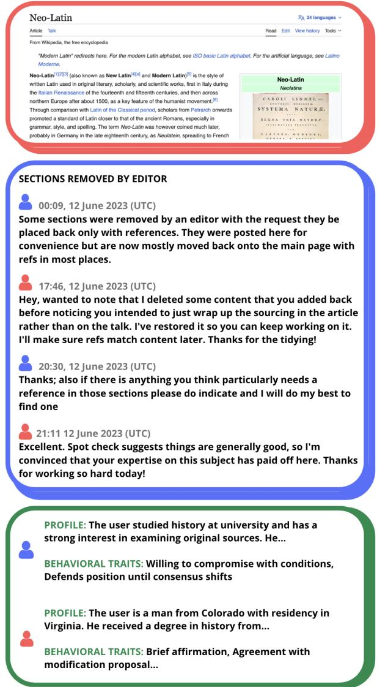  
Figure 1: Example from Wiki-Talkie with its three core components: article, thread, and persona.

Table 1 presents summary statistics of Wiki-Talkie across languages (full distributions in Appendix A.1.1). German contributes the largest portion (>42K threads, >134K turns), followed by French and English, while Spanish and Italian form smaller subsets. Despite differences in scale, structural characteristics are remarkably consistent across languages: threads contain on average 3.2– 3.6 turns and involve 2.1–2.3 unique users.5 Turn length varies more, ranging from 47.74 words (German) to 79.73 (Spanish), potentially reflecting differences in editorial culture or linguistic verbosity. High standard deviations across all metrics indicate substantial variability, consistent with discussions ranging from brief clarifications to extended debates. The number of unique users mirrors the thread distribution; further details on users and personas are in Appendix A.1.2.

## 3.1 Dataset Construction

Threads The threads contained in Wiki-Talkie are extracted from raw Wikipedia Talk page dumps.6 Wikipedia Talk pages are largely unstructured, making clean conversation extraction a challenging preprocessing task (Ferschke et al., 2012; Hua et al., 2018). We exploit standard conventions: MediaWiki heading syntax for topics, usernametimestamp signatures, and colon-based reply indentation, and handcrafted regular expressions to parse threads into flat sequential turns ordered by timestamps 7. To address extraction errors, we prompted the extractor model to revise threads by correcting turn boundaries and comment attributions, flagging irrecoverable cases for exclusion (prompt reported in Appendix C, Figure 10).

Persona Profiles For each unique user in the extracted threads, we fetched the corresponding Wikipedia user page via the MediaWiki API.8 User pages are optional personal spaces where editors describe themselves, their interests, expertise, and contributions. We prompted the extractor model to determine whether a page contained relevant biographical or self-descriptive content, excluding pages consisting solely of administrative templates or userboxes (prompt in Appendix C, Figure 15). For pages with substantive content, the model also generated a natural-language profile summarizing all available details, following recent work on LLM-based persona extraction (Zhang, 2024; Wu et al., 2025; Mansour et al., 2025). Because these are self-declared attributes from real users, the resulting personas avoid the stereotypical or synthetic quality of artificially constructed profiles and naturally incorporate sociodemographic aspects, making them valuable for evaluating how such factors influence agent behavior and biases. Alongside the profile, the model extracted predefined attributes in JSON format (e.g., primary editing topics, gender, profession) to support statistical analysis of user subgroups. Users with successfully generated profiles were subsampled to at most 10,000 per language, prioritizing presence of contribution topics, then gender (favoring women and non-binary users to counteract imbalance), then profession. Only threads where all participants belong to the selected subset were retained.

Persona Behavioral Traits From each user’s comments (across up to 50 randomly sampled threads), we extracted behavioral traits using the extractor model, characterizing each user along eight dimensions including (dis)agreement strategy and editing behavior. Each dimension is filled with closed response options only when sufficient evidence is available, accompanied by the model’s reasoning (prompts in Appendix C, Figures 11– 13). Unlike self-declared profiles, these traits are inferred from concrete interactions, making them especially useful for evaluating how behavioral conditioning shapes agent output. A manual quality audit of profiles and traits (faithfulness, coherence, privacy preservation) is reported in Appendix I.

Articles For each thread, the discussed Wikipedia article is retrieved via the MediaWiki API to provide conversational context, using the revision immediately preceding the first comment’s timestamp. This temporal alignment ensures the retrieved content reflects the article state when the discussion began.

Finally, all usernames are anonymized via deterministic hashing to prevent re-identification, and thread and article formatting is cleaned and normalized for consistency. Full details are in Appendix A.2.

## 4 Experimental Setting

Task Wiki-Talkie supports tasks including comment generation, summarization, and quality assessment. Here, we frame the task as next-turn generation: given the preceding comments in a thread, an agent is asked to generate the next comment in the role of the real user who authored it. We always condition on at least one preceding comment (i.e., the first turn is never generated from scratch), and prior context always consists of ground-truth comments. This task formulation was chosen deliberately to enable controlled, comparable evaluation across languages and conditioning strategies, resulting in over 100 experimental conditions (5 languages × 4 models × 5 conditioning methods). Although Wiki-Talkie supports evaluation along several dimensions—including coherence with context, factual grounding in the associated article, and fidelity to persona conditioning—here we focus on interaction behavior of agents.

<table><tr><td></td><td># Threads</td><td># Turns</td><td># Users</td><td>Turns/Thread</td><td>Turns/User</td><td>Turn Length</td><td>Users/Thread</td></tr><tr><td>de</td><td>38,711</td><td>123,520</td><td>6,282</td><td> $3 . 1 9 \pm 1 . 9 2$ </td><td> $1 9 . 9 3 \pm 5 3 . 9 3$ </td><td> $4 8 . 0 9 \pm 5 6 . 8 0$ </td><td> $2 . 1 1 \pm 0 . 3 5$ </td></tr><tr><td>en</td><td>17,645</td><td>59,537</td><td>4,580</td><td> $3 . 3 7 \pm 2 . 3 3$ </td><td> $1 3 . 1 9 \pm 4 0 . 0 1$ </td><td> $6 7 . 3 0 \pm 8 1 . 6 8$ </td><td> $2 . 0 6 \pm 0 . 2 4$ </td></tr><tr><td>es</td><td>5,229</td><td>17,019</td><td>2,307</td><td> $3 . 2 5 \pm 2 . 1 3$ </td><td> $7 . 5 5 \pm 1 9 . 4 1$ </td><td> $7 9 . 8 0 \pm 9 6 . 3 6$ </td><td> $2 . 1 4 \pm 0 . 4 2$ </td></tr><tr><td>fr</td><td>23,983</td><td>86,041</td><td>4,952</td><td> $3 . 5 9 \pm 2 . 3 7$ </td><td> $1 7 . 5 9 \pm 5 8 . 6 8$ </td><td> $6 6 . 3 2 \pm 7 9 . 5 6$ </td><td> $2 . 2 6 \pm 0 . 6 1$ </td></tr><tr><td>it</td><td>5,453</td><td>18,956</td><td>1,850</td><td> $3 . 4 8 \pm 2 . 3 5$ </td><td> $1 0 . 3 9 \pm 2 7 . 0 4$ </td><td> $6 6 . 0 0 \pm 8 4 . 4 3$ </td><td> $2 . 1 8 \pm 0 . 4 6$ </td></tr></table>

Table 1: Summary statistics of Wiki-Talkie ground-truth threads, turns, users, and average metrics (mean ± std).

Data To keep generation costs manageable, we experimented with a subsample of Wiki-Talkie. We selected threads involving users with at least six comments in the corpus, ensuring a minimum fivecomment history prior to the target comment. From these, we sampled up to 5,000 threads per language, maximizing the proportion of comments authored by females up to 50%. Summary statistics are presented in Appendix D.

Conditioning Methods We defined five conditioning methods to investigate how different types of persona information shape agent behavior in interactions: i) base role-play, where the agent is instructed that it is a Wikipedia editor with no additional information; ii) profile, where the agent is provided with the self-reported profile (gender, age, profession, etc.) of the user who produced the target comment; iii) behavior, where the agent is provided with the user’s behavioral traits; iv) behavior+r, same as behavior but including the extractor model’s reasoning; v) history, where the agent is provided with 5-20 comments by the same user (randomly sampled if more are available), enabling indirect conditioning through stylistic and behavioral patterns in prior contributions. The prompts for each method are provided in Appendix C, Figures 14, 15, 16, 17.

Models We run experiments with four state-ofthe-art models spanning both open-source and proprietary systems: Model A (proprietary), Model B, Model C, and Model D (open-weights).9 All four are widely-used frontier LLMs at the top of their respective open-weights and proprietary classes at the time of writing, chosen to ensure that our findings reflect the behavior of strong, competitive systems rather than artifacts of weak models. Implementation and generation details are provided in Appendix E.

Evaluation Metrics We report text similarity via ROUGE-L (Lin, 2004) for surface lexical overlap and BERTScore (Zhang et al., 2020) for semantic similarity, both raw and rescaled against a baseline (rBERT) as recommended.10 Since generation is open-ended, these are coarse reference points rather than primary criteria.

Our primary focus is interactional behavior. We extract dialogue acts using the taxonomy of Ferschke et al. (2012), developed for Wikipedia Talk pages, considering 10 acts: CRITIQUE, REQUEST, REFERENCE, COMMIT, REPORT, INFORM, ASK, POSITIVE, NEGATIVE, and PARTIAL.11 Both human and agent comments are annotated with the extractor model as LLM annotator (prompt in Appendix C, Figure 12), which achieves 0.76 F1 against human judgment (Appendix F). Each comment can carry one or multiple acts. We additionally assess overall response tone via sentiment prediction on both human and agent comments.12

All metrics are computed at the dataset level. BERTScore and ROUGE-L are averaged over all output-reference pairs. Sentiment and dialogue act distributions are compared via Wasserstein Distance (WD; Panaretos and Zemel, 2019) and

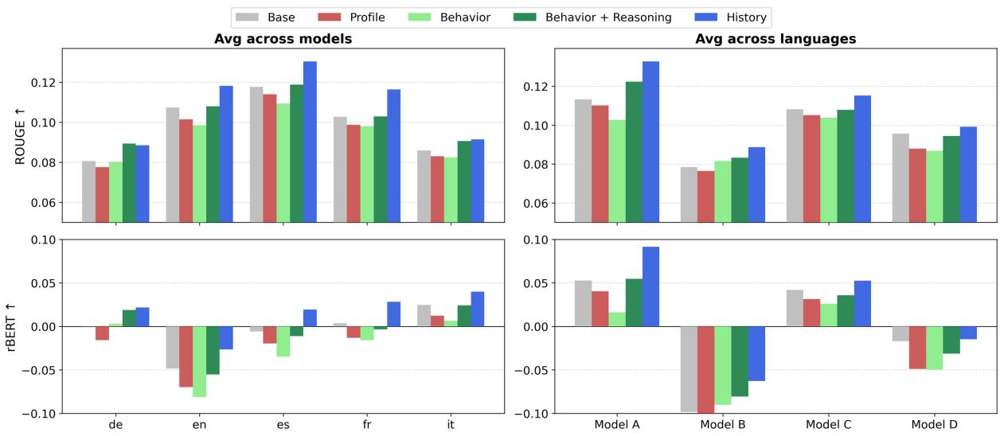  
Figure 2: ROUGE-L and rescaled BERTScore between humans and agents across the five conditioning methods. Left: averages across models for each language. Right: averages across languages for each model.

Jensen-Shannon Divergence (JSD; Menéndez et al., 1997), reflecting the ordinal nature of sentiment and the nominal nature of acts. This aggregate perspective targets population fidelity—whether agents collectively reproduce distributional behavioral tendencies—rather than individual-level persona fidelity. ROUGE-L and BERTScore are computed at the instance level against each target user’s ground-truth response and then averaged across the dataset.

## 5 Results

## 5.1 Text Similarity

Figure 2 shows ROUGE-L and rBERT scores averaged across models and languages; full results, including average comment length and raw BERTScore (which remains stable across setups, ∼0.84–0.85, and is thus less informative), are in Appendix G, Tables 11–12. While our primary target is population fidelity (Section 4), these instancelevel metrics provide a complementary individuallevel signal.

ROUGE-L scores never exceed 0.154. While low in absolute terms, this is expected given the open-ended nature of the task, where the space of plausible responses is virtually unbounded; scores are thus best read as relative measures. rBERT hovers around zero, indicating that agent-human similarity is broadly comparable to random sentencehuman pairs, further confirming the difficulty of the task.

Across both languages and models, history consistently yields the highest similarity, with

ROUGE-L up to 0.154 (Model A in es) and rBERT up to 0.105 (Model A in de). behavior+r is the second most effective, with consistent gains over base (e.g., ROUGE-L up to 0.138 for Model A in es; rBERT up to 0.085 for Model A in de). By contrast, profile generally degrades similarity relative to base (e.g., rBERT drops on average from 0.053 to 0.040 for Model A, and from −0.017 to −0.049 for Model D), likely because prompting agents to reflect persona traits leads them to incorporate non-relevant details, producing longer and more elaborated responses without improving content alignment. Indeed, agent comments are consistently longer than human comments across all conditions (Appendix G). behavior similarly fails to improve similarity for most models and languages, with only modest gains in some cases (e.g., Model B’s ROUGE-L from 0.078 to 0.082).

Cross-lingually, ROUGE-L scores are consistently higher for es and en than for de and it, partially mirroring human comment length: longer reference texts provide richer surface for lexical overlap. rBERT trends are less pronounced; en falls slightly below the others, largely driven by Model B’s particularly low English scores.

Overall, concrete demonstrations—through comment histories (history) or behavioral traits paired with reasoning (behavior+r)—are more effective than abstract descriptions (behavior) and sociodemographic information (profile) at steering agent output toward human-like text. This is the dominant pattern across models and languages, while cross-lingual differences remain small, though we note that all five languages are high-resource and European. The consistency is nonetheless non-trivial given that they span two language families and differ in Wikipedia community size and editorial norms.

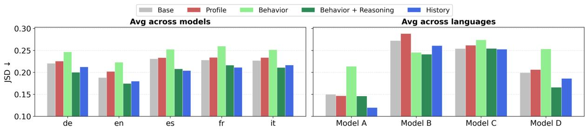  
Figure 3: JSD between human and agent dialog act distributions across conditioning methods. Left: averages across models for each language. Right: averages across languages for each model.

## 5.2 Interaction Behavior

In the following we discuss evaluation of behavioral patterns through dialog act JSD and sentiment WD; detailed scores are reported in Appendix G, Tables 13 and 14.

Acts JSD. Figure 3 presents average JSD scores aggregated across models (left) and languages (right). Scores range between 0.1 and 0.3, indicating only moderate divergence between human and agent dialogue act distributions. history is the strongest method, achieving the lowest JSD overall (0.085 for Model A in en). behavior+r is second, with consistent gains over base (e.g., Model B: 0.272 → 0.241; Model D: 0.199 → 0.166). By contrast, behavior is the weakest, increasing JSD across most models and languages (except Model B, where it improves over base, 0.272 → 0.245). profile yields only marginal effects, with gains limited to Model A (0.150 → 0.147). These trends are broadly consistent across languages, though en achieves the lowest average JSD throughout (e.g., 0.188 under base, 0.175 under behavior+r), likely reflecting English-centric pretraining. Cross-lingual differences, however, remain marginal.

Overall, these results reinforce the pattern observed for text similarity: concrete behavioral demonstrations (history, behavior+r) are consistently more effective than abstract descriptions or sociodemographic factors (behavior, profile) at aligning agent behavior with human distributions, echoing the well-established advantage of few-shot over zero-shot conditioning (Brown et al., 2020).

One might wonder whether this gap reflects a difference in information type or simply in information quantity, since history provides 5–20 raw comments while profile and behavior supply compressed summaries. We address this concern in Appendix H, where we show that performance under profile does not improve consistently with profile length: ROUGE-L and rBERT are flat, and where acts and sentiment JSD change, they mostly worsen with longer profiles. Combined with the observation that profile degrades performance relative to base despite adding tokens, this argues against a pure context-budget explanation and supports our interpretation that the operative factor is information type, not quantity.

Per-act differences To assess whether divergences concentrate on specific labels, we analyze per-label proportion differences (δ) between human and agent distributions, where positive values indicate human over-production and negative values indicate agent over-production. Figure 4 shows differences averaged across languages, omitting acts with negligible variation (ASK, CRITIQUE, POSITIVE, PARTIAL). Differences are computed between proportions rather than raw counts to account for lower act density in agent comments (Appendix G). Full breakdowns are in Tables 13–14.

Agents systematically over-produce REQUEST (up to δ = −0.177 for Model C in de on behavior) and COMMIT (up to δ = −0.108 for Model D in fr on behavior), while humans produce more RE-PORT (δ = 0.088 for Model C in fr on behavior). Together, this suggests that agents tend to operate by requesting and committing to changes, yet report fewer actions already undertaken. INFORM is under-produced by agents across most models, possibly reflecting insufficient factual grounding (Model A and Model D diverge in some methods). REFERENCE shows a model-dependent pattern. NEGATIVE is consistently under-produced (δ from 0.020 to 0.104), consistent with sycophantic tendencies of LLMs (Malmqvist, 2025). Overall, the most systematic biases concern operativity (over-production of REQUEST, COMMIT) and negativity (under-production of NEGATIVE, REPORT), pointing to a consistent tendency for agents to be more action-oriented and less confrontational than humans.

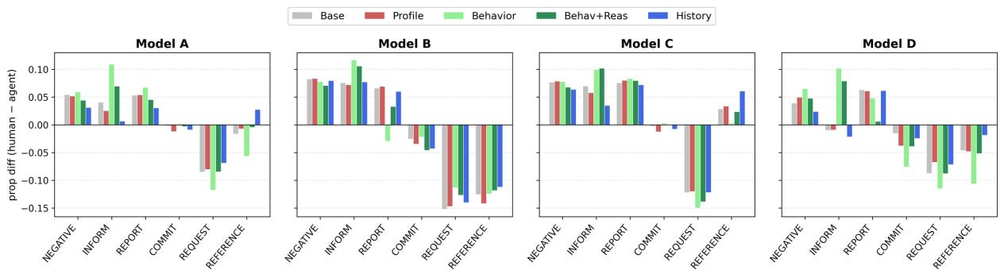  
Figure 4: Proportion difference between human and agent dialog acts. Positive values indicate human overproduction; negative values indicate agent over-production. Differences are averaged across languages.

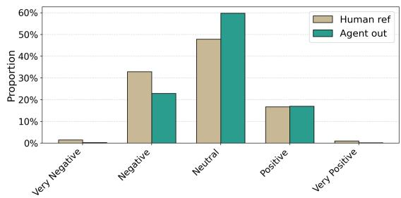  
Figure 5: Distribution of sentiment scores for human and agent (Model A under history) comments for en.

Per-act differences by gender To examine whether agents reproduce dialog act trends equitably across genders, we analyze per-label proportion differences split by gender for two models with contrasting alignment levels (Model A, higher; Model B, lower) and two languages with similar contrast (English, higher; French, lower), under history (best overall), profile (the only method with explicit gender), and base as reference. Differences are shown in Appendix G, Figure 18. Trends are consistent across genders for all labels and methods. Crucially, profile does not behave systematically differently from base or history, indicating that explicit gender conditioning neither amplifies nor reduces gender disparities in dialog act profiles.

Sentiment Sentiment alignment broadly mirrors the dialog act trends: history yields the best alignment (minimum WD 0.097 for Model C in en), followed by behavior+r (0.168 in en). Across languages, en shows the lowest WD (0.315 on average under base) and es the highest (0.452), consistently across methods. As shown in Figure 5 for Model A under history, agent responses rarely exhibit sentiment extremes (very positive or very negative) and contain fewer negative comments than humans, consistent with their lower rate of NEG-ATIVE acts. These patterns hold across models, conditioning methods, and languages (Appendix G, Figure 19). Overall, sentiment converges with the broader finding that agents tend to avoid negative or confrontational content across all conditioning methods.

## 6 Conclusions

We introduced Wiki-Talkie, a multilingual dataset derived from Wikipedia Talk pages to evaluate agent interactions across five languages, using four state-of-the-art LLMs under different persona conditioning strategies. Our evaluation targets population fidelity—whether agents collectively reproduce the distributional behavioral patterns of human communities—complemented by instancelevel text similarity metrics. Our experiments show that grounding agents with concrete comment examples consistently outperforms abstract persona descriptions across all languages. Notably, sociodemographic information can degrade agent performance, an encouraging finding for privacypreserving applications. In addition, agents are consistently more action-oriented and less confrontational than humans, revealing a bias toward agreeableness and avoidance of extremes. Cross-lingual differences remain small, with English showing only slightly greater alignment. Overall, these results underscore both the promise and limitations of persona-conditioned generation, motivating further research into more effective simulation strategies. While we focused on next-turn generation to enable controlled comparison across a large experimental space, Wiki-Talkie is designed to support richer evaluation settings, including multi-turn generation, summarization, factual grounding assessment, and quality evaluation, all of which we encourage the community to explore.

## Limitations

Dataset Construction Despite our multi-stage extraction and revision pipeline, some residual noise remains in Wiki-Talkie, including occasional misattributed comments, imperfect comment boundaries, and formatting artifacts not fully resolved during preprocessing Such noise is inevitable at this scale and is unlikely to substantially affect evaluation or analysis.

Language Coverage Wiki-Talkie currently covers five European languages (English, German, Spanish, French, and Italian), limiting its cultural and linguistic diversity. While these languages span two distinct families (Romance and Germanic) and vary in Wikipedia community size and editorial norms, they are all high-resource; findings may not generalize to language communities with different writing systems, discourse conventions, or editorial practices. Future work should extend Wiki-Talkie to additional languages, particularly those underrepresented in NLP research. The dataset construction pipeline and evaluation framework are fully language-agnostic and straightforwardly extensible to lower-resource and non-European languages.

Dataset Richness The richness and consistency of user personas vary considerably within and across languages. Some profiles contain detailed self-reported attributes, while others are sparse. English is generally better represented in both quantity and quality, meaning persona conditioning experiments may be more reliable for English than for other languages. Moreover, despite subsampling to increase the representation of women and nonbinary users, the dataset remains gender-skewed, which may affect the robustness of gender-based analyses.

Persona Conditioning Our experiments focus exclusively on prompting-based persona conditioning, leaving alternative approaches to future work, such as fine-tuning (e.g., Thakur et al., 2024;

Takayama et al., 2025), retrieval-augmented conditioning (e.g., Huang et al., 2023; Salemi et al., 2024), or embedding-based persona representations (e.g, Liu et al., 2025b).

Information Density across Conditioning Methods Our conditioning methods are not strictly matched on information density: history provides 5–20 raw comments, while profile and behavior supply compressed summaries. We probe this confound in Appendix H by stratifying profile performance by profile length and find no consistent improvement with profile length across four metrics, supporting an information-type rather than information-quantity interpretation. We did not perform the analogous analysis for history length because the conditioning pool is concentrated in the 16–20 comment range, leaving lower-comment buckets too sparse to support a meaningful comparison. A fully matched ablation—e.g., comparing history against equally long synthetic summaries distilled from the same comments—remains a direction for future work.

Scope of Persona Representations Our profiles and behavioral traits are produced by a single anonymized extractor model and a specific prompting design. A manual audit (Appendix I) indicates that these representations are largely faithful and well-grounded, with imprecisions limited to isolated factual details. Nonetheless, our findings about profile and behavior should be read as conclusions about sociodemographic and behavioral descriptors as we generated them, rather than as universal claims about all possible persona representations. Alternative summarization strategies, richer attribute schemas, or different extractor models could in principle yield different results.

Evaluation Scope Our primary evaluation target is population fidelity—whether agents collectively reproduce the distributional behavioral patterns observed in human discussions—rather than individual-level persona fidelity, i.e., whether each generated response faithfully reflects the specific persona provided. This choice is principled: individual-level fidelity risks enabling faithful simulation of specific individuals, raising ethical concerns around impersonation and lack of consent (Desai et al., 2025), while population fidelity is more tractable and more relevant for applications such as community simulation and policy analysis, in line with recent work advocating populationlevel evaluation of persona-based agents (Mansour et al., 2025; Fawaz et al., 2026; Rupprecht et al., 2025). Assessing fine-grained individual-level persona consistency remains a direction for future work.

## Ethic Statement

## Privacy, Data Protection, and Contextual Integrity

Wiki-Talkie is derived from Wikipedia dumps, released under a Creative Commons Attribution-ShareAlike 4.0 license. While publicly accessible, we recognize that contributors may reasonably expect their comments to be archived for research purposes but not necessarily used for personaconditioned simulation. Accordingly, we treat this dataset as human-derived data requiring safeguards beyond copyright compliance, guided by the principles of data minimization, proportionality, contextual integrity, and harm reduction.

Dataset Construction and Anonymization The dataset does not contain original user pages verbatim. Instead, we generated neutral, naturallanguage re-elaborations summarizing publicly stated interests and interactional patterns, deliberately omitting usernames, real names, contact information, and external links. This process inherently introduces a layer of abstraction: the resulting profiles are approximate characterizations that may diverge from the original content through omission, rephrasing, or occasional inaccuracy. While this means profiles should not be treated as ground-truth descriptions of actual persons, we acknowledge that the same process may occasionally introduce erroneous attributes, including sensitive ones. We sought to mitigate this risk through manual inspection of a random sample of outputs (see Appendix I).

Usernames are replaced using salted cryptographic hashing, where the salt is stored separately from the dataset and is accessible only to the principal investigator, preventing straightforward reversal or precomputation attacks (see Appendix A.2). Within comment text, we also anonymized mentions of third-party usernames to the extent possible. However, a residual risk remains where usernames appear in non-standard forms or where real names are mentioned in conversation.

Re-Identification Risk and Access Control Complete anonymity cannot be guaranteed when working with public textual data. While salted hashing prevents trivial username reconstruction, a content-based re-identification risk exists: because Wikipedia discussions are publicly archived and indexed, motivated individuals could potentially identify original authors via distinctive phrases or search queries. Our dataset does not introduce new exposure beyond what is already publicly accessible, but we recognize that aggregation and structuring may lower the cost of such searches.

To mitigate these risks, the dataset is released under the CC BY-SA 4.0 license, inherited from the underlying Wikipedia-derived content. Rather than hosting an open public mirror, we distribute it through a lightweight access request in which prospective users identify themselves and their intended use. This provides an audit trail and a point of contact while raising the effort required for indiscriminate bulk access. As a matter of research norms rather than a binding condition, we ask that recipients not attempt to de-anonymize contributors, not use the data to impersonate or manipulate editorial processes, and work from the most recent release.

We provide a dedicated contact address for individuals who wish to request removal of their data. Upon verification, corresponding entries are added to a blocklist and removed in subsequent releases. Our goal is risk mitigation rather than elimination, and we consider the residual risk proportionate to the scientific value of studying collaborative online deliberation at scale.

Informed Consent Individual informed consent was not sought, as contributions to Wikipedia are made under the CC BY-SA license and the Wikimedia Foundation’s Terms of Use, which explicitly permit reuse and derivative works. This is consistent with established practice in NLP research on Wikipedia-derived data (Ferschke et al., 2012; Hua et al., 2018), and the scale of contributors makes individual consent infeasible. Nevertheless, we recognize that licensing permissibility does not fully resolve the ethical tension between contributors original communicative intent and downstream research applications; we address this gap through the layered safeguards described above.

Harmful or Sensitive Content Wikipedia Talk pages may occasionally contain harassment, conflictual exchanges, or incidental personal disclosures. We do not seek to amplify or foreground such content; the dataset is designed to analyze aggregate interaction patterns in collaborative environments, not for reputational analysis of specific contributors. We did not apply active content filtering in order to preserve the ecological validity of the discussions. Access restrictions are intended to further prevent misuse or amplification of harmful material.

## Experimental Ethics and Persona Conditioning

The objective of this research is not to recreate, approximate, or impersonate specific individuals. Persona-conditioned agents are stochastic constructs derived from coarse behavioral summaries, used solely to examine population-level dynamics in simulated group discussions. Although individual-level conditioning is methodologically necessary to capture heterogeneity in interaction styles, all evaluation and reporting are conducted at the aggregate level. We do not evaluate model fidelity to specific users, publish individual outputs, or claim to model the beliefs, intentions, or identities of real contributors.

We recognize that repurposing public discourse for AI research raises novel ethical questions concerning digital representation and contextual integrity. Our ethical justification rests on proportionality: the scientific value of understanding large-scale collaborative behavior, combined with layered safeguards (anonymization, profile re-elaboration, controlled access, opt-out mechanisms), outweighs the residual and mitigated risks.

## References

Lisa P. Argyle, Ethan C. Busby, Nancy Fulda, Joshua R. Gubler, Christopher Rytting, and David Wingate. 2023. Out of one, many: Using language models to simulate human samples. Political Analysis, 31(3):337–351.

Tom Brown, Benjamin Mann, Nick Ryder, Melanie Subbiah, Jared D Kaplan, Prafulla Dhariwal, Arvind Neelakantan, Pranav Shyam, Girish Sastry, Amanda Askell, Sandhini Agarwal, Ariel Herbert-Voss, Gretchen Krueger, Tom Henighan, Rewon Child, Aditya Ramesh, Daniel Ziegler, Jeffrey Wu, Clemens Winter, and 12 others. 2020. Language models are few-shot learners. In Advances in Neural Information Processing Systems, volume 33, pages 1877–1901. Curran Associates, Inc.

Benjamin Cabrera, Björn Ross, Marielle Dado, and Maritta Heisel. 2018. The gender gap in wikipedia talk pages. Proceedings of the International AAAI Conference on Web and Social Media, 12(1).

Noé Cécillon, Vincent Labatut, Richard Dufour, and Georges Linarès. 2020. WAC: A corpus of Wikipedia conversations for online abuse detection. In Proceed ings ofthe Twelfth Language Resources and Evaluation Conference, pages 1382–1390, Marseille, France. European Language Resources Association.

Yirong Chen, Weiquan Fan, Xiaofen Xing, Jianxin Pang, Minlie Huang, Wenjing Han, Qianfeng Tie, and Xiangmin Xu. 2022. CPED: A large-scale chinese personalized and emotional dialogue dataset for conversational ai. arXiv preprint arXiv:2205.14727.

Smit Desai, Mateusz Dubiel, Nima Zargham, Thomas Mildner, and Laura Spillner. 2025. Personas evolved: Designing ethical LLM-based conversational agent personalities. In Proceedings of the 7th ACM Conference on Conversational User Interfaces (CUI ’25). ACM.

Kassem Fawaz, Ran Yi, Octavian Suciu, Ritesh Khandelwal, Hamza Harkous, Nina Taft, and Marco Gruteser. 2026. Text-based personas for simulating user privacy decisions. Preprint, arXiv:2603.19791.

Oliver Ferschke, Iryna Gurevych, and Yevgen Chebotar. 2012. Behind the article: Recognizing dialog acts in Wikipedia talk pages. In Proceedings ofthe 13th Conference of the European Chapter of the Association for Computational Linguistics, pages 777–786, Avignon, France. Association for Computational Linguistics.

Yiqing Hua, Cristian Danescu-Niculescu-Mizil, Dario Taraborelli, Nithum Thain, Jeffery Sorensen, and Lucas Dixon. 2018. WikiConv: A corpus of the complete conversational history of a large online collaborative community. In Proceedings ofthe 2018 Conference on Empirical Methods in Natural Language Processing, pages 2818–2823, Brussels, Belgium. Association for Computational Linguistics.

Qiushi Huang, Shuai Fu, Xubo Liu, Wenwu Wang, Tom Ko, Yu Zhang, and Lilian Tang. 2023. Learning retrieval augmentation for personalized dialogue generation. In Proceedings ofthe 2023 Conference on Empirical Methods in Natural Language Processing, pages 2523–2540, Singapore. Association for Computational Linguistics.

Kokil Jaidka, Andrea Ceolin, Iknoor Singh, Niyati Chhaya, and Lyle Ungar. 2021. WikiTalkEdit: A dataset for modeling editors’ behaviors on Wikipedia. In Proceedings ofthe 2021 Conference ofthe North American Chapter of the Association for Computational Linguistics: Human Language Technologies, pages 2191–2200, Online. Association for Computational Linguistics.

Yoonna Jang, Jungwoo Lim, Yuna Hur, Dongsuk Oh, Suhyune Son, Yeonsoo Lee, Donghoon Shin, Seungryong Kim, and Heuiseok Lim. 2022. Call for customized conversation: Customized conversation grounding persona and knowledge. In AAAI-22 Technical Tracks 10, Proceedings of the 36th AAAI Conference on Artificial Intelligence, AAAI 2022, pages 10803–10812. Association for the Advancement of Artificial Intelligence. Publisher Copyright: Copyright © 2022, Association for the Advancement of Artificial Intelligence (www.aaai.org). All rights reserved.; 36th AAAI Conference on Artificial Intelligence, AAAI 2022 ; Conference date: 22-02-2022 Through 01-03-2022.

Isaac Johnson, Lucie-Aimée Kaffee, and Miriam Redi. 2024. Wikimedia data for AI: a review of wikimedia datasets for NLP tasks and AI-assisted editing. In Proceedings ofthe First Workshop on Advancing Natural Language Processingfor Wikipedia, pages 91–101, Miami, Florida, USA. Association for Computational Linguistics.

Vanja Mladen Karan and Jan Šnajder. 2019. Preemptive toxic language detection in Wikipedia comments using thread-level context. In Proceedings ofthe Third Workshop on Abusive Language Online, pages 129– 134, Florence, Italy. Association for Computational Linguistics.

Zihao Li, Yucheng Shi, Zirui Liu, Fan Yang, Ali Payani, Ninghao Liu, and Mengnan Du. 2025. Language ranker: A metric for quantifying llm performance across high and low-resource languages. In Proceedings of the Thirty-Ninth AAAI Conference on Artificial Intelligence (AAAI-25), pages 28186–28194. AAAI Press. AAAI’25/IAAI’25/EAAI’25 Proceedings.

Chin-Yew Lin. 2004. ROUGE: A package for automatic evaluation of summaries. In Text Summarization Branches Out, pages 74–81, Barcelona, Spain. Association for Computational Linguistics.

Zhaojiang Lin, Zihan Liu, Genta Indra Winata, Samuel Cahyawijaya, Andrea Madotto, Yejin Bang, Etsuko Ishii, and Pascale Fung. 2021. XPersona: Evaluating multilingual personalized chatbot. In Proceedings

of the 3rd Workshop on Natural Language Processing for Conversational AI, pages 102–112, Online. Association for Computational Linguistics.

Dongshuo Liu, Zhijing Wu, Dandan Song, and Heyan Huang. 2025a. A persona-aware LLM-enhanced framework for multi-session personalized dialogue generation. In Findings ofthe Associationfor Computational Linguistics: ACL 2025, pages 103–123, Vienna, Austria. Association for Computational Linguistics.

Jiongnan Liu, Yutao Zhu, Shuting Wang, Xiaochi Wei, Erxue Min, Yu Lu, Shuaiqiang Wang, Dawei Yin, and Zhicheng Dou. 2025b. LLMs + persona-plug = personalized LLMs. In Proceedings of the 63rd Annual Meeting of the Association for Computational Linguistics (Volume 1: Long Papers), pages 9373–9385, Vienna, Austria. Association for Computational Linguistics.

Ehsan Lotfi, Maxime De Bruyn, Jeska Buhmann, and Walter Daelemans. 2023. PersonalityChat: Conversation distillation for personalized dialog modeling with facts and traits. In Proceedings of the Third Workshop on Natural Language Generation, Evaluation, and Metrics (GEM), pages 353–371, Singapore. Association for Computational Linguistics.

Lars Malmqvist. 2025. Sycophancy in large language models: Causes and mitigations. In Intelligent Computing, pages 61–74, Cham. Springer Nature Switzerland.

Saab Mansour, Leonardo Perelli, Lorenzo Mainetti, George Davidson, and Stefano D’Amato. 2025. PAARS: Persona aligned agentic retail shoppers. In Proceedings of the 1st Workshop for Research on Agent Language Models (REALM 2025), pages 143– 159, Vienna, Austria. Association for Computational Linguistics.

M.L. Menéndez, J.A. Pardo, L. Pardo, and M.C. Pardo. 1997. The jensen-shannon divergence. Journal of the Franklin Institute, 334(2):307–318.

Daniela Occhipinti, Serra Sinem Tekiroglu, and Marco˘ Guerini. 2024. PRODIGy: a PROfile-based DIalogue generation dataset. In Findings of the Association for Computational Linguistics: NAACL 2024, pages 3500–3514, Mexico City, Mexico. Association for Computational Linguistics.

Matthias Orlikowski, Jiaxin Pei, Paul Röttger, Philipp Cimiano, David Jurgens, and Dirk Hovy. 2025. Beyond demographics: Fine-tuning large language models to predict individuals’ subjective text perceptions. In Proceedings of the 63rd Annual Meeting of the Association for Computational Linguistics (Volume 1: Long Papers), pages 2092–2111, Vienna, Austria. Association for Computational Linguistics.

Victor M. Panaretos and Yoav Zemel. 2019. Statistical aspects of wasserstein distances. Annual Review of Statistics and Its Application, 6(1):405–431.

Minju Park, Sojung Kim, Seunghyun Lee, Soonwoo Kwon, and Kyuseok Kim. 2024. Empowering personalized learning through a conversation-based tutoring system with student modeling. In Extended Abstracts ofthe CHI Conference on Human Factors in Computing Systems, CHI EA ’24, New York, NY, USA. Association for Computing Machinery.

Vinodkumar Prabhakaran and Owen Rambow. 2016. A corpus of Wikipedia discussions: Over the years, with topic, power and gender labels. In Proceedings of the Tenth International Conference on Language Resources and Evaluation (LREC’16), pages 2034–2038, Portorož, Slovenia. European Language Resources Association (ELRA).

Jonas Rupprecht, Leon Fröhling, Claudia Wagner, and Markus Strohmaier. 2025. German general personas: A survey-derived persona prompt collection for population-aligned LLM studies. Preprint, arXiv:2511.21722.

Alireza Salemi, Sheshera Mysore, Michael Bendersky, and Hamed Zamani. 2024. LaMP: When large language models meet personalization. In Proceedings of the 62nd Annual Meeting of the Association for Computational Linguistics (Volume 1: Long Papers), pages 7370–7392, Bangkok, Thailand. Association for Computational Linguistics.

Shibani Santurkar, Esin Durmus, Faisal Ladhak, Cinoo Lee, Percy Liang, and Tatsunori Hashimoto. 2023. Whose opinions do language models reflect? In Proceedings ofthe 40th International Conference on Machine Learning (ICML). PMLR.

John R. Searle. 1969. Speech Acts: An Essay in the Philosophy of Language. Cambridge University Press, Cambridge, UK.

Murray Shanahan, Kyle McDonell, and Laria Reynolds. 2023. Role play with large language models. Nature, 623:493–498.

Eric Michael Smith, Mary Williamson, Kurt Shuster, Jason Weston, and Y-Lan Boureau. 2020. Can you put it all together: Evaluating conversational agents ability to blend skills. In Proceedings of the 58th Annual Meeting ofthe Associationfor Computational Linguistics, pages 2021–2030, Online. Association for Computational Linguistics.

Junya Takayama, Masaya Ohagi, Tomoya Mizumoto, and Katsumasa Yoshikawa. 2025. Persona-consistent dialogue generation via pseudo preference tuning. In Proceedings ofthe 31st International Conference on Computational Linguistics, pages 5507–5514, Abu Dhabi, UAE. Association for Computational Linguistics.

Himanshu Thakur, Eshani Agrawal, and Smruthi Mukund. 2024. Personas within parameters: Finetuning small language models with low-rank adapters to mimic user behaviors. In Adaptive Foundation Models: Evolving AIfor Personalized and Efficient Learning.

Yu-Min Tseng, Yu-Chao Huang, Teng-Yun Hsiao, Wei-Lin Chen, Chao-Wei Huang, Yu Meng, and Yun-Nung Chen. 2024. Two tales of persona in LLMs: A survey of role-playing and personalization. In Findings ofthe Associationfor Computational Linguistics: EMNLP 2024, pages 16612–16631, Miami, Florida, USA. Association for Computational Linguistics.

Lu Wang and Claire Cardie. 2014. A piece of my mind: A sentiment analysis approach for online dispute detection. In Proceedings of the 52nd Annual Meeting of the Association for Computational Linguistics (Volume 2: Short Papers), pages 693–699, Baltimore, Maryland. Association for Computational Linguistics.

Shenghan Wu, Yimo Zhu, Wynne Hsu, Mong-Li Lee, and Yang Deng. 2025. From personas to talks: Revisiting the impact of personas on LLM-synthesized emotional support conversations. In Proceedings of the 2025 Conference on Empirical Methods in Natural Language Processing, pages 5439–5453, Suzhou, China. Association for Computational Linguistics.

Yuwei Wu, Xuezhe Ma, and Diyi Yang. 2021. Personalized response generation via generative split memory network. In Proceedings ofthe 2021 Conference of the North American Chapter ofthe Associationfor Computational Linguistics: Human Language Technologies, pages 1956–1970, Online. Association for Computational Linguistics.

Ellery Wulczyn, Nithum Thain, and Lucas Dixon. 2017. Ex machina: Personal attacks seen at scale. In Proceedings of the 26th International Conference on World Wide Web, WWW ’17, page 1391–1399, Republic and Canton of Geneva, CHE. International World Wide Web Conferences Steering Committee.

Jing Xu, Arthur Szlam, and Jason Weston. 2022a. Beyond goldfish memory: Long-term open-domain conversation. In Proceedings ofthe 60th Annual Meeting ofthe Associationfor Computational Linguistics (Volume 1: Long Papers), pages 5180–5197, Dublin, Ireland. Association for Computational Linguistics.

Xinchao Xu, Zhibin Gou, Wenquan Wu, Zheng-Yu Niu, Hua Wu, Haifeng Wang, and Shihang Wang. 2022b. Long time no see! open-domain conversation with long-term persona memory. In Findings of the Association for Computational Linguistics: ACL 2022, pages 2639–2650, Dublin, Ireland. Association for Computational Linguistics.

Weihao Xuan, Rui Yang, Heli Qi, Qingcheng Zeng, Yunze Xiao, Aosong Feng, Dairui Liu, Yun Xing, Junjue Wang, Fan Gao, Jinghui Lu, Yuang Jiang, Huitao Li, Xin Li, Kunyu Yu, Ruihai Dong, Shangding Gu, Yuekang Li, Xiaofei Xie, and 13 others. 2025. MMLU-ProX: A multilingual benchmark for advanced large language model evaluation. In Proceedings ofthe 2025 Conference on Empirical Methods in Natural Language Processing, pages 1513–1532, Suzhou, China. Association for Computational Linguistics.

Sanae Yamashita, Koji Inoue, Ao Guo, Shota Mochizuki, Tatsuya Kawahara, and Ryuichiro Higashinaka. 2023. RealPersonaChat: A realistic persona chat corpus with interlocutors’ own personalities. In Proceedings of the 37th Pacific Asia Conference on Language, Information and Computation, pages 852–861, Hong Kong, China. Association for Computational Linguistics.

Jiarui Zhang. 2024. Guided profile generation improves personalization with large language models. In Findings of the Association for Computational Linguistics: EMNLP 2024, pages 4005–4016, Miami, Florida, USA. Association for Computational Linguistics.

Justine Zhang, Jonathan Chang, Cristian Danescu-Niculescu-Mizil, Lucas Dixon, Yiqing Hua, Dario Taraborelli, and Nithum Thain. 2018a. Conversations gone awry: Detecting early signs of conversational failure. In Proceedings of the 56th Annual Meeting of the Associationfor Computational Linguistics (Volume 1: Long Papers), pages 1350–1361, Melbourne, Australia. Association for Computational Linguistics.

Saizheng Zhang, Emily Dinan, Jack Urbanek, Arthur Szlam, Douwe Kiela, and Jason Weston. 2018b. Personalizing dialogue agents: I have a dog, do you have pets too? In Proceedings of the 56th Annual Meeting of the Association for Computational Linguistics (Volume 1: Long Papers), pages 2204–2213, Melbourne, Australia. Association for Computational Linguistics.

Tianyi Zhang, Varsha Kishore, Felix Wu, Kilian Q. Weinberger, and Yoav Artzi. 2020. Bertscore: Evaluating text generation with BERT. In 8th International Conference on Learning Representations, ICLR 2020, Addis Ababa, Ethiopia, April 26-30, 2020. OpenReview.net.

Zheng Zhao, Clara Vania, Subhradeep Kayal, Naila Khan, Shay B Cohen, and Emine Yilmaz. 2025. PersonaLens: A benchmark for personalization evaluation in conversational AI assistants. In Findings of the Associationfor Computational Linguistics: ACL 2025, pages 18023–18055, Vienna, Austria. Association for Computational Linguistics.

Yinhe Zheng, Guanyi Chen, Minlie Huang, Song Liu, and Xuan Zhu. 2020. Personalized dialogue generation with diversified traits. Preprint, arXiv:1901.09672.

## A Further Wiki-Talkie Details

## A.1 Statistics

## A.1.1 Distributions

Figure 6 shows the distributions of the number of words per turn, turns per user, turns per thread, and users per thread across the five languages. These statistical properties exhibit remarkably consistent patterns across languages, suggesting that the conversational dynamics of the dataset are largely language-agnostic.

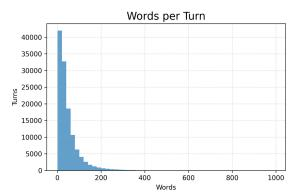

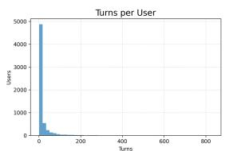

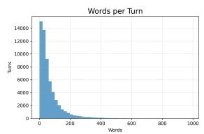

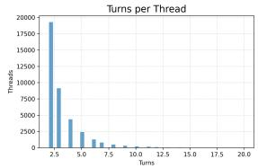

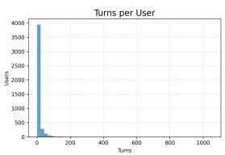

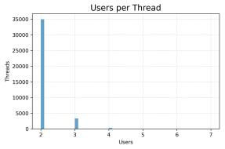  
(a) de

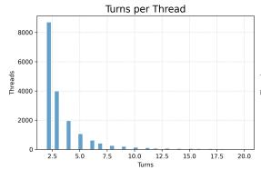

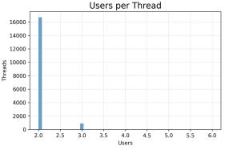  
(b) en

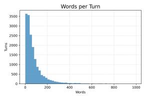

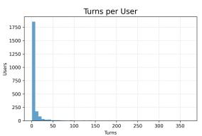

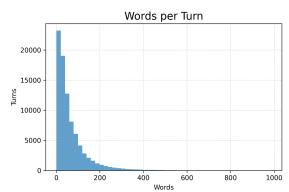

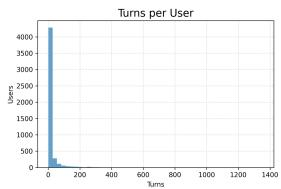

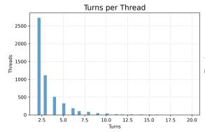

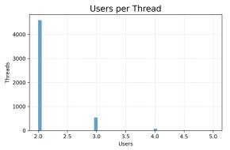  
(c) es

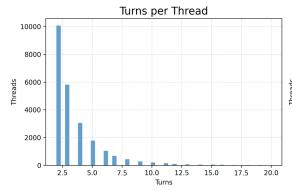

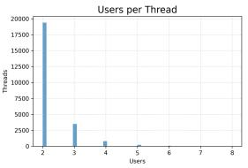  
(d) fr

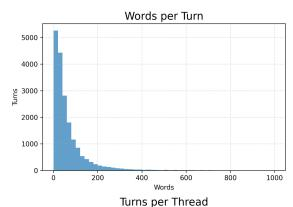

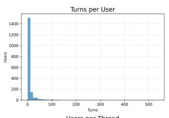

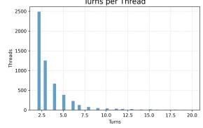

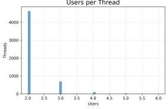  
(e) it  
Figure 6: Distributions of words per turn, turns per user, turns per thread, users per thread across the five languages.

Words per Turn The distribution is heavily rightskewed in every language, with the vast majority of turns containing fewer than 200 words, indicating that most conversational exchanges are brief while a small number of turns involve substantially longer responses. The 1,000-word cap applied uniformly across all languages, as threads containing longer turns were excluded due to their higher likelihood of noise.

Turns per User This distribution is similarly right-skewed, with most users contributing only a handful of turns. The bulk of users fall below 50 turns across all languages, with the long tail suggesting a small cohort of highly active participants. The Italian and Spanish subsets exhibit a narrower spread, consistent with the smaller number of threads collected for these languages.

Turns per Thread Threads are predominantly short, with the modal thread containing between 2 and 5 turns across all languages. This suggests that most conversations are transactional or goaloriented rather than extended dialogues, with very few threads exceeding 10 turns.

Users per Thread The vast majority of threads involve exactly 2 users, reflecting a typical dyadic conversation structure. Threads with 3 or more participants are rare across all languages, with the distribution dropping off sharply beyond 2 users.

## A.1.2 Users and Personas

In Table 2, we show statistics on users and personas, with Figure 7 showing the corresponding word distributions for user pages and profiles. User pages are right-skewed across all languages, with most users having short pages and a minority producing substantially longer ones. Profiles follow a more bell-shaped distribution centered around 50– 100 words, reflecting the relatively standardized length of the persona descriptions we construct from user metadata, and confirming that our persona extraction distills user information into concise, consistent summaries regardless of the under lying page length. English users exhibit the richest descriptions, with both the longest average user pages and profile lengths (98.07 words), and nearcomplete coverage of contribution topics (100%), gender (67%), and profession (66%), reflecting the larger and more active English Wikipedia community. German users, while numerous, show lower rates of gender (36%) and profession (26%) disclosure despite high topic coverage (98.9%). Spanish, French, and Italian users display more modest attribute coverage, particularly for profession, reflecting sparser self-descriptions in these communities. The column reporting users with at least five turns indicates a core of highly active contributors in each language, ranging from approximately 30% (Spanish, Italian) to nearly 50% (German).

Figure 8 shows the proportion of non-deducible or, less frequently, malformed behavioral trait values across all users, broken down by trait and language. Agreement Strategy, Consensus Orientation, and Disagreement Strategy consistently account for the largest shares across all languages, possibly due to the lower frequency of these behavioral aspects in user comments. Notably, Spanish exhibits the highest proportion in Agreement Strategy (∼0.50), while the remaining languages cluster more tightly around lower values. Traits such as Editing Behavior, Policy Usage, Tone Management, and Writing Style and Comment Structure show uniformly low proportions (≤0.10) across all languages. Overall, cross-language variation is modest, with no language systematically underperforming across all traits.

## A.2 Anonymization and Normalization

All usernames in Wiki-Talkie are anonymized via deterministic hashing with a keyed hash function and salt, ensuring consistent mapping across the dataset while preventing reversal. Username occurrences are identified and replaced not only in structured metadata but also within comment text, where editors frequently mention one another through wikilink syntax or plain text references.13 Thread formatting is then cleaned and normalized: leading and trailing decorative characters (dashes, equals signs) are removed, HTML line breaks are converted to newlines, styling tags (
, , <u>) are stripped while preserving content, <nowiki> and <code> tags are removed but enclosed text is retained, indentation markers are removed, and whitespace is collapsed and trimmed. MediaWiki templates and external links are preserved to maintain fidelity to the original discussions. The same normalization was applied also to articles.

## B Examples

Tables 6–10 present one representative example per language from the Wiki-Talkie dataset. Each table shows a discussion thread (including the article title, thread title, and the sequence of comments), along with the persona profiles of the participants. Due to space constraints, behavioral traits and articles are not shown.

## C Prompts

We report here the prompts used in this study. Figure 9 shows the prompt for thread revision (Section 3.1). Figures 10, 11, and 13 present the prompts for persona construction (Section 3.1). Figure 12 shows the prompt used for dialog act evaluation (Section 4). Figures 14, 15, 16, and 17 present the prompts used for the conditioning methods (Section 4). All prompts follow a two-part structure: a system prompt establishing the model’s role and output constraints, and a user prompt providing task instructions, definitions, few-shot exemplars where applicable, and the input to process. Placeholders in {braces} are filled at inference time.

## D Data Sample

Table 3 reports statistics of the sampled data from Wiki-Talkie. English and French are the largest splits, with roughly 9–10k comments each. German, despite starting from the same number of initial threads (5,000), yielded fewer turns after subsampling. Spanish and Italian are roughly half the size of English and French. Thread length is consistent across languages, averaging around 3 previous comments per turn. All languages exhibit a strong male skew in user distribution, consistent with the well-documented gender gap in Wikipedia editorship (Cabrera et al., 2018). The skew is most pronounced in Italian and Spanish, where the limited pool of female editors made gender balancing impossible. English and French are the most balanced: in the French split, for instance, male and female editors contribute nearly equal numbers of sentences despite a skewed ratio of unique users.

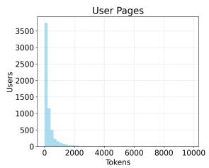

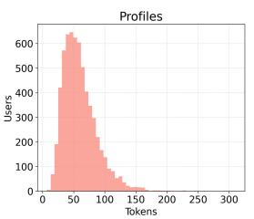  
(a) de

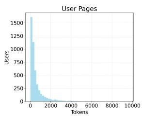

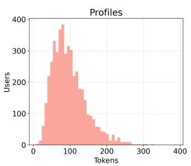  
(b) en

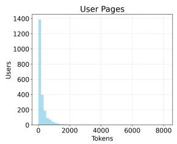

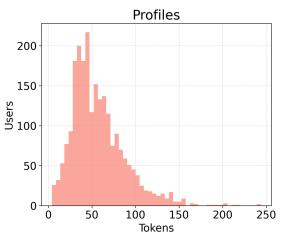  
(c) es

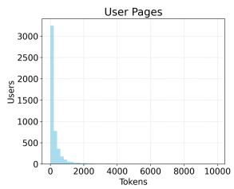

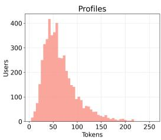  
(d) fr

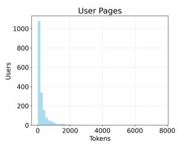

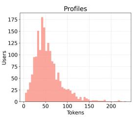  
(e) it

Figure 7: Word distributions for user pages and profiles.
<table><tr><td></td><td>Total Users</td><td>with Topics</td><td>with Gender</td><td>with Profession</td><td>with &gt;= 5 Turns</td><td>Profile Length</td></tr><tr><td>de</td><td>6,282</td><td>6,213</td><td>2,233</td><td>1,620</td><td>2,983</td><td> $6 0 . 1 4 \pm 2 7 . 4 2$ </td></tr><tr><td>en</td><td>4,580</td><td>4,580</td><td>3,062</td><td>3,038</td><td>1,874</td><td> $9 8 . 0 7 \pm 4 6 . 2 2$ </td></tr><tr><td>es</td><td>2,307</td><td>1,309</td><td>891</td><td>446</td><td>671</td><td> $5 7 . 0 7 \pm 3 0 . 7 3$ </td></tr><tr><td>fr</td><td>4,952</td><td>2,646</td><td>2,280</td><td>1,494</td><td>1,986</td><td> $6 4 . 8 0 \pm 3 5 . 2 3$ </td></tr><tr><td>it</td><td>1,850</td><td>1,089</td><td>882</td><td>381</td><td>678</td><td> $5 6 . 0 6 \pm 3 1 . 9 5$ </td></tr></table>

Table 2: Summary statistics of users, their attributes, and activity metrics (mean ± std for profile length).

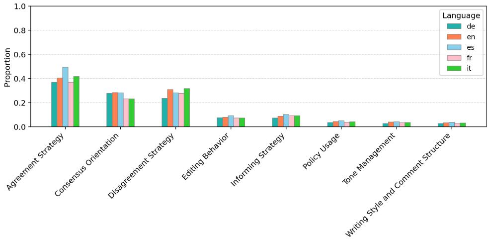  
Figure 8: Proportion of unavailable trait values across all users, broken down by trait and language.

<table><tr><td></td><td># Comments</td><td>Avg. Prev. Len (± Std)</td><td># Unique Users</td><td>#Men</td><td># Women</td><td># Men Sent.</td><td># Women Sent.</td></tr><tr><td>de</td><td>5,187</td><td> $3 . 0 5 \ : ( \pm 2 . 5 9 )$ </td><td>564</td><td>195</td><td>55</td><td>1,638</td><td>1,212</td></tr><tr><td>en</td><td>8,658</td><td> $3 . 3 9 \left( \pm 3 . 0 5 \right)$ </td><td>561</td><td>296</td><td>83</td><td>3,268</td><td>3,277</td></tr><tr><td>es</td><td>4,310</td><td> $3 . 0 3 \ : ( \pm 2 . 6 9 )$ </td><td>298</td><td>83</td><td>20</td><td>1,129</td><td>458</td></tr><tr><td>fr</td><td>9,827</td><td> $3 . 2 9 \left( \pm 2 . 8 8 \right)$ </td><td>682</td><td>250</td><td>61</td><td>2,535</td><td>2,566</td></tr><tr><td>it</td><td>4,706</td><td> $3 . 1 9 \left( \pm 2 . 9 2 \right)$ </td><td>325</td><td>131</td><td>15</td><td>1,989</td><td>178</td></tr></table>

Table 3: Statistics of the sampled data used for experiments.

<table><tr><td>Original Label</td><td>Our Label</td></tr><tr><td>CM, CW, CU, CS, CL, COBJ, CO</td><td>CRITIQUE</td></tr><tr><td>PSR</td><td>REQUEST</td></tr><tr><td>PREF</td><td>REFERENCE</td></tr><tr><td>PFC</td><td>COMMIT</td></tr><tr><td>PPC</td><td>REPORT</td></tr><tr><td>IP, IC</td><td>INFORM</td></tr><tr><td>IS</td><td>ASK</td></tr><tr><td>ATT+</td><td>POSITIVE</td></tr><tr><td>ATT-</td><td>NEGATIVE</td></tr><tr><td>ATTP</td><td>PARTIAL</td></tr></table>

Table 4: Mapping from original SEWD labels (Ferschke et al., 2012) to our dialog act taxonomy.

## E Generation Details

All next-turn generations were produced using a cloud-based batch inference service. Generations were conducted with a temperature of 0 to ensure deterministic outputs, and a maximum of 1,024 tokens were generated per response. To accommodate the context window constraints of each model, input prompts were dynamically truncated when necessary: if the combined length of the system and user prompts exceeded the available input budget (i.e., the model’s context window minus the reserved generation tokens), the article body was progressively shortened by iteratively reducing it to 90% of its current length until the prompt fit within the budget, with a <article\_truncated> marker appended to signal the truncation. For the history method, if the full history caused the prompt to exceed the context window, the number of historical threads was progressively reduced until the prompt fit; instances where the resulting history fell below the minimum threshold of 5 threads were flagged as underrepresented. Prompts that could not be reduced to fit within the context window even after exhausting all truncation strategies were discarded.

## F Validation of Acts Annotation

To validate our LLM-based annotation approach, we rely on the SEWD dataset (Ferschke et al., 2012). SEWD provides act annotations for English Wikipedia talk page discussions, a setting analogous to Wiki-Talkie corpus. In SEWD, the reconciled labels of two trained annotators serve as the gold standard. We use these reconciled labels to evaluate the quality of our LLM-as-annotator pipeline (the extractor model). For clarity, we rename and merge some labels to reduce granularity; the full mapping is reported in Table 4.

However, the format of SEWD differs substantially from Wiki-Talkie. In SEWD, label spans are assigned directly to raw comments within a thread, without prior splitting or cleaning, whereas in our scenario we aim to provide the LLM with preceding comments as conversational context and a single target reply to be labelled. To bridge this gap, we first convert SEWD into the Wiki-Talkie format, structuring each instance as a target comment to be annotated along with its preceding comments as context, and aligning the corresponding SEWD labels. This conversion inevitably introduces noise; we therefore manually clean the resulting instances and discard those that could not be reliably mapped. From the original 1,500 threads in SEWD, this procedure yields 735 usable threads, which constitute our validation set.

<table><tr><td># Comments</td><td>Micro-F1</td><td>Ask</td><td>Commit</td><td>Critique</td><td>Inform</td><td>Negative</td><td>Partial</td><td>Positive</td><td>Reference</td><td>Report</td><td>Request</td></tr><tr><td>All</td><td>0.74</td><td>0.82</td><td>0.75</td><td>0.77</td><td>0.59</td><td>0.68</td><td>0.35</td><td>0.80</td><td>0.49</td><td>0.97</td><td>0.81</td></tr><tr><td>Three</td><td>0.74</td><td>0.84</td><td>0.79</td><td>0.78</td><td>0.58</td><td>0.65</td><td>0.19</td><td>0.79</td><td>0.55</td><td>0.98</td><td>0.83</td></tr><tr><td>Two</td><td>0.76</td><td>0.85</td><td>0.80</td><td>0.81</td><td>0.59</td><td>0.65</td><td>0.42</td><td>0.79</td><td>0.50</td><td>0.97</td><td>0.84</td></tr><tr><td>One</td><td>0.75</td><td>0.83</td><td>0.83</td><td>0.82</td><td>0.59</td><td>0.67</td><td>0.36</td><td>0.78</td><td>0.49</td><td>0.97</td><td>0.84</td></tr></table>

Table 5: Micro-F1 and F1 scores per label across different training settings.
<table><tr><td>Language: German</td><td>Page: Diskussion:Schwicheldt (Adelsgeschlecht) Thread: “Bezug”</td></tr><tr><td>User</td><td>Profile</td></tr><tr><td>8bfc7f759c</td><td>Der Benutzer ist seit dem 17. September 2004 bei Wikipedia registriert und feierte am 17. September 2025 seinen 21. Wiki-Geburtstag. Er hat insgesamt rund 284.000 Bearbeitungen vorgenommen, etwa 1100 Artikel verfasst und ungefähr 8400 Fotos hochgeladen. Er ist unter den 8000 aktivsten deutschsprachigen Wikipedianern. Der Benutzer erhielt 2016 den Denkmalpreis &#x27;Silberne Halbkugel&#x27;. Er ist Mitglied im Verein Wikimedia Deutschland – Gesellschaft zur Förderung Freien Wissens. Seine Beiträge konzentrieren sich auf Themen wie Bessarabien, den Wolfsburger und Helmstedter/Gifhorner Raum, Hannover, Hann. Münden sowie Archäologie, Geschichte, Burgen, Schlösser, Kirchen und lokale Denkmäler in Niedersachsen.</td></tr><tr><td>4f3806c190</td><td>Der Benutzer ist ein deutscher Muttersprachler mit fortgeschrittenen Englischkenntnissen. Er hat sich am 19. Dezember 2004 bei Wikipedia registriert und kümmert sich hauptsächlich um historischen Bergbau, insbesondere um den Zwickauer Steinkohlenbergbau. Er hat zahlreiche Artikel zu bergbauhistorischen und bergbautechnischen Themen erstellt sowie zu verschiedenen anderen Themen wie Waffen, Militärtechnik und Flugzeugen beigetragen.</td></tr><tr><td>Author 8bfc7f759c</td><td>Comment</td></tr><tr><td>4f3806c190</td><td>Besteht ein Bezug zum Ort [[Schwicheldt]]?</td></tr><tr><td>8bfc7f759c</td><td>Wenn man dem Ortsartikel glauben darf: ja.</td></tr><tr><td></td><td>Dann sollte das aber auch im Adelsartikel stehen.</td></tr></table>

Table 6: German example: persona profiles and thread.

Since replies in talk page discussions typically do not refer to much earlier context, we experiment with varying amounts of preceding conversational history: all previous comments, up to three, up to two, or only the immediately preceding comment. The prompt provided to the LLM includes explanations of each act label together with illustrative English examples drawn from SEWD. Table 5 reports the Micro-F1 and per-label F1 scores across these settings. Performance is stable across context windows, with the two-comment setting achieving the highest Micro-F1 (0.77). We therefore adopt this configuration for all subsequent annotation. Notably, these scores are very close to the human inter-annotator agreement reported in Ferschke et al., 2012 (Micro-F1 = 0.79), even though the two evaluation sets are not perfectly overlapping: ours is the product of format conversion and manual filtering, whereas the figure in Ferschke et al., 2012 results from cross-validation over the entire SEWD corpus. Nevertheless, this proximity strongly suggests that the LLM approximates human-level labeling quality.

Examining the per-label scores, the most challenging categories (F1 < 0.70) are in order PAR-TIAL, and REFERENCE, NEGATIVE, INFORM. To better understand these discrepancies, one of the authors of this paper manually inspected 20 instances per class where the LLM prediction and the ground truth disagreed. In more than half of the cases, the author judged the LLM label to be more appropriate than the gold label. This pattern may stem from a mismatch between how the act categories are explained in our prompt and how they were originally operationalized in Ferschke et al., 2012 (which is itself likely connected to the relatively low inter-annotator agreement reported in that work, arguably a consequence of insufficiently precise annotation guidelines).

<table><tr><td>Language: English</td><td>Page: Talk:Cleveland Bay Thread: “Merge”</td></tr><tr><td>User</td><td>Profile</td></tr><tr><td>5f962a065d</td><td>The user lives in Montana and owns horses. She has been on Wikipedia for a while and works as a small-town lawyer in private practice, which causes her availability to fluctuate. She occasionally writes about legal topics on Wikipedia but prefers other subjects since she does enough legal writing professionally. She also writes books and does freelance writing outside of Wikipedia. She is not compensated for her Wikipedia contributions. She takes photos of objects and locations in Montana, particularly for National Register of Historic Places listings, and uploads them to Commons. She can access documents at the Montana Historical Society. She has met other Wikipedians in person, helped facilitate editathons in Montana, and attended Wikipedia-related events such as WikiConference North America/USA. Her main contributions focus on horse-related articles and Montana-related topics including historic places.</td></tr><tr><td>95725d4ec5</td><td>The user is a woman whose main focus on Wikipedia is equine articles, although she also contributes to topics related to history, astronomy, books, endurance sports, the outdoors, and labor unions. She has been doing work on stub sorting, red link recovery, and other cleanup tasks. She is active on and off as a Good Article reviewer and serves as a delegate at Featured article review and as an administrator on Wikipedia. She is married.</td></tr><tr><td>Author</td><td>Comment</td></tr><tr><td>5f962a065d</td><td>I&#x27;m only wondering if the Chapman horse contributed significantly to anything other than the Cleveland Bay, thus warranting its continued independent article. (Thinking of the Narragansett Pacer or Old English Black horse). Other than that, no problem with the merge, content seems similar in both.</td></tr><tr><td>95725d4ec5</td><td>I&#x27;ve never found a source that references the Chapman horse in relation to any breed other than the Cleveland Bay. All of the sources I combed through for this article seemed to think that the Chapman was basically the earliest incarnation of the Cleveland Bay, rather than a separate breed that they were descended from. So, I think that the merge is a safe bet, especially since there are no sources in the</td></tr><tr><td>5f962a065d</td><td>Chapman article that actually show why the author thought it was a separate breed. Groovy.</td></tr></table>

Table 7: English example: persona profiles and thread.

## G Full Results

Tables 11, 12 and Tables 13, 14 report full results for text similarity and interaction behavior evaluation, respectively. Average BERTScore and ROUGE-L scores are discussed in Section 5.1, while average dialog act and sentiment scores are discussed in Section 5.2. Figure 18 reports the proportion difference between human and agent dialog acts split by gender, and Figure 19 shows the distributions of sentiment scores for human and agent comments, discussed in Section 5.2. In the following, we detail text length and act density ratio, which are not discussed in Section 5.

Text Length Across all conditions, agentgenerated comments are substantially longer than human comments. Human comments average approximately 48–78 words depending on the language (de being the shortest at ∼48 words and es the longest at ∼78), while agent output consistently exceeds these figures, often by a wide margin. Notably, the history method yields the shortest agent comments across all models—for instance, Model A drops to ∼88 words on average, its closest approximation to human length—suggesting that exposure to real interaction excerpts helps calibrate verbosity. Conversely, the behavior and profile methods tend to inflate output length, particularly for Model D and Model B. Interestingly, es also elicits slightly longer agent comments than other languages across all conditioning methods, mirroring the fact that human comments in es are themselves the longest.

Act Density Ratio The act density ratio is consistently below 1.0 across all conditions, indicating that agent-generated comments are uniformly richer in communicative intents than their human counterparts. The lowest ratios are observed under the behavior method, where agents appear to enact the prescribed behavioral traits, which are dense in prescriptive interactional information. By contrast, when grounded with real examples via history, the ratio rises above 0.7 on average across all models and languages, with the exception of Model B, suggesting that concrete exemplars help bring act density closer to human levels.

<table><tr><td>Language: Spanish</td><td>Page: Discusión:Calor específico Thread: “Número de citas&quot;</td></tr><tr><td>User</td><td>Profile</td></tr><tr><td>elc14a406a</td><td>El usuario expresa interés en tres áreas principales: la lingüística y las lenguas del mundo, la física matemática y la ingeniería, y la historia económica, economía y sociología. Tiene enlaces a sus páginas de usuario en las Wikipedias en alemán, inglés, francés y portugués.</td></tr><tr><td>94a136608d</td><td>El usuario es un antiguo bibliotecario peruano que se identifica como miembro de ACAD. Está agradecido con la Wikipedia en español. Sus intereses incluyen Moquegua, las Olimpiadas y la Química.</td></tr><tr><td>4901fd71f4</td><td>El usuario es un hombre de Quito, Ecuador, que trabaja para el experimento CMS del CERN. Tiene un doctorado en Física Experimental de Partículas. En el pasado dedicaba mucho tiempo a editar Wikipedia en español, pero actualmente lo hace cuando puede debido a la falta de tiempo libre. Ha contribuido a numerosos artículos relacionados con física, incluyendo mecánica cuántica, teoría de la relatividad, física</td></tr><tr><td>Author</td><td>de partículas y electromagnetismo. Comment</td></tr><tr><td>e1c14a406a</td><td>A petición de otro wikipedista leí extensamente el artículo, fijándome en especial en el número de afirmaciones que podrían requerir cita. Aunque las citas son algo deseable y casi siempre necesarias en este caso concreto no veo demasiadas afirmaciones extraordinarias o polémicas que requieran citas. En un artículo sobre temas polémicos las citas son más necesarias, pero creer que todo artículo sea del tema que se requiere el mismo número de citas es erróneo. En este caso el artículo trata de un tema de ciencia convencional muy asentado que podríamos considerar un tema ya muy asentado, en ese caso creo que al artículo no le faltan ya más citas. Tener citas por tener citas, no garantiza la calidad o correcta referenciación del artículo, el número de citas debe depender el tipo de artículo, la temática y lo polémico del tema. Mi apreciación es que en este caso el artículo tiene el número de citas adecuadas. En cualquier caso si alguien considera que no es así debería añadir QUÉ afirmaciones concretas considera que deben ser referenciadas.</td></tr><tr><td>94a136608d</td><td>Hola, revisa arriba y están las frases que necesitan referencias y también lee [[WP:FP]].</td></tr><tr><td>4901fd71f4</td><td>Hola Fide... bueno he puesto referencias a las afirmaciones que dices que faltaban, me faltan solo las dos ultimas que no encuentro. Por el formato de las referencias, eso ya lo arregle. Espero que con eso sea suficiente. (Y vamos que no es un nominado para destacado!!) Saludos</td></tr><tr><td>94a136608d</td><td>Disculpame si te parezco exigente, pero según [[WP:SAB]]: {{cital- Califica cuidadosamente. - Los estándares de los Artículos buenos son tan altos como aquellos del calificador más indulgente![[WP:SAB]]}} Pero créeme, te va a salir un superBueno, de lo mejor, y si esas frases no fueran un poquito dudosas, ni</td></tr><tr><td>4901fd71f4</td><td>las mencionaría. Bendiciones. Si entiendo tu postura Fide, solo no entendi lo del superbueno??? Saludos y seguiré buscando las referencias.</td></tr><tr><td>94a136608d</td><td>Era solo un decir. Saludos</td></tr></table>

Table 8: Spanish example: persona profiles and thread.

## H Information Density vs. Information Type

A natural concern with our experimental design is that the comparison across conditioning methods may not be fully information-balanced: the history method receives 5–20 raw prior comments, whereas profile and behavior receive compressed summaries. Part of the gain observed under history could therefore reflect a larger context budget (i.e., information quantity) rather than a strictly better form of persona representation, i.e., information type.

To probe this confound, we examine how performance varies with the amount of conditioning information provided. We focus this analysis on profile length, where the available token budget varies meaningfully across users (see Table 2 and Figure 7). For history, the analogous analysis would require comparing performance across different numbers of prior comments. However, the history sampler defaults to using up to 20 comments per user, and in practice the vast majority of conditioning pools fall in the 16–20 range; lower-comment buckets are too sparsely populated to support a meaningful comparison. We therefore restrict the analysis to profile length, which provides a well-distributed and interpretable proxy for input richness.

We stratify all experimental instances by profile word count into five buckets (1–50, 51– 100, 101–150, 151–200, 201–250) and compute, for each bucket and for each language–model pair, the four metrics used in our main analysis: ROUGE-L, rBERT, dialog act JSD, and sentiment JSD. Buckets with fewer than 20 samples are omitted, so de has no 201–250 bucket and es no 151– 200 bucket. The es 201–250 bucket is dominated by a single user, who contributes 45 of its 67 samples, so its values should be read as largely individual rather than bucket-level. Results are shown in Figures 20–23. The red dashed lines indicate the proportion of samples falling in each bucket; trends at the longest bucket should be interpreted with caution due to sample sparsity.

<table><tr><td>Language: French</td><td>Page: Discussion:Pfalz-ardenner/Bon article Thread: (untitled)</td></tr><tr><td>User</td><td>Profile</td></tr><tr><td>702383d34d d637e7f14a</td><td>L’utilisateur a commencé à contribuer sur Wikipédia en décembre 2006. Il se décrit comme un wikignome à ses heures perdues et travaille principalement sur des articles liés à la physique nucléaire, aux accélérateurs de particules, aux biographies de scientifiques et à l&#x27;Irlande. Il a significativement contribué à des articles sur la capture électronique, la désintégration du neutron libre et les noyaux p. L’utilisatrice est une femme inscrite sur Wikipédia depuis 2007. Elle est une contributrice très active,</td></tr><tr><td></td><td>ayant lancé environ 230 propositions de labellisation d’articles, dont 83% concernent le cheval. Elle a participé à plusieurs publications scientifiques. Ses domaines de contribution principaux sont les créatures légendaires (fées, lutins, malebestes), les chevaux (aspects culturels, sociologiques et génétiques), et l’autisme. Elle s’intéresse de plus en plus à la génétique. Elle apprécie les tableaux préraphaélites. Depuis 2017, elle pratique la photographie animalière comme hobby, cherchant à photographier un maximum d’espèces et de races animales. Elle préfère être tutoyée.</td></tr><tr><td>75d8423c61</td><td>L’utilisateur est passionné de sport automobile, plus particulièrement d’endurance. Il est né le jour du Grand Prix automobile du Portugal 1995. Il s’intéresse aux histoires oubliées du sport automobile. Sur Wikipédia, il contribue activement en créant et améliorant de nombreux articles liés au sport automobile, notamment sur les automobiles de course, les courses d’endurance, les écuries, les pilotes, ainsi que sur d’autres sujets comme la course au large, le football, l’histoire militaire et l’architecture.</td></tr><tr><td>Author 702383d34d</td><td>Comment</td></tr><tr><td></td><td>Très beau travail de recherche {{u-luser_d637e7f14a} }. Je n’ai fait que survoler l’article mais une remarque me vient au passage. Étant donné que quasiment toutes les sources sont en anglais ou en allemand, d’où vient le nom en français de cette race. Est-ce qu’il est mentionné dans Guide des chevaux d’Europe qui est la seule source en français ? Ou bien est-ce qu’il s’agit de ta propre traduction ? Je demande cela car les seuls résultats que je trouve sur le Web pour ce mot proviennent de Wikipédia ou de clones.</td></tr><tr><td>d637e7f14a</td><td>Merci pour la question user_702383d34d. Le Guide des chevaux d’Europe a gardé le nom allemand, ce qui est surprenant car toutes les autres races allemandes ont un nom traduit. J’ai tenté une traduction littérale (d’abord « du Palatinat », puis « palatin ») en début de travail, mais je peux retourner à Pfalz-ardenner, qui effectivement est la seule référence attestée dans un bouquin en français En fait, je ne sais pas comment on gère ça sur Wikipédia habituellement. Ça ne me dérange pas outre</td></tr><tr><td>702383d34d</td><td>mesure de franciser le nom, mais à minima, je pense qu’il faudrait indiquer dans une note que c’est une traduction « personnelle » (je n’ai pas trop d’idée sur la meilleure façon de faire). Peut-être faut-il garder le nom en allemand et indiquer en note, ta traduction en français. Peut-être que les autres votants ont un avis sur la question.</td></tr><tr><td>75d8423c61</td><td>Si le titre de l’article est une traduction personnelle, alors il vaut mieux renommer l’article. Pour garder le [[WP:PMS]]. Peut-être écrire la traduction dans une note où la traduire dans l’intro. Mais il faut renommer</td></tr><tr><td>75d8423c61</td><td>Merci, c’est mieux comme ça !</td></tr></table>

Table 9: French example: persona profiles and thread.

Findings Across all 20 language–model pairs, none of the four metrics improves consistently as profile length grows. A pure context-budget account would predict a downward slope for JSD metrics (lower divergence = better alignment) and an upward slope for similarity metrics (higher = better) as more conditioning tokens are provided. ROUGE-L and rBERT are nearly horizontal in every configuration (within-pair ranges of at most 0.026 and 0.044, respectively). Where the JSD metrics do move, they mostly move in the opposite direction: dialog act JSD rises for all four models in fr, mainly from the 151–200 bucket onward, and sentiment JSD rises with profile length for all four models in es, fr, and it. The few downward trends are small and confined to en and de: dialog act JSD for Model A in en decreases from 0.135 to 0.098, and sentiment JSD decreases for some models in en and de, in en largely because of the sparse 1–50 bucket (under 3% of samples).

Taken together, these results provide evidence against an information-density explanation for our main results. Together with the observation reported in the main text—that profile degrades performance relative to base despite adding tokens—this analysis supports our interpretation that information type, not information quantity, drives the differences across conditioning methods. We acknowledge that this analysis does not fully isolate every possible confound (e.g., compressioninduced loss of stylistic exemplars), and we discuss this further in the Limitations.

## I Qualitative Audit of Profiles and Behavioral Traits

Because profiles and behavioral traits are produced automatically by an LLM and then used as the key conditioning signals for profile, behavior, and behavior+r, their quality directly affects the interpretation of downstream results. To complement the quantitative analyses in the main text, we conducted a manual audit of these representations along three dimensions: (i) relevance and faithfulness of generated profiles with respect to the source user pages, (ii) coherence between assigned behavioral traits and the supporting reasoning produced by the extractor model, and (iii) privacy preservation, i.e., whether sensitive information (real names, usernames, contacts) is leaked into the generated representations. We sampled 10 users per language (50 total) uniformly at random from the experimental subset and one of the authors inspected, for each user, the generated profile, all 8 behavioral traits with their reasoning, and the underlying user page.

Profile faithfulness In all 50 cases, profiles contain information that is relevant to and supported by the source user page. We identified a small number of imprecisions, none of which substantially distort the persona:

• English: one numerical drift (“42 years” instead of “45 years”); one rounding error on edit count $( ^ { \ast } 1 0 0 , 0 0 0 ^ { \cdot }$ instead of “100,000k”);

• French: one case where contributed-article information was omitted;

• German: one case where the username was incorporated into the profile as if it were a separate entity, likely due to hallucination triggered by user page ambiguity;

• Italian: one ungrammatical fragment (“Ha adottato il giorno 16 luglio e il comune di Plesio”) reflecting parsing ambiguity in the user page.

We additionally observed that information from userboxes—small standardized templates that Wikipedia editors place on their user pages to declare interests, languages spoken, locations, or affiliations—is sometimes incorporated into the profile and sometimes ignored, with no clear pattern across languages. Moreover, we noticed that gender, when not explicitly self-declared, is typically inferred from gender-marked terms (especially in the four grammatical-gender languages: German, Spanish, French, and Italian) and, when available, from given names.

Behavioral trait coherence For each of the 8 behavioral categories, we checked whether the assigned trait value is consistent with the accompanying reasoning. Out of $5 0 \times 8 = 4 0 0$ trait-reasoning pairs, in only 7 cases (across English, Spanish, and Italian) was the assigned label found to trace back to the provided reasoning. In most other cases, the reasoning explicitly cites concrete excerpts from the user’s comment history in support of the assigned trait, providing transparent grounding for the conditioning signal.

Privacy The audit surfaced two cases that warrant explicit mention:

• one English profile mentioning a middle name, which the user themselves had self-disclosed anecdotally on their user page;

• one German profile reproducing the username as if it were a separate named entity (the same hallucination case noted above).

No real legal names, contact details, or other directly identifying information were leaked into the generated representations.

Implications for downstream results The audit indicates that the generated profiles and behavioral traits are largely faithful and well-grounded, with imprecisions concentrated at the level of isolated factual details rather than systematic distortions. This argues against an interpretation in which the relatively weak performance of profile and behavior is driven primarily by representation quality. At the same time, the audit highlights that profiles vary substantially in the kinds of information they emphasize (e.g., uneven uptake of userbox content) and that the compression step inherent in summarization may lose stylistic exemplars present in the raw history signal. In this sense, our results should be read as conclusions about the conditioning representations as we generated them, rather than as universal statements about all possible sociodemographic descriptors. We acknowledge this scope explicitly in the Limitations.

<table><tr><td>Language: Italian</td><td>Page: Discussione:Nevicata del 1985 Thread: “Leggiamo l’articolo&quot;</td></tr><tr><td>User</td><td>Profile</td></tr><tr><td>6aa9673768</td><td>L’utente si è registrato su Wikipedia 1&#x27;8 agosto 2006. Contribuisce principalmente nell’ambito delle voci scientifiche, con particolare attenzione alle Scienze della Terra, e interviene anche su voci riguardanti storiografia, filosofia e cinema, che sono sue vecchie passioni. È anche appassionato di fotografia e inserisce immagini originali di sua produzione. Partecipa al Progetto sulle persecuzioni, deportazioni e crimini del periodo nazi-fascista, in particolare sul tema del Negazionismo dell&#x27;Olocausto. È amministratore di Wikipedia dal 2007.</td></tr><tr><td>677e695641</td><td>L’utente è un uomo over 60, curioso e intellettualmente aperto a nuovi apprendimenti. Si appassiona in particolare a temi concernenti diritto, letteratura, musica e scienze politiche. Si è registrato su Wikipedia verso la fine di febbraio 2006. È laureato in Giurisprudenza. Vive a La Spezia. Su Wikipedia ha creato o modificato consistentemente voci riguardanti società, diritto, economia, storia, istituzioni, politica,</td></tr><tr><td>1363852f3c</td><td>musica, letteratura, arte, religione, filosofia e sport. L’utente è attivo su Wikipedia dal 21 agosto 2006, quando ha effettuato la sua prima modifica. L’11 febbraio 2008 è stato eletto amministratore. Ha raggiunto diversi traguardi di contributi: 100 edit il 24 marzo 2007, 500 il 19 giugno 2007, 1000 il 21 luglio 2007, 2000 1&#x27;8 agosto 2007, 4000 il 22 settembre 2007, 5000 il 17 ottobre 2007, 7500 il 18 gennaio 2008, 10000 il 13 aprile 2008 e 20000 il 16 aprile 2009. Ha creato 100 nuove voci entro il 21 ottobre 2007. Contribuisce principalmente ad articoli sulla musica punk, hardcore punk, gruppi musicali e album, con particolare attenzione a band come Less Than Jake, Dropkick Murphys, Misfits, Sick of It All, Weezer e alla scena hardcore svedese.</td></tr><tr><td>Author</td><td>Comment</td></tr><tr><td>6aa9673768</td><td>Nell’ ultimo intervento user_677e695641 ha richiesto di inserire una citazione gia’ presente da almeno una settimana nelle fonti/bibliografia. Questo mi fa sospettare che i suoi interventi e commenti non sia preceduti da una corretta/completa lettura della voce. Lascio a chi legge i commenti del caso.</td></tr><tr><td>677e695641</td><td>Hai ragione, scusa: avevo letto più volte l’articolo ma non avevo ancora aperto il link a quell’articolo (Nimbus) che usa questo appellativo di “nevicata del secolo&quot; (mi pare l’unico caso, ma comunque esiste), anche se di norma con nevicata del secolo l’opinione pubblica pensa a quella del &#x27;56.</td></tr><tr><td>1363852f3c</td><td>Visto che l’articolo linkato parla di &quot;Nevicata del Secolo&quot; riferendosi però solo alla città di Milano o, comunque, solo al settentrione, potremmo, nel caso in cui si decidesse per l’unificazione delle pagine, mantenere la nomencaltura “Nevicata del Secolo&quot; per l’eventuale paragrafo di approfondimento sulla situazione nel Nord Italia. qualcosa del tipo La “Nevicata del Secolo&quot; di Milano. Che ne dite?</td></tr><tr><td>677e695641</td><td>Il punto è che mi convince poco l’uso di iperboli e di espressioni altisonanti, tipo “nevicata del secolo&quot; Inoltre, pare che di nevicate del secolo ce ne siano state più di una (leggi la disambigua [[Nevicata del secolo]]).</td></tr><tr><td>6aa9673768</td><td>La disambigua di cui sopra e’ stata creata da user_677e695641 appositamente per poter affermare che ci sono piu&#x27; nevicate secolari, il che e’ una ovvieta’ e verita’ statistica: ogni zona d’ Italia ha avuto la sua nevicata secolare. Riguardo alla iperbole si rimanda all&#x27; articolo citato qui’ sopra</td></tr><tr><td>677e695641</td><td>La disambigua non è stata creata appositamente per poter affermare che ci sono piu&#x27; nevicate secolari, ma proprio perchè l’esistenza di più fenomeni chiamati “nevicata del secolo&quot; - come lo stesso user_6aa9673768 riconosce - è una ovvietà e verità statistica: caso classico in cui una disambigua si impone. Suggerirei, se mi è consentito, di usare toni meno polemici e più legati al merito delle questioni</td></tr></table>

Table 10: Italian example: persona profiles and thread.

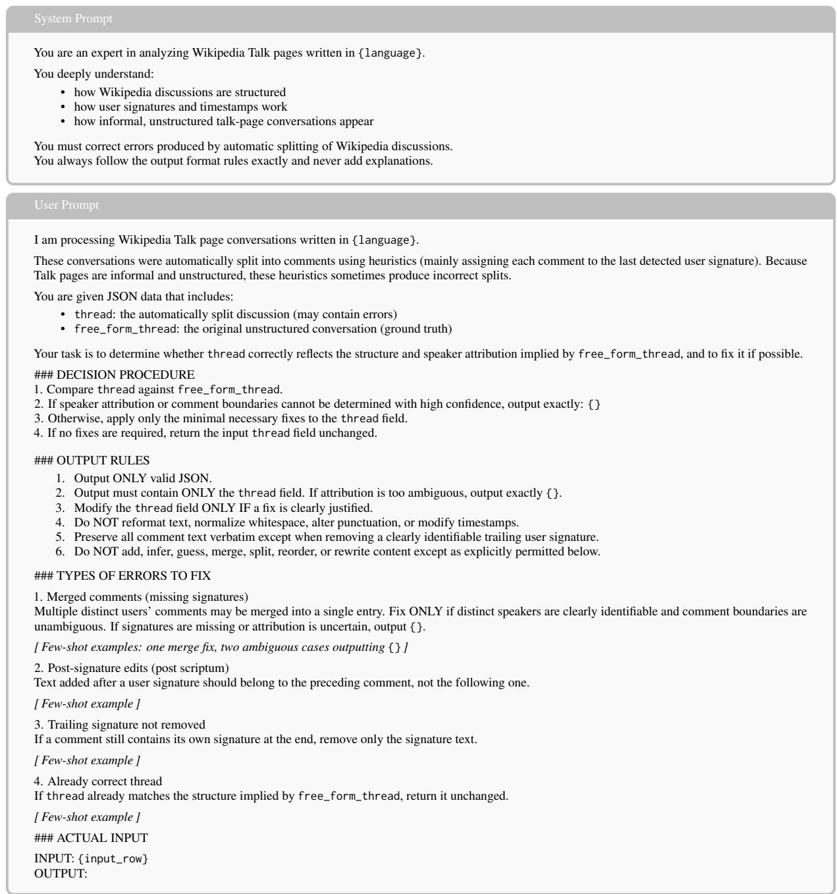  
Figure 9: Prompt template for thread split revision. Few-shot example content is summarized for brevity.

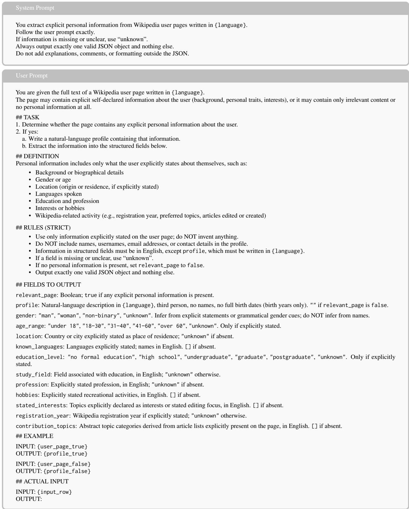  
Figure 10: Prompt template for user page profiling.

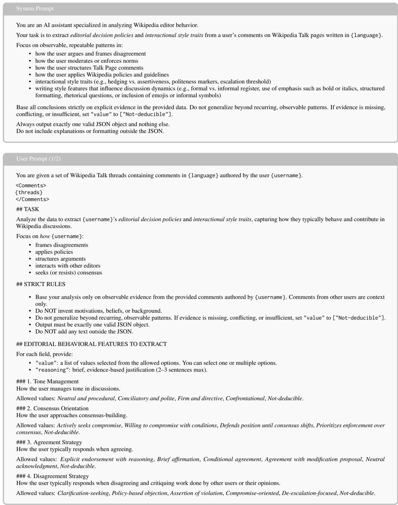  
Figure 11: Prompt template for editorial behavior extraction (system prompt and user prompt, part 1).

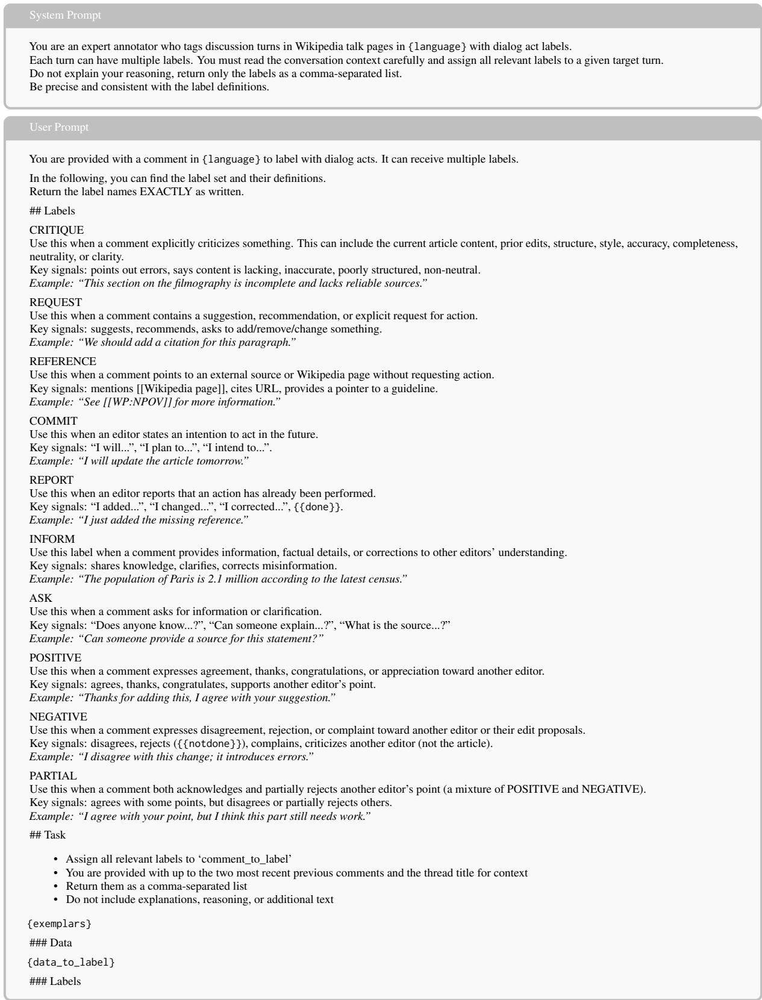  
Figure 12: Prompt template for dialog act labeling.

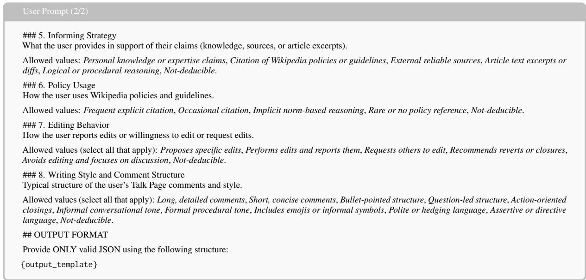  
Figure 13: Prompt template for editorial behavior extraction (user prompt, part 2).

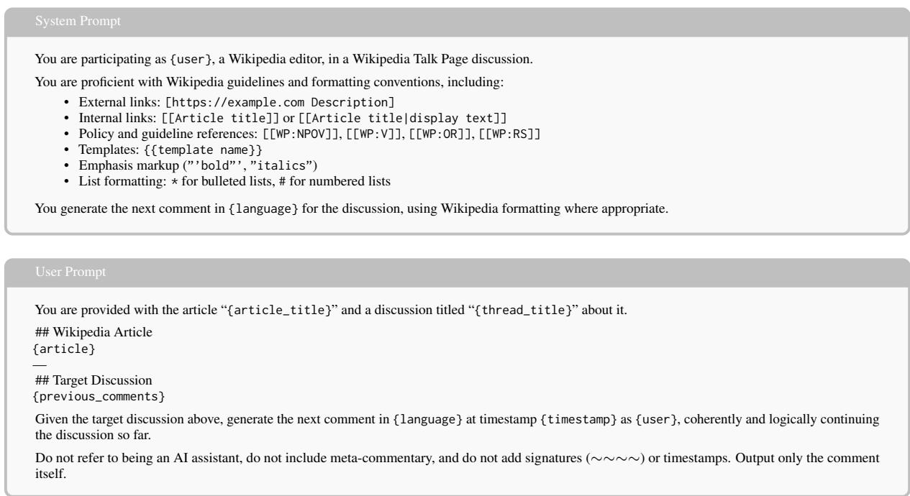  
Figure 14: Prompt template for base.

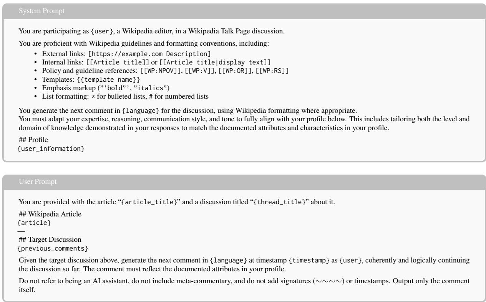  
Figure 15: Prompt template for profile.

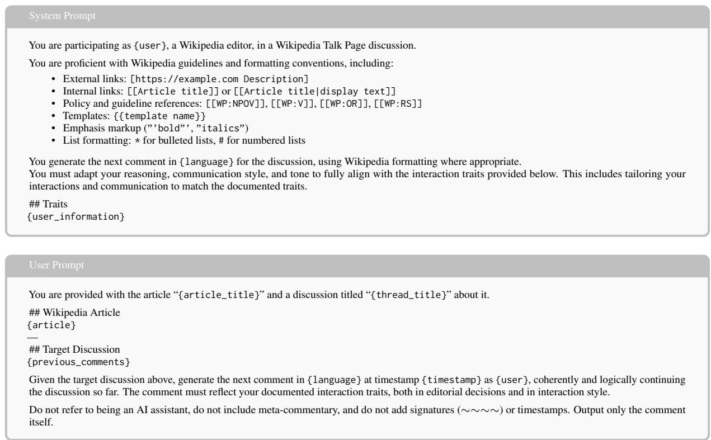  
Figure 16: Prompt template for behavior ({user\_information} without reasoning) and behavior+r ({user\_information} with reasoning).

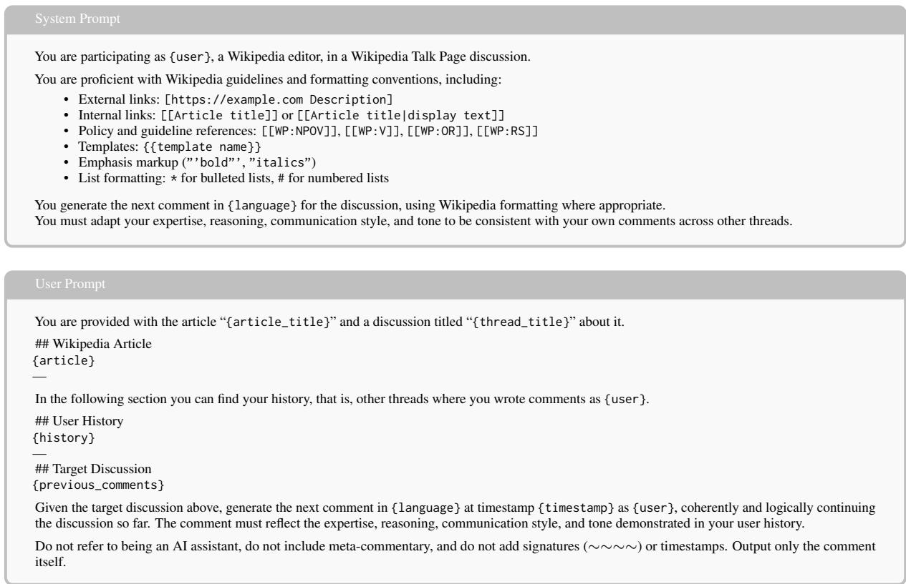  
Figure 17: Prompt template for history.

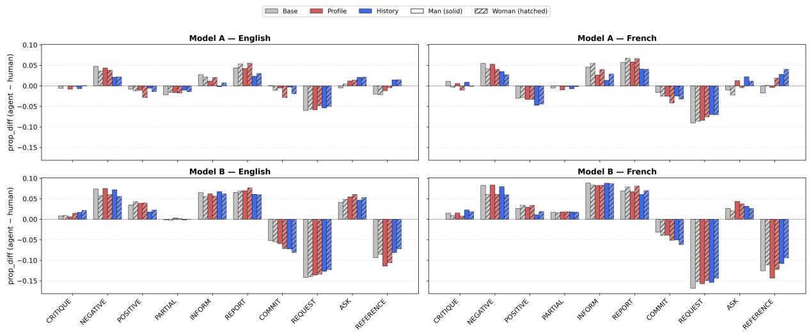  
Figure 18: Proportion difference between human and agent dialog acts split across genders. Positive values indicate human over-production; negative values indicate agent over-production.

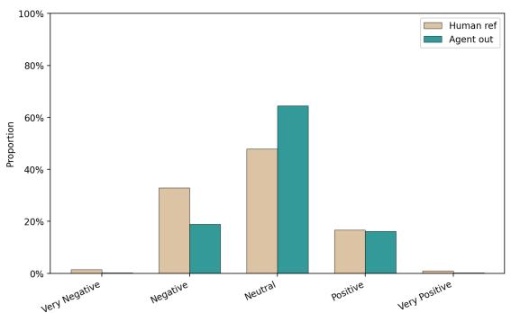  
(a) Model A under base method.

  
(b) Model B under base method.

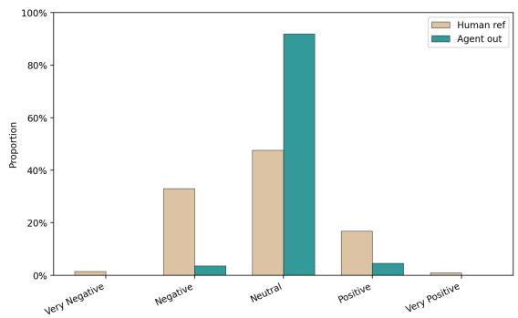  
(c) Model B under history method.  
Figure 19: Sentiment scores distributions for human agent comments on en for selected models and conditioning methods.

<table><tr><td>Setup</td><td>Lang</td><td>Model</td><td>Avg Human Words</td><td>Avg Agent Words |</td><td>BERT ↑ rBERT ↑</td><td>ROUGE↑</td></tr><tr><td rowspan="5">base</td><td>de</td><td>Model A Model B Model C Model D Avg models</td><td>47.9 (56.3) 80.2 (34.2) 47.7 (56.3) 205.1 (74.3) 47.9 (56.3) 87.7 (32.5) 47.9 (56.3) 121.7 (47.4) 47.8 ± 0.1 123.7 ± 57.2</td><td>0.849 0.822 0.847 0.837 0.839 ± 0.012 0.854</td><td>0.065 -0.102 0.051 -0.013 0.000 ± 0.076</td><td>0.096 0.061 0.088 0.077 0.081 ± 0.015</td></tr><tr><td>en</td><td>Model A Model B Model C Model D Avg models</td><td>62.4 (78.7) 62.4 (78.7) 62.4 (78.7) 62.4 (78.7) 62.4 ± 0.0</td><td>105.4 (54.3) 251.1 (109.2) 105.7 (46.7) 132.2 (54.7) 148.6 ± 69.5</td><td>0.013 0.832 -0.140 0.852 -0.001 0.843 -0.065 0.845 ± 0.010 -0.048 ± 0.070</td><td>0.124 0.085 0.120 0.101 0.107 ± 0.018</td></tr><tr><td>es</td><td>Model A Model B Model C Model D Avg models</td><td>77.5 (96.5) 77.5 (96.8) 77.5 (96.5) 77.5 (96.5) 77.5 ± 0.0</td><td>113.8 (49.6) 270.0 (92.8) 116.4 (52.1) 152.4 (60.2) 163.1 ± 73.4</td><td>0.852 0.050 0.829 -0.099 0.851 0.039 0.842 -0.014 -0.006 ± 0.068</td><td>0.132 0.094 0.129 0.115 0.118 ± 0.017</td></tr><tr><td>fr</td><td>Model A Model B Model C Model D Avg models</td><td>63.9 (77.2) 63.9 (77.2) 63.9 (77.2) 63.9 (77.2) 63.9 ± 0.0</td><td>100.7 (42.5) 238.0 (82.1) 107.6 (45.6) 141.6 (55.9) 147.0 ± 63.3</td><td>0.844 ± 0.011 0.851 0.061 0.828 -0.086 0.849 0.048 0.840 -0.009 0.004 ± 0.067</td><td>0.117 0.083 0.110 0.100 0.103 ± 0.015</td></tr><tr><td>it</td><td>Model A Model B Model C Model D Avg models</td><td>64.1 (79.1) 64.1 (78.3) 64.1 (79.1) 64.1 (79.1) 64.1 ± 0.0</td><td>93.5 (42.8) 227.8 (76.8) 91.6 (34.1) 139.2 (56.1) 138.0 ± 63.8</td><td>0.842 ± 0.011 0.847 0.824 0.847 0.838</td><td>0.075 0.097 -0.065 0.069 0.072 0.094 0.016 0.084</td></tr><tr><td>Avg langs</td><td>Model A Model B Model C Model D Model A</td><td>63.1 ± 10.5 63.1 ± 10.6 63.1 ± 10.5 63.1 ± 10.5 47.9 (56.3)</td><td>98.7 ± 12.7 238.4 ± 24.4 101.8 ± 11.9 137.4 ± 11.4</td><td>0.839 ± 0.011 0.851 ± 0.003 0.827 土 0.004 0.849 ± 0.002 0.840 ± 0.003</td><td>0.025 ± 0.066 0.053 ± 0.024 -0.098 ± 0.027 0.042 土 0.027 -0.017 ± 0.030</td><td>0.086 ± 0.013 0.113 ± 0.016 0.078 ± 0.013 0.108 ± 0.017 0.096 ± 0.015 0.094</td></tr><tr><td rowspan="5">profile</td><td>de</td><td>Model B Model C Model D</td><td>47.8 (56.3) 47.9 (56.3) 47.9 (56.3)</td><td>94.8 (38.9) 207.4 (68.9) 98.2 (32.2) 165.6 (62.2)</td><td>0.847 0.053 0.821 -0.112 0.845 0.041 0.832 -0.044</td><td>0.060 0.085 0.072</td></tr><tr><td>en</td><td>Avg models Model A Model B Model C Model D</td><td>47.9 ± 0.0 62.4 (78.7) 62.5 (78.9) 62.4 (78.7) 62.4 (78.7) 62.4 ± 0.0</td><td>141.5 ± 54.7 122.7 (60.7) 263.5 (99.9) 120.7 (48.8) 180.1 (70.2)</td><td>0.836 ± 0.012 -0.016 ± 0.077 0.852 -0.003 0.830 -0.154 0.850 -0.017 0.837 -0.105</td><td>0.078 ± 0.015 0.119 0.081 0.115 0.091 0.101 ± 0.018</td></tr><tr><td>es</td><td>Avg models Model A Model B Model C Model D</td><td>77.5 (96.5) 77.5 (96.3) 77.5 (96.5) 77.5 (96.5) 77.5 ± 0.0</td><td>171.7 ± 67.1 129.8 (53.8) 272.9 (86.2) 127.5 (52.8) 200.8 (80.7)</td><td>0.842 ± 0.011 0.851 0.041 0.828 -0.107 0.849 0.030 0.838 -0.043 0.841 ± 0.011</td><td>-0.070 ± 0.072 0.130 0.093 0.126 0.107 -0.020 ± 0.069</td></tr><tr><td>fr</td><td>Avg models Model A Model B Model C Model D</td><td>63.9 (77.2) 63.9 (77.0) 63.9 (77.2) 63.9 (77.2)</td><td>182.7 ± 69.1 117.8 (47.1) 242.0 (76.5) 119.5 (46.7) 192.6 (75.8)</td><td>0.849 0.047 0.827 -0.094 0.848 0.037 0.835 -0.042</td><td>0.114 ± 0.017 0.114 0.081 0.108 0.092 0.099 ± 0.015</td></tr><tr><td>it</td><td>Avg models Model A Model B Model C Model D</td><td>63.9 ± 0.0 64.1 (79.1) 64.0 (78.8) 64.1 (79.1) 64.0 (79.1)</td><td>168.0 ± 60.4 109.6 (47.7) 230.6 (72.8) 98.7 (34.1) 185.6 (73.3)</td><td>0.840 ± 0.011 0.846 0.823 0.846 0.833</td><td>-0.013 ± 0.067 0.064 0.094 -0.072 0.067 0.067 0.093 -0.011 0.078</td></tr><tr><td>Avg langs</td><td>Avg models Model A Model B Model C Model D</td><td>64.0 ± 0.0 63.1 ± 10.5 63.1 ± 10.5 63.1 ± 10.5 63.1 ± 10.5</td><td>156.1 ± 62.9 114.9 ± 13.5 243.3 ± 26.2 112.9 ± 13.6 184.9 ± 13.3</td><td>0.837 ± 0.011 0.849 ± 0.003 0.826 ± 0.004 0.848 土 0.002 0.835 ± 0.003</td><td>0.012 ± 0.067 0.040 ± 0.026  $- 0 . I O 8 \pm 0 . 0 3 0$  0.032 ± 0.031 -0.049 ± 0.034</td><td>0.083 ± 0.013  $0 . I I O \pm 0 . 0 I 6$   $0 . 0 7 6 \pm 0 . 0 I 3$  0.105 ± 0.017 0.088 ± 0.014</td></tr><tr><td rowspan="4">behavior</td><td>de</td><td>Model A Model B Model C Model D</td><td>47.9 (56.3) 47.7 (55.8) 47.9 (56.3) 47.9 (56.3)</td><td>90.7 (54.9) 148.6 (74.4) 96.9 (37.9) 135.4 (97.0)</td><td>0.847 0.828 0.846 0.837 0.839 ± 0.009</td><td>0.050 -0.067 0.041 -0.013 0.003 ± 0.054</td><td>0.091 0.068 0.084 0.078 0.080 ± 0.010</td></tr><tr><td>en</td><td>Avg models Model A Model B Model C Model D</td><td>47.8 ± 0.1 62.4 (78.7) 62.3 (78.7) 62.4 (78.7) 62.4 (78.7)</td><td>117.9 ± 28.5 155.9 (83.1) 241.8 (109.1) 132.7 (63.3) 212.7 (125.1)</td><td>0.847 0.831 0.849 0.836 0.841 ± 0.009</td><td>-0.038 -0.149 -0.027 -0.111 -0.081 ± 0.059</td><td>0.109 0.084 0.112 0.089 0.098 ± 0.014</td></tr><tr><td>es</td><td>Avg models Model A Model B Model C Model D Avg models</td><td>62.4 ± 0.1 77.5 (96.5) 77.4 (96.5) 77.5 (96.5) 77.5 (96.5) 77.5 ± 0.0</td><td>185.8 ± 50.2 167.2 (80.5) 230.2 (94.4) 138.9 (63.4) 260.2 (135.5) 199.1 ± 55.8</td><td>0.845 0.829 0.848 0.834 0.839 ± 0.009</td><td>0.002 -0.097 0.021 -0.065 -0.035 ± 0.055</td><td>0.117 0.098 0.124 0.099 0.109 ± 0.013</td></tr></table>

Table 11: Full results (part 1). Rows grouped by setup and language. Avg Human Words varies slightly across models and setups due to rare cases where human comments were excluded from evaluation owing to missing generated counterparts (generation errors or hallucinations).

<table><tr><td>Setup</td><td>Lang</td><td>Model</td><td>Avg Human Words</td><td>Avg Agent Words</td><td>BERT ↑ 0.846</td><td>rBERT ↑ ROUGE↑</td></tr><tr><td rowspan="3">behavior</td><td>fr</td><td>Model A Model B Model C Model D Avg models</td><td>63.9 (77.2) 63.7 (77.2) 63.9 (77.2) 63.9 (77.2) 63.8 ± 0.1</td><td>133.6 (67.5) 199.8 (78.2) 124.6 (54.2) 194.5 (115.4) 163.1 ± 39.6</td><td>0.024 0.829 -0.081 0.847 0.032 0.836 -0.037 0.839± 0.008 -0.016 ± 0.054</td><td>0.107 0.086 0.106 0.092 0.098± 0.011</td></tr><tr><td>it</td><td>Model A Model B Model C Model D</td><td>64.1 (79.1) 63.9 (78.6) 64.1 (79.1) 64.1 (79.1)</td><td>130.8 (70.9) 183.4 (76.2) 104.2 (41.7) 211.9 (126.5)</td><td>0.842 0.042 0.826 -0.056 0.845 0.062 0.831 -0.022</td><td>0.090 0.072 0.092 0.076</td></tr><tr><td>Avg langs</td><td>Avg models Model A Model B Model C Model D</td><td>64.0 ± 0.1  $\delta 3 . I \pm I O . 5$   $6 3 . 0 \pm I O . 5$   $\delta 3 . I \pm I O . 5$  63.1 ± 10.5</td><td> $I 5 7 . 6 \pm 4 9 . 0$   $I 3 5 . 6 \pm 2 9 . 4$   $2 0 0 . 8 \pm 3 7 . 3$   $I I 9 . 4 \equiv I 8 . 2$  203.0 ± 45.0</td><td> $0 . 8 3 6 \pm 0 . 0 0 9$   $0 . 0 0 6 \pm 0 . 0 5 5$   $0 . 8 4 5 \pm 0 . 0 0 2$   $0 . 0 I 6 \pm 0 . 0 3 5$   $0 . 8 2 9 \pm 0 . 0 0 2$   $- 0 . 0 9 0 \pm 0 . 0 3 6$   $0 . 8 4 7 \overset { \_ } { \pm } 0 . 0 0 I$   $0 . 0 2 6 \pm 0 . 0 3 3$  -0.050 ± 0.040</td><td> $0 . 0 8 2 \pm 0 . 0 I 0$   $0 . I O 3 \pm 0 . 0 I 2$   $0 . 0 8 2 \equiv 0 . 0 I 2$  0.104 ± 0.016 0.087 ± 0.010</td></tr><tr><td rowspan="6">behavior+r</td><td>de</td><td>Model A Model B Model C Model D</td><td>47.9 (56.3) 47.6 (56.2) 47.9 (56.3) 47.9 (56.3)</td><td>84.7 (50.8) 156.8 (76.8) 95.8 (36.8) 140.0 (86.5)</td><td> $0 . 8 3 5 \pm 0 . 0 0 2$  0.853 0.085 0.829 -0.058 0.847 0.050 0.839 -0.001 0.842 ± 0.010</td><td>0.112 0.072 0.089 0.085</td></tr><tr><td>en</td><td>Avg models Model A Model B Model C Model D</td><td>47.8 ± 0.1 62.4 (78.7) 62.4 (78.0) 62.4 (78.7) 62.4 (78.7)</td><td>119.3 ± 34.6 127.0 (77.1) 243.8 (114.3) 123.8 (55.8) 190.2 (103.2)</td><td>0.019 ± 0.062 0.854 0.013 0.833 -0.134 0.850 -0.015 0.840 -0.085</td><td>0.089 ± 0.017 0.131 0.086 0.116 0.098 0.108 ± 0.020</td></tr><tr><td>es</td><td>Avg models Model A Model B Model C Model D Avg models</td><td>62.4 ± 0.0 77.5 (96.5) 77.2 (96.6) 77.5 (96.5) 77.5 (96.5) 77.4 ± 0.1</td><td>171.2 ± 57.3 149.0 (74.5) 246.7 (95.2) 131.6 (59.1) 241.6 (117.5) 192.2 ± 60.4</td><td>0.844 ± 0.010 -0.055 ± 0.067 0.852 0.046 0.831 -0.087 0.850 0.035 0.838 -0.040 -0.011 ± 0.063</td><td>0.138 0.099 0.130 0.109 0.119 ± 0.018</td></tr><tr><td>fr</td><td>Model A Model B Model C Model D Avg models</td><td>63.9 (77.2) 63.6 (76.9) 63.9 (77.2) 63.9 (77.2) 63.8 ± 0.1</td><td>124.7 (62.5) 216.2 (83.3) 121.4 (51.9) 195.6 (100.4)</td><td>0.843 ± 0.010 0.850 0.051 0.830 -0.076 0.848 0.039 0.837 -0.027</td><td>0.120 0.086 0.109 0.097</td></tr><tr><td>it</td><td>Model A Model B Model C Model D</td><td>64.1 (79.1) 63.9 (78.9) 64.1 (79.1) 64.0 (79.1)</td><td>164.5 ± 48.6 117.5 (67.9) 194.4 (83.0) 101.5 (40.6) 204.5 (113.4)</td><td>0.841 ± 0.009 -0.003 ± 0.060 0.848 0.079 0.827 -0.047 0.847 0.070 0.834 -0.004</td><td>0.103 ± 0.015 0.110 0.073 0.096 0.083</td></tr><tr><td>Avg langs</td><td>Avg models Model A Model B Model C Model D</td><td>64.0 ± 0.1  $6 3 . 1 \pm { I 0 . 5 }$   $^ { 6 2 . 9 } _ { 6 3 } \pm ^ { I 0 . 5 } _ { I 0 5 }$   $6 3 . 1 \pm 1 0 . 5$ </td><td>154.5 ± 52.5  $I 2 0 . 6 \pm 2 3 . 2$   $2 1 1 . 6 \pm 3 7 . 4$   $I I 4 . 8 \pm 1 5 . 4$ </td><td>0.839 ± 0.010 0.024 ± 0.060  $0 . 8 5 I \pm 0 . 0 0 3$  0.055 ± 0.029 0.830 ± 0.002 -0.081 ± 0.034  $0 . 8 4 8 \pm 0 . 0 0 2$   $0 . 0 3 6 \pm 0 . 0 3 I$ </td><td>0.091 ± 0.016  $0 . I 2 2 \pm 0 . 0 I 2$  0.083 ± 0.011  $\bar { 0 . 1 0 8 } \overset { - } { \pm } \bar { 0 . 0 1 6 }$ </td></tr><tr><td rowspan="6">history</td><td>de</td><td>Model A Model B Model C Model D</td><td>47.9 (56.3) 47.0 (55.2) 47.9 (56.3) 47.9 (56.3)</td><td> $1 9 4 . 4 \pm 3 6 . 4$  67.7 (38.3) 154.8 (65.0) 85.3 (31.7)</td><td> $0 . 8 3 8 \stackrel { \_ } { \pm } 0 . 0 0 2$   $- 0 . 0 3 I \stackrel { } { \pm } 0 . 0 3 4$  0.856 0.105 0.829 -0.064 0.848 0.059 0.837 -0.013</td><td> $\stackrel { } { O . } \dot { O } 9 \dot { 4 } \stackrel { } { \pm } \stackrel { } { O . } \dot { O } I \dot { I }$  0.114 0.070 0.091 0.079</td></tr><tr><td>en</td><td>Avg models Model A Model B Model C Model D</td><td>47.6 ± 0.4 62.4 (78.7) 62.2 (78.1) 62.4 (78.7) 62.4 (78.7)</td><td>130.7 (49.6) 109.6 ± 40.1 96.7 (58.2) 203.8 (96.6) 103.4 (47.6) 147.3 (62.9)</td><td>0.842 ± 0.012 0.022 ± 0.075 0.860 0.054 0.837 -0.108 0.854 0.012 0.843 -0.063</td><td>0.089 ± 0.019 0.145 0.095 0.127 0.105 0.118 ± 0.023</td></tr><tr><td>es</td><td>Avg models Model A Model B Model C Model D Avg models</td><td>62.4 ± 0.1 77.5 (96.5) 77.3 (96.7) 77.5 (96.5) 77.5 (96.5) 77.4 ± 0.1</td><td>137.8 ± 49.4 103.1 (55.9) 210.8 (87.7) 119.3 (51.9) 168.0 (65.7) 150.3 ± 48.9</td><td>0.849 ± 0.011 -0.026 ± 0.073 0.859 0.091 0.836 -0.058 0.853 0.052 0.843 -0.008 0.848 ± 0.010 0.019 ± 0.065</td><td>0.154 0.109 0.139 0.119 0.130 ± 0.020</td></tr><tr><td>fr</td><td>Model A Model B Model C Model D Avg models</td><td>63.9 (77.2) 63.4 (76.5) 63.9 (77.2) 63.9 (77.2) 63.8 ± 0.2</td><td>90.0 (49.6) 191.7 (81.2) 105.5 (45.8) 159.3 (62.6) 136.6 ± 47.2</td><td>0.858 0.104 0.834 -0.050 0.852 0.062 0.841 -0.004 0.846 ± 0.011 0.028 ± 0.068 0.852 0.103</td><td>0.142 0.095 0.121 0.107 0.116 ± 0.020 0.108</td></tr><tr><td>it</td><td>Model A Model B Model C Model D Avg models</td><td>64.1 (79.1) 63.0 (78.4) 64.1 (79.1) 64.1 (79.1) 63.8 ± 0.5</td><td>81.9 (48.5) 173.7 (71.7) 91.5 (36.3) 155.2 (59.8) 125.6 ± 45.7</td><td>0.829 -0.034 0.848 0.077 0.837 0.014  $0 . 8 4 2 \pm 0 . 0 I O$   $0 . 0 4 0 \pm 0 . 0 6 2$ </td><td>0.075 0.098 0.085  $0 . 0 9 I \pm 0 . 0 I 5$ </td></tr><tr><td>Avg langs</td><td>Model A Model B Model C Model D</td><td>63.1 ± 10.5 62.6 ± 10.7 63.1 ± 10.5 63.1 ± 10.5</td><td>87.9 ± 13.8 187.0 ± 22.8 101.0 ± 13.2 152.1 ± 14.1</td><td> $0 . 8 5 7 \pm 0 . 0 0 3$   $0 . 0 9 I \pm 0 . 0 2 2$   $0 . 8 3 3 \equiv 0 . 0 0 4$   $- 0 . 0 6 3 \pm 0 . 0 2 7$  0.851 ± 0.003  $0 . 0 5 3 \pm 0 . 0 2 4$  0.840 ± 0.003  $- 0 . 0 I 5 \pm 0 . 0 2 9$ </td><td> $0 . I 3 3 \pm 0 . 0 2 0$  0.089 ± 0.016  $\smash { 0 . I I ^ { 5 } \pm 0 . 0 2 0 }$  0.099 ± 0.017</td></tr></table>

Table 12: Full results (part 2). Rows grouped by setup and language. Avg Human Words varies slightly across models and setups due to rare cases where human comments were excluded from evaluation owing to missing generated counterparts (generation errors or hallucinations).

<table><tr><td colspan="2"></td><td></td><td></td><td></td><td></td><td></td><td></td><td></td><td></td><td></td><td></td><td></td><td></td><td></td></tr><tr><td rowspan="5">base</td><td></td><td></td><td>0.114</td><td>0.750</td><td></td><td>0.042</td><td>-0.011</td><td>-0.020</td><td>0.022</td><td>0.048</td><td>-0.004</td><td>-0.056</td><td>0.001</td><td>-0.021</td></tr><tr><td>Model A Model B en Model C Model D Avg</td><td>0.486 0.171 0.415 0.315 ± 0.159</td><td>0.247 0.193 0.198 0.188 ± 0.055</td><td>0.591 0.764 0.715 0.705 ± 0.079</td><td>-0.001 0.010 0.012 -0.010 0.003</td><td>0.066 0.056 0.035 0.050</td><td>0.038 -0.030 0.007 0.001</td><td>-0.001 -0.046 -0.007 -0.019</td><td>0.058 0.040 -0.011 0.027</td><td>0.067 0.066 0.065 0.062</td><td>-0.053 0.003 -0.034 -0.022</td><td>-0.138 -0.128 -0.074 -0.099</td><td>0.044 0.009 0.069 0.031</td><td>-0.091 0.017 -0.040 -0.034</td></tr><tr><td>Model A Model B es Model C Model D Avg</td><td>0.580 0.371 0.517 0.452 ± 0.115</td><td>0.339 0.178 0.272 0.298 0.176 0.231 ± 0.063</td><td>0.700 0.579 0.771 0.724 0.694 ± 0.082</td><td>0.007 0.012 0.023 -0.000 0.010</td><td>0.078 0.104 0.095 0.047 0.081</td><td>-0.030 0.032 -0.033 0.020 -0.003</td><td>-0.020 0.003 -0.072 -0.010 -0.025</td><td>0.048 0.070 0.087 -0.015 0.048</td><td>0.063 0.068 0.082 0.060 0.068</td><td>0.004 -0.005 0.022 0.009 0.007</td><td>-0.082 -0.142 -0.080 -0.076 -0.095</td><td>-0.031 0.001 -0.158 0.038 -0.038</td><td>-0.037 -0.141 0.035 -0.072 -0.054</td></tr><tr><td>Model A Model B fr Model C Model D Avg</td><td>0.239 0.501 0.252 0.404 0.349 ± 0.126</td><td>0.156 0.277 0.263 0.217 0.228 ± 0.054</td><td>0.699 0.570 0.743 0.694 0.676 ± 0.074</td><td>0.006 0.014 0.034 0.001 0.014</td><td>0.049 0.078 0.076 0.040 0.061</td><td>-0.028 0.030 -0.074 0.006 -0.016</td><td>-0.007 0.012 -0.048 -0.005 -0.012</td><td>0.048 0.084 0.081 0.001 0.053</td><td>0.064 0.076 0.084 0.074 0.074</td><td>-0.017 -0.037 -0.022 -0.028 -0.026</td><td>-0.087 -0.162 -0.108 -0.101 -0.115</td><td>-0.015 0.025 -0.052 0.059 0.004</td><td>-0.012 -0.120 0.029 -0.047 -0.037</td></tr><tr><td>it Avg</td><td>Model A 0.219 Model B 0.559 Model C 0.205 Model D 0.462 0.361 ± 0.177</td><td>0.296 0.258 0.198 0.227 ± 0.063 0.244 ± 0.057 0.150 ±</td><td>0.155 0.710 0.566 0.768 0.693 0.684 ± 0.085 0.023 0.712</td><td>-0.006 0.005 0.018 -0.010 0.002 ± 0.022 0.001</td><td>0.054 0.089 0.083 0.039 0.066 0.055 0.083</td><td>-0.055 0.015 -0.110 0.001 -0.037 -0.030 0.030</td><td>0.002 0.009 -0.048 0.006 -0.008 -0.011</td><td>0.043 0.090 0.074 -0.005 0.050 0.041</td><td>0.053 0.063 0.067 0.051 0.058</td><td>-0.000 -0.015 0.009 0.003 -0.001 -0.003</td><td>-0.093 -0.153 -0.144 -0.088 -0.120 -0.085</td><td>0.017 0.051 0.019 0.064 0.038 -0.005</td><td>-0.014 -0.154 0.032 -0.060 -0.049 -0.017</td></tr><tr><td rowspan="5">de profile fr</td><td>Model A Model B Avg Model C Model D</td><td>0.538 ± 0.042 0.266 ± 0.084 0.451 ± 0.045 Model A 0.215 Model B</td><td>0.272 ± 0.254 ± 0.038 0.199 ± 0.015 0.134 0.566 0.290</td><td>0.018 0.571 ± 0.015 0.756 ± 0.017 0.712 ± 0.018 0.701 0.537</td><td>0.012 0.023 -0.006 0.002 0.016</td><td>0.077 0.039 0.046 0.078</td><td>-0.062 0.007 -0.020 0.040 0.008</td><td>0.006 -0.047 -0.003 -0.012</td><td>0.076 0.070 -0.010 0.019 0.075</td><td>0.053 0.066 0.076 0.063 0.035 0.061</td><td>-0.025 -0.003 -0.016 -0.009 -0.033</td><td>-0.152 -0.122 -0.088 -0.094 -0.158</td><td>0.031 -0.040 0.060 0.019 0.053</td><td>-0.126 0.029 -0.046 0.015 -0.141</td></tr><tr><td>Avg en Model C</td><td>Model C 0.384 Model D 0.452 0.404 ± 0.147 Model A 0.165 Model B 0.487</td><td>0.223</td><td>0.263 0.721 0.215 0.688 0.225 ± 0.069 0.662 ± 0.084 0.113 0.736 0.271 0.564 0.212 0.741</td><td>0.029 0.005 0.013 -0.004 0.011 0.017</td><td>0.073 0.045 0.061 0.041 0.068 0.060</td><td>-0.064 -0.002 -0.012 -0.019 0.041 -0.051</td><td>-0.021 -0.012 -0.009 -0.019 0.003</td><td>0.056 -0.018 0.033 0.014 0.056 0.029</td><td>0.081 0.061 0.059 0.049 0.073</td><td>-0.045 -0.058 -0.036 -0.014 -0.062 -0.010</td><td>-0.145 -0.075 -0.118 -0.052 -0.132 -0.125</td><td>0.000 0.071 0.036 0.015 0.057 0.018</td><td>0.035 -0.017 -0.027 -0.011 -0.114 0.026</td></tr><tr><td>Avg</td><td>Model D 0.294 0.292 ± 0.140 Model A 0.307 Model B 0.585 Model C 0.372</td><td></td><td>0.212 0.655 0.202 ± 0.065 0.674 ± 0.083 0.166 0.700 0.283 0.568 0.299 0.759</td><td>0.008 0.008 0.002 0.012 0.027</td><td>0.045 0.053 0.072 0.104 0.097</td><td>-0.021 -0.012 -0.030 0.032 -0.036</td><td>-0.045 -0.011 -0.018 -0.019 0.008 -0.074</td><td>-0.009 0.022 0.033 0.064 0.071</td><td>0.079 0.068 0.067 0.066 0.071 0.086</td><td>-0.062 -0.037 -0.002 -0.014 0.017</td><td>-0.054 -0.091 -0.081 -0.143 -0.083</td><td>0.069 0.040 -0.010 0.019 -0.143</td><td>-0.033 -0.033 -0.030 -0.155 0.038</td></tr><tr><td>es Avg</td><td>Model D 0.467 0.433 ± 0.121 Model A 0.202 Model B 0.505 Model C</td><td>0.247</td><td>0.186 0.684 0.233 ± 0.067 0.678 ± 0.080 0.155 0.696 0.289 0.554 0.264 0.739</td><td>0.009 0.013 -0.001 0.013 0.035</td><td>0.062 0.084 0.047 0.078 0.077</td><td>0.002 -0.008 -0.029 0.032 -0.079</td><td>-0.011 -0.024 -0.011 0.015 -0.047</td><td>-0.016 0.038 0.030 0.079 0.068</td><td>0.059 0.071 0.065 0.077 0.085</td><td>-0.003 -0.000 -0.028 -0.045 -0.029</td><td>-0.062 -0.092 -0.082 -0.155 -0.104</td><td>0.040 -0.023 0.008 0.040 -0.039</td><td>-0.080 -0.057 0.001 -0.134 0.033</td></tr><tr><td>Avg it</td><td>Model D 0.323 0.319 ± 0.134 Model A 0.224 Model B 0.560 Model C 0.209 Model D</td><td>0.406</td><td>0.228 0.652 0.234 ± 0.058 0.660 ± 0.079 0.166 0.698 0.308 0.556 0.270 0.758 0.191</td><td>0.010 0.014 -0.007 0.001 0.021 -0.001</td><td>0.051 0.063 0.054 0.089 0.086 0.046</td><td>-0.002 -0.020 -0.057 0.022 -0.114 -0.007</td><td>-0.012 -0.014 0.000 0.016 -0.052 0.003</td><td>0.003 0.045 0.031 0.086 0.065</td><td>0.073 0.075 0.055 0.064 0.069 0.043</td><td>-0.057 -0.040 -0.009 -0.019 0.004</td><td>-0.081 -0.105 -0.093 -0.148 -0.144 -0.066</td><td>0.060 0.017 0.035 0.057 0.029</td><td>-0.044 -0.036 -0.010 -0.167 0.037 -0.066</td></tr><tr><td>Avg</td><td>Avg Model A 0.223 Model B 0.541 Model C 0.287</td><td>0.350 ± 0.166 ± 0.052 0.147 ± 0.042 0.288 ± 0.084</td><td>0.234 ± 0.066 土 0.023 + 0.013 0.556 0.262 士 0.031 0.744</td><td>0.659 0.668 ± 0.085 0.706 ± 0.017 ± 0.012 ± 0.016</td><td>0.003 0.069 -0.002 0.052 0.010 0.084 0.026 0.079</td><td>-0.039 -0.031 0.033 -0.069</td><td>-0.008 -0.012 0.010 -0.048</td><td>-0.006 0.044 0.025 0.072 0.058</td><td>0.058 0.054 0.069 0.080</td><td>-0.010 -0.009 -0.012 -0.035 -0.013</td><td>-0.113 -0.080 -0.147 -0.120</td><td>0.064 0.046 0.013 0.045 -0.027</td><td>-0.052 -0.007 -0.142 0.034</td></tr><tr><td rowspan="4">behavior</td><td>Model A Model B de Model C Model D</td><td>Model D 0.257 0.551 0.360 0.389</td><td>0.389 ± 0.077 0.206 ±</td><td>0.017 0.668 0.227 0.644 0.246 0.281 0.687 0.233</td><td>± 0.017 0.006 0.004 0.493 0.010 0.030</td><td>0.050 0.055 0.073 0.074 0.059</td><td>-0.006 -0.012 0.035 -0.059 0.009</td><td>-0.009 -0.002 0.023 -0.021 0.007</td><td>-0.009 0.133 0.141 0.112 0.114</td><td>0.061 0.060 -0.072 0.084 0.038</td><td>-0.038 0.011 -0.003 -0.015 -0.091</td><td>-0.068 -0.142 -0.129 -0.177 -0.125</td><td>0.061 -0.094 0.012 -0.045 0.046</td><td>-0.048 -0.013 -0.090 0.017 -0.056</td></tr><tr><td>Avg en</td><td>0.389 ± 0.122 Model A 0.278 Model B 0.510 Model C 0.259</td><td>0.181 0.229</td><td>0.536 0.247 ± 0.024 0.590 ± 0.091 0.632 0.510 0.233 0.675</td><td>-0.002 0.011 -0.007 0.006 0.016</td><td>0.065 0.045 0.063 0.058 -0.004 0.052</td><td>-0.007 0.012 0.052 -0.023 0.024</td><td>0.002 -0.006 0.020 -0.037 0.008</td><td>0.125 0.087 0.096 0.081 0.089</td><td>0.027 0.070 -0.025 0.087 0.054</td><td>-0.024 0.004 -0.030 0.010 -0.084</td><td>-0.143 -0.091 -0.098 -0.166 -0.091</td><td>-0.020 -0.049 0.038 0.000 0.063</td><td>-0.036 -0.064 -0.123 -0.027 -0.112</td></tr><tr><td></td><td>Avg Model A 0.457 Model B 0.584</td><td>Model D 0.399 0.249 0.361 ± 0.117</td><td>0.223 ± 0.029 0.235 0.241</td><td>0.518 0.584 ± 0.083 0.003 0.598 0.008 0.536 -0.000</td><td>0.055 0.079 0.096</td><td>0.016 0.010 0.040</td><td>-0.004 -0.015 0.028</td><td>0.088 0.100 0.094</td><td>0.047 0.073 -0.012</td><td>-0.025 0.007 -0.009</td><td>-0.111 -0.113 -0.102</td><td>0.013 -0.060 0.012</td><td>-0.081 -0.090 -0.146 0.005</td></tr><tr><td>es</td><td>Model C 0.413 Model D 0.536 Avg 0.498 ± 0.077</td><td></td><td>0.299 0.234 0.253 ± 0.031</td><td>0.713 0.028 0.529 -0.000 0.594 ± 0.085 0.009</td><td>0.097 0.080 0.088</td><td>-0.020 0.036 0.017</td><td>-0.065 0.009 -0.011</td><td>0.097 0.088 0.095</td><td>0.086 0.052 0.050</td><td>0.021 -0.032 -0.003</td><td>-0.112 -0.119 -0.112</td><td>-0.137 0.021 -0.041</td><td>-0.134 -0.091</td></tr><tr><td colspan="2"></td><td></td><td></td><td></td><td></td><td></td><td></td><td></td><td></td><td></td><td></td><td></td><td colspan="2"></td></tr><tr><td rowspan="3">behavior</td><td></td><td></td><td></td><td></td><td></td><td></td><td></td><td></td><td></td><td></td><td></td><td></td><td colspan="2"></td></tr><tr><td>Model A Model B it Model C Model D</td><td>0.556 0.285 0.484</td><td>0.266 0.277 0.259 0.252 ± 0.032</td><td>0.512 0.717 0.501 0.585 ± 0.100</td><td>-0.006 -0.009 0.021 -0.010</td><td>0.084 0.086 0.069</td><td>0.039 0.037 -0.095 -0.053 0.026 0.021</td><td>0.127 0.102 0.105</td><td>-0.028 0.072 0.030</td><td>-0.028 0.012 -0.065</td><td>-0.113 -0.169 -0.109</td><td>-0.019 0.036 0.013 0.059</td><td colspan="2">-0.064 -0.146 0.012 -0.125 -0.081</td></tr><tr><td>Avg Model A Model B Avg Model C</td><td>0.421 ± 0.122 0.342 X 0.079 0.542 十 0.033 0.328 士 0.061 Model D 0.453 ± 0.061</td><td>0.214 ± 0.022 0.245 土 0.014 0.274 ± 0.025 0.253 ± 0.024</td><td>0.620 ± 0.018 0.512 士 0.016 0.696 ± 0.018 0.522 ± 0.013</td><td>-0.001 0.075 0.001 0.059 0.003 0.078 0.027 0.078 -0.002 0.065</td><td>-0.012 -0.003 0.040 -0.051 0.026</td><td>0.003 -0.003 0.028 -0.045 0.011</td><td>0.112 0.109 0.117 0.099 0.102</td><td>0.034 0.068 -0.030 0.083 0.048</td><td>-0.022 0.002 -0.022 0.003 -0.076</td><td>-0.129 -0.118 -0.113 -0.150 -0.115</td><td>0.022 -0.058 0.025 -0.048 0.049</td><td colspan="2">-0.056 -0.125 0.003 -0.107</td></tr><tr><td rowspan="6">behavior+r</td><td>Model A Model B de Model C Model D Avg</td><td>0.155 0.534 0.343 0.289 0.330 ± 0.157</td><td>0.160 0.225 0.266 0.150 0.200 ± 0.055</td><td>0.701 0.524 0.686 0.583 0.623 ± 0.085</td><td>-0.002 0.042 0.004 0.070 0.025 0.067 0.004 0.044 0.008 0.056</td><td>-0.021 0.025 -0.066 -0.014 -0.019</td><td>-0.002 0.021 -0.021 0.005 0.001</td><td>0.084 0.122 0.110 0.084 0.100</td><td>0.032 -0.002 0.079 -0.014 0.024</td><td>0.004 -0.030 -0.020 -0.038 -0.021</td><td>-0.096 -0.134 -0.164 -0.097 -0.123</td><td>-0.069 0.010 -0.050 0.030 -0.020</td><td colspan="2">0.027 -0.086 0.038 -0.004 -0.006</td></tr><tr><td>Model A Model B en Model C Model D</td><td>0.168 0.477 0.191 0.265</td><td>0.111 0.228 0.208 0.151</td><td>0.705 0.532 0.686 0.565</td><td>-0.005 0.032 0.004 0.056 0.015 0.049 0.002 0.036</td><td>-0.004 0.038 -0.042 -0.008</td><td>-0.004 0.017 -0.030 0.003</td><td>0.059 0.094 0.086 0.070</td><td>0.041 0.037 0.083 0.008</td><td>-0.003 -0.060 0.006 -0.048</td><td>-0.056 -0.109 -0.142 -0.061</td><td>-0.040 0.038 -0.017 0.046</td><td colspan="2">-0.019 -0.114 -0.007 -0.048</td></tr><tr><td>Avg Model A Model B es Model C Model D</td><td>0.275 ± 0.141 0.338 0.585 0.349 0.449</td><td>0.175 ± 0.053 0.157 0.238 0.275 0.161</td><td>0.622 ± 0.086 0.673 0.562 0.721 0.564</td><td>0.004 0.043 0.004 0.059 0.002 0.083 0.022 0.081</td><td>-0.004 -0.015 0.032 -0.037</td><td>-0.004 -0.004 0.023 -0.050 0.007</td><td>0.077 0.063 0.088 0.100 0.069</td><td>0.042 0.054 0.047 0.084</td><td>-0.026 -0.000 -0.032 0.019</td><td>-0.092 -0.086 -0.121 -0.110</td><td>0.007 -0.041 0.017 -0.131</td><td colspan="2">-0.047 -0.034 -0.138 0.022 -0.088</td></tr><tr><td>Avg fr Model D</td><td>Model A Model B Model C</td><td>0.430 ± 0.114 0.208 ± 0.058 0.240 0.161 0.499 0.249 0.242 0.268 0.353 0.188</td><td>0.630 ± 0.080 0.671 0.535 0.699</td><td>0.003 0.058 0.008 0.070 0.001 0.043 0.007 0.067 0.033 0.069</td><td>0.014 -0.001 -0.021 0.029 -0.062</td><td>-0.006 -0.000 0.029 -0.043</td><td>0.080 0.076 0.110 0.107</td><td>0.018 0.050 0.055 0.047 0.085</td><td>-0.017 -0.008 -0.012 -0.057 -0.016</td><td>-0.085 -0.100 -0.090 -0.139 -0.119</td><td>0.021 -0.034 -0.058 0.021 -0.084</td><td colspan="2">-0.059 0.006 -0.113 0.031</td></tr><tr><td>Avg Model A Model B it Model C Model D</td><td>0.333 ± 0.122 0.229 0.542 0.194 0.391</td><td>0.216 ± 0.050 0.142 0.267 0.255</td><td>0.556 0.615 ± 0.082 0.685 0.542 0.722</td><td>0.008 0.048 0.012 0.057 -0.008 0.046 -0.013 0.078 0.017 0.074</td><td>0.004 -0.013 -0.034 0.037 -0.097</td><td>0.005 -0.002 0.006 0.029 -0.040</td><td>0.086 0.095 0.067 0.116 0.106</td><td>0.024 0.053 0.046 0.037 0.069</td><td>-0.056 -0.035 -0.006 -0.051 0.007</td><td>-0.112 -0.115 -0.097 -0.130 -0.159</td><td>0.040 -0.020 -0.016 0.039 -0.012</td><td colspan="2">-0.046 -0.031 -0.004 -0.142 0.034</td></tr><tr><td>Avg Model A Model B Avg</td><td>0.339 ± 0.160 0.226 ± 0.073 0.527 X 0.042 Model C 0.264 土 0.078</td><td>0.180 0.211 ± 0.060 0.146 ± 0.021 0.241 ± 0.017 0.254 土 0.027</td><td>0.528 0.619 ± 0.099 0.687 0.016 -0.002 0.539 土 0.014 0.001 0.703 土 0.018 0.023</td><td>-0.007 0.054 -0.003 0.063 0.044 0.071 0.068</td><td>0.005 -0.022 -0.019 0.032 -0.061</td><td>0.014 0.002 -0.001 0.024 -0.037</td><td>0.086 0.094 0.070 0.106 0.102</td><td>-0.006 0.037 0.046 0.033 0.080</td><td>-0.035 -0.021 -0.003 -0.046 -0.001</td><td>-0.084 -0.118 -0.085 -0.127 -0.139</td><td>0.046 0.014 -0.045 0.025 -0.059</td><td colspan="2">-0.073 -0.046 -0.005 -0.119 0.024</td></tr><tr><td rowspan="5">history</td><td>Model D Model A Model B de Model C Model D Avg</td><td>0.349 ± 0.075 0.136 0.558 0.316 0.416</td><td>0.166 ± 0.017 0.124 0.261 0.260 0.204</td><td>0.559 ± 0.020 0.820 0.592 0.791 0.736</td><td>0.002 0.048 0.011 0.030 0.019 0.075 0.026 0.062 0.022</td><td>0.000 -0.024 0.031 -0.027 0.003</td><td>0.007 -0.012 0.004 -0.042 -0.009</td><td>0.079 0.005 0.076 0.027 -0.030</td><td>0.006 -0.003 0.057 0.078 0.067</td><td>-0.039 -0.004 -0.036 -0.036</td><td>-0.088 -0.074 -0.151 -0.150 -0.081</td><td>0.037 0.028 0.037 -0.001</td><td colspan="2">-0.052 0.044 -0.112 0.063 0.005</td></tr><tr><td>Model A Model B en Model C Model D</td><td>0.140 0.467 0.097</td><td>0.356 ± 0.177 0.212 ± 0.065 0.085 0.244 0.200 0.375 0.190</td><td>0.735 ± 0.101 0.816 0.615 0.819 0.705</td><td>-0.007 0.012 -0.002 0.021 0.008</td><td>0.047 0.022 0.064 0.044</td><td>-0.004 -0.015 -0.011 -0.013 0.019 -0.002 -0.004 -0.062</td><td>0.019 -0.001 0.062 0.008</td><td>0.050 0.027 0.061 0.058</td><td>-0.040 -0.029 -0.011 -0.076 0.002</td><td>-0.114 -0.049 -0.122 -0.123</td><td>0.070 0.034 0.023 0.051 0.011</td><td colspan="2">0.000 0.016 -0.078 0.057 -0.016</td></tr><tr><td>Avg Model A Model B es Model C Model D</td><td>0.237 0.571</td><td>0.270 ± 0.180 0.180 ± 0.068 0.127 0.254 0.323 0.276</td><td>0.739 ± 0.098 0.814 0.623 0.801 0.159 0.735</td><td>-0.006 0.005 0.010 0.020 0.017</td><td>0.025 0.039 0.048 0.098 0.077</td><td>-0.004 -0.013 0.000 -0.022 -0.051 -0.015 0.025 -0.000 0.005 -0.091</td><td>-0.014 0.014 0.007 0.072 0.047</td><td>0.065 0.053 0.046 0.060 0.079</td><td>-0.045 -0.033 -0.005 -0.019 0.018</td><td>-0.061 -0.089 -0.072 -0.135 -0.086</td><td>0.069 0.038 0.016 0.012 -0.123</td><td colspan="2">-0.005 0.017 -0.131 0.057 -0.046</td></tr><tr><td>Avg Model A Model B fr Model C</td><td>0.492 0.406 ± 0.153 0.164 0.492 0.201</td><td>0.204 ± 0.072 0.125 0.262 0.263</td><td>0.743 ± 0.087 0.795 0.604 0.782 0.711</td><td>0.002 0.030 0.012 0.063 0.004 0.030 0.021 0.076 0.028 0.065</td><td>0.016 -0.001 -0.039 0.017 -0.044</td><td>-0.019 -0.031 -0.008 0.013 -0.068</td><td>-0.028 0.025 0.016 0.085 0.049</td><td>0.058 0.061 0.041 0.065 0.080</td><td>0.004 -0.001 -0.022 -0.053 -0.034</td><td>-0.057 -0.087 -0.072 -0.150 -0.101</td><td>0.041 -0.014 0.019 0.030 -0.043</td><td colspan="2">-0.026 0.032 -0.104 0.069 -0.010</td></tr><tr><td>Model D Avg Model A Model B it Model C Model D</td><td>0.379 0.309 ± 0.154 0.152 0.550 0.166 0.448</td><td>0.195 0.211 ± 0.066 0.137 0.283 0.263 0.182</td><td>0.723 ± 0.088 0.814 -0.001 0.599 0.808 0.017 0.700 -0.012</td><td>0.002 0.022 0.014 0.048 0.028 0.013 0.087 0.072 0.020</td><td>0.007 -0.015 -0.057 0.007 -0.062 0.004</td><td>-0.011 -0.019 -0.002 0.004 -0.084 -0.001</td><td>-0.017 0.033 0.006 0.092 0.045 -0.019</td><td>0.066 0.063 0.042 0.059 0.067 0.053</td><td>-0.038 -0.037 -0.003 -0.031 0.010 -0.004</td><td>-0.081 -0.101 -0.080 -0.143 -0.150 -0.078</td><td>0.059 0.016 0.035 0.050 0.027 0.064</td><td colspan="2">-0.003 0.030 -0.138 0.058 -0.027</td></tr><tr><td>Avg</td><td>Avg Model A Model B Model C 0.221 Model D</td><td>0.329 ± 0.201 0.166 ± 0.041 0.120 0.527 0.045 0.261 土 0.098 0.253 土 0.422 土 0.049 0.186 ±</td><td>0.217 ± 0.069 0.730 ± 0.102 ± 0.020 0.812 0.014 0.607 土 0.030 0.800 0.017 0.717 ±</td><td>0.004 ± 0.009 0.004 0.013 0.019 0.015 0.019 0.017 -0.004</td><td>0.052 0.031 0.080 0.064 0.024</td><td>-0.027 -0.037 0.020 -0.026 0.005</td><td>-0.021 -0.010 0.004 -0.069 -0.011</td><td>0.031 0.007 0.077 0.035 -0.022</td><td>0.055 0.031 0.060 0.072 0.062</td><td>-0.007 -0.009 -0.043 -0.008 -0.025 -0.072</td><td>-0.113 0.044 -0.069 0.024 -0.140 0.036 -0.122 -0.026 0.061</td><td>0.028 -0.112 0.061 -0.019</td><td colspan="2">-0.019</td></tr></table>

Table 13: Dialog acts (part 1). JS = Jensen-Shannon distance on label proportions. Density Ratio = human labels/sentence ÷ agent labels/sentence. Dialog Acts = human proportion − agent proportion for each label (positive ⇒ agent under-produces).

Table 14: Dialog acts (overall). JS = Jensen-Shannon distance on label proportions. Density Ratio = human labels/sentence ÷ agent labels/sentence. Dialog Acts = human proportion − agent proportion for each label (positive ⇒ agent under-produces).

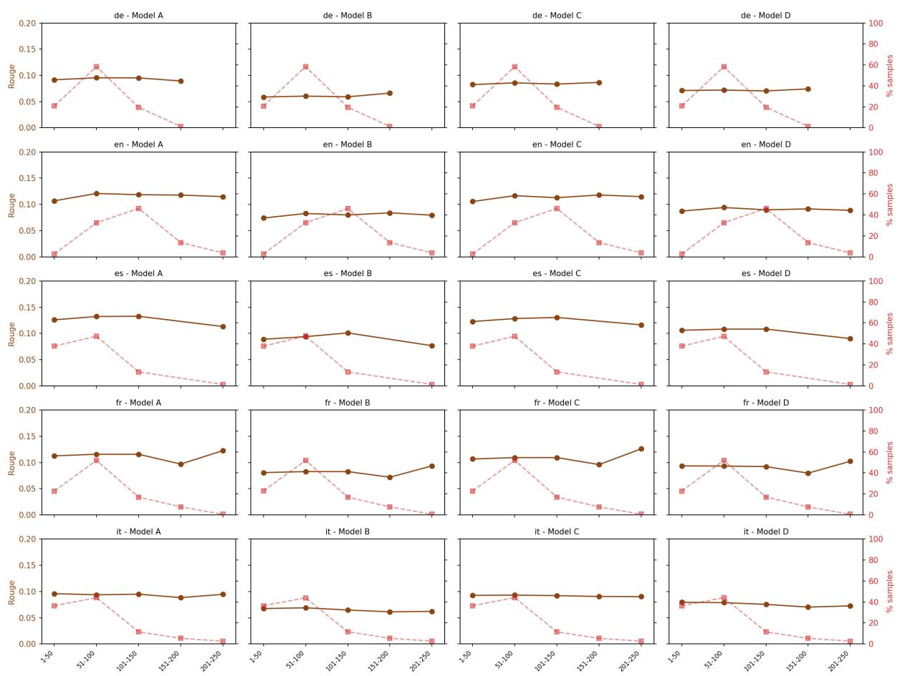  
Figure 20: ROUGE-L between agent and human comments under profile conditioning, stratified by profile word count. Each row is a language; each column is a model. Brown solid line: ROUGE-L (left axis). Red dashed line: proportion of samples in each bucket (right axis).

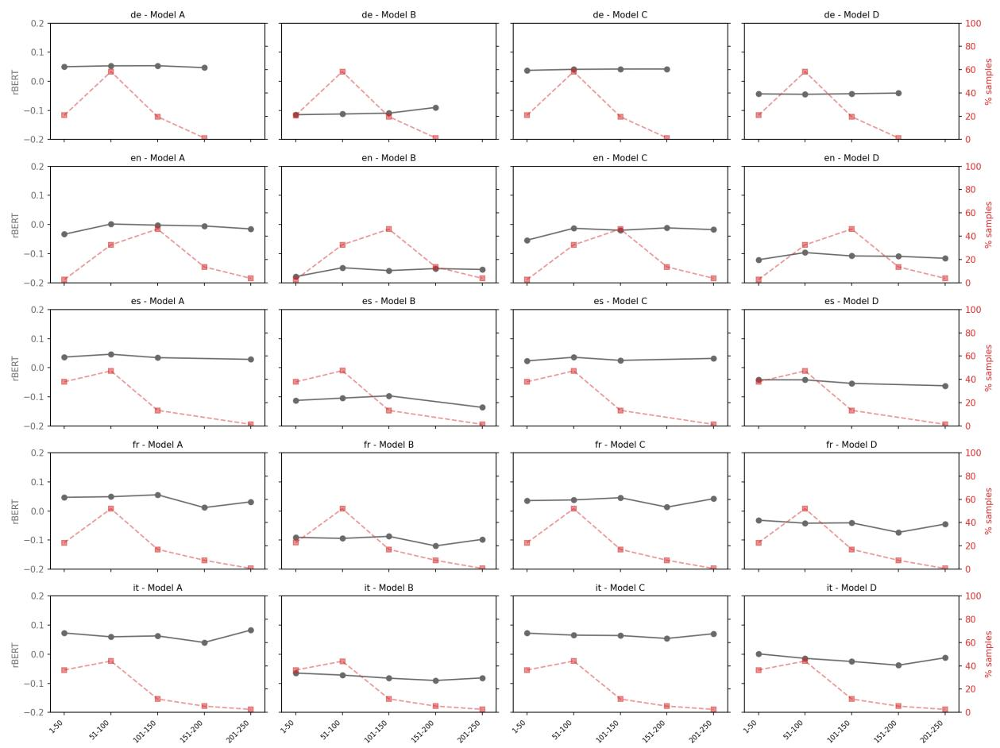  
Figure 21: Rescaled BERTScore (rBERT) between agent and human comments under profile conditioning, stratified by profile word count. Conventions as in Figure 20.

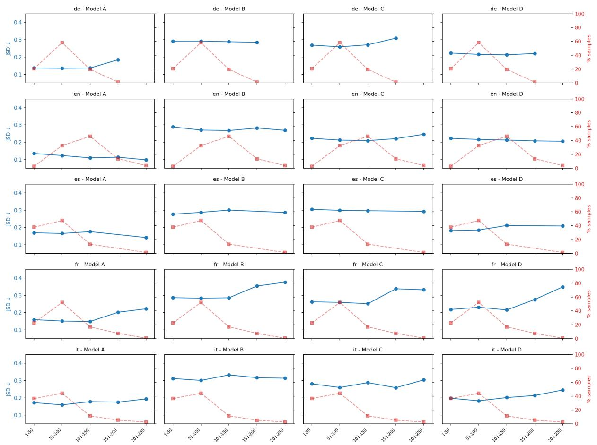  
Figure 22: Dialog act JSD between agent and human distributions under profile conditioning, stratified by profile word count. Lower is better. Conventions as in Figure 20.

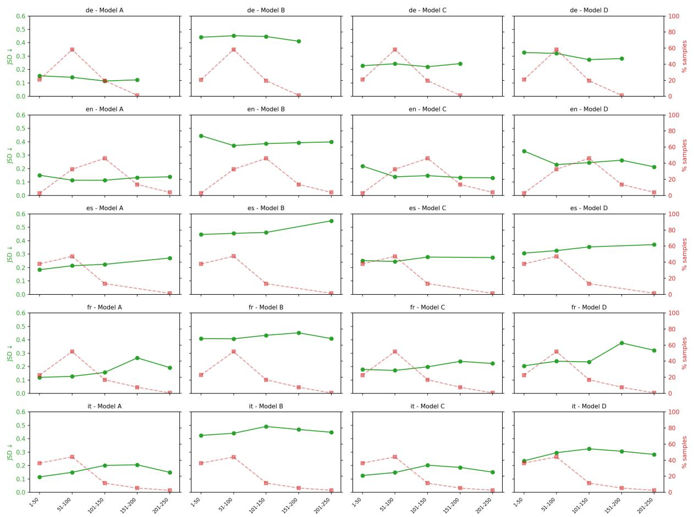  
Figure 23: Sentiment JSD between agent and human distributions under profile conditioning, stratified by profile word count. Lower is better. Conventions as in Figure 20.