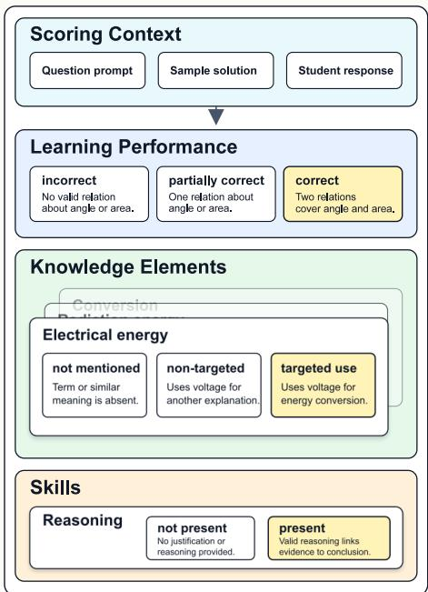
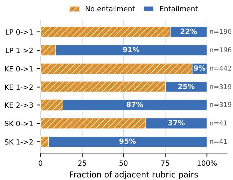
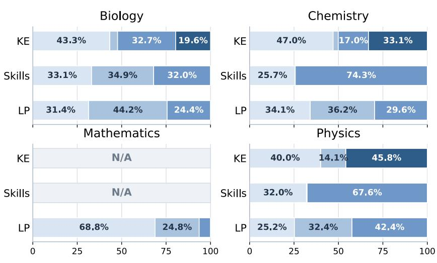
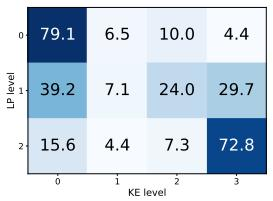
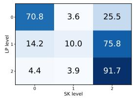
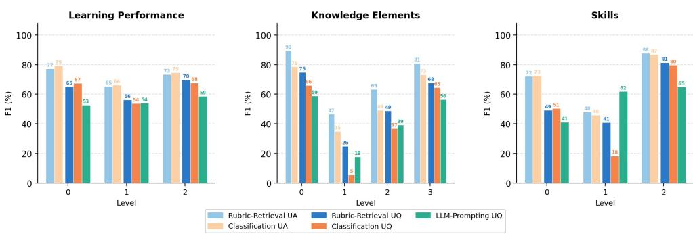
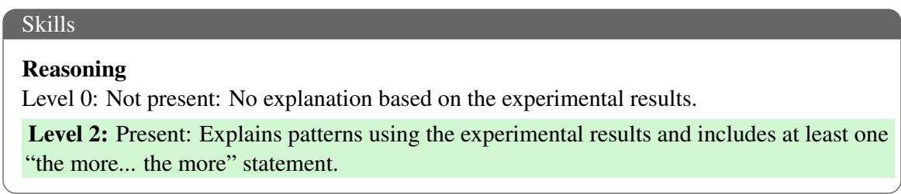
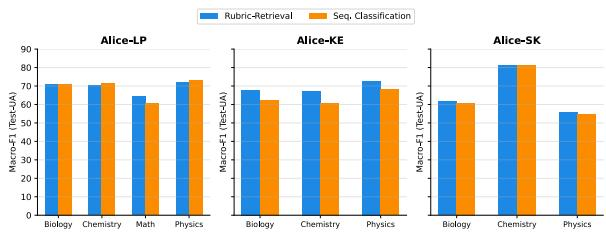
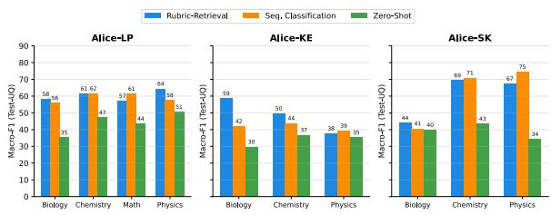

# ALICE: A Large-Scale German Benchmark for Rubric-Based Multidimensional Automatic Short Answer Scoring

Zhifan Sun1, Sebastian Gombert1, Jannik Lossjew2, Tobias Wyrwich2, Berrit Katharina Czinczel2, David Bednorz2, Marcus Kubsch3, Knut Neumann2, Hendrik Drachsler1,4

1DIPF | Leibniz Institute for Research and Information in Education 2IPN | Leibniz Institute for Science and Mathematics Education 3Umeå University

4Computer Science Department & Studiumdigitale, Goethe University Frankfurt

{z.sun,s.gombert,h.drachsler}@dipf.de

{wyrwich,lossjew,czinczel,bednorz,neumann}@leibniz-ipn.de marcus.kubsch@umu.se

## Abstract

Automatic short answer scoring (ASAS) is central to NLP for education. However, openly available benchmarks remain scarce, and existing datasets largely address how well students answer a question directly rather than how well they master underlying concepts (knowledge elements) such as thermal energy or epistemic activities (skills) such as reasoning or claim formulation. To address this gap, we introduce ALICE, a German rubric-based ASAS benchmark with annotations for three subtasks: (i) learning performance (ALICE-LP), (ii) knowledge elements (ALICE-KE), and (iii) skills (ALICE-SK). We compare sequence classification, zero-shot LLM prompting, and rubricretrieval, which serves as our primary benchmark formulation. Our experiments show that ALICE is challenging across all three subtasks, especially on the novel ALICE-KE and AL-ICE-SK subtasks. While sequence classification remains competitive on ALICE-LP, rubricretrieval performs more consistently on ALICE-KE and ALICE-SK. Zero-shot LLMs generally trail supervised approaches, particularly on the more fine-grained subtasks.1

## 1 Introduction

Automatic short answer scoring (ASAS) is a fundamental task in NLP for education. Extensive research has focused on both algorithmic approaches (Bexte et al., 2022; Li et al., 2023; Zehner et al., 2025; Wang et al., 2019; Bexte et al., 2024) and the development of benchmark datasets (Dzikovska et al., 2013; Filighera et al., 2022). In real-world educational settings, especially in scientific education, short-answer questions are designed to probe students’ understanding of concepts taught during instruction. By constructing answers of their own, students can actively reflect on prior learning and foster critical thinking (Bai and Stede, 2023). As manually grading students’ answers is tedious and expensive, developing benchmarks and models that automate this process can significantly alleviate the workload of teachers and ensure timely and individualised feedback. Despite substantial progress, existing ASAS benchmarks and models remain largely misaligned with how human teachers evaluate student responses.

  
Figure 1: An instance from ALICE. Each instance includes a question prompt, a sample solution, and perlevel rubrics for overall learning performance, knowledge elements, and skills. The complete example is shown in Figure 6 in the appendix.

First, most benchmarks, and consequently the models trained and evaluated on them, adopt a solution-based formulation, in which scoring is cast as a comparison with the solution, and they often assume a uniform set of levels across questions (Sung et al., 2019; Filighera et al., 2022; Camus and Filighera, 2020; Ormerod, 2022; Kumar et al., 2019). In practice, however, questions may have different performance levels depending on pedagogical needs, and teachers rely on questionspecific rubrics (Brookhart, 2018; Panadero and Jonsson, 2013; Krebs et al., 2022) for scoring.

Second, in terms of scoring objectives, knowledge elements (concepts) and skills (epistemic activities) are critical in scientific education, where a central goal of pedagogical activities is for students to master scientific concepts and apply epistemic activities to solve problems (Stanja et al., 2023; Gombert et al., 2023; Reynders et al., 2020). Yet, existing ASAS benchmarks only evaluate how students address questions directly.

To address the gaps, we expand ALICE-LP 1.1, introduced by Gombert et al. (2026), into ALICE, a multidimensional German rubric-based ASAS benchmark. Compared with the ALICE-LP 1.1 release, the version used here contains additional student responses and includes annotations for three subtasks: ALICE-LP, which measures how well students answer the question; ALICE-KE, which measures students’ mastery of the target concept; and ALICE-SK, which evaluates students’ epistemic activities. This setting exposes the limitations of previously predominant sequence-classification approaches, which assume a uniform set of possible levels across all questions.

For modelling, we use rubric-retrieval as a primary benchmark formulation, in which student responses are scored by aligning them with questionspecific rubric items rather than predicting fixed labels. This formulation provides a simple and practical benchmarking setup for variable, questionspecific rubrics and is aligned with the benchmark design.

Crucially, every instance in ALICE is accompanied by the question prompt, sample solution, and per-level rubrics for overall learning performance and for each knowledge element and skill (Figure 1), closely aligned with how human teachers evaluate responses. This design allows us to test the extent to which rubric-based ASAS models rely on these contextual components to score responses effectively (see Appendix A for a full instance).

The contributions of our work can be summarised as follows:

• We evaluate rubric-based ASAS models by expanding ALICE-LP 1.1 with additional student responses and KE/SK annotations under a newly defined split.

• We provide a benchmark setup for rubricbased ASAS by approaching scoring as retrieval over question-specific rubric candidates, and compare this setup against sequence classification and zero-shot prompting baselines.

• We present an empirical analysis across masked language models (MLMs) and large language models (LLMs) to study the effect of rubric information and optional context on performance within this expanded setting. We find that MLMs are more prone to performance degradation when given additional question and solution context, whereas LLM encoders benefit from this context more often, suggesting that they can use richer rubric context more reliably.

## 2 Related Work

## 2.1 Short Answer Scoring: Benchmarks

Table 1 provides an overview of existing ASAS benchmarks. Publicly available ASAS benchmarks, especially non-English ones, remain scarce. Existing benchmarks predominantly focus on how well student responses address the question in general, rather than on the mastery of underlying concepts or skills. SCIENTSBANK (Dzikovska et al., 2013) and ASAP-SAS2 are the most widely used datasets in prior work. Multilingual benchmarks include the German SAF (Filighera et al., 2022), the Portuguese PT\_ASAG\_2018 (Galhardi et al., 2018), and the Japanese RIKEN-SAS dataset (Mizumoto et al., 2019; Funayama et al., 2025). Sonkar et al. (2024) extend this setting to paragraph-length answers. Due to privacy constraints, much work in this field evaluates scoring models on proprietary datasets (Chang and Ginter, 2024; Sung et al., 2019; Zehner et al., 2025).

<table><tr><td>Benchmark</td><td>Answers</td><td>Questions</td><td>Context information</td><td>Language coverage</td><td>Public?</td></tr><tr><td>ASAP-SAS</td><td>22K</td><td>10</td><td>question prompt, per-level rubrics</td><td>English</td><td>V</td></tr><tr><td>SCIENTsBANK (Dzikovska et al., 2013)</td><td>10K</td><td>197</td><td>solution, question prompt</td><td>English</td><td>V</td></tr><tr><td>BEETLE (Dzikovska et al., 2013)</td><td>3K</td><td>56</td><td>solution, question prompt</td><td>English</td><td></td></tr><tr><td>PT_ASAG_2018 (Galhardi et al., 2018)</td><td>13K</td><td>8</td><td>solution, question prompt</td><td>Portuguese</td><td>V</td></tr><tr><td>RIKEN-SAS (Mizumoto et al., 2019; Funayama et al., 2025)</td><td>31K</td><td>34</td><td>reading passage, question prompt, analytic rubrics,</td><td>Japanese</td><td>√</td></tr><tr><td>Sung et al. (2019)</td><td></td><td>28</td><td>key phrases solution, question prompt</td><td>English</td><td>X</td></tr><tr><td>SAF (Filighera et al., 2022)</td><td>76K 4.5K</td><td>30</td><td>solution, question</td><td>German, English</td><td>√</td></tr><tr><td>ISTUDIO (Li et al., 2023)</td><td>6.5K</td><td>6</td><td>question context, question prompt, per-level reference</td><td>English</td><td>√</td></tr><tr><td>Chang and Ginter (2024)</td><td></td><td></td><td>answer</td><td></td><td></td></tr><tr><td>RICECHEM (Sonkar et al., 2024)</td><td>76K 1.2K</td><td>10 4</td><td>question prompt additive rubrics</td><td>Finnish English</td><td>× &gt;</td></tr><tr><td>SAS-BENCH (Lai et al., 2025)</td><td>4.1K</td><td>1K</td><td>additive rubrics</td><td>Chinese</td><td>√</td></tr><tr><td>ALICE-LP 1.1 (Gombert et al., 2026)</td><td>13K</td><td>117</td><td>question prompt, solution,</td><td>German</td><td></td></tr><tr><td>ALICE (this work)</td><td>16K</td><td>112</td><td>per-level LP rubrics question prompt, solution, per-level rubrics for LP, KE, and SK</td><td>German</td><td></td></tr></table>

Table 1: Comparison of the ALICE version used in this work with existing ASAS benchmarks. Note that we frame all information other than the student’s answer as context information.

Rubrics We define rubrics in the context of ASAS as natural-language descriptions of student answers at each performance level. Most ASAS benchmarks listed above are solution-based, scoring the student’s answer by comparison with the reference answer. While straightforward to implement, solution-based scoring only measures similarity to the highest-level answer and gives little signal for incorrect or partially correct answers. Such responses often reveal valuable insights into students’ learning progress (Sadler, 1989; Fisher and Lipson, 1986).

Among publicly available rubric-based ASAS benchmarks, ASAP-SAS and ALICE assume an exclusive relation among rubrics; i.e., one answer can satisfy only one rubric. By contrast, RICECHEM (Sonkar et al., 2024) and SAS-BENCH (Lai et al., 2025) assume an additive relation among rubrics, where the final score is obtained by summing the scores of matched rubrics.

Although RIKEN-SAS provides level-specific rubrics, prior modelling work on the dataset uses rubric-provided key phrases as compact positive references for each analytic criterion and regresses a score from the key phrases and student answer (Mizumoto et al., 2019; Funayama et al., 2025). This design relies on selected reference expressions rather than directly comparing the answer against the full set of level-specific rubric descriptions.

## 2.2 Short Answer Scoring: Modelling

Early ASAS approaches used engineered features such as answer length and lexical overlap (Dzikovska et al., 2013; Burrows et al., 2015). With the advent of BERT (Devlin et al., 2019), the field has largely shifted toward pretrained language models. A typical approach is to jointly encode the answer and sample solution, casting scoring as similarity or entailment prediction between the answer and the solution (Sung et al., 2019; Camus and Filighera, 2020). Parallel to this, a small number of works have incorporated rubric information to support scoring, such as Wang et al. (2019) and Sonkar et al. (2024).

Recently, a growing number of works have explored LLM prompting for ASAS (Chang and Ginter, 2024; Ferreira Mello et al., 2025; Lai et al., 2025). Although this approach avoids task-specific fine-tuning, high performance is usually achieved through large proprietary models, which induce high inference costs and latency. In addition, as a classification task, ASAS does not require freeform generation.

Moreover, ASAS is fundamentally an NLU task: the goal is to classify or rank rubric levels given the answers and context information. Framing it as generative decoding is computationally inefficient, since each prediction requires token-by-token generation. In contrast, encoder-based models produce alignment scores in a single forward pass, resulting in substantially lower inference cost.

## 3 The ALICE Dataset

## 3.1 Collection and Definition

ALICE expands ALICE-LP 1.1, the German rubricbased learning-performance dataset introduced by Gombert et al. (2026). The ALICE-LP 1.1 release focuses on learning-performance scoring, whereas the version used in this work contains additional student responses and augments the prior learningperformance annotations with fine-grained scoring of knowledge elements and skills. Each question is associated with three types of rubrics:

• Learning Performance (LP): the degree to which a student’s response directly addresses the question prompt. The three performance levels are incorrect, partially correct, and correct.

• Knowledge Elements (KE): the extent to which a student’s response correctly employs the targeted domain concepts specified for the question. Possible levels are No use, Use without content, Non-targeted use, and Targeted use. The Use without content level is unavailable for some questions.

• Skills (SK): the presence of specified cognitive or reasoning behaviours in a student’s response. The usual levels are Not present and Present. For some questions, we further define Partially present.

These dimensions were chosen to reflect complementary aspects of assessment commonly used in scientific education: task completion, conceptual understanding, and epistemic activity. Note that a question can contain multiple target KEs and SKs, whereas mathematics questions do not contain KEs or SKs. The same KE or SK items can be shared across multiple questions, but their rubrics may vary for different question contexts.

Each instance in ALICE is represented as a tuple $\langle q , a , s , R _ { l p } ^ { ( q ) } , \{ R _ { t } ^ { ( q ) } \} _ { t \in T _ { q } ^ { \mathrm { k e } } } , \{ R _ { t } ^ { ( q ) } \} _ { t \in T _ { q } ^ { \mathrm { s k } } } \rangle$ , where q denotes the question prompt, a the student response, s a sample solution, $R _ { l p } ^ { ( q ) }$ is the learningperformance rubric set for question q, and the final two components are the collections of item-specific rubric sets for its knowledge elements and skills.

The structure of the rubric sets differs across subtasks. For ALICE-LP, the rubric set

$$
R _ { l p } ^ { \left( q \right) } = \{ r _ { 0 } ^ { \left( q \right) } , r _ { 1 } ^ { \left( q \right) } , r _ { 2 } ^ { \left( q \right) } \}
$$

corresponds to the ordered performance levels defined for question $q ,$ where each rubric item describes the qualitative criteria for one score level.

For ALICE-KE and ALICE-SK, each question q contains a set of KE/SK items:

$$
T _ { q } = \{ t _ { 1 } , \dots , t _ { m } \} ,
$$

where each KE/SK item $t _ { j }$ is associated with its own rubric set $R _ { t _ { j } } ^ { ( q ) }$ , which defines the scoring criteria for that specific concept or skill. The number of levels in KE and SK rubrics can vary across questions. The KE and SK items, as well as the rubrics, are designed by pedagogical experts in the respective subjects.

<table><tr><td>Subject</td><td>KE</td><td>SK</td></tr><tr><td>Biology</td><td>0.84</td><td>0.78</td></tr><tr><td>Chemistry</td><td>0.86</td><td>0.65</td></tr><tr><td>Physics</td><td>0.72</td><td>0.69</td></tr></table>

Table 2: Quadratic weighted kappa (κ; QWK) agreement for KE and SK annotations by subject.

## 3.2 Annotation

The data collection and LP annotation protocol follows Gombert et al. (2026). For the extended KE and SK annotations, the scoring dimensions themselves were designed by educators specialising in each subject, and the rest of the annotation workflow was similar to that of ALICE-LP 1.1. We used the same general pilot-and-annotation workflow, with expert annotators scoring responses in four subject-specific phases on the INCEPTION (Klie et al., 2018) platform. During the pilot rounds, annotator feedback was used to refine questionspecific guidelines and rubric wording. Agreement scores are reported in Table 2 as quadratic weighted kappa (κ), computed separately for each subject and scoring dimension rather than aggregated into a single overall value.

## 3.3 Semantic Overlap between Rubric Levels

Rubric levels in ALICE typically form a progression from absence of evidence to increasingly complete demonstrations of understanding. For instance, a higher level requires that the student do X and Y, while a lower one requires that the student do X or Y. Higher-level descriptions might subsume requirements expressed at lower levels rather than describing contradictory requirements. As a result, an answer satisfying a higher-level rubric may also fulfil parts of a lower-level description, even though only one level constitutes the final score.

To examine how many rubric pairs display this structural property, we apply natural language inference (NLI) to pairs of rubrics from adjacent levels, where we treat the rubric of a higher level as the premise and the rubric of a lower level as the hypothesis. The experimental setup is described in Appendix D. The results are shown in Figure 2. We can see that across all three subtasks, adjacent levels do not usually contradict each other, but are often semantically overlapping.

  
Figure 2: NLI label distribution between adjacent higher- and lower-level rubric pairs.

## 3.4 Dataset Statistics

After annotation, we filter out questions without sample solutions (e.g., open-ended questions) to normalise the dataset structure. The result is a corpus of 16,572 student answers. To ensure robust generalisation, we use a newly defined split with Test-UA (unseen answers) and Test-UQ (unseen questions). We construct this split in two steps: first, 22 of the 112 questions are sampled uniformly at random and held out entirely as Test-UQ, so that none of their answers appear in training; the remaining 90 questions form the question pool from which Train and Test-UA are drawn at the answer level. This split differs from the ALICE-LP 1.1 split because the dataset version used here contains additional student responses and KE/SK annotations. Consequently, the results reported in this paper are not directly comparable to published baseline results associated with that release. Detailed split statistics and label distributions by subject are reported in Table 3 and Figure 3.

We observe strong positive correlations between Learning Performance and the other two dimensions: $\mathrm { L P - K E } \left( r = 0 . 7 8 5 , p < 0 . 0 0 1 \right)$ and LP–SK $( r = 0 . 6 3 1 , p < 0 . 0 0 1 )$ . On the other hand, high KE/SK scores do not necessarily translate to high LP scores, and the same holds for low scores, as shown in Figure 4. These results validate our multidimensional framework by demonstrating that, although the dimensions are related, they capture distinct aspects of students’ understanding. For instance, a student who fails to answer the question correctly might still demonstrate sufficient epistemic abilities and mastery of concepts of interest. This provides more fine-grained information about students’ learning progress.

## 4 Modelling Approach

LLMs as Encoders Alongside MLM baselines, we benchmark lightweight decoder-only LLMs as encoders, following recent work showing that autoregressive LLMs can be repurposed as strong discriminative encoders without generation (BehnamGhader et al., 2024; Lin et al., 2025; Ruan et al., 2024; Liu et al., 2024; Lee et al., 2025; Qiao et al., 2025). This is appealing for rubricbased ASAS, where a single input must jointly represent the student answer, the rubric item, and optionally the question and sample solution. We therefore test whether this capacity translates into better use of rubric context and stronger generalisation to unseen questions (§ 5), while avoiding the inference cost of autoregressive decoding.

Rubric-Retrieval We approach rubric-based ASAS via rubric-retrieval: during training and inference, each instance is expanded into answer– rubric pairs and encoded jointly by a language model in a cross-encoder setup. MLMs (Devlin et al., 2019) separate segments with the [SEP] token, while LLM-based encoders use the bestperforming structured format from Ruan et al. (2024). For detailed input formatting, see Appendix B.

The alternative to a cross-encoder is a bi-encoder (Siamese) setup, which encodes answers and rubric items separately and compares them with cosine similarity or dot product. Both architectures are established in the sentence embedding and retrieval literature (Reimers and Gurevych, 2019; Muennighoff et al., 2023); bi-encoders are favoured there primarily for scalability, since embeddings can be precomputed and reused across large candidate pools, whereas cross-encoders must re-encode every pair but generally achieve higher pairwise accuracy. We adopt the cross-encoder because each instance has only a small rubric candidate set, so the additional encoding cost is negligible, while joint encoding enables direct cross-attention between answer and rubric segments, yielding richer interaction features for alignment. This formulation is convenient for settings where rubric sets vary across questions, unlike sequence-classification setups that assume a fixed label space.

Given instance i and rubric item $r _ { j } ^ { i } \in R ^ { i }$ , the encoder $f _ { \theta }$ produces a scalar alignment score:

$$
z _ { i , j } = f _ { \theta } ( q _ { i } , a _ { i } , s _ { i } , r _ { j } ^ { i } ) .
$$

<table><tr><td colspan="2"></td><td colspan="2">LP</td><td colspan="2">KE</td><td colspan="2">SK</td></tr><tr><td>Split</td><td>Subject</td><td>#Q</td><td>#A</td><td>#Q</td><td>#A</td><td>#Q</td><td>#A</td></tr><tr><td rowspan="4">Train</td><td>Biology Chemistry</td><td>8 54</td><td>1,148 5,921</td><td>8 52</td><td>1,148 5,645</td><td>8 53</td><td>1,148 5,755</td></tr><tr><td>Mathematics</td><td>9</td><td>609</td><td>NA</td><td>NA</td><td>NA</td><td>NA</td></tr><tr><td>Physics</td><td>19</td><td>3,103</td><td>18</td><td>2,939</td><td>19</td><td>3,073</td></tr><tr><td>Total</td><td>90</td><td>10,781</td><td>78</td><td>9,732</td><td>80</td><td>9,976</td></tr><tr><td rowspan="5">Test-UQ</td><td>Biology Chemistry</td><td>3</td><td>538</td><td>3</td><td>538</td><td>3</td><td>538</td></tr><tr><td></td><td>12</td><td>1,591</td><td>12</td><td>1,591</td><td>12</td><td>1,587</td></tr><tr><td>Mathematics</td><td>5</td><td>497</td><td>NA</td><td>NA</td><td>NA</td><td>NA</td></tr><tr><td>Physics</td><td>2</td><td>470</td><td>2</td><td>469</td><td>2</td><td>470</td></tr><tr><td>Total</td><td>22</td><td>3,096</td><td>17</td><td>2,598</td><td>17</td><td>2,595</td></tr><tr><td rowspan="5">Test-UA</td><td>Biology</td><td>8</td><td>301</td><td>8</td><td>301</td><td>8</td><td>301</td></tr><tr><td>Chemistry</td><td>53</td><td>1,465</td><td>51</td><td>1,408</td><td>53</td><td>1,425</td></tr><tr><td>Mathematics</td><td>9</td><td>151</td><td>NA</td><td>NA</td><td>NA</td><td>NA</td></tr><tr><td>Physics</td><td>19</td><td>778</td><td>18</td><td>733</td><td>19</td><td></td></tr><tr><td>Total</td><td>89</td><td>2,695</td><td>77</td><td>2,442</td><td>80</td><td>768 2,494</td></tr></table>

Table 3: Split-wise question (#Q) and answer (#A) counts by subject and subtask.

  
Percentage (%)

Figure 3: Distribution of levels across subtasks and subjects. Mathematics has no KE or SK annotations.  
  
(a) LP–KE

  
(b) LP–SK  
Figure 4: Correlation heatmaps between levels of LP and the other two subtasks.

Here, $z _ { i , j } \in \mathbb { R }$ indicates how well rubric item $r _ { j } ^ { i }$ matches answer $a _ { i }$ , optionally conditioned on question $q _ { i }$ and sample solution $s _ { i }$

Related ASAS work has explored pairwise or contrastive supervision, for example by comparing student answers to candidate answers from each level via similarity-based scoring (Bexte et al., 2022) or by framing answer–rubric alignment as an NLI-style decision (Sonkar et al., 2024). However, because the rubrics in ALICE can be semantically overlapping rather than mutually exclusive (§ 3.3) and are also not additive, unlike in Sonkar et al. (2024), binary matching alone is insufficient: the model must explicitly contrast the correct rubric against alternatives within the same set. We therefore use softmax cross-entropy over the rubric set. When a training batch contains instances with different numbers of rubric levels, we mask additional alignment scores to accommodate variable rubric-

set sizes.

This objective directly models competition among rubric levels and yields normalised probabilities over all rubric candidates. As ablations, we also evaluate contrastive loss and a bi-encoder variant, similar to previous work on ALICE-LP in Appendix H.

The probability of rubric item $j$ is defined as

$$
P _ { \theta } ( j \mid i ) = \frac { \exp ( z _ { i , j } ) } { \sum _ { k = 1 } ^ { | R ^ { i } | } \exp ( z _ { i , k } ) } .\tag{1}
$$

Let $y _ { i }$ denote the gold rubric index for instance i. The loss is

$$
\ell _ { \mathrm { S C E } } ^ { ( i ) } = - \log P _ { \theta } ( y _ { i } \mid i ) .\tag{2}
$$

Softmax normalisation and prediction are computed only over the rubric candidates associated with the same question or KE/SK item. At inference time, we predict

$$
\hat { y } _ { i } = \arg \operatorname* { m a x } _ { j \in \{ 1 , . . . , | R ^ { i } | \} } P _ { \theta } ( j \mid i ) .
$$

Masked candidates are excluded before normalisation.

Sequence Classification We also benchmark AL-ICE with a modelling approach commonly used in prior ASAS work (Sung et al., 2019; Camus and Filighera, 2020). Specifically, the student answer and the corresponding sample solution are concatenated and provided as input to a language model with a classification head on top. We refer to this setup as the sequence-classification approach.

This baseline is applied to all ALICE subtasks. For ALICE-KE and ALICE-SK, some questions do not include all intermediate rubric levels. Because the sequence-classification head assumes a fixed, uniform set of level labels across questions, we map levels to indices according to the global level scheme (No use → 0, . . . , Targeted use → 3) and simply omit indices for levels that are not defined for a given question, rather than re-indexing the remaining levels. Note that because scoring in these two subtasks depends on KE and SK, we prepend the corresponding KE/SK name to the model input.

Zero-shot Prompting In addition to the finetuning approach, we run zero-shot prompting with both open-weight and API-hosted proprietary large language models to perform rubric-based scoring by providing the same input components used for encoder-based models, including the student response and the corresponding rubric items, optionally augmented with the question prompt and sample solution. The models are instructed to select the most appropriate rubric level for each instance.

Input Format. We compare base vs. fullcontext input configurations. For rubric-retrieval approaches, the essential inputs are the answer and rubrics; the question and sample solution are optional context. For sequence classification, the question and rubrics are optional context. For zeroshot LLM prompting, we experiment with three input formats: (i) full context plus rubrics, (ii) no context plus rubrics, and (iii) no context with label names only. See Appendix B and Appendix I for input format examples and prompts.

## 5 Benchmarking on ALICE

## 5.1 Experimental Setup

We evaluate rubric-retrieval, sequence classification, and zero-shot LLM prompting across all three ALICE subtasks (ALICE-LP, ALICE-KE, ALICE-SK) on the split in § 3. Test-UA measures generalisation to unseen student answers for seen questions, while Test-UQ measures generalisation to entirely unseen questions, the harder setting. For finetuning, we compare two MLM baselines against four lightweight LLM encoders, with and without full question and sample-solution context. Zeroshot prompting evaluates whether rubric text alone is sufficient to guide large models without taskspecific training. We focus on macro-F1 and UQ generalisation. Complementary QWK results are reported in Table 7. Model configurations and hyperparameters are provided in Appendix F. We further apply rubric-retrieval to ASAP-SAS; see Appendix J.

## 5.2 Results and Discussion

RQ1: What are the differences between rubricretrieval and the classification baseline, and how well do the fine-tuned approaches generalise to unseen questions? Rubric-retrieval outperforms sequence classification more decisively on UQ than on UA. On UQ, it shows consistent gains across all three subtasks, with larger margins on ALICE-KE and ALICE-SK than on ALICE-LP. On UA, the gap narrows substantially; sequence classification remains competitive or slightly ahead on ALICE-LP. For ALICE-LP, sequence classification remains competitive as overall learning performance can often be approximated by comparing a student answer with the sample solution under fixed score labels across questions; accordingly, both approaches degrade similarly on Test-UQ for this subtask. The advantage of rubric-retrieval is clearer for ALICE-KE and ALICE-SK for two reasons. First, as shown in Figure 4, KE and SK scores are not always correlated with LP, indicating that scoring these dimensions requires attending to the rubric descriptions rather than relying primarily on the sample solution. Second, rubric-retrieval may be less sensitive to label imbalance: by aligning responses with rubric candidates rather than predicting from a fixed class distribution, the model is not tied as directly to global class frequencies. For ALICE-KE and ALICE-SK, sequence classification without rubric context degrades more severely on Test-UQ; rubric-retrieval is more robust by aligning to rubric text rather than fixed labels. Adding rubric context to sequence classification (+qr) substantially narrows this gap, confirming that rubric information, rather than training labels alone, is the key driver of question-level generalisation. Figure 5 shows the same pattern at the level granularity: intermediate levels remain difficult, but rubric-retrieval is more stable for the fine-grained knowledge-element and

(a) UA Macro-F1
<table><tr><td rowspan="2">Approach Rub. Ret.</td><td rowspan="2">Model Input format</td><td colspan="2">ALICE-LP</td><td colspan="2">ALICE-KE</td><td colspan="2">ALICE-SK</td></tr><tr><td>ar</td><td>+qs</td><td>ar</td><td>+qs</td><td>ar</td><td>+qs</td></tr><tr><td rowspan="7"></td><td>XLM-RoBERTa-Long</td><td>67.3</td><td>64.5</td><td>65.7</td><td>58.9</td><td>65.5</td><td>62.9</td></tr><tr><td>mmBERT</td><td>71.7</td><td>69.0</td><td>69.5</td><td>70.1</td><td>70.3</td><td>68.6</td></tr><tr><td>Llama-3.2-1B</td><td>72.1</td><td>73.3</td><td>70.8</td><td>70.5</td><td>69.4</td><td>69.5</td></tr><tr><td>Llama-3.2-1B-Instruct</td><td>72.3</td><td>72.9</td><td>70.3</td><td>72.5</td><td>70.0</td><td>70.0</td></tr><tr><td>Llama-3.2-3B</td><td>73.8</td><td>75.4</td><td>72.3</td><td>72.4</td><td>69.9</td><td>70.0</td></tr><tr><td>Llama-3.2-3B-Instruct</td><td>74.8</td><td>76.7</td><td>72.4</td><td>71.0</td><td>70.6</td><td>71.8</td></tr><tr><td>Seq. Class. Input format</td><td>sa</td><td>+qr</td><td>sa</td><td>+qr</td><td>sa</td><td>+qr</td></tr><tr><td rowspan="6"></td><td>XLM-RoBERTa-Long</td><td>68.0</td><td>65.4</td><td>64.5</td><td>64.8</td><td>66.5</td><td>66.7</td></tr><tr><td>mmBERT</td><td>72.1</td><td>71.0</td><td>55.2</td><td>68.9</td><td>68.0</td><td>70.8</td></tr><tr><td>Llama-3.2-1B</td><td>73.5</td><td>72.7</td><td>70.0</td><td>68.8</td><td>67.3</td><td>68.6</td></tr><tr><td>Llama-3.2-1B-Instruct</td><td>75.3</td><td>73.6</td><td>54.8</td><td>69.0</td><td>70.1</td><td>69.0</td></tr><tr><td>Llama-3.2-3B</td><td>75.2</td><td>74.9</td><td>54.7 71.4</td><td></td><td>69.9</td><td>70.1</td></tr><tr><td>Llama-3.2-3B-Instruct</td><td>76.2</td><td>75.1</td><td>54.7 72.0</td><td></td><td>69.2</td><td>71.7</td></tr></table>

(b) UQ Macro-F1
<table><tr><td rowspan="2">Approach Rub. Ret.</td><td>Model</td><td colspan="2">ALICE-LP</td><td colspan="2">ALICE-KE</td><td colspan="2">ALICE-SK</td></tr><tr><td>Input format</td><td>ar</td><td>+qs</td><td>ar</td><td>+qs</td><td>ar</td><td>+qs</td></tr><tr><td rowspan="6"></td><td>XLM-RoBERTa-Long</td><td>62.2</td><td>55.8</td><td>50.9</td><td>38.3</td><td>60.1</td><td>46.6</td></tr><tr><td>mmBERT</td><td>61.5</td><td>60.0</td><td></td><td>52.653.7</td><td>53.9</td><td>56.2</td></tr><tr><td>Llama-3.2-1B</td><td>64.9</td><td>65.9</td><td></td><td>54.4 56.2</td><td>54.7</td><td>61.8</td></tr><tr><td>Llama-3.2-1B-Instruct 66.2</td><td></td><td>65.5</td><td>55.6</td><td>54.3</td><td>60.2</td><td>56.6</td></tr><tr><td>Llama-3.2-3B</td><td>64.7</td><td>66.8</td><td>53.6</td><td>60.0</td><td>57.6</td><td>65.4</td></tr><tr><td>Llama-3.2-3B-Instruct</td><td>62.6</td><td>69.5</td><td>57.4</td><td>57.8</td><td>56.5</td><td>65.0</td></tr><tr><td>Seq. Class.</td><td>Input format</td><td>sa</td><td>+qr</td><td>sa</td><td>+qr</td><td>sa</td><td>+qr</td></tr><tr><td rowspan="6"></td><td>XLM-RoBERTa-Long</td><td>58.1</td><td>57.7</td><td>44.6</td><td>42.6</td><td>52.0</td><td>60.6</td></tr><tr><td>mmBERT</td><td>62.2</td><td>61.6</td><td></td><td>43.453.4</td><td>45.9</td><td>47.1</td></tr><tr><td>Llama-3.2-1B</td><td>63.1</td><td>61.7</td><td>49.3</td><td>48.6</td><td></td><td>44.6 51.0</td></tr><tr><td>Llama-3.2-1B-Instruct 63.3</td><td></td><td>63.8</td><td>40.5</td><td>50.9</td><td>47.0</td><td>53.8</td></tr><tr><td>Llama-3.2-3B</td><td>64.5</td><td>64.8</td><td></td><td>40.4 51.9</td><td>53.3</td><td>60.6</td></tr><tr><td>Llama-3.2-3B-Instruct 66.4</td><td></td><td>65.1</td><td></td><td>41.052.7</td><td></td><td>54.2 59.5</td></tr></table>

(c) Zero-shot UQ Macro-F1
<table><tr><td>Model</td><td colspan="3">LP</td><td colspan="3">KE</td><td colspan="3">SK</td></tr><tr><td></td><td>-r</td><td>+r</td><td>+qs+r</td><td>-r</td><td>+r</td><td>+qs+r</td><td>-r</td><td>+r</td><td>+qs+r</td></tr><tr><td>Mistral-7B-Instruct</td><td>41.1</td><td>48.4</td><td>47.5</td><td>38.8</td><td>37.3</td><td>38.5</td><td>28.8</td><td>29.4</td><td>38.6</td></tr><tr><td>Llama-3.1-8B-Instruct</td><td>45.7</td><td>45.9</td><td>45.1</td><td>31.9</td><td>33.9</td><td>31.2</td><td>48.8</td><td>36.8</td><td>31.9</td></tr><tr><td>Llama-3.3-70B-Instruct</td><td>42.0</td><td>60.6</td><td>58.2</td><td>40.4</td><td>42.0</td><td>36.6</td><td>34.4</td><td>25.5</td><td>26.4</td></tr><tr><td>GPT-4o-mini</td><td>36.0</td><td>60.2</td><td>60.6</td><td>37.1</td><td>46.1</td><td>36.9</td><td>54.1</td><td>58.0</td><td>60.3</td></tr><tr><td>GPT-5-mini</td><td>43.3</td><td>64.0</td><td>66.1</td><td>42.6</td><td>59.8</td><td>59.9</td><td>43.9</td><td>57.6</td><td>59.5</td></tr></table>

Table 4: Main Macro-F1 results on ALICE. Upper panels show fine-tuned UA and UQ results; the lower panel shows zero-shot UQ prompting. In the upper panels, bold marks the best result per subtask; in the lower panel, it marks the best result per input format and subtask. The underline in the upper panels marks cells where sequence classification outperforms rubric-retrieval. Red cells mark full-context results (+qs/+qr/+qs+r) that underperform the base input format (ar/sa/-r) for that model and subtask.

skill distinctions.

RQ2: Are LLMs as encoders suitable for ASAS? The results support lightweight LLMs as strong ASAS encoders. Under rubric-retrieval, LLM encoders produce the best results for all subtasks: Llama-3.2-3B-Instruct is strongest on ALICE-LP UQ, while Llama-3.2-3B gives the best UQ results on ALICE-KE and ALICE-SK. MLM baselines remain competitive in some fixed-label sequenceclassification settings, such as ALICE-KE UQ with mmBERT, but these exceptions do not overturn the broader trend that larger, decoder-based encoders tend to generalise better to unseen questions on ALICE.

Zero-shot prompting with strong proprietary models is also competitive: GPT-5-mini approaches fine-tuned performance on ALICE-LP and ALICE-KE, while GPT-4o-mini is close to the sequence-classification baseline on ALICE-SK. Among open-weight models, Llama-3.3-70B-Instruct substantially outperforms the smaller openweight models on ALICE-LP and approaches GPT-4o-mini on that subtask; however, it underperforms the proprietary models on ALICE-KE and ALICE-SK, suggesting that, on ALICE, scale alone does not close the gap on the more fine-grained subtasks. Overall, the results support LLMs both as encoders and, in stronger proprietary settings, as zero-shot scorers; supervised rubric-retrieval remains the most reliable configuration.

  
Figure 5: Per-level F1 across ALICE subtasks and evaluation settings.

RQ3: How does additional context affect model performance? Additional context helps, but the benefit varies across subtasks and approaches. For rubric-retrieval, the full +qs format benefits AL ICE-KE and ALICE-SK more consistently than ALICE-LP, particularly with stronger LLM encoders. For sequence classification, ALICE-LP benefits less from added question and rubric information, whereas ALICE-KE and ALICE-SK gain more substantially, consistent with the greater rubricdependence of these subtasks. In zero-shot prompting, rubric text is the key driver of improvement: moving from label names to rubric descriptions often yields substantial gains, especially for stronger proprietary models. Smaller open-weight models benefit less, and for ALICE-KE and ALICE-SK, extending the prompt beyond rubric text to include the full question context can even degrade performance, suggesting these models struggle to selectively leverage additional information. On ALICE, rubric text thus emerges as the most informative contextual signal; full context provides additional benefit mainly when the model can leverage it reliably.

## 6 Conclusion

We introduce ALICE, a German rubric-based ASAS benchmark for learning performance, knowledge elements, and skills. Beyond the dataset, we provide a rubric-retrieval benchmark formulation that accommodates question-specific rubric structures and serves as a practical alternative to fixedlabel sequence classification.

Our experiments show that rubric-retrieval and sequence classification are both competitive on AL-ICE-LP, while rubric-retrieval shows clearer advantages on ALICE-KE and ALICE-SK. The results further suggest that for the fine-tuned models, rubric information is particularly important for these latter two subtasks, whereas for ALICE-LP the relative benefit over sample-solution-focused scoring is smaller. For zero-shot LLM prompting, per-level rubric text is important across all subtasks.

## 7 Limitations

This work has several limitations. First, ALICE focuses on German-language scientific education, and while the dataset design is general, results may not directly transfer to other languages or subject domains. Second, although we evaluate a range of encoder architectures, we restrict our study to discriminative models and do not explore generative scoring or feedback generation. Future work on feedback generation and pedagogical capabilities of LLMs could benefit from integrating finegrained assessment dimensions such as knowledge elements and skills.

While rubric-retrieval proves effective and generalises well to unseen questions and questiondependent rubric structures, it requires expanding each answer into multiple answer–rubric pairs, which increases training and inference costs and limits scalability to larger models. Finally, rubricbased scoring relies on the availability of highquality rubrics, which may not always be accessible in real-world settings. Exploring LLMaugmented rubrics and other contextual information is a promising direction for future research.

## 8 Ethical Statement

The ALICE benchmark is constructed from student responses to assessment items collected in routine classroom settings. We obtained all data under appropriate educational governance and privacy protections; identifiers were removed, and responses were anonymised before annotation to safeguard student privacy. Annotators were compensated for their work, and annotation quality was monitored through pilot rounds, rubric revisions, and adjudication.

We acknowledge that automated short-answer scoring systems can influence educational outcomes, and misuse may unfairly advantage or disadvantage students if deployed without appropriate safeguards. ALICE is intended for research on rubric-based short-answer scoring. Models evaluated on this benchmark should be interpreted as tools for supporting instructional practice, not as replacements for expert human judgment. We encourage researchers to consider bias, fairness, and interpretability when developing and reporting models on ALICE, and to avoid applications that could reinforce inequitable treatment of learners.

## Acknowledgments

This work was supported by the Volkswagen Foundation through the project From Machine Learning to Machine Teaching: Making Machines AND Humans Smarter (ML2MT). The GPU resources used in this work were provided by Hessian.ai.

## References

Xueqing Bai and Manfred Stede. 2023. A survey of current machine learning approaches to student free-text evaluation for intelligent tutoring. International Journal ofArtificial Intelligence in Education, 33:992– 1030.

Parishad BehnamGhader, Vaibhav Adlakha, Marius Mosbach, Dzmitry Bahdanau, Nicolas Chapados, and Siva Reddy. 2024. LLM2Vec: Large language models are secretly powerful text encoders. In First Conference on Language Modeling.

Marie Bexte, Andrea Horbach, and Torsten Zesch. 2022. Similarity-based content scoring - how to make S-BERT keep up with BERT. In Proceedings of the 17th Workshop on Innovative Use of NLP for Building Educational Applications (BEA 2022), pages 118– 123, Seattle, Washington. Association for Computational Linguistics.

Marie Bexte, Andrea Horbach, and Torsten Zesch. 2024. Strengths and weaknesses of automated scoring of free-text student answers. Informatik Spektrum, 47:78–86.

Susan M. Brookhart. 2018. Appropriate criteria: Key to effective rubrics. Frontiers in Education, 3:22.

Steven Burrows, Iryna Gurevych, and Benno Stein. 2015. The eras and trends of automatic short answer grading. International Journal of Artificial Intelligence in Education, 25:60–117.

Leon Camus and Anna Filighera. 2020. Investigating transformers for automatic short answer grading. In Artificial Intelligence in Education: 21st International Conference, AIED 2020, Ifrane, Morocco, July 6–10, 2020, Proceedings, Part II, page 43–48, Berlin, Heidelberg. Springer-Verlag.

Li-Hsin Chang and Filip Ginter. 2024. Automatic short answer grading for Finnish with ChatGPT. In Proceedings of the Thirty-Eighth AAAI Conference on Artificial Intelligence (AAAI-24), pages 23173–23181.

Jacob Devlin, Ming-Wei Chang, Kenton Lee, and Kristina Toutanova. 2019. BERT: Pre-training of deep bidirectional transformers for language understanding. In Proceedings ofthe 2019 Conference of the North American Chapter of the Association for Computational Linguistics: Human Language Technologies, Volume 1 (Long and Short Papers), pages 4171–4186, Minneapolis, Minnesota. Association for Computational Linguistics.

Myroslava Dzikovska, Rodney Nielsen, Chris Brew, Claudia Leacock, Danilo Giampiccolo, Luisa Bentivogli, Peter Clark, Ido Dagan, and Hoa Trang Dang. 2013. SemEval-2013 task 7: The joint student response analysis and 8th recognizing textual entailment challenge. In Second Joint Conference on Lexical and Computational Semantics (\*SEM), Volume 2: Proceedings of the Seventh International Workshop on Semantic Evaluation (SemEval 2013), pages 263–274, Atlanta, Georgia, USA. Association for Computational Linguistics.

Rafael Ferreira Mello, Cleon Pereira Junior, Luiz Rodrigues, Filipe Dwan Pereira, Luciano Cabral, Newarney Costa, Geber Ramalho, and Dragan Gaševic.´ 2025. Automatic short answer grading in the LLM Era: Does GPT-4 with prompt engineering beat traditional models? In LAK25: The 15th International Learning Analytics and Knowledge Conference, pages 93–103, New York, NY, USA. Association for Computing Machinery.

Anna Filighera, Siddharth Parihar, Tim Steuer, Tobias Meuser, and Sebastian Ochs. 2022. Your answer is incorrect... would you like to know why? introducing a bilingual short answer feedback dataset. In Proceedings ofthe 60th Annual Meeting ofthe Association for Computational Linguistics (Volume 1: Long Papers), pages 8577–8591, Dublin, Ireland. Association for Computational Linguistics.

Kathleen Fisher and Joseph I. Lipson. 1986. Twenty questions about student errors. Journal of Research in Science Teaching, 23:783–803.

Hiroaki Funayama, Yuichiroh Matsubayashi, Yuya Asazuma, Tomoya Mizumoto, and Kentaro Inui. 2025. Cross-prompt pre-finetuning of language models for short answer scoring. International Journal

ofArtificial Intelligence in Education, 35(4):2399– 2420.

Lucas Busatta Galhardi, Cinthyan Renata Barbosa, Rodrigo Clemente Thom de Souza, and Jacques D. Brancher. 2018. Portuguese automatic short answer grading. In Proceedings ofthe Brazilian Symposium on Computers in Education (SBIE). Proceedings paper; dataset for Portuguese short answer grading.

Sebastian Gombert, Daniele Di Mitri, Onur Karademir, Marcus Kubsch, Hannah Kolbe, Simon Tautz, Adrian Grimm, Isabell Bohm, Knut Neumann, and Hendrik Drachsler. 2023. Coding energy knowledge in constructed responses with explainable NLP models. Journal ofComputer Assisted Learning, 39(3):767– 786.

Sebastian Gombert, Zhifan Sun, Fabian Zehner, Jannik Lossjew, Tobias Wyrwich, Berrit Czinczel, David Bednorz, Sascha Bernholt, Knut Neumann, Ute Harms, Aiso Heinze, and Hendrik Drachsler. 2026. Report on the BEA 2026 shared task on rubric-based short answer scoring for German. In Proceedings of the 21st Workshop on Innovative Use of NLP for Building Educational Applications (BEA 2026), pages 1179–1192, San Diego, California, USA. Association for Computational Linguistics.

Jan-Christoph Klie, Michael Bugert, Beto Boullosa, Richard Eckart de Castilho, and Iryna Gurevych. 2018. The INCEpTION platform: Machine-assisted and knowledge-oriented interactive annotation. In Proceedings ofthe 27th International Conference on Computational Linguistics: System Demonstrations, pages 5–9, Santa Fe, New Mexico. Association for Computational Linguistics.

Saskia S. Krebs, Marijke Verbeke, Cees van der Vleuten, Filip Dochy, and Katrien Struyven. 2022. Rubrics enhance accuracy and reduce cognitive load in selfassessment and task performance. Journal of the Learning Sciences, 31(6):707–743.

Yaman Kumar, Swati Aggarwal, Debanjan Mahata, Rajiv Ratn Shah, Ponnurangam Kumaraguru, and Roger Zimmermann. 2019. Get it scored using autosas—an automated system for scoring short answers. In Proceedings of the Thirty-Third AAAI Conference on Artificial Intelligence and Thirty-First Innovative Applications ofArtificial Intelligence Conference and Ninth AAAI Symposium on Educational Advances in Artificial Intelligence, pages 9662–9669.

Peichao Lai, Kexuan Zhang, Yi Lin, Linyihan Zhang, Feiyang Ye, Jinhao Yan, Yanwei Xu, Conghui He, Yilei Wang, Wentao Zhang, and Bin Cui. 2025. Sasbench: A fine-grained benchmark for evaluating short answer scoring with large language models. Preprint, arXiv:2505.07247.

Chankyu Lee, Rajarshi Roy, Mengyao Xu, Jonathan Raiman, Mohammad Shoeybi, Bryan Catanzaro, and Wei Ping. 2025. NV-Embed: Improved techniques for training LLMs as generalist embedding models.

In The Thirteenth International Conference on Learning Representations.

Zhaohui Li, Susan Lloyd, Matthew Beckman, and Rebecca Passonneau. 2023. Answer-state recurrent relational network (AsRRN) for constructed response assessment and feedback grouping. In Findings ofthe Associationfor Computational Linguistics: EMNLP 2023, pages 3879–3891, Singapore. Association for Computational Linguistics.

Ziyong Lin, Haoyi Wu, Shu Wang, Kewei Tu, Zilong Zheng, and Zixia Jia. 2025. Look both ways and no sink: Converting LLMs into text encoders without training. In Proceedings ofthe 63rd Annual Meeting ofthe Associationfor Computational Linguistics (Volume 1: Long Papers), pages 22839–22853, Vienna, Austria. Association for Computational Linguistics.

Chun Liu, Hongguang Zhang, Kainan Zhao, Xinghai Ju, and Lin Yang. 2024. LLMEmbed: Rethinking lightweight LLM’s genuine function in text classification. In Proceedings of the 62nd Annual Meeting of the Associationfor Computational Linguistics (Volume 1: Long Papers), pages 7994–8004, Bangkok, Thailand. Association for Computational Linguistics.

Tomoya Mizumoto, Hiroki Ouchi, Yoriko Isobe, Paul Reisert, Ryo Nagata, Satoshi Sekine, and Kentaro Inui. 2019. Analytic score prediction and justification identification in automated short answer scoring. In Proceedings ofthe Fourteenth Workshop on Innovative Use of NLP for Building Educational Applications, pages 316–325, Florence, Italy. Association for Computational Linguistics.

Niklas Muennighoff, Nouamane Tazi, Loic Magne, and Nils Reimers. 2023. MTEB: Massive text embedding benchmark. In Proceedings ofthe 17th Conference ofthe European Chapter ofthe Associationfor Computational Linguistics, pages 2014–2037, Dubrovnik, Croatia. Association for Computational Linguistics.

Christopher Ormerod. 2022. Short-answer scoring with ensembles of pretrained language models. Preprint, arXiv:2202.11558.

Ernesto Panadero and Anders Jonsson. 2013. The use of scoring rubrics for formative assessment purposes revisited: a review. Educational Research Review, 9:129–144.

Dan Qiao, Yuan Gao, Zheming Yang, Di Yang, Ziheng Wu, Pengcheng Lu, Minghui Qiu, Juntao Li, and Min Zhang. 2025. Decoder-only LLMs can be masked auto-encoders. In Proceedings of the 63rd Annual Meeting of the Association for Computational Linguistics (Volume 2: Short Papers), pages 713–723, Vienna, Austria. Association for Computational Linguistics.

Lakshmi Ramachandran, Jian Cheng, and Peter Foltz. 2015. Identifying patterns for short answer scoring using graph-based lexico-semantic text matching. In Proceedings of the Tenth Workshop on Innovative Use of NLP for Building Educational Applications,

pages 97–106, Denver, Colorado. Association for Computational Linguistics.

Nils Reimers and Iryna Gurevych. 2019. Sentence-BERT: Sentence embeddings using Siamese BERTnetworks. In Proceedings ofthe 2019 Conference on Empirical Methods in Natural Language Processing and the 9th International Joint Conference on Natural Language Processing (EMNLP-IJCNLP), pages 3982–3992, Hong Kong, China. Association for Computational Linguistics.

Gilbert Reynders, Juliette Lantz, Suzanne M. Ruder, Courtney L. Stanford, and Renée S. Cole. 2020. Rubrics to assess critical thinking and information processing in undergraduate STEM courses. International Journal ofSTEM Education, 7(1):9.

Brian Riordan, Andrea Horbach, Aoife Cahill, Torsten Zesch, and Chong Min Lee. 2017. Investigating neural architectures for short answer scoring. In Proceedings of the 12th Workshop on Innovative Use of NLP for Building Educational Applications, pages 159–168, Copenhagen, Denmark. Association for Computational Linguistics.

Qian Ruan, Ilia Kuznetsov, and Iryna Gurevych. 2024. Are large language models good classifiers? a study on edit intent classification in scientific document revisions. In Proceedings of the 2024 Conference on Empirical Methods in Natural Language Processing, pages 15049–15067, Miami, Florida, USA. Association for Computational Linguistics.

D. Royce Sadler. 1989. Formative assessment and the design of instructional systems. Instructional Science, 18(2):119–144.

Shashank Sonkar, Kangqi Ni, Lesa Tran Lu, Kristi Kincaid, John S. Hutchinson, and Richard G. Baraniuk. 2024. Automated long answer grading with RiceChem dataset. In Artificial Intelligence in Education, volume 14829 of Lecture Notes in Computer Science, pages 163–176, Cham. Springer.

Judith Stanja, Wolfgang Gritz, Johannes Krugel, Anett Hoppe, and Sarah Dannemann. 2023. Formative assessment strategies for students’ conceptions—the potential of learning analytics. British Journal of Educational Technology, 54(1):58–75.

Chul Sung, Tejas Dhamecha, Swarnadeep Saha, Tengfei Ma, Vinay Reddy, and Rishi Arora. 2019. Pretraining BERT on domain resources for short answer grading. In Proceedings of the 2019 Conference on Empirical Methods in Natural Language Processing and the 9th International Joint Conference on Natural Language Processing (EMNLP-IJCNLP), pages 6071–6075, Hong Kong, China. Association for Computational Linguistics.

Tianqi Wang, Naoya Inoue, Hiroki Ouchi, Tomoya Mizumoto, and Kentaro Inui. 2019. Inject rubrics into short answer grading system. In Proceedings of the 2nd Workshop on Deep Learning Approaches for Low-Resource NLP (DeepLo 2019), pages 175–182,

Hong Kong, China. Association for Computational Linguistics.

Fabian Zehner, Hyo Jeong Shin, Emily Kerzabi, Andrea Horbach, Sebastian Gombert, Frank Goldhammer, Torsten Zesch, and Nico Andersen. 2025. Down the cascades of omethi: Hierarchical automatic scoring in large-scale assessments. In Proceedings of the 20th Workshop on Innovative Use ofNLPfor Building Educational Applications (BEA 2025), Vienna, Austria. Association for Computational Linguistics.

## A Dataset Example

See Figure 6. In this example, level 1 is absent from the knowledge-element rubrics because it is reserved for the “Use without content” scenario and is therefore not defined for this Physics item. Likewise, the skills rubric for this question does not include level 1 (“partially present”).

Prompt: Based on the patterns and measured values, derive two “the more... the more” statements for the alignment of the PV cell.

The more perpendicular the PV cell is aligned to the radiation source, the higher the electrical energy. The more light reaches the PV cell (the less the PV cell is shaded), the higher the electrical energy.

## Student Response

Answer: The more directly the light source shines on the solar panel, the higher the generated voltage. The more of the panel was covered, the less voltage was generated.

## Learning Performance

Level 0: The student does not formulate any “the more... the more” statement about the angle of incidence or the illuminated area.

Level 1: The student formulates one statement about either the angle or the illuminated area.

Level 2: The student formulates two statements, covering both the angle and the illuminated area.

<table><tr><td>Knowledge Elements</td></tr><tr><td>Electrical Energy Level 0: The term or similar meanings are not mentioned.</td></tr><tr><td>Level 2: Non-targeted use: The students use the voltage to explain something other than</td></tr><tr><td>energy conversion. Level 3: Targeted use: voltage is used to make statements about energy conversion.</td></tr><tr><td>Radiation Energy Level 0: The term or similar meanings are not mentioned.</td></tr><tr><td>Level 2: Non-targeted use: The students use angles or shading to explain something other</td></tr><tr><td>than energy conversion. Level 3: Targeted use: angle or shading is used to make statements about energy conversion.</td></tr><tr><td>Conversion</td></tr><tr><td>Level 0: The term or similar meanings are not mentioned. Level 2: Non-targeted use: The students use transformation concepts to explain something</td></tr></table>

  
Figure 6: Illustrative benchmark instance, translated from German to English. Selected rubric levels are highlighted in green.

## B Input Formats of LLMs

Ruan et al. (2024) compare two input formats for LLM-based classification: natural language and structured. The former uses natural-language sequence boundaries, while the latter marks sequence boundaries with XML-style tags. The structured formatting approach achieved better results, so we use it in our experiments.

## Sequence Classification

<Frage>Leitet auf Grundlage der Muster und der Messwerte zwei "Je - desto" Aussagen fuer die Ausrichtung der PVzelle ab.</Frage>

<Loesung>Je senkrechter die PVzelle zur Strahlungsquelle ausgerichtet ist, desto hoeher ist die Elektrische Energie. Je mehr Licht die PVzelle erreicht (je geringer die PVzelle verschattet ist), desto hoeher ist die Elektrische Energie.</Loesung>

<Antwort>Je anders der Winkel ist desto anders sind auch die Messwerte</Antwort>

<Rubrik>nicht richtig:Die SuS formulieren keine je-desto-Aussagen zum Einstrahlungswinkel und beschienenen Flaeche.</Rubrik>

<Rubrik>teilweise richtig:Die SuS formulieren eine je-desto-Aussagen zu

Einstrahlungswinkel oder beschienenen Flaeche.</Rubrik>

<Rubrik>richtig:Die SuS formulieren zwei jedesto-Aussagen zu Einstrahlungswinkel und beschienenen Flaeche.</Rubrik>

## Rubric-Retrieval

\# candidate rubric\_level=0, label=0

<Frage>Leitet auf Grundlage der Muster und der Messwerte zwei "Je - desto" Aussagen fuer die Ausrichtung der PVzelle ab.</Frage>

<Loesung>Je senkrechter die PVzelle zur Strahlungsquelle ausgerichtet ist, desto hoeher ist die Elektrische Energie. Je mehr Licht die PVzelle erreicht (je geringer die PVzelle verschattet ist), desto hoeher ist die Elektrische Energie.</Loesung>

<Antwort>Je anders der Winkel ist desto anders sind auch die Messwerte</Antwort>

<Rubrik>nicht richtig:Die SuS formulieren keine je-desto-Aussagen zum Einstrahlungswinkel und beschienenen Flaeche.</Rubrik>

\# candidate rubric\_level=1, label=1

<Frage>Leitet auf Grundlage der Muster und der Messwerte zwei "Je - desto" Aussagen fuer die Ausrichtung der PVzelle ab.</Frage>

<Loesung>Je senkrechter die PVzelle zur Strahlungsquelle ausgerichtet ist, desto hoeher ist die Elektrische Energie. Je mehr Licht die PVzelle erreicht (je geringer die PVzelle verschattet ist), desto hoeher ist die Elektrische Energie.</Loesung>

<Antwort>Je anders der Winkel ist desto anders sind auch die Messwerte</Antwort>

<Rubrik>teilweise richtig:Die SuS formulieren eine je-desto-Aussagen zu Einstrahlungswinkel oder beschienenen Flaeche.</Rubrik>

\# candidate rubric\_level=2, label=0

<Frage>Leitet auf Grundlage der Muster und der Messwerte zwei "Je - desto" Aussagen fuer die Ausrichtung der PVzelle ab.</Frage>

<Loesung>Je senkrechter die PVzelle zur Strahlungsquelle ausgerichtet ist, desto hoeher ist die Elektrische Energie. Je mehr Licht die PVzelle erreicht (je geringer die PVzelle verschattet ist), desto hoeher ist die Elektrische Energie.</Loesung>

<Antwort>Je anders der Winkel ist desto anders sind auch die Messwerte</Antwort>

<Rubrik>richtig:Die SuS formulieren zwei jedesto-Aussagen zu Einstrahlungswinkel und beschienenen Flaeche.</Rubrik>

## C Full KE and SK Items List

Table 5: Knowledge Element (KE) item names per subject. Each entry is a domain concept that students are scored on independently.
<table><tr><td rowspan=21 colspan=1></td><td rowspan=2 colspan=11>Subject     KE items</td><td></td></tr><tr><td rowspan=23 colspan=1></td></tr><tr><td rowspan=1 colspan=11>Biology      Gendrift (Genetic Drift), Genetik (Genetics), Mutation (Mutation), Natürliche Selektion (Natural Selec-tion), Sexuelle Selektion (Sexual Selection), Variation (Variation), Wahrscheinlichkeit (Probability),</td></tr><tr><td rowspan=1 colspan=11>Zufall (Randomness)</td></tr><tr><td rowspan=1 colspan=11>Chemistry     Abklingfunktion (Decay Function), Aggregatzustand (State of Matter), Aggregatzustände (States</td></tr><tr><td rowspan=1 colspan=11>of Matter), Aktivierungsenergie (Activation Energy), Anzahl an Gasteilchen (Number of Gas Parti-</td></tr><tr><td rowspan=1 colspan=5></td><td rowspan=1 colspan=6>cles), Dissoziation (Dissociation), Druck (Pressure), Druckänderung (Pressure Change), Dynamisches</td></tr><tr><td rowspan=1 colspan=5></td><td rowspan=1 colspan=6>Gleichgewicht (Dynamic Equilibrium), Eduktregenerierung (Reactant Regeneration), Einflussfaktor</td></tr><tr><td rowspan=1 colspan=5></td><td rowspan=1 colspan=6>Druck (Influencing Factor: Pressure), Einflussfaktor Temperatur (Influencing Factor: Temperature),</td></tr><tr><td rowspan=2 colspan=5></td><td rowspan=1 colspan=6>Endotherme Rückreaktion (Endothermic Reverse Reaction), Energieumsatz (Energy Conversion), Exem-</td></tr><tr><td rowspan=1 colspan=6>plarität/Deduktion (Exemplarity/Deduction), Exotherme Hinreaktion (Exothermic Forward Reaction),</td></tr><tr><td rowspan=2 colspan=5></td><td rowspan=1 colspan=6>Gasentwicklung (Gas Evolution), Geschlossenes System (Closed System), Gleichgewichtseinstel-</td></tr><tr><td rowspan=1 colspan=6>lung (Equilibrium Establishment), Gleichgewichtskonstante (Equilibrium Constant), Gleichzeitigkeit</td></tr><tr><td rowspan=1 colspan=5></td><td rowspan=1 colspan=6>(Simultaneity), Hinreaktion (Forward Reaction), Inaktivierung (Inactivation), Katalysator (Catalyst),</td></tr><tr><td rowspan=1 colspan=11>Katalysatorrückbildung (Catalyst Regeneration), Kollision (Collision), Konzentration (Concentra-tion), Kostenintensivität (Cost Intensity), Ladungsträger (Charge Carrier), Leitfähigkeit (Conductivity)</td></tr><tr><td rowspan=2 colspan=11>Makroskopisches Reaktionsende (Macroscopic Reaction Endpoint), Masse (Mass), Mindestenergie(Minimum Energy), Mindestenergie/Aktivierungsenergie (Minimum Energy/Activation Energy), Mittel-wert (Mean), Neueinstellung (Re-Establishment of Equilibrium), Offenes System (Open System), Pro-duktentfernung (Product Removal), Reaktionsenthalpie (Reaction Enthalpy), Reaktionsgeschwindigkeit(Reaction Rate), Reaktionsrate (Reaction Rate), Reaktionsweg (Reaction Pathway), Reaktionszeit (Re-</td></tr><tr><td rowspan=1 colspan=10>action Time), Rückreaktion (Reverse Reaction), Sekantensteigung (Secant Slope), Stoffmenge (Amount</td></tr><tr><td rowspan=2 colspan=5></td><td rowspan=1 colspan=5>of Substance), Stoffumsatz (Substance Conversion), St</td><td rowspan=1 colspan=2>action Time), Rückreaktion (Reverse Reacti</td><td rowspan=1 colspan=1>offumwandlung (Substance Transformation).</td></tr><tr><td rowspan=2 colspan=9>Stoßwahrscheinlichkeit (Collision Probability), Stoßwirksamkeit (Collision Effectiveness), System(System), Sättigungskurve (Saturation Curve), Sättigungsfunktion (Saturation Function), Tangenten-</td><td rowspan=1 colspan=3></td><td rowspan=1 colspan=1>virksamkeit (Collision Effectiveness), System</td></tr><tr><td rowspan=2 colspan=11>Interaction), Temperatur (Temperature), Ungleichheit von Entitäten (Inequality of Entities), Unvoll-ständigkeit (Incompleteness), Volumen (Volume), Wiedereinstellung (Re-Establishment), WirksamkeitKatalysator (Catalyst Effectiveness), Zeitintervall (Time Interval), Zeitunabhängigkeit (Time Indepen-dence), Zellgift (Cytotoxin), Zellweger-Syndrom (Zellweger Syndrome), Zerteilungsgrad (Degree ofDispersion), Zufallsfehler (Random Error)</td></tr><tr><td rowspan=1 colspan=1>Interaction), Temperatu</td></tr><tr><td rowspan=3 colspan=1></td><td rowspan=1 colspan=11>Mathematics</td></tr><tr><td rowspan=1 colspan=11>Physics      Chemische Energie (Chemical Energy), Elektrische Energie (Electrical Energy), Energieversorgung(Gesellschaft) (Energy Supply: Society), Energieversorgung (Ökologie) (Energy Supply: Ecology),Kinetische Energie (Kinetic Energy), Strahlungsenergie (Radiation Energy), Thermische Energie(Thermal Energy), Umwandlung (Conversion)</td></tr><tr><td rowspan=1 colspan=11></td></tr><tr><td rowspan=1 colspan=13>Subject      SK items</td></tr><tr><td rowspan=1 colspan=13>Biology      Beschreiben den Experimentaufbau (Describe the Experimental Setup), Bewerten der Daten (Evaluate the Data), Claim (Claim),Erläutern die Erklärungskraft eines Modells (Explain the Explanatory Power of a Model), Evidence (Evidence), Formulieren eineForschungsfrage (Formulate a Research Question), Formulieren eine Hypothese (Formulate a Hypothesis), Forschungsfragen stellen(Pose Research Questions), Hypothesen/Vermutungen aufstellen (Formulate Hypotheses/Assumptions), Konzentration auf bestimmteAspekte (Focus on Specific Aspects), Reasoning (Reasoning)</td></tr><tr><td rowspan=4 colspan=13>Chemistry     Analysieren Zusammenhänge, die im Modell expliziert werden (Analyze Relationships Made Explicit in the Model), Auseinanderset-zung mit dem Phänomen (Engagement with the Phenomenon), Beobachten und Messen (Observing and Measuring), Beschreiben aufBasis eines Phänomens relevante Variablen, Systeme und/oder Konzepte (Describe Relevant Variables, Systems, and/or ConceptsBased on a Phenomenon), Beschreiben den Experimentieraufbau (Describe the Experimental Setup), Beschreiben die vorliegendenDaten (Describe the Available Data), Bestimmen mithilfe der Daten relevante Aspekte / Werte (durch Berechnung) (DetermineRelevant Aspects/Values from Data (by Calculation)), Beziehen die relevanten Aspekte / Werte auf die vorhandenen Informationen(Relate the Relevant Aspects/Values to the Available Information), Claim (Claim), Erklären, warum die Daten die Behauptung stützenoder widerlegen (Explain Why the Data Support or Refute the Claim), Erläutern Rückschlüsse zu den Implikationen ihrer Ergebnisse(Explain Inferences about the Implications of Their Results), Erläutern die Erklärungskraft eines Modells (Explain the ExplanatoryPower of a Model), Evaluieren Stärken und Schwächen der eigenen Modellierung durch Vergleiche mit Konsensmodellen (EvaluateStrengths and Weaknesses of Own Modelling through Comparison with Consensus Models), Fassen Erkenntnisse der Modellierungzusammen (Summarize Insights from Modelling), Fassen die Daten zusammen, um die Frage zu beantworten (Summarize the Data toAnswer the Question), Formulieren eine Hypothese (Formulate a Hypothesis), Identifizieren die relevanten Daten oder den Beleg,der die Behauptung belegt (Identify the Relevant Data or Evidence Supporting the Claim), Konzentration auf bestimmte Aspekte(Focus on Specific Aspects), Nutzen die Manipulation zur Erklärung des Phänomens (Use Manipulation to Explain the Phenomenon),Reasoning (Reasoning), Stellen Veränderungen der Modellkomponenten angemessen dar (Represent Changes in Model ComponentsAppropriately), Verknüpfen im Modell auftretende Variablen und formulieren Hypothesen zu deren Zusammenhang (Link Variables inthe Model and Formulate Hypotheses about Their Relationship), Wählen einen geeigneten Versuchsansatz aus (Select an AppropriateExperimental Approach)</td></tr><tr><td rowspan=2 colspan=3>Relevan</td></tr><tr><td rowspan=1 colspan=1></td></tr><tr><td rowspan=1 colspan=2></td></tr><tr><td rowspan=1 colspan=13>Mathematics</td></tr><tr><td rowspan=3 colspan=13>Physics      Beschreiben den Experimentieraufbau (Describe the Experimental Setup), Beschreiben die vorliegenden Daten (Describe the AvailableData), Bestimmen mithilfe der Daten relevante Aspekte / Werte (durch Berechnung) (Determine Relevant Aspects/Values from Data (byCalculation)), Beziehen die relevanten Aspekte / Werte auf die vorhandenen Informationen (Relate the Relevant Aspects/Values to theAvailable Information), Claim (Claim), Fassen Erkenntnisse der Modellierung zusammen (Summarize Insights from Modelling), Fassendie Daten zusammen, um die Frage zu beantworten (Summarize the Data to Answer the Question), Formulieren erste Zusammenhänge,Muster und Strukturen in den Daten (Formulate Initial Relationships, Patterns, and Structures in the Data), Forschungsfragenstellen (Pose Research Questions), Identifizieren relevante Daten für die Erklärung/ Argumentation (Identify Relevant Data forExplanation/Argumentation), Reasoning (Reasoning), Wechseln die Darstellung der Daten (Change the Representation of Data)</td></tr><tr><td rowspan=2 colspan=1></td><td rowspan=1 colspan=1>Dat</td></tr><tr><td rowspan=1 colspan=2>Ca</td></tr></table>

Table 6: Scientific-inquiry Skill (SK) item names per subject. Each entry is an inquiry competency that students are scored on independently.

## D Rubric Entailment Experiments

We experimented with both pretrained natural language inference (NLI) models and LLM prompting for this task. After inspecting the results, we decided to use LLM prompting. The model used is GPT-4o-mini.

Validation and motivation for LLM-based labelling. We validated the approach through manual inspection of a subset of rubric pairs. Off-theshelf NLI models available on Hugging Face (e.g., models fine-tuned on SNLI or MultiNLI) consistently struggled to capture the entailment structure specific to educational rubrics. The core difficulty is that rubric levels do not express propositional claims about the world, but rather criteriafor student performance: a higher level such as “targeted use of a concept” does not semantically entail a lower level such as “use without content” in the linguistic sense that standard NLI models are trained to detect. Instead, the relevant entailment is behavioural: a student who satisfies a higher criterion necessarily also satisfies the weaker conditions of a lower one. Standard NLI models, trained on news and Wikipedia inference pairs, lack exposure to this criterion-based reasoning pattern and systematically misclassify pairs that human experts and GPT-4o-mini agree are entailing. We therefore adopted LLM prompting with an explicit taskspecific definition of entailment (see prompt below), which produced results consistent with our manual inspection of the labelled pairs.

mpt   
You are an expert in educational rubric   
design. Your task is to determine   
whether   
a higher-level rubric criterion logically   
entails a lower-level rubric criterion.   
DEFINITION OF ENTAILMENT   
A higher-level rubric entails a lower-level   
rubric if and only if every student   
who satisfies the higher-level criterion   
NECESSARILY also satisfies the   
lower-level criterion.   
Example (entails = true):   
Lower (partial): "Student describes X or   
Y."   
Higher (full): "Student describes X and   
Y."   
-> Any student who does X and Y   
automatically also does X or Y. ->   
entails.   
Example (entails = false):   
Lower level 1: "Student mentions the   
concept without context."   
Higher level 3: "Student applies the   
concept correctly in context."   
-> A student who applies it correctly need   
not have \*merely\* mentioned it   
without context first; the categories   
are qualitatively different. -> does NOT   
entail.   
IMPORTANT   
- Respond ONLY with a valid JSON object, no   
markdown fences.   
- Format: {"reasoning": "<1-2 sentences>", 11   
entails": true/false}

## E Per-Subject Performance

## G Additional QWK Results

Figure 7: Per-subject Macro-F1 on Test-UA for each subtask, averaged across all input format variants within each approach. Fine-tuned models only; zero-shot LLM prompting was not evaluated on Test-UA.  
  
Figure 8: Per-subject Macro-F1 on Test-UQ for each subtask, averaged across all input format variants within each approach.

## F Model Configuration and Hyperparameters

We randomly sample 10% of the training data as a validation set and evaluate the model on it at each epoch. The model checkpoint that achieves the highest validation accuracy is saved for testing. Since the validation set is sampled instance-wise from the Train split (Table 3), and the Train split is itself drawn only from the 90 questions not held out for Test-UQ (§ 3.4), the validation set is questiondisjoint from Test-UQ by construction; it is, however, instance-sampled with respect to Test-UA, as both are drawn from the same 90-question pool.

For the fine-tuned experiments we use XLM-R-Longformer-base-4096, mmBERT-base, and Llama-3.2-1B, 1B-Instruct, 3B, and 3B-Instruct. For zero-shot prompting we use Mistral-7B-Instruct-v0.3, Llama-3.1-8B-Instruct, Llama-3.3- 70B-Instruct, GPT-4o-mini, and GPT-5-mini, all queried with greedy decoding (temperature 0.0, top-p 0.95).

MLM-based models We fine-tune with a learning rate of $2 \times 1 0 ^ { - 5 }$ for four epochs with a batch size of 16.

LLM-based models We train with 4-bit quantisation (QLoRA), a LoRA rank of 64, and a learning rate of $1 \times 1 0 ^ { - 4 }$ . We use a per-device batch size of 4 and gradient accumulation over 8 steps. All subtasks are trained for three epochs.

(a) UA QWK
<table><tr><td rowspan="2">Approach Rub. Ret.</td><td rowspan="2">Model Input format</td><td colspan="2">ALICE-LP</td><td colspan="2">ALICE-KE</td><td colspan="2">ALICE-SK</td></tr><tr><td>ar</td><td>+qs</td><td>ar</td><td>+qs</td><td>ar</td><td>+qs</td></tr><tr><td rowspan="7"></td><td>XLM-RoBERTa-Long</td><td>62.6</td><td>57.6</td><td>76.7</td><td>65.6</td><td></td><td>55.6 56.3</td></tr><tr><td>mmBERT</td><td>69.7</td><td>67.9</td><td>81.1</td><td>81.2</td><td>64.5</td><td>65.5</td></tr><tr><td>Llama-3.2-1B</td><td>69.5</td><td>72.9</td><td>81.4</td><td>82.2</td><td>64.7</td><td>64.2</td></tr><tr><td>Llama-3.2-1B-Instruct</td><td>70.5</td><td>73.2</td><td>81.3</td><td>82.9</td><td>64.6</td><td>67.9</td></tr><tr><td>Llama-3.2-3B</td><td>73.2</td><td>76.2</td><td>83.0</td><td>83.7</td><td>62.5</td><td>66.3</td></tr><tr><td>Llama-3.2-3B-Instruct</td><td>74.4</td><td>77.7</td><td>83.3</td><td>83.3</td><td>64.4</td><td>69.1</td></tr><tr><td>Seq. Class. Input format</td><td>sa</td><td>+qr</td><td>sa</td><td>+qr</td><td>sa</td><td>+qr</td></tr><tr><td rowspan="6"></td><td>XLM-RoBERTa-Long</td><td>65.4</td><td>59.9</td><td>75.4</td><td>76.6</td><td>62.2</td><td>61.9</td></tr><tr><td>mmBERT</td><td>73.3</td><td>72.1</td><td>54.1</td><td>81.8</td><td>62.0</td><td>65.3</td></tr><tr><td>Llama-3.2-1B</td><td>73.1</td><td>73.6</td><td>81.6</td><td>81.4</td><td>61.3</td><td>63.7</td></tr><tr><td>Llama-3.2-1B-Instruct</td><td>75.7</td><td>75.3</td><td>54.4</td><td>81.4</td><td>62.7</td><td>67.7</td></tr><tr><td>Llama-3.2-3B</td><td>77.0</td><td>76.6</td><td>55.6</td><td>83.7</td><td>63.0</td><td>68.8</td></tr><tr><td>Llama-3.2-3B-Instruct</td><td>78.0</td><td>77.0</td><td>55.6</td><td>83.8</td><td>61.7</td><td>69.8</td></tr></table>

(b) UQ QWK
<table><tr><td rowspan="2">Approach Rub. Ret.</td><td rowspan="2">Model Input format</td><td colspan="2">ALICE-LP</td><td colspan="2">ALICE-KE</td><td colspan="2">ALICE-SK</td></tr><tr><td>ar</td><td>+qs</td><td>ar</td><td>+qs</td><td>ar</td><td>+qs</td></tr><tr><td rowspan="7"></td><td>XLM-RoBERTa-Long</td><td>57.1</td><td>47.8</td><td>47.2</td><td>25.7</td><td>38.7</td><td>32.5</td></tr><tr><td>mmBERT</td><td>50.857.5</td><td></td><td>51.0</td><td>54.9</td><td></td><td>37.045.3</td></tr><tr><td>Llama-3.2-1B</td><td>57.5</td><td>65.4</td><td>60.5</td><td>60.1</td><td>40.5</td><td>45.9</td></tr><tr><td>Llama-3.2-1B-Instruct</td><td>61.8</td><td>66.0</td><td>59.8</td><td>57.6</td><td>38.4</td><td>43.7</td></tr><tr><td>Llama-3.2-3B</td><td>59.5</td><td>62.6</td><td>54.5</td><td>64.5</td><td>43.3</td><td>52.7</td></tr><tr><td>Llama-3.2-3B-Instruct</td><td>53.3</td><td>69.6</td><td>55.9</td><td>64.6</td><td>44.1</td><td>56.0</td></tr><tr><td>Seq. Class. Input format</td><td>sa</td><td>+qr</td><td>sa</td><td>+qr</td><td>sa</td><td>+qr</td></tr><tr><td rowspan="5"></td><td>XLM-RoBERTa-Long</td><td>53.1</td><td>52.1</td><td>47.2</td><td>45.9</td><td>37.9</td><td>42.6</td></tr><tr><td>mmBERT</td><td>60.2</td><td>56.7</td><td>39.7</td><td>61.9</td><td>34.2</td><td>39.8</td></tr><tr><td>Llama-3.2-1B</td><td>60.4</td><td>57.7</td><td>56.1</td><td>58.7</td><td>34.5</td><td>40.9</td></tr><tr><td>Llama-3.2-1B-Instruct</td><td>63.1</td><td>64.5</td><td>39.5</td><td>59.1</td><td>38.5</td><td>48.0</td></tr><tr><td>Llama-3.2-3B</td><td>65.5</td><td>66.3</td><td>39.0</td><td>57.9</td><td>41.7</td><td>53.8</td></tr><tr><td></td><td>Llama-3.2-3B-Instruct</td><td>66.2</td><td>64.0</td><td>40.8</td><td>64.8</td><td>47.6</td><td>50.5</td></tr></table>

(c) Zero-shot UQ QWK
<table><tr><td>Model</td><td colspan="3">LP</td><td colspan="3">KE</td><td colspan="3">SK</td></tr><tr><td></td><td>-r</td><td>+r</td><td>+qs+r</td><td>-r</td><td>+r</td><td>+qs+r</td><td>-r</td><td>+r</td><td>+qs+r</td></tr><tr><td>Mistral-7B-Instruct</td><td>16.4</td><td>42.3</td><td>33.1</td><td>42.1</td><td>40.1</td><td>39.1</td><td>20.5</td><td>22.6</td><td>27.4</td></tr><tr><td>Llama-3.1-8B-Instruct</td><td>34.7</td><td>35.8</td><td>32.7</td><td>34.3</td><td>36.5</td><td>26.7</td><td>20.8</td><td>16.8</td><td>3.4</td></tr><tr><td>Llama-3.3-70B-Instruct</td><td>31.2</td><td>56.1</td><td>55.7</td><td>49.8</td><td>54.2</td><td>44.8</td><td>27.1</td><td>33.5</td><td>37.3</td></tr><tr><td>GPT-4o-mini</td><td>25.0</td><td>55.2</td><td>59.6</td><td>46.4</td><td>55.6</td><td>50.4</td><td>20.6</td><td>19.6</td><td>25.2</td></tr><tr><td>GPT-5-mini</td><td>32.1</td><td>67.0</td><td></td><td>62.0</td><td>67.8</td><td>70.4</td><td>21.8</td><td>23.8</td><td>33.4</td></tr></table>

Table 7: Complementary QWK results on ALICE. The table follows the same layout as Table 4: upper panels show fine-tuned UA and UQ results, while the lower panel shows zero-shot UQ prompting. In the upper panels, bold marks the best result per subtask; in the lower panel, it marks the best result per input format and subtask. The underline in the upper panels marks cells where sequence classification outperforms rubric-retrieval. Red cells mark full-context results (+qs/+qr/+qs+r) that underperform the base input format (ar/sa/-r) for that model and subtask. Dashes indicate unavailable QWK values.

## H Ablation Studies

We run two additional ablations on ALICE-LP: (i) training with a contrastive loss (CL), and (ii) a biencoder variant that encodes answers and rubric items separately.

Contrastive loss For each student–rubric pair $( a _ { i } , r _ { j } ^ { i } )$ with binary label $y _ { i , j } \in \{ 0 , 1 \}$ , we use the contrastive objective:

$$
\ell _ { \mathrm { c o n t r a s t } } ^ { ( i , j ) } = \left\{ { \begin{array} { l l } { ( 1 - z _ { i , j } ) ^ { 2 } } & { { \mathrm { i f } } y _ { i , j } = 1 } \\ { ( z _ { i , j } ) ^ { 2 } } & { { \mathrm { i f } } y _ { i , j } = 0 } \end{array} } \right.\tag{3}
$$

Table 8 reports CL results under the same model and input settings (ar and +qs) as the main experiments.

Separate Encoding We encode the student answer and each rubric element independently using the same LM encoder. For the +qs input format, the answer is encoded jointly with the question and/or sample solution, while rubric elements are always encoded in isolation. Answer and rubric embeddings are combined via element-wise multiplication. We use SCE as the loss function.

<table><tr><td>Base Model</td><td>Input Format</td><td>UA (F1/Acc)</td><td>UQ (F1/Acc)</td></tr><tr><td rowspan="2">XLM-RoBERTa-Long</td><td>ar</td><td>65.7 / 65.5</td><td>61.0 / 60.7</td></tr><tr><td>+qs</td><td>65.0 / 64.8</td><td>59.4 / 59.1</td></tr><tr><td rowspan="2">mmBERT</td><td>ar</td><td>69.7 / 69.5</td><td>57.7 / 57.5</td></tr><tr><td>+qs</td><td>70.0 / 69.8</td><td>60.0 / 60.0</td></tr><tr><td rowspan="2">Llama-3.2-1B</td><td>ar</td><td>72.1/71.9</td><td>59.0 / 58.8</td></tr><tr><td>+qs</td><td>73.5 / 73.2</td><td>59.9 / 59.5</td></tr><tr><td rowspan="2">Llama-3.2-1B-Instruct</td><td>ar</td><td>71.5/71.2</td><td>61.7 / 61.3</td></tr><tr><td>+qs</td><td>72.8 / 72.4</td><td>60.6 / 60.4</td></tr><tr><td rowspan="2">Llama-3.2-3B</td><td>ar</td><td>73.2 / 72.8</td><td>59.5 / 59.1</td></tr><tr><td>+qs</td><td>75.8 / 75.5</td><td>63.2 / 62.5</td></tr><tr><td rowspan="2">Llama-3.2-3B-Instruct</td><td>ar</td><td>73.7 / 73.4</td><td>61.0 / 60.7</td></tr><tr><td>+qs</td><td>75.4 / 75.0</td><td>65.9 / 65.1</td></tr></table>

Table 8: Contrastive loss (CL) results on ALICE-LP. Gray cells indicate CL results that outperform the corresponding rubric-retrieval setting in Table 4 based on F1.

Table 9 reports separate-encoding results under the same model and input settings (ar and +qs) as the main experiments.

Overall, both CL and the bi-encoder variant are competitive on Test-UA (unseen answers), with several settings matching or exceeding the main LP configuration. However, on Test-UQ (unseen questions), they generally underperform compared with our proposed rubric-retrieval setup, despite a few model-specific gains. This pattern suggests that our proposed modelling approach generalises

Listing 1: Task-Specific Instructions (German) Listing 1: Task-Specific Instructions (German)
<table><tr><td>Base Model</td><td>Input Format</td><td>UA (F1/Acc)</td><td>UQ (F1/Acc)</td></tr><tr><td rowspan="2">XLM-RoBERTa-Long</td><td>ar</td><td>66.4 / 66.0</td><td>56.6 / 56.3</td></tr><tr><td>+qs</td><td>63.6 / 63.5</td><td>57.4/57.3</td></tr><tr><td rowspan="2">mmBERT</td><td>ar</td><td>68.6 / 68.1</td><td>57.1 / 57.0</td></tr><tr><td>+qs</td><td>70.4 / 70.0</td><td>60.2 / 59.7</td></tr><tr><td rowspan="2">Llama-3.2-1B</td><td>ar</td><td>70.0 / 69.6</td><td>57.8 / 57.9</td></tr><tr><td>+qs</td><td>73.6 /73.2</td><td>61.6 / 61.0</td></tr><tr><td rowspan="2">Llama-3.2-1B-Instruct</td><td>ar</td><td>70.0 / 69.6</td><td>56.9 / 56.8</td></tr><tr><td>+qs</td><td>74.0 /73.6</td><td>66.2/ 65.6</td></tr><tr><td rowspan="2">Llama-3.2-3B</td><td>ar</td><td>72.9/ 72.5</td><td>57.9 / 58.1</td></tr><tr><td>+qs</td><td>75.8 / 75.4</td><td>64.2 / 63.4</td></tr><tr><td rowspan="2">Llama-3.2-3B-Instruct</td><td>ar</td><td>70.9 / 70.5</td><td>56.7 / 56.8</td></tr><tr><td>+qs</td><td>75.5 / 75.2</td><td>62.4 / 62.1</td></tr></table>

Table 9: Separate encoding results on ALICE-LP. Gray cells indicate separate-encoding results that outperform the corresponding rubric-retrieval setting in Table 4 based on F1.

better to new questions.

## I Zero-shot LLM Prompts

## I.1 System Prompts

For each subtask, the system prompt combines taskspecific instructions, common scoring rules, and a task-appropriate output schema. The German prompt components used in the experiments are shown together with English translations.

LP   
Sie werden die Antwort eines K12-Schuelers   
in MINT-Faechern bewerten. ZIEL   
Weisen Sie basierend auf dem   
bereitgestellten Rubrikensatz genau EINE   
Rubrikstufen-Bezeichnung zu. Sie   
muessen die Schuelerantwort intern   
anhand jeder Rubrik bewerten und dann   
die am besten passende Bezeichnung   
auswaehlen.   
FOKUS: Bewerten Sie die GESAMTLEISTUNG des   
Schuelers bei der Bearbeitung der   
Aufgabe, einschliesslich Verstaendnis,   
Anwendung und Kommunikation des Wissens.   
KE   
Sie werden die Antwort eines K12-Schuelers   
in MINT-Faechern bewerten. ZIEL   
Bewerten Sie JEDES bereitgestellte   
Wissenselement und vergeben Sie fuer   
jedes Element genau EINE Rubrikstufen-  
Bezeichnung.   
FOKUS: Bewerten Sie die BEHERRSCHUNG   
SPEZIFISCHER WISSENSELEMENTE (z.B.   
chemische Reaktionen, physikalische   
Gesetze, mathematische Konzepte).   
Konzentrieren Sie sich auf die   
Korrektheit und Tiefe des fachlichen   
Verstaendnisses der jeweiligen   
Wissenskomponente.   
SK   
Sie werden die Antwort eines K12-Schuelers   
in MINT-Faechern bewerten. ZIEL   
Bewerten Sie JEDE bereitgestellte Faehigkeit   
und vergeben Sie fuer jede Faehigkeit   
genau EINE Rubrikstufen-Bezeichnung.   
FOKUS: Bestimmen Sie, ob die jeweilige   
Faehigkeit in der Antwort des Schuelers   
VORHANDEN oder NICHT VORHANDEN ist (z.B.   
Hypothesen formulieren, Experimente   
entwerfen, Daten interpretieren,   
Schlussfolgerungen ziehen). Verwenden   
Sie die passende Bezeichnung aus dem   
bereitgestellten Rubrikensatz.

Listing 2: Task-Specific Instructions (English Translation)
<table><tr><td>LP You will evaluate the answer of a K-12 student. GOAL</td></tr><tr><td>Assign exactly ONE rubric level label based</td></tr><tr><td>on the provided rubric. You must</td></tr></table>

internally evaluate the student answer   
against each rubric level, then select   
the best matching label.   
FOCUS: Evaluate the student’s overall   
performance on the task, including   
understanding, application, and   
communication of knowledge.   
KE   
You will evaluate the answer of a K-12   
student. GOAL   
Evaluate EACH provided knowledge element and   
assign exactly ONE rubric level label   
for each element.   
FOCUS: Evaluate mastery of specific   
knowledge elements, such as scientific   
concepts, mathematical ideas, or domain   
facts. Focus on the correctness and   
depth of understanding for each   
knowledge component.   
SK   
You will evaluate the answer of a K-12   
student. GOAL   
Evaluate EACH provided skill and assign   
exactly ONE rubric level label for each   
skill.   
FOCUS: Determine whether each skill is   
PRESENT or ABSENT in the student’s   
answer (e.g. formulating hypotheses,   
designing experiments, interpreting data   
, drawing conclusions). Use the matching   
label from the provided rubric.

## Listing 3: Common Scoring Rules (German)

REGELN   
Beruecksichtigen Sie die Frage und die   
Beispielantworten nur, wenn sie   
bereitgestellt werden; sie sind   
optionale Hilfsmittel zum Verstaendnis,   
keine strikten Anforderungen.   
Eine Rubrik ist nur erfuellt, wenn ihre   
erforderlichen Kriterien erfuellt sind.   
Wenn eine Rubrik "eines von/von mehreren   
" verwendet, folgen Sie dieser Logik.   
Bewerten Sie ausschliesslich basierend auf   
der Uebereinstimmung zwischen der   
Schuelerantwort und den Rubrikkriterien   
(und der Frage, falls vorhanden).   
Ignorieren Sie den Stil, es sei denn, er   
wird von der Rubrik verlangt.   
Geben Sie als Bewertung ausschliesslich   
die exakte Bezeichnung der am besten   
passenden Rubrikstufe zurueck, nicht   
deren numerische ID.

## Listing 4: Common Scoring Rules (English Translation) RULES

uses "one of" or "several of" logic,   
follow that logic.   
Evaluate only based on the match between   
the student answer and the rubric   
criteria, and the question if provided.   
Ignore style unless the rubric requires   
it.   
Return the exact label name of the best   
matching rubric level as the evaluation,   
not its numeric ID.

## Listing 5: Output Schemas (German)

LP   
AUSGABE   
Geben Sie NUR ein gueltiges JSON-Objekt mit   
genau diesen Feldern zurueck:   
"reasoning": "1-3 praegnante Saetze, die   
erklaeren, warum diese Bezeichnung am   
besten zur Rubrik passt."   
"score": "<exakte Rubrikstufen-Bezeichnung>"   
WICHTIG   
Verwenden Sie fuer "score" ausschliesslich   
eine Rubrikstufen-Bezeichnung aus dem   
bereitgestellten Rubrikensatz, keine   
Zahl.   
Fuegen Sie KEINE zusaetzlichen Schluessel,   
Texte oder Formatierungen ausserhalb   
des JSON hinzu.   
KE/SK   
AUSGABE   
Geben Sie NUR ein gueltiges JSON-Objekt mit   
genau diesen Feldern zurueck:   
"reasoning": "1-3 praegnante Saetze fuer die   
Gesamtbegruendung."   
scores": {"<Elementname>": "<exakte   
Rubrikstufen-Bezeichnung>", "<   
AnotherElement>": "<exakte Rubrikstufen-  
Bezeichnung>", ...}   
WICHTIG   
Verwenden Sie "scores" mit Elementnamen   
als Schluessel, unabhaengig von der   
Anzahl der Elemente.   
Das Objekt "scores" muss jedes   
bereitgestellte Element genau einmal   
enthalten.   
Verwenden Sie als Werte ausschliesslich   
Rubrikstufen-Bezeichnungen aus dem   
bereitgestellten Rubrikensatz, keine   
Zahlen.   
Fuegen Sie KEINE zusaetzlichen Schluessel   
ausser "reasoning" und "scores" hinzu.

## Listing 6: Output Schemas (English Translation)

LP   
OUTPUT   
Return ONLY a valid JSON object with exactly   
these fields:   
"reasoning": "1-3 concise sentences   
explaining why this label best matches   
the rubric."   
"score": "<exact rubric level label>"   
IMPORTANT

Use only a rubric level label from the   
provided rubric for "score", not a   
number.   
- Do NOT add extra keys, text, or formatting   
outside the JSON object.   
KE/SK   
OUTPUT   
Return ONLY a valid JSON object with exactly   
these fields:   
"reasoning": "1-3 concise sentences for the   
overall rationale."   
"scores": {"<ElementName>": "<exact rubric   
level label>", "<AnotherElement>": "<   
exact rubric level label>", ...}   
IMPORTANT   
- Use "scores" with element names as keys,   
regardless of how many elements there   
are.   
- The "scores" object must contain every   
provided element exactly once.   
- Use only rubric level labels from the   
provided rubric as values, not numbers.   
- Do NOT add keys other than "reasoning" and   
"scores".

## I.2 User Prompt

Listing 7: User Prompt (German)

{element\_section}--- RUBRIKENSATZ   
{rubrics}   
{question\_section}{sample\_solutions\_section   
}--- SCHUELERANTWORT   
{answer}

Listing 8: User Prompt (English Translation)

{element\_section}--- RUBRIC ---   
{rubrics}   
{question\_section}{sample\_solutions\_section   
}--- STUDENT ANSWER   
{answer}

## J Benchmarking on ASAP-SAS

We also benchmarked our method on ASAP-SAS, which covers diverse domains such as English literature and science (Bexte et al., 2022). For each model, we experiment with both the basic ar and +q input formats. All listed previous methods train a separate model for each question. Below are short descriptions of each method.

Ramachandran et al. (2015) The paper proposes a supervised short-answer scoring approach that represents student responses using a combination of lexical overlap, semantic similarity (via WordNet and distributional semantics), and question-specific reference answers, which are then fed into a regression/classification model.

The method is deliberately feature-driven rather than neural, reflecting the low-resource and interpretability constraints of the time.

Kumar et al. (2019) The paper proposes AutoSAS, a supervised short-answer scoring system that predicts a numeric score for a student response using engineered linguistic and semantic features. For each answer, the system extracts lexical diversity measures, Word2Vec embeddings, and overlap features between the student response and the prompt or reference content. These features are then fed into a regression model that outputs a score. They built a separate model for each question.

Wang et al. (2019) It proposes a neural short answer grading model that augments a baseline encoder with an explicit rubric component. The architecture has two parts: (1) a base component that encodes student answers using a BiLSTM over word embeddings to produce a feature vector, and (2) a rubric component that computes word-level attention alignments between the answer and each key element in the rubric to produce rubric-aware features. These features are merged (by concatenation or weighted sum) and passed through a regression layer to predict the score, allowing the model to learn alignment between rubric criteria and answer content.

Riordan et al. (2017) The paper evaluates simple neural architectures for short-answer scoring by training CNN- and LSTM-based models on student responses, using word-embedding inputs and treating scoring as regression or classification depending on the dataset. The models take only the student’s answer text (plus prompt-specific training data) and do not incorporate rubrics or reference criteria as structured inputs. They compare these neural models to a strong feature-engineered baseline across three SAS datasets and find that neural models can outperform the baseline, though the best architecture varies with prompt characteristics. They built a separate model for each question.

Bexte et al. (2022) The authors train a model that predicts whether a pair of answers belongs to the same level. During testing, the model uses the maximum or average similarity between a candidate answer and anchor answers from different levels to determine the final score.

<table><tr><td colspan="12">Joint Rubric-Retrieval</td></tr><tr><td>Base Model</td><td>Input Format</td><td>Q1</td><td>Q2</td><td>Q3</td><td>Q4</td><td>Q5</td><td>Q6</td><td>Q7</td><td>Q8</td><td>Q9</td><td>Q10</td><td>Mean</td></tr><tr><td rowspan="2">BERT-base-cased</td><td>ar</td><td>81.5</td><td>77.4</td><td>67.6</td><td>70.9</td><td>78.6</td><td>81.9</td><td>67.6</td><td>62.9</td><td>78.1</td><td>71.4</td><td>73.8</td></tr><tr><td>+q</td><td>77.2</td><td>62.0</td><td>66.1</td><td>69.5</td><td>63.3</td><td>58.7</td><td>66.3</td><td>63.6</td><td>82.8</td><td>73.8</td><td>68.3</td></tr><tr><td>RoBERTa-base</td><td>ar +q</td><td>83.3 81.1</td><td>72.0 67.5</td><td>68.9 66.4</td><td>76.0 71.9</td><td>77.2 68.0</td><td>83.2 66.5</td><td>70.3 69.0</td><td>69.4 67.1</td><td>79.8 81.3</td><td>75.5 76.9</td><td>75.5 71.6</td></tr><tr><td>ModernBERT-base</td><td>ar +q</td><td>76.3 72.9</td><td>57.5 58.3</td><td>68.3 67.7</td><td>65.7 65.6</td><td>73.4 76.4</td><td>75.6 74.5</td><td>56.8 58.5</td><td>52.5 56.8</td><td>79.6 75.9</td><td>70.2 69.6</td><td>67.6 67.6</td></tr><tr><td>XLM-RoBERTa-Long</td><td>ar +q</td><td>80.9 74.0</td><td>70.8 59.2</td><td>69.8 67.2</td><td>73.1 64.1</td><td>82.7 62.1</td><td>84.2 72.5</td><td>67.7 62.0</td><td>56.8 63.3</td><td>79.2 82.4</td><td>74.4 74.5</td><td>73.9 68.2</td></tr><tr><td>Llama-3.2-1B</td><td>ar +q</td><td>84.6 85.6</td><td>80.9 80.6</td><td>69.5 65.8</td><td>77.0 73.8</td><td>81.0 80.5</td><td>80.7 83.9</td><td>72.0 71.7</td><td>67.7 71.5</td><td>82.8 82.4</td><td>76.3 77.5</td><td>77.2 77.3</td></tr><tr><td>Llama-3.2-1B-Instruct</td><td>ar +q</td><td>81.5 85.5</td><td>77.8 80.1</td><td>68.5 67.1</td><td>74.7 70.9</td><td>82.9 82.1</td><td>83.5 85.8</td><td>69.1 67.5</td><td>68.9 71.6</td><td>82.0 81.3</td><td>76.4 75.7</td><td>76.5 76.8</td></tr><tr><td>Llama-3.2-3B</td><td>ar +q</td><td>85.8 87.8</td><td>80.7 86.3</td><td>71.3 69.3</td><td>69.5 74.2</td><td>83.7 85.2</td><td>86.3 85.0</td><td>71.6 70.3</td><td>71.3 70.9</td><td>83.9 84.3</td><td>77.1 77.1</td><td>78.1 79.0</td></tr><tr><td>Llama-3.2-3B-Instruct</td><td>ar +q</td><td>87.8 87.7</td><td>83.5 84.4</td><td>67.4 71.2</td><td>69.2 73.9</td><td>82.9 84.5</td><td>85.4 85.2</td><td>71.4 74.8</td><td>72.1 70.6</td><td>83.1 81.3</td><td>79.2 77.3</td><td>78.2 79.1</td></tr><tr><td></td><td></td><td></td><td>Previous Methods</td><td></td><td></td><td></td><td></td><td></td><td></td><td></td><td></td><td></td></tr><tr><td>Method</td><td></td><td>Q1</td><td>Q2</td><td>Q3</td><td>Q4</td><td>Q5</td><td>Q6</td><td>Q7</td><td>Q8</td><td>Q9</td><td>Q10</td><td>Mean</td></tr><tr><td>Ramachandran et al. (2015)</td><td></td><td>86.0</td><td>78.0</td><td>66.0</td><td>70.0</td><td>84.0</td><td>88.0</td><td>66.0</td><td>63.0</td><td>84.0</td><td>79.0</td><td>78.0</td></tr><tr><td>Riordan et al. (2017)</td><td></td><td>79.5</td><td>71.8</td><td>68.4</td><td>70.0</td><td>83.0</td><td>79.0</td><td>64.8</td><td>55.4</td><td>77.7</td><td>73.5</td><td>72.3</td></tr><tr><td>Wang et al. (2019)</td><td></td><td>79.2</td><td>71.4</td><td>NA</td><td>NA</td><td>80.4</td><td>79.3</td><td>NA</td><td>NA</td><td>NA</td><td>NA</td><td>NA</td></tr><tr><td>Kumar et al. (2019)</td><td></td><td>87.2</td><td>82.4</td><td>74.5</td><td>74.3</td><td>84.5</td><td>85.8</td><td>72.5</td><td>62.4</td><td>84.3</td><td>83.2</td><td>79.1</td></tr><tr><td>Bexte et al. (2022) MAX</td><td></td><td>84.0</td><td>79.0</td><td>67.0</td><td>67.0</td><td>72.0</td><td>58.0</td><td>68.0</td><td>77.0</td><td>72.0</td><td>72.0</td><td>72.4</td></tr><tr><td>Bexte et al. (2022) AVG</td><td></td><td>88.0</td><td>78.0</td><td>74.0</td><td>72.0</td><td>69.0</td><td>74.0</td><td>58.0</td><td>69.0</td><td>77.0</td><td>72.0</td><td>73.1</td></tr><tr><td></td><td></td><td></td><td></td><td></td><td></td><td></td><td></td><td></td><td></td><td></td><td></td><td></td></tr></table>

Table 10: Comparison of our rubric-retrieval framework with previous results on ASAP-SAS (QWK, %).  
results indicate that rubric-retrieval with joint training trades off maximal per-prompt performance for improved generality and practical applicability, aligning better with real-world ASAS use cases.

Table 10 reports per-question QWK scores on ASAP-SAS following the official evaluation protocol. Overall, our joint rubric-retrieval models achieve competitive performance compared to prior work that trains separate models for each prompt. The LLM encoders outperform the MLM encoders on average and, unlike the MLMs, generally maintain or improve their mean performance when the question prompt is added. This is consistent with the finding in § 5 that learning-performance scoring benefits from LLM encoders.

Although some previous methods use smaller models (e.g. BERT) and achieve performance comparable to ours, they rely on prompt-specific training and tuning, which deviates from realistic deployment scenarios where new questions are encountered without retraining.

In contrast, our approach uses a single jointly trained model across all prompts. Among our models, lightweight LLM encoders (e.g., Llama-3.2-3B variants) achieve a mean QWK comparable to or exceeding most prior neural approaches, despite the more challenging joint-training setting. These