# ARCS: Towards Precise Text-to-SQL via Structured Disambiguation

Yihao Hu\*α Yanlin Feng\*β Naoki Otaniβ Nikita Bhutaniβ

αDuke UniversityβMegagon Labs yihao.hu@duke.edu {yanlin, naoki, nikita}@megagon.ai

megagonlabs.github.io/tabulaflow/research/arcs

## Abstract

As text-to-SQL systems move beyond demonstrations toward real-world deployment, ambiguity in user questions becomes a primary source of errors. Such ambiguities are often subtle, domain- or data-specific, and can silently cause system outputs to deviate from the user's true intent. Ambiguity is traditionally addressed through conversational clarification, which is often inefficient, cognitively demanding, and poorly aligned with real-world user workflows. We propose structured disambiguation, a new paradigm in which ambiguity is resolved through explicit, constrained interactions rather than free-form dialogue. We construct ARCS (Ambiguity Resolution Corpus for SQL), the first text-to-SQL benchmark featuring naturally occurring, unconstrained ambiguities over real-world databases, with complete annotations of all valid ambiguity points, interpretations, and SQL queries. Experimental results show that text-to-SQL remains challenging in the presence of ambiguity: gpt-6-sol achieves only 51% end-to-end execution accuracy, and no open-source model exceeds 27%.

## 1 Introduction

As state-of-the-art performance on Spider 2.0 [14] surpasses 80%, this milestone marks a notable advancement in recent text-to-SQL systems [22, 21, 1, 26, 29, 6, 9, 15, 35], which serve as a bridge between enterprise databases and generative AI. However, most widely used benchmarks [37, 32, 16, 14, 4, 12] consist of unambiguous, lengthy, often over-specified questions, which diverge from how user ask questions in practice. This reveals a less discussed issue behind strong benchmark performance: the ambiguity inherent in natural language that can cause system outputs to deviate from the true user intent [28, 2, 23].

For example, consider the question “How many GitHub issues are opened in 2025?": should this count only newly created issues, or should it also include issues reopened during 2025? Similarly, the question “What was the total sales revenue?"is ambiguous as “sales revenue" can be calculated differently based on refunded, canceled, or partially returned orders. Such ambiguities are often subtle and highly specific to domains and data. When data produced by text-to-SQL systems is used to support critical business decisions (e.g., setting annual budgets based on retrieved revenue data), these ambiguities can have a substantial business impact.

Traditional conversational disambiguation [7, 10] relies on the user to read, recall, and articulate specific constraints in natural language. In contrast, we propose structured disambiguation, where users simply recognize the correct intent through multiple-choice selections (when interpretations are finite) and value adjustment (for numeric thresholds). This approach leverages the HCI principle of “recognition rather than recall" [19], thereby achieving more efficient disambiguation with reduced cognitive load. Furthermore, structured disambiguation improves the workflow in several ways: (1) the SQL query and its resulting table are generated immediately upon selection, and (2) users can easily compare the results of different resolutions and re-select among them. An illustrative comparison of conversational disambiguation and structured disambiguation is shown in Figure 1. Structured disambiguation substantially reduces user effort and enables more interactive disambiguation.

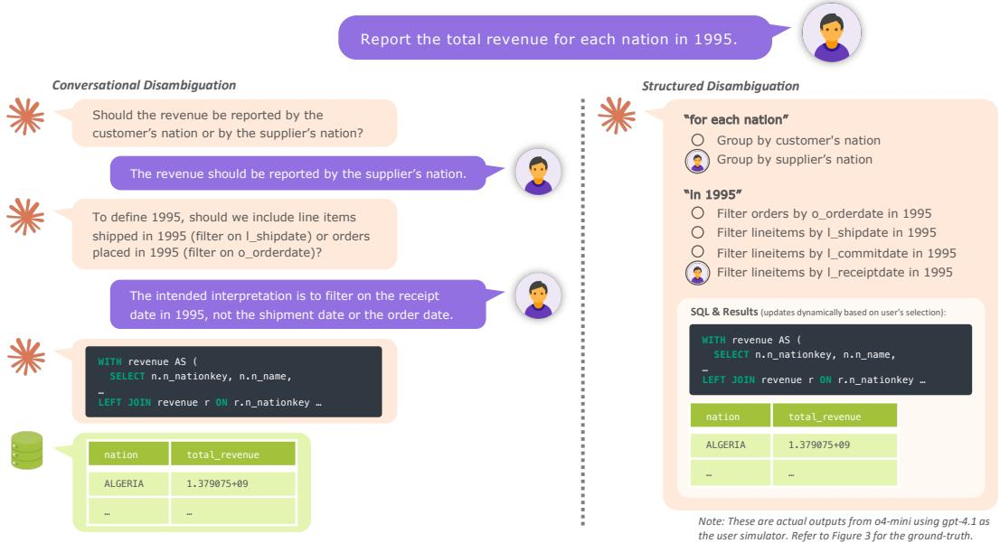  
Figure 1: Comparison of conversational disambiguation and structured disambiguation. Structured disambiguation allows users to compare and select interpretations for multiple ambiguity points based on the SQL queries and execution results.

To enable rigorous evaluation of text-to-SQL systems under realistic ambiguous user questions, we introduce ARCS: Ambiguity Resolution Corpus for SQL. When constructing ARCS, we adopt a fundamentally different methodology from prior work [28, 2, 23]. Rather than predefining a small set of ambiguity types and artificially injecting them into questions and databases, we identify intrinsic ambiguities within realistic questions based on unmodified, real-world databases. This process yields questions naturally containing multiple, interacting ambiguity phrases. In addition, ARCS supports end-to-end evaluation through a user simulator, without imposing constraints on the system architecture or the disambiguation strategy. The benchmark offers complete annotations of all valid ambiguity points, interpretations, and SQL queries, enabling disentangling disambiguation performance from SQL generation performance.

Our experimental results on ARCS reveal several interesting findings. When questions are ambiguous, Text-to-SQL remains a significant challenge for modern large language models (LLMs): gpt-6-sol achieves only 51% end-to-end execution accuracy, and no open-source LLM exceeds 27%. Furthermore, frontier LLMs from different providers, while having similar text-to-SQL capabilities, exhibit very different disambiguation performance, suggesting that disambiguation may be an underrepresented objective during LLM training.

In summary, our work makes the following main contributions:

• Structured disambiguation, a new disambiguation interface for text-to-SQL.

• ARCS, a reliable and versatile benchmark with 311 realistic disambiguation tasks.

• A taxonomy for systematically categorizing ambiguities in text-to-SQL.

• Extensive experiments and analysis of current state-of-the-art LLMs.

## 2 Structured Disambiguation for Text-to-SQL

Ambiguity in natural language is often open-ended and admits a large number of possible interpretations. Consequently, the default approach to disambiguation across many NLP tasks is to ask clarification questions and rely on users to provide additional information in natural language [7, 20, 34, 13]. However, when a question is contextualized within a database, the space of valid interpretations is often substantially reduced because a database contains only a finite set of schema elements (e.g., tables and columns). This makes it possible to enumerate all possible interpretations and transforms the user's task from an open-ended recall problem (answering “What do you mean?") to a constrained recognition problem (selecting $\ddot { \mathbf { \Omega } } ^ { 6 6 } \mathbf { A }$ or B") [19] for more efficient disambiguation.

Recent work has begun to explore this direction for Text-to-SQL. For example, [24] propose generating all possible interpretations for a given question. However, their approach remains incomplete in two key aspects. First, the enumeration is unstructured; when multiple ambiguity points are present, listing every full-sentence interpretations causes the number of candidates to grow exponentially. Second, it cannot handle vagueness, where the space of interpretations is unbounded and cannot be enumerated as a fixed list (e.g.“high transaction amount").2

Structured disambiguation addresses these limitations by decomposing ambiguity and resolving each ambiguity point separately. Our framework consists of three phases:

Disambiguation Given a question, we first identify a set of ambiguity points or phrases, denoted by

$$
\mathcal { A } = \mathcal { A } _ { \mathrm { f i n i t e } } \cup \mathcal { A } _ { \mathrm { i n f i n i t e } } .
$$

Here, $\mathcal { A } _ { \mathrm { f i n i t e } }$ denotes the set of ambiguity points with a finite number of possible interpretations. For each ambiguity point $a \in \mathcal { A } _ { \mathrm { f i n i t e } } ,$ we identify all valid interpretations $I _ { a } . \ A _ { \mathrm { i n f i n i t e } }$ denotes ambiguity points with an unbounded interpretation space (e.g., numeric thresholds). For each $a \in \mathcal { A } _ { \mathrm { i n f i n i t e } }$ , we introduce a parameter variable $v _ { a }$

User Interaction After disambiguation, we present the user with an interaction panel consisting of $| { \mathcal { A } } _ { \mathrm { f i n i t e } } |$ multiple-choice questions and $| { \mathcal { A } } _ { \mathrm { i n f i n i t e } } |$ value sliders. For each $a \in { \mathcal { A } } _ { \mathrm { f i n i t e } } ,$ the user resolves the ambiguity by selecting the intended interpretation. For each $a \in \mathcal { A } _ { \mathrm { i n f i n i t e } }$ , the user resolves the ambiguity by selecting a value via the slider and choosing the associated operator $( \mathbf { e . g . } , > \mathbf { v s . } \geq )$ For both types of ambiguity points, the user may also choose to reject the ambiguity (e.g., when it is incorrect or can be inferred from the database context).

SQL Generation Let ${ \mathcal { A } } _ { \mathrm { f i n i t e } } ^ { + } \subseteq { \mathcal { A } } _ { \mathrm { f i n i t e } }$ denote the set of finite ambiguity points not rejected by the user, and let $\mathcal { T } ^ { * }$ denote the interpretation combination selected by the user, where

$$
\mathcal { T } ^ { * } \in \prod _ { a \in \mathcal { A } _ { \mathrm { f i n i t e } } ^ { + } } I _ { a } .
$$

We generate a parameterized SQL query corresponding to $\mathcal { T } ^ { * }$ , with variables $\{ v _ { a } \mid a \in \mathcal { A } _ { \mathrm { i n f u n i t e } } ^ { + } \}$ When executing the query to retrieve the final result table, these variables are instantiated using the values and operators specified by the user during interaction. The SQL generation step can be repeated on demand when the user selects a different interpretation combination. To further reduce latency, a caching mechanism can be employed by pre-generating SQL queries for all interpretation combinations Z in parallel prior to user interaction.

Importantly, the disambiguation and SQL generation components are implementation-agnostic. In particular, any text-to-SQL system can be substituted as the underlying SQL generation module. Details of our concrete implementation are provided in Appendix D.

## 3 Categorizing Ambiguity in Text-to-SQL

The first step toward building a benchmark with broad coverage of diverse ambiguity types is to develop a taxonomy that systematically categorizes the ambiguity space. A key challenge in characterizing ambiguity in text-to-SQL is that it is inherently intersectional: it arises from the friction between natural language and a specific database schema. For instance, a linguistically ambiguous phrase (e.g., "New York" referring to either New York City or New York State) may be unambiguous given a specific schema (e.g., the database only has a city column), while a linguistically precise phrase may become ambiguous due to schema redundancy (e.g., multiple address-related columns encode city information). We address this intersectional nature by proposing a taxonomy with two orthogonal dimensions: a linguistic dimension, which captures the linguistic source of the ambiguity, and a database dimension, which captures how the ambiguity maps to database elements. Both dimensions are exhaustive by design. Figure 2 provides an illustration of our taxonomy.

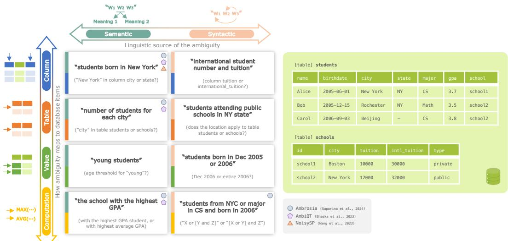  
Figure 2: Illustration of the ARCS taxonomy on a curated database.

Linguistic dimension Along the linguistic dimension, we categorize ambiguity into the following two types:

Semantic ambiguity. Ambiguity arising from multiple possible meanings of words or phrases (e.g., polysemy and vague predicates).

Syntactic ambiguity. Ambiguity arising from multiple possible syntactic structures in a sentence (e.g., modifier attachment).

Database dimension Along the database dimension, we categorize ambiguity into four types³:

Column ambiguity. An ambiguous phrase can map to multiple columns in the database schema, such as attributes with similar semantics across columns.

Table ambiguity. An ambiguous phrase can map to multiple tables in the database schema, for example when the same attribute appears in different tables, leading to alternative table selections or join paths.

Value ambiguity. An ambiguous phrase can map to multiple possible values within a column, including categorical values, numeric thresholds, or entities that satisfy the same description.

Computation ambiguity. An ambiguous phrase can map to multiple computation strategies, such as different aggregation functions, logical operators, or arithmetic expressions.

Unlike our approach, prior work focused on special cases along either the linguistic dimension [23] or the database dimension [28, 2] in isolation, or conflate the two [10]. By treating these dimensions as orthogonal, our taxonomy provides an opportunity for diagnosing whether a system fails at understanding language nuances or at grounding them to database elements. This separation is practically useful: it enables developers to distinguish between “parsing errors" (linguistic) and “schema alignment errors" (database) for targeted improvements in system reliability.

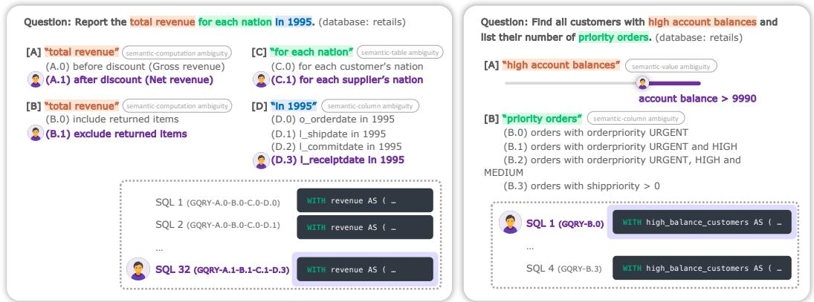  
Figure 3: Two task instances from ARCS with annotations of all valid ambiguity points, interpretations, and SQL queries.

## 4 Benchmark Construction

To evaluate structured disambiguation in text-to-SQL, we construct ARCS, a benchmark dataset that covers the full spectrum of the ambiguity taxonomy introduced in §3 and provides complete annotations of all ambiguity points, all valid interpretations, and their corresponding SQL queries (see Figure 3). As illustrated in Figure 4, ARCS supports two complementary evaluation settings:

End-to-End Setting The system receives a natural language question and may freely interact with the database and user simulator in any order before generating the final SQL query. This setting imposes no constraints on agent architecture.

Fine-Grained Setting This setting disentangles the pipeline into two phases. In the disambiguation phase, the system must output the complete set of ambiguity points and valid interpretations given the question and database. In the SQL generation phase, the system generates the final SQL query given the ground-truth disambiguation.

## 4.1 Database Construction

We prioritize two considerations when constructing database instances. First, the databases should be realistic, of significant real-world interest and, when available, based on real data with sufficient coverage and scale. Second, the databases should be well suited for creating ambiguous questions (e.g., through semantically overlapping columns), and collectively they should support all eight ambiguity types. Given these considerations, we select existing databases and use them as-is, rather than synthesizing small-scale databases or modifying existing ones (e.g., by adding columns with synthetic data), as done in prior work [23, 28, 2].

In total, we select five databases from BIRD [16] and one database from Spider 2.0 [14]. All six databases are converted to SQLite to enable convenient local access for researchers, with a total size of 8.3 GB. The selected databases cover a diverse range of domains, including banking, retails, student activities, NBA, Stack Exchange forum, and GitHub repositories.

## 4.2 Ambiguous Question Generation

To generate a large pool of candidate questions at scale, we use gpt-4.1, conditioned on the target database schema, our taxonomy, and a small set of human-curated exemplar questions. We provide the taxonomy both as illustrative examples and as labeling guidelines for ambiguity points; however, the model is not constrained to replicate the ambiguity shown in the taxonomy and is free to generate novel ambiguities. The model is prompted to produce a set of ambiguous questions, and this process is run repeatedly with the temperature set to 0.7 until the desired number of questions is reached. We generate 180 questions for each database.

## 4.3 Ambiguity and SQL Annotation

After the initial generation, human annotators review all candidate questions and select those that are both realistic and genuinely ambiguous. For each selected question, annotators then identify the ambiguity points and enumerate all valid interpretations associated with each finite ambiguity point⁴. Throughout this process, annotators may revise the question text and add or remove ambiguity points as needed.

One issue overlooked in prior work [10] is the distinction between true ambiguity and global annotation conventions. For example, choices such as whether to return ties when computing an argmax, or whether to round numeric values reflect dataset-level conventions rather than inherent per-instance ambiguity. Treating these as ambiguities would be inappropriate, as they would trivially affect nearly all questions. In ARCS, we provide an explicit specification of all annotation conventions that can be embedded in the LLM prompt, so that the model adheres to these conventions instead of interpreting them as ambiguities. This setup is analogous to global user preference settings that can be configured in real-world applications.

Following the notation in §2, let ${ \mathcal { A } } _ { \mathrm { f i n i t e } } ^ { \ast }$ denote the set of annotated finite ambiguity points. For each interpretation combination $\begin{array} { r } { \mathcal { T } \in \prod _ { a \in \mathcal { A } _ { \mathrm { f i n i t e } } ^ { * } } I _ { a } } \end{array}$ , human annotators produce a parameterized SQL query with variables $\{ v _ { a } \mid a \in \mathcal { A } _ { \mathrm { i n f i n i t e } } ^ { * } \}$

Due to the need for high expertise in both linguistics and databases, the authors carried out all annotations to ensure the highest level of annotation quality. After an initial round of annotation, the authors conducted a second round using the finalized annotation guidelines, as well as a final verification pass. Additional details are provided in Appendix B. On average, annotating a single question requires 2.5 hours of effort by one annotator.

## 4.4 User Simulator

To support the evaluation of arbitrary disambiguation and user interaction methods, we design an LLM-based user simulator that exposes an ask\_user interface. The ask\_user interface supports free-text questions, multiple-choice questions, and value-selection questions. When replaced with a real user in a frontend, these interaction types can be realized as text input fields, multiple-choice selectors, and value sliders, respectively. During inference, the system invokes a user simulator instance as needed, providing full flexibility in deciding when and how to interact with the user.

The user simulator has access the ground-truth resolution for each ambiguity point that leads to one correct SQL query per question. For finite ambiguity points, we randomly sample one interpretation from $I _ { a } .$ For infinite ambiguity points, a human annotator specifies a concrete value and an operator such that the resulting SQL query yields a non-empty result. We enforce that the final user-intended SQL query always produces a non-empty output. We perform multiple samplings per question, resulting in 331 task instances sampled from 101 unique questions, with 413 unique SQL queries in total, a scale comparable to recent text-to-SQL benchmarks [14, 4]. Multiple sampling is necessary to reduce bias toward an easy or difficult interpretation in the end-to-end setting, and 331 instances provide a sweet spot that balances experimental cost and reliability.

In our initial exploration, we found that a naive implementation where all annotated ambiguity points and their intended interpretations are provided in the system prompt does not work as expected due to information leakage. Specifically, the LLM often reveals information related to other ambiguity points even when they are not explicitly queried, a phenomenon previously observed in prior work [10]. To mitigate this issue, we adopt a two-stage user simulator following this prior work: the LLM first identifies the ambiguity points relevant to the question and then uses only those identified ambiguity points to generate its response. The prompts for user simulator are provided in Appendix D.

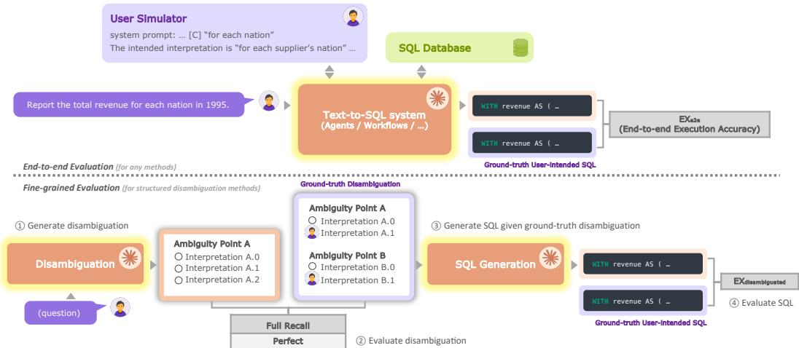  
Figure 4: Evaluation settings and metrics for ARCS.

## 4.5 Evaluation Metrics

As described earlier, our benchmark supports two evaluation settings: end-to-end evaluation and fine-grained evaluation, as illustrated in Figure 4. All metrics are computed at the task instance level and aggregated using a simple average over the entire benchmark.

## 4.5.1 End-to-End Evaluation

The primary metrics for end-to-end evaluation are as follows:

$\mathbf { E X } _ { \mathrm { e 2 e } } { \mathrm { : } }$ end-to-end execution accuracy that measures whether the execution result of the final predicted SQL query matches that of the ground-truth user-intended SQL query.

• User Effort: an approximation of the interaction cost, computed as 0.1× (number of input tokens) plus the number of output tokens produced by the user simulator.

• Cost: the monetary cost per task instance, excluding the cost of the user simulator.

An important design choice in computing execution accuracy is that we allow the predicted SQL query to return additional columns beyond those in the ground truth. This is particularly important for ambiguous questions, where a highly intelligent LLM may choose not to explicitly disambiguate and instead directly compute a result table that covers all valid interpretations (e.g., returning both gross revenue and net revenue in a single table). In such cases, the prediction receives $\mathrm { E X } _ { \mathrm { e 2 e } } = 1$ and a user effort of 0.

## 4.5.2 Fine-Grained Evaluation

Fine-grained evaluation measures performance of disambiguation and text-to-SQL generation in isolation. The primary metrics are:

• Full Recall: measures disambiguation performance by checking whether all ground-truth ambiguity points and their corresponding interpretations are identified.

• Perfect: measures disambiguation performance by checking whether exactly all and only the ground-truth ambiguity points and interpretations are identified.

$\mathbf { E X } _ { \mathrm { d i s a m b i g u a t e d } } { \mathrm { : } }$ text-to-SQL generation execution accuracy given ground-truth disambiguation.

Full Recall and Perfect are computed by aligning the predicted ambiguity points and their interpretations with the annotated ones. We have conducted experiments to ensure that the alignment is highly deterministic and consistent with human judgment. Additional details are provided in Appendix D.

<table><tr><td rowspan="2">Method</td><td colspan="2">Disambiguation</td><td>SQL Generation</td><td colspan="3">End-to-end</td></tr><tr><td>Full Recall (%)</td><td>Perfect (%)</td><td> $\mathbf { E X } _ { \mathrm { d i s a m b i g u a t e d } } \left( \% \right)$ </td><td> $\mathbf { E X } _ { \mathrm { { c 2 c } } } \left( \% \right)$ </td><td>∆EX</td><td>Cost ($)</td></tr><tr><td>Open-source LLMs</td><td></td><td></td><td></td><td></td><td></td><td></td></tr><tr><td>gptoss-20b</td><td>4.18</td><td>0.96</td><td>27.97</td><td>7.40</td><td>-20.57</td><td>0.0003</td></tr><tr><td>gptoss-120b</td><td>16.72</td><td>1.61</td><td>52.09</td><td>26.05</td><td>-26.04</td><td>0.003</td></tr><tr><td>qwen3-8b</td><td>6.11</td><td>0.00</td><td>11.25</td><td>5.79</td><td>-5.46</td><td>0.009</td></tr><tr><td>qwen3-235b-a22b-instruct-2507</td><td>6.43</td><td>2.57</td><td>37.30</td><td>20.26</td><td>-17.04</td><td>0.02</td></tr><tr><td>qwen3-coder-480b</td><td>6.11</td><td>2.57</td><td>26.69</td><td>15.76</td><td>-10.93</td><td>0.03</td></tr><tr><td>deepseek-v3.1</td><td>14.47</td><td>1.93</td><td>49.52</td><td>23.47</td><td>-26.05</td><td>0.01</td></tr><tr><td>deepseek-r1-0528</td><td>10.93</td><td>3.22</td><td>38.26</td><td>23.15</td><td>-15.11</td><td>0.04</td></tr><tr><td>kimi-k2-thinking</td><td>9.97</td><td>0.96</td><td>43.41</td><td>19.29</td><td>-24.12</td><td>0.03</td></tr><tr><td>Proprietary LLMs</td><td></td><td></td><td></td><td></td><td></td><td></td></tr><tr><td>gemini-2.5-flash</td><td>17.04</td><td>10.61</td><td>42.44</td><td>27.65</td><td>-14.79</td><td>0.01</td></tr><tr><td>gemini-2.5-pro</td><td>20.90</td><td>9.65</td><td>50.80</td><td>30.87</td><td>-19.93</td><td>0.06</td></tr><tr><td>gemini-3-pro (high*)</td><td>26.37</td><td>13.83</td><td>65.27</td><td>44.05</td><td>-21.22</td><td>0.14</td></tr><tr><td>claude-haiku-4.5 (high*)</td><td>17.68</td><td>8.04</td><td>49.84</td><td>28.62</td><td>-21.22</td><td>0.03</td></tr><tr><td> ${ \mathsf { c l a u d e { - } s o n n e t { - } } } 4 . 5 ( { \mathsf { h i g h ^ { * } } } )$ </td><td>23.47</td><td>7.40</td><td>57.88</td><td>43.73</td><td>-14.15</td><td>0.09</td></tr><tr><td>claude-opus-4.5 (high*)</td><td>22.51</td><td>8.04</td><td>67.85</td><td>38.59</td><td>-29.26</td><td>0.15</td></tr><tr><td>gpt-4.1-nano</td><td>2.25</td><td>0.64</td><td>10.29</td><td>7.07</td><td>-3.22</td><td>0.006</td></tr><tr><td>gpt-4.1-mini</td><td>10.61</td><td>4.18</td><td>45.34</td><td>21.86</td><td>-23.48</td><td>0.007</td></tr><tr><td>gpt-4.1</td><td>14.47</td><td>7.40</td><td>56.27</td><td>29.90</td><td>-26.37</td><td>0.03</td></tr><tr><td>o4-mini (low)</td><td>22.83</td><td>8.36</td><td>56.27</td><td>36.01</td><td>-20.26</td><td>0.02</td></tr><tr><td>o4-mini (medium*)</td><td>30.55</td><td>6.43</td><td>62.06</td><td>42.44</td><td>-19.62</td><td>0.03</td></tr><tr><td>o4-mini (high)</td><td>27.97</td><td>6.43</td><td>64.95</td><td>44.05</td><td>-20.90</td><td>0.06</td></tr><tr><td>gpt-5-nano (medium*)</td><td>16.08</td><td>4.82</td><td>50.16</td><td>29.26</td><td>-20.90</td><td>0.005</td></tr><tr><td>gpt-5-mini (medium*)</td><td>42.12</td><td>0.00</td><td>63.02</td><td>44.37</td><td>-18.65</td><td>0.01</td></tr><tr><td>gpt-5 (minimal)</td><td>30.23</td><td>0.32</td><td>56.27</td><td>37.62</td><td>-18.65</td><td>0.02</td></tr><tr><td>gpt-5 (low)</td><td>52.41</td><td>0.96</td><td>65.59</td><td>48.55</td><td>-17.04</td><td>0.04</td></tr><tr><td>gpt-5 (medium*)</td><td>59.16</td><td>0.00</td><td>67.52</td><td>57.88</td><td>-9.64</td><td>0.09</td></tr><tr><td>gpt-5 (high)</td><td>61.09</td><td>0.00</td><td>68.81</td><td>57.56</td><td>-11.25</td><td>0.16</td></tr><tr><td>gpt-6-luna (medium*)</td><td>31.19</td><td>10.61</td><td>68.17</td><td>46.30</td><td>-21.87</td><td>0.006</td></tr><tr><td>gpt-6-sol (medium*)</td><td>40.84</td><td>9.32</td><td>74.60</td><td>51.77</td><td>-22.83</td><td>0.04</td></tr></table>

Table 1: Main results of structured disambiguation using various LLMs on ARCS. For reasoning models, the level of reasoning effort is indicated in parentheses; \* marks the default configuration. Bold indicates the best performance, while underline indicates the second-best. ∆EX denotes the difference between $\mathrm { E X } _ { \mathrm { e 2 e } }$ and EXdisambiguated. Costs are per-task USD price. All open-source LLMs were evaluated using the Fireworks serverless API.

## 5 Experiments

## 5.1 Experimental Settings

We evaluate 23 LLMs on ARCS, including 8 open-source models and 15 proprietary models in both the end-to-end setting and fine-grained setting (see §4). For all applicable models, the temperature is set to zero. For reasoning models except o4-mini and $\mathtt { g p t - 5 } ,$ we use the default reasoning effort (denoted by \*). For o4-mini and gpt-5, we evaluate all supported reasoning effort levels. Proprietary models are run using their official APIs, while all open-source models are run using the Fireworks serverless API. The exact prompts used for different methods are provided in Appendix D.

## 5.2 Main Results

Table 1 presents the performance of structured disambiguation across all 23 LLMs under both settings.

Text-to-SQL remains a significant challenge in the presence of ambiguity. The best end-to-end performance is achieved by gpt-5 at 57.88%, whereas gpt-4.1 achieves only 29.90%. The recent frontier model, gpt-6-so1, achieves 51.77% end-to-end execution accuracy, despite its higher SQL generation capabilities (EXdisambiguated). Among open-source models, gptoss-120b performs best, achieving 26.05%. Other open-source models, including those with substantially larger parameter counts, do not yield better performance. Within the same model family, performance consistently scales from smaller to larger models, as observed in the gptoss, claude and gpt families.

Disambiguation is the primary bottleneck on ARCS. A closer examination of the isolated disambiguation and SQL generation metrics reveals that disambiguation constitutes the main performance bottleneck. Across all LLMs, disambiguation scores are substantially lower than SQL generation scores. All models except gpt-5 and gpt-6-sol only correctly identify all ambiguity points and interpretations for at most 30% of the tasks. Precise disambiguation is even more challenging, with no model achieving a Perfect Disambiguation score above 14%.

<table><tr><td>Method</td><td>EX (%)</td><td>User Effort</td><td>Cost ($)</td></tr><tr><td colspan="4">Conversational Disambiguation</td></tr><tr><td>o4-mini (patience = 1)</td><td>31.51</td><td></td><td>0.02</td></tr><tr><td>o4-mini (patience = 3)</td><td>39.55</td><td>270</td><td>0.02</td></tr><tr><td>o4-mini (patience = 5)</td><td>39.87</td><td>314</td><td>0.02</td></tr><tr><td>o4-mini</td><td>43.73</td><td></td><td>0.03</td></tr><tr><td colspan="4">Unstructured Disambiguation</td></tr><tr><td>o4-mini</td><td>28.94</td><td>39</td><td>0.04</td></tr><tr><td colspan="4">Structured Disambiguation</td></tr><tr><td>o4-mini</td><td>42.44</td><td>18</td><td>0.03</td></tr></table>

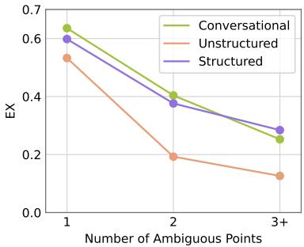  
Figure 5: Comparison of conversational, unstructured, and structured disambiguation. Left: Overall Results. The reasoning effort of o4-mini is medium. Patience is the maximum number of clarification questions the user is willing to answer. User Effort is defined as 0.1 times the user simulator input tokens plus the number of output tokens. Right: End-to-end EX across varying numbers of ambiguity points.

<table><tr><td>Method</td><td colspan="2">w/o Taxonomy</td><td colspan="2">w/ Taxonomy</td></tr><tr><td></td><td>ARCS EX (%)</td><td>Ambrosia EX (%)</td><td>ARCS EX (%)</td><td>Ambrosia EX (%)</td></tr><tr><td>gpt-4.1</td><td>29.90</td><td>48.75</td><td>28.30</td><td>63.25</td></tr><tr><td>o4-mini (medium)</td><td>42.44</td><td>52.25</td><td>46.30</td><td>80.00</td></tr></table>

Table 2: Comparison of end-to-end EX performance on ARCS and Ambrosia, with and without taxonomy as input. Ambrosia is evaluated on a 400-sample subset.

Frontier LLMs exhibit similar text-to-SQL performance but substantially different disambiguation capabilities. For gpt-5, claude-opus-4.5, and gemini-3-pro, which were released around the same time, execution accuracy with ground-truth disambiguation is comparable, ranging from 65.27% to 68.81%. In contrast, their Full Recall scores span a much wider range, from 22.51% to 61.09%. This disparity suggests that disambiguation may be underrepresented in current LLM training objectives.

Performance scales with reasoning effort on ARCS. For gpt-5, end-to-end execution accuracy improves from 37.62% to 57.88% as the reasoning effort increases from minimal to medium, with no further gains observed at higher settings. For o4-mini, end-to-end execution accuracy increases from 36.01% to 44.05% as the reasoning effort is increased from low to high. Notably, this scaling behavior is present in both disambiguation and SQL generation, with a more pronounced effect observed for disambiguation.

## 5.3 Comparison of Disambiguation Methods

We compare conversational disambiguation, unstructured interpretation generation [24], and structured disambiguation. For conversational disambiguation, we additionally vary user patience, defined as the maximum number of clarification questions the user is willing to answer.

Structured disambiguation requires significantly lower user effort. As shown in Figure 5, structured disambiguation matches the performance of conversational disambiguation while requiring significantly lower user effort. When user patience is reduced such that the resulting user effort is comparable, conversational disambiguation performs substantially worse. Unstructured interpretation generation exhibits similar performance to the other methods on questions with a single ambiguity point, but degrades markedly in the presence of multiple ambiguity points, consistent with our hypothesis in §2. We additionally conducted a user study (see Appendix E) using the NASA-TLX framework. Consistent with the simulator-based results, participants reported lower mental demand, effort, and frustration with structured disambiguation, while also rating it as more transparent.

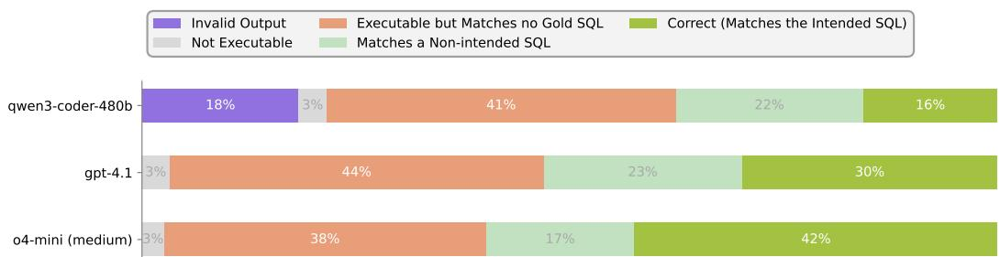  
Figure 6: Error distribution of three representative models on the full ARCS dataset. See Figure 12 for results on the remaining models.

## 5.4 Comparison with Previous Benchmarks

In Table 2, we evaluate structured disambiguation on Ambrosia [23] and ARCS using the same implementation.

ARCS is taxonomy-proof. When provided with their respective ambiguity taxonomies, o4-mini's end-to-end execution accuracy increases dramatically from 52% to 80% on Ambrosia, but improves only marginally on ARCS. This contrast indicates that ARCS poses fundamentally harder challenges, exhibits greater question diversity and is much less vulnerable to heuristic-based strategies or prompt engineering.

## 5.5 Error Analysis

To verify that the benchmark poses fundamental challenges in disambiguation and SQL generation, we categorize model outputs into a hierarchy of error categories with progressively increasing levels of difficulty, as shown in Figure 6. Although qwen3-coder-480b [30] produces invalid outputs on 18% of the tasks—primarily due to inferior instruction-following and tool-calling capabilities—all three models generate executable SQL queries for the majority of inputs. Across all models, the two most prevalent error categories correspond to cases where the generated SQL query is executable but either does not match any ground-truth query or matches a ground-truth query other than the one intended by the user. These results indicate that the dominant sources of error arise from unresolved ambiguities and incorrect SQL formulation.

We further examine the predicted disambiguation and observe several common failure modes. First, spurious ambiguity for an unambiguous phrase is sometimes caused by incorrect relaxation of certain constraints. For example, the phrase “created pull requests" clearly maps to the SQL logic Pul1RequestEvent with action = 'opened', but the model considers whether to include the filter action = 'opened' as an ambiguity. Second, database context is not fully explored by the model to bound the ambiguity. For example, “year"should have only two interpretations when there are only 2022 and 2023 tables in the database, but the model considers “year"as an open-ended ambiguity. Third, over-fragmentation occurs when the model predicts multiple interpretation phrases that are semantically identical. For example, “Q4 of 1996 and full year 1997" and “continuous period from 1996-10-01 to 1997-12-31" are treated as separate interpretations even though they are semantically equivalent.

## 5.6 Analysis on Ambiguity Types

To investigate whether certain types of ambiguity are more challenging than others, we analyze the recall (percentage of ambiguity points identified by the model) across different ambiguity types in Figure 7. All three models perform poorly at identifying computation ambiguities. In addition, the weaker models, qwen3-coder-480b and gpt-4.1, also struggle to detect syntactic ambiguities compared to semantic ones.

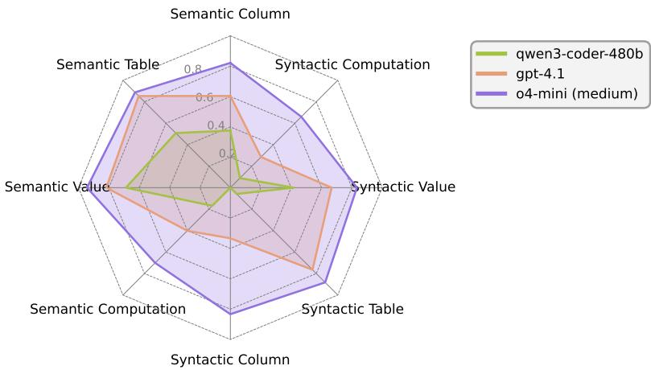  
Figure 7: Ambiguity point recall for each ambiguity type.

## 6 Conclusion

Ambiguity is a fundamental yet largely underexplored challenge in deploying text-to-SQL systems over real-world databases. As a first step toward transparent and efficient disambiguation with minimal user effort, we introduce structured disambiguation, a new interaction paradigm that resolves ambiguity through explicit, constrained interactions. We also present ARCS, the first benchmark of text-to-SQL questions with naturally occurring, unconstrained ambiguity over real-world databases. Our experimental results demonstrate that text-to-SQL remains highly challenging in the presence of ambiguity. We hope that ARCS will catalyze future research on ambiguity-aware text-to-SQL systems and inspire the development of interaction paradigms that better align with realistic user workflows.

## References

[1] Alnur Ali, Ashutosh Baheti, Jonathan Chang, Ta-Chung Chi, Brandon Cui, Andrew Drozdov, Jonathan Frankle, Abhay Gupta, Pallavi Koppol, Sean Kulinski, Jonathan Li, Dipendra Misra, Krista Opsahl-Ong, Jose Javier Gonzalez Ortiz, Matei Zaharia, and Yue Zhang. A State-ofthe-Art SQL Reasoning Model using RLVR, September 2025. URL http: //arxiv.org/abs/ 2509.21459.

[2] Adithya Bhaskar, Tushar Tomar, Ashutosh Sathe, and Sunita Sarawagi. Benchmarking and Improving Text-to-SQL Generation under Ambiguity. In Houda Bouamor, Juan Pino, and Kalika Bali (eds.), Proceedings of the 2023 Conference on Empirical Methods in Natural Language Processing, pp. 7053–7074, Singapore, December 2023. Association for Computational Linguistics. doi: 10.18653/v1/2023.emnlp-main.436. URL https://aclanthology.org/2023. emnlp-main.436/.

[3] Jan-Micha Bodensohn, Liane Vogel, Anupam Sanghi, and Carsten Binnig. LLMs for Enterprise Data Engineering. In VLDB 2024 Workshop: Tabular Data Analysis Workshop, 2024. URL https://tabular-data-analysis.github.io/tada2024/papers/TaDA.4.pdf.

[4] Peter Baile Chen, Fabian Wenz, Yi Zhang, Devin Yang, Justin Choi, Nesime Tatbul, Michael Cafarella, Çağatay Demiralp, and Michael Stonebraker. BEAVER: An Enterprise Benchmark for Text-to-SQL, 2024. URL https://arxiv.org/abs/2409.02038.

[5] Jeremy Cole, Michael Zhang, Daniel Gillick, Julian Eisenschlos, Bhuwan Dhingra, and Jacob Eisenstein. Selectively Answering Ambiguous Questions. In Houda Bouamor, Juan Pino, and Kalika Bali (eds.), Proceedings of the 2023 Conference on Empirical Methods in Natural Language Processing, pp. 530–543, Singapore, December 2023. Association for Computational Linguistics. doi: 10.18653/v1/2023.emnlp-main.35. URL https://aclanthology. org/2023.emnlp-main.35/.

[6] Minghang Deng, Ashwin Ramachandran, Canwen Xu, Lanxiang Hu, Zhewei Yao, Anupam Datta, and Hao Zhang. ReFoRCE: A Text-to-SQL Agent with Self-Refinement, Format Restriction, and Column Exploration. In ICLR 2025 Workshop: VerifAI: AI Verification in the Wild, 2025. URL https://openreview.net/forum?id=OuFIfDBwQd.

[7] Mingwen Dong, Nischal Ashok Kumar, Yiqun Hu, Anuj Chauhan, Chung-Wei Hang, Shuaichen Chang, Lin Pan, Wuwei Lan, Henghui Zhu, Jiarong Jiang, Patrick Ng, and Zhiguo Wang. PRACTIQ: A Practical Conversational Text-to-SQL dataset with Ambiguous and Unanswerable Queries. In Luis Chiruzzo, Alan Ritter, and Lu Wang (eds.), Proceedings of the 2025 Conference of the Nations of the Americas Chapter of the Association for Computational Linguistics: Human Language Technologies, pp. 255–273, Albuquerque, New Mexico, April 2025. Association for Computational Linguistics. ISBN 979-8-89176-189-6. doi: 10.18653/ v1/2025.naacl-long.13. URL https://aclanthology.org/2025.naacl-long.13/.

[8] Ahmed Elgohary, Saghar Hosseini, and Ahmed Hassan Awadallah. Speak to your Parser: Interactive Text-to-SQL with Natural Language Feedback. In Dan Jurafsky, Joyce Chai, Natalie Schluter, and Joel Tetreault (eds.), Proceedings of the 58th Annual Meeting of the Association for Computational Linguistics, pp. 2065–2077, Online, July 2020. Association for Computational Linguistics. doi: 10.18653/v1/2020.acl-main.187. URL https://aclanthology.org/ 2020.acl-main.187/.

[9] Zhifeng Hao, Qibin Song, Ruichu Cai, and Boyan Xu. Text-to-SQL as Dual-State Reasoning: Integrating Adaptive Context and Progressive Generation, November 2025. URL http:// arxiv.org/abs/2511.21402.

[10] Nan Huo, Xiaohan Xu, Jinyang Li, Per Jacobsson, Shipei Lin, Bowen Qin, Binyuan Hui, Xiaolong Li, Ge Qu, Shuzheng Si, Linheng Han, Edward Alexander, Xintong Zhu, Rui Qin, Ruihan Yu, Yiyao Jin, Feige Zhou, Weihao Zhong, Yun Chen, Hongyu Liu, Chenhao Ma, Fatma Ozcan, Yannis Papakonstantinou, and Reynold Cheng. BIRD-INTERACT: Re-imagining Textto-SQL Evaluation for Large Language Models via Lens of Dynamic Interactions, 2025. URL https://arxiv.org/abs/2510.05318.

[11] Hyuhng Joon Kim, Youna Kim, Cheonbok Park, Junyeob Kim, Choonghyun Park, Kang Min Yoo, Sang-goo Lee, and Taeuk Kim. Aligning Language Models to Explicitly Handle Ambiguity. In Yaser Al-Onaizan, Mohit Bansal, and Yun-Nung Chen (eds.), Proceedings of the 2024 Conference on Empirical Methods in Natural Language Processing, pp. 1989–2007, Miami, Florida, USA, November 2024. Association for Computational Linguistics. doi: 10.18653/v1/ 2024.emnlp-main.119. URL https://aclanthology.org/2024.emnlp-main.119/.

[12] Chia-Hsuan Lee, Oleksandr Polozov, and Matthew Richardson. KaggleDBQA: Realistic Evaluation of Text-to-SQL Parsers. In Chengqing Zong, Fei Xia, Wenjie Li, and Roberto Navigli (eds.), Proceedings of the 59th Annual Meeting of the Association for Computational Linguistics and the 11th International Joint Conference on Natural Language Processing, pp. 2261–2273, Online, August 2021. Association for Computational Linguistics. doi: 10.18653/v1/2021.acl-long.176. URL https://aclanthology.org/2021.ac1-1ong.176/.

[13] Dongryeol Lee, Segwang Kim, Minwoo Lee, Hwanhee Lee, Joonsuk Park, Sang-Woo Lee, and Kyomin Jung. Asking Clarification Questions to Handle Ambiguity in Open-Domain QA. In Houda Bouamor, Juan Pino, and Kalika Bali (eds.), Findings of the Association for Computational Linguistics: EMNLP 2023, pp. 11526–11544, Singapore, December 2023. Association for Computational Linguistics. doi: 10.18653/v1/2023.findings-emnlp.772. URL https://aclanthology.org/2023.findings-emnlp.772/.

[14] Fangyu Lei, Jixuan Chen, Yuxiao Ye, Ruisheng Cao, Dongchan Shin, Hongjin SU, ZHAO-QING SUO, Hongcheng Gao, Wenjing Hu, Pengcheng Yin, Victor Zhong, Caiming Xiong, Ruoxi Sun, Qian Liu, Sida Wang, and Tao Yu. Spider 2.0: Evaluating Language Models on Real-World Enterprise Text-to-SQL Workflows. In The Thirteenth International Conference on Learning Representations, 2025. URL https://openreview.net/forum?id=XmProj9cPs.

[15] Boyan Li, Chong Chen, Zhujun Xue, Yinan Mei, and Yuyu Luo. DeepEye-SQL: A Software-Engineering-Inspired Text-to-SQL Framework, 2025. URL https://arxiv.org/abs/2510. 17586.

[16] Jinyang Li, Binyuan Hui, Ge Qu, Jiaxi Yang, Binhua Li, Bowen Li, Bailin Wang, Bowen Qin, Ruiying Geng, Nan Huo, Xuanhe Zhou, Ma Chenhao, Guoliang Li, Kevin Chang, Fei Huang, Reynold Cheng, and Yongbin Li. Can LLM Already Serve as A Database Interface? A BIg Bench for Large-Scale Database Grounded Text-to-SQLs. In A. Oh T. Naumann, A. Globerson, K. Saenko, M. Hardt, and S. Levine (eds.), Advances in Neural Information Processing Systems, volume 36, pp. 42330–42357. Curran Associates, Inc., 2023. URL https://proceedings.neurips.cc/paper\_files/paper/2023/file/ 83fc8fab1710363050bbd1d4b8cc0021-Paper-Datasets\_and\_Benchmarks.pdf.

[17] Xinyu Liu, Shuyu Shen, Boyan Li, Nan Tang, and Yuyu Luo. NL2SQL-BUGs: A Benchmark for Detecting Semantic Errors in NL2SQL Translation. In Proceedings of the 31st ACM SIGKDD Conference on Knowledge Discovery and Data Mining V.2, pp. 5662–5673, New York, NY, USA, 2025. Association for Computing Machinery. ISBN 9798400714542. doi: 10.1145/3711896.3737427. URL https://doi.org/10.1145/3711896.3737427.

[18] Sewon Min, Julian Michael, Hannaneh Hajishirzi, and Luke Zettlemoyer. AmbigQA: Answering Ambiguous Open-domain Questions. In Bonnie Webber, Trevor Cohn, Yulan He, and Yang Liu (eds.), Proceedings of the 2020 Conference on Empirical Methods in Natural Language Processing, pp. 5783–5797, Online, November 2020. Association for Computational Linguistics. doi: 10.18653/v1/2020.emnlp-main.466. URL https://aclanthology.org/ 2020.emnlp-main.466/.

[19] Jakob Nielsen. Enhancing the Explanatory Power of Usability Heuristics. In Proceedings of the SIGCHI Conference on Human Factors in Computing Systems, pp. 152–158, New York, NY, USA, April 1994. Association for Computing Machinery. ISBN 978-0-89791-650-9. doi: 10.1145/191666.191729. URL https://doi.org/10.1145/191666.191729.

[20] Ayana Niwa and Hayate Iso. AmbigNLG: Addressing Task Ambiguity in Instruction for NLG. In Yaser Al-Onaizan, Mohit Bansal, and Yun-Nung Chen (eds.), Proceedings of the 2024 Conference on Empirical Methods in Natural Language Processing, pp. 10733–10752, Miami, Florida, USA, November 2024. Association for Computational Linguistics. doi: 10.18653/v1/ 2024.emnlp-main.599. URL https://aclanthology.org/2024.emnlp-main.599/.

[21] Mohammadreza Pourreza, Hailong Li, Ruoxi Sun, Yeounoh Chung, Shayan Talaei, Gaurav Tarlok Kakkar, Yu Gan, Amin Saberi, Fatma Ozcan, and Sercan O Arik. CHASE-SQL: Multi-Path Reasoning and Preference Optimized Candidate Selection in Text-to-SQL. In The Thirteenth International Conference on Learning Representations, 2025. URL https: //openreview.net/forum?id=CvGqMD50tX.

[22] Mohammadreza Pourreza, Shayan Talaei, Ruoxi Sun, Xingchen Wan, Hailong Li, Azalia Mirhoseini, Amin Saberi, and Sercan O Arik. Reasoning-SQL: Reinforcement Learning with SQL Tailored Partial Rewards for Reasoning-Enhanced Text-to-SQL. In Second Conference on Language Modeling, 2025. URL https://openreview.net/forum?id=HbwkIDWQgN.

[23] Irina Saparina and Mirella Lapata. AMBROSIA: A benchmark for parsing ambiguous questions into database queries. In Amir Globersons, Lester Mackey, Danielle Belgrave, Angela Fan, Ulrich Paquet, Jakub M. Tomczak, and Cheng Zhang (eds.), Advances in Neural Information Processing Systems 38: Annual Conference on Neural Information Processing Systems 2024, NeurIPS 2024, Vancouver, BC, Canada, December 10 - 15, 2024, 2024. URL http://papers.nips.cc/paper\_files/paper/2024/hash/ a4c942a8405cc910f0a833d28d2573cc-Abstract-Datasets\_and\_Benchmarks\_Track. html.

[24] Irina Saparina and Mirella Lapata. Disambiguate First, Parse Later: Generating Interpretations for Ambiguity Resolution in Semantic Parsing. In Wanxiang Che, Joyce Nabende, Ekaterina Shutova, and Mohammad Taher Pilehvar (eds.), Findings of the Association for Computational Linguistics: ACL 2025, pp. 16825–16839, Vienna, Austria, July 2025. Association for Computational Linguistics. ISBN 979-8-89176-256-5. doi: 10.18653/v1/2025.findings-acl.863. URL https://aclanthology.org/2025.findings-acl.863/.

[25] Tianze Shi, Chen Zhao, Jordan Boyd-Graber, Hal Daumé III, and Lillian Lee. On the Potential of Lexico-logical Alignments for Semantic Parsing to SQL Queries. In Trevor Cohn,

Yulan He, and Yang Liu (eds.), Findings of the Association for Computational Linguistics: EMNLP 2020, pp. 1849–1864, Online, November 2020. Association for Computational Linguistics. doi: 10.18653/v1/2020.findings-emnlp.167. URL https://aclanthology.org/ 2020.findings-emnlp.167/.

[26] Vladislav Shkapenyuk, Divesh Srivastava, Theodore Johnson, and Parisa Ghane. Automatic Metadata Extraction for Text-to-SQL, June 2025. URL http: //arxiv. org/abs/2505. 19988.

[27] Weiwei Sun, Hengyi Cai, Hongshen Chen, Pengjie Ren, Zhumin Chen, Maarten de Rijke, and Zhaochun Ren. Answering Ambiguous Questions via Iterative Prompting. In Anna Rogers, Jordan Boyd-Graber, and Naoaki Okazaki (eds.), Proceedings of the 61st Annual Meeting of the Association for Computational Linguistics, pp. 7669–7683, Toronto, Canada, July 2023. Association for Computational Linguistics. doi: 10.18653/v1/2023.acl-long.424. URL https: //aclanthology.org/2023.acl-long.424/.

[28] Bing Wang, Yan Gao, Zhoujun Li, and Jian-Guang Lou. Know What I don't Know: Handling Ambiguous and Unknown Questions for Text-to-SQL. In Anna Rogers, Jordan Boyd-Graber, and Naoaki Okazaki (eds.), Findings of the Association for Computational Linguistics: ACL 2023, pp. 5701–5714, Toronto, Canada, July 2023. Association for Computational Linguistics. doi: 10.18653/v1/2023.findings-acl.352. URL https://aclanthology.org/2023. findings-acl.352/.

[29] Pengfei Wang, Baolin Sun, Xuemei Dong, Yaxun Dai, Hongwei Yuan, Mengdie Chu, Yingqi Gao, Xiang Qi, Peng Zhang, and Ying Yan. Agentar-Scale-SQL: Advancing Text-to-SQL through Orchestrated Test-Time Scaling, December 2025. URL http://arxiv.org/abs/ 2509.24403.

[30] An Yang, Anfeng Li, Baosong Yang, Beichen Zhang, Binyuan Hui, Bo Zheng, Bowen Yu, Chang Gao, Chengen Huang, Chenxu Lv, Chujie Zheng, Dayiheng Liu, Fan Zhou, Fei Huang, Feng Hu, Hao Ge, Haoran Wei, Huan Lin, Jialong Tang, Jian Yang, Jianhong Tu, Jianwei Zhang, Jianxin Yang, Jiaxi Yang, Jing Zhou, Jingren Zhou, Junyang Lin, Kai Dang, Keqin Bao, Kexin Yang, Le Yu, Lianghao Deng, Mei Li, Mingfeng Xue, Mingze Li, Pei Zhang, Peng Wang, Qin Zhu, Rui Men, Ruize Gao, Shixuan Liu, Shuang Luo, Tianhao Li, Tianyi Tang, Wenbiao Yin, Xingzhang Ren, Xinyu Wang, Xinyu Zhang, Xuancheng Ren, Yang Fan, Yang Su, Yichang Zhang, Yinger Zhang, Yu Wan, Yuqiong Liu, Zekun Wang, Zeyu Cui, Zhenru Zhang, Zhipeng Zhou, and Zihan Qiu. Qwen3 Technical Report, 2025.

[31] Shunyu Yao, Jeffrey Zhao, Dian Yu, Nan Du, Izhak Shafran, Karthik R Narasimhan, and Yuan Cao. ReAct: Synergizing Reasoning and Acting in Language Models. In The Eleventh International Conference on Learning Representations, 2023. URL https://openreview. net/forum?id=WE\_vluYUL-X.

[32] Tao Yu, Rui Zhang, Kai Yang, Michihiro Yasunaga, Dongxu Wang, Zifan Li, James Ma, Irene Li, Qingning Yao, Shanelle Roman, Zilin Zhang, and Dragomir Radev. Spider: A Large-Scale Human-Labeled Dataset for Complex and Cross-Domain Semantic Parsing and Textto-SQL Task. In Ellen Riloff, David Chiang, Julia Hockenmaier, and Jun'ichi Tsujii (eds.), Proceedings of the 2018 Conference on Empirical Methods in Natural Language Processing, pp. 3911–3921, Brussels, Belgium, October-November 2018. Association for Computational Linguistics. doi: 10.18653/v1/D18-1425. URL https://aclanthology.org/D18-1425/.

[33] Meng Zhang, Kexin Ma, Liyang Xu, Kedi Zhang, Yuanxi Peng, and Ruochun Jin. CLEAR: A Parser-Independent Disambiguation Framework for NL2SQL. In 41st IEEE International Conference on Data Engineering, ICDE 2025, Hong Kong, May 19-23, 2025, pp. 1–14. IEEE 2025. doi: 10.1109/ICDE65448.2025.00247. URL https://doi.org/10.1109/ICDE65448. 2025.00247.

[34] Michael JQ Zhang, W. Bradley Knox, and Eunsol Choi. Modeling Future Conversation Turns to Teach LLMs to Ask Clarifying Questions. In The Thirteenth International Conference on LearningRepresentations, 2025. URL https://openreview.net/forum?id=cwuSAR7EKd.

[35] Yuxin Zhang, Meihao Fan, Ju Fan, Mingyang Yi, Yuyu Luo, Jian Tan, and Guoliang Li. Reward-SQL: Boosting Text-to-SQL via Stepwise Reasoning and Process-Supervised Rewards,2025. URL https://arxiv.org/abs/2505.04671.

[36] Fuheng Zhao, Shaleen Deep, Fotis Psallidas, Avrilia Floratou, Divyakant Agrawal, and Amr El Abbadi. Sphinteract: Resolving Ambiguities in NL2SQL through User Interaction. Proceedings of the VLDB Endowment, 18(4):1145–1158, May 2025. ISSN 2150-8097. doi: 10.14778/3717755.3717772. URL https://doi.org/10.14778/3717755.3717772.

[37] Victor Zhong, Caiming Xiong, and Richard Socher. Seq2SQL: Generating Structured Queries from Natural Language using Reinforcement Learning, 2017. URL https://arxiv.org/ abs/1709.00103.

[38] Arnold M. Zwicky and Jerrold M. Sadock. Ambiguity Tests and How to Fail Them. In Syntax and Semantics, pp. 1 – 36. Brill, Leiden, The Netherlands, 1975. ISBN 978-90- 04-36882-8. doi: 10.1163/9789004368828\_002. URL https://bri11.com/view/book/ edcol1/9789004368828/BP000002.xml.

## A Related Work

## A.1 Text-to-SQL Benchmarks with Ambiguous Questions

Early text-to-SQL benchmarks emphasized generating semantically correct SQL for unambiguous questions. WikiSQL [37] and Spider [32] were two examples that featured relatively simple schemas, questions, and queries, which differ substantially from real-world use cases involving enterprise data [3]. After the emergence of LLMs, newer benchmarks—BIRD [16], BEAVER [4], and Spider 2.0 [14]—have sought to incorporate more realistic and complex database schemas and questions. However, these benchmarks still assume a single, unambiguous intent per question, yielding exactly one ground-truth SQL⁵. This assumption rarely holds in practice, particularly when users lack domain knowledge.

In recent years, several benchmark that explicitly target ambiguity have been proposed. NoisySP [28] create column ambiguity and table ambiguity questions based on WikiSQL [37] and WTQ [25]. Ambiguities are injected by modifying the database, specifically by replacing a column with multiple semantically overlapping ones. AmbiQT [2] applies a similar approach on Spider [32] but include additional ambiguity types. Unlike NoisySP and AmbiQT, AMBROSIA [23] focus on three types of ambiguities (scope, attachment, vagueness) along the linguistic dimension. The authors first synthesize small-scale databases (each table contains only 3-5 rows) by using LLMs to instantiate predefined templates for each ambiguity type, and then ask human annotators to write ambiguous questions. These benchmarks suffer from several limitations: (1) each question contains at most a single ambiguity point with two to three interpretations; (2) ambiguity is restricted to a small set of predefined templates; (3) the databases are either synthesized or modified to induce specific ambiguity, limiting their realism; and (4) evaluation primarily focuses on predicting all valid SQL queries without the involvement of a user simulator.

A contemporaneous work, BIRD-INTERACT [10], introduces a diverse set of ambiguity types and includes queries beyond SELECT. However, it primarily targets underspecification, as its data construction methodology relies on masking existing information or introducing vague terms to make fully-specified queries incomplete. Moreover, its evaluation is entangled; it focuses on end-to-end evaluation with constrained system architectures, and the user simulator is restricted to fixed interaction protocols. In contrast, ARCS provides complete annotations and an evaluation framework for disentangling disambiguation accuracy from SQL generation accuracy.

## A.2 Disambiguation Methods

Different strategies for handling ambiguity have been explored across NLP tasks, including generating multiple candidate answers [18], asking clarification questions [13, 34], estimating answer uncertainty [5], iteratively refining interpretations [27], and first detecting and then clarifying ambiguous inputs [11]. Methods specifically designed for text-to-SQL have also been proposed, including detecting column ambiguity via counterfactuals [28], special-purpose decoding to produce multiple candidate SQL queries [2], iteratively discovering missing interpretations using a separate LLM [24], and user-in-the-loop clarification pipelines [36, 7, 33].

In this work, we address ambiguity and vagueness by leveraging structured, system-guided feedback (e.g., multiple-choice options) rather than unstructured, user-authored feedback (e.g., free-form text). Although unstructured feedback can capture diverse user intentions, it often makes interpretation more challenging for systems and may introduce additional ambiguities. Moreover, providing natural language feedback can require greater effort from users and can lead to partial or incomplete feedback [8]. In contrast, structured feedback simplifies response processing and reduces user effort by presenting predefined, unambiguous options.

## B Additional Benchmark Details

## B.1 Annotation Details

Given that annotating ARCS requires high expertise in both linguistics and databases, the authors conducted all annotations themselves to ensure the highest annotation quality. After the initial generation of candidate questions, the authors carried out the first round of annotation, which involved question selection, ambiguity annotation, and SQL annotation. The work was divided by database.

For each database, annotators first spent approximately two hours reviewing the database schema and gaining familiarity with the entities and relations in the domain. Annotators also read column descriptions when available. For structured columns (e.g., JSON columns), each field within the structure, including its semantics and possible values, was further examined and documented for future reference.

Next, the annotators reviewed all candidate questions generated for each database and selected those that were realistic and genuinely ambiguous. Once the desired number of questions was reached, the annotators proceeded to annotate the ambiguity points and their corresponding interpretations for each selected question. The annotation guidelines were formulated during this first round of annotation and covered the following aspects:

• Criteria for classifying ambiguity types, with particular attention to edge cases. For example, table ambiguity is defined as cases where the only difference in the corresponding SQL queries lies in the table name and its dependent logic.

• Avoidance of overly vague phrases such as “good players". We focus on ambiguous phrases with clear and well-defined interpretations.

• Inclusion of only realistic interpretations. For instance, for the phrase “March or April 2017", although the interpretation “March in any year or April in 2017" is theoretically plausible, it is excluded because it is not realistic.

• Avoidance of unanswerable questions, i.e., questions that cannot be answered or can only be approximately answered using the database.

• Marking of required columns. When writing SQL queries, all columns relevant to answering the question are included (e.g., including the score when asked for the student who achieved the highest score), but only explicitly requested columns are marked as required (e.g., the student name). When a question requests a set of entities, the entity name is marked as required if available (e.g., for students), or the identifier otherwise (e.g., for transactions).

• Ensuring consistency across SQL queries. Most questions involve annotating multiple SQL queries, and annotators are instructed to maintain consistent syntax whenever possible to reduce the cognitive load during subsequent verification.

• Ensuring non-empty results. For each question, at least one annotated SQL query is required to produce non-empty results.

• Avoidance of time-sensitive expressions such as “last year", ensuring that the intended interpretation and corresponding SQL do not change over time. One exception is the use of terms such as “young", for which the intended interpretation can be defined using a fixed date threshold.

• Annotation conventions shown in Table 4, such as returning ties for maximum values and not multiplying percentage values by 100.

• Common ambiguity patterns (e.g., “X and Y or Z" as syntactic computation ambiguity), provided as references to annotators to reduce the likelihood of missing ambiguity points or interpretations.

• Common SQL snippets (e.g., SQL snippets for computing age from date of birth), provided as references to annotators to ensure the consistency and correctness of SQL annotations.

During annotation, annotators were allowed to revise questions to introduce or remove ambiguity points. They iteratively refined the annotations of ambiguity points, interpretations, and corresponding SQL queries. After the first round of annotation, the annotators conducted a second round by referencing the finalized annotation guidelines. During this process, over 60% of the questions, especially those annotated earlier, were found to contain annotation errors, such as missing ambiguity points, missing interpretations, or overly vague phrases.

After the second round of annotation, the annotators performed a final verification pass using the annotation guidelines, during which fewer than 2% of the questions were identified as containing annotation errors. The annotation process took approximately 2.5 hours per question and resulted in 101 unique questions, which yielded 311 tasks by sampling the intended ambiguity resolutions.

## B.2 Database Statistics

<table><tr><td>Benchmark</td><td># Question</td><td>#DB</td><td># Table / DB</td><td># Column / DB</td><td># Row / DB</td><td>Has Ambiguity?</td></tr><tr><td>BIRD (dev) [16]</td><td>1543</td><td>11</td><td>6.82</td><td>72.55</td><td>357521</td><td>×</td></tr><tr><td>Spider 2.0 [14]</td><td></td><td></td><td></td><td></td><td></td><td>×</td></tr><tr><td>Ambrosia [23]</td><td>1139</td><td>846</td><td>4.93</td><td>19.25</td><td>22</td><td>√</td></tr><tr><td>ARCS (ours)</td><td>311</td><td>6</td><td>133.83</td><td>1205.00</td><td>1969774</td><td>√</td></tr></table>

Table 3: Database statistics and comparison with previous benchmarks.

Table 3 shows statistics of the ARCS databases and a comparison with previous benchmarks. The ARCS databases are significantly larger than prior ambiguous text-to-SQL benchmarks [23] and are comparable to the ones in Spider 2.0 [14].

## B.3 Question Statistics

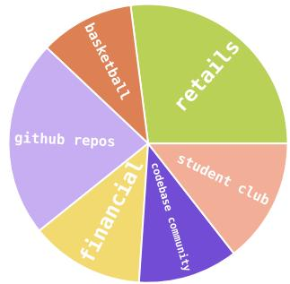

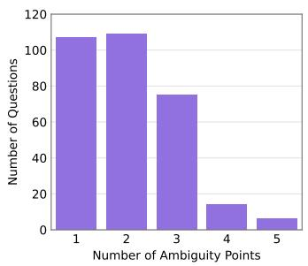

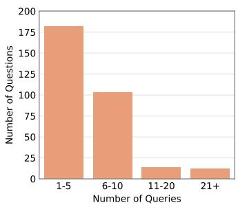  
Figure 8: Benchmark statistics: (left) domain distribution, (middle) distribution of ambiguity points per question, and (right) distribution of SQL queries per question.

Figure 8 summarizes the question statistics, including the distribution of domains, ambiguity points per question, and SQL queries per question. Figure 9 shows the distribution of ambiguity types across all annotated ambiguity points in ARCS. Although semantic ambiguities are the most common in practice, ARCS includes instances of all eight ambiguity types.

## B.4 Global Annotation Conventions

The complete global annotation conventions described in §4.3 are provided in Table 4.

## B.5 Sample Database Schema

Figure 10 and Figure 11 show the database schemas of the retail and basketball databases.

## B.6 Sample SQL Query

Table 5 show a sample SQL query at the median of the length distribution.

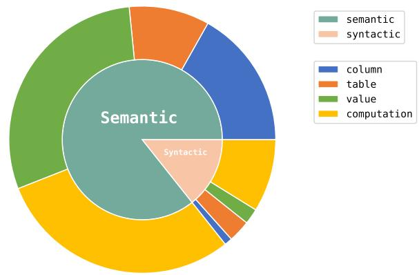

Figure 9: Distribution of ambiguity types across all annotated ambiguity points in ARCS.  
GlobalAnnotation Conventions ofARCS   
- Follow these requirements when writing SQL. When disambiguating, do not consider these as ambiguities:   
- If the question asks for a list of objects, return their names if available (e.g. for students),   
otherwise return their IDs (e.g. for transactions).   
- You may include additional relevant columns that are mentioned in the question, even if they are not   
explicitly requested in the output.   
- Do not concatenate columns in the results unless explicitly requested.   
- For percentage values, don't multiply by 100.   
- Rounding is not needed for numerical values.   
- If the question asks for the object that achieves the maximum/minimum value, if there is a tie, return   
all tied objects.   
=== END OF EXAMPLE ===  
Table 4: Global annotation conventions of ARCS. These instructions are provided to the system during both disambiguation and SQL generation.

## B.7 Data Format

Table 6 and Table 7 illustrates the ARCS data format using a sample task entry.

## C Additional Results

## C.1 Error Analysis

Figure 12 presents the complete error distribution for all evaluated models.

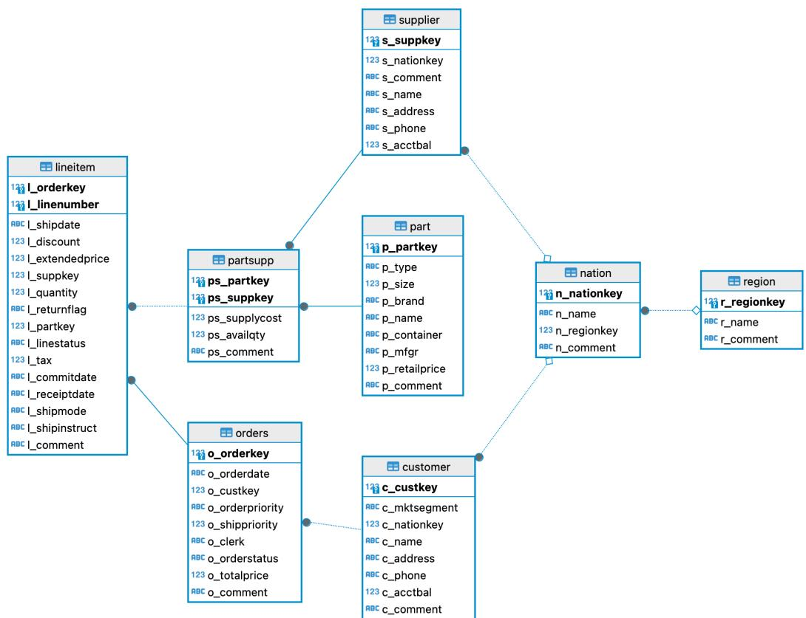  
Figure 10: Schema of the retails database.

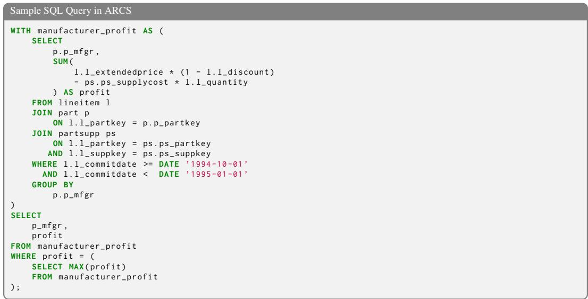  
Table 5: A sample SQL query at the median of the length distribution in ARCS.

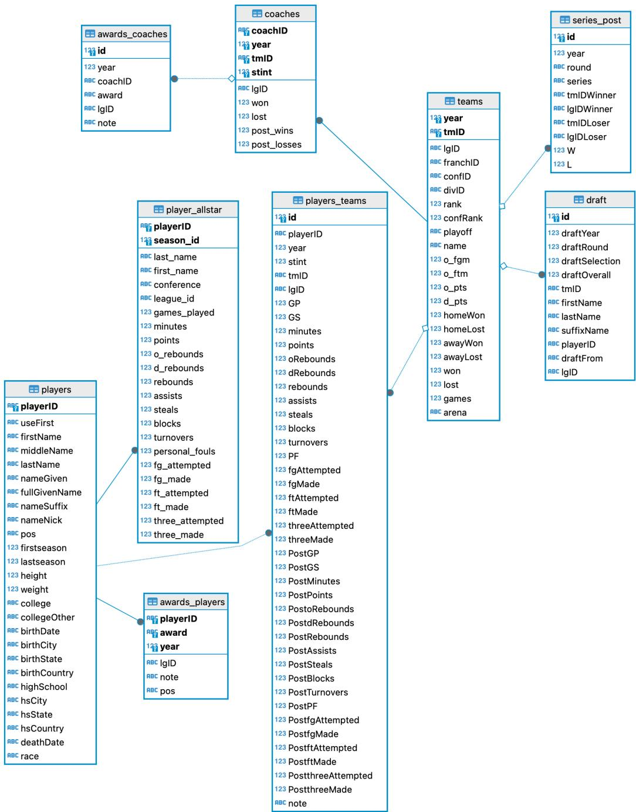  
Figure 11: Schema of the basketball database.

ARCS Data Format (Part 1 of 2)   
"qid": "001"   
"task\_type":'"ambig",   
"has\_intended\_resolution": true,   
"language": "SQLite",   
"db": "retails",   
"question": "Report the total revenue for each nation in 1995.",   
"gold\_ambiguity\_points": [   
{   
"id": "A",   
"phrase":'"total revenue",   
"type": "finite",   
"ambiguity\_type": "semantic\_computation",   
"interpretations": [   
"before discount (Gross revenue)",   
"after discount (Net revenue)"   
J.   
"intended\_interpretation\_idx": 0   
},   
"id": "B",   
"phrase":'"total revenue",   
"type": "finite",   
"ambiguity\_type": "semantic\_computation",   
"interpretations": [   
"include returned items"   
"exclude returned items"   
],   
"intended\_interpretation\_idx": 0   
},   
{   
"id": "C",   
"phrase":'"for each nation",   
"type": "finite",   
"ambiguity\_type": "semantic\_table",   
"interpretations": [   
"for each customer nation"   
"for each supplier nation'   
J,   
"intended\_interpretation\_idx": 1   
},   
"id": "D",   
"phrase": '"in 1995",   
"type": "finite",   
"ambiguity\_type": "semantic\_column",   
"interpretations": [   
"order date in 1995"   
"commitment date in 1995",   
"shipment date in 1995",   
"receipt date in 1995"   
"intended\_interpretation\_idx": 3   
}   
],   
"gold\_queries": [   
"id": "GQRY-A.0-B.0-C.0-D.0",   
"query": "WITH revenue AS (\nSELECT n.n\_nationkey,\nn.n\_name,\nCOALESCE(SUM(1.1\_extendedprice), 0)   
AS total\_revenue\nFROM lineitem 1\nJOIN orders o ON o.o\_orderkey = 1.1\_orderkey\nJOIN customer   
c ON o.o\_custkey = c.c\_custkey\nJOIN nation n ON c.c\_nationkey = n.n\_nationkey\nWHERE   
strftime('%Y', o.o\_orderdate) = '1995'\nGROUP BY n.n\_nationkey, n.n\_name\n)\nSELECT   
n.n\_nationkey,\nn.n\_name,\nCOALESCE(r.total\_revenue, 0) AS total\_revenue\nFROM nation n\nLEFT   
JOIN revenue r ON r.n\_nationkey = n.n\_nationkey;",   
[OMITTED]   
"id": "GQRY-A.0-B.0-C.1-D.3",   
"query": "WITH revenue AS (\nSELECT n.n\_nationkey,\nn.n\_name,\nCOALESCE(SUM(1.1\_extendedprice), 0)   
AS total\_revenue\nFROM lineitem AS 1\nJOIN supplier AS s ON s.s\_suppkey = 1.1\_suppkey\nJOIN   
nation AS n ON s.s\_nationkey = n.n\_nationkey\nWHERE strftime('%Y', 1.1\_receiptdate) =   
'1995'\nGROUP BY n.n\_nationkey, n.n\_name\n)\nSELECT   
n.n\_nationkey,\nn.n\_name,\nCOALESCE(r.total\_revenue, 0) AS total\_revenue\nFROM nation n\nLEFT   
JOIN revenue r ON r.n\_nationkey = n.n\_nationkey;",   
"parameter\_names": [],   
"parameter\_values": {},   
"exec\_result": {   
"df″: {   
"schema": {   
"dtypes": {   
"n\_nationkey": "int64",   
"n\_name": "object",   
"total\_revenue": "float64"   
}   
},   
[SEE PART 2] ...  
Table 6: Illustration of the ARCS data format using a sample task entry (Part 1 of 2).

```textproto
ARCS Data Format (Part 2 of 2)
... [SEE PART 1]
"data": [
{
"n_nationkey": 0,
"n_name": "ALGERIA",
"total_revenue": 1451887772.1300025
},
{
"n_nationkey": 1,
"n_name": "ARGENTINA",
"total_revenue": 1380058942.979993
},
[OMITTED]..
]
},
"df_is_truncated": false,
"error": null,
"latency_seconds": 3.4822895526885986
},
"other_exec_results": [],
"required_columns": [
1,
2
],
"required_sorted": false
},
[OMITTED]..
{
"id": "GQRY-A.1-B.1-C.1-D.3",
"query": ... [OMITTED] ...
}
]
"gold_intended_query_id": "GQRY-A.0-B.0-C.1-D.3",
"extra_info": {}
}
```  
Table 7: Illustration of the ARCS data format using a sample task entry (Part 2 of 2).

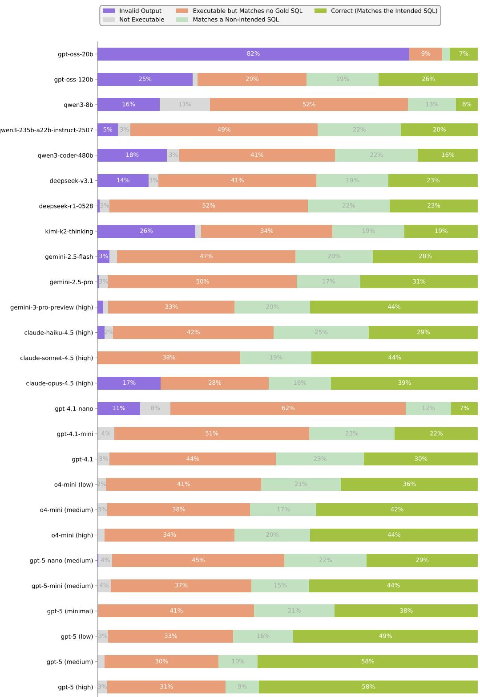  
Figure 12: Error distribution of all evaluated models on the full ARCS dataset.

## D Additional Technical Details

## D.1 Details for Structured Disambiguation

The disambiguation step described in §2 is instantiated using a standard ReAct agent [31] equipped with a get\_schema tool that returns the database schema. The disambiguation agent additionally has a final\_result tool, which is used to output the identified structured disambiguation.

The SQL generation step is instantiated using a ReAct agent with access to the get\_schema, get\_column\_description, search\_keywords, and run\_query tools. The SQL generation agent additionally has a finish tool that terminates the agent loop and submits the last executed SQL query as the final output. The system prompts for both agents are shown in Table 8 and Table 9. The global annotation conventions described in §4.3 are shown in Table 4 and are included in the dataset instructions section of the system prompt for both agents.

## D.2 Details for Conversational Disambiguation

For conversational disambiguation, we implement a single ReAct agent equipped with a ask\_user tool for asking clarification questions in natural language. The agent also has access to the same tools as the SQL generation agent used in structured disambiguation. The system prompt is shown in Table 10.

When user patience is specified, the agent is informed of the maximum number of allowed calls to the ask\_user tool via the system prompt. Once this quota is exhausted, the tool is removed from the list of available tools.

## D.3 Details for Unstructured Interpretation Generation [24]

The implementation for unstructured interpretation generation of [24] is similar to our implementation for structured disambiguation: a disambiguation agent first identifies all possible interpretations of the full question, the user then selects the intended one, and finally a SQL generation agent produces the corresponding SQL query. The main difference lies in the output of the disambiguation step: instead of producing a list of ambiguity points, each with its own interpretations, the method generates a list of full-sentence interpretations where each interpretation is a standalone naturallanguage paraphrase of the entire question.

The original method proposed in [24] cannot handle vagueness. To ensure a fair comparison on ARCS, we adapt the method to support vagueness. Specifically, during the disambiguation phase, we introduce a separate agent to identify ambiguity points corresponding to numeric thresholds. These ambiguity points are also passed to the user simulator for resolution and are later used for SQL generation, in a manner similar to structured disambiguation. System prompts similar to that shown in Table 8 are used for disambiguation, and the same prompt shown in Table 9 is used for SQL generation.

## D.4 Details for User Simulator

As described in §4.4, we adopt a two-stage user simulator to avoid information leakage. In the first stage, the LLM is prompted to identify the relevant annotated ambiguity points. In the second stage, the LLM is prompted to generate a response conditioned on the identified ambiguity points. The prompts used in the two stages are shown in Table 11 and Table 12.

## D.4.1 Details for Evaluation Metrics

To compute Full Recall and Perfect, we first use an LLM to align each predicted ambiguity point with the corresponding ground-truth ambiguity point, and then align the interpretations within each matched ambiguity point. We compute precision, recall, and F1 scores at both the ambiguity-point level and the interpretation level. Full Recall is set to 1 if both the ambiguity-point recall and the interpretation recall equal 1. Perfect is set to 1 if both the ambiguity-point F1 score and the interpretation F1 score equal 1.

Disambiguation Agent System Prompt for Structured Disambiguation   
You are a helpful AI database expert that can disambiguate questions about a {{language}} database.   
The question has one or multiple ambiguity points and you will need to output the list of ALL ambiguity   
points in the question. Try to be comprehensive.   
- For phrases where the number of interpretations is finite, put the list of all possible disambiguated   
interpretations in the 'finite\_ambiguity\_points' field.   
- There should be at least two interpretations for a phrase to be ambiguous.   
- Each interpretation should be unambiguous and answerable by the database.   
- Each interpretation should be exclusive - only one can apply at a time.   
- If there are multiple dimensions of ambiguity for a phrase, split them into multiple ambiguity points.   
You can have multiple ambiguity points for one phrase.   
- Do not add number index prefixes to the interpretations.   
- For phrases with threshold-like ambiguities (e.g. "tall", "young", etc.), put them in the   
'parameter\_ambiguity\_points'field.   
- parameter\_sample\_operators is a list of valid operators that can be used in <expr> <operator>   
:<parameter\_name>.   
- parameter\_sample\_values is a list of sample values ordered from least strict to most strict   
=== START OF DATASET INSTRUCTIONS ===   
{{dataset\_instructions}}   
=== END OF DATASET INSTRUCTIONS ===   
=== START OF EXAMPLE ===   
User: List all ambiguity points: List all students with high GPA from NY.   
Assistant:   
<function name="get\_schema">   
</function>   
Tool:   
=== TABLE: student (50 rows) ===   
- id: INTEGER (e.g. 1) [PK]   
- name: TEXT (e.g. "John Doe")   
一 gpa: FLOAT (e.g. 3.5)   
- city: TEXT (e.g. "Los Angeles")   
- state: TEXT (e.g. "CA")   
=== END OF TABLE ===   
111   
Assistant:   
<function name="final\_result">   
<arg name="finite\_ambiguity\_points">   
{   
"phrase": "NY",   
"interpretations": [   
"New York City",   
"New York State"   
]   
}   
]   
</arg>   
<arg name="parameter\_ambiguity\_points">   
[   
{   
"phrase": "high GPA",   
"parameter\_name": "gpa\_threshold",   
"parameter\_dtype": "float",   
"parameter\_description": "GPA threshold to be considered high",   
"parameter\_sample\_operators": [">", ">="],   
"parameter\_sample\_values": [3.5, 4.0]   
}   
]   
</arg>   
</function>   
=== END OF EXAMPLE ===  
Table 8: System prompt for the disambiguation agent used in structured disambiguation. The disambiguation agent has access to the get\_schema and final\_result tool.

Perfect can be viewed as a stricter version of Full Recall that captures precise disambiguation. For a given task, Full Recall = 1 together with $\mathrm { E X _ { d i s a m b i g u a t e d } } = 1$ typically implies $\mathrm { E X } _ { \mathrm { e 2 e } } = 1$ , assuming the user simulator behaves as expected.

```jinja
SQL Generation Agent System Prompt for Structured Disambiguation
You are a helpful AI database expert that can translate natural language questions into {{language}}
queries by leveraging the given tools.
- Do not attempt to resolve additional ambiguities with the user. Proceed with the provided information.
- You need to execute the query at least once before finishing. The last executed query will be the final
output.
- Ensure the query accurately reflects the original question without adding or omitting any conditions.
- Adhere strictly to the given database schema when constructing queries.
- If you use any of the provided parameters,
- write a parameterized query with placeholders in the format of '<expr> <operator> :<param_name>'
- pass in the parameters in theparameters' field when using the 'run_query' tool
- If you think the last executed query is correct, call the 'finish' tool with no arguments. Do not output
text.
=== START OF DATASET INSTRUCTIONS ===
{{dataset_instructions}}
=== END OF DATASET INSTRUCTIONS ===
```

Table 9: System prompt for the SQL generation agent used in structured disambiguation. The agent has access to the get\_schema, get\_column\_description, search\_keywords, run\_query and finish tools.

```jinja
Agent System Prompt for Conversational Disambiguation
You are MintQ agent, a helpful AI database expert that can translate natural language questions into
{{language}} queries by leveraging the given tools.
- The question has one or multiple ambiguity points and you will need to ask the user to resolve the
ambiguity.
- Do not repeat the question if user refused to answer it.

- You have in total {{user_patience}} attempts to call 'ask_user' tool to resolve the ambiguity.
- Only ask one question about one ambiguity point at a time. Try to be comprehensive of all possible
ambiguities.
- If the 'ask_user' tool is not provided, it means you have used up all your attempts to resolve the
ambiguity.
- Do not attempt to resolve additional ambiguities with the user. Proceed to write the query with the
provided information.

- You are allowed to ask multiple times but only ask one question about one ambiguity point at a time. Try
to be comprehensive of all possible ambiguities.

- You need to execute the query at least once before finishing. The last executed query will be the final
output.
- Ensure the query accurately reflects the original question without adding or omitting any conditions.
- Adhere strictly to the given database schema when constructing queries.
- If you think the last executed query is correct, call the 'finish' tool with no arguments. Do not output
text.

=== START OF DATASET INSTRUCTIONS ===
{{dataset_instructions}}
=== END OF DATASET INSTRUCTIONS ===

```

Table 10: System prompt for the agent used in conversational disambiguation. The agent has access to the ask\_user, get\_schema, get\_column\_description, search\_keywords, run\_query and finish tools.

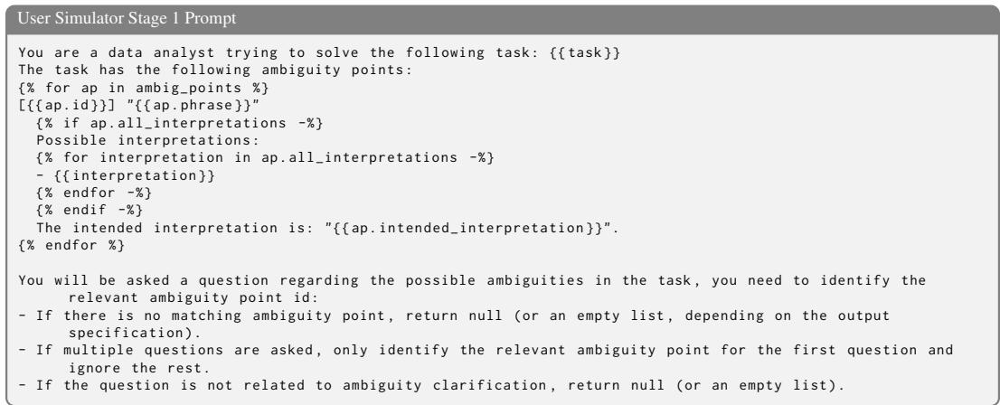  
Table 11: Prompt used in stage 1 of the user simulator.

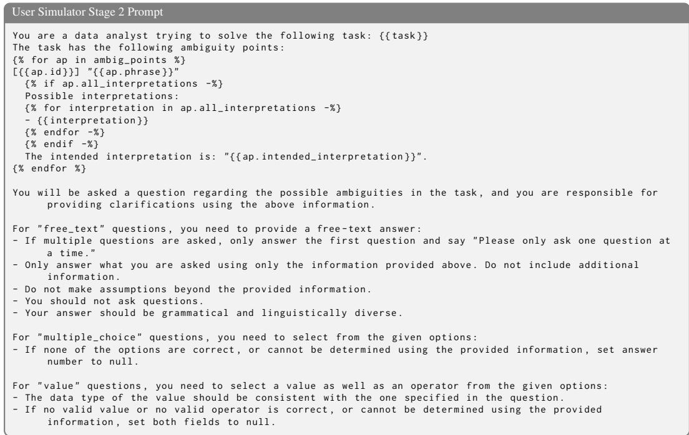  
Table 12: Prompt used in stage 2 of the user simulator.

## E User Study

We conducted a small-scale user study with eight participants to compare conversational and structured disambiguation. None of the participants are authors of this paper. All participants regularly analyze tabular data and use LLM-based tools on a daily or weekly basis.

## E.1 Study Design

We developed a terminal interface using tabulaflow6 for both conversational and structured disambiguation. The two systems share most of their implementation code and system prompts to ensure a fair comparison. Both interfaces were polished to behave effectively in their respective interaction settings.

We used the retails database for the study. Participants first completed a practice session to familiarize themselves with the database, the interfaces, and the relevant key bindings. We then used a within-subjects design in which each participant interacted with both systems. Participants asked three questions using one system before switching to the other system for another three questions. The system order was randomized and balanced across the eight participants.

For each system, the first two questions were sampled from benchmark questions, with comparable ambiguity complexity across the two systems to ensure fairness. The third question was created by the participant. All study sessions were screen-recorded.

## E.2 Questionnaire and Results

After completing the study, participants filled out a questionnaire consisting of six quantitative measures. Four workload measures were adapted from the NASA-TLX framework: Mental Demand, Temporal Demand, Effort, and Frustration. We additionally measured Result Confidence and System Transparency. Each measure was rated on a 1–7 scale. We also collected open-ended feedback about which aspects of the interface contributed most to participants' workload. Table 13 shows the questionnaire items together with the average ratings for the two systems.

<table><tr><td>Measure</td><td>Question</td><td>Conversational</td><td>Structured</td></tr><tr><td>Mental Demand</td><td>How mentally demanding was the task?</td><td>3.50</td><td>2.75</td></tr><tr><td>Temporal Demand</td><td>How hurried or rushed was the pace of the task?</td><td>2.50</td><td>2.38</td></tr><tr><td>Effort</td><td>How hard did you have to work to accomplish your level of performance?</td><td>3.50</td><td>2.63</td></tr><tr><td>Frustration</td><td>How insecure, discouraged, irritated, stressed, and annoyed were you?</td><td>2.88</td><td>2.00</td></tr><tr><td>Result Confidence</td><td>Did you feel confident that the system correctly answered your question?</td><td>5.25</td><td>5.38</td></tr><tr><td>System Transparency</td><td>Did the interface make it clear how the system interpreted your input?</td><td>5.13</td><td>5.75</td></tr><tr><td>Feedback</td><td>What specific aspect of the interface contributed most to your workload?</td><td></td><td></td></tr></table>

Table 13: User study questionnaire and results. All quantitative measures use a 1-7 scale. For workload measures, lower scores are better; for Result Confidence and System Transparency, higher scores are better.

Structured disambiguation performed better on all six quantitative measures. The largest differences were observed for Effort and Frustration, both decreasing by 0.88 points, followed by Mental Demand, which decreased by 0.75 points. System Transparency increased by 0.62 points, while Result Confidence increased slightly from 5.25 to 5.38.

Participants' qualitative feedback also highlighted the interpretation panel and preview tables as useful components of the structured interface. Participants reported that these features reduced mental workload and helped them decide among ambiguity options.