# COTRACE: DATA RECIPES FOR TRAINING TERMINAL AGENTS WITH HARNESS–MODEL CO-EVOLUTION

Jixuan Chen<sup>1,2</sup> Jiaxin Zhang<sup>2</sup> Qinyuan Ye<sup>2</sup> Yada Pruksachatkun<sup>2</sup> Haoxiang Zhang<sup>1,2</sup> Jingming Zhuo<sup>3</sup> Yifan Zhang<sup>2</sup> Yutong Dai<sup>2</sup> Juntao Tan<sup>2</sup> Xiangyu Peng<sup>2</sup> Silvio Savarese<sup>2</sup> Zeyuan Chen<sup>2</sup> Lianhui Qin<sup>1</sup> Chien-Sheng Wu<sup>2</sup> <sup>1</sup>University of California, San Diego <sup>2</sup>Salesforce AI Research <sup>3</sup>University of Washington

jic182@ucsd.edu

{jiaxin.zhang, qinyuan.ye, ypruksachatkun, wu.jason}@salesforce.com

## ABSTRACT

Terminal-agent capability depends jointly on model weights and the runtime harness that formats prompts, binds tools, and handles error recovery. Existing harness–model co-evolution approaches improve both components, yet often treat trajectories produced during harness search as an undifferentiated replay buffer. This practice overlooks that a trajectory’s value for model training depends on the harness under which it was generated. To systematically analyze this interface, we establish an alternating co-evolution framework that decouples harness search and policy training through component-wise promotion decisions. Within this framework, we introduce CoTrace, a harness-aware data recipe that explicitly governs trajectory routing, provenance matching, and curriculum refresh. Under CoTrace, recurring execution failures guide harness synthesis, while policy training is strictly conditioned on verified rollouts matched to the adopted runtime for supervised fine-tuning (SFT) or fresh online interactions for reinforcement learning (RL). On the Tmax promotion split, CoTrace advances Qwen3.5-9B from 78 to 88 solved tasks under supervised fine-tuning while an online reinforcement variant reaches 90. Specifically, a compact harness-matched corpus produces steady model gains at substantially lower compute than much larger corpora pooled across sibling harnesses. Furthermore, evaluations on Terminal-Bench 2.1 and SWE-bench Lite show that out-of-distribution transfer depends fundamentally on harness compatibility, where maintaining consistency between training and evaluation runtimes prevents procedural execution breakdowns observed under foreign scaffolds.

## 1 INTRODUCTION

Recent advances have substantially improved autonomous coding and terminal agents across complex interactive environments (Jimenez et al., 2024; Merrill et al., 2026; Ivison et al., 2026). These agents combine two inseparable components: a language model that acts as the action-selection policy and a runtime harness that formats prompts, binds tools, manages context, and recovers from execution errors (Yang et al., 2024; Wang et al., 2024c; Chen et al., 2026b). Prior research has largely optimized either component in isolation, improving agent performance through verifier-grounded policy post-training under a fixed runtime (Ivison et al., 2026; Pan et al., 2024; Wei et al., 2025) or through automated harness search with frozen model weights (Lin et al., 2026; Chen et al., 2026b; Zhang et al., 2026; Lee et al., 2026). Although recent systems interleave harness adaptation with policy training (Chen et al., 2026c; Luo et al., 2026; Chen et al., 2026a), they leave the shared data interface between the two optimizers largely implicit. Because each update changes the conditions under which subsequent trajectories are collected, alternating the two processes without an explicit data recipe creates subtle failure modes. This motivates our central question: how should execution data flow between the policy and the harness during co-evolution?

An execution trajectory has different value for the harness and the policy. Execution failures can expose missing recovery logic and thereby guide harness mutation, but they are poor targets for policy imitation. Conversely, successful executions may rely on processors specific to candidate harnesses that are later rejected; training on those trajectories can therefore mismatch the policy’s data with the deployed runtime (Tajwar et al., 2024). As the agent improves, successful rollouts also concentrate increasingly on solved tasks with diminishing learning value, while unresolved failures define a moving frontier of harder problems. Pooling all search trajectories can thus disconnect the two optimizers: in one of our experiments, harness updates add nine solved tasks, while the promotion procedure rejects every model update trained on pooled candidate successes.

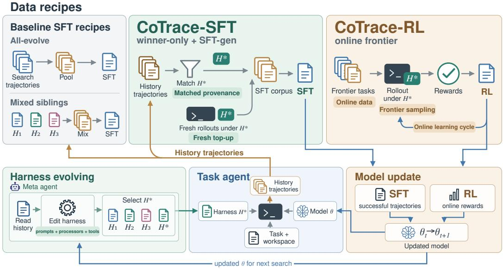  
Figure 1: Overview of CoTrace and the shared data interface in model–harness co-evolution. Bottom: the closed loop. A task agent with the adopted harness $H ^ { * }$ and policy weights θ solves executable terminal tasks and fills a shared history of trajectories; harness evolution reads that history to edit prompts, processors and tools and selects the next $H ^ { * }$ , while model training updates θ before the subsequent round of search. Top: the data recipes that turn the history into model-training data, from the baseline supervised fine-tuning (SFT) recipes that pool every successful search trajectory (all-evolve) or successes across sibling candidate harnesses (mixed siblings), to CoTrace-SFT, which keeps only trajectories whose provenance matches $H ^ { * }$ and tops them up with fresh rollouts under $H ^ { * }$ , and CoTrace-RL, which learns online by reinforcement learning (RL) from rewards on frontier tasks rolled out under $H ^ { * }$

We introduce CoTrace, a harness-aware data recipe that explicitly governs how execution experience is filtered, matched, and refreshed across model–harness co-evolution. Operating over an alternating search and training pipeline, CoTrace coordinates data flow through three targeted mechanisms. Route directs clustered execution failures to harness synthesis while restricting policy supervision to verified successes strictly matched to the adopted runtime, supplemented with fresh rollouts under that same harness. Ratchet attributes every accepted gain to one component by evaluating candidate harnesses under fixed weights and candidate policies under the adopted harness on a frozen promotion split. Refresh drives curriculum progression by retiring tasks only after they are both solved and incorporated into the training corpus, continuously redirecting exploration toward residual frontier tasks. On the 102-task Tmax split (Ivison et al., 2026), our default supervised recipe advances Qwen3.5-9B from 78 to 88 solved tasks across alternating updates, while an online reinforcement variant reaches a peak of 90.

We evaluate these data recipes through targeted control experiments and cross-harness evaluations to determine when search experience translates into model learning. Tracking component-wise promotion decisions and data-routing strategies reveals that raw trajectory volume alone cannot guarantee policy improvement, whereas runtime compatibility proves decisive. While pooling 149– 308 successful trajectories per iteration from exploratory sibling harnesses yields zero accepted model updates, our harness-matched recipe utilizes merely 30–50 trajectories to deliver consistent gains, achieving superior performance at the lowest per-iteration training cost of 47 GPU-hours. Cross-harness evaluations further demonstrate that learned capabilities remain tightly coupled to the runtime environment, consistently improving performance under the data-generating harness while degrading under mismatched alternatives. Crucially, external evaluations on Terminal-Bench 2.1 and SWE-bench Lite show that out-of-distribution (OOD) transfer is fundamentally governed by the co-evolved model–harness pair rather than the policy in isolation, where deploying the learned checkpoint within its co-evolved runtime dramatically suppresses early execution faults and no-patch failures, effectively unlocking the policy’s underlying problem-solving capability across foreign domains without task-specific tuning.

In summary, our primary contributions are:

• An inspectable co-evolution framework that records harness and model updates separately, with trajectory provenance and component-wise promotion decisions.

• A harness-aware data recipe, combining failure routing, runtime-matched supervised trajectories, fresh generation, and curriculum refresh, evaluated against pooled search trajectories.

• An analysis of transfer across runtimes showing where checkpoint-only gains fail to carry over and where runtime changes alter execution outcomes on external benchmarks.

## 2 METHOD

We first formulate terminal-agent learning as alternating model–harness optimization and then present CoTrace, the data recipe that coordinates the two update channels.

## 2.1 PROBLEM FORMULATION: MODEL–HARNESS CO-EVOLUTION

An autonomous terminal agent is a pair of a parameterized policy θ and an execution harness H. A task $x = ( q _ { x } , s _ { x } , v _ { x } ) \sim \mathcal { T }$ specifies an instruction $q _ { x }$ , an initial sandbox state $s _ { x } ,$ , and a deterministic verifier $v _ { x }$ of the terminal state; the harness formats prompt context, binds tools, parses feedback, and handles error recovery, so executing the pair induces a rollout distribution $\tau \sim \pi ( \cdot \mid \theta , H , x )$ of interleaved tool calls and observations. Model–harness co-evolution maximizes

$$
\operatorname* { m a x } _ { \theta , H } J ( \theta , H ) = \mathbb { E } _ { x \sim \mathcal { T } , \tau \sim \pi ( \cdot \vert \theta , H , x ) } [ v _ { x } ( \tau ) ] ,\tag{1}
$$

which we optimize alternately over iterations $t , \ H _ { t + 1 } \ \approx$ arg max<sub>H</sub> $J ( \theta _ { t } , H )$ and $\theta _ { t + 1 } ~ \approx$ arg max<sub>θ</sub> $J ( \theta , H _ { t + 1 } )$ . The two updates are coupled through the traces τ: each step produces the data the next consumes, so co-evolution hinges on the recipe that routes failure evidence to harness search and runtime-matched successes to the policy.

## 2.2 COTRACE: DATA RECIPE FOR CO-EVOLUTION

CoTrace governs the data interface within an alternating co-evolution loop that coordinates harness search and model training over a versioned trajectory bank $B _ { 0 : t }$ . Instead of pooling all generated traces into an undifferentiated replay buffer, CoTrace synchronizes the information exchange through three coordinated operations. First, Route partitions execution traces into failure clusters that expose missing runtime recovery logic for harness synthesis, while filtering and matching verified successes to the adopted runtime for policy supervision. Second, Ratchet enforces coordinate promotion on the frozen split V with the complementary component fixed, guaranteeing that accepted gains are cleanly attributable and that regressions are discarded. Third, Refresh retires tasks that have provided verified training signal and replenishes the evolve set from an unvisited reservoir, ensuring that both search and training remain concentrated on the moving frontier. Algorithm 1 outlines this alternating workflow; see algorithm details in Appendix D.1.

This alternating formulation abstracts away the underlying optimizers while isolating the data flow that couples them. In our implementation, harness search explores the typed configuration space of HARNESSX (Chen et al., 2026b) while model weights are optimized either by supervised fine-tuning with low-rank adaptation (LoRA) (Hu et al., 2022) or by outcome-driven reinforcement learning with the DPPO policy-gradient algorithm (Qi et al., 2026; Ivison et al., 2026; Yu et al., 2025), with concrete search screens and training configurations documented in Section 3 and Appendices D and F. The subsequent sections detail each of the three core operations (Route, Ratchet, and Refresh).

Algorithm 1 CoTrace Alternating Co-Evolution Loop (Single Iteration)   
Require: Incumbent pair $( \theta _ { t } , H _ { t } )$ , evolve set $\mathcal { E } _ { t } ,$ reservoir ${ \mathcal { T } } _ { \mathrm { p o o l } } ,$ frozen split V, trajectory bank $B _ { 0 : t }$   
Ensure: Updated pair $( \theta _ { t + 1 } , H _ { t + 1 } )$ , refreshed evolve set $\mathcal { E } _ { t + 1 } ,$ , updated bank $\scriptstyle B _ { 0 : t + 1 }$   
1: // Phase 1: Failure-Guided Harness Search and Attribution   
2: $\mathcal { D } _ { t } ^ { H }  \mathrm { R o U T E F A I L U R E S } ( \boldsymbol { B } _ { 0 : t } )$ ▷ ROUTE: cluster recurring runtime faults   
3: $H ^ { \mathrm { c a n d } } \gets \mathrm { H A R N E S S S E A R C H } \left( H _ { t } , \mathcal { D } _ { t } ^ { H } , \mathcal { E } _ { t } ; \theta _ { t } \right)$ ▷ Explore runtime candidates with $\theta _ { t }$ fixed   
4: $H _ { t + 1 } \gets \mathrm { R A T C H E T E V A L U A T I O N } \big ( H ^ { \mathrm { c a n d } } , H _ { t } \mid \theta _ { t } , \mathcal { V } \big )$ ▷ RATCHET: adopt if $w _ { H } > \ell _ { H }$ on V   
5: // Phase 2: Runtime-Matched Policy Learning and Attribution   
6: if Supervised Mode then   
7: $\mathcal { S } _ { t } ^ { ' } \gets \mathrm { R o U T E M A T C H E D S U P E R V I S I O N } ( \mathcal { B } _ { 0 : t } , H _ { t + 1 } )$ ▷ ROUTE: match fingerprint $\phi ( H _ { t + 1 } )$ and top up   
8: $\theta ^ { \prime } \gets \mathrm { F I N E T U N E P O L I C Y } ( \theta _ { t } , S _ { t } )$ ▷ Update weights on matched demonstrations   
9: else   
10: $\theta ^ { \prime } \gets \mathrm { R E I N F O R C E P O L I C Y } ( \theta _ { t } , H _ { t + 1 } , \mathcal { T } _ { \mathrm { p o o l } } )$ ▷ Sample rollouts and rewards online under $H _ { t + 1 }$   
11: end if   
12: $\theta _ { t + 1 } \gets \mathrm { R A T C H E T E V A L U A T I O N } ( \theta ^ { \prime } , \theta _ { t } \mid H _ { t + 1 } , \mathcal { V } )$ ▷ RATCHET: adopt if $w _ { M } > \ell _ { M }$ on V   
13: // Phase 3: Moving Curriculum Frontier Progression   
14: $\mathcal { M } _ { t }  \{ x \in \mathcal { E } _ { t } \mid \mathit { \bar { \ s o l v e d } } _ { t } ( x ) \land \mathrm { h a r v e s t e d } _ { t } ( x ) \bar  \}$ ▷ Identify mastered tasks   
15: $\mathcal { E } _ { t + 1 } \gets \langle \mathcal { E } _ { t } \setminus \mathcal { M } _ { t } \rangle \cup \mathrm { R E F I L L D O M A I N S T R A T I F I E D } ( \mathcal { T } _ { \mathrm { p o o l } } )$ ▷ REFRESH: advance active frontier   
16: $B _ { 0 : t + 1 } \gets B _ { 0 : t } \cup$ HARVESTITER $\mathbf { A T I O N T R A C E S } ( )$ ▷ Log newly generated executions   
17: return $( \theta _ { t + 1 } , H _ { t + 1 } ) , \mathcal { E } _ { t + 1 } , \mathcal { B } _ { 0 : t + 1 }$  
• w<sub>H</sub> , ℓ<sub>H</sub> / w<sub>M</sub> , $\ell _ { M } :$ number of tasks on V newly solved and newly broken by candidate $H ^ { \mathrm { c a n d } }$ under $\theta _ { t }$ , and candidate $\theta ^ { \prime }$ under $H _ { t + 1 }$  
• ϕ $\phi ( H _ { t + 1 }$ ): hash signature capturing prompt templates, tool interface bindings, and observation processors of the adopted runtime  
• solved<sub>t</sub>(x): binary indicator that task x is verified successful by the incumbent pair  
• harvested<sub>t</sub>(x): binary indicator that a verified execution trace for task x is selected into the training corpus $S _ { 0 : t }$

## 2.2.1 ROUTE: SEPARATE EVIDENCE FOR EACH OPTIMIZER

A trajectory has different value for each optimizer, so CoTrace splits the bank into two views. The failure view $\mathcal { D } _ { t } ^ { H } = R _ { H } ( B _ { 0 : t } )$ keeps executions with runtime faults rather than environment or grader errors, clusters them by their earliest unrecovered failure across tasks, and uses the resulting evidence to propose harness changes (Appendix D.5). The model view $\mathcal { D } _ { t } ^ { M } = R _ { M } ( B _ { 0 : t } )$ keeps verified, well-formed demonstrations outside V, from which the SFT corpus is assembled by

$$
\operatorname* { m a x } _ { S _ { t } } \sum _ { \tau \in S _ { t } } Q ( \tau ) \qquad \mathrm { s . t . } \qquad | S _ { t } | \leq C , \quad | \{ \tau \in S _ { t } : \mathrm { t a s k } ( \tau ) = x \} | \leq c _ { r } \forall x ,\tag{2}
$$

where $Q$ scores trajectory quality, C bounds the corpus, and $c _ { r }$ caps trajectories per task. A trainingdata recipe specifies five coupled choices: trajectory provenance (which harness generated it), per-task sampling $\left( c _ { r } \right)$ , prompt and runtime conditioning (whether the stored prompt is that of the harness the policy will run under),fresh-rollout generation, and historical replay. Provenance is recorded per trajectory as a fingerprint $\phi ( \tau )$ hashing the prompt template, tool bindings, and processors it ran under, not merely a harness identifier.

• CoTrace-SFT retains demonstrations whose fingerprint matches the adopted harness, prioritizes current successes over bounded historical replay, limits repeated examples from the same task, and adds fresh rollouts under the adopted harness when task coverage is insufficient. Thus every selected example reflects the runtime the updated policy will use.

• CoTrace-RL uses fresh on-policy interactions and rewards collected under the adopted harness instead of constructing an offline corpus, so runtime alignment holds by construction.

## 2.2.2 RATCHET: ISOLATE AND PRESERVE COMPONENT GAINS

The evolve set $\mathcal { E } _ { t }$ and the promotion split V serve distinct purposes, with $\mathcal { E } _ { t }$ generating candidate updates and V determining whether each proposal replaces the incumbent. Every candidate c is evaluated on V against the incumbent’s task-by-task execution record. Letting w and ℓ denote the number of tasks newly solved and newly broken on V respectively, a candidate is adopted if and only if

$$
\mathrm { P r o m o t e } ( c ) \iff w > \ell ,\tag{3}
$$

where exact ties are accepted only when resulting from a complete evaluation run free of container or infrastructure anomalies (Appendix D.1). A candidate harness is scored with $\theta _ { t }$ fixed, whereas a candidate policy is scored with $H _ { t + 1 }$ fixed. This coordinate promotion protocol attributes each accepted increment to the isolated component that changed and prevents regressive updates from replacing the incumbent. When a model candidate is rejected, the framework gathers newly collected experience for the subsequent attempt rather than retraining on stale data.

## 2.2.3 REFRESH: TRACK THE LEARNING FRONTIER

At the end of each iteration, a task is retired from $\mathcal { E } _ { t }$ once it is both solved by the incumbent and harvested, meaning selected into a built SFT corpus $\boldsymbol { S } _ { 0 : t } \boldsymbol { ; }$ the evolve set is then replenished from $\mathcal { T } _ { \mathrm { p o o l } }$ (Equation (5), Appendix D.2). Requiring both conditions prevents a task from leaving before its success becomes usable training data, while also requiring evidence that the incumbent has mastered it. For online reinforcement, which has no persistent corpus, behavioral success determines retirement.

## 3 EXPERIMENTS

## 3.1 SETUP

Tasks and splits. Our primary testbed is built upon Tmax (Ivison et al., 2026), a benchmark of 2,200 executable terminal tasks equipped with containerized environments and programmatic verifiers. From this benchmark, we construct three disjoint splits with verified task-identifier separation (Appendix C.2), partitioning the pool into a held-out promotion split V of 102 tasks dedicated to component adoption decisions, an active rotating evolve set $\mathcal { E } _ { t }$ of 50 tasks for harness search and trajectory harvesting, and an unvisited reservoir $\mathcal { T } _ { \mathrm { p o o l } }$ for curriculum replenishment alongside 100 tasks allocated for reinforcement learning. Out-of-distribution (OOD) generalization is evaluated on untouched external benchmarks that no stage of co-evolution optimizes against, spanning 89 tasks on Terminal-Bench 2.1 (TB2.1) (Merrill et al., 2026) and 300 instances on SWE-bench Lite (Jimenez et al., 2024) (Section 4.3).

Models and harnesses. The task policy is instantiated with Qwen3.5-9B alongside Qwen3.5-4B as a supporting scale, guided by frontier meta-agents that propose runtime modifications in the typed configuration space of HARNESSX (Chen et al., 2026b). Harness search explores this configuration space via a two-generation tournament (5+5), evaluating an initial pool of 5 proposals against the incumbent policy on the rotating evolve set before branching a second wave of 5 candidates from the top-performing variant, with full screening cascade details deferred to Appendix D.4. For policy training, supervised updates use low-rank adaptation (LoRA) fine-tuning (Hu et al., 2022), while reinforcement updates use DPPO (Qi et al., 2026; Ivison et al., 2026), a PPO-style policygradient algorithm driven by binary outcome rewards, with group-relative advantage estimation, active sampling to discard zero-variance rollouts (Yu et al., 2025), and a binary total-variation trust region. Online reinforcement learning is scheduled once harness evolution establishes baseline competence to provide reliable reward signals, with complete search and training hyperparameters provided in Appendices C.6, D.4 and F.

Evaluation. Performance is measured by the number of solved tasks on the frozen promotion split, where binary task verifiers govern promotion decisions relative to a strongly tuned baseline scaffold (Appendix D.3). At each update step, a candidate component is evaluated with the counterpart held at its best-so-far incumbent, ensuring that each evaluation isolates the marginal effect of a single component modification under deterministic greedy decoding. While repeated trials show modest run-to-run variation around two tasks (Appendix C.5), our analyses focus on paired within-chain contrasts and consistent directional trends rather than isolated point estimates.

## 3.2 MAIN CO-EVOLUTION RESULTS

Table 1 reports every tournament-search chain run to completion at both scales, decomposed by the stage at which each update was installed (harness candidates evaluated under the incumbent policy, model candidates under the adopted harness).

Table 1: Harness–model co-evolution with different data recipes. We report the number of solved tasks on the frozen 102-task promotion split of Tmax (Ivison et al., 2026); $\Delta _ { H } / \Delta _ { M }$ are cumulative harness and model gains, Cost is GPU-hours per iteration on one 8-GPU node. Shaded rows are the CoTrace recipes (blue supervised, orange reinforcement); bold/underline mark best and second-best per scale. For non-tournament baseline comparisons using sequential harness search, see Table 9.
<table><tr><td colspan="3">Setting</td><td colspan="2">Score</td><td colspan="3">Decomposition</td><td>Cost</td></tr><tr><td>Method</td><td>Harness search</td><td>Data recipe</td><td>Init</td><td>Evolved</td><td>∆</td><td>∆H</td><td> $\Delta _ { M }$ </td><td>GPU-h /iter</td></tr><tr><td colspan="9">Qwen3.5-9B-Thinking</td></tr><tr><td>Harness onlyª</td><td>Tournament 5+5</td><td></td><td>77</td><td>81</td><td>+4</td><td>+4</td><td></td><td>25</td></tr><tr><td>Co-evolve w. SFT</td><td>Tournament 5+5</td><td>Mixed siblingsb</td><td>77</td><td>86</td><td>+9</td><td>+9</td><td>0</td><td>54</td></tr><tr><td>CoTrace-SFT</td><td>Tournament 5+5</td><td>Winner-only + SFT-genc</td><td>78</td><td>88</td><td>+10</td><td>+4</td><td>+6</td><td>47</td></tr><tr><td>CoTrace-RLd</td><td>Tournament 5+5</td><td>Winner-only harness</td><td>78</td><td>90</td><td>+12</td><td>±5</td><td>+7</td><td>62</td></tr><tr><td colspan="9">Qwen3.5-4B-Thinking</td></tr><tr><td>Harness only</td><td>Tournament 5+5</td><td></td><td>65</td><td>66</td><td>+1</td><td>+1</td><td></td><td>64</td></tr><tr><td>CoTrace-SFT</td><td>Tournament 5+5</td><td>Winner-only + SFT-genc</td><td>65</td><td>69</td><td>±4</td><td>+4</td><td>0</td><td>43</td></tr><tr><td>CoTrace-RLd</td><td>Tournament 5+5</td><td>Winner-only harness</td><td>67</td><td>79</td><td>+12</td><td>0</td><td>+12</td><td>100</td></tr></table>

<sup>a</sup> Evaluated using each round’s top harness candidate for 9B, and the promoted incumbent after five rounds for 4B. <sup>b</sup> Pools verified successes across all candidate harnesses evaluated during tournament search under their original prompts. <sup>c</sup> Restricts offline supervision to trajectories matching the adopted harness fingerprint $\phi ( H _ { t + 1 } )$ , topped up with fresh rollouts under $H _ { t + 1 } .$ Samples rollouts and rewards online under the adopted harness $H _ { t + 1 } ;$ Evolved denotes the final promoted incumbent (Appendix E).

On Qwen3.5-9B, the harness-only control reaches 81 from 77. Under tournament search, mixedsiblings co-evolution reaches 86, with all nine accepted tasks attributed to harness updates. CoTrace-SFT reaches 88 from 78, with cumulative gains of +4 from harness updates and +6 from model updates. CoTrace-RL reaches an incumbent of 90, with +5 attributed to harness updates and +7 to reinforcement updates; the reinforcement candidate that followed scores 85 and is rejected. The two-task gap between CoTrace-SFT and mixed siblings lies within the measured evaluation variation (Appendix C.5); the contrast that matters is therefore the +6 against 0 through the model channel. Figure 2 shows how these totals accumulated: the score each round produced before promotion and the reinforcement chain stage by stage.

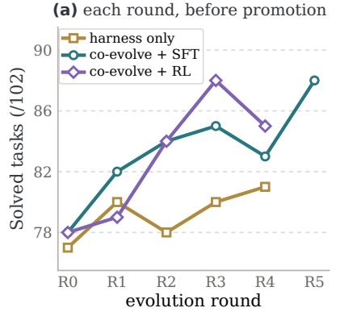

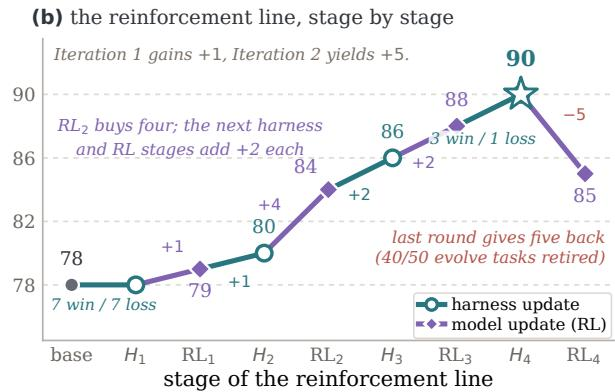  
Figure 2: Dynamics of model–harness co-evolution. (a) Each round’s artifact before promotion (harness-only: the round’s best harness candidate; co-evolution lines: that round’s candidate model checkpoint). (b) The 9B reinforcement chain stage by stage; segment labels are the net task change or the paired win/loss record where recorded (Table 11). The incumbent reaches 90; the next reinforcement candidate scores 85 and is rejected.

At 4B, the contribution pattern changes. CoTrace-SFT reaches 69 from 65 entirely through the harness channel, with all three of its model updates rejected. By contrast, the reinforcement chain moves from 67 to 79 entirely through model updates, with every harness candidate rejected; the frozen-weight control ends one task above its anchor. We therefore use these results to study not only whether co-evolution improves the pair, but which channel contributes under different training regimes and policy scales (Section 4).

## 3.3 DATA RECIPES AND MODEL-SIDE UPDATES

Table 2 summarizes what each recipe provides to the trainer. Under the controlled tournament-search comparison at 9B, mixed siblings supplies 149–308 trajectories per iteration but yields no accepted model update, whereas winner-only + SFT-gen uses 30–50 and contributes two accepted updates totaling +6 at 47 GPU-hours per iteration against 54. At 4B neither supervised construction yields model-side gain, while online reinforcement does.

Two features of Table 2 are important for interpretation. First, the recipes differ jointly in harness provenance, prompt conditioning, per-task cap, coverage, freshness and historical replay, so the table compares complete recipes, and Section 4.2 asks which of these choices the record can attribute the difference to. Second, a trajectory is not one optimization example: one execution contributes several prompt/completion pairs, and the pair counts overlap, 618–1335 per iteration for mixed siblings against 526–948 for winner-only + SFT-gen (Table 10), so the five-fold difference in trajectories corresponds to comparable numbers of training examples and comparable gradient compute. Periteration cost likewise differs from total cost because chain lengths differ: with the rounded values of Table 1, mixed siblings runs for about $3 \times 5 4 = 1 6 2$ GPU-hours and CoTrace-SFT for $5 \times 4 7 = 2 3 5$

Table 2: Training data from each mixture and the resulting promotion decisions. Trajectories and unique tasks per iteration (Table 10), the construction choices of Section 2.2.1, and accepted model updates out of those attempted with their total $\Sigma \Delta _ { M }$
<table><tr><td>Mixture</td><td>Traj. (tasks) per iter.</td><td>Per-task cap</td><td>Harness- matched</td><td>Prompt conditioned</td><td>Fresh top-up</td><td>History cap</td><td>9B: accepted,  $\Sigma \Delta _ { M }$ </td><td>4B:  $\Sigma \Delta _ { M }$ </td></tr><tr><td>Mixed siblings</td><td>149–308 (38–88)</td><td>8</td><td>×</td><td>X</td><td>X</td><td></td><td>0/3,0</td><td>0</td></tr><tr><td>CoTrace-SFT: winner-only + SFT-gen</td><td>30–50 (30–50)</td><td>1</td><td></td><td>√</td><td></td><td>40%</td><td>2/5, +6</td><td>0</td></tr><tr><td>CoTrace-RL: online frontier</td><td>2,304 ep.</td><td></td><td>on-policy</td><td></td><td>on-policy</td><td></td><td>3/4,+7</td><td>+12</td></tr></table>

## 4 ANALYSIS

4.1 RQ1: HOW DO THE TWO OPTIMIZATION CHANNELS CONTRIBUTE OVER A CO-EVOLUTION CHAIN?

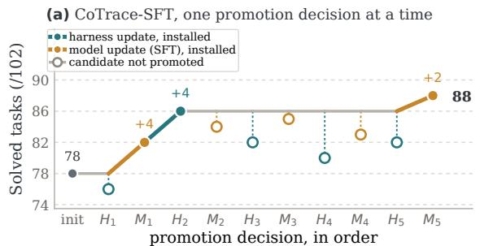

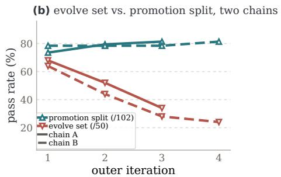  
Figure 3: Promotion decisions and the moving curriculum. (a) CoTrace-SFT one promotion decision at a time: filled markers are installed updates (teal harness, amber model), hollow markers rejected candidates. (b) Two chains: the evolve-set score falls as solved tasks retire while the promotion score rises.

Accepted gains arise from both channels at different stages of the chain. Figure 2(b) and Figure 3(a) open the two CoTrace chains at the level of individual promotion decisions. In the supervised chain a model update (+4) precedes the first productive harness search (+4 under the updated policy), six candidates are then rejected and a late update adds +2; the reinforcement chain alternates the same way, reaching 90 before its last candidate is rejected at 85. A pair-level total therefore conceals which optimizer is active at each stage, and the channel a search finds productive depends on the policy it runs against; the promotion rule filters a noisy stream, since only 9 of 17 search-winning harness candidates improved the promotion split (Appendix E.7).

Cross-evaluation confirms independent component gains. Component-wise promotion attributes each accepted update while holding the other component fixed.

The $2 \times 2$ cross-evaluation in Table 3 then identifies the model gain under each harness, $\begin{array} { r l } { \Delta _ { M } ( H ) } & { { } = } \end{array}$ $J ( \theta _ { t + 1 } , H ) - \overline { { J ( \theta _ { t } , H ) } }$ , and the difference-in-differences $I _ { t } = \Delta _ { M } ( H _ { t + 1 } ) - \Delta _ { M } ( H _ { t } )$ measures how strongly a model update’s effect depends on the harness. In the CoTrace-SFT chain, the harness adopted after the model update is worth +4 under the base policy as well $( J ( \theta _ { 0 } , \bar { H _ { 2 } } ) = 8 2 )$ , so $\Delta _ { M } ( H _ { 0 } ) = \Delta _ { M } ( \dot { H _ { 2 } } ) = \dot { + } 4$ and $I = 0 ;$ for that transition the gains add rather than interact. Together with the alternating promotion record, this result shows both channels contributing within the same chain and adding cleanly in the completed transition.

Table 3: Completed cross-evaluation. Promotion-split scores for CoTrace-SFT, iterations $1 { - } \dot { 2 } .$
<table><tr><td>Harness</td><td colspan="2"> $\theta _ { 0 }$  (base)  $\theta _ { 1 }$  (installed)</td></tr><tr><td>previous  $H _ { t }$ </td><td>78</td><td>82</td></tr><tr><td>adopted  $H _ { t + 1 }$ </td><td>82</td><td>86</td></tr></table>

As the pair improves, the optimization distribution moves toward the residual frontier. Solvedand-harvested tasks retire and unsolved ones stay, so the evolve set hardens while the promotion score rises (Figure 3b): $3 4  2 6  1 7$ of 50 against ${ \dot { 7 } } 5 \to 8 1 \to 8 3$ of 102 in one chain. The record of the two CoTrace chains shows the consequence. In the supervised chain every harness candidate after the second iteration scores below the incumbent (−4, −6 and −4; Table 8), and in the reinforcement chain the final candidate, trained after 40 of 50 evolve tasks had retired, is the only stage that gives tasks back (85 against the incumbent 90). Late candidates are proposed and trained on a residual set in which successes are scarce, and we read this pattern as the current curriculum approaching saturation rather than as a limit of either optimizer (Appendix E.8).

## 4.2 RQ2: WHICH TRAJECTORY ATTRIBUTES PRODUCE USEFUL MODEL UPDATES?

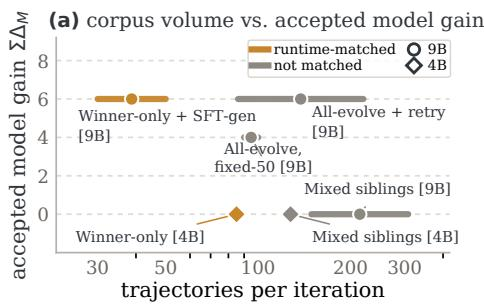

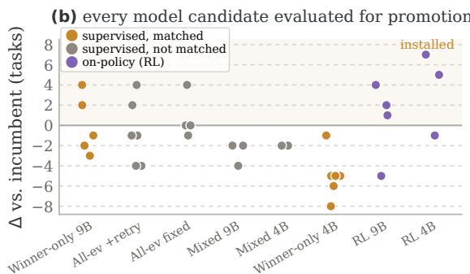  
model updates evaluated for promotion  
Figure 4: Trajectory constructions and model-side gain. (a) Trajectories per iteration against the accepted model gain (Table 2). (b) Every model update assessed for promotion, shown as its change against the incumbent, by mixture (Table 8).

Trajectory volume alone does not explain model-side gain. Under identical tournament search, meta-agent, trainer and promotion protocol, mixed siblings feeds 149–308 trajectories per iteration and yields $\bar { \Sigma } \Delta _ { M } { = } 0$ , with every update below the incumbent, while winner-only + SFT-gen feeds 30–50 and yields +6 through two installed updates (Figure 4); substantially more search trajectories therefore do not guarantee an accepted model update. The comparison holds tournament search, meta-agent, trainer, and promotion protocol constant while varying the complete corpus recipe: harness matching, freshness, coverage, prompt conditioning, per-task cap, and replay ratio (Section 3.3). Within this controlled contrast, runtime matching directly explains why the pooled corpus is dominated by rollouts from harnesses the promotion procedure later rejects. Moreover, a rollout that is on-policy for the weights can become off-distribution once the harness changes its prompts, tools, or observation processing (Tajwar et al., 2024). Consistent with this reading, the all-evolve baselines, which pool every evolve-set success from a sequential search that proposes one candidate harness per round and therefore carry no rejected siblings, did produce accepted updates (Table 9).

On-policy data changes what is possible when clean supervised successes are scarce. At 4B no supervised construction has produced an installed model update in five chains: in the CoTrace-SFT chain of Table 1 the winner-only filter kept only 2, 3 and 2 matched trajectories per iteration, below the top-up floor, the corpus size under which the recipe generates fresh rollouts (Appendix D), and all three updates were rejected while a +4 harness was installed. The on-policy recipe needs only reward variance within a group, and moves the same policy $6 7  7 9$ in three stages with no accepted harness candidate (Figure 4b). In our 4B runs, offline imitation therefore yields no accepted update when clean successful trajectories are this sparse, whereas online reinforcement still obtains a relative reward signal from the same policy (Appendix E).

## 4.3 RQ3: HOW DOES THE HARNESS SHAPE CROSS-DOMAIN TRANSFER?

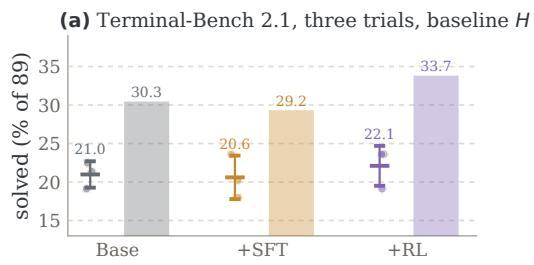

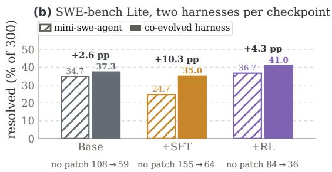  
Figure 5: Transfer under two runtimes. (a) TB2.1, three trials under the baseline harness: pass@1 (per-trial solve rate, mean ± sd over the three trials; dots) and pass@3 (tasks solved in at least one trial; bars). (b) SWE-bench Lite resolved rate per checkpoint under the third-party mini-swe-agent scaffold (hatched) and its co-evolved harness (solid), with the change in no-patch instances, on which the agent ends without emitting a patch.

Checkpoint-only gains largely disappear under a foreign runtime. On TB2.1 under the baseline harness, three independent trials place the supervised checkpoint near the base model $( 1 8 . 3 \pm 2 . 5 $ versus $1 8 . 7 \pm { 1 . 5 }$ tasks solved of 89, mean ± sd over trials) and the reinforcement checkpoint about one task above the base model on average; at pass@3, the number of tasks solved in at least one of the three trials, the gap is three tasks (Figure 5a). Both differences lie within the trial-to-trial spread despite 10- and 12-task gains on Tmax. This joint domain-and-runtime shift shows that a substantial fraction of the in-loop gain is conditional on the model–harness pair.

Changing only the runtime materially changes the apparent transfer of the same checkpoint. Under mini-swe-agent, a minimal third-party scaffold in the SWE-agent family (Yang et al., 2024) held fixed across checkpoints, the three checkpoints resolve 34.7%, 24.7%, and 36.7% of SWE-bench Lite; pairing each with its adopted harness improves every result, most strongly for SFT (24.7% to 35.0%), while reducing its no-patch outcomes, instances on which the agent ends without emitting a patch, from 155 to 64 (Figure 5b). Because the weights are fixed within each comparison, this difference isolates the runtime’s contribution. The SFT pair remains below the base pair’s 37.3%, whereas reinforcement leads under both harnesses and reaches 41.0%; Appendix E.5 reports the paired-instance analysis.

## 5 RELATED WORK

Harness evolution and model–harness co-evolution. Agent-system optimization has progressed from prompt and pipeline tuning (Zhou et al., 2022; Yang et al., 2023; Khattab et al., 2023; Yuksekgonul et al., 2024) to search over agent programs and executable scaffolds (Hu et al., 2024; Zhang et al., 2025; Novikov et al., 2025). Terminal-agent work optimizes tools, observations, prompts, and recovery under frozen policies (Lee et al., 2026; Ren et al., 2026; Lin et al., 2026; Zhang et al., 2026; Chen et al., 2026b), establishing harnesses as a source of capability. Recent systems jointly update both components: Co-Harness alternates harness edits with SFT on updated-runtime trajectories (Chen et al., 2026c); Harness-Aware Self-Evolving unifies execution and runtime modification under one RL objective (Luo et al., 2026); and EvoTrainer co-evolves policies with training scaffolds, showing that successful trajectories need not be optimal training targets (Chen et al., 2026a). Post-training dynamics also depend on harness configurations (Kim et al., 2026). These approaches leave routing implicit; CoTrace makes trajectory filtering, matching, and curriculum scheduling explicit.

Data recipes for agent post-training. Post-training data selection has progressed from verified self-training and rejection sampling (Zelikman et al., 2022; Gulcehre et al., 2023; Yuan et al., 2023; Singh et al., 2023) to compact curated datasets (Zhou et al., 2023; Albalak et al., 2024), on-policy sampling (Agarwal et al., 2023; Tajwar et al., 2024), and adaptive task curricula (Jiang et al., 2020), with recent efforts targeting executable tool use and verifier-grounded terminal feedback (Zeng et al., 2023; Chen et al., 2024; Pan et al., 2024; Yang et al., 2025; Ivison et al., 2026; Wei et al., 2025; Qi et al., 2024; Yu et al., 2025). Most strategies assume a static runtime, so rollout execution conditions and provenance remain fixed. Model–harness co-evolution instead changes the runtime throughout training, making compatibility and provenance part of data selection. Appendix A provides an extended discussion.

## 6 CONCLUSION

We introduced CoTrace, a harness-aware data recipe for co-evolving terminal-agent policies and execution harnesses. It routes failures to harness search, trains policies on verified runtime-matched experience, refreshes the curriculum, and promotes each component independently. Across supervised and reinforcement chains, compact matched corpora yielded model gains where much larger siblingpooled corpora did not; online reinforcement remained effective when successes were scarce. Crossdomain evaluations also show that runtime choice materially shapes checkpoint performance. These results identify trajectory provenance and model–harness compatibility as central design variables for agent post-training. Appendix B discusses the limitations of this study.

## REFERENCES

Rishabh Agarwal, Nino Vieillard, Yongchao Zhou, Piotr Stanczyk, Sabela Ramos, Matthieu Geist, and Olivier Bachem. On-policy distillation of language models: Learning from self-generated mistakes. arXiv preprint arXiv:2306.13649, 2023.

Alon Albalak, Yanai Elazar, Sang Michael Xie, Shayne Longpre, Nathan Lambert, Xinyi Wang, Niklas Muennighoff, Bairu Hou, Liangming Pan, Haewon Jeong, Colin Raffel, Shiyu Chang, Tatsunori Hashimoto, and William Yang Wang. A survey on data selection for language models. arXiv preprint arXiv:2402.16827, 2024.

Guhong Chen, Yingcheng Shi, Yongbin Li, Binhua Li, Xander Xu, Hu Wei, Shiwen Ni, Min Yang, and Jieping Ye. EvoTrainer: Co-evolving LLM policies and training harnesses for autonomous agentic reinforcement learning. arXiv preprint arXiv:2606.03108, 2026a.

Tingyang Chen, Shuo Lu, Kang Zhao, Weicheng Meng, Hanlin Teng, Tianhao Li, Chao Li, Xule Liu, Jian Liang, Zhizhong Zhang, Yuan Xie, Heng Qu, Kun Shao, and Jian Luan. HarnessX: A composable, adaptive, and evolvable agent harness foundry. arXiv preprint arXiv:2606.14249, 2026b.

Zehui Chen, Kuikun Liu, Qiuchen Wang, Wenwei Zhang, Jiangning Liu, Dahua Lin, Kai Chen, and Feng Zhao. Agent-FLAN: Designing data and methods of effective agent tuning for large language models. arXiv preprint arXiv:2403.12881, 2024.

Zhengyu Chen, Teng Xiao, Huaisheng Zhu, Yige Yuan, Luan Zhang, and Jingang Wang. Co-Harness: Co-evolving harnesses and model weights for LLM agents. arXiv preprint arXiv:2607.22688, 2026c.

Caglar Gulcehre, Tom Le Paine, Srivatsan Srinivasan, Ksenia Konyushkova, Lotte Weerts, Abhishek Sharma, Aditya Siddhant, Alex Ahern, Miaosen Wang, Chenjie Gu, Wolfgang Macherey, Arnaud Doucet, Orhan Firat, and Nando de Freitas. Reinforced self-training (ReST) for language modeling. arXiv preprint arXiv:2308.08998, 2023.

Edward J. Hu, Yelong Shen, Phillip Wallis, Zeyuan Allen-Zhu, Yuanzhi Li, Shean Wang, Lu Wang, and Weizhu Chen. LoRA: Low-rank adaptation of large language models. In International Conference on Learning Representations (ICLR), 2022.

Shengran Hu, Cong Lu, and Jeff Clune. Automated design of agentic systems. arXiv preprint arXiv:2408.08435, 2024.

Hamish Ivison, Junjie Oscar Yin, Rulin Shao, Teng Xiao, Nathan Lambert, and Hannaneh Hajishirzi. Tmax: A simple recipe for terminal agents. arXiv preprint arXiv:2606.23321, 2026.

Minqi Jiang, Edward Grefenstette, and Tim Rocktaschel. Prioritized level replay. ¨ arXiv preprint arXiv:2010.03934, 2020.

Carlos E. Jimenez, John Yang, Alexander Wettig, Shunyu Yao, Kexin Pei, Ofir Press, and Karthik Narasimhan. SWE-bench: Can language models resolve real-world GitHub issues? In International Conference on Learning Representations (ICLR), 2024. arXiv:2310.06770.

Omar Khattab, Arnav Singhvi, Paridhi Maheshwari, Zhiyuan Zhang, Keshav Santhanam, Sri Vardhamanan, Saiful Haq, Ashutosh Sharma, Thomas T. Joshi, Hanna Moazam, Heather Miller, Matei Zaharia, and Christopher Potts. DSPy: Compiling declarative language model calls into self-improving pipelines. arXiv preprint arXiv:2310.03714, 2023.

Kyungmin Kim, Youngbin Choi, Seoyeon Lee, Suhyeon Jun, Dongwoo Kim, and Sangdon Park. The interplay of harness design and post-training in LLM agents. arXiv preprint arXiv:2606.25447, 2026.

Nathan Lambert, Jacob Morrison, Valentina Pyatkin, Shengyi Huang, Hamish Ivison, Faeze Brahman, Lester James V. Miranda, Alisa Liu, Nouha Dziri, Shane Lyu, Yuling Gu, Saumya Malik, Victoria Graf, Jena D. Hwang, Jiangjiang Yang, Ronan Le Bras, Oyvind Tafjord, Chris Wilhelm, Luca Soldaini, Noah A. Smith, Yizhong Wang, Pradeep Dasigi, and Hannaneh Hajishirzi. Tulu 3:¨ Pushing frontiers in open language model post-training. arXiv preprint arXiv:2411.15124, 2024.

Yoonho Lee, Roshen Nair, Qizheng Zhang, Kangwook Lee, Omar Khattab, and Chelsea Finn. Meta-Harness: End-to-end optimization of model harnesses. arXiv preprint arXiv:2603.28052, 2026.

Joel Lehman and Kenneth O. Stanley. Abandoning objectives: Evolution through the search for novelty alone. Evolutionary Computation, 19(2):189–223, 2011.

Hongwei Li, Zhun Wang, Qinrun Dai, Yuzhou Nie, Jinjun Peng, Ruitong Liu, Jingyang Zhang, Kaijie Zhu, Jingxuan He, Lun Wang, Yangruibo Ding, Yueqi Chen, Wenbo Guo, and Dawn Song. OpenSage: Self-programming agent generation engine. arXiv preprint arXiv:2602.16891, 2026.

Jiahang Lin, Shichun Liu, Chengjun Pan, Lizhi Lin, Shihan Dou, Zhiheng Xi, Xuanjing Huang, Hang Yan, Zhenhua Han, Tao Gui, and Yu-Gang Jiang. Agentic harness engineering: Observabilitydriven automatic evolution of coding-agent harnesses. arXiv preprint arXiv:2604.25850, 2026.

Haochen Luo, Yi Huang, Sichun Luo, Fengyuan Liu, Lei Li, Zefa Hu, Junlan Feng, and Qi Liu. Harness-Aware Self-Evolving: Co-evolving model weights, harness, and task solutions. arXiv preprint arXiv:2607.03935, 2026.

Lovish Madaan, Aaditya K. Singh, Rylan Schaeffer, Andrew Poulton, Sanmi Koyejo, Pontus Stenetorp, Sharan Narang, and Dieuwke Hupkes. Quantifying variance in evaluation benchmarks. arXiv preprint arXiv:2406.10229, 2024.

Mike A. Merrill, Alexander G. Shaw, Nicholas Carlini, Boxuan Li, Harsh Raj, Ivan Bercovich, Lin Shi, Jeong Yeon Shin, Thomas Walshe, E. Kelly Buchanan, Junhong Shen, Guanghao Ye, Haowei Lin, Jason Poulos, Maoyu Wang, Marianna Nezhurina, Jenia Jitsev, Di Lu, Orfeas Menis Mastromichalakis, Zhiwei Xu, Zizhao Chen, Yue Liu, Robert Zhang, Leon Liangyu Chen, Anurag Kashyap, Jan-Lucas Uslu, Jeffrey Li, Jianbo Wu, Minghao Yan, Song Bian, Vedang Sharma, Ke Sun, Steven Dillmann, Akshay Anand, Andrew Lanpouthakoun, Bardia Koopah, Changran Hu, Etash Guha, Gabriel H. S. Dreiman, Jiacheng Zhu, Karl Krauth, Li Zhong, Niklas Muennighoff, Robert Amanfu, Shangyin Tan, Shreyas Pimpalgaonkar, Tushar Aggarwal, Xiangning Lin, Xin Lan, Xuandong Zhao, Yiqing Liang, Yuanli Wang, Zilong Wang, Changzhi Zhou, David Heineman, Hange Liu, Harsh Trivedi, John Yang, Junhong Lin, Manish Shetty, Michael Yang, Nabil Omi, Negin Raoof, Shanda Li, Terry Yue Zhuo, Wuwei Lin, Yiwei Dai, Yuxin Wang, Wenhao Chai, Shang Zhou, Dariush Wahdany, Ziyu She, Jiaming Hu, Zhikang Dong, Yuxuan Zhu, Sasha Cui, Ahson Saiyed, Arinbjorn Kolbeinsson, Jesse Hu, Christopher Michael Rytting, Ryan Marten, Yixin¨ Wang, Alex Dimakis, Andy Konwinski, and Ludwig Schmidt. Terminal-Bench: Benchmarking agents on hard, realistic tasks in command line interfaces. arXiv preprint arXiv:2601.11868, 2026.

Jean-Baptiste Mouret and Jeff Clune. Illuminating search spaces by mapping elites. arXiv preprint arXiv:1504.04909, 2015.

Alexander Novikov, Ngan Vˆ u, Marvin Eisenberger, Emilien Dupont, Po-Sen Huang, Adam Zsolt Wag-˜ ner, Sergey Shirobokov, Borislav Kozlovskii, Francisco J. R. Ruiz, Abbas Mehrabian, M. Pawan Kumar, Abigail See, Swarat Chaudhuri, George Holland, Alex Davies, Sebastian Nowozin, Pushmeet Kohli, and Matej Balog. AlphaEvolve: A coding agent for scientific and algorithmic discovery. arXiv preprint arXiv:2506.13131, 2025.

Jiayi Pan, Xingyao Wang, Graham Neubig, Navdeep Jaitly, Heng Ji, Alane Suhr, and Yizhe Zhang. Training software engineering agents and verifiers with SWE-Gym. arXiv preprint arXiv:2412.21139, 2024.

Penghui Qi, Xiangxin Zhou, Zichen Liu, Tianyu Pang, Chao Du, Min Lin, and Wee Sun Lee. Rethinking the trust region in LLM reinforcement learning. arXiv preprint arXiv:2602.04879, 2026.

Zehan Qi, Xiao Liu, Iat Long Iong, Hanyu Lai, Xueqiao Sun, Wenyi Zhao, Yu Yang, Xinyue Yang, Jiadai Sun, Shuntian Yao, Tianjie Zhang, Wei Xu, Jie Tang, and Yuxiao Dong. WebRL: Training LLM web agents via self-evolving online curriculum reinforcement learning. arXiv preprint arXiv:2411.02337, 2024.

Kailong Ren, Fubo Sun, Jiachen Liu, Liu Yang, Zimo Yin, Jiaying Li, Congli Yin, Ming He, Yu Huo, Jiawei Liu, Zeping Chen, Yubin Huangfu, Ronghua Li, Yixuan Wu, Xing Su, Yanzhi Xu, Likang Wu, Hongke Zhao, Lei Zhang, Xiaohui Geng, and Jianping Fan. LemonHarness technical report. arXiv preprint arXiv:2606.24311, 2026.

Bernardino Romera-Paredes, Mohammadamin Barekatain, Alexander Novikov, Matej Balog, M. Pawan Kumar, Emilien Dupont, Francisco J. R. Ruiz, Jordan S. Ellenberg, Pengming Wang, Omar Fawzi, Pushmeet Kohli, and Alhussein Fawzi. Mathematical discoveries from program search with large language models. Nature, 625:468–475, 2024.

John Schulman, Filip Wolski, Prafulla Dhariwal, Alec Radford, and Oleg Klimov. Proximal policy optimization algorithms. arXiv preprint arXiv:1707.06347, 2017.

Zhihong Shao, Peiyi Wang, Qihao Zhu, Runxin Xu, Junxiao Song, Xiao Bi, Haowei Zhang, Mingchuan Zhang, Y. K. Li, Y. Wu, and Daya Guo. DeepSeekMath: Pushing the limits of mathematical reasoning in open language models. arXiv preprint arXiv:2402.03300, 2024.

Noah Shinn, Federico Cassano, Edward Berman, Ashwin Gopinath, Karthik Narasimhan, and Shunyu Yao. Reflexion: Language agents with verbal reinforcement learning. arXiv preprint arXiv:2303.11366, 2023.

Avi Singh, John D. Co-Reyes, Rishabh Agarwal, Ankesh Anand, Piyush Patil, Xavier Garcia, Peter J. Liu, James Harrison, Jaehoon Lee, Kelvin Xu, Aaron Parisi, Abhishek Kumar, Alex Alemi, Alex Rizkowsky, Azade Nova, Ben Adlam, Bernd Bohnet, Gamaleldin Elsayed, Hanie Sedghi, Igor Mordatch, Isabelle Simpson, Izzeddin Gur, Jasper Snoek, Jeffrey Pennington, Jiri Hron, Kathleen Kenealy, Kevin Swersky, Kshiteej Mahajan, Laura Culp, Lechao Xiao, Maxwell L. Bileschi, Noah Constant, Roman Novak, Rosanne Liu, Tris Warkentin, Yundi Qian, Yamini Bansal, Ethan Dyer, Behnam Neyshabur, Jascha Sohl-Dickstein, and Noah Fiedel. Beyond human data: Scaling self-training for problem-solving with language models. arXiv preprint arXiv:2312.06585, 2023.

Fahim Tajwar, Anikait Singh, Archit Sharma, Rafael Rafailov, Jeff Schneider, Tengyang Xie, Stefano Ermon, Chelsea Finn, and Aviral Kumar. Preference fine-tuning of LLMs should leverage suboptimal, on-policy data. arXiv preprint arXiv:2404.14367, 2024.

Guanzhi Wang, Yuqi Xie, Yunfan Jiang, Ajay Mandlekar, Chaowei Xiao, Yuke Zhu, Linxi Fan, and Anima Anandkumar. Voyager: An open-ended embodied agent with large language models. arXiv preprint arXiv:2305.16291, 2023.

Jiachen T. Wang, Prateek Mittal, Dawn Song, and Ruoxi Jia. Data shapley in one training run. arXiv preprint arXiv:2406.11011, 2024a.

Xingyao Wang, Yangyi Chen, Lifan Yuan, Yizhe Zhang, Yunzhu Li, Hao Peng, and Heng Ji. Executable code actions elicit better LLM agents. arXiv preprint arXiv:2402.01030, 2024b.

Xingyao Wang, Boxuan Li, Yufan Song, Frank F. Xu, Xiangru Tang, Mingchen Zhuge, Jiayi Pan, Yueqi Song, Bowen Li, Jaskirat Singh, Hoang H. Tran, Fuqiang Li, Ren Ma, Mingzhang Zheng, Bill Qian, Yanjun Shao, Niklas Muennighoff, Yizhe Zhang, Binyuan Hui, Junyang Lin, Robert Brennan, Hao Peng, Heng Ji, and Graham Neubig. OpenHands: An open platform for AI software developers as generalist agents. arXiv preprint arXiv:2407.16741, 2024c.

Yuxiang Wei, Olivier Duchenne, Jade Copet, Quentin Carbonneaux, Lingming Zhang, Daniel Fried, Gabriel Synnaeve, Rishabh Singh, and Sida I. Wang. SWE-RL: Advancing LLM reasoning via reinforcement learning on open software evolution. arXiv preprint arXiv:2502.18449, 2025.

Zhaotian Weng, Antonis Antoniades, Deepak Nathani, Zhen Zhang, Xiao Pu, and Xin Eric Wang. Group-evolving agents: Open-ended self-improvement via experience sharing. arXiv preprint arXiv:2602.04837, 2026.

Chengrun Yang, Xuezhi Wang, Yifeng Lu, Hanxiao Liu, Quoc V. Le, Denny Zhou, and Xinyun Chen. Large language models as optimizers. arXiv preprint arXiv:2309.03409, 2023.

Chenyang Yang, Xinran Zhao, Tongshuang Wu, and Christian Kastner. Better harnesses, smaller¨ models: Building 90% cheaper agents via automated harness adaptation. arXiv preprint arXiv:2607.08938, 2026.

John Yang, Carlos E. Jimenez, Alexander Wettig, Kilian Lieret, Shunyu Yao, Karthik Narasimhan, and Ofir Press. SWE-agent: Agent-computer interfaces enable automated software engineering. arXiv preprint arXiv:2405.15793, 2024.

John Yang, Kilian Lieret, Carlos E. Jimenez, Alexander Wettig, Kabir Khandpur, Yanzhe Zhang, Binyuan Hui, Ofir Press, Ludwig Schmidt, and Diyi Yang. SWE-smith: Scaling data for software engineering agents. arXiv preprint arXiv:2504.21798, 2025.

Qiying Yu, Zheng Zhang, Ruofei Zhu, Yufeng Yuan, Xiaochen Zuo, Yu Yue, Weinan Dai, Tiantian Fan, Gaohong Liu, Lingjun Liu, Xin Liu, Haibin Lin, Zhiqi Lin, Bole Ma, Guangming Sheng, Yuxuan Tong, Chi Zhang, Mofan Zhang, Wang Zhang, Hang Zhu, Jinhua Zhu, Jiaze Chen, Jiangjie Chen, Chengyi Wang, Hongli Yu, Yuxuan Song, Xiangpeng Wei, Hao Zhou, Jingjing Liu, Wei-Ying Ma, Ya-Qin Zhang, Lin Yan, Mu Qiao, Yonghui Wu, and Mingxuan Wang. DAPO: An open-source LLM reinforcement learning system at scale. arXiv preprint arXiv:2503.14476, 2025.

Zheng Yuan, Hongyi Yuan, Chengpeng Li, Guanting Dong, Keming Lu, Chuanqi Tan, Chang Zhou, and Jingren Zhou. Scaling relationship on learning mathematical reasoning with large language models. arXiv preprint arXiv:2308.01825, 2023.

Mert Yuksekgonul, Federico Bianchi, Joseph Boen, Sheng Liu, Zhi Huang, Carlos Guestrin, and James Zou. TextGrad: Automatic “differentiation” via text. arXiv preprint arXiv:2406.07496, 2024.

Eric Zelikman, Yuhuai Wu, Jesse Mu, and Noah D. Goodman. STaR: Bootstrapping reasoning with reasoning. In Advances in Neural Information Processing Systems (NeurIPS), 2022.

Aohan Zeng, Mingdao Liu, Rui Lu, Bowen Wang, Xiao Liu, Yuxiao Dong, and Jie Tang. AgentTuning: Enabling generalized agent abilities for LLMs. arXiv preprint arXiv:2310.12823, 2023.

Hangfan Zhang, Shao Zhang, Kangcong Li, Chen Zhang, Yang Chen, Yiqun Zhang, Lei Bai, and Shuyue Hu. Self-Harness: Harnesses that improve themselves. arXiv preprint arXiv:2606.09498, 2026.

Jenny Zhang, Shengran Hu, Cong Lu, Robert Lange, and Jeff Clune. Darwin Godel Machine:¨ Open-ended evolution of self-improving agents. arXiv preprint arXiv:2505.22954, 2025.

Chunting Zhou, Pengfei Liu, Puxin Xu, Srini Iyer, Jiao Sun, Yuning Mao, Xuezhe Ma, Avia Efrat, Ping Yu, Lili Yu, Susan Zhang, Gargi Ghosh, Mike Lewis, Luke Zettlemoyer, and Omer Levy. LIMA: Less is more for alignment. arXiv preprint arXiv:2305.11206, 2023.

Yongchao Zhou, Andrei Ioan Muresanu, Ziwen Han, Keiran Paster, Silviu Pitis, Harris Chan, and Jimmy Ba. Large language models are human-level prompt engineers. arXiv preprint arXiv:2211.01910, 2022.

## APPENDIX

A Extended Related Work 15   
A.1 Harness and scaffold optimization with frozen weights 15   
A.2 Model–harness co-evolution and self-improving agents . 15   
A.3 Data recipes for agent post-training 15   
B Limitations 16   
C Experimental Setup 16   
C.1 Chain protocol and reporting rules 17   
C.2 Task pool and splits 17   
C.3 Curriculum rotation and execution limits 17   
C.4 Compute and cost per lever 17   
C.5 Reproducibility and evaluation noise 18   
C.6 Hyperparameters . 18   
D Method Details 19   
D.1 Co-evolution loop in pseudocode 19   
D.2 Curriculum refresh and baseline recipes 21   
D.3 Baseline harness configuration 21   
D.4 Screens and admissibility checks in harness search 22   
D.5 Failure attribution and routing 22   
D.6 Prompts and meta-agent briefs 23   
E Additional Experimental Results 25   
E.1 Promotion ledger of every chain . 25   
E.2 Sequential-search chains . 25   
E.3 Corpus manifests 26   
E.4 Paired records of the reinforcement line 26   
E.5 SWE-bench Lite under both harnesses 27   
E.6 Chains at other policy scales . 28   
E.7 Round-level traces and the promotion ablation 28   
E.8 Details behind the analysis 29   
E.9 Accepted and rejected harness edits 29   
F The Reinforcement Stage 30   
F.1 Optimizer and departures from Tmax 30   
F.2 Reward-path debugging record 30   
F.3 Outcome and settings of the reinforcement line . 31   
G Additional Pilots 31   
G.1 Routing pilot on Terminal-Bench 2.1 31   
G.2 Case study of grounded harness edits 32

## A EXTENDED RELATED WORK

This appendix expands the two paragraphs of Section 5, names the individual systems the main text groups together, and states, for each thread, the assumption our recipe changes.

## A.1 HARNESS AND SCAFFOLD OPTIMIZATION WITH FROZEN WEIGHTS

The agent–computer interface is a design surface in its own right, from custom file viewers and search commands (Yang et al., 2024) to executable-code action spaces (Wang et al., 2024b) and generalpurpose platforms (Wang et al., 2024c; Merrill et al., 2026). Optimizing that surface automatically began with prompts (Zhou et al., 2022; Yang et al., 2023), grew into program-level optimization of multi-stage pipelines (Khattab et al., 2023; Yuksekgonul et al., 2024) and into the automated design of whole agents by search over code (Hu et al., 2024; Zhang et al., 2025), and borrows evolutionary program search over an archive (Romera-Paredes et al., 2024; Novikov et al., 2025) with quality–diversity selection (Lehman & Stanley, 2011; Mouret & Clune, 2015; Weng et al., 2026). A recent line applies this to terminal agents specifically, through environment bootstrapping before the first model call (Lee et al., 2026), exposure of elapsed and remaining budget (Ren et al., 2026), graph-structured memory (Li et al., 2026), and observability-driven editing of prompts, tools and middleware (Lin et al., 2026); Zhang et al. (2026) argue that harnesses are inherently model-specific and mine verifier-grounded weakness patterns into minimal, regression-validated edits, and Yang et al. (2026) show that frozen-weight harness optimization recovers a large fraction of frontier performance for small models. Chen et al. (2026b) supply the typed, hashable substrate we build on. All of this holds the policy fixed, so its numbers are conditional on a fixed policy, and it does not examine what the search’s trajectories are worth to a trainer. We reuse the proposal machinery and add a promotion-tested model update that changes the failure distribution the next search must explain.

## A.2 MODEL–HARNESS CO-EVOLUTION AND SELF-IMPROVING AGENTS

Agents that improve without touching weights accumulate verbal reflections or skill libraries at test time (Shinn et al., 2023; Wang et al., 2023); agents that rewrite their own code do so under an evaluator they cannot edit (Zhang et al., 2025). Several systems now alternate harness and weight updates. Chen et al. (2026c) pair a critic proposing harness updates with fine-tuning on the improved trajectories; Luo et al. (2026) place task solving and harness editing in one action space under a shared reinforcement objective with an immutable evaluator, and take counterfactual edit pairs rather than episodes as the unit of evidence; Chen et al. (2026a) co-evolve the policy with the trainingside harness, treat a version transition as the unit of evidence, and note that an outcome-successful trajectory can be a poor target when it contains looping, leakage or a verifier mismatch; Kim et al. (2026) show that harness-aware post-training improves robustness under tool-environment shift. Each reports an aggregate gain from alternation and, with the partial exception of EvoTrainer’s observation, treats the trajectories flowing between the two optimizers as a single buffer: whatever the latest harness emitted is what the trainer consumes. Our focus is the buffer itself: which trajectories should train the model, under which harness, at which point in the curriculum, and subject to which promotion rule. We hold the search, trainer, and promotion rule fixed and vary that construction; under these alternatives, the model channel contributes in one case but not the other (Sections 3.3 and 4.2). Two related threads sharpen this focus. Per-trajectory attribution within a training pass (Wang et al., 2024a) offers a finer-grained view of rollout value, while measured variance on small benchmarks (Madaan et al., 2024) motivates our frozen-split promotion criterion for every update.

## A.3 DATA RECIPES FOR AGENT POST-TRAINING

The dominant recipe grows out of rejection-sampling fine-tuning, in which a model’s own verified successes become its next supervised corpus (Zelikman et al., 2022; Yuan et al., 2023; Gulcehre et al., 2023; Singh et al., 2023). It is scaled to agents by harvesting tool-use trajectories from executable environments, first through instruction-tuning corpora (Zeng et al., 2023; Chen et al., 2024), then through verifier-scored trajectory collection for software and terminal tasks (Pan et al., 2024; Yang et al., 2025; Ivison et al., 2026; Wei et al., 2025) and self-evolving task curricula for web agents (Qi et al., 2024), optionally followed by reinforcement learning against verifiable rewards (Schulman et al., 2017; Shao et al., 2024; Lambert et al., 2024; Yu et al., 2025). Within this recipe the levers are well studied. Outcome filtering and per-task caps guard against mode collapse; on-policy samples are consistently the better target for both preference tuning and distillation (Tajwar et al., 2024; Agarwal et al., 2023); a small, carefully selected corpus can match a far larger one (Zhou et al., 2023; Albalak et al., 2024); and frontier-driven curricula from reinforcement learning keep the training distribution at the edge of what the policy can do (Jiang et al., 2020). All of this work holds the harness fixed for the duration of training, so a trajectory’s provenance, the prompt and processors it was generated under, is not a variable the recipe can condition on. Model–harness co-evolution changes that: the harness moves during training, so the same trajectory can be on-distribution for one iteration and off-distribution for the next. Our recipe differs in exactly that respect. It keys the corpus to the fingerprint of the harness that will run the policy, keeps it current-first with a capped history so that the curriculum’s motion reaches the trainer, retires a task only once it is solved and harvested, and treats a corpus built from the same bank under a different provenance as a controlled alternative rather than as more data (Section 3.3). In our comparison, the larger corpus pooled across sibling harnesses yields no accepted model gain, whereas the smaller harness-matched recipe does (Section 4.2). The on-policy finding carries over in a specific form: a rollout that is on-policy for the weights can become off-distribution once the harness changes, because it is on-distribution only for the model–harness pair that generated it.

## B LIMITATIONS

Our evidence comes from a small number of co-evolution chains, each run once. The promotion split has 102 tasks and single evaluations vary by roughly ±2 tasks (Appendix C.5), so differences of one or two tasks between chains, including the gap between CoTrace-SFT and the mixed-siblings baseline in Table 1, should not be read as rankings; our claims rest on paired, within-chain contrasts and on the direction of the accepted gains. The study covers one model family at two scales, one task source for the loop, and two external benchmarks, so the transfer findings describe these runtimes rather than runtimes in general. The supervised and reinforcement recipes were not matched in compute, and harness search depends on a proprietary meta-agent whose proposals we release only as the accepted configurations. Finally, the chains stop as the curriculum saturates (Section 4.1); whether a larger task reservoir would extend the gains is left open.

## C EXPERIMENTAL SETUP

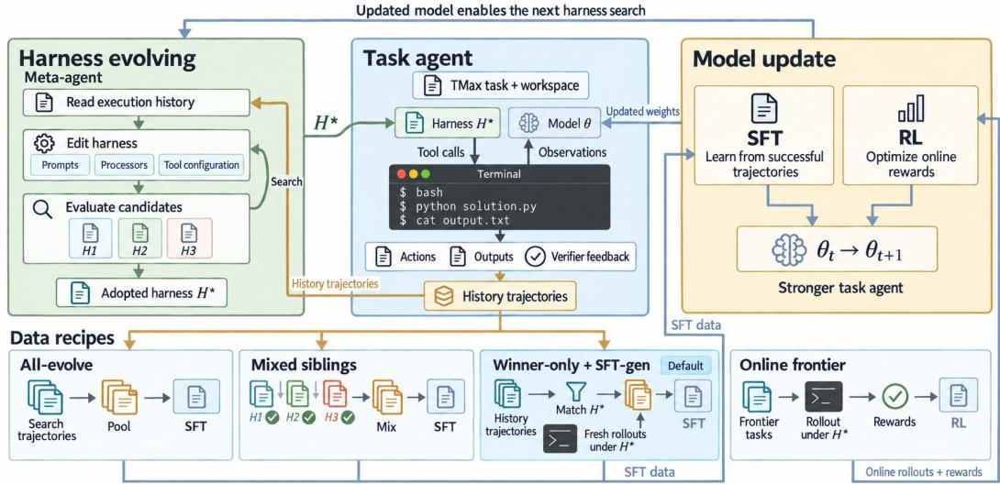  
Figure 6: Expanded view of the CoTrace workflow. A meta-agent searches for an improved harness H<sup>∗</sup>; the task agent executes it to produce verified trajectories; these data support SFT and RL; and the updated model initiates the next harness-search round.

## C.1 CHAIN PROTOCOL AND REPORTING RULES

A chain is one run of the outer loop from a fixed anchor through N outer iterations. Each iteration executes stages A0 (refresh the curriculum), A (search the harness on $\mathcal { E } _ { t } )$ , B (evaluate the candidate harness on V with the incumbent model), B2 (top up the SFT-generation plane under the adopted harness), C (route and build the corpus), D (train), optionally D2 (reinforcement stage), and E (evaluate the candidate model on $\nu$ under the adopted harness). Four rules govern what a chain reports. (i) Every score is a pass count on the frozen 102-task Tmax promotion split. (ii) A chain is reported by its anchor and its final incumbent (the peak for the reinforcement line, with its last measurement alongside), never by a best intermediate stage. (iii) Within-chain stage deltas are more trustworthy than cross-chain absolute scores, because chain anchors span 77–78 at 9B and 64–67 at 4B under an identical protocol. (iv) A tie is accepted only when the candidate’s own evaluation run was clean, with no missing results and no tasks in an infrastructure-error status.

## C.2 TASK POOL AND SPLITS

Table 4: Data roles on Tmax (Ivison et al., 2026). No task appears in more than one role, and the promotion split is never optimized against by the harness search, the corpus builder, or the model update.
<table><tr><td>Role</td><td>Tasks</td><td>Used by</td><td>Optimized against?</td></tr><tr><td>Evolve (rotating)</td><td>50 / iter</td><td>harness search, corpus harvest</td><td>yes</td></tr><tr><td>RL train</td><td>≤ 100</td><td>online RL rollouts</td><td>yes</td></tr><tr><td>Promotion</td><td>102</td><td>both promotion decisions, all reported numbers</td><td>no</td></tr><tr><td>Terminal-Bench 2.1</td><td>89</td><td>transfer reporting only</td><td>no</td></tr></table>

Tasks come from Tmax (Ivison et al., 2026), an executable terminal-task taxonomy of roughly 2,200 entries. A row is usable only if it carries a non-empty natural-language description, a final-state test, and a container definition that converts to a buildable image; rows failing any of these are dropped before sampling. Each task is a container image, an initial filesystem state, an instruction, and a programmatic verifier returning a binary reward. The loop keeps three disjoint planes, as in Section 2.1: a rotating evolve set $\mathcal { E } _ { t }$ of 50 tasks, a frozen promotion split V of 102 tasks, and the remaining taxonomy $\bar { \tau }$ as the refill reservoir. A leakage check aborts the run if any evolve, corpus, or RL task id appears in V. Two independent initial evolve sets are used across chains (a seed-42 draw and a disjoint alternative draw) so that results are not an artifact of one sample; chains drawing the alternative set also exclude every id used by earlier chains.

## C.3 CURRICULUM ROTATION AND EXECUTION LIMITS

From iteration 2, tasks satisfying Equation (5) are retired and the set is refilled to 50 by a domain round-robin over the taxonomy, excluding V, everything already mastered, and the tasks being kept. The run aborts rather than evolve against fewer than 20 tasks. One measured rotation illustrates the effect: an iteration kept 14 unsolved tasks, drew 36 new ones, retired 36, and the refreshed set’s baseline pass rate fell to 0.40; the curriculum is deliberately harder than the one it replaces. Task-agent rollouts run under a step cap and a per-call token cap (Table 6); evolve-set and promotionset evaluations use different container concurrency because the promotion split is larger and more image-diverse. Container images are built per task; an image-store preflight sized to the run’s own task count aborts the job rather than let a full disk present itself as a wave of task failures.

## C.4 COMPUTE AND COST PER LEVER

All promotion evaluations run on one 8×H200 node; earlier chains used 8×A100-40GB, on which the reinforcement stage does not fit alongside a vLLM replica and is disabled. A single 102-task Tmax promotion evaluation takes roughly 1.5–2 h. The Cost column of Table 1 is the chain’s recorded per-stage wall-clock less its one-off anchor evaluation, divided by completed outer iterations and multiplied by the eight GPUs of the node. The composition of that total over the chains in Table 1 is: harness search 14–57%, promotion and stage evaluations 37–57%, the reinforcement stage 63% where it runs, SFT-gen top-up 2–35% where it runs, and the supervised gradient step 4%. Two things follow. Screening cheaply before scoring expensively makes the search affordable; moreover, corpus construction adds little cost relative to the surrounding loop, making data routing an economical lever for improving the model channel. Table 5 puts the 9B chains on one budget, in GPU-hours per installed task. Harness search is cheap and front-loaded: the harness-only chain spends 25 GPU-hours in all, 6 per installed task, and the mixed-siblings chain is the next cheapest (18) because all of it gain is harness-side. The model channel’s cost is evaluation and top-up rather than the gradient, so the recipe decides whether that spend returns anything; the retry-enabled chain spent the most per task (51) because each rejection bought more search. Reinforcement buys the highest peak at 21 GPU-hours per task and the only regression (35 once it is counted). Together with the traces in Figure 3, this cost profile motivates a sequence in which the harness evolves first, a matched model update follows, and reinforcement proceeds only after promotion evaluation.

Table 5: What each lever cost, and what it returned. The 9B chains of Tables 1 and 9: completed outer iterations, GPU-hours per iteration, and GPU-hours per installed task (iterations × GPU-hours per iteration, divided by ∆; bracketed: the reinforcement line’s last measurement). Iteration counts and totals are from each chain’s per-stage wall-clock log; the harness-only chain is one iteration of four evolve rounds. A chain’s cost is dominated by evaluation (37–57%) and harness search (14–57%); the gradient step is 4%, SFT-gen top-up 2–35% and the reinforcement stage 63% where they run (Appendix C).
<table><tr><td>Chain (9B; Tables 1 and 9)</td><td>Iters</td><td>GPU-h/iter</td><td> $\Delta _ { H }$ </td><td> $\Delta _ { M }$ </td><td> $\Delta$ </td><td>GPU-h/task</td></tr><tr><td>Harness only</td><td>1</td><td>25</td><td>+4</td><td></td><td>+4</td><td>6</td></tr><tr><td>All-evolve, fixed-50</td><td>3</td><td>77</td><td>+1</td><td>+4</td><td>+5</td><td>46</td></tr><tr><td>All-evolve + retry</td><td>3</td><td>118</td><td>+1</td><td>+6</td><td>+7</td><td>51</td></tr><tr><td>Mixed siblings</td><td>3</td><td>54</td><td>+9</td><td>0</td><td>+9</td><td>18</td></tr><tr><td>CoTrace-SFT</td><td>5</td><td>47</td><td>+4</td><td>+6</td><td>+10</td><td>24</td></tr><tr><td>CoTrace-RL</td><td>4</td><td>62</td><td>+5</td><td>+7</td><td>+12</td><td>21 (35)</td></tr></table>

## C.5 REPRODUCIBILITY AND EVALUATION NOISE

Task-agent decoding is greedy $( T = 0 ) \mathrm { { ; } }$ ; curriculum rotation and corpus sampling are seeded (42). Harness search invokes a proprietary meta-agent, and we release the accepted configuration from every iteration so that each reported promotion evaluation can be reproduced directly without rerunning the search.

The 102-task split is consulted by both promotion decisions; we therefore call it the promotion split throughout and do not treat it as a test set. It provides the common reference for within-chain dynamics, while the external benchmarks of Section 4.3, which no stage of the loop consults, measure transfer.

Three views of single-evaluation noise agree. First, chain anchors (the same base checkpoint under the same stock harness, evaluated at the start of independent chains) span 77–78 pass counts at 9B and 64–67 at 4B (Table 8). Second, the same evolved harness on the same frozen 4B weights scored 61 in the per-round curve of the harness-only control and 66 in its promotion evaluation. Third, in the reinforcement line the paired net change and the difference of separately executed stage evaluations differ by one to two tasks at every recorded stage (Table 11). Together they place single-evaluation noise at roughly ±2 tasks, with a worst observed excursion of five tasks (4B). These estimates characterize the scale of single-evaluation variation and motivate the paired, within-chain analysis used for the mechanism claims in Section 4.

## C.6 HYPERPARAMETERS

Table 6 lists the search, corpus-construction, training, and promotion settings used in every reported chain.

Table 6: Full configuration. The reinforcement-stage settings are those of the line in Figure 2(b); Table 15 gives its rollout budget.
<table><tr><td colspan="2">Harness search</td><td colspan="2">SFT</td></tr><tr><td>Tournament</td><td>2 × 5 candidates</td><td>Method</td><td>LoRA</td></tr><tr><td>Extra rounds on failure</td><td>2</td><td>LoRA rank  $/ \alpha$ </td><td>32 / 64</td></tr><tr><td>Max SFT retries</td><td>2</td><td>LoRA dropout</td><td>0.05</td></tr><tr><td>Meta-agent step cap</td><td>200</td><td>Targets</td><td>q,k,v,o,gate,up,down</td></tr><tr><td>Meta-agent wall clock</td><td>3600 s</td><td>Epochs</td><td>2</td></tr><tr><td>Evolve set size</td><td>50</td><td>Learning rate</td><td> $2 \times 1 0 ^ { - 5 }$ </td></tr><tr><td>Rotation start</td><td>iteration 2</td><td>Schedule / warmup</td><td>linear / 0.03</td></tr><tr><td>Evolve set mix (fail/pass)</td><td>10/6</td><td>Max seq. length</td><td>4096</td></tr><tr><td>Screen abort threshold</td><td>20% errored</td><td>Promotion rule</td><td>w  $> \ell ;$  ties if clean</td></tr><tr><td colspan="4">Population search (screened variant)</td></tr><tr><td>Fan-out width N</td><td>8</td><td></td><td></td></tr><tr><td>Survivors k / concurrency</td><td>2/4</td><td></td><td></td></tr><tr><td>Explore period E</td><td>3</td><td></td><td></td></tr><tr><td>Novelty neighbours</td><td>3</td><td></td><td></td></tr><tr><td>Probe set (solved/failed)</td><td>2/1</td><td></td><td></td></tr><tr><td>Probe regressions tolerated</td><td>1</td><td></td><td></td></tr><tr><td>Corpus construction</td><td></td><td>Effective batch</td><td>8</td></tr><tr><td>Max trajectories</td><td>100</td><td>Precision</td><td>BF16</td></tr><tr><td>Max per task</td><td>3 (default recipe: 1)</td><td>Loss</td><td>completion-only</td></tr><tr><td>Tool-call range</td><td>[2, 60]</td><td></td><td></td></tr><tr><td>Min trajectories</td><td>20</td><td>Online RL</td><td></td></tr><tr><td>Train pairs / iteration</td><td>526–948 (default recipe)</td><td>Objective</td><td>DPPO, binary TV δ=0.1</td></tr><tr><td>SFT-gen target tasks</td><td>100</td><td>Episodes</td><td>2,304</td></tr><tr><td>History cap</td><td>40%</td><td>Train tasks</td><td>100</td></tr><tr><td>Evaluation</td><td></td><td>Advantages</td><td>centered, group-relative</td></tr><tr><td>Decoding</td><td>greedy</td><td>Group shape / LR</td><td> $4 \times 8 / 1 \times 1 0 ^ { - 6 }$ </td></tr><tr><td>Per-call token cap</td><td>4096</td><td>Reference KL β</td><td>0.01</td></tr><tr><td>Promotion tolerance</td><td>0 (ties allowed if clean) 2</td><td>LM head / response</td><td>FP32 / 16,384</td></tr></table>

Require: policy $\theta _ { t } ,$ , harness $H _ { t } ,$ evolve set $\mathcal { E } _ { t } ,$ failure clusters $\mathcal { D } _ { t } ^ { H }$ , promotion split V   
1: Initialize archive $\mathcal { A }  \{ H _ { t } \}$ and parent $H ^ { \mathrm { p a r } } \gets H _ { t }$   
2: for two tournament generations do   
3: assign recurring failure clusters as distinct proposal foci   
4: $\mathcal { P }  \mathbf { M e r a A G E N T } ( H ^ { \mathrm { p a r } } , \mathcal { D } _ { t } ^ { H } )$   
5: discard candidates failing structural, impact, probe, or admissibility checks   
6: evaluate each survivor on $\mathcal { E } _ { t }$ with $\theta _ { t }$ fixed; append scores and traces to A   
7: H<sup>par</sup> ← highest-mean candidate eligible under tolerance 0.04   
8: end for   
9: $H ^ { \mathrm { c a n d } }$ ← highest-mean candidate in $\mathcal { A }$   
10: $H _ { t + 1 }  \mathrm { P R O M O T E } _ { \mathcal { V } } ( H ^ { \mathrm { c a n d } } , H _ { t } \mid \theta _ { t } )$   
11: return adopted harness $H _ { t + 1 }$ and all search traces

## D METHOD DETAILS

## D.1 CO-EVOLUTION LOOP IN PSEUDOCODE

The complete workflow is organized into four modules. Algorithm 2 evolves and promotes the harness; Algorithm 3 routes traces and refreshes the curriculum; and Algorithms 4 and 5 give the two model-update alternatives. Together they implement one outer iteration of Algorithm 1. In all four modules, the promotion split V remains disjoint from search and training data. We write $\operatorname { P R O M O T E } _ { \mathcal { V } } ( \boldsymbol { c } , i \mid \boldsymbol { q } )$ for a paired comparison that holds component $q$ fixed and returns candidate c when it wins more tasks than it loses (or ties with a clean run), and incumbent i otherwise.

```latex
Algorithm 3 Route traces and refresh the data recipe
Require: bank $B _ { 0 : t } .$ , policy $\theta _ { t } ,$ adopted harness $H _ { t + 1 }$ , evolve set $\mathcal { E } _ { t } ,$ task pool $\tau ,$ promotion split V
1: $\mathbf { \partial } ^ { \bullet } \mathcal { D } _ { t } ^ { H }$ ← recurring earliest-failure clusters; exclude environment and grader faults
2: ${ \cal S } _ { t } \gets$ verified, uninterrupted successes whose harness fingerprint matches $H _ { t + 1 }$
3: inject the system prompt of $H _ { t + 1 }$ into every retained training example
4: $\mathbf { i f } ^ { \cdot }$ |tasks $( \dot { S _ { t } } ) \vert <$ 100 then
5: roll out $( \dot { \theta } _ { t } , H _ { t + 1 } )$ on fresh tasks and add verified successes
6: end if
7: quality-rank and deduplicate; keep current data first, at most 1 trace per task, $\left. \boldsymbol { S } _ { t } \right. \leq 1 0 0 ,$ , and history $\leq 4 0 \%$
8: $\hat { { M } } _ { t } \stackrel { \cdot } {  } \{ x \in { \mathcal { E } } _ { t }$ : x is solved and represented in ${ { \cal { S } } _ { t } } ]$
9: $\mathcal { E } _ { t + 1 } \longleftarrow \mathrm { R E F I L L B Y D O M A I N } ( \mathcal { E } _ { t } \setminus \dot { \mathcal { M } } _ { t } , \mathcal { T } \setminus \mathcal { V } )$ to 50 tasks
10: return failure evidence $\mathcal { D } _ { t } ^ { H }$ , SFT corpus $s _ { t } ,$ and $\mathcal { E } _ { t + 1 }$
```

```latex
Algorithm 4 Supervised policy update
Require: policy $\theta _ { t } ,$ , adopted harness $H _ { t + 1 }$ , corpus $\boldsymbol { S } _ { t } .$ , promotion split $\nu$
1: $\mathbf { i f } \ S _ { t } = \emptyset$ then
2: return $\theta _ { t }$
3: end if
4: $\theta ^ { \prime } \gets \mathrm { L o R A - S F T } ( \theta _ { t } , S _ { t } )$ ▷ completion-only loss; continue the incumbent adapter
5 $\mathbf { \Phi } : \theta _ { t + 1 } \longleftarrow \mathrm { P R O M O T E } \nu ( \theta ^ { \prime } , \theta _ { t } \mid H _ { t + 1 } )$
6: if the candidate is not promoted and retries remain then
7: collect fresh search traces, rebuild $S _ { t } ,$ , and retry with new data
8: end if
9: return $\theta _ { t + 1 }$
```

Algorithm 5 Online reinforcement update   
Require: policy $\theta _ { t } ,$ , adopted harness $H _ { t + 1 } ,$ task pool $\tau .$ , promotion split V   
1: sample 100 training tasks outside V: 20% from the unsolved frontier, the rest domain-balanced   
2: collect grouped online rollouts under $( \theta _ { t } , H _ { t + 1 } )$ and score them with binary verifiers   
3: discard zero-variance groups and refill by active sampling   
4: $\theta ^ { \prime } \gets \mathrm { D P P O } ( \theta _ { t }$ , rollouts) ▷ binary-TV trust region; outcome-only rewards   
5: $\theta _ { t + 1 }  \operatorname { P R O M O T E } _ { \mathcal { V } } ( \theta ^ { \prime } , \theta _ { t } \mid H _ { t + 1 } )$   
6: return $\theta _ { t + 1 }$

## D.2 CURRICULUM REFRESH AND BASELINE RECIPES

At the end of iteration t the mastered set and the next evolve set are

$$
\mathcal { M } _ { t } = \left\{ x \in \mathcal { E } _ { t } : \mathrm { s o l v e d } _ { t } ( x ) \wedge \mathrm { h a r v e s t e d } _ { t } ( x ) \right\} ,\tag{4}
$$

$$
\mathcal { E } _ { t + 1 } = \left( \mathcal { E } _ { t } \setminus \mathcal { M } _ { t } \right) \cup \mathrm { R e f l l } ( \mathcal { T } _ { \mathrm { p o o l } } \setminus \left( \mathcal { V } \cup \mathcal { M } _ { 0 : t } \cup \mathcal { E } _ { t } \right) ) ,\tag{5}
$$

where solved<sub>t</sub>(x) denotes success by the incumbent and harvested<sub>t</sub>(x) inclusion in $\mathcal { D } _ { 0 : t } ^ { M }$ ; the conjunction retires a task only after it has provided verified training signal. The evolve set is replenished to 50 tasks by domain-stratified sampling from $\mathcal { T } _ { \mathrm { p o o l } }$ , falling back to empirical success during online reinforcement learning.

The two baseline recipes of Tables 1 and 2 are defined as follows. All-evolve pools verified search successes up to $c _ { r }$ per task without conditioning on fingerprints or synthesizing extra rollouts; it was run under sequential search on a static evolve set (Seq., fixed-50) and on a rotating set with retry upon rejection (Seq., rotating-50, all-evolve + retry), and is reported in Table 9. Mixed siblings aggregates verified successes from every candidate harness scored during the tournament at an expanded per-task cap, keeping the original exploratory prompts, so its volume does not depend on which candidate the promotion procedure adopted.

## D.3 BASELINE HARNESS CONFIGURATION

Every harness gain in the paper is measured against the hand-written scaffold below, which is already the product of several rounds of manual tuning on Terminal-Bench. It is a HarnessX configuration (Chen et al., 2026b): a tool registry (the shell tool is the sole action) and an ordered list of processors, each subscribed to a hook of the agent loop. Reporting harness-search gains against a thin scaffold instead of this baseline would roughly double the apparent effect. The meta-agent may edit the processor list, the tool registry and the accompanying system-prompt file (Appendix D.6); the evaluator, sandbox provider and tracer are injected by the runner and lie outside every editable surface.

```yaml
Baseline harness configuration (comments and hook bindings elided; every processor binds to every
hook)
tool_registry:
builtin:
- Bash
custom: []
processors:
_target_: context.system_prompt.SystemPromptProcessor
system_builder:
_target_: tmax.prompt_builder.SiblingSystemPromptBuilder
_target_: context.env_context_injector.EnvironmentContextInjector
working_dir: /home/user
constraints: {}
header: Environment
max_tree_lines: 20
non_interactive: true
inject_integrity_rules: true
show_project_dir: false
_target_: control.tool_call_correction.ToolCallCorrectionLayer
tool_schemas: {}
_target_: tb2.TaskTimeReminderProcessor
warn_at:
- 0.7
- 0.9
_target_: tmax.processors.length_recovery.LengthTruncationRecoveryProcessor
repeat_threshold: 2
head_chars: 1200
tail_chars: 600
_target_: control.compaction.CompactionProcessor
token_threshold: 140000
message_threshold: 100
retention_window: 6
eviction_fraction: 0.5
summarize_key: summarize
preserve_first_message: true
_target_: control.parse_retry.ParseRetryProcessor
max_consecutive_errors: 1
_target_: tb2.PostCompactionRefreshProcessor
```

drop\_threshold: 5   
\_target\_: control.bg\_install\_guard.BgInstallGuard   
\_target\_: tb2.CustomEditToolProcessor   
threshold: 7   
\_target\_: tb2.CustomSelfVerifyProcessor

Reading the list top to bottom: the system-prompt processor reads the prompt file next to the configuration; the environment-context injector reports the working directory, a 20-line file tree, available interpreters and package managers, and the integrity rules; the tool-call correction layer repairs malformed calls; the task-time reminder fires at 70% and 90% of the step budget; the lengthtruncation recovery processor breaks max tokens repetition loops after two repeats; the compaction processor summarizes at 140k tokens or 100 messages with a retention window of six; the parseretry processor gives one retry after a malformed response; the post-compaction refresh re-injects context dropped by compaction; the background-install guard prevents detached package installs from being mistaken for progress; and the custom edit tool and self-verification processor add a file-edit affordance and a final check before the agent stops.

## D.4 SCREENS AND ADMISSIBILITY CHECKS IN HARNESS SEARCH

Screens (heuristic ranking). Structural diffs each candidate against the parent and fingerprints the changeset using the semantic hashes of Section 2.2.1, dropping empty changesets, intra-batch duplicates, and signatures the archive already rejected, all without a model call. Predicted impact has the meta-model rank survivors and commit, per candidate, which tasks the edit should newly solve and which already-solved tasks it puts at risk; because those predictions are stored on the node, a later round can score the proposer’s calibration rather than trusting its ranking indefinitely. Mini-eval probe runs survivors concurrently on the mixed probe set and drops any candidate breaking more than 1 parent-solved task.

The cascade fails open: an erroring screen passes its top-k input through rather than emptying the round, and a candidate whose probe hit an infrastructure fault stays alive unscored rather than being penalized for the cluster’s behavior, the same principle FAULTROUTE applies to trajectories. Every drop records which screen fired and why, because a screen that kills every candidate and one that kills none are both bugs that an aggregate score hides. Probe tasks are chosen deterministically so scores stay comparable across rounds of a resumed campaign.

Hard admissibility checks. (1) Canonicalize: the emitted YAML must bind to a live harness object and round-trip. (2) Dry-fire: every authored processor and tool is invoked once with schema-derived dummy input; exceptions fail the round. (3) Contract: authored processors are checked against the mutation contract of the hook they subscribe to, so a machine-authored processor cannot silently rewrite history and produce a trajectory that is not a valid training target. (4) Non-repetition: reproposing a previously reverted edit requires an explicit rationale in the journal. (5) Evidence: each candidate must name a failure cluster, a causal mechanism, an exact patch, a predicted-affected task set, and a rollback condition. (6) Replay: the config boots through the real run loop on one synthetic task; any crash fails the round. Checks 1–3 and 6 cost seconds against roughly 4.1 GPU-hours for a scoring round, which is what makes a wide fan-out affordable. Every round appends an auditable journal entry (failure hypothesis, trajectory evidence, proposed change, expected gain, regression risk, rollback condition), which is also the substrate for the non-repetition check.

## D.5 FAILURE ATTRIBUTION AND ROUTING

The router uses deterministic trace features. It first localizes the earliest unrecoveredfailure: a failed tool observation counts as recovered if a later observation for the same command family succeeds, and all later events become downstream symptoms. It then classifies the critical event and attaches a confidence, quarantining scores below 0.6. Environment and grader faults have dedicated destinations and never enter the corpus or search evidence. Table 7 gives the rules; the key contrast is between tool-wrapper or error-not-surfaced failures and repeated actions, which are indistinguishable by reward but opposite in prescription.

Table 7: Attribution rules of the router, in application order, with the confidence each assigns and the destination it selects. Successes are routed too: a success that recovered from an earlier failure becomes a recovery-slice demonstration.
<table><tr><td>Observed pattern</td><td>Attribution</td><td>Conf.</td><td>Destination</td></tr><tr><td>No model input tokens consumed (environment never started)</td><td>ENV</td><td>0.97</td><td>environment repair</td></tr><tr><td>Grader or verifier exception</td><td>GRADER</td><td>0.90</td><td>benchmark repair</td></tr><tr><td>Session log absent</td><td></td><td>0.00</td><td>quarantine</td></tr><tr><td>Clean success</td><td>MODEL</td><td>0.80</td><td>full-trajectory SFT</td></tr><tr><td>Success after a recovered failure</td><td>MODEL</td><td>0.80</td><td>recovery-slice SFT</td></tr><tr><td>Failed with no error, step budget exhausted</td><td>AMBIGUOUS</td><td>0.45</td><td>quarantine</td></tr><tr><td>Failed with no error, stopped early</td><td>MODEL</td><td>0.60</td><td>model training</td></tr><tr><td>Disk, DNS, or package-manager failure in the observation</td><td>ENV</td><td>0.85</td><td>environment repair</td></tr><tr><td>Tool wrapper rejected or suppressed the call</td><td>TOOL</td><td>0.85</td><td>harness evolution</td></tr><tr><td>Error never surfaced to the model (empty observation)</td><td>TOOL</td><td>0.70</td><td>harness evolution</td></tr><tr><td>Visible error, identical command repeated</td><td>MODEL</td><td>0.80</td><td>model training</td></tr><tr><td>Visible error, no effective recovery</td><td>MODEL</td><td>0.65</td><td>model training</td></tr></table>

## D.6 PROMPTS AND META-AGENT BRIEFS

Task-agent system prompt. The baseline scaffold ships a deliberately minimal five-line prompt. It is one of the three editable surfaces, so a chain may replace it; Appendix E.9 reports that the two highest-scoring harnesses kept it unchanged. Every training example carries the system prompt of the harness whose fingerprint it was generated under, so a trajectory harvested under an evolved prompt is never trained as though it came from the stock one (Section 3.3 measures what happens when that alignment is dropped).

Task-agent system prompt (stock Tmax prompt)   
You are a terminal coding agent solving a single Linux task.   
Use the Bash tool to inspect the environment, edit files, and run commands.   
Work under /home/user unless the instruction says otherwise.   
When the task is complete, stop calling tools and briefly confirm what you did.   
Do not ask questions -- act.

Meta-agent brief. The meta-agent receives a generated brief rather than a fixed prompt. Its sections, in order: the assigned per-sibling focus; pivot harnesses to read before proposing; the global optimization constraint (net gain, newly solved tasks weighed against regressions, g − 0.5r); the evolve brief (current config path, trajectory directory, output directory, journal memo, and a machine-rendered lever scoreboard with per-task history and recent changesets); the deliverables it must write (a harness configuration file and a system-prompt file in the round’s output directory); a self-validation checklist to run before ending its turn; and a decision contract requiring, for each candidate, a named failure cluster, a causal mechanism, an exact patch, a predicted-affected task set, and a rollback condition. The predicted-affected set is what the probe screen later falsifies, and the journal supplies the evidence for the non-repetition check. The focus is what makes the N sibling proposals of a round distinct: each is anchored to a different failing task where enough failures exist, and otherwise to a different lever, crossed with an edit style once the levers run out.

## Meta-agent focus assignments: failure anchors, six levers, three edit styles

Failure-anchored focus (assigned first, one failing task per sibling):   
Task ‘<task id>‘ fails. Read that task’s trajectory in ‘trajectories\_dir‘ first and   
diagnose why before proposing anything. Fix the harness capability the failure exposes,   
not the task.   
Observed: <one-line failure digest from the router>   
Generic levers (fill the remaining siblings, best-yielding first):   
1. Recovery from tool errors. Find where the agent hit a failing tool call and then   
repeated it or gave up. Change the harness so the failure is surfaced legibly and a   
different approach is attempted.   
2. Context hygiene. Find where the agent lost track of earlier findings, re-read files   
it had already read, or drowned in tool-result noise. Change what the harness keeps,   
summarises, or filters.   
3. System prompt specificity. Find instructions the agent demonstrably failed to follow,   
or a missing instruction whose absence explains a failure. Edit the prompt template,   
not the tool set.   
4. Tool surface. Find a task where the available tools forced an awkward or many-step   
workaround. Add, remove, or re-describe a tool so the direct path exists.   
5. Stopping and verification. Find where the agent declared success without checking,   
or burned its budget after the work was already done. Change the harness’s completion   
criteria.   
6. Step budget allocation. Find where the agent ran out of steps mid-task or wasted   
early steps on exploration that did not pay off. Change pacing, reminders, or planning   
structure.   
Edit style (crossed with the lever when the fan-out exceeds six):   
a. prefer REMOVING or simplifying an existing mechanism over adding a new one; if   
something in the harness is actively getting in the way, cutting it is a valid and   
often stronger fix.   
b. prefer the SMALLEST edit that could possibly work; a one-line prompt or parameter   
change that is clearly attributable beats a broad rewrite whose effect cannot be   
isolated.   
c. prefer a STRUCTURAL change (a new processor or tool) over prompt wording, if the   
evidence shows the agent knew what to do but had no mechanism to do it.

Under the tournament configuration every focus is followed by the generalization contract below, and the last sibling of a round with two or more live lineages is instead given the synthesis focus, which asks it to combine mechanisms from the pivot harnesses rather than propose a new one.

Evidence anchor, generalization contract, and synthesis focus (tournament brief)   
Use failing task ‘<task id>‘ only as the initial evidence anchor. Read its trajectory,   
then search for the same failure class in other trajectories before editing.   
Generalization contract. Treat the named task as evidence, not as the   
target. First state the reusable failure class in terms observable by the   
agent (tool result, context state, progress, or verification state). Inspect   
at least two other trajectories for supporting or counter-evidence when they   
exist. The harness edit must trigger from that general state: do not mention   
task IDs, benchmark paths, filenames, expected answers, or task-specific   
content in the prompt, processor, or tool. Explain why the mechanism should   
help unseen tasks and identify which already-solved task class it could hurt.   
If the evidence supports only one task, prefer a no-op over a special case.   
Complementary synthesis. Read every pivot config and trajectory directory   
in the pivot table. Combine only mechanisms whose per-task coverage is   
complementary: preserve a mechanism that uniquely solves tasks, and use another   
pivot to repair its unique regressions. Resolve conflicting prompts/processors   
instead of blindly concatenating them. The result must still satisfy the   
generalization contract and contain no task-specific trigger.

Reinforcement-stage prompt. Online rollouts run under the adopted harness’s processors, but the reinforcement trainer imposes its own action format: one bash tool call per turn, preceded by a reasoning section. The prompt below is the one whose absence produced the zero-reward runs of Appendix F.

Reinforcement-stage system prompt   
You are a helpful assistant that can interact with a computer.   
Your response must include a THOUGHT section before your action where you   
explain your reasoning. After the THOUGHT, you must call the ‘bash‘ tool   
with EXACTLY ONE bash command (multiple commands chained with ‘&&‘ or ‘||‘   
count as a single action).   
Failure to follow these rules -- calling no tool, calling a tool other than   
‘bash‘, or omitting the THOUGHT -- will cause your response to be rejected.

SWE-bench Lite agent prompt. The transfer evaluation of Section 4.3 runs the checkpoints inside mini-swe-agent with a text-based action format, so a turn that does not contain exactly one action receives the format-error message below and, after repeated misses, an empty patch. This is the mechanism behind the 57 format failures of the supervised checkpoint against 15 for the reinforcement one.

SWE-bench Lite: mini-swe-agent system prompt and format-error message   
[system]   
You are a helpful assistant that can interact multiple times with a computer shell to   
solve programming tasks.   
Your response must contain exactly ONE bash command inside an <mswea\_bash\_command> block.   
Include a THOUGHT section before your command where you explain your reasoning process.   
Format your response as shown in <format\_example>.   
<format\_example>   
THOUGHT: Your reasoning and analysis here   
<mswea\_bash\_command>your\_command\_here</mswea\_bash\_command>   
</format\_example>   
Failure to follow these rules will cause your response to be rejected.   
[format-error message, sent when a turn does not contain exactly one action]   
Format error:   
<error>   
{{error}}   
</error>   
Please always provide EXACTLY ONE action in an <mswea\_bash\_command> block, found {{   
actions|length}} actions.   
<response\_example>   
THOUGHT: briefly explain what you will do   
<mswea\_bash\_command>ls -la</mswea\_bash\_command>   
</response\_example>   
step limit 250; temperature 0; max 4,096 tokens per turn; working directory /testbed.

## E ADDITIONAL EXPERIMENTAL RESULTS

## E.1 PROMOTION LEDGER OF EVERY CHAIN

Table 8 opens up every chain of Table 1 one promotion decision at a time. Reading it row-wise recovers the $\Delta _ { H }$ and $\Delta _ { M }$ columns of Table 1 and the accepted-update counts of Table 2; Figure 3(a) and Figure 7(b) plot two of its chains. Reinforcement stages follow the same model-promotion rule as supervised ones; in the 9B line every reinforcement checkpoint up to the third improved the incumbent and was installed, and the fourth scored below the incumbent and was rejected, which is the measurement reported as the line’s last.

## E.2 SEQUENTIAL-SEARCH CHAINS

Two 9B chains predate the tournament search and use the all-evolve recipe under sequential search (Appendix D.2); they are not controlled comparisons against the tournament rows of Table 1 and are

Table 8: Promotion ledger for every chain of Table 1, in decision order. H: candidate harness scored with the incumbent model (stage B); M: candidate checkpoint scored under the adopted harness (stage E). Bold marks a change the promotion procedure installed; a slash separates retries after additional evolve rounds. The ledger is consistent with Tables 1 and 2.
<table><tr><td>Chain (Tables 1 and 9)</td><td>Iter</td><td>Before</td><td>Decisions, in order</td></tr><tr><td>Harness only</td><td>1-4</td><td>77</td><td>best candidate per round: 80, 78, 80, 81 (no ratchet)</td></tr><tr><td>All-evolve, fixed-50</td><td>1</td><td>77</td><td>H 75 reject; M 81 accept</td></tr><tr><td></td><td>2</td><td>81</td><td>H 82 accept; M 82 / 81 / 82 reject</td></tr><tr><td>All-evolve + retry</td><td>1</td><td>77</td><td>H 78 accept; M 82 accept</td></tr><tr><td></td><td>2</td><td>82</td><td>H 81 reject; M 81 reject / 84 accept</td></tr><tr><td></td><td>3</td><td>84</td><td>H 83 reject; M 80 / 83 / 80 reject</td></tr><tr><td>Mixed siblings</td><td>1</td><td>77</td><td>H 83 accept; M 81 reject</td></tr><tr><td></td><td>2</td><td>83</td><td>H 86 accept; M 84 reject</td></tr><tr><td></td><td>3</td><td>86</td><td>H 80 reject; M 82 reject</td></tr><tr><td>CoTrace-SFT</td><td>1</td><td>78</td><td>H 76 reject; M 82 accept</td></tr><tr><td></td><td>2</td><td>82</td><td>H 86 accept; M 84 reject</td></tr><tr><td></td><td>3</td><td>86</td><td>H 82 reject; M 85 reject</td></tr><tr><td></td><td>4</td><td>86</td><td>H 80 reject; M 83 reject</td></tr><tr><td>CoTrace-RL</td><td>5</td><td>86</td><td>H 82 reject; M 88 accept</td></tr><tr><td></td><td>1</td><td>78</td><td>H 78 tie (7 win / 7 loss), carried; RL 79 accept</td></tr><tr><td></td><td>2</td><td>79</td><td>H 80 accept; RL 84 accept</td></tr><tr><td></td><td>3</td><td>84</td><td>H 86 accept; RL 88 accept</td></tr><tr><td></td><td>4</td><td>88</td><td>H 90 accept (3 win / 1 loss); RL 85 reject</td></tr><tr><td>4B, harness only</td><td>1</td><td>65</td><td>R1–R5: 60, 60, 61, 62, 66; H 66 (R3) accept</td></tr><tr><td>4B, mixed siblings</td><td>1</td><td>64</td><td>H 64 reject (unclean tie); M 62 reject</td></tr><tr><td></td><td>2</td><td>64</td><td>H 60 reject; M 62 reject</td></tr><tr><td>4B, CoTrace-SFT</td><td>1</td><td>65</td><td>H not adopted; M 60 reject</td></tr><tr><td></td><td>2</td><td>65</td><td>H 63 reject; M 60 reject</td></tr><tr><td>4B, winner-only, 1 iter.</td><td>3</td><td>65</td><td>H 69 accept; M 63 reject</td></tr><tr><td></td><td>1</td><td>67</td><td>H 68 accept; M 66 reject</td></tr><tr><td>4B, winner-only, 3 iter.</td><td>1-3</td><td>67</td><td>M 62; H 63 / M 59; H 64 / M 62, all rejected</td></tr><tr><td>4B, mixed, 3 iter.</td><td>1-3</td><td>64</td><td>H 66 / M 65; M 61; H 56 / M 55; none retained</td></tr><tr><td>4B, CoTrace-RL</td><td>1</td><td>67</td><td>H not adopted; RL 74 accept</td></tr><tr><td></td><td>2</td><td>74</td><td>H 74 tie, not adopted; RL 73 reject</td></tr><tr><td></td><td>3</td><td>74</td><td>H 68 reject; RL 79 accept</td></tr></table>

listed in Table 9. Both gain mostly through the model channel, which is the boundary condition noted in Section 4.2: pooled search trajectories without harness matching can produce accepted updates when the search is sequential and the pool is not dominated by rejected siblings.

Table 9: The two sequential-search chains: promotion-split scores and gains as in Table 1, corpus per iteration as in Table 2. Pooled search trajectories, up to 3 per task; retry adds evolve rounds and rebuilds the corpus after a rejected model update.
<table><tr><td>Recipe</td><td>Search</td><td>Traj. (tasks)/iter</td><td>Init</td><td>Evolved</td><td>∆</td><td> $\Delta _ { H }$ </td><td> $\Delta _ { M }$ </td><td>Accepted,  $\Sigma \Delta _ { M }$ </td><td>GPU-h/iter</td></tr><tr><td>All-evolve</td><td>Seq., fixed-50</td><td>90–100 (34–43)</td><td>77</td><td>82</td><td>+5</td><td>+1</td><td>+4</td><td> $1 / 5 , + 4$ </td><td>77</td></tr><tr><td>All-evolve + retry</td><td>Seq., rotating-50</td><td>86–220 (36–89)</td><td>77</td><td>84</td><td>+7</td><td>+1</td><td>+6</td><td>2/6, +6</td><td>118</td></tr></table>

## E.3 CORPUS MANIFESTS

Table 10 gives the full manifests summarized in Table 2; the 4B winner-only chain of Table 1 kept 2, 3 and 2 matched trajectories in its three iterations, below the top-up floor, and is described in Appendix E.6.

## E.4 PAIRED RECORDS OF THE REINFORCEMENT LINE

Every promotion decision logs the per-task win/loss record $( w , \ell )$ against the incumbent’s evaluation. Table 11 lists the six stages of the reinforcement line for which a paired report was recorded, next to the net change between the stage scores plotted in Figure 2(b). The two columns do not come from one set of per-task predictions: the paired comparison evaluates a candidate against the incumbent’s own promotion evaluation, whereas the plotted stage scores come from separate evaluation executions, so they are shown together only to document measurement variation; the one-to-two-task differences between the columns are the single-evaluation noise discussed in Appendix C.5. The flip counts also show how much churn sits under a small net change (fourteen tasks flipped for a net of zero at the first harness stage, twenty-three for a net of four at the second reinforcement stage). Figure 2(b) prints only the two records that reconcile.

Table 10: Corpus manifests behind Table 2: trajectories, unique tasks and prompt/completion pairs offered to the trainer, first to last iteration of each chain.
<table><tr><td>Recipe</td><td>Search, evolve set</td><td>Traj.</td><td>Tasks</td><td>Pairs</td><td>Per-task cap</td><td>Matched updates</td><td>Accepted</td><td> $\Sigma \Delta _ { M }$ </td></tr><tr><td>Qwen3.5-9B</td><td></td><td></td><td></td><td></td><td></td><td></td><td></td><td></td></tr><tr><td>All-evolve</td><td>Seq., fixed-50</td><td>90-10034-43 361-532</td><td></td><td></td><td>3</td><td>X</td><td>1/5</td><td>+4</td></tr><tr><td>All-evolve + retry</td><td>Seq., rotating-50</td><td></td><td></td><td>86-22036-89392-1189</td><td>3</td><td>X</td><td>2/6</td><td>+6</td></tr><tr><td>Mixed siblings</td><td>Tourn. 5+5</td><td></td><td></td><td>149-308 38-88618-1335</td><td>8</td><td>X</td><td>0/3</td><td>0</td></tr><tr><td>CoTrace-SFT</td><td>Tourn. 5+5</td><td></td><td></td><td>30-50 30-50 526-948</td><td>1-2</td><td>√</td><td>215</td><td>+6</td></tr><tr><td>Qwen3.5-4B</td><td></td><td></td><td></td><td></td><td></td><td></td><td></td><td></td></tr><tr><td>Mixed siblings</td><td>Tourn. 5+5</td><td></td><td></td><td>125–13034-561954-2394</td><td>8</td><td>X</td><td>0/2</td><td>0</td></tr><tr><td>Winner-only, 1 iter. Tourn. 5+5</td><td></td><td>85</td><td>85</td><td>1668</td><td>1</td><td>√</td><td>0/1</td><td>0</td></tr></table>

Table 11: Paired per-task records of the reinforcement line, where recorded. Paired comparison columns are from the promotion evaluation; the last column is the difference of the stage scores of Figure 2(b), which come from separate evaluation executions.
<table><tr><td>Stage</td><td>Paired comparison: wins / losses</td><td>Paired comparison: net</td><td>Plotted stage scores: ∆ pass count</td></tr><tr><td>Harness 1</td><td>7 win / 7 loss</td><td>0</td><td>0</td></tr><tr><td>RL 1</td><td>8 win / 8 loss</td><td>0</td><td>+1</td></tr><tr><td>RL 2</td><td>14 win / 9 loss</td><td>+5</td><td>+4</td></tr><tr><td>RL 3</td><td>10 win / 8 loss</td><td>+2</td><td>+2</td></tr><tr><td>Harness 4</td><td>3 win / 1 loss</td><td>+2</td><td>+2</td></tr><tr><td>RL 4</td><td>4 win / 7 loss</td><td>-3</td><td>-5</td></tr></table>

## E.5 SWE-BENCH LITE UNDER BOTH HARNESSES

Table 12 gives the counts behind Figure 5(b). Every arm was graded with the official SWE-bench harness. Under mini-swe-agent the three checkpoints share one configuration (Appendix D.6); under the co-evolved pairing each checkpoint runs inside the HarnessX runner with the harness its own chain adopted, on the official per-instance images with the task repository at /testbed, and the diff left in the working tree is the prediction. The two evolved processors that do not carry over untouched are marked: the step-budget verifier’s budget was moved from 120 to the benchmark’s 250-step cap, and the HTTP verifier-dependency guard evolved for Tmax server tasks does not fire on SWE-bench. Residual grading errors (two for base, two for the supervised arm, one for reinforcement; patch-apply and hanging-test edge cases) are counted as unresolved, so the co-evolved rates are floors by at most one point.

Paired-instance analysis. Under mini-swe-agent the reinforcement checkpoint’s margin over base is 6 instances: 77 solved by both, 27 by base alone, 33 by reinforcement alone, exact McNemar $p = 0 . 5 2 ;$ ; under the co-evolved pairs the reinforcement pair resolves 31 instances the base pair does not and loses 20 (92 solved by both, exact McNemar $p = 0 . 1 6 )$ , the supervised pair wins 17 and loses 24 against base $( p = 0 . 3 5 )$ , and the reinforcement pair wins 36 and loses 18 against the supervised pair $( p = 0 . 0 2 )$ . Conditional on reaching the verifier the three checkpoints resolve 54.2%, 51.0% and 50.9% under mini-swe-agent, indistinguishable. No-patch outcomes fall from 108 to 59 for base and from 84 to 36 for reinforcement. The arm-to-arm analysis treats each coevolved model–harness configuration as the evaluated system, matching the paper’s pair-level unit of analysis. The HarnessX configuration also retains its standard edit tool after seven steps, while the two Tmax-specific processors described above remain inactive when their triggers are absent. The mechanisms that transfer are consistent with this protocol: the edits retained by promotion are loop and repeated-command breakers (53%), budget and self-verification guards (26%) and dependency guards (21%) rather than task-specific instructions (Appendix E.9).

Table 12: SWE-bench Lite (300 instances) for the 9B checkpoints of Table 1 under mini-swe-agent and under the harness each chain adopted. No patch counts instances for which no diff reached the grader. The finish-reason histogram of the co-evolved runs is no-tool-calls / error / budget-exceeded, the counterpart of mini-swe-agent’s format-error and limits-exceeded split.
<table><tr><td></td><td colspan="4">mini-swe-agent (one harness for all)</td><td colspan="4">co-evolved (model, harness) pair</td></tr><tr><td>Checkpoint</td><td>resolved</td><td></td><td></td><td>unresolved no patch format fail.</td><td>resolved</td><td></td><td></td><td>unresolved no patch finish reasons†</td></tr><tr><td>Base</td><td>104 (34.7%)</td><td>88</td><td>108</td><td>55</td><td>112 (37.3%)</td><td>129</td><td>59</td><td>143 / 147 / 10</td></tr><tr><td>+SFT</td><td>74 (24.7%)</td><td>71</td><td>155</td><td>57</td><td>105 (35.0%)</td><td>131</td><td>64</td><td>159 / 135 / 6</td></tr><tr><td>+RL</td><td>110 (36.7%)</td><td>106</td><td>84</td><td>15</td><td>123 (41.0%)</td><td>141</td><td>36</td><td>178 / 122 / 0</td></tr></table>

<sup>†</sup> no tool calls / error / budget exceeded.

## E.6 CHAINS AT OTHER POLICY SCALES

A 4B chain on the mixed-sibling corpus anchors at 64 and never clears it: its harness candidates score 0 and −4 and its model updates −2 and −2, all rejected. A 4B chain on the winner-only corpus anchors at 59 under the alternative evolve set and stalled. The 4B winner-only row of Table 1 is a three-iteration chain from anchor 65: its harness candidates scored −2, +4 against the incumbent and the second was installed, taking the chain to 69, while its three model updates scored −5, −5, −6 and were all rejected. Its winner-only corpus kept 2, 3 and 2 trajectory sets over the three iterations, below the floor that triggers a top-up, so no iteration trained on a full corpus. Three further completed 4B supervised chains agree that the model channel does not move at this scale: a one-iteration winneronly chain from anchor 67 installed a +1 harness and rejected its model update, a three-iteration winner-only chain from anchor 67 rejected every harness and model candidate and ended at 67, and a three-iteration mixed-siblings chain from anchor 64 ended at 64 (Table 8). The 4B reinforcement chain (Table 1) ran three alternating iterations from anchor 67: its first reinforcement stage was promoted from step 50 of a 160-step run after the planned 5,120-episode budget proved too slow, and iterations 2 and 3 ran at 640 episodes, 20 steps and a 16K response budget. Its harness candidates tied (74) and regressed (68); its reinforcement stages scored 74, 73 and 79. The 4B harness-only control froze the weights for five evolve rounds and installed round 3 at 66 against an anchor of 65; the per-round scores on the promotion split were 60, 60, 61, 62, 66. A 2B chain anchors at 10 with essentially no successful trajectories, marking the data-starved end of the operating range. A 27B chain anchors at 97/102, marking the ceiling regime on this split. Together, these endpoints show that the model channel is most productive for a policy that already solves enough of the curriculum to yield a diverse success corpus (Section 4.2).

## E.7 ROUND-LEVEL TRACES AND THE PROMOTION ABLATION

Figure 7 collects two views of the chains that the main text summarizes. Scored before promotion, none of the three 9B regimes of Figure 2(a) is monotone; what separates them is what survives promotion. Panel (a) isolates the promotion rule on a 4B chain: without promotion, five rounds of harness evolution fall 26.7% → 0.0% on the evolve set, whereas the promotion-controlled chain holds a 23–29% band. Without component-wise promotion, evolution degrades a working scaffold; moreover, none of the 216 candidate changesets that added a tool was accepted (Appendix E.9). Panel (b) opens the mixed-siblings chain one promotion decision at a time: the harness wins twice (+6, +3) and every model update is rejected.

Promotion retains improvements from a noisy candidate stream. Stage B scores every candidate harness against the incumbent model, so the pure harness effect is identified and can be pooled over every candidate any chain proposed. Across 17 candidates from 8 chains, each of which had already won its evolve-set search, only 9 improved the Tmax promotion split, with a mean effect of +0.18 tasks. Harness search therefore produces a noisy candidate stream, while the deterministic promotion rule allows the chain to retain improvements and reject regressions. The search also has a floor set by the policy: five evolve rounds on a frozen 4B score 60, 60, 61, 62, 66 of 102 against an anchor of 65, and the 4B reinforcement chain rejected every harness candidate it proposed, while the 4B supervised chain of Table 1 installed a +4 harness at its third iteration. Across these runs, policy capability determines which failure patterns become actionable for harness improvement.

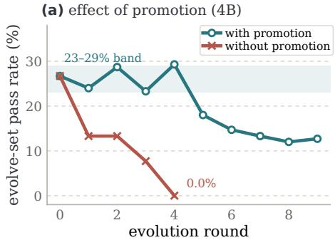

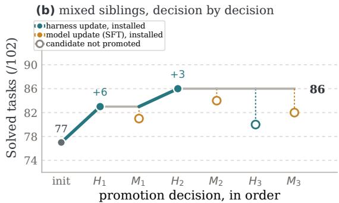  
Figure 7: Promotion ablation and the mixed-siblings trace. (a) Without component-wise promotion, a 4B chain falls 26.7% → 0.0% on its evolve set in five rounds; with promotion, it holds a 23–29% band. (b) The mixed-siblings chain, one promotion decision at a time.

A hypothesis about the order of the channels. In both CoTrace chains (Figure 2b, Figure 3a) the first productive harness search follows a model update. Our hypothesis is that early failures are largely procedural, that the first model update internalizes the execution patterns that fix them, and that the search then faces a smaller, more structured residual: the late harness win in the reinforcement line flips three tasks, whereas the first candidate flipped fourteen with zero net gain (Table 11). The completed cross-evaluation in Table 3 provides a direct additivity test, and the same design extend to later transitions by evaluating the new model under the previous harness.

## E.8 DETAILS BEHIND THE ANALYSIS

Reading the cells of Table 3. In the CoTrace-SFT chain, the model update came first, worth +4 under the stock harness, and the search then found a harness worth +4 under the updated policy. The fourth cell, the base policy under that harness, was evaluated separately and scores 82: the harness is worth +4 under either policy, I = 0, so for this transition the model and harness gains are additive and the harness found after the model update did not require it.

Curriculum drift in numbers. By the fourth iteration of one chain 32 of 50 evolve tasks were carried-over failures, and the reinforcement chain’s third iteration retired 40 of 50 at once; the cumulative success-filtered corpus spanned 96 unique tasks at the same point, 14 from the current evolve set. In a second chain the evolve-set score fell 32 → 22 → 14 → 12 against a promotion score of 80 → 80 → 80 → 83 (Figure 3b). The CoTrace-SFT chain’s late harness candidates lose −4, −6 and −4 (Table 8), and the reinforcement chain’s final candidate, trained after that retirement, is its only rejected reinforcement update (85 against the incumbent 90). Once the curriculum has run ahead of the corpus, rollouts land on the hard residual, successes become scarce, a success-filtered corpus either empties or re-samples history, and late harness rounds re-propose the same few processor families (Appendix E.9).

Model updates by mixture. Every model update trained on the mixed-siblings corpus scored below the incumbent, −2, −2, −4 tasks at 9B and −2 and −2 at 4B, while the matched corpus produced the only supervised updates above zero under tournament search at 9B (+4 and +2). The CoTrace-SFT chain at 4B rejected its three updates at −5, −5, −6. The one pilot that holds the trajectory budget fixed while varying selection is the routing study of Appendix G. A 2B policy anchors at 10 with almost nothing to harvest, while a 27B policy at 97 occupies the ceiling regime (Appendix E.6).

## E.9 ACCEPTED AND REJECTED HARNESS EDITS

Across all chains the meta-agent produced 216 candidate changesets. A changeset may touch more than one lever.

Table 13: Left: what was proposed across 216 changesets. Right: what the promotion rule actually kept, over 19 extra processor slots across 10 accepted incumbents.
<table><tr><td>Proposed lever</td><td>Share</td></tr><tr><td>Add a processor (control)</td><td>61%</td></tr><tr><td>of which loop / repeat breaker</td><td>37%</td></tr><tr><td>of which verifier dependency</td><td>16%</td></tr><tr><td>of which step budget / self-verify</td><td>13%</td></tr><tr><td>of which other</td><td>30%</td></tr><tr><td>Prompt rewrite (instruction)</td><td>20%</td></tr><tr><td>Remove a processor</td><td>13%</td></tr><tr><td>Empty / no-op copy</td><td>25%</td></tr><tr><td>New tool (action)</td><td>0%</td></tr></table>

<table><tr><td>Accepted extras</td><td>Share</td></tr><tr><td>Loop / repeat breaker</td><td>53%</td></tr><tr><td>Step budget / self-verify</td><td>26%</td></tr><tr><td>Verifier dependency guard</td><td>21%</td></tr><tr><td>Prompt rewrite among accepted H</td><td>3/10</td></tr><tr><td>New tools</td><td>0%</td></tr></table>

Three observations emerge. The action lever is never used successfully: no accepted harness added a tool, and no such proposal survived promotion. The search operates almost entirely on control processors and, less often, on the prompt. What survives is narrower than what is proposed: loop and repeated-command breakers are 37% of proposed processor additions and 53% of accepted ones. Finally, the two highest-scoring harnesses both retain the stock five-line prompt, reaching 86 on control processors alone, in each case a loop breaker plus a guard that installs a Python dependency the verifier needs. Late rounds converge on variants of the same two or three mechanism families, consistent with the saturation in Section 4.1 and with the argument in Section 4.1 that model updates expose new harness-repairable failures. This convergence identifies a natural trigger for refreshing the search space after a model update.

## F THE REINFORCEMENT STAGE

## F.1 OPTIMIZER AND DEPARTURES FROM TMAX

The reinforcement stage runs the open-instruct trainer that Tmax released (Ivison et al., 2026). Each optimizer step samples several rollouts per prompt under the adopted harness, scores them with the binary verifier, and forms centered group-relative advantages; groups with zero reward variance carry no relative signal and are dropped, with the batch refilled by active sampling up to 8 prompt groups, the dynamic-sampling device of DAPO (Yu et al., 2025). The policy update is the DPPO objective (Qi et al., 2026) rather than GRPO-style ratio clipping: the importance ratio is anchored on the rollout policy’s own log-probabilities from the inference engine, and a per-token trust region masks any update whose binary total-variation divergence from that policy exceeds $\delta { = } 0 . 1$ and would move further away, while updates that move back are never masked. Truncated importance sampling is off, the LM head is kept in FP32, decoding temperature is 1.0 and the learning rate is constant. This is Tmax’s final recipe for Qwen3.5, which it adopted over vanilla GRPO for stability on long-horizon terminal rollouts, and it is what every reported reinforcement stage in this paper ran. Our stage keeps that algorithmic core and changes the regime around it (Table 14): eight rollouts per prompt rather than 32, to keep unique-task coverage under a budget of 2,304 episodes per stage; two-step rather than four-step asynchrony, which is the more conservative choice; a small reference-KL coefficient $\beta { = } 0 . 0 1$ where Tmax uses none, to regularize updates from a few hundred episodes before the checkpoint re-enters harness evolution; a 16K rather than 65K response budget; and, the change that is the point of the experiment, rollouts collected online under the currently adopted harness and from the evolving task frontier rather than under a fixed harness over a 15k-task pool. The 4B chain used two unique prompts and sixteen samples per prompt. These settings define the compute-efficient regime evaluated here; Tmax’s reported G=32 configuration and zero-KL setting provide the large-budget reference in Table 14.

## F.2 REWARD-PATH DEBUGGING RECORD

Outcome-only RL on this task family initially exhibited a data-path failure that appeared to be a capability limit. The submission rate remained at 0 for every run: the policy never emitted the terminal submission action, so every episode scored zero and every group-relative advantage was zero. Token budget was not the cause; raising the response budget pushed the truncation rate from 0.88 to 0.00 without producing a single submission. The cause was in the data path. The environment’s own instance rendering was discarded on reset, the user turn carried raw taxonomy text instead of the task template, and a system-prompt override replaced the one remaining turn that mentioned the submission action; the policy was never told how to submit. Once the prompt schema was rebuilt to include the instance template, and the sandbox working directory was pointed at the directory the task images actually populate, reward became non-zero. We report this because it is the same failure mode the paper is about: a data-plane defect that can appear as a model or harness capability bottleneck.

Table 14: Our reinforcement stage against Tmax’s published Qwen3.5-9B recipe (Ivison et al., 2026). The algorithmic core is shared; the regime differs.
<table><tr><td></td><td>This paper</td><td>Tmax</td></tr><tr><td>Reward, advantages, objective</td><td>outcome-only, centered group-relative, DPPO</td><td>same</td></tr><tr><td>Trust region</td><td>binary  $\mathrm { T V } , \delta { = } 0 . 1$  , rollout log-probs</td><td>same</td></tr><tr><td>Zero-variance groups</td><td>dropped; active sampling, ≤8 groups</td><td>same</td></tr><tr><td>LM head / learning rate</td><td> $\mathrm { F P } 3 \bar { 2 } / 1 \times 1 0 ^ { - 6 }$  , constant</td><td>same</td></tr><tr><td>Samples / unique prompts</td><td> $8 / 4 ( 4 \mathrm { B } \colon 1 6 / 2 )$ </td><td>32 / 8</td></tr><tr><td>Async steps</td><td>2</td><td>4</td></tr><tr><td>Reference KL β</td><td>0.01</td><td>0</td></tr><tr><td>Response budget / agent steps</td><td>16,384 / 40</td><td>65,536 / 64</td></tr><tr><td>Budget per stage</td><td>2,304 episodes, 100 tasks</td><td>500 steps × 256</td></tr><tr><td>Task source</td><td>frontier (20%) + domain-balanced pool</td><td>fixed 15k-task pool</td></tr><tr><td>Harness during RL</td><td>the currently adopted H*</td><td>fixed</td></tr></table>

## F.3 OUTCOME AND SETTINGS OF THE REINFORCEMENT LINE

Alternating reinforcement and harness updates moved the pair 78 → 90 on the promotion split, +5 of it through the harness and +7 through the weights, before a further reinforcement round regressed to 85 (Figure 2b, Table 8). The run was interrupted by a cluster outage after its third reinforcement stage and resumed from the saved incumbent for the fourth iteration. Paired per-task records were kept for six of the eight stages (Table 11).

Table 15: Reinforcement stage settings of the 9B line. The task plane is drawn from the taxonomy and is disjoint from the promotion split; frontier exploration spends a fixed fraction of each round on tasks the current pair has not solved, which is the curriculum idea of Section 2.2.3 applied inside the optimizer rather than around it.
<table><tr><td>Rollout</td><td></td><td>Optimization</td><td></td></tr><tr><td>Episodes / iteration</td><td>2,304</td><td>Unique prompts / step</td><td>4</td></tr><tr><td>Training tasks</td><td>100</td><td>Samples / prompt</td><td>8</td></tr><tr><td>Response length</td><td>16,384</td><td>Async steps</td><td>2</td></tr><tr><td>Per-turn budget</td><td>4,096</td><td>Sampled prompt groups</td><td>≤8</td></tr><tr><td>Max agent steps</td><td>40</td><td>Zero-std groups</td><td>dropped (Yu et al., 2025)</td></tr><tr><td>Temperature</td><td>1.0</td><td>Trust region</td><td>binary TV, δ=0.1</td></tr><tr><td>Compute</td><td></td><td>Reference KLβ / LM head</td><td>0.01 / FP32</td></tr><tr><td>Frontier exploration</td><td>20%</td><td>Truncated IS</td><td>off (rollout log-probs)</td></tr><tr><td>Learners / vLLM replicas</td><td>6/2</td><td>Wall-clock cap</td><td>7h</td></tr></table>

This line uses 2,304 episodes on 100 tasks on a single node, compared with a reference recipe using roughly 128k episodes and longer responses across eight nodes. The resulting gains demonstrate effective on-policy learning under the evolved harness in a substantially smaller compute regime.

## G ADDITIONAL PILOTS

## G.1 ROUTING PILOT ON TERMINAL-BENCH 2.1

Table 16 is an early single-benchmark pilot on Terminal-Bench 2.1 that isolates corpus construction under a fixed baseline harness and without a promotion step. Holding the trajectory budget fixed while varying selection provides a complementary controlled comparison to the complete-recipe study in the main text. It ranks capability-routed selection (6.00) above taxonomy-balanced selection (4.33)

and an undifferentiated mix (4.00) at equal corpus size. The default recipe of Table 2 is current-first with history capped at 40% and tops up to 100 unique tasks at one trajectory each, so it buys coverage without volume.

Table 16: Routing pilot. Qwen3.5-9B, baseline harness, 15 Terminal-Bench 2.1 tasks, mean of 3 runs.
<table><tr><td>Corpus construction</td><td>Trajectories</td><td>Solved ↑</td></tr><tr><td>Base policy, no SFT</td><td></td><td>3.00</td></tr><tr><td>Undifferentiated mix</td><td>107</td><td>4.00</td></tr><tr><td>Balanced by task taxonomy</td><td>400</td><td>4.33</td></tr><tr><td>Routed by capability need</td><td>400</td><td>6.00</td></tr></table>

## G.2 CASE STUDY OF GROUNDED HARNESS EDITS

Table 17 follows four consecutive harness edits from a pilot chain on a different policy family, each grounded in a cited failure. It illustrates what the meta-agent proposes and what survives; it is not part of the terminal-task record.

Table 17: Four grounded harness edits on the evolve subset. Every diagnosis was correct; not every intervention helped. This is why proposal and promotion are separated, and why promotion is deterministic.
<table><tr><td>Round</td><td>Observed failure</td><td>Harness edit</td><td>Effect</td></tr><tr><td>4B R1</td><td>Bash calls written as text, never executed</td><td>inline tool-call recovery</td><td>0 → 2</td></tr><tr><td>31B R2</td><td>Backend rejected the tool transport; all tasks died at step 0</td><td>transport bypass</td><td>0 → 3</td></tr><tr><td>31B R3</td><td>Model did not create the files the verifier required</td><td>required-output guard</td><td>3 → 2</td></tr><tr><td>31B R4</td><td>Model assumed unavailable commands existed</td><td>environment preflight</td><td>2 → 4</td></tr></table>