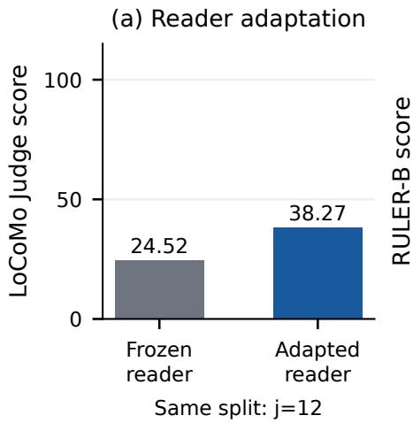
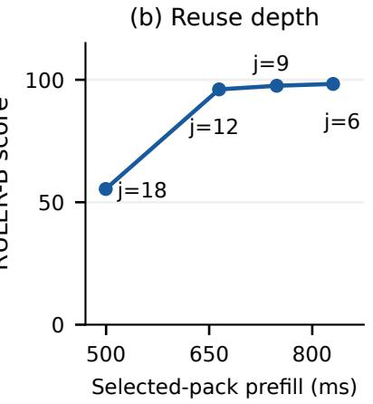
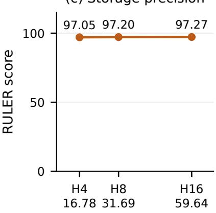
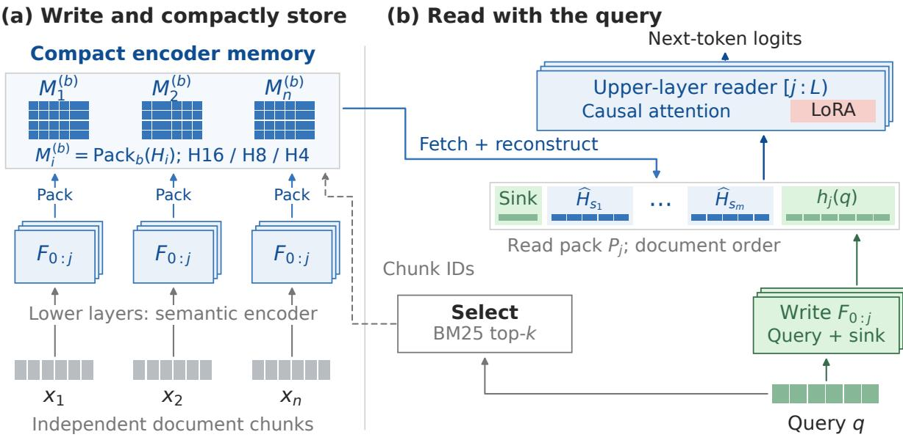
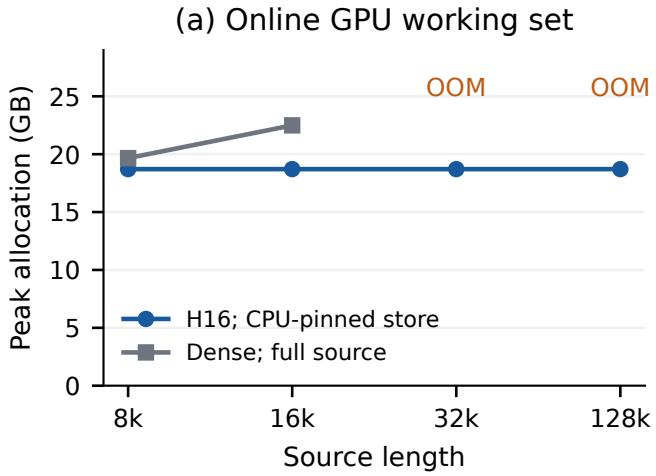
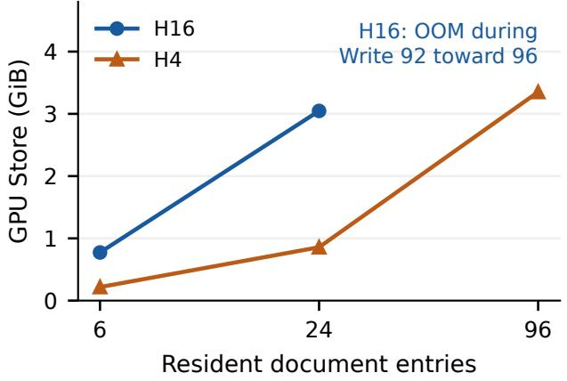

# Cache the Encoder Within: Compact, Reusable Memory across LLM Queries

Hanzuo Liu1 Chunyu Liu1 Chaofan Lin2 Alex Lamb1 Mingyu Gao1

1Tsinghua University (tsinghua.edu.cn) 2Tsinghua University (mail.tsinghua.edu.cn)

lhz24@mails.tsinghua.edu.cn

## Abstract

Repeated queries over shared documents incur redundant encoding, while caching model states introduces persistent storage costs. Building on CoMem’s intermediate-state interface, EncBank treats a pretrained LLM’s lower layers as a reusable document encoder and compactly stores their outputs for an adapted upper-layer reader. A self-distilled suffix adapter is shared across storage precisions within each backbone, without quantization-specific retraining. Across five benchmark suites on three Qwen backbones spanning different sizes and full-attention and hybrid architectures, 4-bit storage keeps each reported benchmark aggregate within one score point of native-precision EncBank. In a fixed Qwen3-8B workload, it retains 28.1% of the native-precision persistent GPU store. Separate native-precision controls yield a 1.40× selected-pack prefill speedup over same-evidence, same-adapter text replay, at a 3.12-point RULER accuracy cost. A native-precision Qwen3.8-27B configuration also passes 70 of 89 Terminal-Bench 2.1 tasks. EncBank thus combines reusable computation with compact memory, while task fidelity and end-to-end benefits remain dependent on the workload, preparation costs, and reuse frequency.

## 1 Introduction

Recent advances in large language models (LLMs) have enabled systems that answer questions over long documents, retrieve information from external knowledge collections, and draw on extended conversation histories (Lewis et al., 2020; Bai et al., 2024; Maharana et al., 2024). In these settings, a query is accompanied by context: source material that the model uses to construct its answer. The same collection or history may support many different queries, creating an opportunity to reuse the computation spent processing that material.

A straightforward approach encodes the relevant context anew for each request before generating an answer. Retrieval reduces this cost by selecting relevant passages, but does not by itself reuse their previous computation: selected tokens still pass through every decoder layer. Retaining processed representations could avoid some of this repeated work. However, those representations must persist between requests, so their storage cost grows with the retained collection. Efficient reuse therefore requires deciding both what computation to retain and how compactly to store it.

Storing text as token IDs is compact but preserves no model computation. Full-depth key–value (KV) caches retain more computation, but store attention states at every layer and must handle context and position dependencies when chunks are assembled (Gim et al., 2024; Yao et al., 2025; Lu et al., 2025). CoMem offers an intermediate object: one hidden state (residual) per token at a chosen layer boundary, followed by continuation through the remaining layers (Liu et al., 2026). On Qwen3-8B, this costs 8 KiB/token instead of

(c) Storage precision  
  
Figure 1: Reader adaptation, reuse depth, and storage precision. Qwen3-8B throughout. (a) Native LoCoMo full Judge, 1,986 items, fixed $j = 1 2$ and evidence; only suffix adaptation changes. (b) Separately adapted splits: RULER-B on 1,500 examples versus fixed-pack prefill from three processes. (c) Fixed-reader FP16 H16/H8/H4: RULER means over 1,500 examples and persistent GPU Store on six 8k documents. Quality and storage use distinct supports. Lines connect measured settings; the depth and precision studies are not a joint sweep.

144 KiB/token for full-depth 16-bit KV. Yet 128k tokens still require 1 GiB of residuals. Bounded retrieval limits the online working set; it does not limit the bytes retained for a growing document collection.

EncBank extends CoMem’s WRITE–SELECT–READ interface with low-bit persistent storage. Lower layers encode each chunk once; its states are stored in H16, H8, or H4 format. For each query, selected states are reconstructed and read by the upper layers. One adapted reader per backbone serves all three precisions. Split depth j controls prepaid computation; precision b controls retained bytes.

## 2 Design Insights for Reusable Memory

The diagnostics use Qwen3-8B, independently encoded 512-token chunks, and top-12 selection. Native depth reuse (BF16) and storage precision (FP16) are separate studies. Figure 1 collects their design evidence; prefill timing excludes Write, fetch, and decode.

Intermediate states benefit from reader adaptation. Caching after the first j layers lets the remaining layers continue processing from that boundary. However, independent chunk encoding changes these states. $\mathbf { A } \mathbf { t } { \boldsymbol { \ j } } = 1 2 { \boldsymbol { \cdot } } $ , adapting only the upper layers raises native LoCoMo from 24.52 to 38.27 on 1,986 items (Figure 1a). This supports a reusable encoder with an adapted reader; it does not establish that semantic processing is complete at the cache boundary.

Deeper reuse reduces prefill but can degrade quality. Moving from $j = 6 \mathrm { t o } j = 1 2$ reduces selectedpack prefill from 830.3 to 664.4 ms, with RULER-B decreasing from 98.29 to 96.07 (Figure 1b). $\begin{array} { r } { \operatorname { A t } j = 1 8 . } \end{array}$ prefill falls to 499.5 ms but accuracy drops to 55.41. These separately adapted configurations motivate $j = 1 2$ as a practical compromise. Adapter sizes vary from 72.745M to 43.647M parameters, so the sweep is not a training-compute-matched causal comparison or a held-out optimum.

  
Figure 2: A persistent memory boundary inside the decoder. Independent lower-layer WRITE produces document residuals, stored in H16/H8/H4 format. Token-ID retrieval selects chunks; only their states are reconstructed. The native sink and query join the selected states for causal upper-layer READ with suffix LoRA. The diagram describes the attention-only Qwen3-8B implementation.

Storage precision controls retained bytes. At fixed hidden width, changing $j > 0$ preserves the number and width of stored token states; deeper reuse alone does not shrink their payload. Reducing storage precision does. With the reader fixed, H4 retains 28.1% of H16’s persistent GPU Store while RULER changes from 97.27 to 97.05 (Figure 1c). This motivates testing precision at a fixed reader, separately from depth reuse. The resulting design combines a chosen reuse depth, reader adaptation, and compact states reconstructed before Read.

## 3 Methodology

Let an L-block decoder have hidden width d. The encoder $F _ { 0 : j }$ includes embeddings and blocks $[ 0 : j ) ; F _ { j : L }$ is the reader. A fixed source is partitioned into chunks $x _ { i }$ of at most c tokens before queries arrive. We keep one state per token, rather than pooling a chunk into one embedding. Figure 2 shows the interface.

## 3.1 Write once and store compactly

Each chunk is encoded independently, with lower-layer positions restarted at zero, and packed at precision $b \in \{ 1 6 , 8 , 4 \}$ :

$$
H _ { i } = F _ { 0 : j } ( x _ { i } ) \in \mathbb { R } ^ { | x _ { i } | \times d } , \qquad M _ { i } ^ { ( b ) } = \mathrm { P a c k } _ { b } ( H _ { i } ) .\tag{1}
$$

The entry retains source IDs for retrieval and a native one-token sink, but no lower-layer document KV. H16 preserves the original BF16 or FP16 values. H8/H4 flatten each chunk into groups of $g = 6 4$ values and use standard affine quantization. For each group, let $a = \operatorname* { m i n } _ { t } v _ { t }$ and $\delta = ( \operatorname* { m a x } _ { t } v _ { t } - a ) / ( 2 ^ { b } - 1 )$ , with $\delta = 1$ for a constant group:

$$
u _ { t } = \mathrm { c l i p } _ { [ 0 , 2 ^ { b } - 1 ] } \left( \mathrm { r o u n d } \frac { v _ { t } - a } { \delta } \right) , \qquad \widehat { v } _ { t } = \mathrm { c a s t } _ { \tau } \left( u _ { t } \bar { \delta } + \bar { a } \right) .\tag{2}
$$

Codes are computed in FP32. Stored BF16 metadata $\bar { a } , \bar { \delta }$ are promoted to FP32 for reconstruction, then cast to native dtype τ. H8/H4 pack one/two codes per byte and release the original tensor. Weights, arithmetic, query/sink states, and request-local KV remain native; H4 changes storage, not model execution.

## 3.2 Retrieve, reconstruct, and read

Iterative token-ID BM25 selects up to k chunks, deduplicates them, and restores source order. The default uses $k = 1 2$ , chunk size 512, and three rounds of four chunks. Because selection does not use quantized states, it is identical across matched precision arms. For selected IDs $s _ { 1 } , \ldots , s _ { m }$ , query $q ,$ , and sink s, form

$$
P _ { j } = [ h _ { j } ( s ) ; \widehat { H } _ { s _ { 1 } } ; . . . ; \widehat { H } _ { s _ { m } } ; h _ { j } ( q ) ] , \qquad \widehat { H } _ { s _ { r } } = \mathrm { U n p a c k } _ { b } ( M _ { s _ { r } } ^ { ( b ) } ) .\tag{3}
$$

The sink and query are encoded independently. The suffix applies fresh contiguous positions and causal attention: later chunks see earlier chunks, and query tokens see all selected chunks. Every generated token still traverses all L blocks. In the attention-only implementation, lower-layer KV contains the query/generated prefix; upper-layer KV additionally contains the selected pack. Their position histories advance separately. Reconstructed states and generation caches are request-local; stored document entries persist. Hybrid backbones retain the same residual interface with architecture-specific attention/recurrent-state handling.

Independent encoding changes the states consumed by the suffix. Following CoMem, self-distillation trains LoRA on suffix attention and MLP projections while freezing the encoder and backbone (Hu et al., 2022; Hinton et al., 2015). The adapter-disabled teacher continuously processes ordered PG-19 text (Rae et al., 2019); the student separately encodes chunks, sink, and query. At query position t, teacher top-64 indices define support $S _ { t } \mathrm { : }$ ; teacher $p _ { t }$ and student $q _ { t }$ are renormalized on this support:

$$
\mathcal { L } = \frac { 1 } { \vert \mathcal { Q } \vert } \sum _ { t \in \mathcal { Q } } [ 0 . 6 D _ { \mathrm { K L } } ( p _ { t } \Vert \mathfrak { q } _ { t } ) + 0 . 4 D _ { \mathrm { K L } } ( q _ { t } \Vert \mathfrak { p } _ { t } ) ] .\tag{4}
$$

Training uses native states without retrieval, hidden-state quantization, or benchmark supervision. H16/H8/H4 share the resulting reader within each backbone. The conditional objective does not constrain total student mass on $S _ { t } ;$ we test full-vocabulary behavior separately.

## 3.3 Controlled endpoints and cost accounting

$\mathbf { A } \mathbf { t } j = 0$ , raw IDs for the same selected chunks are replayed through all layers. Holding evidence, order, sink, adapter, and generation fixed isolates the effect of independent residual reuse. A continuous-prefix oracle instead computes $h _ { j }$ on the assembled pack afresh; it tests continuation correctness but loses cross-query reuse. H8/H4 versus H16 is a second control, varying only storage precision at fixed depth and reader.

For N stored tokens, the document-state payload is

$$
S _ { 1 6 } = 2 N d , \qquad S _ { b } \simeq N d \left( \frac { b } { 8 } + \frac { 4 } { g } \right) , \quad b = 8 , 4 .\tag{5}
$$

At $g = 6 4$ , H8/H4 retain 53.125%/28.125% of H16 payload. For Qwen3-8B $( L = 3 6 , d = 4 0 9 6 , n _ { \mathrm { k v } } =$ 8 $, d _ { \mathrm { h e a d } } = 1 2 8 )$ , H16/H4 require 8/2.25 KiB per token, versus $4 L n _ { \mathrm { k v } } d _ { \mathrm { h e a d } } = 1 4 4$ KiB for full-depth 16-bit KV. These exclude weights, retrieval metadata, and request workspace; the KV formula does not describe hybrid recurrent-state storage. The selected pack is bounded by $1 + k c + | q |$ positions, but Write, indexing, lookup, and total storage still grow with the collection.

## 4 Experimental Design

We separate native-reuse controls from storage-precision comparisons. The former use BF16 Qwen3-8B and include matched replay, depth, adaptation, context, and serving tests. The latter use a custom rank-32, α = 32, 4,000-step reader, with a complete FP16 Qwen3-8B suite at j = 12. Its document boundaries are fixed before the query; some native quality harnesses instead use the last formatted-prompt chunk as the query. Checkpoint identity is not established across these studies: we neither add their quality gaps nor transfer speedups to H4.

Reported extensions use Qwen3.5-9B and Qwen3.8-27B hybrid backbones at j = 6, 21, each with its own reader (Yang et al., 2025; Qwen Team, 2026a,b). They use native chat templates with thinking disabled; Qwen3-8B uses plain-text greedy decoding. Hybrid low-bit results are supplied aggregates, with less complete checkpoint/judge binding than the 8B study.

Five benchmarks cover retrieval and reasoning: RULER (three tasks, five lengths, 1,500 examples), LongEval (five lengths, 500), LongBench QA6 (six datasets, 1,150), BABILong (three tasks, seven lengths, 2,100), and LoCoMo (Hsieh et al., 2024; Li et al., 2023; Bai et al., 2024; Kuratov et al., 2024; Maharana et al., 2024). We retain native scorers and macro weighting; LoCoMo uses item weighting. The 8B precision judge covers 1,540 answerable items; native-reuse full Judge includes 446 additional abstention items. These scores are not pooled. Systems use Qwen3-8B and report persistent Store, peak memory, Write, TTFT, decode, and preparation-inclusive E2E separately. Core evidence and counterexamples follow; reproduction details are in Appendix A.

We evaluate the 89-task Terminal-Bench 2.1 agent benchmark (Terminal-Bench Team, 2026) with Qwen3.8-27B. EncBank-H16 divides prior chat and tool history into 512-token chunks, reuses their H21 states, and uses token-ID BM25 to select up to 12 relevant chunks (k = 12) for the adapted suffix reader alongside the current exchange. Dense rereads the full history; task verifiers score outcomes. Both configurations cover all 89 tasks; adapter and serving paths differ.

Code repository: https://anonymous.4open.science/r/EncBank-1E15/.

## 5 Results

## 5.1 Low-bit memory preserves benchmark aggregates, not every answer

Table 1 isolates precision within each adapted-reader group. On Qwen3-8B, H4 changes RULER by −0.22, LongEval by +0.60, LongBench by −0.09, BABILong by +0.90, and LoCoMo by −0.46 points relative to H16. The largest absolute H4 change is 0.94 on the 9B summary and 0.86 on 27B. Thus all supplied five-benchmark aggregates remain within one point, without a separately trained quantized reader. This is a descriptive observation, not a non-inferiority test.

Full-source references do not isolate quantization. In the 8B suite, Dense and KIVI have LoRA disabled and see the full source; 64k/128k exceed the unextended 40,960-position window. Their failures there do not establish superiority over a length-extended full-context model. Within the separate native YaRN control, full-context replay reaches 100 on 128k single-needle, versus 98 for residual reuse. On the hybrid summaries, full-source recomputation is stronger on most tasks. The evidence supports compact usable memory, not a universal answer-quality advantage.

Aggregate proximity hides variation. Across 8k/16k/32k/64k/128k, the H4-minus-H16 LongEval differences are (4, 4, −6, −3, 4) points. It loses 0.59 F1 on MuSiQue, whose unadjusted paired document-bootstrap interval is [−1.20, −0.03]. All LongEval precision outputs reach the 16-token cap. In the separate BF16 single-key/8k cohort, H16/H8/H4 each score 99, but complete sequences match H16 on only 68/100 H8 and 34/100 H4 examples.

Table 1: Quality across storage precisions and backbones. Scores are 0–100. Within each H16/H8/H4 group, the reader is fixed; other rows are whole-method references. 8B values follow the complete FP16 precision study, not the separate native-reuse cohort. Hybrid values are reported aggregates (†); see the scope below.
<table><tr><td rowspan=1 colspan=9>Method                       RULER          LongEval          QA6 F1          BABILong          LoCoMo</td></tr><tr><td rowspan=3 colspan=9>Qwen3-8B; full attention; j = 12; FP16 precision studyDense, full source              51.91               31.6             8.97               58.52             32.40KIVI2                          42.43                9.0             9.37               53.38</td></tr><tr><td rowspan=1 colspan=3>, full source 51.91</td><td rowspan=1 colspan=1></td><td rowspan=1 colspan=2>8.97</td><td rowspan=1 colspan=1>58.52</td><td rowspan=1 colspan=1>32.40</td></tr><tr><td rowspan=1 colspan=1></td><td rowspan=1 colspan=2>9.37</td><td rowspan=1 colspan=1>53.38</td><td rowspan=1 colspan=1>29.81</td></tr><tr><td rowspan=1 colspan=4>KIVI4                          50.64</td><td rowspan=1 colspan=1>31.2</td><td rowspan=1 colspan=2>8.89</td><td rowspan=1 colspan=1>58.90</td><td rowspan=1 colspan=1>32.60</td></tr><tr><td rowspan=2 colspan=4>Residual, no LoRA             16.01EncBank-H16                  97.27</td><td rowspan=1 colspan=1>0.0</td><td rowspan=1 colspan=2>9.98</td><td rowspan=1 colspan=1>38.38</td><td rowspan=1 colspan=1>25.45</td></tr><tr><td rowspan=1 colspan=1>63.0</td><td rowspan=1 colspan=2>12.05</td><td rowspan=1 colspan=1>58.05</td><td rowspan=1 colspan=1>44.03</td></tr><tr><td rowspan=1 colspan=2>EncBank-H8</td><td rowspan=1 colspan=1></td><td rowspan=1 colspan=1>97.20</td><td rowspan=1 colspan=1>62.6</td><td rowspan=1 colspan=2>12.11</td><td rowspan=1 colspan=1>58.14</td><td rowspan=1 colspan=1>44.09</td></tr><tr><td rowspan=1 colspan=4>EncBank-H4                   97.05</td><td rowspan=1 colspan=1>63.6</td><td rowspan=1 colspan=2>11.96</td><td rowspan=1 colspan=1>58.95</td><td rowspan=1 colspan=1>43.57</td></tr><tr><td rowspan=1 colspan=4>Qwen3.5-9B; hybrid; j = 6; native chat†</td><td rowspan=1 colspan=1></td><td rowspan=1 colspan=2></td><td rowspan=1 colspan=1></td><td rowspan=1 colspan=1></td></tr><tr><td rowspan=1 colspan=2>Dense, full source</td><td rowspan=1 colspan=1></td><td rowspan=1 colspan=1>85.87</td><td rowspan=1 colspan=1>99.80</td><td rowspan=1 colspan=2>51.98</td><td rowspan=1 colspan=1>73.57</td><td rowspan=1 colspan=1>48.59</td></tr><tr><td rowspan=1 colspan=2>Residual, no LoRA</td><td rowspan=1 colspan=1></td><td rowspan=1 colspan=1>61.08</td><td rowspan=1 colspan=1>73.60</td><td rowspan=1 colspan=2>43.82</td><td rowspan=1 colspan=1>56.33</td><td rowspan=1 colspan=1>38.57</td></tr><tr><td rowspan=1 colspan=2>EncBank-H16</td><td rowspan=1 colspan=1></td><td rowspan=1 colspan=1>75.53</td><td rowspan=1 colspan=1>97.20</td><td rowspan=1 colspan=2>46.52</td><td rowspan=1 colspan=1>63.62</td><td rowspan=1 colspan=1>46.58</td></tr><tr><td rowspan=1 colspan=2>EncBank-H8</td><td rowspan=1 colspan=1></td><td rowspan=1 colspan=1>75.25</td><td rowspan=1 colspan=1>97.20</td><td rowspan=1 colspan=2>46.75</td><td rowspan=1 colspan=1>64.05</td><td rowspan=1 colspan=1>46.48</td></tr><tr><td rowspan=1 colspan=2>EncBank-H4</td><td rowspan=1 colspan=1></td><td rowspan=1 colspan=1>76.47</td><td rowspan=1 colspan=1>97.20</td><td rowspan=1 colspan=2>46.19</td><td rowspan=1 colspan=1>64.00</td><td rowspan=1 colspan=1>46.78</td></tr><tr><td rowspan=1 colspan=4>Qwen3.8-27B; hybrid; j = 21; native chat†</td><td rowspan=1 colspan=1></td><td rowspan=1 colspan=2></td><td rowspan=1 colspan=1></td><td rowspan=1 colspan=1></td></tr><tr><td rowspan=1 colspan=2>Dense, full source</td><td rowspan=1 colspan=1></td><td rowspan=1 colspan=1>100.00</td><td rowspan=1 colspan=1>100.00</td><td rowspan=1 colspan=2>56.36</td><td rowspan=1 colspan=1>69.14</td><td rowspan=1 colspan=1>55.09</td></tr><tr><td rowspan=1 colspan=2>Residual, no LoRA</td><td rowspan=1 colspan=1></td><td rowspan=1 colspan=1>96.75</td><td rowspan=1 colspan=1>85.60</td><td rowspan=1 colspan=2>48.20</td><td rowspan=1 colspan=1>66.81</td><td rowspan=1 colspan=1>45.97</td></tr><tr><td rowspan=1 colspan=2>EncBank-H16</td><td rowspan=1 colspan=1></td><td rowspan=1 colspan=1>99.39</td><td rowspan=1 colspan=1>97.20</td><td rowspan=1 colspan=2>50.91</td><td rowspan=1 colspan=1>73.67</td><td rowspan=1 colspan=1>50.70</td></tr><tr><td rowspan=1 colspan=2>EncBank-H8</td><td rowspan=1 colspan=1></td><td rowspan=1 colspan=1>99.39</td><td rowspan=1 colspan=1>97.20</td><td rowspan=1 colspan=2>50.96</td><td rowspan=1 colspan=1>73.38</td><td rowspan=1 colspan=1>50.50</td></tr><tr><td rowspan=1 colspan=2>EncBank-H4</td><td rowspan=1 colspan=1></td><td rowspan=1 colspan=1>99.40</td><td rowspan=1 colspan=1>97.20</td><td rowspan=1 colspan=1>51.08</td><td rowspan=1 colspan=1></td><td rowspan=1 colspan=1>72.81</td><td rowspan=1 colspan=1>50.30</td></tr></table>

RULER/LongEval cover 8k–128k; 8B full-source 64k/128k are unextended stress tests. QA6 averages six datasets; BABILong averages 21 cells. 8B LoCoMo uses 1,540 category-1–4 judgments. † Hybrid H16 protocols use 1,986 items; low-bit judge/checkpoint bindings are not independently supplied. Hybrid contrasts remain descriptive, not verified paired or cross-model rankings. No significance is inferred from maxima.

## 5.2 Matched replay separates saved computation from lost fidelity

The native control (Table 2) fixes checkpoint, all 168 suffix-LoRA modules, evidence IDs/order, examples, and decoding. On 1,500 paired RULER-B examples, j = 12 reuse loses 3.12 points (95% interval [2.36, 3.93]). Separately, prefill on a fixed 6.5k-token pack falls from 931.9 to 664.4 ms (1.403×; three-process ratios 1.402–1.404), excluding selection, Write, fetch, and decode. Including measured decode reduces the ratio to 1.07–1.09×.

Fresh continuous-prefix states recover replay exactly on the reported examples, validating continuation but requiring per-query recomputation. Native LongEval replay/reuse scores are 97.2/69.0; the later paired LongBench comparison gives 12.18/12.01 F1. LongBench replay is adapter-free, so it does not provide the same-adapter attribution of RULER.

## 5.3 Adaptation and evidence interaction matter; local repair is limited

Beyond the LoCoMo gain in Section 2, adaptation also improves predictive fidelity on 50 held-out PG-19 books (100 windows, 51,200 query positions): full-vocabulary forward KL falls from .442 to .304 and next-token NLL from 2.680 to 2.579; the paired book-bootstrap changes are −.138 [−.147, −.131] and −.101 [−.111, −.092]. Teacher top-64 support retains 94.68% probability mass on average. Improvement therefore extends beyond the support-normalized objective, without making it full-vocabulary training.

Table 2: Matched native reuse measures a fidelity cost. RULER-B uses 1,500 paired examples; MK is the 200-example 8k/16k multikey subset. Prefill uses a separate fixed pack, three processes, three warmups and 20 reads/process; it excludes selection, Write, fetch and decode. NR: latency not reported for the per-query oracle.
<table><tr><td>Path</td><td>RULER-B</td><td>MK</td><td>Prefill (ms)</td><td>Reusable</td></tr><tr><td>Same-adapter replay,  $j = 0$ </td><td>99.19</td><td>100.0</td><td>931.9</td><td>No</td></tr><tr><td>Chunk-local  ${ \mathrm { H } } 1 6 , j = 1 2$ </td><td>96.07</td><td>92.5</td><td>664.4</td><td>Yes</td></tr><tr><td>Continuous-prefix oracle</td><td>99.19</td><td>100.0</td><td>NR</td><td>No</td></tr></table>

Table 3: Context interaction and local repair, with separate cohorts. (a) Multikey full/block-diagonal attention, same evidence, 50 examples/length; query sees all chunks. (b) Left-overlap Write at fixed stored shapes: MK has 200 examples; independent LongEval (LE) has 300, Qasper 200. Scores are 0–100.
<table><tr><td>Panel</td><td>Configuration</td><td colspan="3">Measured outcomes</td></tr><tr><td rowspan="2">(a) Interaction</td><td></td><td>MK/8k</td><td>MK/16k</td><td></td></tr><tr><td>Full causal</td><td>96</td><td>94</td><td></td></tr><tr><td rowspan="2"></td><td>Block diagonal</td><td>60</td><td>32</td><td></td></tr><tr><td></td><td>MK</td><td>LE</td><td>Qasper F1</td></tr><tr><td rowspan="2">(b) Write context</td><td>No overlap</td><td>92.5</td><td>72.67</td><td>11.37</td></tr><tr><td>32-token overlap</td><td>98.5</td><td>62.33</td><td>10.76</td></tr></table>

Blocking evidence-to-evidence attention reduces multikey accuracy from 96/94 to 60/32 at 8k/16k (Table 3), although queries see every selected chunk in both arms.

On a paired 200-example multikey diagnostic, full-document lower-layer context raises 92.5 to 100, while changing only upper-layer positions lowers it to 88. The full-context arm also changes query states and lower-layer decode visibility, so it does not isolate document states alone. A 32-token left overlap raises multikey to 98.5 with unchanged stored shapes. Yet on 300 independent LongEval examples, the same overlap reduces accuracy by 10.33 points $( [ - 1 6 . 3 3 , - 4 . 3 3 ] )$ , and it does not improve Qasper. Its measured Write cost increases 17.9–19.4%. We retain disjoint chunks as the default and do not generalize the synthetic repair result to natural QA.

## 5.4 Single-residual and full-depth KV objects trade different costs

A same-evidence, same-backbone control compares replay, EncBank-H16, and a synchronous CacheBlendstyle chunk-KV implementation (Yao et al., 2025). It caches all 36 layers, reindexes RoPE, recomputes two bootstrap layers, and repairs a fixed 15% context-token set above them. It is not the native cache manager or asynchronous system. All paths are tested with the EncBank suffix adapter enabled and disabled; no KV-specific adapter is trained.

Adaptation helps residual reuse but hurts the other interfaces (Table 4a). Its 17-point LongEval advantage over adapted chunk-KV disappears against unadapted chunk-KV (72.67 versus 73.00). Qasper favors adapted residuals, though all scores remain low under capped plain-text generation. Thus the shared-adapter comparison does not establish an intrinsic residual-over-KV advantage.

On five prespecified 32k examples (Table 4b), chunk-KV has lower TTFT but 18 times the payload and substantially more preparation. Residual reuse reduces cold E2E relative to chunk-KV, yet remains slower than same-adapter replay when Write is charged. This 128-output-token cost subset is separate from the 500-example quality study.

Table 4: Matched evidence exposes the residual–KV trade-off. (a) Quality on 500 examples: LongEval at 8k/16k/32k (100 each), Qasper (200). The shared adapter was trained for EncBank. (b) RTX 5090 costs on five prespecified LongEval/32k examples, shared adapter on, three processes and three repetitions/example. Preparation builds the whole-document pinned-CPU store; E2E includes 128 output tokens. Chunk-KV is a synchronous CacheBlend-style control.
<table><tr><td>(a) Method</td><td>Adapter</td><td>LongEval</td><td>Qasper F1</td><td>KiB/token</td></tr><tr><td>Replay</td><td>off</td><td>84.33</td><td>6.98</td><td>.008</td></tr><tr><td>Chunk-KV</td><td>off</td><td>73.00</td><td>4.88</td><td>144</td></tr><tr><td>Residual H16</td><td>off</td><td>0.00</td><td>10.45</td><td>8</td></tr><tr><td>Replay</td><td>on</td><td>77.67</td><td>4.65</td><td>.008</td></tr><tr><td>Chunk-KV</td><td>on</td><td>55.67</td><td>3.68</td><td>144</td></tr><tr><td>EncBank-H16</td><td>on</td><td>72.67</td><td>11.37</td><td>8</td></tr><tr><td>(b) Method</td><td>Prep. (s)</td><td>TTFT (ms)</td><td>E2E128 (s)</td><td>Store (MiB)</td></tr><tr><td>Replay</td><td>.0011</td><td>803.7</td><td>6.400</td><td>.25</td></tr><tr><td>Chunk-KV</td><td>5.7085</td><td>399.9</td><td>11.694</td><td>4608</td></tr><tr><td>EncBank-H16</td><td>1.3192</td><td>613.2</td><td>7.012</td><td>256</td></tr></table>

Table 5: Persistent storage savings versus request costs. RTX 5090, FP16, six RULER/8k documents, 18 fresh Write/Read pairs, 32 fixed output tokens. Only H variants share the reader. Warm TTFT excludes document Write. Store is persistent GPU MiB; peak is sampled whole-device GiB, including weights. Write times are component means; decode throughput is pooled.
<table><tr><td>Method</td><td>Store</td><td>Write (ms)</td><td>Warm TTFT (ms)</td><td>Tokens/s</td><td>Peak</td></tr><tr><td>Dense</td><td>1073.51</td><td>710.68</td><td>654.71</td><td>44.96</td><td>21.223</td></tr><tr><td>KIVI2</td><td>210.83</td><td>1127.73</td><td>1485.31</td><td>20.19</td><td>20.604</td></tr><tr><td>KIVI4</td><td>343.55</td><td>1128.38</td><td>1486.14</td><td>19.99</td><td>20.603</td></tr><tr><td>EncBank-H16</td><td>59.64</td><td>265.62</td><td>1382.98</td><td>33.56</td><td>20.648</td></tr><tr><td>EncBank-H8</td><td>31.69</td><td>274.12</td><td>1392.93</td><td>32.95</td><td>20.627</td></tr><tr><td>EncBank-H4</td><td>16.78</td><td>271.76</td><td>1378.10</td><td>32.97</td><td>20.617</td></tr></table>

## 5.5 Low-bit storage reduces residency cost, not proportional request cost

On a fixed RTX 5090 FP16 workload, H8/H4 retain 53.1%/28.1% of H16 persistent GPU Store (Table 5). Warm TTFT stays near 1.38 s and sampled peaks near 20.6 GiB; decode is slightly slower. Weights, reconstruction buffers, and request KV remain: 71.9% Store savings do not proportionally reduce request costs. Dense is faster in this warm workload; KIVI has slightly lower sampled peaks. Different adapters and execution paths preclude attributing these whole-method differences solely to the persistent representation.

This fixed 32-output-token fresh-entry test is not a repeated-query amortization measurement. Component timing, sampled peaks, and Store accounting are specified in Appendix A.

Without eviction/offload, H4 completes 96 distinct MuSiQue entries using 3,431.26 MiB of GPU Store; H16 fails on Write 92 (Figure 3b). H4 warm TTFT at 6/24/96 entries is 1877.57/1847.44/1857.58 ms on identical queries to six known documents. This tests residency, not collection-wide retrieval; native F1 is 10.86.

## 5.6 Scaling and query reuse determine whether preparation pays off

With top-12 selection and CPU-pinned H16, online peak allocation stays near 18.7 GB from 8k to 128k (Figure 3a). TTFT rises from 652.6 to 768.6 ms; preparation-inclusive 128-token E2E rises from 6.332

(b) Persistent GPU residency  
  
Figure 3: Bounded online allocation and residency. (a) Native H16/CPU-pinned online TTFT-phase peak on RTX 5090; full-source Dense fails at 32k/128k under a 28 GB allocator cap. (b) Separate FP16 GPU-resident test with distinct documents: H16 fails at Write 92, H4 completes 96. Levels are measured, not maximum-capacity estimates.

to 11.427 s. Dense fails at 32k/128k under a 28 GB allocator cap; H16 uses 26 GB. These unscored measurements do not establish quality beyond native positions.

Table 6: Native H16 preparation payback depends on reuse. $Q ^ { \star }$ in queries from measured Write, fetch, Read and decode; G is output tokens. Three process medians; stable stores and cache hits. Round up for an integer threshold. ∞ means nonpositive per-query savings. This grid is not an H4 amortization measurement.
<table><tr><td>Source / store</td><td> $G = 1$ </td><td> $G = 3 2$ </td><td> $G = 1 2 8$ </td><td> $G = 5 1 2$ </td></tr><tr><td>32k / CPU pinned</td><td>8.9</td><td>9.2</td><td>10.9</td><td>94.0</td></tr><tr><td>32k / GPU resident</td><td>8.4</td><td>7.7</td><td>5.5</td><td>∞</td></tr><tr><td>128k / CPU pinned</td><td>27.6</td><td>29.7</td><td>37.4</td><td>520.1</td></tr><tr><td>128k / GPU resident</td><td>25.8</td><td>26.8</td><td>27.2</td><td>164.2</td></tr><tr><td>1M / CPU pinned</td><td>198.2</td><td>266.7</td><td>421.3</td><td>302.6</td></tr><tr><td>1M / GPU resident</td><td>180.2</td><td>183.0</td><td>190.6</td><td>574.7</td></tr></table>

Table 7: Terminal-Bench 2.1 verifier results on all 89 tasks. Each method retains one verified outcome per task; adapters and serving backends differ.
<table><tr><td>Method</td><td>Pass / tasks</td><td>Success (%)</td></tr><tr><td>Dense, full context</td><td>61/89</td><td>68.54</td></tr><tr><td>EncBank-H16,  $k = 1 2$ </td><td>70/89</td><td>78.65</td></tr></table>

Let $W _ { b } , I _ { 0 }$ denote cached/raw-token preparation and $T _ { b } , T _ { 0 }$ per-query costs including fetch, Read, and decode. With common selection cancelling,

$$
Q _ { b } ^ { \star } = { \frac { W _ { b } - I _ { 0 } } { T _ { 0 } - T _ { b } } } , \qquad T _ { 0 } > T _ { b } .\tag{6}
$$

The native grid (Table 6) gives 9–11 queries for 32k CPU-pinned sources and outputs up to 128 tokens. Longer sources increase preparation; longer outputs can erase savings. At 32k/GPU with 512 output tokens, no finite crossover occurs. These medians assume stable stores and cache hits; they do not transfer to H8/H4.

Bounded reading also bounds evidence coverage: the retained store-scale diagnostic reads about 6.2–6.5k tokens from 128k–4M stored tokens but does not solve global aggregation. At top-12, recall for 16/24/32 required chunks is .75/.50/.375, and a common-word-frequency task scores zero.

## 5.7 Agentic terminal tasks: full-suite verifier outcomes

EncBank-H16 at $k = 1 2$ passes 70/89 tasks (78.65%), versus Dense’s 61/89 (68.54%). Different adapters and serving backends make this a descriptive comparison, not an isolated memory-reuse effect or official leaderboard result.

## 5.8 Robustness checks expose the limits of the operating point

Can saved compute buy enough evidence? A disjoint latency calibration permits ten replay chunks versus twelve for H16. Across nine 100-example cells, BM25 replay scores 64.78 versus 53.22 for H16 (−11.56 points, 95% interval [−18.67, −5.11]). Frozen-BGE replay narrows this to −1.00 [−10.67, 8.33]. The one-conversation LoCoMo slice and missing per-cell quality latencies preclude a task-wide equal-latency claim.

Corpus overlap and prompt sensitivity. After 13-gram clean filtering, 1,053/1,150 LongBench items remain; adapted/no-adapter/replay macros are 12.05/9.90/12.21. Adaptation gains 2.15 points ([1.57, 2.72]), but its replay gap is unresolved. Chat formatting reverses native LoCoMo EncBank/full-source ordering (38.27/34.59 to 37.76/38.22); a 200-item judge audit has only .81 agreement. Natural-task conclusions remain protocol-specific.

## 6 Related Work

Reusable representations. ReadOnce and Embedding Recycling reuse compressed text or activations (Lin et al., 2021; Saad-Falcon et al., 2023). LLoCO adds offline compression and LoRA; LongMem, XC-Cache, and ILRe use side memory, cross-attention, or intermediate keys (Tan et al., 2024; Wang et al., 2023; Monteiro et al., 2024; Liang et al., 2025). CoMem retrieves independently encoded residual chunks for suffix continuation; EncBank adds low-bit persistent storage (Liu et al., 2026).

KV reuse and restoration. Prompt Cache, TurboRAG, and CacheBlend organize or repair reusable KV (Gim et al., 2024; Lu et al., 2025; Yao et al., 2025); HCache and KV-Direct reconstruct it from intermediate states (Gao et al., 2025; Qasim et al., 2026). Cartridges, SemPIC, and KV Packet learn cache representations (Eyuboglu et al., 2026; Xie et al., 2026; Chen et al., 2026). EncBank instead stores one split-layer state and adapts once.

Compression target. KIVI and KVQuant quantize attention KV, CacheGen compresses it, and SmoothQuant targets weight–activation computation (Liu et al., 2024b; Hooper et al., 2024; Liu et al., 2024a; Xiao et al., 2023). EncBank instead quantizes stored residuals and measures storage, quality, and request cost separately.

## 7 Limitations and Conclusion

Depth and precision are not jointly optimized. Controls center on Qwen3-8B; hybrid low-bit provenance and a paired replay-to-H4 estimate are lacking. Eviction, throughput, tail latency, dynamic updates, long-form and non-English generation remain untested. Persistent states require source-equivalent access and deletion; low-bit storage offers no privacy guarantee. EncBank reduces persistent storage while retaining useful benchmark quality, with payback depending on task and reuse.

## References

Yushi Bai, Xin Lv, Jiajie Zhang, Hongchang Lyu, Jiankai Tang, Zhidian Huang, Zhengxiao Du, Xiao Liu, Aohan Zeng, Lei Hou, Yuxiao Dong, Jie Tang, and Juanzi Li. LongBench: A bilingual, multitask benchmark for long context understanding. In Proceedings ofthe 62nd Annual Meeting ofthe Association for Computational Linguistics (Volume 1: Long Papers), pages 3119–3137, 2024. doi: 10.18653/v1/2024. acl-long.172. URL https://aclanthology.org/2024.acl-long.172/.

Chuangtao Chen, Grace Li Zhang, Xunzhao Yin, Cheng Zhuo, Bing Li, and Ulf Schlichtmann. KV Packet: Recomputation-free context-independent KV caching for LLMs. arXiv preprint arXiv:2604.13226, 2026. URL https://arxiv.org/abs/2604.13226.

Sabri Eyuboglu, Ryan Ehrlich, Simran Arora, Neel Guha, Dylan Zinsley, Emily Liu, Atri Rudra, James Y Zou, Azalia Mirhoseini, and Christopher Ré. Cartridges: Lightweight and general-purpose long context representations via self-study. In International Conference on Learning Representations, 2026. URL https://proceedings.iclr.cc/paper\_files/paper/2026/hash/ 4681359a7b1e94571598ad1adda35e6e-Abstract-Conference.html.

Shiwei Gao, Youmin Chen, and Jiwu Shu. Fast state restoration in LLM serving with HCache. In Proceedings of the Twentieth European Conference on Computer Systems, pages 128–143, 2025. doi: 10.1145/3689031. 3696072. URL https://arxiv.org/abs/2410.05004.

In Gim, Guojun Chen, Seung-seob Lee, Nikhil Sarda, Anurag Khandelwal, and Lin Zhong. Prompt cache: Modular attention reuse for low-latency inference. In Proceedings of Machine Learning and Systems, volume 6, pages 325–338, 2024. URL https://proceedings.mlsys.org/paper\_files/ paper/2024/hash/a66caa1703fe34705a4368c3014c1966-Abstract-Conference. html.

Geoffrey Hinton, Oriol Vinyals, and Jeff Dean. Distilling the knowledge in a neural network. arXiv preprint arXiv:1503.02531, 2015. URL https://arxiv.org/abs/1503.02531.

Coleman Hooper, Sehoon Kim, Hiva Mohammadzadeh, Michael W. Mahoney, Yakun Sophia Shao, Kurt Keutzer, and Amir Gholami. KVQuant: Towards 10 million context length LLM inference with KV cache quantization. In Advances in Neural Information Processing Systems, volume 37, pages 1270–1303. Curran Associates, Inc., 2024. doi: 10.52202/ 079017-0040. URL https://proceedings.neurips.cc/paper\_files/paper/2024/ hash/028fcbcf85435d39a40c4d61b42c99a4-Abstract-Conference.html.

Cheng-Ping Hsieh, Simeng Sun, Samuel Kriman, Shantanu Acharya, Dima Rekesh, Fei Jia, Yang Zhang, and Boris Ginsburg. RULER: What’s the real context size of your long-context language models? arXiv preprint arXiv:2404.06654, 2024. URL https://arxiv.org/abs/2404.06654.

Edward J. Hu, Yelong Shen, Phillip Wallis, Zeyuan Allen-Zhu, Yuanzhi Li, Shean Wang, Lu Wang, and Weizhu Chen. LoRA: Low-rank adaptation of large language models. In International Conference on Learning Representations, 2022. URL https://openreview.net/forum?id=nZeVKeeFYf9.

Yuri Kuratov, Aydar Bulatov, Petr Anokhin, Ivan Rodkin, Dmitry Sorokin, Artyom Sorokin, and Mikhail Burtsev. BABILong: Testing the limits of LLMs with long context reasoning-in-ahaystack. In Advances in Neural Information Processing Systems, volume 37, pages 106519–106554, 2024. URL https://proceedings.neurips.cc/paper\_files/paper/2024/hash/ c0d62e70dbc659cc9bd44cbcf1cb652f-Abstract-Datasets\_and\_Benchmarks\_ Track.html.

Patrick Lewis, Ethan Perez, Aleksandra Piktus, Fabio Petroni, Vladimir Karpukhin, Naman Goyal, Heinrich Kuettler, Mike Lewis, Wen-tau Yih, Tim Rocktaschel, Sebastian Riedel, and Douwe Kiela. Retrievalaugmented generation for knowledge-intensive NLP tasks. In Advances in Neural Information Processing Systems, volume 33, pages 9459–9474, 2020. URL https://proceedings.neurips.cc/ paper/2020/hash/6b493230205f780e1bc26945df7481e5-Abstract.html.

Dacheng Li, Rulin Shao, Anze Xie, Ying Sheng, Lianmin Zheng, Joseph E. Gonzalez, Ion Stoica, Xuezhe Ma, and Hao Zhang. How long can open-source LLMs truly promise on context length? LMSYS Org Blog, 2023. URL https://lmsys.org/blog/2023-06-29-longchat/.

Manlai Liang, Mandi Liu, Jiangzhou Ji, Huaijun Li, Haobo Yang, Yaohan He, and Jinlong Li. ILRe: Intermediate layer retrieval for context compression in causal language models. arXiv preprint arXiv:2508.17892, 2025. URL https://arxiv.org/abs/2508.17892.

Shih-Ting Lin, Ashish Sabharwal, and Tushar Khot. Readonce transformers: Reusable representations of text for transformers. In Proceedings of the 59th Annual Meeting of the Association for Com-

putational Linguistics and the 11th International Joint Conference on Natural Language Processing (Volume 1: Long Papers), pages 7129–7141, 2021. doi: 10.18653/v1/2021.acl-long.554. URL https://aclanthology.org/2021.acl-long.554/.

Hanzuo Liu, Xuan Qi, Chunyu Liu, Haotian Zhong, Yulong Wang, Rayying, Key, Alex Lamb, and Mingyu Gao. Understanding is done early: A depth division of labor in large language models and its use for unbounded-context memory, 2026. URL https://arxiv.org/abs/2607.28263.

Yuhan Liu, Hanchen Li, Yihua Cheng, Siddhant Ray, Yuyang Huang, Qizheng Zhang, Kuntai Du, Jiayi Yao, Shan Lu, Ganesh Ananthanarayanan, Michael Maire, Henry Hoffmann, Ari Holtzman, and Junchen Jiang. CacheGen: KV cache compression and streaming for fast large language model serving. In Proceedings of the ACM SIGCOMM 2024 Conference, 2024a. doi: 10.1145/3651890.3672274. URL https://arxiv.org/abs/2310.07240.

Zirui Liu, Jiayi Yuan, Hongye Jin, Shaochen Zhong, Zhaozhuo Xu, Vladimir Braverman, Beidi Chen, and Xia Hu. KIVI: A tuning-free asymmetric 2bit quantization for KV cache. In Proceedings of the 41st International Conference on Machine Learning, volume 235 of Proceedings of Machine Learning Research, pages 32332–32344. PMLR, 2024b. URL https://proceedings.mlr.press/v235/ liu24bz.html.

Songshuo Lu, Hua Wang, Yutian Rong, Zhi Chen, and Yaohua Tang. TurboRAG: Accelerating retrievalaugmented generation with precomputed KV caches for chunked text. In Proceedings ofthe 2025 Conference on Empirical Methods in Natural Language Processing, pages 6588–6601, 2025. doi: 10.18653/v1/ 2025.emnlp-main.334. URL https://aclanthology.org/2025.emnlp-main.334/.

Adyasha Maharana, Dong-Ho Lee, Sergey Tulyakov, Mohit Bansal, Francesco Barbieri, and Yuwei Fang. Evaluating very long-term conversational memory of LLM agents. In Proceedings of the 62nd Annual Meeting of the Association for Computational Linguistics (Volume 1: Long Papers), pages 13851– 13870, 2024. doi: 10.18653/v1/2024.acl-long.747. URL https://aclanthology.org/2024. acl-long.747/.

João Monteiro, Étienne Marcotte, Pierre-André Noël, Valentina Zantedeschi, David Vázquez, Nicolas Chapados, Christopher Pal, and Perouz Taslakian. XC-Cache: Cross-attending to cached context for efficient LLM inference. In Findings of the Association for Computational Linguistics: EMNLP 2024, pages 15284–15302, 2024. doi: 10.18653/v1/2024.findings-emnlp.896. URL https://aclanthology. org/2024.findings-emnlp.896/.

Kaleem Ullah Qasim, Jiashu Zhang, Muhammad Kafeel Shaheen, Razan Alharith, and Heying Zhang. The residual stream is all you need: On the redundancy of the KV cache in transformer inference. arXiv preprint arXiv:2603.19664, 2026. URL https://arxiv.org/abs/2603.19664.

Qwen Team. Qwen3.5-9B: Official model configuration. Hugging Face model repository, 2026a. URL https://huggingface.co/Qwen/Qwen3.5-9B/blob/main/config.json. Accessed September 25, 2026.

Qwen Team. Qwen3.8-27B: Official model configuration. Hugging Face model repository, 2026b. URL https://huggingface.co/Qwen/Qwen3.8-27B/blob/main/config.json. Accessed September 25, 2026.

Jack W. Rae, Anna Potapenko, Siddhant M. Jayakumar, Chloe Hillier, and Timothy P. Lillicrap. Compressive transformers for long-range sequence modelling. arXiv preprint arXiv:1911.05507, 2019. URL https: //arxiv.org/abs/1911.05507.

Jon Saad-Falcon, Amanpreet Singh, Luca Soldaini, Mike D’Arcy, Arman Cohan, and Doug Downey. Embedding recycling for language models. In Findings ofthe Associationfor Computational Linguistics: EACL 2023, pages 1933–1953, 2023. doi: 10.18653/v1/2023.findings-eacl.145. URL https:// aclanthology.org/2023.findings-eacl.145/.

Sijun Tan, Xiuyu Li, Shishir G Patil, Ziyang Wu, Tianjun Zhang, Kurt Keutzer, Joseph E. Gonzalez, and Raluca Ada Popa. LLoCO: Learning long contexts offline. In Proceedings ofthe 2024 Conference on Empirical Methods in Natural Language Processing, pages 17605–17621, 2024. doi: 10.18653/v1/2024. emnlp-main.975. URL https://aclanthology.org/2024.emnlp-main.975/.

Terminal-Bench Team. Terminal-Bench 2.1. Official benchmark and dataset repository, 2026. URL https://github.com/harbor-framework/terminal-bench-2-1. Accessed September 25, 2026.

Weizhi Wang, Li Dong, Hao Cheng, Xiaodong Liu, Xifeng Yan, Jianfeng Gao, and Furu Wei. Augmenting language models with long-term memory. In Advances in Neural Information Processing Systems, volume 36, pages 74530–74543, 2023. URL https://proceedings.neurips.cc/paper\_files/ paper/2023/hash/ebd82705f44793b6f9ade5a669d0f0bf-Abstract-Conference. html.

Guangxuan Xiao, Ji Lin, Mickael Seznec, Hao Wu, Julien Demouth, and Song Han. SmoothQuant: Accurate and efficient post-training quantization for large language models. In Proceedings of the 40th International Conference on Machine Learning, volume 202 of Proceedings ofMachine Learning Research, pages 38087– 38099. PMLR, 2023. URL https://proceedings.mlr.press/v202/xiao23c.html.

Hui Xie, Peng Xiao, Yutong Deng, Shuoran Dou, Jian Yang, and Jinyang Guo. SemPIC: Learning semantic position-independent KV caches. arXiv preprint arXiv:2607.28069, 2026. URL https://arxiv. org/abs/2607.28069.

An Yang et al. Qwen3 technical report. arXiv preprint arXiv:2505.09388, 2025. URL https://arxiv. org/abs/2505.09388.

Jiayi Yao, Hanchen Li, Yuhan Liu, Siddhant Ray, Yihua Cheng, Qizheng Zhang, Kuntai Du, Shan Lu, and Junchen Jiang. CacheBlend: Fast large language model serving for RAG with cached knowledge fusion. In Proceedings ofthe Twentieth European Conference on Computer Systems, pages 94–109, 2025. doi: 10.1145/3689031.3696098. URL https://arxiv.org/abs/2405.16444.

## A Reproduction Details and Evidence Boundaries

This appendix specifies protocols for the main-text experiments.

## A.1 Model, state, and training protocols

The attention-only backbone is Qwen/Qwen3-8B, recorded revision b $9 6 8 8 2 6 { \mathord { \mathrm { d } } } 9 { \mathord { \mathrm { c } } } 4 6$ , with 36 blocks, width 4096, 32 query heads, eight KV heads of width 128, RoPE base $1 0 ^ { 6 }$ , and a configured window of 40,960. Native diagnostics use BF16/SDPA; the complete precision suite uses FP16 backbone computation with FP32 LoRA parameters. H16 means the native 16-bit state format in its own experiment. The custom precision reader is recorded as $\mathtt { f i n a l 4 0 0 0 }$ , rank 32, $\alpha = 3 2$ , trained without hidden-state quantization. H16/H8/H4 share its weights; identity with the native-reuse checkpoint is unverified.

The later documented training implementation uses 64 PG-19 books, 4,096-token windows (seven context chunks and one query chunk), 4,000 steps, AdamW with $\beta = ( . 9 , . 9 5 )$ , zero weight decay, peak learning rate $1 0 ^ { - 4 }$ , 50 warmup steps, cosine decay, clipping 1.0, seed 42, and gradient checkpointing. The frozen teacher processes the full ordered window causally; only query positions contribute to Equation 4. Suffix Q/K/V/O and MLP projections receive $\operatorname { L o R A } ;$ the $j = 1 2$ adapter has 58.20M parameters. A separate archived CoMem manuscript lists $\alpha = 6 4 , 2 , 0 4 8$ -token windows, and an eight-GPU training schedule. These records do not establish cross-run checkpoint identity or training cost.

For H8/H4, groups are flattened within a chunk and padded as required. Two BF16 metadata values contribute four bytes per 64 values; reconstruction uses their stored rounded values, not the original FP32 parameters. Store counts unique backing after native chunk tensors are released, excluding reconstruction workspace, weights, and request-local KV. Source, chunking, encoder, split, or Write-position changes invalidate affected states; suffix-only adaptation does not. Overlap adds prefix dependencies.

## A.2 Input boundaries, selection, and generation

The reusable serving and precision interfaces receive source and query separately, fixing source chunking before questions arrive. Some native quality drivers instead split a complete formatted prompt and take its last chunk as the query; this may contain a document tail, and query-dependent blocks must be rewritten. Their within-cohort controls share the boundary, but those quality examples alone do not establish cross-query reuse.

Token-ID BM25 uses $k _ { 1 } = 1 . 5 , b = . 7 5$ and smoothed Robertson IDF, without word normalization. Three rounds select up to four new chunks per round, using newly retrieved chunks as the frontier; results are deduplicated and restored to source order. Selection is fixed across precision variants. Queries see all selected chunks in upper-layer causal attention. The block-diagonal control removes only evidence-to-evidence cross-chunk attention while preserving query access.

Precision quality uses sink 151643, EOS 151645, first-step EOS suppression, and greedy generation that stops before a later EOS is appended. The custom trainer’s BOS fallback is 151645; this train/evaluation mismatch is shared across precision variants. RULER caps are 48 tokens and 60 for tracking; LongEval 16; BABILong 20; QA6 uses 128 for NarrativeQA/Qasper, 64 for MultiFieldQA-en, and 32 for HotpotQA/2WikiMQA/MuSiQue. Capped outputs are kept untrimmed for native scoring. Fixed-cost requests instead generate exactly 32 or 128 tokens without EOS stopping.

## A.3 Benchmark support and precision results

RULER precision means average three tasks (single-2, multikey-1, variable tracking) at 8k, 16k, 32k, 64k, and 128k, with 100 examples/cell. Tracking uses fractional recall over five references; other needle tasks use substring credit. Native paired RULER-B uses a separately sampled single-3 cohort, and is never subtracted from the precision cohort. LongEval averages first-number exact match over five lengths, 100 each. LongBench QA6 averages six dataset token-F1 means over 1,150 questions in 880 within-dataset document groups. BABILong averages official answer scores over qa1/qa2/qa5 and 0k/1k/2k/4k/8k/16k/32k, 100 examples per cell. Full-source unextended stress rows are not length-extended quality upper bounds. Hybrid Dense and native LoCoMo full-source controls (harness label kvdirect) recompute all layers without retrieval or LoRA; they do not implement the cache manager of Qasim et al. (2026).

The 8B no-LoRA row in Table 1 is the precision report’s frozen reader, not the native-reuse noadapter row. Its RULER/LongEval/ QA6/BABILong scores are 16.01/0.0/9.98/38.38; its semantic LoCoMo score is 392/1,540, or 25.45. The H16/H8/H4 LoCoMo counts are 678/679/671 accepted answers, or 44.03/44.09/43.57. The judge is the method-blind gpt-6-astra/high reference-binary rubric. It has no bound dated backend snapshot or supplied reliability estimate; authentication routes changed during acquisition. The 446 category-5 refusal items remain a separate diagnostic. Native LoCoMo uses GPT-4o on categories 1–4 plus local abstention on category 5, totaling 1,986 items across ten conversations.

The hybrid extension records j = 6 for Qwen3.5-9B and j = 21 for Qwen3.8-27B, native chat templates with thinking disabled, and separate 4,000-step readers. Its H16 full LoCoMo protocol uses Astra/low plus local abstention over 1,986 items. Hybrid low-bit aggregates lack independently supplied checkpoint identity, per-item predictions, inference dtype, judge binding, and confidence intervals. They remain descriptive; 8B supplies the principal controlled precision evidence.

## A.4 Terminal-Bench 2.1 agent evaluation

The additional agent study uses the 89-task Terminal-Bench 2.1 manifest (Terminal-Bench Team, 2026). Each task runs in its own container and its task-specific verifier supplies a binary reward. We retain one verified outcome per task and method. Dense uses full-context Qwen3.8-27B in a vLLM serving path without the EncBank suffix adapter. EncBank-H16 uses the same backbone family, j = 21, the adapted suffix, disjoint 512-token chunks, and up to 12 selected chunks (k = 12) in a Transformers serving path. Each task owns a distinct session. The native chat template tokenizes its accumulated instructions, chat messages, and tool output. The fixed initial prefix is kept separately; previous exchanges are partitioned into 512-token chunks and keyed by token identity. The H21 bank reuses unchanged chunks and independently encodes new ones with the lower 21 blocks. For a new call, token-ID BM25 uses the initial task question and latest user message to select up to k archived chunks; they are reordered chronologically and joined with the fixed prefix and current exchange. The suffix reader with LoRA attends causally over this pack and generates the next agent response. The session persists across the task’s model calls, then its H bank is released at task closure. The agent/controller paths are custom and changed during infrastructure recovery. Hence these are not matched-backend, matched-adapter ablations or official leaderboard submissions.

Table 7 reports complete 89-task outcomes for Dense and EncBank-H16 at k = 12, with success rates computed over the same full-task denominator. A valid outcome requires the task verifier result and trialclosure evidence; earlier valid scores are retained across continuation jobs, without counting a task twice. Infrastructure interruption, incomplete replies, and unstarted tasks are not counted as verifier failures, whereas reaching the model’s native 262,144-position capacity is a recorded failure with score zero. No user-imposed generation, request, or task-time cutoff applies to these continuation runs. The official leaderboard specifies at least five trials per task and public validation; this single-retained-outcome study is not directly comparable to it. Aggregate provenance, including the source of the completed EncBank result, is recorded in the source package.

## A.5 Uncertainty, clean filtering, and timing

Reported intervals preserve the original analyses, not newly inferred ones. FP16 QA contrasts use 10,000 paired exact-document-cluster draws, item-weighted means within each dataset, and seed 20260911 (NarrativeQA: 20260912). The MuSiQue interval is unadjusted for multiple comparisons. Distillation validation uses 10,000 paired book-level resamples, keeping two windows/book together. Clean LongBench filtering uses normalized 13-gram containment below .10 against the full PG-19 training split, removing 96 NarrativeQA and one 2WikiMQA example. Its paired intervals resample source-document clusters within datasets, then average six means (10,000 draws, seed 20260913).

The latency-calibrated budget control chooses k on three reserved RULER multikey/32k documents, indices 900–902, disjoint from quality indices 0–99. One H20, three processes, five warmups and 20 repetitions per budget give BM25 replay/H16 TTFT 703.7/698.3 ms (GPU store), within the declared ±5% band. Quality comprises nine 100-example cells: BABILong qa1/qa2 at 4k/16k, LongEval and multikey at 8k/16k, and the first 100 LoCoMo questions from conversation zero. Hierarchical intervals use 100,000 paired resamples of cells and then examples within selected cells, seed 20260804. No conversation-level inference is available for that one-conversation slice.

The local native systems environment is BF16/SDPA on RTX 5090, with model weights resident, PyTorch 2.7.1+cu128 and Transformers 5.16.1. Full-source costs use three processes and three saved documents/length; phases are timed separately, and OOM is an actual failed attempt. Matched chunk-KV costs use three processes, three formal repetitions, and one warmup for each method/adapter/example. The 32k slice in Table 4 is part of a 20-example, 1,080-trial cost study; its 500-example quality study produces 3,000 predictions. Cold E2E is measured continuously through token 128, not formed by adding independently measured medians.

The FP16 precision timing study uses native SDPA and tokenwise query ingestion on RTX 5090. The methods were acquired in nonrandom order on different days with differing execution graphs. Sampled device baselines are 2.470 GiB for Dense/H and 2.472 GiB for KIVI. A fixed set of six RULER/8k documents provides six warmups and 18 measured fresh Write/Read pairs per method with exactly 32 output tokens. Warm TTFT excludes document Write but includes query ingestion, selection/reconstruction, and first-token production. Store counts unique persistent GPU backing after native chunk tensors are released. A 250-ms global-device sample can include background changes; it differs from allocator peaks in the native scaling test. Resident occupancy levels run sequentially with no eviction/offload; only the first six known targets are queried. The native amortization grid includes fetch, Read and decode but cancels common selection. For 32k CPU-pinned storage, preparation is 2.253 s versus 2.16 ms for the raw-token index. Its assumptions exclude corpus edits, cache misses, concurrent tenants, and eviction.

## Ethics and reproducibility

Residual states require source-equivalent access, isolation, and deletion. No new human-subject data are collected; external assets retain their access and redistribution terms. The package includes provenance and build/plotting commands. LLM tools assisted drafting; authors are responsible for all claims.