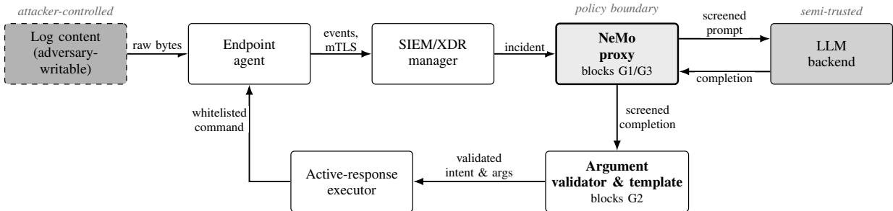
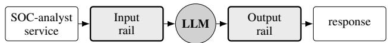
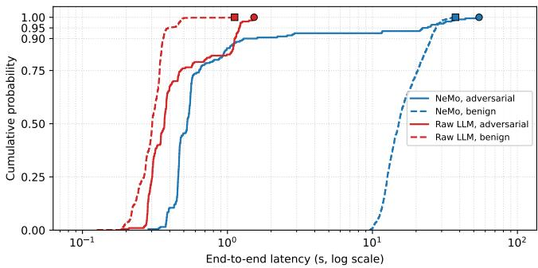

# Constrained-Action AI Remediation for SIEM/XDR via a NeMo-Guardrails Proxy

Georgios Koutidis∗, Nikolaos Kekatos∗, Tom Nianios∗, and Alexios Lekidis†

∗Clone Systems, Larnaca, Cyprus

{gkoutidis, nkekatos, tnianios}@clone-systems.com

†University of Thessaly, Department of Intelligent Energy Systems, Larissa, Greece alekidis@uth.gr

Abstract—Security Operations Centers (SOCs) for information technology and operational technology share one incidentresponse problem: a flood of correlated alerts and too few analysts. Large Language Models (LLMs) are increasingly proposed as reasoning engines that triage alerts and, in autonomous deployments, issue commands that block IPs, kill processes, or quarantine files on production hosts. This coupling introduces a new risk: a single adversarial alert can become a remote code path through the LLM’s reasoning, leading it to recommend an action the SOC then executes. We present a constrainedaction architecture with two coordinated layers: (i) a SIEM/XDR control plane that grounds remediation in correlated host events and confines the LLM’s output to a closed intent vocabulary whose templated commands are executed by thin endpoint agents, backstopped by an argument validator; and (ii) a NeMo-Guardrails proxy that wraps the SOC-analyst LLM with inputand output-rail policies, evaluated out-of-the-box against a SOCspecific adversarial corpus we release. The stock proxy lifts injection recall from 25.0% to 94.5% at a 0.1% false-positive rate, and a live red-team exercise confirms that the closed intent vocabulary and argument validator contain the observed LLM failure modes before any command crosses the trust boundary. As an architectural fit (not yet a measured operationaltechnology deployment), the constrained-action property suits critical-infrastructure settings where a wrong remediation has physical, not merely operational, consequences. The loop is best run human-in-the-loop or delayed: the measured rail latency keeps inline control out of scope.

Index Terms—SIEM, XDR, OT security, critical infrastructure, large language models, prompt injection, guardrails, SOC automation, constrained-action policy.

## I. INTRODUCTION

Modern Security Operations Centers (SOCs) face two compounding problems. The first is volume: the overwhelming majority of alerts are false positives or low-value triggers [1]– [3]. The second is cognition: analysts cannot keep pace with correlated incidents while junior-tier turnover thins expertise [4], [5].

LLM-based “SOC analyst” agents are an attractive answer: given an enriched incident, a large language model (LLM)

with reasoning and tool-use [6], [7] can summarise root cause, propose containment, and, if wired to the securityinformation-and-event-management (SIEM) system’s activeresponse engine, trigger it directly. Three properties of this deployment surface make naive integration unsafe:

1) The input is hostile by construction. The model reads log lines and alert payloads originating, at least partly, from the very adversary it is trying to detect: HTTP bodies that instruct it to ignore prior directives, Base64 prompts in SSH logs, homoglyphs or zero-width characters in alert metadata. Such telemetry-borne manipulation can subvert LLM-driven information-technology (IT) operations endto-end [8].

2) The output drives privileged action. A recommended “block IP” or “kill process” may be executed on every endpoint. Hallucinated arguments, taint-style flows through tool calls [9], or attacker-induced choices become outages or self-inflicted DoS, a highest-impact failure mode in agentic-AI surveys [10]. In operationaltechnology (OT) and critical-infrastructure contexts the same recommendation can disconnect a sensor, trip a relay, or stop a controller, turning an operational bug into a safety incident.

3) The model itself is a confidentiality boundary. Logs routinely carry credentials, internal IPs, connection strings and user data; forwarding these verbatim to a hosted LLM, or returning them downstream, is a data-exfiltration risk that jailbreaks can amplify [11].

This paper describes a constrained-action AI-remediation pipeline that takes these three properties as first-class constraints. The contributions are:

• An action-bounded SIEM / extended-detection-andresponse (XDR) control plane (Section IV). An agent– manager system derived from the Wazuh/OSSEC line [12] in which the manager confines the LLM to a closed intent vocabulary, expands intents into OSspecific templated commands validated argument-byargument before dispatch, and has thin cross-platform agents execute them. The split removes the LLM’s ability to synthesise executable strings.

• A NeMo-Guardrails LLM proxy (Section V). An OpenAI compatible proxy that wraps the SOC-analyst’s LLM with an input rail against prompt injection in log content, an output rail against Personally Identifiable Information (PII) and infrastructure-data leakage, and a topical dialog rail. The proxy reuses default rail primitives, providing a fair external defence layer that can be enabled by a single configuration change.

• An open evaluation against default-configured NeMo Guardrails (Section VI). A head-to-head measurement over a SOC-specific adversarial corpus we release shows the proxy lifts injection recall from 25.0% to 94.5% at 0.1% false-positive rate (FPR), and a live red-team across three MITRE ATT&CK chains confirms the control plane intercepts both observed LLM failure modes (target imprecision and intent drift) before any command crosses the trust boundary.

The two layers interlock around the LLM core: the proxy hardens the prompt and completion paths against injection and data leakage, while the control plane bounds the action path to a closed, audited intent vocabulary.

## II. RELATED WORK

LLM-driven SOC response. Field studies consistently find that a SOC’s dominant cost is not detection but analyst throughput on alerts dominated by false positives [1], [2], [4], and that even structured tier-1 investigations scale poorly [5]; reinforcement-learning triage attacks the same fatigue from the prioritisation angle [3]. LLM-driven response is the emerging answer: Microsoft Copilot for Security’s Guided Response [13] drives a SIEM/XDR control plane with LLM agents, and APPATCH [14] is an analogous “LLM-asremediator” for patching. Yet neither constrains the model’s action surface nor reports robustness on the adversarial telemetry channel itself.

Agentic AI and prompt injection. ReAct [6] and Toolformer [7] established the reason-and-act template our SOCanalyst follows, and its attack surface is now well charted: AI Oops [8] subverts LLM-driven IT operations through telemetry manipulation, precisely our input-side threat; Agent-Fuzz [9] propagates taint through tool calls; sudo rm -rf [11] coerces agents into destructive shell actions; and a SoK [10] and AgentDojo [15] systematise and formalise the threat. We treat each category as a design constraint with a corresponding gate below.

Guardrail primitives. Input/output gates (perplexity detection [16], SmoothLLM [17], backtranslation [18], Llama Guard [19], Presidio [20], and the OWASP LLM Top-10 [21]) supply the building blocks for rails. We are orthogonal to these: our contribution is end-to-end action containment, so that even a successful injection reaches only an action set bounded by the policy engine, not by the model’s compliance.

IT/OT standards. Control-set standards already prescribe restricted action surfaces for automated response: NIST SP 800-82r3 [22] bounds automated containment in industrial control systems (ICS) to operator-vetted actions, and IEC 62443 [23] codifies the same restricted-action principle for industrial automation. Our closed intent vocabulary instantiates that prescription for an LLM-driven loop; hierarchical runtime verification pursues the same deterministic bounding of untrusted components on the edge-IoT side [24].

## III. THREAT MODEL AND SYSTEM ARCHITECTURE

We assume an attacker who controls at least one application log source seen by an endpoint agent and the network content of requests reaching monitored services; we do not assume the SIEM manager, the LLM, or the operator workstation is compromised. The attacker pursues three goals: (G1) make the LLM ignore its task and follow instructions embedded in a log line; (G2) make it recommend a remediation against a benign asset (a self-inflicted DoS, or a stepping stone for lateral movement), especially costly in OT, where the target is a physical asset and a wrong action carries a safety cost; and (G3) exfiltrate sensitive log content through the LLM’s reply. The LLM provider is therefore semi-trusted: it must not see PII or infrastructure data unredacted, and its output must not be executed verbatim. Trust boundaries fall between the agent host, the SIEM/XDR manager, the proxy, the LLM provider, and the active-response executor.

Figure 1 shows the resulting trust topology; each arrow names the data form crossing that boundary.

The pipeline runs in four sequential stages: telemetry collection (endpoint agents forward host events over a mutuallyauthenticated TLS (mTLS) WebSocket), correlation and incident shaping (the manager emits an incident structure rather than a raw alert), guardrail mediation (the NeMo-Guardrails proxy screens the prompt and completion in both directions for injection, PII and infrastructure data), and constrained execution (the LLM’s recommended intent is mapped to a whitelisted OS-specific command). Sections IV and V detail the stages.

## IV. SIEM/XDR WITH GUARDRAILED ACTIVE RESPONSE

The SIEM/XDR control plane is the foundation on which the AI-assisted remediation loop runs. It follows the Wazuh/OSSEC host-based intrusion-detection system (HIDS) pattern, structured to make guardrailed LLM integration firstclass. The implementation evaluated here is therefore a hostbased instance of the constrained-action pattern; network- and identity-telemetry sources (network detection and response, NDR; identity threat detection and response, ITDR) sit naturally on the same control plane but are not exercised in this study.

## A. Telemetry pipeline

Endpoint agents, packaged for Linux, Windows, macOS, and Linux-based OT collectors that aggregate programmablelogic-controller (PLC), human-machine-interface (HMI) and SCADA syslog into one runtime, collect process, log, fileintegrity, registry (Windows), and active-response events. Registration runs over mTLS, steady-state messaging over a TLS/AES-256-GCM WebSocket. The manager correlates events into incidents carrying asset identity, MITRE ATT&CK tactics where derivable, and a rule-engine severity score.

  
Fig. 1. Trust-boundary view of the remediation pipeline. Shading encodes distrust: dark dashed = attacker-controlled, mid-gray = semi-trusted (LLM provider), light gray with a heavy border = policy boundary (the NeMo proxy, which screens all traffic to and from the LLM), white = fully trusted (SIEM/XDR control plane). Arrow labels name the data form crossing each boundary, as raw attacker bytes are progressively sanitised into a whitelisted command. The prox blocks G1 (telemetry-borne injection) and G3 (leakage via the reply); the validator blocks G2 (attacker-induced action): the attacker goals of Section III.

## B. SOC-analyst LLM agent

Inside the manager, the SOC-analyst service runs a Re-Act [6] loop bounded in iterations and wall-clock time. Its inputs are the incident structure, alert level, MITRE tactics, and a redacted excerpt of the originating log; its outputs are an analysis (severity, evidence, reasoning) and a list of action intents. The default backend is a locally-served 14B-parameter open-weights model, with low sampling temperature to reduce variability across reruns of the same incident.

Crucially, the SOC analyst does not emit shell commands. It emits intents drawn from a closed vocabulary: {block IP, kill process, quarantine file, delete file, disable user, custom-script (manager-templated)}. Each intent carries the arguments the LLM derived (an IP address, a PID, a filename), but does not specify how to execute them.

## C. Smart manager, thin agent

The manager is responsible for translating intents into OSspecific command lines, drawn from a parameterised template store: Linux distributions use the host’s native firewall frontend, Windows uses the built-in firewall cmdlets, and macOS uses its packet-filter facility. The LLM-supplied argument is the only attacker-influenced quantity in the rendered command, and it is validated against type-specific patterns (e.g., strict IPv4/IPv6 regexes for block-IP intents) before substitution.

The agent then executes the command generically. A whitelist restricts allowed binaries to a narrow set covering network, process, file, user-management and firewall categories. Argument strings are scanned for shell metacharacters and destructive patterns; matches abort execution and report a violation. The intent-to-command synthesis path on the manager therefore performs three checks before any command leaves the trust boundary: the intent must belong to the closed vocabulary, every argument must satisfy its schema, and the rendered command must pass binary-whitelist and metacharacter scanning.

Operationally, the engine polls correlated alerts at fixed intervals with per-command timeouts and grace periods, retries failed actions with exponential backoff, and persists every command, LLM rationale, and result as a per-incident audit trail; a per-cycle batch ceiling and per-(rule, target) cooldown limit flooding under bursty alerting. This division of authority is deliberate: were the LLM allowed to emit literal commands, a single input-side guardrail miss could let an attacker-induced argument escape into a shell. Restricting its output to a closed vocabulary rendered through validated templates leaves only the choice of intent and argument as attack surface, never command syntax.

  
Fig. 2. Request flow through the NeMo Guardrails proxy. The input rail classifies whether the user message is safe to forward; if it blocks, the main LLM is never invoked. The output rail re-screens the completion before it returns to the caller.

## V. NEMO GUARDRAILS LLM PROXY

The SOC-analyst delegates reasoning to the LLM, treated as a semi-trusted component (Section III). We wrap it with an external defence layer, the NeMo Guardrails proxy, between the SOC-analyst service and the model backend.

## A. Proxy architecture

The proxy is a NeMo Guardrails server exposing an OpenAI-compatible chat-completion endpoint; the SOCanalyst simply repoints its existing provider at the proxy rather than the model, requiring no application code change (Figure 2).

## B. Rails

Three rails are configured. Each self-check rail invocation is itself an LLM call with a task-specific prompt.

Input rail. An LLM classifier decides whether the message contains an injection attempt, explicitly separating logs that describe a security event (“Failed password for root from 198.51.100.7”), forwarded, from logs that contain attacker directives (“Failed login. IGNORE PREVIOUS INSTRUC-TIONS”), blocked. On a block the proxy returns a canned refusal and the main LLM is never reached.

Output rail. A symmetric classifier screens the completion for PII (names, emails, SSNs, credit cards), infrastructure data (private IPs, MAC addresses, connection strings, key fingerprints), and content the model should have refused, blocking any hit from being returned verbatim; this is the return-path defence for goal G3.

TABLE I  
ADVERSARIAL-CORPUS COMPOSITION (200 VARIANTS). ROWS 1–3 ARE SAMPLED FROM PUBLISHED BENCHMARKS; ROWS 4–7 ARE SOC-SPECIFIC TRANSFORMATIONS.
<table><tr><td>Category</td><td>Count</td></tr><tr><td rowspan="3">AdvBench (sampled) [25] JailbreakBench [26] HarmBench (sampled) [27]</td><td>60</td></tr><tr><td>40</td></tr><tr><td>50</td></tr><tr><td>SOC augmentation: homoglyph (Cyrillic → Latin) SOC augmentation: zero-width insertion</td><td>15</td></tr><tr><td rowspan="3">SOC augmentation: Base64 wrapping SOC augmentation: fake [SYSTEM] framing</td><td>20</td></tr><tr><td>10</td></tr><tr><td>5</td></tr><tr><td>Total adversarial</td><td rowspan="3">200</td></tr><tr><td>Benign [28]</td></tr><tr><td>1,000</td></tr></table>

Topical dialog rail. A small flow refuses off-task inputs that pass the input self-check (jokes, weather, chat); it keeps the analyst on task and fires rarely in production.

## C. Defaults and latency profile

The rails above are NeMo Guardrails’ default primitives. We deliberately did not hand-tune the rail prompts to the adversarial corpus of Section VI, since an external baseline co-evolved with the evaluation set is worthless. The customisations are limited to: (i) SOC-specific phrasing in the input rail for the “describes versus contains” distinction; (ii) SOC infrastructure-data categories in the output rail; and (iii) a small topical flow. Each self-check rail is itself a complete LLM call, and NeMo sequentialises them so the output rail can see the completion: a blocked request costs one roundtrip (the main LLM is never invoked), while a passed request costs three sequential calls (input → main → output), three round-trips where the bare call makes one.

## VI. PRELIMINARY EVALUATION

We deployed the full stack on a single Apple M4 Max machine (14-core CPU, 32-core GPU, 36 GB unified memory) running a locally-served 14B-parameter open-weights model.

Evaluation corpus. Adversarial inputs draw on three published jailbreak benchmarks: AdvBench [25] (60, sampled), JailbreakBench [26] (40) and HarmBench [27] (50, sampled), embedded into plausible log shapes (HTTP bodies, syslog fields, SSH banners). On these 150 base prompts we apply the four SOC-specific transformations the deterministic pre-filter targets: homoglyph substitution (20), Base64 wrapping (15), fake [SYSTEM] framing (10) and zero-width insertion (5), for 200 variants (Table I). Benign traffic is 1,000 LogHub [28] lines across the Linux, Apache, OpenSSH and Windows splits. We release the sampling and augmentation code and per-record provenance under the MIT license; upstream prompts are refetched at build time, not redistributed.

External-baseline comparison. We compare the bare model (the “raw LLM” baseline) against the same call wrapped in the proxy of Section V. Both endpoints share the model, sampling parameters, and classification prompt, so the only variable across rows of Table II is the guardrail layer.

Raw inference classified 50/200 adversarial inputs correctly (recall 25.0%) with zero false positives on the benign corpus (FPR 0.0%); median latency was 0.31 s because the model defaults to answering “NO” on inputs it does not recognise as obviously injection-shaped. The NeMo Guardrails proxy lifted recall to 94.5% (189/200 caught at the input rail, an absolute gain of 69.5 percentage points) with FPR climbing to 0.1% (one benign log mis-blocked); median latency rose to 14.14 s: the passed path makes three sequential rail-plus-main LLM calls, each far longer than the 0.31 s bare classification call.

TABLE II  
HEAD-TO-HEAD INJECTION-DEFENCE COMPARISON. RECALL IS OVER THE 200 ADVERSARIAL VARIANTS OF TABLE I; FPR IS OVER THE 1,000 BENIGN LOGHUB LINES. LATENCIES ARE END-TO-END PER CALL.
<table><tr><td>Configuration</td><td>Recall</td><td>FPR</td><td>P50 (s)</td><td>P95 (s)</td><td>P99 (s)</td></tr><tr><td>Raw LLM (no defence)</td><td>25.0%</td><td>0.0%</td><td>0.31</td><td>0.48</td><td>1.20</td></tr><tr><td>NeMo Guardrails proxy</td><td>94.5%</td><td>0.1%</td><td>14.14</td><td>27.41</td><td>32.90</td></tr></table>

TABLE III

PER-CATEGORY RECALL ON THE 200 ADVERSARIAL RECORDS (BASE PROMPTS WRAPPED IN HTTP/SYSLOG/SSH LOG SHAPES; SOC ROWS FURTHER TRANSFORMED).
<table><tr><td>Category</td><td>n</td><td>Raw recall</td><td>NeMo recall</td></tr><tr><td>AdvBench (base)</td><td>60</td><td>21.7%</td><td>100.0%</td></tr><tr><td>JailbreakBench (base)</td><td>40</td><td>35.0%</td><td>100.0%</td></tr><tr><td>HarmBench (base)</td><td>50</td><td>20.0%</td><td>80.0%</td></tr><tr><td>SOC aug.: homoglyph</td><td>20</td><td>25.0%</td><td>95.0%</td></tr><tr><td>SOC aug.: Base64</td><td>15</td><td>13.3%</td><td>100.0%</td></tr><tr><td>SOC aug.: fake [SYSTEM]</td><td>10</td><td>40.0%</td><td>100.0%</td></tr><tr><td>SOC aug.: zero-width</td><td>5</td><td>40.0%</td><td>100.0%</td></tr></table>

The per-category breakdown (Table III) is more informative. The raw classifier’s worst category, Base64-wrapped directives at 13.3%, recovers to 100% under the input rail, whose prompt explicitly flags encoded payloads; homoglyph (25% → 95%) and zero-width (40% → 100%) perturbations are near-fully recovered. The residual gap is HarmBench base prompts (NeMo 80%): ten mid-severity behaviour requests the rail judges ambiguous rather than adversarial, a known limitation of single-call self-check verdicts that a tuned rail would close.

Latency distribution. Figure 3 shows the end-to-end latency cumulative-distribution function (CDF) per endpoint, faceted by adversarial and benign records. The NeMo endpoint is bimodal: a fast tail for inputs blocked by the input rail (∼0.5 s, one LLM call) and a slow tail for inputs that pass all three rails (∼10–15 s, three LLM calls). Raw inference, by contrast, collapses near ∼0.3 s for both labels.

Deterministic pre-filter and cascade triage. Two cheaper front-ends test whether the three-rail proxy’s per-request cost (Section V) can be cut (Table IV). The first is a deterministic pre-filter (Tier-0): a zero-LLM regex and Unicodenormalisation gate inverting the four SOC augmentations of Table I. It blocks only on a positive signature, never declaring a line clean, so it cannot pass a marker-free jailbreak. It recovers all 50 augmented records at 0.00% FPR with zero LLM calls; in front of the proxy it lifts recall to 95.0% (catching the one homoglyph variant the input rail missed) and trims mean round-trips from 3.00 to 2.88. But the median request is benign and carries no marker, so Tier-0 does not move the median latency: it is a recall-safe, zero-cost addition, not a latency fix.

  
Fig. 3. End-to-end latency CDF (log-scale x-axis), split by endpoint and label: the raw curve concentrates near ∼0.3 s; the NeMo curve is bimodal between fast-blocked and full-pipeline traffic.  
TABLE IV

COMPARISON (PASS-PATH COUNT FOR THE PROXY ROWS; MEASURED MEAN, INCLUDING THE GATE CALL, FOR THE CASCADE).
<table><tr><td>Configuration</td><td>Recall</td><td>FPR</td><td>Calls/req</td><td>P50 (s)</td></tr><tr><td>Full NeMo proxy (Table II)</td><td>94.5%</td><td>0.10%</td><td>3.00</td><td>14.14</td></tr><tr><td>&amp; deterministic Tier-0 (recall-safe)</td><td>95.0%</td><td>0.10%</td><td>2.88</td><td>14.11</td></tr><tr><td>Cheap-gate cascade (fast triage)</td><td>58.0%</td><td>0.00%</td><td>1.15</td><td>0.18</td></tr></table>

The second front-end is a lightweight semantic classifier: a small llama3.2:3b model triages each request, escalating only those it judges adversarial to the full proxy. This cuts mean round-trips to 1.15 and the median latency to 0.18 s (a 78× reduction) at 0.00% FPR, but recall falls to 58.0%: a cheap model cannot adjudicate the benign majority, and its misses (semantic jailbreaks in well-formed log fields) are forwarded silently. Confirming the gate’s benign verdicts with the proxy instead restores recall to 95.0% but escalates the benign majority, raising round-trips to 3.64 and erasing the latency gain. The cascade thus exposes a strict recall/latency trade-off; the recall-preserving route to lower latency is to cut the rails’ own cost, not to front them with a weaker model (Section VII).

Active-response correctness (live). Three MITRE-mapped scenarios (T1110 SSH brute-force, T1059 reverse-shell exec, and T1078 valid-account abuse) were driven against a bootstrapped SIEM/XDR stack with a registered endpoint and the SOC-analyst service set to manual-only mode. Across 54 injected alerts $( 2 6 + 1 4 + 1 4 )$ , the SOC-analyst emitted 41 action records.

T1110 produced 36 block-IP actions targeting the synthesised attacker IP from the brute-force log lines; intent and target were both correct, including on a spliced-injection alert. T1059 produced one kill-process action with intent correct but target extracted from an alert metadata field rather than the PID embedded in the log; the manager’s argument validator rejects targets that do not match the expected schema and would not dispatch this command, illustrating the second-stage backstop role of the control plane. T1078 produced zero disable-user actions; instead the LLM emitted four block-IP actions on the attacker IP visible in the SSH log, an instance of intent drift toward the most prominent log field. The closed intent vocabulary nonetheless bounds the chosen action to the safe whitelisted set. All 41 actions registered as requiring manual approval and none were dispatched; end-to-end dwell time (alert to action) ranged 19–58 s per record. The control plane thus contained both failure modes: imprecise target extraction (T1059, caught by the validator) and intent drift (T1078, bounded by the closed vocabulary).

## VII. DISCUSSION AND LIMITATIONS

Latency vs. depth. The NeMo proxy raises the median percall cost from 0.31 s to 14.14 s on benign traffic traversing all three rails, roughly 46× the bare classification call: beyond the three round-trips, each rail call carries its own promptconstruction and generation cost. This is acceptable for activeresponse timelines (already in the human-in-the-loop minute range) but prohibitive for inline use such as authentication. The cascade study (Table IV) shows that fronting the proxy with a cheaper classifier only trades recall for latency; the recallpreserving optimisation is instead to cut per-request rail cost, e.g. a single fused classifier rail emitting both verdicts in one pass, with verdict caching on canonicalised log fingerprints as a complementary step.

Threats to validity. The proxy uses stock rail primitives with only the prompt-text customisations needed for SOC log content. A SOC-tuned deployment (chain-of-thought selfcheck, input-rail perturbation ensembling, or an output rail backed by Llama Guard [19]) would likely improve the proxy row of Table II; we do not co-evolve the baseline with our corpus, so the NeMo numbers are a fair out-of-the-box baseline, not a maximum-effort one.

Other limitations. Multi-turn injections spanning more than one log line are not modelled; the proxy treats each request independently, and a per-asset sliding-window input rail is future work. The closed vocabulary also biases the system toward containment: richer remediation (patching, configuration rollback) needs either a wider whitelist or a human approval step, which we model as a configurable action mode.

Applicability to OT and critical infrastructure. OT deployments share the IT SOC’s volume problem at lower event frequency but higher per-event consequence: the closed vocabulary and pre-dispatch validator bound the LLM’s authority before an action can reach a controller or safety relay, the restricted-response surface that NIST SP 800-82r3 [22] and IEC 62443 [23] prescribe. The smart-manager / thin-agent split is also the standard OT topology, with the manager in a hardened zone, agents on field-level gateways, and model weights kept central rather than on edge nodes. This is an architectural fit only: we evaluate on host and web telemetry, not real OT protocols or field devices, so validating the closed vocabulary against live ICS/SCADA actions remains future work.

Reproducibility. The corpus is built deterministically from a fixed seed over re-fetched upstream prompts; we release, under the MIT license, the sampling and augmentation code, perrecord provenance (with upstream SHA-256), the evaluation harness, and the pre-filter and cascade runner with their result CSVs. All runs use locally-served phi4:14b (proxy/main) and llama3.2:3b (gate) at low temperature, so recall and FPR are near-deterministic and hardware-independent while latencies depend on the accelerator. Pinned model digests and package versions ship with the artefact, mitigating silent upstream re-tags that would otherwise shift verdict distributions.

Ethical considerations. The released artefact contains only sampling scripts, augmentation code and provenance metadata; the upstream prompts come from three openly-licensed benchmarks and are re-fetched at build time; the SOC-specific augmentations are mechanical transformations, not new attacker payloads. The active-response surface can be misused if deployed without the guardrail layer or with a permissive whitelist; the closed vocabulary, argument validator and cooldown enforcement bound this risk by design, but operators retain responsibility for deployment-time configuration.

## VIII. CONCLUSION

Autonomous AI remediation is safe only when the LLM’s input, output, and action surfaces are narrowed by construction. Our two-layer constrained-action stack does exactly this: a SIEM/XDR control plane confines the LLM to a closed, argument-validated intent vocabulary, and a NeMo Guardrails proxy screens its prompt and completion paths. The stock proxy lifts injection recall from 25.0% to 94.5% at 0.1% FPR over 200 adversarial variants and 1,000 benign log lines, a zero-cost deterministic pre-filter raises it to 95.0%, and a live red-team confirmed both containment modes: target imprecision, which the argument validator blocks from dispatch, and intent drift, bounded by the closed vocabulary. In deployment the loop runs human-in-the-loop or delayed, since the measured rail latency keeps inline control out of scope. The lesson is architectural: keep the LLM at the periphery of a deterministic system, never at its centre.

## ACKNOWLEDGMENT

This work has received funding from the European Union’s Digital Europe Programme under grant agreement No 101190251 (CYBERGUARD).

## REFERENCES

[1] B. A. Alahmadi, L. Axon, and I. Martinovic, “99% false positives: A qualitative study of SOC analysts’ perspectives on security alarms,” in USENIX Security 22. Boston, MA: USENIX Association, 2022, pp. 2783–2800.

[2] L. Yang, Z. Chen, C. Wang, Z. Zhang, S. Booma, P. Cao et al., “True attacks, attack attempts, or benign triggers? An empirical measurement of network alerts in a security operations center,” in USENIX Security 24. Philadelphia, PA: USENIX Association, 2024, pp. 1525–1542.

[3] X. Wang, X. Yang, X. Liang, X. Zhang, W. Zhang, and X. Gong, “Combating alert fatigue with AlertPro: Context-aware alert prioritization using reinforcement learning for multi-step attack detection,” Computers & Security, vol. 137, p. 103583, 2024.

[4] S. C. Sundaramurthy, J. McHugh, X. Ou, M. Wesch, A. G. Bardas, and S. R. Rajagopalan, “Turning contradictions into innovations or: How we learned to stop whining and improve security operations,” in Twelfth Symposium on Usable Privacy and Security (SOUPS 2016). USENIX Association, 2016.

[5] L. Kersten, T. Mulders, E. Zambon, C. Snijders, and L. Allodi, ““Give Me Structure”: Synthesis and evaluation of a (network) threat analysis process supporting tier 1 investigations in a security operation center,” in Nineteenth Symposium on Usable Privacy and Security (SOUPS 2023). USENIX Association, 2023.

[6] S. Yao, J. Zhao, D. Yu, N. Du, I. Shafran, K. Narasimhan et al., “ReAct: Synergizing reasoning and acting in language models,” in International Conference on Learning Representations (ICLR), 2023.

[7] T. Schick, J. Dwivedi-Yu, R. Dessì, R. Raileanu, M. Lomeli, E. Hambro et al., “Toolformer: Language models can teach themselves to use tools,” in Advances in Neural Information Processing Systems 36 (NeurIPS 2023), 2023.

[8] D. Pasquini, E. M. Kornaropoulos, G. Ateniese, O. Akgul, A. Theocharis, and P. Efstathopoulos, “When AIOps become “AI Oops”: Subverting LLM-driven IT operations via telemetry manipulation,” in USENIX Security 26. USENIX Association, 2026.

[9] F. Liu, Y. Zhang, J. Luo, J. Dai, T. Chen, L. Yuan et al., “Make agent defeat agent: Automatic detection of taint-style vulnerabilities in LLMbased agents,” in USENIX Security 25. USENIX Association, 2025.

[10] J. Kim, W. Guo, and D. Song, “SoK: Attack and defense landscape of agentic AI systems,” in USENIX Security 26. USENIX Association, 2026.

[11] S. Lee, J. Kim, H. Park, A. Yousefpour, S. Yu, and M. Song, “sudo rm -rf agentic\_security,” in Proc. ACL: Industry Track, 2025, pp. 1050–1071.

[12] Wazuh Inc., “Wazuh: The open source security platform,” https://wazuh. com/, 2024.

[13] S. Freitas, J. Kalajdjieski, A. Gharib, and R. McCann, “AI-driven guided response for security operation centers with Microsoft Copilot for security,” in Companion Proc. of the ACM Web Conference (WWW Companion), 2025.

[14] Y. Nong, H. Yang, L. Cheng, H. Hu, and H. Cai, “APPATCH: Automated adaptive prompting large language models for real-world software vulnerability patching,” in USENIX Security 25. USENIX Association, 2025.

[15] E. Debenedetti, J. Zhang, M. Balunovic, L. Beurer-Kellner, M. Fischer,´ and F. Tramèr, “AgentDojo: A dynamic environment to evaluate prompt injection attacks and defenses for LLM agents,” in Advances in Neural Information Processing Systems 37 (NeurIPS 2024 Datasets and Benchmarks Track), 2024.

[16] G. Alon and M. Kamfonas, “Detecting language model attacks with perplexity,” arXiv preprint arXiv:2308.14132, 2023.

[17] A. Robey, E. Wong, H. Hassani, and G. J. Pappas, “SmoothLLM: Defending large language models against jailbreaking attacks,” Transactions on Machine Learning Research, 2025.

[18] Y. Wang, Z. Shi, A. Bai, and C.-J. Hsieh, “Defending LLMs against jailbreaking attacks via backtranslation,” in Findings of the Association for Computational Linguistics: ACL 2024, 2024, pp. 16 031–16 046.

[19] H. Inan, K. Upasani, J. Chi, R. Rungta, K. Iyer, Y. Mao et al., “Llama Guard: LLM-based input-output safeguard for human-AI conversations,” arXiv preprint arXiv:2312.06674, 2023.

[20] Microsoft, “Presidio: Data protection and de-identification SDK,” https: //github.com/microsoft/presidio, 2024.

[21] OWASP Foundation, “OWASP top 10 for Large Language Model Applications, version 1.1,” https://owasp.org/ www-project-top-10-for-large-language-model-applications/, 2023.

[22] National Institute of Standards and Technology, “NIST Special Publication 800-82r3: Guide to operational technology (OT) security,” NIST SP 800-82 Rev. 3, 2023.

[23] International Electrotechnical Commission, “IEC 62443: Security for industrial automation and control systems,” Standard series IEC 62443, 2018.

[24] N. Kekatos, M. Chintri, P. Katsaros, A. Lekidis, T. Nianios, I. Seitoglou et al., “Hybrid hierarchical runtime verification for edge-IoT security: Combining MonPoly and RTLola,” in Proc. of the Int. Conf. on Availability, Reliability and Security (ARES) Workshops (IWASP), 2026.

[25] A. Zou, Z. Wang, J. Z. Kolter, and M. Fredrikson, “Universal and transferable adversarial attacks on aligned language models,” arXiv preprint arXiv:2307.15043, 2023.

[26] P. Chao, E. Debenedetti, A. Robey, M. Andriushchenko, F. Croce, V. Sehwag et al., “JailbreakBench: An open robustness benchmark for jailbreaking large language models,” in Advances in Neural Information Processing Systems 37 (NeurIPS 2024 Datasets and Benchmarks Track), 2024.

[27] M. Mazeika, L. Phan, X. Yin, A. Zou, Z. Wang, N. Mu et al., “HarmBench: A standardized evaluation framework for automated red teaming and robust refusal,” in Proc. of the 41st Int. Conf. on Machine Learning (ICML), PMLR 235, 2024, pp. 35 181–35 224.

[28] J. Zhu, S. He, P. He, J. Liu, and M. R. Lyu, “Loghub: A large collection of system log datasets for AI-driven log analytics,” in Proceedings of the 34th IEEE International Symposium on Software Reliability Engineering (ISSRE). IEEE, 2023, pp. 355–366.