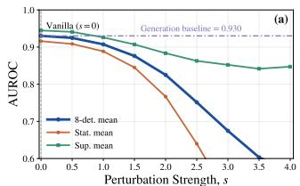
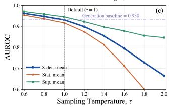
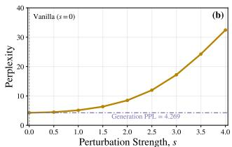
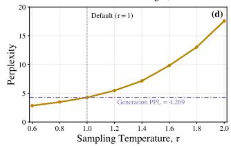
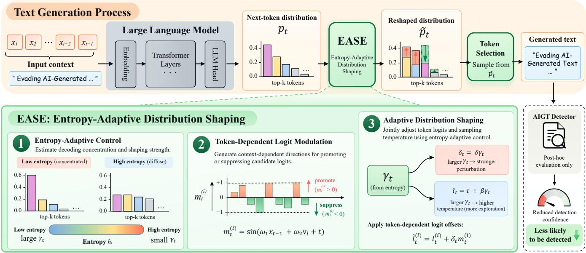

# EASE: ENTROPY-ADAPTIVE DISTRIBUTION SHAPING FOR EVADING AI-GENERATED TEXT DETECTORS

Jicheng Zhou, Kahim Wong, Jialong Wang, and Jiantao Zhou∗

Department of Artificial Intelligence, Faculty of Information Science and Computing State Key Laboratory of Internet of Things for Smart City University of Macau, Macau, China

## ABSTRACT

AI-generated text (AIGT) detection can be sensitive to the decoding choices of the source large language model (LLM). We observe that perturbing next-token logits or adjusting sampling temperature can reduce detection performance, providing a clear signal of detector vulnerability to decoding-time distribution changes. Building on this observation, we propose EASE (Entropy-Adaptive Distribution Shaping for Evasion), a training-free and detector-agnostic framework for evading AIGT detectors. EASE computes predictive entropy directly from the source LLM’s next-token distribution and uses it to adapt both logit perturbation and sampling temperature, without detector feedback or model fine-tuning. Experiments across three source LLMs and multiple detectors demonstrate consistent reductions in detection performance, with negligible degradation in text quality and negligible inference overhead.

Index Terms— AIGT Detection Evasion, Adversarial Attack, LLM, Information Forensics

## 1. INTRODUCTION

Large language models (LLMs) generate text whose statistical characteristics can differ from those of human-written text. AIgenerated text (AIGT) detection is an important task in information forensics seeking to distinguish machine-generated text from human-written text. Existing approaches include training-free statistical detectors [1, 2, 3, 4, 5, 6], supervised classifiers [7, 8, 9, 10], and watermark-based methods [11, 12, 13]. Recent work has also explored multi-LLM statistical detection [14] and in-the-wild AIGT benchmarking [15]. The statistical characteristics of AIGT depend in part on the source LLM’s decoding choices.

As AIGT detection advances, recent work has explored methods for evading AIGT detectors while preserving text quality. Existing methods mainly follow two directions: text-level modification and direct modification of the source LLM’s generation process. At the text level, paraphrasing remains a dominant strategy [16, 17]. Other methods include in-context optimization [18] and space infiltration [19]. Methods that directly modify the generation process include preference optimization [20, 21] and proxy-guided decoding [22]. Depending on their design, these methods may require detector feedback, auxiliary models, or model fine-tuning. These requirements introduce additional computation and may limit their applicability across different detectors or source models. This raises the question: can AIGT detectors be evaded directly during generation, without detectorfeedback or modelfine-tuning?

  
Fig. 1. Effects of decoding changes on AIGT detection and text quality. AUROC and perplexity under (a,b) top-k logit perturbation with strength s at τ = 1 and (c,d) varying sampling temperature without logit perturbation. AUROC curves show means over all eight detectors and within two groups: statistical (Likelihood [1], Entropy and LogRank [2], and LRR [6]) and supervised (RoBERTa-Base/Large [8], MAGE [9], and RADAR [10]). Dash-dotted lines mark vanilla baselines.

To investigate this question, we study how changes in the source LLM’s decoding distribution influence downstream AIGT detection. As shown in Fig. 1, perturbing next-token logits or adjusting sampling temperature can reduce detector AUROC, providing a clear signal of detector vulnerability to decoding-time distribution changes. The accompanying increase in perplexity also indicates potential text quality degradation. Across decoding steps, probability may be concentrated on a few candidate tokens or distributed more evenly among them. Fixed logit perturbation strengths and sampling temperatures do not account for this variation. To account for these differences, we consider adapting both operations to the concentration of the current candidate distribution. Predictive entropy offers one way to quantify this concentration, with lower entropy indicating a more concentrated distribution.

Building on this observation, we introduce EASE (Entropy-Adaptive Distribution Shaping for Evasion), a training-free and detector-agnostic framework for evading AIGT detectors. As illustrated in Fig. 2, EASE computes predictive entropy over the source LLM’s top-k candidate tokens and uses it to adapt logit perturbation and sampling temperature, without detector feedback or model finetuning. At lower entropy, EASE applies larger logit perturbations and higher sampling temperatures to encourage alternative token selections. As the candidate distribution approaches uniformity, these adjustments diminish. On Qwen3-8B [23], EASE reduces the average TPR@1%FPR across five detectors from 0.655 to 0.339, with a measured generation latency overhead of 0.643%.

  
Fig. 2. Overview of EASE. EASE uses top-k predictive entropy to adapt logit perturbation strength and sampling temperature, together with token-dependent logit modulation to reshape the next-token distribution before sampling.

Our key contributions are as follows:

• We reveal that both logit perturbation and temperature scaling can reduce AIGT detector performance, providing a clear signal of detector vulnerability.

• We propose EASE, a training-free and detector-agnostic framework for evading AIGT detectors. EASE uses predictive entropy to adapt logit perturbation and sampling temperature without detector feedback or model fine-tuning.

• Experiments across three source LLMs and multiple detectors demonstrate consistent reductions in detection performance with negligible inference overhead and quantify the associated changes in text quality.

## 2. DECODING-TIME DISTRIBUTION CHANGES AFFECT DOWNSTREAM DETECTION

We first formulate the decoding process of a standard autoregressive LLM. Let V denote the vocabulary. At generation step t, given the preceding context $\mathbf { x } _ { < t } = \left[ x _ { 1 } , \ldots , x _ { t - 1 } \right]$ , the model outputs a logits vector $\mathbf { l } _ { t } \in \mathbb { R } ^ { | \nu | }$ . The next token is sampled from

$$
p ( x _ { t } = v _ { i } \mid \mathbf { x } _ { < t } ) = p _ { t } ^ { ( i ) } = \frac { \exp ( l _ { t } ^ { ( i ) } / \tau ) } { \sum _ { j = 1 } ^ { | \mathcal { V } | } \exp ( l _ { t } ^ { ( j ) } / \tau ) } ,\tag{1}
$$

where $v _ { i } \in \mathcal V$ and $\tau > 0$ controls the concentration of the next-token distribution.

We conduct a small-scale observation study using the setup described in Section 4.1, with a different random seed. First, we add Gaussian noise to the top-k logits: $\hat { l } _ { t } ^ { ( i ) } = l _ { t } ^ { ( i ) } + s \epsilon _ { t } ^ { ( i ) }$ for $i \in \mathcal { K } _ { t } .$

where $\boldsymbol { \kappa } _ { t }$ indexes the top-k unperturbed logits and sampling is restricted to this set, $\epsilon _ { t } ^ { ( i ) } \overset { \mathrm { i . i . d . } } { \sim } \mathcal { N } ( 0 , 1 )$ , and $s \geq 0$ controls the perturbation strength. We vary s at fixed $\tau = 1$ . As shown in Fig. 1(a,b), stronger perturbations generally reduce detector AUROC but also increase generation perplexity. Second, we vary τ without logit perturbation. Fig. 1(c,d) shows a similar pattern: higher temperatures can improve evasion while increasing perplexity.

These observations provide a clear signal of detector vulnerability to decoding-time distribution changes. However, stronger logit perturbations or higher sampling temperatures can also increase perplexity. Fixed settings do not account for variations in the concentration of the candidate distribution across decoding steps. We therefore consider adapting logit perturbation and sampling temperature to the current distribution. Predictive entropy offers one way to quantify its concentration, providing a basis for the entropy-adaptive design of EASE in the following section.

## 3. ENTROPY-ADAPTIVE DISTRIBUTION SHAPING

We introduce EASE, a framework for evading AIGT detectors during generation. As illustrated in Fig. 2, EASE uses predictive entropy to adapt logit perturbation strength and sampling temperature. A token-dependent modulation determines the sign and relative magnitude of the logit perturbation for each candidate. These operations reshape the source LLM’s next-token distribution before sampling, without detector feedback or model fine-tuning.

## 3.1. Entropy-Adaptive Control

At generation step t, we compute predictive entropy from the unmodified next-token distribution over the top-k candidate set $\textstyle { \mathcal { K } } _ { t }$ defined in Section 2. We renormalize the next-token probabilities over this set as $\begin{array} { r } { q _ { t } ^ { ( i ) } = p _ { t } ^ { ( i ) } / \sum _ { j \in \kappa _ { t } } p _ { t } ^ { ( j ) } , i \in \mathcal { K } _ { t } } \end{array}$ , and compute

$$
h _ { t } = - \sum _ { i \in \mathcal { K } _ { t } } q _ { t } ^ { ( i ) } \log q _ { t } ^ { ( i ) } .\tag{2}
$$

Table 1. Comparison with existing evasion methods on Qwen3-8B. Each detector entry reports AUROC / TPR@1%FPR. Lower values indicate stronger evasion; lower PPL indicates a higher likelihood under the source LLM.
<table><tr><td></td><td>Text Quality</td><td colspan="5">Detection Performance</td></tr><tr><td>Method</td><td>PPL</td><td>RoBERTa-Large</td><td>RoBERTa-Base</td><td>Fast-DetectGPT</td><td>MAGE</td><td>RADAR</td></tr><tr><td>No Attack</td><td>4.243</td><td>0.921 / 0.535</td><td>0.930 / 0.580</td><td>0.984 / 0.816</td><td>0.981 / 0.685</td><td>0.943 / 0.660</td></tr><tr><td>Simple Paraphrase</td><td>12.120</td><td>0.950 / 0.615</td><td>0.961 / 0.695</td><td>0.896 / 0.452</td><td>0.912 / 0.400</td><td>0.884 / 0.568</td></tr><tr><td>Rec. Para. 2</td><td>9.867</td><td>0.942 / 0.602</td><td>0.959 / 0.643</td><td>0.858 / 0.391</td><td>0.897 / 0.353</td><td>0.870 / 0.536</td></tr><tr><td>AdvPara (RoBERTa-L) [17]</td><td>15.088</td><td>0.946 / 0.595</td><td>0.961 / 0.664</td><td>0.897 / 0.455</td><td>0.915 / 0.399</td><td>0.882 / 0.567</td></tr><tr><td>AdvPara (RoBERTa-B) [17]</td><td>15.196</td><td>0.939 / 0.583</td><td>0.954 / 0.584</td><td>0.893 / 0.435</td><td>0.912 / 0.398</td><td>0.881 / 0.567</td></tr><tr><td>EASE-Rewrite (Ours)</td><td>13.370</td><td>0.918 / 0.507</td><td>0.936 / 0.566</td><td>0.845 / 0.296</td><td>0.884 / 0.303</td><td>0.864 / 0.536</td></tr><tr><td>EASE-Plugin (Ours)</td><td>7.752</td><td>0.828 / 0.250</td><td>0.839 / 0.260</td><td>0.923 / 0.295</td><td>0.911 / 0.445</td><td>0.895 / 0.445</td></tr></table>

Using the maximum entropy $h _ { \mathrm { m a x } } = \log k ,$ , we define

$$
\gamma _ { t } = \operatorname* { m a x } \left( 0 , 1 - \frac { h _ { t } } { h _ { \operatorname* { m a x } } } \right) .\tag{3}
$$

The factor $\begin{array} { r l r } { \gamma _ { t } } & { { } \in } & { [ 0 , 1 ] } \end{array}$ controls logit perturbation strength and sampling temperature. Low-entropy distributions concentrate probability on a few candidates. In these states, a larger $\gamma _ { t }$ produces stronger logit perturbations and higher sampling temperatures to encourage alternative token selections. As the candidate distribution approaches uniformity, $\gamma _ { t }$ approaches zero, and both adjustments diminish. This design adapts logit perturbation and sampling temperature to the current distribution rather than keeping them fixed throughout generation.

## 3.2. Token-Dependent Logit Modulation

Inspired by decoding-time distribution manipulation [24], we assign token-dependent modulation to individual candidates. A sinusoidal function offers one feasible construction:

$$
\begin{array} { r } { m _ { t } ^ { ( i ) } = \sin \left( w _ { 1 } x _ { t - 1 } + w _ { 2 } v _ { i } + t \right) , \qquad i \in \mathcal { K } _ { t } , } \end{array}\tag{4}
$$

where $x _ { t - 1 }$ and $v _ { i }$ denote the preceding and candidate token IDs, respectively, and $w _ { 1 } , w _ { 2 }$ are fixed coefficients. Each modulation coefficient $m _ { t } ^ { ( i ) } \in [ - 1 , 1 ]$ determines the sign and relative magnitude of a candidate’s logit offset, while $\gamma _ { t }$ controls the overall logit perturbation strength. This deterministic construction produces contextand token-dependent offsets without learning additional parameters or querying a detector.

## 3.3. Logits Distribution Shaping

EASE combines the entropy-based control factor with the tokendependent mask to reshape candidate logits. For each $i \in \mathcal { K } _ { t }$ , we apply $\tilde { l } _ { t } ^ { ( i ) } = l _ { t } ^ { ( i ) } + \delta \gamma _ { t } \hat { m _ { t } ^ { ( i ) } }$ , where δ controls the base perturbation magnitude. The same control factor adjusts the sampling temperature as $\tilde { \tau } _ { t } ~ = \tau + \beta \gamma _ { t }$ , where $\tau > 0$ is the base temperature and $\beta \geq 0$ sets the maximum temperature increase. The next token is sampled from

$$
\tilde { p } _ { t } ^ { ( i ) } = \frac { \exp ( \tilde { l } _ { t } ^ { ( i ) } / \tilde { \tau } _ { t } ) } { \sum _ { j \in \mathcal { K } _ { t } } \exp ( \tilde { l } _ { t } ^ { ( j ) } / \tilde { \tau } _ { t } ) } , \qquad i \in \mathcal { K } _ { t } ,\tag{5}
$$

with zero probability assigned to tokens outside $\boldsymbol { \mathcal { K } } _ { t }$ . The two operations play distinct roles: additive modulation can change the ranking of candidate logits, whereas temperature adjustment changes distribution concentration without altering the ranking of the shaped logits. Both are governed by γt, coupling token-dependent redistribution with uncertainty-dependent temperature control.

## 4. EXPERIMENTS

## 4.1. Experimental Setup

Attack setting and data. We consider a model deployer who controls the source LLM’s decoding process and aims to make its generated text less detectable by downstream AIGT detectors. The deployer can modify next-token logits and sampling temperature, without querying detectors or fine-tuning the model. We sample 2,000 human-written sequences from WikiText-103 [25], using the first 30 tokens as prompts to generate continuations of up to 200 tokens. Vanilla and EASE share all other generation settings.

Models and baselines. The main comparison and ablation use Qwen3-8B [23]; cross-detector and quality evaluations additionally use Llama3-8B-Instruct [26] and Ministral-3-8B-Instruct [27]. Baselines include simple and recursive paraphrasing following Cheng et al. [17], building on prior paraphrasing attacks [16, 28], as well as the AdvPara variants [17].

Detectors and metrics. We evaluate RoBERTa-Base/Large [8], Fast-DetectGPT [4], MAGE [9], RADAR [10], and eight additional detectors in Table 2. Detection is measured by AUROC and TPR@1%FPR, with lower values indicating stronger evasion under fixed score orientations. We compute PPL using the corresponding source LLM for generation quality, and report BLEU-1/2 [29] and ROUGE-1/2 [30] for reference overlap.

Configurations. EASE-Plugin applies logit perturbation and sampling temperature adjustment during initial generation. EASE-Rewrite applies the same operations during a subsequent rewriting stage, matching the generate-then-rewrite workflow of paraphrasing baselines. Table 1 evaluates both configurations; all subsequent experiments use EASE-Plugin. We use top-k sampling with k = 20 and base temperature $\tau = 1$ , and set $\delta = 2$ and $\beta = 0 . 5$ for EASE.

## 4.2. Comparison with Existing Evasion Methods

Table 1 compares EASE with existing paraphrasing-based evasion methods on Qwen3-8B. EASE-Plugin reduces both detection metrics across all five detectors relative to vanilla generation. The average AUROC decreases from 0.952 to 0.879, while the average TPR@1%FPR decreases from 0.655 to 0.339. It achieves the lowest AUROC and TPR@1%FPR on both RoBERTa detectors. On

Table 2. Cross-detector evasion across three source LLMs. Each entry reports AUROC / TPR@1%FPR; lower is better.
<table><tr><td></td><td colspan="2">Qwen3-8B</td><td colspan="2">Llama3-8B</td><td colspan="2">Ministral-3-8B</td></tr><tr><td>Detector</td><td>Vanilla</td><td>EASE</td><td>Vanilla</td><td>EASE</td><td>Vanilla</td><td>EASE</td></tr><tr><td>Likelihood [1]</td><td>0.966 / 0.485</td><td>0.803 / 0.080</td><td>0.973 / 0.640</td><td>0.737 / 0.045</td><td>0.847 / 0.080</td><td>0.419 / 0.000</td></tr><tr><td>Entropy [2]</td><td>0.761 / 0.190</td><td>0.576 / 0.040</td><td>0.788 / 0.145</td><td>0.602 / 0.055</td><td>0.638 / 0.070</td><td>0.436 / 0.000</td></tr><tr><td>LogRank [2]</td><td>0.973 / 0.535</td><td>0.856 / 0.100</td><td>0.980 / 0.705</td><td>0.810 / 0.080</td><td>0.882 / 0.085</td><td>0.588 / 0.000</td></tr><tr><td>LRR [6]</td><td>0.963 / 0.745</td><td>0.919 / 0.530</td><td>0.959 / 0.805</td><td>0.917 / 0.515</td><td>0.917 / 0.485</td><td>0.896 / 0.365</td></tr><tr><td>NPR [6]</td><td>0.645 / 0.025</td><td>0.498 / 0.005</td><td>0.788 / 0.065</td><td>0.523 / 0.010</td><td>0.713 / 0.010</td><td>0.411 / 0.000</td></tr><tr><td>DNA-GPT [5]</td><td>0.825 / 0.440</td><td>0.686 / 0.175</td><td>0.801 / 0.240</td><td>0.583 / 0.085</td><td>0.534 / 0.030</td><td>0.466 / 0.005</td></tr><tr><td>DetectGPT [3]</td><td>0.402 / 0.005</td><td>0.364 / 0.005</td><td>0.501 / 0.010</td><td>0.368 / 0.005</td><td>0.448 / 0.005</td><td>0.326 / 0.000</td></tr><tr><td>Binoculars [31]</td><td>1.000 / 0.975</td><td>0.977 / 0.690</td><td>0.997 / 0.955</td><td>0.873 / 0.375</td><td>0.896 / 0.365</td><td>0.537 / 0.000</td></tr><tr><td>Mean (8 detectors)</td><td>0.817 / 0.425</td><td>0.709 / 0.203</td><td>0.848 / 0.446</td><td>0.676 / 0.146</td><td>0.734 / 0.141</td><td>0.510 / 0.046</td></tr></table>

Table 3. Text quality under vanilla decoding and EASE across three source LLMs.
<table><tr><td rowspan="2">Metric</td><td>Qwen3-8B</td><td></td><td>Llama3-8B</td><td>Ministral-3-8B</td><td></td></tr><tr><td>Vanilla</td><td>EASE</td><td>Vanilla</td><td>EASE</td><td>Vanilla EASE</td></tr><tr><td>BLEU-1 ↑</td><td>0.224</td><td>0.220</td><td>0.234</td><td>0.227 0.321</td><td>0.316</td></tr><tr><td>BLEU-2↑</td><td>0.120</td><td>0.112</td><td>0.128 0.115</td><td>0.131</td><td>0.118</td></tr><tr><td>ROUGE-1↑</td><td>0.364</td><td>0.368</td><td>0.375</td><td>0.363 0.337</td><td>0.338</td></tr><tr><td>ROUGE-2 ↑</td><td>0.137</td><td>0.124</td><td>0.147</td><td>0.120 0.059</td><td>0.049</td></tr><tr><td>PPL↓</td><td>4.243</td><td>7.752</td><td>4.281</td><td>9.703 6.002</td><td>10.856</td></tr></table>

RoBERTa-Large, for example, TPR@1%FPR decreases from 0.535 to 0.250, whereas the evaluated paraphrasing baselines yield values between 0.583 and 0.615. EASE-Plugin also achieves the lowest PPL among the evaluated evasion methods at 7.752, compared with 9.867-15.196 for the paraphrasing baselines. These results support its effectiveness during initial generation without requiring postgeneration rewriting.

EASE-Rewrite follows the generate-then-rewrite workflow of the paraphrasing baselines and achieves the lowest AUROC on Fast-DetectGPT, MAGE, and RADAR. On MAGE, it also achieves the lowest TPR@1%FPR at 0.303, compared with 0.445 for EASE-Plugin. The AUROC advantage of rewriting does not consistently translate into stronger evasion at a low false-positive rate. The relative benefits of the two EASE settings depend on the detector and evaluation metric.

## 4.3. Cross-Detector Evasion and Text Quality

Cross-detector evasion. Table 2 evaluates EASE against eight additional detectors across three source LLMs. Under fixed score orientations, EASE consistently reduces AUROC and lowers or maintains TPR@1%FPR across all detector–model pairs. The average TPR@1%FPR across these eight detectors decreases from 0.425 to 0.203 on Qwen3-8B, from 0.446 to 0.146 on Llama3-8B, and from 0.141 to 0.046 on Ministral-3-8B. The effect nevertheless varies across settings: Likelihood and Binoculars show pronounced reductions in low-FPR detection, whereas LRR retains substantial discriminative ability. Some detectors already perform near or below chance under vanilla generation, so further AUROC reductions in these settings should be interpreted under the fixed score orientation. Overall, these results support the applicability of EASE across different source LLMs and detectors.

Table 4. Ablation of EASE on Qwen3-8B. Detection metrics are averaged over the primary detectors shown in Table 1.
<table><tr><td>Variant</td><td>AUROC↓</td><td>TPR@1%FPR↓</td><td>PPL↓</td></tr><tr><td>Vanilla</td><td>0.952</td><td>0.655</td><td>4.243</td></tr><tr><td>w/o Entropy Adapt.</td><td>0.902</td><td>0.361</td><td>7.576</td></tr><tr><td>w/o Temp. Adapt.</td><td>0.927</td><td>0.487</td><td>5.202</td></tr><tr><td>EASE</td><td>0.879</td><td>0.339</td><td>7.752</td></tr></table>

Generation quality. Table 3 evaluates text quality across three source LLMs. BLEU-1 and ROUGE-1 remain relatively stable, while BLEU-2 and ROUGE-2 show small absolute decreases. These results suggest limited degradation in reference overlap across all three source LLMs, although PPL increases under EASE.

## 4.4. Ablation Study and Inference Overhead

Ablation Study. Table 4 examines the adaptive components of EASE on Qwen3-8B. Removing entropy adaptation fixes $\gamma _ { t } ~ = ~ 1$ at every step, yielding constant logit perturbation strength and sampling temperature, while removing temperature adaptation retains entropy-guided logit shaping at the base temperature τ = 1. Full EASE improves evasion over the fixed-strength variant at similar PPL. This result supports the benefit of using predictive entropy to adapt logit perturbation strength and sampling temperature across decoding steps. Disabling temperature adaptation lowers PPL but weakens evasion, showing that the temperature branch contributes to attack effectiveness at an additional quality cost. The complete configuration achieves the lowest detection metrics among the evaluated variants, supporting the effectiveness of the joint adaptive design.

Inference overhead. On an RTX 3090, we benchmark Qwen3- 8B in BF16 over 50 paired samples at batch size 1, generating 200 tokens from 30-token prompts with τ = 1, k = 20, and EASE δ = 2. Excluding model loading, data I/O, and warm-up, EASE-Plugin increases mean generation time from 12.362 to 12.442 s/sample, an overhead of 0.643%. These results support its use as a plug-in decoding module with little impact on generation latency.

## 5. CONCLUSION

We proposed EASE, a training-free and detector-agnostic framework that uses predictive entropy to adapt logit perturbation and sampling temperature for evading AIGT detectors. Our results show that changes in the source LLM’s decoding distribution can substantially reduce detection performance. These findings highlight the need for detector designs that account for decoding-induced changes in text statistics and remain robust across different generation settings. Detector evaluation should therefore cover diverse decoding settings.

## 6. COMPLIANCE WITH ETHICAL STANDARDS

This is a computational study based on publicly available text data and model-generated content. No human or animal subjects were involved, and no ethical approval was required.

## 7. REFERENCES

[1] Thomas Lavergne, Tanguy Urvoy, and Franc¸ois Yvon, “Detecting fake content with relative entropy scoring,” in Proc. ECAI Workshop PAN, 2008, vol. 377.

[2] Sebastian Gehrmann, Hendrik Strobelt, and Alexander M. Rush, “GLTR: Statistical detection and visualization of generated text,” in Proc. ACL Syst. Demonstrations, 2019, pp. 111–116.

[3] Eric Mitchell, Yoonho Lee, Alexander Khazatsky, Christopher D Manning, and Chelsea Finn, “DetectGPT: Zero-shot machine-generated text detection using probability curvature,” in Proc. ICML, 2023, vol. 202, pp. 24950–24962.

[4] Guangsheng Bao, Yanbin Zhao, Zhiyang Teng, Linyi Yang, and Yue Zhang, “Fast-DetectGPT: Efficient zero-shot detection of machine-generated text via conditional probability curvature,” in Proc. ICLR, 2024.

[5] Xianjun Yang, Wei Cheng, Yue Wu, Linda Petzold, William Wang, and Haifeng Chen, “DNA-GPT: Divergent n-gram analysis for training-free detection of GPT-generated text,” in Proc. ICLR, 2024.

[6] Jinyan Su, Terry Zhuo, Di Wang, and Preslav Nakov, “DetectLLM: Leveraging log rank information for zero-shot detection of machine-generated text,” in Findings ACL: EMNLP, 2023, pp. 12395–12412.

[7] Irene Solaiman et al., “Release strategies and the social impacts of language models,” arXiv preprint arXiv:1908.09203, 2019.

[8] Yinhan Liu et al., “RoBERTa: A robustly optimized BERT pretraining approach,” arXivpreprint arXiv:1907.11692, 2019.

[9] Yafu Li et al., “MAGE: Machine-generated text detection in the wild,” in Proc. ACL, 2024, pp. 36–53.

[10] Xiaomeng Hu, Pin-Yu Chen, and Tsung-Yi Ho, “RADAR: Robust AI-text detection via adversarial learning,” in Proc. NeurIPS, 2023, vol. 36, pp. 15077–15095.

[11] John Kirchenbauer, Jonas Geiping, Yuxin Wen, Jonathan Katz, Ian Miers, and Tom Goldstein, “A watermark for large language models,” in Proc. ICML, 2023, vol. 202, pp. 17061– 17084.

[12] Kahim Wong, Jicheng Zhou, Jiantao Zhou, and Yain-Whar Si, “An end-to-end model for logits-based large language models watermarking,” in Proc. ICML, 2025, vol. 267, pp. 66971– 66991.

[13] Kahim Wong, Jicheng Zhou, Kemou Li, Yain-Whar Si, Xiaowei Wu, and Jiantao Zhou, “FontGuard: A robust font watermarking approach leveraging deep font knowledge,” IEEE Trans. Multimedia, vol. 27, pp. 7876–7890, 2025.

[14] Dianhui Mao, Denghui Zhang, Ao Zhang, and Zhihua Zhao, “MLSDET: Multi-LLM statistical deep ensemble for chinese AI-generated text detection,” in Proc. ICASSP, 2025.

[15] Linqiu Zhang et al., “DetectWild: In-the-wild AI-generated text detection benchmark,” in Proc. ICASSP, 2026.

[16] Vinu Sankar Sadasivan, Aounon Kumar, Sriram Balasubramanian, Wenxiao Wang, and Soheil Feizi, “Can AI-generated text be reliably detected? stress testing AI text detectors under various attacks,” Trans. Mach. Learn. Res., 2025.

[17] Yize Cheng, Vinu Sankar Sadasivan, Mehrdad Saberi, Shoumik Saha, and Soheil Feizi, “Adversarial paraphrasing: A universal attack for humanizing AI-generated text,” in Proc. NeurIPS, 2025, vol. 38, pp. 53123–53154.

[18] Ning Lu, Shengcai Liu, Rui He, Yew-Soon Ong, Qi Wang, and Ke Tang, “Large language models can be guided to evade AIgenerated text detection,” Trans. Mach. Learn. Res., 2024.

[19] Shuyang Cai and Wanyun Cui, “Evade ChatGPT detectors via a single space,” arXiv preprint arXiv:2307.02599, 2023.

[20] Rafael Rafailov, Archit Sharma, Eric Mitchell, Christopher D Manning, Stefano Ermon, and Chelsea Finn, “Direct preference optimization: Your language model is secretly a reward model,” in Proc. NeurIPS, 2023, vol. 36, pp. 53728–53741.

[21] Charlotte Nicks et al., “Language model detectors are easily optimized against,” in Proc. ICLR, 2024.

[22] Tianchun Wang et al., “Humanizing the machine: Proxy attacks to mislead LLM detectors,” in Proc. ICLR, 2025.

[23] An Yang et al., “Qwen3 technical report,” arXiv preprint arXiv:2505.09388, 2025.

[24] Yuqi Pang, Bowen Yang, Haoqin Tu, Yun Cao, and Zeyu Zhang, “Language models can see better: Visual contrastive decoding for LLM multimodal reasoning,” in Proc. ICASSP, 2025.

[25] Stephen Merity, Caiming Xiong, James Bradbury, and Richard Socher, “Pointer sentinel mixture models,” in Proc. ICLR, 2017.

[26] Aaron Grattafiori et al., “The Llama 3 herd of models,” arXiv preprint arXiv:2407.21783, 2024.

[27] Alexander H. Liu et al., “Ministral 3,” arXiv preprint arXiv:2601.08584, 2026.

[28] Kalpesh Krishna, Yixiao Song, Marzena Karpinska, John Wieting, and Mohit Iyyer, “Paraphrasing evades detectors of AIgenerated text, but retrieval is an effective defense,” in Proc. NeurIPS, 2023, vol. 36, pp. 27469–27500.

[29] Kishore Papineni, Salim Roukos, Todd Ward, and Wei-Jing Zhu, “BLEU: A method for automatic evaluation of machine translation,” in Proc. ACL, 2002, pp. 311–318.

[30] Chin-Yew Lin, “ROUGE: A package for automatic evaluation of summaries,” in Text Summarization Branches Out, 2004, pp. 74–81.

[31] Abhimanyu Hans et al., “Spotting LLMs with Binoculars: Zero-shot detection of machine-generated text,” in Proc. ICML, 2024, vol. 235, pp. 17519–17537.