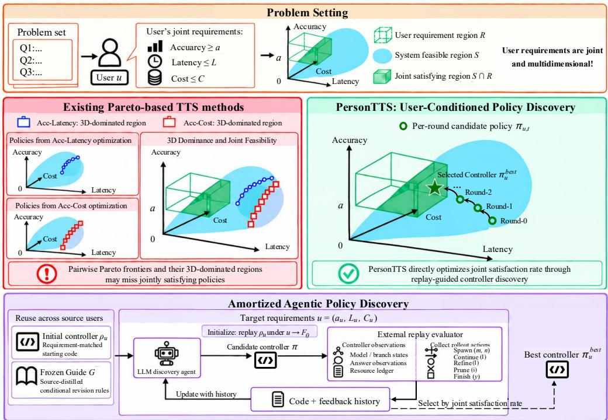
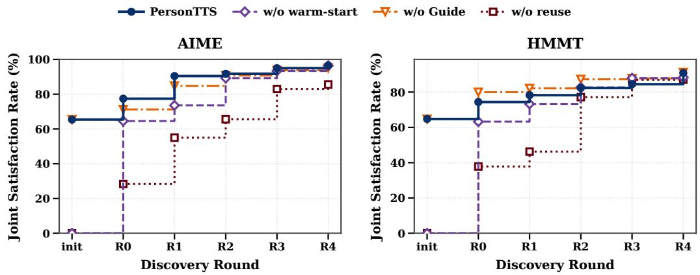
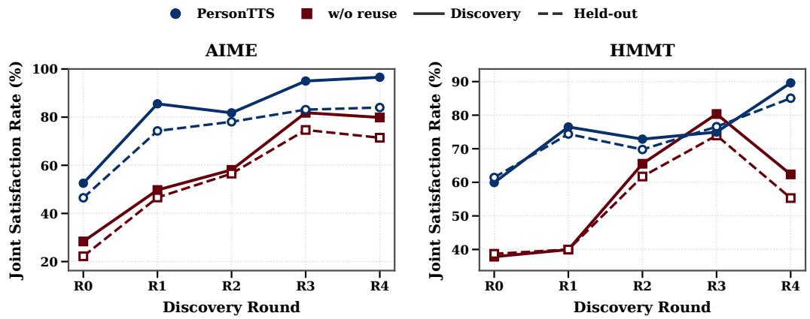
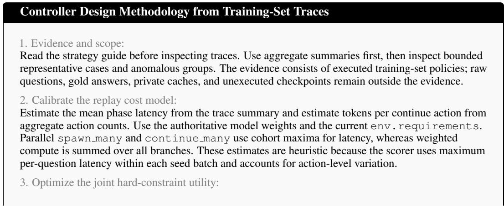
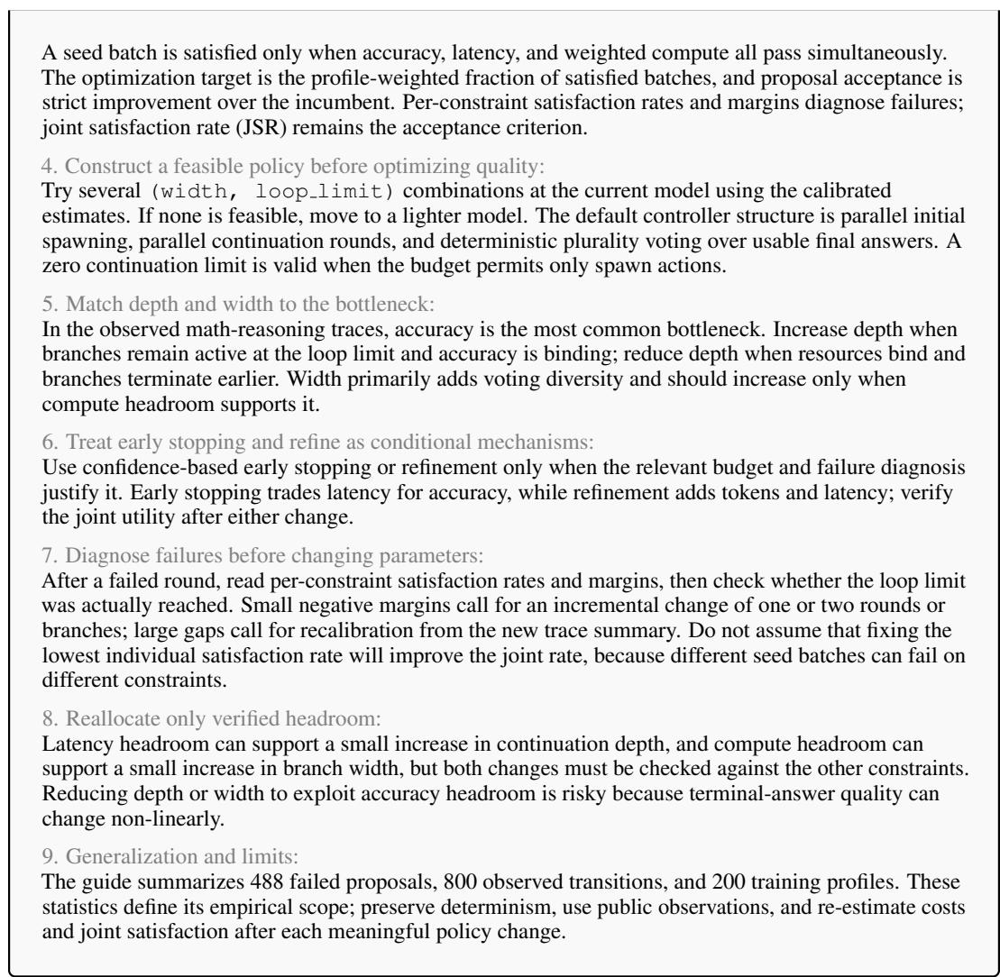

# FROM PARETO TO PREFERENCE: PERSONALIZED TEST-TIME SCALING VIA AMORTIZED AGENTIC POLICY DIS-COVERY

Xinglin Wang1∗, Zishen Liu1∗, Tong Zheng∗, Shaoxiong Feng2†, Peiwen Yuan1, Yiwei Li1, Jiayi Shi1, Yueqi Zhang1, Chuyi Tan1, Ji Zhang1, Boyuan Pan2, Kan Li1†

1 Beijing Institute of Technology 2 Xiaohongshu Inc {wangxinglin,liuzishen,peiwenyuan,liyiwei}@bit.edu.cn {shijiayi,zhangyq,tanchuyi, zhangji, likan}@bit.edu.cn {zhengtong12356,shaoxiongfeng2023}@gmail.com panboyuan@xiaohongshu.com

## ABSTRACT

Test-time scaling (TTS) improves the reasoning capabilities of large language models by allocating additional inference computation. Existing approaches to improving TTS efficiency largely optimize accuracy against one resource dimension at a time, advancing either the accuracy–cost or accuracy–latency Pareto frontier. Yet user requirements are multidimensional: users may specify accuracy, latency, and inference-cost requirements jointly, and different requirements can favor different controllers. We formulate Personalized Test-Time Scaling as discovering executable controllers that maximize the joint satisfaction rate of user-specific requirements. To reduce the overhead of repeated policy discovery for new user profiles, we propose PersonTTS, an amortized agentic policy-discovery framework that reuses prior search experience through requirement-matched controller initialization and source-distilled procedural guidance, while retaining target-profile evaluation for every candidate. Experiments on AIME and HMMT show that PersonTTS substantially outperforms strong TTS baselines in joint requirement satisfaction on unseen user profiles and held-out problems. Under the same candidate-evaluation budget, cross-user experience reuse further improves policy quality while substantially reducing discovery-agent time and cost1.

## 1 INTRODUCTION

Test-time scaling (TTS) has emerged as a powerful paradigm for improving the reasoning capabilities of large language models (OpenAI, 2024; Kimi Team et al., 2025; DeepSeek-AI et al., 2025). By allocating additional computation at inference time, TTS enables extended exploration of the solution space, allowing models to explore diverse reasoning paths, evaluate candidate answers, and refine solutions for complex tasks such as mathematical reasoning (Wang et al., 2023b; Madaan et al., 2023; Lightman et al., 2024). However, scaling up this exploration incurs substantial inference overhead (Brown et al., 2024; Snell et al., 2025). To mitigate these overheads, existing approaches largely focus on advancing the accuracy–cost or accuracy–latency Pareto frontier by reducing redundant computation (Wu et al., 2025; Wang et al., 2025b; 2026a;b; Zheng et al., 2026b), for example, using adaptive sampling, early stopping, or selective branch pruning (Aggarwal et al., 2023; Li et al., 2024; Wang et al., 2025a; Zheng et al., 2026a).

While yielding promising efficiency gains, these approaches typically optimize accuracy against one resource dimension at a time, which does not fully capture a user’s joint requirements. In practice, users may require a target accuracy subject to both latency and inference-cost limits (Huang et al., 2025; Wang et al., 2026c), so different requirements can favor different controllers even on the same problem set. Consequently, optimizing either Pareto frontier can fail to identify controllers that satisfy accuracy, latency, and inference-cost requirements jointly (Figure 1). We therefore formulate Personalized Test-Time Scaling as discovering executable controllers that maximize the joint satisfaction rate of user-specific accuracy, latency, and inference-cost requirements, shifting the focus from Pareto to preference.

  
Figure 1: Comparison of Existing Test-Time Scaling Paradigms and Personalized Test-Time Scaling. Existing methods primarily optimize accuracy against latency or inference cost separately, whereas Personalized TTS targets their joint satisfaction under user-specific requirements. PersonTTS amortizes user-conditioned controller discovery by reusing requirement-matched controllers and procedural guidance from prior searches.

Crucially, personalization affects not only how a controller is evaluated, but also how it should execute. An executable TTS controller coordinates model selection, reasoning width and depth, refinement, pruning, and stopping (Zheng et al., 2026b), and these decisions can depend on the target requirements. Candidate controllers must therefore be evaluated under the target profile rather than assumed to transfer across users. However, running policy discovery independently for every new profile can be costly, e.g., \$39.9 and 160 minutes for a complete policy-discovery run (Zheng et al., 2026b).

To address this challenge, we propose PersonTTS, an amortized agentic policy-discovery framework that reuses prior search experience across users. Specifically, PersonTTS retrieves a controller from a source profile with similar requirements and re-evaluates it under the target profile to initialize discovery, while a frozen Guide distilled from source discovery histories informs subsequent proposals (see Figure 1). An LLM discovery agent then proposes executable controllers using the target requirements, replay feedback, and accumulated search history. Each candidate is evaluated under the target profile, and the controller with the highest joint satisfaction rate is retained. By combining controller reuse and procedural guidance with target-specific evaluation, PersonTTS amortizes design effort across users and enables more efficient personalized policy discovery.

We evaluate PersonTTS on AIME and HMMT (Dekoninck et al., 2026) using six Qwen3 models (Yang et al., 2025), with independently sampled source and target requirement profiles and separate heldout problem sets. PersonTTS substantially outperforms strong TTS baselines in joint requirement satisfaction on both unseen user profiles and held-out problems. Under the same candidate-evaluation budget, cross-user experience reuse further improves policy quality over independent target-side discovery while substantially reducing discovery-agent time and monetary cost. Ablation studies further characterize the distinct roles of requirement-matched initialization and procedural guidance in personalized policy discovery.

Our contributions are summarized as follows:

• We formulate Personalized Test-Time Scaling as executable controller discovery under joint user-specific accuracy, latency, and inference-cost requirements, with the objective of maximizing their joint satisfaction.

• We propose PersonTTS, an amortized agentic policy-discovery framework that reuses requirement-matched controllers and procedural discovery experience across users while preserving target-specific evaluation.

• We empirically validate PersonTTS on AIME and HMMT, demonstrating substantial gains over strong TTS baselines on unseen user profiles and held-out problems, while cross-user experience reuse further improves policy quality and reduces discovery overhead under the same candidate-evaluation budget.

## 2 RELATED WORK

Efficient Test-Time Scaling. Test-time scaling improves reasoning by allocating additional inference computation through parallel sampling and aggregation (Wang et al., 2023b; Brown et al., 2024; Wu et al., 2025; Snell et al., 2025), iterative feedback and refinement (Madaan et al., 2023), or structured search over intermediate reasoning states (Yao et al., 2023; Besta et al., 2024). A growing body of work seeks to make this additional computation more efficient by reducing unnecessary exploration. Adaptive sampling and early stopping terminate generation once sufficient evidence has been accumulated (Aggarwal et al., 2023; Li et al., 2024), while methods conditioned on problem difficulty or reasoning quality allocate computation adaptively across problems or reasoning paths (Wan et al., 2025; Wang et al., 2025a; Snell et al., 2025; Wang et al., 2026a). Other approaches improve the organization of inference through branch pruning, adaptive control of search width and depth, parallel execution, or cross-branch information sharing (Wang et al., 2025b; Huang et al., 2025; Wang et al., 2026d;b; Zheng et al., 2026a;b). Despite their different mechanisms, these methods can largely be viewed as advancing the accuracy–cost or accuracy–latency Pareto frontier. In contrast, Personalized TTS considers user-specific accuracy, latency, and inference-cost requirements jointly, and seeks executable controllers that maximize their joint satisfaction rather than optimizing a single accuracy–resource Pareto frontier.

Agentic Discovery. Large language models are increasingly used as discovery agents that iteratively propose, evaluate, and refine executable artifacts, ranging from algorithms and programs to agentic workflows (Romera-Paredes et al., 2024; Liu et al., 2024; Novikov et al., 2025; Hu et al., 2025; Zhang et al., 2025). Recent approaches further leverage textual feedback or execution histories to guide subsequent proposals, enabling more targeted optimization of prompts, modules, and system code (Agrawal et al., 2026; Lee et al., 2026). AutoTTS brings this paradigm to test-time scaling by formulating TTS strategy design as executable controller synthesis in an offline replay environment, targeting the accuracy–cost Pareto frontier (Zheng et al., 2026b). PersonTTS extends this paradigm to user-specific joint accuracy, latency, and inference-cost requirements, while amortizing the otherwise repeated controller discovery across profiles through reusable prior experience.

Experience Reuse in LLMs. Prior work has explored reusing past experience to improve subsequent behavior, including reflections and distilled insights (Shinn et al., 2023; Zhao et al., 2024), reasoning and search experience distilled from successful and failed trajectories (Ouyang et al., 2026; Wang et al., 2026d), reusable executable skills (Wang et al., 2023a) and replay world simulators (Zheng et al., 2026c). At the design level, SWIFT distills reusable design knowledge from previous workflow searches, while FlowBank precomputes and selects workflows for new queries (Du et al., 2026; Yuan et al., 2026). PersonTTS instead focuses on reuse across user requirement profiles, using source controllers to initialize target discovery and distilled procedural experience to guide subsequent proposals, while retaining target-profile evaluation for controller selection.

## 3 METHODOLOGY

We formulate Personalized Test-Time Scaling as a user-conditioned controller-discovery problem:

Given a user’s accuracy, latency, and inference-cost requirements, how can we efficiently automate personalized TTS policy design to maximize the probability of jointly satisfying these requirements?

To address this problem, we propose PersonTTS, which combines feedback-driven program search with cross-user experience reuse. For each target requirement, retrieval provides an initial policy, a frozen Guide informs candidate revisions, and replay-based selection retains the evaluated policy with the highest joint satisfaction rate.

## 3.1 PROBLEM FORMULATION

We represent a user’s requirements by a profile $\boldsymbol { u } = ( a _ { u } , L _ { u } , C _ { u } )$ , which specifies an accuracy floor $a _ { u } \in [ 0 , 1 ]$ , a ceiling $L _ { u }$ on maximum per-question replay latency, and a ceiling $C _ { u }$ on mean per-question inference cost. In an environment e with models $\mathcal { M } _ { e } , \ i$ a policy π is executable code that maps u and the current observation history $h _ { k }$ to an action. Public observations include model and branch availability, branch progress, intermediate answers and answer histories, and accumulated latency and cost. As correctness is assessed externally, the controller receives neither reference answers nor correctness labels.

Action space. A policy controls model routing, reasoning width, reasoning depth, and selfrefinement. Calling a reasoning path a branch, we write $\pi ( u , h _ { k } ) \in \mathcal { A } _ { e }$ , where

$$
\begin{array} { r } { \mathcal { A } _ { e } = \{ \mathrm { S p a w n } ( m , n ) , \mathrm { C o n t i n u e } ( I ) , \mathrm { R e f i n e } ( I ) , \mathrm { P r u n e } ( i ) , \mathrm { F i n i s h } ( y ) \} . } \end{array}\tag{1}
$$

Here, $\operatorname { S p a w n } ( m , n )$ opens n branches with model m $\in \mathcal { M } _ { e }$ , Continue(I) advances the selected branch set $I ,$ , and Refine(I) starts self-refinement for eligible branches whose current stage has ended. Prune(i) excludes branch i from further reasoning and answer selection. Finish(y) ends the question with an observed answer y, or deterministic plurality voting if $y$ is omitted. The environment determines action admissibility, while the full interface is given in Appendix G. Program search can therefore revise both resource allocation and the rules that adapt it to intermediate observations.

Joint satisfaction objective. Fix a labeled question set $\mathcal { D } = \{ ( q _ { i } , y _ { i } ^ { \star } ) \} _ { i = 1 } ^ { N } , N \geq 1$ , a cache $\mathcal { R } _ { e }$ and a nonempty finite replay-seed panel Ω. Each seed specifies a complete evaluation over $\mathcal { D }$ called a seed batch, and varies cached-branch consumption order. For complete finite replay records $\tau _ { u } ^ { \pi } ( s ) = \mathrm { R e p l a y } _ { e } ( \pi , u ; \mathcal { R } _ { e } , \mathcal { D } , s )$ , define

$$
A _ { u } ^ { \pi } ( s ) = \frac { 1 } { N } \sum _ { i } \chi _ { i } ( \tau _ { u } ^ { \pi } ( s ) ) , \quad L _ { u } ^ { \pi } ( s ) = \operatorname* { m a x } _ { q \in \mathcal { D } } \ell _ { s } ( q ; \pi , u ) , \quad C _ { u } ^ { \pi } ( s ) = \frac { 1 } { N } \sum _ { i } c _ { i } ( \tau _ { u } ^ { \pi } ( s ) ) ,\tag{2}
$$

where $\chi _ { i }$ checks the returned answer against $y _ { i } ^ { \star } , c _ { i }$ is the inference cost for question $q _ { i } ,$ and $\ell _ { s } ( q ; \pi , u )$ is its replay latency, with $L _ { u } ^ { \pi } ( s ) = \Lambda _ { e } ^ { - } ( \tau _ { u } ^ { \pi } ( s ) )$ . We therefore define the joint satisfaction rate (JSR) as the fraction of seed batches satisfying all three requirements simultaneously:

$$
\widehat { S } _ { u } ( \pi ; \mathcal { D } , \Omega ) = \frac { 1 } { | \Omega | } \sum _ { s \in \Omega } \mathbf { 1 } [ A _ { u } ^ { \pi } ( s ) \geq a _ { u } , L _ { u } ^ { \pi } ( s ) \leq L _ { u } , C _ { u } ^ { \pi } ( s ) \leq C _ { u } ] .\tag{3}
$$

JSR measures the fraction of seed batches meeting all three requirements simultaneously. As changing u affects both the acceptance thresholds and potentially the policy’s actions, candidates must be evaluated under the target profile.

## 3.2 USER-CONDITIONED AGENTIC POLICY DISCOVERY

The search space includes branching, stopping, and refinement logic as well as model and sampling choices. To efficiently explore this space for policies satisfying a user’s requirements, an LLM agent revises executable controller logic while retaining AutoTTS’s offline replay foundation and within-search reuse of code and diagnostics (Zheng et al., 2026b). Cached trajectories, intermediate answers, and resource records let us evaluate candidates without additional rollouts. The controller acts on observations revealed by replay within each query, while the agent revises its code using the resulting feedback between evaluations.

A scalar JSR ranks candidates but cannot distinguish an accuracy shortfall from a resource violation. Each evaluation therefore returns $F _ { t } = ( X _ { t } , \zeta _ { t } , \overline { { \mathcal { T } _ { t } } } )$ : the JSR $X _ { t } ,$ constraint pass rates and margins in $\zeta _ { t } ,$ , and sanitized executed traces $\mathcal { T } _ { t }$ linking these outcomes to controller decisions. Appendix E.5 characterizes what exact constraint pass rates and JSR reveal about single-constraint failures. Starting from $\rho _ { u } ,$ , we obtain initial feedback $F _ { 0 }$ and then generate B new candidates:

$$
\pi _ { \boldsymbol { u } , t } \sim p _ { \theta } ( \cdot \mid \boldsymbol { e } , \boldsymbol { u } , \rho _ { \boldsymbol { u } } , \mathcal { H } _ { \boldsymbol { u } , < t } , \widehat { \eta } _ { \boldsymbol { u } , t } , G ) , \qquad t = 1 , \ldots , B .\tag{4}
$$

where $\mathcal { H } _ { u , < t }$ contains accessible prior code and feedback, $\widehat { \eta } _ { u , t }$ contains trace-based latency and tokencost estimates, and G is the optional Guide (Section 3.3). The initial code $\rho _ { u }$ is a retrieved source policy when warm-start is enabled and a generic template otherwise. It stays fixed across rounds, while the history accumulates all scored candidates, including unsuccessful revisions. Adaptation changes program code, not the agent parameters θ.

The agent inspects evidence and submits one candidate per round for external static validation and replay. However, it does not execute or score candidates itself. The full procedure is given in Algorithm 1 in Appendix A, where the discovery set, seed panel, and replay realizations are fixed. Only a strict JSR improvement replaces the incumbent, so ties retain the earlier policy. Initialization is evaluated separately from the B new scored candidates, while agent time and expenditure are measured separately.

## 3.3 CROSS-USER EXPERIENCE REUSE

Offline replay removes repeated rollouts, but each new user still requires program design and diagnosis. To reduce this repetition, we retain source search histories in a Policy Experience Bank, including user profiles, candidate code, evaluation feedback, execution traces, and selected policies. These records support two forms of reuse: retrieval provides a starting policy, while a Guide distilled from candidate comparisons informs subsequent revisions under the new user’s requirements.

Requirement-similarity policy initialization. Let $\mathcal { T } _ { e }$ index source entries with compatible models and runtime configurations, with $\pi _ { i } ^ { \mathrm { s r c } }$ selected for source profile $u _ { i }$ . To compare resource ratios alongside accuracy differences, we log-transform resource ceilings and standardize using compatible source profiles:

$$
{ \bf x } ( u ) = ( a _ { u } , \ln L _ { u } , \ln C _ { u } ) , \quad \quad z _ { e , j } ( u ) = \frac { x _ { j } ( u ) - \mu _ { e , j } } { \sigma _ { e , j } } , \quad j = 1 , 2 , 3 ,\tag{5}
$$

where $\mu _ { e , j }$ and $\sigma _ { e , j }$ are source-coordinate means and standard deviations. Retrieval assumes a nonempty compatible bank, positive resource ceilings, and positive coordinate standard deviations. Equal-weight Euclidean distance then selects the initial program:

$$
i ^ { \star } ( u ) \in \arg \operatorname* { m i n } _ { i \in \mathcal { T } _ { e } } \| \mathbf { z } _ { e } ( u ) - \mathbf { z } _ { e } ( u _ { i } ) \| _ { 2 } , \qquad \rho _ { u } = \pi _ { i ^ { \star } ( u ) } ^ { \mathrm { s r c } } .\tag{6}
$$

We replay the retrieved code under the target profile to obtain $F _ { 0 }$ . This establishes its target joint satisfaction rate (JSR) and supplies constraint diagnostics for the first revision, rather than relying on its source score.

Procedural skill distillation and guided discovery. The retrieved policy and its initial feedback provide a starting point, but deciding how to revise it requires evidence about alternative designs. We therefore compare source candidates under their associated user requirements, linking code changes to evaluation feedback and execution traces. An agent distills these comparisons into a shared Guide whose rules specify when a revision is appropriate, which changes to prioritize, and how to evaluate the resulting policy. Supporting and unsuccessful cases help identify the conditions under which each rule applies.

When enabled, the frozen Guide enters every proposal through Equation 4, while target feedback updates the agent’s search evidence rather than the Guide itself. This allows source-side preparation to be shared across users while keeping candidate generation and final selection tied to each target profile. Construction details are provided in Appendices H and I.

## 3.4 SEPARATING REQUIREMENT CHANGES FROM EXECUTION CHANGES

Reusing a source policy changes both how its outcomes are judged and how it may execute. To separate these effects, fix source and target profiles u, v, a common environment, cache, question set, and finite nonempty panel Ω. For a policy π with complete finite outcomes under both profiles, we denote its joint satisfaction rate (JSR) by $f _ { z , \Omega } ( \pi ) = \widehat { S } _ { z } ( \pi ; \mathcal { D } , \Omega )$ . Orient metrics so that larger is better: $\mathbf { w } _ { z } ^ { \pi } ( \bar { s } ) = ( A _ { z } ^ { \pi } ( s ) , - L _ { z } ^ { \pi } ( s ) , - C _ { z } ^ { \pi } ( \bar { s } ) )$ and ${ \bf b } ( z ) = \left( a _ { z } , - L _ { z } , - C _ { z } \right)$ . For fixed positive unit scales $d _ { j }$ , define

$$
g ^ { \pi } ( s ) = \operatorname* { m i n } _ { 1 \leq j \leq 3 } \frac { w _ { u , j } ^ { \pi } ( s ) - b _ { j } ( v ) } { d _ { j } } , \qquad \bar { f } _ { \pi } = \frac { 1 } { | \Omega | } \sum _ { s \in \Omega } \mathbf { 1 } \{ g ^ { \pi } ( s ) \geq 0 \} .\tag{7}
$$

The scales normalize units. Applying target thresholds to fixed source outcomes gives ${ \bar { f } } _ { \pi }$ , so

$$
f _ { v , \Omega } ( \pi ) - f _ { u , \Omega } ( \pi ) = [ \bar { f } _ { \pi } - f _ { u , \Omega } ( \pi ) ] + [ f _ { v , \Omega } ( \pi ) - \bar { f } _ { \pi } ] .\tag{8}
$$

The first term captures threshold changes on fixed records, while the second captures the effect of requirement-conditioned execution. This decomposition explains why source-profile performance can inform target discovery without generally determining target-profile performance. Appendix E extends this analysis to comparisons between policies, including ranking reversals under changed requirements and the insufficiency of marginal metrics for determining JSR.

Proposition: target satisfaction bounds. Suppose finite bounds $r ^ { \pi } ( s )$ satisfy $r ^ { \pi } ( s ) \geq$ maxj $| w _ { v , j } ^ { \pi } ( s ) - w _ { u , j } ^ { \overline { { \pi } } } ( s ) | / d _ { j }$ for every seed. Then $\begin{array} { r } { \dot { F } _ { \pi } ^ { - } \leq f _ { v , \Omega } ( \pi ) \leq F _ { \pi } ^ { + } } \end{array}$ , where

$$
{ \cal F } _ { \pi } ^ { - } = \frac { 1 } { | \Omega | } \sum _ { s \in \Omega } { { \bf 1 } } \{ g ^ { \pi } ( s ) \geq r ^ { \pi } ( s ) \} , \qquad { \cal F } _ { \pi } ^ { + } = \frac { 1 } { | \Omega | } \sum _ { s \in \Omega } { { \bf 1 } } \{ g ^ { \pi } ( s ) \geq - r ^ { \pi } ( s ) \} .\tag{9}
$$

The proof is in Appendix E.1. When $r ^ { \pi } ( s ) = 0$ for every seed, rethresholding determines target JSR exactly. More generally, the bound depends on execution deviation, not profile distance alone. Observed target deviations yield a post-replay diagnostic, while prediction before replay requires independently justified deviation bounds. Accordingly, PersonTTS uses source similarity and design experience to guide policy discovery, while retaining target execution for candidate evaluation and selection.

## 4 EXPERIMENTS

## 4.1 EXPERIMENTAL SETUP

Benchmarks and profiles. We evaluate PersonTTS on AIME and HMMT (Dekoninck et al., 2026) using six Qwen3 models with 0.6B, 1.7B, 4B, 8B, 14B, and 32B parameters (Yang et al., 2025). AIME24–25 provides 60 discovery problems, with AIME26 (30 problems) held out, while HMMT24 provides 30 discovery problems, with HMMT25 (30 problems) held out. For each problem–model pair, the replay pool contains 128 pre-sampled, checkpointed reasoning trajectories with intermediate answers, token counts for thinking, probing, and feedback, and latency records, as described in Appendix B.1. Each benchmark uses 100 source profiles for the main comparison and 20 independently sampled target profiles for cross-user experiments. We sample profiles by difficultystratified maximin coverage calibrated on discovery data, using the procedure in Appendix B.3; the source and target sets contain no duplicate threshold triples. The experience bank and Guide are constructed only from source-profile discovery histories, excluding target-profile records and held-out problem outcomes. Additionally, we provide the full evaluation protocol and discovery settings in Appendices B.2 and B.4, respectively.

Baselines. We compare against three baseline families. AutoTTS (Zheng et al., 2026b) optimizes a scalar accuracy–cost trade-off, for which we report $\beta = 0 . 5 \mathrm { a n d } \beta = 1 . 0$ separately. Self-Consistency includes ASC (Aggarwal et al., 2023) and ESC (Li et al., 2024), also reported separately. Both use fixed model, width, depth, and refinement configurations while allowing runtime stopping decisions. Parallel-Probe (Zheng et al., 2026a) combines intermediate-answer probing, branch pruning, and self-refinement. Together, these baselines compare personalized policy discovery with scalar-objective search and predefined inference strategies under the same joint-satisfaction metric.

Table 1: JSR (%; higher is better) across problem and profile splits. Source and target profiles follow the Setup, and problem splits are labeled separately. PersonTTS variants use the policy with the highest JSR on discovery problems across initialization and all five rounds. PersonTTS uses both reuse mechanisms. “w/o reuse” removes both the Guide and warm-start, while the other “w/o” variants remove the named mechanism. Dashes denote unreported results. Bold marks the highest reported value in each column.
<table><tr><td rowspan="2">Method</td><td colspan="2">AIME24-25 (Discovery)</td><td colspan="2">AIME26 (Held-out)</td><td colspan="2">HMMT24 (Discovery)</td><td colspan="2">HMMT25 (Held-out)</td></tr><tr><td>Source</td><td>Target</td><td>Source</td><td>Target</td><td>Source</td><td>Target</td><td>Source</td><td>Target</td></tr><tr><td>ASC</td><td>13.53</td><td>0.14</td><td>7.03</td><td>0.00</td><td>11.91</td><td>4.89</td><td>12.03</td><td>4.98</td></tr><tr><td>ESC</td><td>13.28</td><td>0.14</td><td>6.22</td><td>0.00</td><td>11.22</td><td>4.89</td><td>11.83</td><td>4.98</td></tr><tr><td>ParallelProbeSR</td><td>23.77</td><td>10.19</td><td>23.89</td><td>9.35</td><td>23.81</td><td>19.30</td><td>18.07</td><td>11.51</td></tr><tr><td>AutoTTS (β = 0.5)</td><td>12.11</td><td>16.41</td><td>10.52</td><td>16.03</td><td>7.04</td><td>2.96</td><td>7.25</td><td>3.23</td></tr><tr><td>AutoTTS (β = 1.0)</td><td>31.15</td><td>35.58</td><td>30.11</td><td>35.47</td><td>0.00</td><td>0.01</td><td>0.00</td><td>0.15</td></tr><tr><td>PersonTTS (w/o reuse)</td><td>88.35</td><td>85.57</td><td>78.60</td><td>79.22</td><td>91.41</td><td>87.04</td><td>85.71</td><td>69.16</td></tr><tr><td>PersonTTS (w/o warm-start)</td><td></td><td>96.45</td><td>一</td><td>83.50</td><td></td><td>88.27</td><td></td><td>79.09</td></tr><tr><td>PersonTTS (w/o Guide)</td><td>一</td><td>95.13</td><td>一</td><td>79.60</td><td>一</td><td>91.19</td><td>一</td><td>74.04</td></tr><tr><td>PersonTTS</td><td>一</td><td>96.57</td><td>一</td><td>83.85</td><td>一</td><td>90.86</td><td>一</td><td>77.28</td></tr></table>

## 4.2 MAIN RESULTS

To evaluate whether directly optimizing for user-specific joint requirements provides an advantage over existing TTS strategies, we compare PersonTTS and its no-reuse variant against strong external baselines under the same joint-satisfaction metric. Table 1 indicates that personalized controller discovery substantially outperforms these baselines across both benchmarks and retains this advantage on held-out problems, while the no-reuse variant already preserves most of this advantage. This suggests that the primary gain comes from optimizing executable controllers for the joint user requirements themselves, rather than from cross-user experience reuse alone. Building on this stronger personalized objective, cross-user reuse further improves target-profile policies under the same candidate-evaluation budget, with the improvement persisting on held-out problems, indicating that source experience helps steer discovery toward controller designs that transfer beyond the problems used during search.

## 4.3 ABLATION STUDY

To disentangle how the two forms of cross-user experience reuse contribute to policy discovery, we separately remove requirement-matched initialization and the Guide under the same target profiles and candidate-evaluation budget. Figure 2 and Table 1 reveal distinct roles for the two mechanisms: warm-start mainly improves the initial search point, whereas the Guide informs subsequent revisions and provides more consistent held-out gains across benchmarks. Their gains are not uniformly additive, suggesting that retrieved controllers act as target-dependent initialization priors, while procedural guidance is less dependent on a particular source controller.

To determine whether the policy-quality gains from experience reuse are accompanied by lower discovery overhead, we further compare agent-call time and cost under the same five-round protocol. Table 2 reveals that the Guide accounts for most of the consistent efficiency improvement: relative to no reuse, Guide-only discovery reduces agent-call time by approximately 46% and cost by approximately 36% across the two benchmarks, whereas warm-start alone mainly shortens elapsed time and can slightly increase cost. Together with the policy-quality ablation, this pattern suggests that distilled procedural experience reduces repeated diagnosis and revision effort throughout discovery, while requirement-matched retrieval primarily serves as an initialization prior whose value is more dependent on the target setting.

  
Figure 2: Best-observed JSR on discovery sets across rounds. Curves show the cumulative maximum JSR on the discovery sets after initialization and each of the five candidate rounds (R0–R4), averaged over target profiles on AIME24–25 and HMMT24. The four curves compare PersonTTS with the variants without warm-start, without the Guide, and without both mechanisms.

Table 2: Agent-call elapsed time and cost during target-profile discovery on discovery problems. Each cell reports time (minutes) | cost (USD), with lower values better for both metrics. Values are averaged over 20 target profiles per benchmark and round. Total gives the per-profile sum across the five rounds. Variant names follow Table 1.
<table><tr><td rowspan="2">Method</td><td colspan="10">Round</td><td rowspan="2" colspan="2">Total</td></tr><tr><td colspan="2">R0</td><td colspan="2">R1</td><td colspan="2">R2</td><td colspan="2">R3</td><td colspan="2">R4</td></tr><tr><td colspan="10">AIME</td><td rowspan="3" colspan="2"></td></tr><tr><td>PersonTTS (w/o reuse)</td><td>18.67 |1.58</td><td></td><td>17.37 |2.29</td><td>14.56 |2.20</td><td></td><td></td><td>12.33 |1.94</td><td></td><td>11.70 |2.29</td><td>74.63</td></tr><tr><td>PersonTTS (w/o Guide)</td><td>12.74</td><td>1.61</td><td>13.72 2.03</td><td>14.70</td><td>2.36</td><td>12.85</td><td>2.27</td><td>12.31</td><td>2.37</td><td>10.30 66.33 10.64</td></tr><tr><td>PersonTTS (w/o warm-start)</td><td>13.60</td><td>1.24</td><td>7.05 1.29</td><td>7.56</td><td>1.46</td><td>6.13</td><td>1.28</td><td>5.35</td><td>1.37</td><td>39.69</td><td>6.64</td></tr><tr><td>PersonTTS</td><td>8.49 1.15</td><td></td><td>8.90 1.51</td><td>8.49</td><td>1.67</td><td>7.83</td><td>1.57</td><td>6.70</td><td>1.50</td><td>40.41</td><td>|7.40</td></tr><tr><td colspan="10">HMMT</td><td colspan="2"></td></tr><tr><td>PersonTTS (w/o reuse)</td><td>22.06 |2.05</td><td></td><td>18.63 |2.47</td><td></td><td>14.82| |2.40</td><td></td><td>15.80|2.72</td><td></td><td>14.18 |2.70</td><td></td><td>85.49 12.34</td></tr><tr><td>PersonTTS (w/o Guide)</td><td>15.41</td><td>2.25</td><td>16.14</td><td>2.50</td><td>14.80 2.46</td><td></td><td>17.12 2.99</td><td>12.83</td><td>2.56</td><td>76.30</td><td>12.76</td></tr><tr><td>PersonTTS (w/o warm-start)</td><td>14.05</td><td>1.40</td><td>9.00</td><td>1.54</td><td>8.29 1.67</td><td></td><td>7.66 1.63</td><td>7.29</td><td>1.62</td><td>46.29</td><td>7.87</td></tr><tr><td>PersonTTS</td><td>11.68</td><td>1.74</td><td>11.34</td><td>1.80</td><td>10.40 2.03</td><td></td><td>7.45 1.61</td><td></td><td>7.63 1.66</td><td>48.51</td><td>8.84</td></tr></table>

## 4.4 ANALYSIS

We analyze the proposed PersonTTS from the following perspectives: (1) discovery-to-held-out generalization, (2) experience bank scaling, (3) cross-benchmark generalization (Appendix D.1).

## 4.4.1 DISCOVERY-TO-HELD-OUT GENERALIZATION

To examine whether round-wise discovery JSR is informative of out-of-sample policy quality, we evaluate the policy produced at each discovery round on both the optimization and held-out problems. Figure 3 shows that improvements in discovery JSR are generally accompanied by stronger held-out policies, with PersonTTS finishing above independent discovery on both benchmarks. The two trajectories are not perfectly aligned, however, and the persistent discovery–held-out gap indicates that discovery JSR is an informative search signal rather than a direct estimate of out-of-sample joint satisfaction.

## 4.4.2 EXPERIENCE BANK SCALING

To understand how the amount of reusable source experience affects target discovery, we vary the number of source-profile–policy pairs available for retrieval while keeping the Guide and target-side candidate-evaluation budget fixed. For each benchmark, five bank-sampling seeds construct nested banks of 20 and 60 source-profile–policy pairs from the full 100-pair bank, and each sampled bank is used in a separate discovery run for the same target profiles.

  
Figure 3: Discovery-to-held-out generalization across rounds. Solid and dashed lines report the JSR of the policy produced at each discovery round on the discovery and held-out problems, respectively, for PersonTTS and the variant without cross-user reuse on AIME and HMMT. Held-out evaluations are used only for analysis and never exposed to the discovery agent or used for policy selection.

Table 3: Experience-bank scaling: JSR (%; higher is better) of the final discovery-selected policies. Scores are averaged over available bank-seed runs within each target profile, then equally over 20 profiles. Bold marks the highest reported value in each column. The 100-profile bank is the full source bank used in the main comparison.
<table><tr><td>Bank Size</td><td>AIME24–25 (Discovery)</td><td>AIME26 (Held-out)</td><td>HMMT24 (Discovery)</td><td>HMMT25 (Held-out)</td></tr><tr><td>20</td><td>92.24</td><td>80.30</td><td>86.22</td><td>86.09</td></tr><tr><td>60</td><td>94.51</td><td>81.38</td><td>87.40</td><td>85.91</td></tr><tr><td>100</td><td>96.57</td><td>83.85</td><td>90.86</td><td>77.28</td></tr></table>

The results in Table 3 indicate that enlarging the bank consistently improves policy quality on the discovery problems, suggesting that broader coverage of requirement-specific controller designs increases the chance of retrieving a useful starting point. This trend does not extend monotonically to held-out problems, however: larger banks continue to help on AIME but reverse on HMMT, showing that broader retrieval coverage can facilitate target-side search without guaranteeing stronger crossproblem generalization. Because the Guide and candidate-evaluation budget remain fixed, this pattern isolates a limitation of retrieval-side scaling and motivates calibrated coverage or retrieval-confidence estimates rather than treating bank size as a uniformly beneficial scaling axis.

## 5 CONCLUSIONS

In this work, we formulate Personalized Test-Time Scaling, which seeks executable controllers that jointly satisfy user-specific accuracy, latency, and inference-cost requirements rather than optimizing a single accuracy–resource Pareto frontier. We propose PersonTTS, an amortized agentic policydiscovery framework that combines target-conditioned controller search with cross-user reuse of requirement-matched source controllers and procedural guidance, while retaining target-profile evaluation for candidate selection. Experiments on AIME and HMMT demonstrate substantial gains over strong TTS baselines on unseen user profiles and held-out problems, while cross-user experience reuse further improves policy quality and reduces discovery overhead under the same candidateevaluation budget. Overall, our results highlight the value of amortizing personalized TTS policy design across users. Future work could combine calibrated coverage or uncertainty estimates with request-frequency-aware deployment decisions, reusing matched controllers when the experience bank is reliable and triggering background discovery for frequent or poorly covered profiles whose search cost can be amortized over future requests.

## AI USE STATEMENT

In this work, we used generative AI tools to polish the manuscript. We have not used generative AI tools for other tasks with required disclosure, and the remaining disclosure tasks are not applicable to this work. Additionally, we used generative AI tools to improve the manuscript’s readability. We have reviewed the polished text. We take responsibility for the final content of this work, including text, claims, or artifacts produced with the aid of generative AI.

## ETHICS STATEMENT

This study uses offline replay with simulated operational requirement profiles and mathematical reasoning problems; it involves no human participants and does not measure subjective satisfaction. The reported joint-satisfaction metric is defined by accuracy and resource constraints in this replay setting. Deployment would require validation on the intended workload and resource accounting.

## REPRODUCIBILITY STATEMENT

Section 3 defines the controller interface, joint-satisfaction objective, retrieval procedure, and candidate-selection loop. Section 4.1 describes the problem and profile splits, replay evaluation protocol, and discovery settings. The appendix documents replay-pool construction, profile sampling, the discovery prompt and public API, Guide distillation, round-wise measurements, and the proofs for the conditional transfer analysis.

## REFERENCES

Pranjal Aggarwal, Aman Madaan, Yiming Yang, et al. Let’s sample step by step: Adaptive-consistency for efficient reasoning and coding with llms. In Proceedings ofthe 2023 Conference on Empirical Methods in Natural Language Processing, pp. 12375–12396, 2023.

Lakshya A Agrawal, Shangyin Tan, Dilara Soylu, Noah Ziems, Rishi Khare, Krista Opsahl-Ong, Arnav Singhvi, Herumb Shandilya, Michael J Ryan, Meng Jiang, et al. Gepa: Reflective prompt evolution can outperform reinforcement learning. In International Conference on Learning Representations, volume 2026, pp. 8479–8565, 2026.

Maciej Besta, Nils Blach, Ales Kubicek, Robert Gerstenberger, Michal Podstawski, Lukas Gianinazzi, Joanna Gajda, Tomasz Lehmann, Hubert Niewiadomski, Piotr Nyczyk, et al. Graph of thoughts: Solving elaborate problems with large language models. In Proceedings of the AAAI conference on artificial intelligence, volume 38, pp. 17682–17690, 2024.

Bradley Brown, Jordan Juravsky, Ryan Ehrlich, Ronald Clark, Quoc V Le, Christopher Re, and´ Azalia Mirhoseini. Large language monkeys: Scaling inference compute with repeated sampling. arXiv preprint arXiv:2407.21787, 2024.

DeepSeek-AI, Daya Guo, Dejian Yang, Haowei Zhang, Junxiao Song, Ruoyu Zhang, Runxin Xu, Qihao Zhu, Shirong Ma, Peiyi Wang, Xiao Bi, Xiaokang Zhang, Xingkai Yu, Yu Wu, Z. F. Wu, Zhibin Gou, Zhihong Shao, Zhuoshu Li, Ziyi Gao, Aixin Liu, Bing Xue, Bingxuan Wang, Bochao Wu, Bei Feng, Chengda Lu, Chenggang Zhao, Chengqi Deng, Chenyu Zhang, Chong Ruan, Damai Dai, Deli Chen, Dongjie Ji, Erhang Li, Fangyun Lin, Fucong Dai, Fuli Luo, Guangbo Hao, Guanting Chen, Guowei Li, H. Zhang, Han Bao, Hanwei Xu, Haocheng Wang, Honghui Ding, Huajian Xin, Huazuo Gao, Hui Qu, Hui Li, Jianzhong Guo, Jiashi Li, Jiawei Wang, Jingchang Chen, Jingyang Yuan, Junjie Qiu, Junlong Li, J. L. Cai, Jiaqi Ni, Jian Liang, Jin Chen, Kai Dong, Kai Hu, Kaige Gao, Kang Guan, Kexin Huang, Kuai Yu, Lean Wang, Lecong Zhang, Liang Zhao, Litong Wang, Liyue Zhang, Lei Xu, Leyi Xia, Mingchuan Zhang, Minghua Zhang, Minghui Tang,

Meng Li, Miaojun Wang, Mingming Li, Ning Tian, Panpan Huang, Peng Zhang, Qiancheng Wang, Qinyu Chen, Qiushi Du, Ruiqi Ge, Ruisong Zhang, Ruizhe Pan, Runji Wang, R. J. Chen, R. L. Jin, Ruyi Chen, Shanghao Lu, Shangyan Zhou, Shanhuang Chen, Shengfeng Ye, Shiyu Wang, Shuiping Yu, Shunfeng Zhou, Shuting Pan, S. S. Li, Shuang Zhou, Shaoqing Wu, Shengfeng Ye, Tao Yun, Tian Pei, Tianyu Sun, T. Wang, Wangding Zeng, Wanjia Zhao, Wen Liu, Wenfeng Liang, Wenjun Gao, Wenqin Yu, Wentao Zhang, W. L. Xiao, Wei An, Xiaodong Liu, Xiaohan Wang, Xiaokang Chen, Xiaotao Nie, Xin Cheng, Xin Liu, Xin Xie, Xingchao Liu, Xinyu Yang, Xinyuan Li, Xuecheng Su, Xuheng Lin, X. Q. Li, Xiangyue Jin, Xiaojin Shen, Xiaosha Chen, Xiaowen Sun, Xiaoxiang Wang, Xinnan Song, Xinyi Zhou, Xianzu Wang, Xinxia Shan, Y. K. Li, Y. Q. Wang, Y. X. Wei, Yang Zhang, Yanhong Xu, Yao Li, Yao Zhao, Yaofeng Sun, Yaohui Wang, Yi Yu, Yichao Zhang, Yifan Shi, Yiliang Xiong, Ying He, Yishi Piao, Yisong Wang, Yixuan Tan, Yiyang Ma, Yiyuan Liu, Yongqiang Guo, Yuan Ou, Yuduan Wang, Yue Gong, Yuheng Zou, Yujia He, Yunfan Xiong, Yuxiang Luo, Yuxiang You, Yuxuan Liu, Yuyang Zhou, Y. X. Zhu, Yanhong Xu, Yanping Huang, Yaohui Li, Yi Zheng, Yuchen Zhu, Yunxian Ma, Ying Tang, Yukun Zha, Yuting Yan, Z. Z. Ren, Zehui Ren, Zhangli Sha, Zhe Fu, Zhean Xu, Zhenda Xie, Zhengyan Zhang, Zhewen Hao, Zhicheng Ma, Zhigang Yan, Zhiyu Wu, Zihui Gu, Zijia Zhu, Zijun Liu, Zilin Li, Ziwei Xie, Ziyang Song, Zizheng Pan, Zhen Huang, Zhipeng Xu, Zhongyu Zhang, and Zhen Zhang. Deepseek-r1: Incentivizing reasoning capability in llms via reinforcement learning. arXiv preprint arXiv:2501.12948, 2025.

Jasper Dekoninck, Nikola Jovanovic, Tim Gehrunger, K´ ari R´ ognvaldsson, Ivo Petrov, Chenhao Sun,¨ and Martin Vechev. Beyond benchmarks: Matharena as an evaluation platform for mathematics with llms. 2026. URL https://arxiv.org/abs/2605.00674.

Shiyi Du, Jiayuan Liu, Weihua Du, Yue Huang, Jiayi Li, Yingtao Luo, Xiangliang Zhang, Vincent Conitzer, and Carl Kingsford. Why search when you can transfer? amortized agentic workflow design from structural priors. arXiv preprint arXiv:2604.25012, 2026.

Shengran Hu, Cong Lu, and Jeff Clune. Automated design of agentic systems. In International Conference on Learning Representations, volume 2025, pp. 21344–21377, 2025.

Jenny Y Huang, Mehul Damani, Yousef El-Kurdi, Ramon Astudillo, and Wei Sun. Latency and token-aware test-time compute. arXiv preprint arXiv:2509.09864, 2025.

Kimi Team, Angang Du, Bofei Gao, Bowei Xing, Changjiu Jiang, Cheng Chen, Cheng Li, Chenjun Xiao, Chenzhuang Du, Chonghua Liao, et al. Kimi k1.5: Scaling reinforcement learning with llms. arXiv preprint arXiv:2501.12599, 2025.

Yoonho Lee, Roshen Nair, Qizheng Zhang, Kangwook Lee, Omar Khattab, and Chelsea Finn. Meta-harness: End-to-end optimization of model harnesses. arXiv preprint arXiv:2603.28052, 2026.

Yiwei Li, Peiwen Yuan, Shaoxiong Feng, Boyuan Pan, Xinglin Wang, Bin Sun, Heda Wang, and Kan Li. Escape sky-high cost: Early-stopping self-consistency for multi-step reasoning. In International Conference on Learning Representations, volume 2024, pp. 14751–14768, 2024.

Hunter Lightman, Vineet Kosaraju, Yuri Burda, Harrison Edwards, Bowen Baker, Teddy Lee, Jan Leike, John Schulman, Ilya Sutskever, and Karl Cobbe. Let’s verify step by step. In International Conference on Learning Representations, volume 2024, pp. 39578–39601, 2024.

Fei Liu, Xialiang Tong, Mingxuan Yuan, Xi Lin, Fu Luo, Zhenkun Wang, Zhichao Lu, and Qingfu Zhang. Evolution of heuristics: Towards efficient automatic algorithm design using large language model. arXiv preprint arXiv:2401.02051, 2024.

Aman Madaan, Niket Tandon, Prakhar Gupta, Skyler Hallinan, Luyu Gao, Sarah Wiegreffe, Uri Alon, Nouha Dziri, Shrimai Prabhumoye, Yiming Yang, Shashank Gupta, Bodhisattwa Prasad Majumder, Katherine Hermann, Sean Welleck, Amir Yazdanbakhsh, and Peter Clark. Self-refine: Iterative refinement with self-feedback. In Advances in Neural Information Processing Systems (NeurIPS), volume 36, pp. 46534–46594, 2023.

Alexander Novikov, Ngan Vˆ u, Marvin Eisenberger, Emilien Dupont, Po-Sen Huang, Adam Zsolt Wag-˜ ner, Sergey Shirobokov, Borislav Kozlovskii, Francisco JR Ruiz, Abbas Mehrabian, et al. Alphaevolve: A coding agent for scientific and algorithmic discovery. arXiv preprint arXiv:2506.13131, 2025.

OpenAI. Learning to reason with llms, 2024. URL https://openai.com/index/ learning-to-reason-with-llms/.

Siru Ouyang, Jun Yan, I Hsu, Yanfei Chen, Ke Jiang, Zifeng Wang, Rujun Han, Long Le, Samira Daruki, Xiangru Tang, et al. Reasoningbank: Scaling agent self-evolving with reasoning memory. In International Conference on Learning Representations, volume 2026, pp. 94327–94354, 2026.

Bernardino Romera-Paredes, Mohammadamin Barekatain, Alexander Novikov, Matej Balog, M Pawan Kumar, Emilien Dupont, Francisco JR Ruiz, Jordan S Ellenberg, Pengming Wang, Omar Fawzi, et al. Mathematical discoveries from program search with large language models. Nature, 625(7995):468–475, 2024.

Noah Shinn, Federico Cassano, Ashwin Gopinath, Karthik Narasimhan, and Shunyu Yao. Reflexion: Language agents with verbal reinforcement learning. Advances in neural information processing systems, 36:8634–8652, 2023.

Charlie Snell, Jaehoon Lee, Kelvin Xu, and Aviral Kumar. Scaling llm test-time compute optimally can be more effective than scaling parameters for reasoning. In International Conference on Learning Representations, volume 2025, pp. 10131–10165, 2025.

Guangya Wan, Yuqi Wu, Jie Chen, and Sheng Li. Reasoning aware self-consistency: Leveraging reasoning paths for efficient LLM sampling. In Proceedings ofthe 2025 Conference ofthe Nations of the Americas Chapter of the Association for Computational Linguistics: Human Language Technologies (Volume 1: Long Papers), pp. 3613–3635. Association for Computational Linguistics, 2025. doi: 10.18653/v1/2025.naacl-long.184. URL https://aclanthology.org/2025. naacl-long.184/.

Guanzhi Wang, Yuqi Xie, Yunfan Jiang, Ajay Mandlekar, Chaowei Xiao, Yuke Zhu, Linxi Fan, and Anima Anandkumar. Voyager: An open-ended embodied agent with large language models. arXiv preprint arXiv:2305.16291, 2023a.

Xinglin Wang, Shaoxiong Feng, Yiwei Li, Peiwen Yuan, Yueqi Zhang, Chuyi Tan, Boyuan Pan, Yao Hu, and Kan Li. Make every penny count: Difficulty-adaptive self-consistency for costefficient reasoning. In Findings ofthe Associationfor Computational Linguistics: NAACL 2025, pp. 6919–6932, 2025a.

Xinglin Wang, Yiwei Li, Shaoxiong Feng, Peiwen Yuan, Yueqi Zhang, Jiayi Shi, Chuyi Tan, Boyuan Pan, and Yao Hu. Every rollout counts: Optimal resource allocation for efficient test-time scaling. Advances in Neural Information Processing Systems, 38:102312–102338, 2026a.

Xinglin Wang, Hao Lin, Shaoxiong Feng, Peiwen Yuan, Yiwei Li, Jiayi Shi, Yueqi Zhang, Chuyi Tan, Ji Zhang, Boyuan Pan, et al. Share more, search less: Collaborative parallel thinking for efficient test-time scaling. arXiv preprint arXiv:2605.27030, 2026b.

Xinglin Wang, Zishen Liu, Shaoxiong Feng, Peiwen Yuan, Yiwei Li, Jiayi Shi, Yueqi Zhang, Chuyi Tan, Ji Zhang, Boyuan Pan, et al. On time, within budget: Constraint-driven online resource allocation for agentic workflows. arXiv preprint arXiv:2605.06110, 2026c.

Xinglin Wang, Jiayi Shi, Shaoxiong Feng, Peiwen Yuan, Yiwei Li, Yueqi Zhang, Chuyi Tan, Ji Zhang, Boyuan Pan, Yao Hu, et al. Do not waste your rollouts: Recycling search experience for efficient test-time scaling. arXiv preprint arXiv:2601.21684, 2026d.

Xuezhi Wang, Jason Wei, Dale Schuurmans, Quoc V. Le, Ed H. Chi, Sharan Narang, Aakanksha Chowdhery, and Denny Zhou. Self-consistency improves chain of thought reasoning in language models. In The Eleventh International Conference on Learning Representations, ICLR 2023, Kigali, Rwanda, May 1-5, 2023. OpenReview.net, 2023b. URL https://openreview.net/ pdf?id=1PL1NIMMrw.

Zili Wang, Tianyu Zhang, Haoli Bai, Lu Hou, Xianzhi Yu, Wulong Liu, Shiming Xiang, and Lei Zhu. Faster and better llms via latency-aware test-time scaling. arXiv preprint arXiv:2505.19634, 2025b.

Yangzhen Wu, Zhiqing Sun, Shanda Li, Sean Welleck, and Yiming Yang. Inference scaling laws: An empirical analysis of compute-optimal inference for llm problem-solving. In The Thirteenth International Conference on Learning Representations, 2025.

An Yang, Anfeng Li, Baosong Yang, Beichen Zhang, Binyuan Hui, Bo Zheng, Bowen Yu, Chang Gao, Chengen Huang, Chenxu Lv, et al. Qwen3 technical report. arXiv preprint arXiv:2505.09388, 2025.

Shunyu Yao, Dian Yu, Jeffrey Zhao, Izhak Shafran, Tom Griffiths, Yuan Cao, and Karthik Narasimhan. Tree of thoughts: Deliberate problem solving with large language models. Advances in neural information processing systems, 36:11809–11822, 2023.

Lingzhi Yuan, Chenghao Deng, Fangxu Yu, Souradip Chakraborty, Mohammad Rostami, and Furong Huang. Flowbank: Query-adaptive agentic workflows optimization through precompute-and-reuse. arXiv preprint arXiv:2606.11290, 2026.

Jiayi Zhang, Jinyu Xiang, Zhaoyang Yu, Fengwei Teng, Xionghui Chen, Jiaqi Chen, Mingchen Zhuge, Xin Cheng, Sirui Hong, Jinlin Wang, et al. Aflow: Automating agentic workflow generation. In International Conference on Learning Representations, volume 2025, pp. 34040–34077, 2025.

Andrew Zhao, Daniel Huang, Quentin Xu, Matthieu Lin, Yong-Jin Liu, and Gao Huang. Expel: Llm agents are experiential learners. In Proceedings of the AAAI Conference on Artificial Intelligence, volume 38, pp. 19632–19642, 2024.

Tong Zheng, Chengsong Huang, Runpeng Dai, Yun He, Rui Liu, Xin Ni, Huiwen Bao, Kaishen Wang, Hongtu Zhu, Jiaxin Huang, et al. Parallel-probe: Towards efficient parallel thinking via 2d probing. arXiv preprint arXiv:2602.03845, 2026a.

Tong Zheng, Haolin Liu, Chengsong Huang, Huiwen Bao, Sheng Zhang, Rui Liu, Runpeng Dai, Ruibo Chen, Chenxi Liu, Tianyi Xiong, et al. Llms improving llms: Agentic discovery for test-time scaling. arXiv preprint arXiv:2605.08083, 2026b.

Tong Zheng, Xidong Wu, Zheng Zhang, Zhankui He, Chaoyi Zhang, Benjamin Coleman, Ruoqiao Wei, Di Bai, Haolin Liu, Rui Liu, Xue Wang, Yue Zhuan, Wang-Cheng Kang, Renkai Xiang, Heng Huang, Xinwu Cheng, and Yunsong Guo. Dream-rsi: Recursive self-improvement through evolving worlds, 2026c. URL https://arxiv.org/abs/2609.14858.

## A USER-CONDITIONED POLICY DISCOVERY ALGORITHM

Algorithm 1 User-Conditioned Policy Discovery   
Require: Environment e, cache Re, requirements $u ,$ fixed discovery set D and seed panel Ω; initial policy $\rho _ { u }$   
with a well-defined JSR; optional Guide G; B new scored candidates   
1 $\mathbf { \chi } : \ F _ { 0 } \gets \mathrm { E v A L U A T E } \left( \rho _ { u } ; e , \bar { \mathcal { R } } _ { e } , u , \mathcal { D } , \Omega \right)$   
2: (πbest, $X _ { \mathrm { b e s t } } )  ( \rho _ { u } , \mathrm { J S R } ( F _ { 0 } ) )$ ; records $ [ ( \rho _ { u } , F _ { 0 } ) ]$   
3: for $t = 1 , \ldots , B$ do   
4: Hu,<t ← accessible context from records   
5: $\widehat { \eta } _ { u , t }$ ← calibration estimates from available traces   
6: $\boldsymbol { \tilde { \pi } } _ { u , t } \gets \mathbf { A G E N T G E N E R A T E } ( e , u , \rho _ { u } , \mathcal { H } _ { u , < t } , \widehat { \eta } _ { u , t } , G )$   
7: $\mathbf { S } _ { \mathrm { T A T I C V A L I D A T E } } ( \pi _ { u , t } )$   
8: $\boldsymbol { F } _ { t } \gets \mathrm { E v a L U A T E } \big ( \pi _ { u , t } ; e , \mathcal { R } _ { e } , u , \mathcal { D } , \Omega \big )$   
9: Append $\left( \pi _ { u , t } , F _ { t } \right)$ to records   
10: $\mathrm { i f ~ J S R } ( \ r _ { F } ) > X _ { \mathrm { b e s t } }$ then   
11: $( \pi _ { \mathrm { b e s t } } , X _ { \mathrm { b e s t } } ) \gets ( \pi _ { u , t } , \mathrm { J S R } ( F _ { t } ) )$   
12: end if   
13: end for   
14: return $\pi _ { \mathrm { b e s t } }$

## B IMPLEMENTATION DETAILS

## B.1 OFFLINE REPLAY POOL CONSTRUCTION

We construct a frozen replay pool from offline model rollouts. For each problem–model pair in Section 4.1, we collect 128 rollouts containing extracted answers, think/probe/feedback token counts, and wall-clock latency records. Each rollout consists of an initial reasoning stage followed by up to 5 self-refinement stages. Within each stage, we place a checkpoint every 500 thinking tokens and use an answer probe of approximately 30 tokens to extract the current answer.

Rollout generation uses temperature $T = 0 . 6 , \mathrm { t o p } – p = 0 . 9 5$ , and top-k = 20. Correctness is checked by answer extraction and symbolic comparison with the reference answer. The replay cache excludes question text, raw reasoning, and feedback text; correctness labels are not exposed to controllers.

## B.2 REPLAY EVALUATION AND COST ACCOUNTING

To compare policies under identical evaluation conditions, all methods share profiles, replay pools, 1,000 evaluation seeds, and resource-accounting rules within each benchmark split. The same seed panel is used across discovery rounds. Seeds reorder branch consumption rather than problems; replay is deterministic given the policy, profile, problem set, cache, seed, and execution settings, so these seeds are not independent discovery runs. All controller evaluations use CPU-only offline replay without additional task-model calls.

Within each seed, accuracy and weighted compute are per-question means, while latency is the maximum per-question replay latency defined in Equation 2, $\begin{array} { r } { \dot { \Lambda _ { e } } ( \tau _ { u } ^ { \pi } ( s ) ) = \operatorname* { m a x } _ { q \in \mathcal { D } } \ell _ { s } ( q ; \pi , \dot { u } ) } \end{array}$ . This maximum is a replay statistic, not measured batch wall time. Latency is computed from stored rollout timings: sequential phases add, while each parallel phase contributes its cohort maximum.

We calculate weighted compute by summing think, probe, and feedback tokens over consumed branches, with each token weighted by its model’s parameter count normalized to $\mathrm { Q w e n } 3 { - } 8 \mathbf { B } \ ^ { 2 }$ Profile cost budgets apply to the mean weighted compute per question. Discovery-agent dollar expenditure is measured and reported separately from replay inference cost.

We report joint satisfaction rate (JSR), as defined in Equation 3, averaged equally over profiles within each benchmark; cross-benchmark summaries average the two benchmark scores. Controller access restrictions are specified in Appendix C.

## B.3 REQUIREMENT PROFILE SAMPLING

Calibration and profile generation are performed separately for AIME and HMMT, using discovery problems only. The calibration script, calibrate profile grid.py, evaluates the Cartesian product in Table B.1, giving $6 \times 5 \times 7 \times 6 = 1$ ,260 anchor configurations per benchmark.

Table B.1: Calibration grid. Depth is a checkpoint limit per stage; the refinement limit counts additional stages after the initial stage.
<table><tr><td>Dimension</td><td>Values</td></tr><tr><td>Model</td><td>Qwen3-0.6B, 1.7B, 4B, 8B, 14B, 32B</td></tr><tr><td>Rollout width</td><td>{1, 4, 8, 16, 64}</td></tr><tr><td>Depth per stage</td><td>{1, 2, 4, 8, 16, 32, 66} checkpoints</td></tr><tr><td>Self-refinement limit</td><td>{0, 1, 2, 3, 4, 5}</td></tr></table>

The calibration policy spawns the configured width as one parallel cohort, uses no early stopping or pruning, and refines only branches that reach a cached terminal stage within the depth limit. It returns a deterministic plurality vote over branch answers. Each configuration is replayed under 100 seeds over all 60 AIME or 30 HMMT discovery problems. Within-seed metrics are aggregated as in Equation 2. Let $( A _ { k } ^ { \mathrm { a n c } } , L _ { k } ^ { \mathrm { a n c } } , C _ { k } ^ { \mathrm { a n c } } )$ denote the recorded calibration summary for anchor k.

The profile-generation script, generate profiles stratified.py, uses empirical quantile functions $Q _ { A } , Q _ { L } , Q _ { C }$ from the anchor summaries. Candidate thresholds are drawn independently in quantile space:

$$
\begin{array} { r l } & { z _ { A } , z _ { L } , z _ { C } \stackrel { \mathrm { i i d } } { \sim } \mathrm { U n i f o r m } ( 0 . 0 3 , 0 . 9 7 ) , } \\ & { \qquad u = ( Q _ { A } ( z _ { A } ) , Q _ { L } ( z _ { L } ) , Q _ { C } ( z _ { C } ) ) = ( a _ { u } , L _ { u } , C _ { u } ) . } \end{array}\tag{10}
$$

Its feasibility ratio is the fraction of anchor configurations whose recorded calibration summaries satisfy all three thresholds:

$$
\mathrm { F R } ( u ) = \frac { 1 } { 1 2 6 0 } \sum _ { k = 1 } ^ { 1 2 6 0 } { \bf 1 } [ A _ { k } ^ { \mathrm { a n c } } \geq a _ { u } \mathrm { ~ \land ~ } L _ { k } ^ { \mathrm { a n c } } \leq L _ { u } \mathrm { ~ \land ~ } C _ { k } ^ { \mathrm { a n c } } \leq C _ { u } ] .\tag{11}
$$

A lower ratio marks a harder requirement profile relative to this anchor family. We use the ratio to stratify profile difficulty; it measures anchor coverage rather than feasibility for every possible controller.

Candidates are divided into five equal-frequency bins by feasibility ratio. Within each bin, greedy maximin selection chooses the candidate with the greatest minimum distance to the profiles already selected in that bin, using the sampler’s normalized constraint space. With generation seed 20260901, the source set contains 100 profiles per benchmark, with 20 selected from each bin. The 20-profile target sets are sampled independently with distinct seeds using the same procedure; no complete threshold triple is shared with the corresponding source set.

## B.4 DISCOVERY SETTINGS

Policy discovery follows Algorithm 1 with B = 5 new-candidate evaluations per profile and a separate initialization evaluation. All scored rounds are retained even after incumbent joint satisfaction rate (JSR) reaches one. We use claude-opus-4-6 as the discovery agent, with a one-hour session limit and a 4,000-token thinking-budget setting. The agent interface does not expose temperature, so the provider default is used. Infrastructure retries have a separate allowance. The discovery prompt is provided in Appendix F. Source runs use PersonTTS (w/o reuse). On the same target profiles, we compare PersonTTS (w/o reuse), PersonTTS (w/o Guide), PersonTTS (w/o warm-start), and PersonTTS under the same budget. For each PersonTTS variant, the policy with the highest JSR on discovery problems is frozen for evaluation on held-out problems. Outcomes on held-out problems never inform selection, while target-local discovery feedback remains available during adaptation.

## C CONTROLLER AND DISCOVERY CONFIGURATION

Table C.1 separates controller execution, candidate generation, and external evaluation.

Table C.1: Information and permissions by component.
<table><tr><td>Component</td><td>Inputs</td><td>Operations</td></tr><tr><td>Controller</td><td>Requirements, model availability, remain- ing rollouts, branch progress, answer histo- ries, and resource ledger.</td><td>Permitted replay actions only.</td></tr><tr><td>Discovery agent</td><td>history, bounded sanitized trace sum- score it. maries, and optional Guide.</td><td>Starting code, accessible code/feedback Edits candidate. py; cannot execute or</td></tr><tr><td>External evaluator</td><td>Submitted code, replay cache, and refer- ence answers.</td><td>Executes code, records costs, checks an- swers, and returns permitted feedback.</td></tr></table>

Static validation restricts controller code to the permitted API and prohibits file, network, and reflection access. These restrictions do not prevent the discovery agent from editing candidate code. Branch models are fixed at spawning. Gold answers and held-out evaluation results are not returned to the controller or discovery agent.

The agent interface does not expose temperature, so the provider default is used. Infrastructure retries have a separate allowance. All conditions retain five scored rounds, including after incumbent joint satisfaction rate (JSR) reaches one.

## D ADDITIONAL ANALYSIS

## D.1 CROSS-BENCHMARK GENERALIZATION

To isolate how much controller structure can transfer across problem distributions without targetspecific search, we directly reuse requirement-matched policies discovered on the other benchmark and evaluate them unchanged on the target benchmark. This setting removes the discovery agent and Guide, allowing the effect of requirement-matched policy transfer to be examined independently.

Table D.1 shows that controllers retrieved by requirement similarity remain useful even without target-benchmark discovery, indicating that the retrieved policies can retain useful controller structure under a shift in problem distribution. Their performance nevertheless remains substantially below target-native PersonTTS, suggesting that requirement matching is best viewed as a useful initialization mechanism rather than a substitute for target-specific discovery.

Table D.1: Cross-benchmark evaluation: JSR (%; higher is better), averaged over 20 target profiles with 1,000 replay seeds each. Baseline mean/max summarize the five external configurations in Table 1 plus AutoTTS-template, which is not reported there. PersonTTS reports the target-native result on the corresponding target profiles and held-out problems in that table.
<table><tr><td>Target</td><td>Baseline mean</td><td>Baseline max</td><td>Matched transfer</td><td>PersonTTS</td></tr><tr><td>HMMT25 (← AIME)</td><td>4.14</td><td>11.51</td><td>25.10</td><td>77.28</td></tr><tr><td>AIME26 (← HMMT)</td><td>10.14</td><td>35.47</td><td>43.04</td><td>83.85</td></tr></table>

## E WHAT SOURCE COMPARISONS IMPLY UNDER NEW REQUIREMENTS

## E.1 TARGET SATISFACTION BOUNDS

We prove the bound in Equation 9. The source margin $g ^ { \pi } ( s )$ uses the target thresholds, and $r ^ { \pi } ( s )$ bounds the normalized source–target execution deviation on the same finite seed panel.

Proof. Define the minimum standardized target-execution margin

$$
g _ { v } ^ { \pi } ( s ) = \operatorname* { m i n } _ { j } \frac { w _ { v , j } ^ { \pi } ( s ) - b _ { j } ( v ) } { d _ { j } } .\tag{12}
$$

By assumption, each normalized target margin differs from its source counterpart by at most $r ^ { \pi } ( s )$ Their minima therefore satisfy

$$
| g _ { v } ^ { \pi } ( s ) - g ^ { \pi } ( s ) | \leq r ^ { \pi } ( s ) .\tag{13}
$$

Hence $g ^ { \pi } ( s ) \geq r ^ { \pi } ( s )$ implies $g _ { v } ^ { \pi } ( s ) \geq 0$ , while $g _ { v } ^ { \pi } ( s ) \geq 0$ implies $g ^ { \pi } ( s ) \geq - r ^ { \pi } ( s )$ . Therefore

$$
\mathbf { 1 } \{ g ^ { \pi } ( s ) \geq r ^ { \pi } ( s ) \} \leq \mathbf { 1 } \{ g _ { v } ^ { \pi } ( s ) \geq 0 \} \leq \mathbf { 1 } \{ g ^ { \pi } ( s ) \geq - r ^ { \pi } ( s ) \} .\tag{14}
$$

Averaging over $s \in \Omega$ gives $F _ { \pi } ^ { - } \leq f _ { v , \Omega } ( \pi ) \leq F _ { \pi } ^ { + }$

When $r ^ { \pi } ( s ) = 0$ for every seed, rethresholding determines the target joint satisfaction rate (JSR) exactly. More generally, the bound depends on execution deviation rather than profile distance alone.

## E.2 COMPARING PROGRAMS ON FIXED SOURCE RECORDS

Fix an environment, trajectory cache, question set D with $N \geq 1$ questions, and a nonempty finite indexed replay panel Ω, with $m = | \Omega |$ . Two complete programs $\pi , \pi ^ { \prime }$ have complete, finite outcomes $( A _ { u } ^ { p } ( s ) , L _ { u } ^ { \bar { p } } ( s ) , \mathbf { \bar { \it C } } _ { u } ^ { p } ( s ) )$ under the same source profile u, for $p \in \{ \pi , \pi ^ { \prime } \}$ and $s \in \Omega$ , with accuracy in $[ 0 , 1 ]$ and nonnegative resources. Accuracy is the batch average, latency the maximum over questions, and cost the mean over questions, as in Equation 2. Comparisons concern whole programs rather than isolated causal effects. Seed independence is not assumed.

Let $\mathcal { P } = [ 0 , 1 ] \times [ 0 , \infty ) \times [ 0 , \infty )$ be the space of finite requirement thresholds. Each stored outcome defines an acceptance region and a reclassified score:

$$
\begin{array} { c l c r } { { } } & { { } } & { { R _ { u , s } ^ { p } = [ 0 , A _ { u } ^ { p } ( s ) ] \times [ L _ { u } ^ { p } ( s ) , \infty ) \times [ C _ { u } ^ { p } ( s ) , \infty ) , } } \\ { { } } & { { } } & { { \bar { J } _ { u  z } ^ { p } ( s ) = \mathbf { 1 } \{ z \in R _ { u , s } ^ { p } \} , \qquad \bar { S } _ { u  z } ( p ) = \displaystyle \frac { 1 } { m } \sum _ { s \in \Omega } \bar { J } _ { u  z } ^ { p } ( s ) , } } \\ { { } } & { { } } & { { \bar { \Delta } _ { u } ( z ) = \bar { S } _ { u  z } ( \pi ^ { \prime } ) - \bar { S } _ { u  z } ( \pi ) . } } \end{array}\tag{15}
$$

Bars denote threshold changes applied to fixed source outcomes, not executions under z. Write $\widehat { S } _ { z } ( p ) = \widehat { S } _ { z } ( p ; \mathcal { D } , \Omega )$ for the actual execution joint satisfaction rate (JSR) from Equation 3. At the source, $\widehat { S } _ { u  u } ( p ) = \widehat { S } _ { u } ( p )$ . Reclassification at another profile need not equal $\widehat { S } _ { z } ( p )$

Proposition 1 (Requirement-dependent comparisons of fixed records). Define the gained and lost success sets $G _ { u } ( z ) = \{ s \in \Omega : z \in R _ { u , s } ^ { \pi ^ { \prime } } \backslash R _ { u , s } ^ { \pi } \}$ and $H _ { u } ( z ) = \{ s \in \Omega : z \in R _ { u , s } ^ { \pi } \setminus R _ { u , s } ^ { \pi ^ { \prime } } \}$ . For $e \nu e r y \ z \in \mathcal P _ { ; }$

$$
\bar { \Delta } _ { u } ( z ) = \frac { | G _ { u } ( z ) | - | H _ { u } ( z ) | } { m } .\tag{16}
$$

The comparison is constant within each region induced by the threshold hyperplanes $a _ { z } = A _ { u } ^ { p } ( s )$ $L _ { z } = L _ { u } ^ { \bar { p } } ( s )$ , and $C _ { z } = C _ { u } ^ { p } ( s ) f o r p \in \{ \pi , \breve { \pi ^ { \prime } } \}$ and $s \in \Omega .$ , with equalityfaces and domain boundaries treated separately. If v relaxes u, namely $a _ { v } \leq a _ { u } , L _ { v } \geq L _ { u } , C _ { v } \geq C _ { u } ,$ , let $n _ { p } ( u , v )$ count seeds unsuccessful at u but successful at v under reclassification. Then

$$
\bar { \Delta } _ { u } ( v ) = \bar { \Delta } _ { u } ( u ) + \frac { n _ { \pi ^ { \prime } } ( u , v ) - n _ { \pi } ( u , v ) } { m } .\tag{17}
$$

In particular, a strict source advantage $\bar { \Delta } _ { u } ( u ) > 0$ reverses strictly if and only if

$$
n _ { \pi } ( u , v ) - n _ { \pi ^ { \prime } } ( u , v ) > m \bar { \Delta } _ { u } ( u ) .\tag{18}
$$

Equality gives a tie. A smaller left-hand side preserves strict advantage.

Proof. For each seed, the two joint indicators differ by +1 on $G _ { u } ( z ) , - 1$ on $H _ { u } ( z )$ , and zero otherwise. Summing gives Equation 16. Within each specified region, every comparison of a threshold coordinate with a stored outcome coordinate has fixed truth value. All joint indicators are therefore constant there. Treating equality faces separately handles the convention that meeting a threshold exactly counts as success. Under relaxation, a successful fixed record cannot become unsuccessful. Consequently, $\bar { S } _ { u \to v } ( p ) = \widehat { S } _ { u } ( p ) + n _ { p } ( u , v ) / m$ . Subtracting the identity for π from that for $\pi ^ { \prime }$ gives Equation 17. Rearranging gives the strict reversal, tie, and preservation conditions. □

Each fixed-record score is nondecreasing under relaxation, while its difference from another score need not be. This monotonicity does not automatically extend to profile-conditioned executions.

## E.3 IDENTICAL MARGINALS CAN CONCEAL A RANKING REVERSAL

Table E.1 gives synthetic arrays consistent with the aggregation definitions. With $N = 1 0$ , accuracy 1 or 0.5 means ten or five correct answers, and each question can have the row’s latency and cost. These are not measured records or a claim of realizability in the particular cache.

Table E.1: Synthetic source records with identical marginal distributions. Each triple is (batch accuracy, maximum question latency, mean question cost).
<table><tr><td>Seed</td><td> $\pi \colon ( A _ { u } ^ { \pi } , L _ { u } ^ { \pi } , C _ { u } ^ { \pi } )$ </td><td> $\pi ^ { \prime } \colon ( A _ { u } ^ { \pi ^ { \prime } } , L _ { u } ^ { \pi ^ { \prime } } , C _ { u } ^ { \pi ^ { \prime } } )$ </td></tr><tr><td>1</td><td>(1, 2, 1)</td><td>(1, 1, 1)</td></tr><tr><td>2</td><td>(1, 3, 1)</td><td>(1, 3, 3)</td></tr><tr><td>3</td><td>(0.5, 1, 3)</td><td>(0.5, 2, 1)</td></tr></table>

Choose $u = ( 0 . 7 5 , 1 . 5 , 2 )$ and $v = ( 0 . 7 5 , 3 . 5 , 2 )$ , so only the latency ceiling is relaxed. $\operatorname { A t } u ,$ π succeeds on no seed and $\pi ^ { \prime }$ on seed 1. At v, reclassification accepts seeds 1 and 2 for π, but still only seed 1 for $\pi ^ { \prime } .$ Source scores $( 0 , 1 / 3 )$ therefore become $( 2 / 3 , 1 / \bar { 3 } )$ , reversing $\bar { \Delta } _ { u }$ from $1 / 3 \mathrm { t o } - 1 / 3$ Here $n _ { \pi } = 2$ and $n _ { \pi ^ { \prime } } = 0$ , verifying the reversal criterion.

Yet both programs have the same marginal multisets: $A : \{ 1 , 1 , 0 . 5 \} , L : \{ 1 , 2 , 3 \}$ , and $C : \{ 1 , 1 , 3 \}$ Their cross-seed mean vectors are both $( 5 / 6 , 2 , 5 / 3 )$ , and their marginal pass rates at v are both $( 2 / 3 , 1 , 2 / 3 )$ . Their identical full marginals give identical individual pass rates at every threshold, yet different joint scores here. Thus even full marginals, and hence their means or individual pass rates, cannot determine joint satisfaction rate (JSR) or comparison direction because they omit which conditions hold together in the same seed batch.

A sufficient ordering condition. Stronger paired evidence does preserve noninferiority. If every s satisfies

$$
A _ { u } ^ { \pi ^ { \prime } } ( s ) \geq A _ { u } ^ { \pi } ( s ) , \qquad L _ { u } ^ { \pi ^ { \prime } } ( s ) \leq L _ { u } ^ { \pi } ( s ) , \qquad C _ { u } ^ { \pi ^ { \prime } } ( s ) \leq C _ { u } ^ { \pi } ( s ) ,\tag{19}
$$

then $\bar { \Delta } _ { u } ( z ) \ge 0$ for all $z \in \mathcal { P }$ . Indeed, these inequalities imply $R _ { u , s } ^ { \pi } \subseteq R _ { u , s } ^ { \pi ^ { \prime } }$ , so each old success is also a new success. Conversely, per-seed region containment implies the three inequalities by choosing $z = ( A _ { u } ^ { \pi } ( s ) , L _ { u } ^ { \pi } ( s ) , C _ { u } ^ { \dot { \pi } } ( \bar { s } ) )$ . This equivalence is per seed. Paired dominance is only sufficient for the aggregate ordering. Swapping $( 1 , 1 , 2 )$ and $( 1 , 2 , 1 )$ between two seeds preserves every aggregate JSR but violates paired dominance. Nor does dominance imply strict improvement everywhere. At $a _ { z } = 0$ and ceilings above all finite recorded resources, both scores equal one.

## E.4 RECLASSIFICATION VERSUS TARGET EXECUTION

Now suppose both programs are also executed under v on the same environment, cache, question set and seed panel, with complete finite target outcomes. For $z \in \{ u , v \}$ , define the actual comparison and execution discrepancies

$$
\Delta ( z ) = \widehat S _ { z } ( \pi ^ { \prime } ) - \widehat S _ { z } ( \pi ) , \qquad \epsilon _ { p } ( u , v ) = \widehat S _ { v } ( p ) - \bar { S } _ { u  v } ( p ) .\tag{20}
$$

Adding and subtracting the reclassified scores yields

$$
\begin{array} { r } { \Delta ( v ) - \Delta ( u ) = \underbrace { \bar { \Delta } _ { u } ( v ) - \bar { \Delta } _ { u } ( u ) } _ { \mathrm { t h r e s h o l d c h a n g e s ~ o n ~ s o u r c e ~ r e c o r d s } } } \\ { + \underbrace { \epsilon _ { \pi ^ { \prime } } ( u , v ) - \epsilon _ { \pi } ( u , v ) } _ { \mathrm { p r o f i l e - c o n d i t i o n e d ~ e x e c u t i o n ~ c h a n g e s } } . } \end{array}\tag{21}
$$

To verify the identity, substitute $\widehat S _ { v } ( p ) = \bar { S } _ { u  v } ( p ) + \epsilon _ { p } ( u , v )$ for each program and use $\Delta ( u ) =$ $\bar { \Delta } _ { u } ( u )$ . The fixed-record analysis above describes only the first term. If every paired outcome triple remains unchanged for both programs, then each $\epsilon _ { p } = 0$ . In this case, reclassification gives the exact target joint satisfaction rate (JSR) and the fixed-record comparison applies to actual execution. This special case is not assumed for the source bank. The same code, cache and seed do not establish outcome invariance when the program reads the profile.

Source comparisons support contextual revision hypotheses, while target replay evaluates proposed programs. This analysis does not assert complete per-seed bank records, implemented cell enumeration or dominance checks, or sufficient Guide conditions. It guarantees neither nearest-neighbor transfer, held-out generalization, nor discovery-cost savings.

## E.5 WHAT CONSTRAINT DIAGNOSTICS IDENTIFY

Fix one program, one profile, and a complete finite panel Ω of $m \geq 1$ equally weighted seeds. Let $E _ { A } , E _ { L } , E _ { C } \ \subseteq \Omega$ contain the seeds passing each requirement, and write $r _ { i } = | E _ { i } | / m$ and $J = | E _ { A } \cap E _ { L } \cap E _ { C } | / m = \widehat { S } _ { u } ( \pi )$ . These are exact pass fractions, not rounded estimates. For distinct $i , j , k \in \{ A , L , C \}$ , define $H _ { i } = | E _ { j } \cap E _ { k } \cap E _ { i } ^ { c } | / m$ , the fraction failing only constraint i. Complements are relative to Ω.

Proposition 2 (Sharp diagnostic limits). Every feasible summary $( r _ { A } , r _ { L } , r _ { C } , J )$ on an m-seed panel satisfies

$$
\operatorname* { m a x } \{ 0 , r _ { j } + r _ { k } - 1 - J \} \leq H _ { i } \leq \operatorname* { m i n } \{ 1 - r _ { i } , r _ { j } - J , r _ { k } - J \} .\tag{22}
$$

For each fixed i separately, both endpoints and every intervening multiple of $1 / m$ are attained by abstract pass panels with the same summary. For modified sets satisfying $\dot { E _ { i } ^ { \prime } } = E _ { j }$ and $E _ { k } ^ { \prime } = E _ { k } ^ { \prime }$ the new joint rate obeys $- J \leq J ^ { \prime } - J \leq H _ { i } ,$ . If also $E _ { i } \subseteq E _ { i } ^ { \prime }$ , then $0 \le J ^ { \prime } - \mathsf { \bar { J } } \le H _ { i }$

Proof. Let $a = m r _ { j } , b = m r _ { k } , c = m r _ { i } , t = m J ,$ and $q = | E _ { j } \cap E _ { k } |$ |. Two-set intersection bounds, containment of the t joint successes, and room for the $c - t$ other members of $E _ { i }$ give

$$
\operatorname* { m a x } \{ t , a + b - m \} \leq q \leq \operatorname* { m i n } \{ a , b , t + m - c \} .
$$

Since m $H _ { i } = q - t ,$ subtracting t proves the bounds. Conversely, take any integer q in this interval. Partition the panel into four sets of sizes $q , a - q , b - q , m - a - b + q ,$ , representing respectively the intersection of $E _ { j } , E _ { k }$ , their two exclusive parts, and neither. All sizes are nonnegative. Choose $E _ { i }$ to contain t intersection members and $c - t$ complement members. The interval guarantees room for both choices. This realizes the prescribed summary and $m H _ { i } = q - t .$ , proving sharpness at every allowed grid value.

Finally, preserving $E _ { j } , E _ { k }$ gives $0 \leq J ^ { \prime } \leq q / m$ , hence $- J \le J ^ { \prime } - J \le H _ { i }$ . If $E _ { i } \subseteq E _ { i } ^ { \prime } ,$ no old success is lost. Without the pass-preservation restriction, $E _ { i } ^ { \prime } = \varnothing$ or Ω attains the respective extreme changes at the pass-array level without asserting executable realizability. □

When summaries suffice. $[ \mathrm { f } \ r _ { A } = 1$ , then $E _ { A } = \Omega$ , and hence $H _ { L } = r _ { C } - J , H _ { C } = r _ { L } - J $ , and $H _ { A } = 0$ . If also $r _ { C } = 1$ , then $H _ { L } = 1 - J = 1 - r _ { L }$ . More generally, $r _ { C } = J$ implies that any strict joint satisfaction rate (JSR) improvement must increase the cost pass fraction, since $J ^ { \prime } \leq { r _ { C } ^ { \prime } }$ . This does not require $r _ { A } = 1$ and holds even if accuracy and latency pass sets change.

When summaries remain ambiguous. Consider synthetic three-seed pass arrays, with coordinates $( A , L , C )$

$$
P = ( ( 1 , 1 , 1 ) , ( 0 , 1 , 1 ) , ( 1 , 0 , 0 ) ) , \qquad Q = ( ( 1 , 1 , 1 ) , ( 1 , 0 , 1 ) , ( 0 , 1 , 0 ) ) .
$$

Both have $r _ { A } = r _ { L } = r _ { C } = 2 / 3$ and $J = 1 / 3$ , but their $( H _ { A } , H _ { L } )$ values are $( 1 / 3 , 0 )$ and $( 0 , 1 / 3 )$ respectively. Thus even the joint score and all marginal pass rates need not identify which isolated repair could help. These arrays are illustrative, not measured cache outcomes.

This application of elementary finite-set intersection bounds concerns outcome-level opportunities. It does not implement a repair rule or assume that a continuation-cap edit changes latency alone. Source summaries describe source executions. When the paired outcome triples remain unchanged, reclassification of source records coincides with target execution. Target replay continues to evaluate the full generated program.

## F PROMPTS

In this section, we present the full prompt used in our policy-discovery experiments.

## PersonTTS Policy-Discovery Agent Prompt

## System Message:

You are the analysis-and-implementation Agent for one AutoTTS-style policy-discovery round. Analyze the supplied aggregate feedback and sanitized executed traces, then edit candidate.py in this same session. You may write only candidate.py. Your only permitted workspace is {allowed root}. For structured file tools, use absolute paths only under that exact workspace. For Bash, the working directory is already set: use relative paths only. Never use /home/work or inspect any parent, root, or other filesystem path.

## User Message:

You are improving candidate.py, a controller for an offline mathematical-reasoning replay environment. Use one continuous Agent session to inspect the supplied search evidence and then implement the policy improvement directly in candidate.py. Work only inside the current workspace. Read POLICY API.md, SEED POLICY.py, POLICY BASE.py, feedback.json, history.json, TRACE GUIDE.md, TRACE SUMMARY.json, and STRATEGY GUIDE.md; in personalized runs also read REQUIREMENT PROFILES.json. STRATEGY GUIDE.md contains cross-profile optimization experience — proven patterns and known failure modes from hundreds of completed runs; read it first to avoid common mistakes. CANDIDATE HISTORY/ contains proposal code from completed rounds, and TRACE HISTORY/ contains their complete sanitized executed traces. SEARCH TRACES.jsonl is the latest completed-round trace alias. When present, BASELINE TRACES.jsonl is the complete sanitized template-baseline trace. Do not spend tool calls searching outside these documented inputs.

## Hard data boundary:

\- Never inspect parent directories, backing outputs, private replay caches, held-out datasets, or any filesystem path outside the supplied workspace.

\- Never search for question text, gold answers, raw reasoning, raw feedback, source paths, or unexecuted future checkpoints.

\- The trace JSONL files contain only anonymized observations and actions actually executed by evaluated policies. They remain read-only.

\- Do not load or ‘Read‘ a complete trace JSONL into model context. Use ‘TRACE ANALYZER.py summary‘ and bounded, paginated ‘cases –offset N –limit M‘ queries for statistical analysis and targeted inspection; use aggregate summaries first.

\- Do not add file, network, subprocess, reflection, dynamic import, or external private-attribute access to the candidate. Deterministic helpers defined on ‘CandidatePolicy‘ are allowed. Trace inspection is evidence gathering, not a coverage proof. Inspect the aggregate results, then autonomously choose useful anomalous groups and representative traces. You are not required to claim that every record entered context, report ‘records analyzed‘, or create an analysis report. After sufficient analysis, edit

‘candidate.py‘ in this same session. Finish only after it contains one valid ‘CandidatePolicy‘; do not merely describe a plan.

## Model availability rule:

\- ‘POLICY API.md‘ and runtime ‘env.models‘ are authoritative for the complete model pool available to a policy.

\- Models observed in traces only show what the incumbent or historical candidate actually spawned. Never infer that an observed subset, including only Qwen3-4B, is the available model set. Algorithm contract:

\- A branch chooses its model in ‘spawn(model)‘ and can never switch models.

\- ‘refine(branch id)‘ is legal only when the current stage is terminal.

\- ‘env.requirements‘ is the current user’s explicit accuracy, latency, and weighted-compute

hard-requirement profile. Use all three thresholds directly to choose model, width, checkpoints, and refine behavior.

\- Personalized discovery has no ‘beta‘. Do not invent or infer a replacement scalar from the three explicit requirements.

\- Public observations and action return values are dictionaries. Use bracket access such as

‘state[”branches”]‘ and ‘branch[”branch id”]‘.

<table><tr><td>- Maximize the explicit utility in feedback.json: the profile-weighted fraction of complete seed batches that simultaneously satisfy all three hard constraints. A proposal is accepted only when this utility strictly exceeds the incumbent utility. - Latency follows replay cohort semantics: sequential actions add; each *_many phase adds the</td></tr><tr><td>maximum cohort latency. Weighted compute includes think, probe, and feedback tokens weighted by model size.</td></tr><tr><td>- Base decisions only on public observations already revealed by executed actions, and keep the controller deterministic for a fixed replay seed. Only candidate.py is writable. Do not edit the API, template/baseline copies, profiles, feedback, history, candidate history, analyzer, summaries, or traces. Do not claim performance absent from the supplied evidence.</td></tr></table>

Figure 4: Policy-discovery prompt. The System Message and User Message are presented together in the single framed prompt box used for one policy-improvement round.

## G PUBLIC POLICY API

Public Policy API   
CandidatePolicy(config={”requirements”: profile}) must expose solve(self, env) and return an   
observed answer or None. Personalized runs expose only explicit requirements and resources; legacy   
beta-grid runs separately receive beta.   
The policy may use: - env.models: the authoritative complete set of model names available in the   
current episode. Models observed in baseline or historical traces only describe what those policies   
spawned and must never be used to narrow this set.   
- env.beta: available only in legacy beta-grid evaluation. Personalized discovery has no beta field in   
the environment, observation, or policy config.   
- env.requirements: an isolated copy of the current profile, containing exactly one hard constraint   
for accuracy, latency, and weighted compute. The canonical constraints list is preserved, and each   
constraint is also available directly by metric name (for example,   
env.requirements["latency s"]["value"]). It is None only in legacy beta evaluation.   
- env.observe(): current public state with model pool counts, opened branches, and charged cost.   
- env.spawn(model): create one model-bound branch and reveal checkpoint 0.   
- env.spawn many(model, count): atomically open a fixed-model cohort.   
- env.continue branch(branch id): reveal the next checkpoint in the current stage.   
- env.continue many(branch ids): atomically advance one synchronous checkpoint round.   
- env.refine(branch id): after a terminal stage, charge feedback tokens and enter the next stage   
without revealing its first checkpoint.   
- env.refine many(branch ids): atomically refine a survivor cohort after every member is   
terminal.   
- env.can afford complete candidates(...): report only whether a complete configured   
candidate/window fits the remaining pool and weighted-compute budget.   
- env.prune(branch id): deactivate a branch.   
- env.finish(answer=None): terminate using an observed answer, or use deterministic plurality   
when omitted.   
env.observe() and every state-changing action return Python dictionaries. Use bracket access for   
returned fields.   
state = env.observe()   
for branch in state["branches"]:   
if branch["can continue"]:   
env.continue branch(branch["branch id"])   
opened = env.spawn many(env.models[0], 4)   
env.continue many(   
[branch["branch id"] for branch in opened if   
branch["can continue"]]   
)

Each public branch dictionary contains branch id, model, stage index, stage kind, checkpoint index, latest answer, answer history, stage terminal, can continue, can refine, and pruned. No question, gold answer, raw generation, raw feedback, source path, future answer, or future token delta is public. In personalized discovery, REQUIREMENT PROFILES.json is the immutable profile population. Each seed evaluates one complete configured discovery-problem batch for every profile. A batch scores 1 only when all three constraints are satisfied; the discovery utility is the profile-weighted batch satisfaction rate. There is no compatibility beta in this mode: use the three thresholds directly. SEED POLICY.py contains the adapted AutoTTS baselines ASCConfigured4D, ESCConfigured4D, and ParallelProbeSR. Their standard evaluation uses an explicit fixed ResourceProfile; it does not map beta to a hand-authored model/width/depth/stage schedule. Allowed imports are collections, math, statistics, typing, policies.base, and policies.seeds. Candidate validation rejects I/O, subprocesses, networking, dynamic imports, reflection, external private attributes, and forbidden data references. A constructor may call super(). init (...); deterministic private helpers defined on CandidatePolicy are also allowed.

Figure 5: Public policy API. The public environment contract, state fields, actions, personalized utility definition, and candidate restrictions used by the offline replay controller.

## H META-PROMPT FOR STRATEGY GUIDE GENERATION

  
Figure 6: Strategy-guide generation meta-prompt. A provenance-aware procedure for distilling conditional cross-user controller-design knowledge from authorized discovery experience while separating environment contracts, local calibration, and empirical guidance.

## I GENERAL METHODOLOGY FROM TRAINING-SET DISCOVERY TRACES

We distill the training-set discovery traces into a controller-design workflow. The summary separates replay contracts, local calibration, search heuristics, and failure diagnosis so that the design can be applied to new user profiles with profile-specific re-estimation.

  
Figure 7: General controller-design methodology. A training-trace-derived workflow for calibrating replay costs, satisfying explicit accuracy–latency–compute constraints, diagnosing failures, and making conservative policy updates. Empirical statistics are confined to the training-set discovery evidence and should not be interpreted as universal laws.