# Finding the Right Balance: Relevance and Diversity in LLM Retrieval

Guillaume Brouillette∗1, Faustin Kagabo†1, Usef Faghihi‡1, and Nadia Ghazzali§1

1Département de mathématiques et d’informatique, Laboratoire d’intelligence artificielle appliquée (LI2A), INSTINT (Informatique, Statistiques, et Technologies Intelligentes Transdisciplinaires), Université du Québec à Trois-Rivières, Trois-Rivières, QC, Canada

October 6, 2026

## Abstract

Retrieval diversification is widely available in retrieval-augmented generation (RAG) frameworks, yet prior studies disagree on whether it improves retrieval and answer quality. We show that its efectiveness varies primarily with candidate-pool redundancy, in a pattern consistent with the number of distinct evidence pieces a query requires. Using controlled near-duplicate injection and production-style overlapping chunking, we find that diversification harms relevance, evidence coverage and answer quality on clean pools, but becomes beneficial on multi-evidence tasks when redundancy causes nearest-neighbor retrieval to select repeated passages. We therefore introduce a query-adaptive rule that diversifies only when the efective number of distinct documents in the nearest-neighbor top-k selection falls below the query’s evidence requirement. Computed from existing embeddings, the rule captures most of the achievable gain, transfer across datasets and encoders and automatically reduces to nearest-neighbor retrieval for single-evidence queries. We also introduce RNG-Score, a geometric reranker with an exact nearest-neighbor fallback whose margin indicates duplicate structure. Overall, we conclude that diversification should be used selectively, based on observable redundancy and evidence requirements.

## 1 Introduction

Retrieval-Augmented Generation (RAG) augments a language model with external documents retrieved at inference time [5, 7, 25, 29, 41, 64]. In its simplest form, retrieval returns the top-k nearest documents to a query embedding. A long-standing concern with this strategy is redundancy: several retrieved passages may say nearly the same thing and thereby waste a context budget that language models already use unevenly [43]. This concern has motivated a growing line of work that injects an explicit diversity objective into the retrieval or reranking stage of RAG pipelines [17, 37, 42, 44, 48, 54, 68]. In the same spirit, diversification heuristics such as Maximal Marginal Relevance (MMR) [9] ship as built-in one-parameter retrieval modes in widely used frameworks,1 so that a practitioner can toggle diversification on.

However, it is unclear whether diversifying document retrieval in RAG pipelines helps or harms. In fact, many works on the subject reach diferent conclusions. Diversity-aware pipelines report end-to-end gains of several points on multi-hop question answering [37, 54], while controlled evaluations of retrieval configurations find that MMR-style diversification yields no significant improvement over plain nearest-neighbor retrieval [6, 21].

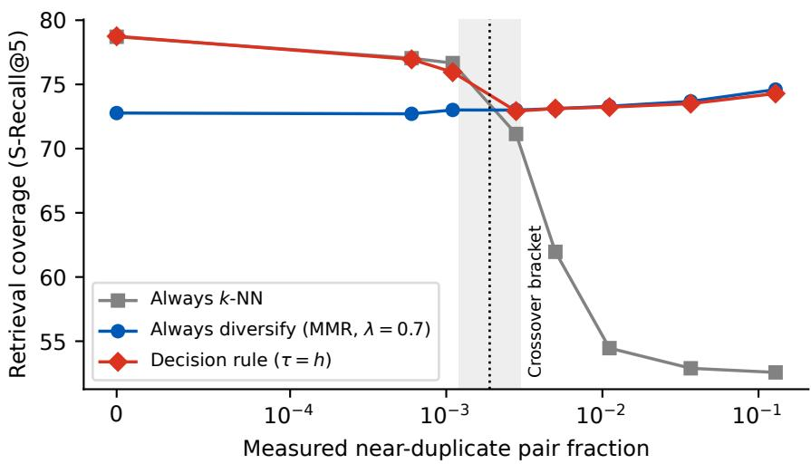  
Figure 1: The paper’s central result: coverage of three policies on HotpotQA fullwiki as measured pool redundancy grows under controlled injection. Nearest-neighbor selection, the framework default, collapses past the shaded crossover bracket (measured redundancy between 0.0012 and 0.0030, Section 6.2). Diversifying hurts on clean pools and the decision rule of Section 4.3 tracks the upper envelope of both.

These diverging conclusions are reached in diferent contexts where the retrieval diversity is given instrumental credit, meaning that diversity is not the end goal but rather a means to an end, as in a RAG pipeline. When an evaluation grants diversity intrinsic credit, namely when its metric suite rewards diversity directly, as the beyond-accuracy metrics of recommendation and search-result diversification do [16, 35, 72], then diversifying retrieval improves results by design.

This paper analyzes the impact of diversity at the retrieval stage in a RAG pipeline. Thus, it is scoped to a context where diversity is granted instrumental credit. Within that scope we organize the question mainly around one observable variable, namely the redundancy of the candidate pool. This leads to a diagnostic computed from the system’s own embeddings which, thresholded at the query’s evidence requirement, sufices to decide whether to diversify. We also quantify how much of the available gain that rule captures. Figure 1 summarizes the result.

Furthermore, the study needs a diversifier predictable enough to serve as a stable probe across regimes. We use a simple geometric construction inspired by the concept of relative neighborhood graph (RNG) [70], namely the RNG-Score (see Figure 3). At both extremes of its margin parameter γ, this score reduces exactly to nearest-neighbor ranking, so validated tuning over a grid containing such a margin can always express “do not diversify”. This exact two-sided fallback anchors the RNG-Score to the relevance-only baseline, and its validation-tuned margin additionally provides an ofline readout of the pool’s duplicate structure.

The contributions of this paper include:

(1) a decision rule which diversifies when the efective number of distinct documents in the nearest-neighbor top-k falls below the number of evidence pieces the query requires, keeps its clean-pool cost within a one-point tolerance on most evaluated sweeps, captures most of the achievable adaptive gain, transfers with no retuning across encoders, datasets, redundancy mechanisms and selection sizes and switches itself of on single-evidence retrieval where diversification has nothing to win;

(2) a regime analysis of retrieval diversification organized around pool redundancy, with protocols that measure redundancy on the embedded pool and manipulate it directly (near-duplicate injection, production-style overlapping chunking, a weak-versus-strong pipeline contrast), all reported on one measured-redundancy axis;

(3) a controlled, seed-replicated study of diversified reranking on fixed pools across multi-hop QA, opendomain QA and BEIR, showing that on clean pools the classical diversifiers lower relevance and coverage-aware diversity in nearly every case, significantly so on the primary coverage endpoint of the headline benchmark;

(4) per-query oracle bounds certifying that on clean pools, no policy routing among the evaluated methods and operating points can gain more than marginally, with headroom opening in proportion to measured redundancy;

(5) misspecification downside, the worst shortfall of a method against the k-NN default over its hyperparameter range when the regime is unknown, as an evaluation criterion measured for every method; the RNG-Score provably reduces to k-NN at both margin extremes, the negative end of its default grid is verified to reproduce k-NN on the evaluated clean pools, and its tuned margin doubles as an ofline diagnostic of duplicate structure.

The decision rule (1) is the most practical contribution: the crossover from the clean to the redundant regime is detectable per query, from the retrieval system’s own embeddings and the task’s evidence requirement, without relevance labels and without knowing which regime one is in.

## 2 Background and Related Work

## 2.1 Modern RAG pipelines

Modern RAG systems decompose retrieval into stages. A first-stage retriever produces a candidate pool by sparse, dense or hybrid retrieval [36, 55, 69, 79], typically accelerated with ANN infrastructure [33, 45]. The pool is usually refined before generation using stronger rerankers, cross-encoders or late-interaction models [2, 47, 57, 63]. Encoders range from compact sentence-embedding models [53] to stronger families such as BGE-M3 and Qwen3-Embedding [12, 78, 86] and proprietary services. Agentic, corrective, graph-based and chain-of-retrieval paradigms iterate the retrieval step [20, 65, 73, 82]. Diversification is orthogonal to all of these choices: every such pipeline ultimately selects k documents from a finite pool and the question is whether that selection should be diversified.

## 2.2 The case for diversity in RAG

Classical information retrieval ofers several diversification mechanisms: MMR greedily trades relevance against similarity to already selected items [9]; DPP-based methods model repulsion probabilistically [13, 39, 77]; Maxmin and related dispersion objectives maximize spread directly [8, 24, 52]; and intent-aware approaches diversify over explicit query aspects [1, 59]. Moreover, work has been done to develop selective diversification in the context of web search results [60] based on specific characteristics of a given query, such as ambiguity [18].

A recent line of work argues that RAG specifically benefits from diversity-aware retrieval. Vendi-RAG [54] couples a Vendi-score retrieval objective [22] with an iterative pipeline in which a LLM judge scores candidate answers and the diversity weight is adapted across rounds. It reports accuracy gains of up to 4.2% on HotpotQA over Adaptive-RAG baselines [32]. DF-RAG [37] builds a geometric MMR variant and selects a per-query diversity level with planner and evaluator LLMs. It reports F1 gains of 4–10% over vanilla RAG with an estimated per-query oracle ceiling around 18%. Retriever portfolios extend the adaptive idea to the retriever level, training a lightweight router that selects per query among a small complementary set of retrievers including diversity-oriented members [66]. Submodular set functions have been applied to the reranking stage to balance relevance and coverage [17], alongside determinantal-point-process selection [42] and relevant-information-gain criteria [49], and scalable set-selection formulations have been proposed for the underlying combinatorial problem [44, 68]. Adjacent adaptive mechanisms let the pipeline decide how many documents to keep per query [46, 81] and ambiguous-question pipelines retrieve across inferred interpretations of the query [28]. A distinct, query-side notion of diversity decomposes queries by lexical diversity for finer-grained relevance assessment [87] or replaces inter-document dissimilarity altogether with coverage of a sub-query demand distribution [85]. Diversity has also been found beneficial for open-ended generation where comprehensiveness or answer diversity is itself the target [27, 56] and for long-context selection [75]. Notably, the most recent entries in this line motivate diversification explicitly by pool redundancy: AdaGReS [48] targets redundant and near-duplicate chunks that waste a token budget. Pool redundancy is also emerging as an evaluation variable in its own right: standard benchmarks measure far cleaner than the finance, legal and patent corpora on which strong retrievers degrade [14] and exact deduplication pays of only outside the clean academic regime [62], though neither line evaluates the selection step itself.

The experimental regimes behind these positive results deserve attention: Vendi-RAG entangles diversification with extra LLM calls and never isolates the selection step on a fixed pool, while DF-RAG retrieves from long contexts chunked into fixed-length windows, a pool redundant by construction, and its headline gains come from per-query adaptive selection of the diversity level rather than from fixed diversification. The set-selection and reranking methods [17, 42, 48, 49] do isolate the diversification step on a fixed can didate pool, but not in the regime studied here: they evaluate on diversity-focused or redundancy-heavy benchmarks—AdaGReS targets near-duplicate chunks by design—or with older first-stage encoders such as Contriever [30]. None isolates the diversification step on pools drawn from nonredundant corpora with state-of-the-art encoders, the configuration of most production vector-search deployments.

## 2.3 The case against diversity in RAG

A complementary literature reaches the opposite conclusion. For web search, Santos, Macdonald, and Ounis [58] showed that novelty-based diversification, which promotes documents merely for being dissimilar to those already selected, does not consistently improve over a standard non-diversified ranking and distinguished such geometric novelty from genuine coverage of query aspects. Their analysis, however, predates RAG and does not relate the value of diversification to measured candidate-pool redundancy or to the evidence requirements of the query, the axes studied here. Controlled evaluations find that MMR ofers no significant advantage over naive nearest-neighbor retrieval [21], that reranking is among the highest-leverage components of a RAG pipeline [74] and, in a biomedical study holding the generator and embeddings fixed, that MMR “sacrifices answer relevancy for diversity” while the dense baseline performs comparably to the best configuration [6]. Studies of context composition show that passages semantically related to the query but not containing the answer are precisely the ones that harm the generator [3, 19] and geometric diversification, by design, substitutes exactly such passages. Analyses of context suficiency [34] likewise indicate that generation needs coverage of the required information, which geometric spread does not measure.

## 2.4 Diversification in recommendation

Recommender systems are the setting in which diversity is given intrinsic evaluation credit through beyondaccuracy metrics that reward explicitly genre coverage and intra-list dissimilarity [35, 72]. The standard methodology is post-processing reranking: a relevance-optimized recommender produces a size-m candidate list per user and a greedy reranker selects n < m items balancing relevance against diversity [9, 10, 77]. Controlled comparisons under this protocol consistently find that diversification pays with DPP delivering strong coverage gains at deployment scale [13, 77]. Search-result diversification reaches the same conclusion under intent-aware metrics [1, 16, 59].

When diversity is given intrinsic credit, the central question of this paper, namely whether diversification in the retrieval stage of a RAG pipeline helps or harms, does not arise, since diversity is then rewarded in its own right. We therefore scope the study to instrumental credit regimes, where diversity can pay only through the final answer, and refer the reader to the literature above for the intrinsic credit regime.

## 2.5 Diversity evaluation metrics

Separating useful coverage from raw spread requires both families of diversity metrics. Annotation-free measures, average pairwise distance (APD) and the Vendi score [22], quantify geometric spread without reference to task structure. Intent-aware measures from the diversification literature, α-NDCG [16], ERR-IA [11] and Subtopic Recall [84], reward covering the distinct facets a query requires and penalize redundant coverage. We derive subtopics without extra annotation: for multi-hop QA, the distinct gold supporting documents of a question; for retrieval tasks with relevance judgements, the relevant-document set of the query.

Disagreement between the two families is diagnostic: a method that raises APD while lowering α-NDCG produces spread without coverage. The same annotation-free statistics, computed on the embedded pool before any labels are consulted, also serve as the redundancy diagnostics of Section 4.

## 2.6 Relative neighborhood graphs

The relative neighborhood graph (RNG) was originally defined for finite planar point sets under the Euclidean distance [70] and extends naturally to any finite metric space [31]. The soft score studied here requires still less structure, namely a symmetric nonnegative dissimilarity (Appendix B). We say two points x, y are relative neighbors when no third point z satisfies both $d ( z , x ) < d ( x , y )$ and $d ( z , y ) < d ( x , y )$ . Equivalently, the open lune of x and y, namely the intersection of the open balls of radius $d ( x , y )$ centered at x and $y ,$ is empty (Figure 2).

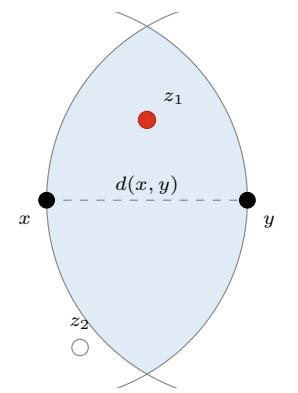  
(a) The lune of x and $y .$

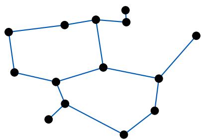  
(b) A relative neighborhood graph.  
Figure 2: (a) The open lune of x and y (shaded) is the intersection of the two open balls of radius $d ( x , y )$ centered at x and $y ; z _ { 1 }$ lies inside it and obstructs the pair $\{ x , y \}$ , so that pair is not an edge of the RNG, while $z _ { 2 }$ does not. (b) The RNG of a planar point set, with an edge between exactly the pairs whose lune is empty.

In the retrieval setting, $x = q$ is the query and $y = w$ is a candidate document. A third document v with $d ( q , v ) < d ( q , w )$ and $d ( v , w ) < d ( q , w )$ lies in the lune of q and w: it is closer to the query than w and also close to w, making w geometrically redundant relative to q. Such a point v is said to obstruct the pair $( q , w )$

RNG-style edge pruning is foundational in graph-based approximate nearest-neighbor indexing: HNSW, NSG and DiskANN sparsify neighborhood graphs by discarding edges whose lune contains another indexed point, at index-construction time and between corpus points, with DiskANN’s α-pruning relaxing the lune test by a multiplicative slack [23, 45, 67]. Query-centered geometric diverse-neighbor retrieval itself also predates the present work: Küçüktunç and Ferhatosmanoğlu [38] introduced λ-diverse nearest-neighbor browsing for multidimensional data, using proximity-graph constructions to return neighbors that are simultaneously close to the query and mutually dispersed. Recent work instead brings diversity into ANN retrieval, either by diversifying the graph search itself [76] or by designing data structures for diverse similarity queries under a hard diversity objective [4].

The present paper uses the lune condition at query time, anchored at the query q as in Figure 3, but softens the binary test into a cumulative penalty that ranks a fixed pool rather than pruning a graph or enforcing a hard constraint. The contribution is the cumulative relative-neighborhood hinge score of Definition 3.1, with its explicit nearest-neighbor limit analysis, together with an evidence-aware selection rule, evaluated across controlled RAG redundancy regimes, none of which appears in these earlier constructions.

## 3 The Relative-Neighborhood Score

In order to analyze the impact of diversification at the retrieval stage of a RAG pipeline, we use diferent diversifiers such as MMR [9] and DPP [13, 39]. Here, we introduce the RNG-Score, a soft score used as a reranker and which can be tuned either to diversify retrieval or to fall back to k-NN as needed.

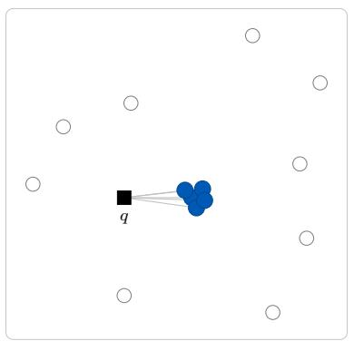  
(a) k-NN

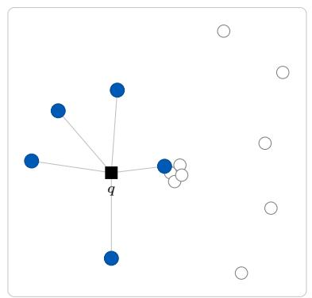  
(b) RNG-Score (γ = 0)

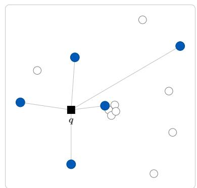  
(c) MMR (λ = 0.5)  
Figure 3: One candidate pool, three computed top-5 selections (filled blue = selected, open = unselected, ${ \boldsymbol { \mathbf { \mathit { \Pi } } } } \mathbf { \overline { { \mathbf { \Pi } } } } \mathbf { \overline { { \mathbf { \Pi } } } } \mathbf { \overline { { \mathbf { \Pi } } } } \mathbf { \overline { { \mathbf { \Pi } } } } \mathbf { \overline { { \mathbf { \Pi } } } } \mathbf { \overline { { \mathbf { \Pi } } } } \mathbf { \overline { { \mathbf { \Pi } } } } \mathbf { \overline { { \mathbf { \Pi } } } } \mathbf { \overline { { \mathbf { \Pi } } } } \mathbf { \overline { { \mathbf { \Pi } } } } \mathbf { \overline { { \mathbf { \Pi } } } } \mathbf { \overline { { \mathbf { \Pi } } } } \mathbf { \overline { { \mathbf { \Pi } } } } \mathbf { \overline { { \mathbf { \Pi } } } } \mathbf { \overline { { \mathbf { \Pi } } } } \mathbf { \overline { { \mathbf { \Pi } } } } \mathbf { \overline { { \mathbf { \Pi } } } } \mathbf { \overline { { \mathbf { \Pi } } } } \mathbf { \overline { { \mathbf { \Pi } } } } \mathbf { \overline { { \mathbf { \Pi } } } } \mathbf { \overline { { \mathbf { \Pi } } } } \mathbf { \overline { { \mathbf { \Pi } } } } \mathbf { \overline { { \mathbf \Pi } } } \mathbf { \overline { { \Pi \mathbf { \Pi } } } } \mathbf  \overline { \overline { \mathbf { \Pi } } } \mathbf { \overline { \Pi } } \mathbf { \overline { \Pi } } \mathbf { \overline { \Pi \Pi } } \mathbf \mathbf { \overline { \Pi \Pi } } \mathbf \mathbf { \overline { \Pi \Pi } } \mathbf \mathbf { \overline \overline { \Pi \Pi } } \mathbf \mathbf \mathbf { \overline \Pi  \overline \Pi \Pi } \mathbf \mathbf   \Pi \Pi  \overline \Pi \mathbf \Pi \Pi  \Pi \mathbf \Pi \Pi  \mathbf \Pi \Pi  \Pi \mathbf \Pi  \Pi  \Pi  \mathbf \Pi  \Pi \mathbf  $ (a) k-NN spends the whole budget on a tight cluster of near-duplicates; (b) the RNG-Score keeps one cluste representative and disperses to nearby distinct points; (c) MMR pushes further out onto less relevant points.

## 3.1 Setup

Let $V = \{ v _ { 1 } , \ldots , v _ { m } \} \subset \mathbb { R } ^ { D }$ be a finite candidate pool for a fixed query $q \in \mathbb { R } ^ { D }$ . We assume the pool is the result of a first-stage retriever and that $m \gg k$ but remains moderate enough for pairwise reranking. Distances are denoted by $d ( \cdot , \cdot )$ . Throughout the paper, it is enough to assume that d is a symmetric nonnegative dissimilarity on $V \cup \{ q \}$ (see Appendix B for the precise definition). Candidates are ranked by increasing score, with ties broken by the deterministic sorting routine of the implementation applied identically by every method including k-NN.

For a candidate $w \in V$ , define its set of closer competitors

$$
P ( w ; q , V ) = \{ v \in V : d ( q , v ) < d ( q , w ) \} .
$$

These are the only documents that can make w redundant relative to the query. Because the inequality is strict, candidates at exactly equal query distance never obstruct one another: exactly coincident duplicates are each scored as if the other were absent and ranked as k-NN ranks them (both can be selected), so the suppression the score provides targets near-duplicates rather than verbatim copies (Section 3.3). Score ties fall under the deterministic rule above: since tied candidates are in practice verbatim copies sharing identity, text and embedding, no reported value depends on their resolution.

## 3.2 Definition

Definition 3.1 (RNG-Score). Let $\gamma \in \mathbb { R }$ . For $w \in V$ , define

$$
\mathrm { s c o r e } _ { \gamma } ( w ; q , V ) = d ( q , w ) + \sum _ { v \in { \cal P } ( w ; q , V ) } [ d ( q , w ) - d ( v , w ) + \gamma ] _ { + } ,\tag{3.1}
$$

where $[ x ] _ { + } = \operatorname* { m a x } ( x , 0 )$

The first term is simply the distance from w to the query, while each summand is an obstruction penalty. It is positive exactly when $d ( v , w ) < d ( q , w ) + \gamma$ , i.e. when a closer document v sits close enough to w to make w look redundant from the viewpoint of q. Positive γ makes the penalty stricter, negative γ relaxes it. The induced reranker keeps the k lowest-scoring candidates with a computational cost of $O ( m ^ { 2 } D )$ : measured at $m = 1 0 0 , k = 5$ and $D = 1 0 2 4$ , the full reranking pass costs 230 µs per query on average (median 214 $\mu \mathrm { s } ,$ , 95th percentile $3 7 8 \mu \mathrm { { s } } ) , { } ^ { 2 }$ negligible against embedding and generation, so reranking cost is not studied further.

Table 1 shows the three selectors on a real HotpotQA fullwiki query: k-NN fills the list with near-identical sibling articles and misses the second gold document, the RNG-Score keeps one cluster representative and recovers the second document while MMR disperses onto less relevant material.

Table 1: A HotpotQA fullwiki query needing two pieces of evidence (1925 Birthday Honours and George V, in bold).
<table><tr><td>rank</td><td>k-NN</td><td>RNG-Score  $\scriptstyle ( \gamma = 0 )$ </td><td>MMR (λ=0.5)</td></tr><tr><td>1</td><td>1925 Birthday Honours</td><td>1925 Birthday Honours</td><td>1925 Birthday Honours</td></tr><tr><td>2</td><td>1915 Birthday Honours</td><td>David Lloyd George</td><td>Edward VII</td></tr><tr><td>3</td><td>1924 Birthday Honours</td><td>1915 Birthday Honours</td><td>George Champagne</td></tr><tr><td>4</td><td>1926 Birthday Honours</td><td>Henry V, Holy Roman Emperor</td><td>Julius Meinl V</td></tr><tr><td>5</td><td>1927 Birthday Honours</td><td>George V</td><td>A. Thynn, Marquess of Bath</td></tr></table>

## 3.3 Properties and instantiation

The score deviates from pure relevance only where there is geometric obstruction and is otherwise pinned to nearest-neighbor ranking, which is what lets its tuned parameter reflect the pool rather than the tuner. In particular, it reduces to k-NN ranking at both extremes of the margin (Propositions A.4 and A.5), so a margin grid containing a deactivating margin $( \gamma \leq \gamma _ { 0 }$ in Proposition A.4, under cosine distance $\gamma = - 2$ always sufices) contains the relevance-only baseline as a reachable operating point (Corollary A.6). Validated tuning over such a grid never underperforms k-NN on the validation set itself: this is an optimization identity and Theorem A.7 gives the corresponding finite-sample statement for unseen queries. The evaluated grids stop short of $\gamma = - 2$ , but that margin is k-NN itself, which every table reports, so the theorem applies without an additional run. The fallback carries no guarantee at interior margins: since the score consults no relevance labels, an interior γ can reorder the selection adversely for the task, so worst-case behavior over the grid is an empirical quantity, reported in Section 6.2. MMR shares a one-sided version of the fallback, recovering pure relevance at λ = 1, whereas Maxmin and DPP have no operating point that recovers relevance-only ranking. The RNG-Score is distinctive in reaching the fallback from both margin extremes, which keeps the tuned margin interpretable as a pool diagnostic throughout the sweep.

The obstruction mechanism also delimits the score’s scope along the duplication axis. The hinge penalizes a candidate through strictly closer near-copies: for $v \in P ( w ; q , V )$ with $d ( v , w ) \to 0$ , the penalty approaches $[ d ( q , w ) + \gamma ] _ { + }$ , its largest attainable value for that pair, so near-duplicates of better-ranked content are suppressed most strongly. Exactly coincident copies, by contrast, are not competitors of one another under the strict inequality and are not suppressed at all: on byte-exact duplication the score reduces to k-NN behavior and its redundancy gains in the sweeps come entirely from the perturbed copies. The score therefore targets the semantic near-duplicate structure studied in this paper, while byte-exact duplication is the regime of hash-level deduplication [62], removable upstream at negligible cost.

In many RAG pipelines, documents in the corpus are normalized and similarity between documents v and w is measured using cosine similarity, which we note ${ \langle v , w \rangle }$ . In this context, the corresponding distance is $d ( v , w ) = 1 - \langle v , w \rangle$ and the RNG-Score for given query q and pool V becomes

$$
\mathrm { s c o r e } _ { \gamma } ^ { c } ( w ; q , V ) = 1 - \langle q , w \rangle + \sum _ { \stackrel { v \in V } { \langle q , v \rangle > \langle q , w \rangle } } [ \langle v , w \rangle - \langle q , w \rangle + \gamma ] _ { + } .\tag{3.2}
$$

Furthermore, the RNG-Score is adaptable to the context where the query–document distance difers from the distance in the embedding space, as is the case when using a cross-encoder (Appendix B). We may also adapt the RNG-Score so that it takes as input a kernel analogously to DPP (Appendix C).

## 4 Redundancy Diagnostics and the Decision Rule

The regime analysis of this paper is only actionable if the controlling variable can be observed by a deployed system cheaply and without labels. This section defines the two diagnostics we use, at the deployment level and at the query level, and the decision rule built on the latter. Both diagnostics are computed from the embedded candidate pool that the retrieval system already holds: neither consults relevance judgements, gold answers or any model beyond the existing encoder.

## 4.1 Near-duplicate pair fraction

For an embedded pool V with unit-normalized embeddings, define

$$
\mathrm { P o o l R e d u n d a n c y } ( V ) = \binom { | V | } { 2 } ^ { - 1 } \left| \left\{ \left\{ v , w \right\} \subset V : \langle v , w \rangle > 0 . 9 5 \right\} \right| ,\tag{4.1}
$$

the fraction of passage pairs whose cosine similarity exceeds a near-duplicate threshold, fixed at 0.95 throughout. Two properties of the statistic should be kept in mind when comparing across deployments: the cutof’s meaning depends on the encoder’s similarity scale and the pair fraction grows quadratically with duplicate-cluster size. Thus, comparisons should hold the encoder and the pool size m fixed, as all sweeps in this paper do. In our experiments V is each query’s top-m candidate pool and we report per-condition means over queries. Averaged over a sample of production queries, the same statistic places any deployment on the common measured-redundancy axis along which we report the synthetic injection sweep and the natural chunking sweep of Section 6.2, so that a measured value can be compared directly against the crossover observed in our experiments.

## 4.2 Efective size of the nearest-neighbor selection

The pair fraction (4.1) is a property of the whole pool. Nevertheless, what determines whether diversification helps for a specific query is whether redundancy crowds the top of that query’s ranking. We therefore use a sharper, selection-centered statistic. We run plain nearest-neighbor selection and measure the efective number of distinct documents among the k selected, the Vendi score [22] of the embedding similarity matrix of the selection:

$$
T ( q ) = { \mathrm { V e n d i } } { \big ( } k { \mathrm { - N N } } ( q ) { \big ) } ~ \in ~ [ 1 , k ] .\tag{4.2}
$$

$T ( q ) \approx k$ means the k selected documents are mutually orthogonal, while $T ( q ) \approx 1$ means the selection has collapsed onto near-copies of a single document. Following the semantics of the Vendi score [22], the efective number of distinct documents measures how many geometrically distinct embeddings the selection efectively contains, not how many semantically distinct evidence pieces it covers; how well this geometric quantit serves as a per-query regime diagnostic is answered empirically in Section 6.4. The statistic costs one $k \times k$ eigendecomposition on embeddings already in memory: under the measurement protocol of footnote 2, the full trigger, kernel construction included, costs 20.5 µs per query on average at $k = 5$ and $D = 1 0 2 4$ (median $2 0 . 3 \mu \mathrm { s }$ , 95th percentile $2 5 . 8 \mu \mathrm { s } )$ .

## 4.3 The decision rule

The decision rule is a one-line policy with two frozen choices, a threshold $\tau \in [ 1 , k ]$ and a fallback diversifier $D ;$

$$
\operatorname { s e l e c t } ( q ) = { \left\{ \begin{array} { l l } { D ( q ) } & { { \mathrm { i f ~ } } T ( q ) < \tau , } \\ { k { \mathrm { - N N } } ( q ) } & { { \mathrm { o t h e r w i s e } } . } \end{array} \right. }\tag{4.3}
$$

The threshold is set to the budgeted evidence requirement, $\tau = \operatorname* { m i n } \{ h , k \}$ , where h is the number of distinct evidence pieces a query needs: since $T ( q ) \in [ 1 , k ]$ , the cap keeps the threshold inside the range of the statistic. Two supporting documents give $h = 2$ on the multi-hop benchmarks, while h = 1 makes the trigger condition $T ( q ) < 1$ unsatisfiable, so on single-hop retrieval the rule reduces to k-NN by construction. Evidence for the diagnostic itself accordingly comes from the interior cases between this endpoint and the saturated one where the rule nearly always triggers. Where h is read from gold annotations (hop counts, relevant-set sizes), we label the results oracle analyses of the rule under a known evidence requirement, the natural upper reference for a deployed policy that estimates h from its workload without consulting test labels. On the graded-relevance tasks, relevant-document count serves as a proxy for evidence multiplicity, since several relevant documents can be substitutes for one fact rather than complementary facts. The fallback diversifier D is selected on a validation set pooled across redundancy conditions and then frozen.

The rule is a realizable member of the family of query-adaptive policies that the all-methods oracle of Section 6.3 bounds from above, which makes the comparison meaningful in both directions: the oracle says how much any policy routing among the evaluated methods could gain, while the rule says how much of that a single-threshold policy actually captures. Section 6.4 confirms the anchoring empirically: threshold tuning left free recovers $\tau ^ { * } \approx h$ at both $k = 5$ and $k = 1 0$ , with a wide plateau of equivalent thresholds around it.

Note that the paper thus carries two thresholds with diferent roles. The near-duplicate pair fraction is a statistic measured on a pool of m documents while the rule threshold τ lives on the individual query: it tests the selection of $k \ll m$ documents the system has just made. The two are linked through the rule trigger rate: as a pool’s measured redundancy passes a certain crossover (see for example Figure 1), the per-query statistic $T ( q )$ collapses for most queries and the fraction of queries falling below τ jumps from under 16% to over 80% (Section 6.4). Thus, thresholding each query at τ implements the pool-level boundary automatically without ever measuring the pool redundancy. The validation-tuned RNG-Score margin of Section 3 supplies a third complementary readout, ofline and at the workload level since validation queries are needed to compute it.

## 5 Experimental Setup

This section details the research questions, datasets, models, baselines, evaluation metrics and protocols. The results follow in Section 6.

## 5.1 Research questions

The evaluation is organized around five research questions.

RQ1 Diversification on standard benchmarks. On pools retrieved from nonredundant corpora with state-ofthe-art encoders, does any geometric diversifier improve results quality over nearest-neighbor selection?

RQ2 Manipulating pool redundancy. Does raising pool redundancy create a regime in which diversification pays and what is the risk of committing to a method without knowing the regime?

RQ3 Oracle headroom. How much could a query-adaptive policy routing among the evaluated diversifiers gain in each regime?

RQ4 The decision rule. Can the diagnostic of Section 4.2 decide per query whether to diversify and how much of the oracle headroom of RQ3 does the rule capture?

RQ5 Answer quality under redundancy. Do the findings carry over to end-to-end generation quality in a redundant regime?

## 5.2 Datasets

HotpotQA (fullwiki) [83] is the primary multi-hop benchmark: each question needs two supporting paragraphs from distinct articles and candidate pools are the unique passages of the top-100 MDR chains of Xiong, Li, Iyer, Du, Lewis, Wang, Mehdad, Yih, Riedel, Kiela, and Oguz [80] (between 80–120 candidates per query, two gold passages). 2WikiMultiHopQA [26] and MuSiQue [71] (two to four hops) vary hop count at fixed credit and redundancy regimes. Candidate pools for 2WikiMultiHopQA are the ten paragraphs of its distractor setting, the supporting paragraphs plus distractors. MuSiQue, restricted to its answerable subset, provides roughly twenty paragraphs per question (two to four of them supporting), which form its pools. Natural Questions Open [40] with DPR top-100 pools [36] is a single-hop, single-answer control. For the redundancy sweep, we collapse a query’s answer-containing passages to one subtopic, since DPR marks every such passage relevant (around 4.6 per query) and would otherwise misread as multi-evidence. BEIR [69] supplies heterogeneous graded-relevance tasks (SciFact, FiQA-2018 and TREC-COVID together with the argument-retrieval tasks ArguAna and Webis-Touché-2020), with each query’s relevant set as its subtopics. SciFact anchors the single-evidence end (92% of queries one relevant document), FiQA-2018 the multi-evidence middle (typically two to three relevant documents per query) and TREC-COVID the saturated extreme (mean 493).

## 5.3 Models

Because the analysis applies to any finite candidate pool, we evaluate along an encoder-capacity axis. The strong stack uses bge-m3 [12] (1024-dimensional) and Qwen3-Embedding-4B [86] (2560-dimensional) as dense encoders and bge-reranker-v2-m3, the reranker released alongside BGE-M3 [12], as the cross-encoder for the multi-stage half of RQ1. The weak encoder all-MiniLM-L6-v2 [53], representative of lightweight deployments, supplies a capacity contrast for RQ2. Encoder capacity is treated as a third route into the redundant regime, not as a robustness check. Downstream generation uses flan-t5-base [15] as the reader (4-beam decoding); the EM/F1 columns of Table 2 and the clean- and heavy-redundancy comparison of Section 6.5 are instead computed with the instruction-tuned Qwen3.8-27B [51] under deterministic decoding.3

## 5.4 Baselines

We compare k-nearest-neighbor selection (k-NN) against four reranking baselines applied to the same candidate pool: MMR [9] with trade-of weight $\lambda \in \{ 0 . 3 , 0 . 5 , 0 . 7 \}$ , Maxmin dispersion [52], greedy DPP selection [13, 39] and the RNG-Score with margin grid $\gamma \in \{ - 0 . 5 , - 0 . 3 , - 0 . 1 , - 0 . 0 5 , 0 , 0 . 0 5 , 0 . 1 , 0 . 3 , 0 . 5 \} . ^ { 4 }$ Maxmin is query-agnostic and is included as a diversity stress-test rather than as a model of relevance-aware reranking. Greedy DPP uses the quality-weighted kernel $L = \mathrm { d i a g } ( s ) C ~ \mathrm { d i a g } ( s )$ (C the cosine Gram matrix of the pool, s the query similarities clipped at zero) with greedy MAP inference by incremental orthogonalization [13]. We refer to MMR, Maxmin and greedy DPP collectively as fixed-pressure diversifiers: each applies a diversification pressure set by its parameters, with no operating point in the evaluated grids that recovers relevance-only ranking. MMR does recover it at the endpoint λ = 1, where its selection criterion reduces to relevance alone and reproduces the k-NN ranking exactly under the shared tie rule. The k-NN rows of the tables therefore already report this endpoint and the grids list only interior operating points, so the tuned MMR of the sweeps is the best interior one and its clean-pool toll and sign change (Section 6.2) concern interior diversification; an MMR tuned over a grid containing λ = 1 would choose between that row and k-NN on validation, a policy that the per-level tuned row of Table 9 bounds on validation. Within the evaluated grids, where λ = 1 is represented by the k-NN row, the RNG-Score is the only method whose tuning can express “do not diversify”.

## 5.5 Evaluation metrics

We report four metric families so that relevance, raw spread, genuine coverage and downstream utility can be distinguished. Relevance: Recall@k and NDCG@k against gold passages or graded judgements. Annotation-free diversity: average pairwise cosine distance (APD) and the Vendi score [22]. Intent-aware diversity: α-NDCG@k [16] with redundancy parameter $\alpha = 0 . 5$ and Subtopic Recall (S-Recall@k) [84], with subtopics derived as in Section 5.2. Generation quality: exact match (EM) and token-level F1 against reference answers. All relevance, intent-aware and generation metrics are reported on a 0–100 scale, whereas APD and the Vendi score are reported on their natural scales. Recall@k counts all gold passages of a query, including the roughly 5% that the first-stage pool fails to contain while S-Recall@k counts retrievable subtopics only, which is why the two difer at the baseline.

Misspecification downside. If the value of diversification depends on a regime variable that practitioners do not usually measure, then the practically relevant property of a method is not its tuned performance in either regime but its worst case across regimes. Writing $U _ { r } ( M _ { \theta } )$ for the test utility (S-Recall@5) of method M at operating point θ in regime r, we report

$$
\mathrm { d o w n s i d e } ( M ) = \operatorname* { m a x } _ { r } \operatorname* { m a x } _ { \theta } \big [ U _ { r } ( k \mathrm { - } \mathrm { N N } ) - U _ { r } ( M _ { \theta } ) \big ] _ { + } ,\tag{5.1}
$$

the worst shortfall against the relevance-only default, over distinct redundancy regimes and over the method’s full hyperparameter grid (the sweep grids of Section 5.6). The quantity is a maximum over the grid, so the values computed on the sweep grids upper-bound those of the narrower default grids (whose only member absent from the sweep grids, $\gamma = - 0 . 5$ , reproduces k-NN) and it is intrinsically grid-dependent: enlarging a grid with a poor operating point increases it. For k-NN, which commits no operating point, the reference is instead the best tuned method in each regime: that row is therefore constructed diferently from the others.

Minimax regret. The downside is anchored at the k-NN default. Its standard decision-theoretic complement [61] measures every method against the same per-regime oracle. For the common action library C consisting of k-NN and every evaluated operating point of the compared methods, let $U _ { r } ^ { * } = \operatorname* { m a x } _ { a \in { \mathcal { C } } } U _ { r } ( a )$ be the oracle utility in regime r. A method that must commit one operating point θ from its grid $\Theta _ { M }$ before the regime is known has minimax regret

$$
\mathrm { r e g r e t } ( M ) = \operatorname * { m i n } _ { \theta \in \Theta _ { M } } \operatorname * { m a x } _ { r } \big \{ U _ { r } ^ { * } - U _ { r } ( M _ { \theta } ) \big \} ,\tag{5.2}
$$

with regre $\begin{array} { r } { \mathrm { \Lambda } _ { [ k \mathrm { - } \mathrm { N N } ) } = \operatorname* { m a x } _ { r } \{ U _ { r } ^ { * } - U _ { r } ( k \mathrm { - } \mathrm { N N } ) \} } \end{array}$ for the parameter-free default. Here, every row uses the same $U _ { r } ^ { * }$

The two quantities answer diferent questions, namely the worst shortfall against the k-NN default a practitioner would otherwise run versus the worst distance from the best fixed commitment in hindsight. Both are grid-dependent and reported in Table 5.

## 5.6 Protocol

For each query, a first-stage retriever produces a candidate pool of size m and every reranking method selects k documents from the same pool, so that all diferences are attributable to the selection step. Unless stated otherwise, $m = 1 0 0$ and $k = 5$ for QA tasks while $m = 1 0 0$ and $k = 1 0$ for BEIR tasks. Hyperparameters (γ for the relative-neighborhood scores, λ for MMR) are selected on a held-out validation split of 20% of the queries and reported on the remaining test split.5 Unless identified as single-run, every sweep and comparison table is repeated under three seeds, the seed controlling both the injected near-duplicates and the validation/test split. On HotpotQA, each split is 1,481 validation and 5,924 test queries. The same frozen splits underlie RQ1 and RQ2–RQ4, so that all derived analyses are computed from one set of per-query results. Sweeps execute every query, but hyperparameters are selected on the validation split alone and every reported summary and inferential statement is computed exclusively on the per-seed test split.

Statistical reporting. Unless stated otherwise, every reported value is a mean over the three seeds, and every comparison is a paired diference against k-NN on the same pools, evaluated on test queries only. Uncertainty is quantified with query-level bootstrap confidence intervals, and “significant” means a multiplicity-adjusted p-value below 0.05. Quoted paired efects and intervals are computed from unrounded per-query means, in some cases under a query-level aggregation where the corresponding table displays seed means, so the diference of two displayed table cells can deviate from the quoted paired efect in the last displayed digit. The primary test of each sweep asks whether a method’s paired efect improves from the clean to the most redundant condition. Efects within one point on the 0–100 metric scales are treated as immateria regardless of significance, while a nonsignificant diference is never read as evidence of equivalence. Single-run and aggregate-only results are identified as such and reported descriptively. The complete procedure, its provenance and its limits are given in Appendix D.

Cross-encoder pipeline. The multi-stage experiments retrieve the top-m passages with bge-m3, rescore them with bge-reranker-v2-m3 and hand the rescored pool to the rerankers. Because the RNG-Score is defined through a distance while a cross-encoder returns only query–document relevance, these experiments use the dissimilarity construction of Appendix B, with cross-encoder relevance as the query–document distance and embedding distance between documents.

Manipulating and measuring redundancy. Injection adds to each pool a fraction $\rho$ of sentence-shufled near-duplicate copies that retain their source’s identity (so coverage metrics count them as redundant, not as new evidence) drawn half from gold passages and half uniformly. Sampling half the copies from gold passages is a deliberately adversarial choice: it constructs exactly the mechanism by which duplicates of highly relevant material crowd out complementary evidence, so the injection sweeps are read as controlled stress tests of that mechanism rather than as estimates of the average efect of naturally occurring redundancy. The chunk-overlap sweeps below provide the naturalistic counterpart. The perturbation permutes the sentence units of a punctuation-based splitter without deleting or editing text, so each copy preserves its source verbatim up to unit order (a boundary inside an abbreviation is the one case that separates a multi-word span); the identity-based coverage and relevance metrics are unafected. Pools are re-embedded after injection and the candidate pool size is held fixed throughout: each query’s candidate count is frozen at its clean value min{m, clean pool size} before any manipulation. At every level and seed, the post-truncation candidate count equals this frozen target so that redundancy is never confounded with pool size.6

Because copies share an identity, NDCG credits only the first retrieved copy and hyperparameters are tuned on S-Recall@k (the $\alpha = 0 . 5$ gain of α-NDCG@k would otherwise reward repeated copies). Every injection and chunk-overlap sweep uses the grids $\lambda \in \{ 0 . 3 , 0 . 5 , 0 . 7 , 0 . 9 \}$ and $\gamma \in \{ - 0 . 3 , - 0 . 2 , - 0 . 1 , - 0 . 0 5 , 0 , 0 . 0 5 , 0 . 1 , 0 . 2 , 0 . 3 ,$ $0 . 5 , 1 \}$ , which refine the default grids of Section 5.4 and extend their upper ends $( \lambda = 0 . 9 ,$ , margins up to 1) after validation-selected operating points of early HotpotQA sweeps sat on a boundary. All tuning is re-derived over these fixed grids from the frozen validation splits, so no reported statistic depends on when the extension was decided. The headline sweep refines the grid where the regime turns, $\rho \in \{ 0 , 0 . 0 2 5 , 0 . 0 5 , 0 . 1 , 0 . 1 5 , 0 . 2 5 , 0 . 5 , 1 \}$ on HotpotQA with bge-m3 (all 7,405 queries), replicated with Qwen3-Embedding-4B and all-MiniLM-L6-v2 (encoder-capacity axis) and on SciFact and FiQA-2018 $( k = 1 0 )$ , the single- and multi-evidence ends of the BEIR tasks. Overlapping chunking instead re-chunks each pool passage into 60-word sliding windows at overlap $\in \{ 0 , 0 . 2 5 , 0 . 5 , 0 . 7 5 \}$ , inheriting source identity with no text perturbed, the mechanism of production ingestion pipelines. The same frozen per-query pool size target applies. A selected window inherits its source’s gold identity even when the 60-word window omits the answer-bearing span, an optimistic convention for coverage metrics. Both protocols report the measured redundancy (4.1), placing synthetic and natural sweeps on one axis.

Rule and oracle. The decision rule (4.3) fixes $\tau = \operatorname* { m i n } \{ h , k \}$ , where h is the number of evidence pieces a given query requires, and selects the fallback $D ^ { * }$ by maximizing mean S-Recall@5 on validation queries pooled across all injection levels (never observing the level identity). As a check on the anchoring, the threshold is additionally tuned freely over [1, k] jointly with D. The evidence requirement is $h = 2$ on the two-hop datasets, the per-query hop count on $\mathrm { M u S i Q u e } , h = 1$ on the single-answer datasets and the query’s relevant-set size on the graded-relevance BEIR tasks. On TREC-COVID the uncapped h exceeds k for essentially every query, so there the budgeted rule stays close to always-diversify and does not exercise the diagnostic. Because h is read from gold annotations, all gold-h rows are oracle analyses in the sense of Section 4.3. The frozen rule is then evaluated against always-k-NN, always-D∗, the per-level tuned best method and the all-methods oracle. The per-level tuning selects, on each injection level’s validation split, the best method and operating point for that level. Both oracles operate per query with ground-truth access: the per-method oracle [37] sweeps one method’s grid and records the best value achievable, and the all-methods oracle additionally chooses the method, upper-bounding any test-time policy that routes among the evaluated methods and operating points. A new selector, a changed candidate pool, query decomposition or a jointly trained retriever is not bounded by it. A query counts as improved when the oracle’s S-Recall strictly exceeds k-NN’s (library in Appendix D).

Generation. Generation experiments attach the reader to the sweep, generating an answer from each method’s top-k at every level and scoring it with the generation metrics of Section 5.5. The decision rule’s answers are reconstructed per query without extra generation, returning the diversifier’s answer when the trigger fires and the k-NN answer otherwise.

## 6 Results

## 6.1 RQ1: Diversification on standard benchmarks

Table 2 reports controlled reranking on HotpotQA with bge-m3 (test splits, three seeds, paired inference against k-NN). Every classical diversifier trades relevance for spread, losing between 0.7 and 33.0 S-Recall@5 points, significantly for each method (even the mildest loss, MMR’s at λ = 0.9, carries the 95% CI [−1.05, −0.54]). Crucially, the intent-aware metrics fall with relevance as APD and Vendi rise. The tuned RNG-Score sits on top of k-NN by +0.2 S-Recall points (95% CI [0.04, 0.34]), not significant after Holm adjustment and inside the materiality tolerance either way. On these pools, the correct amount of diversification is approximately none.

Table 2: Controlled reranking on HotpotQA (MDR top-100 pools, bge-m3, m = 100, k = 5; clean level of the sweep of Section 6.2, on its grids). The four left metrics are objectives (best in bold, second best underlined); APD and Vendi are descriptive spread statistics, not objectives; EM and F1: one deterministic Qwen3.8-27B run, seed-0 test split (5,924 queries).
<table><tr><td>Method</td><td>Recall@5</td><td>NDCG@5</td><td>α-NDCG@5</td><td>S-Recall@5</td><td>APD</td><td>Vendi</td><td>EM</td><td>F1</td></tr><tr><td>k-NN</td><td>74.8</td><td>73.9</td><td>76.5</td><td>78.7</td><td>0.450</td><td>3.08</td><td>50.8</td><td>63.6</td></tr><tr><td>MMR (λ = 0.3)</td><td>45.3</td><td>53.3</td><td>55.4</td><td>48.1</td><td>0.630</td><td>4.00</td><td>36.4</td><td>47.8</td></tr><tr><td>MMR (λ = 0.5)</td><td>55.6</td><td>60.3</td><td>62.5</td><td>58.6</td><td>0.574</td><td>3.73</td><td>41.6</td><td>53.5</td></tr><tr><td>MMR (λ = 0.7)</td><td>69.2</td><td>70.0</td><td>72.5</td><td>72.8</td><td>0.505</td><td>3.38</td><td>47.6</td><td>59.9</td></tr><tr><td>MMR (λ = 0.9)</td><td>74.1</td><td>73.5</td><td>76.1</td><td>78.0</td><td>0.463</td><td>3.16</td><td>50.3</td><td>62.9</td></tr><tr><td>Maxmin</td><td>42.9</td><td>51.7</td><td>53.8</td><td>45.7</td><td>0.625</td><td>3.85</td><td>36.0</td><td>47.4</td></tr><tr><td>Greedy DPP</td><td>65.6</td><td>68.0</td><td>70.5</td><td>69.1</td><td>0.522</td><td>3.47</td><td>45.9</td><td>58.0</td></tr><tr><td>RNG-SCORE (γ* = 0.2)</td><td>75.1</td><td>74.2</td><td>76.8</td><td>79.0</td><td>0.462</td><td>3.14</td><td>50.9</td><td>63.6</td></tr></table>

The retrieval losses propagate to generated answers (EM/F1 columns of Table 2). On the clean HotpotQA pools, every fixed-pressure diversifier loses EM against k-NN, while the tuned RNG-Score sits 0.1 EM points above k-NN. Section 6.5 carries this into the redundant regime, where the picture inverts.

The single-stage behavior of 2WikiMultiHopQA, MuSiQue and the NQ-Open single-answer control tracks their measured pool redundancy (Appendix E): 2WikiMultiHopQA, whose natural pools measure below the crossover of Section 6.2, reproduces these conclusions, while MuSiQue’s distractor pools measure at the crossover fraction and mild diversification pays about two S-Recall points. Under the cross-encoder pipelines below, all four datasets lead to the same conclusion, i.e. diversification hurts and top-k selection wins.

Table 3 extends the study to five BEIR tasks. The conclusion is uniform: every fixed-pressure diversifier loses on both NDCG@10 and α-NDCG@10 metrics. The tuned RNG-Score is the exception on the three seed-replicated tasks, where validation drives its margin into or near the fallback region and leaves it within one point of k-NN.

Table 3: NDCG@10 / α-NDCG@10 on five BEIR tasks (bge-m3, k = 10; MMR at λ = 0.5; best in bold, second best underlined). SciFact, FiQA and TREC-COVID are seed-replicated; conclusions on these small query sets are exploratory (Appendix D). ArguAna and Touché are single-run.
<table><tr><td>Method</td><td>SciFact</td><td>FiQA</td><td>TREC-COVID</td><td>ArguAna</td><td>Touché</td></tr><tr><td>k-NN</td><td>64.1/64.1</td><td>41.7/46.7</td><td>66.1/70.2</td><td>38.3/38.3</td><td>25.2/27.8</td></tr><tr><td>MMR</td><td>52.9/52.9</td><td>29.6/33.0</td><td>37.0/40.3</td><td>0.2/0.2</td><td>10.9/12.9</td></tr><tr><td>Maxmin</td><td>49.4/49.4</td><td>27.2/30.2</td><td>46.7/52.0</td><td>0.9/0.9</td><td>9.2/11.7</td></tr><tr><td>Greedy DPP</td><td>56.0/56.0</td><td>30.9/34.4</td><td>39.8/43.8</td><td>1.0/1.0</td><td>11.0/13.2</td></tr><tr><td>RNG-SCORE</td><td>63.4/63.5</td><td>41.7/46.8</td><td>65.6/69.6</td><td>26.4/26.4</td><td>17.8/19.6</td></tr></table>

After a strong cross-encoder. Production pipelines rarely diversify a raw dense pool, they usually rerank first. We therefore repeat the test after the cross-encoder pipeline of Section 5.6. Table 4 reports the result on four datasets.

The cross-encoder only strengthens the negative result: CE top-k wins every comparison with the fixedpressure diversifiers. The tuned RNG-Score tracks the cross-encoder ranking within a fraction of a point on every dataset, sitting at the CE top-k values and nominally above them on MuSiQue: validation lands its margin at or near one of the two fallback limits throughout (per-dataset margins in Appendix B). In every experiment of this subsection the annotation-free and intent-aware diversity metrics dissociate, diversifiers raising APD and Vendi while lowering α-NDCG and S-Recall.

Table 4: Cross-encoder pipelines, k = 5 (MMR at its best $\lambda = 0 . 7 ;$ CE+RNG-Score is the tuned dissimilarity variant of Appendix B; the non-HotpotQA datasets are single-run). Best per dataset and column in bold; a tie occupies both ranks, so cells below a tied best are not underlined.
<table><tr><td>Dataset</td><td>Method (post-CE)</td><td>Recall@5</td><td>NDCG@5</td><td>EM</td><td>F1</td></tr><tr><td rowspan="4">HotpotQA</td><td>CE top-k</td><td>89.6</td><td>87.9</td><td>41.0</td><td>53.3</td></tr><tr><td>CE+MMR</td><td>84.6</td><td>83.4</td><td>38.2</td><td>50.0</td></tr><tr><td>CE+DPP</td><td>80.0</td><td>80.8</td><td>36.2</td><td>47.7</td></tr><tr><td>CE+RNG-SCORE</td><td>89.6</td><td>87.9</td><td>41.0</td><td>53.3</td></tr><tr><td rowspan="4">2WikiMultiHopQA</td><td>CE top-k</td><td>90.6</td><td>90.3</td><td>31.3</td><td>37.9</td></tr><tr><td>CE+MMR</td><td>71.0</td><td>76.3</td><td>25.0</td><td>29.6</td></tr><tr><td>CE+DPP</td><td>71.2</td><td>76.5</td><td>25.2</td><td>29.9</td></tr><tr><td>CE+RNG-SCORE</td><td>90.6</td><td>90.3</td><td>31.3</td><td>37.9</td></tr><tr><td rowspan="4">MuSiQue</td><td>CE top-k</td><td>74.3</td><td>77.6</td><td>26.0</td><td>34.1</td></tr><tr><td>CE+MMR</td><td>52.7</td><td>61.0</td><td>18.5</td><td>25.6</td></tr><tr><td>CE+DPP</td><td>53.1</td><td>61.6</td><td>19.8</td><td>26.7</td></tr><tr><td>CE+RNG-SCORE</td><td>74.4</td><td>77.6</td><td>26.3</td><td>34.3</td></tr><tr><td rowspan="4">NQ-Open</td><td>CE top-k</td><td>23.5</td><td>65.8</td><td>33.0</td><td>43.4</td></tr><tr><td>CE+MMR</td><td>16.3</td><td>51.9</td><td>29.7</td><td>40.0</td></tr><tr><td>CE+DPP</td><td>13.3</td><td>45.3</td><td>29.8</td><td>39.7</td></tr><tr><td>CE+RNG-SCORE</td><td>23.5</td><td>65.8</td><td>33.0</td><td>43.4</td></tr></table>

## 6.2 RQ2: Manipulating pool redundancy

Misspecification downside. Table 5 reports, for each method, the best and worst S-Recall@5 over its hyperparameter grid on clean $( \rho = 0 )$ and heavily redundant $( \rho = 1 )$ pools and the resulting misspecification downside (5.1).

Table 5: Misspecification downside (5.1) and common-oracle minimax regret (5.2) on HotpotQA, with the best and worst S-Recall@5 over each method’s grid on clean and heavily redundant pools (the k-NN row of the downside column is constructed against the best tuned method per regime and is not directly comparable to the others). Lower is better in the last two columns. Query-bootstrap 95% intervals (computed, like the regret column, from query-level test means, hence a few tenths of the displayed seed-mean cells): downside MMR [30.2, 31.5], Maxmin [32.6, 34.0], DPP [9.2, 10.3], RNG-Score $[ 3 . 5 , 4 . 4 ] ;$ regret k-NN [21.6, 22.8], MMR [5.9, 6.8], Maxmin [32.9, 34.3], DPP [9.6, 10.6], RNG-Score [8.9, 10.0]. Best per column in bold, second best underlined.
<table><tr><td rowspan="2"></td><td colspan="2"> $\rho = 0$  (clean)</td><td colspan="2"> $\rho = 1$  (redundant)</td><td colspan="2"></td></tr><tr><td>Method</td><td>best worst</td><td>best</td><td>worst</td><td>max. downside</td><td>minimax regret</td></tr><tr><td>k-NN</td><td></td><td>78.7</td><td></td><td>52.6</td><td>22.0</td><td>22.2</td></tr><tr><td>MMR</td><td>78.0</td><td>48.1</td><td>74.6</td><td>53.5</td><td>30.6</td><td>6.3</td></tr><tr><td>Maxmin</td><td>45.7</td><td>45.7</td><td>50.6</td><td>50.6</td><td>33.0</td><td>33.6</td></tr><tr><td>Greedy DPP</td><td>69.1</td><td>69.1</td><td>72.1</td><td>72.1</td><td>9.6</td><td>10.0</td></tr><tr><td>RNG-SCORE</td><td>79.0</td><td>74.8</td><td>65.2</td><td>52.8</td><td>3.9</td><td>9.5</td></tr></table>

Three facts stand out. First, every fixed commitment carries regime risk, including the default: always-k NN gives up 22.0 points in the redundant regime, the mirror image of MMR’s worst clean-pool toll (30.6 points). Second, the harm range of the fixed-pressure methods is set entirely by their operating point: against the k-NN rows of Tables 2 and 5, the $\lambda = 0 . 7$ that is optimal at $\rho = 1$ costs 5.9 points at $\rho = 0$ while the $\lambda = 0 . 3$ value that enforces a more diverse retrieval costs 30.6. Third, the relative-neighborhood family is the only method whose worst grid point never falls more than 3.9 points below the baseline in either regime. The two summary columns answer diferent questions and order the methods diferently: anchored at the k-NN default, the downside favors the RNG-Score, whose fallback keeps every operating point close to the baseline; anchored at the per-regime oracle, the minimax regret favors the tuned MMR (6.3 points, 95% CI [5.9, 6.8], at $\lambda = 0 . 7 )$ , which comes closest to the optimum past the crossover, with the RNG-Score second (9.5 points [8.9, 10.0]). Both remain grid-dependent (intervals in the caption of Table 5).

Injected redundancy. Table 6 reports the sweep on HotpotQA with bge-m3 (three seeds, all 7,405 querie executed, test splits reported, operating points tuned per $\rho )$ . At $\rho = 0$ the conclusions of Section 6.1 are reproduced. Injection then reverses the ordering. The paired efect of the tuned MMR against k-NN changes sign between the measured grid levels $\rho = 0 . 0 5$ and $\rho = 0 . 1 \colon - 0 . 0 2$ points $( 9 5 \% \mathrm { C I } [ - 0 . 2 6 , 0 . 2 3 ] )$ at $\rho = 0 . 0 5$ and +1.83 points ([1.37, 2.31]) at $\rho = 0 . 1$ , bracketing the crossover between measured near-duplicate fractions 0.0012 and 0.0030. Past the crossover, k-NN S-Recall falls steeply as the Vendi score of its selection collapses from 3.1 toward 1.2, both tuned diversifiers improve on k-NN by wide and significant margins (at $\rho = 1$ +22.2 points [21.6, 22.8] for $\mathrm { M M R \ ^ { * } }$ and +12.7 points [12.2, 13.2] for the RNG-Score) and parameter-free DPP joins them from $\rho = 0 . 1 5$ (query-agnostic Maxmin remains below the baseline throughout).

Table 6: Redundancy-injection sweep, HotpotQA (bge-m3, k = 5); S-Recall@5, operating points tuned per $\rho .$ Second header row: measured pool redundancy (4.1). Best per column in bold, second best underlined.
<table><tr><td>Method</td><td> $\rho { = } 0$  0</td><td>0.025 .0006</td><td>0.05 .0012</td><td>0.1 .0030</td><td>0.15 .0054</td><td>0.25 .012</td><td>0.5 .042</td><td>1.0 .147</td></tr><tr><td>k-NN</td><td>79.0</td><td>77.3</td><td>76.9</td><td>71.4</td><td>62.1</td><td>54.5</td><td>53.0</td><td>52.7</td></tr><tr><td>MMR (λ*)</td><td>78.2</td><td>77.0</td><td>76.9</td><td>73.2</td><td>73.3</td><td>73.5</td><td>73.9</td><td>74.9</td></tr><tr><td>Maxmin</td><td>45.7</td><td>46.1</td><td>46.2</td><td>46.7</td><td>47.1</td><td>47.5</td><td>48.6</td><td>51.8</td></tr><tr><td>Greedy DPP</td><td>69.2</td><td>69.5</td><td>69.9</td><td>70.3</td><td>70.6</td><td>70.8</td><td>71.3</td><td>72.4</td></tr><tr><td>RNG-SCORE  $( \gamma ^ { * } )$ </td><td>79.2</td><td>77.8</td><td>77.8</td><td>76.5</td><td>74.7</td><td>71.7</td><td>68.1</td><td>65.4</td></tr></table>

The sweep further shows that no fixed operating point dominates the whole axis: the RNG-Score is the best method through $\rho = 0 . 1 5$ , while MMR overtakes it from $\rho = 0 . 2 5$ onward yet gives up S-Recall on every clean level.

The primary test confirms that the efect of diversification itself changes with redundancy, rather than merely difering in significance across levels: on the headline sweep every method’s clean-to-heavy improvement is significant, from +12.5 points for the RNG-Score to +32.4 for Maxmin, and the same holds on every other sweep with a single exception (Table 12 in Appendix D).

Figure 4 replicates the sweep under three encoders on the common measured-redundancy axis. The regime shape is fully reproduced under all three, and the mapping from $\rho$ to measured redundancy agrees within 6% across them, which licenses the common axis. The strong encoders share the sign-change bracket $( \rho = 0 . 0 5$ to 0.1), while under the weak encoder the seed-mean efect of the tuned MMR changes sign two grid steps earlier, between the clean level and $\rho = 0 . 0 2 5$ (−0.2 points at a measured fraction of 0.0001, +0.2 at 0.0006). The replicas carry no per-level intervals: the earlier sign change is descriptive, the diference in location is not tested, and the encoder and mechanism replications are read as qualitative reproductions of the regime shape with no claim of efect homogeneity.

Evidence multiplicity on BEIR. Multi-evidence FiQA-2018 replicates the injection experiment on a natural non-QA benchmark (Figure 5b). The regime turns exactly as on multi-hop QA: both tuned diversifiers overtake k-NN significantly and stably from $\rho = 0 . 1$ onward, by up to +11.3 S-Recall@10 points at $\rho = 1$ with the tuned margin of the RNG-Score at an interior negative value across the sweep (Table 7). At $\rho = 0$ neither difers significantly from k-NN. Single-hop SciFact shows the opposite: under the same encoder, neither tuned diversifier difers significantly from k-NN at any injection level (Figure 5a).

The tuned margin as an ofline readout. Table 7 collects the validation-selected RNG-Score margins across the five injection sweeps. On the headline bge-m3 sweep, the margin flips sign at the first injection level, +0.2 on the clean pool and negative in every seed thereafter. Under the other encoders, the flip arrives later, with seeds disagreeing in sign exactly in the transition zones. On SciFact, seeds disagree at nearly every level. On FiQA-2018 the margin sits at the interior value −0.2 at every level where the seeds agree, including the clean pool: FiQA’s natural pools are crowded at similarities well below the near-duplicate cutof, the k-NN selection retaining an efective 3.5 of 10 distinct documents (Vendi) while the pair fraction (4.1) reads zero.

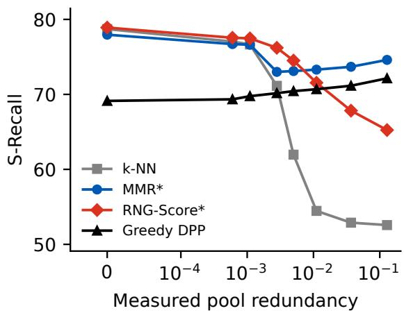  
(a) bge-m3

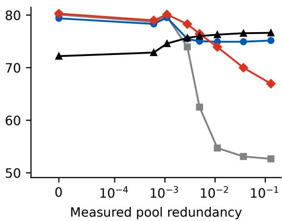

(b) Qwen3-Embedding-4B  
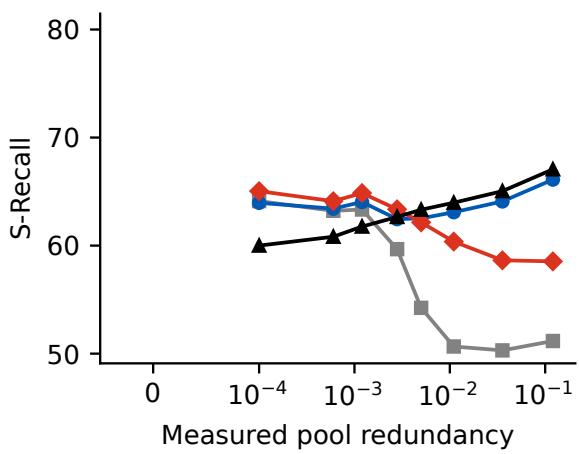  
(c) all-MiniLM-L6-v2  
Figure 4: The HotpotQA injection sweep under three encoders: S-Recall vs measured near-duplicate pair fraction (4.1), on common axes (log-scaled with the clean level kept on-axis).

Natural redundancy through chunk overlap. Table 8 reports the chunk-overlap sweep of Section 5.6, where redundancy arises naturally from overlapping sliding windows: S-Recall is reported for every method both on the non-overlapping pool and at the heaviest overlap. Across the six sweeps k-NN drifts down by up to 4.0 points at the heaviest overlap while the relevance-aware diversifiers hold essentially flat or improve, most steeply on the multi-hop 2WikiMultiHopQA and MuSiQue pools, where greedy DPP gains 7.2 and 9.9 points. Moreover, with the exception of DPP on HotpotQA, the relevance-aware diversifiers all score higher than k-NN in the more redundant setting. The primary test is significant for every method on every chunk-overlap sweep (Table 12): the natural mechanism reproduces the injected one at a smaller amplitude.

The saturated-pool regime. A third point on the evidence-multiplicity axis is the saturated pool, where almost every candidate is relevant. TREC-COVID is the extreme case with a mean of 493 relevant documents per query. Under the chunk-overlap sweep (bge-m3, k = 10), k-NN coverage does not collapse, S-Recall@10 staying flat to slightly rising: there is always another relevant document to take a crowded slot. Yet, at the highest overlap, the tuned RNG-Score significantly leads k-NN by 4.6 points (last row of Table 8).

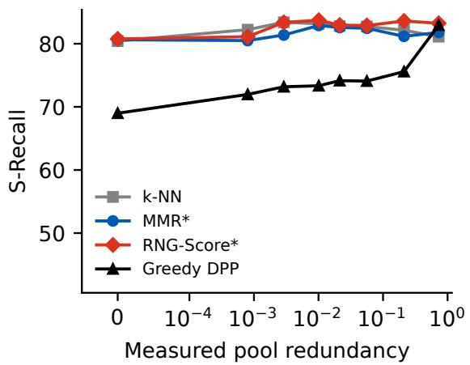  
(a) SciFact (single-hop)

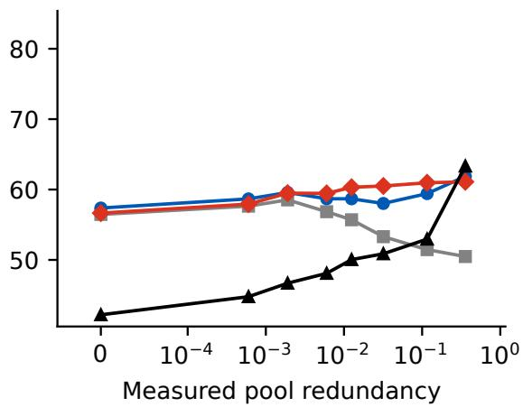  
(b) FiQA-2018 (multi-evidence)  
Figure 5: The BEIR injection sweeps (bge-m3, k = 10, three seeds): S-Recall@10 vs measured near-duplicate pair fraction (4.1), on common axes. Single-evidence SciFact (a) stays flat across the sweep; multi-evidence FiQA-2018 (b) reproduces the multi-hop collapse-and-crossover pattern.

Table 7: Validation-selected RNG-Score margins γ∗ per injection level: modal value across the three seeds where the seeds agree in sign, ± where they do not.
<table><tr><td>Sweep</td><td>ρ=0</td><td>0.025</td><td>0.05</td><td>0.1</td><td>0.15</td><td>0.25</td><td>0.5</td><td>1.0</td></tr><tr><td>HotpotQA, bge-m3</td><td>+0.2</td><td>-0.3</td><td>-0.3</td><td>-0.2</td><td>-0.2</td><td>-0.2</td><td>-0.2</td><td>-0.2</td></tr><tr><td>HotpotQA, Qwen3-Embedding-4B</td><td>+0.3</td><td>土</td><td>土</td><td>-0.2</td><td>-0.1</td><td>-0.1</td><td>-0.1</td><td>-0.1</td></tr><tr><td>HotpotQA, al1-MiniLM-L6-v2</td><td>+0.3</td><td>+0.3</td><td>+0.2</td><td>+0.2</td><td>+0.2</td><td>土</td><td>-0.1</td><td>-0.1</td></tr><tr><td>SciFact, bge-m3</td><td>-0.2</td><td>±</td><td>土</td><td>-0.3</td><td>土</td><td>土</td><td>土</td><td>土</td></tr><tr><td>FiQA-2018, bge-m3</td><td>-0.2</td><td>土</td><td>-0.2</td><td>-0.2</td><td>-0.2</td><td>-0.2</td><td>-0.2</td><td>-0.2</td></tr></table>

Saturation thus protects relevance-only selection from redundancy without eliminating the diversification gain, and the frozen rule of RQ4 shows no significant diference from k-NN on the natural pools while gaining significantly at the heaviest overlap (Table 10).

All manipulations thus give the same reading of RQ2: raising pool redundancy does create a regime in which diversification pays, at a crossover that the deployment-level statistic (4.1) localizes on the measured axis, and the risk of committing to a method without knowing the regime is the misspecification downside of Table 5, up to 33 coverage points for the popular fixed commitments.

## 6.3 RQ3: Oracle headroom

Results from the oracle protocol of Section 5.6 are reported in Figure 6. On clean pools of HotpotQA, the headroom is negligible: an oracle with ground-truth access that chooses freely among all methods and grid values per-query improves S-Recall over k-NN on only 5.8% of queries for a gain of 3.1 points. The headroom starts to open at the lower edge of the crossover bracket (a measured redundancy of 0.0012, reached at $\rho = 0 . 0 5 )$ , where the oracle beats k-NN on 9.2% of queries, rises to 19.1% at the next level and peaks when redundancy is maximal, where it improves on k-NN on over half of queries (its per-level coverage appears as the oracle row of Table 9). On single-hop SciFact, it stays at 4–10% across the whole sweep. On multi-evidence FiQA-2018, whose crowded natural pools already leave the oracle 8.9% of queries to improve on the clean level, the headroom climbs monotonically to 34.8% at $\rho = 1$ . On saturated TREC-COVID, the injection sweep confirms the chunk-overlap picture: the oracle already beats k-NN on a quarter of the queries on the natural pools and on 55–99% across the injection levels.

The chunk-overlap sweeps reproduce the pattern (Figure 6b): headroom rises with overlap on every multi-evidence dataset, stays low on the single-hop datasets (5–7% on NQ-Open, 7–12% on SciFact) and is largest on saturated TREC-COVID (55–92%), where a better selection almost always exists even though

Table 8: Chunk-overlap sweep (bge-m3, $k = 5 ; k = 1 0$ for SciFact and TREC-COVID; 2Wiki abbreviates 2Wiki-$\mathrm { M u l t i H o p Q A } )$ . Each cell reports the row method’s S-Recall@k on the non-overlapping pool / at overlap 0.75 (tuned operating points per level); the header rows give each dataset’s hop count and measured redundancy (4.1) at overlap 0.75. Best per dataset in bold, second best underlined (ties both bold and occupying both ranks). The NQ-Open sweep is single-run; conclusions on the small SciFact and TREC-COVID query sets are exploratory (Appendix D); saturated TREC-COVID (mean 493 relevant documents per query) has no hop count.
<table><tr><td>Method hops</td><td>HotpotQA 2</td><td>2Wiki 2</td><td>MuSiQue 2-4</td><td>SciFact 1</td><td>NQ-Open 1</td><td>TREC-COVID sat.</td></tr><tr><td>red.75</td><td>.001</td><td>.011</td><td>.015</td><td>.002</td><td>.005</td><td>.006</td></tr><tr><td>k-NN</td><td>78.1/75.0</td><td>88.5/87.4</td><td>74.1/73.2</td><td>77.2/73.2</td><td>92.1/89.7</td><td>21.8/23.1</td></tr><tr><td>Maxmin</td><td>46.5/48.3</td><td>74.7/83.6</td><td>56.9/69.5</td><td>57.8/62.2</td><td>86.8/87.6</td><td>14.9/21.9</td></tr><tr><td>Greedy DPP *</td><td>69.5/70.9</td><td>87.2/94.4</td><td>76.2/86.1</td><td>73.3/74.1</td><td>91.6/92.0</td><td>18.6/25.9</td></tr><tr><td>MMR *</td><td>77.6/76.6</td><td>88.2/91.5</td><td>76.3/85.0</td><td>77.0/76.1</td><td>92.8/93.0</td><td>21.4/27.2</td></tr><tr><td>RNG-SCORE</td><td>78.2/78.2</td><td>88.7/93.7</td><td>76.7/85.7</td><td>75.9/76.4</td><td>92.9/93.0</td><td>21.3/27.7</td></tr></table>

k-NN never collapses.  
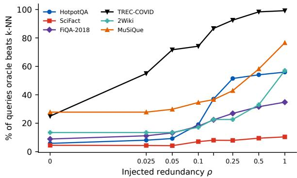  
(a) Injection sweeps

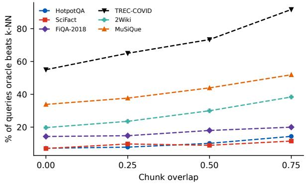  
(b) Chunk-overlap sweeps  
Figure 6: Oracle headroom: percentage of test queries on which the all-methods oracle beats k-NN (HotpotQA, 2Wiki and MuSiQue at $k = 5 ;$ SciFact, FiQA-2018 and TREC-COVID at $k = 1 0 ;$ three seeds throughout). (a) Injection sweeps vs injected fraction ρ (log-scaled axis with the clean level kept on-axis); (b) Chunk-overlap sweeps vs overlap.

## 6.4 RQ4: The decision rule

Under the tuning protocol of Section 5.6, applied once to the bge-m3 HotpotQA injection sweep with the fallback diversifier ranging over every method and grid value, free threshold tuning selects $\tau ^ { * } = 1 . 8 3$ $( 1 . 9 6 / 1 . 7 1 / 1 . 8 3$ per seed) with $D ^ { * } = \mathrm { M M R } ( \lambda = 0 . 7 )$ in every seed. Retuned on the k = 10 replica of the same sweep, it selects $\tau ^ { * } = 1 . 9 \ ( 1 . 9 / 1 . 9 / 1 . 8 $ per seed). The tuned threshold thus stays at the evidence requirement $h = 2$ for both k = 5 and $k = 1 0$ . The selection is insensitive: every threshold in $\tau \in [ 1 . 5 , 2 . 5 ]$ performs within half a point of the optimum at $k = 5$ (Figure 7a) and replacing the Vendi trigger with the mean pairwise distance of the k-NN selection reproduces the headroom capture within half a point at every level. We therefore freeze the deployed rule at $\tau = h$ , that is 2 on the two-hop benchmarks, and use it everywhere below. The threshold is interpretable: we diversify only when the selection carries fewer efectively distinct documents than the query needs.

Table 9 is the central practical result of the paper. The frozen rule tracks the upper envelope of the two fixed policies across the whole axis. On the three cleanest levels, it fires on under 16% of queries and stays within 0.7 points of k-NN, avoiding the toll the diversifier pays there; from $\rho = 0 .$ 1 onward it fires on 81–93% and lands within 0.3 points of always-MMR. Pooled across levels it captures 60% (95% CI [58, 62]) of the all-methods oracle headroom of 15.3 points [15.0, 15.7], a bound that uses ground-truth labels per query, and 91% [89, 92] of the gain of the per-level tuned selector.

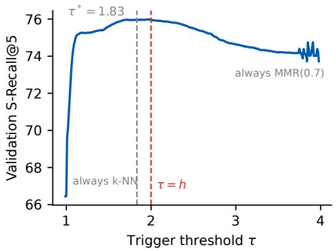  
(a) Threshold tuning curve

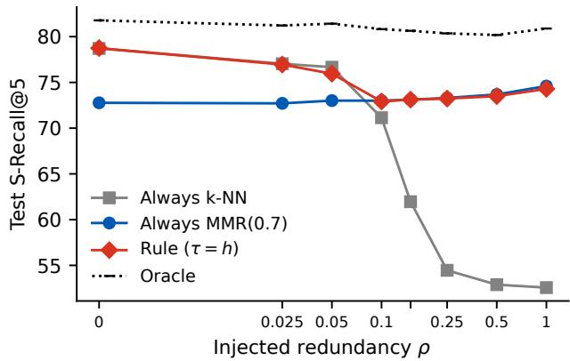  
(b) Frozen rule across injection levels  
Figure 7: The decision rule on the HotpotQA sweep. (a) Pooled validation S-Recall@5 as the trigger threshold τ varies continuously. (b) The frozen rule per injection level (log-scaled ρ axis, ticks at the sweep levels).

Table 9: The frozen rule $( \tau = h = 2 , D ^ { * } = \mathrm { M M R } ( 0 . 7 ) )$ per injection level, S-Recall@5. “Per-level tuned” knows the regime; the oracle is the all-methods per-query bound of Section 6.3; the trigger rate is the fraction of queries on which the rule diversifies. Among the three policies, best in bold, second best underlined.
<table><tr><td>Selector</td><td> $\rho { = } 0$ </td><td>0.025</td><td>0.05</td><td>0.1</td><td>0.15</td><td>0.25</td><td>0.5</td><td>1.0</td><td>pool</td></tr><tr><td>always k-NN</td><td>78.7</td><td>77.0</td><td>76.7</td><td>71.1</td><td>62.0</td><td>54.5</td><td>52.9</td><td>52.6</td><td>65.7</td></tr><tr><td>always  $D ^ { * }$ </td><td>72.8</td><td>72.7</td><td>73.0</td><td>73.0</td><td>73.1</td><td>73.3</td><td>73.7</td><td>74.6</td><td>73.3</td></tr><tr><td>rule</td><td>78.7</td><td>76.9</td><td>76.0</td><td>72.9</td><td>73.1</td><td>73.2</td><td>73.5</td><td>74.3</td><td>74.8</td></tr><tr><td>trigger %</td><td>0.7</td><td>3.3</td><td>15.5</td><td>81.0</td><td>87.8</td><td>90.0</td><td>91.4</td><td>92.9</td><td></td></tr><tr><td>Reference bounds</td><td>s (not deployable policies)</td><td></td><td></td><td></td><td></td><td></td><td></td><td></td><td></td></tr><tr><td>per-level tuned</td><td>78.9</td><td>77.6</td><td>77.5</td><td>76.2</td><td>74.5</td><td>73.3</td><td>73.7</td><td>74.6</td><td>75.8</td></tr><tr><td>oracle</td><td>81.8</td><td>81.2</td><td>81.4</td><td>80.8</td><td>80.6</td><td>80.4</td><td>80.2</td><td>80.9</td><td>80.9</td></tr></table>

Transfer of the frozen rule. We apply the frozen rule with no retuning to fifteen further fine-grid sweeps, grouped in Table 10 by what they change. All use k = 5 except the HotpotQA k = 10 injection replica and the SciFact, FiQA-2018 and TREC-COVID sweeps. The threshold everywhere is the task’s evidence requirement of Section 5.6. The rule transfers across encoders, across $k ,$ across the redundancy mechanism and across datasets. On clean pools, its cost stays within the one-point materiality tolerance everywhere except on the two FiQA-2018 sweeps (−1.0 points under injection, significant; −1.0 under chunk overlap, not significant) and the two saturated TREC-COVID sweeps (−1.7 under injection, significant; −2.0 under chunk overlap, not significant on that fifty-query set). Under redundancy, the rule gains on every multi-evidence sweep except on the chunk overlap run of FiQA-2018, where no level difers significantly from k-NN. On single-hop NQ-Open the trigger condition is unsatisfiable and the rule is exactly k-NN, while on saturated TREC-COVID, whose relevant-set sizes keep the trigger firing on every query, the rule coincides with always-MMR (0.7): under injection it trades its clean-pool toll for one of the largest heavy-redundancy gains in the table (+12.9 points, 95% CI [10.4, 15.8], at $\rho = 1 )$

All transfer significance statements follow the query-clustered procedure of Appendix D, computed per level and pooled from the displayed runs’ per-query rows with Holm adjustment within each sweep. The per-level efects, intervals and trigger rates are released with the analysis outputs.

## 6.5 RQ5: Answer quality under redundancy

We re-run the injection sweep on HotpotQA and 2WikiMultiHopQA under the generation protocol of Section 5.6 with flan-t5-base. We see in Figure 8 that the picture established at the retrieval level carries over to answer quality. On clean pools diversification hurts, MMR costing a significant 3.1 EM points against k-NN (paired risk diference, 95% CI [−4.0, −2.3]). Under redundancy, k-NN answer quality collapses while the diversifier holds flat, leading k-NN significantly from $\rho = 0 . 1$ onward and by +4.7 EM points $[ 3 . 6 , 5 . 8 ]$ at $\rho = 1$ . Moreover, as previously observed at the retrieval level, the decision rule tracks the upper envelope, sitting on k-NN at $\rho = 0$ (firing on under 1% of queries), switching to the diversifier once redundancy appears and staying within 0.2 EM points of the better of the two policies at every level (Figure 8). 2WikiMultiHopQA tells a softer but similar story: the diversifier’s and the rule’s advantage materializes only at the highest level (+2.0 EM points [1.2, 2.8] at $\rho = 1$ , significantly below k-NN on the cleaner levels), the rule staying within 0.7 EM points of k-NN at moderate $\rho .$ Because flan-t5-base may handle distractors and redundan context diferently from current instruction-tuned models, Table 11 repeats the comparison at the clean and heaviest levels with Qwen3.8-27B [51] under fixed prompts and deterministic decoding. The regime pattern is unchanged: k-NN and the rule lead on clean pools, MMR and the rule under heavy redundancy, the rule again tracking the better fixed policy within 0.1 points at both endpoints.

Table 10: Transfer of the frozen rule $( \tau = \operatorname* { m i n } \{ h , k \}$ with gold h, an oracle analysis; $D ^ { * } = \mathrm { M M R } ( 0 . 7 ) )$ to further sweeps with no retuning, grouped by what each sweep changes relative to the tuning sweep (bge-m3 HotpotQA injection). Each $\Delta$ is the rule’s S-Recall@k minus k-NN’s at the same sweep level, averaged over seeds (positive favors the rule): clean $\Delta$ is the worst $\Delta$ over the near-clean levels $( \rho \le 0 . 0 5$ on injection sweeps, overlap $\leq 0 . 2 5$ on chunking sweeps), heavy $\cdot \Delta$ the $\Delta$ at the heaviest level $( \rho = 1$ , respectively overlap 0.75) and pooled $\Delta$ the diference with all levels pooled.
<table><tr><td>Transfer target</td><td>clean∆</td><td>heavy∆</td><td>pooled∆</td></tr><tr><td> $\textit { D i f f e r e n t } e n c o d e r \ ( i n j e c t i o n )$ </td><td></td><td></td><td></td></tr><tr><td>Qwen3-Embedding-4B</td><td>-0.3</td><td>+22.5</td><td>+9.8</td></tr><tr><td> $\mathrm { \ a l l { - } M i n i L M { - } L 6 { - } v 2 }$ </td><td>-0.2</td><td>+13.6</td><td>+5.9</td></tr><tr><td> $\it { D i f f e r e n t  { k } } ( i n j e c t i o n )$ </td><td></td><td></td><td></td></tr><tr><td> $\mathrm { H o t p o t Q A } \ ( k { = } 1 0 )$   $D i f f e r e n t$  mechanism (chunk overlap)</td><td>0.0</td><td>+24.1</td><td>+5.7</td></tr><tr><td> $_ \mathrm { H o t p o t Q A }$ </td><td>0.0</td><td>+1.4</td><td>+0.4</td></tr><tr><td> $D i f f e r e n t d a t a s e t ( i n j e c t i o n )$ </td><td></td><td></td><td></td></tr><tr><td> $\mathrm { S c i F a c t \ ( s i n g l e \mathrm { - } h o p , } \ k \mathrm { = } 1 0 )$ </td><td>-0.7</td><td>+1.8</td><td>+0.4</td></tr><tr><td>FiQA-2018 (multi-evidence, k=10)</td><td>-1.0</td><td>+9.2</td><td>+2.9</td></tr><tr><td> $\mathrm { 2 W i k i M u l t i H o p Q A ~ ( m u l t i \mathrm { - } h o p ) }$ </td><td>0.0</td><td>+10.7</td><td>+1.5</td></tr><tr><td> $\mathrm { M u S i Q u e \ ( m u l t i \mathrm { - } h o p ) }$ </td><td>+0.7</td><td>+21.5</td><td>+5.6</td></tr><tr><td>TREC-COVID (saturated, k=10)</td><td>-1.7</td><td>+12.9</td><td>+3.1</td></tr><tr><td>Different dataset and mechanism (chunk overlap)</td><td></td><td></td><td></td></tr><tr><td> $\mathrm { N Q - O p e n ~ ( s i n g l e - h o p ) }$ </td><td>0.0</td><td>0.0</td><td>0.0</td></tr><tr><td> $\mathrm { S c i F a c t \ ( s i n g l e \mathrm { - } h o p , } \ k \mathrm { = } 1 0 )$ </td><td>-0.4</td><td>+0.4</td><td>0.0</td></tr><tr><td> $\mathrm { F i Q A - 2 0 1 8 ~ ( m u l t i - e v i d e n c e , ~ } k { = } 1 0 )$ </td><td>-1.0</td><td>+0.3</td><td>-0.2</td></tr><tr><td> $\mathrm { 2 W i k i M u l t i H o p Q A ~ ( m u l t i \mathrm { - } h o p ) }$ </td><td>0.0</td><td>+3.2</td><td>+1.0</td></tr><tr><td> $\mathrm { M u S i Q u e \ ( m u l t i \mathrm { - } h o p ) }$ </td><td>+2.3</td><td>+10.0</td><td>+5.4</td></tr><tr><td>TREC-COVID (saturated, k=10)</td><td>-2.0</td><td>+4.1</td><td>+0.7</td></tr></table>

Table 11: Answer quality (EM/F1) at the clean and heaviest injection levels, generator Qwen3.8-27B (a single run per dataset). Best in bold, second best underlined.
<table><tr><td></td><td colspan="2">HotpotQA</td><td colspan="2">2WikiMultiHopQA</td></tr><tr><td>Method</td><td>ρ=0</td><td> $\rho { = } 1$ </td><td> $\rho { = } 0$ </td><td> $\rho { = } 1$ </td></tr><tr><td>k-NN</td><td>50.8/63.6</td><td> $\overline { { 4 1 . 7 / 5 3 . 6 } }$ </td><td> $\overline { { { 6 3 . 4 } / { 7 1 . 8 } } }$ </td><td> $\overline { { 4 9 . 5 / 5 6 . 5 } }$ </td></tr><tr><td>MMR (λ=0.7)</td><td>47.6/59.9</td><td>47.8/60.5</td><td>59.3/67.5</td><td> ${ \bf 5 5 . 5 / 6 3 . 5 }$ </td></tr><tr><td>rule  $( \tau { = } h )$ </td><td>50.8/63.6</td><td> $4 7 . 8 / \underline { { 6 0 . 4 } }$ </td><td>63.4/71.9</td><td> $5 5 . 4 / \underline { { 6 3 . 4 } }$ </td></tr></table>

## 7 Discussion

## 7.1 Reconciling the literature

Read jointly, the results of Section 6 resolve the contradiction of Section 2. Studies reporting that diversity benefits retrieval in RAG pipelines operate on redundant pools: chunked long contexts [37], iterative pipelines that re-fetch overlapping content [54], redundancy-heavy benchmarks [17, 49] or older first-stage encoders of the fixed-pool selection methods [17, 42]. AdaGReS makes the dependence to redundancy explicit by targeting near-duplicate chunks [48]. Studies reporting that diversity does not improve retrieval, including the controlled evaluations of Eibich et al. [21] and Bal and Puhan [6], operate on nonredundant pools. The cross-encoder comparison of Section 6.1 likewise reproduces the finding that reranking, not diversification, is the high-leverage stage of the pipeline [74]. Neither camp is wrong about its own regime: the error is the implicit claim that the conclusion transfers across regimes.

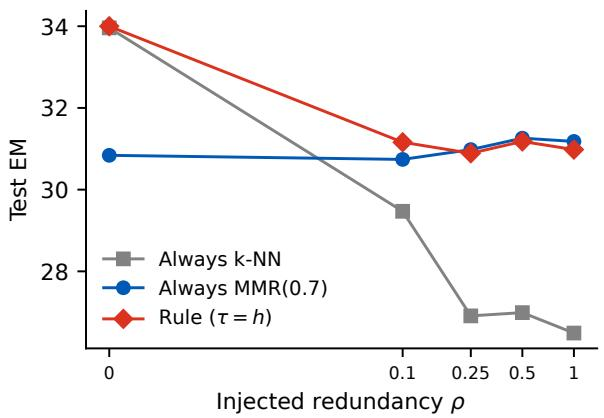  
(a) HotpotQA

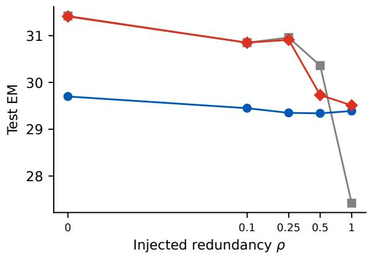  
(b) 2WikiMultiHopQA  
Figure 8: Exact match vs injected redundancy on (a) HotpotQA and (b) 2WikiMultiHopQA, generator flan-t5-base. Log-scaled $\rho$ axis with ticks at the sweep levels.

The reported sweeps quantify how low the boundary between regimes sits on the strong-encoder multi-hop tasks. A measured near-duplicate pair fraction of the order of $1 0 ^ { - 3 }$ is enough for k-NN retrieval to collapse and under the weaker encoder the sign change appears earlier still (descriptively, see Figure 4c), in line with evaluations that use older encoders landing in the regime where diversification pays. The oracle bounds explain the adaptive end of the literature the same way: adaptivity, like diversification itself, is valuable in proportion to measured redundancy, the per-query headroom moving from about 6% of queries to over half across the crossover (Figure 6), which is why per-query selection of the diversity level helps in the chunked long-context setting of Khan et al. [37] yet has nothing to capture on many benchmarks.

Other works in the literature reporting positive results regarding retrieval diversification concern notions of diversity diferent from the one studied here: diversity on the query side, whether through lexical decomposition [87] or coverage of a sub-query demand distribution [85], selection for long contexts [75] and open-ended tasks in which answer diversity is itself rewarded [27, 56]. None of these evaluates geometric diversification of a fixed candidate pool where diversity is merely instrumental, so their conclusions complement rather than contradict the present analysis

## 7.2 Clean pools resist diversification

The systematic dissociation between annotation-free and intent-aware diversity metrics is, after the decision rule, the most practically consequential observation of the study. APD and the Vendi score are routinely reported as evidence that a diversified selection is better. However, on every dataset we evaluate, methods that maximize them minimize α-NDCG, S-Recall, and answer quality. Our interpretation is geometric: in modern embedding spaces, the distinct facets of a multi-hop question occupy a compact neighborhood of the query, so pushing a selection out of that region substitutes gold passages for related but irrelevant ones. These are harmful for the generator [3, 19] and add nothing to the context suficiency that generation actually requires [34]. ArguAna is the extreme case: the single relevant counter-argument sits directly adjacent to the query in embedding space, so any outward pressure discards it, which is how MMR collapses to an NDCG@10 of 0.2 (Table 3). The all-methods oracle bound of Section 6.3 allows us to push the analysis further: on nonredundant pools the problem is not that the diversifiers are badly tuned or insuficiently adaptive, but that there is almost nothing for diversification to gain over k-NN. Thus, evaluations should treat geometric spread as a descriptive statistic rather than an objective and should instead report coverage-aware metrics whenever labels permit. Those spread statistics may nonetheless be used as diagnostics, analogously to the decision rule using the Vendi score as a redundancy gauge.

## 7.3 Reading the regime from the RNG-Score

The margin trajectories obtained from the RNG-Score in Table 7 are the hinge geometry at work. A negative margin restricts the obstruction penalty to pairs at duplicate distance scale, demoting copies while leaving distinct evidence untouched, while a positive margin penalizes more severely distinct documents, meaning that there is no possible gain to be made with near-duplicates. The margin thus reads duplicate-scale structure specifically, not the regime at large, and the other trajectories confirm it: a sign flip occurs at diferent levels for diferent encoders because each geometry places duplicate pairs at a distinct scale relative to query–document distances. The weak encoder stays positive longest, its low-redundancy gains coming from a more conflated structure rather than from literal duplicates. Furthermore, seeds disagree in sign exactly where the validation objective is flat, i.e. in the transition zones. On SciFact however, they disagree across nearly the whole axis, meaning that the margin is reading noise precisely where there is nothing to measure. Therefore, we see that a small negative margin signals duplicate structure worth removing, while a fallback-region or seed-unstable margin indicates a pool with nothing to remove.

## 7.4 Deploying the rule

The sweeps show that no fixed method dominates the redundancy axis, so a deployed policy should adapt accordingly. The decision rule proposed here adapts on the right variable: its trigger reads of exactly the quantity whose collapse causes the k-NN failure and the per-query distributions of $T ( q )$ barely overlap across the crossover, which is why a wide band of thresholds performs identically and why the frozen rule transfers to redundancy levels and mechanisms it never saw. Adapting per query matters because the crossover location itself is specific to each task. The steepness of the turn is consistent with evidence multiplicity: gold-concentrated redundancy can crowd out a needed document only when the query needs more than one, in line with which the multi-hop datasets and multi-evidence FiQA collapse at a few near-duplicate per mille while single-hop SciFact and NQ-Open reach the regime only under extreme duplication, mildly even then. Across our experiments, the observed boundary spans from below 0.0006 (the weak encoder) to approximately 0.006 (FiQA at $k = 1 0$ , where the gains become stable; its clean-pool efect never turns significantly negative, so there is no sign change to bracket there) and does not exist on SciFact. Thus, although the specific location does not generalize, the existence and sharpness of a measurable crossover does on multi-hop datasets and the trigger localizes that boundary per query without ever measuring it.

Evidence multiplicity also anchors the rule’s threshold. The two variables of the analysis play the distinct roles that the rule’s architecture mirrors: redundancy is the lever, the dynamic variable that is usually unmeasured in production pipelines; while evidence multiplicity supplies the threshold, treated in this paper as a static workload property because our evaluation reads h from gold annotations, the hop count on multi-hop $\mathrm { Q A }$ and the relevant-set size on the graded-relevance tasks, quantities that a deployment does not have per query. Label-free per-query estimators nevertheless exist of the shelf, such as query-complexity classifiers routing queries by predicted retrieval depth [32] and query decomposition counting a question’s sub-questions directly [50]. Thus, the practical cost of fixing $\tau = h$ is a single integer either estimated per query or for a whole workload. A natural refinement, left to future work, is therefore to supply the threshold with the query’s own estimated evidence requirement, $T ( q ) < \hat { h } ( q )$ with $\hat { h } ( q )$ obtained from one of these estimators. This would be another step forward since, to our knowledge, no existing adaptive pipeline couples a diversification decision with an estimated hop count, the adjacent adaptive mechanisms selecting instead how many documents to keep per query [46, 81] or diversifying across the inferred interpretations of ambiguous questions [28].

The rule is the instrumental-credit counterpart of selective diversification [60], which gates web-search diversification on predicted query ambiguity [18]. Among the adaptive pipelines of Khan et al. [37], Rezaei and Dieng [54] and Stouras et al. [66], it is the minimal member, spending an eigendecomposition per query where those spend planner and evaluator LLM calls or a trained router. On clean pools, the all-methods oracle bound implies that no router over the evaluated method–parameter library can do appreciably better on these test instances, and on redundant pools the rule’s remaining gap to the oracle bounds what richer routing policies over the same library can still contribute.

## 7.5 A reachable fallback as a design requirement

The downside analysis generalizes beyond the methods compared. A fixed diversification strength interacts unpredictably with pool geometry, as MMR’s collapse on ArguAna illustrates (Table 3), so a reachable relevance-only fallback should be a design requirement for any diversifier, met structurally (an operating point that provably reproduces k-NN, as at the RNG-Score’s margin extremes or MMR’s λ = 1) or operationally (gating the diversifier behind a redundancy trigger). The two routes are complementary, the gated rule achieving the better headline numbers and the exact-fallback score supplying an interpretable margin.

## 8 Limitations

Six limitations qualify the conclusions. None, in our assessment, threatens the regime analysis itself. (i) Statistical coverage. The sweep, transfer and generation analyses carry the query-clustered paired inference of Section 5.6 and Appendix D, whereas a few result families are reported descriptively: the Qwen3.8-27B generation columns of Tables 2 and 11 (single deterministic runs, per-query answers released, no inferential claim) and the families with only aggregate evidence (the two argument-retrieval BEIR tasks, the non-HotpotQA cross-encoder datasets and the NQ-Open chunking sweep). Conclusions on the 50–300-query BEIR sets are exploratory, their attainable precision being about two points, and the fifteen transfer sweeps share queries and corpora rather than forming independent validations, so that dataset-level generalization would require a hierarchical analysis with the dataset as the higher-level unit or more independently sampled corpora. (ii) Redundancy realism. Redundancy was simulated using sentence-shufled copies and natura chunk-overlap protocols, but other mechanisms such as injected paraphrases remain untested, as do an independently sampled production corpus and the sensitivity of the crossover location to the injection protocol. The chunking sweeps also score a subtopic as covered when any window of a gold passage is selected, an optimistic convention (a sixty-word window need not contain the answer-bearing content) that the chunking protocol does not pair with generation. (iii) Scope of the rule and its guarantees. The rule’s threshold is the task’s evidence requirement, which in deployment requires task-specific knowledge of evidence multiplicity rather than per-query labels, and the rule’s behavior under estimated rather than annotated h is untested. The k = 10 transfer evidence is limited to the HotpotQA injection replica and the SciFact, FiQA-2018 and TREC-COVID sweeps. Margin tuning inherits validation-split noise, so an adequate tuning set is required (on TREC-COVID, which only contains fifty queries, the selected margin varies across splits). Moreover, the oracle applies only to policies that adapt a scalar or the method per query, not policies that change the pool or the query. (iv) Task and domain scope. The study covers English factoid, multi-hop QA and BEIR-style retrieval: multilingual retrieval, summarization and exploratory search are untested. Open-ended information seeking, where comprehensiveness or answer diversity gives diversity independent value [27, 56], is out of scope and our conclusions do not extend to it. (v) Generation. The generation columns of Table 2 and the regime pattern of Section 6.5, confirmed at the clean and heaviest levels, use the instruction-tuned Qwen3.8-27B, but the intermediate injection levels and the remaining datasets rest on flan-t5-base alone, and prompt-format sensitivity is untested for both generators, as is the split and injection-draw variability of the single runs. (vi) Baselines. The diversifiers compared are the classical fixed-pressure methods: isolating recent adaptive and Vendi-objective selectors on the same fixed pools, and a quality-weighted DPP with a tunable trade-of, is left to future work.

## 9 Conclusion

This paper asked when the retrieval stage of a RAG pipeline should diversify and answered with a regime analysis organized around a main observable variable: whether the candidate pool contains redundancy. On clean pools, the answer on the task families studied here is: essentially never. In most cases, the fixed-pressure diversifiers degrade relevance, coverage-aware diversity and answer quality, significantly so on the primary coverage endpoint. The geometric spread that diversifiers deliver is anti-correlated with the coverage they promise and the all-methods per-query oracle certifies that only about 6% of queries admit any gain from the evaluated diversifiers at all. The regime changes when the pool itself is redundant, whether by injection or by overlapping chunking. Then, on the multi-evidence tasks, the relevance-aware diversifiers overtake nearest-neighbor selection, by a wide margin under injection and by a smaller one under chunk overlap.

The practical contribution is that the regime need not be guessed. On the multi-hop tasks, the crossover occurs at a measured near-duplicate pair fraction far below what casual inspection would flag, bracketed on the order of $1 0 ^ { - 3 }$ under both strong encoders, although the location itself is specific to each dataset and encoder. In addition, a label-free statistic that any retrieval system can compute, the Vendi score of its k nearest neighbors, detects the regime per query, so the crossover location is not needed to deploy the rule. The proposed decision rule, i.e. diversify when that score falls below the number of evidence pieces h the query requires, keeps its clean-pool cost within the one-point materiality tolerance except on FiQA-2018 and saturated TREC-COVID, where large relevant sets keep the trigger firing even on clean pools, recovers most of the value of perfect regime knowledge on redundant ones and transfers with no retuning across encoders, datasets and k. When the threshold is left free, validation recovers a large plateau of possible values which includes $h ,$ namely the evidence multiplicity, which is a property of the workload a deployment knows or should estimate in practice.

The analysis also yields an evaluation standard and an instrument: misspecification downside, which across the classical diversifiers and the k-NN default spans 10–33 coverage points, and the RNG-Score, whose two provable nearest-neighbor limits anchor its tuning to the relevance-only baseline and whose tuned margin turns negative once the pool acquires duplicate structure.

Code and data availability. The full evaluation pipeline (sweep scripts, derived analyses, decision-rule and transfer tooling, and the per-run result files behind every table and figure) is available on GitHub7.

## Acknowledgements

The authors gratefully acknowledge the Université du Québec à Trois-Rivières (UQTR), which funds the Laboratoire d’intelligence artificielle appliquée (LI2A). Guillaume Brouillette was supported by the LI2A, and Guillaume Brouillette and Faustin Kagabo were supported by Mitacs through the Mitacs Accelerate program.

## References

[1] Rakesh Agrawal, Sreenivas Gollapudi, Alan Halverson, and Samuel Ieong. Diversifying search results. In Proceedings of the Second ACM International Conference on Web Search and Data Mining, WSDM’09, pages 5–14. ACM, 2009. DOI: 10.1145/1498759.1498766.

[2] Meftun Akarsu, Recep Kaan Karaman, and Christopher Mierbach. From BM25 to corrective RAG: Benchmarking retrieval strategies for text-and-table documents. arXiv preprint arXiv:2604.01733, 2026. DOI: 10.48550/arXiv.2604.01733.

[3] Chen Amiraz, Florin Cuconasu, Simone Filice, and Zohar Karnin. The distracting efect: Understanding irrelevant passages in RAG. In Proceedings of the 63rd Annual Meeting of the Association for Computational Linguistics (Volume 1: Long Papers), pages 18228–18258. Association for Computational Linguistics, 2025. DOI: 10.18653/v1/2025.acl-long.892.

[4] Piyush Anand, Piotr Indyk, Ravishankar Krishnaswamy, Sepideh Mahabadi, Vikas C. Raykar, Kirankumar Shiragur, and Haike Xu. Graph-based algorithms for diverse similarity search. In Proceedings of the 42nd International Conference on Machine Learning, volume 267 of Proceedings of Machine Learning Research, pages 1483–1504, 2025. URL https://proceedings.mlr.press/v267/anand25a.html.

[5] Akari Asai, Zeqiu Wu, Yizhong Wang, Avirup Sil, and Hannaneh Hajishirzi. Self-RAG: Learning to retrieve, generate, and critique through self-reflection. In Proceedings of the 12th International Conference on Learning Representations, 2024. URL https://openreview.net/forum?id=hSyW5go0v8.

[6] Devi Prasad Bal and Subhashree Puhan. Benchmarking retrieval strategies for biomedical retrievalaugmented generation: A controlled empirical study. arXiv preprint arXiv:2605.02520, 2026. DOI: 10.48550/arXiv.2605.02520.

[7] Sebastian Borgeaud, Arthur Mensch, Jordan Hofmann, Trevor Cai, Eliza Rutherford, Katie Millican, George van den Driessche, Jean-Baptiste Lespiau, Bogdan Damoc, Aidan Clark, Diego de Las Casas, Aurelia Guy, Jacob Menick, Roman Ring, Tom Hennigan, Safron Huang, Loren Maggiore, Chris Jones, Albin Cassirer, Andy Brock, Michela Paganini, Geofrey Irving, Oriol Vinyals, Simon Osindero, Karen Simonyan, Jack Rae, Erich Elsen, and Laurent Sifre. Improving language models by retrieving from trillions of tokens. In Proceedings of the 39th International Conference on Machine Learning, volume 162, pages 2206–2240, 2022. URL https://proceedings.mlr.press/v162/borgeaud22a.html.

[8] Allan Borodin, Aadhar Jain, Hyun Chul Lee, and Yuli Ye. Max-sum diversification, monotone submodular functions, and dynamic updates. ACM Transactions on Algorithms, 13(3):41:1–41:25, 2017. DOI: 10.1145/3086464.

[9] Jaime Carbonell and Jade Goldstein. The use of MMR, diversity-based reranking for reordering documents and producing summaries. In Proceedings of the 21st Annual International ACM SIGIR Conference on Research and Development in Information Retrieval, SIGIR98, pages 335–336. ACM, 1998. DOI: 10.1145/290941.291025.

[10] Diego Carraro and Derek Bridge. Enhancing recommendation diversity by re-ranking with large language models. ACM Transactions on Recommender Systems, 4(2):18:1–18:40, 2025. DOI: 10.1145/3700604.

[11] Olivier Chapelle, Shihao Ji, Ciya Liao, Emre Velipasaoglu, Larry Lai, and Su-Lin Wu. Intent-based diversification of web search results: Metrics and algorithms. Information Retrieval, 14(6):572–592, 2011. DOI: 10.1007/s10791-011-9167-7.

[12] Jianlyu Chen, Shitao Xiao, Peitian Zhang, Kun Luo, Defu Lian, and Zheng Liu. M3-Embedding: Multilinguality, multi-functionality, multi-granularity text embeddings through self-knowledge distillation. In Findings of the Association for Computational Linguistics: ACL 2024, pages 2318–2335. Association for Computational Linguistics, 2024. DOI: 10.18653/v1/2024.findings-acl.137.

[13] Laming Chen, Guoxin Zhang, and Hanning Zhou. Fast greedy MAP inference for determinantal point process to improve recommendation diversity. In Advances in Neural Information Processing Systems, volume 31, pages 5627–5638, 2018. URL https://proceedings.neurips.cc/paper/2018/ hash/dbbf603ff0e99629dda5d75b6f75f966-Abstract.html.

[14] Hanjun Cho and Jay-Yoon Lee. RARE: Redundancy-aware retrieval evaluation framework for highsimilarity corpora. In Proceedings of the 64th Annual Meeting of the Association for Computational Linguistics, pages 20160–20185, 2026. DOI: 10.18653/v1/2026.acl-long.923.

[15] Hyung Won Chung, Le Hou, Shayne Longpre, Barret Zoph, Yi Tay, William Fedus, Yunxuan Li, Xuezhi Wang, Mostafa Dehghani, Siddhartha Brahma, Albert Webson, Shixiang Shane Gu, Zhuyun Dai, Mirac Suzgun, Xinyun Chen, Aakanksha Chowdhery, Alex Castro-Ros, Marie Pellat, Kevin Robinson, Dasha Valter, Sharan Narang, Gaurav Mishra, Adams Yu, Vincent Zhao, Yanping Huang, Andrew Dai, Hongkun Yu, Slav Petrov, Ed H. Chi, Jef Dean, Jacob Devlin, Adam Roberts, Denny Zhou, Quoc V. Le, and Jason Wei. Scaling instruction-finetuned language models. Journal of Machine Learning Research, 25 (70):1–53, 2024. URL https://jmlr.org/papers/v25/23-0870.html.

[16] Charles L.A. Clarke, Maheedhar Kolla, Gordon V. Cormack, Olga Vechtomova, Azin Ashkan, Stefan Büttcher, and Ian MacKinnon. Novelty and diversity in information retrieval evaluation. In Proceedings of the 31st Annual International ACM SIGIR Conference on Research and Development in Information Retrieval, SIGIR ’08, pages 659–666. ACM, 2008. DOI: 10.1145/1390334.1390446.

[17] Maria Paula Cortes-Lemos. DRAG: Diversity in retrieval augmented generation through the application of submodular functions. Master’s thesis, University of Washington, 2025. URL https://hdl.handle. net/1773/55249.

[18] Steve Cronen-Townsend, Yun Zhou, and W. Bruce Croft. Predicting query performance. In Proceedings of the 25th Annual International ACM SIGIR Conference on Research and Development in Information Retrieval, SIGIR02, pages 299–306. ACM, 2002. DOI: 10.1145/564376.564429.

[19] Florin Cuconasu, Giovanni Trappolini, Federico Siciliano, Simone Filice, Cesare Campagnano, Yoelle Maarek, Nicola Tonellotto, and Fabrizio Silvestri. The power of noise: Redefining retrieval for RAG systems. In Proceedings of the 47th International ACM SIGIR Conference on Research and Development in Information Retrieval, SIGIR 2024, pages 719–729. ACM, 2024. DOI: 10.1145/3626772.3657834.

[20] Darren Edge, Ha Trinh, Newman Cheng, Joshua Bradley, Alex Chao, Apurva Mody, Steven Truitt, Dasha Metropolitansky, Robert Osazuwa Ness, and Jonathan Larson. From local to global: A graph RAG approach to query-focused summarization. arXiv preprint arXiv:2404.16130, 2024. DOI: 10.48550/arXiv.2404.16130.

[21] Matouš Eibich, Shivay Nagpal, and Alexander Fred-Ojala. ARAGOG: Advanced RAG output grading. arXiv preprint arXiv:2404.01037, 2024. DOI: 10.48550/arXiv.2404.01037.

[22] Dan Friedman and Adji Bousso Dieng. The Vendi score: A diversity evaluation metric for machine learning. Transactions on Machine Learning Research, 2023. URL https://openreview.net/forum? id=g97OHbQyk1.

[23] Cong Fu, Chao Xiang, Changxu Wang, and Deng Cai. Fast approximate nearest neighbor search with the navigating spreading-out graph. Proceedings of the VLDB Endowment, 12(5):461–474, 2019. DOI: 10.14778/3303753.3303754.

[24] Sreenivas Gollapudi and Aneesh Sharma. An axiomatic approach for result diversification. In Proceedings of the 18th International Conference on World Wide Web, WWW ’09, pages 381–390. ACM, 2009. DOI: 10.1145/1526709.1526761.

[25] Kelvin Guu, Kenton Lee, Zora Tung, Panupong Pasupat, and MingWei Chang. REALM: Retrievalaugmented language model pre-training. In Proceedings of the 37th International Conference on Machine Learning, volume 119, pages 3929–3938, 2020. URL https://proceedings.mlr.press/v119/guu20a. html.

[26] Xanh Ho, Anh-Khoa Duong Nguyen, Saku Sugawara, and Akiko Aizawa. Constructing a multi-hop QA dataset for comprehensive evaluation of reasoning steps. In Proceedings of the 28th International Conference on Computational Linguistics, pages 6609–6625. International Committee on Computational Linguistics, 2020. DOI: 10.18653/v1/2020.coling-main.580.

[27] Tianyi Hu, Niket Tandon, and Akhil Arora. DIVERGE: Diversity-enhanced retrievalaugmented generation for open-ended information seeking. arXiv preprint arXiv:2602.00238, 2026. DOI: 10.48550/arXiv.2602.00238.

[28] Yeonjun In, Sungchul Kim, Ryan A. Rossi, Mehrab Tanjim, Tong Yu, Ritwik Sinha, and Chanyoung Park. Diversify-verify-adapt: Eficient and robust retrieval-augmented ambiguous question answering. In Proceedings of the 2025 Conference of the Nations of the Americas Chapter of the Association for Computational Linguistics: Human Language Technologies (Volume 1: Long Papers), pages 1212–1233, 2025. DOI: 10.18653/v1/2025.naacl-long.56.

[29] Gautier Izacard and Edouard Grave. Leveraging passage retrieval with generative models for open domain question answering. In Proceedings of the 16th Conference of the European Chapter of the Association for Computational Linguistics, pages 874–880. Association for Computational Linguistics, 2021. DOI: 10.18653/v1/2021.eacl-main.74.

[30] Gautier Izacard, Mathilde Caron, Lucas Hosseini, Sebastian Riedel, Piotr Bojanowski, Armand Joulin, and Edouard Grave. Unsupervised dense information retrieval with contrastive learning. Transactions on Machine Learning Research, August 2022. URL https://openreview.net/forum?id=jKN1pXi7b0.

[31] Jerzy W. Jaromczyk and Godfried T. Toussaint. Relative neighborhood graphs and their relatives. Proceedings of the IEEE, 80(9):1502–1517, 1992. DOI: 10.1109/5.163414.

[32] Soyeong Jeong, Jinheon Baek, Sukmin Cho, Sung Ju Hwang, and Jong Park. Adaptive-RAG: Learning to adapt retrieval-augmented large language models through question complexity. In Proceedings of the 2024 Conference of the North American Chapter of the Association for Computational Linguistics: Human Language Technologies (Volume 1: Long Papers), pages 7036–7050. Association for Computational Linguistics, 2024. DOI: 10.18653/v1/2024.naacl-long.389.

[33] Jef Johnson, Matthijs Douze, and Hervé Jégou. Billion-scale similarity search with GPUs. IEEE Transactions on Big Data, 7(3):535–547, 2021. DOI: 10.1109/tbdata.2019.2921572.

[34] Hailey Joren, Jianyi Zhang, Chun-Sung Ferng, Da-Cheng Juan, Ankur Taly, and Cyrus Rashtchian. Suficient context: A new lens on retrieval augmented generation systems. In Proceedings of the 13th International Conference on Learning Representations, 2025. URL https://openreview.net/forum? id=Jjr2Odj8DJ.

[35] Marius Kaminskas and Derek Bridge. Diversity, serendipity, novelty, and coverage: A survey and empirical analysis of beyond-accuracy objectives in recommender systems. ACM Transactions on Interactive Intelligent Systems, 7(1):2:1–2:42, 2016. DOI: 10.1145/2926720.

[36] Vladimir Karpukhin, Barlas Oguz, Sewon Min, Patrick Lewis, Ledell Wu, Sergey Edunov, Danqi Chen, and Wen-tau Yih. Dense passage retrieval for open-domain question answering. In Proceedings of the 2020 Conference on Empirical Methods in Natural Language Processing (EMNLP), pages 6769–6781. Association for Computational Linguistics, 2020. DOI: 10.18653/v1/2020.emnlp-main.550.

[37] Saadat Hasan Khan, Spencer Hong, Jingyu Wu, Kevin Lybarger, Youbing Yin, Erin Babinsky, and Daben Liu. DF-RAG: Query-aware diversity for retrieval-augmented generation. In Findings of the Association for Computational Linguistics: EACL 2026, pages 2873–2894. Association for Computationa Linguistics, 2026. DOI: 10.18653/v1/2026.findings-eacl.150.

[38] Onur Küçüktunç and Hakan Ferhatosmanoğlu. λ-diverse nearest neighbors browsing for multidimensional data. IEEE Transactions on Knowledge and Data Engineering, 25(3):481–493, 2013. DOI: 10.1109/TKDE.2011.251.

[39] Alex Kulesza and Ben Taskar. Determinantal point processes for machine learning. Foundations and Trends in Machine Learning, 5(2–3):123–286, 2012. DOI: 10.1561/2200000044.

[40] Tom Kwiatkowski, Jennimaria Palomaki, Olivia Redfield, Michael Collins, Ankur Parikh, Chris Alberti, Danielle Epstein, Illia Polosukhin, Jacob Devlin, Kenton Lee, Kristina Toutanova, Llion Jones, Matthew Kelcey, Ming-Wei Chang, Andrew M. Dai, Jakob Uszkoreit, Quoc Le, and Slav Petrov. Natural questions: A benchmark for question answering research. Transactions of the Association for Computational Linguistics, 7:453–466, 2019. DOI: 10.1162/tacl\_a\_00276.

[41] Patrick Lewis, Ethan Perez, Aleksandra Piktus, Fabio Petroni, Vladimir Karpukhin, Naman Goyal, Heinrich Küttler, Mike Lewis, Wen-tau Yih, Tim Rocktäschel, Sebastian Riedel, and Douwe Kiela. Retrieval-augmented generation for knowledge-intensive NLP tasks. In Advances in Neural Information Processing Systems, volume 33, pages 9459–9474, 2020. URL https://proceedings.neurips.cc/ paper/2020/hash/6b493230205f780e1bc26945df7481e5-Abstract.html.

[42] Jiatao Li, Xinyu Hu, and Xiaojun Wan. SMART-RAG: Selection using determinantal matrices for augmented retrieval. arXiv preprint arXiv:2409.13992, 2024. DOI: 10.48550/arXiv.2409.13992.

[43] Nelson F. Liu, Kevin Lin, John Hewitt, Ashwin Paranjape, Michele Bevilacqua, Fabio Petroni, and Percy Liang. Lost in the middle: How language models use long contexts. Transactions of the Association for Computational Linguistics, 12:157–173, 2024. DOI: 10.1162/tacl\_a\_00638.

[44] Qiheng Lu and Nicholas D. Sidiropoulos. Principled and scalable diversity-aware retrieval via cardinality-constrained binary quadratic programming. arXiv preprint arXiv:2604.02554, 2026. DOI: 10.48550/arXiv.2604.02554.

[45] Yu A. Malkov and D. A. Yashunin. Eficient and robust approximate nearest neighbor search using hierarchical navigable small world graphs. IEEE Transactions on Pattern Analysis and Machine Intelligence, 42(4):824–836, April 2020. ISSN 1939-3539. DOI: 10.1109/tpami.2018.2889473.

[46] Siyuan Meng, Junming Liu, Yirong Chen, Song Mao, Pinlong Cai, Guohang Yan, Botian Shi, and Ding Wang. From ranking to selection: A simple but eficient dynamic passage selector for retrieval augmented generation. arXiv preprint arXiv:2508.09497, 2025. DOI: 10.48550/arXiv.2508.09497.

[47] Rodrigo Nogueira and Kyunghyun Cho. Passage re-ranking with BERT. arXiv preprint arXiv:1901.04085, 2019. DOI: 10.48550/arXiv.1901.04085.

[48] Chao Peng, Bin Wang, Zhilei Long, and Jinfang Sheng. AdaGReS: Adaptive greedy context selection via redundancy-aware scoring for token-budgeted RAG. arXiv preprint arXiv:2512.25052, 2025. DOI: 10.48550/arXiv.2512.25052.

[49] Marc Pickett, Jeremy Hartman, Ayan Kumar Bhowmick, Raquib-ul Alam, and Aditya Vempaty. Better RAG using relevant information gain. arXiv preprint arXiv:2407.12101, 2024. DOI: 10.48550/arXiv.2407.12101.

[50] Ofir Press, Muru Zhang, Sewon Min, Ludwig Schmidt, Noah Smith, and Mike Lewis. Measuring and narrowing the compositionality gap in language models. In Findings of the Association for Computational Linguistics: EMNLP 2023, pages 5687–5711. Association for Computational Linguistics, 2023. DOI: 10.18653/v1/2023.findings-emnlp.378.

[51] Qwen Team. Qwen3.8-Max: A new bar for coding and cowork, August 2026. URL https://qwen.ai/ blog?id=qwen3.8. Release blog post; no technical report available. Qwen3.8-27B open-weights release of 2026-08-14.

[52] S. S. Ravi, D. J. Rosenkrantz, and G. K. Tayi. Heuristic and special case algorithms for dispersion problems. Operations Research, 42(2):299–310, 1994. DOI: 10.1287/opre.42.2.299.

[53] Nils Reimers and Iryna Gurevych. Sentence-BERT: Sentence embeddings using siamese BERT-networks. In Proceedings of the 2019 Conference on Empirical Methods in Natural Language Processing and the 9th International Joint Conference on Natural Language Processing (EMNLP-IJCNLP), pages 3982–3992. Association for Computational Linguistics, 2019. DOI: 10.18653/v1/D19-1410.

[54] Mohammad Reza Rezaei and Adji Bousso Dieng. Vendi-RAG: Adaptively trading-of diversity and quality significantly improves retrieval augmented generation with LLMs. arXiv preprint arXiv:2502.11228, 2025. DOI: 10.48550/arXiv.2502.11228.

[55] Stephen Robertson and Hugo Zaragoza. The probabilistic relevance framework: BM25 and beyond. Foundations and Trends in Information Retrieval, 4(1-2):1–174, 2009. DOI: 10.1561/1500000019.

[56] Alireza Salemi, Chris Samarinas, and Hamed Zamani. Plan-and-refine in RAG: Generating diverse and comprehensive responses through global exploration and local exploitation. In Proceedings of the 2026 International ACM SIGIR Conference on Innovative Concepts and Theories in Information Retrieval (ICTIR), pages 324–336. ACM, 2026. DOI: 10.1145/3805713.3820415.

[57] Keshav Santhanam, Omar Khattab, Jon Saad-Falcon, Christopher Potts, and Matei Zaharia. ColBERTv2: Efective and eficient retrieval via lightweight late interaction. In Proceedings of the 2022 Conference of the North American Chapter ofthe Association for Computational Linguistics: Human Language Technologies,

pages 3715–3734. Association for Computational Linguistics, 2022. DOI: 10.18653/v1/2022.naaclmain.272.

[58] Rodrygo L. T. Santos, Craig Macdonald, and Iadh Ounis. On the role of novelty for search result diversification. Information Retrieval, 15:478–502, 2012. DOI: 10.1007/s10791-011-9180-x.

[59] Rodrygo L.T. Santos, Craig Macdonald, and Iadh Ounis. Exploiting query reformulations for web search result diversification. In Proceedings of the 19th International Conference on World Wide Web, WWW ’10, pages 881–890. ACM, 2010. DOI: 10.1145/1772690.1772780.

[60] Rodrygo L.T. Santos, Craig Macdonald, and Iadh Ounis. Selectively diversifying web search results. In Proceedings of the 19th ACM International Conference on Information and Knowledge Management, CIKM ’10, pages 1179–1188. ACM, 2010. DOI: 10.1145/1871437.1871586.

[61] Leonard J. Savage. The theory of statistical decision. Journal of the American Statistical Association, 46 (253):55–67, 1951. DOI: 10.1080/01621459.1951.10500768.

[62] Sietse Schelpe. Byte-exact deduplication in retrieval-augmented generation: A three-regime empirical analysis across public benchmarks. arXiv preprint arXiv:2605.09611, 2026. DOI: 10.48550/arXiv.2605.09611.

[63] Chaitanya Sharma. Retrieval-augmented generation: A comprehensive survey of architectures, enhancements, and robustness frontiers. arXiv preprint arXiv:2506.00054, 2025. DOI: 10.48550/arXiv.2506.00054.

[64] Weijia Shi, Sewon Min, Michihiro Yasunaga, Minjoon Seo, Richard James, Mike Lewis, Luke Zettlemoyer, and Wen-tau Yih. REPLUG: Retrieval-augmented black-box language models. In Proceedings of the 2024 Conference of the North American Chapter of the Association for Computational Linguistics: Human Language Technologies (Volume 1: Long Papers), pages 8371–8384. Association for Computational Linguistics, 2024. DOI: 10.18653/v1/2024.naacl-long.463.

[65] Aditi Singh, Abul Ehtesham, Saket Kumar, Tala Talaei Khoei, and Athanasios V. Vasilakos. Agentic retrieval-augmented generation: A survey on agentic RAG. arXiv preprint arXiv:2501.09136, 2025. DOI: 10.48550/arXiv.2501.09136.

[66] Miltiadis Stouras, Vincent Cohen-Addad, Silvio Lattanzi, and Ola Svensson. Retriever portfolios: A principled approach to adaptive RAG. arXiv preprint arXiv:2605.31176, 2026. DOI: 10.48550/arXiv.2605.31176.

[67] Suhas Jayaram Subramanya, Fnu Devvrit, Harsha Vardhan Simhadri, Ravishankar Krishnaswamy, and Rohan Kadekodi. DiskANN: Fast accurate billion-point nearest neighbor search on a single node. In Advances in Neural Information Processing Systems, volume 32, 2019. URL https://proceedings. neurips.cc/paper/2019/hash/09853c7fb1d3f8ee67a61b6bf4a7f8e6-Abstract.html.

[68] Xun Sun, Baiheng Xie, Li Huang, and Qiang Gao. Scaling DPPs for RAG: Density meets diversity. arXiv preprint arXiv:2604.03240, 2026. DOI: 10.48550/arXiv.2604.03240.

[69] Nandan Thakur, Nils Reimers, Andreas Rücklé, Abhishek Srivastava, and Iryna Gurevych. BEIR: A heterogeneous benchmark for zero-shot evaluation of information retrieval models. In Proceedings of the 35th Conference on Neural Information Processing Systems, Track on Datasets and Benchmarks, 2021. URL https://datasets-benchmarks-proceedings.neurips.cc/paper/2021/hash/ 65b9eea6e1cc6bb9f0cd2a47751a186f-Abstract-round2.html.

[70] Godfried T. Toussaint. The relative neighbourhood graph of a finite planar set. Pattern Recognition, 12 (4):261–268, 1980. DOI: 10.1016/0031-3203(80)90066-7.

[71] Harsh Trivedi, Niranjan Balasubramanian, Tushar Khot, and Ashish Sabharwal. Musique: Multihop questions via single-hop question composition. Transactions of the Association for Computational Linguistics, 10:539–554, 2022. DOI: 10.1162/tacl\_a\_00475.

[72] Saúl Vargas and Pablo Castells. Rank and relevance in novelty and diversity metrics for recommender systems. In Proceedings of the Fifth ACM Conference on Recommender Systems (RecSys), RecSys ’11, pages 109–116. ACM, 2011. DOI: 10.1145/2043932.2043955.

[73] Liang Wang, Haonan Chen, Nan Yang, Xiaolong Huang, Zhicheng Dou, and Furu Wei. Chain-of-retrieval augmented generation. In Advances in Neural Information Processing Systems, volume 38, 2025. URL https://proceedings.neurips.cc/paper\_files/paper/2025/hash/ 566aad4fac1acf17fd1ae8c3aef75326-Abstract-Conference.html.

[74] Xiaohua Wang, Zhenghua Wang, Xuan Gao, Feiran Zhang, Yixin Wu, Zhibo Xu, Tianyuan Shi, Zhengyuan Wang, Shizheng Li, Qi Qian, Ruicheng Yin, Changze Lv, Xiaoqing Zheng, and Xuanjing Huang. Searching for best practices in retrieval-augmented generation. In Proceedings of the 2024 Conference on Empirical Methods in Natural Language Processing, pages 17716–17736. Association for Computational Linguistics, 2024. DOI: 10.18653/v1/2024.emnlp-main.981.

[75] Zhichao Wang, Bin Bi, Yanqi Luo, Sitaram Asur, and Claire Na Cheng. Diversity enhances an LLM’s performance in RAG and long-context task. arXiv preprint arXiv:2502.09017, 2025. DOI: 10.48550/arXiv.2502.09017.

[76] Mauro Weber, João Silva-Leite, Lúcio F. D. Santos, Daniel de Oliveira, and Marcos Bedo. Enriching Hierarchical Navigable Small World Searches with Result Diversification, pages 75–80. Lecture Notes in Computer Science. Springer, 2024. ISBN 9783031683091. DOI: 10.1007/978-3-031-68309-1\_6.

[77] Mark Wilhelm, Ajith Ramanathan, Alexander Bonomo, Sagar Jain, Ed H. Chi, and Jennifer Gillenwater. Practical diversified recommendations on YouTube with determinantal point processes. In Proceedings of the 27th ACM International Conference on Information and Knowledge Management, CIKM ’18, pages 2165–2173. ACM, 2018. DOI: 10.1145/3269206.3272018.

[78] Shitao Xiao, Zheng Liu, Peitian Zhang, Niklas Muennighof, Defu Lian, and Jian-Yun Nie. C-Pack: Packed resources for general Chinese embeddings. In Proceedings of the 47th International ACM SIGIR Conference on Research and Development in Information Retrieval, SIGIR 2024, pages 641–649. ACM, 2024. DOI: 10.1145/3626772.3657878.

[79] Lee Xiong, Chenyan Xiong, Ye Li, Kwok-Fung Tang, Jialin Liu, Paul N. Bennett, Junaid Ahmed, and Arnold Overwijk. Approximate nearest neighbor negative contrastive learning for dense text retrieval. In Proceedings of the 9th International Conference on Learning Representations, 2021. URL https://openreview.net/forum?id=zeFrfgyZln.

[80] Wenhan Xiong, Xiang Lorraine Li, Srini Iyer, Jingfei Du, Patrick Lewis, William Yang Wang, Yashar Mehdad, Wen-tau Yih, Sebastian Riedel, Douwe Kiela, and Barlas Oguz. Answering complex opendomain questions with multi-hop dense retrieval. In Proceedings of the 9th International Conference on Learning Representations, 2021. URL https://openreview.net/forum?id=EMHoBG0avc1.

[81] Yifan Xu, Vipul Gupta, Rohit Aggarwal, Varsha Mahadevan, and Bhaskar Krishnamachari. Cluster-based adaptive retrieval: Dynamic context selection for RAG applications. arXiv preprint arXiv:2511.14769, 2025. DOI: 10.48550/arXiv.2511.14769.

[82] Shi-Qi Yan, Jia-Chen Gu, Yun Zhu, and Zhen-Hua Ling. Corrective retrieval augmented generation. arXiv preprint arXiv:2401.15884, 2024. DOI: 10.48550/arXiv.2401.15884.

[83] Zhilin Yang, Peng Qi, Saizheng Zhang, Yoshua Bengio, William Cohen, Ruslan Salakhutdinov, and Christopher D. Manning. HotpotQA: A dataset for diverse, explainable multi-hop question answering. In Proceedings of the 2018 Conference on Empirical Methods in Natural Language Processing, pages 2369–2380. Association for Computational Linguistics, 2018. DOI: 10.18653/v1/D18-1259.

[84] Cheng Xiang Zhai, William W. Cohen, and John Laferty. Beyond independent relevance: Methods and evaluation metrics for subtopic retrieval. In Proceedings of the 26th Annual International ACM SIGIR Conference on Research and Development in Information Retrieval, SIGIR03, pages 10–17. ACM, 2003. DOI: 10.1145/860435.860440.

[85] Bingxue Zhang, Jianying Jia, and Feida Zhu. Covering the unseen: Information demand coverage optimization for retrieval-augmented generation. arXiv preprint arXiv:2606.29328, 2026. DOI: 10.48550/arXiv.2606.29328.

[86] Yanzhao Zhang, Mingxin Li, Dingkun Long, Xin Zhang, Huan Lin, Baosong Yang, Pengjun Xie, An Yang, Dayiheng Liu, Junyang Lin, Fei Huang, and Jingren Zhou. Qwen3 embedding: Advancing text embedding and reranking through foundation models. arXiv preprint arXiv:2506.05176, 2025. DOI: 10.48550/arXiv.2506.05176.

[87] Zhange Zhang, Yuqing Ma, Yulong Wang, Shan He, Tianbo Wang, Siqi He, Jiakai Wang, and Xianglong Liu. Lexical diversity-aware relevance assessment for retrieval-augmented generation. In Proceedings of the 63rd Annual Meeting of the Association for Computational Linguistics, pages 27758–27781. Association for Computational Linguistics, 2025. DOI: 10.18653/v1/2025.acl-long.1346.

## A Theoretical properties

We present here the facts summarized in Section 3.3. Recall that for a candidate pool $V \subset \mathbb { R } ^ { D }$ , a candidate $w \in V$ , a query $q \in \mathbb { R } ^ { D }$ and a parameter $\gamma \in \mathbb { R }$ , the RNG-Score is defined as

$$
\mathrm { s c o r e } _ { \gamma } ( w ; q , V ) = d ( q , w ) + \sum _ { v \in { \cal P } ( w ; q , V ) } [ d ( q , w ) - d ( v , w ) + \gamma ] _ { + } ,
$$

where $P ( w ; q , V ) = \{ v \in V : d ( q , v ) < d ( q , w ) \}$ is the set of closer competitors of $w .$

Proposition A.1 (Exact recovery of the hard admissibility baseline). For any $w \in V$ and any $\gamma \in \mathbb { R }$ score $_ \gamma ( w ; q , V ) = d ( q , w )$ if and only if every closer competitor $v \in P ( w ; q , V )$ satisfies $d ( v , w ) \geq d ( q , w ) + \gamma$ Proof. Every summand in the RNG-Score is nonnegative, so scoreγ ${ \bf \Pi } _ { \prime } ( w ; q , V ) = d ( q , w )$ exactly when every hinge term is zero. The hinge for v is zero if $d ( q , w ) - d ( v , w ) + \gamma \leq 0$ , i.e. $d ( v , w ) \geq d ( q , w ) + \gamma$ □

Proposition A.2 (Monotonicity in γ). For every fixed $w \in V$ , the map $\gamma \mapsto \operatorname { s c o r e } _ { \gamma } ( w ; q , V )$ is nondecreasing. Proof. Each term $\left[ d ( q , w ) - d ( v , w ) + \gamma \right] _ { + }$ is nondecreasing in $\gamma$ and a finite sum of nondecreasing functions is nondecreasing. □

The monotonicity is pointwise in w: diferent candidates’ scores can grow at diferent rates as $\gamma$ increases, so the proposition implies nothing about the induced ranking, the geometric diversity of the selected set or downstream task utility, none of which need vary monotonically with γ.

Proposition A.3 (Similarity invariance). Let d and $\tilde { d }$ be symmetric nonnegative dissimilarities on X and $\tilde { X }$ respectively, let $V \subset X$ be finite with $q \in X$ , and suppose $f : X \to { \tilde { X } }$ is injective on $\{ q \} \cup V$ and satisfies $\tilde { d } ( f ( x ) , f ( y ) ) = \lambda d ( x , y )$ for all $x , y \in \{ q \} \cup V$ and some $\lambda > 0$ . Then, writing scored for the RNG-Score under $d ,$

$$
\operatorname { s c o r e } _ { \lambda \gamma } ^ { \tilde { d } } ( f ( w ) ; f ( q ) , f ( V ) ) = \lambda \operatorname { s c o r e } _ { \gamma } ^ { d } ( w ; q , V )
$$

for every $w \in V$ . Hence, isometries preserve the score while similarities preserve the induced ordering, provided a deterministic tie rule is applied consistently on both sides.

Proof. Injectivity of f on $\{ q \} \cup V$ ensures that $f ( V )$ is a pool of the same cardinality as V, meaning that distinct candidates cannot collapse in X˜ . Since $\lambda > 0$ , we see that $d ( q , v ) < d ( q , w )$ if $\tilde { d } ( f ( q ) , f ( v ) ) < \tilde { d } ( f ( q ) , f ( w ) )$ so the closer-competitor set of $f ( w )$ is exactly $f ( P ( w ; q , V ) )$ . Also, every term in the score is scaled by λ and since $[ \lambda x ] _ { + } = \lambda \left[ x \right] _ { + }$ , we deduce that sc $\cdot \mathrm { o r e } _ { \lambda \gamma } ^ { \tilde { d } } ( f ( w ) ; f ( q ) , f ( V ) )$ is simply a scaling of $\mathrm { s c o r e } _ { \gamma } ^ { d } ( w ; q , V )$ by factor $\lambda .$

Note that both the distances and the margin are scaled by the same factor λ: scaling only part of the construction does not preserve the score. □

Proposition A.4 (Nearest-neighbor limit for $\gamma \to - \infty )$ . Let ${ \mathcal { A } } ( q , V ) = \{ ( w , v ) : w \in V , \ v \in P ( w ; q , V ) \}$ denote the set of active pairs. $I f \mathcal { A } ( q , V ) = \emptyset$ , then scoreγ ${ } _ { \prime } ( w ; q , V ) = d ( q , w )$ for every $w \in V$ and every $\gamma \in \mathbb { R }$ . Otherwise, let

$$
\gamma _ { 0 } ( q , V ) = \operatorname* { m i n } _ { ( w , v ) \in A ( q , V ) } \{ d ( v , w ) - d ( q , w ) \} .
$$

Then for every $\gamma \leq \gamma _ { 0 } ( q , V )$ , we have scoreγ $( w ; q , V ) = d ( q , w )$ for all $w \in V$ , and ranking by RNG-Score coincides with ranking by distance to the query.

Proof. $\operatorname { I f } \ A ( q , V )$ is empty, every sum in (3.1) is empty. Otherwise, for every $( w , v ) \in \mathcal { A } ( q , V )$ and $\gamma \leq \gamma _ { 0 } ( q , V )$ ，

$$
d ( q , w ) - d ( v , w ) + \gamma \leq d ( q , w ) - d ( v , w ) + \gamma _ { 0 } ( q , V ) \leq 0 ,
$$

so every hinge term vanishes simultaneously.

For unit-normalized embeddings under cosine distance, $d \in [ 0 , 2 ]$ and hence $d ( v , w ) - d ( q , w ) \geq - 2$ , so the uniform choice $\gamma \le - 2$ realizes the fallback on every finite pool. A smaller-magnitude grid endpoint such as $\gamma = - 0 . 5$ carries no such guarantee: where the paper reports that it reproduces k-NN, this is an empirical property verified on the pools in question (Section 5.6).

Proposition A.5 (Nearest-neighbor limit for $\gamma \to + \infty )$ . Suppose V is finite and in general position with respect to $q ,$ meaning that the values $\{ d ( q , v ) : v \in V \}$ are pairwise distinct. For $w \in V$ , write $r _ { w } = d ( q , w )$ $n _ { w } = | P ( w ; q , V ) |$ and

$$
b _ { w } = \left( n _ { w } + 1 \right) r _ { w } - \sum _ { v \in P ( w ; q , V ) } d ( v , w ) ,
$$

and $d e f i n e ,$ , with the convention max $\mathcal { D } = - \infty$

$$
\gamma _ { \mathrm { a c t } } = \operatorname* { m a x } _ { ( w , v ) \in A ( q , V ) } \{ d ( v , w ) - r _ { w } \} , \qquad \gamma _ { \mathrm { o r d } } = \operatorname* { m a x } _ { u , w \in V } \frac { b _ { u } - b _ { w } } { n _ { w } - n _ { u } } .
$$

For every $\gamma >$ max $\{ \gamma _ { \mathrm { a c t } } , \gamma _ { \mathrm { o r d } } \}$ , the ordering induced by scoreγ coincides with the ordering induced by $d ( q , \cdot )$ i.e. with the $k { - } N N$ ranking.

Proof. For $\gamma \geq \gamma _ { \mathrm { a c t } }$ , every hinge term is active, so

$$
\mathrm { s c o r e } _ { \gamma } ( w ; q , V ) = r _ { w } + \sum _ { v \in P ( w ; q , V ) } \left( r _ { w } - d ( v , w ) + \gamma \right) = n _ { w } \gamma + b _ { w } .
$$

Since the query distances are pairwise distinct, $n _ { w }$ equals the query-distance rank of w minus one, so $w \mapsto n _ { w }$ is a bijection onto $\{ 0 , \ldots , | V | - 1 \}$ . If $n _ { u } < n _ { w }$ , then $\gamma > \gamma _ { \mathrm { o r d } }$ gives $( n _ { w } \mathrm { ~ - ~ } n _ { u } ) \gamma > b _ { u } \mathrm { ~ - ~ } b _ { w }$ and hence $n _ { u } \gamma + b _ { u } < n _ { w } \gamma + b _ { w }$ . The score ordering therefore agrees with the strictly increasing values $n _ { w }$ , which agree with the query-distance ordering. □

Corollary A.6 (Fallback under validated tuning). Let $A \subset \mathbb { R }$ be a finite tuning grid containing some margin $\gamma$ that induces the k-NN ranking on every validation pool (for instance $\gamma \leq \gamma _ { 0 } ( q , V )$ for every validation query, or uniformly $\gamma \le - 2$ under cosine distance, Proposition $A . 4 )$ , and let $\gamma ^ { * }$ maximize any evaluation functional of the induced top-k ranking over the validation set. Then the validation performance at $\gamma ^ { * }$ is at least that of nearest-neighbor ranking, which is realised by a grid member.

Corollary A.6 is an optimization identity on the validation sample, not a statement about deployment queries. The following bound is its finite-sample population counterpart.

Theorem A.7 (Finite-validation fallback bound). Let $Z _ { 1 } , \ldots , Z _ { n }$ be independent validation units drawn from the deployment distribution, let $0 < \delta < 1$ and let A be a nonempty finite margin grid fixed independently of these units. Suppose the per-unit utility $u ( \gamma , Z )$ takes values in [0, 1] and that some $\gamma _ { \mathrm { n n } } \in A$ induces the $k { - } N N$ ranking throughout the deployment support (under cosine distance, any $\gamma _ { \mathrm { n n } } \leq - 2$ sufices by Proposition $A . 4 )$ Define

$$
U ( \gamma ) = \mathbb { E } u ( \gamma , Z ) , \qquad \widehat { U } _ { n } ( \gamma ) = \frac { 1 } { n } \sum _ { i = 1 } ^ { n } u ( \gamma , Z _ { i } ) , \qquad \widehat { \gamma } \in \arg \operatorname* { m a x } _ { \gamma \in A } \widehat { U } _ { n } ( \gamma ) .
$$

Then, with probability at least $1 - \delta ,$

$$
U ( \widehat { \gamma } ) \geq U ( \gamma _ { \mathrm { n n } } ) - 2 \sqrt { \frac { \log ( 2 | A | / \delta ) } { 2 n } } .
$$

Proof. By Hoefding’s inequality and a union bound over A, with probability at least $1 - \delta$

$$
\operatorname* { s u p } _ { \gamma \in A } \bigl | \widehat { U } _ { n } ( \gamma ) - U ( \gamma ) \bigr | \leq \varepsilon , \qquad \varepsilon = \sqrt { \frac { \log ( 2 | A | / \delta ) } { 2 n } } .
$$

On this event, $U ( \widehat { \gamma } ) \geq \widehat { U } _ { n } ( \widehat { \gamma } ) - \varepsilon \geq \widehat { U } _ { n } ( \gamma _ { \mathrm { n n } } ) - \varepsilon \geq U ( \gamma _ { \mathrm { n n } } ) - 2 \varepsilon .$

For a utility reported on a 0–100 scale, the error term is multiplied by 100. The bound requires independent validation units: when queries share source documents or construction families, n counts independent clusters, each contributing one bounded cluster-level utility. It does not cover distribution shift, grids adjusted after inspecting test results, or a grid endpoint that merely happened to reproduce k-NN on the observed validation pools.

## B Cross-encoder dissimilarity

This appendix records how the RNG-Score, defined through an embedding-space distance, is adapted to the cross-encoder setting of Section 6.1.

A symmetric nonnegative dissimilarity on a set X is a function $d : X \times X \to [ 0 , \infty )$ satisfying, for all $x , y \in X , d ( x , x ) = 0$ and $d ( x , y ) = d ( y , x )$ . Unlike a metric, it does not require $d ( x , y ) > 0$ for $x \neq y$ nor the triangle inequality $d ( x , z ) \leq d ( x , y ) + d ( y , z )$ . The weaker requirement is what the construction below needs: a cross-encoder may assign a distinct candidate relevance one, in which case $d _ { \mathrm { C E } } ( q , v ) = 0$ and separation fails.

In what follows, simCE $( q , w ) \in [ 0 , 1 ]$ denotes the cross-encoder relevance score of candidate w for query q, and d denotes the underlying embedding-space distance (used for document–document comparisons and for the pool radius below).

Essentially, the construction defines a symmetric nonnegative dissimilarity $d _ { \mathrm { C E } }$ on $V \cup \{ q \}$ and applies the RNG-Score directly: set $d _ { \mathrm { C E } } ( q , q ) = 0$ and $d _ { \mathrm { C E } } ( \boldsymbol { q } , \boldsymbol { v } ) = d _ { \mathrm { C E } } ( \boldsymbol { v } , \boldsymbol { q } ) = 1 - \sin _ { \mathrm { C E } } ( \boldsymbol { q } , \boldsymbol { v } )$ for all $v \in V$ , so that

$$
\begin{array} { r } { P ( w ; q , V ) = \big \{ v \in V : \operatorname { s i m } _ { \mathrm { C E } } ( q , v ) > \operatorname { s i m } _ { \mathrm { C E } } ( q , w ) \big \} , } \end{array}
$$

i.e. the closer competitors of w are exactly the candidates the cross-encoder ranks above it. This is an instance of the decoupled-geometry observation of Section 3.3: relevance ordering from the cross-encoder, redundancy from the embedding space. The document–document side requires making the two scales commensurable per pool. The reference choice is the linear normalization

$$
d _ { \mathrm { C E } } ( v , w ) = { \frac { d ( v , w ) } { R } } , \qquad R = \operatorname* { m a x } _ { v \in V } d ( q , v ) ,
$$

giving

$$
\operatorname { s c o r e } _ { \gamma } ( w ; q , V ) = 1 - \operatorname { s i m } _ { \mathrm { C E } } ( q , w ) + \sum _ { v \in P ( w ; q , V ) } \left[ 1 - \operatorname { s i m } _ { \mathrm { C E } } ( q , w ) - { \frac { d ( v , w ) } { R } } + \gamma \right] _ { + } .
$$

Here R is the pool radius in embedding space, positive unless every candidate coincides with the query, in which case the implementation sets $R = 1$ . Note that the maximal query–document distance need not bound the document–document distances, so $d _ { \mathrm { C E } } ( v , w )$ may exceed one. To obtain a bounded normalization, we could replace R with $R _ { \mathrm { a l l } }$ , the largest embedding distance over all pairs of $V \cup \{ q \}$ . Nevertheless, in the experiments, four alternative embedding distance variants (sigmoidal and reciprocal normalizations of $d ( v , w )$ a relevance-scaled distance and the raw cosine distance) were considered as well. All five variants land within half an F1 point of one another at their tuned margins, which suggests that the normalization choice does not have a substantial impact on the results.

In the cross-encoder experiments of Section 6.1, the validation-tuned margins land at or near the fallback limits on every dataset: $\gamma ^ { * } = - 0 . 5$ on HotpotQA, −0.3 on 2WikiMultiHopQA (where Proposition A.4 deactivates the penalty and the cross-encoder ranking is reproduced exactly), −0.35 on NQ-Open and +1.1 on $\mathrm { M u S i Q u e }$ , near the positive limit of Proposition A.5.

## C Kernelization

For any positive-semidefinite kernel K on $V \cup \{ q \}$ , the kernel-induced squared distance $d _ { K } ( x , y ) = K ( x , x ) +$ $K ( y , y ) - 2 K ( x , y )$ is a symmetric nonnegative dissimilarity, which is all the RNG-Score requires, and every hinge term depends on kernel evaluations only so the score never needs explicit coordinates. Since a DPP consumes the same input, one kernel feeds both methods: DPP performs global log-determinant inference, the RNG-Score local obstruction scoring. The binary lune condition is invariant under squaring $( x < y \Leftrightarrow x ^ { 2 } < y ^ { 2 }$ for nonnegative reals), so kernelization changes only the soft penalty weighting, not the obstruction graph. For unit-normalized embeddings, the linear-kernel $d _ { K }$ is twice the cosine distance, so the kernel view adds content exactly where vector norms carry information.

## D Statistical procedure

Design. The primary endpoint is S-Recall@k. For every query, seed and condition of a sweep, the analysis forms the paired diference between each method’s validation-selected member and k-NN on the same pool, then averages seed observations within each query: seeds are not independent replications, their 80% test splits sharing most queries. Uncertainty comes from a query-clustered bootstrap (1,999 resamples, fixed seed) that resamples whole query trajectories, one weight vector shared across all methods and conditions of a run, so the paired and repeated-measures structure survives every resample. Level efects carry two-sided 95% percentile intervals and centered bootstrap p-values. The prespecified primary hypothesis of each sweep is the method×redundancy interaction — the heavy-minus-clean change of a method’s paired efect — tested one-sidedly for improvement with redundancy. Holm step-down adjustment controls the familywise error separately over a sweep’s method-by-level efects and over its primary interactions: “significant” refers to the adjusted value, raw values being retained in the released archive. Each family comprises six selectors, the four of Table 12 and two auxiliary ones the tables do not display (a near-duplicate filter and a greedy Vendi-score selector), which makes the adjustment conservative for the reported four. The re-executions ran all six on every sweep; the oracle analyses use the originally executed runs, whose library is the five displayed selectors on the HotpotQA, SciFact and NQ-Open sweeps plus the two auxiliary ones elsewhere, which can only raise the bound.

Primary interaction results. Table 12 reports the interaction for the four evaluated diversifiers on all thirteen sweeps. Every entry is positive and all are significant after Holm adjustment except MMR ∗ under SciFact injection: on single-hop SciFact diversification has nothing to recover, so the MMR efect does not change with redundancy, consistent with the evidence-multiplicity reading. Whether evidence multiplicity moderates the crossover is not separately identifiable from dataset efects, single- and multi-evidence queries occurring largely in diferent datasets: the MuSiQue hop-count analysis of Appendix E is the within-dataset evidence.

Provenance and coverage. The method-efect and interaction values are computed from the fixed-pool re-executions of the thirteen sweeps (Section 5.6). The displayed injection and chunk-overlap sweep tables (Tables 6 and 8) likewise show the fixed-pool re-executions, as query-level test means with seed observations averaged within query. The remaining tables, and the figures, show the originally executed runs, whose paired efects agree with the corrected ones to about a tenth of a point on the headline sweep. Level values shift more on the small-pool sweeps, where freezing the candidate count shrinks the heavy pools: k-NN moves by up to thirteen points on 2WikiMultiHopQA and MuSiQue (already reflected in Table 8) while the paired interactions stay positive and significant (Table 12). The displays on original pools most afected are therefore the chunk-overlap transfer rows and oracle panel, Table 13 (whose k-NN levels of 85.7 and 69.2 read 88.5 and 74.1 under fixed pools) and the 2WikiMultiHopQA and MuSiQue injection rows of Table 10, where k-NN at $\rho = 1$ is nine to ten points lower on the original pools, so their heavy∆ are upper readings (the fixed-pool interactions of the tuned MMR remain +22.0 and +23.8 points). Figure 8 also keeps the original pools. The Qwen3.8-27B clean- and heavy-level runs of Table 11 were likewise executed under the original truncation policy of Section 5.6; their $\rho = 0$ cells are unafected, since no copies are injected there. The transfer, oracle, regret and generation quantities are computed under the same procedure from the per-query rows of the originally executed runs, exact match as a paired risk diference since the outcome is binary. The Qwen3.8-27B generation columns, which are single deterministic runs, and the families with only aggregate retention – ArguAna and Webis-Touché2020, and the non-HotpotQA cross-encoder comparisons – are reported descriptively. Embedding tensors, post-encoder rankings and the flan-t5-base answer strings were not serialized by the original runs; they can be regenerated from the frozen pools, the pinned model revisions and the archived code. The complete archive (contrasts, intervals, raw and adjusted p-values, improved/tied/harmed fractions, and an independent validator) is released with the code.

Table 12: Primary test: heavy-minus-clean change of each method’s paired S-Recall efect against k-NN, in percentage points (one-sided 95% lower bound in parentheses). All entries are significant after Holm adjustment except the one marked †.
<table><tr><td>Dataset</td><td>Mechanism</td><td>MMR*</td><td>Maxmin</td><td>Greedy DPP</td><td>RNG-SCORE</td></tr><tr><td>HotpotQA</td><td>injection</td><td>+23.0 (+22.5)</td><td>+32.4 (+31.8)</td><td>+29.5 (+28.9)</td><td>+12.5 (+12.1)</td></tr><tr><td>HotpotQA</td><td>chunk overlap</td><td>+2.1 (+1.8)</td><td>+4.8 (+4.4)</td><td>+4.4 (+4.0)</td><td>+3.0 (+2.7)</td></tr><tr><td>2WikiMultiHopQA</td><td>injection</td><td>+22.0 (+21.7)</td><td>+27.4 (+26.8)</td><td>+24.3 (+23.9)</td><td>+12.1 (+11.8)</td></tr><tr><td>2WikiMultiHopQA</td><td>chunk overlap</td><td>+4.3 (+4.0)</td><td>+9.9 (+9.5)</td><td>+8.3 (+7.9)</td><td>+6.0 (+5.7)</td></tr><tr><td>MuSiQue</td><td>injection</td><td>+23.8 (+23.0)</td><td>+31.6 (+30.3)</td><td>+27.5 (+26.6)</td><td>+17.3 (+16.5)</td></tr><tr><td>MuSiQue</td><td>chunk overlap</td><td>+9.6 (+8.7)</td><td>+13.5 (+12.2)</td><td>+10.8 (+9.9)</td><td>+9.9 (+9.1)</td></tr><tr><td>NQ-Open</td><td>chunk overlap</td><td>+2.6 (+2.1)</td><td>+3.2 (+2.5)</td><td>+2.8 (+2.2)</td><td>+2.4 (+1.9)</td></tr><tr><td>SciFact</td><td>injection</td><td>+0.5† (−1.3)</td><td>+30.9 (+26.4)</td><td>+13.3 (+9.4)</td><td>+2.0 (+0.9)</td></tr><tr><td>SciFact</td><td>chunk overlap</td><td>+3.1 (+0.9)</td><td>+8.4 (+4.7)</td><td>+4.8 (+2.0)</td><td>+4.6 (+2.7)</td></tr><tr><td>FiQA-2018</td><td>injection</td><td>+10.3 (+8.8)</td><td>+34.1 (+30.8)</td><td>+27.2 (+24.3)</td><td>+10.5 (+9.1)</td></tr><tr><td>FiQA-2018</td><td>chunk overlap</td><td>+4.3 (+2.5)</td><td>+6.3 (+3.5)</td><td>+7.3 (+4.6)</td><td>+3.4 (+2.1)</td></tr><tr><td>TREC-COVID</td><td>injection</td><td>+12.8 (+10.6)</td><td>+11.5 (+8.4)</td><td>+16.7 (+13.8)</td><td>+14.2 (+11.9)</td></tr><tr><td>TREC-COVID</td><td>chunk overlap</td><td>+4.4 (+3.2)</td><td>+5.6 (+2.5)</td><td>+6.0 (+4.1)</td><td>+5.1 (+3.6)</td></tr></table>

Limits. Queries sharing source documents carry no family identifiers, so the query is the finest resampling unit and the intervals do not account for residual between-query dependence. The realized interval widths imply minimum detectable efects of roughly 0.4 points on the HotpotQA-scale sets and 1.5–2.5 points on the 50–300-query BEIR sets, which is why conclusions on the small sets are exploratory. The materiality tolerance is a reporting convention, not an equivalence test.

## E Single-stage comparisons on the remaining QA datasets

Table 13 reports single-stage reranking on the non-overlapping pools of the three QA datasets whose main-body comparisons run under the cross-encoder pipeline (Table 4), alongside each pool’s measured redundancy (4.1). 2WikiMultiHopQA reproduces the HotpotQA conclusions: every fixed-pressure diversifier is significantly below k-NN and the tuned RNG-Score sits marginally above it. Mild diversification pays on MuSiQue: +2.1 S-Recall points for parameter-free greedy DPP and for MMR (λ = 0.9) while +2.5 for the tuned RNG-Score. NQ-Open sits between, with small gains for the mildest operating points.

The tuned γ margins are read as in Section 7 jointly with how often the induced selection deviates from k-NN. On 2WikiMultiHopQA, the selected $\gamma = - 0 . 3$ is the fallback end of the sweep grid and reproduces k-NN on 98.8% of queries: validation essentially says “do not diversify”. On NQ-Open, a single-hop dataset, the mild negative margin acts on only 2.8% of queries and, where it acts, improves S-Recall on twice as many queries as it degrades. On MuSiQue, the selected margin is mild $( \gamma = 0 . 1$ , with $\gamma = - 0 . 1$ performing comparably). The penalty fires at ordinary inter-passage distances rather than at duplicate scale, deviating from k-NN on 16.5% of queries. What that pressure buys tracks evidence multiplicity rather than duplicate structure: split by hop count, the tuned margin’s gain grows from +1.1 S-Recall points on 2-hop queries through +3.3 on 3-hop to +4.8 on 4-hop, where the k-NN baseline falls to 50.5 as up to four gold paragraphs compete for five slots. MMR $( \lambda = 0 . 9 )$ ) and parameter-free DPP show the same gradient, and the 2-hop rows behave like 2WikiMultiHopQA.

Table 13: Single-stage reranking on the natural pools of the remaining QA datasets (S-Recall@5, bge-m3, single run each; red = measured pool redundancy (4.1); tuned operating points $\lambda = 0 . 9 / 0 . 9 / 0 . 7$ and $\gamma = - 0 . 3 / 0 . 1 / - 0 . 1$ for $\mathrm { 2 W i k i M u l t i H o p Q A / M u S i Q u e / N Q \mathrm { - } O p e n } )$ . Best in bold, second best underlined.
<table><tr><td>Dataset</td><td> $\mathbf { r e d } _ { 0 }$ </td><td>k-NN</td><td>Maxmin</td><td>DPP</td><td>MMR *</td><td> $\mathbf { \overline { { R N G - S c o r e } } ^ { * } }$ </td></tr><tr><td>2WikiMultiHopQA</td><td>0.0006</td><td>85.7</td><td>69.3</td><td>84.4</td><td>85.5</td><td>85.8</td></tr><tr><td>MuSiQue</td><td>0.0011</td><td>69.2</td><td>48.4</td><td>71.3</td><td>71.3</td><td>71.7</td></tr><tr><td>NQ-Open</td><td>0.0007</td><td>92.1</td><td>86.8</td><td>91.6</td><td>92.8</td><td>92.9</td></tr></table>