# HOW DO LLMS CHANGE PREDICTIONS UNDER NEGATION?

Jongwook Yoon<sup>1∗</sup> Jongwon Lim<sup>1∗</sup> Sungjib Lim<sup>1</sup> Woojin Cho<sup>2</sup> Yohan Jo<sup>1†</sup>

<sup>1</sup>Graduate School of Data Science, Seoul National University

<sup>2</sup>Department of Computer Science and Engineering, Seoul National University {jonguki,elijah0430,saint7451,f5foehn,yohan.jo}@snu.ac.kr

## ABSTRACT

Negation is an essential feature of human language, yet large language models (LLMs) remain unreliable in processing it. We evaluate recent open-source and closed-source LLMs on our negation benchmark and find that, in 37–71% of cases, they repeat the same answer under negation (e.g., “Madrid” for “What is not the capital of Spain?”). To understand and address this brittleness, we mechanistically examine how models operate under negation. Our main finding is that specialized attention heads and MLP neurons jointly implement negation by (1) suppressing retrieval of the original answer (e.g., “Madrid”) while (2) promoting a favored candidate within the answer category (e.g., “Paris”). This contrasts with accounts of human negation processing, in which information about the original answer helps to determine what should be excluded. Furthermore, we find that this difference from human processing is a key source of negation failures: the model’s mechanism relies on suppressing the original answer rather than using it to determine what to exclude, so the model can repeat the original answer when suppression is too weak or when a bias toward particular answers prevents it from selecting an alternative. To address this weakness in the model’s negation mechanism, we propose a training objective that requires larger shifts in answer preference for more confident original predictions, and show that it reduces negation failures with less degradation of general capabilities than standard fine-tuning baselines. Together, our results demonstrate how mechanistic analysis can reveal why a linguistic capability fails and guide training that targets the underlying limitation.

## 1 INTRODUCTION

Negation is an essential feature of human language. However, large language models (LLMs) continue to struggle with negation (Truong et al., 2023; Garc´ıa-Ferrero et al., 2023; Ravichander et al., 2022), and our evaluation shows that these difficulties persist even in recent production-class models (§ 2). The challenge is that a negated prompt such as “What is not the capital of Spain?” requires not only avoiding the original answer “Madrid”, but also selecting an appropriate alternative, such as another city (e.g., “Paris”). In other words, processing negation requires (1) using the knowl edge underlying the original answer to select an alternative within the same answer category (e.g., a city name), (2) while still rejecting the original answer itself. Indeed, research on human negation processing suggests that humans process negation by first retrieving the original meaning and then using it to determine what should be excluded (Fischler et al., 1983; Mayo et al., 2004; Nieuwland & Kuperberg, 2008), suggesting that the knowledge of the original answer can inform, rather than hinder, negation processing. However, whether LLMs rely on a similar mechanism remains unclear.

In this paper, we provide a mechanistic explanation of how LLMs internally process negation and use this understanding to diagnose and address their failures. We begin with a behavioral examination of recent open-source and closed-source models using negation tests drawn from six benchmarks covering factual QA, visual QA, and logical reasoning (§ 2). Our evaluation reveals a recurring failure mode: in 37.4–71.1% of originally correct cases, models repeat the same answer under negation. Crucially, this failure becomes more frequent when the model is more confident in its original answer, contrary to the expectation that knowing the answer should help identify what to exclude. Furthermore, models often favor a particular answer under negation. When this is also the original answer, they are especially likely to repeat it. Together, these findings suggest that models may not reliably use knowledge of the original answer as a basis for exclusion.

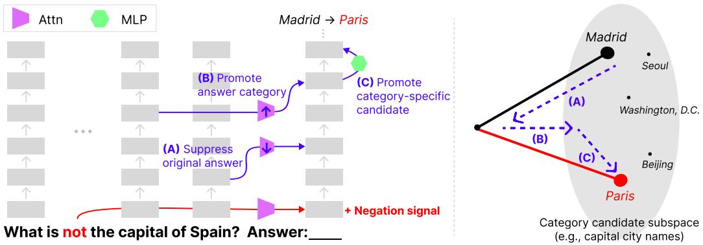  
Figure 1: Overview of LLMs’ negation mechanism. Left: The negation signal triggers three downstream changes: (A) suppressing the original answer, (B) promoting answer category information, and (C) promoting a category-specific alternative. Right: These changes preserve the answer category subspace while shifting preference to an alternative answer (“Paris”).

To understand the mechanism underlying these failures, we proceed in three steps. First, to identify where negation begins to affect the model’s answer prediction, we trace the information flow from the negation token to the prediction token position using activation patching (Meng et al., 2022; Zhang & Nanda, 2024) (§ 3). We find that negation reaches the final prediction position to shift the representation in a similar direction across examples: subtracting this direction from a negated prompt’s representation shifts downstream computation and the prediction back toward those of the original prompt. We refer to this causal direction as the negation signal.

We then analyze how downstream computation changes to generate an alternative answer (§ 4). Interestingly, we discover that instead of using knowledge of the original answer to determine what should be excluded, as humans do, LLMs perform negation by merely suppressing the original answer and promoting a category-specific alternative. Specifically, we identify three distinct yet complementary mechanisms as in Figure 1: (A) weakening attention heads that retrieve the original answer (e.g., “Madrid”), (B) strengthening attention heads that retrieve broad answer category information (e.g., the answer should be a city name), and (C) activating MLP neurons that promote particular candidates within that category (e.g., “Paris” over other capitals). To examine how these changes jointly shape the model’s representations, we use Distributed Alignment Search (DAS) (Geiger et al., 2024). We find that negation largely preserves answer category information while selectively modifying representations within the candidate-preference subspace.

Lastly, to diagnose negation failures, we compare successful cases with failure cases in which the model repeats the original answer under negation (§ 5.1). We find that because the mechanism relies on suppressing the original answer, rather than using the original answer to determine what should be excluded, it becomes vulnerable when suppression is insufficient relative to the support for the original answer. This support correlates with the model’s confidence in that answer. Based on this diagnosis, we propose a training objective that requires stronger corrections for more confident original answers. Compared with multiple baselines, our objective more effectively reduces negation failures while preserving performance on non-negated prompts.

Together, we demonstrate a distinct mechanism for negation. Unlike human accounts in which the original meaning informs what to exclude, LLMs suppress the original prediction while promoting a favored alternative within the same category. This explains their failures: the correction can be too weak to overturn a strongly supported original prediction. Guided by this diagnosis, we develop a confidence-adaptive training objective that reduces negation failures.

Table 1: Answer change and category preservation rates on the test split of our benchmark (%). Averages are computed over six benchmarks for multimodal models and four for text-only models.
<table><tr><td rowspan="3"></td><td colspan="2">Factual Association</td><td colspan="2">Logical Reasoning</td><td colspan="2">Visual Question Answering</td><td colspan="2">Average</td></tr><tr><td>PopQA</td><td>RippleEdits</td><td>PhantomWiki</td><td>SynthWorlds</td><td>GQA</td><td>PTR</td><td>Negated</td><td></td></tr><tr><td>Ans. change / Cat. pres.</td><td>Ans. change / Cat. pres.</td><td>Ans. change / Cat. pres.</td><td>Ans. change / Cat. pres.</td><td>Ans. change / Cat. pres.</td><td>Ans. change / Cat. pres.</td><td>Ans. change / Cat. pres.</td><td>Original acc.</td></tr><tr><td>Open-source models</td><td></td><td></td><td></td><td></td><td></td><td></td><td></td><td></td></tr><tr><td>Gemma 3-4B-IT</td><td>40.8/98.5</td><td>14.1/95.7</td><td>66.4/90.8</td><td>35.0/90.3</td><td>46.3/93.0</td><td>31.8/97.3</td><td>39.1/94.3</td><td>32.6</td></tr><tr><td>Gemma 3-12B-IT</td><td>58.1/99.7</td><td>31.1/95.9</td><td>50.4/96.2</td><td>42.3/95.2</td><td>58.3/94.9</td><td>44.4/99.1</td><td>47.4/96.8</td><td>41.9</td></tr><tr><td>Gemma 3-27B-IT</td><td>68.2/99.9</td><td>44.8/98.8</td><td>70.1/99.6</td><td>42.9/95.4</td><td>77.5/94.1</td><td>72.5/98.9</td><td>62.6/97.8</td><td>44.8</td></tr><tr><td>Qwen3.5-9B</td><td>55.4/99.3</td><td>52.5/89.9</td><td>63.3/99.6</td><td>24.5/95.5</td><td>55.2/96.1</td><td>66.2/98.9</td><td>52.9/96.6</td><td>47.2</td></tr><tr><td>Llama 3.1-8B-Instruct</td><td>43.3/83.4</td><td>13.5/82.9</td><td>26.8/97.8</td><td>32.2/84.5</td><td colspan="2">Text only</td><td>28.9/87.2</td><td>39.3</td></tr><tr><td>OLMo 3-7B-Instruct</td><td>56.2/89.7</td><td>32.0/93.4</td><td>65.3/92.8</td><td>30.5/97.6</td><td colspan="2">Text only</td><td>46.0/93.4</td><td>32.4</td></tr><tr><td>Closed-source models</td><td></td><td></td><td></td><td></td><td></td><td></td><td></td><td></td></tr><tr><td>GPT-5.6 Luna</td><td>55.3/92.3</td><td>43.6/89.5</td><td>39.1/95.4</td><td>31.6/100.0</td><td>61.4/97.5</td><td>57.1/98.4</td><td>48.0/95.5</td><td>52.3</td></tr><tr><td>Claude Sonnet 5</td><td>66.3/98.4</td><td>51.0/97.0</td><td>67.0/87.3</td><td>34.9/92.1</td><td>73.7/97.9</td><td>68.6/99.4</td><td>60.3/95.3</td><td>54.3</td></tr></table>

## 2 EVALUATING NEGATION PROCESSING IN LLMS

To assess how well current LLMs process negation, we systematically evaluate their ability to generate appropriate alternatives under negation across multiple domains. We find that both open-source and production-class closed-source models struggle with negation. While these models tend to generate appropriate alternatives rather than unrelated words, they often fail to change their answers under negation, instead repeating the answers they gave to the corresponding non-negated prompts.

Dataset construction. We construct paired prompts that isolate the effect of negation while preserving the remaining context. Our dataset draws on six benchmarks, with two representing each domain: PopQA (Mallen et al., 2023) and RippleEdits (Cohen et al., 2024) for factual association, PhantomWiki (Gong et al., 2025) and SynthWorlds (Gu et al., 2026) for logical reasoning, and GQA (Hudson & Manning, 2019) and PTR (Hong et al., 2021) for visual question answering. To cover diverse surface forms of negation, we construct four negated counterparts for each example by inserting not, n’t, never, or by no means. To assess whether models generate alternatives of the appropriate type, we use source metadata to identify the type of answer each question requests (e.g., a person name, a sport, or a letter), which we call its answer category.

To ensure the quality of our benchmark, we evaluate each negated question based on three criteria: whether it is grammatically well-formed, semantically unambiguous, and preserves the meaning of the original question under negation. The resulting dataset contains 105,048 examples, which we split into training, validation, and test sets at a 4:1:5 ratio. We use the training and validation splits for mechanistic analyses and reserve the test split for the final evaluation of our training method. Construction rules and validation details are provided in Appendix B.

Models. We evaluate both open-source and production-class closed-source models. The six opensource models are Gemma 3-{4B,12B,27B}-IT, Qwen3.5-9B, Llama 3.1-8B-Instruct, and OLMo 3-7B-Instruct, and the closed-source models are GPT-5.6 Luna and Claude Sonnet 5.

Evaluation. For each pair, we query the model separately with the original and negated prompts, keeping all other input unchanged. We evaluate the three metrics sequentially, with each subsequent metric assessed only on cases that pass the preceding metric. First, we assess accuracy on the original questions against the source benchmarks’ reference answers. Second, answer change rate measures the fraction of originally correct cases in which the answer changes semantically under negation. Third, category preservation rate measures the fraction of these changed answers that belong to the same answer category as the original answer. Further details are provided in Appendix C.

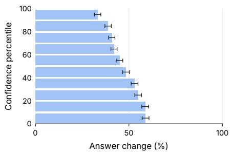

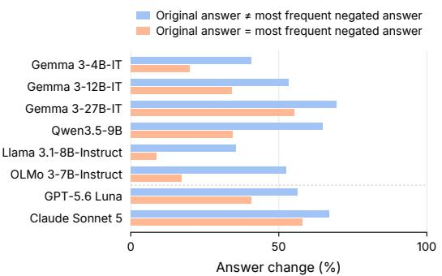  
Figure 2: Left: Answer change rates decrease with confidence in the original answer (mean token log-probability; results averaged across six open-source models). Right: Answer change rates are also lower when the original answer is the model’s most common response under negation.

Results. Table 1 shows that LLMs can select alternatives that are consistent with the answer category, rather than simply produce unrelated answers. When models change their answers, category preservation rates are high across models (87.2–97.8%). Nevertheless, models often repeat the original answer under negation, with answer change rates of only 28.9–62.6%. This occurs even in production-class closed-source models including GPT-5.6 Luna and Claude Sonnet 5.

We further find that higher original answer confidence is associated with more frequent repetition (Figure 2, left). We also observe that models tend to generate a particular answer frequently under negation. We therefore compare cases where this most frequent negated answer matches the original answer with those where it does not (Figure 2, right). The answer change rate drops substantially when the two match. This suggests that such a preference often facilitates successful negation by providing an alternative, but can substantially hinder negation when the preferred answer is itself the original answer that must be rejected. We refer to this systematic preference as negation bias. Additional results are provided in Appendix E.1.

Together, these findings suggest that LLMs possess a mechanism for selecting appropriate alternatives under negation, but that this mechanism remains brittle. We next investigate how this mechanism generates alternatives and why it sometimes fails to override the original answer.

## 3 LOCALIZING THE EFFECT OF NEGATION

To understand how negation changes answer generation, we first localize where it affects the model’s computation. We trace how its effect is transmitted to the final prompt token (§ 3.1), where it shifts middle-layer representations in a similar direction across examples. Removing this direction from the final prompt token causally reverses subsequent attention and MLP changes (§ 3.2), allowing us to focus the following analyses on these components.

Setup and notation. We conduct our analysis on four of the open-source models evaluated in § 2: Gemma 3-{4B, 12B}-IT, Qwen3.5-9B, and Llama 3.1-8B-Instruct. We use Gemma 3-12B-IT for our main analyses and report results for the remaining models in Appendix E. Here, we analyze only cases where models generate an appropriate alternative under negation. To understand how negation interacts with the computation that generates the answer, we distinguish four types of prompt tokens: (1) answer tokens, such as “Spain” in “What is the capital of Spain?”, which contain information about the original answer; (2) answer category tokens, such as “the capital of”, which specify the answer category; (3) negation tokens in the negated prompt; and (4) the final prompt token, where the prediction is formed.

Each example i pairs an original prompt $x _ { i }$ with a negated prompt $\boldsymbol { x } _ { i , f } ^ { \mathrm { n e g } }$ , where f denotes the negation form. We align corresponding token positions across the two prompts while ignoring the inserted negation expression, and define the negation-induced change as $\Delta \mathbf { h } _ { i , f } ^ { \ell , t } = \mathbf { h } _ { \ell , t } ( x _ { i , f } ^ { \mathrm { n e g } } ) -$ $\mathbf { h } _ { \ell , t } ( x _ { i } )$ , where $\mathbf { h } _ { \ell , t } ( x )$ is the residual-stream representation at layer ℓ and aligned position t.

(a)  
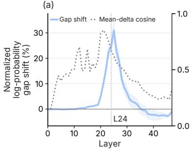

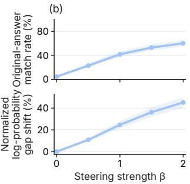

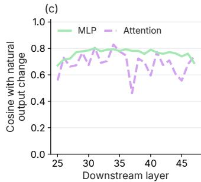  
Figure 3: Removing the negation direction in Gemma 3-12B-IT. (a) Layerwise effects of steering with the negation signal $( \beta = 1 )$ , overlaid with negation-delta similarity. (b) Causal effects of steering with the negation signal at (L24). (c) Cosine similarity between attention and MLP output changes induced by natural negation and by steering $\left( \beta = 3 \right)$ . Effects are averaged over six bench marks. Shading indicates 95% bootstrap intervals.

For causal interventions, we report two metrics: (1) original-answer match rate, the fraction of cases where the intervened model outputs the same answer as the original prompt, and (2) normalized logprobability gap shift, which measures how far the intervention shifts the log-probability gap between the original and negated answers back toward that under the original prompt.

Let $a _ { i }$ and $b _ { i , f }$ denote the original and negated answers. We compute each answer’s full-sequence log-probability, $\begin{array} { r } { s ( { a \mid x } ) ~ = ~ \sum _ { k = } ^ { | a | } } \end{array}$ <sub>1</sub> log $P ( a _ { k } \mid x , a _ { < k } )$ , and define the log-probability gap as $g _ { i , f } ( x ) \ = \ s ( b _ { i , f } \ \mid \ x ) - s ( a _ { i } \ \mid \ x )$ . Let $g _ { i , f } ^ { \mathrm { i n t } }$ denote this gap after intervention on the negated prompt. The normalized log-probability gap shift is

$$
\frac { 1 } { | \mathcal { D } | } \sum _ { ( i , f ) \in \mathcal { D } } \frac { g _ { i , f } ( x _ { i , f } ^ { \mathrm { n e g } } ) - g _ { i , f } ^ { \mathrm { i n t } } } { g _ { i , f } ( x _ { i , f } ^ { \mathrm { n e g } } ) - g _ { i , f } ( x _ { i } ) } ,
$$

where D denotes the set of evaluated pairs.

## 3.1 TRACING THE INFORMATION FLOW OF NEGATION

Method. To trace how information from the negation tokens reaches the final prompt token, we use activation patching (Zhang & Nanda, 2024). We examine attention paths carrying information (1) from the negation tokens to other token groups and (2) from each token group to the final prompt token, with one overlap (e.g., a direct negation-to-final-token path). For each path, we replace only the corresponding part of the attention output with that from the paired prompt, leaving the remaining output unchanged. We perform this intervention in both directions and measure normalized log-probability gap recovery. For each path, we apply the intervention within a four-layer sliding window with a stride of two layers. Detailed procedures and settings are in Appendix E.2.

Results. The results in Figure 9 suggest that the effect of negation reaches the final prompt token mainly through other prompt tokens rather than directly. Notably, the direct path from the negation tokens to the final prompt token has relatively little effect (1.3% increase). Among paths originating from the negation tokens, those targeting answer category tokens (e.g., “the capital of”) show a large effect peaking at early layers (Figure 9 left, L8–11), followed by effects from answer category and other tokens to the final prompt token in the middle layers (Figure 9 right, L22–25). This pattern suggests that negation is first transmitted through answer category tokens before affecting the representation at the final prompt token. Answer-token paths also show large effects (Figure 9, green line), but they peak later and reflect a different process. Separate interventions on attention weights and answer-token value vectors show that these effects arise mainly from changes in attention weight attending to answer tokens, rather than changes in the information carried by their value vectors (Appendix E.2).

## 3.2 A CAUSAL NEGATION SIGNAL AT THE FINAL PROMPT TOKEN

To identify where alternatives are generated, we ask whether the negation information reaching the final prompt token already specifies an alternative answer or instead provides a signal for generating one in subsequent computation. To investigate this, we compare the directions of negation-induced hidden-state changes across samples with different answers. We find that these changes are highly aligned: the average cosine similarity to the mean negation-induced change reaches 0.853 at L22 across the six benchmarks, within the same middle-layer range where activation patching shows negation affecting this token (Figure 3(a)). This suggests a consistent negation-related component across samples, motivating us to test whether removing this component reverses the subsequent effects of negation.

We test this by subtracting the mean negation-induced difference from the negated prompt’s representation at each layer. The effect of removal increases in the middle layers and peaks around L25. At this layer, removing the direction restores the original answer in up to 48.6% of cases (Figure 3(b)). Importantly, changing only the representation at the final prompt token also reverses downstream attention and MLP output changes toward those of the original prompt (Figure 3(c)). We therefore refer to this direction as the negation signal. Detailed procedures and additional results are provided in Appendix D.2.

## 4 HOW LLMS GENERATE ALTERNATIVES UNDER NEGATION

We next investigate the specific mechanisms by which the negation signal changes downstream computation to produce an alternative in a related answer category. We identify specific attention heads and MLP neurons that contribute to suppressing the original answer and promoting alternatives (§ 4.1). We then show how these changes are reflected in the model’s representations: answer category information is largely preserved, while preference among answers changes (§ 4.2).

## 4.1 COMPONENTS THAT IMPLEMENT NEGATION

Method. To understand how the negation signal changes answer generation, we identify downstream attention heads and MLP neurons involved in this change at the final prompt token. For attention heads, we rank heads by the magnitude of their negation-induced attention change. For each paired prompt, we score head h as $S _ { h } ^ { \mathrm { a t t n } } = \| \Delta \alpha _ { h } \|$ , where $\Delta \alpha _ { h }$ is the change in its attention weights from the final prompt token. For MLP neurons, we instead identify activations contributing to the prediction of the alternative answer using attribution patching (Syed et al., 2024). We score neuron j as $S _ { j } ^ { \mathrm { M L P } } = { \Delta m _ { j } } ( \partial g / \partial { m _ { j } } )$ , where $\Delta m _ { j }$ is its activation change and g measures the logprobability gap between the alternative and original answers. We average these scores over training examples to rank components. Detailed procedures are provided in Appendix D.3.

Results. Averaging these scores over training examples reveals a clear pattern: a small set of attention heads and MLP neurons consistently ranks highly across datasets and answer categories. The top 1% of downstream neurons (3,533 neurons) accounts for 39.7% of the positive attribution score (Figure 4 (a)). Restoring selected head outputs or neuron activations to their non-negated values in held-out prompts produces larger changes in answer preference than matched random controls (Figure 4 (b)).

To characterize their roles, we examine attention to answer category tokens and use logit lens (Nostalgebraist, 2020) to interpret component outputs. These analyses suggest three distinct yet complementary mechanisms, which we test through causal interventions.

First, several middle-layer heads (e.g., L31H13) reduce attention to answer tokens under negation. Their non-negated outputs support the original answer across different answer categories, but this support decreases under negation (Figure 4 (c)). Following prior work on factual retrieval (Geva et al., 2023), we interpret this as weakened retrieval of the original answer. Restoring the attention outputs from answer tokens to their non-negated values increases preference for that answer, supporting this interpretation (Appendix E.4).

Second, other heads increase attention to answer category tokens. Their logit lens outputs support multiple candidates within the relevant category without consistently favoring a particular alternative

Original-answer suppression head (L31H13)

Category-related head (L26H3)

(c) Example: Red → Blue  
(a) Concentration  
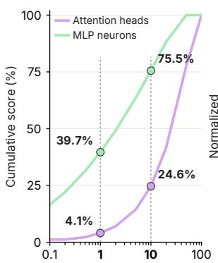  
Top-ranked components (%)

(b) Causal restoration  
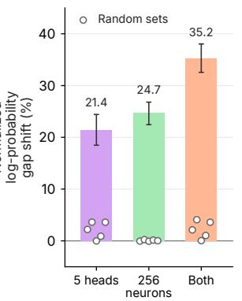

<table><tr><td>Top 5</td><td>Bottom 5 ·Red</td><td>∆ output</td></tr><tr><td>·black</td><td>+1.27</td><td>-1.32</td></tr><tr><td>黑</td><td>+1.21 Red</td><td>-1.21</td></tr><tr><td>·blacks</td><td>+1.15 ·redd</td><td>-1.05</td></tr><tr><td>·黑</td><td>+1.13 ·redhead ·RED</td><td>-1.05</td></tr><tr><td>black</td><td>+1.13</td><td>-1.04</td></tr></table>

<table><tr><td>Top 5</td><td>Bottom 5</td><td>Negated output</td></tr><tr><td>·color</td><td>+0.38 U+23F1</td><td>-0.20</td></tr><tr><td>·colour</td><td>+0.36 ·Habib</td><td>-0.20</td></tr><tr><td>·pigment</td><td>+0.34 ologa</td><td>-0.19</td></tr><tr><td>color</td><td>+0.34 nością</td><td>-0.18</td></tr><tr><td>·pigmented</td><td>+0.33 vgili</td><td>-0.18</td></tr></table>

<table><tr><td>Top 5</td><td>Alternative-promoting MLP heurons (256) Bottom 5</td><td>∆ output</td></tr><tr><td>青</td><td>+9.81</td><td></td></tr><tr><td>蓝</td><td>·Red +9.66 Red</td><td>-14.20 -13.62</td></tr><tr><td>Blue</td><td>+9.56 ·red</td><td>-13.38</td></tr><tr><td>blue</td><td>+9.52 RED</td><td>-11.89</td></tr><tr><td></td><td>·RED</td><td>-11.88</td></tr></table>

Figure 4: Components involved in forming alternatives in Gemma 3-12B-IT. (a) Cumulative head and neuron scores. (b) Effects of restoring their non-negated values, averaged across six benchmarks; dots show matched random controls. (c) Unfiltered logit lens top/bottom five for an illustrative example.

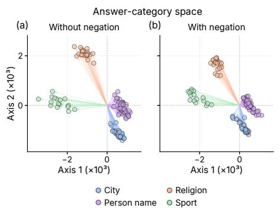

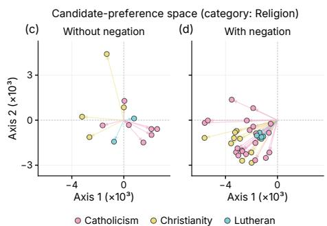  
Figure 5: Negation largely preserves the shared answer category structure (a–b), while redirecting candidate-space representations toward a specific direction (c–d). Arrows show independently computed activations without centering or normalization.

(Figure 4(c)). Removing these outputs reduces preference for answers across the category, rather than selectively for the model-generated alternative (Appendix E.5). This suggests that these heads promote the answer category rather than choose a particular replacement.

Third, high-attribution MLP neurons promote particular alternatives within the relevant category. Restoring their non-negated activations weakens preference for the model-generated alternative over other candidates in that category, whereas amplifying their negation-induced changes strengthens it. Importantly, their output changes tend to favor similar candidates within each category even when the original answer differs. This suggests that these neurons promote preferred candidates rather than consistently adjust their choice to exclude the original answer (Appendix E.6).

Together, these results suggest that the model forms alternatives by weakening retrieval of the orig inal answer while promoting answer category information and preferred candidates within that category. This can produce an appropriate alternative, but may fail when the original answer is itself among the favored candidates, as shown in Figure 2, right.

## 4.2 HOW NEGATION RESHAPES THE REPRESENTATION

Method. To understand how these mechanisms jointly change answer generation, we examine what information they preserve and modify in the representation at the final prompt token. We hypothesize that (1) answer category information is largely preserved while (2) preference among candidates changes, as illustrated in Figure 1, right.

To distinguish these two types of information, we build on Distributed Alignment Search (DAS; Geiger et al., 2024), which uses gradient-based optimization to find subspaces where interventions produce a specified change in the model’s prediction. Using separate objectives, we learn an answer category space C, where interventions increase preference for answers from another category, and a candidate-preference space $L _ { s } ,$ where interventions increase preference for a different answer within category s. We learn both spaces from prompts without negation and keep them fixed when comparing the magnitude and direction of negation-induced changes within each space. The optimization objectives and intervention details are provided in Appendix D.4.

Results. Comparing matched original and negated prompts, we find that negation largely preserves answer category information in C while changing candidate preference in $L _ { s } ( \mathrm { F i g u r e } 5 )$ . This pattern is consistent with the joint effects of the mechanisms identified above: answer category heads offset the effects of reduced answer retrieval on category information, while original-answer suppression and alternative-promoting neurons jointly shift candidate preference.

Interestingly, negation-induced changes in $L _ { s }$ tend to align in a similar direction within each answer category, even when the original answers differ. To identify which answers this direction favors, we intervene along it and measure changes in answer scores. We find that it favors the answer most frequently generated under negation (i.e., negation bias) within that category (Appendix D.4). Together with the neuron analysis, this suggests that the model retains the category information needed to generate alternatives, but does not reliably adjust its candidate preferences to exclude the original answer.

## 5 WHY NEGATION FAILS AND HOW TO IMPROVE IT

We next analyze failure cases, and find that the mechanism remains active but does not sufficiently suppress the original answer (§ 5.1). Based on this diagnosis, we introduce a training objective that requires stronger corrections when the original prediction is more confident (§ 5.2).

## 5.1 DIAGNOSING FAILURE CASES

We ask whether negation failures occur because the mechanisms identified above are absent, or because their effects are too weak to change the prediction. Comparing successful and repeatedanswer cases, we find that negation-induced changes remain present in failures, but are weaker (Appendix E.8). For example, L31H13’s attention to answer tokens decreases from 36.3% to 8.6% in successful cases, but only from 38.1% to 17.2% in failures.

We then test whether strengthening the identified changes can alter failed predictions. Removing the selected heads’ answer-token contributions lowers the original-answer match rate from 100% to 94.9%, while doubling the selected neurons’ negation-induced changes lowers it to 58.6%. Combining both yields 57.6% (Appendix E.8). Thus, the mechanism can remain active in failure cases but be insufficient to overturn the original prediction. Together with the association between originalanswer confidence and repetition (§ 2), this motivates training that requires stronger corrections for more confident original predictions.

## 5.2 IMPROVING NEGATION THROUGH CONFIDENCE-ADAPTIVE TRAINING

Our analysis suggests that negation can fail even when correction is active, because it is too weak to overcome support for the original answer. We therefore propose Adaptive Logit Inversion Training (ALiT), which requires stronger correction for more confident original predictions. Rather than specifying a particular alternative, we extrapolate the model’s negation-induced logit change until an alternative is preferred over the original answer by a confidence-dependent margin, then train the model to match the resulting distribution.

Constructing the training target. Using a frozen base model, we compute logits at the first answer position and extrapolate their change under negation:

$$
\widetilde { \mathbf { l o g i t } } _ { i } ( \beta ) = \mathbf { l o g i t } _ { 0 } ( x _ { i } ) + \beta \left[ \mathbf { l o g i t } _ { 0 } ( x _ { i , f } ^ { \mathrm { n e g } } ) - \mathbf { l o g i t } _ { 0 } ( x _ { i } ) \right] , \qquad \beta \geq 1 .\tag{1}
$$

Table 2: Training results for Gemma 3-12B-IT (%). ID denotes PopQA, and OOD denotes five other benchmarks.
<table><tr><td></td><td colspan="4">In-domain (ID)</td><td colspan="4">Out-of-domain (OOD)</td><td>General Capability</td></tr><tr><td>Method</td><td>Answer change</td><td>Category preservation</td><td>Answer diversity</td><td>Original accuracy</td><td>Answer change</td><td>Category preservation</td><td>Answer diversity</td><td>Original accūracy</td><td>Avg.</td></tr><tr><td>Base</td><td>58.14</td><td>99.71</td><td>90.90</td><td>21.90</td><td>46.93</td><td>96.64</td><td>80.05</td><td>37.15</td><td>78.04</td></tr><tr><td>ALiT (ours)</td><td>96.55</td><td>99.86</td><td>86.54</td><td>22.10</td><td>84.96</td><td>97.63</td><td>76.26</td><td>37.40</td><td>77.68</td></tr><tr><td>Unlikelihood</td><td>99.95 (+3.40)</td><td>53.97 (-45.89)</td><td>75.21 (-11.33)</td><td>21.16 (−0.94)</td><td>89.41 (+4.45)</td><td>57.68 (-39.95)</td><td>84.46 (+8.20)</td><td>37.40 (0.00)</td><td>77.95 (+0.27)</td></tr><tr><td>SFT</td><td>96.84 (+0.29)</td><td>100.00 (+0.14)</td><td>8.03 (-78.51)</td><td>21.64 (−0.46)</td><td>86.52 (+1.56)</td><td>99.06 (+1.43)</td><td>39.11 (-37.15)</td><td>36.64 (−0.76)</td><td>76.98 (−0.70)</td></tr><tr><td>DPO</td><td>100.00 (+3.45)</td><td>42.76 (-57.10)</td><td>73.61 (−12.93)</td><td>21.97 (−0.13)</td><td>99.23 (+14.27)</td><td>52.63 (-45.00)</td><td>83.71 (+7.45)</td><td>37.16 (−0.24)</td><td>77.36 (−0.32)</td></tr></table>

$\mathbf { A } \mathbf { t } \beta = 1$ , the target equals the unmodified negated logits; larger values amplify the model’s existing change. Let $m _ { i }$ be the gap between the two highest logits on the original prompt. We choose the smallest $\beta \geq 1$ for which another token exceeds the original top token by at least $\alpha m _ { i } ,$ where α controls the required margin. Thus, more confident original predictions require a larger margin in favor of an alternative. The coefficient cap and handling of infeasible margins are described in Appendix F.

Training objective. Let $\widetilde { p _ { i } }$ be the softmax distribution of the resulting target logits. We train the model to match this target while penalizing changes to its original predictions:

$$
\mathcal { L } = \mathbb { E } _ { i } \left[ D _ { \mathrm { K L } } ( p _ { \theta } ( \cdot \mid x _ { i } ^ { \mathrm { n e g } } ) \parallel \widetilde { p } _ { i } ) \right] + \lambda \mathcal { L } _ { \mathrm { o r i g } } ,\tag{2}
$$

where $\mathcal { L } _ { \mathrm { o r i g } }$ penalizes deviations from the frozen base model on non-negated prompts. Targets and confidence margins are fixed before training. Full loss definitions and optimization settings are provided in Appendix F.

Setup. We post-train Gemma 3-12B-IT on the PopQA subset of our benchmark, treating it as indomain and other benchmarks as out-of-domain. We compare ALiT with other training algorithms such as supervised fine-tuning (SFT; She et al., 2023), unlikelihood training (UL; Hosseini et al., 2021), and Direct Preference Optimization (DPO; Rafailov et al., 2023), alongside the unmodified base model. Training hyperparameters and baseline target construction are detailed in Appendix F.

For evaluation, We use the held-out test split using the three metrics from § 2: answer change, category preservation, and original-question accuracy. We treat PopQA as in-domain (ID) and the remaining five benchmarks as out-of-domain (OOD). We additionally measure answer diversity within each category group as one minus the fraction of predictions accounted for by the most frequent answer, and average this score across groups in proportion to their size. To assess general capability, we evaluate MMLU-Pro, HellaSwag, GSM8K, and IFEval, and report their average performance.

Results. Table 2 shows that ALiT substantially improves answer change while preserving answer category consistency and performance on the original questions. Answer change increases from 58.1% to 96.6% in-domain and from 46.9% to 85.0% out-of-domain, while category preservation remains above 97%. Original accuracy and general-capability performance also remain close to those of the base model. The baselines, on the other hand, reveal different trade-offs. UL and DPO achieve high answer change, but substantially reduce category preservation. SFT preserves the answer category and achieves similarly high answer change, but sharply reduces answer diversity, suggesting that it learns to rely on a small set of alternatives.

Figure 17 makes this difference more explicit. When the original answer differs from the most frequent negated answer, SFT raises answer change from 53.2% to 94.8%. However, when the two match, answer change falls from 34.2% to 18.8%. In contrast, ALiT improves both groups, to 67.1% and 40.2%, respectively. Thus, ALiT improves negation without strongly amplifying the negation bias identified in § 2.

## 6 CONCLUSION

We investigate why LLMs can answer a question correctly yet fail to reject that answer under negation. We identify attention heads and MLP neurons that suppress original-answer retrieval while preserving answer category information and promoting favored candidates. However, these candidate preferences do not reliably adjust to which answer must be excluded, leaving negation vulnerable to insufficient correction and negation bias. Guided by this diagnosis, we propose ALiT, which requires stronger corrections for more confident original predictions. ALiT improves negation while largely preserving general performance and avoiding the sharp loss of answer diversity observed with SFT. Our results demonstrate how mechanistic analysis can explain linguistic failures and guide training that addresses their underlying limitations.

## AI USE STATEMENT

In this work, we used generative AI tools to provide feedback on research methodology and experimental design, assist in the writing of proofs and translation, support qualitative and thematic data analysis, and assist with the interpretation of experimental results. We also used an LLM-as-a-Judge for benchmark validation and model evaluation, as described in the corresponding sections. We did not use generative AI tools to generate synthetic datasets, develop theoretical models or conceptual frameworks, formulate mathematical claims or provide critical ingredients for proving them, propose or refine hypotheses, implement methods, or clean or reformat datasets. Additionally, we used generative AI tools to identify potentially relevant literature, improve the clarity and grammar of the manuscript, assist with LaTeX code, and support the preparation of figures. All experimental designs and research decisions were independently reviewed and validated by the authors, and rele vant literature suggested by generative AI tools was manually verified against the original sources. AI-assisted work was reviewed and revised by the authors for correctness and consistency with the underlying experiments and results. We take responsibility for the final content of this work, including text, claims, and artifacts produced with the aid of generative AI.

## REPRODUCIBILITY STATEMENT

We provide a detailed description of our benchmark construction and validation procedures in Section 2 and Appendix B, including the source benchmarks, negation transformation rules, automatic checks, and LLM- and human-based validation procedures. We further describe the model evaluation procedure and metrics in Appendix C. The procedures and settings for our mechanistic anal yses, including information-flow tracing, negation-signal interventions, component identification, and subspace experiments, are described in Appendix D, with additional results in Appendix E. Section 5.2 specifies our proposed training objective, and Appendix F provides the complete definitions of ALiT and the baselines, target construction procedures, optimization settings, and training hyperparameters.

## REFERENCES

Abdullah Al Mofael, Lisa M. Kuhn, Ghassan Alkadi, and Kuo-Pao Yang. Interpreting negation in gpt-2: Layer-and head-level causal analysis. In 2026 IEEE 16th Annual Computing and Communication Workshop and Conference (CCWC), pp. 0042–0050. IEEE, January 2026. doi: 10.1109/ccwc67433.2026.11393646. URL http://dx.doi.org/10.1109/ CCWC67433.2026.11393646.

Kumail Alhamoud, Shaden Alshammari, Yonglong Tian, Guohao Li, Philip H.S. Torr, Yoon Kim, and Marzyeh Ghassemi. Vision-language models do not understand negation. In Proceedings of the IEEE/CVF Conference on Computer Vision and Pattern Recognition (CVPR), pp. 29612– 29622, June 2025.

Joshua Jose Dias Barreto and Abhik Jana. This is not a disimprovement: Improving negation reasoning in large language models via prompt engineering. In Findings of the Association for Computational Linguistics: EMNLP 2025, pp. 14149–14156. Association for Computational Linguistics, 2025. URL https://aclanthology.org/2025.findings-emnlp.761/.

Herbert H. Clark and William G. Chase. On the process of comparing sentences against pictures. Cognitive Psychology, 3(3):472–517, 1972. doi: 10.1016/0010-0285(72)90019-9. URL https: //doi.org/10.1016/0010-0285(72)90019-9.

Roi Cohen, Eden Biran, Ori Yoran, Amir Globerson, and Mor Geva. Evaluating the ripple effects of knowledge editing in language models. Transactions of the Association for Computational Linguistics, 12:283–298, 2024. doi: 10.1162/tacl a 00644. URL https://aclanthology. org/2024.tacl-1.16/.

Allyson Ettinger. What BERT is not: Lessons from a new suite of psycholinguistic diagnostics for language models. Transactions ofthe Associationfor Computational Linguistics, 8:34–48, 2020. doi: 10.1162/tacl a 00298. URL https://aclanthology.org/2020.tacl-1.3/.

Ira Fischler, Paul A. Bloom, Donald G. Childers, Salim E. Roucos, and Nathan W. Perry, Jr. Brain potentials related to stages of sentence verification. Psychophysiology, 20(4):400–409, July 1983. doi: 10.1111/j.1469-8986.1983.tb00920.x. URL https://doi.org/10.1111/j. 1469-8986.1983.tb00920.x.

Iker Garc´ıa-Ferrero, Begona Altuna, Javier Alvez, Itziar Gonzalez-Dios, and German Rigau. This is˜ not a dataset: A large negation benchmark to challenge large language models. In Proceedings of the 2023 Conference on Empirical Methods in Natural Language Processing, pp. 8596–8615, Singapore, 2023. Association for Computational Linguistics. doi: 10.18653/v1/2023.emnlp-main. 531. URL https://aclanthology.org/2023.emnlp-main.531/.

Atticus Geiger, Zhengxuan Wu, Christopher Potts, Thomas Icard, and Noah Goodman. Finding alignments between interpretable causal variables and distributed neural representations. In Francesco Locatello and Vanessa Didelez (eds.), Proceedings of the Third Conference on Causal Learning and Reasoning, volume 236 of Proceedings of Machine Learning Research, pp. 160–187. PMLR, 01–03 Apr 2024. URL https://proceedings.mlr.press/v236/ geiger24a.html.

Mor Geva, Jasmijn Bastings, Katja Filippova, and Amir Globerson. Dissecting recall of factual associations in auto-regressive language models. In Proceedings of the 2023 Conference on Empirical Methods in Natural Language Processing, pp. 12216–12235, Singapore, December 2023. Association for Computational Linguistics. doi: 10.18653/v1/2023.emnlp-main.751. URL https://aclanthology.org/2023.emnlp-main.751/.

Albert Gong, Kamile Stankevi˙ ciˇ ut¯ e, Chao Wan, Anmol Kabra, Raphael Thesmar, Johann Lee, Julius˙ Klenke, Carla P Gomes, and Kilian Q Weinberger. Phantomwiki: On-demand datasets for reasoning and retrieval evaluation. In Forty-second International Conference on Machine Learning, 2025. URL https://openreview.net/forum?id=DIZItj8ueN.

Ken Gu, Advait Bhat, Mike Merrill, Robert West, Xin Liu, Daniel McDuff, and Tim Althoff. Synthworlds: Controlled parallel worlds for disentangling reasoning and knowledge in language models. In C. Vondrick, B. Hariharan, C. Raffel, L. Pinto, D. Yang, and A. Faust (eds.), International Conference on Learning Representations, volume 2026, pp. 109525–109573, 2026. URL https://proceedings.iclr.cc/paper\_files/paper/2026/file/ b213d870740582dd6af77bbdaed900c9-Paper-Conference.pdf.

Mareike Hartmann, Miryam de Lhoneux, Daniel Hershcovich, Yova Kementchedjhieva, Lukas Nielsen, Chen Qiu, and Anders Søgaard. A multilingual benchmark for probing negationawareness with minimal pairs. In Arianna Bisazza and Omri Abend (eds.), Proceedings of the 25th Conference on Computational Natural Language Learning, pp. 244–257, Online, November 2021. Association for Computational Linguistics. doi: 10.18653/v1/2021.conll-1.19. URL https://aclanthology.org/2021.conll-1.19/.

Chadi Helwe, Simon Coumes, Chloe Clavel, and Fabian Suchanek. TINA: Textual inference´ with negation augmentation. In Findings of the Association for Computational Linguistics: EMNLP 2022, pp. 4086–4099, Abu Dhabi, United Arab Emirates, December 2022. Association for Computational Linguistics. doi: 10.18653/v1/2022.findings-emnlp.301. URL https: //aclanthology.org/2022.findings-emnlp.301/.

Yining Hong, Li Yi, Josh Tenenbaum, Antonio Torralba, and Chuang Gan. Ptr: A benchmark for part-based conceptual, relational, and physical reasoning. In M. Ranzato, A. Beygelzimer, Y. Dauphin, P.S. Liang, and J. Wortman Vaughan (eds.), Advances in Neural Information Processing Systems, volume 34, pp. 17427–17440. Curran Associates, Inc., 2021. URL https://proceedings.neurips.cc/paper\_files/paper/2021/ file/918f5cd5a5c0d48671d4d4fc54bab2e9-Paper.pdf.

Arian Hosseini, Siva Reddy, Dzmitry Bahdanau, R Devon Hjelm, Alessandro Sordoni, and Aaron Courville. Understanding by understanding not: Modeling negation in language models. In Proceedings of the 2021 Conference of the North American Chapter of the Association for Computational Linguistics: Human Language Technologies, pp. 1301–1312, Online, June 2021. Association for Computational Linguistics. doi: 10.18653/v1/2021.naacl-main.102. URL https: //aclanthology.org/2021.naacl-main.102/.

Drew A. Hudson and Christopher D. Manning. Gqa: A new dataset for real-world visual reasoning and compositional question answering. In 2019 IEEE/CVF Conference on Computer Vision and Pattern Recognition (CVPR), pp. 6693–6702, 2019. doi: 10.1109/CVPR.2019.00686.

Joel Jang, Seonghyeon Ye, and Minjoon Seo. Can large language models truly understand prompts? a case study with negated prompts. In Proceedings of the 1st Transfer Learning for Natural Language Processing Workshop, volume 203 of Proceedings of Machine Learning Research, pp. 52–62. PMLR, 2023. URL https://proceedings.mlr.press/v203/jang23a. html.

Nora Kassner and Hinrich Schutze. Negated and misprimed probes for pretrained language models:¨ Birds can talk, but cannot fly. In Dan Jurafsky, Joyce Chai, Natalie Schluter, and Joel Tetreault (eds.), Proceedings ofthe 58th Annual Meeting ofthe Associationfor Computational Linguistics, pp. 7811–7818, Online, July 2020. Association for Computational Linguistics. doi: 10.18653/v1/ 2020.acl-main.698. URL https://aclanthology.org/2020.acl-main.698/.

Alex Mallen, Akari Asai, Victor Zhong, Rajarshi Das, Daniel Khashabi, and Hannaneh Hajishirzi. When not to trust language models: Investigating effectiveness of parametric and non-parametric memories. In Anna Rogers, Jordan Boyd-Graber, and Naoaki Okazaki (eds.), Proceedings of the 61st Annual Meeting of the Association for Computational Linguistics (Volume 1: Long Papers), pp. 9802–9822, Toronto, Canada, July 2023. Association for Computational Linguistics. doi: 10.18653/v1/2023.acl-long.546. URL https://aclanthology.org/2023. acl-long.546/.

Rebecca Marvin and Tal Linzen. Targeted syntactic evaluation of language models. In Ellen Riloff, David Chiang, Julia Hockenmaier, and Jun’ichi Tsujii (eds.), Proceedings of the 2018 Conference on Empirical Methods in Natural Language Processing, pp. 1192–1202, Brussels, Belgium, October-November 2018. Association for Computational Linguistics. doi: 10.18653/v1/ D18-1151. URL https://aclanthology.org/D18-1151/.

Ruth Mayo, Yaacov Schul, and Eugene Burnstein. “I am not guilty” vs. “I am innocent”: Successful negation may depend on the schema used for its encoding. Journal of Experimental Social Psychology, 40(4):433–449, July 2004. doi: 10.1016/j.jesp.2003.07.008. URL https://doi.org/10.1016/j.jesp.2003.07.008.

Kevin Meng, David Bau, Alex J Andonian, and Yonatan Belinkov. Locating and editing factual associations in GPT. In Alice H. Oh, Alekh Agarwal, Danielle Belgrave, and Kyunghyun Cho (eds.), Advances in Neural Information Processing Systems, 2022. URL https://openreview. net/forum?id=-h6WAS6eE4.

Mante S. Nieuwland and Gina R. Kuperberg. When the truth is not too hard to handle: An eventrelated potential study on the pragmatics of negation. Psychological Science, 19(12):1213–1218, December 2008. doi: 10.1111/j.1467-9280.2008.02226.x. URL https://doi.org/10. 1111/j.1467-9280.2008.02226.x.

Nostalgebraist. Interpreting gpt: The logit lens. LessWrong, 2020. URL https://www.lesswrong.com/posts/AcKRB8wDpdaN6v6ru/ interpreting-gpt-the-logit-lens.

Kiho Park, Yo Joong Choe, and Victor Veitch. The linear representation hypothesis and the geometry of large language models. In Forty-first International Conference on Machine Learning, 2024. URL https://openreview.net/forum?id=UGpGkLzwpP.

Kiho Park, Yo Joong Choe, Yibo Jiang, and Victor Veitch. The geometry of categorical and hierarchical concepts in large language models. In Y. Yue, A. Garg, N. Peng, F. Sha, and R. Yu (eds.), International Conference on Learning Representations, volume 2025, pp. 76441–76463, 2025. URL https://proceedings.iclr.cc/paper\_files/paper/2025/file/ be7430d22a4dae8516894e32f2fcc6db-Paper-Conference.pdf.

Vincent Quantmeyer, Pablo Mosteiro, and Albert Gatt. How and where does CLIP process negation? In Proceedings of the 3rd Workshop on Advances in Language and Vision Research (ALVR), pp. 59–72, Bangkok, Thailand, August 2024. Association for Computational Linguistics. doi: 10.18653/v1/2024.alvr-1.5. URL https://aclanthology.org/2024.alvr-1.5/.

Rafael Rafailov, Archit Sharma, Eric Mitchell, Christopher D Manning, Stefano Ermon, and Chelsea Finn. Direct preference optimization: Your language model is secretly a reward model. Advances in neural information processing systems, 36:53728–53741, 2023.

Abhilasha Ravichander, Matt Gardner, and Ana Marasovic. CONDAQA: A contrastive reading comprehension dataset for reasoning about negation. In Yoav Goldberg, Zornitsa Kozareva, and Yue Zhang (eds.), Proceedings of the 2022 Conference on Empirical Methods in Natural Language Processing, pp. 8729–8755, Abu Dhabi, United Arab Emirates, December 2022. Association for Computational Linguistics. doi: 10.18653/v1/2022.emnlp-main.598. URL https://aclanthology.org/2022.emnlp-main.598/.

Jingyuan S. She, Christopher Potts, Samuel R. Bowman, and Atticus Geiger. ScoNe: Benchmarking negation reasoning in language models with fine-tuning and in-context learning. In Anna Rogers, Jordan Boyd-Graber, and Naoaki Okazaki (eds.), Proceedings of the 61st Annual Meeting of the Association for Computational Linguistics (Volume 2: Short Papers), pp. 1803–1821, Toronto, Canada, July 2023. Association for Computational Linguistics. doi: 10.18653/v1/2023.acl-short. 154. URL https://aclanthology.org/2023.acl-short.154/.

Aaquib Syed, Can Rager, and Arthur Conmy. Attribution patching outperforms automated circuit discovery. In Proceedings of the 7th BlackboxNLP Workshop: Analyzing and Interpreting Neural Networks for NLP, pp. 407–416, Miami, Florida, US, November 2024. Association for Computational Linguistics. doi: 10.18653/v1/2024.blackboxnlp-1.25. URL https: //aclanthology.org/2024.blackboxnlp-1.25/.

Thinh Hung Truong, Timothy Baldwin, Karin Verspoor, and Trevor Cohn. Language models are not naysayers: An analysis of language models on negation benchmarks. In Proceedings of the 12th Joint Conference on Lexical and Computational Semantics (\*SEM 2023), pp. 101–114, Toronto, Canada, 2023. Association for Computational Linguistics. doi: 10.18653/v1/2023.starsem-1.10. URL https://aclanthology.org/2023.starsem-1.10/.

Alex Warstadt, Alicia Parrish, Haokun Liu, Anhad Mohananey, Wei Peng, Sheng-Fu Wang, and Samuel R. Bowman. BLiMP: The benchmark of linguistic minimal pairs for English. Transactions of the Association for Computational Linguistics, 8:377–392, 2020. doi: 10.1162/ tacl a 00321. URL https://aclanthology.org/2020.tacl-1.25/.

Fred Zhang and Neel Nanda. Towards best practices of activation patching in language models: Metrics and methods. In B. Kim, Y. Yue, S. Chaudhuri, K. Fragkiadaki, M. Khan, and Y. Sun (eds.), International Conference on Learning Representations, volume 2024, pp. 1651–1678, 2024. URL https://proceedings.iclr.cc/paper\_files/paper/2024/file/ 06a52a54c8ee03cd86771136bc91eb1f-Paper-Conference.pdf.

Yuhui Zhang, Michihiro Yasunaga, Zhengping Zhou, Jeff Z. HaoChen, James Zou, Percy Liang, and Serena Yeung. Beyond positive scaling: How negation impacts scaling trends of language models. In Findings ofthe Associationfor Computational Linguistics: ACL 2023, pp. 7479–7498, Toronto, Canada, 2023. Association for Computational Linguistics. doi: 10.18653/v1/2023.findings-acl. 472. URL https://aclanthology.org/2023.findings-acl.472/.

Zhejian Zhou, Tianyi Zhou, Robin Jia, and Jonathan May. How language models process negation. In Forty-third International Conference on Machine Learning, 2026. URL https: //openreview.net/forum?id=8DLW34pkNi.

Arianna Zuanazzi, Pablo Ripolles, Wy Ming Lin, Laura Gwilliams, Jean-R ´ emi King, and David ´ Poeppel. Negation mitigates rather than inverts the neural representations of adjectives. PLoS biology, 22(5):e3002622, 2024.

## APPENDIX CONTENTS

A Related Work 16   
A.1 Negation Processing in Large Language Models and Humans . 16   
A.2 Mechanistic Interpretability . 16   
B Details on the Construction of the Negation Benchmark 16   
B.1 Benchmark Construction 16   
B.2 Benchmark Validation 19   
C Evaluation Details 24   
D Experiment Details 28   
D.1 Details on the Information Flow Experiment 28   
D.2 Details on the Negation Signal Experiment . 29   
D.3 Details on the Component Identification Experiment 30   
D.4 Details on the Subspace Experiment 31   
E Extended Results 33   
E.1 Extended Results on Negation Evaluation 33   
E.2 Extended Results on the Information Flow Experiment 35   
E.3 Extended Results on the Negation Signal Experiment 39   
E.4 Analysis on the Original Answer Heads 43   
E.5 Analysis on the Answer Category Heads 44   
E.6 Analysis on the Negation-specific Neurons 45   
E.7 Extended Results on the Subspace Experiment 47   
E.8 Failure Diagnosis 49   
E.9 Training Results 52   
F Details on the Training Algorithm 53   
F.1 Baselines 53   
F.2 Training Setup 54

## A RELATED WORK

## A.1 NEGATION PROCESSING IN LARGE LANGUAGE MODELS AND HUMANS

Language models have long been known to struggle with negation, including masked and encoderbased models (Ettinger, 2020; Kassner & Schutze, 2020). These difficulties persist in generative¨ LLMs across language understanding, reasoning, and factual prediction (Truong et al., 2023; Garc´ıa-Ferrero et al., 2023; Zhang et al., 2023). Prior work has explored remedies, including training objectives, data augmentation, fine-tuning, and prompting (Hosseini et al., 2021; Helwe et al., 2022; She et al., 2023; Jang et al., 2023; Barreto & Jana, 2025). Negation failures also extend to visionlanguage models, where CLIP-based models struggle to distinguish negated descriptions (Alhamoud et al., 2025; Quantmeyer et al., 2024). More recently, mechanistic studies have begun to investigate how language models internally process negation (Al Mofael et al., 2026; Zhou et al., 2026).

Most closely related to our work, Zhou et al. (2026) mechanistically study negation in a controlled family of templated prompts, identifying suppression and construction mechanisms for representing negated concepts. They further show that these mechanisms can be overridden by late-layer shortcut attention, attributing failures primarily to competition from a separate mechanism. Our work examines both processes at a finer granularity across diverse domains and negation forms. For suppression, whereas Zhou et al. (2026) characterize how negation-related modules reduce support for the negated concept, we trace the underlying retrieval change: attention heads that support the original answer in the non-negated prompt reduce their attention to answer tokens under negation. For construction, we go beyond identifying a constructed negated representation and trace how it produces a concrete alternative, separating the preservation of answer category information from shifts in candidate preference. This analysis reveals an intrinsic source of negation failure: because the model relies on suppressing the original answer and promoting alternatives, the correction itself can be insufficient or favor the original answer. We use this mechanistic diagnosis to derive a confidence-adaptive training objective.

Classical accounts of human negation propose that people first represent the non-negated content and then verify or revise it to understand the negated statement (Clark & Chase, 1972; Fischler et al., 1983; Mayo et al., 2004). Later work suggests that these processes need not be strictly sequential: negation interacts with context and available alternatives as the meaning of the statement is being formed (Nieuwland & Kuperberg, 2008; Zuanazzi et al., 2024). These accounts motivate us to examine how LLMs use the information supporting the original answer under negation, without assuming that they follow the same mechanism. Specifically, we ask whether models replace the original representation or retain and revise it, and whether this revision occurs only after answer formation or during the computation that produces the answer.

## A.2 MECHANISTIC INTERPRETABILITY

Causal studies of factual recall identify components that retrieve and transmit information supporting an answer (Meng et al., 2022; Geva et al., 2023). Activation and attribution patching provide complementary tools for tracing information flow and identifying components that causally contribute to model behavior (Zhang & Nanda, 2024; Syed et al., 2024). We build on these approaches to trace how negation reaches the prediction position and to identify attention heads and MLP neurons that suppress the original answer, promote answer category information, and favor particular alternatives. The linear representation hypothesis and work on categorical concepts motivate distinguishing answer category information from candidate preference (Park et al., 2024; 2025). However, geometric separation alone does not establish different causal roles. We therefore use DAS (Geiger et al., 2024) to learn intervention-defined subspaces and test their causal roles on held-out predictions.

## B DETAILS ON THE CONSTRUCTION OF THE NEGATION BENCHMARK

## B.1 BENCHMARK CONSTRUCTION

We construct paired prompts with and without negation from six source benchmarks covering factual association, logical reasoning, and visual question answering (§ 2). This rule-based construction follows a minimal-pair design (Marvin & Linzen, 2018; Warstadt et al., 2020; Hartmann et al., 2021).

Each source example provides a question or completion prompt, reference answer(s), and, where applicable, supporting text or an image. Our construction procedure combines source-provided task structure, syntactic analysis, and deterministic transformation rules. Table 3 shows all four negation forms for one example from each benchmark.

Source selection. We use selected portions of the six source benchmarks rather than all available examples. We retain questions that can be converted into controlled negation pairs while preserving their supporting context or image. The source collections and benchmark-specific selection rules are as follows.

• PopQA. We start from 14,267 questions and exclude records with missing questions, subjects, relations, or reference answers. We further exclude questions whose sentence structure is unsup ported by our transformation rules or whose negation scope cannot be determined reliably.

• RippleEdits. We use the popular, random, and recent collections to construct completion prompts from recoverable source facts and answer targets. We exclude records for which these cannot be reconstructed, rather than using every evaluation question associated with a knowledge edit.

• PhantomWiki. We generate 20 worlds with depth 20, size 50, and seeds 1–20, with ten questions per template. We exclude aggregate count questions and retain only questions with exactly one distinct answer after normalization and deduplication. This avoids treating another valid answer to the original question as an alternative under negation.

• SynthWorlds. We use the 1,200 examples in the SM subset. We exclude questions with ambiguous negation scope, unsupported sentence structures, or conjunctions that would require rewriting the task rather than negating the queried relation.

• GQA. We start from the 12,578 questions in the balanced test-dev collection and retain questions with the structural type query. We then apply our transformation and scope checks, excluding questions that do not support the required controlled contrast.

• PTR. We start from the 91,720 validation questions. Within each scene, we identify open-ended questions supported by our transformation rules and uniformly sample one eligible question using the fixed seed 20260909. Scenes without an eligible question are excluded.

The upstream collection names, such as GQA test-dev and PTR validation, do not refer to the splits of our benchmark. We construct our own train, validation, and test partition, keeping the negation variants of each source case together.

Pair-level filtering. After source selection and automatic construction checks, we evaluate each negation variant separately for grammaticality, unambiguity, and negation scope fidelity (§ B.2). A source question can therefore retain fewer than four variants. We also remove the instructionbased incorrect option variant, retaining only the four linguistic negation forms. Benchmark inclusion does not depend on whether a model answers the question correctly.

This procedure retains 105,048 pairs from 126,756 constructed linguistic pairs. The reviewed release preserves the existing split assignments and contains 41,957 training pairs, 10,348 validation pairs, and 52,743 test pairs. These counts describe the benchmark splits, not the smaller cohorts selected for individual analyses or post-training.

Identifying the relation to negate. We first identify the part of the question that asks for the answer, rather than inserting negation before an arbitrary verb. Where available, we use the source benchmark’s structured representation: the outer Prolog predicate in PhantomWiki, the final decomposed question in SynthWorlds, the terminal semantic query in GQA, and the final program operation in PTR. These structures distinguish the relation being queried from intermediate relations used to identify an entity. For RippleEdits, the completion boundary identifies the relation whose answer is missing. For PopQA, we use the question structure and the provided subject span. Supporting contexts and images remain unchanged.

Syntactic analysis. We analyze the question using spaCy 3.8.14 with the English model en core web sm 3.8.0. Its pipeline provides tokenization, part-of-speech tags, lemmas, and dependency parses. We use these annotations to locate the relevant predicate and its auxiliary, determine the required verb form, and distinguish the main clause from relative clauses or other modifiers. Thus, a verb inside a phrase identifying the subject is not automatically treated as the predicate to negate.

Transformation rules. We apply a fixed set of grammatical rules to the selected predicate:

• Not. If an auxiliary or copula is already present, we insert not at the corresponding predicate boundary. Otherwise, we introduce do, does, or did, preserving tense and agreement, and use the base form of the lexical verb. Verb forms are determined from the syntactic annotations and predefined morphological rules.

• Contracted negation. We replace the relevant auxiliary with its registered contraction, such as isn’t, doesn’t, or didn’t, using the corresponding question or completion construction.

• Never and by no means. We insert the expression at the predicate boundary identified for canonical not. When not requires newly introduced do-support, these adverbial forms can instead modify the original inflected verb directly; for example, did not influence contrasts with never influenced.

Some source questions require grammatical normalization before these rules can be applied. For example, attribute questions can be expressed as “What is the color of . . . ?”, and a subject question such as “Who influenced . . . ?” becomes “Who did influence . . . ?” for the not and contracted pairs. We apply the same normalization to both prompts within each pair. The non-negated prompt can therefore differ across forms, as illustrated by the SynthWorlds example in Table 3.

Automatic checks and subsequent validation. We check that each pair differs only by its registered insertion or contraction and preserves the remaining input, including the registered subject span. Dependency-based checks verify that negation targets the intended predicate rather than a retained modifier, and that relative-clause text remains unchanged. The adverbial forms reuse the canonical scope decision and undergo exact insertion checks. For predefined structural templates, source-provided semantic structure and exact edit checks can resolve parser attachment errors; oth erwise, ambiguous or unsupported constructions are excluded.

These checks establish how the edit was made, but do not guarantee semantic validity. In particular, never can introduce a temporal interpretation. We therefore validate each generated form separately using the procedure in § B.2. A retained question need not have all four variants. The examples below are selected to illustrate all four forms, not to represent their relative frequencies.

Table 3: Examples of all four negation forms from each source benchmark, drawn from the training split. Bold text marks the negation expression. Original answers are source references, not targets for the negated prompts. Underlines indicate completion slots for display. Supporting documents are omitted; the corresponding GQA and PTR images appear in Figure 6.
<table><tr><td>Form</td><td>Prompt</td></tr><tr><td>PopQA</td><td>Original answer: New Delhi</td></tr><tr><td>Original</td><td>What is the capital of India?</td></tr><tr><td>not</td><td>What is not the capital of India?</td></tr><tr><td>n&#x27;t</td><td>What isn&#x27;t the capital of India?</td></tr><tr><td>never</td><td>What is never the capital of India?</td></tr><tr><td>by no means</td><td>What is by no means the capital of India?</td></tr><tr><td colspan="2">RippleEdits Original answer: association football player</td></tr><tr><td>Original</td><td>The occupation of Enrico Chiesa is</td></tr><tr><td>not</td><td>The occupation of Enrico Chiesa is not</td></tr><tr><td>n&#x27;t</td><td>The occupation of Enrico Chiesa isn&#x27;t</td></tr><tr><td>never</td><td>The occupation of Enrico Chiesa is never</td></tr><tr><td>by no means</td><td>The occupation of Enrico Chiesa is by no means</td></tr></table>

  
(a) GQA

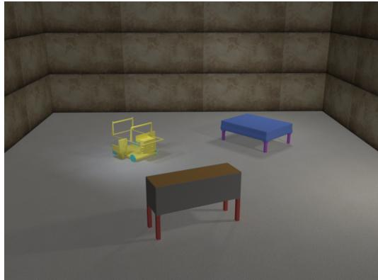  
(b) PTR  
Figure 6: Images accompanying the visual examples in Table 3. The same image is used for the original prompt and all four negated variants.

Table 3: Examples of benchmark construction, continued.
<table><tr><td>Form</td><td>Prompt</td></tr><tr><td></td><td>PhantomWiki Original answer: Stewart Herrera</td></tr><tr><td>Original</td><td>Who is the father-in-law of Vita Herrera?</td></tr><tr><td>not</td><td>Who is not the father-in-law of Vita Herrera?</td></tr><tr><td>n&#x27;t</td><td>Who isn&#x27;t the father-in-law of Vita Herrera?</td></tr><tr><td>never</td><td>Who is never the father-in-law of Vita Herrera?</td></tr><tr><td>by no means</td><td>Who is by no means the father-in-law of Vita Herrera?</td></tr><tr><td>SynthWorlds</td><td>Original answer: Thalric Kytarathian Stormrider</td></tr><tr><td>Original</td><td>Who influenced the field of work of Vail Thorne?</td></tr><tr><td>Original for not/n&#x27;t</td><td>Who did influence the field of work of Vail Thorne?</td></tr><tr><td>not</td><td>Who did not influence the field of work of Vail Thorne?</td></tr><tr><td>n&#x27;t</td><td>Who didn&#x27;t influence the field of work of Vail Thorne?</td></tr><tr><td>never</td><td>Who never influenced the field of work of Vail Thorne?</td></tr><tr><td>by no means</td><td>Who by no means influenced the field of work of Vail Thorne?</td></tr><tr><td>GQA Original answer: blue</td><td></td></tr><tr><td>Original</td><td>What is the color of the clean shirt?</td></tr><tr><td>not</td><td>What is not the color of the clean shirt?</td></tr><tr><td>n&#x27;t</td><td>What isn&#x27;t the color of the clean shirt?</td></tr><tr><td>never</td><td>What is never the color of the clean shirt?</td></tr><tr><td>by no means</td><td>What is by no means the color of the clean shirt?</td></tr><tr><td>PTR Original answer: blue</td><td></td></tr><tr><td>Original</td><td>what is the color of the sleep area of the bed ?</td></tr><tr><td>not</td><td>what is not the color of the sleep area of the bed ?</td></tr><tr><td>n&#x27;t</td><td>what isn&#x27;t the color of the sleep area of the bed ?</td></tr><tr><td>never</td><td>what is never the color of the sleep area of the bed ?</td></tr><tr><td>by no means</td><td>what is by no means the color of the sleep area of the bed ?</td></tr></table>

## B.2 BENCHMARK VALIDATION

Criteria. To verify the grammatical and semantic validity of the constructed negated questions, we validated the benchmark according to the following three criteria.

• Grammaticality: whether the negated question is grammatically well-formed.

• Unambiguity: whether the negation has a single clear interpretation, without ambiguity that allows it to be interpreted in two or more ways.

• Negation Scope Fidelity: whether the negation takes scope over the entire proposition of the original question, rather than locally altering its meaning in a way that changes the answer category.

We used an LLM judge (GPT-5.6 Luna) to assign a PASS/FAIL label for each of the three criteria and excluded any example that failed at least one criterion. For each example, we provided the LLM judge with the original question, the correct answer(s) from the source benchmark, and the corresponding negated question, and instructed it to evaluate the example according to the three criteria above. The prompt used for this validation is provided in Prompt 1.

RippleEdits (Cohen et al., 2024) was the only source benchmark formulated as a completion task rather than a question-answering task, leaving a blank in each input and thereby making grammaticality difficult to assess directly. We therefore inserted a placeholder into the blank so that the input could be evaluated as a complete sentence. The validation prompt specifically used for RippleEdits is provided in Prompt 2.

Validation Results. The validation results are summarized in Table 4. Grammaticality was rarely an issue, and unambiguity failures were relatively infrequent, accounting for 5.07% of the examples. In contrast, most of the filtering was associated with negation scope fidelity, for which 16.90% of the examples received a FAIL label. Overall, 21,708 of the 126,756 examples (17.13%) failed at least one criterion, leaving 105,048 examples for use in our study. The PASS rates were consistent across the six source benchmarks, as shown in Table 5.

Notably, among the examples that failed negation scope fidelity, 84.29% used never as the negation expression. To investigate this pattern, we analyzed the reasons generated by GPT-5.6 Luna alongside its validation judgments. We found that these failures were primarily attributed to the temporal meaning introduced by never: the LLM judge interpreted this additional temporal meaning as altering the semantics of the original question and therefore judged the negated question as failing to preserve the scope of the original proposition.

<table><tr><td>Validation Criterion</td><td>PASS</td><td>FAIL</td><td>FAIL Rate (%)</td></tr><tr><td>Grammaticality</td><td>125,527</td><td>1,229</td><td>0.97</td></tr><tr><td>Unambiguity</td><td>120,329</td><td>6,427</td><td>5.07</td></tr><tr><td>Negation Scope Fidelity</td><td>105,330</td><td>21,426</td><td>16.90</td></tr><tr><td>Overall</td><td>105,048</td><td>21,708</td><td>17.13</td></tr></table>

Table 4: Benchmark validation results for the negation benchmark dataset. Overall rejection indicates that a record was rejected if it failed at least one validation criterion.

<table><tr><td>Benchmark</td><td>Original</td><td>PASS</td><td>PASS Rate (%)</td></tr><tr><td>PopQA</td><td>45,476</td><td>37,426</td><td>82.30</td></tr><tr><td>RippleEdits</td><td>18,488</td><td>14,150</td><td>76.54</td></tr><tr><td>PhantomWiki</td><td>6,660</td><td>5,668</td><td>85.11</td></tr><tr><td>SynthWorlds</td><td>1,120</td><td>840</td><td>75.00</td></tr><tr><td>GQA</td><td>21,112</td><td>15,912</td><td>75.37</td></tr><tr><td>PTR</td><td>33,900</td><td>31,052</td><td>91.60</td></tr><tr><td>Overall</td><td>126,756</td><td>105,048</td><td>82.87</td></tr></table>

Table 5: Benchmark validation results by source benchmark. Original denotes the number of examples in the original benchmark, while PASS denotes the number of examples that passed our filtering process. We also report the corresponding pass rate.

Human Validation. To assess the reliability of the LLM-based filtering, we conducted human validation. Three authors independently annotated 240 examples using the same three criteria as the

LLM judge. Specifically, we randomly sampled 10 examples from each of the six source benchmarks, maintaining a 4:1:5 ratio across the train, validation, and test splits, respectively. Each sampled example was paired with all four negation expressions, resulting in 6 × 10 × 4 = 240 examples in total.

Human–human agreement results are reported in Table 6. Unanimous agreement was very high for grammaticality and unambiguity, exceeding 98% for both criteria. For negation scope fidelity, the unanimous agreement rate was lower at 77.08%, largely due to disagreement on examples using never, for which the unanimous agreement rate was 71.11%. Across the three human annotators, Fleiss’ κ was 0.440. This value is attributable in part to the highly skewed label distribution toward PASS, indicating that the vast majority of examples were judged to be valid under the validation criteria.

Human–LLM agreement results are reported in Table 7. We first determined a human majority label for each example and criterion based on agreement by at least two of the three annotators. We then compared this label with the corresponding LLM judgment. Agreement was high for grammaticality and unambiguity, exceeding 90% for both criteria, while negation scope fidelity showed a slightly lower agreement rate of 84.58%. Cohen’s κ was 0.334, which is again partly attributable to the label distribution being heavily skewed toward PASS. As discussed above, GPT-5.6 Luna applied a particularly strict interpretation of negation scope fidelity, especially for examples involving never. This suggests that the LLM-based filtering was conservative with respect to examples that were difficult to judge.

<table><tr><td>Validation Criterion</td><td>Unanimous PASS</td><td>Unanimous FAIL</td><td>Unanimous Agreement (%)</td></tr><tr><td>Grammaticality</td><td>237 (98.75%)</td><td>2 (0.83%)</td><td>99.58%</td></tr><tr><td>Unambiguity</td><td>237 (98.75%)</td><td>0 (0.00%)</td><td>98.75%</td></tr><tr><td>Negation Scope Fidelity</td><td>174 (72.50%)</td><td>11 (4.58%)</td><td>77.08%</td></tr><tr><td>Overall</td><td>648 (90.00%)</td><td>13 (1.81%)</td><td>91.81%</td></tr></table>

Table 6: Human–human agreement for benchmark validation by validation criterion. Percentages are calculated over all criterion-level decisions within each validation criterion.

<table><tr><td>Validation Criterion</td><td>Agreed PASS</td><td>Agreed FAIL</td><td>Human-LLM Agreement (%)</td></tr><tr><td>Grammaticality</td><td>230 (95.83%)</td><td>2 (0.83%)</td><td>96.67%</td></tr><tr><td>Unambiguity</td><td>217 (90.42%)</td><td>0 (0.00%)</td><td>90.42%</td></tr><tr><td>Negation Scope Fidelity</td><td>185 (77.08%)</td><td>18 (7.50%)</td><td>84.58%</td></tr><tr><td>Overall</td><td>632 (87.78%)</td><td>20 (2.78%)</td><td>90.56%</td></tr></table>

Table 7: Human–LLM agreement for benchmark validation by validation criterion. Agreed PASS and Agreed FAIL indicate decisions for which the human majority label and the LLM label were identical. Percentages are calculated over all decisions within each criterion.

You are an expert dataset validator. Evaluate the quality of a   
negation QA dataset.   
Each example contains:   
- an Affirmative question,   
Correct answer(s) from an existing QA dataset, and   
a Negated question derived from the Affirmative question.   
The dataset tests whether an LLM can answer the Negated question   
with an answer that does not satisfy the original affirmative   
relation.

Evaluate exactly three independent properties.   
1. NEGATED\_QUESTION\_GRAMMATICALITY   
Determine whether the Negated question is grammatically well-formed   
and interpretable.   
Judge grammaticality, not naturalness or pragmatic plausibility. Do   
not fail a question merely because it is unusual in ordinary   
conversation.   
PASS if the question is grammatically well-formed and interpretable;   
otherwise FAIL.   
2. NEGATION\_UNAMBIGUITY   
Determine whether the scope and target of the negation are clear.   
Do not confuse multiple valid answers with ambiguity. A Negated   
question may have many valid answers; this alone is NOT a defect.   
PASS if it is clear what relation, property, or condition is being   
negated; otherwise FAIL.   
3. NEGATION\_SCOPE\_FIDELITY   
Determine whether the negation takes scope over the entire   
proposition expressed by the Affirmative question. Here, the   
proposition means the complete statement about a candidate answer   
that would make it a valid answer to the Affirmative question.   
The negation should apply to this proposition as a whole, rather   
than negating only part of its semantic content, such as a subject,   
relation, property, or condition within the proposition.   
PASS if the Negated question negates the original proposition while   
otherwise preserving its semantic content; otherwise FAIL.   
Important rules:   
- Evaluate semantic meaning rather than exact string matching.   
- Do not require the Negated question to have a unique answer.   
- Do not penalize unusual but grammatical Negated questions.   
- Distinguish grammaticality from naturalness.   
- Distinguish semantic ambiguity from having multiple valid answers.   
- Evaluate all three criteria independently.   
Return only the JSON fields required by the supplied response schema.   
Now evaluate:   
Affirmative question:   
{{AFFIRMATIVE\_QUESTION}}   
Correct answer(s):   
{{CORRECT\_ANSWERS}}   
Negated question:   
{{NEGATED\_QUESTION}}  
Prompt 1: Template for GPT-5.6 Luna benchmark validation.

You are an expert dataset validator. Evaluate the quality of a   
negation sentence-completion dataset.   
Each example contains:   
- an Affirmative completion template,   
- Correct answer(s) from an existing sentence-completion dataset,

- a Negated completion template derived from the Affirmative   
completion template.   
The token [CANDIDATE\_ANSWER] is a placeholder for a grammatically   
compatible noun phrase of the expected answer type. Treat each   
template as a complete sentence obtained by replacing   
[CANDIDATE\_ANSWER] with such a phrase. Evaluate the completed   
sentence template, not the raw prefix before the placeholder was   
inserted.   
The dataset tests whether an LLM can complete the Negated completion   
template with an answer that does not satisfy the original   
affirmative relation.   
Evaluate exactly three independent properties.   
1. NEGATED\_COMPLETION\_GRAMMATICALITY   
Determine whether the Negated completion template forms a   
grammatically well-formed and interpretable sentence when   
[CANDIDATE\_ANSWER] is replaced by a grammatically compatible answer   
phrase.   
Judge grammaticality, not naturalness or pragmatic plausibility. Do   
not fail a completion merely because it is unusual in ordinary   
conversation or because the placeholder is abstract.   
PASS if the completed sentence template is grammatically well-formed   
and interpretable; otherwise FAIL.   
2. NEGATION\_UNAMBIGUITY   
Determine whether the scope and target of the negation are clear.   
Do not confuse multiple valid completions with ambiguity. A Negated   
completion task may have many valid answers; this alone is NOT a   
defect.   
PASS if it is clear what relation, property, or condition is being   
negated; otherwise FAIL.   
3. NEGATION\_SCOPE\_FIDELITY   
Determine whether the Negated completion template negates the entire   
proposition expressed by the Affirmative completion template. Here,   
the proposition means the complete statement about   
[CANDIDATE\_ANSWER] that would make it a valid completion of the   
Affirmative template.   
The negation should apply to this proposition as a whole, rather   
than negating only part of its semantic content, such as a subject,   
relation, property, or condition within the proposition.   
PASS if the Negated completion template negates the original   
proposition while otherwise preserving its semantic content;   
otherwise FAIL.   
Important rules:   
- Evaluate semantic meaning rather than exact string matching.   
Treat [CANDIDATE\_ANSWER] as a syntactically and semantically   
compatible answer phrase.   
- Do not require the Negated completion task to have a unique answer.   
Do not penalize unusual but grammatical Negated completion   
templates.   
- Distinguish grammaticality from naturalness.   
Distinguish semantic ambiguity from having multiple valid answers.   
Evaluate all three criteria independently.   
Return only the JSON fields required by the supplied response schema.

```handlebars
Now evaluate:
Affirmative question:
{{AFFIRMATIVE_QUESTION}}
Correct answer(s):
{{CORRECT_ANSWERS}}
Negated question:
{{NEGATED_QUESTION}}
```  
Prompt 2: Template for GPT-5.6 Luna benchmark validation (used specifically when the source benchmark is RippleEdits).

## C EVALUATION DETAILS

Criteria. To assess how well a model’s answers conform to the intended behavior under negation, we evaluated each model prediction according to the following three criteria.

• Original answer correctness: whether the model’s answer to the original question is semantically equivalent to at least one of the correct reference answer(s) provided by the source benchmark.

• Repetition under negation: whether the model’s answer to the negated question is semantically equivalent to its own answer to the original question – that is, whether the model echoed its original answer instead of engaging with the negation.

• Negated answer category validity: whether the model’s answer to the negated question is a contextually and semantically appropriate kind of answer for that question, irrespective of whether it is factually correct for the particular subject.

We used an LLM judge (GPT-5.6 Luna) to assign a PASS/FAIL/UNCERTAIN label to each criterion, and instructed it to ignore factual correctness when judging the third criterion, since a well-formed but factually wrong answer should still be scored as a valid alternative. The prompts used for this evaluation are provided in Prompts 3–5.

Evaluation Procedure. We evaluate each criterion with a separate, isolated LLM-judge call rather than asking the judge to assess all three criteria at once. Because the first two criteria gate the third by construction (a negated answer can only be scored for repetition if the original answer was itself correct, and can only be scored for answer category validity if it did not simply repeat the original answer), we apply the three judge calls as a cascade: we evaluate original answer correctness on every pair; among pairs that pass, we evaluate repetition under negation; and among pairs whose negated answer does not repeat the original answer, we evaluate negated answer category validity. Pairs judged UNCERTAIN on a criterion, or that do not reach a later stage of the cascade, are excluded from the corresponding downstream criterion. We use greedy decoding with vLLM to obtain predictions from all open-source models. Aggregate results across models are reported in § 2.

Human Validation. To assess the reliability of the LLM-based evaluation, we conducted human validation using a newly sampled set of 240 examples, following the same sampling procedure described in Appendix B.2 (six source benchmarks × ten examples × four negation forms, maintaining the 4:1:5 train/validation/test ratio). Three authors independently annotated gemma-3-12b-it for the same three criteria, and we compare their judgments against the LLM judge’s labels.

Human–human agreement results are reported in Table 8. Unanimous agreement across all three annotators was high for all three criteria (84.17%–94.58% per criterion), and Fleiss’ κ across the three annotators was 0.8783.

Human–LLM agreement results are reported in Table 9. As with the benchmark-validation annotation, we determined a human majority label for each example and criterion (agreement by at least two of the three annotators) and compared it against the LLM judge’s label. Because repetition under negation and answer category validity are only defined for the subset of examples that reach that stage of the cascade (§ C, Evaluation Procedure), examples outside a criterion’s applicable subset contribute a null decision for that criterion and are excluded from its agreement calculation; percentages in Table 9 are computed over these non-null human–LLM decision pairs only. Agreement was high across all three criteria (84.62%–98.04% per criterion, 96.06% overall), and Cohen’s κ was 0.9212. Together, these results indicate that the LLM judge’s evaluation of model answers under negation closely tracks human judgment.

You are an expert answer evaluator. Evaluate the correctness of a   
model’s answers on a negation QA benchmark.   
Each example contains:   
- an Affirmative question and the model’s answer to it,   
- a Negated question (derived from the Affirmative question) and the   
model’s answer to it, and   
Correct answer(s) for the Affirmative question.   
The dataset tests whether an LLM can answer the Negated question   
with an answer that does not satisfy the original affirmative   
relation.   
Evaluate exactly one property.   
1. POSITIVE\_PREDICTION\_MATCHES\_CORRECT\_ANSWER   
Determine whether the model’s answer to the Affirmative question is   
semantically equivalent to one of the Correct answer(s). When   
multiple Correct answers are listed, they are alternative acceptable   
phrasings of the same answer (e.g. synonyms or aliases), not a set   
the model must name in full: it is sufficient for the model’s answer   
to be semantically equivalent to any single one of them. Answer PASS   
if it is equivalent to at least one; otherwise answer FAIL.   
Important rules:   
Evaluate semantic meaning rather than exact string matching.   
Do not infer or return an overall success label.   
Return only the JSON fields required by the supplied response schema.   
Now evaluate:   
Affirmative question:   
{{AFFIRMATIVE\_QUESTION}}   
Affirmative model answer:   
{{AFFIRMATIVE\_ANSWER}}   
Correct answer(s):   
{{CORRECT\_ANSWERS}}

Prompt 3: Template for GPT-5.6 Luna negation evaluation (Property 1: affirmative answer correctness).

You are an expert answer evaluator. Evaluate the correctness of a   
model’s answers on a negation QA benchmark.   
Each example contains:   
- an Affirmative question and the model’s answer to it,   
a Negated question (derived from the Affirmative question) and the   
model’s answer to it, and   
Correct answer(s) for the Affirmative question.   
The dataset tests whether an LLM can answer the Negated question   
with an answer that does not satisfy the original affirmative   
relation.

```handlebars
Evaluate exactly one property.
2. NEGATED_PREDICTION_MATCHES_CORRECT_ANSWER
Determine whether the model’s answer to the Negated question is
semantically equivalent to its answer to the Affirmative question --
that is, whether the model gave the same answer to the Negated
question that it originally gave to the Affirmative question. A
different surface form that refers to the same thing (a synonym, a
reordering, an equivalent phrase) still counts as the same answer;
do not confuse a merely different phrasing with a genuinely
different answer. Answer PASS if the two answers are the same (the
model, in effect, echoed its original answer instead of engaging
with the negation); otherwise answer FAIL.
Important rules:
Evaluate semantic meaning rather than exact string matching.
Do not infer or return an overall success label.
Return only the JSON fields required by the supplied response schema.
Now evaluate:
Affirmative question:
{{AFFIRMATIVE_QUESTION}}
Affirmative model answer:
{{AFFIRMATIVE_ANSWER}}
Negated question:
{{NEGATED_QUESTION}}
Negated model answer:
{{NEGATED_ANSWER}}
```

Prompt 4: Template for GPT-5.6 Luna negation evaluation (Property 2: repetition under negation).

You are an expert answer evaluator. Evaluate the correctness of a   
model’s answers on a negation QA benchmark.   
Each example contains:   
- an Affirmative question and the model’s answer to it,   
a Negated question (derived from the Affirmative question) and the   
model’s answer to it, and   
Correct answer(s) for the Affirmative question.   
The dataset tests whether an LLM can answer the Negated question   
with an answer that does not satisfy the original affirmative   
relation.   
Evaluate exactly one property.   
3. NEGATED\_PREDICTION\_HAS\_EXPECTED\_ANSWER\_TYPE   
Determine whether the model’s answer to the Negated question is a   
contextually and semantically appropriate kind of answer, given the   
question’s intended meaning as a whole -- not just judged against   
part of it (e.g. matching only the category named in the question   
while ignoring the negation attached to it). Ignore whether the   
answer is factually correct for the particular subject. A   
well-formed answer of the right kind is PASS even when it is   
factually wrong; an answer of the wrong kind (empty, a non-answer,   
or a different category of thing entirely) is FAIL.   
Important rules:

```handlebars
Evaluate semantic meaning rather than exact string matching.
- For property 3, factual correctness is irrelevant: judge only the
shape/kind of the answer, never whether it is true.
- Do not infer or return an overall success label.
Return only the JSON fields required by the supplied response schema.
Now evaluate:
Negated question:
{{NEGATED_QUESTION}}
Negated model answer:
{{NEGATED_ANSWER}}
```  
Prompt 5: Template for GPT-5.6 Luna negation evaluation (Property 3: negated answer category validity).

<table><tr><td>Evaluation Criterion</td><td>Unanimous PASS</td><td>Unanimous FAIL</td><td>Unanimous Agreement (%)</td></tr><tr><td>Original Answer Correctness</td><td>91 (37.92%)</td><td>135 (56.25%)</td><td>94.17%</td></tr><tr><td>Repetition Under Negation</td><td>95 (39.58%)</td><td>132 (55.00%)</td><td>94.58%</td></tr><tr><td>Negated Answer Category Validity</td><td>179 (74.58%)</td><td>23 (9.58%)</td><td>84.17%</td></tr><tr><td>Overall</td><td>365 (50.69%)</td><td>290 (40.28%)</td><td>90.97%</td></tr></table>

Table 8: Human–human agreement for negation evaluation by evaluation criterion. Percentages are calculated over all criterion-level decisions within each evaluation criterion.

<table><tr><td>Evaluation Criterion</td><td>Agreed PASS</td><td>Agreed FAIL</td><td>Human-LLM Agreement (%)</td></tr><tr><td>Original Answer Correctness</td><td>96 (40.00%)</td><td>137 (57.08%)</td><td>97.08%</td></tr><tr><td>Repetition Under Negation</td><td>62 (60.78%)</td><td>38 (37.25%)</td><td>98.04%</td></tr><tr><td>Negated Answer Category Validity</td><td>33 (84.62%)</td><td>0 (0.00%)</td><td>84.62%</td></tr><tr><td>Overall</td><td>191 (50.13%)</td><td>175 (45.93%)</td><td>96.06%</td></tr></table>

Table 9: Human–LLM agreement for negation evaluation by evaluation criterion. Agreed PASS and Agreed FAIL indicate decisions for which the human majority label and the LLM label were identical. Percentages are calculated over non-null human–LLM decision pairs within each criterion.

## D EXPERIMENT DETAILS

## D.1 DETAILS ON THE INFORMATION FLOW EXPERIMENT

We describe the activation patching used in § 3.1. To trace how information from negation tokens reaches the final prompt token, we use the token groups defined in $\ S \ O 3$

Attention contributions. To isolate the information flow from a token group $G$ to a destination position $t ,$ we sum the attention-weighted value vectors from that group across all attention heads:

$$
\mathbf { c } _ { G  t } ^ { \ell } ( x ) = \sum _ { h } \mathbf { W } _ { O } ^ { \ell , h } ( \sum _ { s \in G ( x ) } \alpha _ { t , s } ^ { \ell , h } ( x ) \mathbf { v } _ { s } ^ { \ell , h } ( x ) ) ,
$$

where $\alpha _ { t , s } ^ { \ell , h }$ is the attention weight, ${ \bf v } _ { s } ^ { \ell , h }$ is the value vector, and $\mathbf { W } _ { O } ^ { \ell , h }$ is the output projection matrix for attention head $h .$ We retain the model’s attention weights without renormalizing them within the selected group. The effect of this intervention can therefore reflect changes in attention to these tokens, the information carried by their value vectors, or both.

Activation patching. We first compute $\mathbf { c } _ { G  t } ^ { \ell }$ from the activations of the original and negated prompts. During an intervention, we remove the contribution from the current execution and replace it with that from the paired prompt:

$$
\widetilde { \mathbf { o } } _ { t } ^ { \ell } = \mathbf { o } _ { t } ^ { \ell , \mathrm { c u r r e n t } } - \mathbf { c } _ { G  t } ^ { \ell , \mathrm { c u r r e n t } } + \mathbf { c } _ { G  t ^ { \prime } } ^ { \ell , \mathrm { p a i r e d } } ,
$$

where $\mathbf { o } _ { t } ^ { \ell }$ is the attention output and $t ^ { \prime }$ is the corresponding position in the paired prompt.

Implementation in Qwen3.5. Qwen3.5 uses both softmax and linear attention, so we adapt the decomposition to each layer type. For softmax-attention layers, we use the decomposition above. For linear-attention layers, we isolate each token group’s contribution by retaining only that group’s value vectors after the local convolution, while keeping queries, keys, and gates unchanged. We use the normalization scale computed from the full output, rather than normalizing each group’s contribution separately. We then replace the resulting contribution with that from the paired prompt using the same intervention procedure.

## D.2 DETAILS ON THE NEGATION SIGNAL EXPERIMENT

Negation-Induced Differences We compute the negation-induced differences at the final prompt token as defined in § 3. At each layer, we first average these differences over training pairs within each benchmark:

$$
\mathbf { d } _ { k } ^ { \ell } = \frac { 1 } { | \mathcal { D } _ { k } ^ { \mathrm { t r a i n } } | } \sum _ { ( i , f ) \in \mathcal { D } _ { k } ^ { \mathrm { t r a i n } } } \Delta \mathbf { h } _ { i , f } ^ { \ell } .
$$

We then average the benchmark-specific means with equal weights:

$$
\mathbf { d } ^ { \ell } = \frac { 1 } { K } \sum _ { k = 1 } ^ { K } \mathbf { d } _ { k } ^ { \ell } ,
$$

where K is the number of benchmarks.

To assess whether the individual differences are aligned across examples, we compute their average similarity to the mean vector. We compute training and validation similarities separately and use only training differences to estimate ${ \bf d } ^ { \ell }$

Steering We subtract the mean difference from the negated prompt’s final-token representation:

$$
\mathbf { h } _ { \mathrm { i n t } } ^ { \ell } ( x _ { i , f } ^ { \mathrm { n e g } } ) = \mathbf { h } ^ { \ell } ( x _ { i , f } ^ { \mathrm { n e g } } ) - \beta \mathbf { d } ^ { \ell } ,
$$

where $\beta$ controls the steering strength. We apply the intervention after the selected transformer block, leaving other token positions unchanged. The intervention is applied once during prompt processing and is not repeated at generated answer tokens.

Downstream Attention and MLP Outputs We examine whether steering changes downstream attention and MLP outputs in the direction of their values under the original prompt. Let $\mathbf { o } _ { c } ( x )$ denote the output of attention or MLP component c at the final prompt token. We compare the intervention-induced difference

$$
\Delta \mathbf { o } _ { c } ^ { \mathrm { i n t } } = \mathbf { o } _ { c } ( x _ { i , f } ^ { \mathrm { n e g } } ; \mathrm { i n t e r v e n t i o n } ) - \mathbf { o } _ { c } ( x _ { i , f } ^ { \mathrm { n e g } } )
$$

with the difference between the unmodified paired prompts:

$$
\Delta \mathbf { o } _ { c } ^ { \mathrm { n a t u r a l } } = \mathbf { o } _ { c } ( x _ { i } ) - \mathbf { o } _ { c } ( x _ { i , f } ^ { \mathrm { n e g } } ) .
$$

Both differences are measured relative to the same unmodified negated prompt. We compute their cosine similarity separately for attention and MLP outputs at each downstream layer.

## D.3 DETAILS ON THE COMPONENT IDENTIFICATION EXPERIMENT

We describe how we select attention heads and MLP neurons, evaluate their causal effects, and analyze their outputs. We use the notation and evaluation metrics introduced in § 3. Components are selected using training examples and fixed before validation. We select only from layers after the layer used for negation-signal removal (§ 3.2). We use the top five heads and top 256 neurons for the main analysis. We additionally evaluate the top one and ten heads and the top 64 and 1,024 neurons.

Component Identification. We aim to identify attention heads whose attention changes consistently under negation and MLP neurons whose activation changes favor the alternative. To do so, we score each component for each paired prompt, average scores within each benchmark, and then equally across the six benchmarks. We also retain benchmark- and relation-specific scores to examine the consistency of the selected components. We define the scores as follows.

For attention heads, we measure the attention-weight difference from the final prompt token:

$$
S _ { \ell , h } ^ { \mathrm { a t t n } } ( i , f ) = \left\| \alpha _ { \ell , h } ( x _ { i , f } ^ { \mathrm { n e g } } ) - \alpha _ { \ell , h } ( x _ { i } ) \right\| _ { 2 } .
$$

To examine which tokens gain or lose attention, we also measure attention-mass changes for the token groups defined in § 3.1.

For MLP neurons, we define a neuron activation $m _ { \ell , j }$ as one coordinate of the elementwise product of the activated gate projection and the up-projection, before the MLP down-projection. Following attribution patching (Syed et al., 2024), we compute

$$
S _ { \ell , j } ^ { \mathrm { M L P } } ( i , f ) = \Big [ m _ { \ell , j } \big ( x _ { i , f } ^ { \mathrm { n e g } } \big ) - m _ { \ell , j } \big ( x _ { i } \big ) \Big ] \ \frac { \partial g _ { i , f } } { \partial m _ { \ell , j } } \Bigg | _ { x _ { i , f } ^ { \mathrm { n e g } } } .
$$

The gradient is evaluated on the negated prompt using the full-answer score gap ${ \mathit { g } } _ { i , f } .$ For example, if the model answers “Spain” for the original prompt and “France” for “Madrid is not the capital of [BLANK],” this gap measures preference for “France” over “Spain.” A positive attribution score estimates that restoring the original activation would reduce this preference. We rank neurons by signed attribution, use this approximation to select neurons, and evaluate their actual effects through interventions.

Causal Interventions. We replace selected head outputs or neuron activations in the negated execution with their values from the original execution. Head outputs are replaced before the attention output projection, and neuron activations before the MLP down-projection. Interventions affect only the final prompt token and are not repeated at generated token positions.

We evaluate (1) the five selected heads individually, (2) each selected head set and neuron set jointly, and (3) the top five heads together with the top 256 neurons. For each set intervention, we use five random component sets with the same number of components in each layer.

Logit Lens Analysis. We apply a logit lens to the original component output, the negated component output, and their difference. Head outputs are first mapped through the corresponding attention output projection, and neuron activations through the MLP down-projection.

For models with post-attention and post-MLP normalization, such as Gemma 3-IT, we include the learned normalization gains and the normalization scales from the full attention or MLP outputs in the corresponding unmodified executions. For paired comparisons, both outputs use the same final-normalization scale, taken from the original execution.

We then apply the model’s unembedding matrix to obtain vocabulary scores and record the 20 highest- and lowest-scoring vocabulary items, along with the scores and ranks of the first tokens of the original and alternative answers. We report individual examples and aggregate results by benchmark, relation, and answer category.

## D.4 DETAILS ON THE SUBSPACE EXPERIMENT

We use Distributed Alignment Search (DAS; Geiger et al., 2024) to identify two low-dimensional subspaces introduced in § 4.2: an answer category space C, where interventions change the preferred answer category, and a candidate-preference space $L _ { s } ,$ , where interventions change the preferred answer within category s.

Subspace interventions. DAS uses gradient-based optimization to find a subspace in which replacing representations produces a specified change in the model’s prediction. We first describe the intervention used to learn both spaces.

Let $\mathbf { h } _ { \ell } ( x )$ denote the residual-stream representation at the final prompt token, immediately before the MLP at layer ℓ. For an orthonormal basis $U \in \mathbb { R } ^ { d \times r }$ , we replace the component within its subspace with that of another prompt $x ^ { \prime } { \mathrm { i } }$

$$
\begin{array} { r } { \widetilde { \mathbf { h } } _ { \ell } ( x ; x ^ { \prime } , U ) = \mathbf { h } _ { \ell } ( x ) + U U ^ { \top } \left[ \mathbf { h } _ { \ell } ( x ^ { \prime } ) - \mathbf { h } _ { \ell } ( x ) \right] . } \end{array}\tag{3}
$$

The component orthogonal to U remains unchanged at the intervention site, and the model continues its computation from the modified representation. During training, this intervention is applied only at the final prompt token.

DAS Training. We use the subspace intervention and gradient-based optimization of DAS, with separate objectives for answer category and candidate preference. For both objectives, we train the intervened model to increase the probability of a target answer. Let $P _ { U } ( y \mid \mathbf { \bar { \phi } } x ; x ^ { \prime } )$ denote the probability assigned to the full answer y when the model processes x with the intervention in Eq. 3. During training, we compute this probability by conditioning each answer token on the preceding tokens of the target answer.

For the candidate-preference space, we aim to learn a subspace where replacing representations between prompts from the same answer category changes which answer the model prefers. For example, we pair “What is the capital of Spain?” with “What is the capital of France?”, answered with “Madrid” and “Paris”, respectively. Replacing the component within this subspace in the first prompt with that from the second should shift the model’s preference from “Madrid” toward “Paris”.

To learn $L _ { s } ,$ we therefore pair prompts from category s that produce different answers. Let $a ( x ^ { \prime } )$ denote the model’s stored generated answer to $x ^ { \prime } .$ . We minimize

$$
\mathcal { L } _ { L _ { s } } = - \mathbb { E } _ { ( x , x ^ { \prime } ) \sim \mathcal { P } _ { s } } \log P _ { U _ { L _ { s } } } ( a ( x ^ { \prime } ) \mid x ; x ^ { \prime } ) ,\tag{4}
$$

where $\mathcal { P } _ { s }$ contains within-category prompt pairs. The objective increases the probability of the full generated answer, rather than only its first token. We distinguish answers using their normalized full text, so answers that share a first token can still form a pair.

For the answer category space, we aim to learn a subspace where replacing representations changes the preferred answer category without requiring a particular answer from that category. We therefore pair prompts from different categories and increase the probability of answers from the category of $x ^ { \prime }$ , rather than its particular generated answer.

For each pair, we sample two reference answers, $\boldsymbol { \mathcal { T } } ( \boldsymbol { x } , \boldsymbol { x } ^ { \prime } )$ , from training examples in that category. We minimize

$$
\mathcal { L } _ { C } = - \mathbb { E } _ { ( x , x ^ { \prime } ) } \frac { 1 } { \left| \mathscr { T } ( x , x ^ { \prime } ) \right| } \sum _ { y \in \mathscr { T } ( x , x ^ { \prime } ) } \log P _ { U _ { C } } ( y \mid x ; x ^ { \prime } ) .\tag{5}
$$

This objective encourages a change in answer category without requiring the model to produce the particular answer to $x ^ { \prime } .$

Optimization. We optimize an unconstrained matrix and obtain an orthonormal basis through QR decomposition before each intervention. Each training step uses one prompt and four sampled comparison prompts. We use AdamW with a learning rate of 0.03 and no weight decay.

The initial layer comparison uses rank 4 and 200 training steps. Subsequent runs use up to 3,000 steps. We select checkpoints using a held-out subset of the training data: normalized answer-score shift for $L _ { s }$ and category prediction accuracy for $C .$ . Rank comparisons use the same layer. The bases are individually orthonormal, but C and $L _ { s }$ are not constrained to be orthogonal to each other.

Causal Validation We first evaluate $L _ { s }$ on held-out prompt pairs from the same category. We measure whether the intervention shifts preference from the answer to x toward the answer to $x ^ { \prime }$ We report the normalized answer-score shift, using the unmodified score gaps under x and $x ^ { \prime }$ for normalization. We also report the fraction of intervened generations that match the stored answer to $x ^ { \prime }$

Then, we evaluate $C$ on held-out prompt pairs from different categories. For each category, we use four fixed training-set reference answers and average their full-answer probabilities. We predict the category with the largest average and measure whether the intervention changes this prediction toward the category of $\overline { { x ^ { \prime } } }$ . This evaluates category preference using a fixed set of answers, not all possible answers in each category.

We additionally apply C interventions between prompts from the same category and measure changes in preference between their answers. This tests whether interventions within $C$ also change preference for a particular answer.

We compare each learned space with five random orthonormal spaces of the same rank, using identical evaluation pairs. We also evaluate replacement of the full residual representation and its component orthogonal to the learned space. Results are reported separately by answer category and averaged with equal weight across categories.

Analyzing Changes under Negation We fix the learned bases and project the representations of matched original and negated prompts into each space. For $G \in \{ C , \dot { L _ { s } } \}$ ,

$$
\begin{array} { r } { { \bf z } _ { G } ( x ) = U _ { G } ^ { \top } { \bf h } _ { \ell } ( x ) , \qquad \Delta { \bf z } _ { G , i , f } = { \bf z } _ { G } ( x _ { i , f } ^ { \mathrm { n e g } } ) - { \bf z } _ { G } ( x _ { i } ) . } \end{array}\tag{6}
$$

Within $L _ { s } ,$ , we compare the magnitude and direction of the negation-induced changes across examples from the same answer category. To determine which answers a direction favors, we separately evaluate how interventions along that direction change answer scores.

Within C, we compare the projected representations to examine how answer category information changes under negation. We distinguish this geometric comparison from causal validation: small projected differences alone do not establish that answer category information remains causally effective in negated prompts.

(a)  
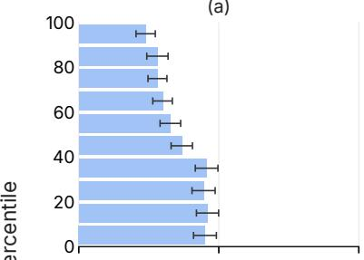  
(d)

(b)  
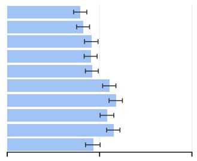  
(e)

(c)  
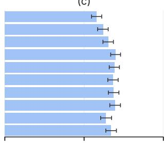

(f)  
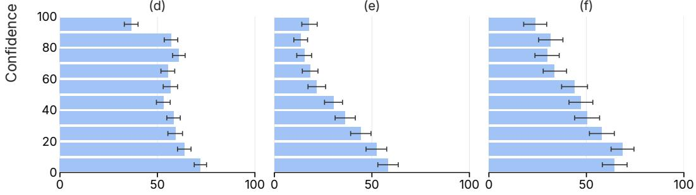  
Answer change (%)  
Figure 7: Answer change by confidence percentile for each model on the test split. Confidence is measured by mean token log-probability of the original answer, with percentiles computed within each model. We include only originally correct cases and average negation forms within each question. Error bars show 95% question-bootstrap intervals.

## E EXTENDED RESULTS

## E.1 EXTENDED RESULTS ON NEGATION EVALUATION

Confidence and answer change by model. Figure 7 breaks down the main-text result by model. The strength and shape of the association vary across models, rather than showing a uniform decrease in answer change.

Negation bias by model and benchmark. Figure 8 separates the negation bias comparison by model and benchmark. The matching group has a lower answer-change rate in 42 of 44 evaluated combinations, but this pattern is not universal.

Original answer ≠ most frequent negated answer Original answer = most frequent negated answer

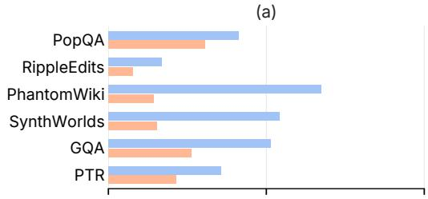  
(c)

(b)  
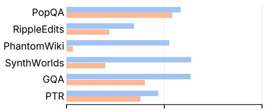

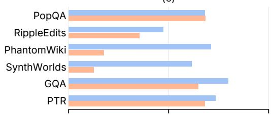

(d)  
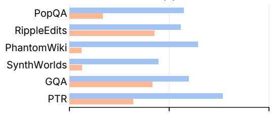

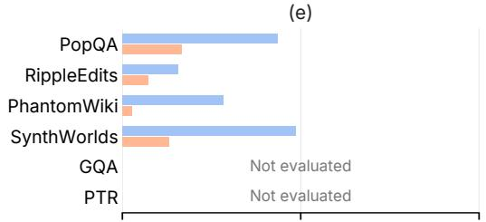

(f)  
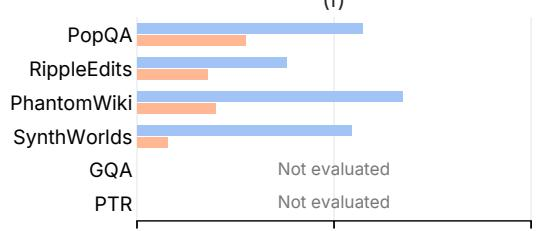

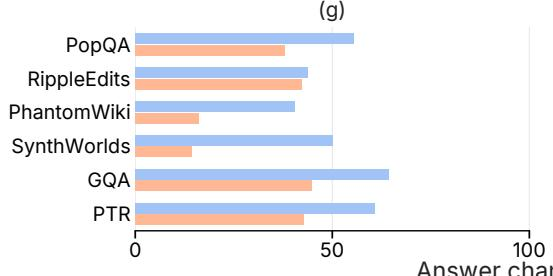

(h)  
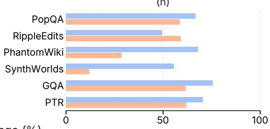  
Figure 8: Answer change by model and benchmark on the test split. The most frequent negated an swer is identified within each model’s relation/type group using its test outputs. Rates are computed over originally correct pairs with a judged repetition outcome. Not evaluated indicates unavailable model–benchmark results.

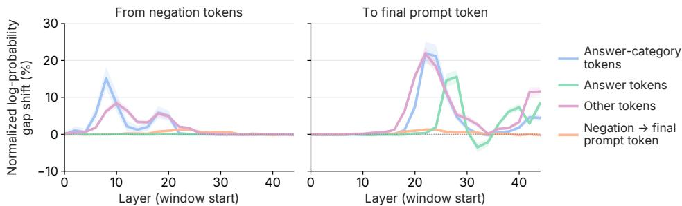  
Figure 9: Information flow in Gemma 3-12B-IT. Left: from negation tokens to other token groups and Right: from each group to the final prompt token.

## E.2 EXTENDED RESULTS ON THE INFORMATION FLOW EXPERIMENT

Figure 9 reports interventions on all 1,540 eligible Gemma 3-12B-IT validation pairs, with equal weight across six benchmarks. Replacing contributions from negation tokens to answer category tokens has its largest effect at L8–11, with a normalized log-probability gap shift of 15.1%. Paths from answer category tokens and other tokens to the final prompt token peak later, at L22–25, with shifts of 21.9% each. The direct negation-to-final-token path reaches only 1.3%, while answer-token contributions peak at L28–31 (15.6%). Layer indices are zero-based, and the horizontal axis gives the start of each four-layer intervention window.

These peaks support an indirect route through intervening prompt tokens, rather than a dominant direct contribution from negation tokens. They do not identify a unique sequential circuit: each curve comes from a separate intervention, and paths can interact downstream. The answer-token curve also combines attention-weight and value changes; it does not by itself distinguish reduced retrieval from a change in the retrieved information.

Other models. Figure 10 extends the prompt-only analysis to Gemma 3-4B-IT and Llama 3.1- 8B-Instruct. The four-layer windows and stride of two are unchanged, but the eligible validation cohorts contain 925 and 423 pairs, respectively. Gemma results equally weight six benchmarks; Llama results equally weight the four text benchmarks. These are model-specific success cohorts, not a matched-case comparison of model performance.

Qwen3.5-9B is evaluated separately because it combines softmax and linear attention. Softmax layers use attention-weighted value contributions, while linear-attention layers use token-group contributions to memory writes after the local convolution, as described in Appendix E.2. The completed analysis covers all 2,304 eligible validation pairs and 240 conditions per pair. For paths ending at the prediction position, interventions continue during generation; other paths retain their aligned prompt positions. Its curves therefore do not provide a protocol-matched effect-size comparison with the prompt-only results.

The unmodified Qwen execution reproduces 2,251 of 2,304 stored original answers and 2,187 stored negated answers. The first 600 completed GQA pairs retain their original execution settings; the remaining pairs use prefix caching with newly computed baselines. Each intervention is compared with the baseline from its own execution setting, and baseline mismatches do not change the frozen cohort.

Answer-category tokens Answer tokens Negation tokens Other tokens

To final prompt token  
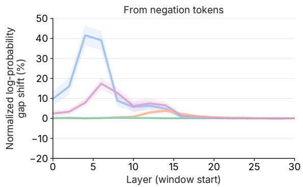  
Answer-category tokens Answer tokens Final prompt token Other tokens

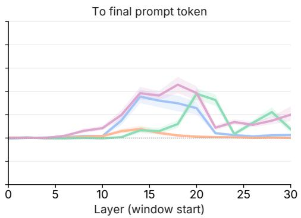  
Answer-category tokens Answer tokens Negation tokens Other tokens

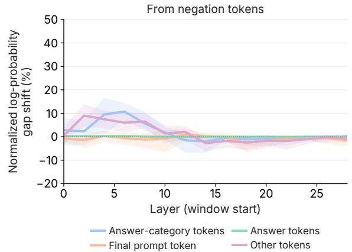

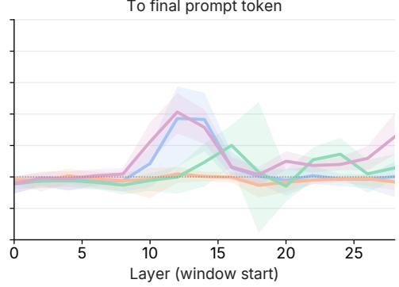  
Figure 10: Information flow in Gemma 3-4B-IT (top) and Llama 3.1-8B-Instruct (bottom). Left: paths from negation tokens. Right: paths to the final prompt token. Curves show normalized logprobability gap shift; shading shows 95% question-bootstrap intervals.

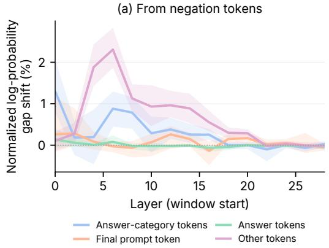

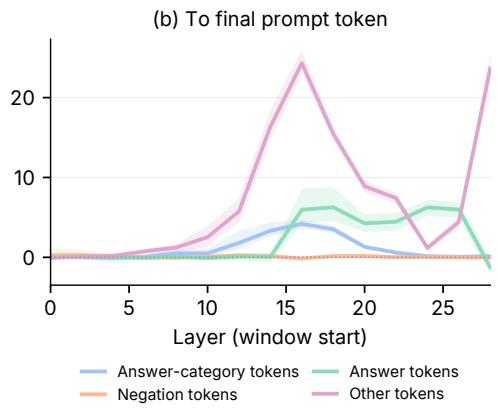  
Figure 11: Information flow in Qwen3.5-9B, including softmax and linear attention. Final-position interventions continue during generation. Effects equally weight six benchmarks; shading shows 95% question-bootstrap intervals.

<table><tr><td>Model</td><td>Pairs Layer</td><td></td><td>Match β=0</td><td>Match β=1</td><td>Gap shift  $\bar { \beta } = 1$ </td></tr><tr><td>Gemma 3-4B-IT</td><td>925</td><td>L18</td><td>13.8</td><td>40.1 [34.5, 46.4]</td><td>22.1 [18.3, 26.0]</td></tr><tr><td>Gemma 3-12B-IT</td><td>1540</td><td>L24</td><td>4.6</td><td>41.8 [37.2, 46.9]</td><td>24.6 [21.5, 28.0]</td></tr><tr><td>Llama 3.1-8B-Instruct</td><td>423</td><td>L24</td><td>19.6</td><td>19.7 [12.3, 27.8]</td><td>-1.2 [-4.9, 2.5]</td></tr><tr><td>Qwen3.5-9B</td><td>2304</td><td>L24</td><td>1.1</td><td>11.6 [8.2, 15.4]</td><td>0.5 [-0.7, 1.6]</td></tr></table>

Table 10: Prompt-only negation-direction removal. Match denotes original-answer match rate; gap shift denotes normalized log-probability gap shift, both in percent. Brackets are 95% questionbootstrap intervals. Results equally weight six benchmarks for Gemma and Qwen, and four text benchmarks for Llama. The fixed dose layers are not uniformly the layerwise maxima; see the full sweeps.

## E.3 EXTENDED RESULTS ON THE NEGATION SIGNAL EXPERIMENT

We evaluate negation-direction removal in Gemma 3-4B-IT, Gemma 3-12B-IT, Llama 3.1-8B-Instruct, and Qwen3.5-9B. Table 10 reports the fixed layers used in the dose experiments; Figures 12 and 13 show the layer sweeps, dose responses, and downstream output comparisons. All interventions in these figures affect only the final prompt token. Layer indices are zero-based.

The most effective layer differs across models. In the exploratory β = 1 sweep, normalized logprobability gap shift peaks at L18 for Gemma 3-4B-IT, L25 for Gemma 3-12B-IT, L13 for Llama 3.1-8B-Instruct, and L18 for Qwen3.5-9B.

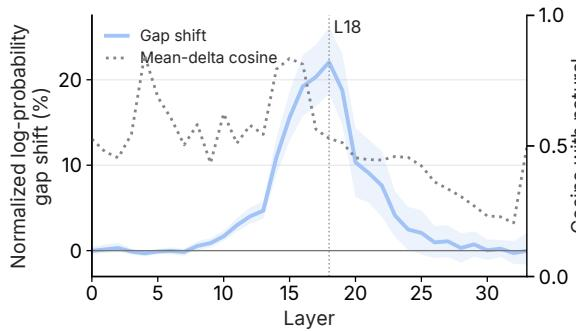

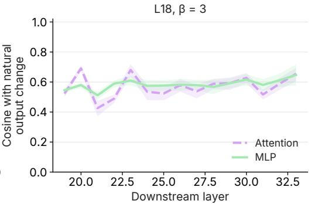

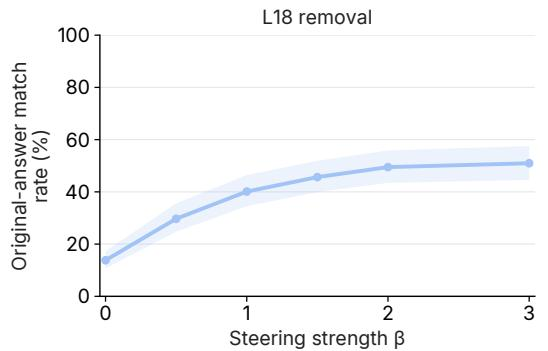

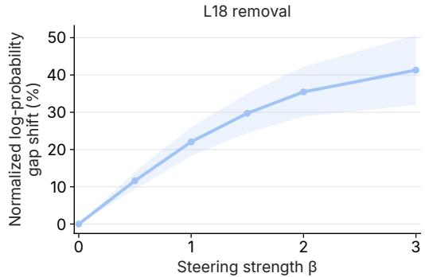

(a)  
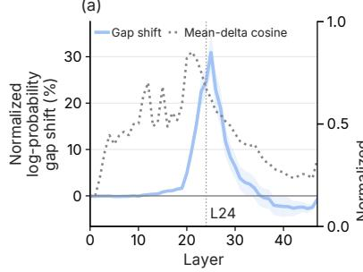

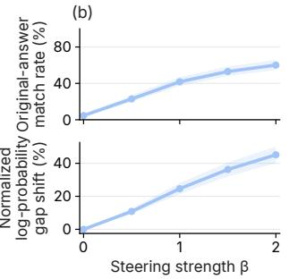

(c)  
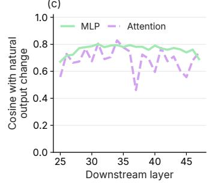  
Figure 12: Negation-direction removal in Gemma 3-4B-IT (top) and Gemma 3-12B-IT (bottom). Dose layers are L18 and L24; downstream alignment uses $\beta = 3$ and $\beta = 2$ , respectively. Effects equally weight six benchmarks. Shading shows available 95% question-bootstrap intervals; Gemma 12B downstream cosine is shown without a pooled interval.

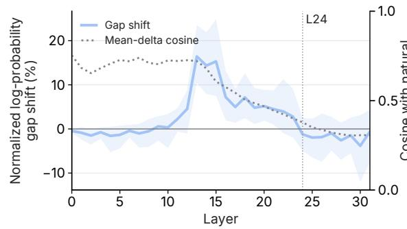

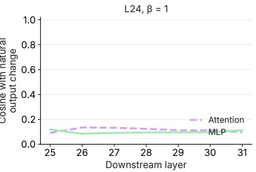

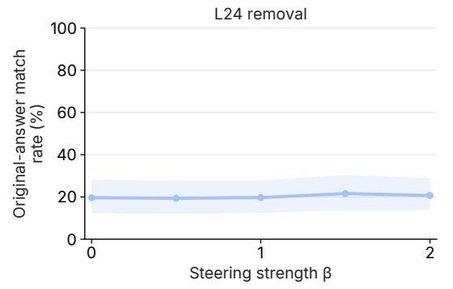

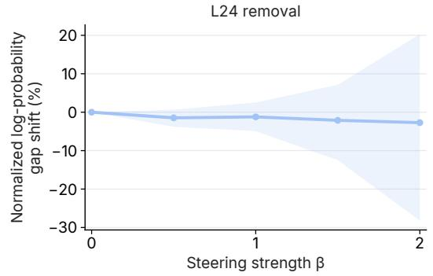

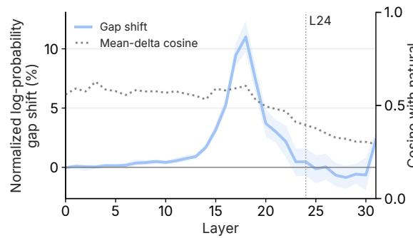

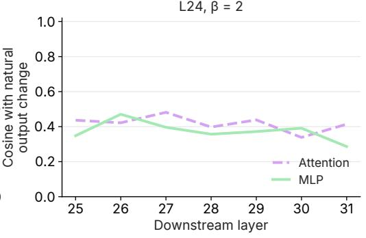

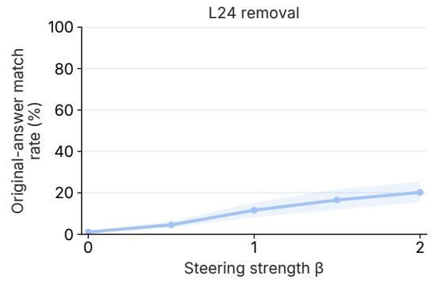

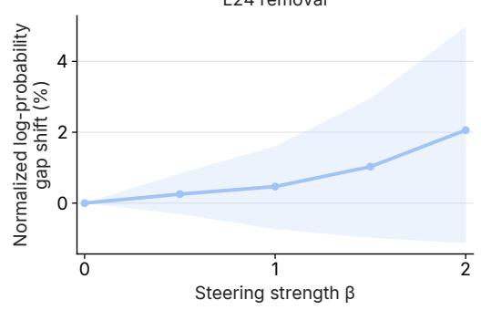  
Figure 13: Negation-direction removal in Llama 3.1-8B-Instruct (top; four text benchmarks) and Qwen3.5-9B (bottom; six benchmarks). Both displayed dose experiments use L24. Downstream alignment uses $\beta = 1$ and $\beta = 2 ,$ , respectively.

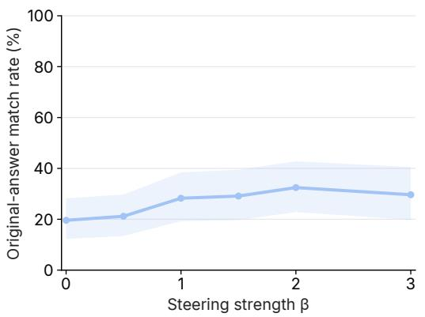

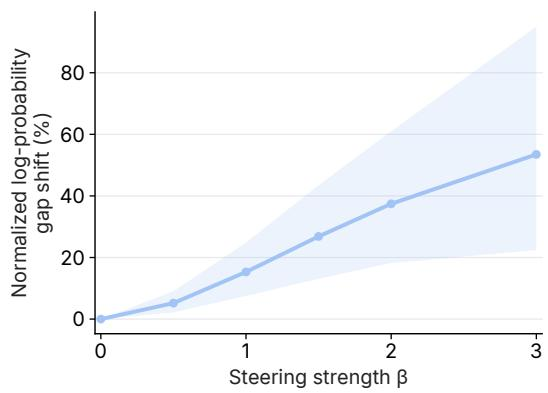  
Figure 14: Prompt-only negation-direction removal at L15 in Llama 3.1-8B-Instruct.

<table><tr><td>Intervention</td><td> $\Delta s ( a )$ </td><td> $\Delta s ( b )$ </td><td>Normalized gap shift (%)</td></tr><tr><td>Restore L31H13 answer-token contribution</td><td>+0.129</td><td>-0.028</td><td>0.8</td></tr><tr><td>Restore five head outputs</td><td>+3.438</td><td>-2.336</td><td>21.4</td></tr><tr><td>Restore 256 neuron activations</td><td>+4.053</td><td>-2.467</td><td>24.7</td></tr><tr><td>Restore both sets</td><td>+4.937</td><td>-4.548</td><td>35.2</td></tr><tr><td>Double 256 neuron differences</td><td>-8.259</td><td>-1.057</td><td>-28.2</td></tr></table>

Table 11: Component interventions in Gemma 3-12B-IT, averaged across six benchmarks. $\Delta s ( a )$ and $\Delta s ( b )$ are changes in the original and alternative answers’ log-probabilities (nats); gap shift is the normalized log-probability gap shift toward the original prompt.
<table><tr><td>Model</td><td>Restored components</td><td>Match (%)</td><td>Gap shift (%)</td><td>Random gap shift (%)</td></tr><tr><td>Gemma 3-4B-IT</td><td>Five heads</td><td>52.4 [46.1, 58.7]</td><td>29.5 [26.2, 32.8]</td><td>12.0</td></tr><tr><td>Gemma 3-4B-IT</td><td>256 neurons</td><td>41.8 [36.6, 47.8]</td><td>22.0 [19.2, 24.9]</td><td>-0.3</td></tr><tr><td>Gemma 3-4B-IT</td><td>Both</td><td>59.6 [52.8, 66.3]</td><td>36.5 [33.3, 39.8]</td><td>12.0</td></tr><tr><td>Gemma 3-12B-IT</td><td>Five heads</td><td>37.4 [32.8, 43.0]</td><td>21.4 [18.5, 24.4]</td><td>2.1</td></tr><tr><td>Gemma 3-12B-IT</td><td>256 neurons</td><td>43.6 [39.0, 48.5]</td><td>24.7 [22.4, 26.8]</td><td>0.1</td></tr><tr><td>Gemma 3-12B-IT</td><td>Both</td><td>56.3 [50.7, 62.0]</td><td>35.2 [32.5, 38.0]</td><td>2.2</td></tr></table>

Table 12: Prompt-only restoration of non-negated component values in negated prompts. Metrics and intervals follow Table 10.

## E.4 ANALYSIS ON THE ORIGINAL ANSWER HEADS

We first test whether the selected attention heads (L31H12, L25H8, L31H13, L27H5, and L34H13) contribute to suppressing the original answer. We evaluate Gemma 3-12B-IT on 1,540 held-out successful validation pairs, restoring the selected outputs to their non-negated values at the final prompt token.

For L31H13, restoring only the contribution from answer tokens increases the original answer’s full-sequence log-probability by 0.129 nats (95% interval: [0.102, 0.158]), while decreasing the alternative’s by 0.028 nats. This is consistent with Figure 4(c), where its negation-induced output difference suppresses variants of the original answer, “Red.” The same difference promotes blackrelated tokens rather than the generated alternative, “Blue,” suggesting that suppressing the original answer and promoting the eventual alternative need not be performed by the same head.

Jointly restoring the complete outputs of the five heads produces a normalized log-probability gap shift of 21.4%, compared with 2.1% for five layer-count-matched random sets on average (Figure 4(b)). Table 11 separates the effects on the original and alternative answers. Unlike the L31H13 answer-token intervention, joint restoration includes contributions from all input tokens.

Replication in Gemma 3-4B-IT. The corresponding six-benchmark experiment on 925 validation pairs also finds an effect beyond matched random controls: restoring five heads produces a 29.5% normalized log-probability gap shift, compared with 12.0% for random heads (Table 12). Head indices are selected separately for each model; the Gemma 12B indices are not transferred to Gemma 4B. This supports a contribution of the selected heads to answer preference in both models, without assuming that every head has the same functional role.

## E.5 ANALYSIS ON THE ANSWER CATEGORY HEADS

We examine whether these heads support the answer category rather than a particular alternative. Across 36 validation examples from 13 relations in Gemma 3-12B-IT, L25H8’s logit-lens outputs supports same-relation answer candidates both without and with negation: the mean candidate-pool uplift is 0.081 and 0.069, respectively. However, its output difference does not reliably identify the model’s chosen alternative among these candidates. L31H12 shows a related pattern: its output difference increases the candidate-pool score by 0.180 on average while reducing preference for the original answer. The L26H3 example in Figure 4(c) similarly assigns high scores to category-related tokens such as “color,” “colour,” and “pigment.”

We then test whether these heads affect the prediction. Removing L25H8’s output on 1,540 validation pairs increases the original answer’s full-sequence log-probability by 1.468 nats and decreases the alternative’s by 0.489 nats. In a separate experiment on the validation set, restoring L31H12 and L26H3 to their non-negated outputs at the final prompt token reduces the alternative-minus-original first-token logit gap by 0.378 and 0.125, respectively, with 95% bootstrap intervals of [0.125, 0.682] and [0.047, 0.208].

<table><tr><td>Model</td><td>Layer</td><td>Pairs</td><td>Match (%) Removal → restore</td><td>Gap shift (%) Removal → restore</td><td>Match difference (pp) Selected — random</td></tr><tr><td>Gemma 3-4B-IT</td><td>L18</td><td>290</td><td>50.4→34.3</td><td>29.4→11.6</td><td>-12.3 [-19.3, -6.8]</td></tr><tr><td>Gemma 3-12B-IT</td><td>L24</td><td>612</td><td>56.6→17.4</td><td>32.3→9.2</td><td>-39.3 [-44.5, -34.1]</td></tr><tr><td>Llama 3.1-8B-Instruct</td><td>L14</td><td>368</td><td>21.3→13.6</td><td>21.0→9.3</td><td>-7.0 [-11.3, -3.4]</td></tr><tr><td>Qwen3.5-9B</td><td>L16</td><td>642</td><td>11.1→2.6</td><td>5.0→1.0</td><td>-7.7 [-10.0, -5.4]</td></tr></table>

Table 13: Signal removal followed by joint restoration of selected heads and neurons at their natural negated values (β = 1).

## E.6 ANALYSIS ON THE NEGATION-SPECIFIC NEURONS

Negation-related attribution is more concentrated in neurons than attention changes are in heads. Among 353,280 downstream neurons, the top 1% (3,533 neurons) accounts for 39.7% of the positive attribution score, and the top 10% accounts for 75.5% (Figure 4(a)). The corresponding fractions of total head score are 4.1% and 24.6%.

Restoring the 256 selected neurons increases the original answer’s log-probability by 4.05 nats and decreases the alternative’s by 2.47 nats (Table 11). The resulting normalized log-probability gap shift is 24.7%, compared with 0.1% for matched random neurons. Doubling their natural activation differences instead increases the alternative-over-original gap by 7.20 nats. This is mainly an effect of original-answer suppression: its log-probability decreases by 8.26 nats, while the alternative’s also decreases, by 1.06 nats. Thus, amplification strengthens relative preference for the alternative without necessarily increasing its absolute probability. The Blue-promoting and Red-suppressing readout in Figure 4(c) illustrates this distinction for an example.

The selected neurons are shared only partly across relations. For the 72 benchmark–relation groups containing at least eight training pairs, the relation-specific top 256 neurons overlap with the global top 256 by 21.5% on average. Joint head and neuron restoration produces a 35.2% normalized log-probability gap shift, larger than either intervention alone but smaller than their sum.

In a separate follow-up on 612 successful PopQA and RippleEdits validation pairs, we remove the L24 negation signal at β = 1 and restore the selected components to their natural negated values. Joint restoration reduces original-answer matching from 56.6% to 17.4% and normalized log-probability gap shift from 32.3% to 9.2%. Its match rate is 39.3 percentage points lower than matched random restoration (95% interval: [34.1, 44.5]).

Replication and signal mediation across models. In Gemma 3-4B-IT, restoring 256 neurons produces a 22.0% normalized log-probability gap shift, compared with −0.3% for matched random neurons. Joint head and neuron restoration increases the shift to 36.5% (Table 12). Like the Gemma 12B results, these are prompt-only interventions over six benchmarks.

We also evaluate the signal-removal and component-restoration follow-up in all four models (Figure 15; Table 13). Restoring the selected heads and neurons to their natural negated values reduces original-answer matching relative to matched random restoration in every model.

These follow-ups use the two factual benchmarks, with continuous interventions during generation. The frozen signal layers are L18, L24, L14, and L16 for Gemma 3-4B-IT, Gemma 3-12B-IT, Llama 3.1-8B-Instruct, and Qwen3.5-9B, respectively; they are not uniformly the maxima of the promptonly sweep. Gemma component discovery uses six benchmarks, whereas this follow-up’s Llama and Qwen component discovery uses PopQA and RippleEdits.

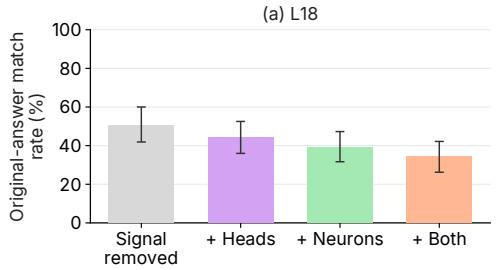

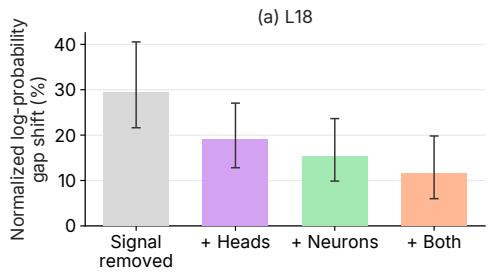

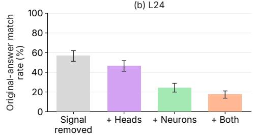


  
Figure 15: Signal removal followed by restoration of natural negated component values $( \beta = 1 )$ Rows show (a) Gemma 3-4B-IT, (b) Gemma 3-12B-IT, (c) Llama 3.1-8B-Instruct, and (d) Qwen3.5- 9B.

<table><tr><td>Model</td><td>Category</td><td>Layer</td><td>Pairs</td><td>Learned</td><td>Random</td><td>Full</td></tr><tr><td>Gemma 3-4B-IT</td><td>City</td><td>L23</td><td>64</td><td>29.9</td><td>0.1</td><td>35.0</td></tr><tr><td>Gemma 3-4B-IT</td><td>Person Name</td><td>L27</td><td>583</td><td>30.1</td><td>0.2</td><td>91.9</td></tr><tr><td>Gemma 3-4B-IT</td><td>Religion</td><td>L26</td><td>33</td><td>36.9</td><td>0.1</td><td>87.9</td></tr><tr><td>Gemma 3-4B-IT</td><td>Sport</td><td>L31</td><td>40</td><td>38.7</td><td>0.2</td><td>91.1</td></tr><tr><td>Gemma 3-12B-IT</td><td>City</td><td>L38</td><td>64</td><td>32.2</td><td>0.1</td><td>69.8</td></tr><tr><td>Gemma 3-12B-IT</td><td>Person Name</td><td>L42</td><td>583</td><td>32.4</td><td>0.2</td><td>74.2</td></tr><tr><td>Gemma 3-12B-IT</td><td>Religion</td><td>L44</td><td>33</td><td>37.5</td><td>0.2</td><td>85.8</td></tr><tr><td>Gemma 3-12B-IT</td><td>Sport</td><td>L40</td><td>40</td><td>33.9</td><td>0.0</td><td>62.4</td></tr><tr><td>Llama 3.1-8B-Instruct</td><td>City</td><td>L13</td><td>64</td><td>13.5</td><td>-0.0</td><td>13.5</td></tr><tr><td>Llama 3.1-8B-Instruct</td><td>Person Name</td><td>L15</td><td>583</td><td>13.6</td><td>0.0</td><td>38.8</td></tr><tr><td>Llama 3.1-8B-Instruct</td><td>Religion</td><td>L14</td><td>33</td><td>9.1</td><td>0.0</td><td>17.6</td></tr><tr><td>Llama 3.1-8B-Instruct</td><td>Sport</td><td>L13</td><td>40</td><td>13.2</td><td>-0.0</td><td>9.2</td></tr><tr><td>Qwen3.5-9B</td><td>City</td><td>L19</td><td>64</td><td>12.4</td><td>0.0</td><td>13.0</td></tr><tr><td>Qwen3.5-9B</td><td>Person Name</td><td>L31</td><td>583</td><td>13.9</td><td>0.2</td><td>100.0</td></tr><tr><td>Qwen3.5-9B</td><td>Religion</td><td>L30</td><td>33</td><td>45.1</td><td>0.4</td><td>76.7</td></tr><tr><td>Qwen3.5-9B</td><td>Sport</td><td>L24</td><td>40</td><td>31.1</td><td>0.3</td><td>62.3</td></tr></table>

Table 14: Rank-4 candidate-space interventions between non-negated PopQA prompts with different answers in the same category.

<table><tr><td>Model</td><td>Layer Pairs</td><td></td><td>Learned</td><td>Random</td><td>Full</td><td>Within-category answer gap</td></tr><tr><td>Gemma 3-4B-IT</td><td>L19</td><td>720</td><td>80.1 [69.9, 89.1]</td><td>0.2</td><td>70.3</td><td>4.2</td></tr><tr><td>Gemma 3-12B-IT</td><td>L27</td><td>720</td><td>74.3 [32.5, 104.2]</td><td>-1.7</td><td>108.8</td><td>4.6</td></tr><tr><td>Llama 3.1-8B-Instruct</td><td>L15</td><td>720</td><td>141.6 [58.0, 280.0]</td><td>0.4</td><td>62.2</td><td>3.8</td></tr><tr><td>Qwen3.5-9B</td><td>L19</td><td>720</td><td>103.5 [96.7, 111.6]</td><td>0.0</td><td>67.9</td><td>1.0</td></tr></table>

Table 15: Rank-4 answer-category-space interventions between non-negated PopQA prompts.

## E.7 EXTENDED RESULTS ON THE SUBSPACE EXPERIMENT

Tables 14 and 15 report the original frozen rank-4 candidate-preference and answer category spaces for all four models. The PopQA evaluation includes non-negated prompts without filtering by whether the generated original answer is correct. Layers and checkpoints are fixed before validation; later layer reselection or higher-rank runs are not substituted into these comparisons. Unlike the prompt-only training intervention, the reported validation replacements continue during generation, with the reference execution conditioned on the same generated prefix.

Candidate preference. We replace subspace coordinates using another prompt from the same category with a different answer. All four models show larger normalized log-probability gap shifts toward that answer with the learned space than with rank-matched random spaces. The effect varies by model and category: Gemma’s shifts range from 29.9% to 38.7%, Llama’s from 9.1% to 13.6%, and Qwen’s from 12.4% to 45.1%. Full-residual replacement is a same-layer comparison, not an upper bound; replacing more coordinates can also alter other useful information.

Answer category. We replace category-space coordinates between prompts from different categories and score each category using a fixed training answer bank. Learned spaces produce larger category-score shifts than the random controls (Table 15). The separate within-category test produces smaller answer-identity shifts, ranging from 1.0% to 4.6%. These are different metrics with different denominators, not quantities whose ratio measures how well the two kinds of information are separated. In particular, normalized category-gap shifts can exceed 100% and have wide intervals; they are not category-classification accuracies.

Results weight original questions equally within each evaluated category and then weight categories equally. Random controls average five spaces of the same rank. The experiments establish causal effects of the learned coordinates under the tested replacements.

## E.8 FAILURE DIAGNOSIS

Natural attention changes. We first compare successful and repeated-answer cases without intervening in the model. The cached Gemma 3-12B-IT analysis contains 1,272 classified validation pairs from 400 distinct original questions in PopQA and RippleEdits. We average forms within each question and outcome group, then weight questions equally. A question with both outcomes contributes to both groups; 5,000 question-bootstrap resamples preserve this dependence.

L31H13 reduces attention to answer tokens in both groups, but the reduction is smaller in failures: 36.3% to 8.6% in successes and 38.1% to 17.2% in failures. The failure–success difference after negation is 8.7 percentage points (95% interval: [7.0, 10.4]), whereas the original-prompt difference is 1.8 points ([−0.4, 4.0]). Within the 150 questions that have both outcomes across forms, negated answer-token attention remains higher in failing forms (16.2% versus 8.5%).

Strengthening the identified changes. We next evaluate interventions on 606 validation pairs for which a fresh unmodified execution reproduces the stored correct original answer and repeats it under negation. This is a separate cohort from the cached attention analysis, with 100% originalanswer matching by construction. We remove the answer-token contributions of five heads selected by their largest training-set attention decreases, double the 256 selected neurons’ negation-induced differences, or apply both. The suppression-head set is L31H13, L27H5, L26H13, L27H7, and L31H6; it differs from the general attention-change ranking used in Figure 4. Interventions continue during generation, and reference executions use the same generated prefix. Results equally weight PopQA and RippleEdits.

These interventions reduce original-answer matching to 94.9%, 58.6%, and 57.6%, respectively. The joint intervention’s match rate is 40.9 percentage points lower than that of layer-count-matched random controls (95% interval: [36.5, 45.7]). Thus, strengthening the identified changes can overturn some repeated answers.

Relation to original-answer support. Finally, we ask whether these answer-token paths provide stronger support for the original answer in failures. We measure support as the original answer’s full-sequence log-probability before minus after removing the paths from the non-negated execution. Across the full 1,312-pair factual validation cohort, mean support is 0.084 nats in successes and 0.047 nats in failures. The failure–success difference is −0.038 nats (95% interval: [−0.124, 0.053]).

<table><tr><td>Model</td><td>Pairs/ questions</td><td>Heads</td><td>Neurons</td><td>Both</td><td>Both - random (pp)</td></tr><tr><td>Gemma 3-4B-IT</td><td>604/216</td><td>84.2</td><td>75.8</td><td>66.7</td><td>-30.2 [-34.9, -25.5]</td></tr><tr><td>Gemma 3-12B-IT</td><td>606/268</td><td>94.9</td><td>58.6</td><td>57.6</td><td>-40.9 [-45.7, -36.5]</td></tr><tr><td>Llama 3.1-8B-Instruct</td><td>473/202</td><td>97.2</td><td>63.7</td><td>64.0</td><td>-33.1 [-38.8, -27.7]</td></tr><tr><td>Qwen3.5-9B</td><td>527/206</td><td>91.7</td><td>60.0</td><td>54.3</td><td>-43.7 [-49.4, -38.4]</td></tr></table>

Table 16: Original-answer match rate (%) on current-baseline repetition failures.
<table><tr><td>Model</td><td>Pairs</td><td>Success</td><td>Failure</td><td>Failure — success</td></tr><tr><td>Gemma 3-4B-IT</td><td>966</td><td>1.187</td><td>0.276</td><td>-0.910 [-1.675, -0.241]</td></tr><tr><td>Gemma 3-12B-IT</td><td>1312</td><td>0.084</td><td>0.047</td><td>-0.038 [-0.124, 0.053]</td></tr><tr><td>Llama 3.1-8B-Instruct</td><td>1381</td><td>0.079</td><td>0.028</td><td>-0.051 [-0.120, 0.015]</td></tr><tr><td>Qwen3.5-9B</td><td>1206</td><td>0.148</td><td>0.085</td><td>-0.064 [-0.189, 0.031]</td></tr></table>

Table 17: Support for the original answer supplied by the selected answer-token paths in prompts without negation.

Other models. The same intervention design reduces repetition in the other models (Figure 16; Table 16). Joint intervention yields original-answer match rates of 66.7% in Gemma 3-4B-IT, 64.0% in Llama 3.1-8B-Instruct, and 54.3% in Qwen3.5-9B. Each model is evaluated on its own current-baseline repetition cohort, with both factual benchmarks equally weighted and interventions repeated during generation. The joint effect exceeds that of matched random controls in all four models. These results extend the causal finding beyond Gemma 12B model.

Finally, the original-prompt path-support test does not establish stronger retrieval in failures for any of the four models (Table 17). The failure–success difference is negative in Gemma 3-4B-IT, while its interval includes zero in the other three models. Thus, the confidence association and the causal ability to change failed predictions remain distinct from a demonstrated causal explanation in terms of stronger original-answer retrieval.

(a)  


(a)  


(b)  
  
(c)

(b)  


  
(d)

(c)  


(d)  
  
Figure 16: Interventions on repeated-answer failures in (a) Gemma 3-4B-IT, (b) Gemma 3-12B-IT, (c) Llama 3.1-8B-Instruct, and (d) Qwen3.5-9B. Left: original-answer match rate. Right: change in the original answer’s full-sequence log-probability relative to its unmodified negated baseline. Interventions continue during generation; error bars show 95% question-bootstrap intervals.

Table 18: general-capability results for Gemma-3-12B-IT checkpoints (%).
<table><tr><td>Method</td><td>MMLU-Pro</td><td>HellaSwag</td><td>GSM8K</td><td>IFEval</td><td>General Avg.</td></tr><tr><td>Base</td><td>58.25</td><td>83.78</td><td>89.92</td><td>80.22</td><td>78.04</td></tr><tr><td>ALiT (ours)</td><td>57.65</td><td>83.44</td><td>89.23</td><td>80.41</td><td>77.68</td></tr><tr><td>Unlikelihood</td><td>57.46</td><td>83.23</td><td>89.61</td><td>81.52</td><td>77.95</td></tr><tr><td>SFT</td><td>56.06</td><td>82.95</td><td>88.86</td><td>80.04</td><td>76.98</td></tr><tr><td>DPO</td><td>56.53</td><td>83.42</td><td>89.08</td><td>80.41</td><td>77.36</td></tr></table>

  
Figure 17: Answer change for Base, ALiT, and SFT, grouped by whether the original answer matches the most frequent negated answer. Arrows show percentage-point changes from Base within each group.

## E.9 TRAINING RESULTS

For general capability, we report MMLU-Pro 5-shot exact match, HellaSwag 10-shot normalized accuracy, GSM8K 8-shot CoT exact match, and IFEval 0-shot prompt-level strict accuracy.

## F DETAILS ON THE TRAINING ALGORITHM

## F.1 BASELINES

We compare ALiT with supervised fine-tuning (SFT), unlikelihood training (UL), and Direct Preference Optimization (DPO).

For a negated prompt $\boldsymbol x _ { i } ^ { \mathrm { n e g } }$ , let $y _ { i } ^ { + }$ denote the alternative used as a positive training target and $y _ { i } ^ { - }$ the original answer used as a negative target. For an answer sequence $y ,$ its conditional log-probability is

$$
\log p _ { \theta } ( y \mid x ) = \sum _ { t = 1 } ^ { | y | } \log p _ { \theta } ( y _ { t } \mid x , y _ { < t } ) .\tag{7}
$$

Supervised fine-tuning. SFT increases the probability of a specified alternative under the negated prompt:

$$
\mathcal { L } _ { \mathrm { S F T } } = - \mathbb { E } _ { i } \left[ \log p _ { \theta } ( y _ { i } ^ { + } \mid x _ { i } ^ { \mathrm { n e g } } ) \right] .\tag{8}
$$

This provides direct supervision for what the model should produce, rather than only specifying which answer to avoid. Training with negated examples has been explored in prior work, including ScoNe (She et al., 2023).

Unlikelihood training. UL reduces the probability of the original answer under the negated prompt. For token-level unlikelihood, let $\dot { \mathcal { T } } _ { i }$ denote the answer positions at which the penalty is applied:

$$
\mathcal { L } _ { \mathrm { U L } } = - \mathbb { E } _ { i } \left[ \frac { 1 } { | \mathcal { T } _ { i } | } \sum _ { t \in \mathcal { T } _ { i } } \log \left( 1 - p _ { \theta } \left( y _ { i , t } ^ { - } \mid x _ { i } ^ { \mathrm { n e g } } , y _ { i , < t } ^ { - } \right) \right) \right] .\tag{9}
$$

Direct Preference Optimization. DPO increases preference for the alternative relative to the original answer, measured against a frozen reference model $p _ { \mathrm { r e f } }$ (Rafailov et al., 2023). Define

$$
r _ { \theta } ( x , y ) = \log p _ { \theta } ( y \mid x ) - \log p _ { \mathrm { r e f } } ( y \mid x ) .\tag{10}
$$

The objective is

$$
\mathcal { L } _ { \mathrm { D P O } } = - \mathbb { E } _ { i } \left[ \log \sigma \left( \gamma \left[ r _ { \theta } ( x _ { i } ^ { \mathrm { n e g } } , y _ { i } ^ { + } ) - r _ { \theta } ( x _ { i } ^ { \mathrm { n e g } } , y _ { i } ^ { - } ) \right] \right) \right] ,\tag{11}
$$

where $\sigma$ is the sigmoid function and $\gamma > 0$ controls the scale of the preference objective. DPO is a general preference-learning method rather than a negation-specific algorithm. Here, it tests whether learning to prefer an alternative over the original answer provides a sufficient training signal.

## F.2 TRAINING SETUP

Training data and model. We post-train Gemma-3-12B-IT on the PopQA training split of our negation benchmark. The training set contains 14,951 paired prompts from 4,534 source questions spanning 15 relations. Each retained negation variant constitutes a separate training pair. All methods use the same prompt pairs for two epochs, corresponding to 29,902 pair presentations. Validation and test examples are not used to construct training targets.

Parameter-efficient optimization. We train LoRA adapters on the model backbone while keeping the base parameters frozen. Adapters are applied to the attention query, key, value, and output projections and the MLP gate, up, and down projections. We use rank 16, a LoRA scaling parameter of 32, and zero dropout. Training uses AdamW with a learning rate of $1 0 ^ { - 4 }$ and zero weight decay. The microbatch size is four, with four gradient-accumulation steps, giving a nominal effective batch size of 16. The backbone is loaded in bfloat16, and gradient checkpointing is enabled. We report the checkpoint obtained after the second epoch.

Preserving original predictions. All methods (including the three baselines) include an objective to preserve original prompt prediction. Let $y _ { i } ^ { - }$ denote the frozen base model’s stored answer to the original prompt $x _ { i } .$ . We compute a full-vocabulary forward KL divergence at each answer position, conditioning both models on the same stored answer prefix:

$$
\mathcal { L } _ { \mathrm { o r i g } } = \mathbb { E } _ { i } \left[ \frac { 1 } { | y _ { i } ^ { - } | } \sum _ { t = 1 } ^ { | y _ { i } ^ { - } | } D _ { \mathrm { K L } } \big ( p _ { 0 } ( \cdot | x _ { i } , y _ { i , < t } ^ { - } ) \| p _ { \theta } ( \cdot | x _ { i } , y _ { i , < t } ^ { - } ) \big ) \right] .\tag{12}
$$

We use a preservation coefficient of $\lambda = 4$ for every method. Losses are computed only at answer positions, using the stored answer tokens without appending an additional end-of-sequence token.

ALiT targets and hyperparameters. For ALiT, we set the confidence-margin coefficient to $\alpha = 1$ and cap the extrapolation coefficient at $\beta _ { \mathrm { m a x } } = 2 0$ We choose the smallest coefficient satisfying the margin condition in § 5.2, subject to $\beta \geq 1$ , and then apply the cap. If the natural negated prediction already satisfies the condition, we use $\beta = 1$ . If the negation-induced change is numerically zero or provides no feasible direction for satisfying the margin, we also use $\beta = \mathbf { \bar { 1 } }$ retaining the natural negated target. Consequently, capped or infeasible targets need not satisfy the requested margin. The target distribution is computed over the full vocabulary at the first answer position with temperature one. The reverse-KL target loss has coefficient one. The reference model remains frozen throughout training, so the targets and confidence margins do not adapt to the student.

Baseline target construction. UL penalizes the stored original answer $y _ { i } ^ { - }$ under the negated prompt. SFT and DPO additionally use a donor answer from another training question with the same relation. For each recipient, we first sample uniformly among distinct stored answer token sequences, excluding its own, and then uniformly among eligible donor questions with that sequence. The donor must come from a different source question, and donors are resampled each epoch. These answers are model-generated pseudo-targets rather than human-annotated alternatives. SFT trains on the donor answer; DPO uses it as the chosen answer and $y _ { i } ^ { - }$ as the rejected answer.

Baseline objectives and weights. The method-specific objectives are defined in Appendix F.1. Their coefficients are one for SFT and DPO and 0.01 for UL, in addition to the shared preservation term $4 \mathcal { L } _ { \mathrm { o r i g } }$ . SFT and UL losses are averaged over answer tokens. DPO instead uses summed sequence log-probabilities, with preference scale $\gamma = 0 . 1$ . DPO is initialized directly from the base checkpoint, rather than an SFT checkpoint, and uses the frozen base model as its reference.

Evaluation. We evaluate in-domain performance on the PopQA test split and out-of-domain performance by pooling the test examples from RippleEdits, PhantomWiki, SynthWorlds, GQA, and PTR. We report the three answer metrics defined in § 2, together with answer diversity as defined in § 5.2. General-capability performance is the arithmetic mean of scores on MMLU-Pro, HellaSwag, GSM8K, and IFEval.