# LLM4IMPACT: INTEGRATING HETEROGENEOUS INFORMATION FOR SCIENTIFIC IMPACT PREDICTION

Yong Cao1, Markus Flicke1, Haoyu He1, Katrin Renz1, Andreas Geiger1, 2 1University of Tubingen, T¨ ubingen AI Center¨ 2KE:SAI Website: yongcaoplus.github.io/llm4impact Code: github.com/yongcaoplus/llm4impact

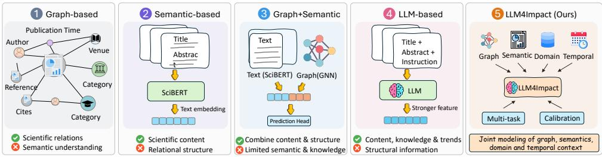  
(a) Evolution of Scientific Impact Prediction: Across five modeling paradigms, culminating in LLM4Impact

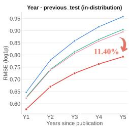

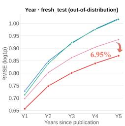  
(b) Year-level Performance Comparison (Lower is better)

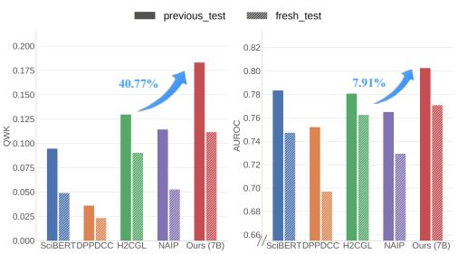  
(c) Month-level Impact Prediction Performance (Higher is better)

Figure 1: Overview of LLM4Impact and its performance. (a) Scientific impact prediction across five paradigms: graph-based, semantic-based, graph+semantic, LLM-based, and LLM4Impact, which integrates graph, semantic, domain, and temporal information with LLMs; (b–c) Performance on both previous and fresh test sets demonstrates consistent gains across prediction settings.

## ABSTRACT

Predicting the future impact of a newly published paper is challenging because it must be inferred from heterogeneous evidence available at publication time. Existing approaches often rely on a single source of information or combine multiple sources without accounting for their different predictive roles. In this paper, we present LLM4Impact, an evidence-aware method for scientific impact prediction that learns to represent, integrate, and calibrate heterogeneous information. LLM4Impact combines semantic, graph, LLM, and temporal representations, and injects graph information into a frozen LLM through continuous prefix tokens. A context aware gating mechanism adaptively weights different evidence, while a separate calibration module accounts for domain and temporal variation in citation scales. We further construct a large-scale benchmark dataset with 2 million papers, leakage-safe point-in-time heterogeneous ego graphs, temporal splits, and both year-level and month-level citation targets. Experiments show that LLM4Impact consistently outperforms strong semantic, graph, and LLM based baselines, with a 10.13% reduction in year RMSE on the in distribution test set and a 6.87% reduction under out-of-domain distribution. Our results reveal that the value of such evidence is context dependent: different papers benefit from different sources, while domain and publication time affect how evidence translates into citations. This finding motivates adaptive evidence selection and context-conditioned calibration rather than simply richer representations. We will release our code, benchmark, and an interactive website demonstration upon publication.

## 1 INTRODUCTION

Predicting the future impact of scientific research is a fundamental problem in the science of science, with applications in identifying emerging research and supporting research evaluation (Bai et al., 2020; Xu et al., 2022; Xia et al., 2023; Zhang & Wu, 2024). A particularly challenging setting is cold start prediction, where a newly published paper has no citation history and its future impact must be inferred from information available at publication time. As shown in Figure 1(a), existing approaches have explored semantic content (Beltagy et al., 2019; Cohan et al., 2020), scholarly structure (He et al., 2023; Xue et al., 2024), temporal information (Wang et al., 2013; Jiang et al., 2021; Holm et al., 2022), and more recently LLMs (Zhao et al., 2025; de Winter, 2024). These signals are complementary, but their predictive value can vary across papers, domains, and publication periods. Effective cold start prediction therefore requires not only representing heterogeneous evidence, but also determining when and how each source should be used.

We identify three challenges that reveal why simply adding more information is insufficient. First, publication time can fall outside the range observed during training. A model based on discrete year embeddings cannot represent unseen publication years without learned embeddings, making temporal generalization difficult. Second, the predictive value of semantic, graph, and LLM evidence is instance dependent: sources that are informative for one paper may be less useful for another, making fixed or naive fusion suboptimal. Third, domain and publication time affect how evidence maps to citation outcomes, since citation scales vary systematically across contexts.

To address these challenges, we propose LLM4Impact, an evidence-aware method that jointly models semantic, heterogeneous graph, and LLM evidence under domain and temporal context for cold-start scientific impact prediction. These sources provide complementary signals: semantic representations capture paper content, heterogeneous graphs provide relational evidence, and LLM representations capture richer contextual signals. LLM4Impact preserves them as separate branches and injects graph information into the LLM through continuous prefix tokens, allowing structural and textual evidence to interact. Building on this multi-branch design, LLM4Impact introduces three components. First, a diagnostic-driven temporal encoder represents publication time with a continuous function and a zero-initialized residual, enabling generalization to unseen years. Second, a domain- and time-aware gated fusion module learns instance-specific weights over the semantic, graph, and LLM branches, reflecting their varying predictive value across contexts. Third, a decoupled context-conditioned calibration module adjusts predictions for domain and temporal variation in citation scales. Together, these components capture a central insight: effective impact prediction requires not only richer evidence, but also learning which evidence to use and how to interpret it in context.

For extensive training and evaluation, we construct a large-scale benchmark from the Semantic Scholar database containing 2 million query papers published between 2005 and 2020. For each query paper, we construct a leakage safe heterogeneous ego graph using only information available at the paper’s publication time. The benchmark contains both an in distribution test set and a temporally shifted test set consisting of papers from later publication years. We evaluate both five year citation prediction and fine grained monthly prediction. This setting allows us to examine not only prediction accuracy, but also the ability to generalize when the publication time is outside the training range.

As shown in Figure 1(b-c), LLM4Impact consistently improves over strong semantic, graph based, and LLM based baselines. On the in distribution test set, five year RMSE drops from 0.790 to 0.710 (10.13%), and under temporal distribution shift, from 0.844 to 0.786 (6.87%). At the monthly level, LLM4Impact improves QWK by 40.77% in distribution and 24.44% under temporal distribution shift. These results show that the benefit of heterogeneous information persists across prediction horizons and temporal shifts. More importantly, ablations reveal that the LLM, graph, and calibration components contribute complementary gains, supporting the view that effective impact prediction depends on both evidence selection and context-specific calibration. We also provide an interactive demo for counterfactual probing, allowing controlled changes to venue, authors, publication time, or references while holding other information fixed to examine changes in predicted impact. In summary, our main contributions are as follows:

• A new large-scale benchmark dataset for scientific impact prediction. We construct and release a 2-million-paper benchmark with leakage-safe point-in-time heterogeneous ego graphs, temporal train/test splits, and support - for the first time - both year-level and month-level citation targets, together with data construction pipeline for future research.

• An evidence-aware method for context-adaptive impact prediction. We propose LLM4Impact, which dynamically selects and calibrates heterogeneous evidence under temporal and domain context, enabling both robust prediction under distribution shift and controlled probing of how contextual factors affect scientific impact.

• Insights into heterogeneous evidence for impact prediction. Across prediction granularities and temporal shifts, controlled ablations, pruning, and counterfactual probing reveal that evidence sources provide complementary and context-dependent signals, while the interactive demo enables controlled what-if analysis of how changes in authors, venues, references, and other contextual factors affect predicted impact.

## 2 RELATED WORK

Predicting Scientific Impact. Predicting scientific impact has long relied on citation counts as a proxy for influence (Fu & Aliferis, 2008; Lariviere & Gingras\` , 2010; Bai et al., 2019). Traditional bibliometrics like the h-index reflect established rather than future impact, prompting interest in article impact prediction based on early signals (Yang & Han, 2023; Vital Jr et al., 2025). Initial methods used handcrafted features, such as author reputation, venue rank, early citations, with regression or classification models, but struggled to capture the complexity of impact dynamics (Iba´nez et al.˜ , 2009). More recent approaches adopt data-driven and network-aware models, including temporal models that simulate citation growth via paper “fitness” and decay (Wang et al., 2013). Jiang et al. (2021) proposed HINTS, an end-to-end model predicting citation time series from publication time using pre-publication metadata and bibliographic networks, effectively addressing the cold-start problem and outperforming models dependent on years of citation data. Xue et al. (2024) introduced a GNN-based framework leveraging dynamic citation graphs and auxiliary tasks to yield interpretable and accurate predictions across paper lifespans and disciplines. These developments highlight the value of modeling scientific impact as a multifactorial process rather than a singular metric.

Heterogeneous Scholarly Networks Scholarly impact features are effectively modeled as heterogeneous information networks (HIN), where nodes (e.g., papers, authors, venues) and edges (e.g., citations, co-authorship) represent diverse entities and relations (Geng et al., 2022; He et al., 2023). Meta-path analysis enabled early relation-specific influence measures (Sun et al., 2011), followed by ranking methods that integrated content, venue, and publication networks (Tang et al., 2008). More recent work uses temporal GNNs and embedding alignment to track evolving influence and predict impact by embedding papers into historical network contexts (Holm et al., 2022). Advanced models apply relational GNNs with attention and temporal encoders to weigh author, venue, and content signals differently over time. HIN-based methods have also addressed collaboration prediction, topic emergence, and prestige estimation, confirming their strength for multi-scale scientific impact analysis (Zhao et al., 2025; de Winter, 2024; Arts et al., 2025; Jin et al., 2024). These models capture network structure and temporal context but underutilize the semantic richness of texts.

LLMs for Scientific Understanding. With the fast development of LLMs, researchers are increasingly exploring their ability to predict scientific impact from textual content alone (Cohan et al., 2020; de Winter, 2024; Zhao et al., 2025). Early efforts used simple representations like TF-IDF, but newer models leverage transformers trained on scientific corpora. SciBERT (Beltagy et al., 2019) improved classification and recommendation by capturing domain-specific language, while SPECTER (Cohan et al., 2020) showed that content-based embeddings correlate with scholarly relevance. Zhao et al. (2025) proposed a content-only LLM framework predicting impact from titles and abstracts in a double-blind fashion, achieving state-of-the-art performance using a field- and time-normalized metric, TNCSI . Similarly, Vital Jr et al. (2025) showed GPT-based abstract embeddings could effectively identify highly cited papers, and even TF-IDF performed competitively, underscoring the role of topical relevance. de Winter (2024) found ChatGPT-4’s qualitative scores on novelty, clarity, and engagement significantly correlated with later citations and Altmetric scores, suggesting LLMs can evaluate intangible manuscript qualities linked to impact. These studies show that LLMs excel at capturing intrinsic semantic merit and can complement or even rival traditional metadata-driven models. Combining LLM-derived content features with graph-based signals promises a holistic, multi-scale approach to modeling scientific influence.

## 3 DATASET CONSTRUCTION

To support systematic research on impact prediction, we construct a large-scale benchmark from the Semantic Scholar database (Kinney et al., 2023), along with an automatic pipeline for its construction.

## 3.1 CONSTRUCTION PIPELINE

Source corpus and query sampling. We build on the full S2AG snapshot, comprising 237,026,483 papers published between 1970 and 2025. Each paper is associated with static metadata, including publication information, venue, citation statistics, field-of-study tags, and abstract text. We define a query paper as a paper published between 2005 and 2020 with a non-empty reference list and an available abstract, ensuring both graph structure and textual content for downstream prediction. From the eligible pool, we uniformly sample 2,000,000 query papers without field-based stratification. We then split them temporally into a historical bucket (2005–2017) and afresh bucket (2018–2020), with train, val, and previous-test drawn from the former and $\mathtt { f r e s h - t e s t }$ from the latter. The temporal split is performed after the 2M papers are sampled, so the resulting historical and fresh subsets follow the natural temporal distribution of the sampled corpus. This temporal split enables evaluation of generalization to more recent papers and their citations.

Ego-graph construction and leakage-safe features. For each paper, we extract its 1-hop references and expand each 1-hop node with its top-25 references by citation count, forming a 2-hop ego-graph. To prevent temporal leakage, all citation counts are truncated to their values as of the query paper’s publication year. Ego-graph statistics are reported in Table 1.

Metadata cleaning and quality control. We augment each paper with author identities, canonical venues, and institutions, using S2AG’s native venue links and ROR-based affiliation matching. We validate the resulting dataset through structural and referential consistency checks, including split disjointness, label monotonicity, citation-count validity, and key uniqueness. To rule out memorization leakage, all LLMs are queried without web search, and zero-shot LLMs perform worst among all methods (Tables 2–3), indicating that they cannot recall citation counts.

Table 1: Statistics of our benchmark: 2M papers with temporally separated test sets.
<table><tr><td>Split</td><td>Queries</td><td>Month Zero labels</td></tr><tr><td>Train</td><td>800K</td><td>722,510 (90.3%)</td></tr><tr><td>Validation</td><td>300K</td><td>270,810 (90.3%)</td></tr><tr><td>Previous Test</td><td>400K</td><td>361,196 (90.3%)</td></tr><tr><td>Fresh Test</td><td>500K</td><td>467,835 (93.6%)</td></tr><tr><td colspan="3">Query papers: 2M Years: 2005–2020 Ego-graph: 39.3M nodes, 1.18B edges Metadata: author 99.5%, venue 46.1%, ROR 7.7%</td></tr></table>

## 3.2 DATASET STATISTICS

Prediction targets. Following common formulations of citation-based impact prediction—singlehorizon forecasting (Jiang et al., 2021), multi-step citation trajectories (Xue et al., 2024), and newborn-paper prediction (Zhao et al., 2025)—we consider both year-level $( k = 1 , \ldots , 5 )$ and month-level $( k \bar { = } 1 , \dots , 5 )$ citation counts as prediction targets. We provide both per-period and cumulative citation counts. For papers without a complete publicationdate, month-level targets are marked as None rather than zero, since the absence of a valid date does not imply zero citations.

Month-level targets are highly zero-inflated. Year- and month-level targets exhibit substantially different distributions (Figure 2). Unlike year-level counts, month-level targets remain zero for most papers at every horizon. Under such zero inflation, near-zero predictions achieve low regression error without discriminating among cited papers, so we complement regression metrics with threshold-sensitive classification metrics for the month-level task.

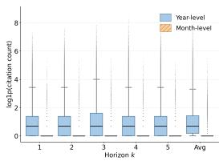  
(a) Citation Distribution

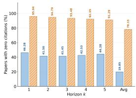  
(b) Zeros citation ratio  
Figure 2: Statistics of citation numbers.

## 4 METHOD

Scientific impact prediction is a cold-start problem: a newly published paper has no citation history and must rely on structural, semantic, and temporal evidence. Thus, we propose LLM4Impact (Figure 3), which integrates these signals through multi-branch and context-aware fusion.

Our design addresses three distinct challenges in cold-start impact prediction: representing unseen publication years, adapting to instance-dependent evidence reliability, and correcting domain- and time-dependent citation scales. We address them with three corresponding components: (i) a diagnostic-driven temporal encoder with continuous extrapolation and a zero-initialized residual, (ii) domain- and time-aware gated fusion, and (iii) a decoupled context-conditioned calibration module.

## 4.1 TASK FORMULATION

We formulate scientific impact prediction as a cold-start regression problem over a heterogeneous graph. Let $G = \langle N , E \rangle$ denote the heterogeneous citation graph, where nodes represent papers, authors, institutions, venues, categories, references, and publication time, and edges encode authorship, affiliation, venue, citation, and publication-time relations.

For a query paper p, all graph information is restricted to what was available at its publication time: its own citation count is zero, and neighboring papers are assigned only their point-in-time citation counts. This prevents future information from leaking into the prediction. Given $p ,$ the goal is to predict its cumulative citation counts over L future horizons:

$$
Y _ { p } = \{ y _ { p } ^ { 1 } , \ldots , y _ { p } ^ { L } \} ,\tag{1}
$$

where $y _ { p } ^ { \ell }$ denotes the cumulative citation count at horizon ℓ. We consider yearly prediction $( L = 5 )$ and monthly prediction $( L = 5$ , month 1 through month 5). The model jointly leverages the query paper’s heterogeneous graph, semantic content, and publication time.

## 4.2 MULTI-SOURCE REPRESENTATION LEARNING

Each query paper is represented by three complementary branches: semantic, graph, and temporal.   
Each branch produces a d-dimensional representation, with fusion deferred until Section 4.5.

Semantic branch. We encode the title and abstract of p using a frozen SciBERT (Beltagy et al., 2019) encoder followed by a two-layer projection head. The resulting representation is used as the semantic embedding of the query paper and also initializes paper/reference nodes in the graph branch, grounding semantic and structural representations in the same feature space.

Heterogeneous graph branch. We encode the query paper’s 2-hop heterogeneous ego-graph using type-specific feature projections followed by a citation-aware GNN. Citation edges are weighted according to the sender’s point-in-time citation count, while other relation types use mean aggregation. Type-aware attention pooling summarizes the heterogeneous neighborhood into a compact graph representation. During training, we additionally apply contrastive learning (van den Oord et al., 2019) between clean and popularity-augmented graph views.

## 4.3 GRAPH-TO-LLM PREFIX INJECTION

The graph representation provides structural evidence that is difficult to express through the LLM’s text input alone. We therefore project the graph representation into the LLM hidden space and reshape it into $L _ { p }$ continuous prefix tokens (Li & Liang, 2021):

$$
\mathbf { P } = \mathrm { r e s h a p e } \left( \mathcal { P } _ { \mathrm { g r a p h } } ( \mathbf { e } _ { \mathrm { g r a p h } } ) \right) \in \mathbb { R } ^ { L _ { p } \times d _ { \mathrm { L L M } } } .\tag{2}
$$

The prefix is prepended to the tokenized task instruction, title, and abstract directly in embedding space, while the LLM backbone remains frozen. The text positions are then pooled to obtain the LLM representation. Only the prefix projector, lightweight adaptation layers, and projection are trainable.

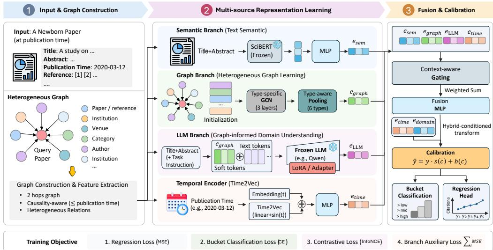  
Figure 3: Our proposed LLM4Impact. A cold-start impact prediction method that integrates semantic, heterogeneous graph, and temporal evidence. Graph structure is kept as a separate branch and also injected into a frozen LLM via continuous prefix tokens, followed by domain- and timeaware gated fusion and decoupled context-conditioned calibration.

Prefix injection itself has been explored in other graph-centric tasks, but its effectiveness for citationimpact prediction has not been systematically established. The distinction is important because the query paper is cold-start and has no citation history of its own. We therefore compare embeddingspace prefix injection against natural-language serialization of the same structural information. The prefix formulation consistently outperforms textual injection, supporting continuous structural conditioning as an effective interface for this setting.

## 4.4 DIAGNOSING AND FIXING TEMPORAL ENCODING

Publication time is essential for impact prediction, but a standard lookup-based time embedding can fail under temporal generalization. Our fresh test covers papers from 2018–2020, while training uses 2005–2017. Thus, a year-based lookup assigns an untrained embedding to every fresh-test paper, since these years receive no gradient updates during training. We verify that this is the primary source of the fresh-test degradation rather than graph sparsity. Specifically, the error–graph-density relationship is nearly identical across the historical and fresh splits, ruling out graph density as the main differentiating factor and pointing instead to the unseen publication-time representation.

We therefore replace the lookup-only representation with a continuous, extrapolable time encoder (Kazemi et al., 2019) that applies uniformly to both year- and month-level prediction. Let $\tau _ { p }$ denote the publication time of paper p, measured at the corresponding temporal granularity (year or month), and let $t _ { p }$ be its normalized value. We encode publication time as

$$
\mathbf { e } _ { \mathrm { t i m e } } = \mathrm { M L P } _ { \mathrm { t i m e } } \left( \left[ \sin ( 2 \pi t _ { p } \omega ) ; \cos ( 2 \pi t _ { p } \omega ) \right] \right) + \mathrm { E m b e d } . _ { \mathrm { t i m e } } [ \tau _ { p } ] \qquad t _ { p } = \frac { \tau _ { p } - \tau _ { \mathrm { m i n } } } { \tau _ { \mathrm { m a x } } - \tau _ { \mathrm { m i n } } } .\tag{3}
$$

This provides an extrapolable temporal representation, while the zero-initialized residual captures time-specific deviations for observed timestamps. Unseen timestamps simply fall back to the continuous base representation, enabling generalization across year- and month-level prediction.

## 4.5 DOMAIN- AND TIME-AWARE GATED FUSION

Evidence sources vary in their informativeness across papers. Thus, we learn an instance-specific gate conditioned on publication time and research domain. For paper $p _ { : }$ , we define $\mathbf { c } = [ \mathbf { e } _ { \mathrm { t i m e } } | | \bar { \mathbf { d } } _ { p } ]$ , where $\mathbf { d } _ { p }$ is the mean-pooled category embedding. The gate produces normalized weights over branches:

$$
\mathbf { g } = \mathrm { s o f t m a x } \left( W _ { g } [ \mathbf { e } _ { 1 } \lVert \cdot \cdot \cdot \lVert \mathbf { e } _ { n } \rVert \mathbf { c } ] \right) .\tag{4}
$$

The gated branch mixture is then combined with the joint branch representation through a fusion MLP. Unlike fixed-weight fusion, the learned gate allows the model to adapt which evidence source to trust according to the paper’s domain and publication era.

## 4.6 DECOUPLED PREDICTION CALIBRATION

Evidence selection and prediction calibration address different problems. While fusion determines which evidence sources to trust, citation scales vary systematically across research domains and publication cohorts. We therefore apply a separate context-conditioned calibration module:

$$
\begin{array} { r } { \hat { \mathbf { y } } = \hat { \mathbf { y } } _ { \mathrm { f u s e d } } \odot ( 1 + \mathrm { M L P } _ { s } ( \mathbf { c } ) ) + \mathrm { M L P } _ { b } ( \mathbf { c } ) . } \end{array}\tag{5}
$$

Zero-initializing the final calibration layers makes the module an identity transformation at initialization. Fusion therefore learns which evidence to trust, while calibration learns how to rescale the estimate based on domain and publication time. We train the model end-to-end with a composite objective:

$$
\begin{array} { r } { \mathcal { L } = \mathcal { L } _ { \mathrm { r e g } } + \lambda _ { \mathrm { a u x } } \mathcal { L } _ { \mathrm { b u c k e t } } + \lambda _ { \mathrm { c l } } \mathcal { L } _ { \mathrm { c o n t r a s t } } + \lambda _ { \mathrm { b r a n c h } } \mathcal { L } _ { \mathrm { b r a n c h } } . } \end{array}\tag{6}
$$

The main regression loss operates in log(1 + x) space. The auxiliary terms provide coarse citationbucket supervision, graph-level contrastive learning, and branch-wise deep supervision, respectively. Detailed loss definitions and training settings are provided in Appendix B.

## 5 EXPERIMENT AND ANALYSIS

## 5.1 EXPERIMENT SETTING

Baselines We compare against four representative baselines: SciBERT, a scientific text encoder; HINTS (Jiang et al., 2021), a dynamic heterogeneous network model; and NAIP (Zhao et al., 2025), an LLM-based impact prediction method. We additionally evaluate Qwen2.5-7B (Qwen et al., 2025), Qwen3-0.6B (Yang et al., 2025), Qwen3.5-4B, and Qwen3.5-9B (Team, 2026) via prompting and fine-tuning, excluding models larger than 9B due to dataset scale. Finally, we adapt H2CGL (He et al., 2023) and DPPDCC (Xue et al., 2024) to the newborn-paper setting to avoid citation leakage.

Evaluation Metrics We evaluate performance using regression, ranking, and zero-inflation-aware metrics. Year-level prediction is evaluated with RMSE. For month-level prediction, where 90.3% of previous test labels are zero (see Table 1 and Section 3.2), we additionally report AUROC, PR-AUC, and QWK (Cohen, 1968), together with RMSE and NDCG@20. RMSE measures numerical prediction error, while NDCG@20 evaluates the quality of the top-20 ranked citation lists. Higher is better for AUROC, PR-AUC, QWK, and NDCG@20; lower is better for RMSE. Detailed definition of these metrics are in Appendix C.

## 5.2 MAIN RESULTS

Tables 2 and 3 summarize the performance of our proposed LLM4Impact on the in-distribution and temporally shifted test sets, respectively. Overall, LLM4Impact consistently outperforms existing approaches across both year- and month-level prediction, demonstrating the benefit of jointly modeling semantic, graph, and temporal evidence.

On previous test, our 7B model achieves the best performance at all five year-level horizons, reducing average RMSE from 0.790 of the strongest prior baseline, NAIP, to 0.710 (10.13% improvement). The gain grows with the prediction horizon, from 7.38% at $Y _ { 1 }$ to 11.40% at $Y _ { 5 }$ , suggesting that structured and temporal evidence becomes increasingly valuable for longer-term impact prediction. The gains also extend to the highly zero-inflated month-level setting, where our model achieves the best trained-model performance across AUROC, PR-AUC, QWK, and RMSE, with a particularly large improvement in QWK (+40.77%). The smaller Qwen3-0.6B variant also outperforms prior baselines on most metrics, indicating that the gains are not solely attributable to the larger backbone.

Table 2: Main results on previous-test (in-distribution). Year-level results use per-horizon RMSE↓ in log1p space, while month-level results use zero-inflation-aware metrics due to 90.3% zero labels. Zero-shot LLMs are reported separately. Best results among trained models are shown in bold.
<table><tr><td rowspan="2">Method</td><td colspan="6">Year (RMSE ↓)</td><td colspan="5">Month</td></tr><tr><td>Y1</td><td>Y2</td><td>Y3</td><td>Y4</td><td>Y5</td><td>Avg</td><td>AUROC↑</td><td>PR-AUC↑</td><td>QWK↑</td><td>RMSE↓</td><td>NDCG↑</td></tr><tr><td>Traditional</td><td></td><td></td><td></td><td></td><td></td><td></td><td></td><td></td><td></td><td></td><td></td></tr><tr><td>SciBERT (Beltagy et al., 2019)</td><td>0.647</td><td>0.779</td><td>0.858</td><td>0.916</td><td>0.958</td><td>0.839</td><td>0.783</td><td>0.406</td><td>0.095</td><td>0.296</td><td>0.562</td></tr><tr><td>HINTS (Jiang et al., 2021)</td><td>0.709</td><td>0.857</td><td>0.945</td><td>1.008</td><td>1.055</td><td>0.923</td><td>0.621</td><td>0.196</td><td>0.000</td><td>0.323</td><td>0.000</td></tr><tr><td>H2CGL (He et al., 2023)</td><td>0.626</td><td>0.741</td><td>0.813</td><td>0.864</td><td>0.905</td><td>0.796</td><td>0.781</td><td>0.417</td><td>0.130</td><td>0.296</td><td>0.246</td></tr><tr><td>DPPDCC (Xue et al., 2024)</td><td>0.665</td><td>0.791</td><td>0.866</td><td>0.920</td><td>0.958</td><td>0.846</td><td>0.752</td><td>0.364</td><td>0.036</td><td>0.305</td><td>0.383</td></tr><tr><td>*LLMs-based*</td><td></td><td></td><td></td><td></td><td></td><td></td><td></td><td></td><td></td><td></td><td></td></tr><tr><td>NAIP (7B) (Zhao et al., 2025)</td><td>0.623</td><td>0.738</td><td>0.806</td><td>0.857</td><td>0.895</td><td>0.790</td><td>0.765</td><td>0.397</td><td>0.114</td><td>0.299</td><td>0.118</td></tr><tr><td>Qwen3-0.6B (zs) (Yang et al., 2025)</td><td>1.146</td><td>1.629</td><td>1.942</td><td>2.164</td><td>2.329</td><td>1.889</td><td>0.500</td><td>0.148</td><td>0.001</td><td>0.360</td><td>0.000</td></tr><tr><td>Qwen3.5-4B (zs) (Team, 2026)</td><td>1.189</td><td>1.494</td><td>1.694</td><td>1.820</td><td>1.912</td><td>1.642</td><td>0.648</td><td>0.249</td><td>0.099</td><td>1.245</td><td>0.090</td></tr><tr><td>Qwen3.5-9B (zs) (Team, 2026)</td><td>1.670</td><td>1.966</td><td>2.108</td><td>2.192</td><td>2.252</td><td>2.048</td><td>0.678</td><td>0.257</td><td>0.045</td><td>1.746</td><td>0.432</td></tr><tr><td>Ours (Qwen3-0.6B)</td><td>0.612</td><td>0.719</td><td>0.782</td><td>0.829</td><td>0.860</td><td>0.766</td><td>0.797</td><td>0.439</td><td>0.144</td><td>0.290</td><td>0.436</td></tr><tr><td>Ours(Qwen2.5-7B)</td><td>0.577</td><td>0.670</td><td>0.725</td><td>0.763</td><td>0.793</td><td>0.710</td><td>0.802</td><td>0.450</td><td>0.183</td><td>0.286</td><td>0.566</td></tr><tr><td>Improvement</td><td>+7.38%</td><td>+9.21%</td><td>+10.05%</td><td>+10.97%</td><td>+11.40%</td><td>+10.13%</td><td>+2.43%</td><td>+7.91%</td><td>+40.77%</td><td>+3.38%</td><td>+0.71%</td></tr></table>

Table 3: Main results on fresh-test (out-of-distribution, temporally-shifted papers). Same column design as Table 2. Best result per column among trained models in bold.
<table><tr><td colspan="6"></td><td colspan="5">Month</td></tr><tr><td>Model</td><td>Y1</td><td>Y2</td><td>Y3</td><td>Y4</td><td>Y5</td><td>Avg</td><td>AUROC↑</td><td>PR-AUC↑</td><td>QWK↑</td><td>RMSE↓</td><td>NDCG↑</td></tr><tr><td>Traditional</td><td></td><td></td><td></td><td></td><td></td><td></td><td></td><td></td><td></td><td></td><td></td></tr><tr><td>SciBERT (Beltagy et al., 2019)</td><td>0.728</td><td>0.848</td><td>0.919</td><td>0.977</td><td>1.019</td><td>0.904</td><td>0.747</td><td>0.399</td><td>0.049</td><td>0.355</td><td>0.588</td></tr><tr><td>HINTS (Jiang et al., 2021)</td><td>0.773</td><td>0.902</td><td>0.970</td><td>1.018</td><td>1.054</td><td>0.949</td><td>0.633</td><td>0.246</td><td>0.000</td><td>0.376</td><td>0.015</td></tr><tr><td>H2CGL (He et al., 2023)</td><td>0.713</td><td>0.838</td><td>0.922</td><td>0.975</td><td>1.016</td><td>0.899</td><td>0.762</td><td>0.422</td><td>0.090</td><td>0.351</td><td>0.259</td></tr><tr><td>DPPDCC (Xue et al., 2024)</td><td>0.743</td><td>0.869</td><td>0.940</td><td>0.989</td><td>1.037</td><td>0.921</td><td>0.697</td><td>0.346</td><td>0.023</td><td>0.367</td><td>0.229</td></tr><tr><td>*LLMs-based*</td><td></td><td></td><td></td><td></td><td></td><td></td><td></td><td></td><td></td><td></td><td></td></tr><tr><td>NAIP (7B) (Zhao et al., 2025)</td><td>0.698</td><td>0.802</td><td>0.862</td><td>0.904</td><td>0.935</td><td>0.844</td><td>0.729</td><td>0.389</td><td>0.053</td><td>0.356</td><td>0.298</td></tr><tr><td>Qwen3-0.6B (zs) (Yang et al., 2025)</td><td>1.262</td><td>1.736</td><td>2.016</td><td>2.211</td><td>2.360</td><td>1.956</td><td>0.500</td><td>0.183</td><td>0.001</td><td>0.420</td><td>0.000</td></tr><tr><td>Qwen3.5-4B (zs) (Team, 2026)</td><td>1.268</td><td>1.591</td><td>1.794</td><td>1.916</td><td>2.001</td><td>1.734</td><td>0.651</td><td>0.298</td><td>0.112</td><td>1.313</td><td>0.039</td></tr><tr><td>Qwen3.5-9B (zs) (Team, 2026)</td><td>1.661</td><td>1.962</td><td>2.126</td><td>2.228</td><td>2.296</td><td>2.067</td><td>0.680</td><td>0.302</td><td>0.053</td><td>1.766</td><td>0.074</td></tr><tr><td>Ours (Qwen3-0.6B)</td><td>0.699</td><td>0.801</td><td>0.851</td><td>0.889</td><td>0.915</td><td>0.835</td><td>0.759</td><td>0.429</td><td>0.078</td><td>0.352</td><td>0.524</td></tr><tr><td>Ours (Qwen2.5-7B)</td><td>0.657</td><td>0.748</td><td>0.801</td><td>0.839</td><td>0.870</td><td>0.786</td><td>0.771</td><td>0.441</td><td>0.112</td><td>0.347</td><td>0.657</td></tr><tr><td>Improvement</td><td>+5.87%</td><td>+6.73%</td><td>+7.08%</td><td>+7.19%</td><td>+6.95%</td><td>+6.87%</td><td>+1.18%</td><td>+4.50%</td><td>+24.44%</td><td>+1.14%</td><td>+11.73%</td></tr></table>

More importantly, LLM4Impact maintains its advantage under temporal distribution shift. On fresh test, where publication years are unseen during training, our 7B model remains the best trained approach at every year-level horizon, achieving an average RMSE of 0.786 and a 6.87% improvement over NAIP. It also achieves the best month-level performance across the reported metrics, including an 11.73% improvement in NDCG. This consistent performance on unseen publication years supports the effectiveness of our continuous temporal encoding and context-conditioned calibration. In contrast, zero-shot LLMs generally perform substantially worse on year-level prediction, highlighting that general-purpose language modeling alone is insufficient for cold-start scientific impact prediction.

## 5.3 ABLATION STUDY

Table 4: Ablation at year granularity. ∆ denotes the relative change compared with the full model.
<table><tr><td>Split</td><td>Model</td><td>Y1</td><td>Y2</td><td>Y3</td><td>Y4</td><td>Y5</td><td>Avg. RMSE</td><td>∆</td></tr><tr><td rowspan="4">previous_test</td><td>Ours (7B)</td><td>0.577</td><td>0.670</td><td>0.725</td><td>0.763</td><td>0.793</td><td>0.710</td><td></td></tr><tr><td>Calibration</td><td>0.618</td><td>0.729</td><td>0.794</td><td>0.843</td><td>0.878</td><td>0.778</td><td>+9.6%</td></tr><tr><td>− LLM branch</td><td>0.628</td><td>0.746</td><td>0.817</td><td>0.868</td><td>0.908</td><td>0.799</td><td>+12.6%</td></tr><tr><td>– Graph branch</td><td>0.602</td><td>0.711</td><td>0.774</td><td>0.819</td><td>0.853</td><td>0.757</td><td>+6.6%</td></tr><tr><td rowspan="4">fresh_test</td><td>Ours (7B)</td><td>0.657</td><td>0.748</td><td>0.801</td><td>0.839</td><td>0.870</td><td>0.786</td><td></td></tr><tr><td>Calibration</td><td>0.702</td><td>0.814</td><td>0.881</td><td>0.937</td><td>0.976</td><td>0.868</td><td>+10.4%</td></tr><tr><td>– LLM branch</td><td>0.708</td><td>0.829</td><td>0.905</td><td>0.962</td><td>1.005</td><td>0.888</td><td>+12.9%</td></tr><tr><td>Graph branch</td><td>0.679</td><td>0.777</td><td>0.835</td><td>0.878</td><td>0.908</td><td>0.819</td><td>+4.2%</td></tr></table>

Component Effectiveness. Table 4 evaluates the contribution of the major components on both in-distribution and temporally shifted data. Re-training method without LLM branch causes the largest degradation, increasing average RMSE by 12.6% on previous test and 12.9% on fresh test, demonstrating the value of LLM-based semantic evidence. Re-training method without calibration increases RMSE by 9.6% and 10.4%, respectively, supporting the

benefit of decoupling prediction adjustment from evidence fusion. Re-training method without graph branch results in consistent increases of 6.6% and 4.2%, confirming the complementary role of structural evidence. The consistent effects across the two splits indicate that these components provide complementary benefits that persist under temporal distribution shift.

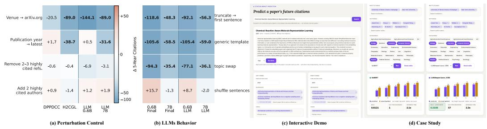  
Figure 4: Robustness, Interpretability, and Practical Validation of LLM4Impact. (a) Contribution of different evidence sources; (b) LLM behavior under controlled perturbations; (c) Interactive exploration of citation predictions; (d) Case study comparing LLM4Impact with SciBERT.

Sensitivity to Perturbations. To examine what drives citation predictions and validate our multisource framework, we conduct two complementary controlled perturbation studies on the same 20 computer science papers. As shown in Figure 4, (a) probes metadata sensitivity by perturbing authors, publication year, venue, and highly cited references while keeping other information fixed. Venue changes produce the largest effects across models, while author perturbations have much smaller impacts. The varying responses to publication year and citation structure further motivate domainand time-aware gated fusion. (b) probes the LLM branch through sentence shuffling, truncation, generic replacement, and topic swapping. Content removal or replacement substantially changes both isolated LLM and final fused predictions, whereas sentence shuffling has a much smaller effect. These results indicate that the LLM branch captures content-level signals and provides complementary evidence to the graph and semantic branches, supporting our multi-source fusion design.

## 5.4 MORE ANALYSIS AND DISCUSSION

Case Study: Interactive Sensitivity and Counterfactual Analysis We further provide an interactive demo for probing how contextual factors affect predicted scientific impact. Users can independently modify publication year, references, venue, authors, institutions, and research categories, while keeping the remaining information fixed, and compare the resulting citation trajectories across models. This enables controlled what-if analysis of how changes in individual factors alter the model’s predicted impact, going beyond measuring sensitivity to input perturbations. The supplementary webpage provides additional screenshots and more case studies are in Appendix D.2.

Other Metrics. We further investigated the impact of alternative metrics on model evaluation. Following prior work, we extended our prediction target to Topic Normalized Citation Success Index(TNCSI) (Zhao et al., 2025), which normalizes citation counts relative to the citation distribution of publications in the same field, thus mitigating cross-disciplinary citation bias. Table 5 presents the RMSE scores via using both raw citation counts and the TNCSI metric, and

Table 5: Comparison of RMSE and correlation Cor. between C log and C TNCSI onfresh set.
<table><tr><td>Metric</td><td>Year_1</td><td>Year_2</td><td>Year_3</td><td>Year_4</td><td>Year_5</td><td>Avg</td></tr><tr><td>C_log</td><td>0.7170</td><td>0.7426</td><td>0.7892</td><td>0.8302</td><td>0.9514</td><td>0.7745</td></tr><tr><td>C_TNCSI</td><td>0.2316</td><td>0.2441</td><td>0.2556</td><td>0.2556</td><td>0.2532</td><td>0.2480</td></tr><tr><td>Cor.</td><td>0.8004</td><td>0.8128</td><td>0.8095</td><td>0.8136</td><td>0.8128</td><td>0.8098</td></tr></table>

their Spearman correlation coefficients (Spearman, 1961). We observe that despite differences in relative scores, the corresponding predictions exhibit a strong positive correlation. Besides, we find that the fresh test set continues to pose greater challenges compared to the previous one.

## 6 CONCLUSION

In this paper, we presented LLM4Impact, a unified framework for cold start scientific impact prediction that integrates semantic, heterogeneous graph, LLM, and temporal evidence. By combining continuous temporal representation, context aware evidence gating, and context conditioned calibration, LLM4Impact consistently improves over strong baselines across yearly and monthly prediction tasks. Ablation and perturbation studies further show that different evidence sources provide complementary information and remain useful across changing publication contexts.

## ACKNOWLEDGMENTS

Special thanks to the AVG members for their help and discussions. Prof. Andreas Geiger are members of the Machine Learning Cluster of Excellence, EXC number 2064/1 – Project number 390727645. Andreas Geiger was supported by the ERC Starting Grant LEGO-3D (850533). Yong Cao was supported by a VolkswagenStiftung Momentum grant.

## AI USE STATEMENT

Large language models are used in our early-stage writing for wording and grammar checking, as well as searching for missing literature. LLMs are not involved in the later iterations of the paper writing. Therefore, we do not consider LLMs as significant contributors to this paper.

## REPRODUCIBILITY STATEMENT

We will publicly release our full code, including training, inference, and evaluation scripts, to ensure that all results in this paper are fully reproducible.

## REFERENCES

Sam Arts, Nicola Melluso, and Reinhilde Veugelers. Beyond citations: Measuring novel scientific ideas and their impact in publication text. Review of Economics and Statistics, pp. 1–33, 2025.

Xiaomei Bai, Fuli Zhang, and Ivan Lee. Predicting the citations of scholarly paper. Journal of Informetrics, 13(1):407–418, 2019.

Xiaomei Bai, Fuli Zhang, Jin Ni, Lei Shi, and Ivan Lee. Measure the impact of institution and paper via institution-citation network. IEEE Access, 8:17548–17555, 2020.

Iz Beltagy, Kyle Lo, and Arman Cohan. Scibert: A pretrained language model for scientific text. In Proceedings of the 2019 conference on empirical methods in natural language processing and the 9th international joint conference on natural language processing (EMNLP-IJCNLP), pp. 3615–3620, 2019.

Arman Cohan, Sergey Feldman, Iz Beltagy, Doug Downey, and Daniel S Weld. Specter: Documentlevel representation learning using citation-informed transformers. In Proceedings of the 58th annual meeting ofthe associationfor computational linguistics, pp. 2270–2282, 2020.

Jacob Cohen. Weighted kappa: Nominal scale agreement provision for scaled disagreement or partial credit. Psychological Bulletin, 70:213–220, 10 1968. doi: 10.1037/h0026256.

Joost de Winter. Can chatgpt be used to predict citation counts, readership, and social media interaction? an exploration among 2222 scientific abstracts. Scientometrics, 129(4):2469–2487, 2024.

Lawrence D Fu and Constantin Aliferis. Models for predicting and explaining citation count of biomedical articles. In AMIA Annual symposium proceedings, volume 2008, pp. 222, 2008.

Hao Geng, Deqing Wang, Fuzhen Zhuang, Xuehua Ming, Chenguang Du, Ting Jiang, Haolong Guo, and Rui Liu. Modeling dynamic heterogeneous graph and node importance for future citation prediction. In Proceedings ofthe 31st ACM international conference on information & knowledge management, pp. 572–581, 2022.

Guoxiu He, Zhikai Xue, Zhuoren Jiang, Yangyang Kang, Star Zhao, and Wei Lu. H2cgl: Modeling dynamics of citation network for impact prediction. Information Processing & Management, 60 (6):103512, 2023.

Andreas Nugaard Holm, Barbara Plank, Dustin Wright, and Isabelle Augenstein. Longitudinal citation prediction using temporal graph neural networks. In SDU@AAAI, 2022. DBLP License: DBLP’s bibliographic metadata records provided through http://dblp.org/ are distributed under a Creative Commons CC0 1.0 Universal Public Domain Dedication. Although the bibliographic

metadata records are provided consistent with CC0 1.0 Dedication, the content described by the metadata records is not. Content may be subject to copyright, rights of privacy, rights of publicity and other restrictions.

Alfonso Iba´nez, Pedro Larra˜ naga, and Concha Bielza. Predicting citation count of bioinformatics˜ papers within four years of publication. Bioinformatics, 25(24):3303–3309, 2009.

Song Jiang, Bernard Koch, and Yizhou Sun. Hints: Citation time series prediction for new publications via dynamic heterogeneous information network embedding. In Proceedings ofthe web conference 2021, pp. 3158–3167, 2021.

Yiqiao Jin, Yijia Xiao, Yiyang Wang, and Jindong Wang. Scito2m: A 2 million, 30-year crossdisciplinary dataset for temporal scientometric analysis. In Workshop on Preparing Good Data for Generative AI: Challenges and Approaches, 2024.

Seyed Mehran Kazemi, Rishab Goel, Sepehr Eghbali, Janahan Ramanan, Jaspreet Sahota, Sanjay Thakur, Stella Wu, Cathal Smyth, Pascal Poupart, and Marcus Brubaker. Time2vec: Learning a vector representation of time, 2019. URL https://arxiv.org/abs/1907.05321.

Rodney Kinney, Chloe Anastasiades, Russell Authur, Iz Beltagy, Jonathan Bragg, Alexandra Buraczynski, Isabel Cachola, Stefan Candra, Yoganand Chandrasekhar, Arman Cohan, et al. The semantic scholar open data platform. arXiv preprint arXiv:2301.10140, 2023.

Vincent Lariviere and Yves Gingras. On the relationship between interdisciplinarity and scientific \` impact. Journal of the American Society for Information Science and Technology, 61(1):126–131, 2010.

Xiang Lisa Li and Percy Liang. Prefix-tuning: Optimizing continuous prompts for generation. In Chengqing Zong, Fei Xia, Wenjie Li, and Roberto Navigli (eds.), Proceedings of the 59th Annual Meeting of the Association for Computational Linguistics and the 11th International Joint Conference on Natural Language Processing (Volume 1: Long Papers), pp. 4582–4597, Online, August 2021. Association for Computational Linguistics. doi: 10.18653/v1/2021.acl-long.353. URL https://aclanthology.org/2021.acl-long.353/.

Qwen, :, An Yang, Baosong Yang, Beichen Zhang, Binyuan Hui, Bo Zheng, Bowen Yu, Chengyuan Li, Dayiheng Liu, Fei Huang, Haoran Wei, Huan Lin, Jian Yang, Jianhong Tu, Jianwei Zhang, Jianxin Yang, Jiaxi Yang, Jingren Zhou, Junyang Lin, Kai Dang, Keming Lu, Keqin Bao, Kexin Yang, Le Yu, Mei Li, Mingfeng Xue, Pei Zhang, Qin Zhu, Rui Men, Runji Lin, Tianhao Li, Tianyi Tang, Tingyu Xia, Xingzhang Ren, Xuancheng Ren, Yang Fan, Yang Su, Yichang Zhang, Yu Wan, Yuqiong Liu, Zeyu Cui, Zhenru Zhang, and Zihan Qiu. Qwen2.5 technical report, 2025. URL https://arxiv.org/abs/2412.15115.

Charles Spearman. The proof and measurement of association between two things. 1961.

Yizhou Sun, Jiawei Han, Xifeng Yan, Philip S Yu, and Tianyi Wu. Pathsim: Meta path-based top-k similarity search in heterogeneous information networks. Proceedings ofthe VLDB Endowment, 4 (11):992–1003, 2011.

Jie Tang, Jing Zhang, Limin Yao, Juanzi Li, Li Zhang, and Zhong Su. Arnetminer: extraction and mining of academic social networks. In Proceedings of the 14th ACM SIGKDD international conference on Knowledge discovery and data mining, pp. 990–998, 2008.

Qwen Team. Qwen3.5: Towards native multimodal agents, February 2026. URL https://qwen. ai/blog?id=qwen3.5.

Aaron van den Oord, Yazhe Li, and Oriol Vinyals. Representation learning with contrastive predictive coding, 2019. URL https://arxiv.org/abs/1807.03748.

Adilson Vital Jr, Filipi N Silva, Osvaldo N Oliveira Jr, and Diego R Amancio. Predicting citation impact of research papers using gpt and other text embeddings. Physica A: Statistical Mechanics and its Applications, 674:130789, 2025.

Dashun Wang, Chaoming Song, and Albert-Laszl ´ o Barab ´ asi. Quantifying long-term scientific impact.´ Science, 342(6154):127–132, 2013.

Wanjun Xia, Tianrui Li, and Chongshou Li. A review of scientific impact prediction: tasks, features and methods. Scientometrics, 128(1):543–585, 2023.

Xovee Xu, Ting Zhong, Ce Li, Goce Trajcevski, and Fan Zhou. Heterogeneous dynamical academic network for learning scientific impact propagation. Knowledge-Based Systems, 238:107839, 2022.

Zhikai Xue, Guoxiu He, Zhuoren Jiang, Sichen Gu, Yangyang Kang, Star Zhao, and Wei Lu. Predicting scientific impact through diffusion, conformity, and contribution disentanglement. In Proceedings of the 33rd ACM international conference on information and knowledge management, pp. 2764–2774, 2024.

An Yang, Anfeng Li, Baosong Yang, Beichen Zhang, Binyuan Hui, Bo Zheng, Bowen Yu, Chang Gao, Chengen Huang, Chenxu Lv, et al. Qwen3 technical report. arXiv preprint arXiv:2505.09388, 2025.

Carl Yang and Jiawei Han. Revisiting citation prediction with cluster-aware text-enhanced heterogeneous graph neural networks. In 2023 IEEE 39th international conference on data engineering (ICDE), pp. 682–695. IEEE, 2023.

Fang Zhang and Shengli Wu. Predicting citation impact of academic papers across research areas using multiple models and early citations. Scientometrics, 129(7):4137–4166, 2024.

Kai Zhang, Kaisong Song, Yangyang Kang, and Xiaozhong Liu. Content-and topology-aware representation learning for scientific multi-literature. In Proceedings ofthe 2023 Conference on Empirical Methods in Natural Language Processing, pp. 7490–7502, 2023.

Penghai Zhao, Qinghua Xing, Kairan Dou, Jinyu Tian, Ying Tai, Jian Yang, Ming-Ming Cheng, and Xiang Li. From words to worth: Newborn article impact prediction with llm. In Proceedings of the AAAI Conference on Artificial Intelligence, volume 39, pp. 1183–1191, 2025.

Xin Ping Zhu and ZhiJie Ban. Citation count prediction based on academic network features. In 2018 IEEE 32nd international conference on advanced information networking and applications (AINA), pp. 534–541. IEEE, 2018.

## Appendix

## Table of Contents

A Dataset Construction and Statistics 13   
A.1 Metadata Statistics . 14   
A.2 Split Dataset Distribution 15   
B Loss Function Details 16   
C Evaluation Metrics Definition 17   
C.1 Year-Level Metrics . 17   
C.2 Month-Level Metrics 18   
D More Experimental Results 18   
D.1 Significance Test . 18   
D.2 More Case Study 18   
D.3 Domain Performance Differences 19   
E TNCSI Calculation 19   
F Training parameters 19   
G Prompt 21   
H Limitations and Future Work 27

## A DATASET CONSTRUCTION AND STATISTICS

Comparison with Existing Datasets. Table 6 situates our benchmark in the landscape of scientific paper datasets. Existing resources each contribute valuable aspects: APS (Bai et al., 2019) and DBLP (Zhu & Ban, 2018) provide structured networks but lack multimodality; PubMed (Fu & Aliferis, 2008) offers scale but limited label granularity; S2AG 1 achieves massive coverage but with sparse annotations; Aminer 2 and Bio-Sci (Zhang et al., 2023) capture recent slices but often full content. Our dataset is, to our knowledge, the first at this scale (2.0M query papers, 39.3M-node ego-graph) to unify multi-grained impact labels, real author/venue/institution metadata, and built-in processing tools within a single resource – while being explicit, rather than silent, about the domain shift an unstratified sample of this kind inevitably carries (see Table 1).

Table 6: Comparison of popular impact prediction paper datasets and databases. Abbreviations: Gran. = multi-grained (year- and month-level) labels, Dom. = multi-domain coverage. †Our domain coverage is the natural, unstratified distribution of eligible S2AG papers, not a balanced sample – see Table 1 for the resulting shift relative to the full corpus.

<table><tr><td>Dataset</td><td>Year</td><td>Gran.</td><td>Dom.</td><td>Tools</td><td>#Papers</td></tr><tr><td>APS</td><td></td><td>x</td><td>x</td><td>x</td><td>0.45M</td></tr><tr><td>Pubmed</td><td>2008</td><td>x</td><td>x</td><td>x</td><td>1.10M</td></tr><tr><td>DBLP</td><td>2008</td><td>x</td><td>x</td><td>x</td><td>1.80M</td></tr><tr><td>S2AG</td><td>2022</td><td>√</td><td>√</td><td>x</td><td>205M</td></tr><tr><td>Aminer</td><td>2023</td><td>x</td><td>x</td><td>x</td><td>5.25M</td></tr><tr><td>Bio-Sci</td><td>2023</td><td>x</td><td>√</td><td>x</td><td>0.03M</td></tr><tr><td>Ours</td><td>2026</td><td>√</td><td>√t</td><td>√</td><td>2.0M</td></tr></table>

Table 7: Full corpus vs. sampled query set, computed over paper static features (full corpus) and the union of splits.parquet/node features.parquet (sample). Field shares are multi-label and computed independently within each population; ranks refer to each population’s own top-15 by share. Full 15-field ranking in Appendix A, Table 8.
<table><tr><td>Attribute</td><td>Full S2AG corpus</td><td>Sampled query set</td></tr><tr><td># Papers</td><td>237,026,483</td><td>2,000,000 (0.84%)</td></tr><tr><td>Publication years</td><td>1970-2025</td><td>2005-2020</td></tr><tr><td>Zero-citation share</td><td>53.4%</td><td>13.8%</td></tr><tr><td>5,000+-citation share</td><td>0.003-0.008%</td><td>0.003-0.008%</td></tr><tr><td>Physics (share, rank)</td><td>9.7%, 8th</td><td>21.4%, 3rd</td></tr><tr><td>History / Political Science in top-15</td><td>√(14th, 11th)</td><td>X (dropped)</td></tr></table>

## A.1 METADATA STATISTICS

Source database. All papers, authors, venues, affiliations, and citation edges are drawn from a single Semantic Scholar Academic Graph (S2AG) snapshot – a 307GB database of 237,026,483 papers spanning 1970–2025. Citation structure comes from the citations by cited/citations by citing edge tables (5.7B rows each; every real citation edge is stored twice in this snapshot, confirmed against papers.citationcount and the live Semantic Scholar API, so every query in our pipeline de-duplicates on (citing corpusid, cited corpusid) before counting), authorship from paper authors (697.7M raw rows), and affiliations from paper affiliations. We additionally cross-checked S2AG’s own fields of study classification coverage over time: it holds around 65% for papers published before 2021 and drops to roughly 32% from 2021 onward without recovering in this snapshot, which is one reason (together with needing a full 5-year label window) that our query window stops at 2020.

Domain distribution. Table 8 shows the top-15 fields-of-study by share within our 2,000,000-query sample (a paper may carry more than one field tag, so shares do not sum to 100%). The distribution is not uniform: Medicine alone tags 75.6% of query papers, roughly triple the next-largest field (Biology, 26.6%), and coverage falls off from there through Computer Science (21.2%), Engineering (20.9%), down to Education (3.5%) at 15th. This is an honest consequence of unstratified sampling over S2AG’s own field mix, not a sampling target – Table 7.

Table 8: Top-15 field-of-study ranking, full S2AG corpus vs. our sampled query set. History and Political Science (full-corpus ranks 14 and 11) fall out of the sample’s top-15 entirely, replaced by Agricultural and Food Sciences and Education – consistent with the referencecount/abstract eligibility filter retaining STEM papers at a higher rate than humanities/social-science papers.
<table><tr><td>Rank</td><td>Full S2AG corpus (share)</td><td>Sampled query set (share)</td></tr><tr><td>1</td><td>Medicine (42.9%)</td><td>Medicine (75.6%)</td></tr><tr><td>2</td><td>Engineering (15.8%)</td><td>Biology (26.6%)</td></tr><tr><td>3</td><td>Computer Science (12.7%)</td><td>Physics (21.4%)</td></tr><tr><td>4</td><td>Biology (12.5%)</td><td>Computer Science (21.2%)</td></tr><tr><td>5</td><td>Chemistry (11.2%)</td><td>Engineering (20.9%)</td></tr><tr><td>6</td><td>Environmental Science (10.7%)</td><td>Environmental Science (18.6%)</td></tr><tr><td>7</td><td>Materials Science (9.9%)</td><td>Materials Science (16.3%)</td></tr><tr><td>8</td><td>Physics (9.7%)</td><td>Chemistry (14.2%)</td></tr><tr><td>9</td><td>Psychology (5.7%)</td><td>Mathematics (12.1%)</td></tr><tr><td>10</td><td>Business (4.4%)</td><td>Psychology (8.6%)</td></tr><tr><td>11</td><td>Political Science (4.4%)</td><td>Economics (5.0%)</td></tr><tr><td>12</td><td>Mathematics (4.3%)</td><td>Sociology (4.9%)</td></tr><tr><td>13</td><td>Sociology (4.0%)</td><td>Business (4.8%)</td></tr><tr><td>14</td><td>History (3.9%)</td><td>Agricultural and Food Sciences (3.6%)</td></tr><tr><td>15</td><td>Economics (3.7%)</td><td>Education (3.5%)</td></tr></table>

Year distribution, overall and by split. Figure 5 shows the publication-year share of the full 2M-query set (gray bars) against each individual split (colored lines). Because train, val, and previous test are all drawn without overlap from the same 2005–2017 historical pool via the same random partition, their year distributions are visually indistinguishable from one another – all three trace the same growing-then-plateauing curve, rising from 2.1–2.2% of the split in 2005 to a peak of 15.6–15.9% in 2017 (more eligible papers survive the referencecount/abstract filter in later years). fresh test, by contrast, is drawn entirely from 2018–2020 and is a disjoint block in publication-year space by construction, not merely by chance – confirming the split does what Section 3 claims: fresh test contains publication years the model never saw during training.

## A.2 SPLIT DATASET DISTRIBUTION

Figure 6 compares the golden citation labels themselves across splits: the left panel plots the median cumulative year-level citation count at each horizon k=1..5, and the right panel the mean cumulative month-level count (mean rather than median, since Figure 2a already shows the month-level median is 0 at every horizon). train, val, and previous test again track each other almost exactly at both granularities (e.g. year-5 median of 5.0 citations, month-5 mean of 0.43), consistent with being three random draws from the same underlying pool. fresh test sits systematically higher at every horizon and every granularity – year-5 median 6.0 vs. 5.0, month-5 mean 0.68 vs. 0.43 – which is expected rather than a sampling arti fact: 2018–2020 papers are, on average, in more actively-growing subfields of a corpus whose overall publication volume keeps rising, so a same-length citation window started more recently tends to land at a higher point on that

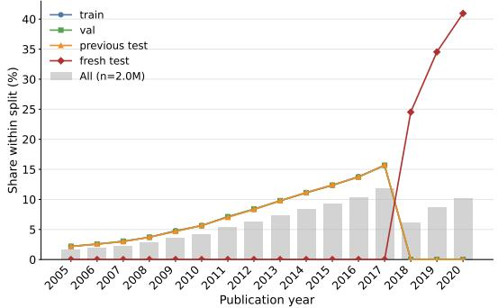  
Figure 5: Publication-year share of the full query set (gray bars) and of each split (colored lines). train/val/previous test overlap almost exactly (same 2005–2017 pool, same random partition); fresh test occupies a disjoint 2018– 2020 block.

growth curve. This also means a model trained on train (drawn from the older, lower-volume regime) faces a real, systematic level shift when evaluated on fresh test – not just a different time window, but a different citation-rate regime – which is precisely the generalization gap fresh test is designed to expose.

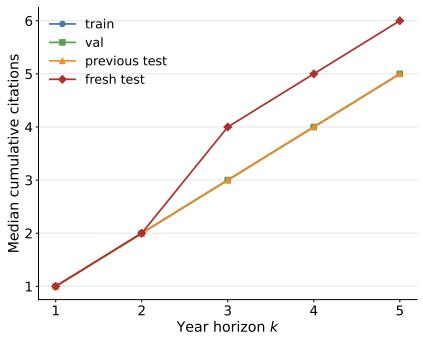

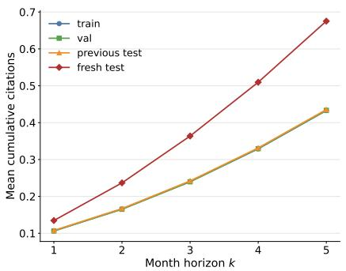  
Figure 6: Golden-label citation trajectories by split. Left: median cumulative year-level citations at each horizon. Right: mean cumulative month-level citations at each horizon (mean used since the month-level median is 0 everywhere, per Figure 2a). train/val/previous test overlap almost exactly; fresh test is systematically higher at every horizon and both granularities.

## B LOSS FUNCTION DETAILS

The composite objective in Eq. 6 combines a primary regression loss with three auxiliary terms, each targeting a different part of the architecture.

Regression loss ${ \mathcal { L } } _ { \mathrm { r e g } } .$ Given the fused, calibrated prediction $\hat { y } \in \mathbb { R } ^ { T }$ for the T future citation horizons and the ground-truth cumulative citation counts y, we minimize mean squared error in log(1 + x) space:

$$
\mathcal { L } _ { \mathrm { r e g } } = \frac { 1 } { T } \sum _ { t = 1 } ^ { T } \left( \hat { y } _ { t } - \log ( 1 + y _ { t } ) \right) ^ { 2 } ,\tag{7}
$$

averaged over the batch. When --group reweight is enabled (off by default), this persample MSE is instead combined with learned domain- and time-specific log-variance terms $s _ { d } = \mathtt { d o m a i n \_ l o g \_ v a r } [ d ] , s _ { \tau } = \mathtt { t i m e \_ l o g \_ v a r } [ \tau ]$ in a Kendall-style homoscedastic uncertainty weighting, $\mathcal { L } _ { \mathrm { r e g } } = e ^ { - ( s _ { d } + s _ { \tau } ) }$ $\mathrm { M S E } + s _ { d } + s _ { \tau }$ , so the model can automatically down-weight noisy domain/time slices; we did not enable this by default and report results with the plain MSE above.

Citation-bucket auxiliary loss $\mathcal { L } _ { \mathrm { b u c k e t } } .$ . Each paper is assigned one of three coarse citation-impact buckets based on its 5-year cumulative citation count $c _ { 5 } \colon$ low $( c _ { 5 } < 1 0 )$ , medium $( 1 0 \leq c _ { 5 } < 1 0 0 )$ and high $( c _ { 5 } \geq 1 0 0 )$ . A linear classification head reads the fused branch embedding and predicts bucket logits $\ell \in \mathbb { R } ^ { 3 } ; \mathcal { L } _ { \mathrm { b u c k e t } }$ is the standard cross-entropy against the ground-truth bucket label. This is an auxiliary supervision signal only – it does not participate in the final citation-count prediction – intended to encourage the fused representation to also be linearly separable by coarse impact tier.

Contrastive loss $\mathcal { L } _ { \mathrm { c o n t r a s t } } .$ . To encourage the graph branch’s pooled embedding to be robust to perturbations of the citation ego-graph’s neighborhood, we apply a hard-negative InfoNCE loss following H2CGL (He et al., 2023). For each anchor graph we construct two augmented views by randomly dropping a fraction $\rho ( -- \mathsf { a u g \_ r a t e } .$ , default 0.1) of droppable (non-target, non-venue) neighbor nodes, biased toward dropping low-popularity nodes for the “positive” view $z _ { 1 }$ and highpopularity nodes for the mined-hard-negative view; batch-mined hard negatives $z ^ { - }$ (when available) are pooled with the in-batch negatives. With sim $( u , v ) = u ^ { \top } v / \tau ( \tau = \stackrel { \sim } { 0 } . 2 )$ computed against the pool of all positives and negatives, excluding the anchor itself:

$$
\mathcal { L } _ { \mathrm { c o n t r a s t } } = - \log \frac { \exp ( \sin ( z _ { 1 } , z _ { 2 } ) ) } { \sum _ { v \in \{ z _ { 2 } \} \cup \mathcal { N } \cup \{ z ^ { - } \} } \exp ( \sin ( z _ { 1 } , v ) ) } ,\tag{8}
$$

where $\mathcal { N }$ is the set of in-batch negatives. Onfull dataset we do not yet have a mined hard-negative pool, so $\lambda _ { \mathrm { c l } } = 0$ there and this term reduces to a standard in-batch InfoNCE (or is fully disabled); on calib 50k the full hard-negative-augmented version is used.

Branch deep-supervision loss $\mathcal { L } _ { \mathrm { b r a n c h } }$ . Each active branch (LLM, graph, temporal, retrieval, track record, explicit- feature, as configured) additionally predicts its own citation estimate $\hat { y } ^ { ( b ) }$ from its own embedding via a lightweight branch-specific head, independent of the gated fusion. We average the per-branch MSE (same log(1 + x) target as $\mathcal { L } _ { \mathrm { r e g } } )$ over the B active branches:

$$
\mathcal { L } _ { \mathrm { b r a n c h } } = \frac { 1 } { B } \sum _ { b = 1 } ^ { B } \frac { 1 } { T } \sum _ { t = 1 } ^ { T } \Big ( \hat { y } _ { t } ^ { ( b ) } - \mathrm { l o g } ( 1 + y _ { t } ) \Big ) ^ { 2 } .\tag{9}
$$

This keeps every branch directly regression-supervised even though only the fused prediction is the model’s primary output, preventing a branch from degenerating into a component the gate can freely ignore during early training.

Weights and training settings. We set $\lambda _ { \mathrm { a u x } } = 0 . 5 ( - \mathrm { - a u x \mathrm { - } w e i g h t } ) , \lambda _ { \mathrm { c l } } = 0 . 5 ( \mathrm { -- c } \mathbb { 1 }$ weight, 0 on full dataset), and $\lambda _ { \mathrm { b r a n c h } } = 0 . 2 \ : ( \mathrm { -- } )$ ranch aux weight) for all reported results unless otherwise noted as an ablation.

## C EVALUATION METRICS DEFINITION

We report RMSE for year-level prediction and AUROC, PR-AUC, QWK, RMSE, and NDCG@20 for month-level prediction in our main comparison tables (Table 2 and Table 3). Year-level prediction focuses on regression accuracy, while the month-level task additionally considers zero-inflation-aware classification and ranking metrics. Following prior work on citation forecasting (He et al., 2023; Xue et al., 2024), all regression targets are evaluated in $\log ( 1 + x )$ space to reduce the influence of the heavy right tail of citation-count distributions. We consider the same set of H = 5 future citation horizons for both prediction granularities: years 1–5 for the Year target and months 1–5 for the Month target.

Notation. Let $\mathcal { D } _ { \mathrm { t e s t } } = \{ 1 , \dots , N \}$ denote a test split, such as PREVIOUS TEST or FRESH TEST. Let $c _ { i , h }$ denote the raw cumulative citation count of paper i at horizon $h \in \{ 1 , \ldots , H \}$ . We evaluate regression metrics in log(1 + x) space:

$$
y _ { i , h } = \log ( 1 + c _ { i , h } ) , \qquad \hat { y } _ { i , h } = \log ( 1 + \hat { c } _ { i , h } ) ,\tag{10}
$$

where $\hat { c } _ { i , h }$ is the predicted cumulative citation count. For ranking and regression metrics, the transformed values are used consistently throughout evaluation.

## C.1 YEAR-LEVEL METRICS

RMSE. We report per-horizon RMSE,

$$
\mathrm { R M S E } _ { h } = \sqrt { \frac { 1 } { N } \sum _ { i = 1 } ^ { N } \left( \hat { y } _ { i , h } - y _ { i , h } \right) ^ { 2 } } ,\tag{11}
$$

and define the pooled RMSE across all $N \times H$ paper–horizon pairs as

$$
\mathrm { R M S E } _ { \mathrm { o v e r a l l } } = \sqrt { \frac { 1 } { N H } \sum _ { i = 1 } ^ { N } \sum _ { h = 1 } ^ { H } \left( \hat { y } _ { i , h } - y _ { i , h } \right) ^ { 2 } } .\tag{12}
$$

The Year Avg and Month Avg columns in Table 2 and Table 3 report the unweighted mean of the per-horizon RMSE values,

$$
\mathrm { R M S E } _ { \mathrm { A v g } } = \frac { 1 } { H } \sum _ { h = 1 } ^ { H } \mathrm { R M S E } _ { h } .\tag{13}
$$

This treats all prediction horizons equally and prevents horizons with larger residual variance from dominating the aggregate score.

NDCG@20. RMSE and classification metrics do not directly measure whether a model correctly ranks papers by future citation impact. We therefore report NDCG@20 to evaluate the quality of the highest-ranked papers. For each horizon $h ,$ we treat the entire test split as a single ranked list, sorting papers according to the model’s predicted scores $\hat { y } _ { \cdot , h }$ . The discounted cumulative gain at rank k is

$$
\mathrm { D C G } _ { h } @ k = \sum _ { r = 1 } ^ { k } \frac { 2 ^ { \mathrm { r e l } ( r ) } - 1 } { \log _ { 2 } ( r + 1 ) } ,\tag{14}
$$

where rel(r) is the ground-truth relevance of the paper ranked at position $^ { r , }$ here given by $y _ { i , h }$ . We set $k = 2 0$ and normalize by the ideal DCG obtained by ranking papers according to ground-truth relevance:

$$
\mathrm { N D C G } _ { h } @ 2 0 = \frac { \mathrm { D C G } _ { h } @ 2 0 } { \mathrm { I D C G } _ { h } @ 2 0 } .\tag{15}
$$

We report NDCG@20 as the mean of the five per-horizon values. Higher NDCG@20 indicates better agreement between the model’s top-20 predicted ranking and the ranking induced by realized citation impact.

NDCG@20 is computed globally over the full evaluation split rather than independently within queries, batches, or distributed evaluation shards. When evaluation is parallelized across multiple devices, we first reassemble the predictions and ground-truth labels from all shards and then compute NDCG@20 once over the complete split. This avoids averaging rank-based scores computed on disjoint subsets, which would not preserve the ranking relationships in the full evaluation set.

## C.2 MONTH-LEVEL METRICS

AUROC and PR-AUC. Month-level citation targets are highly zero-inflated, with 85.2% of the valid previous-test labels being zero. We therefore complement regression with binary discrimination metrics. For each horizon h, we define the binary citation indicator

$$
z _ { i , h } = \mathbb { I } [ c _ { i , h } > 0 ] ,\tag{16}
$$

where $z _ { i , h } = 1$ indicates that the paper receives at least one citation by horizon h. The model’s predicted citation score is used as the continuous decision score for both metrics.

AUROC measures the probability that a randomly selected cited paper receives a higher predicted score than a randomly selected uncited paper. Equivalently, it is the area under the receiver operating characteristic curve obtained by varying the decision threshold over the predicted scores. PR-AUC is the area under the precision–recall curve and is particularly informative under severe class imbalance. We report the corresponding scores for each month-level horizon and aggregate them consistently across the five horizons.

Quadratic Weighted Kappa (QWK). To evaluate ordinal agreement between predicted and realized citation impact, we discretize cumulative citation counts into three ordered impact buckets, low, medium, and $h i g h ,$ , using fixed citation-count thresholds. The same thresholds are applied to all models and splits. Let $q _ { i , h }$ and $\hat { q } _ { i , h }$ denote the ground truth and predicted ordinal categories, respectively. QWK measures the agreement between the two ordinal labelings while assigning larger penalties to larger disagreements. Following the standard formulation,

$$
\mathrm { Q W K } = 1 - \frac { \sum _ { a , b } w _ { a b } O _ { a b } } { \sum _ { a , b } w _ { a b } E _ { a b } } ,\tag{17}
$$

where $O _ { a b }$ is the observed confusion matrix, $E _ { a b }$ is the expected confusion matrix under the empirical marginal distributions, and

$$
w _ { a b } = \frac { ( a - b ) ^ { 2 } } { ( K - 1 ) ^ { 2 } } , \qquad K = 3 .\tag{18}
$$

Higher QWK indicates stronger ordinal agreement between predicted and ground-truth citationimpact levels.

Splits. We report the evaluation metrics separately on PREVIOUS TEST and FRESH TEST. The PREVIOUS TEST split contains papers whose publication years overlap with the training period and therefore evaluates in-distribution temporal generalization. In contrast, FRESH TEST contains papers published strictly after the training cutoff and evaluates extrapolation under temporal distribution shift. This separation allows us to distinguish predictive performance within the historical data distribution from robustness to unseen publication periods.

## D MORE EXPERIMENTAL RESULTS

## D.1 SIGNIFICANCE TEST

We assess the statistical significance of the performance differences between LLM4Impact and its ablations using a paired bootstrap test. Predictions are matched by corpusid, ensuring that each comparison is performed on exactly the same set of papers. As shown in Table 9, we draw 2,000 bootstrap resamples and report the RMSE difference, defined as the ablation RMSE minus the RMSE of LLM4Impact, together with its 95% confidence interval and p-value. All comparisons yield $p < 0 . 0 0 0 1$ , with confidence intervals entirely above zero, confirming that the observed improvements of LLM4Impact over the ablated variants are statistically significant on both the previous and fresh test sets.

## D.2 MORE CASE STUDY

To facilitate qualitative inspection of our method’s behavior, we accompany this submission with an interactive demo website (included in the supplementary material) that allows a reader to explore model predictions on real papers without running any code. The demo provides four components, illustrated in Figures 8–12:

Table 9: Paired bootstrap significance tests comparing LLM4Impact with its ablations. RMSE differences are computed as $\mathrm { R M S E _ { a b l . } - R M S E } _ { L L M 4 I m p a c t } .$ Positive values indicate that the ablation performs worse than LLM4Impact.
<table><tr><td>Ablation</td><td>Split</td><td>RMSE Diff.</td><td>95% CI</td><td>p</td></tr><tr><td>no_graph</td><td>previous_test</td><td>+0.0482</td><td>[0.0467, 0.0496]</td><td>&lt; 0.0001</td></tr><tr><td>no_1lm</td><td>previous_test</td><td>+0.0891</td><td>[0.0872, 0.0910]</td><td>&lt; 0.0001</td></tr><tr><td>no_llm_graph_prefix</td><td>previous_test</td><td>+0.0033</td><td>[0.0023, 0.0043]</td><td>&lt; 0.0001</td></tr><tr><td>no-graph</td><td>fresh_test</td><td>+0.0328</td><td>[0.0312, 0.0343]</td><td>&lt; 0.0001</td></tr><tr><td>no_1lm</td><td>fresh_test</td><td>+0.1028</td><td>[0.1010, 0.1046]</td><td>&lt; 0.0001</td></tr></table>

• Case Gallery (Figure 8): a curated set of real papers from top CS/ML venues, each showing our method’s predicted citation trajectory alongside five baselines and the actual (golden) citation counts, together with the paper’s full metadata (title, venue, publication year, authors, institutions, categories, abstract, and references). Cases are tagged as wins, typical, or losses for our method, so the gallery is not restricted to favorable examples.

• Dataset Examples (Figure 9 and 10): a browsable collection of papers from the evaluation pool with complete metadata and their ground-truth citation trajectories at both year and month granularity, illustrating the task itself independent of any model’s predictions.

• Surface-Cue Ablation Study (Figure 11): an interactive view of the single-variable metadata perturbation study described in Section 5.4 (author, publication year, venue, and reference perturbations), with per-paper drill-down.

• Content-Cue Ablation Study (Figure 12): an interactive view of the abstract-content perturbation study, isolating what our LLM branch reads from the paper text itself.

We sincerely hope readers to consult the submitted website directly for additional examples beyond what is shown here.

## D.3 DOMAIN PERFORMANCE DIFFERENCES

Figure 7 breaks down the previous test/fresh test gap by primary field of study. The gap is not uniform across domains: Computer Science shows both the largest absolute RMSE and the largest previous test→fresh test gap (+0.13), suggesting its citation dynamics are both harder to predict overall and less stable across time periods than other fields. In contrast, History has an essentially zero gap (−0.00), and several small-sample humanities domains (Law, Philosophy, Linguistics) also show gaps under +0.05, consistent with citation patterns in these fields evolving more slowly and thus generalizing better to a future test period. This pattern held across all 22 domains with ≥1,000 examples in our fresh test split.

## E TNCSI CALCULATION

TNCSI (Topic Normalized Citation Success Index) is a metric designed to evaluate the citation impact of articles by comparing them within the same research field, providing a normalized score between 0 and 1 that indicates the likelihood an article’s impact surpasses that of its peers. Unlike traditional citation counts, TNCSI normalizes across fields but originally focused on review papers and cumulative citations, limiting its suitability for comparing newly published or regular research articles. The formulation is as follows:

$$
T N C S I = \int _ { 0 } ^ { \mathrm { c i t e s } } \lambda e ^ { - \lambda x } , d x , \quad x \ge 0 .\tag{19}
$$

## F TRAINING PARAMETERS

We implement all branches in PyTorch. Our main results use Qwen3-0.6B as the frozen LLM backbone; for a same-backbone comparison against NAIP, we additionally report a Qwen2.5-7B-Instruct backbone variant. Both are adapted with LoRA $( r = 6 4 , \alpha = 3 2$ applied only to the attention $q _ { \mathrm { p r o j } } / v _ { \mathrm { p r o j } }$ projections) rather than full fine-tuning. The graph branch encodes a 1-hop ego-tree around each target paper with a 3-layer, 8-head relational graph attention network, and its pooled embedding is projected into 10 soft prefix tokens prepended to the LLM’s input sequence. We optimize the composite objective in Eq. 6 with AdamW at a constant learning rate of $2 \times 1 0 ^ { - 5 }$ (no warmup or decay schedule) and weight decay 0.01, training for a single full epoch over the 800K-example training set on 4× NVIDIA A100-40GB GPUs under distributed data parallelism, with validation checked every 500 steps (used only for checkpoint selection, not for early termination – we always complete the full epoch). Per-GPU batch size is 8 (effective 32) for the 0.6B backbone and 4 (effective 16) for the 7B backbone, reduced to fit the larger backbone’s memory footprint alongside the graph branch. We evaluate on two disjoint test splits: previous test (400K examples, same time period as training) andfresh test (500K examples, a held-out future time period), predicting cumulative citation counts at $\dot { T } = 5$ future horizons. Table 10 summarizes the main hyperparameters; the auxiliary contrastive loss weight $\lambda _ { \mathrm { c l } }$ is set to 0.5 on the full dataset.

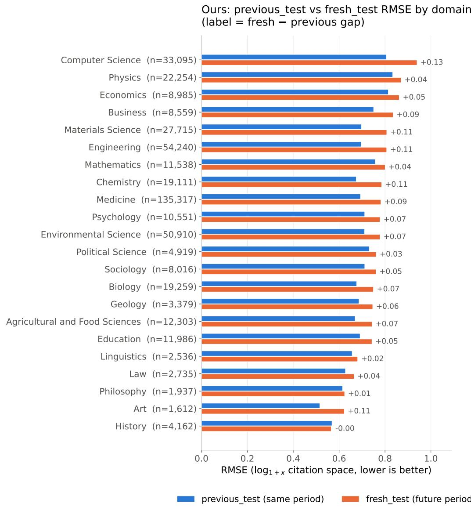  
Figure 7: RMSE of the full model on previous test (same time period as training) versus fresh test (held-out future time period), broken down by primary field of study. Domains are sorted by fresh test RMSE (easiest at bottom). The label at the end of each domain’s bars is the fresh−previous gap, i.e. how much harder extrapolating to a future time period is for that field.

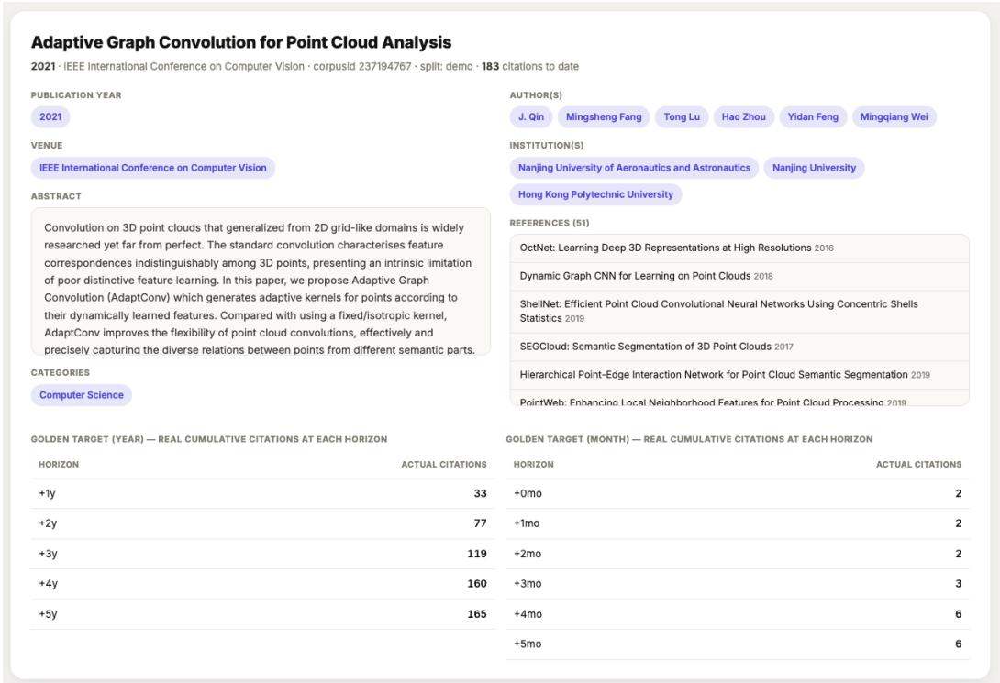  
Figure 8: Example benchmark instance and data format, including paper metadata, references, and ground-truth citation targets at year and month granularities.

Table 10: Main hyperparameters for the reported full-dataset results.
<table><tr><td>Category</td><td>Hyperparameter</td><td>Value</td></tr><tr><td rowspan="5">Architecture</td><td>Hidden dimension</td><td>256</td></tr><tr><td>Graph layers / attention heads</td><td>3/8</td></tr><tr><td>LLM backbone</td><td>Qwen3-0.6B / Qwen2.5-7B-Instruct‡</td></tr><tr><td>LoRA rank r / alpha α / dropout</td><td>64 / 32 / 0.05</td></tr><tr><td>Graph-prefix length</td><td>10 tokens</td></tr><tr><td rowspan="3">Loss weights</td><td>λaux (bucket classification)</td><td>0.5</td></tr><tr><td>λcl (contrastive)</td><td>0.5</td></tr><tr><td>λbranch (deep supervision)</td><td>0.2</td></tr><tr><td rowspan="6">Optimization</td><td>Optimizer</td><td>AdamW</td></tr><tr><td>Learning rate (constant)</td><td>2 × 10−5</td></tr><tr><td>Weight decay</td><td>0.01</td></tr><tr><td>Per-GPU / effective batch size</td><td>8 / 32 (0.6B), 4 / 16 (7B)</td></tr><tr><td>GPUs</td><td>4×A100-40GB</td></tr><tr><td>Training length</td><td>1 full epoch</td></tr><tr><td rowspan="4">Data</td><td>Train / val examples</td><td>800K / 300K</td></tr><tr><td>previous_test / fresh_test examples</td><td>400K / 500K</td></tr><tr><td>Prediction horizons T</td><td>5</td></tr><tr><td>Ego-tree hop depth</td><td>1</td></tr></table>

## G PROMPT

## The prompt of LLMs to predict future citation counts.

You are a scientometrics analyst. The tokens preceding this text encode structural context about the paper – its citation graph, retrieved related papers, and its own venue, institution, authors, and references. Using both that context and the paper’s own content below, predict its cumulative citation counts at several future time points after publication. Title: title Abstract: abstract

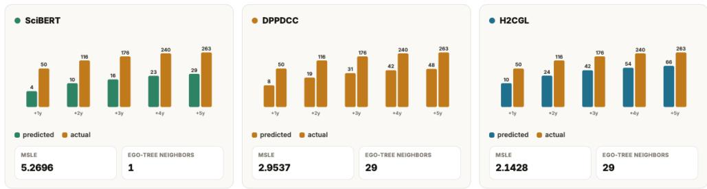

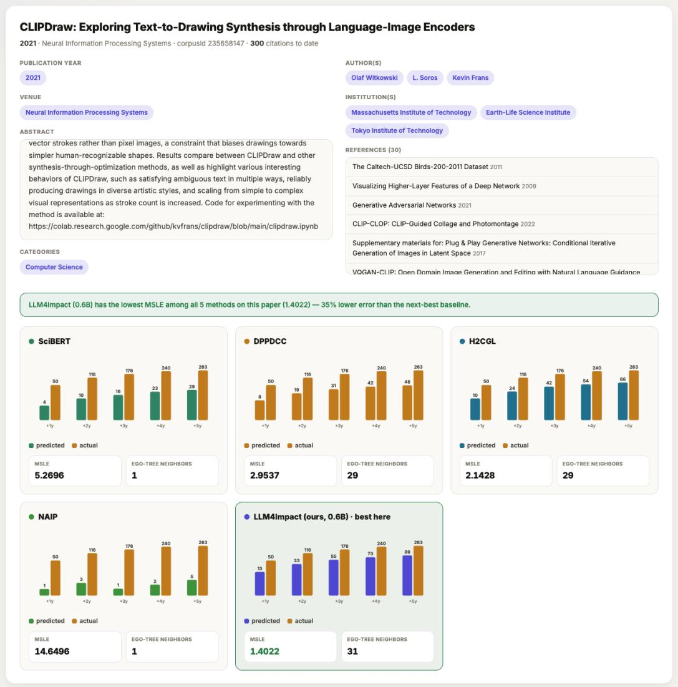

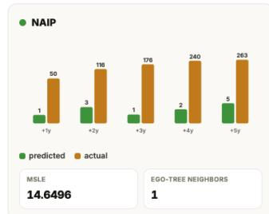

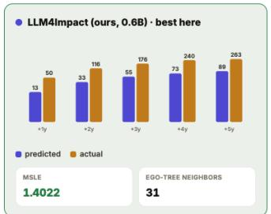  
Figure 9: Interactive case study comparing LLM4Impact with baseline models on a real paper, showing predicted and ground-truth citation trajectories.

Table 11: Comparison of RMSE for raw citation counts and TNCSI, together with their Spearman correlation, on the previous test set. $C _ { \mathrm { l o g } }$ denotes log-transformed citation counts and C denotes TNCSI-based impact scores.
<table><tr><td>Metric</td><td>Year_1</td><td>Year_2</td><td>Year_3</td><td>Year_4</td><td>Year_5</td><td>Avg</td></tr><tr><td colspan="7">Previous</td></tr><tr><td>C_log</td><td>0.6772</td><td>0.6932</td><td>0.7809</td><td>0.8022</td><td>0.9177</td><td>0.7719</td></tr><tr><td>C_TNCSI</td><td>0.2016</td><td>0.2211</td><td>0.2291</td><td>0.2327</td><td>0.2352</td><td>0.2239</td></tr><tr><td>Cor.</td><td>0.7900</td><td>0.8061</td><td>0.8062</td><td>0.8119</td><td>0.8135</td><td>0.8055</td></tr></table>

LLM4Impact (0.6B) has the lowest MSLE among all 5 methods on this paper (0.5067) — 34% lower error than the next-best baseline.

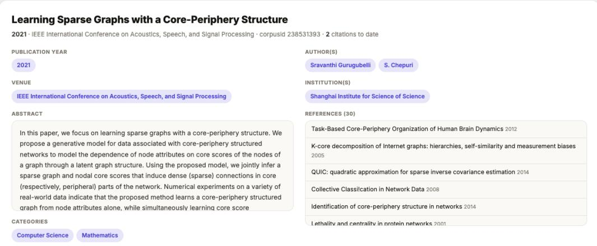

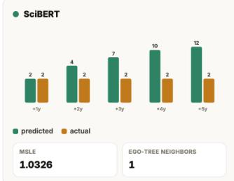

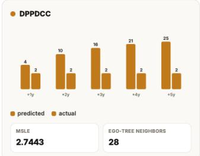

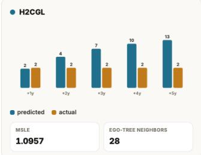

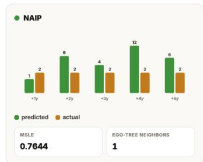

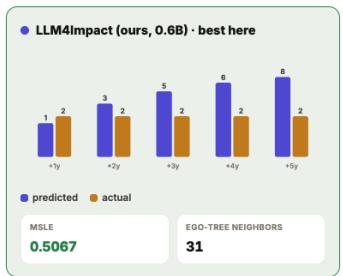  
Figure 10: Second interactive case study comparing LLM4Impact with baseline models on a real paper, showing predicted and ground-truth citation trajectories.

## Surface-Cue Ablation Study

<table><tr><td>PERTURBATION</td><td>DPPDCC</td><td>H2CGL</td><td>LLM4IMPACT (OURS, 0.6B)</td><td>LLM4IMPACT (OURS, 7B)</td></tr><tr><td>Add 2 top-cited authors</td><td>+0.9</td><td>-1.4</td><td>+1.2</td><td>+1.9</td></tr><tr><td>Push pub_year to latest</td><td>+1.7</td><td>-38.7</td><td>+0.5</td><td>-31.6</td></tr><tr><td>Venue → arXiv.org</td><td>-20.5</td><td>-89.0</td><td>-144.1</td><td>-89.0</td></tr><tr><td>Remove 2-3 impactful refs</td><td>-0.6</td><td>-0.4</td><td>-6.9</td><td>-3.1</td></tr></table>

Mean change in the vear-5 cumulative-citation prediction vs, each paper's own baseline, averaged over the 20 papers (CS-venue subsample, seed 42). Negative = perturbation makes the model

## Per-paper drilldown

Global optimality conditions for deep neural networks

BASELINE(REAL VALUES)

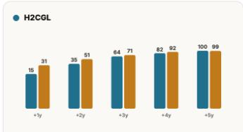

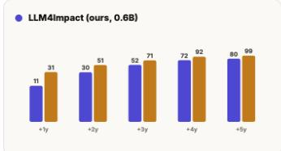  
LLM4lmpact (ours, 7B)

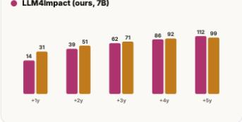  
ADD 2 TOP-CITED AUTHORS

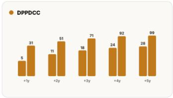

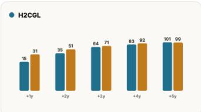

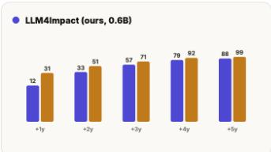

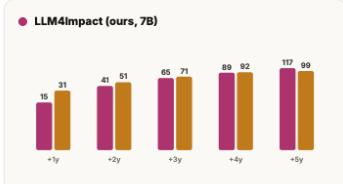  
Figure 11: Surface-cue perturbation study examining the effects of author, publication-year, venue, and reference changes.

## Content-Cue Ablation Study

Abstract-content perturbations, isolating what LLM4Impact's LLM branch reads off the text itself — only LLM4Impact (ours, 0.6B) and LLM4Impact (ours, 7B) are tested (the only two baselines with a dedicated, content-sensitive LLM branch), on a 20-paper CS pool

Final fused prediction (year-5 ∆ vs. baseline)
<table><tr><td>PERTURBATION</td><td>LLM4IMPACT (OURS, 0.6B)</td><td>LLM4IMPACT (OURS, 7B)</td></tr><tr><td>Shuffle sentences</td><td>+15.7</td><td>-1.3</td></tr><tr><td>Truncate to 1st sentence</td><td>-118.6</td><td>-48.3</td></tr><tr><td>Generic template</td><td>-105.6</td><td>-58.5</td></tr><tr><td>Topic swap (another paper&#x27;s abstract)</td><td>-94.3</td><td>-35.4</td></tr></table>

LLM branch isolated prediction (pre-fusion, year-5 ∆ vs. baseline)

<table><tr><td>PERTURBATION</td><td>LLM4IMPACT (OURS, 0.6B)</td><td>LLM4IMPACT (OURS, 7B)</td></tr><tr><td>Shuffle sentences</td><td>+8.7</td><td>-2.0</td></tr><tr><td>Truncate to 1st sentence</td><td>-92.1</td><td>-56.3</td></tr><tr><td>Generic template</td><td>-105.4</td><td>-59.0</td></tr><tr><td>Topic swap (another paper&#x27;s abstract)</td><td>-77.1</td><td>-36.1</td></tr></table>

Sentence shuffling preserves every word (destroys only narrative order); the other three destroy or replace the actual content. The isolated LLM-branch numbers track the final numbers closely

## Per-paper drilldown

<table><tr><td>OSTeC: One-Shot Texture Completion</td></tr></table>

BASELINE (REAL ABSTRACT)

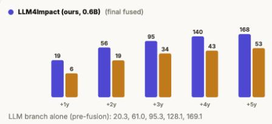

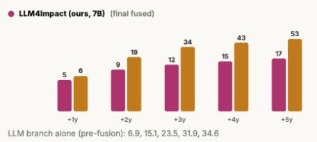  
SHUFFLE SENTENCES

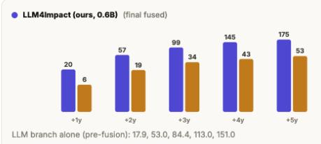

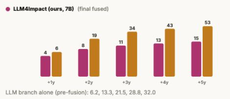  
Figure 12: Content-cue perturbation study illustrating the role of the LLM branch under controlled abstract perturbations.

## The prompt of LLMs to normalize noisy affiliations.

You are given a list of affiliation strings. Some are valid institutions, some are duplicated, and some are meaningless. Please normalize them as follows:

• If the string is a valid institution name but with formatting issues, fix it (e.g., remove extra punctuation, unify into “Institution Name”).

• If the string is a duplicate of another name, map it to the same corrected name.

• If the string is not an institution name (number, meaningless), map it to “unknown”.

• Return the result strictly as a JSON dictionary, where each original string is mapped to its corrected normalized name.

## Example Input:

[“University of California, Los Angeles”, “University of California, Los Angeles”, “01 Collaboration”]

## Example Output:

{   
” U n i v e r s i t y o f C a l i f o r n i a , Los A n g e l e s ” : ” U n i v e r s i t y o f   
C a l i f o r n i a ” ,   
” 0 1 C o l l a b o r a t i o n ” : ” unknown ”   
}

## Generation Output:

Please normalize the following affiliation list accordingly.

The prompt of LLMs to normalize noisy venues.   
You are given a list of venue strings. Some are valid venues, some are duplicated, and some are   
meaningless. Please normalize them as follows:   
• If the string is a valid venue name but with formatting issues, fix it (e.g., remove extra   
punctuation, use proper title case like “Venue Name”).   
• Remove any explicit year tokens (e.g., “2015”, “2014”).   
• Remove edition indicators such as ordinal numbers or words (e.g., “1st”, “2nd”, “Third”,   
“Fourth”).   
• If the venue contains a trailing parenthetical acronym/abbreviation like “(ICAC3N)”,   
“(HPEC)”, “(IVAPP)” that is all caps/digits/hyphen and ≤10 chars, drop that parentheti  
cal part. Keep descriptive tracks in parentheses (e.g., “(Emerging Technologies)”) as is.   
• If both a full spelled-out name and an acronym appear together, keep only the full spelled-out   
name and drop the acronym.   
• If the string is a duplicate of another (after normalization), map it to the same corrected name.   
• If the string is not a venue name (pure number or meaningless), map it to “unknown”.   
• Return the result strictly as a JSON dictionary, where each original string is mapped to its   
corrected normalized name. Do not include comments or extra text.   
Example Input:   
[“Journal of Machine Learning Research”, “2015 IEEE International Conference on Web Services”,   
“4th International Conference on X (ICACX)”, “01 Collaboration”]   
Example Output:   
{   
” J o u r n a l o f Machine L e a r n i n g R e s e a r c h ” : ” J o u r n a l o f Machine   
L e a r n i n g R e s e a r c h ”   
”2015 IEEE I n t e r n a t i o n a l C o n fe r e n c e on Web S e r v i c e s ” : ” IEEE   
I n t e r n a t i o n a l C o n fe r e n c e on Web S e r v i c e s ”   
”4 t h I n t e r n a t i o n a l C o n fe r e n c e on X ( ICACX ) ” : ” I n t e r n a t i o n a l   
C o n fe r e n c e on X”   
”01 C o l l a b o r a t i o n ” : ” unknown ”   
}   
Generation Output:   
Please normalize the following venue list accordingly.

## H LIMITATIONS AND FUTURE WORK

Our study focuses on a finite set of scientific domains, publication years, and prediction horizons, leaving broader settings for future investigation. In particular, longer-term citation dynamics and the continuous evolution of scholarly networks may provide additional signals beyond our current point-in-time representation. Future work will therefore explore broader domains, longer prediction horizons, and dynamic representations of evolving scientific knowledge.