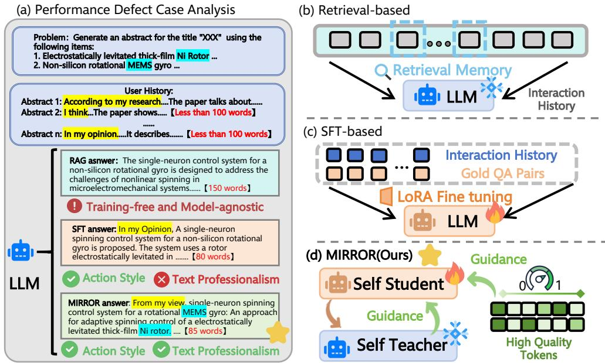
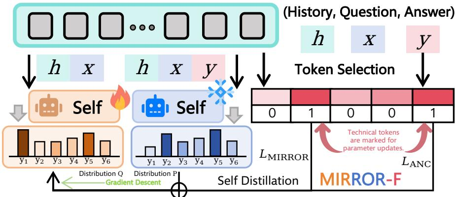
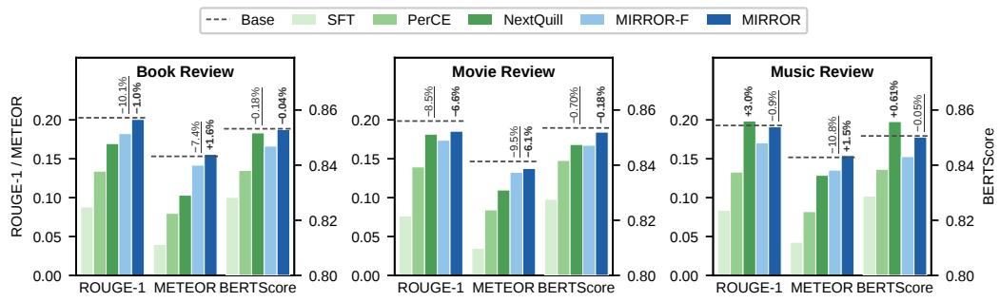
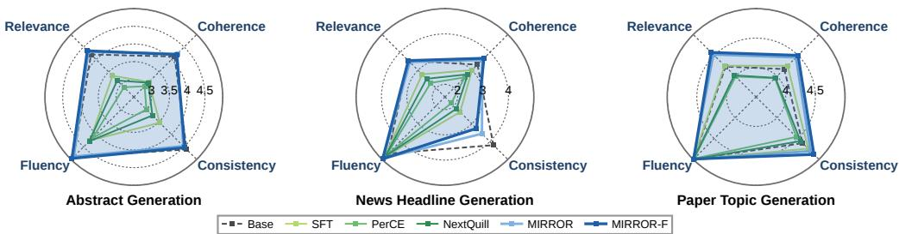
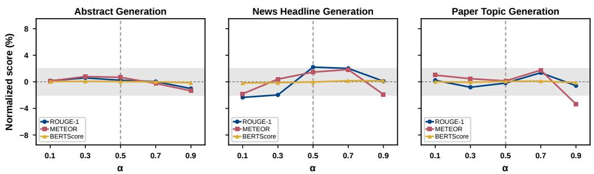
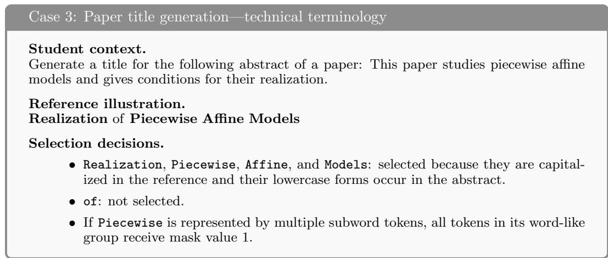

# MIRROR: From Imitation to Internalization in LLM Personalization

Huayi Lai<sup>1∗</sup>, Jicheng Yang<sup>1∗</sup>, Min Yi<sup>1</sup>, Chong Meng<sup>1†</sup>

<sup>1</sup>Baidu Inc.

{yangjicheng02,mengchong01}@baidu.com

## Abst<sub>r</sub>act

The demand for personalized LLMs is shifting from style imitation toward content quality. We investigate whether self-distillation can bridge this gap in existing fine-tuning paradigm. To address this limitation, we introduce MIRROR(Meta- personalization by Internalizing Reference-Revealed On-policy Reflections),a novel self-distillation framework that shifts LLM personalization from imitation toward preference internalization. First, we replace reference-token imitation with reference-revealed on-policy selfdistillation, aligning the model’s next-token distributions along its own generation trajectories with those of its reference-conditioned self, thereby internalizing user preferences rather than reproducing reference wording. Second, we introduce MIRROR-F, a focal plug-in that augments on-policy distributional alignment with selective supervision over informative reference tokens, thereby strengthening content generation while preserving user-specific expression. Across three personalized generation benchmarks, two model scales, and complementary reference-based and LLM-based evaluations, MIRROR and MIRROR-F achieve leading overall personalization performance and superior text quality, while exhibiting less catastrophic forgetting than SFT-based baselines on three unseen personalized generation tasks. The gains are consistent across model scales and application scenarios, translating to improved performance in LLM personalization tasks.

## 1 Introduction

Large Language Models (LLMs) have exhibited exceptional capabilities across a wide range of domains (Team et al., 2026; Yang et al., 2025), leading to their widespread deployment in real-world applications such as personalized ofice assistant (Lyu et al., 2026; Li et al., 2025) and Private medical diagnosis (Zeng et al., 2026). Although various methods enhance the personalization capabilities of general-purpose LLMs through sophisticated harness designs (Liu et al., 2026b) and skill injection (Yang et al., 2026), these approaches largely rely on external mechanisms. From the perspective of the model intelligence, the core challenge remains to strengthen its intrinsic ability to infer latent user states, capture implicit preferences, and perform preference-aware reasoning (Amirizaniani et al., 2026; Cao et al., 2026; Yan et al., 2026).

Mainstream approaches for LLM personalization can be broadly categorized into 3 categories: retrieval-based,fine-tuning-based and user-based methods. First, retrieval-based methods(as shown in Figure 1.b) incorporate relevant user histories into the input context to elicit preference-aware generation through in-context learning (Du et al., 2026; Zhang et al., 2025; Lee et al., 2026; Choi et al., 2026). However, their reliance on external contextual information leaves the model’s intrinsic preference-understanding capabilities largely unchanged and introduces potential privacy and security risks (Liang et al., 2025). Second, fine-tuning-based methods(as shown in Figure 1.c) employ parameter-eficient adaptation with preference-aware token- or sample-level supervision to learn user-specific linguistic patterns (Zhang et al., 2026a; Zhao et al., 2026b). While this method is efective at learning personalized styles and sentence structures, they significantly degrades the text professionalism, and can lead to catastrophic forgetting (Prashant et al., 2026) and poor out-of-distribution generalization (Karouzos et al., 2026; Liu et al., 2025). Third, user-based methods including user-specific LoRA adapter training (Tan et al., 2024; 2026; Hwang et al., 2026) ,attention head pruning (Zhang et al., 2026b) and steering-vector injection (Liu et al., 2026a). However, these methods typically require user-specific parameters or dedicated architectures, leading to prohibitive training and storage costs as the user base scales (Zhao et al., 2026b), which hinders the deployment of personalized LLMs in real world applications.

  
Figure 1: Overview of personalization paradigms. (a) A case study of the quality defects of existing methods. (b) Retrieval-based personalization. (c) SFT-based personalization. (d) MIRROR, which aligns a self-student with a self-teacher on the student’s own on-policy trajectories.

To date, as shown in Figure 1.a,existing personalization approaches have been predominantly constrained by a style imitation paradigm, where personalization is primarily modeled as the ability to reproduce a user’s linguistic style, expression patterns, and textual distributions. However, this formulation overlooks a fundamental requirement of personalized generation: the generated content must not only reflect a user’s expressive preferences but also maintain high standards of factual accuracy, completeness, and practical utility while satisfying the user’s underlying needs. Therefore, this paper investigates the following central question: How can we enhance the modeling of user-specific expressive styles while maintaining the quality and efectiveness of personalized text generation?

Recent advances in self-distillation (Zhao et al., 2026a; Shenfeld et al., 2026) introduce a paradigm beyond demonstration imitation. By leveraging hindsight information, models can internalize preference-relevant behavioral shifts through self-supervision along their own generation trajectories. In LLM personalizaton, user reference information can be viewed as a manifestation of the user’s preferences for stylistic sentence structures and their level of expertise, so we can identify user-provided references as a natural form of hindsight information for personalized generation.

Based on this insight, we propose MIRROR (Meta-personalization by Internalizing Reference-Revealed On-policy Reflections), a reference-revealed self-distillation framework that shifts personalization from imitation toward internalization. MIRROR (shown in Figure 1.d) employs a single model as both a self-teacher and a self-student, the teacher accesses the user-provided reference to provide preference-aware guidance, while the student aligns with this guidance along its own on-policy trajectories instead of fitting the reference sequence token by token. Building upon this training paradigm, we further introduce MIRROR-F, a focal personalization framework that selectively concentrates optimization on informative tokens responsible for content quality. This focal mechanism enhances the expertise, completeness, and practical utility of generated content while preserving userspecific expressive styles. Controlled by a continuous focality coeficient. Extensive experiments on three benchmarks demonstrate that MIRROR achieves strong performance across multiple personalized generation tasks and MIRROR-F further achieves the best overall performance under comprehensive personalized generation evaluations, demonstrating superior content expertise, completeness, and textual quality while preserving user-specific expressive preferences.

The main contribution of this work can be summarized as follows:

• We introduce a new perspective by formulating personalized generation as referencerevealed self-distillation, moving beyond surface-level imitation toward user preference internalization.

• We propose MIRROR, a self-distillation framework that transfers preference-induced behaviors via on-policy learning, achieving state-of-the-art performance across diverse personalized generation tasks.

• We further propose MIRROR-F, which selectively enhances informative content generation through focal supervision, improving expertise, completeness, and textual quality while preserving user-specific expressions.

• Extensive experiments demonstrate that MIRROR and MIRROR-F achieve superior personalization and generation quality across comprehensive personalized generation evaluations.

## 2 Preliminaries

Personalized text generation. We consider the task of personalized text generation, where the goal is to adapt a language model $\pi _ { \theta }$ so that its outputs match the preferences of an individual user. Each data sample is a triplet $( x , h , y ) \colon x$ is the query specifying the task and its content, h is the user’s historical text that implicitly reflects their preferences, and $y = ( y _ { 1 } , \dots , y _ { T } )$ is the reference response actually written by the user. The collection of such samples over all users forms the dataset $\mathcal { D } _ { \mathrm { : } }$ with $( x , h , y ) \in \mathcal { D }$ . A non-personalized model produces ${ \hat { y } } = \pi _ { \theta } ( x )$ , whereas a personalized model additionally conditions on the user history, $\hat { y } = \pi _ { \boldsymbol { \theta } } ( x , h )$ . Our goal is to improve $\pi _ { \theta }$ such that $\hat { y }$ both reflects the user’s expressive preferences and remains accurate and complete as a response to x.

Autoregressive factorization and contexts. We write $\pi _ { \theta } ( \cdot \ | \ c , y _ { < t } ) \in \Delta ^ { | \nu | }$ for the next-token distribution over the vocabulary $\nu$ at step $t ,$ given a context c and a prefix $y _ { < t } .$ Two contexts are used throughout this paper. The deployable context $c _ { \mathrm { S } } = ( h , x )$ contains only what is genuinely available at inference time, and the reference-revealed context $c _ { \mathrm { T } } =$ $( h , x , y )$ additionally exposes the user-written reference. Since the reference is unavailable at deployment, a model conditioned on $c _ { \mathrm { T } }$ can serve only as a source of supervision during training, never as a deployed policy. We use $\mathrm { s g } [ \cdot ]$ to denote the stop-gradient operator, so that $\pi _ { \theta } ( \cdot \mid c , y _ { < t } ) : = \operatorname { s g } [ \pi _ { \theta } ( \cdot \mid c , y _ { < t } ) ]$ denotes a detached copy of the current model evaluated on context c.

Supervised personalization objective. The standard way to personalize $\pi _ { \theta }$ is to finetune it on the reference response under teacher forcing, minimizing the token-level negative log-likelihood

$$
\mathcal { L } _ { \mathrm { S F T } } ( \theta ) = - \frac { 1 } { T } \sum _ { t = 1 } ^ { T } \omega _ { t } \log \pi _ { \theta } ( y _ { t } \mid c _ { \mathrm { S } } , y _ { < t } ) ,\tag{1}
$$

where $\omega _ { t }$ is a token-level weight. Setting $\omega _ { t } = 1$ for all t recovers plain supervised fine-tuning, while recent personalization methods instantiate $\omega _ { t }$ with estimates of how strongly token $y _ { t }$ reflects the user’s preferences. Two properties of Equation 1 are central to this paper: the supervision target is the reference token $y _ { t }$ itself, and it is evaluated on the reference prefix $y _ { < t }$ rather than on a prefix the model would actually produce.

  
Figure 2: Overview of MIRROR-F. A frozen reference-conditioned teacher $( h , x , y )$ supervises the trainable student $( h , x )$ on the student’s own rollouts via $\mathcal { L } _ { \mathrm { M I R R O R } } .$ , while $\mathcal { L } _ { \mathrm { A N C } }$ anchors only the selected informative tokens of the reference $y .$

On-policy rollouts. Given a deployable context $c _ { \mathrm { S } } .$ , we write $\hat { y } \sim \pi _ { \theta } ( \cdot \vert c _ { \mathrm { S } } )$ for a response sampled from the current model, and refer to the resulting prefixes $\hat { y } _ { < t }$ as on-policy states. These are the states the model visits at inference time, and they generally difer from the reference prefixes $y _ { < t }$ used in Equation 1.

Divergences between next-token distributions. Let $P$ and $Q$ be two distributions over V. We use the generalized Jensen–Shannon divergence with mixing coeficient $\beta \in [ 0 , 1 ]$ ，

$$
\operatorname { J S D } _ { \beta } ( P \parallel Q ) = \beta D _ { \mathrm { K L } } ( P \parallel M ) + ( 1 - \beta ) D _ { \mathrm { K L } } ( Q \parallel M ) , \qquad M = \beta P + ( 1 - \beta ) Q ,\tag{2}
$$

which measures the discrepancy between P and $Q$ through their mixture distribution $M .$ The coeficient $\beta$ controls the relative contribution of the two KL-to-mixture terms, rather than recovering the forward or reverse KL divergence at the endpoints. In particular, $\beta = 0 . 5$ yields the standard symmetric Jensen–Shannon divergence and treats the two distributions equally. The divergence is finite and bounded for all $P , Q$ when $\beta \in [ 0 , 1 ] ;$ ; under natural logarithms, its upper bound is the binary entropy $h ( \beta )$ and is at most log 2. Throughout our experiments, we fix $\beta = 0 . 5$ to avoid introducing an additional asymmetry between the reference-revealed teacher and the deployable student. We do not claim that $\beta = 0 . 5$ is optimal; rather, it is adopted as a neutral symmetric setting. A systematic study of alternative mixing coeficients is beyond the scope of this work.

## 3 Methodology

We present MIRROR, which supervises a model with its own reference-conditioned predictions over states it visits itself (Section 3.1), and MIRROR-F, which adds a sparse anchoring term whose strength is exposed as a single coeficient (Section 3.2).

## 3.1 MIRROR: Internalizing Reference-Revealed Reflections

Self-teacher and self-student. Rather than treating the reference response y as a string to be reproduced, we treat it as hindsight information: conditioning on y makes it substantially easier to judge which continuations suit this user. We therefore evaluate the same model under two contexts, the reference-revealed $c _ { \mathrm { T } } = ( h , x , y )$ and the deployable $c _ { \mathrm { S } } = ( h , x )$ , on a shared prefix $\hat { y } _ { < t } \mathrm { : }$

$$
p _ { t } ^ { \mathrm { T } } = \bar { \pi } _ { \boldsymbol { \theta } } ( \cdot \mid c _ { \mathrm { T } } , \hat { y } _ { < t } ) , \qquad p _ { t } ^ { \mathrm { S } } = \pi _ { \boldsymbol { \theta } } ( \cdot \mid c _ { \mathrm { S } } , \hat { y } _ { < t } ) ,\tag{3}
$$

where ${ \bar { \pi } } _ { \boldsymbol { \theta } } = \operatorname { s g } [ \pi _ { \boldsymbol { \theta } } ]$ is the detached model. Since both distributions come from the same parameters and the same prefix, their diference isolates the behavioral shift induced by the reference alone; matching them transfers that shift, rather than the wording of $y ,$ into the model, without an external teacher or reward model.

On-policy alignment. At each optimization step, a response prefix is sampled from the current student under stop-gradient sampling, $\hat { y } \sim \mathrm { s g } [ \pi _ { \theta } ( \cdot \mid c _ { \mathrm { S } } ) ]$ ], and the student is supervised on the states visited by this rollout. MIRROR optimizes the following stoppedgradient surrogate objective:

$$
\widetilde { \mathcal { L } } _ { \mathrm { M I R R O R } } ( \theta ) = \mathbb { E } _ { ( x , h , y ) \sim \mathcal { D } } \mathbb { E } _ { \hat { y } \sim \mathrm { s g } [ \pi _ { \theta } ( \cdot | c _ { \mathrm { S } } ) ] } \left[ \frac { 1 } { | \hat { y } | } \sum _ { t = 1 } ^ { | \hat { y } | } \mathrm { J S D } _ { \beta } \big ( p _ { t } ^ { \mathrm { T } } \big \| p _ { t } ^ { \mathrm { S } } \big ) \right] ,\tag{4}
$$

with $\beta = 0 . 5$ . The sampled prefixes and the teacher distribution are detached during backpropagation, so gradients are propagated only through the student distribution evaluated on the fixed on-policy states. We use a mixed divergence because personalization admits multiple valid realizations for each query: the symmetric objective transfers preference-relevant probability mass from the reference-revealed teacher while retaining support for alternative valid continuations.

Why supervision must be on-policy. Equation 4 departs from the supervised objective of Equation 1 in two respects that jointly determine what the model learns. Its target is a distribution rather than a single reference token, so the model is taught how probability mass should be redistributed instead of which word to emit; and it is evaluated on prefixes the model itself produces, so training and inference operate over the same states. Reweighting ω in Equation 1 alters only which reference tokens are emphasized and leaves both properties intact. What MIRROR acquires is therefore a preference-reasoning behavior that transfers to queries for which no reference exists—the only regime that matters at deployment. Check Appendix A.7 for more details.

## 3.2 MIRROR-F: Focal MIRROR with Selective Grounded Anchoring

Selective grounded anchoring. Distributional alignment governs generation as a whole, whereas professional usability often depends on a small set of content-bearing tokens, such as technical terms, named entities, and quantities. MIRROR-F therefore applies an auxiliary anchoring loss only to selected reference positions. A reference word is selected when it is informative according to the deterministic rules in Appendix A.4 and grounded, meaning that its normalized form occurs as a complete word in the student context $c _ { \mathrm { S } }$ . Selection is performed at the word level and expanded to all subword units of the selected word. Let $\mathcal { T } _ { \mathrm { s e l } }$ denote the resulting reference-token indices. The anchoring loss is

$$
\mathcal { L } _ { \mathrm { a n c } } ( \theta ) = \left\{ \begin{array} { l l } { - \displaystyle \frac { 1 } { | \mathcal { T } _ { \mathrm { s e l } } | } \sum _ { t \in \mathcal { T } _ { \mathrm { s e l } } } \log \pi _ { \theta } ( y _ { t } \mid c _ { \mathrm { S } } , y _ { < t } ) , } & { | \mathcal { T } _ { \mathrm { s e l } } | > 0 , } \\ { 0 , } & { | \mathcal { T } _ { \mathrm { s e l } } | = 0 , } \end{array} \right.\tag{5}
$$

where $y _ { t }$ is the t-th reference token. Normalization by $| \mathcal { T } _ { \mathrm { s e l } } |$ prevents terminology-rich references from dominating the gradient, while the empty-set convention ensures that the objective reduces to MIRROR when no token is selected. Complete selection criteria are provided in Appendix A.4.

Focality coeficient. As shown in Figure 2, because the two terms difer in scale and evolve at diferent rates, we divide each by a running average of its own magnitude, $\tilde { \mathcal { L } } _ { k } =$ $\mathcal { L } _ { k } / ( m _ { k } + \epsilon )$ with $m _ { k } \gets \gamma m _ { k } + ( 1 - \gamma ) \mathrm { s g } [ \mathcal { L } _ { k } ]$ for $k \in \{ \mathrm { M I R R O R } , \mathrm { a n c } \}$ , and combine them through one coeficient $\alpha \in [ 0 , 1 ]$

$$
{ \mathcal { L } } _ { \mathrm { M I R R O R - F } } ( \theta ) = \left( 1 - \alpha \right) { \tilde { \mathcal { L } } } _ { \mathrm { M I R R O R } } ( \theta ) + \alpha { \tilde { \mathcal { L } } } _ { \mathrm { a n c } } ( \theta ) .\tag{6}
$$

Equation 6 reduces exactly to MIRROR at $\alpha = 0 .$ , and by construction for any sample whose selected set is empty, so the objective is well defined for all α and all samples. Since personalized style is carried by the distributional term over the whole trajectory, α does not trade style against content: it sets how sharply supervision is focused on content-bearing positions on top of an already internalized behavior. Increasing α thus selects an operating point along the specialization axis, and moving along it requires no change to the objective, the data, or the pipeline.

## 4 Experiments

## 4.1 Experimental Settings

Datasets. Experiments are conducted on three personalized generation tasks drawn from two widely used benchmarks for LLM personalization, LaMP (Salemi et al., 2024) and LongLaMP (Kumar et al., 2024). Specifically, Abstract Generation is taken from LongLaMP, while News Headline Generation (LaMP-4) and Paper Topic Generation (LaMP-5) are taken from LaMP. To ensure that training and evaluation operate over an identical context distribution, we performed context cropping and dataset filtering based on methods from existing papers (Zhang et al., 2026a; Zhao et al., 2026b). For evaluating outof-distribution (OOD) performance, we further use three benchmarks in Amazon Reviews Dataset (Ni et al., 2019), and Music Review, which are not included during training and are reserved exclusively for assessing cross-task transfer and catastrophic forgetting.

Baselines. Our methods are compared against three categories of baselines. (1) Base Model (Yang et al., 2025): the backbone LLM is prompted without any personalization and Thinking mode is disabled by default(check Appendix A.9 for thinking performance ablation). (2) Retrieval-based Methods: RAG (Lei et al., 2023), in which relevant user history is injected into the prompt without updating the model, LatestK (Liu et al., 2025) selects the most recent K entries by timestamp, and LLM TRSR (Zheng et al., 2024) compresses the history into a structured summary via recurrent summarization. (3) PEFTbased methods, in which the model is fine-tuned on user-specific data: SFT (Hu et al., 2021) is trained on history-augmented inputs, OPPU (Tan et al., 2024) learns a dedicated adapter per user, and PerCE (Zhang et al., 2026a) and NextQuill (Zhao et al., 2026b) additionally reweight the supervision according to token-level preference signals. PerCE and NextQuill are the two most recent state-of-the-art training-based methods and are therefore adopted as the primary points of comparison.

Evaluation Metrics. Personalization performance is evaluated from two complementary perspectives. First,for textual similarity against the gold reference, three reference-based metrics are reported: ROUGE-1 (Lin, 2004), METEOR (Banerjee & Lavie, 2005), and BERTScore (Zhang et al., 2019), where BERTScore is computed with the roberta-large model. Second, for comprehensive personalization evaluation, we further adopt an LLM-asjudge protocol to assess aspects beyond surface overlap. Textual quality and professionalism are evaluated using two established frameworks: the reference-free G-Eval protocol (Liu et al., 2023) combined with the SummEval dimensions (Fabbri et al., 2021), under which each response is rated on Coherence, Consistency, Fluency, and Relevance; and the referencebased ExPerT framework (Salemi et al., 2025), which decomposes both the reference and the candidate into atomic content and style aspects and reports content- and style-level agreement. The judge model used in all LLM-as-judge evaluations is Qwen3-30B-A3B. For each reference-based evaluation and LLM-as-judge evaluation, we conduct three independent training runs with diferent random seeds and evaluate each result under the same protocol. We report the arithmetic mean across the three runs. The judge decoding temperature is fixed to 0 throughout to ensure reproducible and deterministic scoring for each model output.

Implementation Details We use Qwen3-1.7B and Qwen3-4B as the backbone LLMs for training and evaluating all methods. For most model training procedures, we employ low-rank adaptation (LoRA) (Hu et al., 2021). During evaluation, vLLM (Kwon et al., 2023) is used to accelerate inference. Since diferent methods use diferent trained models, we select the best-performing configuration for training and evaluation. For the MIRRORbased methods, each Qwen3-1.7B model is trained for 200 steps, while each Qwen3-4B model is trained for 250 steps. For the main comparison between MIRROR and MIRROR-F, we set the focality coeficient α to 0.5 to ensure a consistent comparison. In the ablation study, we further evaluate $\alpha \in \{ 0 . 1 , 0 . 3 , 0 . 5 , 0 . 7 , 0 . 9 \}$ to investigate how the focal supervision in MIRROR-F afects personalized styles and syntactic patterns.

Table 1: Main results of MIRROR and MIRROR-F on three personalized generation bench marks Bold numbers denote the best performance, while underlined numbers denote the second best.
<table><tr><td rowspan="2">Datasets</td><td>Methods (→)</td><td>Base</td><td colspan="3">Retrieval-based Methods</td><td colspan="4">PEFT-based Methods</td><td colspan="2">Ours</td></tr><tr><td>Metrics (↓)</td><td>Qwen3</td><td></td><td>RAG LatestK LLM-TRSR</td><td></td><td>SFT</td><td></td><td></td><td>OPPU PerCE NextQuill</td><td>MIRROR MIRROR-F</td><td></td></tr><tr><td colspan="10">Qwen3-1.7B</td></tr><tr><td rowspan="4">Abstract Generation</td><td>ROUGE-1</td><td>0.3717</td><td>0.3811</td><td>0.3685</td><td>0.3758</td><td>0.3755</td><td>0.3082</td><td>0.3670</td><td>0.3698</td><td>0.3967</td><td>0.4015</td></tr><tr><td>METEOR</td><td>0.2125</td><td>0.2262</td><td>0.2145</td><td>0.2311</td><td>0.2365</td><td>0.2073</td><td>0.2240</td><td>0.2437</td><td>0.2506</td><td>0.2529</td></tr><tr><td>BERTScore</td><td>0.8577</td><td>0.8675</td><td>0.8657</td><td>0.8656</td><td>0.8668</td><td>0.8443</td><td>0.8621</td><td>0.8694</td><td>0.8587</td><td>0.8701</td></tr><tr><td>ROUGE-1</td><td>0.1422</td><td>0.1495</td><td>0.1402</td><td>0.1387</td><td>0.1468</td><td>0.1559</td><td>0.1527</td><td>0.1594</td><td>0.1674</td><td>0.1763</td></tr><tr><td rowspan="4">News Headline Generation</td><td>METEOR</td><td>0.0976</td><td>0.1042</td><td>0.0956</td><td>0.0957</td><td>0.0922</td><td>0.1038</td><td>0.0976</td><td>0.1005</td><td>0.1020</td><td>0.1156</td></tr><tr><td>BERTScore</td><td>0.8465</td><td>0.8497</td><td>0.8475</td><td>0.8461</td><td>0.8544</td><td>0.8564</td><td>0.8559</td><td>0.8558</td><td>0.8521</td><td>0.8925</td></tr><tr><td>ROUGE-1</td><td>0.3842</td><td>0.4052</td><td>0.3659</td><td>0.3888</td><td>0.4104</td><td>0.4073</td><td>0.4003</td><td>0.4095</td><td>0.4133</td><td>0.4368</td></tr><tr><td>METEOR BERTScore</td><td>0.3247 0.8845</td><td>0.3516 0.8887</td><td>0.3143</td><td>0.3466</td><td>0.3383</td><td>0.3372</td><td>0.3309 0.8912</td><td>0.3350 0.8917</td><td>0.3554 0.8894</td><td>0.3721 0.8922</td></tr><tr><td colspan="10">0.8841 0.8859 0.8923 0.8917</td></tr><tr><td></td><td></td><td></td><td></td><td></td><td>Qwen3-4B</td><td></td><td></td><td></td><td></td><td></td><td></td></tr><tr><td colspan="10">Abstract</td></tr><tr><td></td><td>ROUGE-1</td><td>0.3949</td><td>0.3984</td><td>0.3884</td><td>0.3869</td><td>0.4061</td><td>0.3697</td><td>0.3694</td><td>0.3844</td><td>0.4027</td><td>0.4195</td></tr><tr><td>Generation</td><td>METEOR BERTScore</td><td>0.2575 0.8689</td><td>0.2597 0.8698</td><td>0.2496 0.8680</td><td>0.2500 0.8669</td><td>0.2475 0.8717</td><td>0.2225 0.8635</td><td>0.2301 0.8565</td><td>0.2391 0.8663</td><td>0.2659 0.8730</td><td>0.2662 0.8695</td></tr><tr><td colspan="10"></td></tr><tr><td>News Headline</td><td>ROUGE-1</td><td>0.1578</td><td>0.1517</td><td>0.1462</td><td>0.1454</td><td>0.1560</td><td>0.1593</td><td>0.1693</td><td>0.1593</td><td>0.1691</td><td>0.1747</td></tr><tr><td>Generation</td><td>METEOR</td><td>0.1105</td><td>0.1069</td><td>0.1014</td><td>0.1019</td><td>0.1031</td><td>0.1022</td><td>0.1130</td><td>0.1051</td><td>0.1142</td><td>0.1209</td></tr><tr><td></td><td>BERTScore</td><td>0.8544</td><td>0.8537</td><td>0.8519</td><td>0.8502</td><td>0.8561</td><td>0.8561</td><td>0.8598</td><td>0.8565</td><td>0.8567</td><td>0.8579</td></tr><tr><td colspan="10">Paper Topic</td></tr><tr><td></td><td>ROUGE-1</td><td>0.4118</td><td>0.4282</td><td>0.4211</td><td>0.4224</td><td>0.4165</td><td>0.3975</td><td>0.4257</td><td>0.4515</td><td>0.4376</td><td>0.4486</td></tr><tr><td>Generation</td><td>METEOR</td><td>0.3954</td><td>0.3945</td><td>0.3824</td><td>0.3937</td><td>0.3452</td><td>0.3233</td><td>0.3548</td><td>0.3478</td><td>0.3869</td><td>0.3949</td></tr><tr><td></td><td>BERTScore</td><td>0.8917</td><td>0.8946</td><td>0.8903</td><td>0.8893</td><td>0.8032</td><td>0.8904</td><td>0.8942</td><td>0.8927</td><td>0.8917</td><td>0.8949</td></tr></table>

## 4.2 Experiment Results

Reference-based Evaluation MIRROR and MIRROR-F achieve consistently strong performance on reference-based evaluation metrics, demonstrating that our method possesses superior capabilities for learning personalized styles and sentence structures. As shown in Table 1, the two methods outperform or remain highly competitive with retrievalbased and PEFT-based baselines across all three personalized generation tasks, two model backbones, and the ROUGE-1, METEOR, and BERTScore metrics. The advantage is particularly consistent on ROUGE-1 and METEOR, where MIRROR-F achieves the best results in most settings, including all three tasks with the Qwen3-1.7B backbone, while MIRROR also frequently ranks first or second. The two methods further maintain strong BERTScore performance, indicating that their gains are not limited to lexical overlap but also extend to semantic similarity. These results show that the proposed on-policy internalization paradigm provides a more reliable approach to reference-aligned personalization than conventional retrieval augmentation and token-level preference reweighting.

LLM-based Evaluation MIRROR and MIRROR-F achieve leading performance under the LLM-based evaluation framework, showing that their advantages extend beyond reference-based similarity to broader aspects of personalized generation quality. Personalized generation is inherently underdetermined, as multiple responses can satisfy the same user preferences and task requirements. Therefore, metrics based on similarity to a single reference may fail to recognize valid alternatives and may not fully reflect content quality or stylistic alignment. As shown in Table 2, MIRROR-F achieves the highest Contentand-Style (C&S) score comparing to three trained methods across all three tasks, while MIRROR also consistently outperforms or remains competitive with SFT, PerCE, and NextQuill. MIRROR-F further obtains most of the best C&S scores among the trained methods on 3 benchmarks, indicating that its improvements are stable across tasks and model scales. The consistent gains in both content and style suggest that the proposed methods internalize preference-relevant information while preserving the content adequacy and stylistic characteristics required for high-quality personalized generation.

  
Figure 3: Catastrophic forgetting on held-out OOD personalized generation tasks from the Amazon Review dataset. Performance degradation is measured relative to the corresponding base model under the same evaluation protocol; smaller values indicate better retention. Bold numbers denote the smallest degradation, while underlined numbers denote the second-smallest.

Table 2: ExPert evaluation of personalized generation quality on three benchmarks. The judge model scores each generated response for Content, Style, and their combination C&S (Content & Style); higher is better. Bold numbers denote the best performance among trained methods, while underlined numbers denote the second best among trained methods.
<table><tr><td>Datasets (→)</td><td colspan="3">Abstract Generation</td><td colspan="3">News Headline Generation</td><td colspan="3">Paper Topic Generation</td></tr><tr><td>Methods (↓)</td><td>Content</td><td>Style</td><td>C&amp;S</td><td>Content</td><td>Style</td><td>C&amp;S</td><td>Content</td><td>Style</td><td>C&amp;S</td></tr><tr><td colspan="10">Qwen3-1.7B</td></tr><tr><td>Base</td><td>0.669</td><td>8.360</td><td>7.523</td><td>0.077</td><td>4.520</td><td>2.644</td><td>0.353</td><td>8.000</td><td>5.766</td></tr><tr><td>SFT</td><td>0.563</td><td>7.990</td><td>6.808</td><td>0.080</td><td>4.730</td><td>2.765</td><td>0.417</td><td>8.360</td><td>6.267</td></tr><tr><td>PerCE</td><td>0.492</td><td>7.810</td><td>6.365</td><td>0.068</td><td>4.810</td><td>2.745</td><td>0.413</td><td>8.100</td><td>6.116</td></tr><tr><td>NextQuill</td><td>0.542</td><td>8.000</td><td>6.708</td><td>0.078</td><td>4.670</td><td>2.725</td><td>0.392</td><td>8.140</td><td>6.028</td></tr><tr><td>MIRROR (Ours)</td><td>0.671</td><td>8.330</td><td>7.522</td><td>0.045</td><td>4.690</td><td>2.570</td><td>0.458</td><td>8.290</td><td>6.436</td></tr><tr><td>MIRROR-È (Ours)</td><td>0.685</td><td>8.390</td><td>7.620</td><td>0.095</td><td>4.890</td><td>2.920</td><td>0.483</td><td>8.440</td><td>6.633</td></tr><tr><td colspan="10">Qwen3-4B</td></tr><tr><td>Base</td><td>0.695</td><td>8.500</td><td>7.724</td><td>0.114</td><td>5.410</td><td>3.273</td><td>0.470</td><td>8.440</td><td>6.571</td></tr><tr><td>SFT</td><td>0.600</td><td>8.080</td><td>7.042</td><td>0.078</td><td>4.970</td><td>2.876</td><td>0.438</td><td>8.310</td><td>6.345</td></tr><tr><td>PerCE</td><td>0.536</td><td>7.960</td><td>6.661</td><td>0.091</td><td>4.890</td><td>2.898</td><td>0.397</td><td>8.190</td><td>6.078</td></tr><tr><td>NextQuill</td><td>0.563</td><td>8.090</td><td>6.859</td><td>0.086</td><td>4.930</td><td>2.896</td><td>0.385</td><td>8.100</td><td>5.972</td></tr><tr><td>MIRROR (Ours)</td><td>0.704</td><td>8.460</td><td>7.750</td><td>0.094</td><td>5.100</td><td>3.020</td><td>0.440</td><td>8.340</td><td>6.372</td></tr><tr><td>MIRROR-È (Ours)</td><td>0.714</td><td>8.520</td><td>7.832</td><td>0.098</td><td>5.270</td><td>3.125</td><td>0.480</td><td>8.350</td><td>6.573</td></tr></table>

OOD Performance MIRROR and MIRROR-F exhibit the strongest resistance to catastrophic forgetting on OOD personalized generation tasks, demonstrating superior generalization and scalability compared with existing SFT-based methods. As shown in Figure 3, conventional SFT methods, including PerCE and NextQuill, experience substantial performance degradation on unseen tasks relative to their in-distribution performance, indicating that their strong reliance on reference-specific token-level supervision can lead to over-specialization and impaired transferability. In contrast, MIRROR and MIRROR-F preserve performance much more efectively on the OOD test set and achieve the smallest degradation across the evaluated similarity metrics.

MIRROR and MIRROR-F consistently outperform existing SFT-based methods across all four dimensions of the third-party text quality evaluation framework. As shown in Figure 4, both methods achieve higher scores on Relevance, Coherence, Consistency, and Fluency than SFT, PerCE, and NextQuill, demonstrating that their improvements extend beyond reference-based similarity to the intrinsic quality of generated responses. MIRROR-F generally obtains the strongest performance, benefiting from its focal supervision of informative and context-grounded content tokens.

## Content Quality Performance

Ablation Study The personalization performance of MIRROR-F remains stable across diferent values of the focality coeficient α. As shown in Figure 5, varying α from 0.1 to 0.9 does not lead to a substantial degradation in the evaluated personalization metrics, indicating that the model consistently preserves its ability to generate user-specific styles and sentence structures. This stability suggests that the focal supervision mainly adjusts the emphasis on informative and grounded content tokens without disrupting the underlying preference-relevant behavior learned by MIRROR.

  
Figure 4: Comparison of model performance scores based on the G-eval framework.

## 5 Related Work

LLM Personalization. LLM personalization has been extensively studied across text generation (Lai et al., 2026; Wang et al., 2024), conversational systems (Wang et al., 2025; Li et al., 2024), and multimodal applications (Shen et al., 2024). Recent benchmarks, including LaMP (Salemi et al., 2024) and LongLaMP (Kumar et al., 2024), have provided standardized frameworks for evaluating personalized text generation. Existing methods for LLM personalization can be broadly categorized into three groups: retrieval-based, finetuning-based, and user-centric approaches. Retrieval-based methods incorporate user histories into the context through retrieval or augmentation strategies (Lei et al., 2023; Du et al., 2026; Zhang et al., 2025; Liu et al., 2026b; Yang et al., 2026; Li et al., 2025; Chen et al., 2025), enabling training-free adaptation but relying on external user information without enhancing the model’s internal preference understanding. PEFT -based methods adapt model parameters using user-specific data, with recent approaches introducing preference-aware supervision reweighting (Zhang et al., 2026a; Zhao et al., 2026b). Although efective under reference-based similarity metrics, they mainly optimize toward reproducing user-specific expressions and sufer from over-adaptation. User-centric methods explicitly model users through dedicated adapters(Tan et al., 2024; Hwang et al., 2026), embeddings, or internal interventions (Liu et al., 2025; Zhang et al., 2026b; Wang et al., 2026), but their scalability is limited because of high costs. Existing methods prioritize reference imitation or external preference conditioning, often under-optimizing the intrinsic quality of generated content. In contrast MIRROR introduces a reference-revealed self-distillation training paradigm for personalized generation, while MIRROR-F further focuses optimization on informative content, enhancing the professionalism and overall textual quality of personalized generation.

LLM Self-Distillation. A recent line of work removes the need for an external, stronger teacher by letting a model conditioned on hindsight information supervise its own weaker self: the teacher sees privileged signals—environment feedback, demonstrations, or verified reasoning traces—while the student sees only the query, and training matches their pertoken distributions over the student’s own rollouts (H¨ubotter et al., 2026; Hwang et al., 2026; Shenfeld et al., 2026). Follow-up work extends this paradigm to new settings and objectives, including long-trace compaction (Kim & Lee, 2026), cross-lingual and long-context reasoning, privacy-constrained training (Zhang et al., 2026c), UI generation (Dong, 2026)and policy-gradient reformulations (Liu et al., 2026c). MIRROR apply on-policy self-distillation to LLM personalization. We further propose a focal plug-in(MIRROR-F) mechanism for personalized generation, which improves the professionalism and textual quality of generated content without compromising personalization performance.

  
Figure 5: The impact of fluctuations in the value of α on the performance of the model’s stylistic and syntactic personalization assessment.

## 6 Conclusion

We introduced MIRROR, an on-policy self-distillation framework that shifts LLM personalization from reference imitation toward preference internalization. We further proposed MIRROR-F, which selectively enhances informative content while preserving user-specific expression. Across multiple tasks, model scales, and evaluation protocols, both methods achieve strong personalization, improved text quality, and less catastrophic forgetting than existing SFT-based approaches, demonstrating the efectiveness of on-policy preference internalization for robust and transferable personalized generation.

## Reproducibility statement

We provide detailed implementation and experimental settings, hyperparameters, training configurations in appendix A.2.

## AI use statement

Generative AI tools were used to assist with code debugging, LaTeX formatting, writing and polishing portions of the manuscript, and literature search for identifying potentially relevant prior work. All AI-assisted outputs, including text, code suggestions, and literature recommendations, were reviewed and verified by the authors before being incorporated into the final work. Generative AI tools were not used to formulate the main research hypotheses, design the proposed methodology or experiments, derive mathematical claims or proofs, generate synthetic data, or interpret the reported experimental results. The authors take full responsibility for the accuracy, validity, and final content of the paper.

## References

Maryam Amirizaniani, Benjamin Charles Germain Lee, Jevin West, and Nicholas Weber. Training llms with reinforcement learning for intent-aware personalized question answering. arXiv preprint arXiv:2605.12645, 2026.

Satanjeev Banerjee and Alon Lavie. Meteor: An automatic metric for mt evaluation with improved correlation with human judgments. In Proceedings of the acl workshop on intrinsic and extrinsic evaluation measures for machine translation and/or summarization, pp. 65–72, 2005.

Heng Cao, Fan Zhang, Jian Yao, Yujie Zheng, Changlin Zhao, Lu Hao, Yuxuan Wei, Wangze Ni, Huaiyu Fu, Yuqian Sun, et al. Beyond retrieval: Learning compact user representations for scalable llm personalization. arXiv preprint arXiv:2606.04547, 2026.

Yizhuo Chen, Xin Liu, Ruijie Wang, Zheng Li, Pei Chen, Changlong Yu, Qingyu Yin, Priyanka Nigam, Meng Jiang, and Bing Yin. Popi: Personalizing llms via optimized natural language preference inference. arXiv preprint arXiv:2510.17881, 2025.

Wonjun Choi, Yerim Kim, Yukyung Lee, and Susik Yoon. Pgmem: Tightly coupled personamemory graph for lifelong personalized agents. arXiv preprint arXiv:2608.01708, 2026.

Haoyu Dong. Self-distillation policy optimization via visual feedback: Bridging code and visual artifacts. arXiv preprint arXiv:2606.10334, 2026.

Linfeng Du, Ye Yuan, Zichen Zhao, Fuyuan Lyu, Emiliano Penaloza, Xiuying Chen, Zipeng Sun, Jikun Kang, Laurent Charlin, Xue Liu, et al. Optimizing user profiles via contextual bandits for retrieval-augmented llm personalization. In Proceedings of the 64th Annual Meeting of the Association for Computational Linguistics (Volume 1: Long Papers), pp. 31803–31817, 2026.

Alexander R Fabbri, Wojciech Kry´sci´nski, Bryan McCann, Caiming Xiong, Richard Socher, and Dragomir Radev. Summeval: Re-evaluating summarization evaluation. Transactions of the Association for Computational Linguistics, 9:391–409, 2021.

Edward J Hu, Yelong Shen, Phillip Wallis, Zeyuan Allen-Zhu, Yuanzhi Li, Shean Wang, Lu Wang, and Weizhu Chen. Lora: Low-rank adaptation of large language models. arXiv preprint arXiv:2106.09685, 2021.

Jonas H¨ubotter, Frederike L¨ubeck, Lejs Behric, Anton Baumann, Marco Bagatella, Daniel Marta, Ido Hakimi, Idan Shenfeld, Thomas Kleine Buening, Carlos Guestrin, et al. Reinforcement learning via self-distillation. arXiv preprint arXiv:2601.20802, 2026.

EunJeong Hwang, Kushan Mitra, Dan Zhang, Hannah Kim, and Estevam Hruschka. Hypotheses-guided self distillation for continual personalization. arXiv preprint arXiv:2609.00251, 2026.

Constantinos Karouzos, Xingwei Tan, and Nikolaos Aletras. An empirical study on preference tuning generalization and diversity under domain shift. arXiv preprint arXiv:2601.05882, 2026.

Jaehoon Kim and Dongha Lee. Opsd compresses what rlvr teaches: A post-rl compaction stage for reasoning models. arXiv preprint arXiv:2605.06188, 2026.

Ishita Kumar, Snigdha Viswanathan, Sushrita Yerra, Alireza Salemi, Ryan A Rossi, Franck Dernoncourt, Hanieh Deilamsalehy, Xiang Chen, Ruiyi Zhang, Shubham Agarwal, et al. Longlamp: A benchmark for personalized long-form text generation. arXiv preprint arXiv:2407.11016, 2024.

Woosuk Kwon, Zhuohan Li, Siyuan Zhuang, Ying Sheng, Lianmin Zheng, Cody Hao Yu, Joseph Gonzalez, Hao Zhang, and Ion Stoica. Eficient memory management for large language model serving with pagedattention. In Proceedings of the 29th symposium on operating systems principles, pp. 611–626, 2023.

Huayi Lai, Shichao Song, Simin Niu, Hanyu Wang, Jiawei Yang, Zhouxing Wang, Zhiqiang Yin, and Xun Liang. Rolecde: Benchmarking and mitigating role–alignment trade-ofs in role-playing agents. In Findings of the Association for Computational Linguistics: ACL 2026, pp. 2226–2248, 2026.

Changmin Lee, Jaemin Kim, and Taesik Gong. From volume to value: Preference-aligned memory construction for on-device rag. arXiv preprint arXiv:2605.18271, 2026.

Yibin Lei, Liang Ding, Yu Cao, Changtong Zan, Andrew Yates, and Dacheng Tao. Unsupervised dense retrieval with relevance-aware contrastive pre-training. In Findings of the Association for Computational Linguistics: ACL 2023, pp. 10932–10940, 2023.

Xinyu Li, Ruiyang Zhou, Zachary C Lipton, and Liu Leqi. Personalized language modeling from personalized human feedback. arXiv preprint arXiv:2402.05133, 2024.

Zhiyu Li, Chenyang Xi, Chunyu Li, Ding Chen, Boyu Chen, Shichao Song, Simin Niu, Hanyu Wang, Jiawei Yang, Chen Tang, et al. Memos: A memory os for ai system. arXiv preprint arXiv:2507.03724, 2025.

Xun Liang, Simin Niu, Zhiyu Li, Sensen Zhang, Hanyu Wang, Feiyu Xiong, Zhaoxin Fan, Bo Tang, Jihao Zhao, Jiawei Yang, et al. Saferag: Benchmarking security in retrieval augmented generation of large language model. In Proceedings of the 63rd Annual Meeting of the Association for Computational Linguistics (Volume 1: Long Papers), pp. 4609– 4631, 2025.

Chin-Yew Lin. Rouge: A package for automatic evaluation of summaries. In Text summarization branches out, pp. 74–81, 2004.

Jiahong Liu, Wenhao Yu, Quanyu Dai, Zhongyang Li, Jieming Zhu, Menglin Yang, Tat-Seng Chua, and Irwin King. Perfit: Exploring personalization shifts in representation space of llms. In The Fourteenth International Conference on Learning Representations, 2026a.

Jiongnan Liu, Yutao Zhu, Shuting Wang, Xiaochi Wei, Erxue Min, Yu Lu, Shuaiqiang Wang, Dawei Yin, and Zhicheng Dou. Llms+ persona-plug= personalized llms. In Proceedings of the 63rd Annual Meeting of the Association for Computational Linguistics (Volume 1: Long Papers), pp. 9373–9385, 2025.

Junming Liu, Yifei Sun, Weihua Cheng, Haodong Lei, Yuqi Li, Yirong Chen, and Ding Wang. Hierarchical memory orchestration for personalized persistent agents. arXiv preprint arXiv:2604.01670, 2026b.

Yang Liu, Dan Iter, Yichong Xu, Shuohang Wang, Ruochen Xu, and Chenguang Zhu. G eval: Nlg evaluation using gpt-4 with better human alignment. In Proceedings of the 2023 conference on empirical methods in natural language processing, pp. 2511–2522, 2023.

Yifeng Liu, Shiyuan Zhang, Yifan Zhang, and Quanquan Gu. Self-distilled policy gradient. arXiv preprint arXiv:2606.04036, 2026c.

Yibo Lyu, Gongwei Chen, Rui Shao, Weili Guan, and Liqiang Nie. Personalalign: Hierarchical implicit intent alignment for personalized gui agent with long-term user-centric records. In Proceedings of the 64th Annual Meeting of the Association for Computational Linguistics (Volume 1: Long Papers), pp. 36074–36089, 2026.

Jianmo Ni, Jiacheng Li, and Julian McAuley. Justifying recommendations using distantlylabeled reviews and fine-grained aspects. In Proceedings of the 2019 conference on empirical methods in natural language processing and the 9th international joint conference on natural language processing (EMNLP-IJCNLP), pp. 188–197, 2019.

Parjanya Prajakta Prashant, Jiongli Zhu, Aldan Creo, and Babak Salimi. Fine-tuning without forgetting via loss-adaptive learning rates. arXiv preprint arXiv:2605.20005, 2026.

Alireza Salemi, Sheshera Mysore, Michael Bendersky, and Hamed Zamani. Lamp: When large language models meet personalization. In Proceedings of the 62nd Annual Meeting of the Association for Computational Linguistics (Volume 1: Long Papers), pp. 7370–7392, 2024.

Alireza Salemi, Julian Killingback, and Hamed Zamani. Expert: Efective and explainable evaluation of personalized long-form text generation. In Findings of the Association for Computational Linguistics: ACL 2025, pp. 17516–17532, 2025.

Xiaoteng Shen, Rui Zhang, Xiaoyan Zhao, Jieming Zhu, and Xi Xiao. Pmg: Personalized multimodal generation with large language models. In Proceedings of the ACM Web Conference 2024, pp. 3833–3843, 2024.

Idan Shenfeld, Mehul Damani, Jonas H¨ubotter, and Pulkit Agrawal. Self-distillation enables continual learning. arXiv preprint arXiv:2601.19897, 2026.

Zhaoxuan Tan, Qingkai Zeng, Yijun Tian, Zheyuan Liu, Bing Yin, and Meng Jiang. Democratizing large language models via personalized parameter-eficient fine-tuning. In Proceedings of the 2024 Conference on Empirical Methods in Natural Language Processing, pp. 6476–6491, 2024.

Zhaoxuan Tan, Zixuan Zhang, Haoyang Wen, Zheng Li, Rongzhi Zhang, Pei Chen, Fengran Mo, Zheyuan Liu, Qingkai Zeng, Qingyu Yin, et al. Instant personalized large language model adaptation via hypernetwork. In Proceedings of the 64th Annual Meeting of the Association for Computational Linguistics (Volume 1: Long Papers), pp. 23557–23580, 2026.

Kimi Team, Tongtong Bai, Yifan Bai, Yiping Bao, Jianfeng Cai, Xinyuan Cai, Peizhou Cao, Yuxuan Cao, Ziwei Chai, Y Charles, et al. Kimi k3: Open frontier intelligence. arXiv preprint arXiv:2607.24653, 2026.

Binrui Wang, Yongping Du, Yu Pei, and Zikai Wang. From explicit to implicit: A theoretical framework and transfer method for preference internalization in language models. TRANSACTIONS OF THE ASSOCIATION FOR COMPUTATIONAL LINGUISTICS, 14:1074–1095, 2026.

Noah Wang, Zy Peng, Haoran Que, Jiaheng Liu, Wangchunshu Zhou, Yuhan Wu, Hongcheng Guo, Ruitong Gan, Zehao Ni, Jian Yang, et al. Rolellm: Benchmarking, eliciting, and enhancing role-playing abilities of large language models. In Findings of the Association for Computational Linguistics: ACL 2024, pp. 14743–14777, 2024.

Xintao Wang, Heng Wang, Yifei Zhang, Xinfeng Yuan, Rui Xu, Jen-tse Huang, Siyu Yuan, Haoran Guo, Jiangjie Chen, Shuchang Zhou, et al. Coser: Coordinating llm-based persona simulation of established roles. In ICML, 2025.

Yueru Yan, Siqi Wu, and Thai Le. Locating and controlling implicit personalization in large language models. arXiv preprint arXiv:2608.11735, 2026.

An Yang, Anfeng Li, Baosong Yang, Beichen Zhang, Binyuan Hui, Bo Zheng, Bowen Yu, Chang Gao, Chengen Huang, Chenxu Lv, et al. Qwen3 technical report. arXiv preprint arXiv:2505.09388, 2025.

Yutao Yang, Junsong Li, Qianjun Pan, Bihao Zhan, Yuxuan Cai, Lin Du, Jie Zhou, Kai Chen, Qin Chen, Xin Li, et al. Autoskill: Experience-driven lifelong learning via skill self-evolution. arXiv preprint arXiv:2603.01145, 2026.

Lihang Zeng, Shaoting Zhang, and Xiaofan Zhang. Evidx: Evidence-aware active diagnosis with scafolded llm agents. arXiv preprint arXiv:2608.24570, 2026.

Chenheng Zhang, Yijun Lu, Lizhe Fang, Chunyuan Zheng, Jiajun Chai, Xiaohan Wang, Guojun Yin, Wei Lin, Yisen Wang, and Zhouchen Lin. Rethinking personalization in large language models at the token level. arXiv preprint arXiv:2603.06595, 2026a.

Tianyi Zhang, Varsha Kishore, Felix Wu, Kilian Q Weinberger, and Yoav Artzi. Bertscore: Evaluating text generation with bert. arXiv preprint arXiv:1904.09675, 2019.

Weixu Zhang, Ye Yuan, Changjiang Han, Yuxing Tian, Zipeng Sun, Linfeng Du, Jikun Kang, Hong Kang, Xue Liu, and Haolun Wu. Preference heads in large language models: A mechanistic framework for interpretable personalization. In Proceedings of the 64th Annual Meeting of the Association for Computational Linguistics (Volume 1: Long Papers), pp. 47742–47754, 2026b.

Weizhi Zhang, Xinyang Zhang, Chenwei Zhang, Liangwei Yang, Jingbo Shang, Zhepei Wei, Henry Peng Zou, Zijie Huang, Zhengyang Wang, Yifan Gao, et al. Personaagent: When large language model agents meet personalization at test time. 2025.

Xinsen Zhang, Zhenkai Ding, Tianjun Pan, Run Yang, Chun Kang, Xue Xiong, and Jingnan Gu. Opsdl: On-policy self-distillation for long-context language models. arXiv preprint arXiv:2604.17535, 2026c.

Siyan Zhao, Zhihui Xie, Mengchen Liu, Jing Huang, Guan Pang, Feiyu Chen, and Aditya Grover. Self-distilled reasoner: On-policy self-distillation for large language models. arXiv preprint arXiv:2601.18734, 2026a.

Table 3: Question–answer case for Abstract Generation.
<table><tr><td>Item</td><td>Content</td></tr><tr><td>Question</td><td>Generate an abstract for the title &quot;Learning the Language: The Importance of Studying Written Directions in Designing Navigational Technologies for the Blind&quot; using the following items: (1) Independent navigation; (2) Text- to-Speech directions; (3) Language and cues; (4) Qualitative analysis; and (5) Landmarks and alternate routes.</td></tr><tr><td>Gold answer</td><td>Independent navigation is important to individuals who are blind and visu- ally impaired (VI). Researchers have long explored how blind and VI people navigate to inform the design of more useful, accessible wayfinding devices. However, there has been little research on the role language plays in provid- ing effective text-to-speech directions for this population. Through qualitative analysis, this work examines the language and cues expressed in written nav- igational directions, including how distances are represented, how direction is indicated, and what landmarks are referenced. The analysis further identifies warnings about overshooting a destination, alternative routes that are easier to navigate, and the accessibility of destinations for people with disabilities.</td></tr></table>

Xiaoyan Zhao, Juntao Jun, Yang Zhang, Wenjie Wang, Hong Cheng, Fuli Feng, See-Kiong Ng, and Tat-Seng Chua. Nextquill: Causal preference modeling for enhancing llm personalization. In International Conference on Learning Representations, volume 2026, pp. 118745–118770, 2026b.

Zhi Zheng, Wenshuo Chao, Zhaopeng Qiu, Hengshu Zhu, and Hui Xiong. Harnessing large language models for text-rich sequential recommendation. In Proceedings of the ACM Web Conference 2024, pp. 3207–3216, 2024.

## A Appendix

## A.1 More Case Study

To provide a more detailed qualitative analysis, we present one complete question–answer case for each personalization task. Each case includes the task input, the gold answer, the responses generated by diferent methods, and a task-specific comparison. The selected examples are drawn from the evaluation set and are intended to illustrate how MIRROR and MIRROR-F balance reference alignment, user-specific expression, and intrinsic content quality.

## A.1.1 Abstract Generation

Question. The input asks the model to generate an abstract for the title “Learning the Language: The Importance of Studying Written Directions in Designing Navigational Technologies for the Blind.” The user-provided key information consists of five aspects: independent navigation, text-to-speech directions, language and cues, qualitative analysis, and landmarks and alternate routes.

Analysis. The responses exhibit clear diferences in both content fidelity and unsupported detail. The base model covers most of the requested concepts, including text-to-speech directions, language, landmarks, and alternate routes, but its discussion remains relatively generic. NextQuill produces a fluent abstract and explicitly mentions landmarks and alternate routes. However, it introduces the unsupported detail that the study involved “11 blind participants” and adds a preference for a conversational tone, neither of which is included in the task input or the gold answer.

MIRROR retains the main research focus while avoiding the unsupported participant count. It connects independent navigation with the clarity of directions and explicitly relates language and cues to landmarks and alternative routes. This indicates that the model is not merely reproducing isolated reference phrases, but is reconstructing the central research argument. MIRROR-F further strengthens the content-oriented organization. It explicitly distinguishes text-to-speech directions, language, cues, landmarks, and alternate routes, and connects these elements to the usability and accessibility of navigation systems. The output is also more concise and avoids the speculative participant-level details introduced by NextQuill. The case therefore demonstrates the ability of MIRROR-F to improve content focus while preserving the central semantic structure of the personalized reference.

Table 4: Diferent model answers for the Abstract Generation case.
<table><tr><td rowspan=1 colspan=5>Method          Answer</td></tr><tr><td rowspan=14 colspan=5>Base              This paper explores the importance of studying written directions in the design of naviga-tional technologies for the blind, focusing on how independent navigation can be enhancedthrough effective use of text-to-speech directions. We conducted a qualitative analysis ofhow language and cues are used in written directions to guide users, emphasizing the needfor clear, concise, and contextually relevant information. The study also examines the roleof landmarks and alternate routes in providing users with multiple options for navigation,ensuring that they can make informed decisions in complex environments. Our findingshighlight the significance of incorporating user-centered design principles that consider theunique needs and experiences of blind individuals when developing navigational technolo-gies.Independent navigation is a challenge for many people who are blind. One promisingsolution is to use text-to-speech directions to guide them. However, there has been littleinquiry into how people who are blind use and interpret directions, and how technologiescan be designed to better support them. We conducted a qualitative analysis of 11 blindparticipants&#x27; experiences with and suggestions for text-to-speech directions. We found thatusers rely on language and cues to interpret directions, and that they had strong preferencesfor how these directions should be presented. We present two findings that can be used toguide the design of future text-to-speech directions: (1) the use of landmarks and alternateroutes can be beneficial to users, and (2) users prefer directions that are presented in aconversational tone.Independent navigation is a critical skill for individuals who are blind, enabling them tomove confidently and safely in their environment. However, the effectiveness of naviga-</td></tr><tr><td rowspan=1 colspan=1></td></tr><tr><td rowspan=1 colspan=1>NextQuill</td></tr><tr><td rowspan=1 colspan=1></td><td rowspan=2 colspan=1></td></tr><tr><td rowspan=1 colspan=1></td></tr><tr><td rowspan=1 colspan=1></td></tr><tr><td rowspan=1 colspan=1></td></tr><tr><td rowspan=1 colspan=1></td><td rowspan=2 colspan=3>for how thes drections should be</td><td rowspan=1 colspan=1>preferences</td></tr><tr><td rowspan=1 colspan=1></td><td rowspan=1 colspan=1>t can be used to</td></tr><tr><td rowspan=1 colspan=1></td><td rowspan=1 colspan=3>guide the design of future text-to-sp</td></tr><tr><td rowspan=1 colspan=1></td><td rowspan=1 colspan=3></td><td rowspan=1 colspan=1>d (2)</td></tr><tr><td rowspan=1 colspan=1></td></tr><tr><td rowspan=1 colspan=1>MIRROR</td></tr><tr><td rowspan=1 colspan=1></td><td rowspan=1 colspan=3></td></tr><tr><td rowspan=1 colspan=1></td><td rowspan=2 colspan=4>tional technologies for the blind often hinges on the clarity and usability of the directionsprovided. This paper explores the importance of studying written directions in the design of</td></tr><tr><td rowspan=1 colspan=1></td><td rowspan=1 colspan=3>provided. This paper explores the i</td><td rowspan=2 colspan=1>e blind, focusin</td></tr><tr><td rowspan=1 colspan=1></td><td rowspan=1 colspan=2>navigational technologies for th</td><td></td><td rowspan=2 colspan=1>g on how language and cues influence userexperience. Through qualitative analysis of user interactions, we examine how text-to-</td></tr><tr><td rowspan=1 colspan=1></td><td rowspan=1 colspan=2>experience. Through qualitat</td><td rowspan=1 colspan=1>tive analysis of</td><td rowspan=1 colspan=1>of user</td></tr><tr><td rowspan=1 colspan=1></td><td rowspan=1 colspan=2>speech directions are perceivec</td><td rowspan=1 colspan=1>nd under</td><td rowspan=1 colspan=1>speech directions are perceived and understood by users, highlighting the role of language</td></tr><tr><td rowspan=1 colspan=1></td><td rowspan=1 colspan=3>in conveying information about lan</td><td rowspan=1 colspan=1>dmarks and alternate routes. Our findings reveal that</td></tr><tr><td rowspan=1 colspan=1></td><td rowspan=1 colspan=3>the way directions are structured an</td><td rowspan=1 colspan=1>d the cues used can significantly impact the user&#x27;s</td></tr><tr><td rowspan=1 colspan=1></td><td rowspan=1 colspan=2>ability to navigate independentl</td><td rowspan=2 colspan=2>ability to navigate independently. We argue that a deeper understanding of language andcues in written directions is essential for designing more effective navigational technologies</td></tr><tr><td rowspan=1 colspan=1></td><td></td><td></td></tr><tr><td rowspan=1 colspan=1></td><td rowspan=2 colspan=4>that support the unique needs of blind users.Independent navigation for the blind is significantly influenced by the clarity and effec-</td></tr><tr><td rowspan=1 colspan=1>MIRROR-F</td></tr><tr><td rowspan=1 colspan=1></td><td rowspan=1 colspan=4>tiveness of navigational technologies. This study emphasizes the importance of studying</td></tr><tr><td rowspan=1 colspan=1></td><td rowspan=1 colspan=4>written directions in the design of navigational technologies. Through qualitative analysis,</td></tr><tr><td rowspan=1 colspan=1></td><td rowspan=1 colspan=3>we explore how text-to-speech directions, language, and cues</td><td rowspan=1 colspan=1>impact the user&#x27;s ability to</td></tr><tr><td rowspan=1 colspan=1></td><td rowspan=1 colspan=3></td><td rowspan=2 colspan=1>navigate independently. The study highlights the role of language in conveying informationand the necessity of clear, concise cues that aid in understanding the environment. We</td></tr><tr><td rowspan=1 colspan=1></td><td></td><td></td><td></td></tr><tr><td rowspan=1 colspan=1></td><td rowspan=1 colspan=4>examine how landmarks and alternate routes are described and how these elements can</td></tr><tr><td rowspan=1 colspan=1></td><td rowspan=1 colspan=4>be integrated into navigational systems to enhance usability. The findings underscore the</td></tr><tr><td rowspan=1 colspan=1></td><td rowspan=1 colspan=4>need for a deep understanding of language in the design process, ensuring that navigational</td></tr><tr><td rowspan=1 colspan=1></td><td rowspan=1 colspan=4>technologies are not only functional but also intuitive and accessible for users with visual</td></tr><tr><td rowspan=1 colspan=1></td><td rowspan=1 colspan=4>impairments.</td></tr></table>

## A.1.2 News Headline Generation

Question. The input asks the model to generate a headline for a fashion article describing H&M’s updated classics and the appeal of clothing for readers whose “leggy limbs” have not appeared in fashion magazines.

Analysis. This case highlights the diference between topical relevance and personalized headline generation. PerCE produces a fluent fashion headline, but it changes the article topic from an H&M collection to general advice about pantyhose. NextQuill preserves the magazine-style “(PHOTOS)” sufix, but introduces a diferent person, a diferent time period, and a diferent editorial topic. Both outputs therefore reproduce the broad fashion domain without accurately identifying the article-specific subject.

Table 5: Question–answer case for News Headline Generation.
<table><tr><td>Item</td><td>Content</td></tr><tr><td>Question</td><td>Generate a headline for the following article: &quot;Um, OK. For those of us whose leggy limbs haven&#x27;t been immortalized in print, we can turn to H&amp;M&#x27;s updated classics, like .. . &quot;</td></tr><tr><td>Gold answer</td><td>H&amp;M Model Collection Inspired By Joan Smalls, Daphne Groeneveld &amp; More (PHOTOS)</td></tr><tr><td colspan="2"></td></tr><tr><td>Method</td><td>Table 6: Different model answers for the News Headline Generation case. Answer</td></tr><tr><td>PerCE</td><td>7 Ways To Make Your Pantyhose Look Like A Model (PHOTOS)</td></tr><tr><td>NextQuill</td><td>Jenna Holmes&#x27; &#x27;90s Style Is Too Retro For A 2013 Cover (PHOTOS)</td></tr><tr><td>MIRROR</td><td>H&amp;M&#x27;s Updated Classics: Leggy Limbs For Every Body Type (PHOTOS)</td></tr><tr><td>MIRROR-F</td><td>H&amp;M&#x27;s Updated Classics: Leggy Limbs For Every Style (PHOTOS)</td></tr></table>

MIRROR correctly retains “H&M” and “updated classics,” which are the most important topical cues in the article. It also preserves the compact tabloid-style structure and the “(PHOTOS)” sufix. The phrase “leggy limbs” further maintains the distinctive expressive pattern of the input. MIRROR-F retains all of these properties while replacing the narrower “body type” expression with the more general “style.” This produces a headline that remains faithful to the fashion context and the user’s preferred editorial format while being less restrictive in its description of the target audience. The example demonstrates that the proposed methods can preserve both the publication-specific form and the article-specific content, whereas the SFT-based baselines tend to drift toward memorized or superficially related fashion expressions.

## A.1.3 Paper Topic Generation

Question. The input asks the model to generate a title for a paper on converting discretetime single-input single-output piecewise afine state-space models into equivalent inputoutput representations. The abstract emphasizes necessary and suficient conditions, a constructive conversion procedure, the growth in the number of modes and parameters, and numerical examples.

Analysis. All methods identify the main technical topic, but they difer in how they balance semantic coverage, readability, and title style. PerCE produces a valid title, although “representation” is less specific than the “realization” terminology used in the reference. NextQuill closely follows the gold title and provides a concise answer, but it mainly reproduces the surface form of the reference.

MIRROR reformulates the title using the operation “conversion,” which directly reflects the central procedure described in the abstract. It also preserves the important pair of technical concepts, namely piecewise afine models and input-output form. MIRROR-F produces the most compact formulation among the two proposed methods while retaining the essential technical relation. It removes the unnecessary “discrete-time” qualifier for a title-level summary but preserves the central transformation from state-space models to input-output form. The output is therefore concise, technically informative, and consistent with the scholarly title style expressed in the user’s history. This example illustrates how MIRROR-F can focus supervision on content-bearing terminology without forcing the mode to copy the reference title verbatim.

Overall observation. The three cases reveal a consistent distinction between reference imitation and preference internalization. In Abstract Generation, MIRROR and MIRROR-F avoid unsupported details while preserving the research motivation and findings. In

Table 7: Question–answer case for Paper Topic Generation.
<table><tr><td>Item</td><td>Content</td></tr><tr><td>Question</td><td>Generate a title for the following abstract: “This paper addresses the conver- sion of discrete-time single input-single output PieceWise Affine (PWA) mod- els from state space to input-output form. Necessary and sufficient conditions are given for a PWA state space model to admit equivalent input-output rep- resentations. When an equivalent input-output model exists, a constructive procedure is presented to derive both its parameters and the partition of the regressors domain. It is shown that the number of modes and the number of parameters may grow considerably when converting a PWA state space model into an equivalent input-output representation. Numerical examples highlight the role of the derived necessary and sufficient conditions for input-</td></tr><tr><td>Gold answer</td><td>output realization of PWA state space models.&quot; Input-Output Realization Of Piecewise Affine State Space Models</td></tr></table>

Table 8: Diferent model answers for the Paper Topic Generation case.
<table><tr><td>Method</td><td>Answer</td></tr><tr><td>PerCE</td><td>On the Input-Output Representation of Piecewise Affine State Space Models</td></tr><tr><td>NextQuill</td><td>Input-output realization of piecewise affine state space models</td></tr><tr><td>MIRROR</td><td>Conversion of Discrete-Time Piecewise Affine Models to Input-Output Form</td></tr><tr><td>MIRROR-F</td><td>Conversion of Piecewise Affine State Space Models to Input-Output Form</td></tr></table>

News Headline Generation, they maintain the article-specific topic and the user’s preferred headline format instead of producing broadly related fashion headlines. In Paper Topic Generation, they preserve the central technical relation while generating concise titles with appropriate scholarly phrasing. MIRROR-F further strengthens the content-bearing portions of the outputs, especially when the task requires the model to identify informative entities, technical concepts, or article-specific themes. These qualitative examples support the view that on-policy reference-revealed self-distillation can improve personalized generation without reducing the factual and practical quality of the generated text.

## A.2 Training Hyperparameters

MIRROR and MIRROR-F were trained under the same experimental configuration for a controlled comparison. Unless otherwise stated, both methods used the same backbone, training data, context construction procedure, optimizer, learning rate, batch size, training steps, rollout strategy, and random seed. The only diference was the training objective: MIRROR used on-policy distributional alignment alone, whereas MIRROR-F additionally applied the selective grounded anchoring loss. The shared configuration used for the comparison is summarized in Table 9.

For both methods, the student generated on-policy rollouts using the same sampling configuration, and the teacher used the same reference-revealed context. The user history, task questions, context truncation strategy, and reference-answer budget were also kept identical. Therefore, the comparison was conducted under one shared training setup, with the selective grounded anchoring term being the only method-specific addition in MIRROR-F.

## A.3 Rule-Based Information Completeness Analysis

To complement the LLM-based quality evaluation, we additionally measure information completeness using a deterministic, rule-based information recall metric. This metric is designed to quantify whether a model preserves specific information-bearing words from the reference output, rather than whether the generated text is generally fluent or semantically coherent. Therefore, it should be interpreted as a targeted content-coverage measure and is complementary to the G-Eval professional-quality scores.

Table 9: Training hyperparameters used for the MIRROR and MIRROR-F comparison.
<table><tr><td>Category</td><td>Hyperparameter</td><td>Value</td></tr><tr><td rowspan="2">Model and data</td><td>Backbone</td><td>Qwen3-1.7B/4B</td></tr><tr><td>Dataset</td><td>LongLaMP,LaMP-4,LaMP-5</td></tr><tr><td rowspan="6">Optimization</td><td>Optimizer</td><td>AdamW</td></tr><tr><td>Learning rate</td><td> $1 \times 1 0 ^ { - 4 }$ </td></tr><tr><td>Per-device batch size</td><td>1</td></tr><tr><td>Gradient accumulation</td><td>1</td></tr><tr><td>Warm-up ratio</td><td>0.05</td></tr><tr><td>Maximum gradient norm</td><td>1.0</td></tr><tr><td rowspan="4">LoRA</td><td>Rank r</td><td>16</td></tr><tr><td>Scaling factor αLoRA</td><td>32</td></tr><tr><td>Dropout</td><td>0.05</td></tr><tr><td>Trainable parameters</td><td>LoRA parameters only</td></tr><tr><td rowspan="4">On-policy rollout</td><td>Maximum training steps</td><td>200 (Qwen3-1.7B) / 250 (Qwen3-4B) 1.0</td></tr><tr><td>Sampling temperature</td><td>1.0</td></tr><tr><td>Top-p Rollout length ratio</td><td>1.3× reference length</td></tr><tr><td>Minimum / maximum rollout length</td><td>64 / 400 tokens</td></tr><tr><td rowspan="3">MIRROR</td><td>Divergence</td><td>Generalized JSD</td></tr><tr><td>Mixing coefficient  $\beta$ </td><td>0.5</td></tr><tr><td>Anchoring loss</td><td>Not used</td></tr><tr><td rowspan="3"></td><td>Divergence</td><td>Generalized JSD</td></tr><tr><td>Mixing coefficient  $\beta$ </td><td>0.5</td></tr><tr><td>Focal coefficient α</td><td>0.5</td></tr><tr><td rowspan="2">Reproducibility</td><td>Random seed</td><td>456166,9874,1123</td></tr><tr><td>Thinking mode</td><td>Disabled</td></tr></table>

For each example $i ,$ let $g _ { i }$ denote the gold reference, $c _ { i }$ denote the student input context, and $y _ { i , m }$ denote the output generated by model m. We first extract word-like units using the regular expression

$$
{ \mathcal W } ( x ) = \{ w \mid w { \mathrm { ~ m a t c h e s ~ } } [ { \texttt A } - { \texttt Z } { \texttt a } - { \texttt G } ] [ { \texttt A } - { \texttt Z } { \texttt a } - { \texttt G } ^ { , } \setminus - ] ^ { * } { \mathrm { ~ i n ~ } } x \} .
$$

This extractor treats sequences containing letters, digits, apostrophes, and hyphens as wordlevel units and avoids substring matching. For a word w, we define its alphanumeric core as

$$
\operatorname { c o r e } ( w ) = \operatorname { f l t e r } _ { \mathrm { a l n u m } } ( w ) ,
$$

and use lowercase forms for case-insensitive matching.

Following the focal-token selection rules used by MIRROR-F, a word is considered informative if it contains explicit lexical signals of information-bearing content. Formally,

$$
\mathrm { I n f o r m a t i v e } ( w ) = \mathbb { I } \left[ \mathrm { D i g i t } ( w ) \vee \mathrm { I n n e r U p p e r } ( w ) \vee \mathrm { H e a d U p p e r } ( w ) \right] ,
$$

where

$$
\operatorname { D i g i t } ( w ) = \mathbb { I } \left[ \exists j : \operatorname { c o r e } ( w ) _ { j } \in \{ 0 , \dots , 9 \} \right] ,
$$

$$
\operatorname { I n n e r U p p e r } ( w ) = \mathbb { I } \left[ \exists j \geq 2 : \operatorname { c o r e } ( w ) _ { j } { \mathrm { ~ i s ~ u p p e r c a s e } } \right] ,
$$

and

$$
\mathrm { H e a d U p p e r } ( w ) = \mathbb { I } \left[ | \mathrm { c o r e } ( w ) | \geq 3 \land \mathrm { c o r e } ( w ) _ { 1 } \mathrm { i s ~ u p p e r c a s e } \land \mathrm { l o w e r } ( \mathrm { c o r e } ( w ) ) \not \in \mathcal { S } _ { \mathrm { s t o p } } \right] .
$$

Here, $ { S _ { \mathrm { s t o p } } }$ is the fixed stopword set used by the training-time focal selector. Words whose alphanumeric core has fewer than two characters are not treated as informative.

Table 10: Rule-based information completeness evaluation. Higher values indicate better coverage of information-bearing content. Bold numbers denote the best performance among trained methods, while underlined numbers denote the second-best. The Base model is reported as a non-personalized reference and is excluded from the ranking.
<table><tr><td>Backbone</td><td>Task</td><td>Base</td><td>ContextSFT</td><td>PerCE</td><td>NextQuill</td><td>MIRROR(Ours)</td><td>MIRROR-F(Ours)</td></tr><tr><td rowspan="3">Qwen3-1.7B</td><td>Abstract</td><td>0.933</td><td>0.895</td><td>0.785</td><td>0.839</td><td>0.949</td><td>0.952</td></tr><tr><td>News</td><td>0.774</td><td>0.447</td><td>0.404</td><td>0.358</td><td>0.387</td><td>0.631</td></tr><tr><td>Paper</td><td>0.544</td><td>0.566</td><td>0.527</td><td>0.521</td><td>0.588</td><td>0.596</td></tr><tr><td rowspan="3">Qwen3-4B</td><td>Abstract</td><td>0.951</td><td>0.919</td><td>0.854</td><td>0.819</td><td>0.957</td><td>0.963</td></tr><tr><td>News</td><td>0.686</td><td>0.458</td><td>0.416</td><td>0.461</td><td>0.676</td><td>0.640</td></tr><tr><td>Paper</td><td>0.645</td><td>0.564</td><td>0.557</td><td>0.543</td><td>0.615</td><td>0.624</td></tr></table>

We further require a candidate reference word to be grounded in the available student context. Let

$$
\mathcal { C } _ { i } = \{ \mathrm { l o w e r } ( w ) ~ | ~ w \in \mathcal { W } ( c _ { i } ) \}
$$

denote the set of lowercase word units extracted from the input context. Then the grounding condition is

$$
{ \mathrm { G r o u n d e d } } ( w , c _ { i } ) = \mathbb { I } \left[ { \mathrm { l o w e r } } ( { \mathrm { c o r e } } ( w ) ) \in { \mathcal { C } } _ { i } \right] .
$$

Thus, a reference word is counted only when it is both informative and explicitly recoverable as a complete word from the student input. In particular, the criterion does not count arbitrary substring matches.

The target set of information-bearing words for example i is therefore defined as

$$
S _ { i } = \left\{ { \mathrm { l o w e r } } ( { \mathrm { c o r e } } ( w ) ) \mid w \in { \mathcal { W } } ( g _ { i } ) , { \mathrm { ~ I n f o r m a t i v e } } ( w ) = 1 , { \mathrm { ~ G r o u n d e d } } ( w , c _ { i } ) = 1 \right\} .
$$

The corresponding output set for model m is

$$
\mathcal { O } _ { i , m } = \left\{ \mathrm { l o w e r } ( w ) ~ | ~ w \in \mathcal { W } ( y _ { i , m } ) \right\} .
$$

Both sets are implemented as sets rather than multisets. Consequently, repeating the same word multiple times does not increase the score.

For examples with a non-empty target set, the information recall is computed as

$$
R _ { i , m } = \frac { | S _ { i } \cap \mathcal { O } _ { i , m } | } { | S _ { i } | } .
$$

Examples for which $| { \cal S } _ { i } | = 0$ are excluded because they contain no eligible grounded information-bearing word and therefore do not define a meaningful recall denominator. Let

$$
\mathcal { T } _ { m , t } = \{ i \in \mathcal { D } _ { t } \ | \ | S _ { i } | > 0 \}
$$

be the valid examples for model m on task t. The reported information-completeness score is the arithmetic mean of the per-example recalls:

$$
\mathrm { I C } _ { m , t } = \frac { 1 } { | \mathcal { T } _ { m , t } | } \sum _ { i \in \mathcal { T } _ { m , t } } R _ { i , m } .
$$

This aggregation first computes recall independently for each example and then averages across examples; it is not obtained by pooling all words from the dataset into a single global numerator and denominator.

Table 10 reports the resulting scores. In the table, OPD corresponds to MIRROR, while OPD-sftel corresponds to MIRROR-F. Bold numbers indicate the best performance among trained methods, and underlined numbers indicate the second-best trained method. The Base model is included as a non-personalized reference but is excluded from the ranking.

Several observations emerge from Table 10. First, MIRROR-F achieves the highest information-completeness score in five of the six backbone–task combinations. Its advantage is particularly pronounced on Qwen3-1.7B News, where it reaches 0.631, compared with

0.447 for ContextSFT and 0.387 for MIRROR. This result suggests that selective grounded anchoring helps preserve concrete information-bearing content in a setting where generic supervised adaptation substantially reduces coverage.

Second, MIRROR and MIRROR-F consistently outperform the other trained personalization methods on the Abstract and Paper Topic tasks. On Abstract, the two methods achieve 0.949 and 0.952 for Qwen3-1.7B and 0.957 and 0.963 for Qwen3-4B, respectively. The same pattern holds on Paper Topic, where MIRROR-F obtains 0.596 and 0.624 on the two backbones. These results are consistent with the intended role of selective anchoring: the model is encouraged to retain grounded, information-bearing content while the reference-revealed on-policy objective provides broader personalization guidance.

The only exception is Qwen3-4B News, where MIRROR obtains 0.676 and outperforms MIRROR-F at 0.640. This diference indicates that selective anchoring is not uniformly beneficial for every task and backbone. In this case, the unanchored MIRROR objective may provide a better trade-of between content retention and flexible headline generation. Overall, the rule-based metric supports the conclusion that MIRROR-family methods generally improve the preservation of targeted contextual information, while also showing that the efect of focal anchoring remains task-dependent.

Finally, this metric should not be interpreted as a replacement for semantic-quality evaluation. It measures exact word-level coverage of a predefined set of grounded informationbearing terms and does not capture paraphrases, factual entailment, fluency, coherence, or professional style. Accordingly, we use it as a transparent diagnostic of information preservation and interpret it jointly with the G-Eval quality results.

## A.4 Rules for Focal Token Selection

The focal selector in MIRROR-F provides a lightweight mechanism for identifying reference tokens that may carry important, context-accessible information. Rather than applying uniform supervision to the entire reference, additional supervision is concentrated on positions that satisfy two conditions: an informative surface form and lexical presence in the student’s input. This design provides an initial approximation to key-information extraction without requiring an external annotator, a named-entity recognition model, or an additional LLM. Importantly, the selector is modular: its rules can be edited to reflect diferent requirements for text quality while retaining the same on-policy distillation framework.

Selection inputs and outputs. Let $c _ { S }$ denote the student’s input content, consisting of the retained user history and the current question, and let $y = ( y _ { 1 } , \dots , y _ { T } )$ denote the tokenized reference. The selector produces a binary mask

$$
{ \bf m } = ( m _ { 1 } , \ldots , m _ { T } ) , \qquad m _ { t } \in \{ 0 , 1 \} ,\tag{7}
$$

where $m _ { t } = 1$ indicates that reference token $y _ { t }$ receives the additional anchoring supervision. The mask is computed from the reference and the student-side context, not from the teacher’s reference-revealed prompt. Consequently, the presence of a word in the reference alone is insuficient for its selection.

Subword grouping. Selection is performed over word-like groups before being mapped back to token positions. In the implementation, a new group begins at the first reference token or at a token whose vocabulary representation starts with the whitespace marker \_G . Consecutive tokens are collected until the next such boundary. For each group $g _ { j }$ , the token strings are concatenated, the whitespace markers are removed, and only alphanumeric characters are retained to construct a core string w<sub>j</sub>.

This grouping prevents a multi-subword term from receiving supervision on only an arbitrary fragment. Once a group is selected, all token positions in that group are marked. Since grouping follows tokenizer whitespace markers rather than a linguistic parser, attached punctuation can also belong to a selected group.

Rule 1: informative surface forms. Three inexpensive surface-form tests are used to identify candidate information-bearing groups:

1. Numeric content. The core contains at least one digit. This test can identify quantities, years, and alphanumeric identifiers.

2. Internal capitalization. At least one character after the first character is uppercase. This test can identify abbreviations and mixed-case names, such as PWA, DBT, and iPhone.

3. Initial capitalization. The core begins with an uppercase character, contains at least three characters, and is not included in a predefined stopword set. This test can identify names and capitalized topic terms.

Groups whose cores contain fewer than two characters are excluded before these tests are applied. In particular, the current rule does not select an isolated single-digit core merely because it is numeric. Formally,

$$
I ( w ) = \mathbb { I } [ | w | \geq 2 ] \mathbb { I } [ D ( w ) \vee U _ { \mathrm { i n n e r } } ( w ) \vee ( | w | \geq 3 \wedge U _ { \mathrm { f r s t } } ( w ) \wedge \log \mathrm { e r } ( w ) \not \in \mathcal { B } ) ] ,\tag{8}
$$

where $D ( w )$ indicates the presence of a digit, $U _ { \mathrm { i n n e r } } ( w )$ indicates an uppercase character after the first position, $U _ { \mathrm { f i r s t } } ( w )$ indicates an uppercase initial character, and B is the stopword set.

The stopword filter is applied only to the initial-capitalization branch. It suppresses common sentence-initial words such as The, This, and We, while preserving the numeric and internalcapitalization tests. The implementation uses the following set:

Stopwords for the initial-capitalization rule

the, a, an, this, that, these, those, it, its, he, she, they, we, you, i, in, on, at, of, to, for, and, or, but, if, then, so, as, is, are, was, were, be, been, being, have, has, had, do, does, did, will, would, can, could, may, might, must, should, i’m, it’s, there, here, what, when, where, who, why, how, not, no, yes, with, without, from, by, about, into, over, under, after, before, my, your, his, her, our, their.

These tests are surface-form heuristics rather than semantic entity classification. Their purpose is to obtain a transparent initial set of potentially important terms, not to identify every content-bearing expression.

Rule 2: lexical grounding in the student context. An informative group is retained only if its lowercased core is present in the student-side context vocabulary. This vocabulary is constructed using the regular expression

$$
[ \tt A - Z a - z 0 - 9 ] \ [ \tt A - Z a - z 0 - 9 \cdot \tt V - ] * 
$$

and lowercasing the extracted strings. Let $\mathcal { V } ( c _ { S } )$ denote the resulting set. The grounding condition is

$$
G ( w , c _ { S } ) = \mathbb { I } [ \mathrm { l o w e r } ( w ) \in \mathcal { V } ( c _ { S } ) ] .\tag{9}
$$

Membership is checked against complete extracted strings rather than arbitrary substrings. For example, the core ID is not considered present merely because the context contains video or identify. The lookup is case-insensitive, so a capitalized reference term can match its lowercase occurrence in the input.

This condition makes the auxiliary target depend on information that is lexically accessible to the student. Here, grounding specifically denotes lexical presence; it does not constitute a semantic entailment test. The implementation also uses diferent normalization procedures for the reference core and the context vocabulary: punctuation is removed from reference cores, whereas internal apostrophes and hyphens are retained in context matches. Thus, expressions such as Input-Output are not automatically treated as identical to the reference core InputOutput. No stemming, synonym matching, or entity linking is applied.

Rule 3: expansion to token positions. The final selection criterion is the conjunction of informativeness and lexical grounding:

$$
A ( w _ { j } , c _ { S } ) = I ( w _ { j } ) G ( w _ { j } , c _ { S } ) .\tag{10}
$$

The selected token set is then defined as

$$
\mathcal { T } _ { \mathrm { s e l } } = \bigcup _ { j : A ( w _ { j } , c _ { S } ) = 1 } g _ { j } , \qquad m _ { t } = \mathbb { I } [ t \in \mathcal { T } _ { \mathrm { s e l } } ] .\tag{11}
$$

All subword positions within an accepted group are included. The end-of-sequence token is explicitly excluded from the selective mask.

Illustrative cases. The following controlled examples explain the decisions made by the implemented rules. They are constructed illustrations of the selector, rather than additional empirical generation results. The context excerpts shown in each box are treated as the complete context for the corresponding lexical check; no additional occurrences in user history are assumed. Boldface in the reference identifies the word-like groups selected by the rules.

## Case 1: Abstract generation—method names and numerical information

## Student context.

Generate an abstract for a study of DBT using 120 participants recruited in London.

## Reference illustration.

This study evaluates DBT with 120 participants in London and compares outcomes with a Paris cohort.

## Selection decisions.

• DBT: selected because it contains internal uppercase characters and occurs in the context.

• 120: selected because it contains digits, has at least two characters, and occurs in the context.

• London: selected because it is initially capitalized, is not a stopword, and occurs in the context.

• Paris: rejected by the grounding condition, despite satisfying the capitalization rule.

• This: rejected by the stopword filter.

• participants: not selected because its lowercase form does not satisfy an informativeness test.

This example illustrates how a simple selector can identify several details that are important for scientific reporting: a method abbreviation, a sample size, and a study location. The reference-only location is excluded from the auxiliary target because it is absent from the student’s context. The remaining reference positions are not uniformly anchored. Thus, additional supervision is concentrated on selected details without requiring reproduction of the complete reference wording.

## Case 2: News headline generation—entities and mixed-case names

## Student context.

Generate a headline for the following article: Apple introduced an iPhone update in London.

## Reference illustration.

Apple Unveils iPhone Update in London

## Selection decisions.

• Apple: selected by initial capitalization and context membership.

• iPhone: selected by internal capitalization and context membership, although its first character is lowercase.

• Update: selected because the reference form is capitalized and its lowercase form matches update in the article.

• London: selected by initial capitalization and context membership.

• Unveils: not selected because that exact lexical form is absent from the context.

• in: not selected.



Here, the selected groups recover the organization, product name, event topic, and location. These elements form a useful preliminary description of the news content. The example also shows that the rule is not restricted to formally recognized named entities: title capitalization allows an ordinary topic word such as Update to be selected. This behavior is useful for a lightweight content selector, while making its dependence on the reference’s surface form explicit.

The selected positions jointly describe the central technical object and operation of the paper. Although no phrase-level parser is used, adjacent accepted groups can retain a multiword expression such as piecewise afine models. This illustrates the intended role of the selector: a small set of explicit rules can already identify useful information-bearing positions, providing a starting point for more specialized annotation policies.

Use in the anchoring objective. The mask controls the reference-token loss, not the contents of an additional prompt. In particular, the selected words are not presented to the model as a separate instruction or annotation list. The student is evaluated under its ordinary context and the reference prefix, and the token-level negative log-likelihood is averaged only over selected positions:

$$
\mathcal { L } _ { \mathrm { a n c } } ( \theta ) = - \frac { \sum _ { t = 1 } ^ { T } m _ { t } \log \pi _ { \theta } ( y _ { t } \mid c _ { S } , y _ { < t } ) } { \operatorname* { m a x } \Bigl ( 1 , \sum _ { t = 1 } ^ { T } m _ { t } \Bigr ) } .\tag{12}
$$

Normalizing by the number of selected tokens prevents the auxiliary signal from being diluted by the length of the complete reference. Unselected reference tokens remain part of the teacher-forced prefix but do not receive a direct anchoring loss at their own prediction positions. Meanwhile, on-policy distributional alignment continues to operate over the student’s generated trajectory.

When no token is selected, the anchoring loss is zero. In the implementation, the anchoringloss moving average is not updated for that sample, and the efective focal coeficient is set to zero. The update then uses the normalized on-policy alignment term alone. This makes selection optional on a per-sample basis and avoids forcing an arbitrary reference token into the target set.

Customizable selection according to quality requirements. The current rules are intentionally simple, interpretable, and inexpensive. Their role is to establish a first-stage extraction mechanism for potentially important information, rather than to prescribe a universal definition of text quality. Diferent users and applications may require diferent information to be preserved. For scientific writing, terminology, measurements, and methodological conditions may be prioritized. For news writing, organizations, locations, dates, and event participants may be emphasized. For review generation, product attributes and experience-related expressions may be more relevant.

Table 11: Representative G-Eval results under diferent values of α on the Scholarly Title task. Moderate anchoring achieves the highest overall professional-quality score, whereas an excessively large anchoring coeficient leads to performance degradation. Bold numbers denote the best result in each column.
<table><tr><td>α</td><td>Coherence</td><td>Consistency</td><td>Fluency</td><td>Relevance</td><td>Overall</td></tr><tr><td>0.1</td><td>4.480</td><td>4.810</td><td>4.980</td><td>4.580</td><td>4.713</td></tr><tr><td>0.3</td><td>4.440</td><td>4.830</td><td>5.000</td><td>4.550</td><td>4.705</td></tr><tr><td>0.7</td><td>4.500</td><td>4.880</td><td>4.990</td><td>4.570</td><td>4.735</td></tr><tr><td>0.9</td><td>4.440</td><td>4.690</td><td>5.000</td><td>4.470</td><td>4.650</td></tr></table>

These requirements can be incorporated by editing the selection policy. Possible extensions include domain-specific terminology lists, explicit handling of units and numerical expressions, phrase-level matching, and user-specified inclusion or exclusion rules. Such changes modify the mask construction while leaving the student prompt and on-policy distillation mechanism unchanged. They also allow lowercase technical expressions to be selected when capitalization is not a useful cue.

Extension to small-LLM-assisted annotation. A further direction is to replace or augment the surface-form rules with a small language model that identifies important reference spans under explicit quality requirements. Let $r _ { u }$ encode the user’s desired quality criteria. A generalized selector can be written as

$$
\mathcal { T } _ { \mathrm { s e l } } = S _ { \phi } ( c _ { S } , y , r _ { u } ) ,\tag{13}
$$

where $S _ { \phi }$ may be a rule system, a compact sequence-labeling model, or a small LLM.

For example, a small LLM could identify technical phrases, distinguish central entities from incidental mentions, and annotate expressions related to numerical accuracy or content completeness. Returned spans could be validated against the reference and mapped to tokenizer positions before training. A separate context-support check could be retained or strengthened to prevent importance annotations from automatically admitting reference-only information. These annotations could be generated ofline, so that no additional annotator would be required at inference time.

This learned selector is a prospective extension, not a component of the current implementation. The present rule-based mechanism already supplies the necessary interface: important reference spans are converted into a token mask and consumed by the same anchoring objective. Consequently, improved information identification, user-editable quality criteria, and small-model annotation can be explored within a common framework, providing a concrete foundation for further development of MIRROR-F.

## A.5 Effect of the Anchoring Coefficient α on Professional Quality

We further study how the anchoring coeficient α afects the professional quality of generated outputs. Here, α controls the relative contribution of the selective grounded anchoring loss in MIRROR-F. We use the same G-Eval protocol described in Section ??, where the judge model scores each output along four dimensions, including coherence, consistency, fluency, and relevance. The overall score is computed as the arithmetic mean of these four dimensions.

Table 11 reports representative results on the Scholarly Title task under four diferent values of α. The results show a non-monotonic relationship between the anchoring strength and professional quality. The overall score is 4.713 at $\alpha = 0 . 1$ and slightly decreases to 4.705 at $\alpha = 0 . 3$ . It then increases to the highest value of 4.735 at $\alpha = 0 . 7$ , before decreasing substantially to 4.650 at $\alpha = 0 . 9$ . The consistency score follows a similar pattern: it reaches its maximum of 4.880 at $\alpha = 0 . 7$ , compared with 4.810, 4.830, and 4.690 at $\alpha = 0 . 1$ , 0.3, and 0.9, respectively. These results indicate that a moderate anchoring coeficient provides the most favorable trade-of for professional-quality generation.

This behavior suggests that the selective grounded anchoring loss is most efective when assigned a moderate weight. When α is relatively small, the anchoring signal may be insuficient to consistently stabilize grounded, information-bearing content. Increasing α to a moderate level improves the balance between preserving relevant content and maintaining flexible generation, resulting in the highest coherence, consistency, and overall quality at $\alpha = 0 . 7$ . However, when α becomes excessively large, the objective may over-emphasize word-level anchoring and constrain the model’s ability to organize the output naturally. This can explain the noticeable decline in consistency, relevance, and overall professional quality at $\alpha = 0 . 9$

Overall, the results demonstrate that the efect of selective grounded anchoring is not monotonic. Moderate anchoring is more beneficial than either weak anchoring or overly strong anchoring, suggesting that the anchoring coeficient should be carefully controlled to avoid over-constraining the generation process.

For consistency and fairness, all reported evaluation results in the main experiments use a fixed anchoring coeficient of $\alpha = 0 . 5$

## A.6 More Information about LLM-as-Judge Methods

We employ two complementary LLM-as-judge protocols to evaluate personalized generation quality. The first protocol is a reference-free G-Eval procedure based on the four SummEval dimensions, which measures the intrinsic quality of each generated response with respect to the task input. The second protocol is a reference-based, aspect-level evaluation inspired by ExPerT, which measures the alignment between the generated response and the userspecific reference in terms of content and style. The two protocols are complementary: the former evaluates whether an answer is coherent, faithful, fluent, and relevant, whereas the latter evaluates whether the answer preserves the information and expressive characteristics conveyed by the reference.

## A.6.1 Judge Model and General Evaluation Settings

All LLM-as-judge evaluations are conducted using the locally deployed Qwen3-30B-A3B model. The judge is served with vLLM using tensor parallelism over eight GPUs. To improve reproducibili $\mathrm { t y , }$ the decoding temperature is set to zero, and the judge is instructed not to activate its internal thinking mode. The maximum number of newly generated tokens is set to 512. The same judge model and decoding configuration are used for all compared methods.

For each task, we identify the intersection of sample IDs available for all compared methods. This procedure ensures that every method is evaluated on exactly the same questions. If the number of common samples exceeds the predefined evaluation budget, a fixed random seed is used to select the evaluation subset. Unless otherwise specified, 100 common samples are evaluated for each task. No method-specific sample filtering or method-specific evaluation prompt is applied.

## A.6.2 Reference-Free G-Eval with SummEval Dimensions

Evaluation objective. The reference-free protocol evaluates the intrinsic quality of a candidate response without exposing the gold reference to the judge. For each sample, the judge receives only the original task input and one candidate response generated by one method. The judge does not compare two methods and does not use the gold answer when assigning scores. This design avoids reducing content quality to lexical similarity with a single reference, which is particularly important for personalized generation because multiple responses may satisfy the same user preference.

The evaluation dimensions are adopted from G-Eval and SummEval:

• Coherence: whether the response is logically organized and forms a unified answer rather than a collection of loosely related statements.

• Consistency: whether the response is factually supported by the source input and avoids hallucinated or unsupported claims.

• Fluency: whether the response is grammatical, readable, and appropriately written in terms of spelling, word choice, and punctuation.

• Relevance: whether the response preserves the important information from the source input while avoiding redundant or of-topic content.

Each dimension is scored from 1 to 5, where 1 denotes the lowest quality and 5 denotes the highest quality. The judge is also asked to provide a short justification before returning the four scores in a fixed machine-readable format.

Task-specific framing. The scoring dimensions are identical across tasks. To account for diferences in output form, the judge receives one neutral task-form description:

• For Abstract Generation, the candidate is described as a research-paper abstract written for a given title.

• For News Headline Generation, the candidate is described as a short headline written for a given article.

• For Paper Topic Generation, the candidate is described as the title of an academic paper written for a given abstract.

• For other personalization tasks, the corresponding task form is specified without changing the scoring criteria.

This task-specific framing clarifies the expected genre while keeping the evaluation rubric shared by all methods.

G-Eval scoring prompt. The following box presents the prompt template used by the judge. The task description, source input, and candidate output are inserted into the placeholders {TASK FORM}, {SOURCE INPUT}, and {CANDIDATE}, respectively.

Reference-free G-Eval prompt   
System: You are a meticulous, impartial NLG evaluation judge.   
User:   
You will be given one CANDIDATE text written for a task. Your job is to rate the   
candidate on four metrics. Read these instructions carefully and keep them open   
while reviewing.   
{TASK FORM}   
Evaluation Criteria:   
- Coherence (1--5): the collective quality of the response. It should be   
well-structured and well-organized, not just a heap of related sentences.   
- Consistency (1--5): factual alignment between the response and the given   
source input. A consistent response contains only statements that are entailed   
by or faithful to the source; penalize hallucinated or unsupported facts.   
- Fluency (1--5): the quality of the response in terms of grammar, spelling,   
word choice, punctuation, and overall readability.   
- Relevance (1--5): selection of the important, on-topic content from the   
source. The response should include salient and pertinent information and   
exclude redundant or off-topic content.   
Evaluation Steps:   
1. Read the SOURCE INPUT carefully.   
2. Read the CANDIDATE and compare it against the source input.   
3. Assign an integer score from 1 (worst) to 5 (best) for each metric.   
SOURCE INPUT:   
  
{SOURCE INPUT}   
i n n

CANDIDATE:   
  
{CANDIDATE}   
" n n   
Do not use any external reference answer. Give a one or two sentence   
justification, then end with exactly four lines:   
COHERENCE: <1--5>   
CONSISTENCY: <1--5>   
FLUENCY: <1--5>   
RELEVANCE: <1--5>

Per-sample and per-task computation. Let $c _ { i , m } , s _ { i , m } , f _ { i , m } ,$ , and $r _ { i , m }$ denote the Coherence, Consistency, Fluency, and Relevance scores assigned to sample i generated by method m. The overall quality score for one sample is calculated as the arithmetic mean of the four dimensions:

$$
q _ { i , m } = \frac { c _ { i , m } + s _ { i , m } + f _ { i , m } + r _ { i , m } } { 4 } .\tag{14}
$$

For a task t containing $N _ { t }$ successfully parsed samples, the dimension-level score for method m is calculated as:

$$
\overline { { d } } _ { m , t } = \frac { 1 } { N _ { t } } \sum _ { i = 1 } ^ { N _ { t } } d _ { i , m } , \qquad d \in \{ \mathrm { c o n , c o n s , f u , r e l } \} .\tag{15}
$$

The task-level G-Eval score is computed as the mean of the sample-level overall scores:

$$
\overline { { q } } _ { m , t } = \frac { 1 } { N _ { t } } \sum _ { i = 1 } ^ { N _ { t } } q _ { i , m } .\tag{16}
$$

If multiple tasks are evaluated, the final model-level score is obtained using an unweighted macro-average over tasks:

$$
\overline { { q } } _ { m } = \frac { 1 } { | T _ { m } | } \sum _ { t \in \mathcal { T } _ { m } } \overline { { q } } _ { m , t } ,\tag{17}
$$

where $\mathcal { T } _ { m }$ denotes the set of tasks for which method m has valid evaluation results. Thus, each task contributes equally to the final score, regardless of the number of samples available for that task. Scores are retained on the original 1–5 scale and are not rescaled to a 0–1 or 0–10 range.

## A.6.3 Reference-Based Aspect-Level Evaluation

Evaluation objective. The reference-based protocol evaluates whether a candidate preserves the information and expressive behavior represented by the gold reference. Unlike the reference-free G-Eval protocol, this evaluation explicitly uses the reference answer. However, it does not compare candidate and reference through token-level overlap. Instead, the judge first decomposes both texts into atomic content and style aspects and then evaluates their alignment.

This aspect-based design is suitable for personalized generation because the candidate may express the same preference in a diferent wording. A response is therefore rewarded when it preserves the underlying content and style aspects, even when it does not reproduce the exact reference sequence.

Aspect extraction. For each reference and candidate, the judge extracts two lists:

• Content aspects: atomic factual or semantic points explicitly expressed by the text.

• Style aspects: writing characteristics such as tone, structure, formality, voice, and length preference.

The extracted aspects are represented as strict JSON objects. The aspect extraction stage is performed before the matching stage. The reference aspects are extracted once for each (task, sample ID) pair and are reused for all methods evaluated on that sample.

Aspect extraction prompt   
System: You extract atomic aspects from text as strict JSON.   
User:   
Extract the aspects of the following TEXT.   
Return STRICT JSON with exactly two keys:   
"content": list of short strings, each an atomic factual/content point the   
text actually makes;   
"style": list of short strings, each a writing-style attribute (tone,   
structure, formality, voice, length habit).   
Return ONLY the JSON object, no prose.   
TEXT:   
" II II   
{TEXT}   
" n "

Aspect matching and scoring. After aspect extraction, the judge receives the content and style aspects of the reference and candidate. It then estimates three quantities:

• Content recall: the fraction of reference content aspects expressed in the candidate.

• Content precision: the fraction of candidate content aspects supported by the reference.

• Style alignment: the degree to which the candidate’s style matches the style of the reference.

Content recall measures whether the candidate preserves the information conveyed by the reference. Content precision penalizes unsupported or ungrounded content introduced by the candidate. Style alignment measures whether the candidate maintains user-specific expressive properties without requiring exact lexical reproduction.

Aspect matching prompt   
System: You are a meticulous aspect-alignment judge for personalized text.   
User:   
Compare a CANDIDATE against a REFERENCE using their pre-extracted aspects.   
REFERENCE content aspects: {REFERENCE CONTENT ASPECTS}   
REFERENCE style aspects: {REFERENCE STYLE ASPECTS}   
CANDIDATE content aspects: {CANDIDATE CONTENT ASPECTS}   
CANDIDATE style aspects: {CANDIDATE STYLE ASPECTS}   
Assess alignment:   
- CONTENT RECALL: fraction 0--1 of REFERENCE content aspects expressed in   
CANDIDATE;   
- CONTENT PRECISION: fraction 0--1 of CANDIDATE content aspects supported by   
REFERENCE;   
- STYLE: integer 1--10 for how well CANDIDATE style matches REFERENCE style.   
End with exactly three lines:

```sgml
CONTENT RECALL: <0--1>
CONTENT PRECISION: <0--1>
STYLE: <1--10>
```

Reference-based score computation. For each sample, content precision and content recall are combined using the harmonic mean:

$$
F _ { 1 , i , m } ^ { \mathrm { c o n t e n t } } = \frac { 2 P _ { i , m } R _ { i , m } } { P _ { i , m } + R _ { i , m } } ,\tag{18}
$$

where $P _ { i , m }$ and $R _ { i , m }$ denote content precision and content recall, respectively. If both quantities are zero, the content F1 score is defined as zero.

Because content F1 is defined on the range [0, 1] while style is scored on the range [1, 10], content F1 is first converted to a ten-point scale. The sample-level overall score is then calculated as:

$$
q _ { i , m } ^ { \mathrm { a s p e c t } } = \frac { 1 0 F _ { 1 , i , m } ^ { \mathrm { c o n t e n t } } + S _ { i , m } } { 2 } ,\tag{19}
$$

where $S _ { i , m } \in [ 1 , 1 0 ]$ is the style score. The resulting score jointly reflects content preservation and stylistic alignment. Content recall, content precision, content F1, style, and the combined score are all averaged arithmetically over samples within each task:

$$
\overline { { z } } _ { m , t } = \frac { 1 } { N _ { t } } \sum _ { i = 1 } ^ { N _ { t } } z _ { i , m } ,\tag{20}
$$

where z can be any of the five aspect-level quantities. As in the G-Eval protocol, the final score across multiple tasks is computed using an unweighted macro-average over task-level scores.

## A.6.4 Relationship between the Two Evaluation Protocols

The two protocols measure diferent properties and are therefore reported separately. The reference-free G-Eval score measures the quality of the generated text as a response to the task input:

$$
\mathrm { T a s k \ I n p u t \longrightarrow C a n d i d a t e \ Q u a l i t y } .\tag{21}
$$

The reference-based aspect-level score measures how well the candidate preserves referencerevealed content and style:

$$
\mathrm { R e f e r e n c e } \longrightarrow \mathrm { C o n t e n t ~ a n d ~ S t y l e ~ A l i g n m e n t } .\tag{22}
$$

Consequently, a high G-Eval score does not require lexical similarity to the gold reference, and a high aspect-level content score does not require the candidate to reproduce the reference verbatim. This distinction is important for personalized generation, where several diferent outputs may be valid. The combined evaluation framework therefore distinguishes between producing a high-quality response and reproducing the exact wording of a single reference.

In the main experiments, the reference-free G-Eval results are used to assess intrinsic content quality through Coherence, Consistency, Fluency, and Relevance. The reference-based aspect-level results are used to complement the reference-based automatic metrics, such as ROUGE-1, METEOR, and BERTScore, by evaluating semantic content preservation and user-specific style alignment at the aspect level.

## A.7 On-policy Rollout and Gradient Handling

The objective in Equation 4 is implemented as a stopped-gradient on-policy distillation objective. At each optimization step, the current student model first generates one response under the deployable context $c _ { \mathrm { S } } .$ . The generated token sequence is then treated as a fixed discrete rollout when the distributional alignment loss is calculated. Therefore, the implementation does not diferentiate through the discrete sampling operation and does not use a score-function estimator, REINFORCE term, importance-weighted policy-gradient estimator, or a separate lagged behavior policy.

More precisely, the rollout is generated as

$$
\hat { y } \sim \mathrm { s g } [ \pi _ { \theta } ( \cdot \mid c _ { \mathrm { S } } ) ] ,\tag{23}
$$

where $\mathrm { s g } [ \cdot ]$ denotes stop-gradient. For each sampled prefix $\hat { y } _ { < t }$ , the student distribution is computed as

$$
p _ { t } ^ { \mathrm { S } } = \pi _ { \theta } \left( \cdot \mid c _ { \mathrm { S } } , \hat { y } _ { < t } \right) ,\tag{24}
$$

while the reference-revealed teacher distribution is detached:

$$
p _ { t } ^ { \mathrm { T } } = \mathrm { s g } [ \pi _ { \theta } \left( \cdot \mid c _ { \mathrm { T } } , \hat { y } _ { < t } \right) ] .\tag{25}
$$

Consequently, the gradient is propagated through $p _ { t } ^ { \mathrm { S } }$ only. The sampled tokens, the rollout probabilities, and $\overset { \smile } { p _ { t } ^ { \mathrm { T } } }$ do not receive gradients. The student model is updated after the loss computation, and a new rollout is generated from the updated student at the next optimization step.

The rollout uses stochastic sampling with temperature 1.0 and $\mathrm { t o p } { - } p = 1 . 0$ . The maximum generation length is determined on a per-example basis from the reference length and the task-specific cap. Generation terminates when either the EOS token is produced or the maximum length is reached. If EOS is produced before the length limit, the EOS token is retained in the aligned completion and tokens after EOS are discarded. If the length limit is reached without EOS, the capped completion is used and the event is recorded for diagnostic purposes. Samples with fewer than two completion tokens are skipped because they do not provide a meaningful sequence-level alignment signal.

The implementation therefore optimizes a surrogate objective rather than the full derivative of an expectation whose sampling distribution depends on θ. In particular, the gradient does not contain the additional score-function term

$$
\mathbb { E } _ { \hat { y } \sim \pi _ { \theta } } \left[ \mathcal { L } ( \hat { y } , \theta ) \nabla _ { \theta } \log \pi _ { \theta } ( \hat { y } \mid c _ { \mathrm { S } } ) \right] .\tag{26}
$$

This choice avoids the high variance associated with policy-gradient estimation and directly trains the student to match the teacher distribution on states that the deployable student actually visits. The term “on-policy” therefore refers to the state distribution used to construct the training prefixes, whereas the distributional alignment itself is optimized by ordinary backpropagation on the detached sampled trajectories.

## A.8 Other Prompts

This section describes the prompts used for model inference, user-history conditioning, and MIRROR training. The prompts used for LLM-as-judge evaluation are described separately in Appendix A.6. All prompts are converted into the backbone model’s native chat format using the tokenizer’s chat template. Unless otherwise stated, the system message is shared across training and evaluation.

## A.8.1 Common Generation Prompt

For all generation-based evaluations, the model receives a system instruction followed by a user message. The system instruction constrains the model to output only the requested text and prevents additional explanations or formatting from being included in the prediction.

News Headline Generation question template

Generate a headline for the following article:   
{ARTICLE TEXT}

Common generation prompt   
System:   
You are a helpful assistant. Write only the requested text itself, with no   
preamble, no explanation, and no surrounding quotation marks.   
User:   
{USER CONDITIONING}   
{TASK QUESTION}

Here, {TASK QUESTION} denotes the original task instruction and input, while {USER CONDITIONING} is either empty, a retrieved user profile, or the full user history, depending on the evaluation protocol. The model is always evaluated using the same system instruction, regardless of whether it is a base model, an SFT-based model, or a MIRROR based model.

For example, when no user history is supplied, the user message consists only of the task question:

Non-personalized generation prompt   
System:   
You are a helpful assistant. Write only the requested text itself, with no   
preamble, no explanation, and no surrounding quotation marks.   
User:   
{TASK QUESTION}

The tokenizer-specific chat template is applied after the system and user messages have been constructed. For Qwen3 models, the evaluation configuration disables thinking mode by default. Thus, the model directly generates the requested answer without producing an additional <think> segment.

## A.8.2 Task Question Templates

The original task question is preserved during evaluation. We use the following task-specific forms.

Abstract Generation. For Abstract Generation, the model is asked to generate an ab stract conditioned on a paper title and a set of key points:

Abstract Generation question template   
Generate an abstract for the title ‘‘{TITLE}’’ using the following items:   
1. {KEY POINT 1}   
2. {KEY POINT 2}   
{K}. {KEY POINT K}

The output is expected to be a self-contained research-paper abstract. The model is not explicitly asked to copy the reference abstract. Instead, the key points and the user history provide the information and stylistic context needed to generate a new abstract.

News Headline Generation. For News Headline Generation, the model receives a news article and is asked to generate a headline:

The generated answer is expected to be a short headline rather than a paragraph. The task therefore evaluates whether the model can identify the article-specific topic while preserving the user’s preferred headline format, vocabulary, and editorial style.

Paper Topic Generation. For Paper Topic Generation, the model receives an academic abstract and is asked to produce a paper title:

Paper Topic Generation question template   
Generate a title for the following abstract of a paper:   
{PAPER ABSTRACT}

The output is expected to be a concise academic title. The model should preserve the central technical concepts of the abstract while matching the user’s preferred terminology and title structure.

Other LongLaMP tasks. For product review generation, the question specifies the product and the requested review context. For topic writing, the question provides the title or prompt for a Reddit-style post body. The same common generation prompt is used, while only the task question changes.

## A.8.3 User-History Conditioning

Personalization is introduced by appending user-specific historical examples before the current task question. The historical examples are formatted as demonstrations that associate an input with the corresponding user-written output. The formatting depends on the task because diferent tasks contain diferent input–output structures.

Full-history conditioning. In the full-history setting, historical examples are retained in their original temporal order. When the complete history exceeds the input budget, the most recent entries are preferentially retained. The current question is always preserved in full whenever possible. The resulting user message is:

Full-history conditioning template   
{HISTORY EXAMPLE 1}, and   
{HISTORY EXAMPLE 2}, and   
..., and   
{HISTORY EXAMPLE M}. Following the given patterns, {TASK QUESTION}

The phrase “Following the given patterns” indicates that the preceding examples describe the user’s writing behavior. It does not instruct the model to copy any particular historical answer verbatim.

Task-specific history formatting. For Abstract Generation and Paper Topic Generation, each historical item is rendered as:

Academic history example   
‘‘{TITLE}’’ is a title for the abstract ‘‘{ABSTRACT}’’

For News Headline Generation, each historical item is rendered as:

News history example   
‘‘{HEADLINE}’’ is a headline for the article ‘‘{ARTICLE TEXT}’’

For product review generation, a historical item contains the review summary, rating, product description, and user-written review:

Product-review history example   
the review with summary ‘‘{SUMMARY}’’ and rating {RATING} for the product   
‘‘{DESCRIPTION}’’ is ‘‘{REVIEW}’’

For Amazon review tasks, the historical item is rendered as:

Amazon-review history example   
the review with rating {RATING} and title ‘‘{REVIEW TITLE}’’ for the item   
‘‘{ITEM TITLE}’’ ({ITEM DESCRIPTION}) is ‘‘{REVIEW TEXT}’’

For topic writing, historical examples are rendered as:

Topic-writing history example   
the reddit post with summary ‘‘{SUMMARY}’’ is ‘‘{POST BODY}’’

These task-specific templates preserve the semantic relation between a historical input and the corresponding user-written output. Consequently, the model can infer both the user’s preferred content selection and the user’s preferred expression pattern.

## A.8.4 BM25 Retrieval Prompt

For retrieval-based baselines, the complete user history is not appended to every query. Instead, BM25 is applied to the user profile, and the two most relevant historical examples are selected. The retrieval corpus is constructed from both the input and output fields of each historical item. For example, the corpus for Abstract Generation contains the paper title and abstract, while the corpus for News Headline Generation contains the headline and article text.

The selected examples are rendered using the task-specific history templates above and concatenated with the current task question:

BM25 retrieval-conditioned prompt   
{RETRIEVED EXAMPLE 1}, and {RETRIEVED EXAMPLE 2}.   
Following the given patterns, {TASK QUESTION}

The retrieval operation is performed independently for each test question. It afects only the prompt provided to the model and does not modify the model parameters. The gold answer is never used to construct the retrieval prompt.

## A.8.5 MIRROR Student Prompt

The MIRROR student is trained to operate under the same information available during deployment. Therefore, the student receives the user history and the current task question, but not the gold reference answer. The student prompt is identical to the full-history inference prompt:

```makefile
MIRROR student prompt
System:
You are a helpful assistant. Write only the requested text itself, with no
preamble, no explanation, and no surrounding quotation marks.
User:
{FULL USER HISTORY}
Following the given patterns, {TASK QUESTION}
```

During training, the current student model samples an on-policy response from this prompt. Let ˆy denote the sampled response and $\hat { y } _ { < t }$ denote its prefix at step t. The student distribution is evaluated as

$$
p _ { t } = \pi _ { \theta } \left( \cdot \mid c _ { S } , \hat { y } _ { < t } \right) ,\tag{27}
$$

where $c _ { S }$ contains only the information available to the student at deployment time.

## A.8.6 MIRROR Teacher Prompt

The MIRROR teacher receives the same user history and task question as the student, together with the reference answer. The reference is treated as privileged hindsight information used only during training. It is not provided to the deployed model.

The teacher prompt is constructed by placing the reference answer after the task question and adding an instruction that asks the teacher to solve the task independently after understanding the reference:

MIRROR teacher prompt   
System:   
You are a helpful assistant. Write only the requested text itself, with no   
preamble, no explanation, and no surrounding quotation marks.   
User:   
{FULL USER HISTORY}   
{TASK QUESTION}   
Here is a reference solution:   
{GOLD REFERENCE}   
After understanding the reference solution, please try to solve this problem   
using your own approach below:

The teacher is evaluated on the student’s sampled prefix rather than on the reference prefix. Specifically, the teacher distribution is computed as

$$
q _ { t } = \overline { { \pi } } _ { \boldsymbol { \theta } } \left( \cdot \mathrm { ~ } \middle | \mathrm { ~ } c _ { T } , \hat { y } _ { < t } \right) ,\tag{28}
$$

where $c _ { T }$ is the reference-revealed context and $\overline { { \pi } } _ { \theta }$ denotes a detached copy of the current model. The reference answer therefore changes the teacher’s distribution, but it is not used as a token-level target sequence.

The student and teacher prompts are intentionally diferent in information content:

$$
c _ { S } = ( \mathrm { u s e r ~ h i s t o r y , t a s k ~ q u e s t i o n } ) ,\tag{29}
$$

$$
c _ { T } = ( \mathrm { u s e r ~ h i s t o r y } , \mathrm { t a s k ~ q u e s t i o n } , \mathrm { r e f e r e n c e ~ a n s w e r } , \mathrm { r e f e r e n c e ~ h i n t } ) .\tag{30}
$$

The teacher and student are nevertheless evaluated on the same on-policy prefix $\hat { y } _ { < t }$ . This construction transfers the behavior induced by the reference into states that the student actually visits during inference.

## A.8.7 MIRROR-F Teacher Prompt and Focal Anchoring

MIRROR-F uses the same student and teacher prompts as MIRROR. The diference lies in the training objective rather than in the basic prompt structure. In addition to aligning the student and teacher distributions over the student’s on-policy trajectory, MIRROR-F applies a selective anchoring loss to informative reference tokens.

The selected token set contains content-bearing and context-grounded tokens. In particular, the selection procedure favors terminology, named entities, quantities, and other tokens that carry task-specific information, while excluding purely functional or stylistic tokens. The selected word-level positions are expanded to their complete subword spans.

The focal anchoring prompt therefore does not expose any additional information to the deployed model. It only determines which reference tokens receive the auxiliary training signal:

MIRROR-F selective anchoring template   
Reference solution:   
{GOLD REFERENCE}   
Selected informative and context-grounded positions:   
{SELECTED REFERENCE TOKENS}

The selective anchoring term is applied only during training. At inference time, MIRROR-F receives exactly the same deployable prompt as MIRROR:

$$
\mathrm { I n f e r e n c e \ i n p u t _ { M I R R O R - F } = I n f e r e n c e \ i n p u t _ { M I R R O R } . }\tag{31}
$$

This separation is essential. The gold reference and the selected reference tokens are privileged training information and are never supplied to the deployed model.

## A.8.8 User Profile Summary Prompt

For the summary-based ablation, a compact user profile is generated from the user’s historical texts. The profile summary is generated without access to the current gold answer. It is therefore intended to compress writing preferences rather than reveal the target output.

The summary prompt is:

User profile summary prompt   
System:   
You are a helpful assistant. Write only the requested text itself, with no   
preamble, no explanation, and no surrounding quotation marks.   
User:   
Here is the writing history of a single user (their past examples):   
{USER HISTORY}   
Based only on the writing history above, write a complete user profile report   
describing the user’s preferences for content selection, organization, tone,   
terminology, sentence structure, and level of detail for {TASK DESCRIPTION}. Be   
specific and evidence-based. Do not quote whole sentences from the history and   
do not mention that you were given a history.

The generated summary is inserted only into the privileged teacher context in the summarybased variant. The student still receives the original user history and task question. The summary is truncated to a fixed token budget before being inserted into the teacher prompt.

## A.9 Thinking-Mode Ablation

We further examine whether enabling the model’s internal thinking mode substantially changes personalized generation performance. Table 12 reports the results of the same Qwen3 backbones under thinking-on and thinking-of configurations. The reported values are macro-averaged across the three LongLaMP tasks, while the task-level results are provided to show the variation across generation settings.

The results show that enabling thinking does not induce a consistent performance trend in personalized generation. For Qwen3-1.7B, thinking mode improves the macro-averaged ROUGE-1 and METEOR scores, while producing a slightly lower BERTScore. For Qwen3-4B, thinking mode decreases all three macro-averaged metrics, although it improves ROUGE-1 and METEOR on the Topic Writing task. These results indicate that the efect of thinking is task- and scale-dependent rather than uniformly beneficial or harmful. Overall, the main performance trend of personalized generation remains largely preserved across the two thinking configurations.

Table 12: Thinking-mode ablation on LongLaMP. Values are macro-averaged across Abstract Generation, Product Review, and Topic Writing. ∆ denotes the change from thinking of to thinking on; positive values indicate improvement.
<table><tr><td colspan="5">Qwen3-1.7B</td><td colspan="2">Qwen3-4B</td></tr><tr><td>Mode</td><td>ROUGE-1</td><td>METEOR</td><td>BERTScore</td><td>ROUGE-1</td><td>METEOR</td><td>BERTScore</td></tr><tr><td>Thinking off</td><td>0.2661</td><td>0.1437</td><td>0.8378</td><td>0.3334</td><td>0.1985</td><td>0.8467</td></tr><tr><td>Thinking on</td><td>0.2908</td><td>0.1616</td><td>0.8351</td><td>0.3220</td><td>0.1847</td><td>0.8340</td></tr><tr><td>∆</td><td>+0.0247</td><td>+0.0179</td><td>-0.0027</td><td>-0.0114</td><td>-0.0138</td><td>-0.0127</td></tr></table>

This observation suggests that personalized generation and long-horizon reasoning should be regarded as related but distinct capability dimensions. Thinking mode is designed to allocate additional computation to intermediate reasoning, whereas personalization requires the model to infer and apply user-specific preferences in content selection, organization, terminology, and expression. Improvements in complex reasoning ability alone therefore do not necessarily translate into improvements in personalized generation. Likewise, the efectiveness of RL- or OPD-based training for long-horizon problem solving should not be assumed to imply a corresponding gain in personalization. The two capabilities may rely on diferent forms of internal representation and diferent training signals.

Accordingly, these results motivate the study of LLM personalization as an independent research problem rather than treating it as an automatic consequence of general reasoning improvement. Methods that explicitly internalize user preferences, such as MIRROR and MIRROR-F, address this separate dimension by introducing preference-revealed supervision and personalization-specific objectives. Further investigation is needed to understand how reasoning ability and personalization ability interact and whether they can be improved jointly without assuming that progress in one dimension automatically transfers to the other.