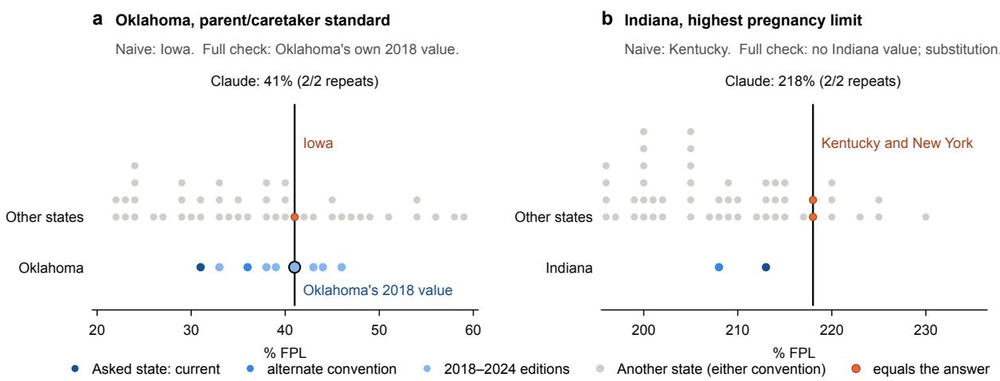
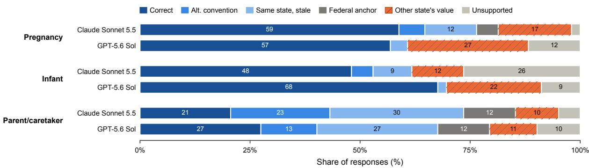
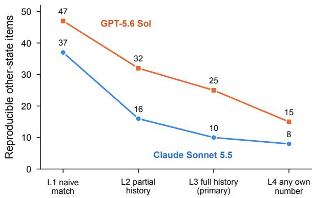

# Right Number, Wrong State? Measuring Cross-Jurisdiction Substitution in LLM Recall of State Policy

Jiayu Feng Harvard T.H. Chan School of Public Health jiayufeng@hsph.harvard.edu

## Abstract

When an LLM answers a state-specific policy question wrongly, it may be hallucinating, or it may be returning a real value that holds in another state. We test this with a minimal-set design: the question wording is fixed and only the jurisdiction varies, across the 50 U.S. states and the District of Columbia (51 jurisdictions) and three exactly defined Medicaid incomeeligibility quantities. Gold values come from an official data book and agree with an independent source in 101 of 102 checked cells. Under a pre-registered protocol, Claude Sonnet 5.5 and GPT-5.6 Sol reproducibly give another state’s current value, identical across two independent repeats, for 10 and 25 of 153 items. Attribution is fragile, however. Crediting any wrong answer that equals another state’s value yields 3–5× more reproducible substitutions than checking every number in the asked state’s own records, because many apparent crossstate answers are the asked state’s own values under another convention or from an earlier year. Claims about cross-jurisdiction error need a complete same-state reference set. We will release the protocol, gold table, and all model outputs.

## 1 Introduction

Policy facts are jurisdiction-conditioned: the same question (“What is the Medicaid income limit for pregnant women?”) has a different correct answer in each U.S. state. An LLM can return a real policy value bound to the wrong jurisdiction, a failure that a generic hallucination label hides. The failure is attractive to diagnose because it can be scored mechanically whenever the wrong answer equals another jurisdiction’s gold value.

The diagnostic is easy to get wrong. Numeric policy facts admit several contemporaneous representations (e.g., with or without a 5-point income disregard) and change over time, so a wrong answer that “matches another state” is often the asked state’s own value under another reading (Figure 1). Our evaluation asks for one exactly defined policy quantity per question, in each of the 51 jurisdictions, and scores answers against an authoritative gold table. A pre-registered taxonomy checks the asked state’s own values (current, under the other disregard convention, or from an earlier year) before federal anchors, other states’ values, and unsupported numbers, and counts an item only when independent repeats agree. Under this protocol, cross-jurisdiction substitution appears in both model families we test, and naive attribution inflates it severalfold.

## 2 Related Work

Factuality evaluation. Factuality benchmarks ask whether an answer is supported or correct: FActScore checks atomic claims against a knowledge source (Min et al., 2023), and SimpleQA grades short answers against a single reference (Wei et al., 2024). In both, a wrong answer is simply an error. We ask something more of a wrong answer: whether its value belongs to a competing entity. That can be decided only once every value the asked entity could legitimately have is known.

Entity- and context-conditioned recall. Language models store relational facts that cloze queries can retrieve (Petroni et al., 2019), recall is weaker for less popular entities (Mallen et al., 2023), and geospatial predictions track ground truth while carrying systematic geographic biases (Manvi et al., 2024). Swapping the entity in a passage reveals reliance on memorized answers (Longpre et al., 2021). SituatedQA (Zhang and Choi, 2021) and temporal probing (Dhingra et al., 2022) show that answers depend on time and place, and stale gold labels distort factuality scores (Jiang et al., 2026). Holding the query fixed while an explicit jurisdiction varies over a complete set of entities that share one attribute lets a wrong value be traced to the entity that holds it, and stale model answers then form their own error class.

  
Figure 1: Two reproducible Claude answers on a number line. Grey dots are other states’ current values (either convention), stacked where states share a value; blue dots are the asked state’s own values. (a) Oklahoma’s 41% equals Iowa’s parent standard and also Oklahoma’s own 2018 standard, so complete attribution assigns it to Oklahoma. (b) Indiana’s 218% equals Kentucky’s limit (and New York’s without the disregard) and no Indiana value from 2018 to 2025, so it remains a substitution.

Numbers and value collisions. NLP systems rarely give numbers special treatment (Thawani et al., 2021), and language models bind attributes to entities in context through learned internal mechanisms (Feng and Steinhardt, 2024). Knowledge overshadowing proposes that dominant knowledge can obscure less prominent knowledge (Zhang et al., 2025), a hypothesis our leakage test probes. Numeric attributes make attribution hard: with 30–36 distinct values shared by 51 jurisdictions, a wrong number often equals some other entity’s value by coincidence, so a match alone is weak evidence of substitution.

Jurisdiction in legal and benefits QA. Legal hallucination rates vary by jurisdiction and place (Dahl et al., 2024; Curran et al., 2025); Housing Statute QA asks the same yes/no questions across 50+ jurisdictions (Zheng et al., 2025); CrossLex holds facts fixed across three legal systems (Yang et al., 2026); and Public Benefits Bench grades state-specific SNAP guidance with rubrics (Kotcherlakota et al., 2026). None attributes wrong answers to a specific other jurisdiction, because binary or rubric-graded answers carry no source identity. Taranukhin and Shwartz (2026) count jurisdictional applicability as part of legal warrant.

## 3 Task and Gold Data

Quantities. We ask, “As of July 2025, what is [quantity] in [state]?” for three Medicaid incomeeligibility quantities, each defined in the question itself: pregnancy, the highest limit for pregnancy coverage under Medicaid, CHIP, or the CHIP unborn-child option, including the 5-point disregard; infant, the highest Medicaid/CHIP limit for infants under one, including the disregard; and parent, the published standard of the parent/caretaker eligibility group, excluding the disregard (the disregard applies only to an applicant’s highest eligibility group, so the standard itself is the policy quantity, although KFF reports parent limits with the disregard added; KFF, 2026c). Answers are percentages of the federal poverty level, returned as JSON.

Gold. Values are derived deterministically from MACPAC’s MACStats Exhibits 35–36 (Medicaid and CHIP Payment and Access Commission, 2026) for the 51 jurisdictions (153 items; 30–36 distinct values per quantity, modal share ≤12%). The derived pregnancy and infant values agree with KFF’s January 2026 tables (KFF, 2026b,a) in 51/51 and 50/51 states; the one difference follows a MAC-PAC footnote. Each item has exactly one alternate convention: the same figure with the disregard handled the other way (−5 for pregnancy and infant, +5 for parent). It is a reporting convention, not a separate eligibility limit. Each item also has a set of stale values computed identically from every MACStats edition 2018–2024, so that the asked state’s own earlier values are not misclassified as cross-jurisdiction substitutions.

  
Figure 2: Outcomes per model and quantity, as percentages of 102 responses (51 jurisdictions × 2 repeats); segments below 8% are unlabeled. Blue shades are the asked state’s own values (current, alternate convention, or an earlier edition); hatched orange is another state’s current value.

## 4 Protocol

Models. We evaluate Claude Sonnet 5.5 and GPT-5.6 Sol. Sonnet’s API rejects both disabled thinking and a non-default temperature, so we use the lowest effort and restrict thinking to tool calls with no tools provided; every output is 23–31 tokens, the JSON answer alone. GPT uses reasoning effort none and temperature 0. Both run closed-book with no tools or retrieval, strict JSON output, one fresh request per item, and two independent repeats (306 calls per model).

Taxonomy. Each response receives the first matching category: UNPARSABLE; CORRECT; AL-TERNATE convention; same-state STALE; FED-ERAL ANCHOR (100/133/138%); OTHER-STATE (equals another state’s current value, either convention); UNSUPPORTED. Same-state explanations take precedence, so cross-state credit is conservative. An item is reproducible when both repeats give the identical value. Our primary measure is reproducible cross-jurisdiction substitution: reproducible items classified OTHER-STATE. Responselevel rates are descriptive, and the attribution levels in Figure 3 are sensitivity analyses.

Pre-registration. Before collecting the reported data, we fixed the prompt, the gold table (including the 2018–2024 stale values), the taxonomy and scorer, the number of repeats, the primary analyses, and a criterion for continuing the study, applied to non-Claude models because Claude was used during design: continue if a non-Claude model has ≥8 reproducible OTHER-STATE items making $\mathrm { u p } \geq 1 0 \%$ of its reproducible errors, or shows significant known-fact leakage (a value the model gives correctly for its own state appears as the answer for another state; Mantel–Haenszel over the n = 35 source states with a unique value). An earlier Claude run with the same prompt served as development data and is excluded; the reported Claude data come from a new run collected after the protocol was locked. The protocol comparison in Figure 3 and the stability-free comparison were specified after the GPT run and before the new Claude run.

<table><tr><td></td><td></td><td>Acc. [95% CI]</td><td>Alt Stale</td><td></td><td>Anch</td><td>Oth</td><td>Uns</td><td>Unst</td></tr><tr><td>Sonnet Preg.</td><td></td><td>.59 [.49,.68]</td><td>1</td><td>6</td><td>2</td><td>4</td><td>0</td><td>11</td></tr><tr><td></td><td>Infant</td><td>.48 [.39,.58]</td><td>1</td><td>4</td><td>0</td><td>3</td><td>9</td><td>15</td></tr><tr><td></td><td>Parent</td><td>.21 [.14,.29]</td><td>9</td><td>12</td><td>6</td><td>3</td><td>2</td><td>9</td></tr><tr><td>GPT</td><td>Preg.</td><td>.57 [.47,.66]</td><td>0</td><td>2</td><td>0</td><td>12</td><td>6</td><td>3</td></tr><tr><td></td><td>Infant</td><td>.68 [.58,.76]</td><td>0</td><td>1</td><td>0</td><td>9</td><td>4</td><td>4</td></tr><tr><td></td><td>Parent</td><td>.28 [.20,.37]</td><td>6</td><td>13</td><td>6</td><td>4</td><td>5</td><td>4</td></tr></table>

Table 1: Accuracy over 102 responses per cell; other columns count the 51 items by reproducible outcome (Unst = repeats differ). No response was unparsable.

## 5 Results

Both models answer the pregnancy and infant questions correctly in 48–68% of responses, but the parent question in only 21–28% (Table 1).

Error types differ by quantity and by model (Figure 2). Stale values dominate parent errors (12 and 13 reproducible items): dollar-denominated standards drift in percentage terms every year, and models return earlier years’ figures. Federal anchors appear mostly in parent answers. At the response level, other-state answers make up 12.7% of Claude’s responses and 19.9% of GPT’s, concentrated in GPT’s pregnancy and infant answers. Identifiable GPT cases include New Mexico infants answered with New York’s 405% and Louisiana pregnancy answered with Maryland’s 259% (Maryland’s value without the disregard).

Substitution is reproducible in both models. GPT has 25 reproducible OTHER-STATE items (40% of its 62 reproducible errors) and Claude has 10 (20% of 51); GPT meets the continuation criterion. Known-fact leakage is not significant for either model (pooled p = .41 and .66), so the data do not show correctly stored values being systematically re-bound to other states. Part of the gap between models reflects stability: GPT’s repeats agree on 93% of items and Claude’s on 77% (Claude’s temperature cannot be set). Counting an item when either repeat gives another state’s value yields 34 items for GPT and 27 for Claude, a difference that is not significant (exact McNemar p = .38).

  
Figure 3: Reproducible other-state items under four attribution protocols. L1 credits any wrong answer equal to another state’s value; L2 adds the alternate convention and three data-book editions; L3 (primary) uses every edition 2018–2024; L4 also discounts any number in the asked state’s MACStats rows.

Naive attribution inflates substitution severalfold (Figure 3). Crediting any wrong answer that equals another state’s value yields 37 reproducible substitutions for Claude and 47 for GPT. The primary protocol yields 10 and 25, and discounting every number in the asked state’s data-book rows yields 8 and 15. The excess comes from the asked state’s own values. Claude’s Oklahoma parent answer of 41% equals Iowa’s current value but is Oklahoma’s 2018 standard (Figure 1); its Indiana parent/caretaker answer of 16% equals Texas’s value with the disregard but is Indiana’s 2022 standard. Extending a partial value history (L2) to the full 2018–2024 history (L3) removes 6 of Claude’s 16 and 7 of GPT’s 32 reproducible substitutions, so the count depends on how completely each jurisdiction’s own value history is enumerated.

## 6 Conclusion

Both model families reproducibly return other jurisdictions’ values: under the primary protocol, GPT-

5.6 Sol does so for 25 of 153 items and Claude Sonnet 5.5 for 10, and under the most conservative check for 15 and 8. How many wrong-state answers an evaluation finds depends on its reference set. Without the asked jurisdiction’s alternate conventions and value history, the count here is 3–5× too high. Benchmarks of facts that vary by jurisdiction, date, or reporting convention face the same problem. Writing the exact quantity into each question removes doubt about which convention is scored, and listing every value the asked entity has held lets same-entity answers be ruled out before another entity is credited. Repeats screen out one-off guesses. Reporting counts at more than one attribution level, as Figure 3 does, shows readers how much of a wrong-entity rate comes from the protocol itself.

## Limitations

The study covers one policy domain, three quantities, two models, and one prompt wording. It says nothing about other domains or prompts, or about retrieval-augmented systems, where tool use may dominate (Kotcherlakota et al., 2026). MACPAC compiles state data, and its parent standards depend on its own dollar-to-percentage conversions, which no second source checks. Values before 2018 were not checked because earlier tables use a different layout, so a few remaining OTHER-STATE items may still be older same-state values.

With only 35 source states holding a unique value, the leakage test has low power, and its null result does not show that the mechanism is absent. Repeat stability differs between the models (temperature 0 versus an unadjustable default), which affects counts that require agreement across repeats; we report response-level rates and the stability-free comparison for this reason. Claude’s counts also vary between runs, so small differences should not be over-read. A pilot with earlier prompts and a development run of Claude shaped the design, and neither enters the results. A match with another state’s value is consistent with retrieval of that state’s fact but does not prove it, and widely shared values such as 205% cannot be traced to any one state.

## Ethical Considerations

All data are public aggregate policy statistics; no personal data or human subjects were involved. Wrong eligibility thresholds could mislead applicants; we measure model behavior and do not assess downstream harm. API costs were under US\$5. Generative AI tools were used only for implementation and debugging assistance in code executing author-specified procedures, and languagelevel editing of author-written prose. The author takes full responsibility for the accuracy and integrity of the work.

## References

Damian Curran, Vanessa Sporne, Lea Frermann, and Jeannie Paterson. 2025. Place matters: Comparing LLM hallucination rates for place-based legal queries. arXiv preprint arXiv:2511.06700.

Matthew Dahl, Varun Magesh, Mirac Suzgun, and Daniel E. Ho. 2024. Large legal fictions: Profiling legal hallucinations in large language models. Journal ofLegal Analysis, 16(1):64–93.

Bhuwan Dhingra, Jeremy R. Cole, Julian Martin Eisenschlos, Daniel Gillick, Jacob Eisenstein, and William W. Cohen. 2022. Time-aware language models as temporal knowledge bases. Transactions ofthe Associationfor Computational Linguistics, 10:257– 273.

Jiahai Feng and Jacob Steinhardt. 2024. How do language models bind entities in context? In The Twelfth International Conference on Learning Representations.

Xunyi Jiang, Dingyi Chang, Julian McAuley, and Xin Xu. 2026. When benchmarks age: Temporal misalignment through large language model factuality evaluation. In Proceedings of the 19th Conference of the European Chapter of the Association for Computational Linguistics (EACL).

KFF. 2026a. Medicaid and CHIP income eligibility limits for children as a percent of the federal poverty level. State Health Facts, January 2026.

KFF. 2026b. Medicaid and CHIP income eligibility limits for pregnant women as a percent of the federal poverty level. State Health Facts, January 2026.

KFF. 2026c. Medicaid income eligibility limits for parents, 2002–2026. State Health Facts, January 2026.

Meghana Kotcherlakota, Omar Almatov, and Rayan Krishnan. 2026. Public benefits bench: Can AI help people navigate SNAP benefits? Vals AI.

Shayne Longpre, Kartik Perisetla, Anthony Chen, Nikhil Ramesh, Chris DuBois, and Sameer Singh. 2021. Entity-based knowledge conflicts in question answering. In Proceedings ofthe 2021 Conference on Empirical Methods in Natural Language Processing, pages 7052–7063, Online and Punta Cana, Dominican Republic. Association for Computational Linguistics.

Alex Mallen, Akari Asai, Victor Zhong, Rajarshi Das, Daniel Khashabi, and Hannaneh Hajishirzi. 2023. When not to trust language models: Investigating effectiveness of parametric and non-parametric memories. In Proceedings ofthe 61st Annual Meeting of the Associationfor Computational Linguistics (Volume 1: Long Papers), pages 9802–9822, Toronto, Canada. Association for Computational Linguistics.

Rohin Manvi, Samar Khanna, Marshall Burke, David Lobell, and Stefano Ermon. 2024. Large language models are geographically biased. In Proceedings of the 41st International Conference on Machine Learning, volume 235 of Proceedings of Machine Learning Research, pages 34654–34669.

Medicaid and CHIP Payment and Access Commission. 2026. MACStats: Medicaid and CHIP data book, exhibits 35–36. February 2026 edition (data as of July 2025); earlier editions 2018–2024.

Sewon Min, Kalpesh Krishna, Xinxi Lyu, Mike Lewis, Wen-tau Yih, Pang Koh, Mohit Iyyer, Luke Zettlemoyer, and Hannaneh Hajishirzi. 2023. FActScore: Fine-grained atomic evaluation of factual precision in long form text generation. In Proceedings of the 2023 Conference on Empirical Methods in Natural Language Processing, pages 12076–12100, Singapore. Association for Computational Linguistics.

Fabio Petroni, Tim Rocktäschel, Sebastian Riedel, Patrick Lewis, Anton Bakhtin, Yuxiang Wu, and Alexander Miller. 2019. Language models as knowledge bases? In Proceedings of the 2019 Conference on Empirical Methods in Natural Language Processing and the 9th International Joint Conference on Natural Language Processing (EMNLP-IJCNLP), pages 2463–2473, Hong Kong, China. Association for Computational Linguistics.

Maksym Taranukhin and Vered Shwartz. 2026. Legal LLM hallucination should be evaluated as failure of legal warrant. arXiv preprint arXiv:2609.17546.

Avijit Thawani, Jay Pujara, Filip Ilievski, and Pedro Szekely. 2021. Representing numbers in NLP: a survey and a vision. In Proceedings of the 2021 Conference of the North American Chapter of the Associationfor Computational Linguistics: Human Language Technologies, pages 644–656, Online. Association for Computational Linguistics.

Jason Wei, Karina Nguyen, Hyung Won Chung, Yunxin Joy Jiao, Spencer Papay, Amelia Glaese, John Schulman, and William Fedus. 2024. Measuring short-form factuality in large language models. arXiv preprint arXiv:2411.04368.

Xiaocui Yang, Xican Tan, Shoujie Chen, Shihan Xiao, Keke Tong, and Xinyu Zhou. 2026. CrossLex: A source-grounded benchmark for cross-jurisdictional legal reasoning in large language models. arXiv preprint arXiv:2608.01292.

Michael Zhang and Eunsol Choi. 2021. SituatedQA: Incorporating extra-linguistic contexts into QA. In Proceedings ofthe 2021 Conference on Empirical Methods in Natural Language Processing, pages 7371– 7387.

Yuji Zhang, Sha Li, Cheng Qian, Jiateng Liu, Pengfei Yu, Chi Han, Yi R. Fung, Kathleen McKeown, Chengxiang Zhai, Manling Li, and Heng Ji. 2025. The law of knowledge overshadowing: Towards understanding, predicting, and preventing LLM hallucination. arXiv preprint arXiv:2502.16143.

Lucia Zheng, Neel Guha, Javokhir Arifov, Sarah Zhang, Michal Skreta, Christopher D. Manning, Peter Henderson, and Daniel E. Ho. 2025. A reasoning-focused legal retrieval benchmark. In Proceedings of the Symposium on Computer Science and Law (CS&Law ’25).