# Rubric Spans are Label Representations: Joint LLM Encoding for Short Answer Scoring

Zhifan Sun1 Sebastian Gombert1 Fabian Zehner1,2

Leon Camus1 Longwei Cong1 Hendrik Drachsler1,3

1DIPF | Leibniz Institute for Research and Information in Education

2Centre for International Student Assessment (ZIB)

3Computer Science Department & Studiumdigitale, Goethe University Frankfurt {z.sun,s.gombert,f.zehner,l.camus,l.cong,h.drachsler}@dipf.de

## Abstract

Automatic Short Answer Scoring (ASAS) requires models that can score student responses against question-specific criteria while remaining efficient and transferable across rubric sets. We propose RUSPAN, a rubric-conditioned ASAS framework that preserves a flexible natural-language rubric interface while retaining single-pass inference. RUSPAN serializes the question context, student answer, and all candidate rubric levels into one sequence, then scores the levels listwise from rubric-span and whole-sequence representations produced in a single LM pass. We further introduce RUS-PAN-RIM, where Rubric-Independent Mask prevents rubric spans from attending to one another, making rubric representations dependent only on the answer and question context and reducing dependence on rubric serialization patterns during zero-shot transfer. On six ASAS benchmarks spanning English, German, and Portuguese, RUSPAN is competitive with fixed-label and retrieval baselines in monobenchmark scoring while remaining applicable to variable score ranges where fixed-label classifiers cannot be used, and RIM with position reindexing delivers consistent and substantial gains on PT-ASAG, the held-out benchmark with the strongest combined language and rubric-structure shift.

## 1 Introduction

Automatic Short Answer Scoring (ASAS) is a central task in educational NLP, offering the potential for timely and personalized feedback on studentconstructed responses (Burrows et al., 2015; Bai and Stede, 2022). Despite substantial progress, ASAS remains difficult to model uniformly across benchmarks. Scoring schemes differ in the number, meaning, and structure of performance levels across questions and benchmarks. Many early approaches therefore learn benchmark-specific label spaces: a static classifier is trained on top of a transformer encoder and its output dimensions correspond to the score levels of one dataset (Kumar et al., 2019; Sung et al., 2019; Riordan et al., 2017; Ormerod, 2022; Camus and Filighera, 2020). This approach is easy to implement and performs well within a benchmark, but it does not directly transfer when a new question or dataset requires a different scoring scheme.

A natural alternative is to use LLMs via prompting to directly score student answers, either through commercial API calls or locally hosted models. However, commercial LLM APIs raise privacy and governance barriers for student writing (European Commission, 2026; UK Department for Education, 2025), while locally hosted LLMs large enough for satisfactory zero- or few-shot performance are expensive to run. Therefore, it is desirable to develop methods that are efficient at inference time yet retain the superior representation learning capabilities of LLMs.

In educational assessment, a rubric is a textual description that defines what constitutes each level of student performance. Recent methods exploit this structure by framing ASAS as rubric retrieval or pairwise matching between rubric descriptions and example answers from each level (Bexte et al., 2022; Sonkar et al., 2024). Such methods are computationally lighter than large generative models and flexible across benchmarks, as rubric descriptions encode the semantics of each score level rather than fixing a global label space. However, these approaches typically expand each student answer into multiple answer-rubric pairs, one per candidate score level, increasing training and evaluation cost.

Gombert et al. (2026) present an early attempt at efficient rubric-conditioned scoring by encoding answers and rubrics together in a single sequence and aligning answer and rubric span representations to predict scores via a bilinear network. This avoids both fixed global label indices and pairwise expansion, thus offering a promising path to efficient and flexible ASAS. We build on the insight that rubric spans can serve as label representations, but ask which contextual representation should accompany them, and how decoder-only LLMs can be adapted for discriminative scoring in this setting. Our experiments show that pairing rubric span representations with the wholesequence representation is substantially more effective than answer-rubric alignment. Most importantly, although rubric retrieval and Gombert et al. (2026)’s proposed architecture both display potential for zero-shot transfer across datasets, neither has been systematically evaluated under zero-shot settings.

At the same time, recent work demonstrates that autoregressive LLMs can be repurposed as powerful discriminative text encoders, achieving strong NLU performance without generation (BehnamGhader et al., 2024; Lin et al., 2025; Ruan et al., 2024; Liu et al., 2024). This approach is appealing for ASAS because an LLM can represent and reason over long inputs containing the question, sample solution, student answer, and rubric criteria in one sequence. Meanwhile, the rich world knowledge and the reasoning capabilities of LLMs are also beneficial for ASAS, which requires understanding of diverse subject matter and complex performance criteria.

Our contributions are as follows:

• We propose RUSPAN, a label-span encoding framework for rubric-conditioned ASAS. It represents each score level through its rubric span representation and scores variable numbers of rubric levels in a single forward pass using sequence-rubric alignment variants.

• We analyze a transfer limitation of standard causal attention: rubric representations become conditioned on preceding rubrics. We introduce Rubric-Independent Mask (RIM), a block-sparse attention masking mechanism that makes each rubric representation depend only on the answer and task context, approaching the rubric-set invariance of rubric retrieval while retaining single-pass efficiency.

• We evaluate RUSPAN across six public ASAS benchmarks spanning multiple domains and languages against sequence classification, rubric retrieval, and LLM generation baselines. In mono-benchmark settings, RUS-PAN is competitive with the strongest singlefunction baselines while offering rubric flexibility over fixed-head classification and singlepass inference efficiency over retrieval and generation approaches. In cross-benchmark transfer, RUSPAN with RIM delivers consistent and substantial gains under combined language and rubric-structure shift; on Englishonly cross-benchmark targets, retrieval baselines remain competitive.

## 2 Related Work

## 2.1 Automatic Short Answer Scoring

Automatic Short Answer Scoring (ASAS) has evolved through several phases. Early work relied on handcrafted features such as lexical overlap with the reference answer and response length, combined with conventional machine learning models such as SVMs or linear regression (Page, 1966; Madnani et al., 2013; Burrows et al., 2015; Dzikovska et al., 2013). With the advent of pretrained transformers, ASAS research shifted toward neural approaches based on BERT-style encoders (Camus and Filighera, 2020; Sung et al., 2019; Ormerod, 2022), which typically formulate scoring as fixed-label classification with reference answers as the supporting context. This design is effective when the scoring scheme is stable, yet scoring schemes can vary across questions and more strongly across benchmarks. As a result, despite their ease of implementation, these methods often fail to generalize to new questions or datasets, sacrificing flexibility for within-benchmark accuracy.

To address this limitation, recent work has incorporated rubric information directly into the scoring process. In the context of ASAS, rubrics are textual descriptions of the performance criteria for each level. These descriptions provide semantic grounding, enabling models to evaluate student answers against explicit criteria rather than relying on implicit label representations.

One line of work frames scoring as rubric retrieval, where the model compares a student response with question-specific rubric descriptions and retrieves the most relevant one (Sonkar et al., 2024; Gombert et al., 2026). A related approach uses reference or anchor answers from different score levels as implicit rubrics, scoring student answers through similarity-based comparison (Bexte et al., 2022; Li et al., 2023); because anchor answers encode the semantic traits expected at each level, they function analogously to textual rubric criteria. Both formulations are more flexible than fixed-label classification as they rely on textual scoring criteria rather than a global label inventory. However, they are usually implemented by expanding each student answer into multiple answerrubric or answer-reference pairs, which increases both training and inference cost, making it hard to scale to large datasets or models. This design trades off efficiency for flexibility, and it is not clear how well it performs in zero-shot transfer to other benchmarks.

Recent work has also explored generative approaches using large language models (LLMs) for ASAS (Chang et al., 2024; Chamieh et al., 2024; Ferreira Mello et al., 2025; Kortemeyer, 2024). While predicting scores through text generation without assuming a fixed label space is flexible, it shifts scoring to a generative setup that is inefficient at inference time and sensitive to prompting and output formatting.

## 2.2 LLMs as Encoders

Recent research shows that decoder-only LLMs can serve as strong encoders for sentence embedding and sequence classification tasks without autoregressive generation (BehnamGhader et al., 2024; Luo et al., 2024; Lin et al., 2025; Lee et al., 2025; Qiao et al., 2025; Ruan et al., 2024; Liu et al., 2024). This is appealing because it retains the representational capacity of LLMs while avoiding the cost and instability of autoregressive generation. Gekhman et al. (2025) further show that LLMs encode factual knowledge in their hidden states even when they fail to generate it reliably, suggesting that the encoder approach may be better suited to knowledge-intensive discrimination tasks such as ASAS.

However, prior work adapting LLMs as encoders has largely focused on single-sequence embedding and sentence-pair classification tasks. Canonical evaluation benchmarks such as MTEB reflect this focus, as they contain mostly retrieval, semantic similarity, and NLI settings that involve at most two input sequences (Muennighoff et al., 2023; BehnamGhader et al., 2024; Lee et al., 2025; Liu et al., 2024). The ability of LLMs to reason jointly over multiple heterogeneous inputs remains underexplored. In ASAS, such multi-source reasoning is critical: a student answer must be evaluated against a question, a sample solution, and a set of rubric criteria.

## 2.3 Label Semantics for NLU

A broad line of work in NLU improves classification by incorporating label semantics directly into the input or prediction process. Examples include label verbalization (Schick and Schütze, 2021; Hardalov et al., 2022) and NLI-style formulations, where a label is expressed as a statement and evaluated against the text through a true/false judgment (Xu et al., 2023; Elshabrawy et al., 2025). These approaches replace purely index-based classification, which has been shown effective in zeroand few-shot settings. Rubric retrieval can be seen as a variant of this approach in ASAS, where each instance is expanded into multiple text-label pairs and the model predicts whether a student answer satisfies the criteria described in each rubric.

## 3 RUSPAN Architecture and Benchmark Augmentation

## 3.1 Input Formulation

We formalize each benchmark as a dataset D = $\{ ( \mathbf { x } _ { i } , y _ { i } ) \} _ { i = 1 } ^ { N }$ , where $y _ { i }$ is the ground-truth score level and the input instance is a tuple of textual fields:

$$
{ \bf x } _ { i } = f o r m a t ( q _ { i } , ~ s _ { i } , ~ a _ { i } , ~ \bar { r } _ { i } , ~ \iota _ { i } ) .\tag{1}
$$

Here, $q _ { i }$ is the question, $s _ { i }$ is the sample solution, $a _ { i }$ is the student answer, $\bar { r _ { i } }$ denotes the concatenated rubric text, and $\iota _ { i }$ is the instruction sampled for this instance. We construct a pool of $M = 1 0$ instruction templates and randomly sample one per instance during both training and testing, encouraging the model to be robust to instruction phrasing rather than overfitting to a fixed prompt format. For multilingual benchmarks, the instructions are written in the dataset language; the full pools are listed in Appendix C. We obtain the final model input by serializing these fields into one sequence through the format function. Input examples can be found in Appendix B.

## 3.2 Rubric Span Extraction and Sequence Representation

Given an input sequence $\mathbf { x } _ { i }$ , we keep track of rubric-span boundaries in the formatted text and, after language-model encoding, extract a compact representation for each rubric level by taking the hidden state of the last token of that rubric span.

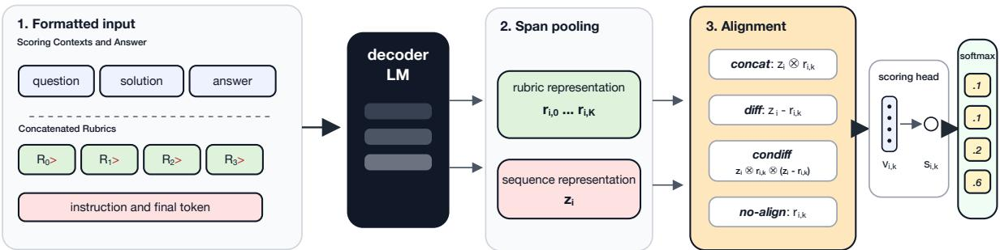  
Figure 1: The RUSPAN architecture. The formatted input combines the question context, student answer, rubric spans, and scoring instruction in one decoder-only LM pass. Span pooling extracts rubric representations from the final tokens of rubric spans and a sequence representation from the final token; an alignment function constructs each rubric-level representation before a shared scoring head projects it to a scalar score for softmax normalization.

Let $\mathbf { H } _ { i } \in \mathbb { R } ^ { T \times d }$ denote encoder outputs and let the k-th rubric span end at position $e _ { i , k } ;$ we represent the rubric level as $\mathbf { r } _ { i , k } = \mathbf { H } _ { i } [ e _ { i , k } ]$ . For global sequence representation, we use the final token embedding ${ \bf z } _ { i } = { \bf H } _ { i } [ T ]$ . Unlike the answer-rubric alignment of Gombert et al. (2026), RUSPAN pairs rubric spans with a whole-sequence representation. This final-token representation carries information from the full input in autoregressive models and is more effective than answer-rubric alignment alone, as demonstrated in section 5.

## 3.3 Label-to-Sequence Alignment Functions

We now compute level scores by combining the rubric representations $\{ \mathbf { r } _ { i , k } \}$ extracted from the input $\mathbf { x } _ { i }$ with the global sequence embedding $\mathbf { z } _ { i }$ through alignment functions. As shown in Figure 1, we use four alignment functions. The first three combine $\mathbf { z } _ { i }$ with each $\mathbf { r } _ { i , k }$ into an aligned representation $\mathbf { v } _ { i , k } ,$ while NO-ALIGN uses the rubric representation directly:

• CONCAT: $\mathbf { v } _ { i , k } = \mathbf { z } _ { i } \otimes \mathbf { r } _ { i , k }$

• DIFF: ${ \bf v } _ { i , k } = { \bf z } _ { i } - { \bf r } _ { i , k }$

• CONDIFF: $\mathbf { v } _ { i , k } = \mathbf { z } _ { i } \otimes \mathbf { r } _ { i , k } \otimes \left( \mathbf { z } _ { i } - \mathbf { r } _ { i , k } \right)$

• NO-ALIGN: $\mathbf { v } _ { i , k } = \mathbf { r } _ { i , k }$

Here, ⊗ denotes vector concatenation. Each resulting representation is projected to a scalar score $\hat { s } _ { i , k }$ for level k by a shared scoring head.

## 3.4 Rubric-Independent Mask (RIM)

Under standard causal attention, the hidden state of the final token of rubric $k ,$ denoted $\mathbf { r } _ { i , k }$ , attends to all tokens of rubrics $1 , \ldots , k { - } 1$ in addition to the context. Consequently, each rubric representation is conditioned on the content of the preceding rubrics. While learning contextual interactions between rubrics can boost performance in the mono-benchmark setting, this conditioning degrades cross-benchmark transfer to unseen benchmarks with different rubric patterns, as shown in section 5.

To remove this dependency while retaining the efficiency of a single forward pass, we introduce Rubric-Independent Mask (RIM), a block-sparse attention masking technique applied to standard causal attention. Let the input sequence consist of a context block (all tokens up to and including the student answer) followed by K rubric blocks spanning positions $s _ { k }$ through $e _ { k }$

Under RIM, each rubric block attends only to the context and its own tokens, never to other rubric blocks. The resulting representation $\mathbf { r } _ { i , k }$ is therefore a function of the context and rubric k alone. We additionally evaluate a position-reindexed RIM variant, which shifts the position IDs for each rubric block to start from the last token of the answer, so that the position embeddings of each rubric token are also independent of other rubrics. The RIM and the position-reindexed variant are illustrated in Figure 2. The instruction text $\iota _ { i }$ is excluded from the RIM input because scoring no longer uses a final-token whole-sequence representation, as doing so would aggregate information across the whole serialized sequence and thereby reintroduce the rubric dependence that RIM is designed to remove. Instead, each rubric representation $\mathbf { r } _ { i , k }$ is passed directly to the scoring head using NO-ALIGN.

anchor a = N + N 1  
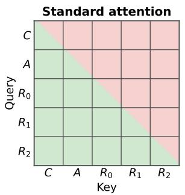

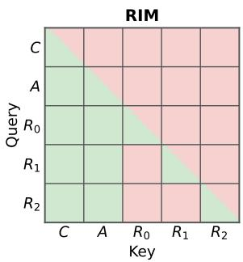  
Position ID reindexing

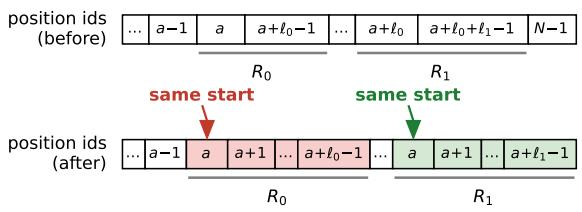  
Figure 2: Top: Attention masks for standard autoregressive attention (left) vs. attention after applying RIM (right). Green = allowed; pink = blocked. Under RIM, each rubric block $R _ { k }$ attends only to the context (C, A) and itself, never to other rubric blocks. Bottom: Position ID reindexing applied to each rubric span so that every rubric block starts its positional count from the same anchor offset $( N _ { C } + N _ { A } - 1 )$ , preserving relative positions within each span.

## 3.5 Training Objective

We optimize cross-entropy over gold labels and, since benchmarks differ in label cardinality and a batch may mix examples with different numbers of rubric levels, we pad each batch to the maximum and apply a validity mask $m _ { i , k } \in \{ 0 , 1 \}$ that sets padding-slot scores to −∞ before normalization, so they do not affect the distribution. This objective supports benchmark-specific label cardinalities while sharing the same encoder and scoring formulation.

## 3.6 Benchmarks and LLM-Based Augmentation

Because only two of the selected benchmarks contain native rubric annotations, we use LLMs to synthesize per-level rubric descriptions for the remaining datasets. This allows us to cast all benchmarks into a rubric-conditioned scoring formulation while preserving their original labels.

## 3.6.1 Source Benchmarks

We collect six public ASAS benchmarks to evaluate RUSPAN; Table 1 summarizes the datasets, language coverage, and available contextual information in each benchmark. The original three-way setting of SCIENTSBANK and BEETLE uses the labels correct, incorrect, and contradictory. In this work, we instead use the three-way variant correct, partially correct, and incorrect, following the convention adopted by other ASAS benchmarks, and casting the remaining labels (contradictory, irrelevant, and non\_domain) into incorrect.

## 3.6.2 Benchmark Augmentation

For datasets without native rubric annotations, we use LLMs to synthesize per-level rubric descriptions. In addition, ASAP-SAS does not provide sample solutions, so we similarly use LLMs to generate sample solutions for this benchmark. The augmentation details are provided in Appendix A.

## 4 Experimental Setup

Detailed hyperparameters and model choices are provided in Appendix E.

## 4.1 Baselines

We compare the proposed RUSPAN method with the following baselines:

Sequence Classification We use a fixed-label classification head over the full input with rubric text appended. This baseline tests whether rubric text is sufficient when it is provided only as input context rather than represented as candidate scorelevel spans. ASAP-SAS is excluded because its number of score levels varies by question.

Rubric Retrieval We expand each instance into answer-rubric pairs, jointly encode each pair with an LM, and score whether the answer satisfies the rubric, following the implementation in Sun et al. (2026).

Answer-Rubric Alignment We compare our sequence-rubric alignment strategy with the answer-rubric alignment method proposed by Gombert et al. (2026), which aligns the answer span representation with each rubric span representation through a bilinear scoring head.

Trained Generation via LLMs We fine-tune LLMs to generate the target score label.

Zero-shot Generation via LLMs We also evaluate frozen instruction-tuned LLMs that generate a score directly from the task context and rubric descriptions without task-specific fine-tuning. The prompt templates are provided in Appendix D.

<table><tr><td>Benchmark</td><td>Original Context</td><td>Augmented Context</td><td>Language</td><td>Levels</td><td>Test Splits</td><td>Sizes</td><td></td></tr><tr><td>ALICE-LP (Sun et al., 2026)</td><td>q, s, r</td><td>None</td><td>de</td><td>3</td><td>UA, UQ</td><td></td><td>10,781 | − | 2,695 / 3,096</td></tr><tr><td>ASAP-SAS</td><td>q, r</td><td>S</td><td>en</td><td>34</td><td>UA</td><td>17,043 -</td><td>5,224</td></tr><tr><td>ISTUDIO (Li et al., 2023)</td><td>q, s</td><td>r</td><td>en</td><td>3</td><td>UA</td><td>5,226</td><td>653 | 653</td></tr><tr><td>PT-ASAG (Galhardi et al., 2018)</td><td>q, s</td><td>r</td><td>pt</td><td>4</td><td>UA</td><td>3,290 1</td><td>|366</td></tr><tr><td>SCIENTSBANK 3-WAY (Dzikovska et al., 2013)</td><td>q, s</td><td>r</td><td>en</td><td>3</td><td>UA, UQ, UD</td><td>4,969</td><td>540 / 733 / 4,562</td></tr><tr><td>BEETLE-3-WAY (Dzikovska et al., 2013)</td><td>q, s</td><td>r</td><td>en</td><td>3</td><td>UA, UQ</td><td>3,941</td><td>439 / 819</td></tr></table>

Table 1: Overview of ASAS benchmarks and their augmentation. q: question; s: sample solution; r: rubrics. Test splits: UA (unseen answers), UQ (unseen questions), and UD (unseen domains). Sizes are reported as train | dev test; – indicates no split; multiple test sizes follow the order of the listed test splits.

## 4.2 Experimental Protocol

We evaluate the effectiveness of RUSPAN in two settings.

Mono-benchmark experiments We train and evaluate RUSPAN and the baselines on each benchmark independently. For datasets with multiple test splits, we report unseen question and unseen domain results when available, since they better test generalization beyond held-out answers. Zero-shot generation is excluded from this setting because it does not involve benchmark-specific fine-tuning. For benchmarks without an official development split, we randomly sample 10% of the training set as a held-out development set for checkpoint selection.

Joint training and cross-benchmark evaluation We jointly train a unified model on the English benchmarks, excluding ISTUDIO. We report crossbenchmark results on ISTUDIO, PT-ASAG, and ALICE-LP. ISTUDIO tests same-language transfer ability, while PT-ASAG and ALICE-LP test transfer under stronger language or rubric shifts.

## 5 Results and Discussion

## 5.1 Mono-Benchmark Results

Table 2 reports macro-F1 on the ASAS benchmarks under the mono-benchmark fine-tuning setting, comparing RUSPAN against sequence classification, answer-rubric alignment, rubric retrieval, and Trained Generation baselines.

In Table 2, at least one RUSPAN alignment variant is the strongest method on ASAP-SAS across all four backbones and achieves the best or nearbest result in several cells for the 1B and 8B backbones. At the same time, Sequence Classification and Rubric Retrieval are also competitive, and both are stronger than RUSPAN in several individual benchmark and backbone combinations. Regarding model scaling, the 1B backbone is the weakest overall and lags notably behind larger models, whereas gains from scaling diminish going from 3B to 8B. The flexibility advantage is especially clear on benchmarks with variable score spaces such as ASAP-SAS: because RUSPAN scores the candidate rubric spans directly, it remains applicable when fixed-label Sequence Classification is not.

Compared with the Answer-Rubric Alignment method in Gombert et al. (2026), RUSPAN’s whole-sequence conditioning is more effective in most settings in Table 2. RUSPAN is also usually stronger than Trained Generation in monobenchmark ASAS; for example, with the 1B backbone on ALICE-LP, RUSPAN reaches 66.5 macro-F1 compared with 46.5 for Trained Generation

The alignment-function breakdown in Table 2 shows that while no single alignment function is universally optimal across benchmarks and backbone sizes, CONDIFF performs generally well. Nevertheless, RUSPAN is generally competitive across alignment choices: when one alignment underperforms in a given setting, another often closes the gap or exceeds the strongest baseline. We therefore interpret the mono-benchmark comparison as an evaluation of the RUSPAN alignment family rather than evidence for a single selected alignment function.

## 5.2 Joint Training and Cross-Benchmark Results

Table 3 reports macro-F1 on the cross-benchmark evaluation sets under joint training on the English ASAS benchmarks. For RUSPAN, we fix the alignment function to CONDIFF.

Standard RUSPAN transfers unevenly across benchmarks. The joint-training cross-benchmark setting is substantially harder than mono-benchmark fine-tuning for standard RUSPAN. Transfer is especially difficult for PT-ASAG, followed by ALICE-LP and ISTUDIO, as the training benchmarks are English and mostly use three-level score scales, except for

<table><tr><td rowspan="2">Model</td><td rowspan="2">Method</td><td>ASAP-SAS</td><td>Alice-LP</td><td>iStudio</td><td>PT-ASAG</td><td colspan="2">SciEntsBank</td><td>Beetle</td></tr><tr><td>UA</td><td>UQ</td><td>UA</td><td>UA</td><td>UQ</td><td>UD</td><td>UQ</td></tr><tr><td rowspan="5">Llama-3.2-1B-Instruct</td><td>Seq. Class.</td><td>N/A</td><td>60.9</td><td>85.4</td><td>67.4</td><td>66.0†</td><td>61.8†</td><td>66.2</td></tr><tr><td>Rub. Retrieval</td><td>74.3†</td><td>65.5</td><td>86.9</td><td>65.0</td><td>68.0</td><td>65.6†</td><td>67.2</td></tr><tr><td>Ans. Rub. Ali.</td><td>74.1†</td><td>61.1†</td><td>85.8</td><td>57.1†</td><td>61.2†</td><td>65.1†</td><td>55.2†</td></tr><tr><td>Trained Gen.</td><td>56.1†</td><td>46.5†</td><td>83.5</td><td>54.9†</td><td>44.5†</td><td>44.9†</td><td>59.4</td></tr><tr><td>RUSPAN 77.6-77.7-77.8-76.7</td><td>64.4-62.3-66.5-64.1</td><td></td><td>87.4-85.9-86.6-85.9</td><td>66.0-63.8-68.2-63.1</td><td>65.6-65.2-64.2-69.2</td><td>68.8-66.5-68.0-66.7</td><td>66.4-64.9-61.9-65.7</td></tr><tr><td rowspan="5">Llama-3.2-3B-Instruct</td><td>Seq. Class.</td><td>N/A</td><td>64.6</td><td>87.5</td><td>67.7</td><td>70.8</td><td>67.8†</td><td>66.0†</td></tr><tr><td>Rub. Retrieval</td><td>78.1†</td><td>69.5</td><td>87.8</td><td>66.4</td><td>71.3</td><td>72.3</td><td>69.5</td></tr><tr><td>Ans. Rub. Ali.</td><td>76.4†</td><td>62.8†</td><td>87.4</td><td>70.2</td><td>69.7</td><td>69.4†</td><td>61.1†</td></tr><tr><td>Trained Gen. RUSPAN</td><td>74.3†</td><td>55.6†</td><td>83.5†</td><td>65.0</td><td>48.7†</td><td>50.2†</td><td>57.8† 69.7-66.9-68.0-63.3</td></tr><tr><td colspan="8">80.2-79.7-80.7-78.7 64.5-65.3-66.5-65.2 88.6-87.9-86.8-88.9 70.7-69.7-69.3-68.7 71.6-69.7-72.5-70.5</td></tr><tr><td rowspan="4">Mistral-7B-v0.1</td><td>Seq. Class.</td><td>N/A</td><td>68.9</td><td>88.3</td><td>69.0</td><td>66.0†</td><td>67.6†</td><td>67.0†</td></tr><tr><td>Ans. Rub. Ali.</td><td>75.5†</td><td>64.2†</td><td>86.7</td><td>62.1†</td><td>72.3†</td><td>69.4†</td><td>61.5†</td></tr><tr><td>Trained Gen. RUSPAN</td><td>73.6† 80.8-79.4-80.3-80.0</td><td>60.6†</td><td>87.7</td><td>51.3† 69.5-70.3-67.7-67.4</td><td>72.3† 73.9-72.8-75.9-76.2</td><td>50.5† 70.9-71.6-71.4-72.4</td><td>64.0† 70.9-69.1-68.0-66.9</td></tr><tr><td colspan="8">67.7-66.4-66.2-67.6 87.5-88.4-87.1-87.7</td></tr><tr><td rowspan="3">Llama-3.1-8B-Instruct</td><td>Seq. Class.</td><td>N/A</td><td></td><td>88.8</td><td>65.6</td><td>68.6†</td><td>68.3†</td><td>66.3†</td></tr><tr><td>Ans. Rub. Ali.</td><td>78.8</td><td>67.2† 62.6†</td><td>87.8</td><td>64.5†</td><td>72.2</td><td>72.6†</td><td>64.4†</td></tr><tr><td>Trained Gen. PUSDA</td><td>74.6†</td><td>62.5† 67.3.68.4.69.6.67.5</td><td>86.3† 80.0.80.0.80.8.88</td><td>58.2† 64.3.67.4.68.3.60.9</td><td>70.6† 703751747</td><td>71.5†</td><td>64.8†</td></tr></table>

RUSPAN 78.7-79.3-78.7-79.4 67.3-68.4-69.6-67.5 89.0-89.0-89.8-88.1 64.3-67.4-68.3-69.9 70.2-75.1-74.7-70.1 70.4-70.4-74.1-73.2 66.5-70.5-68.0-68.6

Table 2: Main mono-benchmark results (macro-F1) on ASAS benchmarks. For RUSPAN, hyphen-separated scores are ordered as CONCAT-DIFF-CONDIFF-NO-ALIGN. Bold indicates the best score within each backbone and benchmark column. A baseline score marked with † indicates a significant one-sided paired approximaterandomization improvement of the best RUSPAN variant over that baseline (p < .05). Rubric Retrieval is omitted for 7B and 8B models due to high computational cost.
<table><tr><td rowspan="2">Model</td><td rowspan="2">Method</td><td>iStudio</td><td>Alice-LP</td><td>PT-ASAG</td></tr><tr><td>UA</td><td>UQ</td><td>UA</td></tr><tr><td rowspan="6">Llama-3.2-1B-Instruct</td><td>Rub. Retrieval</td><td>54.4±2.4</td><td>45.5±0.7</td><td>38.2±2.7</td></tr><tr><td>Trained Gen.</td><td>57.6±3.1</td><td>48.8±2.6</td><td>30.6±1.7</td></tr><tr><td>Zero-shot Gen.</td><td>27.7</td><td>44.7</td><td>32.8</td></tr><tr><td>RUSPAN</td><td>55.8±5.5</td><td>48.4±2.1</td><td>28.1±0.6</td></tr><tr><td>RUSPAN-RIM</td><td>59.9±2.6</td><td>42.9±7.8</td><td>29.9±3.3</td></tr><tr><td>RUSPAN-RIM-reindexing</td><td>57.6±8.1</td><td>41.9±1.2</td><td>40.6±0.6</td></tr><tr><td rowspan="6">Llama-3.2-3B-Instruct</td><td>Rub. Retrieval</td><td>68.1±5.3</td><td>53.4±5.0</td><td>47.3±2.2</td></tr><tr><td>Trained Gen.</td><td>71.1±2.6</td><td>45.9±6.9</td><td>33.5±0.6</td></tr><tr><td>Zero-shot Gen.</td><td>21.9</td><td>42.3</td><td>24.8</td></tr><tr><td>RUSPAN</td><td>65.3±4.6</td><td>53.8±2.0</td><td>34.8±3.3</td></tr><tr><td>RUSPAN-RIM</td><td>70.9±2.4</td><td>56.5±4.1</td><td>41.2±0.8</td></tr><tr><td>RUSPAN-RIM-reindexing</td><td>67.9±4.5</td><td>53.2±1.7</td><td>46.3±2.2</td></tr><tr><td rowspan="5">Mistral-7B-v0.1</td><td>Trained Gen.</td><td>70.0±1.8</td><td>55.3±5.5</td><td>35.7±2.4</td></tr><tr><td>Zero-shot Gen.</td><td>61.2</td><td>49.2</td><td>45.6</td></tr><tr><td>RUSPAN</td><td>67.8±8.0</td><td>50.7±3.4</td><td>32.0±0.6</td></tr><tr><td>RUSPAN-RIM</td><td>69.2±4.0</td><td>56.1±2.2</td><td>40.6±2.0</td></tr><tr><td>RUSPAN-RIM-reindexing</td><td>67.4±6.4</td><td>54.9±0.4</td><td>44.0±3.3</td></tr><tr><td rowspan="5">Llama-3.1-8B-Instruct RUšPAN</td><td>Trained Gen.</td><td></td><td></td><td></td></tr><tr><td>Zero-shot Gen.</td><td>71.2±3.7</td><td>39.6±4.1</td><td>35.1±2.3</td></tr><tr><td></td><td>49.1 66.5±3.6</td><td>55.3 53.9±1.3</td><td>36.4 41.3±4.2</td></tr><tr><td>RUSPAN-RIM</td><td>70.7±4.3</td><td>54.8±0.8</td><td>46.9±1.8</td></tr><tr><td>RUSPAN-RIM-reindexing</td><td>71.3±3.2</td><td>56.7±1.4</td><td>48.2±1.1</td></tr></table>

Table 3: Joint-training cross-benchmark macro-F1 (mean ± std over 3 random seeds). Bold: best method within each model group. Zero-shot Gen. results are from a single run.

ASAP-SAS, which includes three- and four-level questions.

On ALICE-LP, standard RUSPAN remains broadly competitive with the crossbenchmark baselines, matching or exceeding Trained Generation for the 3B and 8B backbones. On ISTUDIO, the strongest RUSPAN variants are competitive, while standard RUSPAN is more variable across model sizes. However, for PT-ASAG, standard RUSPAN falls well behind the baselines.

Inter-rubric dependence contributes to crossbenchmark sensitivity. These results are consistent with the diagnosis in subsection 3.4, and two independent pieces of evidence point in the same direction. Standard RUSPAN degrades most on PT-ASAG, where rubric structure and language both shift strongly from the training pool. Rubric Retrieval , which scores each answer-rubric pair independently and is therefore structurally immune to inter-rubric attention dependence, maintains robust performance on PT-ASAG. RUSPAN-RIM variants enforce the same per-rubric independence through attention masking, and the position-reindexed variant is consistently stronger than standard RUSPAN on PT-ASAG. The convergence of two architecturally distinct approaches that share per-rubric independence as a design property is consistent with rubric representation decoupling as an important factor associated with cross-benchmark robustness.

RIM with reindexing delivers consistent gains under rubric structure shifts. RUSPAN-RIM with position reindexing improves over standard RUSPAN on PT-ASAG across all four backbone sizes, with gains ranging from 6.9 to 12.5 macro-F1 points. This uniformity is notable: PT-ASAG combines two strong sources of distribution shift, Portuguese text and a four-level score scale, yet the improvement holds regardless of backbone size.

RUSPAN-RIM is competitive on all three transfer targets rather than useful only under strong shift. Taking the better of the two RIM variants in each cell, RIM matches or exceeds the strongest baseline in 7 of the 12 benchmark-backbone combinations, and in four of the remaining five it trails by at most 1.6 macro-F1. Relative to standard RUSPAN, RIM improves in 11 of 12 combinations. The size of the gain also tracks the severity of the shift: largest on PT-ASAG (up to +12.5), moderate on ISTUDIO and ALICE-LP. With the 8B backbone, RIM with position reindexing is the strongest method on all three targets.

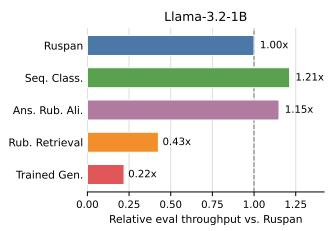

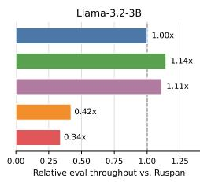  
Figure 3: Relative evaluation throughput on ISTUDIO, normalized by RUSPAN within each model size. Values above 1.0 indicate faster inference than RUSPAN; values below 1.0 indicate slower inference.

Accuracy, flexibility, and efficiency tradeoffs. Table 4 summarizes how the evaluated methods differ in label-space flexibility, input processing, prediction mechanism, and task-specific training.

Figure 3 shows throughput on ISTUDIO, normalized by RUSPAN. Fixed-head baselines are faster, while Rubric Retrieval and Trained Generation are substantially slower.1 RUSPAN thus sits between these extremes: modestly slower than fixedhead classifiers but much faster than retrieval and generation methods, while retaining competitive accuracy in mono-benchmark settings, and achieves substantial cross-benchmark generalization performance with RIM and reindexing.

## 5.3 Per-Level Analysis

Figure 4 compares per-level F1 under monobenchmark and cross-benchmark training. We include only the 1B and 3B backbones because the 7B and 8B backbones are excluded from Rubric Retrieval . Training-set label distributions are shown in Figure 10.

Label imbalance partially explains level gaps. Majority or near-majority levels consistently receive higher F1, while rare levels remain harder even when overall macro-F1 is strong. For example, level 3 in PT-ASAG has the smallest support, roughly 13% of training examples, and all methods score it well below the majority level 0. This indicates that part of the per-level gap reflects data imbalance rather than model architecture.

Intermediate levels are the hardest under balanced distributions. When label distributions are roughly balanced, as in BEETLE, SCIENTS-BANK, and ALICE-LP, intermediate levels consistently yield the lowest F1 across all methods. This is consistent with semantic overlap between adjacent categories being hardest to resolve, independently of frequency.

Trained Generation exhibits recency bias. The Trained Generation baseline degrades more sharply on higher score levels than other methods (Yu et al., 2025). Because rubrics are presented in ordinal order, the highest score level appears last in the input sequence, making generation-based prediction sensitive to the final rubric position. The effect is especially pronounced on BEETLE, with level 1 F1 of 0.27 compared with 0.53 for RUSPAN, and on ALICE-LP.

RUSPAN performs best on the hardest levels. For SCIENTSBANK, BEETLE, and ALICE-LP, where intermediate levels are hardest, RUSPAN achieves the highest or near-highest level 1 F1 among all methods. For PT-ASAG, where the hardest levels are the higher-score levels 2 and 3, RUSPAN again leads on those levels. This suggests that aligning predictions to individual rubric spans provides a more reliable signal for ambiguous score boundaries than prompt-level classification or retrieval.

Under cross-benchmark training, the gain from RUSPAN-RIM with position reindexing on PT-ASAG is prominent on the harder levels. Compared with standard RUSPAN, the reindexed RIM variant improves F1 on all four levels, with the largest relative gains on the harder higher-score levels. This pattern supports the interpretation that reducing rubric-order and rubric-cardinality dependence is most useful under the combined language and four-level rubric shift in PT-ASAG.

Further analyses. Appendix F tests rubric detail, human-written versus LLM-generated rubrics, and the contribution of the LLM-generated sample solution on ASAP-SAS. Appendix H evaluates generalization beyond ASAS on seven NLU benchmarks spanning commonsense, stance, figurative language, sentiment, topic, and scientific edit intent.

<table><tr><td>Method</td><td>Variable K</td><td>Forward-pass per instance</td><td>Prediction mechanism</td><td>Task-trained</td></tr><tr><td>Seq. Classification</td><td>No</td><td>1</td><td>Fixed K-way classification head</td><td>Yes</td></tr><tr><td>Rubric Retrieval</td><td>Yes</td><td>K</td><td>Expand each instance into answer- rubric pairs and take the rubric with the highest score</td><td>Yes</td></tr><tr><td>Trained Generation</td><td>Yes</td><td>1</td><td>Autoregressive score generation</td><td>Yes</td></tr><tr><td>Zero-shot Generation</td><td>Yes</td><td>1</td><td>Autoregressive score generation</td><td>No</td></tr><tr><td>RUSPAN</td><td>Yes</td><td>1</td><td>K parallel rubric-span scores</td><td>Yes</td></tr></table>

Table 4: Structural comparison of ASAS methods. K denotes the number of available levels. Variable K indicates whether one trained model can handle different numbers of candidate levels.

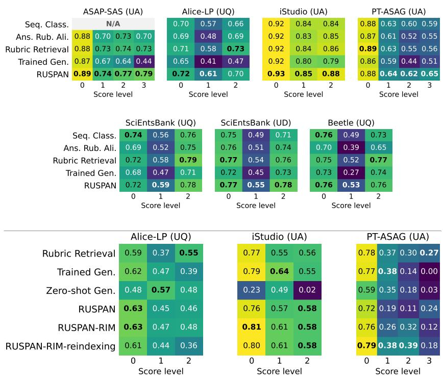  
Figure 4: Per-level F1 by method. Top: mono-benchmark training. Bottom: cross-benchmark, averaged over random seeds. Bold marks the best result at each score level.

## 6 Conclusion

We introduced RUSPAN, a rubric-conditioned framework for short answer scoring that represents score levels as rubric spans jointly encoded with the student answer. By scoring all candidate levels in a single forward pass, RUSPAN provides a flexible and efficient alternative within the tradeoff among flexibility, accuracy, and efficiency that limits prior ASAS approaches, including variable score spaces where fixed-head classifiers cannot be used. Across six ASAS benchmarks, RUSPAN delivers competitive mono-benchmark performance while avoiding pairwise answer-rubric expansion and autoregressive score generation. For crossbenchmark transfer, RIM with position reindexing mitigates inter-rubric attention dependence, yielding consistent and substantial gains on PT-ASAG under combined language and rubric-structure shift. Future work should explore richer feedback generation, multi-trait scoring, and robustness to noisy or underspecified rubrics.

## 7 Limitations

A central limitation of this work is the quality of the rubric annotations used for benchmark augmentation. We emphasize that rubric generation is not the object of study in this paper. Rather, generated rubrics serve as a practical augmentation step that allows benchmarks without native rubric descriptions to be evaluated under a common rubricconditioned formulation. Our claims therefore concern the model’s ability to use natural-language label descriptions as score-level representations, not the pedagogical optimality of the generated rubrics. In real educational settings, rubrics are typically written by trained educators who have access to curriculum goals, instructional materials, grading policies, and broader pedagogical context.

However, this information is not usually available in public ASAS datasets. This limited context can produce rubric descriptions that are underspecified, overly generic, or misaligned with the intended underlying assessment criteria.

Our study is also limited by the scope of public ASAS benchmarks. These datasets provide controlled short-answer scoring tasks, but they do not fully capture the complexity of classroom assessment, where responses may require multi-trait scoring, richer feedback, or reasoning over longer and more diverse student work. Finally, crossbenchmark transfer remains uneven, especially under language and rubric-structure shifts. While RIM improves robustness in several settings, preventing interactions among rubric spans may also remove useful information when score levels are meaningfully related.

## Acknowledgments

This work was supported by the Volkswagen Foundation through the project From Machine Learning to Machine Teaching: Making Machines AND Humans Smarter (ML2MT). The GPU resources used in this work were provided by Hessian.ai.

## References

Xiaoyu Bai and Manfred Stede. 2022. A survey of current machine learning approaches to student free-text evaluation for intelligent tutoring. International Journal ofArtificial Intelligence in Education, 33(1):1– 39.

Parishad BehnamGhader, Vaibhav Adlakha, Marius Mosbach, Dzmitry Bahdanau, Nicolas Chapados, and Siva Reddy. 2024. LLM2Vec: Large language models are secretly powerful text encoders. In First Conference on Language Modeling.

Marie Bexte, Andrea Horbach, and Torsten Zesch. 2022. Similarity-based content scoring - how to make S-BERT keep up with BERT. In Proceedings of the 17th Workshop on Innovative Use ofNLPfor Building Educational Applications (BEA 2022), pages 118– 123, Seattle, Washington. Association for Computational Linguistics.

Yonatan Bisk, Rowan Zellers, Jianfeng Gao, Yejin Choi, et al. 2020. PIQA: Reasoning about physical commonsense in natural language. Proceedings

of the AAAI Conference on Artificial Intelligence, 34(05):7432–7439.

Steven Burrows, Iryna Gurevych, and Benno Stein. 2015. The eras and trends of automatic short answer grading. International Journal of Artificial Intelligence in Education, 25:60–117.

Leon Camus and Anna Filighera. 2020. Investigating transformers for automatic short answer grading. In Artificial Intelligence in Education: 21st International Conference, AIED 2020, Ifrane, Morocco, July 6–10, 2020, Proceedings, Part II, page 43–48, Berlin, Heidelberg. Springer-Verlag.

Imran Chamieh, Torsten Zesch, and Bela Gipp. 2024. LLMs in short answer scoring: Limitations and promise of zero-shot and few-shot approaches. In Proceedings ofthe 19th Workshop on Innovative Use of NLP for Building Educational Applications (BEA), pages 309–315. Association for Computational Linguistics.

L. H. Chang, P. M. Taiga, and J. Vilén. 2024. Automatic short answer grading for Finnish with ChatGPT. Proceedings of the Thirty-Eighth AAAI Conference on Artificial Intelligence (AAAI-24), 38(1):226–234.

Myroslava Dzikovska, Rodney Nielsen, Chris Brew, Claudia Leacock, Danilo Giampiccolo, Luisa Bentivogli, Peter Clark, Ido Dagan, and Hoa Trang Dang. 2013. SemEval-2013 task 7: The joint student response analysis and 8th recognizing textual entailment challenge. In Second Joint Conference on Lexical and Computational Semantics (\*SEM), Volume 2: Proceedings of the Seventh International Workshop on Semantic Evaluation (SemEval 2013), pages 263–274, Atlanta, Georgia, USA. Association for Computational Linguistics.

Ahmed Elshabrawy, Yongxin Huang, Iryna Gurevych, and Alham Fikri Aji. 2025. Enabling natural zeroshot prompting on encoder models via statementtuning. In Findings ofthe Associationfor Computational Linguistics: NAACL 2025, pages 8302–8321, Albuquerque, New Mexico. Association for Computational Linguistics.

European Commission. 2026. Data protection explained.

Rafael Ferreira Mello, Cleon Pereira Junior, Luiz Rodrigues, Filipe Dwan Pereira, Luciano Cabral, Newarney Costa, Geber Ramalho, and Dragan Gaševic.´ 2025. Automatic short answer grading in the LLM era: Does GPT-4 with prompt engineering beat traditional models? In Proceedings of the 15th International Learning Analytics and Knowledge Conference (LAK), pages 93–103, New York, NY, USA. Association for Computing Machinery.

Lucas Galhardi, Bruno Brancher, Luiz Claudio Lazari, and Marco Antonio Tavares de Souza. 2018. Portuguese automatic short answer grading. In Simpósio Brasileiro de Informática na Educação (SBIE). Proceedings paper; dataset for Portuguese short answer grading.

Zorik Gekhman, Eyal Ben-David, Hadas Orgad, Eran Ofek, Yonatan Belinkov, Idan Szpektor, Jonathan Herzig, and Roi Reichart. 2025. Inside-Out: Hidden factual knowledge in LLMs. In Second Conference on Language Modeling.

Sebastian Gombert et al. 2026. Are rubrics all you need? Towards rubric-based automatic short answer scoring via guided rubric-answer alignment. In Proceedings of LAK26: 16th International Learning Analytics and Knowledge Conference.

Momchil Hardalov, Arnav Arora, Preslav Nakov, and Isabelle Augenstein. 2022. Few-shot cross-lingual stance detection with sentiment-based pre-training. Proceedings ofthe Thirty-Sixth AAAI Conference on Artificial Intelligence, 36(10):10729–10737.

Gerd Kortemeyer. 2024. Performance of the pre-trained large language model GPT-4 on automated short answer grading. Discover Artificial Intelligence, 4(1).

Yaman Kumar, Swati Aggarwal, Debanjan Mahata, Rajiv Ratn Shah, Ponnurangam Kumaraguru, and Roger Zimmermann. 2019. Get IT scored using AutoSAS—an automated system for scoring short answers. In Proceedings of the Thirty-Third AAAI Conference on Artificial Intelligence and Thirty-First Innovative Applications of Artificial Intelligence Conference and Ninth AAAI Symposium on Educational Advances in Artificial Intelligence, pages 9662–9669.

Chankyu Lee, Rajarshi Roy, Mengyao Xu, Jonathan Raiman, Mohammad Shoeybi, Bryan Catanzaro, and Wei Ping. 2025. NV-Embed: Improved techniques for training LLMs as generalist embedding models. In The Thirteenth International Conference on Learning Representations.

Zhaohui Li, Susan Lloyd, Matthew Beckman, and Rebecca Passonneau. 2023. Answer-state recurrent relational network (AsRRN) for constructed response assessment and feedback grouping. In Findings of the Association for Computational Linguistics: EMNLP 2023, pages 3879–3891, Singapore. Association for Computational Linguistics.

Ziyong Lin, Haoyi Wu, Shu Wang, Kewei Tu, Zilong Zheng, and Zixia Jia. 2025. Look both ways and no sink: Converting LLMs into text encoders without training. In Proceedings of the 63rd Annual Meeting of the Association for Computational Linguistics (Volume 1: Long Papers), pages 22839–22853, Vienna, Austria. Association for Computational Linguistics.

Chun Liu, Hongguang Zhang, Kainan Zhao, Xinghai Ju, and Lin Yang. 2024. LLMEmbed: Rethinking lightweight LLM’s genuine function in text classification. In Proceedings ofthe 62nd Annual Meeting of the Associationfor Computational Linguistics (Volume 1: Long Papers), pages 7994–8004, Bangkok, Thailand. Association for Computational Linguistics.

Emmy Liu, Chen Cui, Kenneth Zheng, and Graham Neubig. 2022. Testing the ability of language models to interpret figurative language. In Proceedings of

the 2022 Conference of the North American Chapter ofthe Associationfor Computational Linguistics: Human Language Technologies, pages 4370–4381.

Kun Luo, Minghao Qin, Zheng Liu, Shitao Xiao, Jun Zhao, and Kang Liu. 2024. Large language models as foundations for next-gen dense retrieval: A comprehensive empirical assessment. In Proceedings ofthe 2024 Conference on Empirical Methods in Natural Language Processing, pages 1354–1365, Miami, Florida, USA. Association for Computational Linguistics.

Andrew L. Maas, Raymond E. Daly, Peter T. Pham, Dan Huang, Andrew Y. Ng, and Christopher Potts. 2011. Learning word vectors for sentiment analysis. In Proceedings of the 49th Annual Meeting of the Association for Computational Linguistics: Human Language Technologies, pages 142–150.

Nitin Madnani, Jill Burstein, John Sabatini, and Tenaha O’Reilly. 2013. A model of two-stage grading for short answer questions. In Proceedings of the 8th Workshop on Innovative Use of NLP for Building Educational Applications, pages 1–10.

Saif Mohammad, Svetlana Kiritchenko, Parinaz Sobhani, Xiaodan Zhu, and Colin Cherry. 2016. SemEval-2016 task 6: Detecting stance in tweets. In Proceedings of the 10th International Workshop on Semantic Evaluation (SemEval-2016), pages 31–41.

Niklas Muennighoff, Nouamane Tazi, Loic Magne, and Nils Reimers. 2023. MTEB: Massive text embedding benchmark. In Proceedings of the 17th Conference ofthe European Chapter ofthe Associationfor Computational Linguistics, pages 2014–2037, Dubrovnik, Croatia. Association for Computational Linguistics.

Christopher Ormerod. 2022. Short-answer scoring with ensembles of pretrained language models. Preprint, arXiv:2202.11558.

Ellis B Page. 1966. The imminence of grading essays by computer. The Phi Delta Kappan, 47(5):238–243.

Dan Qiao, Yuan Gao, Zheming Yang, Di Yang, Ziheng Wu, Pengcheng Lu, Minghui Qiu, Juntao Li, and Min Zhang. 2025. Decoder-only LLMs can be masked auto-encoders. In Proceedings of the 63rd Annual Meeting of the Association for Computational Linguistics (Volume 2: Short Papers), pages 713–723, Vienna, Austria. Association for Computational Linguistics.

Brian Riordan, Andrea Horbach, Aoife Cahill, Torsten Zesch, and Chong Min Lee. 2017. Investigating neural architectures for short answer scoring. In Proceedings ofthe 12th Workshop on Innovative Use of NLP for Building Educational Applications, pages 159–168, Copenhagen, Denmark. Association for Computational Linguistics.

Qian Ruan, Ilia Kuznetsov, and Iryna Gurevych. 2024. Are large language models good classifiers? a study on edit intent classification in scientific document

revisions. In Proceedings ofthe 2024 Conference on Empirical Methods in Natural Language Processing, pages 15049–15067, Miami, Florida, USA. Association for Computational Linguistics.

Timo Schick and Hinrich Schütze. 2021. It’s not just size that matters: Small language models are also fewshot learners. In Proceedings ofthe 2021 Conference of the North American Chapter of the Association for Computational Linguistics: Human Language Technologies, pages 2339–2352, Online. Association for Computational Linguistics.

Shashank Sonkar, Kangqi Ni, Lesa Tran Lu, Kristi Kincaid, John S. Hutchinson, and Richard G. Baraniuk. 2024. Automated long answer grading with RiceChem dataset. In Artificial Intelligence in Education, volume 14829 of Lecture Notes in Computer Science, pages 163–176, Cham. Springer.

Zhifan Sun, Sebastian Gombert, Jannik Lossjew, Tobias Wyrwich, Berrit Katharina Czinczel, David Bednorz, Marcus Kubsch, Knut Neumann, and Hendrik Drachsler. 2026. ALICE: A large-scale German benchmark for rubric-based multi-dimensional automatic short answer scoring. In Proceedings of the 2026 Conference on Empirical Methods in Natural Language Processing. Association for Computational Linguistics. To appear.

Chul Sung, Tejas Dhamecha, Swarnadeep Saha, Tengfei Ma, Vinay Reddy, and Rishi Arora. 2019. Pretraining BERT on domain resources for short answer grading. In Proceedings ofthe 2019 Conference on Empirical Methods in Natural Language Processing and the 9th International Joint Conference on Natural Language Processing (EMNLP-IJCNLP), pages 6071–6075, Hong Kong, China. Association for Computational Linguistics.

Haike Xu, Zongyu Lin, Jing Zhou, Yanan Zheng, and Zhilin Yang. 2023. A universal discriminator for zero-shot generalization. In Proceedings ofthe 61st Annual Meeting of the Association for Computational Linguistics (Volume 1: Long Papers), pages 10559– 10575, Toronto, Canada. Association for Computational Linguistics.

Yijiong Yu, Huiqiang Jiang, Xufang Luo, Qianhui Wu, Chin-Yew Lin, Dongsheng Li, Yuqing Yang, Yongfeng Huang, and Lili Qiu. 2025. Mitigate position bias in LLMs via scaling a single hidden states channel. In Findings of the Association for Computational Linguistics: ACL 2025, pages 6092–6111, Vienna, Austria. Association for Computational Linguistics.

Xiang Zhang, Junbo Zhao, and Yann LeCun. 2015. Character-level convolutional networks for text classification. In Advances in Neural Information Processing Systems, volume 28.

## A Benchmark Augmentation

Several benchmarks in our collection lack rubric descriptions or reference answers. We augment these benchmarks using gpt-4o-mini via two pipelines described below, with the prompts shown in Figures 5 and 6.

Reference Answer Generation. ASAP-SAS does not provide reference answers. For each question, we prompt the LLM with the question text to generate a reference answer that serves as the sample solution during scoring (Figure 5).

Rubric Generation. For benchmarks without rubric descriptions, we prompt the LLM to generate a 2–3 sentence rubric for each score level (Figure 6). The prompt supplies the question text, all available reference answers, up to 10 student answer examples per score level from the training split, and the set of target score labels. The model is instructed to describe responses at each level directly (e.g., “Responses demonstrate. . . ”) without referencing label names, and to write in the language of the dataset. The LLM-generated rubric descriptions and sample solutions are derived from publicly available research datasets and are intended for research use only.

Generate a high-quality reference answer for the   
following question. The answer should be an   
independent, complete, and concise response that   
can serve as a scoring reference.   
Question:   
[QUESTION]   
Requirements:   
- The answer should correctly address the   
question;   
- Each answer should be only ONE sentence long;   
- Ensure the language of the answer matches the   
language of the question.  
Figure 5: Prompt template for reference answer generation.

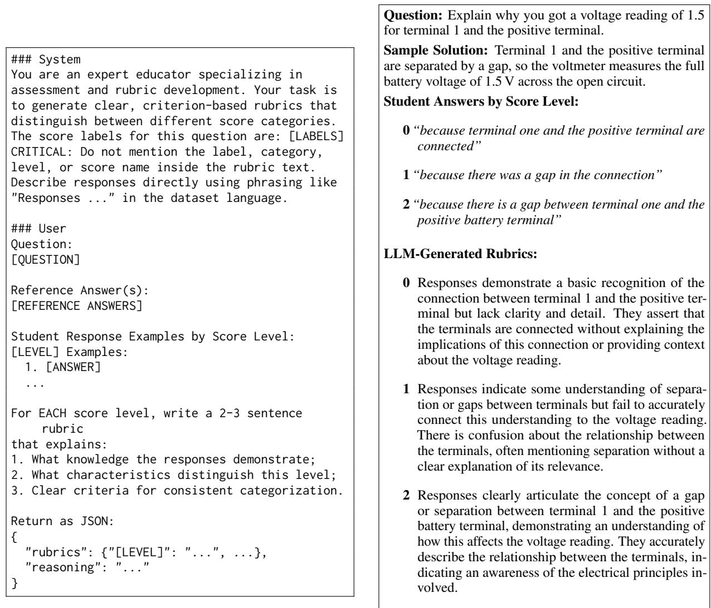  
Figure 6: Prompt template for rubric generation.  
Figure 7: Example of LLM-generated rubrics for a question from the BEETLE dataset. Score levels range from 0 (incorrect) to 2 (correct).

## B Input Examples

We follow Ruan et al. (2024) in using XML-style tags to mark field boundaries.

<question>   
Starting with mRNA leaving the nucleus,   
list and describe four major steps   
involved in protein synthesis.   
</question>   
<sample solution>   
The first step in protein synthesis   
involves the mRNA exiting the nucleus   
and entering the cytoplasm, where it   
serves as a template for protein   
assembly.   
</sample solution>   
<answer>   
mRNA leaves the nucleus mRNA carries   
the instruction to the mitocondria   
mitocondria then makes the protiens   
at last the mRNA returns to the nucleus   
with the protiens   
</answer>   
<rubric> Other </rubric >   
<rubric> One or two key elements </rubric >   
<rubric> Three key elements </rubric >   
<rubric> Four key elements </rubric >   
Evaluate the answer based on the   
provided rubric and other context   
information.  
Figure 8: An example model input from ASAP-SAS, showing the question, sample solution, student answer, candidate rubric labels (highlighted in blue), and scoring instruction. The > token at the end of each rubric span is used as the pooling token to extract the rubric representation.

## C Multilingual Input Format and Instruction Pool

For multilingual benchmarks we translate both the XML field tags and the scoring instructions into the dataset language. Table 5 shows the field tag mappings for German (alice\_lp) and Portuguese (pt\_asag). The <rubric> tag is kept in English across all benchmarks as it is an internal structural marker. We use the multilingual format in monobenchmark training and evaluation. For multibenchmark training, we use the English format for all benchmarks, as the models are trained on the English format.

We compose a pool of M = 10 scoring instruction templates per language; one is randomly sampled per instance at training and test time. The full pools are listed in Table 6.

<table><tr><td>Field</td><td>English</td><td>German</td><td>Portuguese</td></tr><tr><td>question</td><td>&lt;question&gt;</td><td>&lt;Frage&gt;</td><td>&lt;pergunta&gt;</td></tr><tr><td>sample solution</td><td>&lt;sample solution&gt;</td><td>&lt;Musterlösung&gt;</td><td>&lt;solução_exemplar&gt;</td></tr><tr><td>answer</td><td>&lt;answer&gt;</td><td>&lt;Antwort&gt;</td><td>&lt;resposta&gt;</td></tr><tr><td>rubric</td><td>&lt;rubric&gt;</td><td>&lt;rubric&gt;</td><td>&lt;rubric&gt;</td></tr></table>

Table 5: XML field tag translations by language.

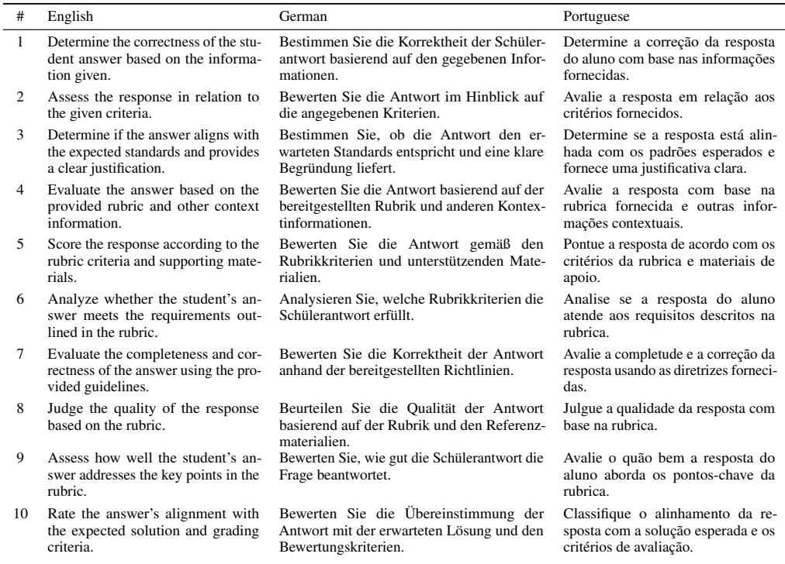  
Table 6: Full instruction pool (M = 10) in English, German, and Portuguese.

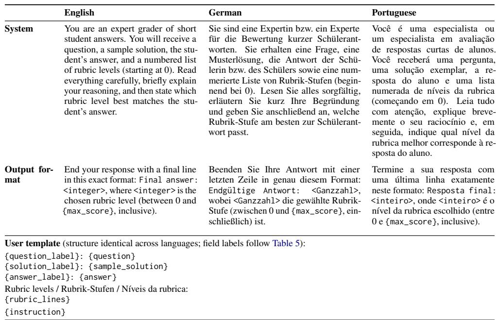  
Figure 9: Zero-shot prompt templates in English, German, and Portuguese.

## D Zero-shot Prompt Templates

Figure 9 shows the zero-shot prompt templates used for the LLM baseline in English, German, and Portuguese.

## E Hyperparameters and Model Choices

We report the full hyperparameter settings and model design choices used in our experiments in this section.

## E.1 Mono-Benchmark Training

The backbone models used in our experiments are Llama-3.2-1B-Instruct2, Llama-3.2- 3B-Instruct3, Mistral-7B-v0.14, and Llama-3.1- 8B-Instruct5.

RUSPAN, Standard Classification, and Rubric Retrieval. All models are fine-tuned using LoRA with rank 64, α = 64, dropout 0.1, and adapters applied to all linear modules. We use a maximum sequence length of 2048 tokens and an effective batch size of 16. Optimization uses a cosine learning-rate schedule with warmup over the first 1% of training steps. For decoder-only LLM backbones, we use paged AdamW in 32-bit; for BERT-style encoders, we use AdamW. All experiments use a fixed random seed and are run on two NVIDIA A100 GPUs. For ALICE-LP, we train for 3 epochs, as we find this maximizes performance on unseen questions; all other models are trained for 5 epochs. The learning rate is set to $2 \times 1 0 ^ { - 4 }$ for Llama-3.2-1B-Instruct and Llama-3.2-3B-Instruct, and $5 \times 1 0 ^ { - 5 }$ for Mistral-7B-v0.1 and Llama-3.1-8B-Instruct. Checkpoints are selected by the highest macro-F1 on the development split. For benchmarks without an official development split, we randomly sample a held-out development subset from the training split for checkpoint selection. Note that Mistral-7B-v0.1 and Llama-3.1-8B-Instruct are not evaluated under the Rubric Retrieval setup, as the approach expands each instance into multiple answer-rubric pairs, making training and inference prohibitively expensive at this scale.

LLM Generation. Models are trained for 3 epochs with a learning rate of $1 \times 1 0 ^ { - 4 }$ for Llama-3.2-1B-Instruct and Llama-3.2-3B-Instruct. All other hyperparameters follow the settings above. At evaluation time, generated labels are decoded greedily with temperature 0.

## E.2 Joint Training and Cross-Benchmark Evaluation

All fine-tuned models in the joint setting are trained for two epochs, which we find maximizes performance on unseen benchmarks. All other hyperparameters follow the mono-benchmark settings above.

## F Ablation Studies

## F.1 Rubric Quality and Use

To investigate rubric quality and rubric use, we conduct three sets of experiments.

First, we compare Sequence Classification with and without appended rubric text. This tests whether simply exposing a fixed-head classifier to rubric descriptions is sufficient.

Second, for benchmarks without original rubric descriptions, we apply RUSPAN but replace the detailed generated level descriptions with short label names (e.g., “Incorrect”, “Partially Correct”, “Correct”). This tests whether the model benefits from the semantic content of the generated rubric descriptions beyond the label names alone. Note that PT-ASAG is excluded because this dataset only provides a numerical score, hence we cannot ground the generated rubrics to a concrete set of level names.

Third, for benchmarks with human-written rubrics (ASAP-SAS, ALICE-LP), we use the same prompt to generate rubrics and compare them to the human-written ones.

The examples in Table 7 and Table 8 qualitatively compare human-written and LLM-generated rubric versions. The generated rubrics add concrete examples, explicit contrasts between adjacent levels, and response-oriented phrasing. However, they also introduce more interpretive content than the original rubrics, which can make the criteria more detailed but may also shift emphasis away from the concise distinctions used by human annotators. This is highly salient in the example of ALICE-LP, as the human-written rubrics focus on the number of scientific questions and the presence of variation, while the generated rubrics emphasize the depth of understanding and specific biological concepts mentioned in the responses. Thus, without understanding the original pedagogical intent and annotation guidelines, the generated rubrics may not align with the human-written ones in terms of what aspects of the responses are most important for distinguishing between levels.

For Sequence Classification, Table 9 shows that appending rubric text alone is not sufficient: removing rubrics often leaves performance unchanged or even improved, such as on SCIENTSBANK with the 1B backbone and on ISTUDIO with the 3B backbone. Thus, rubric text is useful when the model explicitly binds it to candidate score levels, rather than simply appending it to a fixed-head classifier input. Although rubric conditioning does not always yield the best result under mono-benchmark training, transfer to unseen questions or to benchmarks with different rubric structures is a more realistic educational setting, where scoring systems must generalize beyond the questions and rubrics observed during training.

For benchmarks without original rubric descriptions, detailed LLM-generated rubrics do not always outperform short label names, yet a pattern emerges. Across alignment functions, the DIFF variant underperforms when detailed rubrics are used, indicating limited semantic representation capacity of the generated rubrics. In terms of models, Llama-3.2-3B-Instruct clearly benefits more from detailed rubric descriptions, suggesting that larger models may be better at leveraging the semantic content of the generated rubrics. As for the differences between datasets, ISTUDIO-UA seems to benefit less from detailed LLM-generated rubrics. We hypothesize that this is because it is tested on questions seen during training, making it essentially an easier setting where the model can rely more on pattern recognition and less on semantic understanding of the rubrics.

The results show that replacing human-written rubrics with LLM-generated rubrics does not consistently preserve performance. On ASAP-SAS, the effect is mixed: generated rubrics slightly improve several settings, but they also underperform for CONDIFF with Llama-3.2-1B-Instruct and CON-CAT with Llama-3.2-3B-Instruct. The degradation is clearer on the ALICE-LP UQ split, where generated rubrics underperform human-written rubrics in most settings. This suggests a limitation of automatic rubric generation from information only available in the public datasets: without more detailed information about the target task, scoring conventions, and question-specific expectations, LLM-generated rubrics may omit distinctions that are important for reliable scoring.

## F.2 Sample-Solution Ablation

We examine whether the LLM-generated sample solution contributes to performance by removing it from the model input and reporting the change in macro-F1 relative to the full-input setting. This ablation applies only to ASAP-SAS, the only benchmark for which we generate sample solutions with an LLM.

<table><tr><td>Model</td><td>Variant</td><td>∆F1</td></tr><tr><td>Llama-3.2-1B-Instruct</td><td>RUSPAN-CONCAT RUSPAN-CONDIFF</td><td>-1.1 -0.1</td></tr><tr><td>Llama-3.2-3B-Instruct</td><td>RUSPAN-CONCAT RUSPAN-CONDIFF</td><td>+0.1 +0.7</td></tr><tr><td>Mean</td><td></td><td>-0.1</td></tr></table>

Table 10: Effect of removing the LLM-generated sample solution from ASAP-SAS inputs. Values are changes in macro-F1 relative to the full-input setting (ablated minus full). This ablation applies only to ASAP-SAS.

Removing the generated sample solution changes F1 by only −0.1 on average, with variation across backbones and alignment functions. We retain it to keep the ASAP-SAS input format consistent with the other ASAS benchmarks.

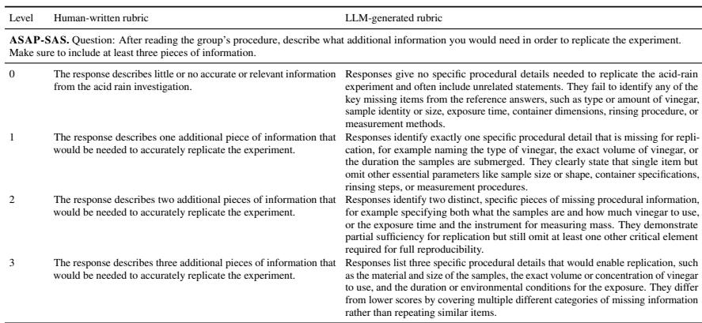  
Table 7: Qualitative comparison of human-written and LLM-generated rubrics for an ASAP-SAS item.

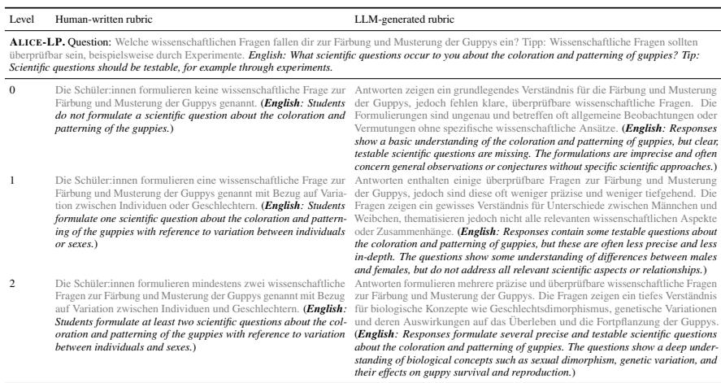  
Table 8: Qualitative comparison of human-written and LLM-generated rubrics for an ALICE-LP item. The original German text is shown in gray and followed by an English translation.

<table><tr><td rowspan="2">Model</td><td rowspan="2">Variant</td><td>iStudio</td><td colspan="2">SciEntsBank</td><td>Beetle</td><td>ASAP-SAS</td><td>Alice-LP</td></tr><tr><td>UA</td><td>UQ</td><td>UD</td><td>UQ</td><td>UA</td><td>UQ</td></tr><tr><td rowspan="5">Llama-3.2-1B-Instruct</td><td>CONCAT</td><td>84.8</td><td>65.3</td><td>64.5</td><td>64.5</td><td>77.8</td><td>61.3</td></tr><tr><td>DIFF</td><td>87.2</td><td>30.3</td><td>26.9</td><td>65.6</td><td>78.5</td><td>65.6</td></tr><tr><td>CONDIFF</td><td>86.8</td><td>66.9</td><td>65.9</td><td>66.2</td><td>76.9</td><td>62.6</td></tr><tr><td>NO-ALIGN</td><td>87.2</td><td>64.3</td><td>63.2</td><td>65.5</td><td>76.9</td><td>62.1</td></tr><tr><td>Seq. Class. w/o Rub.</td><td>85.4</td><td>66.2</td><td>64.9</td><td>67.0</td><td>N/A</td><td>63.1</td></tr><tr><td rowspan="5">Llama-3.2-3B-Instruct</td><td>CONCAT</td><td>87.1</td><td>67.7</td><td>67.5</td><td>67.8</td><td>80.0</td><td>64.1</td></tr><tr><td>DIFF</td><td>88.4</td><td>63.8</td><td>67.1</td><td>66.3</td><td>79.8</td><td>61.7</td></tr><tr><td>CONDIFF</td><td>87.0</td><td>68.4</td><td>68.4</td><td>66.4</td><td>78.2</td><td>66.0</td></tr><tr><td>NO-ALIGN</td><td>84.1</td><td>66.7</td><td>67.2</td><td>66.8</td><td>79.2</td><td>62.5</td></tr><tr><td>Seq. Class. w/o Rub.</td><td>88.3</td><td>67.5</td><td>66.6</td><td>67.6</td><td>N/A</td><td>64.2</td></tr></table>

Table 9: Quality-control ablations for rubric descriptions (macro-F1). For RUSPAN variants, the left block reports performance when detailed generated rubric descriptions are replaced with short label names, and the right block reports performance when human-written rubric descriptions are replaced with LLM-generated rubric descriptions. For Sequence Classification, the row reports performance without appended rubric text, with N/A for ASAP-SAS. Light red marks cases where the ablated condition is worse for human-written rubric replacement or better for label-name and no-rubric ablations

## G Label Distributions

## H Non-ASAS Datasets

We evaluate on seven non-ASAS benchmarks covering commonsense reasoning, figurative-language interpretation, stance detection, sentiment analysis, news topic classification, and scientific edit-intent classification, ranging from relatively simple tasks that may not require complex label descriptions and rely mostly on lexical cues in the input texts (e.g., sentiment analysis and topic classification) to more complex tasks that may benefit from detailed rubric descriptions (e.g., commonsense reasoning and stance detection).

We compare sequence classification baselines (with and without rubric text) and four RUSPAN variants (RUSPAN-CONDIFF, RUSPAN-CONCAT, RUSPAN-DIFF, and RUSPAN-NO-ALIGN), with the exception of PIQA and FigQA, where the candidate solutions serve as the rubric text and cannot be removed without changing the task. Table 11 reports results for the seven non-ASAS benchmarks.

PIQA. A physical commonsense reasoning benchmark (Bisk et al., 2020). Given a goal, the model must select the more plausible of two candidate solutions. The task is cast as multiple choice.

xStance. A multilingual political stance detection dataset (Vamvas and Sennrich, 2020) covering German, French, and Italian. Given a policy question and a short comment, the model decides whether the author supports or opposes the claim.

The training set is in German and French, while the test set is Italian; this setup tests the model’s ability to generalize across languages.

SemEval-2016 Task 6. A tweet stance detection benchmark (Mohammad et al., 2016). Given a tweet and a named target, the model classifies the stance as Favor, Against, or None. The test split covers both seen targets (shared with training) and an unseen target (Donald Trump), allowing evaluation under both in-domain and zero-shot target conditions.

FigQA. A figurative-language multiple-choice benchmark (Liu et al., 2022). Given a figurative sentence, the model selects the ending that best matches its intended meaning.

IMDB. A binary movie-review sentiment benchmark (Maas et al., 2011). The model classifies a review as expressing negative or positive sentiment. Due to the large size of this dataset, we randomly sample 30% of the training split for all experiments; our focus is on comparing models rather than maximizing absolute performance.

AG News. A four-way news topic classification benchmark (Zhang et al., 2015).

Given a short news article, the model classifies it as World, Sports, Business, or Sci/Tech. We similarly sample 30% of the training split due to the large dataset size.

EIC. The Edit Intent Classification benchmark (Ruan et al., 2024) tests whether the rubriclabel interface extends to a specialized discourse task. Given an original and a revised scientific text, the model identifies the purpose of the edit as Claim, Clarity, Fact/Evidence, Grammar, or Other.

Table 11 yields three observations.

Saturation tasks are unaffected by rubric representations. On IMDB and AG NEWS, all methods achieve near-identical macro-F1 (94 to 97%), regardless of whether rubric text is present or how it is encoded. These tasks have short, unambiguous label names whose semantics are fully recoverable from training data alone, leaving no room for detailed rubric descriptions to contribute.

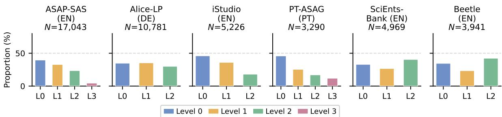

Figure 10: Label distributions for the six ASAS benchmarks.
<table><tr><td rowspan="2">Model</td><td rowspan="2">Method</td><td rowspan="2">PIQA</td><td>XSTANCE</td><td colspan="2">SEMEVAL-2016 TASK 6</td><td rowspan="2">FIGQA</td><td rowspan="2">IMDB</td><td rowspan="2">AG NEWS</td><td rowspan="2">EIC</td></tr><tr><td>Italian</td><td>Seen Targets Donald Trump</td><td></td></tr><tr><td rowspan="6">Llama-3.2-1B-Instruct</td><td>Seq. Class. w/o Rub.</td><td>N/A</td><td>78.4</td><td>73.6</td><td>61.3</td><td>N/A</td><td>96.4</td><td>95.2</td><td>80.2</td></tr><tr><td>Seq. Class. w/ Rub.</td><td>78.3</td><td>78.8</td><td>73.7</td><td>45.8</td><td>92.3</td><td>95.8</td><td>95.1</td><td>81.5</td></tr><tr><td>RUSPAN-CONCAT</td><td>81.7</td><td>80.6</td><td>74.0</td><td>43.1</td><td>92.8</td><td>95.8</td><td>94.8</td><td>80.8</td></tr><tr><td>RUSPAN-DIFF</td><td>80.8</td><td>80.4</td><td>73.7</td><td>53.9</td><td>92.6</td><td>96.0</td><td>95.0</td><td>80.7</td></tr><tr><td>RUSPAN-CONDIFF</td><td>80.5</td><td>79.7</td><td>76.1</td><td>60.5</td><td>92.8</td><td>96.3</td><td>95.1</td><td>80.5</td></tr><tr><td>RUSPAN-NO-ALIGN</td><td>81.6</td><td>80.5</td><td>75.9</td><td>42.3</td><td>92.4</td><td>95.9</td><td>95.0</td><td>80.5</td></tr><tr><td rowspan="6">Llama-3.2-3B-Instruct</td><td>Seq. Class. w/o Rub.</td><td>N/A</td><td>82.9</td><td>76.3</td><td>42.2</td><td>N/A</td><td>96.8</td><td>94.7</td><td>83.7</td></tr><tr><td>Seq. Class. w/ Rub.</td><td>85.4</td><td>84.7</td><td>77.4</td><td>49.6</td><td>94.6</td><td>96.8</td><td>94.8</td><td>82.4</td></tr><tr><td>RUSPAN-CONCAT</td><td>87.8</td><td>84.8</td><td>76.8</td><td>64.1</td><td>95.5</td><td>96.4</td><td>94.6</td><td>83.5</td></tr><tr><td>RUSPAN-DIFF</td><td>88.3</td><td>84.7</td><td>78.6</td><td>53.6</td><td>95.4</td><td>96.7</td><td>94.5</td><td>83.0</td></tr><tr><td>RUSPAN-CONDIFF</td><td>86.3</td><td>84.6</td><td>78.5</td><td>70.2</td><td>95.9</td><td>96.8</td><td>94.6</td><td>82.8</td></tr><tr><td>RUSPAN-NO-ALIGN</td><td>85.8</td><td>84.8</td><td>79.5</td><td>69.6</td><td>96.1</td><td>96.7</td><td>94.7</td><td>83.4</td></tr></table>

Table 11: Available non-ASAS benchmark results (macro-F1). Bold indicates the best completed result within each model group.  
w/o Rub. is competitive (EIC, IMDB, AG News), RUSPAN variants match or come within 1 point of the baseline, indicating that the span-encoding overhead does not introduce a systematic penalty when rubric descriptions carry no additional discriminative signal.

Rubric text benefits classification only when coupled with per-label encoding. The SEMEVAL-2016 TASK 6 Donald Trump split, which tests an unseen target at evaluation time, is the most informative condition. For the 3B backbone, Seq. Class. w/o Rub. scores 42.2, while RUSPAN-CONDIFF and RUSPAN-NO-ALIGN reach 70.2 and 69.6. Yet Seq. Class. w/ Rub. scores only 49.6, confirming that appending rubric text to a fixed-head classifier does not transfer the semantic content of label descriptions to the prediction. The gain is specific to the per-label span encoding of RUSPAN, which forces the model to bind answer representations to individual rubric spans rather than treating the rubric as undifferentiated context. For the 1B backbone the effect is weaker: Seq. Class. w/o Rub. already reaches 61.3 by exploiting training-set lexical patterns, and rubric-based gains are less consistent, suggesting that the smaller model has limited capacity for compositional reasoning over unseen label descriptions.

RUSPAN does not hurt on tasks where rubrics add no value. Across tasks where Seq. Class.

<table><tr><td>PIQA &lt;goal&gt; When boiling butter, when it&#x27;s ready, you can &lt;/goal&gt;</td></tr><tr><td>&lt;rubric&gt; Pour it onto a plate &lt;/rubric&gt;</td></tr><tr><td>&lt;rubric&gt; Pour it into a jar &lt;/rubric&gt;</td></tr><tr><td>Select the most plausible solution...</td></tr></table>

<table><tr><td>xStance &lt;question&gt; Eine Volksinitiative fordert die Begrenzung der Bauzonen ... Befürworten Sie? &lt;/question&gt; &lt;comment&gt; Eine fixe Grösse verbieten, ist das falsche Mittel &lt;/comment&gt;</td></tr><tr><td>&lt;rubric&gt; the author is supportive of the claim &lt;/rubric&gt;</td></tr><tr><td>&lt;rubric&gt; the author is against the claim &lt;/rubric&gt;</td></tr><tr><td>Determine whether the comment supports...</td></tr></table>

<table><tr><td>SemEval-2016 Task 6 &lt;target&gt; Atheism &lt;/target&gt; &lt;tweet&gt; dear lord thank u for all of ur blessings ...</td></tr><tr><td>#SemST &lt;/tweet&gt; &lt;rubric&gt; the author is supportive of Atheism</td></tr><tr><td>&lt;/rubric&gt; &lt;rubric&gt; the author is against Atheism</td></tr><tr><td>&lt;/rubric&gt; &lt;rubric&gt; the author is neutral to Atheism</td></tr><tr><td>&lt;/rubric&gt; Determine whether the tweet supports...</td></tr></table>

<table><tr><td colspan="3">FigQA &lt;sentence&gt; Her word had the strength of titanium.</td></tr><tr><td>&lt;/sentence&gt; &lt;rubric&gt;</td><td>Her promises</td><td>can be believed.</td></tr><tr><td>&lt;/rubric&gt; &lt;/rubric&gt;</td><td>&lt;rubric&gt; Her promises cannot be </td><td>trusted.</td></tr><tr><td colspan="3">Choose the ending that best matches...</td></tr></table>

<table><tr><td colspan="2">IMDB &lt;review&gt; I rented I AM CURIOUS-YELLOW ... this film</td></tr><tr><td>does not have much of a plot. &lt;/review&gt; &lt;rubric&gt; the review sentiment &lt;/rubric&gt;</td><td>expresses negative</td></tr><tr><td>&lt;rubric&gt; the review expresses sentiment &lt;/rubric&gt;</td><td>positive</td></tr><tr><td colspan="2">Classify the sentiment of the review...</td></tr></table>

<table><tr><td rowspan=1 colspan=1>AG News&lt;text&gt; Shares of Google rose 5% after strong quarterlyearnings driven by ad revenue. &lt;/text&gt;</td></tr><tr><td rowspan=1 colspan=1>&lt;rubric&gt; the article is about world news,international affairs, politics, or globalevents &lt;/rubric&gt;</td></tr><tr><td rowspan=1 colspan=1>&lt;rubric&gt; the article is about sports, games,athletes, teams, or sporting events &lt;/rubric&gt;</td></tr><tr><td rowspan=1 colspan=1>&lt;rubric&gt; thearticle is about business,finance, markets, companies, or the economy&lt;/rubric&gt;</td></tr><tr><td rowspan=1 colspan=1>&lt;rubric&gt; thearticle isabout science,technology,    computing,    research,    orinnovation &lt;/rubric&gt;</td></tr><tr><td rowspan=1 colspan=1>Classify the news article into one of. ..</td></tr></table>

<table><tr><td rowspan=1 colspan=1>EIC&lt;old&gt; For MBTI, users were able to provide multiple texts, we report unique users in parentheses. &lt;/old&gt;&lt;new&gt; [empty] &lt;/new&gt;</td></tr><tr><td rowspan=1 colspan=1>&lt;rubric&gt; the edit modifies or introduces a claim or argument &lt;/rubric&gt;</td></tr><tr><td rowspan=1 colspan=1>&lt;rubric&gt; the edit improves the clarity or readability of the text &lt;/rubric&gt;</td></tr><tr><td rowspan=1 colspan=1>&lt;rubric&gt; the edit adds, removes, or modifies factual information or supporting evidence &lt;/rubric&gt;</td></tr><tr><td rowspan=1 colspan=1>&lt;rubric&gt; the edit corrects grammatical, spelling, or punctuation errors &lt;/rubric&gt;</td></tr><tr><td rowspan=1 colspan=1>&lt;rubric&gt; the edit serves another purpose not covered by the above categories &lt;/rubric&gt;</td></tr><tr><td rowspan=1 colspan=1>Classify the edit intent for the source and target text. . .</td></tr></table>

Figure 11: Truncated input examples for the seven non-ASAS benchmarks. Rubric (label) descriptions are highlighted in blue .