# RunningTab: Direct Workspace Interaction with Environment-Side Tabs

Jinheon Baek1, Soyeong Jeong1, Yumin Choi1, Dongsu Han1 and Sung Ju Hwang1,2 1KAIST, 2DeepAuto.ai

Much knowledge work produces new deliverables from files a workspace already holds, and LLM agents are beginning to take such work over. Through direct corpus interaction, an agent can search and read any of those files from a terminal with no indexing, and producing a deliverable from many of them in this way is what we call direct workspace interaction (DWI). Reaching the files, however, is only half the task: nothing keeps track of what the task asks for, what has been read, and what was listed but never opened, all of which slip through the context window without leaving a trace, so an agent may extract a figure and still deliver a report without it. To address this, we present RunningTab, a framework that equips direct workspace interaction with an environment-side tab: a per-task record of what the task still owes, kept by the environment alongside the agent. Specifically, the agent adds its requirements, while the environment records every file read as an excerpt with its provenance and every listed but unopened file as a candidate; the agent can then see each requirement beside its best-matching excerpts and top unopened candidates, resolve it against matching content or set it aside with a reason, and, should it try to finish with requirements still open, receive them in a finish check. We validate RunningTab on three benchmarks with three LLMs, where it consistently outperforms plain DWI and baselines that keep the record in the model, while its tab usually holds the values a deliverable needs once seen.

## 1. Introduction

Much of the work in an organization consists of producing new deliverables from files it already holds (the reports, spreadsheets, slide decks, and notes accumulated over years in a shared workspace) (Xu et al., 2025a; Patwardhan et al., 2025; Tang et al., 2026): a hiring summary is compiled from resumes and interview notes; a budget review is built from a year of monthly spreadsheets; a project proposal is drafted from meeting notes and a previous contract. Large Language Model (LLM) agents that operate a computer autonomously (Yao et al., 2023; Schick et al., 2023; Yang et al., 2024; Merrill et al., 2026) make it possible to hand such work over end to end, so that the agent itself locates the relevant files, reads them, and writes the deliverable. A workspace task, then, is not a single retrieval but an accumulation over a long horizon: the deliverable brings together content scattered across many files, and the agent must reach each of them before it can write.

To reach the existing files, direct corpus interaction (Li et al., 2026b) opens the road: instead of a retriever over a prebuilt index (Karpukhin et al., 2020; Lewis et al., 2020), the agent works in a terminal and applies standard command-line utilities (listing a directory, searching for a term across files, opening a document) directly to the raw files, so that any file in the workspace can be reached as it is, with no indexing or preprocessing. Subsequent work scales it to larger corpora (Lu et al., 2026), synthesizes tasks for it (Salemi et al., 2026), and studies how agents search under it (Sen et al., 2026; Subramanian et al., 2026). However, when the corpus is such a workspace and the goal is not a short answer to a question but a new deliverable assembled from many of its files, the agent has to work inside the workspace over many steps and hand in the deliverable at the end; we refer to this setting as direct workspace interaction (DWI). Yet reaching the files is only half the task.

The agent has full access to the workspace, but nothing keeps track of the task it is carrying out. What the task asks for, which files have been read, and which were listed but never opened pass through the context window and are soon displaced by new observations; nothing records which of them have been used, and nothing connects a requirement of the task to the file that satisfies it. As a consequence, an agent may open the right annual report, extract the figure it needs into its observations, and still deliver a report without that figure; or it may list a folder that contains the relevant file and never open it. What is missing, we argue, is a record of what the task still owes, kept by the environment and available to the agent whenever it needs it.

In this work, we present RunningTab, a framework that equips direct workspace interaction with an environment-side tab: a per-task running record that the environment maintains for the agent (Figure 1).

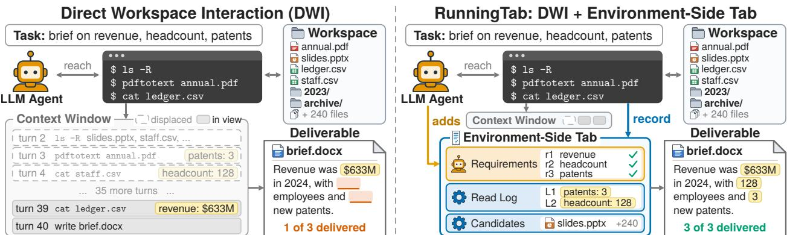  
Figure 1: Direct workspace interaction (DWI) and RunningTab on an illustrative task: a brief that needs three facts scattered across a workspace. (Left) In DWI, the agent reaches every file through its terminal, but what it reads lives only in its context window: facts read early are displaced by later observations, and the brief is delivered without them. (Right) RunningTab keeps an environment-side tab beside the agent: the agent adds the requirements of the task, the environment records what is read and what is listed but not opened, and the facts remain available until the deliverable is written.

Specifically, the agent adds one requirement per fact, figure, or element the task asks for, while the environment records every file read as an excerpt with its provenance and every file listed but not opened as a candidate, further ranked by its relevance to the task. Because the tab keeps what would otherwise have passed out of view, the agent can consult it freely, returning to a stored excerpt or a listed file whenever it needs them instead of searching the workspace again. Furthermore, before resolving any requirement, the agent lists them and sees each open one beside its best-matching excerpts and its top unopened candidates, and a requirement is resolved only against an excerpt whose content matches it, or with a reason it cannot be met; should the agent attempt to finish with items open, the environment returns them once, in a finish check. The tab thus runs alongside the task, from the first requirement the agent writes to the finish check, holding what the model would otherwise have to retain and pointing back to the files it came from.

We validate RunningTab on three benchmarks (Tang et al., 2026; Xu et al., 2025a; Opsahl-Ong et al., 2026) with three LLMs, where it improves over plain DWI and baselines in which the model itself keeps track of the task, in every case. Ablations attribute most of this gain to what the environment captures on its own, the tab usually holds the values a deliverable needs once the agent has seen them, and the gain grows with how much the agent reads. These results afirm that direct workspace interaction needs more than access to the files: the terminal reaches them, and the environment-side tab keeps what the task owes until it is delivered.

## 2. Related Work

Workspace Agents LLM agents that operate a computer have shown strong performance as software developers and terminal users (Yang et al., 2024; Wang et al., 2025) and are evaluated in terminal and desktop environments (Merrill et al., 2026; Xie et al., 2024). Building on these agents, recent benchmarks bring them to knowledge work: they pose tasks over realistic ofice and enterprise workspaces and judge the deliverable the agent produces (Xu et al., 2025a; Patwardhan et al., 2025; Tang et al., 2026; Wang et al., 2024; Opsahl-Ong et al., 2026; Chen et al., 2026). However, these studies find that the deliverables often lack content the workspace holds: Xu et al. (2025a) attribute failures in part to a lack of ability to understand documents, and Tang et al. (2026) name heterogeneous file understanding and lineage tracing as the bottlenecks. These diagnoses concern reaching and reading the files, whereas our own analysis (discussed in Section 3.1 with Figure 2) takes a diferent lens and finds a loss that these diagnoses do not cover: content from files the agent had already opened, which appeared in its observations yet is missing from the deliverable. In this work, we address this part directly, by keeping beside the agent a record of what the task still owes and of what has been read, so that content once reached is not lost before delivery.

Direct Corpus Interaction Retrieval over a prebuilt index has long been the way a model reaches a corpus beyond its context (Karpukhin et al., 2020; Lewis et al., 2020), first as a single retrieval step and then, in agentic search, as repeated queries to the same retriever over many rounds (Jin et al., 2025; Li et al., 2025). Direct corpus interaction departs from this design: rather than a retriever that decides what the agent sees, the agent is given the corpus itself and searches it with terminal tools (Li et al., 2026b). In particular, Dr-DCI (Lu et al., 2026) lets the agent pull retrieved documents into a local workspace (where a workspace denotes the materialized set of pulled documents, whereas here it denotes the files an organization holds), GrepSeek (Salemi et al., 2026) trains compact agents for it, and related work compares terminal or keyword search with vector retrieval (Sen et al., 2026; Subramanian et al., 2026) or builds on it (Zhuang et al., 2026; Li et al., 2026a). However, these works typically target a short answer to a question and improve how an agent reaches the corpus; to our knowledge, none of them records which file meets which requirement of the task. RunningTab instead turns to what becomes of the content once it is reached: it changes nothing about how the agent reaches the files and records, beside the agent, what the task asks for and which opened file each item was closed against.

Agent Memory Memory for LLM agents is typically written by the model itself and kept across sessions or trials (Zhang et al., 2025): content is moved out of the context window into external storage and brought back when needed (Packer et al., 2023), or the agent records its experiences and reflections and retrieves them later (Park et al., 2023; Shinn et al., 2023; Xu et al., 2025b). Beyond memory that outlives a task, the model likewise keeps its own state within a single task: a plan written into its context (Wang et al., 2023), notes it writes on what it reads (Lanchantin et al., 2023), a compact internal state it rewrites at each turn (Zhou et al., 2025), or, in multi-agent systems such as Magentic-One (Fourney et al., 2024), a plan and a progress record that an orchestrator LLM writes and judges. In recent work, such a record is kept for the agent and updated as the task proceeds, by the model itself or by further models that supervise it (Ko et al., 2026; Wu et al., 2026; Ma et al., 2026). However, wherever these systems keep a record of the task, it is kept by a model, which writes it and marks its items complete. In contrast, in RunningTab, the tab is kept by the environment: the environment writes it from what the agent read and listed (the agent adds only its requirements), its items are marked done only against a captured excerpt or set aside with a reason, and, kept outside the context window, it is not displaced and is returned to the agent once, when it tries to finish.

## 3. Method

In this section, we first formalize direct workspace interaction, a setting in which the agent is given access to every file of a workspace but no persistent record of the state of its task, and then present RunningTab, which supplies this record in the form of an environment-side tab kept beside the agent.

## 3.1. Direct Workspace Interaction

Workspace Tasks Let � denote a workspace, the collection of files an organization already holds (such as reports, spreadsheets, slide decks, and notes), and let � denote a task that asks for a new deliverable � (for instance, a report or a spreadsheet) to be produced from them. What characterizes such a task is that what it asks for rarely sits in one place: � decomposes into many individual elements (a fact to look up, a figure to extract, a section to write) whose sources are scattered across the files of �, and the deliverable is complete only when every one of them has been carried into �. The task is carried out by an agent, an LLM typically equipped with terminal tools (such as read, which opens a file, and bash, which runs a shell command), which works in turns: in each turn, the model issues tool calls and receives their observations, writing � into an output folder of �, and it finishes when it responds without a tool call, which we refer to as a stop.

Direct Workspace Interaction To reach the files, the agent follows direct corpus interaction (Li et al., 2026b): instead of querying a retriever over an index, it applies its terminal tools directly to the raw files, so that any file in � can be listed, searched, and opened as it is. We define direct workspace interaction (DWI) as the setting in which a workspace task is carried out with this form of access: given � and �, the agent interacts directly with the files of � over many turns and hands in � when it finishes. DWI thus inherits from direct corpus interaction how files are reached, but difers from it in what is asked of the agent: there, the output is a short answer that a few passages typically sufice to support; here, it is a deliverable that brings together content from many files, so that what the agent finds should remain available until it is written into �.

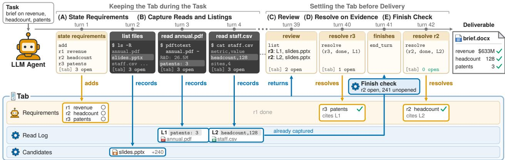  
Figure 3: RunningTab over one task. The agent (top) works in turns, and the environment-side tab (bottom) fills under the turn that wrote each entry. (A) The agent states the requirements. (B) As the agent lists and reads files, the environment records each listed file as a candidate and each read as a read log entry with its anchor. (C) The review shows each open requirement beside its best read log match and the unopened files. (D) The agent resolves a requirement by citing the read log entry that holds its content. (E) At the stop, the environment returns one finish check with what is still open; here the tab had already captured the missing fact, so the agent closes it and delivers.

The Missing Record of the Task In its plain form, however, DWI leaves this to the context window, where what the agent has found survives only as a passage in a growing stream of observations. To measure how often content shown to the agent is missing from the deliverable, we analyze DCI (Li et al., 2026b), the plain form of DWI, with GPT-5.4 nano (OpenAI, 2026) on Workspace-Bench (Tang et al., 2026), which checks each deliverable against rubrics, over three runs of its 100 tasks. We assign each rubric that DCI fails to a failure type with LLM annotators (agreeing with human labels at a Cohen’s kappa of 0.83), and check whether each numeric value a rubric expects appears in the observations of the agent and in its deliverable.

As shown in Figure 2 (top), extraction, in which the agent opened the right files but the deliverable lacks or distorts their content, accounts for 51.1% of the points that DCI loses and splits into two parts: Shown but Missing (12.3%), where the content is absent from the deliverable although it appears in the output of a file the agent had opened, and Dropped or Distorted (38.9%), where the content is either absent with no such evidence or present but inexact, misplaced, or misread. Discovery, in which the right files are never opened (including files listed but not opened), accounts for another 17.6%. Among the attempts that produced a deliverable, about one in five (19.8%) of the 891 distinctive numeric values that the rubrics expect and that appear in an observation of the agent are absent from the deliverable, and the rubrics that expect them are not

Breakdown of Failure Types  
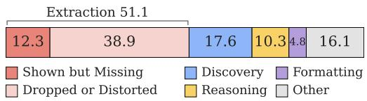

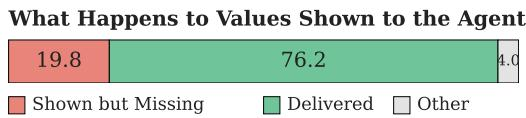  
Figure 2: DCI with GPT-5.4 nano on Workspace-Bench, as shares (%). (Top) Lost points of the rubric pass rate by failure type. (Bottom) Rubric values shown to the agent, by outcome.

satisfied (Figure 2, bottom). By contrast, a record of the state of the task, kept outside the context window, ofers what the stream cannot: at any point, it shows which elements of � are still unmet, which observations have been used in �, and which listed files have yet to be opened.

Motivated by this, RunningTab is built around an object that keeps such a record, the environment-side tab (Figure 3), a per-task record of what the task still owes, maintained not by the model but by the environment (the loop that runs the model and its tool calls). Next, we define the tab (Section 3.2) and describe how it is kept during the task (Section 3.3) and settled before delivery (Section 3.4).

## 3.2. Environment-Side Tab

We now turn to the environment-side tab (Figure 3), the central component of RunningTab, and describe what it consists of, how the environment maintains it, and how the agent accesses it.

Composition of the Tab Recall that a deliverable is assembled from content scattered across many files, often long after that content was first encountered (Section 3.1). Consequently, by the time the agent writes, it should rely on the following (remaining accessible): what the task asks for (so that no element is left out), what it has already read (so that content found earlier can be reused without searching for it again), and which files it has seen in a listing but not yet opened (so that it knows where to look for what is still missing). To this end, the tab maintains one kind of entry for each of them. Formally, for a task $t ,$ the tab is defined as $\mathcal { T } _ { t } = ( \mathcal { R } , \mathcal { L } , \mathcal { C } )$ , which consists of requirements (ℛ), a read log (ℒ), and candidates (�), described as follows:

• Requirements (ℛ). The requirements are the individual items that the task asks for, each being one fact, figure, or element of the deliverable. For instance, for a task that asks for a short report with several figures from an annual report, one requirement would be the number of new invention patents in 2024. At the start of the task, the agent states these items, and the environment records each of them as a requirement $r _ { i } \in \mathcal { R }$ and tracks its status from then on. Specifically, a requirement is open when it is recorded, and the agent could later resolve it in one of two ways: as done, when its content has been found in a file, in which case the agent cites the entry of the read log that contains it; or as unavailable, when no file supplies it (for instance, because it is to be computed or written by the agent), in which case the agent states the reason.

• Read log (ℒ). The read log keeps a copy of what the agent has read. Whenever the agent reads a file (by opening it or extracting its text), the environment records an entry $\ell _ { j } \in { \mathcal { L } } _ { : }$ , which consists of an excerpt (the content exactly as shown to the model) and an anchor (its provenance: the path of the file and the command that produced it). In the example above, extracting the text of the annual report yields an entry whose excerpt contains the line with the patent count, so it can be found again without reopening the report.

• Candidates (�). The candidates are the files the agent has come across but not yet looked into. Whenever a file appears in a listing (such as the output of a command that lists a folder or searches for file names) without having been opened, the environment records it in ${ \mathcal { C } } \subseteq { \mathcal { W } }$ , and removes it once the agent opens it. In the example, if the folder of the annual report also contains a presentation of the same year that the agent has not opened, it remains among the candidates, as a place where a missing figure may still be found.

Note that it is the environment, rather than the model itself, that keeps every entry of the tab: it stores the requirements as the agent states them, and it captures the read log and the candidates on its own, since it observes every read and every listing, whereas a record that the model keeps for itself may miss some of them. Moreover, the tab is stored outside the context window, so that its entries are not displaced by new observations, and outside the workspace, so that it is not mixed with the files the agent lists and reads or with the deliverable. In other words, being kept by the environment and stored outside the context window is what distinguishes the tab; a record that the model keeps on its own within its context has neither of these properties.

Operations on the Tab Since the tab is stored outside the context window, the agent accesses it through four operations. Specifically, two of them update the requirements: add states one or more requirements, and resolve resolves a requirement as done or unavailable. The other two read the tab: list lists the requirements with their status, the candidates, or the entries of the read log, and show returns a single entry of the read log (its excerpt with its anchor), so that content read earlier can be consulted again without reopening the file. We describe when and how these operations are used in the following subsections.

## 3.3. Keeping the Tab during the Task

We now describe how the tab is kept while the agent works. Since the tab is useful at a given turn only if it already holds what the agent needs then, each kind of entry is recorded as it arises, by the party in a position to record it: the agent states the requirements at the start, while the environment captures reads and listings from the observations and reports the state of the tab alongside them.

Stating the Requirements Of the three kinds of entries, the requirements are the one the environment cannot capture on its own, since what the task asks for appears only in the task, and dividing it into items takes an understanding of the task that the model supplies. RunningTab therefore adds a short block to the system prompt, which asks the agent to begin by stating the requirements with add and then to work as usual.

Capturing Reads and Listings In contrast, the read log and the candidates need no action from the agent: the environment sees every observation, so it records both on its own. For each observation it decides which files the agent has read and which it has only seen listed. However, the terminal itself draws no such line: many commands read a file, and a single command can show the content of one file with the names of many others. RunningTab therefore draws this line from the command and its observation: a file counts as read when its content appears, and as listed when only its path does. An entry of the read log stores the observation as it is, neither parsed nor summarized, so that capturing depends on no file format and the entry holds what the agent saw. Since one listing can name hundreds of files while a candidate carries only its path, the candidates are ranked by the lexical relevance of their paths to the task with BM25 (Robertson & Zaragoza, 2009).

Reporting the State of the Tab Storing the tab outside the context window keeps its entries from being displaced, but the agent then sees none of them unless it calls an operation. The environment therefore appends to each observation a status line carrying the state of the tab: which requirements remain open, how much the read log and the candidates hold, and how long since its last operation.

## 3.4. Settling the Tab before Delivery

We now describe how the tab is settled before delivery. A requirement stays open until the agent resolves it, so a tab is settled once all its requirements are resolved. RunningTab works toward that state with three mechanisms: a review that shows what may supply each open requirement; a resolution that names where the content of a requirement was found, or why no file supplies it; and a finish check sent at the stop.

Reviewing the Requirements Connecting a requirement to the file that supplies it is a link the context window leaves implicit, whereas the tab holds both ends of it: the requirements on one side, the read log and the candidates on the other. RunningTab therefore ofers a review that joins them: when the agent lists its requirements with list, the tab returns each open requirement beside the read-log entries that best match it and the unopened files still to try, both ranked by BM25 against the requirement. The prompt asks the agent to do so after exploring and before resolving any requirement, so that it can still act on what the review shows.

Resolving on Evidence To resolve a requirement as done, the agent cites the read-log entry its content came from, and the tab checks the citation so that a done rests on what the agent read: resolve refuses a citation whose path and excerpt share no term with the requirement, while unavailable requires a reason.

Checking at the Stop To give the agent a final pass over the tab, RunningTab places a check at the stop, the last moment to change the deliverable. At the first stop, the finish check reports the status of the requirements and the files listed but not opened, and asks the agent to add what is missing before finishing again.

## 4. Experimental Setup

In this section, we describe the benchmarks, the baselines, and the implementation details.

Benchmarks Direct workspace interaction targets tasks whose deliverable draws on many files of a workspace. We therefore use two benchmarks that pose such tasks and check the deliverable element by element (by rubrics or by checkpoints), and one benchmark of QA over enterprise documents:

• Workspace-Bench (Tang et al., 2026) simulates the workspaces of five professional roles (such as an operations manager and a researcher), each holding thousands of heterogeneous files, and asks for deliverables that draw on files scattered across a workspace; it has 100 tasks and 1,850 evaluation instances (one per rubric), on which we report the Rubric Pass Rate (the share of satisfied rubrics) and the Task Completion Rate (TCR@70, the share of tasks with at least 70% of their rubrics satisfied), following its protocol.

• TheAgentCompany (Xu et al., 2025a) simulates a software company whose tasks are checked by programmatic evaluators at checkpoints; we use a subset of its tasks that need no service other than the file server of the company (such as other websites or external models), with 88 evaluation instances (one per checkpoint), and report Success (the share of tasks whose checkpoints all pass) and Score (which gives each task half credit for the fraction of checkpoint points it earns and half for its success), as proposed by its authors.

Table 1: Main results on three benchmarks with three LLMs, averaged over three runs (standard deviation in parentheses). Best results within each LLM are bolded; second best are underlined.
<table><tr><td rowspan="2">Method</td><td colspan="2">Workspace-Bench</td><td colspan="2">TheAgentCompany</td><td colspan="2">OfficeQA Pro</td></tr><tr><td>Pass Rate</td><td>TCR@70</td><td>Score</td><td>Success</td><td>Acc@0%</td><td>Acc@1%</td></tr><tr><td colspan="7">GPT-5.4 nano</td></tr><tr><td>DCI</td><td>41.63 (±0.90)</td><td>20.67(±1.70)</td><td>32.09 (±2.22)</td><td>17.86 (±5.05)</td><td>53.53 (±3.27)</td><td>65.38 (±2.83)</td></tr><tr><td>TODO</td><td>41.67(±0.95)</td><td>23.33 (±2.62)</td><td>36.74(±2.74)</td><td>22.62(±3.37)</td><td>54.81 (±3.14)</td><td>65.71 (±3.27)</td></tr><tr><td>Self-Refine</td><td>41.32 (±2.15)</td><td>22.33 (±3.09)</td><td>35.76(±2.97)</td><td>22.62(±4.45)</td><td>54.17(±2.40)</td><td>64.74(±2.40)</td></tr><tr><td>Self-Tracking</td><td>42.93 (±0.44)</td><td>23.00 (±1.41)</td><td>34.30 (±1.52)</td><td>20.24(±1.68)</td><td>55.13 (±2.97)</td><td>66.99 (±3.17)</td></tr><tr><td>RunningTab (Ours)</td><td>44.73 (±0.56)</td><td>25.67 (±2.49)</td><td>39.12 (±1.22)</td><td>23.81 (±1.68)</td><td>60.58 (±0.79)</td><td>71.15 (±0.79)</td></tr><tr><td colspan="7">DeepSeek V4 Flash</td></tr><tr><td>DCI</td><td>53.28 (±1.29)</td><td>38.67(±1.25)</td><td>37.47(±1.66)</td><td>21.43 (±2.92)</td><td>65.71 (±1.63)</td><td>74.68 (±1.20)</td></tr><tr><td>TODO</td><td>54.94(±2.44)</td><td>38.00 (±2.16)</td><td>40.34(±3.21)</td><td>25.00 (±5.05)</td><td>66.03 (±1.63)</td><td>73.08 (±2.83)</td></tr><tr><td>Self-Refine</td><td>53.44(±0.53)</td><td>37.67(±0.47)</td><td>40.24(±1.76)</td><td>26.19(±1.68)</td><td>64.74(±1.63)</td><td>73.08 (±0.79)</td></tr><tr><td>Self-Tracking</td><td>53.56(±1.57)</td><td>37.33 (±3.30)</td><td>39.24(±5.21)</td><td>26.19(±6.07)</td><td>64.74(±1.63)</td><td>73.08 (±0.79)</td></tr><tr><td>RunningTab (Ours)</td><td>59.99 (±0.60)</td><td>41.00 (±1.63)</td><td>43.11 (±0.61)</td><td>29.76 (±1.68)</td><td>68.59 (±1.20)</td><td>77.56 (±1.20)</td></tr><tr><td colspan="7">Gemini 3.8 Flash</td></tr><tr><td>DCI</td><td>31.42 (±2.89)</td><td>23.33 (±1.70)</td><td>26.35 (±2.50)</td><td>19.05 (±1.68)</td><td>43.08 (±0.79)</td><td>45.64(±0.91)</td></tr><tr><td>TODO</td><td>27.52(±5.62)</td><td>22.33 (±3.30)</td><td>20.97 (±5.05)</td><td>14.29 (±5.05)</td><td>44.04 (±0.79)</td><td>47.24 (±0.45)</td></tr><tr><td>Self-Refine</td><td>32.73 (±2.92)</td><td>28.00 (±2.94)</td><td>26.68 (±6.54)</td><td>16.67(±3.37)</td><td>41.79 (±1.20)</td><td>45.64(±0.45)</td></tr><tr><td>Self-Tracking</td><td>26.87(±1.23)</td><td>21.00 (±2.16)</td><td>21.68 (±6.23)</td><td>14.29 (±5.83)</td><td>45.00(±2.72)</td><td>48.21 (±2.52)</td></tr><tr><td>RunningTab (Ours)</td><td>46.91 (±1.18)</td><td>36.33 (±3.30)</td><td>32.93 (±0.41)</td><td>22.62(±1.68)</td><td>55.77 (±0.79)</td><td>62.82 (±1.98)</td></tr></table>

• OficeQA Pro (Opsahl-Ong et al., 2026) lets us check whether RunningTab also helps in the conventional setting of question answering, where the deliverable is a single answer: its workspace holds 697 files (U.S. Treasury Bulletins spanning nearly a century, about 89,000 pages), and the answer to each question is found, and often computed, from these files. We use a subset of its questions that need no external data source (such as exchange rates or price indices), with 104 evaluation instances (one per question), and report the accuracy at an allowable absolute relative error of 0% and 1% (Acc@0% and Acc@1%), as in its protocol.

Baselines and Our Model We compare RunningTab against DCI and against three baselines in which the model, rather than an environment-side tab, keeps track of what the task asks for:

• DCI (Li et al., 2026b) is direct corpus interaction applied to the workspace: the agent works on the files with terminal tools, leaving the state of the task to its context window.

• TODO follows plan-first prompting (Wang et al., 2023), asking the agent to begin by writing a TODO list of every fact, figure, and deliverable element the task asks for.

• Self-Refine (Madaan et al., 2023) has the model review and refine its own output; at the first stop, one message asks the agent to re-check each of these elements against the source files it read and to make sure that each is in the deliverable before finishing again.

• Self-Tracking combines the two, as in model-kept records of task progress (Fourney et al., 2024; Ko et al., 2026): the agent lists these elements at the start and re-checks them at the end.

• RunningTab is our framework, in which the environment-side tab keeps track of the task.

Implementation Details Following Li et al. (2026b), all methods use DCI-Agent-Lite, a terminal agent built on the Pi harness1, with its terminal tools (such as read and bash), a budget of 300 turns, and runtime context management at level 3 (which truncates each observation and clears older observations as they accumulate), to which we add a time limit of one hour per task. We instantiate every method with three LLMs: GPT-5.4 nano (OpenAI, 2026), DeepSeek V4 Flash (DeepSeek-AI, 2026), and Gemini 3.8 Flash (Google DeepMind,

Table 2: What the tab holds per attempt on Workspace Bench, as medians or, where marked, as shares (%).
<table><tr><td></td><td>GPT</td><td>DeepSeek</td><td>Gemini</td></tr><tr><td>Requirements (R)</td><td>4</td><td>5</td><td>4</td></tr><tr><td>resolved as done (%)</td><td>74.0</td><td>77.7</td><td>50.7</td></tr><tr><td>reviewed beside a matching excerpt (%)</td><td>87.1</td><td>88.0</td><td>69.9</td></tr><tr><td>Read-log entries (L)</td><td>14</td><td>18</td><td>6</td></tr><tr><td>distinct files</td><td>5</td><td>11</td><td>5</td></tr><tr><td>excerpted text (K characters)</td><td>17.7</td><td>40.2</td><td>12.1</td></tr><tr><td>Candidates (C), not opened</td><td>147</td><td>166</td><td>294</td></tr></table>

Table 3: How the agent operates the tab: Workspace-Bench attempts (%) in which it does what each row states.
<table><tr><td>Operation</td><td>The agent</td><td>GPT</td><td>DeepSeek</td><td>Gemini</td></tr><tr><td>add</td><td>states requirements before the check</td><td>56.9</td><td>100.0</td><td>100.0</td></tr><tr><td>list</td><td>pulls the review before the check</td><td>24.7</td><td>27.2</td><td>100.0</td></tr><tr><td>resolve</td><td>cites a reviewed entry for done</td><td>25.1</td><td>21.6</td><td>76.9</td></tr><tr><td>show</td><td>re-reads a stored entry</td><td>74.6</td><td>32.4</td><td>8.8</td></tr><tr><td>Finish check</td><td>operates the tab after it</td><td>72.6</td><td>8.7</td><td>5.1</td></tr><tr><td></td><td>edits the deliverable after it</td><td>17.1</td><td>5.2</td><td>0.5</td></tr><tr><td>Candidates</td><td>opens a listed candidate</td><td>22.7</td><td>54.7</td><td>19.0</td></tr></table>

2026). Where the evaluation calls for an LLM judge, we follow the protocol of each benchmark and use GPT-5.4 mini. For RunningTab, the calls to the tab operations are removed from the trajectory that the evaluators read, and its settings stay the same across benchmarks and models. We report the average over three runs.

## 5. Experimental Results

Main Results We report the main results in Table 1, where RunningTab achieves the best performance on every benchmark, metric, and LLM. In contrast, the baselines in which the model keeps track of the task (by listing what the task asks for at the start, re-checking the deliverable at the end, or both) remain far less efective, suggesting that the gains of RunningTab come not from instructing the model to keep track of the task but from the record that the environment keeps on its behalf, outside the context window. These gains hold across workspace settings, from assembling deliverables from ofice files (Workspace-Bench) and carrying out company tasks (TheAgentCompany) to answering questions from decades of archives (OficeQA Pro).

What the Tab Holds To understand what the environment-side tab provides to the agent, we first examine its contents on Workspace-Bench. As shown in Table 2, the tab holds a substantial record of each task: a median of four to five requirements, 6 to 18 read-log entries (each storing the text that the agent saw when it read a file, together with the path of that file) drawn from 5 to 11 distinct files and holding 12K to 40K characters of excerpted text, and 147 to 294 files that were listed but not opened. Moreover, the review brings this record to each requirement: when the agent pulls the review, 69.9% to 88.0% of its open requirements are shown beside a read-log entry whose excerpt contains a line with words of the requirement, so that, for most requirements, the review points the agent to a matching passage from a file it has already read.

Recovering Shown but Missing Content With DCI, about one in five of the rubric values shown to the agent is absent from its deliverable (Figure 2, bottom). We check whether, with RunningTab, such values are held in the tab: for each numeric value that a failed rubric expects, that appears in an observation of the agent, and that is absent from the deliverable, we test whether the read log stores it. As shown in Figure 4 (left), with GPT-5.4 nano, the tab holds 94.8% of these values2, so the missing content has in most cases been captured by the environment. We further test whether it is usable: for the requirements whose values the deliverable left out entirely, the same LLM, given the task and the requirement with its values masked, recovers 8.4% of the values held in the tab without the tab, 45.8% from the review of the tab for that requirement and the entries it chooses to open, and 78.1% from the whole read log (Figure 4, right), so the review brings back more than half of what the full log provides while using a small fraction of its text. Consistently, RunningTab succeeds on more rubrics in the Shown but Missing category (Figure 2, top) than DCI (27.0% against 20.7%).

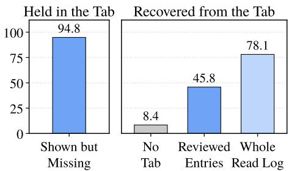  
Figure 4: RunningTab with GPT-5.4 nano on Workspace-Bench (%). (Left) Values held in the tab, among those the agent was shown but its deliverable lacks. (Right) Held values that an LLM recovers when they are masked, by the part of the tab given.

Table 4: Ablation of RunningTab (GPT-5.4 nano, Workspace-Bench, three runs), with drops in red.
<table><tr><td>Method</td><td>Pass Rate</td><td>TCR@70</td></tr><tr><td>RunningTab (Ours)</td><td>44.73</td><td>25.67</td></tr><tr><td>No Environmental Capture 41.36 –3.37</td><td></td><td>22.33-3.34</td></tr><tr><td>No Review</td><td>41.87-2.86</td><td>20.33-5.34</td></tr><tr><td>No Evidence Check</td><td>42.89–1.84</td><td>24.33-1.34</td></tr><tr><td>No Finish Check</td><td>42.89–1.84</td><td>23.00-2.67</td></tr><tr><td>DCI</td><td>41.63</td><td>20.67</td></tr></table>

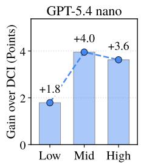

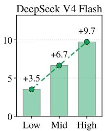

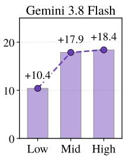  
Figure 5: Gain of RunningTab over DCI in Pass Rate on tasks split into thirds by how much the agent reads.

How the Agent Operates the Tab We then examine how the agent operates the tab, reported in Table 3, which shows that each LLM draws on the tab in its own way. Specifically, Gemini 3.8 Flash works mainly through the review: it states its requirements and pulls the review before the finish check in every analyzed attempt, and in 76.9% of attempts it resolves a requirement as done by citing a read-log entry that the review listed for that requirement. GPT-5.4 nano instead relies on the finish check: it often turns to the tab only when the check prompts it, and after the check it operates the tab in 72.6% of attempts and edits its deliverable in 17.1%; it also re-reads stored entries with show in 74.6% of attempts. Lastly, DeepSeek V4 Flash works mainly through the candidates: like Gemini 3.8 Flash, it states its requirements before the finish check in every analyzed attempt, but it then explores more widely, reading the most distinct files (a median of 11 in Table 2) and opening a file that the tab listed as not yet opened in 54.7% of attempts.

Ablation Studies To examine how much each component of the environment-side tab contributes to the performance gains, we remove one component at a time on Workspace-Bench with GPT-5.4 nano and report the results in Table 4. From this, we observe that removing any of the four components lowers both the Pass Rate and TCR@70, indicating that each of them plays a role in these gains. Among them, removing the environmental capture (in which the environment no longer records the read log and the candidates, so that the review and the evidence check, which draw on them, are removed as well) leads to the largest drop in Pass Rate, down to the level of DCI (41.36 against 41.63), which indicates that the gains of RunningTab come largely from what the environment captures on its own, namely the files that the agent reads and lists. Following this, removing the review leads to the next largest drop, which suggests that the captured excerpts are most useful when the agent sees them beside the requirements they match. Lastly, the evidence check and the finish check complement the capture and the review at two moments of the task: when the agent resolves a requirement as done, the evidence check keeps that resolution grounded in what the agent read, and when the agent stops, the finish check gives it a final pass over the tab before delivery.

Gains on Reading-Heavy Tasks Since the tab keeps what the agent has read outside the context window, its benefit is expected to grow with how much the agent reads. To see whether this holds, we split the tasks of Workspace-Bench into thirds by reading volume (the characters that the agent receives from its reads and shell commands). As shown in Figure 5, the gain of RunningTab over DCI generally grows with reading volume across the three LLMs, which indicates that the tab is most valuable when the agent has the most to keep track of (on average, the gain on the third of tasks with the most reading is twice that on the third with the least). Also, it is worth noting that the reading-heavy tasks are where DCI performs worst (its Pass Rate drops by 16 to 27 points from the lightest to the heaviest third); this suggests that the content read earlier remains in the context yet goes unused as observations accumulate, which is precisely what the tab keeps within reach.

## 6. Conclusion

In this work, we presented RunningTab, a framework for direct workspace interaction, the setting in which an agent searches and reads the files of a workspace from a terminal to produce a deliverable. Motivated by the observation that what the task asks for and what the agent has read are typically left to the context window, we equipped the agent with an environment-side tab: a per-task record that the environment keeps outside the context window. Specifically, the agent states the requirements, and the environment records each read as an excerpt with its source and each file listed but not opened as a candidate. The agent can then review each open requirement beside its best-matching excerpts and candidates, resolve it by citing the excerpt that supplies it or by giving a reason, and receive a finish check at its stop. Empirical evaluations on three benchmarks with three LLMs show that RunningTab improves over direct workspace interaction alone and over baselines in which the model itself keeps track of the task. Ablations attribute most of this gain to what the environment captures on its own, and the tab usually holds the values a deliverable needs once seen. We believe these findings position the environment-side tab as a natural complement to direct access: terminal tools let the agent reach any file, and the tab keeps track of the task until the deliverable is handed in.

## Ethics Statement

This work aims to improve how LLM agents produce deliverables from the files of a workspace, using existing models and public benchmarks. However, agents with RunningTab may retain the biases and errors of their models, and since the tab stores excerpts of the files the agent reads, it may hold sensitive content in real workspaces. We therefore encourage safeguards, such as keeping the tab under the same access controls as the workspace and reviewing the deliverables, when deploying such agents in real-world settings.

## References

Shoufa Chen, Luyuan Wang, Xuan Yang, Zhiheng Liu, Yuren Cong, Yuanfeng Ji, Feiyan Zhou, Xiaohui Zhang, Fanny Yang, and Belinda Zeng. Tua-bench: A benchmark for general-purpose terminal-use agents. arXiv preprint arXiv:2606.28480, 2026. URL https://doi.org/10.48550/arXiv.2606.28480.

DeepSeek-AI. Deepseek-v4: Towards highly eficient million-token context intelligence. arXiv preprint arXiv:2606.19348, 2026. URL https://doi.org/10.48550/arXiv.2606.19348.

Adam Fourney, Gagan Bansal, Hussein Mozannar, Cheng Tan, Eduardo Salinas, Erkang Zhu, Friederike Niedtner, Grace Proebsting, Grifin Bassman, Jack Gerrits, Jacob Alber, Peter Chang, Ricky Loynd, Robert West, Victor Dibia, Ahmed Awadallah, Ece Kamar, Rafah Hosn, and Saleema Amershi. Magentic-one: A generalist multi-agent system for solving complex tasks. arXiv preprint arXiv:2411.04468, 2024. URL https://doi.org/10.48550/arXiv.2411.04468.

Google DeepMind. Gemini 3.8 Flash model card. Google DeepMind Model Card, September 2026. URL https://deepmind.google/models/model-cards/gemini-3-8-flash/.

Bowen Jin, Hansi Zeng, Zhenrui Yue, Dong Wang, Hamed Zamani, and Jiawei Han. Search-r1: Training llms to reason and leverage search engines with reinforcement learning. arXiv preprint arXiv:2503.09516, 2025. URL https://doi.org/10.48550/arXiv.2503.09516.

Vladimir Karpukhin, Barlas Oguz, Sewon Min, Patrick Lewis, Ledell Wu, Sergey Edunov, Danqi Chen, and Wen-tau Yih. Dense passage retrieval for open-domain question answering. In Bonnie Webber, Trevor Cohn, Yulan He, and Yang Liu (eds.), Proceedings of the 2020 Conference on Empirical Methods in Natural Language Processing, EMNLP 2020, Online, November 16-20, 2020, pp. 6769–6781. Association for Computational Linguistics, 2020. URL https://doi.org/10.18653/v1/2020.emnlp-main.550.

Dayoon Ko, Jihyuk Kim, Sohyeon Kim, Haeju Park, Dahyun Lee, Gunhee Kim, Moontae Lee, and Kyungjae Lee. When is enough not enough? illusory completion in search agents. arXiv preprint arXiv:2602.07549, 2026. URL https://doi.org/10.48550/arXiv.2602.07549.

Jack Lanchantin, Shubham Toshniwal, Jason Weston, Arthur Szlam, and Sainbayar Sukhbaatar. Learning to reason and memorize with self-notes. In Alice Oh, Tristan Naumann, Amir Globerson, Kate Saenko, Moritz Hardt, and Sergey Levine (eds.), Advances in Neural Information Processing Systems 36: Annual Conference on Neural Information Processing Systems 2023, NeurIPS 2023, New Orleans, LA, USA, December 10 - 16, 2023, 2023. URL http://papers.nips.cc/paper\_files/paper/2023/hash/ 274d0146144643ee2459a602123c60ff-Abstract-Conference.html.

Patrick Lewis, Ethan Perez, Aleksandra Piktus, Fabio Petroni, Vladimir Karpukhin, Naman Goyal, Heinrich Küttler, Mike Lewis, Wen-tau Yih, Tim Rocktäschel, Sebastian Riedel, and Douwe Kiela. Retrieval augmented generation for knowledge-intensive NLP tasks. In Hugo Larochelle, Marc’Aurelio Ranzato,

Raia Hadsell, Maria-Florina Balcan, and Hsuan-Tien Lin (eds.), Advances in Neural Information Processing Systems 33: Annual Conference on Neural Information Processing Systems 2020, NeurIPS 2020, December 6-12, 2020, virtual, 2020. URL https://proceedings.neurips.cc/paper/2020/hash/ 6b493230205f780e1bc26945df7481e5-Abstract.html.

Jiangnan Li, Yuqing Li, Mo Yu, Jinchao Zhang, and Jie Zhou. A new role for relevance: Guiding corpus interaction in agentic search. arXiv preprint arXiv:2607.24223, 2026a. URL https://doi.org/10.48550/arXiv. 2607.24223.

Xiaoxi Li, Guanting Dong, Jiajie Jin, Yuyao Zhang, Yujia Zhou, Yutao Zhu, Peitian Zhang, and Zhicheng Dou. Search-o1: Agentic search-enhanced large reasoning models. In Christos Christodoulopoulos, Tanmoy Chakraborty, Carolyn Rose, and Violet Peng (eds.), Proceedings of the 2025 Conference on Empirical Methods in Natural Language Processing, EMNLP 2025, Suzhou, China, November 4-9, 2025, pp. 5420–5438. Association for Computational Linguistics, 2025. URL https://doi.org/10.18653/v1/2025.emnlp-main.276.

Zhuofeng Li, Haoxiang Zhang, Cong Wei, Pan Lu, Ping Nie, Yi Lu, Yuyang Bai, Shangbin Feng, Hangxiao Zhu, Ming Zhong, Yuyu Zhang, Jianwen Xie, Yejin Choi, James Zou, Jiawei Han, Wenhu Chen, Jimmy Lin, Dongfu Jiang, and Yu Zhang. Beyond semantic similarity: Rethinking retrieval for agentic search via direct corpus interaction. arXiv preprint arXiv:2605.05242, 2026b. URL https://doi.org/10.48550/arXiv.2605. 05242.

Yi Lu, Zhuofeng Li, Ping Nie, Haoxiang Zhang, Yuyu Zhang, Kai Zou, Wenhu Chen, Jimmy Lin, Dongfu Jiang, and Yu Zhang. Dr-dci: Scaling direct corpus interaction via dynamic workspace expansion. arXiv preprint arXiv:2606.14885, 2026. URL https://doi.org/10.48550/arXiv.2606.14885.

Ziyu Ma, Hailang Huang, Shun Zou, Yong Wang, Shidong Yang, Yiming Hu, Fei Wei, and Xiangxiang Chu. Longhorizon-harness: Advancing long-horizon agents for real-world tasks. arXiv preprint arXiv:2608.01964, 2026. URL https://doi.org/10.48550/arXiv.2608.01964.

Aman Madaan, Niket Tandon, Prakhar Gupta, Skyler Hallinan, Luyu Gao, Sarah Wiegrefe, Uri Alon, Nouha Dziri, Shrimai Prabhumoye, Yiming Yang, Shashank Gupta, Bodhisattwa Prasad Majumder, Katherine Hermann, Sean Welleck, Amir Yazdanbakhsh, and Peter Clark. Self-refine: Iterative refinement with self-feedback. In Alice Oh, Tristan Naumann, Amir Globerson, Kate Saenko, Moritz Hardt, and Sergey Levine (eds.), Advances in Neural Information Processing Systems 36: Annual Conference on Neural Information Processing Systems 2023, NeurIPS 2023, New Orleans, LA, USA, December 10 - 16, 2023, 2023. URL http://papers.nips.cc/paper\_files/paper/2023/hash/ 91edff07232fb1b55a505a9e9f6c0ff3-Abstract-Conference.html.

Mike A. Merrill, Alexander Glenn Shaw, Nicholas Carlini, Boxuan Li, Harsh Raj, Ivan Bercovich, Lin Shi, Jeong Yeon Shin, Thomas Walshe, Estefany Kelly Buchanan, Junhong Shen, Guanghao Ye, Haowei Lin, Jason Poulos, Maoyu Wang, Marianna Nezhurina, Jenia Jitsev, Di Lu, Orfeas Menis-Mastromichalakis, Zhiwei Xu, Zizhao Chen, Yue Liu, Robert Zhang, Leon Liangyu Chen, Anurag Kashyap, Jan-Lucas Uslu, Jefrey Li, Jianbo Wu, Minghao Yan, Song Bian, Vedang Sharma, Ke Sun, Steven Dillmann, Akshay Anand, Andrew Lanpouthakoun, Bardia Koopah, Changran Hu, Etash Kumar Guha, Gabriel H. S. Dreiman, Jiacheng Zhu, Karl Krauth, Li Zhong, Niklas Muennighof, Robert Amanfu, Shangyin Tan, Shreyas Pimpalgaonkar, Tushar Aggarwal, Xiangning Lin, Xin Lan, Xuandong Zhao, Yiqing Liang, Yuanli Wang, Zilong Wang, Changzhi Zhou, David Heineman, Hange Liu, Harsh Trivedi, John Yang, Junhong Lin, Manish Shetty, Michael Yang, Nabil Omi, Negin Raoof, Shanda Li, Terry Yue Zhuo, Wuwei Lin, Yiwei Dai, Yuxin Wang, Wenhao Chai, Shang Zhou, Dariush Wahdany, Ziyu She, Jiaming Hu, Zhikang Dong, Yuxuan Zhu, Sasha Cui, Ahson Saiyed, Arinbjörn Kolbeinsson, Jesse Hu, Christopher Michael Rytting, Ryan Marten, Yixin Wang, Alex Dimakis, Andy Konwinski, and Ludwig Schmidt. Terminal-bench: Benchmarking agents on hard, realistic tasks in command line interfaces. arXiv preprint arXiv:2601.11868, 2026. URL https: //doi.org/10.48550/arXiv.2601.11868.

OpenAI. Introducing GPT-5.4 mini and nano. OpenAI Oficial Blog, March 2026. URL https://openai. com/index/introducing-gpt-5-4-mini-and-nano/.

Krista Opsahl-Ong, Arnav Singhvi, Jasmine Collins, Ivan Zhou, Cindy Wang, Ashutosh Baheti, Owen Oertell, Jacob Portes, Sam Havens, Erich Elsen, Michael Bendersky, Matei Zaharia, and Xing Chen. Oficeqa pro:

An enterprise benchmark for end-to-end grounded reasoning. arXiv preprint arXiv:2603.08655, 2026. URL https://doi.org/10.48550/arXiv.2603.08655.

Charles Packer, Vivian Fang, Shishir G. Patil, Kevin Lin, Sarah Wooders, and Joseph E. Gonzalez. Memgpt: Towards llms as operating systems. arXiv preprint arXiv:2310.08560, 2023. URL https://doi.org/10. 48550/arXiv.2310.08560.

Joon Sung Park, Joseph C. O’Brien, Carrie Jun Cai, Meredith Ringel Morris, Percy Liang, and Michael S. Bernstein. Generative agents: Interactive simulacra of human behavior. In Sean Follmer, Jef Han, Jürgen Steimle, and Nathalie Henry Riche (eds.), Proceedings of the 36th Annual ACM Symposium on User Interface Software and Technology, UIST 2023, San Francisco, CA, USA, 29 October 2023- 1 November 2023, pp. 2:1–2:22. ACM, 2023. URL https://doi.org/10.1145/3586183.3606763.

Tejal Patwardhan, Rachel Dias, Elizabeth Proehl, Grace Kim, Michele Wang, Olivia Watkins, Simón Posada Fishman, Marwan Aljubeh, Phoebe Thacker, Laurance Fauconnet, Natalie S. Kim, Patrick Chao, Samuel Miserendino, Gildas Chabot, David Li, Michael Sharman, Alexandra Barr, Amelia Glaese, and Jerry Tworek. Gdpval: Evaluating AI model performance on real-world economically valuable tasks. arXiv preprint arXiv:2510.04374, 2025. URL https://doi.org/10.48550/arXiv.2510.04374.

Stephen E. Robertson and Hugo Zaragoza. The probabilistic relevance framework: BM25 and beyond. Found. Trends Inf. Retr., 3(4):333–389, 2009. URL https://doi.org/10.1561/1500000019.

Alireza Salemi, Chang Zeng, Atharva Nijasure, Jui-Hui Chung, Razieh Rahimi, Fernando Diaz, and Hamed Zamani. Grepseek: Training search agents for direct corpus interaction. arXiv preprint arXiv:2605.29307, 2026. URL https://doi.org/10.48550/arXiv.2605.29307.

Timo Schick, Jane Dwivedi-Yu, Roberto Dessì, Roberta Raileanu, Maria Lomeli, Eric Hambro, Luke Zettlemoyer, Nicola Cancedda, and Thomas Scialom. Toolformer: Language models can teach themselves to use tools. In Alice Oh, Tristan Naumann, Amir Globerson, Kate Saenko, Moritz Hardt, and Sergey Levine (eds.), Advances in Neural Information Processing Systems 36: Annual Con ference on Neural Information Processing Systems 2023, NeurIPS 2023, New Orleans, LA, USA, December 10 - 16, 2023, 2023. URL http://papers.nips.cc/paper\_files/paper/2023/hash/ d842425e4bf79ba039352da0f658a906-Abstract-Conference.html.

Sahil Sen, Akhil Kasturi, Elias Lumer, Anmol Gulati, and Vamse Kumar Subbiah. Is grep all you need? how agent harnesses reshape agentic search. arXiv preprint arXiv:2605.15184, 2026. URL https://doi.org/ 10.48550/arXiv.2605.15184.

Noah Shinn, Federico Cassano, Ashwin Gopinath, Karthik Narasimhan, and Shunyu Yao. Reflexion: language agents with verbal reinforcement learning. In Alice Oh, Tristan Naumann, Amir Globerson, Kate Saenko, Moritz Hardt, and Sergey Levine (eds.), Advances in Neural Information Processing Systems 36: Annual Conference on Neural Information Processing Systems 2023, NeurIPS 2023, New Orleans, LA, USA, December 10 - 16, 2023, 2023. URL http://papers.nips.cc/paper\_files/paper/2023/hash/ 1b44b878bb782e6954cd888628510e90-Abstract-Conference.html.

Shreyas Subramanian, Adewale Akinfaderin, Yanyan Zhang, Ishan Singh, Mani Khanuja, Sandeep Singh, and Maira Ladeira Tanke. Keyword search is all you need: Achieving rag-level performance without vector databases using agentic tool use. arXiv preprint arXiv:2602.23368, 2026. URL https://doi.org/10. 48550/arXiv.2602.23368.

Zirui Tang, Xuanhe Zhou, Yumou Liu, Linchun Li, Yukai Wu, Weizheng Wang, Hongzhang Huang, Wei Zhou, Jun Zhou, Jiachen Song, Shaoli Yu, Jinqi Wang, Zihang Zhou, Hongyi Zhou, Yuting Lv, Jinyang Li, Jiashuo Liu, Ruoyu Chen, Chunwei Liu, Guoliang Li, Jihua Kang, and Fan Wu. Workspace-bench 1.0: Benchmarking AI agents on workspace tasks with large-scale file dependencies. arXiv preprint arXiv:2605.03596, 2026. URL https://doi.org/10.48550/arXiv.2605.03596.

Lei Wang, Wanyu Xu, Yihuai Lan, Zhiqiang Hu, Yunshi Lan, Roy Ka-Wei Lee, and Ee-Peng Lim. Plan-and-solve prompting: Improving zero-shot chain-of-thought reasoning by large language models. In Anna Rogers, Jordan L. Boyd-Graber, and Naoaki Okazaki (eds.), Proceedings of the 61st Annual Meeting of the Association for Computational Linguistics (Volume 1: Long Papers), ACL 2023, Toronto, Canada, July 9-14, 2023, pp.

2609–2634. Association for Computational Linguistics, 2023. URL https://doi.org/10.18653/v1/ 2023.acl-long.147.

Xingyao Wang, Boxuan Li, Yufan Song, Frank F. Xu, Xiangru Tang, Mingchen Zhuge, Jiayi Pan, Yueqi Song, Bowen Li, Jaskirat Singh, Hoang H. Tran, Fuqiang Li, Ren Ma, Mingzhang Zheng, Bill Qian, Yanjun Shao, Niklas Muennighof, Yizhe Zhang, Binyuan Hui, Junyang Lin, and et al. Openhands: An open platform for AI software developers as generalist agents. In The Thirteenth International Conference on Learning Representations, ICLR 2025, Singapore, April 24-28, 2025. OpenReview.net, 2025. URL https://openreview.net/forum?id=OJd3ayDDoF.

Zilong Wang, Yuedong Cui, Li Zhong, Zimin Zhang, Da Yin, Bill Yuchen Lin, and Jingbo Shang. Officebench: Benchmarking language agents across multiple applications for ofice automation. arXiv preprint arXiv:2407.19056, 2024. URL https://doi.org/10.48550/arXiv.2407.19056.

Yifan Wu, Lizhu Zhang, Yuhang Zhou, Mingyi Wang, Bo Peng, Serena Li, Xiangjun Fan, and Zhuokai Zhao. Remember when it matters: Proactive memory agent for long-horizon agents. arXiv preprint arXiv:2607.08716, 2026. URL https://doi.org/10.48550/arXiv.2607.08716.

Tianbao Xie, Danyang Zhang, Jixuan Chen, Xiaochuan Li, Siheng Zhao, Ruisheng Cao, Toh Jing Hua, Zhoujun Cheng, Dongchan Shin, Fangyu Lei, Yitao Liu, Yiheng Xu, Shuyan Zhou, Silvio Savarese, Caiming Xiong, Victor Zhong, and Tao Yu. Osworld: Benchmarking multimodal agents for open-ended tasks in real computer environments. In Amir Globersons, Lester Mackey, Danielle Belgrave, Angela Fan, Ulrich Paquet, Jakub M. Tomczak, and Cheng Zhang (eds.), Advances in Neural Information Processing Systems 37: Annual Conference on Neural Information Processing Systems 2024, NeurIPS 2024, Vancouver, BC, Canada, December 10 - 15, 2024, 2024. URL http://papers.nips.cc/paper\_files/paper/2024/hash/ 5d413e48f84dc61244b6be550f1cd8f5-Abstract-Datasets\_and\_Benchmarks\_Track.html.

Frank Fangzheng Xu, Yufan Song, Boxuan Li, Yuxuan Tang, Kritanjali Jain, Mengxue Bao, Zora Zhiruo Wang, Xuhui Zhou, Zhitong Guo, Murong Cao, Mingyang Yang, Hao Yang Lu, Amaad Martin, Zhe Su, Leander Maben, Raj Mehta, Wayne Chi, Lawrence Jang, Yiqing Xie, Shuyan Zhou, and Graham Neubig. Theagentcompany: Benchmarking LLM agents on consequential real world tasks. In Danielle Belgrave, Cheng Zhang, Laura N. Montoya, Hsuan-Tien Lin, Razvan Pascanu, Piotr Koniusz, Marzyeh Ghassemi, Nancy Chen, Iván Vladimir Meza Ruíz, and Arturo Loaiza-Bonilla (eds.), Advances in Neural Information Processing Systems 38: Annual Conference on Neural Information Processing Systems 2025, NeurIPS 2025, San Diego, CA, USA, December 2-7, 2025 / Mexico City, Mexico, November 30 - December 5, 2025, 2025a. URL http://papers.nips.cc/paper\_files/paper/2025/hash/ 0d744742f6fac4d1134c019b7cef3c8a-Abstract-Datasets\_and\_Benchmarks\_Track.html.

Wujiang Xu, Zujie Liang, Kai Mei, Hang Gao, Juntao Tan, and Yongfeng Zhang. A-mem: Agentic memory for LLM agents. In Danielle Belgrave, Cheng Zhang, Laura N. Montoya, Hsuan-Tien Lin, Razvan Pascanu, Piotr Koniusz, Marzyeh Ghassemi, Nancy Chen, Iván Vladimir Meza Ruíz, and Arturo Loaiza-Bonilla (eds.), Advances in Neural Information Processing Systems 38: Annual Conference on Neural Information Processing Systems 2025, NeurIPS 2025, San Diego, CA, USA, December 2-7, 2025 / Mexico City, Mexico, November 30 - December 5, 2025, 2025b. URL http://papers.nips.cc/paper\_files/paper/2025/ hash/19909c36f51abc4856b4560aff3d36d6-Abstract-Conference.html.

John Yang, Carlos E. Jimenez, Alexander Wettig, Kilian Lieret, Shunyu Yao, Karthik Narasimhan, and Ofir Press. Swe-agent: Agent-computer interfaces enable automated software engineering. In Amir Globersons, Lester Mackey, Danielle Belgrave, Angela Fan, Ulrich Paquet, Jakub M. Tomczak, and Cheng Zhang (eds.), Advances in Neural Information Processing Systems 37: Annual Conference on Neural Information Processing Systems 2024, NeurIPS 2024, Vancouver, BC, Canada, December 10 - 15, 2024, 2024. URL http://papers.nips.cc/paper\_files/paper/2024/hash/ 5a7c947568c1b1328ccc5230172e1e7c-Abstract-Conference.html.

Shunyu Yao, Jefrey Zhao, Dian Yu, Nan Du, Izhak Shafran, Karthik R. Narasimhan, and Yuan Cao. React: Synergizing reasoning and acting in language models. In The Eleventh International Conference on Learning Representations, ICLR 2023, Kigali, Rwanda, May 1-5, 2023. OpenReview.net, 2023. URL https://openreview.net/forum?id=WE\_vluYUL-X.

Zeyu Zhang, Quanyu Dai, Xiaohe Bo, Chen Ma, Rui Li, Xu Chen, Jieming Zhu, Zhenhua Dong, and Ji-Rong Wen. A survey on the memory mechanism of large language model-based agents. ACM Trans. Inf. Syst., 43 (6):155:1–155:47, 2025. URL https://doi.org/10.1145/3748302.

Zijian Zhou, Ao Qu, Zhaoxuan Wu, Sunghwan Kim, Alok Prakash, Daniela Rus, Jinhua Zhao, Bryan Kian Hsiang Low, and Paul Pu Liang. MEM1: learning to synergize memory and reasoning for eficient long-horizon agents. arXiv preprint arXiv:2506.15841, 2025. URL https://doi.org/10.48550/arXiv.2506.15841.

Shengyao Zhuang, Yuansheng Ni, Hengxin Fun, Jimmy Lin, and Xueguang Ma. Towards retrieving interaction spaces for agentic search. arXiv preprint arXiv:2606.06880, 2026. URL https://doi.org/10.48550/ arXiv.2606.06880.

## A. Qualitative Examples

In this section, we first show an environment-side tab of RunningTab on one attempt (Section A.1), and then compare DCI and RunningTab with the same LLM on two other Workspace-Bench tasks (Sections A.2 and A.3). Tool calls and observations are shown as recorded, shortened where marked.

## A.1. Example: An Environment-Side Tab of RunningTab

In contrast to Figure 3, which illustrates the environment-side tab on a hypothetical task, Table 5 shows it on an actual Workspace-Bench task, as RunningTab records it over one attempt. The task asks for a guide on business travel and reimbursement that covers five topics, from travel approval to violation handling, drawn from four policy files that the agent first finds by searching the workspace.

At the first turn, before opening any file, the agent decomposes the task into six requirements, one for each of the five topics that the task names and one for the guide itself, and adds them to the tab (A). The environment then fills the rest of the tab as the agent works (B): it records the 98 files that a search lists as candidates and the four policy files that the agent reads as the read-log entries L1 to L4, each holding the text the agent saw with its path and command. As each opened file moves from the candidates to the read log, the status line reports the change, from 98 candidates and no entries at turn 3 to 94 and four at turn 8.

The tab then connects each requirement to its source, as with the reimbursement standards (r3), whose source is L2, the entry of the policy file that opens with Article 7, on the standards for reimbursing travel expenses. When the agent lists its requirements at turn 10, the review shows r3 beside this line of L2, with an unopened file on the same subject (C), and after writing the guide at turn 12, the agent resolves r3 as done by citing L2 (D). At the stop at turn 22, the finish check confirms that all six are resolved before delivery (E).

Notably, the agent writes only two things to the tab over the whole task: the six requirements at the start and their resolutions before delivery. Everything else in Table 5 (the read log, the candidates, the status line, the review, and the finish check) is kept and returned by the environment, which is what distinguishes the environment-side tab from a record that the model keeps for itself in its context.

## A.2. Case Study 1: Tracking Every Source of a Deliverable

As the first case study, we compare DCI and RunningTab with the same LLM on a task that asks for a water and electricity saving manual compiled from four policy files (Table 6). Although both methods read the same four files within a few turns, they difer in what they keep track of. DCI writes the manual soon after reading the files, leaving the state of the task to its context window. In contrast, with RunningTab, the agent first states one requirement per policy file (A), and the environment records each file it reads as a read-log entry (B); after writing the manual, the agent sees each requirement beside its matching entries in the review (C), resolves it against the entry of its own file (D), and receives a finish check confirming that none is left open (E). In the end, the manual of RunningTab keeps all five chapters and twenty articles of the policy in their original order, whereas that of DCI merges them into an outline of its own and loses the chapter structure.

## A.3. Case Study 2: Backing Every Row with Its Source

As the second case study, we consider a task that asks for a table summarizing ten purchase orders by supplier (Table 7), where every order is expected in its own row. With DCI, the agent reads the orders one at a time, including that of Supplier 15 with the largest amount (¥55,000), yet the table it writes holds a single row, so the suppliers it has read do not reach the deliverable. With RunningTab, the environment records each order as a read-log entry as the agent reads it. Then, when the finish check reminds the agent that no requirement is recorded, the agent states one requirement per row, naming the supplier, status, amount, and source order, and resolves each against the entry of that order (such as the row of Supplier 15 against L12). In the end, the table of RunningTab holds a row for every supplier, each tied in the tab to the order it comes from.

Table 5: The environment-side tab of RunningTab over one attempt on a Workspace-Bench task, by the stages (A) to (E) of Figure 3. Boxes show what the agent writes to the tab (orange) and what the environment records or returns (blue), shortened with . . . ; key parts for requirement r3 are in bold.

Task: Integrate the core information from four business travel management policy documents, covering the full workflow of travel approval, travel requirements, reimbursement standards, reimbursement procedures, and violation handling. Ensure the guide is clear, easy to understand, and compliant with company policy, and generate employee\_business\_travel\_and\_reimbursement\_guide.doc.

<table><tr><td>(A) Requirements</td><td colspan="5">Turn 1: add, before any file is opened</td></tr><tr><td>(B) Candidates</td><td colspan="5">r1: travel approval workflow r2: travel requirements r4: reimbursement procedures r5: violation handling r6: generate employee_business_travel_and_reimbursement_guide.doc Turn 3: find lists 98 files, which the environment records as candidates; after turn 8, list returns</td></tr><tr><td></td><td colspan="5">Unopened candidates: 94 (55 above threshold, marked *), ranked by relevance to the task; opening a file removes it 1. .../employee_travel_reimbursement_policy_2024.pdf * 2. .../travel_expense_reimbursement_standards_and_attachment_requirements.pdf *</td></tr><tr><td>(B) Read log</td><td colspan="5">Turns 5 to 8: read the four policy files, which the environment records as L1 to L4; show returns L2 as L2: .../business_travel_management_policy_2.txt (turn 6, 2286 chars)</td></tr><tr><td></td><td colspan="5">command: read .../business_travel_management_policy_2.txt</td></tr><tr><td></td><td colspan="5">Article 7 Standards for Reimbursement of Business Travel Expenses Employees traveling on business shall practice economy in transportation, meals, and</td></tr><tr><td></td><td colspan="5">Category City Category Accommodation Meal Allowance Long-distance Transportation Manager level and above Tier-1 Cities 220 50 Bus or train (...) 25</td></tr><tr><td>Status line</td><td colspan="5">Turns 3 and 8: appended to each observation</td></tr><tr><td></td><td>[tab] [tab] candidates:</td><td>candidates: 94 unopened, 55 above threshold</td><td>98 unopened, 59 above threshold</td><td>read log: 0 entries read log: 4 entries</td><td></td></tr><tr><td>(C) Review</td><td colspan="5">Turn 10: list</td></tr><tr><td></td><td colspan="5">Requirements: 6 open, 0 resolved r1, r2 [open] r3 [open] reimbursement standards</td></tr><tr><td></td><td colspan="5">from your reads: L2 …..: Article 7 Standards for Reimbursement of Business Travel Expenses</td></tr><tr><td>(D) Resolution</td><td colspan="5">never opened: .../travel_expense_standards_and_reimbursement_rules_2024.docx * | .. r4 to r6 [open]</td></tr><tr><td></td><td colspan="5">Turns15 to20: resolve, after writing the guide at turn 12 r1 done (L1) r2 done (L3) r3 done (L2) r4 done (L4)</td></tr><tr><td>(E) Finish check</td><td colspan="5">r5 done (L4) r6 unavailable (authored)</td></tr><tr><td></td><td colspan="5">Turn 22: stops. All 6 requirement items are resolved (5 done, 1 unavailable).</td></tr><tr><td></td><td colspan="5">[tab] Finish check 1 of at most 1: you stopped. Check that each resolved item is actually in your deliverable</td></tr><tr><td>Turn 23: delivers the guide.</td><td colspan="5">Files you listed but never opened: 94</td></tr></table>

Table 6: Case study on a Workspace-Bench task, comparing DCI and RunningTab with the same LLM by the stages (A) to (E) of Figure 3. Boxes are colored as in Table 5 and shortened with . . . ; the key parts are in bold.
<table><tr><td>DCI</td><td></td><td>RunningTab (Ours)</td></tr><tr><td>(A) Requirements</td><td>No record of the task</td><td>Turn 6: add r1: Analyze water_and_electricity_policy_1.txt r2 to r4: (the same for policy files 2 to 4) r5： Prepare a quarterly 。.. campaign plan</td></tr><tr><td>(B) Reads</td><td>Turns 3 to 6: read the four files (Chapters 1 to 5, Articles 1 to 20).</td><td>r7: Output only the python list Turns 7 to 10: read the same files, recorded as L1 to L4.</td></tr><tr><td>Writing</td><td>Turn 10: writes the manual.</td><td>Turn 19: writes the manual. Turn 23: list</td></tr><tr><td>(C) Review</td><td></td><td>r1 [open] Analyze water_and_electricity_policy_1.txt from your reads: L1 ...policy_1.txt: Company Water and Electricity Conservation Policy r2 to r7 [open]</td></tr><tr><td>(D) Resolution</td><td></td><td>Turns24 to 30: resolve r1 done (L1) r2 done (L2) r3 done (L3) r4 done (L4) r5 to r7 unavailable (authored)</td></tr><tr><td>(E) Finish check</td><td>Turn 15: stops and delivers.</td><td>Turn 32: stops. [tab] Finish check 1 of at most 1: you stopped. All 7 requirement items are resolved (4 done, 3 unavailable).Files you listed but never opened: 515</td></tr><tr><td>Outcome</td><td>× An outline of its own that merges Articles 1 and 2 into a purpose statement and Articles 19 and 20 into one bullet, losing the chapter structure, the article numbering, the publicity guide, and the inspection items.</td><td>Turns 33 to 36: opens the top listed file and delivers. √ The policy in its original order, Chapters 1 to 5 with Articles 1 to 20, then the campaign plan, an inspection checklist, and rewards and penalties; each policy file is a requirement resolved against its own entry.</td></tr></table>

Table 7: Case study on a second Workspace-Bench task, in the format of Table 6: a value that DCI reads and leaves out of its table, and the same value in the tab, where the requirement for its row is resolved against the read-log entry of its purchase order. The gray box shows the purchase order as DCI reads it, and the blue box its read-log entry.
<table><tr><td colspan="3">Task: Based on the purchase order on the desktop, a table is generated by supplier, summarizing the amount and purchase type ..</td></tr><tr><td></td><td>DCI</td><td>RunningTab (Ours)</td></tr><tr><td rowspan="4">(B) Reads</td><td>Turn 13: read .../Purchase_Order_8.txt</td><td>Turn 7: read the same order; the environment records it as L12.</td></tr><tr><td>Purchase Order #1008 Supplier: Supplier 15</td><td>L12: .../Purchase_Order_8.txt Supplier: Supplier 15 Amount: ¥55000</td></tr><tr><td>Amount: ¥55000</td><td></td></tr><tr><td>Status: Pending Approval</td><td></td></tr><tr><td>Writing (E) Finish check</td><td>Turn 19: writes the table.</td><td>Turn 18: writes the table. Turn 21: stops.</td></tr><tr><td rowspan="4"></td><td>Turn 21: stops and delivers.</td><td>[tab] Finish check 1 of at most 1: you stopped. No requirement items</td></tr><tr><td></td><td>were recorded. Add one per fact, figure, or deliverable element the task names</td></tr><tr><td></td><td>Turns 24 to 33: add</td></tr><tr><td></td><td>r2: Table row data: Supplier 2 Stocked In ¥16000 (r3 to r8) r9: Table row data: Supplier 15 | Pending Approval | ¥55000. Source:</td></tr><tr><td>(D) Resolution</td><td></td><td>Turn 39: resolve</td></tr><tr><td>Outcome</td><td>× A single row (PH_11 | 45000): the orders</td><td>r2 done (L8) r9 done (L12) r11 done (L9)</td></tr><tr><td></td><td>read one by one, including that of Supplier 15, do not reach the table.</td><td>One row for each of the ten suppliers, including Supplier 15 | Pending Approval | 55000, the largest amount; every row is tied in the tab to the entry of its order (r9 to L12).</td></tr></table>

## B. Prompts

This section lists the prompts with which RunningTab communicates with the agent, which are the same for every benchmark and every LLM. In each figure, values that the environment fills in at run time are shown in braces, and notes in gray italics are annotations that are not part of the prompts.

System Prompt and Operations Figure 6 shows what RunningTab adds to the system prompt: a one-line description of each operation and a block that asks the agent to state the requirements at the start, review them after exploring, and resolve them before finishing. Figure 7 then shows the four operations on the tab, as given to the LLM as tools with their descriptions and parameters.

Messages during the Task Figure 8 shows the messages that the environment returns while the agent works: the status line, the review of the requirements, and the replies of resolve.

Finish Check Figure 9 shows the finish check, which the environment sends once at the first stop, with content that depends on whether the requirements are missing, open, or all resolved.

Additions to the System Prompt   
[. . . ]   
Available tools:   
- read: Read file contents   
- bash: Execute bash commands (ls, grep, find, etc.)   
- add: Add requirement items (one per fact, figure, or deliverable element the task names; several per call, one per line) or   
a note to the workspace tab   
- list: List open requirements beside their best matches from files you read and files you never opened, unopened candidate   
files ranked by relevance, or the read log   
- show: Re-read a stored read-log excerpt by its id to check a fact without re-parsing the file   
- resolve: Close a requirement as done (with the log id its content came from) or unavailable (with a reason)   
[. . . ]   
Workspace tab: the environment keeps three kinds of entries   
- Read log: every file you read is logged with an id (L1, L2, ...) and the text you saw; show re-reads an entry.   
- Candidates: every file you listed but did not open, ranked by relevance to the task; list shows them.   
- Requirements: items you write with add and close with resolve (done with the log id of the entry the content came from, or   
unavailable with a reason; a delivered file path does not close an item).   
The tab is your working memory for this task: items hold what the task owes, and the read log holds where each fact came from.   
How to use it:   
1. Start by splitting the task into requirement items with add (one per fact, figure, or deliverable element the task names,   
several per call, one per line), then work as usual. Granularity: 'extract the total, the breakdown by category, and the   
change from last year' is three items; 'a guide covering scope, procedure, and exceptions' is three items.   
2. Work as usual; the status line under each tool result shows what is still open.   
3. After exploring and before closing your items with resolve, run list(kind=requirements): it shows each item beside its best   
matches, from the files you read and from files you never opened.   
4. Before finishing, close every requirement with resolve, re-reading sources with show where needed.   
Current date: {date}   
[. . . ]  
Figure 6: Additions of RunningTab to the system prompt (Section 3.3). Text in gray is the system prompt of the harness, shown only to locate the additions, with [. . . ] marking omitted parts.

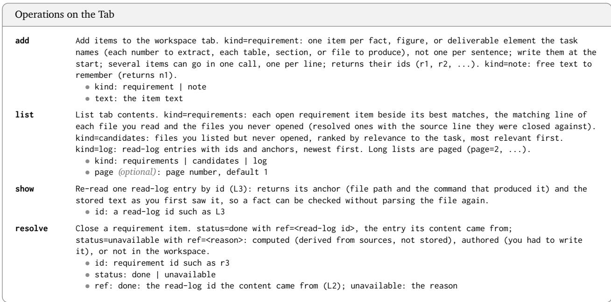  
Figure 7: Operations on the tab (Section 3.2), each given to the LLM as a tool with a description, followed by its parameters (marked ∙) with the values allowed or a description of each parameter.

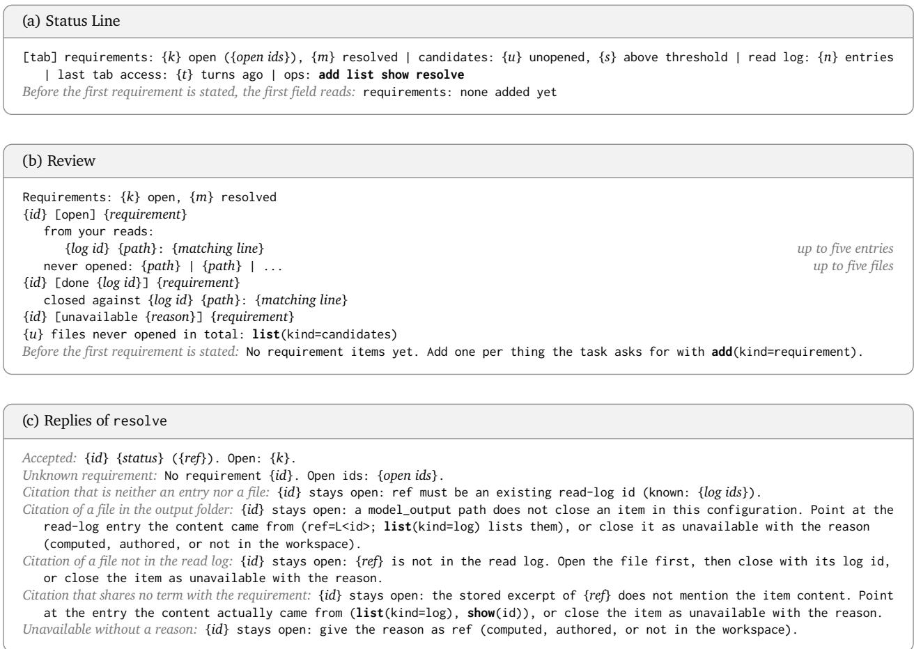  
Figure 8: Messages from the environment during the task: (a) the status line, appended to each observation (Section 3.3); (b) the review, returned by list with kind=requirements; and (c) the replies of resolve (Section 3.4). In the review, entries and files are ranked by BM25 against the requirement, and each entry shows its first line sharing a term with it.

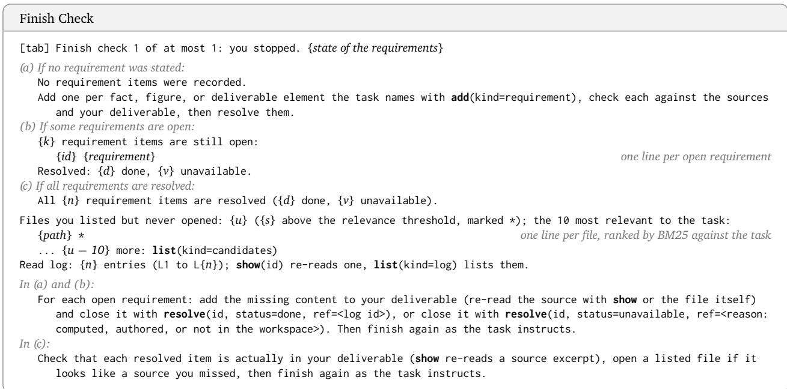  
Figure 9: Finish check, sent once at the first stop (Section 3.4). A listed file is above the relevance threshold, and marked \*, when its path shares at least two distinct terms with the text of the task.