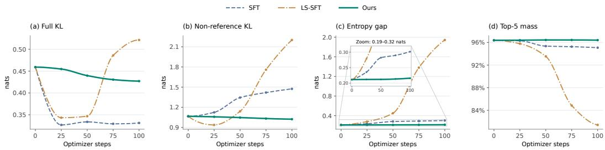
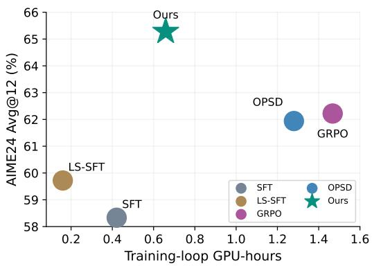
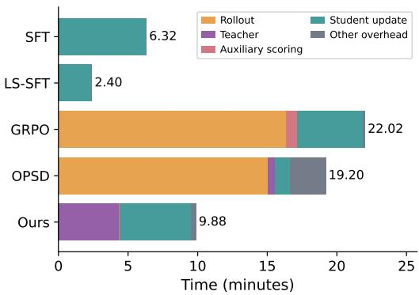

# SAPD: STEP-ALIGNED PRIVILEGED DISTILLATION

Tianle Wang<sup>1,2\*</sup> Jiayu Liu<sup>2\*</sup> Ruizhi Zhao<sup>2,3</sup> Ning Miao<sup>1,2</sup>

## ABSTRACT

On-policy post-training can improve large language models by learning from their own trajectories, but requires costly rollout generation. We ask whether fixed demonstrations can support competitive off-policy learning through better supervision. Our premise is that their usefulness depends not only on the training trajectories, but also on whether supervision provides informative preferences among continuations and connects this guidance to the reasoning decision being learned. We introduce Step-Aligned Privileged Distillation (SAPD), a rollout-free selfdistillation method that turns demonstrations into step-aligned distributional supervision. Its key insight is to use the known progression of a reference solution to associate each reasoning transition with targeted privileged guidance, rather than treating the solution as undifferentiated context. On mathematical reasoning benchmarks, SAPD outperforms supervised fine-tuning and label smoothing on average while remaining competitive with on-policy reinforcement learning and self-distillation. Analyses support both the value of context-dependent distributional guidance and the benefit of aligning privileged information with the current step. SAPD also largely preserves out-of-domain coding performance and achieves approximately 2× training-loop speedups over the on-policy baselines. These findings suggest that carefully constructed supervision can make fully offpolicy post-training a competitive and computationally efficient alternative. Our code is available at https://github.com/Miaow-Lab/SAPD.

## 1 INTRODUCTION

Post-training enables large language models (LLMs) to acquire specialized capabilities from task specific data and feedback. A central choice is whether to learn from fixed demonstrations or from trajectories generated by the model being trained. On-policy approaches include reinforcement learning with verifiable rewards, such as Group Relative Policy Optimization (GRPO) (Shao et al., 2024), and distillation from teacher feedback on student-generated trajectories (Agarwal et al., 2024). Recent self-distillation methods further use demonstrations to guide on-policy learning without requiring a separately trained, larger teacher (Zhao et al., 2026; Shenfeld et al., 2026). A common motivation is that learning on the student’s own trajectories reduces the mismatch between training and inference, which is believed to contribute to strong task performance and generalization (Agarwal et al., 2024). However, repeatedly generating these trajectories introduces substantial autoregressive decoding costs, particularly for long reasoning traces (Shenfeld et al., 2026).

This trade-off raises a practical question: can fixed demonstrations support competitive posttraining without student rollouts? We study this question from two complementary perspectives. First, rather than treating each demonstrated token as the complete supervision signal, we ask whether fixed trajectories can provide richer, distributional guidance over possible next-token predictions. Second, because a reasoning demonstration contains a sequence of intermediate steps, we ask whether such guidance should be localized to the step associated with the current prediction rather than derived from the entire solution. Together, these perspectives examine whether the effectiveness of fixed demonstrations can be improved by changing how supervision is constructed, without changing the trajectories on which learning takes place.

First, supervision should express informative preferences, not merely a demonstrated token or uniformly softened labels. A reasoning trace combines decisions needed to solve a problem with choices of wording and exposition. One-hot imitation does not explicitly distinguish plausible alternative expressions from incompatible continuations. Knowledge distillation provides a high-level alternative: a teacher’s predictive distribution can convey relative support beyond a single observed label (Hinton et al., 2015). Privileged-information learning further suggests that information available only during training can be translated into such supervision (Lopez-Paz et al., 2016). We therefore hypothesize that demonstration-informed distributions can guide learning on fixed trajectories more effectively than hard targets or uniform smoothing, by expressing context-dependent preferences and uncertainty.

Second, privileged guidance should be aligned with the reasoning decision being learned. Distributional targets provide a supervision mechanism, but their usefulness also depends on which part of the demonstration is used to construct them. Work on process supervision motivates connecting feedback to intermediate reasoning decisions rather than relying solely on final outcomes (Uesato et al., 2022; Lightman et al., 2024). We apply this intuition to the scope of privileged information, rather than to step-level reward labels. Giving a teacher the full solution leaves it to determine which parts should guide each local continuation. Fixed demonstrations offer a useful alternative: their known progression identifies the reasoning step associated with each training context. We hypothesize that making this correspondence explicit provides more focused guidance than using the same global solution context throughout the trace.

These principles lead to Step-Aligned Privileged Distillation (SAPD), a rollout-free self-distillation method. SAPD uses a demonstration’s step structure to associate each reference transition with corresponding privileged guidance, then distills the resulting context-dependent distributions on fixed reference trajectories. Distributional supervision determines what preferences are transferred; step alignment determines which demonstrated information informs those preferences. Their combination turns fixed demonstrations into targeted learning signals without generating new training trajectories.

SAPD achieves strong average performance across three mathematical reasoning benchmarks, outperforming SFT and label-smoothed SFT while remaining competitive with GRPO and on-policy self-distillation (OPSD) (Zhao et al., 2026). It also largely preserves out-of-domain coding performance. We then examine the two motivating hypotheses: target-distribution examples and training dynamics assess informative supervision beyond generic softness, while full-solution and misaligned-guidance ablations assess the value of step alignment. Finally, our efficiency evaluation reports approximately $2 \times$ training-loop speedups over the on-policy baselines. Together, these results suggest that the construction of supervision is an important lever for effective off-policy post-training, alongside the choice of training trajectories.

## 2 PRELIMINARIES

Let $\mathcal { D } = \{ ( x , y ^ { \star } ) \}$ denote a dataset of problems and reference solutions, and let $\pi _ { \theta }$ be an autoregressive student language model over vocabulary V. We use θ and $\phi$ for student and teacher parameters, respectively, and S and T to label their predictive distributions. The index t denotes a token position within a sequence. For a context c and temperature $T > 0$ , define

$$
\pi _ { \psi } ^ { ( T ) } ( \cdot \mid c ) = \mathrm { s o f t m a x } ( z _ { \psi } ( c ) / T ) , \qquad \psi \in \{ \theta , \phi \} ,\tag{1}
$$

where $z _ { \psi } ( c )$ denotes the next-token logits. We omit the superscript when $T = 1$ , so $\pi _ { \psi } = \pi _ { \psi } ^ { ( 1 ) }$

SFT and label smoothing. Supervised fine-tuning (SFT) is an off-policy method that learns from fixed reference trajectories through teacher forcing:

$$
\mathcal { L } _ { \mathrm { S F T } } ( \theta ) = - \mathbb { E } _ { ( x , y ^ { \star } ) \sim \mathcal { D } } \left[ \frac { 1 } { | y ^ { \star } | } \sum _ { t = 1 } ^ { | y ^ { \star } | } \log \pi _ { \theta } ( y _ { t } ^ { \star } \mid x , y _ { < t } ^ { \star } ) \right] .\tag{2}
$$

Label smoothing (Vaswani et al., 2017) replaces the one-hot target with $q _ { t } ( v ) = ( 1 - \epsilon _ { \mathrm { l s } } ) \mathbf { 1 } [ v =$ $\begin{array} { r } { y _ { t } ^ { \star } \big ] + \frac { \epsilon _ { \mathrm { l s } } } { | \mathcal { V } | - 1 } { \bf 1 } [ v \ne y _ { t } ^ { \star } ] } \end{array}$ and minimizes cross-entropy against $q _ { t }$ . Both methods train on reference prefixes; label smoothing softens the supervision but assigns equal probability to all alternative tokens.

GRPO. Group Relative Policy Optimization (GRPO) (Shao et al., 2024) is an on-policy method commonly used for reinforcement learning with verifiable rewards. For each problem, it samples G responses from the rollout policy $\pi _ { \theta _ { \mathrm { o l d } } }$ and obtains verifiable rewards $\{ r _ { i } \} _ { i = 1 } ^ { \tilde { G } }$ . Each response receives a group-normalized advantage $\hat { A } _ { i } = ( r _ { i } - \bar { r } ) / ( \sigma _ { r } + \varepsilon )$ , where r¯ and $\sigma _ { r }$ are the group reward mean and standard deviation. GRPO optimizes a clipped policy-gradient objective, optionally with a reference-policy KL penalty, without a learned value model. Under outcome supervision, all tokens within a response share the same advantage.

OPSD. On-policy self-distillation (OPSD) (Zhao et al., 2026) provides dense distributional supervision along student-generated trajectories ${ \hat { y } } \sim \pi _ { \theta } ( \cdot \mid x )$ . A teacher derived from the same base model additionally observes the reference solution as privileged information. At each student prefix, define $p _ { \mathrm { S } , t } ^ { ( T ) } = \pi _ { \theta } ^ { ( \bar { T } ) } ( \cdot \mid x , \hat { y } _ { < t } )$ and $p _ { \mathrm { T } , t } ^ { ( T ) } = \pi _ { \phi } ^ { ( T ) } ( \cdot \mid x , \mathbf { \bar { y } } ^ { \star } , \mathbf { \bar { y } } _ { < t } )$ . Here $T > 0$ is the shared distillation temperature. Omitting divergence clipping, its forward-KL objective is

$$
\mathcal { L } _ { \mathrm { O P S D } } ( \boldsymbol { \theta } ) = \mathbb { E } _ { ( \boldsymbol { x } , \boldsymbol { y } ^ { \star } ) \sim \mathcal { D } } \left[ \frac { 1 } { | \hat { \boldsymbol { y } } | } \sum _ { t = 1 } ^ { | \hat { \boldsymbol { y } } | } D _ { \mathrm { K L } } \left( p _ { \mathrm { T } , t } ^ { ( T ) } \Vert p _ { \mathrm { S } , t } ^ { ( T ) } \right) \right] .\tag{3}
$$

Gradients flow only through the student predictions. SDFT (Shenfeld et al., 2026) shares the same core paradigm of on-policy distillation from a demonstration-conditioned teacher.

## 3 STEP-ALIGNED PRIVILEGED DISTILLATION

We introduce SAPD, a rollout-free self-distillation method organized around two design choices: the target should convey richer information and the information used to construct that target should be relevant to the reasoning decision being learned. This leads to a simple construction: we use a privileged teacher to convert demonstrated reasoning into informative target distributions, while using the progression of the reference solution to determine which privileged information is relevant at each prediction step. Importantly, our method changes the supervision available at fixed reference contexts rather than replacing them with student-generated states.

Reference-anchored learning states. We retain the reference-prefix contexts used by SFT, avoiding the need to sample student trajectories. Using the notation of Section 2, we partition each reference solution as $y ^ { \star } = g _ { 1 } \oplus \cdots \oplus g _ { K }$ , where ⊕ denotes concatenation. Each step $g _ { i }$ is a contiguous reference segment, and the partition preserves the original token sequence. The formulation permits different segmentation granularities, including the unsegmented case $K = 1$ . For the t-th token of step g , the student’s prediction context is

$$
h _ { i , t } = \big ( x , g _ { < i } , g _ { i , < t } \big ) ,\tag{4}
$$

where $g _ { < i } = g _ { 1 } \oplus \cdot \cdot \cdot \oplus g _ { i - 1 }$ contains all preceding reference steps, and $g _ { i , < t }$ is the reference prefix within the current step. Here i indexes reference steps and t indexes tokens within step $i ;$ the pair (i, t) corresponds to the full-sequence token position $\textstyle \sum _ { j < i } | g _ { j } | + t$ used in Section 2.

Step-conditioned distributional targets. The remaining question is how to construct an informative target distribution for each reference context. Conditioning the teacher on the entire solution provides abundant privileged information, but does not explicitly associate that information with the particular reasoning transition currently being learned. Motivated by the local correspondence between supervision and intermediate reasoning decisions in process supervision (Uesato et al., 2022; Lightman et al., 2024), we exploit the known structure of the reference trajectory: for each token position in step $g _ { i }$ , the distillation target is obtained from a teacher conditioned on the corresponding reference step g<sub>i</sub> as privileged information. Specifically, the student predicts from $h _ { i , t } .$ while the teacher additionally conditions on $g _ { i }$ . Let $c _ { i , t } ^ { \mathrm { T } } = \left( h _ { i , t } , g _ { i } \right)$ denote this privileged teacher context. At a shared temperature $T > 0$ , their distributions are

$$
\begin{array} { r } { p _ { \mathrm { S } , i , t } ^ { ( T ) } = \pi _ { \boldsymbol { \theta } } ^ { ( T ) } ( \cdot \mid h _ { i , t } ) , \qquad p _ { \mathrm { T } , i , t } ^ { ( T ) } = \pi _ { \boldsymbol { \phi } } ^ { ( T ) } ( \cdot \mid c _ { i , t } ^ { \mathrm { T } } ) . } \end{array}\tag{5}
$$

The teacher distribution therefore converts the demonstrated step into token-level preferences at the student context. Crucially, the step boundary controls only the teacher-side privileged information: the student’s causal history remains the complete reference prefix and is never reset between steps.

```latex
Algorithm 1 Step-Aligned Privileged Distillation
Require: Demonstrations D, initial parameters $\theta _ { 0 }$ , temperature $T > 0$
1: Initialize student $\theta  \theta _ { 0 }$ and frozen teacher ${ \phi  \theta _ { 0 } }$
2: while training has not converged do
3: Sample a minibatch $B \subset { \overline { { D } } }$
4: for each $( x , y ^ { \star } ) \in B$ do
5: Partition $y ^ { \star }$ into reference segments $\left( g _ { 1 } , \ldots , g _ { K } \right)$
6: for each reference position $( \bar { i } , t ) \in \bar { \mathcal { T } } ( x , y ^ { \star } )$ do
7: Form student context $h _ { i , t } = ( x , g _ { < i } , g _ { i , < t } )$
8: Construct teacher context $c _ { i , t } ^ { \mathrm { T } } = \left( h _ { i , t } , g _ { i } \right)$
9: Compute $p _ { \mathrm { S } , i , t } ^ { ( T ) } = \mathrm { s o f t m a x } ( z _ { \theta } ( h _ { i , t } ) / T )$
10: Compute $p _ { \mathrm { T } , i , t } ^ { ( T ) } = \mathrm { s o f t m a x } ( z _ { \phi } ( c _ { i , t } ^ { \mathrm { T } } ) / T )$
11: end for
12: end for
13: Compute the token-mean forward KL loss in Eq. 6 over B
14: Update θ by gradient descent while keeping ϕ fixed
15: end while
16: return Student π , using no privileged information at inference
```

Distilling the aligned distributions. We train the student to match the step-conditioned teacher distribution at each reference-token position. Let $\boldsymbol { \mathcal { T } } ( \boldsymbol { x } , \boldsymbol { y } ^ { \star } )$ denote the set of reference-token positions in the demonstration, and let $N = \dot { \left| \mathcal { T } ( x , y ^ { \star } ) \right. }$ |. The token-mean forward KL loss is

$$
\mathcal { L } _ { \mathrm { S A P D } } ( \theta ; x , y ^ { \star } ) = \frac { 1 } { N } \sum _ { ( i , t ) \in \mathcal { T } ( x , y ^ { \star } ) } D _ { \mathrm { K L } } \left( p _ { \mathrm { T } , i , t } ^ { ( T ) } \Vert p _ { \mathrm { S } , i , t } ^ { ( T ) } \right) .\tag{6}
$$

The teacher is stop-gradient and remains frozen at the initial checkpoint throughout training.

Algorithm 1 summarizes training. A single causal student forward pass scores the retained reference sequence for each example; teacher forwards are performed separately for each segment. Both branches use teacher forcing, so no autoregressive rollout generation is required.

Overall, SAPD uses the reference trajectory for two complementary purposes: its prefixes define rollout-free training states, while its step structure identifies the privileged information used to construct distributional supervision at those states.

## 4 EXPERIMENTS

We first ask whether SAPD achieves competitive reasoning performance while retaining out-ofdomain capabilities. We then examine the two hypotheses motivating the method: whether its super vision provides informative distributional structure beyond generic softness, and whether privileged information is more effective when aligned with the current reasoning step. Finally, we evaluate the computational consequence of learning without student rollouts.

## 4.1 EXPERIMENT SETUP

Models and datasets. We use Qwen3-4B-Instruct-2507 as the base model and conduct post-training on mathematical reasoning subset of OpenThoughts (Guha et al., 2026). We evaluate in-domain mathematical reasoning on AIME24/25 (Zhang & Math-AI, 2024; 2025), and HMMT25 (Dekoninck et al., 2026). To assess out-of-domain capability retention after post-training, we additionally evaluate coding performance on MBPP+ (Austin et al., 2021), HumanEval+ (Chen et al., 2021), and LiveCodeBench v6 (LCBv6) (Jain et al., 2025).

Baselines. We compare SAPD against four baselines covering off-policy supervised learning, onpolicy reinforcement learning, and on-policy self-distillation. Their formulations are described in Section 2. (1) SFT serves as the standard supervised baseline. (2) LS-SFT uses a smoothing coefficient of $\epsilon _ { \mathrm { l s } } ~ = ~ 0 . 1$ to test whether the gains of SAPD can be explained by target softening alone. (3) GRPO serves as a representative reinforcement learning with verifiable rewards (RLVR) baseline, enabling comparison with on-policy learning from outcome-level feedback. (4) OPSD enables comparison with on-policy distillation using reference solutions as privileged information. Since SDFT follows the same core training paradigm, we use OPSD as the representative baseline for this family and do not evaluate SDFT separately.

Table 1: Overall Avg@12 and average output length. Mathematics benchmarks measure indomain performance; coding benchmarks measure out-of-domain (OOD) capability retention after mathematics post-training. Average length is measured in tokens on mathematics benchmarks. Among post-trained methods, bold and underline indicate the best and second-best results, respectively. Base is shown separately as the initial-model reference.
<table><tr><td></td><td colspan="5">In-domain: Mathematics</td><td colspan="4">Out-of-domain: Code</td></tr><tr><td>Method</td><td>AIME24</td><td>AIME25</td><td>HMMT25</td><td> $\operatorname { A v g } .$ </td><td>Avg. length</td><td>MBPP+</td><td>HumanEval+ LCBv6</td><td></td><td> $\operatorname { A v g } .$ </td></tr><tr><td>Base</td><td>62.22</td><td>46.94</td><td>29.17</td><td>46.11</td><td>10,595</td><td>64.15</td><td>81.86</td><td>24.24</td><td>56.75</td></tr><tr><td>SFT</td><td>58.33</td><td>46.67</td><td>28.61</td><td>44.54</td><td>12,835</td><td>63.23</td><td>80.34</td><td>18.32</td><td>53.96</td></tr><tr><td>LS-SFT</td><td>59.72</td><td>49.17</td><td>31.11</td><td>46.67</td><td>10,102</td><td>61.97</td><td>81.71</td><td>22.14</td><td>55.27</td></tr><tr><td>GRPO</td><td>62.22</td><td>47.50</td><td>30.56</td><td>46.76</td><td>10,145</td><td>64.95</td><td>82.62</td><td>24.05</td><td>57.21</td></tr><tr><td>OPSD</td><td>61.94</td><td>47.78</td><td>32.78</td><td>47.50</td><td>10,870</td><td>63.82</td><td>83.23</td><td>23.66</td><td>56.90</td></tr><tr><td>SAPD (Ours)</td><td>65.28</td><td>48.06</td><td>30.28</td><td>47.87</td><td>9,927</td><td>64.15</td><td>82.62</td><td>23.28</td><td>56.68</td></tr></table>

Implementation details. We remove examples with empty problems, reasoning traces, or solutions. For each remaining example, we concatenate COT Reason and solution with a blankline separator and partition the resulting reference into ordered segments. Segmentation prioritizes explicit step headings, followed by numbered-step markers, and falls back to paragraph boundaries. Both the student and teacher use the non-thinking chat template with the assistant prefill “Let’s solve the problem step by step.” To reduce redundant computation, we tokenize the reference as a continuous sequence and share a single causal student forward pass across all segments within each example. Training and evaluation are performed on four NVIDIA H100 GPUs. OPSD and SAPD use a distillation temperature of T = 1.1 for both student and teacher logits.

Evaluation settings. We follow the evaluation protocol of Zhao et al. (2026) and report avg@k, the mean fraction of correct responses across k samples per problem, averaged over the benchmark. Here, we set k = 12. For each method and base model, we select the checkpoint with the highest mean avg@k across the in-domain benchmarks. Sampling settings, prompting, and answer grading are detailed in Appendix B.

## 4.2 OVERALL PERFORMANCE AND CAPABILITY GENERALIZATION

Table 1 compares SAPD with the baselines across the in-domain and out-of-domain benchmarks.

In-domain mathematical reasoning. SAPD achieves the strongest overall mathematical reasoning performance among the evaluated methods, with an average accuracy of 47.87%. The improvement is consistent with the main motivation of the method: enriching supervision on fixed reference trajectories can recover the benefits typically associated with on-policy training without requiring student-generated trajectories. Notably, this gain is not accompanied by longer generations. SAPD produces the shortest average outputs among the post-trained methods (9,927 tokens), while still outperforming both the supervised baselines and the evaluated on-policy methods on average. This suggests that the improvement is not simply attributable to increased test-time reasoning length, but to more effective post-training supervision.

Out-of-domain generalization. The gains in mathematical reasoning do not come at the cost of a substantial degradation in the evaluated coding capabilities. After mathematics post-training, SAPD retains an OOD average of 56.68%, outperforming the off-policy SFT and LS-SFT baselines and remaining close to the on-policy GRPO and OPSD baselines. Together, the in-domain and

<table><tr><td colspan="2">(a) Equivalent expressions</td><td colspan="4">Target probability</td></tr><tr><td>Background</td><td>Method</td><td>larger</td><td>bigger</td><td>less</td><td>H</td></tr><tr><td>Compare  $4 ^ { 4 } = 2 5 6$  with 64.</td><td></td><td>Reference</td><td>Valid alt.</td><td>Incorrect</td><td>nats</td></tr><tr><td>Response</td><td>SFT</td><td>1</td><td>0</td><td>0</td><td>0</td></tr><tr><td>4⁴ is 256, which is way</td><td>LS</td><td>0.900</td><td> $6 . 6 \times 1 0 ^ { - 7 }$ </td><td> $6 . 6 \times 1 0 ^ { - 7 }$ </td><td>1.518</td></tr><tr><td>[larger]than 64.</td><td>Ours</td><td>0.395</td><td>0.251</td><td> $6 . 8 \times 1 0 ^ { - 6 }$ </td><td>1.175</td></tr></table>

<table><tr><td colspan="5">(b) Critical decision</td><td></td></tr><tr><td>Background</td><td>Method</td><td>V</td><td>&lt;</td><td>=</td><td>H</td></tr><tr><td>Ten sparrows, x grains each. Their total exceeds 1100.</td><td></td><td>Reference</td><td>Incorrect</td><td>Incorrect</td><td>nats</td></tr><tr><td>Response</td><td>SFT</td><td>1</td><td>0</td><td>0</td><td>0</td></tr><tr><td>So the second inequality is:</td><td>LS</td><td>0.900</td><td> $6 . 6 \times 1 0 ^ { - 7 }$ </td><td> $6 . 6 \times 1 0 ^ { - 7 }$ </td><td>1.518</td></tr><tr><td>10x [&gt;] 1100</td><td>IOurs</td><td>≈1</td><td> $2 . 2 \times 1 0 ^ { - 1 1 }$ </td><td> $1 . 4 \times 1 0 ^ { - 1 1 }$ </td><td>≈0</td></tr></table>

Figure 1: Informative supervision is not simply target softening. Comparison of SFT, labelsmoothed SFT (LS), and SAPD at two reference-token positions: (a) equivalent expressions and (b) a critical inequality decision. Background gives brief problem context; Response shows a local response, with highlighted tokens marking prediction sites. Cell shading uses a shared linear probability scale from 0 to 1. H denotes full-vocabulary entropy.

OOD results show that SAPD improves mathematical reasoning while largely preserving capabilities outside the training domain.

## 4.3 BEYOND LABEL SMOOTHING: CONTEXT-DEPENDENT SUPERVISION

Our first hypothesis concerns the information expressed by the targets. SFT and LS-SFT provide useful comparisons: one concentrates supervision on the demonstrated token, while the other assigns uniform mass to alternatives. We examine whether SAPD instead supplies context-dependent preferences and whether student training preserves this structure relative to a shared teacher.

Target distributions distinguish flexibility from precision. Figure 1 compares the supervision at two reference-token positions. In the equivalent-expression case, the reference uses larger to compare $4 ^ { 4 } = 2 5 6$ with 64. The alternative bigger preserves the comparison, whereas less contradicts it. SFT assigns no target mass to either alternative, and LS-SFT assigns both the same negligible probability, $\breve { 6 . 6 } \times 1 0 ^ { - 7 }$ . In contrast, SAPD assigns 0.395 to larger and 0.251 to bigger, but only $6 . 8 \times \dot { 1 0 } ^ { - 6 } \mathrm { ~ t o ~ } 1 \mathrm { e s s }$ . Its supervision therefore distinguishes the alternatives rather than merely spreading probability away from the reference token.

The inequality case validates the complementary requirement of precision. When ten sparrows each peck x grains and their total exceeds 1100, the correct relation is 10x > 1100. Here, SAPD assigns approximately unit probability to >, versus $2 . 2 \times 1 0 ^ { - 1 1 }$ and $1 . 4 \times 1 0 ^ { - 1 1 } \mathrm { t o } < \mathrm { a n d } =$ . Its target entropy is approximately zero, compared with 1.175 in the equivalent-expression case. SFT has zero target entropy in both examples, while LS-SFT has the same reference probability (0.900) and entropy (1.518) in both. These examples illustrate the intended property: uncertainty adapts to the prediction context instead of being uniformly increased.

Training dynamics separate aggregate matching from preferences over alternatives. For all methods and checkpoints, we evaluate identical fixed reference-prefix contexts against a shared, frozen privileged anchor teacher at temperature $T = 1$

Figure 2(a) shows that SFT rapidly reduces the full teacher–student KL, $D _ { \mathrm { K L } } ( p _ { T } \Vert p _ { S } )$ , from approximately 0.46 to 0.33, followed by a plateau, whereas SAPD produces a smaller reduction to approximately 0.43. Label smoothing initially reduces this divergence but subsequently reverses direction, reaching approximately 0.52. Thus, SFT achieves the strongest aggregate teacher matching under this metric. However, aggregate KL combines agreement on the probability assigned to the demonstrated token with agreement on the distribution over all remaining tokens. To validate the specific hypothesis about preferences beyond the reference token, we separately examine the remaining vocabulary. For a reference token y, define

  
Figure 2: Training dynamics reveal preservation of non-reference distributional structure. (a) Full teacher–student KL, $D _ { \mathrm { K L } } ( p _ { T } \Vert p _ { S } )$ . (b) Conditional non-reference KL, computed after excluding the demonstrated token and renormalizing both distributions. (c) Mean token-level absolute entropy gap, $| H ( p _ { S } ) - H ( p _ { T } ) |$ |. The inset magnifies the range 0.19–0.32. (d) Student probability mass on the teacher’s top-five tokens.

Table 2: Ablation of privileged supervision. We report Avg@12 on three math benchmarks and their average. Best results are in bold.
<table><tr><td>Method</td><td>AIME24</td><td>AIME25</td><td>HMMT25</td><td>Avg.</td></tr><tr><td>SAPD (ours)</td><td>65.28</td><td>48.06</td><td>30.28</td><td>47.87</td></tr><tr><td>Misaligned PI</td><td>60.00</td><td>48.89</td><td>28.06</td><td>45.65</td></tr><tr><td>Full PI</td><td>60.00</td><td>44.72</td><td>30.27</td><td>45.00</td></tr></table>

$$
\bar { p } _ { T } ( v ) = \frac { p _ { T } ( v ) } { 1 - p _ { T } ( y ) } , \qquad \bar { p } _ { S } ( v ) = \frac { p _ { S } ( v ) } { 1 - p _ { S } ( y ) } , \qquad v \neq y .\tag{7}
$$

Conditional KL, $D _ { \mathrm { K L } } ( \bar { p } _ { T } \vert \vert \bar { p } _ { S } )$ , measures relative preferences among non-reference tokens independently of their total probability mass. In Figure 2(b), it increases from approximately 1.07 to 1.47 under SFT and to 2.20 under LS-SFT, but decreases modestly to 1.02 under SAPD. Writing $a _ { T } = p _ { T } ( y )$ and $a _ { S } = p _ { S } ( y )$ , the KL chain rule explains why the aggregate and conditional trends can differ:

$$
\begin{array} { l } { { \displaystyle { \cal D } _ { \mathrm { K L } } \big ( p _ { T } \| p _ { S } \big ) = a _ { T } \log \frac { a _ { T } } { a _ { S } } + \big ( 1 - a _ { T } \big ) \log \frac { 1 - a _ { T } } { 1 - a _ { S } } } } \\ { { ~ + ~ \big ( 1 - a _ { T } \big ) { \cal D } _ { \mathrm { K L } } \big ( \bar { p } _ { T } \| \bar { p } _ { S } \big ) . } } \end{array}\tag{8}
$$

Full KL downweights conditional disagreement when the teacher assigns little mass to alternatives. Accordingly, SFT’s lower aggregate KL does not imply better preservation of their relative probabilities.

Uncertainty and candidate-set concentration provide complementary evidence. The mean absolute entropy gap, $| H ( p _ { S } ) { - } H ( p _ { T } ) |$ , remains near 0.21 under SAPD, compared with approximately 0.30 under SFT and 1.95 under LS-SFT (Figure 2(c)). Student mass on the anchor teacher’s top-five tokens remains approximately 96.3% under SAPD, but decreases to 95.0% under SFT and 81.4% under LS-SFT (Figure 2(d)). These metrics respectively assess uncertainty mismatch and concentration on teacher-preferred candidates.

Together with the target examples, these dynamics support the first hypothesis in a specific sense: SAPD supplies context-dependent preferences and largely preserves non-reference distributional structure that hard imitation and uniform smoothing do not preserve in this comparison.

  
(a) Accuracy–compute trade-off.

  
(b) Runtime breakdown.  
Figure 3: Training efficiency. (a) AIME24 Avg@12 accuracy versus training-loop GPU-hours. (b) Runtime decomposed by computational component; numbers at the bar ends indicate total runtime.

## 4.4 VALUE OF STEP-ALIGNED PRIVILEGED INFORMATION

The second hypothesis concerns which information constructs the teacher’s targets. To examine it, we retain the off-policy student reference contexts and distillation objective while comparing current-step guidance with full-solution and misaligned privileged information (PI).

Does broader privileged context improve supervision? The Full PI variant treats the complete reference solution as one step, so the teacher receives the full solution throughout the trace. Average accuracy decreases from 47.87% to 45.00%, a reduction of 2.87 pp (Table 2). Thus, providing more extensive privileged context does not recover the performance of current-step guidance in this comparison. This supports organizing privileged information around the transition being learned rather than assuming that the complete solution is always the most effective teacher context.

Does the guidance need to correspond to the current step? The Misaligned PI variant shuffles reference segments within the same problem. For a reference with $K > 1$ segments, we use a fixed, seeded permutation $\sigma$ with no fixed points $( \sigma ( i ) \ne i )$ , and provide $g _ { \sigma ( i ) }$ as privileged guidance when supervising $g _ { i }$ . The student’s reference sequence, causal prefixes, and supervised positions remain unchanged; only the assignment of teacher-side guidance is permuted. Its average accuracy is 45.65%, or 2.22 pp below SAPD. Combined with the full-solution comparison, this result supports the value of matching privileged information to the current reference transition.

## 4.5 EFFICIENCY OF ROLLOUT-FREE TRAINING

We now validate whether avoiding student rollouts provides the intended computational benefit.   
Figure 3a reports AIME24 avg@12 accuracy and training-loop cost across the evaluated methods.

Accuracy-compute trade-off. Figure 3a compares AIME24 Avg@12 against training-loop GPUhours. SAPD achieves the highest observed accuracy among the evaluated methods, reaching approximately 65.3% with 0.66 GPU-hours. In comparison, OPSD and GRPO achieve approximately 61.9% and 62.2%, while consuming 1.28 and 1.47 GPU-hours, respectively. Thus, SAPD achieves slightly higher accuracy while reducing training-loop compute by approximately 49% relative to OPSD and 55% relative to GRPO. Although SFT and LS-SFT consume less compute at their reported operating points, both remain below 60% accuracy. These results highlight the favorable accuracy–compute trade-off of SAPD: it achieves higher accuracy than the supervised baselines while requiring substantially less compute than the evaluated on-policy methods.

Runtime breakdown. To understand the source of these savings, Figure 3b decomposes the measured runtime into its constituent components. Rollout generation dominates the runtime of both GRPO and OPSD. In contrast, SAPD avoids student-generated rollouts, spending most of its runtime on teacher computation and student updates. Notably, teacher computation is more expensive for SAPD than for OPSD in this breakdown, but this additional cost is more than offset by eliminating rollout generation. The measured runtime of SAPD is 9.88 minutes, compared with 19.20 minutes for OPSD and 22.02 minutes for GRPO, corresponding to speedups of 1.94× and 2.23×, respectively.

Together with the accuracy comparison, these results demonstrate that rollout-free privileged distillation can achieve competitive reasoning performance while substantially reducing the computational cost of training.

## 5 RELATED WORK

## 5.1 ON-POLICY AND OFF-POLICY LEARNING

SFT learns from fixed reference trajectories (Ouyang et al., 2022), whereas on-policy methods train on model-generated contexts to address training–inference mismatch. Examples include distillation methods such as GKD (Agarwal et al., 2024) and MiniLLM (Gu et al., 2024), and reinforcement learning with verifiable rewards such as GRPO (Shao et al., 2024). More closely related, OPSD (Zhao et al., 2026) and SDFT (Shenfeld et al., 2026) use demonstration-conditioned teachers to supervise student-generated trajectories. SAPD instead distills on fixed reference prefixes, improving their supervision without autoregressive rollout generation.

## 5.2 DISTRIBUTIONAL SUPERVISION

Knowledge distillation conveys preferences beyond the observed label through teacher probabilities (Hinton et al., 2015), while uniform label smoothing assigns equal mass to alternative tokens (Vaswani et al., 2017). Token-level distillation transfers next-token distributions; sequencelevel distillation learns from generated outputs (Kim & Rush, 2016). Self-distillation can also improve code generation by applying SFT to a model’s own sampled solutions (Zhang et al., 2026a). SAPD transfers context-dependent distributions at existing reference positions without generating replacement solutions. Its teacher draws on information available only during training, following the privileged-information principle of generalized distillation (Lopez-Paz et al., 2016). Related work, π-Distill, jointly trains privileged and unprivileged policies using teacher-generated trajectories (Pe naloza et al., 2026); SAPD uses a frozen teacher conditioned on the current reference step.

## 5.3 LOCAL ALIGNMENT

Process supervision associates feedback with intermediate reasoning decisions (Uesato et al., 2022; Lightman et al., 2024), including automatically constructed step-level supervision in Math-Shepherd (Wang et al., 2024). SAPD uses reference steps to construct next-token distributions without step-correctness annotations or a process reward model. Step structure also informs onpolicy distillation: SOD adjusts distillation strength using step-level divergence (Zhong et al., 2026), StepOPSD combines hindsight-enriched teacher contexts with step-aware advantage shaping (Zhang et al., 2026b), and SOPD generates teacher continuations at step boundaries along student trajectories (Sun et al., 2026). In SAPD, step boundaries determine which privileged information constructs the target at each reference position, while preserving the student’s complete reference history. This aligns distributional supervision with the current reference step in a fully off-policy setting.

## 6 CONCLUSION

We introduced SAPD, a rollout-free self-distillation method that uses step-aligned privileged information to construct distributional targets on fixed reference prefixes. On mathematical reasoning benchmarks, SAPD outperforms SFT and label-smoothed SFT on average and remains competitive with GRPO and OPSD, while largely preserving out-of-domain coding performance and achieving approximately 2× training-loop speedups over the on-policy baselines. Analyses support the value of context-dependent preferences and current-step guidance. These findings suggest that carefully constructed supervision can make fixed demonstrations a competitive and efficient basis for reason ing post-training.

## REFERENCES

Rishabh Agarwal, Nino Vieillard, Yongchao Zhou, Piotr Stanczyk, Sabela Ramos Garea, Matthieu Geist, and Olivier Bachem. On-policy distillation of language models: Learning from selfgenerated mistakes. In The Twelfth International Conference on Learning Representations, 2024. URL https://openreview.net/forum?id=3zKtaqxLhW.

Jacob Austin, Augustus Odena, Maxwell Nye, Maarten Bosma, Henryk Michalewski, David Dohan, Ellen Jiang, Carrie Cai, Michael Terry, Quoc Le, and Charles Sutton. Program synthesis with large language models, 2021. URL https://arxiv.org/abs/2108.07732.

Mark Chen, Jerry Tworek, Heewoo Jun, Qiming Yuan, Henrique Ponde de Oliveira Pinto, Jared Kaplan, Harri Edwards, Yuri Burda, Nicholas Joseph, Greg Brockman, Alex Ray, Raul Puri, Gretchen Krueger, Michael Petrov, Heidy Khlaaf, Girish Sastry, Pamela Mishkin, Brooke Chan, Scott Gray, Nick Ryder, Mikhail Pavlov, Alethea Power, Lukasz Kaiser, Mohammad Bavarian, Clemens Winter, Philippe Tillet, Felipe Petroski Such, Dave Cummings, Matthias Plappert, Fotios Chantzis, Elizabeth Barnes, Ariel Herbert-Voss, William Hebgen Guss, Alex Nichol, Alex Paino, Nikolas Tezak, Jie Tang, Igor Babuschkin, Suchir Balaji, Shantanu Jain, William Saunders, Christopher Hesse, Andrew N. Carr, Jan Leike, Josh Achiam, Vedant Misra, Evan Morikawa, Alec Radford, Matthew Knight, Miles Brundage, Mira Murati, Katie Mayer, Peter Welinder, Bob Mc-Grew, Dario Amodei, Sam McCandlish, Ilya Sutskever, and Wojciech Zaremba. Evaluating large language models trained on code, 2021. URL https://arxiv.org/abs/2107.03374.

Jasper Dekoninck, Nikola Jovanovic, Tim Gehrunger, K´ ari R´ ognvaldsson, Ivo Petrov, Chenhao Sun,¨ and Martin Vechev. Beyond benchmarks: Matharena as an evaluation platform for mathematics with llms. 2026. URL https://arxiv.org/abs/2605.00674.

Yuxian Gu, Li Dong, Furu Wei, and Minlie Huang. Minillm: Knowledge distillation of large language models. In B. Kim, Y. Yue, S. Chaudhuri, K. Fragkiadaki, M. Khan, and Y. Sun (eds.), International Conference on Learning Representations, volume 2024, pp. 32694–32717, 2024. URL https://proceedings.iclr.cc/paper\_files/paper/2024/file/ 8ac015d409635f196f9e3e9dcfb9a94e-Paper-Conference.pdf.

Etash Kumar Guha, Ryan Marten, Sedrick Keh, Negin Raoof, Georgios Smyrnis, Hritik Bansal, Marianna Nezhurina, Jean Mercat, Trung Vu, Zayne Rea Sprague, Ashima Suvarna, Benjamin Feuer, Leon Liangyu Chen, Zaid Khan, Eric Frankel, Sachin Grover, Caroline Choi, Niklas Muennighoff, Shiye Su, Wanjia Zhao, John Yang, Shreyas Pimpalgaonkar, Kartik sharma, Charlie Cheng-Jie Ji, Yichuan Deng, Sarah M Pratt, Vivek Ramanujan, Jon Saad-Falcon, Stutee Acharya, Jeffrey Li, Achal Dave, Alon Albalak, Kushal Arora, Blake Wulfe, Chinmay Hegde, Greg Durrett, Sewoong Oh, Mohit Bansal, Saadia Gabriel, Aditya Grover, Kai-Wei Chang, Vaishaal Shankar, Aaron Gokaslan, Mike A Merrill, Tatsunori Hashimoto, Yejin Choi, Jenia Jitsev, Reinhard Heckel, Maheswaran Sathiamoorthy, Alex Dimakis, and Ludwig Schmidt. Openthoughts: Data recipes for reasoning models. In The Fourteenth International Conference on Learning Representations, 2026. URL https://openreview.net/forum?id=7xjoTuaNmN.

Geoffrey Hinton, Oriol Vinyals, and Jeff Dean. Distilling the knowledge in a neural network, 2015. URL https://arxiv.org/abs/1503.02531.

Naman Jain, Han, Alex Gu, Wen-Ding Li, Fanjia Yan, Tianjun Zhang, Sida Wang, Armando Solar-Lezama, Koushik Sen, and Ion Stoica. Livecodebench: Holistic and contamination free evaluation of large language models for code. In Y. Yue, A. Garg, N. Peng, F. Sha, and R. Yu (eds.), International Conference on Learning Representations, volume 2025, pp. 58791–58831, 2025. URL https://proceedings.iclr.cc/paper\_files/paper/2025/file/ 94074dd5a072d28ff75a76dabed43767-Paper-Conference.pdf.

Yoon Kim and Alexander M. Rush. Sequence-level knowledge distillation. In Jian Su, Kevin Duh, and Xavier Carreras (eds.), Proceedings of the 2016 Conference on Empirical Methods in Natural Language Processing, pp. 1317–1327, Austin, Texas, November 2016. Association for Computational Linguistics. doi: 10.18653/v1/D16-1139. URL https://aclanthology. org/D16-1139/.

Hunter Lightman, Vineet Kosaraju, Yuri Burda, Harrison Edwards, Bowen Baker, Teddy Lee, Jan Leike, John Schulman, Ilya Sutskever, and Karl Cobbe. Let's verify step by step. In B. Kim, Y. Yue, S. Chaudhuri, K. Fragkiadaki, M. Khan, and Y. Sun (eds.), International Conference on Learning Representations, volume 2024, pp. 39578–39601, 2024. URL https://proceedings.iclr.cc/paper\_files/paper/2024/file/ aca97732e30bcf1303bc22ac3924fd16-Paper-Conference.pdf.

David Lopez-Paz, Leon Bottou, Bernhard Sch´ olkopf, and Vladimir Vapnik. Unifying distillation¨ and privileged information, 2016. URL https://arxiv.org/abs/1511.03643.

Long Ouyang, Jeffrey Wu, Xu Jiang, Diogo Almeida, Carroll Wainwright, Pamela Mishkin, Chong Zhang, Sandhini Agarwal, Katarina Slama, Alex Ray, John Schulman, Jacob Hilton, Fraser Kelton, Luke Miller, Maddie Simens, Amanda Askell, Peter Welinder, Paul F Christiano, Jan Leike, and Ryan Lowe. Training language models to follow instructions with human feedback. In S. Koyejo, S. Mohamed, A. Agarwal, D. Belgrave, K. Cho, and A. Oh (eds.), Advances in Neural Information Processing Systems, volume 35, pp. 27730–27744. Curran Associates, Inc., 2022. doi: 10.52202/ 068431-2011. URL https://proceedings.neurips.cc/paper\_files/paper/ 2022/file/b1efde53be364a73914f58805a001731-Paper-Conference.pdf.

Emiliano Penaloza, Dheeraj Vattikonda, Nicolas Gontier, Alexandre Lacoste, Laurent Charlin, and Massimo Caccia. Privileged information distillation for language models. In The 1st Workshop on Scaling Post-training for LLMs, 2026. URL https://openreview.net/forum?id= FbJu6NEBQR.

Zhihong Shao, Peiyi Wang, Qihao Zhu, Runxin Xu, Junxiao Song, Xiao Bi, Haowei Zhang, Mingchuan Zhang, Y. K. Li, Y. Wu, and Daya Guo. Deepseekmath: Pushing the limits of mathematical reasoning in open language models, 2024. URL https://arxiv.org/abs/2402. 03300.

Idan Shenfeld, Mehul Damani, Jonas Hubotter, and Pulkit Agrawal. Self-distillation enables con-¨ tinual learning. In Forty-third International Conference on Machine Learning, 2026. URL https://openreview.net/forum?id=qA6FgH0nnZ.

Changhui Sun, Lanbo Liu, Hang Lei, Tong Ling, Jiahang Xie, Zhiyong Zheng, Yujia Wang, Hao Liu, Feng Xiao, Lu Liu, Yanlong Du, Zifeng Cheng, Ziwei Jiang, and Qing Gu. Step-level onpolicy distillation: Interpolating between on-policy distillation and supervised fine-tuning, 2026. URL https://arxiv.org/abs/2608.16333.

Jonathan Uesato, Nate Kushman, Ramana Kumar, Francis Song, Noah Siegel, Lisa Wang, Antonia Creswell, Geoffrey Irving, and Irina Higgins. Solving math word problems with process- and outcome-based feedback, 2022. URL https://arxiv.org/abs/2211.14275.

Ashish Vaswani, Noam Shazeer, Niki Parmar, Jakob Uszkoreit, Llion Jones, Aidan N. Gomez, Łukasz Kaiser, and Illia Polosukhin. Attention is all you need. In Proceedings of the 31st International Conference on Neural Information Processing Systems, NIPS’17, pp. 6000–6010, Red Hook, NY, USA, 2017. Curran Associates Inc. ISBN 9781510860964.

Peiyi Wang, Lei Li, Zhihong Shao, Runxin Xu, Damai Dai, Yifei Li, Deli Chen, Yu Wu, and Zhifang Sui. Math-shepherd: Verify and reinforce LLMs step-by-step without human annotations. In Lun-Wei Ku, Andre Martins, and Vivek Srikumar (eds.), Proceedings of the 62nd Annual Meeting of the Association for Computational Linguistics (Volume 1: Long Papers), pp. 9426–9439, Bangkok, Thailand, August 2024. Association for Computational Linguistics. doi: 10.18653/v1/ 2024.acl-long.510. URL https://aclanthology.org/2024.acl-long.510/.

Ruixiang Zhang, Richard He Bai, Huangjie Zheng, Navdeep Jaitly, Ronan Collobert, and Yizhe Zhang. Embarrassingly simple self-distillation improves code generation, 2026a. URL https: //arxiv.org/abs/2604.01193.

Yanfei Zhang, Xu Lin, and Chenglin Wu. Stepopsd: Step-aware online preference self-distillation for agent reinforcement learning, 2026b. URL https://arxiv.org/abs/2605.27140.

Yifan Zhang and Team Math-AI. American invitational mathematics examination (aime) 2024, 2024.

Yifan Zhang and Team Math-AI. American invitational mathematics examination (aime) 2025, 2025.

Siyan Zhao, Zhihui Xie, Mengchen Liu, Jing Huang, Guan Pang, Feiyu Chen, and Aditya Grover. Self-distilled reasoner: On-policy self-distillation for large language models. In Forty-third International Conference on Machine Learning, 2026. URL https://openreview.net/ forum?id=Jpxfof0EaS.

Qiyong Zhong, Mao Zheng, Mingyang Song, Xin Lin, Jie Sun, Houcheng Jiang, Xiang Wang, and Junfeng Fang. Sod: Step-wise on-policy distillation for small language model agents, 2026. URL https://arxiv.org/abs/2605.07725.

Table 3: Training settings for baselines and SAPD. LS-SFT extends the SFT configuration with label smoothing. A dash denotes a setting that does not apply. Sequence limits refer to teacherforced inputs; rollout lengths refer to generated responses.
<table><tr><td>Setting</td><td>SFT</td><td>LS-SFT</td><td>GRPO</td><td>OPSD</td><td>SAPD</td></tr><tr><td>Learning rate</td><td> $5 \times 1 0 ^ { - 6 }$ </td><td> $5 \times 1 0 ^ { - 6 }$ </td><td> $5 \times 1 0 ^ { - 6 }$ </td><td> $5 \times 1 0 ^ { - 6 }$ </td><td> $5 \times 1 0 ^ { - 6 }$ </td></tr><tr><td>Effective batch size</td><td>32</td><td>32</td><td>32</td><td>32</td><td>32</td></tr><tr><td>LoRA rank</td><td>64</td><td>64</td><td>64</td><td>64</td><td>64</td></tr><tr><td>LoRA alpha</td><td>128</td><td>128</td><td>128</td><td>128</td><td>128</td></tr><tr><td>Training steps</td><td>100</td><td>100</td><td>500</td><td>100</td><td>100</td></tr><tr><td>Max sequence length</td><td>16K</td><td>16K</td><td></td><td>一</td><td>16K</td></tr><tr><td>Rollout length</td><td>一</td><td>一</td><td>16K</td><td>1K</td><td>一</td></tr><tr><td>Generations per prompt</td><td>一</td><td>一</td><td>8</td><td>1</td><td>一</td></tr><tr><td>Sampling temperature</td><td>一</td><td>一</td><td>1.2</td><td>1.1</td><td>一</td></tr><tr><td>Label-smoothing coefficient</td><td>0</td><td>0.1</td><td>一</td><td>一</td><td>一</td></tr></table>

## A TRAINING DETAILS

We follow the baseline training settings in OPSD (Zhao et al., 2026), as summarized in Table 3. LS-SFT follows the SFT configuration with label-smoothing coefficient $\epsilon _ { \mathrm { l s } } = 0 . 1$

## B EVALUATION DETAILS

We follow the evaluation protocol of Zhao et al. (2026). We evaluate all models with a sampling temperature of 1.0 and top-p of 0.8, with top-k filtering disabled (top k=-1). We set the maximum generation length to 38k tokens and the maximum total sequence length, including the prompt and generated response, to 40k tokens. For mathematical reasoning benchmarks, we follow the OPSD evaluation implementation<sup>1</sup> for prompt construction, chat-template application, answer extraction, and correctness grading. Specifically, we apply each model’s native chat template and instruct it to reason step by step and place its final answer within \boxed{}. We extract the last boxed answer and assess its correctness against the ground-truth answer using the implementation’s math verify-based grading function.

## C TEACHER AND STUDENT PROMPT EXAMPLES

We show a real example from the training split of siyanzhao/Openthoughts math 30k opsd, asking for y given $x ^ { 2 y } = 4$ and x = 4. The blocks below show the user message and the open assistant prefix supplied to each branch. Role labels are explanatory; the model’s native non-thinking chat template supplies the role delimiters. No additional system message is provided.

Student Prompt   
[User]   
Problem: If \$xˆ{2y}= 4\$ and \$x = 4\$, what is the value of \$y\$?   
Express your answer as a common fraction.   
Please reason step by step, and put your final answer within   
\boxed{}.   
[Assistant prefix]   
Let’s solve the problem step by step.

Okay, so I need to find the value of y in the equation xˆ(2y) = 4,   
given that x is equal to 4. Let me start by writing down what I   
know.

The student sees the question and the first reference segment, but not the second segment as privi leged guidance. Its continuous reference sequence uses a blank line between segments.

Teacher Prompt   
[User]   
Problem: If \$xˆ{2y}= 4\$ and \$x = 4\$, what is the value of \$y\$?   
Express your answer as a common fraction.   
Potential next step:   
First, the equation is x raised to the power of 2y, and that equals   
4. Since they told me that x is 4, I can substitute that into   
the equation. Let me do that step by step.   
Please reason step by step using the potential next step as   
guidance, and put your final answer within \boxed{}.   
[Assistant prefix]   
Let’s solve the problem step by step.   
Okay, so I need to find the value of y in the equation xˆ(2y) = 4,   
given that x is equal to 4. Let me start by writing down what I   
know.

The teacher additionally sees the complete reference segment under “Potential next step.” Its assistant prefix contains the same prefix and ends with a single newline. Both branches score the same reference continuation beginning with “First, the equation is x raised to the power of $2 \mathrm { y } ^ { \mathsf { \pm } } .$ . At subsequent positions, the within-segment reference prefix is extended for both branches, while only the teacher retains access to the complete current segment as privileged guidance. Both branches use teacher forcing rather than sampling a continuation.