# SPIKINGVLA: ASYNCHRONOUS SPIKING VISION-LANGUAGE-ACTION MODELS

Jingya Wang1, Dehao Zhang1, Shuai Wang1, Malu Zhang1,2∗, Yang Yang1, Haizhou Li2,3

1University of Electronic Science and Technology of China,

2Shenzhen Loop Area Institute, 3The Chinese University of Hong Kong (Shenzhen)

## ABSTRACT

ANN-to-SNN conversion offers a practical route toward energy-efficient spiking Vision-Language-Action (VLA) models by bypassing the substantial cost of training large-scale SNNs from scratch. However, existing methods often require many timesteps to maintain competitive performance, resulting in substantial inference latency for real-time VLA deployment. To address this challenge, we introduce SpikingVLA, an ANN-to-SNN conversion framework that enables accurate and low-latency spiking VLA inference. Specifically, we propose a Dendritic Integrate-and-Fire (DIF) neuron that alleviates channel-wise activation outliers through dendritic mixing and adaptive somatic firing, enabling accurate ANN-to-SNN conversion with fewer timesteps. Building on DIF neurons, we further introduce an asynchronous execution mechanism that overlaps temporal computation across VLA components, reducing synchronization overhead and latency. Extensive experiments demonstrate that SpikingVLA achieves competitive navigation performance with substantially improved inference efficiency. Compared with existing spiking VLA methods, SpikingVLA improves SR and SPL by 11.9% and 12.6%, respectively, while reducing first-action latency by 11.2×. These results establish SpikingVLA as a practical framework for deploying pretrained VLA models with high-performance and low-latency spiking inference.

## 1 INTRODUCTION

Vision-Language-Action (VLA) models extend large-scale vision-language models to embodied decision making by grounding multimodal observations and language instructions into actions (Brohan et al., 2023; Team et al., 2025). Leveraging the perception and reasoning capabilities acquired through large-scale multimodal pretraining, VLA models have demonstrated strong performance on a broad range of embodied tasks, including robotic manipulation and navigation (Black et al., 2024; Cheng et al., 2024). However, their reliance on large vision-language backbones incurs substantial computational overhead, hindering deployment on resource-constrained robotic platforms (Kim et al., 2025; Shukor et al., 2025). Although recent studies have explored model-compression techniques to reduce these resource demands (Xu et al., 2026b), these methods generally preserve dense execution, leaving substantial redundant computation during inference (Xie et al., 2026; Yue et al., 2024). This motivates computational paradigms that directly reduce redundant inference operations.

Spiking Neural Networks (SNNs) provide an event-driven computing paradigm, where information is represented through discrete spike events (Maass, 1997; Izhikevich, 2003; Gerstner & Kistler, 2002). By exploiting sparse neural activity, SNNs can reduce redundant computation and energy consumption during inference (Deng et al., 2020a; Davies et al., 2018; Deng et al., 2020b; Ma et al., 2017). However, training large-scale SNNs from scratch remains challenging due to the difficulty of optimizing temporal spiking dynamics (Wu et al., 2018; Zhang et al., 2026b; Fang et al., 2023). ANN-to-SNN conversion provides a practical alternative by transforming pretrained ANNs into spiking models while preserving their learned representations (Rueckauer et al., 2017; Li et al., 2024). By leveraging pretrained knowledge, these conversion methods avoid costly endto-end SNN training and enable scalable adaptation of large neural models to event-driven spiking computation (Li et al., 2021; Bu et al., 2023; Wang et al., 2026a; Bu et al., 2025).

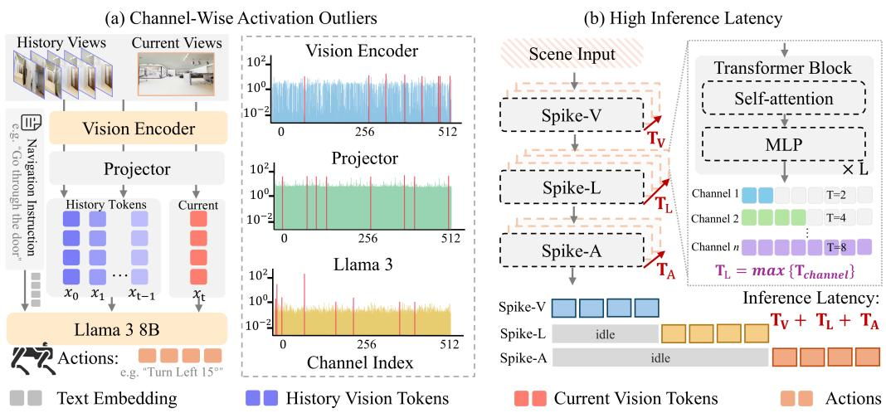  
Figure 1: (a) Pronounced activation outliers across VLA components increase spike encoding errors at limited timesteps, degrading conversion accuracy. (b) Non-uniform temporal horizons across components introduce synchronization stalls and idle periods, increasing inference latency.

Recent work has demonstrated the feasibility of ANN-to-SNN converted VLA models for embodied navigation (Song et al., 2026). However, scaling spiking VLA models to full VLA systems while preserving task performance and inference efficiency remains challenging. First, VLA components exhibit pronounced channel-wise activation outliers. As shown in Fig. 1(a), the vision encoder, projector, and language backbone present substantially different activation distributions, where a small subset of channels dominates the activation range. These outliers increase spike encoding errors under limited timesteps, degrading conversion accuracy. Moreover, VLA components exhibit non-uniform temporal horizons during spiking inference. As shown in Fig. 1(b), the vision, language, and action branches operate over T , T , and T timesteps, respectively. These differences in temporal horizons force downstream components to wait for upstream completion, introducing synchronization stalls and increasing end-to-end inference latency.

To address these limitations, we introduce SpikingVLA, an efficient ANN-to-SNN conversion framework for accurate and low-latency embodied navigation. Specifically, we propose a Dendritic Integrate-and-Fire (DIF) neuron that mitigates channel-wise activation outliers through dendritic mixing and adaptive somatic firing, enabling accurate conversion with fewer timesteps. Building on DIF, we further develop an asynchronous execution mechanism that enables VLA components to process intermediate spike responses without requiring full temporal synchronization, reducing synchronization overhead and inference latency. Extensive experiments on vision-language navigation benchmarks and closed-loop robotic navigation demonstrate that SpikingVLA maintains near-lossless navigation performance relative to its ANN counterpart while substantially improving inference efficiency. Our main contributions are summarized as follows:

• We identify two key bottlenecks in spiking VLA models: pronounced activation outliers degrade conversion accuracy at limited timesteps, while non-uniform temporal horizons across VLA components introduce synchronization stalls and increase inference latency.

• We introduce a DIF-based framework for accurate and low-latency spiking VLA inference. DIF mitigates channel-wise activation outliers through dendritic redistribution and adaptive somatic firing, enabling accurate conversion with fewer timesteps. Building on DIF, we further develop an asynchronous execution mechanism that propagates intermediate responses across VLA components, reducing synchronization stalls and inference latency.

• Extensive experiments across multiple vision-language navigation benchmarks and closedloop robotic settings demonstrate that SpikingVLA achieves competitive navigation performance with substantially improved inference efficiency. Compared with existing spiking VLA methods, SpikingVLA improves SR and SPL by 11.9% and 12.6%, respectively, while asynchronous execution accelerates first-action generation by 11.2×.

## 2 RELATED WORKS

Vision-Language-Action Models: VLA models leverage representations learned during visionlanguage pretraining for robotic control (Brohan et al., 2023; Ma et al., 2024). RT-2 (Brohan et al., 2023) casts robot actions as discrete tokens, whereas OpenVLA (Kim et al., 2024) introduces an open-source model trained on diverse cross-embodiment data. The paradigm has further been extended to continuous control and navigation (Black et al., 2024; Cheng et al., 2024). To improve deployment efficiency, OpenVLA-OFT (Kim et al., 2025) adopts parallel decoding and action chunking, SmolVLA (Shukor et al., 2025) uses a compact architecture, EfficientVLA (Yang et al., 2026) reduces redundant computation, and QVLA and QuantVLA (Zhang et al., 2026c) employ low-bit quantization. Despite these advances, low-latency VLA inference while preserving task performance remains challenging (Liu et al., 2024).

Spiking Neural Networks: SNNs process information through discrete spike events, enabling sparse and event-driven computation (Yao et al., 2023b; Wang et al., 2025; Xiao et al., 2025). Spikformer (Zhou et al., 2022) introduces Spiking Self-attention for visual recognition, while SpikeGPT (Zhu et al., 2023) extends spiking computation to generative language modeling. To reuse pretrained models, SpikeZIP-TF (You et al., 2024) converts pretrained Transformers into spik ing networks without costly retraining. More recent studies further extend spiking computation to multimodal models: SpikeMLLM (Xu et al., 2026a) introduces modality-specific temporal scales, while SpikeVLA applies spike-based processing to VLA tasks. However, existing methods primarily focus on architectural conversion or temporal adaptation, while the heterogeneous activation distributions and temporal imbalance across VLA components remain insufficiently explored.

## 3 PRELIMINARY

## 3.1 ANN-TO-SNN CONVERSION

Conventional ANN-to-SNN conversion typically relies on rate coding, where ANN activations are approximated by the temporal firing rates of spiking neurons (Rueckauer et al., 2017). This temporal rate representation often requires a sufficiently long simulation horizon for accurate approximation, while nonlinear operators in Transformer architectures further complicate direct conversion (Jiang et al., 2024). To address this limitation, differential coding (Huang et al., 2025a) represents temporal variations in operator responses instead of repeatedly encoding complete activations. Specifically, for layer l, the differential response and its accumulated representation are defined as follows:

$$
x ^ { l } [ t ] = t \big [ F ^ { l } ( r ^ { l - 1 } [ t ] ) - F ^ { l } ( r ^ { l - 1 } [ t - 1 ] ) \big ] , \qquad r ^ { l } [ t ] = r ^ { l } [ t - 1 ] + { \frac { x ^ { l } [ t ] } { t } } ,\tag{1}
$$

where $F ^ { l } ( \cdot )$ denotes the layer operation, $x ^ { l } [ t ]$ is the temporal output increment, and $r ^ { l } [ t ]$ represents the accumulated output at timestep t. This formulation enables layer responses to be progressively reconstructed from temporal increments. Since each increment depends only on the current and previous accumulated states, the output can be computed online without requiring future temporal information, enabling efficient timestep-wise propagation (Huang et al., 2025a).

## 3.2 MULTI-THRESHOLD NEURONS

Differential conversion employs multi-threshold (MT) neurons to encode temporal response increments with multiple signed firing levels (Huang et al., 2024a; 2025a). This multi-level representation improves temporal resolution while preserving event-driven computation (Zhang et al., 2025; Chen et al., 2026). Specifically, for layer $l ,$ the neuronal dynamics are defined as follows:

$$
\begin{array} { r } { { \mathbf { m } } ^ { l } [ t ] = { \mathbf { v } } ^ { l } [ t - 1 ] + { \mathbf { I } } ^ { l } [ t ] , \qquad { \mathbf { z } } ^ { l } [ t ] = { \mathrm { M T } } _ { \theta ^ { l } , n } \bigl ( { \mathbf { m } } ^ { l } [ t ] \bigr ) , \qquad { \mathbf { v } } ^ { l } [ t ] = { \mathbf { m } } ^ { l } [ t ] - { \mathbf { z } } ^ { l } [ t ] . } \end{array}\tag{2}
$$

Here, $\mathbf { m } ^ { l } [ t ]$ and $\mathbf { v } ^ { l } [ t ]$ denote the membrane potentials before and after spike emission, respectively, ${ \bf \cal I } ^ { l } [ t ]$ represents the incoming differential response, and $\mathbf { z } ^ { l } [ t ]$ denotes the emitted signed spike. The element-wise operator $\operatorname { M T } _ { \theta ^ { l } , n } ^ { - }$ employs a symmetric set of firing levels, $\Lambda ^ { l } = \{ \breve { \pm } \theta ^ { l } / 2 ^ { k ^ { 2 } - 1 } \mid k =$ $1 , \ldots , n \}$ , where $\theta ^ { l }$ denotes the maximum firing amplitude and n specifies the number of levels for each polarity. For membrane potentials satisfying $\mathbf { \dot { \vert m ^ { l } } } \mathbf { \lbrack } t \mathbf { \rbrack } \mathbf { \vert } < \theta ^ { l } / 2 ^ { \mathbf { \dot { \boldsymbol { n } } } - 1 }$ , the operator outputs zero; otherwise, the response is assigned to the nearest level in $\ddot { \Lambda } ^ { l }$ . For $n = 1$ , the MT neuron degenerates to a signed IF neuron with thresholds $\pm \theta ^ { l }$ (Hu et al., 2024).

Absolute Activation Range

## 4 PROBLEM ANALYSIS

Despite the promising efficiency benefits of ANN-to-SNN conversion, extending existing methods to VLA models remains challenging due to activation imbalance across multimodal components and temporal synchronization overhead during spiking inference. First, VLA components exhibit pronounced channel-wise activation outliers, which increase spike encoding errors at limited timesteps and degrade conversion accuracy. Second, non-uniform temporal horizons across channels and components introduce synchronization stalls, increasing end-to-end inference latency.

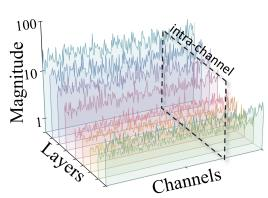

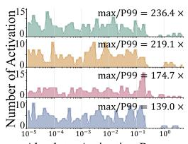

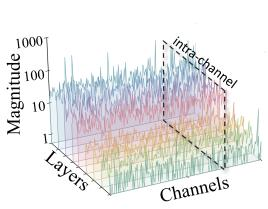

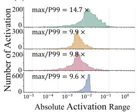  
Figure 2: Channel-wise activation imbalance across VLA components.

## 4.1 CHANNEL-WISE ACTIVATION OUTLIERS

VLA models exhibit pronounced channel-wise activation outliers across different components (Zeng et al., 2026). As shown in Fig. 2(a) and Fig. 2(c), the vision encoder and LLaMA decoder contain a small subset of channels with substantially larger activation magnitudes. These outlier channels dominate the activation scale, increasing spike encoding errors under limited timesteps and making accurate conversion more difficult. Existing ANN-to-SNN conversion methods (Huang et al., 2024b) typically address such activation imbalance through threshold calibration. Specifically, the threshold of channel c in module m is optimized by minimizing the reconstruction error:

$$
\theta _ { m , c } ^ { \star } = \arg \operatorname* { m i n } _ { \theta > 0 } \int \left[ x - \frac { \theta } { N } \exp \left( \left\lfloor \frac { N x } { \theta } + \frac { 1 } { 2 } \right\rfloor , 0 , N \right) \right] ^ { 2 } p _ { m , c } ( x ) d x , \qquad N \simeq 2 ^ { n } T ,\tag{3}
$$

where $p _ { m , c } ( x )$ denotes the activation distribution of channel c in module $m , T$ is the timestep budget, and n determines the number of firing levels. For a fixed $T ,$ a larger n provides finer spike representation by increasing the available firing levels. However, as shown in Fig. 2(b) and Fig. 2(d), the activation ranges remain strongly long-tailed, with a small subset of channels dominating the overall scale. Increasing the firing resolution therefore does not remove this range imbalance. As a result, extreme channels continue to constrain accurate spike encoding under limited timesteps.

## 4.2 TEMPORAL SYNCHRONIZATION OVERHEAD

VLA models require low response latency for real-time closed-loop interaction (Liu et al., 2024). Existing spiking VLA methods often assign different temporal horizons across channels and modules to accommodate heterogeneous activation dynamics (Song et al., 2026). However, these heterogeneous horizons lead to mismatched completion times across channels. Since each layer can proceed only after all channels complete, its execution time is determined by the channel requiring the longest temporal horizon. Let $T _ { m , l , c }$ denote the temporal horizon of channel c in layer l of module m. The resulting layer latency is therefore defined as follows:

$$
T _ { m , l } ^ { \mathrm { e x e c } } = \operatorname* { m a x } _ { c } T _ { m , l , c } , \qquad \mathcal { W } _ { m , l } = \sum _ { c = 1 } ^ { C _ { m , l } } \left( T _ { m , l } ^ { \mathrm { e x e c } } - T _ { m , l , c } \right) , \qquad \mathcal { L } _ { \mathrm { f i r s t } } = \sum _ { m \in \mathcal { M } } \sum _ { l = 1 } ^ { L _ { m } } \tau _ { m , l } T _ { m , l } ^ { \mathrm { e x e c } } ,\tag{4}
$$

where $C _ { m , l }$ denotes the number of channels, $\mathcal { M } = \{ \mathrm { V } , \mathrm { L } , \mathrm { A } \}$ represents the vision, language, and action modules, and $\tau _ { m , l }$ denotes the execution time per timestep. As illustrated in Fig. 1(b), the latency of each layer is determined by the channel with the longest temporal horizon. Channels that complete earlier remain idle until this horizon is reached, resulting in an accumulated idle budget $\mathcal { W } _ { m , l }$ Consequently, shortening the horizons of non-critical channels does not reduce the layer latency unless the maximum horizon is also reduced. These synchronization delays accumulate across successive layers and modules and ultimately increase the time-to-first-action (TTFA).

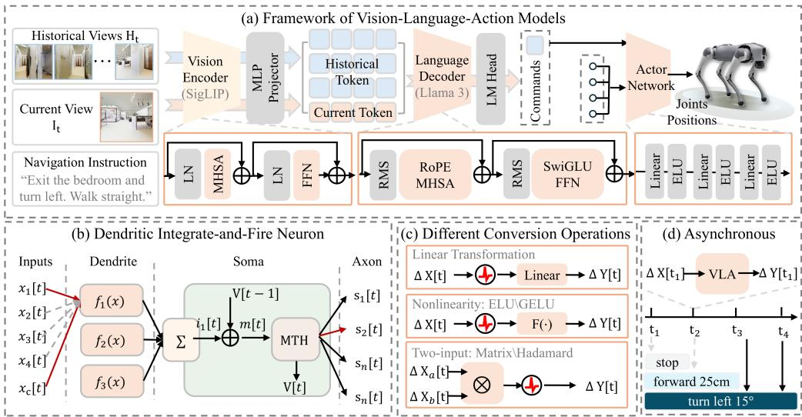  
Figure 3: (a) Computation flow of the VLA model. (b) DIF neuron with dendritic feature integration and channel-adaptive spike encoding. (c) Differential conversion strategies for different operators. (d) Event-driven inference by accumulating differential responses over timesteps.

## 5 METHODS

## 5.1 DENDRITIC INTEGRATE-AND-FIRE NEURON

To address the representation mismatch induced by activation heterogeneity, we introduce DIF neuron, which couples dendritic channel mixing with channel-adaptive somatic firing. The dendritic compartment redistributes channel responses to reduce inter-channel scale disparity, while the soma adapts its firing range to the residual distribution of each post-dendritic channel.

## 5.1.1 DENDRITIC CHANNEL MIXING

As analyzed in Sec. 4, VLA activations exhibit substantial channel-wise heterogeneity, with highmagnitude responses concentrated in specific dimensions. We introduce dendritic channel mixing to redistribute these responses before somatic encoding. The dendritic compartment comprises D parallel branches operating on local channel subspaces with independent temporal states. Given $\mathbf { x } ^ { l } [ t ] \in \mathbb { R } ^ { C }$ , the dendritic dynamics and resulting somatic input are formulated as follows:

$$
\mathbf { d } _ { c } ^ { l } [ t + 1 ] = \alpha _ { d } ^ { l } \mathbf { d } _ { c } ^ { l } [ t ] + ( 1 - \alpha _ { d } ^ { l } ) \mathbf { R } _ { c } ^ { l } \mathbf { P } _ { c } ^ { l } \mathbf { x } ^ { l } [ t + 1 ] , \qquad \mathbf { i } _ { s } ^ { l } [ t + 1 ] = \sum ( \mathbf { P } _ { c } ^ { l } ) ^ { \top } \mathbf { d } _ { d } ^ { l } [ t + 1 ] .\tag{5}
$$

$\mathbf { P } _ { d } ^ { l } \in \{ 0 , 1 \} ^ { C _ { d } \times C }$ selects the channel subspace of branch d, $\mathbf { R } _ { d } ^ { l } \in \mathbb { R } ^ { C _ { d } \times C _ { d } }$ performs local channel mixing, and $\alpha _ { d } ^ { l }$ controls dendritic state retention. The resulting branch states are mapped back through $( \mathbf { P } _ { d } ^ { l } ) ^ { \top }$ and aggregated at the soma. Owing to the independence of dendritic branches, these transformations can be evaluated in parallel and written in an equivalent layer-wise form as follows:

$$
\mathbf { i } _ { s } ^ { l } [ t + 1 ] = \alpha ^ { l } \mathbf { i } _ { s } ^ { l } [ t ] + ( 1 - \alpha ^ { l } ) \mathbf { Q } ^ { l } \mathbf { x } ^ { l } [ t + 1 ] , \qquad \mathbf { Q } ^ { l } = \sum ( \mathbf { P } _ { d } ^ { l } ) ^ { \top } \mathbf { R } _ { d } ^ { l } \mathbf { P } _ { d } ^ { l } .\tag{6}
$$

Here, $\mathbf { Q } ^ { l }$ denotes the spatial channel transformation induced by the dendritic branches, while $\alpha ^ { l }$ controls temporal integration. When $\mathbf { Q } ^ { l } = \mathbf { H }$ , the dynamics reduce to Hadamard channel rotation with temporal integration. We further provide theoretical analysis in Appendix B.

## 5.1.2 CHANNEL-ADAPTIVE SOMATIC FIRING

To further improve spike representation after dendritic channel mixing, we introduce channeladaptive somatic firing. Specifically, for channel c in layer l, let $i _ { s , c } ^ { l } [ t ]$ denote the aggregated den dritic input at timestep t. The corresponding membrane response and spike output are defined as:

$$
m _ { c } ^ { l } [ t ] = v _ { c } ^ { l } [ t - 1 ] + i _ { s , c } ^ { l } [ t ] , \qquad z _ { c } ^ { l } [ t ] = \mathrm { M T } _ { \theta _ { c } ^ { l } , n _ { c } ^ { l } } \left( m _ { c } ^ { l } [ t ] \right) ,\tag{7}
$$

where $\theta _ { c } ^ { l }$ controls the channel-specific firing range and n denotes the fixed number of threshold levels. To account for the residual distributional variation across post-dendritic channels, we calibrate $( \theta _ { c } ^ { l } , n _ { c } ^ { l } )$ ) independently for each channel. Under a fixed timestep budget $T ,$ , the optimal configuration is obtained by minimizing the channel-wise reconstruction error:

$$
\theta _ { c } ^ { l \star } = \arg \operatorname* { m i n } _ { \theta > 0 } \mathbb { E } _ { x \sim \mathcal { D } _ { s , c } ^ { l } } \left[ \left| x - \hat { x } _ { \theta , n } ^ { T } \right| ^ { 2 } \right] .\tag{8}
$$

Here, $\mathcal { D } _ { s , c } ^ { l }$ denotes the post-dendritic calibration distribution, and $\hat { x } _ { \theta , n } ^ { T }$ denotes the activation reconstructed from the corresponding T-step MT response. The calibrated $\theta _ { c } ^ { l }$ adapts the encoding range to each post-dendritic channel without increasing the timestep budget. We further visualize the execution dynamics of the proposed DIF neuron. As shown in Fig. 3(b), DIF couples dendritic channel redistribution and temporal integration with channel-adaptive somatic firing.

## 5.2 OPERATION-AWARE DIFFERENTIAL CONVERSION WITH DIF NEURONS

Building on differential coding (Huang et al., 2025b), we apply DIF neurons to heterogeneous VLA operators. For the temporal increment $\Delta \mathbf { Y } ^ { l } [ t ]$ of the l-th operator, DIF performs dendritic channel mixing and temporal integration before somatic firing. Since $\mathbf { Q } ^ { l }$ changes the representation basis used for spike encoding, the subsequent operator must account for this transformation. For affine mappings, we exactly absorb $( \mathbf { Q } ^ { l } ) ^ { - 1 }$ into the input-side weight of the following operator. Accordingly, the DIF encoding and subsequent affine computation are formulated as follows:

$$
\begin{array} { r } { { \mathbf { S } } ^ { l } [ t ] = \mathrm { D I F } _ { \psi ^ { l } } \left( \Delta { \mathbf { Y } } ^ { l } [ t ] ; { \mathbf { Q } } ^ { l } \right) , \qquad \widetilde { \mathbf { W } } ^ { l + 1 } = ( { \mathbf { Q } } ^ { l } ) ^ { - 1 } { \mathbf { W } } ^ { l + 1 } , \qquad \Delta { \mathbf { Z } } ^ { l + 1 } [ t ] = { \mathbf { S } } ^ { l } [ t ] \widetilde { \mathbf { W } } ^ { l + 1 } . } \end{array}\tag{9}
$$

The reparameterization acts only on the subsequent affine mapping and leaves the DIF dynamics unchanged. For orthogonal $\mathbf { Q } ^ { l }$ , the inverse reduces to its transpose and can be fused into the weights offline. Non-affine and multiplicative operators are instead handled by deriving their corresponding differential forms while preserving the original computation. Detail information is as follows.

## 5.2.1 SINGLE-INPUT OPERATOR CONVERSION

We first consider operators acting on a single evolving representation, including affine projections and nonlinear transformations. As shown in Fig. 3(c), affine mappings directly propagate the incoming increment through the reparameterized weight, whereas nonlinear operators evaluate the response difference between two consecutive input states. Specifically, it can be defined as follows:

$$
\Delta \mathbf { Y } _ { \mathcal { F } } [ t ] = \left\{ \begin{array} { l l } { \Delta \mathbf { X } [ t ] \widetilde { \mathbf { W } } , } & { \mathcal { F } ( \mathbf { X } ) = \mathbf { X } \widetilde { \mathbf { W } } + \mathbf { b } , } \\ { \mathcal { F } ( \mathbf { X } [ t - 1 ] + \Delta \mathbf { X } [ t ] ) - \mathcal { F } ( \mathbf { X } [ t - 1 ] ) , } & { \mathcal { F } \mathrm { i s ~ n o n - a f f n e } . } \end{array} \right.\tag{10}
$$

For affine mappings, temporal differencing cancels the bias term, reducing the update to a linear mapping of the input increment. For nonlinear operators, including normalization, pointwise activation, and Softmax, the increment is obtained from consecutive operator responses using the cached state. In both cases, the resulting increment is subsequently processed by DIF.

## 5.2.2 MULTIPLICATIVE INTERACTIONS

We next consider multiplicative interactions between two evolving representations, including attention-score computation, attention-value aggregation, and element-wise gating. As illustrated in Fig. 3(c), for $\mathcal { F } ( \mathbf { A } , \mathbf { B } ) = \mathbf { A } \star \mathbf { B }$ , the temporal increment is follows:

$$
\Delta \mathbf { Y } _ { \mathrm { m u l } } [ t ] = \Delta \mathbf { A } [ t ] \star \mathbf { B } [ t - 1 ] + \mathbf { A } [ t - 1 ] \star \Delta \mathbf { B } [ t ] + \Delta \mathbf { A } [ t ] \star \Delta \mathbf { B } [ t ] ,\tag{11}
$$

where ⋆ denotes matrix or element-wise multiplication. The first two terms capture the individual operand updates, while the final term accounts for their joint variation. The resulting increment is then encoded by DIF for asynchronous propagation.

## 5.3 OVERALL ARCHITECTURE

We instantiate SpikingVLA on NaVILA (Cheng et al., 2024), a hierarchical vision-language-action policy. As shown in Fig. 3(a), the high-level VLA integrates historical and current visual observations with the navigation instruction through the vision encoder, multimodal projector, and language decoder to produce a spatial navigation command. The low-level actor then combines this command with the current locomotion observations to predict target joint positions. We apply the proposed DIF-based conversion to both policies while preserving their original computational interfaces. At each control step t, the external observations are fixed over an internal SNN horizon $\tau \in \{ 1 , \ldots , T \}$ we therefore omit t from the internal states for clarity. At each internal timestep, the high-level policy accumulates the newly propagated differential response and immediately updates the navigation command, which is subsequently consumed by the low-level policy within the same timestep. The resulting hierarchical execution is formulated as follows:

$$
\begin{array} { r l } & { \widehat { \mathbf { u } } _ { h } [ \tau ] = \widehat { \mathbf { u } } _ { h } [ \tau - 1 ] + \mathcal { C } _ { \mathrm { D I F } } ^ { h } ( \mathbf { o } _ { t } , 1 ) \left[ \tau \right] , \qquad \mathbf { v } _ { \mathrm { c m d } } [ \tau ] = \mathcal { G } _ { \mathrm { c m d } } ( \widehat { \mathbf { u } } _ { h } [ \tau ] ) , } \\ & { \widehat { \mathbf { q } } ^ { d } [ \tau ] = \widehat { \mathbf { q } } ^ { d } [ \tau - 1 ] + \mathcal { C } _ { \mathrm { D I F } } ^ { l } ( \mathbf { o } _ { l , t } , \mathbf { v } _ { \mathrm { c m d } } [ \tau ] ) \left[ \tau \right] , \qquad \tau = 1 , \dots , T . } \end{array}\tag{12}
$$

$\mathcal { C } _ { \mathrm { D I F } } ^ { h }$ and $\mathcal { C } _ { \mathrm { D I F } } ^ { l }$ denote full-depth differential execution of the high-level VLA and low-level actor, respectively. At each internal timestep τ, the high-level state is updated from the current differential response and immediately decoded into $\mathbf { v } _ { \mathrm { c m d } } [ \tau ]$ ], which is consumed by the low-level policy within the same timestep. This produces an updated joint target $\widehat { \mathbf { q } } ^ { d } [ \tau ]$ at every τ, with successive differential responses progressively refining the action estimate. As illustrated in Fig. 3(d), executable outputs are therefore available throughout the SNN horizon rather than only at the final timestep.

## 6 EXPERIMENTS

We evaluate SpikingVLA on three VLN-CE benchmarks: R2R Val-Unseen (Anderson et al., 2018), RxR Val-Unseen (Krantz et al., 2020), and VLN-CE-Isaac (Cheng et al., 2024). These benchmarks evaluate complementary aspects of embodied navigation, including generalization to unseen environments, long-horizon instruction following, and closed-loop navigation under realistic robot dynamics. We report NE, OS, SR, SPL, and nDTW to evaluate navigation performance. For deployment efficiency, we consider memory footprint, TTFA and Total T (Yao et al., 2023a; 2025).

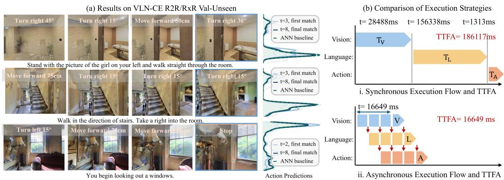  
Figure 4: Performance and Efficiency analysis. (a) Navigation trajectories and action-prediction convergence on the VLN-CE R2R and RxR Val-Unseen splits. (b) Inference-latency comparison, highlighting the reduction achieved by asynchronous spike-based execution.

## 6.1 NAVIGATION PERFORMANCE ON VLN-CE BENCHMARKS

We evaluate SpikingVLA on the Val-Unseen splits of R2R-CE and RxR-CE against representative VLN and VLA methods (Wei et al., 2025; An et al., 2024). As shown in Table 1, SpikingVLA consistently achieves competitive navigation performance across both benchmarks under limited timestep budgets. On R2R-CE Val-Unseen, SpikingVLA achieves an NE of 5.20, OS of 62.4, SR of 54.6, and SPL of 50.3 at T=8. On RxR-CE Val-Unseen, SpikingVLA achieves an NE of 6.30, SR of 51.6, SPL of 45.8, and nDTW of 61.3 at T=8. These results demonstrate that SpikingVLA maintains competitive navigation performance under limited timestep budgets.

Beyond the local simulation budget T, we report Total T to characterize the cumulative end-to-end temporal depth. Under synchronized spiking inference, temporal computation is executed sequentially across layers and VLA components, causing individual temporal horizons to accumulate into an end-to-end temporal depth of approximately 500–600 steps. In contrast, SpikingVLA enables

Table 1: Navigation performance on the R2R-CE Val-Unseen and RxR-CE Val-Unseen. TF indi cates training-free paradigms, and Total T denotes the total number of full-network timesteps. Bold values indicate the best results among SNN-based methods.
<table><tr><td rowspan="2">Type</td><td rowspan="2">Method</td><td rowspan="2">TF</td><td colspan="4">R2R Val-Unseen</td><td colspan="4">RxR Val-Unseen</td><td rowspan="2">Total T↓</td></tr><tr><td>NE↓</td><td>OS↑</td><td>SR↑</td><td>SPL↑</td><td>NE↓</td><td>SR↑</td><td>SPL↑ nDTW↑</td><td></td></tr><tr><td rowspan="5">ANV</td><td>StreamVLN (Wei et al., 2025)</td><td>x</td><td>4.98</td><td>64.2</td><td>56.9</td><td>51.9</td><td>6.22</td><td>52.9</td><td>46.0</td><td>61.9</td><td></td></tr><tr><td>InternVLA-N1 (Wei et al., 2026)</td><td>x</td><td>4.05</td><td>70.7</td><td>64.3</td><td>58.5</td><td>4.58</td><td>61.4</td><td>51.8</td><td>70.0</td><td></td></tr><tr><td>ETPNav (An et al., 2024)</td><td>x</td><td>4.71</td><td>65.0</td><td>57.0</td><td>49.0</td><td>5.64</td><td>54.7</td><td>44.8</td><td>61.9</td><td></td></tr><tr><td>HNR (Wang et al., 2024)</td><td>x</td><td>4.42</td><td>67.0</td><td>61.0</td><td>51.0</td><td>5.50</td><td>56.3</td><td>46.7</td><td>63.5</td><td></td></tr><tr><td>NaVILA (Cheng et al., 2024)</td><td>x</td><td>5.28</td><td>61.5</td><td>53.9</td><td>49.3</td><td>6.12</td><td>52.3</td><td>46.1</td><td>61.0</td><td></td></tr><tr><td rowspan="2">NNS</td><td>SpikeVLA (Song et al., 2026)</td><td>x</td><td>5.38</td><td>63.4</td><td>53.3</td><td>47.9</td><td>6.20</td><td>51.9</td><td>45.3</td><td>60.4</td><td>500-600</td></tr><tr><td>SpikingVLA (Ours)</td><td></td><td>5.20</td><td>62.4</td><td>54.6</td><td>50.3</td><td>6.30</td><td>51.6</td><td>45.8</td><td>61.3</td><td>8</td></tr></table>

Table 2: Closed-loop navigation performance and deployment efficiency on VLN-CE-Isaac.
<table><tr><td rowspan="2">Type</td><td rowspan="2">Method</td><td rowspan="2">TF</td><td colspan="4">Closed-Loop Navigation</td><td colspan="3">Deployment Efficiency</td></tr><tr><td>NE↓</td><td>OS↑</td><td>SR↑</td><td>SPL↑</td><td>Mem.↓</td><td>TTFA↓ Total T↓</td><td></td></tr><tr><td rowspan="4">ANN</td><td>NaVILA-Blind (Cheng et al., 2024)</td><td>x</td><td>6.03</td><td>49.0</td><td>36.2</td><td>33.3</td><td>16126.2</td><td></td><td></td></tr><tr><td>NaVILA-Vision (Cheng et al., 2024)</td><td>x</td><td>5.49</td><td>58.7</td><td>50.2</td><td>45.5</td><td>16126.2</td><td></td><td></td></tr><tr><td>NaVILA-R (Song et al., 2026)</td><td>x</td><td>6.29</td><td>52.1</td><td>36.5</td><td>29.5</td><td>16126.2</td><td></td><td></td></tr><tr><td>NaVILA-AWQ (Cheng et al., 2024)</td><td>x</td><td>6.58</td><td>48.2</td><td>32.8</td><td>27.4</td><td>5846.9</td><td>一</td><td></td></tr><tr><td rowspan="3">NNS</td><td>SpikeVLA (Song et al., 2026)</td><td>x</td><td>6.02</td><td>53.6</td><td>32.7</td><td>28.5</td><td>6251.5</td><td>186.1</td><td>500-600</td></tr><tr><td>SpikingVLA-Blind (Ours)</td><td></td><td>6.11</td><td>48.1</td><td>34.4</td><td>31.1</td><td>6251.5</td><td>16.7</td><td>8</td></tr><tr><td>SpikingVLA-Vision (Ours)</td><td>√</td><td>5.45</td><td>56.6</td><td>44.6</td><td>41.1</td><td>6251.5</td><td>16.7</td><td>8</td></tr></table>

VLA components to process intermediate responses as they become available, allowing temporal execution to overlap and reducing synchronization overhead. To further analyze temporal convergence, Fig. 4(a) presents representative long-horizon trajectories and corresponding action predictions on R2R-CE and RxR-CE under different timestep budgets. As the temporal responses accumulate, spiking action predictions progressively align with the corresponding ANN policy outputs and remain consistent throughout navigation trajectories. These results demonstrate that SpikingVLA preserves ANN-level decision consistency while operating under a compact temporal budget.

## 6.2 CLOSED-LOOP EMBODIED NAVIGATION

We further evaluate SpikingVLA on VLN-CE-Isaac using the Unitree Go2 embodiment. As shown in Table 2, both SpikingVLA-Blind and SpikingVLA-Vision preserve strong navigation performanc. At T = 8, SpikingVLA-Blind achieves an NE/OS/SR/SPL of 6.11/48.1/34.4/31.1, while SpikingVLA-Vision further improves the results to 5.45/56.6/44.6/41.1 by leveraging visual observations. Compared with its ANN counterpart, NaVILA-Vision, SpikingVLA-Vision maintains comparable navigation performance, with only 5.6 and 4.4 percentage-point gaps in SR and SPL, respectively. Moreover, compared with an existing spiking VLA baseline, SpikingVLA-Vision improves SR and SPL by 11.9 and 12.6 percentage points, demonstrating the effectiveness of the proposed conversion framework for closed-loop embodied navigation.

SpikingVLA further improves deployment efficiency through asynchronous execution. As illus trated in Fig. 4(b), synchronized VLA inference serializes vision, language, and action processing, forcing each downstream component to wait for upstream temporal computation to complete. These synchronization stalls accumulate along the VLA pipeline and substantially increase first-action latency. In contrast, SpikingVLA propagates intermediate spike responses as they become available, allowing downstream components to start computation earlier and enabling temporal overlap across vision, language, and action processing. As a result, TTFA decreases from 186.1 to 16.7, corresponding to an approximately 11.1× speedup in first-action generation. These results demonstrate that asynchronous spike propagation effectively enables low-latency closed-loop VLA inference.

## 6.3 QUANTIZATION ANALYSIS

To investigate whether DIF alleviates activation imbalance in VLA models, we visualize channel-wise activations before and after dendritic mixing in Fig. 5(a). DIF produces more balanced somatic inputs in both the vision and LLaMA blocks by reducing the dominance of extreme channels. For representative channels, the activation ranges decrease from 15.1 to 7.1 and from 30.2 to 7.0, respectively. These results indicate that dendritic mixing effectively balances channel responses and stabilizes activation distributions for spike encoding.

We further evaluate conversion fidelity by measuring ANN-SNN representation discrepancy in the vision encoder as a representative VLA component under different timestep budgets. As shown in Fig. 5(b), DIF consistently achieves lower conversion errors than the SpikeVLA baseline under the same conversion settings (Song et al., 2026). $\mathrm { A t } T = 8$ , DIF reduces the representation discrepancy from 0.52

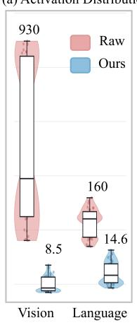

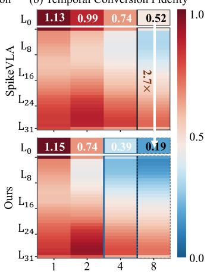  
Figure 5: (a) Channel-wise activation distributions. (b) Layer-wise conversion discrepancy under different simulation timesteps.

to 0.19. This improvement demonstrates that DIF preserves ANN representations more effectively under limited temporal budgets, reducing information loss caused by insufficient timesteps.

## 6.4 ABLATION STUDY

We further evaluate module-wise conversion fidelity under different spiking neuron configurations (Huang et al., 2024b). As shown in Table 3, increasing the number of thresholds consistently reduces the ANN–SNN representation error in both the vision encoder and LLaMA decoder. Notably, DIF achieves progressively larger improvements over MT as the firing resolution increases. In the vision encoder, DIF reduces the conversion error from 0.99 to 0.74, 0.74 to 0.39, and 0.52

Table 3: Module-wise ANN–SNN conversion error under different spiking neuron configurations.
<table><tr><td rowspan="2">Module Neuron</td><td rowspan="2"></td><td colspan="4">Number of Thresholds</td></tr><tr><td> $\mathbf { n } = \mathbf { 1 }$ </td><td> $\mathbf { n } = \mathbf { 2 }$ </td><td> $\mathbf { n } = 4$ </td><td> ${ \bf n } = { \bf 8 }$ </td></tr><tr><td>Vision Encoder</td><td>MT</td><td>1.13</td><td>0.99</td><td>0.74</td><td>0.52</td></tr><tr><td rowspan="2">LLaMA</td><td>DIF</td><td>1.15</td><td>0.74</td><td>0.39</td><td>0.11</td></tr><tr><td>MT</td><td>0.48</td><td>0.40</td><td>0.31</td><td>0.24</td></tr><tr><td>Decoder</td><td>DIF</td><td>0.52</td><td>0.36</td><td>0.22</td><td>0.11</td></tr></table>

to 0.11 for $n = 2 , 4 , 8 ,$ corresponding to relative reductions of 25.3%, 47.3%, and 78.8%, respectively. Similar trends are observed in the LLaMA decoder, where the error decreases from 0.40 to 0.36, 0.31 to 0.22, and 0.24 to 0.11, yielding reductions of 10.0%, 29.0%, and 54.2%. These consistent gains across heterogeneous visual and language representations validate the effectiveness of dendritic channel redistribution for improving ANN–SNN conversion fidelity.

## 7 CONCLUSION

We present SpikingVLA, an ANN-to-SNN conversion framework that enables accurate and lowlatency spiking inference for pretrained vision-language-action models. SpikingVLA addresses two fundamental challenges in spiking VLA conversion: channel-wise activation outliers that limit conversion fidelity under constrained timesteps and temporal synchronization bottlenecks that hinder efficient inference. To overcome these challenges, SpikingVLA introduces a Dendritic Integrateand-Fire (DIF) neuron to improve spike representation fidelity and an asynchronous execution mech anism to enable temporal overlap across VLA components. Extensive experiments demonstrate that SpikingVLA preserves competitive navigation performance while substantially reducing temporal execution overhead. Further analyses verify that DIF improves ANN–SNN conversion fidelity across both visual and language components. These results highlight SpikingVLA as an effective framework for scalable and efficient event-driven VLA inference.

## 8 USE OF LARGE LANGUAGE MODEL

In this manuscript, we used a LLM solely for language refinement and manuscript polishing. Specifically, the LLM was used to improve sentence clarity, correct grammatical errors, and enhance the overall readability and academic style of the manuscript. The LLM was not involved in the development of research ideas, methodology design, experimental implementation, result analysis, or generation of scientific claims. All technical contributions, experimental results, and conclusions presented in this paper were independently developed and verified by the authors.

## REFERENCES

Dong An, Hanqing Wang, Wenguan Wang, Zun Wang, Yan Huang, Keji He, and Liang Wang. Etpnav: Evolving topological planning for vision-language navigation in continuous environments. IEEE Transactions on Pattern Analysis and Machine Intelligence, 47(7):5130–5145, 2024.

Peter Anderson, Qi Wu, Damien Teney, Jake Bruce, Mark Johnson, Niko Sunderhauf, Ian Reid,¨ Stephen Gould, and Anton van den Hengel. Vision-and-language navigation: Interpreting visually-grounded navigation instructions in real environments. In Proceedings of the IEEE Conference on Computer Vision and Pattern Recognition (CVPR), pp. 3674–3683, June 2018. doi: 10.1109/CVPR.2018.00387.

Kevin Black, Noah Brown, Danny Driess, Adnan Esmail, Michael Equi, Chelsea Finn, Niccolo Fusai, Lachy Groom, Karol Hausman, Brian Ichter, et al. π : A vision-language-action flow model for general robot control. arXiv preprint arXiv:2410.24164, 2024.

Anthony Brohan, Noah Brown, Justice Carbajal, Yevgen Chebotar, Xi Chen, Krzysztof Choromanski, Tianli Ding, Danny Driess, Avinava Dubey, Chelsea Finn, et al. Rt-2: Vision-language-action models transfer web knowledge to robotic control. arXiv preprint arXiv:2s307.15818, 2023.

Tong Bu, Wei Fang, Jianhao Ding, PengLin Dai, Zhaofei Yu, and Tiejun Huang. Optimal annsnn conversion for high-accuracy and ultra-low-latency spiking neural networks. arXiv preprint arXiv:2303.04347, 2023.

Tong Bu, Maohua Li, and Zhaofei Yu. Inference-scale complexity in ann-snn conversion for highperformance and low-power applications. In Proceedings of the Computer Vision and Pattern Recognition Conference, pp. 24387–24397, 2025.

Angel Chang, Angela Dai, Thomas Funkhouser, Maciej Halber, Matthias Niessner, Manolis Savva, Shuran Song, Andy Zeng, and Yinda Zhang. Matterport3d: Learning from rgb-d data in indoor environments. arXiv preprint arXiv:1709.06158, 2017.

Long Chen, Xiaotian Song, and Yanan Sun. LAS: Loss-less ANN-SNN conversion for fully spikedriven large language models. In Proceedings of the AAAI Conference on Artificial Intelligence, volume 40, 2026. doi: 10.1609/aaai.v40i3.37151.

An-Chieh Cheng, Yandong Ji, Zhaojing Yang, Zaitian Gongye, Xueyan Zou, Jan Kautz, Erdem Bıyık, Hongxu Yin, Sifei Liu, and Xiaolong Wang. Navila: Legged robot vision-language-action model for navigation. arXiv preprint arXiv:2412.04453, 2024.

Mike Davies, Narayan Srinivasa, Tsung-Han Lin, Gautham Chinya, Yongqiang Cao, Sri Harsha Choday, Georgios Dimou, Prasad Joshi, Nabil Imam, Shweta Jain, et al. Loihi: A neuromorphic manycore processor with on-chip learning. Ieee Micro, 38(1):82–99, 2018.

Lei Deng, Guanrui Wang, Guoqi Li, Shuangchen Li, Ling Liang, Maohua Zhu, Yujie Wu, Zheyu Yang, Zhe Zou, Jing Pei, et al. Tianjic: A unified and scalable chip bridging spike-based and continuous neural computation. IEEE Journal ofSolid-State Circuits, 55(8):2228–2246, 2020a.

Lei Deng, Yujie Wu, Xing Hu, Ling Liang, Yufei Ding, Guoqi Li, Guangshe Zhao, Peng Li, and Yuan Xie. Rethinking the performance comparison between snns and anns. Neural networks, 121:294–307, 2020b.

Wei Fang, Zhaofei Yu, Zhaokun Zhou, Ding Chen, Yanqi Chen, Zhengyu Ma, Timothee Masquelier,´ and Yonghong Tian. Parallel spiking neurons with high efficiency and ability to learn long-term dependencies. Advances in Neural Information Processing Systems, 36:53674–53687, 2023.

Wulfram Gerstner and Werner M Kistler. Spiking neuron models: Single neurons, populations, plasticity. Cambridge university press, 2002.

Mark Horowitz. 1.1 computing’s energy problem (and what we can do about it). In 2014 IEEE international solid-state circuits conference digest of technical papers (ISSCC), pp. 10–14. Ieee, 2014.

Yangfan Hu, Qian Zheng, Guoqi Li, Huajin Tang, and Gang Pan. Toward large-scale spiking neural networks: A comprehensive survey and future directions. arXiv preprint arXiv:2409.02111, 2024.

Zihan Huang, Xinyu Shi, Zecheng Hao, Tong Bu, Jianhao Ding, Zhaofei Yu, and Tiejun Huang. Towards high-performance spiking transformers from ann to snn conversion. In Proceedings of the 32nd ACM international conference on multimedia, pp. 10688–10697, 2024a.

Zihan Huang, Xinyu Shi, Zecheng Hao, Tong Bu, Jianhao Ding, Zhaofei Yu, and Tiejun Huang. Towards high-performance spiking transformers from ann to snn conversion. In Proceedings of the 32nd ACM International Conference on Multimedia, pp. 10688–10697, 2024b.

Zihan Huang, Wei Fang, Tong Bu, Peng Xue, Zecheng Hao, Wenxuan Liu, Yuanhong Tang, Zhaofei Yu, and Tiejun Huang. Differential coding for training-free ann-to-snn conversion. arXiv preprint arXiv:2503.00301, 2025a.

Zihan Huang, Wei Fang, Tong Bu, Peng Xue, Zecheng Hao, Wenxuan Liu, Yuanhong Tang, Zhaofei Yu, and Tiejun Huang. Differential coding for training-free ann-to-snn conversion. In Fortysecond International Conference on Machine Learning, 2025b.

Eugene M Izhikevich. Simple model of spiking neurons. IEEE Transactions on neural networks, 14(6):1569–1572, 2003.

Yizhou Jiang, Kunlin Hu, Tianren Zhang, Haichuan Gao, Yuqian Liu, Ying Fang, and Feng Chen. Spatio-temporal approximation: A training-free snn conversion for transformers. In The Twelfth International Conference on Learning Representations, 2024.

Moo Jin Kim, Karl Pertsch, Siddharth Karamcheti, Ted Xiao, Ashwin Balakrishna, Suraj Nair, Rafael Rafailov, Ethan Foster, Grace Lam, Pannag Sanketi, et al. Openvla: An open-source vision-language-action model. arXiv preprint arXiv:2406.09246, 2024.

Moo Jin Kim, Chelsea Finn, and Percy Liang. Fine-tuning vision-language-action models: Opti mizing speed and success. arXiv preprint arXiv:2502.19645, 2025.

Jacob Krantz, Erik Wijmans, Arjun Majumdar, Dhruv Batra, and Stefan Lee. Beyond the nav-graph: Vision-and-language navigation in continuous environments. In Computer Vision – ECCV 2020, pp. 104–120. Springer, 2020. doi: 10.1007/978-3-030-58604-1 7.

Alexander Ku, Peter Anderson, Kartik Gopal, Rishabh Agarwal, Jason Baldridge, Jiasen Lu, Dhruv Batra, and Aneesh Sharma. Room-across-room: Multilingual vision-and-language navigation with fine-grained textual grounding. In Proceedings ofthe 2020 Conference on Empirical Methods in Natural Language Processing (EMNLP), pp. 4363–4375, 2020.

Yuhang Li, Shikuang Deng, Xin Dong, Ruihao Gong, and Shi Gu. A free lunch from ann: Towards efficient, accurate spiking neural networks calibration. In International conference on machine learning, pp. 6316–6325. PMLR, 2021.

Yuhang Li, Shikuang Deng, Xin Dong, and Shi Gu. Error-aware conversion from ann to snn via posttraining parameter calibration. International Journal of Computer Vision, 132(9):3586–3609, 2024.

Jiaming Liu, Mengzhen Liu, Zhenyu Wang, Pengju An, Xiaoqi Li, Kaichen Zhou, Senqiao Yang, Renrui Zhang, Yandong Guo, and Shanghang Zhang. Robomamba: Efficient vision-languageaction model for robotic reasoning and manipulation. Advances in Neural Information Processing Systems, 37:40085–40110, 2024.

De Ma, Juncheng Shen, Zonghua Gu, Ming Zhang, Xiaolei Zhu, Xiaoqiang Xu, Qi Xu, Yangjing Shen, and Gang Pan. Darwin: A neuromorphic hardware co-processor based on spiking neural networks. Journal ofsystems architecture, 77:43–51, 2017.

Yueen Ma et al. A survey on vision-language-action models for embodied ai. arXiv preprint arXiv:2405.14093, 2024.

Wolfgang Maass. Networks of spiking neurons: the third generation of neural network models. Neural networks, 10(9):1659–1671, 1997.

Bodo Rueckauer, Iulia-Alexandra Lungu, Yuhuang Hu, Michael Pfeiffer, and Shih-Chii Liu. Conversion of continuous-valued deep networks to efficient event-driven networks for image classification. Frontiers in neuroscience, 11:682, 2017.

Mustafa Shukor, Dana Aubakirova, Francesco Capuano, Pepijn Kooijmans, Steven Palma, Adil Zouitine, Michel Aractingi, Caroline Pascal, Martino Russi, Andres Marafioti, et al. Smolvla: A vision-language-action model for affordable and efficient robotics. arXiv preprint arXiv:2506.01844, 2025.

Ruiqi Song, Dujun Nie, Siyu Teng, Baiyong Ding, Xiaotong Zhang, Dong Li, Chenming Zhang, Yuchen Li, Hangbin Wu, and Long Chen. SpikeVLA: Vision-language-action models with spiking neural networks. In Proceedings of the 43rd International Conference on Machine Learning, volume 306 of Proceedings of Machine Learning Research, 2026.

Gemini Robotics Team, Saminda Abeyruwan, Joshua Ainslie, Jean-Baptiste Alayrac, Montserrat Gonzalez Arenas, Travis Armstrong, Ashwin Balakrishna, Robert Baruch, Maria Bauza, Michiel Blokzijl, et al. Gemini robotics: Bringing ai into the physical world. arXiv preprint arXiv:2503.20020, 2025.

Jingya Wang, Xin Deng, Wenjie Wei, Dehao Zhang, Shuai Wang, Qian Sun, Jieyuan Zhang, Hanwen Liu, Ning Xie, and Malu Zhang. Training-free ann-to-snn conversion for high-performance spiking transformers. In Proceedings of the AAAI Conference on Artificial Intelligence, volume 40, pp. 2128–2136, 2026a.

Shuai Wang, Malu Zhang, Dehao Zhang, Ammar Belatreche, Yichen Xiao, Yu Liang, Yimeng Shan, Qian Sun, Enqi Zhang, and Yang Yang. Spiking vision transformer with saccadic attention. arXiv preprint arXiv:2502.12677, 2025.

Shuai Wang, Malu Zhang, Jingya Wang, Dehao Zhang, Yimeng Shan, Jieyuan Eric Zhang, Yichen Xiao, Honglin Cao, Haonan Zhang, Zeyu Ma, et al. Bipolar self-attention for spiking transformers. Advances in Neural Information Processing Systems, 38:101586–101611, 2026b.

Zihan Wang, Xiangyang Li, Jiahao Yang, Yeqi Liu, Junjie Hu, Ming Jiang, and Shuqiang Jiang. Lookahead exploration with neural radiance representation for continuous vision-language navigation. In Proceedings ofthe IEEE/CVF conference on computer vision and pattern recognition, pp. 13753–13762, 2024.

Meng Wei, Chenyang Wan, Xiqian Yu, Tai Wang, Yuqiang Yang, Xiaohan Mao, Chenming Zhu, Wenzhe Cai, Hanqing Wang, Yilun Chen, et al. Streamvln: Streaming vision-and-language navigation via slowfast context modeling. arXiv preprint arXiv:2507.05240, 2025.

Meng Wei, Chenyang Wan, Peng Peng, Xiqian Yu, Yuqiang Yang, Delin Feng, Wenzhe Cai, Chenming Zhu, Tai Wang, Jiangmiao Pang, et al. Ground slow, move fast: A dual-system foundation model for generalizable vision-language navigation. In International Conference on Learning Representations, volume 2026, pp. 12380–12396, 2026.

Yujie Wu, Lei Deng, Guoqi Li, Jun Zhu, and Luping Shi. Spatio-temporal backpropagation for training high-performance spiking neural networks. Frontiers in neuroscience, 12:331, 2018.

Yichen Xiao, Shuai Wang, Dehao Zhang, Wenjie Wei, Yimeng Shan, Xiaoli Liu, Yulin Jiang, and Malu Zhang. Rethinking spiking self-attention mechanism: Implementing a-xnor similarity calculation in spiking transformers. In Proceedings of the Computer Vision and Pattern Recognition Conference, pp. 5444–5454, 2025.

Hengyi Xie, Chenfei Yao, Xianjin Wu, Xuanyang Xi, Yiping Tang, Di Xu, Yingying Zhu, Dingkang Liang, Xiang Bai, and Han Ding. Turbovla: Real-time vision-language-action model at 32 hz on an rtx 4090 with¡ 1 gb vram. arXiv preprint arXiv:2607.27205, 2026.

Han Xu, Zhiyong Qin, Di Shang, Jiahong Zhang, Xuerui Qiu, Bo Lei, Tiejun Huang, Bo Xu, and Guoqi Li. Spikemllm: Spike-based multimodal large language models via modality-specific temporal scales and temporal compression. arXiv preprint arXiv:2604.18610, 2026a.

Yuhao Xu, Yantai Yang, Zhenyang Fan, Yufan Liu, Yuming Li, Bing Li, and Zhipeng Zhang. Qvla: Not all channels are equal in vision-language-action model’s quantization. arXiv preprint arXiv:2602.03782, 2026b.

Yantai Yang, Yuhao Wang, Zichen Wen, Luo Zhongwei, Chang Zou, Zhipeng Zhang, Chuan Wen, and Linfeng Zhang. Efficientvla: Training-free acceleration and compression for vision-languageaction models. Advances in Neural Information Processing Systems, 38:40891–40914, 2026.

Man Yao, Jiakui Hu, Zhaokun Zhou, Li Yuan, Yonghong Tian, Bo Xu, and Guoqi Li. Spike-driven transformer. Advances in neural information processing systems, 36:64043–64058, 2023a.

Man Yao, Jiakui Hu, Zhaokun Zhou, Li Yuan, Yonghong Tian, Bo Xu, and Guoqi Li. Spike-driven transformer. Advances in neural information processing systems, 36:64043–64058, 2023b.

Man Yao, Xuerui Qiu, Tianxiang Hu, Jiakui Hu, Yuhong Chou, Keyu Tian, Jianxing Liao, Luziwei Leng, Bo Xu, and Guoqi Li. Scaling spike-driven transformer with efficient spike firing approximation training. IEEE Transactions on Pattern Analysis and Machine Intelligence, 2025.

Kang You, Zekai Xu, Chen Nie, Zhijie Deng, Qinghai Guo, Xiang Wang, and Zhezhi He. SpikeZIP-TF: Conversion is all you need for transformer-based SNN. In International Conference on Machine Learning, volume 235, pp. 57367–57383, 2024.

Yang Yue, Yulin Wang, Bingyi Kang, Yizeng Han, Shenzhi Wang, Shiji Song, Jiashi Feng, and Gao Huang. Deer-vla: Dynamic inference of multimodal large language models for efficient robot execution. Advances in Neural Information Processing Systems, 37:56619–56643, 2024.

Shuang Zeng, Dekang Qi, Xinyuan Chang, Feng Xiong, Shichao Xie, Xiaolong Wu, Shiyi Liang, Mu Xu, and Xing Wei. Janusvln: Decoupling semantics and spatiality with dual implicit memory for vision-language navigation. In International Conference on Learning Representations, volume 2026, pp. 33001–33026, 2026.

Dehao Zhang, Fukai Guo, Shuai Wang, Jingya Wang, Jieyuan Zhang, Yimeng Shan, Malu Zhang, Yang Yang, and Haizhou Li. Neural dynamics self-attention for spiking transformers. arXiv preprint arXiv:2603.19290, 2026a.

Dehao Zhang, Malu Zhang, Shuai Wang, Jingya Wang, Wenjie Wei, Zeyu Ma, Guoqing Wang, Yang Yang, and Haizhou Li. Dendritic resonate-and-fire neuron for effective and efficient long sequence modeling. Advances in Neural Information Processing Systems, 38:107568–107594, 2026b.

Jingxuan Zhang, Yunta Hsieh, Zhongwei Wan, Haokun Lin, Xin Wang, Ziqi Wang, Yingtie Lei, and Mi Zhang. Quantvla: Scale-calibrated post-training quantization for vision-language-action models. arXiv preprint arXiv:2602.20309, 2026c.

Malu Zhang, Shuai Wang, Jibin Wu, Wenjie Wei, Dehao Zhang, Zijian Zhou, Siying Wang, Fan Zhang, and Yang Yang. Toward energy-efficient spike-based deep reinforcement learning with temporal coding. IEEE Computational Intelligence Magazine, 20(2):45–57, 2025.

Zhaokun Zhou, Yuesheng Zhu, Chao He, Yaowei Wang, Shuicheng Yan, Yonghong Tian, and Li Yuan. Spikformer: When spiking neural network meets transformer. arXiv preprint arXiv:2209.15425, 2022.

Rui-Jie Zhu, Qihang Zhao, Guoqi Li, and Jason K Eshraghian. Spikegpt: Generative pre-trained language model with spiking neural networks. arXiv preprint arXiv:2302.13939, 2023.

## A NAVIGATION BENCHMARKS AND EVALUATION METRICS

We evaluate SpikingVLA across three complementary navigation benchmarks covering continuous visual-language navigation and physics-based robotic execution. Accordingly, we report standard navigation metrics to measure task performance and deployment metrics to characterize latency, memory, and energy efficiency. Detail information is as follows.

## A.1 NAVIGATION BENCHMARKS

R2R-CE: R2R-CE extends the Room-to-Room (R2R) benchmark (Anderson et al., 2018) from discrete navigation graphs to continuous Matterport3D environments in Habitat (Chang et al., 2017). Each episode specifies a natural-language instruction, an initial pose, a goal location, and a continuous reference trajectory. We evaluate on the Val-Unseen split, which contains 1,839 episodes across 11 environments disjoint from the training scenes. R2R-CE therefore primarily evaluates generalization to unseen indoor environments under continuous navigation.

RxR-CE: RxR-CE extends Room-Across-Room (RxR) (Ku et al., 2020) to the continuous VLN-CE setting. Compared with R2R-CE, RxR-CE contains longer and more detailed navigation instructions and trajectories, placing greater emphasis on long-horizon instruction following and trajectory fidelity (Krantz et al., 2020). RxR additionally provides multilingual annotations in English, Hindi, and Telugu, together with guide and follower trajectories. Following the standard English VLN-CE setting, we evaluate the Val-Unseen guide split using the English annotations.

VLN-CE-Isaac: VLN-CE-Isaac (Cheng et al., 2024) extends continuous VLN evaluation from high-level navigation to physics-based robotic execution. The benchmark transfers R2R Val-Unseen environments to Isaac Sim and selects 1,077 physically traversable trajectories from the original 1,839 episodes using high-quality scene meshes. Unlike Habitat-based R2R-CE and RxR-CE, VLN-CE-Isaac explicitly models robot embodiment, joint-level motion, collision, and low-level locomotion dynamics. We use the Unitree Go2 embodiment and evaluate the complete hierarchical pipeline from language-conditioned navigation to joint-level locomotion control.

## A.2 EVALUATION METRICS

We evaluate navigation performance using standard VLN metrics (Cheng et al., 2024), including Navigation Error (NE), Oracle Success (OS), Success Rate (SR), Success weighted by Path Length (SPL), and Normalized Dynamic Time Warping (nDTW). NE evaluates the geodesic distance between the final agent position and the goal, where lower values indicate better endpoint accuracy. OS and SR quantify goal-reaching success, with OS considering whether the agent enters the goal region at any point during navigation and SR measuring whether the final position reaches the goal region under the standard 3 m radius defined by the VLN-CE protocol. SPL further accounts for path efficiency by penalizing successful trajectories that deviate from the shortest path. nDTW evaluates trajectory-level alignment between predicted and reference trajectories.

Deployment Metrics. For VLN-CE-Isaac, we report time-to-first-action (TTFA), peak memory footprint, and estimated energy consumption to characterize deployment efficiency. TTFA measures the wall-clock latency from receiving an observation to producing the first executable action:

$$
\mathrm { T T F A } = t _ { \mathrm { f i r s t ~ a c t i o n } } - t _ { \mathrm { i n p u t } } .\tag{13}
$$

Memory footprint records the maximum runtime memory usage during inference, while estimated energy consumption measures the computational energy required for action generation. All deployment metrics are evaluated under the same execution settings for a controlled comparison.

## A.3 THEORETICAL ENERGY CONSUMPTION ANALYSIS

We estimate the theoretical inference energy of SpikingVLA using a standard operation-based energy model for SNNs (Yao et al., 2025; Zhang et al., 2026a; Wang et al., 2026b). The total energy is estimated from dense multiply–accumulate (MAC) and spike-driven accumulate (AC) operations:

$$
E ^ { ( i ) } = E _ { \mathrm { M A C } } N _ { \mathrm { M A C } } ^ { ( i ) } + E _ { \mathrm { A C } } \sum _ { l \in \mathcal { L } _ { \mathrm { s p k } } } N _ { l } ^ { \mathrm { s y n } } \sum _ { \tau = 1 } ^ { T _ { i } ^ { \mathrm { e f f } } } r _ { l } ^ { ( i ) } [ \tau ] ,\tag{14}
$$

Table 4: Module-wise theoretical energy consumption breakdown of VLA inference. Energy is estimated using the MAC/AC-based model under a 45-nm CMOS technology.
<table><tr><td>Method</td><td>Vision Encoder</td><td>Projector</td><td>Language Decoder</td><td>Actor Network</td><td>Total</td></tr><tr><td> $\mathrm { N a V I L A \mathrm { - } V i s i o n \ ( A N N ) }$ </td><td>24.53</td><td>0.51</td><td>120.33</td><td>2.90</td><td>148.27</td></tr><tr><td> $\mathrm { S p i k i n g V L A } \left( T = 4 \right)$ </td><td>3.87</td><td>0.31</td><td>19.05</td><td>0.45</td><td>23.68</td></tr><tr><td> $\mathrm { S p i k i n g V L A } \left( T = 8 \right)$ </td><td>7.70</td><td>0.35</td><td>37.84</td><td>0.91</td><td>46.80</td></tr></table>

where $N _ { \mathrm { M A C } } ^ { ( i ) }$ denotes the number of dense MAC operations for input $i , N _ { l } ^ { \mathrm { s y n } }$ represents the synaptic operation count of spiking layer $l , r _ { l } ^ { ( i ) } [ \tau ]$ denotes the average firing activity at timestep τ, and $T _ { i } ^ { \mathrm { e f f } }$ represents the effective number of executed timesteps. Following previous studies, we adopt a $4 5 .$ nm CMOS energy model with $E _ { \mathrm { M A C } } = 4 . 6$ pJ and $E _ { \mathrm { A C } } = 0 . 9$ pJ (Horowitz, 2014). The additional computation introduced by dendritic mixing is accounted for in the AC operations.

Table 4 summarizes the module-wise theoretical energy consumption of ANN and SpikingVLA inference. Compared with dense ANN execution (Cheng et al., 2024), SpikingVLA substantially reduces energy consumption across all VLA components through sparse spike-driven computation. The $\mathrm { L L a M A } { - } 3$ language decoder dominates the overall energy cost due to its large computational scale, while SpikingVLA reduces its energy consumption from 120.33 J to 19.05 J and 37.84 J at $T = 4$ and $T = 8 ,$ , respectively. Similar energy reductions are observed in the vision encoder and actor network, demonstrating the effectiveness of spike-based execution across the VLA pipeline. Increasing the timestep budget from $T = 4 \ : { \sf t o } \ : T = 8$ improves navigation performance with additional energy consumption, while maintaining substantially lower energy than dense ANN inference.

## B DETAIL OF DIF NEURONS

We analyze the proposed Dendritic Integrate-and-Fire (DIF) neuron from three aspects: theoretical properties, calibration behavior, and activation redistribution. Theoretical analysis characterizes the role of dendritic mixing and adaptive somatic firing, calibration experiments evaluate conversion fidelity under different settings, and activation visualization illustrates the mitigation of channelwise activation imbalance. Detailed results are provided below.

## B.1 THEORETICAL PROPERTIES

We analyze the effect of dendritic mixing on channel-wise activation concentration in VLA representations. Using the formulation in Sec. 5.1, the effective dendritic transformation is follows:

$$
\mathbf { Q } = \sum _ { d = 1 } ^ { D } \mathbf { P } _ { d } ^ { \top } \mathbf { R } _ { d } \mathbf { P } _ { d } , \qquad \mathbf { x } _ { d } = \mathbf { P } _ { d } \mathbf { x } , \qquad \mu _ { d } = \sqrt { C _ { d } } \| \mathbf { R } _ { d } \| _ { \operatorname* { m a x } } .\tag{15}
$$

Here, $\mathbf { x } _ { d }$ denotes the representation assigned to branch $d ,$ the selectors $\{ \mathbf { P } _ { d } \} _ { d = 1 } ^ { D }$ form a disjoint partition of the channel space, and $\mathbf { R } _ { d } ^ { \top } \mathbf { R } _ { d } = \mathbf { I } _ { C _ { d } }$ . The quantity $\mu _ { d }$ characterizes the coherence of the local mixing matrix, with $\lVert \mathbf { R } _ { d } \rVert _ { \operatorname* { m a x } } = \operatorname* { m a x } _ { i , j } \left. \left[ \mathbf { R } _ { d } \right] _ { i j } \right.$ . A lower coherence corresponds to a more diffuse redistribution across the branch channels.

Theorem 1 (Energy-Preserving Outlier Redistribution). Let ${ \mathbf o } _ { d } \in \mathbb { R } ^ { C _ { d } }$ denote a nonzero outlier component within branch d, supported on at most $k _ { d }$ channels. Under the disjoint branch partition and orthogonal local transformations, dendritic mixing satisfies

$$
\| \mathbf { Q } \mathbf { x } \| _ { 2 } = \| \mathbf { x } \| _ { 2 } , \qquad \| \mathbf { R } _ { d } \mathbf { o } _ { d } \| _ { \infty } \leq \mu _ { d } \sqrt { \frac { k _ { d } } { C _ { d } } } \| \mathbf { o } _ { d } \| _ { 2 } .\tag{16}
$$

The first result establishes norm preservation, whereas the second bounds the peak concentration of a channel-sparse outlier component. Moreover, $i f \mu _ { d } k _ { d } < \sqrt { C _ { d } } ,$ , then $\| \mathbf { R } _ { d } \mathbf { o } _ { d } \| _ { \infty } < \| \mathbf { o } _ { d } \| _ { \infty }$ Thus, sufficiently sparse outliers are reduced in peak magnitude through low-coherence redistribution without suppressing their $\ell _ { 2 }$ energy.

Proof. Since the branch selectors form a disjoint partition, all cross-branch terms vanish. Together with the orthogonality of each local transformation, this gives

$$
\mathbf { Q } ^ { \top } \mathbf { Q } = \sum _ { d = 1 } ^ { D } \mathbf { P } _ { d } ^ { \top } \mathbf { R } _ { d } ^ { \top } \mathbf { R } _ { d } \mathbf { P } _ { d } = \sum _ { d = 1 } ^ { D } \mathbf { P } _ { d } ^ { \top } \mathbf { P } _ { d } = \mathbf { I } _ { C } .\tag{17}
$$

Hence, Q is orthogonal and $\| \mathbf { Q x } \| _ { 2 } = \| \mathbf { x } \| _ { 2 }$ . For the outlier component, its $k _ { d }$ -sparse support gives $\| \mathbf { o } _ { d } \| _ { 1 } \leq \sqrt { k _ { d } } \| \mathbf { o } _ { d } \| _ { 2 }$ . Using the definition of $\mu _ { d }$ , we obtain

$$
\| \mathbf { R } _ { d } \mathbf { o } _ { d } \| _ { \infty } \leq \| \mathbf { R } _ { d } \| _ { \operatorname* { m a x } } \| \mathbf { o } _ { d } \| _ { 1 } \leq \frac { \mu _ { d } } { \sqrt { C _ { d } } } \sqrt { k _ { d } } \| \mathbf { o } _ { d } \| _ { 2 } = \mu _ { d } \sqrt { \frac { k _ { d } } { C _ { d } } } \| \mathbf { o } _ { d } \| _ { 2 } .\tag{18}
$$

Furthermore, $\| \mathbf { o } _ { d } \| _ { 2 } \leq \sqrt { k _ { d } } \| \mathbf { o } _ { d } \| _ { \infty }$ , and therefore $\| \mathbf { R } _ { d } \mathbf { o } _ { d } \| _ { \infty } \leq ( \mu _ { d } k _ { d } / \sqrt { C _ { d } } ) \| \mathbf { o } _ { d } \| _ { \infty }$ . The sufficient condition $\mu _ { d } k _ { d } < \sqrt { C _ { d } }$ then yields strict peak reduction.

Theorem 1 shows that dendritic mixing reduces channel-wise concentration through redistribution rather than clipping or direct attenuation. Orthogonality preserves the representation norm, while low coherence limits the extent to which a sparse outlier response remains concentrated in individual channels. For a normalized Hadamard transformation, $\mu _ { d } = 1$ ; in the single-channel case $( k _ { d } = 1 )$ the peak magnitude is reduced by a factor of $1 / \sqrt { C _ { d } }$ while the $\ell _ { 2 }$ norm remains unchanged.

The preceding result characterizes the spatial redistribution induced by the dendritic branches. The somatic firing range is calibrated from the post-mixing activation statistics. Therefore, reduced peak concentration can yield a smaller effective firing range. We denote this calibrated reduction by $\theta _ { \mathrm { D I F } } = \beta \theta _ { \mathrm { b a s e } }$ , where $0 < \beta < 1$ , and analyze its implication for temporal spike encoding below.

Theorem 2 (Temporal–Threshold Granularity Trade-off). Consider a single-emission MT neuron with firing amplitudes $\{ 0 , \pm \theta / 2 ^ { k - 1 } \} _ { k = 1 } ^ { n }$ over T timesteps. Under uniform temporal accumulation, the decoded response lies on a nominal lattice with spacing $\theta / ( T 2 ^ { n - 1 } )$ ). Suppose calibration after dendritic redistribution yields $\theta _ { \mathrm { D I F } } = \beta \theta _ { \mathrm { b a s e } } ,$ with $0 < \beta < 1$ . Then the DIF configuration attains a nominal granularity no coarser than that ofthe baseline whenever

$$
{ \frac { T _ { \mathrm { D I F } } } { T _ { \mathrm { b a s e } } } } \geq \beta 2 ^ { n _ { \mathrm { b a s e } } - n _ { \mathrm { D I F } } } .\tag{19}
$$

For a fixed firing-level budget, a smaller calibrated range permits the same nominal granularity to be attained with a shorter temporal horizon. Conversely, increasing the number of firing levels can compensate for a more constrained temporal budget.

Proof. Let $\delta ( T , n , \theta ) \ = \ \theta / ( T 2 ^ { n - 1 } )$ denote the nominal lattice spacing. Since every admissible firing amplitude is an integer multiple of $\theta / 2 ^ { n - 1 }$ , uniform accumulation over T timesteps produces a decoded response on the lattice $\bar { \delta } ( T , n , \dot { \theta } ) \mathbb { Z }$ . To match the baseline nominal granularity, the DIF configuration must satisfy

$$
\frac { \beta \theta _ { \mathrm { b a s e } } } { T _ { \mathrm { D I F } } 2 ^ { n _ { \mathrm { D I F } } - 1 } } \le \frac { \theta _ { \mathrm { b a s e } } } { T _ { \mathrm { b a s e } } 2 ^ { n _ { \mathrm { b a s e } } - 1 } } \quad \Longleftrightarrow \quad \frac { T _ { \mathrm { D I F } } } { T _ { \mathrm { b a s e } } } \ge \beta 2 ^ { n _ { \mathrm { b a s e } } - n _ { \mathrm { D I F } } } .\tag{20}
$$

This relation explicitly characterizes the interaction between temporal depth and firing-level granularity. When $n _ { \mathrm { D I F } } = n _ { \mathrm { b a s e } } ,$ the temporal requirement scales with the calibrated range-reduction factor $\beta .$ Increasing nDIF further relaxes this requirement, allowing a shorter temporal horizon while preserving the same nominal granularity. This proves Eq. 19.

Together, Theorems 1 and 2 provide a mechanism-level explanation for the low-timestep effectiveness of DIF. Dendritic mixing reduces channel-wise activation concentration while preserving representation energy, and the resulting compact firing range improves the temporal–threshold tradeoff of the somatic encoder. The corresponding gains in ANN–SNN conversion fidelity are further supported by the empirical analyses below. The resulting improvements in ANN–SNN conversion fidelity are further validated empirically in the following analyses.

## B.2 CALIBRATION ANALYSIS

We further evaluate the effect of distribution-aware calibration on multimodal ANN–SNN conversion. The pretrained ANN parameters remain fixed, while neuronal parameters are calibrated using the activation statistics of each converted module. All variants share the same conversion architec ture and temporal budget. We compare uncalibrated conversion, conventional MT calibration, and DIF calibration on the vision encoder and LLaMA decoder.

Table 5: Effect of calibration on ANN–SNN representation fidelity. Module-wise representation discrepancy is reported under different simulation timesteps T. Lower is better.
<table><tr><td rowspan="2">T</td><td colspan="3">Vision Encoder</td><td colspan="3">LLaMA Decoder</td></tr><tr><td>|Uncalib.</td><td>MT-Calib.</td><td>DIF-Calib.</td><td>Uncalib.</td><td>MT-Calib.</td><td>DIF-Calib.</td></tr><tr><td>1</td><td>1.00</td><td>1.13</td><td>1.15</td><td>1.30</td><td>0.48</td><td>0.52</td></tr><tr><td>2</td><td>1.02</td><td>0.99</td><td>0.74</td><td>1.31</td><td>0.40</td><td>0.36</td></tr><tr><td>4</td><td>1.07</td><td>0.74</td><td>0.39</td><td>1.26</td><td>0.31</td><td>0.22</td></tr><tr><td>8</td><td>1.12</td><td>0.52</td><td>0.19</td><td>1.24</td><td>0.24</td><td>0.11</td></tr></table>

As shown in Table 5, calibration consistently reduces the ANN–SNN representation discrepancy in both visual and language modules, with DIF providing further improvements over conventional MT calibration. Dendritic redistribution reduces outlier-induced activation concentration before somatic calibration, allowing the firing range to better match the dominant activation distribution. The resulting gain is particularly evident under limited temporal budgets, demonstrating improved finite-level spike encoding with fewer timesteps.

## B.3 VISUALIZATION OF ACTIVATION REDISTRIBUTION

We further visualize the layer-wise activation distributions to examine the redistribution induced by dendritic mixing. As shown in Fig. 6, the MLP down-projection inputs exhibit pronounced long-tailed distributions across the LLaMA decoder, with a small subset of channels dominating the activation range. After dendritic mixing, these concentrated responses are redistributed across channels, resulting in consistently more compact activation distributions over network depth.

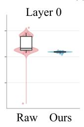  
(a) Vision Encoder (SigLIP)

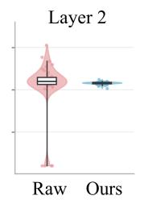

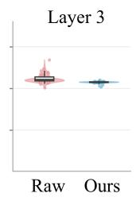

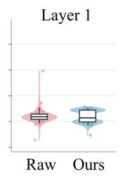  
(b) Language Model (Llama 3)

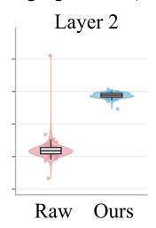

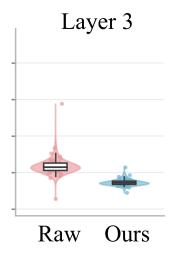

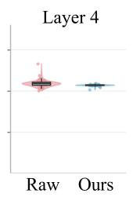

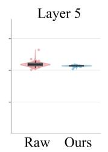

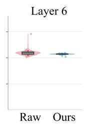

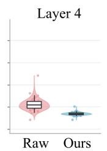  
Figure 6: Activation redistribution across LLaMA decoder layers.

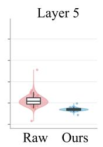

The layer-wise trend is consistent with Theorem 1: dendritic mixing reduces the concentration of outlier-dominated channel responses while preserving the representation norm. The resulting dynamic range is therefore better matched to finite-level somatic firing, providing more favorable conditions for accurate spike encoding under constrained temporal and firing-level budgets.

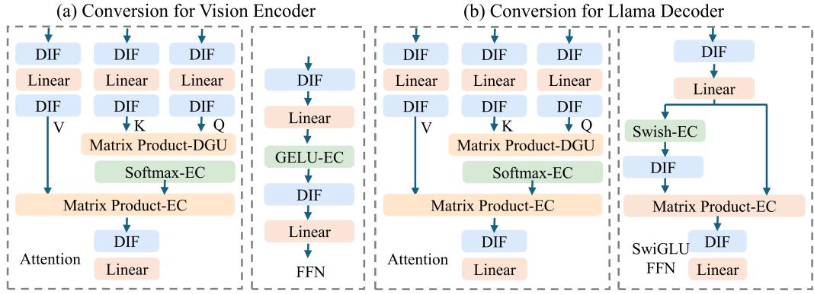  
Figure 7: Component-wise differential conversion of the vision encoder and LLaMA decoder. (a) Vision encoder with DIF-based conversion of attention and feed-forward operations. (b) LLaMA decoder with RoPE-based attention and SwiGLU. Affine, nonlinear, and multiplicative operators are handled by their corresponding differential formulations.

## C COMPONENT-WISE DIFFERENTIAL IMPLEMENTATION

To clarify the implementation of operation-aware differential conversion, we detail the execution of the major components in Fig. 3(a). We retain the original VLA operators and instantiate differential propagation according to each operator structure. Affine operators propagate incoming increments through reparameterized weights, nonlinear operators evaluate temporal differences between consecutive responses, and multiplicative operators follow the exact bilinear differential expansion. The resulting increments are then encoded by DIF neurons and propagated to subsequent operators.

## C.1 VISION ENCODER

Execution Flow: The vision encoder maps historical and current RGB observations into visual tokens for subsequent multimodal reasoning. We adopt the SigLIP backbone, which first converts each image into patch embeddings and augments them with positional information. The resulting tokens are then processed by a stack of Transformer blocks, each consisting of normalization, multihead self-attention (MHSA), feed-forward networks (FFNs), and residual connections. The final visual representations are subsequently fed into the multimodal projector. Formally, the computation of the l-th Transformer block is written as follows:

$$
\begin{array} { r } { \mathbf { U } ^ { l } = \mathbf { X } ^ { l - 1 } + \mathrm { M H S A } \left( \mathrm { L N } ( \mathbf { X } ^ { l - 1 } ) \right) , \qquad \mathbf { X } ^ { l - 1 } , \mathbf { U } ^ { l } \in \mathbb { R } ^ { N _ { v } \times d _ { v } } , } \end{array}\tag{21}
$$

$$
\mathbf { X } ^ { l } = \mathbf { U } ^ { l } + \mathrm { F F N } \big ( \mathrm { L N } ( \mathbf { U } ^ { l } ) \big ) ,
$$

$$
\mathbf { U } ^ { l } , \mathbf { X } ^ { l } \in \mathbb { R } ^ { N _ { v } \times d _ { v } } ,\tag{22}
$$

where $\mathbf { X } ^ { l - 1 }$ and $\mathbf { X } ^ { l }$ denote the input and output visual tokens of the l-th block. We preserve this computation graph and convert its major operators individually as described below.

Patch Projection: The patch embedding maps each image patch into the visual hidden space. Since this operation is affine, its temporal increment is computed as follows:

$$
\Delta \mathbf { X } ^ { 0 } [ \tau ] = \Delta \mathbf { I } [ \tau ] \widetilde { \mathbf { W } } _ { \mathrm { p a t c h } } ,\tag{23}
$$

where $\widetilde { \mathbf { W } } _ { \mathrm { p a t c h } }$ denotes the reparameterized projection weight. Positional embeddings are fixed within the internal SNN horizon and are incorporated into the initial visual token state.

Layer Normalization: LayerNorm is applied to the reconstructed activation state. Given the cached state $\mathbf { X } [ \tau - 1 ]$ and the incoming increment $\Delta { \mathbf X } [ \tau ]$ , its differential response can be defined as follows:

$$
\Delta \mathbf { N } [ \tau ] = \mathrm { L N } ( \mathbf { X } [ \tau - 1 ] + \Delta \mathbf { X } [ \tau ] ) - \mathrm { L N } ( \mathbf { X } [ \tau - 1 ] ) .\tag{24}
$$

The resulting temporal increment is then propagated to the subsequent operator.

Self-Attention: We preserve the original self-attention operators and apply DIF to the intermediate differential representations. Let $\widetilde { \mathbf { W } } _ { X }$ denote the basis-compensated projection weight for

$X \in \{ Q , K , V \}$ . The normalized increment is first encoded by DIF and projected into the query, key, and value branches, whose output increments are subsequently re-encoded before the attention interaction. These process are defined as follows:

$$
\begin{array} { r } { { \mathbf S } _ { N } [ \tau ] = \mathrm { D I F } _ { \psi _ { N } } ( \Delta { \mathbf N } [ \tau ] ) , \qquad { \mathbf S } _ { X } [ \tau ] = \mathrm { D I F } _ { \psi _ { X } } \left( { \mathbf S } _ { N } [ \tau ] \widetilde { \mathbf W } _ { X } \right) , \qquad \widetilde { \mathbf W } _ { X } = { \mathbf Q } _ { N } ^ { - 1 } { \mathbf W } _ { X } , } \end{array}\tag{25}
$$

Here, $\widetilde { \mathbf { W } } _ { X }$ denotes the reparameterized projection weight that compensates for the basis transformation introduced by the preceding DIF neuron. The DIF-encoded query and key increments are then propagated through the scaled dot-product attention. Following the bilinear differential rule, the attention-score increment is follows:

$$
\Delta { \bf A } [ \tau ] = \frac { 1 } { \sqrt { d _ { h } } } \left( { \bf S } _ { Q } [ \tau ] { \bf K } ^ { \top } [ \tau - 1 ] + { \bf Q } [ \tau - 1 ] { \bf S } _ { K } ^ { \top } [ \tau ] + { \bf S } _ { Q } [ \tau ] { \bf S } _ { K } ^ { \top } [ \tau ] \right) ,\tag{26}
$$

where $d _ { h }$ denotes the dimension of each attention head, and $\mathbf { Q } [ \tau - 1 ]$ and ${ \bf K } [ \tau - 1 ]$ denote the accumulated query and key states from previous timesteps. The resulting attention-score increment is subsequently propagated through the original Softmax operator, whose temporal response is computed from consecutive score states. It can be defined as follows:

$$
\Delta \mathbf { P } [ \tau ] = \mathrm { S o f t m a x } ( \mathbf { A } [ \tau - 1 ] + \Delta \mathbf { A } [ \tau ] ) - \mathrm { S o f t m a x } ( \mathbf { A } [ \tau - 1 ] ) , \mathbf { S } _ { P } [ \tau ] = \mathrm { D I F } _ { \psi _ { P } } ( \Delta \mathbf { P } [ \tau ] )\tag{27}
$$

The DIF-encoded attention probability increment is then propagated through the value interaction. Following the same bilinear differential rule, the resulting attention-output increment is defined as:

$$
\Delta \mathbf { O } [ \tau ] = \mathbf { S } _ { P } [ \tau ] \mathbf { V } [ \tau - 1 ] + \mathbf { P } [ \tau - 1 ] \mathbf { S } _ { V } [ \tau ] + \mathbf { S } _ { P } [ \tau ] \mathbf { S } _ { V } [ \tau ] ,\tag{28}
$$

where $\mathbf { P } [ \tau - 1 ]$ and $\mathbf { V } [ \tau - 1 ]$ denote the accumulated attention probability and value states, respectively. The resulting increment is encoded by DIF before the output projection. Using the same basis-compensated affine mapping, these process is are defined as follows:

$$
\begin{array} { r } { \mathbf { S } _ { O } [ \tau ] = \mathrm { D I F } _ { \psi _ { O } } ( \Delta \mathbf { O } [ \tau ] ) , \qquad \Delta \mathbf { H } _ { \mathrm { a t t n } } [ \tau ] = \mathbf { S } _ { O } [ \tau ] \widetilde { \mathbf { W } } _ { O } , \qquad \widetilde { \mathbf { W } } _ { O } = \mathbf { Q } _ { O } ^ { - 1 } \mathbf { W } _ { O } . } \end{array}\tag{29}
$$

The resulting attention increment is propagated through the original residual connection by direct temporal accumulation. We next apply the differential conversion principle to the FFN.

Feed-Forward Network: The FFN preserves its original affine–nonlinear structure. For a pointwise activation $\phi ( \cdot )$ , its temporal increment is computed from consecutive input states:

$$
\Delta { \bf Y } _ { \phi } [ \tau ] = \phi ( { \bf X } [ \tau - 1 ] + \Delta { \bf X } [ \tau ] ) - \phi ( { \bf X } [ \tau - 1 ] ) .\tag{30}
$$

The surrounding affine projections use basis-compensated weights, while each nonlinear increment is encoded by DIF before entering the subsequent projection. The resulting FFN increment is accumulated through the residual connection to update the visual token state.

## C.2 MULTIMODAL PROJECTOR

Projection: The multimodal projector maps the visual representations into the hidden space of the language decoder. We retain the original MLP structure and apply the same differential conversion to its affine and nonlinear operators. For a two-layer projector, the computation can be expressed as:

$$
\begin{array} { r } { \mathbf { S } _ { V } [ \tau ] = \mathrm { D I F } _ { \psi _ { V } } ( \Delta \mathbf { V } [ \tau ] ) , \qquad \mathbf { S } _ { H } [ \tau ] = \mathrm { D I F } _ { \psi _ { H } } \left( \mathbf { S } _ { V } [ \tau ] \widetilde { \mathbf { W } } _ { 1 } \right) , \qquad \Delta \mathbf { Z } [ \tau ] = \mathbf { S } _ { G } [ \tau ] \widetilde { \mathbf { W } } _ { 2 } , } \end{array}\tag{31}
$$

$\mathbf { S } _ { G } [ \tau ]$ denotes the DIF-encoded differential response of the intermediate activation. Its nonlinear response follows the pointwise differential formulation in Eq. 30. Thus, the original projector architecture is preserved while its visual representations are propagated in differential form.

Token Assembly: The projected historical and current visual tokens are concatenated with the language embedding to construct the multimodal input sequence. Since the instruction remains static within the SNN inference horizon, its embedding is included in the initial state and contributes no temporal increment. The multimodal increment is therefore formulated as:

$$
\Delta \mathbf { X } _ { 0 } [ \tau ] = \left[ \Delta \mathbf { Z } ^ { h } [ \tau ] ; \Delta \mathbf { Z } ^ { c } [ \tau ] ; \mathbf { 0 } \right] ,\tag{32}
$$

$\Delta \mathbf { Z } ^ { h } [ \tau ]$ and $\Delta \mathbf { Z } ^ { c } [ \tau ]$ denote the projected increments of historical and current visual tokens. Since concatenation only reorganizes token ordering, it introduces no additional differential operation.

## C.3 LLAMA DECODER

Execution Flow: The LLaMA decoder takes the assembled visual and language tokens as input and performs multimodal reasoning to generate the high-level navigation response. The multimodal sequence is processed by a stack of Transformer decoder blocks, each following a pre-normalization architecture with RMSNorm, RoPE-based self-attention, SwiGLU, and residual connections. Formally, the l-th decoder block is written as follows:

$$
\begin{array} { r } { \mathbf { U } ^ { l } = \mathbf { H } ^ { l - 1 } + \mathrm { A t t n } _ { \mathrm { R o P E } } \left( \mathrm { R M S N o r m } ( \mathbf { H } ^ { l - 1 } ) \right) , \qquad \mathbf { H } ^ { l - 1 } , \mathbf { U } ^ { l } \in \mathbb { R } ^ { N _ { m } \times d _ { m } } , } \end{array}\tag{33}
$$

$$
\mathbf { H } ^ { l } = \mathbf { U } ^ { l } + \mathrm { S w i G L U } \left( \mathrm { R M S N o r m } ( \mathbf { U } ^ { l } ) \right) , \mathbf { U } ^ { l } , \mathbf { H } ^ { l } \in \mathbb { R } ^ { N _ { m } \times d _ { m } } .\tag{34}
$$

Here, $\mathbf { H } ^ { l - 1 }$ and $\mathbf { H } ^ { l }$ denote the input and output multimodal representations of the l-th decoder block, respectively, while $N _ { m }$ and $d _ { m }$ denote the multimodal sequence length and hidden dimension. The attention module applies rotary positional embeddings to the query and key representations before scaled dot-product attention, whereas SwiGLU combines the SiLU-activated gate branch with the up-projection branch through element-wise multiplication. We retain this computation graph and apply operation-aware differential conversion to its constituent operators below.

RoPE-Based Self-Attention: For the query, key, and value projections, the normalized increment is encoded by DIF and then propagated through the corresponding basis-compensated affine mappings:

$$
\begin{array} { r } { \mathbf { S } _ { N } [ \tau ] = \mathrm { D I F } _ { \psi _ { N } } ( \Delta \mathbf { N } [ \tau ] ) , \qquad \mathbf { S } _ { X } [ \tau ] = \mathrm { D I F } _ { \psi _ { X } } \left( \mathbf { S } _ { N } [ \tau ] \widetilde { \mathbf { W } } _ { X } \right) , \quad X \in \{ Q , K , V \} . } \end{array}\tag{35}
$$

RoPE applies a position-dependent linear rotation to the query and key representations. Since token positions remain fixed over the internal SNN horizon, the corresponding rotations are constant across timesteps and can be applied directly to the differential representations. Thus, RoPE requires no additional differential operator and is omitted from the subsequent notation for clarity. The subsequent query–key interaction, causal Softmax, attention–value interaction, and output projection follow the bilinear, nonlinear, and basis-compensated differential formulations. Since the causal mask remains fixed over the internal SNN horizon, it is directly retained in the Softmax computation.

SwiGLU Feed-Forward Network: SwiGLU contains parallel gate and up-projection branches followed by an element-wise interaction. Their projection increments are obtained using the basis compensated affine mappings. For the gate branch, the SiLU response is follows:

$$
\Delta \mathbf { G } [ \tau ] = \mathrm { S i L U } ( \mathbf { Z } _ { g } [ \tau - 1 ] + \Delta \mathbf { Z } _ { g } [ \tau ] ) - \mathrm { S i L U } ( \mathbf { Z } _ { g } [ \tau - 1 ] ) , \qquad \mathbf { S } _ { G } [ \tau ] = \mathrm { D I F } _ { \psi _ { G } } ( \Delta \mathbf { G } [ \tau ] )\tag{36}
$$

while the up-projection increment is similarly encoded as ${ \bf S } _ { U } [ \tau ]$ . The two encoded branches are then combined through the multiplicative differential rule:

$$
\Delta { \mathbf { M } } [ \tau ] = { \mathbf { S } } _ { G } [ \tau ] \odot { \mathbf { U } } [ \tau - 1 ] + { \mathbf { G } } [ \tau - 1 ] \odot { \mathbf { S } } _ { U } [ \tau ] + { \mathbf { S } } _ { G } [ \tau ] \odot { \mathbf { S } } _ { U } [ \tau ] .\tag{37}
$$

The resulting increment is encoded by DIF and propagated through the basis-compensated down projection before residual accumulation.

## C.4 LOW-LEVEL ACTOR

Execution Flow: The low-level actor maps the current locomotion state and high-level navigation command to the desired joint positions. We retain the original MLP architecture, consisting of three hidden layers with ELU activations followed by a linear output layer. Let $\mathbf { h } ^ { 0 }$ denote the actor input. The l-th hidden layer and the final joint prediction are written as follows:

$$
\mathbf { h } ^ { l } = \mathrm { E L U } \big ( \mathbf { h } ^ { l - 1 } \mathbf { W } _ { l } + \mathbf { b } _ { l } \big ) , \quad l = 1 , \ldots , L - 1 , \qquad \mathbf { q } ^ { d } = \mathbf { h } ^ { L - 1 } \mathbf { W } _ { L } + \mathbf { b } _ { L } .\tag{38}
$$

The original actor computation is preserved, while its affine and nonlinear operators are converted using the differential formulations described below.

Differential Actor Conversion: The actor consists of affine layers and pointwise ELU activations, which are converted using the single-input differential formulation. For the l-th hidden layer, the affine increment is propagated through the basis-compensated weight and then evaluated by the differential ELU response. These process is defined as follows:

$$
\Delta \mathbf { Z } ^ { l } [ \tau ] = \mathbf { S } ^ { l - 1 } [ \tau ] \widetilde { \mathbf { W } } _ { l } , \quad \Delta \mathbf { H } ^ { l } [ \tau ] = \mathrm { E L U } \big ( \mathbf { Z } ^ { l } [ \tau - 1 ] + \Delta \mathbf { Z } ^ { l } [ \tau ] \big ) - \mathrm { E L U } \big ( \mathbf { Z } ^ { l } [ \tau - 1 ] \big ) .\tag{39}
$$

Thus, the low-level action is progressively refined as differential responses are accumulated over internal timesteps, while the original actor and downstream joint-control interfaces remain unchanged.

## D VISUALIZATION OF NAVIGATION TRAJECTORIES

We provide additional qualitative examples to evaluate SpikingVLA across diverse navigation scenarios. As shown in Fig. 8, SpikingVLA generates coherent action sequences across different environments, instructions, and trajectories. These results complement the quantitative evaluation by demonstrating consistent navigation behavior on representative unseen episodes.

Turn so you are facing the same direction as the open doors, leading to the room with urns on the left hand site  
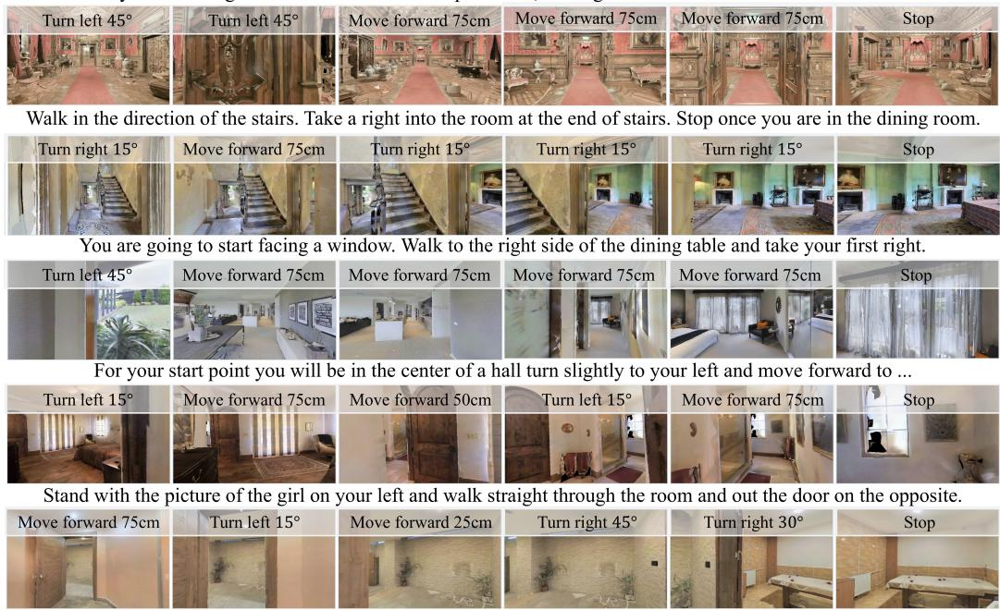  
Figure 8: Representative navigation rollouts of SpikingVLA.

We further examine the temporal evolution of action predictions over internal SNN timesteps. As shown in Fig. 9, predictions progressively approach the corresponding ANN decisions as differential responses accumulate. Different inputs exhibit distinct convergence rates, indicating inputdependent temporal requirements for action generation.

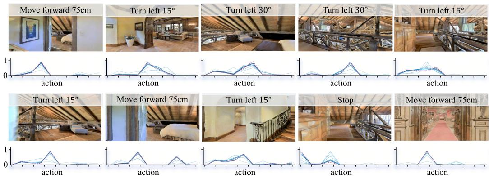  
Figure 9: Temporal convergence of action predictions toward the corresponding ANN outputs across internal timesteps, with different inputs exhibiting distinct convergence rates.

To quantify this temporal behavior, we record the first timestep at which each sample satisfies the stopping criterion. With a maximum horizon of $T = 8 ,$ SpikingVLA requires only 4.1 timesteps on average, corresponding to a 48.8% reduction in the effective temporal budget. The variation in stopping times further indicates that different inputs require different amounts of temporal evidence, allowing unnecessary updates to be avoided once the action prediction has stabilized.