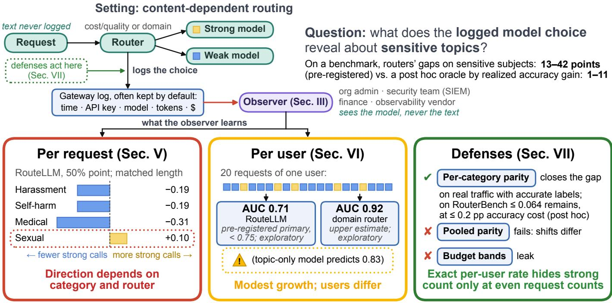
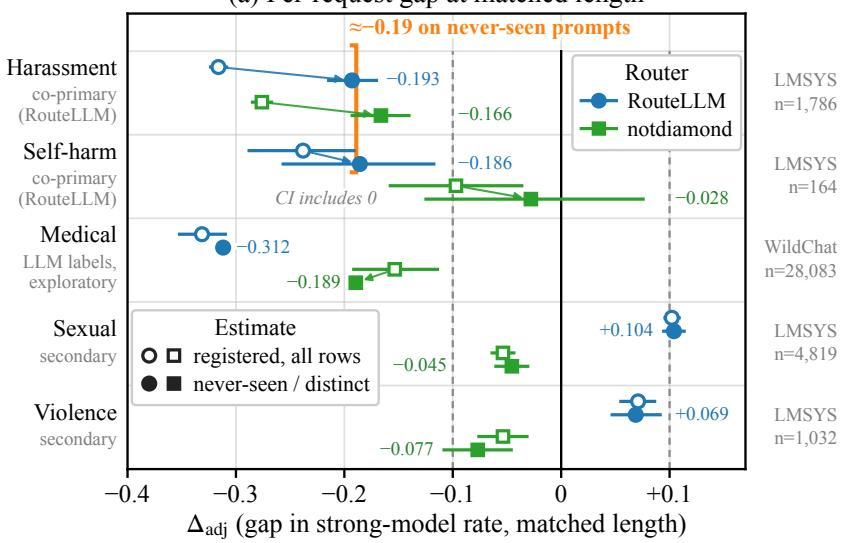
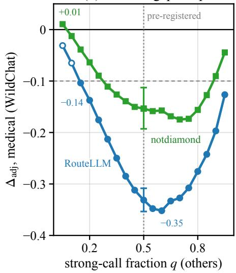
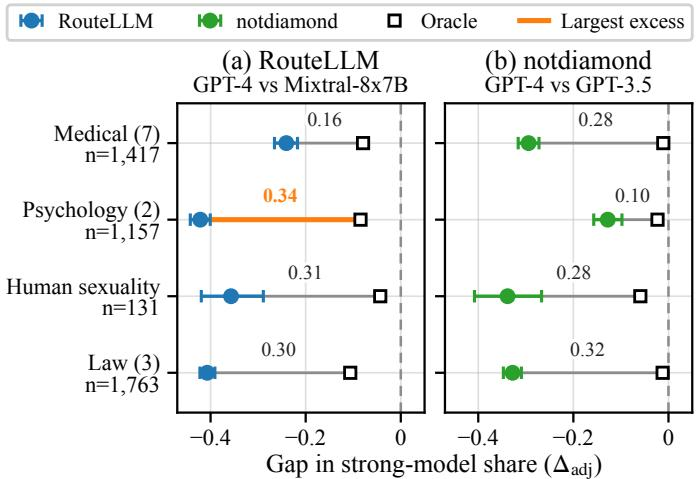
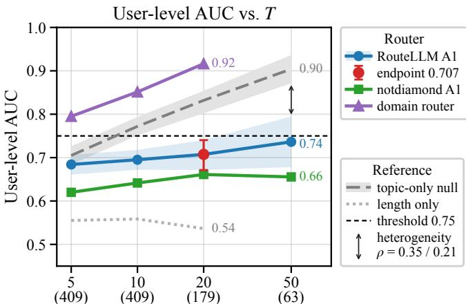
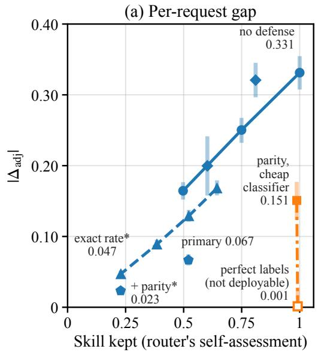
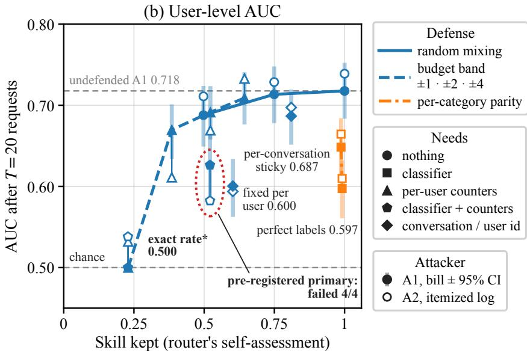

# Sensitive-Topic Leakage Through LLM Routing Metadata: Measurement and Mitigation

Teng-Ruei Chen

Abstract—LLM routers pick a cheap or expensive model per request by its content, and many gateways and some cloud platforms can log that choice with content logging off. We measure this privacy channel beyond token counts, accounting for noisy labels and repeated prompts. We run pre-registered studies on 1.7 million real requests (WildChat-1M, LMSYS-Chat-1M) with two cost/quality routers and a domain router, survey eleven systems logging, and test post-processing defenses. At matched length, the shift’s direction depends on category and router. For RouteLLM at the 50% operating point, harassment and self-harm requests reach the strong model 19 points less often than comparable ones on prompts unseen in exploration, medical requests (exploratory: LLM labels failed their gate) 31 points less often on distinct prompts (both post hoc), and sexual requests 10 points more often (secondary); the other router’s four are negative. Twenty RouteLLM decisions separate frequent medical askers with AUC 0.71, exploratory and below the pre-registered primary endpoint’s 0.75 (domain router: 0.92, an upper estimate). Per-category lengthmatched parity with accurate labels removes the gap on real traffic, costing at most 0.2 accuracy points on RouterBench (post hoc), where routers’ gaps on sensitive subjects (13–42 points, preregistered) exceed those of an oracle routing by realized accuracy gain (1–11, post hoc). Per-conversation stickiness, per-user budget bands, and pooled parity fail, the last as categories’ shifts differ in size or sign. A post hoc exact per-user rate hides only even-prefix strong counts and forfeits most self-assessed routing value; it preserves odd-position decisions, from which a post hoc log attack reaches AUC 0.73 after 20 RouteLLM requests (exploratory).

Index Terms—LLM routing, privacy, side channels, metadata, measurement, fairness post-processing.

## I. INTRODUCTION

Large language model (LLM) applications increasingly place a routing or cascade layer, which we call a router, in front of several models. For each request it either picks one model directly or queries a cheap model first and escalates to a stronger one when needed, trading answer quality against cost [1], [2], [3], [4], [5]. Gateways and cloud platforms now offer routers as built-in options that a caller selects by model name [6]. A router’s decision is, by construction, a function of the content of the request.

Prior work falls into three lines, reviewed in full in Section II. Routing research comprises cascades and learned routers that trade cost against quality [1], [3], [2], [4], benchmarks for them [5], analyses showing that their decisions follow the query’s category and register [7], [8], and domain routers that pick a model by the request’s subject [9]. Privacy-preserving routing keeps sensitive content from remote models or from the router: a local model protects what is sent to a proprietary one [10], requests are routed between edge and cloud by their sensitivity [11], and secure computation hides the request from the router [12]. Side-channel research shows that observable behavior that depends on private inputs reveals them: locationaware path selection in Tor reveals where clients are [13], [14], the exits and timing of adaptive networks reveal predictions and input attributes [15], [16], the packet sizes and timing of encrypted LLM traffic reveal prompt topics and the serving model [17], [18], and, in agent systems, which agents are contacted and which messages are chosen reveal task types, private state, and intent [19], [20], [21].

None of these lines examines a model router’s decision as it is logged. Many gateways, and some cloud platforms, can record by design the served model and the caller of each request, often with token counts, even when content logging is off, and in some of them this is the default; some routing products also write the decision itself as a named field (Section III). Privacy-preserving routing systems protect content but do not analyze or defend the post-routing operational record considered here; when the route depends on sensitivity, the record carries the sensitivity label itself. The only proposal we found that randomizes the local/remote delegation bit, and bounds what it leaks, is evaluated only in simulation [22]. Agent-level work shows that selections leak [19], [20], [21], [23], but there agents make the selection, and observers read it from network traffic, message transcripts, or synthetic discovery logs, not from the business records of real deployments. To our knowledge, whether model-router decisions reveal sensitive topics on real user traffic, per request or across a user’s requests, and what closing that channel costs, has not been measured.

This paper measures it. We treat the per-request routing decision, as recorded by a gateway, as a channel from the request’s topic to an observer who never sees the text (Fig. 1). Four things make the measurement hard. Sensitive requests differ from others in length, and token counts are often visible as well, so leakage must be measured at matched length and beyond what length reveals. Labels for sensitive topics are noisy: the LLM judges we use for medical content failed our own validity gate twice, against the author’s labels on LMSYS and an AI coding assistant’s on WildChat. Public chat logs repeat the same prompts many times, which narrows confidence intervals and inflates apparent replication: 61% of the heldout harassment requests repeat a prompt from the exploration files. And an honest measurement must survive the choice of router, dataset, and operating point, which invites selective reporting. We address these with length-matched gaps and a flexible length model, moderation labels shipped with the data for the primary categories (unvalidated, but needing no LLM judge), prompt fingerprints used as a duplicate proxy, and pre-registered protocols with a held-out replication of the primary per-request claims (Section IV).

  
Fig. 1. Overview. Top: gateways can keep the router’s choice, the caller’s key, and token counts, often by default and with content logging off (Section III). Bottom: what these choices reveal per request (Section V; RouteLLM’s gaps: harassment and self-harm on never-seen and medical on distinct WildChat prompts are post hoc, medical labels exploratory, sexual secondary; notdiamond-0001’s four gaps are negative) and per user (Section VI; 0.71 is the pre-registered primary endpoint, below 0.75; both AUCs are exploratory as the label gate failed), and what defenses cost (Section VII; post hoc: parity’s RouterBench cost and the exact rate, under which original A2 reaches 0.53 and an odd-position log attack reaches 0.73 after 20 requests). Benchmark line: RouterBench; pos hoc oracle at the same budget.

## Concretely, this paper contributes:

1) The routing decision as a privacy channel. A threat model grounded in field-level evidence from eleven gateways, routers, and cloud platforms: in at least six of them, per-request records naming the chosen model can be kept without content and linked to the caller, in several of them by default (Section III).

2) A pre-registered, duplicate-aware measurement on real traffic. At matched length, the direction of the shift depends on the category and the router. For RouteLLM at the 50% operating point, harassment and self-harm requests reach the strong model 19 points less often than comparable requests on never-seen prompts (post hoc; 24–32 points on all held-out rows, as pre-registered), sexual requests 10 points more often (secondary; predicted to stay below 10), and medical requests, with exploratory LLM labels, 31 points less often on distinct WildChat prompts (post hoc; 33 on all rows). The second cost/quality router, notdiamond-0001, sends all four less often, though its never-seen self-harm gap is indistinguishable from zero. Twenty RouteLLM decisions separate frequent medical askers from users with no medical requests at an area under the ROC curve (AUC) of 0.71, exploratory and below the pre-registered primary endpoint’s 0.75, and 0.92 when the decision is a domain router’s health label (an upper estimate, as its labels helped select what the judges saw; Sections V–VI).

3) Defenses and their cost. Length-matched parity per category removes the per-request gap on real traffic when labels are accurate (half of it with a cheap classifier). On RouterBench, the routers’ gaps on sensitive subjects (13–42 points, pre-registered) exceed those of an oracle that routes by realized accuracy gain (1–11, post hoc), and per-category parity costs at most 0.2 accuracy points but leaves gaps of up to 0.064 (post hoc). Pooled parity fails because categories shift by different amounts and, for RouteLLM on LMSYS, in opposite directions; perconversation stickiness barely helps, and per-user budget bands leak at their edges. A post hoc exact per-user rate hides only the strong count, and only at even request counts, at the cost of most of the router’s self-assessed value, which we could not express in accuracy and dollars. Its ordered log preserves odd-position decisions exactly (Remark 6); a post hoc attack using them reaches AUC 0.73 after 20 RouteLLM requests, exploratory (Section VII-C).

Section II reviews related work and Section IV the method; Sections VIII–X discuss recommendations, ethics, and limitations.

## II. BACKGROUND AND RELATED WORK

This section classifies prior work by what it protects or measures, and closes with a feature comparison (Table I).

## A. Cost/quality and domain routing

Routers choose, per request, which model answers, mostly to trade answer quality against cost. FrugalGPT learns which combination of models in a cascade to query for each request [1], and AutoMix escalates a query to a larger model when a smaller model’s self-verified answer looks unreliable [3]. Hybrid LLM routes each query to a small or a large model by its predicted difficulty [2]. RouteLLM trains routers between a strong and a weak model on human preference data from Chatbot Arena [4], [24], and RouterBench collects per-model outcomes and costs for evaluating routers [5]. Commercial routers appeared alongside them: Not Diamond released notdiamond-0001, an open router between GPT-3.5 and GPT-4 [25], and OpenRouter’s Auto Router assigns each request one of about 30 task types before choosing a model [6]. Domain routers such as vLLM Semantic Router classify the request’s domain and route by the label [9]. Cloud platforms offer routers of their own, such as intelligent prompt routing in Amazon Bedrock, which chooses between two models of one family by their predicted quality difference, and the mode router of Microsoft Foundry, formerly Azure AI Foundry (their logging is described in Section III). An evaluation of four open-source routers on four benchmarks found that only vLLM Semantic Router’s choice varies materially with the prompt, whereas RouteLLM’s similarity-weighted ranking (sw\_ranking) router, at its default threshold of 0.5 and with a strong/weak pair it was not calibrated for, sent every task to the weak model [26]. Closest to our observation, Kassem et al. [7] evaluate five routers, including two commercial ones, on a benchmark of task categories and find that routing decisions are driven by the query’s category, for example sending adversarial prompts to weaker models. In their privacy case study, Kassem et al. use a 200-prompt, four-category subset derived from the PUPA benchmark introduced by PAPILLON [10]; it includes healthcare, and although the authors call its routing balanced, their Fig. 11 shows 146 of the 200 prompts, 33 of the 50 healthcare ones, sent to the strong model, an unconditional share not comparable with a length-matched gap; their concern is robustness, safety, and the routing of personal data, not what an observer of the decisions learns. Koul [8] shows that complexity-based routing assigns non-standard English registers to lower-capacity tiers, largely through input length, and Wang et al. [27] find on 800 benchmark queries that most of six evaluated commercial routers—including OpenRouter’s Auto Router and a vLLM Semantic Router fitted on the authors’ training data—send nearly all queries from each source benchmark to one model, largely independently of withinsource difficulty. These works measure what routing saves, what it costs in quality, and whom it serves worse; none asks what the decision reveals about the request to those who record it.

## B. Privacy-preserving routing

Systems that combine a local and a remote model for privacy decide, per request, what reaches the remote side: PAPILLON uses a local model to protect what is sent to a proprietary one [10], and PRISM routes between edge and cloud according to the request’s sensitivity [11]. When such a decision depends on sensitivity, it is itself a sensitivity signal. Wu et al. [12] protect the user query and routing model during route computation with secure computation, but do not study exposure or logging of the selected model after computation. AVEC [22] observes that the local/remote delegation bit leaks and bounds the leakage with randomized response, without a measurement on real routers or traffic.

## C. Side channels of adaptive inference and LLM traffic

Adaptive computation leaks through what it chooses to do. Kannan et al. [15] show that exit points of distributed multi exit networks reveal predictions and propose defenses that balance exits across classes, the structural precedent of our parity defense. Akinsanya and Brennan [16] show that timing channels of adaptive networks leak sensitive input attributes. Whisper Leak [17] infers the topic of LLM conversations from the sizes and timing of streamed packets, and the response timing of efficient inference, such as speculative sampling, reveals conversation topics too [28]. In anonymity systems, path selection that depends on the client’s location leaks it, and the leakage accumulates over repeated choices; Tempest [13] measures this and CLAPS [14] trades it off against performance with linear programming. Elsewhere, the ads a platform delivers to a user, aggregated over many impressions, reveal private attributes of real users [29]; expert routing inside mixtureof-experts LLMs leaks prompt attributes through hardware side channels [30], and the GPU telemetry it induces identifies harmful prompts [31]. Pouryousef et al. [18] show that a passive network observer can identify which model served a request from encrypted traffic alone, so a routing decision may be visible even without logs. In agent systems, the same insight has recently been applied to selections made by orchestrator rather than routers. Which service agents are called, and in what order, reveals intent and can be masked with budgeted decoy calls [21]; communication-graph metadata [19] and, in a synthetic study, content-free agent-discovery metadata [23] reveal task types and intent; and choices among equivalent messages form selection channels that length-matched controls do not close [20]. Outside agent systems, in a controlled support-routing task, an active attacker who writes the input can turn the decision labels of Jev, a fast decision model that applications use to route requests, into an oracle on hidden user attributes [32]. Our setting differs from all of these. The decision is made by a cost/quality or domain router from the request content, a passive observer reads it from business records (logs and bills) that hold no content, rather than from network traffic, message transcripts, hardware telemetry, or synthetic discovery logs, and we measure it on real user traffic, per request and per user, and evaluate defenses against it. We therefore do not claim to be the first to treat a selection as a leak; to our knowledge, ours is the first privacy measurement of model-router choices as observable log or billing metadata on real user traffic, including per-request and per-user inference and defense costs.

## D. Defense lineage

Our parity defense applies fairness post-processing to a router: group-dependent thresholds equalize decision rates. Related optimal post-processing results exist for equalized odds and equal opportunity [33] and, under a Bayes-optimalscore assumption, for demographic parity [34]; we do not claim that those results make our router rule optimal. Our exact per-user-rate defense also keeps persistent per-user state; this only loosely echoes RAPPOR, which memoizes a permanently randomized answer and then applies fresh instantaneous randomization to each report [35]. It does not inherit RAPPOR’s differential-privacy guarantee. We claim no new theory; our contribution is to instantiate these tools for the router observer and to measure them on real traffic.

## III. THREAT MODEL

This section states what a routed deployment records, who can read that record, and what the attacker is assumed to know. It rests on a field-level survey of eleven gateways, routers, and cloud platforms, based on 59 primary sources (official documentation and source-code schemas) accessed on October 1, 2026; the evidence table (in Traditional Chinese), with a link to the most recent Wayback Machine snapshot that the availability API returned for 55 of the sources, is released with the artifact.

## A. System model

Each request $x _ { t }$ of a caller passes through a router that selects the model $R _ { t }$ that answers it; for the two-model routers of Section IV-A, $R _ { t }$ is the binary strong-or-weak decision. A gateway or cloud platform can keep, per request, the record (time, caller, $R _ { t }$ , input tokens, output tokens, cost), where the caller is an API key, organization member, user id, or AWS Identity and Access Management (IAM) principal. In at least six of the eleven systems (OpenRouter, LiteLLM, Kong, Cloudflare, Helicone, and AWS), first-party documentation or schemas show that per-request metadata with the served (for AWS, the requested) model and time can be kept without content and linked to the caller. Portkey may be a seventh, but its documentation does not state whether no-content mode keeps the model field; for Azure we confirmed such records only in its separate API Management gateway, which we do not count. In OpenRouter and LiteLLM this metadataonly record is the default, and AWS CloudTrail records by default the caller and the requested model of every Bedrock InvokeModel and Converse call, streaming variants included, without token counts; other inference operations, such as asynchronous invocation, are data events, which are off by default. Five routing products (OpenRouter, LiteLLM, Microsoft Foundry, Amazon Bedrock prompt routing, and Not Diamond) also return or record the decision as a named field, such as Bedrock’s invokedModelId or LiteLLM’s complexity-router tier header, so reading $R _ { t }$ requires no inference; OpenRouter’s Auto Router also returns a task type when the caller requests metadata [6].

## B. Observers

The main adversary is an insider with default administrative access to the gateway (Table II), such as a LiteLLM proxy admin or an OpenRouter organization admin: without enabling any content logging, they obtain each user’s itemized sequence of routing decisions and can run the itemized-log attacker A2 (6). In OpenRouter organizations, every member, not only admins, sees the model, cost, and timing of all members’ usage. The security team sees the same sequence of decisions once logs are exported to a security information and event management (SIEM) system, and on AWS, through CloudTrail’s default event history and without any Bedrock configuration, when the application itself routes between model identifiers with InvokeModel or Converse; forwarding these events to a SIEM requires a trail. Finance sees aggregates by model and hour or day, per key, member, or principal on some platforms, which corresponds to the bill-only attacker A1 (5) and the billing observers of Section IV-E. Hosted gateway vendors store the metadata themselves, and observability subprocessors still receive the model, tokens, cost, and user or session identifiers in privacy modes that strip the content. A passive network observer can infer the serving model from encrypted traffic [18]; we do not measure this observer.

## C. Attacker capabilities and assumptions

The attacker (i) sees $R _ { t }$ per request or, in the case of finance, per-period aggregates; (ii) is conservatively given the token count of each request’s message, a stand-in for the input-token count that many surveyed per-request logs store alongside the model and some finance records report in aggregate by model; (iii) never sees content; (iv) holds labels for some users, from which it fits its likelihoods; and (v) needs no router internals, only the recorded outputs. It only reads records. Assumption (ii) fixes what we measure: what routing reveals beyond the length of the request message, namely the gap at matched length (1) and the gain over a length model (3), not the raw difference in strong-routing rates; logged input counts also cover earlier turns, and we ignore output tokens. Assumption (iv) is generous, as our attackers are fitted on half of the users (Section IV-E), but an insider could approximate such labels from their own or colleagues’ known usage.

## D. Why not enable content logging

An insider able to switch on content logging might seem to need no side channel, yet three situations make the routing record the channel that matters. First, where policy or compliance keeps content logging off, enabling it breaks that policy and captures only future requests, whereas the routing record of past requests is already kept. Second, metadata is kept independently of content and often longer: Helicone’s selfhosted schema sets a three-month expiry only on request and response bodies, LiteLLM by default never purges its spend logs, and CloudTrail’s event history keeps the past 90 days of management events per region without any setup. Third, some observers cannot switch content logging on at all: finance, observability subprocessors in privacy modes, and anyone who breaches or subpoenas a metadata store see only the metadata. Two harms follow. An employer that administers the gateway could try to infer which employees often ask about health or self-harm, while the employees may believe that disabled content logging protects them; and retained metadata could be breached, misused, or subpoenaed after the content is deleted. Per-request leakage (Section V) lets an observer flag individual requests; user-level accumulation, which we measure for medical requests only (Section VI), lets it rank users.

TABLE I  
RELATED WORK BY THE PROPERTIES THIS PAPER’S CONTRIBUTION TURNS ON. REAL ROUTER: AN IMPLEMENTED ROUTER OR SELECTION MECHANISM,NOT A SIMULATED ONE. REAL TRAFFIC: EVALUATED ON PASSIVELY COLLECTED OR RELEASED RECORDS OF ORGANIC USER ACTIVITY, RATHER THANRESEARCHER-ISSUED OR REPLAYED REQUESTS. A CHECK MEANS THAT AT LEAST ONE CITED WORK IN THE ROW HAS THE PROPERTY; PARTLY MEANS THATIT HOLDS ONLY IN A WEAKER FORM (NOTES A–F).
<table><tr><td>Work</td><td>Real router</td><td>Real traffic</td><td>Decision as channel</td><td>User-level accumulation</td><td>Log/billing observer</td><td>Defense evaluated</td></tr><tr><td>Cost/quality routers [1], [2], [4]</td><td>√</td><td> $\mathrm { \ p a r t l y ^ { a } }$ </td><td></td><td></td><td></td><td></td></tr><tr><td>Routing robustness and bias [7], [8], [27]</td><td>√</td><td> $\mathrm { \ p a r t l { y } ^ { b } }$ </td><td> $\mathrm { \ p a r t l { y } ^ { c } }$ </td><td></td><td></td><td></td></tr><tr><td>Privacy-preserving routing [10], [11], [12]</td><td>√</td><td> $\mathrm { \ p a r t l y ^ { b } }$ </td><td></td><td></td><td></td><td>content only</td></tr><tr><td>AVEC [22]</td><td></td><td></td><td>√</td><td> $\mathrm { \ p a r t l { y } ^ { d } }$ </td><td></td><td>simulation</td></tr><tr><td>Multi-exit networks [15]</td><td>V</td><td></td><td>√</td><td></td><td></td><td>V</td></tr><tr><td>Tor path selection [13], [14]</td><td>√</td><td>√</td><td>√</td><td>√</td><td></td><td>√</td></tr><tr><td>Ad-delivery profiling [29]</td><td>√</td><td>√</td><td>√</td><td>√</td><td></td><td></td></tr><tr><td>Agent selection leakage [19], [20], [21], [23]</td><td>√</td><td></td><td>√</td><td></td><td>partlye</td><td>√</td></tr><tr><td>Decision-model attribute inference [32]</td><td>√</td><td></td><td>√</td><td></td><td></td><td></td></tr><tr><td>LLM traffic analysis [17], [18]</td><td></td><td></td><td> $\mathrm { \ p a r t l y ^ { f } }$ </td><td></td><td></td><td>V</td></tr><tr><td>This work</td><td>√</td><td></td><td>√</td><td>√*</td><td>√</td><td>√</td></tr></table>

aRouteLLM trains on Chatbot Arena preference data but is evaluated on benchmarks; Hybrid LLM is evaluated on MixInstruct, which includes a small share of shared ChatGPT conversations. ${ } ^ { \mathrm { b } } \mathrm { O n l y }$ on benchmarks built from public collections of user-LLM interactions: WildChat subsets, including PUPA, in Kassem et al.; PUPA in PAPILLON. PPRoute [12] evaluates on EmbedLLM, MixInstruct (note a), and RouterBench. cDecisions are shown to depend on query category or register, but not as a leak to an observer. dCumulative loss is tracked in a Rényi differential-privacy budget; no inference across a user’s requests is measured. eLoggers are among the modeled attackers (SICC [20]; Dangol [19]; AgentCardLeak [23]), but the evaluations use message transcripts, the transport metadata of agent traffic, or synthetic discovery logs, not business records of real deployments. fThe serving model is inferred from encrypted traffic, which behind a router is the decision, but no router is studied. ∗Medical requests on WildChat only, with exploratory LLM-judge labels; the moderation-labeled categories come from LMSYS-Chat-1M, which has no user identifiers (Section VI).

TABLE II  
OBSERVERS OF ROUTING METADATA IN THE ELEVEN SURVEYED SYSTEMS. DEFAULT: AVAILABLE WITHOUT ANY NON-DEFAULT CONFIGURATION.
<table><tr><td>Observer</td><td>Sees</td><td>Default</td></tr><tr><td>Org admin / platform team</td><td>per request: model, time, tokens, cost, key or member</td><td>OpenRouter, LiteLLM, Portkey: yes; Cloudflare, Helicone: no caller id; Kong,</td></tr><tr><td>Security team</td><td>per request: caller identity, model, time</td><td>AWS: after setup CloudTrail history: yes; SIEM: after export</td></tr><tr><td>Finance</td><td>aggregates by model and hour or day, per key, member, or principal on</td><td>partly</td></tr><tr><td>Vendor; observability</td><td>some platforms per-request metadata, also in privacy modes</td><td>hosted vendor: yes; subprocessor: once</td></tr><tr><td>subprocessor Network observer</td><td>no documented cleartext model id; serving model inferable from encrypted</td><td>configured not measured here</td></tr></table>

## E. Framing

Many gateways, and some cloud platforms, record such metadata by design for billing and monitoring; their content controls are documented to remove content, not metadata; we do not treat any of this as a vulnerability. Our point is narrower: when the router chooses the model from the content, disabling content logging does not by itself hide the topic. Latency and timing channels are out of scope.

## IV. MODEL AND METHODOLOGY

The original measurements are taken or recomputed from the released result files, without altering them. The post hoc odd-position follow-up is recorded separately and reported in full in Table IX.

## A. System and observer model

Requests are indexed by $i = 1 , \ldots , N$ . Request i has a caller $u _ { i } .$ , a time $t _ { i } ,$ content $x _ { i } ,$ a token count $n _ { i }$ (the length of its message under the RouteLLM tokenizer), and a category $c _ { i } \in \mathcal { C } \cup \{ O , U \}$ , where C is the set of sensitive categories, $O$ the comparison set of non-sensitive requests, and $U$ the requests in neither (e.g., law-domain requests on WildChat), which enter no gap. On the LMSYS held-out files, which no judge read, O also contains medical and legal requests (on the exploration files, adding them to O moved RouteLLM’s harassment, self-harm, and sexual gaps by less than 0.01). A router is a score function s that maps content to [0, 1], followed by a threshold; we write $s _ { i } = s ( x _ { i } )$ . At operating point q the threshold $\tau _ { q }$ is the (1−q)-quantile of s over O, so that a fraction $q$ of comparison requests reaches the strong model, and the decision is $R _ { i } = \mathbf { 1 } [ s _ { i } \geq \tau _ { q } ]$ . Unless stated otherwise, $q = 0 . 5$ the example in RouteLLM’s documented calibration to a target fraction of strong-model calls [36]; Section V reports the whole range of $q .$ The gateway keeps the record $( u _ { i } , t _ { i } , R _ { i } , n _ { i } , \mathrm { c o s t } _ { i } ) ;$ $n _ { i }$ stands in for the logged input tokens, which can also include the conversation history, and we ignore output tokens. The observer reads records and never reads $x _ { i }$ (Section III).

For RouteLLM, s is the probability that the strong model’s answer wins (one minus the softmax mass of the two nonwinning classes); for notdiamond-0001, that of the GPT-4 class under the router’s own prompt template. The domain router’s decision is whether its domain label is health.

## B. Data, routers, and labels

From English conversations we use the user messages of at least 10 characters: all of them in WildChat-1M [37] (982,067 requests from 97,742 hashed-IP users) and the first per conversation in LMSYS-Chat-1M [38] (251,230 from files 0–1 for exploration and 502,477 from the unused files 2–5 for the held-out replication). We also use RouterBench [5] (36,497 benchmark prompts with per-model correctness and cost). The routers are RouteLLM’s BERT router [4], notdiamond-0001 [25] (notdiamond below), and the Vela domain classifier of vLLM Semantic Router [9] (the domain router), all at pinned revisions whose weight hashes were checked before every run. Text was processed on a GPU host with open-weight models, and only text-free tables left it (exceptions: Section IX). We name the studies we report after their protocols (E-3 to E-9, Table III); E-1 and E-2 were exploratory pilots whose results we do not report.

Harassment, self-harm, sexual, and violence groups use the per-message OpenAI moderation outputs shipped with LMSYS-Chat-1M [38], [39]; conversations flagged for sexual content involving minors are dropped entirely. Medical labels come from LLM judges: one judge on WildChat and the intersection of two on LMSYS. Judges saw only candidates (a zero-shot natural-language-inference medical score of at least 0.3 or a Vela label of health, biology, or psychology), on WildChat also the other messages of their conversations, and a 2% random sample of the rest; messages no judge saw count as non-medical. Against stratified gold sets, the judges’ precision was 0.75 [0.63, 0.84] on LMSYS, where the author labeled 150 items, and 0.70 on WildChat, where the AI coding assistant used in this study (Claude), not the author, assigned the 400 reference labels, not blind, from at most 300 characters of each message and 120 of the previous one, with terminal lines capped at 330 (judge: up to 1,000 and 300; Section IX). Both fall short of the pre-registered 0.85, so medical results are exploratory. The assistant also judged the spot checks of zero-shot labels (score $\ge ~ 0 . 8 )$ of E-3 and E-4, from at most 200 characters each, which gave E-4’s precision of 0.55 (Table III).

## C. Per-request leakage

For a category $c ,$ let $b _ { i } ^ { ( c ) } \in \{ 1 , \dots , 1 0 \}$ be the decile of log $n _ { i }$ with edges taken from the requests of c. Write $p _ { c } = P ( R { = } 1$ | c), $p _ { O } = P ( R { = } 1 \mid O ) \ ( = q$ by construction for the two score routers), $w _ { c , k } = P ( b ^ { ( c ) } { = } k \mid c ) , p _ { O , k } = P ( R { = } 1 \mid O , b ^ { ( c ) } { = } k )$ and let $K _ { c }$ be the bins that contain comparison requests. The length-matched gap is

$$
\Delta _ { \mathrm { a d j } } ( c ) = p _ { c } - \tilde { p } _ { O } ( c ) , \qquad \tilde { p } _ { O } ( c ) = \frac { \sum _ { k \in K _ { c } } w _ { c , k } p _ { O , k } } { \sum _ { k \in K _ { c } } w _ { c , k } } ,\tag{1}
$$

the difference between the group’s strong rate and that of comparison requests with the group’s length profile. The perrequest privacy loss at matched length is

$$
\varepsilon ( c ) = \operatorname* { m a x } \left\{ \left| \log \frac { p _ { c } } { \tilde { p } _ { O } ( c ) } \right| , \ : \left| \log \frac { 1 - p _ { c } } { 1 - \tilde { p } _ { O } ( c ) } \right| \right\} ,\tag{2}
$$

the maximum absolute log-likelihood ratio between the two Bernoulli distributions after averaging over length. Opposing effects across bins can cancel, so zero gap or zero ε does not establish conditional independence given length. A maximum over bins would give a worst-bin distributional bound, not differential privacy for individual inputs. Earlier result files, including those behind Fig. 2b, store an ε against the unmatched comparison rate (fields eps\_per\_request, eps\_health, eps); we recompute matched-length values from $p _ { c }$ and $\Delta _ { \mathrm { a d j } }$ The gain over token counts is

$$
\Delta \mathrm { A U C } ( c ) = \mathrm { A U C } ( \ell , R ) - \mathrm { A U C } ( \ell ) ,\tag{3}
$$

where ℓ is the one-hot encoding of 20 quantile bins of log n and each AUC is that of a logistic regression (Newton’s method, $L _ { 2 }$ penalty $1 0 ^ { - 4 } )$ under 5-fold cross-validation, on the requests of c and a 20:1 random subsample of O. The joint model adds one routing coefficient, without routing-by-length interactions; its gain does not exhaust what a length-aware observer could infer.

Remark 1 (single decision): An observer who sees only R distinguishes c from O with $\mathrm { A U C } _ { R } = \textstyle { \frac { 1 } { 2 } } + \frac { 1 } { 2 } | p _ { c } - p _ { O } |$

Proof: Without loss of generality $p _ { c } \geq p _ { O }$ (otherwise score by $1 - R )$ . Then $\mathrm { A U C } = P ( R _ { c } > R _ { O } ) + \frac { 1 } { 2 } P ( R _ { c } = R _ { O } ) =$ $\begin{array} { r } { p _ { c } ( 1 - p _ { O } ) + \frac { 1 } { 2 } [ p _ { c } p _ { O } + ( 1 - p _ { c } ) ( 1 - p _ { O } ) ] = \frac { 1 } { 2 } + \frac { 1 } { 2 } ( p _ { c } - p _ { O } ) . } \end{array}$

For RouteLLM on WildChat medical requests, $| p _ { c } - p _ { O } | =$ 0.308 gives 0.654; the cross-validated AUC is 0.651.

Remark 2 (ceiling): ∆AUC depends on what length already reveals. In a latent binormal-score approximation, given the class, length $( \operatorname { A U C } ( \ell ) \geq { \frac { 1 } { 2 } } )$ ) and the decision $( \mathrm { A U C } \ \frac { 1 } { 2 } \dot { + } \frac { 1 } { 2 } \big | \Delta _ { \mathrm { a d j } } \big |$ of Remark 1 at every length) are independent equal-variance normal scores, whose optimal combination gives

$$
\Delta \mathrm { A U C } \approx \Phi \left( \sqrt { z _ { \ell } ^ { 2 } + z _ { \Delta } ^ { 2 } } \right) - \Phi ( z _ { \ell } ) ,\tag{4}
$$

with $z _ { \ell } = \Phi ^ { - 1 } ( \operatorname { A U C } ( \ell ) )$ and $z _ { \Delta } = \Phi ^ { - 1 } ( \frac { 1 } { 2 } + \frac { 1 } { 2 } | \Delta _ { \mathrm { a d j } } | )$ , which is strictly decreasing in $\operatorname { A U C } ( \ell )$ for a fixed nonzero gap. In a post hoc check on the nine category-by-split cases on LMSYS, (4) predicts the observed ∆AUC to within 0.013. Under this approximation, a small ∆AUC can coexist with a nonzero routing gap when length is informative; it does not by itself identify the reason for a small measured increment. We report $\Delta _ { \mathrm { a d j } }$ and ε as matched-length summaries and $\Delta \mathrm { A U C }$ as the specified attacker’s gain over token counts, not a distribution-free information bound.

TABLE III  
PRE-REGISTRATION RECORD: EVERY PRIMARY AND CO-PRIMARY ENDPOINT OF E-3 TO E-9, INCLUDING FAILED ONES, AND THE LABEL GATES. FROZEN: DATE (UTC+8) OF THE PROTOCOL-FREEZING COMMIT IN OUR PRIVATE REPOSITORY, BEFORE DATA DOWNLOAD OR COLLECTION; THE WILDCHAT STUDIES RE-ANALYZED ONE RELEASE, EACH FROZEN AFTER ITS PREDECESSOR’S RESULTS (E-5: BEFORE JUDGING; E-8: BEFORE PARITY AND BAND DEFENSES).
<table><tr><td>Study</td><td>Frozen</td><td>Pre-registered endpoint</td><td>Outcome</td></tr><tr><td>E-3</td><td>2026-09-28</td><td>Medical  $| \Delta _ { \mathrm { a d j } } | \geq 0 . 1 0 ~ \mathrm { ( P 1 ) }$ </td><td>Met: -0.251</td></tr><tr><td>E-3</td><td>2026-09-28</td><td>User-level  $\mathsf { A U C } \geq 0 . 7 5 \mathrm { \ a t \ } T { = } 2 0 \mathrm { \ } ( \mathrm { P } 2 )$ </td><td>Not determinable (15 positive users; 30 required)</td></tr><tr><td>E-4</td><td>2026-09-29</td><td>Medical  $\left| \Delta _ { \mathrm { a d j } } \right| \geq 0 . 1 0 ~ ( \mathrm { P 1 } )$ </td><td>Met: —0.204 (zero-shot labels; precision 0.55 in an AI assistant&#x27;s check)</td></tr><tr><td>E-4</td><td>2026-09-29</td><td>User-level  $\hat { \mathbf { A U C } } \overset { - } { \geq } 0 . 7 5 \mathrm { a t } T \mathrm { = } 2 0 \mathrm { ( P 2 ) }$ </td><td>Met by rule: 0.7515 [0.699, 0.799]; later shown to be the upper end of noise</td></tr><tr><td>E-4</td><td>2026-09-29</td><td>Same AUC, labels from later requests (co-primary)</td><td>Not met: 0.743 [0.673, 0.809]</td></tr><tr><td>E-5</td><td>2026-09-29</td><td>Medical  $| \Delta _ { \mathrm { a d j } } | \geq 0 . 1 0 ~ \mathrm { ( P 1 ) }$ </td><td>Met: -0.331</td></tr><tr><td>E-5</td><td>2026-09-29</td><td>User-level  $\mathrm { A U C } \geq 0 . 7 5$  at T=20 (P2)</td><td>Not met: 0.707 [0.671, 0.740]</td></tr><tr><td>E-5</td><td>2026-09-29</td><td>Same AUC, labels from later requests (co-primary)</td><td>Not met: 0.688 [0.637, 0.733]</td></tr><tr><td>E-5</td><td>2026-09-29</td><td>Label gate: precision  $\ge 0 . 8 5 ,$  recall &gt; 0.80</td><td>Not met: precision 0.70 against labels assigned by the same AI assistant (Claude), not by the author; recall not estimable; medical results exploratory</td></tr><tr><td>E-6a</td><td>2026-09-30</td><td>Sexual and self-harm  $| \Delta _ { \mathrm { a d j } } | \geq 0 . 1 0 ,$  CI excludes 0</td><td>Partly met: self-harm -0.171; sexual +0.088 (below 0.10; predicted &lt; 0)</td></tr><tr><td>E-6a</td><td>2026-09-30</td><td>Label gate: precision  $\geq 0 . 8 \dot { 5 } ,$  weighted recall ≥ 0.80</td><td>Not met: precision 0.75, weighted recall 0.69 (against the author&#x27;s labels)</td></tr><tr><td>E-7-lite</td><td>2026-10-01</td><td>Harassment, self-harm  $\Delta _ { \mathrm { a d j } } \le \ - 0 . 1 0 , \ 9 7 . 5 \% \ \mathrm { C I }$ </td><td>Both met: -0.316, -0.238; never-seen prompts (post hoc): -0.193, -0.186,</td></tr><tr><td>E-8</td><td>2026-09-30</td><td> $< 0$  Deployable defense (four criteria)</td><td>still met Not met: leak, user AUC, retained benefit (0.33), and budget all fail</td></tr><tr><td>E-8b</td><td>2026-10-01</td><td>Pooled parity:  $\leq 1$  pp acc.,  $\leq 5 \%$  cost, leak  $\leq 0 . 0 2$ </td><td>Not met: accuracy —0.22 pp and cost —3.8% pass; leak 0.137 fails</td></tr><tr><td>E-9</td><td>2026-10-01</td><td>Commercial router, F2 topic templates, default cost</td><td>Pending; established if net  $\mathrm { \hat { T V } } \geq 0 . 1 0$  and Holm-adjusted permutation  $p < 0 . 0 5$ </td></tr><tr><td>E-9</td><td>2026-10-01</td><td>tier: model-choice TV, HEALTH vs. NEUTRAL Same, MENTAL vs. NEUTRAL</td><td>for at least one of the two comparisons Pending. TV: total variation distance; net TV: TV minus its permutation mean</td></tr><tr><td></td><td></td><td></td><td></td></tr></table>

## D. Estimation and replication

On WildChat we resample users with replacement (1,000 draws) and recompute (1) from per-user counts by length bin, so that requests of the same user are not treated as independent. LMSYS has no user identifiers, so the pre-registered intervals resample requests. Public chat logs repeat prompts, so we also resample fingerprint clusters. The fingerprint of request i is $\phi _ { i } = \bar { ( } s _ { i } ^ { \mathrm { R L } } , s _ { i } ^ { \mathrm { \bar { N } D } } , n _ { i } )$ , with both scores rounded to $1 0 ^ { - 6 }$ , a proxy for text identity rather than a text-identity test. Throughout, distinct and never-seen refer to this proxy: the latter keeps held-out category requests whose fingerprint occurs nowhere in exploration. Its intervals resample fingerprint clusters, with the comparison set (about 480,000 requests) held fixed. The two co-primary endpoints of the held-out replication use Bonferroniadjusted 97.5% intervals.

## Procedure 1 (per-request leakage).

1) Set $\tau _ { q }$ on $O$ and compute every $R _ { i } ;$ bin c and O by the deciles of log n over $c ;$ compute $\Delta _ { \mathrm { a d j } } ( c )$ by (1) and $\varepsilon ( c )$ by (2).

2) Resample as above (on RouterBench, the group’s and the comparison set’s prompts separately; 1,000 or 2,000 draws), recompute, and take percentile intervals.

3) Compute ∆AUC(c) by (3) on c and the 20:1 subsample of $O .$

The original studies in Table III were pre-registered: their protocols, endpoints, thresholds, and predictions were committed to version control before its data were downloaded or collected or, if it reused data, before its new step (E-5: judge labels; E-8: parity and budget defenses, its two stickiness variants having been measured post hoc in E-5b). The WildChat studies reused one dataset, each frozen after its predecessor’s results were known. Deviations are logged; Table III lists every primary and co-primary endpoint with its freeze date. The odd-position follow-up is post hoc and exploratory, not a new pre-registered endpoint; its comparisons were fixed before execution, after the exact-rate results and transcript identity were known.

## E. User-level attackers

Users with at least 10 requests are split into halves by a hash of their identifier. A user is positive if at least 20% of their requests belong to $c ,$ negative if none do, and is otherwise excluded. Training positives and negatives define the strong rates a and b over all of their requests. The attacker sees the first T records of a test user $u ,$ the t-th in time order with decision $R _ { u , t }$ and token count $n _ { u , t }$ . The bill-only attacker uses the strong count $\begin{array} { r } { k _ { u } = \sum _ { t \leq T } R _ { u , t } \colon } \end{array}$

$$
\mathrm { A } 1 ( u ) = k _ { u } \log { \frac { a } { b } } + ( T - k _ { u } ) \log { \frac { 1 - a } { 1 - b } } .\tag{5}
$$

A1+L adds the mean log length in a logistic regression fitted on the training users. The itemized-log attacker uses each record:

$$
\begin{array} { l } { \displaystyle \mathrm { A } 2 ( u ) = \sum _ { t \leq T } \Biggl [ R _ { u , t } \log \frac { \hat { p } _ { 1 , \beta _ { t } } } { \hat { p } _ { 0 , \beta _ { t } } } } \\ { \displaystyle \qquad + ( 1 - R _ { u , t } ) \log \frac { 1 - \hat { p } _ { 1 , \beta _ { t } } } { 1 - \hat { p } _ { 0 , \beta _ { t } } } \Biggr ] , } \end{array}\tag{6}
$$

where $\beta _ { t }$ is the global decile of log $n _ { u , t }$ and $\hat { p } _ { y , k } = ( \sum R +$ $\scriptstyle { \frac { 1 } { 2 } } ) / ( \sum 1 + 1 )$ is computed over all requests in decile k of training users with label y (1 positive, 0 negative). The topiconly null predicts A1’s AUC if each request’s strong probability depended only on its class (c, O, or U), estimated on training users and simulated 200 times. Between-user heterogeneity is measured by the intra-class correlation $\rho$ of the routing decisions within each user label, over all of the users’ requests (ANOVA estimator for binary outcomes). Billing observers see only the strong count, the total tokens, or the total cost $\textstyle \sum _ { t \leq T } { \mathrm { c o s t } } _ { u , t }$ , with a stylized cos $\mathrm { t } _ { i } = n _ { i } \lambda ^ { R _ { i } }$ for a strong-toweak price ratio $\lambda \in \{ 2 0 , 5 0 \}$

Post hoc odd-position attacker (A2-odd). For the exactrate rule and cheap-classifier parity followed by that rule, A2-odd uses (6) restricted to odd positions: both probability estimation on training users and scoring within a test user’s first T requests use only $t = 1 , 3 , \ldots$ Thus $T \in \{ 5 , 1 0 , 2 0 , 5 0 \}$ denotes total requests, not retained bits; the attacker uses 3, 5, 10, 25 decisions, respectively. We retain the E-8 defensestudy split, full-record labels, global length bins, original router thresholds, and probability smoothing. Each router–defense pair has one training fit shared across horizons, using 409 positive and 6,520 negative training users. The observer knows the complete ordered prefix and its starting phase. With parity first, the preserved input is parity’s output, not the raw router decision. We reproduce original A2 on the same test users before comparing it with A2-odd; there is no test-set sign reversal or model selection. The AUC difference uses 1,000 paired, label-stratified bootstrap resamples of test users (seed 20260928), holding training fits fixed. The 95% percentile intervals are unadjusted, descriptive, and conditional on those fits.

Remark 3 (saturation): If, given class y, a user’s decisions are independent Bernoulli draws with a user-specific rate $\pi _ { u } \sim F _ { y }$ of mean $0 < \mu _ { y } < 1$ and $\rho _ { y } = \mathrm { V a r } ( \pi _ { u } ) / [ \mu _ { y } ( 1 - \mu _ { y } ) ]$ , then $k _ { u } / T \to \pi _ { u }$ as $T \to \infty$ . For $a \neq b , ( 5 )$ is strictly monotone $k _ { u }$ and A1’s AUC tends to $\begin{array} { r } { P ( \sigma \pi _ { 1 } > \sigma \pi _ { 0 } ) + \frac { 1 } { 2 } P ( \pi _ { 1 } = \pi _ { 0 } ) } \end{array}$ $\sigma = \operatorname { s i g n } ( a - b ) , \pi _ { y } \sim F _ { y }$ independent. If $\rho _ { 0 } = \rho _ { 1 } = 0$ , the $F _ { y }$ are point masses and the limit is one if $\sigma ( \mu _ { 1 } - \mu _ { 0 } ) > 0 ;$ with heterogeneity, below one if $P ( \sigma { \pi } _ { 1 } \le \sigma { \pi } _ { 0 } ) > 0$

## F. Defenses

A defense post-processes the router’s scores into decisions $R ^ { \prime } { \mathrm {  : } }$ , using, where noted, a category label and per-user state. Let $B _ { 1 } , \ldots , B _ { 1 0 }$ be the global deciles of log n and $r _ { k }$ the mean of R over $B _ { k }$

• Mixing (D1, rate η): $R _ { i } ^ { \prime } = R _ { i }$ with probability $1 - \eta ;$ otherwise $R _ { i } ^ { \prime }$ is a fair coin.

• Length-matched parity (D2) over a partition P of the requests: for each bin k and part $P \in \mathcal { P }$ , let $m _ { P , k } =$ round $\left| \left( r _ { k } \left| P \cap B _ { k } \right| \right) \right.$ , and set $R _ { i } ^ { \prime } = 1$ for the $m _ { P , k }$ highestscoring requests of $P \cap B _ { k }$ . Per-category parity uses ${ \mathcal { P } } = { \mathcal { C } } \cup \{ O \cup U \}$ , pooled parity ${ \mathcal { P } } = \{ \bigcup { \mathcal { C } } \cup U , O \}$ (U is empty on RouterBench). On LMSYS, whose moderation flags can overlap, per-category parity is applied to one category c at a time, with parts c and all other requests. The category label comes from a classifier, either the evaluation labels (perfect labels) or a cheap one.

• Budget band (D3, slack δ, target $\begin{array} { r } { Z = \frac { 1 } { 2 } ) \mathrm { : } } \end{array}$ process each user’s requests in order. Let k be the strong count before request t and R the router’s decision. Set $R ^ { \prime } = 0$ if $R = 1$ and $k + 1 - Z t > \delta ;$ set $R ^ { \prime } = 1$ if $R = 0$ and $k - Z t < - \delta ;$ otherwise $R ^ { \prime } = R$ . The exact-rate variant uses $\begin{array} { r } { \delta = \frac { 1 } { 2 } } \end{array}$

• Stickiness: the first request’s decision is reused for the whole conversation (D4) or for all of the user’s requests (D5).

Proposition 1 (per-category parity): Per-category parity (i) preserves each bin’s budget up to rounding, (ii) gives every part the strong rate $r _ { k }$ within every bin up to rounding, so that on these bins any category’s gap against $O \cup U$ vanishes up to rounding, and (iii) routes an upward-closed top-score set in each nonempty cell $P \cap B _ { k }$ (cutoff ties: later rows first).

Proof: (i) The parts partition $B _ { k }$ , so $\begin{array} { r l } { \sum _ { P } m _ { P , k } } & { { } = } \end{array}$ $\begin{array} { r } { \sum _ { P } \mathrm { r o u n d } ( r _ { k } | P \cap B _ { k } | ) } \end{array}$ differs from $r _ { k } | B _ { k } |$ only by rounding. (ii) and (iii) hold by construction.

The $\Delta _ { \mathrm { a d j } }$ reported after parity (Tables V and VIII) can keep a residual because it uses the category’s own deciles (up to 0.064 on RouterBench, where U is empty) and, on WildChat, compares with O rather than $O \cup U$

Remark 4 (pooling): Pooled parity constrains only the weighted average of category selection rates within each bin. At the pooled cutoff, individual categories may remain above or below the comparison rate even when the pooled gap is zero. Their post-parity directions are not determined by their undefended gaps alone, because category score distributions can cross.

Remark 5 (boundary leak): Under an iid Bernoulli input model with rate $\pi ,$ the reflected count process favors the lower boundary when $\pi < Z$ and the upper boundary when $\pi > Z$ , accounting for its even–odd phases. This explains a possible leak through boundary occupancy, not a guarantee for arbitrary correlated request sequences. Section VII-B reports the empirical boundary distributions.

Remark 6 (exact-rate transcript): For the exact-rate rule $\begin{array} { r } { ( Z = \delta = \frac { 1 } { 2 } ) } \end{array}$ , initialized at $k _ { 0 } = 0 .$ , let $R _ { t }$ be its binary input decision and $R _ { t } ^ { \prime }$ its output. For each pair, $R _ { 2 j - 1 } ^ { \prime } = R _ { 2 j - 1 }$ and $R _ { 2 j } ^ { \prime } = 1 - R _ { 2 j - 1 }$ . Thus $k _ { 2 m } = m ,$ but for a fixed complete ordered prefix of length 2m and any user label $Y ,$

$$
I ( Y ; R _ { 1 : 2 m } ^ { \prime } ) = I ( Y ; R _ { 1 } , R _ { 3 } , \ldots , R _ { 2 m - 1 } ) ,
$$

where I is mutual information. At odd T, $k _ { T } - ( T - 1 ) / 2 = R _ { T }$

Proof: Inductively, $k _ { 2 j - 2 } = j - 1$ makes both choices feasible at request $2 j - 1 ,$ , whereas only its complement is feasible at $2 j$ . Hence $k _ { 2 j } = j$ . Odd-coordinate projection and deterministic complementation are inverse maps between the two transcripts, giving the information identity without an independence assumption.

The count at even $T$ is uninformative, but the ordered log preserves the odd-indexed input decisions verbatim. A2 does not model position; its measured performance is not an upper bound on residual inference. Section VII-C tests the positionaware observer above.

Procedure 2 (per-category parity).

1) Compute the undefended decisions R and the global length deciles $B _ { k } ;$ set $r _ { k }$ to the strong rate in $B _ { k }$

2) Form one part per sensitive category and one of all other requests $( O \cup U ) ;$ ; in every part P and bin k, send the round $\left( r _ { k } \left| P \cap B _ { k } \right| \right)$ highest-scoring requests to the strong model and the rest to the weak model.

An online version also needs calibrated score cutoffs for each category–length cell, not just target rates; it does not inherit the batch rule’s finite-sample parity under distribution shift. Our LMSYS evaluations treat categories separately and do not establish simultaneous protection for overlapping categories. No per-user state or router retraining is needed for this postprocessing.

The router’s own view of utility is $\begin{array} { r } { V ( R ) = \sum _ { i } R _ { i } ( 2 s _ { i } - 1 ) } \end{array}$ its expected count of strong-routed requests where the strong model is the better choice minus those where it is not (for RouteLLM, ties count as not). We report the skill kept

$$
\mathrm { S K } ( R ^ { \prime } ) = \frac { V ( R ^ { \prime } ) - \bar { R } ^ { \prime } N \bar { g } } { V ( R ) - \bar { R } N \bar { g } } , \qquad \bar { g } = \frac { 1 } { N } \sum _ { i } ( 2 s _ { i } - 1 ) ,\tag{7}
$$

with budgets $\begin{array} { r } { \bar { R } \ = \ N ^ { - 1 } \sum _ { i } R _ { i } } \end{array}$ and $\bar { R } ^ { \prime }$ . Its denominator, $\begin{array} { r } { \sum _ { i } R _ { i } ( 2 s _ { i } - 1 - \bar { g } ) } \end{array}$ , is positive for $0 < \bar { R } < 1$ , as R routes the top scores. $\operatorname { S K } ( R ) = 1$ , and same-budget random routing has SK 0 only in expectation. It is a self-assessment; Section VII-D checks it against real accuracy for per-request defenses.

## G. Real-unit evaluation

On RouterBench [5], $a _ { i } ^ { S } , a _ { i } ^ { W } \in [ 0 , 1 ]$ are the strong and weak models’ scores on prompt i, and costS, cos $^ { - } _ { ^ { j } i } { ^ { W } }$ their dollar costs. For decisions R with budget R¯,

$$
\operatorname { A c c } ( R ) = \frac { 1 } { N } \sum _ { i } \left[ R _ { i } a _ { i } ^ { S } + ( 1 - R _ { i } ) a _ { i } ^ { W } \right] ,\tag{8}
$$

$$
\mathrm { C o s t } ( R ) = \frac { 1 0 0 0 } { N } \sum _ { i } \left[ R _ { i } \mathrm { c o s t } _ { i } ^ { S } + ( 1 - R _ { i } ) \mathrm { c o s t } _ { i } ^ { W } \right] ,\tag{9}
$$

and random routing at the same budget attains $\bar { R } \bar { a } ^ { S } + ( 1 -$ $\bar { R } ) \bar { a } ^ { W }$ . The post hoc oracle routes by realized accuracy gain: it sends the RN¯ prompts with the largest $a _ { i } ^ { S } - a _ { i } ^ { W }$ to the strong model, breaking the many ties at random. It is one qualityoptimal router, not the only one: with per-category parity it keeps its accuracy, and its largest gap falls to 0.031 or less (Table V). We therefore compare gaps in points, not as ratios.

## V. PER-REQUEST LEAKAGE

This section reports how differently the router treats each sensitive category from comparable requests on real traffic (Table IV, Fig. 2), whether the differences survive repeated prompts, and how they compare with an accuracy oracle (Fig. 3).

## A. The shift’s direction depends on the category and the router

At the pre-registered 50% operating point, RouteLLM sends harassment and self-harm requests to the weak model more often than length-matched comparison requests (Fig. 2a). On all held-out rows the gaps are −0.316 and −0.238; both coprimary endpoints of the replication are met. Medical requests on WildChat, with exploratory LLM labels, show the largest gap, −0.331. Sexual and violent requests, both secondary endpoints, show the opposite direction: they reach the strong model more often (+0.102 and +0.071); for sexual requests the protocol had predicted a gap below 0.10 in magnitude, which the estimate narrowly exceeds. The second cost/quality router, notdiamond, sends every category to the weak model more often: it agrees in sign for harassment, self-harm, and medical requests but disagrees for sexual and violent content (−0.054 for both), so the direction is a property of the category router pair, not of sensitivity as such. The gap depends on the budget (Fig. 2b): on WildChat it peaks at −0.35 when 55–60% of comparison requests reach the strong model, and shrinks toward the extremes (−0.14 at 20%, −0.13 at 95%).

## B. Repeated prompts inflate the replication

By the fingerprint proxy of Section IV-D, 76% of heldout harassment rows belong to a prompt that occurs more than once, and 61% repeat a prompt that already appears in the exploration files, so the pre-registered replication is less independent than it appears. On prompts that never occur in the exploration files, a post hoc subset, the gaps shrink (the arrows in Fig. 2a) to −0.193 for harassment and −0.186 for self-harm. Both still meet the pre-registered criterion (a gap of at least 0.10 whose 97.5% interval excludes zero). For notdiamond, the harassment gap also survives (−0.166), but the self-harm gap, already short of 0.10 on all rows (−0.097), falls to −0.028 with an interval that includes zero. WildChat medical requests are 88% distinct, and their gap is essentially unchanged on distinct prompts (−0.312 against −0.331). We treat the neverseen estimates as the robust ones and report the pre-registered estimates alongside.

## C. What routing adds to token counts

On never-seen prompts, RouteLLM’s per-request privacy loss at matched length (2) is about 0.4 for harassment, self-harm, and sexual requests, and about 1.0 for medical requests on WildChat (0.97 on distinct prompts). What the decision adds to token counts (∆AUC, 20-bin length model) is a different quantity. For self-harm the gain is moderate (+0.05 to +0.06) and for medical requests on WildChat it is largest (+0.11). For harassment and sexual requests it is about +0.01, while length alone already separates them (AUC 0.78 and 0.75 on distinct prompts). This is consistent with the ceiling effect illustrated by Remark 2, but does not establish that explanation or exhaust length-dependent routing interactions. The frozen analyses of WildChat and of the LMSYS exploration files used a log-linear length model, which misses non-monotone length profiles such as that of harassment. It gave a +0.18 gain for harassment, which we withdraw; Table IV shows post hoc 20-bin values for those rows and lists the frozen ones. Based on that figure, the held-out replication had predicted (secondary) a 20-bin gain of at least +0.10 for harassment; it measured +0.014, so the prediction failed (self-harm: $\geq + 0 . 0 5$ predicted, +0.061 measured).

## D. The routers’ gaps far exceed an accuracy oracle’s

Real traffic has no ground truth for whether a request needed the strong model; RouterBench does. On its MMLU subjects, both routers send medical, psychology, human-sexuality, and law questions to the weak model 13–42 points more often than other prompts (pre-registered E-8b measurement M2; Fig. 3, Table VI). Part of this follows from accuracy: against Mixtral-8x7B the strong model’s realized advantage is smaller on these subjects, by 0.05–0.12 accuracy (gain gap, exploratory), so an oracle that routes by realized accuracy gain at the same budget (post hoc) also sends them to the weak model more often. Its gaps are only 4–11 points against Mixtral-8x7B and 1–6 points against GPT-3.5, however, and the routers’ gaps exceed them by 10–34 points (post hoc): most of the observed differentiation is not explained by accuracy gain.

TABLE IV  
PER-REQUEST LEAKAGE AT THE 50% OPERATING POINT (ROUTER SENDS 50% OF NON-SENSITIVE REQUESTS TO THE STRONG MODEL). $\Delta _ { \mathrm { a d j } } \colon$ STRONG-ROUTING RATE OF THE GROUP MINUS THE LENGTH-REWEIGHTED RATE OF THE COMPARISON SET, WITH 95% CI (REQUEST BOOTSTRAP ONLMSYS, USER-CLUSTER BOOTSTRAP ON WILDCHAT). ε: PER-REQUEST PRIVACY LOSS AT MATCHED LENGTH (2). ∆AUC: OBSERVER-AUC GAIN OF THEROUTING DECISION OVER A FLEXIBLE 20-BIN LENGTH MODEL.
<table><tr><td></td><td></td><td></td><td></td><td colspan="6">RouteLLM</td><td>notdiamond</td></tr><tr><td>Category</td><td>Data</td><td>Status</td><td>n</td><td> $P ( { \mathrm { s t r o n g } } )$ </td><td> $\Delta _ { \mathrm { a d j } }$ </td><td>[95% CI]</td><td></td><td>ε</td><td>ΔAUC</td><td> $\Delta _ { \mathrm { a d j } }$ </td></tr><tr><td>Harassment</td><td>LMSYS held-out, all</td><td>confirmatory</td><td>7,140</td><td>0.187</td><td></td><td></td><td> $- 0 . 3 1 6 \ [ - 0 . 3 2 5 , \ - 0 . 3 0 7 ] ^ { \dagger }$ </td><td>0.99</td><td>+0.014</td><td>-0.276</td></tr><tr><td>Harassment</td><td>LMSYS held-out, new§</td><td>post hoc</td><td>1,786</td><td>0.351</td><td></td><td></td><td>-0.193 [−0.216, −0.169]†</td><td>0.44</td><td> $+ 0 . 0 1 0$ </td><td>-0.166</td></tr><tr><td>Harassment</td><td>LMSYS exploration</td><td>exploratory</td><td>3,563</td><td>0.179</td><td></td><td>-0.327 [-0.338, −0.316]</td><td></td><td>1.04</td><td> $+ 0 . 0 1 3 ^ { \bullet }$ </td><td>-0.289</td></tr><tr><td>Self-harm</td><td>LMSYS held-out, all</td><td>confirmatory</td><td>276</td><td>0.297</td><td></td><td></td><td> $- 0 . 2 3 8 \ [ - 0 . 2 8 9 , - 0 . 1 9 0 ] ^ { \dagger }$ </td><td>0.59</td><td>+0.061</td><td>-0.097</td></tr><tr><td>Self-harm</td><td>LMSYS held-out, new§</td><td>post hoc</td><td>164</td><td>0.342</td><td></td><td></td><td>-0.186 [-0.258, -0.116]†</td><td>0.43</td><td>+0.050</td><td>-0.028</td></tr><tr><td>Self-harm</td><td>LMSYS exploration</td><td>pre-registered</td><td>158</td><td>0.361</td><td></td><td>-0.171 [-0.243, -0.099]</td><td></td><td>0.39</td><td> $+ 0 . 0 3 3 ^ { \bullet }$ </td><td>-0.133</td></tr><tr><td>Medical</td><td>WildChat</td><td>pre-registered</td><td>32,215</td><td>0.192</td><td></td><td></td><td> $- 0 . 3 3 1 \ [ - 0 . 3 5 3 , - 0 . 3 0 8 ]$ </td><td>1.00</td><td> $+ 0 . 1 0 7 ^ { \bullet }$ </td><td>-0.154</td></tr><tr><td>Medical</td><td>LMSYS exploration</td><td>exploratory</td><td>5,471</td><td>0.423</td><td></td><td></td><td> $- 0 . 1 6 2 \ [ - 0 . 1 7 2 , - 0 . 1 5 2 ]$ </td><td>0.33</td><td> $+ 0 . 0 3 3 ^ { \bullet }$ </td><td>-0.219</td></tr><tr><td>Sexual</td><td>LMSYS held-out, all</td><td>secondary</td><td>7,713</td><td>0.803</td><td></td><td></td><td> $+ 0 . 1 0 2 \ [ + 0 . 0 9 4 , + 0 . 1 1 0 ]$ </td><td>0.42</td><td>+0.006</td><td>-0.054</td></tr><tr><td>Violence</td><td>LMSYS held-out, all</td><td>secondary</td><td>1,759</td><td>0.735</td><td></td><td></td><td> $+ 0 . 0 7 1 \ [ + 0 . 0 5 4 , + 0 . 0 8 8 ]$ </td><td>0.24</td><td>+0.004</td><td>-0.054</td></tr></table>

†97.5% CI (Bonferroni over the two co-primary endpoints). §New: never-seen rows (fingerprint absent from the exploration files), 2,750 harassment and 190 self-harm rows; n: their distinct prompts; CI: bootstrap over distinct prompts; ∆AUC (not on this subset): all distinct held-out prompts (3,284 and 212). ‡LLM-judge labels that failed their pre-registered gate; in three label-error scenarios, simulated only for RouteLLM on LMSYS, the sign held and the magnitude varied (Section X). ¶Post hoc, 20-bin length model; frozen log-length values: +0.178, +0.088, +0.169, and +0.042 in row order.

(a) Per-request gap at matched length  

(b) Medical gap vs. q  
  
Fig. 2. The direction of per-request leakage depends on the category and the router, including on prompts never seen during exploration, and RouteLLM’s WildChat medical gap is negative at all 19 operating points. (a) $\bar { \Delta _ { \mathrm { a d j } } }$ (strong-routing rate of the category minus the length-reweighted rate of the comparison set) at the 50% operating point; blue circles: RouteLLM, green squares: notdiamond. Hollow markers are the pre-registered all-rows estimates, with intervals of the same type as in Table IV (which lists them for RouteLLM only). Harassment and self-harm: LMSYS held-out files; confirmatory co-primary endpoints for RouteLLM, secondary for notdiamond; 97.5% request-bootstrap CI for both routers. Sexual and violence: LMSYS held-out, secondary, 95% request-bootstrap CI. Medical: WildChat, 95% user-cluster bootstrap CI; pre-registered but exploratory, because the LLM-judge labels failed their pre-registered validity gate. Filled markers are post hoc. On LMSYS they use only prompts whose fingerprint never occurs in the exploration files, with a bootstrap over distinct prompts and the comparison set held fixed (97.5% for harassment and self-harm, 95% otherwise). On WildChat medical they use one row per distinct prompt, with a 95% bootstrap over distinct prompts; that interval ignores user clustering and holds the comparison set fixed, so it is narrower than the hollow one. Arrows run from all rows to the never-seen or distinct subset where the shift is visible; deduplication does not always shrink a gap (notdiamond, medical). Gray n: distinct prompts in the filled subset. Dashed lines: ±0.10, the magnitude threshold of the registered criteria. The orange bracket marks RouteLLM’s two co-primary gaps on never-seen prompts (−0.193 and −0.186). On those prompts, notdiamond’s self-harm interval includes zero. (b) WildChat medical $\Delta _ { \mathrm { a d j } }$ against the fraction q of comparison requests sent to the strong model (19 thresholds; $q = 0 . 2 , 0 . 5$ , and 0.8 were fixed in the protocol, $q = 0 . 5$ as the primary point; the other 16 are post hoc). The two hollow RouteLLM points $( q = 0 . 0 5 , 0 . 1 0 )$ are where medical requests almost never reach the strong model $\bar { ( P ( \mathrm { s t r o n g ) = 0 . 0 0 1 } }$ and 0.007). Only $q = 0 . 5$ carries an interval (95% user-cluster bootstrap); no CIs exist elsewhere on the curve. RouteLLM’s gap shrinks toward both ends, but its per-request privacy loss ε does not (1.18 at q = 0.2 against 1.00 at 0.5); notdiamond’s gap reaches +0.01 at $q = 0 . 0 5 .$ . On LMSYS at the 20% and 80% operating points (no CIs), RouteLLM keeps its sign in all four categories, while notdiamond turns positive at 80% in all four (harassment +0.116, self-harm +0.043, sexual +0.026, violence +0.057).

  
Fig. 3. Both routers differentiate sensitive MMLU subjects far more than an oracle that routes by realized accuracy gain at the same budget (RouterBench, MMLU subjects). Filled dots: each router’s length-matched gap $\Delta _ { \mathrm { a d j } }$ of (1) in strong-model share between the group and the non-sensitive prompts (those in none of the four groups), with 95% percentile-bootstrap CIs over prompts (2,000 resamples); these gaps are pre-registered (E-8b measurement M2), not a primary endpoint. Hollow squares: an oracle with the router’s budget that sends the prompts with the largest realized accuracy gain to the strong model, breaking ties at random. The oracle, and hence the excess, is post hoc and uses realized per-prompt correctness; it is one router that maximizes accuracy at that budget, not a deployable router. Its gaps come from a single random tie-break and have no CI. Numbers give the absolute excess $| \Delta _ { \mathrm { a d j } }$ (router) − $\Delta _ { \mathrm { a d j } }$ (oracle)|, 0.10–0.34; orange marks the largest (RouteLLM, psychology: −0.422 vs. −0.085). The routers’ gaps are 13–42 points and the oracle’s 1–11 points; we compare them in points, not as ratios, because the oracle’s smallest gaps (−0.011 and −0.012) are close to zero. Against Mixtral-8x7B, part of the oracle’s gap reflects accuracy: the strong model’s mean accuracy gain on these subjects is 0.11, 0.12, 0.05, and 0.08 lower than on non-sensitive prompts (exploratory; not plotted). Parentheses give the number of MMLU subjects per group; human sexuality $( n = 1 3 1 )$ has the widest CIs. Groups are academic subjects, not users’ own questions. Sources: E-8b/results.json, E-8b/posthoc\_e8b.json.

## VI. USER-LEVEL INFERENCE

This section asks what a user’s sequence of routing decisions reveals, using WildChat medical requests, the only sensitive category whose public data carry a user identifier (Fig. 4).

## A. Accumulation over the evaluated horizons

With the first 20 records of a user, the bill-only attacker on RouteLLM reaches AUC 0.707 [0.671, 0.740] on the preregistered split. This pre-registered primary endpoint (P2) misses its 0.75 threshold and is exploratory, as the medical label gate failed. Length alone gives 0.54 on the same users and count plus length 0.72, so the routing decisions add about 0.18 AUC beyond token counts. The second cost/quality router gives 0.66. The domain router, whose decision is the topic, gives 0.92, an upper estimate, because its labels helped select the candidates the judges read. In the LMSYS exploration files, it also labels 27% of the first turns flagged as sexual and 24% of those flagged as harassment as health, against 3% of unflagged, non-medical first turns. On the defense-study split, the billonly attacker reaches 0.718 and the itemized-log attacker 0.739 (Table VII). AUC grows slowly with T. The topic-only null predicts 0.83 at T=20 and 0.90 at $T { = } 5 0$ , against 0.707 and 0.736 observed. Routing rates vary strongly between users within each label class $( \rho = 0 . 3 5$ among negative users and 0.21 among positive ones, over all of their requests), consistent with the mechanism of Remark 3. Eligibility changes with T, so the curve neither isolates within-cohort accumulation nor establishes an asymptotic ceiling. The result does not depend on overlapping label and attack windows: labeling users from their later requests and attacking their first 20 gives 0.69 [0.64, 0.73]. This is the pre-registered stable-trait co-primary endpoint, and, like E-4’s 0.743, it misses 0.75 (Table III).

  
First T requests per user (positive test users)  
Fig. 4. User-level AUC rises modestly over the evaluated horizons and remains below the topic-only null; the pre-registered endpoint is missed. With a user’s first 20 requests, the bill-only attacker A1 (5) on RouteLLM reaches AUC 0.707 (red; 95% CI [0.671, 0.740]), below the pre-registered $T = 2 0$ threshold of 0.75 (black dashed line). Data: WildChat-1M users with at least 10 requests, on the pre-registered E-5 user split; positives have at least 20% medical requests (LLM-judge labels), negatives none. The numbers under the ticks count positive test users (negatives: 6,471, 6,471, 2,935, 857). The blue band and the red bar are 95% percentile-bootstrap CIs over test users (1,000 resamples, stratified by label). The gray dashed line and light gray band show the topic-only null, a model prediction rather than data: the mean and the $2 . 5 { - } 9 7$ .5th percentiles of 200 simulations in which each request’s strong probability depends only on its topic class. The arrow at $T { = } 5 0 $ spans the gap between the two bands, consistent with between-user heterogeneity (Remark 3). Eligibility changes with T, so the curve does not establish an asymptotic ceiling. Heterogeneity is measured as the intra-class correlation ρ of each user’s routing decisions: 0.35 among 13,022 negative users and 0.21 among 818 positive users. The domain router (Vela; an upper estimate, as its labels helped select what the judges read) was evaluated only for $T \leq 2 0 .$ Length only is drawn for $T \leq 2 0$ because at $T { = } 5 0$ , with only 63 positives, it falls to 0.47. A random-score control gives 0.49–0.51. The RouteLLM point at $T = 2 0$ is the pre-registered primary endpoint (P2). The other $_ T$ values, notdiamond, the domain router, length only, the random control, the null and ρ are pre-registered secondary analyses. As the LLM-judge label-validity gate failed, every medical result here is exploratory. Table VII lists the plotted values.

## B. An aggregate bill carries most of the signal

An observer who sees only an aggregate bill, i.e. the strong count over a user’s first 20 requests, reaches 0.707. A stylized total cost, which prices each request’s tokens 20 or 50 times higher on the strong model and ignores output tokens (Section IV-E), gives 0.65 at either ratio, and total tokens give 0.57. On the defense-study split, itemized logs add about 0.02 over the count. Hiding per-request records while keeping aggregate bills therefore offers little protection.

## VII. DEFENSES

This section evaluates the defenses of Section IV-F on WildChat in the router’s own units (Fig. 5, Table VIII) and, for the per-request ones, in real accuracy and dollars on RouterBench (Table V).

## A. Per-request gaps close cheaply; user-level inference persists

Mixing is a poor trade. At $\eta = 0 . 5$ it halves the per-request gap and halves the skill kept, while the user-level AUC falls only from 0.72 to 0.69. Per-category parity with perfect labels removes the per-request gap (−0.001; Proposition 1 guarantees zero only against O ∪ U on global deciles) and keeps 0.99 of the router’s skill. It lowers user-level inference to 0.60 but not to chance. Two explanations remain open: medical users may be routed differently on their other requests too, or requests the judges missed may stay in the comparison set and keep being routed to the weak model. With a cheap classifier, the candidate flag of Section IV-B, parity removes only half of the gap (−0.151), and even this is optimistic: the flag mixes many non-medical requests into the sensitive part, and it also chose the conversations the judges labeled; elsewhere, only a 2% sample of requests was labeled. The pre-registered primary defense, parity with the cheap classifier followed by a ±2 budget band, fails all four criteria: per-request gap, user-level AUC, retained benefit (0.33 against 0.90), and budget.

## B. Budget bands leak through their boundaries

The two-sided band leaks as Remark 5 predicts. With slack ±1, after 20 requests 60.5% of frequent medical askers sit at the lower edge of the band, against 34.4% of users with no medical requests, and 12.4% against 40.4% sit at the upper edge (a post hoc count). The count alone then still identifies them (A1 0.67–0.71 across slacks). Only the exact rate, a post hoc variant, hides the strong count, and only at an even number of requests (A1 0.500 at T=10, 20, and 50; 0.63 at T=5, where one undefended decision shows); it does so at a skill of 0.23. The original position-agnostic itemized-log attacker A2 reaches 0.53 at T=20 and 0.62 at T=50. These are attack-specific results, not a ceiling: the complete log preserves the odd-indexed input decisions (Remark 6), which a position aware observer can use. Reusing a conversation’s first decision, an option in some routers, lowers user-level inference only from 0.72 to 0.69 and raises the budget by 2.8 points. Fixing one model per user lowers it to 0.60, at the cost of discarding content-based routing for returning users.

## C. Odd positions retain user-level signal

A post hoc follow-up tests the transcript identity directly: A2-odd fits on training users’ odd positions and scores odd positions within held-out defended prefixes (Section IV-E). At T=20, it uses ten routing decisions. Under RouteLLM’s exact rate, AUC rises from original A2’s 0.532 [0.492, 0.573] to 0.730 [0.700, 0.763]; the paired difference is +0.199 [0.148, 0.252], on the same 185 positive and 2,891 negative test users. With cheap-classifier parity before the exact rate, it reaches 0.667 [0.634, 0.700], a difference of +0.129 [0.076, 0.182].

The corresponding notdiamond AUCs are 0.703 [0.663, 0.742] and 0.672 [0.634, 0.710], with differences of +0.146 [0.095, 0.201] and +0.096 [0.040, 0.152]. Table IX reports every router–defense–horizon cell, including the two notdiamond differences at T=50 whose intervals include zero.

The original A2 AUCs and test counts reproduce in all 16 cells, as do its four T=20 intervals; the improvement comes from a different observer, not a correction to the frozen results. The pairwise transcript identities hold for all 982,067 requests from 97,742 users in all four configurations. At even T, the strong count still has AUC 0.500. Hence hiding this aggregate does not hide the ordered log. These are achievable attack performances, not upper bounds on inference. The follow-up is exploratory, inherits the failed medical-label gate, and uses unadjusted intervals with fixed training fits; users eligible at different T need not be the same. Its defense-study split also differs from the original E-5 split, so 0.730 and E-5’s 0.707 are not a paired comparison.

## D. Real accuracy and dollars

RouterBench tests the router’s self-assessment. RouteLLM is 1.30 points worse than random routing at the same budget, and its scores are not ordered by the strong model’s real advantage (Spearman −0.30 across score deciles). The notdiamond router is 1.09 points better than random. Skill kept in Fig. 5 is therefore the router’s own belief, and for RouteLLM a defense forfeits little real quality because there is little to forfeit. The informative comparison is the post hoc oracle. Against Mixtral-8x7B, per-category parity leaves its accuracy unchanged (82.1%) and lowers its cost by 0.9%, while the largest remaining gap falls from 0.106 to 0.031 (against GPT-3.5: 83.3%, cost −0.1%, gap 0.059 to 0.010). For the actual routers, parity changes accuracy by at most 0.2 points and lowers cost by 2–4%.

Pooled parity is not enough. The pre-registered variant treats the four sensitive subjects as one group. On RouterBench all four start with negative gaps, but of different magnitudes (RouteLLM: −0.24 to −0.42). In this evaluation, pooled parity over-corrects medical questions from −0.24 to +0.14 while psychology keeps −0.14 (Remark 4), so the leakage criterion fails although the accuracy (−0.22 points) and cost (−3.8%) criteria pass. On LMSYS, contrary to a pre-registered secondary prediction, RouteLLM shows the same failure when one parity group is formed from any moderation flag, and there the directions differ as well. Sexual requests, routed to the strong model, and harassment requests, routed to the weak one, offset each other in the pooled group, so the harassment gap stays at −0.09 (from −0.32; +0.01 with parity for harassment alone) and self-harm barely moves, from −0.24 to −0.22. For notdiamond, whose four LMSYS gaps share one sign, the same pooled parity leaves every gap within 0.041, as predicted. Parity must be applied per category because categories differ in the size of their gaps (RouterBench) or in their direction (LMSYS).

User-level costs stay self-assessed: WildChat’s threshold (0.445) and 80% of its requests fall below RouterBench’s first score decile (0.555), so the calibration does not transfer.

  
Fig. 5. Per-request gaps are cheap to close when labels are accurate; user-level inference is not. Each marker is RouteLLM on WildChat (judge-labeled medical vs. other requests, 50% operating point) with no defense or one post-processing defense; per-category parity on its own is orange and all other defenses blue. Lines join no defense and random mixing $( \eta = 0 . 2 5 , 0 . 5 ;$ solid), the per-user budget bands (±4 → ±2 → ±1 → exact rate; dashed), and parity (cheap classifier → perfect labels; dash-dot). Marker shape gives what deployment needs, as in Table VIII; gray dashed lines in (b) mark chance and the undefended A1. The x axis, skill kept, is the router’s own expected benefit relative to random routing at the same budget (0 = random, 1 = undefended). It is the router’s self-assessment, not measured quality: on RouterBench, undefended RouteLLM is 1.30 accuracy points worse than random routing at the same budget (Section VII-D). (a) Per-category parity with perfect labels removes the per-request gap $( | \Delta _ { \mathrm { a d j } } | = \dot { 0 . } 0 \dot { 0 } 1 )$ at a skill of 0.99, but it is not deployable; with the cheap classifier the gap stays at 0.151. Whiskers are 95% user-cluster bootstrap CIs (1,000 resamples) shown as absolute values; the perfect-label interval spans zero, so its whisker runs from 0 to 0.028. (b) User-level AUC after T=20 requests for the bill-only attacker A1 (filled; whiskers are 95% percentile bootstrap CIs over test users, 1,000 resamples) and the original position-agnostic itemized-log attacker A2 (hollow; CI not drawn); a solid segment joins each defense’s A1 and A2. The defense-study split has 185 positive and 2,891 negative test users; there the undefended A1 is 0.718, against 0.707 on th E-5 split. Only the exact per-user rate, with or without parity, brings A1 to chance (0.500, degenerate CI), at a skill of 0.23, and only because T is even (at T=5: 0.63 and 0.59). Itemized logs still accumulate under it: A2 is 0.53–0.54 at T=20 and rises to 0.60–0.62 at T=50 (Table VIII). A post hoc odd-position attacker, not plotted here, reaches 0.730 under the exact rate and 0.667 with cheap-classifier parity first at T=20 (Table IX). Status: the defense circled in red in (b), cheap-classifier parity plus a ±2 band, is the pre-registered primary endpoint and failed all four of its criteria; the undefended baseline and th other nine defenses are pre-registered secondary analyses; the exact-rate variants (∗) and the skill-kept measure are post hoc. As for every medical result, the labels come from an LLM judge that failed its pre-registered precision gate, so all results shown are exploratory (Section X). Data: E-8 results.json an posthoc\_e8.json.

TABLE V  
ROUTING POLICIES IN REAL UNITS ON ROUTERBENCH (36,497 PROMPTS WITH PER-MODEL CORRECTNESS AND DOLLAR COST). ACCURACY: MEAN SCORE OF THE SELECTED MODEL. VS. RAND.: ACCURACY MINUS RANDOM ROUTING AT THE SAME BUDGET. MAX LEAK: LARGEST $| \Delta _ { \mathrm { a d j } } |$ OVER THE FOUR SENSITIVE GROUPS OF FIG. 3.
<table><tr><td rowspan="2">Policy</td><td colspan="4">RouteLLM (GPT-4 vs. Mixtral-8x7B)</td><td colspan="4">notdiamond (GPT-4 vs. GPT-3.5)</td></tr><tr><td>Acc. (%)</td><td>vs. rand. (pp)</td><td>$/1k</td><td>Max leak</td><td>Acc. (%)</td><td>vs. rand. (pp)</td><td>$/1k</td><td>Max leak</td></tr><tr><td>Always weak</td><td>54.7</td><td>+0.00</td><td>0.13</td><td>0.000</td><td>61.9</td><td>+0.00</td><td>0.24</td><td>0.000</td></tr><tr><td>Always strong</td><td>78.1</td><td>+0.00</td><td>3.29</td><td>0.000</td><td>78.1</td><td>+0.00</td><td>3.29</td><td>0.000</td></tr><tr><td>Router (no defense)</td><td>64.0</td><td>-1.30</td><td>2.12</td><td>0.422</td><td>70.6</td><td>+1.09</td><td>1.40</td><td>0.338</td></tr><tr><td>Random mixing,  $\eta = 0 . 5$ </td><td>65.0</td><td>-0.77</td><td>1.89</td><td>0.223</td><td>70.2</td><td>+0.50</td><td>1.57</td><td>0.171</td></tr><tr><td>Pooled parity (pre-registered)</td><td>63.8</td><td>-1.52</td><td>2.04</td><td>0.137</td><td>70.6</td><td>+1.16</td><td>1.36</td><td>0.166</td></tr><tr><td>Per-category parity*</td><td>63.8</td><td>-1.50</td><td>2.04</td><td>0.064</td><td>70.6</td><td>+1.16</td><td>1.36</td><td>0.021</td></tr><tr><td>Oracle router*</td><td>82.1</td><td>+16.79</td><td>1.71</td><td>0.106</td><td>83.3</td><td>+13.82</td><td>1.68</td><td>0.059</td></tr><tr><td>Oracle + per-category parity*</td><td>82.1</td><td>+16.78</td><td>1.69</td><td>0.031</td><td>83.3</td><td>+13.81</td><td>1.67</td><td>0.010</td></tr></table>

∗Post hoc. The oracle routes by realized accuracy gain (ties broken at random); it is an upper bound on accuracy at the router’s budget, not a deployable router.

## VIII. DISCUSSION

This section turns the measurements into recommendations for three audiences and states what the pre-registration record shows.

## A. Recommendations

Router developers can use length-matched parity for a single category or disjoint category partition, with validated labels and calibrated cutoffs. With accurate labels it equalizes strong rates within every global length decile (Proposition 1), and it cut the WildChat medical gap, measured on the category’s own deciles, to −0.001; in a post hoc RouterBench analysis it changed accuracy by at most 0.2 points, lowered cost by 2–4%, and left a largest gap of 0.064 (RouteLLM) and 0.021 (notdiamond). This advice holds only with accurate labels: with a cheap candidate flag, parity moves the medical $\Delta _ { \mathrm { a d j } }$ only from −0.331 to −0.151, and the pre-registered deployable defense built on that flag met none of its four criteria. Developers should test every category after any pooling, because categories shift by different amounts and, for RouteLLM on LMSYS, in opposite directions (Remark 4; Section VII-D). They should also report the operating point, since on WildChat the gap is −0.35 at its peak but −0.14 at a 20% strong-call fraction.

Gateway operators whose systems retain routing metadata should document that, when routing depends on content, disabling content logging does not by itself hide topics, because the retained record may keep the model together with token counts and a caller identifier. Neither per-conversation stickiness nor the two-sided per-user budget band we test is a privacy control: stickiness lowers user-level AUC only from 0.72 to 0.69, and under a ±1 band 60.5% of frequent medical askers end at the lower edge against 34.4% of users with no medical requests (Section VII-B). We did not test the per-key spend limits that some gateways offer. A finite default retention would bound what a later breach or subpoena can reach (Section III).

Adopters for whom user-level inference matters have no complete tested option. A post hoc exact per-user rate hides the strong count over an even number of requests (A1 0.500) but not over an odd number (0.63 at T=5); we did not test the total-cost bill under it. Its ordered log preserves odd-position decisions, and a post hoc attacker using them reaches AUC 0.730 at T=20 and 0.793 at T=50 on RouteLLM (exploratory; Table IX). It also gives up most of the router’s self-assessed value, which we could not express in accuracy or dollars: the router keeps 0.23 of its skill, and the 5% of users at each end lose or gain at least 47 points of strong-model share. Fixing one model per user lowers A1 to 0.60 and A2 to 0.59 while keeping 0.60 of the skill, but it gives up content-based routing for returning users. Without a defense, hiding itemized logs changes little (A1 0.718 against A2 0.739).

## B. What the pre-registration record shows

Table III reports every pre-registered primary and co-primary endpoint of E-3 to E-9, including failures; secondary predictions and the decision rules of the two pilots (E-1, E-2) are in the study records. The user-level primary endpoint was missed (0.707 against 0.75), an earlier marginal pass proved to be the upper end of noise, and the co-primary endpoint with labels from later requests was missed in both E-4 and E-5; the E-6a sexual-content endpoint missed its threshold, with the sign opposite to the prediction; both judge-label gates failed, so medical results stay exploratory; and no pre-registered defense endpoint was met: parity with a budget band failed all four criteria, and pooled parity failed its leakage criterion on RouterBench. Among the failed secondary predictions, the held out harassment gain over a 20-bin length model was +0.014 against at least +0.10 predicted, and parity over any moderation flag left RouteLLM’s LMSYS harassment and self-harm gaps at −0.094 and −0.218 rather than within 0.05. Pre-registration also did not guarantee an independent replication: both of RouteLLM’s held-out endpoints were met, but 61% of the held-out harassment rows repeated an exploration prompt. On never-seen prompts (post hoc), its gaps fall to −0.193 and −0.186 and still pass; we treat these as the robust estimates.

## IX. ETHICS AND RESPONSIBLE DISCLOSURE

This section states how we obtained and handled the data, including four departures from our own handling rules, and how we disclose the findings.

Data. We use public research datasets. WildChat-1M [37] is now released under ODC-BY [40]; its public version excludes conversations flagged as toxic by the OpenAI Moderations API or Detoxify and conversations that Mireshghallah et al. flagged as containing personal or sensitive information, and its text was de-identified with Microsoft Presidio and hand-written rules [40]. We accepted the LMSYS-Chat-1M Dataset License Agreement [39], which permits research and commercial use but forbids transfer to third parties, attempts to identify individuals, and inferring any sensitive personal data encompassed in the dataset. It does not say whether classifying a message’s topic is such inference; we do not claim that our use is covered and asked the licensor to clarify on October 6, 2026. LMSYS has no user identifier; we make no user-level inference on it, use its moderation flags and our judges’ medical labels only to group requests, and report only aggregate percategory statistics of routing decisions. RouterBench [5] is publicly available, but we have not confirmed its license, so we redistribute none of its content; its prompt text did not leave the host. We release no conversation text beyond a few short WildChat fragments quoted in the study records, and no per request tables, because token counts and router scores can link a row back to its source conversation (Artifact Statement). The study involved no contact with the people whose conversations the datasets contain and no attempt to identify them. The user-level analysis infers a topic attribute of pseudonymous WildChat users and is reported only as aggregate AUCs. The per-request tables kept from E-4 and E-5 replace hashed IP addresses with random user numbers, which does not prevent that linkage. This study was not reviewed by an institutional review board. It is a secondary analysis of previously released public datasets. Each protocol fixed its handling rules before its data were downloaded; the decision not to release the deidentified per-request tables came later, after a code audit showed that their rows can be linked back (the E-4 protocol had listed a reproducibility package among the uses of its table).

Handling. Except in one timing benchmark and the label checks described below, every model that read conversation text (routers, classifiers, LLM judges, and the machine translation used as a reading aid in E-6a) ran with open weights on a GPU virtual machine, the host, and no external API scored or translated any conversation. The protocols allowed only aggregate results, text-free score tables, and gold-set labels to be copied off the host, and assigned the label spot checks and gold sets to the author. The working directories that held conversation text in E-5, E-6a, and E-7-lite were deleted when each study ended. The earlier studies (E-2 to E-5) departed from these rules four times. First, to estimate E-2’s run time on the author’s computer, its two WildChat files, which hold message text and hashed IP addresses, were downloaded there; the router and the topic classifier scored 640 English first turns, and the script printed only timing and throughput summaries. The directory was deleted about nine minutes after the download began and about six minutes after its completion was observed; the study ran on the host, and its deviation log (v1.2) recorded the timing but not the download. Second, the label spot-check snippets of E-2 (40), E-3 (20), and E-4 (600), at most 200 characters each, and the 400 E-5 gold-set lines were printed in the terminal of the AI coding assistant used in this study (Claude, by Anthropic), so their text was sent to the assistant’s provider, against our rule that text stays on the host. Each E-5 line held the item number, the sampling stratum, and at most 120 characters of the previous message and 300 of the message, capped at 330 characters (about 170–180 of the message after a long previous one; the judges read up to 1,000 and 300). With no input from the author, the assistant judged the spot checks and assigned the 400 E-5 reference labels (Section IV-B), not blind: the lines showed classifier scores and sampling pools (E-2, E-4) or the stratum, which encodes the judge’s label (E-5), the E-3 sample held only classifier positives, and the assistant knew the hypotheses, so agreement may be overestimated. The E-4 and E-5 records called this the author’s work; corrections appended to the E-2 to E-5 deviation logs on October 6, 2026 record who read and labeled each set. Third, when the E-5 analysis was rerun after a merge-key fix, score tables containing WildChat’s hashed IP addresses and conversation hashes were copied to a temporary directory on the author’s local computer and deleted after the analysis, within about an hour; the judge outputs copied with them had their raw-text column removed on the host first. Fourth, a file of gold-set keys that included conversation hashes was committed to the study’s repository. We rewrote the history to purge it from every commit; commits before the E-5 results commit, including the earlier protocol freezes, kept their identifiers (Artifact Statement). Hashed IP addresses and conversation hashes are fields of the public WildChat release, but our protocols kept them on the host. After a code audit found that the E-4 and E-5 snippets had passed through the assistant, we moved all reading of conversation text off it. The only such reading afterwards was of the 150-item E-6a gold set, which the author read and labeled in the author’s own browser, on a page served only on the host’s loopback interface: the snippets and their machine translations traveled through an encrypted SSH tunnel to the author’s computer (a logged deviation from the protocol’s SSH terminal), so the text, not only identifiers and labels, left the host, but no AI assistant or external API received it. E-7-lite involved no human reading.

Sensitive content. No one read any text in the sexual, self-harm, harassment, or violence groups. These groups are defined only by the moderation flags shipped with LMSYS-Chat-1M; their messages were not sent to the judges, and none entered a gold set. Conversations flagged for sexual content involving minors were excluded from every analysis and table, and only their number was kept. The pending probe of OpenRouter’s Auto Router [6] will send only public MMLU questions [41] and author-written template questions that differ only in topic: no real conversation, no harassment, self-harm, or suicide content, and no sexual content beyond MMLU’s human-sexuality questions. It attempts no prompt injection or jailbreak and stores no response text.

Disclosure. We notified the maintainers of the three systems we measured, RouteLLM, Not Diamond, and vLLM Semantic Router, through private channels on October 2, 2026, six days before this preprint was submitted. The notice summarized the results and the mitigations of Section VII and offered a private draft on request. By October 7, 2026, Not Diamond had replied, with no factual corrections; the other two had not. We did not measure the routers of OpenRouter and LiteLLM and describe them only from their public documentation; we will send them the paper when it is posted and incorporate their corrections in a revision. We do not treat the finding as a software vulnerability: there is no defect to patch in the usual sense, because the leak follows from content-dependent routing combined with standard metadata logging. The usual vulnerability embargo therefore does not apply; the notice gave maintainers the chance to correct facts before release. Gateways and cloud platforms that only record the served model are not recipients, because faithful logging is not a defect.

## X. LIMITATIONS

This section states what our evidence does not establish.

(1) Labels. The medical judges failed both pre-registered label gates (Section IV-B), so every medical result is exploratory. Only the LMSYS gate (precision 0.75, weighted recall 0.69) tested them against human labels, from one annotator, the author, so we cannot report agreement between humans. The WildChat gate (0.70) compared the judge with reference labels that the AI coding assistant assigned, not blind, from a shorter window (at most 300 against 1,000 characters; Section IX), that is, one model with another; the assistant’s labels agree with the label judge and a second LLM judge about as well as the two judges agree with each other (Cohen’s κ = 0.57 and 0.65, against 0.64), and this agreement and the 0.70 may be overestimated. Recall on WildChat cannot be estimated for the population, and the WildChat comparison set contains medical requests that no judge saw: on a 2% sample of non-candidate messages, the judge labeled 1.77% as medical. In three simulated misclassification scenarios, RouteLLM’s true LMSYS gap keeps its sign but ranges from −0.10 to −0.23, against −0.162 observed, so its size is uncertain. The moderation flags that define the confirmatory categories are themselves classifier output: the per-message OpenAI moderation outputs shipped with LMSYS-Chat-1M, collected in 2023 [38], [39]. The paper and dataset card do not state which moderation model/version generated the released per-message outputs; consequently, those labels cannot be reproduced exactly from the release metadata alone. The current API documentation [42] describes only its current model. We did not validate them, because we chose not to have anyone read flagged text (Section IX).

(2) Duplicates. Public chat logs repeat prompts, so the heldout replication is less independent than its design assumed (Section VIII). On never-seen prompts, notdiamond’s self-harm gap, already short of the pre-registered criterion on all held-out rows, becomes indistinguishable from zero (Section V). The fingerprint (both rounded router scores and the token count) is not a text-identity test. Distinct texts can share it, including texts that differ only beyond both routers’ truncation windows and have equal token counts; near-duplicates with different fingerprints can remain. On LMSYS, the pre-registered intervals resample requests and ignore this dependence; the fingerprintcluster intervals of Table IV account for repeated fingerprints but hold the comparison set fixed.

(3) Routers. We study two open cost/quality routers, both BERT-class classifiers, and one domain router. Routers with other architectures may leak differently. For the domain router, we treat the health label as the decision and did not map domains to models under its default configuration. We evaluated the open notdiamond-0001 model, not Not Diamond’s hosted service. Not Diamond informed us that notdiamond-0001 has not been actively developed for several years; our results describe that open model, not the company’s current routing service. We have not measured the leakage of a hosted commercial router (Wang et al. [27] measure how six evaluated commercial routers, OpenRouter’s Auto Router among them, route by source benchmark, without a privacy analysis); the pre-registered probe of OpenRouter’s Auto Router (Section IX) is released with the artifact, and its results will be reported in a revision.

(4) Users. User-level evidence covers one category and one dataset: medical requests with exploratory labels, on WildChat, the only public source we use that has a user identifier. Its pre-registered primary endpoint was not met (AUC 0.707 against 0.75 at T=20). User-level inference for harassment, self-harm, and sexual requests is unmeasured. Users are hashed IP addresses, which merge people who share an address and split people who use several, and the public release excludes conversations flagged as toxic by the OpenAI Moderations API or Detoxify and those that Mireshghallah et al. flagged as containing personal or sensitive information [40]. Both effects likely understate user-level inference. User labels come from the same content-based judge labels as the per-request analysis, not from attributes that users reported, and because the domain router’s labels helped select the messages the judges read, its 0.92 is an upper estimate. The attacker is also given labeled training users, which favors the attacker. The odd-position follow-up is post hoc, assumes a complete ordered prefix with known starting phase, and inherits the failed medical-label gate. Its intervals hold training fits fixed and are not adjusted for multiple comparisons; differing eligible cohorts across horizons prevent a within-cohort accumulation claim.

(5) Real units. Accuracy and dollar costs are measured on RouterBench. Its sensitive groups are academic MMLU subjects, not users’ own questions, and its prices are the 2023– 2024 prices recorded in the benchmark. The oracle routes by realized per-prompt accuracy gain, so it is not deployable, and it is only one quality-optimal router (Section IV-G). The routers’ gaps (13–42 points) are pre-registered; the oracle’s (1–11), the comparison, and the real-unit cost of per-category parity are post hoc. The calibration does not transfer to real chats: 80% of WildChat requests fall in RouterBench’s lowest score decile (below 0.555). User-level defense costs therefore remain in the router’s own units, which for RouteLLM do not track real accuracy (Spearman −0.30 across score deciles).

(6) Parity resolution. Parity is enforced within global length deciles, and Proposition 1 equalizes rates only on these bins. Measured on each category’s own deciles, a residual remains, up to 0.064 on RouterBench (RouteLLM, law questions), above the 0.02 leakage criterion of the pre-registered RouterBench study. With perfect labels on WildChat, parity leaves no gain over a 20-bin length model $( \Delta \mathrm { A U C } = + 0 . 0 0 0 )$ , but we tested it only against the original observers of Section IV-E, not the odd-position attacker, which we evaluate only for the two exactrate variants. An observer that uses exact token counts or other record fields may recover residual signal, as length-matched controls fail to close selection channels in agent workflows [20].

(7) Operating point. Leakage depends on the threshold. We calibrate it to a strong-call fraction, the procedure RouteLLM documents [36]. At its package-default threshold with an uncal ibrated model pair, RouteLLM’s similarity-weighted ranking (sw\_ranking) router sent every task to the weak model [26]; such a router leaks little, but it also gives up content-based routing. We therefore report the whole operating-point range. On WildChat, the medical gap peaks at −0.35 when 55–60% of comparison requests reach the strong model and shrinks to −0.14 at 20% and −0.13 at 95%. On LMSYS, RouteLLM’s harassment and self-harm gaps keep their sign at the 20% and 80% points; notdiamond’s reverse at 80% (+0.116 and +0.043).

(8) Scope. Both datasets are restricted to English conversations. LMSYS contributes only first turns, because it has no user identifier and the first turn is the setting RouteLLM was trained for, and it was collected in 2023, so usage may have shifted since. We measure an association at matched length, not its cause. Sensitive requests may also differ in format or phrasing, for example exam-style versus conversational, which we did not control; register is known to shift complexity-based routing, though mainly through input length [8], for which our gaps adjust. The observer’s inference does not depend on the cause, but a mitigation that targets topic might.

## XI. CONCLUSION

This paper treated the routing decision that many gateways and some cloud platforms can record as a privacy channel and measured it on real traffic. At matched length, the direction of the shift depends on the category and the router. For RouteLLM at the 50% operating point, harassment and self-harm requests reach the strong model 19 points less often than comparable requests on prompts never seen during exploration (post hoc; 24–32 points on all held-out rows, as pre-registered), sexual requests 10 points more often (a secondary endpoint predicted to stay below 10), and medical requests, with exploratory LLM-judge labels, 31 points less often on distinct WildChat prompts (post hoc; 33 on all rows). The notdiamond router sends all four less often, but its never-seen self-harm gap is indistinguishable from zero. An observer who sees only how many of a user’s first 20 requests RouteLLM sent to the strong model separates frequent medical askers from users with no medical requests at an AUC of 0.71, exploratory and below the pre-registered primary endpoint’s 0.75 (0.92, an upper estimate, for a domain router’s health label). On RouterBench, the routers gaps on sensitive subjects (13–42 points, pre-registered) exceed those of an oracle that routes by realized accuracy gain at the same budget (1–11 points, post hoc), and per-category parity leaves a largest gap of at most 0.064 for at most 0.2 accuracy points (post hoc). Pooled parity fails because categories shift by different amounts and, for RouteLLM on LMSYS, in opposite directions; per-conversation stickiness barely helps, and budget bands leak at their edges. Only a post hoc exact per-user rate hides the strong count, and only at even request counts; its ordered log preserves odd-position decisions exactly. A post hoc attack using them reaches AUC 0.73 after 20 RouteLLM requests (exploratory), even as the defense gives up most of the router’s self-assessed value, a cost we could state only in the router’s own units. Practitioners should therefore treat the model field as content-derived data: consider per-category parity with validated labels and calibrated cutoffs, and stop counting perconversation stickiness and budget bands as privacy controls.

The limitations of Section X set the future work. Medical magnitudes need judge labels validated against human labels on both datasets; ours failed the LMSYS gate, and the WildChat gate used the AI coding assistant’s non-blind labels. Userlevel measurement of harassment and self-harm needs userlinked data, such as the full WildChat release, for which access is under review. Hosted commercial routers need a leakage measurement, starting with the pre-registered probe of OpenRouter’s Auto Router. A controlled rewrite of the same requests would show whether part of each gap reflects format or wording rather than topic. The per-user rate distribution that minimizes user-level inference at a given budget, and the residual leakage of parity to adaptive observers that use exact token counts, are untested.

## APPENDIX SUPPORTING TABLES

This appendix gives the full numbers behind Figs. 3–5: leakage on RouterBench (Table VI), user-level inference (Table VII), and the defenses on WildChat (Table VIII). Table IX reports all 16 configurations of the post hoc oddposition follow-up, including paired differences and uncertainty.

## ARTIFACT STATEMENT

This statement lists what we release and what we withhold. We release, for every pre-registered study, the protocol, the deviation log where deviations occurred, and the other study records (in Traditional Chinese); the analysis code, including the script that generates Tables III–VIII from the result files; the aggregate results and run logs; the router revisions and weight hashes; the gold-set labels by item number (E-6a: the author’s; E-5: the AI coding assistant’s); the aggregate label-error simulation of Limitations (1), from E-7, whose draft protocol was never frozen and is not released; the per-question router scores of the MMLU pilot; the E-9 probe, which rebuilds every prompt from a fixed seed, and its analysis script; and the threatmodel evidence table (in Traditional Chinese), with the URL and access date of each of its 59 sources and, for 55, the most recent snapshot that the Wayback availability API returned (for two, of the main-branch or pre-redirect URL). Commit hashes in the study records refer to our private research repository, which is not public because its history contains per-request tables; Table III gives the freeze dates of E-3 to E-9. A rewrite of that history, recorded in the E-5 deviation log, removed a file with conversation hashes; it changed the identifiers of the E-5 results commit and later commits, but not their dates. These dates are our own record of when each protocol was committed (E-5: before any judge label existed; E-8: before any parity or budget defense was applied, after E-5b had measured its two stickiness defenses post hoc; E-9: before any request was sent), not an external timestamp. The artifact excludes the textfree per-request tables of the chat datasets and RouterBench, because router scores with token counts can link a row back to its source and the licenses restrict redistribution (LMSYS-Chat-1M) or are unverified (RouterBench); it also excludes our internal notes and disclosure correspondence. The public datasets are on Hugging Face (allenai/WildChat-1M, lmsys/lmsys-chat-1m after accepting its license agreement, withmartian/routerbench, and cais/mmlu for the pending probe); the study records give the revisions we used. The artifact is available at https://github.com/luka-krixv on/routing-metadata-leakage.

TABLE VI  
LEAKAGE ON ROUTERBENCH’S MMLU SUBJECTS (COMPARISON SET: ALL OTHER ROUTERBENCH PROMPTS). ROUTERS $\Delta _ { \mathrm { a d j } } \colon$ PRE-REGISTERED (E-8BMEASUREMENT M2). ORACLE (POST HOC, AS IS ANY COMPARISON WITH IT): A ROUTER WITH THE SAME BUDGET THAT SENDS THE PROMPTS WITH THELARGEST REALIZED ACCURACY GAIN TO THE STRONG MODEL, WITH TIES BROKEN AT RANDOM; IT IS ONE ROUTER THAT MAXIMIZES ACCURACY AT THATBUDGET. GAIN GAP (EXPLORATORY): THE STRONG MODEL’S MEAN ACCURACY GAIN ON THE GROUP MINUS ITS GAIN ON THE COMPARISON SET.
<table><tr><td rowspan="2">Group</td><td rowspan="2">n</td><td colspan="4">RouteLLM (GPT-4 vs. Mixtral-8x7B)</td><td colspan="3">notdiamond (GPT-4 vs. GPT-3.5)</td></tr><tr><td> $\Delta _ { \mathrm { a d j } }$ </td><td>[95% CI]</td><td></td><td>Oracle Gain gap</td><td> $\Delta _ { \mathrm { a d j } }$  [95% CI]</td><td></td><td>Oracle</td></tr><tr><td>Medical (7 subjects)</td><td>1,417</td><td></td><td>-0.241 [-0.266, -0.217]</td><td></td><td>-0.079</td><td>-0.11</td><td>-0.294 [−0.316, −0.272]</td><td>-0.011</td></tr><tr><td>Psychology (2)</td><td>1,157</td><td></td><td>-0.422 [−0.443, -0.401]</td><td></td><td>-0.085</td><td>-0.12</td><td>-0.128 [−0.157, -0.098]</td><td>-0.023</td></tr><tr><td>Human sexuality</td><td>131</td><td></td><td>-0.357 [-0.419, -0.289]</td><td></td><td>-0.043</td><td>-0.05</td><td>-0.338[-0.408, -0.267]</td><td>-0.059</td></tr><tr><td>Law (3)</td><td>1,763</td><td></td><td>−0.407 [−0.422, −0.391]</td><td></td><td>-0.106</td><td>-0.08</td><td>-0.328 [-0.347, -0.309]</td><td>-0.012</td></tr></table>

TABLE VII  
USER-LEVEL INFERENCE ON WILDCHAT (MEDICAL). A TEST USER IS POSITIVE IF ≥20% OF THEIR REQUESTS ARE MEDICAL AND NEGATIVE IF NONE ARE; THE ATTACKER SEES THEIR FIRST T REQUESTS. A1: COUNT OF STRONG-ROUTED REQUESTS (AN AGGREGATED BILL); A1+L: PLUS MEAN LENGTH; A2: ITEMIZED LOG, PER-REQUEST LIKELIHOOD RATIO OF THE ROUTING BIT GIVEN THE LENGTH DECILE. TOPIC-ONLY NULL: THE AUC IF USERS DIFFERED ONLY IN TOPIC MIX. DOMAIN ROUTER: AN UPPER ESTIMATE, AS ITS LABELS HELPED SELECT WHAT THE JUDGES READ. POS.: POSITIVE TEST USERS.
<table><tr><td></td><td colspan="6">Pre-registered E-5 split (Fig. 4)</td><td colspan="7">Defense-study split (Table VII</td></tr><tr><td></td><td></td><td>Length</td><td>RouteLLM</td><td>notdiamond</td><td>Domain</td><td>Topic-only</td><td></td><td>Length</td><td></td><td colspan="2">RouteLLM</td><td></td><td colspan="2">notdiamond</td></tr><tr><td>T</td><td>Pos.</td><td>only</td><td>A1</td><td>A1</td><td>router</td><td>null</td><td>Pos.</td><td>only</td><td></td><td>A1</td><td>A1+L</td><td>A2</td><td>A1</td><td>A2</td></tr><tr><td>5</td><td>409</td><td>0.555</td><td>0.684</td><td>0.620</td><td>0.795</td><td>0.705</td><td>409</td><td>0.566</td><td>0.675</td><td></td><td>0.679</td><td>0.696</td><td>0.632</td><td>0.691</td></tr><tr><td>10</td><td>409</td><td>0.558</td><td>0.695</td><td>0.642</td><td>0.851</td><td>0.772</td><td>409</td><td></td><td>0.566</td><td>0.690</td><td>0.695</td><td>0.713</td><td>0.642</td><td>0.708</td></tr><tr><td>20</td><td>179</td><td>0.537</td><td>0.707</td><td>0.661</td><td>0.916</td><td>0.832</td><td>185</td><td>0.560</td><td></td><td>0.718</td><td>0.731</td><td>0.739</td><td>0.680</td><td>0.736</td></tr><tr><td>50</td><td>63</td><td>0.473</td><td>0.736</td><td>0.656</td><td></td><td>0.904</td><td>62</td><td>0.521</td><td>0.769</td><td></td><td>0.803</td><td>0.800</td><td>0.674</td><td>0.712</td></tr></table>

Pre-registered primary endpoint (P2): RouteLLM’s A1 at T =20 on the E-5 split, 0.707 [0.671, 0.740], below 0.75; exploratory (medical label gate failed).

TABLE VIII  
DEFENSES AS POST-PROCESSING OF ROUTELLM ON WILDCHAT (MEDICAL). SKILL KEPT (POST HOC): THE ROUTER’S OWN EXPECTED BENEFIT RELATIVE TO RANDOM ROUTING AT THE SAME BUDGET (0 = RANDOM, 1 = UNDEFENDED); IT IS THE ROUTER’S SELF-ASSESSMENT, NOT MEASURED QUALITY (SECTION VII-D). IT REPLACES THE PRE-REGISTERED RETAINED BENEFIT, THE DEFENDED ROUTER’S EXPECTED BENEFIT AS A FRACTION OF THE UNDEFENDED ONE’S, ON WHICH THE PRIMARY DEFENSE SCORES 0.33. USER-LEVEL COLUMNS ARE AUCS OF THE ATTACKERS OF TABLE VII.
<table><tr><td rowspan="2">Defense</td><td rowspan="2">Needs</td><td rowspan="2">∆Budget (pp)</td><td rowspan="2">Skill kept</td><td rowspan="2">Per-request  $\Delta _ { \mathrm { a d j } }$ </td><td colspan="3">User-level AUC</td></tr><tr><td>A1, T=20</td><td>A2, T=20</td><td>A2, T=50</td></tr><tr><td>No defense</td><td></td><td>+0.0</td><td>1.00</td><td>-0.331</td><td>0.718</td><td>0.739</td><td>0.800</td></tr><tr><td>Random mixing, η = 0.25</td><td></td><td>+0.4</td><td>0.75</td><td>-0.250</td><td>0.713</td><td>0.729</td><td>0.781</td></tr><tr><td>Random mixing, η = 0.5</td><td></td><td>+0.8</td><td>0.50</td><td>-0.164</td><td>0.688</td><td>0.711</td><td>0.757</td></tr><tr><td>Per-category parity, cheap classifier</td><td>classifier</td><td>+0.0</td><td>0.99</td><td>-0.151</td><td>0.648</td><td>0.664</td><td>0.719</td></tr><tr><td>Per-category parity, perfect labels</td><td>(not deployable)</td><td>+0.0</td><td>0.99</td><td>-0.001</td><td>0.597</td><td>0.610</td><td>0.642</td></tr><tr><td>Per-user budget band ±1</td><td>per-user counters</td><td>+1.8</td><td>0.38</td><td>-0.089</td><td>0.670</td><td>0.611</td><td>0.672</td></tr><tr><td>Per-user budget band ±2</td><td>per-user counters</td><td>+1.5</td><td>0.52</td><td>-0.129</td><td>0.691</td><td>0.669</td><td>0.698</td></tr><tr><td>Per-user budget band ±4</td><td>per-user counters</td><td>+1.2</td><td>0.64</td><td>-0.168</td><td>0.709</td><td>0.733</td><td>0.751</td></tr><tr><td>Parity + band ±2 (primary)</td><td>both</td><td>+1.4</td><td>0.52</td><td>-0.067</td><td>0.626</td><td>0.582</td><td>0.666</td></tr><tr><td>Exact per-user rate</td><td>per-user counters</td><td>+1.9</td><td>0.23</td><td>-0.047</td><td>0.500</td><td>0.532</td><td>0.618</td></tr><tr><td>Parity + exact rate*</td><td>both</td><td>+1.9</td><td>0.23</td><td>-0.023</td><td>0.500</td><td>0.538</td><td>0.600</td></tr><tr><td>Sticky model per conversation</td><td>conversation id</td><td>+2.8</td><td>0.81</td><td>-0.321</td><td>0.687</td><td>0.697</td><td>0.773</td></tr><tr><td>Fixed model per user</td><td>user id</td><td>-1.9</td><td>0.60</td><td>-0.200</td><td>0.600</td><td>0.594</td><td>0.572</td></tr></table>

∗Post hoc, added after the pre-registered band variants revealed the boundary leak (Section VII-B). A1 is 0.500 only at even T; at T=5 it is 0.63 and 0.59

TABLE IX  
ODD-POSITION ATTACKS ON EXACT-RATE DEFENSES ON WILDCHAT MEDICAL LABELS: ALL CONFIGURED ROUTERS, DEFENSES, AND HORIZONS. THIS ANALYSIS IS POST HOC AND EXPLORATORY: THE MEDICAL-LABEL VALIDITY GATE FAILED. T COUNTS TOTAL ORIGINAL REOUESTS, AND mM = [T/2] COUNTS THE OBSERVED ODD-POSITION DECISIONS. ORIGINAL A2 FITS AND SCORES ALL POSITIONS; A2-ODD FITS ONLY TRAINING USERS’ ODD POSITIONS AND SCORES THOSE WITHIN THE SAME TEST PREFIX. INTERVALS ARE UNADJUSTED 95% PERCENTILE CIS FROM 1,000 LABEL-STRATIFIED TEST-USER BOOTSTRAP RESAMPLES (SEED 20260928), WITH TRAINING FITS FIXED. THE DIFFERENCE IS A2-ODD MINUS A2, USING PAIRED RESAMPLES.
<table><tr><td rowspan=1 colspan=11>Test usersT m  positive/negative  Original A2 [95% CI]   A2-odd [95% CI]   Paired difference [95% CI]</td></tr><tr><td rowspan=2 colspan=11>RouteLLM: exact rate5   3                      0.514 [0.486, 0.542]   0.684 [0.661, 0.707]    +0.170 [0.139, 0.202]</td></tr><tr><td rowspan=1 colspan=3>3409/65020.514</td><td rowspan=1 colspan=1>0.486, 0.542</td><td rowspan=1 colspan=1>0.684</td><td rowspan=1 colspan=1>0.661,0.707</td><td rowspan=1 colspan=1>+0.170</td><td rowspan=1 colspan=1>0.139, 0.202</td><td rowspan=1 colspan=1></td></tr><tr><td rowspan=1 colspan=3>10   5</td><td rowspan=1 colspan=1></td><td rowspan=1 colspan=1>5</td><td rowspan=1 colspan=2>409/6502  0.502[</td><td rowspan=1 colspan=1>0.471, 0.532]</td><td rowspan=1 colspan=1>0.702 [0</td><td rowspan=1 colspan=1>.678, 0.725]</td><td rowspan=1 colspan=1>+0.201 [0</td></tr><tr><td rowspan=1 colspan=3>20</td><td rowspan=1 colspan=1>10</td><td rowspan=1 colspan=1>185/2891  0.532[</td><td rowspan=1 colspan=1>0.492, 0.573]</td><td rowspan=1 colspan=1>0.730 [0</td><td rowspan=1 colspan=1>.700, 0.763]</td><td rowspan=1 colspan=1>+0.199 [0</td><td rowspan=1 colspan=1>.148, 0.252]</td><td rowspan=1 colspan=1></td></tr><tr><td rowspan=6 colspan=5>50RouteLLM: D2-cand + exact rate5   3         409/6502  0.497 [0</td><td rowspan=1 colspan=3>2562/8310.618</td><td rowspan=1 colspan=1>0.618 [0.547, 0.683]</td><td rowspan=1 colspan=1>0.793 [0</td><td rowspan=1 colspan=1>.743, 0.836]</td></tr><tr><td rowspan=4 colspan=1></td><td rowspan=1 colspan=1></td><td rowspan=1 colspan=1></td><td rowspan=1 colspan=1></td><td rowspan=1 colspan=1></td><td></td></tr><tr><td></td><td></td><td rowspan=3 colspan=1></td><td></td><td></td></tr><tr><td></td><td></td><td></td><td rowspan=2 colspan=1></td></tr><tr><td rowspan=1 colspan=1></td><td rowspan=1 colspan=1></td><td rowspan=1 colspan=1></td></tr><tr><td rowspan=1 colspan=1>.470, 0.524]</td><td rowspan=1 colspan=1>0.617 [0</td><td rowspan=1 colspan=1>.590, 0.641]</td><td rowspan=1 colspan=1>+0.120 [0</td><td rowspan=1 colspan=1>.085, 0.153]</td><td rowspan=1 colspan=1></td></tr><tr><td rowspan=1 colspan=5>10  5         409/6502  0.506 [0</td><td rowspan=1 colspan=1>.476, 0.537]</td><td rowspan=1 colspan=1>0.639 [0</td><td rowspan=1 colspan=1>.614, 0.663]</td><td rowspan=1 colspan=1>+0.134 [0</td><td rowspan=1 colspan=1>.096, 0.170]</td><td rowspan=1 colspan=1></td></tr><tr><td rowspan=1 colspan=5>20  10         185/2891   0.538[</td><td rowspan=1 colspan=1>0.495, 0.579]</td><td rowspan=1 colspan=1>0.667 [0</td><td rowspan=1 colspan=1>.634, 0.700]</td><td rowspan=1 colspan=1>+0.129 [0</td><td rowspan=1 colspan=1>.076, 0.182]</td><td rowspan=1 colspan=1></td></tr><tr><td rowspan=5 colspan=5>50 25           62/831  0.600 [0notdiamond: exact rate</td><td rowspan=1 colspan=1>.521, 0.668]</td><td rowspan=1 colspan=1>0.715 [0</td><td rowspan=1 colspan=1>.658, 0.770]</td><td rowspan=1 colspan=1>+0.115 [0</td><td rowspan=1 colspan=1>.032, 0.205]</td><td rowspan=1 colspan=1></td></tr><tr><td rowspan=1 colspan=1></td><td rowspan=1 colspan=1></td><td rowspan=1 colspan=1></td><td rowspan=1 colspan=1></td><td rowspan=1 colspan=1></td><td></td></tr><tr><td rowspan=3 colspan=1></td><td rowspan=3 colspan=1></td><td rowspan=3 colspan=1></td><td></td><td></td><td></td></tr><tr><td></td><td></td><td rowspan=2 colspan=1></td></tr><tr><td rowspan=1 colspan=1></td><td rowspan=1 colspan=1></td></tr><tr><td rowspan=1 colspan=5>5   3         409/6502  0.487 [0</td><td rowspan=1 colspan=1>.457,0.517]</td><td rowspan=1 colspan=1>0.672 [0</td><td rowspan=1 colspan=1>.646, 0.701]</td><td rowspan=1 colspan=1>+0.185 [0</td><td rowspan=1 colspan=1>.143, 0.229]</td><td rowspan=1 colspan=1></td></tr><tr><td rowspan=1 colspan=5>10   5         409/6502  0.535 [0</td><td rowspan=1 colspan=1>.506, 0.563]</td><td rowspan=1 colspan=1>0.690 [0</td><td rowspan=1 colspan=1>.666, 0.718]</td><td rowspan=1 colspan=1>+0.155 [0</td><td rowspan=1 colspan=1>.118, 0.193]</td><td rowspan=1 colspan=1></td></tr><tr><td rowspan=1 colspan=5>20  10         185/2891  0.557[</td><td rowspan=1 colspan=1>0.514, 0.595]</td><td rowspan=1 colspan=1>0.703</td><td rowspan=1 colspan=1>[0.663, 0.742]</td><td rowspan=1 colspan=1>+0.146 [0</td><td rowspan=1 colspan=1>.095, 0.201]</td><td rowspan=1 colspan=1></td></tr><tr><td rowspan=2 colspan=5>50  25           62/831  0.622[notdiamond: D2-cand + exact rate</td><td rowspan=1 colspan=1>0.552, 0.689]</td><td rowspan=1 colspan=1>0.686 [0</td><td rowspan=1 colspan=1>.620, 0.751]</td><td rowspan=1 colspan=1>+0.063 [−0</td><td rowspan=1 colspan=1>.041, 0.166</td><td rowspan=1 colspan=1>]</td></tr><tr><td rowspan=1 colspan=1></td><td rowspan=1 colspan=1></td><td rowspan=1 colspan=1></td><td rowspan=1 colspan=1></td><td rowspan=1 colspan=1></td><td rowspan=1 colspan=1></td></tr><tr><td rowspan=1 colspan=5>5   3         409/6502  0.488 [0</td><td rowspan=1 colspan=1>.458, 0.516]</td><td rowspan=1 colspan=1>0.636 [0</td><td rowspan=1 colspan=1>.607, 0.665]</td><td rowspan=1 colspan=1>+0.148 [0</td><td rowspan=1 colspan=1>.106, 0.190]</td><td rowspan=1 colspan=1></td></tr><tr><td rowspan=1 colspan=5>10  5         409/6502  0.559[</td><td rowspan=1 colspan=1>0.534, 0.585]</td><td rowspan=1 colspan=1>0.647 [0</td><td rowspan=1 colspan=1>.622, 0.675]</td><td rowspan=1 colspan=1>+0.088 [0</td><td rowspan=1 colspan=1>.051, 0.126]</td><td rowspan=1 colspan=1></td></tr><tr><td rowspan=1 colspan=5>20  10         185/2891   0.576</td><td rowspan=1 colspan=1>[0.534, 0.614]</td><td rowspan=1 colspan=1>0.672 [0</td><td rowspan=1 colspan=1>.634, 0.710]</td><td rowspan=1 colspan=1>+0.096 [0</td><td rowspan=1 colspan=1>.040, 0.152]</td><td rowspan=1 colspan=1></td></tr><tr><td rowspan=1 colspan=5>50 25           62/831  0.630[</td><td rowspan=1 colspan=1>0.566, 0.704]</td><td rowspan=1 colspan=1>0.674 [0</td><td rowspan=1 colspan=1>.614, 0.736]</td><td rowspan=1 colspan=3>+0.043 [−0.064, 0.144]</td></tr></table>

The two attacks use identical test users at each T; eligibility changes across T. The complete ordered prefix and its starting phase are assumed observable. At even T, the strong count remains fixed and its AUC is 0.500. These attack AUCs are achievable performance, not upper bounds on inference. Both notdiamond difference intervals at T = 50 include zero.

## REFERENCES

[1] L. Chen, M. Zaharia, and J. Zou, “FrugalGPT: How to use large language models while reducing cost and improving performance,” Trans. Machine Learning Research, 2024, arXiv:2305.05176.

[2] D. Ding, A. Mallick, C. Wang, R. Sim, S. Mukherjee, V. Rühle, L. V. S. Lakshmanan, and A. H. Awadallah, “Hybrid LLM: Cost-efficient and quality-aware query routing,” in Proc. Int. Conf. Learning Representations (ICLR), vol. 2024, 2024, pp. 41 348–41 366, arXiv:2404.14618.

[3] P. Aggarwal, A. Madaan, A. Anand, S. P. Potharaju, S. Mishra, P. Zhou, A. Gupta, D. Rajagopal, K. Kappaganthu, Y. Yang, S. Upadhyay, M. Faruqui, and Mausam, “AutoMix: Automatically mixing language models,” in Advances in Neural Information Processing Systems (NeurIPS), vol. 37, 2024, pp. 131 000–131 034, arXiv:2310.12963, doi: 10.52202/079017-4164.

[4] I. Ong, A. Almahairi, V. Wu, W.-L. Chiang, T. Wu, J. E. Gonzalez, M. W. Kadous, and I. Stoica, “RouteLLM: Learning to route LLMs from preference data,” in Proc. Int. Conf. Learning Representations (ICLR), vol. 2025, 2025, pp. 34 433–34 448, arXiv:2406.18665.

[5] Q. J. Hu, J. Bieker, X. Li, N. Jiang, B. Keigwin, G. Ranganath, K. Keutzer, and S. K. Upadhyay, “RouterBench: A benchmark for multi-LLM routing system,” arXiv preprint, 2024, arXiv:2403.12031.

[6] OpenRouter, “Auto Router,” 2026, documentation, https://openrouter.ai/ docs/guides/routing/routers/auto-router, accessed Oct. 1, 2026.

[7] A. M. Kassem, B. Schölkopf, and Z. Jin, “How robust are router-LLMs? Analysis of the fragility of LLM routing capabilities,” in Proc. Conf. European Chapter of the Association for Computational Linguistics (EACL), 2026, pp. 7496–7507, doi: 10.18653/v1/2026.eacl-long.351.

[8] S. Koul, “Register bias in complexity-based large language model routing,” arXiv preprint, 2026, arXiv:2609.17542.

[9] vLLM project, “vLLM Semantic Router,” 2025, software, https://github .com/vllm-project/semantic-router; domain classifier used here, revision f6354f54, accessed Oct. 6, 2026: https://huggingface.co/vllm-sr/Vela-1.0 -Encoder-307M-Domain (formerly under llm-semantic-router).

[10] S. Li, V. C. Raghuram, O. Khattab, J. Hirschberg, and Z. Yu, “PAPILLON: Privacy preservation from Internet-based and local language model ensembles,” in Proc. Conf. Nations of the Americas Chapter of the Association for Computational Linguistics: Human Language Technologies (NAACL), 2025, pp. 3371–3390, doi: 10.18653/v1/2025.naacl-long.173.

[11] J. Zhan, H. Shen, Z. Lin, and T. He, “PRISM: Privacy-aware routing for adaptive cloud–edge LLM inference via semantic sketch collaboration,” in Proc. AAAI Conf. Artificial Intelligence (AAAI), vol. 40, no. 33, 2026, pp. 28 150–28 158, doi: 10.1609/aaai.v40i33.40041.

[12] X. Wu, Y. Zhang, Y. Ji, R. Shirkavand, Q. Lou, and S. Gao, “Privacypreserving LLMs routing,” arXiv preprint, 2026, arXiv:2604.15728.

[13] R. Wails, Y. Sun, A. Johnson, M. Chiang, and P. Mittal, “Tempest: Temporal dynamics in anonymity systems,” Proceedings on Privacy Enhancing Technologies, vol. 2018, no. 3, pp. 22–42, 2018, doi: 10.1515/popets-2018-0019.

[14] F. Rochet, R. Wails, A. Johnson, P. Mittal, and O. Pereira, “CLAPS: Client-location-aware path selection in Tor,” in Proc. ACM Conf. Computer and Communications Security (CCS), 2020, pp. 17–34, doi: 10.1145/3372297.3417279.

[15] T. Kannan, N. Feamster, and H. Hoffmann, “Prediction privacy in distributed multi-exit neural networks: Vulnerabilities and solutions,” in Proc. ACM Conf. Computer and Communications Security (CCS), 2023, pp. 1123–1137, doi: 10.1145/3576915.3623069.

[16] A. Akinsanya and T. Brennan, “Timing channels in adaptive neural networks,” in Proc. Network and Distributed System Security Symp. (NDSS), 2024, doi: 10.14722/ndss.2024.24125.

[17] G. McDonald and J. Bar Or, “Whisper Leak: A side-channel attack on large language models,” arXiv preprint, 2025, arXiv:2511.03675.

[18] S. Pouryousef, J. Lopez, S. R. Nowmi, M. M. Kamol, M. Hossain, M. Tran, and M. S. Rahman, “A large-scale benchmark and risk assessment of traffic analysis attacks on cloud LLM services,” arXiv preprint, 2026, arXiv:2609.31877.

[19] B. Dangol, “From privacy to workflow integrity: Communication-graph metadata in autonomous agent interoperability,” arXiv preprint, 2026, arXiv:2606.07150.

[20] J. Xu, L. Fan, Z. Wang, X. Li, and H. Liu, “Selection-invariant communication compilers for privacy-aware multi-agent LLM workflows,” arXiv preprint, 2026, arXiv:2609.26076.

[21] S. Peng, Y. Jiang, Y. Liu, X. Yu, and L. Zhu, “Privacy-preserving agentic AI in edge networks with content and trace protection,” IEEE Trans. Network Science and Engineering, vol. 13, pp. 10 918–10 932, 2026, doi: 10.1109/TNSE.2026.3720648.

[22] M. Gaikwad, “AVEC: Bootstrapping privacy for local LLMs,” arXiv preprint, 2025, arXiv:2509.10561.

[23] D. Kim and J. Yang, “AgentCardLeak: Inferring user intent from AIagent discovery metadata,” in Proc. Int. Conf. Computer Communication and the Internet (ICCCI), 2026, pp. 193–198, doi: 10.1109/ ICCCI70321.2026.11666528.

[24] W.-L. Chiang, L. Zheng, Y. Sheng, A. N. Angelopoulos, T. Li, D. Li, B. Zhu, H. Zhang, M. I. Jordan, J. E. Gonzalez, and I. Stoica, “Chatbot Arena: An open platform for evaluating LLMs by human preference,” in Proc. Int. Conf. Machine Learning (ICML), vol. 235, 2024, pp. 8359– 8388, arXiv:2403.04132.

[25] Not Diamond, “notdiamond-0001,” 2023, Hugging Face model, https: //huggingface.co/notdiamond/notdiamond-0001, a binary router between GPT-3.5 and GPT-4; revision d754679a.

[26] K. N. Kumar and S. K. Saminathan, “Task- and session-level model routing: A common-interface hybrid evaluation of four open-source routers across four benchmarks,” arXiv preprint, 2026, arXiv:2608.14641.

[27] S. Wang, J. White, S. Allahyar, D. Atreja, U. Zaratiana, and K. Zhang, “Dynamic LLM routers are often misguided,” arXiv preprint, 2026, arXiv:2610.02762.

[28] N. Carlini and M. Nasr, “Remote timing attacks on efficient language model inference,” arXiv preprint, 2024, arXiv:2410.17175.

[29] B. Chen, B. Tag, H. Xue, D. Angus, and F. Salim, “When ads become profiles: Uncovering the invisible risk of web advertising at scale with LLMs,” in Proc. ACM Web Conf. (WWW), 2026, pp. 9604–9615, doi: 10.1145/3774904.3793060.

[30] R. Ding, T. Xu, X. Shen, A. A. Ding, and Y. Fei, “MoEcho: Exploiting side-channel attacks to compromise user privacy in mixture-of-experts LLMs,” in Proc. ACM Conf. Computer and Communications Security (CCS), 2025, pp. 2159–2173, doi: 10.1145/3719027.3765174.

[31] B. Lv, Z. Xu, K. Xiu, R. Ding, T. Zheng, Z. Wang, and K. Ren, “RouteScan: A non-intrusive approach to auditing MoE LLMs safety via expert routing telemetry,” arXiv preprint, 2026, arXiv:2605.24817.

[32] S. Wang, T. Zhu, H. Chen, J. Li, M. Yang, and B. Liu, “Hidden risks of Jev: An empirical study of security, privacy, and dual use,” arXiv preprint, 2026, arXiv:2610.04985.

[33] M. Hardt, E. Price, and N. Srebro, “Equality of opportunity in supervised learning,” in Advances in Neural Information Processing Systems (NeurIPS), vol. 29, 2016, arXiv:1610.02413.

[34] R. Xian, L. Yin, and H. Zhao, “Fair and optimal classification via postprocessing,” in Proc. Int. Conf. Machine Learning (ICML), vol. 202, 2023, pp. 37 977–38 012, arXiv:2211.01528.

[35] Ú. Erlingsson, V. Pihur, and A. Korolova, “RAPPOR: Randomized aggregatable privacy-preserving ordinal response,” in Proc. ACM Conf. Computer and Communications Security (CCS), 2014, pp. 1054–1067, doi: 10.1145/2660267.2660348.

[36] LMSYS, “RouteLLM: A framework for serving and evaluating LLM routers,” 2024, software, https://github.com/lm-sys/RouteLLM; thresh old calibration via routellm.calibrate\_threshold, accessed Oct. 1, 2026.

[37] W. Zhao, X. Ren, J. Hessel, C. Cardie, Y. Choi, and Y. Deng, “WildChat: 1M ChatGPT interaction logs in the wild,” in Proc. Int. Conf. Learning Representations (ICLR), vol. 2024, 2024, pp. 34 590–34 605, arXiv:2405.01470.

[38] L. Zheng, W.-L. Chiang, Y. Sheng, T. Li, S. Zhuang, Z. Wu, Y. Zhuang, Z. Li, Z. Lin, E. P. Xing, J. E. Gonzalez, I. Stoica, and H. Zhang, “LMSYS-Chat-1M: A large-scale real-world LLM conversation dataset,” in Proc. Int. Conf. Learning Representations (ICLR), vol. 2024, 2024, pp. 22 225–22 257, arXiv:2309.11998.

[39] Large Model Systems Organization (LMSYS), “LMSYS-Chat-1M dataset card and dataset license agreement,” 2024, Hugging Face, https://hugg ingface.co/datasets/lmsys/lmsys-chat-1m, revision 200748d9, accessed Oct. 7, 2026.

[40] Allen Institute for Artificial Intelligence (Ai2), “WildChat-1M dataset card,” 2024, Hugging Face, https://huggingface.co/datasets/allenai/Wild Chat-1M, revision 7d6490e4, accessed Oct. 6, 2026.

[41] D. Hendrycks, C. Burns, S. Basart, A. Zou, M. Mazeika, D. Song, and J. Steinhardt, “Measuring massive multitask language understanding,” in Proc. Int. Conf. Learning Representations (ICLR), 2021, arXiv:2009.03300.

[42] OpenAI, “Moderation,” 2026, OpenAI API documentation, accessed Oct. 1, 2026: https://developers.openai.com/api/docs/guides/moderation (formerly https://platform.openai.com/docs/guides/moderation).