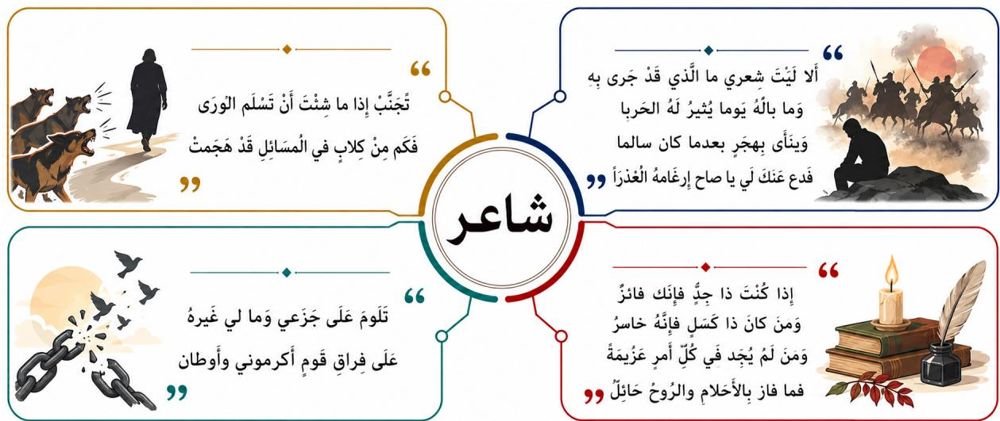
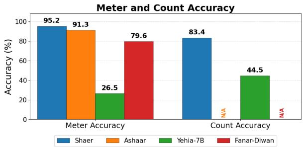
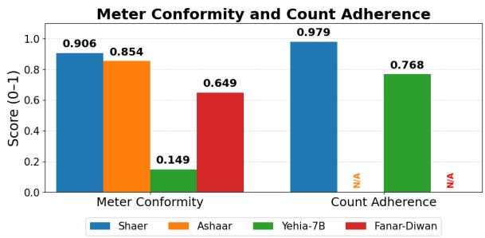
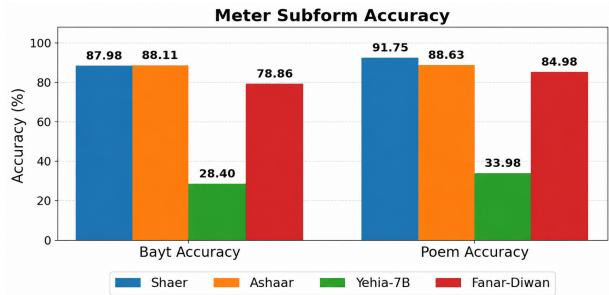
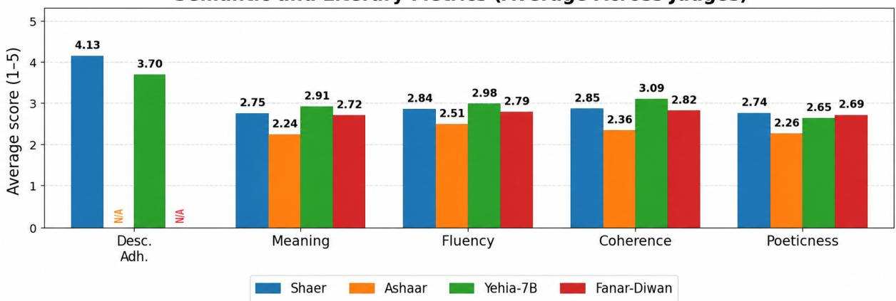
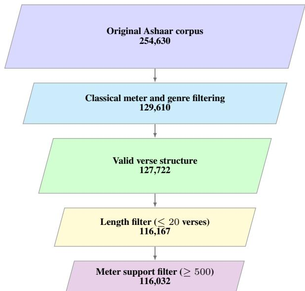
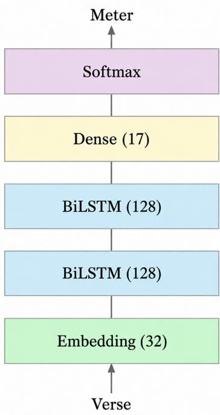

# Shaer: Controlled Arabic Poetry Generation with Meter Subform and Semantic Conditioning

Ahmad Abbas Tamara Fakih Nour Fakih Ammar Mohanna

Department of Electrical and Computer Engineering American University of Beirut, Beirut, Lebanon {asa108,tmf14,nhf16}@mail.aub.edu am288@aub.edu.lb

## Abstract

Classical Arabic poetry generation requires simultaneously satisfying semantic, linguistic, and fine-grained prosodic constraints. Existing systems typically control broad poetic attributes but do not jointly model semantic intent, meter subform, and poem length. We present SHAER, a controllable Classical Arabic poetry generation framework jointly conditioned on natural-language descriptions, meter subforms, and target hemistich counts. To support this task, we construct an enriched corpus of 116,032 classical Arabic poems derived from Ashaar, containing normalized meter-subform labels and automatically generated, validated semantic descriptions. We then adapt Yehia-7B using QLoRA-based supervised fine-tuning with a completion-only objective. Our evaluation combines automatic assessment of base-meter conformity, requestedsubform adherence, and length control with three LLM judges, blinded human evaluation, and memorization analysis. SHAER achieves 95.17% base-meter accuracy, 91.75% poemlevel meter-subform accuracy, and 83.40% exact count accuracy. Relative to its untuned foundation model, these results represent gains of 68.68, 57.77, and 38.93 percentage points, respectively; SHAER also attains the highest base-meter accuracy among all evaluated systems. Multi-LLM evaluation and a blinded human assessment of top-ranked outputs further indicate competitive semantic and literary quality. Finally, analysis of all 3,481 test generations finds no exact copies from the training corpus or paired source poems. Code, models, and datasets are publicly available.1

## 1 Introduction

Classical Arabic poetry is a central component of Arabic literary heritage, making controlled generation both a technically challenging problem and a culturally grounded Arabic NLP task. Unlike conventional language generation tasks, successful poetry generation must simultaneously satisfy semantic, stylistic, and prosodic constraints. Beyond producing fluent and coherent text, a generated poem must adhere to a prescribed meter while faithfully expressing the intended meaning. These requirements make Arabic poetry generation a particularly demanding controllable generation problem. A brief overview of Classical Arabic poetic structure, meter, and meter subforms is provided in Appendix A.

Despite recent progress in Arabic language generation and computational poetry, fine-grained control over generated Arabic poetry remains challenging. Existing generation settings largely operate over broad structural or categorical attributes, leaving important dimensions of poetic control insuficiently addressed. In particular, jointly controlling natural-language semantic intent, finegrained meter subforms, and explicit poem length remains underexplored. This limits the ability to generate poems that simultaneously realize a desired meaning and satisfy precise prosodic and structural requirements.

To address these gaps, we introduce SHAER, a controllable Arabic poetry generation framework that jointly models semantic intent and poetic structure. By conditioning generation on naturallanguage descriptions, meter subforms, and target hemistich counts, SHAER enables fine-grained control over meaning, meter, and poem structure. Figure 1 presents representative poems generated by SHAER from prompts drawn from the test split of the released dataset.

Our contributions are as follows: (1) We introduce a controllable Arabic poetry generation task conditioned jointly on semantic descriptions, meter subforms, and requested poem length, enabling fine-grained control over semantic and structural properties. (2) We construct an enriched Arabic poetry corpus derived from Ashaar, comprising 116,032 classical poems annotated with normalized meter subforms and semantic descriptions, together with the complete data processing pipeline. (3) We develop SHAER, a controllable Arabic poetry generation model built by adapting Yehia-7B, a strong Arabic-focused language model, through parameter-eficient fine-tuning and explicit conditioning on semantic and prosodic constraints. (4) We introduce a multi-perspective evaluation framework combining automatic assessment of basemeter conformity, meter-subform adherence, and length control with three LLM judges, blinded human evaluation, and memorization and copying analysis.

  
Figure 1: Example poems generated by Shaer. Each poem is generated from a semantic description, meter specification, and length constraint derived from a held-out test example.

Experimental results show that SHAER attains the highest base-meter accuracy among all evaluated systems and achieves high requested-subform adherence. Relative to its untuned foundation model, Yehia-7B, SHAER provides markedly stronger base-meter, meter-subform, and length control. Evaluation with three LLM judges and a blinded human assessment of top-ranked outputs further indicates that these gains in controllability are achieved while retaining competitive semantic and literary quality.

## 2 Related Work

## 2.1 Arabic Poetry Generation

Early neural approaches to Arabic poetry generation relied on task-specific architectures. Talafha and Rekabdar (2019) combined keyword-based semantic guidance with Bi-GRU generation and hierarchical attention over previously generated verses, while their later work incorporated phonetic CNN subword embeddings and keyword expansion to improve metrical conformity and semantic consistency (Talafha and Rekabdar, 2021).

Pretrained language models subsequently enabled transfer-based approaches. Beheitt and Ben Haj Hmida (2022) pretrained GPT-2 on Arabic text and fine-tuned it for poetry generation, while Abboushi and Azzeh (2023) fine-tuned AraGPT2 on a large poetry corpus with explicit meter and rhyme conditioning.

Recent work has expanded both resources and controllability. Ashaar (Alyafeai et al., 2023) introduced datasets and pretrained models for Arabic poetry analysis and conditional generation. Fanar-Diwan (FANAR Team et al., 2026) supports controllable classical Arabic poetry generation conditioned on meter, topic, era, poet, and rhyme. From an instruction-following perspective, Sadallah et al. (2026) introduced a large-scale resource spanning Modern Standard Arabic and multiple dialects and supporting poetry generation, continuation, revision, and analysis under user-specified constraints.

Building on this progression, SHAER ofers a complementary approach to controllable classical Arabic poetry generation through joint conditioning on natural-language semantic descriptions, meter subforms, and explicit poem length.

## 2.2 Arabic Poetry Analysis and Evaluation

Arabic poetry analysis has extensively addressed meter identification. Al-Shaibani et al. (2020) proposed a character-based bidirectional recurrent model for classifying poetry into 14 meters without traditional Arudi representation, while Abandah et al. (2022) developed recurrent models covering the 16 classical meters and prose, alongside automatic diacritization. We reproduce the latter meterclassification architecture to assess base-meter conformity.

For finer-grained prosody, Qarah (2024) introduced AraPoemBERT, a poetry-specific language model evaluated on several analysis tasks, including meter-subform classification. We reproduce this setting to assess subform adherence in controllable generation.

At the semantic level, Al Ghallabi et al. (2025) introduced Fann or Flop, a benchmark for LLM understanding of Arabic poetry across semantic, figurative, prosodic, and cultural dimensions. Our evaluation similarly adopts a multidimensional perspective, combining automatic assessment of meter, subform, and length control with LLM-based and human judgments of semantic and literary quality.

## 3 Dataset

## 3.1 Source Corpus

Our work builds on Ashaar (Alyafeai et al., 2023), a large-scale Arabic poetry resource containing 254,630 poems from multiple online repositories. Ashaar supports several poetry-related tasks and provides poem-level metadata including meter, theme, poet identity, era, and descriptions. However, its metadata organization and description coverage are not directly suited to controllable generation based on fine-grained poetic structure and semantic intent. Appendix B provides a detailed analysis of the original corpus.

## 3.2 Corpus Construction

We construct an enriched corpus for controllable Arabic poetry generation through multi-stage filtering and normalization. We retain only classical Arabic poetry in the canonical Khalilian meters, removing colloquial or non-classical forms, malformed poems, and entries with invalid verse structure. To align with the 1,024-token maximum sequence length used for supervised fine-tuning, we exclude poems exceeding twenty verses. A post-tokenization audit using the final instruction format found that only 4 of 109,070 training sequences (0.0037%) exceeded this limit, by 5–25 tokens, with none in the validation or test sets. Finally, we remove insuficiently represented meter categories. Appendix C details the cleaning, normalization, and filtering procedures.

## 3.3 Meter Subform Annotation and Validation

All 116,032 retained poems inherit their basemeter labels from Ashaar. Explicit meter-subform metadata was available for 5,106 poems (4.4%); we normalized and retained these labels without independent re-annotation. The remaining 110,926 poems (95.6%) were assigned the default م؇ّ ) Complete) label, corresponding to the canonical realization of their base meter in classical Arabic prosody.

We assessed this default assignment in two ways. First, an author formally trained in Arabic prosody manually inspected 1,000 default-labeled poems, confirming the Complete form in 97.2% of cases. Second, we reproduced the AraPoem-BERT meter-subform classification setting (Qarah, 2024), achieving 97.38% accuracy compared with the originally reported 97.79%. Applied to all 110,926 default-labeled poems, the classifier predicted Complete for 103,748 (93.53%). Agreement exceeded 98.7% for nine of thirteen base meters, with disagreements concentrated in four meters afected by classifier limitations in class coverage or reported per-class performance. We use these predictions only to assess the defaultassignment convention, not to replace corpus labels; complete per-meter results and discussion are provided in Appendix D.1.

After normalization and default assignment, all poems have meter-subform annotations, yielding 21 distinct meter–subform combinations whose distribution is reported in Appendix D.2.

## 3.4 Semantic Description Generation

Ashaar descriptions are missing or insuficiently informative for much of the corpus, limiting their use as semantic conditioning signals (Appendix B). We therefore generate a semantic description for every poem.

We compare three generation configurations differing in model and prompting strategy. For each, three native Arabic-speaking annotators independently evaluate a stratified sample of 600 descriptions using a predefined Pass/Fail rubric. The best-performing configuration, based on Qwen3.5- 35B-A3B (Qwen Team, 2026a), achieves a 92.8% pass rate and is selected for corpus-wide generation. Configuration and human-evaluation details are provided in Appendix E.1.

<table><tr><td>Meter</td><td></td><td>Subform Requested Hemistichs</td><td>Description</td><td>Poem Hemistichs</td></tr><tr><td> $j ( j )$ </td><td> $\rho ^ { \tt U }$ </td><td>4</td><td> $p ( x ) = \lim \limits _ { c } \infty b \Rightarrow p ( x ) = p ( c  c  a ) = p ( x ) ( a ) ( b )$ </td><td> $y _ { \Delta } = \sin ( \frac { \pi } { 2 } )$ </td></tr><tr><td></td><td></td><td></td><td> $j ^ { 2 } ( x ) d x ^ { 2 } = \sin ( \frac { \pi } { 2 } )$   $\downarrow \downarrow 0 1 0 1 0 0 1 0 0 \downarrow 0 \downarrow 0 0 1 0 0 1$ </td><td> $1 1 , 2 1 1 , \ldots 1 1 \max = 2 0 0$   $\sin ^ { 3 } \cot 2 0 0 ^ { 3 } 0 ^ { 5 } 5 1 < 5 3$ </td></tr></table>

Table 1: Example Shaer dataset instance with its conditioning signals: base meter, meter subform, target hemistich count, and semantic description.

The selected configuration uses deterministic decoding to generate concise descriptions capturing each poem’s meaning, imagery, and tone while excluding references to meter, rhyme, or length. The resulting descriptions undergo automatic structural validation and corpus-wide quality checks. Appendices E.2 and E.3 provide full prompting, decoding, and verification details.

## 3.5 Final Dataset Statistics

The final corpus pairs each poem with its base meter, meter subform, target hemistich count, and generated semantic description, jointly supporting control over poetic form and semantic content. It comprises 116,032 poems spanning 13 classical meters and 21 meter–subform combinations, providing substantially finer-grained metrical supervision than the coarse meter categories commonly used in prior Arabic poetry generation systems. Appendix F summarizes the dataset characteristics, while Table 1 illustrates the enriched metadata and controlled generation format.

## 3.6 Data Splits

We partition the corpus into train (94%), validation (3%), and test (3%) splits, stratified by a composite key of base meter, meter subform, and length bucket to preserve poetic-structure distributions across partitions. Length buckets are defined by poem length as 1–3, 4–6, 7–10, and 11–20 verses.

## 4 Methodology

## 4.1 Task Formulation

We formulate Arabic poetry generation as a controllable generation task. Given a conditioning tuple

$$
x = ( m , s , n , d ) ,
$$

where m is the base meter, s the meter subform, n the requested hemistich count, and d a naturallanguage description of the desired content, the model generates

$$
y = ( y _ { 1 } , \dots , y _ { T } ) ,
$$

where $y _ { t }$ is the t-th generated token and $T$ the total number of generated tokens. The objective is to model $P ( y \mid x )$ such that the generated poem satisfies the specified semantic, prosodic, and length constraints.

## 4.2 Base Model Selection

Model selection is informed by AraLingBench (Zbib et al., 2026), a human-annotated benchmark of Arabic linguistic competence across grammar, morphology, spelling, syntax, and reading comprehension, capabilities closely aligned with classical Arabic poetry generation.

Yehia-7B (Navid-AI, 2025), a 7B-parameter Arabic-focused decoder-only language model, achieved the strongest overall performance among the evaluated models. We therefore select Navid-$\mathrm { A I / Y e h i a - 7 B { \mathrm { - p r e v i e w } } } ^ { 2 }$ as the foundation model for SHAER. Its Apache-2.0 license also facilitates public release of adapters and derived resources.

## 4.3 Supervised Fine-Tuning

We adapt Yehia-7B through supervised fine-tuning on the enriched corpus training split using a completion-only causal language modeling objective. Given prompt x and target completion $y ,$ the loss is computed only over poem tokens:

$$
\mathcal { L } ( \boldsymbol { \theta } ) = - \sum _ { t \in \mathcal { C } } \log p _ { \boldsymbol { \theta } } ( y _ { t } \mid \boldsymbol { x } , y _ { < t } ) ,\tag{1}
$$

where  denotes completion-token positions; prompt tokens are masked from the optimization objective.

To mitigate dataset imbalance, we use weighted sampling over groups defined by (base meter, meter subform, length bucket):

$$
w ( g ) \propto \mathrm { c o u n t } ( g ) ^ { - 0 . 6 } .
$$

The exponent 0.6 provides moderate rebalancing between unweighted (0) and full inversefrequency (1) sampling, increasing representation of rare groups without excessive oversampling.

Fine-tuning uses QLoRA (Dettmers et al., 2023), with the base model loaded in 4-bit NF4 precision, double quantization, and bfloat16 computation. LoRA adapters are applied to all linear layers with rank $r = 6 4 , \alpha = 1 2 8$ , dropout 0.05, and RS-LoRA enabled.

Appendix G provides complete training hyperparameters, runtime settings, and instruction templates.

## 5 Experimental Setup

## 5.1 Baselines

We evaluate SHAER against three Arabic poetry generation baselines spanning foundation and poetry-specific models:

• Yehia-7B (Navid-AI, 2025), the unfine-tuned foundation model underlying SHAER.

• Ashaar (Alyafeai et al., 2023), a poetry generation model trained on the Ashaar corpus.

• Fanar-Diwan (FANAR Team et al., 2026), a classical Arabic poetry model optimized for prosodic and stylistic constraints.

Yehia-7B provides the cleanest controlled comparison, sharing SHAER’s architecture, tokenizer, and instruction format but lacking task-specific fine-tuning. Ashaar and Fanar-Diwan serve as system-level comparisons under their native conditioning interfaces, which do not support SHAER’s full set of semantic, subform, and length controls. Earlier systems in Section 2 are not directly evaluated due to difering generation and evaluation settings and, where applicable, unavailable public checkpoints or inference implementations.

All models are evaluated on the 3,481-instance held-out test split. Yehia-7B uses the same instruction-style prompt as SHAER, while Ashaar and Fanar-Diwan use their native conditioning formats. Table 2 summarizes conditioning capabilities; Appendices H and I detail input representations and decoding settings, respectively.

## 5.2 Evaluation Dimensions

Because Arabic poetry quality cannot be captured by a single score, we evaluate generated poems using complementary structural and semantic-literary metrics. Before structural evaluation, outputs are deterministically normalized and segmented into hemistichs and bayts by pairing consecutive hemistichs; any incomplete final hemistich is excluded from bayt-level evaluation. Appendix J provides the full normalization and parsing rules.

Automatic Meter Evaluation. We evaluate meter using an external Arabic meter classifier based on the deep bidirectional recurrent architecture of Abandah et al. (2022). Operating at the verse level, it produces a meter prediction and probability distribution over the supported classes. Appendix K provides complete implementation and evaluation details.

We report two complementary metrics. Meter Accuracy measures exact adherence to the requested meter by majority-voting verse-level predictions into a poem-level prediction and computing the percentage matching the target meter.

Meter Conformity provides a softer confidencebased measure of metrical adherence. Let $m ^ { * }$ denote the requested meter and $p _ { i } ( m ^ { * } )$ its predicted probability for verse i. Because meter is a poemlevel property, we aggregate verse-level probabilities using the geometric mean:

$$
C _ { \mathrm { p o e m } } = \left( \prod _ { i = 1 } ^ { n } p _ { i } ( m ^ { * } ) \right) ^ { 1 / n } ,\tag{2}
$$

where n is the number of verses. The geometric mean penalizes metrically inconsistent verses, providing a more faithful estimate of poem-level conformity than an arithmetic average. Final Meter Conformity is the arithmetic mean across all generated poems.

<table><tr><td>Model</td><td>Meter</td><td>Subform</td><td>Rhyme</td><td>Hemistich Count</td><td>Description</td></tr><tr><td>Yehia-7B</td><td> $\checkmark ^ { \dagger }$ </td><td> $\checkmark ^ { \dagger }$ </td><td>X</td><td> $\checkmark ^ { \dagger }$ </td><td> $\checkmark ^ { \dagger }$ </td></tr><tr><td>Ashaar</td><td> $\checkmark$ </td><td>×</td><td>√</td><td>×</td><td>×</td></tr><tr><td>Fanar-Diwan</td><td> $\checkmark$ </td><td>×</td><td>√</td><td>×</td><td>×</td></tr><tr><td>SHAER</td><td> $\checkmark$ </td><td> $\checkmark$ </td><td>×</td><td>√</td><td>√</td></tr></table>

Table 2: Conditioning capabilities of the evaluated models.  denotes variables supplied through prompting rather than learned as native conditioning fields.

Automatic Meter Subform Evaluation. We evaluate fine-grained prosodic adherence using our reproduced AraPoemBERT 25-class metersubform classifier (Qarah, 2024), which operates at the bayt level. We report Bayt-Level Subform Accuracy and Poem-Level Subform Accuracy; the latter averages class-probability vectors across valid bayts and selects the highest-scoring class. The evaluator covers 3,379 of 3,481 test targets (97.07%), excluding targets outside its class inventory. Appendix L details classifier reconstruction, input representation, sequence-length configuration, and unsupported meter-subform classes.

For SHAER and Yehia-7B, these metrics measure adherence to the requested subform. Because Ashaar and Fanar-Diwan do not support subform conditioning, their outputs are evaluated against the corresponding source poem’s subform, measuring reference-subform agreement rather than controllability.

Hemistich Count Evaluation. The second structural dimension evaluates adherence to the requested hemistich count using two complementary metrics.

Count Accuracy measures exact count matching as the percentage of generated poems whose hemistich count equals the requested count.

Count Adherence (CA) provides a softer measure of length conformity. Let $H _ { g }$ and $H _ { r } > 0$ denote the generated and requested hemistich counts, respectively:

$$
\mathrm { C A } = \operatorname* { m a x } \left( 0 , 1 - \frac { \left| H _ { g } - H _ { r } \right| } { H _ { r } } \right) .\tag{3}
$$

The score equals 1 for an exact match and decreases with relative count discrepancy, reaching 0 when the discrepancy is at least as large as the requested count. Normalization by $H _ { r }$ makes the metric more sensitive to absolute deviations for shorter requested poems. Final Count Adherence is the arithmetic mean across all generated poems.

Both metrics are reported only for models supporting hemistich-count conditioning, namely SHAER and Yehia-7B.

LLM-Based Evaluation. Semantic and literary quality are evaluated using three LLM judges: Qwen3-235B-A22B (Qwen Team, 2025), Qwen 3.7 Max (Qwen Team, 2026b), and GPT-5.6 Terra (OpenAI, 2026). Qwen3-235B-A22B was applied to all 3,481 held-out outputs from each system, while Qwen 3.7 Max and GPT-5.6 Terra evaluate a shared subset of 2,500 test instances across the four systems. Following recent work on LLM-based evaluation of open-ended generation, we assess five dimensions: Description Adherence, Meaning, Fluency, Coherence, and Poeticness. Table 3 defines the evaluation dimensions.

All three judges use identical dimensionspecific rubrics. Each dimension is assessed independently on a strict 1–5 integer scale, where higher scores indicate better performance. Description Adherence is evaluated only for description-conditioned models, namely SHAER and Yehia-7B. Scores are first averaged over the available valid responses separately for each judge and system. The equal-weight mean of the three judge-level means is reported in the main results. To reduce evaluation variance, all judgments use deterministic decoding (temperature=0). Full evaluation rubrics, decoding settings, coverage details, and judge-specific results are provided in Appendix M.

Human Evaluation. We complement the LLMbased evaluation with a blinded human assessment of top-ranked outputs from all four systems. We evaluate Meaning, Fluency, Coherence, and Poeticness using the same 1–5 rubrics as the LLM judges, excluding Description Adherence because it is not applicable to Ashaar and Fanar-Diwan. For each system, we select the five highest-ranked outputs within the shared instance subset based on aggregate multi-LLM scores, yielding 20 poems. Three authors independently rate the selected poems; all are native Arabic speakers, and one additionally has formal training in Arabic prosody and an academic minor in Arabic. Each reported system–dimension score averages 15 ratings across the five poems and three annotators. Further details on selection, blinding, evaluation procedure, and inter-annotator agreement are provided in Appendix N.

<table><tr><td>Metric</td><td>Definition</td></tr><tr><td>Description</td><td>Faithfulness to the conditioning de-</td></tr><tr><td>Adherence</td><td>scription.</td></tr><tr><td>Meaning</td><td>Clarity and semantic depth of the poem.</td></tr><tr><td>Fluency</td><td>Linguistic correctness and natural- ness of Arabic.</td></tr><tr><td>Coherence</td><td>Continuity and unity across the poem.</td></tr><tr><td>Poeticness</td><td>Literary quality beyond meter, in- cluding imagery and expression.</td></tr></table>

Table 3: LLM-based evaluation dimensions.

Memorization and Copying Evaluation. We additionally assess whether SHAER reproduces content from its training data or from the heldout poems underlying the test instances. Each of the 3,481 generated poems is compared against all 109,070 poems in the SFT training set and against its corresponding held-out source poem after deterministic text normalization.

We measure three complementary indicators of textual overlap: Exact Match, which identifies identical normalized poems; Longest Shared Span, defined as the longest contiguous sequence of words shared between a generation and a comparison poem; and 5-Gram Jaccard Similarity, which measures overlap between their sets of word 5- grams. Together, these metrics capture exact reproduction, localized phrase-level reuse, and broader lexical overlap, respectively.

## 6 Results and Discussion

Appendix O presents representative poems generated by SHAER, together with their conditioning signals and corresponding meter conformity scores. The remainder of this section focuses on quantitative evaluation.

  
Figure 2: Meter accuracy and count accuracy.

  
Figure 3: Meter conformity and count adherence scores.

## 6.1 Formal Control Evaluation

Figures 2 and 3 summarize meter and lengthcontrol performance.

SHAER achieves the highest base-meter accuracy (95.2%) and meter-conformity score (0.906), outperforming Ashaar (91.3%, 0.854), Fanar-Diwan (79.6%, 0.649), and Yehia-7B (26.5%, 0.149). It also substantially exceeds Yehia-7B in exact count accuracy (83.4% vs. 44.5%) and count adherence (0.979 vs. 0.768). Because Yehia-7B shares the same foundation model, these diferences demonstrate the stronger meter and length control achieved by the jointly conditioned and fine-tuned SHAER system.

Appendix P reports results by base meter and requested-length bucket. SHAER achieves the highest accuracy for 12 of the 13 meters and maintains 93.0–97.0% base-meter accuracy across length buckets. Its exact count accuracy decreases from 98.4% for poems of 1–3 verses to 29.0% for poems of 11–20 verses, but remains substantially above Yehia-7B in every bucket, indicating that longerform length control remains challenging.

Figure 4 evaluates fine-grained meter-subform control. Among models explicitly conditioned on a target subform, SHAER achieves a bayt-level accuracy of 87.98% and a poem-level accuracy of 91.75%, substantially outperforming Yehia-7B, which obtains bayt-level and poem-level accuracies of 28.40% and 33.98%, respectively. Since both systems share the same foundation model and receive the same target subform, this comparison demonstrates the stronger fine-grained prosodic control achieved by the jointly conditioned and fine-tuned SHAER system.

  
Figure 4: Bayt-level and poem-level meter-subform accuracy.

Since Ashaar and Fanar-Diwan do not support subform conditioning, their scores instead measure agreement with the corresponding source poem’s subform. Ashaar achieves 88.11% baytlevel and 88.63% poem-level agreement, while Fanar-Diwan achieves 78.86% and 84.98%, respectively. SHAER attains the highest poem-level accuracy overall, while its bayt-level accuracy is comparable to Ashaar’s reference-subform agreement. These results should be interpreted according to the distinct conditioning settings. Additionally, rare subforms are more frequently classified as the dominant Complete (م؇ّ( form; accordingly, evaluation is restricted to target classes represented in the evaluator’s 25-class inventory.

## 6.2 Semantic and Literary Quality

Figure 5 summarizes semantic and literary quality across the three LLM judges, with judge-specific results reported in Appendix M. Across the four dimensions shared by all systems, SHAER consistently exceeds the two poetry-specific baselines, Ashaar and Fanar-Diwan. The diferences relative to Fanar-Diwan are small but consistent across Meaning (2.75 vs. 2.72), Fluency (2.84 vs. 2.79), Coherence (2.85 vs. 2.82), and Poeticness (2.74 vs. 2.69), while Ashaar scores lower across all four dimensions. Since these systems use diferent native conditioning interfaces, these results represent system-level comparisons rather than controlled comparisons of individual modeling choices.

Compared with its unfine-tuned foundation model, Yehia-7B, SHAER achieves higher crossjudge means for Description Adherence (4.13 vs.

<table><tr><td>System</td><td>Mean.</td><td>Flu.</td><td>Coh.</td><td>Poet.</td></tr><tr><td>SHAER</td><td>4.00</td><td>4.20</td><td>4.20</td><td>4.30</td></tr><tr><td>Yehia-7B</td><td>4.13</td><td>3.50</td><td>3.80</td><td>3.30</td></tr><tr><td>Fanar-Diwan</td><td>3.80</td><td>3.70</td><td>3.80</td><td>3.50</td></tr><tr><td>Ashaar</td><td>3.10</td><td>3.00</td><td>3.60</td><td>2.40</td></tr></table>

Table 4: Blinded human evaluation of five top-ranked poems per system. Scores are means over 15 ratings (five poems three annotators) on a 1–5 scale.

3.70) and Poeticness (2.74 vs. 2.65), whereas Yehia-7B scores higher in Meaning, Fluency, and Coherence. Judge-specific results show the same direction for Description Adherence, Meaning, Coherence, and Poeticness, while Fluency is judgedependent. Together with the structural results, these findings indicate that task-specific adaptation substantially improves controllability and description adherence while maintaining competitive semantic and literary quality.

Human Evaluation. Table 4 reports the complementary human evaluation results. SHAER receives the highest ratings for Fluency (4.20), Coherence (4.20), and Poeticness (4.30), while Yehia-7B receives the highest Meaning rating (4.13, compared with 4.00 for SHAER). Fanar-Diwan receives intermediate ratings, whereas Ashaar receives the lowest mean ratings across all four dimensions.

The human assessment partially aligns with the multi-LLM evaluation: both favor SHAER over Yehia-7B on Poeticness and Yehia-7B over SHAER on Meaning, while the human annotators additionally favor SHAER on Fluency and Coherence. Given that this evaluation targets top-ranked outputs rather than a representative test-set sample, these findings provide complementary evidence about the systems’ strongest identified generations rather than their average performance.

## 6.3 Memorization and Copying Analysis

No exact normalized copies were found among the 3,481 SHAER generations. One generation (0.0287%) shared at least 13 consecutive words with a training poem, and four (0.1149%) with their paired held-out sources; none shared 30 or more words in either comparison. Median word 5-gram Jaccard similarity was 0.0 for both comparisons, with maxima of 0.119 and 0.220, respectively. Manual inspection revealed localized reuse or paraphrasing rather than full-poem reproduction. We therefore find no evidence of systematic memorization or wholesale copying, although rare source-associated phrase reuse occurs.

Semantic and Literary Metrics (Average Across Judges)  
  
Figure 5: Equal-weight mean semantic and literary scores across three LLM judges. Description adherence applies only to description-conditioned systems.

## 7 Conclusion

We presented SHAER, a controllable Classical Arabic poetry generation framework jointly conditioned on natural-language descriptions, meter subforms, and target hemistich counts. To support this task, we constructed an enriched corpus of 116,032 classical Arabic poems derived from Ashaar, containing normalized meter-subform labels and automatically generated, validated semantic descriptions. Building on this resource, we adapted Yehia-7B through QLoRA-based supervised fine-tuning with a completion-only objective.

Across the 3,481 held-out test instances, SHAER achieves 95.17% base-meter accuracy, 91.75% poem-level meter-subform accuracy, and 83.40% exact count accuracy, representing substantial gains over its untuned foundation model. It also attains the highest base-meter accuracy among all evaluated systems. Evaluation with three LLM judges indicates that SHAER exceeds the poetryspecific comparison systems across the shared semantic and literary dimensions, while its comparison with Yehia-7B reveals a trade-of between stronger controllability and performance on some unconstrained literary-quality dimensions. A blinded human assessment of top-ranked outputs further supports the model’s competitive literary quality. In addition, memorization analysis finds no exact normalized copies from either the training corpus or the paired held-out source poems.

Together, these findings demonstrate that SHAER provides reliable joint control over semantic intent, fine-grained prosodic form, and poem length while preserving competitive semantic and literary quality. The released code, models, annotations, and evaluation resources provide a foundation for further research on controllable Arabic literary generation.

Future work includes explicit rhyme conditioning and evaluation, component-wise ablations, broader human evaluation on representative samples, improved handling of rare meter subforms and longer poems, and extension to additional Arabic poetic genres.

## 8 Limitations

Despite the strong results achieved by SHAER, several limitations remain. First, this work focuses on Classical Arabic poetry written in the 13 canonical meters retained after corpus filtering. Consequently, the dataset and model do not cover free verse, prose poetry, colloquial poetry, or other contemporary poetic forms. Performance is also less certain for rare meter subforms and longer requested poems because of their limited representation.

Second, 95.6% of the corpus lacked explicit meter-subform metadata and was assigned the canonical Complete (م؇ّ ( form by default. Although manual inspection and classifier-based validation support this convention, these labels remain partly heuristic.

Third, semantic descriptions are generated automatically rather than written by human annotators. Despite structural validation, corpus-wide quality checks, and human evaluation of sampled descriptions, some residual semantic noise may remain.

Fourth, the evaluation relies partly on learned meter classifiers and LLM judges. Although these evaluators were validated and three LLM judges were used, their scores remain approximations of expert human judgment. The complementary human evaluation is also limited to selected topranked outputs rather than a representative test-set sample.

Finally, rhyme is learned implicitly but is neither explicitly controlled nor quantitatively evaluated. Because the experiments do not include component-wise ablations, the observed improvements should be attributed to the jointly conditioned and fine-tuned SHAER system rather than to any individual control mechanism.

## References

Gheith A. Abandah, Mohammed Z. Khedher, Mohammad R. Abdel-Majeed, Hamdi M. Mansour, Salma F. Hulliel, and Lara M. Bisharat. 2022. Classifying and diacritizing arabic poems using deep recurrent neural networks. Journal of King Saud University - Computer and Information Sciences, 34(6):3775–3788.

Asaad Abbas. 2001. The metrical structure of classical arabic poetry. Studia Arabistyczne i Islamistyczne, 8:5–52.

Omar Abboushi and Mohammad Azzeh. 2023. Toward fluent arabic poem generation based on fine-tuning AraGPT2 transformer. Arabian Journal for Science and Engineering, 48(8):10537–10549.

Wafa Al Ghallabi, Ritesh Thawkar, Sara Ghaboura, Ketan Pravin More, Omkar Thawakar, Hisham Cholakkal, Salman Khan, and Rao Muhammad Anwer. 2025. Fann or flop: A multigenre, multiera benchmark for Arabic poetry understanding in LLMs. In Proceedings of the 2025 Conference on Empirical Methods in Natural Language Processing, pages 20224–20244, Suzhou, China. Association for Computational Linguistics.

Maged S. Al-Shaibani, Zaid Alyafeai, and Irfan Ahmad. 2020. Meter classification of arabic poems using deep bidirectional recurrent neural networks. Pattern Recognition Letters, 136:1–7.

Maytham Alabbas, Zainab A. Khalaf, and Khashan M. Khashan. 2014. BASRAH: An automatic system to identify the meter of

arabic poetry. Natural Language Engineering, 20(1):131–149.

Zaid Alyafeai, Maged S. Al-Shaibani, and Moataz Ahmed. 2023. Ashaar: Automatic analysis and generation of Arabic poetry using deep learning approaches. arXiv, abs/2307.06218.

Abd al-Aziz Atiq. 1987. ʿIlm al-ʿArūḍ wa-al-Qāfiyah (۰ ڣ٭ ؇گܳ وا أݠوض ܳا ޺޾༟). Dar al-Nahda al-Arabiyya (۰ਃಸ أݠ ܳا ۰ݯዛዊܳا دار (, Beirut.

Mohamed El Ghaly Beheitt and Moez Ben Haj Hmida. 2022. Automatic arabic poem generation with GPT-2. In Proceedings of the 14th International Conference on Agents and Artificial Intelligence, volume 2, pages 366–374. SciTePress.

Tim Dettmers, Artidoro Pagnoni, Ari Holtzman, and Luke Zettlemoyer. 2023. QLoRA: Eficient finetuning of quantized LLMs. In Advances in Neural Information Processing Systems, volume 36.

FANAR Team, Ummar Abbas, Mohammad Shahmeer Ahmad, Minhaj Ahmad, Abdulaziz Al-Homaid, Anas Al-Nuaimi, Enes Altinisik, Ehsaneddin Asgari, Sanjay Chawla, Shammur Chowdhury, Fahim Dalvi, Kareem Darwish, Nadir Durrani, Mohamed Elfeky, Ahmed Elmagarmid, Mohamed Eltabakh, Asim Ersoy, Masoomali Fatehkia, Mohammed Qusay Hashim, and 18 others. 2026. Fanar 2.0: Arabic generative AI stack. arXiv, abs/2603.16397.

Navid-AI. 2025. Yehia 7b preview.

OpenAI. 2026. Gpt-5.6 terra. OpenAI API Documentation. Accessed: 2026-09-16.

Faisal Qarah. 2024. AraPoemBERT: A pretrained language model for Arabic poetry analysis. arXiv, abs/2403.12392.

Qwen Team. 2025. Qwen3 technical report. arXiv.

Qwen Team. 2026a. Qwen3.5: Towards native multimodal agents. Accessed: 2026-04-27.

Qwen Team. 2026b. Qwen3.7. Qwen Blog. Accessed: 2026-09-16.

Abdelrahman Sadallah, Kareem Elozeiri, Mervat Abassy, Rania Elbadry, Mohamed Anwar,

Abed Alhakim Freihat, Preslav Nakov, and Fajri Koto. 2026. Instruction-guided poetry generation in Arabic and its dialects. In Findings of the Association for Computational Linguistics: ACL 2026, pages 38761–38780, San Diego, California, United States. Association for Computational Linguistics.

Sameerah Talafha and Banafsheh Rekabdar. 2019. Arabic poem generation with hierarchical recurrent attentional network. In 2019 IEEE 13th International Conference on Semantic Computing (ICSC), pages 316–323. IEEE.

Sameerah Talafha and Banafsheh Rekabdar. 2021. Poetry generation model via deep learning incorporating extended phonetic and semantic embeddings. In 2021 IEEE 15th International Conference on Semantic Computing (ICSC), pages 48–55. IEEE.

Mohamad Bilal Zbib, Hasan Abed Al Kader Hammoud, Ammar Mohanna, Nadine Rizk, Fatima Karnib, Sina Moukaled, and Bernard Ghanem. 2026. Aralingbench: A human-annotated benchmark for evaluating arabic linguistic capabilities of large language models. In Proceedings ofthe 2nd Workshop on NLP for Languages Using Arabic Script, pages 385–393, Rabat, Morocco. Association for Computational Linguistics.

## Appendix

## A Background on Classical Arabic Poetry

## A.1 Poetic Structure

Classical Arabic poetry follows a highly structured form governed by meter and rhyme. A poem $( \sin \alpha \sin \beta$ , qasida) consists of verses $( = \sin ^ { \frac { \pi } { 4 } }$ abyat; singular $\therefore$ , bayt), each typically divided into two hemistichs $C : b :$ , shatrayn): $s $ )sadr, first hemistich) and )ajuz, second hemistich). Hemistichs within a poem typically conform to a single meter $( \neq$ , bahr), while the verses share a common rhyme $( \sum \limits _ { i = 1 } ^ { \infty } i )$ , qafiyah), realized at the end of the second hemistich (Abbas, 2001). These constraints require poetry generation to maintain both semantic and prosodic consistency.

## A.2 Meter and Meter Subforms

Arabic prosody $( \omega \circ \circ \mathsf { d } ) \mathsf { k }$ , ʿilm al-ʿarud) describes the metrical organization of classical Arabic poetry. Each meter $( s { \mathrm { , } }$ , bahr) is characterized by an ordered sequence of recurring metrical feet $C _ { 1 } \cup C _ { 2 }$ , tafaʿil) (Abbas, 2001). For example, the canonical pattern of Rajaz $( \succ J )$ is $j \sin ^ { \circ } \sin ^ { \circ }$ $j \sin i \sin 0 \phi \sin i$ in each hemistich. Table 5 summarizes the sixteen canonical Khalilian meters and their meter keys.

A base meter can admit multiple valid realizations through systematic modifications of its canonical structure (Atiq, 1987). We refer to these finer-grained realizations as meter subforms. Common examples include Complete $( \pmb \rho \Theta )$ (, Catalectic $( \diamond \mathfrak { g } ) \div )$ (, Hemistich $( s \phi ^ { \circ } \dot { \mathbf { \sigma } } \mathbf { \stackrel { . } { \sim } } { \mathbf { \sigma } } )$ (, and Severely Truncated $( \sin ( i \alpha )$ ; these are illustrative rather than exhaustive, and valid subforms vary across meters. Consequently, two poems can share the same base meter while following diferent subforms. Table 6 illustrates this distinction using Rajaz.

## B Analysis of the Original Ashaar Corpus

The original Ashaar corpus contains 254,630 poems and 12 metadata fields per poem. However, substantial inconsistencies in metadata coverage, meter annotations, description availability, poem length, and textual quality motivated the cleaning and filtering procedures described in Section 3. Table 7 summarizes the key statistics.

## C Data Cleaning and Preprocessing

We apply a four-stage pipeline to remove structural, orthographic, and metadata inconsistencies from the original Ashaar corpus. First, the corpus is restricted to classical Arabic poetry written in the sixteen canonical Khalilian meters. Poems labeled as colloquial or non-classical $( \sin ^ { 3 } , \sin ^ { 3 } \alpha )$ , as well as poems lacking meter annotations, are discarded. Second, poems with malformed verse structures, empty hemistichs, or hemistichs containing Latin characters, digits, or URLs are removed. Internal elongation $( ( - ) \cup \dag , \dag , )$ characters are also stripped, while edge elongation and all diacritics are preserved. Third, poems exceeding twenty verses are excluded to align the corpus with the supervised fine-tuning maximum sequence length of 1,024 tokens. A post-tokenization audit using the final instruction format found that only 4 of the 109,070 training sequences (0.0037%) still exceeded this limit, by 5–25 tokens, while no validation or test sequence exceeded it. Finally, meter annotations are normalized to the canonical meter inventory, and base meters represented by fewer than 500 poems are removed. Figure 6 summarizes the resulting counts at each stage.

<table><tr><td>English Name</td><td>Arabic Name</td><td>Meter Key</td></tr><tr><td>Taweel</td><td> $\int \limits _ { 0 } ^ { \infty } d l$ </td><td>   </td></tr><tr><td>Madeed</td><td> $- \infty . 1 1$ </td><td></td></tr><tr><td>Baseet</td><td> $\dot { L } _ { \mathrm { s e v } }$ </td><td>  </td></tr><tr><td>Wafer</td><td> $\sin j = \sin j$ </td><td></td></tr><tr><td>Kamel</td><td> $\vert \Join ^ { \prime } \rvert$ </td><td> $\int \limits _ { 0 } ^ { \cdot } d = L i 0 \int \limits _ { 0 } ^ { \cdot } d = L i 0$ </td></tr><tr><td>Hazaj</td><td> $| \mathcal { \cdot } \mathcal { \partial } |$ </td><td></td></tr><tr><td>Ramal</td><td> $\bar { \mathsf { J } }$ </td><td></td></tr><tr><td>Rajaz</td><td> $\mathrm { \tilde { \ s } } \lrcorner \mathsf { J } 1$ </td><td>laéims ilaéims ilaéims l lais lais</td></tr><tr><td>Sare&#x27;e</td><td> $z \sim 1$ </td><td></td></tr><tr><td>Munsareh</td><td> $\frac { \mu \sin l 1 } { \cos l }$ </td><td>jlaéins gaés jlaims</td></tr><tr><td>Khafeef</td><td> $\therefore a . a 2 = 1$ </td><td></td></tr><tr><td>Mujtath</td><td> $\therefore \Delta 1$ </td><td></td></tr><tr><td>Mutakareb</td><td> $\hookrightarrow 1 6 = 1 1$ </td><td> $j \cup 0 0 \ldots \ j \cup 0 0 \ldots i \cup 0 0 0 \ldots i \cup 0 0 0$ </td></tr><tr><td>Mutadarak</td><td> $\ j , 1 \ldots 1 1$ </td><td>jlcli jlli jcbi jlcl</td></tr><tr><td>Muqtadheb</td><td> $\therefore \therefore \angle C$ </td><td></td></tr><tr><td>Mudhare&#x27;e</td><td> $i , l , a l l$ </td><td></td></tr></table>

Table 5: The sixteen canonical Khalilian meters and their corresponding meter keys (Alabbas et al., 2014).
<table><tr><td>Name</td><td># Feet</td><td>Metrical Feet Pattern</td><td>Definition</td><td>Example</td></tr><tr><td>Complete  $\rho ^ { \tt t }$ </td><td>6</td><td> $0 3 \cos 3 0 3 \cos 3 0 - 0 3 \cos \alpha = 0 3$   $j \sin a \cos a \sin b \sin a \sin b \sin a$  000900090009 ilaéims ilaéis ilaéims</td><td>Retains the full three- foot pattern in each of the two hemistichs.</td><td>9W Lic 10 y 9901 3. y 66 e c n</td></tr><tr><td>Truncated  $\sin ^ { \cdot } \beta$ </td><td>4</td><td> $\begin{array} { r l } & { \int \limits _ { - \infty } ^ { + \infty } d x ^ { - } = 3 \frac { o ^ { 3 } } { 2 } d x ^ { - 2 } = 3 } \\ & { \int \limits _ { - \infty } ^ { + \infty } d x ^ { - } = \frac { 1 } { 2 } ( x ^ { - 2 } - 2 0 ) } \\ & { \int \limits _ { - \infty } ^ { + \infty } d x ^ { - } = \frac { 1 } { 2 } ( x ^ { - 2 } - 2 0 ) = 0 } \end{array}$ </td><td>Retains two feet in each of the two hemistichs.</td><td>. 0</td></tr><tr><td>Single-Hemistich  $\sin ^ { \circ } \sin ^ { \circ }$ </td><td>3</td><td> $\sin \angle \sin \alpha = \sin \alpha = \sin \alpha \sin \alpha \sin \alpha - \tan \alpha$ </td><td>Consists of a single three- foot verse.</td><td>099 8 w 3 h</td></tr><tr><td>Exhausted  $s \sin ^ { \circ }$ </td><td>2</td><td> $\int \limits _ { c } ^ { 0 } \sin ^ { 3 } \alpha d c$ </td><td>Consists of a single two- foot verse.</td><td>0 2 し</td></tr></table>

Table 6: Illustrative meter subforms of Rajaz $( \ p , \mathsf { I } | \ s )$ , showing the number of metrical feet per verse, their metrical patterns, and corresponding examples. The set is not exhaustive.

## D Meter Subform Details

## D.1 Default-Label Validation

We first manually assessed the default Complete assignment on a sample of 1,000 poems. An author with formal training in Arabic prosody inspected the sampled poems and confirmed the Complete form in 97.2% of cases. This manual check evaluates the plausibility of the defaulting convention on a sample; it does not constitute exhaustive reannotation of the 110,926 default-labeled poems.

We reproduce the meter-subform classification setting of AraPoemBERT (Qarah, 2024) using the dataset released by the authors, as the publicly released checkpoint could not be directly loaded as a complete sequence-classification model. Our reproduction achieved 97.38% accuracy, comparable to the 97.79% reported in the original work. We apply the resulting classifier to all poems assigned the default Complete label. Table 8 reports the resulting agreement by base meter.

The four meters with low agreement reflect limitations of the classifier itself. Complete forms of Madeed, Hazaj, and Mujtath are absent from the classifier’s released class inventory, while Rajaz Complete has a reported precision of 0.4725 (Qarah, 2024). In contrast, agreement ranges from 98.76% to 99.93% across the remaining nine meters. We use these predictions only to assess the default-labeling strategy and do not use them to modify the corpus annotations.

<table><tr><td>Statistic</td><td>Value</td></tr><tr><td>Total number of poems</td><td>254,630</td></tr><tr><td>Number of metadata fields</td><td>12</td></tr><tr><td>Number of unique meter labels</td><td>101</td></tr><tr><td>Poems lacking meter annotations</td><td>39.77%</td></tr><tr><td>Poems containing at least one empty hemistich</td><td>0.17%</td></tr><tr><td>Number of unique theme categories</td><td>19</td></tr><tr><td>Poems lacking theme annotations</td><td>73.48%</td></tr><tr><td>Poems with unreliable language-type labels  $\cos \theta , \sin ^ { 3 } \theta$  ,missing, or “-&quot;)</td><td>31.44%</td></tr><tr><td>Poems lacking descriptions</td><td>94.32%</td></tr><tr><td>Average number of hemistichs per poem</td><td>30.30</td></tr><tr><td>Median number of hemistichs per poem Minimum hemistich count</td><td>14</td></tr><tr><td>Maximum hemistich count</td><td>0</td></tr><tr><td>Poems exceeding 40 hemistichs (20 verses)</td><td>11,608</td></tr><tr><td>Poems containing Latin characters, numerical digits, or URLs</td><td>21.68%</td></tr><tr><td></td><td>2.56%</td></tr><tr><td>Poems containing tatweel characters</td><td>45.45%</td></tr></table>

Table 7: Key characteristics of the original Ashaar corpus before preprocessing and filtering.
<table><tr><td>Base Meter</td><td>Default Complete</td><td>Predicted Complete</td><td>Predicted Non-Complete</td><td>Agreement</td></tr><tr><td>Taweel</td><td>28,028</td><td>28,007</td><td>21</td><td>99.93%</td></tr><tr><td>Mutakareb</td><td>5,189</td><td>5,185</td><td>4</td><td>99.92%</td></tr><tr><td>Baseet</td><td>16,811</td><td>16,787</td><td>24</td><td>99.86%</td></tr><tr><td>Kamel</td><td>19,438</td><td>19,399</td><td>39</td><td>99.80%</td></tr><tr><td>Khafeef</td><td>9,555</td><td>9,531</td><td>24</td><td>99.75%</td></tr><tr><td>Wafer</td><td>11,097</td><td>11,047</td><td>50</td><td>99.55%</td></tr><tr><td>Sare&#x27;e</td><td>7,190</td><td>7,154</td><td>36</td><td>99.50%</td></tr><tr><td>Ramal</td><td>3,643</td><td>3,615</td><td>28</td><td>99.23%</td></tr><tr><td>Munsareh</td><td>2,747</td><td>2,713</td><td>34</td><td>98.76%</td></tr><tr><td>Madeed</td><td>538</td><td>37</td><td>501</td><td>6.88%</td></tr><tr><td>Rajaz</td><td>3,973</td><td>225</td><td>3,748</td><td>5.66%</td></tr><tr><td>Hazaj</td><td>609</td><td>15</td><td>594</td><td>2.46%</td></tr><tr><td>Mujtath</td><td>2,060</td><td>33</td><td>2,027</td><td>1.60%</td></tr><tr><td>Overall</td><td>110,926</td><td>103,748</td><td>7,178</td><td>93.53%</td></tr></table>

Table 8: Agreement between the default Complete annotations and predictions of the reproduced AraPoemBERT meter-subform classifier, reported by base meter.

## D.2 Meter–Subform Distribution

Table 9 reports the distribution of the 21 meter– subform combinations in the final corpus.

## E Semantic Description Generation and Validation

The description-generation pipeline consists of three components: selection of the generation configuration, specification of the prompting and decoding procedure for the selected configuration, and validation of the resulting corpus descriptions.

## E.1 Generation Configuration Selection

Before generating descriptions for the full corpus, we compare three candidate generation configurations difering in generative model and prompting strategy. For each configuration, we generate descriptions for a stratified sample of 600 poems covering diverse base meters, meter subforms, and poem lengths.

Each generated description is independently assigned a Pass or Fail label by three of the authors, who are blinded to the configuration that produced it. All three annotators are native Arabic speakers; one additionally has formal training in Arabic prosody. Descriptions are assessed according to nine criteria: fluency, faithfulness to the poem content, coverage of the central meaning and imagery, absence of hallucinated content, absence of direct verse copying, suficient specificity, use of the required opening phrase $( \doteq 1 2 ) \div \lim \limits _ { n  \infty } a ( n ) |$ $\cdots ( s )$ (, single-paragraph formatting, and absence of metadata leakage. A description receives a Fail label if any criterion is violated.

Disagreements are resolved by majority vote. Inter-annotator agreement across the evaluations is Fleiss’ $\kappa = 0 . 8 1 7$ , indicating strong consistency in the application of the evaluation rubric.

  
Figure 6: Corpus filtering pipeline. Starting from the original Ashaar corpus, the filtering process yields a final dataset of 116,032 classical Arabic poems.

The three candidate configurations achieve pass rates of 428/600 (71.3%), 506/600 (84.3%), and 557/600 (92.8%), respectively. We select the third configuration, which achieves the highest pass rate, for corpus-wide description generation.

## E.2 Prompting and Decoding Configuration

The selected configuration uses Qwen3.5-35B-A3B (Qwen Team, 2026a) under deterministic decoding. The system prompt instructs the model to produce a single descriptive Arabic paragraph beginning with $( \cdots + i ) \div ( \square ^ { \cdots } i ) ( \square ^ { \cdots } i )$ (, capturing the poem’s central meaning, imagery, and tone. It further instructs the model to avoid copying verses, introducing unsupported content, or referring to formal properties such as meter, rhyme, or poem length. The response is returned as a JSON object containing a single new\_description field.

The user prompt provides all hemistichs of the source poem followed by a one-line instruction requesting the semantic description.

$$
\therefore \therefore L \int \limits _ { \cdots } ^ { \infty } Y I
$$

[All poem hemistichs]

$$
\tan \alpha \cos \alpha = \frac { \sin \alpha } { \cos \alpha } \sin \alpha \sin \beta \sin \alpha \sin \beta \cos \alpha \sin \beta \cos \alpha \sin \beta
$$

The decoding configuration used for corpuswide generation is reported in Table 10.

<table><tr><td>Base Meter</td><td>Subform</td><td>Poems</td></tr><tr><td>Baseet</td><td>Complete</td><td>16,811</td></tr><tr><td>Baseet</td><td>Mukhalla&#x27;</td><td>651</td></tr><tr><td>Baseet</td><td>Majzu&#x27;</td><td>159</td></tr><tr><td>Khafeef</td><td>Complete</td><td>9,555</td></tr><tr><td>Khafeef</td><td>Majzu&#x27;</td><td>298</td></tr><tr><td>Rajaz</td><td>Complete</td><td>3,973</td></tr><tr><td>Rajaz</td><td>Majzu&#x27;</td><td>612</td></tr><tr><td>Ramal</td><td>Complete</td><td>3,643</td></tr><tr><td>Ramal</td><td>Majzu&#x27;</td><td>949</td></tr><tr><td>Sare&#x27;e</td><td>Complete</td><td>7,190</td></tr><tr><td>Taweel</td><td>Complete</td><td>28,028</td></tr><tr><td>Kamel</td><td>Complete</td><td>19,438</td></tr><tr><td>Kamel</td><td>Majzu&#x27;</td><td>1,862</td></tr><tr><td>Kamel</td><td>Ahadh</td><td>373</td></tr><tr><td>Mutakareb</td><td>Complete</td><td>5,189</td></tr><tr><td>Mujtath</td><td>Complete</td><td>2,060</td></tr><tr><td>Madeed</td><td>Complete</td><td>538</td></tr><tr><td>Munsareh</td><td>Complete</td><td>2,747</td></tr><tr><td>Hazaj</td><td>Complete</td><td>609</td></tr><tr><td>Wafer</td><td>Complete</td><td>11,097</td></tr><tr><td>Wafer</td><td>Majzu&#x27;</td><td>250</td></tr></table>

Table 9: Distribution of meter–subform combinations in the final corpus.

<table><tr><td>Parameter</td><td>Value</td></tr><tr><td>Model</td><td>Qwen/Qwen3.5-35B-A3B</td></tr><tr><td>Temperature</td><td>0.0</td></tr><tr><td>Maximum output tokens</td><td>300</td></tr><tr><td>Response format</td><td>JSON object</td></tr><tr><td>Reasoning effort</td><td>Disabled</td></tr><tr><td>Provider fallbacks</td><td>Disabled</td></tr></table>

Table 10: Decoding configuration used for corpus-wide semantic description generation.

## E.3 Description Validation

Following configuration selection, descriptions generated for the full corpus undergo a two-stage validation procedure. The first stage ensures structural validity during generation, while the second performs fine-grained poem-level quality checks over the generated descriptions. Descriptions that fail verification are regenerated and re-evaluated before inclusion in the final corpus.

## E.3.1 Stage 1: Automatic Structural Validation

Each description is validated immediately after generation. The pipeline parses the JSON response, verifies the presence of the new\_description field, normalizes whitespace, and rejects empty, malformed, or schema-leaking outputs. Failed generations are retried up to four times. Publication is blocked if any poem is missing a valid description. This stage ensures structural correctness and does not assess semantic

<table><tr><td>Category</td><td>Metric</td><td>Pass Rate</td></tr><tr><td rowspan="6">Format Compliance</td><td>Non-empty description</td><td>100%</td></tr><tr><td>Required opening phrase</td><td>100%</td></tr><tr><td>Single paragraph</td><td>100%</td></tr><tr><td>Not a list</td><td>100%</td></tr><tr><td>Not a question/request/command</td><td>99.29%</td></tr><tr><td>No JSÓN leakage</td><td>99.99%</td></tr><tr><td>Metadata Leakage</td><td>No metadata leakage</td><td>98.34%</td></tr><tr><td rowspan="3">Copying Detection</td><td>No full hemistich copied</td><td>97.46%</td></tr><tr><td>No long phrase copied</td><td>97.43%</td></tr><tr><td>No excessive copying</td><td>99.49%</td></tr></table>

Table 11: First-pass corpus-level validation results for automatically generated semantic descriptions, reported before regeneration. Pass rates measure compliance with formatting requirements, absence of metadata leakage, and avoidance of direct copying from source poems. Failed descriptions were regenerated and re-evaluated before inclusion in the final corpus.

quality.

## E.3.2 Stage 2: Corpus-Wide Fine-Grained Validation

We subsequently perform deterministic poem-level quality checks over the complete set of generated poem-description pairs. These checks assess adherence to the required output format, leakage of formal poem metadata, and direct copying from the source poem. Table 11 reports first-pass results before regeneration. Descriptions failing one or more checks were regenerated and re-evaluated, and all descriptions retained in the final corpus passed the Stage 2 checks.

Format-compliance checks verify that descriptions are non-empty, begin with the required opening phrase, consist of a single paragraph, are not formatted as lists, do not take the form of questions, requests, or commands, and contain no leaked JSON syntax. Metadata-leakage checks identify references to formal poetic properties that descriptions were instructed not to mention. Copying checks detect full hemistich reproduction, long copied phrases, and excessive overlap with the source poem.

## F Final Dataset Characteristics

The released artifacts distinguish between newly created resources and inherited corpus content. Our code, adapters, and separable annotations and semantic descriptions are released under the Apache-2.0 license. The underlying poem text remains subject to Ashaar’s non-commercial and research-use restrictions and reserved takedown rights; our release does not relicense that content.

Table 12 summarizes the principal characteristics of the final dataset.
<table><tr><td>Statistic</td><td>Value</td></tr><tr><td>Poems</td><td>116,032</td></tr><tr><td>Base meters</td><td>13</td></tr><tr><td>Meter-subform pairs</td><td>21</td></tr><tr><td>Average verses per poem</td><td>5.52</td></tr><tr><td>Median verses per poem Generated descriptions</td><td>4</td></tr><tr><td>Average description length</td><td>116,032 266.2 chars</td></tr></table>

Table 12: Summary statistics of the final SHAER dataset after preprocessing, filtering, meter subform annotation, and semantic description generation.

## G Supervised Fine-Tuning Details

Table 13 summarizes the training hyperparameters and runtime settings used during QLoRA finetuning, and the instruction templates used during dataset construction are provided below.

## G.1 Instruction Templates

Training examples are constructed using a fixed instruction format. The system prompt defines the model’s role as a classical Arabic poet and enforces strict meter adherence, while the user prompt supplies the target meter, meter subform, hemistich count, and semantic description.

## G.1.1 System Prompt

Parameter Value   
Base model Navid-AI/Yehia-7B-preview   
Training objective Causal language modeling with completion-only loss   
Prompt loss masking Enabled; prompt tokens are masked with -100   
Max sequence length 1024   
Train packing Enabled   
Truncation mode keep\_end   
Tokenizer padding side Left   
Quantization QLoRA, 4-bit NF4, double quantization, bfloat16   
LoRA target modules all-linear   
LoRA rank / alpha / dropout 64 / 128 / 0.05   
LoRA bias none   
LoRA task type CAUSAL\_LM   
RS-LoRA Enabled   
Optimizer paged\_adamw\_8bit   
Learning rate 8 10−5   
Scheduler Cosine   
Warmup ratio 0.03   
Weight decay 0.0   
Max gradient norm 1.0   
Batch size per device 1   
Gradient accumulation 16   
Efective batch size 16   
Epochs 2   
Global steps 4,236   
Evaluation interval 200 steps   
Save interval 200 steps   
Best-model metric eval\_loss   
Seed 42   
Train/val/test split 94 / 3 / 3 (stratified by base meter, meter subform, and length bucket)   
Length buckets 1 to 3, 4 to 6, 7 to 10, and 11 to 20 verses   
Training sampler Weighted sampler with $w ( g ) \propto ( 1 / \mathrm { c o u n t } ( g ) ) ^ { 0 . 6 }$ over (base meter, meter subform,   
length bucket)   
Runtime 12.53 hours  
Table 13: Training hyperparameters, optimization settings, and runtime configuration used for QLoRA-based supervised fine-tuning of SHAER.

## G.1.2 User Prompt Template

$$
\begin{array} { r l } { \{ \mathrm { b a s e \_ m e t e r } \} } & { : \{ \_ { \mathscr { S } } \vert \sum \limits _ { 1 } ^ { k } \ Y _ { 1 } ^ { \prime } \vert \dotsc \vert 1 } \\ { \{ \mathrm { f o r m } \} } & { : \dot { \cdot } \dot { \mathscr { S } } _ {  \infty } \vert 1 } \\ { \{ \mathrm { n u m \_ l i n e s } \} } & { : \ \_ { 1 } \vert \sum \vert \vert \_ { 2 } \vert \stackrel { \cdot } { \sum } \vert 1 \vert \dotsc \vert c } \\ { \{ \mathrm { d e s c r i p t i o n } \} } & { : \{ \_ { 1 } ^ { \cdot } \dot { \sigma } \stackrel { \cdot } { \sigma } \stackrel { \cdot } { \sigma } \stackrel { \cdot } \vert 1 }  \end{array}
$$

$$
\lim \limits _ { \ y  \infty } \tan \limits _ { c } \tan \frac { c } { c } \sin \frac { c } { c } \sin \frac { c } { c } \sin \frac { c } { c } \sin \frac { c } { c } \sin \frac { c } { c } \sin \frac { c } { c } \sin \frac { c } { c } \sin \frac { c } { c } \sin \frac { c } { c } \sin \frac { c } { c } \sin \frac { c } { c } \sin \frac { c } { c } \sin \frac { c } { c } \sin \frac { c } { c } \sin \frac { c } { c } \sin \frac { c } { c } \sin \frac { c } { c } \sin \frac { c } { c } \sin \frac { c } { c } \sin \frac { c } { c } \sin \frac { c } { c } \sin \frac { c } { c } \sin \frac { c } { c } \sin \frac { c } { c } \sin \frac { c } { c } \sin \frac { c } { c } \sin \frac { c } { c } \sin \frac { c } { c } \sin \frac { c } { c } \sin \frac { c } { c } \sin \frac { c } { c } \sin \frac { c } { c } \sin \frac { c } { c } \sin \frac { c } { c } \sin \frac { c } { c } \sin \frac { c } { c } \sin \frac { c } { c } \sin \frac { c } { c } \sin \frac { c } { c } \sin \frac { c } { c } \sin \frac { c } { c } \sin \frac { c } { c } \sin \frac { c } { c } \sin \frac { c } { c } \sin \frac { c } { c } \sin \frac { c } { c } \sin \frac { c } { c } \sin \frac { c } \sin \frac { c } { c } \sin \frac { c } { c } \sin \frac { c } \sin \frac { c } { c } \sin \frac { c } \sin \frac { c } { c } \sin \frac { c } \sin \frac { c } { c } \sin \frac { c } \sin \frac { c } \sin \frac { c } \sin \frac { c } \sin \frac { c } \sin \frac { c } \sin \frac { c } \sin \frac { c } \sin \frac { c } \sin \frac { c } \sin \frac { c } \sin \frac { c } \sin \frac { c } \sin \frac { c } \sin \frac { c } \sin \frac { c } \sin \frac { c } \sin \frac { c } \sin \frac \sin \frac { c } \sin \frac { c }
$$

During training, placeholders are replaced with the corresponding poem metadata and semantic description. The loss is computed only over the completion tokens.

## H Native Input Representation

Table 14 summarizes the native input representations and conditioning signals used by the evalu-

ated models.

## I Poem Generation Decoding

Table 15 reports the decoding and stopping settings used to generate the evaluated poems.

## J Generation Parsing Details

Structural evaluation uses the generated\_text field for every system. We normalize line endings, remove invisible directional and control characters, trim surrounding whitespace, and remove empty lines. A line that already contains a recognized two-hemistich separator is treated as a complete bayt candidate. Otherwise, consecutive non-empty lines are paired in generation order: lines 1–2 form bayt 1, lines 3–4 form bayt 2, and so forth. Pairing is independent of the requested poem length.

With REQUIRE\_TWO\_SHATR=True, only complete two-hemistich bayts are classified. An unmatched final hemistich is retained only for coverage and audit accounting and is excluded from bayt-level structural classification.

<table><tr><td>Model</td><td>Native Input Format</td><td>Conditioning Signals</td><td>Output</td></tr><tr><td>Yehia-7B (Navid-AI, 2025)</td><td>Instruction-style prompt using the same for- Meter, meter subform, hemistich Generated poem mat as SHAER, but without task-specific count, and semantic description pro- fine-tuning.</td><td>vided through prompting only.</td><td></td></tr><tr><td>Ashaar 2023)</td><td>Structured HTML-like representation using Basemeter, (Alyafeai et al., special tokens for meter, theme, qafiyah, rhyme/qafiyah. poem separators, bayt separators, and verse separators.</td><td>theme, and</td><td>Generated or completed poem</td></tr><tr><td>Fanar-Diwan et al., 2026)</td><td>Metadata-conditioned prompt consisting of Base meter, topic, era, poet identity, (FANAR Team a hemistich followed by bracketed poetic and rhyme letter. metadata, such as meter, topic, era, poet identifier, and rhyme letter.</td><td></td><td>Poem continuation</td></tr><tr><td>SHAER</td><td>Arabic instruction-following prompt explic- Meter, meter subform, hemistich generated itly specifying the target meter, meter sub- count, and semantic description. form, number of hemistichs, and semantic description.</td><td></td><td>Controlled poem</td></tr></table>

Table 14: Native input representations, conditioning signals, and output formats of the evaluated models.
<table><tr><td>System</td><td>Temperature Top-p Top-k</td><td></td><td></td><td>Maximum new tokens</td><td>Repetition penalty</td><td>Stopping and generation-time post- processing</td></tr><tr><td>SHAER</td><td>0.55</td><td>0.90</td><td>Not set</td><td>768</td><td>1.08</td><td>Model EOS or the 768-token generation limit; no custom stopping strings or to-</td></tr><tr><td>Yehia-7B</td><td>0.55</td><td>0.90</td><td>Not set</td><td>768</td><td>1.08</td><td>ken IDs. Model EOS or the 768-token generation limit; no custom stopping strings or to-</td></tr><tr><td>Fanar-Diwan</td><td>0.55</td><td>0.90</td><td>Not set</td><td>768</td><td>1.08</td><td>ken IDs. Model EOS or the 768-token generation limit; no custom stopping conditions.</td></tr><tr><td>Ashaar</td><td>0.55</td><td>0.90</td><td>Not set</td><td>512</td><td>1.08</td><td>Model EOS or the 512-token genera- tion limit. Post-processing also trun- cates the output when decoded control tokens indicating meter or theme are en-</td></tr></table>

Table 15: Poem-generation decoding settings used for the evaluated systems. Top-k was not explicitly supplied and therefore followed the relevant inference framework or model-configuration default.

## K Meter Classifier

The meter classifier follows the four-layer Bidirectional Long Short-Term Memory (BiLSTM) architecture of Abandah et al. (2022), shown in Figure 7. Each input verse is represented as a fixed-length character sequence (T = 128) over a vocabulary of 46 characters, mapped into dense embeddings and processed by four stacked BiLSTM layers before a classification head predicts one of 17 classes corresponding to the supported meter labels and prose. Our PyTorch implementation is trained and evaluated on the APCD\_plus\_prose\_all dataset, achieving 97.24% accuracy on the held-out test split of 163,917 samples. The trained classifier is released as part of the project resources and is used for all metrical evaluations reported in this work.

## L Meter-Subform Classifier

Because the publicly available sub-meter checkpoint did not contain a complete trained sequenceclassification head, we reconstructed the released AraPoemBERT sub-meter task (Qarah, 2024) and trained an ARBERT-based classifier using the published configuration. Each complete bayt is represented as first\_hemistich S second\_hemistich, with a maximum sequence length of 32 tokens.

The 102 unsupported test targets comprise Baseet–Majzu’ (6 poems), Hazaj–Complete (18), Madeed–Complete (17), and Mujtath–Complete (61); Kamel–Ahadh is represented in the evaluator’s class inventory.

  
Figure 7: Architecture of the 4-BiLSTM Arabic meter classifier used for automatic meter evaluation.

## M LLM-Based Evaluation

Tables 16 and 17 summarize the judge models and decoding configurations, while Table 18 reports the complete judge-specific results.

<table><tr><td>Parameter</td><td>Value</td></tr><tr><td>Judge model</td><td>qwen/</td></tr><tr><td>Temperature</td><td>qwen3-235b-a22b-2507 0.0</td></tr><tr><td>Max output tokens</td><td>128</td></tr><tr><td>Reasoning effort</td><td>None</td></tr><tr><td>Tool calling</td><td>Forced</td></tr><tr><td>Output format</td><td>Integer score (1 to 5)</td></tr></table>

Table 16: Decoding configuration used for Qwen3- 235B-A22B.

Each evaluation dimension is submitted through a separate request for every poem. The expected response is a forced function call containing an integer score from 1 to 5. Scores are parsed first from the function-call arguments. If these are unavailable, the parser accepts JSON content, fenced or embedded JSON, or a standalone integer from 1 to 5.

Malformed responses, parsing failures, and HTTP errors are retried up to three times after the initial attempt, allowing at most four attempts, with delays of 2, 4, and 6 seconds. The request timeout is 120 seconds, followed by a 0.25-second post-request interval. A permanently failed request terminates the run rather than silently excluding the corresponding evaluation. The completed runs contain no unresolved errors.

Qwen3-235B-A22B was applied to all 3,481 generated poems from each system, and its reported means are computed over the available valid scores. Qwen 3.7 Max and GPT-5.6 Terra evaluate the corresponding outputs from all four systems on a shared subset of 2,500 test instances, with complete coverage for every applicable system– dimension combination. SHAER and Yehia-7B are evaluated on all five dimensions, whereas Ashaar and Fanar-Diwan are evaluated on the four shared literary dimensions because their native interfaces do not support description conditioning.

For the cross-judge summary reported in the main text, scores are first averaged over the evaluated instances separately for each judge and system. The resulting three judge-level means are then averaged with equal weight, ensuring that each judge contributes equally despite the diferent evaluationset sizes. All three judges use identical dimensionspecific evaluation rubrics, provided below.

## M.1 Evaluation Rubrics

## M.1.1 Description Adherence

• 1: Of-topic, contradictory, or ignores the central request.

• 2: Touches only the broad topic while missing the intended meaning.

• 3: Follows the main topic but only partially realizes the requested details.

• 4: Clearly follows the description with only minor omissions.

• 5: Precisely realizes the requested description and appears specifically written for that prompt.

## M.1.2 Meaning

• 1: No recoverable meaning or severe contradictions.

• 2: Weak meaning with little semantic substance.

• 3: Understandable but ordinary or weakly developed meaning.

• 4: Clear and worthwhile meaning with genuine semantic content.

<table><tr><td>Setting</td><td>Qwen 3.7 Max</td><td>GPT-5.6 Terra</td></tr><tr><td>Model/API identifier</td><td>qwen/qwen3.7-max</td><td>openai/gpt-5.6-terra</td></tr><tr><td>API provider</td><td>OpenRouter Chat Completions</td><td>OpenRouter Chat Completions</td></tr><tr><td>Temperature</td><td>0</td><td>0</td></tr><tr><td>Top-p / top-k</td><td>Provider defaults; fields not sent</td><td>Provider defaults; fields not sent</td></tr><tr><td>Maximum output tokens</td><td>128</td><td>128</td></tr><tr><td>Reasoning effort</td><td>None</td><td>None</td></tr><tr><td>Seed</td><td>Provider default; no seed sent</td><td>Provider default; no seed sent</td></tr><tr><td>Structured output</td><td>Forced submit_score function call</td><td>Forced submit_score function call</td></tr><tr><td>Client-side fallback model</td><td>None</td><td>None</td></tr></table>

Table 17: API and decoding configurations used for Qwen 3.7 Max and GPT-5.6 Terra.
<table><tr><td>System</td><td>Judge</td><td>Description</td><td>Meaning</td><td>Fluency</td><td>Coherence</td><td>Poeticness</td></tr><tr><td>SHAER</td><td>Qwen3-235B-A22B</td><td>4.75</td><td>3.72</td><td>4.31</td><td>3.69</td><td>3.82</td></tr><tr><td>Yehia-7B</td><td>Qwen3-235B-A22B</td><td>4.42</td><td>3.75</td><td>4.21</td><td>3.82</td><td>3.73</td></tr><tr><td>Fanar-Diwan</td><td>Qwen3-235B-A22B</td><td></td><td>3.70</td><td>4.26</td><td>3.69</td><td>3.79</td></tr><tr><td>Ashaar</td><td>Qwen3-235B-A22B</td><td>1</td><td>2.84</td><td>3.46</td><td>2.84</td><td>3.00</td></tr><tr><td>SHAER</td><td>Qwen 3.7 Max</td><td>3.88</td><td>2.35</td><td>2.07</td><td>2.37</td><td>2.19</td></tr><tr><td>Yehia-7B</td><td>Qwen 3.7 Max</td><td>3.39</td><td>2.56</td><td>2.23</td><td>2.64</td><td>2.13</td></tr><tr><td>Fanar-Diwan</td><td>Qwen 3.7 Max</td><td>一</td><td>2.33</td><td>2.06</td><td>2.35</td><td>2.17</td></tr><tr><td>Ashaar</td><td>Qwen 3.7 Max</td><td>一</td><td>2.05</td><td>2.01</td><td>2.18</td><td>1.98</td></tr><tr><td>SHAER</td><td>GPT-5.6 Terra</td><td>3.75</td><td>2.19</td><td>2.15</td><td>2.49</td><td>2.21</td></tr><tr><td>Yehia-7B</td><td>GPT-5.6 Terra</td><td>3.30</td><td>2.43</td><td>2.50</td><td>2.81</td><td>2.09</td></tr><tr><td>Fanar-Diwan</td><td>GPT-5.6 Terra</td><td></td><td>2.13</td><td>2.05</td><td>2.41</td><td>2.12</td></tr><tr><td>Ashaar</td><td>GPT-5.6 Terra</td><td>一</td><td>1.82</td><td>2.06</td><td>2.08</td><td>1.80</td></tr></table>

Table 18: Mean semantic and literary evaluation scores reported separately for each LLM judge. Qwen3-235B-A22B was applied to all 3,481 outputs per system, while Qwen 3.7 Max and GPT-5.6 Terra evaluate a shared subset of 2,500 test instances. Means are computed over the available valid scores. Description adherence applies only to SHAER and Yehia-7B; dashes indicate inapplicable evaluations.

• 5: Rich and non-trivial poetic meaning exhibiting substantial depth or insight.

## M.1.3 Fluency

• 1: Severely corrupted or ungrammatical Arabic.

• 2: Frequent errors that substantially reduce readability.

• 3: Generally understandable but containing noticeable awkwardness or errors.

• 4: Mostly fluent with only minor imperfections.

• 5: Consistently natural, correct, and elegant classical-style Arabic.

## M.1.4 Coherence

• 1: Fragmented or internally inconsistent.

• 2: Frequent topic shifts and weak overall unity.

• 3: General thematic consistency but limited development.

• 4: Mostly unified with clear line-to-line continuity.

• 5: Strongly coherent with meaningful progression of ideas, imagery, and emotion.

## M.1.5 Poeticness

• 1: Flat, mechanical, prose-like, or non-poetic output.

• 2: Weak poetic quality with limited imagery or emotional impact.

• 3: Some poetic characteristics but limited artistic development.

• 4: Clearly poetic with efective literary qualities.

• 5: Exceptional poetic quality with vivid imagery, strong emotional resonance, elegant rhetoric, and memorable diction.

## N Human Evaluation

## N.1 Selection and Evaluation Procedure

For ranking, the aggregate score of each candidate output is computed as the equal-weight mean across the three LLM judges and the four applicable evaluation dimensions. Selection is performed independently within each system.

System identities are removed, and the selected poems are presented in randomized order to reduce model-identity and presentation-order biases. Each annotator independently assigns one score per applicable dimension using the rubrics defined in Appendix M. Meter, meter-subform adherence, and length control are not assessed, as the human evaluation focuses exclusively on semantic and literary quality.

## N.2 Inter-Annotator Agreement

We assess inter-annotator agreement separately for each dimension using ordinal Krippendorf’s α, accounting for the ordered 1–5 rating scale and the presence of three annotators.

Agreement is highest for Coherence $\qquad ( \alpha \quad =$ 0.901), while Meaning $( \alpha = 0 . 7 5 8 )$ , Fluency $( \alpha =$ 0.751), and Poeticness $( \alpha = 0 . 7 5 6 )$ exhibit lower but similar agreement.

## O Qualitative Examples from SHAER

Table 19 presents selected qualitative examples generated by SHAER. For each example, we report the input conditioning signals and the resulting meter conformity score.

## P Performance Breakdowns

Tables 20 and 21 report structural performance by base meter and requested-length bucket, respectively. All 3,481 held-out instances are included for every system; no rows are excluded from these breakdowns.

<table><tr><td rowspan="2">Meter</td><td rowspan="2">Form</td><td rowspan="2">3</td><td colspan="2">Bayts Description and Generated Poem</td><td rowspan="2">Meter score</td></tr><tr><td>Description: </td><td>0.9886</td></tr><tr><td rowspan="4"></td><td></td><td></td><td>Generated poem:  </td><td></td><td></td></tr><tr><td></td><td>2</td><td>Description:</td><td></td><td>0.9859</td></tr><tr><td></td><td></td><td>Generated poem: 跟</td><td>39 </td><td></td></tr><tr><td> 2</td><td></td><td>Description: </td><td></td><td>0.9941</td></tr><tr><td></td><td>2</td><td></td><td>Generated poem: Description: </td><td></td><td>0.9627</td></tr><tr><td></td><td>2</td><td></td><td>Generated poem: Description:</td><td></td><td>0.9968</td></tr><tr><td></td><td></td><td></td><td>Generated poem: 9ow9 比近</td><td></td><td></td></tr><tr><td></td><td></td><td></td><td>Description: Generated poem: L</td><td></td><td>0.6597</td></tr></table>

Table 19: Qualitative examples generated by SHAER. For each example, the table reports the conditioning signals used for generation, the generated poem displayed in bayt structure, and its meter conformity score.

<table><tr><td>Base Meter</td><td>N</td><td>SHAER</td><td>Yehia-7B</td><td>Ashaar</td><td>Fanar-Diwan</td></tr><tr><td>Baseet</td><td>529</td><td>98.49</td><td>24.76</td><td>95.27</td><td>79.21</td></tr><tr><td>Khafeef</td><td>295</td><td>96.61</td><td>10.17</td><td>97.97</td><td>83.73</td></tr><tr><td>Rajaz</td><td>137</td><td>80.29</td><td>15.33</td><td>64.23</td><td>58.39</td></tr><tr><td>Ramal</td><td>138</td><td>84.06</td><td>9.42</td><td>83.33</td><td>63.04</td></tr><tr><td>Sare&#x27;e</td><td>216</td><td>92.13</td><td>6.94</td><td>78.70</td><td>64.81</td></tr><tr><td>Taweel</td><td>841</td><td>99.88</td><td>61.00</td><td>97.62</td><td>94.89</td></tr><tr><td>Kamel</td><td>649</td><td>95.53</td><td>18.03</td><td>92.45</td><td>79.20</td></tr><tr><td>Mutakareb</td><td>156</td><td>96.79</td><td>4.49</td><td>91.03</td><td>79.49</td></tr><tr><td>Mujtath</td><td>61</td><td>83.61</td><td>6.56</td><td>73.77</td><td>63.93</td></tr><tr><td>Madeed</td><td>17</td><td>64.71</td><td>5.88</td><td>41.18</td><td>29.41</td></tr><tr><td>Munsareh</td><td>84</td><td>82.14</td><td>0.00</td><td>75.00</td><td>48.81</td></tr><tr><td>Hazaj</td><td>18</td><td>83.33</td><td>0.00</td><td>55.56</td><td>50.00</td></tr><tr><td>Wafer</td><td>340</td><td>95.59</td><td>20.59</td><td>95.29</td><td>78.82</td></tr><tr><td>Overall</td><td>3,481</td><td>95.17</td><td>26.49</td><td>91.30</td><td>79.60</td></tr></table>

Table 20: Poem-level base-meter accuracy (%) by base meter. N is the number of held-out test poems associated with each meter. All systems are evaluated on the same aligned test instances, and every instance is included. The highest accuracy in each row is bolded.

<table><tr><td></td><td></td><td colspan="4">Base-Meter Accuracy (%)</td><td colspan="2">Count Accuracy (%)</td></tr><tr><td>Length Bucket</td><td>N</td><td>SHAER</td><td>Yehia-7B</td><td>Ashaar</td><td>Fanar-Diwan</td><td>SHAER</td><td>Yehia-7B</td></tr><tr><td>1–3 verses</td><td>1,668</td><td>97.00</td><td>27.04</td><td>91.13</td><td>78.60</td><td>98.44</td><td>72.54</td></tr><tr><td>4–6 verses</td><td>805</td><td>93.66</td><td>23.98</td><td>91.18</td><td>79.13</td><td>93.17</td><td>36.02</td></tr><tr><td>7–10 verses</td><td>473</td><td>93.02</td><td>29.60</td><td>92.39</td><td>80.76</td><td>75.26</td><td>9.51</td></tr><tr><td>11–20 verses</td><td>535</td><td>93.64</td><td>25.79</td><td>91.03</td><td>82.43</td><td>28.97</td><td>0.56</td></tr><tr><td>Overall</td><td>3,481</td><td>95.17</td><td>26.49</td><td>91.30</td><td>79.60</td><td>83.40</td><td>44.47</td></tr></table>

Table 21: Poem-level base-meter and exact count accuracy by requested poem-length bucket. Count accuracy is reported only for SHAER and Yehia-7B because Ashaar and Fanar-Diwan do not support requested length conditioning. Every applicable held-out instance is included.