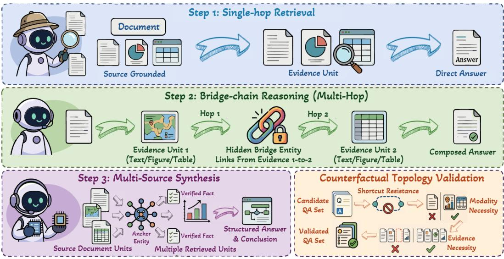
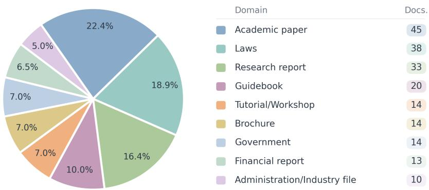
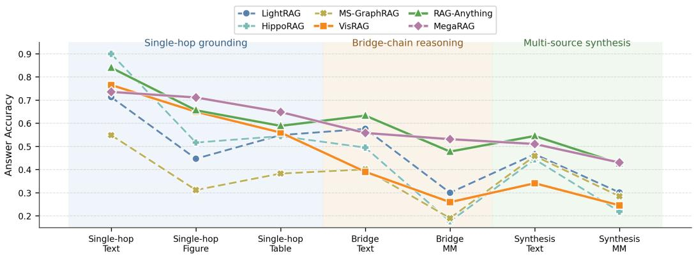
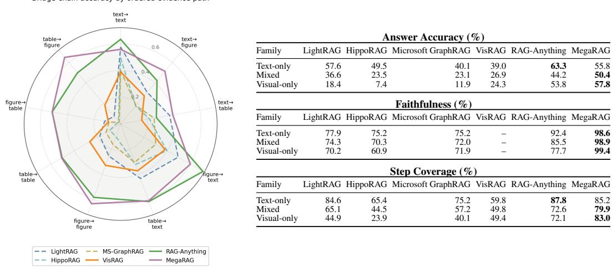
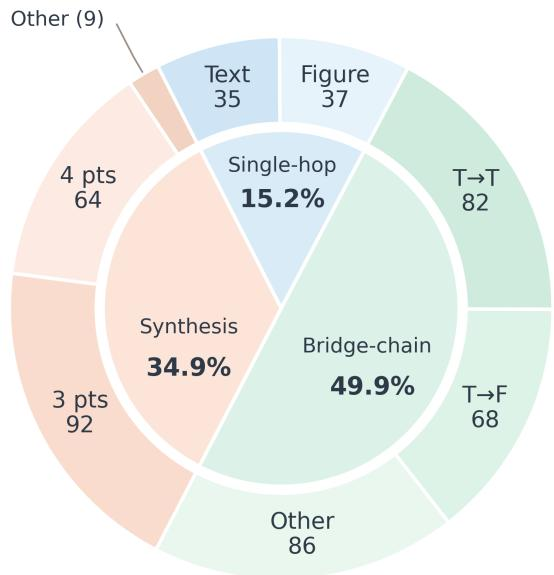

# TopoGraphRAG-Bench: Evaluating Multimodal GraphRAG on Layout-Grounded Evidence Reasoning

Ruochi Li1, Jianzhe Lin5,†, Haoxuan Zhang2, Haihua Chen3 Junhua Ding4, Edward Gehringer1,\*, Yang Zhang3,†,\*

1Department of Computer Science, North Carolina State University, USA 2Department of Information Science, University of North Texas, USA 3The Anuradha and Vikas Sinha Department of Data Science, University of North Texas, USA 4School of Computing, University of Wyoming, USA 5Independent Researcher

1{rli14, efg}@ncsu.edu 2{haoxuanzhang}@my.unt.edu 3{yang.zhang, haihua.chen}@unt.edu 4{junhua.ding}@uwyo.edu 5{jianzhelin}@meta.com

## Abstract

Real-world documents distribute evidence across text, tables, figures, and captions within complex page layouts. Answering complex questions over such documents therefore requires more than retrieving relevant passages: systems must recover the evidence topology that connects heterogeneous evidence units. Existing GraphRAG evaluations remain largely text-centered, while multimodal document RAG benchmarks assess cross-modal retrieval and generation without directly evaluating recovery of the intended evidence topology. We introduce TOPOGRAPHRAG-BENCH, a layout-grounded benchmark for multimodal evidence reasoning in GraphRAG, comprising 2,024 questions over 201 long, visually rich documents. Questions are constructed bottom-up from text, figure, and table evidence units under three controlled topologies: single-hop retrieval, bridgechain reasoning, and multi-source synthesis. To ensure that questions preserve their intended structure, we apply counterfactual validation for shortcut resistance, modality necessity, and evidence necessity. We evaluate text-only GraphRAG, page-level visual retrieval, and multimodal GraphRAG systems using retrieval, generation, and topology-aware reasoning metrics. Multimodal GraphRAG systems achieve the strongest overall performance, but still fail when visual-textual evidence alignment or multi-unit composition is incomplete. Text-only GraphRAG struggles when key dependencies are grounded in figures or tables, while pagelevel visual retrieval lacks the fine-grained structure needed for topology recovery. These findings motivate GraphRAG systems that move beyond text-derived entity relation graphs to explicitly model document layouts, cross-modal evidence alignment, and the reasoning roles of evidence units. Code and data are available at https://richardlrc.github.io/TopoGraphRAG-Bench/.

## 1 Introduction

Recent advances in multimodal large language models and retrieval-augmented generation have reshaped how intelligent systems interact with complex documents, where evidence is often distributed across prose, tables, figures, charts, captions, and layout structures. Prior work on document visual question answering, multimodal QA, and long-document understanding has shown that answering document questions often requires grounding in textual, tabular, and visual sources across pages and layouts [14, 20, 13]. However, many information needs go beyond single-fact retrieval from one passage, table cell, or figure caption. Complex questions often require connecting multiple pieces of evidence [23, 21]: one unit may reveal an intermediate entity or condition that determines which subsequent unit is relevant, while several units may jointly support a comparison, summary, or higher-level pattern. In these cases, the retrieval objective shifts from finding isolated relevant evidence to recovering the dependency structure among evidence units. We therefore view complex document retrieval as a structure-recovery problem: the system must identify relevant evidence units as well as the entities, relations, and higher-order connections that bind them together.

GraphRAG has emerged as a promising paradigm for this structure-recovery view of retrieval by organizing textual chunks, entities, relations, and summaries into graph structures that support longrange dependency modeling, multi-hop reasoning, and synthesis beyond local similarity search. Existing GraphRAG benchmarks evaluate graph construction, knowledge retrieval, and generation across tasks such as fact retrieval, complex reasoning, contextual summarization, and creative generation [26]. However, these evaluations remain largely text-centered: the evidence graph is typically built from textual chunks, entities, or textual summaries. In parallel, document-centric multimodal RAG benchmarks such as MMDocRAG, UniDoc-Bench, and REAL-MM-RAG have advanced multimodal page retrieval, evidence selection, quote selection, and answer generation over text, figures, and tables [2, 17, 24]. Yet these benchmarks are not designed to diagnose whether systems recover the intended evidence topology across multimodal document layouts. This leaves open the core question for multimodal GraphRAG: whether graph-structured retrieval can recover and support reasoning over layout-grounded multimodal evidence structures, rather than being limited to text-derived entities and chunks.

To study this question, we introduce a layout-grounded benchmark for multimodal evidence reasoning in GraphRAG. Rather than generating complex questions directly from whole documents, we construct them bottom up: atomic questions are generated from layout-grounded evidence units and then composed through explicit evidence links into three reasoning topologies, single-hop retrieval, bridge-chain reasoning, and multi-source synthesis. We further apply counterfactual validation for shortcut resistance, modality necessity, and evidence necessity, so that each instance preserves its intended evidence structure. The resulting benchmark contains 2,024 questions across 201 documents, including 302 single-hop, 1,014 bridge-chain, and 708 synthesis questions, with 773 cross-modal instances. We evaluate text-only GraphRAG, VisRAG-style page retrieval, and multimodal GraphRAG systems using retrieval and generation metrics. Results show that multimodal GraphRAG systems perform best overall, but each paradigm faces distinct limitations: text-only GraphRAG misses visual and tabular dependencies, page-level visual retrieval struggles with fine-grained evidence topology, and multimodal GraphRAG remains limited by modality alignment failures and incomplete synthesis across heterogeneous evidence.

In summary, our contributions are:

• Topology-aware multimodal GraphRAG benchmark. We introduce TOPOGRAPHRAG-BENCH, a layout-grounded benchmark with 2,024 QA pairs over 201 long documents, covering single-hop retrieval, bridge-chain reasoning, and multi-source synthesis across text, figures, and tables.

• Bottom-up evidence-topology construction. We construct questions from verifiable layoutgrounded evidence units rather than whole-document prompts, and use counterfactual validation to enforce shortcut resistance, modality necessity, and evidence necessity.

• Diagnostic evaluation of GraphRAG paradigms. We evaluate text-only GraphRAG, pagelevel visual retrieval, and multimodal GraphRAG systems, showing that current systems still struggle with cross-modal alignment and fine-grained evidence-topology recovery.

## 2 Related Work

GraphRAG methods and benchmarks. GraphRAG extends retrieval augmented generation by organizing information into graph structures over chunks, entities, relations, communities, or summaries, enabling retrieval beyond local similarity search. Representative systems include hierarchical or community-based retrieval methods such as RAPTOR and Microsoft GraphRAG, graph-indexed systems such as LightRAG, personalized PageRank-based methods such as HippoRAG, and KGor GNN-based systems such as G-Retriever, GFM-RAG, and ToG [18, 3, 5, 7, 8, 12, 19]. Recent GraphRAG benchmarks evaluate whether graph-based retrieval improves fact retrieval, complex reasoning, contextual summarization, and generation over conventional RAG [26, 30]. However, these evaluations remain largely text-centred, with graphs constructed from textual chunks, entities, relations, or summaries, leaving multimodal document evidence structures underexplored.

Multimodal document RAG benchmarks. Document understanding benchmarks have evolved from single-page DocVQA tasks to long-document and retrieval-augmented settings [14, 15, 31, 22, 13, 32]. Recent multimodal document RAG benchmarks further evaluate retrieval and generation across pages, layouts, figures, tables, and screenshots. MMDocRAG introduces multi-page crossmodal evidence chains, quote selection, and multimodal answer generation; UniDoc Bench compares text-only, image-only, fusion, and joint retrieval paradigms; REAL MM RAG emphasizes realistic multimodal retrieval queries and accurate labeling; and MMDocIR and ViDoRe focus on multimodal document retrieval [2, 17, 24, 1, 11]. These works provide strong multimodal evaluation settings, but they are not primarily designed to diagnose whether graph structured retrieval can recover evidence topologies across multimodal document layouts.

Multi-evidence reasoning and question construction. Multi-hop QA benchmarks such as HotpotQA, 2WikiMultiHopQA, MuSiQue, and MultiHop RAG show that complex questions often require connecting multiple pieces of evidence rather than retrieving a single fact [28, 9, 23, 21]. Multimodal benchmarks extend this idea to text, tables, images, charts, and long documents, including MultiModalQA, CHARGE, BRIDGE, and DocHop QA [20, 27, 25, 16]. Building on these foundations, we construct questions directly from layout-grounded evidence units in complete documents, retaining their page, layout, modality, and reasoning roles. Our benchmark covers both entity-mediated bridge chains and synthesis over 3–6 complementary evidence points, with topologyspecific checks of evidence necessity. These annotations link the required reasoning structure to retrievable document evidence, supporting separate evaluation of evidence retrieval and evidence composition in multimodal GraphRAG.

## 3 Benchmark

## 3.1 Construction

Pipeline overview. Figure 1 summarizes our benchmark construction pipeline. Starting from layoutgrounded document units, we build evidence units, identify shared entities as cross-layout anchors, generate questions under three controlled evidence topologies, and apply counterfactual topology validation to remove shortcut questions, pseudo-multimodal questions, and synthesis questions that do not require multiple evidence sources.

Layout-grounded evidence units. We build our benchmark on MMDocIR [1], a multimodal document retrieval corpus of long, visually rich documents, and randomly sample 201 documents from the original collection. Following MMDocIR, we reinterpret layout-level “quotes” as layoutgrounded evidence units. Textual units retain their original text, while visual units, including figures and tables, preserve the original image and are augmented with OCR and VLM descriptions. Each unit keeps its document ID, page ID, layout ID, modality label, and semantic representation for entity extraction, evidence linking, and question construction.

The 201 documents cover nine of MMDocIR’s ten application domains. Figure 2 shows their distribution using the original MMDocIR domain labels.

Anchor discovery. Inspired by MuSiQue’s bottom-up strategy for constructing multi-hop questions from connected single-hop questions [23], we adapt this principle to multimodal document layouts. Instead of prompting an LLM over an entire document, we construct questions over explicit evidence topologies: isolated units support direct retrieval questions, entity-linked units form bridge-chain questions, and complementary evidence sets support multi-source synthesis.

For each evidence unit, we extract salient entities and concepts using an LLM. Textual units are processed from their original text, whereas visual units are represented by captions, topics, OCR outputs, and VLM descriptions. The entity schema covers people, organizations, demographic groups, locations, dates, numerical values, metrics, and other domain-specific concepts. We normalize entity mentions and apply fuzzy matching to identify recurring entities across evidence units. These recurring entities serve as semantic anchors for evidence-grounded question composition, and their page and modality distributions allow us to construct single-page, cross-page, and cross-modal instances.

  
Figure 1: Overview of the TopoGraphRAG benchmark construction and validation pipeline. Starting from layout-grounded document evidence units, the pipeline constructs single-hop, bridge-chain, and multi-source synthesis QA instances, and then applies counterfactual topology validation to test shortcut resistance, modality necessity, and evidence necessity.

  
Figure 2: Domain distribution of the 201 documents used to construct TOPOGRAPHRAG-BENCH. Slices show the percentage of documents in each domain, and the legend reports document counts.

Single-hop retrieval construction. Single-hop questions are constructed from individual text, figure, or table units to evaluate local evidence grounding without compositional dependency. The gold evidence set is restricted to the source unit, and the answer must be recoverable without consulting any other layout in the document.

Bridge-chain construction. Bridge-chain questions are constructed by composing two atomic QA pairs through a shared entity. The bridge QA asks for the shared entity indirectly, without mentioning its surface form, while the target QA explicitly mentions that entity and asks about an attribute, value, trend, or relation grounded in another evidence unit. An LLM then rewrites the target question by

<table><tr><td>Statistic</td><td>Number</td></tr><tr><td>Documents</td><td>201</td></tr><tr><td>- Pages/doc - Evidence units/doc</td><td>45.5 / 27 / 318 335.1 / 207 / 2,423</td></tr><tr><td>Total Questions</td><td></td></tr><tr><td>- Single-hop</td><td>2,024 302 (14.9%)</td></tr><tr><td>- Bridge-chain</td><td>1,014 (50.1%)</td></tr><tr><td>- Synthesis</td><td>708 (35.0%)</td></tr><tr><td>Evidence Distribution</td><td></td></tr><tr><td>- Cross-page</td><td>1,596 (78.9%)</td></tr><tr><td></td><td></td></tr><tr><td>- Cross-modal</td><td>773 (38.2%)</td></tr><tr><td>- Figure/table-required</td><td>1,353 (66.8%)</td></tr><tr><td>- Gold evidence units</td><td>2.3 / 2 / 6</td></tr><tr><td>- Gold pages</td><td>2.1 / 2 / 6</td></tr><tr><td>Evidence Modality</td><td></td></tr><tr><td>Text-only</td><td>671 (33.2%)</td></tr><tr><td>Figure-only</td><td>334 (16.5%)</td></tr><tr><td>Table-only</td><td>246 (12.2%)</td></tr><tr><td>Cross-modal</td><td>773 (38.2%)</td></tr></table>

<table><tr><td colspan="2">Single-hop</td><td colspan="2">Synthesis</td></tr><tr><td>Modality</td><td>N</td><td>Category</td><td>N</td></tr><tr><td>Figure-only Table-only Text-only</td><td>122 113 67</td><td>Text-only Cross-modal Figure-only Table-only</td><td>267 259 113 69</td></tr><tr><td>2-hop Bridge</td><td></td><td>Synthesis Sources</td><td></td></tr><tr><td>Path</td><td>N</td><td>Sources</td><td>N</td></tr><tr><td>text→text text→figure text→table figure→figure table→table figure→text figure→table table→text</td><td>64 62 54</td><td>337 3 evidence units 204 4 evidence units 119 5 evidence units 99 6 evidence units</td><td>575 101 23 9</td></tr></table>

Note: Slash-separated values denote average / median / maximum. Bridge paths are ordered by hop sequence.

Table 1: Dataset statistics and fine-grained evidence topology.

replacing the explicit entity mention with the indirect description from the bridge QA, producing a fluent multi-hop question with a controlled bridge dependency.

Multi-source synthesis construction. Synthesis questions are constructed to evaluate evidence aggregation beyond a single bridge chain. Starting from shared entities, we select information-rich entities that occur in at least five evidence units and extract concrete facts from each occurrence; for figures and tables, the original image is additionally provided to a VLM to improve numerical and structural fidelity. After removing near-duplicate facts, we retain entities with at least three distinct evidence facts and ask an LLM to identify higher-level patterns such as trends, contradictions, causal implications, group comparisons, and summary-level observations. Each resulting question is paired with a structured answer that links evidence points to specific layouts and modalities, followed by a concise synthesis conclusion.

## 3.2 Quality Assurance

The construction pipeline uses counterfactual validation to ensure that each instance preserves its intended evidence topology rather than degenerating into an easier retrieval case. Question generation, answer generation, and quality assessment are decoupled into independent LLM calls. For bridgechain candidates, we verify that the bridge entity is not revealed in the composed question, that the final answer is not identical to the bridge entity, and that the two hops form a coherent dependency. We then test single-source counterfactuals by providing only the first-hop or second-hop evidence; instances that remain answerable from either source alone are removed as pseudo-multihop cases.

We also test modality dependence and evidence necessity. For cross-modal questions, we replace the multimodal context with text-only context and remove cases that remain answerable without figures or tables. For synthesis questions, we conduct leave-one-out ablations over supporting evidence points and retain only instances with at least three required evidence points.

After automatic filtering, two PhD-level reviewers with experience in multimodal LLMs and retrievalaugmented generation conducted a stratified manual audit of 303 questions (15.0% of the benchmark), including targeted borderline cases. The audit was stratified by reasoning topology and evidence modality. Reviewers independently assigned binary validity judgments based on answer correctness, evidence grounding, attribution accuracy, modality necessity, and topology consistency, with topology-specific checks for bridge-chain and synthesis questions. The reviewers achieved substantial agreement (Cohen’s κ = 0.84). Disagreements were resolved through discussion, and audited instances were revised or removed when their evidence or topology requirement was not valid. After automatic validation and manual quality assurance, the strict benchmark contains 2,024 questions across 201 documents, with approximately 15% single-hop retrieval, 50% bridge-chain reasoning, and 35% multi-source synthesis.

## 4 Task Definition

Given a multimodal document collection, the task is to answer a question by retrieving and reasoning over layout-grounded evidence units. Each document is represented as a set of evidence units $\mathcal { D } = \{ u _ { i } \} _ { i = 1 } ^ { N }$ , where each unit is associated with a modality $m _ { i } ~ \in ~ \{ \mathrm { t e x t } $ , figure, table}, a page index, a layout identifier, and a semantic representation derived from text, OCR, captions, or visual descriptions. For each question $q ,$ the benchmark provides a gold answer $\mathit { a _ { q } } ,$ a set of supporting evidence units $\mathcal { E } _ { q } ^ { \mathrm { ~ ~ } }$ , and a reasoning type $\tau _ { q } \in$ {single-hop, bridge-chain, synthesis}.

Unlike standard document QA settings, where target evidence is often treated as an unordered set of relevant passages, this benchmark evaluates whether a system can recover and use the intended evidence structure. In single-hop questions, the answer is grounded in one evidence unit. In bridge-chain questions, evidence units form an ordered dependency path: an earlier hop resolves an intermediate entity or condition that determines which later evidence unit is relevant. In synthesis questions, multiple evidence units jointly support a higher-level conclusion, and no single source is sufficient to recover the full answer.

## 4.1 Retrieval Task and Metrics

The retrieval stage takes a question $q$ and the document’s evidence-unit set D as input, and returns a ranked set of candidate contexts $\mathcal { R } _ { q } = \{ r _ { 1 } , r _ { 2 } , . . . , r _ { k } \}$ The returned contexts may be textual chunks, graph nodes, entity or relation descriptions, multimodal summaries, or page-level visual contexts, depending on the retrieval system. The retrieval objective is not merely to find evidence related to the final answer, but to retrieve the evidence units and intermediate links required by the intended evidence structure.

For single-hop questions, successful retrieval requires covering the source evidence unit. For bridgechain questions, retrieval should cover both the bridge evidence and the target evidence, including the intermediate bridge entity that links the two hops. For synthesis questions, retrieval should cover the required evidence points that jointly support the synthesis conclusion. Thus, retrieval is evaluated as evidence-structure recovery rather than flat relevance ranking.

Retrieval quality is evaluated using RAGAS context precision and context recall [4], instantiated with topology-enriched references. Context precision measures whether relevant contexts are ranked ahead of irrelevant ones, while context recall measures how much required reference information is covered by the retrieved contexts. To make these metrics sensitive to compositional evidence requirements, we expand the reference beyond the final answer: bridge-chain questions include reasoning traces and bridge entities, while synthesis questions include required evidence points. This enriched reference penalizes retrieval outputs that recover only final-hop evidence while missing bridge evidence or partially covering synthesis support. Formal metric definitions are provided in Appendix B.

## 4.2 Generation Task and Metrics

The generation stage receives the question q and the retrieved contexts $\mathcal { R } _ { q } .$ , and produces an answer $\hat { a } _ { q } .$ A correct response must satisfy both answer-level and structure-level requirements: it should match the gold answer or synthesis conclusion, and it should be grounded in the retrieved evidence while covering the reasoning steps required by the question. This distinction is important for compositional document reasoning. A model may produce the correct final answer while omitting the bridge entity, skipping an intermediate hop, or relying on only one evidence source in a synthesis question. Conversely, a model may retrieve or mention relevant evidence but fail to combine it into the correct final answer. The generation task therefore evaluates answer correctness, evidence grounding, response relevance, and reasoning-step completion.

Generation quality is evaluated using answer accuracy, faithfulness, response relevancy, and step coverage. Answer accuracy measures agreement between the generated answer and the gold answer. Faithfulness measures whether generated claims are supported by the retrieved contexts, and response relevancy measures whether the response addresses the question. Step coverage evaluates whether the response covers the reasoning steps specified by the question structure. For bridge-chain questions, this includes identifying the bridge entity and conveying the corresponding target-hop result. For synthesis questions, this includes covering the required evidence points that support the intended synthesis conclusion. Formal metric definitions and the judging protocol are provided in Appendix B.

<table><tr><td rowspan="2">System</td><td colspan="2">Retrieval</td><td colspan="4">Generation</td></tr><tr><td>Context Precision</td><td>Context Recall</td><td>Answer Accuracy</td><td>Faithfulness</td><td>Response Relevancy</td><td>Step Coverage</td></tr><tr><td>LightRAG</td><td>0.6952</td><td>0.6353</td><td>0.4045</td><td>0.7317</td><td>0.7269</td><td>0.6031</td></tr><tr><td>HippoRAG</td><td>0.3834</td><td>0.4353</td><td>0.3388</td><td>0.6517</td><td>0.5924</td><td>0.3952</td></tr><tr><td>Microsoft GraphRAG</td><td>0.6018</td><td>0.5839</td><td>0.3111</td><td>0.6802</td><td>0.6754</td><td>0.5402</td></tr><tr><td>VisRAG</td><td></td><td></td><td>0.3459</td><td></td><td>0.7688</td><td>0.4337</td></tr><tr><td>RAG-Anything</td><td>0.8093</td><td>0.7215</td><td>0.5300</td><td>0.8346</td><td>0.7808</td><td>0.7010</td></tr><tr><td>MegaRAG</td><td>0.7125</td><td>0.6632</td><td>0.5350</td><td>0.9930</td><td>0.8172</td><td>0.7329</td></tr></table>

Table 2: Overall retrieval and generation performance on 2,024 questions. Retrieval metrics are RA-GAS context precision and context recall. Step coverage is computed over bridge-chain and synthesis questions only. VisRAG is omitted from the text-based retrieval evaluation, and its faithfulness is not reported because its retrieved context is page-level visual input rather than textual or structured evidence strings. Approximate 95% confidence intervals are reported in Appendix C.

## 5 Experiments

## 5.1 Experimental Setup

Evaluated systems. We evaluate six retrieval-augmented systems grouped by how they represent document evidence. The text-only GraphRAG baselines, LightRAG, HippoRAG, and Microsoft GraphRAG [5, 7, 3], construct graphs from textual chunks, entities, relations, or summaries, testing how far text-derived graph retrieval can support layout-grounded multimodal reasoning. VisRAG [29] represents page-level visual retrieval and tests whether direct access to document page images is sufficient for layout-rich questions. The multimodal GraphRAG systems, RAG-Anything and MegaRAG [6, 10], incorporate visual, tabular, and textual evidence into graph-structured retrieval. Together, these systems compare text-derived graphs, page-level visual retrieval, and multimodal graph structures under the same benchmark topologies.

Model configuration. We fix the model backends within each system family. Text-only GraphRAG systems use Qwen3-30B-A3B-Instruct with Qwen3-Embedding-8B. VisRAG uses Qwen3-VL-30B-A3B-Instruct for generation and VisRAG-Ret for page-image retrieval. Multimodal GraphRAG systems use Qwen3-VL-30B-A3B-Instruct with Qwen3-VL-Embedding-8B. All LLM-based evaluation metrics use Qwen3.5-35B-A3B as the judge. Detailed indexing, retrieval, and backend configurations are provided in Appendix A. Cross-judge analyses and a human spot-check of step coverage are reported in Appendix B.2.

Evaluation organization. We first report aggregate retrieval and generation results, then analyze performance by reasoning topology, ordered bridge path, and synthesis composition. Additional uncertainty estimates and complete fine-grained breakdowns are provided in Appendix C.

## 5.2 Main Results

Table 2 reports aggregate retrieval and generation performance. Multimodal GraphRAG systems achieve the strongest overall generation results. MegaRAG obtains the highest point estimates for answer accuracy, faithfulness, response relevancy, and step coverage, while RAG-Anything achieves the best retrieval scores and comparable answer accuracy. Among text-only GraphRAG baselines, LightRAG performs best overall, but remains below the multimodal GraphRAG systems on all generation metrics.

Retrieval and generation do not produce identical system rankings. RAG-Anything has the highest context precision and context recall, whereas MegaRAG achieves stronger faithfulness, response relevancy, and step coverage. This gap suggests that layout-grounded multimodal reasoning depends not only on retrieving relevant evidence, but also on aligning and composing the retrieved evidence according to the intended topology.

  
Figure 3: Capability profile across reasoning topology and evidence modality. Dashed lines denote text-only GraphRAG systems, while solid lines denote visual or multimodal retrieval systems. Bridge-MM aggregates mixed-modality and visual-only bridge-chain questions, and Synthesis-MM aggregates figure-only, table-only, and cross-modal synthesis questions.

VisRAG highlights a complementary limitation of page-level visual retrieval. Although it provides direct access to page images, its answer accuracy and step coverage remain substantially below those of multimodal GraphRAG systems. This suggests that page-level visual context alone is insufficient for reliable reasoning over fine-grained layout units and cross-modal evidence dependencies. We next analyze these trends by reasoning topology, bridge path, and synthesis composition.

## 5.3 Topology and Modality

Figure 3 shows answer accuracy across topology- and modality-conditioned subsets. Performance generally declines as questions move from local grounding to structured multimodal reasoning. Text-only systems can perform strongly when the required evidence is purely textual: HippoRAG reaches 0.90 accuracy on single-hop text questions. However, the same systems degrade sharply on multimodal bridge-chain questions. HippoRAG drops from 0.90 on single-hop text to 0.17 on Bridge-MM, while LightRAG drops from 0.71 to 0.30. This suggests that strong text-centered graph retrieval does not translate into robust recovery of cross-modal evidence dependencies.

VisRAG performs competitively on single-hop visual questions, achieving 0.65 on figure questions and 0.56 on table questions. However, its accuracy falls to 0.26 on Bridge-MM and 0.25 on Synthesis MM, indicating that page-level visual retrieval alone does not reliably recover fine-grained evidence topology. In contrast, multimodal GraphRAG systems show a more stable profile on compositional multimodal subsets. RAG-Anything reaches 0.48 on Bridge-MM and 0.43 on Synthesis-MM, while MegaRAG reaches 0.53 and 0.43, respectively. Additional retrieval-side results by reasoning topology are reported in Appendix C. Overall, these results indicate that multimodal document reasoning requires not only access to visual evidence, but also a mechanism for connecting heterogeneous evidence units.

## 5.4 Bridge Paths

Figure 4 analyzes bridge-chain questions from two views: path-level answer accuracy and familylevel reasoning metrics. The radar plot shows that bridge-chain difficulty depends strongly on the ordered modality sequence. Text→text paths are relatively easier: LightRAG, HippoRAG, RAG-Anything, and MegaRAG achieve 57.6%, 49.5%, 63.3%, and 55.8% accuracy, respectively. In contrast, paths requiring visual or tabular bridge grounding are much harder for text-only GraphRAG systems. LightRAG drops to 12.0% on figure→table and 7.5% on table→figure, while HippoRAG and Microsoft GraphRAG remain below 10% on both paths.

  
Figure 4: Bridge-chain reasoning across ordered evidence paths and metric families. The radar plot shows path-level answer accuracy. The tables summarize answer accuracy, faithfulness, and step coverage by bridge evidence family. Faithfulness for VisRAG is omitted because its retrieved context is represented as page-level visual input rather than textual evidence strings.

The summary tables show that this degradation is not limited to final-answer accuracy. On text→text paths, LightRAG obtains 84.6% step coverage, but drops to 44.9% on visual-only paths. HippoRAG declines more sharply, from 65.4% to 23.9%. This indicates that text-only GraphRAG systems often fail to recover or express the required hop structure when the bridge dependency is grounded in figures or tables.

VisRAG improves access to visual page content, but does not solve bridge dependency recovery. It reaches 32.9% accuracy on figure→figure and 26.6% on table→table, but only 9.3% on figure→table and 18.3% on table→figure. Its step coverage also remains below 50% on mixed and visual-only bridge families. These results suggest that page-level visual retrieval can expose relevant visual evidence, but does not reliably identify the specific layout unit linked by the bridge entity.

Multimodal GraphRAG systems are more robust. RAG-Anything and MegaRAG reach 51.8% accuracy on figure→table, and MegaRAG reaches 65.0% on table→figure. At the family level, MegaRAG achieves 83.0% step coverage on visual-only bridge paths, compared with 44.9% for LightRAG and 49.4% for VisRAG. These gains indicate that multimodal graph structures help preserve dependencies between heterogeneous evidence units. However, the remaining variation across ordered paths shows that modality alignment remains a central bottleneck for bridge-chain reasoning. Complete path-level accuracy and step-coverage results are reported in Appendix C.

## 5.5 Multi-Source Synthesis

Table 3 reports synthesis accuracy by evidence composition. Synthesis questions supported only by textual evidence are consistently easier than those requiring visual, tabular, or cross-modal evidence. For example, LightRAG reaches 46.6% accuracy on text-only synthesis but drops to 27.4% on cross-modal synthesis, while HippoRAG drops from 44.4% to 18.4%. This shows that synthesis difficulty is not only a function of aggregating multiple facts; it also depends on whether those facts are grounded in heterogeneous document units.

<table><tr><td>Composition</td><td>LightRAG</td><td>HippoRAG</td><td>Microsoft GraphRAG</td><td>VisRAG</td><td>RAG-Anything</td><td>MegaRAG</td></tr><tr><td>Text-only</td><td>46.6</td><td>44.4</td><td>45.9</td><td>34.1</td><td>54.5</td><td>51.0</td></tr><tr><td>Figure-only</td><td>36.3</td><td>29.2</td><td>31.9</td><td>30.3</td><td>46.2</td><td>46.7</td></tr><tr><td>Table-only</td><td>30.1</td><td>22.8</td><td>27.5</td><td>22.1</td><td>34.4</td><td>38.4</td></tr><tr><td>Cross-modal</td><td>27.4</td><td>18.4</td><td>27.2</td><td>22.7</td><td>43.2</td><td>42.7</td></tr></table>

Table 3: Answer accuracy on synthesis questions by evidence composition.

VisRAG does not close this gap despite direct access to page-level visual inputs. It obtains 30.3% accuracy on figure-only synthesis, 22.1% on table-only synthesis, and 22.7% on cross-modal synthesis, suggesting that page-level visual retrieval is insufficient for aggregating multiple fine-grained evidence points. Multimodal GraphRAG systems are more robust across evidence compositions: RAG-Anything achieves 43.2% accuracy on cross-modal synthesis, while MegaRAG reaches 38.4% on table-only and 42.7% on cross-modal synthesis. However, both systems still trail their textonly synthesis performance, indicating that heterogeneous evidence aggregation remains a central challenge. A complementary breakdown by synthesis pattern is provided in Appendix C.

## 6 Conclusion

In this paper, we presented a layout-grounded benchmark for evaluating multimodal evidence reasoning in GraphRAG. The benchmark contains 2,024 QA pairs across 201 long and layoutrich documents, with evidence grounded in text, figures, tables, and document layouts. It covers three controlled evidence topologies: single-hop retrieval, bridge-chain reasoning, and multi-source synthesis. Through a bottom-up construction pipeline and counterfactual validation, the benchmark is designed to test whether systems can recover and use the intended evidence structure rather than rely on shortcut retrieval or single-source evidence. Through evaluations of text-only GraphRAG, pagelevel visual retrieval, and multimodal GraphRAG systems, we show that current systems still face substantial challenges in layout-grounded multimodal reasoning. Multimodal GraphRAG systems achieve the strongest overall performance, but their gains are conditional on correctly grounding visual and tabular evidence, aligning evidence across modalities, and composing multiple evidence units into complete reasoning steps. Text-only GraphRAG remains limited when key dependencies are grounded outside text, while VisRAG-style page retrieval does not reliably recover fine-grained evidence topology. These results suggest that a significant gap remains between current multimodal retrieval systems and the needs of topology-aware document reasoning. We hope this benchmark will support future work on GraphRAG systems that model not only textual entities and relations, but also layout structure, modality alignment, and the reasoning roles of evidence units.

## References

[1] Kuicai Dong, Yujing Chang, Derrick Goh Xin Deik, Dexun Li, Ruiming Tang, and Yong Liu. Mmdocir: Benchmarking multimodal retrieval for long documents. In Proceedings ofthe 2025 Conference on Empirical Methods in Natural Language Processing, pages 30959–30993, 2025.

[2] Kuicai Dong, Yujing Chang, Shijie Huang, Yasheng Wang, Ruiming Tang, and Yong Liu. Benchmarking retrieval-augmented multimodal generation for document question answering. arXiv preprint arXiv:2505.16470, 2025.

[3] Darren Edge, Ha Trinh, Newman Cheng, Joshua Bradley, Alex Chao, Apurva Mody, Steven Truitt, Dasha Metropolitansky, Robert Osazuwa Ness, and Jonathan Larson. From local to global: A graph rag approach to query-focused summarization. arXiv preprint arXiv:2404.16130, 2024.

[4] Shahul Es, Jithin James, Luis Espinosa Anke, and Steven Schockaert. Ragas: Automated evaluation of retrieval augmented generation. In Proceedings of the 18th conference of the european chapter of the association for computational linguistics: system demonstrations, pages 150–158, 2024.

[5] Zirui Guo, Lianghao Xia, Yanhua Yu, and Chao Huang. Lightrag: Simple and fast retrievalaugmented generation.

[6] Zirui Guo, Xubin Ren, Lingrui Xu, Jiahao Zhang, and Chao Huang. Rag-anything: All-in-one rag framework. arXiv preprint arXiv:2510.12323, 2025.

[7] Bernal J Gutiérrez, Yiheng Shu, Yu Gu, Michihiro Yasunaga, and Yu Su. Hipporag: Neurobiologically inspired long-term memory for large language models. Advances in neural information processing systems, 37:59532–59569, 2024.

[8] Xiaoxin He, Yijun Tian, Yifei Sun, Nitesh V Chawla, Thomas Laurent, Yann LeCun, Xavier Bresson, and Bryan Hooi. G-retriever: Retrieval-augmented generation for textual graph understanding and question answering. Advances in Neural Information Processing Systems, 37:132876–132907, 2024.

[9] Xanh Ho, Anh-Khoa Duong Nguyen, Saku Sugawara, and Akiko Aizawa. Constructing a multi-hop qa dataset for comprehensive evaluation of reasoning steps. In Proceedings of the 28th International Conference on Computational Linguistics, pages 6609–6625, 2020.

[10] Chi-Hsiang Hsiao, Yi-Cheng Wang, Tzung-Sheng Lin, Yi-Ren Yeh, and Chu-Song Chen. Megarag: Multimodal knowledge graph-based retrieval augmented generation. arXiv preprint arXiv:2512.20626, 2025.

[11] António Loison, Quentin Macé, Antoine Edy, Victor Xing, Tom Balough, Gabriel Moreira, Bo Liu, Manuel Faysse, Céline Hudelot, and Gautier Viaud. Vidore v3: A comprehensive evaluation of retrieval augmented generation in complex real-world scenarios. arXiv preprint arXiv:2601.08620, 2026.

[12] Linhao Luo, Zicheng Zhao, Gholamreza Haffari, Dinh Phung, Chen Gong, and Shirui Pan. Gfm-rag: Graph foundation model for retrieval augmented generation. In The Thirty-ninth Annual Conference on Neural Information Processing Systems.

[13] Yubo Ma, Yuhang Zang, Liangyu Chen, Meiqi Chen, Yizhu Jiao, Xinze Li, Xinyuan Lu, Ziyu Liu, Yan Ma, Xiaoyi Dong, et al. Mmlongbench-doc: Benchmarking long-context document understanding with visualizations. Advances in Neural Information Processing Systems, 37: 95963–96010, 2024.

[14] Minesh Mathew, Dimosthenis Karatzas, and CV Jawahar. Docvqa: A dataset for vqa on document images. In Proceedings of the IEEE/CVF winter conference on applications of computer vision, pages 2200–2209, 2021.

[15] Minesh Mathew, Viraj Bagal, Rubèn Tito, Dimosthenis Karatzas, Ernest Valveny, and CV Jawahar. Infographicvqa. In Proceedings of the IEEE/CVF Winter Conference on Applications of Computer Vision, pages 1697–1706, 2022.

[16] Jiwon Park, Seohyun Pyeon, Jinwoo Kim, Rina Carines Cabal, Yihao Ding, and Soyeon Caren Han. Dochop-qa: Towards multi-hop reasoning over multimodal document collections. arXiv preprint arXiv:2508.15851, 2025.

[17] Xiangyu Peng, Can Qin, Zeyuan Chen, Ran Xu, Caiming Xiong, and Chien-Sheng Wu. Unidoc-bench: A unified benchmark for document-centric multimodal rag. arXiv preprint arXiv:2510.03663, 2025.

[18] Parth Sarthi, Salman Abdullah, Aditi Tuli, Shubh Khanna, Anna Goldie, and Christopher D Manning. Raptor: Recursive abstractive processing for tree-organized retrieval. In The Twelfth International Conference on Learning Representations, 2024.

[19] Jiashuo Sun, Chengjin Xu, Lumingyuan Tang, Saizhuo Wang, Chen Lin, Yeyun Gong, Lionel Ni, Heung-Yeung Shum, and Jian Guo. Think-on-graph: Deep and responsible reasoning of large language model on knowledge graph. In The Twelfth International Conference on Learning Representations.

[20] Alon Talmor, Ori Yoran, Amnon Catav, Dan Lahav, Yizhong Wang, Akari Asai, Gabriel Ilharco, Hannaneh Hajishirzi, and Jonathan Berant. Multimodalqa: Complex question answering over text, tables and images. In International Conference on Learning Representations, 2021.

[21] Yixuan Tang and Yi Yang. Multihop-rag: Benchmarking retrieval-augmented generation for multi-hop queries. In First Conference on Language Modeling.

[22] Rubèn Tito, Dimosthenis Karatzas, and Ernest Valveny. Hierarchical multimodal transformers for multipage docvqa. Pattern Recognition, 144:109834, 2023.

[23] Harsh Trivedi, Niranjan Balasubramanian, Tushar Khot, and Ashish Sabharwal. Musique: Multihop questions via single-hop question composition. Transactions ofthe Associationfor Computational Linguistics, 10:539–554, 2022. doi: 10.1162/tacl\_a\_00475.

[24] Navve Wasserman, Roi Pony, Oshri Naparstek, Adi Raz Goldfarb, Eli Schwartz, Udi Barzelay, and Leonid Karlinsky. Real-mm-rag: A real-world multi-modal retrieval benchmark. In Proceedings of the 63rd Annual Meeting of the Association for Computational Linguistics (Volume 1: Long Papers), pages 31660–31683, 2025.

[25] Biao Xiang, Soyeon Caren Han, and Yihao Ding. Bridge: Benchmark for multi-hop reasoning in long multimodal documents with grounded evidence. arXiv preprint arXiv:2603.07931, 2026.

[26] Zhishang Xiang, Chuanjie Wu, Qinggang Zhang, Shengyuan Chen, Zijin Hong, Xiao Huang, and Jinsong Su. When to use graphs in rag: A comprehensive analysis for graph retrievalaugmented generation. arXiv preprint arXiv:2506.05690, 2025.

[27] Yuming Yang, Jiang Zhong, Li Jin, Jingwang Huang, Jingpeng Gao, Qing Liu, Yang Bai, Jingyuan Zhang, Rui Jiang, and Kaiwen Wei. Benchmarking multimodal rag through a chartbased document question-answering generation framework. arXiv preprint arXiv:2502.14864, 2025.

[28] Zhilin Yang, Peng Qi, Saizheng Zhang, Yoshua Bengio, William Cohen, Ruslan Salakhutdinov, and Christopher D Manning. Hotpotqa: A dataset for diverse, explainable multi-hop question answering. In Proceedings of the 2018 conference on empirical methods in natural language processing, pages 2369–2380, 2018.

[29] Shi Yu, Chaoyue Tang, Bokai Xu, Junbo Cui, Junhao Ran, Yukun Yan, Zhenghao Liu, Shuo Wang, Xu Han, Zhiyuan Liu, et al. Visrag: Vision-based retrieval-augmented generation on multi-modality documents. In The Thirteenth International Conference on Learning Representations.

[30] Yingli Zhou, Yaodong Su, Youran Sun, Shu Wang, Taotao Wang, Runyuan He, Yongwei Zhang, Sicong Liang, Xilin Liu, Yuchi Ma, et al. In-depth analysis of graph-based rag in a unified framework. arXiv preprint arXiv:2503.04338, 2025.

[31] Fengbin Zhu, Wenqiang Lei, Fuli Feng, Chao Wang, Haozhou Zhang, and Tat-Seng Chua. Towards complex document understanding by discrete reasoning. In Proceedings of the 30th ACM International Conference on Multimedia, pages 4857–4866, 2022.

[32] Anni Zou, Wenhao Yu, Hongming Zhang, Kaixin Ma, Deng Cai, Zhuosheng Zhang, Hai Zhao, and Dong Yu. Docbench: A benchmark for evaluating llm-based document reading systems. In Proceedings of the 4th International Workshop on Knowledge-Augmented Methods for Natural Language Processing, pages 359–373, 2025.

## Appendix Overview

The appendix includes the following sections:

• Appendix A: Reports baseline configuration and efficiency statistics, including indexing parameters, retrieval settings, runtime, token usage, and graph/index size.

• Appendix B: Provides additional details about evaluation metrics and topology-aware step coverage.

• Appendix C: Provides additional experimental results, including fine-grained synthesispattern performance.

• Appendix D: Discusses limitations of the benchmark scope, topology coverage, evaluated systems, and indexing cost.

• Appendix E: Describes license terms, data use, and the relationship between the upstream MMDocIR assets and the new annotations introduced in this work.

## A Baseline Configuration and Efficiency

This appendix reports the baseline configurations and efficiency statistics used in our experiments. We use each system’s official or framework-default indexing pipeline unless a parameter is explicitly specified in our evaluation wrapper. All systems are indexed independently at the document level. Text-only GraphRAG systems operate on original layout-grounded text chunks, VisRAG indexes page images, and multimodal GraphRAG systems index textual, tabular, and visual layout units through their native multimodal pipelines.

Table 5 reports the efficiency and graph-size statistics of the evaluated systems. We separate indexing time from retrieval and generation time because GraphRAG systems often move substantial computation to the offline indexing stage, where entities, relationships, communities, or multimodal graph structures are constructed. Runtime, token usage, and graph statistics are reported per document using the 201-document benchmark denominator. Missing entries indicate that the quantity is either not applicable to the system design or not recorded in the available artifact.

The efficiency profile highlights different cost-performance tradeoffs across systems. Textonly GraphRAG systems construct entity-relation graphs from textual chunks, while multimodal GraphRAG systems incur additional indexing and token costs from processing visual and tabular evi dence. RAG-Anything produces the largest graph and highest token usage, reflecting its multimodal extension over a LightRAG-style backbone. MegaRAG constructs a smaller multimodal graph but has higher retrieval cost due to its multimodal graph and page-level retrieval process. VisRAG has low indexing and retrieval cost because it indexes page images without constructing an entity-relation graph, but this also means it does not expose fine-grained graph statistics.

## B Evaluation Metrics and Topology-Aware Judging

## B.1 Metric Definitions and Judging Protocol

For each question q, the benchmark provides a gold answer $\textstyle a _ { q } ,$ a set of gold evidence units $\mathcal { E } _ { q } ,$ and a reasoning topology $\tau _ { q } \in$ {single, bridge, synthesis}. A system returns an ordered list of retrieved contexts $\mathcal { R } _ { q } = ( r _ { 1 } , \ldots \stackrel { \cdot } { , } r _ { K } )$ and a generated answer $\hat { a } _ { q }$

<table><tr><td>System</td><td>Input unit</td><td>Indexing / graph construction</td><td>Retrieval configuration Model / retriever</td><td></td></tr><tr><td>LightRAG</td><td>Text layout chunks</td><td>Default LightRAG indexing pipeline for construct- Mixed retrieval mode; Qwen3-30B-A3B- ing a text-derived graph over chunks, entities, and top-k = 3 relations</td><td></td><td>Instruct; Qwen3- Embedding-8B</td></tr><tr><td>HippoRAG</td><td>Text layout chunks</td><td>Default HippoRAG indexing pipeline over text Default retrieval; top- Qwen3-30B-A3B- chunks and its native retrieval graph</td><td>k = 3</td><td>Instruct; Qwen3- Embedding-8B</td></tr><tr><td>MS-GraphRAG</td><td>Concatenated text file</td><td>Default Microsoft GraphRAG indexing workflow Local search; top-3 en- Qwen3-30B-A3B- for text-unit chunking, entity and relationship ex- tities and top-3 relation- Instruct; traction, and community construction</td><td>ships; max context to- Embedding-8B kens 12000</td><td>Qwen3-</td></tr><tr><td>VisRAG</td><td>Page images</td><td>Default VisRAG page-image indexing using Cosine page retrieval; Qwen3-VL-30B- VisRAG-Ret embeddings; no entity-relation graph top-k = 3 pages. is constructed.</td><td></td><td>A3B-Instruct; VisRAG-Ret</td></tr><tr><td>RAG-Anything</td><td>Multimodal chunks</td><td>layout Default RAG-Anything multimodal indexing Mixed retrieval mode; pipeline, with LightRAG as the internal graph top-k = 3 backbone and native processing for text, figures, and tables</td><td></td><td>Qwen3-VL-30B- A3B-Instruct; Qwen3-VL- Embedding-8B</td></tr><tr><td>MegaRAG</td><td>Page-content JSON</td><td>Default MegaRAG multimodal knowledge-graph Mixed retrieval mode; Qwen3-VL-30B- construction over page-level text, figure, table, and chunk top-k = image representations</td><td>reranking disabled</td><td>6; A3B-Instruct; Qwen3-VL- Embedding-8B</td></tr></table>

Table 4: Indexing, graph construction, and retrieval configurations for evaluated systems. We use each system’s default or native indexing and graph-construction pipeline without algorithmic modification, and standardize only the document input, model backend, and retrieval settings needed for fair comparison.
<table><tr><td></td><td colspan="3">Runtime (s/doc)</td><td colspan="3">LLM Usage (/doc)</td><td colspan="4">Graph / Index Size (/doc)</td></tr><tr><td>System</td><td>Indexing</td><td>Retrieval</td><td>Generation</td><td>Calls</td><td>Prompt Tok.</td><td>Completion Tok.</td><td>Entities</td><td>Relationships</td><td>Chunks</td><td>Communities</td></tr><tr><td>LightRAG</td><td>2347.73</td><td>3.81</td><td>8.94</td><td>206.43</td><td>848415.46</td><td>100313.98</td><td>847.55</td><td>865.26</td><td>116.55</td><td>一</td></tr><tr><td>HippoRAG</td><td>117.95</td><td>2.47</td><td>3.85</td><td>552.51</td><td>255395.94</td><td>56394.44</td><td>1686.16</td><td>2108.58</td><td>266.32</td><td></td></tr><tr><td>MS-GraphRAG</td><td>1942.94</td><td>50.82</td><td>11.90</td><td>531.37</td><td>909167.87</td><td>412309.60</td><td>667.77</td><td>1004.43</td><td>94.24</td><td>115.56</td></tr><tr><td>RAG-Anything</td><td>5844.99</td><td>18.74</td><td>21.70</td><td>668.80</td><td>2470006.99</td><td>286043.06</td><td>1542.71</td><td>2786.12</td><td>287.04</td><td></td></tr><tr><td>VisRAG</td><td>2.94</td><td>0.15</td><td>22.87</td><td>一</td><td></td><td></td><td></td><td></td><td>一</td><td>一</td></tr><tr><td>MegaRAG</td><td>3241.78</td><td>335.84</td><td>33.57</td><td>15.20</td><td>230093.20</td><td>5026.03</td><td>804.59</td><td>1142.22</td><td>45.55</td><td>1</td></tr></table>

Table 5: Efficiency and index statistics for evaluated RAG systems. Runtime, token usage, and graph/index sizes are normalized by the 201-document benchmark denominator. “–” denotes not applicable or not recorded in the available artifact. VisRAG is a visual page retrieval baseline and does not construct an entity-relation graph.

Topology-enriched reference. Standard RAG evaluation usually compares retrieved contexts against the final answer alone. In our benchmark, the reference also includes the reasoning structure required by the question. We therefore define a topology-enriched reference $y _ { q }$ as

$$
y _ { q } = \left\{ \begin{array} { l l } { ( a _ { q } , \mathcal { E } _ { q } ) , } & { \tau _ { q } = \mathrm { s i n g l e } , } \\ { ( a _ { q } , \mathcal { E } _ { q } , b _ { q } , \pi _ { q } ) , } & { \tau _ { q } = \mathrm { b r i d g e } , } \\ { ( a _ { q } , \mathcal { E } _ { q } , P _ { q } ) , } & { \tau _ { q } = \mathrm { s y n t h e s i s } , } \end{array} \right.
$$

where $b _ { q }$ is the bridge entity, $\pi _ { q }$ is the ordered bridge reasoning trace, and $P _ { q }$ is the set of required synthesis evidence points. This reference is used for retrieval evaluation and for topology-aware judging.

Context precision. Following the RAGAS context precision metric, we evaluate whether relevant contexts are ranked before irrelevant ones. Let $v _ { k } \^ { - } = \mathrm { R e l } ( r _ { k } , q , y _ { q } ) \in \{ 0 , 1 \}$ indicate whether retrieved context $r _ { k }$ is relevant to the topology-enriched reference. Precision at rank k is

$$
P _ { k } = { \frac { 1 } { k } } \sum _ { i = 1 } ^ { k } v _ { i } .
$$

The context precision score is

$$
\begin{array} { r } { \mathrm { C P } ( q ) = \left\{ \begin{array} { l l } { \frac { \sum _ { k = 1 } ^ { K } P _ { k } \cdot v _ { k } } { \sum _ { k = 1 } ^ { K } v _ { k } } , } & { \sum _ { k = 1 } ^ { K } v _ { k } > 0 , } \\ { 0 , } & { \mathrm { o t h e r w i s e } . } \end{array} \right. } \end{array}
$$

Context recall. Following RAGAS context recall, we decompose the topology-enriched reference $y _ { q }$ into atomic reference claims $\mathcal { C } _ { q } .$ Let $u _ { c } = \mathrm { S u p p } ( c , \mathcal { R } _ { q } ) \ \bar { \in } \ \{ 0 , 1 \}$ indicate whether claim c is supported by the retrieved contexts. Context recall is

$$
\mathrm { C R } ( q ) = \frac { 1 } { \vert \mathcal { C } _ { q } \vert } \sum _ { c \in \mathcal { C } _ { q } } { u _ { c } } .
$$

For bridge-chain questions, $\mathcal { C } _ { q }$ includes claims about both the bridge evidence and the target evidence.   
For synthesis questions, $\mathcal { C } _ { q }$ includes the required evidence points and the synthesis conclusion.

Answer accuracy. Answer accuracy measures agreement between $\hat { a } _ { q }$ and $a _ { q }$ . We use a normalized LLM-as-judge score

$$
\mathrm { A c c } ( q ) = J _ { \mathrm { a c c } } ( q , \hat { a } _ { q } , a _ { q } ) \in [ 0 , 1 ] ,
$$

where the judge assigns full credit to semantically equivalent answers, zero credit to incorrect or irrelevant answers, and partial credit when a response captures only part of a multi-evidence answer. Direct single-hop answers are judged primarily by semantic equivalence to the gold answer, while bridge and synthesis answers are judged against the full gold conclusion.

Faithfulness. Following the RAGAS faithfulness metric, we decompose the generated answer $\hat { a } _ { q }$ into atomic response claims $\mathcal { D } _ { q }$ . Let $w _ { d } = \operatorname { S u p p } ( d , \mathcal { R } _ { q } ) \in \{ 0 , 1 \}$ indicate whether response claim d is supported by the retrieved context. Faithfulness is

$$
\mathrm { F a i t h } ( q ) = \frac { 1 } { | \mathcal { D } _ { q } | } \sum _ { d \in \mathcal { D } _ { q } } w _ { d } .
$$

This metric measures grounding in the retrieved evidence rather than agreement with the gold answer.

Response relevancy. Following the RAGAS response relevancy metric, the judge generates N question variants $\{ \check { g _ { i } } ( \hat { a } _ { q } ) \} _ { i = 1 } ^ { N }$ from the response and compares them with the original question by embedding similarity. Let $E _ { o }$ be the embedding of the original question and $E _ { g _ { i } }$ be the embedding of the i-th generated question. The response relevancy score is

$$
\mathrm { R e l A n s } ( q ) = \frac { 1 } { N } \sum _ { i = 1 } ^ { N } \frac { E _ { g _ { i } } \cdot E _ { o } } { \| E _ { g _ { i } } \| \| E _ { o } \| } .
$$

Intuitively, a response is relevant when the original question can be reconstructed from the answer content.

Topology-aware step coverage. RAGAS metrics evaluate retrieval quality, grounding, and answer relevance, but they do not directly score whether the response covers the reasoning steps specified by the question structure. We therefore define a required step set $s _ { q } .$

$$
S _ { q } = \left\{ \begin{array} { l l } { { \{ s _ { \mathrm { b r i d g e } } , s _ { \mathrm { t a r g e t } } \} , } } & { { \tau _ { q } = \mathrm { b r i d g e } , } } \\ { { \{ s _ { p } : p \in P _ { q } \} , } } & { { \tau _ { q } = \mathrm { s y n t h e s i s } . } } \end{array} \right.
$$

For bridge-chain questions, the required steps correspond to the bridge and target hop results. For synthesis questions, they correspond to the required evidence points; the synthesis conclusion is evaluated by answer accuracy rather than counted as an additional step. Because single-hop questions do not contain an intermediate or multi-source reasoning structure, step coverage is reported only for bridge-chain and synthesis questions.

For each bridge-chain question, the judge receives four inputs: the question, the gold answer, the annotated per-hop reasoning trace, and the system response. Each hop in the trace specifies a sub-question, its gold result, and the source modality. The judge compares the response with the annotated trace and marks a hop as covered when the response clearly conveys the corresponding gold result, allowing for differences in wording. Judgments are based solely on these four inputs. Synthesis questions follow the same protocol, with the annotated evidence points replacing the per-hop reasoning trace and a covered/not-covered decision assigned to each required evidence point.

Let $z _ { s } = 1$ if the judge marks step or evidence point s as covered, and $z _ { s } = 0$ otherwise. Coverage does not require the response to present an explicitly enumerated reasoning chain. Step coverage is

$$
\mathrm { S C } ( q ) = \frac { 1 } { | S _ { q } | } \sum _ { s \in S _ { q } } z _ { s } .
$$

Answer accuracy and step coverage jointly assess final-answer correctness and coverage of the required reasoning content. A response may provide the correct final answer while omitting intermediate results, or cover some required steps without reaching the correct answer.

Metric applicability. Text-based context precision, context recall, and faithfulness require retrieved contexts that can be represented as textual or structured evidence strings. VisRAG retrieves page-level visual inputs rather than fine-grained textual evidence units, so its retrieval RAGAS scores and text-based faithfulness are not directly comparable to the GraphRAG systems and are not reported.

## B.2 Reliability of Step Coverage Evaluation

We assess the reliability of step coverage using three judges from distinct model families: Qwen3.5- 35B-A3B, GLM-5.1, and GPT-5.1. All six systems’ responses are held fixed, and each judge applies the scoring protocol defined above at temperature 0. The analysis covers 1,722 multi-step questions, comprising 1,014 bridge-chain and 708 synthesis questions. The remaining 302 single-hop questions are excluded.

Sensitivity to judge choice. Table 6 reports mean step coverage under each judge. Although absolute scores vary, MegaRAG and RAG-Anything consistently achieve the highest and secondhighest scores, respectively. Their advantage over the text-only GraphRAG and page-level visual retrieval baselines therefore persists across evaluator families.

Table 6: Mean step coverage under three model judges, evaluated on fixed system responses. Qwen3.5 denotes Qwen3.5-35B-A3B.
<table><tr><td>System</td><td>Qwen3.5</td><td>GLM-5.1</td><td>GPT-5.1</td></tr><tr><td>LightRAG</td><td>0.6031</td><td>0.6121</td><td>0.6743</td></tr><tr><td>HippoRAG</td><td>0.3952</td><td>0.4153</td><td>0.4858</td></tr><tr><td>Microsoft GraphRAG</td><td>0.5402</td><td>0.5721</td><td>0.6029</td></tr><tr><td>VisRAG</td><td>0.4337</td><td>0.5024</td><td>0.4783</td></tr><tr><td>RAG-Anything</td><td>0.7010</td><td>0.7349</td><td>0.7442</td></tr><tr><td>MegaRAG</td><td>0.7329</td><td>0.7723</td><td>0.7601</td></tr></table>

Hop-level cross-judge agreement. We additionally examine agreement on individual binary decisions. Each evaluation unit consists of one annotated bridge-chain hop or synthesis evidence point within a fixed system response. For each judge pair, we report the proportion of matching covered/not-covered decisions and Cohen’s κ, both overall and separately by reasoning topology.

Table 7 shows overall agreement ranging from 0.8512 to 0.8958, with κ ranging from 0.7054 to 0.7923. Agreement remains high under both topologies: topology-specific agreement ranges from 0.8479 to 0.9028, and κ ranges from 0.7002 to 0.8039. These results indicate consistency at the level of individual reasoning steps, complementing the system-level comparison above.

Table 7: Pairwise hop-level agreement and Cohen’s κ, macro-averaged with equal weight across the six systems. Results are reported overall and by reasoning topology.
<table><tr><td></td><td colspan="2">Overall</td><td colspan="2">Bridge-chain</td><td colspan="2">Synthesis</td></tr><tr><td>Judge pair</td><td>Agreement</td><td>κ</td><td>Agreement</td><td>κ</td><td>Agreement</td><td>κ</td></tr><tr><td>Qwen3.5 / GLM-5.1</td><td>0.8592</td><td>0.7208</td><td>0.8663</td><td>0.7328</td><td>0.8529</td><td>0.7105</td></tr><tr><td>Qwen3.5 / GPT-5.1</td><td>0.8512</td><td>0.7054</td><td>0.8479</td><td>0.7002</td><td>0.8541</td><td>0.7103</td></tr><tr><td>GLM-5.1 / GPT-5.1</td><td>0.8958</td><td>0.7923</td><td>0.9028</td><td>0.8039</td><td>0.8896</td><td>0.7814</td></tr></table>

Human spot-check. We manually annotated a stratified sample of 100 evaluation units, consisting of 50 bridge-chain hops and 50 synthesis evidence points. The sample covered all six systems and included cases where the model judges agreed and cases where they disagreed. Each unit received a binary covered/not-covered label using the same criterion applied by the model judges.

Table 8 compares the human labels with each judge’s decisions on the same sample. Agreement ranges from 0.83 to 0.91, with Cohen’s κ ranging from 0.6561 to 0.8190. These results provide complementary evidence of alignment between model-based step-coverage judgments and human annotation.

Table 8: Agreement between human annotations and model judges on 100 evaluation units: 50 bridge-chain hops and 50 synthesis evidence points.
<table><tr><td>Comparison</td><td>Agreement</td><td>Cohen&#x27;s κ</td></tr><tr><td>Human / Qwen3.5</td><td>0.8300</td><td>0.6561</td></tr><tr><td>Human / GLM-5.1</td><td>0.8800</td><td>0.7580</td></tr><tr><td>Human / GPT-5.1</td><td>0.9100</td><td>0.8190</td></tr></table>

## C Additional Experimental Results

This appendix provides additional fine-grained experimental results that complement the main analysis. These results are not required for the main comparison across system families, but they help characterize where different reasoning patterns remain challenging.

## C.1 Overall Metric Uncertainty

Table 9 reports approximate 95% confidence intervals for the overall metrics in Table 2. Intervals are computed as mean ± 1.96 standard errors over non-missing per-question scores. Step coverage is defined for bridge-chain and synthesis questions; the single-hop subset is excluded from this metric, so the overall step-coverage intervals use the 1,722 non-single-hop questions.

<table><tr><td>System</td><td>Context Precision</td><td>Context Recall</td><td>Answer Accuracy</td><td>Faithfulness</td><td>Response Relevancy</td><td>Step Coverage</td></tr><tr><td>LightRAG</td><td>0.695 [0.675, 0.715]</td><td>0.635 [0.619, 0.652]</td><td>0.405 [0.389, 0.420]</td><td>0.732 [0.720, 0.744]</td><td>0.727 [0.715, 0.739]</td><td>0.603 [0.585, 0.621]</td></tr><tr><td>HippoRAG</td><td>0.383 [0.362, 0.405]</td><td>0.435 [0.419, 0.452]</td><td>0.339 [0.322, 0.356]</td><td>0.652 [0.637, 0.666]</td><td>0.592 [0.576, 0.609]</td><td>0.395 [0.377, 0.413]</td></tr><tr><td></td><td>Microsoft GraphRAG 0.602 [0.580, 0.623]</td><td>0.584 [0.567, 0.601]</td><td>0.311 [0.298, 0.324]</td><td>0.680 [0.669, 0.691]</td><td>0.675 [0.662, 0.689]</td><td>0.540 [0.522, 0.558]</td></tr><tr><td>VisRAG</td><td></td><td></td><td>0.346 [0.330, 0.362]</td><td></td><td>0.769 [0.759, 0.779]</td><td>0.434 [0.416, 0.451]</td></tr><tr><td>RAG-Anything</td><td>0.809 [0.792, 0.826]</td><td>0.722 [0.707, 0.736]</td><td>0.530 [0.515, 0.545]</td><td>0.835 [0.826, 0.843]</td><td>0.781 [0.772, 0.790]</td><td>0.701 [0.685, 0.717]</td></tr><tr><td>MegaRAG</td><td>0.713 [0.693, 0.732]</td><td>0.663 [0.647, 0.679]</td><td>0.535 [0.521, 0.549]</td><td>0.993 [0.991, 0.995]</td><td>0.817 [0.811, 0.823]</td><td>0.733 [0.718, 0.748]</td></tr></table>

Table 9: Approximate 95% confidence intervals for the overall metrics in Table 2. Step coverage is computed over bridge-chain and synthesis questions only.

## C.2 Retrieval Performance by Reasoning Topology

Table 10 reports retrieval performance by reasoning topology. RAG-Anything obtains the strongest retrieval scores on bridge-chain and synthesis questions, while MegaRAG is strongest on single-hop questions. The contrast with the generation results in Table 2 suggests that retrieval coverage alone does not determine final answer quality; systems must also compose the retrieved evidence according to the intended topology.

<table><tr><td>System</td><td colspan="2">Single-hop</td><td colspan="2">Bridge-chain</td><td colspan="2">Synthesis</td></tr><tr><td></td><td>Context Precision</td><td>Context Recall</td><td>Context Precision</td><td>Context Recall</td><td>Context Precision</td><td>Context Recall</td></tr><tr><td>LightRAG</td><td>0.765</td><td>0.724</td><td>0.749</td><td>0.700</td><td>0.589</td><td>0.505</td></tr><tr><td>HippoRAG</td><td>0.702</td><td>0.711</td><td>0.449</td><td>0.500</td><td>0.154</td><td>0.226</td></tr><tr><td>Microsoft GraphRAG</td><td>0.729</td><td>0.707</td><td>0.618</td><td>0.617</td><td>0.524</td><td>0.484</td></tr><tr><td>RAG-Anything</td><td>0.848</td><td>0.814</td><td>0.881</td><td>0.793</td><td>0.691</td><td>0.580</td></tr><tr><td>MegaRAG</td><td>0.911</td><td>0.906</td><td>0.740</td><td>0.768</td><td>0.589</td><td>0.410</td></tr></table>

Table 10: Retrieval performance by reasoning topology. VisRAG is omitted because its retrieved context is page-level visual input rather than textual or structured evidence strings.

## C.3 Complete Bridge-Path Results

Table 11 reports answer accuracy for all ordered bridge paths. The full breakdown shows that visual and tabular paths are not uniformly difficult: paths such as figure→text and table→text are easier than figure→table or table→figure, where both hops require non-textual grounding or cross-modal alignment.

<table><tr><td>Bridge Path</td><td>Number</td><td>LightRAG</td><td>HippoRAG</td><td>Microsoft GraphRAG</td><td>VisRAG</td><td>RAG-Anything</td><td>MegaRAG</td></tr><tr><td>text→text</td><td>337</td><td>57.6</td><td>49.5</td><td>40.1</td><td>39.0</td><td>63.3</td><td>55.8</td></tr><tr><td>text→figure</td><td>204</td><td>30.9</td><td>17.5</td><td>17.9</td><td>27.5</td><td>42.3</td><td>51.5</td></tr><tr><td>text→table</td><td>119</td><td>37.2</td><td>21.9</td><td>25.4</td><td>16.0</td><td>27.1</td><td>39.5</td></tr><tr><td>figure→text</td><td>62</td><td>49.6</td><td>39.9</td><td>30.2</td><td>38.3</td><td>71.0</td><td>60.1</td></tr><tr><td>figure→figure</td><td>99</td><td>25.5</td><td>10.1</td><td>16.4</td><td>32.9</td><td>58.3</td><td>63.4</td></tr><tr><td>figure→table</td><td>54</td><td>12.0</td><td>2.8</td><td>8.8</td><td>9.3</td><td>51.8</td><td>51.8</td></tr><tr><td>table→text</td><td>45</td><td>43.3</td><td>32.2</td><td>30.6</td><td>37.2</td><td>61.7</td><td>61.1</td></tr><tr><td>table→figure</td><td>30</td><td>7.5</td><td>2.5</td><td>1.7</td><td>18.3</td><td>50.0</td><td>65.0</td></tr><tr><td>table→table</td><td>64</td><td>18.0</td><td>9.4</td><td>12.5</td><td>26.6</td><td>50.4</td><td>50.8</td></tr></table>

Table 11: Answer accuracy (%) on bridge-chain questions by ordered evidence path.

Table 12 provides the corresponding step-coverage breakdown. Compared with final-answer accuracy, step coverage more directly reflects whether the model recovers both bridge and target evidence roles.
<table><tr><td>Bridge Path</td><td>Number</td><td>LightRAG</td><td>HippoRAG</td><td>Microsoft GraphRAG</td><td>VisRAG</td><td>RAG-Anything</td><td>MegaRAG</td></tr><tr><td>text→text</td><td>337</td><td>84.6</td><td>65.4</td><td>75.2</td><td>59.8</td><td>87.8</td><td>85.2</td></tr><tr><td>text→figure</td><td>204</td><td>62.5</td><td>40.0</td><td>53.4</td><td>50.5</td><td>68.4</td><td>80.6</td></tr><tr><td>text→table</td><td>119</td><td>62.6</td><td>44.5</td><td>58.4</td><td>40.8</td><td>64.7</td><td>71.4</td></tr><tr><td>figure→text</td><td>62</td><td>71.0</td><td>54.8</td><td>64.5</td><td>58.1</td><td>91.1</td><td>88.7</td></tr><tr><td>figure→figure</td><td>99</td><td>51.0</td><td>25.2</td><td>40.4</td><td>60.1</td><td>76.8</td><td>87.9</td></tr><tr><td>figure→table</td><td>54</td><td>35.2</td><td>10.2</td><td>35.2</td><td>29.6</td><td>68.5</td><td>80.6</td></tr><tr><td>table→text</td><td>45</td><td>75.6</td><td>51.1</td><td>61.1</td><td>58.9</td><td>86.7</td><td>86.7</td></tr><tr><td>table→figure</td><td>30</td><td>43.3</td><td>26.7</td><td>35.0</td><td>48.3</td><td>73.3</td><td>83.3</td></tr><tr><td>table→table</td><td>64</td><td>44.5</td><td>32.0</td><td>46.1</td><td>50.0</td><td>67.2</td><td>77.3</td></tr></table>

Table 12: Step coverage (%) on bridge-chain questions by ordered evidence path.

## C.4 Synthesis Pattern Breakdown

Table 13 reports answer accuracy on synthesis questions by synthesis pattern. The results show that synthesis difficulty varies not only by evidence modality, but also by the type of relation that must be preserved across sources. Comparison and contradiction-style questions are often challenging because they require the model to maintain distinctions among multiple evidence points, whereas trend and causal questions can be easier when the relevant pattern is stated more explicitly in the evidence.

<table><tr><td>Pattern</td><td>Number</td><td>LightRAG</td><td>HippoRAG</td><td>Microsoft GraphRAG</td><td>VisRAG</td><td>RAG-Anything</td><td>MegaRAG</td></tr><tr><td>Panorama</td><td>354</td><td>37.6</td><td>29.1</td><td>36.7</td><td>29.7</td><td>48.5</td><td>49.6</td></tr><tr><td>Comparison</td><td>130</td><td>28.7</td><td>19.8</td><td>27.5</td><td>18.3</td><td>39.2</td><td>34.8</td></tr><tr><td>Contradiction</td><td>88</td><td>34.7</td><td>34.7</td><td>29.8</td><td>28.1</td><td>45.2</td><td>40.3</td></tr><tr><td>Trend</td><td>73</td><td>44.5</td><td>38.7</td><td>41.4</td><td>32.2</td><td>50.7</td><td>48.6</td></tr><tr><td>Causal</td><td>63</td><td>37.7</td><td>43.7</td><td>41.3</td><td>34.9</td><td>54.0</td><td>54.0</td></tr></table>

Table 13: Answer accuracy (%) on synthesis questions by synthesis pattern.

## C.5 Cross-Corpus Generalization

To assess whether our construction methodology and main empirical findings extend beyond MMDocIR, we construct an additional evaluation set from UniDoc-Bench [17]. This extension is evaluated separately from the 2,024-question main benchmark.

Extension set construction. We apply the same construction pipeline, prompts, acceptance thresholds, and validation stages to 60 financial and legal documents from UniDoc-Bench, without corpusspecific modifications. Filename and content-hash checks identify no overlap with MMDocIR. The pipeline produces 5,134 atomic questions and 2,137 bridge-chain candidates. After validation and curation to match the main benchmark’s topology distribution, we retain 473 questions: 72 single-hop, 236 bridge-chain, and 165 synthesis questions. The retained instances preserve the same evidencetopology annotations and satisfy the applicable topology-specific validation criteria used for the main benchmark. Table 14 summarizes the extension, which includes both cross-modal bridge chains and multi-evidence synthesis.

Table 14: Topology distribution of the 473-question extension constructed from 60 UniDoc-Bench documents. Left: detailed counts. Right: inner sectors show topology proportions, and outer sectors show the corresponding breakdowns and counts. T: text; F: figure; pts: evidence points.
<table><tr><td>Topology</td><td>Total</td><td>Breakdown</td><td>Count</td></tr><tr><td rowspan="2">Single-hop</td><td rowspan="2">72</td><td>Text</td><td>35</td></tr><tr><td>Figure</td><td>37</td></tr><tr><td rowspan="3">Bridge-chain</td><td rowspan="3">236</td><td>Text → text</td><td>82</td></tr><tr><td>Text → figure</td><td>68</td></tr><tr><td>Other paths</td><td>86</td></tr><tr><td rowspan="3">Synthesis</td><td rowspan="3">165</td><td>3 evidence points</td><td>92</td></tr><tr><td>4 evidence points</td><td>64</td></tr><tr><td>Other</td><td>9</td></tr><tr><td>Total</td><td>473</td><td></td><td></td></tr></table>

Evaluation setup. We evaluate one representative from each retrieval paradigm: LightRAG for text-only GraphRAG, VisRAG for page-level visual retrieval, and RAG-Anything for multimodal GraphRAG. All three systems retain their original configurations and use the same evaluation protocol as the main benchmark, as detailed in Appendices A and B. The systems are evaluated on all 473 questions. Step coverage is computed only for the 401 bridge-chain and synthesis questions, consistent with its applicability in the main experiments.

Table 15: Performance on the UniDoc-Bench extension. Step coverage is computed over bridge-chain and synthesis questions only. Text-based context precision, context recall, and faithfulness are not reported for VisRAG because its retrieved contexts are page images. Bold values indicate the highest score among the three evaluated systems.
<table><tr><td>System</td><td>Context Precision</td><td>Context Recall</td><td>Answer Accuracy</td><td>Faithfulness</td><td>Response Relevancy</td><td>Step Coverage</td></tr><tr><td>LightRAG</td><td>0.7324</td><td>0.6518</td><td>0.5356</td><td>0.7871</td><td>0.6942</td><td>0.5716</td></tr><tr><td>VisRAG</td><td></td><td></td><td>0.3800</td><td></td><td>0.7133</td><td>0.5021</td></tr><tr><td>RAG-Anything</td><td>0.8473</td><td>0.7259</td><td>0.5842</td><td>0.8847</td><td>0.8159</td><td>0.7632</td></tr></table>

Results. Table 15 shows that RAG-Anything achieves the highest answer accuracy and step coverage among the three systems. Its answer accuracy is 0.5842, compared with 0.5356 for LightRAG and 0.3800 for VisRAG. Its step coverage reaches 0.7632, compared with 0.5716 and 0.5021, respectively. Both metrics therefore reproduce the ordering observed on MMDocIR: RAG-Anything outperforms LightRAG, which in turn outperforms VisRAG.

With the construction procedure, system configurations, and evaluation protocol held fixed across corpora, these results support the applicability of our methodology beyond MMDocIR. They also show that the advantage of multimodal GraphRAG in final-answer correctness and coverage of required reasoning content persists on the extension set for the three representative systems evaluated here.

## D Limitations

This work has several limitations. First, TOPOGRAPHRAG-BENCH is built on a sampled subset of MMDocIR, so its document domains, layout styles, and evidence distributions are bounded by the source corpus. Future work could extend the benchmark to broader document collections, including scientific papers, reports, manuals, and real world enterprise documents.

Second, the benchmark focuses on three controlled evidence topologies: single hop retrieval, bridge chain reasoning, and multi source synthesis. These categories enable targeted evaluation of evidence structure recovery, but they do not cover all possible forms of document reasoning or longer dependency chains. Future work could expand the topology space to support more diverse and realistic reasoning patterns.

Third, the evaluated systems represent major retrieval paradigms, including text only GraphRAG, page level visual retrieval, and multimodal GraphRAG, but they do not exhaust all possible parsers, retrievers, graph construction strategies, or generation backends. Our experiments focus on comparing retrieval and indexing paradigms under controlled generation and embedding configurations, rather than systematically assessing sensitivity to backbone choice. In addition, GraphRAG systems can incur substantial offline indexing costs because entities, relations, communities, or multimodal graph structures must be constructed before retrieval. Future work could study additional system designs, quality cost tradeoffs, and incremental indexing strategies for large scale multimodal GraphRAG deployment.

## E License and Data Use

Our benchmark is built on a sampled subset of the MMDocIR evaluation dataset [1]. We use 201 documents and their associated layout-grounded document units as the source corpus for constructing new questions, evidence-topology annotations, and answers. The original documents, page images, OCR outputs, layout units, and MMDocIR annotations remain subject to the license and usage terms of the upstream MMDocIR dataset. We do not claim ownership over these source materials.

The new annotations introduced in this work, including the generated questions, gold answers, evidence topology labels, bridge entities, synthesis evidence points, and validation metadata, are released for academic and noncommercial research use. Users of the benchmark are responsible for complying with the upstream MMDocIR license and any applicable terms for the original documents. When redistributing or using this benchmark, users should cite both MMDocIR and this work.