# Towards Explaining Query Expansion Performance in Information Retrieval

SOURAV SAHA, Indian Statistical Institute, India

ADITYA DUTTA, IIT Bombay, India

SOUMAJIT PRAMANIK, IIT Bhilai, India

MANDAR MITRA, Indian Statistical Institute, India

Query Expansion (QE) techniques have long been widely used in Information Retrieval (IR) to address the vocabulary mismatch problem They remain relevant in modern retrieval systems, including those based on large language models (LLMs). However, no single QE method consistently outperforms others across all queries. This work seeks to explain the variation in QE performance through two complementary perspectives. The first is the concept of an Ideal Expanded Query (IEQ)—a hypothetical query that maximizes retrieval efectiveness with a downstream BM25 retrieval model. The second is a separability perspective, which quantifies how distinctly relevant and non-relevant documents are scored for a given expanded query using Cohen’s (d). We develop a separability measure and practical formulations to approximate the IEQ and investigate how these factors relate to retrieval efectiveness. Extensive experiments on the TREC Robust collection, TREC DL 2019–2022 passage collections, and TREC DL 2019–2020 document collections reveal several interesting patterns. In particular, we find that expanded queries that are closer to the ideal expanded query tend to achieve higher retrieval efectiveness. We further show that the separability of relevant and non-relevant documents provides a complementary perspective for understanding QE performance.

CCS Concepts: • Information systems → Information retrieval; Query reformulation.

Additional Key Words and Phrases: Explainable information retrieval, post-hoc interpretability, model debugging, query expansion

## ACM Reference Format:

Sourav Saha, Aditya Dutta, Soumajit Pramanik, and Mandar Mitra. 2026. Towards Explaining Query Expansion Performance in Information Retrieval. 1, 1 (October 2026), 27 pages. https://doi.org/10.1145/nnnnnnn.nnnnnnn

## 1 Introduction

The primary motivation behind Query Expansion (QE) techniques is to address one of the fundamental problems in Information Retrieval (IR), namely the vocabulary mismatch problem, where searchers and authors of relevant content use diferent terms to refer to the same concept. The primary objective of QE is to enrich query representations by adding related terms in order to reduce the chances of vocabulary mismatch, and thereby improve retrieval efectiveness. Numerous successful automatic QE techniques have been proposed over the years [7]. Research on automatic QE remains popular even after the emergence of neural ranking methods, semantic search, and the use of large language models (LLMs) in IR [25].

Because QE methods generally yield significant improvements on average (across a set of queries), they are widely applied in IR. It is well-known, however, that in unsupervised settings, e.g., pseudo relevance feedback (PRF), these approaches exhibit highly variable performance across queries: for a non-trivial number of queries, automatic expansion results in degraded performance compared to the original query. Further, two QE methods that are about equally efective on average, may have very diferent performance characteristics across individual queries. This variability raises an important question: what makes one expanded query more efective than another? Prior work has largely focused on improving QE efectiveness, while relatively little attention has been paid to understanding the variations across QE methods and queries.

In this study, our goal is to propose a post hoc approach for analysing QE methods in order to better understand why QE methods behave diferently for diferent queries. More precisely, we aim to uncover interpretable properties that can systematically account for variations in the efectiveness of a single method across queries, and of diferent QE methods on the same query. Our explanations are intended for IR researchers and practitioners, rather than fo end users of IR systems. The proposed approach is specifically targeted at a researcher / developer who is trying to understand in intuitive terms why a QE method fails (or does well) on a particular query.

Traditional QE methods typically involve two components: (i) term selection — determining which terms should be added to the query, and (ii) term weighting — assigning numeric importance scores to the selected terms that are then used by a retrieval model to compute query-document similarity scores. Thus, an IR researcher may use the following hypothesis as a basis for analysing QE methods.

A QE method that performs well does so because it (i) selects good terms, and (ii) assigns appropriate weights to the terms. Conversely, a proposed QE algorithm that turns out to be inefective is likely to have failed because (i) it fails to identify useful expansion terms for inclusion, and/or (ii) it assigns inappropriate weights to expansion terms.

We conceptualise ideal expanded queries as a means to jointly formalise the notion of “good” expansion terms, and “good” expansion weights. Given an information need, an ideal expanded query (IEQ) is a query vector that would yield (for a given retrieval model) perfect, or near perfect, Average Precision (AP). We then study how closely diferent expanded queries resemble this ideal, and how such similarity correlates with their observed retrieval performance.

Our notion of an ideal query is rooted in traditional scoring functions that are in turn based on keyword matching. At first glance, this may appear to be a weakness, since these models have mostly been superseded by neural retrieval models that use more sophisticated scoring functions that are better at capturing context-aware semantic matches. We emphasise, however, that this choice is valid: it is standard (indeed, recommended) practice to use traditional methods and models (that are generally better understood) to explain more complex ones. Thus, our approach is entirely consistent with an approach widely used in the explainability literature.

In addition to the IEQ perspective, we also consider another related perspective: we view retrieval as a discrimination problem between relevant and non-relevant documents. We hypothesise that an expanded query (EQ) performs well when it produces a strong statistical separation between their BM25 scores. While this relationship is intuitively obvious, we empirically investigate the extent to which separability is associated with retrieval efectiveness.

To summarise, this study examines the following research questions.

RQ1 - For a given query �, consider diferent expanded versions $\mathrm { Q } _ { \mathrm { e x p } } ^ { ( 1 ) } , \mathrm { Q } _ { \mathrm { e x p } } ^ { ( 2 ) } , . .$ . (such as those generated by diferent QE methods), and the ideal expanded query. For these EQs, how strongly does similarity to the IEQ correlate Manuscript submitted to ACM

with retrieval efectiveness? On a related note, if an EQ is moved toward or away from the ideal query, how does its retrieval efectiveness vary?

RQ2 - How strongly does an EQ’s ability to separate the scores of relevant and non-relevant documents correlate with its efectiveness?

RQ3 - Can similarity to the ideal query account for the variability of a QE technique across queries? Specifically, can it provide additional information when automatic QE techniques fail to improve retrieval efectiveness?

To the best of our knowledge, this work is the first to consider the performance of expanded queries from this perspective. We conducted extensive experiments on the Robust, TREC DL 2019, and TREC DL 2020 document collections, as well as the TREC DL 2019, 2020, 2021 and 2022 passage collections. The results suggest that all the questions above have positive answers.

We emphasise that our framework provides actionable explanations in the following sense. When a QE method M fails for a particular query �, our framework helps a researcher to identify whether � is generally hard for automatic QE approaches. Next, it helps to identify specific expansion terms that M fails to select, or assigns inappropriate weights to. This provides a concrete starting point for exploring how M’s shortcomings may be addressed.

The remainder of this paper is organized as follows. Section 2 reviews related work. Section 3 presents our proposed framework for analyzing and explaining QE methods. Section 4 describes the experimental setup, Section 5 presents our experimental results, and Section 6 provides an analysis of our experimental findings. Finally, Section 7 discusses limitations and directions for future work. To aid reproducibility, we release our code and results to the community at https://github.com/souravsaha/py-qe-terrier.

## 2 Related work

Existing QE research primarily focuses on developing more efective expansion techniques rather than analyzing the mechanisms underlying their success. To the best of our knowledge, no prior work has systematically investigated the efectiveness of diferent QE methods on individual queries. Below, we provide a brief review of research on query expansion, explainable IR, and the interplay between these two areas.

## 2.1 Query expansion

Query expansion (QE) has been extensively studied by the IR community, in the context of applications spanning from traditional keyword-based document search to modern question-answering systems. As mentioned in the Introduction, traditional statistical IR models addressed the vocabulary mismatch problem by selecting additional terms to augment the original query, and assigning appropriate weights to the selected terms. Consequently, a large body of research focused on improving QE efectiveness through better term selection and weighting strategies. Representative approaches include Rocchio [32] and its unsupervised variant, blind or pseudo relevance feedback (PRF), the relevance-based language models RM1 [22] and RM3 [20], and Bose-Einstein weighting (Bo1 [1]). A comprehensive survey of traditional QE techniques is provided in [7].

With the advent of deep learning, various neural representations have been incorporated into QE methods. Early neural approaches leveraged static word embeddings, such as Word2Vec [29], for selecting expansion terms [11, 33]. Subsequently, researchers explored contextualized representations derived from transformer-based models. For example, CEQE [30] integrates BERT-based contextual embeddings into the RM3 framework to improve expansion term selection and enrich query representations, resulting in substantial improvements in retrieval efectiveness.

Manuscript submitted to ACM

LLMs have also emerged as powerful sources of external knowledge for query expansion. Several approaches [17, 21, 40, 43] generate synthetic pseudo-relevant documents by prompting LLMs and leverage them for query reformulation. Researchers have also explored alternative prompting strategies [19] and diferent forms of expansion content, such as entities and summaries [10]. More recently, ThinkQE [23] proposed an iterative refinement framework that progressively improves expansion terms through multi-step reasoning.

Despite these advances in LLM based expansion generation, the weighting of expansion terms often remains heuristic. Common strategies include simple concatenation of generated content with the original query or repetition of query terms before concatenation [43]. In contrast, Jedidi and Lin [21] demonstrated that classical weighting schemes, such as Rocchio and RM3, remain highly efective for weighting LLM-based expanded queries. A recent survey [25] provides a comprehensive overview of modern QE techniques and their applications across domains such as web search, medical IR, conversational search, and code search.

## 2.2 Explainable IR

Modern IR systems have greatly advanced the state of the art in retrieval efectiveness, but they rely increasingly on complex neural architectures, often making them black-boxes. Consequently, there has been growing interest in understanding and explaining their behavior. Researchers have proposed both post-hoc explanation techniques [37, 39] and retrieval models that are interpretable by design [24]. In this context, two surveys [2, 36] and tutorials [3, 4] provide comprehensive overviews of explainable IR and establish key terminology in this area. A toolkit that implements common approaches to explainable IR, as well as methods for evaluating them, is described in [35].

One important dimension of explainability concerns the intended audience of the explanation. Explanations may be designed for end users to improve transparency and trust in the retrieval system. Alternatively, explanations may targe IR system developers, helping them understand the sources of efectiveness gains or performance diferences among retrieval models. For example, Roy et al. [34] focus on developer-oriented explanations, while the analysis in [38] helps IR practitioners understand that the language modeling based scoring method tends to favor shorter documents when Jelinek-Mercer smoothing [42] is used instead of Dirichlet smoothing [42]. Such diagnostic analyses are particularly important for modern neural retrieval systems, whose behavior is often dificult to interpret. Our work in this study falls within the second category, in that our explanations are targeted at IR researchers. We believe our approach provides researchers with tools that help diagnose, compare, and improve both traditional and modern QE techniques.

## 2.3 Query Expansion applied to Explainable IR and vice versa

Despite a growing body of literature on Explainable IR, relatively little attention has been paid to understanding when and why QE methods improve retrieval efectiveness. The Axiomatic Framework [12–14] may be regarded as one of the earliest approaches to Explainable IR in general — it formalises intuitive ideas about when IR systems (term-weighting models, in particular) work well, and helps to explain the drawbacks of certain term-weighting models. Clinchant and Gaussier [8] extended this framework to pseudo relevance feedback-based QE techniques. Their work helps to explain why certain QE models are less efective than others on the whole; such explanations are classifed as global explanations. In contrast, our objective is to provide local explanations that help understand why a QE method works well or poorly for a specific query.

Even though research in the area of Explainable IR has not focused much on analysing QE models and methods, QE techniques have been used quite often as a component within explanatory frameworks. One common approach used by the Explainability community involves interpreting complex models as a conglomerate of simple models, each of which Manuscript submitted to ACM

behaves like a local approximation of the complex model within a restricted region [31]. This idea has been applied to neural retrieval models as follows [26, 39]. Neural rankers are believed to perform well because they identify semantic matches (rather than simple lexical overlap) between queries and documents. Given a query $Q ,$ if a classical retrieval model (like BM25), operating on $\scriptstyle { \mathrm { Q } } _ { \mathrm { e x p } } ,$ , an expanded version of $Q ,$ produces a ranking that is similar to that produced by a neural ranker � from �, we may hypothesise that � performs semantic matching by implicitly exploiting these specific expansion terms and concepts during document ranking. In such approaches, the quality of the explanation is measured by the rank correlation between the rankings produced by the two models, with higher correlation indicating a more faithful explanation.

## 3 Proposed framework

In this section, we present our framework for explaining the performance of QE methods. The framework consists of three main components: (1) constructing an ideal expanded query, ${ \bf Q } _ { \mathrm { I E Q } }$ (Section 3.1), (2) measuring the similarity between ${ \bf Q } _ { \mathrm { I E Q } }$ and an expanded query $\mathsf { Q } _ { \mathrm { e x p } }$ (Section 3.2), and (3) quantifying how well ${ \bf Q } _ { \mathrm { I E Q } }$ or an expanded query $\mathsf { Q } _ { \mathrm { e x p } }$ distinguishes between top-ranked relevant and non-relevant documents (Section 3.3).

Formally, let � be a user query, � be the document collection, and $V = \left\{ t _ { 1 } , t _ { 2 } , \dots , t _ { | V | } \right\}$ be the vocabulary of�. Our first component retrospectively constructs QIEQ as a query representation constructed from terms in � . Our objective is that ${ \bf Q } _ { \mathrm { I E Q } }$ should achieve near-optimal retrieval efectiveness, i.e., AP close to 1.0. As explained in Section 1, our expectation is that $\boldsymbol { \mathrm { Q _ { I E Q } } }$ would contain all and only the “good” terms with “optimal” weights.

The second component addresses RQ1 by looking at the correlation between the proximity of $\mathsf { Q } _ { \mathrm { e x p } }$ to $\boldsymbol { \mathrm { Q } } _ { \mathrm { I E Q } }$ and its retrieval efectiveness. The underlying intuition is that if $\mathsf { Q } _ { \mathrm { e x p } }$ contains a larger proportion of good terms with appropriate weights, it will be more similar to $\boldsymbol { \mathrm { Q _ { I E Q } } }$ , and should yield better retrieval efectiveness.

RQ2 is addressed by the third component, which evaluates an EQ based on how well it separates top-ranked relevant and non-relevant documents. Our intuition is that an efective EQ should assign more distinct scores to relevant and non-relevant documents than an inefective EQ, i.e., if $\mathbf { Q E } _ { 1 }$ achieves better retrieval efectiveness than ${ \bf Q } { \bf E } _ { 2 } .$ , then $\mathbf { Q E } _ { 1 }$ is expected to induce greater separation between the scores of relevant and non-relevant documents. To quantify this efect, we employ Cohen’s (d) as a measure of separability; Section 3.3 describes this in more detail.

## 3.1 Construction of QIEQ

An ideal expanded query (QIEQ) is a conceptual construct. It can be approximated empirically using complete relevance information for a given query. We explore two approaches that leverage available relevance judgments to construct approximate instantiations of Q : (1) a Dynamic Feedback Optimization [6] (DFO) method that iteratively adjusts term weights to directly maximize average precision (AP), and (2) a Least-Squares (LS) surrogate objective that encourages high retrieval scores for relevant documents. These two instantiations are denoted as $\boldsymbol { \mathrm { Q } } _ { \mathrm { I E Q } } ^ { \mathrm { D F O } }$ and $Q _ { \mathrm { I E Q } } ^ { \mathrm { L S } }$ respectively. To the best of our knowledge, constructing ideal queries using a least-squares surrogate objective represents a novel perspective that has not been explored in prior work.

3.1.1 Dynamic Feedback Optimization (DFO) [6]. DFO was originally proposed as a method for tuning the term weights of an EQ using training data (relevance judgments on a training collection). In this work, we use $\mathrm { D F O }$ as a component of a post hoc explanation method. Thus, in order to construct $\boldsymbol { \mathrm { Q } } _ { \mathrm { I E Q } } ^ { \mathrm { D F O } }$ , we directly use the full relevance information for the target collection itself, rather than a training corpus, to tune the weights of the expansion terms.

Manuscript submitted to ACM

We begin with $\mathbf { Q } _ { \mathrm { r o c c h i o : } }$ , a query vector constructed by applying Rocchio Relevance Feedback. We then iteratively refine the expansion term weights with the objective of maximizing AP as follows.

I. Truncate $\mathbf { Q } _ { \mathrm { r o c c h i o } }$ to the top � positively weighted terms.

II. Sort the terms according to their final weights $w _ { t }$

III. For each magnitude � ∈ {4.0, 2.0, 1.0, 0.5, 0.25},

• For each term � in $\mathbf { Q } _ { \mathrm { r o c c h i o : } }$ , considered in decreasing order by weight (��):

– Update $w _ { t } \gets ( 1 + m ) w _ { t }$

– Retain the updated weight only if it improves $\operatorname { A P } ;$ otherwise, revert to the previous value.

We retain only the top � terms with the highest weights in Step I because DFO involves multiple retrieval iterations. Choosing a moderate value for � $( \mathrm { e . g . }$ , 200) ensures that the method completes within a reasonable amount of time. The magnitude vector in Step III is adopted directly from [6].

3.1.2 Least-Squares Surrogate. More generally, we could regard $\mathrm { A P }$ as a function $\mathcal { F }$ of term weights. Constructing QIEQ is equivalent to searching for points in the space of possible term weights where $\mathcal { F }$ is maximum. From this perspective, DFO represents one particular search strategy. Directly optimising $\mathrm { A P }$ (using gradient descent, for example) is no practical, because $\mathcal { F }$ does not have a convenient, diferentiable form. We therefore seek a diferentiable surrogate objective that encourages separation between relevant and non-relevant documents. Let document $D _ { j }$ be represented as a vector:

$$
\mathbf { D } _ { j } = \big ( \boldsymbol { w } _ { 1 } ^ { ( j ) } , \boldsymbol { w } _ { 2 } ^ { ( j ) } , \ldots , \boldsymbol { w } _ { | V | } ^ { ( j ) } \big ) ^ { \top } ,\tag{1}
$$

where $w _ { i } ^ { ( j ) }$ denotes the BM25 weight of the term $t _ { i }$ in the document $D _ { j }$ . Let $\mathbf { X } \in \mathbb { R } ^ { n \times | V | }$ denote the term-document matrix for the collection $C ( n = | C |$ , and the �-th row of X corresponds to $\mathbf { D } _ { j } ^ { \top } )$ ).

For a query vector $\mathbf { Q } \in \mathbb { R } ^ { | V | }$ , the product $\mathbf { X Q }$ is the vector of BM25 scores for all documents in $C . ^ { 1 }$ We define a target vector $\mathbf { Y } \in \mathbb { R } ^ { n }$ using relevance labels as follows:

$$
Y _ { j } = \left\{ \begin{array} { l l } { { \alpha } } & { { \mathrm { i f ~ d o c u m e n t } D _ { j } \mathrm { ~ i s ~ r e l e v a n t } , } } \\ { { } } & { { } } \\ { { 0 } } & { { \mathrm { i f ~ d o c u m e n t } D _ { j } \mathrm { ~ i s ~ n o n - r e l e v a n t } , } } \end{array} \right.
$$

where $\alpha > 0$ is a constant. We then seek to obtain $Q _ { \mathrm { I E Q } } ^ { \mathrm { L S } }$ as the solution to the following optimization problem:

$$
\mathsf { Q } _ { \mathrm { I E Q } } ^ { \mathrm { L S } } = \arg \operatorname* { m i n } _ { \mathbf { Q } } \ \left\| \mathbf { X } \mathbf { Q } - \mathbf { Y } \right\| _ { 2 } ^ { 2 } + \lambda \| \mathbf { Q } \| _ { 2 } ^ { 2 } ,\tag{2}
$$

where � is a regularization parameter. The solution to the above [18, Chapter 3] is given by

$$
\begin{array} { r } { \mathbf { Q } _ { \mathrm { I E Q } } ^ { \mathrm { L S } } = ( \mathbf { X } ^ { \top } \mathbf { X } + \lambda I ) ^ { - 1 } \mathbf { X } ^ { \top } \mathbf { Y } . } \end{array}\tag{3}
$$

(� is the identity matrix). An important property of this formulation is that the resulting AP is invariant to the specific positive value chosen for � (see Appendix A for details). For typical text collections, however, |� | is too large for the calculation of $( \mathbf { X } ^ { \top } \mathbf { X } + \lambda I ) ^ { - 1 }$ to be practicable. Thus, in applications, the optimisation problem in Equation 2 is solved using gradient descent methods.

## 3.2 Relation between an $\mathbf { \vec { \mathbf { E } } \vec { \mathbf { Q } } ^ { \ s } }$ similarity to ${ \bf Q } _ { \mathrm { I E Q } }$ and its retrieval efectiveness

Having constructed approximate IEQs $\boldsymbol { \mathrm { Q } } _ { \mathrm { I E Q } } ^ { \mathrm { D F O } }$ and $Q _ { \mathrm { I E Q } } ^ { \mathrm { L S } }$ , we next attempt to answer RQ1. Given an $\mathrm { E Q } \mathrm { Q } _ { \mathrm { e x p } } ,$ we measure how closely it aligns with $\scriptstyle Q _ { \mathrm { I E Q } } $ , and analyze the correlation between this similarity and the retrieval efectiveness $( \mathrm { A P }$ score) achieved by ${ \sf Q } _ { \mathrm { e x p } } .$ . We use the standard cosine similarity formula to measure the similarity between $\mathbf { Q } _ { \mathrm { e x p } }$ and $\scriptstyle { \mathrm { Q _ { I E Q } } } \colon$

$$
\mathrm { S i m } ( \mathbf { Q } _ { \mathrm { e x p } } , \mathbf { Q } _ { \mathrm { I E Q } } ) = \frac { \mathbf { Q } _ { \mathrm { e x p } } ^ { \top } \mathbf { Q } _ { \mathrm { I E Q } } } { \| \mathbf { Q } _ { \mathrm { e x p } } \| _ { 2 } \| \mathbf { Q } _ { \mathrm { I E Q } } \| _ { 2 } } .\tag{4}
$$

For a particular user query $Q ,$ let

$$
\{ \mathbf { Q } _ { \exp } ^ { ( 1 ) } , \mathbf { Q } _ { \exp } ^ { ( 2 ) } , \dots , \mathbf { Q } _ { \exp } ^ { ( k ) } \}
$$

denote a set of � EQs generated for $Q$ by diferent QE algorithms and/or parameter settings. For each variant $\mathbf { Q } _ { \mathrm { e x p } } ^ { ( i ) }$ we compute both its similarity score Sim $( \boldsymbol { \mathsf { Q } } _ { \mathrm { e x p } } ^ { ( i ) }$ , QIEQ) and its retrieval efectiveness $A P ( \mathsf { Q } _ { \mathrm { e x p } } ^ { ( i ) } )$ . We then compute the correlation between the � similarity scores and corresponding AP values:

$$
\rho _ { Q } = \operatorname { c o r r } \bigl ( \{ \mathrm { S i m } ( \mathbf { Q } _ { \mathrm { e x p } } ^ { ( i ) } , \mathbf { Q } _ { \mathrm { I E Q } } ) \} _ { i = 1 } ^ { k } , \ \{ A P ( \mathbf { Q } _ { \mathrm { e x p } } ^ { ( i ) } ) \} _ { i = 1 } ^ { k } \bigr )\tag{5}
$$

where corr denotes either Pearson’s $\rho$ or Spearman’s rank correlation. This yields one correlation value $\rho _ { Q }$ per query. Finally, we report the mean correlation across all queries:

$$
\bar { \rho } = \frac { 1 } { | Q | } \sum _ { Q \in Q } \rho _ { Q } .\tag{6}
$$

## 3.3 How well can an EQ separate relevant and non-relevant documents?

Next, we develop our second perspective on understanding the performance diferences among EQs generated by diferent QE methods. We quantify how well an EQ separates relevant documents from non-relevant ones. Section 3.3.1, we quantify the diference in the distribution of BM25 scores (with respect to a given $_ { \mathrm { Q } _ { \mathrm { e x p } } ) }$ across the relevant and (judged) non-relevant document sets for this query.

3.3.1 Separability of BM25 scores. Following the notation introduced in Section 3.1.2, we use $\mathbf { X } _ { \mathrm { R e l } } ^ { ( Q ) }$ and $\mathbf { X } _ { \mathrm { N R e l } } ^ { \left( Q \right) }$ to denote the term-document matrices for the set of all judged relevant and non-relevant documents, respectively, for a user query $Q .$ For a given $\mathbf { Q } _ { \mathrm { e x p } }$ corresponding to �, the BM25 scores of these two sets of documents are given by the vectors $\mathbf { S } _ { \mathrm { R e l } } = \mathbf { X } _ { \mathrm { R e l } } ^ { ( Q ) } \mathbf { Q } _ { \mathrm { e x p } }$ and $\mathbf { S } _ { \mathrm { N R e l } } = \mathbf { X } _ { \mathrm { N R e l } } ^ { \left( Q \right) } \mathbf { Q } _ { \mathrm { e x p } }$ respectively. Intuition suggests that an efective EQ should assign substantially higher scores to relevant documents than to non-relevant documents. Conversely, an EQ that achieves a greater separation between the score distributions ${ \bf S } _ { \mathrm { R e l } }$ and $\mathsf { S } _ { \mathrm { N R e l } }$ is expected to be more similar to QIEQ.

A simple measure of the separation between ${ \bf S } _ { \mathrm { R e l } }$ and ${ \bf S } _ { \mathrm { N R e l } }$ would be $\mu _ { \mathrm { R e l } } - \mu _ { \mathrm { N R e l } } ,$ , where $\mu _ { \mathrm { R e l } }$ and $\mu _ { \mathrm { N R e l } }$ denote the means of ${ \sf S } _ { \mathrm { R e l } }$ and $\mathsf { S } _ { \mathrm { N R e l } } ,$ respectively. 2 Of course, this diference has to be viewed in the context of the variability of the scores within ${ \bf S } _ { \mathrm { R e l } }$ and $\mathbf { S } _ { \mathrm { N R e l } }$ . This naturally leads to our choice of Cohen’s � [9] as a measure of the separation between the distribution of scores in ${ \bf S } _ { \mathrm { R e l } }$ and ${ \bf S } _ { \mathrm { N R e l } }$ . Thus, we define Separability $( \mathsf { Q } _ { \mathrm { e x p } } )$ as

$$
\mathrm { S e p a r a b i l i t y } ( \mathbf { Q } _ { \mathrm { e x p } } ) = \frac { \mu _ { \mathrm { R e l } } - \mu _ { \mathrm { N R e l } } } { \sqrt { \frac { ( n _ { \mathrm { R e l } } - 1 ) \sigma _ { \mathrm { R e l } } ^ { 2 } + ( n _ { \mathrm { N R e l } } - 1 ) \sigma _ { \mathrm { N R e l } } ^ { 2 } } { n _ { \mathrm { R e l } } + n _ { \mathrm { N R e l } } - 2 } } }\tag{7}
$$

where $n _ { \mathrm { R e l } }$ and $n _ { \mathrm { N R e l } }$ denote the numbers of relevant and non-relevant documents, respectively, and $\sigma _ { \mathrm { R e l } } ^ { 2 }$ and $\sigma _ { \mathrm { N R e l } } ^ { 2 }$ denote the variances of their BM25 scores.

Table 1. Datasets used in our experiments. The genre column denotes the collection type. ‘avg.|�|’ and ‘avg.#rel’ denote average query length and average number of relevant documents, respectively. The ‘#topics’ column reports the total number of topics, while the values in parentheses indicate the number of topics in the individual query sets for the corresponding years.
<table><tr><td>Collection</td><td>genre</td><td>#docs</td><td>#topics</td><td>avg.|Ql</td><td>avg.#rel</td></tr><tr><td>TREC Robust</td><td>news</td><td>528,155</td><td>249</td><td>2.62</td><td>68.36</td></tr><tr><td>DL19-20 Passage</td><td>web pages</td><td>8,841,823</td><td> $9 7 \ ( 4 3 + 5 4 )$ </td><td>5.76</td><td>42.96</td></tr><tr><td>DL19-20 Document</td><td>web pages</td><td>3,213,835</td><td> $8 8 \left( 4 3 + 4 5 \right)$ </td><td>5.92</td><td>95.05</td></tr><tr><td>DL21-22 Passage</td><td>web pages</td><td>138,364,198</td><td> $1 2 9 \left( 5 3 + 7 6 \right)$ </td><td>7.43</td><td>396.64</td></tr></table>

3.3.2 Comparing the separability score of a Query Expansion to its similarity to ${ \bf Q } _ { \mathrm { I E Q } } .$ As in Section 3.2, we consider a set of � EQs generated for a user query $Q$ using diferent QE algorithms and/or parameter settings, and analyze the correlation between Separabili $\mathrm { t y } ( \mathsf { Q } _ { \mathrm { e x p } } )$ measured using Equation 7 and AP across these � variants. Finally, we report the average of these correlations across all queries.

## 4 Experimental setup

This section describes the experimental setup, including the query expansion algorithms, datasets, and evaluation settings used in our experiments.

## 4.1 Datasets

We use the following adhoc IR test collections: TREC Robust, MS MARCO v1 passage and document collections evaluated using the TREC Deep Learning 2019 and 2020 queries, and the MS MARCO v2 passage collection evaluated using the TREC Deep Learning 2021 and 2022 queries. For brevity, we merge the topics and relevance judgments from the TREC DL 2019 and 2020 evaluations and refer to the resulting benchmarks as DL19-20 Passage and DL19-20 Document fo the MS MARCO v1 passage and document collections, respectively. Similarly, we combine the TREC DL 2021 and 2022 evaluations for the MS MARCO v2 passage collection and refer to the resulting benchmark as DL21-22 Passage. Dataset statistics are summarised in Table 1.

## 4.2 QE approaches explored

We evaluate five diferent QE methods, covering statistical, neural and LLM-based approaches. Traditional QE techniques include (i) RM3 [20], (ii) KL-divergence-based QE [1], and (iii) Bo1 [1]. To complement these classical methods, we also include (iv) CEQE [30], a BERT-based contextualized query expansion technique, and (v) the feedback model for HyDE [21], an LLM-based method. For HyDE, we consider two term-weighting variants: (a) the Rocchio-based weighting scheme, which was reported to be the most efective by Jedidi and Lin [21] (HyDE-Rocchio), and (b) a simple averaging scheme that combines the query vector and feedback-document vector (HyDE).

Parameter settings. Most QE methods have two important parameters: $t _ { d } ,$ the number of pseudo-relevant documents used for feedback, and $t _ { n }$ the number of expansion terms added to the original query. For all methods, we vary $t _ { d }$ over {10, 20, 30, 40}, and the number of expansion terms $t _ { n } \in \{ 1 5 , 2 5 , 3 5 , 4 5 , 5 5 \}$ , in each case selecting the top- $^ { - t _ { n } }$ ranked expansion terms for inclusion in the query. This allows us to generate a diverse set of expanded queries that difer both Manuscript submitted to ACM

in the source documents used for the expansion and in the selected expansion terms. Other method-specific parameter settings are summarised below.

For RM3 and CEQE the mixing parameter $\mu$ is set to 0.6. We use the max-pooling variant of CEQE in our experiments. For further details, see Naseri et al. [30]. Following [21], we generate eight synthetic documents, each containing up to 512 tokens, using the Qwen-2.5-7B-Instruct [41] model. For HyDE-Rocchio, we set $\alpha = 1$ and $\beta = 0 . 7 5$ , with � fixed at 0.

The above parameter settings for RM3, CEQE, KL-divergence and Bo1 result in 20 EQs (four options for $t _ { d }$ and five possible values for $t _ { n } )$ for each method, for a total of 80 EQ variants. For the two HyDE-based approaches, the number of synthetic feedback documents is fixed, and only the number of expansion terms is varied, resulting in 10 additional EQs. In the experiments and analysis discussed in subsequent sections, we consider these 90 EQ variants for each benchmark query.

## 4.3 Other experimental details

4.3.1 Retrieval setup. All indexing and retrieval experiments are conducted using PyTerrier [27]. We use BM25 as the downstream retrieval model with its default parameter settings, $k _ { 1 } = 1 . 2$ and $b = 0 . 7 5$ . The Porter stemmer is used during indexing; expansion terms generated with neural models are also stemmed before the final retrieval.

4.3.2 Ideal Expanded Query Construction with DFO. To construct the initial Rocchio query vector $( \mathbf { Q } _ { \mathrm { r o c c h i o } } )$ , we use $\alpha = 2 . 0 , \beta = 6 4 . 0 , \gamma = 6 4 . 0$ . (multiplicative factors for the weights of terms from the original query, positive feedback documents, and negative feedback documents, respectively). Because each iteration of DFO requires full retrieval followed by evaluation for the query, it is computationally a very expensive process. Therefore, we include only the best 200 terms in $\mathbf { Q } _ { \mathrm { r o c c h i o } }$ , and terminate the iterative search when the AP for the current query reaches or crosses 0.9.

4.3.3 Ideal Query Construction with LS. $Q _ { \mathrm { I E Q } } ^ { \mathrm { L S } }$ is obtained as the solution to the optimisation problem stated in Equation (2), but instead of using the full term-document matrix X, we consider $\mathbf { X } _ { \mathrm { j u d g e d } } ,$ which consists of only the explicitly judged documents. We use gradient descent for 5000 epochs, and employ a cosine annealing learning rate schedule with a maximum learning rate of 0.1, decaying to a minimum value of 0. We try two values for the regularization parameter: $\lambda = 0 . 1$ and $\lambda = 1$ (see Appendix C for details).

The dimensionality of $Q _ { \mathrm { I E Q } } ^ { \mathrm { L S } }$ corresponds to the vocabulary size of the judged documents, resulting in a dense query representation containing both positive and negative term weights. To evaluate the retrieval efectiveness of $Q _ { \mathrm { I E Q } } ^ { \mathrm { L S } } ,$ i.e., when computing AP, we retain only the top 1000 positively weighted terms. However, when computing cosine similarity between expanded queries and $Q _ { \mathrm { I E Q } } ^ { \mathrm { L S } } ;$ , we use the full query vector without truncation. Our intuition is that the negative weights provide additional information about non-relevant terms and therefore contribute meaningfully to the similarity estimation. More details are discussed in Section 6

## 5 Results

We now turn to the experimental results corresponding to the three components of the framework presented in Section 3: (1) constructing an ideal expanded query $\scriptstyle Q _ { \mathrm { I E Q } } ,$ , (2) studying the correlation between $\mathrm { S i m } ( \mathrm { Q } _ { \mathrm { e x p } } , \mathrm { Q } _ { \mathrm { I E Q } } )$ and $\mathrm { Q } _ { \mathrm { e x p } } \mathrm { \bar { \ : s } }$ efectiveness, and (3) looking at the correlation between $\scriptstyle { \mathrm { Q } _ { \mathrm { e x p } } } ^ { \prime }$ s efectiveness and how well it separates relevant and non-relevant documents.

## 5.1 Retrieval efectiveness of QIEQ

Table 2 reports the MAP achieved by the ideal queries constructed using the DFO and LS methods (Sections 3.1.1 and 3.1.2). For context, we also report the performance of $\mathbf { Q } _ { \mathrm { R o c c h i o } } ,$ the inital query vector constructed with full relevance judgements. Unsurprisingly, the retrospectively tuned ideal queries yield very high MAP, with the best scores on the Robust04 and DL 19-20 Passage collections being near-perfect. As discussed in Section 4.3, the numbers of expansion terms in $\mathbf { Q } _ { \mathrm { I E Q } } ^ { \mathrm { D F O } }$ and $Q _ { \mathrm { I E Q } } ^ { \mathrm { L S } }$ are diferent. For completeness, therefore, we also report the MAP achieved when $Q _ { \mathrm { I E Q } } ^ { \mathrm { L S } }$ is truncated to the top 200 positively weighted terms. We observe that the two optimisation methods are, broadly speaking, equally efective on all the collections, except DL21-22 Passage, where DFO appears to yield better ideal queries than LS.

Table 2. Retrieval efectiveness (MAP) achieved by the ideal queries generated using DFO and LS, on the Robust, DL19-20 Passage, DL19-20 Document, and DL21-22 Passage collections. For reference, the initial Rocchio vector generated using full relevance assessments is also included. The highest MAP obtained for each collection is shown in bold. Superscript † denotes statistically significant diference with DFO, using t-test (� < 0.05).
<table><tr><td>Method</td><td>Robust</td><td>DL19-20 Passage</td><td>DL19-20 Document</td><td>DL21-22 Passage</td></tr><tr><td> $\underbrace { \phantom { \sum } Q _ { \mathrm { R o c c h i o } } } _ { \mathrm { \normalfont ~ \left. ~ \right. ~ } }$ </td><td>0.6945</td><td>0.8096</td><td>0.6916</td><td>0.5383</td></tr><tr><td>QDE O</td><td>0.8652</td><td>0.9240</td><td>0.8752</td><td>0.8372</td></tr><tr><td> $\mathrm { Q } _ { \mathrm { I E Q } } ^ { \mathrm { L S } } ( \lambda = 0 . 1 )$ </td><td>0.9510†</td><td>0.9667†</td><td>0.8296†</td><td>0.7456†</td></tr><tr><td> $Q _ { \mathrm { I E Q } } ^ { \mathrm { L S } } ( \lambda = 1 )$ </td><td>0.8975†</td><td>0.9520†</td><td>0.8747</td><td>0.7415†</td></tr><tr><td colspan="5">Truncated to 200 terms</td></tr><tr><td> $\mathrm { Q } _ { \mathrm { I E Q } } ^ { \mathrm { L S } } ( \lambda = 0 . 1 )$ </td><td>0.8757</td><td>0.9601</td><td>0.8241</td><td>0.7081</td></tr><tr><td> $Q _ { \mathrm { I E Q } } ^ { \mathrm { L S } } ( \lambda = 1 )$ </td><td>0.8186</td><td>0.9485</td><td>0.8558</td><td>0.7280</td></tr></table>

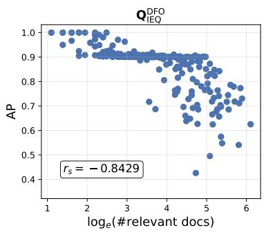

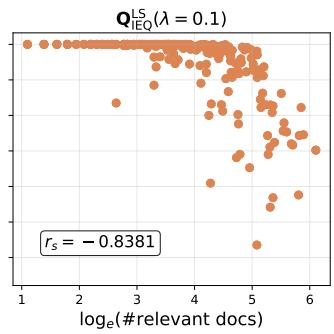

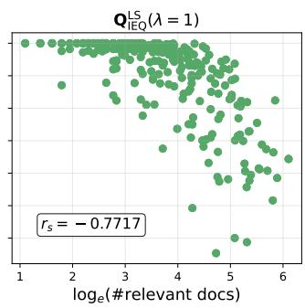  
Fig. 1. Per-query scater plots of AP versus the number of relevant documents for three diferent ideal-query formulations on the Robust collection. The Spearman rank correlation coeficient $r _ { s }$ between these two variables is reported in each plot.

Figure 1 illustrates the relationship between AP and the number of relevant documents for the three diferent sets of ideal queries on the Robust collection. From the figure, it is clear that many ideal queries generated by the LS method achieve a perfect AP of 1.0. For DFO, there is an analogous dense band around $\mathrm { A P = } 0 . 9 ,$ since the DFO algorithm stops iterating when AP reaches 0.9 or above (Section 4.3.2).

A second pattern that emerges is that ideal queries tend to achieve lower AP values when the number of relevant documents is large. The Spearman correlation between AP and the size of the relevant set across queries shown in Manuscript submitted to ACM

the figure indicate a strong negative correlation between these two attributes. One possible explanation is that a large set of relevant documents often encompasses multiple aspects or sub-topics, making it more challenging for a single query representation to rank all relevant documents highly. Similar trends are observed across the other collections; corresponding figures are provided in Appendix B. We observe that DL21-22 Passage collection contains a large number of judged relevant and non-relevant documents, and that the LS-based ideal queries achieve relatively low AP for these queries. Further figures are provided in Appendix B.

Interestingly, while the DFO- and LS-based constructions both achieve high MAP, they produce substantially diferent versions of $\scriptstyle Q _ { \mathrm { I E Q } } .$ . Table 3 reports the average per-query overlap in expansion terms between the ideal queries (only the top 200 expansion terms of $Q _ { \mathrm { I E Q } } ^ { \mathrm { L S } }$ are considered in this analysis). Among the two LS variants, both the term overlap and cosine similarity are high. In contrast, the term overlap between DFO and LS is moderate, except for the DL21-22 Passage collection, where the overlap is higher, ranging from 65% to 75%. This observation suggests that the ideal expanded query is not unique; there may exist multiple distinct EQs that yield near-perfect retrieval performance. Consequently, QIEQ should be viewed not as a single optimal query, but rather as a family of highly efective query representations. In future work, we would like to consider somewhat modified versions of our research questions that consider a query’s proximity to any member of this family of ‘ideal’ representations, rather than to a single, fixed ideal query.

Table 3. Average term overlap between ideal queries, computed across all queries. For each ideal query variant, only the top 200 positively weighted terms are considered. Cosine similarity between the ideal queries is reported in square brackets.
<table><tr><td>Dataset</td><td>Robust</td><td>DL19-20 Passage</td><td>DL19-20 Document</td><td>DL21-22 Passage</td></tr><tr><td> $\mathbf { Q } _ { \mathrm { I E Q } } ^ { \mathrm { D F O } } \cap \mathbf { Q } _ { \mathrm { I E Q } } ^ { \mathrm { L S } } ( \lambda = 0 . 1 )$ </td><td>99.34 [0.5659]</td><td>115.71 [0.6477]</td><td>89.33 [0.5315]</td><td>130.33 [0.6416]</td></tr><tr><td> $\mathbf { Q } _ { \mathrm { I E Q } } ^ { \mathrm { D F O } } \cap \mathbf { Q } _ { \mathrm { I E Q } } ^ { \mathrm { L S } } ( \lambda = 1 )$ </td><td>131.55 [0.6767]</td><td>133.52 [0.7755]</td><td>100.99 [0.6027]</td><td>153.67 [0.7421]</td></tr><tr><td> $\mathbf { Q } _ { \mathrm { I E Q } } ^ { \mathrm { L S } } ( \lambda = 0 . 1 ) \cap \mathbf { Q } _ { \mathrm { I E Q } } ^ { \mathrm { L S } } ( \lambda = 1 )$ </td><td>155.19 [0.8659]</td><td>162.65 [0.9103]</td><td>176.42 [0.9336]</td><td>164.12 [0.8847]</td></tr></table>

## 5.2 Correlation between Sim $( Q _ { \mathrm { e x p } } , Q _ { \mathrm { I E Q } } )$ and $A P ( \mathrm { Q } _ { \mathrm { e x p } } )$

To investigate our first research question RQ1 — for an EQ, how strongly does its similarity to the IEQ correlate with its retrieval efectiveness? — we generate a diverse set of synthetic EQs in a controlled manner as described below, and measure the correlation between their AP values and their similarity with (equivalently, distance from) the ideal query.

The discussion in the next section (5.3) considers a large number of $\mathrm { E Q s }$ produced by diferent existing QE approaches. However, the AP values for these ‘real’ EQs tend to vary within a relatively small range (Table 9). For a more comprehensive analysis, we need a more diverse set of EQs that spans a wider range of retrieval efectiveness, and includes poor, moderate, and highly efective expansions. In practice, obtaining this level of variation from existing QE methods may be dificult. To overcome this limitation, we generate synthetic expanded queries that exhibit a broader spectrum of retrieval efectiveness. We take the ideal query vector, randomly choose a plane passing through this vector, and incrementally rotate the vector along this plane. We then examine how AP varies as the vector is moved progressively away from the original ideal query vector.

For this set of experiments, we use $Q _ { \mathrm { I E Q } } ^ { \mathrm { L S } } ( \lambda = 0 . 1 )$ as the ideal query. We rotate the IEQ vector by $\{ \theta , 2 \theta , 3 \theta , . . . , 1 0 0 \theta \}$ where $1 0 0 \theta = 9 0 ^ { \circ } . ^ { 3 }$ The vector obtained at each of these 100 steps corresponds to a synthetic EQ. For retrieval, we retain only the top 200 positively weighted terms of each synthetic query and compute its AP. We also note the cosine similarity between each synthetic EQ vector and the original IEQ vector. Finally, we measure the correlation for the set of (similarity, AP) pairs thus obtained.

Table 4. Mean Pearson and Spearman correlation coeficients between the similarity of synthetically generated expanded queries to the ideal query $\big . \mathsf { Q } _ { \mathrm { I E Q } } ^ { \mathrm { L S } } ( \lambda = 0 . 1 )$ , and their retrieval efectiveness, across all collections.
<table><tr><td>Dataset</td><td>Pearson ρ</td><td>Spearman  $r _ { s }$ </td></tr><tr><td>Robust</td><td>0.6783</td><td>0.4497</td></tr><tr><td>DL19-20 Passage</td><td>0.8823</td><td>0.8349</td></tr><tr><td>DL19-20 Document</td><td>0.7749</td><td>0.5311</td></tr><tr><td>DL21-22 Passage</td><td>0.8834</td><td>0.8512</td></tr></table>

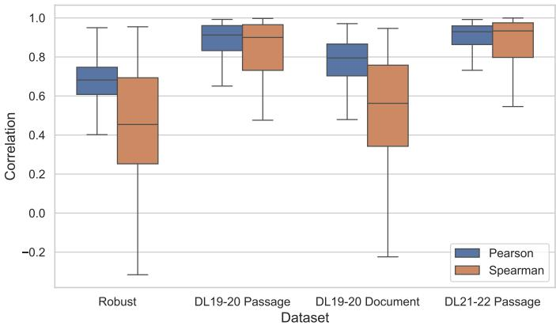  
Fig. 2. Box plot of Pearson and Spearman correlations between the similarity of synthetically generated expanded queries to the ideal query $\bigcirc _ { \mathrm { I E Q } } ^ { \mathrm { L S } } ( \lambda = 0 . 1 )$ and their retrieval efectiveness across all collections.

Table 4 reports the mean correlation between $\mathrm { S i m } ( \mathrm { Q } _ { \mathrm { e x p } } , \mathrm { Q } _ { \mathrm { I E Q } } )$ and $A P ( \mathbf { Q } _ { \mathrm { e x p } } )$ . The consistently high values across diferent collections indicate a strong relationship between these two attributes. These findings provide strong evidence in support of an afirmative answer to RQ1, suggesting that proximity to the ideal query is highly predictive of retrieval performance.

Figure 2 presents more details about the distribution of the Pearson and Spearman correlation coeficients across queries. On the Robust and DL19-20 Document collections, a few queries exhibit negative Spearman correlations. A closer examination reveals that, for most of these queries, AP remains nearly unchanged as the query is rotated up to approximately 60-70◦, after which it sometimes increases slightly. Figure 3 shows such an example from the Robust dataset (query 336: “black bear attacks”). The figure suggests that many ideal queries lie within the $7 0 ^ { \circ }$ region. Additional investigation of these anomalous queries is left for future work.

Manuscript submitted to ACM

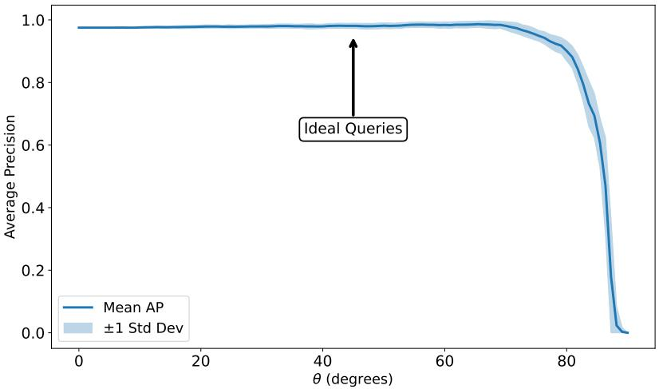  
Fig. 3. Y-axis shows the AP variation and the X-axis plots the angle from the ideal query vector for the synthetically generated versions of the query ‘black bear atacks’ (Robust qid: 336).

## 5.3 Correlation for ‘real’ expanded queries

Having established the relationship between Sim $( Q _ { \mathrm { { e x p } } } , Q _ { \mathrm { { I E Q } } } )$ and $A P ( \mathrm { Q } _ { \mathrm { e x p } } )$ in a controlled synthetic setting, we next measure the correlation between these two quantities for real EQs generated by existing QE methods. We follow the method described in Section 3.2 to compute mean Pearson (�) and Spearman (� ) correlation coeficients. Table 5 reports $\rho$ and $r _ { s }$ across all datasets, for three diferent ideal query formulations. Reasonable correlation (0.40 or higher4) is observed in all cases, suggesting once again that there is a positive relation between proximity to the ideal query and retrieval performance (although this correlation is not as strong as it was for synthetic queries). From a closer look at Table $^ { 5 , }$ the following patterns emerge.

• For the passage collections, changing � from 0.1 to 1.0 has a noticeable impact on $\rho$ and $r _ { s } ;$ however, the choice of � does not seem to matter much for the document collections.

• When using the DFO-based ideal queries, good correlation is observed for the DL21-22 Passage collection, but the correlation is moderate (0.4–0.5) for all the other collections. DL21-22 Passage is also the only collection where DFO-based ideal queries yield better correlation than LS-based ideal queries; on all other collections LS-based ideal queries consistently yield stronger correlations.

## 5.4 Correlation between separability and performance

We next examine the results pertaining to RQ2 — how strongly does an EQ’s performance correlate with its ability to separate relevant and non-relevant documents? As discussed in Section 3.3, we consider separability in terms of BM25 scores (Equation 7). Only judged relevant and non-relevant documents are considered in these experiments, and separability is measured using Cohen’s �.

Table 5. Mean Pearson and Spearman correlation coeficients between the similarity of real expanded queries to diferent ideal query formulations and the AP of the expanded queries on the Robust, DL19-20 Passage, DL19-20 Document, and DL21-22 Passage collections.
<table><tr><td rowspan="2">Method</td><td colspan="2">Robust</td><td colspan="2">DL19-20 Passage</td><td colspan="2">DL19-20 Document</td><td colspan="2">DL21-22 Passage</td></tr><tr><td> $\rho$ </td><td> $r _ { s }$ </td><td>ρ</td><td> $r _ { s }$ </td><td> $\rho$ </td><td> $r _ { s }$ </td><td>ρ</td><td> $r _ { s }$ </td></tr><tr><td>QDE O</td><td>0.4366</td><td>0.4185</td><td>0.4762</td><td>0.4488</td><td>0.4245</td><td>0.4030</td><td>0.6774</td><td>0.5413</td></tr><tr><td> $\mathrm { Q } _ { \mathrm { I E Q } } ^ { \mathrm { L S } } ( \lambda = 0 . 1 )$ </td><td>0.5997</td><td>0.5770</td><td>0.4110</td><td>0.4097</td><td>0.4260</td><td>0.4390</td><td>0.4916</td><td>0.4360</td></tr><tr><td> $Q _ { \mathrm { I E Q } } ^ { \mathrm { L S } } ( \lambda = 1 )$ </td><td>0.6053</td><td>0.5716</td><td>0.5078</td><td>0.4965</td><td>0.4680</td><td>0.4685</td><td>0.6395</td><td>0.5459</td></tr></table>

Table 6. Mean correlation (Pearson’s � and Spearman’s $r _ { s } )$ between the Separability measure and actual AP across all expanded queries on the Robust, DL19-20 Passage, DL19-20 Document, and DL21-22 Passage collections.
<table><tr><td>Dataset</td><td>Pearson&#x27;s  $\rho$ </td><td> $\mathrm { S p e a r m a n } ^ { \prime } s r _ { s }$ </td></tr><tr><td>Robust</td><td>0.7849</td><td>0.7359</td></tr><tr><td>DL19-20 Passage</td><td>0.6504</td><td>0.6417</td></tr><tr><td>DL19-20 Document</td><td>0.6503</td><td>0.6241</td></tr><tr><td>DL21-22 Passage</td><td>0.7024</td><td>0.5971</td></tr></table>

Table 6 reports the mean correlation between separability and AP of the expanded queries. We observe that the correlation between AP and the proposed separability measures is generally much stronger than its correlation with the retrieval efectiveness of real EQs (reported in the preceding section). The strongest correlation $( \rho = 0 . 7 8 4 9 )$ is obtained on the Robust collection. Thus, RQ2 also seems to have a positive answer, i.e., if the scores of relevant and non-relevant documents are well-separated for an EQ, it is likely to achieve good retrieval efectiveness. This relationship is intuitive, as achieving high AP generally requires relevant documents to be ranked ahead of non-relevant documents, which can also result in greater separation between their scores. However, the correlation is not perfect, indicating that high AP does not necessarily imply high separability. In particular, some EQs may achieve good AP despite exhibiting relatively low separation between the scores of relevant and non-relevant documents. A more detailed analysis of these cases, including the concordance pairs, is left for future work.

## 5.5 Explaining poor performance of diferent queries

Thus far, we have focused mainly on explaining the diference in performance across EQs generated for a single query by diferent QE algorithms and diferent parameter settings for these algorithms. We now extend our experiments to consider performance variation across diferent queries.5 We are particularly interested in queries for which automatic QE techniques are generally inefective. As before, we investigate whether this variation (or generally poor performance) can be explained by the overall proximity of their respective EQs to the respective ideal queries.

Intuitively, a query may be considered hard for QE techniques if a diverse set of QE methods consistently fails to improve its retrieval efectiveness. We may consider two aggregation strategies to represent the general efectiveness of QE techniques for this query: average performance and maximum performance, as defined in the equation below. The maximum performance setting captures the intuition that a query is hard when even its best performing expanded variant achieves low retrieval efectiveness, indicating that automatic QE approaches struggle to improve the query.

$$
A P _ { \mathrm { a v g } } ( Q ) = \frac { 1 } { k } \sum _ { j = 1 } ^ { k } A P \left( \mathbf { Q } _ { \mathrm { e x p } } ^ { ( j ) } \right) , \qquad A P _ { \mathrm { m a x } } ( Q ) = \mathop { \operatorname* { m a x } } _ { k } A P \left( \mathbf { Q } _ { \mathrm { e x p } } ^ { ( k ) } \right) .
$$

Here, $A P ( \mathbf { Q } _ { \exp } ^ { ( 1 ) } ) , A P ( \mathbf { Q } _ { \exp } ^ { ( 2 ) } ) , \dots , A P ( \mathbf { Q } _ { \exp } ^ { ( k ) } )$ , denote the AP values achieved by the � expanded variants of an initial query �. We use the same aggregation methods to compute an overall proximity of the set of EQs to the ideal query QIEQ.

$$
\mathrm { S i m } _ { \mathrm { a v g } } ( Q ) = \frac { 1 } { k } \sum _ { j = 1 } ^ { k } \mathrm { S i m } \left( \mathbb { Q } _ { \mathrm { e x p } } ^ { ( j ) } , \mathbf { Q } _ { \mathrm { I E Q } } \right) ,
$$

$$
\operatorname { S i m } _ { \operatorname { m a x } } ( Q ) = \operatorname { S i m } \left( \mathbf { Q } _ { \exp } ^ { ( k ^ { * } ) } , \mathbf { Q } _ { \mathrm { I E Q } } \right) , \qquad k ^ { * } = \arg \operatorname* { m a x } _ { k } A P \left( \mathbf { Q } _ { \exp } ^ { ( k ) } \right) .
$$

Finally, for each aggregation strategy � ∈ {avg, max}, we compute the Pearson correlation between AP and similarity:

$$
\mathrm { c o r r } \left( \{ A P _ { A } ( Q _ { i } ) \} _ { i = 1 } ^ { N } , \{ \mathrm { S i m } _ { A } ( Q _ { i } ) \} _ { i = 1 } ^ { N } \right) ,
$$

where � denotes the total number of queries in a collection.

Table 7. Pearson correlation between aggregate AP and similarity for expanded queries. Three diferent ideal query representations are considered. For each collection, correlations are reported for the average and maximum similarity. The highest correlation within each collection and aggregation seting is shown in bold.
<table><tr><td rowspan="2">Method</td><td colspan="2">Robust</td><td colspan="2">DL19-20 Passage</td><td colspan="2">DL19-20 Document</td><td colspan="2">DL21-22 Passage</td></tr><tr><td>Avg.</td><td>Max.</td><td>Avg.</td><td>Max.</td><td> $\operatorname { A v g } .$ </td><td>Max.</td><td>Avg.</td><td>Max.</td></tr><tr><td> $\boldsymbol { \mathrm { Q } } _ { \mathrm { I E Q } } ^ { \mathrm { D F O } }$ </td><td>0.3790</td><td>0.4608</td><td>0.6770</td><td>0.6693</td><td>0.4146</td><td>0.3556</td><td>0.5043</td><td>0.5378</td></tr><tr><td> $Q _ { \mathrm { I E Q } } ^ { \mathrm { L S } } ( \lambda = 0 . 1 )$ </td><td>0.7393</td><td>0.7150</td><td>0.7379</td><td>0.6344</td><td>0.4547</td><td>0.4507</td><td>0.3059</td><td>0.2698</td></tr><tr><td> $Q _ { \mathrm { I E Q } } ^ { \mathrm { L S } } ( \lambda = 1 )$ </td><td>0.7421</td><td>0.6915</td><td>0.7656</td><td>0.6400</td><td>0.4961</td><td>0.4647</td><td>0.3811</td><td>0.3617</td></tr></table>

Table 7 reports the correlation between aggregated AP and similarity to three ideal query representations across all collections. We observe moderate to strong correlations across all collections when using $Q _ { \mathrm { I E Q } } ^ { \mathrm { L S } } ( \lambda = 1 )$ , except for the DL21-22 Passage collection, where the correlations are relatively weak. The correlations obtained using $Q _ { \mathrm { I E Q } } ^ { \mathrm { L S } } ( \lambda = 0 . 1 )$ are slightly lower. Overall, these findings provide evidence supporting a positive answer to RQ3: similarity to the ideal query helps explain why automatic QE techniques are less efective for some queries. Queries whose expanded variants are close to the ideal query tend to achieve higher retrieval efectiveness, whereas those whose expanded variants lie farther from it tend to achieve lower efectiveness.

## 6 Discussion: explaining variations in the similarity–efectiveness relationship

Although our framework suggests a positive relationship between similarity to the ideal query and retrieval efectiveness on average, the observed correlations are moderate for some collections and queries. In this section, we investigate the reasons for these weaker correlations

To facilitate this analysis, we introduce a restricted evaluation setting. For any query, we limit the evaluation corpus to only the documents that have been explicitly judged for that query. Thus, given a query, we exhaustively compute BM25 scores for all judged documents, and rank only these documents. We define Restricted AP as the Average Precision computed over this restricted ranking.

Manuscript submitted to ACM

Computing standard, collection-wide AP, on the other hand, requires ranking documents from the entire collection. Top-� retrieval algorithms generally used by IR systems like Lucene make use of optimisations that assume that a document’s score cannot decrease as more query terms are considered (https://issues.apache.org/jira/browse/LUCENE 7996). This assumption does not hold when query terms can have negative weights. Thus, eficiently computing collectionwide AP requires truncating synthetic queries to their top-k positively weighted terms. This step discards negatively weighted terms (“bad” terms that occur preferentially in non-relevant documents, and are therefore detrimental to efectiveness) from query vectors, and prevents us from accounting for such bad terms when calculating Sim $( Q _ { \mathrm { e x p } } , Q _ { \mathrm { I E Q } } )$

When computing Restricted AP, however, we work with a comparatively small set of judged documents. This makes it feasible to compute a document ranking in the presence of negative term weights, as is the case for $Q _ { \mathrm { I E Q } } ^ { \mathrm { L S } }$ and synthetic queries derived from it.

Below, we first show that Restricted AP is a good approximation of collection-wide AP. We then use this setting to reexamine how retrieval efectiveness changes as queries move away from the ideal query, and to explain why correlations observed for real EQs are sometimes weaker than those obtained in the synthetic-query setting.

## 6.1 AP vs. Restricted AP of $\mathsf { Q } _ { \mathrm { e x p } }$

To validate whether Restricted AP serves as a reliable proxy for standard AP, we compute both metrics for each of the 90 QE configurations.6 For every query, we then measure the correlation between the resulting AP and Restricted AP across all configurations, and average these correlations over all queries. Table 8 reports the results. We observe consistently high Pearson and Spearman correlations across all collections, indicating that Restricted AP preserves the relative efectiveness of QE methods while substantially reducing the computational cost of evaluation. We therefore use Restricted AP in place of AP in the following analyses to better understand the similarity-efectiveness relationship.

Table 8. Correlation (Pearson’s � and Spearman ��) between restricted AP and actual AP across all expanded variants of a query, averaged over all queries in a collection.
<table><tr><td>Dataset</td><td> $\rho$ </td><td> $r _ { s }$ </td></tr><tr><td>Robust</td><td>0.9689</td><td>0.9448</td></tr><tr><td>DL19-20 Passage</td><td>0.8560</td><td>0.8263</td></tr><tr><td>DL19-20 Document</td><td>0.8252</td><td>0.8203</td></tr><tr><td>DL21-22 Passage</td><td>0.7774</td><td>0.6767</td></tr></table>

## 6.2 Restricted AP vs. Similarity to QIEQ

Using Restricted AP, we now revisit the question of how retrieval efectiveness changes as EQs move away from the ideal query. Recall that, in Section 5.2, we constructed synthetic queries by progressively rotating the IEQ vector in a randomly chosen plane passing through it. In this section, for a given query �, we consider each expanded version $\mathsf { Q } _ { \mathrm { e x p } }$ in turn, and progressively rotate $\boldsymbol { \mathrm { Q _ { I E Q } } }$ through a full 360◦ in the plane defined by $\mathbf { Q } _ { \mathrm { e x p } }$ and $\begin{array} { r } { Q _ { \mathrm { I E Q } } , } \end{array}$ instead of a randomly chosen plane. At 500 regularly spaced points along this trajectory, we take the rotated version of $\boldsymbol { \mathrm { Q } } _ { \mathrm { I E Q } }$ as our synthetic query vector, and compute its similarity to ${ \bf Q } _ { \mathrm { I E Q } }$ together with the corresponding Restricted $\mathrm { A P . ^ { 7 } }$ Figure 4 illustrates this process using an ideal query and various diferent expanded queries.

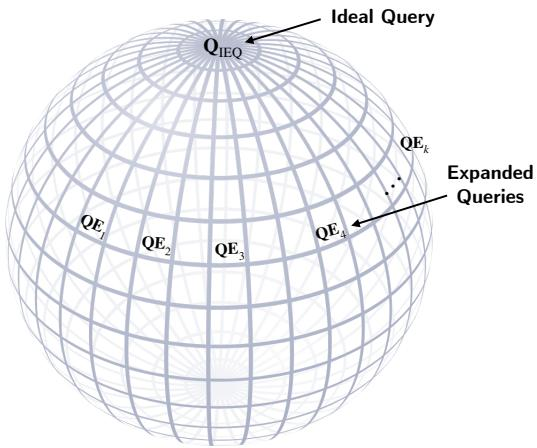  
Fig. 4. Trajectories along the great circles constructed from ${ \bf Q } _ { \mathrm { I E Q } }$ and each $\mathrm { Q } _ { \mathrm { e x p } } ,$ , along which synthetic queries are generated.

Observations. Figure 5 illustrates the relationship between Restricted AP and the angular distance of the synthetic queries from the ideal query (equivalent to Sim $( \boldsymbol { \mathrm { Q } } _ { \mathrm { e x p } } , \boldsymbol { \mathrm { Q } } _ { \mathrm { I E Q } } ) )$ for the DL19-20 Passage and Document collections. For a clean visual representation, we draw a single curve for each of the six QE algorithms used in our experiments (Section 4.2), by averaging across all queries in the collection, as well as across all parameter variations for that algorithm. It is clear that synthetic queries that are more similar to the ideal query consistently achieve higher Restricted AP, while queries farther from $\boldsymbol { \mathrm { Q } } _ { \mathrm { I E Q } }$ exhibit lower efectiveness. A similar phenomenon is observed for the other two collections. This observation is consistent with the strong correlations reported in Section 5.2.

A closer look at Figure 5 also provides insights into why the correlations observed for real EQs are moderate for some collections (Table 5). In the synthetic setting, queries are generated along a single great-circle trajectory originating from $\scriptstyle Q _ { \mathrm { I E Q } } .$ Along such a trajectory, the weights of terms in the synthetic queries deviate systematically from their weights in ${ \bf Q } _ { \mathrm { I E Q } } .$ . The relationship between similarity and Restricted $\mathrm { A P }$ is thus highly structured, resulting in strong correlations. In contrast, real EQs correspond to points lying on diferent trajectories (great circles) emanating from QIEQ. Although a positive relationship between similarity and efectiveness holds along each individual trajectory, the shape and strength of this relationship may difer across trajectories. Consequently, when EQs from diferent trajectories are analyzed together (as in Section 5.3), these trajectory-specific variations weaken overall correlation, even when the within-trajectory relation remains strong. This explains the relatively weaker correlations observed for real EQs on the DL19-20 Document collection (Table 5).

Figure 6 demonstrates this problem for a single query (qid 730539 of the DL19-20 Document collection: what is chronometer who invented it). The figure contains 90 lines, each of which shows the variation of Restricted AP as one ideal version of this query $( \mathbf { Q } _ { \mathrm { I E Q } } ^ { \mathrm { L S } }$ for $\lambda = 0 . 1 )$ is rotated through a great circle formed by the ideal query itself, and one of the 90 real expanded variants of the original query. The circled points on the lines correspond to the real EQs themselves. As mentioned above, the within-trajectory relation remains strong for each of the 90 lines; however, across trajectories, there are many pairs $( E Q _ { i } , E Q _ { j } )$ of circled points (i.e., real EQs) such that both the angular deviation and Restricted AP are higher for $E Q _ { i }$ than for $E Q _ { j }$ . This naturally leads to low values of the correlation coeficients (for this query, $\rho = - 0 . 4 2 0 4 9$ and $r _ { s } = - 0 . 3 1 5 1 )$

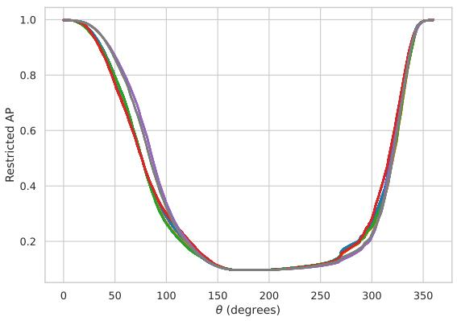  
(a) DL19-20 Passage

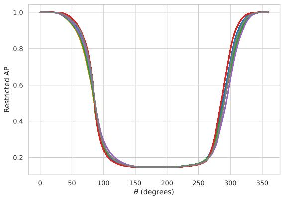  
(b) DL19-20 Document  
• RM3 • Bo1 • KL • CEQE • HyDE • HyDE-Rocchio

Fig. 5. Variation in Restricted AP along great circles originating from $\mathbf { Q } _ { 1 \mathsf { E Q } } ^ { \mathsf { L S } } \left( \lambda = 0 . 1 \right)$ and passing through 500 synthetic queries generated from expanded queries produced by RM3, Bo1, KL, CEQE, HyDE, and HyDE-Rocchio.  
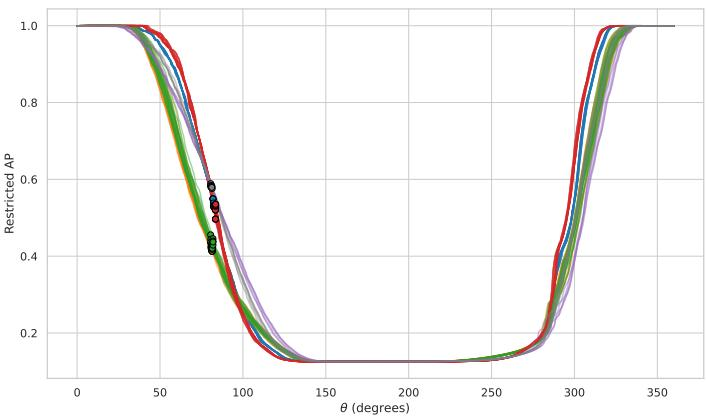  
Fig. 6. Query-specific variation (only for qid 730539 of the DL19-20 Document collection) of Restricted AP along 90 great circles (originating from $\mathbf { Q } _ { 1 \mathtt { E Q } } ^ { \mathtt { L S } } ( \lambda = 0 . 1 )$ and passing through 90 real expanded versions, generated using RM3, Bo1, KL, CEQE, HyDE, and HyDE-Rocchio methods, at diferent parameter setings).

## 6.3 Angular spread of expanded versions of a query

Another pattern emerges from Figure 6: in terms of horizontal spread, the circled points (corresponding to real EQs) span a very narrow region. In other words, the angular distances of the EQs from the IEQ lie within a small range (in Manuscript submitted to ACM

Figure 6, the actual range is $8 0 . 5 ^ { \circ } - 8 3 . 5 ^ { \circ } )$ . This narrow angular spread suggests an explanation for the weak or even negative correlations observed for some queries. Table 9 presents this data aggregated over all queries in each collection. We look at the angular distances between the IEQ and each of the 90 real $\mathrm { E Q s }$ generated for a query, and calculate the range (i.e., the diference between the maximum and minimum) of angular deviations from the IEQ across these 90 EQs. These observed ranges are then averaged across all queries in each collection to obtain the mean Δ� for that collection. An analogous exercise is done to obtain mean ΔAP, the average of the ranges of AP values achieved by the 90 expanded versions of each query. The aggregated results are shown in Table 9, while Figures 7 and 8 visualise the distributions of AP values and angular distances from the ideal query $( \mathbf { Q } _ { \mathrm { I E Q } } ^ { \mathrm { L S } } \mathrm { w i t h } \lambda = 1 )$ across all expanded queries in the DL19-20 Passage collection.

It is clear from the table that for any given query, all the real EQs generally lie within a relatively narrow angular region, while their retrieval efectiveness can vary more substantially. On average, the angular spread across all 90 variants for a query can be as low $\mathsf { a s } 3 . 7 5 ^ { \circ }$ (for the Robust04 collection, when deviations are measured from $Q _ { \mathrm { I E Q } } ^ { \mathrm { L S } } ( \lambda = 0 . 1 ) )$ ; at best, it is $1 1 . 1 5 ^ { \circ }$ (for the DL19-20 Passage collection, when deviations are measured from $Q _ { \mathrm { I E Q } } ^ { \mathrm { D F O } } )$ . In contrast, the Average $\Delta \mathrm { A P }$ ranges from 0.1750 to as much as 0.2853, indicating a broader variation in $\mathrm { A P }$ across expanded variants of a query. For context, we note that the possible angular spread could, in principle, be as much as $9 0 ^ { \circ }$ , for the common case where all vectors are confined to the first quadrant; similarly, ΔAP for a query could be at most 1.

Table 9. Average Δ� and ΔAP for all collections.
<table><tr><td>Method</td><td></td><td>Robust DL19-20 Passage</td><td>DL19-20 Document DL21-22 Passage</td><td></td></tr><tr><td> $\boldsymbol { \mathrm { Q } } _ { \mathrm { I E Q } } ^ { \mathrm { D F O } }$ </td><td> $1 0 . 0 2 ^ { \circ }$ </td><td> $1 1 . 1 5 ^ { \circ }$ </td><td> $9 . 8 6 ^ { \circ }$ </td><td> $9 . 4 9 ^ { \circ }$ </td></tr><tr><td> $Q _ { \mathrm { I E Q } } ^ { \mathrm { L S } } ( \lambda = 0 . 1 )$ </td><td> $3 . 7 5 ^ { \circ }$ </td><td> $5 . 4 2 ^ { \circ }$ </td><td> $4 . 0 4 ^ { \circ }$ </td><td> $4 . 9 2 ^ { \circ }$ </td></tr><tr><td> $Q _ { \mathrm { I E Q } } ^ { \mathrm { L S } } ( \lambda = 1 )$ </td><td> $5 . 6 9 ^ { \circ }$ </td><td> $7 . 3 0 ^ { \circ }$ </td><td> $4 . 5 8 ^ { \circ }$ </td><td> $7 . 9 3 ^ { \circ }$ </td></tr><tr><td> $_ { \mathrm { A v e r a g e } \ \Delta A P }$ </td><td>0.2215</td><td>0.2853</td><td>0.2624</td><td>0.1750</td></tr></table>

Thus, even though similarity to ${ \bf Q } _ { \mathrm { I E Q } }$ is broadly associated with higher retrieval efectiveness, the estimated correlations are highly sensitive to small numerical variations. In contrast, the synthetic query experiments explored a much broader range of angular distances from $\scriptstyle Q _ { \mathrm { I E Q } }$ , producing substantial variation in Restricted AP, and yielding a clearer correlation signal. While it is very common to use cosine similarity to quantify the proximity between vectors, these observations suggest that it would be worthwhile to look for more discriminatory measures that better separate diferent EQs. We plan to explore this direction in future work.

## 7 Limitations and future work

This article presents a post hoc framework for understanding the performance of QE techniques in general, and of specific expanded queries in particular. By constructing an ideal query for any given query, we formalised the notion of good expansion terms and appropriate expansion weights. We evaluated two concrete approaches for constructing ideal queries using complete relevance assessments. Our extensive experimental results demonstrate that the similarity between an EQ and the ideal query is positively correlated with average precision. Through synthetic-query analysis, we showed that retrieval efectiveness consistently decreases as an EQ moves away from the ideal query. We also confirmed that efective EQs clearly separate relevant from non-relevant documents. Furthermore, across diferent queries, proximity to the ideal query explains why automatic QE techniques fail on some topics.

Manuscript submitted to ACM

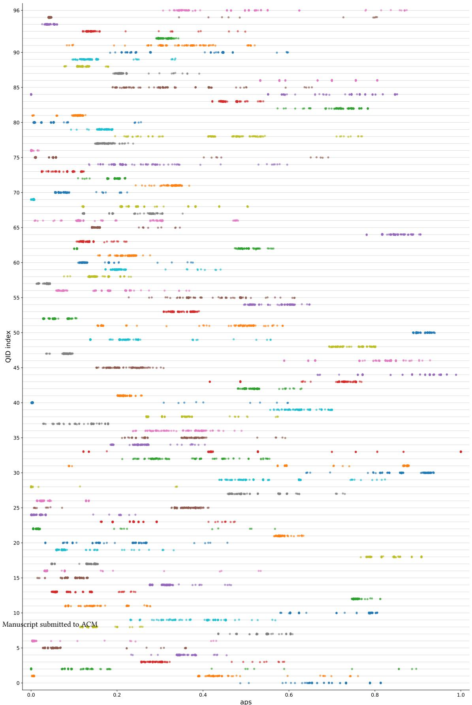  
Fig. 7. Per-query variation in AP across diferent expanded queries (RM3, Bo1, KL, CEQE, HyDE and HyDE-Rocchio) for the benchmark queries in the DL19–20 Passage collection.

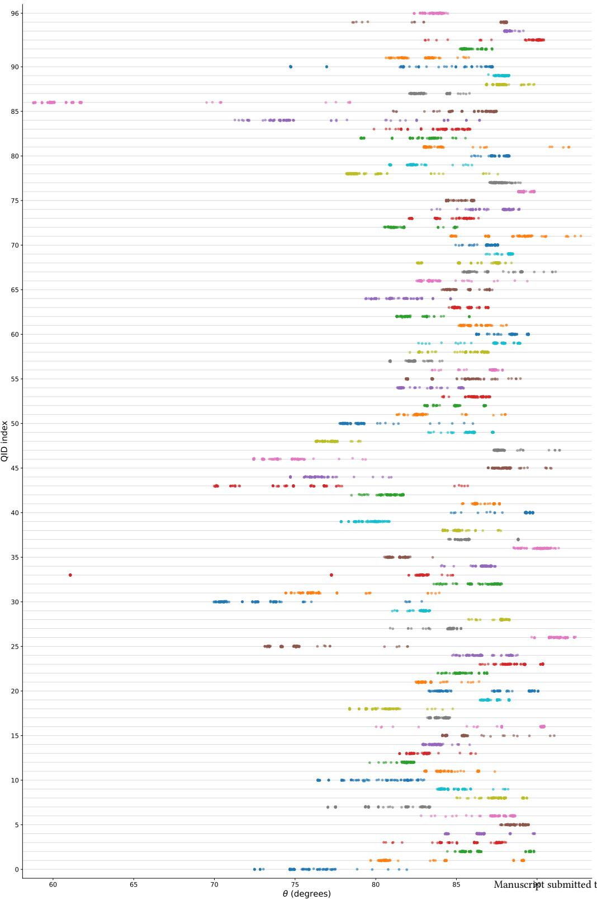  
Fig. 8. Per-query variation in angular distance from $Q _ { \mathrm { I E Q } } ^ { \mathrm { L S } } ( \lambda = 1 )$ across diferent expanded queries (RM3, Bo1, KL, CEQE, HyDE and HyDE-Rocchio) for the benchmark queries in the DL19–20 Passage collection.

Thus, the ideal query serves as an efective reference point for performance analysis of QE methods. It provides IR researchers and practitioners working on new QE techniques with definitive answers to questions like: what useful terms is the QE method failing to identify? are the selected terms likely to lead to query drift? These answers, in turn, form a basis for exploring how the proposed QE approach may be improved (even in unsupervised settings like pseudo relevance feedback).

Nevertheless, we observe that the correlation between an EQ’s similarity to an IEQ and its AP may sometimes be only moderate. This may be attributed to two main factors

• The ideal expanded query is not necessarily unique. There may exist multiple, well-separated EQs that yield near-perfect retrieval performance. Any one of these ideal queries would serve as a useful target for guiding the development of practical QE methods. Eficiently exploring the space of possible query vectors to identify regions that correspond to ideal queries might constitute an interesting research direction. It would also be interesting to characterise queries that have multiple such ‘ideal regions’, as opposed to queries that have only a single ideal region.

• When measuring the similarity between real EQs and an ideal query, the traditional cosine formula produces a range of numerical values that is small, especially compared to the range of AP values corresponding to the same set of EQs. As a result, small random variations may substantially diminish the computed correlation coeficients. We propose to explore other similarity measures that induce a wider and more robust separation among the diferent expanded variants of a query.

Because our current framework relies on complete relevance assessments to construct ideal queries, another important next step is learning ideal-query representations from training data in a supervised or semi-supervised manner. Such learned representations could guide the design of next-generation query expansion algorithms and provide a principled objective for optimizing retrieval models.

## References

[1] Gianni Amati and Cornelis Joost Van Rijsbergen. 2002. Probabilistic models of information retrieval based on measuring the divergence from randomness. ACM Trans. Inf. Syst. 20, 4 (Oct. 2002), 357–389. doi:10.1145/582415.58241

[2] Avishek Anand, Lijun Lyu, Maximilian Idahl, Yumeng Wang, Jonas Wallat, and Zijian Zhang. 2022. Explainable Information Retrieval: A Survey. ArXiv (2022). https://arxiv.org/abs/2211.02405

[3] Avishek Anand, Sourav Saha, and V. Venktesh. 2025. Explainable Information Retrieval. In Advances in Information Retrieval - 47th European Conference on IR Research, ECIR 2025, Claudia Hauf, Craig Macdonald, Dietmar Jannach, Gabriella Kazai, Franco Maria Nardini, Fabio Pinelli, Fabrizio Silvestri, and Nicola Tonellotto (Eds.). Springer Nature Switzerland, Cham, 254–261.

[4] Avishek Anand, Procheta Sen, Sourav Saha, Manisha Verma, and Mandar Mitra. 2023. Explainable Information Retrieval. In Proceedings ofthe 46th International ACM SIGIR Conference on Research and Development in Information Retrieval (Taipei, Taiwan) (SIGIR ’23). Association for Computing Machinery, New York, NY, USA, 3448–3451. doi:10.1145/3539618.3594249

[5] Negar Arabzadeh, Maryam Khodabakhsh, and Ebrahim Bagheri. 2021. BERT-QPP: Contextualized Pre-trained transformers for Query Performanc Prediction. In Proceedings ofthe 30th ACM International Conference on Information & Knowledge Management (Virtual Event, Queensland, Australia) (CIKM ’21). Association for Computing Machinery, New York, NY, USA, 2857–2861. doi:10.1145/3459637.3482063

[6] Chris Buckley and Gerard Salton. 1995. Optimization of relevance feedback weights. In Proceedings ofthe 18th Annual International ACM SIGIR Conference on Research and Development in Information Retrieval (Seattle, Washington, USA) (SIGIR ’95). Association for Computing Machinery, New York, NY, USA, 351–357. doi:10.1145/215206.215383

[7] Claudio Carpineto and Giovanni Romano. 2012. A Survey of Automatic Query Expansion in Information Retrieval. ACM Comput. Surv. 44, 1, Articl 1 (Jan. 2012), 50 pages. doi:10.1145/2071389.2071390

[8] Stéphane Clinchant and Eric Gaussier. 2013. A theoretical analysis of pseudo-relevance feedback models. In Proc. ICTIR’13. 6–13. https://doi.org/10. 1145/2499178.2499179

[9] Jacob Cohen. 1988. Statistical power analysis for the behavioral sciences (2nd ed.). Lawrence Erlbaum Associates, Hillsdale, NJ

[10] Kaustubh D. Dhole and Eugene Agichtein. 2024. GenQREnsemble: Zero-Shot LLM Ensemble Prompting for Generative Query Reformulation. In Advances in Information Retrieval: 46th European Conference on Information Retrieval, ECIR 2024, Glasgow, UK, March 24–28, 2024, Proceedings, Part III

Manuscript submitted to ACM

(Glasgow, United Kingdom). Springer-Verlag, Berlin, Heidelberg, 326–335. doi:10.1007/978-3-031-56063-7\_24

[11] Fernando Diaz, Bhaskar Mitra, and Nick Craswell. 2016. Query Expansion with Locally-Trained Word Embeddings. In Proceedings ofthe 54th Annual Meeting ofthe Association for Computational Linguistics (Volume 1: Long Papers), Katrin Erk and Noah A. Smith (Eds.). Association for Computational Linguistics, Berlin, Germany, 367–377. doi:10.18653/v1/P16-1035

[12] Hui Fang, Tao Tao, and ChengXiang Zhai. 2004. A Formal Study of Information Retrieval Heuristics. In Proc. SIGIR’04. 49–56. https://doi.org/10. 1145/1008992.1009004

[13] Hui Fang, Tao Tao, and Chengxiang Zhai. 2011. Diagnostic Evaluation of Information Retrieval Models. ACM Trans. Inf. Syst. 29, 2, Article 7 (apr 2011), 42 pages. https://doi.org/10.1145/1961209.1961210

[14] Hui Fang and ChengXiang Zhai. 2006. Semantic Term Matching in Axiomatic Approaches to Information Retrieval. In Proc. SIGIR’06. 115–122. https://doi.org/10.1145/1148170.1148193

[15] Thibault Formal, Carlos Lassance, Benjamin Piwowarski, and Stéphane Clinchant. 2021. SPLADE v2: Sparse Lexical and Expansion Model for Information Retrieval. arXiv:2109.10086 [cs.IR] https://arxiv.org/abs/2109.10086

[16] Thibault Formal, Benjamin Piwowarski, and Stéphane Clinchant. 2021. SPLADE: Sparse Lexical and Expansion Model for First Stage Ranking. In Proceedings ofthe 44th International ACM SIGIR Conference on Research and Development in Information Retrieval (Virtual Event, Canada) (SIGIR ’21). Association for Computing Machinery, New York, NY, USA, 2288–2292. doi:10.1145/3404835.3463098

[17] Luyu Gao, Xueguang Ma, Jimmy Lin, and Jamie Callan. 2023. Precise Zero-Shot Dense Retrieval without Relevance Labels. In Proceedings of the 61st Annual Meeting ofthe Association for Computational Linguistics (Volume 1: Long Papers), Anna Rogers, Jordan Boyd-Graber, and Naoaki Okazaki (Eds.). Association for Computational Linguistics, Toronto, Canada, 1762–1777. doi:10.18653/v1/2023.acl-long.99

[18] Trevor Hastie, Robert Tibshirani, and Jerome Friedman. 2009. The Elements of Statistical Learning: Data Mining, Inference, and Prediction (2nd ed.). Springer New York.

[19] Rolf Jagerman, Honglei Zhuang, Zhen Qin, Xuanhui Wang, and Michael Bendersky. 2023. Query Expansion by Prompting Large Language Models. arXiv:2305.03653 [cs.IR] https://arxiv.org/abs/2305.03653

[20] Nasreen Abdul Jaleel, James Allan, W. Bruce Croft, Fernando Diaz, Leah S. Larkey, Xiaoyan Li, Mark D. Smucker, and Courtney Wade. 2004. UMass at TREC 2004: Novelty and HARD. In TREC 2004.

[21] Nour Jedidi and Jimmy Lin. 2026. Revisiting BM25 Feedback Models using HyDE. In Proceedings ofthe 49th International ACM SIGIR Conference on Research and Development in Information Retrieval (Australia) (SIGIR ’26). Association for Computing Machinery, New York, NY, USA, 3817–3822. doi:10.1145/3805712.3809889

[22] Victor Lavrenko and W. Bruce Croft. 2001. Relevance based language models. In Proceedings ofthe 24th Annual International ACM SIGIR Conference on Research and Development in Information Retrieval (New Orleans, Louisiana, USA) (SIGIR ’01). Association for Computing Machinery, New York, NY, USA, 120–127. doi:10.1145/383952.383972

[23] Yibin Lei, Tao Shen, and Andrew Yates. 2025. ThinkQE: Query Expansion via an Evolving Thinking Process. In Findings ofthe Association for Computational Linguistics: EMNLP 2025, Christos Christodoulopoulos, Tanmoy Chakraborty, Carolyn Rose, and Violet Peng (Eds.). Association for Computational Linguistics, Suzhou, China, 17772–17781. doi:10.18653/v1/2025.findings-emnlp.965

[24] Jurek Leonhardt, Koustav Rudra, and Avishek Anand. 2023. Extractive Explanations for Interpretable Text Ranking. ACM Trans. Inf. Syst. 41, 4, Article 88 (March 2023), 31 pages. doi:10.1145/3576924

[25] Minghan Li, Xinxuan Lv, Junjie Zou, Tongna Chen, Chao Zhang, Suchao An, Ercong Nie, and Guodong Zhou. 2026. Query Expansion in the Age of Pre-trained and Large Language Models: A Comprehensive Survey. ACM Trans. Inf. Syst. 44, 5, Article 119 (July 2026), 42 pages. doi:10.1145/3816248

[26] Lijun Lyu and Avishek Anand. 2023. Listwise Explanations for Ranking Models Using Multiple Explainers. In Proc. of ECIR’23. Cham, 653–668 https://doi.org/10.1007/978-3-031-28244-7\_41

[27] Craig Macdonald and Nicola Tonellotto. 2020. Declarative Experimentation in Information Retrieval using PyTerrier. In Proceedings ofthe 2020 ACM SIGIR International Conference on the Theory ofInformation Retrieval (ICTIR)

[28] Chuan Meng, Negar Arabzadeh, Arian Askari, Mohammad Aliannejadi, and Maarten de Rijke. 2025. Query Performance Prediction Using Relevanc Judgments Generated by Large Language Models. ACM Trans. Inf. Syst. 43, 4, Article 106 (July 2025), 35 pages. doi:10.1145/3736402

[29] Tomas Mikolov, Ilya Sutskever, Kai Chen, Greg S Corrado, and Jef Dean. 2013. Distributed representations of words and phrases and their compositionality. In Advances in neural information processing systems. 3111–3119.

[30] Shahrzad Naseri, Jef Dalton, Andrew Yates, and James Allan. 2021. CEQE: Contextualized Embeddings for Query Expansion. In Advances in Information Retrieval - 43rd European Conference on IR Research, ECIR 2021, Virtual Event, March 28 - April 1, 2021, Proceedings, Part I, Vol. 12656. Springer, 467–482.

[31] Marco Tulio Ribeiro, Sameer Singh, and Carlos Guestrin. 2016. “Why Should I Trust You?": Explaining the Predictions of Any Classifier. In Proc. KDD’16 (San Francisco, California, USA). 1135–1144. https://doi.org/10.1145/2939672.2939778

[32] J. J. Rocchio. 1971. Relevance feedback in information retrieval. In The SMART Retrieval System: Experiments in Automatic Document Processing, Gerald Salton (Ed.). Prentice-Hall, 313–323.

[33] Dwaipayan Roy, Debjyoti Paul, Mandar Mitra, and Utpal Garain. 2016. Using word embeddings for automatic query expansion. arXiv preprint arXiv:1606.07608 (2016).

[34] Dwaipayan Roy, Sourav Saha, Mandar Mitra, Bihan Sen, and Debasis Ganguly. 2019. I-REX: A Lucene Plugin for EXplainable IR. In Proceedings ofthe 28th ACM International Conference on Information and Knowledge Management (Beijing, China) (CIKM ’19). Association for Computing Machinery,

New York, NY, USA, 2949–2952. doi:10.1145/3357384.3357859

[35] Sourav Saha, Harsh Agarwal, Venktesh V, Avishek Anand, Swastik Mohanty, Debapriyo Majumdar, and Mandar Mitra. 2025. ir\_explain: A Python Library of Explainable IR Methods. In Proceedings ofthe 48th International ACM SIGIR Conference on Research and Development in Information Retrieval (Padua, Italy) (SIGIR ’25). Association for Computing Machinery, New York, NY, USA, 3563–3572. doi:10.1145/3726302.3730343

[36] Sourav Saha, Debapriyo Majumdar, and Mandar Mitra. 2026. Explainability of Text Processing and Retrieval Methods: A Survey. ACM Comput. Surv. 58, 11, Article 284 (May 2026), 48 pages. doi:10.1145/3801957

[37] Jaspreet Singh and Avishek Anand. 2019. EXS: Explainable Search Using Local Model Agnostic Interpretability. In Proceedings ofthe Twelfth ACM International Conference on Web Search and Data Mining (Melbourne VIC, Australia) (WSDM ’19). Association for Computing Machinery, New York, NY, USA, 770–773. doi:10.1145/3289600.3290620

[38] Mark D. Smucker and James Allan. 2006. An investigation of dirichlet prior smoothing’s performance advantage. Technical Report IR-548. CIIR, U. Mass., Amherst. https://maroo.cs.umass.edu/getpdf.php?id=694

[39] Manisha Verma and Debasis Ganguly. 2019. LIRME: Locally Interpretable Ranking Model Explanation. In Proceedings of the 42nd International ACM SIGIR Conference on Research and Development in Information Retrieval (Paris, France) (SIGIR’19). Association for Computing Machinery, New York, NY, USA, 1281–1284. doi:10.1145/3331184.3331377

[40] Liang Wang, Nan Yang, and Furu Wei. 2023. Query2doc: Query Expansion with Large Language Models. In Proceedings of the 2023 Conference on Empirical Methods in Natural Language Processing, Houda Bouamor, Juan Pino, and Kalika Bali (Eds.). Association for Computational Linguistics, Singapore, 9414–9423. doi:10.18653/v1/2023.emnlp-main.585

[41] An Yang, Baosong Yang, Beichen Zhang, Binyuan Hui, Bo Zheng, Bowen Yu, Chengyuan Li, Dayiheng Liu, Fei Huang, Haoran Wei, et al. 2024 Qwen2.5 Technical Report. arXiv preprint arXiv:2412.15115 (2024).

[42] Chengxiang Zhai and John Laferty. 2004. A study of smoothing methods for language models applied to information retrieval. ACM Transactions on Information Systems 22, 2 (April 2004), 179–214. doi:10.1145/984321.984322

[43] Le Zhang, Yihong Wu, Qian Yang, and Jian-Yun Nie. 2024. Exploring the Best Practices of Query Expansion with Large Language Models. In Findings ofthe Association for Computational Linguistics: EMNLP 2024, Yaser Al-Onaizan, Mohit Bansal, and Yun-Nung Chen (Eds.). Association for Computational Linguistics, Miami, Florida, USA, 1872–1883. doi:10.18653/v1/2024.findings-emnlp.103

## A Invariance to scaling of �

To show that the AP obtained by $Q _ { \mathrm { I E Q } } ^ { \mathrm { L S } }$ (Section 3.1.2) is invariant to the specific positive value chosen for �, we replace � with another positive constant $\beta .$ The new target vector $\mathbf { Y } _ { \mathrm { n e w } }$ is given by

$$
\mathbf { Y } _ { \mathrm { n e w } } = \frac { \beta } { \alpha } \mathbf { Y } _ { \mathrm { o l d } } = k \mathbf { Y } _ { \mathrm { o l d } } , \quad \mathrm { w h e r e } \ k = \frac { \beta } { \alpha } > 0 .
$$

Then the least-squares solution scales accordingly:

$$
\mathsf { Q } _ { \mathrm { I E Q } } ^ { \mathrm { L S , n e w } } = ( \mathbf { X } ^ { \mathsf { T } } \mathbf { X } + \lambda I ) ^ { - 1 } X ^ { \mathsf { T } } \mathbf { Y } _ { \mathrm { n e w } } = k \left( \mathbf { X } ^ { \mathsf { T } } \mathbf { X } + \lambda I \right) ^ { - 1 } \mathbf { X } ^ { \mathsf { T } } \mathbf { Y } _ { \mathrm { o l d } } = k \mathsf { Q } _ { \mathrm { I E Q } } ^ { \mathrm { L S , o l d } } .
$$

Consequently, the resulting BM25 score vector is also scaled by $k { : }$

$$
\mathbf { X } \mathbf { Q } _ { \mathrm { I E Q } } ^ { \mathrm { L S , n e w } } = k \mathbf { X } \mathbf { Q } _ { \mathrm { I E Q } } ^ { \mathrm { L S , o l d } } .
$$

Assume that X is the full term-document matrix, instead of comprising only the documents present in the ground truth relevance assessment. Since multiplying by a positive constant is a strictly monotonic transformation, the relative ordering of the document scores is unchanged. Therefore, the retrieval ranking—and hence the AP—remains identical. This implies that � can be arbitrarily chosen (e.g., as small as 0.01) without afecting retrieval performance. After constructing the ideal queries, we normalize them to a unit vector.

## B AP of IEQ vs. number of relevant documents

Figures 9, 10, and 11, supplement Figure 1 from Section 5.1. The APs achieved by ideal queries exhibit the same trend across collections: the number of relevant documents is strongly negatively correlated with AP. This phenomenon is particularly pronounced for DFO-based ideal queries, and is generally more prominent for the document collections than for the passage collections.

Manuscript submitted to ACM

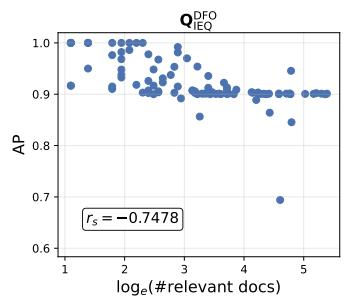

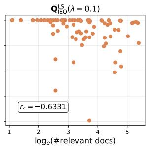

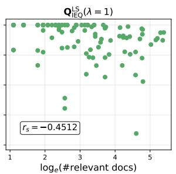  
Fig. 9. Per-query scater plots of AP versus the number of relevant documents for diferent ideal-query formulations on the DL19-20 passage collection. The Spearman rank correlation coeficient $r _ { s }$ between the two variables is reported in each plot.

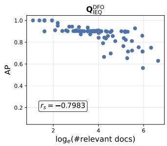

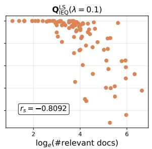

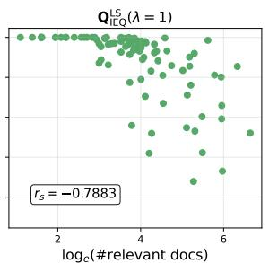  
Fig. 10. Per-query scater plots of AP versus the number of relevant documents for diferent ideal-query formulations on the DL19-20 document collection. The Spearman rank correlation coeficient $r _ { s }$ between the two variables is reported in each plot.

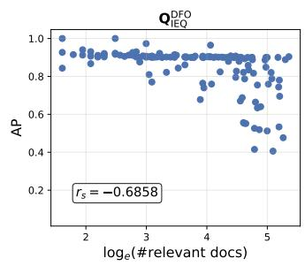

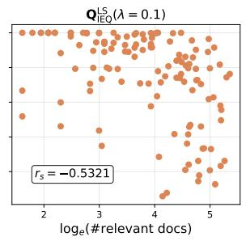

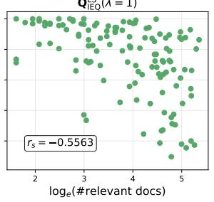  
Fig. 11. Per-query scater plots of AP versus the number of relevant documents for diferent ideal-query formulations on the DL21-22 passage collection. The Spearman rank correlation coeficient $r _ { s }$ between the two variables is reported in each plot. One outlier query is removed.

## C Choice of �

In Section 5, for the results pertaining to ideal queries constructed using the least-squares (LS) method, we used $\lambda = 1 . 0$ and 0.1 as the regularization parameter. In this appendix, we take a more detailed look at the efect of the value of �. Figure 12 shows (for all collections) how MAP varies as � increases. MAP is highest for relatively small values of � (typically between 0 and 1). From Equation (2), it is clear that for higher values of �, progressively less importance is Manuscript submitted to ACM attached to the actual similarity values of relevant and non-relevant documents, and more importance is attached to just ∥Q∥. Naturally, this leads to a gradual decline in retrieval efectiveness

We also study the efect of diferent values of � on the average cosine similarity between a DFO-based ideal query $\boldsymbol { \mathrm { Q } } _ { \mathrm { I E Q } } ^ { \mathrm { D F O } }$ and the corresponding LS-based ideal query $Q _ { \mathrm { I E Q } } ^ { \mathrm { L S } }$ . Figure 13 reports, for each collection, the similarity between these two ideal queries, averaged across all queries. Across all collections, the average overlap initially increases with �, reaches a maximum, and then gradually declines. The maximum overlap is attained for � values between 1 and 5 for all collections. These results indicate that moderate regularization produces LS-based ideal queries that are most similar to the DFO-based formulation.

## D Variability across queries

Before studying the variability across diferent user queries, we first compare it to the variability across diferent expanded variants of a single query. For each query �, we consider the � = 90 diferent expanded versions, and compute both the mean $( { \overline { { \theta _ { Q } } } } )$ and the variance $( V a r ( \theta _ { Q } ) )$ of their angular distances from the corresponding ideal query. We refer to the variance of the mean values $( { \overline { { \theta _ { Q } } } } )$ across queries as between-query variance (BQV), while we use the term within-query variance (WQV) to refer to the mean of the variances $( V a r ( \theta _ { Q } ) )$ . The same process is repeated for AP instead of angular distance. The resulting BQV/WQV ratios are reported in Table 10. A larger BCV/WCV ratio indicates that the variation across queries is greater than the variation among diferent query expansion methods fo the same query. As shown in Table 10, the BQV/WQV ratios for angular distance range from 6.42 to 17.74 across the four collections and ideal query representations, indicating substantially greater variation across queries than among QE methods for the same query. A similar pattern is observed for AP, where the BQV/WQV ratios range from 6.76 to 8.66. Together, these results suggest that query-specific diferences contribute substantially more to the observed variation than the choice of QE method.

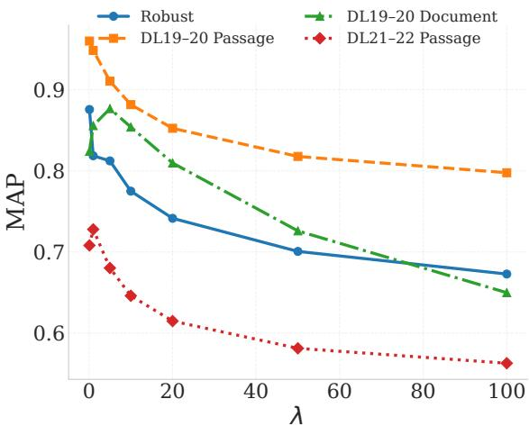  
Fig. 12. Relationship between the MAP values and � for LS based ideal queries.

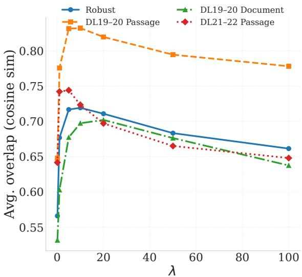  
Fig. 13. Relationship between the average overlap with DFO based ideal query the LS based ideal queries generated with diferent �.

Table 10. BQV/WQV ratios for both angular distances and AP for all collections. Larger BQV/WQV ratios indicate that the separation between query groups is substantially greater than the variability within each group.
<table><tr><td>Method</td><td>Robust</td><td>DL19-20 Passage</td><td>DL19-20 Document</td><td>DL21-22 Passage</td></tr><tr><td>QDE O </td><td>15.79</td><td>15.95</td><td>17.74</td><td>9.65</td></tr><tr><td> $\mathrm { Q } _ { \mathrm { I E Q } } ^ { \mathrm { L S } } ( \lambda = 0 . 1 )$ </td><td>14.37</td><td>6.42</td><td>9.20</td><td>10.38</td></tr><tr><td> $Q _ { \mathrm { I E Q } } ^ { \mathrm { L S } } ( \lambda = 1 )$ </td><td>11.44</td><td>8.89</td><td>9.13</td><td>8.76</td></tr><tr><td>AP</td><td>8.66</td><td>7.07</td><td>6.76</td><td>6.85</td></tr></table>