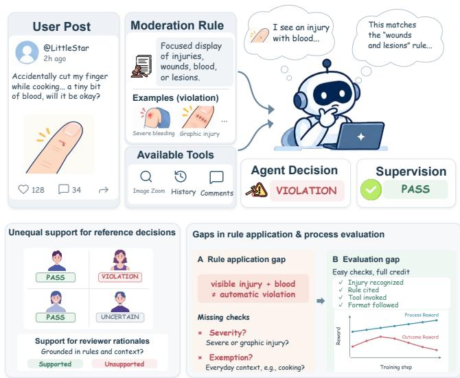
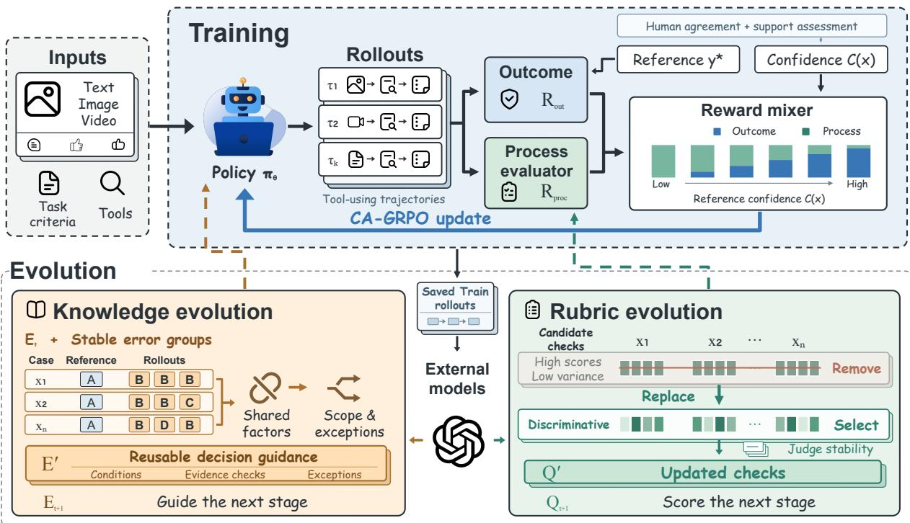
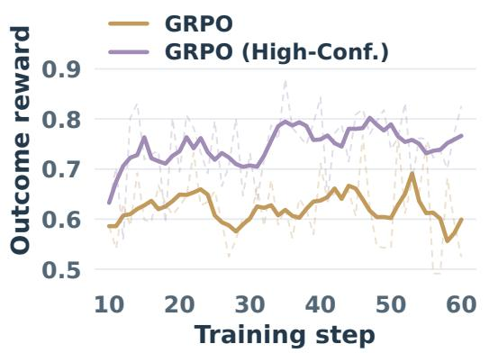
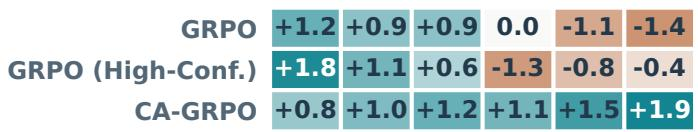
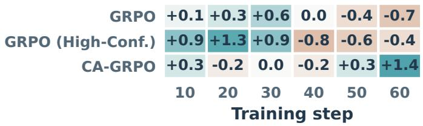
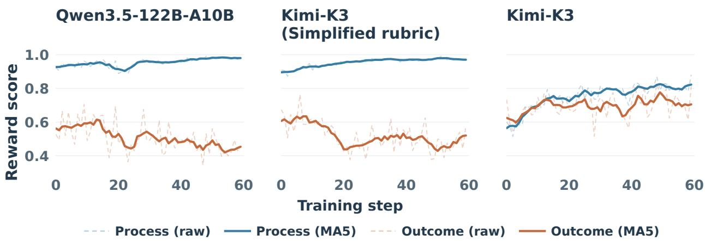

# AdaptEvo: Adaptive Agent Learning with Evolving Supervision

Shijun Wan1,\* Jiancong Xie2,\* Hang Xu3 Jin Duan3 Qixiong Wang3

Xi Xiang3 Maofei Que3 Yahui Liu3,† Zhongyu Wei1,† Mu Chuan3,†

1Fudan University 2Sun Yat-sen University 3Xiaohongshu \*Equal contribution. †Corresponding authors.

Rule-governed contextual decision tasks require models to apply specified rules to case-specific context and evidence. Written rules can leave gaps in decision guidance and process evaluation, while reference judgments vary in their support from the rules and evidence. To address these challenges, we introduce AdaptEvo, a framework for learning under imperfect supervision that couples confidence-adaptive policy optimization with evolving decision knowledge and evaluation rubrics. Its Training module uses Confidence-Adaptive GRPO (CA-GRPO) to balance outcome and process rewards according to reference confidence. Its Evolution module synthesizes reusable decision knowledge from recurring failures across training cases and refines process rubrics to detect overlooked errors. To support empirical evaluation, we construct an industrial multimodal content moderation dataset comprising a training set and In-Period and Out-of-Period test sets, with the latter collected under changed rules. Using Qwen3.6-35B-A3B, AdaptEvo achieves 61.9% exact-label accuracy and 72.2% binary decision accuracy on In-Period, exceeding GRPO by 7.5 and 3.7 percentage points, respectively. On Out-of-Period, the policy trained with CA-GRPO retains exact-label accuracy gains over the base model across evaluated checkpoints without injected decision knowledge, while GRPO declines with continued training. CA-GRPO also outperforms the tested fixed reward mixtures on both Out-of-Period metrics.

Date: September 30, 2026 Github: https://github.com/AllSpark-Research/AdaptEvo

AllSpark

## 1 Introduction

Content moderation, legal judgment, and clinical guideline application require LLMs or agents to make decisions by applying written rules to specific contexts and available evidence [6, 10]. We refer to such tasks as rule-governed contextual decision tasks. These tasks primarily assess a model’s ability to translate abstract rules into concrete decisions that are evidence-grounded and contextually appropriate. RL-based training can use outcome feedback on final decisions and process feedback on the trajectories that produce them. Outcome rewards measure agreement with a reference label, whereas process rewards assess evidence acquisition, rule application, and decision derivation. The usefulness of these signals depends on the support for reference labels and the quality of process evaluation.

Figure 1 illustrates two challenges in content moderation. On the one hand, written rules cannot exhaustively specify the evidence requirements, decision boundaries, and exceptions that arise across diverse contexts. This limitation not only leaves models without sufficient operational guidance but also makes it difficult for process evaluators with fixed criteria to detect errors in

  
Figure 1: A content moderation example of a rulegoverned contextual decision task, illustrating unequal support for reference decisions and gaps in rule application and process evaluation. The case and reward curves are schematic.

rule application. On the other hand, reference judgments vary in reliability: annotators may reach different conclusions because of differences in interpretation or implicit decision standards. Treating all reference labels as equally reliable outcome supervision may therefore cause models to learn decisions that are weakly supported by the rules and available evidence.

To address these challenges, we introduce AdaptEvo, a framework for learning under imperfect supervision in rule-governed contextual decision tasks. AdaptEvo alternates between two modules. In the training module, we propose Confidence-Adaptive GRPO (CA-GRPO), which adaptively balances outcome and process rewards according to reference confidence.

CA-GRPO places greater emphasis on outcome feedback for strongly supported references and relies more on process feedback when reference judgments are uncertain. The evolution module freezes the updated policy. A stronger external model analyzes recurring failures across training cases to derive reusable decision conditions, evidence requirements, boundaries, and exceptions. Separately, rubric screening uses scores across cases and repeated judgments to select checks that reliably distinguish rollout quality. The evolved decision knowledge and evaluation rubric are then fixed and used to guide the next stage of training.

To evaluate AdaptEvo, we construct a multimodal content moderation dataset from real-world industrial workflows, with test sets from the training period (In-Period) and a later period with updated rules (Out-of-Period). Using Qwen3.6-35B-A3B, AdaptEvo achieves 61.9% exact-label accuracy (ELA) and 72.2% binary decision accuracy (BDA) on In-Period, exceeding GRPO by 7.5 and 3.7 percentage points, respectively. On Out-of-Period, it achieves 59.5% ELA and 69.5% BDA, surpassing GRPO by 7.6 and 4.3 points. Further ablation studies and analyses support the benefits of evolved decision knowledge and confidence-adaptive reward mixing.

Overall, our contributions are fourfold: (1) AdaptEvo, a Training–Evolution framework for jointly adapting policy learning, decision guidance, and evaluation under imperfect supervision; (2) CA-GRPO, a confidence-adaptive policy optimization method that balances outcome and process rewards according to reference confidence; (3) training and test datasets from an industrial multimodal content moderation setting to support research on rule-governed contextual decision tasks; and (4) empirical results demonstrating that AdaptEvo achieves state-of-the-art performance on multimodal content moderation.

## 2 Related Work

Imperfect supervision and decision criteria. Annotator disagreement can reflect valid perspectives rather than noise [8, 11], while measurement and policy research examines how abstract standards become operational judgments [6, 10]. AdaptEvo adjusts reward mixing using support for a specified reference and learns scoped decision guidance. It does not model the full distribution of perspectives or resolve standards left undefined by the task.

Knowledge updates. Self-improving systems update agent implementations or adaptation mechanisms [15, 21, 23]. Closer to our setting, AgentEvolver combines experience, RL, and reward attribution [19]; MemSkill alternates controller training with memory-skill revision [20]. AdaptEvo couples confidenceadaptive training with updates to decision knowledge and evaluation rubrics. Our two-stage evaluation covers one joint update, without establishing sustained recursive self-improvement.

Evaluation and feedback updates. Reward overoptimization and judge biases motivate revisiting evaluation signals as policies change [2, 22]. Self-Rewarding Language Models use model-generated preference labels for iterative preference optimization [18]. AdaptEvo instead revises textual process checks and scoring anchors, with evaluator parameters held fixed.

## 3 Preliminaries

We use rule-governed contextual decision tasks to denote tasks in which an agent applies explicitly provided rules or guidelines to case-specific context and evidence. Solving these tasks requires identifying relevant evidence, determining which rules apply, and checking the conditions and exceptions that affect the final decision. For example, in content moderation, observing a visible injury does not by itself establish a violation. The agent must assess its severity and presentation and determine whether any exemption applies under the governing rules. Such tasks therefore require contextual rule application beyond recognizing surface-level cues.

Given governing rules R and a case context $x ,$ the agent must select a label $\hat { y } \in \mathcal { V } ( x )$ , where $\mathcal { V } ( x )$ denotes the set of candidate labels for the case. The predicted label should be supported by the available evidence and satisfy the applicable conditions and exceptions specified by R.

In our setting, we formulate this problem as an agentic task. The initial context x contains the available case information and potentially multimodal evidence. $\mathrm { A }$ policy $\pi _ { \theta }$ can interact with a tool set $\tau$ to acquire additional evidence before returning a label yˆ and an explicit rationale j. The resulting observable trajectory is

$$
\tau = \big ( ( a _ { 1 } , o _ { 1 } ) , \dots , ( a _ { K } , o _ { K } ) , j , \hat { y } \big ) ,\tag{1}
$$

where $a _ { k }$ is a request to a tool in $\mathcal { T } , o _ { k }$ is its returned observation, and K is the number of tool interactions. Each action and the final decision are conditioned on the rules, initial context, observations collected so far, and any injected decision knowledge.

For an annotated case, $y ^ { \star }$ denotes the reference label, optionally accompanied by a rationale or additional annotations. The learning objective is to improve evidence-grounded decisions under R, with referencelabel agreement serving as an imperfect supervision signal.

In this setting, learning faces two challenges arising from gaps in rule application and uncertainty in reference judgments.

Unequal support for reference decisions. Studies of subjective annotation and toxicity judgments show that disagreement can reflect systematic interpretations and annotator beliefs [8, 16]; these findings do not make disagreement a correctness test. Under a specified rule, support must also be assessed against the available evidence. In our moderation training data, the final quality-control (QC) decision serves as the reference label $y ^ { \star }$ (Appendix A.1). Of 3,395 cases, 709 (20.9%) have disagreement among the four human annotations. Separately, Kimi-K3 assesses each reference label and its written rationale against the applicable rules, post content, and cached tool outputs. Across the same dataset, it rates 1,124 cases (33.1%) as ambiguous or unsupported: 659 (19.4%) are ambiguous and 465 (13.7%) are unsupported (Appendix A.2). These are model-assessed support judgments, not annotation-error estimates. These partially overlapping case groups motivate adapting reliance on reference labels while preserving useful process information.

Gaps in rule application and process evaluation. Written rules may leave case-specific conditions and exceptions implicit [5, 1, 10]. For example, under a rule prohibiting severe graphic injury but exempting medical education, an agent may flag a wound without checking severity or the exemption. A rubric that rewards cue recognition and rule citation may still score this decision highly. Such failures motivate jointly refining decision knowledge and evaluation rubrics so that agents apply the necessary checks and evaluators detect their omission, with both grounded in the governing rules and evidence.

AdaptEvo addresses these challenges through Training, which adapts outcome–process feedback to reference support, and Evolution, which revises decision knowledge and evaluation checks. The governing rules remain fixed throughout the updates within a training run.

## 4 Method

## AdaptEvo maintains the state

$$
S _ { t } = ( \theta _ { t } , E _ { t } , Q _ { t } ) ,\tag{2}
$$

where t indexes training stages, $\theta _ { t }$ denotes policy parameters, $E _ { t }$ is the decision knowledge library, and $Q _ { t }$ is the process rubric. CA-GRPO adapts policy learning to reference support; evolution updates decision guidance and process feedback. A task scope groups cases sharing a candidate-label space and applicable rule context; in our moderation setting, it corresponds to a moderation queue.

Each training stage (the inner loop) updates the policy with $E _ { t }$ and $Q _ { t }$ fixed. At its boundary, an evolution update (the outer-loop update) freezes the policy, synthesizes knowledge from recurring failures, and screens rubric criteria using scores on saved training trajectories. The selected versions define the next stage. Knowledge guides the agent’s application of governing rules $R ;$ rubrics assess its behavior against those criteria. The applicable rule versions, tools $\tau$ , and confidence definition remain fixed across the training stages and evolution updates within a training run. Evaluation may use different rule versions.

  
Figure 2: AdaptEvo alternates training (top) and evolution (bottom). Knowledge evolution turns recurring mismatches across cases (reference $\scriptstyle \mathbf { A } ,$ predominantly B predictions) into conditional guidance. Rubric evolution screens out saturated checks that lack within-case discrimination across many cases, accounting for Judge noise when selecting alternatives. Each rubric row is a check; each strip shows one case’s rollout scores. Labels and scores are schematic; task rules remain fixed.

Our experiments cover two training stages and one joint knowledge–rubric update. The full stagetransition protocol is presented in Appendix B.1.

## 4.1 Training: Confidence-Adaptive Policy Learning

Confidence-Adaptive GRPO (CA-GRPO) adjusts the balance between reference agreement and process feedback. Let $C ^ { \bf { \hat { \alpha } } } ( x ) \in [ 0 , 1 ]$ measure support for reference label $y ^ { \star }$ under the task criteria and available evidence. In our implementation, it combines human annotation agreement with an external assessment of support for the reference label and rationale. It is distinct from task difficulty and need not be a calibrated correctness probability. For a valid final output, the reward is

$$
R _ { t } ( \tau , x ) = \alpha ( C ( x ) ) R _ { \mathrm { o u t } } ( \tau , x ) + [ 1 - \alpha ( C ( x ) ) ] R _ { \mathrm { p r o c } } ( \tau ; Q _ { t } ) - P _ { \mathrm { p r o t o c o l } } ( \tau ) ,\tag{3}
$$

where $R _ { \mathrm { o u t } }$ measures reference agreement and $P _ { \mathrm { p r o t o c o l } }$ penalizes tool and interaction-protocol errors. Invalid final outputs receive zero reward. We use the fixed mapping $\alpha ( C ) = 0 . 9 C \colon$ adaptation varies across inputs, and process feedback remains active even at maximal confidence.

The process evaluator uses $Q _ { t }$ to assess observable trajectories against the applicable criteria and available evidence, excluding the raw reference answer by default. It differs from the offline reference-support assessor used for confidence and data filtering. We suppress input and rule conditioning in the notation:

$$
R _ { \mathrm { p r o c } } ( \tau ; Q _ { t } ) = \sum _ { d = 1 } ^ { D } w _ { d } q _ { d , t } ( \tau ) , \qquad w _ { d } \ge 0 , \quad \sum _ { d = 1 } ^ { D } w _ { d } = 1 .\tag{4}
$$

Here D is the number of process dimensions, and $q _ { d , t } ( \tau ) ~ \in ~ [ 0 , 1 ]$ is the score assigned to trajectory τ on dimension $d$ under $Q _ { t }$ . During policy training, the evaluator assigns one score per dimension using rubric checks and scoring anchors. Offline candidate-criterion scores used for rubric screening are not

separate training-reward terms. The training dimensions and weights stay fixed across rubric revisions. Appendix A.1 specifies the confidence mapping, reward levels, output validation, and missing-score handling.

We optimize the mixed reward using standard GRPO [17]. Confidence changes the relative contributions of outcome and process feedback within each rollout group, potentially altering trajectory rankings when process scores distinguish rollouts.

## 4.2 Evolution: Decision Knowledge and Evaluation Rubrics

With the policy frozen, evolution uses saved training trajectories through two complementary routes: crosscase mismatch analysis for knowledge and multi-case score analysis for rubrics. The knowledge synthesizer and rubric evaluator may be different external models.

Decision knowledge. Summarizing cases independently can turn reviewer-specific judgments or thresholds into mutually inconsistent guidance. We first collect cases within a task scope where repeated rollouts show similar disagreements with reference labels, such as reference A with predominantly B predictions (Figure 2). A stronger external model $M _ { \mathrm { s t r o n g } }$ jointly examines their rules and evidence; diagnostic records $F _ { t }$ distinguish decision defects from reference conflicts or missing information. Repeated disagreement alone does not establish that a reference is correct. A failure mechanism is a recurring, evidence-attributed reason for a decision or process defect. $\mathcal { G } _ { t }$ groups different training inputs sharing a diagnosed mechanism, unlike GRPO’s within-input rollout groups. For each group, the model extracts shared evidence patterns and failure factors, then contrasts context, evidence sufficiency, exceptions, and neighboring-label boundaries. Only rule- and evidence-supported distinctions enter the guidance; unresolved conflicts remain flagged for review.

The resulting guidance specifies triggering conditions, required evidence, decision boundaries, and exceptions. Compatible findings from different error groups are consolidated into one candidate for the task scope:

$$
E ^ { \prime } = \mathcal { U } _ { E } \big ( E _ { t } , \mathcal { G } _ { t } ; M _ { \mathrm { s t r o n g } } \big ) .\tag{5}
$$

For example, repeated attribution failures can yield guidance to verify that a retrieved fact concerns the entity being judged, with explicit conditions for transferring evidence. The injected text contains reusable conditions and checks, with case identifiers and individual answers kept outside it. Relevant knowledge enters the agent’s initial context under a fixed text budget, guiding the full trajectory. The knowledge-entry structure appears in Appendix B.2.

Evaluation rubrics. Rubric checks specify which observable behaviors to assess; scoring anchors specify which behaviors support particular score levels. We screen a pool of candidate criteria $\mathcal { P }$ using saved within-input rollout groups $B _ { t }$ . A fixed evaluator scores the criteria in batches and repeats judgments on the same trajectories. Mean scores and full-score rates reveal saturation. We compute score variance among rollouts within each input, then aggregate across cases and queues to identify criteria that consistently offer little discrimination. Comparison with matched repeated-judgment variance accounts for evaluator noise; low variance on one case alone is insufficient. Checks with high scores and low within-case variance across many cases are candidates for replacement, subject to applicability and evidence review. Alternatives with stable discrimination are re-evaluated on a separate training panel before integration into $Q ^ { \prime } = \mathcal { U } _ { O } ( Q _ { t } , B _ { t } ; \mathcal { P } )$ . This revises checks and scoring anchors within the existing dimensions; the five training dimensions and their weights remain fixed. Appendix B.3 details the screening and validation protocol.

Knowledge candidates require fresh agent rollouts because guidance can change the full trajectory. Their assessment checks the targeted errors and regressions on other training-side cases within the task scope; rubric candidates reuse fixed trajectories. Selection yields $E _ { t + 1 }$ and $\boldsymbol { Q } _ { t + \bar { 1 } }$ from the candidates $E ^ { \prime }$ and $Q ^ { \prime }$ or retains either previous version. Both remain fixed throughout the next training stage. Final test data are excluded from diagnosis and update selection; implementation details appear in Appendix B.1.

## 5 Experiments

## 5.1 Experimental Setup

Task and data. We evaluate AdaptEvo in multimodal content moderation. Each case provides a post (text and available images or videos), its moderation queue, applicable rules, and access to tools such as comment retrieval and similar-post search. The queue defines the review scope and candidate labels: one pass label and a set of violation labels. The agent returns one candidate label and a rationale grounded in the rules and evidence (Appendix A.1 provides an example).

The training set contains 3,395 cases, each annotated by four human reviewers, including a quality-control (QC) reviewer. We use the QC reviewer’s label as the reference judgment, accompanied by a written rationale. Human annotations disagree on 20.9% of the cases, highlighting the uncertainty in reference supervision. Reference confidence combines agreement among the human annotations with an offline assessment by Kimi-K3 of whether the rules and available evidence support the QC label and rationale. This assessment does not alter the reference label. Detailed annotation statistics are provided in Appendix A.2.

Models and comparisons. We evaluate Qwen, GLM, Kimi, and Gemini models on moderation label prediction, then compare training methods using Qwen3.6-35B-A3B as the shared backbone. Alongside the base model, we evaluate GRPO and CA-GRPO trained on the full pool, and GRPO (High-Conf.) trained only on cases with unanimous human labels and a QC label–rationale pair judged supported by Kimi-K3. Both GRPO baselines use reference-based outcome rewards; CA-GRPO uses confidence-adaptive outcome– process rewards with a fixed rubric and no injected decision knowledge. We also evaluate the same CA-GRPO policy with evolved knowledge only at inference. AdaptEvo continues training from this policy with the same knowledge and an updated process rubric.

Evaluation. Evaluation uses an In-Period test set collected during the training-data collection period and an Out-of-Period test set collected later under changed governing rules. We report exact-label accuracy (ELA), requiring an exact reference-label match, and binary decision accuracy (BDA), comparing pass/violation decisions after merging all violation labels. Both metrics measure reference agreement, not independently verified rule compliance; reported differences are percentage points. Appendix A provides annotation, reward, metric, and training and evaluation details.

## 5.2 Main Results

Table 1 reports results on the In-Period and Out-of-Period benchmarks, with decision knowledge indicated separately. We include reference models from different families and compare training methods using Qwen3.6-35B-A3B as a shared backbone.

In-Period performance. Among the open-weight Qwen3.5 models, the 27B variant performs best, reaching 55.1% ELA and 68.5% BDA. AdaptEvo achieves 61.9% ELA and 72.2% BDA, the highest In-Period results among all evaluated configurations, exceeding the Qwen3.6-35B-A3B base model by 8.0/6.1 percentage points and GRPO by 7.5/3.7 points. It also surpasses Gemini3.8-Flash, the strongest reference model, by 0.7/0.3 points. These gains reflect the complete configuration, including evolved knowledge, rubric revision, and continued training.

Reward design and knowledge updates. On In-Period, GRPO (High-Conf.) trades 1.1 points of ELA for 0.3 points of BDA relative to GRPO; CA-GRPO gains 1.0 ELA point but loses 0.4 BDA points, motivating the fixed-mixture comparison in Section 6.2. Adding evolved knowledge at inference improves CA-GRPO by 3.7/3.2 ELA/BDA points. Continuing training with this knowledge and an updated rubric yields AdaptEvo and adds 2.8/0.9 points. These increments measure inference-time knowledge gains and the combined effect of continued training and rubric revision, respectively.

Out-of-Period generalization. AdaptEvo achieves the highest Out-of-Period ELA among the evaluated shared-backbone training methods at 59.5%, alongside 69.5% BDA, exceeding the base model by 6.2/3.6 percentage points and GRPO by 7.6/4.3 points, respectively. Without injected knowledge, CA-GRPO improves both metrics over the base model (55.2/67.3 versus 53.3/65.9), whereas GRPO falls below the base model on both (51.9/65.2). Adding evolved knowledge to CA-GRPO further raises BDA to 69.7%, the highest among all evaluated configurations. AdaptEvo also approaches Gemini3.8-Flash in ELA (59.5% versus

Table 1: Moderation results on the In-Period and Out-of-Period benchmarks (%, higher is better). ELA: exact-label accuracy; BDA: binary decision accuracy. Knowledge specifies injected decision knowledge. Bold marks the best score in each column.
<table><tr><td rowspan="2">Model / Method</td><td rowspan="2">Knowledge</td><td colspan="2">In-Period</td><td colspan="2">Out-of-Period</td></tr><tr><td>ELA</td><td>BDA</td><td>ELA</td><td>BDA</td></tr><tr><td>Qwen3.5-4B</td><td>None</td><td>46.8</td><td>60.8</td><td>50.8</td><td>64.5</td></tr><tr><td>Qwen3.5-9B</td><td>None</td><td>46.2</td><td>63.2</td><td>50.4</td><td>65.2</td></tr><tr><td>Qwen3.5-27B</td><td>None</td><td>55.1</td><td>68.5</td><td>53.8</td><td>66.0</td></tr><tr><td>Qwen3.8-Flash-Next</td><td>None</td><td>54.9</td><td>69.1</td><td>54.4</td><td>67.6</td></tr><tr><td>GLM5.3-Flash</td><td>None</td><td>56.3</td><td>69.6</td><td>55.6</td><td>67.5</td></tr><tr><td>Kimi-K3</td><td>None</td><td>56.2</td><td>68.9</td><td>56.7</td><td>68.8</td></tr><tr><td>Gemini3.8-Flash</td><td>None</td><td>61.2</td><td>71.9</td><td>60.4</td><td>69.5</td></tr><tr><td colspan="6">Shared backbone: Qwen3.6-35B-A3B</td></tr><tr><td>Qwen3.6-35B-A3B (base)</td><td>None</td><td>53.9</td><td>66.1</td><td>53.3</td><td>65.9</td></tr><tr><td>GRPO</td><td>None</td><td>54.4</td><td>68.5</td><td>51.9</td><td>65.2</td></tr><tr><td>GRPO (High-Conf.)</td><td>None</td><td>53.3</td><td>68.8</td><td>52.9</td><td>65.5</td></tr><tr><td>CA-GRPO</td><td>None</td><td>55.4</td><td>68.1</td><td>55.2</td><td>67.3</td></tr><tr><td>CA-GRPO†</td><td>Evolved</td><td>59.1</td><td>71.3</td><td>58.6</td><td>69.7</td></tr><tr><td>AdaptEvo</td><td>Evolved</td><td>61.9</td><td>72.2</td><td>59.5</td><td>69.5</td></tr></table>

For each trained method, we report its 60-step checkpoint. †The same CA-GRPO policy receives knowledge only at inference, summarized by GPT-5.6-Sol. AdaptEvo continues training from CA-GRPO with the same knowledge and an updated rubric. Run aliases and checkpoint conventions appear in Appendix A.7.

60.4%) and matches its BDA (69.5%). Section 6.1 examines these trends during training: accuracy declines under GRPO despite higher training rewards, whereas CA-GRPO retains ELA gains over the base model.

## 6 Analysis

## 6.1 Generalization to New Rules and Queues

We track training rewards and checkpoint performance on Out-of-Period. All checkpoints are evaluated without injected decision knowledge, and those trained with CA-GRPO precede knowledge and rubric evolution.

Figure 3 shows that higher training reward does not ensure better transfer. Despite substantial fluctuations, average training rewards under GRPO and GRPO (High-Conf.) are higher in the final training window than in the initial window. Out-of-Period checkpoint accuracy nevertheless declines: from step 10 to 60, ELA/BDA fall by 2.6/0.8 percentage points under GRPO and 2.2/1.3 points under GRPO (High-Conf.). The final checkpoints of both runs score below the base model on both metrics. High-confidence filtering thus improves early checkpoint performance but does not prevent subsequent generalization degradation in this comparison.

The policy trained with CA-GRPO maintains an ELA gain over the base model at every evaluated checkpoint. Its final checkpoint achieves the strongest performance at 55.2% ELA and 67.3% BDA, exceeding the base model by 1.9/1.4 points and the final GRPO checkpoint by 3.3/2.1 points. These results support stronger generalization as training proceeds. The comparison concerns the complete CA-GRPO training configuration; it does not isolate confidence adaptation from process supervision. Appendix A.5 provides all checkpoint values and reward-processing details.

(a) Training reward  

(b) Out-of-Period ELA  
  
(c) Out-of-Period BDA

  
Figure 3: Training reward and Out-of-Period generalization. (a) Outcome rewards during GRPO and GRPO (High-Conf.) training: faint dashed lines show raw values and solid lines show centered 5-step moving averages. (b–c) Out-of-Period ELA and BDA gains over the base model (53.3%/65.9%), in percentage points, without injected decision knowledge. Heatmaps share a color scale: teal indicates gains and orange indicates losses; each cell gives the exact difference.

## 6.2 Confidence-Adaptive Reward Mixing

We compare CA-GRPO’s confidence-adaptive reward mixing (Equation 3) with three fixed outcome:process ratios: 0.8:0.2, 0.5:0.5, and 0.2:0.8. Table 2 reports results on both benchmarks; Appendix A.6 provides the full comparison, including evaluation with evolved decision knowledge.

The fixed mixtures exhibit a consistent trade-off between the two decision levels. The process-heavy 0.2:0.8 ratio yields the highest fixed-mixture ELA on both benchmarks, whereas 0.5:0.5 gives the highest BDA. Moving from the latter to the former raises ELA by 1.4/0.8 percentage points on In-Period/Outof-Period, but lowers BDA by 0.6/0.4 points. Thus, none of the tested fixed ratios is best for both specificlabel prediction and pass/violation decisions.

Table 2: Fixed and adaptive reward mixing after 60 training steps. Ratios are outcome:process; ELA and BDA are percentages. Bold marks each column maximum.
<table><tr><td rowspan="2">Reward Mixing</td><td>In-Period</td><td colspan="2">Out-of-Period</td></tr><tr><td>ELA BDA</td><td>ELA</td><td>BDA</td></tr><tr><td>Fixed (0.8:0.2)</td><td>54.3 67.6</td><td>53.6</td><td>66.1</td></tr><tr><td>Fixed (0.5:0.5)</td><td>54.2</td><td>67.9 54.0</td><td>66.2</td></tr><tr><td>Fixed (0.2:0.8)</td><td>55.6</td><td>67.3 54.8</td><td>65.8</td></tr><tr><td>CA-GRPO</td><td>55.4</td><td>68.1 55.2</td><td>67.3</td></tr></table>

CA-GRPO achieves a better balance and ranks first in three of the four comparisons. On In-Period, its ELA (55.4%) is only 0.2 points below the process-heavy mixture, while its BDA (68.1%) is 0.8 points higher. On Out-of-Period, it leads both ELA (55.2%) and BDA (67.3%), exceeding the best fixed ratio for each metric by 0.4 and 1.1 points, respectively. Adaptive mixing therefore retains nearly all of the process-heavy mixture’s In-Period ELA while improving binary decisions, and yields the strongest observed generalization among the evaluated mixtures.

This advantage persists with evolved decision knowledge (Appendix A.6). CA-GRPO reaches 59.1% ELA and 71.3% BDA, exceeding the best fixed mixture for each metric by 0.5 and 1.2 points. Its BDA gain from knowledge is 3.2 points, compared with 1.3–2.2 points for the fixed mixtures, indicating that adaptive training remains beneficial when additional decision guidance is supplied.

## 6.3 Knowledge and Rubric Updates

Knowledge and continued training. Adding evolved knowledge to CA-GRPO improves In-Period performance without updating the policy parameters (Table 1). Continuing training with this knowledge and an updated process rubric yields AdaptEvo, further improving ELA and BDA by 2.8 and 0.9 percentage points, respectively. These gains reflect the combined effect of continued training and rubric revision. We next examine why the process evaluator itself may need to evolve during training.

  
Figure 4: Process (blue) and reference-agreement outcome (orange) rewards over training steps 0–59. Panels identify process evaluators and mark the simplified Kimi-K3 rubric. Faint dashed lines show raw step means; solid lines show 5-step centered moving averages (MA5) with truncated edge windows. All panels share the same scale. Scores are unweighted training rewards, not accuracies.

Process-evaluator diagnostics. A process evaluator may fail to distinguish sound and defective rollouts, or a permissive rubric may award high scores despite missing evidence checks or incorrect rule application. Both can create exploitable scoring gaps, allowing process reward to rise while task performance deteriorates (Section 3). Figure 4 shows a corresponding pattern: with Qwen3.5-122B-A10B or Kimi-K3 using a simplified rubric, mean process reward approaches 0.98, while reference-agreement outcome reward falls from 0.569 to 0.455 and from 0.615 to 0.464, respectively, between the first and last 12-step windows. The other Kimi-K3 run improves on both rewards, showing that evaluator identity alone does not determine the reward trends.

These observations motivate screening rubric checks for stable within-case discrimination across multiple cases, accounting for repeated-judgment noise. The divergence is consistent with process reward hacking, but differing policy initializations and rubrics prevent isolating either failure mechanism from these curves alone. Appendix C.1 reports detailed statistics.

## 7 Conclusion

We presented AdaptEvo, a framework for learning under imperfect supervision in rule-governed contextual decision tasks. AdaptEvo combines confidence-adaptive policy optimization with cross-case knowledge synthesis and rubric screening, addressing both uncertain reference labels and gaps in rule application. Experiments on industrial multimodal content moderation demonstrate improved decision accuracy and gains from evolved decision knowledge. Evaluation under changed rules further shows that CA-GRPO retains ELA gains over the base model across evaluated checkpoints, whereas standard GRPO deteriorates.

## AI use statement

We use Qwen3.6-35B-A3B [14] as the shared policy backbone. Our benchmark comparisons also include Qwen3.5-4B, Qwen3.5-9B, and Qwen3.5-27B [13]; Qwen3.8-Flash-Next [12]; GLM5.3-Flash [3]; Kimi-K3 [7]; and Gemini3.8-Flash [4]. Kimi-K3 also serves as a reference-support assessor and process evaluator; the historical process-evaluator comparison additionally includes Qwen3.5-122B-A10B [13]. GLM5.3-Flash also scores candidate rubric checks during offline screening and validation. GPT-5.6-Sol [9] summarizes the evolved decision knowledge. These research roles and their input boundaries are specified in the method and experimental sections.

LLMs were also employed to assist in literature search, helping us identify and locate relevant prior work.   
We also used GPT-5.6-Sol [9] to assist with implementing the research code.

## References

[1] Shlomi Codish and Richard N. Shiffman. A model of ambiguity and vagueness in clinical practice guideline recommendations. In AMIA Annual Symposium Proceedings, pp. 146–150, 2005. URL https: //pmc.ncbi.nlm.nih.gov/articles/PMC1560665/.

[2] Leo Gao, John Schulman, and Jacob Hilton. Scaling laws for reward model overoptimization. In Andreas Krause, Emma Brunskill, Kyunghyun Cho, Barbara Engelhardt, Sivan Sabato, and Jonathan Scarlett (eds.), Proceedings ofthe 40th International Conference on Machine Learning, volume 202 of Proceedings ofMachine Learning Research, pp. 10835–10866. PMLR, 23–29 Jul 2023. URL https://proceedings. mlr.press/v202/gao23h.html.

[3] GLM-5-Team, Aohan Zeng, Xin Lv, Zhenyu Hou, Zhengxiao Du, Qinkai Zheng, Bin Chen, Da Yin, Chendi Ge, Chenghua Huang, Chengxing Xie, Chenzheng Zhu, Congfeng Yin, Cunxiang Wang, Gengzheng Pan, Hao Zeng, Haoke Zhang, Haoran Wang, Huilong Chen, Jiajie Zhang, Jian Jiao, Jiaqi Guo, Jingsen Wang, Jingzhao Du, Jinzhu Wu, Kedong Wang, Lei Li, Lin Fan, Lucen Zhong, Mingdao Liu, Mingming Zhao, Pengfan Du, Qian Dong, Rui Lu, Shuang-Li, Shulin Cao, Song Liu, Ting Jiang, Xiaodong Chen, Xiaohan Zhang, Xuancheng Huang, Xuezhen Dong, Yabo Xu, Yao Wei, Yifan An, Yilin Niu, Yitong Zhu, Yuanhao Wen, Yukuo Cen, Yushi Bai, Zhongpei Qiao, Zihan Wang, Zikang Wang, Zilin Zhu, Ziqiang Liu, Zixuan Li, Bojie Wang, Bosi Wen, Can Huang, Changpeng Cai, Chao Yu, Chen Li, Chengwei Hu, Chenhui Zhang, Dan Zhang, Daoyan Lin, Dayong Yang, Di Wang, Ding Ai, Erle Zhu, Fangzhou Yi, Feiyu Chen, Guohong Wen, Hailong Sun, Haisha Zhao, Haiyi Hu, Hanchen Zhang, Hanrui Liu, Hanyu Zhang, Hao Peng, Hao Tai, Haobo Zhang, He Liu, Hongwei Wang, Hongxi Yan, Hongyu Ge, Huan Liu, Huanpeng Chu, Jia’ni Zhao, Jiachen Wang, Jiajing Zhao, Jiamin Ren, Jiapeng Wang, Jiaxin Zhang, Jiayi Gui, Jiayue Zhao, Jijie Li, Jing An, Jing Li, Jingwei Yuan, Jinhua Du, Jinxin Liu, Junkai Zhi, Junwen Duan, Kaiyue Zhou, Kangjian Wei, Ke Wang, Keyun Luo, Laiqiang Zhang, Leigang Sha, Liang Xu, Lindong Wu, Lintao Ding, Lu Chen, Minghao Li, Nianyi Lin, Pan Ta, Qiang Zou, Rongjun Song, Ruiqi Yang, Shangqing Tu, Shangtong Yang, Shaoxiang Wu, Shengyan Zhang, Shijie Li, Shuang Li, Shuyi Fan, Wei Qin, Wei Tian, Weining Zhang, Wenbo Yu, Wenjie Liang, Xiang Kuang, Xiangmeng Cheng, Xiangyang Li, Xiaoquan Yan, Xiaowei Hu, Xiaoying Ling, Xing Fan, Xingye Xia, Xinyuan Zhang, Xinze Zhang, Xirui Pan, Xu Zou, Xunkai Zhang, Yadi Liu, Yandong Wu, Yanfu Li, Yidong Wang, Yifan Zhu, Yijun Tan, Yilin Zhou, Yiming Pan, Ying Zhang, Yinpei Su, Yipeng Geng, Yong Yan, Yonglin Tan, Yuean Bi, Yuhan Shen, Yuhao Yang, Yujiang Li, Yunan Liu, Yunqing Wang, Yuntao Li, Yurong Wu, Yutao Zhang, Yuxi Duan, Yuxuan Zhang, Zezhen Liu, Zhengtao Jiang, Zhenhe Yan, Zheyu Zhang, Zhixiang Wei, Zhuo Chen, Zhuoer Feng, Zijun Yao, Ziwei Chai, Ziyuan Wang, Zuzhou Zhang, Bin Xu, Minlie Huang, Hongning Wang, Juanzi Li, Yuxiao Dong, and Jie Tang. Glm-5: from vibe coding to agentic engineering, 2026. URL https://arxiv.org/abs/2602.15763.

[4] Google DeepMind. Gemini 3.8 Flash model card. Model card, Google DeepMind, September 2026. URL https://storage.googleapis.com/deepmind-media/Model-Cards/ Gemini-3-8-Flash-Model-Card.pdf.

[5] Clement Guitton, Aurelia Tamò-Larrieux, Simon Mayer, and Gijs van Dijck. The challenge of opentexture in law. Artificial Intelligence and Law, 33(2):405–435, 2025. doi: 10.1007/s10506-024-09390-1. URL https://link.springer.com/article/10.1007/s10506-024-09390-1. First published online April 17, 2024.

[6] Abigail Z. Jacobs and Hanna Wallach. Measurement and fairness. In Proceedings of the 2021 ACM Conference on Fairness, Accountability, and Transparency, FAccT ’21, pp. 375–385. ACM, March 2021. doi: 10.1145/3442188.3445901. URL http://dx.doi.org/10.1145/3442188.3445901.

[7] Kimi Team, Tongtong Bai, Yifan Bai, Yiping Bao, M. C., Jianfeng Cai, Xinyuan Cai, Peizhou Cao, Yuxuan Cao, Ziwei Chai, Y. Charles, H. S. Che, Guanduo Chen, Guangyu Chen, Guanzheng Chen, Huarong Chen, Jia Chen, Jianlong Chen, Jun Chen, Kexin Chen, Peng Chen, Ruijue Chen, Wentao Chen, Xin Chen, Yang Chen, Yanru Chen, Yifei Chen, Yingjiang Chen, Yuankun Chen, Yujie Chen, Yutian Chen, Zhirong Chen, Dazhi Cheng, Yean Cheng, Jialei Cui, Jingbing Cui, Anqi Dai, Jiaqi Deng, Hao Ding, Rui Ding, Shaofeng Ding, Mengfan Dong, Mengnan Dong, Yuhao Dong, Yuxin Dong, Angang Du, Chenzhuang Du, Dikang Du, Jusen Du, Yulun Du, Yu Fan, Jing Feng, Qiulin Feng, Yichen

Feng, Kelin Fu, Qiang Fu, Fuxuan Gao, Hongcheng Gao, Jingyue Gao, Tong Gao, Weijia Gao, Shangyi Geng, Jie Gong, Linhu Gong, Shengao Gong, Xiaochen Gong, Qizheng Gu, Yicheng Gu, Shuhao Guan, Haiqing Guo, Shiqi Guo, Xiang Guo, Zhengyan Guo, Beixi Hao, Wenxin Hao, Xiaoru Hao, Dailan He, Haotian He, Lehan He, Qi He, Weiran He, Xinran He, Xinyi He, Yibo He, Yunjia He, Chao Hong, Tiange Hong, Hao Hu, Jiaxi Hu, Ruikun Hu, Weiming Hu, Yangyang Hu, Zhenxing Hu, Liang Hua, Jinbin Huang, Ke Huang, Ruiyuan Huang, Siying Huang, Weixiao Huang, Yan Huang, Zhengjie Huang, Zhiqi Huang, Yulong Hui, Chaobo Jia, Yutong Jiang, Zhejun Jiang, Zuoyou Jiang, Wenyi Jin, Xinyi Jin, Yu Jing, Huanjun Kong, Guokun Lai, Aidi Li, Cheng Li, Chengyuan Li, Cong Li, Fang Li, Guanyu Li, Haoyang Li, Jia Li, Junxiong Li, Lei Li, Letian Li, Lincan Li, Weihong Li, Wentao Li, Xintong Li, Yang Li, Yishen Li, Yiwei Li, Yuxiao Li, Zhaowei Li, Zhaoxi Li, Zheming Li, Zhengxiao Li, Zhiyuan Li, Jiawei Lin, Xiaohan Lin, Yibo Lin, Zichao Lin, Ziyan Lin, Bill Liu, Boxiao Liu, Chuan Liu, Liang Liu, Shaowei Liu, Shudong Liu, Shuran Liu, Tianwei Liu, Weizhou Liu, Yangyang Liu, Yanming Liu, Yibo Liu, Yipeng Liu, Zhengying Liu, Zhiheng Liu, Enzhe Lu, Haoyu Lu, Linqiang Lu, Tingzhan Lu, Zhiyuan Lu, Aotian Luo, G. Luo, Junyu Luo, Yifan Luo, B. Lyu, Wenzhou Lyu, Shaoguang Mao, Yuan Mei, Xin Men, Minqing Ni, Yixuan Niu, Siyuan Pan, Shujun Peng, Zhangyang Qi, Ruoyu Qin, ZeChao Qin, Zeyu Qin, Haiquan Qiu, Jianxin Qiu, Jiezhong Qiu, Bowen Qu, Yuhao Qu, Zeyu Shang, Youbo Shao, Han Shen, Jincheng Shi, Juanfeng Shi, Lidong Shi, Shengyuan Shi, Wingchun Siu, Pengwei Song, Xiaoxi Song, Jianlin Su, Yunfeng Su, Zhaochen Su, Lin Sui, Jingsong Sun, Junyao Sun, Shaoning Sun, Shuzhe Sun, Tongyu Sun, Yujun Sun, Yunpeng Tai, Chuning Tang, Heyi Tang, Sirui Tang, Zecheng Tang, Chaoran Tian, Rongpeng Tian, Yu Tian, Wei Tu, Chensi Wang, Chuang Wang, Chunjie Wang, Dinglu Wang, Feng Wang, Hailong Wang, Haiming Wang, Hao Wang, Hao Wang, Huaqing Wang, Hui Wang, Jiayi Wang, Jinglong Wang, Jinhong Wang, Jiuzheng Wang, Linian Wang, Shaobo Wang, Shenzhi Wang, Shuyi Wang, Si Wang, Siyuan Wang, Tianfu Wang, Wenjue Wang, Xingran Wang, Xinmei Wang, Xinyuan Wang, Xusheng Wang, Yalin Wang, Yangkun Wang, Yao Wang, Yaoyu Wang, Yejie Wang, Yiqin Wang, Yucheng Wang, Yuzhi Wang, Zhaoji Wang, Zhaowei Wang, Zhengtao Wang, Zhenhao Wang, Zhongsheng Wang, Zifan Wang, Chu Wei, Ming Wei, Shouxin Wei, Zichen Wen, Fan Wu, Haoning Wu, Rucong Wu, Wenhao Wu, Xiaoxue Wu, Yingcong Wu, Yongqi Wu, Yuxin Wu, Zijian Wu, Xinglang Xian, Chenxuan Xiang, Yuye Xiang, Bocheng Xiao, Chenjun Xiao, Xin Xiao, Jin Xie, Xiaotong Xie, Yifeng Xie, Zhe Xie, Bowei Xing, Yiming Xiong, Baosheng Xu, Boyu Xu, Jiale Xu, Jianfan Xu, Jing Xu, Jinjing Xu, L. H. Xu, Qingtao Xu, Shuyao Xu, Suting Xu, Tiantian Xu, Tianxiang Xu, Weixin Xu, Xinran Xu, Yangchuan Xu, Ye Xu, Yueni Xu, Ziyao Xu, Haonan Xue, Junjie Yan, Yaoyao Yan, Fan Yang, Guangyao Yang, Hao Yang, Junwei Yang, Ruoyu Yang, Wenjie Yang, Xiaofei Yang, Xinyu Yang, Yi Yang, Yiling Yang, Ying Yang, Yuchen Yang, Zhen Yang, Zhilin Yang, Zian Yang, Zuhao Yang, Haotian Yao, Dan Ye, Haoran Ye, Wenjie Ye, Zhanbo Ye, Bohong Yin, Haoxiang Yin, Xietong Yin, Chengzhen Yu, Haozhen Yu, Longhui Yu, Shengnan Yu, Shuying Yu, Tianxiang Yu, Enming Yuan, Mengjie Yuan, Tongtian Yue, Wei Yue, Yang Yue, Dunyuan Zha, Haobing Zhan, B. H. Zhang, Dehao Zhang, Fei Zhang, Hao Zhang, Haoyuan Zhang, Huanyu Zhang, Jiapei Zhang, Jiaxuan Zhang, Jin Zhang, Kaiyi Zhang, Miaozhen Zhang, Puqi Zhang, Qinglei Zhang, Rong Zhang, Rui Zhang, Shaoshuai Zhang, Shiyi Zhang, Xiaobin Zhang, Xiaoyun Zhang, Y. Zhang, Yangkun Zhang, Ye Zhang, Yichi Zhang, Yikun Zhang, Yizhi Zhang, Yongting Zhang, Yu Zhang, Yutao Zhang, Yutong Zhang, Zheng Zhang, Zijing Zhang, Bin Zhao, Chenguang Zhao, Feifan Zhao, Jinglun Zhao, Jinxiang Zhao, Shuai Zhao, Wenshuo Zhao, Xiangyu Zhao, Xuanle Zhao, Yikai Zhao, Zijia Zhao, Haozhi Zheng, Huabin Zheng, Ruihan Zheng, Shaojie Zheng, Tengyang Zheng, Haofeng Zhong, Lei Zhong, Longguang Zhong, M. Zhou, Qiankang Zhou, Runjie Zhou, Ruozhang Zhou, Xinyu Zhou, Yiqiao Zhou, Zaida Zhou, Jinguo Zhu, Liya Zhu, Xinhao Zhu, Yangjunfeng Zhu, Yuxuan Zhu, Zhen Zhu, Chen Zhuang, Weiyu Zhuang, and Xinxing Zu. Kimi k3: Open frontier intelligence, 2026. URL https://arxiv.org/abs/2607.24653.

[8] Aida Mostafazadeh Davani, Mark Díaz, and Vinodkumar Prabhakaran. Dealing with disagreements: Looking beyond the majority vote in subjective annotations. Transactions ofthe Associationfor Computational Linguistics, 10:92–110, 2022. doi: 10.1162/tacl\_a\_00449. URL https://aclanthology.org/2022. tacl-1.6/.

[9] OpenAI. GPT-5.6 Sol: Model documentation. OpenAI API documentation, 2026. URL https:// developers.openai.com/api/docs/models/gpt-5.6-sol. Accessed September 25, 2026.

[10] Konstantina Palla, José Luis Redondo García, Claudia Hauff, Francesco Fabbri, Henrik Lindström, Daniel R. Taber, Andreas Damianou, and Mounia Lalmas. Policy-as-prompt: Rethinking content moderation in the age of large language models, 2025. URL https://arxiv.org/abs/2502.18695.

[11] Ellie Pavlick and Tom Kwiatkowski. Inherent disagreements in human textual inferences. Transactions ofthe Associationfor Computational Linguistics, 7:677–694, 2019. doi: 10.1162/tacl\_a\_00293. URL https: //aclanthology.org/Q19-1043/.

[12] Zihan Qiu, Zekun Wang, Xiao Li, Yanpeng Li, Yang Xu, Yixuan Wang, Huaqing Zhang, Rui Men, Bochao Mao, Chengruidong Zhang, Fan Zhou, Hao Luo, Haofeng Huang, Haoran Lian, Haoyan Huang, Hongqing Chen, Jianwei Zhang, Jing Xu, Junjie Wang, Langshi Chen, Liangyu Wang, Linlang Jiang, Man Yuan, Minmin Sun, Peng Jin, Siqi Zhang, Siyu Wang, Xingzhang Ren, Yakai Wang, Yi Zhang, Yiming Dong, Yizhong Cao, Yubo Ma, Yunfei Mao, Bo Zheng, and Dayiheng Liu. On the design of qwen3.8-next architecture: Evaluation, efficiency, and training stability, 2026. URL https://arxiv.org/abs/2608.30320.

[13] Qwen Team. Qwen3.5: Towards native multimodal agents, February 2026. URL https://qwen.ai/ blog?id=qwen3.5.

[14] Qwen Team. Qwen3.6-35B-A3B: Agentic coding power, now open to all, April 2026. URL https: //qwen.ai/blog?id=qwen3.6-35b-a3b.

[15] Maxime Robeyns, Martin Szummer, and Laurence Aitchison. A self-improving coding agent, 2025. URL https://arxiv.org/abs/2504.15228.

[16] Maarten Sap, Swabha Swayamdipta, Laura Vianna, Xuhui Zhou, Yejin Choi, and Noah A. Smith. Annotators with attitudes: How annotator beliefs and identities bias toxic language detection. In Marine Carpuat, Marie-Catherine de Marneffe, and Ivan Vladimir Meza Ruiz (eds.), Proceedings of the 2022 Conference ofthe North American Chapter ofthe Associationfor Computational Linguistics: Human Language Technologies, pp. 5884–5906, Seattle, United States, July 2022. Association for Computational Linguistics. doi: 10.18653/v1/2022.naacl-main.431. URL https://aclanthology.org/2022.naacl-main. 431/.

[17] Zhihong Shao, Peiyi Wang, Qihao Zhu, Runxin Xu, Junxiao Song, Xiao Bi, Haowei Zhang, Mingchuan Zhang, Y. K. Li, Y. Wu, and Daya Guo. Deepseekmath: Pushing the limits of mathematical reasoning in open language models, 2024. URL https://arxiv.org/abs/2402.03300.

[18] Weizhe Yuan, Richard Yuanzhe Pang, Kyunghyun Cho, Xian Li, Sainbayar Sukhbaatar, Jing Xu, and Jason E Weston. Self-rewarding language models. In Ruslan Salakhutdinov, Zico Kolter, Katherine Heller, Adrian Weller, Nuria Oliver, Jonathan Scarlett, and Felix Berkenkamp (eds.), Proceedings of the 41st International Conference on Machine Learning, volume 235 of Proceedings of Machine Learning Research, pp. 57905–57923. PMLR, 21–27 Jul 2024. URL https://proceedings.mlr.press/v235/yuan24d.html.

[19] Yunpeng Zhai, Shuchang Tao, Cheng Chen, Anni Zou, Ziqian Chen, Qingxu Fu, Shinji Mai, Li Yu, Jiaji Deng, Zouying Cao, Zhaoyang Liu, Bolin Ding, and Jingren Zhou. AgentEvolver: Towards efficient self-evolving agent system, 2025. URL https://arxiv.org/abs/2511.10395.

[20] Haozhen Zhang, Quanyu Long, Jianzhu Bao, Tao Feng, Weizhi Zhang, Haodong Yue, and Wenya Wang. Memskill: Learning and evolving memory skills for self-evolving agents, 2026. URL https: //arxiv.org/abs/2602.02474.

[21] Jenny Zhang, Shengran Hu, Cong Lu, Robert Lange, and Jeff Clune. Darwin godel machine: Openended evolution of self-improving agents, 2026. URL https://arxiv.org/abs/2505.22954.

[22] Lianmin Zheng, Wei-Lin Chiang, Ying Sheng, Siyuan Zhuang, Zhanghao Wu, Yonghao Zhuang, Zi Lin, Zhuohan Li, Dacheng Li, Eric P. Xing, Hao Zhang, Joseph E. Gonzalez, and Ion Stoica. Judging llm-as-a-judge with mt-bench and chatbot arena, 2023. URL https://arxiv.org/abs/2306.05685.

[23] Adam Zweiger, Jyothish Pari, Han Guo, Ekin Akyürek, Yoon Kim, and Pulkit Agrawal. Self-adapting language models, 2025. URL https://arxiv.org/abs/2506.10943.

## A Experimental Details

## A.1 Moderation Task and Reference Supervision

Content moderation instantiation. Each moderation input $x \ = \ ( c , s )$ consists of a post c assigned to a queue s. The post provides its title and body, available images or video key frames, any OCR/ASR text, and metadata such as post type and author information. Text and images are interleaved in the model input. The queue determines the candidate-label set $\mathcal { V } ( x ) = \mathcal { L } _ { s } = \{ p _ { s } \} \cup \mathcal { V } _ { s } ,$ comprising one pass label $p _ { s }$ and violation labels $\mathcal { V } _ { s }$

The governing rules have two levels:

$$
R = \big ( R _ { s } ^ { \mathrm { q u e u e } } , \{ ( \ell , R _ { s , \ell } ) : \ell \in \mathcal { V } _ { s } \} \big ) .
$$

Queue-wide rules $R _ { s } ^ { \mathrm { q u e u e } }$ specify the review scope and any cross-label priorities; each $R _ { s , \ell }$ provides the detailed rule for violation label $\bar { \ell } ,$ including its applicable conditions and any exemptions. In the evaluated interface, the initial prompt contains the full queue-wide rules and previews of the candidate violation rules. These previews are deterministic extracts for navigation, not replacements for the full rules. The queue-bound get\_detail\_rule tool retrieves the full rules for requested violation labels. The pass label has no separate violation rule; the prompt requires consulting at least one relevant violation rule before returning pass.

Other tools in $\tau$ retrieve image/video similarity results, commercial details, author qualifications, recent posts, post comments, profile-edit histories, reports, and the author’s comments elsewhere. Their schemas are supplied to the model, with the current case bound by the runtime. Each request $a _ { k }$ specifies a tool and its arguments; the returned observation $o _ { k }$ contains its status, text, and any images. The agent finally returns one label $\hat { y } \in \mathcal { L } _ { s }$ and a rationale $j ,$ completing the trajectory in Equation (1). Governing rules are distinct from optional evolved decision knowledge $E _ { t } \dot { : }$ omitting knowledge retains the rules and tool interface.

Example task instance. Table 3 presents an anonymized instance from an archived GRPO checkpoint evaluation without injected knowledge $( E _ { t } = \emptyset )$ . It preserves the candidate-label mapping and recorded tool-call order; post text, rule excerpts, observations, and the recorded rationale are condensed and translated into English. The example illustrates the task interface rather than a comparison between methods.

This correspondence separates which review criteria apply $( R _ { s } ^ { \mathrm { q u e u e } } )$ from what establishes a particular violation $( R _ { s , \ell } )$ . The structured response stores $\hat { y }$ as predict\_label, j as decision\_basis, and optional source identifiers as used\_evidence\_ids. The archived reference label is also pass; reference labels and any human review rationales are offline information and are not supplied in the agent’s inference prompt.

Human references and support assessment. Each of the 3,395 training examples has four human annotations, including the quality-control (QC) reviewer’s. The QC reviewer’s label is the final reference $y ^ { \star } ,$ regardless of agreement among the four labels, and is accompanied by the reviewer’s written rationale. GT is an operational alias for this reference in historical records and figures.

As the offline reference-support assessor, Kimi-K3 assesses the reference label and rationale using the complete post, applicable rules, and cached outputs from nine tool categories. It checks whether evidence substantiates the stated rationale and whether the assigned label follows from the rules, including necessary conditions and exemptions. Violation decisions are checked against their label-specific rules; pass decisions against all candidate violation rules in the queue. For a violation reference, supported requires evidence for the applicable rule and its necessary conditions, with no applicable exemption. Ambiguous indicates substantive support but unresolved decisive conditions, evidence, thresholds, or exemptions. Unsupported indicates an inapplicable rule, a negated necessary condition, an applicable exemption, or missing evidence explicitly required by the rule. For a pass reference, supported means that no candidate violation has sufficient support; ambiguous means that a plausible violation remains unresolved; and unsupported requires at least one established violation with no applicable exemption. These assessments do not change the reference label. They measure support for the recorded decision, without independently establishing a correct label or estimating human annotation error.

Confidence and reward implementation. For this instantiation, reference-label confidence combines hu man agreement $C _ { \mathrm { h u m a n } } ( x )$ with assessed rule and evidence support for the QC label and rationale, $G _ { \mathrm { r u l e } } ( x )$

$$
C ( x ) = C _ { \mathrm { h u m a n } } ( x ) G _ { \mathrm { r u l e } } ( x ) \in [ 0 , 1 ] .\tag{6}
$$

Table 3: A moderation task instance with two levels of governing rules and a recorded tool-using decision. Label names and excerpts are translated; identifying details are omitted.
<table><tr><td>Component</td><td>Instance and correspondence</td></tr><tr><td>Post c and queue s</td><td>A mint-green eyeshadow post with product/swatch tags, nine post images, and a transaction-linked commercial marker for Brand A. Author metadata also supplies an avatar and background image (11 image inputs in total). The assigned queue reviews unfair competition in posts.</td></tr><tr><td>Candidates  $\mathcal { L } _ { s }$ </td><td> $\{ p _ { s } , v _ { 1 } , v _ { 2 } , v _ { 3 } \} _ { . }$  , where  $p _ { s } = \mathrm { P a s s } , v _ { 1 } =$  Unfair commercial comparison, v2 = Commercial denigration, and v3 = Personal negative review. Here  $v _ { 1 } , v _ { 2 } , v _ { 3 }$  abbreviate this queue&#x27;s violation labels.</td></tr><tr><td>Queue rule  $R _ { s } ^ { \mathrm { q u e u e } }$ </td><td>Establish commercial context using account information and commercial markers; assess the post and relevant author-originated context under the applicable label rules. This queue-wide guidance is supplied in full at initialization.</td></tr><tr><td>Label rules  $R _ { s , \ell }$ </td><td>For  $v _ { 1 } ,$  commercial applicability must be accompanied by covered unfair comparison, such as unsupported scoring/ranking or one-sided competitor criticism; balanced multi-product reviews can be exempt. For  $v _ { 2 } ,$  assess competitive denigration and its prerequisites and exemptions. For  $v _ { 3 } ,$  assess consumer negative claims, with exemptions for specified subjective preferences or individual fit. Only previews are initially shown; the full rules are retrieved below.</td></tr><tr><td>Rule lookup a1 → 01</td><td>get_detail_rule(labe]  $\mathsf { L } \mathsf { s } = \left[ v _ { 1 } , v _ { 2 } , v _ { 3 } \right] )$  returns the full rules for all three violation labels in the current queue. The actual arguments are the corresponding label strings.</td></tr><tr><td>Evidence lookup  $a _ { 2 } \to o _ { 2 }$ </td><td>get_commercial_detail({}) returns no associated product items. The initial transaction-linked marker remains part of the evidence; this empty result does not establish that the post is noncommercial.</td></tr><tr><td>Recorded  $\textstyle ( { \hat { y } } , j )$ </td><td> $\hat { y } = p _ { s } .$  The recorded rationale describes a product and swatch presentation without unfair rankings, denigration, or negative claims. It therefore does not find the violation conditions of  $v _ { 1 } , v _ { 2 } , v _ { 3 }$  established; the commercial marker alone is insufficient. The response cites both queried tools as evidence sources.</td></tr></table>

Let $p _ { v }$ be the fraction of the four annotations assigning normalized label v. Human-agreement confidence is one minus normalized entropy,

$$
C _ { \mathrm { h u m a n } } ( x ) = 1 - \frac { H ( p ) } { \log 4 } , \qquad H ( p ) = - \sum _ { v } p _ { v } \log p _ { v } ,\tag{7}
$$

with 0 log $0 = 0 .$ . Vote patterns 4–0, 3–1, 2–2, 2–1–1, and 1–1–1–1 map to 1, approximately 0.5944, 0.5, 0.25, and 0, respectively. Each missing annotation receives a distinct unknown value, so missing rounds do not count as agreement. The support gate $G _ { \mathrm { r u l e } }$ is 1.0, 0.6, and 0.2 for supported, ambiguous, and unsupported, respectively; missing or unrecognized assessments use 0.6. Neither factor is assumed to be a calibrated correctness probability. The reward mixture uses $\alpha ( C ) = 0 . 9 C$ throughout the reported method.

For a valid single-label prediction, the outcome reward is

$$
R _ { \mathrm { o u t } } ( \hat { y } , y ^ { \star } ) = \left\{ \begin{array} { l l } { 1 , } & { \hat { y } = y ^ { \star } , } \\ { 0 . 6 , } & { \hat { y } \neq y ^ { \star } \mathrm { ~ a n d ~ } \hat { y } , y ^ { \star } \in \mathcal { V } _ { s } , } \\ { 0 , } & { \mathrm { o t h e r w i s e } . } \end{array} \right.\tag{8}
$$

Comparison normalizes label strings by removing an optional numeric identifier prefix. Thus a wrong violation subtype receives partial reward, whereas a pass/violation error does not. This graded training reward is distinct from both ELA and BDA.

The agent’s structured-output schema requests one candidate label and a nonempty rationale. The finaloutput parser rejects malformed or empty structured outputs, missing labels, and labels outside $\mathcal { L } _ { s ; }$ a list of multiple labels is invalid. An invalid final output overrides the mixed reward to zero. For valid outputs, let $\mathbf { \hat { \boldsymbol { k } } } ( \tau )$ count unknown tool calls, malformed tool names, invalid tool arguments, and other recorded interaction-format errors. The protocol penalty is $P _ { \mathrm { p r o t o c o l } } ( \tau ) = \mathrm { m i n } ( 0 . 3 , 0 . 1 \check { k } ( \tau ) )$ ) and is subtracted as in

Equation (3). The implementation also applies a total-reward floor of −1, which is inactive under these reward and penalty bounds.

The process reward in Equation (4) uses five dimensions: factual grounding, rule fidelity, evidence coverage, tool use, and decision consistency, with weights (0.25, 0.25, 0.20, 0.15, 0.15). The process evaluator emits one score per dimension directly on [0, 1]; the parser rejects missing fields, nonnumeric or nonfinite values, and out-of-range scores before computing the weighted sum. Qualitative checks and scoring anchors guide each dimension score, with no numerical check-level aggregation (Appendix B.3). The evaluator scores observable evidence and trajectories without the raw reference answer by default. This role differs from reference-support assessment even when the underlying model is the same.

If a required process score remains unavailable after retries for any otherwise valid trajectory, the training filter rejects its entire rollout group. Invalid final outputs remain trainable at zero reward and do not require a process score. Missing process scores therefore are not treated as observed zero-quality trajectories.

## A.2 Human Agreement and Reference Support

The annotation and support-assessment protocol is defined in Appendix A.1. Table 4 cross-tabulates exactlabel agreement among the four human annotations and Kimi-K3’s support assessment of the QC label and rationale.

Table 4: Human agreement and assessed support for QC decisions on the training set.
<table><tr><td>Agr.</td><td>S</td><td>A</td><td>U</td><td>n</td><td>%</td></tr><tr><td>4-0</td><td>1,968</td><td>473</td><td>245</td><td>2,686</td><td>79.12</td></tr><tr><td>3-1</td><td>287</td><td>175</td><td>212</td><td>674</td><td>19.85</td></tr><tr><td>2-2</td><td>11</td><td>7</td><td>6</td><td>24</td><td>0.71</td></tr><tr><td>2-1-1</td><td>5</td><td>4</td><td>1</td><td>10</td><td>0.29</td></tr><tr><td>1-1-1-1</td><td>0</td><td>0</td><td>1</td><td>1</td><td>0.03</td></tr><tr><td>Total</td><td>2,271</td><td>659</td><td>465</td><td>3,395</td><td>100.00</td></tr></table>

Agr.: agreement pattern across four human labels; S/A/U: supported, ambiguous, or unsupported; n: row total; %: share of N = 3,395 samples. The QC label remains the reference under every agreement pattern.

Overall, 709 of 3,395 cases (20.9%) have nonunanimous human labels. Kimi-K3 rates 465 cases (13.7%) as unsupported and 659 (19.4%) as ambiguous, totaling 1,124 (33.1%) in these two support categories. All four percentages use the full training set as the denominator. The disagreement and ambiguous/unsupported groups overlap, so their percentages should not be added.

Of 2,686 unanimous cases, 718 (26.73%) are rated ambiguous or unsupported; 303 of 709 nonunanimous cases are rated supported. The intersection of unanimity and support contains 1,968 samples (57.97% of the training set), which defines the high-confidence subset. These statistics show that agreement and assessed support are distinct signals in this dataset. They establish neither the annotation error rate nor a relationship between confidence and task difficulty.

## A.3 Training and Evaluation Protocol

Models and comparison methods. Table 5 summarizes the shared-backbone settings defined in Section 5.1; internal run identifiers appear in Appendix A.7. The full training pool contains 3,395 examples, and the high-confidence subset contains 1,968 (Appendix A.2).

Table 5: Training settings with a shared Qwen3.6-35B-A3B initialization. AdaptEvo continues from CA-GRPO after a joint knowledge and rubric update.
<table><tr><td>Setting</td><td>Training pool</td><td>Supervision and evolution</td></tr><tr><td>Base Model</td><td></td><td>No task-specific RL</td></tr><tr><td>GRPO</td><td>Full pool</td><td>Reference-based outcome rewards</td></tr><tr><td>GRPO (High-Conf.)</td><td>High-confidence subset</td><td>Reference-based outcome rewards</td></tr><tr><td>CA-GRPO</td><td>Full pool</td><td>Confidence-adaptive outcome/process mixture; no in- jected decision knowledge; fixed rubric</td></tr><tr><td>AdaptEvo</td><td>Full pool</td><td>Continued CA-GRPO after joint knowledge/rubric evo- lution</td></tr></table>

The knowledge-only row in the main table reuses the CA-GRPO checkpoint, adding evolved knowledge at inference without further parameter updates. The recorded knowledge summarizer is GPT-5.6-Sol, distinct from the policy backbone. The AdaptEvo results cover one joint knowledge–rubric update followed by continued training.

Data availability. We will publicly release the training and evaluation datasets.

Evaluation datasets. The main table reports results on the In-Period and Out-of-Period benchmarks defined in Section 5.1. Each of the 13 model/knowledge configurations has ELA and BDA results on both benchmarks. Table 6 consolidates the six shared-backbone configurations and the three fixed reward mix tures, with knowledge injection specified separately. The fixed ratios are outcome:process weights; Appendix A.6 also reports their In-Period results with knowledge at inference. Section 6.1 evaluates the base model and six checkpoints per method on the same Out-of-Period benchmark, at completed training steps 10–60 with an interval of 10 steps. These checkpoint evaluations omit injected decision knowledge; their step-60 results match the corresponding main-table rows.

Table 6: Shared-backbone results on In-Period and Out-of-Period (%, higher is better). All configurations use Qwen3.6-35B-A3B. Fixed ratios specify outcome:process reward weights; Knowledge indicates injected decision knowledge. Bold marks the best score in each column.
<table><tr><td>Method</td><td>Knowledge</td><td colspan="2">In-Period</td><td colspan="2">Out-of-Period</td></tr><tr><td></td><td></td><td>ELA</td><td>BDA</td><td>ELA</td><td>BDA</td></tr><tr><td>Base model</td><td>None</td><td>53.9</td><td>66.1</td><td>53.3</td><td>65.9</td></tr><tr><td>GRPO</td><td>None</td><td>54.4</td><td>68.5</td><td>51.9</td><td>65.2</td></tr><tr><td>GRPO (High-Conf.)</td><td>None</td><td>53.3</td><td>68.8</td><td>52.9</td><td>65.5</td></tr><tr><td>Fixed (0.8:0.2)</td><td>None</td><td>54.3</td><td>67.6</td><td>53.6</td><td>66.1</td></tr><tr><td>Fixed (0.5:0.5)</td><td>None</td><td>54.2</td><td>67.9</td><td>54.0</td><td>66.2</td></tr><tr><td>Fixed (0.2:0.8)</td><td>None</td><td>55.6</td><td>67.3</td><td>54.8</td><td>65.8</td></tr><tr><td>CA-GRPO</td><td>None</td><td>55.4</td><td>68.1</td><td>55.2</td><td>67.3</td></tr><tr><td>CA-GRPO†</td><td>Evolved</td><td>59.1</td><td>71.3</td><td>58.6</td><td>69.7</td></tr><tr><td>AdaptEvo</td><td>Evolved</td><td>61.9</td><td>72.2</td><td>59.5</td><td>69.5</td></tr></table>

Trained methods use their reported 60-step checkpoints. †Knowledge is added only at inference to the same CA-GRPO checkpoint. AdaptEvo continues training with evolved knowledge and an updated process rubric. Values agree with Tables 1 and 8.

Training budget. In the logged training configuration, each step retains 32 prompt groups, with eight rollout trajectories per group. A retained prompt occurrence is one such group: the same post can contribute multiple occurrences across steps. Each 10-step checkpoint interval therefore comprises 320 retained prompt occurrences and 2,560 retained trajectories, not 320 unique posts. Rejected or retried generations can incur additional generation costs. The total AdaptEvo budget includes the initial CA-GRPO training as well as training after Evolution. Filtering the training pool changes both sample composition and exposure, so equal steps alone do not establish equal data coverage.

Checkpoint convention and comparison conditions. The main table reports the 60-step checkpoint for each trained method; the knowledge-only comparison reuses that CA-GRPO checkpoint. This convention uses run-local steps; AdaptEvo includes initial and continued training. Each table row uses one checkpoint for all metrics. The continuation comparison combines additional policy training with rubric revision and does not isolate their individual effects.

## A.4 Metric Definitions

Evaluation metrics. We use exact-label accuracy (ELA) and binary decision accuracy (BDA) across the evaluation sets. For N evaluation samples, let $s _ { i }$ be the queue of sample i, with reference and model labels $y _ { i } ^ { \star } , \hat { y } _ { i } \in \mathcal { L } _ { s _ { i } }$ . Define $b _ { s } ( \ell ) = \mathbb { I } [ \ell \in \mathcal { V } _ { s } ]$ , mapping the queue’s pass label to 0 and every violation label to 1. The two accuracies are

$$
\mathrm { E L A } = \frac { 1 } { N } \sum _ { i = 1 } ^ { N } \mathbb { I } [ \hat { y } _ { i } = y _ { i } ^ { \star } ] ,\tag{9}
$$

$$
\mathrm { B D A } = \frac { 1 } { N } \sum _ { i = 1 } ^ { N } \mathbb { I } [ b _ { s _ { i } } ( \hat { y } _ { i } ) = b _ { s _ { i } } ( y _ { i } ^ { \star } ) ] .\tag{10}
$$

For example, if the reference is one violation label $v _ { s , 1 }$ and the prediction is a different violation label $v _ { s , 2 }$ in the same queue, the example counts as incorrect for ELA but correct for BDA. Predicting the pass label $p _ { s }$ for that reference counts as incorrect for both metrics. An exact label match is correct for both. Thus, BDA measures the coarser moderation decision, while ELA also requires the correct violation category.

The formulas define 0–1 proportions; tables multiply these by 100 to display percentages, with changes expressed in percentage points. Training reward scores in Figure 4 retain their original units.

Current single-run summaries establish neither stability nor statistical significance. Process-quality comparisons require a fixed evaluation reference; raw rubric scores do not share a common scale across versions.

## A.5 Evaluation with New Rules and Queues

Table 7 reports the Out-of-Period checkpoint evaluation on the same benchmark as Table 1. Its base and 60- step results agree with the corresponding main-table rows. All agents run without injected decision knowledge, and no stronger model synthesizes knowledge for this evaluation. The run aliases gtdirect-full, gtdirect-support, and gtconf-v1 correspond to GRPO, GRPO (High-Conf.), and CA-GRPO, respectively. We report completed training steps: checkpoint indices 9, 19, 29, 39, 49, and 59 correspond to steps 10, 20, 30, 40, 50, and 60. The source records retain these original checkpoint indices. Figure 3(b–c) displays each checkpoint’s accuracy minus the corresponding base accuracy (53.3% ELA or 65.9% BDA), in percentage points. Both heatmaps use the same color scale centered at zero; the checkpoint values are not smoothed.

Training-reward processing. Figure 3(a) uses the recorded outcome rewards at steps 10–60: full denotes GRPO and supported denotes GRPO (High-Conf.). These training-log steps are plotted as recorded, without the checkpoint-index offset above. The solid curves are centered 5-step moving averages computed from the raw rewards over the displayed interval, steps 10–60. Boundary windows use only the available observations within that interval, following the same smoothing convention as the process-evaluator diagnostic. Separately, mean raw rewards over the 10-step windows 10–19 and 51–60 increase from 0.6135 to 0.6238 for GRPO and from 0.7109 to 0.7550 for GRPO (High-Conf.), although neither trajectory is monotonic. The two methods train on different data subsets, so their absolute reward levels are not a comparison on the same examples.

The reported results summarize aggregate ELA and BDA; they do not establish per-queue effects, variability across independent runs, or uncertainty at the sample level. Changed rules and new queues are evaluated jointly; the result does not separate their effects.

Table 7: Out-of-Period checkpoint results without injected decision knowledge. All methods initialize from the same Qwen3.6-35B-A3B base model. Accuracies are percentages at the supplied one-decimal precision; bold marks the highest checkpoint result per metric.
<table><tr><td rowspan="2">Training steps</td><td colspan="2">GRPO</td><td colspan="2">GRPO (High-Conf.)</td><td colspan="2">CA-GRPO</td></tr><tr><td>ELA</td><td>BDA</td><td>ELA</td><td>BDA</td><td>ELA</td><td>BDA</td></tr><tr><td>Base</td><td>53.3</td><td>65.9</td><td>53.3</td><td>65.9</td><td>53.3</td><td>65.9</td></tr><tr><td>10</td><td>54.5</td><td>66.0</td><td>55.1</td><td>66.8</td><td>54.1</td><td>66.2</td></tr><tr><td>20</td><td>54.2</td><td>66.2</td><td>54.4</td><td>67.2</td><td>54.3</td><td>65.7</td></tr><tr><td>30</td><td>54.2</td><td>66.5</td><td>53.9</td><td>66.8</td><td>54.5</td><td>65.9</td></tr><tr><td>40</td><td>53.3</td><td>65.9</td><td>52.0</td><td>65.1</td><td>54.4</td><td>65.7</td></tr><tr><td>50</td><td>52.2</td><td>65.5</td><td>52.5</td><td>65.3</td><td>54.8</td><td>66.2</td></tr><tr><td>60</td><td>51.9</td><td>65.2</td><td>52.9</td><td>65.5</td><td>55.2</td><td>67.3</td></tr></table>

## A.6 Reward-Mixture Comparison at 60 Training Steps

Table 8 reports the supplied fixed-ratio comparison. The source aliases 0.8/0.2, 0.5/0.5, and 0.2/0.8 denote fixed outcome:process reward weights; adapt denotes CA-GRPO. Every result is measured after 60 training steps on the same In-Period and Out-of-Period benchmarks used in the main table. The knowledge condition adds decision knowledge at inference on In-Period. The CA-GRPO row uses the same 60-step checkpoint as the main table and Appendix A.5.

Table 8: Fixed and adaptive outcome/process reward mixing after 60 training steps. All values are percentages. Bold marks the best value in each column.
<table><tr><td rowspan="2">Outcome : process</td><td colspan="2">In-Period</td><td colspan="2">In-Period + knowledge</td><td colspan="2">Out-of-Period</td></tr><tr><td>ELA</td><td>BDA</td><td>ELA</td><td>BDA</td><td>ELA</td><td>BDA</td></tr><tr><td>0.8:0.2</td><td>54.3</td><td>67.6</td><td>57.7</td><td>68.9</td><td>53.6</td><td>66.1</td></tr><tr><td>0.5:0.5</td><td>54.2</td><td>67.9</td><td>58.1</td><td>70.1</td><td>54.0</td><td>66.2</td></tr><tr><td>0.2:0.8</td><td>55.6</td><td>67.3</td><td>58.6</td><td>69.3</td><td>54.8</td><td>65.8</td></tr><tr><td>CA-GRPO (adaptive)</td><td>55.4</td><td>68.1</td><td>59.1</td><td>71.3</td><td>55.2</td><td>67.3</td></tr></table>

Comparisons to the best fixed ratio take the maximum separately for each metric and condition. The 0.2:0.8 ratio has the highest fixed-mixture ELA in all three conditions, whereas 0.5:0.5 has the highest fixed-mixture BDA. These two maxima do not represent a single configuration. All values are reported to one decimal place.

Equal training steps are confirmed for this comparison, but equal steps alone do not establish equal data exposure or total compute.

## A.7 Run Aliases and Checkpoint Conventions

Table 9 records the internal run aliases, while the main table uses compact model/method names and a separate Knowledge column. The six shared-backbone configurations use Qwen3.6-35B-A3B as the policy base; the recorded knowledge summarizer is GPT-5.6-Sol. Model names in Figure 4 identify process evaluators. Those three historical diagnostic runs do not all share the same policy initialization and are separate from the six main configurations.

All 13 model/knowledge configurations in the main table have results on both benchmarks. The seven reference models from the Qwen, GLM, Kimi, and Gemini families are evaluated without injected decision knowledge. Model names alone do not establish exact serving versions or task-training settings.

The main table reports each trained method’s 60-step checkpoint, with percentages to one decimal place. The knowledge-only row reuses the same CA-GRPO checkpoint. Table 7 follows six checkpoints at completed training steps 10–60 on the same Out-of-Period benchmark; all agents in that comparison run without injected knowledge. Table 8 also reports a 60-step reward-mixture comparison. These are run-local steps; AdaptEvo includes initial and continued training. Prompt and trajectory counts follow the retainedgroup convention in Appendix A.3.

Table 9: Mapping from internal run aliases to the compact main-table names and knowledge settings.
<table><tr><td>Internal alias</td><td>Main-table name</td><td>Knowledge</td></tr><tr><td>base</td><td>Qwen3.6-35B-A3B (base)</td><td>None</td></tr><tr><td>gtdirect-full</td><td>GRPO</td><td>None</td></tr><tr><td>gtdirect-support</td><td>GRPO (High-Conf.)</td><td>None</td></tr><tr><td>gtconf-v1, library off</td><td>CA-GRPO</td><td>None</td></tr><tr><td>gtconf-v1, library on</td><td>CA-GRPO</td><td>Evolved</td></tr><tr><td>gtconf-v2</td><td>AdaptEvo</td><td>Evolved</td></tr></table>

## B Method Protocol and Artifact Schemas

## B.1 Method Protocol and Diagnostic Details

Stage-transition equations. At predefined stage boundaries, AdaptEvo alternates policy learning, failure diagnosis and grouping, and knowledge–rubric selection:

$$
\begin{array} { r l } & { \quad \theta _ { t + 1 } = \mathcal { U } _ { \mathrm { R L } } ( \theta _ { t } ; E _ { t } , Q _ { t } , C ) , } \\ & { \quad \quad ( F _ { t } , \mathcal { G } _ { t } ) = \mathcal { D } ( \theta _ { t + 1 } ; E _ { t } , Q _ { t } , R , \mathcal { T } ) , } \\ & { \quad \quad ( E _ { t + 1 } , Q _ { t + 1 } ) = \mathcal { S } \big ( E _ { t } , Q _ { t } , \mathcal { U } _ { E } ( E _ { t } , \mathcal { G } _ { t } ; M _ { \mathrm { s t r o n g } } ) , \mathcal { U } _ { Q } ( Q _ { t } , \mathcal { B } _ { t } ; \mathcal { P } ) \big ) . } \end{array}\tag{11}
$$

Here $\mathcal { U } _ { \mathrm { R L } }$ updates the policy, D diagnoses and groups failures, and $\mathcal { U } _ { E }$ and $\mathcal { U } _ { Q }$ are the proposal operators in Section 4.2. Rubric screening uses within-input rollout groups $B _ { t }$ and candidate criteria ${ \mathcal P } _ { \iota }$ , separately from the cross-case failure groups $\mathcal { G } _ { t }$ . The selector $s$ chooses knowledge and rubric versions and may retain either previous version. The external updater and evaluator need not be trained in this loop. Each accepted update changes the guidance or feedback for the next policy stage, whose remaining failures inform subsequent revisions. Our experiments cover two training stages and one joint knowledge–rubric update. The following paragraphs describe queue-level synthesis and the update interfaces.

Queue-level knowledge extraction. The workflow processes training cases from one moderation queue jointly. Error-pattern groups organize cases within the queue; labels may be compared to clarify boundaries but do not define independent optimization tasks. Cross-case recurrence identifies patterns shared by different inputs. Attribution separates decision defects from reference conflicts, missing information, and tool or cache failures. Repeated disagreement with a reference is not by itself sufficient grounds for a knowledge entry. Guidance is stored and deployed per queue; injected text contains reusable conditions rather than case identifiers or individual answers.

Cross-case knowledge synthesis. The synthesis workflow collects training cases with the same diagnosed failure mechanism, identifies their shared evidence patterns and missed conditions, and contrasts cases that differ in context, evidence sufficiency, exemptions, or adjacent-label boundaries. Human rationales help identify these differences but do not authorize new rules or hidden thresholds. A distinction enters guidance only when the governing criteria and observable evidence support it; unexplained reference differences are recorded as conflicts or subjective boundaries. The model then writes conditional guidance with an explicit scope and consolidates compatible findings across the queue. This comparison is intended to avoid turning individual reviewer preferences into unconditional instructions.

Knowledge and rubric updates. Knowledge entries and supporting records follow the schema in $\mathrm { A p \mathrm { - } }$ pendix B.2. Updates may add conditions, refine exceptions, consolidate overlapping guidance, or remove invalid entries. The method distinguishes two assessment interfaces: knowledge changes require fresh agent rollouts because they can alter evidence acquisition and tool use, whereas rubric changes can be assessed on fixed trajectories with the evaluator held fixed. Increased agreement between new guidance and a new rubric alone does not establish better rule application. The rubric screening and selected changes appear in Appendix B.3.

Update scope. Accepted knowledge and rubric versions remain fixed throughout the next training stage. Governing rules are preserved, and final test cases and outcomes are excluded from extraction, diagnosis, and update selection. Cross-case synthesis targets reusable decision conditions but does not by itself guarantee transfer. The evaluated run aliases and knowledge settings are recorded in Appendix A.7.

## B.2 Decision Knowledge Entry Structure

The knowledge library is stored and deployed per moderation queue. Each entry records its scope, triggering conditions, required evidence, decision conditions, exceptions, and applicability limits. These fields specify reusable guidance for the agent. Supporting records attach provenance, case identifiers, original evidence, and version information; these records remain outside the injected text. Version records retain the accepted content and the reason for accepting or rejecting a candidate. Supporting records also preserve unresolved rule–reference conflicts and subjective boundaries, which are not promoted into new decision standards. The extraction procedure appears in Appendix B.1.

## B.3 Rubric Checks and Scoring Anchors

Each rubric version records qualitative checks, applicability conditions, and scoring anchors within the fixed process dimensions in Appendix A.1. Checks specify what evidence and behavior to inspect; anchors guide the resulting dimension score. During policy training, the evaluator returns five dimension scores, with no numerical subscores for individual checks. The reward code computes their weighted sum. Evolution changes these scoring instructions while preserving the dimension set and weights.

Screening protocol. GLM5.3-Flash scored 19 candidate checks in batches on four saved rollouts for each of 140 training cases across seven queues, without reference labels, confidence scores, or human rationales. Screening compared within-case rollout variance across cases with repeated-judgment noise, alongside mean scores and full-score rates. The selected checks were re-evaluated on another 140 training cases, with two rollouts per case and three judgments per rollout, before integration into the rubric.

Versioned check revisions. The revised rubric strengthens three named checks. R01 requires verifying decisive rule conditions, including conjunctions, disjunctions, evidence attribution, and exceptions; naming a label or retrieving a rule does not establish that its conditions were met. T03 checks whether the decision actually uses returned tool evidence and distinguishes no result, explicit negative evidence, request failure, cache unavailability, and insufficient evidence. T04 checks for verifiably redundant or uninformative tool calls, while allowing reasonable retries and calls that resolve new questions. It does not penalize call count, token length, or elapsed time by itself. T03 and T04 inform the single tool-use score; they produce neither separate output fields nor additive subitem penalties.

Scoring anchors. The initial rubric provides example anchors at 0, 0.2, 0.5, 0.8, and 1 with specified score intervals. The revised rubric instructs the evaluator to use six anchored levels: 1 for reliable behavior with no substantive defect; 0.8 for a minor local issue that preserves the core evidence chain; 0.6 for an important gap with substantial valid evidence; 0.4 for multiple important defects and only partial support; 0.2 for a severe verifiable error invalidating most of the dimension; and 0 for verifiable near-complete failure. Missing or unobservable information is not automatically a zero score. The common parser validates finite scores in [0, 1], but does not enforce membership in the six-level set; the anchors are evaluator instructions, not a deterministic quantization step. Unavailable evaluator scores are handled by the rollout-group filter in Appendix A.1.

## C Additional Moderation Diagnostics

These diagnostics complement the main evaluation and do not isolate the effects of individual framework components.

## C.1 Historical Process–Outcome Reward Diagnostics

Figure 4 compares three runs over steps 0–59; panel names identify the process evaluators and mark the simplified Kimi-K3 rubric. Between the first and last 12-step windows (steps 0–11 and 48–59), mean process reward in the run scored by Qwen3.5-122B-A10B rises from 0.936 to 0.981 while mean reference-agreement outcome reward falls from 0.569 to 0.455. For Kimi-K3 with a simplified process rubric, process reward increases from 0.914 to 0.975 while reference-agreement outcome reward falls from 0.615 to 0.464. Both runs approach the process-reward ceiling while outcome rewards decline.

By contrast, the other Kimi-K3 run improves on both rewards over the same interval: process reward rises from 0.635 to 0.813, while reference-agreement outcome reward rises from 0.652 to 0.731. The two Kimi-K3 runs exhibit different reward trends despite using the same evaluator model, motivating examination of the rubric and training configuration rather than the evaluator identity alone.

The Qwen3.5-122B-A10B and simplified-rubric Kimi-K3 patterns motivate the concern in Section 3: limited evaluator capability may prevent reliable discrimination between rollouts, while an overly permissive rubric may give high scores despite critical errors. Either failure can create exploitable scoring gaps, allowing optimization to increase process reward while outcomes regress. Here, permissiveness means failing to distinguish defective trajectories from sound ones; a high mean score alone does not establish this failure.

These are unweighted raw training rewards, not accuracies. The reference-agreement outcome reward is also an imperfect proxy, rather than an independent assessment of true decision quality. The runs differ in policy initialization and rubric configuration. Consequently, their aggregate curves neither isolate evaluator permissiveness as the cause nor establish a causal ranking of evaluators. The historical curves alone do not establish that rubric updates prevent reward hacking.