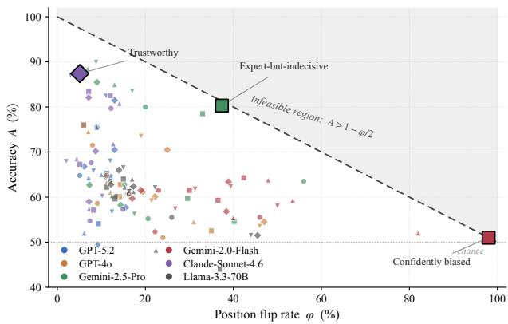
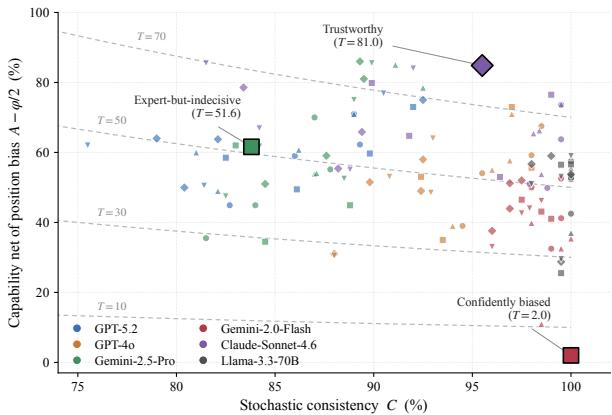
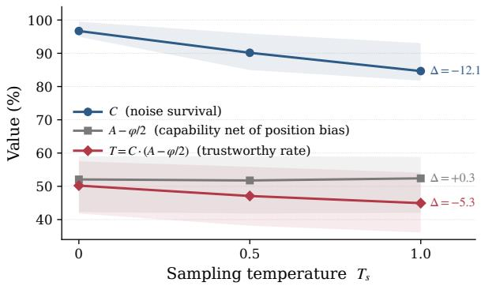
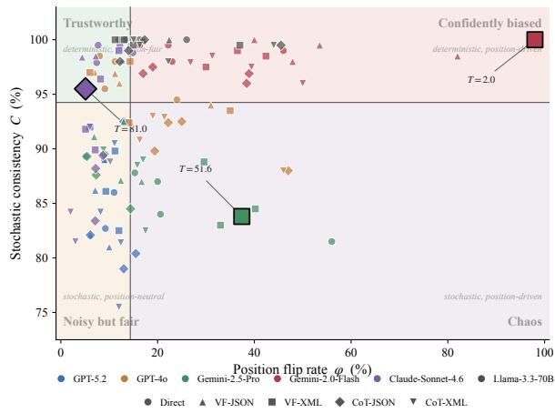
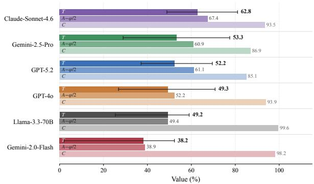

# All Verdicts are Not Equal: Rethinking LLM Judge Reliability

Vineet Kumar PayPal Artificial Intelligence PayPal, Bengaluru, India vkumar32@paypal.com

Darshita Rathore PayPal Artificial Intelligence PayPal, Bengaluru, India drathore@paypal.com

Anindya Moitra PayPal Artificial Intelligence PayPal, Bengaluru, India amoitra@paypal.com

## Abstract

LLM-as-a-Judge is the standard paradigm for NLP evaluation, yet its systemic reliability remains poorly understood despite being widely treated as a deterministic ground truth. We present a comprehensive reliability audit, stresstesting six frontier models across four benchmarks, five prompt formats, two presentation orders, three sampling temperatures, and ten repetitions per condition. Our empirical analysis reveals severe vulnerabilities: verdicts change across identical replications at temperature zero, position-order swaps flip the majority of verdicts on challenging tasks, and the most deterministic judge achieves perfect consistency by trivially repeating incorrect verdicts, agreeing with ground truth only 51% of the time. To formalize these multi-faceted failure modes, we introduce the trustworthy verdict rate (T), a unified metric capturing the joint probability that an evaluation is reproducible, order-invariant, and accurate. Using T, we derive a theoretical upper bound on accuracy imposed by position bias and show that reliability is item-specific rather than modellevel. Finally, we demonstrate that shifting from pairwise win-rate to holistic rubric scoring improves trustworthiness more than any single-format prompting intervention, offering an actionable framework for robust NLP evalu ation.

## 1 Introduction

LLM-as-a-Judge has become the dominant evaluation paradigm in modern NLP. It powers RL reward signals (Wen et al., 2026), model-comparison (Dubois et al., 2023), automated benchmark scoring, and an increasing fraction of the evaluation pipelines on which downstream model selection now depends (Zheng et al., 2023; Tan et al., 2025). Across all of these settings, a judge’s output is treated as a stand-in for ground truth: the verdict is what gets logged, aggregated, and optimized against.

This treatment carries an implicit assumption that the verdict is a stable function of the inputs. That re-querying the same judge with the same pair yields the same answer, and that swapping which response is shown first does not change the preferred one. Both assumptions fail in practice. In our audit, 7–17% of verdicts change across identical replications, and up to 98% of verdicts flip when the presentation order of the two candidates is swapped. The most striking case in our data is a judge that returns the same verdict on 100% of repeated calls maximally deterministic by every single-shot diagnostic in common use yet whose verdicts agree with ground truth only 51% of the time, barely above chance. Determinism, in other words, is not reliability.

We address this with two complementary contributions. First, a cross-cutting empirical audit: we stress-test six frontier judges across four benchmarks spanning subjective and objective preference, standard and adversarial difficulty, at five prompt formats, two presentation orders, three sampling temperatures, and ten repetitions per condition, one of the largest reliability-focused audits of LLM-as-Judge systems we are aware of. The design is deliberately cross-cutting: each axis of variation is held fixed in turn so that its individual contribution to verdict instability can be measured rather than averaged out.

Second, a formal framework that consolidates the audit’s findings into operationally meaningful quantities. We argue that reliability is irreducibly multidimensional and introduce the trustworthy verdict rate as the joint probability that a verdict is reproducible, order-invariant, and correct. The framework yields a hard accuracy ceiling imposed by position bias that no improvement in model capability can exceed, decomposes reliability loss into a noise component and a position-bias component that respond to different interventions, and produces a per-cell scalar that reorders judge comparisons relative to accuracy whenever judges differ on the underlying axes. We further compare three evaluation paradigms (direct pairwise, FLASK rubric decomposition, and G-Eval holistic scoring) and find that paradigm choice can shift trustworthiness further than any single-format intervention.

Our findings show that accuracy alone is insufficient to characterize LLM judges, single-order protocols mask critical position bias, and common single-shot consistency heuristics fail to catch major systemic failure modes.

The remainder of this paper is structured as follows: we survey related literature in §2, establish our formal multidimensional reliability framework in §3, outline our extensive empirical audit setup in §4, analyze our results and findings in §5, and conclude with actionable recommendations in $\ S 6$

## 2 Related Works

LLMs are used across domains codegen (Kumar et al., 2025), conversational analytics (Rathore et al., 2026), agentic evaluation (Agarwal et al., 2026) and LLM-based evaluation has become a standard alternative to human annotation/evaluation. With MT-Bench (Zheng et al., 2023) showing that GPT-4 judgments can achieve high agreement with human preferences. The paradigm has since been extended to RLHF simulation in AlpacaFarm (Dubois et al., 2023), objective ground-truth evaluation in JudgeBench (Tan et al., 2025), and adversarial robustness in LLMBar (Zeng et al., 2024). Recent surveys organize the field around what to judge, how to judge, and how to benchmark (Li et al., 2025). Most of this work reports agreement or accuracy; we instead ask whether a judge’s verdict remains reliable under repeated sampling, position swaps, and format changes.

A growing literature shows that LLM judges are sensitive to response order and presentation effects (Wang et al., 2024; Shi et al., 2025), can be shifted by adversarial phrases (Raina et al., 2024), and may be overconfident on ambiguous examples despite modest accuracy (Lu et al., 2025). Complementary work finds low intra-rater reliability and overconfident inconsistency in LLM judges (Haldar and Hockenmaier, 2025; Janiak et al., 2025). We build on these observations by formalizing position sensitivity as a flip rate φ, deriving the induced accuracy ceiling $1 - \varphi / 2$ , and combining it with stochastic consistency C into the Trustworthy Verdict Rate $T .$

Our treatment also connects to uncertainty estimation and structured evaluation. Selective prediction studies how classifiers trade coverage for accuracy by abstaining on uncertain inputs (El-Yaniv and Wiener, 2010), and recent work adapts this idea to LLM judges using conformal prediction with held-out calibration data (Chirkova et al., 2026). Other studies show that evaluation format affects judge behavior: averaging scores can outperform majority vote, chain-of-thought can hurt some judges, and checklist-style rubrics can improve agreement (Sheng et al., 2025; Lee et al., 2025). Our results connect these strands by showing that repeated-query agreement provides a calibrationfree confidence signal, while G-Eval-style singleprompt multi-criterion scoring improves T more reliably than decomposed rubric voting.

## 3 Formalization

## 3.1 Setup

We evaluate a judge J on a corpus of preference pairs. Each instance comprises two candidate responses $( x , y )$ together with a ground-truth label indicating which is preferred. The judge returns a verdict $V \in \{ x , y \}$ for any presentation of the pair. Reliability is studied along three axes:

• Stochastic instability: the verdict varies across independent runs of the same prompt.

• Position bias: the verdict varies with the order in which the two candidates are presented.

• Format sensitivity: the verdict statistics vary with the prompt template (e.g., direct vs. CoT, JSON vs. XML).

The first two axes act on a single elicitation and enter the trustworthy rate T defined below. The third axis is treated as a design factor: we fix a set F of prompt templates and compute every quantity in §3.2–§3.5 separately for each $f \in { \mathcal { F } }$ . Format sensitivity is then characterized in §3.6 by the dispersion of those per-format quantities for a fixed (judge, dataset).

3.2 Per-Pair Indicators and Population Rates For each pair, holding the format f and dataset fixed, we define three Bernoulli indicators:

$$
N = 1 [ \mathrm { v e r d i c t r e p r o d u c i b l e ~ a c r o s s ~ i n d e p e n d e n t ~ r u n s } ]
$$

P = 1[verdict invariant under candidate-order swap]

R = 1[verdict matches ground truth]

The corresponding population rates are directly observable from repeated elicitations:

$$
\begin{array} { r l } { C : = \mathrm { P r } ( N = 1 ) } & { { } { \mathrm { ( c o n s i s t e n c y ~ r a t e ) } } } \\ { 1 - \varphi : = \mathrm { P r } ( P = 1 ) } & { { } ( \varphi { \mathrm { ~ i s ~ t h e ~ p o s i t i o n ~ f l i p ~ r a t e ) } } } \\ { A : = \mathrm { P r } ( R = 1 ) } & { { } { \mathrm { ( o v e r a l l ~ a c c u r a c y ) } } } \end{array}
$$

We partition pairs by P into decisive $( P = 1 )$ and undecisive $( P = 0 )$ subsets, letting $A _ { \mathrm { d e c } } : =$ $\operatorname* { P r } ( R = 1 \mid P = 1 )$ denote the decisive accuracy and $q : = A _ { \mathrm { u n d e c } } = \operatorname* { P r } ( R = 1 | \mathbf { \nabla } P = 0 )$ denote the accuracy on undecisive pairs.

## 3.3 Assumptions

(A1) Undecisive-pair accuracy. In general evaluation protocols involving ties, abstentions, nonbinary labels, or unequal order weighting, $q : =$ $\operatorname* { P r } ( R = 1 \mid P = 0 )$ captures baseline correctness on undecisive pairs. Under a forced-binary, equally weighted preference setup, any pair where the verdict flips under candidate swap yields contradictory verdicts across orderings, exactly one of which matches the ground truth. Hence, in our setup, $\textstyle q = { \frac { 1 } { 2 } } . { } ^ { 1 }$

(A2) Axis independence on a pair. Stochastic reproducibility is uninformative about positiondecisiveness, and the correctness rate on consistent, decisive pairs equals the decisive accuracy:

$$
\begin{array} { r l } & { \operatorname* { P r } ( P = 1 \mid N = 1 ) = \operatorname* { P r } ( P = 1 ) } \\ & { } \\ & { \operatorname* { P r } ( R = 1 \mid N = 1 , P = 1 ) = A _ { \mathrm { d e c } } . } \end{array}
$$

## 3.4 A Tight Upper Bound on Observable Accuracy

Decomposing accuracy over the decisive partition,

$$
A = \left( 1 - \varphi \right) A _ { \mathrm { d e c } } + \varphi q ,\tag{1}
$$

so that

$$
A _ { \mathrm { d e c } } = { \frac { A - \varphi q } { 1 - \varphi } } .\tag{2}
$$

Since $A _ { \mathrm { d e c } } \leq 1$ , we obtain the generalized capability ceiling

$$
\boxed { A \leq 1 - \varphi ( 1 - q ) }\tag{3}
$$

For our forced-binary setup $( q = \textstyle { \frac { 1 } { 2 } } )$ , Eq. (3) simplifies to $A \leq 1 - \varphi / 2$

The bound is tight and attained iff the judge is perfect on every decisive pair $( A _ { \mathrm { d e c } } = 1 )$ , and capability-free: no improvement in the judge’s underlying judgment can lift observable accuracy above $1 - \varphi ( 1 - q )$ when the position flip rate is $\varphi .$ We call the residual $\left( 1 - \varphi ( 1 - q ) \right) - A$ the capability gap, the portion of error orthogonal to position bias.

## 3.5 The Trustworthy Rate

A verdict is trustworthy when it is simultaneously reproducible, robust to candidate-order swap, and correct. The rate at which the judge produces such verdicts is

$$
T : = \operatorname* { P r } ( N = 1 \land P = 1 \land R = 1 ) .
$$

Factoring by the chain rule and applying $( \mathsf { A } 2 ) ^ { 2 } .$

$$
{ \begin{array} { r l } & { T = \operatorname* { P r } ( N ) \cdot \operatorname* { P r } ( P \mid N ) \cdot \operatorname* { P r } ( R \mid N , P ) } \\ & { \quad = C \cdot ( 1 - \varphi ) \cdot A _ { \mathrm { d e c } } . } \end{array} }
$$

Substituting (2) yields the generalized closed form

$$
\boxed { T = C \cdot \left( A - \varphi q \right) }\tag{4}
$$

which simplifies to $T = C \cdot ( A - \varphi / 2 )$ when $\begin{array} { r } { q = \frac { 1 } { 2 } } \end{array}$ Interpretation. Equation (4) factors T into two observable terms:

• $C \colon$ noise survival: the fraction of verdicts stable to re-sampling.

$( A \ - \ \varphi q )$ : capability net of undecisivebaseline slack: the portion of accuracy not borrowed from the baseline q on undecisive pairs.

Two judges with identical overall accuracy A can therefore differ substantially in T when their consistency or position flip rates differ. T is the operationally meaningful quantity: the rate at which a judge produces verdicts that are reproducible, robust to order, and correct.

## 3.6 Format as a Design Factor

We compute the tuple $( C , \varphi , A , T )$ separately for every (judge, format, dataset) triple in our experimental grid; each row of Table 1 reports such a tuple. Format sensitivity is then summarized by within-cell dispersion of $T$ across $f \in { \mathcal { F } }$ , holding judge and dataset fixed:

$$
\Delta T _ { \mathrm { f m t } } ( J , D ) : = \operatorname* { m a x } _ { f \in \mathcal { F } } T ( J , f , D ) - \operatorname* { m i n } _ { f \in \mathcal { F } } T ( J , f , D ) .\tag{5}
$$

A judge with small $\Delta T _ { \mathrm { f m t } }$ is format-robust; one with large $\Delta T _ { \mathrm { f m t } }$ has trustworthy verdicts that depend on a prompt-engineering choice. Reporting $T$ at the cell level lets readers inspect both level (which (judge, format) combination is most trustworthy on a given benchmark) and robustness (how much that level moves with format), without conflating the two into a single number.

## 4 Experimental Design

## 4.1 Datasets

We evaluate on four benchmarks spanning a $2 \times 2$ design across subjective vs. objective and standard vs. adversarial settings. MT-Bench (Zheng et al., 2023) and AlpacaFarm (Dubois et al., 2023) represent standard subjective evaluation benchmarks, focusing respectively on crowd-sourced human preferences for open-ended responses and instructionfollowing preferences. For objective evaluation, we use JudgeBench (Tan et al., 2025), which provides ground-truth labels derived from MMLU-Pro, Live-CodeBench, and LiveBench across 17 domains, and LLMBar (Zeng et al., 2024), an adversarial benchmark containing rule-based response pairs specifically designed to test judge robustness.

## 4.2 Judges

We evaluate 6 models from 4 providers: GPT-5.2 and GPT-4o (OpenAI), Gemini-2.5-Pro and Gemini-2.0-Flash (Google), Claude-Sonnet-4.6 (Anthropic), and Llama-3.3-70B (Grattafiori et al., 2024). This spans frontier closed-weight models and a strong open-weight model, with 2 reasoningspecialized models (GPT-5.2, Gemini-2.5-Pro) and 4 standard models.

## 4.3 Prompt Formats

All formats share a common system prompt and user message template; only the output format instruction varies:

• Direct: Single-token verdict (A or B). No rationale.

• Verdict-first (JSON / XML): Structured output with verdict before rationale the “decide then justify” pattern.

• CoT (JSON / XML): Rationale before verdict the “think then decide” pattern.

We focus on JSON and XML because they are the dominant structured-generation formats in modern LLM APIs and production pipelines, enabling us to isolate whether formatting conventions alone influence judge behavior. This creates a $2 \times 2$ subdesign within structured prompting: {JSON, XML} $\times$ {verdict-first, CoT}.

Each pair is presented in both AB and BA order. Every (pair, judge, format, order) combination is repeated 10 times. We run at three sampling temperatures: ${ { T } _ { s } } \mathrm { { = } } 0$ (all 6 judges), $T _ { s } { = } 0 . 5$ , and $T _ { s } { = } 1 . 0$ (4 judges; reasoning models excluded as public API does not support the temperature parameter). Detailed breakdowns of models utilized, and public API cost estimates are provided in Appendix E.

## 5 Results & Empirical Findings

Table 1 reports stochastic consistency C, position flip rate $\varphi ,$ accuracy A, and Trustworthy Verdict Rate T across six judges, five prompt formats, and four datasets. We organize the findings around the three empirical predictions of the formalization in §3: position bias imposes a hard accuracy ceiling, T separates judges that accuracy conflates, and stochastic consistency alone is insufficient for reliability. We then analyze the sources of variation in T and evaluate whether rubric-based paradigms can mitigate the same failure modes.

## 5.1 The Position-Bias Ceiling is Tight

Equation (3) predicts that no judge can exceed observable accuracy $1 - \varphi / 2$ on a dataset with position flip rate $\varphi .$ This bound is not merely formal: several cells in Table 1 lie on, or within a few points of, the ceiling. The clearest example is Gemini-2.0-Flash with Verdict-first XML on JudgeBench. Its flip rate is $\varphi = 9 8 . 0 \%$ , implying a maximum attainable accuracy of 51.0%, and the observed accuracy is exactly $A = 5 1 . 0 \%$ . Under Equation (4), this yields $T = 2 . 0 \%$ : the judge is perfectly reproducible across repeated calls $( C = 1 0 0 \% )$ , but its verdicts carry essentially no trustworthy signal beyond order-induced coin-flipping.

The same pattern appears, though less extremely, for Gemini-2.0-Flash with Verdict-first JSON on JudgeBench: $\varphi ~ = ~ 8 2 . 0 \%$ implies a ceiling of 59.0%, while the observed accuracy is 52.0% and T falls to 10.8%. Figure 1 visualizes this ceiling across all model–format–dataset cells. Points near the boundary are not primarily capability-limited; their gains require reducing $\varphi ,$ , not improving the base model.

<table><tr><td rowspan=2 colspan=17>Judge           Format           MT-Bench             AlpacaFarm            JudgeBench             LLMBar $C$    4  A  T   C    $\varphi$         T   C              T   C              T</td></tr><tr><td rowspan=1 colspan=3></td><td rowspan=1 colspan=7></td></tr><tr><td rowspan=1 colspan=1>Direct</td><td rowspan=1 colspan=2>89.3 5.1</td><td rowspan=1 colspan=2>64.855.6</td><td rowspan=1 colspan=1>82.7</td><td rowspan=1 colspan=1>9.2</td><td rowspan=1 colspan=2>49.537.1</td><td rowspan=1 colspan=1>86.0</td><td rowspan=1 colspan=3>11.064.550.7</td><td rowspan=1 colspan=3>89.0 9.0 75.5</td><td rowspan=1 colspan=1>63.2</td></tr><tr><td rowspan=1 colspan=1>VF - JSON</td><td rowspan=1 colspan=1>86.2</td><td rowspan=1 colspan=1>7.1</td><td rowspan=1 colspan=1>64.3</td><td rowspan=1 colspan=1>52.4</td><td rowspan=1 colspan=1>82.1</td><td rowspan=1 colspan=1>6.1</td><td rowspan=1 colspan=2>52.040.2</td><td rowspan=1 colspan=1>81.0</td><td rowspan=1 colspan=2>10.065.0</td><td rowspan=1 colspan=1>48.6</td><td rowspan=1 colspan=3>89.0 9.0 75.5</td><td rowspan=1 colspan=1>63.2</td></tr><tr><td rowspan=1 colspan=1>GPT-5.2         VF-XML</td><td rowspan=1 colspan=1>89.8</td><td rowspan=1 colspan=1>11.2</td><td rowspan=1 colspan=1>65.3</td><td rowspan=1 colspan=1>53.6</td><td rowspan=1 colspan=1>86.1</td><td rowspan=1 colspan=1>9.3</td><td rowspan=1 colspan=2>54.142.6</td><td rowspan=1 colspan=1>82.5</td><td rowspan=1 colspan=2>12.064.5</td><td rowspan=1 colspan=1>48.3</td><td rowspan=1 colspan=1>92.0</td><td rowspan=1 colspan=1>6.0</td><td rowspan=1 colspan=1>76.0</td><td rowspan=1 colspan=1>67.2</td></tr><tr><td rowspan=1 colspan=1>CoT – JSON</td><td rowspan=1 colspan=1>82.1</td><td rowspan=1 colspan=1>6.1</td><td rowspan=1 colspan=1>66.8</td><td rowspan=1 colspan=1>52.3</td><td rowspan=1 colspan=1>80.4</td><td rowspan=1 colspan=1>15.5</td><td rowspan=1 colspan=2>57.740.2</td><td rowspan=1 colspan=1>79.0</td><td rowspan=1 colspan=2>13.070.5</td><td rowspan=1 colspan=1>50.6</td><td rowspan=1 colspan=1>92.5</td><td rowspan=1 colspan=1>13.0</td><td rowspan=1 colspan=1>81.5</td><td rowspan=1 colspan=1>69.4</td></tr><tr><td rowspan=1 colspan=1>CoT - XML</td><td rowspan=1 colspan=1>84.2</td><td rowspan=1 colspan=2>8.2 65.8</td><td rowspan=1 colspan=1>52.0</td><td rowspan=1 colspan=1>81.4</td><td rowspan=1 colspan=1>12.4</td><td rowspan=1 colspan=1>56.7</td><td rowspan=1 colspan=1>41.1</td><td rowspan=1 colspan=1>75.5</td><td rowspan=1 colspan=2>12.068.0</td><td rowspan=1 colspan=1>46.8</td><td rowspan=1 colspan=1>90.5</td><td rowspan=1 colspan=2>11.182.4</td><td rowspan=1 colspan=1>69.5</td></tr><tr><td rowspan=1 colspan=1>Direct</td><td rowspan=1 colspan=1>98.0</td><td rowspan=1 colspan=2>11.264.8</td><td rowspan=1 colspan=1>58.0</td><td rowspan=1 colspan=1>95.5</td><td rowspan=1 colspan=1>9.1</td><td rowspan=1 colspan=1>58.6</td><td rowspan=1 colspan=1>51.6</td><td rowspan=1 colspan=1>94.5</td><td rowspan=1 colspan=2>24.051.0</td><td rowspan=1 colspan=1>36.9</td><td rowspan=1 colspan=1>98.5</td><td rowspan=1 colspan=1>8.0</td><td rowspan=1 colspan=1>71.5</td><td rowspan=1 colspan=1>66.5</td></tr><tr><td rowspan=1 colspan=1>VF - JSON</td><td rowspan=1 colspan=1>96.9</td><td rowspan=1 colspan=1>11.2</td><td rowspan=1 colspan=1>63.3</td><td rowspan=1 colspan=1>55.9</td><td rowspan=1 colspan=1>96.0</td><td rowspan=1 colspan=1>12.1</td><td rowspan=1 colspan=1>61.1</td><td rowspan=1 colspan=1>52.8</td><td rowspan=1 colspan=1>94.0</td><td rowspan=1 colspan=1>31.0</td><td rowspan=1 colspan=1>54.5</td><td rowspan=1 colspan=1>36.7</td><td rowspan=1 colspan=1>97.0</td><td rowspan=1 colspan=1>7.0</td><td rowspan=1 colspan=1>74.5</td><td rowspan=1 colspan=1>68.9</td></tr><tr><td rowspan=1 colspan=1>GPT-40          VF -XML</td><td rowspan=1 colspan=1>98.0</td><td rowspan=1 colspan=1>14.3</td><td rowspan=1 colspan=1>62.8</td><td rowspan=1 colspan=1>54.5</td><td rowspan=1 colspan=1>92.4</td><td rowspan=1 colspan=1>14.1</td><td rowspan=1 colspan=1>60.1</td><td rowspan=1 colspan=1>49.0</td><td rowspan=1 colspan=1>93.5</td><td rowspan=1 colspan=1>35.0</td><td rowspan=1 colspan=1>52.5</td><td rowspan=1 colspan=1>32.7</td><td rowspan=1 colspan=1>97.0</td><td rowspan=1 colspan=1>6.0</td><td rowspan=1 colspan=1>76.0</td><td rowspan=1 colspan=1>70.8</td></tr><tr><td rowspan=1 colspan=1>CoT – JSON</td><td rowspan=1 colspan=1>89.8</td><td rowspan=1 colspan=1>19.4</td><td rowspan=1 colspan=1>61.2</td><td rowspan=1 colspan=1>46.2</td><td rowspan=1 colspan=1>92.4</td><td rowspan=1 colspan=1>22.2</td><td rowspan=1 colspan=1>60.1</td><td rowspan=1 colspan=1>45.3</td><td rowspan=1 colspan=1>88.0</td><td rowspan=1 colspan=2>47.054.5</td><td rowspan=1 colspan=1>27.3</td><td rowspan=1 colspan=1>92.5</td><td rowspan=1 colspan=1>25.0</td><td rowspan=1 colspan=1>70.5</td><td rowspan=1 colspan=1>53.7</td></tr><tr><td rowspan=1 colspan=1>CoT - XML</td><td rowspan=1 colspan=1>90.8</td><td rowspan=1 colspan=1>16.3</td><td rowspan=1 colspan=1>61.2</td><td rowspan=1 colspan=1>48.2</td><td rowspan=1 colspan=1>92.9</td><td rowspan=1 colspan=1>21.4</td><td rowspan=1 colspan=1>59.2</td><td rowspan=1 colspan=1>45.1</td><td rowspan=1 colspan=1>88.0</td><td rowspan=1 colspan=2>46.053.5</td><td rowspan=1 colspan=1>26.8</td><td rowspan=1 colspan=1>93.0</td><td rowspan=1 colspan=1>19.0</td><td rowspan=1 colspan=1>73.5</td><td rowspan=1 colspan=1>59.5</td></tr><tr><td rowspan=2 colspan=1>DirectVF - JSON</td><td rowspan=1 colspan=1>87.8</td><td rowspan=1 colspan=1>15.3</td><td rowspan=1 colspan=1>62.8</td><td rowspan=1 colspan=1>48.4</td><td rowspan=1 colspan=1>84.0</td><td rowspan=1 colspan=1>20.6</td><td rowspan=1 colspan=2>55.237.7</td><td rowspan=1 colspan=1>81.5</td><td rowspan=1 colspan=2>56.063.5</td><td rowspan=1 colspan=1>28.9</td><td rowspan=1 colspan=1>87.0</td><td rowspan=1 colspan=1>20.0</td><td rowspan=1 colspan=1>80.0</td><td rowspan=1 colspan=1>60.9</td></tr><tr><td rowspan=1 colspan=1>87.0</td><td rowspan=1 colspan=1>16.7</td><td rowspan=1 colspan=1>62.2</td><td rowspan=1 colspan=1>46.8</td><td rowspan=1 colspan=1>87.1</td><td rowspan=1 colspan=1>12.4</td><td rowspan=1 colspan=1>60.3</td><td rowspan=1 colspan=1>47.1</td><td rowspan=1 colspan=1>91.1</td><td rowspan=1 colspan=1>6.9</td><td rowspan=1 colspan=1>88.5</td><td rowspan=1 colspan=1>77.5</td><td rowspan=1 colspan=1>92.5</td><td rowspan=1 colspan=1>13.0</td><td rowspan=1 colspan=1>85.0</td><td rowspan=1 colspan=1>72.6</td></tr><tr><td rowspan=1 colspan=1>Gemini-2.5-Pro   VF-XML</td><td rowspan=1 colspan=1>88.8</td><td rowspan=1 colspan=1>29.6</td><td rowspan=1 colspan=1>59.7</td><td rowspan=1 colspan=1>39.9</td><td rowspan=1 colspan=1>84.5</td><td rowspan=1 colspan=1>40.2</td><td rowspan=1 colspan=1>54.6</td><td rowspan=1 colspan=1>29.2</td><td rowspan=1 colspan=1>83.8</td><td rowspan=1 colspan=1>37.4</td><td rowspan=1 colspan=1>80.3</td><td rowspan=1 colspan=1>51.6</td><td rowspan=1 colspan=1>83.0</td><td rowspan=1 colspan=1>33.0</td><td rowspan=1 colspan=1>78.5</td><td rowspan=1 colspan=1>51.5</td></tr><tr><td rowspan=1 colspan=1>CoT – JSON</td><td rowspan=1 colspan=1>87.6</td><td rowspan=1 colspan=1>7.3</td><td rowspan=1 colspan=1>62.7</td><td rowspan=1 colspan=1>51.7</td><td rowspan=1 colspan=1>84.5</td><td rowspan=1 colspan=1>14.4</td><td rowspan=1 colspan=1>58.2</td><td rowspan=1 colspan=1>43.1</td><td rowspan=1 colspan=1>89.3</td><td rowspan=1 colspan=1>5.4</td><td rowspan=1 colspan=1>88.7</td><td rowspan=1 colspan=1>76.8</td><td rowspan=1 colspan=1>89.5</td><td rowspan=1 colspan=1>9.0</td><td rowspan=1 colspan=1>85.5</td><td rowspan=1 colspan=1>72.5</td></tr><tr><td rowspan=1 colspan=1>CoT - XML</td><td rowspan=1 colspan=1>88.5</td><td rowspan=1 colspan=1>15.8</td><td rowspan=1 colspan=1>60.4</td><td rowspan=1 colspan=1>46.5</td><td rowspan=1 colspan=1>82.5</td><td rowspan=1 colspan=1>17.5</td><td rowspan=1 colspan=1>56.2</td><td rowspan=1 colspan=1>39.1</td><td rowspan=1 colspan=1>89.9</td><td rowspan=1 colspan=1>8.8</td><td rowspan=1 colspan=1>89.9</td><td rowspan=1 colspan=1>76.9</td><td rowspan=1 colspan=1>89.0</td><td rowspan=1 colspan=1>17.0</td><td rowspan=1 colspan=1>83.5</td><td rowspan=1 colspan=1>66.8</td></tr><tr><td rowspan=1 colspan=1>Direct</td><td rowspan=1 colspan=1>99.5</td><td rowspan=1 colspan=1>16.3</td><td rowspan=1 colspan=1>60.7</td><td rowspan=1 colspan=1>52.3</td><td rowspan=1 colspan=1>99.5</td><td rowspan=1 colspan=1>22.2</td><td rowspan=1 colspan=1>52.3</td><td rowspan=1 colspan=1>41.0</td><td rowspan=1 colspan=1>99.0</td><td rowspan=1 colspan=1>46.0</td><td rowspan=1 colspan=1>55.5</td><td rowspan=1 colspan=1>32.2</td><td rowspan=1 colspan=1>98.0</td><td rowspan=1 colspan=1>23.0</td><td rowspan=1 colspan=1>61.5</td><td rowspan=1 colspan=1>49.0</td></tr><tr><td rowspan=1 colspan=1>VF - JSON</td><td rowspan=1 colspan=1>100.0</td><td rowspan=1 colspan=1>40.0</td><td rowspan=1 colspan=1>55.4</td><td rowspan=1 colspan=1>35.4</td><td rowspan=1 colspan=1>99.5</td><td rowspan=1 colspan=1>53.5</td><td rowspan=1 colspan=1>59.3</td><td rowspan=1 colspan=1>32.4</td><td rowspan=1 colspan=1>98.5</td><td rowspan=1 colspan=1>82.0</td><td rowspan=1 colspan=1>52.0</td><td rowspan=1 colspan=1>10.8</td><td rowspan=1 colspan=1>98.0</td><td rowspan=1 colspan=1>47.9</td><td rowspan=1 colspan=1>63.8</td><td rowspan=1 colspan=1>39.1</td></tr><tr><td rowspan=1 colspan=1>Gemini-2.0-Flash  VF-XML</td><td rowspan=1 colspan=1>99.0</td><td rowspan=1 colspan=1>36.5</td><td rowspan=1 colspan=1>59.3</td><td rowspan=1 colspan=1>40.6</td><td rowspan=1 colspan=1>97.5</td><td rowspan=1 colspan=1>30.0</td><td rowspan=1 colspan=1>61.5</td><td rowspan=1 colspan=1>45.3</td><td rowspan=1 colspan=1>100.0</td><td rowspan=1 colspan=1>98.0</td><td rowspan=1 colspan=1>51.0</td><td rowspan=1 colspan=1>2.0</td><td rowspan=1 colspan=1>98.5</td><td rowspan=1 colspan=1>42.4</td><td rowspan=1 colspan=1>64.3</td><td rowspan=1 colspan=1>42.5</td></tr><tr><td rowspan=2 colspan=1>CoT – JSONCoT - XML</td><td rowspan=1 colspan=1>96.9</td><td rowspan=1 colspan=1>17.0</td><td rowspan=1 colspan=1>59.7</td><td rowspan=1 colspan=1>49.6</td><td rowspan=1 colspan=1>97.5</td><td rowspan=1 colspan=1>19.0</td><td rowspan=1 colspan=1>61.5</td><td rowspan=1 colspan=1>50.7</td><td rowspan=1 colspan=1>96.0</td><td rowspan=1 colspan=1>38.4</td><td rowspan=1 colspan=1>56.8</td><td rowspan=1 colspan=1>36.1</td><td rowspan=1 colspan=1>96.9</td><td rowspan=1 colspan=1>38.9</td><td rowspan=1 colspan=1>63.4</td><td rowspan=1 colspan=1>42.6</td></tr><tr><td rowspan=1 colspan=1>97.9</td><td rowspan=1 colspan=1>26.8</td><td rowspan=1 colspan=1>57.4</td><td rowspan=1 colspan=1>43.1</td><td rowspan=1 colspan=1>98.5</td><td rowspan=1 colspan=1>31.3</td><td rowspan=1 colspan=1>61.8</td><td rowspan=1 colspan=1>45.5</td><td rowspan=1 colspan=1>96.0</td><td rowspan=1 colspan=1>50.0</td><td rowspan=1 colspan=1>58.0</td><td rowspan=1 colspan=1>31.7</td><td rowspan=1 colspan=1>97.5</td><td rowspan=1 colspan=1>39.4</td><td rowspan=1 colspan=1>62.3</td><td rowspan=1 colspan=1>41.5</td></tr><tr><td rowspan=2 colspan=1>DirectVF - JSON</td><td rowspan=1 colspan=1>99.5</td><td rowspan=1 colspan=2>7.7 67.6</td><td rowspan=1 colspan=1>63.4</td><td rowspan=1 colspan=1>97.9</td><td rowspan=1 colspan=1>7.4</td><td rowspan=1 colspan=1>54.7</td><td rowspan=1 colspan=1>49.9</td><td rowspan=1 colspan=1>98.8</td><td rowspan=1 colspan=1>14.9</td><td rowspan=1 colspan=1>57.3</td><td rowspan=1 colspan=1>49.3</td><td rowspan=1 colspan=1>99.5</td><td rowspan=1 colspan=1>12.2</td><td rowspan=1 colspan=1>79.7</td><td rowspan=1 colspan=1>73.2</td></tr><tr><td rowspan=1 colspan=1>98.4</td><td rowspan=1 colspan=1>4.4</td><td rowspan=1 colspan=1>68.5</td><td rowspan=1 colspan=1>65.2</td><td rowspan=1 colspan=1>98.5</td><td rowspan=1 colspan=1>7.2</td><td rowspan=1 colspan=1>57.4</td><td rowspan=1 colspan=1>53.0</td><td rowspan=1 colspan=1>98.1</td><td rowspan=1 colspan=1>12.7</td><td rowspan=1 colspan=1>71.8</td><td rowspan=1 colspan=1>64.2</td><td rowspan=1 colspan=1>99.5</td><td rowspan=1 colspan=1>14.1</td><td rowspan=1 colspan=1>80.8</td><td rowspan=1 colspan=1>73.4</td></tr><tr><td rowspan=1 colspan=1>Claude-Sonnet-4.6VF-XML</td><td rowspan=1 colspan=1>91.8</td><td rowspan=1 colspan=1>5.1</td><td rowspan=1 colspan=1>67.3</td><td rowspan=1 colspan=1>59.4</td><td rowspan=1 colspan=1>96.4</td><td rowspan=1 colspan=1>8.2</td><td rowspan=1 colspan=1>57.1</td><td rowspan=1 colspan=1>51.1</td><td rowspan=1 colspan=1>89.9</td><td rowspan=1 colspan=1>7.1</td><td rowspan=1 colspan=1>83.4</td><td rowspan=1 colspan=1>71.8</td><td rowspan=1 colspan=1>99.0</td><td rowspan=1 colspan=1>12.0</td><td rowspan=1 colspan=1>82.5</td><td rowspan=1 colspan=1>75.7</td></tr><tr><td rowspan=2 colspan=1>CoT – JSONCoT -XML</td><td rowspan=1 colspan=1>89.4</td><td rowspan=1 colspan=1>8.7</td><td rowspan=1 colspan=1>70.2</td><td rowspan=1 colspan=1>58.9</td><td rowspan=1 colspan=1>88.2</td><td rowspan=1 colspan=1>7.2</td><td rowspan=1 colspan=1>59.0</td><td rowspan=1 colspan=1>48.9</td><td rowspan=1 colspan=1>83.4</td><td rowspan=1 colspan=1>7.1</td><td rowspan=1 colspan=1>82.1</td><td rowspan=1 colspan=1>65.5</td><td rowspan=1 colspan=1>95.5</td><td rowspan=1 colspan=1>5.1</td><td rowspan=1 colspan=1>87.4</td><td rowspan=1 colspan=1>81.0</td></tr><tr><td rowspan=1 colspan=1>84.2</td><td rowspan=1 colspan=2>2.0 67.9</td><td rowspan=1 colspan=1>56.3</td><td rowspan=1 colspan=1>88.8</td><td rowspan=1 colspan=1>10.2</td><td rowspan=1 colspan=1>60.2</td><td rowspan=1 colspan=1>48.9</td><td rowspan=1 colspan=1>81.5</td><td rowspan=1 colspan=1>3.0</td><td rowspan=1 colspan=1>87.0</td><td rowspan=1 colspan=1>69.7</td><td rowspan=1 colspan=1>92.0</td><td rowspan=1 colspan=1>6.0</td><td rowspan=1 colspan=1>87.0</td><td rowspan=1 colspan=1>77.3</td></tr><tr><td rowspan=2 colspan=1>DirectVF - JSON</td><td rowspan=1 colspan=1>100.0</td><td rowspan=1 colspan=2>13.360.2</td><td rowspan=1 colspan=1>53.6</td><td rowspan=1 colspan=1>100.0</td><td rowspan=1 colspan=1>16.3</td><td rowspan=1 colspan=1>60.7</td><td rowspan=1 colspan=1>52.6</td><td rowspan=1 colspan=1>100.0</td><td rowspan=1 colspan=1>26.0</td><td rowspan=1 colspan=1>55.5</td><td rowspan=1 colspan=1>42.5</td><td rowspan=1 colspan=1>100.0</td><td rowspan=1 colspan=1>12.0</td><td rowspan=1 colspan=1>63.5</td><td rowspan=1 colspan=1>57.5</td></tr><tr><td rowspan=1 colspan=1>100.0</td><td rowspan=1 colspan=1>15.3</td><td rowspan=1 colspan=1>62.2</td><td rowspan=1 colspan=1>54.6</td><td rowspan=1 colspan=1>100.0</td><td rowspan=1 colspan=1>17.3</td><td rowspan=1 colspan=1>61.2</td><td rowspan=1 colspan=1>52.6</td><td rowspan=1 colspan=1>100.0</td><td rowspan=1 colspan=1>22.4</td><td rowspan=1 colspan=1>48.2</td><td rowspan=1 colspan=1>37.0</td><td rowspan=1 colspan=1>100.0</td><td rowspan=1 colspan=1>17.0</td><td rowspan=1 colspan=1>64.0</td><td rowspan=1 colspan=1>55.5</td></tr><tr><td rowspan=1 colspan=1>Llama-3.3-70B    VF-XML</td><td rowspan=1 colspan=1>100.0</td><td rowspan=1 colspan=1>11.2</td><td rowspan=1 colspan=1>62.2</td><td rowspan=1 colspan=1>56.6</td><td rowspan=1 colspan=1>100.0</td><td rowspan=1 colspan=1>13.1</td><td rowspan=1 colspan=1>59.6</td><td rowspan=1 colspan=1>53.1</td><td rowspan=1 colspan=1>99.5</td><td rowspan=1 colspan=1>37.0</td><td rowspan=1 colspan=1>44.0</td><td rowspan=1 colspan=1>25.4</td><td rowspan=1 colspan=1>99.5</td><td rowspan=1 colspan=1>15.0</td><td rowspan=1 colspan=1>64.0</td><td rowspan=1 colspan=1>56.2</td></tr><tr><td rowspan=1 colspan=1>CoT – JSON</td><td rowspan=1 colspan=1>98.0</td><td rowspan=1 colspan=1>12.2</td><td rowspan=1 colspan=1>62.8</td><td rowspan=1 colspan=1>55.6</td><td rowspan=1 colspan=1>100.0</td><td rowspan=1 colspan=1>17.3</td><td rowspan=1 colspan=1>62.4</td><td rowspan=1 colspan=1>53.8</td><td rowspan=1 colspan=1>99.5</td><td rowspan=1 colspan=1>45.5</td><td rowspan=1 colspan=1>51.5</td><td rowspan=1 colspan=1>28.6</td><td rowspan=1 colspan=1>99.0</td><td rowspan=1 colspan=1>14.0</td><td rowspan=1 colspan=1>66.0</td><td rowspan=1 colspan=1>58.4</td></tr><tr><td rowspan=1 colspan=1>CoT - XML</td><td rowspan=1 colspan=1>99.5</td><td rowspan=1 colspan=1>16.3</td><td rowspan=1 colspan=1>61.2</td><td rowspan=1 colspan=1>52.8</td><td rowspan=1 colspan=1>98.0</td><td rowspan=1 colspan=1>22.2</td><td rowspan=1 colspan=1>62.1</td><td rowspan=1 colspan=1>50.0</td><td rowspan=1 colspan=1>99.5</td><td rowspan=1 colspan=1>44.0</td><td rowspan=1 colspan=1>51.5</td><td rowspan=1 colspan=1>29.4</td><td rowspan=1 colspan=1>100.0</td><td rowspan=1 colspan=1>15.0</td><td rowspan=1 colspan=1>66.5</td><td rowspan=1 colspan=1>59.0</td></tr></table>

Table 1: Stochastic consistency C (% deterministic across 10 reps, ↑), order flip rate $\varphi$ (% verdict reversal on swap, $\downarrow ,$ accuracy A (%, ↑), and trustworthy verdict rate $T = C \cdot \left( A - \varphi / 2 \right) ( \mathrm { i n } \ : \% , \uparrow )$ at ${ { T } _ { s } } \mathrm { { = } } 0$ . Direct: single-token verdict. VF: verdict before rationale. CoT: rationale before verdict. T shaded ≥70 / 60–70 / 50–60 / 40–50 / $< 4 0$ ; support columns shaded in muted greys.

## 5.2 T Reveals Reliability Differences Hidden by Accuracy

Accuracy is the standard scalar for judge quality, but Equation (4) predicts that two judges with similar A can have very different $T$ whenever they differ in stochastic consistency or position sensitivity. Table 1 confirms this in two ways.

First, changing only the output format can alter trustworthiness far more than accuracy suggests. On JudgeBench, Gemini-2.5-Pro improves from $A = 6 3 . 5 \% , T = 2 8 . 9 \%$ under Direct prompting to $A \ = \ 8 8 . 5 \%$ $T \ : = \ : 7 7 . 5 \%$ under Verdict-first JSON. The 25% accuracy gain is accompanied by a 49% gain in $T$ , because the format change both improves accuracy and reduces position flips from $\varphi = 5 6 . 0 \% \ \mathrm { t o } \ \varphi = 6 . 9 \%$

Second, comparable accuracies can mask different reliability profiles. On AlpacaFarm, GPT-5.2 with CoT-JSON and Claude-Sonnet-4.6 with Direct prompting achieve similar accuracies (57.7% vs. 54.7%), but their trustworthy rates differ substantially (40.2% vs. 49.9%). Claude’s lower flip rate (7.4% vs. 15.5%) means that a larger share of its correct verdicts are reproducibly correct rather than order-contingent.

  
Figure 1: Accuracy ceiling view of the Trustworthy Verdict Rate at ${ \cal T } _ { s } { = } 0 .$ . Each point is one cell of Table 1; the dashed line marks the upper bound $A \leq 1 - \varphi / 2$ from Equation (3). The shaded region is mathematically infeasible: position bias imposes an accuracy tax of $\varphi / 2$ that no capability improvement can overcome. Points near the ceiling are ceiling-bound; points far below the ceiling, such as several Llama-3.3 cells, still have capability gaps where a stronger judge could help.

  
Figure 2: Iso-T factor space. Cells from Table 1 plotted in $\left( C , \ A - \varphi / 2 \right)$ coordinates, the two factors of $T = C \cdot ( A - \varphi / 2 )$ . Dashed curves are iso-T contours. Highlighted examples show three distinct reliability regimes: Trustworthy (Claude-Sonnet CoT-JSON / LLMBar, $T \ : = \ : 8 1 \% )$ , Expert-but-indecisive (Gemini-2.5-Pro VF-XML / JudgeBench, $T = 5 2 \% )$ , and Confidently biased (Gemini-2.0-Flash VF-XML / JudgeBench, $T = 2 \% )$

Figure 2 shows the factorization directly by plotting cells in $( C , A - \varphi / 2 )$ space. The iso-T contours make clear that trustworthiness can fail through either factor: low stochastic consistency, low bias-adjusted accuracy, or both.

## 5.3 Consistency Alone Does Not Imply Trustworthiness

A natural shortcut for reliability is to report stochastic consistency C: a judge that returns the same verdict on repeated calls feels dependable. Table 1 shows why this intuition is incomplete. Llama-3.3-70B has $C \geq 9 8 \%$ in every cell, yet its $T$ on JudgeBench ranges only from 25.4% to 42.5% because its flip rate remains high, ranging from 22% to 45%. Gemini-2.0-Flash is even weaker: its C is 96–100% across settings, while T spans 2.0% to 52.3%.

The reason is structural. In Equation (4), C multiplies the bias-adjusted term $( A - \varphi / 2 )$ . When this term is small, even perfect stochastic consistency cannot rescue trustworthiness. A deterministic judge can still be deterministically orderdependent.

## 5.4 What Drives Variation in T?

The preceding results show that T varies substantially across cells. We next decompose where that variation comes from: judge–dataset interaction, prompt format, and sampling temperature.

Judge–dataset interaction. A three-factor ANOVA of T across the 120 judge–format–dataset cells shows that the largest source of variation is the judge × dataset interaction $( \eta ^ { 2 } = 2 8 . 1 \% )$ exceeding the judge (27.0%) and dataset (26.2%) main effects (see Appendix C.1). Thus, there is no universally best judge: rankings reorder across benchmarks. A complementary four-facet G-study over pair × judge × format × order further shows that order is a structured source of variance rather than residual noise, validating its explicit inclusion as $\varphi$ in $T$ (see Appendix C.2).

Format dispersion. The dispersion $\Delta T _ { \mathrm { f m t } }$ from Equation (5) measures how much trustworthiness depends on prompt format rather than judge identity. The largest dispersions concentrate on JudgeBench. Gemini-2.5-Pro spans $\Delta T _ { \mathrm { f m t } } = 4 8 . 6$ points, from Direct prompting at $T = 2 8 . 9 \%$ to Verdict-first JSON at $T = 7 7 . 5 \% ;$ Gemini-2.0- Flash spans 34.1 points. By contrast, Claude-Sonnet-4.6 on LLMBar varies only from 73.2% to 81.0% $( \Delta T _ { \mathrm { f m t } } = 7 . 8 )$

This means that, in high-dispersion settings, a single (judge, format) result is not a stable estimate of the judge’s underlying reliability. The format choice can carry as much signal as the model choice. Full details appear in Appendix B, Table 4.

  
Figure 3: Mean $C , A { - } \varphi / 2 .$ and $T$ across judge–format– dataset cells as sampling temperature $T _ { s }$ varies from 0 to 1.0. Shaded bands show interquartile range. Temperature reduces $C$ by 12.1 points but leaves $( A - \varphi / 2 )$ nearly unchanged, so the drop in $T$ is driven by noise survival, as Equation (4) predicts.

Temperature ablation. Sampling temperature should primarily affect the noise-survival term $C$ not the bias-adjusted capability term $( A - \varphi / 2 )$ A sweep over $T _ { s } ~ \in ~ \{ 0 , 0 . 5 , 1 . 0 \}$ on the four temperature-tunable judges confirms this prediction. As shown in Figure 3, mean C drops by 12.1 points across the sweep, while $( A - \varphi / 2 )$ changes by only +0.3 points across 48 cells. The resulting decline in $T$ is therefore attributable almost entirely to reduced stochastic consistency, supporting the interpretation that the two factors of $T$ capture distinct reliability properties. The complete temperature sweep analysis is presented in Appendix A.

## 5.5 Failure Modes and Practical Remedies

Figure 4 organizes judge failures into four regions of $( C , \varphi )$ space. The Trustworthy region is the only regime where the residual gap $1 - \varphi / 2 - A$ primarily reflects model capability rather than position bias; closing that gap requires a stronger judge. The Noisy butfair region is easier to address: repeated sampling and majority vote can improve reliability because $\varphi$ is low. The Chaos region requires both interventions: average over both candidate orderings to reduce position bias, then ensemble across repeated runs to reduce stochastic noise. The Confidently biased region is the most dangerous. Here, high C creates the appearance of reliability while high $\varphi$ drives $T$ toward zero. The worst observed cell in our study, with $\varphi = 9 8 \%$ and $T = 2 . 0 \%$ falls in this region.

  
Figure 4: Failure mode taxonomy. Judge cells plotted by stochastic consistency C and position flip rate $\varphi .$ The quadrants distinguish trustworthy, noisy-but-fair, chaotic, and confidently biased judges, each requiring a different mitigation strategy.

Figure 5 aggregates these effects into a per-judge view. Sonnet-4.6 has the highest mean $T ,$ , but the wide whiskers and overlap across judges show that no model dominates uniformly; reliability depends strongly on the dataset and format pairing.

  
Figure 5: Per-judge mean of $C , A - \varphi / 2 ,$ , and $T$ averaged across all 20 format–dataset cells per judge, ordered by mean T. Whiskers span the min–max range across cells. Wide ranges reflect judge × (format, dataset) interactions but no judge dominates uniformly; see Appendix C.

## 5.6 Rubric-Based Evaluation: FLASK and G-Eval

In the preceding sections, we characterize failures of direct pairwise evaluation. Here, we investigate if rubric-based paradigms can mitigate these failures. Specifically, can decomposing judgment into explicit criteria reduce $\varphi$ and thereby raise the $A _ { \mathrm { m a x } }$ ceiling?

Table 2 compares three paradigms on the two objective benchmarks, JudgeBench and LLMBar: Direct pairwise evaluation with one API call, FLASKstyle (Ye et al., 2024) rubric decomposition with four calls per judgment, and G-Eval-style (Liu et al., 2023) score-based evaluation with one call over four scored criteria.

FLASK reduces $\varphi$ for some judges but collapses C universally (e.g., GPT-5.2: C 86.0% → 34.8% on JudgeBench), leaving T lower than Direct for five of six judges. G-Eval elicits all criterion scores in a single prompt, preserving C while reducing position sensitivity; for capable judges this can lift $T$ substantially (Gemini-2.5-Pro: $T 2 8 . 9 \% $ 77.9% on JudgeBench, a +49 pp gain exceeding any format-induced swing in Table 4).

## 6 Conclusion and Recommendations

We have audited six frontier LLM judges across four benchmarks, five prompt formats, two presentation orders, three sampling temperatures, and ten repetitions, with an additional comparison of direct, FLASK-decomposed, and G-Eval rubric paradigms on the two objective benchmarks. The audit yields that judge reliability is not what accuracy measures. A verdict is operationally trustworthy only when it is simultaneously reproducible across runs, invariant to candidate-order swap, and correct. We formalize this as the trustworthy verdict rate, and prove that the same formalization implies a hard capability ceiling that no improvement in model capability can overcome at fixed position flip rate. Both quantities are directly observable from repeated elicitations and require no ground-truth labels beyond what existing benchmarks already provide.

<table><tr><td rowspan="2">Judge</td><td colspan="4">JudgeBench – Direct</td><td colspan="4">JudgeBench – FLASK</td><td colspan="4">JudgeBench – G-Eval</td><td colspan="4">LLMBar – Direct</td><td colspan="4">LLMBar – FLASK</td><td colspan="4">LLMBar – G-Eval</td></tr><tr><td>C</td><td>4</td><td>A</td><td>T</td><td>C</td><td>4</td><td>A</td><td>T</td><td>C</td><td>4</td><td>A</td><td>T</td><td>C</td><td>4</td><td>A</td><td>T</td><td>C</td><td>4</td><td>A</td><td>T</td><td>C</td><td>4</td><td>A</td><td>T</td></tr><tr><td>GPT-5.2</td><td>86.0</td><td>11.0</td><td>64.5</td><td>50.7</td><td>34.8</td><td>9.1</td><td>63.6</td><td>20.5</td><td>68.5</td><td>16.0</td><td>68.0</td><td>41.1</td><td>89.0</td><td>9.0</td><td>75.5</td><td>63.2</td><td>55.0</td><td>21.0</td><td>79.5</td><td>37.9</td><td>88.0</td><td>18.0</td><td>79.0</td><td>61.6</td></tr><tr><td>GPT-40</td><td>94.5</td><td>24.0</td><td>51.0</td><td>36.9</td><td>44.4</td><td>47.5</td><td>52.5</td><td>12.8</td><td>89.0</td><td>61.0</td><td>62.0</td><td>28.0</td><td>98.5</td><td>8.0</td><td>71.5</td><td>66.5</td><td>53.0</td><td>31.0</td><td>75.0</td><td>31.5</td><td>95.5</td><td>28.0</td><td>78.0</td><td>61.1</td></tr><tr><td>Gemini-2.5-Pro</td><td>81.5</td><td>56.0</td><td>63.5</td><td>28.9</td><td>60.6</td><td>10.5</td><td>67.4</td><td>37.7</td><td>87.7</td><td>10.0</td><td>93.8</td><td>77.9</td><td>87.0</td><td>20.0</td><td>80.0</td><td>60.9</td><td>63.0</td><td>14.0</td><td>78.0</td><td>44.7</td><td>86.0</td><td>27.0</td><td>79.0</td><td>56.3</td></tr><tr><td>Gemini-2.0-Flash</td><td>99.0</td><td>46.0</td><td>55.5</td><td>32.2</td><td>90.4</td><td>30.3</td><td>57.1</td><td>37.9</td><td>94.5</td><td>40.4</td><td>59.0</td><td>36.7</td><td>98.0</td><td>23.0</td><td>61.5</td><td>49.0</td><td>66.0</td><td>32.0</td><td>65.5</td><td>32.7</td><td>99.0</td><td>39.0</td><td>74.0</td><td>54.0</td></tr><tr><td>Claude-Sonnet-4.6</td><td>98.8</td><td>14.9</td><td>57.3</td><td>49.3</td><td>69.0</td><td>2.0</td><td>75.1</td><td>51.1</td><td>78.7</td><td>14.4</td><td>82.0</td><td>58.8</td><td>99.5</td><td>12.2</td><td>79.7</td><td>73.2</td><td>58.0</td><td>11.0</td><td>81.0</td><td>43.8</td><td>91.0</td><td>9.1</td><td>85.0</td><td>73.2</td></tr><tr><td>Llama-3.3-70B</td><td>100.0</td><td>26.0</td><td>55.5</td><td>42.5</td><td>96.9</td><td>51.0</td><td>53.6</td><td>27.2</td><td>97.0</td><td>55.1</td><td>52.0</td><td>23.7</td><td>100.0</td><td>12.0</td><td>63.5</td><td>57.5</td><td>97.5</td><td>20.0</td><td>67.5</td><td>56.1</td><td>100.0</td><td>29.0</td><td>78.0</td><td>63.5</td></tr></table>

Table 2: Three-paradigm comparison at $T _ { s } { = } 0 \colon$ Direct pairwise (1 API call), FLASK rubric decomposition (4 calls per judgment), and G-Eval score-based evaluation (1 call with 4 scored criteria). All values in percentage points. $T = C \cdot ( A - \varphi / 2 )$ shaded ≥70 / 60–70 / 50–60 $/ \ 4 0 { - } 5 0 \ / \ < 4 0$ ; support columns $( C , \varphi , A )$ in muted greys. Bold = best T per dataset.

We also argue that this ceiling is empirically tight; i.e., near-deterministic judges can still produce verdicts that are worse than chance; and reliability is item-specific rather than judge-level. The most striking case in our data is a single judge × format × dataset configuration with $C = 1 0 0 \%$ and $T ~ = ~ 2 \%$ : a judge that appears maximally reliable by every single-shot diagnostic in common use, but contributes essentially nothing beyond order-induced coin-flipping.

The implication for practice is concrete. As LLM judges become infrastructure for RLHF, leaderboards, automated evaluation pipelines, and downstream model selection — the field needs reliability audits alongside accuracy benchmarks. We recommend that benchmark releases report at minimum $( C , \varphi , A , T )$ per cell, that judge selection use T rather than accuracy as the comparative scalar, and that protocols which leave φ unobservable (single-order evaluation) be treated as fundamentally under-specified. None of these recommendations require new infrastructure; they require reading existing infrastructure with a richer lens than the one currently in use.

The trustworthy verdict rate is not a competitor to accuracy. It is what accuracy was always meant to mean.

## Limitations

Our study has three primary limitations. First, due to computational tractability, we restricted our evaluation to four English-only benchmarks. Consequently, our reliability findings may not generalize to low-resource languages where frontier models exhibit weaker baseline performance, and our estimates for low-frequency phenomena, such as perdomain flip rates, carry minor sampling variance that headline numbers may not surface. Second, we evaluate closed-weight models without access to log-probabilities or internal states, which precludes the analysis of finer-grained token confidence signals. Third, our audit focuses exclusively on pairwise preference data. While pairwise evaluation is currently the most prevalent paradigm, a natural extension of this work would be to investigate whether our findings regarding verdict instability and bias transfer to list-wise ranking or multi-model grading frameworks.

## References

Gunja Agarwal, Arup Kumar Das, Arun Menon, Jitesh Chandra Mishra, and Vignesh Divakaran. 2026. Agentworld: Personality-aware reliability evaluation for agentic information retrieval. Preprint, arXiv:2608.24076.

Robert L. Brennan. 1992. Generalizability theory. Educational Measurement: Issues and Practice, 11(4):27–34.

Nadezhda Chirkova, Tunde Oluwaseyi Ajayi, Seth Aycock, Zain Muhammad Mujahid, Vladana Perlic,´ Ekaterina Borisova, and Markarit Vartampetian. 2026. LLM-as-a-qualitative-judge: automating error analysis in natural language generation. In Proceedings ofthe First Workshop on Multilingual Multicultural Evaluation, pages 99–132, Rabat, Morocco. Association for Computational Linguistics.

Yann Dubois, Xuechen Li, Rohan Taori, Tianyi Zhang, Ishaan Gulrajani, Jimmy Ba, Carlos Guestrin, Percy Liang, and Tatsunori Hashimoto. 2023. Alpacafarm:

A simulation framework for methods that learn from human feedback. In Thirty-seventh Conference on Neural Information Processing Systems.

Ran El-Yaniv and Yair Wiener. 2010. On the foundations of noise-free selective classification. Journal of Machine Learning Research, 11(53):1605–1641.

Aaron Grattafiori, Abhimanyu Dubey, Abhinav Jauhri, Abhinav Pandey, Abhishek Kadian, Ahmad Al-Dahle, Aiesha Letman, Akhil Mathur, Alan Schelten, Alex Vaughan, Amy Yang, Angela Fan, Anirudh Goyal, Anthony Hartshorn, Aobo Yang, Archi Mitra, Archie Sravankumar, Artem Korenev, Arthur Hinsvark, and 542 others. 2024. The llama 3 herd of models. Preprint, arXiv:2407.21783.

Rajarshi Haldar and Julia Hockenmaier. 2025. Rating roulette: Self-inconsistency in LLM-as-a-judge frameworks. In Findings ofthe Associationfor Computational Linguistics: EMNLP 2025, pages 24986– 25004, Suzhou, China. Association for Computational Linguistics.

Denis Janiak, Jakub Binkowski, Albert Sawczyn, Bogdan Gabrys, Ravid Shwartz-Ziv, and Tomasz Jan Kajdanowicz. 2025. The illusion of progress: Reevaluating hallucination detection in LLMs. In Proceedings of the 2025 Conference on Empirical Methods in Natural Language Processing, pages 34728– 34745, Suzhou, China. Association for Computational Linguistics.

Vineet Kumar, Ronald Tony, Darshita Rathore, Vipasha Rana, Bhuvanesh Mandora, . Kanishka, Chetna Bansal, and Anindya Moitra. 2025. Genicious: Contextual few-shot prompting for insights discovery. In Proceedings of the 8th International Conference on Data Science and Management ofData (12th ACM IKDD CODS and 30th COMAD), CODS-COMAD ’24, page 405–409, New York, NY, USA. Association for Computing Machinery.

Yukyung Lee, JoongHoon Kim, Jaehee Kim, Hyowon Cho, Jaewook Kang, Pilsung Kang, and Najoung Kim. 2025. CheckEval: A reliable LLM-as-a-judge framework for evaluating text generation using checklists. In Proceedings ofthe 2025 Conference on Empirical Methods in Natural Language Processing, pages 15771–15798, Suzhou, China. Association for Computational Linguistics.

Dawei Li, Bohan Jiang, Liangjie Huang, Alimohammad Beigi, Chengshuai Zhao, Zhen Tan, Amrita Bhattacharjee, Yuxuan Jiang, Canyu Chen, Tianhao Wu, Kai Shu, Lu Cheng, and Huan Liu. 2025. From generation to judgment: Opportunities and challenges of LLM-as-a-judge. In Proceedings of the 2025 Conference on Empirical Methods in Natural Language Processing, pages 2757–2791, Suzhou, China. Association for Computational Linguistics.

Yang Liu, Dan Iter, Yichong Xu, Shuohang Wang, Ruochen Xu, and Chenguang Zhu. 2023. G-eval: NLG evaluation using gpt-4 with better human alignment. In Proceedings of the 2023 Conference on

Empirical Methods in Natural Language Processing, pages 2511–2522, Singapore. Association for Computational Linguistics.

Junyu Lu, Kai Ma, Kaichun Wang, Kelaiti Xiao, Roy Ka-Wei Lee, Bo Xu, Liang Yang, and Hongfei Lin. 2025. Is LLM an overconfident judge? unveiling the capabilities of LLMs in detecting offensive language with annotation disagreement. In Findings ofthe Associationfor Computational Linguistics: ACL 2025, pages 5609–5626, Vienna, Austria. Association for Computational Linguistics.

Vyas Raina, Adian Liusie, and Mark Gales. 2024. Is LLM-as-a-judge robust? investigating universal adversarial attacks on zero-shot LLM assessment. In Proceedings of the 2024 Conference on Empirical Methods in Natural Language Processing, pages 7499–7517, Miami, Florida, USA. Association for Computational Linguistics.

Darshita Rathore, Vineet Kumar, Vaibhav Singal, Ankur Vivek Singh, and Anindya Moitra. 2026. Conversational query engine for mixed-modality heterogeneous enterprise data sources. Preprint, arXiv:2606.28370.

Huanxin Sheng, Xinyi Liu, Hangfeng He, Jieyu Zhao, and Jian Kang. 2025. Analyzing uncertainty of LLMas-a-judge: Interval evaluations with conformal prediction. In Proceedings ofthe 2025 Conference on Empirical Methods in Natural Language Processing, pages 11286–11328, Suzhou, China. Association for Computational Linguistics.

Lin Shi, Chiyu Ma, Wenhua Liang, Xingjian Diao, Weicheng Ma, and Soroush Vosoughi. 2025. Judging the judges: A systematic study of position bias in LLMas-a-judge. In Proceedings ofthe 14th International Joint Conference on Natural Language Processing and the 4th Conference ofthe Asia-Pacific Chapter of the Association for Computational Linguistics, pages 292–314, Mumbai, India. The Asian Federation of Natural Language Processing and The Association for Computational Linguistics.

Sijun Tan, Siyuan Zhuang, Kyle Montgomery, William Yuan Tang, Alejandro Cuadron, Chenguang Wang, Raluca Popa, and Ion Stoica. 2025. Judgebench: A benchmark for evaluating LLM-based judges. In The Thirteenth International Conference on Learning Representations.

Peiyi Wang, Lei Li, Liang Chen, Zefan Cai, Dawei Zhu, Binghuai Lin, Yunbo Cao, Lingpeng Kong, Qi Liu, Tianyu Liu, and Zhifang Sui. 2024. Large language models are not fair evaluators. In Proceedings of the 62nd Annual Meeting of the Association for Computational Linguistics (Volume 1: Long Papers), pages 9440–9450, Bangkok, Thailand. Association for Computational Linguistics.

Xumeng Wen, Zihan Liu, Shun Zheng, Shengyu Ye, Zhirong Wu, Yang Wang, Zhijian Xu, Xiao Liang, Junjie Li, Ziming Miao, Jiang Bian, and Mao Yang.

2026. Reinforcement learning with verifiable rewards implicitly incentivizes correct reasoning in base LLMs. In The Fourteenth International Conference on Learning Representations.

Seonghyeon Ye, Doyoung Kim, Sungdong Kim, Hyeonbin Hwang, Seungone Kim, Yongrae Jo, James Thorne, Juho Kim, and Minjoon Seo. 2024. FLASK: Fine-grained language model evaluation based on alignment skill sets. In The Twelfth International Conference on Learning Representations.

Zhiyuan Zeng, Jiatong Yu, Tianyu Gao, Yu Meng, Tanya Goyal, and Danqi Chen. 2024. Evaluating large language models at evaluating instruction following. In The Twelfth International Conference on Learning Representations.

Lianmin Zheng, Wei-Lin Chiang, Ying Sheng, Siyuan Zhuang, Zhanghao Wu, Yonghao Zhuang, Zi Lin, Zhuohan Li, Dacheng Li, Eric Xing, Hao Zhang, Joseph E. Gonzalez, and Ion Stoica. 2023. Judging LLM-as-a-judge with MT-bench and chatbot arena. In Thirty-seventh Conference on Neural Information Processing Systems Datasets and Benchmarks Track.

## Appendix Contents

<table><tr><td></td><td></td></tr><tr><td>A Temperature Sweep Analysis</td><td>11</td></tr><tr><td>B Format Dispersion Analysis</td><td>12</td></tr><tr><td>C Variance Decomposition Details</td><td>13</td></tr><tr><td>C.1 ANOVA on T</td><td>13</td></tr><tr><td></td><td>C.2 Four-Facet G-Study on Verdict Direction</td></tr><tr><td>D Prompt Templates</td><td>13 14</td></tr><tr><td>E API Cost</td><td>16</td></tr><tr><td>F Dataset Details</td><td>17</td></tr><tr><td>G</td><td>Assumptions underlying T 17</td></tr></table>

## A Temperature Sweep Analysis

Table 3 reports $( C , \varphi , A , T )$ across sampling temperatures $T _ { s } \in \{ 0 , 0 . 5 , 1 . 0 \}$ for the four temperaturetunable judges (GPT-4o, Gemini-2.0-Flash, Claude-Sonnet-4.6, Llama-3.3-70B; GPT-5.2 and Gemini-2.5-Pro are excluded because their public APIs do not expose a temperature parameter). Verdict-first and CoT rows aggregate over their JSON and XML variants for compactness, collapsing the 5-format grid of Table 1 to a 3-format view.

<table><tr><td rowspan=2 colspan=19>TsJudge           Format          MT-Bench            AlpacaFarm           JudgeBench            LLMBar</td></tr><tr><td rowspan=1 colspan=1></td><td rowspan=1 colspan=3></td><td rowspan=1 colspan=1></td><td rowspan=1 colspan=1></td><td rowspan=1 colspan=2></td><td rowspan=1 colspan=1></td><td rowspan=1 colspan=4></td><td rowspan=1 colspan=3></td></tr><tr><td rowspan=1 colspan=1></td><td rowspan=1 colspan=2>Direct</td><td rowspan=1 colspan=1>98.0</td><td rowspan=1 colspan=2>11.264.8</td><td rowspan=1 colspan=1>58.0</td><td rowspan=1 colspan=1>95.5</td><td rowspan=1 colspan=1>9.1</td><td rowspan=1 colspan=2>58.651.6</td><td rowspan=1 colspan=1>94.5</td><td rowspan=1 colspan=3>24.051.036.9</td><td rowspan=1 colspan=1>98.5</td><td rowspan=1 colspan=2>8.0 71.5</td><td rowspan=1 colspan=1>66.5</td></tr><tr><td rowspan=1 colspan=1></td><td rowspan=1 colspan=2>GPT-40         Verdict-first</td><td rowspan=1 colspan=1>97.4</td><td rowspan=1 colspan=1>12.8</td><td rowspan=1 colspan=1>63.0</td><td rowspan=1 colspan=1>55.1</td><td rowspan=1 colspan=1>94.2</td><td rowspan=1 colspan=1>13.1</td><td rowspan=1 colspan=1>60.6</td><td rowspan=1 colspan=1>50.9</td><td rowspan=1 colspan=1>93.8</td><td rowspan=1 colspan=1>33.0</td><td rowspan=1 colspan=1>53.5</td><td rowspan=1 colspan=1>34.7</td><td rowspan=1 colspan=1>97.0</td><td rowspan=1 colspan=2>6.5 75.2</td><td rowspan=1 colspan=1>69.8</td></tr><tr><td rowspan=2 colspan=1></td><td rowspan=1 colspan=2>CoT</td><td rowspan=1 colspan=1>90.3</td><td rowspan=1 colspan=1>17.9</td><td rowspan=1 colspan=1>61.2</td><td rowspan=1 colspan=1>47.2</td><td rowspan=1 colspan=1>92.6</td><td rowspan=1 colspan=1>21.8</td><td rowspan=1 colspan=1>59.6</td><td rowspan=1 colspan=1>45.1</td><td rowspan=1 colspan=1>88.0</td><td rowspan=1 colspan=1>46.5</td><td rowspan=1 colspan=1>54.0</td><td rowspan=1 colspan=1>27.1</td><td rowspan=1 colspan=1>92.8</td><td rowspan=1 colspan=1>22.0</td><td rowspan=1 colspan=2>72.056.6</td></tr><tr><td rowspan=1 colspan=2>Direct</td><td rowspan=1 colspan=1>99.5</td><td rowspan=1 colspan=1>16.3</td><td rowspan=1 colspan=1>60.7</td><td rowspan=1 colspan=1>52.3</td><td rowspan=1 colspan=1>99.5</td><td rowspan=1 colspan=1>22.2</td><td rowspan=1 colspan=1>52.3</td><td rowspan=1 colspan=1>41.0</td><td rowspan=1 colspan=1>99.0</td><td rowspan=1 colspan=1>46.0</td><td rowspan=1 colspan=1>55.5</td><td rowspan=1 colspan=1>32.2</td><td rowspan=1 colspan=1>98.0</td><td rowspan=1 colspan=1>23.0</td><td rowspan=1 colspan=2>61.549.0</td></tr><tr><td rowspan=2 colspan=1>0 =</td><td rowspan=1 colspan=2>Gemini-2.0-Flash  Verdict-first</td><td rowspan=1 colspan=1>99.5</td><td rowspan=1 colspan=1>38.2</td><td rowspan=1 colspan=1>57.4</td><td rowspan=1 colspan=1>38.1</td><td rowspan=1 colspan=1>98.5</td><td rowspan=1 colspan=1>41.8</td><td rowspan=1 colspan=1>60.4</td><td rowspan=1 colspan=1>38.9</td><td rowspan=1 colspan=1>99.2</td><td rowspan=1 colspan=1>90.0</td><td rowspan=1 colspan=1>51.5</td><td rowspan=1 colspan=1>6.4</td><td rowspan=1 colspan=1>98.2</td><td rowspan=1 colspan=1>45.2</td><td rowspan=1 colspan=1>64.0</td><td rowspan=1 colspan=1>40.7</td></tr><tr><td rowspan=1 colspan=2>CoT</td><td rowspan=1 colspan=1>97.4</td><td rowspan=1 colspan=2>21.958.6</td><td rowspan=1 colspan=1>46.4</td><td rowspan=1 colspan=1>98.0</td><td rowspan=1 colspan=1>25.2</td><td rowspan=1 colspan=1>61.7</td><td rowspan=1 colspan=1>48.1</td><td rowspan=1 colspan=1>96.0</td><td rowspan=1 colspan=1>44.2</td><td rowspan=1 colspan=1>57.4</td><td rowspan=1 colspan=1>33.9</td><td rowspan=1 colspan=1>97.2</td><td rowspan=1 colspan=1>39.2</td><td rowspan=1 colspan=1>62.9</td><td rowspan=1 colspan=1>42.1</td></tr><tr><td rowspan=1 colspan=1> $\ddot { \sf K }$ </td><td rowspan=1 colspan=2>Direct</td><td rowspan=1 colspan=1>99.5</td><td rowspan=1 colspan=2>7.7 67.6</td><td rowspan=1 colspan=1>63.4</td><td rowspan=1 colspan=1>97.9</td><td rowspan=1 colspan=1>7.4</td><td rowspan=1 colspan=1>54.7</td><td rowspan=1 colspan=1>49.9</td><td rowspan=1 colspan=1>98.8</td><td rowspan=1 colspan=1>14.9</td><td rowspan=1 colspan=1>57.3</td><td rowspan=1 colspan=1>49.3</td><td rowspan=1 colspan=1>99.5</td><td rowspan=1 colspan=2>12.279.7</td><td rowspan=1 colspan=1>73.2</td></tr><tr><td rowspan=2 colspan=1></td><td rowspan=1 colspan=2>Claude-Sonnet-4.6Verdict-first</td><td rowspan=1 colspan=1>95.1</td><td rowspan=1 colspan=2>4.8 67.9</td><td rowspan=1 colspan=1>62.3</td><td rowspan=1 colspan=1>97.4</td><td rowspan=1 colspan=1>7.7</td><td rowspan=1 colspan=1>57.3</td><td rowspan=1 colspan=1>52.1</td><td rowspan=1 colspan=1>94.0</td><td rowspan=1 colspan=1>9.9</td><td rowspan=1 colspan=1>77.6</td><td rowspan=1 colspan=1>68.3</td><td rowspan=1 colspan=1>99.2</td><td rowspan=1 colspan=2>13.181.7</td><td rowspan=1 colspan=1>74.5</td></tr><tr><td rowspan=1 colspan=2>CoT</td><td rowspan=1 colspan=1>86.8</td><td rowspan=1 colspan=2>5.469.0</td><td rowspan=1 colspan=1>57.5</td><td rowspan=1 colspan=1>88.5</td><td rowspan=1 colspan=1>8.7</td><td rowspan=1 colspan=1>59.6</td><td rowspan=1 colspan=1>48.9</td><td rowspan=1 colspan=1>82.5</td><td rowspan=1 colspan=1>5.1</td><td rowspan=1 colspan=1>84.6</td><td rowspan=1 colspan=1>67.7</td><td rowspan=1 colspan=1>93.7</td><td rowspan=1 colspan=2>5.6 87.2</td><td rowspan=1 colspan=1>79.1</td></tr><tr><td rowspan=1 colspan=1></td><td rowspan=1 colspan=2>Direct</td><td rowspan=1 colspan=1>100</td><td rowspan=1 colspan=2>13.360.2</td><td rowspan=1 colspan=1>53.6</td><td rowspan=1 colspan=1>100</td><td rowspan=1 colspan=1>16.3</td><td rowspan=1 colspan=1>60.7</td><td rowspan=1 colspan=1>52.6</td><td rowspan=1 colspan=1>100</td><td rowspan=1 colspan=1>26.0</td><td rowspan=1 colspan=1>55.5</td><td rowspan=1 colspan=1>42.5</td><td rowspan=1 colspan=1>100</td><td rowspan=1 colspan=2>12.063.5</td><td rowspan=1 colspan=1>57.5</td></tr><tr><td rowspan=2 colspan=1></td><td rowspan=1 colspan=1>Llama-3.3-70B</td><td rowspan=1 colspan=1>Verdict-first</td><td rowspan=1 colspan=1>100</td><td rowspan=1 colspan=2>13.362.2</td><td rowspan=1 colspan=1>55.6</td><td rowspan=1 colspan=1>100</td><td rowspan=1 colspan=1>15.2</td><td rowspan=1 colspan=1>60.4</td><td rowspan=1 colspan=1>52.8</td><td rowspan=1 colspan=1>99.8</td><td rowspan=1 colspan=1>29.7</td><td rowspan=1 colspan=1>46.1</td><td rowspan=1 colspan=1>31.2</td><td rowspan=1 colspan=1>99.8</td><td rowspan=1 colspan=1>16.0</td><td rowspan=1 colspan=1>64.0</td><td rowspan=1 colspan=1>55.9</td></tr><tr><td rowspan=1 colspan=1></td><td rowspan=1 colspan=1>CoT</td><td rowspan=1 colspan=1>98.7</td><td rowspan=1 colspan=2>14.362.0</td><td rowspan=1 colspan=1>54.1</td><td rowspan=1 colspan=1>99.0</td><td rowspan=1 colspan=1>19.8</td><td rowspan=1 colspan=1>62.3</td><td rowspan=1 colspan=1>51.9</td><td rowspan=1 colspan=1>99.5</td><td rowspan=1 colspan=1>44.7</td><td rowspan=1 colspan=1>51.5</td><td rowspan=1 colspan=1>29.0</td><td rowspan=1 colspan=1>99.5</td><td rowspan=1 colspan=1>14.5</td><td rowspan=1 colspan=1>66.2</td><td rowspan=1 colspan=1>58.7</td></tr><tr><td rowspan=1 colspan=1></td><td rowspan=1 colspan=1></td><td rowspan=1 colspan=1>Direct</td><td rowspan=1 colspan=1>91.9</td><td rowspan=1 colspan=2>8.665.1</td><td rowspan=1 colspan=1>55.9</td><td rowspan=1 colspan=1>91.9</td><td rowspan=1 colspan=1>11.8</td><td rowspan=1 colspan=1>56.5</td><td rowspan=1 colspan=1>46.5</td><td rowspan=1 colspan=1>77.5</td><td rowspan=1 colspan=1>24.0</td><td rowspan=1 colspan=1>49.5</td><td rowspan=1 colspan=1>29.1</td><td rowspan=1 colspan=1>97.9</td><td rowspan=1 colspan=2>7.4 71.1</td><td rowspan=1 colspan=1>66.0</td></tr><tr><td rowspan=1 colspan=1></td><td rowspan=1 colspan=1>GPT-40</td><td rowspan=1 colspan=1>Verdict-first</td><td rowspan=1 colspan=1>93.0</td><td rowspan=1 colspan=1>13.5</td><td rowspan=1 colspan=1>62.4</td><td rowspan=1 colspan=1>51.8</td><td rowspan=1 colspan=1>89.0</td><td rowspan=1 colspan=1>13.4</td><td rowspan=1 colspan=1>59.1</td><td rowspan=1 colspan=1>46.6</td><td rowspan=1 colspan=1>75.2</td><td rowspan=1 colspan=1>29.1</td><td rowspan=1 colspan=1>52.9</td><td rowspan=1 colspan=1>28.8</td><td rowspan=1 colspan=1>95.2</td><td rowspan=1 colspan=1>5.6</td><td rowspan=1 colspan=1>75.5</td><td rowspan=1 colspan=1>69.2</td></tr><tr><td rowspan=1 colspan=1></td><td rowspan=1 colspan=1></td><td rowspan=1 colspan=1>CoT</td><td rowspan=1 colspan=1>84.8</td><td rowspan=1 colspan=1>20.1</td><td rowspan=1 colspan=1>61.7</td><td rowspan=1 colspan=1>43.8</td><td rowspan=1 colspan=1>84.4</td><td rowspan=1 colspan=1>21.5</td><td rowspan=1 colspan=1>59.9</td><td rowspan=1 colspan=1>41.5</td><td rowspan=1 colspan=1>62.1</td><td rowspan=1 colspan=1>44.7</td><td rowspan=1 colspan=1>52.5</td><td rowspan=1 colspan=1>18.7</td><td rowspan=1 colspan=1>89.9</td><td rowspan=1 colspan=1>18.4</td><td rowspan=1 colspan=1>72.0</td><td rowspan=1 colspan=1>56.5</td></tr><tr><td rowspan=1 colspan=1></td><td rowspan=1 colspan=1></td><td rowspan=1 colspan=1>Direct</td><td rowspan=1 colspan=1>96.3</td><td rowspan=1 colspan=1>12.9</td><td rowspan=1 colspan=1>60.4</td><td rowspan=1 colspan=1>52.0</td><td rowspan=1 colspan=1>91.9</td><td rowspan=1 colspan=1>24.7</td><td rowspan=1 colspan=1>50.0</td><td rowspan=1 colspan=1>34.6</td><td rowspan=1 colspan=1>85.0</td><td rowspan=1 colspan=1>46.0</td><td rowspan=1 colspan=1>55.5</td><td rowspan=1 colspan=1>27.6</td><td rowspan=1 colspan=1>94.9</td><td rowspan=1 colspan=1>25.0</td><td rowspan=1 colspan=1>62.2</td><td rowspan=1 colspan=1>47.2</td></tr><tr><td rowspan=2 colspan=1>10= 5</td><td rowspan=1 colspan=1>Gemini-2.0-Flash</td><td rowspan=1 colspan=1>Verdict-first</td><td rowspan=1 colspan=1>96.0</td><td rowspan=1 colspan=1>37.3</td><td rowspan=1 colspan=1>57.9</td><td rowspan=1 colspan=1>37.7</td><td rowspan=1 colspan=1>93.3</td><td rowspan=1 colspan=1>43.0</td><td rowspan=1 colspan=1>59.4</td><td rowspan=1 colspan=1>35.4</td><td rowspan=1 colspan=1>95.8</td><td rowspan=1 colspan=1>90.0</td><td rowspan=1 colspan=1>51.5</td><td rowspan=1 colspan=1>6.2</td><td rowspan=1 colspan=1>94.6</td><td rowspan=1 colspan=1>47.2</td><td rowspan=1 colspan=1>64.5</td><td rowspan=1 colspan=1>38.7</td></tr><tr><td rowspan=1 colspan=1></td><td rowspan=1 colspan=1>CoT</td><td rowspan=1 colspan=1>83.2</td><td rowspan=1 colspan=1>19.1</td><td rowspan=1 colspan=1>58.5</td><td rowspan=1 colspan=1>40.7</td><td rowspan=1 colspan=1>80.9</td><td rowspan=1 colspan=1>24.7</td><td rowspan=1 colspan=1>59.7</td><td rowspan=1 colspan=1>38.3</td><td rowspan=1 colspan=1>62.8</td><td rowspan=1 colspan=1>43.0</td><td rowspan=1 colspan=1>57.5</td><td rowspan=1 colspan=1>22.6</td><td rowspan=1 colspan=1>82.3</td><td rowspan=1 colspan=1>39.5</td><td rowspan=1 colspan=1>63.7</td><td rowspan=1 colspan=1>36.2</td></tr><tr><td rowspan=1 colspan=1></td><td rowspan=1 colspan=1></td><td rowspan=1 colspan=1>Direct</td><td rowspan=1 colspan=1>98.3</td><td rowspan=1 colspan=1>8.0</td><td rowspan=1 colspan=1>67.6</td><td rowspan=1 colspan=1>62.5</td><td rowspan=1 colspan=1>95.1</td><td rowspan=1 colspan=1>5.5</td><td rowspan=1 colspan=1>54.1</td><td rowspan=1 colspan=1>48.8</td><td rowspan=1 colspan=1>94.8</td><td rowspan=1 colspan=1>16.2</td><td rowspan=1 colspan=1>55.2</td><td rowspan=1 colspan=1>44.7</td><td rowspan=1 colspan=1>95.9</td><td rowspan=1 colspan=1>12.6</td><td rowspan=1 colspan=1>79.0</td><td rowspan=1 colspan=1>69.7</td></tr><tr><td rowspan=5 colspan=1></td><td rowspan=1 colspan=1>Claude-Sonnet-4.6</td><td rowspan=1 colspan=1>Verdict-first</td><td rowspan=1 colspan=1>94.8</td><td rowspan=1 colspan=1>5.1</td><td rowspan=1 colspan=1>68.3</td><td rowspan=1 colspan=1>62.3</td><td rowspan=1 colspan=1>94.9</td><td rowspan=1 colspan=1>8.1</td><td rowspan=1 colspan=1>57.7</td><td rowspan=1 colspan=1>50.9</td><td rowspan=1 colspan=1>91.9</td><td rowspan=1 colspan=1>9.9</td><td rowspan=1 colspan=1>77.6</td><td rowspan=1 colspan=1>66.8</td><td rowspan=1 colspan=1>99.0</td><td rowspan=1 colspan=1>13.7</td><td rowspan=1 colspan=1>81.5</td><td rowspan=1 colspan=1>73.9</td></tr><tr><td rowspan=1 colspan=1></td><td rowspan=1 colspan=1>CoT</td><td rowspan=1 colspan=1>84.3</td><td rowspan=1 colspan=2>5.1 68.8</td><td rowspan=1 colspan=1>55.8</td><td rowspan=1 colspan=1>87.0</td><td rowspan=1 colspan=1>10.9</td><td rowspan=1 colspan=1>58.9</td><td rowspan=1 colspan=1>46.5</td><td rowspan=1 colspan=1>79.7</td><td rowspan=1 colspan=1>6.3</td><td rowspan=1 colspan=1>85.2</td><td rowspan=1 colspan=1>65.4</td><td rowspan=1 colspan=1>93.9</td><td rowspan=1 colspan=1>6.7</td><td rowspan=1 colspan=1>87.1</td><td rowspan=1 colspan=1>78.6</td></tr><tr><td rowspan=1 colspan=1></td><td rowspan=1 colspan=1>Direct</td><td rowspan=1 colspan=1>98.9</td><td rowspan=1 colspan=2>9.861.4</td><td rowspan=1 colspan=1>55.9</td><td rowspan=1 colspan=1>98.4</td><td rowspan=1 colspan=1>17.2</td><td rowspan=1 colspan=1>58.6</td><td rowspan=1 colspan=1>49.2</td><td rowspan=1 colspan=1>97.5</td><td rowspan=1 colspan=1>26.3</td><td rowspan=1 colspan=1>55.3</td><td rowspan=1 colspan=1>41.1</td><td rowspan=1 colspan=1>98.5</td><td rowspan=1 colspan=1>11.0</td><td rowspan=1 colspan=1>64.0</td><td rowspan=1 colspan=1>57.6</td></tr><tr><td rowspan=1 colspan=1>Llama-3.3-70B</td><td rowspan=1 colspan=1>Verdict-first</td><td rowspan=1 colspan=1>97.9</td><td rowspan=1 colspan=2>11.862.7</td><td rowspan=1 colspan=1>55.6</td><td rowspan=1 colspan=1>97.3</td><td rowspan=1 colspan=1>16.7</td><td rowspan=1 colspan=1>58.6</td><td rowspan=1 colspan=1>48.9</td><td rowspan=1 colspan=1>89.2</td><td rowspan=1 colspan=1>29.2</td><td rowspan=1 colspan=1>46.5</td><td rowspan=1 colspan=1>28.5</td><td rowspan=1 colspan=1>97.2</td><td rowspan=1 colspan=1>16.5</td><td rowspan=1 colspan=1>63.8</td><td rowspan=1 colspan=1>54.0</td></tr><tr><td rowspan=1 colspan=1></td><td rowspan=1 colspan=1>CoT</td><td rowspan=1 colspan=1>90.9</td><td rowspan=1 colspan=2>13.961.2</td><td rowspan=1 colspan=1>49.3</td><td rowspan=1 colspan=1>90.9</td><td rowspan=1 colspan=1>19.9</td><td rowspan=1 colspan=1>60.8</td><td rowspan=1 colspan=1>46.2</td><td rowspan=1 colspan=1>78.5</td><td rowspan=1 colspan=1>46.0</td><td rowspan=1 colspan=1>51.8</td><td rowspan=1 colspan=1>22.6</td><td rowspan=1 colspan=1>92.8</td><td rowspan=1 colspan=1>15.0</td><td rowspan=1 colspan=1>65.8</td><td rowspan=1 colspan=1>54.1</td></tr><tr><td rowspan=2 colspan=1></td><td rowspan=1 colspan=2>Direct</td><td rowspan=1 colspan=1>87.1</td><td rowspan=1 colspan=2>8.266.5</td><td rowspan=1 colspan=1>54.4</td><td rowspan=1 colspan=1>83.5</td><td rowspan=1 colspan=1>8.0</td><td rowspan=1 colspan=1>58.0</td><td rowspan=1 colspan=1>45.1</td><td rowspan=1 colspan=1>58.6</td><td rowspan=1 colspan=1>22.2</td><td rowspan=1 colspan=1>49.0</td><td rowspan=1 colspan=1>22.2</td><td rowspan=1 colspan=1>93.0</td><td rowspan=1 colspan=1>10.0</td><td rowspan=1 colspan=1>72.0</td><td rowspan=1 colspan=1>62.3</td></tr><tr><td rowspan=1 colspan=1>GPT-40</td><td rowspan=1 colspan=1>Verdict-first</td><td rowspan=1 colspan=1>88.1</td><td rowspan=1 colspan=1>13.9</td><td rowspan=1 colspan=1>63.7</td><td rowspan=1 colspan=1>50.0</td><td rowspan=1 colspan=1>82.2</td><td rowspan=1 colspan=1>10.5</td><td rowspan=1 colspan=1>60.5</td><td rowspan=1 colspan=1>45.4</td><td rowspan=1 colspan=1>58.8</td><td rowspan=1 colspan=1>31.3</td><td rowspan=1 colspan=1>53.8</td><td rowspan=1 colspan=1>22.4</td><td rowspan=1 colspan=1>90.2</td><td rowspan=1 colspan=1>6.0</td><td rowspan=1 colspan=1>74.9</td><td rowspan=1 colspan=1>64.9</td></tr><tr><td rowspan=4 colspan=1>1 0</td><td rowspan=1 colspan=1></td><td rowspan=1 colspan=1>CoT</td><td rowspan=1 colspan=1>82.0</td><td rowspan=1 colspan=1>21.6</td><td rowspan=1 colspan=1>62.9</td><td rowspan=1 colspan=1>42.7</td><td rowspan=1 colspan=1>75.8</td><td rowspan=1 colspan=1>18.5</td><td rowspan=1 colspan=1>60.2</td><td rowspan=1 colspan=1>38.6</td><td rowspan=1 colspan=1>50.0</td><td rowspan=1 colspan=1>35.9</td><td rowspan=1 colspan=1>54.0</td><td rowspan=1 colspan=1>18.0</td><td rowspan=1 colspan=1>81.0</td><td rowspan=1 colspan=1>17.0</td><td rowspan=1 colspan=1>72.5</td><td rowspan=1 colspan=1>51.8</td></tr><tr><td rowspan=1 colspan=1></td><td rowspan=1 colspan=1>Direct</td><td rowspan=1 colspan=1>93.3</td><td rowspan=1 colspan=1>15.5</td><td rowspan=1 colspan=1>61.3</td><td rowspan=1 colspan=1>50.0</td><td rowspan=1 colspan=1>88.0</td><td rowspan=1 colspan=1>22.0</td><td rowspan=1 colspan=1>53.5</td><td rowspan=1 colspan=1>37.4</td><td rowspan=1 colspan=1>78.0</td><td rowspan=1 colspan=1>46.0</td><td rowspan=1 colspan=1>55.5</td><td rowspan=1 colspan=1>25.4</td><td rowspan=1 colspan=1>89.0</td><td rowspan=1 colspan=1>25.0</td><td rowspan=1 colspan=1>62.0</td><td rowspan=1 colspan=1>44.1</td></tr><tr><td rowspan=1 colspan=1>Gemini-2.0-Flash</td><td rowspan=1 colspan=1>Verdict-first</td><td rowspan=1 colspan=1>94.3</td><td rowspan=1 colspan=1>37.7</td><td rowspan=1 colspan=1>57.9</td><td rowspan=1 colspan=1>36.8</td><td rowspan=1 colspan=1>88.5</td><td rowspan=1 colspan=1>41.0</td><td rowspan=1 colspan=1>60.8</td><td rowspan=1 colspan=1>35.7</td><td rowspan=1 colspan=1>93.7</td><td rowspan=1 colspan=1>89.9</td><td rowspan=1 colspan=1>52.0</td><td rowspan=1 colspan=1>6.6</td><td rowspan=1 colspan=1>87.7</td><td rowspan=1 colspan=1>47.5</td><td rowspan=1 colspan=1>63.1</td><td rowspan=1 colspan=1>34.5</td></tr><tr><td rowspan=1 colspan=2>CoT</td><td rowspan=1 colspan=1>75.9</td><td rowspan=1 colspan=2>19.057.3</td><td rowspan=1 colspan=1>36.3</td><td rowspan=1 colspan=1>63.8</td><td rowspan=1 colspan=1>26.5</td><td rowspan=1 colspan=1>60.8</td><td rowspan=1 colspan=1>30.3</td><td rowspan=1 colspan=1>50.8</td><td rowspan=1 colspan=1>43.9</td><td rowspan=1 colspan=1>59.8</td><td rowspan=1 colspan=1>19.2</td><td rowspan=1 colspan=1>62.5</td><td rowspan=1 colspan=1>40.3</td><td rowspan=1 colspan=1>67.8</td><td rowspan=1 colspan=1>29.8</td></tr><tr><td rowspan=1 colspan=1></td><td rowspan=1 colspan=1></td><td rowspan=1 colspan=1>Direct</td><td rowspan=1 colspan=1>95.1</td><td rowspan=1 colspan=2>8.7 66.5</td><td rowspan=1 colspan=1>59.1</td><td rowspan=1 colspan=1>90.5</td><td rowspan=1 colspan=1>8.1</td><td rowspan=1 colspan=1>54.8</td><td rowspan=1 colspan=1>45.9</td><td rowspan=1 colspan=1>89.4</td><td rowspan=1 colspan=1>19.5</td><td rowspan=1 colspan=1>56.4</td><td rowspan=1 colspan=1>41.7</td><td rowspan=1 colspan=1>92.5</td><td rowspan=1 colspan=1>13.1</td><td rowspan=1 colspan=1>79.4</td><td rowspan=1 colspan=1>67.4</td></tr><tr><td rowspan=5 colspan=1></td><td rowspan=1 colspan=1>Claude-Sonnet-4.6</td><td rowspan=1 colspan=1>Verdict-first</td><td rowspan=1 colspan=1>93.2</td><td rowspan=1 colspan=2>4.9 67.7</td><td rowspan=1 colspan=1>60.8</td><td rowspan=1 colspan=1>92.5</td><td rowspan=1 colspan=1>8.0</td><td rowspan=1 colspan=1>57.2</td><td rowspan=1 colspan=1>49.2</td><td rowspan=1 colspan=1>89.5</td><td rowspan=1 colspan=1>9.7</td><td rowspan=1 colspan=1>77.8</td><td rowspan=1 colspan=1>65.3</td><td rowspan=1 colspan=1>97.5</td><td rowspan=1 colspan=1>12.6</td><td rowspan=1 colspan=1>81.2</td><td rowspan=1 colspan=1>73.0</td></tr><tr><td rowspan=1 colspan=2>CoT</td><td rowspan=1 colspan=1>83.6</td><td rowspan=1 colspan=2>3.3 68.5</td><td rowspan=1 colspan=1>55.9</td><td rowspan=1 colspan=1>83.0</td><td rowspan=1 colspan=1>8.0</td><td rowspan=1 colspan=1>59.0</td><td rowspan=1 colspan=1>45.6</td><td rowspan=1 colspan=1>77.5</td><td rowspan=1 colspan=1>4.6</td><td rowspan=1 colspan=1>85.0</td><td rowspan=1 colspan=1>64.1</td><td rowspan=1 colspan=1>90.2</td><td rowspan=1 colspan=1>6.0</td><td rowspan=1 colspan=1>87.5</td><td rowspan=1 colspan=1>76.2</td></tr><tr><td rowspan=1 colspan=1></td><td rowspan=1 colspan=1>Direct</td><td rowspan=1 colspan=1>99.0</td><td rowspan=1 colspan=2>12.460.8</td><td rowspan=1 colspan=1>54.1</td><td rowspan=1 colspan=1>96.0</td><td rowspan=1 colspan=1>17.0</td><td rowspan=1 colspan=1>61.0</td><td rowspan=1 colspan=1>50.4</td><td rowspan=1 colspan=1>93.0</td><td rowspan=1 colspan=1>28.0</td><td rowspan=1 colspan=1>54.5</td><td rowspan=1 colspan=1>37.7</td><td rowspan=1 colspan=1>98.0</td><td rowspan=1 colspan=1>12.0</td><td rowspan=1 colspan=1>63.5</td><td rowspan=1 colspan=1>56.4</td></tr><tr><td rowspan=1 colspan=1>Llama-3.3-70B</td><td rowspan=1 colspan=1>Verdict-first</td><td rowspan=1 colspan=1>94.6</td><td rowspan=1 colspan=2>14.062.8</td><td rowspan=1 colspan=1>52.8</td><td rowspan=1 colspan=1>94.8</td><td rowspan=1 colspan=1>15.0</td><td rowspan=1 colspan=1>60.8</td><td rowspan=1 colspan=1>50.5</td><td rowspan=1 colspan=1>83.7</td><td rowspan=1 colspan=1>31.1</td><td rowspan=1 colspan=1>46.4</td><td rowspan=1 colspan=1>25.8</td><td rowspan=1 colspan=1>93.2</td><td rowspan=1 colspan=1>17.0</td><td rowspan=1 colspan=1>64.0</td><td rowspan=1 colspan=1>51.7</td></tr><tr><td rowspan=1 colspan=1></td><td rowspan=1 colspan=1>CoT</td><td rowspan=1 colspan=4>89.413.562.7 50.0</td><td rowspan=1 colspan=1>89.2</td><td rowspan=1 colspan=1>19.0</td><td rowspan=1 colspan=1>62.0</td><td rowspan=1 colspan=3>46.871.844.0</td><td rowspan=1 colspan=1>51.0</td><td rowspan=1 colspan=1>20.8</td><td rowspan=1 colspan=1>90.2</td><td rowspan=1 colspan=1>15.5</td><td rowspan=1 colspan=2>65.552.1</td></tr></table>

Table 3: Stochastic consistency C, position flip rate φ, accuracy A, and trustworthy rate $T = C \cdot ( A - \varphi / 2 )$ (all %) across sampling temperatures $T _ { s } \in \{ 0 , 0 . 5 , 1 . 0 \}$ . Verdict-first and CoT rows are averages over JSON and XML format variants. T shaded ≥70 / 60–70 / 50–60 / 40–50 / <40 ; support columns shaded in muted greys.

## B Format Dispersion Analysis

To quantify the sensitivity of a judge to prompt formatting, we define the format dispersion of the trustworthy rate as

$$
\Delta T _ { \mathrm { f m t } } ( J , D ) = \operatorname* { m a x } _ { f } T ( J , f , D ) - \operatorname* { m i n } _ { f } T ( J , f , D ) ,
$$

where J denotes the judge model, D the benchmark dataset, and f the prompting format. Intuitively, $\Delta T _ { \mathrm { f m t } }$ measures how much the observed trustworthiness of a judge changes solely due to formatting choices while keeping the judge and evaluation data fixed. A low value indicates that the judge is robust to presentation format, whereas a high value indicates strong format dependence.

Table 4 reports $\Delta T _ { \mathrm { f m t } } ( J , D )$ together with the corresponding worst-case trustworthy rate

$$
T _ { \operatorname* { m i n } } ( J , D ) = \operatorname* { m i n } _ { f } T ( J , f , D ) .
$$

<table><tr><td>Judge</td><td>MT Bench</td><td>AlpacaFarm</td><td>JudgeBench</td><td>LLMBar</td><td>Mean</td></tr><tr><td>GPT-5.2</td><td>3.6 52.0</td><td>5.537.1</td><td>3.9 46.8</td><td>6.3 63.2</td><td>4.8</td></tr><tr><td>GPT-40</td><td>11.846.2</td><td>7.7 45.1</td><td>10.1 26.8</td><td>17.1 53.7</td><td>11.7</td></tr><tr><td>Gemini-2.5-Pro</td><td>11.839.9</td><td>17.9 29.2</td><td>48.6 28.9</td><td>21.1 51.5</td><td>24.9</td></tr><tr><td>Gemini-2.0-Flash</td><td>16.9 35.4</td><td>18.332.4</td><td>34.1 2.0</td><td>9.9 39.1</td><td>19.8</td></tr><tr><td>Claude-Sonnet-4.6</td><td>8.9 56.3</td><td>4.1 48.9</td><td>22.5 49.3</td><td>7.873.2</td><td>10.8</td></tr><tr><td>Llama-3.3-70B</td><td>3.8 52.8</td><td>3.8 50.0</td><td>17.125.4</td><td>3.5 55.5</td><td>7.1</td></tr><tr><td>Mean</td><td>9.5</td><td>9.6</td><td>22.7</td><td>10.8</td><td></td></tr></table>

Table 4: Format-induced dispersion of the trustworthy rate, $\Delta T _ { \mathrm { f m t } } ( J , D )$ , with the worst-case trustworthy rate $T _ { \mathrm { m i n } }$ shown in subscript. Shading indicates dispersion magnitude: <5 , 5–10 , 10–20 , 20–35 , and >35 . Low $\Delta T _ { \mathrm { f m t } }$ indicates a format-robust judge. All values are reported in percentage points.

## Findings

Two broad patterns emerge from Table 4.

Format robustness varies substantially across judges. GPT-5.2 and Llama-3.3-70B exhibit consistently low dispersion across benchmarks, suggesting that their trustworthiness is largely invariant to prompt format. In contrast, the two Gemini variants show substantially larger swings, with mean dispersions of 24.9% and 19.8% respectively. The most extreme case occurs for Gemini-2.5-Pro on JudgeBench, where the trustworthy rate ranges from 28.9% under Direct prompting to 77.5% under VF-JSON, yielding a dispersion of 48.6 points attributable solely to formatting changes.

JudgeBench is markedly more format-sensitive. Average dispersion across judges is approximately 10 points on MT-Bench, AlpacaFarm, and LLMBar, but rises to 22.7% on JudgeBench. Moreover, five of the six largest dispersion values occur on JudgeBench, and the only configuration with $T _ { \mathrm { m i n } } < 1 0 \%$ appears on this benchmark. One possible explanation is that harder or more knowledge-intensive comparisons weaken the judge’s underlying confidence signal, thereby amplifying the effect of surface-level prompt presentation. We leave systematic investigation of this hypothesis to future work.

Implications for evaluation reporting. These results suggest that reporting a single $( J , f , D )$ configuration can substantially misrepresent the underlying behavior of a judge, especially on format-sensitive benchmarks. For example, Gemini-2.5-Pro appears among the strongest judges on JudgeBench under VF-JSON prompting, yet among the weakest under Direct prompting. We therefore recommend reporting either the interval $( T _ { \mathrm { m i n } } , T _ { \mathrm { m a x } } )$ across a fixed format set or, equivalently, $( T _ { \mathrm { m i n } } , \Delta T _ { \mathrm { f m t } } )$ when comparing judge reliability across models.

## C Variance Decomposition Details

This appendix reports the variance decomposition referenced in §5.4. We pursue two complementary analyses: an ANOVA on the trustworthy rate T (§C.1) and a Generalizability-theory study on verdict direction (§C.2).

## C.1 ANOVA on T

Treating each of the 120 (judge, format, dataset) cells at $T _ { s } = 0$ as an observation, we fit a three-factor ANOVA with judge, format, and dataset as factors and their pairwise interactions. Table 5 reports the resulting $\eta ^ { 2 }$ values.

<table><tr><td>Source</td></tr><tr><td>Judge</td><td>27.0</td></tr><tr><td>Dataset</td><td>26.2</td></tr><tr><td>Judge × Dataset</td><td>28.1</td></tr><tr><td>Judge × Format</td><td>8.3</td></tr><tr><td>Format</td><td>0.7</td></tr><tr><td>Format × Dataset</td><td>1.3</td></tr><tr><td>Residual</td><td>8.4</td></tr></table>

Table 5: Variance decomposition $( \eta ^ { 2 } , \% )$ of $T$ across 120 (judge, format, dataset) cells. The judge × dataset interaction is the dominant source.

## C.2 Four-Facet G-Study on Verdict Direction

Standard G-theory analyses for LLM judges treat the design as a two-facet (pair × judge) model and collapse format and order into residual variance (Brennan, 1992). This obscures two effects that $T$ directly measures: order sensitivity (mapped to φ) and stochastic noise (mapped to C). We instead estimate a four-facet fully crossed model — pair (p) × judge (j) × format (f) × order (o) — with repetitions nested within cells. Table 6 reports the seven variance components plus residual for verdict direction at $T _ { s } = 0$ Components shown are percentages of the total variance estimated by Restricted Maximum Likelihood; the remainder is the pair main effect $( \sigma _ { p } ^ { 2 } )$

<table><tr><td rowspan="2">Dataset</td><td colspan="3">Main effects</td><td colspan="4">Interactions + residual</td></tr><tr><td> $\sigma _ { j } ^ { 2 }$ </td><td> $\sigma _ { f } ^ { 2 }$ </td><td> $\sigma _ { o } ^ { 2 }$ </td><td> $\sigma _ { p j } ^ { 2 }$ </td><td> $\sigma _ { p f } ^ { 2 }$ </td><td> $\sigma _ { p o } ^ { 2 }$ </td><td>Res.</td></tr><tr><td>MT-Bench</td><td>0.0</td><td>0.0</td><td>2.1</td><td>10.3</td><td>1.1</td><td>5.0</td><td>4.2</td></tr><tr><td>AlpacaFarm</td><td>2.1</td><td>0.0</td><td>1.8</td><td>17.5</td><td>1.4</td><td>3.8</td><td>6.0</td></tr><tr><td>JudgeBench</td><td>0.9</td><td>0.1</td><td>6.2</td><td>34.8</td><td>4.4</td><td>6.2</td><td>7.9</td></tr><tr><td>LLMBar</td><td>0.3</td><td>0.0</td><td>2.6</td><td>22.7</td><td>1.8</td><td>4.2</td><td>4.3</td></tr></table>

Table 6: Four-facet variance decomposition (% of $\sigma _ { \mathrm { t o t a l } } ^ { 2 } )$ for verdict direction at $T _ { s } = 0$

Three patterns emerge. First, the order main effect is the only non-pair main effect of non-negligible size (2–6% across datasets, peaking at 6.2% on JudgeBench), confirming that position bias is a structured measurement facet — the variance mapped by $\varphi$ in our formalization. Second, the pair × judge interaction is the largest within-pair source of disagreement (10–35%); on JudgeBench it actually exceeds the pair main effect itself, indicating that reliability is item-specific rather than judge-level. Third, the pair × order interaction is itself substantial (4–6%): position bias varies across items, exactly the pair-level structure that $\varphi$ aggregates.

## D Prompt Templates

All prompts share a common user message template and differ only in the system prompt and output format instruction. Placeholders {question}, {response\_a}, and {response\_b} are filled per evaluation pair. When the presentation order is BA, the contents of Response A and Response B are swapped; all other text is identical.

## D.1 User Message Template (All Formats)

[Question]   
{question}   
[Response A]   
{response\_a}   
[Response B]   
{response\_b}   
{format-specific instruction appended here}

## D.2 Pairwise Evaluation (5 Formats)

## System Prompt (shared by all 5 pairwise formats).

You are an expert and impartial judge evaluating the quality of two AI assistant responses to a user question. Your task is to determine which response is better. Focus on helpfulness, accuracy, depth, clarity, and relevance. Avoid any position bias — the order in which responses appear should not influence your judgment.

## Format 1: Direct (baseline). Single-token verdict, no rationale. Max tokens: 32.

Reply with exactly one word: A, B. A means Response A is better. B means Response B is better.

Format 2: JSON Verdict-First. Verdict before rationale (“decide then justify”). Max tokens: 4096.

Reply with a JSON object only (no markdown fences), in this exact shape:   
{"winner": "A", "rationale": "your reasoning here"}   
winner must be A, B.

## Format 3: JSON CoT (rationale-first). Rationale before verdict (“think then decide”). Max tokens: 4096.

Reply with a JSON object only (no markdown fences), in this exact shape:   
{"rationale": "your reasoning here", "winner": "A"}   
winner must be A, B.

## Format 4: XML Verdict-First. Verdict before rationale in XML. Max tokens: 4096.

Reply with an XML block only, in this exact shape:   
<judgment><winner>A</winner><rationale>your reasoning here</rationale></judgment>   
winner must be A, B.

## Format 5: XML CoT (rationale-first). Rationale before verdict in XML. Max tokens: 4096.

Reply with an XML block only, in this exact shape:   
<judgment><rationale>your reasoning here</rationale><winner>A</winner></judgment>   
winner must be A, B.

## D.3 GEval Rubric-Based Evaluation

GEval uses a single API call per evaluation with a structured rubric in the system prompt and a JSON output format requiring both scores and a verdict.

## Shared Output Format Instruction (prepended to user message).

IMPORTANT: You must respond with ONLY a JSON object. Do not write any free text, do not solve the problem yourself,   
do not use markdown fences. Output exactly this shape and nothing else:   
{"rationale": "your evaluation here", "score\_a": 4, "score\_b": 2, "winner": "A"}   
score\_a and score\_b are integers from 1 (very poor) to 5 (excellent) rating each response against the rubric criteria   
independently.   
winner must be exactly one of: A, B.   
winner should be A if score\_a > score\_b, B if score\_b > score\_a.

## GEval System Prompt — JudgeBench.

You are an expert and impartial judge evaluating the quality of two AI assistant responses to a user question. Your task is to determine which response is better based on a structured rubric.

Apply the following evaluation rubric in order. Consider criteria earlier in the list more important when responses are otherwise close.

RUBRIC:

1. Factual Accuracy — Does the response contain correct facts, calculations, code, or logical deductions? Errors in reasoning, arithmetic, or factual claims are heavily penalized.

2. Correctness of Final Answer — For questions with a definitive correct answer (math, science, code, multiple-choice), does the response arrive at the right answer? A response with the correct final answer but imperfect explanation is preferred over a response with an incorrect answer and polished presentation.

3. Completeness — Does the response address all parts of the question without omitting required steps, sub-problems, or output requirements stated in the prompt?

4. Clarity and Presentation — Is the response well-organized, clearly explained, and easy to follow? Prefer structured, step-by-step exposition where appropriate.

Scoring guidance: If one response has a factual error or wrong answer and the other does not, the response without the error wins regardless of other criteria. A tie is appropriate only when both responses are correct and equivalent in quality across all criteria, or both contain equivalent errors. Avoid any position bias — the order in which responses appear should not influence your judgment.

## GEval System Prompt — LLMBar.

You are an expert and impartial judge evaluating the quality of two AI assistant responses to a user instruction. Your task is to determine which response is better based on a structured rubric.

Apply the following evaluation rubric in order. Consider criteria earlier in the list more important when responses are otherwise close.

RUBRIC:

1. Instruction Adherence — Does the response follow every explicit and implicit constraint specified in the instruction? Violations of format, scope, perspective, tone, length, or output type are penalized. A response that is fluent but ignores or modifies the instruction is worse than a plainer response that follows it exactly.

2. Completeness — Does the response address all aspects of the instruction without adding unsolicited content or dropping required elements?

3. Relevance — Is the response directly focused on the task without introducing irrelevant information or tangential elaborations that were not requested?

4. Clarity — Is the response well-written and easy to understand, given that it correctly addresses the instruction?

Scoring guidance: Instruction adherence is the primary criterion. A response that deviates from the instruction in any material way loses to one that follows it, even if the deviating response is more informative or better written. A tie is appropriate only when both responses follow the instruction equally and are equivalent in all other criteria. Avoid any position bias — the order in which responses appear should not influence your judgment.

## D.4 FLASK Multi-Criterion Evaluation

FLASK issues 4 separate API calls per evaluation one per criterion and aggregates by majority vote. Each call uses the same JSON output format as GEval (Section D.3) with an additional criterion definition injected into the user message.

## FLASK System Prompt — JudgeBench.

You are an expert and impartial judge evaluating the quality of two AI assistant responses to a user question. Your task is to determine which response is better on one specific criterion. Evaluate only the criterion stated — do not factor in other quality dimensions. Avoid any position bias.

## FLASK System Prompt — LLMBar.

You are an expert and impartial judge evaluating the quality of two AI assistant responses to a user instruction. Your task is to determine which response is better on one specific criterion. Evaluate only the criterion stated — do not factor in other quality dimensions. Avoid any position bias.

FLASK Criteria — JudgeBench. The following criterion definitions are injected into the user message as [Criterion: {name}] blocks. Each is evaluated independently in a separate API call.

1. Factual Accuracy. Which response contains fewer factual errors, incorrect calculations, or flawed reasoning steps? A response with any factual error loses to one that is entirely correct.

2. Completeness. Which response more fully addresses all parts of the question, including all required sub-problems, output formats, or conditions stated in the prompt?

3. Logical Coherence. Which response presents a more logically consistent chain of reasoning, with conclusions that follow from stated premises and no internal contradictions?

4. Instruction Following. Which response more precisely follows the structural and formatting requirements stated in the question (e.g., box the answer, return JSON, produce code in a specific language)?

## FLASK Criteria — LLMBar.

1. Instruction Adherence. Which response more faithfully follows every explicit and implicit constraint in the instruction — including required format, scope, perspective, tone, length, and output type — without omitting or modifying any stated requirement?

2. Relevance. Which response stays more tightly focused on the requested task, without adding unsolicited content, tangential elaborations, or off-topic information?

3. Completeness. Which response more fully addresses all elements of the instruction without omitting required parts or prematurely terminating the response?

4. Clarity. Which response is better written, more clearly organized, and easier to understand, assuming it has otherwise satisfied the instruction?

## D.5 Prompt Design Summary

<table><tr><td>Framework</td><td>Format</td><td>Rubric</td><td>Scores</td><td>Cost</td><td>Output</td></tr><tr><td>Pairwise</td><td>Direct</td><td>No</td><td>No</td><td>1</td><td>A/B</td></tr><tr><td>Pairwise</td><td>JSON VF</td><td>No</td><td>No</td><td>1</td><td>JSON</td></tr><tr><td>Pairwise</td><td>JSON CoT</td><td>No</td><td>No</td><td>1</td><td>JSON</td></tr><tr><td>Pairwise</td><td>XML VF</td><td>No</td><td>No</td><td>1</td><td>XML</td></tr><tr><td>Pairwise</td><td>XML CoT</td><td>No</td><td>No</td><td>1</td><td>XML</td></tr><tr><td>GEval</td><td>JSON CoT</td><td>Yes</td><td>1-5</td><td>1</td><td>JSON</td></tr><tr><td>FLASK</td><td>JSON CoT</td><td>Yes</td><td>1-5</td><td>4</td><td>JSON × 4</td></tr></table>

Table 7: Prompt design matrix. All frameworks share the same user message template (Section D.1). Cost is measured in API calls per (pair, judge, order) evaluation.

## E API Cost

The total API cost for conducting the cross-cutting reliability audit was approximately \$2,100 USD. A detailed breakdown of costs across the three evaluation paradigms is provided below (based on public API cost of model providers):

<table><tr><td>Evaluation Paradigm</td><td>Cost (USD)</td></tr><tr><td>Pairwise Experiments</td><td>$1,450</td></tr><tr><td>FLASK Rubric Experiments</td><td>$390</td></tr><tr><td>G-Eval Experiments Total</td><td>$260 $2,100</td></tr></table>

Table 8: Breakdown of API costs across experimental paradigms.

## F Dataset Details

Table 9 summarizes the four benchmarks used in our study. All pairs were fixed at the start of the experiment and shared across all judges, formats, presentation orders, temperatures, and repetitions.

<table><tr><td>Dataset</td><td>Truth</td><td>Pairs</td><td>Domains</td><td>Sampling</td></tr><tr><td>MT-Bench</td><td>Subjective</td><td>100</td><td>1</td><td>Random (seed=42)</td></tr><tr><td>AlpacaFarm</td><td>Subjective</td><td>100</td><td>1</td><td>Random (seed=42)</td></tr><tr><td>JudgeBench</td><td>Objective</td><td>100</td><td>17</td><td>Stratified by domain</td></tr><tr><td>LLMBar</td><td>Objective</td><td>100</td><td>5</td><td>Stratified by split</td></tr></table>

Table 9: Dataset summary. Calls are computed at ${ { T } _ { s } } \mathrm { { = } } 0$ as pairs × 6 judges $\times 5$ formats $\times 2$ orders × 10 reps.

MT-Bench (Zheng et al., 2023) Pairwise comparisons from the human judgment set. Labels are crowd-sourced preferences.

AlpacaFarm (Dubois et al., 2023) 100 instruction-following pairs with binary preference labels. The balanced label distribution makes the dataset sensitive to position bias.

JudgeBench (Tan et al., 2025) 100 pairs stratified from 620 examples across 17 domains with objective ground truth. One response in each pair is verifiably correct.

LLMBar (Zeng et al., 2024) 100 pairs sampled evenly across 5 robustness splits. Most pairs contain adversarial distractors designed to fool LLM judges.

## G Assumptions underlying T

The elegant generalized expression for the trustworthy verdict rate, $T = C \cdot ( A { - } \varphi q )$ , relies on Assumption 2 (A2): that is N, P, and R are mutually independent. In practice, this assumption may not hold exactly. Here we empirically demonstrate that even when A2 is violated, T continues to behave as a conservative lower bound.

To test this, we define $T _ { \mathrm { j o i n t } } = \mathrm { P r } ( N = 1 \land P = 1 \land R = 1 )$ , the assumption-free joint probability, and compare it against the closed-form estimate $T _ { \mathrm { c l o s e d } } = C \cdot ( A - \varphi / 2 )$

Table 10 reports the gap $T _ { \mathrm { c l o s e d } } - T _ { \mathrm { j o i n t } }$ across benchmarks and judges. The gap is consistently small (typically under 5 pp.), indicating that the closed-form expression remains an empirically bounded, conservative approximation even without strict independence.

<table><tr><td>Benchmark</td><td>Judge</td><td> $T _ { \mathbf { c l o s e d } }$ </td><td> $T _ { \mathrm { j o i n t } }$ </td><td>Gap</td><td>Gap 95% CI</td></tr><tr><td rowspan="6">MT-Bench</td><td>GPT-5.2</td><td>0.54</td><td>0.58</td><td>-0.04</td><td>[-0.068, -0.012]</td></tr><tr><td>GPT-40</td><td>0.55</td><td>0.57</td><td>-0.02</td><td>[-0.041, -0.007]</td></tr><tr><td>Gemini-2.5-Pro</td><td>0.50</td><td>0.55</td><td>-0.05</td><td>[-0.072, -0.024]</td></tr><tr><td>Gemini-2.0-Flash</td><td>0.51</td><td>0.52</td><td>-0.01</td><td>[-0.013, -0.001]</td></tr><tr><td>Claude-Sonnet-4.6</td><td>0.62</td><td>0.64</td><td>-0.02</td><td>[-0.043, -0.003]</td></tr><tr><td>Llama-3.3-70B</td><td>0.58</td><td>0.58</td><td>0.00</td><td>[-0.006, +0.000]</td></tr><tr><td rowspan="6">JudgeBench</td><td>GPT-5.2</td><td>0.49</td><td>0.55</td><td>-0.05</td><td>[-0.082, -0.023]</td></tr><tr><td>GPT-40</td><td>0.31</td><td>0.32</td><td>0.00</td><td>[-0.012, +0.023]</td></tr><tr><td>Gemini-2.5-Pro</td><td>0.62</td><td>0.65</td><td>-0.03</td><td>[-0.063, +0.000]</td></tr><tr><td>Gemini-2.0-Flash</td><td>0.23</td><td>0.23</td><td>0.00</td><td>[-0.008, +0.008]</td></tr><tr><td>Claude-Sonnet-4.6</td><td>0.64</td><td>0.67</td><td>-0.03</td><td>[-0.058, -0.010]</td></tr><tr><td>Llama-3.3-70B</td><td>0.32</td><td>0.32</td><td>0.00</td><td>[-0.001, +0.005]</td></tr><tr><td rowspan="6">LLMBar</td><td>GPT-5.2</td><td>0.67</td><td>0.70</td><td>-0.04</td><td>[-0.062, -0.015]</td></tr><tr><td>GPT-40</td><td>0.64</td><td>0.66</td><td>-0.02</td><td>[-0.032, -0.002]</td></tr><tr><td>Gemini-2.5-Pro</td><td>0.65</td><td>0.68</td><td>-0.03</td><td>[-0.053, -0.008]</td></tr><tr><td>Gemini-2.0-Flash</td><td>0.43</td><td>0.43</td><td>0.00</td><td>[-0.012, +0.008]</td></tr><tr><td>Claude-Sonnet-4.6</td><td>0.76</td><td>0.77</td><td>-0.01</td><td>[-0.021, +0.001]</td></tr><tr><td>Llama-3.3-70B</td><td>0.58</td><td>0.58</td><td>0.00</td><td>[-0.005, +0.000]</td></tr><tr><td rowspan="6">AlpacaFarm</td><td>GPT-5.2</td><td>0.40</td><td>0.43</td><td>-0.03</td><td>[-0.058, +0.002]</td></tr><tr><td>GPT-40</td><td>0.48</td><td>0.50</td><td>-0.02</td><td>[-0.032, +0.001]</td></tr><tr><td>Gemini-2.5-Pro</td><td>0.39</td><td>0.41</td><td>-0.02</td><td>[-0.045, +0.005]</td></tr><tr><td>Gemini-2.0-Flash</td><td>0.43</td><td>0.43</td><td>0.00</td><td>[-0.007, +0.008]</td></tr><tr><td>Claude-Sonnet-4.6</td><td>0.51</td><td>0.53</td><td>-0.02</td><td>[-0.033, +0.000]</td></tr><tr><td>Llama-3.3-70B</td><td>0.52</td><td>0.52</td><td>0.00</td><td>[-0.005, +0.000]</td></tr></table>

Table 10: Comparison of $T _ { \mathrm { c l o s e d } }$ and $T _ { \mathrm { J o i n t } }$ across benchmarks and judges