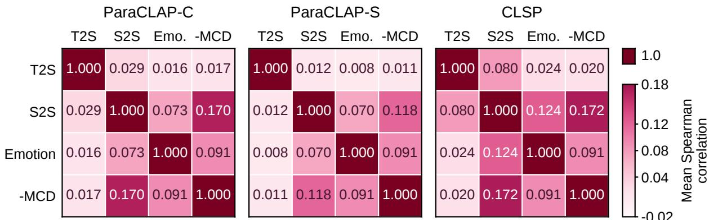
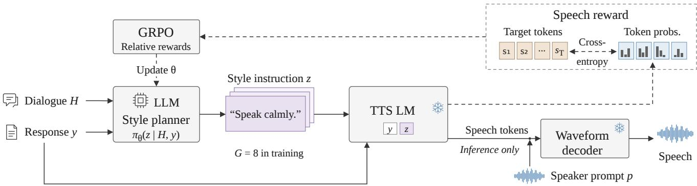
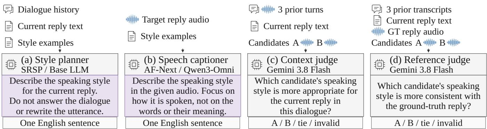

# BEYOND SPEECH CAPTIONS: SPEECH-REWARDED STYLE PLANNING FOR CONVERSATIONAL TEXT-TO-SPEECH

Shiao Zhu1, Lianbo Liu2, Sizhen Lyu1, Yuzhe Wang1, Sheng Li1, Takahiro Shinozaki1

1Institute of Science Tokyo, Tokyo, Japan 2Independent Researcher, Tokyo, Japan

## ABSTRACT

Natural-language style descriptions provide an interpretable interface between large language models (LLMs) and controllable text-to-speech (TTS). However, using descriptions as pseudo-labels compresses target acoustics into text, and descriptive fidelity need not imply effective control of a particular synthesizer. We empirically show that speech–text alignment only weakly predicts downstream acoustic similarity among candidate instructions for the same utterance. We therefore propose Speech-Rewarded Style Planning (SRSP), which trains a text-based style planner through a frozen downstream TTS model. Given dialogue history and response text, the planner generates candidate instructions and is optimized with group-relative policy optimization (GRPO), using the teacher-forced likelihood of target speech tokens as the reward. On an English subset of the ISCSLP 2026 CoT-TTS corpus, SRSP achieves higher speech-style and emotion similarity to target speech and lower melcepstral distortion than the Base LLM and target-audio-informed captioning baselines. LLM-based expressive speech evaluation further shows gains over all baselines in contextual appropriateness and reference consistency.

Index Terms— conversational speech synthesis, speaking style control, large language models, reinforcement learning, spoken dialogue systems

## 1. INTRODUCTION

Spoken dialogue conveys both linguistic content and manner of delivery. The same response can sound reassuring, hesitant, or excited, with different conversational effects. Response text alone does not fully determine how an utterance should be delivered. Inferring an appropriate speaking style from conversational context is therefore an important task in conversational TTS [1, 2].

Natural-language style descriptions provide an interpretable and editable interface between conversational reasoning and promptbased TTS, allowing textual instructions to control how an utterance is spoken [3, 4, 5]. Speech captioners such as StyleCap, SECap, and AlignCap describe paralinguistic and emotional properties of speech in natural language [6, 7, 8]. Such descriptions have also been used as explicit intermediate representations in conversational speech generation; for example, Chain-Talker predicts a contextaware empathetic caption before generating semantic speech codes and expressive speech [9]. A natural way to train a standalone textbased style planner is therefore to use speech-derived captions as supervision for predicting style instructions from dialogue context and response text.

However, when target speech is summarized as a caption, acoustic details omitted from that summary are not explicitly represented in the caption-based supervision. More importantly, predicting a target description and producing an effective instruction for a particular synthesizer are distinct objectives: even an accurate description need not induce the closest acoustic realization of the target speech. We address this mismatch with Speech-Rewarded Style Planning (SRSP), which uses a frozen downstream TTS model to provide training feedback for a text-based style planner. GRPO updates the planner using rewards based on the target-speech likelihood induced by candidate instructions, optimizing it for downstream synthesis behavior rather than agreement with speech-derived descriptions. Related work has also explored target-speech likelihood rewards for expressive TTS [10] and GRPO for instruction-controlled TTS [11].

Our contributions are as follows:

• We empirically show that, among candidate style instructions for the same utterance, speech–text alignment only weakly predicts downstream acoustic similarity, making it a weak proxy for selecting effective instructions.

• We propose Speech-Rewarded Style Planning, a text-based style planner trained with direct feedback from a frozen downstream TTS model. Candidate instructions are rewarded using teacher-forced target-speech likelihood, and GRPO updates the planner without requiring target style captions.

• Experiments on an English subset of the ISCSLP 2026 CoT-TTS corpus show that SRSP outperforms all baselines on five downstream acoustic metrics across both evaluation partitions. LLM-based expressive speech evaluation further shows gains in contextual appropriateness and reference consistency.

## 2. DESCRIPTIVE ALIGNMENT AS A PROXY FOR DOWNSTREAM CONTROL

We examine whether stronger speech–text alignment of a style instruction implies better downstream control of the synthesizer. For each utterance in the 5,500-utterance development set described in Sec. 4.1, we sample eight candidate style instructions from the Base LLM given the dialogue history and response text, using the training decoding parameters. We then synthesize the response under each instruction.

We use CLAPScore [12] to measure style alignment between the generated style instruction and target speech, denoted as T2S, and speech–speech cosine similarity to measure style similarity between synthesized and target speech, denoted as S2S. Both are computed as cosine similarities between embeddings from pretrained speech–text dual-encoder models. Specifically, we use ParaSpeechCLAP-Combined (ParaCLAP-C), ParaSpeechCLAP-Situational (ParaCLAP-S) [13], and CLSP [14]. Together with the three S2S scores, we use emotion similarity, computed as the cosine similarity between emotion2vec probability vectors [15], and MCD-DTW, the mel-cepstral distortion after dynamic time warping, as downstream acoustic metrics.

  
Fig. 1. Mean within-utterance Spearman correlations across both development partitions.

Table 1. Synthesis performance by instruction-selection criterion on the combined development partitions. Bold and underline indicate the best and second-best results, respectively.
<table><tr><td>Selection</td><td>S2S C/S/CLSP ↑ Emo. ↑ MCD↓</td></tr><tr><td>Random ParaCLAP-C T2S ParaCLAP-S T2S CLSP T2S</td><td>.3105/.3049/.8135 .5964 6.3266 .3181/.3127/.8180 .6044 6.3052 .3125/.3104/.8163 .5986 6.3142 .3173/.3101/.8198 .6032 6.2711</td></tr><tr><td>ParaCLAP-C S2S ParaCLAP-S S2S</td><td>.5133/.4595/.8465 .6210 6.0731 .4529/.5262/.8406</td></tr><tr><td>CLSP S2S</td><td>.6176 6.1581 .4200/.4075/.8762 .6354 6.0677</td></tr><tr><td>Emotion MCD-DTW</td><td>.3247/.3191/.8206 .8601 6.1932 .3456/.3288/.8235 .6160 5.2331</td></tr></table>

To assess how T2S relates to downstream acoustic similarity, we compute within-utterance Spearman correlations across candidate instructions between each T2S score and each downstream acoustic metric, as well as pairwise correlations among the acoustic metrics. MCD is negated so that higher values consistently indicate better target matching, and the correlations are averaged across utterances.

Figure 1 shows that T2S scores from both ParaSpeechCLAP variants are nearly uncorrelated with S2S, emotion similarity, and −MCD. CLSP, which targets fine-grained speech-style alignment [14], shows somewhat stronger but still weak T2S correlations. For each downstream acoustic metric, its correlation with T2S remains lower than its correlations with the other acoustic metrics.

To examine the downstream consequences of this ranking mismatch, we compare instruction selection based on T2S with selection based on downstream acoustic metrics. For each utterance, we select the best-scoring candidate under each criterion and evaluate the corresponding synthesis on all five downstream acoustic metrics, using random selection as a reference.

Table 1 shows that T2S-based selection provides only small improvements over random selection. In contrast, selecting by any downstream acoustic metric outperforms all three T2S-based criteria across all five downstream acoustic metrics, including those not used for selection. Thus, the candidate pool contains instructions that produce speech more closely matching the target, but descriptive alignment does not reliably identify them. Together with the weak correlations in Fig. 1, these results indicate that descriptive alignment is a weak proxy for downstream synthesis behavior, motivating synthesis-aware feedback.

## 3. SPEECH-REWARDED STYLE PLANNING

## 3.1. Problem formulation

Let H be text-only dialogue history, y the response text, p a samespeaker prompt utterance, and $\boldsymbol { s } = \left( s _ { 1 } , \ldots , s _ { T } \right)$ the target speech tokens. The style policy generates a natural-language instruction $z \sim \pi _ { \boldsymbol { \theta } } ( z \mid H , y )$ . During training, s is used only to construct the reward. At inference, the planner receives only $( H , y )$ , and its instruction conditions the TTS model together with response text y and prompt audio p.

## 3.2. Speech-token likelihood as reward

For candidate instruction $z _ { i } .$ , the autoregressive LLM of the frozen TTS model computes the mean teacher-forced cross-entropy (CE) loss over the target speech-token sequence:

$$
\mathcal { L } _ { \mathrm { T T S } } ( z _ { i } ) = - \frac { 1 } { T } \sum _ { t = 1 } ^ { T } \log p _ { \phi } ( s _ { t } \mid s _ { < t } , y , z _ { i } ) .\tag{1}
$$

All candidates in a reward group share $( y , s )$ , so their relative losses measure how each instruction changes the probability assigned to the same target speech by the fixed synthesizer. The reward is $R _ { i } = $ $- \mathcal { L } _ { \mathrm { T T S } } ( z _ { i } ) - \mathcal { P } _ { i }$ , where $\mathcal { P } _ { i }$ contains auxiliary penalties that discourage degenerate style instructions, including overly short, generic, and repetitive outputs.

## 3.3. Group-relative policy optimization

We optimize the planner using GRPO [16]. For each training instance, we sample G instructions and standardize their rewards within the group:

$$
A _ { i } = \frac { R _ { i } - \bar { R } } { \sigma _ { R } + \epsilon } ,\tag{2}
$$

where $\bar { R }$ and $\sigma _ { R }$ are the group mean and standard deviation, and ϵ is a small constant for numerical stability.

  
Fig. 2. Overview of SRSP. Frozen-TTS target-speech likelihood rewards candidate instructions during training, while GRPO updates the planner. Dashed arrows denote training-only paths; snowflakes denote frozen components.

Table 2. Results on test in/test out. Bold and underline indicate the best and second-best results, respectively. †: descriptions conditioned on the ground-truth target waveform. Paired Wilcoxon tests with Holm correction across 40 downstream acoustic comparisons show significant gains $( p _ { \mathrm { H o l m } } < . 0 5 )$ in 38 cases; the exceptions are test out emotion similarity vs. Raw TTS and Qwen3-Omni.
<table><tr><td rowspan="2">System</td><td colspan="3">T2S Score ↑</td><td colspan="3">S2S Score ↑</td><td rowspan="2"></td><td rowspan="2">Emo. Cos. ↑ MCD-DTW ↓</td></tr><tr><td>ParaCLAP-C</td><td>ParaCLAP-S</td><td>CLSP</td><td>ParaCLAP-C</td><td>ParaCLAP-S</td><td>CLSP</td></tr><tr><td>Raw TTS</td><td></td><td></td><td></td><td>.3370/.3494</td><td>.3246/.3303</td><td>.8160/.8148</td><td>.6098/.6119</td><td>6.2426/6.3932</td></tr><tr><td>Base LLM</td><td>-.0089/-.0141</td><td>.0161/.0160</td><td>.4718/.4686</td><td>.3166/.3220</td><td>.2979/.3078</td><td>.8150/.8146</td><td>.6124/.5927</td><td>6.3395/6.5072</td></tr><tr><td>AF-Next†</td><td>.0788/.0841</td><td>.0996/.0973</td><td>.5404/.5423</td><td>.2874/.2982</td><td>.2596/.2637</td><td>.7842/.7863</td><td>.5770/.5677</td><td>6.8890/7.0128</td></tr><tr><td>Qwen3-Omni†</td><td>-.0087/-.0119</td><td>.0225/.0193</td><td>.5101/.5053</td><td>.3176/.3312</td><td>.3083/.3130</td><td>.8194/.8182</td><td>.6228/.6226</td><td>6.1593/6.3189</td></tr><tr><td>SRSP (ours)</td><td>.0073/-.0044</td><td>.0324/.0232</td><td>.4591/.4518</td><td>.3632/.3627</td><td>.3496/.3502</td><td>.8329/.8296</td><td>.6417/.6269</td><td>5.9569/6.1637</td></tr></table>

The clipped objective includes a KL penalty to the reference policy:

$$
\begin{array} { r l } & { \mathcal { I } ( \theta ) = \mathbb { E } _ { i , t } \Big [ \operatorname* { m i n } \{ r _ { i , t } A _ { i } , \mathrm { c l i p } ( r _ { i , t } , 1 - \eta , 1 + \eta ) A _ { i } \} } \\ & { \qquad - \beta D _ { \mathrm { K L } } ( \pi _ { \theta } \| \pi _ { \mathrm { r e f } } ) \Big ] , } \end{array}\tag{3}
$$

where ${ r } _ { i , t }$ is the token-level likelihood ratio to the rollout policy, the expectation averages over valid generated tokens in each rollout batch, and $\pi _ { \mathrm { r e f } }$ is the frozen initial policy. The clipping parameter is η, and β is the KL weight.

The planner is prompted to generate one natural-language English sentence describing the speaking style, as summarized in Fig. 3(a). During training, we randomly sample zero to three CosyVoice-style examples as in-context demonstrations for each instance; the same examples are shared by all candidates in a reward group. At inference, two examples are sampled per utterance.

## 4. EXPERIMENTS

## 4.1. Experimental setup

Data. We construct an English subset of the ISCSLP 2026 CoT-TTS corpus [17], retaining utterances with duration 3–15 s, active-speech ratio $\geq 0 . 7 0 .$ , loudness $\geq - 4 0 \mathrm { d B F S }$ , transcript length $\leq 3 0 0$ characters, reference similarity $\geq 0 . 6 5$ , naturalness score $\geq 3 . 0 ,$ , and noise score $\geq 3 . 5$ . Excluding samples with temporally overlapping context and target speech yields a 299.75-hour pool. From this pool, we create four development and test partitions, each containing 2,750 utterances (approximately 5 hours). The dev in/test in partitions hold out complete scenes from movies represented in training, whereas dev out/test out hold out entire movies. After excluding training samples that overlap with held-out development or test utterances in either the target or dialogue context, 277.60 hours remain for training.

Models and optimization. The Qwen3.5-9B planner [18] is adapted with rank-16 LoRA [19] on all linear layers $( \alpha \ = \ 3 2 )$ dropout 0.02). Fun-CosyVoice3-0.5B [20] is the frozen reward and synthesis model. We train for one epoch with $G = 8 ,$ learning rate $2 \times 1 0 ^ { - 6 }$ , clipping parameter $\eta = 0 . 2 ,$ , and KL weight $\beta = 0 . 0 7 5$ We use TRL 1.3.0 [21] with its default token-level importance sampling and DAPO-style loss normalization [22]. Style generation uses temperature 1.3 during training and 0.7 at test time. For the auxiliary reward penalties, instructions shorter than 6 words receive a penalty of 5, while those containing 6–11 words receive a penalty of 0.5. Repeated bigrams and trigrams are penalized with weight 0.01 using a per-worker rolling history of 2,048 generated instructions.

Baselines. Raw TTS synthesizes responses without inferred style instructions. Base LLM uses unadapted Qwen3.5-9B with the same $( H , y )$ input, planner prompt, demonstrations, and inference configuration as SRSP, providing the direct pre-RL comparison. AF-Next uses NVIDIA’s Audio Flamingo Next Captioner checkpoint [23], while Qwen3-Omni uses Qwen3-Omni-30B-A3B-Instruct [24]. Both are privileged captioning baselines with direct access to the ground-truth target waveform, approximating an upper-bound captioning setting without an additional caption-prediction stage. They use the shared prompt in Fig. 3(b) and the official decoding strategies. Their captions are used directly as CosyVoice3 style instructions; all systems otherwise share the same TTS backend, response text, and same-speaker prompt audio. These captions are not optimized for CosyVoice3 and may therefore be suboptimal as control instructions.

  
Fig. 3. Abbreviated prompting configurations for style generation and LLM-based expressive speech evaluation.

Table 3. Win rates (%) in LLM-based expressive speech evaluation, reported as test in/test out. Rates exclude ties and invalid judgments (together < 1% of all judgments).
<table><tr><td rowspan="2">System</td><td colspan="2">SRSP wins vs. system</td><td rowspan="2">System wins vs. GT Context</td></tr><tr><td>Context</td><td>Reference</td></tr><tr><td>Raw TTS</td><td>65.54/63.92</td><td>66.31/64.38</td><td>12.26/13.09</td></tr><tr><td>Base LLM</td><td>54.19/53.67</td><td>60.91/57.75</td><td>15.90/16.87</td></tr><tr><td>AF-Next</td><td>75.63/75.75</td><td>75.01/75.05</td><td>7.42/9.35</td></tr><tr><td>Qwen3-Omni</td><td>55.21/56.65</td><td>58.50/57.50</td><td>14.95/16.95</td></tr><tr><td>SRSP (ours)</td><td></td><td></td><td>18.41/19.06</td></tr></table>

## 4.2. System-level results

Table 2 shows that SRSP achieves the best performance on all five downstream acoustic metrics in both partitions, despite the privileged baselines having access to the ground-truth target audio. Style instructions alone do not guarantee improvement: the unadapted Base LLM obtains lower S2S scores and higher MCD-DTW than Raw TTS, whereas speech-rewarded post-training reverses this degradation.

AF-Next provides a particularly clear example of the mismatch between descriptive alignment and downstream control: it achieves the highest T2S scores under all three speech–text encoders but ranks last on all five downstream acoustic metrics in both partitions. This mirrors the candidate-level mismatch observed in Sec. 2: high descriptive alignment does not necessarily translate into effective downstream control.

## 4.3. LLM-based expressive speech evaluation

A single recorded response represents only one possible realization of a reply, so reference consistency does not necessarily capture contextual appropriateness. We therefore complement target-reference evaluation with a context-only judgment that evaluates speaking style from the dialogue context without access to the target response audio. We use Gemini 3.8 Flash [25] as an automatic audio judge in blind A/B comparisons on all utterances in both test partitions, with a low thinking level.

In the context-only setting (Fig. 3(c)), the judge receives the three preceding utterances as audio with transcripts and the current response text, and selects the candidate whose speaking style is more appropriate for the reply. In the target-reference setting (Fig. 3(d)), it receives the context transcripts, current response text, and groundtruth response waveform, and selects the candidate whose style is more consistent with that waveform. Both candidates speak the same response text, and the judge is instructed to ignore speaker identity, voice timbre, and recording quality.

Table 3 shows that SRSP is preferred over all four baselines in both settings and partitions (p < .001, two-sided exact binomial tests). In the context-only setting, it achieves win rates of 54.19%/53.67% against the direct pre-RL Base LLM. Since the judge has no access to the target recording in this setting, this improvement indicates that speech-rewarded post-training also improves contextual appropriateness. In context-only comparisons with ground-truth speech, SRSP achieves the highest win rates among the synthesized systems (18.41%/19.06%). Ground-truth speech nevertheless remains preferred over all synthesized systems, highlighting the remaining gap in contextual appropriateness.

## 5. CONCLUSION

Our candidate-level analysis shows that speech–text alignment only weakly predicts downstream acoustic similarity. Speech-Rewarded Style Planning addresses this gap by training a conversational style planner with the teacher-forced target-speech likelihood of a frozen TTS model. The resulting planner outperforms all baselines on five downstream acoustic metrics across both evaluation partitions. LLM-based expressive speech evaluation further shows gains in contextual appropriateness and reference consistency. These results support optimizing natural-language instructions for their downstream synthesis behavior rather than relying solely on descriptive alignment. Our expressive-speech evaluation relies on an LLM judge and has not been validated by human listening tests. In addition, both reward computation and synthesis use CosyVoice3; evaluating transfer to other TTS backends remains for future work.

## Acknowledgment and AI Disclosure

This work was supported in part by JST BOOST, Japan Grant Number JPMJBY25F6. ChatGPT (OpenAI) was used to assist with language editing and phrasing refinement throughout the manuscript, as well as with the development of experimental scripts.

## 6. REFERENCES

[1] Guan-Ting Lin, Cheng-Han Chiang, and Hung yi Lee, “Advancing large language models to capture varied speaking styles and respond properly in spoken conversations,” in Proceedings of the 62nd Annual Meeting of the Association for Computational Linguistics (Volume 1: Long Papers), 2024, pp. 6626–6642.

[2] Haoqiu Yan, Yongxin Zhu, Kai Zheng, Bing Liu, Haoyu Cao, Deqiang Jiang, and Linli Xu, “Talk with human-like agents: Empathetic dialogue through perceptible acoustic reception and reaction,” in Proceedings of the 62nd Annual Meeting of the Association for Computational Linguistics (Volume 1: Long Papers), 2024, pp. 15009–15022.

[3] Dan Lyth and Simon King, “Natural language guidance of high-fidelity text-to-speech with synthetic annotations,” arXiv preprint arXiv:2402.01912, 2024.

[4] Jianxing Yu, Zihao Gou, Chen Li, Zhisheng Wang, Peiji Yang, Wenqing Chen, and Jian Yin, “Eliciting implicit acoustic styles from open-domain instructions to facilitate fine-grained controllable generation of speech,” in Proceedings of the 2025 Conference on Empirical Methods in Natural Language Processing, Suzhou, China, 2025, pp. 3679–3695, Association for Computational Linguistics.

[5] Haowei Lou, Hye-young Paik, Wen Hu, and Lina Yao, “ParaStyleTTS: Toward efficient and robust paralinguistic style control for expressive text-to-speech generation,” in Proceedings of the 34th ACM International Conference on Information and Knowledge Management. 2025, pp. 1979–1988, ACM.

[6] Kazuki Yamauchi, Yusuke Ijima, and Yuki Saito, “StyleCap: Automatic speaking-style captioning from speech based on speech and language self-supervised learning models,” in Proc. IEEE ICASSP, 2024, pp. 11261–11265.

[7] Yaoxun Xu, Hangting Chen, Jianwei Yu, Qiaochu Huang, Zhiyong Wu, Shi-Xiong Zhang, Guangzhi Li, Yi Luo, and Rongzhi Gu, “SECap: Speech emotion captioning with large language model,” in Proceedings of the AAAI Conference on Artificial Intelligence, 2024, vol. 38, pp. 19323–19331.

[8] Ziqi Liang, Haoxiang Shi, and Hanhui Chen, “AlignCap: Aligning speech emotion captioning to human preferences,” in Proc. EMNLP, 2024, pp. 3837–3846.

[9] Yifan Hu, Rui Liu, Yi Ren, Xiang Yin, and Haizhou Li, “Chain-Talker: Chain understanding and rendering for empathetic conversational speech synthesis,” in Findings of the Association for Computational Linguistics: ACL 2025, 2025, pp. 1988–2003.

[10] Yong Ren, Jingbei Li, Haiyang Sun, Yujie Chen, Cheng Yi, Yechang Huang, Hao Gu, Ye Bai, and Xuerui Yang, “Evaluating and rewarding LALMs for expressive role-play TTS via mean continuation log-probability,” in Proceedings of the 43rd International Conference on Machine Learning (ICML), 2026.

[11] Dekun Chen, Xueyao Zhang, Yuancheng Wang, Kenan Dai, Li Ma, and Zhizheng Wu, “FlexiVoice: Enabling flexible style control in zero-shot TTS with natural language instructions,” in Proc. ICLR, 2026.

[12] Benjamin Elizalde, Soham Deshmukh, Mahmoud Al Ismail, and Huaming Wang, “CLAP: Learning audio concepts from natural language supervision,” in 2023 IEEE International Conference on Acoustics, Speech and Signal Processing (ICASSP), 2023, pp. 1–5.

[13] Anuj Diwan, Eunsol Choi, and David Harwath, “ParaSpeech-CLAP: A dual-encoder speech-text model for rich stylistic language-audio pretraining,” arXiv preprint arXiv:2603.28737, 2026.

[14] Yifan Yang, Bing Han, Hui Wang, Wei Wang, Ziyang Ma, Long Zhou, Zengrui Jin, Guanrou Yang, Tianrui Wang, Xu Tan, and Xie Chen, “Towards fine-grained and multigranular contrastive language-speech pre-training,” in Proceedings of the 64th Annual Meeting of the Association for Computational Linguistics (Volume 1: Long Papers), 2026, pp. 4217–4235.

[15] Ziyang Ma, Zhisheng Zheng, Jiaxin Ye, Jinchao Li, Zhifu Gao, Shiliang Zhang, and Xie Chen, “emotion2vec: Self-supervised pre-training for speech emotion representation,” in Findings of the Association for Computational Linguistics: ACL 2024, 2024, pp. 15747–15760.

[16] Zhihong Shao, Peiyi Wang, Qihao Zhu, Runxin Xu, Junxiao Song, Xiao Bi, Haowei Zhang, Mingchuan Zhang, Y. K. Li, Y. Wu, and Daya Guo, “DeepSeekMath: Pushing the limits of mathematical reasoning in open language models,” arXiv preprint arXiv:2402.03300, 2024.

[17] Wei Xue, Junlan Feng, Shilei Zhang, Yue Wang, Ruosong Yang, Bei Liu, Liumeng Xue, Sitong Cheng, Jiahao Pan, Weizhen Bian, Boyi Kang, and Bin Long, “ISCSLP 2026 CoT-TTS challenge: Chain-of-thought reasoning for context-aware text-to-speech,” arXiv preprint arXiv:2606.21933, 2026.

[18] Qwen Team, “Qwen3.5: Towards native multimodal agents,” February 2026.

[19] Edward J. Hu, Yelong Shen, Phillip Wallis, Zeyuan Allen-Zhu, Yuanzhi Li, Shean Wang, Lu Wang, and Weizhu Chen, “LoRA: Low-rank adaptation of large language models,” in Proc. ICLR, 2022.

[20] Zhihao Du, Changfeng Gao, Yuxuan Wang, Fan Yu, Tianyu Zhao, et al., “CosyVoice 3: Towards in-the-wild speech generation via scaling-up and post-training,” arXiv preprint arXiv:2505.17589, 2025.

[21] Leandro von Werra, Younes Belkada, Lewis Tunstall, Edward Beeching, Tristan Thrush, Nathan Lambert, Shengyi Huang, Kashif Rasul, and Quentin Gallouedec, “TRL: Transform-´ ers Reinforcement Learning,” https://github.com/ huggingface/trl, 2020, Software.

[22] Qiying Yu, Zheng Zhang, Ruofei Zhu, Yufeng Yuan, Xiaochen Zuo, Yu Yue, Weinan Dai, Tiantian Fan, Gaohong Liu, Juncai Liu, Lingjun Liu, Xin Liu, et al., “DAPO: An open-source LLM reinforcement learning system at scale,” in Advances in Neural Information Processing Systems, 2025, vol. 38.

[23] Sreyan Ghosh, Arushi Goel, Kaousheik Jayakumar, Lasha Koroshinadze, Nishit Anand, Zhifeng Kong, et al., “Audio Flamingo Next: Next-generation open audio-language models for speech, sound, and music,” arXiv preprint arXiv:2604.10905, 2026.

[24] Jin Xu, Zhifang Guo, Hangrui Hu, Yunfei Chu, Xiong Wang, Jinzheng He, et al., “Qwen3-Omni technical report,” arXiv preprint arXiv:2509.17765, 2025.

[25] Google DeepMind, “Gemini 3.8 Flash,” Sept. 2026, Accessed: Sep. 15, 2026. [Online]. Available: https: //deepmind.google/models/model-cards/ gemini-3-8-flash/.