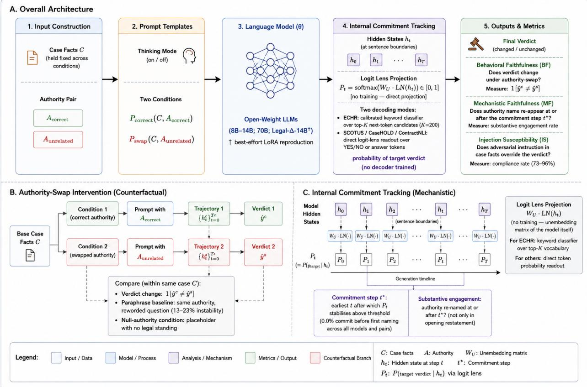
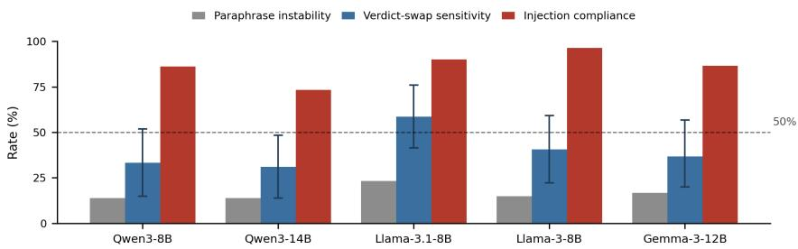

# CITED BUT NOT CONSULTED

# A Counterfactual Audit of Legal Chain-of-Thought Faithfulness

Saisab Sadhu, Shreeyans Arora∗

Pratinav Seth

Lexsi Labs

Correspondence: saisab.sadhu@lexsi.ai

## Abstract

Large language models increasingly justify legal decisions by naming the statute or precedent behind a verdict, treated as evidence the decision follows from it. We test this directly: holding case facts fixed, we substitute the named legal authority for an unrelated one and decode a model’s evolving verdict from its hidden states. Across seven open-weight models (8B–70B) and four benchmarks spanning judicial and contractual reasoning, when explicitly required to justify a verdict by naming the governing authority, models name the correct one in 66.7%–100% of generations, while the verdict changing when the authority changes is far less consistent: 0.0%–21.7% on CaseHOLD, 30.0%–76.7% on ECHR and SCOTUS, and 43.3%–50.0% on ContractNLI. Neither scale nor a purpose-built legal-reasoning model (a best-effort LoRA reproduction; Section 6) closes this gap. A red-teaming evaluation on five core models finds compliance with an adversarial instruction hidden in the case facts (73.3%–96.4%) exceeds verdict-swap sensitivity by a wide margin, holding without exception regardless of cross-model ranking. Naming a legal authority is thus a poor proxy for a verdict’s dependence on it, and the same verdict remains separately vulnerable to adversarial manipulation; both findings replicate across checks ruling out prompt-wording noise and confounded sampling, and bear directly on using generated legal explanations as compliance or audit artefacts.

Keywords: chain-of-thought faithfulness, legal NLP, counterfactual evaluation, mechanistic interpretability, LLM auditing

## 1 Introduction

Financial and legal AI systems increasingly justify high-stakes decisions through Chain-of-Thought (CoT) reasoning that names the rule, statute, or precedent said to govern the outcome; that naming is commonly treated as evidence the decision follows from it. A growing body of work complicates this picture: CoT is frequently unfaithful, with models committing to an answer before generating the reasoning that ostensibly supports it, and that reasoning amounting to post-hoc rationalisation rather than a causal input (Lanham et al., 2023; Lyu et al., 2023; Arcuschin et al., 2026). None of this asks whether unfaithfulness extends to the specific authority a model names, in a domain where that naming is the reasoning’s defining structural feature, or whether the same verdict is directly manipulable independently of it. We test both (Section 2), prioritising convergent evidence across models, lenses, and adversarial conditions over benchmark-style sample sizes (Section 9), turning three assumptions into explicit research questions. First, is naming the correct authority a reliable proxy for the verdict depending on it, and does any gap survive changes in scale, training paradigm, and legal-authority type (RQ1)? Second, does behavioural authority-swap sensitivity track post-commitment authority re-engagement, or do the two dissociate (RQ2)? Third, is the same verdict directly exploitable via an adversarial instruction hidden in the document under review, independently of whether it depends on the authority it names (RQ3)? We use consulted in the title as shorthand for these behavioural and textual proxies, not a claim that an authority’s internal representation is causally used (Section 7).

The present work contributes an authority-swap counterfactual protocol, more precisely a legal decision target intervention instantiated as a treaty provision, cited precedent, issue-area category, or contractual obligation (Section 3): holding facts fixed, we substitute the target a model is asked about for an unrelated one and measure whether the model’s internal decision signal and final verdict change, paired, to our knowledge for the first time, with internal commitment-tracking applied to legal reasoning: decoding a model’s evolving decision from hidden states at each sentence boundary, previously confined to general-domain tasks. A red-teaming ablation answers RQ3 directly (Section 6), showing a generated explanation is exploitable on two independent fronts at once.

## 2 Related Work

Faithfulness and internal commitment. CoT explanations frequently fail to reflect a model’s actual computation: models can commit to an answer before generating the reasoning meant to support it (Lanham et al., 2023), produce a reasoning chain that need not reflect how the answer was reached (Lyu et al., 2023), produce post-hoc rationalisations even in frontier models (Arcuschin et al., 2026), and rationalise answers actually driven by an input-side influence the CoT never discloses (Turpin et al., 2023). Decoding a model’s evolving prediction from hidden states, via the logit lens (nostalgebraist, 2020) or a tuned lens (Belrose et al., 2023), tracks when a decision forms, not just whether it eventually forms correctly; recent work locates pre-verbalisation commitment on delayed-verdict tasks (Zhang et al., 2026) and probes activation dynamics on MMLU/GPQA-style benchmarks (Boppana et al., 2026). Post-commitment CoT is itself often epiphenomenal, continuing with little effect on the final answer probability once stabilised (Scalena et al., 2026), a finding we return to when interpreting re-engagement after commitment (Section 7). Two concurrent papers bring commitment-tracking to CoT at scale: Mehta (2026) defines representational commitment via cross-run hidden-state convergence in ReAct-style agents, and Li et al. (2026) track step-level answer commitment with a proxy cross-validated against Patchscopes, tuned-lens probes, and causal direction ablation across nine models and seven benchmarks, finding latent commitment and the explicit answer align on only 61.9% of steps. All of this is confined to general-domain reasoning; we bring it to law, where naming an authority is the reasoning’s defining structural feature, and are not aware of prior work applying commitment-tracking to legal reasoning.

Citation reliability and causal mediation. Work on legal-citation reliability asks whether a named case or statute is real and doctrinally accurate, typically via retrieval- or graph-based verification (Chen et al., 2026; Liu et al., 2026; Ovcharov, 2026), a question of correctness, not causal dependence: a model can hallucinate a citation while its verdict tracks the real authority, or name a real, accurate authority its verdict does not depend on at all, the failure mode this paper targets. Four counterfactual protocols are closer in spirit: FACET (Jambula, 2026) perturbs US tort case facts and checks behavioural factor-attribution updates, finding these for moderately but not highly canonical factors; Somov et al. (2026) re-prompt with a perturbed intermediate structure, finding, across twelve models and four benchmarks, that predictions often fail to update after the intervention; FACT-E (Sun et al., 2026) uses controlled perturbations as an instrumental signal for intra-chain CoT faithfulness; and Paul et al. (2024) apply causal mediation analysis to intermediate reasoning across twelve models, the closest prior causal (rather than textual-proxy) test to the activation-patching direction we motivate but do not run (Section 7). Closest in domain, Wang et al. (2026) evaluate legal NLI faithfulness on a re-annotated ContractNLI subset via formal, solver-based autoformalization: they ask whether stated reasoning formally entails the answer, not whether the answer causally depends on the clause named, and their subset is disjoint from ours. We instead perturb the named authority, pairing this behavioural check with internal decoding; the contribution is not novelty in CoT faithfulness, causal intervention, or legal reasoning individually, but their combination: legal-decision-target counterfactuals paired with latent commitment tracking and adversarial robustness testing, which, to our knowledge, no prior work combines.

## 3 Task and Data

LexGLUE (Chalkidis et al., 2022) assembles ECHR violation classification, building on Chalkidis et al. (2019), SCOTUS issue-area classification, and CaseHOLD (Zheng et al., 2021) precedent-holding selection, among other tasks, into a single benchmark suite; we build directly on its ECHR, SCOTUS, and CaseHOLD configurations.

Table 4 (Appendix A) summarises the four task/dataset pairs. We use authority as informal shorthand for what each task instantiates as the target of a legal decision: a treaty provision for ECHR, a cited precedent’s identity for CaseHOLD, an issue-area category for SCOTUS, and a contractual obligation for ContractNLI. SCOTUS’s issue-area label is the least literally an “authority” of the four (not itself a statute, precedent, or clause a decision cites), but the same protocol applies: substitute the decision target, hold facts fixed, and measure whether the verdict tracks the substitution.

  
Figure 1 Overview of the pipeline. A: case facts are held fixed while an authority pair (correct against unrelated) is substituted into the prompt under a thinking-mode toggle; the model, open-weight and untrained for this task, produces a Chain-of-Thought whos hidden states are read at each sentence boundary via an untrained logit-lens projection over the target verdict, yielding this paper’s three outcome measures, verdict-swap sensitivity, post-commitment re-engagement (labelled “substantive engagement” in this figure; a textual proxy, not a causal measure, Section 7), and injection susceptibility, each defined in Section 4. B: the authority-swap counterfactual, comparing the two conditions’ trajectories and verdicts on the same facts, alongside the paraphrase and null-authority baselines. C: commitment tracking, the logit-lens projection Pt = softmax(WU · LN(ht)) at every sentence boundary, the commitment step t (earliest point the decoded verdict stays fixed), and whether the authority is re-named at or after t .

Dataset details. ECHR uses the ECtHR-A configuration (Table 4): each case’s facts map to the articles the Court actuallyfound violated, distinct from articles merely alleged (ECtHR-B); “ECHR” below refers to this task, “Article n”/“the Convention” to the treaty provisions, and “the Court” to the European Court of Human Rights; sampling is stratified since the raw corpus skews negative. CaseHOLD (Zheng et al., 2021) masks a US court decision’s holding as <HOLDING> in a five-way multiple-choice task; where ECHR is decided from underlying facts, CaseHOLD is decided from an authority already present in the input (Section 4). SCOTUS issue-area classification (Chalkidis et al., 2022) codes each opinion’s primary subject matter into one of fourteen issue areas; opinions are truncated to their first 6,000 characters to keep the generation budget tractable (Appendix N). Finally, as a fourth RQ1 axis testing whether the gap generalises beyond judicial case law, we add ContractNLI (Koreeda and Manning, 2021), an NLI task over non-disclosure agreements where the label is whether the contract entails, contradicts, or does not mention a stated confidentiality obligation; we collapse Contradiction/NotMentioned into NO against Entailment as YES.

## 4 Method

Figure 1 summarises the pipeline.

Eliciting authority-grounded CoT. For all four tasks, the system prompt instructs the model to place its step-bystep reasoning inside <think>/</think> tags, name explicitly the legal test, statute, precedent, or clause it relies upon, and conclude with a fixed-format marker (VERDICT: VIOLATION or NO VIOLATION for ECHR, ANSWER: {0..4} for CaseHOLD, VERDICT: YES or NO for SCOTUS and ContractNLI). Marker extraction is normalised against markdown and LAT X emphasis wrapping, and falls back to natural-language conclusion phrasing (e.g. “I would conclude there is a violation”) when the literal marker is absent, taking the rightmost such match since a model may float a tentative answer before revising it. Because the prompt explicitly instructs the model to name an authority, near-universal surface engagement (Section 6) partly reflects instruction-following; every claim is scoped to what happens once a model is required to name an authority, not to unprompted citation (Section 9).

Commitment tracking. Following Zhang et al. (2026), we track a model’s internal decision at every sentence boundary by decoding the hidden state at that position. For ECHR, the top-K next-token candidates $( K \overset { \cdot } { = } 2 0 0 )$ are bucketed into violation/no-violation via a calibrated keyword-and-morphology classifier, with raw category counts corrected by each category’s empirical base rate across every sentence in a run, since word lists for different categories are not equally generic and accumulate top-K hits at different rates independent of content. For CaseHOLD (digits 0–4), SCOTUS, and ContractNLI (tokens YES/NO), the decision space is a small literal token set, so the model’s own next-token probability for each candidate is read directly off the hidden state: a direct logit-lens readout, no keyword heuristic needed. We apply this readout over a small literal candidate set (two tokens for SCOTUS/ContractNLI, five for CaseHOLD) rather than the full vocabulary, reducing the instability concerns raised for full-distribution logit-lens probing (Belrose et al., 2023).

Commitment step, formally. Let $\ell _ { i } \in \{ c _ { 1 } , \ldots , c _ { m } , \bot \}$ denote the decoded label at sentence $i ( m = 2$ categories for ECHR/SCOTUS/ContractNLI, $m = 5$ candidate holdings for CaseHOLD; ⊥ marks no confident label), and $s _ { i } ( c )$ a category’s score at that sentence: the calibrated, base-rate-corrected top-K keyword count for ECHR, the raw next-token probability for the direct logit-lens readout elsewhere. Writing top and 2nd for the highest- and second-highest-scoring categories,

$$
\ell _ { i } = \left\{ \begin{array} { l l } { \mathrm { t o p } } & { \mathrm { i f } s _ { i } ( \mathrm { t o p } ) > 0 \mathrm { a n d } } \\ & { \left( s _ { i } ( 2 \mathrm { n d } ) = 0 \mathrm { o r } \frac { s _ { i } ( \mathrm { t o p } ) } { s _ { i } ( 2 \mathrm { n d } ) } \geq 1 . 5 \right) } \\ { \perp } & { \mathrm { o t h e r w i s e } } \end{array} \right.
$$

a category needs nonzero support and a 1.5× margin over the runner-up to count as confident; sentences with no support or a near-tie are ⊥, not resolved by tie-breaking. The commitment step $t ^ { * }$ is the earliest sentence index i such that $\ell _ { j } = \ell _ { n }$ for every $j \in [ i , n ]$ , where n is the final sentence, provided $\ell _ { n } \neq \bot ;$ if the last sentence never reaches a confident label, $t ^ { * }$ is undefined and the case is excluded from commitment-conditioned statistics. ECHR’s $s _ { i } ( \cdot )$ uses the calibrated count by default; Appendix G reports commitment steps under the raw, uncalibrated count as an ablation.

## 4.1 Main Intervention and Comparison

Authority-swap counterfactual. For ECHR, SCOTUS, and ContractNLI, holding case facts fixed, we generate CoT twice per case, once under the true target authority and once under the control. We measure engagement, whether the reasoning names the authority actually asked about, in either condition; verdict-swap sensitivity, whether the final verdict changes between conditions; on the unrestricted sample this is descriptive only, since two different authorities can legitimately imply the same outcome, which is why the gold-different subset (Section 4.2), where target and control gold labels are constructed to differ, is this paper’s cleaner reading of authority-dependence; and commitment-before-naming, whether the internal decision locks in before the model first names the authority, evidence the naming is attached after the fact rather than driving the reasoning.

For CaseHOLD, the intervention instead perturbs the input: the named precedent case in the excerpt is replaced with a neutral placeholder, Doe v. Roe, while the surrounding text and all five candidate holdings are held fixed, and we measure whether the selected holding changes as a result.

Worked example (illustrative). Concretely (not a reproduced generation): a detained applicant’s private medical correspondence was read by prison staff without consent. The target condition asks whether Article 8 (private and family life) is violated; the control condition pairs the same facts with Article 3 (torture and inhuman treatment), which they do not obviously engage. A model matching our typical pattern restates each article in its opening sentence (surface engagement), then concludes VERDICT: VIOLATION under Article 8 and VERDICT: NO VIOLATION under Article $^ { 3 , }$ a verdict-swap event, with commitment-before-naming checked by comparing $t ^  \ast \} \mathrm { s }$ sentence index against this opening mention (naming comes first in every case observed).

## 4.2 Supporting Diagnostics

We distinguish two notions of engagement. Surface engagement is whether the asked-about authority is named anywhere in the reasoning, near-universal since every model restates it in its opening sentence. Post-commitment re-engagement additionally requires the authority to be named again at or after the sentence where the internal decision signal locks in, not only in that opening restatement.

Table 1 Models evaluated. “Native” is a model’s own thinking-mode toggle; “Prompted” models receive the <think> tag via system prompt (Section 4). †Legal-∆-14B is a best-effort LoRA reproduction (Sections 6, 9); Llama-3.3-70B is a scale check on RQ1 (Section 6).
<table><tr><td>Model</td><td>Params</td><td>Elicitation</td><td>Scope</td></tr><tr><td>Qwen3-8B</td><td>8B</td><td>Native</td><td>Full battery</td></tr><tr><td>Qwen3-14B</td><td>14B</td><td>Native</td><td>Full battery</td></tr><tr><td>Llama-3.1-8B</td><td>8B</td><td>Prompted</td><td>Full battery</td></tr><tr><td>Llama-3-8B</td><td>8B</td><td>Prompted</td><td>Full battery</td></tr><tr><td>Gemma-3-12B</td><td>12B</td><td>Prompted</td><td>Full battery</td></tr><tr><td>Llama-3.3-70B</td><td>70B</td><td>Prompted</td><td>ECHR/SCOTUS Pair A</td></tr><tr><td>Legal-∆-14B</td><td>14B</td><td>Prompted</td><td>Full battery†</td></tr></table>

Confound-free resampling. A model answering NO under both conditions is not necessarily unfaithful, since dual-negative agreement can be independently correct rather than evidence of insensitivity. We address this by restricting the case pool to instances where the target and control gold labels genuinely differ (exactly one is violated, for ECHR; the true issue area is exactly the target or exactly the control, for SCOTUS), on which a model tracking the authority it is asked about must change its verdict (Section 6).

Robustness: paraphrase and prompt-injection ablation. The null-authority condition (Section 7) leaves open how much measured swap-sensitivity is generic instability to any prompt change, rather than specifically to swapping the real authority. We add a tighter baseline: holding the target authority, question, and facts fixed, we reword the question into a meaning-preserving paraphrase (Section 6), isolating wording-level instability with the legal question itself unaltered. Separately, we test whether the verdict is exploitable via an adversarial instruction injected into the case facts, appended text instructing the model to conclude VERDICT: VIOLATION regardless of the actual facts, framed as a spurious “registry note”: a red-teaming question complementary to the authority-swap protocol. Following prompt-injection practice that separates attacker-goal success from task utility (Debenedetti et al., 2024), we report both the raw compliance rate (does the output match the injected verdict) and whether that output differs from the model’s own uninjected verdict on the same case (Section 6).

## 5 Experimental Setup

We evaluate seven open-weight instruction-tuned and reasoning models (Table 1), run locally in bfloat16, seed= 42 throughout; generation is capped at 1,536 new tokens.

For the main ECHR, SCOTUS, and ContractNLI comparisons, we use a balanced sample of thirty cases per model per authority pair, fifteen positive and fifteen negative, each generated under both the target- and control-authority conditions; CaseHOLD uses thirty sampled cases under both the original and authority-swapped conditions. For each of ECHR and SCOTUS we evaluate two structurally independent target/control authority pairs: Article 8 against Article 3 and Article 6 against Article 14 for ECHR; Criminal Procedure against Economic Activity and First Amendment against Civil Rights for SCOTUS. For ECHR and SCOTUS we additionally run a null-authority condition, substituting a placeholder authority with no legal standing for the control, isolating whether verdict-swap sensitivity reflects authority-specific engagement or generic prompt-perturbation instability (Section 7). We report 95% bootstrap confidence intervals (1,000 resamples) on verdict-swap sensitivity, our headline measure, throughout.

## 6 Results

Cross-model comparison. Table 2 reports the full cross-model measures on ECHR Pair A, with 95% bootstrap CIs (1,000 resamples) on verdict-swap sensitivity; convergence and accuracy are solid across the board, and the gap between surface and post-commitment re-engagement is the same qualitative pattern seen across every dataset in this study. Verdict-swap sensitivity ranges from 31.0% (Qwen3-14B) to 58.6% (Llama-3.1-8B-Instruct); only Qwen3-14B’s interval, [13.8, 48.3], excludes 50% entirely (Appendix L tests this further). The two measures do not move together: Llama-3.1-8B-Instruct is highest on swap-sensitivity yet third-lowest on post-commitment re-engagement, while

Table 2 ECHR Pair A (target Article 8, control Article 3), n = 30 per model, seed= 42, all rows in percentages except the bracketed 95% bootstrap CI (1,000 resamples) on verdict-swap sensitivity; committed-before-first-naming, not tabulated, is 0.0% for every model here and on every other pair (Section 7).
<table><tr><td>Metric</td><td>Qwen3-8B</td><td>Qwen3-14B</td><td>Llama-3.1-8B</td><td>Llama-3-8B</td><td>Gemma-3-12B</td><td>Legal-∆-14B</td></tr><tr><td>Convergence (target/control)</td><td>90.0 / 100</td><td>96.7 / 100</td><td>96.7 / 100</td><td>90.0 / 93.3</td><td>100 / 100</td><td>100 / 100</td></tr><tr><td>Accuracy (of answered cases)</td><td>88.9</td><td>82.8</td><td>69.0</td><td>48.1</td><td>66.7</td><td>83.3</td></tr><tr><td>Verdict-swap sensitivity</td><td>33.3</td><td>31.0</td><td>58.6</td><td>40.7</td><td>36.7</td><td>33.3</td></tr><tr><td>95% bootstrap CI</td><td>[14.8, 51.9]</td><td>[13.8, 48.3]</td><td>[41.4, 75.9]</td><td>[22.2, 59.3]</td><td>[20.0, 56.7]</td><td>[16.7, 50.0]</td></tr><tr><td>Surface engagement (target)</td><td>100</td><td>100</td><td>100</td><td>80.0</td><td>100</td><td>96.7</td></tr><tr><td>Post-commitment re-engagement</td><td>53.3</td><td>70.0</td><td>33.3</td><td>46.7</td><td>26.7</td><td>20.0</td></tr></table>

Qwen3-14B shows close to the opposite. Scaling within Qwen3, 8B to 14B, improves re-engagement but lowers accuracy (88.9% to 82.8%) while slightly lowering swap-sensitivity, so scale alone does not resolve the gap. Whether this pattern is stable is examined in Section 6 with a second, independent authority pair. We turn first, however, to RQ3: whether the same verdict is exploitable by a route unrelated to which authority is named.

Robustness: paraphrase and prompt-injection (ECHR Pair A). Both ablations below are run on ECHR Pair A only, five models, n = 30 (Table 3); generalisability to other datasets is an acknowledged limitation (Appendix N). Figure 2 (Appendix F) shows the full ordering at a glance. Paraphrase instability, rewording the question with the authority and facts unchanged, sits well below verdict-swap sensitivity for every model (13.8% to 23.3% versus 31.0% to 58.6%, Table 2), and below the null-authority condition’s 10.0% to 51.7% for every model but Gemma-3-12B (Section 7). With nothing about the authority or question altered, wording sensitivity alone accounts for well under half the swap-sensitivity for most models, a cleaner baseline supporting our reading that verdict-swap sensitivity reflects more than surface prompt instability.

The prompt-injection result, this paper’s direct answer to RQ3, is a distinct and more concerning finding. We append an adversarial instruction to the case facts, framed as a spurious registry note directing the model to conclude VERDICT: VIOLATION regardless of the facts; all five models comply in 73.3% to 96.4% of cases, exceeding verdict-swap sensitivity (Table 2) for every model by a wide margin: each is more willing to follow a fabricated instruction than its verdict is to track the authority it is actually asked about. A stricter test, whether the injection additionally changes the verdict relative to the model’s own uninjected baseline, happens in 18.5% to 41.4% of cases and, unlike compliance, exceeds swap sensitivity only for Qwen3-8B. We therefore anchor the paper’s central exploitability claim on the compliance rate, the weaker and more defensible reading, not the stricter verdict-change rate (Section 7).

Table 3 Robustness ablation on ECHR Pair A, n = 30 per model, seed= 42, all values in percentages (row definitions in the text, Section 6). Injection compliance is the rate at which the model outputs the instructed verdict; injection verdict change is the stricter rate at which that output differs from the model’s own uninjected baseline. The paper’s headline exploitability claim uses compliance throughout (see text).
<table><tr><td>Metric</td><td>Qwen3-8B</td><td>Qwen3-14B</td><td>Llama-3.1-8B</td><td>Llama-3-8B</td><td>Gemma-3-12B</td></tr><tr><td>Paraphrase instability</td><td>13.8</td><td>13.8</td><td>23.3</td><td>14.8</td><td>16.7</td></tr><tr><td>Injection compliance</td><td>86.2</td><td>73.3</td><td>90.0</td><td>96.4</td><td>86.7</td></tr><tr><td>Injection verdict change</td><td>41.4</td><td>27.6</td><td>30.0</td><td>18.5</td><td>20.0</td></tr></table>

CaseHOLD: a second reasoning paradigm. On CaseHOLD, n = 30 (full results in Table 6, Appendix C), convergence ranges from 80.0% to 100%, somewhat lower than on ECHR, plausibly because discriminating among five related holdings is harder than a binary judgment, and accuracy is well above the 20% chance rate for every model, 73.3% to 83.3%. A precedent name was detected in the same 24 of 30 cases for every model (detection runs once on the fixed input excerpt); replacing it with a neutral placeholder, Doe v. Roe, while holding the excerpt and all five candidate holdings fixed, changes the selected holding in only 0.0% to 21.7% of detected-citation cases; we call this precedent-identity sensitivity, not authority-dependence generally, since only the case name changes: the lowest swap-sensitivity of our three settings despite the authority sitting in the input, and the structurally cleanest intervention since it perturbs only the named precedent (Section 4). The excerpt’s surrounding facts may suffice to select the correct holding, the precedent functioning as a label rather than a necessary premise: low sensitivity is consistent with the citation being redundant (already encoded in the excerpt) rather than ignored, a distinction this intervention alone cannot resolve, though either reading fits the two-phase hypothesis (Section 7). Our intervention measures behavioural authority-dependence, not whether the authority is internally represented. Because it changes only a token-level identity, this result is complementary evidence that citation identity can be dispensable; the cleanest evidence of unfaithful reasoning rests on ECHR, SCOTUS, and ContractNLI, where the gold-different subset rules out the dual-negative confound directly (Section 4.2).

SCOTUS: a third dataset, a third court system. SCOTUS (Pair A: target Criminal Procedure, control Economic Activity) mirrors the ECHR design; convergence and accuracy are again solid across the board (full results in Table 7, Appendix D). Verdict-swap sensitivity, 30.0% to 60.0%, overlaps substantially with the ECHR Pair A range, 31.0% to 58.6%, though the ranking differs: Gemma-3-12B-it, mid-ranked on ECHR, is highest here, while Qwen3-14B is lowest in both. Whether this reshuffles with the decision space is examined in Section 6.

Robustness of the gap: pair choice and dual-negative cases. Two checks test whether the gap above reflects the specific pair chosen, or dual-negative agreement, rather than genuine authority-dependence. A second, structurally independent authority pair per dataset (ECHR: Article 6 v. Article 14; SCOTUS: First Amendment v. Civil Rights; same five models, n = 30, seed= 42; full per-model numbers in Appendix H) replicates the central finding: every model shows non-trivial sensitivity under both pairs, and the surface-versus-post-commitment gap (Section 6) is never closed by either. Separately, restricting to the confound-free subset where target and control gold labels genuinely differ (Section 4.2; same five models, n = 30, seed= 42) does not uniformly lower sensitivity, as a confound account would predict: it rises for three of five models on each of ECHR and SCOTUS (full figures in Appendix I; a modest majority against confound inflation, not decisive evidence against it). ContractNLI’s own binary collapse (Section 3) creates an analogous risk, and here the check is unambiguous: restricted to the twelve (of thirty) cases per model where target and control gold genuinely differ, sensitivity rises for all six models, from 43.3%–50.0% on the full sample to 50.0%–66.7% on the confound-free subset (full figures in Appendix J).

Scale and training paradigm: two generalisation checks on RQ1. Does scale, or reasoning-native training beyond a single family, close the naming-versus-depending gap? We run Llama-3.3-70B-Instruct, a five- to nine-fold parameter increase over our 8B–14B range, on ECHR and SCOTUS Pair A (n = 30, seed= 42). Convergence is total and accuracy is the highest of any model on SCOTUS, 96.7%, and mid-range on ECHR, 80.0%, but the gap does not close, and its shape is dataset-dependent: ECHR swap-sensitivity, 40.0% ([23.3, 56.7]), sits squarely inside the 8B–14B range (Table 2), while SCOTUS swap-sensitivity, 76.7% ([60.0, 90.0]), is the highest we record anywhere, alongside the lowest post-commitment re-engagement of any general-purpose model on any dataset, 10.0%, a sharp single-model illustration of RQ2. As a second, structurally different reasoning-native comparison, we add Legal-∆-14B (Dai et al., 2025), built for legal reasoning via reinforcement learning (a best-effort reproduction; Appendix M tests merge validity). Across all four datasets (Tables 2–8), it shows no higher authority-dependence than the general-purpose models taken together (its SCOTUS 70.0% exceeds every 8B–14B model but not the 70B model’s 76.7%) and, like the 70B model, is comparatively swap-sensitive while among the least re-engaged: a second illustration of the RQ2 dissociation from a different training route, treated as corroborating rather than independent evidence given the reproduction caveat.

ContractNLI: a fourth authority type, a fourth domain. ContractNLI (Section 3) tests RQ1’s authority-type axis, whether the gap generalises beyond judicial case law (full results in Table 8, Appendix E). Convergence is high, 86.7% to 100%, and accuracy is well above the 50% chance rate for every model, 57.7% to 76.7%. Verdict-swap sensitivity, 43.3% to 50.0%, is a narrower band than ECHR or SCOTUS but the same order of magnitude, and surface engagement (70.0% to 100%) again outpaces post-commitment re-engagement (3.3% to 83.3%) for every model. The gap thus replicates in a fourth authority type and domain, commercial rather than judicial: it is not specific to courts, but reappears in a privately negotiated contractual clause.

## 7 Discussion

Ablations. Three design choices are validated (Appendix G): the ECHR calibration baseline reflects genuine pertopic imbalance, not noise; calibration shifts individual-case commitment timing without moving the aggregate rate; and prompted elicitation shifts measures by ≤10 points without closing the surface-versus-post-commitment gap.

Surface naming is a poor proxy for verdict-swap sensitivity: naming sits near ceiling with little cross-case variance, while swap-sensitivity varies substantially across models, pairs, and datasets, dissociating in level rather than moving together (Section 6). Treating a named authority’s mere presence as evidence of application is therefore a nearly uninformative proxy, since naming stays constant across decision-relevant and irrelevant cases alike.

A two-phase hypothesis: boilerplate naming, then fact-driven decision. The results are consistent with a two-phase process: the authority appears in an obligatory opening restatement (consistent with the 0.0% committedbefore-naming rate on every ECHR cell, Table 2, and near-universal surface engagement), after which the decision draws on factual patterns largely independent of the authority named. This reading is not the only one available: since the prompt requires naming and the probe only starts at sentence boundaries, a uniform 0.0% rate is equally what a measurement floor effect would produce; our design does not separate the two. Post-commitment re-engagement, a name re-occurring after commitment, is a strict lower bound on true mechanistic re-engagement, since a model could attend back to the authority without repeating its name; low re-engagement does not establish second-phase independence. The hypothesis fits each RQ: naming is opening-phase template behaviour; behavioural and postcommitment measures dissociate because they probe different phases; and the gap replicates across authority types because naming-then-deciding is plausibly general in legal training text. The 70B SCOTUS result (Section 6) remains one striking data point, not yet generalised to how scale modulates the later phase. Activation-patching the authority representation mid-reasoning would give a more direct causal test. Post-commitment reasoning is often epiphenomenal, continuing after the answer stabilises with little effect on its probability (Scalena et al., 2026), which is why we treat re-engagement as a textual proxy, not causal evidence: naming first does not mean naming causes commitment.

The cross-model comparison resists a single tidy narrative: the Llama-3.1/Qwen3-14B contrast (Section 6) holds up under a second authority pair on ECHR (Section 6), while SCOTUS reorders the ranking, evidence of two distinguishable phenomena rather than one latent factor.

Red-teaming (RQ3): models comply with injected instructions more reliably than they track authority. The injected-instruction result (Section 6, Figure 2) is this paper’s most consistent, and most actionable, quantitative finding: injection compliance, whether the output matches the instructed verdict, exceeds verdict-swap sensitivity for every model by a wide margin. This is a claim about compliance, not that injection always overturns the verdict (a stricter test, verdict change against the uninjected baseline, exceeds swap sensitivity for only one of five models): a legal explanation reasoning fluently about the correct authority follows a fabricated instruction more readily than its verdict tracks that authority.

On the authority-swap confound. Substituting Article 8 for Article 3 changes the question asked, not only the authority named, so a matched verdict could reflect a genuine outcome prior rather than insensitivity. Three converging checks, CaseHOLD’s precedent-only substitution (immune to this confound by construction, yet no more sensitive than ECHR/SCOTUS), a null-authority baseline (Table 12, Appendix K), and the confound-free and paraphrase results (Section 6), indicate swap-sensitivity substantially reflects genuine authority-dependence rather than wording noise, though the confound is not fully closed (full argument in Appendix K; caveat in Section 9). In practical terms, treating a named authority as sufficient evidence of faithfulness is therefore unsafe without this causal check; combined with the red-teaming result, a system trusting fluent, authority-citing explanations is vulnerable on two independent fronts, faithfulness and adversarial robustness.

## 8 Conclusion

We introduced an authority-swap counterfactual protocol, internal commitment-tracking, and a red-teaming ablation testing direct exploitability (RQ1–RQ3). Naming the correct legal decision target is close to automatic; depending on it is not, and the two move independently of post-commitment textual re-engagement (RQ2). On ECHR Pair A, all five models comply with an injected verdict more often than their own verdict changes under the authority swap, though baseline-verdict overturning shows no universal ordering (Section 6); this single-pair, five-model ablation supports the narrower compliance claim, not a general exploitability ranking.

## 9 Limitations

The sample size for experiments remain moderate, and several bootstrap confidence intervals on verdict-swap sensitivity span 20 points or more; a paired exact test (Appendix L) confirms most pairwise model-ranking differences are not statistically distinguishable at this sample size. The authority-swap confound, that changing the authority also changes the question asked, is not fully eliminable with our current design: a null-authority condition and a confound-free resampling narrow it but leave a residual pattern (Section 7). Legal-∆-14B (Section 6) carries a related caveat, since its published weights are LoRA adapters merged onto the closest available public base rather than the authors’ actual checkpoint, making its results a best-effort reproduction; the remaining limitations, on pair coverage, probe standardisation, seed sensitivity, and scope, are detailed in Appendix N.

## 10 Ethics Statement

All data used, the ECtHR, SCOTUS, and CaseHOLD configurations of LexGLUE and the ContractNLI corpus, is publicly available data released for NLP research; ContractNLI’s contracts are drawn from public institutional filings, and none of our datasets introduce new personal or sensitive data. Our findings caution against treating LLM-generated legal citations as sufficient evidence of faithful reasoning. We do not release any model or system intended for real legal decision-making, and do not recommend using any model evaluated here for actual legal advice or adjudication.

## References

Iván Arcuschin, Jett Janiak, Robert Krzyzanowski, Senthooran Rajamanoharan, Neel Nanda, and Arthur Conmy. 2026. Chain-of-thought reasoning in the wild is not always faithful. In Forty-third International Conference on Machine Learning.

Nora Belrose, Igor Ostrovsky, Lev McKinney, Zach Furman, Logan Smith, Danny Halawi, Stella Biderman, and Jacob Steinhardt. 2023. Eliciting latent predictions from transformers with the tuned lens. Preprint, arXiv:2303.08112.

Siddharth Boppana, Annabel Ma, Max Loeffler, Raphaël Sarfati, Eric Bigelow, Atticus Geiger, Owen Lewis, and Jack Merullo. 2026. Reasoning theater: Disentangling model beliefs from chain-of-thought. In Forty-third International Conference on Machine Learning.

Ilias Chalkidis, Ion Androutsopoulos, and Nikolaos Aletras. 2019. Neural legal judgment prediction in English. In Proceedings of the 57th Annual Meeting of the Association for Computational Linguistics, pages 4317–4323, Florence, Italy. Association for Computational Linguistics.

Ilias Chalkidis, Abhik Jana, Dirk Hartung, Michael Bommarito, Ion Androutsopoulos, Daniel Katz, and Nikolaos Aletras. 2022. LexGLUE: A benchmark dataset for legal language understanding in English. In Proceedings of the 60th Annual Meeting ofthe Associationfor Computational Linguistics (Volume 1: Long Papers), pages 4310–4330, Dublin, Ireland. Association for Computational Linguistics.

Sijia Chen, Hang Yin, and Shunfan Zhou. 2026. LegalCiteBench: Evaluating citation reliability in legal language models. Preprint, arXiv:2605.10186.

Xin Dai, Buqiang Xu, Zhenghao Liu, Yukun Yan, Huiyuan Xie, Xiaoyuan Yi, Shuo Wang, and Ge Yu. 2025. Legal∆: Enhancing legal reasoning in LLMs via reinforcement learning with chain-of-thought guided information gain. Preprint, arXiv:2508.12281.

Edoardo Debenedetti, Jie Zhang, Mislav Balunovic, Luca Beurer-Kellner, Marc Fischer, and Florian Tramèr. 2024. AgentDojo: A dynamic environment to evaluate prompt injection attacks and defenses for LLM agents. In The Thirty-eighth Conference on Neural Information Processing Systems Datasets and Benchmarks Track.

Venkateshwar Reddy Jambula. 2026. FACET: Measuring attribution faithfulness in multi-factor LLM reasoning. SSRN Working Paper. https://ssrn.com/abstract=6564479.

Yuta Koreeda and Christopher Manning. 2021. ContractNLI: A dataset for document-level natural language inference for contracts. In Findings of the Association for Computational Linguistics: EMNLP 2021, pages 1907–1919, Punta Cana, Dominican Republic. Association for Computational Linguistics.

Tamera Lanham, Anna Chen, Ansh Radhakrishnan, Benoit Steiner, Carson Denison, Danny Hernandez, Dustin Li, Esin Durmus, Evan Hubinger, Jackson Kernion, Kamile Lukoši˙ ut¯ e, Karina Nguyen, Newton Cheng, Nicholas Joseph,˙ Nicholas Schiefer, Oliver Rausch, Robin Larson, Sam McCandlish, Sandipan Kundu, and 11 others. 2023. Measuring faithfulness in chain-of-thought reasoning. Preprint, arXiv:2307.13702.

Wenkai Li, Fan Yang, Ananya Hazarika, Shaunak A. Mehta, and Koichi Onoue. 2026. When reasoning traces become performative: Step-level evidence that chain-of-thought is an imperfect oversight channel. In Second Workshop on Agents in the Wild: Safety, Security, and Beyond (ICML 2026 Workshop).

Patty Liu, Dominik Stammbach, and Peter Henderson. 2026. Who checks the citations? Benchmarking legal hallucination detection. Preprint, arXiv:2606.21155.

Qing Lyu, Shreya Havaldar, Adam Stein, Li Zhang, Delip Rao, Eric Wong, Marianna Apidianaki, and Chris Callison-Burch. 2023. Faithful chain-of-thought reasoning. In Proceedings of the 13th International Joint Conference on Natural Language Processing and the 3rd Conference ofthe Asia-Pacific Chapter ofthe Associationfor Compu tational Linguistics (Volume 1: Long Papers), pages 305–329, Nusa Dua, Bali. Association for Computational Linguistics.

Aman Mehta. 2026. When agents commit too soon: Diagnosing premature commitment in LLM agents. Preprint, arXiv:2606.22936.

nostalgebraist. 2020. interpreting GPT: the logit lens. LessWrong blog post.

Volodymyr Ovcharov. 2026. Citation grounding measures the oracle: Graph coverage determines reported LLM hallucination rates in law. Preprint, arXiv:2606.00898.

Debjit Paul, Robert West, Antoine Bosselut, and Boi Faltings. 2024. Making reasoning matter: Measuring and improving faithfulness of chain-of-thought reasoning. In Findings ofthe Associationfor Computational Linguistics: EMNLP 2024, pages 15012–15032, Miami, Florida, USA. Association for Computational Linguistics.

Daniel Scalena, Sara Candussio, Luca Bortolussi, Elisabetta Fersini, Malvina Nissim, and Gabriele Sarti. 2026. Beyond the commitment boundary: Probing epiphenomenal chain-of-thought in large reasoning models. Preprint, arXiv:2606.13603.

Oleg Somov, Mikhail Chaichuk, Gleb Ershov, Karim Vafin, Mikhail Seleznyov, Alexander Panchenko, and Elena Tutubalina. 2026. Breaking the chain: A causal analysis of LLM faithfulness to intermediate structures. Preprint, arXiv:2603.16475.

Yuxi Sun, Aoqi Zuo, Haotian Xie, Wei Gao, Mingming Gong, and Jing Ma. 2026. FACT-E: Causality-inspired evaluation for trustworthy chain-of-thought reasoning. In Findings ofthe Associationfor Computational Linguistics: ACL 2026, pages 20275–20293, San Diego, California, United States. Association for Computational Linguistics.

Miles Turpin, Julian Michael, Ethan Perez, and Samuel R. Bowman. 2023. Language models don’t always say what they think: Unfaithful explanations in chain-of-thought prompting. In Thirty-seventh Conference on Neural Information Processing Systems.

Olivia Peiyu Wang, Sanna Wong-Toropainen, Daneshvar Amrollahi, Ryan Bai, Tashvi Bansal, Arush Garg, and Leilani H. Gilpin. 2026. Know your limits: On the faithfulness of LLMs as solvers and autoformalizers in legal reasoning. Preprint, arXiv:2606.16118.

Long Zhang, Wei neng Chen, Feng feng Wei, and Zi bo Qin. 2026. When does a language model commit? A finite-answer theory of pre-verbalization commitment. Preprint, arXiv:2605.06723.

Lucia Zheng, Neel Guha, Brandon R. Anderson, Peter Henderson, and Daniel E. Ho. 2021. When does pretraining help? Assessing self-supervised learning for law and the CaseHOLD dataset of 53,000+ legal holdings. In Proceedings of the Eighteenth International Conference on Artificial Intelligence and Law, ICAIL ’21, pages 159–168, New York, NY, USA. Association for Computing Machinery.

## A Task/Dataset Pairs at a Glance

Table 4 The four task/dataset pairs at a glance. “Signal” is how the internal decision is decoded at each sentence boundary (Section 4); Pair A shown here, Section 6 additionally evaluates a second target/control pair for ECHR and SCOTUS.
<table><tr><td>Dataset</td><td>Domain</td><td>Authority type</td><td>Target / Control</td><td>Signal</td></tr><tr><td>ECHR</td><td>Judicial (ECtHR)</td><td>Convention article</td><td>Art. 8 / Art. 3</td><td>Keyword classifier</td></tr><tr><td>CaseHOLD</td><td>Judicial (US)</td><td>Cited precedent</td><td>real / Doe v. Roe</td><td>Logit-lens (0–4)</td></tr><tr><td>SCOTUS</td><td>Judicial (US)</td><td>Issue area</td><td>Crim. Proc. / Econ. Activity</td><td>Logit-lens (Y/N)</td></tr><tr><td>ContractNLI</td><td>Commercial (NDAs)</td><td>Contract clause</td><td>Disclosure / No solicitation</td><td>Logit-lens (Y/N)</td></tr></table>

## B Comparison Against Published Supervised Baselines

Table 5 places our zero-shot, CoT-prompted accuracy figures (Pair A for ECHR and SCOTUS) beside fine-tuned supervised baselines from the original LexGLUE paper. This is context, not a head-to-head comparison: the LexGLUE figures are macro-F1 on the full multi-label (ECtHR), fourteen-way (SCOTUS), or five-way (CaseHOLD) task, from encoders trained on thousands of in-domain examples, whereas ours concern a simplified binary or five-way framing solved with no task-specific training. The two answer different questions, how well a fine-tuned encoder solves the full task versus how much a general-purpose model’s verdict on a simplified version depends on the authority named, reported jointly so a reader can judge whether our accuracy figures are reasonable in absolute terms. They are: our strongest zero-shot models score higher than the published macro-F1 of fine-tuned BERT-family baselines on ECtHR-A, SCOTUS, and CaseHOLD, despite no in-domain training; given the metric and task mismatch above, this is informal context for absolute plausibility, not a claim that our models outperform these baselines on the same task. The large ECtHR-A gap in particular (Qwen3-8B at 88.9% against Legal-BERT’s 64.0 macro-F1) is expected rather than anomalous: our binary target/control framing is a substantially easier task than the full multi-label problem the fine-tuned baselines solve, and the two figures are not measuring the same thing.

Table 5 Published macro-F1 on the full task (upper rows, from Chalkidis et al., 2022; ECtHR and SCOTUS figures are macro-F1, the CaseHOLD figure is accuracy) against our zero-shot accuracy on the simplified binary (ECHR, SCOTUS) or five-way (CaseHOLD) framing, Pair A, n = 30 (lower rows; Llama-3.3-70B was not run on CaseHOLD, Section 6); discussion in the text above.
<table><tr><td>Model</td><td>ECtHR-A</td><td>SCOTUS</td><td>CaseHOLD</td></tr><tr><td>BERT (fine-tuned)</td><td>63.6</td><td>58.3</td><td>70.8</td></tr><tr><td>RoBERTa (fine-tuned)</td><td>59.0</td><td>62.0</td><td>71.4</td></tr><tr><td>Legal-BERT (fine-tuned)</td><td>64.0</td><td>66.5</td><td>75.3</td></tr><tr><td>CaseLaw-BERT (fine-tuned)</td><td>62.9</td><td>65.9</td><td>75.4</td></tr><tr><td>Qwen3-8B (zero-shot)</td><td>88.9</td><td>83.3</td><td>83.3</td></tr><tr><td>Qwen3-14B (zero-shot)</td><td>82.8</td><td>73.3</td><td>76.9</td></tr><tr><td>Llama-3.1-8B (zero-shot)</td><td>69.0</td><td>92.9</td><td>73.3</td></tr><tr><td>Llama-3-8B (zero-shot)</td><td>48.1</td><td>73.3</td><td>76.7</td></tr><tr><td>Gemma-3-12B (zero-shot)</td><td>66.7</td><td>83.3</td><td>73.3</td></tr><tr><td>Llama-3.3-70B (zero-shot)</td><td>80.0</td><td>96.7</td><td></td></tr><tr><td>Legal-∆-14B (zero-shot)</td><td>83.3</td><td>90.0</td><td>76.7</td></tr></table>

## C CaseHOLD: Full Per-Model Results

Table 6 CaseHOLD, n = 30 per model, seed= 42. Answer-swap sensitivity is computed over the 24 (of 30) cases per model with an automatically detected precedent name. †Qwen3-8B: all 1,000 bootstrap resamples contained zero swap events (18 of 18 usable cases unchanged), so the interval is exactly [0.0, 0.0], not a display error.
<table><tr><td>Metric</td><td>Qwen3-8B</td><td>Qwen3-14B</td><td>Llama-3.1-8B</td><td>Llama-3-8B</td><td>Gemma-3-12B</td><td>Legal-∆-14B</td></tr><tr><td>Convergence</td><td>80.0</td><td>86.7</td><td>100</td><td>100</td><td>100</td><td>100</td></tr><tr><td>Accuracy (of answered cases)</td><td>83.3</td><td>76.9</td><td>73.3</td><td>76.7</td><td>73.3</td><td>76.7</td></tr><tr><td>Answer-swap sensitivity</td><td>0.0</td><td>5.6</td><td>16.7</td><td>21.7</td><td>8.3</td><td>8.3</td></tr><tr><td>95% bootstrap CI</td><td>[0.0, 0.0]†</td><td>[0.0, 16.7]</td><td>[4.2, 33.3]</td><td>[8.7, 39.1]</td><td>[0.0, 20.8]</td><td>[0.0, 20.8]</td></tr></table>

## D SCOTUS: Full Per-Model Results

Table 7 SCOTUS Pair A (target area Criminal Procedure, control area Economic Activity), n = 30 per model, seed= 42, all rows in percentages except the bracketed 95% bootstrap CI (1,000 resamples) on verdict-swap sensitivity.

<table><tr><td>Metric</td><td>Qwen3-8B</td><td>Qwen3-14B</td><td>Llama-3.1-8B</td><td>Llama-3-8B</td><td>Gemma-3-12B</td><td>Legal-∆-14B</td></tr><tr><td>Convergence (target/control)</td><td>100/100</td><td>100/100</td><td>93.3/100</td><td>100/100</td><td>100/100</td><td>100/100</td></tr><tr><td>Accuracy (of answered cases)</td><td>83.3</td><td>73.3</td><td>92.9</td><td>73.3</td><td>83.3</td><td>90.0</td></tr><tr><td>Verdict-swap sensitivity</td><td>43.3</td><td>30.0</td><td>53.6</td><td>33.3</td><td>60.0</td><td>70.0</td></tr><tr><td>95% bootstrap CI</td><td>[23.3, 60.0]</td><td>[13.3, 46.7]</td><td>[35.7, 71.4]</td><td>[16.7, 50.0]</td><td>[40.0, 76.7]</td><td>[53.3, 86.7]</td></tr><tr><td>Surface mention rate</td><td>100</td><td>100</td><td>100</td><td>66.7</td><td>96.7</td><td>93.3</td></tr><tr><td>Post-commitment re-engagement</td><td>63.3</td><td>100</td><td>23.3</td><td>16.7</td><td>50.0</td><td>0.0</td></tr></table>

## E ContractNLI: Full Per-Model Results

Table 8 ContractNLI, target clause notice on compelled disclosure against control clause no solicitation, n = 30 per model, seed= 42, all rows in percentages except the bracketed 95% bootstrap CI (1,000 resamples) on verdict-swap sensitivity.

<table><tr><td>Metric</td><td>Qwen3-8B</td><td>Qwen3-14B</td><td>Llama-3.1-8B</td><td>Llama-3-8B</td><td>Gemma-3-12B</td><td>Legal-∆-14B</td></tr><tr><td>Convergence (target/control)</td><td>100/100</td><td>100/96.7</td><td>86.7/96.7</td><td>100/93.3</td><td>100/100</td><td>100/100</td></tr><tr><td>Accuracy (of answered cases)</td><td>76.7</td><td>73.3</td><td>57.7</td><td>73.3</td><td>76.7</td><td>76.7</td></tr><tr><td>Verdict-swap sensitivity</td><td>43.3</td><td>48.3</td><td>48.0</td><td>50.0</td><td>43.3</td><td>43.3</td></tr><tr><td>95% bootstrap CI</td><td>[26.7, 60.0]</td><td>[31.0, 65.5]</td><td>[28.0, 68.0]</td><td>[32.1, 67.9]</td><td>[26.7, 63.3]</td><td>[26.7, 60.0]</td></tr><tr><td>Surface engagement (target)</td><td>100</td><td>100</td><td>100</td><td>93.3</td><td>100</td><td>70.0</td></tr><tr><td>Post-commitment re-engagement</td><td>60.0</td><td>83.3</td><td>66.7</td><td>60.0</td><td>80.0</td><td>3.3</td></tr></table>

## F Ordering of Robustness Metrics

  
Figure 2 ECHR Pair A, n = 30: paraphrase instability < verdict-swap sensitivity (95% CI shown) < injection compliance, without exception, for every model. A within-model comparison, independent of any cross-model ranking (Section 6).

## G Additional Ablations

Is the word-list imbalance a stable property, or merely noise? The calibration in Section 4 corrects for an empirical base rate, which must itself be trustworthy for the correction to be worth applying. Two independent Qwen3-8B runs on the identical task, different seeds, some days apart, gave a baseline no-violation share of 79.97% and 82.11% (within two points). Across our two different authority pairs (n = 30, seed= 42), the same model’s baseline instead moves seven points, 78.3% on Pair A against 85.4% on Pair B, consistent with the imbalance reflecting genuine per-topic vocabulary rather than run noise, and with our choice to calibrate separately per run rather than reuse one fixed baseline.

Calibration enabled against disabled: a same-generation paired comparison. Using the raw per-sentence distributions saved via –save-raw-distributions, we rescore the identical ECHR Pair A, Qwen3-8B generations (n = 30) both with and without calibration, so sampling variation cannot drive any difference. Aggregate postcommitment re-engagement is unchanged, 53.3% either way; the exact committed-at sentence nonetheless differs in 8 of 30 cases (27%). Calibration thus shifts individual-case commitment timing without moving the aggregate rate in Table 2, a distinction worth keeping in mind for case-level use of this pipeline.

Prompting paradigm: native thinking-mode against prompted <think>. We re-run Qwen3-8B on identical ECHR Pair A cases with its native thinking-mode toggle disabled, using the same prompted-<think> instruction given to the other four models. Surface engagement is unchanged (100% both ways); convergence rises slightly (90.0%→96.7%), accuracy falls (88.9%→82.8%), and post-commitment re-engagement rises (53.3%→63.3%). Committed-beforefirst-naming stays 0.0%. Elicitation style shifts individual measures by ten points or less and does not close the surface-versus-post-commitment gap central to this paper.

## H Authority-Pair Replication: Full Per-Model Results

Table 9 Verdict-swap sensitivity (%) under two structurally independent target/control authority pairs per dataset, n = 30 per cell, seed= 42. ECHR: Pair A is Article 8 v. Article 3, Pair B is Article 6 v. Article 14. SCOTUS: Pair A is Criminal Procedure v. Economic Activity, Pair B is First Amendment v. Civil Rights.
<table><tr><td>Model</td><td>ECHR Pair A / Pair B</td><td>SCOTUS Pair A / Pair B</td></tr><tr><td>Qwen3-8B</td><td>33.3 / 55.6</td><td>43.3 / 56.7</td></tr><tr><td>Qwen3-14B</td><td>31.0 / 46.4</td><td>30.0 /53.3</td></tr><tr><td>Llama-3.1-8B</td><td>58.6 / 65.5</td><td>53.6 / 43.3</td></tr><tr><td>Llama-3-8B</td><td>40.7 / 56.7</td><td>33.3 / 33.3</td></tr><tr><td>Gemma-3-12B</td><td>36.7 / 63.3</td><td>60.0/ 50.0</td></tr></table>

## I Confound-Free Resampling: Full Per-Model Results

Table 10 Verdict-swap sensitivity (%), original sampling against the confound-free subset (Section 4.2), ECHR and SCOTUS Pair A, n = 30 per cell, seed= 42.
<table><tr><td></td><td colspan="2">ECHR</td><td colspan="2">SCOTUS</td></tr><tr><td>Model</td><td>Orig.</td><td>Differ</td><td>Orig.</td><td>Differ</td></tr><tr><td>Qwen3-8B</td><td>33.3</td><td>48.1</td><td>43.3</td><td>33.3</td></tr><tr><td>Qwen3-14B</td><td>31.0</td><td>51.9</td><td>30.0</td><td>36.7</td></tr><tr><td>Llama-3.1-8B</td><td>58.6</td><td>53.3</td><td>53.6</td><td>51.7</td></tr><tr><td>Llama-3-8B</td><td>40.7</td><td>21.4</td><td>33.3</td><td>46.7</td></tr><tr><td>Gemma-3-12B</td><td>36.7</td><td>43.3</td><td>60.0</td><td>66.7</td></tr></table>

## J ContractNLI Confound-Free Resampling: Full Per-Model Results

Collapsing ContractNLI’s original Entailment/Contradiction/NotMentioned labels into a binary YES/NO (Section 3) creates a dual-negative risk analogous to ECHR/SCOTUS: a model answering NO under both the target and control clause is not necessarily unfaithful if neither clause is genuinely entailed. We address this by re-deriving each sampled document’s control-clause gold label from the source ContractNLI release under the identical seed (42) used throughout this paper, which reproduces the exact thirty-document sample per model, and restricting to the twelve documents where the target and control gold labels genuinely differ; per-model usable n falls slightly below 12 where one condition did not converge to a scoreable verdict. Unlike ECHR and SCOTUS, this check is unambiguous: sensitivity rises for every model on the confound-free subset.

Table 11 ContractNLI verdict-swap sensitivity (%), original sampling (n = 30) against the confound-free subset (usable n shown per model), seed= 42. Every model’s sensitivity rises on the confound-free subset.
<table><tr><td>Original</td><td> $( n = 3 0 )$  Confound-free (n)</td></tr><tr><td>Qwen3-8B 43.3</td><td>66.7 (12)</td></tr><tr><td>Qwen3-14B 48.3</td><td>66.7 (12)</td></tr><tr><td>Llama-3.1-8B</td><td>48.0 50.0 (10)</td></tr><tr><td>Llama-3-8B 50.0</td><td>63.6 (11)</td></tr><tr><td>Gemma-3-12B 43.3</td><td>66.7 (12)</td></tr><tr><td>Legal-∆-14B</td><td>43.3 66.7 (12)</td></tr></table>

## K Null-Authority Condition: Full Per-Model Results

Compare against real-authority sensitivity in Table 2 (ECHR) and Table 7 (SCOTUS, Appendix D).

The confound cannot be fully closed by design, but three checks narrow it. CaseHOLD changes only the named precedent while holding the question and all five candidate holdings fixed, immune to this confound by construction, and its 0.0% to 21.7% sensitivity is, if anything, lower than ECHR/SCOTUS, arguing against a single nuisance-factor explanation. This null-authority baseline is non-zero on every cell below, and real-authority sensitivity exceeds it on SCOTUS for four of five models but is genuinely mixed on ECHR, so we call the confound unresolved rather than closed. The confound-free subset (Section 6) and the paraphrase baseline (Section 6) point the same way, indicating swapsensitivity substantially reflects genuine authority-dependence rather than wording noise or dual-negative agreement.

Table 12 Verdict-swap sensitivity (%) against a null-authority placeholder, n = 30 per cell, seed= 42 (ranges and comparison to real-authority sensitivity in Section 7); the SCOTUS exception is Llama-3-8B, the ECHR exceptions are Qwen3-8B and Qwen3-14B.
<table><tr><td>Model</td><td>ECHR (null-authority)</td><td>SCOTUS (null-authority)</td></tr><tr><td>Qwen3-8B</td><td>43.3</td><td>33.3</td></tr><tr><td>Qwen3-14B</td><td>51.7</td><td>26.7</td></tr><tr><td>Llama-3.1-8B</td><td>46.4</td><td>36.7</td></tr><tr><td>Llama-3-8B</td><td>17.9</td><td>36.7</td></tr><tr><td>Gemma-3-12B</td><td>10.0</td><td>43.3</td></tr></table>

## L Pairwise Significance of Model-Ranking Differences

The bootstrap confidence intervals in Tables 2 and 7 overlap substantially across models, raising the concern that model-ranking claims (e.g. which model is most or least swap-sensitive) are not statistically distinguishable at $n = 3 0$ Since every model was run on the identical 30 cases in identical order for a given dataset and pair, we can test this directly and more powerfully than independent CIs allow: Tables 13 and 14 report an exact McNemar’s test (a binomial sign test on the discordant pairs, i.e. cases where exactly one of the two models’ verdicts flipped under the swap) for every pair of the six models on ECHR and SCOTUS Pair A. These p-values are uncorrected for the 15 comparisons per dataset and should be read as exploratory, not as a family-wise-controlled test; only 2 of 15 pairs reach nominal $p < 0 . 0 5$ on ECHR and 5 of 15 on SCOTUS, and none survives a Bonferroni correction $( \alpha = 0 . 0 5 / 1 5 \approx 0 . 0 0 3 3 )$ except the SCOTUS Qwen3-14B/Legal-∆-14B pair $( p < 0 . 0 0 1 )$ ). The two comparisons we draw on most directly in the main text, Section 6’s contrast of the highest- and lowest-swap-sensitivity models on ECHR (Llama-3.1-8B-Instruct against Qwen3-14B) and the SCOTUS comparison involving Legal-∆-14B and Qwen3-14B, are among the nominally significant pairs, though only the latter survives Bonferroni correction. Most other pairwise rankings reported in the text (e.g. Section 6’s per-pair orderings) are not statistically distinguishable at this sample size, and we treat those specific orderings as a secondary, weakly-supported observation rather than a claim this paper’s central finding depends on; the central finding itself, the gap between surface engagement and verdict-swap sensitivity, holds within every single model’s own bootstrap CI (Tables 2–8) and does not depend on the cross-model ranking being significant.

Table 13 ECHR Pair A: exact McNemar’s test on verdict-swap flip/no-flip outcomes, every model pair, same 30 cases, seed= 42. $n _ { \mathrm { 1 0 } } / n _ { \mathrm { 0 1 } }$ are discordant-pair counts; bold $p < 0 . 0 5$
<table><tr><td>Model A</td><td>Model B</td><td>n10</td><td>n01</td><td>p</td></tr><tr><td>Qwen3-8B</td><td>Qwen3-14B</td><td>7</td><td>6</td><td>1.000</td></tr><tr><td>Qwen3-8B</td><td>Llama-3.1-8B</td><td>4</td><td>11</td><td>0.118</td></tr><tr><td>Qwen3-8B</td><td>Llama-3-8B</td><td>5</td><td>7</td><td>0.774</td></tr><tr><td>Qwen3-8B</td><td>Gemma-3-12B</td><td>9</td><td>9</td><td>1.000</td></tr><tr><td>Qwen3-8B</td><td>Legal-∆-14B</td><td>7</td><td>6</td><td>1.000</td></tr><tr><td>Qwen3-14B</td><td>Llama-3.1-8B</td><td>2</td><td>10</td><td>0.039</td></tr><tr><td>Qwen3-14B</td><td>Llama-3-8B</td><td>7</td><td>10</td><td>0.629</td></tr><tr><td>Qwen3-14B</td><td>Gemma-3-12B</td><td>4</td><td>6</td><td>0.754</td></tr><tr><td>Qwen3-14B</td><td>Legal-∆-14B</td><td>2</td><td>2</td><td>1.000</td></tr><tr><td>Llama-3.1-8B</td><td>Llama-3-8B</td><td>11</td><td>6</td><td>0.332</td></tr><tr><td>Llama-3.1-8B</td><td>Gemma-3-12B</td><td>10</td><td>4</td><td>0.180</td></tr><tr><td>Llama-3.1-8B</td><td>Legal-∆-14B</td><td>10</td><td>2</td><td>0.039</td></tr><tr><td>Llama-3-8B</td><td>Gemma-3-12B</td><td>8</td><td>6</td><td>0.791</td></tr><tr><td>Llama-3-8B</td><td>Legal-∆-14B</td><td>9</td><td>6</td><td>0.607</td></tr><tr><td>Gemma-3-12B</td><td>Legal-∆-14B</td><td>7</td><td>6</td><td>1.000</td></tr></table>

Table 14 SCOTUS Pair A: exact McNemar’s test on verdict-swap flip/no-flip outcomes, every model pair, same 30 cases, seed= 42. Bold p < 0.05.
<table><tr><td>Model A</td><td>Model B</td><td>n10</td><td>n01</td><td>p</td></tr><tr><td>Qwen3-8B</td><td>Qwen3-14B</td><td>6</td><td>2</td><td>0.289</td></tr><tr><td>Qwen3-8B</td><td>Llama-3.1-8B</td><td>3</td><td>5</td><td>0.727</td></tr><tr><td>Qwen3-8B</td><td>Llama-3-8B</td><td>7</td><td>4</td><td>0.549</td></tr><tr><td>Qwen3-8B</td><td>Gemma-3-12B</td><td>1</td><td>6</td><td>0.125</td></tr><tr><td>Qwen3-8B</td><td>Legal-∆-14B</td><td>1</td><td>9</td><td>0.021</td></tr><tr><td>Qwen3-14B</td><td>Llama-3.1-8B</td><td>4</td><td>10</td><td>0.180</td></tr><tr><td>Qwen3-14B</td><td>Llama-3-8B</td><td>5</td><td>6</td><td>1.000</td></tr><tr><td>Qwen3-14B</td><td>Gemma-3-12B</td><td>0</td><td>9</td><td>0.004</td></tr><tr><td>Qwen3-14B</td><td>Legal-∆-14B</td><td>0</td><td>12</td><td>&lt;0.001</td></tr><tr><td>Llama-3.1-8B</td><td>Llama-3-8B</td><td>11</td><td>5</td><td>0.210</td></tr><tr><td>Llama-3.1-8B</td><td>Gemma-3-12B</td><td>4</td><td>7</td><td>0.549</td></tr><tr><td>Llama-3.1-8B</td><td>Legal-∆-14B</td><td>4</td><td>8</td><td>0.388</td></tr><tr><td>Llama-3-8B</td><td>Gemma-3-12B</td><td>2</td><td>10</td><td>0.039</td></tr><tr><td>Llama-3-8B</td><td>Legal-∆-14B</td><td>2</td><td>13</td><td>0.007</td></tr><tr><td>Gemma-3-12B</td><td>Legal-∆-14B</td><td>2</td><td>5</td><td>0.453</td></tr></table>

## M Legal-∆-14B Merge Validity: Base-Model Comparison

A concern raised about the Legal-∆-14B reproduction (Section 6, Section 9) is that applying a LoRA adapter to a base model it was not trained on could induce arbitrary feature distortion rather than a coherent legal-RL adaptation, making conclusions drawn from it invalid regardless of caveat. We test this directly by running the unmerged base, Qwen2.5-14B-Instruct, zero-shot, on the identical ECHR Pair A cases, n = 30, seed= 42. Table 15 compares it against the merged model. The merge does not degrade task accuracy, 73.3% (base) versus 83.3% (merged), and convergence and surface engagement are unchanged (100% and 96.7–100% respectively); a genuinely distorted, arbitrary merge would be a more parsimonious explanation for degraded task performance than for improved accuracy alongside a consistent, directional behavioural shift. That shift is real: verdict-swap sensitivity rises (26.7% to 33.3%) while postcommitment re-engagement falls sharply (56.7% to 20.0%), the same behavioural-over-mechanistic pattern reported for Legal-∆-14B relative to the general-purpose models in Section 6, now visible as a within-model shift from the identical base under the LoRA adapter alone. This is consistent with the adapter transferring a coherent, if imperfect, legal-RL adaptation onto the substituted base rather than corrupting it, and is evidence against, though it does not conclusively rule out, the merge invalidating the comparisons in Section 6. We still report all Legal-∆-14B results as a best-effort reproduction, not the authors’ exact checkpoint.

Table 15 ECHR Pair A, n = 30, seed= 42: the unmerged public base model against the LoRA-merged Legal-∆-14B, on the identical cases.
<table><tr><td>Metric</td><td>Qwen2.5-14B-Instruct (base, unmerged)</td><td>Legal-∆-14B (LoRA-merged)</td></tr><tr><td>Convergence (target/control)</td><td>100 / 100</td><td>100 / 100</td></tr><tr><td>Accuracy (of answered cases)</td><td>73.3</td><td>83.3</td></tr><tr><td>Verdict-swap sensitivity</td><td>26.7</td><td>33.3</td></tr><tr><td>Surface engagement (target)</td><td>100</td><td>96.7</td></tr><tr><td>Post-commitment re-engagement</td><td>56.7</td><td>20.0</td></tr></table>

## N Full Limitations

This appendix gives the complete limitations discussion; Section 9 in the main body summarises the three most load-bearing points (sample size and statistical power, the authority-swap confound, and the Legal-∆-14B reproduction caveat).

Pair coverage. Two structurally independent pairs per dataset (Section 6) mitigate but do not eliminate the concern that results are an artefact of the specific pairs chosen; pairs with greater doctrinal similarity than either of ours might show different swap-sensitivity.

What our measures do and do not show. Surface engagement is a coarse string match on the authority’s name: a model could name an authority without substantively applying it, or apply it using phrasing our matching misses. Post-commitment re-engagement is a first attempt at this distinction rather than a complete solution; specifically, it is a strict lower bound on mechanistic re-engagement, since a model could in principle attend back to the authority’s internal representation without re-emitting its literal name. We do not run an attention-based check (e.g. attention-rollout at the decision layer, or activation-patching; Section 7) in this work, and we therefore treat the two-phase interpretation as a behavioral hypothesis rather than a mechanistically established account.

Probe standardisation. The keyword-based ECHR signal is calibrated per run and remains a heuristic, not the same probing method as the direct logit-lens readout used for SCOTUS, ContractNLI, and CaseHOLD. A singletoken, YES/NO-style marker, the requirement for a clean logit-lens readout, is not available for ECHR’s natural VIOLATION/NO VIOLATION verdict, which tokenizes to three and four tokens respectively across every model we tested; standardising the probe would require re-eliciting every ECHR generation under a YES/NO marker rather than a lighter reanalysis, which we leave to future work. Separately, we do not systematically vary how instruction tuning and tokenizer choice interact to shift exactly when pre-verbalisation commitment forms; we only observe this as a byproduct of comparing five model families. The logit-lens readout for CaseHOLD, SCOTUS, and ContractNLI also assumes a single well-behaved first token per candidate answer, an assumption tokenizer quirks could violate on untested models.

Model selection and prompting. All models except Legal-∆-14B are general-purpose rather than fine-tuned for legal reasoning, and even Legal-∆-14B does not show higher authority-dependence than the general-purpose models as a group (Section 6). Every result in this paper concerns models explicitly instructed to name an authority (Section 4), so near-universal surface engagement measures what happens once that instruction is given, not spontaneous citation behaviour; an unprompted condition would be a useful extension. Model selection was also partly constrained by local infrastructure: GPT-OSS-20B’s native MXFP4 quantisation triggered a CUDA error, and Mistral-7B-Instruct-v0.3’s checkpoint was incomplete, so both were excluded rather than debugged. This exclusion reflects infrastructure, not a judgment on the models themselves.

Seed sensitivity. We fix one decoding seed (42) throughout, so individual outcomes are reproducible, but we have not measured how much a different seed would shift the reported rates. Earlier, differently-seeded Qwen3-8B pilot runs (Appendix G) suggest aggregate rates on a fixed task are stable to within a few points, though this was not re-verified at n = 30.

Authority-swap confound. The authority-swap confound, that changing the authority also changes the question asked, is not fully eliminable with our current design (Section 7). Our null-authority condition narrows it but leaves a genuinely mixed pattern across ECHR and SCOTUS rather than a clean resolution; a design that more cleanly isolates baseline prompt-perturbation instability from authority-specific engagement remains a concrete next step.

Dataset- and method-specific scope. Our fourth-domain result (ContractNLI, Section 6) uses a single target/- control clause pair; the same pair-coverage limitation noted above for ECHR and SCOTUS applies here too, and we did not run a second authority pair for this dataset. SCOTUS opinions are truncated to their first 6,000 characters, so the model never sees any reasoning that appears later in an opinion. Our scale result (Section 6) covers a single 70B model on Pair A of two datasets, not a cross-model scale sweep or a second authority pair at that scale. Legal-∆-14B (Section 6) carries a related caveat: its published weights are LoRA adapters whose exact training base was never released publicly, so we merged the adapter onto the closest available public base rather than the authors’ actual checkpoint. We verified that the merged model produces coherent, correctly-formatted legal reasoning before using it, but this remains a best-effort reproduction, and its results should be read with that substitution in mind. The confound-free subset (Section 6) and the robustness ablation (Section 6) are each run on Pair A of one or two datasets with the same five general-purpose models, not the full cross-pair, cross-dataset battery.

Overall scope. Our conclusions are restricted to behavioral authority dependence under the stated prompting and evaluation conditions, rather than spontaneous citation behavior or a mechanistically complete account of how authorities are represented internally.