# Can AI Agents Learn Their Way to the Top? Evaluating Heuristic Learning in a Long-Running Game Agent Competition

Kaisen Yang1,∗,†, Qingle Liu1,∗,†, Kejin Wang1,∗, Yicheng Zhao1,∗, Jieming Li1,∗, Shenghan Zheng1,∗, Ruize Yang1,∗, Bojun Yang1,∗, Heng Gong1, Xiang Gao1, Lanyue Zhang1, Kaiyu Zhong1, Zhuo Liu1, Shaoxuan Li1, Chengxi Li1, Yong Yan1, Weixuan Zhang1, Tianwei Luo1, Situ Wang1, Youjie Zheng1, Sihan Zhao1, Shengyuan Wang1,2, Huan-ang Gao1, Jiazheng Xu1, Xiaohui Xie1, Wentao Han1, Hongning Wang1,‡

1 Department of Computer Science and Technology, Tsinghua University

2 College of AI, Tsinghua University

∗ Core Contributor; † Project Lead; ‡ Corresponding Author.

Adversarial games have driven advances from heuristic search to reinforcement learning, yet learning and adapting strategies from limited samples remain challenging. AI agents ofer an alternative by turning game experience into revisions of executable policies. Building on heuristic learning (HL), we formalize Adversarial Heuristic Learning (AHL), a paradigm that uses AI agents as learning engines to refine game policies and supporting software while keeping model weights fixed. We introduce AAArena, a benchmark comprising 12 authentic adversarial games and 1,920 archived human programs, with an evaluation protocol modeled on real-world game competitions. Agents interpret rules, choose opponents, analyze replays, and revise game agents to achieve their highest ranking within fixed match and evaluation budgets. We evaluate 7 model and harness configurations: Opus5.5 with Claude Code earns 6 gold medals (rank-1 finishes), while no evaluated configuration tops the remaining 6 human ladders. Performance is generally weaker in games with more complex rule specifications. Further experiments show that opponent selection and dense feedback support policy improvement, and that agents learn from both on-policy replays of their own matches and of-policy replays of other players’ matches. These results highlight HL’s potential in adversarial games and identify persistent challenges in game understanding, strategy implementation, and long-horizon policy development.

Contact: yks23@mails.tsinghua.edu.cn, lql24@mails.tsinghua.edu.cn Project page: https://aaarena.net Code: https://github.com/THU-CST-SAST/AAArena

## 1 Introduction

Adversarial games have long served as a testing ground for artificial intelligence. Early systems relied on hand-crafted heuristics, evaluation functions, and tree search; reinforcement learning and self-play subsequently advanced experience-driven policy optimization (Campbell et al., 2002; Coulom, 2007; Silver et al., 2018). Opponents form part of each player’s environment, and changes in their strategies shift the learning target. Adapting and revising strategies in a changing environment with limited interaction remains a challenge (Hernandez-Leal et al., 2019).

AI agents now work in code repositories (Yang et al., 2024). They also operate graphical interfaces (Xie et al., 2024), while agent-design and recursive program-improvement methods let models revise the software supporting their behaviour (Hu et al., 2025c; Zelikman et al., 2024). These capabilities suggest that AI agents can serve as learning engines. In Learning Beyond Gradients, Weng (2026) describes heuristic learning

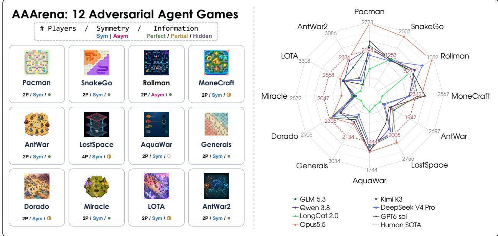

Figure 1 AAArena overview. Left: the 12 games in ascending rule-description size (abstract syntax tree node count), with player counts, role symmetry, and information structure (Table 1). Right: retained-champion Elo for seven models and human SOTA. Each spoke reports native Elo, with game-specific tick intervals; higher Elo lies farther outward. Human SOTA forms the dashed regular dodecagon, with its Elo labeled in red. Model colours match Figure 3.

(HL), in which an AI agent accumulates experience in editable software structures. The agent reads failures, logs, and replays to revise programs and their supporting software. Recent work also studies program-policy revision and tournament-based code evolution (Garnier et al., 2026; Wang et al., 2026; Fu et al., 2026; Yang et al., 2026a).

The Tsinghua University Agent Competition is an annual programming competition in which contestants build game agents to compete in adversarial games (Saiblo). Each year, organizers introduce a new game and publish its rules. Contestants interpret the rules, design executable strategies, and improve their programs through freely chosen matches to compete for leaderboard positions.

Can AI agents undertake the same process, learning from rules and game feedback to continually improve the game agents they build? This requires translating game understanding into executable policies and planning tests and revisions within a limited budget.

We formalize this feedback-driven program improvement as Adversarial Heuristic Learning (AHL), an instantiation of HL in adversarial tasks. The AI agent revises code policies and supporting software from game experience; the game agent executes these policies to compete. The base model’s weights remain fixed.

We build Agents for Agents Arena (AAArena) from the competition’s past games, runnable backends, and archived human programs, turning this development process into a unified evaluation task. Across 12 original games, AAArena budgets selected matches and full-pool evaluations separately to assess whether AI agents can improve their programs and climb human-program ladders.

Our strongest configuration, Opus5.5 with Claude Code, earns 6 gold medals (rank 1 in the frozen human ladders) across 12 games; no evaluated model tops the remaining 6 ladders.

Our contributions are threefold.

• We formalize adversarial heuristic learning (AHL), a paradigm that uses AI agents as learning engines to learn from adversarial matches and iteratively refine executable game policies.

• We introduce AAArena, a benchmark comprising 12 authentic adversarial games and 1,920 archived human programs, with an evaluation protocol modeled on real-world adversarial game competitions.

• We evaluate seven AI model–harness configurations on AAArena, with the strongest topping six human ladders, while the remaining six games generally have more complex rules and remain untopped by any evaluated configuration. Further experiments show the importance of opponent selection and dense feedback, and the potential of of-policy experience from other players’ replays to overcome learning plateaus. Case studies reveal persistent challenges in game understanding, strategy implementation, and long-horizon policy development.

## 2 Adversarial Heuristic Learning

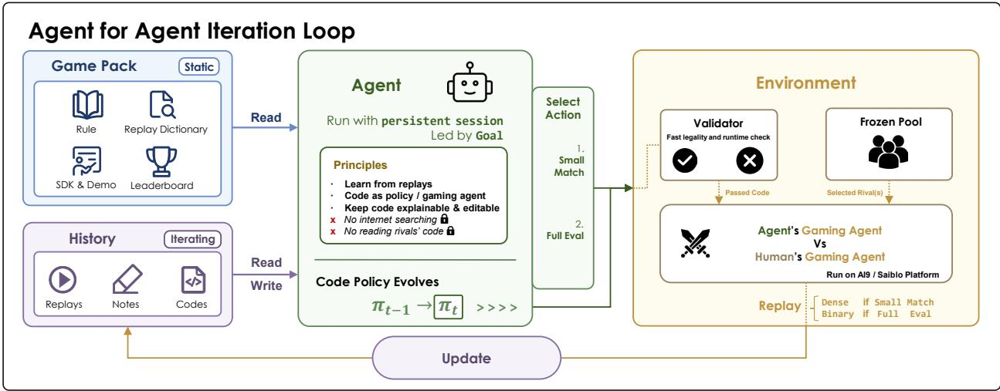  
Figure 2 Agent for agent iteration loop. An AI agent uses game resources, replays, and retained notes to reviseSym | Asym Perfect / Partial / Hidden an executable game-agent policy. Validated snapshots enter small matches against selected opponents or full-pool evaluations against the frozen pool. Small matches return dense replays; full-pool evaluations return outcomes, Elo, 2P / Asym /    and rank. The agent retains development history across revisions.

## 2.1 Preliminaries

Game agent. An adversarial game $\mathcal { G }$ has a shared environment and $n \geq 2$ game agents, with conflicting objectives for at least two agents. Games can assign asymmetric roles and restrict each agent’s observations. Each game agent i executes a code policy $P _ { i }$ that selects actions as

$$
a _ { t } ^ { i } \sim \pi _ { P _ { i } } ( \cdot \mid h _ { t } ^ { i } ) ,
$$

where $h _ { t } ^ { i }$ is its permitted observation history and $a _ { t } ^ { i }$ is its action. The environment processes these actions to determine the outcome, while the submitted program acts autonomously throughout the match.

AI agent. An AI agent $\scriptstyle A _ { \theta }$ develops the game agent’s policy between matches; θ denotes the base model’s parameters. It reads game resources, source code, and feedback to revise the policy and its supporting software. In Agents for Agents, the resulting game agent’s competitive performance measures the AI agent’s policy-development ability.

Heuristic learning. Heuristic learning (HL) incorporates experience through an AI agent’s direct revisions to a software system (Weng, 2026). Feedback may include rewards, tests, logs, or replays. The agent can revise policy logic, state representations, tests, configuration, and memory. We call the executable policy and its supporting software and records the heuristic system.

## 2.2 Heuristic learning in adversarial games

Definition 1 (Adversarial heuristic learning). Adversarial heuristic learning (AHL) is an instantiation of HL in adversarial tasks. An AI agent uses experience and feedback to revise a heuristic system and improve competitive performance, while the base model’s parameters θ remain fixed.

The heuristic system consists of an executable policy P and development state C, which stores supporting tools, tests, experiment records, and memory. Figure 2 summarizes the interaction loop; Algorithm 1 gives its formal form. The AI agent acquires game experience, interprets feedback, and revises the heuristic system. It chooses how to collect experience and organize revisions; the algorithm leaves feedback sources, evaluation schedules, and stopping criteria to the task setting.

Algorithm 1 Adversarial Heuristic Learning (AHL)   
Input: AI agent $\scriptstyle A _ { \theta }$ with fixed parameters $\theta ;$ game resources $R ;$   
initial policy $P _ { 0 }$ and development state $C _ { 0 }$   
1: $( P , C ) \gets ( P _ { 0 } , C _ { 0 } )$   
2: while the stopping criterion remains unmet do   
3: Acquire game experience through interactions or available records   
4: Interpret feedback using $\scriptstyle A _ { \theta }$ and $( R , P , C )$   
5: Revise $P$ and its supporting state C from the feedback   
6: end while   
7: Output: executable policy P

## 3 AAArena

## 3.1 Games and opponent pools

The 12 competition games cover tactical combat, territory control, resource management, and survival. Each has a verified, frozen opponent pool (Table 1). Agents receive rules, SDKs, replay documentation, a leaderboard, and a permitted reference program. Appendices A and B describe the games and resources.

Rule-description size. Kolmogorov complexity $\begin{array} { r } { K ( R ) = \operatorname* { m i n } _ { p : U ( p ) = R } { \left| p \right| } } \end{array}$ is the length of the shortest program describing R on a fixed universal machine U (Vitányi, 2020). We report $C _ { \mathrm { A S T } } ( G ) = | \mathrm { A S T } ( R _ { G } ) |$ , the node count of the rules’ abstract syntax tree (AST), and rule atoms (RA), the count of independently changeable rule propositions. These representation-dependent counts describe rule specifications; they do not estimate exact Kolmogorov complexity or optimal-play dificulty. The same rule-analysis procedure gives Go 501 AST nodes and 125 rules, and chess 1,551 AST nodes and 238 rules. The suite spans 1,127–6,368 AST nodes and 219–1,008 rules.

<table><tr><td>Game</td><td>Strategic setting</td><td>Pool programs</td><td>AST nodes</td><td>Rules (RA)</td></tr><tr><td>Pacman</td><td>Competitive maze collection</td><td>44</td><td>1,127</td><td>219</td></tr><tr><td>SnakeGo</td><td>Snake movement and territory</td><td>141</td><td>1,538</td><td>308</td></tr><tr><td>Rollman</td><td>Asymmetric maze pursuit</td><td>64</td><td>1,539</td><td>312</td></tr><tr><td>MoneCraft</td><td>Mining and resource control</td><td>112</td><td>1,823</td><td>347</td></tr><tr><td>AntWar</td><td>Tower defence and economy</td><td>114</td><td>2,160</td><td>368</td></tr><tr><td>LostSpace</td><td>Multiplayer survival and escape</td><td>111</td><td>2,297</td><td>426</td></tr><tr><td>AquaWar</td><td>Hidden-identity tactical combat</td><td>170</td><td>2,531</td><td>439</td></tr><tr><td>Generals</td><td>Territorial and army control</td><td>197</td><td>2,683</td><td>461</td></tr><tr><td>Dorado</td><td>Resource competition and army development</td><td>323</td><td>4,241</td><td>616</td></tr><tr><td>Miracle</td><td>Hex-grid unit tactics</td><td>253</td><td>4,391</td><td>581</td></tr><tr><td>LOTA</td><td>Hero control and lane combat</td><td>200</td><td>4,513</td><td>684</td></tr><tr><td>AntWar2</td><td>Ordered tower-defence operations</td><td>191</td><td>6,368</td><td>1,008</td></tr></table>

Table 1 The 12 games, ordered by increasing abstract syntax tree (AST) node count for their rule representations. RA counts rule atoms, or independently changeable rule propositions. Pool sizes count executable programs, not unique human participants.

## 3.2 Interaction interfaces

Small matches support targeted diagnosis by letting the AI agent select opponents and inspect detailed replays. Full-pool evaluations measure competitive progress against the complete opponent pool and return Elo, rank, and per-opponent outcomes. The first channel concentrates feedback on specific strategic hypotheses; the second supplies a common reference for comparing snapshots. Both evaluate immutable programs through the same game referee and return feedback for subsequent revisions.

## 3.3 Evaluation protocol

Each run receives two budgets: $B _ { s }$ small-match units (one per requested opponent) and $B _ { \ell }$ full-pool evaluations. Default limits are $B _ { s } = 1 2 8$ and $B _ { \ell } = 1 6$ . Within these limits, the agent chooses when to revise, validate locally, or request either kind of feedback.

The final result is the highest officially evaluated Elo attained during the run, together with its corresponding rank. If V is the set of oficially evaluated snapshots, including the common initialization baseline, then

$$
\operatorname { S c o r e } ( B _ { s } , B _ { \ell } ) = \operatorname* { m a x } _ { P \in \mathcal { V } } \widehat { r } ( P ) .
$$

We retain the policy attaining this score, allowing later revisions to explore without discarding a stronger snapshot. Opponent Elo ratings stay fixed throughout the run. Appendix B specifies ranking, budget accounting, and the baseline’s separate allowance.

## 4 Experiments

## 4.1 Performance of AI Agents Developing Game Agents

Table 2 Main results across 12 adversarial games, ordered by rule complexity. Rule complexity uses AST node counts (Section 3.1). A green check marks at least one configuration reaching rank 1; a red cross marks none. Each model entry gives Elo (↑) and rank (↓) under a 128-small/16-full budget; a gold medal marks rank 1. Bold marks the best value per row. All models use max reasoning efort. Opus5.5 uses Claude Code; others use Codex.

Rule complexity: low (top) to high (bottom) ↓
<table><tr><td rowspan="3">Game</td><td rowspan="3">Rule complexity Topped</td><td rowspan="3"></td><td colspan="2"></td><td colspan="2">GPT6-sol</td><td colspan="2">GLM-5.3</td><td colspan="2"></td><td colspan="2">DeepSeek</td><td colspan="2"></td><td colspan="2"></td></tr><tr><td colspan="2">Opus5.5</td><td colspan="2"></td><td colspan="2"></td><td colspan="2">Kimi K3</td><td colspan="2">V4Pro</td><td colspan="2">Qwen 3.8</td><td colspan="2">LongCat 2.0</td></tr><tr><td>Elo Rank</td><td></td><td></td><td>Elo Rank</td><td>Elo Rank</td><td></td><td>Elo Rank</td><td></td><td>Elo Rank</td><td></td><td>Elo Rank</td><td></td><td>Elo Rank</td><td></td></tr><tr><td>Pacman</td><td>1,127</td><td>√</td><td>2703.9</td><td>18</td><td>2367.6</td><td>18</td><td>2281.6</td><td></td><td>182196.3</td><td>2</td><td>2096.8</td><td>4</td><td>2236.1</td><td></td><td>181835.0</td><td>10</td></tr><tr><td>SnakeGo</td><td>1,538</td><td>√</td><td>1860.9</td><td>18</td><td>1129.6</td><td>4</td><td>1141.2</td><td>4</td><td>1165.9</td><td>3</td><td>1097.0</td><td>5</td><td>1107.5</td><td>5</td><td>1153.3</td><td>4</td></tr><tr><td>Rollman</td><td>1,539</td><td>√</td><td>1010.2</td><td>18</td><td>581.2</td><td>18</td><td>581.2</td><td>18</td><td>636.9</td><td>18</td><td>807.7</td><td>18</td><td>636.9</td><td>18</td><td>534.2</td><td>18</td></tr><tr><td>MoneCraft</td><td>1,823</td><td>√</td><td>2387.1</td><td>12418.2</td><td></td><td></td><td>182359.2</td><td></td><td>182288.2</td><td>3</td><td>2288.2</td><td>3</td><td>2288.2</td><td>3</td><td>2069.9</td><td>9</td></tr><tr><td>AntWar</td><td>2,160</td><td>X</td><td>1405.1</td><td>5</td><td>1311.7</td><td>6</td><td>1464.2</td><td>5</td><td>1130.2</td><td>9</td><td>1167.2</td><td>9</td><td>1355.0</td><td>5</td><td>1028.3</td><td>11</td></tr><tr><td>LostSpace</td><td>2,297</td><td>√</td><td>2220.2</td><td>18</td><td>1625.2</td><td>7</td><td>1980.1</td><td>2</td><td>1916.1</td><td>2</td><td>1956.8</td><td>2</td><td>1797.7</td><td>3</td><td>1052.9</td><td>77</td></tr><tr><td>AquaWar</td><td>2,531</td><td>√</td><td>1552.5</td><td>181552.5</td><td></td><td>18</td><td>1494.1</td><td>18</td><td>1494.1</td><td>181464.5</td><td></td><td>18</td><td>1539.7</td><td>18</td><td>1116.1</td><td>33</td></tr><tr><td>Generals</td><td>2,683</td><td>X</td><td>1689.6</td><td>10</td><td>1528.4</td><td>13</td><td>1441.2</td><td>17</td><td>1433.3</td><td>17</td><td>1340.8</td><td>23</td><td>1624.9</td><td>10</td><td>1010.3</td><td>58</td></tr><tr><td>Dorado</td><td>4,241</td><td>X</td><td>2252.4</td><td>2</td><td>2271.5</td><td>2</td><td>2210.3</td><td>2</td><td>2023.4</td><td>16</td><td>2187.8</td><td>3</td><td>2035.8</td><td>14</td><td>1512.4</td><td>156</td></tr><tr><td>Miracle</td><td>4,391</td><td>X</td><td>1704.8</td><td>6</td><td>1469.5</td><td>20</td><td>1436.8</td><td>26</td><td>1432.8</td><td>26</td><td>1448.8</td><td>24</td><td>1500.2</td><td>18</td><td>1500.2</td><td>18</td></tr><tr><td>LOTA</td><td>4,513</td><td>X</td><td>2224.2</td><td>15</td><td>2140.3</td><td>22</td><td>2147.4</td><td>22</td><td>2133.2</td><td>22</td><td>2140.3</td><td>22</td><td>2099.0</td><td>25</td><td>1585.1</td><td>74</td></tr><tr><td>AntWar2</td><td>6,368</td><td>X</td><td>2234.4</td><td>5</td><td>1440.3</td><td>34</td><td>1977.1</td><td>9</td><td>1644.2</td><td>19</td><td>1569.6</td><td>25</td><td>2183.5</td><td>6</td><td>1460.0</td><td>31</td></tr><tr><td>Gold medals ↑</td><td></td><td></td><td>6</td><td></td><td>4</td><td></td><td>4</td><td></td><td>2</td><td></td><td></td><td></td><td></td><td></td><td></td><td></td></tr></table>

Setup. We evaluate seven model–harness configurations with the default 128-small/16-full budgets and retained-champion scoring from Section 3.3. All models use max reasoning efort. Opus5.5 uses Claude Code; the other models use Codex, so the comparison includes both model and harness diferences. Runs stop upon reaching rank 1. We repeat each setting three times and report the median result; each run contributes its best oficially evaluated policy. Main runs use on-policy replays from matches involving the learner’s own

policy.1 Appendix B.1 describes the implementation. We use GLM-5.3 for subsequent analyses because its complete interaction logs and fixed harness support comparisons across runs.

Results. AI-developed game agents top six frozen human ladders; every evaluated configuration falls short of rank 1 on the other six (Table 2 and Figures 1 and 3). Opus5.5 with Claude Code earns 6 gold medals and the highest or tied-highest Elo on nine games. Several configurations reach rank 1 on Rollman and AquaWar, whereas only Opus5.5 with Claude Code does so on LostSpace and SnakeGo.

The remaining gaps also difer across games. The best policy ranks second on Dorado, while the best policies on LOTA, Generals, and Miracle remain outside the top five. Gold medals summarize rank-1 coverage; per-game Elo and rank preserve these diferences without averaging across game-specific rating scales.

Five of the six games with smaller rule descriptions have a rank-1 finish, compared with one of the six games with larger descriptions (Table 2). This pattern links larger rule specifications with gaps in competitive policy development.

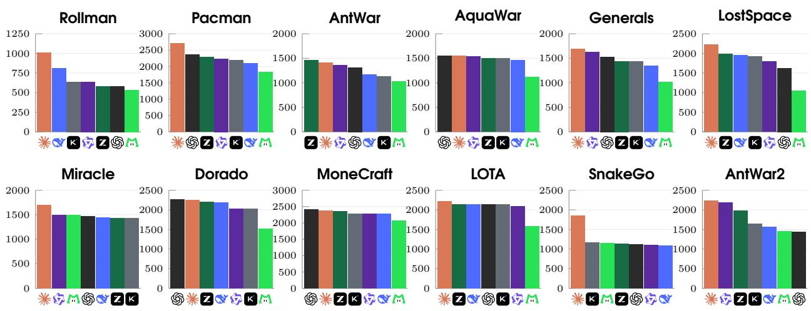  
Figure 3 Per-game Elo of the retained champion. Each game orders model configurations by Elo.

Takeaway. The strongest configuration surpasses human champions in six games, while challenging games remain beyond the evaluated agents. Performance is generally weaker in games with more complex rule specifications, highlighting the challenge of translating rule understanding into competitive policies.

## 4.2 How Do Policies Evolve During Learning?

## 4.2.1 Evolution Patterns Across Games

We examine the 12 GLM-5.3 runs under the default 128-small/16-full budget to distinguish how policies improve across games. Each trajectory records the Elo and rank of individual full-pool submissions, the order of small-match and full-pool requests, and token use. Submission scores can fall after a revision even though the retained-champion score keeps the best result. The trajectories follow three patterns:

Success: reaching rank 1. Rollman, MoneCraft, Pacman, and AquaWar reach rank 1 and stop before exhausting the full-pool evaluation budget. These runs show that feedback-driven program revision can produce policies that top the human-program ladders within the given interaction limits.

Progress: gains with regressions. AntWar, Dorado, LostSpace, SnakeGo, and AntWar2 improve overall, but individual revisions can reduce performance. Dorado makes several consecutive gains in the middle of its run, whereas AntWar2 sufers a sharp intermediate drop and LostSpace ends with prolonged fluctuations. Retaining the best evaluated policy preserves earlier gains when later edits regress.

Stagnation: persistent plateaus. Generals, Miracle, and LOTA show extended intervals with little improvement after initial adaptation. Further revisions and evaluations repeatedly return to similar performance levels, showing that continued interaction does not consistently yield stronger policies within these runs.

Appendix B.6 presents the complete trajectories in Figures 11–13. We next trace the code changes behind Dorado’s progress to show how match feedback leads to specific policy revisions.

## 4.2.2 Case Study: Dorado

GLM-5.3 improves its Dorado policy from rank 41 to rank 2. Figure 4 traces its performance, and Table 3 shows the corresponding code changes.

Dorado has two players, each controlling a base and recruiting heroes from four classes. Mining supplies gold for recruitment and for upgrading heroes near the base. Destroying the opposing base wins; simultaneous destruction draws. If both bases remain at the turn limit, gold plus the level-based value of each player’s heroes determines the result.

Correct mine allocation. The central mine stays open, while other mines have limited opening windows. Each mine uses the highest individual mining rate; sending several heroes to one mine does not add their yields. The agent excludes dead miners from occupancy counts, penalizes assigning several miners to the same mine, and tracks mine opening windows. After these revisions, the policy reaches rank 14.

Concentrate upgrades. The agent then upgrades two core heroes while preserving mining income. The next full-pool evaluation raises the policy from rank 14 to rank 3 (+147.7 Elo), the largest adjacent gain.

Refine counterattacks. The agent later allows a one-hero counterattack only after sustained nearby aggression and reaches rank 2. Other attempts, including a four-hero roster and unconditional use of the Sacrifice ability, regress to ranks 46 and 43. The agent restores its best policy before trying another revision.

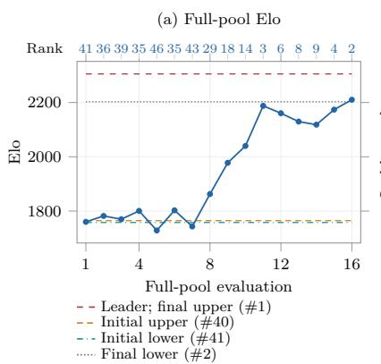

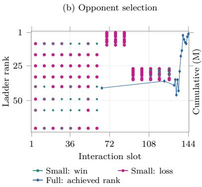

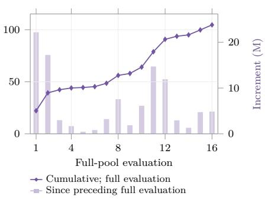  
Figure 4 GLM-5.3 on Dorado. Full-pool Elo and rank, small–full interaction order, and token use under the 128/16 budget. Appendix B.5 specifies budget-slot placement, batch markers, rank annotations, and token accounting.

Table 3 Dorado champion milestones. Mechanism descriptions with added (+) and deleted (-) C++ dif excerpts. Ellipses omit context.
<table><tr><td>Full-pool eval.</td><td>Elo</td><td>Rank</td><td>Policy adjustment</td><td>Code excerpt</td></tr><tr><td>2</td><td>1782.0</td><td>36</td><td>Keep mining; attack only a vulnerable enemy base.</td><td>+232 enemyBase != NULL &amp;&amp; enemyBase-&gt;hp &lt; 1800 &amp;&amp; (int)myHeroes.size() &gt;= 4;</td></tr><tr><td>4</td><td>1800.7</td><td>35</td><td>Use all living heroes to defend a serious threat.</td><td>+245 int count = seriousThreat ?(int)defenders.size(): 2;</td></tr><tr><td>6</td><td>1802.8</td><td>35</td><td>Trigger full defence for active threats or recent damage.</td><td>+228 const bool seriousThreat = Il baseThreat ∥l recentBaseHit;</td></tr><tr><td>8</td><td>1862.8</td><td>29</td><td>Exclude dead miners from occupancy; spread assignments.</td><td>+343 if (alive &amp;&amp; mineUsable(it-&gt;second, round)) occ[it-&gt;second]++; -477 ... + 600LL * occ[m]; +472 ... + 2000LL * occ[m];</td></tr><tr><td>9</td><td>1977.9</td><td>18</td><td>Penalize duplicate mine assignments more strongly.</td><td>-472 ... + 2000LL * occ[m]; +472 ... + 5000LL * occ[m];</td></tr><tr><td>10</td><td>2040.1</td><td>14</td><td>Track mine opening windows and prioritize open mines.</td><td>+217 s_mineExistUntil[i] = round + exist-&gt;val[0] - 1; + 36 #define MINE_OPEN_OCCUPANCY_PENALTY 50000LL</td></tr><tr><td>11</td><td>2187.8</td><td>3</td><td>Concentrate upgrades on a two-hero core; preserve mining income.</td><td>+296 if (s_dutyId &lt; 0 &amp;&amp; (int)s_leveledCore.size() &lt; 2 ...)</td></tr><tr><td></td><td></td><td></td><td>2 Allow one-hero counterattacks only</td><td>+316 if (!coreHammerguard &amp;&amp; type == &quot;hammerguard&quot;) priority = 0; +410 s_aggressionRounds = tightAggression ? s_aggressionRounds + 1 : 0; +412 const bool corePush =</td></tr></table>

## 4.3 Does More Interaction Overcome Performance Plateaus?

We test whether more interaction resolves GLM-5.3’s weak results on Generals, Miracle, LOTA, and AntWar2. Each continuation keeps the existing workspace and evaluation ledger and adds 256 small-match units and 32 full-pool evaluations. The total budget is 384/48, three times the original 128/16. Table 4 compares the best policies at both budget levels.

Table 4 Threefold-budget continuation for GLM-5.3. Elo and rank of the retained champion at each budget. The extension adds 256 small units and 32 full-pool evaluations to the same run. A positive ∆Rank indicates an improved position.
<table><tr><td></td><td colspan="2">128 / 16</td><td colspan="2">384 /  48</td><td colspan="2">Change</td></tr><tr><td>Game</td><td>Elo</td><td>Rank</td><td>Elo</td><td>Rank</td><td>∆Elo</td><td>∆Rank</td></tr><tr><td>Generals</td><td>1441.2</td><td>17</td><td>1441.2</td><td>17</td><td>+0.0</td><td>+0</td></tr><tr><td>Miracle</td><td>1436.8</td><td>26</td><td>1486.8</td><td>19</td><td>+50.0</td><td>+7</td></tr><tr><td>LOTA</td><td>2147.4</td><td>22</td><td>2147.4</td><td>22</td><td>+0.0</td><td>+0</td></tr><tr><td>AntWar2</td><td>1977.1</td><td>9</td><td>2117.0</td><td>6</td><td>+139.8</td><td>+3</td></tr></table>

Tripling the budget leaves two retained champions unchanged and improves two; none reaches rank 1 (Table 4). Generals and LOTA keep their earlier best scores, while Miracle moves from rank 26 to 19 and AntWar2 from rank 9 to 6. Figure 5 shows flat intervals and fluctuations through the extended runs. These outcomes describe a finite continuation of four GLM-5.3 runs under the same development protocol.

Takeaway. Tripling the interaction budget yields limited further improvement, suggesting that the default budget brings these runs close to a performance plateau. Within the tested range, more interaction alone does not overcome the remaining performance gaps.

## 4.4 Which Feedback Choices Affect Policy Improvement?

We select one representative game from each trajectory category: Pacman (Success), AntWar (Progress), and Miracle (Stagnation). All ablations use GLM-5.3 with max reasoning efort and the same 128-small/16-full budget. Each axis varies one component while keeping its remaining settings fixed. We report retained champion Elo, with exact Elo/rank tables in Appendix C.

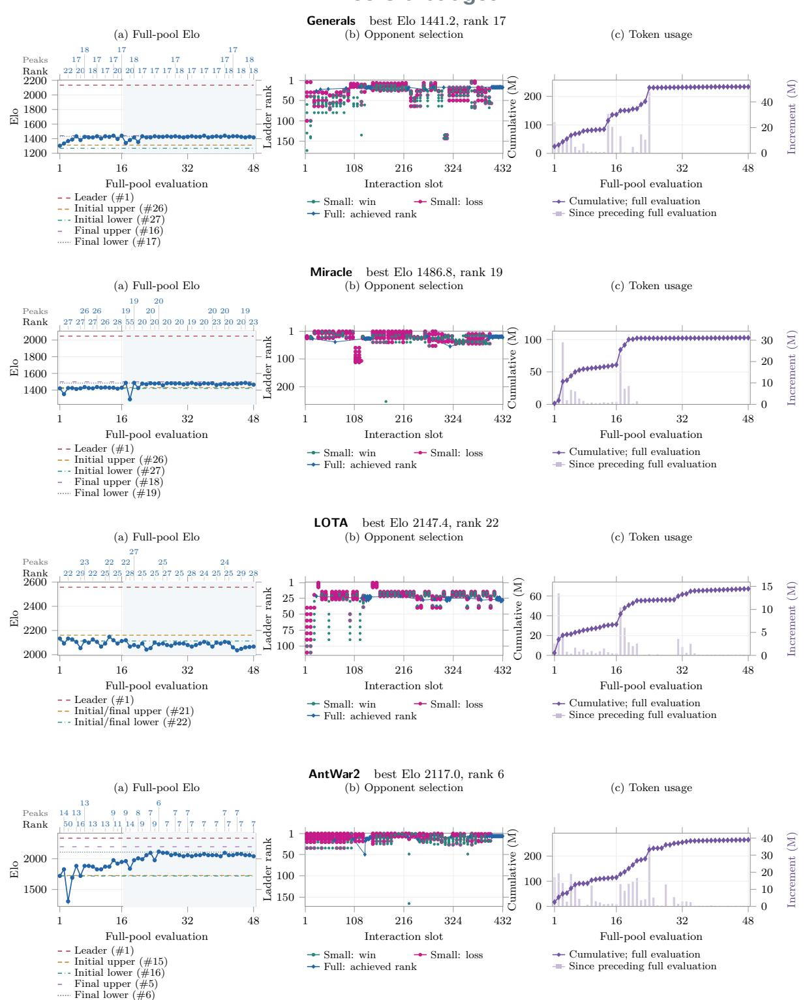  
Figure 5 Policy performance under a threefold budget. Full-pool Elo, interaction order, and token use for four continued runs. Ranks appear at every third full-pool evaluation and local Elo peaks. Plot conventions appear in Appendix B.5.

## 4.4.1 Does Opponent Selection Affect Performance?

We compare four opponent-selection strategies. Model selection lets the agent choose opponents, as in the main experiment. The ladder starts at rank 30 and moves toward stronger opponents without returning to weaker ones. Random sampling draws uniformly from the pool; top-four uses only the four highest-ranked opponents. All conditions use dense feedback and a small-match batch size of four.

The ladder leads on Pacman and AntWar, while model selection leads on Miracle (Figure 6). Model selection outperforms random and top-four selection in all three games; the ladder trails random selection on Miracle. Top-four selection yields the lowest Elo throughout. One hypothesis is that gradually stronger or agent-selected opponents provide more actionable feedback than repeated mismatches.

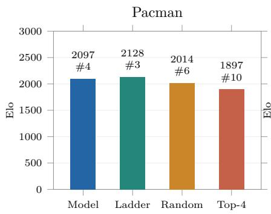

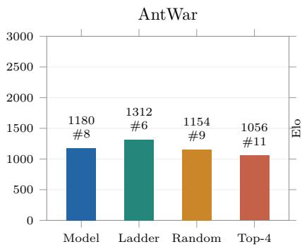

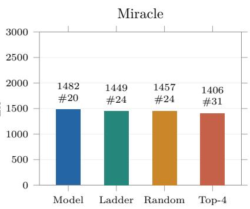  
Figure 6 Opponent selection. GLM-5.3 retained-champion Elo and rank with model, ladder, random, and top-four selection; all use dense feedback and batch size 4. Plot conventions appear in Appendix B.5.

Takeaway. Opponent selection is important for efective policy development: agents need opponents whose matches provide useful information for improvement. Agent-directed selection and progressively stronger opponents both perform well, showing the value of choosing opponents for learning.

## 4.4.2 Does Dense Replay Feedback Affect Performance?

We compare detailed small-match replays and their translations with binary win/non-win feedback. Both conditions keep conversation history, agent-selected opponents, and full-pool feedback; the agent chooses the batch size.

Dense feedback yields higher retained-champion Elo in all three games, with gains that vary by game (Figure 7). Detailed replays supply state, action, and consequence information for diagnosing decision errors; binary feedback supplies the outcome alone. The gains support retaining this diagnostic context in AHL under the tested budgets.

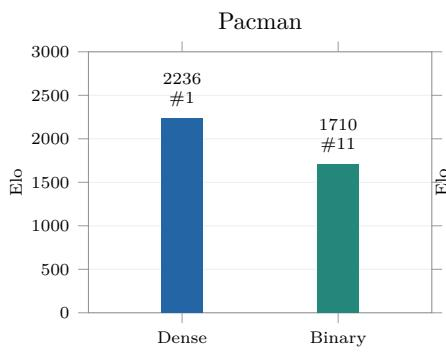

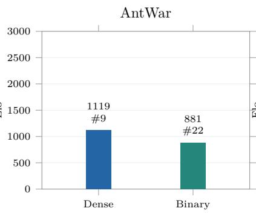

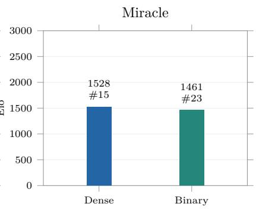  
Figure 7 Replay feedback. Dense replays versus binary win/non-win feedback under the same 128/16 budget. Labels give Elo and rank. Dense feedback improves performance in all three representative games.

Takeaway. A wider feedback channel enables more eficient policy development. Dense replays provide decision-level information that agents can use to diagnose failures and guide code revisions, improving performance under a fixed budget.

## 4.4.3 Does the Number of Opponents per Small Match Matter?

We compare 1, 2, 4, and 8 opponents per small-match submission, keeping model selection and dense feedback.   
The total allowance remains 128 opponent tests and 16 full-pool evaluations.

Intermediate batches perform best: four opponents on Pacman and Miracle, and two on AntWar (Figure 8). Eight opponents per request spend the small-match allowance in 16 full-sized requests, compared with 32–64 requests for batches of 2–4. The ranking is consistent with a trade-of between matchup breadth per request and opportunities to test revised policies. The observed preference for 2–4 opponents concerns these three games and settings.

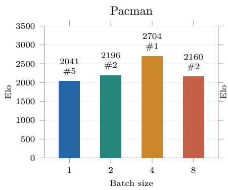

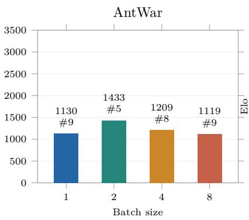

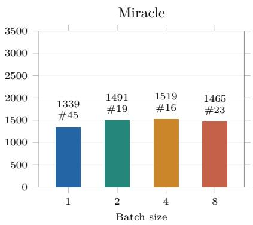  
Figure 8 Small-match batch size. Number of opponents per submission, with a fixed total allowance of 128 opponent tests and 16 full-pool evaluations. Labels give Elo and rank. The best size is 4, 2, and 4 for Pacman, AntWar, and Miracle, respectively.

Takeaway. The ablations show that opponent selection, replay detail, and batch size all afect retainedchampion performance under a fixed budget. We next vary which players generate the replay evidence.

## 4.5 Can Agents Learn from Off-Policy Replays?

We test whether of-policy replays from matches between other policies support policy improvement. On Pacman, AntWar, and Miracle, GLM-5.3 chooses replays from a catalog of matches between frozen-pool opponents. It can request 128 replay views and 16 full-pool evaluations of its own policy. Reasoning efort, game resources, opponent ladders, and budget ceilings match the on-policy setting. Only the replay source changes; the agent still receives full-pool feedback on its own policy.

All three of-policy runs improve from their first evaluated policy to the retained champion: Pacman advances from rank 10 to 1, AntWar from 41 to 19, and Miracle from 27 to 15 (Figure 9).

Miracle provides the clearest contrast with learning from the agent’s own matches. Its on-policy trajectory plateaus with a retained champion at rank 26, while the independent of-policy run reaches rank 15 (Figure 10). This contrast suggests that other players’ experience can support progress beyond the plateau observed with self-generated replays. On Pacman, both settings reach rank 1; on AntWar, on-policy learning performs better, reaching rank 5 compared with 19 of-policy.

# On-policy and off-policy learning

Pacman best rank: on-policy 1, of-policy 1

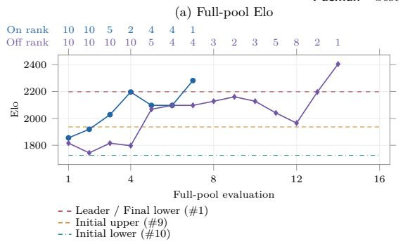

(b) Token usage  
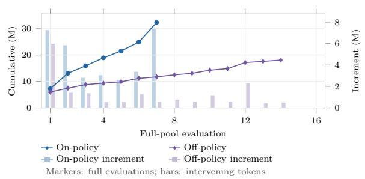

AntWar best rank: on-policy 5, of-policy 19  
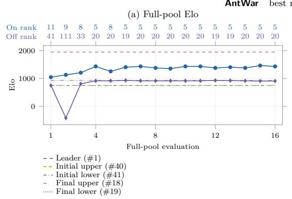

(b) Token usage  
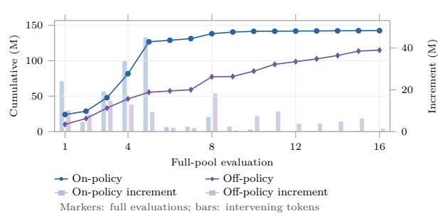

Miracle best rank: on-policy 26, of-policy 15  
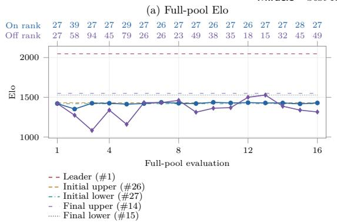

(b) Token usage  
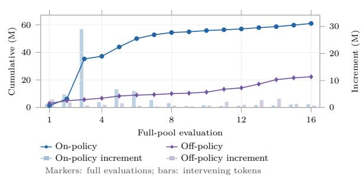  
Figure 9 On-policy and off-policy learning trajectories. Full-pool Elo and ranks, cumulative tokens, and token increments for GLM-5.3 with self-generated and other players’ replays. Both conditions receive full-pool feedback on their own policies. Appendix B.5 specifies rank rows, reference levels, and token accounting.

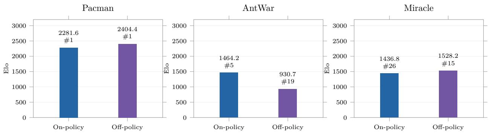  
Figure 10 On-policy versus off-policy replay learning. Retained-champion Elo and rank for GLM-5.3 under the same 128/16 budget ceilings. On-policy scores are the main-table results. Labels give Elo and rank; each panel uses the same zero-based Elo scale. Both Pacman runs terminate early upon reaching rank 1.

Takeaway. Of-policy replays broaden the experience available to AHL and can support progress beyond the plateaus observed with on-policy learning. Other players’ experience can suggest alternative strategies, with the potential to outperform learning from the agent’s own matches.

## 5 Related Work

Table 5 Representative game-agent evaluation protocols. Feedback denotes information available to the evaluated AI agent: ✓ indicates availability and a dash indicates absence in the named setting. Traces include in-game observations or post-match logs. CodeClash refers to its standard, closed-code tournament; GACL to code generation.
<table><tr><td>Work</td><td>AI output</td><td>Opponents</td><td colspan="2">Feedback</td><td>Protocol</td></tr><tr><td></td><td></td><td></td><td>Scores</td><td>Traces</td><td></td></tr><tr><td>Direct play</td><td></td><td></td><td></td><td></td><td></td></tr><tr><td>GameBench (Costarelli et al., 2024)</td><td>Actions</td><td>Human + AI players</td><td>√</td><td>√</td><td>Direct play</td></tr><tr><td>TextArena (competitive) (Guertler et al., 2025)</td><td>Actions</td><td>Human + AI players</td><td>√</td><td>√</td><td>Direct play</td></tr><tr><td>Program development</td><td></td><td></td><td></td><td></td><td></td></tr><tr><td>GACL (Game Agent Coding League, Programs n.d.)</td><td></td><td>AI-developed programs</td><td></td><td></td><td>One-shot</td></tr><tr><td>Vibe-coding (IR) (Danassis and Goel, Programs 2025)</td><td></td><td>Human-written + AI-developed programs</td><td>7</td><td></td><td>Preset</td></tr><tr><td>CATArena (games) (Fu et al., 2026) Programs</td><td></td><td>AI-developed programs</td><td>√</td><td>√</td><td>Preset</td></tr><tr><td>CodeClash (tournament) (Yang et al., 2026a)</td><td>Programs</td><td>AI-developed programs</td><td>√</td><td>√</td><td>Preset</td></tr><tr><td>CC:Ladder (Yang et al., 2026a)</td><td>Programs</td><td>Human-written</td><td></td><td></td><td>Preset</td></tr><tr><td>EvoPolicyGym (Wang et al., 2026)</td><td>Programs</td><td>programs None</td><td>√</td><td>√</td><td>Agent-scheduled</td></tr><tr><td>AAArena (ours)</td><td>Programs</td><td>Human-written programs</td><td>√</td><td>√</td><td>Agent-scheduled</td></tr></table>

Programs are executable code policies. Preset means fixed refinement rounds, tournament rounds, or opponent order; Agent scheduled means that the agent chooses evaluation requests within a budget. These labels describe the outer schedule. Scores include outcomes, returns, and rankings; traces include observations, match logs, and replays. CC:Ladder starts from a human solution. IR denotes iterative refinement. Rows describe specific evaluation conditions: GACL covers code generation, and CodeClash covers its default code-opaque tournaments. EvoPolicyGym budgets single-agent episodes and hides validation feedback; AAArena uses frozen human programs and returns full-pool scores during development under a separate evaluation budget.

Competitive program development. Competitive program-development benchmarks difer in their outputs, opponents, feedback, and revision protocols (Table 5). GACL evaluates generated game agents and ProxyWar includes code repair (Game Agent Coding League, n.d.; Peng et al., 2026); the vibe-coding tournament compares student and model programs with a self-play refinement condition (Danassis and Goel, 2025). CATArena supplies tournament logs and peer code across revision rounds (Fu et al., 2026), while CodeClash studies competitive code evolution and CC:Ladder advances through ranked human programs after each win (Yang et al., 2026a). EvoPolicyGym budgets episodes in single-agent environments and uses hidden validation (Wang et al., 2026). AAArena combines 12 custom competition games, archived human-written programs, and agent-selected testing, with separate budgets for small matches and full-pool evaluations.

HL and program evolution. Weng’s HL incorporates experience through revisions to program policies and supporting software (Weng, 2026). Programmatic reinforcement learning and LLM-guided program search also use programs as policy representations (Verma et al., 2018; Bastani et al., 2018; Eberhardinger et al., 2025; Kuang et al., 2025). Related systems improve controllers, algorithms, and agent software (Garnier et al., 2026; Romera-Paredes et al., 2023; Novikov et al., 2025; Hu et al., 2025c; Zelikman et al., 2024), or revise rewards and training procedures (Ma et al., 2024; Chi et al., 2026). Trajectory distillation extracts reusable skills from replay (Yang et al., 2026b). AHL applies HL to competitive game-agent development, where the AI agent revises policies and supporting software with a fixed base model.

Direct game-playing evaluation. Direct game-playing benchmarks measure the model’s decisions during matches. BALROG and LMGame-Bench evaluate action selection in interactive games (Paglieri et al., 2025; Hu et al., 2025a). GameBench, GameArena, TextArena, GAMEBoT, ZeroSumEval, and Kaggle Game Arena extend this evaluation to competitive players (Costarelli et al., 2024; Hu et al., 2025b; Guertler et al., 2025; Lin et al., 2025; Khan et al., 2025; Doerschuk-Tiberi et al., 2026). These settings measure the player, whereas AAArena measures the AI agent developing the autonomous program that plays the game.

## 6 Future Work

Extending AAArena. We plan to add games, controlled rule variants, and changing opponent populations to study adaptation to changes in the task and competition. These extensions would broaden evaluation beyond per-game rankings to adaptation speed, cross-game transfer, and continual learning.

Heuristic and reinforcement learning. We aim to compare how code revisions and parameter updates learn from experience and assign credit for improvements. Such comparisons should account for feedback access and interaction budgets. Hybrid learners could use HL to revise policy structure and reinforcement learning to train its components.

From replay use to active learning. External replays could help agents form strategic hypotheses before choosing opponents to test them. We plan to study how agents allocate replay views and matches to resolve uncertainty. Agents could turn validated strategies into reusable policy modules.

## 7 Conclusion

We present AAArena to evaluate AI agents that develop executable game policies through adversarial heuristic learning (AHL). The benchmark combines 12 real-world competition games, archived human programs, and a unified two-budget protocol. Across 7 AI models, Opus5.5 with Claude Code earns 6 gold medals; no evaluated configuration tops the remaining 6 human ladders. Dense feedback supports policy improvement in the ablations, and agents also improve by learning from both on-policy and of-policy replays. Qualitative analysis of code revisions and trajectories points to challenges in game understanding, strategy implementation, and long-horizon planning. By making this development process measurable, AAArena provides a foundation for research on heuristic learning and self-evolving AI agents.

## Acknowledgement

We thank the many members of the Student Association of the Department of Computer Science and Technology at Tsinghua University for developing and maintaining the Tsinghua University Agent Competition over the years and for supporting this work. We thank Z.ai for sponsoring this work. We also thank all participants in past editions of the Tsinghua University Agent Competition.

## References

Osbert Bastani, Yewen Pu, and Armando Solar-Lezama. Verifiable reinforcement learning via policy extraction. In S. Bengio, H. Wallach, H. Larochelle, K. Grauman, N. Cesa-Bianchi, and R. Garnett, editors, Advances in Neural Information Processing Systems, volume 31. Curran Associates, Inc., 2018. URL https://proceedings.neurips.cc/ paper\_files/paper/2018/file/e6d8545daa42d5ced125a4bf747b3688-Paper.pdf.

Ralph Allan Bradley and Milton E. Terry. Rank analysis of incomplete block designs. Biometrika, 39(3-4):324–345, 1952. doi: 10.1093/biomet/39.3-4.324. URL https://doi.org/10.1093/biomet/39.3-4.324.

Murray Campbell, A.Joseph Hoane, and Feng-hsiung Hsu. Deep blue. Artificial Intelligence, 134(1-2):57–83, January 2002. ISSN 0004-3702. doi: 10.1016/s0004-3702(01)00129-1. URL http://dx.doi.org/10.1016/S0004-3702(01) 00129-1.

Yizhe Chi, Wenyi Li, Deyao Hong, Xiaoqiu Wang, Mingju Gao, Kaisen Yang, Bingxiang He, Youjie Zheng, Calvin Xiao, and Qinhuai Na. Ai4ai-bench: Benchmarking llm agents in algorithmic design for recursive self-improvement, 2026. URL https://arxiv.org/abs/2608.20318.

Anthony Costarelli, Mat Allen, Roman Hauksson, Grace Sodunke, Suhas Hariharan, Carlson Cheng, Wenjie Li, Joshua Clymer, and Arjun Yadav. Gamebench: Evaluating strategic reasoning abilities of llm agents, 2024. URL https://arxiv.org/abs/2406.06613.

Rémi Coulom. Eficient Selectivity and Backup Operators in Monte-Carlo Tree Search, pages 72–83. Springer Berlin Heidelberg, 2007. ISBN 9783540755388. doi: 10.1007/978-3-540-75538-8\_7. URL http://dx.doi.org/10.1007/ 978-3-540-75538-8\_7.

Panayiotis Danassis and Naman Goel. Can vibe coding beat graduate cs students? an llm vs. human coding tournament on market-driven strategic planning, 2025. URL https://arxiv.org/abs/2511.20613.

Bovard Doerschuk-Tiberi, Yao Yan, Justin Chiu, Hann Wang, Timothy Chung, Martyna Plomecka, John Schultz, Jon Lipovetz, Clayton Drazner, Yuchen Zhuang, Jaimie Hwang, Nate Keating, Riley Jones, Andrew Lee, Oran Kelly, Ian Gemp, Michael Aaron, Laurel Prince, Kate Larson, Jef Moser, Harrison Jobe, Chad Woodford, Siqi Liu, Andrew Wang, Bo Chang, Christopher D’Mello, Diane Chalef, Addison Howard, Johnny Yip, Chuck Sugnet, Antonio Gulli, Meghan O’Connell, Will Cukierski, Nenad Tomasev, Dima Yeroshenko, Kinjal Parekh, Roxanne Daniel, Marc Lanctot, Domino Weir, Elsa Dong, Daniel Hennes, Melissa Nalubwama, Robert Fraser, Ryan Trostle, Jun Peng, Tom Mason, Lloyd Hightower, Chiamaka Chukwuka, Yuexiang Zhai, Phoebe Kirk, Yi Su, Yuting Han, Jie Ren, Chris Prichard, Sahand Sharifzadeh, Karim Hakimzadeh, DJ Sterling, Meg Risdal, Kate Olszewska, Ya Xu, Orhan Firat, and Minmin Chen. Game arena: Strategic llm evaluation in competitive environments, 2026. URL https://arxiv.org/abs/2609.31473v1.

Manuel Eberhardinger, James Goodman, Alexander Dockhorn, Diego Perez-Liebana, Raluca D. Gaina, Duygu Çakmak, Setareh Maghsudi, and Simon Lucas. From code to play: Benchmarking program search for games using large language models, 2025. URL https://arxiv.org/abs/2412.04057.

Lingyue Fu, Xin Ding, Linyue Pan, Yaoming Zhu, Shao Zhang, Lin Qiu, Weiwen Liu, Weinan Zhang, Xuezhi Cao, Xunliang Cai, Jiaxin Ding, and Yong Yu. Catarena: Evaluating evolutionary capabilities of code agents via iterative tournaments, 2026. URL https://arxiv.org/abs/2510.26852.

Game Agent Coding League. Game Agent Coding League for LLMs. Oficial benchmark documentation, n.d. URL https://gameagentcodingleague.com/. Accessed September 28, 2026; publication date not stated.

Paul Garnier, Jonathan Viquerat, and Elie Hachem. Heuristic learning for active flow control using coding agents, 2026. URL https://arxiv.org/abs/2607.11565.

Leon Guertler, Bobby Cheng, Simon Yu, Bo Liu, Leshem Choshen, and Cheston Tan. Textarena, 2025. URL https://arxiv.org/abs/2504.11442.

Pablo Hernandez-Leal, Bilal Kartal, and Matthew E. Taylor. A survey and critique of multiagent deep reinforcement learning. Autonomous Agents and Multi-Agent Systems, 33(6):750–797, October 2019. ISSN 1573-7454. doi: 10.1007/s10458-019-09421-1. URL http://dx.doi.org/10.1007/s10458-019-09421-1.

Lanxiang Hu, Mingjia Huo, Yuxuan Zhang, Haoyang Yu, Eric P. Xing, Ion Stoica, Tajana Rosing, Haojian Jin, and Hao Zhang. lmgame-bench: How good are llms at playing games?, 2025a. URL https://arxiv.org/abs/2505.15146.

Lanxiang Hu, Qiyu Li, Anze Xie, Nan Jiang, Ion Stoica, Haojian Jin, and Hao Zhang. Gamearena: Evaluating llm reasoning through live computer games, 2025b. URL https://arxiv.org/abs/2412.06394.

Shengran Hu, Cong Lu, and Jef Clune. Automated design of agentic systems, 2025c. URL https://arxiv.org/abs/ 2408.08435.

Haidar Khan, Hisham A. Alyahya, Yazeed Alnumay, M Saiful Bari, and Bülent Yener. Zerosumeval: Scaling llm evaluation with inter-model competition, 2025. URL https://arxiv.org/abs/2504.12562.

Zhiyi Kuang, Ryan Rong, YuCheng Yuan, and Allen Nie. Learning game-playing agents with generative code optimization, 2025. URL https://arxiv.org/abs/2508.19506.

Wenye Lin, Jonathan Roberts, Yunhan Yang, Samuel Albanie, Zongqing Lu, and Kai Han. GAMEBoT: Transparent assessment of LLM reasoning in games. In Wanxiang Che, Joyce Nabende, Ekaterina Shutova, and Mohammad Taher Pilehvar, editors, Proceedings of the 63rd Annual Meeting of the Association for Computational Linguistics (Volume 1: Long Papers), pages 7656–7682, Vienna, Austria, July 2025. Association for Computational Linguistics. ISBN 979-8-89176-251-0. doi: 10.18653/v1/2025.acl-long.378. URL https://aclanthology.org/2025.acl-long.378/.

Yecheng Jason Ma, William Liang, Guanzhi Wang, De-An Huang, Osbert Bastani, Dinesh Jayaraman, Yuke Zhu, Linxi Fan, and Anima Anandkumar. Eureka: Human-level reward design via coding large language models, 2024. URL https://arxiv.org/abs/2310.12931.

Alexander Novikov, Ngân V˜u, Marvin Eisenberger, Emilien Dupont, Po-Sen Huang, Adam Zsolt Wagner, Sergey Shirobokov, Borislav Kozlovskii, Francisco J. R. Ruiz, Abbas Mehrabian, M. Pawan Kumar, Abigail See, Swarat Chaudhuri, George Holland, Alex Davies, Sebastian Nowozin, Pushmeet Kohli, and Matej Balog. Alphaevolve: A coding agent for scientific and algorithmic discovery, 2025. URL https://arxiv.org/abs/2506.13131.

Davide Paglieri, Bartłomiej Cupiał, Samuel Coward, Ulyana Piterbarg, Maciej Wolczyk, Akbir Khan, Eduardo Pignatelli, Łukasz Kuciński, Lerrel Pinto, Rob Fergus, Jakob Nicolaus Foerster, Jack Parker-Holder, and Tim Rocktäschel. Balrog: Benchmarking agentic llm and vlm reasoning on games, 2025. URL https://arxiv.org/abs/2411.13543.

Wenjun Peng, Xinyu Wang, and Qi Wu. Proxywar: Dynamic assessment of llm code generation in game arenas, 2026. URL https://arxiv.org/abs/2602.04296.

Bernardino Romera-Paredes, Mohammadamin Barekatain, Alexander Novikov, Matej Balog, M. Pawan Kumar, Emilien Dupont, Francisco J. R. Ruiz, Jordan S. Ellenberg, Pengming Wang, Omar Fawzi, Pushmeet Kohli, and Alhussein Fawzi. Mathematical discoveries from program search with large language models. Nature, 625(7995): 468–475, December 2023. ISSN 1476-4687. doi: 10.1038/s41586-023-06924-6. URL http://dx.doi.org/10.1038/ s41586-023-06924-6.

Saiblo. Saiblo. https://www.saiblo.net/, n.d. Accessed October 9, 2026.

David Silver, Thomas Hubert, Julian Schrittwieser, Ioannis Antonoglou, Matthew Lai, Arthur Guez, Marc Lanctot, Laurent Sifre, Dharshan Kumaran, Thore Graepel, Timothy Lillicrap, Karen Simonyan, and Demis Hassabis. A general reinforcement learning algorithm that masters chess, shogi, and go through self-play. Science, 362(6419): 1140–1144, December 2018. ISSN 1095-9203. doi: 10.1126/science.aar6404. URL http://dx.doi.org/10.1126/science. aar6404.

Abhinav Verma, Vijayaraghavan Murali, Rishabh Singh, Pushmeet Kohli, and Swarat Chaudhuri. Programmatically interpretable reinforcement learning. In Jennifer Dy and Andreas Krause, editors, Proceedings of the 35th International Conference on Machine Learning, volume 80 of Proceedings of Machine Learning Research, pages 5045–5054. PMLR, 10–15 Jul 2018. URL https://proceedings.mlr.press/v80/verma18a.html.

Paul M.B. Vitányi. How incomputable is kolmogorov complexity? Entropy, 22(4):408, April 2020. ISSN 1099-4300. doi: 10.3390/e22040408. URL http://dx.doi.org/10.3390/e22040408.

Zhilin Wang, Han Song, Runzhe Zhan, Jusen Du, Jiacheng Chen, Tianle Li, Qingyu Yin, Yulun Wu, Zhennan Shen, Tong Zhu, Yanshu Li, Guanjie Chen, Derek F. Wong, Yafu Li, Yu Cheng, and Yang Yang. Evopolicygym: Evaluating autonomous policy evolution in interactive environments, 2026. URL https://arxiv.org/abs/2607.02440.

Jiayi Weng. Learning beyond gradients. https://trinkle23897.github.io/learning-beyond-gradients/, May 2026. Blog post.

Tianbao Xie, Danyang Zhang, Jixuan Chen, Xiaochuan Li, Siheng Zhao, Ruisheng Cao, Toh Jing Hua, Zhoujun Cheng, Dongchan Shin, Fangyu Lei, Yitao Liu, Yiheng Xu, Shuyan Zhou, Silvio Savarese, Caiming Xiong, Victor Zhong, and Tao Yu. Osworld: Benchmarking multimodal agents for open-ended tasks in real computer environments, 2024. URL https://arxiv.org/abs/2404.07972.

John Yang, Carlos E. Jimenez, Alexander Wettig, Kilian Lieret, Shunyu Yao, Karthik Narasimhan, and Ofir Press. Swe-agent: Agent-computer interfaces enable automated software engineering, 2024. URL https://arxiv.org/abs/ 2405.15793.

John Yang, Kilian Lieret, Joyce Yang, Carlos E. Jimenez, Muhtasham Oblokulov, Aryan Siddiqui, Ofir Press, Ludwig Schmidt, and Diyi Yang. Codeclash: Benchmarking goal-oriented software engineering, 2026a. URL https://arxiv.org/abs/2511.00839v2.

Kaisen Yang, Zheng Jiang, Yuzhao Peng, Houde Qian, Boshi Zhang, Youjie Zheng, Shijin Hong, Qingle Liu, Ruoyu Han, Bohan Lyu, Bingxiang He, Eren Cai, Calvin Xiao, and Qinhuai Na. Scalable behaviour cloning on browser using via skill distillation, 2026b. URL https://arxiv.org/abs/2606.32014.

Eric Zelikman, Eliana Lorch, Lester Mackey, and Adam Tauman Kalai. Self-taught optimizer (stop): Recursively self-improving code generation, 2024. URL https://arxiv.org/abs/2310.02304.

## A The evaluated games

The suite shares an evaluation interface, but its policies solve diferent decision problems. The descriptions below refer to the public rule and SDK bundles used in the experiments; Table 1 lists pool sizes.

Pacman. Pacman is a separate, symmetric competitive maze game. Players collect ordinary and high-value beans, avoid monsters, and place mines that afect movement choices. Collection, collision avoidance, and disruption of the opponent jointly determine the score. Its rules and opponent pool are distinct from Rollman’s asymmetric contest.

SnakeGo. SnakeGo is a territory game in which snakes move, collect items, claim cells, and can split or use special actions. Local collision avoidance interacts with longer-horizon territory growth, making a safe immediate move potentially costly at settlement.

Rollman. Rollman is an asymmetric maze game. One side collects beans and uses temporary skills; the other coordinates ghosts to intercept it. The roles difer in both action space and objective, making movement planning and coordinated pursuit distinct policy problems.

MoneCraft. MoneCraft is a mining and resource-control game on a symmetric map. Players capture mines that generate currency and can teleport, place mines, or purchase protection. The policy trades movement and disruption against sustained resource production; end-game currency and mine ownership determine the result under the referee’s rules.

AntWar. AntWar combines tower defence with economic management. Players build and upgrade towers, improve their bases, and time super-weapons, while ants follow environment-driven paths. The policy must balance present defence with spending that changes future pressure.

LostSpace. LostSpace is a multiplayer survival-and-escape game on a layered map that contracts over time. Players collect supplies and keys, use tools, fight or evade rivals, and seek escape. Ranked outcomes create trade-ofs between immediate combat, survival, and the timing of an escape attempt.

AquaWar. AquaWar is a hidden-identity tactical game. Players select fish, make assertions about hidden opponent identities, and choose attacks or type-specific skills. Roster design, inference, and informationsensitive timing all afect the outcome.

Generals. Generals combines territorial expansion, army movement, neutral assets, production, technology, and tactical abilities. An efective policy coordinates economic development with the timing and direction of attacks rather than optimizing either in isolation.

Dorado. Dorado combines resource competition with hero and army development. Players choose heroes, produce and command units, mine neutral resources, and invest in upgrades. The policy coordinates movement, combat, harvesting, and abilities to threaten opposing bases while maintaining the resources needed to continue production.

Miracle. Miracle is a hex-grid strategy game with heterogeneous units and an initial drafting stage. A player selects creatures and an artifact, then summons, moves, attacks, and uses abilities to destroy the opponent’s miracle. Resource limits and unit interactions make tactical coordination central to the policy.

LOTA. LOTA is a lane-based combat game. Each player chooses a hero and controls movement, attacks, abilities, skill development, and revival while units advance along fixed lanes. Victory depends on destroying the opposing base or the referee’s settlement criteria at the turn limit. Efective control couples immediate fights with sustained pressure on defensive structures.

AntWar2. AntWar2 extends tower-defence strategy with ordered operation lists whose accepted prefix changes subsequent decisions. The agent must coordinate tower placement, economic development, and weapon timing while respecting sequence-dependent legality.

## B Arena resources and evaluation details

Public resources and opponents. We freeze the versioned opponent programs, their ratings, and the game resources across runs. Some entrants submitted several related versions, so pool sizes count programs, not independent participants. The workspace includes rules, SDKs, replay documentation, a leaderboard, and one reference program (the rank-40 entry). The agent cannot access the other opponents’ source code or evaluator internals.

Budget accounting. A small-match request tests up to 8 opponents and costs one unit per opponent. A full-pool evaluation costs one large unit. These budgets constrain feedback access; source edits, model calls, tokens, and wall-clock time have no separate limits. The starter policy’s initial evaluation is free and falls outside the charged full-pool sequence.

## B.1 AI agent workflow

Each model–game run uses one persistent session with a writable workspace. Opus5.5 runs in Claude Code; the other models run in Codex. The agent’s goal is to improve competitive performance. It chooses when to read rules, edit code, test selected opponents, and submit a full-pool evaluation. Small matches return replays; full-pool evaluations return Elo, rank, and per-opponent outcomes. Context compaction preserves the session but shortens its conversation history, so the agent keeps notes to retain experience. We report the run’s highest oficially evaluated Elo, including the common initialization baseline, and its corresponding rank. The controller retains the policy snapshot attaining that score.

## B.2 Elo and rank

Each full-pool evaluation estimates the Elo $\widehat { r } ( P )$ of policy snapshot P from its match outcomes using a fixed-pool Bradley–Terry model (Bradley and Terry, 1952). Let H denote the frozen opponent pool and $r _ { j }$ the fixed rating of opponent $j .$ . The candidate’s score in match m against opponent $j ( m )$ is $s _ { m } \in \{ 0 , \frac { 1 } { 2 } , 1 \}$ (loss, draw, win). The expected score at rating r is

$$
p ( r , r _ { j } ) = \frac { 1 } { 1 + 1 0 ^ { ( r _ { j } - r ) / 4 0 0 } } ,
$$

and the estimate rˆ solves

$$
\sum _ { m } p ( \hat { r } , r _ { j ( m ) } ) + p ( \hat { r } , \bar { r } _ { H } ) = \sum _ { m } s _ { m } + \frac { 1 } { 2 } , \qquad \bar { r } _ { H } = \frac { 1 } { | H | } \sum _ { j \in H } r _ { j } .
$$

The extra term adds one virtual draw against the complete pool’s mean rating, keeping rˆ finite for perfect win or loss records. Opponent ratings remain fixed across snapshots and runs. The candidate’s rank is $1 + | \{ j \in H : r _ { j } > \hat { r } \}$ |. We report each game’s native Elo and rank and summarize rank-1 coverage with gold medals.

## B.3 Gold medals

Gold medals count rank-1 finishes against the frozen human ladders. For configuration m and game g, let $q _ { m , g }$ denote its reported rank. Across G = 12 games, we compute

$$
\mathrm { G o l d } ( m ) = \sum _ { g = 1 } ^ { G } { \bf 1 } \{ q _ { m , g } = 1 \} .
$$

A gold medal denotes first place under this rating protocol; it does not establish a direct head-to-head win against the human leader or optimal play.

The pool ratings and rank-1 thresholds remain fixed when we evaluate additional models. Gold medals summarize performance against the archived pools. Full-pool evaluations provide feedback during optimization, so the reported results do not measure generalization to unseen opponents. The committed summary records pin the rating inputs and calculations; they do not independently validate the original human-rating calibration.

## B.4 Rule complexity: AST and RA

We compare rule-description sizes by rewriting each game’s rules in a shared formal pseudocode language. Its domain-neutral vocabulary includes top-level declarations (constant, enum, entity, action, observation, setup, rule, terminal), fifteen statement types, and expressions for arithmetic, comparisons, and function calls. Statement types include let, require, when, for, update, create, delete, reveal, and return. Set membership, distance, and probability are primitives. We explicitly define every game-specific operation, such as splitting a snake or casting a fish skill. Each description covers players, information, state, initialization, randomness, legal actions, transitions, and termination. We exclude communication protocols, rendering, logging, and platform-only timeouts.

AST. The primary measure is the node count of the description’s canonical abstract syntax tree,

$$
C _ { \mathrm { A S T } } ( G ) = N _ { \mathrm { s t r u c t u r e } } ( d _ { G } ) + N _ { \mathrm { e x p r e s s i o n } } ( d _ { G } ) ,
$$

where $d _ { G }$ describes game G. $N _ { \mathrm { s t r u c t u r e } }$ counts declaration, block, and statement nodes; $N _ { \mathrm { e x p r e s s i o n } }$ counts calls, names, attributes, literals, collections, subscripts, comparisons, and operators. We exclude parser-only wrapper and context nodes and count each named rule once at its definition and once at every call site.

RA. The secondary measure, rule atoms (RA), counts independently changeable rule propositions. Each declaration member or rule statement expresses exactly one such proposition; two efects written in one sentence still count as two. RA is the size of the disjoint union of seven proposition classes: state, action, observation, setup, condition, transition, and outcome.

Both measures are invariant to identifier renaming, comments, and formatting. They depend on the chosen language and measure the size of the rule description, not the state-space size or the dificulty of optimal play.

## B.5 Reading the trajectory plots

The single-run plots present three complementary views of policy development. Panel (a) plots each submitted snapshot’s full-pool Elo, with aligned rank annotations and frozen-ladder reference levels. These curves can regress; the row heading separately reports the retained champion.

Panel (b) shows interaction order on 144 equally spaced budget slots (128 small-match units and 16 full-pool evaluations). An opponent test or full-pool evaluation occupies one slot. The continued runs use 432 slots (384 small and 48 full). Tests in the same batch share the midpoint of its occupied slots. Small dots give selected opponents’ ladder ranks: green denotes wins, magenta losses, and grey draws. Large diamonds give the learner’s full-pool rank, with rank 1 at the top. In Dorado, 128 opponent tests comprise 16 batches and 256 role outcomes.

Panel (c) reports tokens in millions at each full-pool evaluation. Lines show cumulative use; bars count tokens since the preceding evaluation, with the first bar starting at the run’s beginning. Continuation plots annotate ranks at every third full-pool evaluation and at local Elo peaks.

The paired replay-source plots use blue circles for own-policy replays and purple diamonds for other-policy replays. Their panel (a) shows both Elo curves and rank rows; dashed levels refer only to the other-policy run’s first evaluated policy and retained champion. Panel (b) shows cumulative tokens as lines and betweenevaluation increments as paired bars on the right axis. The ablation bars label retained-champion Elo and rank; colours distinguish conditions, and panels within each figure share a zero-based Elo axis.

## B.6 Complete Policy Evolution Trajectories

These plots show the complete trajectories of the twelve GLM-5.3 runs from Section 4.2.

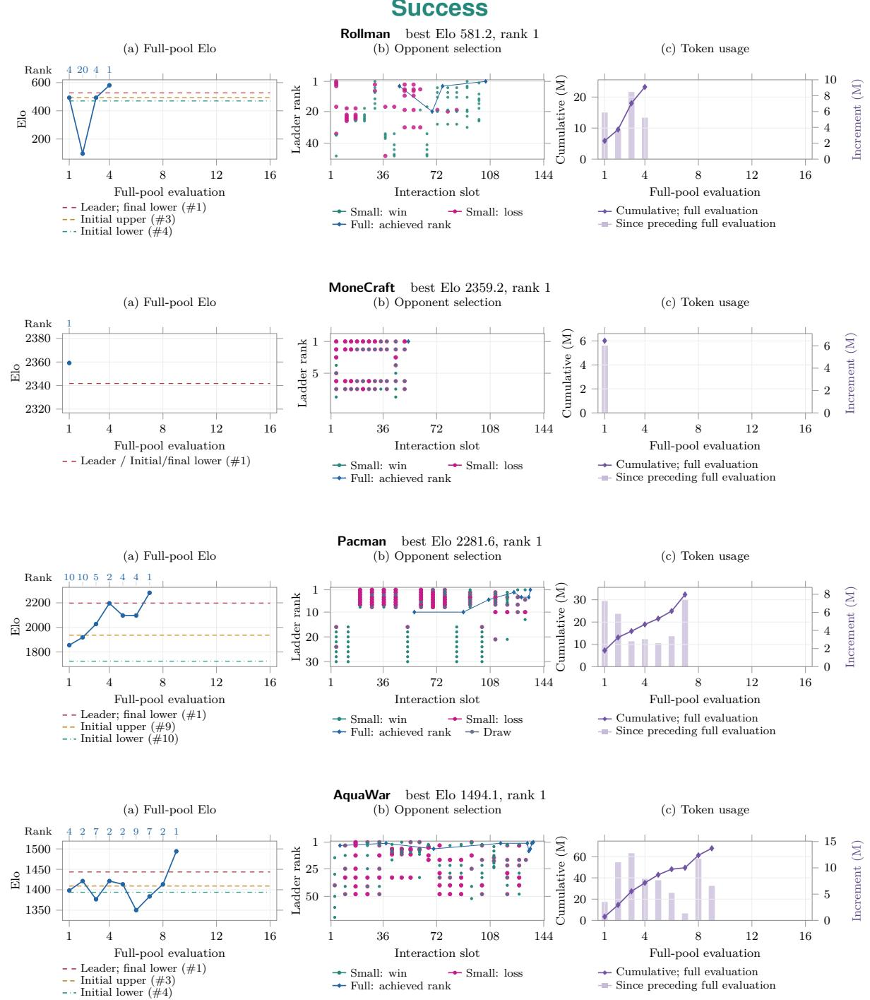  
Figure 11 Success. Full-pool Elo and ranks, interaction order, and token use for runs that reach rank 1 and stop early. Plot conventions appear in Appendix B.5.

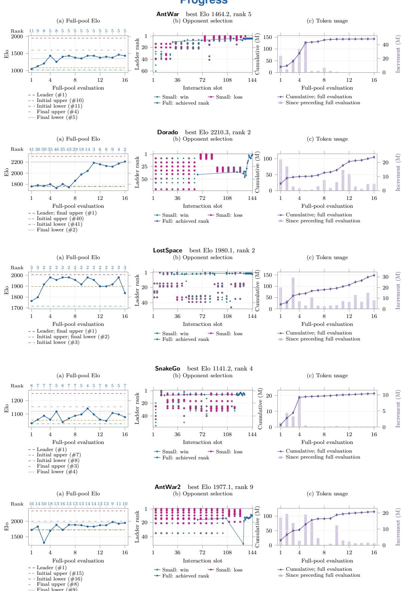  
Figure 12 Progress. Full-pool Elo and ranks, interaction order, and token use for games with fluctuating improvement. Plot conventions appear in Appendix B.5.

Stagnation  
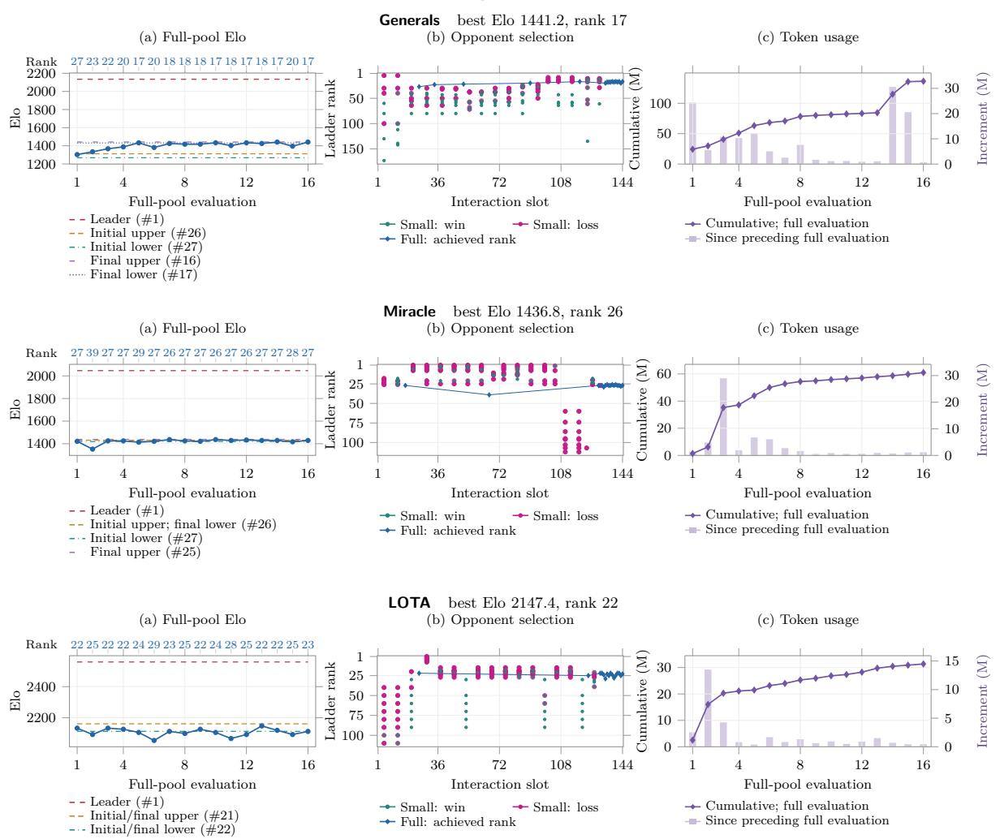  
Figure 13 Stagnation. Full-pool Elo and ranks, interaction order, and token use for games that plateau after initial adaptation. Plot conventions appear in Appendix B.5.

## C Detailed ablation results

Tables 6–8 list the Elo and rank behind Figures 6–8.
<table><tr><td>Game</td><td>Model</td><td>Ladder</td><td>Random</td><td>Top-4</td></tr><tr><td>Pacman</td><td>2096.8 / 4</td><td>2127.5 / 3</td><td>2014.4 / 6</td><td>1897.0 /10</td></tr><tr><td>AntWar</td><td>1180.5 / 8</td><td>1311.7 / 6</td><td>1154.4 / 9</td><td>1056.2 /11</td></tr><tr><td>Miracle</td><td>1482.4 / 20</td><td>1448.8 /24</td><td>1457.0 /24</td><td>1406.0 / 31</td></tr></table>

Table 6 Opponent selection ablation with GLM-5.3. Each cell is Elo / rank under the 128/16 budget.
<table><tr><td>Game</td><td>Dense</td><td>Binary</td></tr><tr><td>Pacman</td><td>2236.1 / 1</td><td>1710.1 / 11</td></tr><tr><td>AntWar</td><td>1118.7 / 9</td><td>880.6 / 22</td></tr><tr><td>Miracle</td><td>1528.2 / 15</td><td>1461.1 / 23</td></tr></table>

Table 7 Replay feedback ablation with GLM-5.3. Each cell is Elo / rank under the 128/16 budget.
<table><tr><td>Game</td><td>1</td><td>2</td><td></td><td></td></tr><tr><td>Pacman</td><td>2040.6 / 5</td><td>2196.3 / 2</td><td>2703.9 / 1</td><td>2160.4 / 2</td></tr><tr><td>AntWar</td><td>1130.2 / 9</td><td>1433.4 / 5</td><td>1208.7 / 8</td><td>1118.7 / 9</td></tr><tr><td>Miracle</td><td>1338.7 / 45</td><td>1491.2 / 19</td><td>1518.7 / 16</td><td>1465.3 / 23</td></tr></table>

Table 8 Small-match batch size ablation with GLM-5.3. Each cell is Elo / rank under the 128/16 budget.

## D Token consumption

The main text summarizes retained-champion performance. Under the same small-match and full-pool limits, the models consume diferent numbers of tokens. Table 9 reports the token use of every main-table run.

Equal interaction budgets permit diferent token expenditure. Total use varies by more than fivefold: GPT6-sol consumes 260M tokens, between 16M and 30M per game, whereas Qwen 3.8 consumes 1,454M. Qwen 3.8 uses 1.6 times GLM-5.3’s tokens but earns three gold medals versus four. GPT6-sol also earns four with less than a third of GLM-5.3’s tokens. The leading configuration, Opus5.5 with Claude Code, consumes 737M.

Token use also varies within a configuration. Kimi K3 consumes 1.5M on AquaWar and 89M on Generals. The feedback ceilings therefore do not impose equal computational expenditure; we report token use alongside competitive performance.
<table><tr><td>Game</td><td>Opus5.5</td><td>GPT6-sol</td><td>GLM-5.3</td><td>Kimi K3</td><td>DeepSeek V4 Pro</td><td>Qwen 3.8</td><td>LongCat 2.0</td></tr><tr><td>Rollman</td><td>48.75</td><td>25.28</td><td>23.82</td><td>5.50</td><td>6.11</td><td>14.68</td><td>18.35</td></tr><tr><td>Pacman</td><td>22.16</td><td>16.14</td><td>33.14</td><td>40.17</td><td>91.95</td><td>163.12</td><td>17.52</td></tr><tr><td>AntWar</td><td>74.19</td><td>16.08</td><td>142.94</td><td>54.59</td><td>102.80</td><td>284.29</td><td>37.56</td></tr><tr><td>AquaWar</td><td>76.95</td><td>26.37</td><td>68.68</td><td>1.49</td><td>60.11</td><td>13.92</td><td>20.65</td></tr><tr><td>Generals</td><td>75.44</td><td>19.66</td><td>137.23</td><td>88.88</td><td>172.70</td><td>60.95</td><td>22.30</td></tr><tr><td>LostSpace</td><td>65.37</td><td>21.58</td><td>149.86</td><td>72.03</td><td>141.51</td><td>190.16</td><td>100.95</td></tr><tr><td>Miracle</td><td>89.29</td><td>19.15</td><td>61.99</td><td>34.78</td><td>47.89</td><td>107.55</td><td>49.05</td></tr><tr><td>Dorado</td><td>44.58</td><td>23.02</td><td>105.63</td><td>60.72</td><td>67.01</td><td>253.02</td><td>10.14</td></tr><tr><td>MoneCraft</td><td>56.16</td><td>22.10</td><td>6.75</td><td>29.97</td><td>67.54</td><td>48.72</td><td>31.18</td></tr><tr><td>LOTA</td><td>76.41</td><td>17.36</td><td>32.55</td><td>30.74</td><td>34.04</td><td>112.36</td><td>21.92</td></tr><tr><td>SnakeGo</td><td>48.53</td><td>23.53</td><td>22.49</td><td>59.75</td><td>29.79</td><td>78.77</td><td>27.35</td></tr><tr><td>AntWar2</td><td>58.78</td><td>30.07</td><td>115.70</td><td>71.08</td><td>44.08</td><td>126.53</td><td>67.20</td></tr><tr><td>Total</td><td>736.61</td><td>260.34</td><td>900.78</td><td>549.70</td><td>865.53</td><td>1454.07</td><td>424.17</td></tr></table>

Table 9 Token use of the main-table runs (millions, input plus output; we count cached input once within input). All runs share the 128/16 interaction budget.

## E Algorithm families in the champion policies

Because the agent acts entirely in code space, the final policies also show which algorithms each model chooses to write. We classify the code of all 84 retained champions into six families:

• Rule-based control: hand-written if–else priorities, state machines, and fixed openings or scripts.

• Heuristic scoring: hand-weighted features that score candidate actions or targets, followed by a greedy choice.

• Graph search: BFS, DFS, Dijkstra, A\*, distance maps, flood fill, and territory partitions.

• Lookahead search: search over a forward model, including simulated rollouts, beam search, minimax, expectimax, and MCTS.

• Combinatorial optimization: assignment and matching, dynamic programming, and knapsack-style allocation.

• Inference and randomization: belief tracking over hidden information, opponent modelling, and mixed or randomized choices.

We analyse source files in each champion’s strategy directory, excluding byte-identical SDK files and paths matching version, backup, debugging, test, or vendor filters. We assign each function a family based on its structure and identifiers. For functions longer than 40 lines, we classify 20-line windows separately. We exclude I/O, parsing, and protocol code as infrastructure. A family’s share is its fraction of the remaining non-comment lines. Table 10 reports each model–game pair and equally weighted means across models and games.

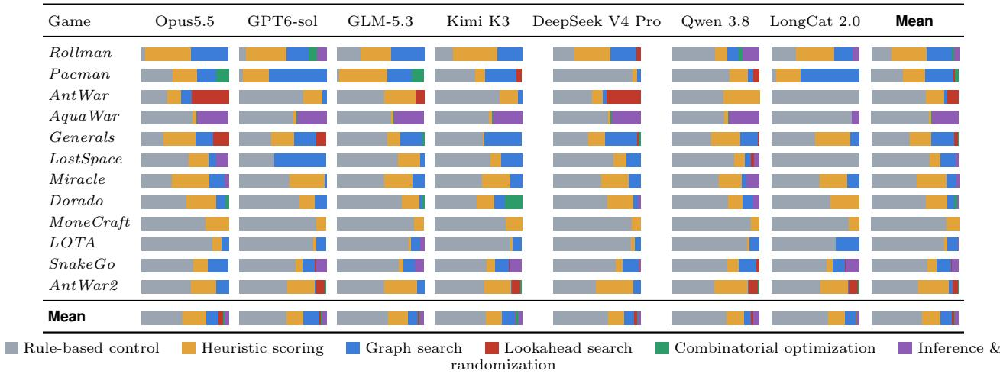  
Table 10 Algorithm families in the champion policies. Each bar splits the decision code of one retained champion by algorithm family, weighted by non-comment lines of code. We exclude infrastructure (I/O, parsing, protocol). Row and column means weight each policy equally.

Retained champions rely mainly on rules and heuristic scoring. Averaging the 84 champion-level shares equally, these families account for 79%, graph search for 13%, and the other three families for 8%. Lookahead search exceeds 10% in only 7 of the 84 champions, all on AntWar, AntWar2, and Generals. These endpoint classifications describe policy composition; they do not identify which code changes caused improvements during development.

Algorithm shares difer across games. Graph search accounts for 33% on Pacman and 28% on Rollman; inference accounts for 30% on AquaWar. MoneCraft and LOTA consist almost entirely of rules. Across models, Opus5.5 has the lowest rule share (47%) and the highest scoring (27%) and lookahead shares (5%); GPT6-sol has the highest graph-search share (18%). The other models range from 58% to 65% rules.

Within each game, we correlate non-rule share (1− rule-based fraction) with Elo across the seven configurations, using average ranks for ties. The mean Spearman correlation across 12 games is 0.35, with variation across

The classification is automatic and approximate. Identifiers and comments influence it; we assign a mixed function to its dominant mechanism. Models retaining the same starter code have similar shares, as on AquaWar and LOTA.

games. This association does not establish that replacing rules improves a policy.