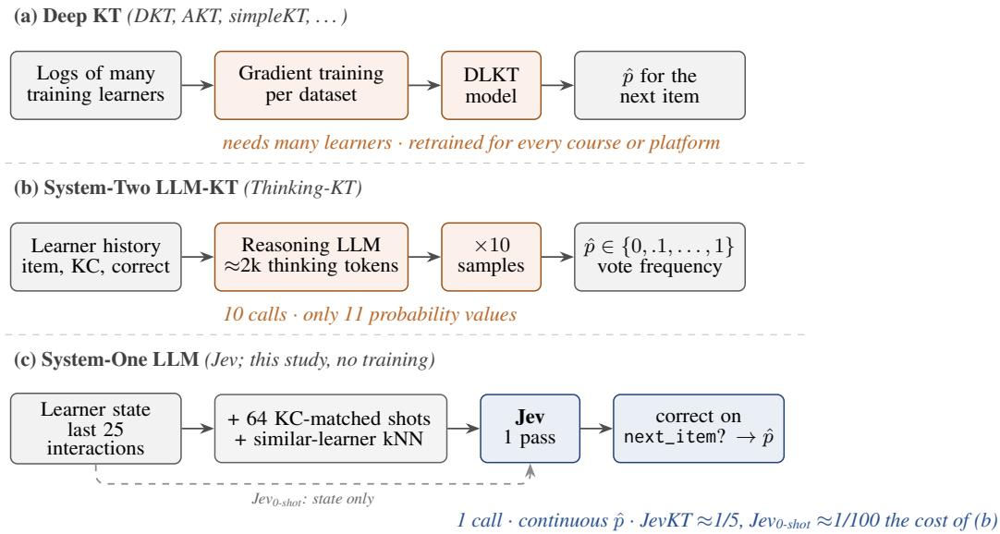
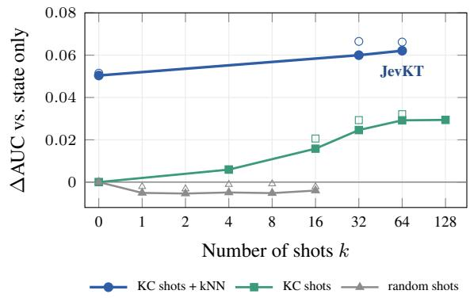
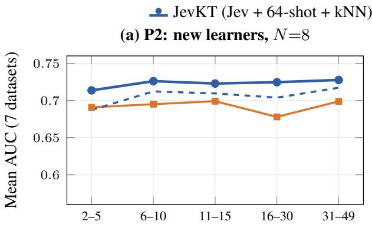
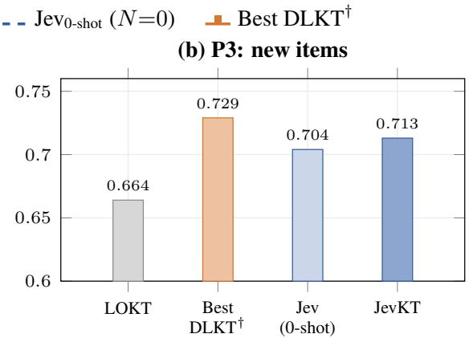
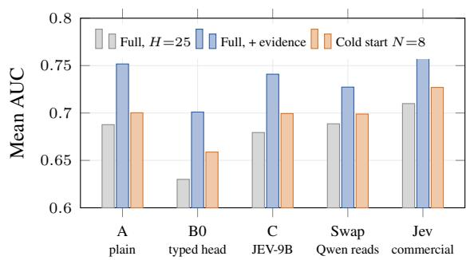
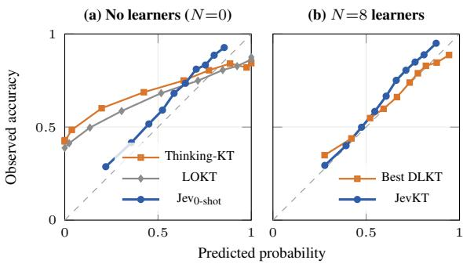
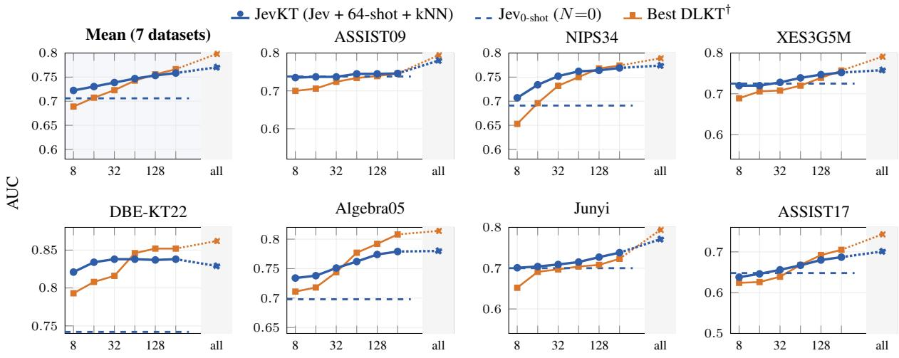
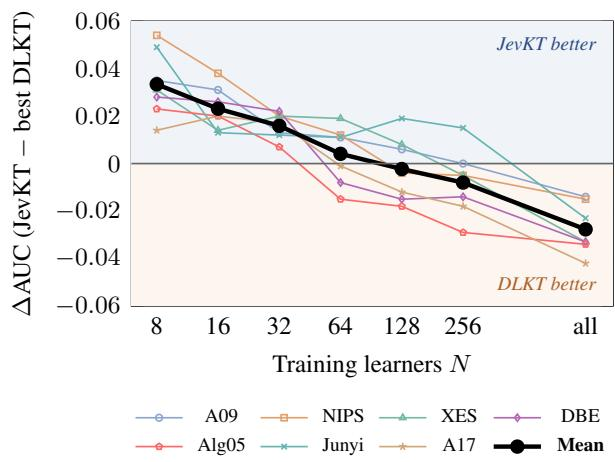

# Can a System-One LLM Perform Knowledge Tracing When Few or No Learners Are Logged?

Unggi Lee1,† Haeun Park2

1Korea University Sejong Campus 2Korea University codingchild@korea.ac.kr hxxnpark@gmail.com †Corresponding author

## Abstract

Knowledge tracing (KT) models need many logged learners, so a new course or platform starts without a usable model. In LLM-based KT the LLM generates the answer, which we call System-Two; it is either fine-tuned on the target data or reasons and votes over ten samples, which is slow and gives coarse probabilities. We ask whether an off-the-shelf System-One LLM, which returns a probability for a typed question directly in a single pass, can perform KT when few or no learners are logged. On seven datasets, Jev without any data from the target platform reaches a mean AUC of .706, above the best of 28 deep KT models trained on 8 learners (.689) and above System-Two Thinking-KT on all seven datasets (.650) at about 1/100 of its API cost. Adding examples and a similar-learner statistic from the logged learners (JevKT) raises this to .722; JevKT stays significantly ahead of deep KT up to 16 learners and ahead on average up to 64, and supervised KT catches up between 64 and 128 learners. Among the readers we tested, the gain is specific to Jev, since three other LLMs queried with the byte-identical typed request through the official System-One adapter fall below it on all seven datasets, and reader swaps and contamination checks find no evidence that the input format or memorised data explain the gain. For new learners the advantage holds from their first interactions, whereas on unseen items with all learners logged, deep KT remains ahead.

## 1 Introduction

Knowledge tracing (KT) predicts whether a learner will answer the next item correctly from the learner’s interaction history, but new courses and platforms begin with few logged learners. Deep KT models (DLKT; Piech et al., 2015; Ghosh et al., 2020; Liu et al., 2023b) learn item and skill representations from many learner sequences, and with little data they can lose to simpler models (Gervet et al., 2020). LLM-based KT brings prior knowledge, but the LLM generates the answer, either after being fine-tuned on the target data (Jung et al., 2025) or after reasoning, with the probability read from ten sampled traces (Lee et al., 2026), which costs ten calls per prediction and allows only eleven probability values. We call such methods, in which the LLM generates the answer by reasoning, voting or decoding a label, System-Two LLM-KT, after the slow, deliberate mode of thinking of Kahneman (2011).

We ask whether an off-the-shelf System-One LLM can already perform KT when only a few learners are logged. KT asks a typed question, whether this learner will answer the next item correctly, and a System-One model such as Jev returns the probability of the answer to a typed question about a state directly, in a single pass, without generating text, sampling or reasoning traces. We study whether such a model can predict with no learner logged (RQ1), how long it stays ahead as learners are logged (RQ2), and whether the advantage holds for new learners and new items (RQ3).

We pose KT to Jev as one typed question (Figure 1) and vary only what it contains, namely the learner’s recent history alone $\mathrm { ( J e v _ { 0 - s h o t } ) }$ , which uses no data from the target platform, or the history plus evidence from the N logged learners (JevKT, with 64 solved examples on the same knowledge components and the accuracy of similar learners on the target item), the input selected by an exploration whose selection rule was fixed before test was evaluated. On seven public datasets we compare both with the best of 28 deep KT models and with LLMbased KT (LOKT, Thinking-KT, CLST) in three cold-start settings (few training learners, new learners, new items), always on identical targets.

With no learners logged, $\mathrm { J e v } _ { 0 \mathrm { - s h o t } }$ reaches a mean AUC of .706, above the best deep KT model trained on 8 learners (.689) and above Thinking-KT on all seven datasets. With evidence from the logged learners, JevKT stays significantly ahead of the best deep KT model up to 16 learners (+.033 AUC at N=8, 7/7 datasets) and on average up to 64; supervised KT catches up between 64 and 128 learners. Among the readers we tested, the gain comes from the model, as other LLMs reading the identical input, directly or through the vendor’s System-One adapter, are worse on every dataset, and contamination checks find no sign of memorised data. For the Qwen3.5-9B backbone of Thinking-KT, reasoning does not help, as it is never significantly better than the same model without reasoning.

  
Figure 1: Three ways to predict whether a learner answers the next item correctly. (a) Deep KT is trained on the logs of many learners. (b) System-Two LLM-KT samples ten reasoning traces and reads a probability from vote frequencies. (c) This study poses the prediction to an off-the-shelf System-One model (Jev) as one typed question about a serialised learner state, either alone $\left( \mathrm { J e v } _ { 0 \mathrm { - s h o t } } \right)$ or with 64 KC-matched examples and a similar-learner statistic (JevKT = Jev + 64-shot + kNN); the probability is read from a single pass, without gradient training on the target dataset.

## Contributions.

• Finding. With no learner logs, an off-the-shelf System-One LLM (Jev) outperforms deep KT trained on 8 learners on average and prompted System-Two LLM-KT on all seven datasets (RQ1).

• Where it holds. A cold-start evaluation on identical targets (7 datasets; few training learners, new learners, new items) shows how long the lead lasts as learners are logged (RQ2, RQ3); a training-free input recipe (JevKT), whose gain comes mostly from one similar-learner statistic, keeps it until supervised KT takes over.

• Why. Controlled analyses (reader swap, other LLMs behind the same interface, contamination checks) find that the gain comes from the model rather than from the typed format or memorised data.1

## 2 Related Work

## 2.1 Cold-Start KT

Deep KT (DLKT) models (Piech et al., 2015; Ghosh et al., 2020; Liu et al., 2023b, 2022) learn learner and item representations from large interaction logs. When such logs are scarce, they lose this advantage, and with little data even logistic regression outperforms DKT (Gervet et al., 2020). Cold-start KT has therefore been studied in three forms. Some methods train with only a few learners from the target platform (Jung et al., 2025; Kim et al., 2024), others predict for new students who have answered only a few items (Bhattacharjee and Wayllace, 2026; Lbath et al., 2026), and others transfer a model across platforms (Xie et al., 2024; Duan et al., 2026b). We follow the few-learner protocol of CLST (Jung et al., 2025) and, for every number of training learners N, compare against the best of 28 DLKT models.

## 2.2 System-Two and System-One LLMs for KT

LLMs can bring general knowledge about the items when learner logs are missing. Given only a raw interaction history, however, a prompted LLM predicts close to chance (Neshaei et al., 2024; Worden et al., 2026). Prompts become competitive once they also carry statistics about other learners (Kim et al., 2024; Duan et al., 2026a; Li et al., 2026). Thinking-KT goes a step further, as the model reasons before it predicts, and the probability is read as the vote frequency over ten sampled reasoning traces (Lee et al., 2026), as in selfconsistency decoding (Wang et al., 2023). All of these are System-Two LLM-KT in our sense, since the LLM generates the answer. They are either prompted, like LOKT and Thinking-KT, or trained on the target logs, like CLST (Jung et al., 2025) and LLM-KT (Wang et al., 2026), which fine-tune an LLM on learner interactions. The gains from reasoning are mixed at larger scale (Worden et al., 2026), and calibration is rarely reported in LLM-KT, although LLM confidence and proper scoring rules are well studied (Kadavath et al., 2022; Gneiting and Raftery, 2007; Damani et al., 2026). A System-One model takes a different route and returns the probability of each answer to a typed question about a learner’s state directly, in a single pass. We study $\mathrm { J e v } ^ { 2 }$ , a commercial model of this kind, on KT.

## 3 Posing KT to a System-One LLM

We neither train nor modify Jev. We pose KT as one typed question and vary only what the question contains, namely the learner state alone $\left( \mathrm { J e v } _ { 0 \mathrm { - s h o t } } \right)$ which probes what the model knows without any data from the target platform, or the state plus evidence from the logged learners (JevKT), the input recipe selected by the exploration described below (Appendix C).

Task. A learner’s history is $\begin{array} { r l r l } { X _ { < t } } & { { } } & { = } \end{array}$ $( ( q _ { 1 } , r _ { 1 } ) , \dots , ( q _ { t - 1 } , r _ { t - 1 } ) )$ of items $q _ { i }$ with responses $r _ { i } \in \{ 0 , 1 \}$ , and $\mathinner { \mathcal { K } \mathopen { \left( q \right) } }$ is the KC set of item $q .$ KT predicts $p _ { t } = P ( r _ { t } { = } 1 \mid X _ { < t } , q _ { t } )$ . In cold start only a pool U of N training learners is logged.

$\mathbf { J e v _ { 0 - s h o t } } .$ A frozen System-One model f (Jev) returns the probability of “yes” to a typed question about the learner’s last H=25 interactions $X _ { t - H : t }$

$$
p _ { t } ^ { 0 } = f ( X _ { t - H : t } , \ q _ { t } ) .\tag{1}
$$

JevKT. JevKT asks the same question with evidence from the training pool U,

$$
p _ { t } = f \bigl ( S _ { t } , X _ { t - H : t } , s _ { t } , q _ { t } \bigr ) ,\tag{2}
$$

where $S _ { t }$ holds $k { = } 6 4$ solved examples from training learners whose item shares a KC with $q _ { t }$

$$
\begin{array} { r } { S _ { t } \subset \{ ( q _ { j } ^ { v } , r _ { j } ^ { v } ) : v \in \mathcal { U } , \mathcal { K } ( q _ { j } ^ { v } ) \cap \mathcal { K } ( q _ { t } ) \neq \emptyset \} , } \end{array}\tag{3}
$$

each shown with $v { \mathrm { s } }$ last 10 interactions before $j ,$ and $s _ { t }$ is the first-attempt accuracy on $q _ { t }$ of the learners most similar to u,

$$
s _ { t } = \frac { 1 } { n } \sum _ { v \in \mathcal { N } _ { n } ( u ) } r _ { q _ { t } } ^ { v } ,\tag{4}
$$

where $\textstyle { \mathcal { N } } _ { n } ( u )$ are the n=20 training learners with the smallest weighted $\ell _ { 1 }$ distance $\| \mathbf { m } _ { u } - \mathbf { m } _ { v } \| _ { 1 , w }$ between smoothed per-KC accuracy vectors $( \mathbf { m } _ { u }$ from $X _ { < t }$ only; w = how often u practised each KC). $s _ { t }$ enters the prompt as one sentence; if fewer than five neighbours answered $q _ { t }$ , the KCs of $q _ { t }$ are used instead. All examples and statistics come from U and the target’s past; a leak audit (including a test that the input is unchanged when $r _ { t }$ is flipped) passes in every setting.

How JevKT was selected. We explored history length, random vs. KC-matched shots and their number, population statistics vs. the similar-learner statistic, repeated calls, state formats, paraphrased questions and LOKT option weights (Appendix C), and fixed the selection rule (best mean ∆AUC on the development split) before evaluating test. Figure 2 shows the decisive axis. KC-matched shots help and saturate at k≈64, random shots do not, and the similar-learner statistic adds on top; the ranking on the development split transfers to test.

## 4 Experiments

## 4.1 Experimental Setup

Datasets. We use seven public KT datasets that cover different subjects, item granularities and base rates, namely ASSIST2009 (Feng et al., 2009), NIPS34 (Wang et al., 2020), XES3G5M (Liu et al., 2023c), DBE-KT22 (Abdelrahman et al., 2022), Algebra2005 from the KDD Cup 2010 (Stamper and

Table 1: Cold-start AUC (P1) of Jev against the best deep KT and the best LLM-based KT baseline with N training learners (mean over 5 seeds). Without training data, $\scriptstyle { \mathrm { J e v } _ { 0 \mathrm { - s h o t } } }$ is above LLM-based KT on all seven datasets and above deep KT trained on 8 learners on average; JevKT stays ahead of deep KT up to N=64 on average. Wins: datasets on which Jev beats every baseline in its block. †Best of 28 pyKT models, selected on test. ‡LOKT, the strongest LLM-based KT baseline. ◦N=0 value repeated (no answer options). §Reported by LLM-KT (Wang et al., 2026) on its own split; not ranked. All models: Appendix M. Best in bold, second best underlined.
<table><tr><td>N</td><td>Method</td><td>ASSIST09</td><td>NIPS34</td><td>XES3G5M</td><td>DBE-KT22</td><td>Alg05</td><td>Junyi</td><td>ASSIST17</td><td>Avg</td><td>Wins</td></tr><tr><td rowspan="3">0</td><td>Best deep KT†</td><td></td><td></td><td></td><td></td><td></td><td></td><td></td><td></td><td></td></tr><tr><td>Best LLM-based KT‡</td><td>.715</td><td>.662</td><td>.699</td><td>.688</td><td>.656</td><td>.671</td><td>.608</td><td>.671</td><td></td></tr><tr><td>JeV0-shot</td><td>.738</td><td>.691</td><td>.725</td><td>.742</td><td>.698</td><td>.700</td><td>.648</td><td>.706</td><td>717</td></tr><tr><td rowspan="3">8</td><td>Best deep KT†</td><td>.700</td><td>.653</td><td>.689</td><td>.793</td><td>.711</td><td>.652</td><td>.624</td><td>.689</td><td></td></tr><tr><td>Best LLM-based KT‡</td><td>.707</td><td>.662</td><td>.699°</td><td>.699</td><td>.656°</td><td>.671°</td><td>.608°</td><td>.672</td><td></td></tr><tr><td>JevKT</td><td>.735</td><td>.707</td><td>.720</td><td>.821</td><td>.734</td><td>.701</td><td>.638</td><td>.722</td><td>717</td></tr><tr><td rowspan="3">16</td><td>Best deep KT†</td><td>.706</td><td>.696</td><td>.706</td><td>.808</td><td>.718</td><td>.691</td><td>.626</td><td>.707</td><td></td></tr><tr><td>Best LLM-based KT‡</td><td>.707</td><td>.663</td><td>.699°</td><td>.701</td><td>.656°</td><td>.671°</td><td>.608°</td><td>.672</td><td></td></tr><tr><td>JevKT</td><td>.737</td><td>.734</td><td>.720</td><td>.834</td><td>.738</td><td>.704</td><td>.646</td><td>.730</td><td>7/7</td></tr><tr><td rowspan="3">32</td><td>Best deep KT†</td><td>.724</td><td>.732</td><td></td><td></td><td></td><td></td><td>.639</td><td></td><td></td></tr><tr><td>Best LLM-based KT‡</td><td>.707</td><td>.660</td><td>.708 .699°</td><td>.816 .701</td><td>.744 .656°</td><td>.697 .671°</td><td>.608°</td><td>.723</td><td></td></tr><tr><td>JevKT</td><td>.737</td><td>.752</td><td>.728</td><td>.838</td><td>.751</td><td>.709</td><td>.656</td><td>.672 .739</td><td>7/7</td></tr><tr><td rowspan="3">64</td><td>Best deep KT†</td><td></td><td></td><td></td><td></td><td></td><td></td><td></td><td></td><td></td></tr><tr><td>Best LLM-based KT‡</td><td>.734 .703</td><td>.750 .660</td><td>.720 .699°</td><td>.846 .699</td><td>.777 .656°</td><td>.704 .671°</td><td>.668 .608°</td><td>.743</td><td></td></tr><tr><td>JevKT</td><td>.745</td><td>.762</td><td>.739</td><td>.838</td><td>.762</td><td>.715</td><td>.667</td><td>.671 .747</td><td>4/7</td></tr><tr><td rowspan="3">128</td><td>Best deep KT†</td><td></td><td></td><td></td><td></td><td></td><td></td><td></td><td></td><td></td></tr><tr><td>Best LLM-based KT‡</td><td>.739 .704</td><td>.768</td><td>.739 .699°</td><td>.852</td><td>.792</td><td>.708</td><td>.692</td><td>.756</td><td></td></tr><tr><td>JevKT</td><td>.745</td><td>.658 .764</td><td>.747</td><td>.697 .837</td><td>.656° .774</td><td>.671° .727</td><td>.608° .680</td><td>.670 .753</td><td></td></tr><tr><td rowspan="3">256</td><td>Best deep KT†</td><td></td><td></td><td></td><td></td><td></td><td></td><td></td><td></td><td>3/7</td></tr><tr><td>Best LLM-based KT‡</td><td>.746</td><td>.774</td><td>.757</td><td>.852</td><td>.808</td><td>.723</td><td>.705</td><td>.766</td><td></td></tr><tr><td>JevKT</td><td>.706 .746</td><td>.659 .769</td><td>.699° .752</td><td>.692 .838</td><td>.656° .779</td><td>.671° .738</td><td>.608° .687</td><td>.670 .758</td><td>1/7</td></tr><tr><td rowspan="4">all</td><td>Best deep KT†</td><td></td><td></td><td></td><td></td><td></td><td></td><td></td><td></td><td></td></tr><tr><td>Best LLM-based KT‡</td><td>.794 .705</td><td>.789</td><td>.791</td><td>.862</td><td>.814</td><td>.794</td><td>.743</td><td>.798</td><td></td></tr><tr><td>JevKT</td><td>.780</td><td>.666 .774</td><td>.699° .758</td><td>.700 .829</td><td>.656° .780</td><td>.671° .771</td><td>.608° .701</td><td>.672 .770</td><td></td></tr><tr><td>LLM-KT (reported)</td><td>.8878</td><td></td><td></td><td>1</td><td></td><td></td><td></td><td></td><td>0/7</td></tr></table>

Pardos, 2016), $\mathrm { J u n y i } ^ { 3 }$ and ASSIST2017 (Patikorn et al., 2020). Learners are split 80/20 at the learner level; statistics and preprocessing are in Appendix A.

Cold-start settings. Following the cold-start KT literature (Jung et al., 2025; Bhattacharjee and Wayllace, 2026), we evaluate three settings on identical targets for all methods. In P1 (few training learners), only $N \in \{ 8 , 1 6 , 3 2 , 6 4 , 1 2 8 , 2 5 6 .$ all} training learners are available (nested subsets, 5 seeds), and we score the first 50 interactions of held-out learners (2,000 targets per dataset); N=0 means no data from the target platform. In P2 (new learners), the same predictions with N=8 are scored by the position of the target in the new learner’s sequence. In P3 (new items), 20% of the items are removed from training and from all examples and statistics, and only targets on these items are scored (3 seeds).

Baselines. We compare against (i) supervised deep KT, with 28 models of the pyKT library (Liu et al., 2022), eleven core models (including DKT (Piech et al., 2015), AKT (Ghosh et al., 2020) and simpleKT (Liu et al., 2023b)) plus 17 further ones (full list in Appendix B), reporting for every cell the best model chosen on test, which favours DLKT; (ii) System-Two LLM-KT, either prompted without training, LOKT (Kim et al., 2024) and Thinking-KT (Lee et al., 2026) with Qwen3.5-9B, or trained on the target data, namely CLST (Jung et al., 2025), which we re-implement on the three datasets of the original paper, and LLM-KT (Wang et al., 2026), for which we cite the reported ASSIST09 value; and (iii) the classical KT models BKT (Corbett and Anderson, 1995)

  
Figure 2: How JevKT was selected: mean ∆AUC over the state-only input (7 datasets) vs. number of shots k. Filled: development split (used for selection); hollow: test (not used for selection). Other inputs: Appendix C.

and PFA (Pavlik Jr. et al., 2009). Details are in Appendix B.

Metrics. We report AUC as the main metric (ACC and F1 in Appendix D), ECE and Brier for calibration, and latency and cost per million predictions (GPU time priced at a public rental rate). Differences are tested with a one-sided paired learner-cluster bootstrap with Holm correction over datasets (Appendix K). JevKT uses jev-1.13-20260917 via OpenRouter with H=25, k=64 and n=20 (Appendix B).

## 4.2 Main Results

No learners logged, N=0 (RQ1). Without any data from the target platform, Jev0-shot reaches .706 mean AUC (first block of Table 1). This is above the strongest training-free LLM-KT baseline, LOKT (.671), and above the best deep KT model trained on 8 learners (.689; higher on 5/7 datasets). It also beats System-Two Thinking-KT (.650) on all seven datasets with one call instead of ten, at about 1/100 of its API cost (Section 5.4). Thinking-KT, CLST and every N are listed in Tables 18–25 (Appendix D).

P1, few training learners (RQ2). Table 1 follows the comparison as learners are logged (curves in Appendix D). JevKT is ahead of the best deep KT model by +.033, +.023 and +.016 mean AUC at N=8, 16 and 32 (on 7/7, 7/7 and 7/7 datasets); the mean difference is +.004 at N=64, −.002 at N=128, −.008 at N=256 and −.028 with the full training data. LOKT, whose only use of the logged learners is answer-option weights, barely moves with N (.672 at N=8 and .672 with all learners, against .671 at N=0) and stays below both. The crossover therefore lies between 64 and 128 learners on average and varies by dataset (Figure 7, Appendix D). The lead is Holm-significant on 7/7 datasets at N=8 and 6/7 at N=16, 3/7 at N=32 and 2/7 at N=64 (Table 15). Because the best deep KT model is chosen on test in every cell, these margins are conservative.

P2, new learners (RQ3). Figure 3a scores the same N=8 predictions by the position of the target in a new learner’s sequence. JevKT is above the best deep KT model at every position, already for the second to fifth interactions (.714 vs. .691), when the new learner has shown little evidence, and in 33/35 dataset–position cells (Table 9).

P3, new items (RQ3). Figure 3b restricts the targets to items held out of training and of all examples and statistics. Here every training learner is available, so this setting isolates new items rather than few learners. JevKT (.713) and $\mathrm { J e v } _ { 0 \mathrm { - s h o t } }$ (.704) stay well above LOKT (.664), but the best deep KT model, trained on all learners and chosen on test, is ahead (.729; JevKT is better on 1/7 datasets; Table 10). Unseen items alone therefore do not reverse the full-data result, and the advantage of the System-One model comes from having few learners, not from unseen items.

## 5 Analysis

## 5.1 Is it the model or the format?

To separate the model from the format, we first hold the Qwen3.5-9B weights fixed (Figure 4; Table 11). A typed one-pass head without training (B0) is worse than reading the label probability directly (A), .630 vs. .688 AUC, and .701 vs. .752 with the similar-learner statistic. Distilling Jev into these weights (C, JEV-9B) does not beat A (.679 and .741), and the same holds at N=8 (A .700, B0 .659, C .699). Conversely, when the identical serialised input is read by Jev instead of Qwen3.5-9B, AUC rises in all 35 cells (7 datasets × 5 conditions), e.g. from .727 to .776 with the JevKT input. Rows A–C use the state with the last 25 interactions and the similar-learner statistic, the swap rows the JevKT state with 64 shots. On the A state itself Jev reaches .761 against .752 for A, higher on all seven datasets (by .002 to .021); the longer JevKT state helps Jev (.776) but not Qwen3.5-9B (.727). For the weights and readers we tested, the typed format does not produce the gain; the model does.

  
Position of the target in the learner’s sequence

  
Held-out 20% of items (all training learners)  
Figure 3: Cold start for new learners and new items (mean AUC over 7 datasets; few training learners, P1, is in Table 1). (a) P2: AUC by the position of the target in a new learner’s sequence with N=8 training learners; Jev0-shot uses no training learners. (b) P3: targets on items held out of training. All methods are scored on identical targets; per-dataset results in Appendix D. †Best of 28 pyKT models selected on test per cell, which favours DLKT.

No other commercial System-One model is available, so we also send the byte-identical typed request to three other LLMs through TypeSafe’s official System-One adapter (Table 2; per dataset in Table 12, Appendix F). At N=0, GPT-4o-mini (.680), Gemini-2.5-Flash-Lite (.670) and DeepSeek-V4- Flash (.626) are below $\mathrm { J e v } _ { 0 \mathrm { - s h o t } }$ (.706) on every dataset (paired bootstrap, $p { < } . 0 1 )$ . On identical targets the JevKT input adds a similar, small amount to Jev (+.016) and to DeepSeek (+.010), significant on 2/7 and 1/7 datasets, and the two gains never differ significantly; the gap between the models (.077 at N=0) is set by the model, not by the input. Only Jev and the Jev-distilled JEV-9B (.687 at N=0, .699 at N=8) come close to or exceed the best deep KT model trained on 8 learners (.689), while Laya, an open-source model that reproduces Jev’s typed interface with a small encoder, stays near chance (.536).

## 5.2 What do the logged learners add?

JevKT combines two sources, the model’s prior, which $\mathrm { J e v } _ { 0 \mathrm { - s h o t } }$ measures alone, and evidence from the logged learners. At N=8 the prior alone reaches .706, the similar-learner statistic alone .595, and both together .722, against .689 for the best deep KT model (Table 1). With few learners the prior carries the prediction and the evidence adds to it; as N grows the evidence becomes reliable, and supervised KT, which learns from the same evidence, catches up. On identical targets the evidence adds +.016 AUC to Jev, significantly on 2/7 datasets (DBE-KT22 and Algebra05), so its contribution is real but small. Figure 2 and Appendix C show which parts of the input matter. Under cold start the two parts of the evidence overlap (Table 6, Appendix C). At $N { = } 1 6$ the similar-learner statistic alone raises $\mathrm { J e v } _ { 0 \mathrm { - s h o t } }$ from .706 to .729, 64 KCmatched shots alone to .724, and both together to .730. The statistic therefore carries almost all of the gain, and the shots add to it clearly only on DBE-KT22; we keep both because they never hurt and match the configuration selected on full data. Where exactly supervised KT takes over is hard to predict, since a model of the crossover fitted on synthetic datasets does not transfer to the real ones (Appendix D). The gain is not confined to easy cases (Table 14, Appendix I). At N=8 JevKT leads both on items that the logged learners answered (+.036) and on items none of them answered (+.028), and the lead is largest for learners whose accuracy so far is very low or very high (+.050 and +.063), where eight learners give a supervised model little to learn from.

  
Figure 4: Model or format? On the same Qwen3.5-9B weights, a typed one-pass head (B0) is worse than the plain readout (A) and Jev distillation (C) does not beat A, both with full data and in cold start; on the identical state, Jev is the stronger reader (35/35 cells).

Table 2: The same typed request read by other models (mean AUC over 7 datasets). Below Jev: datasets on which the reader is below $\mathrm { J e v } _ { 0 \mathrm { - s h o t } }$ at $N { = } 0$ . N=8 rows of Jev and the adapter use a 1,000-target subsample (budget). †Trained on the 8 learners. Per dataset: Table 12. Best in bold, second best underlined.
<table><tr><td>Reader</td><td> $N { = } 0$   $N { = } 8$  Below Jev</td></tr><tr><td>Jev</td><td>.706 .717</td></tr><tr><td>Adapter + GPT-4o-mini Adapter + Gemini-2.5-FL</td><td>.680 7/7 一</td></tr><tr><td>.670</td><td>7/7</td></tr><tr><td>Adapter + DeepSeek-V4-F .626</td><td>.634 7/7</td></tr><tr><td>JEV-9B (Jev-distilled) .687</td><td>.699 6/7</td></tr><tr><td>Laya (open-source Jev) .536 Best DLKT† .689</td><td>.553 7/7</td></tr></table>

## 5.3 Why does System-Two LLM-KT fall behind?

Table 3 compares Thinking-KT with and without reasoning on the same Qwen3.5-9B. A reasoning budget of 1024 or 2048 tokens never improves AUC significantly over the same model without reasoning, while one Jev pass beats Thinking-KT on all seven datasets (Holm-corrected, ∆AUC +.038 $\mathrm { t o } + . 0 7 3$ against the budget of 2048). Thinking-$\mathrm { { K T s } }$ probability is a vote frequency over ten samples, so it can take only eleven values and costs ten calls per prediction (Section 5.4). These vote frequencies are also poorly calibrated (Figure 5, Table 13). They pile up at 0 and 1, and the mean ECE of Thinking-KT is .253 (LOKT .209), against .084 for the single $\mathrm { J e v } _ { 0 \mathrm { - s h o t } }$ pass. With N=8 learners, JevKT is as well calibrated as the best deep KT model (ECE .070 vs. .076; Brier .182 vs. .192), without any post-hoc scaling such as temperature scaling (Guo et al., 2017). Jev’s remaining error is a mild underconfidence, as observed accuracy is slightly above the predicted probability across the range. Longer reasoning does not help either. Within each dataset, the third of targets with the longest reasoning has lower AUC than the shortest third (.668 vs. .719 at budget 2048; .675 vs. .726 at 1024), and reasoning length correlates with the absolute error (Spearman +.29), also among targets on which all ten votes agree. Long reasoning marks hard cases rather than fixing them.

Table 3: Reasoning does not help Qwen3.5-9B on KT; a single System-One pass does better. $\Delta \mathbf { A U C }$ (Holmcorrected paired bootstrap; $^ { * } p { < } . 0 5 )$ $T h i n k - N o$ -think: Thinking-KT with reasoning budget 1024 / 2048 minus the same model without reasoning. $J e \nu - T h i n k i n g – K T ;$ one Jev call vs. 10 sampled reasoning generations. Cost: per million predictions of Thinking-KT at each budget (no-think: \$707) and of one Jev call.
<table><tr><td rowspan="2">Dataset</td><td>Think – No-think</td><td></td><td>Jev – Thinking-KT</td></tr><tr><td>budget 1024</td><td>budget 2048</td><td>(budget 2048)</td></tr><tr><td>ASSIST09</td><td>-.013</td><td>-.015</td><td>+.038*</td></tr><tr><td>NIPS34</td><td>+.014</td><td>+.005</td><td>+.038*</td></tr><tr><td>XES3G5M</td><td>-.020</td><td>-.007</td><td>+.072*</td></tr><tr><td>DBE-KT22</td><td>-.016</td><td>-.026</td><td>+.073*</td></tr><tr><td>Algebra05</td><td>+.023</td><td>+.036</td><td>+.053*</td></tr><tr><td>Junyi</td><td>-.034</td><td>-.029</td><td>+.068*</td></tr><tr><td>ASSIST17</td><td>-.008</td><td>+.010</td><td>+.048*</td></tr><tr><td>Significant</td><td>0/7</td><td>0/7</td><td>7/7</td></tr><tr><td>Cost / 1M pred.</td><td>$3,279</td><td>$4,360</td><td>$44</td></tr></table>

  
Figure 5: Reliability of the predicted probabilities (7 datasets pooled, 10 equal-mass bins for display; ECE in Table 13 uses 15; diagonal = perfect calibration). Vote frequencies of System-Two LLM-KT pile up at 0 and 1, while the single-pass readout of Jev follows the diagonal with a slight underconfidence. Per-dataset ECE and Brier: Table 13.

## 5.4 How fast and cheap is it?

Table 4 compares the cost of obtaining predictions. Only DLKT and CLST need gradient training; $\mathrm { J e v } _ { 0 \mathrm { - s h o t } }$ and JevKT predict for a new course immediately. One JevKT prediction takes 325 ms in a single call and costs \$886 per million predictions, about 1/5 of Thinking-KT, which needs \$4,360 and 41.7 s per prediction even with its ten votes issued in parallel; $\mathrm { J e v } _ { 0 \mathrm { - s h o t } }$ costs \$44. Priced at the same GPU rental rate, DLKT is far cheaper, since training on all learners costs at most \$0.08 and a million predictions well under \$1. Its limit is not cost but data, as it must be retrained for every course and needs logged learners to train on.

Table 4: Efficiency. Training: gradient training on target data is needed. Ready after and Train \$: time and cost until the first prediction for a new course with N=8 / all learners. Latency (median, one prediction), throughput, and cost per million predictions. API methods: OpenRouter prices. DLKT, CLST and JEV-9B run on one RTX 3090, priced at the RunPod Community Cloud on-demand rate (\$0.22/h, September 2026), which favours them. LOKT and Thinking-KT (budget 2048) use 10 votes; CLST fine-tunes Mistral-7B with LoRA. ‡Distilled once from Jev, not per course.
<table><tr><td>Method</td><td>Training</td><td>Ready after</td><td>Train $</td><td>Latency</td><td>Pred/s</td><td>$/1M</td></tr><tr><td>JevKT</td><td>x</td><td>0/0</td><td></td><td>325 ms</td><td>72.23</td><td>$886</td></tr><tr><td>JeV0-shot</td><td>x</td><td>0/0</td><td></td><td>200 ms</td><td>105</td><td>$44</td></tr><tr><td>LOKT</td><td>x</td><td>0/0</td><td></td><td>1.3 s</td><td>3.39</td><td>$707</td></tr><tr><td>Thinking-KT</td><td>x</td><td>0/0</td><td>一</td><td>41.7 s</td><td>0.12</td><td>$4,360</td></tr><tr><td>JEV-9B (vLLM)</td><td>x</td><td>0/0</td><td>_+</td><td>204 ms</td><td>8.27</td><td>$7.39</td></tr><tr><td>CLST</td><td>√</td><td>110.8 s / −</td><td>&lt;$0.01 / -</td><td>104 ms</td><td>9.6</td><td>$6.37</td></tr><tr><td>DKT</td><td>√</td><td>1.1 s / 37.6 s</td><td>&lt;$0.01 / &lt;$0.01</td><td>0.23 ms</td><td>4,333</td><td>$0.01</td></tr><tr><td>AKT</td><td>√</td><td>6.3 s / 22.4 min</td><td>&lt;$0.01 / $0.08</td><td>3.08 ms</td><td>325</td><td>$0.19</td></tr><tr><td>simpleKT</td><td>√</td><td>2.6 s / 3.2 min</td><td>&lt;$0.01 /$0.01</td><td>0.46 ms</td><td>2,167</td><td>$0.03</td></tr><tr><td>csKT</td><td>√</td><td>1.7 s / 2.8 min</td><td>&lt;$0.01 /$0.01</td><td>0.54 ms</td><td>1,857</td><td>$0.03</td></tr></table>

## 5.5 Could the result be an artefact?

Three checks address whether the result could be an artefact. Contamination (Table 17, Appendix L). Asked about an item’s difficulty or skill from its ID alone, Jev and three open LLMs do no better with real IDs than with format-matched fake IDs on any dataset, and continuing rows of the public files shows no recall. Relabelling IDs and removing names changes Jev0-shot AUC by at most .012, never significantly (Holm), and no dataset is flagged. On six synthetic datasets generated after the model release, JevKT is still at or above the best deep KT model at N=8. Leakage. A leak audit passes in every setting, including a test that the input does not change when the target outcome is flipped. Baseline strength. The best deep KT model is selected on test in every cell, which favours deep KT. Classical KT models (BKT, PFA) fitted on the same learners are below both (Appendix D). With hyper-parameters tuned on the validation learners of each cell (four strong pyKT models, eight configurations each), deep KT stays below JevKT by +.070, +.042, +.030 and +.010 at N=8, 16, 32 and 64 (Holm-significant on 7/7, 7/7, 5/7 and 4/7 datasets), so default hyper-parameters do not explain the gap.

## 6 Conclusion

Yes, an off-the-shelf System-One LLM already performs KT when few or no learners are logged. Without any data from the target platform, Jev beats deep KT trained on 8 learners on average and prompted System-Two LLM-KT on every dataset, at a fraction of its cost; with evidence from the logged learners, JevKT stays ahead until supervised KT catches up between 64 and 128 learners. Among the readers we tested, the gain comes from the model rather than the typed format; the input recipe helps other LLMs as much as it helps Jev. Whether an open System-One model can match it remains open.

## Limitations

Our finding concerns one closed System-One model. No other commercial System-One model is available, so we test generality only with other LLMs behind the official adapter, a Jev-distilled student and the open-source Laya (Appendix F); the adapter reads probabilities that the LLM writes as text, which may disadvantage it. Jev’s training data are unknown; our contamination checks find no evidence of memorisation but cannot rule it out. Each prediction requires an API call, and results may change with future model versions; we pin the version and cache every response. Re-querying the pinned version after two days reproduces its predictions closely (Appendix G), but only one Jev version is available, so we cannot measure drift across versions. The prompted System-Two baselines run on Qwen3.5-9B, so our conclusions about reasoning apply to this backbone; a larger reasoning model may behave differently. Deep KT baselines use default hyper-parameters in the main comparison; a validation-tuned run (Section 5.5) does not change the conclusion, but a broader search could narrow the gap. F1 is threshold-sensitive on datasets with a low base rate (ASSIST17).

## Use of Generative AI

We used Claude Code (Anthropic) to assist with writing code and with language editing of the manuscript. The human authors conceived the research ideas, verified all results and their interpretation, and take full responsibility for the content.

## Ethics Statement

We use only public, de-identified KT datasets for research and collect no new data from people. For inference, serialised learner histories are sent to LLMs through the OpenRouter API. KT predictions can influence what learners are shown; a model that is accurate on average can still be wrong for individual learners or groups, so its outputs should support, not replace, instructors’ decisions.

## References

Ghodai Abdelrahman, Sherif Abdelfattah, Qing Wang, and Yu Lin. 2022. DBE-KT22: A knowledge tracing dataset based on database systems exercises. Preprint, arXiv:2208.12651.

Youheng Bai, Xueyi Li, Zitao Liu, Yaying Huang, Teng Guo, Mingliang Hou, Feng Xia, and Weiqi Luo. 2025a. csKT: Addressing cold-start problem in knowledge tracing via kernel bias and cone attention. Expert Systems with Applications, 266:125988.

Youheng Bai, Xueyi Li, Zitao Liu, Yaying Huang, Mi Tian, and Weiqi Luo. 2025b. Rethinking and improving student learning and forgetting processes for attention based knowledge tracing models. In Proceedings of the AAAI Conference on Artificial Intelligence, volume 39, pages 27822–27830.

Indronil Bhattacharjee and Christabel Wayllace. 2026. MAML-KT: Addressing cold start problem in knowledge tracing for new students via few-shot modelagnostic meta learning. Preprint, arXiv:2603.00137.

Jiahao Chen, Zitao Liu, Shuyan Huang, Qiongqiong Liu, and Weiqi Luo. 2023. Improving interpretability of deep sequential knowledge tracing models with question-centric cognitive representations. In Proceedings ofthe AAAI Conference on Artificial Intelligence, volume 37, pages 14196–14204.

Weihua Cheng, Hanwen Du, Chunxiao Li, Ersheng Ni, Liangdi Tan, Tianqi Xu, and Yongxin Ni. 2025. Uncertainty-aware knowledge tracing. In Proceedings ofthe AAAI Conference on Artificial Intelligence, volume 39, pages 27905–27913.

Youngduck Choi, Youngnam Lee, Junghyun Cho, Jineon Baek, Byungsoo Kim, Yeongmin Cha, Dongmin Shin, Chan Bae, and Jaewe Heo. 2020. Towards an appropriate query, key, and value computation for knowledge tracing. In Proceedings of the Seventh ACM Conference on Learning @ Scale (L@S ’20), pages 341–344. ACM.

Albert T. Corbett and John R. Anderson. 1995. Knowledge tracing: Modeling the acquisition of procedural knowledge. User Modeling and User-Adapted Interaction, 4(4):253–278.

Mehul Damani, Isha Puri, Stewart Slocum, Idan Shenfeld, Leshem Choshen, Yoon Kim, and Jacob Andreas. 2026. Beyond binary rewards: Training LMs to reason about their uncertainty. In International Conference on Learning Representations (ICLR).

Zhiyi Duan, Zixing Shi, Hongyu Yuan, and Qi Wang. 2026a. HISE-KT: Synergizing heterogeneous information networks and LLMs for explainable knowledge tracing with meta-path optimization. In Proceedings ofthe AAAI Conference on Artificial Intelligence, volume 40, pages 14693–14701.

Zhiyi Duan, Hongyu Yuan, and Rui Liu. 2026b. RAG-KT: Cross-platform explainable knowledge tracing

with multi-view fusion retrieval generation. In Findings ofthe Associationfor Computational Linguistics: ACL 2026, pages 5217–5232, San Diego, California, United States. Association for Computational Linguistics.

Mingyu Feng, Neil Heffernan, and Kenneth Koedinger. 2009. Addressing the assessment challenge with an online system that tutors as it assesses. User Modeling and User-Adapted Interaction, 19(3):243– 266.

Theophile Gervet, Ken Koedinger, Jeff Schneider, and Tom Mitchell. 2020. When is deep learning the best approach to knowledge tracing? Journal of Educational Data Mining, 12(3):31–54.

Aritra Ghosh, Neil Heffernan, and Andrew S. Lan. 2020. Context-aware attentive knowledge tracing. In Proceedings of the 26th ACM SIGKDD International Conference on Knowledge Discovery & Data Mining, pages 2330–2339. ACM.

Tilmann Gneiting and Adrian E. Raftery. 2007. Strictly proper scoring rules, prediction, and estimation. Journal of the American Statistical Association, 102(477):359–378.

Chuan Guo, Geoff Pleiss, Yu Sun, and Kilian Q. Weinberger. 2017. On calibration of modern neural networks. In Proceedings of the 34th International Conference on Machine Learning (ICML), volume 70 of Proceedings of Machine Learning Research, pages 1321–1330. PMLR.

Teng Guo, Yu Qin, Yubin Xia, Mingliang Hou, Zitao Liu, Feng Xia, and Weiqi Luo. 2025. Enhancing knowledge tracing through decoupling cognitive pattern from error-prone data. In Proceedings of the ACM Web Conference 2025 (WWW ’25), pages 5108– 5116. ACM.

Xiaopeng Guo, Zhijie Huang, Jie Gao, Mingyu Shang, Maojing Shu, and Jun Sun. 2021. Enhancing knowledge tracing via adversarial training. In Proceedings ofthe 29th ACM International Conference on Multimedia (MM ’21), pages 367–375. ACM.

Mingliang Hou, Zitao Liu, Renqiang Luo, Jiliang Tang, Weiqi Luo, and Feng Xia. 2026. MoC-KT: Mixture of convolutions for knowledge tracing. ACM Transactions on Information Systems.

Shuyan Huang, Zitao Liu, Xiangyu Zhao, Weiqi Luo, and Jian Weng. 2023. Towards robust knowledge tracing models via k-sparse attention. In Proceedings ofthe 46th International ACM SIGIR Conference on Research and Development in Information Retrieval (SIGIR ’23), pages 2441–2445. ACM.

Yoonjin Im, Eunseong Choi, Heejin Kook, and Jongwuk Lee. 2023. Forgetting-aware linear bias for attentive knowledge tracing. In Proceedings ofthe 32nd ACM International Conference on Information and Knowledge Management (CIKM ’23), pages 3958–3962. ACM.

Heeseok Jung, Jaesang Yoo, Yohaan Yoon, and Yeonju Jang. 2025. CLST: Cold-start mitigation in knowledge tracing by aligning a generative language model as a students’ knowledge tracer. Journal of Educational Data Mining, 17(2):86–117.

Saurav Kadavath, Tom Conerly, Amanda Askell, Tom Henighan, Dawn Drain, Ethan Perez, Nicholas Schiefer, Zac Hatfield-Dodds, Nova DasSarma, Eli Tran-Johnson, Scott Johnston, Sheer El-Showk, Andy Jones, Nelson Elhage, Tristan Hume, Anna Chen, Yuntao Bai, Sam Bowman, Stanislav Fort, and 17 others. 2022. Language models (mostly) know what they know. Preprint, arXiv:2207.05221.

Daniel Kahneman. 2011. Thinking, Fast and Slow. Farrar, Straus and Giroux, New York.

JongWoo Kim, SeongYeub Chu, Bryan Wong, and Mun Yi. 2024. Not all options are created equal: Textual option weighting for token-efficient LLM-based knowledge tracing. Preprint, arXiv:2410.12872.

Mounir Lbath, Alexandre Parésy, Abdelkayoum Kaddouri, Abdelrahman Zighem, and Jill-Jênn Vie. 2026. Live knowledge tracing: Real-time adaptation using tabular foundation models. In Proceedings of the 27th International Conference on Artificial Intelligence in Education (AIED 2026), Late Breaking Results, Communications in Computer and Information Science, pages 180–186. Springer.

Jinseok Lee and Dit-Yan Yeung. 2019. Knowledge query network for knowledge tracing: How knowledge interacts with skills. In Proceedings of the 9th International Conference on Learning Analytics & Knowledge (LAK ’19), pages 491–500. ACM.

Unggi Lee, Joo Young Kim, Ran Ju, Minyoung Jung, and Jeyeon Eo. 2026. Thinking-KT: A trainingfree large reasoning model-based knowledge tracing framework for unified prediction and prescription. Preprint, arXiv:2601.01708.

Runze Li, Kedi Chen, Guwei Feng, Mo Yu, Jun Wang, and Wei Zhang. 2026. MERIT: Memoryenhanced retrieval for interpretable knowledge tracing. Preprint, arXiv:2603.22289.

Xueyi Li, Youheng Bai, Teng Guo, Zitao Liu, Yaying Huang, Xiangyu Zhao, Feng Xia, Weiqi Luo, and Jian Weng. 2024a. Enhancing length generalization for attention based knowledge tracing models with linear biases. In Proceedings ofthe Thirty-Third International Joint Conference on Artificial Intelligence (IJCAI-24), pages 5918–5926.

Xueyi Li, Youheng Bai, Teng Guo, Ying Zheng, Mingliang Hou, Bojun Zhan, Yaying Huang, Zitao Liu, Boyu Gao, and Weiqi Luo. 2024b. Extending context window of attention based knowledge tracing models via length extrapolation. In ECAI 2024 – 27th European Conference on Artificial Intelligence, Frontiers in Artificial Intelligence and Applications, pages 1479–1486. IOS Press.

Zitao Liu, Qiongqiong Liu, Jiahao Chen, Shuyan Huang, Boyu Gao, Weiqi Luo, and Jian Weng. 2023a. Enhancing deep knowledge tracing with auxiliary tasks. In Proceedings of the ACM Web Conference 2023 (WWW ’23), pages 4178–4187. ACM.

Zitao Liu, Qiongqiong Liu, Jiahao Chen, Shuyan Huang, and Weiqi Luo. 2023b. simpleKT: A simple but tough-to-beat baseline for knowledge tracing. In International Conference on Learning Representations (ICLR).

Zitao Liu, Qiongqiong Liu, Jiahao Chen, Shuyan Huang, Jiliang Tang, and Weiqi Luo. 2022. pyKT: A Python library to benchmark deep learning based knowledge tracing models. In Advances in Neural Information Processing Systems (NeurIPS) Datasets and Benchmarks Track.

Zitao Liu, Qiongqiong Liu, Teng Guo, Jiahao Chen, Shuyan Huang, Xiangyu Zhao, Jiliang Tang, Weiqi Luo, and Jian Weng. 2023c. XES3G5M: A knowledge tracing benchmark dataset with auxiliary information. In Advances in Neural Information Processing Systems (NeurIPS) Datasets and Benchmarks Track.

Ting Long, Yunfei Liu, Jian Shen, Weinan Zhang, and Yong Yu. 2021. Tracing knowledge state with individual cognition and acquisition estimation. In Proceedings of the 44th International ACM SIGIR Conference on Research and Development in Information Retrieval, pages 173–182.

Seyed Parsa Neshaei, Richard Lee Davis, Adam Hazimeh, Bojan Lazarevski, Pierre Dillenbourg, and Tanja Käser. 2024. Towards modeling learner performance with large language models. In Proceedings ofthe 17th International Conference on Educational Data Mining (EDM).

Shalini Pandey and George Karypis. 2019. A selfattentive model for knowledge tracing. In Proceedings ofthe 12th International Conference on Educational Data Mining (EDM).

Thanaporn Patikorn, Ryan S. Baker, and Neil T. Heffernan. 2020. ASSISTments longitudinal data mining competition special issue: A preface. Journal of Educational Data Mining, 12(2):i–xi.

Philip I. Pavlik Jr., Hao Cen, and Kenneth R. Koedinger. 2009. Performance factors analysis – a new alternative to knowledge tracing. In Proceedings of the 14th International Conference on Artificial Intelligence in Education (AIED 2009), volume 200 of Frontiers in Artificial Intelligence and Applications, pages 531– 538. IOS Press.

Chris Piech, Jonathan Spencer, Jonathan Huang, Surya Ganguli, Mehran Sahami, Leonidas Guibas, and Jascha Sohl-Dickstein. 2015. Deep knowledge tracing. In Advances in Neural Information Processing Systems (NeurIPS).

Shuanghong Shen, Zhenya Huang, Qi Liu, Yu Su, Shijin Wang, and Enhong Chen. 2022. Assessing student’s dynamic knowledge state by exploring the question difficulty effect. In Proceedings of the 45th International ACM SIGIR Conference on Research and Development in Information Retrieval, pages 427– 437.

Xiaoxuan Shen, Fenghua Yu, Yaqi Liu, Ruxia Liang, Qian Wan, Kai Yang, and Jianwen Sun. 2024. Revisiting knowledge tracing: A simple and powerful model. In Proceedings of the 32nd ACM International Conference on Multimedia, pages 263–272. ACM.

Dongmin Shin, Yugeun Shim, Hangyeol Yu, Seewoo Lee, Byungsoo Kim, and Youngduck Choi. 2021. SAINT+: Integrating temporal features for EdNet correctness prediction. In Proceedings ofthe 11th International Learning Analytics and Knowledge Conference (LAK21), pages 490–496. ACM.

Shashank Sonkar, Andrew E. Waters, Andrew S. Lan, Phillip J. Grimaldi, and Richard G. Baraniuk. 2020. qDKT: Question-centric deep knowledge tracing. Preprint, arXiv:2005.12442.

John Stamper and Zachary A. Pardos. 2016. The 2010 KDD Cup competition dataset: Engaging the machine learning community in predictive learning analytics. Journal ofLearning Analytics, 3(2):312–316.

Xuezhi Wang, Jason Wei, Dale Schuurmans, Quoc Le, Ed H. Chi, Sharan Narang, Aakanksha Chowdhery, and Denny Zhou. 2023. Self-consistency improves chain of thought reasoning in language models. In The Eleventh International Conference on Learning Representations (ICLR).

Zichao Wang, Angus Lamb, Evgeny Saveliev, Pashmina Cameron, Yordan Zaykov, José Miguel Hernández-Lobato, Richard E. Turner, Richard G. Baraniuk, Craig Barton, Simon Peyton Jones, Simon Woodhead, and Cheng Zhang. 2020. Instructions and guide for diagnostic questions: The NeurIPS 2020 education challenge. Preprint, arXiv:2007.12061.

Ziwei Wang, Jie Zhou, Qin Chen, Bo Jiang, Qingchun Bai, Liang Dou, and Liang He. 2026. LLM-KT: Enhancing large language models with knowledge tracing via multi-level plug-and-play alignment. In Findings of the Association for Computational Linguistics: ACL 2026, pages 35775–35792, San Diego, California, United States. Association for Computational Linguistics.

Eamon Worden, Cristina Heffernan, Neil Heffernan, and Shashank Sonkar. 2026. FoundationalASSIST: An educational dataset for foundational knowledge tracing and pedagogical grounding of LLMs. Preprint, arXiv:2602.00070.

Yuquan Xie, Shengtao Peng, Wanqi Yang, Ming Yang, and Yang Gao. 2024. Domain generalizable knowledge tracing via concept aggregation and relationaware attention. Preprint, arXiv:2407.02547.

Chun-Kit Yeung. 2019. Deep-IRT: Make deep learning based knowledge tracing explainable using item response theory. In Proceedings of the 12th International Conference on Educational Data Mining (EDM 2019).

Chun-Kit Yeung and Dit-Yan Yeung. 2018. Addressing two problems in deep knowledge tracing via prediction-consistent regularization. In Proceedings ofthe Fifth Annual ACM Conference on Learning at Scale (L@S ’18), pages 1–10. ACM.

Yu Yin, Le Dai, Zhenya Huang, Shuanghong Shen, Fei Wang, Qi Liu, Enhong Chen, and Xin Li. 2023. Tracing knowledge instead of patterns: Stable knowledge tracing with diagnostic transformer. In Proceedings of the ACM Web Conference 2023 (WWW), pages 855–864. ACM.

Jiani Zhang, Xingjian Shi, Irwin King, and Dit-Yan Yeung. 2017. Dynamic key-value memory networks for knowledge tracing. In Proceedings ofthe 26th International Conference on World Wide Web (WWW), pages 765–774.

## A Datasets and Splits

Table 5 summarises the seven datasets: AS-SIST2009 (Feng et al., 2009), NIPS34 (Wang et al., 2020), XES3G5M (Liu et al., 2023c), DBE-KT22 (Abdelrahman et al., 2022), Algebra2005 (Stamper and Pardos, 2016), Junyi (2018– 19 Kaggle release) and ASSIST2017 (Patikorn et al., 2020). They differ in size, item and KC granularity, available text and base rate, which matters for cold start: datasets with many interactions per item (e.g., Algebra2005) give counting evidence and supervised models more to work with.

Preprocessing. We keep learners with at least 10 interactions and subsample 5,000 learners for XES3G5M and Junyi. An item with several KCs stays one interaction (no row duplication, which would leak the outcome to the next row). Item text and KC names are kept where available and used in the serialised state.

Splits and targets. Learners are split 80/20 at the learner level (seed 0); 10% of the training learners form a dev split, used for early stopping of DLKT and for selecting the JevKT input (Appendix C). For P1 and P2, nested subsets of N training learners are drawn per seed (5 seeds) and the first 50 interactions of held-out learners are scored (2,000 targets per dataset, identical for all methods and N). For P3, 20% of the item IDs are held out per seed (3 seeds); every interaction on them is removed from training, examples and statistics, and up to 1,000 targets on these items are scored.

Table 5: Datasets. Learners with at least 10 interactions; base rate = share of correct answers among test targets.
<table><tr><td>Dataset</td><td>Learners</td><td>Interactions</td><td>Items</td><td>KCs</td><td>Base rate</td></tr><tr><td>ASSIST2009</td><td>3,002</td><td>277k</td><td>17,705</td><td>123</td><td>.63</td></tr><tr><td>NIPS34</td><td>4,918</td><td>1.38M</td><td>948</td><td>57</td><td>.54</td></tr><tr><td>XES3G5M</td><td>5,000*</td><td>1.54M</td><td>7,374</td><td>847</td><td>.79</td></tr><tr><td>DBE-KT22</td><td>1,138</td><td>158k</td><td>212</td><td>93</td><td>.78</td></tr><tr><td>Algebra2005</td><td>567</td><td>607k</td><td>173k</td><td>112</td><td>.74</td></tr><tr><td>Junyi</td><td>5,000*</td><td>1.33M</td><td>24,683</td><td>1,326</td><td>.71</td></tr><tr><td>ASSIST2017</td><td>1,708</td><td>943k</td><td>3,162</td><td>102</td><td>.40</td></tr></table>

∗Random subset of 18,066 (XES3G5M) and 61k (Junyi) learners.

## B Implementation Details

JevKT input. Each prompt is a JSON state with four fields: the learner’s last H=25 interactions (item, KC names, correct/wrong), the target item, one sentence with the similar-learner statistic, and k=64 solved examples. Each example shows another training learner’s last 10 interactions, an item sharing a KC with the target and the outcome on that item; examples are sampled with a fixed seed per target. Jev answers one typed yes/no question (“Will the learner answer next\_item correctly?”), and we use π(yes) without post-hoc calibration. A shortened example is:

learner\_history: [. . . 25 interactions   
. . . ]   
next\_item: {item, KCs: [. . . ]}   
similar\_learners: “the 20 learners with   
the most similar skill profile answered   
this item correctly 72% of the time”   
solved\_examples\_from\_other\_learners:   
Example learner 1: [. . . ] Outcome on   
that item: CORRECT . . .

Jev. We query jev-1.13-20260917 through OpenRouter’s System-One endpoint. If an input exceeds the context limit, the number of shots is halved until it fits (3.4% of all Jev targets, almost all on Algebra05, where 22% of the cold-start and 40% of the full-data targets use 32 instead of 64 shots; no target needed fewer than 32).

Deep KT. Eleven pyKT models (Liu et al., 2022), chosen as the best-ranked models in pyKT’s reported results plus its cold-start model: DKT (Piech et al., 2015), DKT+ (Yeung and Yeung, 2018), AKT (Ghosh et al., 2020), ATKT (Guo et al., 2021), simpleKT (Liu et al., 2023b), sparseKT (Huang et al., 2023), FoLiBiKT (Im et al., 2023), stableKT (Li et al., 2024a), extraKT (Li et al., 2024b), robustKT (Guo et al., 2025) and csKT (Bai et al., 2025a). All use default hyper-parameters (sequence length 200), trained on the available N learners and early-stopped on their held-out part; the best model per (dataset, N) is selected on test, which favours DLKT. The pool adds 17 further pyKT models (AT-DKT (Liu et al., 2023a), ATKTfix (Guo et al., 2021), Deep-IRT (Yeung, 2019), DIMKT (Shen et al., 2022), DKVMN (Zhang et al., 2017), DTransformer (Yin et al., 2023), IEKT (Long et al., 2021), KQN (Lee and Yeung, 2019), lefoKT-AKT (Bai et al., 2025b), MoC-KT (Hou et al., 2026), qDKT (Sonkar et al., 2020), QIKT (Chen et al., 2023), reKT (Shen et al., 2024), SAINT (Choi et al., 2020), SAINT+ (Shin et al., 2021), SAKT (Pandey and Karypis, 2019), UKT (Cheng et al., 2025)), 28 in total; in each cell the best is taken over all models with at least three finished seeds.

LLM-KT. LOKT (Kim et al., 2024) and Thinking-KT (Lee et al., 2026) use the released prompts with Qwen3.5-9B through OpenRouter and ten votes sampled at temperature 0.7; Thinking-KT uses a reasoning budget of 1024 or 2048 tokens. CLST (Jung et al., 2025) is re-implemented with Mistral-7B-Instruct and LoRA (one epoch) and evaluated on the same cold-start targets on the three datasets and the range of N of the original paper (N ≤ 64, plus N=0).

Compute. DLKT, CLST and the open-weight analyses run on single RTX 3090 GPUs; API methods use OpenRouter. The logged API cost of all experiments was about \$250.

## C Input-Design Exploration

Before fixing JevKT we explored changes to the input only (Table 7): history length (H ∈ {5, . . . , 100}), random vs. KC-matched shots (k ≤ 128), population statistics vs. the similar-learner statistic, repeated calls, state formats, paraphrased questions and LOKT option weights. The selection rule (best mean ∆AUC on the development split) was fixed before test was evaluated, and test was evaluated once. Three findings guided the design. First, the similar-learner statistic is the largest single gain, larger than item and KC population statistics. Second, shots help only when they are KC-matched; random shots are neutral or slightly harmful at every k. Third, repeats, paraphrases, formats, longer histories and option weights do not change AUC, so JevKT keeps the simplest state. The development-split ranking transfers to test (Figure 2).

The exploration used the full training data. To check the selection under cold start, we repeat the main input variants with N=16 training learners (Table 6). Every form of evidence improves on $\mathrm { J e v } _ { 0 \mathrm { - s h o t } }$ (.706), and the similar-learner statistic alone (.729) is almost as good as the full JevKT input (.730). KC-matched shots help less than the statistic (.720 with 16 shots, .724 with 64), and combining the two is sub-additive: the gain over the statistic alone is clear only on DBE-KT22. The ranking of the inputs is the same as with full data.

Table 6: Input ablation under cold start (N=16 training learners, mean over 5 seeds, same early-window targets as P1). Each row adds one input to the learner’s history; $\mathrm { J e v } _ { 0 \mathrm { - s h o t } }$ uses no training learners. Best in bold, second best underlined.
<table><tr><td>Input to Jev</td><td>A09</td><td>NIPS</td><td>XES</td><td>DBE</td><td>Alg05</td><td>Junyi</td><td>A17</td><td>Mean</td></tr><tr><td>Jev0-shot (no evidence, no shots)</td><td>.738</td><td>.691</td><td>.725</td><td>.742</td><td>.698</td><td>.700</td><td>.648</td><td>.706</td></tr><tr><td>+ item/KC statistics</td><td>.741</td><td>.708</td><td>.729</td><td>.786</td><td>.723</td><td>.704</td><td>.660</td><td>.721</td></tr><tr><td>+ similar-learner kNN</td><td>.738</td><td>.733</td><td>.730</td><td>.816</td><td>.733</td><td>.702</td><td>.649</td><td>.729</td></tr><tr><td>+ 16 KC-matched shots</td><td>.739</td><td>.709</td><td>.729</td><td>.797</td><td>.723</td><td>.702</td><td>.641</td><td>.720</td></tr><tr><td>+ 64 KC-matched shots</td><td>.739</td><td>.724</td><td>.720</td><td>.813</td><td>.727</td><td>.703</td><td>.643</td><td>.724</td></tr><tr><td>+ 64 shots + kNN (JevKT)</td><td>.737</td><td>.734</td><td>.720</td><td>.834</td><td>.738</td><td>.704</td><td>.646</td><td>.730</td></tr></table>

Table 7: Input-design exploration for Jev. Mean ∆AUC over 7 datasets relative to the state only (AUC dev .703 / test .710). The configuration was selected on the development split by a rule fixed in advance; test values are shown for reference and were not used for selection. 18 runs with LOKT option weights (TCOW) did not change AUC and are omitted. Best in bold, second best underlined.
<table><tr><td>Input added to the state</td><td>dev</td><td>test</td></tr><tr><td>+ kNN, + 64 KC-matched shots (JevKT)</td><td>+.062</td><td>±.066</td></tr><tr><td>+ kNN, + 32 KC-matched shots</td><td>+.060</td><td>+.067</td></tr><tr><td>+ statistics + kNN, + 16 KC-matched shots</td><td>+.055</td><td>+.062</td></tr><tr><td>+ kNN</td><td>+.050</td><td>+.051</td></tr><tr><td>H=50, + statistics + kNN</td><td>+.046</td><td>+.049</td></tr><tr><td>+ statistics + kNN</td><td>+.046</td><td>+.048</td></tr><tr><td>+ 128 KC-matched shots</td><td>+.029</td><td></td></tr><tr><td>+ 64 KC-matched shots</td><td>+.029</td><td>+.032</td></tr><tr><td>+ item/KC statistics</td><td>+.029</td><td>+.029</td></tr><tr><td>+ 32 KC-matched shots</td><td>+.025</td><td>+.029</td></tr><tr><td>+ 16 KC-matched shots (seed 1)</td><td>+.021</td><td>+.018</td></tr><tr><td>H=100, + 16 KC-matched shots</td><td>+.018</td><td>+.020</td></tr><tr><td>+ 16 KC-matched shots</td><td>+.016</td><td>+.021</td></tr><tr><td>+ 16 KC-matched shots (seed 2)</td><td>+.014</td><td>+.015</td></tr><tr><td>+ 4 KC-matched shots</td><td>+.006</td><td>+.006</td></tr><tr><td>H=100</td><td>+.002</td><td>+.002</td></tr><tr><td>H=50</td><td>+.002</td><td>+.003</td></tr><tr><td>5 repeated calls</td><td>+.000</td><td>+.000</td></tr><tr><td>3 repeated calls</td><td>+.000</td><td>+.000</td></tr><tr><td>paraphrased question set</td><td>+.000</td><td>+.000</td></tr><tr><td>10 repeated calls</td><td>+.000</td><td>+.001</td></tr><tr><td>format: recent-trend line</td><td>-.000</td><td>-.003</td></tr><tr><td>format: IDs only</td><td>-.001</td><td>-.004</td></tr><tr><td>+ 16 random shots</td><td>-.004</td><td>-.002</td></tr><tr><td>format: KC summary</td><td>-.004</td><td>-.011</td></tr><tr><td>+ 4 random shots</td><td>-.005</td><td>-.001</td></tr><tr><td>+ 1 random shots</td><td>-.005</td><td>-.002</td></tr><tr><td>+ 8 random shots</td><td>-.005</td><td>-.001</td></tr><tr><td>+ 2 random shots</td><td>-.005</td><td>-.003</td></tr><tr><td>H=10</td><td>-.006</td><td>-.009</td></tr><tr><td>H=5</td><td>-.008</td><td>-.014</td></tr></table>

## D Cold-Start Details

This section gives the per-dataset numbers behind Table 1 and Figure 3.

P1: few training learners. Figure 6 shows P1 per dataset and Figure 7 the per-dataset difference to the best deep KT model. JevKT leads on average up to $N { = } 6 4$ (on 7/7 datasets at N=8 and 4/7 at $N { = } 6 4 )$ ; the lead shrinks with N and disappears between N=64 and 128 on average, at different N for different datasets. At N=0, Jev0-shot is the strongest training-free method on every dataset. Appendix M lists, for each N separately, the AUC, ACC and F1 of every model we ran with its spread over seeds (Tables 18–33): System-One LLMs, System-Two LLM-KT (prompted: LOKT and Thinking-KT; trained: CLST and the reported LLM-KT value), the classical KT models BKT and PFA fitted on the same N learners, and all 28 pyKT models (models with fewer than three finished seeds are marked and are not eligible as the best deep KT model). BKT and PFA stay well below JevKT and the best deep KT model at every N. ACC follows the AUC results; F1 differs little at small N and is sensitive to the .5 threshold on datasets with a low base rate (ASSIST17).

Trained System-Two LLM-KT (CLST). We re-implement CLST, which fine-tunes Mistral-7B with LoRA on the logged learners, and run it on the three datasets of the original paper (Table 8). At N=8 our numbers are within about .03 AUC of those reported on the paper’s own splits. CLST is below JevKT in 12/12 cells with N≥8 and below the best of the eleven core deep KT models in 11/12, so fine-tuning an LLM on a few learners does not reach what the off-the-shelf System-One model achieves without training.

Can the crossover be predicted? We tried to predict the crossover $N ^ { \star }$ from dataset properties with six text-free synthetic datasets from a BKT+IRT simulator (1,600 learners each; 48 to

  
Training learners N (log scale; “all” = full training data)

Figure 6: P1 per dataset (first panel: mean). AUC as a function of the number of training learners N (identical early-window targets, mean over 5 seeds); the shaded “all” point uses the full training data on the same targets. With few learners, training-free JevKT outperforms the best of 28 DLKT models and stays at or above Jev0-shot (dashed); supervised KT catches up between N=64 and 128 on average and leads with full data. †Best of 28 pyKT models selected on test per cell, which favours DLKT.  
  
Figure 7: The cold-start advantage of training-free JevKT (Jev + 64-shot + kNN) shrinks as more learners are logged. ∆AUC against the best of 28 pyKT models (selected on test) on identical early-window targets; thin lines are datasets, the thick line is the mean over datasets with all 7 cells available.

3,072 items, two sequence lengths and two numbers of KCs; $N \in \{ 8 , 3 2 , 1 2 8 , 5 1 2 , \mathrm { a l l } \}$ , 2 seeds), comparing JevKT with the best of four pyKT models. On these data $N ^ { \star }$ rises with the size of the item bank relative to sequence length (log $N ^ { \star } =$ $3 . 1 2 + 0 . 4 9 \log ( Q / \hat { L } ) )$ , but the fit does not predict the real datasets (Spearman +.11, p=.82; mean error 2.3 doublings of N), and no single dataset property correlates with the observed $N ^ { \star }$ . The synthetic gaps are small (at most about .03 AUC), so their crossovers are uncertain. We therefore report the crossover as observed and do not claim to predict it.

Table 8: CLST (our re-implementation, fine-tuned Mistral-7B with LoRA) on the three datasets of the original paper, on our early-window targets (mean over 5 seeds; N=0: one run). Jev = JevKT (N≥8) or Jev0-shot (N=0). Paper: CLST’s reported AUC at N=8 on its own splits. †Best of the 11 core pyKT models. Best in bold, second best underlined.
<table><tr><td>Dataset</td><td>N</td><td>CLST</td><td>Jev</td><td>Best DLKT†</td><td>Paper</td></tr><tr><td>ASSIST09</td><td>0</td><td>.728</td><td>.738</td><td></td><td></td></tr><tr><td></td><td>8</td><td>.658</td><td>.735</td><td>.700</td><td>.689</td></tr><tr><td></td><td>16</td><td>.682</td><td>.737</td><td>.706</td><td>一</td></tr><tr><td></td><td>32</td><td>.686</td><td>.737</td><td>.724</td><td>1</td></tr><tr><td></td><td>64</td><td>.735</td><td>.745</td><td>.734</td><td>一</td></tr><tr><td>NIPS34</td><td>0</td><td>.623</td><td>.691</td><td></td><td>一</td></tr><tr><td></td><td>8</td><td>.605</td><td>.707</td><td>.653</td><td>.635</td></tr><tr><td></td><td>16</td><td>.658</td><td>.734</td><td>.672</td><td>一</td></tr><tr><td></td><td>32</td><td>.649</td><td>.752</td><td>.688</td><td>一</td></tr><tr><td></td><td>64</td><td>.673</td><td>.762</td><td>.724</td><td>一</td></tr><tr><td>Algebra05</td><td>0</td><td>.674</td><td>.698</td><td></td><td></td></tr><tr><td></td><td>8</td><td>.643</td><td>.734</td><td>.707</td><td>.655</td></tr><tr><td></td><td>16</td><td>.678</td><td>.738</td><td>.718</td><td>1</td></tr><tr><td></td><td>32</td><td>.658</td><td>.751</td><td>.744</td><td>一</td></tr><tr><td></td><td>64</td><td>.717</td><td>.762</td><td>.777</td><td>一</td></tr></table>

P2: new learners. Table 9 scores the P1 predictions at $N { = } 8$ by the position of the target in the new learner’s sequence, so every method is judged on how much of the learner it has seen. JevKT is above the best DLKT in 33/35 dataset–window cells, including the first positions (2–5), where the new learner has given almost no evidence; Jev0-shot,

Table 9: P2 (new learners), every cell. AUC by the position of the target in a new learner’s sequence with $N { = } 8$ training learners $( \mathrm { J e v } _ { 0 \mathrm { - s h o t } }$ uses none), mean±SD over 5 seeds $( \mathrm { J e v } _ { 0 \mathrm { - s h o t } } \mathrm { . }$ learner-bootstrap SD of its single run); same predictions as P1. Position 1 has only 41–50 targets per dataset, so its AUC is noisy; – = one class only. †Best of 28 pyKT models, chosen on the whole (N, dataset) cell. Best in bold, second best underlined.
<table><tr><td>Method</td><td>A09</td><td>NIPS34</td><td>XES3G5M</td><td>DBE</td><td>Alg05</td><td>Junyi</td><td>A17</td><td>Mean</td></tr><tr><td>Position 1</td><td></td><td></td><td></td><td></td><td></td><td></td><td></td><td></td></tr><tr><td>JevKT</td><td> $. 7 0 9 { \pm } . 0 5 9 $ </td><td> $. 6 4 4 \pm . 0 4 7$ </td><td> $. 5 1 2 \pm . 0 5 7$ </td><td>一</td><td> $. 7 9 9 { \pm } . 0 2 2$ </td><td> $. 5 1 7 { \scriptstyle \pm . 0 2 4 }$ </td><td> $. 6 6 0 { \scriptstyle \pm . 0 6 6 }$ </td><td>.640</td></tr><tr><td> $\mathbf { J e v } _ { 0 \mathrm { - s h o t } } \left( N = 0 \right)$ </td><td> $\overline { { . 6 8 9 } } \pm . 1 0 3 $ </td><td> $. 4 9 2 \pm . 0 9 4$ </td><td> $. 5 3 3 { \pm } . 1 0 2 $ </td><td>一</td><td> $. 6 5 0 { \pm } . 0 8 6$ </td><td> $. 4 6 6 \pm . 1 1 9$ </td><td> $. 6 5 4 { \pm } . 0 9 0$ </td><td>.580</td></tr><tr><td>Best deep KT†</td><td> $. 7 4 9 \pm . 0 4 9$ </td><td> $. 5 5 8 { \pm } . 0 5 6 $ </td><td> $. 5 4 2 \pm . 0 4 9$ </td><td></td><td> $\underline { { 6 6 3 } } \pm . 0 1 6$ </td><td> $. 5 1 0 { \pm } . 0 3 0 $ </td><td> $. 6 0 7 { \scriptstyle \pm . 0 8 0 }$ </td><td>.605</td></tr><tr><td> $P o s i t i o n s 2 – 5$ </td><td></td><td></td><td></td><td></td><td></td><td></td><td></td><td></td></tr><tr><td>JevKT</td><td> ${ } . 7 7 1 { \pm } . 0 0 8$ </td><td> $. 7 2 9 \pm . 0 4 1$ </td><td> $. 6 6 6 \pm . 0 0 6$ </td><td> $. 7 6 8 \pm . 0 4 2$ </td><td>.714±.013</td><td> $. 6 5 7 { \scriptstyle \pm . 0 0 7 }$ </td><td> $\underline { { . 6 8 9 \pm . 0 3 2 } }$ </td><td>.714</td></tr><tr><td> $\mathbf { J e v } _ { 0 \mathrm { - s h o t } } \left( N = 0 \right)$ </td><td> $. 7 7 6 \pm . 0 3 5$ </td><td> $\underline { { 7 0 7 } } \pm . 0 4 6$ </td><td> $. 6 4 4 { \pm } . 0 4 8$ </td><td> $. 6 7 5 { \pm } . 0 5 0$ </td><td> $. 6 6 9 { \pm } . 0 5 2$ </td><td> ${ \underline { { 6 4 9 } } } \pm . 0 4 5$ </td><td> ${ \bf { \overline { { . 6 9 1 } } } } \pm . 0 4 6$ </td><td>.687</td></tr><tr><td>Best deep KT†</td><td> $. 7 4 5 { \pm } . 0 1 9$ </td><td> $. 6 7 2 { \pm } . 0 2 9$ </td><td> $\underline { { 6 5 9 } } \pm . 0 1 0 $ </td><td> $. 7 5 3 \pm . 0 5 2$ </td><td> $\underline { { 6 8 3 } } \pm . 0 1 5$ </td><td> $. 6 4 2 { \pm } . 0 0 9$ </td><td> $. 6 8 2 \pm . 0 2 2$ </td><td>.691</td></tr><tr><td> $P o s i t i o n s \ : 6 – I O$ </td><td></td><td></td><td></td><td></td><td></td><td></td><td></td><td></td></tr><tr><td>JevKT </td><td> ${ } . 7 4 5 { \pm } . 0 1 0$ </td><td> $. 7 0 8 \pm . 0 3 0 $ </td><td> $. 6 5 7 { \scriptstyle \pm . 0 2 7 }$ </td><td> $. 8 8 8 \pm . 0 2 2$ </td><td> $. 7 4 6 \pm . 0 0 7$ </td><td> $. 6 9 0 { \pm } . 0 1 2 $ </td><td> $. 6 4 8 { \pm } . 0 4 3$ </td><td>.726</td></tr><tr><td> $\mathbf { J e v } _ { 0 \cdot \mathrm { s h o t } } \left( N = 0 \right)$ </td><td> $. 7 5 8 \pm . 0 3 4$ </td><td> $. 7 1 2 \pm . 0 3 8$ </td><td> $\underline { { 6 5 1 \pm . 0 4 2 } }$ </td><td> $. 8 1 1 \pm . 0 5 6$ </td><td> $. 7 1 1 \pm . 0 4 5$ </td><td> ${ \bf 6 9 3 } \pm . 0 4 0$ </td><td> ${ \bf . 6 4 9 \pm . 0 3 7 }$ </td><td>.712</td></tr><tr><td> $\mathbf { B e s t d e e p K T } ^ { \dagger }$ </td><td> $. 7 0 5 { \pm } . 0 1 5$ </td><td> $. 6 5 4 \pm . 0 4 1$ </td><td> $. 5 7 7 { \scriptstyle \pm . 0 3 2 }$ </td><td> $\mathbf { 9 0 8 } { \pm } . 0 1 6$ </td><td> ${ \underline { { 7 4 2 } } } \pm . 0 1 3$ </td><td> $. 6 3 2 { \pm } . 0 4 0$ </td><td> $. 6 4 7 { \pm } . 0 2 1$ </td><td>.695</td></tr><tr><td> $P o s i t i o n s ~ I I \mathrm { - } I 5$ </td><td></td><td></td><td></td><td></td><td></td><td></td><td></td><td></td></tr><tr><td>JevKT</td><td> $. 7 1 9 2 4 . 0 0 9$ </td><td> $. 7 2 5 \pm . 0 4 0$ </td><td> $. 7 5 0 { \pm } . 0 1 9$ </td><td> $. 7 7 3 \pm . 0 1 7$ </td><td>.698±.015</td><td> ${ \bf . 7 8 1 \pm . 0 0 2 }$ </td><td> $\underline { { 6 1 4 } } \pm . 0 2 8$ </td><td>.723</td></tr><tr><td> $\mathbf { J e v } _ { 0 \mathrm { - s h o t } } \left( N = 0 \right)$ </td><td> $. 7 2 6 \pm . 0 3 7$ </td><td> ${ } . 6 9 8 \pm . 0 3 7$ </td><td> $. 7 6 2 \pm . 0 3 6$ </td><td> $. 7 2 9 { \pm } . 0 5 8 $ </td><td> $. 6 6 1 \pm . 0 5 2$ </td><td> $. 7 6 8 \pm . 0 4 1$ </td><td> $. 6 2 3 { \pm } . 0 4 2$ </td><td>.710</td></tr><tr><td> $\mathbf { B e s t d e e p K T } ^ { \dagger }$ </td><td> $. 6 7 8 { \pm } . 0 2 6$ </td><td> $. 6 9 3 { \pm } . 0 1 9$ </td><td> $. 7 2 7 { \scriptstyle \pm . 0 1 4 }$ </td><td> $. 7 7 3 \pm . 0 3 5$ </td><td> $. 7 1 4 \pm . 0 1 3$ </td><td>.707±.066</td><td> $. 6 0 1 \pm . 0 2 1$ </td><td>.699</td></tr><tr><td> $P o s i t i o n s ~ I 6 { - } 3 0$ </td><td></td><td></td><td></td><td></td><td></td><td></td><td></td><td></td></tr><tr><td>JevKT</td><td> $. 7 2 8 { \pm } . 0 0 4$ </td><td> $. 7 1 9 { \pm } . 0 1 5$ </td><td> $. 7 3 3 { \pm } . 0 1 0$ </td><td> $. 8 4 5 \pm . 0 1 1$ </td><td> $. 7 2 9 { \pm } . 0 0 7$ </td><td> ${ \bf 6 7 0 } \pm . 0 0 5$ </td><td> $. 6 4 8 { \pm } . 0 2 0 $ </td><td>.725</td></tr><tr><td> $\mathbf { J e v } _ { 0 \cdot \mathrm { s h o t } } \left( N = 0 \right)$ </td><td> $\underline { { 7 2 1 } } \pm . 0 2 1$ </td><td> $\underline { { 7 0 0 } } \pm . 0 2 3 $ </td><td> ${ \underline { { . 7 2 9 } } } \pm . 0 2 3 $ </td><td> $. 7 4 2 \pm . 0 3 7$ </td><td> $. 7 0 6 \pm . 0 2 5$ </td><td> $\underline { { 6 6 9 } } \pm . 0 2 8$ </td><td> ${ \bf 6 5 9 } \pm . 0 2 2$ </td><td>.704</td></tr><tr><td> $\mathbf { B e s t d e e p K T } ^ { \dagger }$ </td><td> $. 6 8 0 { \scriptstyle \pm . 0 0 7 }$ </td><td> $. 6 5 2 { \pm } . 0 4 9$ </td><td> $. 6 9 3 { \pm } . 0 6 2$ </td><td> $. 7 8 9 \pm . 0 2 9 $ </td><td> $. 6 8 9 { \pm } . 0 0 5$ </td><td> $. 6 2 5 { \pm } . 0 3 9$ </td><td> $. 6 1 8 { \pm } . 0 1 5$ </td><td>.678</td></tr><tr><td> $P o s i t i o n s 3 I \mathrm { - } 4 9$ </td><td></td><td></td><td></td><td></td><td></td><td></td><td></td><td></td></tr><tr><td>JevKT</td><td> $. 7 3 7 { \pm } . 0 1 0 $ </td><td> $\mathbf { \delta } . 6 9 2 \pm . 0 2 1$ </td><td> $\underline { { 7 4 9 \pm . 0 1 1 } }$ </td><td> $\mathbf { \delta } . 8 0 2 { \scriptstyle \pm . 0 1 0 }$ </td><td> $. 7 5 \mathbf { 0 } \pm . 0 0 5$ </td><td> $. 7 3 4 \pm . 0 0 7$ </td><td> $\underline { { 6 3 0 } } \pm . 0 1 2$ </td><td>.728</td></tr><tr><td> $\mathbf { J e v } _ { 0 \mathrm { - s h o t } } \left( N = 0 \right)$ </td><td> $. 7 4 5 { \pm } . 0 2 5$ </td><td> $_ { \underline { { . 6 8 4 } } \pm . 0 1 9 }$ </td><td> $. 7 6 4 \pm . 0 2 2$ </td><td> $. 7 3 4 \pm . 0 2 3$ </td><td> $. 7 1 6 \pm . 0 2 3$ </td><td> $. 7 3 5 { \pm } . 0 2 3$ </td><td> ${ \bf . 6 4 1 } \pm . 0 2 0$ </td><td>.717</td></tr><tr><td> $\mathbf { B e s t d e e p K T } ^ { \dagger }$ </td><td> $. 7 1 0 \pm . 0 2 1$ </td><td> $. 6 4 6 { \pm } . 0 3 0$ </td><td> $. 7 2 6 { \pm } . 0 6 6$ </td><td> $. 7 8 2 { \pm } . 0 1 2$ </td><td> $. 7 3 1 { \pm } . 0 0 9$ </td><td> $. 6 7 6 \pm . 0 2 7$ </td><td> $. 6 2 1 { \pm } . 0 0 8$ </td><td>.699</td></tr></table>

## E Model-or-Format Numbers

which uses no training learners at all, is above it in 25/35 cells (counts over positions 2–49; position 1 has only 41–50 targets per dataset, so its AUC is noisy). Tables 34–41 (Appendix M) give the mean over datasets per position for every model at each $N { : }$ with N=64 JevKT is still above every deep KT model at positions 2–49, and with all learners it is behind the strongest deep KT models at every position, as in P1.

Table 11 gives the numbers behind Figure 4. Holding the Qwen3.5-9B weights fixed, a typed onepass head (B0) lowers AUC relative to the plain readout (A), and a Jev-distilled student (C) does not exceed A, with full data or at N=8. Feeding the identical serialised state to Jev instead of Qwen3.5- 9B raises AUC in all 35 cells. The benefit therefore comes from the System-One model, not from the typed format.

## F Is the Result Specific to Jev?

P3: new items. Table 10 restricts the targets to items that were held out of training and of all examples and statistics, the case where ID-based DLKT cannot use a learned item embedding. All training learners are available. JevKT is ahead of the best deep KT model only on Junyi; averaged over datasets the gap (.713 vs. .729) is close to the fulldata gap of P1, so unseen items do not by themselves favour the System-One model. $\mathrm { J e v } _ { 0 \mathrm { - s h o t } }$ is already within .03 of the best deep KT model without any training data, and both Jev variants are far above LOKT and Thinking-KT (.657). The best deep KT model differs by dataset and is chosen on test, which favours DLKT. Table 10 also gives ACC and F1 with their spread over the three item splits. Every pyKT model is listed in Table 42 (Appendix M).

OpenRouter lists no commercial System-One model other than Jev, so we test generality in three ways (Table 12). First, the byte-identical state and typed questions are sent to three other LLMs (GPT-4o-mini, Gemini-2.5-Flash-Lite and DeepSeek-V4- Flash) through TypeSafe’s official System-One adapter, which builds its own system prompt and strict JSON schema and reads P(correct) from the verbalised answer; reasoning is disabled, and the adapter code is not modified. Second, JEV-9B is Qwen3.5-9B distilled from Jev (Section 5.1). Third, Laya is an open-source reproduction of Jev’s typed interface built on a ModernBERT encoder; it stays near chance, consistent with its own model card. Every adapter LLM is below Jev on every dataset at $N { = } 0$ (∆AUC from −.016 to −.124, all onesided paired bootstrap p<.01). On the same 1,000 targets, going from N=0 to the JevKT input at N=8 raises AUC by +.016 for Jev and +.010 for DeepSeek-V4-Flash (paired learner-cluster bootstrap: significant on 2/7 and 1/7 datasets, mostly DBE-KT22 and Algebra05; the difference between the two gains is significant on 0/7). The recipe therefore helps both models a little, and which model reads the input decides whether deep KT is beaten. Two caveats concern the adapter. It reads P(correct) from a probability that the LLM writes as text, whereas Jev returns a distribution, so part of the gap may come from this readout; the reader swap in Section 5.1, which reads Qwen3.5-9B’s token probabilities directly, still favours Jev in 35/35 cells. The adapter also samples at the provider’s default temperature, so repeated runs vary; all reported numbers are reproducible from the response cache. For budget reasons (\$23 in total) the N=8 adapter run uses a 1,000-target window-stratified subsample and seeds 0–2, and Jev is compared on exactly those targets and seeds. Laya at N=8 sees population statistics instead of the 64 shots, and JEV-9B sees no shots, because of their shorter contexts.

Table 10: P3 (new items), every cell. Targets whose item was held out of training and of all examples and statistics (20% of items, 1,000 targets per seed, all training learners); mean±SD over 3 item-split seeds. †Best of the 11 core pyKT models selected on test AUC per dataset (bottom row). $\ddagger \mathrm { L O K T }$ uses option weights from the training learners where options exist (ASSIST09, NIPS34, DBE-KT22) and no training data elsewhere. Best in bold, second best underlined.
<table><tr><td>Method</td><td>A09</td><td>NIPS34</td><td>XES3G5M</td><td>DBE</td><td>Alg05</td><td>Junyi</td><td>A17</td><td>Mean</td></tr><tr><td>AUC</td><td></td><td></td><td></td><td></td><td></td><td></td><td></td><td></td></tr><tr><td>JevKT</td><td> $. 7 2 8 \pm . 0 2 9$ </td><td> $. 7 2 5 { \pm } . 0 1 4$ </td><td> $. 7 0 7 \pm . 0 2 1$  </td><td> $. 6 8 7 { \scriptstyle \pm . 0 4 7 }$  </td><td> $. 7 7 5 { \pm } . 0 1 5$  </td><td> $. 7 3 1 { \pm } . 0 3 9$ </td><td> $\underline { { 6 3 9 } } \pm . 0 1 2$ </td><td>.713</td></tr><tr><td> $\mathrm { J e v } _ { 0 \cdot \mathrm { s h o t } }$ </td><td> $. 7 0 6 \pm . 0 3 4$ </td><td> $. 7 1 7 { \pm } . 0 1 8$ </td><td> $. 7 1 8 { \pm } . 0 1 6$ </td><td> $. 7 0 5 \pm . 0 4 8$ </td><td> $. 7 3 7 { \pm } . 0 1 8$ </td><td> $. 7 1 4 \pm . 0 3 4$ </td><td> $. 6 2 9 { \pm } . 0 1 3$ </td><td>.704</td></tr><tr><td>LOKT</td><td> $. 6 8 8 \pm . 0 3 6$ </td><td> $. 6 8 3 { \pm } . 0 2 7$ </td><td> $. 6 9 2 { \pm } . 0 1 5$ </td><td> $. 6 8 2 \pm . 0 5 4$ </td><td> $. 6 4 9 { \pm } . 0 3 0 $ </td><td> $. 6 5 3 { \pm } . 0 2 0$ </td><td> $. 5 9 9 { \pm } . 0 1 2$ </td><td>.664</td></tr><tr><td>Thinking-KT</td><td> $. 6 7 0 { \pm } . 0 2 6$ </td><td> $. 6 6 7 { \scriptstyle \pm . 0 2 9 }$ </td><td> $. 6 5 1 { \scriptstyle \pm . 0 0 7 }$ </td><td> $. 6 6 9 { \pm } . 0 3 4$ </td><td> $. 6 8 9 { \pm } . 0 0 9$ </td><td> $. 6 6 2 \pm . 0 3 7$ </td><td> $. 5 9 3 { \pm } . 0 1 2$ </td><td>.657</td></tr><tr><td>Best deep KT†</td><td> $. 7 4 6 \pm . 0 1 9$ </td><td> $. 7 3 9 { \pm } . 0 1 5$ </td><td> $. 7 2 5 { \pm } . 0 0 3$ </td><td> ${ \underline { { 6 9 7 } } } \pm . 0 1 4$ </td><td> $\mathbf { 8 0 6 } \pm . 0 0 2$ </td><td> $. 7 2 8 { \pm } . 0 2 6$ </td><td> $\mathbf { . 6 6 5 \pm . 0 1 6 }$ </td><td>.729</td></tr><tr><td>ACC</td><td></td><td></td><td></td><td></td><td></td><td></td><td></td><td></td></tr><tr><td>JevKT</td><td> $. 7 2 6 { \pm } . 0 1 1$ </td><td> $\underline { { 6 7 2 } } \pm . 0 1 1$ </td><td> $. 7 8 7 \pm . 0 1 5$ </td><td> $\underline { { 7 7 1 \pm . 0 4 1 } }$ </td><td> $. 7 8 6 \pm . 0 0 2$ </td><td> $. 7 3 1 { \pm } . 0 1 6$ </td><td> $. 6 5 5 { \pm } . 0 0 9 $ </td><td>.733</td></tr><tr><td> $\mathrm { J e v } _ { 0 \mathrm { - } \mathrm { s h o t } }$ </td><td> $. 7 0 9 { \pm } . 0 1 5$ </td><td> $. 6 6 0 { \pm } . 0 1 3$ </td><td> $. 7 8 3 \pm . 0 0 6$ </td><td> $. 7 6 9 { \pm } . 0 3 0$ </td><td> $. 7 6 4 \pm . 0 1 1$ </td><td> $. 7 2 3 { \pm } . 0 1 8$ </td><td> ${ \bf . 6 6 3 \pm . 0 1 0 }$ </td><td>.725</td></tr><tr><td> $\mathrm { L O K T ^ { \ddagger } }$ </td><td> $. 6 3 2 { \pm } . 0 2 6$ </td><td> $. 6 0 9 { \pm } . 0 1 9$ </td><td> $. 7 6 7 { \scriptstyle \pm . 0 0 8 }$ </td><td> $. 6 7 8 \pm . 0 2 7$ </td><td> $. 7 1 4 \pm . 0 2 4$ </td><td> $. 7 0 2 { \pm } . 0 1 9$ </td><td> $. 6 4 3 { \pm } . 0 0 5$ </td><td>.678</td></tr><tr><td>Thinking-KT</td><td> $. 5 9 7 { \pm } . 0 3 8$ </td><td> $. 6 1 4 \pm . 0 3 1$ </td><td> $. 6 4 9 { \pm } . 0 3 3$ </td><td> $. 6 3 2 { \pm } . 0 1 5$ </td><td> $. 6 6 0 \pm . 0 3 5$ </td><td> $. 6 2 1 \pm . 0 3 7$ </td><td> $. 6 4 6 { \pm } . 0 0 4$ </td><td>.631</td></tr><tr><td>Best deep KT†</td><td> $. 7 3 2 \pm . 0 1 1$ </td><td> $\mathbf { 6 7 9 } 2 2 . 0 1 1$ </td><td> $. 7 9 7 { \scriptstyle \pm . 0 1 6 }$ </td><td> $. 7 7 4 \pm . 0 3 4$ </td><td> $. 7 9 8 \pm . 0 0 4$ </td><td> $. 7 3 1 { \pm } . 0 2 0$ </td><td> $. 6 4 1 { \pm } . 0 2 5$ </td><td>.736</td></tr><tr><td>Fl</td><td></td><td></td><td></td><td></td><td></td><td></td><td></td><td></td></tr><tr><td>JevKT</td><td> $. 8 1 3 { \pm } . 0 0 8 $ </td><td> ${ \bf . 6 9 4 } \pm . 0 2 0$ </td><td> $. 8 7 9 { \pm } . 0 0 9$ </td><td> $\mathbf { \delta } . 8 6 8 \pm . 0 2 9$ </td><td> $\underline { { 8 7 0 \pm . 0 0 2 } }$ </td><td> $. 8 2 8 { \pm } . 0 1 1$ </td><td> $. 2 7 7 { \pm } . 0 3 2$ </td><td>.747</td></tr><tr><td> $\mathrm { J e v } _ { 0 \cdot \mathrm { s h o t } }$ </td><td> $. 7 9 3 \pm . 0 1 1$ </td><td> $. 6 8 0 { \pm } . 0 1 2$ </td><td> $. 8 7 0 \pm . 0 0 4$ </td><td> $. 8 6 1 \pm . 0 2 2$ </td><td> $. 8 4 9 { \pm } . 0 0 8$ </td><td> $. 8 1 3 { \pm } . 0 1 3$ </td><td> $. 4 2 1 { \pm } . 0 0 8$ </td><td>.755</td></tr><tr><td> $\mathrm { L O K T ^ { \ddagger } }$ </td><td> $. 6 9 0 { \pm } . 0 2 0 $ </td><td> $. 5 2 4 \pm . 0 3 2$ </td><td> $. 8 5 5 { \pm } . 0 0 5$ </td><td> $. 7 7 6 { \pm } . 0 2 6$ </td><td> $. 8 1 5 { \pm } . 0 1 8$ </td><td> $. 7 9 7 { \scriptstyle \pm . 0 1 4 }$ </td><td> $. 3 0 3 \pm . 0 3 1$ </td><td>.680</td></tr><tr><td> $\mathrm { T h i n k i n g  – K T }$ </td><td> $. 6 4 7 { \scriptstyle \pm . 0 4 3 }$ </td><td> $. 5 5 0 { \pm } . 0 6 7$ </td><td> $. 7 5 1 \pm . 0 3 2$ </td><td> $. 7 3 2 { \pm } . 0 1 2$ </td><td> $. 7 4 7 \pm . 0 4 1$ </td><td> $. 6 9 7 { \pm } . 0 3 8$ </td><td> $. 2 5 6 \pm . 0 5 0$ </td><td>.626</td></tr><tr><td>Best deep KT†</td><td> $\mathbf { \delta } \mathbf { \delta } \mathbf { \delta } \mathbf { \delta } \mathbf { \delta } \mathbf { \delta } \mathbf { \delta } \mathbf { \delta } \mathbf { \delta } \mathbf { \delta } \mathbf { \delta } \mathbf { \delta } \mathbf { \delta } \mathbf { \delta } \mathbf { \delta } \mathbf { \delta } \mathbf { \delta } \mathbf { \delta } \mathbf { \delta } \mathbf { \delta } \mathbf { \delta } \mathbf { \delta } \mathbf { \delta } \mathbf { \delta } \mathbf { \delta } \mathbf { \delta } \mathbf { \delta } \mathbf { \delta } \mathbf { \delta } \mathbf { \delta } \mathbf { \delta } \mathbf { \delta } \mathbf { \delta } \mathbf { \delta } \mathbf { \delta } \mathbf { \delta } \mathbf { \delta } \mathbf { \delta } \mathbf { \delta } \mathbf { \delta } \mathbf { \delta } \mathbf { \delta } \mathbf { \delta } \mathbf { \delta } \mathbf { \delta } \mathbf { \delta } \mathbf { \delta } \mathbf { \delta } \mathbf { \delta } \mathbf { \delta } \mathbf { \delta } \mathbf { \delta } \mathbf { \delta } \mathbf { \delta } \mathbf { \delta } \mathbf { \delta } \mathbf { \delta \delta } \mathbf { \delta } \delta \mathbf { \delta } \delta \mathbf { \delta } \delta \mathbf { \delta } \delta \delta \mathbf { \delta } \delta \delta \mathbf { \delta \delta } \delta \delta \mathbf \delta \delta \delta \mathbf { \delta } \delta \delta \delta \delta \delta \delta \mathbf \delta \delta \delta \delta \delta \delta \delta \delta \delta \delta \delta \delta \delta \delta \delta \delta \delta \delta \delta \delta \delta \delta \delta \delta \delta \delta \delta \delta \delta \delta \delta \delta \delta \delta \delta \delta \delta \delta \delta \delta \delta \delta \delta \delta \delta \delta \delta \delta \delta \delta \delta \delta \delta \delta \delta \delta \delta \delta \delta \delta \delta \delta \delta \delta \delta \delta \delta \delta \delta \delta \delta \delta \delta \delta \delta \delta \delta \delta \delta \delta \delta \delta \delta \delta \delta \delta \delta \delta \delta \delta \delta \delta \delta \delta \delta \delta \delta \delta \delta \delta \delta \delta \delta \delta \delta \delta \delta \delta \delta \delta \delta \delta \delta \delta \delta \delta \delta \delta \delta \delta \delta \delta \delta \delta \delta \delta \delta \delta \delta \delta \delta \delta \delta \delta \delta \delta \delta \delta \delta \delta \delta \delta \delta \delta \delta \delta \delta \delta $ </td><td> $\underline { { . 6 8 9 } } \pm . 0 2 3 $ </td><td> $. 8 8 2 \pm . 0 1 0$ </td><td> $. 8 6 6 \pm . 0 2 2$ </td><td> $. 8 7 1 { \scriptstyle \pm . 0 0 6 }$ </td><td> $\mathbf { 8 2 9 } \pm . 0 1 4$ </td><td> $. 5 0 9 { \scriptstyle \pm . 0 3 2 }$ </td><td>.780</td></tr><tr><td> $\mathbf { b e s t \ d e e p K T }$ </td><td> $\mathrm { D K T + }$ </td><td> $\mathrm { s t a b l e K T }$ </td><td>reKT</td><td>csKT</td><td> $\mathrm { s t a b l e K T }$ </td><td> $\mathbf { M o C { - K T } }$ </td><td>robustKT</td><td></td></tr></table>

Table 11: Model or format? Mean AUC over 7 datasets. Rows A–C share the Qwen3.5-9B weights; the reader swap feeds the identical serialised state to Qwen3.5-9B or Jev. Full data: state with the last 25 interactions only, or with evidence. Cold start: $N { = } 8$ training learners (A–C: kNN evidence, mean of 5 seeds; swap: 64- shot + kNN state, seed 0). Best in bold, second best underlined.
<table><tr><td></td><td></td><td colspan="2">Full data</td><td>Cold start</td></tr><tr><td></td><td>Weights / readout</td><td></td><td>H=25 + evidence</td><td> $N { = } 8$ </td></tr><tr><td>A</td><td>Qwen3.5-9B, plain label readout</td><td>.688</td><td>.752</td><td>.700</td></tr><tr><td>B0</td><td>Qwen3.5-9B, typed one-pass head (no training)</td><td>.630</td><td>.701</td><td>.659</td></tr><tr><td>C</td><td>JEV-9B (Jev-distilled Qwen3.5-9B)</td><td>.679</td><td>.741</td><td>.699</td></tr><tr><td colspan="2">Reader swap (identical serialised state)</td><td></td><td></td><td></td></tr><tr><td></td><td>Qwen3.5-9B reads the same 64-shot + kNN state</td><td>.689</td><td>.727</td><td>.699</td></tr><tr><td></td><td>Commercial JevKT (Jev + 64-shot + kNN)</td><td>.710</td><td>.776</td><td>.727</td></tr></table>

## G Stability of Jev’s Predictions

Only one Jev version (jev-1.13-20260917) is available, so we measure snapshot stability instead of version drift. We re-sent byte-identical requests for 1,000 targets per dataset about 51 hours after the original runs, bypassing the cache. With the state alone $( N { = } 0 )$ the predicted probabilities correlate at Pearson .995–.999 (mean absolute difference .008), AUC changes by −.001 on average, and none of 21 dataset–metric pairs differs significantly; with the JevKT input at $N { = } 8$ the correlation is .991– .998 and 1/21 pairs differs (an F1 change of .004). As a rough proxy for a different Jev-family model, replacing Jev with its distilled student JEV-9B on the same inputs lowers AUC by .007–.074, which bounds how much our numbers could move under a weaker version.

Table 12: Is the result specific to Jev? AUC on the cold-start targets (P1). Adapter rows send the byte-identical typed request to other LLMs through TypeSafe’s official System-One adapter; JEV-9B is Qwen3.5-9B distilled from Jev; Laya is the open-source Jev. ‡1,000-target subsample and seeds 0–2 (budget), with Jev on the same targets and seeds; other N=8 rows use all targets and 5 seeds. †Best of 28 pyKT models selected on test. Best in bold, second best underlined.
<table><tr><td>Reader</td><td>A09</td><td>NIPS</td><td>XES</td><td>DBE</td><td> $\mathrm { A l g 0 5 }$ </td><td>Junyi</td><td>A17</td><td>Mean</td></tr><tr><td colspan="9">N=0: no learners logged</td></tr><tr><td>Jev0-shot</td><td>.738</td><td>.691</td><td>.725</td><td>.742</td><td>.698</td><td>.700</td><td>.648</td><td>.706</td></tr><tr><td>Adapter + GPT-4o-mini</td><td>.716</td><td>.669</td><td>.691</td><td>.699</td><td>.674</td><td>.685</td><td>.627</td><td>.680</td></tr><tr><td>Adapter + Gemini-2.5-Flash-Lite</td><td>.711</td><td>.664</td><td>.669</td><td>.710</td><td>.645</td><td>.669</td><td>.620</td><td>.670</td></tr><tr><td>Adapter + DeepSeek-V4-Flash</td><td>.671</td><td>.610</td><td>.601</td><td>.619</td><td>.612</td><td>.666</td><td>.604</td><td>.626</td></tr><tr><td>JEV-9B (Jev-distilled)</td><td>.741</td><td>.677</td><td>.695</td><td>.705</td><td>.691</td><td>.690</td><td>.611</td><td>.687</td></tr><tr><td>Laya (open-source Jev)</td><td>.528</td><td>.545</td><td>.522</td><td>.645</td><td>.524</td><td>.532</td><td>.458</td><td>.536</td></tr><tr><td colspan="9">N=8 training learners</td></tr><tr><td>JevKT‡</td><td>.737</td><td>.708</td><td>.709</td><td>.809</td><td>.721</td><td>.708</td><td>.629</td><td>.717</td></tr><tr><td>Adapter + DeepSeek-V4-Flash‡</td><td>.657</td><td>.610</td><td>.591</td><td>.726</td><td>.619</td><td>.670</td><td>.564</td><td>.634</td></tr><tr><td>JEV-9B (Jev-distilled)</td><td>.740</td><td>.688</td><td>.702</td><td>.770</td><td>.705</td><td>.688</td><td>.603</td><td>.699</td></tr><tr><td>Laya (open-source Jev)</td><td>.588</td><td>.570</td><td>.515</td><td>.645</td><td>.530</td><td>.497</td><td>.526</td><td>.553</td></tr><tr><td>Best DLKT†</td><td>.700</td><td>.653</td><td>.689</td><td>.793</td><td>.711</td><td>.652</td><td>.624</td><td>.689</td></tr></table>

## H Calibration

Table 13 reports the expected calibration error (15 equal-mass bins) per dataset and the mean ECE and Brier score, computed from the same predictions as the AUC results. The vote-frequency readouts of LOKT and Thinking-KT are the worst calibrated on every dataset; $\mathrm { J e v } _ { 0 \mathrm { - s h o t } }$ is calibrated far better without any training data, and with eight learners JevKT and the best deep KT model are comparable. No method is recalibrated.

## I Where Does JevKT Gain?

Table 14 splits the N=8 targets by whether the target item occurs in the logs of the N training learners and by the learner’s accuracy on the interactions before the target. JevKT leads in every slice with enough targets. Items that no logged learner answered are where an ID-based deep KT model has no item-specific signal; JevKT keeps most of its lead there. The lead is largest for learners with very low or very high accuracy so far.

## J Cost and Latency

Table 4 (Section 5.4) compares the cost of obtaining predictions; throughput is measured with 32 requests in flight for API methods and batched GPU inference for DLKT, CLST and JEV-9B. GPU time is priced at the RunPod Community Cloud ondemand rate for one RTX 3090 (\$0.22/h, September 2026); the lower of RunPod’s two on-demand rates (Secure Cloud: \$0.50/h), which favours the GPU methods. API costs are the OpenRouter prices we paid. JevKT’s 64 shots make its prompt long, so it costs more than $\mathrm { J e v } _ { 0 \mathrm { - s h o t } }$ but still about one fifth of Thinking-KT, and it answers in one call instead of ten. DLKT models are far cheaper per prediction once trained, but must be retrained for every course and need enough learners to train on.

## K Significance Tests

All comparisons use a one-sided paired learnercluster bootstrap (1,000 resamples) with Holm correction over the seven datasets. With full data: thinking does not improve Thinking-KT over nothink at budget 1024 or 2048 (0/7 datasets); one Jev call beats Thinking-KT at either budget (7/7); JevKT beats Jev0-shot (7/7). JevKT is significantly better than the counting kNN statistic alone on only 1/7 datasets with full data, i.e., with all learners available the statistic carries most of the signal; the LLM’s contribution appears when learners are few (Figure 3). Under cold start (Table 15), JevKT is significantly better than the best deep KT model on 7/7 datasets at N=8, and the number of significant datasets falls as N grows, to 1/7 at N=256. At N=0, Jev0-shot is significantly better than LOKT and Thinking-KT on all seven datasets. Table 16 gives the 95% confidence interval of the mean AUC behind Table 1 for every N.

## L Contamination Analysis

Because Jev’s training data are unknown, we test for memorisation of the public datasets. (i) ID-only probes: asked to predict item difficulty or the skill of an item from its ID alone, Jev and three open LLMs are no better with the real ID than with a format-matched fake ID on any dataset after Holm correction. (ii) Row continuation of the original public files shows no dataset-specific recall. (iii)

Table 13: Calibration on the cold-start targets: expected calibration error (ECE, 15 equal-mass bins) per dataset, and mean ECE and Brier score over the 7 datasets (lower is better). N=8 rows are averaged over 5 seeds. †Best of the $\mathrm { p y K T }$ models selected on test AUC. Best in bold, second best underlined.
<table><tr><td>Method</td><td>A09</td><td>NIPS</td><td>XES</td><td>DBE</td><td>Alg05</td><td>Junyi</td><td>A17</td><td>ECE</td><td>Brier</td></tr><tr><td>Thinking-KT (System Two, N=0)</td><td>.261</td><td>.266</td><td>.257</td><td>.199</td><td>.232</td><td>.251</td><td>.303</td><td>.253</td><td>.282</td></tr><tr><td>LOKT  $( N { = } 0 )$ </td><td>.249</td><td>.270</td><td>.175</td><td>.188</td><td>.179</td><td>.155</td><td>.244</td><td>.209</td><td>.249</td></tr><tr><td>Jev0-shot  $( N { = } 0 )$ </td><td>.092</td><td>.048</td><td>.094</td><td>.113</td><td>.107</td><td>.098</td><td>.037</td><td>.084</td><td>.187</td></tr><tr><td>Best DLKT†  $( N { = } 8 )$ </td><td>.060</td><td>.071</td><td>.064</td><td>.083</td><td>.060</td><td>.111</td><td>.086</td><td>.076</td><td>.192</td></tr><tr><td>JevKT  $( N { = } 8 )$ </td><td>.079</td><td>.061</td><td>.067</td><td>.078</td><td>.076</td><td>.077</td><td>.054</td><td>.070</td><td>.182</td></tr></table>

Table 14: Where does JevKT gain over the best deep KT model at N=8? ∆AUC (JevKT − best DLKT, mean over 5 seeds) on subsets of the cold-start targets; slices with fewer than 100 targets are omitted (–). Wins: datasets with $\Delta { > } 0$
<table><tr><td>Targets</td><td>A09</td><td>NIPS</td><td>XES</td><td>DBE</td><td>Alg05</td><td>Junyi</td><td>A17</td><td>Mean</td><td>Wins</td></tr><tr><td>Item answered by the N learners</td><td> $+ . 0 2 4$ </td><td> $+ . 0 5 6$ </td><td> $+ . 0 3 2$ </td><td> $+ . 0 2 7$ </td><td> $+ . 0 2 8$ </td><td> $+ . 0 6 6$ </td><td>+.017</td><td> $+ . 0 3 6$ </td><td>7/7</td></tr><tr><td>Item not answered by them</td><td>+.035</td><td></td><td>+.028</td><td></td><td> $+ . 0 1 8$ </td><td>+.050</td><td>+.009</td><td> $+ . 0 2 8$ </td><td>5/5</td></tr><tr><td>Learner accuracy so far  $< . 5$ </td><td> $+ . 0 4 7$ </td><td> $+ . 0 9 6$ </td><td>+.036</td><td></td><td> $+ . 0 3 6$ </td><td> $+ . 0 6 7$ </td><td>+.017</td><td> $+ . 0 5 0$ </td><td>6/6</td></tr><tr><td>Learner accuracy  $. 5 \mathrm { - } . 8$ </td><td> $+ . 0 2 4$ </td><td>+.059</td><td> $+ . 0 3 3$ </td><td>-.001</td><td> $+ . 0 1 4$ </td><td> $+ . 0 3 7$ </td><td>+.033</td><td> $+ . 0 2 9$ </td><td>6/7</td></tr><tr><td>Learner accuracy  $\geq . 8$ </td><td> $+ . 0 7 1$ </td><td> $+ . 1 2 7$ </td><td> $+ . 0 5 1$ </td><td>+.059</td><td> $+ . 0 2 6$ </td><td> $+ . 0 4 5$ </td><td></td><td> $+ . 0 6 3$ </td><td>6/6</td></tr></table>

Table 15: JevKT − best DLKT under cold start (P1): mean ∆AUC over 7 datasets and the number of datasets on which JevKT is significantly better (one-sided paired learner-cluster bootstrap, 1,000 resamples, Holm over datasets, $p { < } . 0 5 )$ . The best DLKT model is chosen on test per cell (optimistic for DLKT), among pyKT models with at least three finished seeds.
<table><tr><td>N</td><td>∆AUC</td><td>Holm-sig.</td></tr><tr><td>8</td><td>+.033</td><td>7/7</td></tr><tr><td>16</td><td>+.023</td><td>6/7</td></tr><tr><td>32</td><td>+.016</td><td>3/7</td></tr><tr><td>64</td><td>+.004</td><td>2/7</td></tr><tr><td>128</td><td>-.003</td><td>1/7</td></tr><tr><td>256</td><td>-.008</td><td>1/7</td></tr><tr><td>all</td><td>-.028</td><td>0/7</td></tr></table>

## M Full Per-Model Results

This section lists every model and every cell behind Appendix D, one table per number of training learners N (N=0, 8, 16, 32, 64, 128, 256 and all, in this order). P1 AUC is in Tables 18, 19, 20, 21, 22, 23, 24 and 25, P1 ACC and F1 in Tables 26, 27, 28, 29, 30, 31, 32 and 33, P2 by target position

De-identification: relabelling IDs, then removing names and text, changes $\mathrm { J e v } _ { 0 \mathrm { - s h o t } }$ AUC by at most .012 before text removal and never significantly at the ID step. No dataset is flagged (Table 17).

(iv) Synthetic learners: the six text-free synthetic datasets of Appendix D were generated after the model release, so Jev cannot have seen them. With $N { = } 8$ training learners JevKT is at or above the best deep KT model on all six (+.001 to +.033 AUC), the same pattern as on the public datasets.

in Tables 34, 35, 36, 37, 38, 39, 40 and 41, and P3 in Table 42. Rows are grouped into System-One LLMs, System-Two LLM-KT (prompted and trained), classical KT and deep KT.

Table 16: P1: mean AUC over the 7 datasets with its 95% confidence interval (learner-cluster bootstrap, B=1,000; seeds averaged inside each resample, datasets resampled independently). The interval covers the sampling of targets and learners at fixed seeds. †Best of 28 pyKT models selected on test per cell. ¶Best of four pyKT models × eight configurations chosen on validation learners $( N { \le } 6 4 )$ . LOKT and Thinking-KT use no data from the N learners and are shown at N=0. Best in bold, second best underlined.
<table><tr><td>Method</td><td>N=0</td><td>N=8</td><td>N=16</td><td>N=32</td><td>N=64</td><td>N=128</td><td>N=256</td><td>all</td></tr><tr><td>JevKT (Jev0-shot at  $N { = } 0 )$ </td><td>.706[.695, .717]</td><td>.722[.712, .731]</td><td>.730 [.720, .740]</td><td>.739[.728, .748]</td><td>.747 [.737, .757]</td><td>.753 [.744, .763]</td><td>.758 [.749, .768]</td><td>.770[.760, .780]</td></tr><tr><td>Best deep KT†  $\kappa \mathrm { T } ^ { \ P }$ </td><td></td><td>.689 [.679, .698]</td><td>.707[.697, .717]</td><td>.723[.713, .733]</td><td>.743 [.733, .752]</td><td>.756[.747, .765]</td><td>.766[.758, .775]</td><td>.798[.790, .807]</td></tr><tr><td>Tuned deep</td><td></td><td>.652[.643, .660]</td><td>.688[.679, .698]</td><td>.709[.699, .718]</td><td>.737 [.728, .747]</td><td></td><td></td><td></td></tr><tr><td>BKT</td><td></td><td>.632[.622, .641]</td><td>.647[.638, .657]</td><td>.660[.649, .670]</td><td>.675[.665, .685]</td><td>.685[.675, .695]</td><td>.693 [.682, .703]</td><td>.705[.694, .716]</td></tr><tr><td>PFA</td><td></td><td>.593[.584, .601] .620[.611, .629]</td><td></td><td>.647[.638, .657]</td><td>.665 [.655, .675]</td><td>.677[.668, .688]</td><td>.686[.675, .696]</td><td>.697[.687, .708]</td></tr><tr><td>LOKT</td><td>.671[.659, .684]</td><td></td><td></td><td></td><td></td><td></td><td></td><td></td></tr><tr><td>Thinking-KT</td><td>.650[.639, .662]</td><td></td><td></td><td></td><td></td><td></td><td></td><td></td></tr></table>

Table 17: Contamination checks for Jev. ID probes: flags from the ID-only difficulty and skill probes and from row continuation (Holm-corrected, four LLMs). De-identification: $\scriptstyle { \mathrm { J e v } _ { 0 \mathrm { - s h o t } } }$ AUC on the original data (D0), with IDs relabelled (D1), names removed (D2) and item text removed (D3, where text exists); total ∆ = D0 → last level, one-sided Holm p for a drop.
<table><tr><td></td><td>ID probes</td><td colspan="4">De-identification AUC</td><td></td><td></td></tr><tr><td>Dataset</td><td>flags</td><td>D0</td><td>D1</td><td>D2</td><td>D3</td><td>total ∆</td><td>Holm p</td></tr><tr><td>ASSIST09</td><td>none</td><td>0.736</td><td>0.740</td><td>0.737</td><td></td><td>+0.002</td><td>1.000</td></tr><tr><td>NIPS34</td><td>none</td><td>0.686</td><td>0.682</td><td>0.686</td><td></td><td>+0.001</td><td>1.000</td></tr><tr><td>XES3G5M</td><td>none</td><td>0.717</td><td>0.712</td><td>0.704</td><td>0.706</td><td>-0.010</td><td>0.920</td></tr><tr><td>DBE-KT22</td><td>none</td><td>0.719</td><td>0.714</td><td>0.712</td><td>0.687</td><td>-0.033</td><td>0.084</td></tr><tr><td>Algebra05</td><td>none</td><td>0.740</td><td>0.729</td><td>0.728</td><td></td><td>-0.011</td><td>0.282</td></tr><tr><td>Junyi</td><td>none</td><td>0.742</td><td>0.739</td><td>0.739</td><td></td><td>-0.003</td><td>1.000</td></tr><tr><td>ASSIST17</td><td>none</td><td>0.629</td><td>0.629</td><td>0.629</td><td></td><td>+0.000</td><td>1.000</td></tr></table>

Table 18: P1 with N=0 training learners: AUC of every model, a single deterministic run (± = learner-bootstrap SD), on the 2,000 shared early targets per dataset. ‡Three datasets of the original CLST paper. (k) = only k seeds finished. Mean = mean over the 7 datasets (– if a dataset is missing). qDKT and QIKT do not fit Algebra05 in 24 GB of GPU memory (–). Best in bold, second best underlined (among cells with ${ \ge } 3$ seeds).
<table><tr><td>Method</td><td>A09</td><td>NIPS34</td><td>XES3G5M</td><td>DBE</td><td>Alg05</td><td>Junyi</td><td>A17</td><td>Mean</td></tr><tr><td colspan="9">System-One LLM</td></tr><tr><td>JeV0-shot</td><td>.738±.014</td><td> $\mathbf { 6 9 1 } 2 . 0 1 4$ </td><td> $. 7 2 5 { \pm } . 0 1 3$ </td><td> $. 7 4 2 { \pm } . 0 1 8$ </td><td> ${ \bf 6 9 8 } \pm . 0 1 8$  </td><td> $. 7 0 0 { \pm } . 0 1 5$ </td><td> ${ \bf . 6 4 8 \pm . 0 1 3 }$ </td><td>.706±.006</td></tr><tr><td>Laya (open-source Jev)</td><td>.528±.014</td><td>.545±.014</td><td>.522±.016</td><td></td><td>.645±.018 .524±.016</td><td> $. 5 3 2 { \pm } . 0 1 5$ </td><td>.458±.013</td><td>.536±.006</td></tr><tr><td colspan="9">System-Two LLM-KT, prompted</td></tr><tr><td>Thinking-KT</td><td>.700±.014</td><td> $. 6 4 1 { \pm } . 0 1 4$ </td><td>.663±.014</td><td>.666±.019</td><td> $. 6 6 3 { \pm } . 0 1 8$ </td><td> $. 6 4 2 { \pm } . 0 1 6$ </td><td> $. 5 7 6 { \pm } . 0 1 3$ </td><td> $. 6 5 0 { \scriptstyle \pm . 0 0 6 }$ </td></tr><tr><td>LOKT</td><td>.715±.014</td><td>.662±.014</td><td>.699±.014</td><td>.688±.021</td><td> $. 6 5 6 \pm . 0 1 9$ </td><td> $\underline { { 6 7 1 \pm . 0 1 6 } }$ </td><td> $_ { \cdot 6 0 8 \pm . 0 1 3 }$ </td><td>.671±.006</td></tr><tr><td colspan="9">System-Two LLM-KT, trained</td></tr><tr><td>CLST‡</td><td></td><td>.728±.014 .623±.014</td><td></td><td></td><td> $. 6 7 4 { \pm } . 0 1 7$ </td><td></td><td></td><td></td></tr></table>

Table 19: P1 with N=8 training learners: AUC of every model, mean±SD over 5 learner-subset seeds, on the 2,000 shared early targets per dataset. ‡Three datasets of the original CLST paper. $\mathbf { \tau } ^ { ( k ) } = \mathbf { o n l y }$ k seeds finished. ¶Best of four pyKT models × eight hyper-parameter configurations chosen on the validation learners of each cell (no test information). Mean = mean over the 7 datasets (– if a dataset is missing). qDKT and QIKT do not fit Algebra05 in 24 GB of GPU memory (–). ◦The method uses no data from the N learners here $\mathrm { ( J e v _ { 0 - s h o t } }$ and Thinking-KT everywhere; LOKT on datasets without answer options), so its $N { = } 0$ run is repeated. Best in bold, second best underlined (among cells with ≥3 seeds).
<table><tr><td>Method</td><td>A09</td><td>NIPS34</td><td>XES3G5M</td><td>DBE</td><td>Alg05</td><td>Junyi</td><td>A17</td><td>Mean</td></tr><tr><td colspan="7">System-One LLM</td><td></td><td></td></tr><tr><td>JevKT</td><td>.735±.003</td><td>.707±.022</td><td>.720±.006</td><td>.821±.003</td><td> $. 7 3 4 \pm . 0 0 3$ </td><td>.701±.003</td><td>.638±.013</td><td> $. 7 2 2 { \scriptstyle \pm . 0 0 4 }$ </td></tr><tr><td>JeV0-shot</td><td>.738±.014</td><td>.691±.014</td><td>.725±.013</td><td>.742±.018°</td><td>.698±.018°</td><td> $. 7 0 0 { \scriptstyle \pm . 0 1 5 } ^ { \circ }$ </td><td>.648±.013°</td><td> $. 7 0 6 { \pm } . 0 0 6 ^ { \circ }$ </td></tr><tr><td>Laya (open-source Jev)</td><td>.588±.009</td><td>.570±.006</td><td>.515±.005</td><td>.645±.025</td><td>.530±.008</td><td>.497±.002</td><td>.526±.004</td><td>.553±.005</td></tr><tr><td colspan="7">System-Two LLM-KT, prompted</td><td></td><td></td></tr><tr><td>Thinking-KT</td><td>.700±.014°</td><td>.641±.014°</td><td>.663±.014°</td><td>.666±.019°</td><td>.663±.018°</td><td> $. 6 4 2 { \pm } . 0 1 6 ^ { \circ }$ </td><td> $. 5 7 6 { \pm } . 0 1 3 ^ { \circ }$ </td><td> $. 6 5 0 { \scriptstyle \pm . 0 0 6 } ^ { \circ }$ </td></tr><tr><td>LOKT</td><td>.707±.004</td><td>.662±.004</td><td>.699±.014°</td><td>.699±.009</td><td>.656±.019°</td><td> $. 6 7 1 { \pm } . 0 1 6 ^ { \circ }$ </td><td> $. 6 0 8 { \pm } . 0 1 3 ^ { \circ }$ </td><td>.672</td></tr><tr><td colspan="7">System-Two LLM-KT, trained</td><td></td><td></td></tr><tr><td>CLST‡</td><td>.658±.058</td><td>.605±.078</td><td></td><td></td><td>.643±.037</td><td></td><td></td><td></td></tr><tr><td>Classical KT</td><td></td><td></td><td></td><td></td><td></td><td></td><td></td><td></td></tr><tr><td>BKT</td><td>.618±.015</td><td>.602±.025 .600±.015</td><td> $. 5 7 6 { \pm } . 0 1 5$ </td><td> $. 7 0 1 \pm . 0 1 2$ </td><td>.696±.017</td><td>.652±.030</td><td>.576±.021</td><td>.632±.006</td></tr><tr><td>PFA</td><td>.507±.042</td><td></td><td>.555±.020</td><td>.740±.005</td><td>.647±.008</td><td>.542±.015</td><td>.559±.021</td><td>.593±.007</td></tr><tr><td colspan="7">Deep KT (pyKT)</td><td></td><td></td></tr><tr><td>Tuned deep KT</td><td>.581±.084</td><td>.626±.062</td><td>.662±.048</td><td>.752±.018</td><td>.702±.011</td><td>.628±.054</td><td>.612±.021</td><td>.652±.010</td></tr><tr><td>AKT</td><td>.677±.065</td><td>.647±.018</td><td>.620±.067</td><td>.699±.042</td><td>.681±.017</td><td>.624±.060</td><td>.602±.023</td><td>.650±.011</td></tr><tr><td>AT-DKT</td><td>.577±.052</td><td>.619±.012</td><td>.553±.028</td><td>.760±.011</td><td>.692±.036</td><td>.555±.029</td><td>.569±.030</td><td>.618±.007</td></tr><tr><td>ATKT</td><td>.583±.041</td><td>.622±.013</td><td>.598±.028</td><td>.727±.017</td><td>.688±.033</td><td>.556±.023</td><td>.561±.032</td><td>.619±.009</td></tr><tr><td>ATKT-fix</td><td>.536±.010</td><td>.539±.027</td><td>.549±.041</td><td>.583±.029</td><td>.597±.030</td><td>.514±.013</td><td>.519±.020</td><td>.548±.015</td></tr><tr><td>csKT</td><td>.672±.048</td><td>.637±.037</td><td>.678±.030</td><td>.742±.005</td><td>.697±.015</td><td>.639±.045</td><td>.624±.009</td><td>.670±.008</td></tr><tr><td>Deep-IRT</td><td>.537±.030</td><td>.557±.039</td><td>.543±.014</td><td>.696±.010</td><td>.680±.018</td><td>.547±.016</td><td>.555±.037</td><td>.588±.004</td></tr><tr><td>DIMKT</td><td>.649±.038</td><td>.635±.016</td><td>.672±.014</td><td>.715±.038</td><td>.655±.015</td><td>.630±.019</td><td>.575±.018</td><td>.647±.004</td></tr><tr><td>DKT</td><td>.560±.056</td><td>.598±.041</td><td>.554±.009</td><td>.743±.046</td><td>.701±.030</td><td>.559±.015</td><td>.539±.034</td><td>.608±.017</td></tr><tr><td>DKT+</td><td>.562±.061</td><td>.599±.041</td><td>.555±.009</td><td>.743±.046</td><td>.701±.029</td><td>.552±.014</td><td>.540±.035</td><td>.608±.019</td></tr><tr><td>DKVMN</td><td>.552±.025</td><td>.589±.041</td><td>.555±.016</td><td>.705±.005</td><td>.685±.025</td><td>.541±.026</td><td>.550±.044</td><td>.597±.007</td></tr><tr><td>DTransformer</td><td>.572±.043</td><td>.582±.034</td><td>.601±.057</td><td>.701±.035</td><td>.667±.037</td><td>.603±.011</td><td>.544±.034</td><td>.610±.009</td></tr><tr><td>extraKT</td><td>.641±.068</td><td>.647±.022</td><td>.676±.018</td><td>.730±.009</td><td>.702±.005</td><td>.650±.054</td><td>.611±.016</td><td>.665±.010</td></tr><tr><td>FoLiBiKT</td><td>.636±.051</td><td>.653±.029</td><td>.626±.079</td><td>.729±.014</td><td>.661±.031</td><td>.572±.043</td><td>.586±.049</td><td>.637±.006</td></tr><tr><td>IEKT KQN</td><td>.565±.057</td><td>.629±.057 .550±.025</td><td>.607±.057</td><td>.768±.011</td><td>.662±.028</td><td>.543±.033</td><td>.552±.030</td><td>.618±.016</td></tr><tr><td>lefoKT-AKT</td><td>.524±.040 .604±.073</td><td>.607±.045</td><td>.564±.024</td><td>.729±.011 .727±.016</td><td>.628±.051</td><td>.548±.010 .638±.076</td><td>.554±.032</td><td>.585±.011</td></tr><tr><td>MoC-KT</td><td>.629±.065</td><td>.617±.038</td><td>.652±.008 .677±.008</td><td>.717±.030</td><td>.711±.004 .693±.012</td><td>.652±.031</td><td>.595±.022 .582±.031</td><td>.648±.011</td></tr><tr><td>qDKT</td><td>.496±.011</td><td>.620±.024</td><td>.534±.011</td><td>.779±.004</td><td></td><td>.508±.028</td><td>.546±.021</td><td>.652±.008</td></tr><tr><td>QIKT</td><td>.556±.021</td><td>.650±.030</td><td>.561±.007</td><td>.793±.005</td><td></td><td>.553±.026</td><td>.569±.027</td><td></td></tr><tr><td>reKT</td><td>.545±.032</td><td>.564±.037</td><td>.565±.076</td><td>.644±.099</td><td>.642±.067</td><td>.539±.084</td><td>.522±.048</td><td>.575±.029</td></tr><tr><td>robustKT</td><td>.700±.010</td><td>.633±.028</td><td>.665±.055</td><td>.728±.006</td><td>.672±.019</td><td>.607±.047</td><td>.610±.020</td><td>.659±.016</td></tr><tr><td>SAINT</td><td>.631±.037</td><td>.584±.031</td><td>.667±.016</td><td>.621±.047</td><td>.588±.018</td><td>.594±.040</td><td>.547±.040</td><td>.604±.016</td></tr><tr><td>SAINT+</td><td>.598±.041</td><td>.574±.040</td><td>.630±.025</td><td>.675±.032</td><td>.551±.039</td><td>.557±.029</td><td>.564±.029</td><td>.593±.011</td></tr><tr><td>SAKT</td><td>.514±.023</td><td>.601±.039</td><td>.545±.009</td><td>.726±.016</td><td>.678±.031</td><td>.536±.025</td><td>.524±.028</td><td>.589±.009</td></tr><tr><td>simpleKT</td><td>.655±.070</td><td>.628±.063</td><td>.671±.010</td><td>.733±.018</td><td>.704±.011</td><td>.648±.063</td><td>.582±.046</td><td>.660±.011</td></tr><tr><td></td><td>.651±.072</td><td>.618±.059</td><td>.657±.061</td><td>.711±.043</td><td></td><td></td><td></td><td></td></tr><tr><td>sparseKT stableKT</td><td>.665±.072</td><td>.647±.041</td><td>.689±.042</td><td>.731±.019</td><td>.707±.012 .689±.017</td><td>.634±.076 .645±.075</td><td>.587±.051 .572±.035</td><td>.652±.018</td></tr><tr><td></td><td></td><td></td><td></td><td></td><td></td><td></td><td></td><td>.663±.011</td></tr><tr><td>UKT</td><td>.598±.098</td><td>.632±.037</td><td>.673±.008</td><td>.728±.007</td><td>.647±.041</td><td>.605±.057</td><td>.599±.017</td><td>.640±.017</td></tr></table>

Table 20: P1 with N=16 training learners: AUC of every model, mean±SD over 5 learner-subset seeds, on the 2,000 shared early targets per dataset. ‡Three datasets of the original CLST paper. $\mathbf { \tau } ^ { ( k ) } = \mathbf { o n l y }$ k seeds finished. ¶Best of four pyKT models × eight hyper-parameter configurations chosen on the validation learners of each cell (no test information). Mean = mean over the 7 datasets (– if a dataset is missing). qDKT and QIKT do not fit Algebra05 in 24 GB of GPU memory (–). ◦The method uses no data from the N learners here $\mathrm { ( J e v _ { 0 - s h o t } }$ and Thinking-KT everywhere; LOKT on datasets without answer options), so its N=0 run is repeated. Best in bold, second best underlined (among cells with ≥3 seeds).
<table><tr><td>Method</td><td>A09</td><td>NIPS34</td><td>XES3G5M</td><td>DBE</td><td>Alg05</td><td>Junyi</td><td>A17</td><td>Mean</td></tr><tr><td colspan="7">System-One LLM</td><td></td></tr><tr><td>JevKT</td><td>.737±.009</td><td>.734±.013</td><td>.720±.006</td><td>.834±.008</td><td>.738±.004</td><td>.704±.005</td><td>.646±.005</td><td>.730±.004</td></tr><tr><td>Jev0-shot</td><td>.738±.014°</td><td>.691±.014°</td><td>.725±.013°</td><td>.742±.018°</td><td>.698±.018°</td><td>.700±.015°</td><td>.648±.013°</td><td>.706±.006°</td></tr><tr><td>Laya (open-source Jev)</td><td>.602±.001</td><td>.557±.008</td><td>.525±.010</td><td>.635±.013</td><td>.528±.005</td><td>.496±.003</td><td>.526±.008</td><td>.553±.002</td></tr><tr><td colspan="7">System-Two LLM-KT, prompted</td><td></td></tr><tr><td>Thinking-KT</td><td>.700±.014°</td><td>.641±.014°</td><td>.663±.014°</td><td>.666±.019°</td><td>.663±.018°</td><td>.642±.016°</td><td>.576±.013°</td><td>.650±.006°</td></tr><tr><td>LOKT</td><td>.707±.006</td><td>.663±.005</td><td>.699±.014°</td><td>.701±.009</td><td>.656±.019°</td><td>.671±.016°</td><td>.608±.013°</td><td>.672</td></tr><tr><td colspan="7">System-Two LLM-KT, trained</td><td></td></tr><tr><td>CLST‡</td><td>.682±.067</td><td>.658±.025</td><td></td><td></td><td>.678±.044</td><td></td><td></td><td></td></tr><tr><td>Classical KT</td><td></td><td></td><td></td><td></td><td></td><td></td><td></td><td></td></tr><tr><td>BKT</td><td>.636±.018</td><td>.628±.016</td><td>.587±.011</td><td>.722±.013</td><td>.714±.003</td><td>.637±.030</td><td>.606±.011</td><td>.647±.005</td></tr><tr><td>PFA</td><td>.557±.024</td><td>.626±.008</td><td>.572±.009</td><td>.771±.010</td><td>.661±.011</td><td>.562±.020</td><td>.592±.007</td><td>.620±.007</td></tr><tr><td colspan="7">Deep KT (pyKT)</td><td></td><td></td></tr><tr><td>Tuned deep KT</td><td>.638±.074</td><td>.700±.022</td><td>.696±.013</td><td>.782±.011</td><td>.714±.031</td><td>.657±.054</td><td>.630±.009</td><td>.688±.022</td></tr><tr><td>AKT</td><td>.697±.022</td><td>.661±.023</td><td>.690±.007</td><td>.716±.010</td><td>.701±.020</td><td>.654±.051</td><td>.607±.014</td><td>.675±.007</td></tr><tr><td>AT-DKT</td><td>.604±.033</td><td>.652±.016</td><td>.588±.035</td><td>.763±.020</td><td>.705±.020</td><td>.565±.033</td><td>.587±.017</td><td>.638±.015</td></tr><tr><td>ATKT</td><td>.602±.037</td><td>.653±.015</td><td>.643±.023</td><td>.751±.022</td><td>.712±.021</td><td>.559±.047</td><td>.614±.008</td><td>.648±.011</td></tr><tr><td>ATKT-fix</td><td>.545±.022</td><td>.558±.015</td><td>.541±.044</td><td>.615±.034</td><td>.600±.032</td><td>.516±.010</td><td>.520±.029</td><td>.556±.011</td></tr><tr><td>csKT</td><td>.692±.019</td><td>.672±.026</td><td>.700±.007</td><td>.748±.003</td><td>.706±.028</td><td>.674±.018</td><td>.626±.015</td><td>.688±.008</td></tr><tr><td>Deep-IRT</td><td>.584±.025</td><td>.625±.039</td><td>.571±.027</td><td>.707±.017</td><td>.705±.015</td><td>.546±.024</td><td>.590±.014</td><td>.618±.009</td></tr><tr><td>DIMKT</td><td>.667±.025</td><td>.678±.019</td><td>.676±.008</td><td>.766±.022</td><td>.674±.019</td><td>.643±.019</td><td>.585±.007</td><td>.670±.010</td></tr><tr><td>DKT</td><td>.602±.038</td><td>.651±.016</td><td>.589±.012</td><td>.774±.015</td><td>.716±.007</td><td>.567±.026</td><td>.601±.009</td><td>.643±.012</td></tr><tr><td>DKT+</td><td>.604±.038</td><td>.652±.014</td><td>.591±.013</td><td>.775±.015</td><td>.718±.008</td><td>.564±.021</td><td>.603±.009</td><td>.644±.011</td></tr><tr><td>DKVMN</td><td>.570±.020</td><td>.632±.043</td><td>.592±.016</td><td>.713±.014</td><td>.691±.036</td><td>.556±.025</td><td>.584±.026</td><td>.620±.015</td></tr><tr><td>DTransformer</td><td>.564±.065</td><td>.615±.053</td><td>.634±.033</td><td>.741±.009</td><td>.705±.014</td><td>.591±.025</td><td>.588±.011</td><td>.634±.015</td></tr><tr><td>extraKT</td><td>.688±.016</td><td>.651±.008</td><td>.677±.026</td><td>.720±.010</td><td>.702±.019</td><td>.691±.008</td><td>.616±.008</td><td>.678±.006</td></tr><tr><td>FoLiBiKT</td><td>.639±.054</td><td>.669±.010</td><td>.630±.071</td><td>.712±.034</td><td>.689±.015</td><td>.630±.039</td><td>.612±.021</td><td>.655±.015</td></tr><tr><td>IEKT</td><td>.566±.034</td><td>.696±.019</td><td>.632±.033</td><td>.803±.013</td><td>.689±.040</td><td>.604±.027</td><td>.602±.021</td><td>.656±.011</td></tr><tr><td>KQN</td><td>.535±.035</td><td>.626±.058</td><td>.611±.009</td><td>.703±.079</td><td>.666±.069</td><td>.538±.031</td><td>.610±.013</td><td>.613±.023</td></tr><tr><td>lefoKT-AKT MoC-KT</td><td>.622±.084 .687±.018</td><td>.642±.022 .640±.038</td><td>.661±.011</td><td>.738±.013</td><td>.714±.007</td><td>.678±.015</td><td>.611±.023</td><td>.667±.014</td></tr><tr><td>qDKT</td><td>.498±.012</td><td>.656±.015</td><td>.664±.047</td><td>.726±.013 .803±.010</td><td>.704±.004</td><td>.648±.058</td><td>.614±.012</td><td>.669±.010</td></tr><tr><td>QIKT</td><td>.582±.021</td><td>.692±.019</td><td>.568±.013 .592±.009</td><td>.808±.008</td><td></td><td>.537±.016 .576±.021</td><td>.568±.013 .605±.013</td><td></td></tr><tr><td>reKT</td><td>.525±.059</td><td>.562±.048</td><td>.648±.048</td><td>.752±.040</td><td>.697±.038</td><td>.564±.077</td><td>.575±.068</td><td>.618±.020</td></tr><tr><td>robustKT</td><td>.692±.048</td><td>.665±.016</td><td>.692±.006</td><td>.733±.006</td><td>.687±.030</td><td>.681±.015</td><td>.620±.004</td><td>.682±.007</td></tr><tr><td>SAINT</td><td>.631±.031</td><td>.630±.029</td><td>.676±.011</td><td>.622±.044</td><td>.561±.024</td><td>.600±.055</td><td>.559±.025</td><td>.612±.013</td></tr><tr><td>SAINT+</td><td>.611±.030</td><td>.602±.033</td><td>.642±.023</td><td>.679±.034</td><td>.569±.016</td><td>.600±.020</td><td>.559±.025</td><td>.609±.010</td></tr><tr><td>SAKT</td><td>.551±.040</td><td>.654±.012</td><td>.554±.020</td><td>.746±.009</td><td>.691±.038</td><td>.552±.024</td><td>.570±.010</td><td>.617±.007</td></tr><tr><td>simpleKT</td><td>.706±.019</td><td>.664±.022</td><td></td><td></td><td></td><td></td><td></td><td></td></tr><tr><td></td><td></td><td></td><td>.685±.005</td><td>.752±.010</td><td>.698±.045</td><td>.643±.081</td><td>.619±.033</td><td>.681±.025</td></tr><tr><td>sparseKT stableKT</td><td>.671±.077 .679±.050</td><td>.661±.018 .669±.014</td><td>.692±.009 .706±.005</td><td>.751±.014 .735±.007</td><td>.705±.044 .709±.015</td><td>.641±.083 .677±.023</td><td>.625±.022 .618±.016</td><td>.678±.022</td></tr><tr><td></td><td></td><td></td><td></td><td></td><td></td><td></td><td></td><td>.685±.009</td></tr><tr><td>UKT</td><td>.686±.036</td><td>.663±.005</td><td>.683±.013</td><td>.691±.087</td><td>.697±.022</td><td>.680±.008</td><td>.606±.010</td><td>.672±.012</td></tr></table>

Table 21: P1 with N=32 training learners: AUC of every model, mean±SD over 5 learner-subset seeds, on the 2,000 shared early targets per dataset. ‡Three datasets of the original CLST paper. $\mathbf { \tau } ^ { ( k ) } = \mathbf { o n l y }$ k seeds finished. ¶Best of four pyKT models × eight hyper-parameter configurations chosen on the validation learners of each cell (no test information). Mean = mean over the 7 datasets (– if a dataset is missing). qDKT and QIKT do not fit Algebra05 in 24 GB of GPU memory (–). ◦The method uses no data from the N learners here $\mathrm { ( J e v _ { 0 - s h o t } }$ and Thinking-KT everywhere; LOKT on datasets without answer options), so its N=0 run is repeated. Best in bold, second best underlined (among cells with ≥3 seeds).
<table><tr><td>Method</td><td>A09</td><td>NIPS34</td><td>XES3G5M</td><td>DBE</td><td>Alg05</td><td>Junyi</td><td>A17</td><td>Mean</td></tr><tr><td colspan="7">System-One LLM</td><td></td></tr><tr><td>JevKT</td><td>.737±.006</td><td>.752±.005</td><td>.728±.007</td><td>.838±.004</td><td>.751±.002</td><td>.709±.003</td><td>.656±.009</td><td>.739±.002</td></tr><tr><td>Jev0-shot</td><td>.738±.014°</td><td>.691±.014°</td><td>.725±.013°</td><td>.742±.018°</td><td>.698±.018°</td><td>.700±.015°</td><td>.648±.013°</td><td>.706±.006°</td></tr><tr><td>Laya (open-source Jev)</td><td>.602±.004</td><td>.558±.006</td><td>.522±.007</td><td>.629±.020</td><td>.523±.005</td><td>.498±.005</td><td>.517±.002</td><td>.550±.003</td></tr><tr><td colspan="7">System-Two LLM-KT, prompted</td><td></td></tr><tr><td>Thinking-KT</td><td>.700±.014°</td><td>.641±.014°</td><td>.663±.014°</td><td>.666±.019°</td><td>.663±.018°</td><td>.642±.016°</td><td>.576±.013°</td><td>.650±.006°</td></tr><tr><td>LOKT</td><td>.707±.005</td><td>.660±.007</td><td>.699±.014°</td><td>.701±.006</td><td>.656±.019°</td><td>.671±.016°</td><td>.608±.013°</td><td>.672</td></tr><tr><td colspan="7">System-Two LLM-KT, trained</td><td></td></tr><tr><td>CLST‡</td><td>.686±.100</td><td>.649±.065</td><td></td><td></td><td>.658±.067</td><td></td><td></td><td></td></tr><tr><td>Classical KT</td><td></td><td></td><td></td><td></td><td></td><td></td><td></td><td></td></tr><tr><td>BKT</td><td>.673±.024</td><td>.639±.004</td><td>.603±.013</td><td>.732±.009</td><td>.719±.005</td><td>.625±.023</td><td>.627±.005</td><td>.660±.005</td></tr><tr><td>PFA</td><td>.641±.017</td><td>.638±.010</td><td>.592±.016</td><td>.788±.011</td><td>.665±.008</td><td>.590±.023</td><td>.616±.006</td><td>.647±.006</td></tr><tr><td colspan="7">Deep KT (pyKT)</td><td></td><td></td></tr><tr><td>Tuned deep KT</td><td>.687±.031</td><td>.700±.021</td><td>.692±.022</td><td>.795±.012</td><td>.749±.017</td><td>.687±.004</td><td>.649±.020</td><td>.709±.005</td></tr><tr><td>AKT</td><td>.710±.017</td><td>.671±.007</td><td>.695±.009</td><td>.717±.006</td><td>.733±.027</td><td>.687±.006</td><td>.617±.005</td><td>.690±.005</td></tr><tr><td>AT-DKT</td><td>.627±.044</td><td>.673±.008</td><td>.622±.015</td><td>.785±.004</td><td>.734±.020</td><td>.595±.026</td><td>.610±.016</td><td>.664±.011</td></tr><tr><td>ATKT</td><td>.655±.036</td><td>.681±.006</td><td>.674±.005</td><td>.785±.011</td><td>.738±.020</td><td>.598±.023</td><td>.617±.018</td><td>.678±.009</td></tr><tr><td>ATKT-fix</td><td>.555±.033</td><td>.575±.019</td><td>.597±.014</td><td>.620±.055</td><td>.622±.037</td><td>.535±.017</td><td>.532±.023</td><td>.576±.014</td></tr><tr><td>csKT</td><td>.724±.011</td><td>.685±.004</td><td>.703±.006</td><td>.753±.017</td><td>.722±.021</td><td>.693±.005</td><td>.634±.004</td><td>.702±.006</td></tr><tr><td>Deep-IRT</td><td>.638±.017</td><td>.663±.011</td><td>.594±.031</td><td>.730±.023</td><td>.716±.017</td><td>.555±.027</td><td>.618±.019</td><td>.645±.007</td></tr><tr><td>DIMKT</td><td>.681±.015</td><td>.703±.006</td><td>.681±.008</td><td>.784±.015</td><td>.722±.014</td><td>.648±.021</td><td>.591±.018</td><td>.687±.006</td></tr><tr><td>DKT</td><td>.636±.064</td><td>.674±.010</td><td>.622±.010</td><td>.791±.015</td><td>.738±.011</td><td>.600±.024</td><td>.616±.011</td><td>.668±.015</td></tr><tr><td>DKT+</td><td>.638±.064</td><td>.675±.011</td><td>.628±.010</td><td>.796±.015</td><td>.744±.011</td><td>.597±.025</td><td>.619±.009</td><td>.671±.014</td></tr><tr><td>DKVMN</td><td>.641±.029</td><td>.667±.005</td><td>.606±.017</td><td>.743±.030</td><td>.727±.016</td><td>.564±.016</td><td>.623±.013</td><td>.653±.004</td></tr><tr><td>DTransformer</td><td>.652±.016</td><td>.660±.007</td><td>.657±.015</td><td>.762±.016</td><td>.729±.011</td><td>.620±.021</td><td>.615±.009</td><td>.671±.004</td></tr><tr><td>extraKT</td><td>.705±.011</td><td>.664±.006</td><td>.690±.014</td><td>.750±.009</td><td>.712±.004</td><td>.697±.013</td><td>.627±.004</td><td>.692±.005</td></tr><tr><td>FoLiBiKT</td><td>.711±.009</td><td>.677±.005</td><td>.686±.009</td><td>.736±.019</td><td>.710±.020</td><td>.667±.006</td><td>.628±.010</td><td>.688±.005</td></tr><tr><td>IEKT</td><td>.656±.031</td><td>.732±.016</td><td>.686±.018</td><td>.804±.027</td><td>.734±.007</td><td>.613±.026</td><td>.638±.008</td><td>.695±.008</td></tr><tr><td>KQN</td><td>.582±.062</td><td>.676±.004</td><td>.638±.017</td><td>.767±.013</td><td>.707±.010</td><td>.563±.021</td><td>.619±.007</td><td>.650±.012</td></tr><tr><td>lefoKT-AKT MoC-KT</td><td>.683±.058 .682±.044</td><td>.662±.005 .660±.016</td><td>.666±.015</td><td>.749±.005</td><td>.716±.003</td><td>.691±.008</td><td>.619±.010</td><td>.684±.009</td></tr><tr><td>qDKT</td><td>.502±.010</td><td>.675±.008</td><td>.674±.036</td><td>.727±.018</td><td>.705±.004</td><td>.691±.005</td><td>.621±.010</td><td>.680±.007</td></tr><tr><td>QIKT</td><td>.621±.027</td><td>.729±.013</td><td>.591±.007 .610±.010</td><td>.806±.016 .816±.010</td><td></td><td>.566±.011 .604±.032</td><td>.604±.030 .639±.021</td><td></td></tr><tr><td>reKT</td><td>.613±.092</td><td>.560±.074</td><td>.633±.079</td><td>.741±.094</td><td>.711±.042</td><td>.643±.087</td><td>.546±.055</td><td>.635±.026</td></tr><tr><td>robustKT</td><td>.713±.010</td><td>.669±.007</td><td>.659±.069</td><td>.737±.006</td><td>.742±.016</td><td>.686±.010</td><td>.619±.006</td><td>.689±.012</td></tr><tr><td>SAINT</td><td>.660±.035</td><td>.635±.025</td><td>.682±.009</td><td>.652±.042</td><td>.587±.030</td><td>.607±.058</td><td>.582±.008</td><td>.629±.019</td></tr><tr><td>SAINT+</td><td>.645±.026</td><td>.637±.030</td><td>.641±.018</td><td>.686±.028</td><td>.583±.043</td><td>.583±.047</td><td>.585±.014</td><td>.623±.020</td></tr><tr><td>SAKT</td><td>.588±.047</td><td>.665±.005</td><td>.568±.045</td><td>.765±.011</td><td>.714±.021</td><td>.545±.028</td><td>.589±.011</td><td>.634±.010</td></tr><tr><td>simpleKT</td><td>.678±.082</td><td>.679±.002</td><td>.689±.009</td><td></td><td></td><td></td><td></td><td></td></tr><tr><td></td><td>.706±.015</td><td>.671±.006</td><td></td><td>.757±.007</td><td>.721±.004</td><td>.687±.009</td><td>.637±.008</td><td>.692±.013</td></tr><tr><td>sparseKT stableKT</td><td>.695±.061</td><td>.688±.003</td><td>.697±.002 .708±.003</td><td>.765±.012 .741±.009</td><td>.721±.004 .740±.008</td><td>.691±.011 .689±.009</td><td>.634±.007 .629±.006</td><td>.698±.002</td></tr><tr><td>UKT</td><td></td><td></td><td></td><td></td><td></td><td></td><td></td><td>.699±.009</td></tr><tr><td></td><td>.691±.026</td><td>.670±.008</td><td>.681±.015</td><td>.734±.011</td><td>.688±.025</td><td>.681±.010</td><td>.613±.008</td><td>.680±.007</td></tr></table>

Table 22: P1 with N=64 training learners: AUC of every model, mean±SD over 5 learner-subset seeds, on the 2,000 shared early targets per dataset. ‡Three datasets of the original CLST paper. $\mathbf { \tau } ^ { ( k ) } = \mathbf { o n l y }$ k seeds finished. ¶Best of four pyKT models × eight hyper-parameter configurations chosen on the validation learners of each cell (no test information). Mean = mean over the 7 datasets (– if a dataset is missing). qDKT and QIKT do not fit Algebra05 in 24 GB of GPU memory (–). ◦The method uses no data from the N learners here $\mathrm { ( J e v _ { 0 - s h o t } }$ and Thinking-KT everywhere; LOKT on datasets without answer options), so its N=0 run is repeated. Best in bold, second best underlined (among cells with ≥3 seeds).
<table><tr><td>Method</td><td>A09</td><td>NIPS34</td><td>XES3G5M</td><td>DBE</td><td>Alg05</td><td>Junyi</td><td>A17</td><td>Mean</td></tr><tr><td colspan="7">System-One LLM</td><td></td></tr><tr><td>JevKT</td><td>.745±.005</td><td>.762±.006</td><td>.739±.007</td><td>.838±.002</td><td>.762±.004</td><td>.715±.005</td><td>.667±.009</td><td>.747±.002</td></tr><tr><td>Jev0-shot</td><td>.738±.014°</td><td>.691±.014°</td><td>.725±.013°</td><td>.742±.018°</td><td>.698±.018°</td><td>.700±.015°</td><td>.648±.013°</td><td>.706±.006°</td></tr><tr><td>Laya (open-source Jev)</td><td>.600±.003</td><td>.571±.004</td><td>.515±.008</td><td>.607±.007</td><td>.533±.004</td><td>.509±.004</td><td>.506±.006</td><td>.549±.002</td></tr><tr><td colspan="7">System-Two LLM-KT, prompted</td><td></td></tr><tr><td>Thinking-KT</td><td>.700±.014°</td><td>.641±.014°</td><td>.663±.014°</td><td>.666±.019°</td><td>.663±.018°</td><td>.642±.016°</td><td>.576±.013°</td><td>.650±.006°</td></tr><tr><td>LOKT</td><td>.703±.004</td><td>.660±.005</td><td>.699±.014°</td><td>.699±.011</td><td>.656±.019°</td><td>.671±.016°</td><td>.608±.013°</td><td>.671</td></tr><tr><td colspan="7">System-Two LLM-KT, trained</td><td></td></tr><tr><td>CLST‡</td><td>.735±.011</td><td>.673±.028</td><td></td><td></td><td>.717±.016</td><td></td><td></td><td></td></tr><tr><td>Classical KT</td><td></td><td></td><td></td><td></td><td></td><td></td><td></td><td></td></tr><tr><td>BKT</td><td>.711±.010</td><td>.651±.004</td><td>.627±.007</td><td>.742±.006</td><td>.726±.004</td><td>.635±.012</td><td>.636±.008</td><td>.675±.003</td></tr><tr><td>PFA</td><td>.675±.017</td><td>.648±.001</td><td>.615±.003</td><td>.802±.006</td><td>.667±.005</td><td>.619±.028</td><td>.627±.006</td><td>.665±.004</td></tr><tr><td colspan="7">Deep KT (pyKT)</td><td></td><td></td></tr><tr><td>Tuned deep KT</td><td>.731±.004</td><td>.738±.028</td><td>.711±.008</td><td>.827±.006</td><td>.770±.007</td><td>.701±.003</td><td>.681±.012</td><td>.737±.003</td></tr><tr><td>AKT</td><td>.723±.006</td><td>.679±.005</td><td>.706±.006</td><td>.742±.035</td><td>.774±.004</td><td>.697±.007</td><td>.619±.004</td><td>.706±.007</td></tr><tr><td>AT-DKT</td><td>.680±.028</td><td>.685±.004</td><td>.664±.012</td><td>.811±.006</td><td>.771±.009</td><td>.633±.004</td><td>.620±.012</td><td>.695±.007</td></tr><tr><td>ATKT</td><td>.713±.014</td><td>.690±.004</td><td>.701±.005</td><td>.805±.005</td><td>.754±.011</td><td>.652±.004</td><td>.638±.015</td><td>.708±.002</td></tr><tr><td>ATKT-fix</td><td>.577±.023</td><td>.616±.020</td><td>.629±.013</td><td>.627±.036</td><td>.740±.007</td><td>.565±.031</td><td>.555±.018</td><td>.616±.007</td></tr><tr><td>csKT</td><td>.734±.005</td><td>.724±.034</td><td>.712±.007</td><td>.749±.003</td><td>.758±.005</td><td>.700±.005</td><td>.635±.005</td><td>.716±.005</td></tr><tr><td>Deep-IRT</td><td>.670±.025</td><td>.675±.007</td><td>.653±.010</td><td>.765±.023</td><td>.743±.008</td><td>.573±.027</td><td>.640±.009</td><td>.674±.007</td></tr><tr><td>DIMKT</td><td>.688±.016</td><td>.726±.006</td><td>.693±.004</td><td>.816±.006</td><td>.746±.007</td><td>.676±.013</td><td>.642±.022</td><td>.712±.006</td></tr><tr><td>DKT</td><td>.680±.024</td><td>.687±.005</td><td>.661±.012</td><td>.813±.003</td><td>.771±.005</td><td>.637±.008</td><td>.629±.017</td><td>.697±.006</td></tr><tr><td>DKT+</td><td>.683±.024</td><td>.687±.005</td><td>.668±.012</td><td>.817±.001</td><td>.769±.005</td><td>.638±.007</td><td>.632±.018</td><td>.699±.005</td></tr><tr><td>DKVMN</td><td>.657±.036</td><td>.676±.007</td><td>.658±.006</td><td>.771±.013</td><td>.740±.009</td><td>.580±.010</td><td>.639±.009</td><td>.674±.006</td></tr><tr><td>DTransformer</td><td>.680±.004</td><td>.683±.015</td><td>.683±.015</td><td>.787±.015</td><td>.751±.015</td><td>.650±.008</td><td>.633±.005</td><td>.695±.002</td></tr><tr><td>extraKT</td><td>.724±.003</td><td>.673±.002</td><td>.701±.011</td><td>.752±.006</td><td>.726±.020</td><td>.704±.008</td><td>.629±.004</td><td>.701±.004</td></tr><tr><td>FoLiBiKT</td><td>.711±.018</td><td>.690±.023</td><td>.701±.007</td><td>.759±.038</td><td>.754±.008</td><td>.682±.008</td><td>.631±.009</td><td>.704±.008</td></tr><tr><td>IEKT</td><td>.703±.008</td><td>.750±.011</td><td>.720±.005</td><td>.846±.006</td><td>.749±.014</td><td>.664±.034</td><td>.657±.014</td><td>.727±.002</td></tr><tr><td>KQN</td><td>.672±.020</td><td>.681±.003</td><td>.680±.017</td><td>.773±.010</td><td>.722±.012</td><td>.595±.029</td><td>.629±.004</td><td>.679±.008</td></tr><tr><td>lefoKT-AKT MoC-KT</td><td>.729±.004 .728±.008</td><td>.672±.011 .672±.007</td><td>.675±.010</td><td>.766±.015</td><td>.714±.003</td><td>.695±.005</td><td>.615±.016</td><td>.695±.004</td></tr><tr><td>qDKT</td><td>.513±.013</td><td>.695±.005</td><td>.694±.006</td><td>.699±.074</td><td>.705±.005</td><td>.691±.010</td><td>.621±.009</td><td>.687±.011</td></tr><tr><td>QIKT</td><td>.650±.022</td><td>.743±.009</td><td>.613±.012 .650±.010</td><td>.829±.009 .832±.007</td><td></td><td>.600±.013 .640±.007</td><td>.637±.010 .668±.010</td><td></td></tr><tr><td>reKT</td><td>.661±.071</td><td>.545±.038</td><td>.675±.078</td><td>.775±.051</td><td>.736±.045</td><td>.672±.036</td><td>.585±.052</td><td>.664±.029</td></tr><tr><td>robustKT</td><td>.723±.007</td><td>.677±.009</td><td>.701±.006</td><td>.766±.037</td><td>.777±.011</td><td>.692±.013</td><td>.622±.006</td><td>.708±.006</td></tr><tr><td>SAINT</td><td>.694±.008</td><td>.650±.028</td><td>.685±.007</td><td>.655±.046</td><td>.614±.014</td><td>.631±.024</td><td>.588±.028</td><td>.645±.009</td></tr><tr><td>SAINT+</td><td>.661±.015</td><td>.628±.026</td><td>.663±.016</td><td>.703±.039</td><td>.600±.071</td><td>.610±.030</td><td>.569±.039</td><td>.633±.012</td></tr><tr><td>SAKT</td><td>.629±.038</td><td>.675±.005</td><td>.627±.009</td><td>.788±.011</td><td>.731±.006</td><td>.584±.019</td><td>.614±.010</td><td>.664±.004</td></tr><tr><td>simpleKT</td><td>.732±.010</td><td>.687±.003</td><td>.701±.003</td><td>.769±.007</td><td></td><td></td><td></td><td></td></tr><tr><td></td><td></td><td></td><td></td><td></td><td>.735±.011</td><td>.701±.005</td><td>.643±.007</td><td>.710±.002</td></tr><tr><td>sparseKT stableKT</td><td>.724±.009 .728±.007</td><td>.676±.006 .695±.005</td><td>.704±.003 .715±.001</td><td>.783±.022 .754±.023</td><td>.757±.007 .761±.006</td><td>.698±.006 .700±.007</td><td>.641±.007 .632±.006</td><td>.712±.003</td></tr><tr><td></td><td></td><td></td><td></td><td></td><td></td><td></td><td></td><td>.712±.003</td></tr><tr><td>UKT</td><td>.719±.012</td><td>.675±.013</td><td>.682±.039</td><td>.735±.010</td><td>.708±.033</td><td>.690±.016</td><td>.614±.008</td><td>.689±.006</td></tr></table>

Table 23: P1 with N=128 training learners: AUC of every model, mean±SD over 5 learner-subset seeds, on the 2,000 shared early targets per dataset. ‡Three datasets of the original CLST paper. (k) = only k seeds finished. Mean = mean over the 7 datasets (– if a dataset is missing). $\mathrm { \ q D K T }$ and QIKT do not fit Algebra05 in 24 GB of GPU memory (–). ◦The method uses no data from the N learners here $\mathrm { ( J e v _ { 0 - s h o t } }$ and Thinking-KT everywhere; LOKT on datasets without answer options), so its N=0 run is repeated. Best in bold, second best underlined (among cells with ≥3 seeds).
<table><tr><td>Method</td><td>A09</td><td>NIPS34</td><td>XES3G5M</td><td>DBE</td><td>Alg05</td><td>Junyi</td><td>A17</td><td>Mean</td></tr><tr><td colspan="7">System-One LLM</td></tr><tr><td>JevKT</td><td>.745±.002</td><td>.764±.005</td><td>.747±.006</td><td>.837±.004</td><td>.774±.006</td><td>.727±.005</td><td>.680±.003</td><td>.753±.001</td></tr><tr><td>JeV0-shot</td><td> $. 7 3 8 { \pm } . 0 1 4 ^ { \circ }$ </td><td>.691±.014°</td><td>.725±.013°</td><td>.742±.018°</td><td>.698±.018°</td><td>.700±.015°</td><td>.648±.013°</td><td>.706±.006°</td></tr><tr><td>Laya (open-source Jev)</td><td>.596±.003</td><td>.575±.002</td><td>.511±.007</td><td>.605±.003</td><td>.530±.004</td><td>.520±.006</td><td>.507±.004</td><td>.549±.002</td></tr><tr><td colspan="7">System-Two LLM-KT, prompted</td><td></td></tr><tr><td>Thinking-KT</td><td>.700±.014°</td><td>.641±.014°</td><td>.663±.014°</td><td>.666±.019°</td><td> $. 6 6 3 { \pm } . 0 1 8 ^ { \circ }$ </td><td> $. 6 4 2 { \pm } . 0 1 6 ^ { \circ }$ </td><td> $. 5 7 6 { \pm } . 0 1 3 ^ { \circ }$ </td><td>.650±.006°</td></tr><tr><td>LOKT</td><td>.704±.004</td><td>.658±.005</td><td>.699±.014°</td><td>.697±.008</td><td> $. 6 5 6 { \pm } . 0 1 9 ^ { \circ }$ </td><td> $. 6 7 1 { \pm } . 0 1 6 ^ { \circ }$ </td><td> $. 6 0 8 { \pm } . 0 1 3 ^ { \circ }$ </td><td>.670</td></tr><tr><td>Classical KT</td><td></td><td></td><td></td><td></td><td></td><td></td><td></td><td></td></tr><tr><td>BKT</td><td>.730±.006</td><td>.650±.004</td><td>.646±.007</td><td>.748±.003</td><td>.730±.003</td><td>.655±.010</td><td>.639±.003</td><td>.685±.001</td></tr><tr><td>PFA</td><td>.701±.004</td><td>.648±.003</td><td>.634±.011</td><td>.814±.002</td><td>.663±.002</td><td>.649±.015</td><td>.631±.007</td><td>.677±.003</td></tr><tr><td>Deep KT (pyKT)</td><td></td><td></td><td></td><td></td><td></td><td></td><td></td><td></td></tr><tr><td>AKT</td><td>.720±.011</td><td>.681±.009</td><td>.709±.005</td><td>.803±.040</td><td>.785±.005</td><td>.697±.008</td><td>.621±.003</td><td>.717±.005</td></tr><tr><td>AT-DKT</td><td>.720±.006</td><td>.699±.005</td><td>.695±.011</td><td>.829±.011</td><td>.784±.004</td><td>.657±.012</td><td>.642±.017</td><td>.718±.004</td></tr><tr><td>ATKT</td><td>.732±.005</td><td>.696±.005</td><td>.716±.008</td><td>.822±.006</td><td>.769±.004</td><td>.679±.005</td><td>.647±.011</td><td>.723±.003</td></tr><tr><td>ATKT-fix</td><td>.600±.036</td><td>.621±.014</td><td>.647±.015</td><td>.736±.053</td><td>.749±.002</td><td>.597±.015</td><td>.598±.008</td><td>.650±.012</td></tr><tr><td>csKT</td><td>.739±.007</td><td>.747±.034</td><td>.723±.008</td><td>.751±.004</td><td>.772±.006</td><td>.705±.004</td><td>.633±.002</td><td>.725±.004</td></tr><tr><td>Deep-IRT</td><td>.708±.011</td><td>.681±.008</td><td>.681±.008</td><td>.798±.012</td><td>.771±.006</td><td>.614±.010</td><td>.648±.009</td><td>.700±.004</td></tr><tr><td>DIMKT</td><td>.702±.009</td><td>.748±.013</td><td>.716±.011</td><td>.837±.009</td><td>.761±.009</td><td>.692±.012</td><td>.675±.007</td><td>.733±.005</td></tr><tr><td>DKT</td><td>.722±.004</td><td>.698±.006</td><td>.695±.008</td><td>.832±.009</td><td>.782±.005</td><td>.656±.009</td><td>.646±.021</td><td>.719±.005</td></tr><tr><td>DKT+</td><td>.723±.004</td><td>.700±.004</td><td>.703±.008</td><td>.836±.005</td><td>.779±.007</td><td>.657±.009</td><td>.651±.012</td><td>.721±.003</td></tr><tr><td>DKVMN</td><td>.707±.018</td><td>.680±.010</td><td>.680±.011</td><td>.812±.009</td><td>.762±.020</td><td>.619±.017</td><td>.647±.008</td><td>.701±.005</td></tr><tr><td>DTransformer</td><td>.709±.013</td><td>.727±.013</td><td>.699±.015</td><td>.817±.008</td><td>.766±.012</td><td>.660±.012</td><td>.644±.010</td><td>.718±.007</td></tr><tr><td>extraKT</td><td>.727±.005</td><td>.685±.001</td><td>.710±.003</td><td>.754±.006</td><td>.773±.008</td><td>.708±.008</td><td>.629±.001</td><td>.712±.002</td></tr><tr><td>FoLiBiKT</td><td>.725±.009</td><td>.736±.035</td><td>.722±.007</td><td>.746±.015</td><td>.773±.006</td><td>.695±.003</td><td>.633±.011</td><td>.718±.004</td></tr><tr><td>IEKT</td><td>.714±.009</td><td>.768±.010</td><td>.739±.002</td><td>.852±.003</td><td>.772±.008</td><td>.702±.006</td><td>.678±.009</td><td>.747±.001</td></tr><tr><td>KQN</td><td>.694±.019</td><td>.685±.003</td><td>.702±.017</td><td>.763±.006</td><td>.757±.004</td><td>.635±.012</td><td>.629±.005</td><td>.695±.002</td></tr><tr><td>lefoKT-AKT</td><td>.736±.006</td><td>.694±.004</td><td>.681±.007</td><td>.786±.020</td><td>.723±.020</td><td>.697±.005</td><td>.629±.008</td><td>.707±.004</td></tr><tr><td>MoC-KT</td><td>.730±.005</td><td>.671±.010</td><td>.697±.007</td><td>.708±.067</td><td>.686±.032</td><td>.698±.006</td><td>.625±.007</td><td>.688±.016</td></tr><tr><td>qDKT</td><td>.544±.010</td><td>.719±.010</td><td>.647±.011</td><td>.838±.005</td><td></td><td>.630±.013</td><td>.665±.013</td><td></td></tr><tr><td>QIKT</td><td>.680±.012</td><td>.759±.010</td><td>.685±.013</td><td>.845±.004</td><td></td><td>.663±.009</td><td>.692±.004</td><td></td></tr><tr><td>reKT</td><td>.665±.046</td><td>.588±.046</td><td>.722±.009</td><td>.795±.056</td><td>.774±.005</td><td>.666±.075</td><td>.622±.016</td><td>.690±.012</td></tr><tr><td>robustKT</td><td>.724±.007</td><td>.683±.008</td><td>.710±.004</td><td>.757±.039</td><td>.789±.007</td><td>.698±.009</td><td>.623±.005</td><td>.712±.006</td></tr><tr><td>SAINT</td><td>.686±.010</td><td>.676±.009</td><td>.696±.016</td><td>.692±.082</td><td>.623±.034</td><td>.623±.043</td><td>.586±.026</td><td>.654±.013</td></tr><tr><td>SAINT+</td><td>.661±.019</td><td>.671±.032</td><td>.692±.030</td><td>.680±.034</td><td>.651±.057</td><td>.586±.019</td><td>.625±.016</td><td>.652±.020</td></tr><tr><td>SAKT</td><td>.685±.014</td><td>.682±.008</td><td>.663±.011</td><td>.797±.005</td><td>.741±.005</td><td>.595±.017</td><td>.624±.010</td><td>.684±.005</td></tr><tr><td>simpleKT</td><td>.739±.007</td><td>.690±.007</td><td>.709±.006</td><td>.790±.008</td><td>.761±.024</td><td>.705±.004</td><td>.646±.005</td><td>.720±.003</td></tr><tr><td>sparseKT</td><td>.732±.008</td><td>.703±.031</td><td>.710±.007</td><td>.814±.009</td><td>.770±.009</td><td>.708±.005</td><td>.643±.007</td><td>.726±.007</td></tr><tr><td>stableKT</td><td>.732±.005</td><td>.700±.006</td><td>.721±.001</td><td>.768±.034</td><td>.790±.005</td><td>.702±.006</td><td>.632±.005</td><td>.721±.005</td></tr><tr><td>UKT</td><td>.719±.008</td><td>.683±.009</td><td>.673±.035</td><td>.738±.009</td><td>.792±.006</td><td>.698±.012</td><td>.612±.012</td><td>.702±.007</td></tr></table>

Table 24: P1 with N=256 training learners: AUC of every model, mean±SD over 5 learner-subset seeds, on the 2,000 shared early targets per dataset. ‡Three datasets of the original CLST paper. (k) = only k seeds finished. Mean = mean over the 7 datasets (– if a dataset is missing). $\mathrm { \ q D K T }$ and QIKT do not fit Algebra05 in 24 GB of GPU memory (–). ◦The method uses no data from the N learners here $\mathrm { ( J e v _ { 0 - s h o t } }$ and Thinking-KT everywhere; LOKT on datasets without answer options), so its N=0 run is repeated. Best in bold, second best underlined (among cells with ≥3 seeds).
<table><tr><td>Method</td><td>A09</td><td>NIPS34</td><td>XES3G5M</td><td>DBE</td><td>Alg05</td><td>Junyi</td><td>A17</td><td>Mean</td></tr><tr><td colspan="7">System-One LLM</td></tr><tr><td>JevKT</td><td>.746±.005</td><td>.769±.004</td><td>.752±.005</td><td>.838±.002</td><td>.779±.001</td><td>.738±.002</td><td>.687±.004</td><td>.758±.001</td></tr><tr><td>JeV0-shot</td><td> $. 7 3 8 { \pm } . 0 1 4 ^ { \circ }$ </td><td>.691±.014°</td><td>.725±.013°</td><td>.742±.018°</td><td>.698±.018°</td><td> $. 7 0 0 { \pm } . 0 1 5 ^ { \circ }$ </td><td>.648±.013°</td><td>.706±.006°</td></tr><tr><td>Laya (open-source Jev)</td><td>.586±.006</td><td>.579±.005</td><td>.512±.005</td><td>.602±.002</td><td>.533±.005</td><td>.534±.004</td><td>.504±.001</td><td>.550±.001</td></tr><tr><td colspan="7">System-Two LLM-KT, prompted</td><td></td></tr><tr><td>Thinking-KT</td><td>.700±.014°</td><td>.641±.014°</td><td>.663±.014°</td><td>.666±.019°</td><td> $. 6 6 3 { \pm } . 0 1 8 ^ { \circ }$ </td><td> $. 6 4 2 { \pm } . 0 1 6 ^ { \circ }$ </td><td> $. 5 7 6 { \pm } . 0 1 3 ^ { \circ }$ </td><td>.650±.006°</td></tr><tr><td>LOKT</td><td>.706±.003</td><td>.659±.004</td><td> $. 6 9 9 { \pm } . 0 1 4 ^ { \circ }$ </td><td>.692±.007</td><td> $. 6 5 6 { \pm } . 0 1 9 ^ { \circ }$ </td><td> $. 6 7 1 { \pm } . 0 1 6 ^ { \circ }$ </td><td> $. 6 0 8 { \pm } . 0 1 3 ^ { \circ }$ </td><td>.670</td></tr><tr><td>Classical KT</td><td></td><td></td><td></td><td></td><td></td><td></td><td></td><td></td></tr><tr><td>BKT</td><td>.736±.003</td><td>.650±.002</td><td>.657±.009</td><td>.754±.003</td><td>.731±.001</td><td>.679±.006</td><td>.642±.002</td><td>.693±.001</td></tr><tr><td>PFA</td><td>.717±.004</td><td>.648±.001</td><td>.649±.006</td><td>.817±.001</td><td>.660±.001</td><td>.672±.014</td><td>.635±.005</td><td>.686±.002</td></tr><tr><td colspan="7">Deep KT (pyKT)</td><td></td><td></td></tr><tr><td>AKT</td><td>.728±.004</td><td>.709±.025</td><td>.715±.006</td><td>.834±.003</td><td>.800±.004</td><td>.703±.005</td><td>.620±.003</td><td></td></tr><tr><td>AT-DKT</td><td>.731±.013</td><td>.701±.004</td><td>.723±.004</td><td>.840±.005</td><td>.789±.002</td><td>.671±.015</td><td>.670±.007</td><td>.730±.004 .732±.001</td></tr><tr><td>ATKT</td><td>.746±.006</td><td>.698±.004</td><td>.721±.005</td><td>.824±.004</td><td>.777±.006</td><td>.696±.004</td><td>.666±.012</td><td>.733±.002</td></tr><tr><td>ATKT-fix</td><td>.641±.050</td><td>.678±.009</td><td>.687±.004</td><td>.798±.009</td><td>.765±.004</td><td>.620±.017</td><td>.609±.011</td><td>.685±.009</td></tr><tr><td>csKT</td><td>.746±.014</td><td>.767±.007</td><td>.743±.004</td><td>.774±.042</td><td>.782±.003</td><td>.723±.011</td><td>.635±.004</td><td>.739±.007</td></tr><tr><td>Deep-IRT</td><td>.732±.007</td><td>.686±.007</td><td>.703±.011</td><td>.799±.026</td><td>.783±.005</td><td>.654±.019</td><td>.645±.010</td><td>.715±.005</td></tr><tr><td>DIMKT</td><td>.728±.011</td><td>.764±.006</td><td>.739±.007</td><td>.846±.005</td><td>.794±.005</td><td>.703±.013</td><td>.693±.009</td><td>.752±.002</td></tr><tr><td>DKT</td><td>.735±.009</td><td>.705±.002</td><td>.725±.006</td><td>.839±.003</td><td>.792±.006</td><td>.671±.011</td><td>.668±.009</td><td>.733±.001</td></tr><tr><td>DKT+</td><td>.738±.008</td><td>.705±.001</td><td>.732±.006</td><td>.838±.004</td><td>.790±.005</td><td>.673±.010</td><td>.663±.006</td><td>.734±.001</td></tr><tr><td>DKVMN</td><td>.733±.009</td><td>.687±.009</td><td>.704±.007</td><td>.828±.007</td><td>.785±.006</td><td>.658±.021</td><td>.648±.007</td><td>.720±.003</td></tr><tr><td>DTransformer</td><td>.714±.021</td><td>.748±.008</td><td>.729±.008</td><td>.829±.010</td><td>.778±.004</td><td>.694±.004</td><td>.681±.004</td><td>.739±.006</td></tr><tr><td>extraKT</td><td>.729±.004</td><td>.724±.033</td><td>.714±.005</td><td>.791±.030</td><td>.783±.005</td><td>.710±.007</td><td>.630±.003</td><td>.726±.008</td></tr><tr><td>FoLiBiKT</td><td>.736±.009</td><td>.761±.011</td><td>.745±.008</td><td>.844±.004</td><td>.786±.005</td><td>.703±.005</td><td>.686±.013</td><td>.752±.001</td></tr><tr><td>IEKT</td><td>.733±.009</td><td>.774±.006</td><td>.757±.005</td><td>.842±.013</td><td>.793±.005</td><td>.720±.007</td><td>.705±.009</td><td>.761±.003</td></tr><tr><td>KQN</td><td>.717±.017</td><td>.686±.002</td><td>.728±.002</td><td>.804±.028</td><td>.774±.009</td><td>.659±.016</td><td>.632±.003</td><td>.714±.004</td></tr><tr><td>lefoKT-AKT</td><td>.739±.007</td><td>.739±.008</td><td>.703±.008</td><td>.805±.005</td><td>.772±.012</td><td>.706±.006</td><td>.636±.006</td><td>.729±.002</td></tr><tr><td>MoC-KT</td><td>.733±.004</td><td>.667±.013</td><td>.698±.007</td><td>.746±.026</td><td>.719±.010</td><td>.704±.005</td><td>.629±.003</td><td>.699±.003</td></tr><tr><td>qDKT</td><td>.572±.012</td><td>.741±.004</td><td>.679±.010</td><td>.846±.002</td><td></td><td>.663±.011</td><td>.692±.009</td><td></td></tr><tr><td>QIKT</td><td>.709±.010</td><td>.769±.005</td><td>.728±.005</td><td>.852±.002</td><td></td><td>.683±.016</td><td>.705±.006</td><td></td></tr><tr><td>reKT</td><td>.696±.038</td><td>.655±.036</td><td>.722±.027</td><td>.840±.005</td><td>.786±.005</td><td>.719±.009</td><td>.690±.022</td><td>.730±.009</td></tr><tr><td>robustKT SAINT</td><td>.728±.004</td><td>.693±.019</td><td>.718±.004</td><td>.839±.005</td><td>.803±.002</td><td>.702±.008</td><td>.624±.004</td><td>.730±.003</td></tr><tr><td>SAINT+</td><td>.707±.007 .659±.025</td><td>.678±.006</td><td>.702±.024</td><td>.764±.026</td><td>.669±.041</td><td>.662±.011</td><td>.615±.002</td><td>.685±.007</td></tr><tr><td>SAKT</td><td></td><td>.673±.085</td><td>.700±.037</td><td>.820±.006</td><td>.736±.009</td><td>.666±.003</td><td>.637±.057</td><td>.699±.019</td></tr><tr><td></td><td>.712±.008</td><td>.694±.004</td><td>.689±.011</td><td>.805±.008</td><td>.759±.006</td><td>.621±.018</td><td>.627±.010</td><td>.701±.003</td></tr><tr><td>simpleKT</td><td>.746±.004</td><td>.741±.027</td><td>.717±.007</td><td>.810±.007</td><td>.788±.004</td><td>.713±.002</td><td>.649±.004</td><td>.738±.002</td></tr><tr><td>sparseKT</td><td>.744±.005</td><td>.751±.015</td><td>.728±.006</td><td>.827±.006</td><td>.777±.005</td><td>.718±.005</td><td>.674±.009</td><td>.746±.002</td></tr><tr><td>stableKT</td><td>.737±.001</td><td>.720±.008</td><td>.727±.003</td><td>.821±.005 .751±.023</td><td>.808±.003 .804±.004</td><td>.710±.003 .715±.004</td><td>.661±.018 .616±.009</td><td>.740±.002</td></tr><tr><td>UKT</td><td>.727±.005</td><td>.692±.003</td><td>.717±.003</td><td></td><td></td><td></td><td></td><td>.717±.005</td></tr></table>

Table 25: P1 with N=all training learners: AUC of every model, mean±SD over seeds (pyKT; Jev, LLM and CLST rows are single runs), on the 2,000 shared early targets per dataset. §Reported by the fine-tuned LLM-KT (Wang et al., 2026) (all training data, its own split; F1 not reported); not comparable to our targets and not ranked. ‡Three datasets of the original CLST paper. $\mathbf { \eta } ^ { ( k ) } = \mathbf { o n l y }$ k seeds finished. Mean = mean over the 7 datasets (– if a dataset is missing). qDKT and QIKT do not fit Algebra05 in 24 GB of GPU memory (–). ◦The method uses no data from the N learners here (Jev and Thinking-KT everywhere; LOKT on datasets without answer options), so its N=0 run is repeated. Best in bold, second best underlined (among cells with ≥3 seeds).
<table><tr><td>Method</td><td>A09</td><td>NIPS34</td><td>XES3G5M</td><td>DBE</td><td>Alg05</td><td>Junyi</td><td>A17</td><td>Mean</td></tr><tr><td colspan="7">System-One LLM</td><td></td><td></td></tr><tr><td>JevKT</td><td>.780±.012</td><td>.774±.011</td><td>.758±.013</td><td>.829±.014</td><td>.780±.016</td><td>.771±.013</td><td>.701±.013</td><td>.770±.005</td></tr><tr><td>JeV0-shot</td><td>.738±.014°</td><td>.691±.014°</td><td>.725±.013°</td><td>.742±.018°</td><td>.698±.018°</td><td>.700±.015°</td><td>.648±.013°</td><td>.706±.006°</td></tr><tr><td>Laya (open-source Jev)</td><td>.581±.015</td><td>.579±.014</td><td>.509±.015</td><td>.596±.018</td><td>.538±.018</td><td>.512±.015</td><td>.505±.014</td><td>.546±.006</td></tr><tr><td colspan="7">System-Two LLM-KT, prompted</td><td></td><td></td></tr><tr><td>Thinking-KT</td><td>.700±.014°</td><td>.641±.014°</td><td>.663±.014°</td><td>.666±.019°</td><td>.663±.018°</td><td>.642±.016°</td><td>.576±.013°</td><td> $. 6 5 0 { \scriptstyle \pm . 0 0 6 } ^ { \circ }$ </td></tr><tr><td>LOKT</td><td>.705±.015</td><td>.666±.014</td><td>.699±.014°</td><td>.700±.021</td><td>.656±.019°</td><td>.671±.016°</td><td>.608±.013°</td><td>.672±.006</td></tr><tr><td colspan="7">System-Two LLM-KT, trained</td><td></td><td></td></tr><tr><td>LLM-KT (reported)</td><td>.8878</td><td></td><td></td><td></td><td></td><td></td><td></td><td></td></tr><tr><td colspan="7">Classical KT</td><td></td><td></td></tr><tr><td>BKT</td><td>.750±.000</td><td>.651±.000</td><td>.673±.000</td><td>.752±.000</td><td>.732±.000</td><td>.733±.000</td><td>.643±.000</td><td>.705±.000</td></tr><tr><td>PFA</td><td>.721±.000</td><td>.647±.000</td><td>.666±.000</td><td>.818±.000</td><td>.660±.000</td><td>.732±.000</td><td>.635±.000</td><td>.697±.000</td></tr><tr><td colspan="7">Deep KT (pyKT)</td><td></td><td></td></tr><tr><td>AKT</td><td>.778±.011</td><td>.781±.000</td><td>.784±.002</td><td>.848±.001</td><td>.801±.003</td><td>.769±.003</td><td>.726±.006</td><td>.784±.002</td></tr><tr><td>AT-DKT</td><td>.773±.002</td><td>.723±.002</td><td>.759±.003</td><td>.847±.004</td><td>.797±.002</td><td>.727±.003</td><td>.706±.004</td><td>.762±.001</td></tr><tr><td>ATKT</td><td>.765±.003</td><td>.719±.003</td><td>.738±.006</td><td>.824±.006</td><td>.780±.005</td><td>.726±.001</td><td>.690±.004</td><td>.749±.002</td></tr><tr><td>ATKT-fix</td><td>.760±.003</td><td>.709±.002</td><td>.755±.007</td><td>.828±.004</td><td>.774±.006</td><td>.702±.002</td><td>.610±.004</td><td>.734±.002</td></tr><tr><td>csKT</td><td>.789±.004</td><td>.787±.002</td><td>.789±.001</td><td>.856±.002</td><td>.793±.002</td><td>.779±.003</td><td>.718±.006</td><td>.787±.001</td></tr><tr><td>Deep-IRT</td><td>.760±.005</td><td>.722±.003</td><td>.746±.003</td><td>.819±.009</td><td>.789±.008</td><td>.734±.005</td><td>.656±.020</td><td>.747±.003</td></tr><tr><td>DIMKT</td><td>.766±.004</td><td>.786±.002</td><td>.781±.005</td><td>.853±.002</td><td>.802±.001</td><td>.766±.006</td><td>.741±.002</td><td>.785±.001</td></tr><tr><td>DKT</td><td>.771±.003</td><td>.721±.003</td><td>.760±.004</td><td>.847±.002</td><td>.797±.002</td><td>.717±.002</td><td>.701±.007</td><td>.759±.002</td></tr><tr><td>DKT+</td><td>.769±.004</td><td>.720±.002</td><td>.768±.003</td><td>.846±.002</td><td>.797±.003</td><td>.724±.003</td><td>.697±.005</td><td>.760±.002</td></tr><tr><td>DKVMN</td><td>.765±.004</td><td>.723±.002</td><td>.752±.009</td><td>.838±.004</td><td>.791±.004</td><td>.734±.002</td><td>.651±.005</td><td>.751±.001</td></tr><tr><td>DTransformer</td><td>.772±.008</td><td>.779±.002</td><td>.782±.003</td><td>.851±.003</td><td>.784±.010</td><td>.765±.005</td><td>.719±.005</td><td>.779±.001</td></tr><tr><td>extraKT</td><td>.777±.007</td><td>.785±.001</td><td>.778±.002</td><td>.846±.007</td><td>.790±.004</td><td>.782±.005</td><td>.715±.006</td><td>.782±.002</td></tr><tr><td>FoLiBiKT IEKT</td><td>.777±.006</td><td>.782±.002 .789±.001</td><td>.788±.003</td><td>.854±.001 .862±.003</td><td>.792±.007</td><td>.781±.003 .778±.004</td><td>.728±.003</td><td>.786±.002</td></tr><tr><td></td><td>.779±.005</td><td></td><td>.789±.003</td><td></td><td>.803±.004</td><td></td><td>.743±.004</td><td>.792±.001</td></tr><tr><td>KQN lefoKT-AKT</td><td>.752±.004 .792±.002</td><td>.710±.002 .784±.002</td><td>.759±.002 .784±.002</td><td>.840±.005 .844±.004</td><td>.789±.001 .785±.007</td><td>.735±.002 .772±.003</td><td>.633±.002 .704±.005</td><td>.745±.001</td></tr><tr><td>MoC-KT</td><td>.765±.007</td><td>.765±.005</td><td>.727±.006</td><td>.802±.008</td><td>.744±.011</td><td>.729±.006</td><td>.668±.005</td><td>.781±.001</td></tr><tr><td>qDKT</td><td>.681±.007</td><td>.781±.002</td><td>.767±.003</td><td>.854±.003</td><td></td><td>.732±.006</td><td>.716±.003</td><td>.743±.003</td></tr><tr><td>QIKT</td><td>.772±.006</td><td>.789±.003</td><td>.781±.004</td><td>.855±.003</td><td></td><td>.768±.004</td><td>.732±.006</td><td></td></tr><tr><td>reKT</td><td>.785±.003</td><td>.785±.002</td><td>.791±.001</td><td>.847±.005</td><td>.794±.005</td><td>.794±.002</td><td>.739±.004</td><td>.791±.002</td></tr><tr><td>robustKT</td><td>.781±.004</td><td>.782±.001</td><td>.786±.005</td><td>.851±.002</td><td>.811±.004</td><td>.773±.004</td><td>.725±.007</td><td>.787±.002</td></tr><tr><td>SAINT</td><td>.701±.013</td><td>.774±.002</td><td>.753±.009</td><td>.816±.004</td><td>.693±.039</td><td>.682±.011</td><td>.675±.006</td><td>.728±.003</td></tr><tr><td>SAINT+</td><td>.678±.013</td><td>.780±.003</td><td>.771±.009</td><td>.843±.006</td><td>.752±.005</td><td>.688±.056</td><td>.707±.004</td><td>.746±.010</td></tr><tr><td>SAKT</td><td>.726±.004</td><td>.714±.001</td><td> $. 7 4 6 \pm . 0 0 6$ </td><td>.813±.005</td><td>.770±.005</td><td>.696±.009</td><td>.660±.002</td><td>.732±.003</td></tr><tr><td>simpleKT</td><td>.775±.004</td><td>.789±.002</td><td>.784±.005</td><td>.839±.006</td><td>.797±.005</td><td>.780±.004</td><td>.720±.003</td><td>.783±.002</td></tr><tr><td>sparseKT</td><td>.777±.003</td><td>.783±.002</td><td>.778±.003</td><td>.845±.003</td><td>.783±.004</td><td>.781±.004</td><td>.717±.004</td><td>.781±.001</td></tr><tr><td>stableKT</td><td>.769±.009</td><td>.786±.001</td><td>.788±.002</td><td>.842±.006</td><td>.814±.003</td><td>.775±.003</td><td>.725±.006</td><td>.785±.002</td></tr><tr><td>UKT</td><td>.794±.003</td><td>.781±.005</td><td>.786±.002</td><td> $. 8 3 8 { \pm } . 0 0 2$ </td><td>.811±.003</td><td>.782±.003</td><td>.718±.004</td><td>.787±.002</td></tr><tr><td></td><td></td><td></td><td></td><td></td><td></td><td></td><td></td><td></td></tr></table>

Table 26: P1 with N=0 training learners: ACC / F1 of every model (threshold .5, F1 of the correct class; mean over seeds), same cells as Table 18. Best in bold, second best underlined.
<table><tr><td>Method</td><td>A09</td><td>NIPS34</td><td>XES3G5M</td><td>DBE</td><td>Alg05</td><td>Junyi</td><td>A17</td><td>Mean</td></tr><tr><td colspan="9">System-One LLM</td></tr><tr><td>JeV0-shot</td><td>.707/.779</td><td>.636/.688</td><td>.751/.840</td><td>.836/.908</td><td>.734/.827</td><td>.751/.840</td><td>.646/.423</td><td>.723/.758</td></tr><tr><td>Laya (open-source Jev)</td><td>.394/.203</td><td>.442/.057</td><td>.429/.470</td><td>.723/.828</td><td>.373/.355</td><td>.341/.269</td><td>.473/.385</td><td>.454/.367</td></tr><tr><td colspan="9">System-Two LLM-KT, prompted</td></tr><tr><td>Thinking-KT</td><td>.655/.704</td><td>.611/.615</td><td>.662/.753</td><td>.756/.849</td><td>.678/.769</td><td>.658/.755</td><td>.617/.265</td><td>.663/.673</td></tr><tr><td>LOKT</td><td>.637/.677</td><td>.604/.575</td><td>.713/.803</td><td>.7771.863</td><td>.703/.804</td><td>.742/.833</td><td>.636/.349</td><td>.687/.700</td></tr><tr><td colspan="9">System-Two LLM-KT, trained</td></tr><tr><td>CLST‡</td><td>.686/.752</td><td>.581/.626</td><td></td><td></td><td>.726/.822</td><td></td><td></td><td></td></tr></table>

Table 27: P1 with N=8 training learners: ACC / F1 of every model (threshold .5, F1 of the correct class; mean over seeds), same cells as Table 19. Best in bold, second best underlined.
<table><tr><td>Method</td><td>A09</td><td>NIPS34</td><td>XES3G5M</td><td>DBE</td><td>Alg05</td><td>Junyi</td><td>A17</td><td>Mean</td></tr><tr><td colspan="7">System-One LLM</td><td></td></tr><tr><td>JevKT</td><td>.711/.790</td><td>.650/.694</td><td>.750/.850</td><td>.855/.920</td><td>.765/.856</td><td>.760/.848</td><td>.635/.317</td><td>.732/.753</td></tr><tr><td>JeV0-shot</td><td>.7071.779°0</td><td>.636/.688°</td><td>.751/.840°</td><td>.836/.908°</td><td>.734/.827°</td><td>.751/.840°</td><td>.646/.423°</td><td>.723/.758°</td></tr><tr><td>Laya (open-source Jev)</td><td>.371/.058</td><td>.448/.091</td><td>.326/.226</td><td>.699/.808</td><td>.334/.228</td><td>.282/.080</td><td>.609/.080</td><td>.438/.224</td></tr><tr><td colspan="7">System-Two LLM-KT, prompted</td><td></td></tr><tr><td>Thinking-KT</td><td>.655/.704°</td><td>.611/.615°</td><td>.662/.753°</td><td>.756/.849°</td><td>.678/.769°</td><td>.658/.755°</td><td>.617/.265°</td><td>.663/.673°</td></tr><tr><td>LOKT</td><td>.632/.673</td><td>.608/.590</td><td>.713/.803°</td><td>.769/.857</td><td>.703/.804°</td><td>.742/.833°</td><td>.636/.349°</td><td>.686/.701</td></tr><tr><td colspan="7">System-Two LLM-KT, trained</td><td></td></tr><tr><td>CLST‡</td><td>.560/.550</td><td>.572/.673</td><td></td><td></td><td>.746/.853</td><td></td><td></td><td></td></tr><tr><td>Classical KT</td><td></td><td></td><td></td><td></td><td></td><td></td><td></td><td></td></tr><tr><td>BKT</td><td>.626/.720</td><td>.587/.650</td><td>.685/.798</td><td>.852/.917</td><td>.749/.842</td><td>.694/.795</td><td>.597/.340</td><td>.684/.723</td></tr><tr><td>PFA</td><td>.572/.668</td><td>.580/.665</td><td>.718/.832</td><td>.847/.916</td><td>.745/.852</td><td>.724/.838</td><td>.567/.326</td><td>.679/.728</td></tr><tr><td colspan="7">Deep KT (pyKT)</td><td></td><td></td></tr><tr><td>Tuned deep KT</td><td>.563/.642</td><td>.601/.653</td><td>.731/.838</td><td>.830/.902</td><td>.750/.847</td><td>.704/.814</td><td>.572/.438</td><td>.679/.733</td></tr><tr><td>AKT</td><td>.660/.774</td><td>.611/.659</td><td>.740/.846</td><td>.846/.917</td><td>.737/.842</td><td>.735/.842</td><td>.611/.205</td><td>.706/.727</td></tr><tr><td>AT-DKT</td><td>.600/.702</td><td>.590/.654</td><td>.653/.770</td><td>.847/.914</td><td>.746/.843</td><td>.594/.707</td><td>.579/.397</td><td>.658/.712</td></tr><tr><td>ATKT</td><td>.595/.689</td><td>.592/.647</td><td>.679/.794</td><td>.841/.910</td><td>.753/.848</td><td>.591/.703</td><td>.553/.421</td><td>.658/.716</td></tr><tr><td>ATKT-fix</td><td>.552/.627</td><td>.532/.575</td><td>.597/.711</td><td>.765/.858</td><td>.694/.799</td><td>.528/.630</td><td>.516/.442</td><td>.598/.663</td></tr><tr><td>csKT</td><td>.679/.778</td><td>.608/.687</td><td>.744/.846</td><td>.832/.905</td><td>.744/.844</td><td>.742/.852</td><td>.591/.375</td><td>.706/.755</td></tr><tr><td>Deep-IRT</td><td>.579/.689</td><td>.548/.621</td><td>.6771.796</td><td>.836/.907</td><td>.741/.837</td><td>.6371.753</td><td>.573/.344</td><td>.656/.707</td></tr><tr><td>DIMKT</td><td>.638/.716</td><td>.598/.656</td><td>.725/.821</td><td>.818/.895</td><td>.728/.827</td><td>.728/.830</td><td>.567/.465</td><td>.686/.744</td></tr><tr><td>DKT</td><td>.587/.685</td><td>.572/.630</td><td>.650/.769</td><td>.826/.899</td><td>.747/.842</td><td>.583/.696</td><td>.551/.403</td><td>.645/.703</td></tr><tr><td>DKT+</td><td>.588/.686</td><td>.573/.631</td><td>.649/.767</td><td>.829/.901</td><td>.747/.842</td><td>.584/.696</td><td>.550/.407</td><td>.646/.704</td></tr><tr><td>DKVMN</td><td>.604/.711</td><td>.562/.638</td><td>.682/.798</td><td>.838/.909</td><td>.745/.843</td><td>.629/.746</td><td>.574/.326</td><td>.662/.710</td></tr><tr><td>DTransformer</td><td>.622/.739</td><td>.539/.483</td><td>.715/.825</td><td>.845/.916</td><td>.742/.842</td><td>.740/.849</td><td>.562/.278</td><td>.681/.704</td></tr><tr><td>extraKT</td><td>.647/.745</td><td>.607/.648</td><td>.742/.851</td><td>.848/.917</td><td>.741/.840</td><td>.742/.852</td><td>.591/.273</td><td>.703/.732</td></tr><tr><td>FoLiBiKT</td><td>.653/.753</td><td>.620/.672</td><td>.740/.847</td><td>.832/.905</td><td>.741/.847</td><td>.733/.843</td><td>.616/.271</td><td>.705/.734</td></tr><tr><td>IEKT</td><td>.611/.724</td><td>.607/.675</td><td>.741/.848</td><td>.853/.918</td><td>.737/.840</td><td>.741/.851</td><td>.566/.286</td><td>.694/.735</td></tr><tr><td>KQN lefoKT-AKT</td><td>.598/.693</td><td>.555/.666</td><td>.742/.852</td><td>.846/.916</td><td>.738/.843</td><td>.742/.852</td><td>.568/.188</td><td>.684/.716</td></tr><tr><td>MoC-KT</td><td>.578/.618</td><td>.590/.652</td><td>.738/.845</td><td>.848/.916 .847/.916</td><td>.751/.849</td><td>.742/.852</td><td>.599/.261</td><td>.692/.713</td></tr><tr><td>qDKT</td><td>.578/.616 .494/.553</td><td>.594/.675 .591/.634</td><td>.742/.851 .553/.660</td><td>.830/.900</td><td>.744/.840</td><td>.742/.851 .509/.608</td><td>.587/.237 .530/.468</td><td>.690/.713</td></tr><tr><td>QIKT</td><td>.604/.716</td><td>.609/.649</td><td></td><td>.851/.916</td><td></td><td></td><td></td><td></td></tr><tr><td>reKT</td><td>.587/.627</td><td>.521/.436</td><td>.681/.797 .743/.851</td><td>.844/.914</td><td>.743/.845</td><td>.588/.702 .742/.852</td><td>.553/.418 .525/.317</td><td>.672/.692</td></tr><tr><td>robustKT</td><td>.672/.773</td><td>.598/.661</td><td>.739/.837</td><td>.846/.917</td><td>.742/.848</td><td>.742/.851</td><td>.611/.285</td><td>.707/.739</td></tr><tr><td>SAINT</td><td>.498/.414</td><td>.546/.578</td><td>.645/.682</td><td>.708/.733</td><td>.429/.319</td><td>.742/.852</td><td>.522/.225</td><td>.584/.543</td></tr><tr><td>SAINT+</td><td>.484/.373</td><td>.498/.367</td><td>.645/.682</td><td>.708/.733</td><td>.549/.512</td><td>.737/.848</td><td>.404/.560</td><td>.575/.582</td></tr><tr><td>SAKT</td><td>.600/.720</td><td>.579/.642</td><td>.701/.816</td><td>.845/.915</td><td>.735/.834</td><td>.731/.843</td><td>.559/.309</td><td></td></tr><tr><td></td><td></td><td></td><td></td><td></td><td></td><td></td><td></td><td>.679/.726</td></tr><tr><td>simpleKT</td><td>.655/.778</td><td>.612/.691</td><td>.743/.848</td><td>.848/.917</td><td>.749/.847</td><td>.742/.852</td><td>.583/.119</td><td>.704/.722</td></tr><tr><td>sparseKT</td><td>.653/.777</td><td>.601/.688</td><td>.730/.840</td><td>.847/.916</td><td>.754/.852</td><td>.742/.852</td><td>.578/.122</td><td>.701/.721</td></tr><tr><td>stableKT</td><td>.641/.729</td><td>.602/.634</td><td>.746/.847</td><td>.846/.917</td><td>.738/.836</td><td>.666/.746</td><td>.562/.186</td><td>.686/.699</td></tr><tr><td>UKT</td><td>.614/.722</td><td>.608/.685</td><td>.741/.851</td><td>.846/.916</td><td>.743/.849</td><td>.742/.849</td><td>.590/.342</td><td>.698/.745</td></tr></table>

Table 28: P1 with N=16 training learners: ACC / F1 of every model (threshold .5, F1 of the correct class; mean over seeds), same cells as Table 20. Best in bold, second best underlined.
<table><tr><td>Method</td><td>A09</td><td>NIPS34</td><td>XES3G5M</td><td>DBE</td><td>Alg05</td><td>Junyi</td><td>A17</td><td>Mean</td></tr><tr><td colspan="7">System-One LLM</td><td></td></tr><tr><td>JevKT</td><td>.716/.800</td><td>.667/.721</td><td>.753/.853</td><td>.860/.923</td><td>.770/.859</td><td>.760/.849</td><td>.642/.300</td><td>.738/.758</td></tr><tr><td>JeV0-shot</td><td>.7071.779°</td><td>.636/.688°</td><td>.751/.840°</td><td>.836/.908°</td><td>.734/.827°</td><td>.751/.840°</td><td>.646/.423°</td><td>.723/.758°</td></tr><tr><td>Laya (open-source Jev)</td><td>.380/.088</td><td>.452/.117</td><td>.347/.283</td><td>.743/.844</td><td>.336/.239</td><td>.279/.073</td><td>.609/.088</td><td>.449/.247</td></tr><tr><td colspan="7">System-Two LLM-KT, prompted</td><td></td></tr><tr><td>Thinking-KT</td><td>.655/.704°</td><td>.611/.615°</td><td>.662/.753°</td><td>.756/.849°</td><td>.678/.769°</td><td>.658/.755°</td><td>.617/.265°</td><td>.663/.673°</td></tr><tr><td>LOKT</td><td>.634/.675</td><td>.603/.578</td><td>.713/.803°</td><td>.766/.855</td><td>.703/.804°</td><td>.742/.833°</td><td>.636/.349°</td><td>.685/.700</td></tr><tr><td colspan="7">System-Two LLM-KT, trained</td><td></td></tr><tr><td>CLST‡</td><td>.667/.772</td><td>.585/.723</td><td></td><td></td><td>.743/.849</td><td></td><td></td><td></td></tr><tr><td>Classical KT</td><td></td><td></td><td></td><td></td><td></td><td></td><td></td><td></td></tr><tr><td>BKT</td><td>.650/.751</td><td>.604/.674</td><td>.720/.829</td><td>.855/.919</td><td>.764/.854</td><td>.704/.806</td><td>.623/.288</td><td>.703/.732</td></tr><tr><td>PFA</td><td>.629/.744</td><td>.597/.695</td><td>.735/.845</td><td>.848/.915</td><td>.746/.853</td><td>.730/.842</td><td>.603/.249</td><td>.698/.735</td></tr><tr><td colspan="7">Deep KT (pyKT)</td><td></td><td></td></tr><tr><td>Tuned deep KT</td><td>.650/.761</td><td>.650/.686</td><td>.741/.842</td><td>.847/.914</td><td>.755/.848</td><td>.714/.822</td><td>.625/.417</td><td>.712/.756</td></tr><tr><td>AKT</td><td>.679/.783</td><td>.622/.665</td><td>.738/.843</td><td>.833/.907</td><td>.749/.848</td><td>.741/.846</td><td>.617/.085</td><td>.711/.711</td></tr><tr><td>AT-DKT</td><td>.622/.731</td><td>.618/.681</td><td>.695/.808</td><td>.848/.914</td><td>.762/.854</td><td>.629/.744</td><td>.602/.398</td><td>.682/.733</td></tr><tr><td>ATKT</td><td>.617/.721</td><td>.621/.685</td><td>.718/.827</td><td>.847/.914</td><td>.768/.857</td><td>.604/.716</td><td>.612/.424</td><td>.684/.735</td></tr><tr><td>ATKT-fix</td><td>.575/.666</td><td>.552/.616</td><td>.590/.705</td><td>.808/.889</td><td>.713/.816</td><td>.525/.626</td><td>.531/.422</td><td>.613/.677</td></tr><tr><td>csKT</td><td>.6771.784</td><td>.624/.660</td><td>.743/.843</td><td>.844/.914</td><td>.754/.853</td><td>.747/.848</td><td>.635/.375</td><td>.718/.754</td></tr><tr><td>Deep-IRT</td><td>.616/.723</td><td>.596/.679</td><td>.696/.807</td><td>.844/.913</td><td>.766/.857</td><td>.623/.740</td><td>.610/.360</td><td>.679/.725</td></tr><tr><td>DIMKT</td><td>.676/.773</td><td>.631/.694</td><td>.737/.834</td><td>.845/.912</td><td>.748/.843</td><td>.725/.828</td><td>.571/.462</td><td>.705/.764</td></tr><tr><td>DKT</td><td>.628/.737</td><td>.615/.676</td><td>.697/.811</td><td>.849/.915</td><td>.769/.858</td><td>.606/.719</td><td>.610/.412</td><td>.682/.733</td></tr><tr><td>DKT+</td><td>.630/.739</td><td>.615/.675</td><td>.697/.810</td><td>.850/.916</td><td>.768/.858</td><td>.608/.721</td><td>.611/.414</td><td>.683/.733</td></tr><tr><td>DKVMN</td><td>.635/.754</td><td>.604/.682</td><td>.720/.830</td><td>.847/.914</td><td>.753/.849</td><td>.653/.770</td><td>.603/.341</td><td>.688/.734</td></tr><tr><td>DTransformer</td><td>.616/.739</td><td>.592/.676</td><td>.743/.850</td><td>.844/.913</td><td>.756/.848</td><td>.735/.845</td><td>.601/.376</td><td>.698/.750</td></tr><tr><td>extraKT</td><td>.684/.786</td><td>.598/.650</td><td>.741/.844</td><td>.839/.911</td><td>.749/.848</td><td>.728/.833</td><td>.626/.423</td><td>.709/.756</td></tr><tr><td>FoLiBiKT</td><td>.660/.783</td><td>.631/.679</td><td>.742/.852</td><td>.823/.899</td><td>.734/.838</td><td>.737/.846</td><td>.605/.366</td><td>.704/.752</td></tr><tr><td>IEKT</td><td>.645/.779</td><td>.642/.702</td><td>.743/.851</td><td>.854/.917</td><td>.754/.853</td><td>.740/.848</td><td>.610/.341</td><td>.712/.756</td></tr><tr><td>KQN lefoKT-AKT</td><td>.644/.784 .622/.719</td><td>.603/.698</td><td>.740/.850</td><td>.848/.917</td><td>.750/.851</td><td>.741/.851</td><td>.615/.193</td><td>.706/.735</td></tr><tr><td>MoC-KT</td><td>.663/.789</td><td>.614/.673 .596/.608</td><td>.740/.848</td><td>.849/.915 .841/.912</td><td>.752/.851</td><td>.742/.851</td><td>.632/.315</td><td>.707/.739</td></tr><tr><td>qDKT</td><td>.493/.552</td><td>.625/.684</td><td>.744/.849 .619/.735</td><td>.847/.912</td><td>.742/.837</td><td>.749/.853 .555/.663</td><td>.634/.343 .541/.493</td><td>.710/.742</td></tr><tr><td>QIKT</td><td>.633/.750</td><td>.648/.700</td><td>.714/.826</td><td>.853/.917</td><td></td><td>.624/.739</td><td>.590/.456</td><td></td></tr><tr><td>reKT</td><td>.646/.777</td><td>.517/.457</td><td>.744/.852</td><td>.842/.911</td><td>.752/.848</td><td>.737/.846</td><td>.612/.187</td><td>.693/.697</td></tr><tr><td>robustKT</td><td>.687/.768</td><td>.623/.656</td><td>.743/.849</td><td>.834/.907</td><td>.748/.851</td><td>.738/.842</td><td>.627/.361</td><td>.714/.748</td></tr><tr><td>SAINT</td><td>.603/.659</td><td>.519/.379</td><td>.645/.682</td><td>.832/.907</td><td>.728/.837</td><td>.742/.852</td><td>.561/.205</td><td>.661/.646</td></tr><tr><td>SAINT+</td><td>.643/.781</td><td>.479/.240</td><td>.548/.511</td><td>.834/.908</td><td>.553/.529</td><td>.742/.852</td><td>.519/.322</td><td>.617/.592</td></tr><tr><td>SAKT</td><td>.620/.741</td><td>.614/.676</td><td>.735/.845</td><td>.846/.915</td><td>.756/.852</td><td>.722/.836</td><td>.587/.392</td><td>.697/.751</td></tr><tr><td>simpleKT</td><td>.690/.792</td><td>.624/.676</td><td></td><td></td><td></td><td></td><td></td><td></td></tr><tr><td></td><td></td><td></td><td>.745/.850</td><td>.845/.914</td><td>.751/.847</td><td>.663/.717</td><td>.628/.254</td><td>.707/.721</td></tr><tr><td>sparseKT stableKT</td><td>.638/.690 .657/.771</td><td>.625/.682 .628/.679</td><td>.743/.852</td><td>.846/.916</td><td>.759/.852</td><td>.659/.719</td><td>.630/.248</td><td>.700/.708</td></tr><tr><td></td><td></td><td></td><td>.752/.847</td><td>.844/.914</td><td>.759/.852</td><td>.748/.852</td><td>.631/.321</td><td>.717/.748</td></tr><tr><td>UKT</td><td>.675/.782</td><td>.629/.673</td><td>.740/.843</td><td>.846/.916</td><td>.747/.852</td><td>.744/.851</td><td>.608/.236</td><td>.712/.736</td></tr></table>

Table 29: P1 with N=32 training learners: ACC / F1 of every model (threshold .5, F1 of the correct class; mean over seeds), same cells as Table 21. Best in bold, second best underlined.
<table><tr><td>Method</td><td>A09</td><td>NIPS34</td><td>XES3G5M</td><td>DBE</td><td>Alg05</td><td>Junyi</td><td>A17</td><td>Mean</td></tr><tr><td colspan="7">System-One LLM</td><td></td></tr><tr><td>JevKT</td><td>.713/.801</td><td>.684/.732</td><td>.751/.853</td><td>.861/.923</td><td>.7751.861</td><td>.755/.845</td><td>.646/.342</td><td>.741/.765</td></tr><tr><td>JeV0-shot</td><td>.7071.779°</td><td>.636/.688°</td><td>.751/.840°</td><td>.836/.908°</td><td>.734/.827°</td><td>.751/.840°</td><td>.646/.423°</td><td>.723/.758°</td></tr><tr><td>Laya (open-source Jev)</td><td>.380/.091</td><td>.443/.064</td><td>.364/.326</td><td>.692/.804</td><td>.347/.269</td><td>.280/.074</td><td>.607/.103</td><td>.445/.247</td></tr><tr><td colspan="7">System-Two LLM-KT, prompted</td><td></td></tr><tr><td>Thinking-KT</td><td>.655/.704°</td><td>.611/.615°</td><td>.662/.753°</td><td>.756/.849°</td><td>.678/.769°</td><td>.658/.755°</td><td>.617/.265°</td><td>.663/.673°</td></tr><tr><td>LOKT</td><td>.634/.674</td><td>.600/.567</td><td>.713/.803°</td><td>.766/.855</td><td>.703/.804°</td><td>.742/.833°</td><td>.636/.349°</td><td>.685/.698</td></tr><tr><td colspan="7">System-Two LLM-KT, trained</td><td></td></tr><tr><td>CLST‡</td><td>.683/.789</td><td>.606/.713</td><td></td><td></td><td>.742/.849</td><td></td><td></td><td></td></tr><tr><td>Classical KT</td><td></td><td></td><td></td><td></td><td></td><td></td><td></td><td></td></tr><tr><td>BKT</td><td>.671/.764</td><td>.612/.675</td><td>.733/.840</td><td>.860/.922</td><td>.762/.852</td><td>.709/.813</td><td>.627/.264</td><td>.711/.733</td></tr><tr><td>PFA</td><td>.675/.782</td><td>.605/.703</td><td>.742/.850</td><td>.857/.920</td><td>.746/.853</td><td>.731/.842</td><td>.616/.190</td><td>.710/.734</td></tr><tr><td colspan="7">Deep KT (pyKT)</td><td></td><td></td></tr><tr><td>Tuned deep KT</td><td>.682/.777</td><td>.651/.688</td><td>.742/.837</td><td>.854/.918</td><td>.765/.850</td><td>.741/.847</td><td>.648/.456</td><td>.726/.767</td></tr><tr><td>AKT</td><td>.687/.781</td><td>.632/.687</td><td>.743/.852</td><td>.846/.917</td><td>.766/.857</td><td>.750/.849</td><td>.630/.369</td><td>.722/.759</td></tr><tr><td>AT-DKT</td><td>.634/.732</td><td>.628/.682</td><td>.735/.843</td><td>.853/.917</td><td>.775/.862</td><td>.654/.769</td><td>.622/.317</td><td>.700/.732</td></tr><tr><td>ATKT</td><td>.657/.759</td><td>.633/.685</td><td>.736/.841</td><td>.850/.916</td><td>.777/.861</td><td>.652/.766</td><td>.619/.406</td><td>.703/.748</td></tr><tr><td>ATKT-fix</td><td>.573/.659</td><td>.558/.614</td><td>.689/.800</td><td>.805/.886</td><td>.711/.813</td><td>.568/.678</td><td>.541/.424</td><td>.635/.696</td></tr><tr><td>csKT</td><td>.716/.795</td><td>.639/.679</td><td>.744/.843</td><td>.846/.916</td><td>.755/.852</td><td>.743/.848</td><td>.641/.461</td><td>.726/.771</td></tr><tr><td>Deep-IRT</td><td>.666/.766</td><td>.622/.688</td><td>.722/.832</td><td>.849/.916</td><td>.766/.857</td><td>.644/.762</td><td>.629/.343</td><td>.700/.738</td></tr><tr><td>DIMKT</td><td>.689/.784</td><td>.649/.703</td><td>.740/.835</td><td>.848/.914</td><td>.758/.847</td><td>.735/.835</td><td>.598/.443</td><td>.717/.766</td></tr><tr><td>DKT</td><td>.644/.745</td><td>.626/.677</td><td>.729/.837</td><td>.853/.917</td><td>.773/.860</td><td>.646/.760</td><td>.627/.437</td><td>.700/.747</td></tr><tr><td>DKT+</td><td>.645/.746</td><td>.629/.679</td><td>.730/.837</td><td>.854/.918</td><td>.773/.860</td><td>.641/.755</td><td>.627/.438</td><td>.700/.747</td></tr><tr><td>DKVMN</td><td>.665/.768</td><td>.621/.691</td><td>.734/.842</td><td>.849/.916</td><td>.765/.856</td><td>.676/.793</td><td>.634/.343</td><td>.706/.744</td></tr><tr><td>DTransformer</td><td>.654/.757</td><td>.617/.683</td><td>.745/.849</td><td>.845/.913</td><td>.751/.840</td><td>.734/.841</td><td>.628/.348</td><td>.710/.747</td></tr><tr><td>extraKT</td><td>.702/.783</td><td>.622/.670</td><td>.743/.850</td><td>.847/.917</td><td>.751/.845</td><td>.745/.850</td><td>.633/.438</td><td>.721/.765</td></tr><tr><td>FoLiBiKT</td><td>.686/.771</td><td>.635/.692</td><td>.742/.852</td><td>.846/.917</td><td>.749/.842</td><td>.737/.844</td><td>.631/.293</td><td>.718/.744</td></tr><tr><td>IEKT</td><td>.670/.776</td><td>.674/.724</td><td>.752/.853</td><td>.856/.920</td><td>.771/.858</td><td>.739/.847</td><td>.632/.400</td><td>.728/.768</td></tr><tr><td>KQN lefoKT-AKT</td><td>.644/.784 .620/.622</td><td>.625/.690 .626/.679</td><td>.744/.852</td><td>.852/.919</td><td>.755/.848</td><td>.742/.852</td><td>.631/.281</td><td>.713/.746</td></tr><tr><td>MoC-KT</td><td>.663/.753</td><td>.605/.637</td><td>.740/.845</td><td>.850/.917 .846/.916</td><td>.751/.845</td><td>.743/.850</td><td>.639/.370</td><td>.710/.733</td></tr><tr><td>qDKT</td><td>.499/.563</td><td>.632/.689</td><td>.748/.849 .658/.772</td><td>.848/.913</td><td>.744/.839</td><td>.745/.851 .581/.688</td><td>.633/.449 .570/.512</td><td>.712/.756</td></tr><tr><td>QIKT</td><td>.655/.768</td><td>.672/.711</td><td>.732/.840</td><td>.854/.918</td><td></td><td>.658/.771</td><td>.613/.507</td><td></td></tr><tr><td>reKT</td><td>.655/.783</td><td>.516/.416</td><td>.742/.852</td><td>.837/.908</td><td>.756/.850</td><td>.748/.853</td><td>.526/.317</td><td>.683/.711</td></tr><tr><td>robustKT</td><td>.676/.781</td><td>.630/.677</td><td>.741/.849</td><td>.846/.917</td><td>.773/.859</td><td>.748/.848</td><td>.631/.302</td><td>.721/.748</td></tr><tr><td>SAINT</td><td>.593/.648</td><td>.514/.437</td><td>.742/.852</td><td>.846/.917</td><td>.575/.612</td><td>.646/.680</td><td>.522/.225</td><td>.634/.624</td></tr><tr><td>SAINT+</td><td>.581/.614</td><td>.515/.436</td><td>.549/.513</td><td>.708/.733</td><td>.542/.514</td><td>.646/.682</td><td>.474/.430</td><td>.574/.560</td></tr><tr><td>SAKT</td><td>.632/.745</td><td>.623/.683</td><td>.710/.821</td><td>.850/.917</td><td>.756/.851</td><td>.718/.831</td><td>.596/.380</td><td>.698/.747</td></tr><tr><td>simpleKT</td><td>.680/.783</td><td></td><td></td><td></td><td></td><td></td><td></td><td></td></tr><tr><td></td><td></td><td>.635/.679</td><td>.744/.842</td><td>.848/.916</td><td>.752/.844</td><td>.748/.850</td><td>.645/.399</td><td>.722/.759</td></tr><tr><td>sparseKT</td><td>.6771.784</td><td>.626/.685</td><td>.746/.851</td><td>.850/.917</td><td>.757/.848</td><td>.747/.851</td><td>.639/.376</td><td>.720/.759</td></tr><tr><td>stableKT</td><td>.6771.775</td><td>.640/.688</td><td>.748/.845</td><td>.843/.914</td><td>.762/.849</td><td>.750/.851</td><td>.639/.426</td><td>.723/.764</td></tr><tr><td>UKT</td><td>.665/.781</td><td>.628/.676</td><td>.741/.851</td><td>.846/.917</td><td>.745/.853</td><td>.743/.851</td><td>.624/.197</td><td>.713/.732</td></tr></table>

Table 30: P1 with N=64 training learners: ACC / F1 of every model (threshold .5, F1 of the correct class; mean over seeds), same cells as Table 22. Best in bold, second best underlined.
<table><tr><td>Method</td><td>A09</td><td>NIPS34</td><td>XES3G5M</td><td>DBE</td><td>Alg05</td><td>Junyi</td><td>A17</td><td>Mean</td></tr><tr><td colspan="7">System-One LLM</td><td></td></tr><tr><td>JevKT</td><td>.716/.806</td><td>.695/.747</td><td>.753/.854</td><td>.862/.924</td><td>.7791.863</td><td>.7561.847</td><td>.650/.373</td><td>.744/.773</td></tr><tr><td>JeV0-shot</td><td>.7071.779°</td><td>.636/.688°</td><td>.751/.840°</td><td>.836/.908°</td><td>.734/.827°</td><td>.751/.840°</td><td>.646/.423°</td><td>.723/.758°</td></tr><tr><td>Laya (open-source Jev)</td><td>.384/.105</td><td>.443/.069</td><td>.374/.356</td><td>.630/.752</td><td>.357/.286</td><td>.279/.071</td><td>.605/.100</td><td>.439/.248</td></tr><tr><td colspan="7">System-Two LLM-KT, prompted</td><td></td></tr><tr><td>Thinking-KT</td><td>.655/.704°</td><td>.611/.615°</td><td>.662/.753°</td><td>.756/.849°</td><td>.678/.769°</td><td>.658/.755°</td><td>.617/.265°</td><td>.663/.673°</td></tr><tr><td>LOKT</td><td>.637/.680</td><td>.602/.570</td><td>.713/.803°</td><td>.762/.852</td><td>.703/.804°</td><td>.742/.833°</td><td>.636/.349°</td><td>.685/.699</td></tr><tr><td colspan="7">System-Two LLM-KT, trained</td><td></td></tr><tr><td>CLST‡</td><td>.715/.800</td><td>.620/.707</td><td></td><td></td><td>.750/.855</td><td></td><td></td><td></td></tr><tr><td>Classical KT</td><td></td><td></td><td></td><td></td><td></td><td></td><td></td><td></td></tr><tr><td>BKT</td><td>.703/.792</td><td>.624/.688</td><td>.739/.846</td><td>.861/.923</td><td>.763/.853</td><td>.727/.829</td><td>.635/.262</td><td>.722/.742</td></tr><tr><td>PFA</td><td>.687/.795</td><td>.605/.714</td><td>.743/.851</td><td>.858/.921</td><td>.746/.853</td><td>.733/.843</td><td>.626/.175</td><td>.714/.736</td></tr><tr><td colspan="7">Deep KT (pyKT)</td><td></td><td></td></tr><tr><td>Tuned deep KT</td><td>.710/.786</td><td>.678/.708</td><td>.738/.828</td><td>.858/.919</td><td>.779/.860</td><td>.756/.849</td><td>.663/.493</td><td>.740/.778</td></tr><tr><td>AKT</td><td>.682/.785</td><td>.634/.681</td><td>.743/.832</td><td>.835/.908</td><td>.781/.863</td><td>.752/.847</td><td>.618/.267</td><td>.721/.740</td></tr><tr><td>AT-DKT</td><td>.678/.775</td><td>.631/.683</td><td>.743/.849</td><td>.861/.922</td><td>.787/.867</td><td>.710/.820</td><td>.634/.282</td><td>.720/.743</td></tr><tr><td>ATKT</td><td>.695/.788</td><td>.638/.687</td><td>.753/.849</td><td>.860/.921</td><td>.779/.861</td><td>.711/.820</td><td>.633/.461</td><td>.724/.770</td></tr><tr><td>ATKT-fix</td><td>.598/.690</td><td>.596/.670</td><td>.717/.823</td><td>.805/.886</td><td>.769/.856</td><td>.619/.733</td><td>.574/.409</td><td>.668/.724</td></tr><tr><td>csKT</td><td>.709/.786</td><td>.668/.703</td><td>.742/.833</td><td>.846/.917</td><td>.774/.858</td><td>.750/.846</td><td>.640/.426</td><td>.733/.767</td></tr><tr><td>Deep-IRT</td><td>.685/.774</td><td>.625/.696</td><td>.741/.846</td><td>.854/.918</td><td>.774/.859</td><td>.684/.800</td><td>.639/.330</td><td>.715/.746</td></tr><tr><td>DIMKT</td><td>.686/.772</td><td>.664/.717</td><td>.746/.842</td><td>.852/.916</td><td>.766/.851</td><td>.740/.839</td><td>.627/.506</td><td>.726/.778</td></tr><tr><td>DKT</td><td>.678/.774</td><td>.6371.687</td><td>.741/.844</td><td>.859/.921</td><td>.784/.865</td><td>.704/.814</td><td>.631/.405</td><td>.719/.759</td></tr><tr><td>DKT+</td><td>.680/.775</td><td>.638/.689</td><td>.741/.844</td><td>.861/.922</td><td>.782/.865</td><td>.704/.813</td><td>.629/.420</td><td>.719/.761</td></tr><tr><td>DKVMN</td><td>.679/.781</td><td>.629/.700</td><td>.739/.844</td><td>.850/.915</td><td>.773/.860</td><td>.704/.817</td><td>.641/.330</td><td>.716/.750</td></tr><tr><td>DTransformer</td><td>.671/.769</td><td>.635/.683</td><td>.734/.833</td><td>.854/.918</td><td>.763/.848</td><td>.739/.844</td><td>.636/.414</td><td>.719/.758</td></tr><tr><td>extraKT</td><td>.695/.783</td><td>.621/.673</td><td>.745/.842</td><td>.846/.916</td><td>.761/.850</td><td>.749/.849</td><td>.637/.378</td><td>.722/.756</td></tr><tr><td>FoLiBiKT</td><td>.684/.770</td><td>.641/.694</td><td>.744/.845</td><td>.838/.909</td><td>.768/.852</td><td>.740/.837</td><td>.625/.215</td><td>.720/.732</td></tr><tr><td>IEKT</td><td>.700/.789</td><td>.684/.728</td><td>.757/.852</td><td>.866/.924</td><td>.769/.855</td><td>.744/.847</td><td>.645/.424</td><td>.7381.774</td></tr><tr><td>KQN lefoKT-AKT</td><td>.685/.786 .707/.786</td><td>.631/.678 .630/.679</td><td>.747/.851</td><td>.845/.914</td><td>.761/.850</td><td>.733/.842</td><td>.637/.371</td><td>.720/.756</td></tr><tr><td>MoC-KT</td><td>.699/.782</td><td>.627/.665</td><td>.740/.843 .746/.846</td><td>.852/.917 .848/.916</td><td>.758/.854 .732/.826</td><td>.744/.848 .748/.851</td><td>.630/.285</td><td>.723/.744</td></tr><tr><td>qDKT</td><td>.510/.578</td><td>.650/.706</td><td>.688/.801</td><td>.857/.918</td><td></td><td>.633/.743</td><td>.632/.453 .612/.514</td><td>.719/.762</td></tr><tr><td>QIKT</td><td>.671/.775</td><td>.680/.721</td><td>.739/.846</td><td>.861/.921</td><td></td><td>.708/.818</td><td>.640/.508</td><td></td></tr><tr><td>reKT</td><td>.656/.772</td><td>.570/.726</td><td>.749/.853</td><td>.850/.917</td><td>.763/.851</td><td>.748/.852</td><td>.605/.179</td><td>.706/.736</td></tr><tr><td>robustKT</td><td>.679/.783</td><td>.632/.679</td><td>.742/.840</td><td>.849/.917</td><td>.784/.863</td><td>.747/.845</td><td>.635/.363</td><td>.724/.756</td></tr><tr><td>SAINT</td><td>.414/.158</td><td>.559/.570</td><td>.730/.833</td><td>.835/.908</td><td>.669/.779</td><td>.624/.657</td><td>.555/.390</td><td>.627/.614</td></tr><tr><td>SAINT+</td><td>.471/.313</td><td>.519/.425</td><td>.742/.852</td><td>.844/.914</td><td>.709/.815</td><td>.732/.841</td><td>.481/.413</td><td>.643/.653</td></tr><tr><td>SAKT</td><td>.656/.766</td><td>.628/.687</td><td>.722/.828</td><td>.851/.918</td><td>.763/.852</td><td>.723/.834</td><td>.619/.405</td><td>.709/.756</td></tr><tr><td>simpleKT</td><td>.693/.786</td><td>.639/.686</td><td></td><td></td><td></td><td></td><td></td><td></td></tr><tr><td></td><td></td><td></td><td>.747/.846</td><td>.842/.910</td><td>.760/.848</td><td>.757/.851</td><td>.646/.388</td><td>.726/.759</td></tr><tr><td>sparseKT stableKT</td><td>.688/.786 .705/.789</td><td>.630/.685 .644/.694</td><td>.750/.850</td><td>.852/.918</td><td>.770/.855</td><td>.751/.850</td><td>.643/.358</td><td>.726/.757</td></tr><tr><td></td><td></td><td></td><td>.753/.846</td><td>.840/.910</td><td>.774/.858</td><td>.756/.851</td><td>.639/.443</td><td>.730/.770</td></tr><tr><td>UKT</td><td>.682/.788</td><td>.634/.686</td><td>.743/.847</td><td>.846/.917</td><td>.750/.854</td><td>.746/.850</td><td>.624/.137</td><td>.718/.726</td></tr></table>

Table 31: P1 with N=128 training learners: ACC / F1 of every model (threshold .5, F1 of the correct class; mean over seeds), same cells as Table 23. Best in bold, second best underlined.
<table><tr><td>Method</td><td>A09</td><td>NIPS34</td><td>XES3G5M</td><td>DBE</td><td>Alg05</td><td>Junyi</td><td>A17</td><td>Mean</td></tr><tr><td colspan="9">System-One LLM</td></tr><tr><td>JevKT</td><td>.716/.803</td><td>.695/.744</td><td>.756/.855</td><td>.864/.925</td><td>.782/.865</td><td>.760/.852</td><td>.661/.388</td><td>.748/.776</td></tr><tr><td>Jev0-shot</td><td>.7071.779°</td><td>.636/.688</td><td>.751/.840°</td><td>.836/.908</td><td>.734/.827</td><td>.751/.840°</td><td>.646/.423°</td><td>.723/.758°</td></tr><tr><td>Laya (open-source Jev)</td><td>.387/.115</td><td>.444/.071</td><td>.381/.370</td><td>.634/.755</td><td>.357/.288</td><td>.285/.086</td><td>.604/.106</td><td>.442/.256</td></tr><tr><td colspan="9">System-Two LLM-KT, prompted</td></tr><tr><td>Thinking-KT</td><td>.655/.704°</td><td>.611/.615°</td><td>.662/.753°</td><td>.756/.849°</td><td>.678/.769°</td><td>.658/.755°</td><td>.617/.265°</td><td>.663/.673°</td></tr><tr><td>LOKT</td><td>.638/.682</td><td>.595/.558</td><td>.713/.803°</td><td>.771/.859</td><td>.703/.804°</td><td>.742/.833°</td><td>.636/.349°</td><td>.685/.698</td></tr><tr><td colspan="9">Classical KT</td></tr><tr><td>BKT</td><td>.707/.795</td><td>.625/.691</td><td>.743/.849</td><td>.860/.922</td><td>.762/.852</td><td>.735/.837</td><td>.640/.257</td><td>.725/.743</td></tr><tr><td>PFA</td><td>.694/.799</td><td>.606/.714</td><td>.744/.851</td><td>.858/.920</td><td>.744/.851</td><td>.742/.849</td><td>.627/.137</td><td>.716/.732</td></tr><tr><td colspan="9">Deep KT (pyKT)</td></tr><tr><td>AKT</td><td>.689/.786</td><td>.634/.682</td><td>.742/.833</td><td>.858/.920</td><td>.783/.864</td><td>.753/.846</td><td>.624/.250</td><td>.726/.740</td></tr><tr><td>AT-DKT</td><td>.703/.796</td><td>.640/.696</td><td>.749/.852</td><td>.865/.924</td><td>.793/.870</td><td>.726/.833</td><td>.626/.422</td><td>.729/.771</td></tr><tr><td>ATKT</td><td>.709/.796</td><td>.639/.693</td><td>.752/.850</td><td>.862/.922</td><td>.780/.862</td><td>.728/.834</td><td>.642/.454</td><td>.730/.773</td></tr><tr><td>ATKT-fix</td><td>.627/.723</td><td>.594/.672</td><td>.736/.839</td><td>.838/.907</td><td>.773/.859</td><td>.679/.792</td><td>.623/.405</td><td>.696/.742</td></tr><tr><td>csKT</td><td>.711/.785</td><td>.685/.713</td><td>.747/.835</td><td>.847/.916</td><td>.770/.853</td><td>.748/.838</td><td>.634/.466</td><td>.735/.772</td></tr><tr><td>Deep-IRT</td><td>.701/.788</td><td>.629/.696</td><td>.749/.850</td><td>.856/.919</td><td>.786/.867</td><td>.723/.833</td><td>.646/.333</td><td>.7271.755</td></tr><tr><td>DIMKT</td><td>.698/.778</td><td>.679/.725</td><td>.753/.847</td><td>.860/.920</td><td>.772/.855</td><td>.746/.844</td><td>.649/.534</td><td>.737/.786</td></tr><tr><td>DKT</td><td>.707/.797</td><td>.643/.695</td><td>.746/.848</td><td>.864/.923</td><td>.789/.868</td><td>.724/.831</td><td>.637/.457</td><td>.730/.774</td></tr><tr><td>DKT+</td><td>.706/.796</td><td>.643/.695</td><td>.747/.848</td><td>.864/.923</td><td>.786/.866</td><td>.722/.830</td><td>.645/.455</td><td>.730/.773</td></tr><tr><td>DKVMN</td><td>.704/.793</td><td>.629/.703</td><td>.749/.851</td><td>.857/.919</td><td>.778/.862</td><td>.725/.834</td><td>.648/.337</td><td>.727/.757</td></tr><tr><td>DTransformer</td><td>.694/.779</td><td>.670/.708</td><td>.736/.831</td><td>.856/.918</td><td>.764/.847</td><td>.738/.843</td><td>.644/.450</td><td>.729/.768</td></tr><tr><td>extraKT</td><td>.714/.795</td><td>.635/.691</td><td>.750/.844</td><td>.847/.917</td><td>.776/.858</td><td>.760/.851</td><td>.633/.354</td><td>.731/.758</td></tr><tr><td>FoLiBiKT</td><td>.706/.786</td><td>.677/.718</td><td>.748/.838</td><td>.847/.917</td><td>.776/.857</td><td>.747/.842</td><td>.630/.183</td><td>.733/.734</td></tr><tr><td>IEKT</td><td>.707/.793</td><td>.700/.747</td><td>.760/.853</td><td>.871/.927</td><td>.781/.861</td><td>.750/.848</td><td>.649/.502</td><td>.745/.790</td></tr><tr><td>KQN</td><td>.691/.797</td><td>.632/.702</td><td>.754/.852</td><td>.850/.919</td><td>.776/.861</td><td>.742/.851</td><td>.639/.363</td><td>.726/.764</td></tr><tr><td>lefoKT-AKT</td><td>.714/.792</td><td>.642/.683</td><td>.743/.845</td><td>.855/.918</td><td>.758/.851</td><td>.750/.849</td><td>.640/.363</td><td>.729/.757</td></tr><tr><td>MoC-KT</td><td>.693/.793</td><td>.617/.640</td><td>.746/.846</td><td>.848/.915</td><td>.748/.840</td><td>.763/.854</td><td>.639/.434</td><td>.722/.760</td></tr><tr><td>qDKT</td><td>.545/.628</td><td>.664/.721</td><td>.719/.823</td><td>.864/.923</td><td></td><td>.670/.777</td><td>.637/.523</td><td></td></tr><tr><td>QIKT</td><td>.675/.782</td><td>.694/.728</td><td>.743/.849</td><td>.864/.924</td><td></td><td>.728/.833</td><td>.659/.511</td><td></td></tr><tr><td>reKT</td><td>.644/.784</td><td>.542/.583</td><td>.750/.847</td><td>.853/.918</td><td>.772/.852</td><td>.750/.852</td><td>.616/.076</td><td>.704/.702</td></tr><tr><td>robustKT</td><td>.694/.779</td><td>.635/.678</td><td>.743/.833</td><td>.849/.918</td><td>.785/.863</td><td>.750/.844</td><td>.628/.265</td><td>.726/.740</td></tr><tr><td>SAINT</td><td>.536/.464</td><td>.588/.561</td><td>.742/.841</td><td>.543/.530</td><td>.677/.784</td><td>.739/.847</td><td>.597/.443</td><td>.632/.639</td></tr><tr><td>SAINT+</td><td>.480/.309</td><td>.550/.413</td><td>.749/.848</td><td>.569/.550</td><td>.693/.794</td><td>.645/.681</td><td>.610/.475</td><td>.614/.581</td></tr><tr><td>SAKT</td><td>.680/.773</td><td>.628/.697</td><td>.736/.837</td><td>.850/.916</td><td>.761/.850</td><td>.722/.833</td><td>.621/.400</td><td>.714/.758</td></tr><tr><td>simpleKT</td><td>.714/.792</td><td>.641/.690</td><td>.747/.843</td><td>.847/.912</td><td>.772/.857</td><td>.759/.851</td><td>.648/.396</td><td>.733/.763</td></tr><tr><td>sparseKT</td><td>.714/.794</td><td>.648/.694</td><td>.750/.846</td><td>.854/.918</td><td>.777/.859</td><td>.758/.852</td><td>.640/.410</td><td>.734/.767</td></tr><tr><td>stableKT</td><td>.714/.794</td><td>.646/.695</td><td>.756/.847</td><td>.847/.915</td><td>.784/.861</td><td>.756/.850</td><td>.638/.429</td><td>.734/.770</td></tr><tr><td>UKT</td><td>.668/.783</td><td>.637/.688</td><td>.742/.852</td><td>.846/.917</td><td>.783/.862</td><td>.743/.844</td><td>.618/.067</td><td>.720/.716</td></tr><tr><td></td><td></td><td></td><td></td><td></td><td></td><td></td><td></td><td></td></tr></table>

Table 32: P1 with N=256 training learners: ACC / F1 of every model (threshold .5, F1 of the correct class; mean over seeds), same cells as Table 24. Best in bold, second best underlined.
<table><tr><td>Method</td><td>A09</td><td>NIPS34</td><td>XES3G5M</td><td>DBE</td><td>Alg05</td><td>Junyi</td><td>A17</td><td>Mean</td></tr><tr><td colspan="7">System-One LLM</td><td></td><td></td></tr><tr><td>JevKT</td><td>.717/.800</td><td>.699/.746</td><td>.760/.857</td><td>.865/.925</td><td>.7871.868</td><td>.763/.853</td><td>.668/.399</td><td>.751/.778</td></tr><tr><td>Jev0-shot</td><td>.7071.779°</td><td>.636/.688°</td><td>.751/.840°</td><td>.836/.908</td><td>.734/.827</td><td>.751/.840°</td><td>.646/.423</td><td>.723/.758°</td></tr><tr><td>Laya (open-source Jev)</td><td>.387/.115</td><td>.443/.065</td><td>.380/.363</td><td>.631/.753</td><td>.346/.260</td><td>.290/.103</td><td>.603/.104</td><td>.440/.252</td></tr><tr><td colspan="7">System-Two LLM-KT, prompted</td><td></td><td></td></tr><tr><td>Thinking-KT</td><td>.655/.704°</td><td>.611/.615°</td><td>.662/.753°</td><td>.756/.849°</td><td>.678/.769°</td><td>.658/.755°</td><td>.617/.265°</td><td>.663/.673°</td></tr><tr><td>LOKT</td><td>.642/.687</td><td>.603/.570</td><td>.713/.803°</td><td>.766/.856</td><td>.703/.804°</td><td>.742/.833°</td><td>.636/.349°</td><td>.686/.700</td></tr><tr><td colspan="7">Classical KT</td><td></td><td></td></tr><tr><td>BKT</td><td>.712/.798</td><td>.624/.694</td><td>.742/.850</td><td>.860/.922</td><td>.761/.851</td><td>.742/.842</td><td>.642/.267</td><td>.726/.746</td></tr><tr><td>PFA</td><td>.699/.801</td><td>.606/.714</td><td>.744/.851</td><td>.859/.921</td><td>.743/.848</td><td>.747/.851</td><td>.626/.124</td><td>.718/.730</td></tr><tr><td colspan="7">Deep KT (pyKT)</td><td></td><td></td></tr><tr><td>AKT</td><td>.706/.784</td><td>.656/.698</td><td>.752/.844</td><td>.864/.923</td><td>.787/.864</td><td>.749/.844</td><td>.622/.432</td><td>.734/.770</td></tr><tr><td>AT-DKT</td><td>.712/.799</td><td>.642/.699</td><td>.754/.854</td><td>.867/.925</td><td>.793/.870</td><td>.739/.843</td><td>.646/.493</td><td>.736/.783</td></tr><tr><td>ATKT</td><td>.720/.800</td><td>.641/.701</td><td>.757/.853</td><td>.862/.922</td><td>.789/.869</td><td>.742/.844</td><td>.652/.449</td><td>.738/.777</td></tr><tr><td>ATKT-fix</td><td>.655/.745</td><td>.631/.699</td><td>.746/.843</td><td>.851/.916</td><td>.779/.863</td><td>.712/.819</td><td>.632/.354</td><td>.715/.748</td></tr><tr><td>csKT</td><td>.715/.790</td><td>.703/.732</td><td>.760/.846</td><td>.851/.918</td><td>.774/.855</td><td>.755/.846</td><td>.640/.435</td><td>.743/.775</td></tr><tr><td>Deep-IRT</td><td>.715/.796</td><td>.630/.697</td><td>.749/.850</td><td>.860/.921</td><td>.788/.866</td><td>.736/.840</td><td>.645/.317</td><td>.732/.755</td></tr><tr><td>DIMKT</td><td>.709/.788</td><td>.697/.741</td><td>.760/.850</td><td>.863/.922</td><td>.786/.865</td><td>.750/.848</td><td>.663/.534</td><td>.747/.793</td></tr><tr><td>DKT</td><td>.720/.803</td><td>.645/.698</td><td>.754/.852</td><td>.864/.923</td><td>.792/.869</td><td>.742/.844</td><td>.652/.483</td><td>.739/.782</td></tr><tr><td>DKT+</td><td>.723/.804</td><td>.648/.699</td><td>.755/.853</td><td>.866/.924</td><td>.793/.871</td><td>.741/.843</td><td>.653/.464</td><td>.740/.780</td></tr><tr><td>DKVMN</td><td>.716/.799</td><td>.631/.700</td><td>.747/.850</td><td>.861/.921</td><td>.791/.868</td><td>.738/.842</td><td>.651/.338</td><td>.734/.760</td></tr><tr><td>DTransformer</td><td>.691/.767</td><td>.681/.724</td><td>.748/.840</td><td>.861/.922</td><td>.771/.851</td><td>.746/.844</td><td>.663/.453</td><td>.7371.772</td></tr><tr><td>extraKT</td><td>.712/.792</td><td>.659/.712</td><td>.751/.844</td><td>.853/.918</td><td>.775/.855</td><td>.758/.853</td><td>.629/.380</td><td>.734/.765</td></tr><tr><td>FoLiBiKT</td><td>.711/.789</td><td>.699/.725</td><td>.756/.843</td><td>.865/.923</td><td>.778/.857</td><td>.751/.845</td><td>.665/.482</td><td>.746/.781</td></tr><tr><td>IEKT</td><td>.717/.801</td><td>.702/.744</td><td>.769/.858</td><td>.863/.922</td><td>.788/.868</td><td>.755/.852</td><td>.670/.513</td><td>.752/.794</td></tr><tr><td>KQN</td><td>.708/.796</td><td>.630/.704</td><td>.758/.851</td><td>.853/.917</td><td>.783/.865</td><td>.744/.846</td><td>.638/.376</td><td>.731/.765</td></tr><tr><td>lefoKT-AKT</td><td>.713/.789</td><td>.673/.715</td><td>.743/.840</td><td>.859/.921</td><td>.770/.853</td><td>.750/.845</td><td>.643/.377</td><td>.736/.763</td></tr><tr><td>MoC-KT</td><td>.712/.790</td><td>.623/.667</td><td>.746/.842</td><td>.849/.915</td><td>.764/.852</td><td>.760/.852</td><td>.639/.422</td><td>.728/.763</td></tr><tr><td>qDKT</td><td>.579/.668</td><td>.678/.729</td><td>.736/.836</td><td>.866/.924 .868/.926</td><td></td><td>.711/.811</td><td>.662/.524</td><td></td></tr><tr><td>QIKT</td><td>.699/.786 .672/.790</td><td>.697/.729</td><td>.753/.849</td><td></td><td></td><td>.735/.836</td><td>.668/.503</td><td></td></tr><tr><td>reKT robustKT</td><td>.705/.780</td><td>.584/.721 .641/.683</td><td>.751/.851</td><td>.863/.924 .864/.923</td><td>.776/.854 .789/.866</td><td>.752/.848 .750/.844</td><td>.656/.411 .631/.369</td><td>.722/.771</td></tr><tr><td>SAINT</td><td>.621/.611</td><td>.620/.663</td><td>.750/.841</td><td>.820/.895</td><td></td><td>.729/.831</td><td></td><td>.733/.758</td></tr><tr><td></td><td>.480/.309</td><td></td><td>.751/.849</td><td></td><td>.715/.811</td><td></td><td>.595/.465</td><td>.693/.732</td></tr><tr><td>SAINT+</td><td></td><td>.607/.579</td><td>.731/.831</td><td>.854/.916</td><td>.747/.834</td><td>.734/.838</td><td>.630/.452</td><td>.683/.680</td></tr><tr><td>SAKT</td><td>.699/.785</td><td>.638/.701</td><td>.741/.839</td><td>.851/.917</td><td>.769/.853</td><td>.718/.826</td><td>.624/.332</td><td>.720/.750</td></tr><tr><td>simpleKT</td><td>.719/.796</td><td>.679/.727</td><td>.749/.844</td><td>.852/.916</td><td>.785/.864</td><td>.758/.850</td><td>.646/.387</td><td>.741/.769</td></tr><tr><td>sparseKT stableKT</td><td>.721/.801 .717/.795</td><td>.687/.730 .660/.709</td><td>.753/.847 .754/.846</td><td>.855/.918 .858/.920</td><td>.785/.864 .791/.867</td><td>.757/.851 .755/.850</td><td>.652/.460 .643/.472</td><td>.744/.782 .739/.780</td></tr><tr><td>UKT</td><td>.682/.785</td><td>.638/.696</td><td>.739/.830</td><td>.846/.916</td><td>.789/.866</td><td>.749/.844</td><td>.614/.036</td><td>.723/.710</td></tr><tr><td></td><td></td><td></td><td></td><td></td><td></td><td></td><td></td><td></td></tr></table>

Table 33: P1 with N=all training learners: ACC / F1 of every model (threshold .5, F1 of the correct class; mean over seeds), same cells as Table 25. Best in bold, second best underlined.
<table><tr><td>Method</td><td>A09</td><td>NIPS34</td><td>XES3G5M</td><td>DBE</td><td>Alg05</td><td>Junyi</td><td>A17</td><td>Mean</td></tr><tr><td colspan="7">System-One LLM</td><td></td><td></td></tr><tr><td>JevKT</td><td>.738/.813</td><td>.699/.743</td><td>.769/.860</td><td>.868/.927</td><td>.784/.866</td><td>.779/.862</td><td>.674/.418</td><td>.759/.784</td></tr><tr><td>JeV0-shot</td><td>.707/.779°</td><td>.636/.688</td><td>.751/.840°</td><td>.836/.908</td><td>.734/.827</td><td>.751/.840</td><td>.646/.423</td><td>.723/.758°</td></tr><tr><td>Laya (open-source Jev)</td><td>.389/.116</td><td>.447/.081</td><td>.367/.337</td><td>.624/.747</td><td>.344/.250</td><td>.281/.082</td><td>.603/.106</td><td>.436/.246</td></tr><tr><td colspan="7">System-Two LLM-KT, prompted</td><td></td><td></td></tr><tr><td>Thinking-KT</td><td>.655/.704°</td><td>.611/.615°</td><td>.662/.753°</td><td>.756/.849°</td><td>.678/.769°</td><td>.658/.755°</td><td>.617/.265°</td><td>.663/.673°</td></tr><tr><td>LOKT</td><td>.641/.688</td><td>.607/.577</td><td>.713/.803°</td><td>.759/.851</td><td>.703/.804°</td><td>.742/.833°</td><td>.636/.349°</td><td>.686/.701</td></tr><tr><td colspan="7">System-Two LLM-KT, trained</td><td></td><td></td></tr><tr><td>LLM-KT (reported)</td><td>.8171–§</td><td></td><td></td><td></td><td></td><td></td><td></td><td></td></tr><tr><td>Classical KT</td><td></td><td></td><td></td><td></td><td></td><td></td><td></td><td></td></tr><tr><td>BKT</td><td>.726/.805</td><td>.628/.694</td><td>.746/.852</td><td>.859/.921</td><td>.759/.851</td><td>.760/.854</td><td>.643/.275</td><td>.732/.750</td></tr><tr><td>PFA</td><td>.705/.805</td><td>.608/.713</td><td>.747/.853</td><td>.859/.921</td><td>.742/.847</td><td>.758/.856</td><td>.622/.096</td><td>.720/.727</td></tr><tr><td colspan="7">Deep KT (pyKT)</td><td></td><td></td></tr><tr><td>AKT</td><td>.736/.803</td><td>.702/.738</td><td>.781/.860</td><td>.866/.924</td><td>.789/.866</td><td>.770/.853</td><td>.695/.552</td><td>.763/.799</td></tr><tr><td>AT-DKT</td><td>.733/.806</td><td>.661/.713</td><td>.770/.858</td><td>.867/.924</td><td>.795/.870</td><td>.754/.850</td><td>.683/.536</td><td>.752/.794</td></tr><tr><td>ATKT</td><td>.727/.799</td><td>.658/.713</td><td>.765/.859</td><td>.864/.924</td><td>.789/.868</td><td>.754/.851</td><td>.673/.490</td><td>.747/.786</td></tr><tr><td>ATKT-fix</td><td>.728/.807</td><td>.649/.711</td><td>.767/.857</td><td>.864/.923</td><td>.780/.863</td><td>.745/.847</td><td>.639/.353</td><td>.739/.766</td></tr><tr><td>csKT</td><td>.738/.802</td><td>.707/.740</td><td>.788/.866</td><td>.867/.925</td><td>.780/.857</td><td>.775/.857</td><td>.683/.540</td><td>.763/.798</td></tr><tr><td>Deep-IRT</td><td>.728/.798</td><td>.659/.717</td><td>.768/.857</td><td>.865/.924</td><td>.788/.867</td><td>.755/.850</td><td>.650/.349</td><td>.745/.766</td></tr><tr><td>DIMKT</td><td>.728/.800</td><td>.706/.747</td><td>.781/.862</td><td>.864/.923</td><td>.792/.868</td><td>.766/.852</td><td>.696/.572</td><td>.762/.803</td></tr><tr><td>DKT</td><td>.734/.806</td><td>.658/.711</td><td>.773/.859</td><td>.868/.925</td><td>.794/.870</td><td>.755/.850</td><td>.679/.519</td><td>.752/.791</td></tr><tr><td>DKT+</td><td>.733/.806</td><td>.659/.710</td><td>.775/.862</td><td>.869/.926</td><td>.795/.871</td><td>.757/.851</td><td>.676/.499</td><td>.752/.789</td></tr><tr><td>DKVMN</td><td>.728/.798</td><td>.653/.713</td><td>.767/.856</td><td>.865/.924</td><td>.790/.869</td><td>.756/.851</td><td>.648/.326</td><td>.744/.763</td></tr><tr><td>DTransformer</td><td>.727/.798</td><td>.702/.745</td><td>.775/.858</td><td>.865/.924</td><td>.775/.853</td><td>.765/.851</td><td>.688/.507</td><td>.757/.791</td></tr><tr><td>extraKT</td><td>.729/.792</td><td>.708/.747</td><td>.781/.862</td><td>.867/.925</td><td>.783/.860</td><td>.772/.854</td><td>.681/.541</td><td>.760/.797</td></tr><tr><td>FoLiBiKT</td><td>.737/.804</td><td>.704/.739</td><td>.783/.863</td><td>.870/.926</td><td>.780/.856</td><td>.774/.856</td><td>.689/.537</td><td>.762/.797</td></tr><tr><td>IEKT KQN</td><td>.735/.800 .720/.794</td><td>.709/.747</td><td>.782/.862</td><td>.870/.926</td><td>.790/.867</td><td>.773/.856</td><td>.692/.564</td><td>.764/.803</td></tr><tr><td>lefoKT-AKT</td><td></td><td>.650/.711</td><td>.766/.856</td><td>.863/.922</td><td>.790/.868</td><td>.760/.853</td><td>.638/.361</td><td>.741/.767</td></tr><tr><td>MoC-KT</td><td>.744/.809 .735/.809</td><td>.707/.742 .695/.734</td><td>.780/.861</td><td>.865/.924</td><td>.776/.856</td><td>.773/.857</td><td>.6751.474</td><td>.760/.789</td></tr><tr><td>qDKT</td><td>.666/.752</td><td>.706/.744</td><td>.762/.848 .774/.858</td><td>.851/.915 .868/.925</td><td>.775/.859</td><td>.758/.851 .755/.847</td><td>.631/.533 .676/.542</td><td>.744/.793</td></tr><tr><td>QIKT</td><td>.730/.796</td><td>.713/.749</td><td>.781/.865</td><td>.871/.927</td><td></td><td>.765/.855</td><td>.686/.528</td><td></td></tr><tr><td>reKT</td><td>.739/.802</td><td>.708/.745</td><td>.783/.866</td><td>.867/.926</td><td>.782/.857</td><td>.778/.860</td><td>.690/.533</td><td>.764/.798</td></tr><tr><td>robustKT</td><td>.739/.806</td><td>.703/.736</td><td>.781/.861</td><td>.867/.925</td><td>.794/.868</td><td>.766/.850</td><td>.692/.544</td><td>.763/.799</td></tr><tr><td>SAINT</td><td>.681/.776</td><td>.702/.750</td><td>.764/.852</td><td>.843/.909</td><td>.740/.833</td><td>.745/.843</td><td>.659/.440</td><td>.733/.772</td></tr><tr><td>SAINT+</td><td>.676/.760</td><td>.710/.745</td><td>.766/.854</td><td>.861/.921</td><td>.749/.832</td><td>.729/.826</td><td>.681/.495</td><td>.739/.776</td></tr><tr><td>SAKT</td><td>.698/.774</td><td>.650/.710</td><td>.764/.855</td><td>.851/.917</td><td>.776/.862</td><td>.745/.846</td><td>.644/.342</td><td>.733/.758</td></tr><tr><td>simpleKT</td><td>.731/.797</td><td>.709/.745</td><td></td><td></td><td></td><td></td><td></td><td></td></tr><tr><td></td><td>.733/.802</td><td>.701/.743</td><td>.781/.862</td><td>.863/.923</td><td>.786/.864</td><td>.773/.857</td><td>.682/.517</td><td>.761/.795</td></tr><tr><td>sparseKT stableKT</td><td>.729/.799</td><td>.707/.738</td><td>.776/.861 .784/.864</td><td>.863/.923 .863/.923</td><td>.786/.865 .789/.863</td><td>.778/.860 .771/.856</td><td>.682/.496 .687/.541</td><td>.760/.793 .761/.798</td></tr><tr><td></td><td></td><td></td><td></td><td></td><td></td><td></td><td></td><td></td></tr><tr><td>UKT</td><td>.746/.811</td><td>.701/.735</td><td>.782/.862</td><td>.862/.921</td><td>.793/.867</td><td>.775/.857</td><td>.682/.536</td><td>.763/.798</td></tr></table>

Table 34: P2 with N=0: AUC by the position of the target in a new learner’s sequence, mean over the 7 datasets (± = SD over seeds), for every model with all 7 datasets. (k) = only k seeds finished; Best in bold, second best underlined (among cells with ≥3 seeds).
<table><tr><td>Method</td><td>1</td><td>2-5</td><td>6-10</td><td>11-15</td><td>16-30</td><td>31-49</td></tr><tr><td colspan="7">System-One LLM</td></tr><tr><td>JeV0-shot</td><td>.580</td><td>.687</td><td>.712</td><td>.710</td><td>.704</td><td>.717</td></tr><tr><td>Laya (open-source Jev)</td><td>.572</td><td>.539</td><td>.615</td><td>.547</td><td>.533</td><td>.528</td></tr><tr><td colspan="7">System-Two LLM-KT, prompted</td></tr><tr><td>Thinking-KT</td><td>.598</td><td>.641</td><td>.614</td><td>.659</td><td>.662</td><td>.662</td></tr><tr><td>LOKT</td><td>.603</td><td>.664</td><td>.683</td><td>.684</td><td>.668</td><td>.676</td></tr></table>

Table 35: P2 with N=8: AUC by the position of the target in a new learner’s sequence, mean over the 7 datasets $( \pm = \mathrm { S D }$ over seeds), for every model with all 7 datasets. (k) = only k seeds finished; ◦Uses no data from the N learners (LOKT: on 4 of the 7 datasets), so the N=0 run is repeated (fully or in part). Best in bold, second best underlined (among cells with ≥3 seeds).
<table><tr><td>Method</td><td>1</td><td>2-5</td><td>6-10</td><td>11-15</td><td>16-30</td><td>31-49</td></tr><tr><td>System-One LLM</td><td></td><td></td><td></td><td></td><td></td><td></td></tr><tr><td>JevKT</td><td>.640±.023</td><td>.714±.012</td><td>.726±.007</td><td>.723±.008</td><td>.725±.006</td><td>.728±.003</td></tr><tr><td>JeV0-shot</td><td>.580</td><td>.687</td><td>.712</td><td>.710</td><td>.704</td><td>.717</td></tr><tr><td>Laya (open-source Jev)</td><td>.556±.012</td><td>.599±.014</td><td>.639±.014</td><td>.574±.005</td><td>.545±.002</td><td>.522±.005</td></tr><tr><td>System-Two LLM-KT, prompted</td><td></td><td></td><td></td><td></td><td></td><td></td></tr><tr><td>Thinking-KT°</td><td>.598</td><td>.641</td><td>.614</td><td>.659</td><td>.662</td><td>.662</td></tr><tr><td>LOKT°</td><td>.602</td><td>.661</td><td>.679</td><td>.679</td><td>.667</td><td>.677</td></tr><tr><td>Classical KT</td><td></td><td></td><td></td><td></td><td></td><td></td></tr><tr><td>BKT</td><td>.591±.045</td><td>.648±.023</td><td>.645±.038</td><td>.642±.008</td><td>.617±.009</td><td>.637±.010</td></tr><tr><td>PFA</td><td>.567±.028</td><td>.595±.035</td><td>.621±.027</td><td>.607±.015</td><td>.584±.007</td><td>.591±.013</td></tr><tr><td>Deep KT (pyKT)</td><td></td><td></td><td></td><td></td><td></td><td></td></tr><tr><td>Tuned deep KT</td><td>.584±.036</td><td>.654±.023</td><td>.662±.014</td><td>.659±.020</td><td>.646±.010</td><td>.660±.008</td></tr><tr><td>AKT</td><td>.594±.019</td><td>.656±.014</td><td>.661±.015</td><td>.661±.017</td><td>.642±.013</td><td>.656±.010</td></tr><tr><td>AT-DKT</td><td>.565±.044</td><td>.622±.022</td><td>.658±.006</td><td>.618±.026</td><td>.608±.011</td><td>.620±.011</td></tr><tr><td>ATKT</td><td>.560±.040</td><td>.636±.014</td><td>.650±.020</td><td>.625±.013</td><td>.607±.012</td><td>.622±.014</td></tr><tr><td>ATKT-fix</td><td>.504±.040</td><td>.551±.014</td><td>.558±.024</td><td>.559±.023</td><td>.547±.024</td><td>.564±.015</td></tr><tr><td>csKT</td><td>.583±.016</td><td>.667±.006</td><td>.681±.014</td><td>.676±.016</td><td>.663±.006</td><td>.677±.011</td></tr><tr><td>Deep-IRT</td><td>.557±.017</td><td>.588±.026</td><td>.620±.022</td><td>.600±.017</td><td>.573±.005</td><td>.594±.006</td></tr><tr><td>DIMKT</td><td>.584±.028</td><td>.655±.014</td><td>.651±.014</td><td>.648±.009</td><td>.645±.009</td><td>.649±.007</td></tr><tr><td>DKT</td><td>.569±.030</td><td>.612±.024</td><td>.643±.014</td><td>.605±.035</td><td>.600±.014</td><td>.608±.021</td></tr><tr><td>DKT+</td><td>.576±.037</td><td>.612±.024</td><td>.645±.016</td><td>.604±.038</td><td>.599±.016</td><td>.608±.023</td></tr><tr><td>DKVMN</td><td>.595±.018</td><td>.595±.023</td><td>.645±.018</td><td>.605±.021</td><td>.582±.015</td><td>.601±.003</td></tr><tr><td>DTransformer</td><td>.591±.035</td><td>.600±.019</td><td>.647±.021</td><td>.631±.007</td><td>.603±.016</td><td>.614±.011</td></tr><tr><td>extraKT</td><td>.599±.024</td><td>.651±.016</td><td>.677±.018</td><td>.678±.017</td><td>.659±.009</td><td>.673±.012</td></tr><tr><td>FoLiBiKT</td><td>.580±.037</td><td>.638±.019</td><td>.649±.011</td><td>.643±.012</td><td>.632±.011</td><td>.640±.007</td></tr><tr><td>IEKT</td><td>.594±.051</td><td>.618±.027</td><td>.645±.016</td><td>.621±.029</td><td>.614±.014</td><td>.612±.012</td></tr><tr><td>KQN</td><td>.536±.020</td><td>.585±.027</td><td>.600±.021</td><td>.593±.013</td><td>.590±.014</td><td>.593±.011</td></tr><tr><td>lefoKT-AKT</td><td>.571±.027</td><td>.633±.015</td><td>.675±.016</td><td>.671±.013</td><td>.634±.014</td><td>.653±.011</td></tr><tr><td>MoC-KT</td><td>.573±.027</td><td>.651±.013</td><td>.672±.011</td><td>.667±.018</td><td>.643±.009</td><td>.661±.007</td></tr><tr><td>reKT</td><td>.478±.021</td><td>.576±.017</td><td>.579±.048</td><td>.579±.036</td><td>.577±.023</td><td>.578±.034</td></tr><tr><td>robustKT</td><td>.595±.025</td><td>.663±.009</td><td>.668±.010</td><td>.670±.017</td><td>.652±.018</td><td>.664±.022</td></tr><tr><td>SAINT</td><td>.578±.025</td><td>.623±.024</td><td>.579±.032</td><td>.604±.031</td><td>.604±.017</td><td>.613±.021</td></tr><tr><td>SAINT+</td><td>.565±.030</td><td>.605±.022</td><td>.596±.010</td><td>.593±.022</td><td>.591±.012</td><td>.602±.008</td></tr><tr><td>SAKT</td><td>.542±.030</td><td>.582±.026</td><td>.631±.014</td><td>.611±.021</td><td>.582±.007</td><td>.585±.014</td></tr><tr><td>simpleKT</td><td>.588±.027</td><td>.656±.017</td><td>.675±.007</td><td>.685±.012</td><td>.650±.013</td><td>.663±.012</td></tr><tr><td>sparseKT</td><td>.590±.033</td><td>.652±.026</td><td>.676±.019</td><td>.677±.016</td><td>.642±.019</td><td>.651±.020</td></tr><tr><td>stableKT</td><td>.600±.017</td><td>.665±.016</td><td>.673±.015</td><td>.681±.006</td><td>.659±.013</td><td>.663±.016</td></tr><tr><td>UKT</td><td>.590±.024</td><td>.644±.025</td><td>.659±.015</td><td>.655±.021</td><td>.631±.012</td><td>.642±.024</td></tr></table>

Table 36: P2 with N=16: AUC by the position of the target in a new learner’s sequence, mean over the 7 datasets (± = SD over seeds), for every model with all 7 datasets. (k) = only k seeds finished; ◦Uses no data from the N learners (LOKT: on 4 of the 7 datasets), so the N=0 run is repeated (fully or in part). Best in bold, second best underlined (among cells with ≥3 seeds).
<table><tr><td>Method</td><td>1</td><td>2-5</td><td>6-10</td><td>11-15</td><td>16-30</td><td>31-49</td></tr><tr><td>System-One LLM</td><td></td><td></td><td></td><td></td><td></td><td></td></tr><tr><td>JevKT</td><td>.658±.027</td><td>.719±.011</td><td>.735±.008</td><td>.721±.003</td><td>.733±.006</td><td>.737±.003</td></tr><tr><td>JeV0-shot</td><td>.580</td><td>.687</td><td>.712</td><td>.710</td><td>.704</td><td>.717</td></tr><tr><td>Laya (open-source Jev)</td><td>.564±.012</td><td>.605±.006</td><td>.642±.005</td><td>.580±.009</td><td>.544±.004</td><td>.522±.004</td></tr><tr><td>System-Two LLM-KT, prompted</td><td></td><td></td><td></td><td></td><td></td><td></td></tr><tr><td>Thinking-KT°</td><td>.598</td><td>.641</td><td>.614</td><td>.659</td><td>.662</td><td>.662</td></tr><tr><td>LOKT°</td><td>.602</td><td>.659</td><td>.684</td><td>.682</td><td>.668</td><td>.677</td></tr><tr><td>Classical KT</td><td></td><td></td><td></td><td></td><td></td><td></td></tr><tr><td>BKT</td><td>.619±.025</td><td>.662±.018</td><td>.659±.021</td><td>.652±.016</td><td>.631±.009</td><td>.652±.007</td></tr><tr><td>PFA</td><td>.575±.018</td><td>.624±.010</td><td>.642±.012</td><td>.630±.017</td><td>.609±.007</td><td>.620±.010</td></tr><tr><td>Deep KT (pyKT)</td><td></td><td></td><td></td><td></td><td></td><td></td></tr><tr><td>Tuned deep KT</td><td>.611±.034</td><td>.692±.022</td><td>.687±.016</td><td>.690±.025</td><td>.682±.025</td><td>.699±.025</td></tr><tr><td>AKT</td><td>.610±.019</td><td>.670±.010</td><td>.684±.013</td><td>.686±.009</td><td>.665±.007</td><td>.687±.010</td></tr><tr><td>AT-DKT</td><td>.583±.022</td><td>.646±.013</td><td>.661±.016</td><td>.630±.026</td><td>.625±.021</td><td>.646±.015</td></tr><tr><td>ATKT</td><td>.559±.038</td><td>.661±.009</td><td>.670±.019</td><td>.642±.011</td><td>.639±.015</td><td>.656±.014</td></tr><tr><td>ATKT-fix</td><td>.518±.048</td><td>.568±.020</td><td>.587±.031</td><td>.573±.024</td><td>.562±.013</td><td>.570±.014</td></tr><tr><td>csKT</td><td>.611±.025</td><td>.686±.009</td><td>.694±.013</td><td>.696±.010</td><td>.681±.013</td><td>.699±.008</td></tr><tr><td>Deep-IRT</td><td>.580±.020</td><td>.627±.023</td><td>.641±.020</td><td>.624±.020</td><td>.604±.010</td><td>.628±.011</td></tr><tr><td>DIMKT</td><td>.601±.033</td><td>.676±.024</td><td>.668±.011</td><td>.660±.019</td><td>.668±.010</td><td>.676±.012</td></tr><tr><td>DKT</td><td>.591±.019</td><td>.646±.004</td><td>.668±.013</td><td>.645±.021</td><td>.634±.014</td><td>.647±.013</td></tr><tr><td>DKT+</td><td>.593±.024</td><td>.648±.004</td><td>.668±.013</td><td>.645±.020</td><td>.636±.016</td><td>.648±.010</td></tr><tr><td>DKVMN</td><td>.578±.013</td><td>.621±.028</td><td>.648±.025</td><td>.627±.017</td><td>.610±.019</td><td>.629±.016</td></tr><tr><td>DTransformer</td><td>.612±.046</td><td>.634±.016</td><td>.650±.017</td><td>.650±.020</td><td>.628±.020</td><td>.637±.016</td></tr><tr><td>extraKT</td><td>.598±.018</td><td>.666±.010</td><td>.685±.022</td><td>.690±.014</td><td>.671±.004</td><td>.689±.009</td></tr><tr><td>FoLiBiKT</td><td>.573±.011</td><td>.658±.025</td><td>.669±.007</td><td>.658±.015</td><td>.653±.013</td><td>.658±.017</td></tr><tr><td>IEKT</td><td>.601±.052</td><td>.657±.018</td><td>.667±.017</td><td>.662±.009</td><td>.650±.017</td><td>.656±.011</td></tr><tr><td>KQN</td><td>.563±.034</td><td>.624±.037</td><td>.634±.028</td><td>.619±.023</td><td>.623±.019</td><td>.612±.028</td></tr><tr><td>lefoKT-AKT</td><td>.586±.035</td><td>.662±.014</td><td>.681±.019</td><td>.684±.016</td><td>.656±.016</td><td>.674±.013</td></tr><tr><td>MoC-KT</td><td>.576±.013</td><td>.655±.016</td><td>.682±.006</td><td>.679±.017</td><td>.664±.011</td><td>.681±.015</td></tr><tr><td>reKT</td><td>.503±.041</td><td>.620±.035</td><td>.630±.021</td><td>.623±.015</td><td>.625±.020</td><td>.622±.024</td></tr><tr><td>robustKT</td><td>.608±.037</td><td>.682±.010</td><td>.685±.014</td><td>.690±.004</td><td>.670±.011</td><td>.695±.005</td></tr><tr><td>SAINT</td><td>.569±.020</td><td>.634±.020</td><td>.581±.027</td><td>.614±.014</td><td>.608±.010</td><td>.621±.012</td></tr><tr><td>SAINT+</td><td>.568±.024</td><td>.631±.012</td><td>.610±.008</td><td>.610±.015</td><td>.613±.009</td><td>.613±.009</td></tr><tr><td>SAKT</td><td>.594±.041</td><td>.618±.020</td><td>.653±.017</td><td>.625±.014</td><td>.611±.010</td><td>.616±.018</td></tr><tr><td>simpleKT</td><td>.593±.029</td><td>.689±.010</td><td>.680±.031</td><td>.695±.029</td><td>.674±.022</td><td>.691±.028</td></tr><tr><td>sparseKT</td><td>.593±.026</td><td>.681±.009</td><td>.695±.021</td><td>.692±.029</td><td>.670±.024</td><td>.683±.024</td></tr><tr><td>stableKT</td><td>.608±.028</td><td>.683±.009</td><td>.696±.013</td><td>.695±.010</td><td>.684±.008</td><td>.690±.010</td></tr><tr><td>UKT</td><td>.603±.029</td><td>.677±.008</td><td>.679±.024</td><td>.679±.016</td><td>.663±.011</td><td>.682±.011</td></tr></table>

Table 37: P2 with N=32: AUC by the position of the target in a new learner’s sequence, mean over the 7 datasets (± = SD over seeds), for every model with all 7 datasets. (k) = only k seeds finished; ◦Uses no data from the N learners (LOKT: on 4 of the 7 datasets), so the N=0 run is repeated (fully or in part). Best in bold, second best underlined (among cells with ≥3 seeds).
<table><tr><td>Method</td><td>1</td><td>2-5</td><td>6-10</td><td>11-15</td><td>16-30</td><td>31-49</td></tr><tr><td>System-One LLM</td><td></td><td></td><td></td><td></td><td></td><td></td></tr><tr><td>JevKT</td><td>.652±.023</td><td>.726±.005</td><td>.737±.007</td><td>.735±.008</td><td>.741±.003</td><td>.746±.003</td></tr><tr><td>JeV0-shot</td><td>.580</td><td>.687</td><td>.712</td><td>.710</td><td>.704</td><td>.717</td></tr><tr><td>Laya (open-source Jev)</td><td>.555±.014</td><td>.610±.006</td><td>.645±.005</td><td>.575±.004</td><td>.536±.005</td><td>.520±.002</td></tr><tr><td>System-Two LLM-KT, prompted</td><td></td><td></td><td></td><td></td><td></td><td></td></tr><tr><td>Thinking-KT°</td><td>.598</td><td>.641</td><td>.614</td><td>.659</td><td>.662</td><td>.662</td></tr><tr><td>LOKT°</td><td>.598</td><td>.661</td><td>.685</td><td>.682</td><td>.670</td><td>.675</td></tr><tr><td>Classical KT</td><td></td><td></td><td></td><td></td><td></td><td></td></tr><tr><td>BKT</td><td>.618±.024</td><td>.672±.014</td><td>.674±.014</td><td>.670±.020</td><td>.640±.009</td><td>.666±.005</td></tr><tr><td>PFA</td><td>.592±.027</td><td>.657±.012</td><td>.661±.019</td><td>.656±.015</td><td>.632±.007</td><td>.652±.010</td></tr><tr><td>Deep KT (pyKT)</td><td></td><td></td><td></td><td></td><td></td><td></td></tr><tr><td>Tuned deep KT</td><td>.639±.037</td><td>.704±.018</td><td>.704±.004</td><td>.714±.014</td><td>.702±.008</td><td>.721±.012</td></tr><tr><td>AKT</td><td>.618±.020</td><td>.685±.006</td><td>.703±.008</td><td>.694±.011</td><td>.678±.008</td><td>.706±.007</td></tr><tr><td>AT-DKT</td><td>.595±.042</td><td>.673±.015</td><td>.684±.011</td><td>.664±.019</td><td>.652±.013</td><td>.671±.014</td></tr><tr><td>ATKT</td><td>.580±.028</td><td>.693±.008</td><td>.690±.014</td><td>.684±.016</td><td>.667±.010</td><td>.687±.012</td></tr><tr><td>ATKT-fix</td><td>.515±.037</td><td>.583±.014</td><td>.600±.031</td><td>.594±.019</td><td>.576±.017</td><td>.594±.013</td></tr><tr><td>csKT</td><td>.619±.015</td><td>.697±.010</td><td>.712±.006</td><td>.708±.007</td><td>.696±.008</td><td>.712±.007</td></tr><tr><td>Deep-IRT</td><td>.594±.024</td><td>.656±.016</td><td>.663±.012</td><td>.650±.020</td><td>.633±.005</td><td>.653±.009</td></tr><tr><td>DIMKT</td><td>.616±.030</td><td>.690±.018</td><td>.694±.008</td><td>.677±.010</td><td>.680±.004</td><td>.696±.010</td></tr><tr><td>DKT</td><td>.591±.026</td><td>.678±.009</td><td>.686±.010</td><td>.668±.028</td><td>.658±.013</td><td>.674±.019</td></tr><tr><td>DKT+</td><td>.589±.022</td><td>.677±.013</td><td>.687±.013</td><td>.670±.028</td><td>.662±.012</td><td>.679±.016</td></tr><tr><td>DKVMN</td><td>.625±.011</td><td>.658±.016</td><td>.672±.021</td><td>.661±.008</td><td>.636±.005</td><td>.663±.008</td></tr><tr><td>DTransformer</td><td>.636±.031</td><td>.671±.018</td><td>.679±.011</td><td>.690±.012</td><td>.661±.003</td><td>.673±.007</td></tr><tr><td>extraKT</td><td>.602±.019</td><td>.679±.006</td><td>.697±.008</td><td>.704±.004</td><td>.685±.008</td><td>.705±.006</td></tr><tr><td>FoLiBiKT</td><td>.591±.029</td><td>.691±.011</td><td>.697±.008</td><td>.692±.010</td><td>.682±.006</td><td>.696±.004</td></tr><tr><td>IEKT</td><td>.645±.052</td><td>.696±.013</td><td>.704±.007</td><td>.702±.009</td><td>.688±.008</td><td>.696±.016</td></tr><tr><td>KQN</td><td>.573±.021</td><td>.661±.009</td><td>.659±.014</td><td>.654±.021</td><td>.656±.012</td><td>.663±.016</td></tr><tr><td>lefoKT-AKT</td><td>.599±.029</td><td>.679±.017</td><td>.699±.013</td><td>.699±.009</td><td>.673±.007</td><td>.692±.012</td></tr><tr><td>MoC-KT</td><td>.589±.018</td><td>.669±.018</td><td>.691±.010</td><td>.690±.011</td><td>.672±.006</td><td>.695±.007</td></tr><tr><td>reKT</td><td>.536±.034</td><td>.632±.033</td><td>.642±.014</td><td>.638±.035</td><td>.629±.032</td><td>.646±.029</td></tr><tr><td>robustKT</td><td>.629±.038</td><td>.683±.011</td><td>.700±.006</td><td>.700±.011</td><td>.677±.015</td><td>.701±.018</td></tr><tr><td>SAINT</td><td>.568±.033</td><td>.647±.026</td><td>.613±.030</td><td>.630±.022</td><td>.626±.018</td><td>.634±.024</td></tr><tr><td>SAINT+</td><td>.570±.014</td><td>.638±.022</td><td>.618±.019</td><td>.628±.022</td><td>.624±.024</td><td>.629±.020</td></tr><tr><td>SAKT</td><td>.581±.046</td><td>.636±.011</td><td>.657±.008</td><td>.641±.012</td><td>.625±.015</td><td>.637±.015</td></tr><tr><td>simpleKT</td><td>.597±.032</td><td>.694±.019</td><td>.693±.012</td><td>.710±.010</td><td>.684±.013</td><td>.703±.014</td></tr><tr><td>sparseKT</td><td>.603±.036</td><td>.698±.008</td><td>.702±.012</td><td>.714±.005</td><td>.692±.003</td><td>.705±.004</td></tr><tr><td>stableKT</td><td>.611±.028</td><td>.692±.012</td><td>.710±.005</td><td>.707±.014</td><td>.693±.013</td><td>.707±.008</td></tr><tr><td>UKT</td><td>.608±.022</td><td>.688±.004</td><td>.693±.007</td><td>.690±.013</td><td>.667±.009</td><td>.687±.010</td></tr></table>

Table 38: P2 with N=64: AUC by the position of the target in a new learner’s sequence, mean over the 7 datasets (± = SD over seeds), for every model with all 7 datasets. (k) = only k seeds finished; ◦Uses no data from the N learners (LOKT: on 4 of the 7 datasets), so the N=0 run is repeated (fully or in part). Best in bold, second best underlined (among cells with ≥3 seeds).
<table><tr><td>Method</td><td>1</td><td>2-5</td><td>6-10</td><td>11-15</td><td>16-30</td><td>31-49</td></tr><tr><td>System-One LLM</td><td></td><td></td><td></td><td></td><td></td><td></td></tr><tr><td>JevKT</td><td>.668±.017</td><td>.731±.004</td><td>.748±.005</td><td>.738±.005</td><td>.748±.002</td><td>.756±.005</td></tr><tr><td>JeV0-shot</td><td>.580</td><td>.687</td><td>.712</td><td>.710</td><td>.704</td><td>.717</td></tr><tr><td>Laya (open-source Jev)</td><td>.577±.011</td><td>.610±.007</td><td>.641±.004</td><td>.580±.008</td><td>.535±.004</td><td>.514±.004</td></tr><tr><td>System-Two LLM-KT, prompted</td><td></td><td></td><td></td><td></td><td></td><td></td></tr><tr><td>Thinking-KT°</td><td>.598</td><td>.641</td><td>.614</td><td>.659</td><td>.662</td><td>.662</td></tr><tr><td>LOKT°</td><td>.601</td><td>.655</td><td>.681</td><td>.678</td><td>.669</td><td>.676</td></tr><tr><td>Classical KT</td><td></td><td></td><td></td><td></td><td></td><td></td></tr><tr><td>BKT</td><td>.641±.027</td><td>.689±.007</td><td>.690±.007</td><td>.684±.006</td><td>.650±.006</td><td>.688±.005</td></tr><tr><td>PFA</td><td>.603±.029</td><td>.670±.011</td><td>.674±.015</td><td>.669±.006</td><td>.644±.005</td><td>.678±.010</td></tr><tr><td>Deep KT (pyKT)</td><td></td><td></td><td></td><td></td><td></td><td></td></tr><tr><td>Tuned deep KT</td><td>.645±.017</td><td>.726±.011</td><td>.734±.006</td><td>.723±.005</td><td>.734±.005</td><td>.749±.006</td></tr><tr><td>AKT</td><td>.615±.015</td><td>.695±.012</td><td>.717±.006</td><td>.707±.006</td><td>.694±.009</td><td>.723±.008</td></tr><tr><td>AT-DKT</td><td>.604±.027</td><td>.704±.012</td><td>.704±.009</td><td>.687±.020</td><td>.686±.009</td><td>.703±.006</td></tr><tr><td>ATKT</td><td>.590±.022</td><td>.718±.006</td><td>.706±.008</td><td>.708±.011</td><td>.699±.004</td><td>.721±.005</td></tr><tr><td>ATKT-fix</td><td>.563±.045</td><td>.633±.026</td><td>.636±.029</td><td>.628±.019</td><td>.614±.016</td><td>.638±.009</td></tr><tr><td>csKT</td><td>.632±.012</td><td>.706±.009</td><td>.725±.004</td><td>.720±.009</td><td>.708±.007</td><td>.729±.005</td></tr><tr><td>Deep-IRT</td><td>.620±.020</td><td>.683±.015</td><td>.683±.011</td><td>.674±.016</td><td>.656±.009</td><td>.688±.008</td></tr><tr><td>DIMKT</td><td>.638±.034</td><td>.708±.014</td><td>.714±.004</td><td>.704±.013</td><td>.708±.005</td><td>.721±.010</td></tr><tr><td>DKT</td><td>.597±.024</td><td>.708±.011</td><td>.706±.006</td><td>.689±.013</td><td>.687±.007</td><td>.706±.010</td></tr><tr><td>DKT+</td><td>.600±.027</td><td>.710±.011</td><td>.705±.008</td><td>.690±.011</td><td>.688±.006</td><td>.710±.009</td></tr><tr><td>DKVMN</td><td>.625±.020</td><td>.679±.014</td><td>.687±.009</td><td>.674±.013</td><td>.657±.007</td><td>.688±.009</td></tr><tr><td>DTransformer</td><td>.616±.031</td><td>.691±.013</td><td>.700±.012</td><td>.703±.006</td><td>.683±.006</td><td>.705±.005</td></tr><tr><td>extraKT</td><td>.604±.016</td><td>.685±.004</td><td>.710±.011</td><td>.713±.005</td><td>.691±.004</td><td>.716±.005</td></tr><tr><td>FoLiBiKT</td><td>.597±.025</td><td>.703±.009</td><td>.714±.005</td><td>.705±.004</td><td>.696±.007</td><td>.716±.012</td></tr><tr><td>IEKT</td><td>.662±.034</td><td>.722±.014</td><td>.729±.013</td><td>.718±.008</td><td>.721±.005</td><td>.736±.003</td></tr><tr><td>KQN</td><td>.579±.022</td><td>.688±.013</td><td>.683±.015</td><td>.676±.011</td><td>.677±.009</td><td>.692±.007</td></tr><tr><td>lefoKT-AKT</td><td>.587±.027</td><td>.691±.012</td><td>.708±.010</td><td>.707±.006</td><td>.681±.005</td><td>.707±.004</td></tr><tr><td>MoC-KT</td><td>.586±.009</td><td>.684±.013</td><td>.691±.006</td><td>.700±.011</td><td>.683±.011</td><td>.704±.010</td></tr><tr><td>reKT</td><td>.542±.019</td><td>.654±.039</td><td>.661±.028</td><td>.668±.023</td><td>.661±.033</td><td>.676±.030</td></tr><tr><td>robustKT</td><td>.618±.024</td><td>.696±.007</td><td>.715±.007</td><td>.709±.008</td><td>.700±.006</td><td>.723±.006</td></tr><tr><td>SAINT</td><td>.557±.019</td><td>.657±.012</td><td>.640±.015</td><td>.647±.012</td><td>.647±.006</td><td>.652±.009</td></tr><tr><td>SAINT+</td><td>.579±.030</td><td>.651±.019</td><td>.627±.015</td><td>.627±.015</td><td>.636±.014</td><td>.640±.017</td></tr><tr><td>SAKT</td><td>.590±.038</td><td>.659±.010</td><td>.672±.003</td><td>.663±.007</td><td>.653±.006</td><td>.680±.004</td></tr><tr><td>simpleKT</td><td>.603±.025</td><td>.709±.006</td><td>.696±.008</td><td>.722±.007</td><td>.703±.004</td><td>.723±.003</td></tr><tr><td>sparseKT</td><td>.617±.024</td><td>.708±.013</td><td>.713±.009</td><td>.721±.006</td><td>.705±.006</td><td>.722±.003</td></tr><tr><td>stableKT</td><td>.610±.027</td><td>.701±.006</td><td>.719±.007</td><td>.716±.007</td><td>.707±.003</td><td>.723±.006</td></tr><tr><td>UKT</td><td>.601±.019</td><td>.691±.011</td><td>.704±.009</td><td>.697±.004</td><td>.674±.007</td><td>.700±.006</td></tr></table>

Table 39: P2 with N=128: AUC by the position of the target in a new learner’s sequence, mean over the 7 datasets (± = SD over seeds), for every model with all 7 datasets. $\mathbf { \tau } ^ { ( k ) } = \mathbf { o n l y }$ k seeds finished; ◦Uses no data from the N learners (LOKT: on 4 of the 7 datasets), so the N=0 run is repeated (fully or in part). Best in bold, second best underlined (among cells with ≥3 seeds).
<table><tr><td>Method</td><td>1</td><td>2-5</td><td>6-10</td><td>11-15</td><td>16-30</td><td>31-49</td></tr><tr><td colspan="7">System-One LLM</td></tr><tr><td>JevKT</td><td>.677±.015</td><td>.731±.008</td><td>.759±.006</td><td>.743±.005</td><td>.753±.004</td><td>.764±.002</td></tr><tr><td>Jev0-shot 0</td><td>.580</td><td>.687</td><td>.712</td><td>.710</td><td>.704</td><td>.717</td></tr><tr><td>Laya (open-source Jev)</td><td>.590±.018</td><td>.612±.003</td><td>.638±.006</td><td>.584±.007</td><td>.532±.002</td><td>.515±.003</td></tr><tr><td colspan="7">System-Two LLM-KT, prompted</td></tr><tr><td>Thinking-KT°</td><td>.598</td><td>.641</td><td>.614</td><td>.659</td><td>.662</td><td>.662</td></tr><tr><td>LOKT°</td><td>.597</td><td>.660</td><td>.681</td><td>.678</td><td>.668</td><td>.675</td></tr><tr><td colspan="7">Classical KT</td></tr><tr><td>BKT</td><td>.642±.018</td><td>.704±.010</td><td>.703±.007</td><td>.692±.005</td><td>.656±.004</td><td>.698±.005</td></tr><tr><td>PFA</td><td>.612±.023</td><td>.681±.016</td><td>.690±.010</td><td>.683±.010</td><td>.657±.003</td><td>.689±.008</td></tr><tr><td colspan="7"></td></tr><tr><td>Deep KT (pyKT) AKT</td><td>.613±.013</td><td>.702±.008</td><td>.718±.004</td><td>.713±.007</td><td>.706±.005</td><td>.735±.007</td></tr><tr><td>AT-DKT</td><td>.624±.029</td><td>.719±.012</td><td>.720±.005</td><td>.713±.014</td><td>.707±.006</td><td>.729±.003</td></tr><tr><td>ATKT</td><td>.617±.014</td><td>.727±.011</td><td>.717±.003</td><td>.720±.015</td><td>.716±.003</td><td>.737±.006</td></tr><tr><td>ATKT-fix</td><td>.573±.018</td><td>.673±.012</td><td>.657±.020</td><td>.646±.025</td><td>.649±.007</td><td>.665±.016</td></tr><tr><td>csKT</td><td>.631±.021</td><td>.716±.005</td><td>.737±.008</td><td>.729±.004</td><td>.716±.006</td><td>.736±.004</td></tr><tr><td>Deep-IRT</td><td>.646±.017</td><td>.702±.008</td><td>.705±.006</td><td>.696±.013</td><td>.682±.008</td><td>.713±.005</td></tr><tr><td>DIMKT</td><td>.658±.024</td><td>.723±.008</td><td>.738±.007</td><td>.720±.007</td><td>.726±.004</td><td>.743±.005</td></tr><tr><td>DKT</td><td>.615±.012</td><td>.724±.014</td><td>.718±.008</td><td>.708±.011</td><td>.710±.006</td><td>.731±.006</td></tr><tr><td>DKT+</td><td>.615±.009</td><td>.725±.015</td><td>.719±.007</td><td>.712±.010</td><td>.712±.006</td><td>.735±.005</td></tr><tr><td>DKVMN</td><td>.646±.017</td><td>.705±.012</td><td>.701±.011</td><td>.697±.012</td><td>.689±.003</td><td>.713±.007</td></tr><tr><td>DTransformer</td><td>.633±.040</td><td>.708±.009</td><td>.720±.013</td><td>.713±.004</td><td>.710±.007</td><td>.726±.011</td></tr><tr><td>extraKT</td><td>.614±.011</td><td>.692±.003</td><td>.722±.005</td><td>.727±.005</td><td>.706±.004</td><td>.724±.005</td></tr><tr><td>FoLiBiKT</td><td>.618±.014</td><td>.715±.008</td><td>.734±.007</td><td>.718±.008</td><td>.712±.003</td><td>.728±.007</td></tr><tr><td>IEKT</td><td>.687±.032</td><td>.736±.010</td><td>.749±.009</td><td>.734±.002</td><td>.743±.005</td><td>.754±.003</td></tr><tr><td>KQN</td><td>.602±.008</td><td>.706±.009</td><td>.706±.006</td><td>.698±.011</td><td>.690±.002</td><td>.707±.003</td></tr><tr><td>lefoKT-AKT</td><td>.601±.009</td><td>.701±.008</td><td>.711±.005</td><td>.715±.006</td><td>.691±.003</td><td>.721±.004</td></tr><tr><td>MoC-KT</td><td>.602±.012</td><td>.683±.020</td><td>.690±.016</td><td>.702±.020</td><td>.681±.016</td><td>.704±.014</td></tr><tr><td>reKT</td><td>.551±.030</td><td>.683±.020</td><td>.693±.010</td><td>.689±.014</td><td>.697±.009</td><td>.705±.016</td></tr><tr><td>robustKT</td><td>.626±.025</td><td>.696±.004</td><td>.722±.002</td><td>.715±.004</td><td>.701±.008</td><td>.728±.007</td></tr><tr><td>SAINT</td><td>.568±.006</td><td>.665±.021</td><td>.656±.021</td><td>.655±.014</td><td>.660±.011</td><td>.661±.015</td></tr><tr><td>SAINT+</td><td>.600±.022</td><td>.653±.024</td><td>.653±.016</td><td>.654±.026</td><td>.656±.022</td><td>.659±.020</td></tr><tr><td>SAKT</td><td>.600±.033</td><td>.681±.013</td><td>.694±.012</td><td>.686±.008</td><td>.671±.005</td><td>.698±.004</td></tr><tr><td>simpleKT</td><td>.620±.024</td><td>.719±.006</td><td>.704±.009</td><td>.726±.011</td><td>.713±.004</td><td>.733±.003</td></tr><tr><td>sparseKT</td><td>.637±.023</td><td>.718±.007</td><td>.728±.011</td><td>.725±.010</td><td>.717±.009</td><td>.736±.010</td></tr><tr><td>stableKT</td><td>.619±.023</td><td>.707±.009</td><td>.729±.010</td><td>.724±.008</td><td>.716±.007</td><td>.731±.008</td></tr><tr><td>UKT</td><td>.627±.012</td><td>.696±.007</td><td>.719±.009</td><td>.711±.006</td><td>.688±.007</td><td>.712±.008</td></tr></table>

Table 40: P2 with N=256: AUC by the position of the target in a new learner’s sequence, mean over the 7 datasets (± = SD over seeds), for every model with all 7 datasets. $\mathbf { \tau } ^ { ( k ) } = \mathbf { o n l y }$ k seeds finished; ◦Uses no data from the N learners (LOKT: on 4 of the 7 datasets), so the N=0 run is repeated (fully or in part). Best in bold, second best underlined (among cells with ≥3 seeds).
<table><tr><td>Method</td><td>1</td><td>2-5</td><td>6-10</td><td>11-15</td><td>16-30</td><td>31-49</td></tr><tr><td colspan="7">System-One LLM</td></tr><tr><td>JevKT</td><td>.679±.015</td><td>.736±.008</td><td>.763±.006</td><td>.748±.003</td><td>.760±.002</td><td>.768±.003</td></tr><tr><td>Jev0-shot</td><td>.580</td><td>.687</td><td>.712</td><td>.710</td><td>.704</td><td>.717</td></tr><tr><td>Laya (open-source Jev)</td><td>.594±.009</td><td>.610±.002</td><td>.643±.009</td><td>.585±.007</td><td>.535±.003</td><td>.516±.002</td></tr><tr><td colspan="7">System-Two LLM-KT, prompted</td></tr><tr><td>Thinking-KT°</td><td>.598</td><td>.641</td><td>.614</td><td>.659</td><td>.662</td><td>.662</td></tr><tr><td>LOKT°</td><td>.604</td><td>.658</td><td>.687</td><td>.677</td><td>.664</td><td>.676</td></tr><tr><td colspan="7">Classical KT</td></tr><tr><td>BKT</td><td>.658±.010</td><td>.712±.004</td><td>.715±.009</td><td>.698±.007</td><td>.663±.003</td><td>.703±.002</td></tr><tr><td>PFA</td><td>.611±.010</td><td>.691±.008</td><td>.701±.010</td><td>.693±.001</td><td>.665±.004</td><td>.696±.004</td></tr><tr><td colspan="7"></td></tr><tr><td>Deep KT (pyKT) AKT</td><td>.622±.009</td><td>.707±.009</td><td>.731±.003</td><td>.721±.008</td><td>.722±.006</td><td>.746±.005</td></tr><tr><td>AT-DKT</td><td>.632±.008</td><td>.731±.006</td><td>.732±.007</td><td>.724±.006</td><td>.725±.003</td><td>.743±.003</td></tr><tr><td>ATKT</td><td>.640±.006</td><td>.728±.006</td><td>.730±.005</td><td>.726±.007</td><td>.729±.002</td><td>.746±.003</td></tr><tr><td>ATKT-fix</td><td>.595±.026</td><td>.702±.014</td><td>.695±.008</td><td>.683±.018</td><td>.680±.009</td><td>.699±.010</td></tr><tr><td>csKT</td><td>.650±.010</td><td>.728±.011</td><td>.752±.006</td><td>.738±.008</td><td>.733±.008</td><td>.748±.006</td></tr><tr><td>Deep-IRT</td><td>.660±.020</td><td>.720±.010</td><td>.720±.006</td><td>.714±.012</td><td>.694±.008</td><td>.729±.007</td></tr><tr><td>DIMKT</td><td>.688±.033</td><td>.732±.004</td><td>.748±.010</td><td>.735±.006</td><td>.751±.003</td><td>.761±.003</td></tr><tr><td>DKT</td><td>.630±.017</td><td>.733±.008</td><td>.732±.002</td><td>.723±.009</td><td>.727±.004</td><td>.745±.003</td></tr><tr><td>DKT+</td><td>.630±.015</td><td>.735±.006</td><td>.734±.003</td><td>.723±.008</td><td>.727±.004</td><td>.747±.004</td></tr><tr><td>DKVMN</td><td>.654±.027</td><td>.716±.008</td><td>.726±.005</td><td>.713±.010</td><td>.705±.003</td><td>.734±.005</td></tr><tr><td>DTransformer</td><td>.660±.009</td><td>.720±.007</td><td>.734±.008</td><td>.736±.009</td><td>.732±.004</td><td>.750±.008</td></tr><tr><td>extraKT</td><td>.627±.010</td><td>.709±.012</td><td>.736±.006</td><td>.731±.004</td><td>.718±.008</td><td>.737±.009</td></tr><tr><td>FoLiBiKT</td><td>.666±.012</td><td>.733±.007</td><td>.744±.004</td><td>.740±.008</td><td>.749±.004</td><td>.764±.004</td></tr><tr><td>IEKT</td><td>.721±.030</td><td>.748±.005</td><td>.766±.007</td><td>.743±.005</td><td>.758±.003</td><td>.768±.004</td></tr><tr><td>KQN</td><td>.615±.012</td><td>.718±.005</td><td>.718±.007</td><td>.709±.009</td><td>.707±.001</td><td>.726±.007</td></tr><tr><td>lefoKT-AKT</td><td>.634±.010</td><td>.721±.010</td><td>.736±.005</td><td>.732±.009</td><td>.716±.003</td><td>.741±.002</td></tr><tr><td>MoC-KT</td><td>.603±.015</td><td>.693±.012</td><td>.697±.014</td><td>.708±.008</td><td>.689±.003</td><td>.718±.005</td></tr><tr><td>reKT</td><td>.621±.030</td><td>.719±.015</td><td>.729±.013</td><td>.721±.013</td><td>.731±.005</td><td>.747±.007</td></tr><tr><td>robustKT</td><td>.634±.020</td><td>.714±.008</td><td>.728±.006</td><td>.720±.005</td><td>.723±.004</td><td>.745±.004</td></tr><tr><td>SAINT</td><td>.568±.035</td><td>.692±.008</td><td>.689±.004</td><td>.686±.006</td><td>.684±.007</td><td>.690±.013</td></tr><tr><td>SAINT+</td><td>.602±.033</td><td>.694±.010</td><td>.702±.029</td><td>.686±.025</td><td>.697±.019</td><td>.708±.018</td></tr><tr><td>SAKT</td><td>.618±.039</td><td>.699±.013</td><td>.697±.014</td><td>.708±.003</td><td>.691±.006</td><td>.714±.007</td></tr><tr><td>simpleKT</td><td>.650±.026</td><td>.729±.006</td><td>.728±.008</td><td>.737±.010</td><td>.733±.004</td><td>.748±.004</td></tr><tr><td>sparseKT</td><td>.672±.019</td><td>.731±.005</td><td>.753±.005</td><td>.739±.009</td><td>.741±.003</td><td>.752±.004</td></tr><tr><td>stableKT</td><td>.651±.020</td><td>.722±.007</td><td>.737±.010</td><td>.730±.007</td><td>.735±.006</td><td>.754±.005</td></tr><tr><td>UKT</td><td>.630±.010</td><td>.706±.006</td><td>.729±.004</td><td>.720±.005</td><td>.706±.008</td><td>.727±.005</td></tr></table>

Table 41: P2 with N=all: AUC by the position of the target in a new learner’s sequence, mean over the 7 datasets (± = SD over seeds), for every model with all 7 datasets. (k) = only k seeds finished; ◦Uses no data from the N learners (LOKT: on 4 of the 7 datasets), so the N=0 run is repeated (fully or in part). Best in bold, second best underlined (among cells with ≥3 seeds).
<table><tr><td>Method</td><td>1</td><td>2-5</td><td>6-10</td><td>11-15</td><td>16-30</td><td>31-49</td></tr><tr><td colspan="7">System-One LLM</td></tr><tr><td>JevKT</td><td>.689</td><td>.745</td><td>.773</td><td>.758</td><td>.771</td><td>.785</td></tr><tr><td>JeV0-shot</td><td>.580</td><td>.687</td><td>.712</td><td>.710</td><td>.704</td><td>.717</td></tr><tr><td>Laya (open-source Jev)</td><td>.589</td><td>.608</td><td>.646</td><td>.572</td><td>.534</td><td>.508</td></tr><tr><td colspan="7">System-Two LLM-KT, prompted</td></tr><tr><td>Thinking-KT°</td><td>.598</td><td>.641</td><td>.614</td><td>.659</td><td>.662</td><td>.662</td></tr><tr><td>LOKT°</td><td>.604</td><td>.664</td><td>.681</td><td>.676</td><td>.667</td><td>.679</td></tr><tr><td colspan="7">Classical KT</td></tr><tr><td>BKT</td><td>.662±.000</td><td>.722±.000</td><td>.722±.000</td><td>.715±.000</td><td>.674±.000</td><td>.718±.000</td></tr><tr><td>PFA</td><td>.608±.001</td><td>.698±.000</td><td>.708±.000</td><td>.707±.001</td><td>.677±.000</td><td>.709±.000</td></tr><tr><td colspan="7"></td></tr><tr><td>Deep KT (pyKT) AKT</td><td>.669±.007</td><td>.760±.004</td><td>.782±.005</td><td>.778±.003</td><td>.781±.004</td><td>.794±.002</td></tr><tr><td>AT-DKT</td><td>.649±.009</td><td>.758±.003</td><td>.757±.004</td><td>.755±.005</td><td>.758±.002</td><td>.771±.002</td></tr><tr><td>ATKT</td><td>.660±.007</td><td>.739±.005</td><td>.744±.002</td><td>.750±.005</td><td>.747±.003</td><td>.760±.002</td></tr><tr><td>ATKT-fix</td><td>.629±.008</td><td>.739±.003</td><td>.734±.002</td><td>.728±.005</td><td>.729±.002</td><td>.744±.003</td></tr><tr><td>csKT</td><td>.692±.008</td><td>.764±.004</td><td>.784±.002</td><td>.766±.002</td><td>.788±.001</td><td>.799±.001</td></tr><tr><td>Deep-IRT</td><td>.663±.019</td><td>.749±.004</td><td>.751±.002</td><td>.747±.005</td><td>.732±.003</td><td>.756±.003</td></tr><tr><td>DIMKT</td><td>.703±.020</td><td>.768±.007</td><td>.783±.005</td><td>.770±.003</td><td>.787±.002</td><td>.791±.002</td></tr><tr><td>DKT</td><td>.644±.009</td><td>.756±.003</td><td>.758±.004</td><td>.754±.003</td><td>.757±.003</td><td>.766±.003</td></tr><tr><td>DKT+</td><td>.640±.012</td><td>.760±.001</td><td>.759±.004</td><td>.756±.004</td><td>.754±.002</td><td>.769±.002</td></tr><tr><td>DKVMN</td><td>.660±.011</td><td>.744±.003</td><td>.753±.003</td><td>.747±.002</td><td>.741±.004</td><td>.759±.001</td></tr><tr><td>DTransformer</td><td>.688±.006</td><td>.763±.005</td><td>.777±.007</td><td>.770±.005</td><td>.778±.003</td><td>.786±.004</td></tr><tr><td>extraKT</td><td>.697±.014</td><td>.759±.006</td><td>.784±.006</td><td>.769±.002</td><td>.781±.003</td><td>.791±.003</td></tr><tr><td>FoLiBiKT</td><td>.695±.011</td><td>.759±.003</td><td>.786±.002</td><td>.771±.007</td><td>.787±.002</td><td>.796±.002</td></tr><tr><td>IEKT</td><td>.734±.012</td><td>.776±.004</td><td>.804±.004</td><td>.773±.002</td><td>.788±.003</td><td>.799±.001</td></tr><tr><td>KQN</td><td>.625±.005</td><td>.749±.005</td><td>.753±.004</td><td>.738±.006</td><td>.732±.003</td><td>.755±.001</td></tr><tr><td>lefoKT-AKT</td><td>.682±.017</td><td>.763±.003</td><td>.788±.003</td><td>.778±.005</td><td>.776±.002</td><td>.789±.002</td></tr><tr><td>MoC-KT</td><td>.681±.022</td><td>.738±.004</td><td>.732±.006</td><td>.734±.006</td><td>.730±.006</td><td>.760±.003</td></tr><tr><td>reKT</td><td>.696±.010</td><td>.781±.003</td><td>.794±.002</td><td>.775±.004</td><td>.789±.002</td><td>.801±.002</td></tr><tr><td>robustKT</td><td>.699±.010</td><td>.762±.004</td><td>.786±.007</td><td>.774±.004</td><td>.788±.003</td><td>.795±.003</td></tr><tr><td>SAINT</td><td>.641±.021</td><td>.711±.005</td><td>.741±.009</td><td>.727±.013</td><td>.718±.004</td><td>.738±.006</td></tr><tr><td>SAINT+</td><td>.675±.013</td><td>.730±.012</td><td>.755±.014</td><td>.732±.004</td><td>.738±.009</td><td>.758±.011</td></tr><tr><td>SAKT</td><td>.604±.031</td><td>.733±.009</td><td>.732±.009</td><td>.739±.004</td><td>.721±.003</td><td>.740±.002</td></tr><tr><td>simpleKT</td><td>.713±.014</td><td>.761±.004</td><td>.782±.003</td><td>.770±.004</td><td>.780±.001</td><td>.793±.003</td></tr><tr><td>sparseKT</td><td>.713±.013</td><td>.761±.004</td><td>.787±.002</td><td>.768±.004</td><td>.780±.002</td><td>.786±.001</td></tr><tr><td>stableKT</td><td>.714±.006</td><td>.759±.005</td><td>.789±.004</td><td>.768±.005</td><td>.783±.004</td><td>.796±.003</td></tr><tr><td>UKT</td><td>.720±.007</td><td>.765±.002</td><td>.781±.006</td><td>.771±.004</td><td>.788±.002</td><td>.795±.002</td></tr></table>

Table 42: P3 (new items): AUC of every model on the held-out items, mean±SD over 3 item-split seeds $( ^ { ( k ) } = \mathrm { o n l y }$ k finished). §Option weights from the training learners where options exist. Best in bold, second best underlined (among cells with ${ \ge } 3$ seeds).
<table><tr><td>Method</td><td>A09</td><td>NIPS34</td><td>XES3G5M</td><td>DBE</td><td>Alg05</td><td>Junyi</td><td>A17</td><td>Mean</td></tr><tr><td colspan="7">System-One LLM</td><td></td><td></td></tr><tr><td>JevKT</td><td> $. 7 2 8 \pm . 0 2 9$ </td><td> $. 7 2 5 { \pm } . 0 1 4$  </td><td> $. 7 0 7 \pm . 0 2 1$  </td><td> $. 6 8 7 { \scriptstyle \pm . 0 4 7 }$  </td><td> $. 7 7 5 { \pm } . 0 1 5$  </td><td> $. 7 3 1 \pm . 0 3 9$ </td><td> $. 6 3 9 { \pm } . 0 1 2$ </td><td>.713</td></tr><tr><td>JeV0-shot</td><td> $. 7 0 6 \pm . 0 3 4$ </td><td> $. 7 1 7 { \pm } . 0 1 8$ </td><td> $. 7 1 8 { \pm } . 0 1 6$ </td><td> $. 7 0 5 \pm . 0 4 8$ </td><td> $. 7 3 7 { \pm } . 0 1 8$ </td><td>.714±.034 .629±.013</td><td></td><td>.704</td></tr><tr><td colspan="7">System-Two LLM-KT, prompted</td><td></td><td></td></tr><tr><td>Thinking-KT</td><td> $. 6 7 0 { \scriptstyle \pm . 0 2 6 }$ </td><td> $. 6 6 7 { \scriptstyle \pm . 0 2 9 }$ </td><td> $. 6 5 1 { \scriptstyle \pm . 0 0 7 }$ </td><td> $. 6 6 9 { \pm } . 0 3 4$ </td><td> $. 6 8 9 { \pm } . 0 0 9$ </td><td> $. 6 6 2 \pm . 0 3 7$ </td><td> $. 5 9 3 { \pm } . 0 1 2$ </td><td>.657</td></tr><tr><td> $\mathrm { L O K T ^ { \ S } } ^ { - }$ </td><td> $. 6 8 8 \pm . 0 3 6$ </td><td> $. 6 8 3 \pm . 0 2 7$ </td><td> $. 6 9 2 { \pm } . 0 1 5$ </td><td> $. 6 8 2 \pm . 0 5 4$ </td><td></td><td>.649±.030 .653±.020</td><td>.599±.012</td><td>.664</td></tr><tr><td colspan="7">Deep KT (pyKT)</td><td></td><td></td></tr><tr><td>AKT</td><td> $. 7 2 6 ^ { ( 2 ) }$ </td><td> $. 7 3 5 ^ { ( 2 ) }$ </td><td> $. 7 1 4 \pm . 0 0 8$ </td><td> $. 6 7 0 { \pm } . 0 1 8$ </td><td> $. 8 1 5 ^ { ( 2 ) }$ </td><td> $. 7 0 0 ^ { ( 2 ) }$ </td><td> $. 6 3 5 ^ { ( 1 ) }$ </td><td>.714</td></tr><tr><td>AT-DKT</td><td> $. 7 3 0 ^ { ( 2 ) }$ </td><td> $. 7 2 3 \pm . 0 1 8$ </td><td> $. 6 9 7 { \scriptstyle \pm . 0 2 0 }$ </td><td>.658(2)</td><td> $. 8 0 1 ^ { ( 2 ) }$ </td><td> $. 7 0 8 \pm . 0 2 1$ </td><td> $. 6 4 2 ^ { ( 2 ) }$ </td><td>.708</td></tr><tr><td>ATKT</td><td> $. 7 3 5 { \pm } . 0 1 5$ </td><td> $. 7 2 6 { \pm } . 0 1 5$ </td><td> $. 6 9 2 { \pm } . 0 1 9$ </td><td> $. 6 8 3 \pm . 0 3 3$ </td><td> $. 8 0 4 \pm . 0 1 2$ </td><td> $. 7 1 8 \pm . 0 2 9$ </td><td> $. 6 3 1 { \pm } . 0 0 5$ </td><td>.713</td></tr><tr><td>ATKT-fix</td><td> $. 7 1 2 ^ { ( 2 ) }$ </td><td> $. 7 2 5 { \pm } . 0 1 8$ </td><td> $. 6 9 1 { \pm } . 0 1 8$ </td><td> $. 6 3 8 ^ { ( 2 ) }$ </td><td> $. 7 9 4 ^ { ( 2 ) }$ </td><td> $. 6 9 3 \pm . 0 2 7$ </td><td> $. 5 9 1 ^ { ( 2 ) }$ </td><td>.692</td></tr><tr><td>csKT</td><td> $. 7 2 0 { \pm } . 0 3 2$ </td><td> $. 7 3 0 { \pm } . 0 1 9$ </td><td> $. 7 1 9 { \pm } . 0 0 5$ </td><td> ${ \underline { { 6 9 7 } } } \pm . 0 1 4$ </td><td> $. 7 7 7 { \scriptstyle \pm . 0 1 1 }$ </td><td> $. 7 2 4 { \pm } . 0 2 7$ </td><td> $. 6 5 0 { \pm } . 0 1 9$ </td><td>.717</td></tr><tr><td>DIMKT</td><td> $. 6 9 1 ^ { ( 2 ) }$ </td><td> $. 7 0 0 { \pm } . 0 1 9$ </td><td> $. 7 1 1 \pm . 0 0 9$ </td><td> $. 5 6 7 ^ { ( 2 ) }$ </td><td> $. 7 7 7 ^ { ( 2 ) }$ </td><td> $. 6 9 7 { \scriptstyle \pm . 0 3 0 }$ </td><td> $. 5 9 4 \pm . 0 1 3$ </td><td>.677</td></tr><tr><td>DKT</td><td> $\underline { { 7 3 7 } } \pm . 0 2 1$ </td><td> $. 7 2 1 \pm . 0 1 2$ </td><td> $. 7 0 0 { \pm } . 0 1 4$ </td><td> $. 6 7 2 { \scriptstyle \pm . 0 5 7 }$ </td><td> $. 7 9 3 \pm . 0 1 8$ </td><td> $. 7 0 2 \pm . 0 2 7$ </td><td> $. 6 4 6 { \pm } . 0 0 8$ </td><td>.710</td></tr><tr><td>DKT+</td><td> $. 7 4 6 \pm . 0 1 9$ </td><td> $. 7 2 6 { \pm } . 0 1 8$ </td><td> $. 7 0 5 { \pm } . 0 1 0$ </td><td> $. 6 7 5 { \pm } . 0 4 7$ </td><td> $. 7 9 7 { \scriptstyle \pm . 0 2 0 }$ </td><td> $. 7 1 1 \pm . 0 3 2$ </td><td> $. 6 4 8 { \pm } . 0 0 6$ </td><td>.715</td></tr><tr><td>DTransformer</td><td> $. 7 3 0 ^ { ( 1 ) }$ </td><td> $. 7 3 0 ^ { ( 1 ) }$ </td><td> $. 6 9 9 ^ { ( 1 ) }$ </td><td> $. 6 6 8 ^ { ( 2 ) }$ </td><td> $. 7 4 9 ^ { ( 1 ) }$ </td><td> $. 7 3 9 ^ { ( 1 ) }$ </td><td> $. 6 3 5 ^ { ( 1 ) }$ </td><td>.707</td></tr><tr><td>extraKT</td><td> $. 7 1 2 ^ { ( 1 ) }$ </td><td> $. 7 3 9 ^ { ( 2 ) }$ </td><td> $. 7 0 5 { \pm } . 0 1 3$ </td><td> $. 6 7 3 \pm . 0 2 3$ </td><td> $. 7 8 1 ^ { ( 2 ) }$ </td><td> $. 7 0 8 ^ { ( 2 ) }$ </td><td>.635±.016</td><td>.708</td></tr><tr><td>FoLiBiKT</td><td> $. 7 0 4 ^ { ( 2 ) }$ </td><td> $. 7 3 9 ^ { ( 2 ) }$ </td><td> $. 7 1 7 { \pm } . 0 0 3$ </td><td> $. 6 8 5 { \pm } . 0 2 0$ </td><td> $. 7 8 8 ^ { ( 2 ) }$ </td><td> $. 7 0 9 ^ { ( 2 ) }$ </td><td> $. 6 3 6 ^ { ( 1 ) }$ </td><td>.711</td></tr><tr><td>IEKT</td><td> $. 7 1 2 ^ { ( 2 ) }$ </td><td> $. 7 1 8 \pm . 0 1 1$ </td><td> $. 7 1 6 { \pm } . 0 1 0$ </td><td> $. 6 6 1 ^ { ( 2 ) }$ </td><td> $. 7 9 4 ^ { ( 2 ) }$ </td><td> $. 7 0 7 { \pm } . 0 3 8$ </td><td> ${ \bf 6 5 9 } \pm . 0 1 5$ </td><td>.709</td></tr><tr><td>lefoKT-AKT</td><td> $. 7 3 8 ^ { ( 2 ) }$ </td><td> $. 7 2 2 ^ { ( 2 ) }$ </td><td> $. 7 2 2 ^ { ( 1 ) }$ </td><td> $. 6 6 2 ^ { ( 2 ) }$ </td><td> $. 7 7 8 ^ { ( 2 ) }$ </td><td> $. 7 5 5 ^ { ( 1 ) }$ </td><td> $. 6 0 6 ^ { ( 2 ) }$ </td><td>.712</td></tr><tr><td>MoC-KT</td><td> $. 7 3 6 ^ { ( 2 ) }$ </td><td> $. 7 2 1 ^ { ( 2 ) }$ </td><td> $. 7 0 0 ^ { ( 1 ) }$ </td><td> $. 6 5 7 ^ { ( 2 ) }$ </td><td> $. 7 9 3 ^ { ( 2 ) }$ </td><td> $. 7 4 0 ^ { ( 2 ) }$ </td><td> $. 6 5 5 ^ { ( 2 ) }$ </td><td>.714</td></tr><tr><td>qDKT</td><td> $. 5 1 7 ^ { ( 2 ) }$ </td><td> $. 4 7 7 { \scriptstyle \pm . 0 2 2 }$ </td><td> $. 4 9 6 \pm . 0 0 1$ </td><td> $. 5 0 5 ^ { ( 2 ) }$ </td><td></td><td> $. 5 2 6 { \pm } . 0 2 3$ </td><td> $. 4 9 8 ^ { ( 2 ) }$ </td><td>一</td></tr><tr><td>QIKT</td><td> $. 6 9 2 ^ { ( 2 ) }$ </td><td> $. 7 3 3 { \pm } . 0 0 9$ </td><td> $. 7 0 2 { \pm } . 0 1 3$ </td><td> $. 6 6 9 ^ { ( 2 ) }$ </td><td></td><td> $. 7 1 0 ^ { ( 2 ) }$ </td><td> $. 6 5 4 ^ { ( 2 ) }$ </td><td>一</td></tr><tr><td>reKT</td><td> $. 7 3 8 ^ { ( 1 ) }$ </td><td> $. 7 2 1 ^ { ( 1 ) }$ </td><td> $. 7 2 5 ^ { ( 1 ) }$ </td><td> $. 7 0 6 ^ { ( 2 ) }$ </td><td> $. 7 7 2 ^ { ( 1 ) }$ </td><td> $. 7 5 7 ^ { ( 1 ) }$ </td><td> $. 6 4 6 ^ { ( 1 ) }$ </td><td>.724</td></tr><tr><td>robustKT</td><td> $. 7 2 4 ^ { ( 1 ) }$ </td><td> $. 7 3 7 ^ { ( 2 ) }$ </td><td> $. 7 0 7 ^ { ( 1 ) }$ </td><td> $. 6 5 4 \pm . 0 0 6$ </td><td> $. 8 0 2 ^ { ( 2 ) }$ </td><td> $. 7 0 3 ^ { ( 2 ) }$ </td><td> $. 6 4 7 ^ { ( 1 ) }$ </td><td>.711</td></tr><tr><td>simpleKT</td><td> $. 7 1 6 \pm . 0 2 4$ </td><td> $. 7 3 8 { \pm } . 0 1 3$ </td><td>.702±.011 .643±.034</td><td></td><td> $. 7 7 4 \pm . 0 1 2$ </td><td> $. 7 2 4 \pm . 0 3 1$ </td><td> $. 6 1 9 { \pm } . 0 0 1$ </td><td>.702</td></tr><tr><td>sparseKT</td><td> $. 7 2 7 { \pm } . 0 3 2$ </td><td> $. 7 3 2 { \pm } . 0 1 5$ </td><td> $. 7 0 0 { \pm } . 0 0 4 $ </td><td> $. 6 6 5 { \pm } . 0 2 4$ </td><td> $. 7 6 6 \pm . 0 1 9$ </td><td>.714±.024</td><td> $. 6 1 9 { \pm } . 0 0 7$ </td><td>.703</td></tr><tr><td>stableKT</td><td> $. 7 0 3 \pm . 0 3 7$ </td><td> $. 7 3 9 { \pm } . 0 1 5$ </td><td> $. 7 1 2 \pm . 0 1 4$ </td><td> $. 6 3 7 { \pm } . 0 3 7$ </td><td> $\mathbf { 8 0 6 } \pm . 0 0 2$ </td><td>.714±.029</td><td>.646±.003</td><td>.708</td></tr><tr><td>UKT</td><td> $. 7 3 0 { \pm } . 0 1 7$ </td><td> $. 7 2 8 \pm . 0 2 2$ </td><td> $. 7 1 4 \pm . 0 1 4$ </td><td> $. 6 5 2 { \pm } . 0 3 7$ </td><td>.795±.012 .713±.030</td><td></td><td>.656±.005</td><td>.713</td></tr></table>