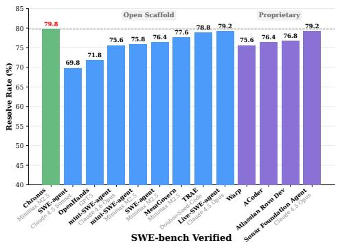
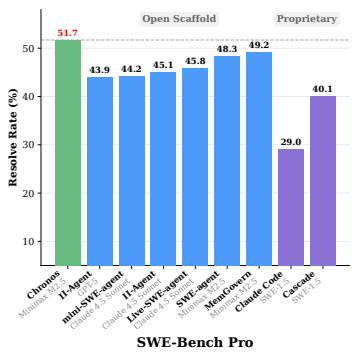
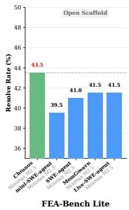
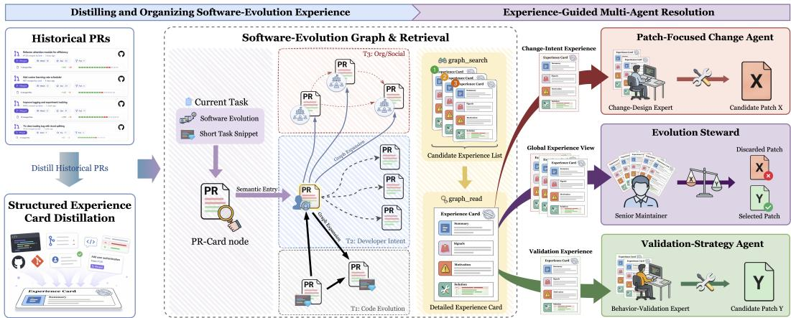
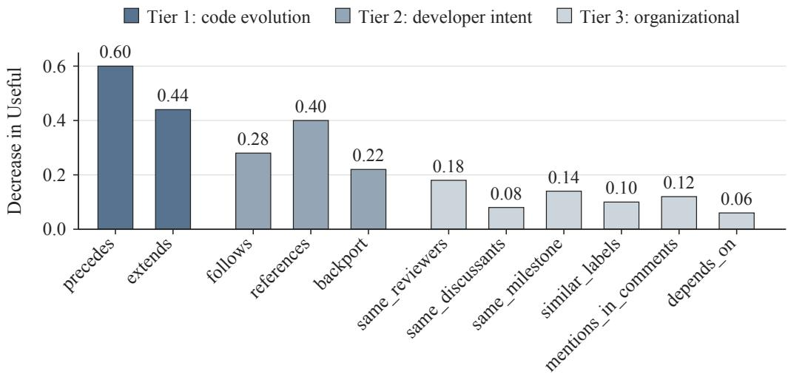

# Chronos Enables Code Agents to Reason over Software Evolution

XIN YIN∗, Zhejiang University, China

YIANG ZHANG∗, Zhejiang University, China

ZHIYUAN PENG, Shanghai Jiao Tong University, China

CHAO NI, Zhejiang University, China

ZHE CUI, Hithink Research, China

XIAOHUA XIN, National Industrial Information Security Development Research Center, China

Historical pull requests record the design decisions, compatibility constraints, and implementation patterns behind a codebase’s current state. Experience relevant to a new task can span related changes whose descriptions emphasize diferent concerns. We introduce Chronos, a test-time framework that makes this connected history available to large language model (LLM)-based code agents. Chronos distills merged pull requests into structured experience cards and connects them through a typed graph of code-level, developer-intent, and organizational relations. Semantic search identifies entry cards, and weighted multi-hop expansion retrieves connected changes for selective reading. The same memory guides candidate generation and patch selection: a patch-focused change agent and a validation-strategy agent each develop a patch, and an evolution steward consults history to select between them. On SWE-Bench Verified, the full workflow improves SWE-Agent across all six evaluated LLM backbones, raising the mean resolution rate from 69.2% to 72.9% and reaching 79.8% with MiniMax M2.5. With the same backbone, it raises resolution rates from 48.3% to 51.7% on SWE-Bench Pro and from 41.0% to 43.5% on FEA-Bench Lite. Both experience-guided single-agent variants also outperform the base agent. In a human evaluation on 100 tasks with ten cards retrieved per task, graph-grounded retrieva increases the mean number of useful cards from 1.24 to 2.87 over flat semantic retrieval. These results demon strate the value of PR relations for retrieving useful repository experience and of the evaluated workflows for applying that experience during patch generation and selection.

CCS Concepts: • Software and its engineering → Software evolution; • Computing methodologies → Machine learning.

Additional Key Words and Phrases: Code agents, software evolution, repository history, graph retrieval

## 1 Introduction

Code agents based on large language models perform repository-level software engineering tasks by inspecting source code, invoking tools, and producing patches. SWE-Bench established a common evaluation setting for real-world issue resolution [Jimenez et al. 2024], and frameworks such as SWE-Agent [Yang et al. 2024] provide tool interfaces for repository exploration and code modification. Software maintenance also encompasses feature implementation [Li et al. 2025; Zhou et al. 2026], compatibility maintenance through code migration [Cheng et al. 2025; Liu et al. 2025], and refactoring [Gautam et al. 2025; Thillen et al. 2026]. Across these tasks, a successful change must satisfy the behavioral requirements and constraints accumulated as a codebase evolves.

The current source tree exposes how a system behaves; its development history records the decisions that shaped that behavior. Pull requests (PRs) connect code changes with the problems that motivated them, review discussions, and implementation choices. This context can explain why a compatibility branch exists, which assumption an earlier fix corrected, or how a component was extended after its introduction. Experienced developers draw on this knowledge when planning new changes. For a code agent, retrieving the relevant history provides access to prior reasoning that would otherwise have to be reconstructed from the current code.

  
Fig. 1. Resolution rates of representative agents across three benchmarks. Labels identify the backbone and scafold of each configuration; Tables 4 and 5 give our backbone-specific comparisons. Each system submits one final patch per task. Colors distinguish Chronos, open-scafold systems, and proprietary systems.

Recent work makes such experience accessible through memory and retrieval. MemGovern [Wang et al. 2026a] organizes human repair experience into structured cards that agents search and browse, while Repository Memory [Wang et al. 2026b] uses a target repository’s commits and linked issues to support localization. These approaches make prior solutions available through task-conditioned search and selective inspection. The organization of that context poses a further challenge: experience relevant to one task can span changes whose descriptions emphasize diferent concerns. An initial repair, a subsequent extension, and a related backport may jointly explain how to adapt a component, although only one strongly matches the current query. Ranking records solely by their similarity to the query leaves these relationships outside the retrieval decision.

Our central insight is that relations between historical changes provide a second retrieval signal for repository experience. PRs expose this signal through repeated changes to the same files, de velopment on newly introduced components, explicit references, and shared workflow context. These observable relations make connected changes discoverable even when their descriptions emphasize diferent symptoms or development objectives. The technical challenge is to follow these relations from semantic entry points, recover additional historical evidence, and prioritize it within a compact shortlist that an agent can inspect.

We introduce Chronos, a test-time framework that turns a repository’s PR history into searchable, graph-structured software-evolution experience. Its memory layer has two complementary parts. Four-field experience cards capture the Summary, Signals, Motivation, and Solution of each historical change. A typed evolution graph connects those cards through code-level continuity, developer intent, and organizational context. At task time, semantic search locates entry-point cards, weighted multi-hop expansion finds connected PRs, and the agent selectively reads the resulting experience. The graph determines which connected changes become candidates for inspection, while the cards explain the rationale and implementation logic needed to apply their experience.

The same memory interface supports both code generation and candidate selection. Our full resolution workflow uses a patch-focused change agent to investigate design intent and a validationstrategy agent to investigate behavioral mismatches and regression risks. Each produces a candidate patch. An evolution steward independently consults the memory and current source code to select the final candidate. Repository experience thus informs two decisions: how to implement a change and which proposed implementation best addresses the task. The retrieval service remains separate from these roles and integrates with existing agent tool interfaces without model fine-tuning.

We evaluate Chronos on SWE-Bench Verified [Chowdhury et al. 2024], SWE-Bench Pro [Deng et al. 2025], and FEA-Bench Lite [Li et al. 2025]. On SWE-Bench Verified, the full workflow improves SWE-Agent across all six evaluated LLM backbones, raising the mean resolution rate from 69.2% to 72.9% and reaching 79.8% with MiniMax M2.5. With the same backbone, Chronos raises resolution rates from 48.3% to 51.7% on SWE-Bench Pro and from 41.0% to 43.5% on FEA-Bench Lite. The two single-agent variants reach 78.4% and 77.8%, compared with 76.4% for the base agent, showing that the experience-guided strategies also improve resolution when each produces a single candidate. In a human evaluation on 100 sampled tasks, graph-grounded retrieval raises the average number of useful cards among ten returned cards from 1.24 to 2.87 and the fraction of tasks receiving useful experience from 68% to 89%, compared with flat semantic retrieval. The benchmark results establish gains for the evaluated resolution workflows, while the retrieval study shows that PR relations help recover useful historical context within a fixed retrieval depth. Figure 1 places the system results alongside representative agent configurations.

## Our contributions are:

• Relational organization of software-evolution experience. We connect PR-level experience cards through eleven relation types spanning code, developer intent, and organizational context. Semantic entry search and weighted graph expansion use these relations to discover and rank connected historical experience.

• Experience use in generation and selection. We expose the memory through search and read tools and integrate it into a resolution workflow with two candidate-producing strategies and an independent history-informed selector. The architecture separates reusable repository memory from the agents that consume it.

• Evaluation of task performance and experience retrieval. We evaluate task resolution on three benchmarks, performance across six backbones on SWE-Bench Verified, and integration with two agent scafolds. Single-agent and retrieval ablations examine component contributions, while human evaluation measures the useful experience recovered through graph expansion and the efect of removing individual relation types.

  
Fig. 2. Overview of Chronos. PR-level experience cards are connected by a typed evolution graph. Search and read tools expose this memory to candidate-generating agents and an evolution steward that selects the fina patch.

## 2 Approach

Chronos turns repository history into experience that agents can retrieve while investigating a new coding task. Its two stages separate memory construction from task-time use (Figure 2). The memory layer distills historical PRs into cards describing the rationale and implementation logic of individual changes, then connects those cards through code-level, developer-intent, and organizational relations. At task time, semantic search locates relevant cards and graph expansion retrieves connected changes beyond the semantic shortlist. Agents read selected cards to guide candidate generation and patch selection.

The full workflow combines a patch-focused change agent and a validation-strategy agent with an evolution steward that selects one of their candidate patches. Single-agent variants use the same memory interface with one candidate-producing strategy.

## 2.1 Distilling and Organizing Software-Evolution Experience

Memory construction produces two linked representations of the same historical PR records. Cards capture the reasoning behind individual changes, and graph edges record the development relations through which those cards can be discovered.

2.1.1 Software-Evolution Experience Distillation. We use merged PRs as historical evolution events and convert each event into a compact, transferable experience card. A raw PR record mixes code difs and review discussion with process updates and repository-specific references. Its rationale and implementation logic are dispersed across these sources. Distillation consolidates that reasoning into a consistent representation that an agent can inspect during its investigation of the current task.

We distill each PR with Qwen3.5-Plus [Qwen Team 2026] into a fixed four-field card. The fields divide the information needed to find a relevant change from the reasoning needed to adapt it: Summary states the evolution task and its high-level resolution in one or two sentences and serves as the embedding anchor; Signals supplies 12–20 concrete retrieval cues covering symptoms or capability gaps, afected component types, APIs, and semantic variants; Motivation explains why the prior software state was inadequate, tracing triggering inputs or capability gaps to the existing behavior; and Solution presents the actionable change logic as a development decision, one to three short annotated code patterns, and three to five implementation pitfalls. Search uses the compact Summary and exposes Signals for relevance assessment; reading the full card supplies Motivation and Solution for implementation reasoning.

The distillation prompt takes the PR title, body, discussion, and patch as input and adapts its analysis to bug fixes, feature additions, refactorings, and performance changes. It removes non technical content and incidental identifiers, including repository and user names, URLs, commit hashes, and version numbers. File paths are allowed only inside Solution code snippets. The original PR identifier links the resulting card to its changed-file metadata and graph node, preserving the source context needed for retrieval. Full prompt templates appear in the supplementary material.

The card and its metadata support diferent uses of the historical record. The card explains why a change was needed and how it was implemented, so a task query can match its technical concepts without reproducing the source PR’s vocabulary. The metadata locates that change within repository development and connects it to earlier and later work. Source identity remains accessible through the PR identifier and linked metadata, even when incidental identifiers have been removed from the embedded text. A card can therefore be discovered through its Summary or through a relation to another PR. After either route, Motivation and Solution help the agent judge whether the underlying assumption and development decision apply to the current task, and how the experience should be adapted to the current code.

2.1.2 Software-Evolution Graph Construction. The second step connects cards using the development relations recorded around their source PRs. Later changes revisit files, extend newly introduced components, cite previous PRs, and share review or release context. We construct a directed multigraph $\mathcal { G } = ( \mathcal { V } , \mathcal { E } )$ over merged PRs, where each node $v \in \mathcal N$ represents one historical evolution event and each typed edge records an observable relation between two events. These links retain development context that abstracted card text omits. Once semantic search identifies a relevant change, retrieval follows links grounded in file continuity, explicit references, or project workflow to find further experience. Table 1 summarizes the eleven edge types, their detection criteria, observed node coverage, and traversal weights.

We organize these edges into three tiers by evidential strength. Tier 1 (Code Evolution, weight 1.0 to 1.5) captures directly observable code-level facts: repeated modification of highly overlapping files or continued development on newly introduced files. Tier 2 (Developer Intent, weight 0.7 to 1.05) encodes explicit intent and short-horizon workflow continuity, including cross-PR references, backports, and same-author follow-ups within nearby directories. Tier 3 (Organizational/Social, weight 0.3 to 0.45) covers indirect project-process metadata such as shared reviewers, milestones, labels, and comment mentions, which remain informative but are typically noisier. The traversal weights give larger bonuses to code and workflow continuity and smaller bonuses to broader organizational associations. All detected relations participate in the same bounded expansion; their weights influence candidate scores rather than imposing a fixed traversal order. We use these hand-specified priors throughout the evaluated settings. Section 5.2 discusses their role in the memory representation.

Traversal-weight assignment. Table 1 defines the relation criteria, node coverage, and weight ranges. The weights encode a prior on how much each relation contributes to a retrieval path. Within an overlap-based or temporal relation, stronger overlap or shorter separation increases the bonus. The formulas below specify these assignments, including the 1.0–1.05 overlap that allows a closely related, temporally nearby follow-up to match or exceed the weakest code-continuity edge.

Tier 1: Code Evolution. extends/extended\_by use a fixed weight of 1.0, because they encode a direct file-creation-to-follow-up-development relation. precedes/succeeds use

$$
w = 0 . 5 + \mathsf { f i l e \_ o v e r l a p } ,
$$

where file\_overlap is the file-level Jaccard similarity. The detection threshold of 0.5 restricts retained edges to similarities in [0.5, 1.0], yielding weights in [1.0, 1.5].

Tier 2: Developer Intent. references\_to/referenced\_by and backport\_of/backported\_to use a fixed weight of 0.7, because their presence already indicates explicit intent. follows/followed\_by use

$$
w = 0 . 7 + 0 . 3 5 \cdot { \frac { t + d } { 2 } } ,
$$

where

$$
t = 1 - \operatorname* { m i n } ( \Delta _ { \mathrm { d a y s } } , 6 0 ) / 6 0
$$

and directory continuity is normalized as

$$
d = \frac { \operatorname* { m i n } ( \operatorname* { m a x } ( s _ { \mathrm { d i r } } , 0 . 5 ) , 1 . 0 ) - 0 . 5 } { 0 . 5 } ,
$$

with $\Delta _ { \mathrm { d a y s } }$ the author time gap in days and $s _ { \mathrm { d i r } }$ the directory Jaccard similarity. This yields weights in [0.7, 1.05], so nearer follow-up work in more similar directories receives a larger bonus; its upper endpoint overlaps the weakest Tier 1 weight.

Table 1. Software evolution graph edge taxonomy. Coverage reports the fraction of nodes with at least one outgoing edge of each type. Weights are assigned to tiers based on evidential strength.
<table><tr><td>Tier</td><td>Edge type (forward / reverse)</td><td>Criterion</td><td>Cov.</td><td>Weight</td></tr><tr><td>T1</td><td>precedes / succeeds</td><td>File-level Jaccard overlap ≥ 0.5 between PRs.</td><td>~62%</td><td>1.0-1.5</td></tr><tr><td></td><td>extends / extended_by</td><td>A later PR continues development on files newly introduced by an earlier PR.</td><td>~13%</td><td>1.0</td></tr><tr><td>T2</td><td>follows / followed_by</td><td>Same author, time gap ≤ 60 days, and directory Jaccard ≥ 0.5.</td><td>~73%</td><td>0.70-1.05</td></tr><tr><td></td><td>backport_of /</td><td>Backport cues detected from title, body, commit messages, or base branch.</td><td>~5%</td><td>0.70</td></tr><tr><td></td><td>backported_to references_to /</td><td>Explicit #N citation in PR body or commit</td><td>~46%</td><td>0.70</td></tr><tr><td></td><td>referenced_by</td><td>messages.</td><td></td><td></td></tr><tr><td>T3</td><td>same_reviewers</td><td>Reviewer overlap (Jaccard ≥ 0.5).</td><td>~28%</td><td>0.30-0.45</td></tr><tr><td></td><td>same_discussants</td><td>Discussion participant overlap (Jaccard</td><td>~10%</td><td>0.30-0.45</td></tr><tr><td></td><td>same_milestone</td><td>≥ 0.7). Shared project milestone.</td><td>~31%</td><td>0.30</td></tr><tr><td></td><td>similar_labels</td><td>Label overlap (Jaccard ≥ 0.5).</td><td>~30%</td><td>0.30-0.45</td></tr><tr><td></td><td>mentions_in_comments/ mentioned_by_in_</td><td>Cross-PR mentions through discussion or</td><td>~17%</td><td>0.30</td></tr><tr><td></td><td>comments depends_on / dependency_</td><td>review comments. Explicit dependency cues extracted from PR ~0.03%</td><td></td><td></td></tr></table>

Tier 3: Organizational / Social. same\_milestone, mentions\_in\_comments, mentioned\_by\_ in\_comments, depends\_on, and dependency\_of use a fixed weight of 0.3. Three overlap-based relations use small dynamic bonuses above this base value:

$$
\begin{array} { r l } & { w _ { \mathrm { r e v } } = 0 . 3 + 0 . 1 5 \cdot \frac { \operatorname* { m i n } ( \operatorname* { m a x } ( s _ { \mathrm { r e v } } , 0 . 5 ) , 1 . 0 ) - 0 . 5 } { 0 . 5 } , } \\ & { w _ { \mathrm { d i s } } = 0 . 3 + 0 . 1 5 \cdot \frac { \operatorname* { m i n } ( \operatorname* { m a x } ( s _ { \mathrm { d i s } } , 0 . 7 ) , 1 . 0 ) - 0 . 7 } { 0 . 3 } , } \\ & { w _ { \mathrm { l a b } } = 0 . 3 + 0 . 1 5 \cdot \frac { \operatorname* { m i n } ( \operatorname* { m a x } ( s _ { \mathrm { l a b } } , 0 . 5 ) , 1 . 0 ) - 0 . 5 } { 0 . 5 } , } \end{array}
$$

where $s _ { \mathrm { r e v } } , s _ { \mathrm { d i s } } ,$ and $s _ { \mathrm { l a b } }$ denote reviewer, discussant, and label Jaccard similarities, respectively. These formulas yield weights in [0.3, 0.45], giving organizational metadata a smaller per-edge contribution than code-grounded and explicit-intent relations.

## 2.2 Retrieving and Applying Software-Evolution Experience

2.2.1 Agentic Search over Graph-Grounded Experience. At task time, agents search and read software-evolution experience as their understanding of the current task develops. The graph server combines semantic entry search with relation-based expansion, retrieving connected PRs beyond the semantic shortlist. Two tool calls expose this memory through a shortlist-then-read workflow. The agent first calls graph\_search to obtain a small set of historical PR candidates, then calls graph\_read on those whose experience appears relevant. Algorithm 1 summarizes the bounded retrieval procedure and the filters applied during expansion.

Search experience. The graph\_search tool is the agent’s retrieval interface. It accepts a naturallanguage task summary, optional filename hints, and bounded retrieval parameters, and returns a lightweight shortlist of semantic and graph-expanded candidates. The server ranks semantic and graph-expanded candidates within their respective groups. The agent-facing shortlist displays each PR’s identifier, summary, signals, and a short list of changed files, providing the information needed to assess relevance before reading a full card. The query � summarizes the current task, and each card is indexed by the embedding of its Summary. We use DashScope text-embedding-v4 to compute $\mathbf { e } _ { q } , \mathbf { e } _ { v } \in \mathbb { R } ^ { 2 0 4 8 }$ . The index uses cosine distance to return up to 10� nearest neighbors. Let $\mathcal { P } _ { q }$ be the candidates that remain after applying the repository, temporal, and optional filename filters described below. The server retains up to � entries in their cosine-similarity order:

$$
S _ { 0 } = \mathrm { T o p K } \big \{ v \in \mathcal { P } _ { q } \big | \cos ( \mathbf { e } _ { q } , \mathbf { e } _ { v } ) \big \}\tag{1}
$$

Each entry carries a nonnegative relevance score $a _ { v } = \operatorname* { m a x } \{ 0 , \cos ( { \bf e } _ { q } , { \bf e } _ { v } ) \}$ . Chronos expands from these entries along typed PR relations, adding connected experience according to both entry relevance and graph evidence. Starting from $S _ { 0 }$ as the BFS frontier, we expand up to � hops (default � = 3) with a bounded breadth-first traversal, and score each newly discovered node � reachable from entry $v _ { 0 } \in S _ { 0 }$ along path $\pi = ( v _ { 0 } , e _ { 1 } , v _ { 1 } , \ldots , e _ { h } , u )$ as:

$$
\operatorname { s c o r e } ( u \mid v _ { 0 } , \pi ) = a _ { v _ { 0 } } \cdot \exp \left( - { \frac { h } { \lambda } } \right) \cdot \left( 1 + \sum _ { i = 1 } ^ { h } w _ { e _ { i } } \right)\tag{2}
$$

where the three factors are entry relevance, a path-length penalty, and an accumulated relation bonus; ℎ is the number of edges on �, $\lambda = 3 . 0$ is the decay constant, and $w _ { e _ { i } }$ is the edge weight specified in Table 1. The score balances path length against relational evidence: a longer path can rank higher when its accumulated edge weights outweigh the additional length penalty. The hop limit bounds the historical neighborhood explored from each entry. When multiple explored paths reach �, we retain the maximum score. The server returns the semantic entries first, followed by up to � graph-expanded PRs ranked by this score and excluding the entries. The resulting shortlist R contains at most 2� distinct PRs.

The two result groups allocate the shortlist between direct semantic matches and connected historical changes. Reserved positions keep the semantic entries available to the agent while the additional positions broaden the search through PR relations. An expanded node is scored using its originating entry’s similarity and the traversed relations, so its own Summary need not rank highly against the query. Expansion can therefore recover a PR outside the initial 10� vector candidates, provided an eligible path reaches it. The graph changes the candidate pool through these connections. Ranking the groups separately also avoids treating cosine similarity and a relation-augmented score as interchangeable measures of relevance. Within the expanded group, the maximum over explored paths assigns one score to each PR, even when several entries or relation sequences reach it. Each PR occupies at most one shortlist position, so multiple routes to the same change leave room for other experiences.

Read experience. Given a candidate PR identifier, graph\_read returns the complete four-field card for detailed reasoning. The shared identifier links the Summary in the vector index to the full card and graph metadata on the server. The server response retains retrieval scores and paths, while the printed search output exposes the shortlist fields used for relevance assessment. After inspecting a card’s Motivation and Solution, the agent can refine its query as source-code investigation clarifies the task. The investigation thus determines which experiences the agent reads in full and whether further retrieval is needed.

Algorithm 1 Bounded graph-grounded experience retrieval   
Require: Graph $\mathcal { G } _ { : }$ , query $q ,$ task scope, optional filenames, entry/result limit �, hop limit $H ,$   
frontier limit �   
Ensure: Ordered shortlist R with at most 2� PRs   
1: Define eligible(�) using repository, time, and filename filters   
2: $\mathcal { P } _ { q }$ ← eligible PRs among the index’s 10� nearest candidates   
3: $S _ { 0 }$ ← up to � entries from $\mathcal { P } _ { q }$ in semantic order   
4: $a _ { v } \gets \operatorname* { m a x } \{ 0 , \cos ( { \bf e } _ { q } , { \bf e } _ { v } ) \}$ for $v \in S _ { 0 }$   
5: $\mathcal { F }  \{ ( v , [ v ] , a _ { v } , 0 ) : v \in S _ { 0 } \}$ ; best $ \emptyset$   
6: for $h = 1 , \ldots , H$ do   
7: $\mathcal { F } _ { \mathrm { n e x t } }  \emptyset$   
8: for each state $( u , \pi , a , g )$ in $\mathcal { F }$ do   
9: for each outgoing typed edge $\boldsymbol { e } = \left( u , \boldsymbol { v } \right)$ do   
10: if � ∉ � and eligible(�) then   
11: $g ^ { \prime } \gets g + w _ { e } ; s \gets a \exp ( - h / \lambda ) ( 1 + g ^ { \prime } )$   
12: if � ∉ best or $s >$ best[�].score then   
13: $\pi ^ { \prime }  \pi \parallel [ v ]$   
14: best $[ v ]  ( s , \pi ^ { \prime } , a , g ^ { \prime } )$   
15: Append $( v , \pi ^ { \prime } , a , g ^ { \prime } )$ to $\mathcal { F } _ { \mathrm { n e x t } }$   
16: end if   
17: end if   
18: end for   
19: end for   
20: $\mathcal { F }  \mathrm { u p }$ to � next states ranked by their node’s best score   
21: if ${ \mathcal { F } } = \emptyset$ then   
22: break   
23: end if   
24: end for   
25: $S _ { g } \gets \mathrm { t o p } { - } K$ nodes in best excluding $S _ { 0 }$   
26: return $S _ { 0 } \parallel S _ { g }$

Repository and temporal scope. Retrieval is scoped to the current task instance. The server derives the repository from the instance identifier and uses the task PR’s creation time as the cutof. The same scope applies to semantic entry selection and graph expansion. A PR is excluded when its recorded creation or merge time is at or after the cutof. Filtering both stages prevents expansion from reintroducing a later change through an otherwise eligible entry point. Optional filename constraints select PRs that touch an exact path or a matching path sufix; they constrain both returned semantic candidates and traversed neighbors. Queries without filenames allow broader search within the task repository. Filtering the finite semantic candidate pool can yield fewer than � entries even when additional eligible PRs exist elsewhere in the index.

Traversal state and search budget. Each frontier state carries the current PR, the path used to reach it, the originating semantic score, and the accumulated edge-weight bonus. Expansion preserves the entry score while updating the path length and graph bonus in Equation 2. A node already on the current path is skipped, so a cycle cannot accumulate weight by repeatedly revisiting the same PR. The server records each newly reached candidate and updates its record when a path improves the stored score. Traversal stops when no frontier remains or the hop limit is reached. In our implementation, each subsequent frontier is capped at � = 200 states. This limits how many states continue through densely connected regions, prioritizing states by their nodes’ highest scores among the explored paths.

Relation types remain distinct during traversal. Because G is a multigraph, the same ordered pair of PRs can be connected by several edge types. Each outgoing typed edge supplies an alternative extension of the current path, and Equation 2 uses the weight of that edge. The relation bonus therefore sums weights along a path, rather than summing all metadata associations between each pair of adjacent PRs. For parallel edges extending the same frontier state, the larger weight produces the higher candidate score when the entry relevance is positive. The stored maximum retains that score, while the PR still occupies one result position. Diferent forms of historical evidence thus provide alternative retrieval routes without accumulating bonuses for several relation types on the same connection. Multi-hop bonuses require traversing successive PRs within the eligible historical neighborhood.

The hop and frontier limits bound graph exploration, while the 2� result limit bounds the shortlist exposed to the agent. Expansion preserves the semantic entries and allocates the additional � positions to connected history. Repository, temporal, and filename filters can further reduce the number of returned PRs.

2.2.2 Multi-Agent Collaboration over Software Evolution. The full workflow generates two candi dates in separate agent runs, then selects between them through an independent review informed by repository history. Both candidate agents receive the current task and repository. They are instructed to inspect relevant source files, reproduce the behavior gap, modify the source code, rerun the reproduction, and consider related edge cases. Their roles difer in how they formulate retrieval queries and judge the applicability of a precedent. Full role prompts appear in the supplementary material.

Patch-focused change agent. This agent formulates queries around design intent, including the broken invariant, violated assumption, and desired behavior. It reads relevant cards to understand the reasoning behind prior changes and assesses whether that reasoning addresses the same kind of logical flaw. Experience from the same module is a strong relevance signal. Experience from another module can also guide implementation when the underlying invariant or assumption transfers. The agent further considers whether the precedent’s implementation complexity is appropriate for the current task.

Validation-strategy agent. This agent formulates queries around diferences between expected and actual behavior, emphasizing concrete symptoms, afected APIs, and regression risks. It consults history to resolve uncertainty about unfamiliar APIs or complex changes, reading cards about similar files or the same type of behavioral issue. To assess applicability, it checks whether the experience concerns the same module and behavioral mismatch, and whether the proposed complexity is appropriate. Experience from another module primarily serves as a conceptual reference. Both candidate prompts encourage agents to stop retrieving once one or two relevant experiences provide a clear direction and to adapt the retrieved reasoning to the current source code.

Evolution steward. For distinct, non-empty candidate patches $C _ { x }$ and $C _ { y } ,$ the steward receives the task description and both difs. Their X/Y order is randomized when review instances are constructed to reduce position bias. The steward can inspect current source code and independently retrieve cards from both change-intent and validation perspectives. It analyzes each patch’s modifications, treatment of the root cause, consistency with historical experience, and missed or newly introduced edge cases. The decision criterion is logical correctness, excluding patch length, style, and comment density. Calling choose\_patch x or choose\_patch y records the verdict and ends the session. The steward selects an existing candidate without editing files or generating a third patch.

Table 2. Routing of candidate patches before final submission. Equality is checked after stripping surrounding whitespace.
<table><tr><td>Candidate outputs</td><td>Selection action</td></tr><tr><td>Two identical, non-empty patches</td><td>Retain the shared patch directly.</td></tr><tr><td>One non-empty patch</td><td>Retain the available patch directly</td></tr><tr><td>Two empty patches</td><td>Submit an empty patch.</td></tr><tr><td>Two distinct, non-empty patches</td><td>Randomize their X/Y order and invoke the steward.</td></tr></table>

Historical experience informs a diferent decision at each stage. During generation, it helps an agent determine what to change and which behavior to preserve. During selection, the candidate difs make those questions concrete: the steward compares proposed modifications with relevant historical rationale and examines whether that rationale applies to the afected code. Its independent search can use the candidate content to guide retrieval beyond the cards consulted by either generator. The final choice is grounded in the current task and source code, with history supplying development constraints for comparing the two available implementations.

The component ablations in Section 4.3 retain one candidate-producing perspective and bypass two-candidate selection. The routing procedure below handles identical or empty outputs before invoking the steward.

Candidate routing and final patch. Table 2 defines how candidate outputs enter the selection stage. Cases with identical patches or fewer than two non-empty patches are resolved directly; distinct, non-empty patches enter steward review. Each task submits one selected patch.

Each review instance retains the mapping from X/Y to the originating strategy, so the recorded decision identifies the corresponding original candidate. If a review session produces no valid X/Y choice, the implementation selects one of the two existing candidates at random using a fixed seed. The benchmark then evaluates the selected patch using the tests for the current task.

## 3 Experimental Setup

## 3.1 Agents and Retrieval Configuration

We integrate Chronos’s structured software-evolution experience and graph-grounded search into SWE-Agent [Yang et al. 2024] and compare the resulting workflow with vanilla SWE-Agent. We also implement a mini-SWE-Agent variant, denoted Chronos mini, to examine integration with a second scafold. The same retrieval-tool interface is in principle compatible with other scafolds, including OpenHands [Wang et al. 2025b].

Unless otherwise noted, each agent run has a limit of 250 steps, a cost budget of \$1.5, and a context window of 200k tokens. The full workflow includes two candidate-generation runs and invokes the steward for distinct, non-empty candidates, as specified in Table 2. The graph server runs as a persistent service, with � = 5 semantic entry points and � = 3 expansion hops. Each query returns a shortlist of at most ten experience cards. On SWE-Bench Verified, we evaluate GPT-5 Mini, Claude 4.5 Haiku, Gemini 3 Flash, Kimi K2.5, Qwen3-Max, and MiniMax M2.5. The two transfer benchmarks use MiniMax M2.5, the strongest evaluated backbone on SWE-Bench Verified.

Historical retrieval is scoped to each target instance. The server resolves the repository and temporal cutof from the instance identifier and excludes PRs whose recorded creation or merge timestamp is at or after that cutof. These filters apply to semantic entry selection and graph expansion (Algorithm 1). Each workflow submits one final patch per task. Section 4.2 describes independent repetitions of the full configuration.

Table 3. Benchmark subsets used in the evaluation, with task and repository counts.
<table><tr><td>Benchmark</td><td>Tasks</td><td>Repos.</td><td>Task emphasis</td></tr><tr><td>SWE-Bench Verified</td><td>500</td><td>12</td><td>Human-verified issue resolution</td></tr><tr><td>SWE-Bench Pro (public)</td><td>731</td><td>11</td><td>Longer-horizon repository-level changes</td></tr><tr><td>FEA-Bench Lite</td><td>200</td><td>48</td><td>New feature implementation</td></tr></table>

## 3.2 Benchmarks and Task Coverage

We evaluate issue resolution and feature implementation on the three benchmark subsets in Table 3.

SWE-Bench Verified. SWE-Bench Verified [Chowdhury et al. 2024] is a human-filtered subset of 500 SWE-Bench instances. Human review screens for well-specified issue descriptions and appropriately scoped unit tests. We use it as the primary issue-resolution benchmark and evaluate all six backbones on it.

SWE-Bench Pro. SWE-Bench Pro [Deng et al. 2025] targets longer-horizon changes in large codebases. Its full collection contains 1,865 tasks from 41 repositories; the public setting used here contains 731 tasks from 11 repositories. Human-augmented requirements and interface specifications clarify the expected behavior. This setting tests experience reuse in changes that require more extensive coordination across files and implementation constraints.

FEA-Bench Lite. FEA-Bench [Li et al. 2025] derives feature-implementation tasks from PRs and pairs them with unit tests. The full dataset has 1,401 tasks from 83 repositories; its Lite subset has 200 tasks from 48 repositories. We use the Lite subset to evaluate the addition of new components together with edits to existing code. These tasks test the integration of new behavior into the repository’s established structure.

Resolution rate is the fraction of target tasks solved by the submitted patches under the corresponding benchmark evaluation. Across benchmarks, we retain the graph-construction rules, card schema, and default weight formulas without benchmark-specific retuning. The historical content is scoped to the repository of each target task.

## 3.3 Human Evaluation of Retrieved Experience

We conduct an internal expert annotation study to assess whether retrieved cards provide useful guidance for the current task. We randomly sample 100 SWE-Bench Verified instances and retrieve the top-ten cards for each task under Random, Embedding, and Chronos. Random samples cards uniformly from the knowledge base, Embedding ranks cards by cosine similarity, and Chronos uses graph-grounded search. All methods use the same task sample and retrieval depth.

Annotation inputs and rubric. Two members of our research team with professional software engineering experience independently label each retrieved card using the task description and all four card fields: Summary, Signals, Motivation, and Solution. A card is useful when it identifies a transferable implementation pattern, failure mode, compatibility constraint, design rationale, or validation strategy that can directly help produce or check a patch for the current task. The remaining cards are not useful; topical similarity or a matching identifier alone does not establish actionable guidance.

Annotators focus on transferable root causes, implementation constraints, afected components, and implications for validation, without consulting external information. Usefulness is task-conditioned: a card from a diferent component can be useful when its reasoning applies to the current task.

Agreement and reported metrics. Disagreements are resolved through discussion. Inter-annotator agreement before adjudication is Cohen’s $\kappa = 0 . 8 6$ . For task � and retrieved card �, let $u _ { i j } = 1$ for an adjudicated useful card and $u _ { i j } = 0$ otherwise. With $N = 1 0 0$ tasks and $m = 1 0$ cards per task, we report

$$
\mathrm { U s e f u l } = \frac { 1 } { N } \sum _ { i = 1 } ^ { N } \sum _ { j = 1 } ^ { m } u _ { i j } ,\tag{3}
$$

$$
\mathrm { H i t } = \frac { 1 } { N } \sum _ { i = 1 } ^ { N } { 1 \big \{ \sum _ { j = 1 } ^ { m } { { u _ { i j } } } > 0 \big \} } .\tag{4}
$$

Here, 1{·} denotes the indicator function. Useful measures the mean number of useful cards per task, while Hit measures the fraction of tasks receiving at least one useful card. The edge-type ablation uses the same annotation protocol to measure changes in Useful.

## 4 Evaluation

## 4.1 Main Results

SWE-Bench Verified. Table 4 reports resolution rates across six LLM backbones. The full Chronos workflow improves SWE-Agent on all six, raising the mean resolution rate from 69.2% to 72.9%, a gain of 3.7 percentage points (pp). Qwen3-Max gains +6.2pp, and the other backbones gain +2.8pp to +3.6pp. Gains occur with both the lowest-scoring base configuration, GPT-5 Mini, and the highest-scoring one, MiniMax M2.5, showing that the workflow improves performance across the evaluated range of backbones. The analyses below examine run-to-run stability, integration with diferent scafolds, and the contributions of candidate generation and retrieval.

Table 4. Resolution rates (%) on SWE-Bench Verified. Δ is the gain in percentage points.
<table><tr><td>LLM Backbone</td><td>SWE-Agent</td><td>Chronos</td><td>Δ</td></tr><tr><td>GPT-5 Mini</td><td>57.2%</td><td>60.4%</td><td>+3.2</td></tr><tr><td>Claude 4.5 Haiku</td><td>65.6%</td><td>68.4%</td><td>+2.8</td></tr><tr><td>Gemini 3 Flash</td><td>75.8%</td><td>78.6%</td><td>+2.8</td></tr><tr><td>K Kimi K2.5</td><td>71.2%</td><td>74.8%</td><td>+3.6</td></tr><tr><td>Qwen3-Max</td><td>69.0%</td><td>75.2%</td><td>+6.2</td></tr><tr><td>MiniMax M2.5</td><td>76.4%</td><td>79.8%</td><td>+3.4</td></tr><tr><td>Average</td><td>69.2%</td><td>72.9%</td><td>+3.7</td></tr></table>

SWE-Bench Pro and FEA-Bench Lite. With MiniMax M2.5, Chronos raises the resolution rate from 48.3% to 51.7% (+3.4pp) on SWE-Bench Pro and from 41.0% to 43.5% (+2.5pp) on FEA-Bench Lite (Table 5). These gains extend the result from standard issue resolution to longer-horizon repair and feature implementation. The graph-construction rules and default weight formulas remain unchanged across benchmarks, with historical content drawn from each target repository (Section 3.2). The same memory-construction and retrieval procedures therefore support distinct development tasks without benchmark-specific retuning.

Table 5. Resolution rates (%) on the transfer benchmarks using MiniMax M2.5. Δ is the gain in percentage points.
<table><tr><td>Benchmark</td><td>SWE-Agent</td><td>Chronos</td><td>Δ</td></tr><tr><td>SWE-Bench Pro</td><td>48.3</td><td>51.7</td><td>+3.4</td></tr><tr><td>FEA-Bench Lite</td><td>41.0</td><td>43.5</td><td>+2.5</td></tr></table>

## 4.2 Run-to-Run Stability

We repeated the full Chronos configuration with the SWE-Agent scafold and MiniMax M2.5 five times over all 500 SWE-Bench Verified instances. The graph, retrieval parameters, prompts, step limits, and per-agent cost limits remain fixed across runs; backbone sampling varies between repetitions. The resolution rates are 79.8%, 80.0%, 80.6%, 79.6%, and 80.0%, giving a mean of 80.0%, a sample standard deviation of 0.37pp, and a standard error of 0.17pp. The 95% Student’s � interval for this configuration’s mean is [79.5%, 80.5%]. The five runs span 1.0pp, and the lowest result, 79.6%, remains 3.2pp above the reported SWE-Agent reference of 76.4%.

Table 4 reports the first Chronos run, 79.8%. Each repetition submits its own final patches, without pooling candidates across runs. The baseline and other configurations use single runs. The interval therefore characterizes the mean performance of the repeated full configuration, rather than the diference between methods.

## 4.3 Ablation

Table 6 examines Chronos with MiniMax M2.5 along three dimensions: integration with two scafolds, operation with one or two candidate-producing strategies, and graph-grounded versus flat semantic retrieval. The single-agent variants retain graph-grounded experience search and bypass the steward, so each produces one candidate patch.

Scafold integration. Chronos raises SWE-Agent from 76.4% to 79.8% and mini-SWE-Agent from 75.8% to 79.2%, yielding the same +3.4pp gain under both scafolds. These results show that the same memory interface supports two agent implementations while preserving the graph-construction and retrieval procedures.

Single-agent use and candidate selection. The change-agent variant reaches 78.4%, and the validation-agent variant reaches 77.8%. Each exceeds the 76.4% SWE-Agent baseline while generating one candidate without steward selection. The gains therefore extend to both experienceguided strategies in single-candidate operation. Combining the two strategies with the steward reaches 79.8%, an additional 1.4pp over the change-agent variant and 2.0pp over the validation-agent variant. The full workflow achieves the highest resolution rate among the evaluated configurations.

Relational experience retrieval. The full workflow reaches a resolution rate of 79.8% with graph-grounded retrieval and 79.0% with flat semantic search, a gain of +0.8pp. The retrieval study in Section 4.4 examines how this component changes the experience available to the agents. The human study measures the usefulness of retrieved cards, while this ablation measures the efect of retrieval choice within the full coding workflow.

## 4.4 Retrieval Quality and Relation Contributions

Human evaluation of retrieved experience. Table 7 reports the internal expert evaluation on 100 SWE-Bench Verified tasks using the protocol in Section 3.3. At the same depth of ten cards, Chronos more than doubles Useful relative to Embedding, from 1.24 to 2.87, and raises Hit from 68% to 89%. Graph-grounded retrieval thus increases both the number of useful cards and the fraction of tasks receiving at least one. Random retrieval yields 0.18 useful cards and 14% Hit, indicating that relevant experience must be selected from the card store.

Table 6. Component and scafold comparisons on SWE-Bench Verified with MiniMax M2.5. Single-agent variants retain graph retrieval and produce one patch without steward selection. Δ is relative to full Chronos using the same scafold.
<table><tr><td>Configuration</td><td>Rate (%)</td><td>Δ</td></tr><tr><td>Chronos (SWE-Agent)</td><td>79.8</td><td></td></tr><tr><td>Chronos (mini-SWE-Agent)</td><td>79.2</td><td></td></tr><tr><td>w/o validation-strategy agent</td><td>78.4</td><td>-1.4</td></tr><tr><td>w/o patch-focused change agent</td><td>77.8</td><td>-2.0</td></tr><tr><td>w/o software-evolution graph</td><td>79.0</td><td>-0.8</td></tr><tr><td>SWE-Agent</td><td>76.4</td><td>-3.4</td></tr><tr><td>mini-SWE-Agent</td><td>75.8</td><td>-3.4</td></tr></table>

Semantic ranking finds individually similar changes; graph expansion also reaches changes connected through code, intent, or workflow evidence. The human judgments show that this expanded search retrieves more applicable historical guidance within a fixed top-ten shortlist. Task resolution additionally requires the agent to select and adapt that guidance to the current code. The retrieval and benchmark evaluations therefore assess successive stages of experience reuse.

Useful and Hit distinguish two aspects of retrieval quality: how many tasks receive useful experience and how much useful experience those tasks receive. At a depth of ten cards, the reported Useful values correspond to useful-card fractions of 12.4% for Embedding and 28.7% for Chronos. Dividing Useful by Hit gives approximately 1.82 and 3.22 useful cards, respectively, among tasks with at least one useful card. These values are derived from the same annotations. The aggregate improvement therefore combines broader coverage with more useful experience per covered task. For an agent that reads a subset of the shortlist, the higher useful-card fraction ofers more task-applicable material to choose from while keeping the number of displayed candidates fixed.

Table 7. Human evaluation of retrieval quality on 100 randomly sampled SWE-Bench Verified instances. Useful is the average number of useful cards among the top-10 retrieved; Hit is the fraction of instances with at least one useful experience in the top-10.
<table><tr><td>Retrieval Method</td><td>Useful</td><td>Hit</td></tr><tr><td>Random</td><td>0.18</td><td>14%</td></tr><tr><td>Embedding</td><td>1.24</td><td>68%</td></tr><tr><td>Chronos</td><td>2.87</td><td>89%</td></tr></table>

Edge type contribution. Figure 3 removes each edge type from graph expansion and measures the decrease in Useful under the same annotation protocol. The largest drops occur for the code-continuity relations precedes (0.60) and extends (0.44). Developer-intent relations follow: references decreases Useful by 0.40, follows by 0.28, and backport by 0.22. Organizational relations produce smaller drops, ranging from 0.06 to 0.18. Under the tested retrieval configuration, this pattern supports prioritizing code-grounded links while using developer-intent and organizational relations to recover additional useful experience.

The removal losses also distinguish relation coverage from retrieval value. In Table 1, follows has the broadest reported node coverage, yet removing precedes produces a larger loss in Useful. Coverage describes how widely a relation occurs in the stored graph, whereas removal loss measures its efect on useful cards returned for the evaluated queries. A frequent relation need not provide the most useful route for a particular task. Removing an edge type can change both which PRs are reachable and which explored paths determine their scores. Each bar therefore measures the efect of removing one relation type from the full graph; the losses are not additive shares of a fixed total. Their ordering reflects the retrieval value of the relation types in the presence of the remaining graph structure.

  
Fig. 3. Per-edge-type ablation. Bars show the decrease in Useful (average useful cards among the top-10 retrieved) after removing each relation; larger drops indicate a greater loss of useful cards under the tested configuration.

## 5 Discussion and Threats to Validity

## 5.1 Repository Experience as a Reusable Memory Layer

The evaluated integrations show that the same repository memory can support both singlecandidate agents and a workflow that generates and selects between candidates. The same search and read interfaces serve SWE-Agent and mini-SWE-Agent, separating historical memory from the scafold responsible for repository interaction. Across benchmarks, the card schema, graphconstruction rules, and retrieval procedure are shared, while the historical content belongs to each target repository. The gains on issue resolution and feature implementation show the value of separating reusable development knowledge from the agents that apply it, without requiring model fine-tuning.

## 5.2 What Relations Add to Experience Cards

Historical relevance depends on both what a change describes and how it relates to other development work. Connected PRs can address diferent symptoms or objectives and therefore occupy diferent positions in a semantic ranking. Graph expansion brings their shared code, explicit references, follow-up work, and workflow context into candidate discovery. These relations determine which additional cards the server retrieves. The agent then uses the cards’ motivation and solution to judge whether the historical reasoning applies to the current code.

The increase in Useful and Hit shows the value of this organization for recovering actionable experience. The relation-removal results favor code continuity, with developer-intent and organizational links providing additional retrieval value under the tested configuration. The weights encode a hand-specified retrieval prior and remain unchanged across the evaluated benchmarks. The relation-removal experiment evaluates contributions under this fixed prior; sensitivity to the numerical weight constants remains unmeasured.

## 5.3 Computational Structure

PR distillation, embedding, and graph construction incur preprocessing costs when the repository memory is built or updated. The resulting memory can serve multiple tasks from the same repository. Online retrieval requires query embedding and bounded graph traversal, while card inspection consumes agent context.

The retrieval parameters control diferent parts ofthis online work. At the default � = 5, semantic search requests up to 50 index candidates before filtering, and the final shortlist contains at most ten PRs. The hop limit � bounds the distance from a semantic entry, while the frontier limit � bounds the number of states that continue to the next hop. Expanding a state still requires inspecting its outgoing edges, so neighborhood density afects traversal work even when � and � are fixed. The result limit controls how much candidate metadata reaches the agent. Subsequent read calls add full cards to the context, with the number of calls determined by the investigation. Graph exploration, shortlist size, and full-card reading therefore incur diferent costs, allowing the server to search more history than the agent ultimately reads.

The full resolution workflow also runs two candidate generators and invokes the steward for distinct, non-empty candidates, following Table 2. The step and cost limits apply per agent run, so total task expenditure includes both generation runs, any steward run, and retrieval. The singleagent variants provide an alternative execution path through the same memory. Section 4.3 reports their resolution rates under the same per-agent limits.

## 5.4 Evidence Scope and Experience Quality

LLM distillation of PR descriptions, discussions, and patches can omit context or introduce inaccuracies. The human study measures task-conditioned usefulness rather than source-level factual accuracy. Agreement between the two internal annotators is � = 0.86 before adjudication; their shared research context can introduce evaluator bias. The prompts require agents to inspect current code and assess retrieved experience before using it.

The evaluation covers six backbones on SWE-Bench Verified and MiniMax M2.5 on the two transfer benchmarks. Repeated-run statistics describe the full MiniMax configuration; the baseline and remaining configurations use single runs. The single-agent variants combine graph retrieval with role-specific prompting, so their gains over SWE-Agent reflect that combination. Removing a strategy also removes the second candidate and steward selection, so the full workflow’s additional gain reflects their combined efect. Historical retrieval is restricted by recorded PR creation and merge timestamps as described in Section 3.

## 5.5 Implications for Software Maintenance

Repository history records implementation patterns, constraints, and rationales that are often revisited during maintenance. Chronos makes these records searchable when an agent develops or reviews a new change. Retrieved experience supplies hypotheses and constraints for investigating current code, connecting repository-history mining to automated code modification. Memory contributes prior development knowledge to this process, while tests and code review assess the resulting patches.

The reusable unit is a development decision together with the conditions that motivated it. A historical Solution describes an implementation in an earlier software state, while Motivation explains the behavioral gap or assumption that made the implementation appropriate. Reading them together helps an agent determine which parts of the experience transfer to the current code. Relations connect that decision to subsequent development on the same files or to explicitly linked work, extending the historical context available for inspection. Repository history thus becomes a connected record of evolving requirements and implementation choices. This representation supports reasoning about the constraints a change must preserve and the rationale for modifying the code, as well as the concrete implementation itself.

## 6 Related Work

## 6.1 Software Engineering Agents and Benchmarks

Automated program repair has progressed from search-based methods [Kim et al. 2013; Le Goues et al. 2012] and sequence-to-sequence models [Chen et al. 2021; Lutellier et al. 2020] to interactive LLM-based repair. Feedback-driven methods [Xia and Zhang 2024; Yin et al. 2024] use execution signals across turns, while ReduceFix [Yang et al. 2026] reduces test inputs while preserving failure-inducing behavior to guide patch generation. AutoCodeRover [Zhang et al. 2024], Open-Hands [Wang et al. 2025b], and Trae Agent [Gao et al. 2025] support repository exploration and code modification. PlayCoder [Peng et al. 2026] combines repository-aware GUI code generation with interactive testing and iterative repair. Agentless [Xia et al. 2025] simplifies the workflow, while SWE-RL [Wei et al. 2025] and Kimi [Kimi Team et al. 2025] improve models through reinforcementlearning-based post-training.

SWE-Bench [Jimenez et al. 2024] evaluates repository-level issue resolution, while SWE-Bench Pro [Deng et al. 2025], SWE-PolyBench [Rashid et al. 2025], Multi-SWE-bench [Zan et al. 2025], and SWE-rebench [Badertdinov et al. 2025] extend evaluation to harder tasks, multiple programming languages, or continually collected instances. Other benchmarks cover feature implementation [Li et al. 2025; Zhou et al. 2026], migration [Cheng et al. 2025; Liu et al. 2025], and refactoring [Gautam et al. 2025; Thillen et al. 2026]. Chronos complements these agents with historical PR experience for candidate generation and selection.

## 6.2 Knowledge Reuse for Software Engineering Agents

Retrieval-augmented generation [Lewis et al. 2020] supplies code tasks with retrieved snippets, API usages, documentation, or repository fragments [Ding et al. 2023; Lu et al. 2022; Parvez et al. 2021; Wang et al. 2025a; Zhang et al. 2023; Zhou et al. 2023]. Graph-based retrieval organizes source material through relations [Edge et al. 2024; Hu et al. 2025; Mostafa et al. 2024], while agent-memory systems reuse episodic records, skills, and reflections across interactions [Packer et al. 2023; Park et al. 2023; Shinn et al. 2023; Wang et al. 2023; Zhao et al. 2024; Zhong et al. 2024].

Code graphs represent program structure for repository exploration and generation. LocAgent [Chen et al. 2025b] navigates files, classes, and functions through dependency relations for code localization. GraphCoder [Liu et al. 2024] combines control flow and control/data dependence in statement-level graphs to retrieve code contexts for completion. CGM [Tao et al. 2025] encodes code-entity semantics as node tokens and uses graph adjacency to constrain attention in a trained model. RepoDistill [Yin et al. 2026] combines graph-based retrieval with learned token-budget allocation to compress repository context. Chronos uses a graph of historical PR events to discover experience about prior changes, with the retrieved cards exposed through task-time tools.

Systems that reuse software-engineering history draw on several sources of experience. SWE-Exp [Chen et al. 2025a] and ExpeRepair [Mu et al. 2025] reuse experience from agents’ own prior trajectories. MemGovern [Wang et al. 2026a] pools human repair experience from issues and merged patches across GitHub repositories. HAFix [Shi et al. 2025] uses blame-derived context, Repository Memory [Wang et al. 2026b] retrieves commits and linked issues, Lingxi [Yang et al. 2025] extracts procedural knowledge from earlier issues, and MemCoder [Deng et al. 2026] builds intent-to-code memory from commits in the target repository. Chronos likewise draws on development history from the target repository and organizes retrieval around relations between historical PR events.

MemGovern [Wang et al. 2026a] is particularly close in its use of structured cards and a searchthen-browse interface. Its index layer captures problem summaries and diagnostic signals, while its resolution layer stores repair reasoning. Search ranks cards by query-to-index embedding similarity, and the agent can revise queries and selectively browse their detailed contents. Chronos retains selective card reading and adds weighted expansion from semantic entry points over typed relations between PRs. Changed files, explicit references, follow-up work, reviewers, milestones, and other PR metadata provide the evidence for these links. This changes candidate discovery: a card can be retrieved through its connection to a relevant historical change as well as its own query similarity.

Repository Memory [Wang et al. 2026b] augments LocAgent with BM25 search over commit messages, inspection of patches and linked issues, and functionality summaries of frequently edited files. Its memory tools complement LocAgent’s navigation of the current code graph. Chronos builds its retrieval graph over historical PR events, using links between changes to retrieve the experience associated with those events. The resulting context is available during both candidate generation and history-informed patch selection.

## 7 Conclusion

We presented Chronos, a test-time framework that turns PR history into graph-structured softwareevolution experience for code agents. Its central contribution is relational retrieval: semantic search locates relevant historical changes, and typed PR relations make connected experience available for selective reading. Structured cards supply the rationale and implementation logic used during candidate generation and patch selection.

Across six backbones on SWE-Bench Verified, the full workflow raises the mean SWE-Agent resolution rate from 69.2% to 72.9% and reaches 79.8% in the strongest configuration. With MiniMax M2.5, it raises resolution rates from 48.3% to 51.7% on SWE-Bench Pro and from 41.0% to 43.5% on FEA-Bench Lite. The experience-guided single-agent variants also improve on the base agent. With ten cards retrieved per task, graph-grounded retrieval raises the average number of human-judged useful cards from 1.24 to 2.87 over flat semantic retrieval. These findings establish PR relations as a useful retrieval signal for repository memory and show how that memory can support both patch generation and selection in the evaluated workflows.

## References

Ibragim Badertdinov, Alexander Golubev, Maksim Nekrashevich, Anton Shevtsov, Simon Karasik, Andrei Andriushchenko, Maria Trofimova, Daria Litvintseva, and Boris Yangel. 2025. SWE-rebench: An Automated Pipeline for Task Collection and Decontaminated Evaluation of Software Engineering Agents. In Advances in Neural Information Processing Systems, Vol. 38. Curran Associates, Inc. doi:10.52202/085713-0788

Silin Chen, Shaoxin Lin, Yuling Shi, Heng Lian, Xiaodong Gu, Longfei Yun, Dong Chen, Lin Cao, Jiyang Liu, Nu Xia, and Qianxiang Wang. 2025a. SWE-Exp: Experience-Driven Software Issue Resolution. arXiv:2507.23361 doi:10.48550/arXiv.2507. 23361

Zimin Chen, Steve Kommrusch, Michele Tufano, Louis-Noël Pouchet, Denys Poshyvanyk, and Martin Monperrus. 2021. SequenceR: Sequence-to-sequence learning for end-to-end program repair. IEEE Transactions on Software Engineering 47, 9 (2021), 1943–1959. doi:10.1109/TSE.2019.2940179

Zhaoling Chen, Xiangru Tang, Gangda Deng, Fang Wu, Jialong Wu, Zhiwei Jiang, Viktor Prasanna, Arman Cohan, and Xingyao Wang. 2025b. LocAgent: Graph-Guided LLM Agents for Code Localization. In Proceedings ofthe 63rd Annual Meeting ofthe AssociationforComputational Linguistics (Volume 1: Long Papers). Association for Computational Linguistics, Vienna, Austria, 8697–8727. doi:10.18653/v1/2025.acl-long.426

Keyuan Cheng, Xudong Shen, Yihao Yang, Tengyue Wang, Yang Cao, Muhammad Asif Ali, Hanbin Wang, Lijie Hu, and Di Wang. 2025. CodeMEnv: Benchmarking Large Language Models on Code Migration. In Findings ofthe Association for Computational Linguistics: ACL 2025. Association for Computational Linguistics, Vienna, Austria, 2719–2744. doi:10. 18653/v1/2025.findings-acl.140

Neil Chowdhury, James Aung, Chan Jun Shern, Oliver Jafe, Dane Sherburn, Giulio Starace, Evan Mays, Rachel Dias, Marwan Aljubeh, Mia Glaese, et al. 2024. Introducing SWE-bench Verified. OpenAI. Retrieved October 3, 2026 from https://openai.com/index/introducing-swe-bench-verified/

Xiang Deng, Jef Da, Edwin Pan, Yannis Yiming He, Charles Ide, Kanak Garg, Niklas Laufer, Andrew Park, Nitin Pasari, Chetan Rane, et al. 2025. SWE-Bench Pro: Can AI agents solve long-horizon software engineering tasks? arXiv:2509.16941 doi:10.48550/arXiv.2509.16941

Yi-Xuan Deng, Xiaoqin Liu, Yi Zhang, Guo-Wei Yang, and Shuojin Yang. 2026. Your Code Agent Can Grow Alongside You with Structured Memory. arXiv:2603.13258 doi:10.48550/arXiv.2603.13258

Yangruibo Ding, Zijian Wang, Wasi Ahmad, Hantian Ding, Ming Tan, Nihal Jain, Murali Krishna Ramanathan, Ramesh Nallapati, Parminder Bhatia, Dan Roth, et al. 2023. CrossCodeEval: A diverse and multilingual benchmark for cross-file code completion. In Advances in Neural Information Processing Systems, Vol. 36. Curran Associates, Inc., 46701–46723. doi:10.52202/075280-2023

Darren Edge, Ha Trinh, Newman Cheng, Joshua Bradley, Alex Chao, Apurva Mody, Steven Truitt, Dasha Metropolitansky, Robert Osazuwa Ness, and Jonathan Larson. 2024. From local to global: A graph RAG approach to query-focused summarization. arXiv:2404.16130 doi:10.48550/arXiv.2404.16130

Pengfei Gao, Zhao Tian, Xiangxin Meng, Xinchen Wang, Ruida Hu, Yuanan Xiao, Yizhou Liu, Zhao Zhang, Junjie Chen, Cuiyun Gao, et al. 2025. Trae Agent: An LLM-based agentfor software engineering with test-time scaling. arXiv:2507.23370 doi:10.48550/arXiv.2507.23370

Dhruv Gautam, Spandan Garg, Jinu Jang, Neel Sundaresan, and Roshanak Zilouchian Moghaddam. 2025. RefactorBench: Evaluating Stateful Reasoning in Language Agents Through Code. In The Thirteenth International Conference on Learning Representations. https://proceedings.iclr.cc/paper\_files/paper/2025/hash/6b44ee74539ea77d6a0d50d468724371-Abstract Conference.html

Yuntong Hu, Zhihan Lei, Zheng Zhang, Bo Pan, Chen Ling, and Liang Zhao. 2025. GRAG: Graph retrieval-augmented generation. In Findings of the Association for Computational Linguistics: NAACL 2025. Association for Computational Linguistics, Albuquerque, New Mexico, 4145–4157. doi:10.18653/v1/2025.findings-naacl.232

Carlos E. Jimenez, John Yang, Alexander Wettig, Shunyu Yao, Kexin Pei, Ofir Press, and Karthik Narasimhan. 2024. SWE-Bench: Can Language Models Resolve Real-World GitHub Issues?. In The Twelfth International Conference on Learning Representations. https://proceedings.iclr.cc/paper\_files/paper/2024/hash/edac78c3e300629acfe6cbe9ca88fb84-Abstract-Conference.html

Dongsun Kim, Jaechang Nam, Jaewoo Song, and Sunghun Kim. 2013. Automatic patch generation learned from humanwritten patches. In 2013 35th International Conference on Software Engineering (ICSE). IEEE, 802–811. doi:10.1109/ICSE 2013.6606626

Kimi Team, Angang Du, Bofei Gao, Bowei Xing, Changjiu Jiang, Cheng Chen, Cheng Li, Chenjun Xiao, Chenzhuang Du, Chonghua Liao, et al. 2025. Kimi k1.5: Scaling reinforcement learning with LLMs. arXiv:2501.12599 doi:10.48550/arXiv. 2501.12599

Claire Le Goues, ThanhVu Nguyen, Stephanie Forrest, and Westley Weimer. 2012. GenProg: A Generic Method for Automatic Software Repair. IEEE Transactions on Software Engineering 38, 1 (2012), 54–72. doi:10.1109/TSE.2011.104

Patrick Lewis, Ethan Perez, Aleksandra Piktus, Fabio Petroni, Vladimir Karpukhin, Naman Goyal, Heinrich Küttler, Mike Lewis, Wen-tau Yih, Tim Rocktäschel, et al. 2020. Retrieval-augmented generation for knowledge-intensive NLP tasks. In Advances in Neural Information Processing Systems, Vol. 33. Curran Associates, Inc., 9459–9474. https://proceedings. neurips.cc/paper/2020/hash/6b493230205f780e1bc26945df7481e5-Abstract.html

Wei Li, Xin Zhang, Zhongxin Guo, Shaoguang Mao, Wen Luo, Guangyue Peng, Yangyu Huang, Houfeng Wang, and Scarlett Li. 2025. FEA-Bench: A benchmark for evaluating repository-level code generation for feature implementation. In Proceedings ofthe 63rd Annual Meeting ofthe Association for Computational Linguistics (Volume 1: Long Papers). Association for Computational Linguistics, Vienna, Austria, 17160–17176. doi:10.18653/v1/2025.acl-long.839

Linbo Liu, Xinle Liu, Qiang Zhou, Lin Chen, Yihan Liu, Hoan Nguyen, Behrooz Omidvar-Tehrani, Xi Shen, Jun Huan, Omer Tripp, et al. 2025. MigrationBench: Repository-Level Code Migration Benchmark from Java 8. arXiv:2505.09569 doi:10.48550/arXiv.2505.09569

Wei Liu, Ailun Yu, Daoguang Zan, Bo Shen, Wei Zhang, Haiyan Zhao, Zhi Jin, and Qianxiang Wang. 2024. GraphCoder: Enhancing Repository-Level Code Completion via Code ContextGraph-based Retrieval and Language Model. arXiv:2406.07003 doi:10.48550/arXiv.2406.07003

Shuai Lu, Nan Duan, Hojae Han, Daya Guo, Seung-won Hwang, and Alexey Svyatkovskiy. 2022. ReACC: A retrievalaugmented code completion framework. In Proceedings ofthe 60th Annual Meeting ofthe Association for Computational Linguistics (Volume 1: Long Papers). Association for Computational Linguistics, Dublin, Ireland, 6227–6240. doi:10.18653 v1/2022.acl-long.431

Thibaud Lutellier, Hung Viet Pham, Lawrence Pang, Yitong Li, Moshi Wei, and Lin Tan. 2020. CoCoNuT: combining context-aware neural translation models using ensemble for program repair. In Proceedings ofthe 29th ACM SIGSOFT International Symposium on Software Testing and Analysis (ISSTA ’20). Association for Computing Machinery, New York, NY, USA, 101–114. doi:10.1145/3395363.3397369

Radeen Mostafa, Mirza Nihal Baig, Mashaekh Tausif Ehsan, and Jakir Hasan. 2024. G-RAG: Knowledge expansion in material science. arXiv:2411.14592 doi:10.48550/arXiv.2411.14592

Fangwen Mu, Junjie Wang, Lin Shi, Song Wang, Shoubin Li, and Qing Wang. 2025. EXPEREPAIR: Dual-Memory Enhanced LLM-based Repository-Level Program Repair. arXiv:2506.10484 doi:10.48550/arXiv.2506.10484

Charles Packer, Sarah Wooders, Kevin Lin, Vivian Fang, Shishir G. Patil, Ion Stoica, and Joseph E. Gonzalez. 2023. MemGPT: Towards LLMs as Operating Systems. arXiv:2310.08560 doi:10.48550/arXiv.2310.08560

Joon Sung Park, Joseph O’Brien, Carrie Jun Cai, Meredith Ringel Morris, Percy Liang, and Michael S. Bernstein. 2023. Generative agents: Interactive simulacra of human behavior. In Proceedings ofthe 36th Annual ACM Symposium on User Interface Software and Technology (UIST ’23). Association for Computing Machinery, New York, NY, USA, 1–22. doi:10.1145/3586183.3606763

Md Rizwan Parvez, Wasi Ahmad, Saikat Chakraborty, Baishakhi Ray, and Kai-Wei Chang. 2021. Retrieval augmented code generation and summarization. In Findings ofthe Association for Computational Linguistics: EMNLP 2021. Association for Computational Linguistics, Punta Cana, Dominican Republic, 2719–2734. doi:10.18653/v1/2021.findings-emnlp.232

Zhiyuan Peng, Wei Tao, Xin Yin, Chenhao Ying, Yuan Luo, and Yiwen Guo. 2026. PlayCoder: Making LLM-Generated GUI Code Playable. Proceedings ofthe ACM on Software Engineering 3, FSE (2026), 2003–2026. doi:10.1145/3808097

Qwen Team. 2026. Qwen3.5: Towards Native Multimodal Agents. Retrieved October 3, 2026 from https://qwen.ai/blog?id= qwen3.5

Muhammad Shihab Rashid, Christian Bock, Yuan Zhuang, Alexander Buchholz, Tim Esler, Simon Valentin, Luca Franceschi, Martin Wistuba, Prabhu Teja Sivaprasad, Woo Jung Kim, et al. 2025. SWE-PolyBench: A multi-language benchmark for repository level evaluation ofcoding agents. arXiv:2504.08703 doi:10.48550/arXiv.2504.08703

Yu Shi, Abdul Ali Bangash, Emad Fallahzadeh, Bram Adams, and Ahmed E. Hassan. 2025. HAFix: History-Augmented Large Language Models for Bug Fixing. arXiv:2501.09135 doi:10.48550/arXiv.2501.09135

Noah Shinn, Federico Cassano, Ashwin Gopinath, Karthik Narasimhan, and Shunyu Yao. 2023. Reflexion: Language agents with verbal reinforcement learning. In Advances in Neural Information Processing Systems, Vol. 36. Curran Associates, Inc., 8634–8652. doi:10.52202/075280-0377

Hongyuan Tao, Ying Zhang, Zhenhao Tang, Hongen Peng, Xukun Zhu, Bingchang Liu, Yingguang Yang, Ziyin Zhang, Zhaogui Xu, Haipeng Zhang, Linchao Zhu, Rui Wang, Hang Yu, Jianguo Li, and Peng Di. 2025. Code Graph Mode (CGM): A Graph-Integrated Large Language Model for Repository-Level Software Engineering Tasks. In Advances in Neural Information Processing Systems, Vol. 38. Curran Associates, Inc., 15869–15909. doi:10.52202/085713-0537

Alex Thillen, Niels Mündler, Veselin Raychev, and Martin Vechev. 2026. CodeTaste: Can LLMs Generate Human-Level Code Refactorings? arXiv:2603.04177 doi:10.48550/arXiv.2603.04177

Boshi Wang, Weijian Xu, Yunsheng Li, Mei Gao, Yujia Xie, Huan Sun, and Dongdong Chen. 2026b. Improving Code Localization with Repository Memory. In The Fourteenth International Conference on Learning Representations. 111266– 111285. https://proceedings.iclr.cc/paper\_files/paper/2026/hash/b4c06f095368497f3ac19422efef8133-Abstract-Conference. html arXiv:2510.01003.

Guanzhi Wang, Yuqi Xie, Yunfan Jiang, Ajay Mandlekar, Chaowei Xiao, Yuke Zhu, Linxi Fan, and Anima Anandkumar. 2023. Voyager: An open-ended embodied agent with large language models. arXiv:2305.16291 doi:10.48550/arXiv.2305.16291

Qihao Wang, Ziming Cheng, Shuo Zhang, Fan Liu, Rui Xu, Heng Lian, Kunyi Wang, Xiaoming Yu, Jianghao Yin, Sen Hu Yue Hu, Shaolei Zhang, Yanbing Liu, Ronghao Chen, and Huacan Wang. 2026a. MemGovern: Enhancing Code Agents through Learning from Governed Human Experiences. arXiv:2601.06789 doi:10.48550/arXiv.2601.06789

Xingyao Wang, Boxuan Li, Yufan Song, Frank F. Xu, Xiangru Tang, Mingchen Zhuge, Jiayi Pan, Yueqi Song, Bowen Li, Jaskirat Singh, et al. 2025b. OpenHands: An Open Platform for AI Software Developers as Generalist Agents. In The Thirteenth International Conference on Learning Representations. https://proceedings.iclr.cc/paper\_files/paper/2025/hash a4b6ad6b48850c0c331d1259fc66a69c-Abstract-Conference.htm

Zora Zhiruo Wang, Akari Asai, Xinyan Velocity Yu, Frank F. Xu, Yiqing Xie, Graham Neubig, and Daniel Fried. 2025a. CodeRAG-Bench: Can retrieval augment code generation?. In Findings of the Association for Computational Linguistics: NAACL 2025. Association for Computational Linguistics, Albuquerque, New Mexico, 3199–3214. doi:10.18653/v1/2025. findings-naacl.176

Yuxiang Wei, Olivier Duchenne, Jade Copet, Quentin Carbonneaux, Lingming Zhang, Daniel Fried, Gabriel Synnaeve, Rishabh Singh, and Sida I. Wang. 2025. SWE-RL: Advancing LLM reasoning via reinforcement learning on open software evolution. arXiv:2502.18449 doi:10.48550/arXiv.2502.18449

Chunqiu Steven Xia, Yinlin Deng, Soren Dunn, and Lingming Zhang. 2025. Demystifying LLM-based software engineering agents. Proceedings ofthe ACM on Software Engineering 2, FSE, Article FSE037 (July 2025), 24 pages. doi:10.1145/3715754

Chunqiu Steven Xia and Lingming Zhang. 2024. Automated program repair via conversation: Fixing 162 out of 337 bugs for \$0.42 each using ChatGPT. In Proceedings ofthe 33rd ACM SIGSOFT International Symposium on Software Testing and Analysis (ISSTA ’24). Association for Computing Machinery, New York, NY, USA, 819–831. doi:10.1145/3650212.3680323

Boyang Yang, Luyao Ren, Xin Yin, Jiadong Ren, Haoye Tian, and Shunfu Jin. 2026. Input Reduction Enhanced LLM-based Program Repair. In Proceedings ofthe 2026 IEEE/ACM 48th International Conference on Software Engineering (ICSE ’26) Association for Computing Machinery, New York, NY, USA, 1109–1121. doi:10.1145/3744916.3787760

John Yang, Carlos E. Jimenez, Alexander Wettig, Kilian Lieret, Shunyu Yao, Karthik Narasimhan, and Ofir Press. 2024. SWE-Agent: Agent-computer interfaces enable automated software engineering. In Advances in Neural Information Processing Systems, Vol. 37. Curran Associates, Inc., 50528–50652. doi:10.52202/079017-1601

Xu Yang, Jiayuan Zhou, Michael Pacheco, Wenhan Zhu, Pengfei He, Shaowei Wang, Kui Liu, and Ruiqi Pan. 2025. Lingxi: Repository-Level Issue Resolution Framework Enhanced by Procedural Knowledge Guided Scaling. arXiv:2510.11838 doi:10.48550/arXiv.2510.11838

Xin Yin, Zixiang Ding, Yiang Zhang, Qiang Wang, Rui Wang, Chao Ni, and Zhe Cui. 2026. RepoDistill: Distilling Repository Knowledge through Compression-Aware Budget Allocation and Policy Optimization. In Findings ofthe Association for Computational Linguistics: ACL 2026. Association for Computational Linguistics, San Diego, California, United States, 4425–4443. doi:10.18653/v1/2026.findings-acl.217

Xin Yin, Chao Ni, Shaohua Wang, Zhenhao Li, Limin Zeng, and Xiaohu Yang. 2024. ThinkRepair: Self-directed automated program repair. In Proceedings ofthe 33rd ACM SIGSOFT International Symposium on Software Testing and Analysis (ISSTA ’24). Association for Computing Machinery, New York, NY, USA, 1274–1286. doi:10.1145/3650212.3680359

Daoguang Zan, Zhirong Huang, Wei Liu, Hanwu Chen, Shulin Xin, Linhao Zhang, Qi Liu, Aoyan Li, Lu Chen, Xiaojian Zhong, et al. 2025. Multi-SWE-Bench: A Multilingual Benchmark for Issue Resolving. In Advances in Neural Information Processing Systems, Vol. 38. Curran Associates, Inc. doi:10.52202/085713-2111

Fengji Zhang, Bei Chen, Yue Zhang, Jacky Keung, Jin Liu, Daoguang Zan, Yi Mao, Jian-Guang Lou, and Weizhu Chen. 2023. RepoCoder: Repository-level code completion through iterative retrieval and generation. In Proceedings of the 2023 Conference on Empirical Methods in Natural Language Processing. Association for Computational Linguistics, Singapore, 2471–2484. doi:10.18653/v1/2023.emnlp-main.151

Yuntong Zhang, Haifeng Ruan, Zhiyu Fan, and Abhik Roychoudhury. 2024. AutoCodeRover: Autonomous program improvement. In Proceedings ofthe 33rd ACM SIGSOFT International Symposium on Software Testing and Analysis (ISSTA ’24). Association for Computing Machinery, New York, NY, USA, 1592–1604. doi:10.1145/3650212.3680384

Andrew Zhao, Daniel Huang, Quentin Xu, Matthieu Lin, Yong-Jin Liu, and Gao Huang. 2024. ExpeL: LLM agents are experiential learners. Proceedings ofthe AAAI Conference on Artificial Intelligence 38, 17 (2024), 19632–19642. doi:10.1609 aaai.v38i17.29936

Wanjun Zhong, Lianghong Guo, Qiqi Gao, He Ye, and Yanlin Wang. 2024. MemoryBank: Enhancing large language models with long-term memory. Proceedings ofthe AAAI Conference on Artificial Intelligence 38, 17 (2024), 19724–19731. doi:10.1609/aaai.v38i17.29946

Qixing Zhou, Jiacheng Zhang, Haiyang Wang, Rui Hao, Jiahe Wang, Minghao Han, Yuxue Yang, Shuzhe Wu, Feiyang Pan, Lue Fan, et al. 2026. FeatureBench: Benchmarking Agentic Coding for Complex Feature Development. In The Fourteenth International Conference on Learning Representations. https://arxiv.org/abs/2602.10975

Shuyan Zhou, Uri Alon, Frank F. Xu, Zhiruo Wang, Zhengbao Jiang, and Graham Neubig. 2023. DocPrompting: Generating code by retrieving the docs. In The Eleventh International Conference on Learning Representations. https://arxiv.org/abs 2207.05987