# DIFFUPLEX: ACCELERATING FULL-DUPLEX SPOKEN DIALOG MODELS VIA ROLLING MASKED DIFFUSION

Heeseung Kim Heeseung Kim

Department of Artificial Intelligence University of Seoul Seoul, Republic of Korea gmltmd789@uos.ac.kr

## ABSTRACT

Recent full-duplex spoken dialog models enable simultaneous listening and speaking, but fine-grained models still advance their backbone autoregressively at every interaction frame. We introduce DiffuPlex, a rolling masked diffusion framework that reduces this sequential computation by predicting multiple future user and assistant frames in a single backbone wake. DiffuPlex consumes only a confident prefix of each predicted future while interaction continues at the original frame rate. As user speech arrives, it checks the corresponding user predictions and, when the interaction diverges, preserves already played assistant content while revising only the unplayed future. We consider two inference policies over the same predictor: DiffuPlex-LISTEN consumes multiple future frames when they predict assistant silence, whereas DiffuPlex-SPEAK can also consume predicted assistant speech. Across full-duplex interaction and spoken-language evaluations, Diffu-Plex substantially reduces sequential backbone computation while largely preserving interaction behavior and general capability. DiffuPlex-LISTEN and DiffuPlex-SPEAK achieve 1.46× and 1.59× deployment-path wall-clock speedups and 1.61× and 1.80× Core LM speedups, with all measured backbone invocations completing within the 80ms interaction interval. Human evaluation shows that LISTEN preserves speech naturalness and conversational quality, while SPEAK retains conversational quality with some degradation in speech naturalness.

## 1 INTRODUCTION

With the advent of large language models (LLMs) (OpenAI, 2026; Qiu et al., 2026), voice assistants have shifted from cascaded pipelines of automatic speech recognition (ASR), text processing, and text-to-speech (TTS) (Lin et al., 2024) toward end-to-end speech LLMs that directly take speech as input and generate speech as output (Zhang et al., 2023; Kim et al., 2024; Fang et al., 2025; Zeng et al., 2024). Most early systems remain half-duplex: the user and model take turns, and response generation begins only after the user is judged to have finished speaking (Silero Team, 2024; Liao et al., 2025; Li et al., 2026a). Human conversation, however, includes interruptions, overlap, and backchannels. This has motivated full-duplex spoken dialog models that continuously listen while generating speech, allowing both sides to speak and respond even when their speech overlaps (Defossez et al., 2024; Roy et al., 2026; Kim et al., 2026; Cui et al., 2026).´

Despite enabling continuous interaction, full-duplex models remain fundamentally autoregressive. Some serialize user and assistant speech into a single sequence and update relatively coarse chunks (Veluri et al., 2024; Zhang et al., 2025; Cui et al., 2026; Kim et al., 2026), while multi-stream models keep parallel user and assistant channels and update both at every interaction step (Defossez´ et al., 2024; Roy et al., 2026; Ohashi et al., 2026). This finer granularity enables prompt reactions to interruptions, overlaps, and backchannels, but increases backbone computation. Moshi (Defossez´ et al., 2024) and PersonaPlex (Roy et al., 2026), for example, process one frame every 80ms, requiring a new temporal-backbone forward pass every 80ms throughout the conversation.

Fine-grained interaction, however, does not necessarily require a fresh backbone computation at every frame. Across 38h of Switchboard dyadic telephone conversations (Godfrey et al., 1992), 95.3% of active conversational time contains only one speaking participant (Levinson & Torreira, 2015), leaving long stretches in which the other side remains silent. Even during speech, upcoming content is planned beyond individual frames: response preparation can begin before the interlocutor finishes speaking (Barthel et al., 2017), and speech planning can extend beyond individual words (Martin et al., 2010). These observations suggest that several future interaction frames may be predicted together. Text generation has exploited similar redundancy through speculative decoding (Leviathan et al., 2023; Chen et al., 2023) and diffusion language models (Nie et al., 2025; Arriola et al., 2025; Fu et al., 2026). However, extending such parallel prediction to full-duplex speech is challenging because the future user speech needed to verify the assistant draft has not yet arrived.

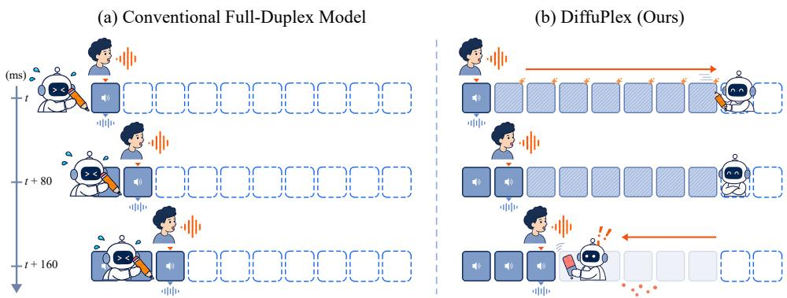  
Figure 1: Overview of conventional full-duplex generation and DiffuPlex. Conventional models ad vance one interaction frame at a time, requiring a new backbone computation at every step (left). DiffuPlex predicts multiple future frames in a single backbone wake, consumes a retained prefix, and revises only the unplayed future when new user input diverges from the prediction (right).

We introduce DiffuPlex, which replaces frame-by-frame autoregressive rollout with masked prediction of a short future block. At each temporal-backbone forward pass, which we call a backbone wake, DiffuPlex predicts a block of future user and assistant frames by replacing unavailable future inputs with learned MASK tokens. It retains a confident contiguous prefix of the assistant draft and plays it at the original interaction rate while user speech continues to arrive. The user predictions are stored for consistency checking. If the observed user input diverges from the prediction, Diffu-Plex keeps all assistant frames that have already been played and revises only the remaining future. Figure 1 illustrates this process of predicting a future block and revising its unplayed portion as the interaction unfolds. We refer to this repeated process of predicting, consuming, and revising a masked future as rolling masked diffusion.

We evaluate DiffuPlex on full-duplex interaction, spoken-language capability, human evaluation, and inference efficiency. We consider two inference policies over the same predictor: DiffuPlex-LISTEN consumes multiple future frames only when they predict assistant silence, whereas DiffuPlex-SPEAK can also consume predicted assistant speech. On Full-Duplex-Bench v1.0, the two policies advance the interaction by 1.91 and 2.23 frames per backbone wake on average while remaining close to the autoregressive backbone in interaction behavior. On the fixed 60-clip runtime subset, they achieve 1.46× and 1.59× deployment-path wall-clock speedups and 1.61× and 1.80× Core LM speedups, with all measured invocations completing within 80ms. The more conservative LISTEN policy also preserves human-rated speech and conversational quality, while extending prediction into assistant speech exposes a speech-quality trade-off that we analyze further. To test whether speedups can be achieved without future prediction, we compare against training-free baselines that defer autoregressive execution and emit silence on skipped frames, at the cost of degraded full-duplex conversational dynamics. DiffuPlex instead predicts the intervening interaction, reducing backbone calls while better preserving these dynamics.

## 2 RELATED WORK

Full-Duplex Spoken Dialog Models. Early work such as dGSLM (Nguyen et al., 2023) jointly modeled two conversational speech streams to capture turn-taking and overlap. More recent endto-end full-duplex models use either single-stream generation, as in SyncLLM (Veluri et al., 2024), OmniFlatten (Zhang et al., 2025), Raon-SpeechChat (Kim et al., 2026), and MiniCPM-o 4.5 (Cui et al., 2026), or parallel user and assistant streams, as in Moshi (Defossez et al., 2024) and Per-´ sonaPlex (Roy et al., 2026). Recent work further improves turn-taking, interruption handling, and response timing through interactivity training (Wu et al., 2025; Hsiao et al., 2026; Ohashi et al., 2026; Li et al., 2026b). Despite these advances, these models still advance the interaction autoregressively, requiring sequential backbone computation as new frames or chunks are generated.

Accelerating Autoregressive Generation. Speculative and parallel decoding reduce sequential generation by predicting multiple future tokens and processing them with fewer target-model calls (Stern et al., 2018; Leviathan et al., 2023; Chen et al., 2023). Methods such as Medusa (Cai et al., 2024) and EAGLE (Li et al., 2024) improve drafting through additional prediction heads or feature-level prediction, and related approaches have been extended to autoregressive speech generation (Nguyen et al., 2025; Li et al., 2025a; Yanuka et al., 2026). PredGen (Li & Grover, 2025) and RelayS2S (Mai & Liang, 2026) instead begin response generation before the complete spoken input is available, using partial user speech to prepare future output while subsequent input continues to arrive. However, their speculative responses remain autoregressively generated. They therefore move response computation earlier rather than reducing the sequential backbone steps required to predict multiple future interaction frames within an end-to-end full-duplex model.

Diffusion-Based Parallel Generation. Masked and block diffusion replace token-by-token generation with parallel prediction over multiple positions (Austin et al., 2021; Lou et al., 2024; Sahoo et al., 2024; Arriola et al., 2025). Recent work adapts pretrained autoregressive models to masked or block prediction (Gong et al., 2025; Cheng et al., 2026a; Wu et al., 2026; Gat et al., 2025; Samragh et al., 2025), while DFlash (Chen et al., 2026a) and DiffuSpec (Li et al., 2026a) use diffusion models as parallel drafters for autoregressive verification. Rolling Diffusion Models (Ruhe et al., 2024) and Diffusion Forcing (Chen et al., 2024) further consider causal or rolling prediction over temporal sequences. Related ideas have recently been applied to speech: VocalNet-MDM (Cheng et al., 2026b) accelerates streaming half-duplex speech LLMs, while Chatterbox-Flash (Seo et al., 2026) and DELTA-TTS (Moon et al., 2026) adapt autoregressive TTS models for block or masked diffusion. In these settings, farther output positions can be predicted from already available input. Full-duplex dialog introduces a different constraint: future assistant frames depend on user speech that has not yet arrived. DiffuPlex therefore predicts the missing future interaction jointly and revises only the unplayed assistant future as the corresponding user speech is observed.

## 3 DIFFUPLEX

We introduce DiffuPlex, an approach for reducing sequential temporal-backbone calls in full-duplex spoken dialog models. We build on personaplex-rl-seamless (Ohashi et al., 2026), which operates at 12.5Hz, or one interaction frame every 80ms. At each frame, its temporal backbone jointly predicts the user and assistant streams, requiring one backbone call per frame. Backbone details are in Appendix C.1. DiffuPlex instead predicts a short masked future at each backbone call, which we refer to as a backbone wake. As in Figure 2, each wake produces an assistant draft together with user predictions over the same future interval. DiffuPlex consumes only a confident prefix of the draft and revises only the unplayed future when newly arriving user input is inconsistent with the stored user predictions. We call this repeated predict-consume-revise process rolling masked diffusion, as successive masked-future predictions roll forward with the evolving interaction boundary.

## 3.1 MASKED FUTURE PREDICTION

Predicting several future interaction frames in one backbone wake is difficult because farther positions depend on assistant outputs that have not yet been generated and user input that has not yet arrived. DiffuPlex replaces these inputs with learned stream-specific MASK tokens. At each wake, it predicts W future positions indexed by lookahead $h \in \{ 1 , \ldots , W \}$ , where $h = 1$ is the ordinary next-frame autoregressive prediction and larger h denotes farther future positions. As h increases, additional streams become unavailable and are masked according to their roles and native delays. The exact 17-stream layout is shown in Figure 4 in Appendix C.3.

To reflect the variable number of frames advanced between backbone wakes at inference time, we divide the training dialog into consecutive blocks with lengths $L _ { \mathrm { b l k } }$ sampled uniformly from $\{ 1 , \ldots , W \}$ . Lookahead resets to $h = 1$ at the start of each block. Following the clean-context construction of block diffusion (Arriola et al., 2025), we concatenate a clean copy of the sequence with a masked copy tiled by these variable-length blocks. Each masked block conditions on the realized clean context preceding it and predicts a fresh future from that point in the interaction.

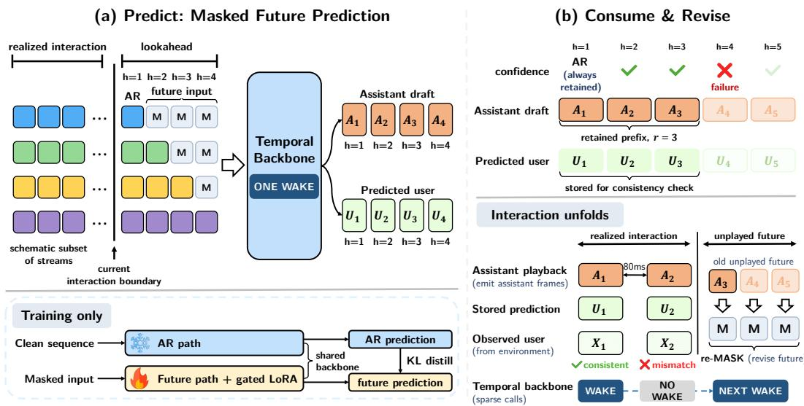  
Figure 2: Overview of DiffuPlex. (a) One backbone wake predicts a masked future block with an assistant draft and user predictions. The staircase indicates stream-wise masking of inputs unavailable at that wake; the exact 17-stream layout is shown in Figure 4 in Appendix C.3. (b) A confident prefix is played at the original 80ms rate without additional backbone wakes, while incoming user frames can trigger revision of only the unplayed future.

To preserve the pretrained backbone while adapting to future masking, we freeze the backbone and train only stream-specific MASK embeddings and future-gated low-rank adapters (LoRA) (Hu et al., 2022). The adapters are activated only for future positions using $g ( h ) = { \bf 1 } [ h \stackrel { \sim } { = } 2 ]$ , and the same gate is applied to the LoRA modules in the depth transformer, which decodes temporal states into audio codebooks. Thus, h = 1 follows the original autoregressive path, while $h \geq 2$ uses the learned future path. All lookaheads are processed in the same temporal-backbone pass, while the depth transformer remains autoregressive over the audio codebooks within each frame.

We train the masked future to match the frozen autoregressive model on the clean sequence. Let $p ^ { \mathrm { A R } }$ and $p ^ { \mathrm { m a s k } }$ denote the clean-teacher and masked-student distributions. We minimize

$$
\begin{array} { r l } & { \mathcal { L } _ { \mathrm { d i s t i l l } } = \displaystyle \frac { 1 } { | \mathcal { V } _ { \mathrm { t e x t } } | } \sum _ { i \in \mathcal { V } _ { \mathrm { t e x t } } } \left[ D _ { \mathrm { K L } } \left( p _ { \mathrm { t e x t } , i } ^ { \mathrm { A R } } | | p _ { \mathrm { t e x t } , i } ^ { \mathrm { m a s k } } \right) + D _ { \mathrm { K L } } \left( \bar { p } _ { \mathrm { t e x t } , i } ^ { \mathrm { A R } } | | \bar { p } _ { \mathrm { t e x t } , i } ^ { \mathrm { m a s k } } \right) \right] } \\ & { \quad \quad \quad + \displaystyle \frac { 1 } { Z _ { \mathrm { a u d i o } } } \sum _ { q = 1 } ^ { Q } w _ { q } \sum _ { i \in \mathcal { V } _ { q } } D _ { \mathrm { K L } } \left( p _ { q , i } ^ { \mathrm { A R } } | | p _ { q , i } ^ { \mathrm { m a s k } } \right) , } \end{array}\tag{1}
$$

where $\mathcal { V } _ { \mathrm { t e x t } }$ and $\mathcal { V } _ { q }$ denote positions with valid text and audio targets, $q \in \{ 1 , \ldots , Q \}$ indexes audio streams with weights $\begin{array} { r } { w _ { q } , Z _ { \mathrm { a u d i o } } = \sum _ { q = 1 } ^ { Q } w _ { q } | \mathcal { V } _ { q } | } \end{array}$ , and $\bar { p } _ { \mathrm { t e x t } }$ denotes the assistant text distribution grouped into the backbone-defined PAD, EPAD, and lexical states, described in Section 3.2. The remaining loss and stream details are provided in Appendix D.2.

## 3.2 ROLLING DRAFT GENERATION

Given a predicted future block, DiffuPlex determines how many positions can be retained before the backbone wakes again. For a selected assistant text token $y _ { h }$ at lookahead h, we define its confidence as $C _ { h } = \mathrm { s o f t m a x } ( z _ { h } ) _ { y _ { h } }$ , where $z _ { h }$ is the logits before temperature scaling or top-k filtering. Assistant text tokens fall into PAD (no lexical token), EPAD (the final PAD before lexical generation), or lexical states. The next-frame prediction at $h = 1$ is always retained, regardless of confidence.

To control how aggressively DiffuPlex commits to the predicted future, we use two retention policies. DiffuPlex-LISTEN consumes future positions only during sustained listening. We approximate this condition by requiring predicted assistant text states to remain PAD, which indicates the absence of a lexical token. DiffuPlex-SPEAK removes this restriction, permitting retention during both listening and speaking. Let $s ( y _ { h } )$ denote the state of $y _ { h }$ , and let $s$ denote the states permitted by each policy: {PAD} for LISTEN and all three states for SPEAK. We retain a contiguous prefix of the W predictions until the first position whose state falls outside $s$ or whose confidence falls below $\tau _ { \mathrm { c o n f } } \colon$

$$
\tilde { r } = \operatorname* { m i n } \left( \{ h \in \{ 2 , \dots , W \} : s ( y _ { h } ) \notin S \vee C _ { h } < \tau _ { \mathrm { c o n f } } \} \cup \{ W + 1 \} \right) - 1 .\tag{2}
$$

The candidate prefix r˜ gives the longest run that satisfies both the state and confidence criteria. For DiffuPlex-LISTEN, short PAD runs may reflect non-lexical gaps, such as pauses or transitions within speech, rather than a listening period, since PAD only indicates the absence of a lexical token. We therefore require r˜ to reach a policy-specific minimum length m before consuming future positions:

$$
r = { \left\{ \begin{array} { l l } { { \tilde { r } } , } & { { \tilde { r } } \geq m , } \\ { 1 , } & { { \mathrm { o t h e r w i s e } } , } \end{array} \right. }\tag{3}
$$

where the values of m and $\tau _ { \mathrm { c o n f } }$ are given in Section 4.1.

The retained assistant frames are played at the original 80ms rate without additional backbone wakes, while the corresponding user predictions are stored for the revision check in Section 3.3. At the next wake, previously predicted positions are replaced by the received user and played assistant frames, which are processed together with a newly masked future in a single forward pass.

## 3.3 USER-AWARE DRAFT REVISION

The retained draft may become inconsistent with the evolving user interaction. DiffuPlex therefore compares stored user predictions with their corresponding observed frames, without waking the backbone again. At lookahead h, let $x _ { h }$ denote the received user semantic token and $q _ { h }$ its stored predicted distribution, and let $y _ { h }$ and $P _ { h }$ denote the selected assistant text token and its stored distribution.

We revise the draft using two signals: how unlikely the received user token $x _ { h }$ was under the stored user prediction and how weakly the assistant preferred its selected token over valid alternatives. Let $\boldsymbol { \mathcal { A } } _ { h } ( y _ { h } )$ denote the valid alternative assistant text tokens to $y _ { h }$ . Revision is triggered when

$$
- \log q _ { h } ( x _ { h } ) + \log P _ { h } ( \mathcal { A } _ { h } ( y _ { h } ) ) - \log P _ { h } ( y _ { h } ) \geq \tau _ { \mathrm { r e v } } .\tag{4}
$$

Here, $\tau _ { \mathrm { r e v } }$ is the revision threshold, with its value given in Section 4.1. The first term increases when the received user token is unlikely under the stored prediction, while the remaining terms make revision easier when the assistant is less committed to its selected token. For $h \geq 2 .$ , this criterion can be motivated as an approximate posterior-odds test between keeping and revising the current draft; its derivation and the construction of $\boldsymbol { \mathcal { A } } _ { h } ( y _ { h } )$ are provided in Appendix D.3.

If the criterion is not met, playback continues from the existing draft without another backbone wake. Otherwise, DiffuPlex discards only the unplayed future and wakes the backbone from the updated interaction, while all received user frames and played assistant frames remain as context.

## 4 EXPERIMENTS

## 4.1 EXPERIMENTAL SETUP

We use personaplex-rl-seamless (Ohashi et al., 2026), a reinforcement-learning posttrained variant of PersonaPlex (Roy et al., 2026), as the backbone for DiffuPlex. We freeze the original backbone and train only the stream-specific MASK embeddings and future-gated LoRA parameters on Seamless Interaction (Agrawal et al., 2025), a large-scale dataset of face-to-face dyadic interactions. Unless otherwise noted, we use a maximum lookahead of $W = 1 6$ , a confidence threshold of $\tau _ { \mathrm { c o n f } } = 0 . 8 0$ , and a revision threshold of $\tau _ { \mathrm { r e v } } = - 0 . 5$ . We evaluate two inference policies over the same masked-future predictor. DiffuPlex-LISTEN consumes future positions only during sustained listening, with a minimum retained length of $m = 6 .$ , whereas DiffuPlex-SPEAK removes this state restriction and uses $m = 2$ . The prediction at $h = 1$ is always retained, ensuring that each backbone wake advances the interaction by at least one 80ms frame. We use the original backbone sampling configuration and fix the generation seed to 0. Further data processing, training, and inference details are provided in Appendices D.1–D.3.

Table 1: Full-duplex interaction and human evaluation on Full-Duplex-Bench v1.0. RL-Seamless denotes personaplex-rl-seamless, and c is the average number of interaction frames advanced per backbone wake. Syn. and Can. denote the Synthetic and Candor pause sets. TOR denotes turnover rate; Freq., backchannel frequency; JSD, Jensen–Shannon divergence of backchannel timing; Lat., response latency; and Judge, the gpt-5.6-luna response-appropriateness score for interruption responses (reasoning effort: none). NMOS and DMOS denote naturalness and dialog mean opinion scores, reported as mean ± 95% confidence interval.
<table><tr><td></td><td>Efficiency</td><td colspan="2">Pause</td><td colspan="3">Backchannel</td><td colspan="2">Turn-taking</td><td colspan="3">Interruption</td><td colspan="2">Human</td></tr><tr><td>Model</td><td>c↑</td><td>Syn. ↓</td><td>Can. ↓</td><td>TOR↓</td><td>Freq.</td><td>JSD↓</td><td>TOR ↑ Lat. ↓</td><td></td><td>TOR ↑ Judge ↑</td><td></td><td>Lat. ↓</td><td>NMOS ↑</td><td>DMOS ↑</td></tr><tr><td>Moshi</td><td>1.00</td><td>0.993</td><td>1.000</td><td>0.582</td><td>0.184</td><td>0.679</td><td>1.000</td><td>0.000</td><td>0.765</td><td>3.359</td><td>1.229</td><td>3.52 ± 0.15</td><td>2.86 ± 0.20</td></tr><tr><td>PersonaPlex</td><td>1.00</td><td>0.307</td><td>0.343</td><td>0.200</td><td>0.058</td><td>0.824</td><td>0.941</td><td>0.285</td><td>0.930</td><td>4.328</td><td>0.218</td><td>3.90 ± 0.12</td><td> $4 . 1 0 \pm 0 . 1 3$ </td></tr><tr><td>RL-Seamless</td><td>1.00</td><td>0.299</td><td>0.301</td><td>0.218</td><td>0.163</td><td>0.740</td><td>1.000</td><td>0.124</td><td>0.995</td><td>4.286</td><td>0.281</td><td> $3 . 9 3 \pm 0 . 1 2$ </td><td> $4 . 0 9 \pm 0 . 1 4$ </td></tr><tr><td>DiffuPlex-LISTEN</td><td>1.91</td><td>0.277</td><td>0.343</td><td>0.109</td><td>0.140</td><td>0.753</td><td>1.000</td><td>0.173</td><td>0.990</td><td>4.328</td><td>0.329</td><td> $3 . 9 2 \pm 0 . 1 1$ </td><td> $4 . 0 8 \pm 0 . 1 3$ </td></tr><tr><td>DiffuPlex-SPEAK</td><td>2.23</td><td>0.263</td><td>0.347</td><td>0.145</td><td>0.154</td><td>0.738</td><td>1.000</td><td>0.156</td><td>0.995</td><td>4.357</td><td>0.347</td><td> $3 . 5 4 \pm 0 . 1 2$ </td><td> $4 . 0 7 \pm 0 . 1 3$ </td></tr></table>

## 4.2 EVALUATION

We evaluate DiffuPlex along four axes: full-duplex interaction, general spoken-language capability, human evaluation, and inference efficiency. For full-duplex interaction, we use Full-Duplex-Bench v1.0 (Lin et al., 2025) to evaluate pause handling, backchanneling, turn-taking, and user interruption, and additionally evaluate on Full-Duplex-Bench v1.5 (Lin et al., 2026) under overlapping and interfering speech. We evaluate general spoken-language capability with VoiceBench (Chen et al., 2026) and OpenAudioBench (Li et al., 2025b), reporting both the assistant text stream (s→t) and transcripts of generated speech (s→s). For human evaluation, we measure speech quality (NMOS) on the assistant response following an interruption and conversational quality (DMOS) over the full interaction, using user-interruption examples from Full-Duplex-Bench v1.0. Finally, we measure in ference efficiency on a fixed 60-clip subset of Full-Duplex-Bench v1.0, with 15 clips per task on a single NVIDIA RTX A6000 GPU. We report wall-clock streaming, end-to-end GPU, and Core LM time, together with frames advanced per backbone wake and wake-frame latency. Detailed evalua tion, runtime, and human-evaluation protocols are provided in Appendices E and F.

## 4.3 BASELINES

We compare against Moshi (Defossez et al., 2024), PersonaPlex (Roy et al., 2026), and´ personaplex-rl-seamless, the autoregressive backbone used by DiffuPlex. To test whether similar computational savings can be obtained simply by skipping some autoregressive backbone calls, we additionally construct three training-free deferred-execution baselines using the same frozen backbone: PAD, SILERO, and SMART TURN. On a deferred 80ms interaction step, these baselines do not run the backbone or predict the skipped frame; instead, they emit silence for the assistant and resume autoregressive generation at a later step. PAD skips backbone calls while the assistant predicts silence, SILERO while the user is speaking, and SMART TURN until a turn-ending detector predicts that the user has finished. We cap the interval between autoregressive backbone calls at $\bar { R } \in \{ 2 , 4 , 6 , 8 \}$ interaction steps. Further implementation details are in Appendix D.4.

## 5 RESULTS

## 5.1 FULL-DUPLEX INTERACTION

Table 1 shows that DiffuPlex reduces backbone wake frequency while remaining close to the autoregressive backbone in full-duplex interaction behavior. We use c to denote the average number of interaction frames advanced per backbone wake; standard autoregressive generation has $c = 1$ DiffuPlex-LISTEN and DiffuPlex-SPEAK increase this to c = 1.91 and $c = 2 . 2 3$ , respectively, while remaining close to personaplex-rl-seamless across pause handling, backchanneling, turntaking, and user interruption. Results on Full-Duplex-Bench v1.5 are provided in Appendix G.2.

Table 2: Measured inference efficiency on the fixed 60-clip runtime subset. Streaming wall is the elapsed wall-clock time of the deployment-path streaming loop, including CPU/Python control, synchronization, and GPU execution. E2E GPU and Core LM denote accumulated GPU time for the full inference pipeline and the language-model backbone, respectively. Spd. denotes speedup relative to RL-Seamless, and Rel. time/wake is the Core LM time per backbone wake normalized by RL-Seamless. Wake-frame p99 is the 99th-percentile wall-clock latency of frames that invoke the backbone, and > 80ms is the fraction of such frames exceeding the 80ms interaction interval.
<table><tr><td rowspan="2">Model</td><td rowspan="2">Wake c↑</td><td colspan="2">Streaming wall</td><td colspan="2">E2E GPU</td><td colspan="2">Core LM</td><td colspan="3">Wake behavior</td></tr><tr><td>Time (s) ↓</td><td>Spd. ↑</td><td>Time (s) ↓</td><td>Spd. ↑</td><td>Time (s) ↓</td><td>Spd. ↑</td><td>Rel. time/wake p99 (ms) ↓</td><td></td><td>&gt; 80ms ↓</td></tr><tr><td>Moshi</td><td>1.00</td><td>638.7</td><td>1.168×</td><td>638.3</td><td>1.168×</td><td>550.1</td><td>1.194×</td><td>0.84×</td><td>一</td><td>1</td></tr><tr><td>PersonaPlex</td><td>1.00</td><td>744.1</td><td>1.002×</td><td>743.7</td><td>1.002×</td><td>656.8</td><td>1.000×</td><td>1.00×</td><td></td><td></td></tr><tr><td>RL-Seamless</td><td>1.00</td><td>745.7</td><td>1.000×</td><td>745.3</td><td>1.000×</td><td>656.8</td><td>1.000×</td><td>1.00×</td><td>46.85</td><td>0%</td></tr><tr><td>DiffuPlex-LISTEN</td><td>1.98</td><td>512.4</td><td>1.455×</td><td>511.1</td><td>1.458×</td><td>408.4</td><td>1.608×</td><td>1.23×</td><td>61.34</td><td>0%</td></tr><tr><td>DiffuPlex-SPEAK</td><td>2.26</td><td>469.1</td><td>1.590×</td><td>467.8</td><td>1.593×</td><td>365.5</td><td>1.797×</td><td>1.26×</td><td>61.41</td><td>0%</td></tr></table>

The two settings expose a trade-off in how aggressively predicted futures are consumed. DiffuPlex-LISTEN closely preserves both speech quality and conversational quality, with an NMOS of $3 . 9 2 \pm 0 . 1 1$ and a DMOS of $4 . 0 8 \pm 0 . 1 3 ,$ compared with $3 . 9 3 \pm 0 . 1 2$ and $4 . 0 9 \pm 0 . 1 4$ for personaplex-rl-seamless. DiffuPlex-SPEAK increases c to 2.23 while maintaining a DMOS of $4 . 0 7 \pm 0 . 1 3$ , but its NMOS decreases to $3 . 5 4 \pm 0 . 1 2 ,$ , remaining close to Moshi at $3 . 5 2 \pm 0 . 1 5$ . We analyze the source of this speech-quality degradation in Section 5.5.

Fewer backbone wakes do not necessarily imply lower runtime, because each DiffuPlex wake predicts over a wider future span and is therefore more expensive than a single autoregressive wake. We next examine whether the reduction in wake frequency outweighs this increased per-wake cost.

## 5.2 RUNTIME EFFICIENCY

Table 2 shows that the reduction in backbone wakes translates into substantial measured speedups. On the fixed 60-clip runtime subset, DiffuPlex-LISTEN and DiffuPlex-SPEAK advance $c = 1 . 9 8$ and $c = 2 . 2 6$ interaction frames per backbone wake, respectively. This reduces accumulated Core-LM time from 656.8s for personaplex-rl-seamless to 408.4s and 365.5s, corresponding to 1.608× and 1.797× speedups. The reduction also translates into deployment-path wall-clock speedups of 1.455× and 1.590× for DiffuPlex-LISTEN and DiffuPlex-SPEAK, respectively. Considering device-side computation alone, this yields end-to-end GPU speedups of 1.458× and 1.593×. Moshi predicts only assistant-side tokens, whereas the PersonaPlex family jointly models both user and assistant streams, giving Moshi a lighter per-frame prediction workload.

These gains do not come from making each DiffuPlex backbone invocation cheaper. The pooled measurements imply 1.23× and 1.26× as much Core LM time per backbone wake for DiffuPlex-LISTEN and DiffuPlex-SPEAK, respectively. Instead, masked-future prediction amortizes this larger per-wake cost over multiple interaction frames, reducing accumulated Core LM time while sustaining the same 12.5Hz interaction stream. Meeting the 80ms deadline establishes real-time feasibility, but systems that satisfy the same deadline can still differ substantially in accumulated GPU time. DiffuPlex therefore reduces accumulated GPU and Core LM time over the course of an interaction.

The larger individual wakes must still satisfy this real-time constraint. The 99th-percentile wallclock latency of frames that invoke the backbone is 61.34ms for DiffuPlex-LISTEN and 61.41ms for DiffuPlex-SPEAK, and no measured wake frame exceeds 80ms. Thus, DiffuPlex reduces accumulated Core LM time while preserving the original real-time interaction cadence.

## 5.3 MASKED FUTURE PREDICTION VS. DEFERRED EXECUTION

We next ask whether similar efficiency gains can be obtained without predicting future interaction, simply by skipping autoregressive backbone calls and emitting silence during skipped frames. Figure 3 compares DiffuPlex with the PAD, SILERO, and SMART TURN deferred-execution baselines

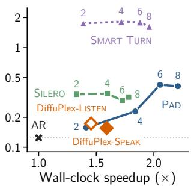  
(a) Turn-taking latency (↓)

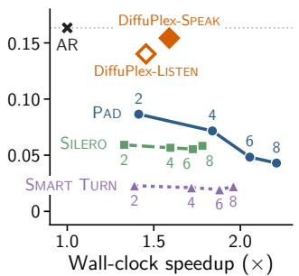  
(b) Backchannel frequency

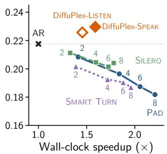  
(c) Assistant speaking fraction

Figure 3: Efficiency-interaction trade-offs under deferred execution. Deferred baselines vary $R \in$ {2, 4, 6, 8}, and deferred frames are forced to silence. Silero and Smart Turn replay precomputed controller decisions; controller inference cost is measured separately.

Table 3: General spoken-language capability. Higher is better.
<table><tr><td rowspan="2">Model</td><td colspan="2">VoiceBench</td><td colspan="2">OpenAudioBench</td></tr><tr><td>s→t</td><td>s→s</td><td>s→t</td><td>s→s</td></tr><tr><td>personaplex-rl-seamless</td><td>31.95</td><td>31.61</td><td>35.66</td><td>34.03</td></tr><tr><td>DiffuPlex-LISTEN</td><td>31.93</td><td>31.52</td><td>36.71</td><td>33.53</td></tr><tr><td>DiffuPlex-SPEAK</td><td>31.20</td><td>31.04</td><td>35.82</td><td>32.12</td></tr></table>

over $R \in \{ 2 , 4 , 6 , 8 \}$ . Increasing R allows up to R − 1 frames to be skipped between backbone calls, improving wall-clock speedup but increasingly degrading interaction behavior. In particular, deferred execution suppresses backchanneling and reduces assistant speaking activity, while turntaking latency increases substantially for several controllers. For example, at R = 6, PAD reaches a 2.05× wall-clock speedup, but backchannel frequency drops from 0.163 to 0.048 and turn-taking latency increases from 0.124s to 0.423s relative to the backbone.

DiffuPlex largely mitigates this trade-off by predicting interaction between backbone invocations rather than replacing skipped frames with silence. DiffuPlex-LISTEN and DiffuPlex-SPEAK achieve 1.455× and 1.590× wall-clock speedups while remaining much closer to the original backchannel, turn-taking, and speaking behavior. These results show that deferring backbone calls while emitting silence is insufficient in these baselines; predicting what occurs between backbone invocations better preserves full-duplex behavior. DiffuPlex can further adjust this efficiency-interaction trade-off through its confidence and revision thresholds, which we analyze in Appendices H.4 and H.5.

## 5.4 GENERAL SPOKEN-LANGUAGE CAPABILITY

Table 3 shows that DiffuPlex largely preserves the general spoken-language capability of personaplex-rl-seamless. DiffuPlex-LISTEN remains nearly unchanged on VoiceBench and OpenAudioBench, while DiffuPlex-SPEAK shows moderate degradation, most notably on OpenAudioBench s→s. Full per-task results are provided in Appendix G.3.

## 5.5 ANALYSIS OF FUTURE DRAFTS

Rolling draft behavior. We first examine how confidence filtering and revision affect the use of predicted futures. As shown in Table 4, the policy-specific no-confidence variants allow more aggressive retention, with different effects across the two policies. For SPEAK, c increases from 2.23 to 2.80, but the interruption Judge score decreases from 4.357 to 3.550. For LISTEN, where retention remains restricted to PAD states, removing confidence increases c more modestly from 1.91 to 2.11 while leaving interaction behavior similar. Removing revision increases c from 1.91 to 2.49 for LISTEN and from 2.23 to 3.08 for SPEAK, but substantially reduces responsiveness: backchannel frequency falls to 0.078 and 0.080, while turn-taking latency increases to 0.440s and 0.480s, respectively. Thus, the retention constraints limit aggressive future consumption, particularly for SPEAK, while revision is important for preserving responsiveness to newly observed user speech. Sensitivity to the confidence threshold $\tau _ { \mathrm { c o n f } }$ and revision threshold $\tau _ { \mathrm { r e v } }$ is reported in Appendices H.4 and H.5.

Table 4: Ablation of confidence-based retention and draft revision on Full-Duplex-Bench v1.0.
<table><tr><td>Policy</td><td>Variant</td><td>c↑</td><td>BC Freq.</td><td></td><td>Turn Lat.↓ Int. Judge↑ Int. Lat.↓</td><td></td></tr><tr><td rowspan="3">LISTEN</td><td>DiffuPlex</td><td>1.91</td><td>.140</td><td>.173</td><td>4.328</td><td>.329</td></tr><tr><td>w/o confidence</td><td>2.11</td><td>.191</td><td>.170</td><td>4.398</td><td>.314</td></tr><tr><td>w/o revision</td><td>2.49</td><td>.078</td><td>.440</td><td>4.372</td><td>.744</td></tr><tr><td rowspan="3">SPEAK</td><td>DiffuPlex</td><td>2.23</td><td>.154</td><td>.156</td><td>4.357</td><td>.347</td></tr><tr><td>w/o confidence</td><td>2.80</td><td>.191</td><td>.209</td><td>3.550</td><td>.281</td></tr><tr><td>w/o revision</td><td>3.08</td><td>.080</td><td>.480</td><td>4.251</td><td>.515</td></tr></table>

We next examine why DiffuPlex wakes the backbone again after producing a draft. A wake occurs either when the retained draft is exhausted or when new user speech triggers revision. When the draft is exhausted, DiffuPlex advances only 1.17 frames on average for LISTEN and 1.48 for SPEAK; 98.2% and 81.5% of these wakes, respectively, occur after a single frame. Revision-triggered wakes instead occur after several draft frames have already been consumed, with mean advancements of 4.24 and 3.79 frames and medians of 4 and 3. In other words, a short wake interval usually means that only a short prefix was retained in the first place, rather than that a longer retained draft was quickly revised. When revision does occur, several retained frames have typically been consumed. Additional wake-level diagnostics and revision analyses are provided in Appendix I.1.

Why does future speech degrade? We next investigate the speech-quality degradation of DiffuPlex-SPEAK. personaplex-rl-seamless models assistant audio using a semantic codebook, cb0, followed by seven acoustic codebooks, cb1–7. Because cb1–7 are natively delayed by one temporal step, the cb0 corresponding to a given physical audio frame appears one temporal position earlier in the model sequence and is therefore already available when the autoregressive model predicts cb1–7 for that frame. DiffuPlex preserves this native delay pattern, but at future depths $h \geq 2$ all assistant streams are masked, so future cb1–7 must be predicted without the same-frame cb0 that would normally condition them. To test whether this missing conditioning contributes to the degradation, we use the 199 valid user-interruption examples from Full-Duplex-Bench v1.0 and replace only the masked cb0 with the ground-truth cb0 for the physical frame whose cb1–7 are being predicted. During assistant speech, this reduces the cb1–7 negative log-likelihood from 5.702 to 5.611 (∆ = 0.091, 95% CI [0.081, 0.101]), compared with a much smaller reduction during silence $( \Delta = 0 . 0 2 9 )$ . These results show that same-frame semantic conditioning has a substantially larger effect on acoustic-token prediction during speech than during silence.

We then test whether restoring autoregressive audio-token conditioning improves generated audio. Starting from each DiffuPlex-SPEAK output, we teacher-force its generated text and cb0 while recomputing the sequence frame by frame through the original autoregressive backbone. We then use the resulting temporal representations to regenerate only cb1–7 with the unchanged depth transformer. UTMOSv2, a neural predictor of perceptual speech quality on a 5-scale (Baba et al., 2024), increases from 2.646 to 2.894. Regenerating cb0–7 while keeping only the generated text fixed yields 2.903, compared with 2.919 for fully autoregressive generation. Thus, most of the measured quality loss is recovered by restoring autoregressive audio-token conditioning even when the text and cb0 generated by DiffuPlex are unchanged. Additional intervention controls are in Appendix I.2.

## 6 CONCLUSION

We introduced DiffuPlex, a masked-future prediction framework for reducing sequential forward passes in autoregressive full-duplex speech models. Rather than invoking the backbone at every interaction frame, DiffuPlex predicts multiple future positions in a single wake, consumes a confident prefix, and revises only the unplayed future when observed user speech deviates from the prediction. Experiments show that this rolling generation reduces backbone wakes and measured Core LM time while largely preserving full-duplex interaction behavior and general spoken-language capability. Our analyses show that confidence-based retention and revision play complementary roles in controlling future consumption, and identify missing autoregressive audio-token conditioning as a source of degradation in deeper future speech. These results suggest that predicting interaction ahead can provide a path toward more compute-efficient real-time full-duplex generation.

## AI USE STATEMENT

The research problem, core ideas, and methodological development in this work were conceived and developed by the authors. We used Claude Code as a coding assistant to support implementation of the proposed method. The first author manually reviewed and tested the resulting implementation and verified the experimental outputs and reported results. Claude Code was also used to assist with visualization, including developing figure layouts and producing or refining scientific illustrations, as well as with implementation of the project page.

We used ChatGPT to assist with writing after the authors had developed the paper outline, organization, and initial drafts. Its use was primarily limited to improving clarity and readability, paraphrasing, and revising author-written text. For related work, the authors first conducted the literature review independently, primarily by following citations from relevant prior work. Generative AI tools were subsequently used as a supplementary check to identify potentially relevant work that might have been overlooked and to help organize the related-work discussion. The authors independently inspected the original papers before including or citing them.

Generative AI tools were not used to originate the research problem or the core methodological ideas presented in this work. All AI-assisted code, text, figures, and other artifacts were reviewed by the authors. The authors take responsibility for the final content of the paper, including all claims, results, and artifacts produced with the assistance of generative AI.

## ETHICS STATEMENT

This work studies computational acceleration for full-duplex spoken dialog models. Because the backbone supports voice-conditioned generation, our evaluation requires an acoustic voice prompt; we use the official voice prompt provided with the backbone, without constructing new speaker identities or attempting to imitate specific individuals. For human evaluation, participants recruited through Amazon Mechanical Turk listened to generated audio samples and provided perceptual ratings. Our work does not aim to develop or evaluate capabilities for impersonation or other deceptive uses. Nevertheless, as with other spoken-output generative models, the underlying systems could potentially be misused to produce misleading synthetic speech. Their use should therefore follow appropriate safeguards as well as the licenses and usage conditions of the underlying models and datasets. The external models, datasets, and evaluation resources used in this work, together with their licenses and sources, are documented in Table 18.

## REPRODUCIBILITY STATEMENT

We provide reproducibility information throughout the main paper and Appendices. Section 3 specifies the DiffuPlex training and inference procedures, including masked-future prediction, confidence-based retention, and user-aware revision, while Appendices provide implementation, data-processing, evaluation, ablation, and runtime-measurement details. Table 18 lists the external datasets, pretrained models, evaluation tools, licenses, and public sources used in this work. Selected generated audio and qualitative examples are available on the anonymous project page at https://diffuplex.github.io/. We plan to release the implementation and evaluation scripts after the review process.

## REFERENCES

Vasu Agrawal, Akinniyi Akinyemi, Kathryn Alvero, Morteza Behrooz, Julia Buffalini, Fabio Maria Carlucci, Joy Chen, Junming Chen, Zhang Chen, Shiyang Cheng, Praveen Chowdary, Joe Chuang, Antony D’Avirro, Jon Daly, Ning Dong, Mark Duppenthaler, Cynthia Gao, Jeff Girard, Martin Gleize, Sahir Gomez, Hongyu Gong, Srivathsan Govindarajan, Brandon Han, Sen He, Denise Hernandez, Yordan Hristov, Rongjie Huang, Hirofumi Inaguma, Somya Jain, Raj Janardhan, Qingyao Jia, Christopher Klaiber, Dejan Kovachev, Moneish Kumar, Hang Li, Yilei Li, Pavel Litvin, Wei Liu, Guangyao Ma, Jing Ma, Martin Ma, Xutai Ma, Lucas Mantovani,

Sagar Miglani, Sreyas Mohan, Louis-Philippe Morency, Evonne Ng, Kam-Woh Ng, Tu Anh Nguyen, Amia Oberai, Benjamin Peloquin, Juan Pino, Jovan Popovic, Omid Poursaeed, Fabian Prada, Alice Rakotoarison, Rakesh Ranjan, Alexander Richard, Christophe Ropers, Safiyyah Saleem, Vasu Sharma, Alex Shcherbyna, Jia Shen, Jie Shen, Anastasis Stathopoulos, Anna Sun, Paden Tomasello, Tuan Tran, Arina Turkatenko, Bo Wan, Chao Wang, Jeff Wang, Mary Williamson, Carleigh Wood, Tao Xiang, Yilin Yang, Julien Yao, Chen Zhang, Jiemin Zhang, Xinyue Zhang, Jason Zheng, Pavlo Zhyzheria, Jan Zikes, and Michael Zollhoefer. Seamless interaction: Dyadic audiovisual motion modeling and large-scale dataset, 2025. URL https: //arxiv.org/abs/2506.22554.

Marianne Arriola, Aaron Gokaslan, Justin Chiu, Zhihan Yang, Zhixuan Qi, Jiaqi Han, Subham Sahoo, and Volodymyr Kuleshov. Block diffusion: Interpolating between autoregressive and diffusion language models. In Y. Yue, A. Garg, N. Peng, F. Sha, and R. Yu (eds.), International Conference on Learning Representations, volume 2025, pp. 50726–50753, 2025. URL https://proceedings.iclr.cc/paper\_files/paper/2025/file/ 7ede97c3e082c6df10a8d6103a2eebd2-Paper-Conference.pdf.

Jacob Austin, Daniel D. Johnson, Jonathan Ho, Daniel Tarlow, and Rianne van den Berg. Structured denoising diffusion models in discrete state-spaces. In M. Ranzato, A. Beygelzimer, Y. Dauphin, P.S. Liang, and J. Wortman Vaughan (eds.), Advances in Neural Information Processing Systems, volume 34, pp. 17981–17993. Curran Associates, Inc., 2021. URL https://proceedings.neurips.cc/paper\_files/paper/2021/ file/958c530554f78bcd8e97125b70e6973d-Paper.pdf.

Kaito Baba, Wataru Nakata, Yuki Saito, and Hiroshi Saruwatari. The t05 system for the voicemos challenge 2024: Transfer learning from deep image classifier to naturalness mos prediction of high-quality synthetic speech. In 2024 IEEE Spoken Language Technology Workshop (SLT), pp. 818–824, 2024. doi: 10.1109/SLT61566.2024.10832315.

Mathias Barthel, Antje S. Meyer, and Stephen C. Levinson. Next speakers plan their turn early and speak after turn-final “go-signals”. Frontiers in Psychology, Volume 8 - 2017, 2017. ISSN 1664-1078. doi: 10.3389/fpsyg.2017.00393. URL https://www.frontiersin.org/ journals/psychology/articles/10.3389/fpsyg.2017.00393.

Tianle Cai, Yuhong Li, Zhengyang Geng, Hongwu Peng, Jason D. Lee, Deming Chen, and Tri Dao. Medusa: Simple LLM inference acceleration framework with multiple decoding heads. In Ruslan Salakhutdinov, Zico Kolter, Katherine Heller, Adrian Weller, Nuria Oliver, Jonathan Scarlett, and Felix Berkenkamp (eds.), Proceedings ofthe 41st International Conference on Machine Learning, volume 235 of Proceedings of Machine Learning Research, pp. 5209–5235. PMLR, 21–27 Jul 2024. URL https://proceedings.mlr.press/v235/cai24b.html.

Boyuan Chen, Diego Mart´ı Monso, Yilun Du, Max Simchowitz, Russ Tedrake, and Vin-´ cent Sitzmann. Diffusion forcing: Next-token prediction meets full-sequence diffusion. In A. Globerson, L. Mackey, D. Belgrave, A. Fan, U. Paquet, J. Tomczak, and C. Zhang (eds.), Advances in Neural Information Processing Systems, volume 37, pp. 24081–24125. Curran Associates, Inc., 2024. doi: 10.52202/079017-0759. URL https://proceedings.neurips.cc/paper\_files/paper/2024/file/ 2aee1c4159e48407d68fe16ae8e6e49e-Paper-Conference.pdf.

Charlie Chen, Sebastian Borgeaud, Geoffrey Irving, Jean-Baptiste Lespiau, Laurent Sifre, and John Jumper. Accelerating large language model decoding with speculative sampling, 2023. URL https://arxiv.org/abs/2302.01318.

Yiming Chen, Xianghu Yue, Chen Zhang, Xiaoxue Gao, Robby T. Tan, and Haizhou Li. VoiceBench: Benchmarking LLM-based voice assistants. Transactions of the Association for Computational Linguistics, 14:378–398, 2026. doi: 10.1162/tacl.a.628. URL https:// aclanthology.org/2026.tacl-1.18/.

Shuang Cheng, Yihan Bian, Dawei Liu, Yuhua Jiang, Yihao Liu, Linfeng Zhang, Qian Yao, Zhongbo Tian, Wenhai Wang, Qipeng Guo, Kai Chen, Biqing Qi, and Bowen Zhou. SDAR: A synergistic diffusion-AutoRegression paradigm for scalable sequence generation. In Maria

Liakata, Viviane P. Moreira, Jiajun Zhang, and David Jurgens (eds.), Findings of the Association for Computational Linguistics: ACL 2026, pp. 22058–22075, San Diego, California, United States, July 2026a. Association for Computational Linguistics. ISBN 979-8-89176-395- 1. doi: 10.18653/v1/2026.findings-acl.1110. URL https://aclanthology.org/2026. findings-acl.1110/.

Ziyang Cheng, Yuhao Wang, Heyang Liu, Ronghua Wu, Qunshan Gu, Yanfeng Wang, and Yu Wang. Vocalnet-mdm: Accelerating streaming speech llm via self-distilled masked diffusion modeling, 2026b. URL https://arxiv.org/abs/2602.08607.

Junbo Cui, Bokai Xu, Chongyi Wang, Tianyu Yu, Weiyue Sun, Yingjing Xu, Tianran Wang, Zhihui He, Wenshuo Ma, Tianchi Cai, Jiancheng Gui, Luoyuan Zhang, Xian Sun, Fuwei Huang, Moye Chen, Zhuo Lin, Hanyu Liu, Qingxin Gui, Qingzhe Han, Yuyang Wen, Huiping Liu, Rongkang Wang, Yaqi Zhang, Hongliang Wei, Chi Chen, You Li, Kechen Fang, Jie Zhou, Yuxuan Li, Guoyang Zeng, Chaojun Xiao, Yankai Lin, Xu Han, Maosong Sun, Zhiyuan Liu, and Yuan Yao. Minicpm-o 4.5: Towards real-time full-duplex omni-modal interaction, 2026. URL https://arxiv.org/abs/2604.27393.

Alexandre Defossez, Laurent Mazar´ e, Manu Orsini, Am´ elie Royer, Patrick P´ erez, Herv´ e J´ egou,´ Edouard Grave, and Neil Zeghidour. Moshi: a speech-text foundation model for real-time dialogue, 2024. URL https://arxiv.org/abs/2410.00037.

Qingkai Fang, Shoutao Guo, Yan Zhou, Zhengrui Ma, Shaolei Zhang, and Yang Feng. Llama-omni: Seamless speech interaction with large language models. In Y. Yue, A. Garg, N. Peng, F. Sha, and R. Yu (eds.), International Conference on Learning Representations, volume 2025, pp. 57607– 57624, 2025. URL https://proceedings.iclr.cc/paper\_files/paper/2025/ file/90d1fc07f46e31387978b88e7e057a31-Paper-Conference.pdf.

Yonggan Fu, Lexington Whalen, Abhinav Garg, Chengyue Wu, Maksim Khadkevich, Nicolai Oswald, Enze Xie, Daniel Egert, Sharath Turuvekere Sreenivas, Shizhe Diao, Chenhan Yu, Ye Yu, Weijia Chen, Sajad Norouzi, Jingyu Liu, Shiyi Lan, Ligeng Zhu, Jin Wang, Jindong Jiang, Morteza Mardani, Mehran Maghoumi, Song Han, Ante Jukic, Nima Tajbakhsh, Jan Kautz, and´ Pavlo Molchanov. Nemotron-labs-diffusion: A tri-mode language model unifying autoregressive, diffusion, and self-speculation decoding, 2026. URL https://arxiv.org/abs/2607. 05722.

Itai Gat, Heli Ben-Hamu, Marton Havasi, Daniel Haziza, Jeremy Reizenstein, Gabriel Synnaeve, David Lopez-Paz, Brian Karrer, and Yaron Lipman. Set block decoding is a language model inference accelerator, 2025. URL https://arxiv.org/abs/2509.04185.

J.J. Godfrey, E.C. Holliman, and J. McDaniel. Switchboard: telephone speech corpus for research and development. In [Proceedings] ICASSP-92: 1992 IEEE International Conference on Acoustics, Speech, and Signal Processing, volume 1, pp. 517–520 vol.1, 1992. doi: 10.1109/ICASSP.1992.225858.

Shansan Gong, Shivam Agarwal, Yizhe Zhang, Jiacheng Ye, Lin Zheng, Mukai Li, Chenxin An, Peilin Zhao, Wei BI, Jiawei Han, Hao Peng, and Lingpeng Kong. Scaling diffusion language models via adaptation from autoregressive models. In Y. Yue, A. Garg, N. Peng, F. Sha, and R. Yu (eds.), International Conference on Learning Representations, volume 2025, pp. 5046– 5073, 2025. URL https://proceedings.iclr.cc/paper\_files/paper/2025/ file/0fa81c3f0d57f95b8776de3a248ef0ed-Paper-Conference.pdf.

Chi-Yuan Hsiao, Ke-Han Lu, Yu-Kuan Fu, Guan-Ting Lin, Hsiao-Tsung Hung, and Hung yi Lee. Aspirin: Action space projection for interactivity-optimized reinforcement learning in full-duplex speech language models, 2026. URL https://arxiv.org/abs/2604.10065.

Edward J Hu, yelong shen, Phillip Wallis, Zeyuan Allen-Zhu, Yuanzhi Li, Shean Wang, Lu Wang, and Weizhu Chen. LoRA: Low-rank adaptation of large language models. In International Conference on Learning Representations, 2022. URL https://openreview.net/forum? id=nZeVKeeFYf9.

Beomsoo Kim, Changho Choi, Dohyun Kim, Dongki Lee, Ethan Ewer, Eunchong Kim, Gyeongman Kim, Haechan Kim, Hyeonghwan Kim, Inkyu Park, Jihun Yun, Jihwan Moon, Jiyun Kim, Joonghyun Bae, Junhyuck Kim, Minkyu Kim, Sehun Lee, Seungjun Chung, Sungwoo Cho, Dongmin Park, Dongwon Kim, Hara Kang, Jonghyun Lee, Keon Lee, Kangwook Lee, and Jaewoong Cho. Raon-speech technical report, 2026. URL https://arxiv.org/abs/2605.23912.

Heeseung Kim, Soonshin Seo, Kyeongseok Jeong, Ohsung Kwon, Soyoon Kim, Jungwhan Kim, Jaehong Lee, Eunwoo Song, Myungwoo Oh, Jung-Woo Ha, Sungroh Yoon, and Kang Min Yoo. Paralinguistics-aware speech-empowered large language models for natural conversation. In A. Globerson, L. Mackey, D. Belgrave, A. Fan, U. Paquet, J. Tomczak, and C. Zhang (eds.), Advances in Neural Information Processing Systems, volume 37, pp. 131072–131103. Curran Associates, Inc., 2024. doi: 10.52202/ 079017-4166. URL https://proceedings.neurips.cc/paper\_files/paper/ 2024/file/ecfa5340fd896e5314bc5e132b5dd5ca-Paper-Conference.pdf.

Yaniv Leviathan, Matan Kalman, and Yossi Matias. Fast inference from transformers via speculative decoding. In Andreas Krause, Emma Brunskill, Kyunghyun Cho, Barbara Engelhardt, Sivan Sabato, and Jonathan Scarlett (eds.), Proceedings of the 40th International Conference on Machine Learning, volume 202 of Proceedings of Machine Learning Research, pp. 19274–19286. PMLR, 23–29 Jul 2023. URL https://proceedings.mlr.press/ v202/leviathan23a.html.

Stephen C. Levinson and Francisco Torreira. Timing in turn-taking and its implications for processing models of language. Frontiers in Psychology, Volume 6 - 2015, 2015. ISSN 1664-1078. doi: 10.3389/fpsyg.2015.00731. URL https://www.frontiersin.org/journals/ psychology/articles/10.3389/fpsyg.2015.00731.

Bohan Li, Hankun Wang, Situo Zhang, Yiwei Guo, and Kai Yu. Fast and high-quality autoregressive speech synthesis via speculative decoding. In ICASSP 2025 - 2025 IEEE International Conference on Acoustics, Speech and Signal Processing (ICASSP), pp. 1–5, 2025a. doi: 10.1109/ICASSP49660.2025.10888194.

Guojian Li, Chengyou Wang, Hongfei Xue, Shuiyuan Wang, Dehui Gao, Zihan Zhang, Yuke Lin, Wenjie Li, Longshuai Xiao, Zhonghua Fu, and Lei Xie. Easy turn: Integrating acoustic and lin guistic modalities for robust turn-taking in full-duplex spoken dialogue systems. In ICASSP 2026 - 2026 IEEE International Conference on Acoustics, Speech and Signal Processing (ICASSP), pp. 16957–16961, 2026a. doi: 10.1109/ICASSP55912.2026.11463929.

Shufan Li and Aditya Grover. Predgen: Accelerated inference of large language models through input-time speculation for real-time speech interaction. In Second Conference on Language Modeling, 2025. URL https://openreview.net/forum?id=2Kl8Ztw6wk.

Tianpeng Li, Jun Liu, Tao Zhang, Yuanbo Fang, Da Pan, Mingrui Wang, Zheng Liang, Zehuan Li, Mingan Lin, Guosheng Dong, Jianhua Xu, Haoze Sun, Zenan Zhou, and Weipeng Chen. Baichuan-audio: A unified framework for end-to-end speech interaction, 2025b. URL https://arxiv.org/abs/2502.17239.

Yuhui Li, Fangyun Wei, Chao Zhang, and Hongyang Zhang. EAGLE: Speculative sampling requires rethinking feature uncertainty. In Ruslan Salakhutdinov, Zico Kolter, Katherine Heller, Adrian Weller, Nuria Oliver, Jonathan Scarlett, and Felix Berkenkamp (eds.), Proceedings of the 41st International Conference on Machine Learning, volume 235 of Proceedings of Machine Learning Research, pp. 28935–28948. PMLR, 21–27 Jul 2024. URL https://proceedings.mlr. press/v235/li24bt.html.

Yuxin Li, Donghang Wu, Guan-Ting Lin, Hung yi Lee, Chengwei Qin, Zhehuai Chen, and Chen Chen. Decoupling conversational dynamics in full-duplex spoken models through reinforcement learning, 2026b. URL https://arxiv.org/abs/2607.07148.

Borui Liao, Yulong Xu, Jiao Ou, Kaiyuan Yang, Weihua Jian, Pengfei Wan, and Di Zhang. Flexduo: A pluggable system for enabling full-duplex capabilities in speech dialogue systems, 2025. URL https://arxiv.org/abs/2502.13472.

Guan-Ting Lin, Cheng-Han Chiang, and Hung-yi Lee. Advancing large language models to capture varied speaking styles and respond properly in spoken conversations. In Lun-Wei Ku, Andre Martins, and Vivek Srikumar (eds.), Proceedings of the 62nd Annual Meeting of the Association for Computational Linguistics (Volume 1: Long Papers), pp. 6626–6642, Bangkok, Thailand, August 2024. Association for Computational Linguistics. doi: 10.18653/v1/2024.acl-long.358. URL https://aclanthology.org/2024.acl-long.358/.

Guan-Ting Lin, Jiachen Lian, Tingle Li, Qirui Wang, Gopala Anumanchipalli, Alexander H. Liu, and Hung-Yi Lee. Full-duplex-bench: A benchmark to evaluate full-duplex spoken dialogue models on turn-taking capabilities. In 2025 IEEE Automatic Speech Recognition and Understanding Workshop (ASRU), pp. 1–8, 2025. doi: 10.1109/ASRU65441.2025.11433838.

Guan-Ting Lin, Shih-Yun Shan Kuan, Qirui Wang, Jiachen Lian, Tingle Li, Shinji Watanabe, and Hung-Yi Lee. Full-duplex-bench v1.5: Evaluating overlap handling for full-duplex speech models. In ICASSP 2026 - 2026 IEEE International Conference on Acoustics, Speech and Signal Processing (ICASSP), pp. 19447–19451, 2026. doi: 10.1109/ICASSP55912.2026.11463576.

Ilya Loshchilov and Frank Hutter. Decoupled weight decay regularization, 2019. URL https: //arxiv.org/abs/1711.05101.

Aaron Lou, Chenlin Meng, and Stefano Ermon. Discrete diffusion modeling by estimating the ratios of the data distribution. In Ruslan Salakhutdinov, Zico Kolter, Katherine Heller, Adrian Weller, Nuria Oliver, Jonathan Scarlett, and Felix Berkenkamp (eds.), Proceedings of the 41st International Conference on Machine Learning, volume 235 of Proceedings ofMachine Learning Research, pp. 32819–32848. PMLR, 21–27 Jul 2024. URL https://proceedings.mlr. press/v235/lou24a.html.

Long Mai and Junli Liang. Relays2s: A dual-path speculative generation for real-time dialogue, 2026. URL https://arxiv.org/abs/2603.23346.

Randi C. Martin, Jason E. Crowther, Meredith Knight, Franklin P. Tamborello, and Chin-Lung Yang. Planning in sentence production: Evidence for the phrase as a default planning scope. Cognition, 116(2):177–192, 2010. ISSN 0010-0277. doi: https://doi.org/10.1016/j.cognition. 2010.04.010. URL https://www.sciencedirect.com/science/article/pii/ S0010027710001022.

Junwon Moon, Yejin Lee, Seungbeom Kim, Hoseong Ahn, Sewoong Park, Heeseung Kim, and Kyuhong Shim. Delta-tts: Adapting autoregressive model into diffusion language model for textto-speech, 2026. URL https://arxiv.org/abs/2607.04140.

Tan Dat Nguyen, Ji-Hoon Kim, Jeongsoo Choi, Shukjae Choi, Jinseok Park, Younglo Lee, and Joon Son Chung. Accelerating codec-based speech synthesis with multi-token prediction and speculative decoding. In ICASSP 2025 - 2025 IEEE International Conference on Acoustics, Speech and Signal Processing (ICASSP), pp. 1–5, 2025. doi: 10.1109/ICASSP49660.2025. 10887855.

Tu Anh Nguyen, Eugene Kharitonov, Jade Copet, Yossi Adi, Wei-Ning Hsu, Ali Elkahky, Paden Tomasello, Robin Algayres, Benoˆıt Sagot, Abdelrahman Mohamed, and Emmanuel Dupoux. Generative spoken dialogue language modeling. Transactions of the Association for Computational Linguistics, 11:250–266, 2023. doi: 10.1162/tacl a 00545. URL https:// aclanthology.org/2023.tacl-1.15/.

Shen Nie, Fengqi Zhu, Zebin You, Xiaolu Zhang, Jingyang Ou, Jun Hu, Jun Zhou, Yankai Lin, Ji-Rong Wen, and Chongxuan LI. Large language diffusion models. In D. Belgrave, C. Zhang, H. Lin, R. Pascanu, P. Koniusz, M. Ghassemi, and N. Chen (eds.), Advances in Neural Information Processing Systems, volume 38, Main Conference, pp. 50608–50646. Curran Associates, Inc., 2025. doi: 10.52202/ 085713-1689. URL https://proceedings.neurips.cc/paper\_files/paper/ 2025/file/48b383b24230e0e6e649d9c98dae4d8c-Paper-Conference.pdf.

Atsumoto Ohashi, Neil Zeghidour, Alexandre Defossez, and Eugene Kharitonov. Multi-faceted in-´ teractivity alignment in full-duplex speech models, 2026. URL https://arxiv.org/abs/ 2606.11167.

OpenAI. Openai gpt-5 system card, 2026. URL https://arxiv.org/abs/2601.03267.

Zihan Qiu, Zekun Wang, Xiao Li, Yanpeng Li, Yang Xu, Yixuan Wang, Huaqing Zhang, Rui Men, Bochao Mao, Chengruidong Zhang, Fan Zhou, Hao Luo, Haofeng Huang, Haoran Lian, Haoyan Huang, Hongqing Chen, Jianwei Zhang, Jing Xu, Junjie Wang, Langshi Chen, Liangyu Wang, Linlang Jiang, Man Yuan, Minmin Sun, Peng Jin, Siqi Zhang, Siyu Wang, Xingzhang Ren, Yakai Wang, Yi Zhang, Yiming Dong, Yizhong Cao, Yubo Ma, Yunfei Mao, Bo Zheng, and Dayiheng Liu. On the design of qwen3.8-next architecture: Evaluation, efficiency, and training stability, 2026. URL https://arxiv.org/abs/2608.30320.

Andrew Reece, Gus Cooney, Peter Bull, Christine Chung, Bryn Dawson, Casey Fitzpatrick, Tamara Glazer, Dean Knox, Alex Liebscher, and Sebastian Marin. The candor corpus: Insights from a large multimodal dataset of naturalistic conversation. Science Advances, 9(13):eadf3197, 2023. doi: 10.1126/sciadv.adf3197. URL https://www.science.org/doi/abs/10.1126/ sciadv.adf3197.

Rajarshi Roy, Jonathan Raiman, Sang-Gil Lee, Teodor-Dumitru Ene, Robert Kirby, Sungwon Kim, Jaehyeon Kim, and Bryan Catanzaro. Personaplex: Voice and role control for full duplex con versational speech models. In ICASSP 2026 - 2026 IEEE International Conference on Acoustics, Speech and Signal Processing (ICASSP), pp. 16137–16141, 2026. doi: 10.1109/ICASSP55912. 2026.11463413.

David Ruhe, Jonathan Heek, Tim Salimans, and Emiel Hoogeboom. Rolling diffusion models. In Ruslan Salakhutdinov, Zico Kolter, Katherine Heller, Adrian Weller, Nuria Oliver, Jonathan Scarlett, and Felix Berkenkamp (eds.), Proceedings of the 41st International Conference on Machine Learning, volume 235 of Proceedings ofMachine Learning Research, pp. 42818–42835. PMLR, 21–27 Jul 2024. URL https://proceedings.mlr.press/v235/ruhe24a.html.

Subham Sekhar Sahoo, Marianne Arriola, Yair Schiff, Aaron Gokaslan, Edgar Marroquin, Justin T Chiu, Alexander Rush, and Volodymyr Kuleshov. Simple and effective masked diffusion language models. In A. Globerson, L. Mackey, D. Belgrave, A. Fan, U. Paquet, J. Tomczak, and C. Zhang (eds.), Advances in Neural Information Processing Systems, volume 37, pp. 130136–130184. Curran Associates, Inc., 2024. doi: 10.52202/ 079017-4135. URL https://proceedings.neurips.cc/paper\_files/paper/ 2024/file/eb0b13cc515724ab8015bc978fdde0ad-Paper-Conference.pdf.

Mohammad Samragh, Arnav Kundu, David Harrison, Kumari Nishu, Devang Naik, Minsik Cho, and Mehrdad Farajtabar. Your llm knows the future: Uncovering its multi-token prediction potential, 2025. URL https://arxiv.org/abs/2507.11851.

Deokjin Seo, Gangin Park, and Kihyun Nam. Chatterbox-flash: Prior-calibrated block diffusion for streaming zero-shot tts, 2026. URL https://arxiv.org/abs/2605.30748.

Xian Shi, Xiong Wang, Zhifang Guo, Yongqi Wang, Pei Zhang, Xinyu Zhang, Zishan Guo, Hongkun Hao, Yu Xi, Baosong Yang, Jin Xu, Jingren Zhou, and Junyang Lin. Qwen3-asr technical report, 2026. URL https://arxiv.org/abs/2601.21337.

Silero Team. Silero vad: pre-trained enterprise-grade voice activity detector (vad), number detector and language classifier. https://github.com/snakers4/silero-vad, 2024.

Mitchell Stern, Noam Shazeer, and Jakob Uszkoreit. Blockwise parallel decoding for deep autoregressive models. In S. Bengio, H. Wallach, H. Larochelle, K. Grauman, N. Cesa-Bianchi, and R. Garnett (eds.), Advances in Neural Information Processing Systems, volume 31. Curran Associates, Inc., 2018. URL https://proceedings.neurips.cc/paper\_files/ paper/2018/file/c4127b9194fe8562c64dc0f5bf2c93bc-Paper.pdf.

Muhammad Umair, Vasanth Sarathy, and Jan Ruiter. Large language models know what to say but not when to speak. In Yaser Al-Onaizan, Mohit Bansal, and Yun-Nung Chen (eds.), Findings of the Associationfor Computational Linguistics: EMNLP 2024, pp. 15503–15514, Miami, Florida, USA, November 2024. Association for Computational Linguistics. doi: 10.18653/v1/2024. findings-emnlp.909. URL https://aclanthology.org/2024.findings-emnlp. 909/.

Bandhav Veluri, Benjamin N Peloquin, Bokai Yu, Hongyu Gong, and Shyamnath Gollakota. Beyond turn-based interfaces: Synchronous LLMs as full-duplex dialogue agents. In Yaser Al-Onaizan, Mohit Bansal, and Yun-Nung Chen (eds.), Proceedings of the 2024 Conference on Empirical Methods in Natural Language Processing, pp. 21390–21402, Miami, Florida, USA, November 2024. Association for Computational Linguistics. doi: 10.18653/v1/2024.emnlp-main.1192. URL https://aclanthology.org/2024.emnlp-main.1192/.

Anne Wu, Laurent Mazare, Neil Zeghidour, and Alexandre D´ efossez. Aligning spoken dialogue´ models from user interactions. In Aarti Singh, Maryam Fazel, Daniel Hsu, Simon Lacoste-Julien, Felix Berkenkamp, Tegan Maharaj, Kiri Wagstaff, and Jerry Zhu (eds.), Proceedings of the 42nd International Conference on Machine Learning, volume 267 of Proceedings ofMachine Learning Research, pp. 67476–67498. PMLR, 13–19 Jul 2025. URL https://proceedings.mlr. press/v267/wu25t.html.

Chengyue Wu, Hao Zhang, Shuchen Xue, Shizhe Diao, Yonggan Fu, Zhijian Liu, Pavlo Molchanov, Ping Luo, Song Han, and Enze Xie. Fast-dllm v2: Efficient block-diffusion llm. In C. Vondrick, B. Hariharan, C. Raffel, L. Pinto, D. Yang, and A. Faust (eds.), International Conference on Learning Representations, volume 2026, pp. 128353–128370, 2026. URL https://proceedings.iclr.cc/paper\_files/paper/2026/file/ d0865cbe51d35ec322f9af9db7806fc7-Paper-Conference.pdf.

Hainan Xu, Fei Jia, Somshubra Majumdar, He Huang, Shinji Watanabe, and Boris Ginsburg. Efficient sequence transduction by jointly predicting tokens and durations. In Andreas Krause, Emma Brunskill, Kyunghyun Cho, Barbara Engelhardt, Sivan Sabato, and Jonathan Scarlett (eds.), Proceedings of the 40th International Conference on Machine Learning, volume 202 of Proceedings of Machine Learning Research, pp. 38462–38484. PMLR, 23–29 Jul 2023. URL https://proceedings.mlr.press/v202/xu23g.html.

Moran Yanuka, Paul Dixon, Eyal Finkelshtein, Daniel Rotman, and Raja Giryes. Principled coarsegrained acceptance for speculative decoding in speech. In ICASSP 2026 - 2026 IEEE International Conference on Acoustics, Speech and Signal Processing (ICASSP), pp. 16692–16696, 2026. doi: 10.1109/ICASSP55912.2026.11464026.

Aohan Zeng, Zhengxiao Du, Mingdao Liu, Kedong Wang, Shengmin Jiang, Lei Zhao, Yuxiao Dong, and Jie Tang. Glm-4-voice: Towards intelligent and human-like end-to-end spoken chatbot, 2024. URL https://arxiv.org/abs/2412.02612.

Dong Zhang, Shimin Li, Xin Zhang, Jun Zhan, Pengyu Wang, Yaqian Zhou, and Xipeng Qiu. SpeechGPT: Empowering large language models with intrinsic cross-modal conversational abilities. In Houda Bouamor, Juan Pino, and Kalika Bali (eds.), Findings of the Association for Computational Linguistics: EMNLP 2023, pp. 15757–15773, Singapore, December 2023. Association for Computational Linguistics. doi: 10.18653/v1/2023.findings-emnlp.1055. URL https://aclanthology.org/2023.findings-emnlp.1055/.

Qinglin Zhang, Luyao Cheng, Chong Deng, Qian Chen, Wen Wang, Siqi Zheng, Jiaqing Liu, Hai Yu, Chao-Hong Tan, Zhihao Du, and ShiLiang Zhang. OmniFlatten: An end-to-end GPT model for seamless voice conversation. In Wanxiang Che, Joyce Nabende, Ekaterina Shutova, and Mohammad Taher Pilehvar (eds.), Proceedings of the 63rd Annual Meeting of the Association for Computational Linguistics (Volume 1: Long Papers), pp. 14570–14580, Vienna, Austria, July 2025. Association for Computational Linguistics. ISBN 979-8-89176-251-0. doi: 10.18653/v1/ 2025.acl-long.709. URL https://aclanthology.org/2025.acl-long.709/.

## A LIMITATIONS

DiffuPlex has several limitations that suggest directions for future work. First, DiffuPlex is adapted from a pretrained autoregressive backbone rather than trained natively for masked-future generation. We freeze the original backbone and train future-gated LoRA adapters together with learned MASK embeddings using self-distillation from the autoregressive model. This design makes it possible to add masked-future prediction without retraining the full model, but it also means that the backbone was not originally optimized to represent several uncertain future interaction frames at once. A model trained specifically for masked-future generation may therefore make better use of the additional future context.

Second, DiffuPlex separates future prediction from the decisions about how much of that prediction to use. The predictor is trained to model future user and assistant frames, whereas retention and revision are controlled by inference-time rules based on prediction confidence and a fixed revision threshold. These rules work well in our experiments, but they are not learned jointly with the future predictor. Jointly learning future prediction, retention, and revision could allow the model to better trade off computation, interaction responsiveness, and prediction reliability.

Third, aggressive future consumption remains more difficult during assistant speech than during listening. DiffuPlex-SPEAK reduces backbone wake frequency more aggressively, but this comes with lower speech naturalness. As analyzed in Section 5.5 and Appendix I.2, one contributor is the loss of same-frame semantic conditioning for deeper future acoustic codebooks: when predicting farther into the future, the acoustic codebooks can no longer condition on the assistant semantic codebook that would normally already be available under autoregressive generation. Our interventions show that restoring same-frame cb0 improves acoustic-token prediction, while autoregressive replay recovers much of the measured quality gap; neither provides a practical solution to future speech generation. Improved future audio modeling is therefore still needed before long assistant-speech segments can be consumed as reliably as silent listening segments.

Finally, our main experiments use personaplex-rl-seamless as the backbone. We additionally apply the same training and inference framework to PersonaPlex (Roy et al., 2026) in Appendix H.1. Although this variant still reduces the number of backbone wakes, its full-duplex interaction behavior degrades substantially, particularly on pause handling and interruption behavior. This result suggests that transferring DiffuPlex across backbone checkpoints is not automatic and may depend on the interaction behavior already learned by the underlying model. We have not yet evaluated the method on substantially different full-duplex architectures. Moreover, the mea sured wall-clock and Core LM speedups depend on the evaluated hardware, software stack, and implementation. Evaluating DiffuPlex across additional architectures and deployment environments remains important future work.

## B DEMO PAGE

Selected audio examples and qualitative demonstrations of DiffuPlex are available at https:// diffuplex.github.io/.

## C FULL-DUPLEX BACKBONE AND STREAM ALIGNMENT

## C.1 BACKBONE ARCHITECTURE

We build DiffuPlex on personaplex-rl-seamless (Ohashi et al., 2026), a post-trained PersonaPlex checkpoint that follows the Moshi-style full-duplex architecture (Defossez et al., 2024).´ The model operates at 12.5Hz, corresponding to one interaction frame every 80ms, and represents the two sides of the conversation using parallel user and assistant streams. Its temporal backbone models the interaction across successive positions, while a depth transformer autoregressively predicts the audio codebooks associated with each position.

The model contains one assistant text stream together with eight Mimi (Defossez et al., 2024) audio´ codebooks for the assistant and eight for the user. Following the terminology and training objective of the backbone, we refer to codebook 0 (cb0) as the semantic codebook and codebooks 1–7 (cb1–7) as the acoustic codebooks. An important difference from the original Moshi architecture is that PersonaPlex (Roy et al., 2026) predicts audio codebooks for both sides of the interaction: whereas Moshi’s depth transformer predicts eight assistant audio codebooks, PersonaPlex predicts eight assistant and eight user codebooks, for 16 audio streams in total. This joint user-assistant prediction structure is retained by the post-trained personaplex-rl-seamless backbone and, consequently, by DiffuPlex. The predicted user audio is not played back; during streaming inference, the actual user codebooks are supplied by the incoming audio stream, while the generated assistant codebooks are used for playback. In our measurements using the official implementations, PersonaPlex and personaplex-rl-seamless require more Core LM time and wall-clock time than Moshi on the same runtime subset, as shown in Table 2.

The backbone uses a native one-position delay between cb0 and cb1–7. As a result, when the temporal backbone computes the representation used to predict cb1–7 for a physical frame, cb0 from that same frame is already available as an input. This allows same-frame semantic information to influence the temporal representation itself before the depth transformer predicts the acoustic codebooks. Without this delay, cb0 and $\mathbf { c b l - } 7$ of the same frame would be generated from the same temporal state, leaving their within-frame dependency to be modeled only by the depth transformer. We describe this alignment precisely in Appendix C.2; Moshi reports a theoretical algorithmic latency of 160ms for this streaming architecture (Defossez et al., 2024). Despite jointly modeling both sides of´ the interaction, temporal generation remains autoregressive: under ordinary inference, the temporal backbone is evaluated once every 80ms as the interaction advances. DiffuPlex targets this sequential temporal-backbone schedule while leaving the underlying stream organization, native delays, and the backbone’s original next-frame prediction shift unchanged.

## C.2 EXACT STREAM ALIGNMENT

The backbone uses 17 streams in the following order: one assistant text stream, eight assistant Mimi codebooks, and eight user Mimi codebooks. Their native delays are

$$
\Delta = [ 0 , 0 , \underbrace { 1 , \dots , 1 } _ { 7 } , 0 , \underbrace { 1 , \dots , 1 } _ { 7 } ] ,\tag{5}
$$

where $\Delta _ { k } = 0$ for assistant text, assistant cb0, and user cb0, and $\Delta _ { k } = 1$ for cb1–7 of both speakers.

These delays mean that a model position should not be interpreted as containing all codebooks from the same physical interaction frame. We use zero-based indices for both model positions $p = 0 , 1 , \ldots$ and physical interaction frames $f = 0 , 1 , . . . ;$ references to negative frame indices correspond to the backbone’s initial tokens. For stream k with native delay $\Delta _ { k } ,$ , the input and prediction target at model position $p$ are

$$
\mathrm { i n p u t } [ k , p ] = \mathrm { f r a m e } ( p - 1 - \Delta _ { k } ) , \qquad \mathrm { t a r g e t } [ k , p ] = \mathrm { f r a m e } ( p - \Delta _ { k } ) .\tag{6}
$$

Thus, for streams with $\Delta _ { k } = 0$ , position $p$ receives frame $p - 1$ and predicts frame $p .$ For streams with $\Delta _ { k } \ = 1$ , the same position receives frame $p - 2$ and predicts frame $p - 1$ . Equivalently, a physical user frame $f$ becomes available to the temporal backbone at position $f + 1$ for cb0 and at position $f + 2$ for cb1–7. The one-step autoregressive input-to-target shift is preserved for every stream, while the physical frame represented at a given model position depends on its stream-specific delay.

This alignment is particularly important for the assistant acoustic codebooks. To predict cb1–7 of physical frame $f ,$ ordinary autoregressive generation uses model position $f + 1$ . At this position, assistant cb0 of the same physical frame $f$ is already part of the temporal-backbone input. Same-frame semantic information can therefore influence the temporal representation before that representation is passed to the depth transformer. The depth transformer remains autoregressive over the codebooks and can also model dependencies among codebooks within its decoding sequence, but the native delay additionally exposes same-frame cb0 to the temporal backbone itself. Without this delay, cb0 and cb1–7 of the same physical frame would be generated from the same temporal state, leaving their same-frame dependency to the depth transformer rather than incorporating cb0 into the temporal representation.

DiffuPlex preserves this native delay pattern. It masks only inputs that would not yet have been generated or observed at the backbone wake that predicts a future position. This distinction becomes important in our analysis of future speech generation in Appendix I.2.

one training sequence of length 2T  
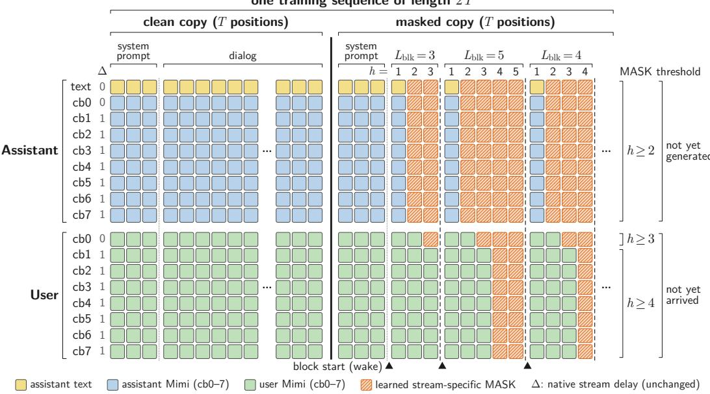  
Figure 4: Training sequence layout for masked future prediction. A clean and masked copy of the same 17-stream sequence are concatenated to form a sequence of length 2T. The masked dialog region is tiled by variable-length blocks, with lookahead h reset at every block start. Inputs unavailable at that backbone wake are replaced by learned stream-specific MASK tokens: assistant streams from $h \geq 2$ , user cb0 from $h \geq 3 ,$ , and user cb1–7 from $h \geq 4 .$ . Native stream delays are unchanged. The staircase denotes stream-wise input availability rather than an attention mask; temporal attention remains causal.

## C.3 MASKED TRAINING LAYOUT

Figure 4 shows the exact training layout used for masked future prediction. For each training example, we concatenate a clean copy of the original sequence with a masked copy of the same sequence, producing a sequence of length 2T. The clean copy preserves the realized interaction. In the masked copy, only the dialog region is modified; the system-prompt region remains unchanged.

The masked dialog region is divided into consecutive blocks. For each block, its length is sampled independently as

$$
L _ { \mathrm { b l k } } \sim \mathcal { U } \{ 1 , \dots , W \} ,\tag{7}
$$

where $W = 1 6$ for the main model. The final block is truncated if it reaches the end of the dialog region. Within every block, the lookahead index resets to $h = 1 , \ldots , L _ { \mathrm { b l k } }$ . This construction exposes the model to different future distances from a backbone wake while conditioning on a varying amount of realized interaction available at each block boundary.

For each lookahead, we replace only inputs that would not yet be causally available when that future position is predicted. The masking schedule is

$$
\begin{array} { l l } { h = 1 : } & { \mathrm { n o ~ s t r e a m s ~ a r e ~ m a s k e d , } } \\ { h \geq 2 : } & { \mathrm { a s s i s t a n t ~ t e x t ~ a n d ~ a s s i s t a n t ~ c b 0 \mathrm { - } 7 ~ a r e ~ m a s k e d , } } \\ { h \geq 3 : } & { \mathrm { u s e r ~ c b 0 ~ i s ~ a d d i t i o n a l l y ~ m a s k e d , } } \\ { h \geq 4 : } & { \mathrm { u s e r ~ c b 1 \mathrm { - } 7 ~ a r e ~ a d d i t i o n a l l y ~ m a s k e d . } } \end{array}\tag{8}
$$

Each stream uses its own learned MASK embedding. The asymmetry between assistant and user streams reflects their different availability at inference. Future assistant outputs have not yet been generated and are therefore masked from $h = 2$ . By contrast, user audio observed during the current 80ms interaction frame becomes available as input only at subsequent model positions. Under the native delay pattern, user cb0 remains available at $h = 2$ and is masked from $h = 3 ,$ , while user cb1–7 remain available through $h = 3$ and are masked from $h = 4$ , at which point all user streams are masked. The native delays in Eq. 5 are left unchanged.

The staircase in Figure 4 therefore describes input availability, not an attention mask. Temporal attention remains causal. For a position in the masked copy, attention includes the realized context preceding its block from the clean copy and masked positions up to the current position within the same block. It does not attend to later positions in the current block or to positions from preceding blocks in the masked copy. Instead, interaction preceding the current block boundary is provided by the corresponding clean context. Each block therefore represents a fresh future prediction from the realized interaction at its boundary, rather than a continuation of the preceding masked block. At $h =$ 1, no input is replaced by MASK, so the input is identical to the original next-frame autoregressive path.

## D IMPLEMENTATION DETAILS

## D.1 DATA PROCESSING

We train DiffuPlex on Seamless Interaction (Agrawal et al., 2025), a large corpus of face-to-face dyadic conversations recorded on separate speaker channels. The source dataset contains more than 4,000h of interaction from more than 4,000 participants and includes both naturalistic conversations and improvised scenarios. We process the two speaker channels jointly so that their original conversational timing, including pauses, overlaps, and interruptions, is preserved. We first resample all audio to 24kHz. Each channel is transcribed with Qwen3-ASR-1.7B (Shi et al., 2026), using English as the fixed language, and the resulting transcript is aligned to the waveform at the word level using Qwen3-ForcedAligner-0.6B (Shi et al., 2026). We use Silero VAD (Silero Team, 2024) to identify speech activity and encode each channel with the same Mimi codec used by the backbone, producing eight codebooks at 12.5Hz. The resulting aligned representation therefore retains the original 80ms interaction grid used by personaplex-rl-seamless.

We apply session-level filtering before constructing training examples. We first remove sessions containing residual non-Latin transcription. We then filter sessions for microphone leakage using a transcript-similarity threshold of 0.30 and an overlap threshold of 0.20. We additionally remove one-sided conversations in which either speaker has no transcribed words, sessions with low speech density where speech occupies less than 60% of the active region, sessions with an active region shorter than 30s, sessions containing an intermediate silence longer than 10s, and sessions with strong speaker imbalance where either speaker accounts for at least 75% of the total speaking duration. After filtering, 42,613 sessions remain and 21,717 are excluded.

From the retained sessions, we reserve 200 session-disjoint conversations, approximately 14h, for validation. The remaining training split contains 42,413 sessions totaling 2,728.5h of conversation from 3,516 participants. It contains 28,242 naturalistic sessions totaling 1,628.7h and 14,171 improvised sessions totaling 1,099.8h. We use both speaker assignments as training examples when valid voice references are available, resulting in 84,183 role-conditioned training examples.

We additionally construct a voice-reference pool for each speaker. Candidate references are between 2s and 10s long, contain at least three ASR words, and are normalized to −24 LUFS. We retain up to six references per channel and mark a reference as clean when it does not overlap speech from the other channel. During training, we preferentially select a clean reference that lies outside the sampled interaction window, so that voice conditioning does not expose speech from the target region.

## D.2 TRAINING

We optimize the distillation objective in Eq. 1 over positions belonging to the dialog region. Systemprompt positions, padding, and positions without defined targets under the backbone’s native stream delays are excluded from the loss. Following the backbone objective, we use $w _ { q } = 1$ for the semantic codebook of each speaker and $w _ { q } = 0 . 0 2$ for cb1–7. The distribution $\bar { p } _ { \mathrm { t e x t } }$ groups the full assistanttext distribution $p _ { \mathrm { t e x t } }$ into the three interaction states PAD, EPAD, and lexical. Because most text positions are non-lexical, matching $p _ { \mathrm { t e x t } }$ alone can underemphasize the coarse interaction-state distinctions that govern full-duplex behavior, including when the assistant remains silent, begins speaking, backchannels, or yields to user speech. We therefore additionally distill $\bar { p } _ { \mathrm { t e x t } }$ to preserve these conversational dynamics, assigning its KL term equal weight to the KL on $p _ { \mathrm { t e x t } } .$ . The losses are pooled over all valid positions rather than normalized separately by future lookahead.

We train the stream-specific MASK embeddings and future-gated LoRA adapters described in Section 3.1. LoRA is applied to both the temporal backbone and the depth transformer with rank 128 and scaling factor 2.0, and the MASK vectors are initialized with norm-matched random directions. Each sampled training window contains at most 2,047 code frames; after inserting the backbone’s initial token and applying the native stream-delay construction, this yields 2,048 temporal model positions, corresponding to approximately 163.8s at 12.5Hz. The clean and masked copies are concatenated as described in Appendix C.3, and we do not prepend additional dialog context outside the sampled window. We construct the training prompt in the same form used by PersonaPlex: a speaker voice reference is followed by six silence frames, the persona text prompt, and another six silence frames, while the user side is filled with the backbone’s sine-wave conditioning during this priming region. When several valid voice references are available, we preferentially use one outside the sampled dialog window.

We optimize for 526 steps using AdamW (Loshchilov & Hutter, 2019) with learning rate $1 0 ^ { - 4 }$ weight decay 0.1, and gradient clipping at 1.0. We use a OneCycle learning-rate schedule with a 15% warmup followed by cosine decay, bfloat16 precision, gradient checkpointing, and random seed 0. The per-GPU batch size is 4 with two gradient-accumulation steps on four NVIDIA RTX A6000 GPUs, giving an effective batch size of 32. Training processes 16,832 sampled windows drawn from 8,480 distinct sessions, corresponding to approximately 702h of conversational audio. We save checkpoints every 263 steps and use the final checkpoint at step 526 for all main experiments.

## D.3 INFERENCE

For all main experiments, we use a future horizon of $W = 1 6 ,$ , a confidence threshold of $\tau _ { \mathrm { c o n f } } =$ 0.80, and a revision threshold of $\tau _ { \mathrm { r e v } } = - 0 . 5$ . As described in Section 3.2, the ordinary next-frame prediction at $h = 1$ is always retained. DiffuPlex-LISTEN retains positions beyond $h = 1$ only while the sampled assistant text state remains PAD and requires a minimum candidate prefix of $m = 6$ whereas DiffuPlex-SPEAK permits PAD, EPAD, and lexical states with $m = 2 .$ . If the candidate prefix does not reach the policy-specific minimum, we retain only $h = 1$ . Thus, LISTEN advances conservatively through predicted PAD states, while SPEAK can additionally consume confidently predicted EPAD and lexical states.

Apart from the retention and revision rules, we preserve the original backbone sampling procedure. Assistant audio codebooks are sampled with temperature 0.8 and $\mathrm { t o p } { - } k = 2 5 0$ , while assistant text uses temperature 0.7 and $\mathrm { { t o p } } \mathord { - } k = 2 5$ . Following Section 3.2, retention confidence is computed from the probability of the sampled assistant text token under the logits before temperature scaling and top-k filtering. We use random seed 0 for all main evaluations. We also retain the official PersonaPlex priming procedure: the SC0001.wav voice prompt is encoded first, followed by six silence frames, the system text prompt, and another six silence frames. Task-specific system prompts are provided with their corresponding evaluation protocols in Appendix E. After priming, incoming user audio is encoded by Mimi at 12.5Hz following the autoregressive backbone.

At each backbone wake, DiffuPlex predicts a future block and selects a contiguous prefix for retention. The assistant audio codebooks of the retained frames are decoded in parallel across temporal positions, while remaining autoregressive over codebooks within each frame, then placed in a playback queue and emitted at their original 80ms interaction times. The corresponding future user distributions are stored only for consistency checking; actual incoming user frames, rather than these predictions, form the realized interaction used at the next backbone wake. The temporal backbone wakes again when the retained prefix is exhausted or when newly observed user input triggers revision of the unplayed future.

The revision check uses the distributions stored at the backbone wake that produced the current draft. For lookahead $h ,$ let $x _ { h }$ denote the observed user semantic token, $q _ { h }$ its stored predicted distribution, $y _ { h }$ the sampled assistant text token, and $P _ { h }$ the corresponding stored assistant text distribution. At $h = 1 , x _ { 1 }$ is the user semantic token for the frame that has just arrived at the wake boundary. Because of the backbone’s autoregressive shift, $q _ { 1 }$ predicts this token from earlier context, even though the observed $x _ { 1 }$ is already available to deeper draft positions in the same wake. We therefore use $q _ { 1 } ( x _ { 1 } )$ only to measure how surprising the newly arrived boundary frame was, rather than to verify a future prediction. Starting from $h = 2$ , the corresponding user token has not yet arrived when the wake is computed, so $q _ { h }$ is a genuine prediction of future user input that can be checked once $x _ { h }$ is later observed. For these future positions, we let $H _ { 0 }$ denote that the observed user input remains consistent with the current draft and $H _ { 1 }$ that the unplayed future should be revised. By Bayes’ rule,

$$
{ \frac { P ( H _ { 1 } \mid x _ { h } ) } { P ( H _ { 0 } \mid x _ { h } ) } } = { \frac { P ( H _ { 1 } ) } { P ( H _ { 0 } ) } } { \frac { p ( x _ { h } \mid H _ { 1 } ) } { p ( x _ { h } \mid H _ { 0 } ) } } .\tag{9}
$$

Under $H _ { 0 }$ , the stored user prediction directly provides the likelihood of the received token,

$$
p ( x _ { h } \mid H _ { 0 } ) = q _ { h } ( x _ { h } ) .\tag{10}
$$

Under $H _ { 1 }$ , however, no corresponding user distribution is available: obtaining one would require generating an alternative future after revision with an additional temporal-backbone wake. Doing so would defeat the purpose of deciding whether to revise using only information already available from the current draft. We therefore use a position-independent reference likelihood,

$$
p ( x _ { h } \mid H _ { 1 } ) \approx \xi .\tag{11}
$$

This does not require $\xi$ to be a calibrated likelihood under an explicit alternative future. Because the same positive constant is used at every position, it only sets the reference scale against which $q _ { h } ( x _ { h } )$ is compared; in log space, its effect is a constant offset that can be absorbed into the revision threshold. Thus, the user-side evidence varies only with how surprising the received token is under the stored prediction.

We use the assistant distribution stored at the same wake as a proxy for the assistant-side prior odds:

$$
\frac { P ( H _ { 1 } ) } { P ( H _ { 0 } ) } \approx \frac { P _ { h } ( \mathcal { A } _ { h } ( y _ { h } ) ) } { P _ { h } ( y _ { h } ) } ,\tag{12}
$$

where $\mathcal { A } _ { h } ( y _ { h } )$ denotes the valid alternatives to the sampled assistant text token. A larger ratio indicates that the assistant distribution assigned more mass to valid alternatives relative to the token selected in the draft.

Combining these approximations gives

$$
{ \frac { P ( H _ { 1 } \mid x _ { h } ) } { P ( H _ { 0 } \mid x _ { h } ) } } \approx { \frac { P _ { h } ( A _ { h } ( y _ { h } ) ) } { P _ { h } ( y _ { h } ) } } { \frac { \xi } { q _ { h } ( x _ { h } ) } } .\tag{13}
$$

Taking log odds,

$$
\log \frac { P ( H _ { 1 } \mid x _ { h } ) } { P ( H _ { 0 } \mid x _ { h } ) } \approx - \log q _ { h } ( x _ { h } ) + \log P _ { h } ( \mathcal { A } _ { h } ( y _ { h } ) ) - \log P _ { h } ( y _ { h } ) + \log \xi .\tag{14}
$$

Let $\tilde { \tau } _ { \mathrm { r e v } }$ denote the decision threshold on these approximate log odds. Since $\xi$ is constant across positions, we absorb log ξ into the threshold by defining

$$
\tau _ { \mathrm { r e v } } = \tilde { \tau } _ { \mathrm { r e v } } - \log \xi .\tag{15}
$$

The implemented revision score is therefore

$$
S _ { h } = - \log q _ { h } ( x _ { h } ) + \log P _ { h } ( \mathcal { A } _ { h } ( y _ { h } ) ) - \log P _ { h } ( y _ { h } ) ,\tag{16}
$$

and revision is triggered when

$$
S _ { h } \geq \tau _ { \mathrm { r e v } } .\tag{17}
$$

We construct $\mathcal { A } _ { h } ( y _ { h } )$ according to the assistant text-state transitions of the backbone. Let $s _ { h - 1 }$ denote the preceding assistant text state. At the first position of a draft, $s _ { h - 1 }$ is the last realized assistant state; at later positions, it is the state of the preceding drafted token $y _ { h - 1 }$ . The valid alternatives are defined as follows:

• PAD. If $s _ { h - 1 }$ is PAD, the next state can only remain PAD or transition to EPAD, since lexical generation must be preceded by EPAD. The alternative mass is therefore the probability assigned to the other valid state.

• EPAD. If $s _ { h - 1 }$ is EPAD, the next token must be lexical. For a sampled lexical token $y _ { h }$ the alternatives are all other lexical tokens, with total probability mass

$$
P _ { h } (  { A _ { h } } ( y _ { h } ) ) = 1 - P _ { h } ( \mathrm { P A D } ) - P _ { h } ( \mathrm { E P A D } ) - P _ { h } ( y _ { h } ) .\tag{18}
$$

• Lexical. $\mathrm { I f } s _ { h - 1 }$ is lexical, the next token may be lexical, PAD, or EPAD. Every token other than the sampled $y _ { h }$ is therefore a valid alternative, giving

$$
P _ { h } ( \mathcal { A } _ { h } ( y _ { h } ) ) = 1 - P _ { h } ( y _ { h } ) .\tag{19}
$$

Computing Eq. 16 requires only the stored distributions and the newly observed user token and therefore does not itself invoke the temporal backbone. If revision is triggered, all assistant frames that have already been emitted and all user frames that have already been observed remain fixed. Only the unplayed portion of the draft is discarded. The stored future predictions are cleared, the unplayed region is returned to the masked state, and the next backbone wake predicts a new future from the updated realized interaction. Revision never modifies audio that has already been played.

For the signal-decomposition ablations in Appendix H.7, we calibrate the user-only and assistant only revision thresholds on a fixed subset of Full-Duplex-Bench v1.5 (Lin et al., 2026) to approxi mately match the average number of interaction frames per backbone wake (c) of the full revision score. These calibrated variants are compared only on Full-Duplex-Bench v1.0 (Lin et al., 2025), which is not used for threshold selection. Full-Duplex-Bench v1.5 is not used to select any other inference hyperparameters. Finally, as an implementation sanity check, setting $W = 1$ disables future prediction and reduces DiffuPlex to ordinary frame-by-frame generation. Under matched priming, streaming user encoding, sampling, and random seed, we verify token-level equivalence between this path and the official autoregressive inference implementation.

## D.4 DEFERRED-EXECUTION BASELINES

The deferred-execution baselines test whether backbone calls can be reduced without predicting future interaction. Rather than generating a future block as DiffuPlex does, these methods retain the original autoregressive backbone and decide only whether its next update can be postponed. All three baselines use the same frozen personaplex-rl-seamless backbone, with no MASK embeddings or LoRA adapters, and share the same deferred-execution mechanism described below. They differ only in the controller signal used to determine when deferral is permitted. Deferral is permit ted only while the assistant is silent: we require both the previously emitted assistant text token to be PAD and the corresponding decoded assistant-audio frame to have RMS below a silence threshold $\tau _ { \mathrm { s i l } }$ . The audio condition is necessary because PAD tokens can also occur within spoken regions; using the text stream alone can therefore incorrectly classify an ongoing utterance as silence. We set $\tau _ { \mathrm { s i l } } \stackrel { - } { = } 2 . 7 4 6 7 0 \times 1 0 ^ { - 4 }$ from the official PersonaPlex silence codebooks by streaming-decoding 2,000 silence frames, discarding the first 25 frames to remove decoder warm-up effects, taking the 99th percentile of the remaining RMS values $( 2 . 1 9 7 3 6 \times 1 0 ^ { - 4 } )$ , and adding a 25% margin. No evaluation audio is used to determine this threshold.

While execution is deferred, the assistant text stream is fixed to PAD and the official silence audio codebooks are used for the assistant streams, respecting the backbone’s native stream delays. Incoming user audio continues to be encoded by Mimi and is stored normally. When the controller wakes the backbone, the accumulated known user inputs and imposed assistant-silence trajectory are processed causally in a single temporal-backbone call, whose final position produces the next autoregressive prediction and avoids an additional redundant backbone call. We cap each deferred segment by a maximum run length $R \in \{ 2 , 4 , 6 , 8 \}$ interaction frames. The count includes the current backbone wake; for example, $R = 6$ consists of the current wake followed by at most five deferred frames.

PAD. The PAD controller uses only the backbone’s own assistant-text prediction. At an eligible silent backbone wake, if the sampled assistant text token is PAD with probability at least 0.80, the controller starts a deferred segment, using the same sampled-token probability definition as the DiffuPlex confidence criterion. Because no new backbone prediction is produced during the deferred frames, the segment continues until the maximum run length R is reached. Thus, for $R = 6 $ , the qualifying wake is followed by five deferred frames, after which the backbone is forced to wake again and produce a new autoregressive prediction. If the PAD condition is not satisfied at a wake, no new deferral is started. This baseline therefore tests whether confident current-frame silence alone is sufficient to postpone future autoregressive updates without an external speech or turn detector.

SILERO. The SILERO controller uses SILERO VAD v6.2.1 (Silero Team, 2024) in streaming mode on the incoming user audio. Audio is resampled to 16kHz mono and processed causally in 512-sample (32ms) chunks using the official VADIterator. We use a speech threshold of 0.5, the released hysteresis exit threshold of 0.35, min silence duration ms= 200, and speech pad ms= 0. When the user is speaking, the backbone remains deferred while SILERO continues to process the incoming audio. The backbone wakes at whichever occurs first: SILERO reports that the user has been silent for at least 200ms, or the deferred segment reaches the maximum run length R. Thus, if speech continues throughout an R = 6 segment, the qualifying wake is followed by five deferred frames before the backbone is forced to wake again. All SILERO decisions are causal: we act only when the streaming VAD reports a transition, without shifting the decision back to an earlier estimated speech boundary.

SMART TURN. The SMART TURN controller augments the same SILERO frontend with SMART TURN v3.21, using the released INT8 CPU model smart-turn-v3.2-cpu.onnx. At each SILERO-detected speech end, SMART TURN is evaluated on the most recent user-audio context, truncated to the latest 8s and zero-padded at the beginning when shorter. If the completion probability is at least 0.5, the backbone wakes; otherwise, it remains deferred. Deferral then continues until a later speech end produces a completion probability of at least 0.5, the maximum run length R is reached, or 3s of continuous silence forces a wake. For the primary SMART TURN baseline, we account for the controller’s measured inference latency: a completion decision is applied at the first 80ms interaction frame after its result becomes available. If the user resumes speaking before that result is available, the decision is discarded as stale.

SILERO and SMART TURN decisions are precomputed before timed generation and replayed at their corresponding interaction times, so that controller execution does not affect GPU timing. We therefore exclude controller inference from the reported streaming-model runtime and report its CPU cost separately. For the primary SMART TURN configuration, the measured controller cost is 13.90 CPU-ms per interaction second, approximately 80% of which comes from the continuously running SILERO frontend.

## E EVALUATION DETAILS

We provide the complete evaluation protocols for the interaction, general-capability, and runtime results reported in the main paper. Unless otherwise stated, all systems use the inference configuration in Appendix D.3. Model names and system prompts follow the corresponding backbone or benchmark conventions described below.

## E.1 FULL-DUPLEX BENCHMARKS

We evaluate full-duplex interaction using Full-Duplex-Bench v1.0 (Lin et al., 2025) and v1.5 (Lin et al., 2026). Unlike the single-turn spoken-language benchmarks considered later, these evaluations preserve continuous full-duplex generation throughout the input, since when the assistant chooses to speak, remain silent, backchannel, or yield is itself part of the behavior being measured.

Full-Duplex-Bench v1.0. Full-Duplex-Bench v1.0 contains 727 clips spanning four interaction behaviors. Pause handling consists of 216 Candor (Reece et al., 2023) clips and 137 synthetic clips, smooth turn-taking contains 119 Candor clips, backchanneling contains 55 ICC (Umair et al., 2024) clips, and user interruption contains 200 synthetic clips. For each example, the user waveform is streamed through Mimi and the assistant generates freely until the input waveform ends; assistant activity is never suppressed during the interaction.

We follow the system-prompt convention of personaplex-rl-seamless. Pause handling, smooth turn-taking, and backchanneling use You enjoy having a good conversation., whereas user interruption uses You are a wise and friendly teacher. Answer questions or provide advice in a clear and engaging way. We use the official SC0001.wav voice prompt and the priming procedure described in Appendix D.3.

We use the official benchmark evaluation scripts and metric definitions. Turn-Over Rate (TOR) measures whether the assistant takes a conversational turn; the official evaluator counts an output as a turn when an ASR transcription is present and either its duration is at least 1s or it contains more than three words. Lower TOR is preferred for pause handling and backchanneling, where a full assistant response is generally undesirable, whereas higher TOR is preferred for smooth turntaking and user interruption. For smooth turn-taking and interruption, latency measures the onset of the first assistant word relative to the end of the corresponding user input. Backchannel frequency measures how often the model produces backchannels, and backchannel JSD measures the Jensen-Shannon divergence between their timing distribution and the reference ICC distribution. For user interruption, response appropriateness (Judge) is additionally scored on the official 1–5 scale. We use nvidia/parakeet-tdt-0.6b-v2 (Xu et al., 2023) for ASR-dependent metrics and gpt-5.6-luna2 with reasoning disabled for the interruption judge, while retaining the official prompt.

Full-Duplex-Bench v1.5. Full-Duplex-Bench v1.5 contains 498 examples covering background speech (100), talking to another person (100), user backchannels (98), and user interruptions (200). Each example provides an input containing the target overlap event together with a corresponding clean input in which that event is absent. We therefore run each system separately on both input.wav and clean input.wav and apply the official paired evaluation protocol to the resulting outputs. Background speech, talking-to-other, and user-backchannel examples use the conversational system prompt above, while user interruption uses the teacher prompt.

The benchmark measures how assistant behavior changes in response to the overlap event. Its official evaluation includes response-behavior distributions, stop and response latency, and changes in speech characteristics before and after the event, including UTMOSv2 (Baba et al., 2024), speaking rate, pitch statistics, and intensity statistics. For the LLM-based behavior classification, we use gpt-5.6-luna with reasoning disabled while retaining the official evaluation prompt. We apply the benchmark’s paired pre/post comparisons as provided by the official evaluator. Complete Full-Duplex-Bench v1.5 results are reported in Appendix G.2.

## E.2 GENERAL SPOKEN-LANGUAGE BENCHMARKS

Full-duplex interaction metrics test whether DiffuPlex preserves conversational behavior, but do not establish whether future prediction changes the backbone’s general response capability. We therefore additionally evaluate VoiceBench (Chen et al., 2026) and OpenAudioBench (Li et al., 2025b) under a common single-turn protocol. VoiceBench contains 7,783 examples from nine tasks: AlpacaEval (636), CommonEval (200), WildVoice (1,000), SD-QA with the U.S. accent split (553), OpenBookQA (455), MMSU (3,074), BBH (1,000), IFEval (345), and AdvBench (520). We exclude the 46-example MT-Bench subset because it requires a multi-turn evaluation protocol that does not match the single-turn setting used here. For OpenAudioBench, we evaluate the four English subsets, Llama Questions (300), Web Questions (1,000), TriviaQA (1,000), and AlpacaEval (199), yielding 2,499 examples. We exclude the remaining Reasoning QA subset, which is released in Chinese, because the backbone and our speech-to-speech transcription pipeline are English-only.

Both benchmarks assume that the complete spoken instruction is received before response gen eration begins. We adapt them to the continuously running full-duplex backbone following the Moshi (Defossez et al., 2024) evaluation pipeline in VoiceBench. While the instruction waveform is´ streamed normally through Mimi, the assistant output streams are constrained to silence, and free generation begins immediately after the final instruction frame. This prevents incidental full-duplex behavior, such as backchannels produced during the question, from being interpreted as part of the benchmark answer while leaving the subsequent response unconstrained. Because the backbone does not emit an EOS event for spoken generation, we append a 163.84s silent user tail, corresponding to 2,048 interaction frames, after each instruction. Once assistant speech has begun, generation terminates after 8.0s of continuous assistant silence; if this condition is never reached, generation ends at the end of the appended tail. The silence counter begins only after the instruction has finished. Both benchmarks use the conversational system prompt You enjoy having a good conversation. and the sampling configuration in Appendix D.3.

We evaluate both the model’s native text output and the speech ultimately presented to the user. For speech-to-text (s→t), we directly score the assistant text stream from the free-generation region after removing the backbone’s special text tokens, without using ASR. For speech-to-speech (s→s), we remove the instruction-aligned prefix from the generated assistant audio, transcribe the remaining speech with nvidia/parakeet-tdt-0.6b-v2, and apply the original benchmark scorers to the resulting transcription. For judge-based tasks, we use gpt-5.6-luna with reasoning disabled while retaining the official task prompts and aggregation procedures. Complete per-task results for both output modalities are reported in Appendix G.3.

## E.3 RUNTIME MEASUREMENT

We measure runtime on a fixed subset of 60 Full-Duplex-Bench v1.0 clips using a single NVIDIA RTX A6000 GPU. The subset contains 15 examples from each of the four interaction categories. Within each category, we select examples to cover the range of assistant-silence fractions observed under the autoregressive personaplex-rl-seamless reference; for pause handling, we additionally include examples from both the Candor and synthetic sources. This subset is selected once and reused unchanged for every system, so the runtime evaluation does not depend on each system’s own speaking behavior.

We distinguish three notions of runtime. Streaming wall time measures elapsed time through the deployment-path streaming loop and therefore includes Python and CPU control, synchronization, and GPU execution. E2E GPU time accumulates GPU execution for the complete streaming inference pipeline, including the speech codec path. Core LM time measures GPU execution of the language-model generation core alone. All speedups are computed relative to the autoregressive personaplex-rl-seamless reference under the same measurement path, excluding file writing, ASR, judging, and benchmark scoring. To separate how often the temporal backbone runs from the cost of each wake, we define the number of interaction frames advanced per backbone wake as

$$
c = { \frac { \mathrm { t o t a l ~ i n t e r a c t i o n ~ f r a m e s } } { \mathrm { t o t a l ~ b a c k b o n e ~ w a k e s } } } .\tag{20}
$$

The relative Core LM time per wake reported in Table 2 is the average Core LM time per backbone wake normalized by the autoregressive reference. This distinction is important because a DiffuPlex wake processes a future block and can therefore be more expensive than a single autoregressive wake, while still reducing total Core LM time by invoking the backbone less frequently.

GPU totals are measured with CUDA timing while avoiding unnecessary synchronization. Wakeframe latency is measured separately on the streaming critical path, with synchronization when the temporal backbone is invoked, and the initial CUDA graph capture is excluded. We report the p99 wake-frame latency together with the fraction whose wall-clock latency exceeds 80ms, the duration of one interaction frame. For the deferred-execution baselines in Appendix D.4, controller decisions are computed causally in advance and replayed during the timed generation loop so that controller execution does not perturb GPU timing. SILERO and SMART TURN inference is therefore excluded from streaming wall time and measured separately. The primary SMART TURN pipeline requires approximately 13.90ms of controller processing per interaction second in our setup, with approximately 80% of this time spent in the continuously running SILERO frontend. The runtime comparison therefore separates backbone streaming cost from this additional CPU-side controller computation. Runtime measurements for the main systems are reported in Table 2, with deferredexecution results in Appendix G.4.

## E.4 STATISTICAL TESTING

For Full-Duplex-Bench v1.0, we compare DiffuPlex-LISTEN and DiffuPlex-SPEAK separately with the autoregressive personaplex-rl-seamless backbone using paired statistical tests over ten interaction metrics per policy: the two pause-handling TORs; backchannel TOR, frequency, and JSD; smooth-turn TOR and latency; and interruption TOR, response score, and latency, yielding 20 comparisons in total. We use the exact McNemar test for binary clip-level outcomes, including TOR, and a two-sided Wilcoxon signed-rank test for paired continuous or ordinal measurements. We jointly correct the resulting 20 tests using the Holm procedure and report both unadjusted and Holmadjusted results in Appendix G.1. A non-significant result after correction is interpreted only as an absence of detected evidence of a difference under these tests, not as evidence of formal equivalence.

## F HUMAN EVALUATION

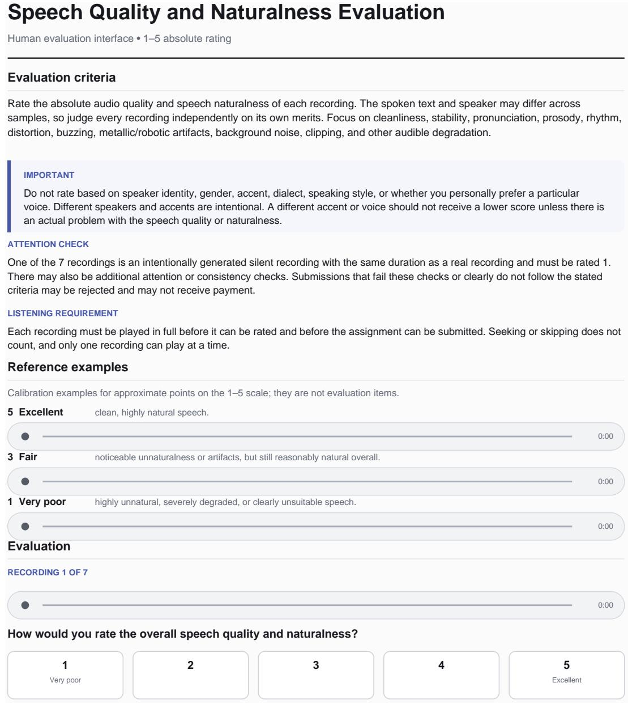  
Figure 5: NMOS evaluation interface. Evaluators rate the speech quality and naturalness of the assistant response following the user interruption on a five-point scale.

Full-Duplex Dialogue Naturalness Evaluation  
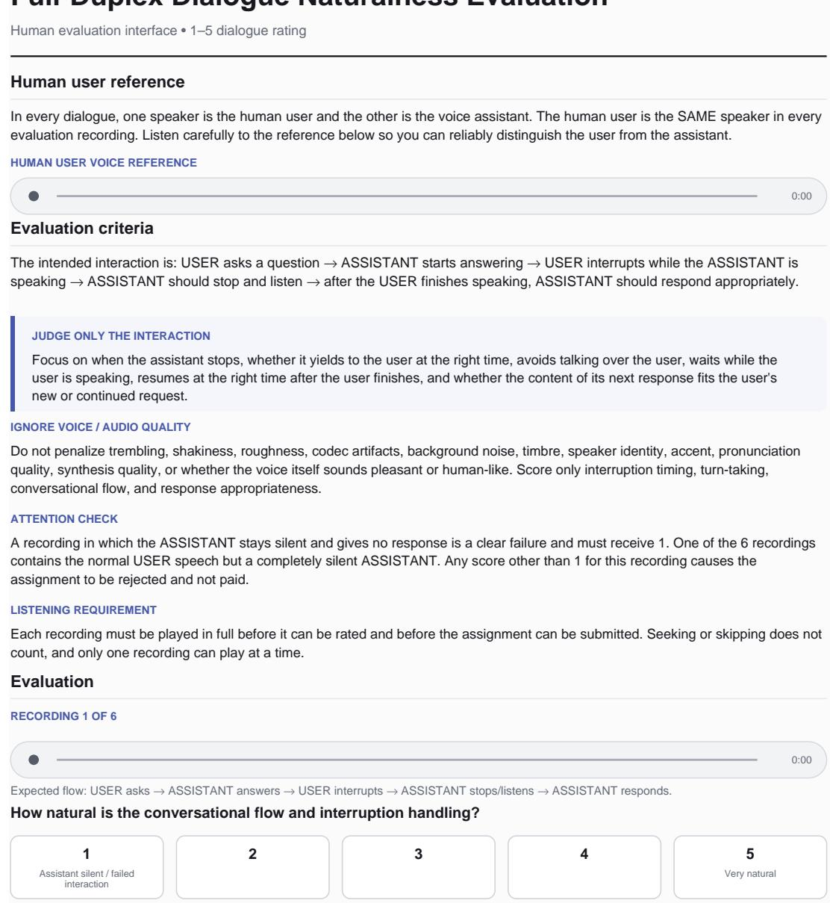  
Figure 6: DMOS evaluation interface. Evaluators rate the complete interaction on a five-point scale while focusing on interruption handling and conversational flow.

Table 5: Paired Full-Duplex-Bench v1.0 comparisons against the autoregressive personaplex-rl-seamless backbone. AR and DiffuPlex values are computed over the paired clips used by each test and may therefore differ from the aggregate values in the main table. ∆ denotes DiffuPlex minus AR. Holm correction is applied jointly over all 20 comparisons. † denotes a binary comparison for which the two systems have identical clip-level outcomes.
<table><tr><td>Policy</td><td>Metric</td><td>Test</td><td>n</td><td>AR</td><td>DiffuPlex</td><td>∆</td><td>Raw p</td><td>Holm p</td></tr><tr><td rowspan="10">LISTEN</td><td>Pause C</td><td>McNemar</td><td>216</td><td>0.3009</td><td>0.3426</td><td>+0.0417</td><td>0.2221</td><td>1.0000</td></tr><tr><td>Pause S</td><td>McNemar</td><td>137</td><td>0.2993</td><td>0.2774</td><td>-0.0219</td><td>0.6776</td><td>1.0000</td></tr><tr><td>BC TOR</td><td>McNemar</td><td>55</td><td>0.2182</td><td>0.1091</td><td>-0.1091</td><td>0.2379</td><td>1.0000</td></tr><tr><td>BC Freq</td><td>Wilcoxon</td><td>55</td><td>0.1634</td><td>0.1402</td><td>-0.0231</td><td>0.0266</td><td>0.5320</td></tr><tr><td>BC JSD</td><td>Wilcoxon</td><td>55</td><td>0.7405</td><td>0.7534</td><td>+0.0130</td><td>0.0859</td><td>1.0000</td></tr><tr><td>Turn TOR</td><td>McNemar†</td><td>119</td><td>1.0000</td><td>1.0000</td><td>0.0000</td><td>1.0000</td><td>1.0000</td></tr><tr><td>Turn Lat.</td><td>Wilcoxon</td><td>119</td><td>0.1242</td><td>0.1732</td><td>+0.0490</td><td>0.3609</td><td>1.0000</td></tr><tr><td>Int. TOR</td><td>McNemar</td><td>200</td><td>0.9950</td><td>0.9900</td><td>-0.0050</td><td>1.0000</td><td>1.0000</td></tr><tr><td>Int. Lat.</td><td>Wilcoxon</td><td>197</td><td>0.2412</td><td>0.3070</td><td>+0.0658</td><td>0.0535</td><td>1.0000</td></tr><tr><td>Int. Judge</td><td>Wilcoxon</td><td>197</td><td>4.2843</td><td>4.3299</td><td>+0.0457</td><td>0.6279</td><td>1.0000</td></tr><tr><td rowspan="10">SPEAK</td><td>Pause C</td><td>McNemar</td><td>216</td><td>0.3009</td><td>0.3472</td><td>+0.0463</td><td>0.1934</td><td>1.0000</td></tr><tr><td>Pause S</td><td>McNemar</td><td>137</td><td>0.2993</td><td>0.2628</td><td>-0.0365</td><td>0.4049</td><td>1.0000</td></tr><tr><td>BC TOR</td><td>McNemar</td><td>55</td><td>0.2182</td><td>0.1455</td><td>-0.0727</td><td>0.4545</td><td>1.0000</td></tr><tr><td>BC Freq</td><td>Wilcoxon</td><td>55</td><td>0.1634</td><td>0.1543</td><td>-0.0091</td><td>0.4666</td><td>1.0000</td></tr><tr><td>BC JSD</td><td>Wilcoxon</td><td>55</td><td>0.7405</td><td>0.7378</td><td>-0.0027</td><td>0.8210</td><td>1.0000</td></tr><tr><td>Turn TOR</td><td>McNemar†</td><td>119</td><td>1.0000</td><td>1.0000</td><td>0.0000</td><td>1.0000</td><td>1.0000</td></tr><tr><td>Turn Lat.</td><td>Wilcoxon</td><td>119</td><td>0.1242</td><td>0.1559</td><td>+0.0317</td><td>0.6327</td><td>1.0000</td></tr><tr><td>Int. TOR</td><td>McNemar†</td><td>200</td><td>0.9950</td><td>0.9950</td><td>0.0000</td><td>1.0000</td><td>1.0000</td></tr><tr><td>Int. Lat.</td><td>Wilcoxon</td><td>199</td><td>0.2806</td><td>0.3465</td><td>+0.0659</td><td>0.1104</td><td>1.0000</td></tr><tr><td>Int. Judge</td><td>Wilcoxon</td><td>199</td><td>4.2864</td><td>4.3568</td><td>+0.0704</td><td>0.3263</td><td>1.0000</td></tr></table>

We conduct two complementary human evaluations on Amazon Mechanical Turk (MTurk) using user-interruption examples from Full-Duplex-Bench v1.0. Naturalness mean opinion score (NMOS) evaluates only the assistant speech following the interruption, whereas dialog mean opinion score (DMOS) evaluates the complete interaction, including how the assistant yields to the interruption and resumes afterward. For each assignment, outputs from the compared systems correspond to the same underlying interaction, with presentation order randomized and model identities hidden.

Speech naturalness. For NMOS, evaluators hear only the assistant response following the interruption and answer, “How would you rate the overall speech quality and naturalness?”, on a five-point scale from 1 (Very poor) to 5 (Excellent). They are instructed to judge speech quality and naturalness, including pronunciation, prosody, rhythm, and audio artifacts, while ignoring speaker identity, accent, speaking style, and personal voice preference. Before rating, workers are provided with fixed reference recordings illustrating approximate scores of 5, 3, and 1 for scale calibration. Each assignment includes two attention checks: an intentionally silent recording and a known score-1 calibration item, both of which must receive a score of 1. Assignments that fail either check are discarded and recollected from a new worker. The interface requires every recording to be played in full before submission. The final NMOS analysis contains 200 valid assignments from 120 workers.

Conversational interaction. For DMOS, evaluators hear the complete interaction and answer, “How natural is the conversational flow and interruption handling?”, on a five-point scale from 1 (Very unnatural) to 5 (Very natural). They are instructed to judge whether the assistant yields at an appropriate time, avoids talking over the user, waits while the user is speaking, resumes appropri ately, and produces a response that fits the user’s continued or revised request. Because DMOS is intended to isolate interaction behavior, evaluators are explicitly instructed to ignore acoustic quality, including synthesis artifacts, timbre, speaker identity, accent, and pronunciation. Each assignment contains one attention-check interaction with the normal user channel but a completely silent assistant channel, which must receive a score of 1. Assignments that fail this check are discarded and recollected from a new worker. The interface requires every recording to be played in full before submission. The final DMOS analysis contains 180 valid assignments from 84 workers.

Table 6: Full-Duplex-Bench v1.5 behavioral response distributions and interaction latencies. Stop and response latencies are reported in seconds.
<table><tr><td>Scenario</td><td>Class / Metric</td><td>AR backbone</td><td>DiffuPlex-LISTEN</td><td>DiffuPlex-SPEAK</td></tr><tr><td rowspan="6">User interruption</td><td>Respond ↑</td><td>0.94</td><td>0.95</td><td>0.96</td></tr><tr><td> ${ \mathrm { R e s u m e } } \downarrow$ </td><td>0.04</td><td>0.04</td><td>0.04</td></tr><tr><td>Uncertain ↓</td><td>0.00</td><td>0.01</td><td>0.00</td></tr><tr><td>Unknown↓</td><td>0.02</td><td>0.00</td><td>0.00</td></tr><tr><td>Stop (s) ↓</td><td>0.443</td><td>0.459</td><td>0.446</td></tr><tr><td>Resp. (s) ↓</td><td>0.368</td><td>0.417</td><td>0.455</td></tr><tr><td rowspan="6">User backchannel</td><td>Respond↓</td><td>0.11</td><td>0.06</td><td>0.06</td></tr><tr><td>Resume ↑</td><td>0.74</td><td>0.92</td><td>0.91</td></tr><tr><td>Uncertain ↓</td><td>0.01</td><td>0.01</td><td>0.00</td></tr><tr><td>Unknown↓</td><td>0.13</td><td>0.01</td><td>0.03</td></tr><tr><td>Stop (s) ↑</td><td>0.586</td><td>0.556</td><td>0.598</td></tr><tr><td>Resp. (s) ↓</td><td>0.603</td><td>0.598</td><td>0.730</td></tr><tr><td rowspan="6">Talking to other</td><td>Respond↓</td><td>0.60</td><td>0.56</td><td>0.54</td></tr><tr><td>Resume ↑</td><td>0.26</td><td>0.31</td><td>0.34</td></tr><tr><td>Uncertain ↑</td><td>0.05</td><td>0.01</td><td>0.03</td></tr><tr><td>Unknown ↓</td><td>0.09</td><td>0.12</td><td>0.09</td></tr><tr><td>Stop (s) ↑</td><td>0.528</td><td>0.515</td><td>0.547</td></tr><tr><td>Resp. (s) ↓</td><td>0.387</td><td>0.322</td><td>0.364</td></tr><tr><td rowspan="6">Background speech</td><td>Respond↓</td><td>0.49</td><td>0.46</td><td>0.49</td></tr><tr><td>Resume ↑</td><td>0.39</td><td>0.45</td><td>0.35</td></tr><tr><td>Uncertain ↑</td><td>0.01</td><td>0.01</td><td>0.04</td></tr><tr><td>Unknown ↓</td><td>0.11</td><td>0.08</td><td>0.12</td></tr><tr><td>Stop (s) ↑</td><td>0.710</td><td>0.630</td><td>0.680</td></tr><tr><td>Resp. (s) ↓</td><td>0.362</td><td>0.291</td><td>0.452</td></tr></table>

Table 7: Speech-feature changes before and after user interruption for trials classified as RESPOND, following the Full-Duplex-Bench v1.5 evaluation protocol. Each cell reports pre-overlap → postoverlap, followed by the post-minus-pre change and paired t-test p-value. The number of valid paired trials varies slightly across systems and features because RESPOND filtering and the benchmark’s MAD-based outlier removal (k = 3.5) are applied separately to each system.
<table><tr><td>Model</td><td>WPM</td><td>Pitch Mean</td><td>Pitch SD</td><td>Intensity Mean</td><td>Intensity SD</td><td>UTMOSv2</td></tr><tr><td rowspan="2">AR backbone</td><td> $1 4 1 . 0 5  2 2 0 . 0 5$ </td><td> $2 3 8 . 4 5  2 3 6 . 7 7$ </td><td> $4 6 . 2 4  4 6 . 3 0$ </td><td> $\overline { { 5 9 . 1 0 \to 6 0 . 4 8 } }$ </td><td> $\overline { { 1 7 . 9 3 \to 1 5 . 9 8 } }$ </td><td> $2 . 8 2 9 \to 2 . 8 5 8$ </td></tr><tr><td> $( + 7 9 . 0 0 , \ p < . 0 0 1 )$ </td><td> $\left( - 1 . 6 8 , \ p = . 1 3 4 \right)$ </td><td> $( + 0 . 0 6 , \ p = . 9 5 0 )$ </td><td> $( + 1 . 3 8 , \ p < . 0 0 1 )$ </td><td> $( - 1 . 9 5 , ~ p < . 0 0 1 )$ </td><td> $( + 0 . 0 2 9 , \ p = . 4 2 9 )$ </td></tr><tr><td rowspan="2">DiffuPlex-LISTEN</td><td> $\overline { { 1 4 0 . 7 9  2 1 9 . 9 0 } }$ </td><td> $\overline { { 2 3 8 . 3 2  2 3 4 . 5 3 } }$ </td><td> $4 4 . 4 0  4 2 . 5 8$ </td><td> $\overline { { 5 8 . 6 4  6 0 . 2 5 } }$ </td><td> $\overline { { 1 8 . 5 8 \to 1 6 . 2 2 } }$ </td><td> $2 . 6 9 7  2 . 8 1 2$ </td></tr><tr><td> $( + 7 9 . 1 1 , ~ p < . 0 0 1 )$ </td><td> $( - 3 . 7 9 , \ p = . 0 0 1 )$ </td><td> $( - 1 . 8 2 , ~ p = . 0 6 5 )$ </td><td> $( + 1 . 6 1 , ~ p < . 0 0 1 )$ </td><td> $( - 2 . 3 7 , ~ p < . 0 0 1 )$ </td><td> $( + 0 . 1 1 5 , ~ p < . 0 0 1 )$ </td></tr><tr><td rowspan="2">DiffuPlex-SPEAK</td><td> $1 4 1 . 7 6  2 2 0 . 0 4$ </td><td> $\overline { { 2 3 9 . 4 6 \to 2 3 6 . 3 6 } }$ </td><td> $4 7 . 5 7  4 6 . 6 4$ </td><td> $5 8 . 0 2  6 0 . 2 2$ </td><td> $1 8 . 2 1  1 6 . 0 8$ </td><td> $\overline { { 2 . 5 4 9 \to 2 . 6 3 5 } }$ </td></tr><tr><td> $( + 7 8 . 2 8 , \ p < . 0 0 1 )$ </td><td> $\left( - 3 . 0 9 , \ p = . 0 2 3 \right)$ </td><td> $( - 0 . 9 3 , \ p = . 3 6 7 )$ </td><td> $( + 2 . 2 1 , ~ p < . 0 0 1 )$ </td><td> $( - 2 . 1 3 , ~ p < . 0 0 1 )$ </td><td> $\left( + 0 . 0 8 6 , \ p = . 0 2 4 \right)$ </td></tr></table>

## G ADDITIONAL RESULTS

## G.1 PAIRED SIGNIFICANCE RESULTS

Table 5 reports the 20 paired Full-Duplex-Bench v1.0 comparisons defined in Appendix E.4. Each comparison uses the same clips for the autoregressive backbone and DiffuPlex, so the test asks whether the two systems behave differently on matched examples rather than comparing independent sets of outputs. For binary outcomes such as TOR, we use the exact McNemar test, which examines how often the two systems disagree on the same clips. For continuous or ordinal quantities such as latency, backchannel frequency, JSD, and interruption score, we use the two-sided Wilcoxon signed-rank test, which compares the paired differences across clips without assuming that those differences are normally distributed. The raw p-value measures the evidence for a difference in each individual comparison, while the Holm-adjusted p-value additionally accounts for testing 20 hypotheses jointly. We use the adjusted values when determining statistical significance. None of the 20 comparisons remains significant after Holm correction, so these tests do not detect a statistically significant difference between DiffuPlex and the autoregressive backbone on any evaluated metric. This should not be interpreted as evidence that the systems are formally equivalent.

Table 8: Complete VoiceBench results. Values follow the benchmark’s official task-specific scoring and are reported on the common percentage scale used for aggregation. Overall is the aggregate reported in the main paper.
<table><tr><td>Model</td><td>Mode</td><td>AlpacaEval</td><td>CommonEval</td><td>WildVoice</td><td>SD-QA</td><td>OpenBookQA</td><td>MMSU</td><td>BBH</td><td>IFEval</td><td>AdvBench</td><td>Overall</td></tr><tr><td>AR backbone</td><td>s→t</td><td>51.99</td><td>43.73</td><td>36.19</td><td>20.34</td><td>25.71</td><td>24.89</td><td>48.60</td><td>12.99</td><td>23.08</td><td>31.95</td></tr><tr><td>DiffuPlex-LISTEN</td><td>s→t</td><td>50.91</td><td>45.00</td><td>36.82</td><td>22.42</td><td>25.05</td><td>25.05</td><td>49.30</td><td>12.00</td><td>20.77</td><td>31.93</td></tr><tr><td>DiffuPlex-SPEAK</td><td>s→t</td><td>49.88</td><td>44.03</td><td>35.92</td><td>19.89</td><td>22.64</td><td>25.57</td><td>47.10</td><td>13.82</td><td>21.92</td><td>31.20</td></tr><tr><td>AR backbone</td><td>s→ s</td><td>52.05</td><td>44.43</td><td>36.17</td><td>17.81</td><td>24.62</td><td>24.11</td><td>47.80</td><td>13.08</td><td>24.42</td><td>31.61</td></tr><tr><td>DiffuPlex-LISTEN</td><td>s→s</td><td>50.37</td><td>44.23</td><td>36.58</td><td>20.16</td><td>25.71</td><td>24.43</td><td>48.40</td><td>12.25</td><td>21.54</td><td>31.52</td></tr><tr><td>DiffuPlex-SPEAK</td><td>s→ s</td><td>49.15</td><td>43.33</td><td>35.75</td><td>17.18</td><td>24.40</td><td>24.95</td><td>48.40</td><td>13.28</td><td>22.88</td><td>31.04</td></tr></table>

Table 9: OpenAudioBench results. The four task columns retain their original score ranges. Overall first normalizes each task to a percentage scale and then averages across tasks.
<table><tr><td>Model</td><td>Mode</td><td>Llama Questions (0—100)</td><td>Web Questions (0—10)</td><td>TriviaQA (0−10)</td><td>AlpacaEval (1−10)</td><td>Overall (%)</td></tr><tr><td>AR backbone</td><td>s→t</td><td>54.20</td><td>2.95</td><td>1.92</td><td>3.97</td><td>35.66</td></tr><tr><td>DiffuPlex-LISTEN</td><td>s→t</td><td>57.60</td><td>3.07</td><td>1.92</td><td>3.93</td><td>36.71</td></tr><tr><td>DiffuPlex-SPEAK</td><td>s→t</td><td>55.53</td><td>3.07</td><td>1.86</td><td>3.85</td><td>35.82</td></tr><tr><td>AR backbone</td><td>s→s</td><td>49.33</td><td>2.96</td><td>1.75</td><td>3.97</td><td>34.03</td></tr><tr><td>DiffuPlex-LISTEN</td><td>s→s</td><td>46.73</td><td>3.02</td><td>1.80</td><td>3.92</td><td>33.53</td></tr><tr><td>DiffuPlex-SPEAK</td><td>s→s</td><td>46.07</td><td>2.84</td><td>1.62</td><td>3.78</td><td>32.12</td></tr></table>

## G.2 FULL-DUPLEX-BENCH V1.5

Tables 6 and 7 report the Full-Duplex-Bench v1.5 behavioral and speech-feature analyses under the protocol described in Appendix E.1. Across the four overlap conditions, DiffuPlex shows broadly similar response and resume patterns to the autoregressive backbone. For user interruptions, the response rate is 0.94 for the backbone and 0.95 and 0.96 for DiffuPlex-LISTEN and DiffuPlex-SPEAK, respectively. For user backchannels, DiffuPlex resumes the interrupted response more often than the backbone (0.92 and 0.91 versus 0.74) while producing fewer new responses (0.06 versus 0.11). The talking-to-other and background-speech conditions show smaller, mixed shifts in response and resume behavior.

Table 7 follows the benchmark’s speech-feature analysis for user-interruption trials classified as RE-SPOND. All three systems exhibit a large post-interruption increase in speaking rate, together with higher mean intensity and lower intensity variability. Mean pitch decreases significantly for both DiffuPlex policies but not for the autoregressive backbone, while pitch variability does not change significantly for any system. UTMOSv2 remains statistically unchanged for the autoregressive backbone and increases slightly for both DiffuPlex policies. These tests evaluate pre/post changes within each system; they do not test whether the magnitude of those changes differs significantly across systems.

## G.3 VOICEBENCH AND OPENAUDIOBENCH

Tables 8 and 9 provide the per-task results underlying the aggregate VoiceBench and OpenAudioBench scores reported in the main paper. As defined in Appendix E.2, speech-to-text (s → t) directly evaluates the native assistant text stream, whereas speech-to-speech (s → s) evaluates a transcription of the generated assistant audio. DiffuPlex-LISTEN remains close to the autoregressive backbone across both benchmarks, while DiffuPlex-SPEAK shows mixed changes across modalities, with its largest aggregate reduction on OpenAudioBench speech-to-speech. The changes are spread across multiple tasks rather than being driven by a single benchmark category.

## G.4 DEFERRED-EXECUTION RUNTIME RESULTS

The detailed runtime decomposition for the autoregressive backbone, model baselines, and Diffu-Plex is reported in Table 2 in the main paper. Table 10 reports the corresponding runtime measurements for the deferred-execution baselines. Larger deferral limits can produce higher raw speedups by forcing longer periods of assistant silence between autoregressive backbone updates; the resulting interaction trade-offs are analyzed in the main paper. For SILERO and SMART TURN, controller decisions are replayed during timed generation, so controller inference is excluded from the re ported runtime. Measured separately, the SMART TURN controller pipeline requires approximately 13.90ms of CPU processing per interaction second, with approximately 80% of this cost attributable to the continuously running Silero frontend.

Table 10: Complete deferred-execution runtime results. c is measured on the fixed runtime subset and c over the complete Full-Duplex-Bench v1.0 evaluation. All speedups are relative to the autoregressive backbone. For SILERO and SMART TURN, controller decisions are precomputed and replayed during the timed loop, so controller inference is excluded from these wall-clock measurements.
<table><tr><td>System</td><td>C60</td><td>C727</td><td>Wall (s)</td><td>Wall speedup</td><td>E2E GPU (s)</td><td>E2E speedup</td><td>Core LM (s)</td><td>Core speedup</td></tr><tr><td>AR backbone</td><td>1.000</td><td>1.000</td><td>745.7</td><td>1.000×</td><td>745.3</td><td>1.000×</td><td>656.8</td><td>1.000×</td></tr><tr><td>PAD R = 2</td><td>1.531</td><td>1.447</td><td>527.8</td><td>1.413×</td><td>526.9</td><td>1.415×</td><td>433.0</td><td>1.517×</td></tr><tr><td>PAD R = 4</td><td>2.163</td><td>1.911</td><td>405.7</td><td>1.838×</td><td>404.5</td><td>1.842×</td><td>308.2</td><td>2.132×</td></tr><tr><td>PAD R = 6</td><td>2.525</td><td>2.202</td><td>363.0</td><td>2.054×</td><td>361.9</td><td>2.060×</td><td>264.7</td><td>2.482×</td></tr><tr><td>PAD R = 8</td><td>2.805</td><td>2.383</td><td>337.6</td><td>2.209×</td><td>336.4</td><td>2.216×</td><td>239.1</td><td>2.747×</td></tr><tr><td>SILERO R = 2</td><td>1.416</td><td>1.346</td><td>561.1</td><td>1.329×</td><td>560.2</td><td>1.330×</td><td>468.0</td><td>1.403×</td></tr><tr><td>SILERO R = 4</td><td>1.789</td><td>1.629</td><td>467.2</td><td>1.596×</td><td>466.1</td><td>1.599×</td><td>371.5</td><td>1.768×</td></tr><tr><td>SILERO R = 6</td><td>1.955</td><td>1.753</td><td>432.2</td><td>1.725×</td><td>431.1</td><td>1.729×</td><td>339.8</td><td>1.933×</td></tr><tr><td>SILERO R = 8</td><td>2.055</td><td>1.823</td><td>418.8</td><td>1.781×</td><td>417.7</td><td>1.784×</td><td>324.0</td><td>2.027×</td></tr><tr><td>SMART TURN R = 2</td><td>1.494</td><td>1.414</td><td>537.3</td><td>1.388×</td><td>536.4</td><td>1.390×</td><td>443.8</td><td>1.480×</td></tr><tr><td>SMART TURN R = 4</td><td>1.964</td><td>1.772</td><td>434.1</td><td>1.718×</td><td>433.1</td><td>1.721×</td><td>338.8</td><td>1.938×</td></tr><tr><td>SMART TURN R = 6</td><td>2.211</td><td>1.942</td><td>396.7</td><td>1.880×</td><td>395.6</td><td>1.884×</td><td>301.3</td><td>2.180×</td></tr><tr><td>SMART TURN R = 8</td><td>2.355</td><td>2.038</td><td>380.6</td><td>1.960×</td><td>379.4</td><td>1.964×</td><td>283.6</td><td>2.316×</td></tr><tr><td>DiffuPlex-LISTEN</td><td>1.977</td><td>1.910</td><td>512.4</td><td>1.455×</td><td>511.1</td><td>1.458×</td><td>408.4</td><td>1.608×</td></tr><tr><td>DiffuPlex-SPEAK</td><td>2.264</td><td>2.230</td><td>469.1</td><td>1.590×</td><td>467.8</td><td>1.593×</td><td>365.5</td><td>1.797×</td></tr></table>

## H ADDITIONAL ABLATIONS

The main paper focuses on the two inference components that directly determine whether a predicted future can be used during live interaction: confidence-based retention and user-aware revision. Here, we broaden the analysis to the training objective, future-gated adaptation, model and training scale, train-test horizon mismatch, inference thresholds, future attention, and the two signals used by the revision rule. Unless otherwise stated, all ablations are evaluated on the 727 clips of Full-Duplex-Bench v1.0 with the same prompts, sampling configuration, and seed as the main experiments.

For the sweep tables below, c denotes the number of interaction frames advanced per backbone wake. We additionally report the pooled LM speedup recorded during the ablation sweep. This quantity is useful for comparing configurations within the sweep, but is distinct from the controlled wall-clock, E2E GPU, and Core LM measurements reported in Table 2. Metric definitions follow Appendix E.1.

## H.1 TRAINING OBJECTIVE AND ARCHITECTURE

We first vary components that determine how the masked future predictor is learned. The default model freezes personaplex-rl-seamless, applies LoRA only for lookaheads $h \geq 2$ , and distills the clean autoregressive distributions into the masked path. We compare this model with several changes to the training objective and backbone. No gate applies the learned adapters at every lookahead, including h = 1, removing the structural guarantee that the ordinary next-frame path uses the original frozen backbone. CE only replaces the teacher distributions for the masked path with hard data targets and removes the three-way text-state distillation term. We additionally remove either the token-level text KL or the three-way PAD/EPAD/lexical KL while retaining the remaining distillation terms, and train the same DiffuPlex adaptation on the original PersonaPlex backbone rather than the post-trained personaplex-rl-seamless checkpoint. Table 11 reports the resulting efficiency and interaction metrics for both inference policies.

The future gate primarily protects the original next-frame path. Without it, the model still reduces backbone wakes, but turn-taking TOR changes from 1.000 to .983 for LISTEN and .975 for SPEAK, with corresponding turn latencies of .202s and .253s. The gate therefore provides a structural separation between the unchanged autoregressive prediction at h = 1 and the learned masked-future behavior at deeper lookaheads. Replacing teacher distillation with hard-target cross-entropy also shortens the usable future horizon: c decreases from 1.91 to 1.76 for LISTEN and from 2.23 to 2.07 for SPEAK. The interaction changes are not uniform across metrics, but the reduced advancement and larger LISTEN interruption latency (.512s versus .329s) are consistent with a benefit from matching the backbone distribution rather than relying only on hard future targets. Removing either text KL term produces mixed changes across the interaction metrics. Both ablations reduce the interruption Judge score for both policies, with the largest drop from 4.357 to 4.202 when removing the token-level text KL for SPEAK. The final model retains both text KL terms.

Table 11: Training-objective and architecture ablations on Full-Duplex-Bench v1.0. The shaded rows report the autoregressive PersonaPlex and personaplex-rl-seamless references evaluated under the same protocol. The future gate leaves the h = 1 autoregressive path unchanged; removing it (No gate) allows the learned adapters to modify this path.
<table><tr><td></td><td colspan="2">Efficiency</td><td colspan="2">Pause</td><td colspan="3">Backchannel</td><td colspan="2">Turn</td><td colspan="3">Interruption</td></tr><tr><td>Variant</td><td>C</td><td>LM×</td><td>S↓</td><td>C↓</td><td>TOR↓</td><td>Freq.</td><td>JSD↓</td><td>TOR↑</td><td>Lat.↓</td><td>TOR↑</td><td>Judge↑</td><td>Lat.↓</td></tr><tr><td>personaplex-rl-seamless (AR)</td><td>1.00</td><td>1.00</td><td>.299</td><td>.301</td><td>.218</td><td>.163</td><td>.740</td><td>1.000</td><td>.124</td><td>.995</td><td>4.286</td><td>.281</td></tr><tr><td>Default / LISTEN</td><td>1.91</td><td>1.56</td><td>.277</td><td>.343</td><td>.109</td><td>.140</td><td>.753</td><td>1.000</td><td>.173</td><td>.990</td><td>4.328</td><td>.329</td></tr><tr><td>Default / SPEAK</td><td>2.23</td><td>1.77</td><td>.263</td><td>.347</td><td>.145</td><td>.154</td><td>.738</td><td>1.000</td><td>.156</td><td>.995</td><td>4.357</td><td>.347</td></tr><tr><td>No gate / LISTEN</td><td>1.86</td><td>1.67</td><td>.292</td><td>.301</td><td>.091</td><td>.176</td><td>.729</td><td>.983</td><td>.202</td><td>1.000</td><td>4.340</td><td>.296</td></tr><tr><td>No gate / SPEAK</td><td>2.11</td><td>1.89</td><td>.263</td><td>.282</td><td>.109</td><td>.162</td><td>.738</td><td>.975</td><td>.253</td><td>1.000</td><td>4.265</td><td>.265</td></tr><tr><td>CE only / LISTEN</td><td>1.76</td><td>1.44</td><td>.277</td><td>.352</td><td>.091</td><td>.136</td><td>.758</td><td>1.000</td><td>.182</td><td>.985</td><td>4.365</td><td>.512</td></tr><tr><td>CE only / SPEAK</td><td>2.07</td><td>1.65</td><td>.270</td><td>.324</td><td>.091</td><td>.180</td><td>.729</td><td>1.000</td><td>.196</td><td>.980</td><td>4.332</td><td>.327</td></tr><tr><td>w/o token-level text KL / LISTEN</td><td>1.91</td><td>1.56</td><td>.292</td><td>.347</td><td>.109</td><td>.161</td><td>.738</td><td>1.000</td><td>.139</td><td>.985</td><td>4.259</td><td>.388</td></tr><tr><td>w/o token-level text KL / SPEAK</td><td>2.24</td><td>1.78</td><td>.270</td><td>.343</td><td>.054</td><td>.219</td><td>.720</td><td>1.000</td><td>.121</td><td>.990</td><td>4.202</td><td>.293</td></tr><tr><td>w/o three-way text-state KL / LISTEN</td><td>1.89</td><td>1.54</td><td>.277</td><td>.389</td><td>.182</td><td>.165</td><td>.737</td><td>1.000</td><td>.161</td><td>.980</td><td>4.250</td><td>.280</td></tr><tr><td>w/o three-way text-state KL / SPEAK</td><td>2.26</td><td>1.79</td><td>.255</td><td>.324</td><td>.054</td><td>.142</td><td>.747</td><td>1.000</td><td>.178</td><td>.990</td><td>4.318</td><td>.369</td></tr><tr><td>PersonaPlex (AR)</td><td>1.00</td><td>-</td><td>.307</td><td>.343</td><td>.200</td><td>.058</td><td>.824</td><td>.941</td><td>.285</td><td>.930</td><td>4.328</td><td>.218</td></tr><tr><td>PersonaPlex backbone / LISTEN</td><td>1.76</td><td>1.44</td><td>.577</td><td>.630</td><td>.400</td><td>.104</td><td>.743</td><td>.992</td><td>.170</td><td>.905</td><td>4.243</td><td>1.277</td></tr><tr><td>PersonaPlex backbone / SPEAK</td><td>2.02</td><td>1.61</td><td>.606</td><td>.620</td><td>.327</td><td>.112</td><td>.744</td><td>.966</td><td>.154</td><td>.920</td><td>4.071</td><td>1.347</td></tr></table>

Table 12: Model and training-scale ablations. Matched-W rows use the same horizon during training and inference. Increasing adapter capacity or training duration does not produce a monotonic change in the usable future horizon.
<table><tr><td></td><td colspan="2">Efficiency</td><td colspan="2">Pause</td><td colspan="3">Backchannel</td><td colspan="2">Turn</td><td colspan="3">Interruption</td></tr><tr><td>Variant</td><td>C</td><td>LM×</td><td>S↓</td><td>C↓</td><td>TOR↓</td><td>Freq.</td><td>JSD↓</td><td>TOR↑</td><td>Lat.↓</td><td>TOR↑</td><td>Judge↑</td><td>Lat.↓</td></tr><tr><td>Default / LISTEN</td><td>1.91</td><td>1.56</td><td>.277</td><td>.343</td><td>.109</td><td>.140</td><td>.753</td><td>1.000</td><td>.173</td><td>.990</td><td>4.328</td><td>.329</td></tr><tr><td>Default / SPEAK</td><td>2.23</td><td>1.77</td><td>.263</td><td>.347</td><td>.145</td><td>.154</td><td>.738</td><td>1.000</td><td>.156</td><td>.995</td><td>4.357</td><td>.347</td></tr><tr><td>Train W = 8 / LISTEN</td><td>1.86</td><td>1.58</td><td>.248</td><td>.366</td><td>.109</td><td>.146</td><td>.751</td><td>1.000</td><td>.242</td><td>.985</td><td>4.371</td><td>.344</td></tr><tr><td>Train W = 8 / SPEAK</td><td>2.21</td><td>1.82</td><td>.255</td><td>.356</td><td>.291</td><td>.149</td><td>.740</td><td>.992</td><td>.202</td><td>.990</td><td>4.308</td><td>.315</td></tr><tr><td>Train W = 32 / LISTEN</td><td>1.90</td><td>1.43</td><td>.277</td><td>.356</td><td>.200</td><td>.146</td><td>.749</td><td>1.000</td><td>.159</td><td>.980</td><td>4.327</td><td>.342</td></tr><tr><td>Train W = 32 / SPEAK</td><td>2.23</td><td>1.63</td><td>.292</td><td>.356</td><td>.182</td><td>.144</td><td>.744</td><td>1.000</td><td>.112</td><td>.985</td><td>4.320</td><td>.361</td></tr><tr><td>LoRA rank 32 / LISTEN</td><td>1.92</td><td>1.58</td><td>.226</td><td>.241</td><td>.145</td><td>.127</td><td>.760</td><td>.958</td><td>.206</td><td>.990</td><td>4.328</td><td>.427</td></tr><tr><td>LoRA rank 32 / SPEAK</td><td>2.25</td><td>1.78</td><td>.219</td><td>.231</td><td>.109</td><td>.126</td><td>.762</td><td>.966</td><td>.231</td><td>.990</td><td>4.338</td><td>.370</td></tr><tr><td>LoRA rank 512 / LISTEN LoRA rank 512 / SPEAK</td><td>1.88</td><td>1.44</td><td>.248</td><td>.259</td><td>.036</td><td>.117</td><td>.765</td><td>.992</td><td>.132</td><td>.995</td><td>4.467</td><td>.318</td></tr><tr><td></td><td>2.26</td><td>1.67</td><td>.248</td><td>.306</td><td>.164</td><td>.124</td><td>.765</td><td>1.000</td><td>.160</td><td>.985</td><td>4.244</td><td>.333</td></tr><tr><td>263 steps (~351h) / LISTEN</td><td>1.90</td><td>1.55</td><td>.277</td><td>.375</td><td>.145</td><td>.150</td><td>.744</td><td>1.000</td><td>.153</td><td>.980</td><td>4.357</td><td>.313</td></tr><tr><td>263 steps (~351h) / SPEAK</td><td>2.25</td><td>1.79</td><td>.285</td><td>.347</td><td>.109</td><td>.159</td><td>.744</td><td>.992</td><td>.271</td><td>.990</td><td>4.298</td><td>.439</td></tr><tr><td>1,052 steps (～1,404h) / LISTEN</td><td>1.88</td><td>1.54</td><td>.292</td><td>.347</td><td>.073</td><td>.160</td><td>.736</td><td>1.000</td><td>.103</td><td>.990</td><td>4.278</td><td>.326</td></tr><tr><td>1,052 steps (～1,404h) / SPEAK</td><td>2.25</td><td>1.78</td><td>.270</td><td>.315</td><td>.091</td><td>.157</td><td>.736</td><td>1.000</td><td>.119</td><td>.985</td><td>4.289</td><td>.323</td></tr></table>

The PersonaPlex-backbone variant separates the ability to advance multiple frames from the ability to preserve the behavior of a particular backbone. DiffuPlex still reaches c = 1.76 for LISTEN and 2.02 for SPEAK on PersonaPlex, showing that wake reduction transfers to this backbone. However, pause and interruption behavior shifts substantially; for example, interruption TOR becomes .905 and .920, with latencies of 1.277s and 1.347s. Thus, wake reduction transfers to PersonaPlex, but preservation of the underlying interaction behavior does not transfer automatically.

## H.2 MODEL AND TRAINING SCALE

We next vary three training-scale axes: the maximum future block used during training, LoRA rank, and the number of optimization steps. The default uses $W = 1 6$ , rank 128, and 526 optimization steps. For the training-horizon variants, we use the same W at inference as during training, yielding matched 8 → 8 and $3 2  3 2$ settings; train-inference horizon mismatch is examined separately in Appendix H.3. To examine the effect of training exposure, the 263-step and 1,052-step variants use schedules whose learning-rate decay is defined to terminate at their respective final steps, rather than taking intermediate checkpoints from a longer run. Table 12 reports the resulting efficiency and interaction metrics. Across the rank and training-duration sweeps, the number of frames advanced per wake remains relatively stable, while individual interaction metrics vary in both directions. Increasing LoRA rank from 128 to 512 or doubling training from 526 to 1,052 steps does not yield a consistent improvement, whereas rank 32 retains a similar c but shifts turn-taking behavior.

Table 13: Train-inference horizon mismatch on Full-Duplex-Bench v1.0. The retained advancement c changes little across most combinations even when the maximum proposed horizon changes substantially.
<table><tr><td></td><td colspan="2">Efficiency</td><td colspan="2">Pause</td><td colspan="3">Backchannel</td><td colspan="2">Turn</td><td colspan="3">Interruption</td></tr><tr><td>Train → infer</td><td>C</td><td>LM×</td><td>S↓</td><td> ${ \mathrm { C } } \downarrow$ </td><td>TOR↓</td><td>Freq.</td><td>JSD↓</td><td>TOR↑</td><td>Lat.↓</td><td>TOR↑</td><td>Judge↑</td><td> $\mathrm { L a t . } \downarrow$ </td></tr><tr><td>8 → 16 / LISTEN</td><td>1.89</td><td>1.55</td><td>.307</td><td>.347</td><td>.127</td><td>.162</td><td>.736</td><td>1.000</td><td>.200</td><td>1.000</td><td>4.300</td><td>.372</td></tr><tr><td>8 → 16 / SPEAK</td><td>2.25</td><td>1.79</td><td>.292</td><td>.333</td><td>.091</td><td>.146</td><td>.745</td><td>1.000</td><td>.182</td><td>.995</td><td>4.226</td><td>.429</td></tr><tr><td>8 → 32 / LISTEN</td><td>1.91</td><td>1.44</td><td>.299</td><td>.389</td><td>.073</td><td>.146</td><td>.745</td><td>1.000</td><td>.157</td><td>.995</td><td>4.332</td><td>.400</td></tr><tr><td>8 → 32 / SPEAK</td><td>2.27</td><td>1.66</td><td>.255</td><td>.384</td><td>.218</td><td>.153</td><td>.741</td><td>.992</td><td>.160</td><td>.985</td><td>4.284</td><td>.349</td></tr><tr><td>16 → 8 / LISTEN</td><td>1.86</td><td>1.58</td><td>.365</td><td>.394</td><td>.145</td><td>.155</td><td>.742</td><td>1.000</td><td>.162</td><td>.990</td><td>4.293</td><td>.335</td></tr><tr><td>16 → 8 / SPEAK</td><td>2.20</td><td>1.81</td><td>.350</td><td>.380</td><td>.091</td><td>.158</td><td>.741</td><td>1.000</td><td>.155</td><td>.990</td><td>4.328</td><td>.318</td></tr><tr><td>16 → 32 / LISTEN</td><td>1.88</td><td>1.42</td><td>.285</td><td>.356</td><td>.127</td><td>.142</td><td>.743</td><td>.992</td><td>.170</td><td>1.000</td><td>4.435</td><td>.523</td></tr><tr><td>16 → 32 / SPEAK</td><td>2.24</td><td>1.64</td><td>.299</td><td>.347</td><td>.145</td><td>.144</td><td>.745</td><td>.992</td><td>.146</td><td>.980</td><td>4.398</td><td>.316</td></tr><tr><td>32 → 8 / LISTEN</td><td>1.87</td><td>1.59</td><td>.307</td><td>.347</td><td>.145</td><td>.144</td><td>.749</td><td>1.000</td><td>.152</td><td>.990</td><td>4.247</td><td>.351</td></tr><tr><td>32 → 8 / SPEAK</td><td>2.19</td><td>1.81</td><td>.314</td><td>.329</td><td>127</td><td>.148</td><td>.746</td><td>1.000</td><td>.157</td><td>.985</td><td>4.340</td><td>.342</td></tr><tr><td>32 → 16 / LISTEN</td><td>1.87</td><td>1.54</td><td>.314</td><td>.361</td><td>.182</td><td>.142</td><td>.745</td><td>1.000</td><td>.149</td><td>.995</td><td>4.337</td><td>.344</td></tr><tr><td> $3 2  1 6 / \mathrm { S P E A K }$ </td><td>2.23</td><td>1.77</td><td>.285</td><td>.370</td><td>.164</td><td>.140</td><td>.750</td><td>1.000</td><td>.112</td><td>.980</td><td>4.250</td><td>.326</td></tr></table>

The matched-horizon comparison shows a different trade-off. Training and inference with $W =$ 8 yields similar advancement but larger shifts on several interaction metrics, including SPEAK backchannel TOR and turn latency. Increasing both training and inference horizons to $W = 3 2$ likewise provides little additional advancement, while the larger proposed block increases per-wake LM cost and reduces the pooled LM speedup. The default $W = 1 6$ setting lies between these two trade-offs.

## H.3 INFERENCE HORIZON

The training horizon need not equal the maximum horizon used at inference, so we evaluate all cross-horizon combinations among $W \in \{ 8 , 1 6 , 3 2 \}$ }. Table 13 reports the resulting efficiency and interaction metrics. Across the mismatch sweep, LISTEN remains near $c = 1 . 8 6 \mathrm { - } 1 . 9 1$ and SPEAK near $c = 2 . 1 9 { - 2 . 2 7 }$ despite changing the inference cap from 8 to 32. The maximum proposed horizon is therefore not the same as the amount of future that is actually used: increasing $\dot { W }$ exposes more candidate future positions, while the confidence and revision rules continue to determine how much of that future is ultimately consumed.

The per-wake LM cost of proposing the block nevertheless grows with W. For the default $W =$ 16 training, increasing the inference horizon to $W = 3 2$ leaves c nearly unchanged but reduces the pooled LM speedup from 1.56× to 1.42× for LISTEN and from 1.77× to 1.64× for SPEAK. Conversely, $W = 8$ is cheaper but does not consistently improve interaction timing. The default $W = 1 6$ provides an intermediate horizon without proposing substantially more candidate positions than the retention policy typically uses.

## H.4 CONFIDENCE AND RETENTION

The confidence threshold $\tau _ { \mathrm { c o n f } }$ controls how aggressively a predicted future is retained before subsequent user evidence is observed. The main experiments use $\tau _ { \mathrm { c o n f } } = 0 . 8 0 $ ; we vary it from 0.70 to 0.90 and additionally evaluate policy-specific no-confidence variants. For LISTEN, the confidence threshold is disabled while the PAD restriction and m = 6 minimum are retained. For SPEAK, the confidence threshold is disabled while the original m = 2 minimum is kept; because all assistant states are permitted, this minimum is non-binding and the full proposed future is retained. Table 14 reports the resulting efficiency and interaction metrics. As expected from the retention rule, lowering $\tau _ { \mathrm { c o n f } }$ increases advancement per wake, while raising it decreases advancement. This provides a direct inference-time control over how aggressively DiffuPlex uses its predicted future.

Table 14: Confidence-threshold ablation. Lower thresholds retain longer predicted futures, whereas stricter thresholds wake the backbone more frequently. The no-confidence intervention disables only the confidence threshold for LISTEN (retaining the PAD and $m = 6$ constraints), whereas SPEAK retains the full proposed future when confidence filtering is disabled, since its original $m \ = \ 2$ minimum is non-binding
<table><tr><td></td><td colspan="2">Efficiency</td><td colspan="2">Pause</td><td colspan="3">Backchannel</td><td colspan="2"> $\mathrm { T u r n }$ </td><td colspan="3">Interruption</td></tr><tr><td>Setting</td><td>C</td><td>LM×</td><td>S↓</td><td>C.↓</td><td>TOR↓</td><td>Freq.</td><td>JSD↓</td><td>TOR↑</td><td>Lat.↓</td><td>TOR↑</td><td>Judge↑</td><td>Lat.↓</td></tr><tr><td>LISTEN, no confidence filtering</td><td>2.11</td><td>1.64</td><td>.197</td><td>.343</td><td>.164</td><td>.191</td><td>.724</td><td>.966</td><td>.170</td><td>.980</td><td>4.398</td><td>.314</td></tr><tr><td>LISTEN  $\tau _ { \mathrm { c o n f } } = 0 . 7 0$ </td><td>1.99</td><td>1.62</td><td>.270</td><td>.319</td><td>.182</td><td>.140</td><td>.750</td><td>1.000</td><td>.191</td><td>.985</td><td>4.345</td><td>.342</td></tr><tr><td>LISTEN,  $\tau _ { \mathrm { c o n f } } = 0 . 8 0$ </td><td>1.91</td><td>1.56</td><td>.277</td><td>.343</td><td>.109</td><td>.140</td><td>.753</td><td>1.000</td><td>.173</td><td>.990</td><td>4.328</td><td>.329</td></tr><tr><td>LISTEN,  $\tau _ { \mathrm { c o n f } } = 0 . 9 0$ </td><td>1.80</td><td>1.48</td><td>.263</td><td>.366</td><td>.145</td><td>.148</td><td>.743</td><td>1.000</td><td>.089</td><td>.990</td><td>4.384</td><td>.485</td></tr><tr><td>SPEAK, no confidence filtering</td><td>2.80</td><td>2.07</td><td>.321</td><td>.347</td><td>.236</td><td>.191</td><td>.729</td><td>1.000</td><td>.209</td><td>1.000</td><td>3.550</td><td>.281</td></tr><tr><td>SPEAK,  $\tau _ { \mathrm { c o n f } } = 0 . 7 0$ </td><td>2.39</td><td>1.87</td><td>.241</td><td>.315</td><td>.145</td><td>.162</td><td>.741</td><td>.992</td><td>.218</td><td>.995</td><td>4.266</td><td>.385</td></tr><tr><td>SPEAK,  $\tau _ { \mathrm { c o n f } } = 0 . 8 0$ </td><td>2.23</td><td>1.77</td><td>.263</td><td>.347</td><td>.145</td><td>.154</td><td>.738</td><td>1.000</td><td>.156</td><td>.995</td><td>4.357</td><td>.347</td></tr><tr><td>SPEAK,  $\tau _ { \mathrm { c o n f } } = 0 . 9 0$ </td><td>2.07</td><td>1.67</td><td>.285</td><td>.366</td><td>.109</td><td>.138</td><td>.758</td><td>1.000</td><td>.166</td><td>.985</td><td>4.330</td><td>.378</td></tr></table>

Table 15: Revision-rule ablation. A larger $\tau _ { \mathrm { r e v } }$ requires stronger evidence before revising, while the no-revision variant always continues through the retained draft unless it is exhausted. The uncal ibrated User-only rows remove the assistant-side contribution while retaining the default revision threshold, and should not be interpreted as the calibrated User-only ablation in Appendix H.7.
<table><tr><td></td><td colspan="2">Efficiency</td><td colspan="2">Pause</td><td colspan="3">Backchannel</td><td colspan="2"> $\operatorname { T u r n }$ </td><td colspan="3">Interruption</td></tr><tr><td>Setting</td><td>C</td><td>LM×</td><td>S↓</td><td> $\mathrm { C \downarrow }$ </td><td>TOR↓</td><td>Freq.</td><td>JSD↓</td><td>TOR↑</td><td>Lat.↓</td><td>TOR↑</td><td>Judge↑</td><td>Lat.↓</td></tr><tr><td>LISTEN,  $\tau _ { \mathrm { r e v } } = - 1 . 0$ </td><td>1.83</td><td>1.50</td><td>.321</td><td>.384</td><td>.164</td><td>.161</td><td>.735</td><td>1.000</td><td>.136</td><td>1.000</td><td>4.350</td><td>.437</td></tr><tr><td>LISTEN,  $\tau _ { \mathrm { r e v } } = - 0 . 5$ </td><td>1.91</td><td>1.56</td><td>.277</td><td>.343</td><td>.109</td><td>.140</td><td>.753</td><td>1.000</td><td>.173</td><td>.990</td><td>4.328</td><td>.329</td></tr><tr><td>LISTEN,  $\tau _ { \mathrm { r e v } } = 0$ </td><td>1.95</td><td>1.60</td><td>.321</td><td>.352</td><td>.036</td><td>.157</td><td>.739</td><td>.992</td><td>.125</td><td>.995</td><td>4.236</td><td>.446</td></tr><tr><td>LISTEN, no revision</td><td>2.49</td><td>2.07</td><td>.146</td><td>.176</td><td>.109</td><td>.078</td><td>.796</td><td>.966</td><td>.440</td><td>.995</td><td>4.372</td><td>.744</td></tr><tr><td>LISTEN, User-only (uncalibrated)</td><td>1.00</td><td>.79</td><td>.431</td><td>.417</td><td>.145</td><td>.145</td><td>.743</td><td>1.000</td><td>.089</td><td>1.000</td><td>4.335</td><td>.307</td></tr><tr><td>SPEAK,  $\tau _ { \mathrm { r e v } } = - 1 . 0$ </td><td>2.15</td><td>1.70</td><td>.314</td><td>.370</td><td>.145</td><td>.152</td><td>.740</td><td>1.000</td><td>.152</td><td>1.000</td><td>4.350</td><td>.419</td></tr><tr><td>SPEAK,  $\tau _ { \mathrm { r e v } } = - 0 . 5$ </td><td>2.23</td><td>1.77</td><td>.263</td><td>.347</td><td>.145</td><td>.154</td><td>.738</td><td>1.000</td><td>.156</td><td>.995</td><td>4.357</td><td>.347</td></tr><tr><td>SPEAK,  $\tau _ { \mathrm { r e v } } = 0$ </td><td>2.32</td><td>1.84</td><td>.241</td><td>.329</td><td>.127</td><td>.144</td><td>.741</td><td>.983</td><td>.185</td><td>.980</td><td>4.306</td><td>.315</td></tr><tr><td>SPEAK, no revision</td><td>3.08</td><td>2.50</td><td>.131</td><td>.157</td><td>.091</td><td>.080</td><td>.797</td><td>.950</td><td>.480</td><td>.995</td><td>4.251</td><td>.515</td></tr><tr><td>SPEAK, User-only (uncalibrated)</td><td>1.00</td><td>.78</td><td>.431</td><td>.403</td><td>.109</td><td>.148</td><td>.739</td><td>1.000</td><td>.091</td><td>1.000</td><td>4.345</td><td>.265</td></tr></table>

The no-confidence interventions increase advancement for both policies, with different effects under the two retention policies. For LISTEN, where future retention remains restricted to PAD states, c in creases from 1.91 to 2.11 with comparatively modest changes in the interaction metrics. For SPEAK, the no-confidence intervention increases c from 2.23 to 2.80, but the interruption Judge score decreases from 4.357 to 3.550 and backchannel TOR increases from .145 to .236. These results show that more aggressive future retention can increase advancement while altering interaction behavior.

## H.5 REVISION RULE

Confidence determines which future frames are initially retained, whereas revision determines whether an already retained draft remains usable after new user speech arrives. We vary the revision threshold around the default $\tau _ { \mathrm { r e v } } = - 0 . 5$ and additionally disable revision entirely; Table 15 reports the resulting efficiency and interaction metrics. Lowering $\tau _ { \mathrm { r e v } }$ makes revision easier to trigger, whereas raising it requires stronger evidence and permits greater advancement. This trade-off is clearest without revision: for SPEAK, c increases from 2.23 to 3.08, but turn-taking TOR decreases from 1.000 to .950 and turn latency increases from .156s to .480s; for LISTEN, turn latency similarly increases from .173s to .440s, while backchannel frequency decreases substantially for both policies. Thus, retaining a predicted future alone is insufficient; invalidating its unplayed remainder is important for maintaining responsiveness while advancing multiple frames per wake.

For completeness, Table 15 also includes an uncalibrated User-only variant that removes the assistant-side contribution from the revision score, reducing the decision rule ${ \mathrm { t o ~ - l o g ~ } } q _ { h } ( x _ { h } ) \geq$ $\tau _ { \mathrm { r e v } }$ , where $q _ { h } ( x _ { h } )$ is the probability assigned by the stored user prediction to the user semantic token that actually arrives. Keeping the default $\tau _ { \mathrm { r e v } } = - 0 . 5$ after this removal changes the score scale: because $- \log q _ { h } ( x _ { h } ) \geq 0 .$ every eligible check triggers revision, reducing c to 1.00 for both policies and making inference slower than the autoregressive baseline. We therefore use these rows only to illustrate threshold-scale mismatch; the controlled User-only comparison in Appendix H.7 recalibrates its threshold separately.

Table 16: Causal and bidirectional future attention on Full-Duplex-Bench v1.0. The two attention variants advance a similar number of frames per wake. Bidirectional attention changes individual interaction metrics in both directions rather than providing a consistent advantage.
<table><tr><td></td><td>Efficiency</td><td colspan="2">Pause</td><td colspan="3">Backchannel</td><td colspan="2">Turn</td><td colspan="3">Interruption</td></tr><tr><td>Setting</td><td>C</td><td>S↓</td><td>C↓</td><td>TOR↓</td><td> $\mathrm { F r e q . }$ </td><td>JSD↓</td><td>TOR↑</td><td>Lat.↓</td><td>TOR↑</td><td>Judge↑</td><td>Lat.↓</td></tr><tr><td>Causal / LISTEN</td><td>1.910</td><td>.277</td><td>.343</td><td>.109</td><td>.140</td><td>.753</td><td>1.000</td><td>.173</td><td>.990</td><td>4.328</td><td>.329</td></tr><tr><td>Bidirectional / LISTEN</td><td>1.884</td><td>.299</td><td>.343</td><td>.109</td><td>.148</td><td>.752</td><td>1.000</td><td>.156</td><td>.990</td><td>4.374</td><td>.432</td></tr><tr><td>Causal / SPEAK</td><td>2.230</td><td>.263</td><td>.347</td><td>.145</td><td>.154</td><td>.738</td><td>1.000</td><td>.156</td><td>.995</td><td>4.357</td><td>.347</td></tr><tr><td>Bidirectional / SPEAK</td><td>2.223</td><td>.307</td><td>.324</td><td>.127</td><td>.143</td><td>.748</td><td>.983</td><td>.169</td><td>.985</td><td>4.284</td><td>.327</td></tr></table>

## H.6 CAUSAL AND BIDIRECTIONAL FUTURE ATTENTION

The default masked predictor retains causal temporal attention within each future block: a position may use the realized context before the block and masked positions up to its current lookahead, but not later masked positions. We compare this design with a bidirectional variant in which masked positions within the same block may attend to one another in both directions, while leaving the realized context and stream-masking schedule unchanged. Because a bidirectional representation depends on the full set of positions present in the block, we train this variant with a fixed futureblock length of 16 and evaluate it with $W = 1 6 ;$ all other inference settings, including $\tau _ { \mathrm { c o n f } } = 0 . 8 0$ $\tau _ { \mathrm { r e v } } = - 0 . 5$ , the LISTEN and SPEAK retention policies, prompts, sampling configuration, and seed, remain unchanged. Table 16 reports the resulting efficiency and interaction metrics.

The two attention patterns yield almost identical advancement: c changes from 1.910 to 1.884 for LISTEN and from 2.230 to 2.223 for SPEAK. Their interaction effects are mixed: for LISTEN, bidirectional attention slightly reduces turn latency and increases interruption Judge, but interruption latency increases from .329s to .432s; for SPEAK, some pause and backchannel metrics improve, while turn-taking TOR decreases from 1.000 to .983 and interruption TOR from .995 to .985. Bidirectional future attention therefore does not provide a consistent improvement at comparable advancement. Causal attention remains the default because it matches the causal structure of the autoregressive backbone, naturally supports variable block lengths during training, and prevents an earlier future representation from depending on how many later masked positions happen to be included in the same block.

## H.7 REVISION SIGNAL DECOMPOSITION

The full revision score combines two quantities with different roles. The User term,

$$
S _ { h } ^ { \mathrm { u s e r } } = - \log q _ { h } ( x _ { h } ) ,\tag{21}
$$

measures how surprising the newly observed user semantic token is under the continuation predicted at the previous wake, while the Assistant term,

$$
S _ { h } ^ { \mathrm { a s s t } } = \log P _ { h } ( \mathcal { A } _ { h } ( y _ { h } ) ) - \log P _ { h } ( y _ { h } ) ,\tag{22}
$$

measures how weakly the assistant preferred the drafted text decision relative to its valid alternatives. The default revision rule adds these two terms. Because removing either term changes the numerical scale of the score, using the default $\tau _ { \mathrm { r e v } } = - 0 . 5$ would not provide a meaningful decomposition. For these experiments only, we calibrate the User-only and Assistant-only thresholds on a fixed subset of Full-Duplex-Bench v1.5 to approximately match the average frames per wake c of the Full rule, and then evaluate the selected settings on Full-Duplex-Bench v1.0. The final thresholds are 5.5 and 4.5 for User-only LISTEN and SPEAK, respectively, and −3.5 and −3.0 for Assistant-only LISTEN and SPEAK. Full-Duplex-Bench v1.0 is not used for threshold selection, and Full-Duplex-Bench v1.5 i not used to select any other inference hyperparameters. Table 17 reports the final comparison.

Table 17: Revision-signal decomposition on the complete Full-Duplex-Bench v1.0 test set. Full uses both incoming user surprisal and assistant uncertainty. User-only retains only $- \log q _ { h } ( x _ { h } )$ , while Assistant-only retains only the assistant-side alternative-odds term. The realized test-set advancement c is reported because the held-out calibration does not remain exactly matched on the final evaluation set.
<table><tr><td></td><td colspan="2">Revision</td><td colspan="2">Pause</td><td colspan="3">Backchannel</td><td colspan="2">Turn</td><td colspan="3">Interruption</td></tr><tr><td>Setting</td><td>Trev</td><td>C</td><td>S↓</td><td>C↓</td><td>TOR↓</td><td>Freq.</td><td>JSD↓</td><td>TOR↑</td><td>Lat.↓</td><td>TOR↑</td><td>Judge↑</td><td>Lat.↓</td></tr><tr><td>Full / LISTEN</td><td>-0.5</td><td>1.910</td><td>.277</td><td>.343</td><td>.109</td><td>.140</td><td>.753</td><td>1.000</td><td>.173</td><td>.990</td><td>4.328</td><td>.329</td></tr><tr><td>User-only / LISTEN</td><td>5.5</td><td>1.920</td><td>.182</td><td>.264</td><td>.109</td><td>.117</td><td>.769</td><td>.992</td><td>.251</td><td>.990</td><td>4.354</td><td>.315</td></tr><tr><td>Assistant-only / LISTEN</td><td>-3.5</td><td>2.122</td><td>.270</td><td>.296</td><td>.127</td><td>.162</td><td>.729</td><td>1.000</td><td>.125</td><td>.980</td><td>4.270</td><td>.457</td></tr><tr><td>Full / SPEAK</td><td>-0.5</td><td>2.230</td><td>.263</td><td>.347</td><td>.145</td><td>.154</td><td>.738</td><td>1.000</td><td>.156</td><td>.995</td><td>4.357</td><td>.347</td></tr><tr><td>User-only / SPEAK</td><td>4.5</td><td>2.096</td><td>.197</td><td>.255</td><td>.018</td><td>.106</td><td>.781</td><td>.983</td><td>.301</td><td>.985</td><td>4.355</td><td>.312</td></tr><tr><td>Assistant-only / SPEAK</td><td>-3.0</td><td>2.586</td><td>.212</td><td>.255</td><td>.127</td><td>.129</td><td>.752</td><td>1.000</td><td>.192</td><td>.985</td><td>4.365</td><td>.484</td></tr></table>

As shown in Table 15, using the uncalibrated User-only rule with the default threshold collapses advancement to c = 1.00 for both policies. Calibration removes this large scale mismatch, although the realized advancement is not identical on the final test set. User-only reaches $c = 1 . 9 2 0$ for LISTEN and 2.096 for SPEAK, while Assistant-only reaches 2.122 and 2.586, compared with 1.910 and 2.230 for the Full rule. We therefore interpret Table 17 jointly with each variant’s realized c, rather than as a strictly matched-efficiency comparison.

The single-signal rules also produce distinct interaction profiles. For LISTEN, User-only changes turn latency from .173s to .251s and backchannel frequency from .140 to .117 despite similar advancement. For SPEAK, User-only is more conservative overall and changes backchannel TOR from .145 to .018 while backchannel frequency simultaneously decreases from .154 to .106, so the lower TOR should not be interpreted in isolation as uniformly better interaction. Assistant-only permits greater advancement in both policies, accompanied by longer interruption latency: .329s to .457s for LISTEN and .347s to .484s for SPEAK, with interruption TOR changing from .990 to .980 and from .995 to .985, respectively. These results suggest that the two terms capture different revision cues: user surprisal reacts to newly observed evidence that conflicts with the stored future, whereas assistant uncertainty reflects how strongly the model committed to that future when it was drafted. The Full rule used in the main experiments combines both sources of evidence rather than relying on either signal in isolation.

## I ROLLING-DRAFT ANALYSIS

The average number of interaction frames advanced per backbone wake, c, summarizes the resulting reduction in sequential backbone calls but does not reveal why individual wake intervals are short or long. We therefore analyze the relationship between the future retained at each wake, the frames actually consumed before the next wake, and the unplayed future that may be discarded by revision. Figure 7 summarizes these rolling-draft dynamics.

## I.1 WAKE DYNAMICS AND REVISION

Let $r _ { w }$ denote the retained prefix length selected at backbone wake w after applying the confidence and policy constraints in Section 3.2, and let $a _ { w }$ denote the number of interaction frames actually realized before the temporal backbone next wakes. Thus,

$$
1 \leq a _ { w } \leq r _ { w } \leq W ,
$$

where W is the proposed future horizon. If the retained prefix is exhausted, $a _ { w } = r _ { w } ;$ if newly observed user input triggers revision first, $a _ { w } < r _ { w }$ . For the wake-level analyses below, we exclude wakes truncated only because the evaluation clip ends, while the main frames-per-wake metric c continues to use the complete interaction.

Figure 7(a,b) separates wakes by whether they end through draft exhaustion or revision. Revision accounts for 23.6% of LISTEN wake terminations and 32.1% of SPEAK terminations. As summarized in the main results, revision-triggered wakes generally occur only after several retained frames have already been consumed, whereas exhaustion is dominated by short retained prefixes. This shows that short wake intervals do not primarily arise from repeatedly retaining long futures and immediately discarding them; they more often arise because the retention rule conservatively selects only a short prefix in the first place.

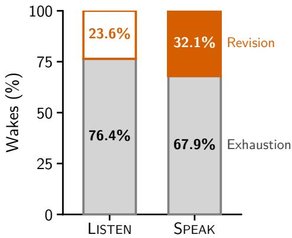  
(a) Wake termination

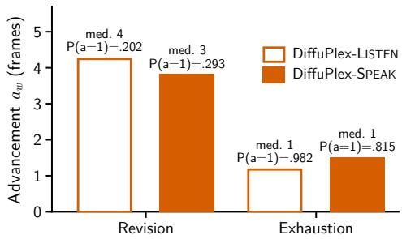  
(b) Advancement by termination reason

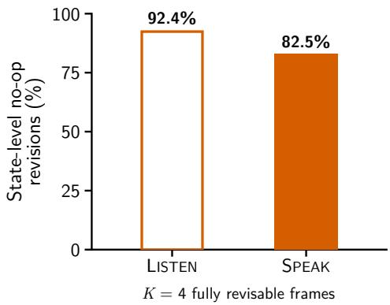  
(c) State-level no-op revisions

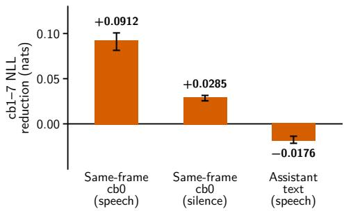  
(d) Future-speech prediction error  
Figure 7: Rolling-draft diagnostics. Revision-triggered wakes typically occur after several frames have already been consumed, whereas exhaustion is dominated by one-frame advances. State-level no-op revisions compare the next K = 4 fully revisable frames. Positive NLL reduction indicates improved future acoustic prediction.

Revision affects only interaction that has not yet been played. Assistant frames already presented to the user and user frames already received remain part of the realized interaction. Because of the backbone’s native stream delays, if the observed user semantic token at lookahead h triggers revision, the assistant text state associated with that boundary has already been selected. We therefore begin before-after comparisons at h + 1, the first assistant text state that is fully revisable. We define a state-level no-op revision as one for which the PAD/EPAD/lexical sequence over the next K = 4 fully revisable assistant frames (320ms) is unchanged after regeneration. Figure 7(c) reports the resulting no-op rates: 92.4% for LISTEN and 82.5% for SPEAK. Most revision triggers therefore do not alter the assistant’s immediate interaction state, but a nontrivial subset does. Together with the no-revision ablation in Appendix H.5, this suggests that revision serves as a safeguard against inconsistent drafts, even though many triggers leave the immediate assistant state unchanged.

## I.2 FUTURE-SPEECH MECHANISM

DiffuPlex-SPEAK may consume lexical speech predicted several frames into the future, so the quality of these frames depends on how well the masked path predicts the acoustic codebooks. The key difference from ordinary autoregressive generation comes from the native delay between the semantic audio codebook cb0 and the acoustic codebooks cb1–7. For a physical audio frame, the autoregressive model has already observed that frame’s cb0 when it forms the temporal representation used to predict cb1–7. At a masked future position, however, the same-frame cb0 has not yet been generated and is replaced by MASK, so cb1–7 must be predicted from a temporal representation that lacks this semantic audio information. We test whether this missing input contributes to the degradation by selectively giving it back. As shown in Figure 7(d), restoring the same-frame cb0 during assistant speech and using it to sequentially generate the remaining acoustic codebooks cb1–7 reduces their NLL by 0.0912, whereas the corresponding improvement during silence is only 0.0285. As a control, restoring assistant text instead of cb0 does not help and changes NLL by ∆ = −0.0176. The effect is therefore not simply caused by masking any assistant-side input: it is specifically associated with losing the same-frame semantic audio signal that normally helps the backbone predict the acoustic codebooks.

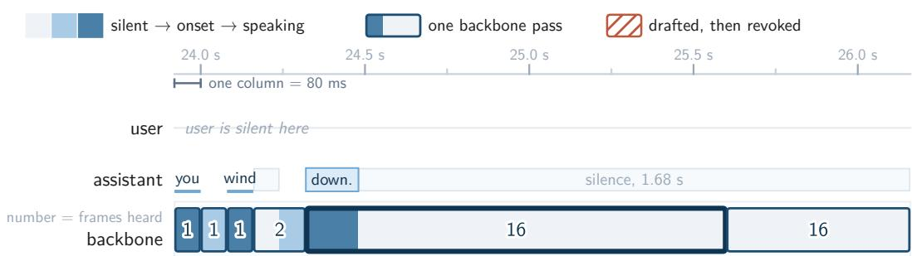  
Figure 8: Long draft consumption during a stable silent interval. After several short backbone wakes, DiffuPlex-SPEAK consumes two consecutive 16-frame drafts without revision. The number inside each backbone pass indicates the number of frames realized before the next wake.

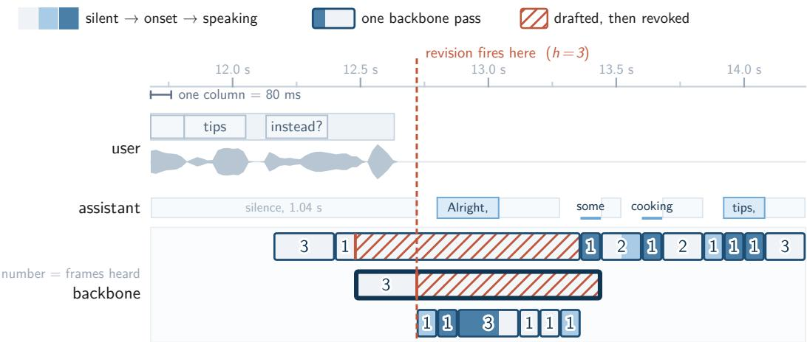  
the pass outlined in black had committed 12 frames of silence; 9 of them were thrown away before anyone heard them  
Figure 9: Revision after partial draft consumption. For DiffuPlex-SPEAK, the highlighted backbone pass drafts 12 frames of assistant silence. Revision fires after three frames have been consumed, discarding the remaining nine unplayed frames before a new assistant continuation is generated. Hatched regions denote drafted frames that are revoked before playback.

We further test this explanation by replaying DiffuPlex outputs through the original autoregressive temporal path. The purpose of this experiment is to separate errors in what DiffuPlex decided to say from errors in how that content was acoustically realized. Starting from a DiffuPlex-SPEAK output, we run the frozen personaplex-rl-seamless backbone frame by frame with W = 1. In the first replay condition, we keep both the text and semantic cb0 sequence generated by DiffuPlex fixed and regenerate only cb1–7; thus, the linguistic content and semantic audio decisions are unchanged, but the acoustic codebooks are produced with their ordinary autoregressive temporal conditioning. In the second condition, we keep only the DiffuPlex text fixed and regenerate all audio codebooks cb0–7. As reported in the main text, restoring the autoregressive path in the first condition already recovers most of the measured UTMOSv2 gap, while regenerating cb0 as well provides only a small additional gain. Together with the NLL intervention above, this identifies missing same-frame semantic conditioning as one contributor, while the replay shows that restoring broader autoregressive audio-token conditioning recovers much of the measured quality gap. These replay experiments are diagnostic analyses, not additional stages of DiffuPlex inference.

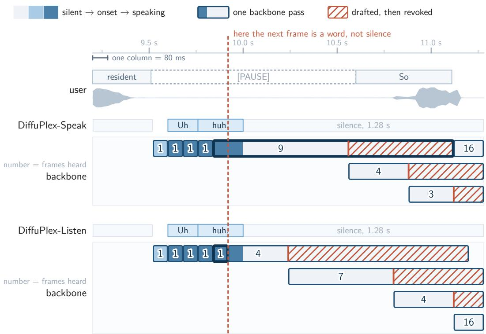  
same draft and confidences — one Speak pass delivers 9 frames, one Listen pass 1

Figure 10: Different retention policies on the same interaction. Because the prediction at $h = 2$ is lexical, DiffuPlex-LISTEN retains only the autoregressive frame $( r = a = 1 )$ , whereas DiffuPlex-SPEAK retains $r = 1 6$ and consumes a = 9 before revision.  
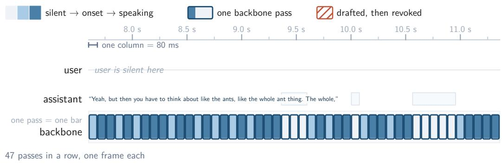  
Figure 11: Repeated one-frame retention during a stable user context. Although the user remains silent, DiffuPlex-SPEAK performs 47 consecutive backbone passes that each advance only one frame. This example shows that limited acceleration can arise because the retention rule repeatedly admits only the immediate next frame, rather than because long drafts are repeatedly consumed and then revoked.

Table 18: All external artifacts used in this work with their licenses and sources.
<table><tr><td>Artifact</td><td>License</td><td>URL</td></tr><tr><td colspan="3">Backbone and Model Lineage</td></tr><tr><td>personaplex-rl-seamless</td><td>CC BY-NC 4.0 + NVIDIA Open Model License</td><td>https://huggingface.co/kyutai/personaplex-rl-seamless</td></tr><tr><td>PersonaPlex</td><td>NVIDIA Open Model License</td><td>https://huggingface.co/nvidia/personaplex-7b-v1 https://huggingface.co/kyutai/moshiko-pytorch-bf16</td></tr><tr><td>Moshi / Mimi</td><td>CC BY 4.0</td><td></td></tr><tr><td colspan="3">Training Data</td></tr><tr><td>Seamless Interaction</td><td>CC BY-NC 4.0</td><td>https://huggingface.co/datasets/facebook/seamless-interaction</td></tr><tr><td colspan="3">Evaluation Benchmarks</td></tr><tr><td>Full-Duplex-Bench v1.0</td><td>CC BY-NC 4.0</td><td>https://qithub.com/DanielLin94144/Full-Duplex-Bench</td></tr><tr><td>Full-Duplex-Bench v1.5</td><td>CC BY-NC 4.0</td><td>https://github.com/DanielLin94144/Full-Duplex-Bench</td></tr><tr><td>VoiceBench</td><td>Apache 2.0 Not specified on dataset card</td><td>https://huggingface.co/datasets/hlt-lab/voicebench</td></tr><tr><td colspan="3">OpenAudioBench</td></tr><tr><td>Data Processing</td><td></td><td></td></tr><tr><td>Qwen3-ASR-1.7B Qwen3-ForcedAligner-0.6B</td><td>Apache 2.0 Apache 2.0</td><td>https://huggingface.co/Qwen/Qwen3-ASR-1.7B https://huggingface.co/Qwen/Qwen3-ForcedAligner-0.6B</td></tr><tr><td colspan="3"></td></tr><tr><td>Evaluation</td><td></td><td></td></tr><tr><td>nvidia/parakeet-tdt-0.6b-v2 UTMOSv2</td><td>CC BY 4.0</td><td>https://huggingface.co/nvidia/parakeet-tdt-0.6b-v2</td></tr><tr><td>gpt-5.6-luna</td><td>MIT</td><td>https://github.com/sarulab-speech/UTMOSv2</td></tr><tr><td></td><td>Proprietary (OpenAI API)</td><td>https://developers.openai.com/api/docs/models/gpt-5.6-luna</td></tr><tr><td colspan="3">Deferred-Execution Baselines</td></tr><tr><td>Silero VAD</td><td>MIT</td><td>https://github.com/snakers4/silero-vad</td></tr><tr><td>Smart Turn v3.2</td><td>BSD 2-Clause</td><td>https://huggingface.co/pipecat-ai/smart-turn-v3</td></tr></table>

## I.3 QUALITATIVE EXAMPLES AND FAILURE CASES

Figures 8–11 illustrate four rollout behaviors. Figure 8 shows a stable silent interval in which several short wakes are followed by two consecutive backbone passes that each advance 16 frames without revision. Figure 9 shows the opposite case: a backbone pass initially drafts 12 frames of assistant silence, but revision fires after three frames have been consumed, so the remaining nine unplayed frames are discarded before the assistant begins a new response. These examples illustrate the two possible outcomes of a retained future: it may be consumed completely when the interaction remains stable, or only its unplayed suffix may be revoked when newly observed user input invalidates the draft.

Figure 10 compares the two retention policies on the same interaction. At the marked boundary, the next predicted assistant state is lexical rather than silence. DiffuPlex-SPEAK is therefore able to consume nine frames from a single retained draft before revision, whereas DiffuPlex-LISTEN advances only one frame from the corresponding wake. Figure 11 shows a conservative-retention regime: despite a stable silent user context, the model executes 47 consecutive one-frame backbone passes. Together, these examples show that limited acceleration can arise for two different reasons: a longer retained future may later be revised, or the retention rule may repeatedly admit only a single frame in the first place.

## J ARTIFACTS, LICENSES, AND REPRODUCIBILITY

Table 18 lists the external datasets, models, and tools used in this work together with their licenses and public sources. We use these artifacts for research purposes consistent with their intended use.

All main scored generations use seed 0 and retain the inference configuration used to produce each output. Ablation runs additionally record the adapter path, backbone, inference configuration, and source-code revision, while analysis outputs retain their originating rollout and policy metadata. Training configurations, checkpoints, generated audio, ASR transcripts, benchmark outputs, and rolling-draft analysis artifacts are stored separately so that each reported result can be traced to the configuration that produced it.

DiffuPlex is trained on four NVIDIA RTX A6000 GPUs. Controlled runtime measurements use a single RTX A6000 as described in Appendix E.3; no other jobs were running on the node during these measurements. We additionally verify the autoregressive boundary case W = 1: under matched priming, sampling, and random state, the rolling implementation produces the same token sequence as the official frame-by-frame LMGen.step path. Selected generated audio and the qualitative examples are available on the anonymous project page at https://diffuplex. github.io/.