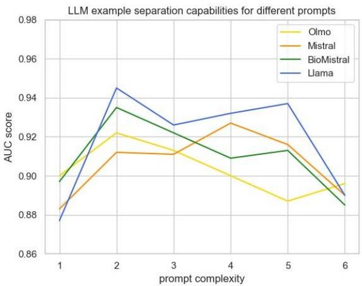

# Detecting Spin in Clinical Trials with Large Language Models

Tjaš Ajdovec   
University of Ljubljana, Faculty of   
Computer and Information Science   
Slovenia   
tjas.ajdovec@gmail.com   
Marko Robnik-Šikonja   
University of Ljubljana, Faculty of   
Computer and Information Science   
Slovenia   
marko.robnik@fri.uni-lj.si

Simon Šuster Independent researcher Ljubljana, Slovenia sim.suster@gmail.com

## Abstract

Spin in clinical trials includes reporting practices that distort the presentation of results. This is particularly critical in medicine, where spin is present in more than 50% of randomized controlled trials that fail to reach statistical significance. The comparison of primary and reported outcomes is crucial for detecting several types of spin, including outcome switching. We used 300 pairs of outcomes labeled with semantic similarity to develop a system for automatic detection of outcome switching. We evaluated baseline text similarity models and open-source LLMs using generated similarity scores and the Youden index to determine the classification threshold. The proposed approach involves prompt engineering, classification based on token probabilities, and majority voting for the final decision. The results on the test set of 2,496 examples with an � score of 0.78 and an accuracy of 0.90 outperform baseline text similarity models but trail behind fine-tuned versions of BERT. We used LLMs to generate natural language explanations for the classified instances and manually assessed their quality.

## Keywords

spin, clinical trials, natural language processing, large language models, sentence similarity.

## 1 Introduction

The phenomenon of spin covers several reporting practices that present study results in a distorted way, usually to the benefit of the authors. It is a long-known problem, especially in randomized controlled trials (RCTs), where reporting rules are clearly defined, yet incorrect reporting still occurs. This leads to redundant or misdirected follow-up research [4]. Several tools exist to help authors and readers automatically detect this kind of incorrect reporting.

Large language models (LLMs) have recently become capable of solving many natural language processing (NLP) tasks without task-specific training [13]. Existing spin detection tools rely on dedicated models trained on expensive, manually labeled data, and to our knowledge none of them make use of LLMs. We investigate whether LLMs can be used to classify pairs of primary and reported clinical trial outcomes as similar or diferent. This is a core subtask needed for detecting a type of spin called outcome switching - compromised reporting of primary and secondary outcomes in the results.

We addressed the following research questions in the context of detecting outcome switching in RCT reports:

(1) How successful are LLMs, without additional training, at classifying pairs of clinical trial outcomes as similar or diferent?

(2) How do the results and behavior of diferent LLMs difer with respect to generality and comprehension ability?

(3) Can LLMs generate meaningful, human-readable explanations for the already classified examples?

We report the work in six sections. Section 2 outlines the related work. Section 3 presents the methodology and Section 4 the results. The discussion is contained in Section 5, and the conclusions follow in Section 6.1

## 2 Related Work

Spin is defined as the distorted presentation of study results, which misleads readers about how efective a treatment actually is [3]. It may be intentional or simply a consequence of negligence [1]. In RCTs, the result of interest is referred to as the outcome of the trial. Since readers often judge a study by its abstract alone, it is especially prone to spin: manual audits report spin in 47–71% of clinical trial abstracts that fail to confirm their hypothesis, depending on the biomedical field [6, 11, 14, 15].

According to Yavchitz et al. [16], spin falls into three main groups:

• Misleading reporting of results: inconsistent or incomplete reporting, such as omitting an outcome that did not confirm the hypothesis, adding a new outcome that does, or changing the order of primary and secondary outcomes.

• Inappropriate interpretation of results: incorrect conclusions drawn from even correctly reported data, such as unjustified causal language or claims not based on the actual statistical results.

• Inappropriate extrapolation of results: unjustified generalization, such as extending treatment efects to a diferent population.

Automatic tools for detecting spin can benefit both authors in writing, as well as readers and reviewers in critically evaluating articles. ExaCT (2010) uses statistical models and regular expressions to extract key trial information, such as sample size, from RCT abstracts into a table [8]. RobotReviewer (2015) uses a machine learning model trained on 12,800 labeled clinical trial reports to assess their level of bias [12]. DeSpin (2020) uses fine-tuned pre-trained language models (PLMs) to detect several types of spin in RCTs, by breaking the task down into extraction, detection, and classification sub-tasks [9]. One such example is comparing the primary and reported outcomes, needed to detect inconsistent reporting, specifically outcome switching. This is also the task addressed in this paper, using large language models, presuming that outcomes were already extracted.

## 3 Methodology

## 3.1 Dataset

Comparing primary and reported outcomes can be framed as a directed semantic similarity task in the context of biomedicine. This is crucial for automatically checking whether the stated objectives of a clinical trial are correctly reported and met. Koroleva et al. [10] built a dataset of such outcome pairs from 3,938 RCT articles available on PubMed Central2. One human annotator, after consulting domain experts, labeled 3,043 pairs as similar (label 1) or diferent (label 0). We then deduplicated the pairs, leaving 2,796. This dataset was imbalanced, with 21.8% of pairs labeled as similar and 78.2% as diferent, as a consequence of the collection methodology. An example pair labeled as similar is the primary outcome log HbA1c, reported as glycaemic control. This is a broader term, and recognizing it as a match requires domain knowledge of (blood sugar) measurements. An example of a negative pair is the primary outcome blood pressure, reported as systolic BP, which is a more specific term.

From the deduplicated pairs, we randomly sampled 300 for our own experiments: 100 for model tuning and 200 for validation. The remaining 2,496 pairs were used for the final testing. The tuning, validation and test sets contained 31.0%, 21.5% and 21.4% similar pairs respectively, compared to 21.8% overall. Due to unstratified sampling, the tuning set is biased toward similar pairs, relative to the whole deduplicated dataset.

## 3.2 Metrics

When comparing texts, most models produce a continuous similarity score on the interval [0, 1] rather than a direct label, so a threshold is needed to turn this score into a binary decision. We used the Youden index to determine this threshold automatically, rather than setting it manually, which would be timeconsuming and prone to bias [7]. The Youden index � is defined at each point on the ROC curve as:

$$
J = { \mathrm { s e n s i t i v i t y } } + { \mathrm { s p e c i f i c i t y } } - 1 = { \frac { T P } { T P + F N } } + { \frac { T N } { T N + F P } } - 1\tag{1}
$$

For each model, we selected the threshold that maximizes $J .$ Unlike accuracy or $F _ { 1 }$ score, � treats both classes equally, making it appropriate for imbalanced datasets.

We reported classification accuracy, positive-class precision, recall, and $F _ { 1 }$ score as evaluation metrics, with $F _ { 1 }$ as the main one.

## 3.3 Baseline Models

Koroleva et al. [10] divided baseline text similarity models into the following groups, each representing sentences diferently:

(1) String measures treat sentences as sequences of characters. We evaluated the Levenshtein distance and sequence similarity based on the Ratclif-Obershelp distance.

(2) Lexical measures operate on words or word parts. We evaluated lemma similarity and stem similarity.

(3) Vector-based measures embed text into a vector space and compare vectors using distances such as cosine distance. We evaluated spaCy and Word2Vec embeddings.

(4) Ontology-based measures represent language as a hierarchy of concepts and compute distances between them. We evaluated path distance, Leacock-Chodorow similarity, and Wu-Palmer similarity.

(5) Deep learning models use contextual representations from large pre-trained encoders. We evaluated SciBERT and BioBERT as sentence embedding models, as well as the all-MiniLM-L12 sentence transformer3.

## 3.4 Large Language Models

To make our approach widely accessible, we selected opensource LLMs available on HuggingFace and ran them locally with their transformers library. Local inference avoids API costs and latency, while keeping data private in the sensitive medical domain. We ran experiments on a single NVIDIA Quadro RTX 5000 GPU with 16 GB of VRAM, which limited the model size to up to 8B parameters. We considered only instruction finetuned variants, as these follow user prompts rather than simply continuing text.

We evaluated four LLMs with diferent characteristics:

• OLMo-7B-Instruct4 was chosen for its complete transparency. The architecture, training data, and procedure are publicly documented and replicable. The model was trained on 2.46T tokens, with over 2% of scientific articles.

• Mistral-7B-Instruct-v0.25 is a general-purpose LLM with slightly better benchmark results than OLMo.

• BioMistral-7B-DARE6 is a variant of Mistral further trained on PubMed Central literature, giving it stronger biomedical terminology knowledge at the cost of generality.

• Llama-3-8B-Instruct7 was reportedly trained on 15T tokens and achieves the best reasoning scores.

We first tested LLMs as binary similarity classifiers by inserting a pair of outcomes into a prompt template and extracting a Yes or No prediction from the generated text:

<|endoftext|><|user|>   
Are the following sentences semantically similar?   
First sentence: {out1}   
Second sentence: {out2}   
Answer:   
<|assistant|>

2 Assign each possible answer to a token �1, �2, . . . , ��;

3 Run the model to generate the first token;

4 Extract the output value $s _ { i }$ for each token $t _ { i } ;$

5 Compute output probabilities �� = softmax(��) for each token $t _ { i } ;$

6 Find the index of the highest probability

ℎ = arg max(�1, �2, . . . , �� );   
Output: Answer with the highest output probability �ℎ

This text-based approach has several limitations related to LLM answer format and extraction. We therefore adopted a probability-based approach, outlined in Algorithm 1 [17]. It uses probabilities of the first generated token to obtain a similarity score between 0 and 1, similar to how the MMLU benchmark [5] evaluates multiple-choice answers. In our case, these are the tokens for Yes and No.

We used the LangChain library to define multiple prompt templates [2], varying in complexity from simple similarity questions to outcome switching definitions and few-shot examples. All tested prompts are available in our GitHub repository8 and can be modified as needed. Experiments used deterministic decoding with temperature set to 0. We measured AUC on the 200 instance validation set to compare model quality across prompts, before setting the classification threshold, as shown in Figure 1.

  
Figure 1: AUC scores across diferent LLMs and prompt complexity levels. Prompt names for each illustrative complexity level are provided in Table 1.

Table 1: List of evaluated prompt templates.
<table><tr><td>Complexity level Prompt name</td><td></td></tr><tr><td>1</td><td>Sentence template</td></tr><tr><td>2</td><td>Outcome template</td></tr><tr><td>3</td><td>Role template</td></tr><tr><td>4</td><td>Article definition template</td></tr><tr><td>5</td><td>Wikipedia definition template</td></tr><tr><td>6</td><td>Random example template</td></tr></table>

The prompt with complexity 3, which defines the role of a clinical trial reviewer and the concept of primary and reported outcomes, was chosen as the starting point for further experiments. This prompt was near the middle of the AUC curve, which resembled an inverted U shape. Its average AUC score was comparable to the other prompts, but its range across models was the smallest. This indicates little bias, meaning none of them considerably over- or underperformed.

We then applied the Youden index to the 100-instance training set to determine the classification threshold and used it to obtain binary predictions on the 200-instance validation set. We manually inspected instances misclassified by the OLMo model and identified three recurring error types:

(a) insuficient domain terminology and acronym knowledge (for example, HbA1c),

(b) poor comprehension of longer sentences, and

(c) acceptance of partially reported outcomes.

We addressed (c) by iteratively adding clarifications to the prompt, stating that the reported outcome should include all components and details of the primary outcome. Each version was re-evaluated on the validation set until it reduced this error type while preserving $F _ { 1 }$ score and accuracy.

## 3.5 Ensemble models

In the final evaluation, we included ensemble models, more specifically hard voting classifiers with a majority threshold. Each ensemble was composed of the three models with the highest $F _ { 1 }$ score on the validation set from their respective group. This improved the $F _ { 1 }$ score over any single model in the group. The ensembles were:

• Baseline voting: stem similarity, sequence similarity and sentence encoder.

• LLM voting: OLMo, BioMistral and Llama with initial prompt defining the clinical trial reviewer role.

• LLM’ voting: OLMo, Mistral and BioMistral with prompt corrected to reject partially reported outcomes.

## 4 Results

## 4.1 Outcome Classification

Table 2 shows the results of all evaluated models on the 2,496 instance test set. The sentence transformer achieved the best baseline $F _ { 1 }$ score of 0.67 with a classification accuracy of 0.82. Among LLMs with the original prompt, BioMistral achieved the best $F _ { 1 }$ of 0.73 and accuracy of 0.88. With the corrected prompt, OLMo’ achieved the best � of 0.75 and accuracy of 0.89. The best overall result was achieved by LLM’ voting with an $F _ { 1 }$ of 0.78 and accuracy of 0.90, an improvement of 7 percentage points over baseline voting. Koroleva et al. [10] reported $F _ { 1 }$ values between 0.87 and 0.90 with fine-tuned BERT models on a non-deduplicated dataset of outcome pairs.

## 4.2 Explanation

Deep learning baseline models and the proposed LLM approach are essentially black boxes, producing only a similarity score with no explanation of their decisions. For authors and reviewers of clinical trial reports, understanding why two outcomes were classified as similar or diferent is important. Since LLMs can interpret the problem and generate text, they are suitable for producing natural language explanations. We obtained explanations for already classified examples by inserting the model prediction and continuing the conversation with the user message “Why? Explain your answer.” [18] Two examples generated by OLMo are shown below:

Primary outcome: a reduction in depression   
Reported outcome: GDS scores   
Label: 1   
Prediction: 1 ✓   
Explanation: The reported outcome, GDS scores, are a   
measure of depression, which is the primary outcome   
in this clinical trial. The GDS is a well-known tool   
to assess depression in elderly individuals.   
Therefore, the reported outcome matches the defined   
primary outcome.

Table 2: Classification thresholds and results of baseline models, LLMs, and ensemble models on the test set. LLM’ denotes inference with the corrected prompt.
<table><tr><td>Group</td><td>Model</td><td>Threshold</td><td>Classification Accuracy</td><td>Precision</td><td>Recall</td><td> $F _ { 1 }$  Score</td></tr><tr><td rowspan="5">Baseline</td><td>Stems similarity</td><td>0.3</td><td>0.805</td><td>0.528</td><td>0.845</td><td>0.650</td></tr><tr><td>Sequence similarity</td><td>0.4</td><td>0.845</td><td>0.668</td><td>0.550</td><td>0.603</td></tr><tr><td>Word2Vec embeddings</td><td>0.4</td><td>0.708</td><td>0.409</td><td>0.813</td><td>0.544</td></tr><tr><td>Path distance</td><td>0.2</td><td>0.795</td><td>0.517</td><td>0.673</td><td>0.585</td></tr><tr><td>Sentence transformer</td><td>0.4</td><td>0.821</td><td>0.553</td><td>0.862</td><td>0.673</td></tr><tr><td rowspan="8">LLM</td><td>OLMo</td><td>0.1</td><td>0.866</td><td>0.653</td><td>0.802</td><td>0.720</td></tr><tr><td>Mistral</td><td>0.3</td><td>0.852</td><td>0.625</td><td>0.774</td><td>0.692</td></tr><tr><td>BioMistral</td><td>0.2</td><td>0.881</td><td>0.712</td><td>0.751</td><td>0.731</td></tr><tr><td>Llama</td><td>0.1</td><td>0.884</td><td>0.831</td><td>0.578</td><td>0.681</td></tr><tr><td>OLMo&#x27;</td><td>0.3</td><td>0.889</td><td>0.725</td><td>0.778</td><td>0.750</td></tr><tr><td>Mistral&#x27;</td><td>0.2</td><td>0.894</td><td>0.789</td><td>0.692</td><td>0.737</td></tr><tr><td>BioMistral&#x27;</td><td>0.1</td><td>0.851</td><td>0.609</td><td>0.852</td><td>0.710</td></tr><tr><td>Llama&#x27;</td><td>0.1</td><td>0.853</td><td>0.962</td><td>0.329</td><td>0.490</td></tr><tr><td rowspan="3">Ensemble</td><td>Baseline voting</td><td>majority</td><td>0.854</td><td>0.622</td><td>0.811</td><td>0.704</td></tr><tr><td>LLM voting</td><td>majority</td><td>0.899</td><td>0.781</td><td>0.733</td><td>0.756</td></tr><tr><td>LLM&#x27; voting</td><td>majority</td><td>0.901</td><td>0.758</td><td>0.793</td><td>0.775</td></tr></table>

Primary outcome: pain severity and knee range of motion   
(ROM)   
Reported outcome: pain   
Label: 0   
Prediction: $0 ~ \checkmark$   
Explanation: The reported outcome is "pain," but the   
defined primary outcome was "pain severity and knee   
range of motion (ROM)." It does not include the   
specific components of pain severity, and it does not   
mention knee ROM. Therefore, the reported outcome   
does not match the defined primary outcome.

## 5 Discussion

LLMs outperformed all baseline text similarity models in $F _ { 1 } ,$ which we attribute to defining the task context and the asymmetric relationship between the primary and reported outcome. Since we used LLMs as adaptive classifiers via prompting, they remained general-purpose. BioMistral performed better with minimal prompts while Mistral benefited from more context, indicating that domain adaptation influences prompt sensitivity. Llama followed the corrected instructions too strictly [19], as its recall dropped to 0.33 and $F _ { 1 }$ to 0.49, making it an unusable classifier. Individual classification thresholds, obtained by maximizing the Youden index, compensated for model biases. Majority voting across LLMs further improved results, indicating that the models made distinct mistakes and complemented each other.

Our results still trail behind fine-tuned BERT models by about 10 percentage points on $F _ { 1 }$ score. Part of the reason is that we worked with only 10% of the dataset for development and deduplicated instances, making the task harder. Thresholds tuned on this small, randomly sampled dataset can be unstable and vary across models. We also used LLMs to generate natural language explanations for the classified examples. A manual qualitative analysis showed that more than 50% of explanations are valuable, while approximately every tenth contains hallucinations.

## 6 Conclusion

We investigated whether smaller open-source LLMs can classify pairs of outcomes based on text similarity as part of detecting outcome switching in RCT reports. For this purpose, we used a dataset of primary and reported outcomes labeled for similarity. Through prompt engineering, OLMo achieved the best $F _ { 1 }$ score of 0.75, and majority voting of three LLMs improved it to 0.78. Other contributions include automatic threshold tuning, classification based on next token probabilities, and the option to explain the model decision. Our approach requires only a few hundred instances and no parameter fine-tuning. All source code and results, including model predictions and explanations, are publicly available in a GitHub repository.9

As future work, we propose evaluating larger, more capable LLMs. A complete spin detection pipeline would have to be extended to other types of spin and related tasks, such as outcome extraction and discrepancy judgment. Alternatively, models with longer context windows could analyze whole reports at once, replacing intermediate steps with reasoning. To ensure crosslingual reliability, the experiments should be repeated with a machine-translated or separately collected dataset.

## References

[1] Isabelle Boutron and Philippe Ravaud. 2018. Misrepresentation and distortion ofresearch in biomedical literature. Proceedings ofthe National Academy ofSciences, 115, 11, 2613–2619.

[2] Banghao Chen, Zhaofeng Zhang, Nicolas Langrené, and Shengxin Zhu. 2025. Unleashing the potential of prompt engineering for large language models. Patterns, 6, 6.

[3] Kellia Chiu, Quinn Grundy, and Lisa Bero. 2017. ‘spin’in published biomedical literature: a methodological systematic review. PLoS Biology, 15, 9, e2002173.

[4] Paul Glasziou, Douglas G Altman, Patrick Bossuyt, Isabelle Boutron, Mike Clarke, Steven Julious, Susan Michie, David Moher, and Elizabeth Wager. 2014. Reducing waste from incomplete or unusable reports of biomedical research. The Lancet, 383, 9913, 267–276.

[5] Dan Hendrycks, Collin Burns, Steven Basart, Andy Zou, Mantas Mazeika, Dawn Song, and Jacob Steinhardt. 2020. Measuring massive multitask lan guage understanding. arXiv preprint arXiv:2009.03300.

[6] Muhammad Shahzeb Khan et al. 2019. Level and prevalence of spin in published cardiovascular randomized clinical trial reports with statistically nonsignificant primary outcomes: a systematic review. JAMA network open, 2, 5, e192622–e192622.

[7] Dale S Kim, Connor J McCabe, Brianna L Yamasaki, Kristine A Louie, and Kevin M King. 2018. Detecting random responders with infrequency scales using an error-balancing threshold. Behavior research methods, 50, 1960– 1970.

[8] Svetlana Kiritchenko, Berry De Bruijn, Simona Carini, Joel Martin, and Ida Sim. 2010. ExaCT: Automatic extraction of clinical trial characteristics from journal publications. BMC medical informatics and decision making, 10, 1–17.

[9] Anna Koroleva, Sanjay Kamath, Patrick MM Bossuyt, and Patrick Paroubek. 2020. DeSpin: A prototype system for detecting spin in biomedical publications. In Proceedings of the BioNLP 2020 workshop, 49–59.

[10] Anna Koroleva, Sanjay Kamath, and Patrick Paroubek. 2019. Measuring semantic similarity of clinical trial outcomes using deep pre-trained language representations. Journal ofBiomedical Informatics, 100, 100058.

[11] Suzanne Lockyer, Rob Hodgson, Jo C Dumville, and Nicky Cullum. 2013. “spin” in wound care research: the reporting and interpretation of randomized controlled trials with statistically non-significant primary outcome results or unspecified primary outcomes. Trials, 14, 1–10.

[12] Iain J Marshall, Joël Kuiper, and Byron C Wallace. 2016. RobotReviewer: Evaluation of a system for automatically assessing bias in clinical trials. Journal ofthe American Medical Informatics Association, 23, 1, 193–201.

[13] Humza Naveed, Asad Ullah Khan, Shi Qiu, Muhammad Saqib, Saeed Anwar, Muhammad Usman, Naveed Akhtar, Nick Barnes, and Ajmal Mian. 2025. A comprehensive overview of large language models. ACM Transactions on Intelligent Systems and Technology, 16, 5, 1–72.

[14] Francisco E Vera-Badillo et al. 2016. Bias in reporting of randomised clinical trials in oncology. European Journal of Cancer, 61, 29–35.

[15] Dongguang Wang et al. 2021. Abstracts for reports of randomized trials of COVID-19 interventions had low quality and high spin. Journal ofClinical Epidemiology, 139, 107–120.

[16] Amélie Yavchitz, Philippe Ravaud, Douglas G Altman, David Moher, Asbjørn Hrobjartsson, Toby Lasserson, and Isabelle Boutron. 2016. A new classification of spin in systematic reviews and meta-analyses was developed and ranked according to the severity. Journal of clinical epidemiology, 75, 56–65.

[17] Yao-Ching Yu, Chun Chih Kuo, Ye Ziqi, Chang Yucheng, and Yueh-Se Li. 2024. Breaking the ceiling of the LLM community by treating token generation as a classification for ensembling. In Findings ofthe Association for Computational Linguistics: EMNLP 2024, 1826–1839.

[18] Muru Zhang, Ofir Press, William Merrill, Alisa Liu, and Noah A Smith. 2024. How language model hallucinations can snowball. In International Conference on Machine Learning. PMLR, 59670–59684.

[19] Jefrey Zhou, Tianjian Lu, Swaroop Mishra, Siddhartha Brahma, Sujoy Basu, Yi Luan, Denny Zhou, and Le Hou. 2023. Instruction-following evaluation for large language models. arXiv preprint arXiv:2311.07911.