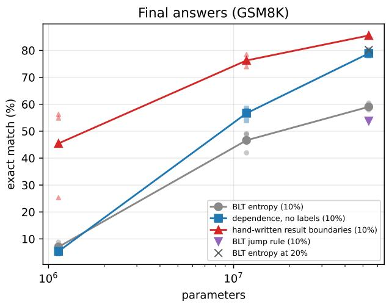
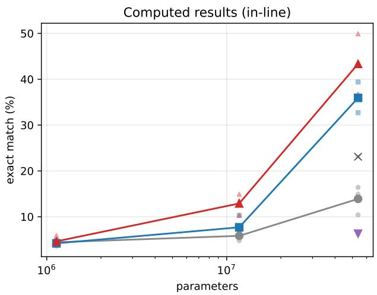
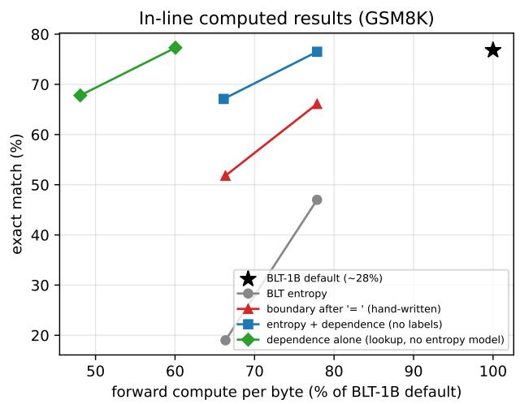
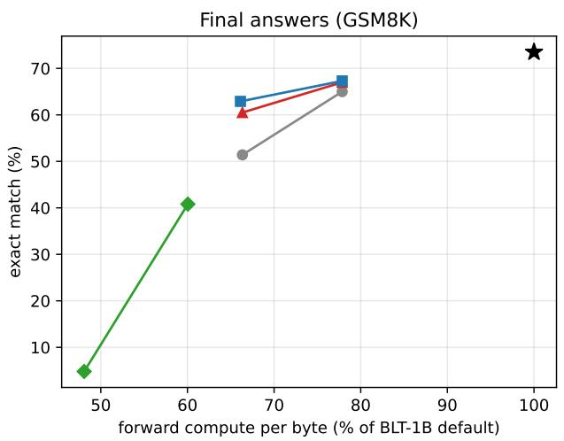
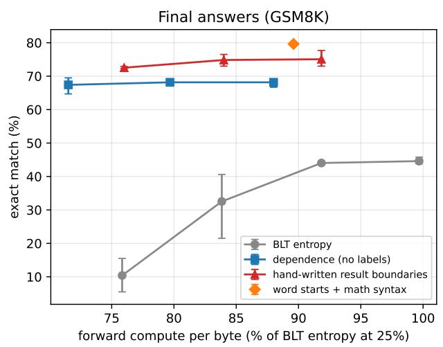
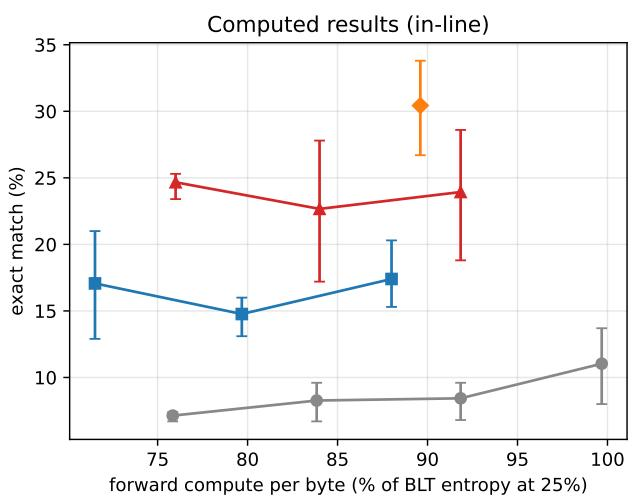

# Easy to anticipate, hard to compute: boundary dependence finds the computed outputs that entropy patching misses

Nicolás Vera Zúñiga Independent Researcher, Chile nicovera@quetru.cl

## Abstract

Byte-level language models such as the Byte Latent Transformer (BLT) group bytes into patches and run their large global model once per patch. BLT starts a patch where a small model’s next-byte entropy is high, so global compute goes where the next byte is hard to predict. We show that this rule has a systematic blind spot: positions whose type is predictable but whose value must be computed, such as the number after = in a worked math solution. Under tight patch budgets, entropy-triggered layouts skip these positions, and accuracy on them collapses. In Meta’s BLT-1B with patch starts on 10% of bytes, the entropy rule puts a patch start at 16% of the computed results in GSM8K solutions and gets 19.0% of them exactly right; a boundary after each = at the same patch count gets 51.8%, and entropy combined with a label-free boundary-dependence signal gets 67.1% (default layout at 26% of bytes: 76.8%). The gap survives adapting BLT-1B to the budget with low-rank fine-tuning (32.9% vs 72.7%, three runs per rule, paired � < 10−200) and grows with model size in byte models trained from scratch at a 10% budget: at 1M, 12M and 50M parameters, boundary dependence beats entropy on final answers by −1.6, +10.1 and +19.8 points, and at 50M it gets 35.9% of computed results against 13.9% (3 seeds each). BLT’s entropy-jump rule helps neither target at 50M. The entropy trigger of Scratchpad Patching is likewise indistinguishable from random scratchpads on final answers (5.6% vs 5.9%, 5 seeds), while answer-start scratchpads give 38.1%. The efect is specific to computed values: copies and lookups gain little, and values the model cannot compute gain nothing. Boundary dependence, the rise in the model’s own loss when a patch start is removed, measured per two-byte context, finds these positions without labels: combined with entropy it beats the hand-written rule on computed results.

## 1. Introduction

Byte-level models avoid a fixed tokenizer by working on raw bytes, and recover eficiency by grouping bytes into variable-length patches [Pagnoni et al., 2025, Slagle, 2024, Hwang et al., 2026]. In BLT, a small byte-level language model estimates the entropy of each next byte; a patch starts where that entropy crosses a threshold, and the large global transformer runs once per patch. The intuition is that compute should go where prediction is hard.

Entropy measures uncertainty about the next byte. What a patch start actually provides is diferent: a fresh global state for the bytes that follow. These coincide in prose, where a surprising byte often begins a new word. They come apart at a computed result. After 16 - 3 - 4 =, the next byte is certainly a digit, so the entropy model may be confident about its type, while its value requires computation over context the local model cannot see. When patch budgets are tight, an entropy threshold spends patches on hard-to-predict prose and skips exactly these positions.

We make four contributions:

1. A blind spot in a trained 1B model. At 10–15% patch budgets, BLT-1B’s own entropy rule skips most computed results in GSM8K solutions; forcing a boundary after each = at the same patch count raises exact accuracy on them by 19–33 points (§4).

2. The gap survives training and adaptation, and grows with scale. BLT-style models trained from scratch at 10–20% budgets show the same ordering across 3 seeds; trained at 1M, 12M and 50M parameters on a 1.9 GB math corpus, the advantage of the label-free trigger over entropy grows from none to 20 points on final answers and to 22 points on computed results (§5). BLT-1B adapted to a 10% budget with low-rank adapters keeps a 40-point gap (§7).

3. A label-free trigger. Boundary dependence, the increase in the model’s own loss when a patch start is removed, averaged per preceding two-byte context, finds computed results without hand-written rules (§6).

4. Scope. The efect needs a computed value and a model able to compute it: copies and lookups gain 1–3 points from a patch start, and values the model cannot compute gain nothing (§8). Scratchpad Patching’s entropy trigger shows the same blind spot (§9).

## 2. Background and related work

Patching rules. BLT [Pagnoni et al., 2025] describes two entropy rules: a global threshold, $H ( x _ { t } ) > \theta _ { q }$ , and an approximate monotonic rule that starts a patch where entropy rises, $H ( x _ { t } ) -$ $H ( x _ { t - 1 } ) > \theta _ { r }$ . Its final version compares both at 8B scale and defaults to the global threshold when not specified, as do the released BLT-1B checkpoint and the oficial code (monotonicity: false, threshold 1.335); we call that rule entropy and the monotonic rule jump. Entropy spikes as boundaries go back to dynamic pooling [Nawrot et al., 2023]. SpaceByte [Slagle, 2024] starts patches at word boundaries; H-Net [Hwang et al., 2026], AU-Net [Videau et al., 2025], MrT5 [Kallini et al., 2024] and ByteSpan [Goriely et al., 2025] learn or derive boundaries in other ways. AU-Net reports GSM8K accuracy as a benchmark, rising with the number of hierarchy stages; none of these papers examines where boundaries fall on computed outputs or measures answer accuracy as a function of where boundaries are placed.

Compute between patches. Scratchpad Patching [Zheng et al., 2026] decouples compute from patch size by inserting transient global steps (“scratchpads”) inside patches, triggered by an absolute next-byte entropy threshold, and names the stale-context problem patch lag. Its trigger ablation compares strategies on validation bits per byte (code, natural-language and math splits) and finds the entropy trigger best; its downstream evaluation (code pass@1, multiple-choice understanding) includes no math answer accuracy. Fast BLT [Kallini et al., 2026] speeds up decoding withou changing where boundaries go. EntropyMoE [Liu et al., 2026] uses patch entropy to route each patch of a BLT-style model to feed-forward experts; it is evaluated on bits per byte and downstream accuracy, not on math.

Tokenization and arithmetic. For static tokenizers, how numbers are segmented afects arithmetic [Singh and Strouse, 2024, Meister, 2026]. Our setting difers: boundaries are decided online by a model, and the question is which positions receive a fresh global step.

Selection signals. Rho-1 [Lin et al., 2024] selects training tokens by excess loss against a reference model; we test a patch rule built on the same signal as a baseline (§11). Mixture-of-Depths [Raposo et al., 2024] routes compute per token by a learned router.

## 3. Setup

BLT-1B. We use the released BLT-1B (the HF conversion of facebook/blt-1b), which accepts explicit patch lengths, so layouts can be changed at inference without retraining. The released conversion drops BLT’s 512-byte sliding window in the entropy patcher and in the local encoder and decoder (Hugging Face transformers issue 49185, open as of 7 October 2026). We restore it with the fix proposed upstream (pull request 49188, applied to transformers 5.18; the patch is in our repository) and use the corrected model throughout. Positions before byte 512 are unchanged by the fix, since the window covers every earlier byte; past it the released conversion over-segments, and 121 of our 294 test problems are longer than 512 bytes. With the window, the default layout starts a patch on 25.5% of bytes on GSM8K, against 28.4% without it. We build tight-budget layouts at R = 10% and 15% of bytes. Thresholds are fitted once on 300 GSM8K training problems so that the mean patch rate there is R, then applied position by position at test time; whether a byte starts a patch never depends on later bytes. (Choosing the top R% within each test problem instead gives the same conclusions; §12.)

Layouts. entropy: BLT-1B’s next-byte entropy. results (hand-written): a boundary right after every =, the rest filled by entropy. dep: boundary dependence (§6). entdep: the sum of standardized entropy and dependence.

Evaluation. 294 GSM8K test problems (question, worked solution with calculator annotations removed, and “The final answer is N”), containing 796 in-line computed results: the number right after =. A target counts as exactly right when every byte is the model’s top prediction given the true preceding text (teacher forcing). We report final answers as well, and test paired diferences with exact McNemar tests and 95% intervals that resample whole problems.

Small models trained from scratch. A BLT-style model in MLX: a local encoder (byte embedding plus in-patch ofset embedding), cross-attention pooling with the patch mean as query, a global transformer (D = 128, 4 layers unless noted; 1.1M parameters in all, 0.8M of them global), and a local decoder layer that attends to the previous 32 bytes across patch boundaries. Patch starts come from a fixed rule applied to the bytes and to a small entropy model (one layer, 32 dimensions) trained on the same corpus. Training: GSM8K and MATH training solutions [Cobbe et al., 2021, Hendrycks et al., 2021] (9.7 MB), 32,000 steps of 32 windows of 128 bytes, AdamW with warmup and cosine decay. Evaluation: 660 GSM8K and 700 MATH test problems held out from training, with greedy exact match given the true prefix on 1,000 computed results, 660 final answers and 700 MATH \boxed{} answers; patch boundaries during decoding are decided online by the same rule. Three seeds per configuration.

## 4. The blind spot in BLT-1B

At BLT-1B’s default budget its patcher covers computed results well (79% of them start a patch), and removing the patch start at the final answer costs 19 points of exact match $( 9 7 . 0 \% \to 7 8 . 3 \% )$ confirming that the boundary matters. (That test scores the final answer as the solution last wrote it, with any \$ and thousands separators, on 300 problems; Table 1 scores the plain number after “The final answer is” on the 294 problems that fit the context, which gives 73.5% for the default layout.) Under a tight budget, entropy drops computed results faster than other positions: at 15% it covers 48% of them, at 10% only 16%.

Table 1. BLT-1B, patch layouts changed at inference (train-fitted thresholds). Exact match on

796 in-line computed results and 294 final answers.

<table><tr><td>Layout</td><td>Patch rate</td><td>Results covered</td><td>Computed results</td><td>Final answers</td></tr><tr><td>default (BLT-1B&#x27;s own)</td><td>0.255</td><td>79%</td><td>76.8%</td><td>73.5%</td></tr><tr><td>entropy@15</td><td>0.157</td><td>48%</td><td>47.0%</td><td>65.0%</td></tr><tr><td>results@15 (hand-written)</td><td>0.157</td><td>100%</td><td>66.1%</td><td>67.0%</td></tr><tr><td>dep@15</td><td>0.153</td><td>100%</td><td>77.3%</td><td>40.8%</td></tr><tr><td>entdep@15</td><td>0.157</td><td>100%</td><td>76.5%</td><td>67.3%</td></tr><tr><td>entropy@10</td><td>0.106</td><td>16%</td><td>19.0%</td><td>51.4%</td></tr><tr><td>results@10 (hand-written)</td><td>0.106</td><td>100%</td><td>51.8%</td><td>60.5%</td></tr><tr><td>dep@10</td><td>0.100</td><td>100%</td><td>67.8%</td><td>4.8%</td></tr><tr><td>entdep@10</td><td>0.105</td><td>100%</td><td>67.1%</td><td>62.9%</td></tr></table>

At equal patch counts, a boundary after each = beats entropy on computed results by +19.1 points at 15% (95% interval +15.8 to +22.4; 172 results right only under results vs 20 only under entropy; McNemar $p = 3 { \times } 1 0 ^ { - 3 1 } )$ and +32.8 at 10% $( p = 7 \times 1 0 ^ { - 6 9 } )$ . All layouts run slightly above budget on the test problems (patch rates 0.157 and 0.106 for entropy and the result-aware layouts at 15% and 10%). Figure 1 shows a single solution (425 bytes) with the top 10% of its positions by each score: entropy places its patch starts at word beginnings and misses all six computed results; entropy plus dependence starts a patch right before each of them.

## 5. Training at tight budgets

Changing layouts at inference puts BLT-1B out of distribution. To test whether the blind spot survives a model that learned with the tight layout, we train small byte models from scratch with each rule.

Table 2. Trained at a fixed budget (D = 128, 4 global layers, 1.1M parameters, 3 seeds). Computed results / final answers $/$ bits per byte. Every entropy seed is below every seed of the other two rules on both accuracies; the hand-written and dependence seeds overlap on computed results at 20%.
<table><tr><td></td><td>Budget Entropy</td><td></td><td></td><td>Entropy jump (BLT&#x27;s monotonic rule)</td><td>Dependence (label-free)</td><td>Hand-written results rule</td></tr><tr><td>10%</td><td></td><td></td><td>7.1% / 10.4% / 1.654</td><td>7.0% / 64.1% / 1.639</td><td>17.1% / 67.4% / 1.678</td><td>24.7% / 72.5% / 1.640</td></tr><tr><td>15%</td><td></td><td>8.3% / 32.5% / 1.552</td><td></td><td>not run</td><td>14.8% / 68.2% / 1.638</td><td>22.7% / 74.8% / 1.528</td></tr><tr><td>20%</td><td></td><td></td><td>8.4% / 44.0% / 1.475</td><td>not run</td><td>17.4% / 68.2% / 1.577</td><td>23.9% / 75.1% / 1.451</td></tr></table>

The ordering hand-written > dependence > entropy holds at every budget. BLT’s own monotonic rule (jump) separates the two targets: at 10% it recovers final answers (64.1% against 10.4% for entropy) but not computed results (7.0% against 7.1%). An entropy rise marks the answer that follows the long, predictable phrase “The final answer is”, but not a computed result, whose position is as predictable as its type. (In larger models on a larger corpus this recovery disappears; see below.) Placement matters more than budget: dependence at 10% beats entropy at 20% on final answers by 23.4 points (pooled 95% interval +20.4 to +26.6) with half the patches. Entropy needs budget to reach the answers (final-answer accuracy $1 0 \%  3 3 \%  4 4 \%$ ; the result-aware rules are flat from 10% up. Computed-result accuracy does not improve with budget for any rule, and MATH answers stay near 3% for every rule: at this size, arithmetic capacity, not placement, caps them.

BLT entropy: 0 of 6 computed results start a patch   
H e b o u g h t 2 0 0 / 4 0 = 5 b l u e t i e s   
S o h e b o u g h t 5 \* 2 = 1 0 r e d t i e s   
E a c h r e d t i e c o s t \$ 4 0 \* . 5 \$ 2 0 m o r e t h a n b l u e t i e s   
S o t h e y e a c h c o s t \$ 4 0 + \$ 2 0 = \$ 6 0   
S o h e s p e n t \$ 6 0 \* 1 0 = \$ 6 0 0 o n r e d t i e s   
S o h e s p e n t \$ 2 0 0 + \$ 6 0 0 = \$ 8 0 0 o n t i e s   
T h e f i n a l a n s w e r i s 8 0 0   
Entropy + dependence (no labels): 6 of 6   
H e b o u g h t 2 0 0 4 0 5 b l u e t i e s   
S o h e b o u g h t 5 \* 2 1 0 r e d t i e s   
E a c h r e d t i e c o s t \$ 4 0 \* 5 = \$ 2 0 m o r e t h a n b l u e t i e s   
S o t h e y e a c h c o s t \$ 4 0 + \$ 2 0 \$ 6 0   
S o h e s p e n t \$ 6 0 \* 1 0 \$ 6 0 0 o n r e d t i e s   
S o h e s p e n t \$ 2 0 0 + \$ 6 0 0 \$ 8 0 0 o n t i e s   
T h e f i n a l a n s w e r i s 8 0 0  
Figure 1: BLT-1B patch starts in one GSM8K solution at a 10% budget, with equal patch counts for the two layouts. Bars mark patch starts and shading marks in-line computed results. Entropy starts no patch at any of the six results; entropy plus dependence starts one before each.

The hand-written rule also has the lowest bits per byte at every budget, so its gain is not bought elsewhere; dependence costs 1.5–7% in bits per byte against entropy.

The same pattern holds at entropy’s usual 25% budget. At D = 128, word starts plus math syntax (18.5% of bytes) gets 30.4% of computed results against 11.0% for entropy (+19.4 points, 3 seeds); word starts alone get 15.5% and a 6-byte stride plus math syntax 16.6%, so word alignment and the result boundary each reach only about half the combined accuracy. At D = 64 (0.2M parameters), BLT’s entropy rule gets 9.8% of final answers, its jump variant 67.5%, and word starts plus math syntax 77.1% (3 seeds each).

Scaling to 50M parameters. The models above are small (1.1M parameters) and trained only on GSM8K and MATH solutions. To test whether the gap shrinks as models grow, we trained the same architecture from scratch at 1.1M, 11.7M and 53.7M parameters on a larger corpus: the first four shards of OpenWebMath [Paster et al., 2024] (221,264 documents, 1.71 GB, after dropping 324 that share a 13-word sequence with a test problem), plus the GSM8K and MATH training solutions repeated to 10% of the bytes (1.90 GB in total). Each rule is applied at 10% of bytes with thresholds fitted on this corpus; the dependence rule uses the table of §6, because a table refitted on this corpus is dominated by web-text contexts and covers none of the computed-result starts. The models see 0.13, 0.5 and 1.5 billion bytes. The code is a PyTorch port of our MLX harness, checked against it (logits agree to 3e-6; masks are identical), and the whole study ran on one rented A40 GPU for about \$19.

Table 3. Models trained from scratch at a 10% patch budget on the scaling corpus. Exact match on 660 final answers and 1,000 computed results; patch rates are measured on the evaluation text (thresholds are fitted on the training corpus, so entropy spends slightly more than 10% there).
<table><tr><td>Parameters</td><td>Rule</td><td></td><td>Seeds Final answers (by seed)</td><td>Computed results (by seed)</td><td>Bits per byte</td><td>Eval patch rate</td></tr><tr><td>1.1M</td><td>entropy</td><td>3</td><td>7.0% (8.8, 4.8, 7.4)</td><td>4.4% (3.6, 4.9, 4.8)</td><td>2.093</td><td>11.2%</td></tr><tr><td>1.1M</td><td>dependence</td><td>2</td><td>5.4% (6.2, 4.5)</td><td>4.2% (4.3, 4.1)</td><td>2.196</td><td>10.9%</td></tr><tr><td>1.1M</td><td>hand-written</td><td>3</td><td>45.5% (54.8, 25.3, 56.2)</td><td>4.6% (3.9, 4.1, 5.9)</td><td>2.109</td><td>12.1%</td></tr><tr><td>11.7M</td><td>entropy</td><td>3</td><td>46.6% (42.0, 49.1, 48.8)</td><td>5.8% (4.8, 6.4, 6.3)</td><td>1.657</td><td>11.2%</td></tr><tr><td>11.7M</td><td>dependence</td><td>3</td><td>56.7% (58.5, 53.9, 57.6)</td><td>7.7% (7.2, 5.6, 10.3)</td><td>1.673</td><td>10.9%</td></tr><tr><td>11.7M</td><td>hand-written</td><td>3</td><td>76.3% (76.4, 73.9, 78.5)</td><td>12.9% (14.9, 10.3, 13.5)</td><td>1.645</td><td>12.1%</td></tr><tr><td>53.7M</td><td>entropy</td><td>3</td><td>59.0% (58.8, 57.9, 60.5)</td><td>13.9% (16.4, 10.4, 14.9)</td><td>1.439</td><td>11.2%</td></tr><tr><td>53.7M</td><td>dependence</td><td>3</td><td>78.9% (78.5, 80.2, 78.0)</td><td>35.9% (32.7, 35.7, 39.4)</td><td>1.420</td><td>10.9%</td></tr><tr><td>53.7M</td><td>hand-written</td><td>2</td><td>85.5% (85.8, 85.3)</td><td>43.4% (36.8, 49.9)</td><td>1.431</td><td>12.1%</td></tr><tr><td>53.7M</td><td>jump (BLT monotonic)</td><td>1</td><td>53.8% (53.8)</td><td>6.3% (6.3)</td><td>1.410</td><td>9.7%</td></tr><tr><td>53.7M</td><td>entropy at 20%</td><td>1</td><td>80.2% (80.2)</td><td>23.1% (23.1)</td><td>1.146</td><td>22.8%</td></tr></table>

The advantage of dependence over entropy grows with size (Figure 2). On final answers it is −1.6 points at 1.1M (seeds overlap), +10.1 at 11.7M and +19.8 at 53.7M (78.9% against 59.0%), with every dependence seed above every entropy seed at the two larger sizes. Computed results show the blind spot once the models can compute: at 53.7M dependence gets 35.9% of them against 13.9% for entropy, again with every seed above every entropy seed, and the hand-written rule 43.4% (85.5% of final answers; two seeds). Bits per byte are about equal at 53.7M (1.420 against 1.439), so the gain is not bought elsewhere. BLT’s jump rule does not help at this scale: one seed gets 53.8% of final answers and 6.3% of computed results, below every entropy seed, although it has the lowest bits per byte of the rules at a 10% budget (1.410). Given twice the budget (20%, which is 22.8% of the evaluation text), entropy matches dependence at 10% on final answers (80.2%, one seed) but still trails it on computed results (23.1% against 35.9%): at this size extra patches reach the answer that follows a predictable phrase, but placement, not budget, limits the computed results. (In the 1.1M models of Table 2, dependence at 10% also beat entropy at 20% on final answers.) At 1.1M on this corpus only the hand-written rule rises above the floor on final answers: these models see the GSM8K and MATH solutions about once, against about 13 times for the models of Table 2, which is why the two 1.1M results difer. One of the 28 training runs (1.1M, dependence, seed 0) never learned (bits per byte 4.72 against 2.08–2.26 for the other 1.1M runs) and is excluded.

  
Figure 2: Exact match against parameter count for models trained from scratch at a 10% budget (small markers: seeds; large markers: means). The advantage of the label-free dependence rule over BLT’s entropy rule grows with size, and computed results separate only once the models can compute. BLT’s jump rule and entropy at twice the budget were run at 50M only.

## 6. A label-free trigger: boundary dependence

The hand-written rule uses domain knowledge (=). We look for a signal that finds the same positions from the model alone.

Definition. For BLT-1B: on 400 GSM8K training problems, compute the per-byte loss under the default layout and under a 10% entropy layout. For each position t, take the mean rise in loss over bytes t…t+3, and average it per preceding two-byte context $( b _ { t - 2 } , b _ { t - 1 } )$ . At inference the score is a causal table lookup. The top contexts are arithmetic $( = \Phi , 0 * , 5 = , 3 = )$ ; after = the mean rise is 0.88 nats against 0.13 on average.

For the small trained models the same recipe fails: a reference model trained with entropy patches rarely had a boundary at a result, so it never learned to use one, and removing one costs little. Training the reference model with random patch starts (25%) and measuring the drop in loss from adding one patch start at t to a random 10% layout fixes this; the top contexts then include $< < , = 6$ x= and >>.

Results. On BLT-1B (Table 1), entropy plus dependence beats entropy on computed results by +29.5 points at 15% (+25.6 to +33.4) and +48.1 at 10%, and beats even the hand-written rule by $+ 1 0 . 4 \ : ( + 7 . 7 \ : \mathrm { t o } \ : + 1 3 . 2 )$ : the table also places boundaries at operands and operators, not only after =.

On final answers it beats entropy by +11.6 points at 10% $( p = 3 \times 1 0 ^ { - 5 } )$ but not at 15% (+2.4, p = 0.26), where entropy alone already reaches most final answers, and it does not difer significantly from the hand-written rule. Dependence alone fails on final answers on BLT-1B (40.8% and 4.8%), because “The final answer $\mathrm { i s } ^ { \dag }$ is not an arithmetic context; in the trained models dependence alone is the better variant (Table 2; entropy plus dependence is dominated by entropy there: 9.7% / 22.5%, 2 seeds).

## 7. Adapting BLT-1B to the budget

To test whether BLT-1B can learn its way around the blind spot, we train low-rank adapters (rank 16, 16.9M parameters, on the global transformer and the decoder’s cross-attention) for 1,500 steps on GSM8K training solutions under each 10% layout, three runs per rule. Each model is tested on the same 796 results under its own training layout.

Table 4. BLT-1B adapted to a 10% budget, computed results exact.

<table><tr><td>Trained and tested under Untrained Runs</td><td></td><td></td><td>Mean</td></tr><tr><td>entropy</td><td>19.0%</td><td>32.8, 32.9, 33.0 32.9%</td><td></td></tr><tr><td>results (hand-written)</td><td>51.8%</td><td>62.4, 62.9, 62.7 62.7%</td><td></td></tr><tr><td>entdep (label-free)</td><td>67.1%</td><td>72.9, 70.9, 74.4 72.7%</td><td></td></tr></table>

Adaptation helps every layout but closes none of the gap: entdep − entropy is +39.8 points (pooled over runs, $+ 3 6 . 3 \ \mathrm { t o } \ + 4 3 . 2 ; \ p = 6 \times 1 0 ^ { - 2 1 7 } )$ , hand-written − entropy +29.8, and entdep − handwritten +10.0. The models trained under entropy do better under entdep (66.2% on average), a layout they never trained on, than under their own (32.9%). Final answers saturate near 97% after fine-tuning, because the final answer repeats the last computed result and fine-tuning teaches the copy; they no longer separate the layouts.

## 8. Which positions are afected

If the blind spot is about computed values, copies and lookups should gain little from a patch start.   
We repeat the BLT-1B test on four other target types at 10% (train-fitted thresholds).

Table 5. BLT-1B at 10%, exact match. Forced: a patch start at every target, the rest by entropy.
<table><tr><td>Target</td><td>Default</td><td>Entropy</td><td>Entdep</td><td>Forced</td><td>Kind</td></tr><tr><td>GSM8K computed results</td><td>76.8%</td><td>19.0%</td><td>67.1%</td><td>51.8%</td><td>computed, skill present</td></tr><tr><td>Python identifiers repeating a nearby name</td><td>83.3%</td><td>81.7%</td><td>81.3%</td><td>83.1%</td><td>copy</td></tr><tr><td>Proof-step conclusions, generated logic</td><td>69.1%</td><td>46.3%</td><td>41.5%</td><td>49.4%</td><td>rule lookup</td></tr><tr><td>Copied values, generated program traces</td><td>82.5%</td><td>58.3%</td><td>62.3%</td><td>61.0%</td><td>copy</td></tr><tr><td>Computed values, program traces</td><td>20.5%</td><td>10.0%</td><td>9.0%</td><td>9.7%</td><td>computed, skill absent</td></tr></table>

Copies and lookups gain 1–3 points from a patch start (code: $+ 1 . 4 , p = 4 \times 1 0 ^ { - 5 } )$ , against 32.8 for computed results. Where BLT-1B cannot compute the value (program-trace arithmetic, 20.5% even with default patches) or answer at all (logic Yes/No answers at chance under every layout), placement has nothing to act on. Small models trained on the logic and trace tasks give the same picture: logic is not learned (answers at chance), and on traces, where each value’s operands sit inside the local decoder’s 32-byte window, the hand-written rule matches entropy (21.8% vs 20.6%, 2 seeds). With the window cut to 8 bytes the hand-written rule leads by 4 points (24.2% vs 20.1%, 3 seeds), but the seeds overlap. Our reading is that the blind spot needs a value that is computed from context beyond the local model’s reach, by a model able to compute it.

## 9. Scratchpad Patching

We reimplemented Scratchpad Patching in the small-model harness (16-byte fixed patches, scratch pads on 6% of bytes, pooled by cross-attention over the partial patch with the mean as query) and compared triggers at equal scratchpad counts (D = 64, 2 global layers, 0.2M parameters).

Table 6. Final-answer exact match on GSM8K by scratchpad trigger, with the accuracy of each seed.
<table><tr><td>Trigger</td><td>Seeds</td><td>Final answers</td><td>By seed</td></tr><tr><td>answer starts (math syntax)</td><td>5</td><td>38.1%</td><td>49.2, 31.4, 8.3, 49.2, 52.4</td></tr><tr><td>entropy (the paper&#x27;s trigger)</td><td>5</td><td>5.6%</td><td>7.3, 4.8, 4.2, 5.6, 6.1</td></tr><tr><td>random positions</td><td>5</td><td>5.9%</td><td>6.1, 5.6, 4.5, 5.2, 8.0</td></tr><tr><td>none</td><td>3</td><td>6.1%</td><td>6.2, 6.8, 5.2</td></tr><tr><td>denser fixed patches, same compute (8-byte)</td><td>5</td><td>7.8%</td><td>6.7, 12.3, 7.6, 5.2, 7.1</td></tr></table>

The entropy trigger is indistinguishable from random scratchpads (−0.3 points, Welch 95% interval −2.2 to +1.6). Answer-start scratchpads give about six times the accuracy on average, with one of five seeds failing to train (8.3%). This does not contradict the paper’s ablation, which found entropy best on bits per byte: averaged bits per byte can hide a failure at a few positions that decide answer accuracy.

## 10. Compute

Fewer patches save global compute, but local layers run on every byte. For BLT-1B, counting matrixmultiply FLOPs, the local layers cost 299 MFLOPs per byte, the global model 2,653 MFLOPs per patch, and the entropy model 199 MFLOPs per byte. A 10% budget then costs 65% of the default’s forward compute and 15% costs 76%. A dependence-table rule is a lookup and needs no entropy model: 48% at 10% and 59% at 15%. On computed results, dependence alone reaches 77.3% at 59% of default compute, against 76.8% for the default (Figure 3), though it fails on final answers (§6). In our small models the local layers dominate, so a 10% budget saves only 24% of compute.

## 11. Negative results

Spending patches on hard or learnable bytes does not help. A Rho-1-style rule (patches where a small model’s loss exceeds a reference model’s) and simplified learned chunking lost to hand-placed boundaries in every setting tried.

Finer arithmetic boundaries do not help. Per-digit patches after = and operand-aligned patches looked promising at two seeds and vanished at five seeds against matched random controls.

A learned patcher does not beat the table. A small network that predicts the dependence gain from the last 8 bytes, trained on math and on logic/trace data together, matches each domain’s own table on held-out correlation and covers 83% of computed-result starts (table: 37%), but trained into a model at 10% it gets 14.3% / 57.4% against the table’s 17.1% / 67.4%.

  
Figure 3: BLT-1B exact match on in-line computed results (left) and final answers (right) against forward compute per byte, relative to the default layout, for layouts at 10% and 15% of bytes. Dependence alone is a lookup and pays no entropy-model cost.

  
Figure 4: Models trained at 10-25% patch budgets (D = 128): exact match against forward compute per byte, relative to entropy at 25%. Points are seed means; bars span the seeds.

Token models are partly protected. With a Qwen2.5-0.5B draft and a 1.5B target on generated program traces, the draft agrees with the target on only 53% of computed-value tokens (86% on text), so speculative decoding loses speed there; but the draft is rarely confident on them (6.5%), so a confidence-based early exit would let few errors through. On GSM8K, computed results are the easiest tokens for these models; we did not test why (overlap with their training data is one possibility). In token models a computed value’s uncertainty shows in the model’s own confidence; in byte patching, the decision to start a patch before a result is made from bytes whose type is predictable.

The original synthetic result was mostly architectural. In an earlier synthetic benchmark with sum pooling and a patch-local decoder, splitting a computation across patches cost up to a full bit; with cross-attention pooling and a decoder that sees across patch boundaries, most of that penalty disappeared. All results above use the cross-attention model.

## 12. Limitations

Scale. Models trained from scratch reach 53.7M parameters, on 1.5 billion bytes (the models of Table 2 have 1.1M; D = 64 is 0.2M); the gap grows over that range, but three sizes on one corpus show a trend, not a law. BLT-1B results come from inference-time layout changes and low-rank adaptation, not from full training at a tight budget. At 50M the hand-written rule has two seeds and the jump and double-budget results one each.

Teacher forcing. All accuracies score each target given the true preceding text. End to end, BLT-1B cannot solve GSM8K by itself: even after adaptation it gets about 2% of final answers under every layout (measured with the released conversion), so the gaps above could not be measured end to end. The models trained from scratch also solve essentially no GSM8K problems end to end at any size (at most 1 of 100 for any run).

Domain. The efect is established for arithmetic in worked math solutions. Code shows a small, significant efect; logic and program traces were inconclusive because the models lacked the skill or the local model already saw the operands.

Label-free trigger. The dependence table is fitted on the same domain it is tested on and does not transfer across formats (the GSM8K table covers 0% of program-trace values). On BLT-1B, the best variant (entropy plus dependence) difers from the best variant in trained models (dependence alone).

Checkpoint conversion. The public BLT-1B conversion lacks the 512-byte sliding window (§3); our BLT-1B results use it with the window restored by the upstream fix, which is not yet merged. With the released conversion the conclusions are the same, with diferent magnitudes (results − entropy at 15% and 10%: +25.0 and +26.6 points).

Thresholds. Our original BLT-1B layouts chose the top R% of positions within each test problem, so a position’s selection could depend on later bytes. Train-fitted, position-by-position thresholds reproduce every conclusion, with gaps as large or larger (released conversion, results − entropy at 15%: +25.0 vs +21.5 points).

## 13. Conclusion

Entropy tells a byte-level model where the next byte is surprising, not where its decoder needs the global model. The two diverge at computed outputs: positions whose type is predictable and whose value must be computed. Under tight budgets, entropy-triggered patching and scratchpad triggering skip these positions, and accuracy on them collapses, in a trained 1B model, in models trained at the budget, where the gap grows from 1M to 50M parameters, and after adaptation. Measuring the dependence directly, as the loss the model loses when a patch start is removed, finds these positions without labels. Compute allocation in byte models should follow what the decoder needs from the global model, not how surprising the next byte is.

## Declarations

Data and code. Code, raw logs and the results registry: https://github.com/nicoveraz/segresearch, archived at https://doi.org/10.5281/zenodo.23238215. realblt\_budget.py, realblt\_code.py, realblt\_reason.py and realblt\_finetune.py run the BLT-1B experiments (PyTorch); mathexp.py, deptrigger.py and reasonexp.py the trained models (MLX); scale/ the scaling study (PyTorch, with checks against the MLX code and the scripts that ran it on a rented GPU); flops.py the compute estimates; stats.py, make\_tables.py and make\_figures.py rebuild every table and figure from results/registry/. GSM8K, MATH and the BLT-1B weights are available from their authors. Funding: none. Competing interests: none. Use of AI: the experiments were designed, run and analysed with an AI coding agent (Claude Code) working in a research loop under the author’s direction; the standards in Appendix A came out of that process. Ethics: public datasets and generated text only; no human subjects.

## References

Karl Cobbe et al. Training verifiers to solve math word problems. arXiv preprint arXiv:2110.14168, 2021.

Zébulon Goriely, Suchir Salhan, Pietro Lesci, Julius Cheng, and Paula Buttery. Bytespan: Information-driven subword tokenisation. In TokShop 2025 (non-archival), 2025. arXiv:2506.18639.

Dan Hendrycks et al. Measuring mathematical problem solving with the math dataset. arXiv preprint arXiv:2103.03874, 2021.

Sukjun Hwang, Brandon Wang, and Albert Gu. Dynamic chunking for end-to-end hierarchical sequence modeling. In International Conference on Learning Representations, 2026. arXiv:2507.07955. Code and checkpoints: https://github.com/goombalab/hnet.

Julie Kallini, Shikhar Murty, Christopher D. Manning, Christopher Potts, and Róbert Csordás. Mrt5: Dynamic token merging for eficient byte-level language models. arXiv preprint arXiv:2410.20771, 2024.

Julie Kallini, Artidoro Pagnoni, Tomasz Limisiewicz, Gargi Ghosh, Luke Zettlemoyer, Christopher Potts, Xiaochuang Han, and Srinivasan Iyer. Fast byte latent transformer. arXiv preprint arXiv:2605.08044, 2026.

Zhenghao Lin, Zhibin Gou, Yeyun Gong, Xiao Liu, Yelong Shen, Ruochen Xu, Chen Lin, Yujiu

Yang, Jian Jiao, Nan Duan, and Weizhu Chen. Not all tokens are what you need for pretraining. In Advances in Neural Information Processing Systems, 2024. doi: 10.52202/079017-0914. arXiv:2404.07965 (as Rho-1: Not All Tokens Are What You Need).

Bo Liu, Muxuan Yu, Yu Zhang, Pengfei Gao, and Yongping Zhang. Entropymoe: Entropy-aware sparse expert routing for tokenizer-free llms. arXiv preprint arXiv:2608.06398, 2026.

Clara Meister. Tokeval: A tokenizer evaluation suite. In Conference on Language Modeling (COLM), 2026. arXiv:2608.18062.

Piotr Nawrot, Jan Chorowski, Adrian Łańcucki, and Edoardo M. Ponti. Eficient transformers with dynamic token pooling. In Proceedings of the 61st Annual Meeting of the Association for Computational Linguistics, 2023. arXiv:2211.09761.

Artidoro Pagnoni et al. Byte latent transformer: Patches scale better than tokens. In Proceedings of the 63rd Annual Meeting of the Association for Computational Linguistics (Long Papers), 2025. arXiv:2412.09871. Code: https://github.com/facebookresearch/blt.

Keiran Paster, Marco Dos Santos, Zhangir Azerbayev, and Jimmy Ba. Openwebmath: An open dataset of high-quality mathematical web text. In International Conference on Learning Representations (ICLR), 2024. arXiv:2310.06786.

David Raposo et al. Mixture-of-depths: Dynamically allocating compute in transformer-based language models. arXiv preprint arXiv:2404.02258, 2024.

Aaditya K. Singh and DJ Strouse. Tokenization counts: the impact of tokenization on arithmetic in frontier llms. arXiv preprint arXiv:2402.14903, 2024.

Kevin Slagle. Spacebyte: Towards deleting tokenization from large language modeling. In Advances in Neural Information Processing Systems, 2024. arXiv:2404.14408.

Mathurin Videau, Badr Youbi Idrissi, Alessandro Leite, Marc Schoenauer, Olivier Teytaud, and David Lopez-Paz. From bytes to ideas: Language modeling with autoregressive u-nets. In Advances in Neural Information Processing Systems, 2025. arXiv:2506.14761.

Lin Zheng, Vasilisa Bashlovkina, Timothy Dozat, Dan Garrette, Laura Rimell, and Joshua Maynez. Scratchpad patching: Decoupling compute from patch size in byte-level language models. arXiv preprint arXiv:2605.09630, 2026.

## Appendix A. Experimental standards

The project ran as a partly autonomous research loop, and several early conclusions were wrong. The standards in program.md exist because breaking each produced a wrong result: a word-start rule that read the byte it was predicting (caught by an automatic causality test, test\_causal.py); efects at two seeds that vanished at five; a synthetic generator that placed dependencies outside the model’s context; an efect that was mostly architectural; undertrained models hiding the efect; and a rule that exploited the generator’s fixed number of variable names. Every trained-model comparison in the tables uses three or more seeds (the two two-seed comparisons in the text are marked), BLT-1B comparisons use paired tests, and every rule is checked for causality.