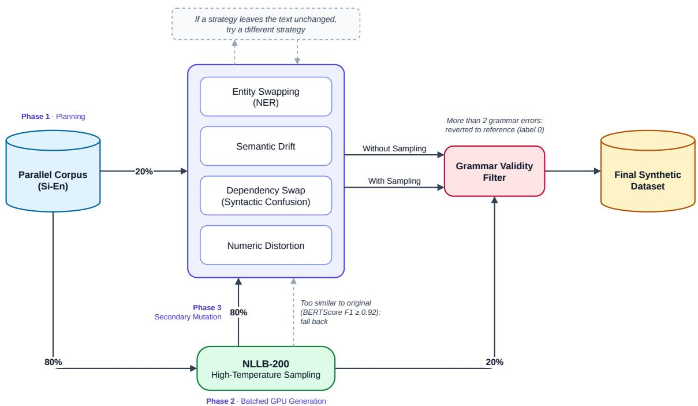

# Fact over Fiction: Detection of Pathological Hallucinations in Sinhala-to-English Neural Machine Translation

Navam Obeysekara♠ and Nevidu Jayatilleke♣

♠School of Computing, Informatics Institute of Technology, Sri Lanka ♣Department of Computer Science & Engineering, University of Moratuwa, Sri Lanka navam.20211058@iit.ac.lk, nevidu.25@cse.mrt.ac.lk

## Abstract

Neural Machine Translation (NMT) models, while capable of producing highly fluent outputs, remain vulnerable to hallucinations, which are translations that are natural yet semantically unrelated to the source. This vulnerability is acute in low-resource settings like Sinhala-to-English, where weak cross-lingual alignment leads to hallucinations. This paper introduces a framework for reference-free hallucination detection in this language pair. We present a 45,000-sample synthetic dataset generated through a probabilistic chain of five linguistically motivated corruption strategies, with a semantic rescue mechanism that uses character-level similarity to distinguish hallucinations from morphological variants. We fine-tune mDeBERTa-v3 for token-level sequence labelling, reaching a token-level F1 of 0.841 ± 0.001 over three seeds on a sourcedisjoint test set, and study a three-signal ensemble integrating neural risk scores, sequence log-probabilities, and cross-lingual semantic embeddings (LaBSE). A source-ablation control shows that the detector relies on the Sinhala source rather than on surface artefacts of the corruption process: shuffling or removing the source reduces sentence-level AUROC from 0.970 to chance. We benchmark eight NMT systems spanning five model families and find that detector firings vary by an order of magnitude across architectures.

Keywords: Low-Resource NLP, Hallucinations Detection, Machine Translation

## 1 Introduction

While the Transformer architecture (Vaswani et al., 2017) has established Neural Machine Translation (NMT) as the gold standard for cross-lingual communication, models remain critically vulnerable to hallucinations. These are fluent falsehoods that deceive users by mimicking valid output while fabricating information entirely (Ji et al., 2023; Lee et al., 2018; Guerreiro et al., 2023).

This risk is magnified in Low-Resource Languages (LRLs), where the scarcity of high-quality parallel corpora leads to model uncertainty and exposure bias (Wang and Sennrich, 2020). The reverse translation direction presents unique challenges. When translating from a low-resource source (Sinhala) to a high-resource target (English), the model’s strong English language model can generate plausible-sounding text bearing no relation to the original content. While existing literature has predominantly focused on English-to-Sinhala translation (De Silva, 2026), the reverse direction remains severely under-explored.

A complicating factor is Sinhala’s severe diglossia. Real-world inputs frequently contain colloquial syntax, including sections that routinely omit subjects or pronouns absent from formal training corpora. Encountering this input, models may resort to syntactic forcing by inserting grammatically required English agents or auxiliary verbs that have no direct source counterpart. Currently, existing evaluation benchmarks such as HalOmi (Dale et al., 2023b) exclude the Sinhala-English pair entirely, leaving no labelled training data, evaluation framework, or detection baseline.

To address this, this paper presents a linguistically grounded study on detecting hallucinations in Sinhala-to-English NMT, arguing that effective detection in LRLs requires moving beyond standard uncertainty metrics. We introduce a synthetic dataset of 45,000 sentence pairs generated through five linguistically motivated corruption strategies with a semantic rescue mechanism. Using this data, we train a reference-free token-level mDeBERTa-v3 detector (F1 = 0.841 ± 0.001 over three seeds, on a test set sharing no source sentence with training). Because every synthetic corruption is a monolingual English edit, we add a sourceablation control that tests whether the detector actually uses the Sinhala source. We further study a three-signal ensemble combining neural detection, sequence log-probability, and LaBSE cross-lingual semantic similarity, and establish a hallucination benchmark across eight Sinhala-to-English NMT systems spanning five model families.

## 2 Related Work

In this section, we review synthetic hallucination data, critiques of its realism, and detection strategies based on confidence, quality estimation, and cross-lingual embeddings.

## 2.1 Synthetic Data Approaches

A significant challenge in hallucination detection is the scarcity of naturally occurring labelled errors. Zhou et al. (2021) pioneered the use of synthetic hallucination datasets by framing detection as a sequence labelling task. Their approach involved corrupting high-quality source sentences and reconstructing them via a pre-trained BART denoising autoencoder to produce fluent but semantically incorrect outputs (Lewis et al., 2020). They bridged the bilingual gap with bilingual lexicon induction (Zhou et al., 2019) and alignment heuristics such as SimAlign (Jalili Sabet et al., 2020), enabling supervised token-level detectors such as XLM-R (Conneau et al., 2020) where no natural labels existed.

## 2.2 Natural Hallucinations and Critique

Guerreiro et al. (2023) argued that synthetic errors fundamentally differ from actual NMT hallucinations, introducing a taxonomy of oscillatory, strongly detached, and fully detached types. Their findings revealed that simple model confidence, measured via sequence log-probability, often performs on par with complex reference-based metrics while being significantly easier to implement. Furthermore, they proposed the DEHALLUCINATOR, which attempts to rewrite flagged translations using Monte Carlo dropout (Gal and Ghahramani, 2016). This aligns with the hypothesis suggested by Raunak et al. (2021), which discusses that hallucinations often stem from model instability or corpus noise rather than fundamental architectural flaws.

## 2.3 Extended Detection Strategies

The field has explored diverse statistical and glassbox strategies beyond synthetic methods. Martindale et al. (2019) combined fluency scores with Bag-of-Vectors Sentence Similarity to identify translations that are fluent but inadequate, proving semantic similarity more reliable than BLEU (Papineni et al., 2002). Fomicheva et al. (2020) evaluate Monte Carlo dropout as an unsupervised QE indicator across six language pairs, with Sinhala-English placed in their lowest-resource tier; they report weaker correlation with human judgments for this pair relative to their higher-resource pairs (Gal and Ghahramani, 2016; Kim et al., 2017). Parallel to this, COMET established a new paradigm for QE by regressing directly on human quality scores (Rei et al., 2020), while ALTI+ measures the impact on generated tokens, hypothesising that low source contribution is a primary signal for hallucination (Ferrando et al., 2022; Dale et al., 2023a).

For cross-lingual embeddings, Artetxe and Schwenk (2019) introduced LASER, which Heffernan et al. (2022) extended via LASER3 to scale detection to hundreds of languages. We adopt LaBSE (Feng et al., 2022), a dual-encoder architecture optimised with Additive Margin Softmax loss to produce discriminative cross-lingual sentence embeddings. Despite these advances, sequence logprobability is often driven by the target-language prior rather than faithfulness to the source. In lowresource Sinhala-English settings, where the encoder provides a weak cross-lingual signal, the decoder can generate a high-probability English sentence while effectively ignoring the Sinhala source. This failure mode, characterised by confident but semantically untethered output, is precisely what motivates our reference-free neural approach.

A related concern for supervised detectors trained on synthetic data is that they may exploit artefacts of the data-construction process rather than the intended signal, as shown for hypothesisonly baselines in natural language inference (Poliak et al., 2018; Gururangan et al., 2018). We adopt the corresponding control (§4.2).

## 3 Methodology

The proposed framework1 operates as a two-stage pipeline consisting of a Generation stage producing a hypothesis and model confidence score, and a Detection stage where a fine-tuned cross-lingual encoder identifies hallucinated tokens. Formally, let $\boldsymbol { S } ~ = ~ \{ s _ { 1 } , \ldots , s _ { m } \}$ be a Sinhala source and $H = \{ h _ { 1 } , \ldots , h _ { n } \}$ the English hypothesis. Hallucination detection learns $f ( S , H ) \to Y$ , where $Y = \{ y _ { 1 } , \dots , y _ { n } \}$ is a binary label sequence over hypothesis tokens.

<table><tr><td rowspan=1 colspan=1>Category</td><td rowspan=1 colspan=1>Strategy</td><td rowspan=1 colspan=1>Challenge</td></tr><tr><td rowspan=1 colspan=1>Fully Detached</td><td rowspan=1 colspan=1>High-Temp Sampling</td><td rowspan=1 colspan=1>Low conf. signal</td></tr><tr><td rowspan=1 colspan=1>Strongly Det.</td><td rowspan=1 colspan=1>Entity (NER) Swap</td><td rowspan=1 colspan=1>Fluent surface</td></tr><tr><td rowspan=1 colspan=1>Strongly Det.</td><td rowspan=1 colspan=1>Numeric Distortion</td><td rowspan=1 colspan=1>Subtle factual error</td></tr><tr><td rowspan=1 colspan=1>Fluent</td><td rowspan=1 colspan=1>Semantic Drift</td><td rowspan=1 colspan=1>Same syntax</td></tr><tr><td rowspan=1 colspan=1>Fluent</td><td rowspan=1 colspan=1>Dependency Swap</td><td rowspan=1 colspan=1>Wrong roles</td></tr></table>

Table 1: Hallucination categories, corruption strategies, and detection challenges.

## 3.1 Hallucination Taxonomy

Following Guerreiro et al. (2023) and Raunak et al. (2021), we partition hallucinations into two categories. Detached hallucinations occur when the model generates content that diverges from the factual meaning of the source on a severity spectrum, ranging from strongly detached outputs to fully detached outputs. Fully detached outputs have no semantic link whatsoever, whereas strongly detached outputs preserve the surface topic but fabricate specific facts. Fluent hallucinations remain locally coherent but introduce subtle semantic errors such as logic inversions and antonym substitutions, whilst remaining grammatically well-formed. The mapping from categories to corruption strategies is summarised in Table 1.

## 3.2 Dataset Construction

We construct a synthetic benchmark2 for hallucination detection in Sinhala-to-English translation. Starting from a clean parallel corpus, we corrupt English references with five strategies (alone or chained), filter the results for grammaticality, and release 45,000 labelled rows. A balanced 15,000- row subset, split by source sentence, is used for all detector experiments.

## 3.2.1 Data Source and Preprocessing

The dataset is built on the $\mathsf { n 1 1 b - t o p 2 5 k - e n s i - c l e a n e d } ^ { 3 }$ corpus (Ranathunga et al., 2024), a curated Sinhala-English parallel dataset of approximately 25,000 sentence pairs. We removed 4 entries whose

English text contained Sinhala characters or no Latin characters (0.02%). From the remaining 24,996 pairs, 7,500 source sentences were sampled (seed 42), and five negative samples were planned per source, giving $7 , 5 0 0 \times ( 1 + 5 ) = 4 5 , 0 0 0$ rows. The pipeline is seeded and was run once; the released corpus is used in all experiments.

## 3.2.2 Synthetic Hallucination Generation

Negative samples were generated using a custom HallucinationGenerator applying five corruption strategies. Deterministic strategies edit spaCy (Honnibal and Montani, 2017) tokens by index, so that a replacement never hits a different occurrence or a substring of the target word. A shared entity pool (PERSON, GPE, ORG, DATE, etc.) was pre-built from 2,000 sampled reference sentences.

Entity Swapping (NER Swap). One named entity is replaced with a different entity of the same label from the pre-built pool.

Semantic Drift. NLTK WordNet (Fellbaum, 1998) replaces one non-entity content word with an antonym of the same part of speech. Candidates are adjectives and adverbs, or uninflected verbs and nouns (so that the antonym, a lemma, fits the context), excluding be, have and do. Up to three candidates are tried; capitalisation of the original word is preserved.

Syntactic Confusion (Dependency Swap). spaCy’s dependency parser identifies the syntactic subject (nsubj) and object (dobj/obj) of the same verb. When both are present and neither is a pronoun (pronoun swaps create trivially detectable case errors), their positions are swapped to produce subject-object confusion (e.g., “The manager contacted the client” → “The client contacted the manager”).

Numeric Distortion. One whole number (thousands separators handled, decimals and alphanumeric tokens skipped) is incremented, decremented, or extended by appending a random digit. The increment/decrement magnitude is drawn from [1, max(10, ⌊0.2v⌋)], where v is the original value, ensuring distortion proportional to the original magnitude.

High-Temperature Sampling. English ground-truth sentences are re-encoded through NLLB-200-distilled-1.3B (NLLB Team et al., 2022) at T = 1.5 with nucleus sampling (top-p = 0.95, top-k = 50). A post-hoc filter retains only outputs with BERTScore F1 < 0.92 (Zhang et al., 2020) (roberta-large, no baseline rescaling). The threshold was set by manual inspection of samples in the 0.88–0.94 range: below 0.92 outputs predominantly altered meaning, while 0.92–0.94 mixed genuine changes with close paraphrases. Of 31,768 sampled outputs, 11,388 (35.8%) were retained.

## 3.2.3 Probabilistic Chain Generation

Rather than applying strategies independently, a probabilistic chain produces compound hallucinations in three phases. Phase 1 (Planning): each negative sample begins as High-Temperature Sampling $( \mathtt { p } = 0 . 8 )$ or a deterministic strategy (p = 0.2). Phase 2 (Batched GPU Generation): high-temperature samples are generated in batches of 32 and filtered by BERTScore; rejected samples fall back to a deterministic strategy. Phase 3 (Secondary Mutation): a second, distinct strategy is applied with $\mathrm { p } { = } 0 . 8$ (e.g., temp+ner). Whenever a deterministic strategy is needed, all applicable strategies are tried in random order until one changes the text; a row left identical to its reference is relabelled 0.

## 3.2.4 Grammar Validity Filter

Before balancing, all hallucinated rows are filtered using language tool python, ignoring PUNCTUATION, TYPOGRAPHY, WHITES-PACE, and CASING categories. Rows with more than two remaining grammar errors are reverted to the reference and relabelled 0. The filter rejected 109 of 32,686 hallucinated rows (0.33%). It operates purely on grammaticality, so meaning-altering but syntactically disrupted samples are reverted too. The effect is small but not uniform across strategies: 78 of the 109 rejections involved High-Temperature Sampling, which is correspondingly under-represented after filtering. We did not manually verify the reverted samples.

## 3.2.5 Corpus Composition and Splits

The released corpus contains 45,000 rows: 32,577 hallucinated (label 1) and 12,423 faithful (label 0). The faithful rows comprise the 7,500 references and 4,923 reverted rows (4,811 rejected hightemperature samples with no applicable fallback, 109 grammar rejections, 3 failed fallbacks), which duplicate their references and are retained, marked by their method field, for transparency. The distribution by base (first-applied) strategy is given in Table 2 where 13,987 hallucinated rows (42.9%) are compound.

<table><tr><td>Base strategy</td><td>Full corpus</td><td>Balanced</td></tr><tr><td>Ground truth (references)</td><td>7,500</td><td>7,500</td></tr><tr><td>Reverted (faithful)</td><td>4,923</td><td></td></tr><tr><td>Semantic Drift</td><td>12,718</td><td>2,876</td></tr><tr><td>High-Temp Sampling</td><td>11,310</td><td>2,583</td></tr><tr><td>Entity (NER) Swap</td><td>6,717</td><td>1,596</td></tr><tr><td>Numeric Distortion</td><td>937</td><td>239</td></tr><tr><td>Dependency Swap</td><td>895</td><td>206</td></tr><tr><td>Total</td><td>45,000</td><td>15,000</td></tr></table>

Table 2: Corpus composition after grammar filtering, by base (first-applied) strategy; compound rows are counted under their first strategy.

For detector experiments we draw a balanced subset of 15,000 rows: the 7,500 references as label 0 and 7,500 randomly sampled hallucinated rows as label 1 (seed 42). This subset is split 70/10/20 by source sentence, so that no Sinhala source appears in more than one partition, giving 10,486 training, 1,497 validation and 3,017 test rows (5,197 / 743 / 1,485 unique sources). Validation is used for checkpoint selection and threshold calibration; the test set is used only for final reporting.

## 3.3 Token-Level Label Construction

Token-level binary labels are derived from difflib.SequenceMatcher alignment between corrupted hypothesis and ground-truth reference. After light normalisation, the aligner assigns label 0 to equal and delete operations, and candidate label 1 to replace and insert operations. Omissions therefore carry no label.

Semantic Rescue for Morphological Variants. High-temperature outputs frequently contain surface variants of reference words (e.g., “colour” vs. “color”, “believes” vs. “believed”) that should not count as hallucinations. For rows involving High-Temperature Sampling, each candidate label-1 word $w _ { h }$ is compared against the words A of the aligned reference span (extended by three words on either side) using the Ratcliff/Obershelp similarity implemented by difflib:

$$
\sin ( w _ { h } , w _ { r } ) = \frac { 2 M } { | w _ { h } | + | w _ { r } | } ,\tag{1}
$$

where M is the number of matching characters found by recursive longest-commonsubstring matching on lower-cased words. If max $w _ { r } \in A$ sim $( w _ { h } , w _ { r } ) ~ \ge ~ \theta _ { r } ~ = ~ 0 . 8 0$ , the label is downgraded to 0 (e.g., “colour”/“color”: 0.91). Rows produced only by deterministic strategies are hallucinations by construction and receive no rescue. Restricting comparison to the aligned span prevents words that merely occur elsewhere in the reference, such as the two arguments of a dependency swap, from being rescued. Word-level labels are propagated to all sub-word tokens of the word, while source and special tokens receive label −100.

  
Figure 1: Dataset generation pipeline showing the three-phase probabilistic chain.

Rescue does not detect lexical paraphrases between surface-dissimilar words (e.g, “stated” vs. “said”, similarity 0.60; “perception” vs. “understanding”). Such words receive label 1 in hightemperature rows even when meaning is preserved, which is a source of label noise and of false positives at deployment.

Sensitivity to $\theta _ { r }$ . In the 2,583 high-temperature rows of the balanced subset, alignment yields 32,889 candidate label-1 words. The share rescued is 7.7% at $\theta _ { r } = 1 . 0 , 8 . 7 \%$ at 0.90, 13.3% at 0.80 and 15.6% at 0.70. Of 20 random rescued words per band, all 20 in [0.90, 1.0) were surface variants, 11 in [0.80, 0.90), and only 3 in [0.70, 0.80), where the rest were different words (e.g., “their”/“the”). We keep $\theta _ { r } = 0 . 8 0$ as the point below which rescues are mostly errors, with short words the main source of false rescues. This analysis concerns the labels only; we did not retrain the detector at other

thresholds.

## 3.4 Translation and Confidence Scoring

The sequence-level confidence of a generated translation is its log-probability under the generating model,

$$
\operatorname { L o g P r o b } ( H | S ) = \sum _ { t = 1 } ^ { | H | } \log p ( h _ { t } \mid h _ { < t } , S ) ,\tag{2}
$$

summed over the transition scores of the beamselected hypothesis as returned by beam search, so that the score is exactly the one the decoder used to select H (we verified that per-token averages match the reported beam scores for all eight systems). For the synthetic evaluation in §4.3, where the hypothesis is given rather than generated, the same quantity is computed by teacher forcing under NLLB-200-distilled-1.3B. Scores are min-max normalised per model (§3.6).

## 3.5 Hallucination Detection Architecture

mDeBERTa-v3 (mdeberta-v3-base) (He et al., 2023) is selected as the primary architecture for two principled reasons. First, its Replaced Token Detection (RTD) pre-training is structurally identical to our task. The model learns to classify each token as original or replaced, which is a discriminative objective that makes it ≈6.7× more sample-efficient than masked language modelling and whose training signal directly mirrors the hallucination detection setting. Second, its disentangled attention maintains separate matrices for content and relative position, which is advantageous for the cross-encoder input format $X = [ \mathbb { C } \mathrm { L } \mathsf { S } ] \oplus S \oplus [ \mathbb { S } \mathrm { E } \mathsf { P } ] \oplus H \oplus [ \mathbb { S } \mathrm { E } \mathsf { P } ]$ . In the concatenated source-hypothesis sequence, positional proximity between a Sinhala source token and an English hypothesis token carries no semantic information, as the two segments are separated by a boundary and have different wordorder typologies. Disentangled attention allows content-to-content interactions to be weighted independently of this positional distance. On XNLI zero-shot evaluation, mDeBERTa-v3 outperforms XLM-RoBERTa by 3.6% (He et al., 2023), which serves as our baseline.

## 3.5.1 Input Representation and Training

The hypothesis is tokenised word by word so that labels align with words; the source is truncated first if the pair exceeds 512 tokens. Each hypothesis token hidden state $h _ { i } ( d = 7 6 8 )$ is classified by a two-class softmax head,

$$
P ( y _ { i } \mid X ) = \operatorname { s o f t m a x } ( W h _ { i } + b ) ,\tag{3}
$$

optimised with cross-entropy. Configuration: $l r =$ $2 \times 1 0 ^ { - 5 }$ , 6 epochs, batch size 8, weight decay 0.01, fp16, single NVIDIA T4. The checkpoint with the highest validation token F1 is kept. Each detector is trained with three seeds (42, 43, 44); the same code, data and hyperparameters are used for the XLM-RoBERTa baseline.

## 3.5.2 Inference and Risk Scoring

A token is flagged if $P ( y _ { i } ~ = ~ 1 ~ \mid ~ X ) ~ > ~ 0 . 5 .$ The Hallucination Ratio aggregates these into a sentence-level score:

$$
R _ { H } = \frac { \sum _ { i = 1 } ^ { n } \mathbb { I } ( \hat { y } _ { i } = 1 ) } { n }\tag{4}
$$

and a sentence is flagged if $R _ { H } ~ > ~ \tau$ We calibrate τ on the validation set by sentence-level F1 over $\tau \in \{ 0 , 0 . 0 1 , \dots , 0 . 0 4 , 0 . 0 5 , 0 . 1 0 , \dots , 0 . 5 0 \}$ All three seeds select $\tau = 0$ (validation F1 0.950– 0.961), so the calibrated rule flags a sentence whenever any hypothesis token is flagged. This removes the insensitivity of ratio thresholds to single-token hallucinations in long sentences, which matters for domains such as legal or medical translation where a single wrong number or entity is consequential. We also report the maximum token probability as an alternative, threshold-free sentence score.

## 3.6 Three-Signal Ensemble Framework

The neural detector $R _ { H }$ , inverted log-probability ${ \hat { C } } ,$ and LaBSE similarity $\hat { \rho }$ capture different aspects of translation quality. Spearman correlations between log-probability and $R _ { H }$ range from $\rho = - 0 . 1 0 3$ to $\rho = - 0 . 4 3 7$ across the eight benchmarked systems (Table 7), confirming the signals are related but non-redundant. Their ensemble score is:

$$
E = w _ { \mathrm { d e t } } \cdot R _ { H } + w _ { \mathrm { l p } } \cdot { \hat { C } } + w _ { \mathrm { s e m } } \cdot ( 1 - { \hat { \rho } } )\tag{5}
$$

and a sentence is flagged if E exceeds a threshold. We evaluate the originally proposed weighting $( w _ { \mathrm { d e t } } = 0 . 5 , w _ { \mathrm { l p } } = 0 . 3 , w _ { \mathrm { s e m } } = 0 . 2 )$ alongside four alternative configurations and a weighting tuned on validation; each configuration’s threshold is tuned on validation (§4.3).

LaBSE Semantic Similarity. LaBSE (Feng et al., 2022) encodes source and hypothesis via mean-pooled, L2-normalised representations in a shared multilingual space. Cosine similarity below 0.80 is treated as semantic divergence, independent of reference translations.

Log-Probability Normalisation.

$$
\hat { C } = \frac { \operatorname* { m i n } ( C _ { \mathrm { r a w } } , 0 ) - C _ { \mathrm { m a x } } } { C _ { \mathrm { m i n } } - C _ { \mathrm { m a x } } }\tag{6}
$$

where higher $\hat { C }$ indicates lower confidence and $C _ { \mathrm { m i n } } , C _ { \mathrm { m a x } }$ are taken per model (on the benchmark) or from the validation set (on the synthetic evaluation).

## 3.7 Evaluation Protocol

Detector. Token-level precision, recall and F1 over hypothesis tokens of the source-disjoint test split, reported as mean ± standard deviation over three seeds, overall and by base strategy.

Source-ablation control. Because every corruption is a monolingual English edit of the reference, a detector could learn to recognise perturbed English without consulting the source. We therefore evaluate the trained detectors with (i) the original source, (ii) the source replaced by a different, length-matched test source, and (iii) the source removed, keeping the gold labels fixed; (iv) retrain the detector with the source removed from training, validation and test (a hypothesis-only baseline); and (v) pair faithful test hypotheses with a mismatched source. Case (v) creates fully detached pairs whose English is untouched: a source-aware detector must flag them, whereas a detector relying on perturbation artefacts will not.

<table><tr><td>Model</td><td>Acc.</td><td>Prec.</td><td>Rec.</td><td>F1</td></tr><tr><td>mDeBERTa-v3</td><td>0.946±0.001</td><td>0.845±0.014</td><td>0.837±0.011</td><td>0.841±0.001</td></tr><tr><td>XLM-R</td><td>0.930±0.001</td><td>0.819±0.023</td><td>0.762±0.028</td><td>0.789±0.005</td></tr></table>

Table 3: Token-level detector performance on the source-disjoint test split $^ { ( 3 , 0 1 7 }$ sentences, hypothesis tokens only), mean ± std over three seeds.

Ensemble. On the synthetic validation and test splits, where the gold label refers to the scored hypothesis, we compute $R _ { H }$ (seed-42 detector), teacher-forced log-probability and LaBSE similarity. Weights (simplex grid, step 0.1) and thresholds are tuned on validation and reported on test, together with per-signal AUROC.

NMT benchmark. Eight Sinhala-to-English systems translate the 1,485 unique test sources: NLLB-200 (distilled 600M and 1.3B) (NLLB Team et al., 2022), M2M-100 (418M and 1.2B) (Fan et al., 2021), mBART-50 (many-to-many and many-to-one) (Liu et al., 2020), a community fine-tune of mT5 for Sinhala-English (mt5-sinhalese-english4) (Xue et al., 2021), and Helsinki-NLP OPUS-MT (mulen). All use beam search with num beams = 4 and max new tokens = 256; all translations completed successfully. We record which signals fire per sentence and the Spearman correlation between log-probability and $R _ { H }$

## 4 Evaluation

We first evaluate the detector on the synthetic test split, then verify with a source-ablation control that it relies on the source sentence. Next we assess the ensemble and apply it to benchmark eight NMT systems on 1,485 held-out test sources, and finally examine sources of false positives.

## 4.1 Detector Performance

mDeBERTa-v3 achieves F1 of $0 . 8 4 1 { \scriptstyle \pm 0 . 0 0 1 }$ , outperforming XLM-RoBERTa by 5.2 points. The gap is largest in recall (+7.5 points), consistent with RTD pre-training, which trains the model to identify substituted tokens (He et al., 2023). Tokenlevel test performance is presented in Table 3.

Per-strategy F1 shows mDeBERTa’s advantage is consistent across all strategies. Dependency

<table><tr><td>Condition</td><td>Token F1</td><td>AUROC</td></tr><tr><td>Original source</td><td> $0 . 8 4 1 { \scriptstyle \pm 0 . 0 0 2 }$ </td><td>0.970±0.002</td></tr><tr><td>Shuffled source</td><td> $0 . 3 1 4 { \pm } 0 . 0 0 3$ </td><td> $0 . 5 4 0 { \scriptstyle \pm 0 . 0 0 7 }$ </td></tr><tr><td>Source removed</td><td> $0 . 2 9 5 { \scriptstyle \pm 0 . 0 0 4 }$ </td><td> $0 . 5 0 7 { \scriptstyle \pm 0 . 0 2 8 }$ </td></tr><tr><td>Hypothesis-only model</td><td> $0 . 6 2 2 { \scriptstyle \pm 0 . 0 0 8 }$ </td><td> $0 . 8 5 0 { \scriptstyle \pm 0 . 0 1 0 }$ </td></tr></table>

Table 4: Source-ablation control on the test split (mean ± std over three seeds; AUROC of $R _ { H } )$ . Gold labels are unchanged across conditions. Faithful hypotheses are flagged $4 . 5 \% \pm 0 . 9$ of the time with their own source and 100% with a mismatched source.

Swap is the hardest type (mDeBERTa: 0.804 vs. XLM-R: 0.752), as the swapped words are all present in the source and only their roles change; High-Temperature Sampling follows (0.828 vs. 0.784), reflecting its paraphrase-related label noise. Semantic Drift (0.934 vs. 0.857), Numeric Distortion (0.933 vs. 0.855) and Entity Swap (0.916 vs. 0.860) are easiest, as single-word substitutions contradict an identifiable source counterpart.

## 4.2 Source-Ablation Control

Replacing or removing the source at test time reduces token F1 from 0.841 to about 0.30 and sentence AUROC from 0.970 to chance (0.54 and 0.51), and the detector then flags every test sentence. Faithful hypotheses are flagged 4.5% of the time with their own source but 100% with a mismatched one, even though their English is unchanged. The detector therefore depends on the source-hypothesis relationship, not the hypothesis alone. The control results are reported in Table 4.

The hypothesis-only baseline reaches token F1 0.622 and AUROC 0.850, showing that the synthetic corruptions do leave monolingual cues (e.g., antonym substitutions and disfluent hightemperature outputs). The full model exceeds it by 0.22 F1 and 0.12 AUROC, and can also catch fluent but fully detached translations.

## 4.3 Ensemble Evaluation

As single signals, the detector $( R _ { H } )$ reaches AU-ROC 0.972, well above inverted log-probability (0.880) and LaBSE (0.882). The detector alone attains F1 0.963 at its validation-tuned threshold. The originally proposed weighting (Det-Mild) is lower (0.927), and configurations emphasising logprobability or LaBSE are lower still (0.871–0.907). The validation-tuned weighting assigns zero weight to log-probability and 0.1 to LaBSE; it matches the detector’s F1 and slightly improves ranking (AU-

<table><tr><td>Config</td><td>Weights</td><td>Prec.</td><td>Rec.</td><td>F1</td><td>Flag%</td><td>AUROC</td></tr><tr><td>Detector only</td><td>1/0/0</td><td>0.949</td><td>0.977</td><td>0.963</td><td>51.7</td><td>0.972</td></tr><tr><td>Det-Mild</td><td>0.5/0.3/0.2</td><td>0.916</td><td>0.938</td><td>0.927</td><td>51.5</td><td>0.971</td></tr><tr><td>Det-Heavy</td><td>0.7/0.2/0.1</td><td>0.941</td><td>0.962</td><td>0.951</td><td>51.4</td><td>0.977</td></tr><tr><td>LP-Heavy</td><td>0.2/0.6/0.2</td><td>0.812</td><td>0.940</td><td>0.872</td><td>58.1</td><td>0.938</td></tr><tr><td>Sem-Heavy</td><td>0.2/0.2/0.6</td><td>0.838</td><td>0.907</td><td>0.871</td><td>54.4</td><td>0.944</td></tr><tr><td>Uniform</td><td>0.33/0.33/0.33</td><td>0.879</td><td>0.938</td><td>0.907</td><td>53.6</td><td>0.961</td></tr><tr><td>Val-tuned</td><td>0.9/0/0.1</td><td>0.949</td><td>0.977</td><td>0.963</td><td>51.7</td><td>0.979</td></tr></table>

Table 5: Ensemble configurations on the synthetic test split (seed-42 detector; 50.2% hallucinated). Weights are ${ w _ { d e t } } / { w _ { l p } } / { w _ { s e m } } ;$ weights and thresholds tuned on validation.

ROC 0.979). On synthetic data, therefore, the detector carries nearly all of the signal, LaBSE adds a small complementary gain, and log-probability adds none. Ensemble results on the synthetic test split are reported in Table 5.

## 4.4 NMT Benchmarking Results

Each system’s 1,485 translations are partitioned by which of the three signals fire (Table 6): the detector fires when any hypothesis token is flagged (τ = 0), log-probability fires when a sentence falls below the model’s own 30th percentile, and LaBSE fires when cosine similarity falls below 0.80.

Detection rates vary by architecture. These counts are detector firings rather than verified hallucinations (§4.5), so they indicate relative risk rather than error rates. Detector firings vary by nearly an order of magnitude, from 51 (NLLB 600M) to 433 (OPUS-MT). OPUS-MT and the mT5 fine-tune produce the most detections and the most all-three joint detections (134 and 109), and they are also among the least confident systems per word. The NLLB models produce the fewest detections and the highest per-word confidence, consistent with their strong reported FLORES-200 performance on Sinhala (NLLB Team et al., 2022). Scaling M2M-100 from 418M to 1.2B roughly halves detections (253 to 129), whereas the two NLLB capacities perform similarly (51 and 70), and the many-to-one mBART-50 variant produces fewer detections than the many-to-many variant (93 vs. 140). These patterns suggest family and training data matter more than parameter count here, though confirming this requires controlled experiments.

No single signal is sufficient. Det Only sentences (22–97 per system) are detector flags with normal confidence and high LaBSE similarity, which a confidence-only system would miss. Logprobability alone flags about 30% of outputs by construction, producing 183–412 LP-Only sentences, most of which are uncertain but not flagged by the other signals. LaBSE-only detections are 12–67 per system, consistent with a confirmatory role.

Signal independence. All are negative and significant $( p ~ < ~ 0 . 0 0 1 )$ . Agreement is strongest for the weakest systems (mT5 −0.437, OPUS-MT −0.369) and weakest for NLLB (−0.103, −0.132): for strong systems, the detections that remain are largely ones the model itself is confident about. Spearman correlations between log-probability and $R _ { H }$ are reported in Table 7. Even the strongest correlation accounts for only ≈19% of the variance in rank, confirming non-redundancy.

Threshold sensitivity. Validation F1 is stable for $\tau \leq 0 . 0 3 ( 0 . 9 6 0  – 0 . 9 6 1 )$ and declines monotonically thereafter (0.931 at 0.05, 0.571 at 0.20, 0.377 at 0.50), so ratio thresholds such as the commonly used 0.20 substantially under-flag. On the benchmark, detector firings decrease monotonically with τ for every system, and OPUS-MT and mT5 remain the two highest-flagging systems at every threshold tested; ordering among the low-count systems varies.

## 4.5 Sources of False Positives

Without human annotation of the benchmark outputs we cannot measure precision on natural translations. As an indication, of the 129 M2M 1.2B sentences flagged by the detector, 36 (27.9%) also fall below the LaBSE threshold; the remainder are either fluent hallucinations that preserve overall sentence meaning or false positives. Inspection suggests two recurring sources of false positives.

Lexical paraphrasing. The detector does not reliably accept synonymous substitutions. This follows from the label construction (§3.3): surfacedissimilar synonyms such as “stated”/“said” are labelled as hallucinations in high-temperature training rows, and semantic rescue cannot recover them.

Structural variations. When colloquial Sinhala input is encountered, NMT systems insert grammatically required English agents or auxiliaries with no direct source counterpart (syntactic forcing). Wordlevel alignment against the reference penalises such insertions during training, so the detector can flag valid insertions as target-side hallucinations.

<table><tr><td>Model</td><td>Family</td><td>LP/word</td><td>Det fires</td><td>All 3</td><td>Det+LP</td><td>Det+LaBSE</td><td>LP+LaBSE</td><td>Det Only</td><td>LP Only</td><td>LaBSE Only</td><td>None</td></tr><tr><td>NLLB 600M</td><td>NLLB</td><td>-0.671</td><td>51</td><td>6</td><td>22</td><td>1</td><td>6</td><td>22</td><td>412</td><td>12</td><td>1004</td></tr><tr><td>NLLB 1.3B</td><td>NLLB</td><td>-0.617</td><td>70</td><td>7</td><td>34</td><td>6</td><td>11</td><td>23</td><td>394</td><td>23</td><td>987</td></tr><tr><td>M2M418M</td><td>M2M</td><td>-0.919</td><td>253</td><td>38</td><td>114</td><td>25</td><td>29</td><td>76</td><td>265</td><td>56</td><td>882</td></tr><tr><td>M2M 1.2B</td><td>M2M</td><td>-0.815</td><td>129</td><td>23</td><td>53</td><td>13</td><td>32</td><td>40</td><td>338</td><td>49</td><td>937</td></tr><tr><td>mBART50 m2m</td><td>mBART</td><td>-0.734</td><td>140</td><td>14</td><td>73</td><td>13</td><td>8</td><td>40</td><td>351</td><td>31</td><td>955</td></tr><tr><td>mBART50 m2o</td><td>mBART</td><td>-0.707</td><td>93</td><td>5</td><td>48</td><td>10</td><td>9</td><td>30</td><td>384</td><td>26</td><td>973</td></tr><tr><td>mT5 Sin</td><td>mT5</td><td>-0.971</td><td>329</td><td>109</td><td>113</td><td>49</td><td>29</td><td>58</td><td>195</td><td>61</td><td>871</td></tr><tr><td>OPUS-mul-en</td><td>Marian</td><td>-0.865</td><td>433</td><td>134</td><td>103</td><td>99</td><td>26</td><td>97</td><td>183</td><td>67</td><td>776</td></tr></table>

Table 6: NMT benchmarking on 1,485 unique test sources per system. Partition columns (All 3 to None) sum to 1,485; Det fires is the total number of detector-flagged sentences; LP/word is mean sequence log-probability per output word.

<table><tr><td>Model</td><td>Spearman ρ</td></tr><tr><td>NLLB 600M</td><td>-0.103</td></tr><tr><td>NLLB 1.3B</td><td>-0.132</td></tr><tr><td>M2M 418M</td><td>-0.303</td></tr><tr><td>M2M 1.2B</td><td>-0.215</td></tr><tr><td>mBART50 m2m</td><td>-0.248</td></tr><tr><td>mBART50 m2o</td><td>-0.176</td></tr><tr><td>mT5 Sin</td><td>-0.437</td></tr><tr><td>OPUS-mul-en</td><td>-0.369</td></tr></table>

Table 7: Spearman ρ between log-probability and $R _ { H }$ on the benchmark (all $p < 0 . 0 0 1 )$ .

## 5 Conclusion

This work addresses hallucination detection in Sinhala-to-English NMT, a task with no prior labelled data, benchmarks, or baselines. We presented a 45,000-sample synthetic corpus, a reference-free token-level detector (mDeBERTa-v3, $\mathrm { F } 1 = 0 . 8 4 1 \pm 0 . 0 0 1$ on a sourcedisjoint test set), a source-ablation control showing that the detector depends on the Sinhala source, a three-signal ensemble evaluation, and a hallucination benchmark across eight NMT systems. Detector firings vary by an order of magnitude across architectures, and Det Only detections show that fluent, confident hallucinations exist that logprobability alone misses. On synthetic data the detector carries nearly all of the ensemble’s signal, with LaBSE adding a small ranking gain.

Future work should prioritise human annotation of natural translation errors to measure real precision, and replace difflib supervision with cross-lingual word alignment to reduce paraphraseinduced label noise. Ensemble weights and thresholds should also be recalibrated on annotated natural translations, since values tuned on balanced synthetic data do not transfer to the much lower hallucination rates of real output.

## Limitations

The detector is trained and evaluated on synthetically corrupted data; generalisation to naturally occurring translation errors remains unverified. All corruptions are monolingual English edits of the reference, and High-Temperature Sampling reencodes English rather than translating from Sinhala, so authentic Sinhala-origin failure modes may be under-represented. The source-ablation control (§4.2) shows that the detector relies on the source, but the hypothesis-only baseline (F1 0.622) shows that the data also contain exploitable monolingual cues.

Token labels come from difflib alignment, which cannot recognise lexical paraphrases and ignores omissions. The rescue threshold $\theta _ { r }$ was assessed through its effect on labels (§3.3) rather than by retraining at alternative thresholds, and at $\theta _ { r } = 0 . 8 0$ some short, different words are wrongly rescued. The high-temperature BERTScore threshold was chosen by qualitative inspection, so paraphrases below it are labelled as hallucinations. The grammar filter reverts samples on grammaticality alone and disproportionately affects hightemperature samples (78 of 109 rejections).

Detector results are averaged over three seeds, but the ensemble evaluation and NMT benchmark use a single detector (seed 42). The benchmark reports signal-firing counts without human ground truth, and the LaBSE agreement in §4.5 is not a precision estimate. Because thresholds were calibrated on a balanced synthetic split, they over-flag real outputs, which is why Table 6 reports independent signal firings rather than ensemble decisions.

## References

Mikel Artetxe and Holger Schwenk. 2019. Massively multilingual sentence embeddings for zeroshot cross-lingual transfer and beyond. Transactions

of the Association for Computational Linguistics, 7:597–610.

Alexis Conneau, Kartikay Khandelwal, Naman Goyal, Vishrav Chaudhary, Guillaume Wenzek, Francisco Guzman, Edouard Grave, Myle Ott, Luke Zettle-´ moyer, and Veselin Stoyanov. 2020. Unsupervised cross-lingual representation learning at scale. In Proceedings of the 58th Annual Meeting of the Associationfor Computational Linguistics, pages 8440– 8451, Online. Association for Computational Linguistics.

David Dale, Elena Voita, Lo¨ıc Barrault, and Marta R. Costa-jussa. 2023a.\` Detecting and mitigating hallucinations in machine translation: Model internal workings alone do well, sentence similarity even better. In Proceedings of the 61st Annual Meeting of the Associationfor Computational Linguistics (Volume 1: Long Papers), pages 36–50, Toronto, Canada. Association for Computational Linguistics.

David Dale, Elena Voita, Janice Lam, Prangthip Hansanti, Christophe Ropers, Elahe Kalbassi, Cynthia Gao, Lo¨ıc Barrault, and Marta R. Costa-jussa.\` 2023b. HalOmi: A manually annotated benchmark for multilingual hallucination and omission detection in machine translation. In Proceedings of the 2023 Conference on Empirical Methods in Natural Language Processing, pages 638–653, Singapore. Association for Computational Linguistics.

Nisansa De Silva. 2026. Survey on publicly available Sinhala natural language processing tools and research. arXiv preprint arXiv:1906.02358.

Angela Fan, Shruti Bhosale, Holger Schwenk, Zhiyi Ma, Ahmed El-Kishky, Siddharth Goyal, Mandeep Baines, Onur Celebi, Guillaume Wenzek, Vishrav Chaudhary, et al. 2021. Beyond English-centric multilingual machine translation. Journal of Machine Learning Research, 22(107):1–48.

Christiane Fellbaum, editor. 1998. WordNet: An Electronic Lexical Database. MIT Press.

Fangxiaoyu Feng, Yinfei Yang, Daniel Cer, Naveen Arivazhagan, and Wei Wang. 2022. Language-agnostic BERT sentence embedding. In Proceedings of the 60th Annual Meeting ofthe Associationfor Computational Linguistics (Volume 1: Long Papers), pages 878–891, Dublin, Ireland. Association for Computational Linguistics.

Javier Ferrando, Gerard I. Gallego, Belen Alastruey,´ Carlos Escolano, and Marta R. Costa-jussa. 2022.\` Towards opening the black box of neural machine translation: Source and target interpretations of the transformer. In Proceedings ofthe 2022 Conference on Empirical Methods in Natural Language Processing, pages 8756–8769, Abu Dhabi, United Arab Emirates. Association for Computational Linguistics.

Marina Fomicheva, Shuo Sun, Lisa Yankovskaya, Fred´ eric Blain, Francisco Guzm´ an, Mark Fishel,´

Nikolaos Aletras, Vishrav Chaudhary, and Lucia Specia. 2020. Unsupervised quality estimation for neural machine translation. Transactions ofthe Association for Computational Linguistics, 8:539–555.

Yarin Gal and Zoubin Ghahramani. 2016. Dropout as a Bayesian approximation: Representing model uncertainty in deep learning. In Proceedings of the 33rd International Conference on Machine Learning, volume 48 of Proceedings ofMachine Learning Research, pages 1050–1059. PMLR.

Nuno M. Guerreiro, Elena Voita, and Andre Martins.´ 2023. Looking for a needle in a haystack: A comprehensive study of hallucinations in neural machine translation. In Proceedings of the 17th Conference ofthe European Chapter ofthe Associationfor Computational Linguistics, pages 1059–1075, Dubrovnik, Croatia. Association for Computational Linguistics.

Suchin Gururangan, Swabha Swayamdipta, Omer Levy, Roy Schwartz, Samuel R. Bowman, and Noah A. Smith. 2018. Annotation artifacts in natural language inference data. In Proceedings of the 2018 Conference of the North American Chapter of the Associationfor Computational Linguistics: Human Language Technologies, Volume 2 (Short Papers), pages 107–112, New Orleans, Louisiana. Association for Computational Linguistics.

Pengcheng He, Jianfeng Gao, and Weizhu Chen. 2023. DeBERTaV3: Improving DeBERTa using ELECTRA-style pre-training with gradientdisentangled embedding sharing. In The Eleventh International Conference on Learning Representations.

Kevin Heffernan, Onur C¸ elebi, and Holger Schwenk. 2022. Bitext mining using distilled sentence representations for low-resource languages. In Findings of the Association for Computational Linguistics: EMNLP 2022, pages 2101–2112, Abu Dhabi, United Arab Emirates. Association for Computational Linguistics.

Matthew Honnibal and Ines Montani. 2017. spaCy: Industrial-strength natural language processing in Python.

Masoud Jalili Sabet, Philipp Dufter, Franc¸ois Yvon, and Hinrich Schutze. 2020.¨ SimAlign: High quality word alignments without parallel training data using static and contextualized embeddings. In Findings ofthe Associationfor Computational Linguistics: EMNLP 2020, pages 1627–1643, Online. Association for Computational Linguistics.

Ziwei Ji, Nayeon Lee, Rita Frieske, Tiezheng Yu, Dan Su, Yan Xu, Etsuko Ishii, Ye Jin Bang, Andrea Madotto, and Pascale Fung. 2023. Survey of hallucination in natural language generation. ACM Computing Surveys, 55(12):1–38.

Hyun Kim, Jong-Hyeok Lee, and Seung-Hoon Na. 2017. Predictor-estimator using multilevel task learning

with stack propagation for neural quality estimation. In Proceedings ofthe Second Conference on Machine Translation, pages 562–568, Copenhagen, Denmark. Association for Computational Linguistics.

Katherine Lee, Orhan Firat, Ashish Agarwal, Clara Fannjiang, and David Sussillo. 2018. Hallucinations in neural machine translation. In NeurIPS 2018 Workshop on Interpretability and Robustness in Audio, Speech, and Language, Montreal, Canada.´

Mike Lewis, Yinhan Liu, Naman Goyal, Marjan Ghazvininejad, Abdelrahman Mohamed, Omer Levy, Veselin Stoyanov, and Luke Zettlemoyer. 2020. BART: Denoising sequence-to-sequence pre-training for natural language generation, translation, and comprehension. In Proceedings of the 58th Annual Meeting of the Association for Computational Linguistics, pages 7871–7880, Online. Association for Computational Linguistics.

Yinhan Liu, Jiatao Gu, Naman Goyal, Xian Li, Sergey Edunov, Marjan Ghazvininejad, Mike Lewis, and Luke Zettlemoyer. 2020. Multilingual denoising pretraining for neural machine translation. Transactions ofthe Associationfor Computational Linguistics, 8:726–742.

Marianna Martindale, Marine Carpuat, Kevin Duh, and Paul McNamee. 2019. Identifying fluently inadequate output in neural and statistical machine translation. In Proceedings ofMachine Translation Summit XVII: Research Track, pages 233–243, Dublin, Ireland. European Association for Machine Translation.

NLLB Team, Marta R. Costa-jussa, James Cross, Onur\` C¸ elebi, et al. 2022. No language left behind: Scaling human-centered machine translation. arXiv preprint arXiv:2207.04672.

Kishore Papineni, Salim Roukos, Todd Ward, and Wei-Jing Zhu. 2002. Bleu: a method for automatic evaluation of machine translation. In Proceedings of the 40th Annual Meeting of the Association for Computational Linguistics, pages 311–318, Philadelphia, Pennsylvania, USA. Association for Computational Linguistics.

Adam Poliak, Jason Naradowsky, Aparajita Haldar, Rachel Rudinger, and Benjamin Van Durme. 2018. Hypothesis only baselines in natural language inference. In Proceedings of the Seventh Joint Conference on Lexical and Computational Semantics, pages 180–191, New Orleans, Louisiana. Association for Computational Linguistics.

Surangika Ranathunga, Nisansa De Silva, Velayuthan Menan, Aloka Fernando, and Charitha Rathnayake. 2024. Quality does matter: A detailed look at the quality and utility of web-mined parallel corpora. In Proceedings of the 18th Conference of the European Chapter of the Association for Computational Linguistics (Volume 1: Long Papers), pages 860–880, St. Julian’s, Malta. Association for Computational Linguistics.

Vikas Raunak, Arul Menezes, and Marcin Junczys-Dowmunt. 2021. The curious case of hallucinations in neural machine translation. In Proceedings of the 2021 Conference of the North American Chapter ofthe Associationfor Computational Linguistics: Human Language Technologies, pages 1172–1183, Online. Association for Computational Linguistics.

Ricardo Rei, Craig Stewart, Ana C Farinha, and Alon Lavie. 2020. COMET: A neural framework for MT evaluation. In Proceedings ofthe 2020 Conference on Empirical Methods in Natural Language Processing (EMNLP), pages 2685–2702, Online. Association for Computational Linguistics.

Ashish Vaswani, Noam Shazeer, Niki Parmar, Jakob Uszkoreit, Llion Jones, Aidan N. Gomez, Łukasz Kaiser, and Illia Polosukhin. 2017. Attention is all you need. In Advances in Neural Information Processing Systems, volume 30.

Chaojun Wang and Rico Sennrich. 2020. On exposure bias, hallucination and domain shift in neural machine translation. In Proceedings ofthe 58th Annual Meeting of the Association for Computational Linguistics, pages 3544–3552, Online. Association for Computational Linguistics.

Linting Xue, Noah Constant, Adam Roberts, Mihir Kale, Rami Al-Rfou, Aditya Siddhant, Aditya Barua, and Colin Raffel. 2021. mT5: A massively multilingual pre-trained text-to-text transformer. In Proceedings ofthe 2021 Conference ofthe North American Chapter ofthe Associationfor Computational Linguistics: Human Language Technologies, pages 483–498, Online. Association for Computational Linguistics.

Tianyi Zhang, Varsha Kishore, Felix Wu, Kilian Q. Weinberger, and Yoav Artzi. 2020. BERTScore: Evaluating text generation with BERT. In International Conference on Learning Representations.

Chunting Zhou, Xuezhe Ma, Di Wang, and Graham Neubig. 2019. Density matching for bilingual word embedding. In Proceedings of the 2019 Conference ofthe North American Chapter ofthe Associationfor Computational Linguistics: Human Language Technologies, Volume 1 (Long and Short Papers), pages 1588–1598, Minneapolis, Minnesota. Association for Computational Linguistics.

Chunting Zhou, Graham Neubig, Jiatao Gu, Mona Diab, Francisco Guzman, Luke Zettlemoyer, and Marjan´ Ghazvininejad. 2021. Detecting hallucinated content in conditional neural sequence generation. In Findings of the Association for Computational Linguistics: ACL-IJCNLP 2021, pages 1393–1404, Online. Association for Computational Linguistics.