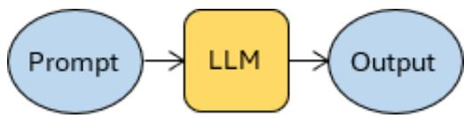
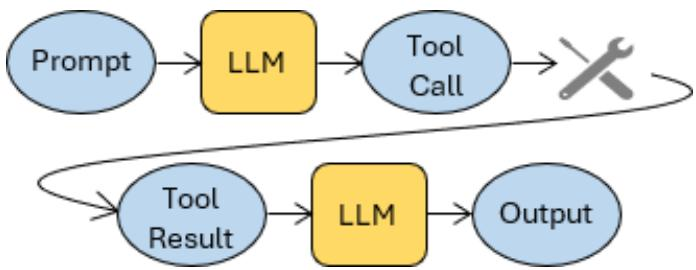

# Forms of LLM-Integrated Applications from LLM-Chats to Autonomous AI Agent Systems

Irene Weber

Faculty of Mechanical Engineering, University of Applied Sciences Kempten, Kempten, Germany Email: irene.weber@hs-kempten.de

Abstract—Large language models (LLMs) are increasingly embedded as components in software systems, marketed under labels such as chatbot, copilot, retrieval-augmented generation, workflow, coding agent and AI agent. Whether these labels denote genuine architectural forms or serve as branding has not been assessed systematically.

In the sources surveyed, labels do carry architectural content, most clearly in vendor usage: copilot denotes a router-worker architecture operating a host application under step-by-step user confirmation, while the more recent shift to the label agent coincides with AI-planned multi-step execution of which the user sees only the outcome. The coding agents of four major providers share one architecture, a reason-and-act loop delegating to subagents.

This survey describes seven recurring forms—LLM chats, custom agents, retrieval-augmented generation (RAG), AI-enhanced workflows, copilots, coding agents, and, in part, agentic RAG—in a common vocabulary of agents and tools. Each is characterized along four structural dimensions (agentic RAG only partially): the architectural pattern, the control of execution and the point of user intervention, the number of agent calls per task, and tool use. An illustrative corpus of 22 systems from research publications and vendor documentation grounds the descriptions and shows where they reach their limit.

Index Terms—agentic AI, AI Agent, coding agents, copilots, LLM-integrated applications, multi-agent systems, retrievalaugmented generation, software architecture, workflow automation

## I. INTRODUCTION

Large language models (LLMs) have moved beyond their initial role as conversational assistants. They are used as components inside software systems, where their output is consumed not by a human reader but by other pieces of software. Embedded in a program, an LLM no longer serves only as a content generator: it selects actions, parametrizes external services, and influences what happens next.

A vocabulary for these systems has emerged along with them. Practitioners speak of chatbots, copilots, retrievalaugmented generation, workflows, AI agents and agentic AI, and vendors use the same terms in product names and branding. The terms are evidently useful, since they are used routinely and widely. What is missing is an account of what they denote: developer guides, engineering blogs and vendor material or product documentation describe what individual systems do, but rarely how they are built or how one form compares architecturally with another. LLM-integrated systems developed in research usually originate in an application domain, where this terminology is adopted rather than examined. Several of the terms appear to have been coined in the development and research laboratories of leading vendors and adopted by the academic literature afterward, rather than the reverse.

It remains unclear whether the naming is largely arbitrary or whether these terms denote distinct categories of artifact and, if so, in what respects they differ. The result is a field that is hard to survey for newcomers and practitioners alike, and in which researchers struggle to position their work and compare it with related approaches.

This paper responds with a systematic description of the established forms in a single, common vocabulary. Its primary contribution is one of terminology and of conceptual groundwork, and only secondarily one of analysis. In detail, the contributions are:

• a set of concepts—AI agent, tool, monofunctional and multifunctional agent, and recurring architectural patterns—in which LLM-integrated applications can be described at the level of whole system architectures;

• uniform descriptions of seven forms established in practice but not yet defined in a common vocabulary, each characterized along four structural dimensions: architectural pattern, control of execution and the point at which the user intervenes, number of agent calls per task, and tool use;

• an overview of 22 systems from research publications and vendor documentation, which illustrates the descriptions, shows where they reach their limit, and shows that the label copilot denotes one architecture and one set of characteristics, while the shift to the label agent marks a shift in architecture.

Section II reviews related work. Section III defines the concepts used throughout. Section IV describes the seven forms. Section IV-H surveys selected systems. Section V discusses implications, limitations and further work.

## II. RELATED WORK

Conceptual work published by vendors presents catalogues of architectural patterns intended as guidance for developers building LLM-based systems [1]–[3]. Surveys of multi-agent systems (MAS) address collaboration mechanisms [4], application domains [5], or the conceptual distinction between AI agents and agentic AI [6]. Masterman et al. and Zhou et al. classify agent systems as single- versus multi-agent and hierarchical versus decentralized architecture, but draw their examples from research prototypes [7], [8]. None of these works characterizes applications systematically.

  
Fig. 1. figure  
Invocation of an LLM.

In earlier work, the author proposed a taxonomy of LLMintegrated applications that characterizes the individual model invocation, termed LLM component, which corresponds to the notion of AI agent used in this paper. That approach decomposes LLM-integrated applications into LLM components and classifies each component along several dimensions [9], but stops short of describing whole system architectures.

Closest to the present work is the taxonomy of Handler [10],¨ which classifies autonomous LLM-powered MAS by their levels of autonomy and alignment, assessed per architectural aspect. Its alignment axis is a finer-grained treatment of what appears here as user control; its autonomy axis is related to our number of agent calls per task. It covers one class of systems, applied to seven open-source projects, and includes a workflow automation tool expressly as a contrasting case; the present paper describes a broader range of forms in uniform terms. To the author’s knowledge, no other work describes the range of established forms in a single, common vocabulary at the level of application systems.

## III. AGENTS AND TOOLS

The descriptions in Section IV refer to systems which are assembled from smaller units. This section defines the terminology adopted here.

## A. Invocation and Tools

An LLM is used by invoking it with a prompt, as shown in Fig. 1. A prompt comprises several types of information: an instruction or system prompt, which defines the general behavior of the prompted LLM, such as “act as a helpful assistant”; a state or context part, which informs the LLM about the current circumstances, such as a dialog history; and the task it has to solve, such as a user’s question it has to answer [9]. An LLM cannot act; it can only produce text. Its scope is extended by giving it access to tools. The model uses a tool by emitting a call with parameters appropriate to the task; the surrounding system executes it, holding the function implementations, the service endpoints and credentials, or the execution environment for generated code, and the result is optionally fed into a further invocation from which the model formulates a response (Fig. 2).

  
Fig. 2. figure  
Control and data flow of tool use.

For the model to use a tool correctly, the prompts must describe when the tool applies and how it is called. Tool integration has begun to standardize: the Model Context Protocol defines a uniform format in which services describe the functions they offer and how a model may call them [11].

## B. AI Agent

The terminology in the field of agentic AI has not yet converged. Some authors call any prompt-and-response component an agent, for instance, in the context of custom agents in Subsection IV-B. Others require tool use [12], planning capability [13], or a degree of autonomous control over the flow of execution [2], [14]. Agentic AI is treated by some as an umbrella term that includes single-agent systems [1] and by others as a synonym for MAS [6].

This paper adheres to a minimal definition: an AI agent is a prompt-and-response system component, with or without access to tools. The term LLM agent would be more precise, but AI agent is adopted because it has become established and is consistent with the equally established term agentic AI. Under this definition, agents are the building blocks of agentic AI and of LLM-based software systems, i.e., systems that invoke LLMs.

## C. Monofunctional and Multifunctional Agents

What constitutes a given AI agent is its prompt, above all its instruction or system prompt. It defines the agent’s behavior, while the model that processes the prompt is in principle interchangeable. Agents can be designed with varying degrees of complexity. A multifunctional agent performs a range of functions, selects the appropriate one itself and decides on its execution; typically a whole palette of tools is at its disposal, which it selects and parametrizes autonomously. A monofunctional agent fulfils only a delimited function, for example parametrizing a single tool. There is a continuum from strictly monofunctional to multifunctional agents, rather than a strict division.

## D. Architecture Patterns

LLM calls can be combined and integrated into systems in countless ways. Among these, certain basic architectures are— with varying names—described in the literature [1], [3], [7], [8]. The following list names some of them.

Monofunctional single agent and multifunctional single agent (Fig. 1), which may include tool use, have been described in Section III. In the context of AI agents, the term workflow refers to applications in which the agents are embedded in a prescribed process. Workflows solve tasks over a sequence of process steps. Individual steps may be realized as agents, and the process supplies each agent invocation with data from the process context. The sequence is defined in advance and may contain conditional branches, but it is not composed dynamically by a model. A special case is the prompt-chaining workflow, consisting of a sequence of LLM calls, where the result of an LLM call is fed into the prompt of the next LLM call. The router-worker architecture consists of a central router agent and a set of specialized worker agents. A worker is a subagent, typically monofunctional. An input to the system first reaches the router, which determines which of the system’s predefined tasks the input matches—intent detection—and then invokes the worker agent responsible for the detected intent with parameters extracted from the system environment and the input.

In the orchestrator-worker architecture a central manager agent plans and steers. It decomposes a task into subtasks and hands them to specialized workers by configuring their prompts; workers may run in parallel, and a further agent may consolidate the partial results.

The planner-executor architecture, also called managerworker, adds iterative refinement. The planner produces a work plan, workers execute subtasks and additionally return feedback, and the planner revises the plan and delegates again until the desired result is reached. The hierarchical plannerexecutor variant inserts intermediate planners: a high-level planner performs coarse planning and passes subtasks to subordinate planners that refine them, with workers executing at the leaves. All architectures involving calls to workers or subagents have analogous hierarchical variants.

In the reason-and-act (ReAct) loop, a single multifunctional agent interleaves reasoning with tool calls in a loop: it reasons about what to do next, invokes a tool, evaluates the result in a further reasoning step, and repeats until it judges the task complete [16]. If the ReAct agent’s tools include subagents, it constitutes a further MAS architecture.

These architectures vary in autonomy, that is, the degree of control left to an LLM within an agentic system. Some authors reserve the term autonomous MAS (AMAS) for architectures such as orchestrator-worker, reason-and-act, and planner-executor, where the number of LLM calls the MAS executes to fulfil a task is determined by an LLM rather than fixed, as in workflows or the router-worker architecture [1]. Agent systems may go further still, writing automation scripts and defining prompts for subagents by themselves, thereby attaining far-reaching autonomy [13]. Architectures without central control are also possible, notably peer-topeer architectures in which agents divide the task among themselves and coordinate through mechanisms such as shared blackboards, voting or auctions. In practice, centrally controlled architectures dominate in 2025: among published case studies of deployed MAS on one framework platform, the orchestrator-worker and router-worker architectures are the most frequent [17].

Agent systems may contain further agents that do not contribute to solving the task but supervise it. Guardrail agents, for example, check the inputs and outputs of other agents against safety rules, access rights or compliance requirements and block or modify actions that violate them [18]. Such agents are a cross-cutting concern, comparable to logging or authorization in conventional software: they can be added to any of the architectures listed above without altering it. They are therefore not treated here as architectural elements, and their invocations are not counted among the agent calls per task.

## IV. FORMS OF LLM-INTEGRATED APPLICATIONS

This section describes established forms of LLM-integrated applications by examples.

## A. LLM Chats

LLM chats offer a dialogue interface to a model. In organizations they are used for drafting texts of all kinds and for translation, and as a convenient and powerful substitute for search engines, with the known caveats that they occasionally produce fabricated information and that their knowledge does not extend to the present. Chat products typically work with multifunctional prompts, see for instance [19]. Users may request tool use explicitly, or the model decides for itself.

Behind a current chat product there may be several models of different sizes together with a router that selects one per user turn [20]. The deep research function offered by several chat products may be viewed as a tool within the chat system, see Subsection IV-C.

## B. Custom Agents

Effective prompts are often extensive and hard to develop, since small changes in wording can substantially change their effect. It therefore pays to store successful prompts for recurring tasks. Several AI chat platforms allow such prompts to be managed as custom agents in their interface, and vendorindependent platforms offer the same across models [21]. The names for custom agents differ by platform. Often, tools can be attached, and some services operate marketplaces in which custom agents are published and reused.

An analysis of the custom agent landscape found that external application integration remains comparatively rare, with most agents relying on capabilities the host service provides [22], and guidance for the format recommends scoping each agent to a delimited task [23]. Custom agents also occur inside larger systems: workflows use them as process steps [24].

## C. Retrieval-Augmented Generation

Retrieval-augmented generation (RAG) [25] preserves the usability of the chat interface while opening knowledge sources that did not enter model training, such as an organization’s internal documents or specialized domain expertise.

RAG retrieves passages from the knowledge sources to generate answers, which reduces fabrication (hallucination), and makes the supporting documents or entries explicit, so that an answer can be checked against them [26], [27]. RAG is among the most successful applications of LLMs in professional settings. The following sections discuss two variants: RAG in the narrow sense, and agentic RAG.

1) Narrow Sense RAG: RAG in the narrow sense goes back to [25] and is suited to large, heterogeneous and largely unstructured document collections, such as manuals, project reports or case records built up over years. In the form common today, the collection is prepared in advance: text is extracted from the source formats, split into chunks, converted into vectors by an embedding model and stored in a vector database. At query time, the same embedding model converts the user’s question into a vector, and the system retrieves the chunks whose vectors are most similar. These are inserted into the prompt, from which an LLM then generates the answer.

The LLM plays no part in retrieval. Thus, in the terminology adopted here, this is technically not an agent with a tool as in Fig. 2, but the agent is reduced to formulating an answer from material handed to it as in Fig. 1.

2) Agentic RAG: Agentic RAG denotes approaches for searching large and frequently changing content such as company websites, intranets, wikis, document collections or databases. Retrieval is performed by appropriate mechanisms invoked as tools, such as web search, enterprise search, and database queries [28], [29]. In Agentic RAG, agents decide what to retrieve. Many architectures have been proposed [30]– [32], ranging from single-agent loops with retrieval tools to multi-agent and hierarchical designs. Deep research systems are a special form of Agentic RAG [31]. A detailed study of the architectures of agentic RAG products [33], [34] and deep research systems [15], [35], [36] is beyond the scope of this paper.

## D. AI-Enhanced Workflows

Besides denoting an architectural MAS pattern, the term workflow also denotes a class of software that predates the current wave of agentic AI: platforms for robotic process automation (RPA), workflow automation and business process management. The platforms target trained end users with low-code or no-code environments in which workflows are assembled by arranging and connecting prefabricated blocks in a graphical user interface. Many of these established platforms have been extended with blocks that invoke LLM agents; these agents are configured in dedicated agent-builder areas [37], [38]. For instance, such agents draft replies to customer e-mails, summarize incoming messages or route them to the responsible staff member. One platform aimed at IT professionals makes agent invocations available as modeling elements within process models expressed in the standardized Business Process Model and Notation (BPMN) [39]. Another is source-available, can be self-hosted and used with arbitrary models, including local ones, which helps to satisfy strict data protection requirements, for example in public administration [40].

TABLE I  
PROPERTIES OF COPILOTS ACCORDING TO THE CONSULTED SOURCES
<table><tr><td>System</td><td>RWa</td><td>Contb</td><td>Hostc</td><td>Monod</td></tr><tr><td>Excel Copilot, Microsoft 365 Copilot [46], [47]</td><td>0</td><td>√</td><td>√</td><td>√</td></tr><tr><td>Dynamics 365 Copilot [48]</td><td>?</td><td>?</td><td>√</td><td>√</td></tr><tr><td>SAP Joule, procurement [49]</td><td>√</td><td>√</td><td>√</td><td>√</td></tr><tr><td>Salesforce Einstein Copilot [50]</td><td>√</td><td>?</td><td>√</td><td>√</td></tr><tr><td>Siemens Industrial Copilots [51]</td><td>√</td><td>√</td><td>√</td><td>十</td></tr><tr><td>GitHub Copilot [52]</td><td>0</td><td>√</td><td>√</td><td>0</td></tr><tr><td>Product Configuration Copilot [53]</td><td>?</td><td>√</td><td>√</td><td>√</td></tr><tr><td>ADMA Copilot [54]</td><td>×</td><td>×</td><td>√</td><td>√</td></tr><tr><td>Equipment Selection Copilot [55]</td><td>√</td><td>×</td><td>×</td><td>十</td></tr></table>

aRW: router-worker topology. bCont: user control; they confirm actions and/or can undo effects. cHost: tools are functions operating a host application. dMono: monofunctional workers.  
✓ stated in the source; ? not stated; × the source states otherwise; ◦ inferred from [45] or drawn from the author’s own inspection; + router-worker at the top level, but workers are themselves workflow/orchestrator agents, not monofunctional.

The workflows are typically triggered by events or schedules and then run unattended. Systems may provide checkpoints at which humans inspect intermediate results, either on every execution or only where a decision is flagged as critical or falls below a confidence threshold [41]; outside these checkpoints, intermediate results remain uninspected.

By contrast, the LLM ecosystem offers programming frameworks for building agentic workflows, together with visual builders layered on top of them [42]–[44]. These address developers and permit more flexible MAS architectures than the prefabricated blocks of the low-code platforms.

## E. Copilots

Copilot has become an established term for LLM-integrated systems. Our survey of commercial systems and research prototypes labeled copilots aims to identify their common characteristics. It draws on vendor documentation and, as this is often not very detailed, also on direct inspection of the systems and on the findings of an interview study with engineers building product copilots [45]. Table I summarizes the results.

1) Commercial Copilots: One office suite vendor describes an orchestration engine that combines the language model with the suite’s applications and the user’s business data, together with an extensible set of skills that the assistant applies [47]. The same source states that the user decides what to keep, modify or discard; an early demo video shows this behavior [46]. The same vendor’s copilot for CRM and ERP is likewise a set of delimited capabilities operating on the functions of the host applications: it drafts replies from case history and knowledge bases, curates customer segments in dialogue with the customer data platform, and generates product descriptions from stored item attributes [48].

A further CRM vendor describes the two parts of the architecture explicitly: a reasoning engine that interprets user requests and selects from a library of actions, described as preprogrammed capabilities, and a set of such actions delimited to one task each [50]. The same source describes contextdependent single-click actions offered on the page the user is currently on, such as summarizing an opportunity, which is the button mechanism noted above.

In a further ERP suite the assistant contains workers that execute tasks directly; in the procurement module these create purchase requisitions, change purchase orders and so on, without the user opening the respective applications [49]. The vendor’s technical documentation records each of these capabilities separately, with its own set of application programming interfaces and its own semantic object-action pair, the platform’s established means of addressing an application function. The worker set and the binding of each worker to its tools are thus documented capability by capability.

An industrial vendor develops copilots along the value chain, from design through engineering, planning, and operations to service. The architecture distinguishes between copilots and specialized agents: users interact with the copilot, while an orchestrator delegates tasks to specialized agents [56]. A demo shows the operations copilot being accessed via a chat interface [57]. Agents are described as understanding intent and accessing external tools and other agents; they create plans and execute actions independently [51], while users retain full control and can select which tasks to delegate to them [56]. This indicates that the copilot implements a router-worker pattern at the level at which the user interacts with it, while the workers—though specialized—may themselves implement the orchestrator-worker pattern described in Section III-D.

A prominent programming copilot product installs into development environments as a plug-in and uses their functions, e.g., for editing and creating files or writing test routines. Product screenshots show specialized copilot skills—the workers— which the user can invoke directly with a slash command, thereby bypassing the copilot’s intent detection [52], [58]. In its FAQ, the vendor states the division of responsibility as a design principle, noting that the product is called copilot rather than autopilot and that generated code is not intended to be compiled or executed before the developer has reviewed it [52].

2) Research Prototype Copilots: A product configuration copilot provides a chat interface for a product configurator. It translates natural-language user input into a format the constraint resolver can process automatically, and phrases the results in natural language for the user [53]. This copilot operates an existing application, and the user can see and correct the effect of the operation immediately. With only one supported intent, the setup is too simple to require routing. An agricultural copilot operates an Agricultural Data Management and Analytics (ADMA) platform. Its controller agent infers the user’s intent, determines which of a platform’s tools and processing steps the intended analysis requires, parametrizes them, and coordinates their execution following a predefined meta-program graph [54]. This resembles the orchestratorworker architecture of Subsection III-D more than the router-

worker one.

A copilot for manufacturing equipment selection follows the router-worker pattern at the level at which the user interacts with it, while one of its workers is internally a workflow of successive model invocations: the suitability of a selection is checked by a further model invocation rather than by the user, who is consulted only when that check fails [55]. This copilot accesses knowledge, but does not operate further application software.

3) Characteristics of Copilots: Typical copilots operate existing application software, visibly performing steps previously done by hand; commercial ones are frequently integrated directly into the host product. Architecturally, they follow a router-worker pattern: the user states a goal in a chat window, the copilot detects the intent, and specialized workers carry it out. Because the effect of each operation is visible, the user can keep it or refine it in further turns. Some copilots additionally propose contextually appropriate actions, for example as buttons triggering the corresponding intent.

4) Shift of Labels: The survey indicates that vendors use the terminology more consistently than researchers do. More recently, vendors have begun to brand their AI products as agents, in addition to or instead of as copilots, and this shift of labels coincides with a change in architecture. One ERP provider explicitly announces its AI agents as a move from “just AI copilot” to “AI orchestrator” [59]; a comparable statement is made with respect to industrial copilots [56], and a further vendor mentions “dynamic multi-step plans” within an agent platform [60]. The programming copilot has been augmented by an “agentic mode” [61].

## F. Coding Agents

Among the emerging forms of AMAS applications that share a common architecture are coding agents for software development. They are built around an agentic loop that delegates work to subagents [1], [62]–[65]. A coding copilot (GitHub Copilot) has since been extended with an agent mode that follows the same pattern [61].

## G. Planner-Executor Example System

A further AMAS example is Anthropic’s Research feature. Its developers describe it as a multi-agent architecture in which a lead agent analyzes the query, devises a research strategy and delegates subtasks to subagents that run in parallel, then synthesizes their findings and decides whether further research is needed; if so, it spawns additional subagents or revises its strategy [15]. Although its developers name it an orchestrator-worker AMAS, this comes close to the plannerexecutor pattern as defined in this paper. The correspondence is not exact: the subagents are themselves tool-using agents that search, evaluate intermediate results and reformulate their own queries, so they are considerably more autonomous than executors in the classical sense; and planning is interleaved with execution rather than completed up front.

TABLE II  
FORMS OF LLM-INTEGRATED APPLICATIONS
<table><tr><td>Form or System</td><td>Architectureª</td><td>User control</td><td>Agent calls per taskb</td><td>Tool use</td><td>Sources</td></tr><tr><td>LLM chatsc</td><td>multifunctional single agent</td><td>each answer</td><td>one</td><td>few</td><td>[19], [20]</td></tr><tr><td>Custom agents</td><td>monofunctional single agent ?</td><td>each answer</td><td>one</td><td>at most one</td><td>[21]-[23]</td></tr><tr><td>Agentic RAG</td><td></td><td>each answer</td><td>?</td><td>retrieval tools</td><td>[28], [29], [32]</td></tr><tr><td>RAG, narrow</td><td>monofunctional single agent</td><td>each answer</td><td>one</td><td>none</td><td>[25]</td></tr><tr><td>AI-enhanced workflows</td><td>workflow</td><td>optional checkpoints</td><td>fixed (process)</td><td>fixed (process)</td><td>[37]-[41]</td></tr><tr><td>Copilots</td><td>router-worker</td><td>each action result</td><td>two</td><td>host functions</td><td>[47]-[52]</td></tr><tr><td>Coding agents</td><td>ReAct loop</td><td>final result only</td><td>open, unbounded</td><td>extensive</td><td>[61]-[65]</td></tr><tr><td>Equipment selection copilot</td><td>router, workflow-type worker</td><td>final result only</td><td>bounded</td><td>no tools</td><td>[55]</td></tr><tr><td>Agricultural copilot</td><td>orchestrator-worker</td><td>final result only</td><td>open, bounded</td><td>platform functions</td><td>[54]</td></tr><tr><td>Research Agent</td><td>planner-executor, auton. subagents</td><td>final result only</td><td>open, unbounded</td><td>retrieval tools</td><td>[15]</td></tr></table>

aArchitecture: pattern of Section III-D. bTask: one unit of work the system is given to complete: a user request, a conversational turn, or a triggered run of a process. cLLM chat: excluding the deep research function.

## H. Summary of Selected Systems

To illustrate the descriptions given above, Table II summarizes the forms, together with the system instances for which this study found no established form. For each entry it records four properties: the architectural pattern, the point at which a human user intervenes, the number of agent calls per task, and the tools available to the agents. The entries combine commercial products, for which vendor documentation is the principal source, with research prototypes, for which peerreviewed descriptions are available; see Section V-D for discussion.

## V. DISCUSSION

This study asks which structurally similar forms of LLMintegrated systems have already emerged, given that interest in and development of these systems began less than four years before this study. It investigates whether the labels applied to LLM-integrated systems denote actual forms beyond mere branding, and, where they do, what characteristics constitute each label. The study focuses on structural dimensions to characterize the systems, including system architecture, degree of user control, number of agent calls per task, and tool use, as such characteristics make it possible to describe newly developed systems in new application areas.

## A. Scope and Granularity

The study does not aim to provide a taxonomy that sorts systems into separate, mutually exclusive categories, nor to map a fine-grained design space for developers or to serve as an analytical instrument for detailed architectural research. It characterizes LLM-integrated systems at a general level, which is what its purpose requires: to provide an accessible framework for practitioners, students, and newcomers to the field, and to help position and label systems using established, common terms.

## B. Labels and Architectural Distinctions

The survey indicates that vendors use the label copilot consistently, as detailed in Section IV-E. The subsequent shift to agent is accordingly more than a change in fashion, as it marks a move from AI-selected single steps that the user confirms to AI-planned multi-step execution of which the user sees only the outcome. The survey also found that the coding agents of four major providers are similar along the structural dimensions examined. For RAG in the narrow sense, the characteristics were derived from the original formulation [25]; the survey did not investigate to what extent products or prototypes branded as RAG exist and conform to this definition. The study introduces its own label, AI-enhanced workflow, to the author’s knowledge there is not yet a common label for this form.

## C. Nested and Hybrid Architectures

LLM-integrated systems are complex and vary in their details; MAS in particular can be designed very flexibly. Diverse, hybrid, and nested architectures are possible and common.

The Equipment Selection Copilot [55] is an example: at the level the user interacts with, it is a router-worker copilot, but one of its workers is internally a workflow of several chained model invocations.

As agentic systems become more common, more such nested architectures are expected to appear, as copilot-type and chat-type systems become enhanced with MAS-type workers and tools. The chat or copilot pattern acts at the user-interface level, which starts the agentic workers or tools autonomously, in cooperation with, or with confirmation from, the user. For these cases, it is suggested that the classification be drawn at the user-facing level, with the internal nesting recorded as a property of the respective workers, rather than treated as a separate system form.

## D. Limitations and Future Work

Systems were characterized by a single author from pub lished descriptions; for several commercial systems, these, necessarily, are vendor sources that disclose only a certain level of technical detail; in some cases, the characterization is based only on what the vendor states. The corpus is illustrative rather than representative, and no frequency claims follow from it. Independent second coding, and characterization against technical rather than promotional sources where these become available, would strengthen the observations.

The descriptions were developed over a period in which the field changed substantially: products marketed as copilots acquired capabilities now marketed as agents, and AMAS moved from research prototypes to commercial offerings. New forms of LLM-integrated systems keep emerging, for example locally hosted, user-configurable personal assistants that read and write files, run commands, and browse the web on the user’s own machine [66]. Extending the study to such new forms, and to further existing forms such as Deep Research and Agentic RAG, is a natural direction for future work.

Matching forms of LLM-integrated systems to other kinds of AI-based system not built on LLMs could help clarify their relation to the more recent forms of agentic AI; transactional chatbots [67] and the expert systems of the 1990s [68] are two examples.

## VI. CONCLUSION

Many terms for LLM-integrated systems—chat, custom agent, agentic RAG, RAG, copilot, coding agent, etc.—are applied routinely in practice but have, with exception of RAG, not been described in the research literature in a way that states uniformly how the systems behind them are built.

This paper has described six forms of such systems in full, and a seventh in part, illustrated by a survey of 22 systems characterized from vendor sources, own inspection, and video material, and informed by research publications, survey papers, and other secondary sources. Each form is characterized by its architecture, by the role left to the human user, by the number of agent calls per task, and by the tools its agents use.

The classification is offered as a means of relating these systems to one another: to make the field more accessible for newcomers and in teaching, to give practitioners a basis for comparing technologies, and – as a theoretical and conceptual contribution—to introduce the emerging terminology into the research literature so that studies can refer to it.

## REFERENCES

[1] Anthropic, “Building effective agents,” Dec. 2024. Accessed: Sep. 22, 2026. [Online]. Available: https://www.anthropic.com/research/buildin g-effective-agents

[2] Google, “LLM Agents,” 2025. Accessed: Sep. 22, 2026. [Online]. Available: https://google.github.io/adk-docs/agents/llm-agents/

[3] OpenAI, “A practical guide to building agents,” Whitepaper, OpenAI, 2025.

[4] K.-T. Tran, D. Dao, M.-D. Nguyen, Q.-V. Pham, B. O’Sullivan, and H. D. Nguyen, “Multi-Agent Collaboration Mechanisms: A Survey of LLMs,” Jan. 2025. [Online]. Available: http://arxiv.org/abs/2501.06322

[5] S. Chen, Y. Liu, W. Han, W. Zhang, and T. Liu, “A Survey on LLM-based Multi-Agent System: Recent Advances and New Frontiers in Application,” Jan. 2025. [Online]. Available: http: //arxiv.org/abs/2412.17481

[6] R. Sapkota, K. I. Roumeliotis, and M. Karkee, “AI Agents vs. Agentic AI: A Conceptual Taxonomy, Applications and Challenges,” Information Fusion, vol. 126, p. 103599, Feb. 2026, doi: 10.1016/j.inffus.2025.103599.

[7] T. Masterman, S. Besen, M. Sawtell, and A. Chao, “The Landscape of Emerging AI Agent Architectures for Reasoning, Planning, and Tool Calling: A Survey,” Apr. 2024. [Online]. Available: http://arxiv.org/abs/2404.11584

[8] R. Zhou, C. Montes, E. Savage, C. Popillo, and B. Aziz, “A Survey of Architectures of Agentic Artificial Intelligence Systems,” in Generative and Agentic AI Reliability: Architectures, Challenges, and Trust for Autonomous Systems, A. Stavrou, J. Lin, and R. Zhou, Eds. Cham: Springer Nature Switzerland, 2026, vol. 1272, pp. 17–38, doi: 10.1007/978-3-032-18585-3 2.

[9] I. Weber, “Large Language Models as Software Components: A Taxonomy for LLM-Integrated Applications,” Jun. 2024. [Online]. Available: http://arxiv.org/abs/2406.10300

[10] T. Handler, “A Taxonomy for Autonomous LLM-Powered Multi-¨ Agent Architectures,” in Proceedings of the 15th International Joint Conference on Knowledge Discovery, Knowledge Engineering and Knowledge Management. Rome, Italy, 2023, pp. 85–98, doi: 10.5220/0012239100003598.

[11] Anthropic, “Model Context Protocol,” GitHub, 2025. Accessed: Sep. 17, 2025. [Online]. Available: https://github.com/modelcontextprotocol

[12] Microsoft, “Agents,” 2025. Accessed: Apr. 21, 2025. [Online]. Available: https://microsoft.github.io/genaiscript/reference/scripts/agents/

[13] M. Mitchell, A. Ghosh, A. S. Luccioni, and G. Pistilli, “Fully Autonomous AI Agents Should Not be Developed,” Feb. 2025. [Online]. Available: http://arxiv.org/abs/2502.02649

[14] A. Roucher, M. Noyan, and T. Wolf, “Introducing smolagents: A simple library to build agents,” Hugging Face Blog, Dec. 2024. [Online]. Available: https://huggingface.co/blog/smolagents

[15] J. Hadfield, B. Zhang, K. Lien, F. Scholz, J. Fox, and D. Ford, “How we built our multi-agent research system,” Engineering at Anthropic, Jun. 2025. Accessed: Sep. 16, 2025. [Online]. Available: https://www.anthropic.com/engineering/multi-agent-research-system

[16] S. Yao, J. Zhao, D. Yu, N. Du, I. Shafran, K. Narasimhan, and Y. Cao, “ReAct: Synergizing Reasoning and Acting in Language Models,” Mar. 2023. [Online]. Available: http://arxiv.org/abs/2210.03629

[17] I. Weber, “LangChainCaseStudies-architectures: Automatische analyse der architekturen der LangChain fallstudien,” 2025. [Online]. Available: https://weberi.github.io/LangChainCaseStudies-Architectures/

[18] Z. Xiang, L. Zheng, Y. Li, J. Hong, Q. Li, H. Xie, J. Zhang, Z. Xiong, C. Xie, C. Yang, D. Song, and B. Li, “GuardAgent: Safeguard LLM agents via knowledge-enabled reasoning,” in Proceedings of the 42nd International Conference on Machine Learning, ser. Proceedings of Machine Learning Research, vol. 267. PMLR, Jul. 2025, pp. 68 316– 68 342.

[19] E. H. Schwartz, “ChatGPT just (accidentally) shared all of its secret rules – here’s what we learned,” TechRadar, Jul. 2024. Accessed: Dec. 23, 2024. [Online]. Available: https://www.techradar.com/computing/ar tificial-intelligence/chatgpt-just-accidentally-shared-all-of-its-secret-rul es-heres-what-we-learned

[20] OpenAI, “Introducing GPT-5,” Aug. 2025. Accessed: Sep. 23, 2025. [Online]. Available: https://openai.com/index/introducing-gpt-5/

[21] Quora Inc., “Poe - Fast, Helpful AI Chat,” 2025. Accessed: Sep. 23, 2025. [Online]. Available: https://poe.com/login

[22] B. Z. H. Zhao, M. Ikram, and M. A. Kaafar, “GPTs Window Shopping: An analysis of the Landscape of Custom ChatGPT Models,” May 2024. [Online]. Available: http://arxiv.org/abs/2405.10547

[23] OpenAI Academy, “Building custom GPTs to scale AI adoption - Resource,” Aug. 2025. Accessed: Sep. 24, 2025. [Online]. Available: https://academy.openai.com/public/clubs/champions-ecqup/resources/b uilding-custom-gpts-to-scale-ai-adoption

[24] n8n-io, “Build Custom AI Agents With Logic & Control | n8n Automation Platform,” 2026. Accessed: Sep. 19, 2026. [Online]. Available: https://n8n.io/ai-agents/

[25] P. Lewis, E. Perez, A. Piktus, F. Petroni, V. Karpukhin, N. Goyal, H. Kuttler, M. Lewis, W.-t. Yih, T. Rockt¨ aschel, S. Riedel, and D. Kiela,¨ “Retrieval-augmented generation for knowledge-intensive NLP tasks,” in Advances in Neural Information Processing Systems, 2020, pp. 9459–9474. [Online]. Available: https://proceedings.neurips.cc/paper/2 020/hash/6b493230205f780e1bc26945df7481e5-Abstract.html

[26] K. Kenthapadi, M. Sameki, and A. Taly, “Grounding and Evaluation for Large Language Models: Practical Challenges and Lessons Learned (Survey),” in Proceedings of the 30th ACM SIGKDD Conference on Knowledge Discovery and Data Mining, ser. KDD ’24. New York, NY, USA: Association for Computing Machinery, Aug. 2024, pp. 6523– 6533, doi: 10.1145/3637528.3671467.

[27] H. Rashkin, V. Nikolaev, M. Lamm, L. Aroyo, M. Collins, D. Das, S. Petrov, G. S. Tomar, I. Turc, and D. Reitter, “Measuring Attribution

in Natural Language Generation Models,” Computational Linguistics, vol. 49, no. 4, pp. 777–840, Dec. 2023, doi: 10.1162/coli a 00486.

[28] Google, “BigQuery database tool for ADK,” 2025. Accessed: Apr. 26, 2025. [Online]. Available: https://google.github.io/adk-docs/tools/goog le-cloud/bigquery/

[29] Microsoft, “Microsoft 365 Copilot Retrieval API Overview,” Microsoft Learn, Aug. 2026. Accessed: Sep. 27, 2026. [Online]. Available: https://learn.microsoft.com/en-us/microsoft-365/copilot/extensibility/api /ai-services/retrieval/overview

[30] A. Singh, A. Ehtesham, S. Kumar, T. T. Khoei, and A. V. Vasilakos, “Agentic Retrieval-Augmented Generation: A Survey on Agentic RAG,” Apr. 2026. [Online]. Available: http://arxiv.org/abs/2501.09136

[31] Y. Li, W. Zhang, Y. Yang, W.-C. Huang, Y. Wu, J. Luo, Y. Bei, H. P. Zou, X. Luo, Y. Zhao, C. Chan, Y. Chen, Z. Deng, Y. Li, H.-T. Zheng, D. Li, R. Jiang, M. Zhang, Y. Song, and P. S. Yu, “A survey of RAG-reasoning systems in large language models,” in Findings of the Association for Computational Linguistics: EMNLP 2025, C. Christodoulopoulos, T. Chakraborty, C. Rose, and V. Peng, Eds. Suzhou, China: Association for Computational Linguistics, Nov. 2025, pp. 12 120–12 145. [Online]. Available: https://aclanthology.org/2025.findings-emnlp.648/

[32] S. Subramanian, A. Akinfaderin, Y. Zhang, I. Singh, M. Khanuja, S. Singh, and M. L. Tanke, “Keyword search is all you need: Achieving RAG-Level Performance without vector databases using agentic tool use,” Feb. 2026. [Online]. Available: https://arxiv.org/abs/2602.23368

[33] E. Zhou, K. Patil, A. Samantapudi, and J. Mills, “Glean Waldo: An agentic search model that pairs with LLMs,” Glean Blog, Apr. 28, 2026.

[34] Amazon Web Services, “Agentic Retrieval Augmented Generation (RAG) in Amazon Q Business,” Amazon Q Business User Guide, 2025.

[35] Google, “Gemini Deep Research – dein personlicher Recherche-¨ Assistent,” 2026. Accessed: Sep. 22, 2026. [Online]. Available: https://gemini.google/overview/deep-research/

[36] OpenAI, “Deep research in ChatGPT,” OpenAI Help Center, Sep. 2026. Accessed: Sep. 22, 2026. [Online]. Available: https: //help.openai.com/en/articles/10500283-deep-research-in-chatgpt

[37] UiPath, “Agents - Prompts and arguments,” Sep. 2025. Accessed: Sep. 24, 2025. [Online]. Available: https://docs.uipath.com/agents/automatio n-cloud/latest/user-guide/prompts-arguments-agent-builder

[38] G. Bego, “Supercharge your Agents and Flows with AI Prompts,” Microsoft Power Platform Blog, Feb. 2025. Accessed: Sep. 24, 2025. [Online]. Available: https://www.microsoft.com/en-us/power-platform/ blog/2025/02/13/supercharge-your-agents-and-flows-with-ai-prompts/

[39] Camunda, “Agentic Orchestration,” 2025. Accessed: May 19, 2025. [Online]. Available: https://camunda.com/agentic-orchestration/

[40] n8n-io, “N8n.io - AI workflow automation tool,” 2025. Accessed: Sep. 15, 2025. [Online]. Available: https://n8n.io/

[41] UiPath, “Intelligent Document Processing for Documents and Communications | UiPath,” 2025. Accessed: Sep. 24, 2025. [Online]. Available: https://www.uipath.com/platform/agentic-automation/idp

[42] LangChain, “LangChain documentation,” 2025. Accessed: Sep. 15, 2025. [Online]. Available: https://docs.langchain.com/

[43] DataStax, “Langflow: Visual Low-Code AI App Builder for Agents and RAG,” 2025. Accessed: May 26, 2025. [Online]. Available: https://www.datastax.com/products/langflow

[44] LlamaIndex, “LlamaIndex documentation,” 2025. Accessed: Sep. 15, 2025. [Online]. Available: https://docs.llamaindex.ai/en/stable/

[45] C. Parnin, G. Soares, R. Pandita, S. Gulwani, J. Rich, and A. Z. Henley, “Building Your Own Product Copilot: Challenges, Opportunities, and Needs,” in IEEE International Conference on Software Analysis, Evolution and Reengineering (SANER). IEEE, 2025, pp. 338–348.

[46] D. Fortin, Microsoft Copilot in Excel: What It Can and Can’t Do. YouTube, Jan. 2024. Accessed: Sep. 22, 2026. [Online]. Available: https://www.youtube.com/watch?v=-fsu9IXMZvo

[47] J. Spataro, “Introducing Microsoft 365 Copilot – your copilot for work,” Mar. 2023. Accessed: Sep. 19, 2026. [Online]. Available: https://blogs.microsoft.com/blog/2023/03/16/introducing-microsoft-365 -copilot-your-copilot-for-work/

[48] C. Lamanna, “Introducing Microsoft Dynamics 365 Copilot, the world’s first copilot in both CRM and ERP, that brings next-generation AI to every line of business,” Mar. 2023. Accessed: Sep. 19, 2026. [Online]. Available: https://blogs.microsoft.com/blog/2023/03/06/introducing-mic rosoft-dynamics-365-copilot/

[49] SAP, “Joule-Funktionen | Beschaffung,” 2025. Accessed: Oct 1, 2026. [Online]. Available: https://help.sap.com/docs/JOULE/82a14f108cfa4d 4788244d81371e072b/0bb04434adfd41ebbd0a41ff150707b3.html

[50] Salesforce, “Salesforce Announces General Availability of Einstein Copilot Along with New Einstein Copilot Actions for Sellers and Tools for Driving Enterprise AI Adoption,” Apr. 2024. Accessed: Sep. 19, 2026. [Online]. Available: https://www.salesforce.com/news/press-relea ses/2024/04/25/einstein-copilot-general-availability/

[51] Siemens, “Siemens Industrial Copilot expanded, adopted by thyssenkrupp,” Press Release, Nov. 2024. Accessed: Oct. 7, 2026. [Online]. Available: https://press.siemens.com/global/en/pressrelease/sie mens-industrial-copilot-expanded-adopted-thyssenkrupp

[52] GitHub, “GitHub Copilot · Your AI coding agent,” 2026. Accessed: Sep. 20, 2026. [Online]. Available: https://github.com/features/copilot

[53] P. Kogler, W. Chen, A. Falkner, A. Haselbock, and S. Wallner,¨ “Configuration copilot: Towards integrating large language models and constraints,” in Proceedings of the 26th International Workshop on Configuration (ConfWS 2024), Girona, Spain, vol. 3812, 2024, pp. 101– 110.

[54] Y. Pan, J. Sun, H. Yu, J. Luck, G. Bai, N. Chamara, Y. Ge, and T. Awada, “Building multi-agent copilot towards autonomous agricultural data management and analysis,” in IEEE International Conference on Big Data, BigData 2024, Washington, DC, USA, December 15-18, 2024, W. Ding, C.-T. Lu, F. Wang, L. Di, K. Wu, J. Huan, R. Nambiar, J. Li, F. Ilievski, R. Baeza-Yates, and X. Hu, Eds. IEEE, 2024, pp. 4384– 4393, doi: 10.1109/BigData62323.2024.10826038.

[55] J. Werheid, O. Melnychuk, H. Zhou, M. Huber, C. Rippe, D. Joosten, Z. Keskin, M. Wittstamm, S. Subramani, B. Drescher et al., “Designing an llm-based copilot for manufacturing equipment selection,” Manufacturing Letters, vol. 46, pp. 123–127, 2025, doi: 10.1016/j.mfglet.2025.10.017.

[56] Siemens, “Siemens introduces AI agents for industrial automation,” May 2025. Accessed: Sep. 21, 2026. [Online]. Available: https: //press.siemens.com/global/en/pressrelease/siemens-introduces-ai-agent s-industrial-automation

[57] Charbax, “Siemens Insights Hub Production Copilot at SPS 2025 – GenAI agents for shopfloor data,” YouTube, Dec. 2025. Accessed: Sep. 21, 2026. [Online]. Available: https://www.youtube.com/watch?v=ATrS SrcaqQM

[58] GitHub, “GitHub Copilot · AI coding built your way,” 2026. Accessed: Sep. 20, 2026. [Online]. Available: https://github.com/features/copilot/ ai-code-editor

[59] B. Bown, “Joule Agents: How SAP Uniquely Delivers AI Agents That Truly Mean Business,” SAP News Center, Feb. 2025. Accessed: Oct. 3, 2026. [Online]. Available: https://news.sap.com/2025/02/joule-sap-u niquely-delivers-ai-agents/

[60] Salesforce, “What is Einstein Copilot?” 2024. [Online]. Available: https://www.salesforce.com/agentforce/einstein-copilot/

[61] J. Kasper, M. Rogge, and A. Munger, “The Coding Harness Behind GitHub Copilot in VS Code,” Visual Studio Code, May 2026. Accessed: Sep. 22, 2026. [Online]. Available: https://code.visualstudio.com/blogs/ 2026/05/15/agent-harnesses-github-copilot-vscode

[62] G. Orosz, “How Codex is built,” The Pragmatic Engineer, Feb. 2026. Accessed: Sep. 22, 2026. [Online]. Available: https://newsletter.pragm aticengineer.com/p/how-codex-is-built

[63] Anthropic, “How Claude Code works,” Claude Code Docs, 2026. Accessed: Sep. 22, 2026. [Online]. Available: https://code.claude.com/ docs/en/how-claude-code-works

[64] Google, “What is agentic coding? How it works and use cases,” 2026. Accessed: Sep. 22, 2026. [Online]. Available: https://cloud.google.com /discover/what-is-agentic-coding

[65] S. Raschka, “Components of A Coding Agent,” Ahead of AI, Apr. 2026. Accessed: Sep. 21, 2026. [Online]. Available: https: //magazine.sebastianraschka.com/p/components-of-a-coding-agent

[66] Anthropic, “Claude Cowork gets a built-in browser: Nothing to install,” Aug. 2026. Accessed: Oct. 7, 2026. [Online]. Available: https://claude.com/resources/articles/cowork-built-in-browser

[67] M. Baez, F. Daniel, F. Casati, and B. Benatallah, “Chatbot integration in few patterns,” IEEE Internet Computing, vol. 25, no. 3, pp. 52–59, 2021, doi: 10.1109/MIC.2020.3024605.

[68] F. Hayes-Roth, Ed., Building Expert Systems, ser. The Teknowledge Series in Knowledge Engineering. Reading, Mass.: Addison-Wesley, 1983, no. 1.