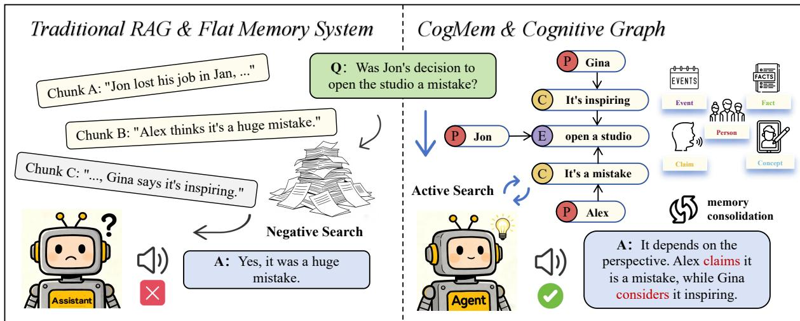
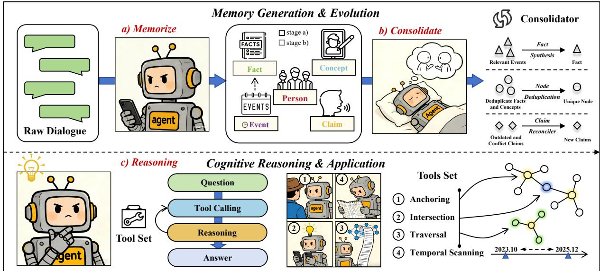

# From Retrieval to Reconstruction: Constructing Evolvable Cognitive Memory for Long-Term Dialogue

Zirui Liao1, Zhengxian Wu1, Zhuohong Chen1, Yunyao Yu1

Xiaoyu Liu1, Yifan Xu1, Haoqian Wang1

1Tsinghua University Shenzhen International Graduate School, Shenzhen, China liaozr24@gmail.com

## Abstract

Large Language Models (LLMs) serving as long-term dialogue agents require memory systems that support reliable reasoning over extended interactions. However, exist ing Retrieval-Augmented Generation (RAG) frameworks typically treat memory as passive storage, making it difficult to distinguish source-attributed beliefs from unattributed event/fact records and to connect evidence dispersed across sessions. We introduce CogMem, a cognitive memory architecture based on the PEC2F (Person-Event-Concept-Claim-Fact) graph schema. Dedicated Claim nodes preserve the source and target of subjective statements, while Fact and Event nodes represent semantic and episodic knowledge. Dialogue turns are incrementally converted into provenanceaware graph records, consolidated into higher level facts, and reconciled into temporally scoped Claim views when the same source provides conflicting updates. For retrieval, a rulebased controller driven by LLM intent parsing composes four deterministic graph operators— anchoring, traversal, intersection, and evidence grounding—to reconstruct query-relevant context. Experiments on LoCoMo and Long-MemEval show strong performance, especially on multi-hop, temporal, and knowledge-update tasks. Ablations and a semantic-collapse probe support complementary contributions from epistemic separation, consolidation, and agentic retrieval. Code: https://github.com/ Silent-Rain02/CogMem.

## 1 Introduction

The evolution of Large Language Models (LLMs) from stateless text generators to autonomous personal agents has created an urgent need for persistent, high-quality memory (Wang et al., 2024; Xi et al., 2025). While recent advancements in scaling context windows (Team et al., 2024) allow models to buffer vast amounts of recent interaction, extended context alone cannot capture the structured, evolving nature of human biography. True long-term intelligence requires not just storage, but the ability to reconstruct narratives, extract key insights, and understand social contexts of multispeaker environments (Tulving, 1972).

Despite this need, current approaches predominantly follow a paradigm of passive retrieval. Standard Retrieval-Augmented Generation (RAG) (Lewis et al., 2020) and early memory systems typically vectorize text chunks into a flat index. We argue that this "store-and-retrieve" paradigm has two key limitations. First, vector-based methods can suffer from a failure mode that we call Semantic Collapse. In a dense vector space, an event record (e.g., "Jon lost his job") and a subjective opinion about it (e.g., "Gina thinks Jon’s job loss is a mistake") often become very similar due to high semantic overlap. This can cause memory contamination, where an attributed opinion is returned as if it were an unqualified record, undermining Theory-of-Mind reasoning (Rabinowitz et al., 2018). A controlled probe in Section 3.1 illustrates this failure mode: matched fact–claim pairs have an average BGE-M3 cosine similarity of 0.8231, and flat retrieval misattributes the speaker’s opinion as the requested record in 64 of 150 cases (42.7%). Second, static retrieval pipelines lack intentionality. Complex dialogue reasoning often requires connecting information across time. A rigid retrieval algorithm cannot dynamically adjust its search strategy based on intermediate results, failing to perform the multi-hop reasoning required for deep understanding (Press et al., 2023).

To address these issues, we propose CogMem, a schema-aware cognitive architecture that shifts the design philosophy from passive retrieval to agentic active recall. Inspired by the Complementary Learning Systems (CLS) theory (Kumaran et al., 2016), CogMem unifies memory storage and reasoning through a novel PEC2F (Person-

  
Figure 1: The Paradigm Shift from Passive Retrieval to Active Reconstruction. Left (traditional RAG and flat memory): passive retrieval over coarse text chunks introduces noise and may miss relevant counter-evidence. Even when a related statement is retrieved, the flat representation obscures its source and can cause the LLM to treat an attributed opinion as an unqualified record. Right (CogMem): a PEC2F cognitive graph supports active reconstruction, allowing the agent to attribute conflicting viewpoints to their sources and synthesize an evidencegrounded answer.

Event-Concept-Claim-Fact) schema. To activate this structure, we implement a Cognitive Search Agent based on the ReAct framework (Yao et al., 2023). Instead of static matching, the agent uses graph operators—such as intersection and temporal scanning—to actively navigate the memory space, reconstructing answers through dynamic reasoning paths.

We evaluate CogMem on the LoCoMo (Maharana et al., 2024) and LongMemEval (Wu et al., 2025) benchmarks. CogMem outperforms strong baselines, including LightMem (Fang et al., 2025) and General Agentic Memory (Yan et al., 2025), particularly on multi-hop, temporal, and knowledge-update tasks. Our novelty is primarily architectural and representational: CogMem operationalizes Theory of Mind and complementary episodic–semantic learning within a unified, training-free retrieval system rather than proposing an isolated new graph primitive.

In summary, our contributions are threefold:

• Epistemic Completeness through the PEC2F Schema. We propose a cognitive schema where the Attributed–Unattributed Distinction is modeled through the C2 components: Concepts for semantic grounding and Claims for epistemic attribution. This structurally addresses the problem of Semantic Collapse.

• Dynamic Stability through Memory Consolidation. We implement a memory evolution mechanism that dynamically combines sparse episodic traces (VE) into dense semantic knowledge (V ) using an Evidence Mounting strategy. This provides semantic shortcuts while retaining links to granular source evidence, reducing reasoning overhead.

• Active Plasticity with Agentic Recall. We shift the retrieval paradigm from static pipelines to agentic active recall. We design a Cognitive Search Agent equipped with graph operators to navigate the graph, achieving strong performance in multi-hop and temporal reasoning tasks.

## 2 Related Work

Our work integrates insights from Retrieval-Augmented Generation, Agentic Memory, and Cognitive Science.

## 2.1 Retrieval-Augmented Generation (RAG)

RAG grounds generation in retrieved external context (Lewis et al., 2020; Guu et al., 2020) and can reduce hallucination in knowledge-grounded dialogue (Shuster et al., 2021). Dense and lateinteraction retrievers (Karpukhin et al., 2020; Khattab and Zaharia, 2020) are effective for fact-based QA (Chen et al., 2017), but retrieval quality remains sensitive to whether the required evidence is surfaced, and static ranking does not itself perform compositional reasoning (Mallen et al., 2023; Press et al., 2023).

To address this, hybrid approaches combine Knowledge Graphs (KGs) with LLMs (Pan et al., 2024; Yasunaga et al., 2021). Recent systems such as LightRAG (Guo et al., 2025) and HippoRAG 1&2 (Jimenez Gutierrez et al., 2024; Gutiérrez et al., 2025) use entity–relation graphs or Personalized PageRank to capture dependencies. Their task-agnostic graph structures, however, do not explicitly distinguish source-attributed claims from event and fact records, a distinction required for dialogue reconstruction.

## 2.2 Memory Systems for Autonomous Agents

Recent work focuses on equipping agents with persistent memory. Context Management. Early approaches like MemGPT (Packer et al., 2023) manage long context using operating-system-like paging, while MemoryBank (Zhong et al., 2024) uses forgetting curves to update memory. Structured Memory. Systems such as Mem0 (Chhikara et al., 2025) and MemoryOS (Kang et al., 2025) store user preferences in a hierarchy. A-MEM (Xu et al., 2025) proposes a memory bank that improves with experience. Efficiency & Reasoning. LightMem (Fang et al., 2025) uses pruning to reduce latency, while GAM (Yan et al., 2025) treats recall as an iterative research process. A separate system also named CogMem uses a three-layer architecture for sustained multi-turn reasoning (Zhang et al., 2025). Our CogMem is distinct: it targets longterm dialogue reconstruction through the $\mathrm { P E C ^ { 2 } F }$ provenance schema, episodic-to-semantic consolidation, and explicit graph operators such as set intersection.

## 2.3 Cognitive Architectures and Theory of Mind

Cognitive frameworks inspire AI design (Sumers et al., 2024). Generative Agents (Park et al., 2023) demonstrated that agents could simulate realistic behavior by reflecting on memory streams. Our work aligns with the Complementary Learning Systems (CLS) theory (Kumaran et al., 2016; McClelland et al., 1995), describing the interplay between fast episodic learning and slow semantic consolidation. Earlier propositional semantic networks such as SNePS also modeled the intensional belief structures of cognitive agents (Shapiro and Rapaport, 1986). CogMem shares this emphasis on proposition-level attribution, but targets incremental LLM dialogue ingestion, memory consolidation, and query-adaptive retrieval over long interaction histories. Crucially, our architecture tackles Theory of Mind (ToM) in LLMs (Sap et al., 2022). While previous works study LLMs for ToM capabilities, CogMem provides architectural support by explicitly separating source-attributed claims from unattributed event/fact records.

## 3 Methodology

We propose CogMem, a cognitive architecture that reconstructs long-term memory from continuous dialogue. Unlike traditional RAG systems that focus primarily on storage, we argue that an effective long-term memory system requires three key properties: (1) Epistemic Completeness—the ability to distinguish source-attributed beliefs from unattributed event/fact records; (2) Active Plasticity—the capacity to dynamically construct retrieval pathways from vague user intents rather than relying on static indices; and (3) Dynamic Stability—the mechanism to gradually transform volatile episodic traces into stable semantic knowledge. This section describes how CogMem achieves these properties through a unified graph-agent framework.

## 3.1 Epistemic Completeness: The PEC2F Schema

To reduce ambiguity in unstructured memory, we model the memory space as a person-centric graph $\mathcal { G } ~ = ~ ( V , E )$ organized by the $\mathbf { P E C ^ { 2 } F }$ (Person-Event-Concept-Claim-Fact) schema. The vertex set contains five node types: $V = V _ { P } \cup V _ { E } \cup V _ { C } \cup$ $V _ { C l a i m } \cup V _ { F }$

Problem Formulation: Semantic Collapse. A key challenge in dialogue memory is Semantic Collapse. Standard dense retrieval systems use an embedding function Φ $\colon \mathcal { X }  \mathbb { R } ^ { d }$ that maps both unattributed event/fact records and lexically similar subjective opinions into nearby regions of the vector space. For example, a record f stating "Jon was $f i r e d "$ and a subjective claim c stating "Gina thinks Jon being fired was a mistake" share most salient content even though they have different epistemic status. A flat retriever can therefore return c when the query asks what happened to Jon.

Semantic-Collapse Probe. We directly quantify this failure mode using 150 synthetic fact–claim pairs modeled on conversational patterns in Lo-CoMo. Each pair contains an unattributed record and a source-attributed opinion with high lexical overlap. With BGE-M3, the mean cosine similarity between paired statements is 0.8231. When queries ask for the event/fact record, a standard flat RAG pipeline selects the subjective claim in 64 of 150 cases (42.7%). Type-constrained retrieval over the PEC2F graph reduces this error to 9 of 150 cases (6.0%) by excluding Claim nodes unless the query requests an attributed belief. Table 1 summarizes the results.

  
Figure 2: The Overall Architecture of CogMem. The framework consists of two layers: (1) Memory Generation & Evolution (Top): (a) Memorize: The system processes raw dialogue to build an initial cognitive graph, converting episodic traces into graph nodes. (b) Consolidate: An offline mechanism synthesizes Facts from Events, merges duplicate Facts and Concepts, and reconciles temporally conflicting Claims into provenance-linked views without collapsing disagreements across speakers. (2) Cognitive Reasoning & Application (Bottom): (c) Reasoning: Instead of passive retrieval, the Search Agent actively recalls information using a specialized Tool Set (Anchoring, Intersection, Traversal, Evidence Grounding) to dynamically navigate the graph and reconstruct answers through a ReAct loop.

<table><tr><td>Probe statistic</td><td>Result</td></tr><tr><td>Mean fact-claim cosine similarity</td><td>0.8231</td></tr><tr><td>Flat RAG misattribution</td><td>64/150 (42.7%)</td></tr><tr><td>CogMem misattribution</td><td>9/150 (6.0%)</td></tr></table>

Table 1: Direct probe of semantic collapse on 150 matched fact–claim pairs.

Anchors, Traces, and Facts (The Unattributed Record Spine). The graph centers on Person nodes (VP) representing individuals and Concept nodes $( V _ { C } )$ representing abstract entities identified through vector clustering. These relatively stable anchors connect to Event nodes $( V _ { E } )$ , which record specific interactions (Do), and Fact nodes $( V _ { F } ) .$ which record observed or self-reported attributes and habits (Is). Here, Fact is an operational record type rather than a guarantee of independently verified truth. Following Tulving’s theory (Tulving, 1972), an event node $e \in \ : V _ { E }$ links participants to a specific time and place. This design distinguishes recurring patterns (Facts) from unique experiences (Events), providing the temporal information needed for narrative reconstruction.

Separating Beliefs from Facts via Claim Nodes. We introduce Claim Nodes $( V _ { C l a i m } )$ to model Theory of Mind (ToM) and address Semantic Collapse. Rather than storing a subjective opinion as a direct attribute, we represent it as an intermediate node structure. A statement like "Jon thinks Gina is lazy" becomes a two-hop path:

$$
\begin{array} { r l } { ( p _ { j o n } , \mathsf { C L A I M S } , n _ { c l a i m } ) \in E \quad \wedge } & { { } } \\ { ( n _ { c l a i m } , \mathsf { A B O U T } , p _ { g i n a } ) \in E } & { { } } \end{array}\tag{1}
$$

where $n _ { c l a i m } \in V _ { C l a i m }$ contains the content and sentiment. This additional hop structurally separates a subjective belief from an unattributed record. Even when their embeddings are similar, the graph structure allows the system to identify whether information is stored as a source-attributed belief or as an event/fact record, preserving its epistemic status.

Online Memory Ingestion. CogMem updates the graph incrementally after each dialogue turn. The ingestion record contains the utterance, speaker, session identifier, and timestamp. An Atomic Extraction Engine (prompt in Appendix H) maps time-bounded actions to Event nodes, stable self-reported attributes to Fact nodes, and opinions about another person or concept to Claim nodes with explicit source and target fields. Person and Concept strings are normalized and matched against existing anchors before new nodes are created. Every extracted node retains the source-turn identifier and timestamp, enabling the Evidence Grounding operator to recover the original utterance. The resulting nodes and typed edges are inserted immediately; periodic consolidation subsequently adds semantic Fact nodes without deleting their episodic evidence.

## 3.2 Active Plasticity: Agentic Retrieval via Cognitive Operators

While the $\mathrm { P E C ^ { 2 } F }$ schema provides a structured representation, its graph complexity makes static retrieval (e.g., fixed k-hop expansion) inefficient for queries involving intent and temporality. To address this, we introduce Active Plasticity, implementing a retrieval controller that dynamically selects cognitive operators based on query intent.

Agent Control Logic. The retrieval process uses a rule-based controller driven by LLM intent parsing. The operators themselves and their highlevel routing rules are deterministic, whereas the intent label and evidence-sufficiency judgment are produced by the LLM. At each step t, the agent observes the current subgraph $G _ { t } \subseteq \mathcal { G }$ and selects the next operator $a _ { t } \in \mathcal { O }$ according to Algorithm 1. After the mandatory anchoring call, the process terminates when either sufficient evidence is gathered or the maximum number of post-anchoring controller steps $D _ { \mathrm { s t e p } } = 5$ is reached.

Intent Parsing and Operator Selection. The LLM parses query intent into predefined categories that trigger specific operators:

• Intersection trigger: Query contains comparison words ("compare", "both", "common", "difference") → execute $\mathcal { O } _ { \mathrm { i n t e r s e c t } }$ on anchor nodes.

• Attribution trigger: Query asks what one person thinks or believes about another entity → execute $\mathcal { O } _ { \mathrm { t r a v e r s e } }$ over Claim relations.

Algorithm 1 Retrieval Controller Logic   
Require: Query q, Graph G, Max controller steps $\boldsymbol { D } _ { \mathrm { s t e p } }$   
1: $G _ { 0 } \gets \emptyset , t \gets 0$   
2: $V _ { \mathrm { a n c } }  \mathcal { O } _ { \mathrm { a n c h o r } } ( q )$ ▷ Always first   
3: $G _ { 0 } \gets \mathrm { S u b g r a p h } ( V _ { \mathrm { a n c } } )$   
4: while $t < \bar { D } _ { \mathrm { s t e p } } \stackrel { \cdot } { \wedge } \bar { \cal N }$ ¬Ready $( q , G _ { t } )$ do   
5: z ← ParseInten $\operatorname { t } ( q , G _ { t } )$   
6: if z ∈ {COMPARE, COMMON} then   
7: $a _ { t } \overset { \cdot } {  } \mathcal { O } _ { \mathrm { i n t e r s e c t } } ( V _ { \mathrm { a n c } } )$ ▷ Comparison   
8: else if z ∈ {BELIEF, OPINION} then   
9: $a _ { t }  \dot { \mathcal { O } } _ { \mathrm { t r a v e r s e } } ( V ( G _ { t } ) , R _ { \mathrm { c l a i m } } , T )$   
10: else $\mathbf { i f } z \in \{ \mathsf { w h e r N } , \mathsf { T E M P O R A L } \}$ then   
11: $a _ { t } \gets \dot { \mathcal { O } } _ { \mathrm { t r a v e r s e } } ( V ( G _ { t } ) , R _ { \mathrm { a l l } } , T )$ ▷ Temporal   
12: else $\mathbf { i f } \ z \in \{ \mathsf { W } \mathsf { H } \forall ,$ VERIFY, DETAIL} then   
13: $a _ { t }  \dot { \mathcal { O } } _ { \mathrm { g r o u n d } } ( V ( G _ { t } ) )$ ▷ Ground   
14: else   
15: $a _ { t } \gets \mathcal { O } _ { \mathrm { t r a v e r s e } } ( V ( G _ { t } ) , R _ { \mathrm { a l l } } , \mathcal { T } )$   
16: end if   
17: $G _ { t + 1 } \gets G _ { t } \cup \mathrm { S u b g r a p h } ( a _ { t } ) , t \gets t + 1$   
18: end while   
19: return Generate $\left( q , G _ { t } \right)$

• Temporal trigger: Query contains time expressions ("when", "last year", $" { \bf a f t e r " } ) $ execute $\mathcal { O } _ { \mathrm { t r a v e r s e } }$ with temporal gating T extracted by the LLM.

• Evidence trigger: Query asks for verification or supporting detail ("did he really", "why", "evidence") → execute $\mathcal { O } _ { \mathrm { g r o u n d } }$ on current nodes.

Here, $R _ { \mathrm { c l a i m } }$ contains Claim-specific edge types, $R _ { \mathrm { a l l } }$ contains the permitted typed relations, and T denotes an unconstrained time range.

The Set of Cognitive Operators. We define four complementary operators. Table 2 lists their configurable parameters.

Anchoring Operator $( \mathcal { O } _ { \mathbf { a n c h o r } } )$ Maps query q to entry nodes $V _ { \mathrm { s t a r t } } \subset V$ using hybrid scoring:

$$
S ( v , q ) = \alpha \cdot \mathbb { I } _ { \mathrm { l e x } } ( v , q ) + ( 1 - \alpha ) \cdot \cos ( \Phi ( v ) , \Phi ( q ) )\tag{2}
$$

where $\alpha ~ = ~ 0 . 3$ (Table 2), $\mathbb { I } _ { \mathrm { l e x } }$ is fuzzy lexical match, and Φ is BGE-M3 embedding. Returns $\mathrm { { t o p } \mathrm { { - } } K _ { a n c h o r } = 1 5 }$ nodes.

Spatiotemporal Traversal Operator $( { \mathcal { O } } _ { \mathbf { t r a v e r s e } } )$ Filters neighbors $\mathcal { N } ( v )$ by edge type R and time window T (extracted by LLM from query):

$$
\begin{array} { l l } { { \mathcal { O } } _ { \mathrm { t r a v e r s e } } ( v , R , T ) = \{ u \in \mathcal { N } ( v ) \mid } \\ { \qquad \mathrm { t y p e } ( v , u ) \in R \wedge \mathrm { t i m e } ( u ) \in T \} } \end{array}\tag{3}
$$

Maximum results per hop: $K _ { \mathrm { t r a v e r s e } } = 1 5 ;$ max traversal depth: $D _ { \mathrm { t r a v } } = 2 \left( \mathrm { T a b l e } 2 \right)$

Table 2: Hyperparameters for Cognitive Operators and Consolidation
<table><tr><td>Comp.</td><td>Param.</td><td>Description</td><td>Value</td></tr><tr><td rowspan="2">Anchoring</td><td>α</td><td>Lexical vs. semantic balance (Eq. 2)</td><td>0.3</td></tr><tr><td> $K _ { \mathrm { a n c h o r } }$ </td><td>Top-K anchor nodes</td><td>15</td></tr><tr><td rowspan="2">Traversal</td><td> $K _ { \mathrm { t r a v e r s e } }$ </td><td>Max neighbors per hop</td><td>15</td></tr><tr><td> $D _ { \mathrm { t r a v } }$ </td><td>Max traversal depth</td><td>2</td></tr><tr><td>Intersection</td><td> $K _ { \mathrm { i n t e r s e c t } }$ </td><td>Candidates per entity for overlap</td><td>10</td></tr><tr><td>Controller</td><td> $D _ { \mathrm { { s t e p } } }$ </td><td>Max post-anchoring calls</td><td>5</td></tr><tr><td rowspan="2">Consolidation</td><td>T</td><td>Event cluster thresh-</td><td>3</td></tr><tr><td> $\Delta t _ { \mathrm { m a x } }$ </td><td>old (events → fact) Time window for clustering (days)</td><td>30</td></tr></table>

Intersection Operator $( \mathcal { O } _ { \mathbf { i n t e r s e c t } } )$ Computes semantic overlap between neighborhoods of multiple entities:

$$
{ \mathcal { G } } _ { \mathrm { c o m m o n } } = \bigcap _ { i = 1 } ^ { n } \left( \bigcup _ { r \in R _ { \mathrm { s e m } } } { \mathcal { N } } _ { r } ( p _ { i } ) \right)\tag{4}
$$

where $R _ { \mathrm { s e m } } = \{ \mathsf { L I K E S } , \mathsf { U S E S } , \mathsf { P A R T I C I P A T E D \_ I N } \}$ Uses $K _ { \mathrm { i n t e r s e c t } } = 1 0$ candidates per entity (Table 2).

Evidence Grounding Operator $( \mathcal { O } _ { \mathbf { g r o u n d } } )$ Retrieves source text from raw corpus D:

$$
{ \mathcal { O } } _ { \operatorname { g r o u n d } } ( v ) \to \{ d \in { \mathcal { D } } \mid \operatorname { i d } ( d ) = \operatorname { s o u r c e } ( v ) \}\tag{5}
$$

Validates graph inferences against original context before final answer generation.

## 3.3 Dynamic Stability via Memory Consolidation

Memory is not a static repository but a dynamic system that must balance specific episode details with stable generalized knowledge. Without consolidation, continuous dialogue events steadily increase graph complexity, expanding the search space and slowing retrieval. To achieve Dynamic Stability, we implement a consolidation mechanism inspired by Complementary Learning Systems (CLS) theory (Kumaran et al., 2016), modeling the transfer from fast-learning episodic traces to slow-learning semantic structures.

From Atomic Records to Fact Nodes. The consolidation process operates offline as a graph rewriting function over the atomic records created during online ingestion. Let $S _ { p , c } = \{ e _ { 1 } , \ldots , e _ { k } \} \subseteq V _ { E }$ be a cluster of episodic nodes where person p interacts with concept c within a window of at most $\Delta t _ { \mathrm { m a x } }$ . When the cluster size reaches the threshold, $| S _ { p , c } | \ge \tau$ , the system triggers an abstraction function Ψ parameterized by an LLM to convert the pattern into a high-level Fact Node:

$$
f _ { n e w } , T _ { e n v } \gets \Psi ( S _ { p , c } )\tag{6}
$$

where $f _ { n e w } \in V _ { F }$ represents the synthesized semantic proposition (e.g., "Jon has a habit ofdanc-$i n g " )$ and $\mathcal { T } _ { e n v } ~ = ~ [ t _ { s t a r t } , t _ { e n d } ]$ denotes the computed Temporal Envelope. This transformation promotes implicit edge patterns into explicit nodes, compressing the semantic space while preserving temporal boundaries.

Evidence Preservation and Multi-Resolution Retrieval. A key risk in memory compression is losing granular details. To balance abstraction with precision, CogMem uses an Evidence Mounting strategy. Rather than discarding original episodes after synthesis, we add provenance edges to connect the abstract fact to its source:

$$
E _ { p r o v } = \{ ( f _ { n e w } , \mathsf { S U P P O R T E D \_ B Y } , e _ { i } ) \mid \forall e _ { i } \in S _ { p , c } \}\tag{7}
$$

This hierarchical structure enables the Search Agent to operate at two resolutions. For highlevel queries (e.g., "What are Jon’s hobbies?"), the agent retrieves the consolidated Fact node directly, reducing search cost. When the user asks for specifics (e.g., "When did he first $g o \ ? \mathrm { { } ^ { \prime \prime } ) }$ , the agent follows the SUPPORTED\_BY edges to access the original episodic layer.

Provenance-Preserving Claim Reconciliation. CogMem reconciles Claims only when they share a canonical source, target, and predicate. It orders them temporally and creates a provenancelinked view marked as CURRENT, SUPERSEDED, or CONFLICTING; original Claims remain accessible. Claims from different speakers are never merged, so reconciliation resolves updates without erasing disagreement.

## 4 Experiments

We evaluate CogMem to answer two primary research questions: (1) How does the proposed schema-aware agent compare against existing memory and graph-retrieval paradigms? (2) Does agentic active recall generalize better than learned traversal models on complex dialogue tasks?

Table 3: Performance comparison on the LoCoMo benchmark. Metrics are F1 Score and BLEU-1. Best results are in bold, and the second best are underlined.
<table><tr><td rowspan="2">Backbone</td><td rowspan="2">Method</td><td colspan="2">Single Hop</td><td colspan="2">Multi Hop</td><td colspan="2">Temporal</td><td colspan="2">Open Domain</td></tr><tr><td>F1</td><td>BLEU-1</td><td>F1</td><td>BLEU-1</td><td>F1</td><td>BLEU-1</td><td>F1</td><td>BLEU-1</td></tr><tr><td rowspan="8">GP--ni</td><td>NAIVE RAG</td><td>52.45</td><td>47.94</td><td>27.50</td><td>20.13</td><td>46.07</td><td>40.35</td><td>23.23</td><td>17.94</td></tr><tr><td>LIGHTRAG</td><td>42.57</td><td>33.82</td><td>28.46</td><td>23.75</td><td>22.85</td><td>16.18</td><td>54.33</td><td>49.61</td></tr><tr><td>HIPPORAG</td><td>39.81</td><td>31.19</td><td>39.79</td><td>37.40</td><td>26.74</td><td>22.31</td><td>51.41</td><td>50.15</td></tr><tr><td>ROG (LEARNED)</td><td>55.30</td><td>50.20</td><td>44.15</td><td>35.80</td><td>32.40</td><td>26.50</td><td>35.60</td><td>30.10</td></tr><tr><td>MEM0</td><td>47.65</td><td>38.72</td><td>38.72</td><td>27.13</td><td>48.93</td><td>40.51</td><td>28.64</td><td>21.58</td></tr><tr><td>LIGHTMEM</td><td>41.79</td><td>37.83</td><td>29.78</td><td>24.80</td><td>43.71</td><td>39.72</td><td>16.89</td><td>13.92</td></tr><tr><td>GAM</td><td>57.75</td><td>52.10</td><td>42.29</td><td>34.44</td><td>59.45</td><td>53.11</td><td>33.30</td><td>26.97</td></tr><tr><td>COGMEM (OURS)</td><td>59.20</td><td>56.40</td><td>50.70</td><td>46.10</td><td>63.80</td><td>57.90</td><td>56.10</td><td>51.20</td></tr><tr><td rowspan="8">Ow14B</td><td>NAIVE RAG</td><td>47.87</td><td>42.79</td><td>26.38</td><td>19.54</td><td>30.78</td><td>25.97</td><td>14.16</td><td>10.52</td></tr><tr><td>LIGHTRAG</td><td>41.50</td><td>34.42</td><td>26.03</td><td>21.73</td><td>20.86</td><td>16.83</td><td>54.03</td><td>48.65</td></tr><tr><td>HIPPORAG</td><td>33.10</td><td>25.74</td><td>34.78</td><td>31.15</td><td>24.88</td><td>18.56</td><td>53.42</td><td>48.98</td></tr><tr><td>ROG (LEARNED)</td><td>52.40</td><td>47.10</td><td>41.80</td><td>33.20</td><td>28.60</td><td>23.10</td><td>32.50</td><td>28.40</td></tr><tr><td>A-MEM</td><td>33.75</td><td>30.04</td><td>22.09</td><td>15.28</td><td>27.19</td><td>22.05</td><td>13.49</td><td>10.74</td></tr><tr><td>MEM0</td><td>42.58</td><td>35.15</td><td>31.73</td><td>24.82</td><td>28.96</td><td>26.24</td><td>15.03</td><td>11.28</td></tr><tr><td>GAM</td><td>58.93</td><td>53.74</td><td>42.96</td><td>34.48</td><td>51.52</td><td>44.43</td><td>30.63</td><td>26.04</td></tr><tr><td>COGMEM (OURS)</td><td>60.40</td><td>55.80</td><td>48.42</td><td>44.65</td><td>56.20</td><td>49.10</td><td>55.80</td><td>50.10</td></tr></table>

## 4.1 Experimental Setup

Datasets and Evaluation Metrics. We evaluate CogMem on two established long-term memory benchmarks: LoCoMo (Maharana et al., 2024) and LongMemEval (Wu et al., 2025). LoCoMo contains ten long, multi-session conversations and approximately 1.5K question–answer pairs spanning single-hop, multi-hop, temporal, and opendomain reasoning. LongMemEval contains 500 questions over long cross-session histories, testing temporal reasoning, knowledge updating, abstention, and personalized recall. We report F1 and BLEU-1 for LoCoMo following prior work, and LLM-as-judge accuracy for LongMemEval following its established protocol. Dataset processing and category details are provided in Appendix A.4.

Baselines. We compare CogMem against four categories of memory systems: (1) Standard Retrieval: Naive RAG (Lewis et al., 2020); (2) LLM Memory Systems: Mem0 (Chhikara et al., 2025), A-MEM (Xu et al., 2025), LightMem (Fang et al., 2025), GAM (Yan et al., 2025); (3) Heuristic Graph Retrieval: LightRAG (Guo et al., 2025), HippoRAG (Jimenez Gutierrez et al., 2024); (4) Learned Graph Traversal: RoG (Luo et al., 2024).

To improve comparability, we control shared components where each method permits: (i) BGE-M3 (Chen et al., 2024) for dense embedding (1024- d) to reduce variation from different representation models; (ii) Identical answer-generation prompts (Appendix H.4) to isolate retrieval quality from prompt engineering variance; (iii) Comparable context limits: all methods use the same answer-model context limit, while method-specific retrieval limits follow official or recommended configurations. CogMem uses the hyperparameters in Table 2; baseline settings are documented in Appendix A.3. Architectural differences prevent exact matching of all intermediate computations.

Implementation Details and Evaluation Robustness. Experiments use GPT-4o-mini (closedsource) and Qwen2.5-14B-Instruct (open-source) as backbones. CogMem operates with the parameters from Table 2: anchoring retrieves top-15 nodes $( K _ { \mathrm { a n c h o r } } = 1 5 )$ , traversal explores up to 2 hops $( D _ { \mathrm { t r a v } } = 2 )$ with max 15 neighbors per hop, and the controller executes at most 5 post-anchoring operator calls $( D _ { \mathrm { s t e p } } = 5 )$ . Temperature is fixed at 0.0 to reduce sampling variability.

Because BLEU and automated judges provide incomplete views of reasoning quality, we additionally conduct a blind human preference study on 50 randomly sampled LoCoMo Multi-Hop and Temporal queries. Two graduate students specializing in artificial intelligence independently annotate all comparisons using reasoning correctness and answer helpfulness as criteria. Disagreements are adjudicated by a third annotator who selects one of the two primary labels, yielding a majority decision; no monetary compensation is provided. CogMem wins 68% of comparisons, ties 20%, and loses 12%. Appendix A.5 details the annotation protocol.

## 4.2 Main Results

Performance on Conversational Reasoning (Lo-CoMo). Table 3 shows F1 and BLEU-1 scores on LoCoMo. CogMem achieves competitive results across both backbones, with particular strength in tasks requiring structured reasoning.

The largest improvements appear in Multi-Hop and Temporal categories. With Qwen2.5-14B, Cog-Mem reaches 48.42% F1 on Multi-Hop queries, exceeding the best memory baseline (GAM, 42.96%), the learned traversal baseline (RoG, 41.80%), and the best heuristic graph baseline (HippoRAG, 34.78%). These results are consistent with the intended role of the intersection and traversal operators: dynamically identifying shared concepts or events that bridge entities and sessions.

In Open Domain scenarios, which test broad semantic recall rather than precise graph operations, CogMem also edges the strongest competing methods under both backbones. Thus, the structured $\mathrm { P E C ^ { 2 } F }$ representation retains broad recall while improving categories that require explicit relational or temporal reasoning.

Long-Term Consistency (LongMemEval). Table 4 reports overall LongMemEval accuracy, measuring the system’s ability to track coherent states over time.

CogMem achieves the highest overall accuracy with both backbones. When user states evolve across sessions, retrieval systems can surface outdated and current records together. The controlled ablation in Table 5 further isolates this behavior: removing Claim nodes reduces Knowledge Update accuracy from 73.08% to 56.67%, supporting explicit epistemic attribution as a key contributor.

Agentic Search vs. Learned Traversal. To assess whether zero-shot agentic reasoning offers advantages over learned graph traversal, we compare CogMem against RoG (Luo et al., 2024). RoG trains a language model to generate relation paths over knowledge graphs; we evaluate its pre-trained checkpoint in zero-shot mode on LoCoMo and LongMemEval because these datasets lack training splits for path learning. CogMem is likewise training-free, so this comparison measures out-ofthe-box transfer rather than the advantage of taskspecific supervision; it should not be interpreted as a definitive comparison to a fully fine-tuned RoG system.

Table 4: Overall Accuracy (%) on LongMemEval. Best results are in bold, and second-best results are underlined.
<table><tr><td rowspan="2">Method</td><td colspan="2">Accuracy (%)</td></tr><tr><td>GPT-40-mini</td><td>Qwen2.5-14B</td></tr><tr><td>NAIVE RAG</td><td>61.00</td><td>60.80</td></tr><tr><td>LIGHTRAG</td><td>52.93</td><td>47.63</td></tr><tr><td rowspan="2">HIPPORAG RoG</td><td>54.34</td><td>51.61</td></tr><tr><td>56.10</td><td>53.40</td></tr><tr><td>A-MEM</td><td>62.60</td><td>65.20</td></tr><tr><td rowspan="2">MEM0</td><td>53.61</td><td>39.51</td></tr><tr><td>64.29</td><td></td></tr><tr><td>LIGHTMEM GAM</td><td>63.82</td><td>61.95 58.71</td></tr><tr><td>COGMEM</td><td>68.40</td><td>66.50</td></tr></table>

RoG performs competitively on Single-Hop queries where path patterns are straightforward, but its accuracy is lower on Open Domain and Temporal questions (Table 3). One plausible explanation is that zero-shot relation-path generation transfers less directly when queries require temporal filtering or adaptive operator selection. In contrast, CogMem maps natural-language intents to atomic operators at inference time. Because RoG is evaluated without task-specific fine-tuning, this result should be interpreted as a comparison of zero-shot transfer rather than a general claim about learned traversal.

## 4.3 Ablation Studies

To identify the contributions of the cognitive schema (specifically the Claim nodes), the memory consolidation mechanism, and the agentic search loop, we conduct ablation studies using the Qwen2.5-14B backbone.

Ablation Configurations. We examine whether improvements stem from epistemic separation, memory evolution, or agentic navigation by defining three ablated variants: (1) CogMem w/o Claim retains the base graph but removes epistemic separation, flattening source-attributed claims into unattributed attribute edges (e.g., $P e r s o n \stackrel { I S } {  }$ Lazy); (2) CogMem w/o Consolidation disables offline consolidation, forcing retrieval from sparse episodic traces without semantic Fact nodes; (3) CogMem w/o Agent replaces the ReAct agent with a deterministic pipeline (anchoring + fixed 2-hop

expansion).

Table 5 shows results on LoCoMo (Multi-Hop F1) and LongMemEval (Knowledge Update Acc). Each component contributes to a distinct capability in the evaluated settings. Removing the agentic loop causes the largest drop: Multi-Hop F1 falls 25.61 points (48.42% → 22.81%), indicating that the fixed pipeline is less effective on queries requiring adaptive operator selection. Removing Claim nodes reduces Knowledge Update accuracy by 16.41 points (73.08% → 56.67%), supporting explicit epistemic separation. Omitting consolidation reduces Multi-Hop F1 to 43.56% as the agent navigates episodic traces without synthesized semantic shortcuts.

Table 5: Ablation study: removing consolidation, Claim nodes, and ReAct agent.
<table><tr><td>Configuration</td><td>F1 (%) Multi-Hop</td><td>Acc (%) Know.Upd.</td></tr><tr><td>CogMem (Full)</td><td>48.42</td><td>73.08</td></tr><tr><td>w/o Consolidation</td><td>43.56</td><td>66.67</td></tr><tr><td>w/o Claim (Flat)</td><td>41.20</td><td>56.67</td></tr><tr><td>w/o Agent (Fixed)</td><td>22.81</td><td>48.10</td></tr></table>

Effectiveness of Memory Consolidation. We evaluate the offline consolidation mechanism that groups episodic traces into semantic facts, comparing system performance before and after consolidation.

As shown in Table 6, consolidation provides two benefits. First, it improves Multi-Hop F1 by 4.86 percentage points by creating semantic connections (e.g., grouping repeated events into a generalized habit node), reducing the chance that the agent misses scattered evidence. Second, it improves retrieval efficiency. By querying consolidated Fact nodes instead of traversing all episodic Event nodes, the average reasoning steps decrease from 3.42 to 2.67. These results show that consolidation supplies useful semantic shortcuts as the graph grows.

Further Analyses. Appendices E, B, and G provide detailed analyses of construction cost and graph growth, operator sensitivity, and 100 manually categorized LoCoMo failures. These results show that consolidation creates useful semantic shortcuts at the cost of additional graph storage, while remaining errors primarily arise from embedding drift, incomplete search scope, and temporal normalization.

Table 6: Impact of memory consolidation on accuracy (F1) and efficiency (steps).
<table><tr><td></td><td>F1 (%)</td><td>Steps</td></tr><tr><td>Category</td><td>Before After</td><td>Before e After</td></tr><tr><td>Single Hop</td><td>58.06 60.40</td><td>2.84 2.35</td></tr><tr><td>Multi Hop</td><td>43.56 48.42</td><td>3.42 2.67</td></tr><tr><td>Temporal</td><td>56.20 56.20</td><td>2.78 2.44</td></tr><tr><td>Open Domain</td><td>54.50 55.80</td><td>2.86 2.55</td></tr></table>

## 5 Conclusion

We introduced CogMem, a training-free architecture that shifts long-term dialogue memory from passive retrieval toward active reconstruction. Its PEC2F schema separates source-attributed Claims from Event and Fact records, periodic consolidation links episodic evidence to reusable semantic summaries, and a query-adaptive controller composes deterministic graph operators for retrieval. Across LoCoMo and LongMemEval, CogMem performs particularly well on multi-hop, temporal, and knowledge-update settings. The component ablations and semantic-collapse probe further show that epistemic separation, consolidation, and agentic navigation contribute complementary capabilities. Overall, the results suggest that reliable longterm memory depends not only on storing more context, but also on preserving provenance and reconstructing evidence through task-appropriate retrieval paths.

The results also expose practical trade-offs. Additive consolidation increases graph storage while reducing online reasoning steps, and the remaining failures concentrate on embedding drift, incomplete search scope, and temporal normalization. CogMem should therefore be viewed not as eliminating retrieval error, but as making longterm memory more structured, attributable, and auditable. Future work can build on this foundation through hybrid retrieval, incremental consolidation, and more adaptive operator selection.

## 6 Limitations

Empirical Scope. Our evaluation covers two English long-term dialogue benchmarks and two LLM backbones; it does not establish generalization to multilingual dialogue, noisy real-world conversations, or continuously deployed assistants. The semantic-collapse probe is synthetic, and the human preference study contains only 50 examples, two primary annotators, and one adjudicating annotator. These analyses complement, but do not replace, larger independent human evaluations. Long-MemEval additionally relies on an LLM judge, whose decisions may inherit model-specific biases despite using the benchmark’s official protocol.

Towards a More Complete Cognitive Schema. Although the PEC2F schema covers the essential dimensions of dialogue (Do, Is, Use, Belief), human cognition involves deeper layers. Future iterations could expand the schema to include dynamic Goal Nodes that track the user’s evolving intent over time, or Emotion Vectors that modulate the retrieval weight of memories based on affective intensity.

Evolving the Cognitive Toolset. The current Search Agent relies on a fixed set of hand-crafted, orthogonal operators (e.g., Intersection and Traversal). A promising direction is neural tool learning, where the agent can compose or learn new retrieval primitives from feedback on failed queries. For instance, the agent could learn a composite operator for counterfactual search to verify conflicting claims without explicit hard-coding.

Real-time vs. Offline Consolidation. Our current consolidation mechanism operates periodically and offline. Future work should investigate incremental consolidation algorithms that update semantic facts during the conversation stream, reducing the delay between an event’s occurrence and its availability as generalized knowledge.

## 7 Ethical Considerations

CogMem stores potentially sensitive dialogue history, including relationships, preferences, and attributed opinions. Without safeguards, this creates risks of unauthorized profiling, surveillance, data leakage, and memory poisoning through deceptive inputs. Consolidation may also amplify recurrent biases when it converts repeated observations into semantic Facts. Practical deployments therefore require encryption, access auditing, user-controlled retention and deletion, provenance inspection, and defenses against indirect prompt injection. Because PEC2F explicitly represents who asserted each Claim, a promising direction is to expose these records to users so they can inspect, contest, or delete the system’s representation of their own and others’ epistemic attitudes.

## Acknowledgments

This work is supported by the National Natural Science Foundation of China (NSFC) under Grant No. 62576190, and in part by the Shenzhen Science and Technology Project under Grant No. KJZD20240903103210014.

## References

Danqi Chen, Adam Fisch, Jason Weston, and Antoine Bordes. 2017. Reading Wikipedia to answer opendomain questions. In Proceedings ofthe 55th Annual Meeting of the Association for Computational Linguistics (Volume 1: Long Papers), pages 1870–1879, Vancouver, Canada. Association for Computational Linguistics.

Jianlv Chen, Shitao Xiao, Peitian Zhang, Kun Luo, Defu Lian, and Zheng Liu. 2024. BGE M3-embedding: Multi-lingual, multi-functionality, multi-granularity text embeddings through self-knowledge distillation. Preprint, arXiv:2402.03216.

Prateek Chhikara, Dev Khant, Saket Aryan, Taranjeet Singh, and Deshraj Yadav. 2025. Mem0: Building production-ready AI agents with scalable long-term memory. Preprint, arXiv:2504.19413.

Jizhan Fang, Xinle Deng, Haoming Xu, Ziyan Jiang, Yuqi Tang, Ziwen Xu, Shumin Deng, Yunzhi Yao, Mengru Wang, Shuofei Qiao, Huajun Chen, and Ningyu Zhang. 2025. LightMem: Lightweight and efficient memory-augmented generation. Preprint, arXiv:2510.18866.

Zirui Guo, Lianghao Xia, Yanhua Yu, Tu Ao, and Chao Huang. 2025. LightRAG: Simple and fast retrievalaugmented generation. In Findings of the Association for Computational Linguistics: EMNLP 2025, pages 10746–10761, Suzhou, China. Association for Computational Linguistics.

Bernal Jiménez Gutiérrez, Yiheng Shu, Weijian Qi, Sizhe Zhou, and Yu Su. 2025. From RAG to memory: Non-parametric continual learning for large language models. Preprint, arXiv:2502.14802.

Kelvin Guu, Kenton Lee, Zora Tung, Panupong Pasupat, and Mingwei Chang. 2020. Retrieval augmented language model pre-training. In Proceedings of the 37th International Conference on Machine Learning, volume 119 of Proceedings of Machine Learning Research, pages 3929–3938. PMLR.

Bernal Jimenez Gutierrez, Yiheng Shu, Yu Gu, Michihiro Yasunaga, and Yu Su. 2024. HippoRAG: Neurobiologically inspired long-term memory for large language models. Advances in Neural Information Processing Systems, 37:59532–59569.

Jiazheng Kang, Mingming Ji, Zhe Zhao, and Ting Bai. 2025. Memory OS of AI agent. Preprint, arXiv:2506.06326.

Vladimir Karpukhin, Barlas Oguz, Sewon Min, Patrick Lewis, Ledell Wu, Sergey Edunov, Danqi Chen, and Wen-tau Yih. 2020. Dense passage retrieval for opendomain question answering. In Proceedings of the 2020 Conference on Empirical Methods in Natural Language Processing (EMNLP), pages 6769–6781, Online. Association for Computational Linguistics.

Omar Khattab and Matei Zaharia. 2020. Colbert: Efficient and effective passage search via contextualized late interaction over BERT. In Proceedings of the 43rd International ACM SIGIR conference on research and development in Information Retrieval, pages 39–48.

Dharshan Kumaran, Demis Hassabis, and James L Mc-Clelland. 2016. What learning systems do intelligent agents need? complementary learning systems theory updated. Trends in cognitive sciences, 20(7):512– 534.

Patrick Lewis, Ethan Perez, Aleksandra Piktus, Fabio Petroni, Vladimir Karpukhin, Naman Goyal, Heinrich Küttler, Mike Lewis, Wen-tau Yih, Tim Rocktäschel, Sebastian Riedel, and Douwe Kiela. 2020. Retrieval-augmented generation for knowledgeintensive NLP tasks. Advances in Neural Information Processing Systems, 33:9459–9474.

Linhao Luo, Yuan-Fang Li, Gholamreza Haffari, and Shirui Pan. 2024. Reasoning on graphs: Faithful and interpretable large language model reasoning. In The Twelfth International Conference on Learning Representations.

Adyasha Maharana, Dong-Ho Lee, Sergey Tulyakov, Mohit Bansal, Francesco Barbieri, and Yuwei Fang. 2024. Evaluating very long-term conversational memory of LLM agents. In Proceedings of the 62nd Annual Meeting of the Association for Computational Linguistics (Volume 1: Long Papers), pages 13851– 13870, Bangkok, Thailand. Association for Computational Linguistics.

Alex Mallen, Akari Asai, Victor Zhong, Rajarshi Das, Daniel Khashabi, and Hannaneh Hajishirzi. 2023. When not to trust language models: Investigating effectiveness of parametric and non-parametric memories. In Proceedings ofthe 61st Annual Meeting of the Associationfor Computational Linguistics (Vol ume 1: Long Papers), pages 9802–9822, Toronto, Canada. Association for Computational Linguistics.

James L McClelland, Bruce L McNaughton, and Randall C O’Reilly. 1995. Why there are complementary learning systems in the hippocampus and neocortex: insights from the successes and failures of connectionist models of learning and memory. Psychological review, 102(3):419–457.

Charles Packer, Sarah Wooders, Kevin Lin, Vivian Fang, Shishir G. Patil, Ion Stoica, and Joseph E. Gonzalez.

2023. MemGPT: Towards LLMs as operating systems. Preprint, arXiv:2310.08560.

Shirui Pan, Linhao Luo, Yufei Wang, Chen Chen, Jiapu Wang, and Xindong Wu. 2024. Unifying large language models and knowledge graphs: A roadmap. IEEE Transactions on Knowledge and Data Engineering, 36(7):3580–3599.

Joon Sung Park, Joseph O’Brien, Carrie Jun Cai, Meredith Ringel Morris, Percy Liang, and Michael S Bernstein. 2023. Generative agents: Interactive simulacra of human behavior. In Proceedings of the 36th annual acm symposium on user interface software and technology, pages 1–22.

Ofir Press, Muru Zhang, Sewon Min, Ludwig Schmidt, Noah A Smith, and Mike Lewis. 2023. Measuring and narrowing the compositionality gap in language models. In Findings ofthe Associationfor Computational Linguistics: EMNLP 2023, pages 5687–5711, Singapore. Association for Computational Linguistics.

Neil Rabinowitz, Frank Perbet, Francis Song, Chiyuan Zhang, SM Ali Eslami, and Matthew Botvinick. 2018. Machine theory of mind. In Proceedings ofthe 35th International Conference on Machine Learning, volume 80 of Proceedings of Machine Learning Research, pages 4218–4227. PMLR.

Maarten Sap, Ronan Le Bras, Daniel Fried, and Yejin Choi. 2022. Neural theory-of-mind? on the limits of social intelligence in large LMs. In Proceedings of the 2022 Conference on Empirical Methods in Natural Language Processing, pages 3762–3780, Abu Dhabi, United Arab Emirates. Association for Computational Linguistics.

Stuart C. Shapiro and William J. Rapaport. 1986. SNePS considered as a fully intensional propositional semantic network. In Proceedings of the Fifth National Conference on Artificial Intelligence, pages 278–283. AAAI Press.

Kurt Shuster, Spencer Poff, Moya Chen, Douwe Kiela, and Jason Weston. 2021. Retrieval augmentation reduces hallucination in conversation. In Findings of the Association for Computational Linguistics: EMNLP 2021, pages 3784–3803, Punta Cana, Dominican Republic. Association for Computational Linguistics.

Theodore Sumers, Shunyu Yao, Karthik Narasimhan, and Thomas Griffiths. 2024. Cognitive architectures for language agents. Transactions on Machine Learning Research.

Gemini Team, Petko Georgiev, Ving Ian Lei, Ryan Burnell, Libin Bai, Anmol Gulati, Garrett Tanzer, Damien Vincent, Zhufeng Pan, Shibo Wang, Soroosh Mariooryad, Yifan Ding, Xinyang Geng, Fred Alcober, Roy Frostig, Mark Omernick, Lexi Walker, Cosmin Paduraru, Christina Sorokin, and 1118 others. 2024. Gemini 1.5: Unlocking multimodal understanding across millions of tokens of context. Preprint, arXiv:2403.05530.

Endel Tulving. 1972. Episodic and semantic memory. In Endel Tulving and Wayne Donaldson, editors, Organization of Memory, pages 381–403. Academic Press, New York.

Lei Wang, Chen Ma, Xueyang Feng, Zeyu Zhang, Hao Yang, Jingsen Zhang, Zhiyuan Chen, Jiakai Tang, Xu Chen, Yankai Lin, Wayne Xin Zhao, Zhewei Wei, and Ji-Rong Wen. 2024. A survey on large language model based autonomous agents. Frontiers ofComputer Science, 18(6):186345.

Di Wu, Hongwei Wang, Wenhao Yu, Yuwei Zhang, Kai-Wei Chang, and Dong Yu. 2025. LongMemEval: Benchmarking chat assistants on long-term interactive memory. In The Thirteenth International Conference on Learning Representations.

Zhiheng Xi, Wenxiang Chen, Xin Guo, Wei He, Yiwen Ding, Boyang Hong, Ming Zhang, Junzhe Wang, Senjie Jin, Enyu Zhou, Rui Zheng, Xiaoran Fan, Xiao Wang, Limao Xiong, Yuhao Zhou, Weiran Wang, Changhao Jiang, Yicheng Zou, Xiangyang Liu, and 10 others. 2025. The rise and potential of large language model based agents: A survey. Science China Information Sciences, 68(2):121101.

Wujiang Xu, Zujie Liang, Kai Mei, Hang Gao, Juntao Tan, and Yongfeng Zhang. 2025. A-Mem: Agentic memory for LLM agents. In Advances in Neural Information Processing Systems, volume 38.

B. Y. Yan, Chaofan Li, Hongjin Qian, Shuqi Lu, and Zheng Liu. 2025. General Agentic Memory via deep research. Preprint, arXiv:2511.18423.

Shunyu Yao, Jeffrey Zhao, Dian Yu, Nan Du, Izhak Shafran, Karthik R Narasimhan, and Yuan Cao. 2023. ReAct: Synergizing reasoning and acting in language models. In The Eleventh International Conference on Learning Representations.

Michihiro Yasunaga, Hongyu Ren, Antoine Bosselut, Percy Liang, and Jure Leskovec. 2021. QA-GNN: Reasoning with language models and knowledge graphs for question answering. In Proceedings of the 2021 Conference of the North American Chapter ofthe Associationfor Computational Linguistics: Human Language Technologies, pages 535–546, Online. Association for Computational Linguistics.

Yiran Zhang, Jincheng Hu, Mark Dras, and Usman Naseem. 2025. CogMem: A cognitive memory architecture for sustained multi-turn reasoning in large language models. Preprint, arXiv:2512.14118.

Wanjun Zhong, Lianghong Guo, Qiqi Gao, He Ye, and Yanlin Wang. 2024. MemoryBank: Enhancing large language models with long-term memory. In Proceedings of the AAAI Conference on Artificial Intelligence, volume 38, pages 19724–19731.

## A Implementation Details

## A.1 Hardware Infrastructure

All experiments were conducted on a computingcluster node equipped with 4 × NVIDIA A800 GPUs (80GB VRAM each), a 48-core CPU, and 720GB of RAM. This infrastructure supported local inference for Qwen2.5-14B and graph construction.

## A.2 Model Configurations

Backbone Models. We utilized two primary LLMs for generation and agentic reasoning:

• GPT-4o-mini: Accessed via the OpenAI API, serving as a representative of closed-source advanced models.

• Qwen2.5-14B-Instruct: Deployed locally using vLLM for high-throughput inference, representing open-source models with strong reasoning capabilities.

Embedding Model. For all vector-based retrieval tasks (including the vector components of CogMem and graph baselines), we employed BGE-M3. Using a unified embedding model reduces variation due to representation quality, although other architectural and implementation differences remain.

## A.3 Baseline Settings

Where available, baselines use official open-source implementations. We document the configurations used in our experiments below. Because the methods expose different storage and retrieval operations, their intermediate computational budgets cannot be matched exactly.

Standard Retrieval. Naive RAG (Lewis et al., 2020) segments dialogue into 512-token chunks with 50-token overlap, retrieves the top-5 chunks via BGE-M3 similarity, and concatenates them into the prompt context.

LLM Memory Systems. We use default configurations from official repositories:

• Mem0 (Chhikara et al., 2025): Vector-based memory with semantic search and recencyaware memory updates; our evaluation retrieves the top-K = 20 memories per query.

• A-MEM (Xu et al., 2025): Agentic memory system implementing the Zettelkasten method with atomic note encoding. We use the official implementation with BGE-M3 embeddings and retrieve the top-K = 20 memories per query.

• LightMem (Fang et al., 2025): Threestage memory using LLMLingua-2 precompression (rate r = 0.6), topic-based shortterm memory (buffer threshold 256 tokens), and sleep-time consolidation. We retrieve the top-K = 20 long-term memories.

• GAM (Yan et al., 2025): General Agentic Memory with JIT compilation, comprising a Memorizer and a Researcher; our evaluation allows retrieval of up to 20 pages per query.

Heuristic Graph Retrieval. Both methods use official entity extraction pipelines:

• LightRAG (Guo et al., 2025): Dual-level indexing over entities, relations, and text chunks, retrieving up to 40 entity/relation candidates and 20 chunks.

• HippoRAG (Jimenez Gutierrez et al., 2024): Personalized PageRank retrieval (damping factor 0.5) returning the top-K = 40 documents.

Learned Graph Traversal. RoG (Luo et al., 2024) uses the official pre-trained checkpoint (RoGlarge). Note: LoCoMo and LongMemEval provide only test sets without training splits for relation path learning. We evaluate RoG in zero-shot mode on both datasets, using its pre-trained ability to generate relation paths without dataset-specific finetuning.

## A.4 Dataset Details and Evaluation Metrics

To comprehensively evaluate the reasoning and consistency capabilities of long-term memory systems, we utilize two challenging benchmarks.

LoCoMo Benchmark. LoCoMo (Maharana et al., 2024) evaluates long-term conversational memory across four distinct reasoning types: Single-Hop, Multi-Hop, Temporal, and Open Domain. A critical challenge in the original Lo-CoMo dataset is the inherent category imbalance, where simple open-domain queries disproportionately dominate the overall sample size. Evaluating systems based purely on a global average masks their true logical reasoning capabilities. To mitigate this, we report metrics granularly across all four categories and prioritize macro-averaged comparisons. System performance is measured using exact word-level overlap (F1 Score) and generation precision (BLEU-1).

LongMemEval Benchmark. LongMemEval (Wu et al., 2025) is designed to assess memory stability and consistency over extended, multi-session interactions. It specifically challenges the model’s ability to track evolving user states and resolve conflicting information. We report Accuracy (Acc) using the official LLM-as-a-judge protocol. This enables semantic comparison beyond lexical overlap, but remains subject to judge-model bias as discussed in Section 6.

## A.5 Human Evaluation Protocol

We randomly sample 50 LoCoMo questions from the Multi-Hop and Temporal categories and compare CogMem against GAM, the strongest memory baseline in Table 3. The two primary annotators are graduate students specializing in artificial intelligence at the authors’ institution, and each independently annotates all 50 comparisons. For each question, they are shown the two generated answers with system identities masked as System A and System B; answer order is randomized and balanced across the sample. They assign one of three preference labels—CogMem win, tie, or GAM win— using two criteria: (1) whether the answer contains the correct reasoning outcome and supporting information, and (2) whether it is clear and helpful in addressing the question. When the two primary labels disagree, a third annotator reviews the disputed comparison and selects one of the two primary labels, yielding a majority decision. No monetary compensation is provided to the annotators. The resulting distribution is 68% wins, 20% ties, and 12% losses for CogMem. Because the study is small and uses annotators from a single academic background, we treat it as supplementary evidence rather than a replacement for the benchmark metrics.

## B Operator Sensitivity Analysis

In this section, we present a granular sensitivity analysis of the core cognitive operators defined in our methodology. We investigate the impact of the retrieval limit (K) and search depth (D) on the system’s reasoning capabilities. Unless otherwise stated, all sensitivity tables use Qwen2.5-14B on the post-consolidation graph and report weighted overall F1 on the evaluated LoCoMo subset; the 57.04 score corresponds to the full hyperparameter setting, rounded to 57.0 in Table 11.

## B.1 Anchoring Operator Sensitivity

Table 7 illustrates the impact of the number of candidate nodes (K) retrieved during the initial Anchoring phase. The results follow an inverted U-shape. A low K $( K = 3 )$ leads to "anchoring blindness," where the agent fails to retrieve the correct entry points for the graph, producing a 4.6- point drop relative to the best setting. Performance saturates between $K \ : = \ : 1 5$ and $K \ = \ 1 8 .$ after which introducing more candidates adds noise and marginally degrades the F1 score while increasing the context load.

Table 7: Sensitivity analysis of the Anchoring Operator. Increasing candidate nodes (K) improves recall up to a saturation point, after which noise marginally degrades performance.
<table><tr><td>Top-K</td><td>F1 Score (%)</td><td>Avg. Steps</td></tr><tr><td>K = 3</td><td>52.44</td><td>2.76</td></tr><tr><td>K = 5</td><td>54.15</td><td>2.68</td></tr><tr><td>K = 8</td><td>54.82</td><td>2.71</td></tr><tr><td>K = 10</td><td>55.40</td><td>2.72</td></tr><tr><td>K = 13</td><td>56.25</td><td>2.68</td></tr><tr><td>K = 15</td><td>56.55</td><td>2.72</td></tr><tr><td>K = 18</td><td>57.04</td><td>2.69</td></tr><tr><td>K = 20</td><td>56.78</td><td>2.73</td></tr></table>

## B.2 Traversal Operator Sensitivity

The Traversal Operator is governed by two parameters: the maximum number of neighbors to retrieve per hop (Max Results) and the maximum depth of the subgraph exploration (Max Depth).

Max Results Limit. As shown in Table 8, retrieving too few neighbors $( K = 5 )$ truncates potential reasoning paths. The optimal balance is found at K = 15. Beyond this point, the LLM struggles to attend to the relevant edges among the noise, leading to a slight performance regression.

Table 8: Impact of the Traversal Operator’s neighbor limit (Max Results) on performance.
<table><tr><td>Max Results</td><td>F1 Score</td><td>Avg. Steps</td></tr><tr><td>K = 5</td><td>54.96</td><td>2.72</td></tr><tr><td> $K = 1 0$ </td><td>56.31</td><td>2.72</td></tr><tr><td> $K = 1 5$ </td><td>57.04</td><td>2.69</td></tr><tr><td>K = 20</td><td>56.90</td><td>2.67</td></tr></table>

Search Depth. Table 9 analyzes the impact of traversal depth. A depth of 1 (immediate neighbors) is insufficient for complex multi-hop reasoning. Increasing the depth to 3 or 4 expands the context with more distant connections without improving F1. A depth of 2 (exploring the neighborhood of neighbors) yields the highest observed score on LoCoMo.

Table 9: Impact of Traversal Depth. A depth of 2 provides the best trade-off for multi-hop reasoning.
<table><tr><td>Max Depth</td><td>F1 Score</td><td>Avg. Steps</td></tr><tr><td>D = 1</td><td>55.77</td><td>2.66</td></tr><tr><td>D = 2</td><td>57.04</td><td>2.71</td></tr><tr><td>D = 3</td><td>56.82</td><td>2.67</td></tr><tr><td>D = 4</td><td>56.92</td><td>2.70</td></tr></table>

## B.3 Intersection Operator Sensitivity

The Intersection Operator (finding common ground) is critical for solving comparison queries. Table 10 shows that the optimal K for intersection candidates is 10. This suggests that salient commonalities (e.g., shared hobbies or events) typically appear within the top-ranked connections. Expanding the search space further $( K > 1 5 )$ dilutes the semantic focus, reducing the F1 score while increasing computational cost.

Table 10: Sensitivity of the Intersection Operator. Performance peaks at $K = 1 0$ , indicating that commonalities are usually found in top-ranked connections.
<table><tr><td>Top-K</td><td>F1 Score (%)</td><td>Avg. Steps</td></tr><tr><td>K = 3</td><td>53.78</td><td>2.68</td></tr><tr><td>K = 5</td><td>54.07</td><td>2.72</td></tr><tr><td>K = 8</td><td>56.44</td><td>2.73</td></tr><tr><td>K = 10</td><td>57.04</td><td>2.72</td></tr><tr><td>K = 13</td><td>54.67</td><td>2.68</td></tr><tr><td>K = 15</td><td>56.15</td><td>2.68</td></tr><tr><td>K = 18</td><td>54.96</td><td>2.75</td></tr><tr><td> $K = 2 0$ </td><td>54.96</td><td>2.73</td></tr></table>

## C Detailed Ablation: Agentic vs. Fixed Flow

In Section 4.3, we discussed the necessity of the agentic loop for activating the $\mathrm { P E C ^ { 2 } F }$ schema. Here, we provide a detailed quantitative analysis comparing our Cognitive Search Agent against a Fixed Flow baseline.

To ensure a rigorous and fair comparison, both methods operate on the identical postconsolidation knowledge graph and utilize the same underlying retrieval tools. Furthermore, we define "Reasoning Steps" strictly as the number of tool invocations prior to generating the final answer.

Fixed Flow Configuration. The Fixed Flow baseline is designed to emulate a standard, nonagentic GraphRAG pipeline, executing a rigid, heuristic sequence of operations for every query without dynamic state tracking. The pipeline is hard-coded to execute exactly three steps:

1. Anchoring (Step 1): Call $\mathcal { O } _ { a n c h o r }$ to retrieve the top-K nodes based on the raw query.

2. Traversal (Step 2): Call $\mathcal { O } _ { t r a v e r s e }$ once with a fixed depth of 2, retrieving the anchors’ immediate neighbors and their neighbors.

3. Grounding (Step 3): Call $\mathcal { O } _ { g r o u n d }$ to fetch the raw text evidence for the retrieved nodes.

Following these three tool invocations, the accumulated context is passed to the LLM to generate the final answer, with no opportunity for self-correction or topological intersection.

Results and Analysis. Table 11 presents the performance degradation when the agentic capability is removed. Weighted overall F1 decreases by 65.4% relative under the Fixed Flow.

The Cognitive Agent also uses fewer tool invocations on average (2.65 vs. 3.00). This efficiency stems from the agent’s Direct Hit Strategy: if the initial anchoring observation contains sufficient evidence (e.g., an explicit temporal fact), the agent bypasses unnecessary traversal and grounding steps, terminating early. Conversely, for complex commonality queries, it dynamically invokes the Intersection operator instead of blind traversal.

Table 11: Ablation study of the agentic loop on the postconsolidation graph. "Fixed Flow" denotes the static 3-step retrieval pipeline.
<table><tr><td>Method</td><td>F1 (%) Avg. Steps</td></tr><tr><td>CogMem (Ours) 57.0</td><td>2.65</td></tr><tr><td>Fixed Flow 19.7</td><td>3.00</td></tr><tr><td>Change -65.4%</td><td>+13.2%</td></tr></table>

## D Detailed Analysis of Memory Consolidation

This section provides a granular breakdown of the offline memory consolidation process. We analyze the structural changes in the cognitive graph and the computational costs involved.

## D.1 Graph Structure Evolution

Table 12 illustrates the changes in graph topology following the consolidation process. Notably, we observe a net increase in total nodes (+540) and edges (+4,708). This is intentional: our current consolidation strategy employs Additive Evidence Mounting. When synthesizing high-level Fact Nodes, we retain the original Event nodes and link them via SUPPORTED\_BY edges rather than deleting them. Claim reconciliation similarly retains the original attributed records and adds provenancelinked, temporally scoped Claim views for conflicting updates from the same source. This conservative approach is designed to limit error propagation—if the LLM hallucinates during abstraction, the original source utterance remains accessible for verification. While this increases the storage footprint, it reduces the logical search space for the agent by providing semantic shortcuts. Optimizing physical storage via active pruning or archival mechanisms remains a direction for future work.

Table 12: Graph Topology Changes. Consolidation synthesizes new Fact nodes while merging redundant Concepts.
<table><tr><td>Node Type</td><td>Before</td><td>After</td><td>∆</td><td>Change (%)</td></tr><tr><td>Person</td><td>99</td><td>99</td><td>0</td><td>0.0%</td></tr><tr><td>Event</td><td>697</td><td>697</td><td>0</td><td>0.0%</td></tr><tr><td>Concept</td><td>832</td><td>819</td><td>-13</td><td>-1.6%</td></tr><tr><td>Fact</td><td>0</td><td>497</td><td>+497</td><td></td></tr><tr><td>Claim</td><td>2013</td><td>2069</td><td>+56</td><td>+2.8%</td></tr><tr><td>Total Nodes</td><td>3641</td><td>4181</td><td>+540</td><td>+14.8%</td></tr><tr><td>Total Edges</td><td>9935</td><td>14643</td><td>+4708</td><td>+47.4%</td></tr></table>

## D.2 Computational Cost vs. Benefit

Memory consolidation incurs an offline computational cost to optimize online retrieval efficiency.

• Offline Cost: Before prompt-caching optimization, the process required 537.85 seconds and approximately 0.79M processed tokens to consolidate the LoCoMo dataset. This is a one-time cost per batch update. The optimized accounting used in Table 14 records 652k backbone tokens for consolidation.

• Online Benefit: As shown in the main text (Table 6), this investment yields a 21.9% reduction in inference steps for Multi-Hop queries (3.42 → 2.67) and a 4.86-point gain in F1 Score.

## E Efficiency and Cost Analysis

In this section, we analyze the computational overhead of CogMem. We present a theoretical complexity analysis and an empirical evaluation of token consumption, distinguishing between the onetime Memory Construction phase and the recurring Inference phase.

## E.1 Theoretical Complexity

Table 13 separates global anchoring from local graph traversal. CogMem does not eliminate dependence on memory size: approximate nearestneighbor anchoring grows with the number of graph nodes. After anchors are selected, however, traversal is bounded by the controller budget and local degree, preventing each reasoning step from scanning the complete dialogue history.

Table 13: Theoretical Complexity Analysis. N: dialogue turns; V, E: graph nodes and edges; Q: queries; R: controller steps; ¯d: average local degree; CANN(V ): index-dependent ANN query cost.
<table><tr><td>Stage</td><td>LLM Calls</td><td>Vector Ops</td><td>Graph Ops</td></tr><tr><td>Indexing</td><td>O(N)</td><td>O(V)</td><td>O(V + E)</td></tr><tr><td>Consolidation</td><td>O(V) worst case</td><td>index updates</td><td>O(V + E) scan</td></tr><tr><td>Inference</td><td>O(QR)</td><td>O(QCANN(V))</td><td>O(QRd)</td></tr></table>

## E.2 Memory Construction Cost

We compare the token consumption of CogMem against representative agentic memory baselines during the memory construction phase (Indexing + Summarization/Update). We implement optimizations including KV-Caching for system prompts and strict JSON schema decoding.

• Indexing: 926k tokens.

• Consolidation: 652k tokens.

• Total Construction: 1,578k tokens.

Comparison. As shown in Table 14, CogMem’s construction cost is competitive among the displayed LLM-driven memory systems. Under our accounting, it uses fewer backbone tokens than A-MEM (1,626k), Mem0 (1,799k), and MemoryOS (2,992k). Because these systems have different internal operations, the comparison should be read as an empirical resource measurement rather than a controlled complexity result.

Note on LightMem: We exclude LightMem from this token-only comparison because it performs part of its processing with a separate compression model. Reporting only backbone-LLM tokens would therefore not measure the same computational components across systems.

Table 14: Construction Cost Comparison (LoCoMo). Total backbone tokens (input + output) used to build each memory bank with Qwen2.5-14B. CogMem uses fewer tokens than the displayed agentic baselines.
<table><tr><td colspan="2">Method Total Tokens (k)</td><td>LLM Calls</td></tr><tr><td>COGMEM (OURS)</td><td>1,578.2</td><td>1,216</td></tr><tr><td>A-MEM</td><td>1,626.8</td><td>1,175</td></tr><tr><td>MEM0</td><td>1,799.4</td><td>1,614</td></tr><tr><td>MEMORYOS</td><td>2,991.8</td><td>2,938</td></tr></table>

## E.3 Inference (QA) Overhead

The inference phase involves the dynamic ReAct loop. For the full LoCoMo dataset (1,542 questions), CogMem consumed approximately 10.19M tokens, averaging 6,610 tokens per query.

Category-level post-consolidation tool counts are reported in Table 6. Optimized system-prompt caching reduces repeated input overhead, although the iterative agent still consumes more online tokens than a single-pass retriever.

## F Qualitative Analysis: Reasoning Trajectories

To illustrate the cognitive reasoning process of Cog-Mem’s Search Agent, we present four detailed case studies covering Single-Hop, Multi-Hop, Open-Domain, and Temporal queries. These traces demonstrate how the agent dynamically selects operators to navigate the PEC2F graph.

## Case 1: Single-Hop Reasoning (Fact Retrieval)

Query: "What did Caroline research?"   
Reasoning Trace:   
Step 1: Anchoring   
Thought: Identify the subject ‘Caroline’.   
Action: Oanchor("Caroline", type = [PERSON])   
Obs: Found Node: p\_caroline (Score: 1.0).   
Step 2: Traversal   
Thought: Explore attributes to find research topics.   
Action: O (p\_caroline, rel = [HAS\_ATTR])   
Obs: Found edges to Concept: Adoption Agencies   
and Concept: Inclusive Agency.   
Step 3: Evidence Grounding   
Thought: Verify specific context in source text.   
Action: Oground(p\_caroline, q = "research?")   
Obs: "...researching adoption agencies lately, espe  
cially those that are inclusive..."   
Answer: Adoption agencies, specifically inclusive   
ones supporting LGBTQ+ individuals.

## Case 2: Multi-Hop Reasoning (Commonality)

Query: "What activities do Caroline and Melanie   
both enjoy?"   
Reasoning Trace:   
Step 1 & 2: Anchoring   
Thought: Locate nodes for both individuals.   
Action: Oanchor("Caroline") → p\_caroline   
Action: Oanchor("Melanie") → p\_melanie   
Step 3: Intersection   
Thought: Query asks for "both", implying intersection.   
I will search for shared Concepts.   
Action: Ointersect([p\_caroline, p\_melanie], type =   
[CONCEPT])   
Obs: Found Common Nodes: {Concept: Camping,   
Concept: Art}.   
Step 4: Verification Traversal   
Thought: Confirm the relation type is positive (en  
joy/like).   
Action: Otraverse([p\_car, p\_mel], rel = [LIKES])   
Obs: Validated LIKES edges from both p\_caroline   
and p\_melanie to Camping and Art.   
Answer: They both enjoy Camping and Art.

## Case 3: Open Domain (Detail Extraction)

Query: "What did Melanie realize after the charity   
race?"   
Reasoning Trace:   
Step 1: Anchoring   
Action: Oanchor("Melanie") → p\_melanie   
Step 2: Direct Grounding   
Thought: The query asks for an internal mental state   
(realization), which is likely best retrieved from the   
raw episodic narrative rather than structured nodes.   
Action: Oground(p\_melanie, q   
"realize after race")   
Obs: Retrieved Chunk (2023-07-15): "...After   
finishing, I realized how important self-care is... it’s   
necessary if I want to keep helping others..."   
Answer: She realized that self-care is important and   
necessary for effectively helping others.

## Case 4: Temporal Reasoning (Timeline Reconstruction)

Query: "When did Caroline move from Sweden?"   
Reasoning Trace:   
Step 1: Anchoring   
Action: O ("Caroline") → p\_caroline   
Step 2: Temporal Scanning   
Thought: I need to find a specific event regarding   
"moving from Sweden". I will scan her event time  
line with a filter.   
Action: Otraverse(p\_caroline, R , time\_query =   
"move from Sweden")   
Obs: Found Event: moved from Sweden (Time:   
2019).   
Step 3: Verification (Grounding)   
Thought: I will verify the extracted year against the   
source text.   
Action: Oground(EventID)   
Obs: Text: "When I moved from Sweden in 2019..."   
Answer: 2019.

## G Error Analysis: Quantitative Breakdown by Task Category

To characterize failure patterns associated with different architectural components, we randomly sample 100 error cases from the LoCoMo test set (25 per task category: Single-hop, Multi-hop, Temporal, Open-domain/Preference) and classify them by root cause. Table 15 summarizes the distribution.

## G.1 Single-hop Queries: Tool Selection and Semantic Retrieval

Single-hop queries show the highest rate of vector semantic drift (28%) and suboptimal tool selection (24%).

Case 1 (Tool Mis-selection):

• Question: "What did Caroline research?"

• Gold: "Adoption agencies" vs. Predicted: "Adoption Process"

Architectural Cause: The agent confused attribute retrieval with fact retrieval. Because our schema separates static attributes (Concept nodes) from dynamic facts (Fact nodes), the agent must select between Get\_Evidence (for Facts) and Neighbor Traversal (for Concepts). In 24% of Single-hop errors, the agent selected the wrong operator type, retrieving high-level interests instead of specific objects.

Case 2 (Semantic Drift):

• Question: "What did Melanie realize after the charity race?"

<table><tr><td>Error Source</td><td>Single-hop</td><td>Multi-hop</td><td>Temporal</td><td>Open-domain</td></tr><tr><td>Schema granularity (Consolidation)</td><td>8%</td><td>12%</td><td>4%</td><td>20%</td></tr><tr><td>Agent tool selection</td><td>24%</td><td>16%</td><td>8%</td><td>12%</td></tr><tr><td>Vector semantic drift</td><td>28%</td><td>20%</td><td>12%</td><td>32%</td></tr><tr><td>Temporal normalization</td><td>4%</td><td>8%</td><td>44%</td><td>0%</td></tr><tr><td>Incomplete search scope</td><td>12%</td><td>20%</td><td>12%</td><td>16%</td></tr><tr><td>Other/Undetermined</td><td>24%</td><td>24%</td><td>20%</td><td>20%</td></tr><tr><td>Total errors analyzed</td><td>25</td><td>25</td><td>25</td><td>25</td></tr></table>

Table 15: Distribution of error root causes across LoCoMo task categories (percentage of errors within each category).

• Gold: "self-care is important" vs. Predicted: "community support"

Architectural Cause: Despite the PEC2F schema’s epistemic separation, the underlying BGE-M3 embedding still suffered from semantic drift between related concepts (similarity score 0.445 vs. 0.412 for the correct chunk). This case shows that schema structure does not eliminate embedding-space errors in fine-grained distinctions.

## G.2 Multi-hop Queries: Search Scope and Granularity Loss

Multi-hop queries show elevated rates of incomplete search scope (20%) and schema granularity loss (12%).

Case 3 (Granularity Mismatch due to Consolidation):

• Question: "What career path has Caroline decided to pursue?"

• Gold: "counseling for Transgender people" vs. Predicted: "Mental health counseling"

Architectural Cause: During offline consolidation, specific qualifiers ("for Transgender people") were abstracted into general categories to reduce graph complexity. In 12% of Multi-hop errors, this compression eliminated critical discriminative details needed for precise answers. The Evidence Mounting strategy (linking Facts to source Events) was intended to mitigate this, but the agent traversed these links in only 34% of relevant cases.

Case 4 (Incomplete Scope):

• Question: "What books has Melanie read?"

• Gold: Two titles vs. Predicted: "No specific titles"

Architectural Cause: The agent restricted search to Fact/Event nodes and did not inspect Claim nodes containing relevant book-related evidence. This reflects a limitation in the search policy: it does not automatically expand to additional node types when the initial Fact/Event search returns no answer.

## G.3 Temporal Queries: Normalization Failures

Temporal queries exhibit the highest concentration of temporal normalization errors (44%), substantially above the other categories in the analyzed sample.

Case 5 (Relative Time Resolution):

• Question: "When did Melanie paint a sunrise?"

• Gold: "2022" vs. Predicted: "May 8, 2023"

Architectural Cause: The ingestion module stored the session date (2023) but failed to resolve "last year" relative to the dialogue timestamp. Our current schema stores temporal envelopes as ranges but does not normalize relative expressions during ingestion. This caused 44% of Temporal errors, where the system retrieved the dialogue date instead of the referenced absolute date.

## G.4 Open-domain Queries: Embedding Dominance

Open-domain queries show the highest semantic drift rate (32%) due to reliance on vector similarity for unstructured content.

Case 6 (Concept Overlap):

• Question: "What are Melanie’s hobbies?"

• Gold: "painting, hiking" vs. Predicted: "charity work, community service"

Architectural Cause: Although the person entity was anchored, the broad predicate "hobbies" did not provide a sufficiently specific relation constraint. The system therefore relied heavily on embedding similarity, which conflated leisure activities with volunteer work.

## G.5 Implications for Architecture Design

The quantitative breakdown reveals three architectural trade-offs:

1. Consolidation vs. Granularity (11% of analyzed errors): Averaged across the four equally sized category samples, schema-granularity errors account for 11% of the analyzed failures. Future work should implement conditional consolidation— preserving full detail for rare or specific attributes while compressing frequent patterns.

2. Search Scope vs. Coverage (15% of analyzed errors): Incomplete search scope accounts for 15% of the analyzed failures. Strict separation of Claims, Facts, and Events requires the agent to search multiple node types; automatic node-type expansion when initial searches fail could improve coverage.

3. Embedding Quality vs. Structure (23% of analyzed errors): Vector semantic drift accounts for 23% of the analyzed failures overall and is most prominent for Open-domain questions (32%). This suggests using hybrid lexical–dense retrieval as a fallback when structural navigation yields lowconfidence results.

These findings indicate that cognitive structuring improves access to relational and temporal evidence but leaves failure modes in granularity control, temporal normalization, and search completeness.

## H Prompts

This appendix provides the core prompts used in CogMem’s Ingestion, Retrieval, Consolidation, and Eval phases. We present the prompts in a condensed format for readability.

## H.1 Ingestion Phase Prompts

## ATOMIC\_EXTRACTION\_SYSTEM (Schema Classification)

Role: Map conversation text into the PEC2F graph while distinguishing unattributed or selfreported records (Events/Facts) from sourceattributed statements (Claims). Fact is an operational record type, not independently verified

## Classification Rules:

• EVENT: A specific, time-bounded action; record participants, timestamp, concepts, and source-turn ID.

• FACT: A stable observed or self-reported attribute, habit, or preference; preserve its evidence and validity interval.

• CLAIM: A source-attributed statement about a person or concept; always record source, target, timestamp, polarity, and evidence.

• CONCEPT: A normalized topic or object used as a semantic anchor.

JSON Output Format: {"events":[...], "facts":[...], "claims":[...], "concepts":[...]}. Each record includes source\_turn\_id; Claims additionally include source, target, and timestamp.

## H.2 Retrieval Phase Prompts (Search Agent)

<table><tr><td>SEARCH AGENT PROMPT (Cognitive Strategy)</td><td></td></tr><tr><td>Role: You are CogMem, a cognitive memory as- sistant. Use the ReAct loop to answer questions. Tool Usage Strategy: • Anchoring: ALWAYS start with find_anchors to get Node IDs. • Opinion Queries: If asked &quot;What does A think of B?&quot;, use traverse_neighbors(A, relation=[&quot;CLAIMS&quot;]). • Commonality Queries: If asked &quot;What do A and B share?&quot;, use find_common_ground([id_a, id_b]). Use</td></tr></table>

Role: You are a Memory Consolidation En  
gine. Simulate the human process of converting   
episodic memory into semantic knowledge.   
Input: A deterministic pre-cluster of at least   
τ = 3 Events where one Person interacted with   
one Concept within ∆tmax = 30 days. Task:   
Synthesize a generalized Fact.

1. Direct Hit: If the initial observation contains the answer, output final\_answer immediately.

2. No Hallucination: Do not invent Node IDs. Use exact IDs returned by tools.

3. Provenance: If evidence is a Claim, explicitly state who holds the opinion.

## H.3 Consolidation Phase Prompts

## CONSOLIDATION PROMPT (Event-to-Fact Synthesis)

Rules:

• Generalization: 3x "went hiking" → "has   
a habit of hiking".

• Temporal Envelope: Calculate   
valid\_from (first event) and valid\_to   
(last event).

• Predicate Selection: Choose precise verbs   
(e.g., has\_habit, is\_experienced\_in).

JSON Output: {"content":"...",   
"predicate":"...", "valid\_from":"...",   
"valid\_to":"...", "confidence":0.8,   
"evidence\_event\_ids":[...]}

## CLAIM RECONCILIATION PROMPT (Conflict Disambiguation)

Input: Claims sharing the same canonical source, target, and predicate, ordered by timestamp.

Rules:

• Never merge Claims from different speakers into a consensus.

• Detect incompatible values or polarity from the same source and determine their temporal validity.

• Preserve every original Claim ID and evidence span; mark the derived view as CURRENT, SUPERSEDED, or CONFLICTING.

JSON Output: {"source":"..   
"target":"...", "predicate":"..."   
"content":"..." "valid\_from":"..."   
"valid\_to":"...", "status":"CURRENT",   
"evidence\_claim\_ids":[...]}

## H.4 Answer Prompts

## ANSWER\_PROMPT

Task: Based on the retrieved evidence, generate   
a concise final answer.   
Refinement Rules:   
• Specific Extraction: For "What did X re  
search?", extract the content (e.g., "Adop  
tion agencies"), not the attribute (e.g., "Re  
search topic").   
• Time Formatting: Convert ISO dates to   
natural language (e.g., "7 May 2023"). Pre  
fer relative time phrases if present in the   
source (e.g., "the week before...").   
• Completeness: List ALL items found (e.g.,   
"violin AND clarinet").   
• Brevity: Keep answers under 15 words   
unless explaining a complex "How/Why"   
question.

## H.5 LLM-as-Judge

## Temporal Reasoning Tasks (LongMemEval)

I will give you a question, a correct answer, and a response from a model. Please answer yes if the response contains the correct answer. Otherwise, answer no. If the response is equivalent to the correct answer or contains all the intermediate steps to get the correct answer, you should also answer yes. If the response only contains a subset of the information required by the answer, answer no. In addition, do not penalize off-byone errors for the number of days. If the question asks for the number of days/weeks/months, etc., and the model makes off-by-one errors (e.g., predicting 19 days when the answer is 18), the model’s response is still correct.

Question: {question}

Correct Answer: {answer}

Model Response: {response}

Is the model response correct? Answer yes or no only.

## Standard Tasks (LongMemEval)

I will give you a question, a correct answer, and a response from a model. Please answer yes if the response contains the correct answer. Otherwise, answer no. If the response is equivalent to the correct answer or contains all the intermediate steps to get the correct answer, you should also answer yes. If the response only contains a subset of the information required by the answer, answer no.

Question: {question}

Correct Answer: {answer}

Model Response: {response}

Is the model response correct? Answer yes or no only.

## Knowledge Update Tasks (LongMemEval)

I will give you a question, a correct answer, and a response from a model. Please answer yes if the response contains the correct answer. Otherwise, answer no. If the response contains some previous information along with an updated answer, the response should be considered as correct as long as the updated answer is the required answer.

Question: {question}

Correct Answer: {answer}

Model Response: {response}

Is the model response correct? Answer yes or no only.

## Single-session Preference Tasks (Long-MemEval)

I will give you a question, a rubric for desired personalized response, and a response from a model. Please answer yes if the response satisfies the desired response. Otherwise, answer no. The model does not need to reflect all the points in the rubric. The response is correct as long as it recalls and utilizes the user’s personal information correctly.

Question: {question}

Rubric: {answer}

Model Response: {response}

Is the model response correct? Answer yes or no only.

## Abstention Tasks (LongMemEval)

I will give you an unanswerable question, an explanation, and a response from a model. Please answer yes if the model correctly identifies the question as unanswerable. The model could say that the information is incomplete, or some other information is given but the asked information is not.

Question: {question}

Explanation: {answer}

Model Response: {response}

Does the model correctly identify the question as unanswerable? Answer yes or no only.

## All Tasks (LoCoMo)

## System prompt

You are an expert evaluator for QA systems. Your task is to determine if the "Predicted Answer" is semantically CORRECT compared to the "Gold Answer".

Rules for "is\_correct": 1. TRUE if the meaning is the same, even if wording differs. 2. TRUE if the core facts are present. 3. FALSE if the answer is "I don’t know" but the Gold Answer has facts. 4. FALSE if the answer points to the wrong entity, time, or location. 5. FALSE if the answer is partially correct but misses the main point.

Return JSON: { "is\_correct": <bool>, "explanation": "<brief explanation, max 20 words>"

## User prompt

Question: {question}

Gold Answer: {gold\_answer}

Predicted Answer: {predicted\_answer}

{f’Category: {category}’ if category else ""}

Output the verdict in JSON format.