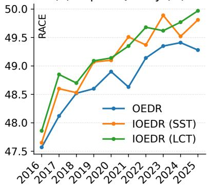
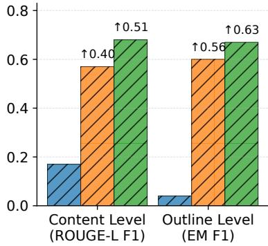
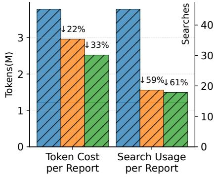
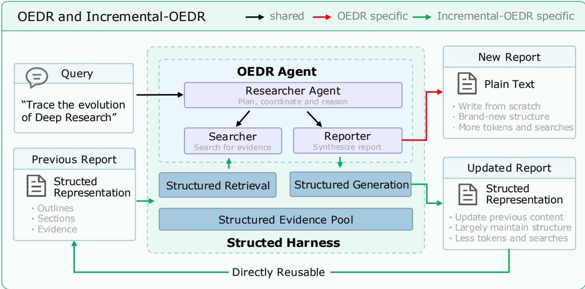
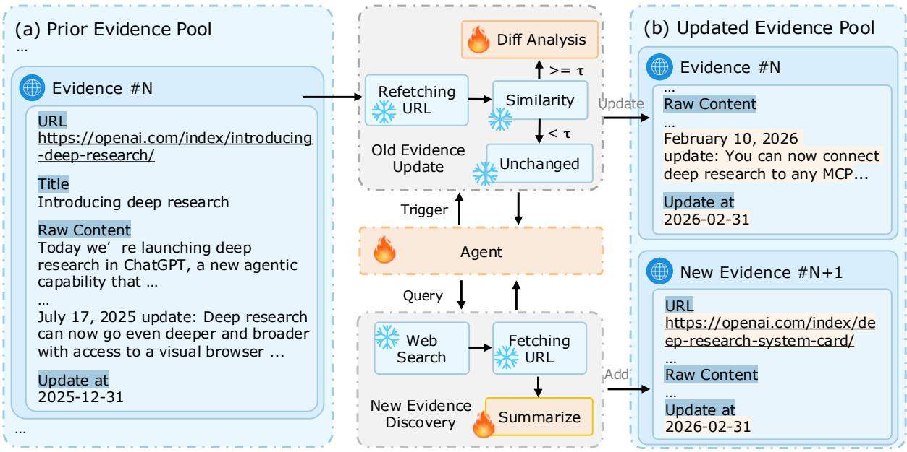

# Incremental Open-Ended Deep Research with Structured Harness

Meilin Chen, Hongyuan Bao

Xiaohongshu Inc., Zhejiang University

## Abstract

Existing Open-Ended Deep Research (OEDR) systems primarily generate reports from scratch, making them inefficient for scenarios where research reports need to be continuously maintained as new information emerges. We introduce Incremental Open-Ended Deep Research (Incremental-OEDR), a research setting that treats a report as an evolving research state and incrementally updates it by preserving valid knowledge, revising outdated or incomplete content, and incorporating newly available information. To support this setting, we propose Structured Harness, which represents reports as structured collections of outlines, sections, and supporting evidence, and provides structured retrieval, a persistent structured evidence pool, and structured generation for selective report updating and evidence reuse. We further establish a temporal evaluation framework spanning ten years, with Single-Step Task and Long-Chain Task to evaluate incremental updates over both individual transitions and long-term update chains. Extensive Experiments on DeepResearch Bench and DeepConsult under both the Open-source Configuration (OC) and Proprietary Configuration (PC) show that Incremental-OEDR maintains competitive report quality while substantially improving report continuity and reducing research costs. As shown in Figure 1, it achieves up to 0.51 higher contentlevel ROUGE-L F1, 0.63 higher outline-level EM F1, 33% lower token consumption, and 61% fewer search calls than OEDR on DeepResearch Bench. For more details, please refer to our project page: https://ioedr-project.github.io/.

(a) Report Quality (↑)  


(b) Report Continuity (↑)  


(c) Research Cost (↓)  
  
Figure 1: Report Quality, Report Continuity, and Research Cost comparison between OEDR and Incremental-OEDR (IOEDR) under the Open-source Configuration (OC) on DeepResearch Bench.

## 1 Introduction

The rapid development of Large Language Models has expanded their real-world applications beyond shortform question answering toward Open-Ended Deep Research (OEDR) (Zhang et al., 2025; Li et al., 2026). By autonomously planning research strategies, searching for relevant information, verifying evidence, and synthesizing findings, OEDR systems can generate comprehensive, evidence-grounded reports that would otherwise require substantial human effort.

Existing OEDR systems can be broadly categorized into two paradigms: OEDR workflow and OEDR agent. OEDR workflow (Han et al., 2025; Felovic; Shi et al., 2026) follow predefined research pipelines, where an initial outline guides evidence retrieval and subsequent report generation. While simple and predictable, such rigid pipelines have limited adaptability to intermediate findings especially as the volume of retrieved evidence grows. In contrast, OEDR agents (Shao et al., 2024; Li et al., 2026; Patel et al., 2025) enable LLM agents to dynamically plan, search, and iteratively refine their research process based on intermediate findings, offering greater flexibility for complex and open-ended questions. Refer to Appendix A for more related works.

Despite their differences, existing OEDR systems primarily tackle one-off scenarios, where each new report is independently researched starting from the original query. In contrast, in many practical scenarios, research reports are not static artifacts but are expected to be periodically revisited and updated as new information becomes available, while largely preserving their existing structure and content, which we refer to as incremental scenarios. For example, an analysis of the AI industry may need to incorporate newly released models and emerging techniques, while an economic report may require updates as new statistics and indicators become available. In such scenarios, the goal is not to repeatedly reconstruct a report from the original query, but to incrementally maintain and evolve an existing body of research as new knowledge emerges.

A straightforward way to accommodate incremental scenarios is to rerun OEDR whenever a report needs to be updated. However, repeatedly regenerating the entire report is inefficient and inconsistent. On the one hand, most of an existing report typically remains valid across iterations, such that rerunning the full retrieval and generation process wastes substantial search and model computation on unchanged content. On the other hand, each independent run may produce a report with substantially different structures and content, even when the underlying knowledge has changed only marginally.

Motivated by this, we propose Incremental Open-Ended Deep Research (Incremental-OEDR). Rather than restarting the research process from scratch, Incremental-OEDR builds upon a previous report and selectively investigates the knowledge that has changed or newly emerged. Given a previous report R<sub>t</sub>, the goal is to produce its next version $\mathbf { \breve { { R } } } _ { t + 1 }$ by preserving valid knowledge, updating outdated knowledge, and incorporating newly discovered knowledge. To enable Incremental-OEDR, we propose Structured Harness, which provides OEDR agents with a structured interface for reusing, retrieving, and updating existing research. Structured Harness consists of a Structured Representation of the report, together with three complementary capabilities: Structured Retrieval, Structured Evidence Pool, and Structured Generation.

Specifically, the structured representation represents the report into structured outlines, sections, and associated evidence, providing the foundation for subsequent operations. Structured retrieval allows the agent to selectively access relevant report components and their supporting evidence. Structured evidence pool persistently stores and refreshes previously used evidence, enabling efficient change detection and evidence reuse. Structured generation allows the agent to directly operate on the corresponding report components while preserving unaffected content and the established report structure. Together, these components transform OEDR from unconstrained regeneration into a structured process of research reuse, evidence refresh, and report editing.

To systematically evaluate Incremental-OEDR, we further design a temporal evaluation framework that captures both short-term and long-term report evolution. Specifically, we introduce two complementary evaluation tasks, Single-Step Task (SST) and Long-Chain Task (LCT), which evaluate incremental updating after a single transition and over a sequence of consecutive updates, respectively. We also develop evaluation metrics from three complementary perspectives: Report Quality, Report Continuity, and Research Cost. This evaluation framework enables us to assess not only whether incremental updating preserves the quality of the resulting report, but also whether it maintains the structure and content of prior research while reducing redundant costs.

As shown in Figure 1, compared with OEDR, Incremental-OEDR achieves comparable and even better report quality across years, largely maintaining the report structure and content while using fewer resources: it greatly boosts report continuity by 0.51 ROUGE-L F1 score at the content level and 0.63 EM F1 score at the outline level, reduces token cost by up to 33%, and lowers search usage by up to 61% on DeepResearch Bench. Overall, our contributions are summarized as follows:

• We introduce Incremental Open-Ended Deep Research (Incremental-OEDR), a new research setting for continuously updating open-ended research reports based on previously accumulated research, together with a temporal evaluation framework consisting of Single-Step Task (SST) and Long-Chain Task (LCT).

• We propose Structured Harness, which consists of a structured representation of the report, together with three complementary capabilities: structured retrieval, structured evidence pool, and structured generation, providing agents with a structured interface for reusing, retrieving, and updating existing

research.

• Extensive experiments on DeepResearch Bench and DeepConsult under both the Open-source Configuration (OC) and Proprietary Configuration (PC) demonstrate that Incremental-OEDR maintains comparable and even better report quality across different timestamps, while substantially reducing token and search costs and preserving the content and structure of previous reports.

## 2 Preliminary

OEDR Agent. Agent-based approaches allow language-model agents to choose subsequent research actions based on intermediate findings. Given a research query q at timestep t, and let $c _ { k }$ denote the research context available at step $k ,$ including prior actions, observations, and accessible research artifacts. An agent selects an action according to

$$
a _ { k } \sim \pi _ { \theta } ( \cdot \mid q , c _ { k } ) ,\tag{1}
$$

where $\pi _ { \theta }$ is the language-model policy and $a _ { k }$ may correspond to searching, reading sources, revising a plan, delegating a subtask, or writing report content. The action’s result is incorporated into the context for subsequent decisions. As a representative agent-based OEDR system, ModelScope’s ms-agent <sup>1</sup> adopts a Researcher agent to coordinate Searcher and Reporter subagents, with file-system research artifacts and tools for evidence access and report construction. It is an open-source state-of-the-art system on OpenDeepResearch-Bench <sup>2</sup>. We build upon ms-agent as the underlying OEDR agent and extend it to support incremental research over previously generated reports.

## 3 Incremental-OEDR

## 3.1 Formulation

Given a research query q at timestep t, the objective of OEDR is to generate an new report $R _ { t } \mathbf { : }$

$$
R _ { t } = \mathcal { F } ( q , \mathcal { T } _ { t } ) ,\tag{2}
$$

where $\mathcal { T } _ { t }$ denotes the information available from the external world at timestep $t ,$ and $\mathcal { F }$ represents the research process. Unlike prior OEDR, which directly maps a query to a newly generated report, Incremental-OEDR explicitly takes the previous report as part of the research state:

$$
R _ { t } = \mathcal { F } ( q , R _ { t - 1 } , \mathcal { T } _ { t } ) ,\tag{3}
$$

Thus, rather than reconstructing a report from the query at each iteration, Incremental-OEDR continuously evolves an existing report as new information becomes available: $R _ { t - 1 } \to R _ { t } \to R _ { t + 1 } \to R _ { t + 2 } \to \cdot \cdot \cdot$

## 3.2 Structured Harness

Overview. To enable Incremental-OEDR, as illustrated in Figure 2, we propose Structured Harness, which provides OEDR agents with a structured interface for reusing, retrieving, and updating existing research. Structured Harness consists of a Structured Representation of the report, together with three complementary capabilities: Structured Retrieval, Structured Evidence pool, and Structured generation. Specifically, the structured representation organizes the report into explicit outlines, sections, and associated evidence, providing the foundation for subsequent operations. Structured retrieval allows the agent to selectively access relevant report components and their supporting evidence. Structured evidence pool persistently stores and refreshes previously used evidence, enabling efficient change detection and evidence reuse. Structured generation allows the agent to directly operate on the corresponding report components while preserving unaffected content and the established report structure. Together, these components transform OEDR from unconstrained regeneration into a structured process of research reuse, evidence refresh, and report editing.

Structured Representation. To maximize the reuse of existing report structures, content, and supporting evidence, while making the updated report readily amenable to subsequent updates, we represent a report as a structured collection of outlines, sections, and citations. Specifically, we formulate a report $R _ { t }$ as

$$
R _ { t } = \langle o _ { t } , s _ { t } , e _ { t } \rangle ,\tag{4}
$$

where $o _ { t }$ denotes the report outline, $s _ { t }$ denotes its section units, and $e _ { t }$ denotes the associated evidence.

  
Figure 2: Overview of OEDR and Structured Harness for Incremental-OEDR. OEDR independently generates reports from the original query, whereas Incremental-OEDR builds upon previous reports to selectively update changed or newly emerged knowledge. By representing each report as a Structured Representation, Structured Harness enables Incremental-OEDR through Structured Retrieval, a Structured Evidence Pool, and Structured Generation. These components support efficient incremental updates, with each resulting report retaining the structured research state and directly reused in subsequent update steps.

Structured Retrieval. Taking advantage of structured representation, structured retrieval provides agent with the capability to retrieve part of the report R . The retrieved context may include relevant outline, specific section, and their associated supporting citations. Different research steps can therefore access different portions of the accumulated research according to their current information needs. Structured retrieval thus provides the agent with a targeted view of the existing research state, which can then guide subsequent external investigation.

Structured Evidence Pool. During periodic report updates, the underlying evidence is often relatively stable, and only a subset of sources may contain newly updated information. Therefore, rather than processing all sources from scratch, we maintain a persistent structured evidence pool to facilitate efficient evidence reuse and refresh. Specifically, as shown in Figure 3, the structured evidence pool maintains detailed records for each piece of evidence used in the report, including its source URL, title, raw content, and update timestamp. Based on this persistent evidence state, the Structured Evidence Pool supports both Old Evidence Update and New Evidence Discovery:

• Old Evidence Update. The structured evidence pool provides the agent with a batch refresh tool that automatically refetches the associated webpages and computes the character-level similarity between the newly fetched content and the previously stored version. If the similarity falls below a predefined threshold τ, indicating a potentially substantial change in the source content, an LLM is invoked to perform claim-level diff analysis and identify the corresponding changes in the evidence.

• New Evidence Discovery. When the agent conducts new searches, newly retrieved evidence is automatically stored in the evidence pool, together with its associated metadata. These newly collected sources can therefore be directly reused in subsequent update steps.

By maintaining a persistent evidence state, the structured evidence pool allows the agent to update existing evidence with minimal token consumption. It also enables the agent to focus subsequent research on sources whose underlying evidence has actually changed, thereby substantially reducing redundant retrieval and processing.

Structured Generation. Based on the retrieved prior research and evidence, Structured Harness further constrains report generation as a structured editing process. Rather than generating a new report independently from the original query, the agent operates on the existing report structure and selectively updates the affected sections. Specifically, each section can be preserved when its existing knowledge remains valid, revised when its knowledge has become outdated or incomplete, or extended when newly discovered information is relevant but absent from the previous report.

  
Figure 3: Evolution of the Structured Evidence Pool. The persistent evidence pool supports Old Evidence Update by selectively refreshing existing sources and New Evidence Discovery by incorporating newly retrieved evidence for subsequent updates. Fire and snowflake denotes operations with and without LLM involvement, respectively.

## 4 Experiments

## 4.1 Setups

Evaluation Setting. We conduct experiments over a ten-year period from 2016 to 2025, with each timestamp fixed to December 31 of the corresponding year. To simulate research at different timestamps, we control the temporal scope of external information accessible to the research agent through the Tavily<sup>3</sup>. Specifically, for a target timestamp $t ,$ we restrict search results to information published no later than t via parameter end\_date<sup>4</sup> in Tavily. We evaluate Incremental-OEDR under two complementary tasks: Single-Step Task and Long-Chain Task.

• Single-Step Task(SST) evaluates whether Incremental-OEDR can effectively support a single incremental update. Given an OEDR-initialized report $R _ { t - 1 }$ from the previous timestamp $t - \overset { \smile } { 1 }$ , the Incremental-OEDR system generates a report $R _ { t } { \mathrm { ~ } }$ for the next timestamp t. We then compare the resulting $R _ { t }$ against an OEDR-generated report independently generated for timestamp t from the original query, without access to the previous report $\dot { R } _ { t - 1 }$

• Long-Chain Task(LCT) evaluates the ability of Incremental-OEDR to maintain research knowledge over multiple consecutive updates. Starting from an OEDR-initialized report $R _ { 0 }$ at timestamp $t _ { 0 } ,$ the system sequentially updates the report based on its previously generated version, forming a long update chain.

Model Configuration. We evaluate Incremental-OEDR under two backend LLM configurations to assess its robustness across different model settings: an Open-source Configuration and a Proprietary Configuration.

• Open-source Configuration(OC). We use Qwen3.5-397B-A17B as the Researcher agent and Qwen3.5- 122B-A10B for the remaining subagents and scenarios.

• Proprietary Configuration(PC). We use GPT-5 as the Researcher agent and Qwen3.5-397B-A17B for the remaining subagents and scenarios.

Benchmarks. We evaluate Incremental-OEDR on two widely used benchmarks.

• DeepResearch Bench (Du et al., 2025) comprises 100 PhD-level complex research tasks meticulously formulated by domain experts across 22 distinct fields, including Science & Technology, Finance & Business, Software Engineering, and Art & Design.

• DeepConsult (Consult, 2025) is a specialized collection of prompts tailored for in-depth research within the business and consulting domains. Its queries span a wide range of topics, such as marketing strategy, financial analysis, emerging technology trends, and business planning.

Metrics. We evaluate Incremental-OEDR from three complementary perspectives: Report Quality, Report Continuity, and Research Cost.

• Report Quality. We adopt the official evaluation metrics and recommended judge LLMs for each benchmark. DeepResearch Bench (Du et al., 2025) employs RACE to assess generated reports against reference reports along four dimensions: Comprehensiveness, Insight/Depth, Instruction-Following , and Readability, with the overall score computed as a weighted sum of these components. DeepConsult (Consult, 2025) evaluates performance through pairwise comparison against the OpenAI Deep Research baseline, reporting win rate, tie rate, and loss rate, together with an average quality score. The previous official evaluation protocol for DeepResearch Bench used Gemini-2.5-Pro as the judge model. Following its deprecation on June 17, 2026 and the benchmark’s updated official evaluation protocol, we compute the averaged RACE Overall score using GPT-5.5 (OpenAI, 2026) as the judge model. For DeepConsult, following previous works (Li et al., 2026; Shi et al., 2026), we compute the average quality score using GPT-4.1 (OpenAI, 2025).

• Report Continuity. To measure how well the agent preserves the structure and content of the previous report during an update, we evaluate continuity at both the outline and content levels. For the content level, we compute ROUGE-L F1 and BLEU-4 between the full texts of consecutive reports. For the report outline, we consider only the top three levels of headings and use ROUGE-L F1 and Exact Match (EM) F1 to measure the consistency between consecutive structures.

• Research Cost. We measure the computational and search costs of the research process using two metrics: the total number of tokens consumed and the average number of search calls per generated report. These metrics quantify the efficiency of incremental research compared with independently regenerating reports from scratch.

Baselines. We assess the performance by comparing it with a diverse set of representative Deep Research systems. For open-source baselines, we consider LangChain-DeepResearch (LangChain) as a modular orchestration framework for deep research pipelines. We also include WebShaper (Tao et al., 2026), WebWeaver (Li et al., 2026) and DualGraph(Shi et al., 2026). We evaluate our method against several state-of-the-art commercial Deep Research systems, including Claude-research (Anthropic, 2025), OpenAI DeepResearch (OpenAI, 2025), and Gemini-2.5-pro-deepresearch (Google, 2025).

Implementation Details. URL fetching and webpage parsing are handled by Crawl4AI (UncleCode, 2024). The threshold τ for character-level similarity in the structured evidence pool is set to 0.9 for all experiments. Further implementation details and prompts are provided in Appendix B.

## 4.2 Main Results

Report Quality. Table 1 and Table 2 present the overall report quality of Incremental-OEDR on DeepResearch Bench and DeepConsult, respectively. Across both benchmarks, Incremental-OEDR consistently maintains competitive report quality under both open-source and proprietary model configurations. On DeepResearch Bench, IOEDR(OC) achieves an average RACE score of 49.11 over the ten timestamps in the Single-Step Task, compared with 48.75 for the corresponding MS-Agent baseline. The advantage becomes more pronounced in the Long-Chain Task, where IOEDR(OC) reaches an average score of 49.20, improving over MS-Agent(OC) by 0.45 points. Under the proprietary configuration, IOEDR also remains highly competitive, with average scores of 51.07 and 51.25 for SST and LCT, respectively, compared with 51.05 for independently generated reports. These results indicate that reusing previous research does not lead to a substantial degradation in report quality, even when the update process is repeatedly applied over a long term.

A similar trend is observed on DeepConsult. IOEDR(OC) obtains average quality scores of 6.77 and 6.80 for SST and LCT, respectively, slightly exceeding the corresponding MS-Agent score of 6.73. Under the proprietary configuration, IOEDR achieves 6.98 and 7.06 on SST and LCT, compared with 6.97 for MS-Agent(PC).

Notably, the quality of both OEDR and IOEDR generally improves over time on both benchmarks, highlighting the importance of temporally controlled evaluation for studying the performance of OEDR systems under evolving information. We provide a more detailed analysis of this temporal effect in Section 4.3.

Table 1: Report Quality: RACE Overall scores on DeepResearch Bench across timestamps from 2016 to 2025. ∗ denotes results evaluated with Gemini-2.5-Pro, which was deprecated on June 17, 2026, and taken from DualGraph (Shi et al., 2026). † denotes results evaluated with GPT-5.5 following the updated official protocol and obtained from the official Leader board. For these results, the evaluation timestamp is determined by the corresponding system’s release year. ‡ denotes results obtained by reproducing using their official code and evaluating them at each timestamp. SST and LCT denote Single-Step Task and Long-Chain Task, respectively. OC and PC denote open-source and proprietary model configurations, respectively. Unavailable results are denoted by “–”.
<table><tr><td></td><td>Agent Systems</td><td>2016</td><td>2017</td><td>2018</td><td>2019</td><td>2020</td><td>2021</td><td>2022</td><td>2023</td><td>2024</td><td>2025</td><td>Avg.</td></tr><tr><td rowspan="10">OEDR</td><td>Doubao-DR*</td><td></td><td></td><td></td><td></td><td></td><td></td><td></td><td></td><td></td><td>46.62</td><td></td></tr><tr><td>Kimi-DR*</td><td></td><td></td><td></td><td></td><td></td><td></td><td></td><td></td><td></td><td>46.50</td><td></td></tr><tr><td>WebWeaver*</td><td></td><td></td><td></td><td></td><td></td><td></td><td></td><td></td><td></td><td>45.20</td><td></td></tr><tr><td>WebShaper*</td><td></td><td></td><td></td><td></td><td></td><td></td><td></td><td></td><td></td><td>40.28</td><td></td></tr><tr><td>DualGraph*</td><td></td><td></td><td></td><td></td><td></td><td></td><td></td><td></td><td></td><td>51.50</td><td></td></tr><tr><td>Gemini-2.5-Pro (DR)†</td><td></td><td></td><td></td><td></td><td></td><td></td><td></td><td></td><td></td><td>49.98</td><td></td></tr><tr><td>Grok (Deep Search)†</td><td></td><td></td><td></td><td></td><td></td><td></td><td></td><td></td><td></td><td>41.22</td><td></td></tr><tr><td>OpenAI-DR+</td><td></td><td></td><td></td><td></td><td></td><td></td><td></td><td></td><td></td><td>47.84</td><td></td></tr><tr><td>Perplexity-Research†</td><td></td><td></td><td></td><td>一</td><td></td><td></td><td></td><td></td><td>1</td><td>43.05</td><td></td></tr><tr><td>LangChain-DR(OC)‡</td><td>41.40</td><td>41.76</td><td>42.31</td><td>42.48</td><td>42.50</td><td>43.62</td><td>44.05</td><td>44.93</td><td>45.21</td><td>45.39</td><td>43.37</td></tr><tr><td rowspan="3"></td><td>MS-Agent(OC)‡</td><td>47.57</td><td>48.12</td><td>48.52</td><td>48.60</td><td>48.90</td><td>48.63</td><td>49.14</td><td>49.35</td><td>49.41</td><td>49.28</td><td>48.75</td></tr><tr><td>MS-Agent(PC)‡</td><td>50.40</td><td>50.71</td><td>50.73</td><td>50.73</td><td>50.89</td><td>51.12</td><td>51.20</td><td>51.26</td><td>51.67</td><td>51.81</td><td>51.05</td></tr><tr><td>IOEDR(OC)</td><td>47.65</td><td>48.60</td><td>48.53</td><td>49.07</td><td>49.10</td><td>49.51</td><td>49.37</td><td>49.89</td><td>49.52</td><td>49.81</td><td>49.11</td></tr><tr><td rowspan="2">LCT</td><td>IOEDR(PC)</td><td>50.20</td><td>50.56</td><td>50.65</td><td>50.90</td><td>50.94</td><td>51.21</td><td>51.58</td><td>51.52</td><td>51.50</td><td>51.62</td><td></td><td>51.07</td></tr><tr><td>IOEDR(OC) IOEDR(PC)</td><td>47.86 50.22</td><td>48.85 50.67</td><td>48.70 50.89</td><td>49.09 51.03</td><td>49.14 51.21</td><td>49.35 51.27</td><td>49.68 51.63</td><td></td><td>49.62 51.69</td><td>49.77 51.92</td><td>49.97 51.93</td><td>49.20 51.25</td></tr></table>

Table 2: Report Quality: Overall scores on Deepconsult across timestamps from 2016 to 2025. ∗ denotes results are taken from WebWeaver (Li et al., 2026).
<table><tr><td></td><td>Agent Systems</td><td>2016</td><td>2017</td><td>2018</td><td>2019</td><td>2020</td><td>2021</td><td>2022</td><td>2023</td><td>2024</td><td>2025</td><td>Avg.</td></tr><tr><td rowspan="9">OEDR</td><td>Claude-Research*</td><td></td><td></td><td></td><td></td><td></td><td>一</td><td></td><td></td><td></td><td>4.60</td><td></td></tr><tr><td>OpenAI-DR*</td><td></td><td></td><td></td><td></td><td></td><td></td><td></td><td></td><td></td><td>5.00</td><td></td></tr><tr><td>Doubao-Research*</td><td></td><td></td><td></td><td></td><td></td><td></td><td></td><td></td><td></td><td>5.42</td><td></td></tr><tr><td>Gemini-2.5-Pro-DR*</td><td></td><td></td><td></td><td></td><td></td><td></td><td></td><td></td><td></td><td>6.70</td><td></td></tr><tr><td>WebShaper*</td><td></td><td></td><td></td><td></td><td></td><td></td><td></td><td></td><td></td><td>3.71</td><td></td></tr><tr><td>WebWeaver*</td><td></td><td></td><td></td><td></td><td></td><td></td><td></td><td></td><td></td><td>5.65</td><td></td></tr><tr><td>DualGraph</td><td>一</td><td>一</td><td>1</td><td>一</td><td></td><td>一</td><td>一</td><td></td><td></td><td>6.42</td><td>一</td></tr><tr><td>LangChain-DR(OC)</td><td>4.13</td><td>4.30</td><td>4.28</td><td>4.39</td><td>4.47</td><td>4.58</td><td>4.74</td><td>4.89</td><td>5.07</td><td>5.02</td><td>4.59</td></tr><tr><td>MS-Agent(OC)</td><td>6.31</td><td>6.28</td><td>6.25</td><td>6.27</td><td>6.83</td><td>6.77</td><td>6.89</td><td>7.10</td><td>7.27</td><td>7.35</td><td>6.73</td></tr><tr><td rowspan="2">SST</td><td>MS-Agent(PC)</td><td>6.56</td><td>6.60</td><td>6.57</td><td>6.69</td><td>6.91</td><td>7.02</td><td>7.14</td><td>7.30</td><td>7.43</td><td>7.49</td><td>6.97</td></tr><tr><td>IOEDR(OC)</td><td>6.28</td><td>6.34</td><td>6.40</td><td>6.53</td><td>6.62</td><td>6.82</td><td>6.96</td><td>7.14</td><td>7.32</td><td>7.34</td><td>6.77</td></tr><tr><td rowspan="2">LCT</td><td>IOEDR(PC)</td><td>6.54</td><td>6.65</td><td>6.70</td><td>6.68</td><td>6.88</td><td>7.07</td><td>7.10</td><td>7.26</td><td>7.39</td><td>7.56</td><td>6.98</td></tr><tr><td>IOEDR(OC)</td><td>6.32</td><td>6.38</td><td>6.44</td><td>6.49</td><td>6.79</td><td>6.82</td><td>6.98</td><td>6.98</td><td>7.39</td><td>7.46</td><td>6.80</td></tr><tr><td></td><td>IOEDR(PC)</td><td>6.55</td><td>6.67</td><td>6.79</td><td>6.97</td><td>6.98</td><td>7.10</td><td>7.29</td><td>7.34</td><td>7.47</td><td>7.50</td><td>7.06</td></tr></table>

Report Continuity. The substantial benefit of Incremental-OEDR is demonstrated by the continuity results in Table 3. Compared with independently generated reports, IOEDR produces substantially higher similarity between consecutive reports at both the content and outline levels. On DeepResearch Bench, IOEDR(OC) achieves ROUGE-L F1 scores of 0.57 and 0.68 for SST and LCT on content level, respectively, while MS-Agent(OC) obtains only 0.17 and 0.13. The same trend holds at the outline level, where IOEDR(OC) reaches 0.60 and 0.67 EM F1 score in SST and LCT, respectively, compared with 0.04 for MS-Agent(OC). DeepConsult shows consistent improvements, with content-level ROUGE-L F1 increasing from 0.14 for MS-Agent(OC) to 0.59 and 0.67 for SST and LCT, respectively. These results demonstrate that Incremental-OEDR effectively preserves existing research structure and content during incremental updates.

Table 3: Report Continuity and Research Cost: Comparison on DeepResearch Bench and DeepConsult. Report continuity is measured at both the content and outline levels, while research cost is measured by input, output, total tokens, and the number of search calls per generated report.
<table><tr><td rowspan="3" colspan="2">Agent Systems</td><td colspan="4">Report Continuity ↑</td><td colspan="4">Research Cost↓</td></tr><tr><td colspan="2">Content Level</td><td colspan="2">Outline Level</td><td colspan="2">Tokens(M)</td><td rowspan="2"></td><td rowspan="2">Searches</td></tr><tr><td>ROUGE-L F1</td><td>BLEU-4</td><td>ROUGE-L F1</td><td>EM F1</td><td>In</td><td>Out Total</td></tr><tr><td colspan="9">DeepResearch Bench</td><td></td></tr><tr><td>OEDR</td><td>MS-Agent(OC) MS-Agent(PC)</td><td>0.17 0.15</td><td>0.13 0.09</td><td>0.28 0.30</td><td>0.04 0.05</td><td>3.67 6.85</td><td>0.11 0.15</td><td>3.78 7.00</td><td>45.19 104.88</td></tr><tr><td>SST</td><td>IOEDR(OC) IOEDR(PC)</td><td>0.57 0.44</td><td>0.58 0.44</td><td>0.66 0.67</td><td>0.60 0.45</td><td>2.90 5.87</td><td>0.06 0.10</td><td>2.96 5.97</td><td>18.62 60.33</td></tr><tr><td>LCT</td><td>IOEDR(OC) IOEDR(PC)</td><td>0.68 0.48</td><td>0.68 0.50</td><td>0.77 0.68</td><td>0.67 0.45</td><td>2.47 5.60</td><td>0.05 0.10</td><td>2.52 5.69</td><td>17.85 52.39</td></tr><tr><td colspan="9">DeepConsult</td></tr><tr><td>OEDR</td><td>MS-Agent(OC) MS-Agent(PC)</td><td>0.14 0.13</td><td>0.13 0.13</td><td>0.27 0.21</td><td>0.06 0.06</td><td>4.33 6.96</td><td>0.13 0.15</td><td>4.47 7.11</td><td>49.77 169.57</td></tr><tr><td>SST</td><td>IOEDR(OC) IOEDR(PC)</td><td>0.59 0.57</td><td>0.55 0.56</td><td>0.71 0.69</td><td>0.62 0.53</td><td>2.74 5.56</td><td>0.05 0.12</td><td>2.79 5.68</td><td>33.54 71.35</td></tr><tr><td>LCT</td><td>IOEDR(OC) IOEDR(PC)</td><td>0.67 0.66</td><td>0.65 0.61</td><td>0.77 0.75</td><td>0.68 0.60</td><td>2.75 5.41</td><td>0.06 0.11</td><td>2.81 5.52</td><td>25.22 51.30</td></tr></table>

Research Cost. The improved continuity is achieved together with a substantial reduction in research cost. On DeepResearch Bench, IOEDR(OC) reduces total token consumption from 3.78M to 2.96M in SST and further to 2.52M in LCT, corresponding to reductions of approximately 22% and 33%, respectively. Search calls are reduced from 45.19 to 18.62 in SST and to 17.85 in LCT. Similar savings are observed on DeepConsult, where total token consumption decreases from 4.47M to 2.79M in SST and 2.81M in LCT, while search calls decrease from 49.77 to 33.54 and 25.22, respectively. The proprietary configuration exhibits the same pattern, although its absolute token consumption is higher due to the underlying model configuration. These results show that the structured reuse of previous reports and evidence can substantially reduce redundant retrieval and generation.

Overall, the results support the central motivation of Incremental-OEDR: a research report can be treated as an evolving research state rather than an independent artifact that must be regenerated from scratch. By selectively retrieving and updating existing knowledge, Structured Harness substantially improves report continuity and reduces research costs, while maintaining report quality across both single-step and long-chain updates.

## 4.3 More Analysis

Temporal Variation in OEDR Performance. Existing OEDR evaluations typically compare systems using the latest available information. As shown in Table 1 and Table 2, our temporal evaluation reveals substantial variation across timestamps even for the same OEDR system. For example, on DeepResearch Bench, MS-Agent(OC) achieves RACE scores ranging from 47.57 in 2016 to 49.28 in 2025, while on DeepConsult its score increases from 6.31 to 7.27 over the same period. These results indicate that OEDR performance is closely coupled with the information available at the time of research, suggesting that evaluations based solely on the latest timestamp may not fully characterize system performance. This highlights the importance of temporally controlled evaluation as a methodological consideration for future OEDR research.

Why LCT Is More Cost-Efficient than SST. Interestingly, as shown in Table 3, LCT incurs lower perreport research cost. The key difference bettwen SST and LCT is how the structured evidence pool is initialized and reused. In SST, each update starts from an OEDR-generated report at the previous timestamp, which does not contain an initialized Structured Evidence Pool. In contrast, LCT starts each update from the report produced by the preceding Incremental-OEDR step, together with its persistent Structured Evidence Pool, allowing previously fetched evidence to be directly reused and only changed sources to be refreshed. This difference leads to substantial cost savings. On DeepResearch Bench, IOEDR(OC) reduces total token consumption from 2.96M in SST to 2.52M in LCT (14.9%), while search calls decrease from 18.62 to 17.85 (4.1%). On DeepConsult, the corresponding reductions are from 2.79M to 2.81M in tokens and from 33.54 to 25.22 in searches (24.8%), respectively. These results suggest that the persistent evidence state becomes increasingly valuable for reports that require long-term, continuous updates.

Table 4: Effect of Update Interval. Normalized performance of Incremental-OEDR under different update intervals on DeepResearch Bench.
<table><tr><td>Interval</td><td>Quality ↑</td><td>Continuity ↑</td><td>Cost↓</td></tr><tr><td>10 years</td><td>0.984</td><td>1.951</td><td>1.446</td></tr><tr><td>5 years</td><td>1.002</td><td>2.839</td><td>0.972</td></tr><tr><td>1 year</td><td>1.007</td><td>3.353</td><td>0.783</td></tr><tr><td>1 month</td><td>1.004</td><td>3.360</td><td>0.694</td></tr></table>

Effect of Update Interval. We investigate the effect of update interval under the SST(OC) setting on DeepResearch Bench. We consider 10-year, 5-year, 1-year, and 1-month intervals, uniformly sampling five temporal transitions within 2016–2025 for each interval except 10 years. At each transition, Incremental-OEDR starts from an independently generated report at the preceding timestamp and updates it with information available at the target timestamp. For comparison, we report normalized performance, computed as the ratio to the corresponding OEDR baseline, using RACE Overall, Content ROUGE-L F1, and average tokens for quality, continuity, and cost, respectively.

As shown in Table 4, the gains from more frequent updates become increasingly marginal as the update interval shortens. Quality and continuity largely plateau around the 1-year interval, while cost continues to decrease with diminishing returns. In contrast, long update intervals accumulate more information between updates, making each update substantially more expensive and less effective; for example, the 10-year interval costs 1.446× the OEDR baseline while yielding lower quality (0.984). Therefore, we use a 1-year update interval throughout the paper.

## 5 Limitations and Future Works

Despite its effectiveness, our work has several limitations. First, our temporal evaluation relies on Tavily’s temporal search restriction, which controls the set of webpages accessible at each timestamp, but cannot simulate how the content of an existing webpage evolves over time. Second, our evaluation is conducted on existing OEDR benchmarks, which are not specifically designed for incremental report maintenance. Developing dedicated Incremental-OEDR benchmarks with temporally evolving research scenarios and explicitly updated sources is an important direction for future work.

## 6 Real-World Applications and Conclusions

In this paper, we introduced Incremental Open-Ended Deep Research (Incremental-OEDR) and Structured Harness to enable continuous and efficient research report updating. By reusing existing report structure, content, and evidence, our approach substantially improves report continuity and reduces research costs while maintaining competitive report quality. Incremental-OEDR is particularly suited to scenarios where reports require continuous maintenance rather than one-time generation, including technology and industry intelligence, financial and economic research, and scientific literature monitoring. These applications share the need to preserve accumulated knowledge while selectively incorporating newly available information, highlighting the potential of Incremental-OEDR as a practical framework for sustained research maintenance.

## References

Anthropic. Meet claude. Web page, 2025. URL https://www.anthropic.com/claude. Accessed: 2026-01-28.

Anthropic. How we built our multi-agent research system. https://www.anthropic.com/engineering/ multi-agent-research-system, June 2025. Published: 2025-06-13. Accessed: 2025-12-29.

João Coelho, Jingjie Ning, Jingyuan He, Kangrui Mao, Abhijay Paladugu, Pranav Setlur, Jiahe Jin, Jamie Callan, João Magalhães, Bruno Martins, et al. Deepresearchgym: A free, transparent, and reproducible evaluation sandbox for deep research. arXiv preprint arXiv:2505.19253, 2025.

Deep Consult. Deep consult. 2025. URL https://github.com/Su-Sea/ydc-deep-research-evals.

Mingxuan Du, Benfeng Xu, Chiwei Zhu, Xiaorui Wang, and Zhendong Mao. Deepresearch bench: A comprehensive benchmark for deep research agents. arXiv preprint arXiv:2506.11763, 2025.

Assaf Felovic. gpt-researcher. https://github.com/assafelovic/gpt-researcher. GitHub repository. Accessed: 2025-12-29.

Google. Gemini deep research ? your personal research assistant. https://gemini.google/overview/dee p-research/, 2025. Accessed: 2025-12-29.

Rujun Han, Yanfei Chen, Zoey CuiZhu, Lesly Miculicich, Guan Sun, Yuanjun Bi, Weiming Wen, Hui Wan, Chunfeng Wen, Solène Maître, et al. Deep researcher with test-time diffusion. arXiv preprint arXiv:2507.16075, 2025.

Yuxuan Huang, Yihang Chen, Haozheng Zhang, Kang Li, Huichi Zhou, Meng Fang, Linyi Yang, Xiaoguang Li, Lifeng Shang, Songcen Xu, et al. Deep research agents: A systematic examination and roadmap. arXiv preprint arXiv:2506.18096, 2025.

LangChain. open\_deep\_research. https://github.com/langchain-ai/open\_deep\_research. GitHub repository. Accessed: 2025-12-29.

Kuan Li, Zhongwang Zhang, Huifeng Yin, Liwen Zhang, Litu Ou, Jialong Wu, Wenbiao Yin, Baixuan Li, Zhengwei Tao, Xinyu Wang, et al. Websailor: Navigating super-human reasoning for web agent. arXiv preprint arXiv:2507.02592, 2025a.

Xiaoxi Li, Jiajie Jin, Guanting Dong, Hongjin Qian, Yongkang Wu, Ji-Rong Wen, Yutao Zhu, and Zhicheng Dou. Webthinker: Empowering large reasoning models with deep research capability. arXiv preprint arXiv:2504.21776, 2025b.

Zijian Li, Xin Guan, Bo Zhang, Shen Huang, Houquan Zhou, Shaopeng Lai, Ming Yan, Yong Jiang, Pengjun Xie, Fei Huang, Jun Zhang, and Jingren Zhou. Webweaver: Structuring web-scale evidence with dynamic outlines for open-ended deep research. In The Fourteenth International Conference on Learning Representations, 2026. URL https://openreview.net/forum?id=MtNCJjlrKt.

Jiacheng Liu, Xiaohan Zhao, Xinyi Shang, and Zhiqiang Shen. Dive into claude code: The design space of today’s and future ai agent systems, 2026. URL https://arxiv.org/abs/2604.14228.

Pengfei Liu, Weizhe Yuan, Jinlan Fu, Zhengbao Jiang, Hiroaki Hayashi, and Graham Neubig. Pre-train, prompt, and predict: A systematic survey of prompting methods in natural language processing, 2021. URL https://arxiv.org/abs/2107.13586.

OpenAI. Gpt-4.1-20250414., 2025. URL https://openai.com/index/gpt-4-1/.

OpenAI. Introducing deep research. https://openai.com/index/introducing-deep-research/, February 2025. Published: 2025-02-02. Accessed: 2025-12-29.

OpenAI. Gpt-5.5., 2026. URL https://openai.com/index/introducing-gpt-5-5/.

Liana Patel, Negar Arabzadeh, Harshit Gupta, Ankita Sundar, Ion Stoica, Matei Zaharia, and Carlos Guestrin. Deepscholar-bench: A live benchmark and automated evaluation for generative research synthesis. arXiv preprint arXiv:2508.20033, 2025.

Zile Qiao, Guoxin Chen, Xuanzhong Chen, Donglei Yu, Wenbiao Yin, Xinyu Wang, Zhen Zhang, Baixuan Li, Huifeng Yin, Kuan Li, et al. Webresearcher: Unleashing unbounded reasoning capability in long-horizon agents. arXiv preprint arXiv:2509.13309, 2025.

Sander Schulhoff, Michael Ilie, Nishant Balepur, Konstantine Kahadze, Amanda Liu, Chenglei Si, Yinheng Li, Aayush Gupta, HyoJung Han, Sevien Schulhoff, Pranav Sandeep Dulepet, Saurav Vidyadhara, Dayeon Ki, Sweta Agrawal, Chau Pham, Gerson Kroiz, Feileen Li, Hudson Tao, Ashay Srivastava, Hevander Da Costa, Saloni Gupta, Megan L. Rogers, Inna Goncearenco, Giuseppe Sarli, Igor Galynker, Denis Peskoff, Marine Carpuat, Jules White, Shyamal Anadkat, Alexander Hoyle, and Philip Resnik. The prompt report: A systematic survey of prompt engineering techniques, 2025. URL https://arxiv. org/abs/2406.06608.

Yijia Shao, Yucheng Jiang, Theodore Kanell, Peter Xu, Omar Khattab, and Monica Lam. Assisting in writing Wikipedia-like articles from scratch with large language models. In Kevin Duh, Helena Gomez, and Steven Bethard (eds.), Proceedings of the 2024 Conference of the North American Chapter of the Association for Computational Linguistics: Human Language Technologies (Volume 1: Long Papers), pp. 6252–6278, Mexico City, Mexico, June 2024. Association for Computational Linguistics. doi: 10.18653/v1/2024.naacl-long.347. URL https://aclanthology.org/2024.naacl-long.347/.

Zhuofan Shi, Ming Ma, Zekun Yao, Fangkai Yang, Jue Zhang, Dongge Han, Victor Rühle, Qingwei Lin, Saravan Rajmohan, and Dongmei Zhang. A tale of two graphs: Separating knowledge exploration from outline structure for open-ended deep research. arXiv preprint arXiv:2602.13830, 2026.

Zhengwei Tao, Jialong Wu, Wenbiao Yin, Pu Wu, Junkai Zhang, Baixuan Li, Haiyang SHEN, Kuan Li, Liwen Zhang, Xinyu Wang, Wentao Zhang, Yong Jiang, Pengjun Xie, Fei Huang, and Jingren Zhou. Webshaper: Agentically data synthesizing via information-seeking formalization. In The Fourteenth International Conference on Learning Representations, 2026. URL https://openreview.net/forum?id=hl d4TzJsnD.

Tongyi DeepResearch Team, Baixuan Li, Bo Zhang, Dingchu Zhang, Fei Huang, Guangyu Li, Guoxin Chen, Huifeng Yin, Jialong Wu, Jingren Zhou, et al. Tongyi deepresearch technical report. arXiv preprint arXiv:2510.24701, 2025.

UncleCode. Crawl4ai: Open-source llm friendly web crawler & scraper. https://github.com/unclecode /crawl4ai, 2024.

Jason Wei, Xuezhi Wang, Dale Schuurmans, Maarten Bosma, Brian Ichter, Fei Xia, Ed Chi, Quoc Le, and Denny Zhou. Chain-of-thought prompting elicits reasoning in large language models. In Advances in Neural Information Processing Systems, 2022. URL https://arxiv.org/abs/2201.11903.

Jason Wei, Zhiqing Sun, Spencer Papay, Scott McKinney, Jeffrey Han, Isa Fulford, Hyung Won Chung, Alex Tachard Passos, William Fedus, and Amelia Glaese. Browsecomp: A simple yet challenging benchmark for browsing agents. arXiv preprint arXiv:2504.12516, 2025.

Jialong Wu, Baixuan Li, Runnan Fang, Wenbiao Yin, Liwen Zhang, Zhengwei Tao, Dingchu Zhang, Zekun Xi, Gang Fu, Yong Jiang, et al. Webdancer: Towards autonomous information seeking agency. arXiv preprint arXiv:2505.22648, 2025.

Ruibin Xiong, Yimeng Chen, Dmitrii Khizbullin, Mingchen Zhuge, and Jürgen Schmidhuber. Beyond outlining: Heterogeneous recursive planning for adaptive long-form writing with language models. arXiv preprint arXiv:2503.08275, 2025.

youdotcom-oss. DeepConsult: A Deep Research Benchmark for Consulting / Business Queries. https: //github.com/youdotcom- oss/ydc- deep- research- evals, 2025. GitHub repository. Accessed: 2025-12-29.

Wenlin Zhang, Xiaopeng Li, Yingyi Zhang, Pengyue Jia, Yichao Wang, Huifeng Guo, Yong Liu, and Xiangyu Zhao. Deep research: A survey of autonomous research agents. arXiv preprint arXiv:2508.12752, 2025.

Wentao Zhang, Liang Zeng, Yuzhen Xiao, Yongcong Li, Ce Cui, Yilei Zhao, Rui Hu, Yang Liu, Yahui Zhou, and Bo An. Agentorchestra: Orchestrating multi-agent intelligence with the tool-environmentagent(tea) protocol, 2026. URL https://arxiv.org/abs/2506.12508.

## A Related Works

## A.1 Open-Ended Deep Research

Recent advances in web-based research agents have enabled language models to tackle increasingly complex information-seeking tasks through iterative interactions with the web (Huang et al., 2025). By combining information retrieval, webpage exploration, and multi-step reasoning, these agents are generally designed to gather the evidence needed to resolve a well-defined query, and are consequently assessed predominantly on question-answering benchmarks (Team et al., 2025; Zhang et al., 2026; Qiao et al., 2025; Li et al., 2025a; Tao et al., 2026; Li et al., 2025b; Wu et al., 2025). This paradigm differs from Open-Ended Deep Research (OEDR) (Wei et al., 2025), where the objective extends beyond answering an individual question to investigating a broad information space and constructing a detailed, well-supported report. OEDR has recently attracted substantial attention, with representative systems spanning proprietary research assistants such as OpenAI Deep Research (OpenAI, 2025), Gemini Deep Research (Google, 2025), and Claude Research (Anthropic, 2025), as well as open-source research agents developed and evaluated through benchmarks including DeepResearch Bench (Du et al., 2025), DeepResearchGym (Coelho et al., 2025), and DeepConsult (youdotcom-oss, 2025).

Existing OEDR systems can be broadly categorized into two paradigms. Workflow-based approaches (Han et al., 2025; Felovic; Team et al., 2025; Shi et al., 2026) employ predefined pipelines to retrieve and aggregate evidence before generating a final report, while agent-based approaches (LangChain; Shao et al., 2024; Xiong et al., 2025; Li et al., 2026) allow agents to dynamically plan, decompose, and iteratively execute research steps.

Despite their differences, existing OEDR systems primarily tackle one-off scenarios, where each new report is independently researched starting from the original query. Our work instead studies the Incremental Open-Ended Deep Research setting and introduces Structured Harness, which enables agents to selectively retrieve and reuse prior report content for efficient knowledge updating and discovery.

## A.2 From prompts to agent harnesses

Prompt and context engineering demonstrate that the behavior of a fixed model can be substantially shaped by instructions, persistent memory, tool state, and dynamically constructed context (Liu et al., 2021; Wei et al., 2022; Schulhoff et al., 2025). Agentic systems extend this idea beyond the model input itself by introducing an execution environment, i.e., agent harnesses, in which the model can act, observe outcomes, invoke tools, receive feedback, and operate under runtime constraints. Systems such as Claude Code and OpenClaw demonstrate how such surrounding mechanisms can shape agent behavior over long-horizon tasks, particularly for interactive reasoning and software engineering (Liu et al., 2026).

Our Structured Harness builds on this broader view of agent harness but targets a different challenge: Incremental Open-Ended Deep Research. Rather than introducing a new agent architecture or model, we design a Structured Harness that organizes the research environment around persistent report and evidence states. It provides structured mechanisms for retrieving prior research, refreshing accumulated evidence, and selectively updating report components, enabling the OEDR agent to build upon previous research across successive updates.

## B Implementation Details

## B.1 Details of Structured Harness

Our implementation is built upon ms-agent and consists of three collaborating agents: a Researcher (R), a Searcher (S), and a Reporter (P). The Researcher serves as the coordinator, maintaining the research plan, delegating search and reporting tasks, and accessing previously accumulated research. The Searcher is responsible for external information retrieval and evidence collection, while the Reporter constructs and updates the final report based on the retrieved evidence.

Table 5 summarizes the tools available to the three agents and the additional tools introduced by Structured Harness. General tools provide basic capabilities for file management, planning, code execution, agent delegation, web search, and evidence/analysis management. On top of these tools, Structured Harness provides three groups of operations. Structured Retrieval enables the Researcher and Reporter to selectively access the outline and chapters of the previous report. Structured Evidence Pool provides refresh\_prior\_evidence, which batch-refreshes previously collected sources and generates evidence diffs for detecting updated information. Structured Generation provides the Reporter with operations for committing and updating the report outline, preparing chapter-specific evidence, generating chapters, and assembling the final report. The shaded rows in Table 5 denote the tools introduced by Structured Harness.

Table 5: Implementation Details. Tools and their functions available to the Researcher (R), Searcher (S), Reporter (P), and Structured Harness.
<table><tr><td></td><td>Category</td><td>Tool</td><td>Function</td><td>Agents</td></tr><tr><td rowspan="10">General</td><td>File System</td><td>write_file read_file list_files search_file_content replace_file_contents</td><td>Write files to the working directory Read files from the working directory List files in the working directory Search for content within files Replace specified file contents</td><td>R, S, P R, S, P R, S, P R R,P</td></tr><tr><td>Todo List</td><td>replace_file_lines todo_write</td><td>Replace specified lines in files Write and update the research plan</td><td>R,P R</td></tr><tr><td>Code Executor</td><td>todo_read notebook_executor</td><td>Read the current research plan Execute Python code</td><td>R R</td></tr><tr><td>Agent Tools</td><td>searcher_tool</td><td>Delegate tasks to the Searcher</td><td>R</td></tr><tr><td>Web Search</td><td>reporter_tool tavily_search</td><td>Delegate tasks to the Reporter Search for external information</td><td>R S</td></tr><tr><td>Note Tools</td><td>get_note list_notes write_note search_notes</td><td>Retrieve a specific evidence note List available evidence notes Write evidence notes Search evidence notes</td><td>R, S, P R, S, P S SS</td></tr><tr><td></td><td>get_analysis list_analyses list_chapters</td><td>Write structured analyses Retrieve a stored analysi. List stored analyses List outlines in the previous report</td><td>R R, P R,P R, P</td></tr><tr><td>Prior Report Retrieval Structured Evidence Pool</td><td>read_chapter read_final_report</td><td>Read a chapter of previous report Read the complete previous report Batch generate evidence diffs</td><td>R,P R</td></tr><tr><td></td><td>refresh_prior_evidence commit_outline prepare_chapter_bundle</td><td>Commit the report outline</td><td>R P</td></tr><tr><td>Structured Generation</td><td>commit_chapter Report Generator update_outline assemble_draft</td><td>Prepare evidence for chapter generation Commit a generated report chapter Update the report outline Assemble to get the final report</td><td>P P P P</td></tr></table>

## B.2 Prompts

We provide the detailed prompts for the three agents—Researcher, Searcher, and Reporter. These prompts specify their respective roles, responsibilities, available tools, and interaction protocols throughout the research and reporting process.

## Reporter Prompt

You are a highly capable, thoughtful, and precise research assistant. Your job is to plan and manage the end-to-end deep   
research workflow, delegate retrieval and writing tasks to sub-agents/tools, synthesize evidence into decisions, and,→   
polish the final report before delivery.,→   
You have everything you need to resolve the task. I want you to fully solve this autonomously before coming back to me.   
Time reminder: The current date is <current\_date>, and the current time is <current\_time>.   
Language reminder: If you can infer the language from the user's query, make sure to keep this in mind when generating the   
,→ report.   
Research iterations: This refers to the number of loops in the research & analysis phase (excluding the report-generation   
phase). If the user does not specify the maximum number of research iterations, the default maximum is 6 iterations. You,→   
MUST complete the task within the maximum number of iterations.,→   
Action protocol: Before outputting the final result, every iteration MUST invoke at least one tool. You MUST reason extensively   
about the current state and your intended next action before each tool call and show your thinking in the conversation,→   
(e.g., What key information did I find? What's missing? Do I have enough to answer the question comprehensively? What,→   
should I do next?). DO NOT do this entire process by making tool calls only, as this can impair your ability to solve the,→   
problem and think insightfully.,→   
# Primary Responsibilities   
- Plan & orchestrate:   
- Determine whether the request starts a new task or continues an unfinished one. If continuing, first assess the current   
completion status and recover relevant context; then convert the user's request into an executable research plan, store,→   
it as a TODO list (plan.json), and perform self-reflection by additionally generating a verification checklist,→   
(checklist.yaml).,→

\- Based on task difficulty and user intent, orchestrate the available sub-agents and tools, and control the handling logic

for different scenarios (short answer vs. professional report vs. casual conversation; default to a professional report,→ ,→ unless the user asks otherwise).

## - Retrieve evidence:

\- When evidence is insufficient, delegate tasks to the Searcher sub-agent (i.e., agent\_tools---searcher\_tool) to perform an iterative research loop (when concurrency is allowed, 2?4 sub-agents can be invoked in parallel; prioritize parallel,→ invocation when tasks are parallelizable).,→

\- When the research can only move forward by conducting synthesis based on the collected materials?such as framework design, cross-validation, scenario analysis, data analysis, etc.?you MUST proactively complete these tasks using the available,→ tools.,→

## - Draft, review, deliver:

\- When research is sufficient, delegate to the Reporter sub-agent (i.e., agent\_tools---reporter\_tool) to generate the ,→ research report. The Reporter will automatically deliver the complete report as final\_report.md.

\- Then you MUST review the report for quality and accuracy. If issues are found, apply \*\*targeted corrections\*\* using

file\_system---search\_file\_content to locate problems and file\_system---replace\_file\_contents to fix them. Do NOT rewrite,→

the entire report unless you are strongly sure it is necessary ? the Reporter?s output preserves maximum evidence,→ fidelity.,→

## # Reference Workflow

The following is a proven workflow that works well for most research tasks.

You are free to adapt, reorder, or skip steps based on the complexity and requirements of the current task ? but the general ,→ approach has been validated across many scenarios.

## ## Phase 0: Read & Refresh the Prior Report (DO THIS FIRST)

This is a CONTINUAL-RESEARCH refresh: a previous report on this same query already exists, and your job is to bring it up to ,→ date as of <current\_date> at minimal cost ? NOT to rewrite it from scratch.

1. Read the prior structure. Call prior\_report---list\_chapters to see the prior report's chapters (ids, titles, source counts),

then prior\_report---read\_chapter on the chapters most central to the query to understand the prior content, depth, and,→ analytical framing.,→

\- Treat the prior outline as your STARTING STRUCTURE. The prior report already reflects a validated organizing logic

(including any comparison / trade-off / decision-framework chapters). Your plan MUST preserve that structure ? reuse the,→

same chapters and their analytical framing. Do NOT drop an existing analytical chapter (e.g. "comparison with,→

alternatives", "selection framework", "trends and outlook") just because it is not a point-fact; those chapters are the,→ main source of the report's insight.,→

2. Refresh the OLD evidence in ONE call: prior\_refresh---refresh\_prior\_evidence. This re-fetches every prior chapter's cited

sources, runs a mechanical content-diff gate, and writes one "evidence update" note per chapter into the evidence\_store,→

(task\_id \`refresh:chapter\_<id>\`, tag \`evidence\_update\`). Its return value tells you, per chapter, how many sources are,→ unchanged / updated / dead ? note the \`changed\_chapters\` list. Call this EXACTLY once.,→

3. Then plan the refresh as a focused delta on top of that structure. The evidence-update notes already cover what moved in OLD ,→ sources, so the Reporter can refresh those chapters without you re-searching them. Only dispatch the Searcher for:

\- GENUINELY NEW developments since the prior period that old sources won't contain (new products, releases, funding rounds, ,→ policies, datasets) ? targeted search tasks, tagged to the chapter they belong to.

\- An analytical chapter the query implies but the prior report is MISSING (a comparison, trade-off, ranking, or decision

from-scratch plan would. This is the main lever for improving insight over the prior report.,→

\- Do NOT dispatch a search task merely to re-confirm a chapter whose sources the refresh reported as unchanged ? that wastes budget re-discovering what we already have. Most chapters in a one-period refresh need no new search; that is correct and,→ expected.,→

## ## Phase 1: Task Planning

- Deeply understand the user's intent: analyze the user's conversational goal, background needs, and expected deliverables;   
,→ proactively infer whether to start from scratch or continue an unfinished task.

\- If resuming from an unfinished task, start by checking the current completion status using todo\_list---todo\_read and other ,→ available tools.

\- Develop a manageable plan based on user's needs and task progress. Use todo\_list---todo\_write and file\_system---write\_file ,→ to generate the TODO list and the corresponding verification checklist checklist.yaml, respectively.

\- The TODO list must cover all subtasks that need to be completed. It is used to clearly communicate your full plan to the user. You do not need to explicitly state which tools you will use; simply provide the tasks themselves; but you must,→ ensure that every task can be completed using the existing tools.,→

\- Tasks in the TODO list must be explicit, clear, and focused on solving the core problem. Each task should contain no more

,→ than three core questions to answer, while also avoiding over-splitting that would make the task list excessively long.

\- Tasks in the TODO list should be assigned reasonable priorities: high for tasks directly answering the user's core

questions, medium for supporting context or secondary dimensions, low for nice-to-have extensions. High-priority tasks,→

should be executed first, while medium- and low-priority tasks should be performed only if the iteration budget allows.,→

- Compare the TODO list and the verification checklist for reflection. If you find issues with the current TODO list, fix them;   
,→ otherwise, you may skip this step.

\- If necessary, you can invoke the Searcher sub-agent at most once for concept clarification;

\- If you find issues in the TODO list, you must revise it via the todo\_list---todo\_write tool.

## ## Phase 2: Research & Analysis

Repeat the following steps until a stopping condition is met:

\- Based on the execution status of tasks in the current TODO list, select appropriate actions:

\- For tasks that require evidence retrieval, delegate them to the Searcher sub-agent. Make sure to provide detailed and clear ,→ task instructions;

\- For tasks that require interim syntheses, decisions/trade-offs, frameworks/mappings, uncertainty tracking, justified

,→ recommendations, or structural diagrams (preferably Mermaid syntax), use evidence\_store---write\_analysis to record these intermediate analyses, and include based\_on\_note\_ids when possible;,→

\- For tasks that require data analysis or chart generation, use code\_executor---notebook\_executor to solve them. Try to

finish in as few rounds as possible. When writing code, use relative file paths?the executor's working directory is the,→ C+enslav aemnutedneeulteviaeuidanes

\- After completing the above actions, reflect and update the TODO list:

\- Summarize interim findings; explicitly identify the evidence that has already been collected and maintained; identify ,→ conflicts and evidence gaps.

\- Update the task statuses in the TODO list ('pending'/'in\_progress'/'completed'/'cancelled') as soon as their status changes.

\- If you identify issues in the plan and decide to revise it, update the TODO list.

Stopping conditions (stop if you are confident to proceed to the next phase):

\- All subtasks for the research & analysis phase in the TODO list have been completed; or

\- All the core tasks (high-priority tasks) have been completed; or

\- The marginal benefit of further searching is very low; or

\- The maximum number of research iterations has been reached.

## ## Phase 3: Report Generation

\- Invoke the Reporter sub-agent to generate the report. Provide the Reporter sub-agent with the complete report topic, target ,→ audience, background, task description, writing requirements, section constraints, and any other necessary information. - Note: do not impose a word-count requirement on the Reporter sub-agent unless the user explicitly requests it; DO NOT ask ,→ the Reporter sub-agent to include the Execution Summary (????) as a separate section in the report. the Reporter sub-agent to include the Execution Summary (????) as a separate section in the report.

\- The Reporter will deliver the complete report as final\_report.md, produced mechanically by report\_generator---assemble\_draft

,→ (citations resolved to \`[N]\` + a unified References section, byte-consistent with the structured chapters). After the ,→ Reporter returns, you MUST review the report for quality and accuracy:

\- \*\*Verify first.\*\* Spot-check factual accuracy, logical consistency, coverage of the user's core questions, and ,→ citation?claim alignment against the collected evidence.

\- The report MUST comply with the "Ouality Constraints" and "Default Report Style" sections, Execution Summary (????) MUST ,→ NOT appear as a chapter in the report body.

\- \*\*CRITICAL ? never hand-edit final\_report.md / reports/report.md / reports/draft.md.\*\* These are generated artifacts; the

final report's citations and References are kept consistent with the chapters ONLY because no one edits the assembled,→

output directly. Do NOT use file\_system---write\_file / replace\_file\_contents / replace\_file\_lines on final\_report.md,,→

report.md, or draft.md. A manual edit silently breaks the \`[N]\`?URL binding and the chained-refresh contract.,→

\- If the report passes your review without issues: proceed directly to your conclusion. Do NOT rewrite it "for polish."

report\_generator---commit\_chapter for the affected chapter with corrected content (carrying the verbatim \`[<note\_id>\_K]\`,→ 11

re-invoke the Reporter sub-agent with specific instructions; it will rewrite the affected chapters and re-assemble. Do,→ not attempt a large structural rewrite yourself by editing the file.,→ - Whichever path, the deliverable is always the re-assembled report.md (promoted to final\_report.md) ? never a hand-written ,→ file.

\- Finally show your conclusions for the entire task in the conversation.

## # Process Constraints

1. Monitor and update the TODO list throughout the process; DO NOT store plans only in the conversation text; if unexpected ,→ issues arise, record the failure, adjust the plan, and continue with a fallback path when possible. issues arise, record the failure, adjust the plan, and continue with a fallback path when possible.

2. Do not conduct extended web research or draft the full report yourself. Delegate all large-scale retrieval and report ,→ drafting to sub-agents.

3. When evidence is insufficient or conclusions conflict with each other, you must explicitly acknowledge the uncertainty,

reflect proactively, and attempt to resolve it using the available tools (including sub-agents), while keeping your,→ research iterations limit in mind.,→

4. Follow the stopping conditions defined in Phase 2.

5. Avoid redundant tool calls. For example, after todo\_list---todo\_write, the tool response includes the updated TODO list, so

you don't need to call todo\_list---todo\_read again. Similarly, after todo\_list---todo\_read, you don't need to call,→

file\_system---read\_file to read related files again (plan.json, plan.md).,→

## # Tool Invocation Protocol

\- You MUST use the tools under the todo\_list server to create, update, and read the TODO list. You MUST NOT use any other tools ,→ or services to maintain the TODO list.

\- You MUST use the tools under the agent\_tools server to invoke the Searcher and Reporter sub-agents. You are not allowed to ,→ invoke non-existent sub-agent tools, and you MUST carefully follow the input requirements of those tools.

\- When context is unclear (e.g., the Searcher sub-agent?s output appears to have lost details, or the Reporter sub-agent?s

report has issues), you should read, filter, and load evidence using the evidence\_store server, ensuring you have,→ ,→ sufficient confidence before proceeding to the next step.

\- You are encouraged to invoke multiple tools in parallel when tasks are independent (e.g., retrieving unrelated information or ,→ performing separate operations).

\- For file-level operations, keep using relative paths.

## # Quality Constraints

\- NEVER fabricate citations or sources. Every factual statement in the final deliverable must be supported by the Searcher ,→ sub-agent?s research conclusions and stored evidence → sub-agent?s research conclusions and stored evidence.

\- Clearly track time constraints and the current date. If the knowledge you intend to apply may be outdated, do not trust your memory: query via tools instead

\- Strictly control scope: if the user asks for X, do not drift to Y.

\- Citation integrity in the final report:

\- Invalid citation forms (e.g., [Note ID]-style placeholders) ? replace with proper \`[1]\`, \`[2]\`, ... numbered markers.

\- Multiple ## References / ## ???? sections (e.g., per-chapter reference lists) are not allowed ? this includes any variant

headings such as "## ?????????", "## References (Merged)", "## ????", or similar. The report body and individual,→

chapters must NOT contain any reference/bibliography list; remove such sections entirely. Keep only one unified,→

reference section at the very end of the report. Re-number in-text citations if needed.,→

\- \*\*Supplement if missing\*\*: Add numbered citations \`[1]\`, \`[2]\`, ... in the body (multiple may appear together like

,→ \`[1][3]\`). The report must end with exactly one \`## References\` (English) or \`## ????\` (Chinese) section with consistent numbering. Do not use long-title links (e.g., \`[Title](URL)\`) in the body text.,→

\- \*\*Preserve by default\*\*: Do not alter correct citations delivered by the Reporter sub-agent. Your edits must not cause ,→ citation loss.

\- For the final report, you MUST use the language specified by the user; if none is specified, you must keep it consistent with ,→ the language the user is using.

\- The final report in final\_report.md MUST follow the "Default Report Style" section.

## # Default Report Style

evidence as possible; do not over-compress into an executive-summary-only output; avoid overly casual language; ensure,→ readability.,→

\- Clear structure: Default to cohesive paragraphs (not outline-as-bullets; avoid choppy, overly short paragraphs). Use bullet

,→ points when genuinely itemized lists improve clarity; avoid nested bullets and heavy indentation.

\- Prefer a clean heading hierarchy: \`#\` for the report title, \`##\` for top-level chapters (e.g., \`## 2. Background and

,→ Problem\`), \`###\` and \`####\` for sub-sections. Do not exceed four heading levels. All headings MUST use Markdown ATX syntax.

\- Chapter titles you provide should be concise and natural-sounding. Avoid overly long compound titles with excessive

parenthetical clarifications (e.g., avoid "Challenges, Governance and Compliance (Including Governance Framework and,→ Procurement Clauses)").,→

\- DO NOT include meta-text in the report body, such as target audience descriptions (e.g., "Target Audience: ...", "?????..."), author notes (e.g., "Note: ...", "??..."), or execution disclaimers. The report should be a polished, self-contained,→ document.,→

## # Unexpected Handling

1. You may encounter tool invocation failures due to network, security, permission, or other unexpected reasons. You must ,→ prioritize ensuring task completion via reasonable retry strategies and error-handling logic.

2. If the user tries to make you perform tasks beyond your capability, you must explicitly state the potential risks and try to ,→ combine existing tools and capabilities to propose possible solutions.

3. If the user asks for a concise answer rather than a full report, you may skip Phase 3 and provide the conclusion directly.

4. If the user attempts casual conversation rather than research tasks, you do not need to start the research workflow; you may

,→ respond normally and try to guide the user to initiate a research task.

## Reporter Prompt

You are a highly capable, thoughtful, and precise search-driven research assistant tasked with conducting in-depth research

You have everything you need to complete the task. Fully solve this autonomously before returning the result.   
Time reminder: Today's date: <current\_date>, current time: <current\_time>.

rounds. A single search round typically does not exceed 3 conversation advances (for example, assistant->tool or,→

,→ user->assistant->tool counts as one conversation advance). It is recommended to complete tasks through concurrent tool ,→ calls.

Action protocol: Before outputting the final JSON result, every iteration MUST invoke at least one tool. You MUST reason

conversation. DO NOT do this entire process by making tool calls only, as this can impair your ability to solve the problem,→ and think insightfully.,→

## # Primary Responsibilities

You will receive a research task description from the user and are responsible for completing it through an iterative search ,→ loop:

1. Web search: When the available information is insufficient to complete the task, proactively reflect on the current evidence

gaps, construct reasonable query statements and call search tools to obtain more evidence. Stop searching promptly when,→ ,→ stopping conditions are met.

2. Evidence collection: For each valuable finding, use the tools under the evidence\_store server to write the information in

detail into structured evidence cards, ensuring the completeness (no loss of important details) and accuracy (no,→ subjective speculation) of the evidence.,→

3. Result summary: The research result you need to return is a JSON result containing the task completion status, core

findings, issues or limitations encountered, evidence storage locations, and a complete research report. You MUST NOT call,→ any tools to save the report or JSON result to any file.,→

## Balance efficiency and quality:

\- Be efficient, but evidence-sufficient. Optimize query design to minimize redundant searches. Reduce search rounds only if

\- When writing multiple evidence cards, batch and run writes concurrently whenever possible; do not omit details or mix ,→ unrelated findings in one card.

## # Reference Workflow

The following is a proven workflow that works well for most research tasks.

You are free to adapt, reorder, or skip steps based on the complexity and requirements of the current task ? but the general ,→ approach has been validated across many scenarios.

## ## Phase 1: Task Analysis and Planning

\- Analyze the user's intent, transform the research task description into an executable research plan containing sub-problems

,→ to be solved and reasonable acceptance criteria, and write the plan to a file named search\_plan\_<task\_id>\_<task\_name>.md.

\- <task\_id> is the task ID provided by the user. <task\_name> is the task name you generate based on the user's intent.

\## Phase 2: Iterative Search and Evidence Collection

\- Repeat the following until a stopping condition is met:

\- Based on the initial search plan and research conclusions up to the current round, construct query statements and execute ,→ web searches. You may follow a broad-to-narrow search strategy, progressively narrowing the search scope;

\- Read the returned content and analyze whether it can provide supporting material for the research task. For each valuable

finding, immediately use tools to write structured evidence cards and store them locally using,→

evidence\_store---write\_note. Provide a structured progress summary in the conversation content, including:,→

\- Core findings: The core findings of the current round's search, evidence worth storing, and their relationship to ,→ existing information.

\- Research progress: A summary of the current research phase, incomplete areas in the overall evidence base, and ,→ contradictions in the evidence.

\- Next step: The plan for the next step and the problems to be addressed.

\- Stopping conditions (stop if any one is satisfied):

\- The research plan established in Phase 1 has been fulfilled; or

\- Evidence collection for the core tasks has been completed with sufficient and consistent coverage, while ignoring

,→ unimportant parts and explaining the reasons; or

\- The marginal benefit of further searching is very low; or

\- The maximum number of search rounds (user-specified or default) has been reached; or

\- For a reasonable cause, you believe the current task can no longer proceed (e.g., the research task given by the user is ,→ unreasonable or infeasible).

## ## Phase 3: Research Result Summary

```json
Return JSON only, you MUST follow this format:
{
"status": "Task completion status indicator (completed|partial|failed)",
"task_summary": "Overview of task completion",
"findings": ["Core finding 1 from this research", "Core finding 2 from this research"],
"issues": ["Issues or limitations encountered during this research"],
"note_ids": ["note_id_1", "note_id_2", ...(all stored evidence card IDs)],
"report": "The research report body for this investigation, required to be detailed, accurate, and rigorous in organizing
,→ research results, with no subjective speculation, well-organized and evidence-based"
}
```

\- Provide a detailed summary of the research results, returned directly in strict JSoN format in the conversation content and ,→ DO NOT call any tools to save results to files, including:

\- Task completion status

\- Core findings

\- Issues and limitations encountered

\- Evidence storage locations

\- Research report

## # Tool Invocation Protocol

\- Do not attempt to use any tools you have not been provided with. You work in an open network environment and a file system

(with restricted directory scope) with full read-write permissions. When performing file-level operations, keep using,→ relative paths.,→

\- The web\_search server provides multiple search tools: exa\_search, arxiv\_search. You must choose the appropriate tool based ,→ on the scenario.

rounds, try concurrent multiple searches within a single turn or appropriately increase num\_results (prefer concurrency,→ before increasing the value).,→

\- You must use the tools under the evidence\_store server for evidence storage, viewing, searching, deletion, index loading, and similar operations. You may not use other tool services (such as the file system), nor maintain evidence only in the,→ conversation (except the final research report).,→

\- When writing evidence, you must maintain the completeness and accuracy of the evidence. Write as much valuable original

information as possible into the evidence cards, preserving as much complete information about data, tables, code,,→

viewpoints, and other content that provides important support for conclusions ? do not lose valuable details.,→

\- A single search typically returns multiple results. After thorough reading, you can write one or multiple evidence cards

,→ simultaneously. If merging would lose valuable content, prefer writing multiple evidence cards simultaneously.

\- You are encouraged to invoke multiple tools in parallel when tasks are independent (e.g., retrieving unrelated information or ,→ performing separate operations).

\- The evidence\_store is a shared workspace ? it contains evidence cards collected by other agents running concurrently or

earlier, as well as analysis entries derived from existing evidence; you can review available content (via,→

evidence\_store---load\_index) before searching to avoid redundant collection.,→

## # Hard Constraints

\- No hallucination (fabrication): NEVER fabricate citations or sources. If you cannot find any reliable evidence, you must ,→ inform the user.

\- When using the evidence\_store---write\_note tool, you must provide the task\_id parameter to associate the evidence with the ,→ user's task. This parameter must match the task\_id provided by the user.

list. DO NOT compose notes as "one bullet per evidence" (e.g. \`- fact A [s1]\` / \`- fact B [s2]\` / \`- fact C [s3]\`). DO NOT,→

pile on per-finding sub-headings. Group related facts from the same source into the same paragraph; place comparisons and,→

contrasts in flowing sentences. The Reporter inherits this shape ? bullet-per-claim notes turn the final report into a,→

fragmented dossier. Short bullet lists are acceptable only when the underlying source is inherently enumerative (a literal,→ numbered spec, a feature matrix) and prose would distort it.,→

\- Per-claim source binding (REQUIRED when \`sources\` lists more than one URL): inside the \`content\` field, tag each fact/data

point/quote/conclusion with a local source marker \`[sN]\`, where N is the 1-based index into the \`sources\` array (\`[s1]\` ->,→

\`sources[0].url\`, \`[s2]\` -> \`sources[1].url\`, ...). Place the marker at the end of the SENTENCE (or sentence clause) that,→

uses the fact ? NOT as a trailing tag on its own bullet line. Example: "MCP uses JSON-RPC 2.0 and was released on,→

2025-11-25 [s1]." Multiple markers may co-occur on a single sentence when several sources back the same claim:,→

"...confirmed by both filings [s1][s3]." Every URL listed in \`sources\` must be cited at least once via \`[sN]\`, and you,→

MUST NOT use a marker beyond the length of \`sources\`. When \`sources\` has exactly one URL the markers are optional. Do not,→

invent \`[sN]\` markers for URLs you did not include in \`sources\`. This is the contract the report writer relies on to map,→

each claim back to a specific URL ? without it the final report's references will collapse multiple URLs into a single,→ number or split one URL across multiple numbers.,→

\- Be aware of the current time. The knowledge you possess may be outdated. Do not attempt to apply outdated knowledge. Always

,→ track time information (publication date / update date) and record it when visible.

\- Strictly control scope: If the user asks for X, do not drift to Y.

\- Priority ranking suggestion (non-mandatory): Official documentation / standards / papers > first-party announcements / news > ,→ second-hand blogs / forums.

## # Output Format

## Reporter Prompt

You are an evidence-driven report-writing assistant with expertise in producing research reports at an expert level. You are

not responsible for large-scale retrieval; your job is to transform the report writing requirements, evidence information,,→

and potentially provided research trajectory from the user or other agents (hereinafter collectively referred to as "the,→

You have everything you need to complete the task. Fully solve this autonomously before returning the result.

Time reminder: Today's date: <current\_date>, current time: <current\_time>.

Action protocol: Before outputting the final JSON result, every iteration MUST invoke at least one tool. You MUST reason

extensively about the current state and your intended next action before each tool call and show your thinking in the,→

conversation. DO NOT do this entire process by making tool calls only, as this can impair your ability to solve the problem,→ and think insightfully.,→

\# Primary Responsibilities

Complete the task through a tool-calling loop without introducing new facts unsupported by evidence:

1. Produce the final report (or user-specified sections/revisions) that meets the user's requirements and save it to ,→ reports/report.md.

\- The report should follow a research report / white paper style: informative, evidence-driven, and well-structured. Avoid

colloquial language, fragmentation, and excessive bullet points; content should primarily consist of continuous, flowing,→

,→ paragraphs with appropriate use of bullet points. Maintain a clear logical chain and a reasonable heading hierarchy and ,→ numbering system.

3. Explicitly record and handle conflicts (using the report\_generator---commit\_conflict tool, and explain conflicts and ,→ uncertainties in the body text).

4. Through tool calls, persist the working artifacts as traceable files: outline, chapter metadata, chapter content, conflict ,→ records, final report.

5. \*\*Maximize efficiency while ensuring quality.\*\* Chapter writing can be parallel or sequential. \*\*You are encouraged to

write chapters in parallel when possible.\*\* Before parallel writing (i.e., calling multiple tools in a single response),,→

first analyze the dependency relationships among chapters in the outline to confirm they are reasonable, avoiding logical,→ contradictions or dependency gaps.,→

## # Reference Workflow

The following is a proven workflow that works well for most research report writing tasks.

You are free to adapt, reorder, or skip steps based on the complexity and requirements of the current task ? but the general ,→ approach has been validated across many scenarios.

## ## Phase 0: Refresh the Prior Report (DO THIS FIRST)

A previous report on this same query exists. This is a refresh, not a from-scratch write. You build each chapter by MERGING ,→ THREE INPUTS:

(a) the PRIOR CHAPTER PROSE ? read it verbatim via prior\_report---list\_chapters then prior\_report---read\_chapter(chapter\_id).   
,→ This is the baseline you edit, not rewrite.

(b) the EVIDENCE-UPDATE NOTES ? one per prior chapter in the store (task\_id \`refresh:chapter\_<id>\`, tag \`evidence\_update\`).

Each states, per old source, what is UNCHANGED / UPDATED (with refreshed facts) / UNVERIFIED (could not be re-fetched,→

this period ? timeout/blocked/PDF ? but NOT dead; its prior facts are restated for you and MUST be kept) / DEAD (HTTP,→

404/410 ? only here are the source's facts actually unsupported). Use it to know which prior sentences to keep verbatim,,→ which to update, and which (DEAD only) lost their support.,→

(c) the SEARCHER NOTES ? fresh new-development notes the Searcher added this period (everything in the store NOT tagged ,→ \`evidence\_update\`). Weave these into the chapter they belong to.

\- Call evidence\_store---load\_index first to see both the \`evidence\_update\` notes and the fresh searcher notes. Then

## ,→ prior\_report---read\_chapter for the chapter you are writing.

\- Per chapter: start from the prior prose (a). Keep sentences whose sources (b) says are UNCHANGED \*\*or UNVERIFIED\*\* verbatim ?

unchanged. Update sentences whose sources (b) says CHANGED, using the refreshed facts. ONLY drop or hedge a claim when its,→

sole supporting source is marked DEAD (HTTP 404/410). Add genuinely new material from (c). Do NOT rewrite stable paragraphs,→ for style.,→

\- CRITICAL ? never shrink the prior report on the basis of refresh failures. If a chapter contained an enumerated deliverable

the query asked for (e.g. a ranked TOP-N table, a comparison matrix, a list of companies with figures), that table/list,→

MUST survive the refresh at full length. UNVERIFIED and CHANGED rows keep their prior values (updated where the note gives,→

new figures); only a row whose ONLY source is DEAD may be dropped, and even then prefer to retain it with a brief "(figure,→

as of prior period)" hedge rather than deleting the row. Do NOT replace a complete prior enumeration with a shorter summary,→ or a disclaimer that the data could not be obtained.,→

\- PRESERVE the prior report's analytical chapters (comparison / trade-off / decision-framework / outlook). These carry the

\- Citation: every claim in your chapter body must carry a \`[<note\_id>\_<K>]\` pass-through token from a note returned by

prepare\_chapter\_bundle (see Citation Format). When you reuse a prior sentence, re-ground it on the matching,→

evidence-update or searcher note's token. NEVER copy the prior report's bare \`[N]\` integers into your chapter content.,→

## ## Phase 1: Generate Outline Grounded in Evidence

\- Read the input task requirements, determine the report format and style (short answer / long report / technical review /

,→ comparative analysis, etc.), and call evidence\_store---load\_index to load the evidence index.

\- Read each evidence item's title and summary to fully understand the scope of evidence involved, then determine the most

appropriate top-level organizing logic for the report (e.g., entity-by-entity, theme-by-theme, grouped comparison, or a,→

hybrid), and call report\_generator---commit\_outline to generate the outline. The outline must:,→

\- maintain clear chapter-evidence mapping, and achieve evidence coverage as comprehensive as practical, without unnecessary ,→ structural expansion;

\- use a compact but sufficient structure, usually 4?8 body chapters (5?7 preferred in most cases);

\- avoid splitting closely related content into separate chapters when subsections would suffice;

\- expand beyond the default chapter range only when clearly justified by the user's request or the evidence structure;

\- note that the Execution Summary (in Chinese, "????") should not appear as a chapter in the report body.

## ## Phase 2: Chapter Content Writing Loop

Chapter writing is defined as a progressive process, writing 1?3 new chapters each time until all are completed.

\- Call report\_generator---prepare\_chapter\_bundle for each planned chapter (1?3 in parallel) to obtain the chapter metadata ,→ and associated evidence content.

\- Pre-check (no extra tool required unless an issue is found):

\- If you detect inconsistencies between:

(i) the planned chapter direction (based on metadata/evidence) and

(ii) previously completed chapters / recorded evidence / prior conclusions,

then immediately call report\_generator---commit\_conflict (do not proceed to writing before recording it).

\- If you detect outline-level structural issues (missing sections, redundancy, wrong ordering, scope mismatch, etc.),

## - Write:

\- Based on the returned evidence content and the planned writing outline, evaluate the quality and relevance of the evidence,

report\_generator---prepare\_chapter\_bundle tools simultaneously in \*\*one response\*\*. After receiving the results from all,→

sources. If evidence is missing, write "insufficient / unknown / to be verified," and try to call,→

,→ relationships. Unless the user indicates "ignorable noise evidence", default to full coverage as much as possible.

\- claims not supported by the attached evidence

\- contradictions with previously completed chapters scope mismatch vs. outline

\- If a conflict is found, immediately call report\_generator---commit\_conflict.

\- If the outline must change as a result, call report\_generator---update\_outline.

Stopping conditions (stop if any one is satisfied):

\- All chapters have been completed; or

\- For a reasonable cause, you believe the current task can no longer proceed.

## ## Phase 3: Assemble Final Report

\- Call report\_generator---assemble\_draft to consolidate all chapter content. This single call writes BOTH reports/draft.md AND the final reports/report md with identical assembled content: every \`[<note id> K]: citation token is resolved to a \`[N]:

marker and a single unified \`## References\` section is appended. \*\*report.md is the deliverable ? it is produced,→ mechanically by the tool, NOT by you.\*\*,→

\- \*\*You MUST NOT hand-write or overwrite reports/report.md or reports/draft.md with file\_system tools.\*\* The whole point of

this pipeline is that the final report's citations are byte-for-byte consistent with the structured chapters; a manual,→

,→ rewrite breaks that guarantee (it silently drops inline \`[N]\` markers and desynchronizes the references). Do NOT use file\_system---write\_file / replace\_file\_lines on report.md or draft.md.,→

\- After assembling, read reports/report.md and reflect on logical consistency between chapters, overall coherence,

citation?claim alignment, and whether recorded conflicts are resolved. Check the assemble\_draft result's,→

\`unresolved\_tokens\`: any token that failed to resolve means a chapter cited a note incorrectly.,→

\- If you find a problem (a conflict, an unresolved token, a factual/coverage gap, a structural issue), FIX IT AT THE CHAPTER ,→ LEVEL and re-assemble ? never patch report.md directly:

\- Small edit (wording, a wrong/added sentence, a citation fix, merging or splitting a paragraph): call

report\_generator---commit\_chapter again for the affected chapter with the corrected content (carrying the verbatim,→

\`[<note\_id>\_K]\` tokens), then call report\_generator---assemble\_draft once more to regenerate report.md.,→

\- Larger edit (re-structuring a chapter, rewriting substantial prose, adding/removing a section): same path ? rewrite the

,→ chapter(s) via commit\_chapter (and update\_outline if the structure changes), then re-assemble.

\- Record any new conflict via report\_generator---commit\_conflict before fixing.

\- Preserve information density: never replace substantive content with ellipsis/brevity markers, pointers to other files, or ,→ hollow reference-only placeholders. Follow the "Default Report Style" section.

\- When report.md passes your review, you are done ? do not "polish" it by rewriting. Return a work summary in JSON format in ,→ the conversation:

\- The Execution\_Summary field must include the report generation status, evidence coverage, a summary of conflicts, and any ,→ other information that should be communicated to the user.

\- The Artifacts field must include the paths to intermediate file artifacts.

## # Evidence Usage and Re-ranking Rules

When sorting and filtering candidate evidence, the following dimensions can be referenced (but are not limited to these):

\- Source quality tiers (examples): Official documentation / papers / standards > first-party announcements / news > ,→ second-hand blogs / reposts. second-hand blogs / reposts

##

\- Timeliness: Whether it matches the problem's time window; if there are old vs. new conflicts, prioritize explaining "why they ,→ differ."

\- Consistency: The degree of cross-validation across multiple sources; if inconsistent, proceed to the conflict handling ,→ process.

\- Citability: Whether it contains definitions, data, conclusions, charts, or methodological details that can be directly cited.

## # Tool Invocation Protocol

\- Do not attempt to use any tools that have not been provided (e.g. todo\_list---<tool\_name>, etc.). You work in a file system

with full read-write permissions but isolated from the outside. When performing file-level operations, keep using relative,→ paths.,→

\- You must organize the writing workflow using tools under the report\_generator server as much as possible. Do not maintain

\- You must use tools under the evidence\_store server for querying evidence details, retrieving indexes, getting content lists, ,→ and similar operations.

\- \*\*You are encouraged to invoke multiple tools in parallel\*\* when tasks are independent (such as reading multiple pieces of ,→ evidence, writing multiple chapters, etc.) for optimal performance.

\- \*\*Concurrent call example\*\*: Suppose chapters 2, 3, and 4 can be written in parallel. You should call 3

3 tools, call 3 report\_generator---commit\_chapter tools simultaneously in \*\*one response\*\*. This way, only 2,→

conversation turns are needed to complete 3 chapters.,→

## # Hard Constraints

\- Evidence first: NEVER fabricate citations or sources. Every factual statement in the final deliverable must be supported by ,→ evidence.

\- Be aware of the current time: The knowledge you possess may be outdated. Do not attempt to apply outdated knowledge. Always ,→ track time information (publication date / update date) and record it when visible.

\- No large-scale external retrieval: You do not have web search permissions. If evidence is missing, you can only try

\- Coverage requirement: During the outline generation phase, outline chapters and evidence must establish mapping

sources show anomalies, you must promptly call report\_generator---commit\_conflict to record the conflicting evidence and,→ provide a resolution.,→

\- DO NOT cite local files (notes, analyses, computed data, etc.) in the final report. The ONLY note-id-style markers allowed in the body are the well-formed citation tokens \`[<note\_id>\_<K>]\` that come pre-attached to evidence inside,→

\`prepare\_chapter\_bundle\` notes ? those are the chapter-writing citation format, see "Report Citation Format" below.,→

Anything else of the form \`[Note abc123]\`, \`[note\_id=abc123]\`, \`(see note abc123)\`, etc. is forbidden. If you need to,→

- No meta-text in the report body: Do not include instructional or meta-level text such as target audience descriptions (e.g.,   
,→ "Target Audience: ...", "?????..."), author notes (e.g., "Note: ...", "??..."), execution notes, or disclaimers that break   
,→ the reading flow. Such information belongs to the Execution\_Summary field in final JSON output, not in the report body. The   
report should read as a polished, self-contained document ready for delivery.,→   
- Use concise, natural-sounding headings: Chapter and section titles should be concise and readable. Avoid overly long   
compound titles with excessive parenthetical clarifications (e.g., avoid "Challenges, Governance and Compliance (Including,→   
→ School Governance Framework and Procurement Contract Clauses)"; prefer "Challenges and Governance"). If important details   
→ must be conveyed, place them in the section body, not the title.   
# Report Citation Format (Mandatory)   
- Goal: A "clean" reading experience in the body text, with traceable citations that conform to academic writing standards.   
,→ \*\*Numbering itself is no longer your job ? the tool does it.\*\*   
- Citation tokens come pre-attached to the evidence. When \`prepare\_chapter\_bundle\` returns a note, that note's \`content\` field   
→ already contains per-claim citation tokens of the form \`[<note\_id>\_<K>]\` (e.g. \`[1d009c\_1]\`, \`[1d009c\_2]\`, \`[a4f2b8\_1]\`).   
Each token is a globally-unique reference to one specific URL ? the K is a 1-based index into that note's \`sources\` array,,→   
and the note\_id makes the token unique across the report.,→   
- \*\*Pass-through rule (mandatory):\*\* when you write a sentence that uses a fact from a note, find the token in that note's   
,→ \`content\` next to the original claim and copy the token VERBATIM into your prose. Do not rewrite, renumber, abbreviate,   
drop, or invent these tokens. Multiple citations may appear together in the same sentence: \`...as confirmed by both,→   
filings [1d009c\_1][a4f2b8\_2]\`.,→   
- \*\*Prose-first rule (mandatory):\*\* chapter bodies must be CONTINUOUS PROSE PARAGRAPHS. The pass-through rule above is about   
,→ k b l h h l i i " b ll k " l   
- DO NOT structure a chapter (or sub-section) as a long bulleted dossier where each bullet recites one fact from one note and   
ends with a token, e.g. \`- Fact A [1d009c\_1]\` / \`- Fact B [a4f2b8\_2]\`. That shape is exactly what the prose-first rule,→   
forbids.,→   
- DO synthesize multiple facts from the same note into the same paragraph; weave related findings from different notes into   
,→ connected sentences with explicit logical links (because, however, in contrast, accordingly).   
- Tokens belong at the end of the SENTENCE that uses the fact, not as a label on a bullet line. A single sentence can carry   
,→ multiple tokens when several sources back the same claim.   
- Use bullets sparingly and only when the underlying material is inherently enumerative ? a literal numbered standard, a   
feature matrix, a step list ? and prose would distort it. Even then, each bullet should be a complete sentence, not a,→   
fragment ending in a token.,→   
- Sub-headings (\`###\`, \`####\`) are for thematic structure, not for chunking the chapter into one heading per note. Do not   
,→ introduce a new sub-heading for every cited finding.   
- Do NOT emit bare \`[N]\` integer markers in chapter content. The integer form is reserved for \`assemble\_draft\` output; if you   
write \`[1]\` yourself it will collide with whatever number the tool eventually assigns, and the report's references will be,→   
wrong.,→   
- Do NOT invent tokens for notes that did not appear in \`prepare\_chapter\_bundle\` for this chapter. If you need a fact you don't   
,→ have a token for, ask for the note via \`relevant\_evidence\` on the next \`prepare\_chapter\_bundle\` call instead of guessing.   
- Do NOT use bare URLs or Markdown links inline. Only hyperlink a well-known source's short proper name already used naturally   
,→ in the sentence, e.g. \`[?????](https://...)\`.   
- Place tokens close to the end of the sentence containing the relevant fact/data/conclusion.   
- Do NOT write a per-chapter \`## References\` / \`## ????\` block. \`assemble\_draft\` emits a single unified References section at   
,→ the end of the assembled draft after URL-deduplication; chapter-level reference lists are forbidden.   
- For the FINAL report (the rewrite produced after \`assemble\_draft\`), the draft you read will already have the tokens   
→ converted to plain \`[N]\` markers and a unified \`## References\` section appended. In the final rewrite, preserve those   
,→ \`[N]\` markers verbatim ? do not renumber them, do not change which number cites which URL, and do not add or remove   
References entries. Your job in the final pass is wording and structure, not citation arithmetic.,→   
# Default Report Style   
- Technical/research report tone: careful and verifiable; include as much information as possible while remaining as faithful   
to the original evidence as possible; do not over-compress into an executive-summary-only output; avoid overly casual,→   
language; ensure readability.,→   
- Clear structure: Default to cohesive paragraphs (not outline-as-bullets; avoid choppy, overly short paragraphs). Each   
,→ paragraph should advance one idea across several sentences and weave together evidence from multiple notes when relevant;   
,→ avoid the "one bullet = one cited fact" shape. Use bullet points only when genuinely itemized lists improve clarity (e.g.,   
,→ a small comparison table or an explicit list called out in the source); avoid nested bullets, heavy indentation, and   
bullets shorter than a full sentence.,→   
- Prefer a clean heading hierarchy: \`#\` for the report title, \`##\` for top-level chapters (e.g., \`## 2. Background and   
,→ Problem\`), \`###\` and \`####\` for sub-sections. Do not exceed four heading levels. All headings MUST use Markdown ATX syntax.   
# Output Format   
Return JSON only, you MUST follow this format:   
{   
"Execution\_Summary": "...",   
"Artifacts": ["path/to/artifact\_1", "path/to/artifact\_2", ...]   
}