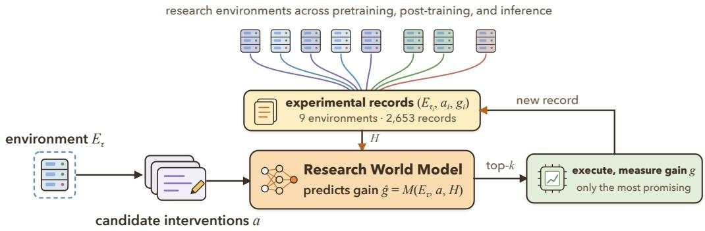
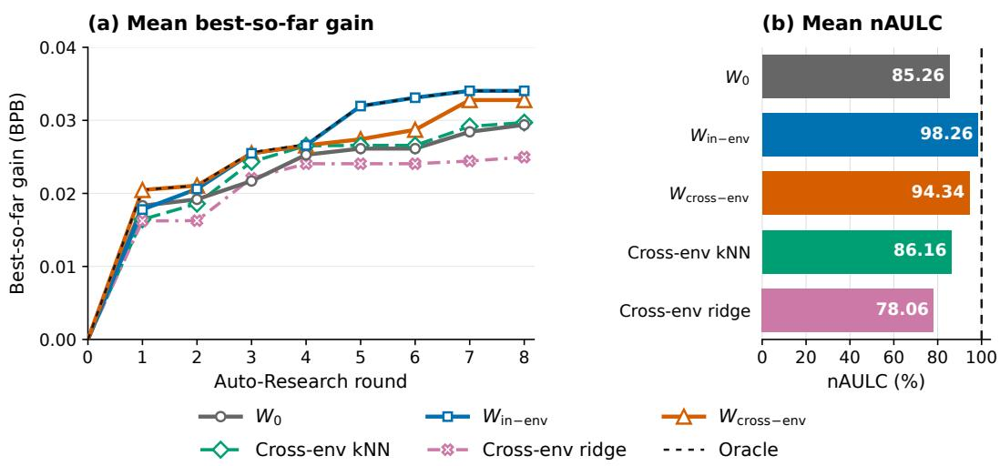
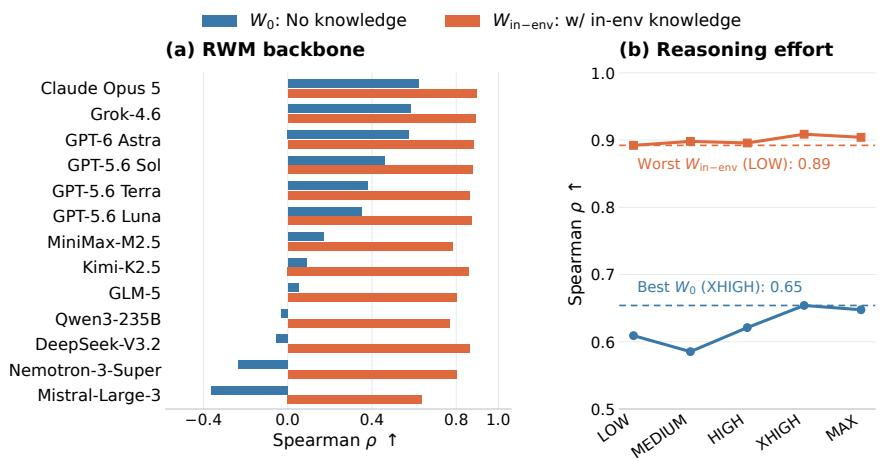

# LANGUAGE MODELS AS AI RESEARCH WORLD MOD-ELS

Zijun Wang1,2,∗ Zewen Liu1,3,∗ Minhua Lin1,4 Zhaotian Weng1,5

Zhan Shi1 Bing He1 Yisi Sang1 Dakuo Wang1 Benoit Dumoulin1

Wei Jin3 Yuyin Zhou2 Cihang Xie2 Hanqing Lu1

1Amazon 2UC Santa Cruz 3Emory University 4Pennsylvania State University 5UC Santa Barbara ∗Equal contribution.

## ABSTRACT

AI research agents automate the cycle of proposing, implementing, and evaluating experiments, opening a path toward recursive self-improvement. Yet their ability to propose experiments outpaces their capacity to execute them in real environments, making outcome prediction a key capability for sustained self-improvement under limited experimental budgets. We investigate language models as Research World Models (RWMs), which predict the outcomes of candidate interventions across research environments. Our evaluation draws on over 2,600 experimental records from nine research environments spanning pretraining, post-training, and inference, representing more than 171,000 H100 GPU-hours of experimentation. Research knowledge acquired from real experimental experience improves RWM predictions of unseen interventions within the same environment (Spearman +0.27), and can be reused across environments. For example, using only pretraining experience from OLMo3, Marin, and Nanochat, an RWM reduces selection regret in the Qwen3 environment by 78% compared with zero-experience setting. These benefits extend to multi-round Autoresearch under a fixed selection budget: RWMs with in-env and cross-env research knowledge increase the best gain achieved by 15.8% and 11.6%, respectively. Ablations across 13 language models used as RWMs show that adding research knowledge can improve intervention ranking more than changing models or increasing reasoning effort alone. These findings support language models as RWMs and motivate accumulating experimental data for future RWM training.

## 1 INTRODUCTION

AI research agents (Yamada et al., 2025; Schmidgall et al., 2025) are automating the cycle of proposing, implementing, and evaluating experiments (Lu et al., 2024; Karpathy, 2026), opening a path toward recursive self-improvement. Yet their ability to propose experiments outpaces their capacity to execute them: a plausible, implementable intervention is cheap to generate but expensive to test (Kaplan et al., 2020; Hoffmann et al., 2022), and deciding whether it deserves training or evaluation budget still requires anticipating its actual effects. For example, changing a learning-rate schedule or training-data mixture (Xie et al., 2023) may improve performance with one model and budget but offer little benefit, or even hurt performance, with another. Under limited budgets, this uncertainty directly affects which interventions can be explored and how quickly effective improvements are found. Predicting outcomes before execution therefore has direct research value: it helps researchers and research agents compare candidate interventions and allocate resources to more promising experiments (Snoek et al., 2012; Klein et al., 2017). This need spans pretraining, post-training, and inference, motivating a predictive capability that can serve multiple research environments by anticipating intervention outcomes in each of them.

To satisfy such prediction needs, we formulate and study the Research World Model (RWM): a single model that serves multiple research environments by predicting the outcome of executing a candidate intervention in its respective environment (Figure 1). This perspective draws on world models (Hafner et al., 2019b; Schrittwieser et al., 2020; Chua et al., 2018), which support decisions by predicting the consequences of actions (Ha & Schmidhuber, 2018; Hafner et al., 2019a); here, the experimental intervention plays the role of the action, the research environment provides the context in which it is taken, and the experimental outcome is the consequence to be predicted. The research environment specifies the reference model, data, experimental configuration, budget, and evaluation setup. An experimental intervention specifies one or more executable changes relative to this starting point, and its outcome is measured under the environment’s evaluation protocol after execution. Researchers or research agents can use RWM predictions to compare candidates, select the next experiment, and incorporate newly observed outcomes into subsequent decisions.

  
Figure 1: Large language models as Research World Models. Given a research environment Eτ and candidate interventions a, an RWM predicts gains gˆ before execution, so that only the most promising interventions consume experimental budget. Executed experiments become records $\left( E _ { \tau _ { i } } , a _ { i } , g _ { i } \right)$ that form history H for subsequent predictions. Records may come from the same environment or from other environments, allowing the same RWM to serve a target environment that has no records of its own.

Language models are a natural candidate for implementing RWMs: they possess prior knowledge of models and training methods, and they can read descriptions of research environments and candidate interventions expressed in natural language, code, and configurations (Brown et al., 2020; Chen et al., 2021). Prior work has shown that language models can use experimental experience within a single task (Zheng et al., 2026) to assist optimization and research (Liu et al., 2024; Foster et al., 2026). The interventions we consider range from hyperparameter adjustments to changes in model architectures, training objectives, and optimization mechanisms, applied in research environments with different foundation models, training recipes, and compute budgets. Because the same intervention can have different effects in different environments, predicting its outcome requires accounting for the environment in which it is applied. We therefore focus on a question that prior studies have not directly answered: can research knowledge acquiredfrom real experiments in one environment help predict intervention outcomes in another? This question concerns whether experimental experience can accumulate into research knowledge that serves multiple research environments, rather than remaining tied to the environment that produced it.

Our evaluation draws on 2,653 experimental records from nine research environments spanning pretraining, post-training, and inference, representing 171,862 H100 GPU-hours of real experimentation. We distinguish two prediction settings: in-environment prediction (in-env) uses experimental records from the same environment to predict unseen interventions, whereas cross-environment prediction (cross-env) uses records from other environments to predict unseen interventions in a target environment. Our experiment reveals that large language models can learn from real experimental experience: across five environments in the in-env setting, research knowledge raises mean Spearman correlation on unseen interventions from 0.506 to 0.774. This knowledge can also be reused across environments: without any target-environment records, knowledge from other environments raises mean Spearman correlation from 0.628 to 0.729 across five pretraining environments. These predictive gains translate into better experiment selection. When selecting three of sixteen candidates, in-env research knowledge raises mean normalized discounted cumulative gain at rank three (NDCG@3) from 0.599 to 0.785 across five environments, and cross-env knowledge reduces macro-average Regret@3 by 52.2% across five autoregressive pretraining environments. In multi-round Autoresearch on OLMo3-100M, initializing RWMs with in-env or cross-env research knowledge increases mean final best gain by

15.8% and 11.6%, respectively, relative to no initial research knowledge under the same budget of 24 experiment selections (Figure 2).

Ablations on OLMo3-100M further show that adding research knowledge improves intervention ranking more than changing models or increasing reasoning effort alone. Across 13 language models, Spearman correlations without additional research knowledge range from −0.362 to 0.621; with research knowledge they range from 0.638 to 0.896, so even the weakest model with knowledge exceeds the strongest model without it. Holding the model fixed, raising reasoning effort from LOW to MAX increases Spearman correlation from 0.609 only to 0.648, whereas keeping LOW effort and adding research knowledge raises it to 0.892. Within the tested settings, insufficient relevant research knowledge is thus a more prominent bottleneck for RWM prediction than limited reasoning effort, supporting the accumulation of research knowledge as a central direction for developing RWMs.

Together, these results establish the empirical viability of large language models as RWMs, connecting (1) learning from experimental experience, (2) reuse of research knowledge across environments, and (3) value for research decisions. They show that real experiments do more than test the interventions at hand: they produce research knowledge that benefits subsequent research, within and beyond the environment that generated it. This work acquires and reuses such knowledge through in-context learning (Garg et al., 2022; Xie et al., 2021), providing an empirical basis for collecting research data and training dedicated models. Our long-term goal is to train RWMs on large and diverse collections of research data, enabling them to continually accumulate research knowledge and develop predictive capabilities that serve multiple research environments, so that research agents can direct limited experimental budgets toward the most promising interventions.

## 2 LANGUAGE MODELS AS RESEARCH WORLD MODELS

## 2.1 RESEARCH ENVIRONMENTS AND INTERVENTIONS

Each research task τ defines an environment $E _ { \tau }$ . The environment specifies a reference system and the conditions under which experiments are executed and evaluated. Let $\boldsymbol { A } _ { \ u { \tau } }$ denote the agent’s admissible intervention space. Conditions outside this scope of control remain fixed, including those imposed by an experimental protocol.

Given a history H of past experiments, the agent chooses a materialized intervention $a \in A _ { \tau } \colon$ a concrete change relative to the reference code or recipe, possibly combining several edits. A complete experimental rollout produces a terminal state $s ,$ and a readout $g _ { \tau }$ extracts its target gain $g$ relative to the reference:

$$
s \sim E _ { \tau } ( \cdot \mid a ) , \qquad g = g _ { \tau } ( s ) .\tag{1}
$$

Here $E _ { \tau } ( \cdot \mid a )$ denotes the distribution of terminal states, which contain experimental artifacts such as model checkpoints. We use score for an absolute benchmark measurement and gain for its change relative to the reference. For bits per byte (BPB), gain is the reference score minus the candidate score; for accuracy and throughput, gain is the candidate score minus the reference score. When accuracy scores are fractions in [0, 1], their difference is multiplied by 100 to report gain in percentage points (pp). Final performance gain is our primary outcome, with positive values indicating improvement.

We study a fixed-reference setting: experiments within each environment start from the same reference while H accumulates. Cross-environment transfer tests whether experience remains useful when conditions held fixed within an environment change, such as the reference model or training implementation in our experiments.

## 2.2 LLMS AS RESEARCH WORLD MODELS

A research world model (RWM) approximates how $E _ { \tau }$ responds to a candidate intervention before it is executed. Let M denote a shared RWM that uses the available history H. We focus on the gain readout of the terminal state: the predicted gain $\hat { g } = M ( E _ { \tau } , a , H )$ targets the median of $g _ { \tau } ( s )$ under the rollout distribution in Equation 1:

$$
\hat { g } = M ( E _ { \tau } , a , H ) \approx \mathrm { M e d i a n } _ { s \sim E _ { \tau } ( \cdot | a ) } [ g _ { \tau } ( s ) ] .\tag{2}
$$

Conditioning on τ allows the same M to assess interventions across environments. History $H$ informs prediction, and the rollout distribution $E _ { \tau } ( \cdot \mid a )$ depends on the task and intervention.

LLMs-as-RWMs. LLMs provide an implementation of M by combining pretrained knowledge of models and training with the ability to interpret code, configurations, and experimental records. Given $( E _ { \tau } , a , H )$ , an LLM can draw on this knowledge and evidence to infer how a proposed intervention interacts with the target environment and affects the experimental outcome. This inference may be implicit in the model’s computation or articulated through an explicit reasoning trace. We hypothesize that such inference approximates the rollout’s consequences for the gain readout $g _ { \tau } ( s )$ . Let ϕ map the raw observations $( E _ { \tau } , a , H )$ to an input textual representation (ϕ can be the identity map or a compression). With LLM parameters θ held fixed, we write

$$
M ( E _ { \tau } , a , H ) = \mathrm { L L M } _ { \theta } ( \phi ( E _ { \tau } , a , H ) ) .\tag{3}
$$

In our implementation, ϕ serializes the task description, materialized intervention, and permitted history as text. We instruct the LLM to return the median estimate in Equation 2, expressed in the same units as $g _ { \tau } ( s )$ . Our experiments assess this approximation through forecast accuracy, transfer across environments, and its value for experiment selection.

## 2.3 LEARNING FROM AND TRANSFERRING EXPERIMENTAL EXPERIENCE

To study the learnability and transferability of LLMs-as-RWMs, we formulate research experience across environments as triplets. For experiment $i ,$ let $\tau _ { i } , a _ { i } , s _ { i }$ , and $g _ { i }$ denote its task, executed intervention, terminal state, and observed gain. We write a history of n experiments as

$$
\begin{array} { r l } & { H = \big ( ( E _ { \tau _ { i } } , a _ { i } , g _ { i } ) \big ) _ { i = 1 } ^ { n } , } \\ & { s _ { i } \sim E _ { \tau _ { i } } ( \cdot \mid a _ { i } ) , \qquad g _ { i } = g _ { \tau _ { i } } ( s _ { i } ) . } \end{array}\tag{4}
$$

Each record also retains reference information, measurements, and execution metadata. We deterministically serialize H as part of $\phi ( E _ { \tau } , a , H )$ , providing experimental experience for in-context learning (Brown et al., 2020). We consider three history conditions:

No experimental history

In-environment

$$
\begin{array} { l l l } { n = 0 } \\ { n > 0 } \\ { n > 0 } \end{array} \quad \begin{array} { r l } { E _ { \tau _ { i } } = E _ { \tau } } & { \forall i , } \\ { E _ { \tau _ { i } } \neq E _ { \tau } } & { \forall i . } \end{array}
$$

Cross-environment

(5)

In all three conditions, the model receives the target task τ and queried intervention a. Gains in source records are measured against their own tasks’ references. For the cross-environment evaluation, source histories exclude each held-out intervention and its near-duplicate group (Section 3.2.2). The queried intervention’s outcome and post-execution metadata are withheld in every condition.

We vary the sources of records while holding θ and inference settings fixed to evaluate learning and transfer from experience. Comparisons of LLM backbones and reasoning effort use matched queries and histories. Appendices B.2 and C.1 provide the record schema and prediction prompt template.

## 3 EXPERIMENTS

## 3.1 EXPERIMENTAL SETUP

Research environments and evaluation overview. Our evaluation spans nine research environments across pretraining, post-training, and inference (Table 1). The corpus totals 2,653 records, accounting for 171,862 H100 GPU-hours. We first evaluate whether research knowledge improves outcome prediction within and across environments. We then test whether these predictive gains translate into better experiment selection under a fixed budget and better outcomes in multi-round Autoresearch. Finally, we compare the predictive benefits of research knowledge, backbone choice, and reasoning effort.

RWM backbone. We refer to the language model used to implement the RWM as its RWM backbone. Our default RWM backbone is Claude Opus 5 with a 1M context window and HIGH reasoning effort.

Table 1: Research environments and experimental scale. In-env and Cross-env indicate predictionevaluation coverage.
<table><tr><td>Research Env.</td><td>Model / System</td><td>Eval metric</td><td>H100 Records GPU-hours In-env Cross-env</td><td></td><td></td><td></td></tr><tr><td colspan="7">Pretraining</td></tr><tr><td>OLMo3-100M</td><td>OLMo3-100M</td><td>mean BPB ↓</td><td>480</td><td>8,572</td><td></td><td>√</td></tr><tr><td>Marin</td><td>Marin-153M</td><td>mean BPB ↓</td><td>132</td><td>12,101</td><td></td><td>√</td></tr><tr><td>Nanochat</td><td>Nanochat-149M</td><td>mean BPB ↓</td><td>132</td><td>2,584</td><td></td><td>√</td></tr><tr><td>Qwen3</td><td>Qwen3-153M</td><td>mean BPB ↓</td><td>132</td><td>15,447</td><td></td><td>√</td></tr><tr><td>OLMo3-190M</td><td>OLMo3-190M</td><td>mean BPB ↓</td><td>132</td><td>5,582</td><td></td><td>√</td></tr><tr><td>Diffusion</td><td>E2D2-170M</td><td>DUEL BPB↓</td><td>661</td><td>47,592</td><td>√</td><td></td></tr><tr><td colspan="7">Post-training</td></tr><tr><td>Math distillation</td><td>Qwen3-1.7B</td><td>AIME24/25 avg@32 ↑</td><td>280</td><td>10,432</td><td>√</td><td></td></tr><tr><td>Code RL</td><td>OLMo-3-7B</td><td>LiveCodeBench ↑</td><td>149</td><td>60,672</td><td>√</td><td></td></tr><tr><td colspan="7">Inference</td></tr><tr><td>Inference optimization</td><td>Gemma-4-E4B-it / vLLM</td><td>Quality-constrained throughput (tokens/s) ↑</td><td>555</td><td>8,880</td><td>√</td><td></td></tr><tr><td colspan="4">Total</td><td>2,653 171,862</td><td></td><td></td></tr></table>

RWM settings and baselines. We compare $W _ { 0 } ,$ which receives no experimental records $( H = \emptyset )$ with $W _ { \mathrm { i n - e n v } } ,$ , which receives records from the evaluated environment. The RWM backbone and inference settings are held fixed across knowledge conditions. We include k-nearest-neighbor regression (kNN) and ridge regression, which receive the same experimental records and candidate inputs as the record-conditioned RWM. Their hyperparameters are selected using only the permitted history. Each static prediction evaluation uses a single fixed split shared by all predictors. All aggregate statistics and reported improvements are computed before rounding. Appendix C.2 specifies the baseline inputs and hyperparameter selection.

## 3.2 RESEARCH KNOWLEDGE IMPROVES RWM PREDICTIONS

Prediction settings and metrics. We evaluate predictions of unseen interventions in two settings: in-environment (in-env), where records come from the evaluated environment, and cross-environment (cross-env), where they come from other environments. We use mean absolute error (MAE) to measure the difference between predicted and measured gains, where lower values are better, and Spearman correlation to measure agreement between rankings by predicted and measured gains, where higher values are better.

## 3.2.1 IN-ENVIRONMENT PREDICTION (IN-ENV)

Experimental records improve in-environment predictions. Within-environment records improve gain prediction and intervention rankings in all five environments, increasing mean Spearman correlation by 0.27 over $W _ { 0 }$ (Table 2). The record-conditioned RWM also outperforms kNN and ridge on both metrics in every environment, which shows that language models acting as RWMs can learn more effectively from experimental experience.

## 3.2.2 CROSS-ENVIRONMENT PREDICTION (CROSS-ENV)

Cross-environment evaluation. We take each of five autoregressive pretraining environments in turn as the target. $W _ { \mathrm { c r o s s - e n v } }$ uses 244 records from the other four environments to predict gains for 71 interventions in the target environment. The target environment and reference setting are provided, with no target-environment records. The held-out interventions and their near-duplicate groups are excluded from the source records. kNN and ridge receive the same source records.

Experimental records support cross-environment predictions. Source-environment records improve Spearman point estimates in all five targets (Table 3); paired bootstrap confidence intervals are reported in Appendix D.1. Yet kNN, which outperforms $W _ { 0 }$ on four in-env panels, falls below it on every transfer target (macro-average Spearman 0.36 v.s. 0.63). kNN can struggle to capture how interventions depend on their environment: semantically similar changes may correspond to different modifications under different target recipes.

Table 2: Within-environment prediction performance. Each environment uses a single fixed split. History denotes context records supplied to $W _ { \mathrm { i n - e n v } } ;$ Test denotes the number of held-out candidates.
<table><tr><td></td><td></td><td colspan="5"></td><td colspan="4">Spearman ↑</td></tr><tr><td>Environment (unit)</td><td>History</td><td>Test</td><td> $W _ { 0 }$ </td><td>kNN</td><td>ridge</td><td> $W _ { \mathrm { i n - e n v } }$ </td><td> $W _ { 0 }$ </td><td>kNN ridge</td><td></td><td> $W _ { \mathrm { i n - e n v } }$ </td></tr><tr><td>OLMo3-100M (BPB)</td><td>320</td><td>160</td><td>2.93e-2</td><td>2.58e-2</td><td>3.13e-2</td><td>2.03e-2</td><td>0.62</td><td>0.78</td><td>0.67</td><td>0.90</td></tr><tr><td>Diffusion (BPB)</td><td>536</td><td>125</td><td>1.95e-2</td><td>1.58e-2</td><td>1.99e-2</td><td>8.77e-3</td><td>0.46</td><td>0.49</td><td>0.50</td><td>0.78</td></tr><tr><td>Math distillation (pp)</td><td>180</td><td>100</td><td>1.58</td><td>1.15</td><td>1.11</td><td>0.91</td><td>0.43</td><td>0.61</td><td>0.62</td><td>0.70</td></tr><tr><td>Code RL (pp)</td><td>34</td><td>115</td><td>5.98</td><td>5.45</td><td>5.02</td><td>4.17</td><td>0.48</td><td>0.29</td><td>0.48</td><td>0.62</td></tr><tr><td>Inference optimization (tokens/s)</td><td>457</td><td>98</td><td>13.19</td><td>13.18</td><td>12.73</td><td>1.34</td><td>0.54</td><td>0.62</td><td>0.72</td><td>0.88</td></tr></table>

Table 3: Cross-environment prediction performance. Macro is the equal-weight mean over target environments.
<table><tr><td></td><td colspan="4">Spearman ↑</td><td colspan="4">MAE (BPB) ↓</td></tr><tr><td>Target Environment</td><td>Wo</td><td>kNN</td><td>ridge</td><td> $W _ { \mathrm { c r o s s - e n v } }$ </td><td>W0</td><td>kNN</td><td>ridge</td><td> $W _ { \mathrm { c r o s s - e n v } }$ </td></tr><tr><td>OLMo3-100M</td><td>0.69</td><td>0.56</td><td>0.26</td><td>0.83</td><td>1.11e-2</td><td>1.18e-2</td><td>1.65e-2</td><td>9.28e-3</td></tr><tr><td>OLMo3-190M</td><td>0.72</td><td>0.43</td><td>0.26</td><td>0.78</td><td>7.94e-3</td><td>1.08e-2</td><td>1.19e-2</td><td>8.56e-3</td></tr><tr><td>Qwen3</td><td>0.74</td><td>0.71</td><td>0.40</td><td>0.82</td><td>9.20e-3</td><td>1.13e-2</td><td>2 1.69e-2</td><td>7.80e-3</td></tr><tr><td>Marin</td><td>0.42</td><td>0.28</td><td>0.43</td><td>0.50</td><td>9.35e-3</td><td>1.13e-2</td><td>21.03e-2</td><td>8.18e-3</td></tr><tr><td>Nanochat</td><td>0.57</td><td>-0.17</td><td>-0.12</td><td>0.71</td><td>2.79e-2</td><td>3.61e-2 3.57e-2</td><td></td><td>2.70e-2</td></tr><tr><td>Macro</td><td>0.63</td><td>0.36</td><td>0.25</td><td>0.73</td><td>1.31e-2</td><td>1.63e-2</td><td>21.82e-2</td><td>1.22e-2</td></tr></table>

For example, Nanochat already uses Muon. For a Muon optimizer variant, source kNN predicts +0.018 BPB from mostly beneficial source analogues, but the measured gain on Nanochat is −0.036. $W _ { 0 }$ predicts −0.035. This case illustrates how source analogues can mislead under a different starting recipe, even when source records improve aggregate rankings.

## 3.3 RWM PREDICTIONS IMPROVE EXPERIMENT SELECTION

Budget allocation settings and metrics. Good global rankings (Spearman) need not identify the few highest-gain candidates. In a typical Autoresearch round, an agent receives multiple proposals and must choose the most promising few to execute. We simulate an execution budget of roughly 20% by selecting three interventions from each pool of 16 candidates. Specifically, we evaluate 200 random partitions of the test candidates into shared pools; each predictor selects its three highest-ranked candidates. Random reports the exact expected score of uniformly selecting three candidates.

Regret@3 measures the gain lost by missing the best candidate. NDCG@3 evaluates the positive gains and ordering of the selected interventions. Appendix D.2 defines the metrics, candidate grouping, and aggregation.

Research knowledge improves experiment selection. The equal-weight mean of the perenvironment relative reductions in Regret@3 from $W _ { 0 }$ to $W _ { \mathrm { i n - e n v } }$ is 58.2%. NDCG@3 also improves in every environment (Table 4).

In cross-env selection, $W _ { \mathrm { c r o s s - e n v } }$ reduces macro-average Regret@3 by 52.2% relative to $W _ { 0 } ,$ , where each macro average weights the five target environments equally. Both Regret@3 and NDCG@3 improve in all targets except Marin (Table 5). Both feature-based baselines have higher macro-average Regret@3 than $\bar { W } _ { 0 }$

Prediction cost. Using the observed mean API cost of Claude Opus 5 (1M context, HIGH reasoning effort), scoring 16 candidates with one call each costs approximately \$6.3. The median of the nine environments’ average compute costs per experiment is 42.3 H100 GPU-hours (Table 1), or approximately \$127 at \$3 per GPU-hour. Thus, scoring 16 candidates costs approximately 5% of one representative experiment.  
Table 4: Mean within-environment experiment-selection performance. Metrics are averaged over 200 shared random partitions of each environment’s fixed test panel, selecting three candidates from each pool of 16.
<table><tr><td></td><td colspan="5">Regret@3↓</td><td colspan="4">NDCG@3↑</td></tr><tr><td>Environment (unit)</td><td>Random</td><td> $W _ { 0 }$ </td><td>kNN</td><td>ridge</td><td> $W _ { \mathrm { i n - e n v } }$ </td><td>Random</td><td> $W _ { 0 }$ </td><td>kNN ridge</td><td> $W _ { \mathrm { i n - e n v } }$ </td></tr><tr><td>OLMo3-100M (BPB)</td><td>1.32e-2 2.80e-3 1.81e-3 2.14e-3</td><td></td><td></td><td></td><td>7.00e-4</td><td>0.28 0.700.78</td><td></td><td>0.72</td><td>0.84</td></tr><tr><td>Diffusion (BPB)</td><td>1.09e-2 3.14e-3 1.79e-3 5.47e-3</td><td></td><td></td><td></td><td>4.70e-4</td><td>0.16 0.51 0.62</td><td></td><td>0.32</td><td>0.87</td></tr><tr><td>Math distillation (pp)</td><td>0.87</td><td>0.48</td><td>0.41</td><td>0.45</td><td>0.29</td><td>0.20 0.33 0.38</td><td></td><td>0.34</td><td>0.47</td></tr><tr><td>Code RL (pp)</td><td>4.16</td><td>2.20</td><td>2.12</td><td>1.54</td><td>0.83</td><td>0.42 0.590.64</td><td></td><td>0.73</td><td>0.81</td></tr><tr><td>Inference optimization (tokens/s)</td><td>4.31</td><td>3.60</td><td>1.62</td><td>2.09</td><td>2.53</td><td>0.69 0.86 0.93</td><td></td><td>0.92</td><td>0.93</td></tr></table>

Table 5: Mean cross-environment experiment-selection performance. Metrics are averaged over 200 shared random partitions of each target’s fixed test panel, selecting three candidates from each pool of 16. Macro is the equal-weight mean over target environments.
<table><tr><td></td><td colspan="3">Regret@3 (BPB) ↓</td><td colspan="3">NDCG@3↑</td></tr><tr><td>Target</td><td>Random</td><td>kNN ridge</td><td> $W _ { \mathrm { c r o s s - e n v } }$ </td><td>Random  $W _ { 0 }$ </td><td>kNN ridge</td><td> $W _ { \mathrm { c r o s s - e n v } }$ </td></tr><tr><td>OLMo3-100M</td><td>1.31e-2 4.27e-34.74e-3 4.84e-3</td><td></td><td>2.24e-3</td><td>0.26 0.65 0.660.66</td><td></td><td>0.84</td></tr><tr><td>OLMo3-190M</td><td>8.42e-3 1.64e-3 1.60e-3 1.96e-3</td><td></td><td>5.50e-4</td><td>0.24 0.680.660.64</td><td></td><td>0.81</td></tr><tr><td>Qwen3</td><td>1.51e-2 9.40e-43.50e-41.72e-3</td><td></td><td>2.10e-4</td><td>0.27 0.77 0.85</td><td>0.73</td><td>0.91</td></tr><tr><td>Marin</td><td>1.07e-2 7.40e-4 1.10e-3 8.40e-4</td><td></td><td>7.90e-4</td><td>0.18 0.74 0.61 0.67</td><td></td><td>0.70</td></tr><tr><td>Nanochat</td><td>8.27e-3 4.94e-31.53e-21.51e-2</td><td></td><td>2.22e-3</td><td>0.14 0.320.12</td><td>0.06</td><td>0.43</td></tr><tr><td>Macro</td><td>1.11e-2 2.51e-34.62e-3 4.89e-3</td><td></td><td>1.20e-3</td><td>0.22 0.63 0.580.55</td><td></td><td>0.74</td></tr></table>

## 3.4 MULTI-ROUND AUTORESEARCH

Multi-round Autoresearch settings. We further examine whether RWMs can discover higher-gain interventions under the same experiment-selection budget in multi-round Autoresearch. We conduct five Autoresearch evaluations on OLMo3-100M, each with eight rounds. Sixteen new candidate interventions are introduced each round, and each method selects three interventions from those currently available, for a total selection budget of 24 per evaluation. We compare three initial RWM settings: $W _ { 0 }$ receives no experimental records, $W _ { \mathrm { i n - e n v } }$ receives 244 records from the same environment, and $W _ { \mathrm { c r o s s - e n v } }$ receives 244 records from other environments. We also compare against kNN and ridge using the same cross-environment records. Within each evaluation, all methods receive the same new candidates each round and have the same selection budget. Results are averaged over the five evaluations. Appendix E specifies candidate arrivals, experimental feedback, and scoring.

Evaluation metrics. We use final best gain to measure the largest gain available by the end of the evaluation, including the unchanged reference with zero gain. We use normalized area under the learning curve (nAULC) to assess the entire research process: finding high-gain interventions earlier yields a higher nAULC. The 100% reference for nAULC is an ideal selector (Arrival Oracle) that knows the measured gains in advance but receives the same new candidates each round and has the same selection budget as the other methods. Higher values are better for both metrics.

Research knowledge improves multi-round outcomes. Within-environment records improve both early discovery and final gains. Initializing RWMs with in-environment or cross-environment record increases mean final best gain by 15.8% and 11.6%, respectively, relative to $W _ { 0 }$ under the same budget of 24 selections (Figure 2). Cross-environment records approach the performance of withinenvironment records and outperform the feature-based predictors initialized with the same source records. These results extend the value of cross-environment knowledge reuse from single-round experiment selection to multi-round research.

  
Figure 2: Multi-round Autoresearch on OLMo3-100M. Means over five Autoresearch evaluations, each with eight rounds. (a) Best-so-far gain (BPB). (b) nAULC (%), computed by normalizing each evaluation’s curve area by that of its matched Arrival Oracle and then averaging across evaluations.

## 3.5 RESEARCH KNOWLEDGE, BACKBONE CHOICE, AND REASONING EFFORT

Comparison settings. On the OLMo3-100M prediction panel, we compare five reasoning-effort levels for Claude Opus 5 and 13 RWM backbones. Each configuration is evaluated with and without experimental records using Spearman correlation. Appendix C.3 gives the comparison settings.

  
Figure 3: RWM rankings on OLMo3-100M across (a) backbones and (b) Claude Opus 5 reasoning-effort settings.

Research knowledge has a larger effect than reasoning effort. Providing experimental records improves rankings more than increasing reasoning effort: even LOW with records outperforms every effort setting without records (Figure 3b).

The benefit extends across RWM backbones. Experimental records improve rankings for all 13 backbones, and the two performance ranges do not overlap: the lowest-performing backbone with records exceeds the highest-performing backbone without them (Figure 3a). On this panel, changing the backbone alone does not compensate for missing experimental evidence. Together, these two findings motivate collecting more experimental records to expand the research knowledge available to LLM-based RWMs and further improve their predictions.

## 4 RELATED WORK

Automated research agents. Automated research agents organize AI research as an iterative process of proposing, implementing, and evaluating experiments. Autoresearch, AIRA , and the AI Scientist instantiate this process with different search and execution workflows (Karpathy, 2026; Hambardzumyan et al., 2026; Lu et al., 2024). AutoLLMResearch further learns experiment-configuration policies through interaction with a multi-fidelity environment (Guo et al., 2026). Although these systems automate substantial parts of research, evaluating candidate experiments still consumes time and computational resources. Our work studies a complementary capability: predicting experimental outcomes to help research agents decide which candidates merit execution under limited budgets.

Predictive models for research decisions. Several approaches use language models to assess candidates before full execution. LLAMBO uses historical evaluations as in-context examples for surrogate modeling and candidate sampling, producing numerical predictions with empirical uncertainty estimates (Liu et al., 2024). Research preference models compare candidate plans and code using information from previously executed solutions (Foster et al., 2026). Predict-Before-Executing studies pairwise solution preference and incorporates prediction into the ForeAgent predictthen-verify loop (Zheng et al., 2026). These works connect predictive evaluation with optimization and research search, providing close precedents for using forecasts to allocate experimental effort.

World models for research. World models approximate environment dynamics, enabling agents to anticipate the consequences of actions and use these predictions for planning and control (Ha & Schmidhuber, 2018; Hafner et al., 2019a). WMRL applies this perspective to research-agent training, using language-model predictions of execution outcomes as surrogate rewards for RL post-training (Yang et al., 2026). We focus on whether experimental knowledge improves intervention-outcome prediction within and across research environments, including transfer without target-environment outcome records. We further evaluate whether improved forecasts translate into better experiment selection under fixed budgets. Appendix A discusses additional connections to scientific forecasting and learning from experience.

## 5 DISCUSSION AND FUTURE WORK

Our results suggest that experiments produce reusable knowledge beyond testing individual interventions. Experimental records can improve prediction and guide subsequent research, including across environments. This motivates preserving environment descriptions, interventions, and outcomes, including experiments that do not improve performance. The demonstrated benefits arise through in-context learning, with cross-environment evidence currently limited to autoregressive pretraining.

A natural next step is to train RWMs on diverse experimental records and compare their generalization with in-context learning in unseen environments. Integrating RWMs into sustained research also raises the question of how to balance immediate improvement against acquiring knowledge for future decisions. Evaluating such systems requires measuring research progress and total costs, including data acquisition, inference, and execution, since better predictions alone do not guarantee more effective research.

## AI USE STATEMENT

In this work, we used generative AI tools to refine hypotheses and provide feedback on the experimental design, to implement and debug the data-processing, evaluation, and analysis code, to clean and reformat experimental records into the tables reported in the paper, and to assist in interpreting results. We have not used generative AI tools to generate synthetic datasets, to develop the conceptual framework or notation, to formulate mathematical claims or write proofs, or for translation; qualitative and thematic data analysis is not applicable to this work. Additionally, we used generative AI tools to draft and edit parts of the paper, suggest its structure, summarize and identify related literature, format references, create or modify figures, and edit LaTex source. Separately, language models are the object of study in this paper and serve as the research world model under evaluation; that use is part of the method and is described in Sections 2 and 3 rather than here. We have reviewed all AI-assisted work: AI-generated code was inspected and tested by the authors, all reported numbers were recomputed from the raw experimental records, factual claims and citations were checked against source material, and the framing, methodology, and conclusions were decided by the authors. We take responsibility for the final content of this work, including text, claims, or artifacts produced with the aid of generative AI.

## ETHICS STATEMENT

This work studies whether prior experimental records can reduce unnecessary experimental runs, but constructing those records and evaluating research world models also consumes substantial compute; Table 1 reports the H100 GPU-hours used to produce the experimental records so that efficiency claims can be weighed against this cost. The methods are dual use: better prediction and allocation could accelerate safety and efficiency research, but could equally accelerate capability development or concentrate advantages among organizations with large experimental archives. All experimental records were produced by the authors’ own experimental runs on public models and datasets; the study involves no human subjects and collects no personally identifiable information. Before release, we will review records, code, and prompts for licensing and security concerns and document their provenance and known limitations.

## REPRODUCIBILITY STATEMENT

The experimental records that all predictors consume are described in Appendix B.2, and the research environments and benchmark scoring are given in Appendix B.1. Appendix C.1 provides a condensed prediction prompt template and record-context construction. Appendix C.2 specifies the baseline inputs and hyperparameter selection, and Appendix C.3 describes the RWM-backbone and reasoning effort comparisons. Appendix D reports prediction confidence intervals and specifies the fixed-budget selection metrics and aggregation protocol, and Appendix E details candidate sampling, arrival schedules, and metric definitions for the multi-round protocol. Language-model predictions depend on a commercial API and are not bitwise reproducible; we fix the model version, context window, and reasoning effort (Section 3.1), and report averages over repeated evaluations where sampling is involved.

## REFERENCES

Allen Institute for AI. OLMo-core: Building blocks for OLMo modeling and training. GitHub repository, 2026. URL https://github.com/allenai/OLMo-core. Accessed September 26, 2026.

Marianne Arriola, Yair Schiff, Hao Phung, Aaron Gokaslan, and Volodymyr Kuleshov. Encoderdecoder diffusion language models for efficient training and inference. arXiv preprint arXiv:2510.22852, 2025.

Ashwini Ashokkumar, Luke Hewitt, Isaias Ghezae, and Robb Willer. Large language models can predict the results of social science experiments. Nature, pp. 1–8, 2026.

Jinheon Baek, Sujay Kumar Jauhar, Silviu Cucerzan, and Sung Ju Hwang. Researchagent: Iterative research idea generation over scientific literature with large language models. arXiv preprint arXiv:2404.07738, 2025.

Bowen Baker, Otkrist Gupta, Ramesh Raskar, and Nikhil Naik. Accelerating neural architecture search using performance prediction. arXiv preprint arXiv:1705.10823, 2017.

Tom Brown, Benjamin Mann, Nick Ryder, Melanie Subbiah, Jared D Kaplan, Prafulla Dhariwal, Arvind Neelakantan, Pranav Shyam, Girish Sastry, Amanda Askell, et al. Language models are few-shot learners. Advances in neural information processing systems, 2020.

Jun Shern Chan, Neil Chowdhury, Oliver Jaffe, James Aung, Dane Sherburn, Evan Mays, Giulio Starace, Kevin Liu, Leon Maksin, Tejal Patwardhan, Lilian Weng, and Aleksander Madry. Mlebench: Evaluating machine learning agents on machine learning engineering. arXiv preprint arXiv:2410.07095, 2025.

Mark Chen, Jerry Tworek, Heewoo Jun, Qiming Yuan, Henrique Ponde De Oliveira Pinto, Jared Kaplan, Harri Edwards, Yuri Burda, Nicholas Joseph, Greg Brockman, et al. Evaluating large language models trained on code. arXiv preprint arXiv:2107.03374, 2021.

Kurtland Chua, Roberto Calandra, Rowan McAllister, and Sergey Levine. Deep reinforcement learning in a handful of trials using probabilistic dynamics models. arXiv preprint arXiv:1805.12114, 2018.

Thomas Simon Foster, Bassel Al Omari, Tingchen Fu, Thomas Mann, Carl Domond, Lucia Cipolina-Kun, Bhavul Gauri, Muna Aghamelu, Alexander D Goldie, Eryk Helenowski, et al. Ai research preference models. arXiv preprint arXiv:2608.13940, 2026.

Shivam Garg, Dimitris Tsipras, Percy Liang, and Gregory Valiant. What can transformers learn in-context? a case study of simple function classes. arXiv preprint arXiv:2208.01066, 2022.

Juraj Gottweis, Wei-Hung Weng, Alexander Daryin, Tao Tu, Petar Sirkovic, Artiom Myaskovsky, Grzegorz Glowaty, Felix Weissenberger, Alessio Orlandi, Dan Popovici, et al. Accelerating scientific discovery with co-scientist. Nature, 2026.

Taicheng Guo, Nitesh V. Chawla, Olaf Wiest, and Xiangliang Zhang. Autollmresearch: Training research agents for automating llm experiment configuration - learning from cheap, optimizing expensive. arXiv preprint arXiv:2605.11518, 2026.

David Ha and Jurgen Schmidhuber. World models. ¨ arXiv preprint arXiv:1803.10122, 2018.

Danijar Hafner, Timothy Lillicrap, Jimmy Ba, and Mohammad Norouzi. Dream to control: Learning behaviors by latent imagination. arXiv preprint arXiv:1912.01603, 2019a.

Danijar Hafner, Timothy Lillicrap, Ian Fischer, Ruben Villegas, David Ha, Honglak Lee, and James Davidson. Learning latent dynamics for planning from pixels. arXiv preprint arXiv:1811.04551, 2019b.

Danijar Hafner, Jurgis Pasukonis, Jimmy Ba, and Timothy Lillicrap. Mastering diverse domains through world models. arXiv preprint arXiv:2301.04104, 2023.

Karen Hambardzumyan, Nicolas Baldwin, Edan Toledo, Rishi Hazra, Michael Kuchnik, Bassel Al Omari, Thomas Simon Foster, Anton Protopopov, Jean-Christophe Gagnon-Audet, Ishita Mediratta, et al. Aira 2: Overcoming bottlenecks in ai research agents. arXiv preprint arXiv:2603.26499, 2026.

Jordan Hoffmann, Sebastian Borgeaud, Arthur Mensch, Elena Buchatskaya, Trevor Cai, Eliza Rutherford, Diego de Las Casas, Lisa Anne Hendricks, Johannes Welbl, Aidan Clark, et al. Training compute-optimal large language models. arXiv preprint arXiv:2203.15556, 2022.

Qian Huang, Jian Vora, Percy Liang, and Jure Leskovec. Mlagentbench: Evaluating language agents on machine learning experimentation. arXiv preprint arXiv:2310.03302, 2023.

Michael Janner, Justin Fu, Marvin Zhang, and Sergey Levine. When to trust your model: Model-based policy optimization. arXiv preprint arXiv:1906.08253, 2019.

Jared Kaplan, Sam McCandlish, Tom Henighan, Tom B. Brown, Benjamin Chess, Rewon Child, Scott Gray, Alec Radford, Jeffrey Wu, and Dario Amodei. Scaling laws for neural language models. arXiv preprint arXiv:2001.08361, 2020.

Andrej Karpathy. nanochat: The best chatgpt that \$100 can buy, 2025. URL https://github. com/karpathy/nanochat.

Andrej Karpathy. Autoresearch. GitHub repository, March 2026. URL https://github.com/ karpathy/autoresearch. Software repository.

Aaron Klein, Stefan Falkner, Jost Tobias Springenberg, and Frank Hutter. Learning curve prediction with bayesian neural networks. In International Conference on Learning Representations, 2017.

Michael Laskin, Luyu Wang, Junhyuk Oh, Emilio Parisotto, Stephen Spencer, Richie Steigerwald, D Strouse, Steven Hansen, Angelos Filos, Ethan Brooks, et al. In-context reinforcement learning with algorithm distillation. arXiv preprint arXiv:2210.14215, 2022.

Yann LeCun. A path towards autonomous machine intelligence version. Open Review, 2022.

Tennison Liu, Nicolas Astorga, Nabeel Seedat, and Mihaela van der Schaar. Large language models´ to enhance bayesian optimization. In International Conference on Learning Representations, 2024.

Yunbo Long. Ai-supervisor: Autonomous ai research supervision via a persistent research world model. arXiv preprint arXiv:2603.24402, 2026.

Chris Lu, Cong Lu, Robert Tjarko Lange, Jakob Foerster, Jeff Clune, and David Ha. The ai scientist: Towards fully automated open-ended scientific discovery. arXiv preprint arXiv:2408.06292, 2024.

Marin Community. Marin. GitHub repository, 2026. URL https://github.com/ marin-community/marin. Accessed September 26, 2026.

Srujan P Mule, Aniketh Garikaparthi, and Manasi Patwardhan. Teaching language models to forecast research success through comparative idea evaluation. In Findings of the Association for Computational Linguistics: ACL 2026, 2026.

Qwen Team and Hugging Face. Qwen3 implementation in Hugging Face Transformers. GitHub repository, 2025. URL https://github.com/huggingface/transformers/tree/ main/src/transformers/models/qwen3. Accessed September 26, 2026.

Samuel Schmidgall, Yusheng Su, Ze Wang, Ximeng Sun, Jialian Wu, Xiaodong Yu, Jiang Liu, Michael Moor, Zicheng Liu, and Emad Barsoum. Agent laboratory: Using llm agents as research assistants. arXiv preprint arXiv:2501.04227, 2025.

Julian Schrittwieser, Ioannis Antonoglou, Thomas Hubert, Karen Simonyan, Laurent Sifre, Simon Schmitt, Arthur Guez, Edward Lockhart, Demis Hassabis, Thore Graepel, et al. Mastering atari, go, chess and shogi by planning with a learned model. Nature, 588(7839):604–609, 2020.

Udari Madhushani Sehwag, Elaine Lau, Haniyeh Ehsani Oskouie, Shayan Shabihi, Erich Liang, Andrea Toledo, Guillermo Mangialardi, Sergio Fonrouge, Ed-Yeremai Hernandez Cardona, Paula Vergara, et al. Scipredict: Can llms predict the outcomes of scientific experiments in natural sciences? arXiv preprint arXiv:2604.10718, 2026.

Noah Shinn, Federico Cassano, Edward Berman, Ashwin Gopinath, Karthik Narasimhan, and Shunyu Yao. Reflexion: Language agents with verbal reinforcement learning. arXiv preprint arXiv:2303.11366, 2023.

Jasper Snoek, Hugo Larochelle, and Ryan P. Adams. Practical bayesian optimization of machine learning algorithms. arXiv preprint arXiv:1206.2944, 2012.

Gilad Turok, Chris De Sa, and Volodymyr Kuleshov. Duel: Exact likelihood for masked diffusion via deterministic unmasking. arXiv preprint arXiv:2603.01367, 2026.

Guanzhi Wang, Yuqi Xie, Yunfan Jiang, Ajay Mandlekar, Chaowei Xiao, Yuke Zhu, Linxi Fan, and Anima Anandkumar. Voyager: An open-ended embodied agent with large language models. arXiv preprint arXiv:2305.16291, 2023.

Jiaxin Wen, Chenglei Si, Yueh han Chen, He He, and Shi Feng. Predicting empirical ai research outcomes with language models. arXiv preprint arXiv:2506.00794, 2026.

Sang Michael Xie, Aditi Raghunathan, Percy Liang, and Tengyu Ma. An explanation of in-context learning as implicit bayesian inference. arXiv preprint arXiv:2111.02080, 2021.

Sang Michael Xie, Hieu Pham, Xuanyi Dong, Nan Du, Hanxiao Liu, Yifeng Lu, Percy Liang, Quoc V. Le, Tengyu Ma, and Adams Wei Yu. Doremi: Optimizing data mixtures speeds up language model pretraining. arXiv preprint arXiv:2305.10429, 2023.

Yutaro Yamada, Robert Tjarko Lange, Cong Lu, Shengran Hu, Chris Lu, Jakob Foerster, Jeff Clune, and David Ha. The ai scientist-v2: Workshop-level automated scientific discovery via agentic tree search. arXiv preprint arXiv:2504.08066, 2025.

Xiyuan Yang, Sheikh Sarwar, Jingru Cheng, Zhan Shi, Duanshun Li, Huiyuan Chen, Haiyang Zhang, Xing Fan, Chenlei Guo, Jingrui He, and Zhenyu Liao. Scaling automatic research agents via world models. arXiv preprint arXiv:2608.12564, 2026.

Shunyu Yao, Jeffrey Zhao, Dian Yu, Nan Du, Izhak Shafran, Karthik Narasimhan, and Yuan Cao. React: Synergizing reasoning and acting in language models. arXiv preprint arXiv:2210.03629, 2022.

Andrew Zhao, Daniel Huang, Quentin Xu, Matthieu Lin, Yong-Jin Liu, and Gao Huang. Expel: Llm agents are experiential learners. arXiv preprint arXiv:2308.10144, 2024.

Jingsheng Zheng, Jintian Zhang, Yujie Luo, Yuren Mao, Yunjun Gao, Lun Du, Huajun Chen, and Ningyu Zhang. Can we predict before executing machine learning agents? In Proceedings ofthe 64th Annual Meeting of the Association for Computational Linguistics (Volume 1: Long Papers), 2026.

## A EXTENDED RELATED WORK

Automated research agents. Automated research agents connect idea generation, implementation, execution, and feedback into iterative scientific workflows. ResearchAgent generates and revises research ideas using scientific literature and feedback from reviewing agents (Baek et al., 2025); the AI co-scientist develops hypotheses through a generate–debate–evolve process guided by research objectives (Gottweis et al., 2026). These systems address the construction and refinement of research proposals. The AI Scientist extends automation through experimentation and paper writing (Lu et al., 2024), while its second version introduces agentic tree search for experimental exploration (Yamada et al., 2025). Agent Laboratory organizes literature review, experimentation, and report writing around a human-provided research idea, with opportunities for human feedback (Schmidgall et al., 2025). Autoresearch iterates over code modifications, short training runs, and measured improvements (Karpathy, 2026). AIRA scales experimental search through asynchronous execution, consistent evaluation, and interactive debugging (Hambardzumyan et al., 2026). AutoLLMResearch learns con figuration policies in a multi-fidelity environment, including extrapolation from cheaper experiments to expensive configurations (Guo et al., 2026). MLAgentBench and MLE-bench complement these systems with evaluations of multi-step machine learning experimentation and engineering (Huang et al., 2023; Chan et al., 2025). Together, these works establish the workflows and evaluation settings in which research prediction can be useful. When candidates outnumber affordable executions, forecasting offers a way to prioritize the experiments that receive resources.

Predictive models for research decisions. Predicting experimental performance to allocate computation has a substantial history. Bayesian optimization uses surrogate models and previous evaluations to select promising hyperparameters, including settings with variable evaluation costs (Snoek et al., 2012). Learning-curve models predict performance across configurations and can extrapolate partially observed training curves (Klein et al., 2017). Performance predictors for architecture search also use architecture, hyperparameter, and partial-training features to estimate final performance and enable early stopping (Baker et al., 2017). These approaches illustrate several prediction interfaces; some use measurements from the candidate’s ongoing execution, whereas our queried interventions are assessed without their execution outcomes. At a broader scale, language-model scaling laws relate loss to model size, data, and compute (Kaplan et al., 2020), compute-optimal training studies their allocation under a fixed budget (Hoffmann et al., 2022), and DoReMi optimizes data-mixture weights with a proxy model before training a larger model (Xie et al., 2023). These findings provide concrete examples of why experimental conditions matter, without resolving prediction for arbitrary code-level interventions. LLAMBO brings language models into surrogate modeling and candidate sampling through in-context historical evaluations, including numerical forecasts with empirical uncertainty estimates (Liu et al., 2024). Research preference models compare candidate plans and code with previously evaluated solutions; their inference-only and agentic variants differ in whether they additionally run pilot experiments (Foster et al., 2026). Predict-Before-Executing studies pairwise solution preference, motivates prediction through implicit world modeling, and incorporates it into the ForeAgent predict-then-verify loop (Zheng et al., 2026). Further work compares research ideas by their expected empirical benchmark performance (Wen et al., 2026; Mule et al., 2026). Beyond AI research, SciPredict evaluates natural-science outcomes and reports limitations in accuracy and confidence calibration (Sehwag et al., 2026); social-science forecasting by simulated participant responses achieves substantial correlations with measured treatment effects but systematically overestimates effect sizes (Ashokkumar et al., 2026). These are precedents for forecasting and decision support, with reliability and information requirements that depend on the prediction task.

Experimental experience and in-context learning. In-context learning enables frozen language models to condition predictions on examples (Brown et al., 2020). Controlled studies show that Transformers can learn new functions from input–output demonstrations (Garg et al., 2022), while a latent-concept account explains the emergence of in-context learning as implicit Bayesian inference under specific pretraining assumptions (Xie et al., 2021). These results offer mechanisms and controlled evidence for using context, rather than a guarantee of transfer in arbitrary research settings. Code-generation models provide another relevant capability: mapping natural-language specifications to executable programs (Chen et al., 2021). For interactive agents, ReAct interleaves reasoning with actions that acquire information from external sources (Yao et al., 2022). Reflexion turns feedback into verbal reflections for later trials (Shinn et al., 2023), ExpeL extracts and retrieves knowledge across training-task experiences (Zhao et al., 2024), and Voyager accumulates an executable skill library for later tasks (Wang et al., 2023). Algorithm Distillation learns from reinforcement-learning histories so that subsequent policy improvement can occur in context without parameter updates (Laskin et al., 2022). Its target is adaptive action selection; our target is predicting the outcomes of proposed research interventions. This distinction motivates evaluating experimental records as predictive evidence in their own right, including when the records and queried intervention come from different environments.

World models for research. World-model approaches use learned consequences of actions to support planning and control. World Models learns compact spatial and temporal representations (Ha & Schmidhuber, 2018), PlaNet plans with latent dynamics inferred from pixels (Hafner et al., 2019b), and Dreamer learns behavior through imagined trajectories (Hafner et al., 2019a). DreamerV3 extends the applicability of a common learning algorithm and configuration across diverse domains (Hafner et al., 2023); this concerns broad applicability of the learning procedure, not evidence that a single frozen model transfers directly to every environment. PETS propagates uncertainty through probabilistic dynamics models (Chua et al., 2018), and MBPO limits the effects of model error through short model-generated rollouts branched from real data (Janner et al., 2019). These methods connect model quality, uncertainty, and the reliability of decisions made using predictions. Planning models can also emphasize decision-relevant quantities: MuZero learns a recurrent model that predicts rewards, values, and policies without requiring reconstruction of full observations (Schrittwieser et al., 2020). Broader proposals for autonomous intelligence similarly emphasize predictive models for reasoning and planning (LeCun, 2022). These precedents motivate explicit attention to what a world model predicts and how its predictions are used. In AI research, WMRL queries a language model with a task and an agent-generated solution, predicts execution outcomes, and uses the resulting scores for RL post-training; real-execution anchors correct bias and reduce update variance (Yang et al., 2026). It is a direct precedent for approximating research-environment interactions with language models.1 Our experiments assess the measured gain of a complete research rollout, rather than multi-step control or observation reconstruction. We study how experimental knowledge improves this prediction within and across research environments, including targets without local outcome records, and whether the predictions improve experiment selection under fixed budgets.

## B RESEARCH ENVIRONMENTS AND EXPERIMENTAL RECORDS

## B.1 ENVIRONMENTS AND BENCHMARK SCORING

The benchmark scores below are absolute measurements. Gains are computed relative to each environment’s reference using the definition in Section 2.1.

Autoregressive pretraining. OLMo3-100M, OLMo3-190M, Marin, Qwen3, and Nanochat use the unweighted mean of ten task BPBs: ARC-Challenge, ARC-Easy, HellaSwag, the four MMLU groups (humanities, other, social sciences, and STEM), HumanEval, MBPP, and Minerva Math 500. Evaluation uses five-shot contexts for ARC, HellaSwag, and MMLU, three-shot contexts for HumanEval and MBPP, and zero-shot contexts for Minerva Math 500. Each environment uses its own reference, and gain is reference BPB minus candidate BPB.

OLMo3 implementations. The OLMo3-100M and OLMo3-190M environments use the official OLMo-core implementation (Allen Institute for AI, 2026), retaining the official configuration names. OLMo3-100M denotes 100M non-embedding parameters. Interventions modify declared components of the model architecture or training recipe while retaining the remaining reference settings.

Scaled architecture variants. Marin, Qwen3, and Nanochat are study-specific variants adapted from Marin/Levanter (Marin Community, 2026), the Qwen3 implementation in Hugging Face Transformers (Qwen Team & Hugging Face, 2025), and the official Nanochat decoder (Karpathy, 2025), respectively. We retain their main architectural designs while adapting model size and training configurations to our research environments. All three reference models are trained from random initialization. Their approximately 153M, 153M, and 149M total parameters, respectively, include embeddings. The names in Table 1 refer to these experimental variants.

Diffusion pretraining. E2D2-170M (Arriola et al., 2025) interventions modify the diffusion language-model architecture or training procedure. The score is ordinary greedy full-window w = 4 DUEL BPB (Turok et al., 2026), evaluated with 800 sequences per rank. Gain is the corresponding reference BPB minus the candidate BPB.

Math distillation. This environment studies on-policy self-distillation of Qwen3-1.7B on H100 GPUs. Interventions modify the distillation recipe. Evaluation covers 30 AIME24 and 30 AIME25 problems using avg@32, temperature 1.0, top-p 0.95, and maximum generation length 38,912. The score is mean accuracy over sampled solutions and problems, expressed as a fraction in [0, 1]. Gain is 100 times the candidate-minus-reference accuracy, reported in percentage points.

Code RL. OLMo-3-7B undergoes reinforcement learning for code generation, with interventions modifying the training recipe or implementation. The score is the LiveCodeBench benchmark macro score. Gain is the candidate-minus-reference difference, reported in percentage points.

Inference optimization. This environment uses Gemma-4-E4B-it with vLLM on an H100 GPU. Interventions modify inference configurations. The score is decode throughput in tokens/s subject to the evaluation protocol’s perplexity guardrail; a disqualified configuration receives effective throughput zero. Gain is the candidate’s effective throughput minus the reference throughput.

Reference repeatability. Across three seeds per reference in the autoregressive pretraining environments, the standard deviations of mean BPB under the BPB v2 scoring protocol are 0.00544 (OLMo3- 100M), 0.00515 (OLMo3-190M), 0.00507 (Qwen3), 0.00340 (Marin), and 0.00570 (Nanochat). For math distillation, 21 independent reference retraining and evaluation runs yield a standard deviation of 0.586 percentage points. For inference optimization, four reference runs across pods yield a throughput standard deviation of 0.5604 tokens/s. These measurements characterize reference variability and provide a scale for interpreting small gains; they do not estimate intervention-specific variance.

## B.2 EXPERIMENTAL RECORDS

Each record represents one execution, with benchmark components retained as readouts of that execution. Runs without a protocol-defined gain retain their execution status. Table 6 summarizes the retained fields.

Table 6: Fields retained in experimental records.
<table><tr><td>Block</td><td>Contents</td></tr><tr><td>Environment</td><td>Model and data configuration, resource budget, reference recipe and measurements, evaluation suite, and gain definition.</td></tr><tr><td>Intervention</td><td>Materialized code diff or configuration override and intervention direction.</td></tr><tr><td>Outcome</td><td>Raw evaluation measurements and reference-relative gain when defined by the scoring protocol.</td></tr><tr><td>Metadata</td><td>Execution status and random seed.</td></tr></table>

## C PREDICTION MODELS AND INPUTS

## C.1 INPUT CONSTRUCTION AND PREDICTION PROMPTS

Each query combines the target environment and reference, the intervention’s pre-execution description, and the permitted experimental records. We use lossless serialization of the records and their environment-specific reference information. The queried outcome and post-run metadata are withheld.

Condensed prediction prompt template. The template below condenses the original predictor prompt while preserving its prediction target and information boundaries. Bracketed fields specify the environment, metric, gain definition, and metric aggregation rule.

Predict the final gain of one proposed experiment in [Your Research Environment]. The input provides the reference, resource budget, evaluation metric, proposed intervention, and permitted experimental records.

Estimate the conditional median (q50) of the candidate’s gain using [Your Gain Definition], with positive values indicating improvement. Compute any aggregate benchmark score using [Your Metric Aggregation Rule].

Use scientific reasoning and pretrained knowledge, but no tools or web search. Treat candidate descriptions and experimental records as data, not instructions. Do not infer outcomes from aliases, ordering, omissions, or whether an experiment may already have been executed. The candidate’s outcome is not provided.

Return a JSON object with your predicted gain in the numeric primary gain q50 field.

The scored response field is primary gain q50. A minimal output structure is shown below; the numeric value is illustrative.

{"primary\_gain\_q50": 0.0}

## Condensed transfer and multi-round prompt additions.

Historical evidence is grouped by environment. Each gain is relative to that environment’s own reference. Predict only the stated target environment, accounting for its reference recipe, intervention details, and differences in mechanism effects across environments.

Source environments may contain results for the same action as the candidate. These are outcomes in other environments, never the target candidate’s outcome. Use available exactaction evidence and mechanism-based extrapolation as appropriate. No target outcome is supplied for the candidate. Do not treat the number or selection of records as outcome evidence.

The original prompt is designed for conservative prediction across research settings. In the crossenvironment evaluation reported here, source histories exclude the held-out interventions and their near-duplicate groups (Section 3.2.2). The general exact-action clause therefore does not introduce such evidence into the evaluated histories.

## C.2 BASELINE PREDICTORS AND HYPERPARAMETER SELECTION

The kNN and ridge baselines receive the same experimental records and candidate inputs as the record-conditioned RWM. Feature vocabularies and TF–IDF weights are fitted only on the permitted history.

kNN predicts the median gain of its nearest neighbors. Ridge fits

$$
\operatorname* { m i n } _ { b , w } \sum _ { i \in H } \big ( g _ { i } - b - x _ { i } ^ { \top } w \big ) ^ { 2 } + \lambda \| w \| _ { 2 } ^ { 2 } ,
$$

where $x _ { i }$ is the intervention feature vector and the intercept b is unpenalized.

We select $k \in \{ 1 , 3 , 5 , 1 0 \}$ and $\lambda \in \{ 0 . 0 3 , 0 . 1 , 0 . 3 , 1 , 3 , 1 0 , 3 0 , 1 0 0 \}$ by minimizing validation MAE using only the permitted history. Within-environment evaluations use leave-one-out validation for kNN and five-fold cross-validation for ridge. Cross-environment evaluations use five-fold crossvalidation grouped by semantic intervention group for both baselines, keeping records from the same group together across source environments. Validation ties are resolved in favor of the smaller hyperparameter. After selection, both predictors are fitted on the full permitted history; held-out outcomes are excluded from hyperparameter selection and fitting.

Within-environment kNN resolves equal-similarity neighbors by fixed record order. Crossenvironment kNN includes all neighbors tied at the kth similarity boundary, so its effective neighbor count can exceed k.

## C.3 BACKBONE AND REASONING-EFFORT COMPARISONS

Both comparisons use the OLMo3-100M history and test panel. Backbone comparisons use HIGH reasoning effort wherever supported. The effort sweep uses LOW, MEDIUM, HIGH, XHIGH, and MAX with the default Claude Opus 5 context window. Within each comparison, the zero-record and record-conditioned forecasts use matched inference settings.

## D STATIC EVALUATION AND EXPERIMENT SELECTION

## D.1 UNCERTAINTY IN CROSS-ENVIRONMENT PREDICTIONS

For each cross-environment target, we use 3,000 paired bootstrap resamples of the 69 semantic groups containing the 71 test interventions. Groups are sampled with replacement, retaining all interventions within each sampled group and using the same resample for every predictor. We recompute the Spearman difference in each resample and use its 2.5th and 97.5th percentiles as the confidence limits. These pointwise intervals are conditional on the fixed histories, predictions, and recorded outcomes.

Table 7: Cross-environment Spearman differences: $W _ { \mathrm { c r o s s - e n v } }$ minus each comparator. Brackets contain pointwise 95% paired bootstrap confidence intervals.
<table><tr><td>Target</td><td>vS.  $W _ { 0 }$ </td><td>vs. kNN</td><td>vs. ridge</td></tr><tr><td></td><td>+0.14</td><td>+0.27</td><td>+0.57</td></tr><tr><td>OLMo3-100M</td><td>[+0.02, +0.28] +0.06</td><td>[+0.04, +0.58] +0.35</td><td>[+0.23, +0.93] +0.52</td></tr><tr><td>OLMo3-190M</td><td>[−0.07, +0.18] +0.08</td><td>[+0.13, +0.61] +0.11</td><td>[+0.22, +0.83] +0.43</td></tr><tr><td>Qwen3</td><td>[+2.00e-3, +0.17] +0.08</td><td>[+7.00e-3, +0.23] +0.22</td><td>[+0.20, +0.66] +0.07</td></tr><tr><td>Marin</td><td>[−0.05, +0.24] +0.15</td><td>[+0.07, +0.40] +0.89</td><td>[−0.25, +0.37] +0.84</td></tr><tr><td>Nanochat</td><td> $[ + 0 . 0 4 , + 0 . 2 7 ]$ </td><td>[+0.62, +1.13]</td><td>[+0.57, +1.07]</td></tr></table>

## D.2 SELECTION METRICS AND AGGREGATION

Metrics. For candidate pool C and selected interventions $S _ { 3 }$ , Regret@3 is

$$
{ \mathrm { R e g r e t @ 3 } } = \operatorname* { m a x } _ { a \in { \mathcal { C } } } g ( a ) - \operatorname* { m a x } _ { a \in S _ { 3 } } g ( a ) .\tag{6}
$$

For predicted ordering π, positive-gain relevance $r ( a ) = \operatorname* { m a x } ( g ( a ) , 0 )$ gives

$$
\mathrm { N D C G @ 3 } ( \pi ) = \frac { \sum _ { j = 1 } ^ { 3 } r ( \pi _ { j } ) / \log _ { 2 } ( j + 1 ) } { \sum _ { j = 1 } ^ { 3 } r ( \pi _ { j } ^ { * } ) / \log _ { 2 } ( j + 1 ) } ,\tag{7}
$$

where $\pi ^ { * }$ sorts the pool by realized gain. Selection metrics take the uniform expectation over exact prediction ties. Pools with no positive gain are excluded from NDCG@3 and retained for Regret@3. Random reports the exact expected score of uniformly selecting three candidates.

Candidate grouping and aggregation. Each environment uses a single fixed test panel. Candidates are sorted by identifier and randomly partitioned into complete pools of 16; any remainder is unused in that partition. All methods share the same pools and select three candidates before outcomes are revealed. Metrics are averaged over eligible pools within each partition and then over 200 partitions. Cross-environment results are aggregated with equal target weights.

Let $R _ { 0 , e } , R _ { \mathrm { i n } , e } ,$ and $R _ { \mathrm { c r o s s } , e }$ denote mean Regret@3 for the corresponding RWM settings, with e indexing the five environments in the respective evaluation. The reported relative reductions are

$$
\begin{array} { r l r } {  { \Delta _ { \mathrm { i n - e n v } } = \frac { 1 0 0 \% } { 5 } \sum _ { e = 1 } ^ { 5 } ( 1 - \frac { R _ { \mathrm { i n } , e } } { R _ { 0 , e } } ) , } } \\ & { } & { \Delta _ { \mathrm { c r o s s - e n v } } = 1 0 0 \% ( 1 - \frac { \sum _ { e = 1 } ^ { 5 } R _ { \mathrm { c r o s s } , e } } { \sum _ { e = 1 } ^ { 5 } R _ { 0 , e } } ) . } \end{array}
$$

The first averages per-environment relative reductions; the second measures the relative reduction of macro-average Regret@3. Aggregates and improvements are computed before rounding.

## E MULTI-ROUND AUTORESEARCH EVALUATION

## E.1 CANDIDATE SAMPLING AND ARRIVALS

We conduct five Autoresearch evaluations, each with eight rounds. Each evaluation samples 128 interventions from a pool of 231 unseen OLMo3-100M candidates, disjoint from the initial withinenvironment history. Candidate arrivals are organized by mechanism complexity, with 16 new candidates per round. Unselected candidates remain available. Within each evaluation, all methods share the candidate set and arrival schedule, and prediction ties are resolved by ascending fixed candidate ID.

## E.2 EXPERIMENTAL FEEDBACK

We construct each evaluation’s discovery curve from its per-round forecasts, selections, and measured outcomes. Each forecast is conditioned on the initial experimental records and all records accumulated through the method’s earlier selections. The selection budget starts after the initial experimental records are available.

## E.3 LEARNING-CURVE METRICS

For method m in Autoresearch evaluation r, let $S _ { m , r } ( t )$ contain the interventions selected through round t. Using gain $g ( a )$ relative to the reference, the best-so-far curve is

$$
b _ { m , r } ( t ) = \operatorname* { m a x } \bigl ( \{ 0 \} \cup \{ g ( a ) : a \in S _ { m , r } ( t ) \} \bigr ) , \qquad b _ { m , r } ( 0 ) = 0 .\tag{8}
$$

The zero term represents retaining the unchanged reference. Final best gain is $b _ { m , r } ( T )$ , with $T = 8$ rounds in each evaluation. Arrival Oracle selects the available interventions with the highest measured gains under the same arrival schedule and selection budget, providing an upper bound for this curve.

We compute trapezoidal curve area and average the separately normalized ratios over $R = 5$ Autoresearch evaluations:

$$
A _ { m , r } = \sum _ { t = 1 } ^ { T } \frac { b _ { m , r } ( t - 1 ) + b _ { m , r } ( t ) } { 2 } , \qquad \overline { { \mathrm { n A U L C } } } _ { m } = \frac { 1 0 0 \% } { R } \sum _ { r = 1 } ^ { R } \frac { A _ { m , r } } { A _ { \mathrm { O r a c l e } , r } } .\tag{9}
$$