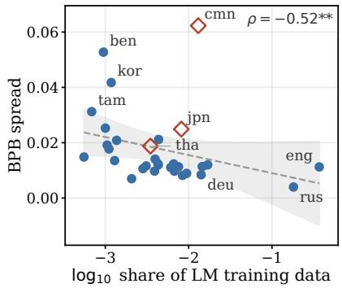
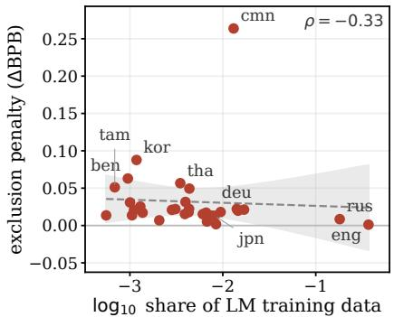
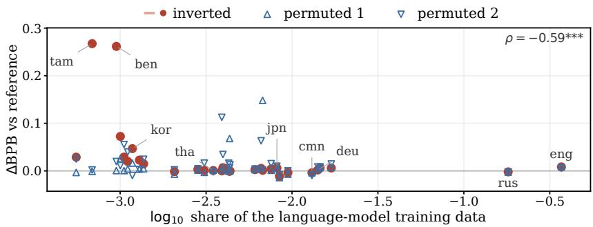
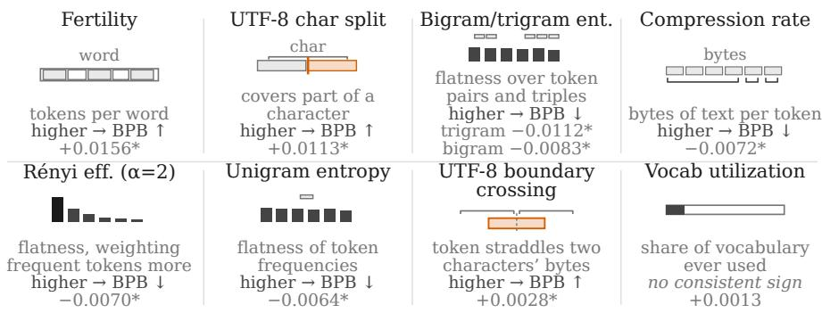
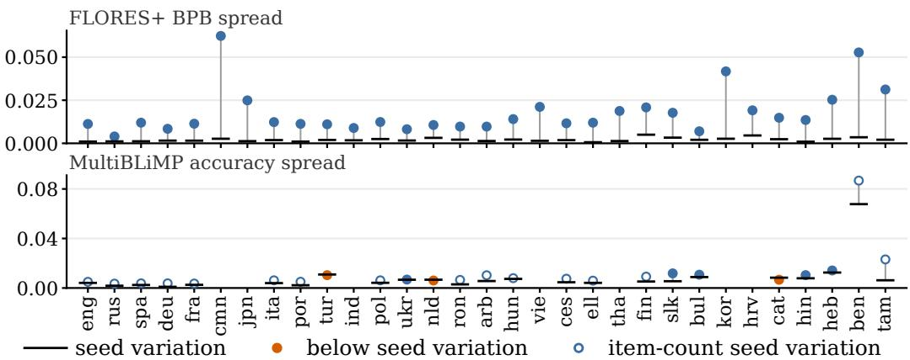
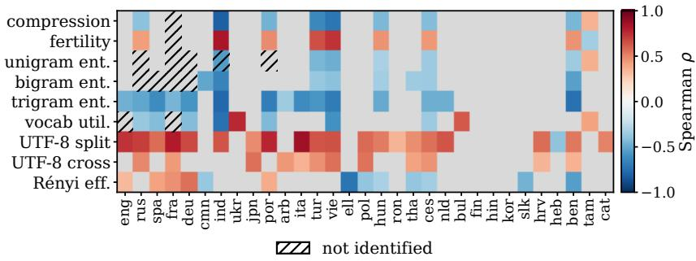
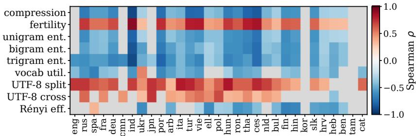
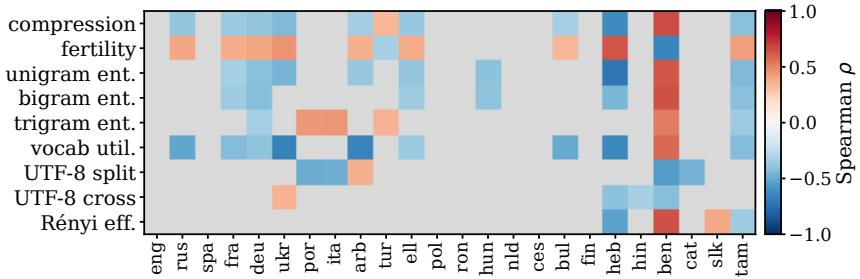

# LANGUAGE-SPECIFIC EFFECTS OF TOKENIZER CHOICEIN MULTILINGUAL LANGUAGE MODELS

Clara Meisterϵ, Gül Sena Altınta¸sτ,ϵ, Antoine Bosselutϵ ϵ EPFL,τ University of Toronto, Vector Institute clara.meister@epfl.ch

## ABSTRACT

Tokenizer choice affects multilingual language modeling, but vocabulary capacity is finite and vocabulary size is often constrained: improving representation for some languages often comes at the expense of others. We therefore ask whether tokenizer choice matters equally across languages, a question that results from the current literature leave unanswered. To this end, we train 123 language models spanning 54 tokenizers. In the main comparison, architecture, training corpus, training-token budget, and optimization are held fixed, so the models differ only in their tokenizer. We find that tokenizer choice matters more for languages with less language-model training data: across the 54 tokenizers, the standard deviation of a language’s bits-per-byte (BPB) increases as its model training-data share decreases (Spearman ρ = −0.52 over the 31 trained languages and −0.69 over the 28 written with word boundaries). Leaving a language out of tokenizer training raises its BPB in every language we study, and the penalty tends to be larger for languages with less language-model training data. Giving lower-resource languages a larger share of tokenizer-training data, however, does not unconditionally help those languages: both equal weighting and an allocation inverting the shares with respect to the language model training data increase their BPB, particularly when language-model training repeats data. Finally, which intrinsic tokenizer properties are associated with better BPB differs across languages, providing further evidence that what makes a good tokenizer depends on the language. We find that the metrics quantifying these properties can be successfully used to predict downstream models’ pairwise BPB rankings, suggesting a practical strategy for screening tokenizer candidates before training language models.

Models & Tokenizers: cmeister/tokenizer-lm-ablations Code: cimeister/tokenizer-lm-ablations

## 1 INTRODUCTION

Multilingual language models serve dozens of languages and scripts with one tokenizer that is fixed before training. How that tokenizer segments each language has practical consequences: prior work has raised concerns that some languages are systematically disadvantaged by current tokenizers (Petrov et al., 2023; Arnett et al., 2026), including via large differences in API costs (Ahia et al., 2023). Controlled studies further show that tokenizer choice can substantially affect downstream model behavior when the rest of language-model training is held fixed (Ali et al., 2024; Singh & Strouse, 2024; Altınta¸s et al., 2026; Lesci et al., 2025). These findings have motivated a range of modifications intended to improve multilingual tokenization (Foroutan et al., 2026; Land & Arnett, 2025; Asgari et al., 2025; Jabbar, 2024).

Whether these modifications help, and for which languages, is hard to establish from existing evidence because most results are aggregated too coarsely. Vocabulary capacity, measured in the number of unique tokens it includes, is shared and finite in a multilingual tokenizer: a change that improves the representation of one language often reduces the representation available to others. An outcome averaged over languages can therefore change little in aggregate while individual languages’ outcomes change in opposite directions. The question of whether a tokenizer is a good choice must be posed for each language separately, and the literature lacks an account at that level: how much tokenizer choice changes a single language’s performance, which languages are affected most, whether a choice that helps one language also helps others, and which tokenizer properties account for the differences.

Our work closes this gap with a large empirical study. We train 123 language models across 54 tokenizers. The 54 tokenizers vary along four design axes: pretokenization, tokenization algorithm, vocabulary encoding, and tokenizer-training data. The main comparison holds architecture, training corpus, training-token budget, and optimization fixed, isolating tokenizer effects on language modeling performance. We measure every outcome separately for each of the 31 languages of the language-model training mixture, and perform careful statistical analyses of the observed trends. With these analyses, we are able to answer four research questions (§ 3 to 6), each motivated by the result of the previous one. Their main findings are summarized below.

• Tokenizer choice affects every language. Changing the tokenizer changes every language’s bitsper-byte (BPB) by more than the variation across model seeds; tokenizers do not rank consistently across languages (mean pairwise Kendall $\tau = 0 . 4 1 8$ between the per-language rankings, §3).

• Languages with less language-model training data are the most sensitive to tokenizer choice. The spread of a language’s BPB across the 54 tokenizers rises as its share of the language-model training data falls (Spearman $\rho = - 0 . 5 2$ ); excluding a language from tokenizer training likewise raises BPB more as its share of the language-model training data falls (§4).

• Reallocating tokenizer-training data toward those languages raises their BPB under our language model training setup. Equal weighting and an allocation inverse to the language-model training shares both raise the BPB of the lower-resource languages (more so when language-model training repeats data), suggesting additional vocabulary for underrepresented languages is not unconditionally helpful (§5).

• Intrinsic metrics measured per language can screen tokenizers without training a language model. Which intrinsic tokenizer metrics are associated with lower BPB differs by language; measured per language, nine metrics order held-out tokenizer pairs by the trained models’ mean BPB with 0.89 accuracy (§6).

From our results, we conclude that tokenizer selection is most consequential for the low-resource languages, that per-language intrinsic metrics can screen choices before any model training, and that tailoring to low-resource languages costs the high-resource languages little. We derive practical and actionable recommendations for multilingual tokenizer evaluation and selection (§7). To the best of our knowledge, this is the largest controlled study of tokenizer effects on multilingual language modeling performance.

Related studies. Prior works have investigated how tokenizer choice changes downstream language modeling performance, spanning arithmetic (Singh & Strouse, 2024), code (Dagan et al., 2024; Meister, 2026) and multilingual and general benchmarks (Ali et al., 2024; Altınta¸s et al., 2026; Rust et al., 2021). Several do this in a controlled fashion: Ali et al. (2024) vary the algorithm and vocabulary size, Goldman et al. (2024) vary the amount of tokenizer-training data, and Altınta¸s et al. (2026) compare 14 off-the-shelf tokenizers. Others instead target a specific mechanism, such as downstream language plasticity (Abagyan et al., 2025) or causal estimation of the effect of a single vocabulary item (Lesci et al., 2025). While they establish the importance of tokenizer choice, a unified account of when and how much it matters—particularly on a per-language basis—is missing. Each evaluates English and at most four other languages, and they do not cover the breadth of training algorithms, pretokenization and normalization strategies, text encoding and data composition in an isolated fashion.

In parallel, mechanisms behind these differences have been studied through intrinsic metrics that could be computed from the tokenizer alone without model training. Gallé (2019) and Goldman et al. (2024) find that compression rate correlates with downstream performance, whereas Schmidt et al. (2024), Lester et al. (2024), and Lotz et al. (2025) show that compression rate alone is an incomplete predictor of downstream model quality. Proposed alternatives include information-theoretic measures based on entropies, such as Rényi efficiency (Zouhar et al., 2023) and capacity utilization (Erdogan et al., 2026), and linguistically grounded measures such as morphological alignment (Arnett & Bergen, 2025; Arnett et al., 2025). Meister (2026) found strong correlation with information-theoretic measures, while also hinting that different intrinsics may matter more for different tasks. Alternatives have been proposed with varying degrees of success, but the utility of these metrics on a per-language basis has not been established yet.

## 2 EXPERIMENTAL SETUP

We train a large panel of language models that differ only in their tokenizer and evaluate them intrinsically and on downstream tasks across languages. We describe the tokenizer panel and models we train (§2.1), our evaluation metrics (§2.2) and the statistical protocol behind our analyses (§2.3).

## 2.1 TOKENIZER AND MODEL TRAINING

Tokenizers. We compare 54 tokenizers covering diverse practices from multilingual tokenization literature. We train 52 of them on mixtures of the same multilingual corpus. The other two are off-the-shelf tokenizers from the open-source LLMs Mistral-Nemo and LLaMA-3, with vocabulary sizes comparable to our panel. We outline our tokenizer design axes below, with more detail in §A.1.

• Training algorithm. We consider BPE (Sennrich et al., 2016), UnigramLM (Kudo, 2018), MinGram (Land, 2026), SuperBPE (Liu et al., 2025), parity-aware BPE (Foroutan et al., 2026), and combinations of the latter two.

• Pretokenization and normalization. Pretokenization determines which consecutive characters can form a token and how scripts, numbers, punctuation, and whitespace are handled (all detailed in §A.2). We also vary normalization across NFC, NFD, and no Unicode normalization.

• Text encoding. Most tokenizers operate on raw UTF-8 bytes; three instead use an encoding based on Unicode script classes (Land & Arnett, 2025), proposed to reduce the byte-level penalty that scripts used by low-resource languages incur.

• Training data. Our baseline balanced tokenizer training dataset consists of a balanced 10 GB mixture across different text domains. Concretely, its sampling weights are approximately 37% English (FineWeb-Edu (Penedo et al., 2024)), 33% multilingual across 30 languages (qualityfiltered FineWeb2 (Penedo et al., 2025) using the filtering protocol of Apertus 1.0 (Hernández-Cano et al., 2026)), 15% math (FineMath (Lozhkov et al., 2024)), and 15% code (StarCoderData (Li et al., 2023)). The 31 natural languages span 11 writing systems and 11 language families. For six of the tokenizers, the multilingual data comes from a sample of FineWeb2’s full language pool. We perform targeted changes to this dataset composition, ablating language coverage and per-language sampling weights, following the range of practices used to build tokenizers for existing multilingual LLMs.

Each of these four axes has been proposed as a determinant of multilingual quality: the algorithm and the pretokenization determine which byte sequences can become vocabulary entries, the text encoding determines the per-character byte cost of each script, and the training data determines which languages’ byte sequences are frequent enough to enter the vocabulary. Three tokenizers have known construction defects that are common artifacts of tokenizer training (a missing part of the byte-level initial alphabet, or a dropped lone space). We analyze the impact of the byte-alphabet defect in §C by comparing a defective tokenizer with its defect-free rebuild.

Language models. For each tokenizer, we train a corresponding 1.27 B-parameter language model, fixing architecture, training data, and optimization across all runs following the nanochat d24 configuration (Karpathy, 2025). We follow nanochat’s scaling law recommendations, training on 9.2 B tokens; §B shows that model rankings are robust to this design choice. We use the same corpora as for tokenizer training, following a composition close to that of the balanced mixture. Unless otherwise noted for ablations, the model training mixture is held constant. Throughout, we write LM share for a language’s share of the language-model training data, measured in bytes, and tokenizer share for its share of the tokenizer-training data. The two need not coincide, either in our setup or in practical model development. Because the number of training steps is held approximately constant, the amount of underlying text seen by each model may differ, as different tokenizers will have different compression rates. We refer to the underlying text seen by the model as its training bytes. Details on model architecture, optimization and training data are provided in § A.3 and A.4. To check whether tokenizer rankings hold beyond our main scale, models are trained for a subset of tokenizers at three smaller scales: d8, d12, d16 (Table 3). We include these models only in the ranking analysis in §6.

## 2.2 EVALUATION METRICS

Per-language outcomes. Our main outcome is per-language bits-per-byte (BPB) (Gao et al., 2021), a tokenizer-agnostic evaluation for language-modeling performance. Computation details are given in §A.5. We use FLORES+ (NLLB Team et al., 2022) as our main evaluation set, a corpus of the same sentences translated into many languages. The main analyses use the 31 languages of the language-model training mixture. Results using the other 183 languages in FLORES+ are provided in §E.2. For statements about a single language, we use that language’s FLORES+ BPB. We report BPB as the primary outcome because it is the standard unit. For a comparison across languages, however, bits per sentence on parallel text is arguably a fairer comparison as it holds content fixed; we report it alongside BPB for those comparisons (§B).

As secondary downstream outcomes, we compute per-language accuracy on MultiBLiMP (Jumelet et al., 2026), a multilingual minimal-pairs grammaticality benchmark covering 24 of the 31 languages, XNLI (Conneau et al., 2018), a three-way natural-language-inference benchmark covering 13, and TokSuite (Altınta¸s et al., 2026) a four-way general knowledge benchmark covering 4; these separate the models beyond seed variation. XCOPA (Ponti et al., 2020) and XWinograd (Tikhonov & Ryabinin, 2021; Muennighoff et al., 2023b) stay near chance at this scale and are reported in §F only.

Aggregate outcomes. For comparisons that require a single outcome per tokenizer, we report two aggregate measures. The 31-language FLORES+ mean is the mean of the run’s FLORES+ BPB over the 31 languages of the language-model training mixture. The Validation BPB is BPB on held-out text from the language-model training mixture. Thus, the 31-language FLORES+ mean weights all 31 languages equally and evaluates on text outside the training distribution, whereas Validation BPB reflects the unequal language proportions of the language-model training distribution.

Intrinsic tokenizer metrics. We compute nine intrinsic tokenizer metrics with the TOKEVAL library (Meister, 2026). These metrics serve as explanatory and predictive variables in §6. The metrics require no language-model training, but all the metrics we consider are computed with respect to a (user-defined) text1. Unless otherwise stated, we consider each metric on a per-language basis, i.e., computed on text from a specified language. §E.1 defines the metrics, and Fig. 3 summarizes them and presents the measured coefficients of their within-language effects.

## 2.3 STATISTICAL PROTOCOL

To determine whether differences between runs exceed training noise, we estimate seed variation. The seed variation of a quantity is the standard deviation of that quantity across runs that differ only in the random seed. We estimate it from seed replicates of five tokenizers and pool the per-tokenizer estimates, weighting by their degrees of freedom. For analyses of individual languages, we call a difference between two runs larger than seed variation when its magnitude exceeds the pooled seed standard deviation for a single language’s FLORES+ BPB. For comparisons on Validation BPB and the 31-language FLORES+ mean, we use a stricter reference threshold: we call a difference larger than run-to-run variation when its magnitude is approximately outside the 95% range expected from two runs that differ only in random seed, i.e., when it is at least ∼twice the estimated standard deviation of the difference between two such runs. Exact protocol and values can be found in §A.5. All p-values use Benjamini–Hochberg false-discovery-rate correction within the relevant set of tests. In plots and tables, ∗, ∗∗, and ∗∗∗ indicates p < 0.05, p < 0.01 and p < 0.001, respectively.

We primarily report results per tokenizer, but for the sake of robustness, we additionally assess results on a per-tokenizer-family basis. Concretely, results from the 54 tokenizers are not fully independent: some tokenizers differ only in a minor training hyperparameter or preset, such as whether the pretokenizer regex allows apostrophes to trail letters. This breaks independence assumptions in several of the analysis methods we use. We therefore additionally present results when grouping tokenizers that differ only in such minor hyperparameters into the samefamily, and we rely primarily on cluster-robust standard errors, clustered at the tokenizer-family level. Full details of the family stratification are given in §A.1 and pooled standard error computation details in §A.5.

## 3 HOW MUCH DOES TOKENIZER CHOICE MATTER ACROSS LANGUAGES? (RQ1)

Finding 1. Changing the tokenizer changes every language’s FLORES+ BPB and most covered languages’ MultiBLiMP accuracy by more than that language’s seed variation, and the performance of the 54 tokenizers ranks differently across languages; a tokenizer chosen on an aggregate outcome is therefore a compromise across languages rather than the best tokenizer for each of them.

  
Figure 1: Left: the standard deviation of a language’s FLORES+ BPB across the 54 tokenizers (BPB spread) vs. the language’s log LM share (Spearman $\rho = - 0 . 5 2 , p = 0 . 0 0 3 )$ . Open diamonds mark the three languages written without word boundaries (Chinese, Japanese, and Thai). Right: the exclusion penalty (defined in the text) against the same axis (Spearman $\rho = - 0 . 3 3 , p = 0 . 0 6 8 )$ . The horizontal line marks a penalty of zero. Dashed lines are ordinary-least-squares fits, and the grey regions are 95% confidence regions for the fitted mean.

## 3.1 METHOD

We measure each outcome per language for each of the 54 tokenizer–model pairs. For each language, we compare the spread of the outcome across the 54 tokenizers with the seed variation of §2.3. We decompose the variance of the per-(tokenizer, language) measurements into a between-language and a within-language part. We measure the agreement between two languages’ tokenizer rankings as the Kendall τ between the two orderings (1 for identical, 0 for unrelated) and report its mean over the language pairs.

## 3.2 RESULTS

Language identity accounts for nearly all of the variance in the per-(tokenizer, language) BPB measurements, so the tokenizer effect is visible only within a language. Language identity accounts for 99.4% of the variance in per-(tokenizer, language) BPB, so a tokenizer changes only the within-language remainder. That remainder is largest for Chinese, with a BPB standard deviation across the 54 tokenizers of 0.062, followed by Bengali and Korean. Every analysis that follows therefore compares tokenizers within a language.

The spread across tokenizers is greater than the seed variation for every language on FLORES+ BPB and for all but three on MultiBLiMP, so there is a measurable tokenizer effect for every language, not only the low-resource ones. The standard deviation in per-language FLORES+ BPB across the 54 tokenizers is greater than the language’s seed variation for all 31 languages; on MultiBLiMP accuracy, this seed variation is exceeded for 21 of the 24 languages that MultiBLiMP covers. For 16 of the 24 languages, however, the seed variation is below the sampling uncertainty from the benchmark’s finite number of minimal pairs, so MultiBLiMP supports fewer per-language comparisons than BPB (§F). Fig. 4 visualizes this across languages.

Per-language tokenizer rankings agree only partially across languages, so no single tokenizer is best for all of them. The mean pairwise Kendall τ between the per-language tokenizer rankings is 0.418. The ranking agreement is lowest for Ukrainian (0.099). The general disagreement is not specific to the FLORES+ text, although Ukrainian’s extreme value suggests that there may be some artifacts in this particular text. At this level of agreement, 16 of the 54 tokenizers rank first for at least one language, i.e., none ranks first for every language.

Caveats. While within-language comparisons are invariant to the outcome’s unit, cross-language comparisons of the spread depend on it, and the most sensitive language changes between BPB and bits per sentence (§B). The seed variation is estimated from model replicates of just five of the tokenizers (§A.5).

In the next section, we ask which languages are affected the most by tokenizer choice, and whether a language’s sensitivity is predictable from its share of the training data.

## 4 WHICH LANGUAGES ARE MOST TOKENIZER-SENSITIVE? (RQ2)

Finding 2. Lower-resource languages, those with a smaller LM share, are more sensitive to tokenizer choice under two measures: First, excluding a language from tokenizer training raises its BPB for every language, and more so when it has a smaller share in the language-model training data. Second, each language’s BPB spread across 54 tokenizers also falls as its LM share rises. We find writing system and resource-level effects are confounded (§B).

## 4.1 METHOD

We use two per-language measures of sensitivity: the spread from §3 and the exclusion penalty. For the latter, we train four “coverage tokenizers,” tokenizers that differ only in which languages their tokenizer-training data include (English only, the 6 or 21 languages with the largest LM shares, and all 31 languages). A language’s penalty is then its mean FLORES+ BPB over the coverage tokenizers that exclude it minus its mean over those that include it. We correlate both measures with the logarithm of the language’s LM share (Spearman). §B tests whether either relationship is accounted for by the writing system, and §B whether it is accounted for by the differences in bytes per character between languages.

## 4.2 RESULTS

A language’s BPB varies less across tokenizers as its LM share rises, so the languages with the least language-model training data are most sensitive to tokenizer choice. Fig. 1 (left) shows tokenizer performance spread (standard deviation of FLORES+ BPB across the 54 tokenizers) as a function of log LM share. The two are negatively correlated (Spearman $\rho = - 0 . 5 2 )$ , significant. The correlation is negative and significant under every variant we test: excluding the three languages written without word boundaries, aggregating the spread by tokenizer family rather than by individual tokenizers, measuring the outcome in bits per sentence, and dividing the spread by the language’s mean BPB (§B). Russian and German, two of the highest-resource languages in the language-model training data are clear examples: after dividing each language’s spread by that language’s mean FLORES+ BPB across the 54 tokenizers, they have the smallest and third-smallest coefficient of variation in FLORES+ BPB across tokenizers. Chinese is the main exception, despite having the sixth-largest share, it has the largest spread and the largest exclusion penalty. We find that this ranking is sensitive to measurement strategy, and under the alternative approach in §B, Bengali and Tamil, the two lowest resource languages, have a larger spread than Chinese.

Excluding a language from the tokenizer-training data raises its FLORES+ BPB for every language; the penalty is negatively correlated with the language’s LM share. No coverage tokenizer excludes English, so English’s excluded mean comes from a tokenizer that is part of a separate set of ablations ( where the tokenizer-training data contains no English web text; §D). The exclusion penalty is positive for all 31 languages2, with Chinese (0.264) and Korean (0.088) having the largest penalties. Fig. 1 (right) plots exclusion penalty against log LM share; the correlation is negative (Spearman $\rho = - 0 . 3 3 )$ , but not significant, in BPB and in bits per sentence alike (§B). The relationship is significant, though, under either of two controls: restricting the analysis to the 15 languages excluded by at least two coverage tokenizers, and adjusting the share for the language’s bytes per character (§B). We perform further analyses on potential confounds for this result in §B.

One tokenizer can be close to the best choice for every sensitive language at once, at no measurable cost to the languages least affected by tokenizer choice. §3 shows that no single tokenizer ranks first for every language. For the high-resource languages a lower rank corresponds to a small difference in BPB, because their BPB spread across the tokenizers is the smallest. For the 10 languages with the smallest LM shares, where the spread is largest, the rankings of the tokenizers largely agree: the tokenizer that ranks first on the 31-language FLORES+ mean ranks no lower than 11th of 54 on each of those 10 llanguages (BPE Clean plus3 NFC on the balanced data, Table 1). As further evidence of this, in the coverage tokenizers above, going from the tokenizer trained on the six high-resource languages to the tokenizer trained on all 31 (Table 5) lowers FLORES+ BPB for 30 of the 31 languages, while English BPB and validation BPB changed by less than their seed variation.

Caveats. Resource level and writing system are confounded in our 31 language set (§B). The penalty–share correlation is not significant without controls; it is significant within the 15 languages excluded by two coverage tokenizers and after adjusting for bytes per character (§B). Part of each penalty is a general overall rise in model BPB under narrower tokenizer language coverage (Table 7).

Both measures of this section are associations with the LM share, not interventions on it: languages that differ in share differ in other properties too. In §5 we intervene: we change one design choice at a time, among them the per-language tokenizer shares, and measure each change’s per-language effect.

## 5 DO DESIGN CHOICES CHANGE PER-LANGUAGE OUTCOMES? (RQ3)

Finding 3. Training the tokenizer on only English raises FLORES+ BPB for nearly every language, having more of an impact than any other single configuration change we tested. We test two reassignments of the tokenizer training data sampling weights that raise lower-resource languages’ tokenizer shares. Under both, the mean FLORES+ BPB of these languages is higher, not lower.

## 5.1 METHOD

We change one design choice at a time and compare the resulting tokenizer–model pairs in two ways. First, we train 25 pairs that each differ from a matched baseline in a single configuration choice: pretokenization, algorithm, normalization, vocabulary encoding, or tokenizer-training data (§C). For each pair, we report the change in the 31-language FLORES+ mean and in validation BPB against the run-to-run thresholds of §2.3. Second, keeping the total budget fixed, we reallocate the per-language tokenizer shares (equal shares, two permuted allocations, an inverted allocation, and a variant without English web text) against a fixed reference pair. We then correlate each language’s BPB change with its share. Because changing the tokenizer while keeping a fixed token budget also changes the number of training bytes, we retrain selected pairs matched on training bytes or on per-language token counts, and we repeat the reallocation comparison without any data repetition (§D).

## 5.2 RESULTS

Restricting the tokenizer-training data to English changes BPB more than any other single configuration change. Table 5 (§C) lists the 25 controlled pairs with each pair’s difference on the 31-language FLORES+ mean and on validation BPB. The largest of the 25 differences comes from restricting the tokenizer-training data to English (+0.0386 in the 31-language FLORES+ mean). Under the coverage tokenizers in the previous section, where we restrict tokenizer-training data to just the 6 high-resource or 21 high- and mid-resource languages, both result in smaller performance degradations. Of the 25 design choices ablated, 18 show a difference larger than run-to-run variation on the 31-language FLORES+ mean (16 on validation BPB). We discuss the others in §C.

Raising the tokenizer-training weight of the low-resource languages to an equal share raises their BPB instead of lowering it. For five tokenizer configurations in our main set, we train an equal weight version, where all 30 FineWeb2 languages are sampled at the same weight instead of weights proportional to each language’s amount of FineWeb2 data; English, drawn from FineWeb-Edu, keeps its baseline sampling weight (0.35). The exact protocol is described in §D. We compare pairwise performance; values are given in Table 6.3 In all five pairs, the average FLORES+ BPB over the 15 languages with the smallest proportional tokenizer-training weights is higher under the equal weighting scheme. Further, the 31-language FLORES+ mean is also higher. For four of the tokenizers, this rise is larger than run-to-run variation.

Every change to the languages’ tokenizer shares raised the 31-language FLORES+ mean, and when the languages with the least language-model training data received the largest shares, FLORES+ BPB rose most for the languages with smaller shares of language-model training data. Under the equal weight scheme, the shares of all languages change at once, so we cannot observe what happens to a single language whose tokenizer share rises. We therefore train four additional tokenizers ablating just the languages’ tokenizer shares. We use the balanced GPT-4o BPE tokenizer as our reference point, referring to it as the reference tokenizer and to its corresponding language model as the reference model. In what we call the inverted-allocation tokenizer, the languages with the smallest nominal sampling weights in the language-model training data receive the largest tokenizer shares (Tamil receives the largest). The other three configurations are one without English web text and two with random permutations of the same shares computed for the inverted-allocation tokenizer (permuted allocations 1 and 2). We train the models of the four additional tokenizers for more steps than the reference model, so that every model is trained on approximately the same total amount of training bytes. Results are similar when we instead keep the number of training tokens matched (§D). Under each of the four targeted configurations, the 31-language FLORES+ mean is higher than the reference model’s by more than run-to-run variation (largest rise: +0.0256, inverted-allocation tokenizer). Under the inverted-allocation tokenizer, the change in FLORES+ BPB is larger for languages with a smaller LM share (Spearman correlation −0.59; Fig. 2). Tamil, which receives the largest tokenizer share, has the largest rise in FLORES+ BPB of the 31 languages, +0.267. The two permuted allocations give us a reference point: the same correlation is +0.08 and −0.28, respectively, neither significant (Table 8 in §D). Together with the equal-weighting results, this suggests that allocating vocabulary entries to a language is not always helpful to that language (and is perhaps actually harmful). We suspect this may be a by-product of insufficient language-model training data in the respective languages to fit these added entries’ embeddings.

  
Figure 2: Per-language change in FLORES+ BPB relative to reference (the model trained with the GPT-4o BPE reference tokenizer) for the 31 languages of the training mixture, as a function of the language’s log LM share. Filled circles: inverted-allocation tokenizer, in which languages with the smallest nominal sampling weights in the language-model training data receive the largest tokenizer shares. Open triangles: the two permuted allocation tokenizers, in which the tokenizer shares are assigned randomly.

Sampling the tokenizer-training data from FineWeb2’s full language pool instead of the 31-language mixture also raises BPB: against matched counterparts, the full-pool tokenizers’ mean FLORES+ BPB is higher for the 31 trained languages in three of four pairs, and higher for the 183 evaluated languages outside the language-model training mixture in all four pairs, by +0.20 to +0.42 (§D.4).

When language-model training data is not repeated, Tamil’s FLORES+ BPB rises about half as much under the tokenizer with inverted data allocation, and FLORES+ BPB no longer rises most for the languages with smaller shares of language-model training data. Every model discussed so far makes two to three passes over the language-model training mixture. This is arguably the more common setting for language model training on lower-resource languages, where data must be repeated Muennighoff et al. (2023a). To test the impact of this design choice, we train models for the reference tokenizer and the inverted-allocation tokenizer on a larger language-model training mixture of the same composition, in which no document is processed twice, i.e., single-pass training. In this regime, Tamil’s FLORES+ BPB under a model trained with the inverted-allocation tokenizer is still significantly higher than a model trained with the reference tokenizer (+0.14 vs. +0.267 with repeated data). However, in single-pass training, the correlation between a language’s change in FLORES+ BPB and its LM share is positive (+0.34) and not significant. The association between a language’s LM share and its rise in FLORES+ BPB under the inverted-allocation tokenizer therefore appears only when language-model training repeats data.

Caveats. At a fixed token budget, a tokenizer change also changes the training bytes; retrains matched on training bytes reverse one of the 25 comparisons (§C). The share–rise correlation under the inverted allocation appears only under our canonical model training setup, when language-model training repeats data (§D).

A better tokenizer for the sensitive languages comes from choosing among candidate configurations. In the next section, we ask whether there are efficient ways to identify such tokenizers, i.e., whether we can predict the per-language outcomes well enough to replace most LM training runs with a screening step.

## 6 WHICH TOKENIZER PROPERTIES MATTER FOR WHICH LANGUAGE? (RQ4)

Finding 4. No intrinsic tokenizer metric trends with BPB the same way for every language. Within a language, there are consistent and significant trends; which of these relationships holds, and how strongly, changes with the language’s LM share. Using intrinsic metrics measured on a per-language basis, we can train pairwise tokenizer BPB rankers, whose held-out accuracy is sufficient for screening tokenizers during development.

Disclaimer: Every relationship between a metric and FLORES+ BPB or validation BPB in this section is a correlation across tokenizers, and not a causal claim.

## 6.1 METHOD

Predictive ranking. We train logistic pairwise rankers that predict, from the difference of two tokenizers’ intrinsic-metric vectors, which of the two trained models has the lower BPB (implementation details in §E.4). To account for dependence among closely related tokenizers, we use leave-one-family-out cross-validation: each fold holds out an entire tokenizer family, so a tokenizer is never ranked by a model trained on another member of its own family. We evaluate pairwise accuracy, the fraction of scored tokenizer pairs whose predicted ordering matches their ordering by the trained models’ BPB, over every pair with at least one tokenizer in the held-out family.

Associations between tokenizer metrics and downstream outcomes. Absolute BPB differs substantially across languages, with between-language differences much larger than the tokenizerinduced differences within any one language (§3). For the analyses asking how a tokenizer metric m is associated with a downstream outcome across languages and tokenizers, this artifact must be accounted for, which we do using linear mixed-effects model with per-language random effects. For example, when FLORES+ BPB of tokenizer t on language ℓ is the outcome, we fit:

$$
\begin{array} { r } { \mathbf { B P B } _ { t , \ell } = \beta _ { 0 } + \beta _ { m } z ( m _ { t , \ell } ) + b _ { \ell } + \varepsilon _ { t , \ell } , \qquad b _ { \ell } \sim \mathcal { N } ( 0 , \tau ^ { 2 } ) , \quad \varepsilon _ { t , \ell } \sim \mathcal { N } ( 0 , \sigma ^ { 2 } ) , } \end{array}\tag{1}
$$

where $z ( m _ { t , \ell } )$ standardizes the metric using the mean and standard deviation computed over all (t, ℓ) pairs in the analysis sample. The random intercept $b _ { \ell }$ accounts for language-specific BPB baselines; $\beta _ { m }$ then gives the change in BPB associated with a one-standard-deviation increase in m. To test whether this relationship varies by resource level, writing system, or morphological type, we add the corresponding interaction terms in the relevant analyses: an interaction term is the product of the metric and the language attribute, and its coefficient is the change in the metric’s coefficient per one-unit change of the attribute.

## 6.2 RESULTS

Measuring intrinsic metrics per language, rather than as one value per tokenizer, enables tokenizer ranking without model training that is accurate enough for screening configurations without LM training. We ask whether intrinsic tokenizer metrics can be used to rank tokenizers by their corresponding LM’s BPB, allowing us to skip language model training for preliminary tokenizer assessment. We train the logistic models described in §6.1, using the intrinsic metrics as features. We score their pairwise ranking accuracy: the fraction of held-out tokenizer pairs that a metric-based ranker orders the same way as the trained models’ BPB. In each cross-validation fold, we hold out one of the 42 tokenizer families, so a held-out tokenizer is never ranked by a model fit on members of its own family. With the nine metrics as one value per tokenizer, these classifiers order held-out tokenizer pairs according to their validation BPB at accuracy 0.700 and according to their 31-language FLORES+ mean BPB at accuracy 0.735. With the same nine metrics measured separately on each of the 31 languages, the accuracies rise to 0.907 and 0.890, respectively (Table 16). These accuracies are higher than those from ranking the tokenizers by the validation BPB of smaller models trained with them (Table 16). Ranking by intrinsic metrics can also be done accurately on a per-language basis: when predicting pairwise ranks of individual language’s own FLORES+ BPB, the per-language ranker scores between 0.738 (Czech) and 0.878 (Tamil). These results indicate that intrinsic metrics can be used for screening tokenizer choice, both at the aggregate and per-language level.

  
Figure 3: The nine intrinsic metrics we consider and their within-language relationships with FLO-RES+ BPB (lower ↓ better). Each tile gives the metric’s definition, the direction of the relationship, and the coefficient from the mixed effects model of §6.1, in BPB per standard deviation of the metric.

Within a language, all tokenizer intrinsic metrics except vocabulary utilization are significantly related to FLORES+ BPB and MultiBLiMP accuracy. We fit the linear mixed-effects models described in §6.1 with one intercept per language, once for each of the nine intrinsic tokenizer metrics shown Fig. 3. Both the outcome variable and the intrinsic metric are computed on a per-language basis. With per-language FLORES+ BPB as the outcome and per-language intrinsic metrics measured on FLORES+, eight of the nine coefficients corresponding to the different intrinsic metrics are significant (Table 11 in §E.1). Tokenizers with a higher unigram, bigram, or trigram entropy, a higher Rényi efficiency, or a higher compression rate on a language have a lower FLORES+ BPB on that language. Tokenizers with a higher fertility, a higher character-split rate, or a higher boundarycrossing rate have a higher FLORES+ BPB. The coefficient of vocabulary utilization is not significant. With per-language MultiBLiMP accuracy as the outcome, on the 24 languages that MultiBLiMP covers, the same eight coefficients are significant, each with the reversed sign (since higher is better for this metric). With intrinsic metrics and BPB computed on FineWeb2 text, all nine coefficients are significant, and the coefficient of vocabulary utilization is intuitively negative (§E.2): within a language, BPB is lower for the tokenizers for which a larger fraction of the vocabulary entries occurs in that language’s text. Notably, when we adjust each run’s FLORES+ BPB for its number of training bytes in §E.3, the coefficient of compression rate is significant under only one of our four estimates of the adjustment. This suggests that several previous results in the literature finding that tokenizer compression rate correlates with model performance (§1) were perhaps confounded by differences in underlying training bytes across the models tested.

For single languages, different metrics are significantly correlated with FLORES+ BPB. For each of the 31 languages and each intrinsic metric, we compute the Spearman correlation between the metric and FLORES+ BPB across the 54 tokenizers. Which metrics correlate significantly with downstream performance differs greatly across languages. Correlation heatmaps visualize this result in §E. As a concrete example, the correlation of Rényi efficiency is significant for Greek (−0.72) and near zero for Tamil (+0.17). In §E.2, we see the results are robust to choice of evaluation corpus, and in §E.3, we only find a significant interaction between the metric and the language’s LM share for two of the nine metrics, suggesting these relationships are largely properties of the language rather than artifacts of the model training setup. Collectively, we take this as evidence that different tokenizer properties are important for different languages.

Caveats. The BPB–intrinsic metric relationships are less strong once we control for the number of training bytes: within-language coefficients from the mixed-effects models shrink and about threefifths of the significant per-language BPB–intrinsic metric correlations remain significant under the measured-training-bytes partial correlation (§E.3). There may be artifacts in what each of the intrinsic metrics measures, causing spurious weakening or strengthening of the observed BPB–intrinsic metric relationships; the SuperBPE tokenizers are a measured case (§E.1).

## 7 RECOMMENDATIONS

Four recommendations follow from the answers to the four questions (§ 3 to 6).

• Per-language evaluation. Evaluate candidate tokenizers on each language the model is meant to serve, or at least stratified by resource tiers and writing systems. Tokenizer rankings agree only partially across languages (§3), and aggregate or English-only evaluations give little or no weight to the languages with the least language-model training data, which are the languages most sensitive to the tokenizer (§4).

• Caution with reallocating tokenizer capacity toward low-resource languages. Every reallocation we tested raised the BPB of the lower-resource languages that it was meant to favor, and every departure from proportional training data weights raised the 31-language FLORES+ mean BPB (§5). We do not claim that such reallocations are universally harmful, as ours is a single training setting, but these results argue that targeted allocations of the vocabulary to lower-resource languages are inteventions that should be validated, not presumed beneficial. Consequently, we recommend proportional tokenizer-training weights as the default to start from.

• Metric-based screening before training. Use intrinsic metrics, measured per language, to screen candidate tokenizers before any model training as they provide good signal for tokenizer quality (§6). Importantly, these metrics should be used as screening statistics, not training objectives.

• Evaluation protocol. Compute BPB against the byte count of the original text, never against the tokenizer’s decoded output, whose normalization can change the byte count. Follow the same formatting protocol as used in training, e.g., prepend the BOS token. Where a parallel corpus is available, also report bits per sentence: parallel sentences hold the content fixed, so comparisons across languages do not depend on arbitrary artifacts, such as a language’s bytes per character in the encoding scheme.

## 8 LIMITATIONS

Our results use one architecture (nanochat d24, decoder-only) at 1.27B parameters, one training recipe, one vocabulary size near 128K, and, for most of the 54-tokenizer set, one run per tokenizer. Our primary outcome is language-modeling performance (BPB). Of the task benchmarks we evaluated, MultiBLiMP and XNLI separate the models: XCOPA and Belebele accuracies stay near chance at this scale (§F), so our conclusions concern language-modeling performance, not downstream task ability. The 54 tokenizers are an observational panel rather than a randomized design: the metric analyses of §6 are correlations across this panel, and a metric that co-varies with the ablated design choices cannot be fully separated from them. The tokenizer family partitioning is not perfect: some near-duplicate tokenizers may be considered part of different families due to how we chose to delineate families. Consequently, there may still be correlated errors that shrink our standard error estimates, causing us to identify results as significant when they are not. Every run in our main analysis makes two to three passes over the language-model training mixture. Aggregate model rankings change little without repetition or at twice the token budget (Spearman +0.93 and +0.94 over 11 runs; §B), but several per-language results interact with repetition, e.g., the reallocation experiments (§5). Finally, the 31 languages are those of our training mixture; statements about which languages are most sensitive to tokenizer choice are statements within this set.

## REPRODUCIBILITY STATEMENT

§A.1 lists every tokenizer with its exact configuration, vocabulary size, and family assignment, and §A.2 describes each pretokenization regex. §A.3 states the full architecture, optimizer settings, and step counts, and §A.4 the composition of the language-model training mixture with per-language byte shares (Table 4). §A.5 specifies the BPB computation, the seed-variation estimates, and the clustered standard-error construction, and §E.4 the ranking protocol, which is deterministic and uses no random seeds. All evaluation data are public (FLORES+, MultiBLiMP, XCOPA, XNLI, TokSuite, Wino-X, Belebele). Every number in the paper is bound, in the paper source, to a named key of a result artifact computed programmatically from the run outputs. We will release the tokenizers, model checkpoints, result artifacts, and the training, evaluation, and analysis code upon de-anonymization.

## THE USE OF LARGE LANGUAGE MODELS

Large language model (LLM) based tools were used in two ways in this work. First, for writing assistance: polishing author-written text for grammar and clarity and checking terminology for consistency. Second, as agents assisting with experiment management, for example launching training runs, monitoring them, and collecting their outputs into result files. The research questions, experimental design, analyses, and conclusions are the authors’ own. Every number reported in this paper is bound, in the paper source, to a named key of a result artifact that was computed programmatically from the run outputs, and the authors checked these bindings against the underlying artifacts to ensure that no LLM-introduced errors (hallucinated or mistranscribed values) are present in the reported results.

## ACKNOWLEDGMENTS

We thank Colin Raffel and Sander Land for helpful feedback on the presentation of this work, and Deniz Bayazit and Ilia Mahrooghi for feedback on an earlier version of this manuscript. The computational resources used in this project were provided by the Swiss AI Initiative.

## REFERENCES

Diana Abagyan, Alejandro R. Salamanca, Andres Felipe Cruz-Salinas, Kris Cao, Hangyu Lin, Acyr Locatelli, Marzieh Fadaee, Ahmet Üstün, and Sara Hooker. One tokenizer to rule them all: Emergent language plasticity via multilingual tokenizers, 2025.

Orevaoghene Ahia, Sachin Kumar, Hila Gonen, Jungo Kasai, David Mortensen, Noah Smith, and Yulia Tsvetkov. Do all languages cost the same? tokenization in the era of commercial language models. In Houda Bouamor, Juan Pino, and Kalika Bali (eds.), Proceedings ofthe 2023 Conference on Empirical Methods in Natural Language Processing, pp. 9904–9923, Singapore, December 2023. Association for Computational Linguistics. doi: 10.18653/v1/2023.emnlp-main.614. URL https://aclanthology.org/2023.emnlp-main.614/.

Mehdi Ali, Michael Fromm, Klaudia Thellmann, Richard Rutmann, Max Lübbering, Johannes Level ing, Katrin Klug, Jan Ebert, Niclas Doll, Jasper Buschhoff, Charvi Jain, Alexander Weber, Lena Jurkschat, Hammam Abdelwahab, Chelsea John, Pedro Ortiz Suarez, Malte Ostendorff, Samuel Weinbach, Rafet Sifa, Stefan Kesselheim, and Nicolas Flores-Herr. Tokenizer choice for LLM training: Negligible or crucial? In Kevin Duh, Helena Gomez, and Steven Bethard (eds.), Findings of the Associationfor Computational Linguistics: NAACL 2024, pp. 3907–3924, Mexico City, Mexico, June 2024. Association for Computational Linguistics. doi: 10.18653/v1/2024.findings-naacl.247. URL https://aclanthology.org/2024.findings-naacl.247/.

Gül Sena Altınta¸s, Malikeh Ehghaghi, Brian Lester, Fengyuan Liu, Wanru Zhao, Marco Ciccone, and Colin Raffel. TokSuite: Measuring the impact of tokenizer choice on language model behavior. In Proceedings ofthe 43rd International Conference on Machine Learning (ICML), 2026. URL https://arxiv.org/abs/2512.20757.

Catherine Arnett and Benjamin Bergen. Why do language models perform worse for morphologically complex languages? In Proceedings of the 31st International Conference on Computational Linguistics, pp. 6607–6623, Abu Dhabi, UAE, 2025.

Catherine Arnett, Tyler A. Chang, and Benjamin Bergen. A bit of a problem: Measurement disparities in dataset sizes across languages. In Maite Melero, Sakriani Sakti, and Claudia Soria (eds.), Proceedings ofthe 3rd Annual Meeting ofthe Special Interest Group on Under-resourced Languages @ LREC-COLING 2024, pp. 1–9, Torino, Italia, May 2024. ELRA and ICCL.

Catherine Arnett, Marisa Hudspeth, and Brendan O’Connor. Evaluating morphological alignment of tokenizers in 70 languages. In Proceedings ofthe ICML 2025 Tokenization Workshop (TokShop), 2025. URL https://arxiv.org/abs/2507.06378.

Catherine Arnett, Tyler A. Chang, Stella Biderman, and Ben Bergen. Explaining and mitigating crosslingual tokenizer inequities. In The Thirty-ninth Annual Conference on Neural Information Processing Systems, 2026.

Ehsaneddin Asgari, Yassine El Kheir, and Mohammad Ali Sadraei Javaheri. Morphbpe: A morphoaware tokenizer bridging linguistic complexity for efficient llm training across morphologies. CoRR, abs/2502.00894, February 2025.

Lucas Bandarkar, Davis Liang, Benjamin Muller, Mikel Artetxe, Satya Narayan Shukla, Donald Husa, Naman Goyal, Abhinandan Krishnan, Luke Zettlemoyer, and Madian Khabsa. The belebele benchmark: a parallel reading comprehension dataset in 122 language variants. In Lun-Wei Ku, Andre Martins, and Vivek Srikumar (eds.), Proceedings ofthe 62nd Annual Meeting ofthe

Association for Computational Linguistics (Volume 1: Long Papers), pp. 749–775, Bangkok, Thailand, August 2024. Association for Computational Linguistics. doi: 10.18653/v1/2024. acl-long.44. URL https://aclanthology.org/2024.acl-long.44/.

Alexis Conneau, Ruty Rinott, Guillaume Lample, Adina Williams, Samuel Bowman, Holger Schwenk, and Veselin Stoyanov. XNLI: Evaluating cross-lingual sentence representations. In Ellen Riloff, David Chiang, Julia Hockenmaier, and Jun’ichi Tsujii (eds.), Proceedings of the 2018 Conference on Empirical Methods in Natural Language Processing, pp. 2475–2485, Brussels, Belgium, October-November 2018. Association for Computational Linguistics.

Gautier Dagan, Gabriel Synnaeve, and Baptiste Rozière. Getting the most out of your tokenizer for pre-training and domain adaptation, February 2024. URL http://arxiv.org/abs/2402. 01035. arXiv:2402.01035 [cs].

Mete Erdogan, Abhiram Gorle, Shubham Chandak, Mert Pilanci, and Tsachy Weissman. An information-theoretic perspective on llm tokenizers, 2026.

Negar Foroutan, Clara Meister, Debjit Paul, Joel Niklaus, Sina Ahmadi, Antoine Bosselut, and Rico Sennrich. Parity-aware byte-pair encoding: Improving cross-lingual fairness in tokenization. In Maria Liakata, Viviane P. Moreira, Jiajun Zhang, and David Jurgens (eds.), Proceedings of the 64th Annual Meeting ofthe Associationfor Computational Linguistics (Volume 1: Long Papers), pp. 7514–7538, San Diego, California, United States, July 2026. Association for Computational Linguistics. ISBN 979-8-89176-390-6. doi: 10.18653/v1/2026.acl-long.342. URL https: //aclanthology.org/2026.acl-long.342/.

Matthias Gallé. Investigating the effectiveness of BPE: The power of shorter sequences. In Kentaro Inui, Jing Jiang, Vincent Ng, and Xiaojun Wan (eds.), Proceedings of the 2019 Conference on Empirical Methods in Natural Language Processing and the 9th International Joint Conference on Natural Language Processing (EMNLP-IJCNLP), pp. 1375–1381, Hong Kong, China, November 2019. Association for Computational Linguistics.

Leo Gao, Stella Biderman, Sid Black, Laurence Golding, Travis Hoppe, Charles Foster, Jason Phang, Horace He, Anish Thite, Noa Nabeshima, Shawn Presser, and Connor Leahy. The pile: An 800gb dataset of diverse text for language modeling. CoRR, abs/2101.00027, 2021. URL https://arxiv.org/abs/2101.00027.

Omer Goldman, Avi Caciularu, Matan Eyal, Kris Cao, Idan Szpektor, and Reut Tsarfaty. Unpacking tokenization: Evaluating text compression and its correlation with model performance. In Lun-Wei Ku, Andre Martins, and Vivek Srikumar (eds.), Findings of the Association for Computational Linguistics: ACL 2024, pp. 2274–2286, Bangkok, Thailand, August 2024. Association for Computational Linguistics.

Alejandro Hernández-Cano, Alexander Hägele, Allen Hao Huang, Angelika Romanou, Antoni-Joan Solergibert, Barna Pásztor, Bettina Messmer, Dhia Garbaya, Eduard Frank Durech, Ido Hakimi,ˇ Juan Garcia Giraldo, Mete Ismayilzada, Negar Foroutan, Skander Moalla, Tiancheng Chen, Vinko Sabolcec, Yixuan Xu, Michael Aerni, Badr AlKhamissi, Inés Altemir Marinas, Mohammad Hos-ˇ sein Amani, Matin Ansaripour, Ilia Badanin, Harold Benoit, Emanuela Boros, Nicholas John Browning, Fabian Bösch, Maximilian Böther, Niklas Canova, Camille Challier, Clément Charmil lot, Jonathan Coles, Jan Milan Deriu, Arnout Devos, Lukas Drescher, Daniil Dzenhaliou, Maud Ehrmann, Dongyang Fan, Simin Fan, Silin Gao, Miguel Gila, María Grandury, Diba Hashemi, Alexander Miserlis Hoyle, Jiaming Jiang, Mark Klein, Andrei Kucharavy, Anastasiia Kucherenko, Frederike Lübeck, Roman Machacek, Theofilos Ioannis Manitaras, Andreas Marfurt, Kyle Matoba, Simon Matrenok, Henrique Mendonça, Fawzi Roberto Mohamed, Syrielle Montariol, Luca Mouchel, Sven Najem-Meyer, Jingwei Ni, Gennaro Oliva, Matteo Pagliardini, Elia Palme, Andrei Panferov, Léo Paoletti, Marco Passerini, Ivan Pavlov, Auguste Poiroux, Kaustubh Ponkshe, Nathan Ranchin, Javier Rando, Mathieu Sauser, Jakhongir Saydaliev, Mukhammadali Sayfiddinov, Marian Schneider, Stefano Schuppli, Marco Scialanga, Andrei Semenov, Kumar Shridhar, Raghav Singhal, Anna Sotnikova, Alexander Sternfeld, Ayush Kumar Tarun, Paul Teiletche, Jannis Vamvas, Xiaozhe Yao, Hao Zhao, Alexander Ilic, Ana Klimovic, Andreas Krause, Caglar Gulcehre, David Rosenthal, Elliott Ash, Florian Tramèr, Joost VandeVondele, Livio Veraldi, Martin Rajman, Thomas C. Schulthess, Torsten Hoefler, Antoine Bosselut, Martin Jaggi, and Imanol

Schlag. Apertus: Democratizing open and compliant LLMs for global language environments. In Maria Liakata, Viviane P. Moreira, Jiajun Zhang, and David Jurgens (eds.), Proceedings of the 64th Annual Meeting of the Association for Computational Linguistics (Volume 1: Long Papers), pp. 46877–46955, San Diego, California, United States, July 2026. Association for Computational Linguistics. ISBN 979-8-89176-390-6. doi: 10.18653/v1/2026.acl-long.2172. URL https://aclanthology.org/2026.acl-long.2172/.

Haris Jabbar. Morphpiece : A linguistic tokenizer for large language models, 2024.

Keller Jordan, Yuchen Jin, Vlado Boza, You Jiacheng, Franz Cesista, Laker Newhouse, and Jeremy Bernstein. Muon: An optimizer for hidden layers in neural networks, 2024. URL https: //kellerjordan.github.io/posts/muon/. GitHub repository/blog post.

Jaap Jumelet, Leonie Weissweiler, Joakim Nivre, and Arianna Bisazza. MultiBLiMP 1.0: A massively multilingual benchmark of linguistic minimal pairs. Transactions of the Association for Computational Linguistics (TACL), 2026.

Andrej Karpathy. nanochat, 2025. URL https://github.com/karpathy/nanochat. Open-source repository and model release.

Taku Kudo. Subword regularization: Improving neural network translation models with multiple subword candidates. In Proceedings of the 56th Annual Meeting of the Association for Computational Linguistics (Volume 1: Long Papers), pp. 66–75, Melbourne, Australia, July 2018. Association for Computational Linguistics. doi: 10.18653/v1/P18-1007. URL https://aclanthology.org/P18-1007/.

Sander Land. MinGram: A minimalist unigram tokenizer with high compression and competitive morphological alignment. CoRR, abs/2606.27019, 2026. URL https://arxiv.org/abs/ 2606.27019.

Sander Land and Catherine Arnett. BPE stays on SCRIPT: Structured encoding for robust multilingual pretokenization. CoRR, abs/2505.24689, 2025.

Pietro Lesci, Clara Meister, Thomas Hofmann, Andreas Vlachos, and Tiago Pimentel. Causal estimation of tokenisation bias. In Wanxiang Che, Joyce Nabende, Ekaterina Shutova, and Mohammad Taher Pilehvar (eds.), Proceedings of the 63rd Annual Meeting of the Association for Computational Linguistics (Volume 1: Long Papers), pp. 28325–28340, Vienna, Austria, July 2025. Association for Computational Linguistics. ISBN 979-8-89176-251-0. doi: 10.18653/v1/ 2025.acl-long.1374. URL https://aclanthology.org/2025.acl-long.1374/.

Brian Lester, Jaehoon Lee, Alexander A Alemi, Jeffrey Pennington, Adam Roberts, Jascha Sohl-Dickstein, and Noah Constant. Training LLMs over neurally compressed text. Transactions on Machine Learning Research, 2024.

Raymond Li, Loubna Ben allal, Yangtian Zi, Niklas Muennighoff, Denis Kocetkov, Chenghao Mou, Marc Marone, Christopher Akiki, Jia LI, Jenny Chim, Qian Liu, Evgenii Zheltonozhskii, Terry Yue Zhuo, Thomas Wang, Olivier Dehaene, Joel Lamy-Poirier, Joao Monteiro, Nicolas Gontier, Ming Ho Yee, Logesh Kumar Umapathi, Jian Zhu, Ben Lipkin, Muhtasham Oblokulov, Zhiruo Wang, Rudra Murthy, Jason T Stillerman, Siva Sankalp Patel, Dmitry Abulkhanov, Marco Zocca, Manan Dey, Zhihan Zhang, Urvashi Bhattacharyya, Wenhao Yu, Sasha Luccioni, Paulo Villegas, Fedor Zhdanov, Tony Lee, Nadav Timor, Jennifer Ding, Claire S Schlesinger, Hailey Schoelkopf, Jan Ebert, Tri Dao, Mayank Mishra, Alex Gu, Carolyn Jane Anderson, Brendan Dolan-Gavitt, Danish Contractor, Siva Reddy, Daniel Fried, Dzmitry Bahdanau, Yacine Jernite, Carlos Muñoz Ferrandis, Sean Hughes, Thomas Wolf, Arjun Guha, Leandro Von Werra, and Harm de Vries. Starcoder: may the source be with you! Transactions on Machine Learning Research, 2023. ISSN 2835-8856. URL https://openreview.net/forum?id=KoFOg41haE. Reproducibility Certification.

Alisa Liu, Jonathan Hayase, Valentin Hofmann, Sewoong Oh, Noah A Smith, and Yejin Choi. SuperBPE: Space travel for language models. In Second Conference on Language Modeling (COLM 2025), 2025. URL https://arxiv.org/abs/2503.13423.

Jonas F. Lotz, António V. Lopes, Stephan Peitz, Hendra Setiawan, and Leonardo Emili. Beyond text compression: Evaluating tokenizers across scales. In Wanxiang Che, Joyce Nabende, Ekaterina Shutova, and Mohammad Taher Pilehvar (eds.), Proceedings ofthe 63rd Annual Meeting ofthe Associationfor Computational Linguistics (Volume 1: Long Papers), pp. 32155–32173, Vienna, Austria, July 2025. Association for Computational Linguistics. ISBN 979-8-89176-251-0. doi: 10.18653/v1/2025.acl-long.1546. URL https://aclanthology.org/2025.acl-long. 1546/.

Anton Lozhkov, Loubna Ben Allal, Elie Bakouch, Leandro von Werra, and Thomas Wolf. FineMath: the finest collection of mathematical content. 2024. URL https://huggingface.co/ datasets/HuggingFaceTB/finemath.

Clara Meister. Tokeval: A tokenizer analysis suite. In Third Conference on Language Modeling, 2026. URL https://openreview.net/forum?id=RpcJS02Wcb.

Niklas Muennighoff, Alexander M Rush, Boaz Barak, Teven Le Scao, Nouamane Tazi, Aleksandra Piktus, Sampo Pyysalo, Thomas Wolf, and Colin Raffel. Scaling data-constrained language models. In Thirty-seventh Conference on Neural Information Processing Systems, 2023a. URL https://openreview.net/forum?id=j5BuTrEj35.

Niklas Muennighoff, Thomas Wang, Lintang Sutawika, Adam Roberts, Stella Biderman, Teven Le Scao, M Saiful Bari, Sheng Shen, Zheng Xin Yong, Hailey Schoelkopf, Xiangru Tang, Dragomir Radev, Alham Fikri Aji, Khalid Almubarak, Samuel Albanie, Zaid Alyafeai, Albert Webson, Edward Raff, and Colin Raffel. Crosslingual generalization through multitask finetuning. In Anna Rogers, Jordan Boyd-Graber, and Naoaki Okazaki (eds.), Proceedings of the 61st Annual Meeting of the Association for Computational Linguistics (Volume 1: Long Papers), pp. 15991–16111, Toronto, Canada, July 2023b. Association for Computational Linguistics. doi: 10.18653/v1/2023. acl-long.891. URL https://aclanthology.org/2023.acl-long.891/.

NLLB Team, Marta R. Costa-jussà, James Cross, Onur Çelebi, Maha Elbayad, Kenneth Heafield, Kevin Heffernan, Elahe Kalbassi, Janice Lam, Daniel Licht, Jean Maillard, Anna Sun, Skyler Wang, Guillaume Wenzek, Al Youngblood, Bapi Akula, Loic Barrault, Gabriel Mejia Gonzalez, Prangthip Hansanti, John Hoffman, Semarley Jarrett, Kaushik Ram Sadagopan, Dirk Rowe, Shannon Spruit, Chau Tran, Pierre Andrews, Necip Fazil Ayan, Shruti Bhosale, Sergey Edunov, Angela Fan, Cynthia Gao, Vedanuj Goswami, Francisco Guzmán, Philipp Koehn, Alexandre Mourachko, Christophe Ropers, Safiyyah Saleem, Holger Schwenk, and Jeff Wang. No language left behind: Scaling human-centered machine translation. 2022.

Guilherme Penedo, Hynek Kydlícek, Loubna Ben Allal, Anton Lozhkov, Margaret Mitchell, Colin Raffel, Leandro von Werra, and Thomas Wolf. The fineweb datasets: Decanting the web for the finest text data at scale. In Advances in Neural Information Processing Systems (NeurIPS), 2024.

Guilherme Penedo, Hynek Kydlícek, Vinko Sabolˇ cec, Bettina Messmer, Negar Foroutan, Amir Hos-ˇ sein Kargaran, Colin Raffel, Martin Jaggi, Leandro Von Werra, and Thomas Wolf. Fineweb2: One pipeline to scale them all — adapting pre-training data processing to every language. In Second Conference on Language Modeling, 2025. URL https://openreview.net/forum?id= jnRBe6zatP.

Aleksandar Petrov, Emanuele La Malfa, Philip Torr, and Adel Bibi. Language model tokenizers introduce unfairness between languages. In A. Oh, T. Naumann, A. Globerson, K. Saenko, M. Hardt, and S. Levine (eds.), Advances in Neural Information Processing Systems, volume 36, pp. 36963–36990. Curran Associates, Inc., 2023. URL https://proceedings.neurips.cc/paper\_files/paper/2023/ file/74bb24dca8334adce292883b4b651eda-Paper-Conference.pdf.

Edoardo Maria Ponti, Goran Glavaš, Olga Majewska, Qianchu Liu, Ivan Vulic, and Anna Korho-´ nen. XCOPA: A multilingual dataset for causal commonsense reasoning. In Bonnie Webber, Trevor Cohn, Yulan He, and Yang Liu (eds.), Proceedings of the 2020 Conference on Empirical Methods in Natural Language Processing (EMNLP), pp. 2362–2376, Online, November 2020. Association for Computational Linguistics. doi: 10.18653/v1/2020.emnlp-main.185. URL https://aclanthology.org/2020.emnlp-main.185/.

Phillip Rust, Jonas Pfeiffer, Ivan Vulic, Sebastian Ruder, and Iryna Gurevych. How good is your´ tokenizer? On the monolingual performance of multilingual language models. In Proceedings ofthe 59th Annual Meeting of the Association for Computational Linguistics and the 11th International Joint Conference on Natural Language Processing (Volume 1: Long Papers), pp. 3118–3135, Online, August 2021. Association for Computational Linguistics. doi: 10.18653/v1/2021.acl-long. 243. URL https://aclanthology.org/2021.acl-long.243/.

Craig W Schmidt, Varshini Reddy, Haoran Zhang, Alec Alameddine, Omri Uzan, Yuval Pinter, and Chris Tanner. Tokenization is more than compression. In Proceedings of the 2024 Conference on Empirical Methods in Natural Language Processing, pp. 678–702, Miami, Florida, USA, November 2024. Association for Computational Linguistics. doi: 10.18653/v1/2024.emnlp-main. 40. URL https://aclanthology.org/2024.emnlp-main.40/.

Rico Sennrich, Barry Haddow, and Alexandra Birch. Neural machine translation of rare words with subword units. In Proceedings of the 54th Annual Meeting of the Association for Computational Linguistics (Volume 1: Long Papers), pp. 1715–1725, Berlin, Germany, August 2016. Association for Computational Linguistics. doi: 10.18653/v1/P16-1162. URL https://aclanthology. org/P16-1162/.

Aaditya K. Singh and DJ Strouse. Tokenization counts: the impact of tokenization on arithmetic in frontier LLMs. arXiv preprint arXiv:2402.14903, 2024.

Jianlin Su, Murtadha Ahmed, Yu Lu, Shengfeng Pan, Wen Bo, and Yunfeng Liu. Roformer: Enhanced transformer with rotary position embedding. Neurocomputing, 568:127063, 2024. ISSN 0925-2312. doi: https://doi.org/10.1016/j.neucom.2023.127063. URL https://www.sciencedirect. com/science/article/pii/S0925231223011864.

Alexey Tikhonov and Max Ryabinin. It’s All in the Heads: Using Attention Heads as a Baseline for Cross-Lingual Transfer in Commonsense Reasoning. In Chengqing Zong, Fei Xia, Wenjie Li, and Roberto Navigli (eds.), Findings of the Association for Computational Linguistics: ACL-IJCNLP 2021, pp. 3534–3546, Online, August 2021. Association for Computational Linguistics. doi: 10.18653/v1/2021.findings-acl.310. URL https://aclanthology.org/2021. findings-acl.310/.

Ge Yang, Edward Hu, Igor Babuschkin, Szymon Sidor, Xiaodong Liu, David Farhi, Nick Ryder, Jakub Pachocki, Weizhu Chen, and Jianfeng Gao. Tuning large neural networks via zero-shot hyperparameter transfer. In M. Ranzato, A. Beygelzimer, Y. Dauphin, P.S. Liang, and J. Wortman Vaughan (eds.), Advances in Neural Information Processing Systems, volume 34, pp. 17084–17097. Curran Associates, Inc., 2021. URL https://proceedings.neurips.cc/paper\_files/ paper/2021/file/8df7c2e3c3c3be098ef7b382bd2c37ba-Paper.pdf.

Xiulin Yang, Ethan Gotlieb Wilcox, and Catherine Arnett. Apples to apples? towards comparable crosslingual language model evaluation, 2026. URL https://arxiv.org/abs/2608. 25089.

Vilém Zouhar, Clara Meister, Juan Gastaldi, Li Du, Mrinmaya Sachan, and Ryan Cotterell. Tokenization and the noiseless channel. In Proceedings of the 61st Annual Meeting of the Association for Computational Linguistics (Volume 1: Long Papers), pp. 5184–5207, Toronto, Canada, July 2023. Association for Computational Linguistics. doi: 10.18653/v1/2023.acl-long.284. URL https://aclanthology.org/2023.acl-long.284/.

## A EXPERIMENTAL DETAILS

## A.1 TOKENIZER CONFIGURATIONS

This section expands on §2, where Table 1 lists the 54 tokenizers with their configuration and their family (§2); a tokenizer without a family code forms a single-member family.

Tokenizer families. We define tokenizer families as groups of tokenizers differing in only minor hyperparameter settings. Differences in algorithm, pretokenization regex, normalization, encoding, or training data are treated as larger design changes, and so we categorize the tokenizers differing on these axes into different families. There are two cases that can arguably be seen as exceptions: we group variants of one pretokenization regex that differ in single clauses into one family, and we also group each pair of tokenizers whose training data differ only in sampling settings into one family.

Tokenizer training. We train tokenizers with a vocabulary near 128K on 10 GB of text drawn from the data mixtures used for language model training (§A.4) or their restrictions and reweightings. Most tokenizers are trained using the HuggingFace tokenizers library. The SuperBPE, parity-aware BPE, and SCRIPT tokenizers were built with separate training code, based off the codebases released by the respective authors. The off-the-shelf Mistral-Nemo vocabulary is 131,072 (about 1K of them special tokens) and the LLaMA-3 vocabulary is 128,256.

Defective tokenizers. Two implementation defects affect some panel members, these are marked with footnotes in Table 1. The byte-alphabet defect (marker b, described in §2) occurs when the base alphabet ofa byte-level tokenizer lacks some ofthe 256 byte symbols, so those bytes cannot be represented by the initial vocabulary. Where a defect-free counterpart exists, we use the full 256-entry byte-alphabet build (marker a). For example, the english-data GPT-4o row is such a re-build, which replaced the original defective tokenizer among the 54. The lone-space drop (marker c) is that the decoder’s Metaspace convention removes a token consisting only ofa space, so a lone space is lost in the decoded text. We retain the three marked defective tokenizers (b and c) because no defect-free counterpart exists.

Variations of tokenizer-training data coverage. Some of the 54 tokenizers differ only in which languages their training data covers, and one further experiment varies how that data is allocated across languages; we describe both here. The coverage sequence used in §4 and Table 5 is the set of GPT-4o-regex BPE tokenizers with data marked english, highres, highmid, and balanced in Table 1. For the reallocation experiment (§D), we trained four additional tokenizers whose training data is allocated across languages in deliberately unusual ways. In the inverted-allocation tokenizer, the languages with the least language-model training data receive the largest shares of the tokenizertraining data; in the two permuted allocations, the same 31 shares are assigned in two random orders to the original balanced mixture. We exclude these four tokenizers from the 54 tokenizers in the main analyses, as such allocations are unrealistic for tokenizers meant for practical use, and including them would skew the statistics that we compute over the main panel, such as the standard deviation of each language’s BPB across tokenizers and the ranking of tokenizers within each language.

## A.2 PRETOKENIZATION REGEXES

A pretokenizer splits raw text into chunks before the subword algorithm merges characters within chunks; it never merges across chunk boundaries, so it sets an upper bound on which tokens can form. The 54 tokenizers use the following pretokenizers. All of them are byte-level except the Whitespace UnigramLM tokenizer and the three SCRIPT tokenizers. The Whitespace UnigramLM tokenizer uses the Metaspace pretokenizer with byte fallback, and the SCRIPT tokenizers use the script-class encoding.

• GPT-4o (the o200k regex): splits text into CamelCase-aware runs of letters with optional English contraction suffixes (’s, ’t, and so on), runs of one to three digits, runs of punctuation (optionally preceded by a single space), and whitespace. It is Unicode-property aware (\p{L}, \p{N}) and is the default for recent OpenAI tokenizers.

• GPT-2: the original GPT-2 regex applied by the byte-level pretokenizer. Similar in spirit to GPT-4o but older and ASCII-oriented; it does not cap digit runs at three, so long numbers are grouped differently.

Table 1: The 54 tokenizers. Pretok: pretokenization regex (§A.2). Data: tokenizer-training mixture (balanced multilingual; english-only; code-heavy; the highres / highmid coverage subsets; all-equal reweighting; balanced-half; multi-heavy; the full-language-pool FineWeb2 sample, fw2full; off-theshelf tokenizers are not trained by us). Norm.: Unicode normalizer. Family: tokenizers sharing a code form one family under the rule of §2; codes abbreviate the identifiers of the family partition, and a blank entry is a single-member family. Vocab: the tokenizer’s vocabulary size including special tokens, read through the evaluation loader; this is not the padded model embedding size. afull 256-entry byte-alphabet rebuild (described in §C); bbyte-alphabet defect (described in §C); clone-space drop through the decoder’s Metaspace convention (§2); sSCRIPT text encoding (§2); dNFD, followed by the deletion of the control characters CR, VT, FF, and NEL and the replacement of Unicode space characters by the ASCII space (U+0020).
<table><tr><td>Tokenizer</td><td>Algorithm</td><td>Pretok</td><td>Data</td><td>Norm.</td><td>Vocab</td><td>Family</td></tr><tr><td>BPE GPT-4o (balanced)</td><td>BPE</td><td>GPT-40</td><td>balanced</td><td></td><td>128,256</td><td>G</td></tr><tr><td>BPE GPT-4o (balanced, file cap)</td><td>BPE</td><td>GPT-40</td><td>balanced</td><td></td><td>128,256</td><td>G</td></tr><tr><td>BPE GPT-4o NFC (balanced)</td><td>BPE</td><td>GPT-40</td><td>balanced</td><td>NFC</td><td>128,256</td><td></td></tr><tr><td>BPE GPT-4o (english)a</td><td>BPE</td><td>GPT-40</td><td>english</td><td></td><td>128,256</td><td></td></tr><tr><td>BPE GPT-4o (code)</td><td>BPE</td><td>GPT-40</td><td>code</td><td></td><td>128,256</td><td></td></tr><tr><td>BPE GPT-4o (highres)</td><td>BPE</td><td>GPT-40</td><td>highres</td><td></td><td>128,256</td><td></td></tr><tr><td>BPE GPT-4o (highmid)</td><td>BPE</td><td>GPT-40</td><td>highmid</td><td></td><td>128,256</td><td></td></tr><tr><td>BPE GPT-4o (all-equal)</td><td>BPE</td><td>GPT-40</td><td>all-equal</td><td></td><td>128,256</td><td>fam05</td></tr><tr><td>BPE GPT-4o (all-equal, no repeat)</td><td>BPE</td><td>GPT-40</td><td>all-equal</td><td></td><td>128,256</td><td>fam05</td></tr><tr><td>BPE GPT-4o NFC (all-equal)</td><td>BPE</td><td>GPT-40</td><td>all-equal</td><td>NFC</td><td>128,256</td><td></td></tr><tr><td>BPE GPT-4o NFC (fw2full)</td><td>BPE</td><td>GPT-40</td><td>fw2full</td><td>NFC</td><td>128,000</td><td></td></tr><tr><td>BPE GPT-4o script-enc. (bal.)⁵</td><td>BPE</td><td>GPT-40</td><td>balanced</td><td>NFC</td><td>128,256</td><td></td></tr><tr><td>BPE Claude (balanced)</td><td>BPE</td><td>Claude</td><td>balanced</td><td></td><td>128,256</td><td></td></tr><tr><td>BPE Claude NFC (balanced)</td><td>BPE</td><td>Claude</td><td>balanced</td><td>NFC</td><td>128,256</td><td></td></tr><tr><td>BPE Claude (english)b</td><td>BPE</td><td>Claude</td><td>english</td><td></td><td>128,256</td><td></td></tr><tr><td>BPE Claude (all-equal)</td><td>BPE</td><td>Claude</td><td>all-equal</td><td></td><td>128,256</td><td></td></tr><tr><td>BPE Claude V2 (balanced)</td><td>BPE</td><td>Claude V2</td><td>balanced</td><td>NFDd</td><td>128,256</td><td></td></tr><tr><td>BPE GPT-2 (balanced)</td><td>BPE</td><td>GPT-2</td><td>balanced</td><td></td><td>128,256</td><td></td></tr><tr><td>BPE Punct (balanced)</td><td>BPE</td><td>Punct</td><td>balanced</td><td></td><td>128,256</td><td></td></tr><tr><td>BPE Punct (english)b</td><td>BPE</td><td>Punct</td><td>english</td><td></td><td>128,256</td><td></td></tr><tr><td>BPE Punct (all-equal)</td><td>BPE</td><td>Punct</td><td>all-equal</td><td></td><td>128,256</td><td></td></tr><tr><td>BPE RightAlign (balanced)</td><td>BPE</td><td>RightAlign</td><td>balanced</td><td></td><td>128,256</td><td></td></tr><tr><td>BPE RightAlign NFC (balanced)</td><td>BPE</td><td>RightAlign</td><td>balanced</td><td>NFC</td><td>128,256</td><td></td></tr><tr><td>BPE Whitespace (balanced)</td><td>BPE</td><td>Whitespace</td><td>balanced</td><td></td><td>128,256</td><td></td></tr><tr><td>BPE Whitespace (multi-heavy)</td><td>BPE</td><td>Whitespace</td><td>multi-heavy</td><td></td><td>128,256</td><td></td></tr><tr><td>BPE Clean NFC (balanced)</td><td>BPE</td><td>Clean</td><td>balanced</td><td>NFC</td><td>128,004</td><td>fam00</td></tr><tr><td>BPE Clean no-mark NFC (bal.)</td><td>BPE</td><td>Clean no-mark</td><td>balanced</td><td>NFC</td><td>128,000</td><td>fam00</td></tr><tr><td>BPE Clean plus2 NFC (bal.)</td><td>BPE</td><td>Clean plus2</td><td>balanced</td><td>NFC</td><td>128,256</td><td>fam00</td></tr><tr><td>BPE Clean plus3 NFC (bal.)</td><td>BPE</td><td>Clean plus3</td><td>balanced</td><td>NFC</td><td>128,256</td><td>fam00</td></tr><tr><td>BPE Clean NFC (fw2full)</td><td>BPE</td><td>Clean</td><td>fw2full</td><td>NFC</td><td>128,000</td><td></td></tr><tr><td>Mistral-Nemo LLaMA-3</td><td>BPE</td><td>Mistral-Nemo</td><td>off-the-shelf</td><td></td><td>131,072</td><td></td></tr><tr><td></td><td>BPE</td><td>LLaMA-3</td><td>off-the-shelf</td><td></td><td>128,256</td><td></td></tr><tr><td>Unigram GPT-4o (balanced)</td><td>UnigramLM</td><td>GPT-40</td><td>balanced</td><td></td><td>128,256</td><td>D</td></tr><tr><td>Unigram GPT-4o tuned (balanced)</td><td>UnigramLM</td><td>GPT-40</td><td>balanced</td><td></td><td>128,256</td><td>D</td></tr><tr><td>Unigram GPT-4o (highres)</td><td>UnigramLM</td><td>GPT-40</td><td>highres</td><td></td><td>128,256</td><td></td></tr><tr><td>Unigram GPT-4o (highmid)</td><td>UnigramLM</td><td>GPT-40</td><td>highmid</td><td></td><td>128,256</td><td></td></tr><tr><td>Unigram Claude (balanced) Unigram RightAlign (balanced)</td><td>UnigramLM</td><td>Claude</td><td>balanced</td><td></td><td>128,256</td><td></td></tr><tr><td>Unigram Whitespace (balanced)°</td><td>UnigramLM UnigramLM</td><td>RightAlign Whitespace</td><td>balanced balanced</td><td></td><td>128,256</td><td></td></tr><tr><td>MinGram script-enc. (balanced)⁵</td><td></td><td></td><td></td><td></td><td>128,256</td><td></td></tr><tr><td>MinGram script-enc., split newlines</td><td>MinGram MinGram</td><td>SCRIPT SCRIPT</td><td>balanced balanced</td><td>NFC NFC</td><td>128,256 128,256</td><td>fam06 fam06</td></tr><tr><td>SuperBPE GPT-4o (balanced)</td><td></td><td></td><td></td><td></td><td></td><td></td></tr><tr><td>SuperBPE Clean C2 (balanced)</td><td>SuperBPE SuperBPE</td><td>GPT-40 Clean</td><td>balanced balanced</td><td>NFC</td><td>128,004 128,004</td><td>C</td></tr><tr><td>SuperBPE Clean C3 (balanced)</td><td>SuperBPE</td><td>Clean</td><td>balanced</td><td>NFC</td><td>128,004</td><td>C</td></tr><tr><td>SuperBPE Punct t64k (bal.-half)</td><td>SuperBPE</td><td>Punct</td><td>balanced-half</td><td></td><td>128,004</td><td></td></tr><tr><td>SuperBPE/PA-BPE GPT-4o (balanced)</td><td>SuperBPE/PA-BPE</td><td>GPT-40</td><td>balanced</td><td>NFC</td><td>128,004</td><td>B</td></tr><tr><td>SuperBPE/PA-BPE GPT-4o t64k</td><td>SuperBPE/PA-BPE</td><td>GPT-40</td><td>balanced</td><td>NFC</td><td>128,004</td><td>B</td></tr><tr><td>PA-BPE GPT-4o (balanced)</td><td>PA-BPE</td><td>GPT-40</td><td>balanced</td><td>NFC</td><td></td><td>A</td></tr><tr><td>PA-BPE GPT-4o hybrid-window (bal.)</td><td>PA-BPE</td><td>GPT-40</td><td>balanced</td><td>NFC</td><td>127,826 127,826</td><td>A</td></tr><tr><td>PA-BPE Clean (balanced)</td><td>PA-BPE</td><td>Clean</td><td>balanced</td><td>NFC</td><td>127,836</td><td></td></tr><tr><td>PA-BPE GPT-4o (fw2full)</td><td>PA-BPE</td><td>GPT-40</td><td>fw2full</td><td>NFC</td><td>127,825</td><td>E</td></tr><tr><td>PA-BPE GPT-4o hybrid-win. (fw2full)</td><td>PA-BPE</td><td>GPT-40</td><td>fw2full</td><td>NFC</td><td>127,825</td><td>E</td></tr><tr><td>PA-BPE Clean (fw2full)</td><td>PA-BPE</td><td>Clean</td><td>fw2full</td><td>NFC</td><td>127,835</td><td>F</td></tr><tr><td>PA-BPE Clean hybrid-win. (fw2full)</td><td>PA-BPE</td><td>Clean</td><td>fw2full</td><td>NFC</td><td>127,835</td><td>F</td></tr></table>

• Claude: reverse-engineered from the Claude tokenizer. A close variant of GPT-4o that differs in several ways, among them the following three: a word takes only a leading space as prefix (not any leading non-letter, non-digit character); punctuation runs do not absorb trailing newlines; and whitespace is split by type (spaces, tabs, newlines, and carriage returns each grouped separately) rather than as one whitespace class. It shares GPT-4o’s CamelCase grouping and its one-to-three-digit groups.

• Claude V2: a revision of the Claude pattern from a re-probe of the production tokenizer, used by one balanced BPE tokenizer together with an NFD normalizer (Table 1). It drops the CamelCase clauses (a word is a single run of letters and combining marks), makes the contraction suffix its own clause, and attaches a leading space to the following letter or punctuation run only when the preceding character is not a digit, whitespace, Han, or Hangul.

• Clean: a simplified multilingual variant of the GPT-4o pattern with a space-only word prefix that splits each digit individually rather than in groups.

• Clean no-mark: the Clean pattern with combining marks $( \setminus \{ \mathbb { M } \} )$ removed from the letter classes, so a combining mark no longer stays with its base letter and splits off into the punctuation branch.

• Clean plus2 / plus3: the Clean pattern with an attachment class on the word branches: a leading space, Tibetan tsheg, or ASCII or curly apostrophe attaches to the following word. Plus3 additionally attaches a word-final apostrophe not followed by a letter. Both cap punctuation and whitespace runs at 16 characters.

• RightAlign: GPT-4o modified so that multi-digit numbers split into three-digit groups aligned from the right (“123456” becomes “123”, “456” rather than a left-aligned grouping), intended to align place value for arithmetic.

• Punctuation: isolates every punctuation character as its own chunk before the byte-level regex, so punctuation never merges with adjacent text.

• Whitespace: the minimal pretokenizer. It splits only on whitespace, with no further regex, so a chunk is a whole whitespace-delimited word; case, digit, and punctuation boundaries inside a word are left to the subword algorithm. The two Whitespace BPE tokenizers use this pattern. The Whitespace UnigramLM tokenizer instead uses the Metaspace pretokenizer, which splits only on spaces and not on tabs or line breaks.

## A.3 MODEL ARCHITECTURE AND TRAINING DETAILS

Architecture. All models use the nanochat d24 architecture, a decoder-only transformer with 24 layers totaling 1.27B parameters total at our 128K vocabulary size. Each model is trained on 4 NVIDIA GH200 GPUs in bfloat16, with a context length of 2048, resulting in an effective batch size of $2 ^ { 2 0 } = 1$ ,048,576 tokens. The architecture in full: hidden dimension 1536, 12 attention heads (head dimension 128), RoPE (Su et al., 2024) with base frequency $\theta = 1 0 0 , 0 0 0$ , squared-ReLU activations, parameterless RMSNorm, QK-norm with scale 1.2, and logit soft-capping at 15 · tanh(·/15); attention uses an “SSSL” sliding-window pattern (three windowed layers of $\lceil L / 4 \rceil$ tokens followed by one full-context layer) and value embeddings on alternating layers; the 1.27B parameters divide into 682M transformer matrices and 197M each for input embeddings, output projection, and value embeddings.

Optimization. Weight matrices use Muon (Jordan et al., 2024); embeddings, projections, and scalars use AdamW; learning rates transfer across widths with $\mu \mathrm { P }$ (Yang et al., 2021) and are scaled by $\sqrt { B / B _ { \mathrm { r e f } } } = \sqrt { 2 }$ at the batch size $B = 2 ^ { 2 0 }$ . The learning rate warms up over 40 steps, holds to 35% of training, then decays linearly to 5% of peak; Muon momentum runs $0 . 8 5  0 . { \bar { 9 } } 7$ over 400 steps and back to 0.90 during warm-down; weight decay decays cosine to zero. Per-group effective settings are reported in Table 2.

We set the token budget to nanochat’s scaling-law ratio of 10.5 tokens per parameter in the transformer matrices and the output projection. This gives ≈ 9.2B tokens, or about 8,800 steps (8,794 to 8,843, depending on the vocabulary size). In each run, the data loader makes between about 2.0 and 2.9 passes over the documents of the language-model training mixture; we call one read of the mixture by the data loader a pass, and the pass counts stated elsewhere in the paper are these loader passes. The data loader crops a document that does not fit the space that remains in a sequence. The text that a model is trained on therefore amounts to between about 1.1 and 2.0 times the text of the mixture (§D measures the effect of this repetition).

The smaller ranking-proxy models (nanochat d8, d12, and d16: 8, 12, and 16 layers; hidden width 512, 768, 1024; 4, 6, 8 heads; 0.22B, 0.38B, 0.60B total parameters; Table 3) share the d24 data, tokenizers, and optimizer recipe, with µP transferring learning rates across width, and a budget of about 3.5B tokens. The d8 and d12 models are trained for 3,337 steps, and the d16 models for 3,337 to 3,370 steps, depending on the vocabulary size. Their absolute BPB is not comparable to the d24 models (smaller model, smaller token budget); only the induced tokenizer ranking is used, which is invariant to a shift in BPB level.

Table 2: Effective learning rates and optimizer settings per parameter group of the d24 models. ∗Muon multiplies the learning rate of a matrix by the square root of its ratio of rows to columns when that ratio exceeds one. The learning rate is therefore 0.0566 for the MLP input projection and 0.0980 for the matrices that project the value embeddings to the attention values. The smear parameters mix the embedding of the previous token into the current position, and the backout parameter subtracts the residual stream of the middle layer before the output layer.
<table><tr><td>Group</td><td>Optimizer</td><td>Eff. LR</td><td>Betas</td><td>WD</td></tr><tr><td>Transformer matrices</td><td>Muon</td><td>0.0283*</td><td>mom. schedule</td><td>0.050→0</td></tr><tr><td>Input embeddings</td><td>AdamW</td><td>0.2121</td><td>(0.8, 0.995)</td><td>0.001</td></tr><tr><td>Output projection</td><td>AdamW</td><td>0.0057</td><td>(0.8, 0.96)</td><td>0.01</td></tr><tr><td>Value embeddings</td><td>AdamW</td><td>0.1061</td><td>(0.8, 0.995)</td><td>0.01</td></tr><tr><td>Residual scalars</td><td>AdamW</td><td>0.0071</td><td>(0.8, 0.95)</td><td>0.05</td></tr><tr><td>Skip scalars</td><td>AdamW</td><td>0.707</td><td>(0.96, 0.95)</td><td>0.0</td></tr><tr><td>Smear and backout parameters</td><td>AdamW</td><td>0.2</td><td>(0.8, 0.95)</td><td>0.0</td></tr></table>

Table 3: Smaller proxy models used for ranking transfer (Table 16). All share the d24 training data, tokenizers, optimizer recipe, and a budget of about 3.5B tokens, which is 3,337 steps for d8 and d12 and 3,337 to 3,370 steps for d16; µP transfers learning rates across width. Parameters are totals at the 128K vocabulary.
<table><tr><td>Model</td><td>Layers</td><td>Width</td><td>Heads</td><td>Params</td></tr><tr><td>nanochat d8</td><td>8</td><td>512</td><td>4</td><td>0.22B</td></tr><tr><td>nanochat d12</td><td>12</td><td>768</td><td>6</td><td>0.38B</td></tr><tr><td>nanochat d16</td><td>16</td><td>1024</td><td>8</td><td>0.60B</td></tr><tr><td>nanochat d24 (main)</td><td>24</td><td>1536</td><td>12</td><td>1.27B</td></tr></table>

## A.4 MODEL TRAINING DATA

For language-model training data, we use the same corpora as for tokenizer training, in a fixed composition unless otherwise stated, so that no comparison between two tokenizers is also a comparison between two text domains. Matching the two keeps the tokenizer’s training distribution aligned with the text it later segments. We follow common pretraining practices, training on English and multilingual web text with smaller shares of math and coding. The mixture is 36.9% English (FineWeb-Edu), 33.4% multilingual over 30 languages (FineWeb2), 16.1% math (FineMath), and 13.6% code (StarCoderData), totaling 25 GB of UTF-8 text.

Per-language data is sampled in proportion to its presence in FineWeb2; the resulting realized byte share is the resource variable of the sensitivity analysis in §4. Documents are drawn by source weight, without reference to the tokenizer, so the mixture fixes each language’s share of the drawn bytes. Realized byte shares of the 25 GB mixture range from English (36.9%) and Russian (18.1%) to Catalan (0.06%), with full break-down in Table 4. The mixture does not fix the training bytes: the BOS-bestfit packer discards a tokenizer-dependent 30.4% to 43.5% of the drawn text (median 35.5% over the main census runs), and the discard redistributes the per-language shares of the training bytes tokenizer-dependently rather than by one overall factor: the ratio of a language’s share of the training bytes to its share of the drawn bytes deviates from one by up to +38% (Chinese, under the balanced UnigramLM tokenizer) and −23% (Hungarian, under the SuperBPE tokenizer) across five tokenizers trained on the balanced tokenizer-training data, and by −41% (Tamil) under the English-only tokenizer.

Table 4: Per-language data shares of the multilingual portion of the model training mixture: GB of UTF-8 text, realized % of the 25 GB total, and the nominal document-draw weight (w) the sampler used. We draw each document by first choosing a source with probability proportional to its weight and then reading that source’s next document. The per-language weights are proportional to estimated character counts. The realized byte shares therefore differ from the weights where mean document length differs across sources. Codes are those of the training-data space; the FLORES+ evaluation pairs cmn\_Hani with cmn\_Hans. All values from the built mixture’s own metadata.
<table><tr><td>Language</td><td>Code</td><td>Script</td><td>GB</td><td>%</td><td>W</td><td>Language</td><td>Code</td><td>Script</td><td>GB</td><td>%</td><td>W</td></tr><tr><td>Russian</td><td>rus_Cyrl</td><td>Cyrillic</td><td>4.521</td><td>18.1</td><td>0.1064</td><td>Hungarian</td><td>hun_Latn</td><td>Latin</td><td>0.099</td><td>0.4</td><td>0.0051</td></tr><tr><td>Spanish</td><td>spa_Latn</td><td>Latin</td><td>0.423</td><td>1.7</td><td>0.0245</td><td>Vietnamese</td><td>vie_Latn</td><td>Latin</td><td>0.109</td><td>0.4</td><td>0.0043</td></tr><tr><td>German</td><td>deu_Latn</td><td>Latin</td><td>0.353</td><td>1.4</td><td>0.0238</td><td>Czech</td><td>ces_Latn</td><td>Latin</td><td>0.077</td><td>0.3</td><td>0.0043</td></tr><tr><td>French</td><td>fra_Latn</td><td>Latin</td><td>0.364</td><td>1.5</td><td>0.0206</td><td>Greek</td><td>ell_Grek</td><td>Greek</td><td>0.108</td><td>0.4</td><td>0.0035</td></tr><tr><td>Chinese</td><td>cmn_Hani</td><td>CJK</td><td>0.326</td><td>1.3</td><td>0.0191</td><td>Thai</td><td>tha_Thai</td><td>Thai</td><td>0.087</td><td>0.3</td><td>0.0023</td></tr><tr><td>Japanese</td><td>jpn_Jpan</td><td>CJK</td><td>0.204</td><td>0.8</td><td>0.0127</td><td>Finnish</td><td>fin_Latn</td><td>Latin</td><td>0.034</td><td>0.1</td><td>0.0023</td></tr><tr><td>Italian</td><td>ita_Latn</td><td>Latin</td><td>0.165</td><td>0.7</td><td>0.0119</td><td>Slovak</td><td>slk_Latn</td><td>Latin</td><td>0.028</td><td>0.1</td><td>0.0020</td></tr><tr><td>Portuguese</td><td>por_Latn</td><td>Latin</td><td>0.189</td><td>0.8</td><td>0.0119</td><td>Bulgarian</td><td>bul_Cyrl</td><td>Cyrillic</td><td>0.052</td><td>0.2</td><td>0.0019</td></tr><tr><td>Turkish</td><td>tur_Latn</td><td>Latin</td><td>0.152</td><td>0.6</td><td>0.0094</td><td>Korean</td><td>kor_Hang</td><td>Hangul</td><td>0.029</td><td>0.1</td><td>0.0016</td></tr><tr><td>Indonesian</td><td>ind_Latn</td><td>Latin</td><td>0.236</td><td>0.9</td><td>0.0091</td><td>Croatian</td><td>hrv_Latn</td><td>Latin</td><td>0.026</td><td>0.1</td><td>0.0017</td></tr><tr><td>Polish</td><td>pol_Latn</td><td>Latin</td><td>0.107</td><td>0.4</td><td>0.0088</td><td>Catalan</td><td>cat_Latn</td><td>Latin</td><td>0.014</td><td>0.1</td><td>0.0010</td></tr><tr><td>Ukrainian</td><td>ukr_Cyrl</td><td>Cyrillic</td><td>0.211</td><td>0.8</td><td>0.0068</td><td>Hindi</td><td>hin_Deva</td><td>Devanagari</td><td>0.032</td><td>0.1</td><td>0.0010</td></tr><tr><td>Dutch</td><td>nld_Latn</td><td>Latin</td><td>0.071</td><td>0.3</td><td>0.0065</td><td>Hebrew</td><td>heb_Hebr</td><td>Hebrew</td><td>0.025</td><td>0.1</td><td>0.0009</td></tr><tr><td>Romanian</td><td>ron_Latn</td><td>Latin</td><td>0.097</td><td>0.4</td><td>0.0058</td><td>Bengali</td><td>ben_Beng</td><td>Bengali</td><td>0.024</td><td>0.1</td><td>0.0007</td></tr><tr><td>Arabic</td><td>arb_Arab</td><td>Arabic</td><td>0.168</td><td>0.7</td><td>0.0054</td><td>Tamil</td><td>tam_Taml</td><td>Tamil</td><td>0.017</td><td>0.1</td><td>0.0004</td></tr></table>

## A.5 EVALUATION AND ANALYSIS DETAILS

BPB computation. To compute BPB, we encode a text separately with the run’s tokenizer, prepend a beginning-of-sequence token, and compute the model’s loss on every token of the sentence. We then divide by the number of UTF-8 bytes in those sentences. FLORES+ is not part of the model or tokenizer training data. We use the devtest split. Every FLORES+ sentence is shorter than the model’s context of 2,048 tokens under every tokenizer, so no truncation occurs and all tokenizers are scored on the same text. We compute Validation BPB analogously, but validation documents may be cropped when they do not fit into the remaining space in a sequence. Because these crop locations can differ across tokenizers, we divide by the number of UTF-8 bytes in the text actually scored by each model. The three tokenizers whose input is pre-tokenized with the encoding based on Unicode script classes have no exact per-token byte table, so no Validation BPB statistic in this paper includes them.

Seed variation computation. Retraining a model with the same tokenizer from a different random initialization changes its results slightly. We call the size of this change the seed variation. For each outcome (BPB, accuracy, etc.), we estimate it as the pooled standard deviation of that outcome across seed replicates of the same tokenizer. The seed changes only the weight initialization; the tokenizer, training data and their order, and hyperparameters are identical across seeds. We do this for five tokenizers: the GPT-4o, Claude, and GPT-4o-NFC balanced BPE tokenizers, the GPT-4o balanced UnigramLM tokenizer, and the GPT-4o SuperBPE tokenizer. For each tokenizer we use only runs trained in the same period, so that differences between runs of one tokenizer come from the random seed alone. For each outcome, we first compute its standard deviation across seed runs within each tokenizer. For per-language outcomes, we do this separately for each tokenizer–language pair. We then pool these standard deviations, weighting each by its degrees of freedom (the number of seed runs minus one). For an outcome with one value per run, the five tokenizers contribute seven degrees of freedom in total. The seed-variation estimates used in the paper differ only in the outcome and in what is pooled:

• Trained languages: FLORES+ BPB for each of the 31 trained languages, pooled over the 155 tokenizer–language pairs (5 tokenizers × 31 languages).

• Single language: that language’s FLORES+ BPB, pooled over the five tokenizers; these values are shown in Fig. 4.

• 31-language mean: for each run, we first average FLORES+ BPB over the 31 trained languages, then compute the standard deviation across seeds within each tokenizer and pool over the five tokenizers.

• Validation BPB: computed and pooled in the same way over the five tokenizers.

The main analyses use the 31 trained languages; the fixed 214-language FLORES+ set of §2 adds 183 languages that are mostly unseen during training; while we don’t explicitly include these languages in our corpora, misidentified or code-switched text from these languages may appear depending on the language filtering. On these languages the run-to-run noise is larger: the per-language seed variation over all 214 languages is 0.0146, about six times the seed variation of 0.0023 over the languages in model-training data.

For the 31 languages of the main analysis, the estimated seed variation is 0.0023 for a single language’s FLORES+ BPB, 0.0012 for the 31-language FLORES+ mean, and 0.00041 for validation BPB.

Standard error computation. The 54 tokenizers are not independent observations: they fall into G = 42 families, and tokenizers from the same family are likely to behave similarly (§2). The model-based standard errors and p-values from the mixed-effects fits do not account for this dependence and can therefore be too small. We instead use clustered standard errors, estimated from an ordinary-least-squares fit of the same within-language specification with a fixed effect per language and standard errors clustered at the tokenizer-family level $( G = 4 2 ; \ S 2 )$ . For the analyses looking at the relationships between intrinsic metrics and downstream outcomes, the OLS coefficients agree with the mixed-effects coefficients to within one unit of the last digit printed in Table 11. Clustering inflates the standard error of each metric by a factor between 1.0 and 3.2 relative to the model-based standard error, with the smallest inflation for the UTF-8 boundary-crossing rate; we therefore rely on the clustered p-values throughout. The tier, log-weight-interaction, and typology fits of §6 use the same construction: an OLS fit with language fixed effects and the metric-by-attribute interaction term, with standard errors clustered by family and BH adjustment within each block of tests. The attribute main effects are absorbed by the language fixed effects.

## B ROBUSTNESS OF DESIGN CHOICES

In this section, we report additional robustness checks for our main conclusions. Specifically, we examine (i) whether the relationships of a language’s tokenizer sensitivity and exclusion penalty with its share of the language-model training data hold under alternative ways of measuring them; (ii) whether our results depend on how the outcome is normalized across languages; (iii) whether resource level can be separated from writing system; (iv) whether the exclusion penalty is confounded by the amount of text a model sees; and (v) whether tokenizer rankings hold beyond repeated data and a single token budget.

Robustness of the BPB spread–model-training data share relationship. The results in §4 suggests that languages with smaller shares of the language-model training data have larger BPB spreads across tokenizers. We test if this result is inflated by how we count tokenizers or by run-to-run seed variation. We first observe that counting near-duplicate tokenizers separately does not create this relationship: when we compute each language’s BPB spread across one mean per tokenizer family, using 42 families instead of 54 tokenizers, its Spearman correlation with log language-model training share is −0.54, vs. −0.52 at tokenizer level.

The per-language seed variation also falls as language-model training share rises: the pooled seed standard deviation of a language’s FLORES+ BPB correlates with its log training share at Spearman $\rho = - 0 . 6 0 8 \ ( p = 0 . 0 0 0 3 )$ . Because this relationship has the same direction as the BPB-spread relationship, some of the association between BPB spread and training share may reflect larger run-to-run variation for lower-resource languages. Finally, for each language, we take the largest absolute correlation between FLORES+ BPB and any of the nine intrinsic metrics across tokenizers. This value is negatively and significantly correlated with the language’s BPB spread (Spearman $\rho = - 0 . 4 2 ) \colon$ in plain terms, the languages for which tokenizer choice changes BPB the most are not those for which any single intrinsic metric has the strongest relationship with BPB.

Robustness to outcome normalization. Bits per byte (BPB) is not a language-neutral unit (Yang et al., 2026) as it divides the cross entropy loss by the number of UTF-8 bytes in the text the loss is computed over. While FLORES+ is a parallel corpus (i.e. each language subset contains the same content), the number of bytes in the documents can vary greatly across languages. It depends on the number of characters per sentence and on the number of UTF-8 bytes per character of the language’s script. For instance, the Chinese sentences have 124 bytes on average, their German translations 159, and their Bengali translations 356, which demonstrates that per-byte information content varie greatly across languages.

For this reason, we also check if dividing by the number of sentences in each document changes the conclusions drawn based on BPB computations. Because the number of bytes per sentence is constant across tokenizers within a language, every within-language comparison is identical under the two outcomes: the tokenizer ranking, the ratio of spread to seed variation, and the sign and significance of each within-language metric coefficient. Cross-language comparisons can differ, but the relationship between tokenizer sensitivity and language-model training share is robust to the choice of normalization. The Spearman correlation between a language’s spread across tokenizers and its log share of the language-model training data is −0.52 using the standard deviation of BPB, −0.54 using the standard deviation of bits per sentence, and −0.38 BPB coefficient of variation (when spread is divided by the language’s mean BPB); over the 28 languages written with word boundaries, the corresponding correlations are −0.69, −0.69, and −0.51. All are significant. Under bits per sentence, the exclusion penalty’s correlation with the log LM share is −0.26 and not significant, as it is under BPB (§4).

The identity of the most sensitive language does depend on the normalization: Chinese has the largest BPB spread (followed by Bengali and Korean, Fig. 1), but after normalizing BPB variance by the language’s mean BPB or when measuring variance in bits per sentence rather than bits per byte, and Chinese is third, after Bengali and Tamil—the two lowest resource languages.

Similarly, the predictor, a language’s share of the language-model training data, is also a byte count; where equal byte counts do not correspond to equal amounts of content across languages (Arnett et al., 2024). As a second measure of a language’s share, we divide its model-training bytes by the mean number of bytes of its FLORES+ sentences, which approximates the amount of its training text in FLORES+ sentences. Across the 31 languages, the Spearman correlation between the exclusion penalty and the logarithm of this measure is −0.36 and significant, vs. −0.33 and not significant for the byte share (in Fig. 1, right).

Separating resource level from writing system. The relationship between a language’s tokenizer sensitivity and model-training share could be entangled with the underlying writing system. We therefore test if resource level explains a language’s tokenizer sensitivity beyond its script. This analysis uses one observation per language, not the 1,674 tokenizer–language pairs: the pairs share the same 31 languages, so a standard error computed as if the pairs were independent would likely be an underestimate, giving false (overconfident) confidence intervals.

For the across-tokenizer BPB spread of Fig. 1 (where we include one value per language), a non-Latin script indicator alone explains more of the variance $( R ^ { 2 } = 0 . 1 7 )$ than logarithm of the model-training data share alone $( R ^ { 2 } = { \bf \bar { 0 . 0 8 } } )$ , but neither predictor is stable across specifications: an added indicator for the three languages written without word boundaries is significant, and its addition makes the non-Latin indicator not, and refitting on the 28 languages with word boundaries makes the log share significant (−0.69 vs. −0.52 with all languages included). We report this as a descriptive variance partition, not a causal decomposition: the predictors are entangled in the set of languages we explored. For a different entangled axes, the tokenizer-training share, the resource-inversion experiment of §5 breaks the entanglement by construction: under the inverted-allocation tokenizer, the measured correlation of a language’s log share of the tokenizer-training data with its log nominal sampling weight in the language-model training data is −0.961 vs. +0.199 and +0.133 under the permuted allocations. Given our limited pool of languages, the writing system is not a variable whose effect we can cleanly isolate.

Exclusion penalty confounders. The exclusion penalty result in Finding 2 cannot be attributed cleanly as an effect of tokenizer coverage: excluding a language from the tokenizer-training data also causes the model to see less training bytes from that language in most cases. This occurs because the excluding tokenizers typically segment the language into more tokens, so a fixed training-token budget covers less training bytes. For each of the 30 languages excluded by at least one coverage tokenizer, we compute the ratio of training bytes under the excluding tokenizers to those under the including tokenizers. The ratio is below one for all 30 languages, with a median of 0.82, and languages with smaller ratios have larger exclusion penalties (Spearman ρ = −0.47, significant). Restricted to the 15 languages excluded by at least two coverage tokenizers, the penalty–share correlation of §4 is −0.63 and significant.

  
Figure 4: Per-language spread of FLORES+ BPB (top) and MultiBLiMP accuracy (bottom) across the 54 tokenizers, languages in approximately decreasing order of share of the language-model training data (largest at left). Each dot is the standard deviation of the outcome across the 54 tokenizers, and the horizontal tick in the same column, joined to the dot by a thin line, is that language’s seed variation; orange dots are languages where the cross-tokenizer standard deviation does not exceed its seed variation (MultiBLiMP: Catalan, Dutch and Turkish). MultiBLiMP accuracy for a language is estimated from a finite number of minimal pairs, so a fixed model’s measured accuracy varies with a binomial standard error of $\sqrt { ( p ( 1 - p ) / n ) }$ for n pairs. An open dot marks a language for which the pooled seed standard deviation does not exceed this standard error: for these languages, run-to-run variation cannot be measured more finely than the benchmark’s own sampling noise. Languages without MultiBLiMP coverage have no dot in the bottom panel.

No large reordering of tokenizers appears without repeated data or at twice the training budget. Tokenizer rankings across the study come from language model training runs that make two to three passes over the language-model training mixture at a fixed token budget. We test the impact of both design choices on our conclusions. We train 11 additional models with 10 of the tokenizers in the study: one model for each of nine tokenizers from the main set, and two seeds of the invertedallocation tokenizer. First, we trained these 11 models on a single-pass corpus at the same token budget. The Spearman correlation between their 31-language FLORES+ means and those of the same tokenizers’ trained with our typical repeated-data setup is +0.93 (+0.90 over ten tokenizers when the two inverted-allocation seeds are averaged first). Second, we continued to train these single-pass run for an additional 10B tokens of new text, to about twice the token budget of our typical setup. The Spearman correlation between the eleven means before and after the continuation is +0.94. In both comparisons, the BPB rank agreement is lower for single languages than for the means across languages: the lowest per-language correlations are −0.11 (Chinese) and +0.23 (Hindi) between single-pass and repeated data, and +0.64 (Finnish) and +0.83 (Slovak) across the continuation. With eleven runs, a large reordering would be visible in these comparisons, and a small reordering cannot be distinguished from noise.

## C CONTROLLED COMPARISONS

Table 5 presents the results used in §5. Each row compares two tokenizer–model runs whose tokenizers differ in one configuration choice while the language-model architecture, optimization, training mixture, and training-token budget are held fixed. Thus, the comparisons isolate a tokenizer configuration change under our standard training setup. Notably, they do not hold fixed the amount of training bytes seen during language-model training: changing the tokenizer can change compression, so models trained for the same number of tokens may see different numbers of bytes.

Table 5: Controlled comparisons: 25 tokenizer pairs that differ in one configuration choice. ∆FLORES: variant minus baseline in the 31-language FLORES+ mean. ∆Val: variant minus baseline in validation BPB. The ratio column after each difference is the difference’s magnitude divided by the unrounded pooled seed standard deviation of that outcome across seed replicates (§A.5). Bold: the difference is larger than run-to-run variation (§2.3), i.e., the ratio is at least $2 { \sqrt { 2 } } \approx 2 . 8 3 $ the factor $\sqrt { 2 }$ converts the standard deviation of one run into the standard deviation of a difference between two runs. afull-byte-alphabet rebuild; btokenizer with the byte-drop defect (§A.1)
<table><tr><td></td><td>Contrast (baseline → variant)</td><td>△FLORES</td><td>ratio</td><td>∆Val</td><td>ratio</td></tr><tr><td rowspan="5">Data</td><td>Balanced → English-only (GPT-4o)a Balanced → English-only (Claude)b</td><td>+0.0386</td><td>32.69</td><td>+0.0332</td><td>81.73</td></tr><tr><td></td><td>+0.0307</td><td>26.06</td><td>+0.0248</td><td>61.00</td></tr><tr><td>Balanced → English-only (Punct)b</td><td>+0.0238</td><td>20.18</td><td>+0.0254</td><td>62.41</td></tr><tr><td>Balanced → Code-heavy (GPT-4o)</td><td>+0.0189</td><td>16.06</td><td>+0.0153</td><td>37.56</td></tr><tr><td>Balanced → High-resource (GPT-4o) Balanced → High+mid (GPT-4o)</td><td>+0.0202 +0.0121</td><td>17.09 10.29</td><td>+0.00025 +0.00059</td><td>0.62 1.45</td></tr><tr><td rowspan="6">AIithm</td><td>BPE → UnigramLM (GPT-4o)</td><td>+0.0323</td><td>27.41</td><td>+0.0199</td><td>48.92</td></tr><tr><td>BPE → UnigramLM (Claude)</td><td>+0.0285</td><td>24.19</td><td>+0.0198</td><td>48.81</td></tr><tr><td>BPE → UnigramLM (RightAlign)</td><td>+0.0293</td><td>24.86</td><td>+0.0192</td><td>47.32</td></tr><tr><td>BPE → SuperBPE (GPT-4o)</td><td>+0.0130</td><td>11.02</td><td>+0.0105</td><td>25.94</td></tr><tr><td>PA-BPE → SuperBPE+PA-BPE (GPT-4o)</td><td>-0.0025</td><td>2.11</td><td>+0.0035</td><td>8.51</td></tr><tr><td>BPE → PA-BPE (Clean, NFC)</td><td>+0.0200</td><td>16.95</td><td>+0.0086</td><td>21.11</td></tr><tr><td rowspan="6">Prezer</td><td>GPT-40 → Claude</td><td>+0.0014</td><td>1.18</td><td>+0.0024</td><td>5.89</td></tr><tr><td>GPT-40 → GPT-2</td><td>-0.0018</td><td>1.55</td><td>-0.00033</td><td>0.81</td></tr><tr><td>GPT-4o → Punctuation</td><td>+0.0048</td><td>4.07</td><td>+0.0054</td><td>13.27</td></tr><tr><td>GPT-40 → RightAlign</td><td>+0.0030</td><td>2.52</td><td>+0.00066</td><td>1.62</td></tr><tr><td>GPT-4o → Whitespace</td><td>+0.0049</td><td>4.19</td><td>+0.0078</td><td>19.23</td></tr><tr><td>GPT-40 → Clean (PA-BPE)</td><td>-0.0070</td><td>5.95</td><td>-0.0019</td><td>4.75</td></tr><tr><td rowspan="3">NHC</td><td>GPT-40 → GPT-4o NFC</td><td>-0.0019</td><td>1.65</td><td>+0.00022</td><td>0.55</td></tr><tr><td>Claude → Claude NFC</td><td>-0.0036</td><td>3.08</td><td>-0.00033</td><td>0.81</td></tr><tr><td>RightAlign → RightAlign NFC</td><td>-0.0038</td><td>3.22</td><td>+0.00002</td><td>0.05</td></tr><tr><td rowspan="5">Presets</td><td>UnigramLM default → tuned (GPT-4o)</td><td>-0.0004</td><td>0.33</td><td></td><td></td></tr><tr><td>PA-BPE base → hybrid-window (GPT-4o)</td><td>-0.0084</td><td>7.11</td><td>-0.00002</td><td>0.06</td></tr><tr><td>SuperBPE+PA-BPE t90k → t64k</td><td>-0.0004</td><td>0.37</td><td>-0.0065 -0.00008</td><td>15.88 0.20</td></tr><tr><td>SuperBPE Clean C2 → C3</td><td>+0.0044</td><td>3.75</td><td>+0.0012</td><td>2.88</td></tr><tr><td></td><td></td><td></td><td></td><td></td></tr></table>

The largest change of the 25 comes from restricting the tokenizer-training data to English: it raises both the 31-language FLORES+ mean BPB and validation BPB significantly across three different pretokenization regexes. The milder restrictions, to the high-resource languages or to the highand-mid-resource languages, similarly negatively affect performance but to a lesser extent (and not significantly when measured on validation BPB. Of the five pretokenizer-regex changes measured against the GPT-4o baseline, the two largest are the Whitespace pretokenizer (+0.0049 on the 31- language FLORES+ mean) and isolating every punctuation character (+0.0048). NFC normalization lowers the 31-language FLORES+ mean in all three pairs, in two of them (Claude and RightAlign) by more than run-to-run variation. Choice of algorithm also significantly impacts BPB in most cases. BPB consistently increases when switching to the UnigramLM tokenization algorithm. The HuggingFace UnigramLM trainer used here is documented to differ from, and perform worse than, the original SentencePiece implementation, though. Part of the UnigramLM difference may be the implementation rather than the algorithm, and so we do not read strongly into these results.

A byte-alphabet defect lowers measured BPB slightly and does not produce any of the reported BPB increases. When BPE training is run without an explicit initial byte alphabet, every byte value absent from the fitting corpus will be missing from the vocabulary, and text containing such a byte cannot be fully encoded. This happened for several of the tokenizers in this study, in particular, those trained on only English data. For these defective tokenizers, 32 of the 128 tested byte values are missing: every C0 control character except tab and newline, the left brace, and the delete character. One pair isolates the defect’s impact: the English-data GPT-4o BPE tokenizer of Table 1 is a defect-free rebuild of a defective original, identical in algorithm, pretokenization regex, and tokenizer-training data. The rebuild’s 31-language FLORES+ mean is higher than the defective original’s by 0.009 and its validation BPB by 0.003; per language, the rebuild’s FLORES+ BPB is higher for 30 of the 31 languages, and for the one language where it is lower, the difference is within seed variation. The defect therefore ostensibly lowers measured BPB. The exclusion penalties of §4 use the rebuild and involve no defective tokenizer, and for the two defective BPE tokenizers retained in the 54-tokenizer panel the defect lowers their measured BPB rather than raising it.

## D EQUAL WEIGHT AND RESOURCE-INVERSION EXPERIMENTS

In §4, we find that a language’s share of language-model training data negatively correlates with the spread of its FLORES+ BPB across tokenizers, i.e., lower-resource languages are more sensitive to tokenizer choice. Most tokenizers in the panel (Table 1) are trained on the balanced corpus, where a language’s share of the tokenizer-training data is proportional to its share of the language-model training data, so resource-level for language-model and tokenizer training data are entangled. The observed correlation could potentially be an artifact of this. We isolate the impact of tokenizer-training share by reallocating it independently of the language-model training share: we invert the natural allocation, permute it in two ways, exclude languages from it, and weight all languages equally (§D.1). §D.2 reports the correlations between the tokenizer-training data share and changes to FLORES+ BPB under these controlled experiments; §D.3 rules out three alternative explanations for the trends that we observe; and §D.4 compares the results with the exclusion result of §4.

## D.1 SET-UP

Equal weighting variants For the equal allocation ablations, we train five additional tokenizers where the tokenizer-training weights are equal across 30 non-English languages, and the rate of the English data is held fixed at 35%.

Reference and variant runs for inversion and permutation experiments. We fix the balanced GPT-4o BPE tokenizer and its corresponding model as the reference tokenizer–model pair for the inversion and permutation experiments (§5). We extend our analysis to four additional settings that differ from the reference tokenizer only in the per-language weights of the tokenizer-training data; pretokenizer, normalizer, algorithm, vocabulary size, and special tokens are held constant. We label the four variants by the released artifacts: L2 is trained on inverted-allocation tokenizers, P1 and P2 are the two trained on permuted allocation tokenizers, and E1 is the variant trained without English web text, each elaborated below. We train the L2 model under two random seeds and average the two runswherever both are available.

This change affects the exact realized shares (measured in UTF-8 bytes) of the language-model training data. In general, a tokenizer trained on less of a language segments that language into more tokens, so at a fixed number of steps its model is trained on fewer bytes of text. To control for this in these experiments, we therefore set each variant’s number of steps so that its model is trained on the same number of bytes as the reference model: between 9,087 and 9,980 steps vs. 8,800 for the reference model.

Table 6: Equal vs. proportional tokenizer-data weighting across 30 non-English languages (English fixed at 35%). ∆ mean: the 31-language FLORES+ mean of the model with equal weights minus that of the model with proportional weights. ∆ tail: the same difference in FLORES+ BPB, averaged over the 15 languages with the smallest proportional weights. Spearman ρ: correlation between a language’s change in FLORES+ BPB and its proportional weight. Bold and a star mark correlations with $p < 0 . 0 5$ . Last row: a control that changes only the limit on the number of files.
<table><tr><td>Variant (vs. balanced baseline)</td><td>∆ mean</td><td>∆ tail</td><td>Spearman ρ</td></tr><tr><td>Equal weights (GPT-4o)</td><td>+0.0107</td><td>+0.0177</td><td>-0.61*</td></tr><tr><td>Equal weights (Claude)</td><td>+0.0064</td><td>+0.0162</td><td>-0.52* *</td></tr><tr><td>Equal weights (Punct)</td><td>+0.0015</td><td>+0.0031</td><td>-0.07</td></tr><tr><td>Equal weights (GPT-4o, NFC)</td><td>+0.0054</td><td>+0.0099</td><td>-0.34</td></tr><tr><td>Equal weights, no repeat sampling</td><td>+0.0060</td><td>+0.0120</td><td>-0.44*</td></tr><tr><td>File cap only (control)</td><td>-0.0035</td><td>-0.0039</td><td>+0.17</td></tr></table>

Table 7: For the three groups of languages that the same coverage tokenizers exclude: the difference between the coverage tokenizers that is not specific to a language. Difference in 31-language mean: the average of the 31-language FLORES+ means of the coverage tokenizers that exclude the group’s languages, minus the average of the 31-language FLORES+ means of the coverage tokenizers that include them. Mean penalty: the mean of the exclusion penalties (§4) of the group’s languages. Ratio: the difference in 31-language mean divided by the mean penalty. English is not included in the analysis below.
<table><tr><td># of coverage tokenizers that ex-</td><td># of languages in group</td><td>Difference in 31-language mean</td><td>Mean penalty</td><td>Ratio</td></tr><tr><td>clude the language</td><td>5</td><td>0.0278</td><td>0.0671</td><td>0.41</td></tr><tr><td>One (English-only) Two (English-only, high-resource)</td><td>15</td><td>0.0233</td><td>0.0213</td><td>1.09</td></tr><tr><td>Three (English-only, high-resource,</td><td>10</td><td>0.0236</td><td>0.0330</td><td>0.72</td></tr><tr><td>high-and-mid-resource)</td><td></td><td></td><td></td><td></td></tr></table>

## D.2 REALLOCATION EFFECTS

Equal-weighting. We compare each equal-weight tokenizer with the tokenizer trained on the balanced data that matches it in every other configuration choice in Table 6. In every pair the 31- language FLORES+ mean and the mean over the 15 languages with the smallest proportional weights are both higher under the equal weights, and in four of the five pairs the rise in the 31-language mean is larger than run-to-run variation.

Coverage tokenizers. In §4, we examine each language’s exclusion penalty on a coverage tokenizer trained without it. Table 7 reports the difference in FLORES+ BPB across subsets of the 31 languages.

Inverted and permuted allocations Table 8 reports, for each of the four variants, the Spearman correlation between a language’s change in FLORES+ BPB against the reference run and the language’s realized log share of the language-model training data. The inverted-allocation tokenizer is the only variant whose correlation is significant, that is, with $p < 0 . 0 5$ . The difference between the inverted-allocation tokenizer’s correlation and each permuted-allocation tokenizer’s correlation is tested by a bootstrap, which re-draws the 31 languages with replacement and recomputes both correlations on each draw. The difference with respect to permuted allocation 1 is −0.67 (significant) and with respect to permuted allocation 2 is −0.30 (not significant).

Table 8: Spearman correlation, for each reallocated tokenizer, between a language’s change in FLORES+ BPB against the reference run and the language’s log share of the language-model training data (realized share), over the 31 trained languages. A star marks $p < 0 . 0 5$
<table><tr><td>Label</td><td>Variant</td><td>Spearman ρ</td></tr><tr><td>L2</td><td>inverted-allocation tokenizer (two seeds averaged)</td><td>-0.59*</td></tr><tr><td>P1</td><td>permuted allocation 1</td><td>+0.08</td></tr><tr><td>P2</td><td>permuted allocation 2</td><td>-0.28</td></tr><tr><td>E1</td><td>no English web text</td><td>-0.13</td></tr></table>

## D.3 TESTING FOR FURTHER CONFOUNDERS

Before attributing Tamil’s rise in FLORES+ BPB to the vocabulary itself, we test three alternative explanations: that the inverted-allocation tokenizer simply trains the model on fewer Tamil tokens, that our repeated-data training regime amplifies the effect, and that the rise is concentrated in vocabulary entries the training data contain too rarely to learn well.

Token matching. When a tokenizer segments a language into fewer tokens, the model of that tokenizer is trained on fewer tokens of that language. Under the inverted-allocation tokenizer, the model is trained on fewer Tamil tokens, even though it ends up being trained on more underlying Tamil text. Part of the increase we observe could be due to this phenomenon rather than an effect of the vocabulary itself.

To test this, we train two additional models on a reweighted language-model training mixture, one with the reference tokenizer (BPE GPT-4o tokenizer trained on balanced mixture) and one with the inverted-allocation tokenizer. On this reweighted mixture, a model with the inverted-allocation tokenizer is trained on as many tokens of each language as the reference model is on the original mixture. Matching token counts this way means the model on the reweighted mixture is trained on a different amount oftraining bytes, compared to the set-up described above. Table 9 reports the four combinations of tokenizer (reference or inverted) and language-model training mixture (original, or reweighted so that the model with the inverted-allocation tokenizer is trained on as many tokens of each language as the reference model is on the original mixture; §5).

On the reweighted mixture, the model with the inverted-allocation tokenizer is +0.181 above the reference model, and +0.233 above the model with the reference tokenizer trained on the same reweighted mixture (0.181 − (−0.052)); this between-tokenizer difference at matched Tamil token counts is close to the +0.267 difference at matched steps on the original mixture. This suggests that with repeated data, the smaller number of Tamil training tokens is not the main cause of Tamil’s higher FLORES+ BPB.

Table 9: Tamil’s FLORES+ BPB minus that of the reference model on the original mixture, for the four combinations of tokenizer and language-model training mixture. Reweighted mixture: the mixture on which the model with the inverted-allocation tokenizer is trained on as many tokens of each language as the reference model is on the original mixture.
<table><tr><td></td><td>Original mixture</td><td>Reweighted mixture</td></tr><tr><td>Reference tokenizer</td><td>0</td><td>-0.052</td></tr><tr><td>Inverted-allocation tokenizer</td><td>+0.267</td><td>+0.181</td></tr></table>

Single-pass replication. Every language-model training run of the 54 tokenizers and every additional run described so far in this section makes between two and three passes over the language-model training mixture (§2). To test whether repeating training data during language-model training matters, we train three additional models on a larger mixture of the same composition in which no document is processed twice: one run of the reference tokenizer and two seeds of the inverted-allocation tokenizer, with final checkpoint scores for the two averaged. We contruct this single-pass mixture so that the data seen in the beginning matches the original run’s first pass, document for document; the two mixtures differ only after the point at which the original run begins its second pass. Before that point, a single-pass run and its repeated-data counterpart have the same tokenizer, data, and seed. As a check that the two runs match until that point, we compare, at steps 1,000 and 2,500, the per-language change in FLORES+ BPB under the inverted-allocation tokenizer on single-pass data with the same change on repeated data (seed 42). Of the 62 language-step entries, 4 differ by more than 0.02, and the largest difference is 0.0221 (Turkish at step 1,000). We attribute these differences to evaluation at single checkpoints.

Table 10 reports the per-language change in FLORES+ BPB under the inverted-allocation tokenizer against the reference run, on repeated data and on single-pass data. Tamil’s change is +0.1386 on single-pass data against +0.2674 on repeated data. The pre-registered criterion for a material effect of repetition was that the single-pass change falls below 0.7 of the repeated-data change; the criterion is met. For the two other languages of Table 10, the change on single-pass data is within 0.01 of zero.

The Spearman correlation between a language’s change in FLORES+ BPB and its log share of the language-model training data is −0.59 on repeated data and +0.34 on single-pass data. The repeated-data correlation is significant; the single-pass correlation is not. Computed separately for the two single-pass seeds, the correlation is +0.33 and +0.30, where neither is significant. The sign of the single-pass correlation does not depend on any one language: leaving out each of the 31 languages in turn and recomputing the correlation ranges from +0.29 to +0.47. Using all 31 languages, the correlation is not significant, and it stays not significant when 26 of the 31 languages are held out in turn. Chinese has the largest single-pass rise (+0.14); leaving it out lowers the correlation to +0.29 with p = 0.12.

For each language, we compute the change on repeated data minus the change on single-pass data, to quantify how much repetition hurts performance in that language. We find that this difference correlates with the language’s log share of the language-model training data at Spearman −0.89 (significant): repetition hurts most for Bengali and Tamil, the two languages whose fertility ratio fellfurthest under the inverted-allocation tokenizer. Under the reference tokenizer, the single-pass run’s 31-language FLORES+ mean is lower than the repeated-data run’s by 0.0164, so single-pass data lowers BPB in general independent of the change in allocation. The per-language difference above removes this general shift, isolating the language-specific effect of repetition. The results of §5 are therefore results for repeated-data training, which every run of the 54 tokenizers shares. On single-pass data, about half of Tamil’s rise remains, and the rise is not larger for the languages with a smaller share of the language-model training data.

Table 10: Per-language change in FLORES+ BPB from the reference run under the inverted-allocation tokenizer, on the repeated training data of the 54 tokenizers’ runs and on single-pass data: the two languages whose fertility ratio fell furthest, two languages whose fertility ratio changed less, and the mean over the 31 training languages. In both settings the inverted-allocation value is the average of two seeds, compared against one reference run; the largest difference between the two seeds in any language’s change is 0.017 on repeated data and 0.019 on single-pass data.
<table><tr><td></td><td>Repeated</td><td>Fresh (single epoch)</td></tr><tr><td>Tamil</td><td>+0.2674</td><td>+0.1386</td></tr><tr><td>Bengali</td><td>+0.2616</td><td>+0.0997</td></tr><tr><td>Hebrew</td><td>+0.0724</td><td>0.0059</td></tr><tr><td>Korean</td><td>+0.0468</td><td>-0.0087</td></tr><tr><td>Mean (31 trained languages)</td><td>+0.0256</td><td>+0.0123</td></tr></table>

Vocabulary entries that the language-model training data contains rarely. One candidate explanation for Tamil’s rise is that the inverted-allocation tokenizer adds vocabulary entries for Tamil that occur too rarely in the language-model training data, which could leave their embeddings poorly trained. To test this, we estimate, how often each vocabulary entry occurs in a run’s training-token stream of one inverted-allocation seed, then pair each per-token loss from that run’s FLORES+ evaluation with its entry’s training-frequency count. Under the inverted-allocation tokenizer, 2.6% of Tamil’s FLORES+ token occurrences fall on entries that the training stream contains ten or fewer times vs. 0.0% under the reference tokenizer. These rare entries are indeed harder to predict: among Tamil entries of 15 to 19 bytes seen 100 or fewer times cost 1.13 bits per byte vs. 0.54 for entries of the same length seen more than 1,000 times. But these entries do not account for Tamil’s rise: only 3.9% of the run’s Tamil bits fall on them, and crediting them with every bit they receive accounts for at most 13.6% of the run’s Tamil rise of +0.277. The rise is instead spread over the vocabulary: entries that are the same string under both tokenizers, with training-stream counts matched within a factor of 1.25, cost 1.61 times as many bits in Tamil under the inverted-allocation tokenizer as under the reference tokenizer.

## D.4 EXCLUSION AND REALLOCATION COMPARED

Excluding a language from the tokenizer-training data (§4) and raising its share (§5) change the same quantity in opposite directions, and both raise the language’s FLORES+ BPB. When a language is excluded, its text is segmented into more tokens, and its penalty grows with its fertility ratio. When a language’s share is raised, its text is segmented into fewer tokens, and the rise does not come from a smaller byte budget: under the inverted-allocation tokenizer, Tamil’s share of the seed-42 model’s training bytes rose by 0.015 percentage points while its FLORES+ BPB rose by +0.267 (mean of two seeds). Of Tamil’s rise on repeated data, matching its training-token count removes about a third (Table 9), and about half appears only with repeated data (Table 10).

One mechanism that we hypothesize, which our experiments do not isolate, is overfitting of the token embeddings: the inverted-allocation tokenizers segment the low-resource languages into fewer, longer, more language-specific vocabulary entries (Tamil’s fertility falls to 0.379 times the reference tokenizer’s; §D). These tokens necessarily occur in a smaller set of training contexts, and repeating those contexts may overfit the embeddings to them. A check on per-vocabulary-entry losses (§D.3) limits this explanation: the rise in loss is spread across vocabulary entries rather than concentrated on rarely trained ones.

Tokenizer-training coverage without language-model training data raises the covered languages’ BPB. The multilingual tokenizer-training data of four panel tokenizers is a sample of FineWeb2’s full language pool; each of the four differs from a panel counterpart only in that data source (Table 1).

Three of the four have a higher 31-language FLORES+ mean than their counterpart, by +0.006 to +0.009, and one a lower mean, by 0.008; all four differences are beyond the two-run threshold. For the 183 evaluated languages outside the language-model training mixture, all four full-pool tokenizers have a higher mean FLORES+ BPB than their counterparts, by +0.20 to +0.42, and depending on the pair at most 56 of the 183 languages have a lower BPB under the full-pool tokenizer. These languages have vocabulary entries under the full-pool tokenizers, but the language-model training data contain no text for them, so the entries are rarely trained during language-model training. §4 shows that removing a covered language from the tokenizer-training data raises its BPB; here, tokenizer-training coverage for a language absent from the language-model training data also raises its BPB. Coverage lowers a language’s BPB only when the language model trains on that language.

## E INTRINSIC METRICS: DEFINITIONS AND ADDITIONAL RESULTS

## E.1 INTRINSIC METRIC DEFINITIONS

Each metric is computed from a tokenizer applied to a text corpus, without training a model; we measure each on the same FLORES+ text per language (and, in §E.2, on FineWeb2 text). All values are computed with the TOKEVAL library; each metric’s exact definition is stated below.

• Compression rate: UTF-8 bytes of text per token. Higher means each token covers more text.

• Fertility: tokens per whitespace-delimited word. Higher means words are split into more pieces. Fertility is closely related to compression rate (the two are strongly correlated across tokenizers) and sits between an information-theoretic measure of compression and a morphological measure of how words are segmented.

• Unigram, bigram, and trigram entropy: the Shannon entropy, in bits, of the distribution of single tokens, token pairs, and token triples in the tokenized corpus. Lower entropy means a more peaked, more predictable token distribution.

• Rényi efficiency (α = 2): the order-2 Rényi entropy of the unigram token distribution, normalized by log of the declared vocabulary size, so that it lies in [0, 1]. Relative to Shannon entropy it down-weights the long tail of rare tokens, and it was proposed as a predictor of language-model quality (Zouhar et al., 2023). Values normalized instead by the number of observed token types are on a different, per-language-incomparable scale and cannot be compared with the values here.

• Vocabulary utilization: the fraction of the vocabulary the tokenizer actually uses on the corpus. Because it is the used-token count divided by vocabulary size, it is not comparable across tokenizers of different vocabulary sizes. One further caution for reuse: under the compression-rate covariate control its within-language coefficient jumps from +0.0002 to +0.0105 per standard deviation of the metric, a shift far larger than any other metric’s, so the controlled coefficient is a collinearity artifact with compression rate and we do not interpret it.

• UTF-8 character split rate: among the multi-byte UTF-8 characters in the text, the fraction the tokenizer splits across a token boundary, so that one character is spread over more than one token. It is well-defined only where multi-byte characters are common.

• UTF-8 boundary-crossing rate: the fraction of tokens whose byte span crosses a UTF-8 character boundary (a token that begins or ends in the middle of a character). Both UTF-8 rates are detected at the byte level as defined here.

Table 11 lists each metric’s within-language coefficient on FLORES+ BPB, its model-based and family-clustered standard errors, and the adjusted p-value.

Exemplars of Fig. 5. As another example, three of the four metrics that correlate significantly with BPB for Tamil (compression rate, unigram entropy, and fertility) have correlation coefficients of the opposite sign from the mixed-effect model coefficients (Table 11), which quantify the average within-language relationship between the metric and per-language BPB. This shows that single languages can benefit from tokenizer properties quite different from what helps on average.

## E.2 PER-LANGUAGE RESULTS ON IN-DISTRIBUTION FINEWEB2 TEXT AND THE FULL FLORES+ LANGUAGE SET

The main analyses correlate intrinsic metrics measured on FLORES+ with BPB measured on FLO-RES+, which is parallel, curated text outside the training distribution. This analysis looks at how results change when using in-distribution text for both measurements. Here, the intrinsic metrics are computed on FineWeb2 text, and the outcome is the per-language FineWeb2-validation BPB, bits-per-byte on 100 held-out FineWeb2 documents. The section further looks at how results change when considering languages not explicitly in the model’s training data mixture, i.e., when considering the full FLORES+ language set. These values are computed across all 54 tokenizers over the 31 trained languages.

Table 11: Within-language relationship between intrinsic metrics and FLORES BPB on the 31 trained languages: β from $\bar { \mathrm { B P B } } \sim z ( m ) + \bar { ( 1 }$ language), in BPB per standard deviation of the metric $( n = 1 6 7 4$ tokenizer–language pairs; 1673 for UTF-8 char split, whose value is unavailable for one (tokenizer, language) entry; 31 languages, 54 tokenizers; null-model language $\operatorname { I C C } = 0 . 9 9 5 )$ $\mathrm { S E _ { m } } i$ model-based standard error. $\mathrm { S E _ { c l } }$ and $\overline { { p _ { \mathrm { a d j } } ^ { \mathrm { c l } } } } \mathrm { : }$ cluster-robust standard error and BH-adjusted p-value, clustered at the family level $( G = 4 2$ families); the clustered $p$ is the inference we rely on. $R ^ { 2 } \mathbf { i }$ share of within-language variance explained. Sorted by |β|. Vocabulary utilization’s raw $\dot { R } ^ { 2 }$ is marginally negative, a degenerate output reported as 0.000. All values are for models trained on the same number of tokens; Table 14 reports the coefficients after the adjustment for the number of training bytes.
<table><tr><td>Intrinsic metric</td><td> $\beta$ </td><td> $\mathrm { S E _ { m } }$ </td><td> $\mathrm { S E _ { c l } }$ </td><td> $p _ { \mathrm { a d j } } ^ { \mathrm { c l } }$ </td><td> $R ^ { 2 }$ </td></tr><tr><td>Fertility</td><td>+0.0156</td><td>0.0013</td><td>0.0027</td><td> $< 1 0 ^ { - 7 }$ </td><td>0.082</td></tr><tr><td>UTF-8 char split</td><td>+0.0113</td><td>0.0005</td><td>0.0012</td><td> $< 1 0 ^ { - 1 6 }$ </td><td>0.214</td></tr><tr><td>Trigram entropy</td><td>-0.0112</td><td>0.0006</td><td>0.0015</td><td> $< 1 0 ^ { - 1 3 }$ </td><td>0.170</td></tr><tr><td>Bigram entropy</td><td>-0.0083</td><td>0.0006</td><td>0.0017</td><td> $< 1 0 ^ { - 5 }$ </td><td>0.120</td></tr><tr><td>Compression rate</td><td>-0.0072</td><td>0.0007</td><td>0.0024</td><td> $0 . 0 0 3$ </td><td>0.057</td></tr><tr><td>Rényi eff. (α=2)</td><td>-0.0070</td><td>0.0005</td><td>0.0015</td><td> $< 1 0 ^ { - 5 }$ </td><td>0.093</td></tr><tr><td>Unigram entropy</td><td>-0.0064</td><td>0.0006</td><td>0.0021</td><td> $0 . 0 0 3$ </td><td>0.056</td></tr><tr><td>UTF-8 boundary crossing</td><td>+0.0028</td><td>0.0008</td><td>0.0008</td><td> $< 1 0 ^ { - 3 }$ </td><td>0.007</td></tr><tr><td>Vocab utilization</td><td>+0.0013</td><td>0.0010</td><td>0.0030</td><td> $0 . 6 7$ </td><td>0.000</td></tr></table>

  
Figure 5: Per-language Spearman ρ between each intrinsic metric and FLORES+ BPB across the 54 tokenizers, for the 31 languages of the training mixture ordered from the highest to the lowest share of it. Only BH-FDR-significant entries are colored. The boundary-crossing entries for English, Indonesian, and Dutch are undefined (zero variance), and the char-split entry for Korean has $n = 5 3$ Hatching marks the 13 entries that are not identified under the measured-composition control of §E, where the metric and the measured number of training bytes of the language correlate at $| \rho | > 0 . 9$ across the tokenizer set.

The within-language relationships hold in-distribution and are generally stronger. Table 12 repeats the within-language mixed effects model of Table 11 using FineWeb2 data. The coefficients of eight of the nine metrics have the same sign as in the FLORES+ analysis, and seven of these eight are larger in magnitude in-distribution: for example, fertility’s coefficient is +0.0322 on FineWeb2 vs. +0.0156 on FLORES+. Further, all nine metrics are significant when using the family-clustered standard error estimates on FineWeb2, vs. eight of nine on FLORES+. Vocabulary utilization is the exception: it is not a significant predictor of FLORES+ BPB, but on FineWeb2 its coefficient is −0.0076 and significant, so tokenizers that use more of their vocabulary for a language have lower in-distribution BPB on that language.

Other per-language results also hold in-distribution. Of the 279 metric-by-language correlations, 211 are significant on FineWeb2 against 104 on FLORES+ (Fig. 6). The correlation between a language’s BPB spread across tokenizers and its log training-data weight remains negative and significant (−0.394 on FineWeb2 against −0.541 on FLORES+). The mean off-diagonal Kendall τ between per-language tokenizer rankings is 0.455 on FineWeb2 against 0.418 on FLORES+ (§3), showing that disagreement between language-specific rankings is not specific to FLORES+; Ukrainian’s agreement rises to 0.309 and is no longer the lowest, suggesting that its extreme FLORES+ value is specific to that text.

Figure 6: Per-language Spearman ρ between each FineWeb2-measured intrinsic metric and perlanguage FineWeb2-validation BPB, across the 54 tokenizers, for the 31 trained languages ordered from highest to lowest training-data share. FineWeb2 analogue of Fig. 5.  
  
Figure 7: Per-language Spearman ρ between each intrinsic metric (measured on FLORES+ text, as in Fig. 5) and per-language MultiBLiMP accuracy, across the 54 tokenizers, for the 24 covered trained languages ordered from highest to lowest training-data share. The boundary-crossing entries for English and Dutch are undefined (zero variance).

Table 12: Within-language relationship between intrinsic metrics and per-language FineWeb2- validation BPB on the 31 trained languages, with both sides measured on FineWeb2 text: β from BPB $\sim z ( m ) + ( 1$ | language), in BPB per standard deviation of the metric $( n = 1 6 7 4$ tokenizer– language pairs; 31 languages, 54 tokenizers; null-model language $\mathrm { I C C } = 0 . 9 9 4 )$ . Columns as in Table 11: model-based and family-clustered standard errors $( G ^ { - } = \hat { 4 } 2 )$ , BH-adjusted clustered p-value, share of within-language variance explained. Sorted by |β|.
<table><tr><td>Intrinsic metric</td><td> $\beta$ </td><td> $\mathrm { S E _ { m } }$ </td><td> $\mathrm { S E _ { c l } }$ </td><td> $p _ { \mathrm { a d j } } ^ { \mathrm { c l } }$ </td><td> $R ^ { 2 }$ </td></tr><tr><td>Fertility</td><td>+0.0322</td><td>0.0014</td><td>0.0022</td><td> $< 1 0 ^ { - 4 7 }$ </td><td>0.244</td></tr><tr><td>Trigram entropy</td><td>-0.0168</td><td>0.0005</td><td>0.0016</td><td> $< 1 0 ^ { - 2 6 }$ </td><td>0.458</td></tr><tr><td>Unigram entropy</td><td>-0.0151</td><td>0.0005</td><td>0.0020</td><td> $< 1 0 ^ { - 1 3 }$ </td><td>0.329</td></tr><tr><td>Compression rate</td><td>-0.0151</td><td>0.0007</td><td>0.0027</td><td> $< 1 0 ^ { - 7 }$ </td><td>0.240</td></tr><tr><td>Bigram entropy</td><td>-0.0145</td><td>0.0004</td><td>0.0017</td><td> $< 1 0 ^ { - 1 7 }$ </td><td>0.396</td></tr><tr><td>UTF-8 char split</td><td>+0.0140</td><td>0.0005</td><td>0.0008</td><td> $< 1 0 ^ { - 7 1 }$ </td><td>0.344</td></tr><tr><td>Rényi eff.  $\scriptstyle ( \alpha = 2 )$ </td><td>-0.0121</td><td>0.0005</td><td>0.0015</td><td> $< 1 0 ^ { - 1 4 }$ </td><td>0.298</td></tr><tr><td>Vocab utilization</td><td>-0.0076</td><td>0.0010</td><td>0.0008</td><td> $< 1 0 ^ { - 1 8 }$ </td><td>0.035</td></tr><tr><td>UTF-8 boundary crossing</td><td>+0.0022</td><td>0.0007</td><td>0.0010</td><td>0.026</td><td>0.005</td></tr></table>

Results on entire FLORES+ dataset. At the aggregate level, for most metrics the sign of the correlation between the tokenizer’s global metric value and its mean per-language FLORES+ BPB flips when the mean is taken over all 214 FLORES+ languages instead of the 31 trained languages (Table 13); Rényi efficiency is the exception. There are several possible reasons that could explain this effect. The 214-language mean is a mean over 31 trained and 183 untrained languages, so the untrained languages contribute most of its terms. As the median columns of Table 13 show, the per-language correlations between a tokenizer’s global metric value and one language’s FLORES+ BPB have, for most metrics, one sign on the trained languages and the opposite sign on the untrained languages; the aggregate correlation follows whichever set the mean is taken over, and no single language’s relationship changes. Rényi efficiency is the exception: its aggregate correlation keeps its sign on both language sets. The direction of the change is consistent with the finite-vocabulary trade-off that motivates this study: the tokenizers with the best global metric values on the trained mixture are those whose vocabularies fit the trained languages most closely, and §4 shows that a language absent from the tokenizer-training data has higher BPB. The 183 untrained languages are absent from both the tokenizer-training and the language-model training data. Two cautions apply. The untrained-language correlations use the tokenizer’s global metric value, not a measurement on the untrained language’s own text. And the per-language seed variation over the 214 languages is 0.0146, about six times the 0.0023 of the trained languages (§A.5), so the individual untrained-language correlations are noisier than their trained-language counterparts.

Table 13: Per-language decomposition of the full FLORES+ language set, across the 54 tokenizers. Agg. ρ: Spearman between the tokenizer’s global metric value and its mean per-language FLORES+ BPB over the 31 trained languages (tr.) and over all 214 languages. Median lang. ρ: median of the per-language correlations (global metric value against one language’s BPB) over the trained and the untrained languages. Sig.: languages with a significant per-language correlation (BH-FDR within metric), of 31 trained and of 183 untrained.
<table><tr><td rowspan="2">Intrinsic metric</td><td colspan="2">Agg.ρ</td><td colspan="2">Median lang. ρ</td><td colspan="2">Sig.</td></tr><tr><td>tr.-31</td><td>all-214</td><td>trained</td><td>untrained</td><td>tr.</td><td>untr.</td></tr><tr><td>Rényi eff. (α=2)</td><td>-0.455</td><td>-0.193</td><td>-0.288</td><td>-0.072</td><td>9</td><td>11</td></tr><tr><td>Trigram entropy</td><td>-0.446</td><td>+0.130</td><td>-0.328</td><td>+0.080</td><td>15</td><td>34</td></tr><tr><td>Compression rate</td><td>-0.326</td><td>+0.227</td><td>-0.226</td><td>+0.106</td><td>9</td><td>56</td></tr><tr><td>UTF-8 char split</td><td>+0.331</td><td>-0.194</td><td>+0.348</td><td>-0.047</td><td>17</td><td>34</td></tr><tr><td>Bigram entropy</td><td>-0.286</td><td>+0.052</td><td>-0.214</td><td>+0.024</td><td>6</td><td>40</td></tr><tr><td>Unigram entropy</td><td>-0.274</td><td>+0.100</td><td>-0.224</td><td>+0.068</td><td>5</td><td>50</td></tr><tr><td>UTF-8 boundary crossing</td><td>+0.266</td><td>-0.126</td><td>+0.273</td><td>0.005</td><td>5</td><td>10</td></tr><tr><td>Vocab utilization</td><td>-0.040</td><td>+0.245</td><td>-0.104</td><td>+0.079</td><td>2</td><td>33</td></tr><tr><td>Fertility</td><td>+0.033</td><td>-0.303</td><td>+0.008</td><td>-0.125</td><td>1</td><td>28</td></tr></table>

## E.3 CONTROLLING FOR CONFOUNDERS

Table 14: Within-language coefficients of Table 11 after each run’s BPB is adjusted for its number of training bytes (§E.3), for the 51 tokenizers with a measured number of training bytes. In each column the adjustment is made with one estimate of β, the change in the 31-language FLORES+ mean per unit increase in the natural logarithm of the number of training bytes: from left to right, no adjustment, the SuperBPE byte-matched retrain, the thirteen repeated-data continuations, the UnigramLM byte-matched retrain, and the eleven single-pass continuations. ∗: BH-adjusted familyclustered p < 0.05. The unadjusted column is the fit of Table 11 on the same 51 tokenizers, so its values differ slightly from that table, which uses all 54.
<table><tr><td rowspan="2">Metric</td><td rowspan="2">unadjusted</td><td colspan="4">estimate of β used in the adjustment</td></tr><tr><td>-0.0186</td><td>-0.0257</td><td>-0.0365</td><td>-0.0397</td></tr><tr><td>Fertility</td><td>+0.0154*</td><td>+0.0154*</td><td>+0.0147*</td><td>+0.0135*</td><td>+0.0135*</td></tr><tr><td>UTF-8 char split</td><td>+0.0113*</td><td>+0.0113*</td><td>+0.0108*</td><td>+0.0099*</td><td>+0.0099*</td></tr><tr><td>Trigram entropy</td><td>-0.0110*</td><td>-0.0109*</td><td>-0.0095*</td><td>-0.0070*</td><td>-0.0072*</td></tr><tr><td>Bigram entropy</td><td>-0.0083*</td><td>-0.0082*</td><td>-0.0067*</td><td>-0.0039*</td><td>-0.0041*</td></tr><tr><td>Compression rate</td><td>-0.0071</td><td>-0.0070*</td><td>-0.0055</td><td>-0.0029</td><td>-0.0031</td></tr><tr><td>Rényi eff. (α=2)</td><td>-0.0071*</td><td>-0.0070*</td><td>-0.0055*</td><td>-0.0027*</td><td>-0.0029</td></tr><tr><td>Unigram entropy</td><td>-0.0065*</td><td>-0.0064*</td><td>-0.0050*</td><td>-0.0026</td><td>-0.0028</td></tr><tr><td>UTF-8 boundary crossing</td><td>+0.0025*</td><td>+0.0025*</td><td>+0.0023*</td><td>+0.0020*</td><td>+0.0020*</td></tr><tr><td>Vocab. utilization</td><td>+0.0011</td><td>+0.0012</td><td>+0.0022</td><td>+0.0041</td><td>+0.0040</td></tr></table>

The training budget is fixed in tokens, so a model whose tokenizer compresses a language better is trained on more bytes of that language. For a fixed token budget, several metrics (e.g., compression rate and fertility) are therefore directly related to how much training bytes a model will see. This could be a confounder in any relationship we observe between one of these metrics and BPB. We measure each run’s number of training bytes of each language with a census of the training data for 51 of the 54 tokenizers. The three tokenizers that use the encoding based on Unicode script classes (§2) train on pre-tokenized shards, for which we did not record the number of bytes; they are excluded from both analyses below. We use the measurement as an offset to the pooled within-language coefficients of Table 11, and as a covariate for the per-language correlations of Fig. 5.

Table 15: Within-language coefficient $\beta$ of each intrinsic metric on FLORES+ BPB, fit separately within resource tiers (high $n { = } 6 ,$ mid $n { = } 1 5 .$ , low $n { = } 1 0$ languages, by share of the language-model training data), in BPB per standard deviation of the metric. Sorted by the low-tier |β|. The coefficients are the mixed-effects tier fits. Bold: BH-adjusted $p _ { \mathrm { a d j } } < 0 . 0 5$ under the family-clustered tier fit, an OLS fit with language fixed effects clustered by family $( G = 4 2 ; \ S \mathbf { A } . 5 )$ ; the compression-rate high-tier entry is not significant $( p _ { \mathrm { a d j } } = 0 . 0 6 3 )$ , and it is also not significant after the adjustment for the number of training bytes (§E.3).
<table><tr><td>Intrinsic metric</td><td>High</td><td>Mid</td><td>Low</td></tr><tr><td>Trigram entropy</td><td>-0.0111</td><td>-0.0084</td><td>-0.0128</td></tr><tr><td>UTF-8 char split</td><td>+0.0215</td><td>+0.0074</td><td>+0.0119</td></tr><tr><td>Vocab utilization</td><td>-0.0052</td><td>+0.0012</td><td>+0.0112</td></tr><tr><td>Rényi eff. (α=2)</td><td>-0.0002</td><td>-0.0065</td><td>-0.0105</td></tr><tr><td>Fertility</td><td>+0.0539</td><td>+0.0070</td><td>+0.0099</td></tr><tr><td>Bigram entropy</td><td>-0.0060</td><td>-0.0077</td><td>-0.0094</td></tr><tr><td>Unigram entropy</td><td>-0.0062</td><td>-0.0059</td><td>-0.0059</td></tr><tr><td>Compression rate</td><td>-0.0103</td><td>-0.0063</td><td>-0.0043</td></tr><tr><td>UTF-8 boundary crossing</td><td>+0.0101</td><td>+0.0028</td><td>+0.0028</td></tr></table>

Pooled coefficients adjusted for training bytes. Let x be the natural logarithm of a run’s number of training bytes of the language, x¯ its mean, and β an estimate of the change in BPB per unit increase in x. We replace each per-language BPB of a run by $\mathrm { B P B } - \beta \left( x - { \bar { x } } \right)$ , with the same $\beta$ for every run and every language, and refit the within-language models of §2 and the tier fits of §6. We do not fit $\beta$ in these models; instead we take it from runs that differ from their counterparts only in the number of training bytes. Several of these runs exist from various ablations performed throughout the study: the byte-matched retrains of the SuperBPE and UnigramLM tokenizers, the thirteen repeated-data continuations, and the eleven single-pass continuations. This gives four estimates of $\beta ,$ the largest about twice the smallest, and Table 14 reports the refit under each. The adjustment does not change the sign of any coefficient. Fertility, the UTF-8 character-split rate, bigram and trigram entropy, and the UTF-8 boundary-crossing rate remain significant under all four estimates. Compression rate is significant under only the smallest estimate, and unigram entropy and Rényi efficiency lose significance under the larger estimates. The relationships that remain are those of metrics that describe how text is segmented; compression rate, the metric most directly tied to the number of training bytes, does not retain a within-language relationship with BPB once that number is adjusted for. The tier fits of Table 15 change in the same way.

Per-language correlations given the language’s training bytes. For each entry of Fig. 5, we recompute the Spearman correlation between the metric and the language’s BPB as a partial correlation given the run’s number of training bytes of the language, over the 51 tokenizers. An entry is not identified when the metric and the number of training bytes correlate at $| \rho | > 0 . 9$ across the tokenizers, because the partial correlation cannot then separate them. Thirteen of the 276 entries are not identified, and they are hatched in Fig. 5. Of the identified entries that are significant at tokenizer level, about three-fifths remain significant under the token count partial correlation, and about one in ten change sign. The sign changes are concentrated in specific languages: four are Thai entries, three Hungarian, two Chinese, one Arabic, and one Czech, and nine of the eleven are entries of the entropy metrics or of Rényi efficiency. The entries that lose significance also concentrate by metric: one of unigram entropy’s six significant entries remains significant under the partial correlation, two of bigram entropy’s eight, sixteen of the character-split rate’s twenty-one, and twelve of trigram entropy’s fifteen. The reasons behind the sensitivity of these measurements is an investigation we leave for future work.

Rényi efficiency is not significantly related to FLORES+ BPB for the languages with the most language-model training data. We ask whether a metric’s within-language coefficient depends on the language’s share of the language-model training data. We order the 31 languages by this share, form groups of high-resource, mid-resource, and low-resource languages, and refit the withinlanguage model within each group (Table 15 in §E). The coefficient of Rényi efficiency is −0.0009 and not significant in the high-resource group, and −0.0116 and significant in the low-resource group.4 We also fit one model per metric on all 31 languages, with an interaction between the metric and the logarithm of the language’s share. For Rényi efficiency the interaction is significant (+0.0061), so its negative coefficient is closer to zero for languages with a larger share. Higher Rényi efficiency goes together with lower BPB mainly for the languages with small shares of the language-model training data; for the highest-share languages the association is near zero. For the character-split rate the interaction is also significant (+0.0165), so its positive coefficient is larger for languages with a larger share. For the other seven metrics, fertility among them, the interaction is not significant.

Table 16: Pairwise accuracy at ordering held-out tokenizer pairs by the 1.27B models’ aggregate BPB, under leave-one-family-out cross-validation over the 42 tokenizer families (40 for the validation-BPB target, which excludes the three SCRIPT tokenizers; §A.5). Val BPB: validation BPB. FLORES-tr.: the 31-language FLORES+ mean. Tokenizer-level rows (second block) use one value of each metric per tokenizer. Per-language rows (third block) use the same metrics measured on each of the 31 languages (278 features; §E.4 states the excluded column); a single-metric row of that block uses all per-language measurements of that metric as the features. The majority-class baseline is the accuracy of always predicting the more frequent pair order. Each single-metric row uses one metric fixed in advance; selecting the best single-metric row from this table afterward is a choice made in hindsight, so we recommend the fixed nine-metric combination for screening. The three smaller-model rows are direct ranking transfer, not cross-validation: the 17 tokenizers with runs at all four scales are ranked by the smaller model’s validation BPB and the fraction of pairs ordered as by the 1.27B outcome is reported.
<table><tr><td>Ranking method</td><td>Val BPB</td><td>FLORES-tr.</td></tr><tr><td>Majority-class baseline</td><td>0.601</td><td>0.565</td></tr><tr><td>All nine metrics (logistic ridge) Best single metric, selected per fold</td><td>0.700</td><td>0.735 0.668</td></tr><tr><td>Bigram entropy (fixed)</td><td>0.655 0.683</td><td>0.676</td></tr><tr><td>Trigram entropy (fixed)</td><td>0.639</td><td>0.664</td></tr><tr><td>Rényi eff. (α=2, fixed)</td><td>0.675</td><td>0.653</td></tr><tr><td>Compression rate (fixed)</td><td>0.669</td><td>0.657</td></tr><tr><td>All nine metrics, per language (278 features) Best single feature, selected per fold</td><td>0.907</td><td>0.890</td></tr><tr><td>Bigram entropy block (fixed)</td><td>0.848 0.910</td><td>0.799 0.909</td></tr><tr><td>Trigram entropy block (fixed)</td><td>0.879</td><td>0.865</td></tr><tr><td>Rényi eff. block (α=2, fixed)</td><td>0.860</td><td>0.824</td></tr><tr><td>Compression rate block (fixed)</td><td>0.828</td><td>0.832</td></tr><tr><td>Smaller model, d8 (val-BPB rank, n=17)</td><td></td><td></td></tr><tr><td></td><td>0.868</td><td>0.875</td></tr><tr><td>Smaller model, d12 (val-BPB rank, n=17)</td><td>0.846</td><td>0.853</td></tr><tr><td>Smaller model, d16 (val-BPB rank, n=17)</td><td>0.868</td><td>0.831</td></tr></table>

## E.4 TOKENIZER RANKING

Implementation. To predict which of two tokenizers will have better downstream BPB, we train logistic pairwise rankers. For each pair of tokenizers $( a , b )$ in a fixed canonical order, the feature vector is the difference of the two tokenizers’ metric vectors, and the label is whether b’s aggregate BPB exceeds a’s. Features are z-scored (standardized to mean zero and standard deviation one) using statistics computed on the training pairs only. The classifier is scikit-learn LogisticRegression with an L2 penalty, the lbfgs solver, and an intercept; the prediction for a held-out pair is the sign of the fitted linear score. The ridge strength C is selected inside each training fold by an inner tokenizer family-wise cross-validation over a 13-point logarithmic grid from $\mathrm { 1 0 ^ { - 3 } }$ to $\mathrm { 1 0 ^ { 3 } }$ . The procedure is deterministic and uses no random seeds. The tokenizer-level feature space has one value of each of the nine metrics per tokenizer. The per-language feature space has the same nine metrics measured on each of the 31 languages: $9 \times 3 1 = 2 7 9$ columns, minus the Korean character-split column, which is unavailable for one tokenizer (Fig. 5), leaving 278. To account for dependence among closely related tokenizers, we use leave-one-family-out cross-validation. In each fold, we hold out an entire tokenizer family, so that a tokenizer is never ranked by a model trained on another member of its own family. The 31-language FLORES+ mean target uses all 54 tokenizers (42 families); the validation-BPB target excludes the three SCRIPT tokenizers, for which no validation BPB exists (§A.5), leaving 51 tokenizers in 40 families. We evaluate pairwise accuracy, the fraction of evaluated tokenizer pairs whose predicted ordering matches their ordering according to the trained models’ BPB. We score every pair for which at least one tokenizer belongs to the held-out family.

Per-language ranking accuracies. For each of the 31 languages, we rank the 54 tokenizers by that language’s FLORES+ BPB and score the ridge combination of the nine metrics on held-out pairs under the same leave-one-family-out folds as Table 16. In the per-language feature space, the nine columns measured on the target language itself are dropped before fitting, so a language’s ranking is never predicted from metrics measured on its own text. With the metrics as one value per tokenizer, the per-language accuracies have mean 0.713 and median 0.709 and range from 0.615 (Croatian) to 0.802 (Tamil) vs. 0.735 for the 31-language FLORES+ mean target. With the metrics measured per language, the accuracies have mean 0.829 and median 0.837 and range from 0.738 (Czech) to 0.878 (Tamil) vs. 0.890 for the same target.

## F TASK ACCURACIES AS THE OUTCOME: MULTIBLIMP, XNLI, XCOPA,TOKSUITE, AND XWINOGRAD

We repeat the within-language analyses with per-language accuracy on MultiBLiMP, XNLI, XCOPA, TokSuite, and XWinograd in place of BPB. XCOPA is a two-alternative causal-commonsense benchmark covering 7 of the 31 languages; XWinograd is a two-alternative coreference benchmark covering 6; the canonical subset of TokSuite is a four-way multiple-choice benchmark covering 4.

MultiBLiMP. MultiBLiMP accuracy (§2) is the fraction of minimal pairs whose grammatical member the model assigns higher probability. It is available for 24 of the 31 trained languages and all 54 tokenizers. Per-language accuracies range from 0.667 to 1.0; both endpoints are Bengali, which has only 21 minimal pairs and therefore the noisiest estimates in our language set. For 16 of the 24 languages, the pooled seed standard deviation does not exceed the binomial standard error implied by the benchmark item count, so the uncertainty from the finite benchmark is at least as large as the observed run-to-run variation; these are the open dots in Fig. 4.

Table 17 repeats the within-language model of §2 with MultiBLiMP accuracy as the outcome. Eight of the nine intrinsic metrics are significant under the family-clustered inference, with vocabulary utilization again the exception. At the individual-language level, 67 of the 216 metric-by-language correlations are significant after adjustment across all entries (Fig. 7).

Table 17: Within-language relationship between intrinsic metrics and per-language MultiBLiMP accuracy on the 24 covered trained languages: $\beta$ from accuracy $\sim z ( m ) + ( 1 \ |$ language), in accuracy per standard deviation of the metric (n = 1296 tokenizer–language pairs; 24 languages, 54 tokenizers). $\mathrm { S E } _ { \mathrm { m } } , \mathrm { S E } _ { \mathrm { c l } }$ , and $p _ { \mathrm { a d j } } ^ { \mathrm { c l } }$ as in Table 11 (G = 42 families; the clustered p-value is the inference we rely on). Sorted by |β|.
<table><tr><td>Intrinsic metric</td><td> $\beta$ </td><td> $\mathrm { { { S E } _ { m } } }$ </td><td> $\mathrm { S E _ { c l } }$ </td><td> $p _ { \mathrm { a d j } } ^ { \mathrm { c l } }$ </td></tr><tr><td>UTF-8 char split</td><td>-0.0066</td><td>0.0006</td><td>0.0014</td><td> $< 1 0 ^ { - 5 }$ </td></tr><tr><td>Fertility</td><td>-0.0056</td><td>0.0007</td><td>0.0012</td><td> $< 1 0 ^ { - 5 }$ </td></tr><tr><td>UTF-8 boundary crossing</td><td>-0.0046</td><td>0.0009</td><td>0.0009</td><td> $< 1 0 ^ { - 5 }$ </td></tr><tr><td>Trigram entropy</td><td>+0.0040</td><td>0.0007</td><td>0.0010</td><td> $< 1 0 ^ { - 4 }$ </td></tr><tr><td>Bigram entropy</td><td>+0.0035</td><td>0.0006</td><td>0.0009</td><td> $< 1 0 ^ { - 3 }$ </td></tr><tr><td>Rényi eff.  $\scriptstyle ( \alpha = 2 )$ </td><td>+0.0031</td><td>0.0006</td><td>0.0007</td><td> $< 1 0 ^ { - 4 }$ </td></tr><tr><td>Unigram entropy</td><td>+0.0029</td><td>0.0007</td><td>0.0009</td><td>0.003</td></tr><tr><td>Compression rate</td><td>+0.0029</td><td>0.0008</td><td>0.0009</td><td>0.004</td></tr><tr><td>Vocab utilization</td><td>-0.0002</td><td>0.0011</td><td>0.0010</td><td>0.64</td></tr></table>

XNLI. XNLI (Conneau et al., 2018) is a three-way natural-language-inference benchmark (entailment, neutral, contradiction) scored by loglikelihood, with chance accuracy $1 / 3 .$ We use the 13 of its 15 languages that are among the 31 trained languages (dropping Swahili and Urdu), with 2,490 items per language, and evaluate all 54 tokenizers. Across the 54 tokenizers, per-language accuracies span 0.323 to 0.512, and several languages stay close to chance for every tokenizer (Arabic peaks at 0.355, Chinese at 0.374).

Mean XNLI accuracy correlates with the 31-language FLORES+ mean at Spearman $\rho = - 0 . 3 1$ $( n \ = \ 5 4 ,$ , significant) and with validation BPB at $\rho = - 0 . 2 6 \ ( n = 5 4 . $ , not significant). Some per-language intrinsic-metric relationships survive on XNLI, though fewer than on MultiBLiMP: 16 of the 117 metric-by-language correlations are significant after BH adjustment, and four metrics remain significant in the family-clustered within-language model (G = 42 families): fertility, trigram entropy, UTF-8 boundary crossing and UTF-8 character splitting (Table 18).

Table 18: Within-language relationship between intrinsic metrics and per-language XNLI accuracy on the 13 covered trained languages: β from accuracy $\sim z ( m ) + ( 1 \bar  $ | language), in accuracy per standard deviation of the metric $( n = 7 0 2$ tokenizer–language pairs; 13 languages, 54 tokenizers). $\mathrm { S E } _ { \mathrm { m } } , \mathrm { S E } _ { \mathrm { c l } }$ , and $p _ { \mathrm { a d j } } ^ { \mathrm { c l } }$ as in Table 11 (G = 42 families; the clustered p-value is the inference we rely on). Sorted by |β|.
<table><tr><td>Intrinsic metric</td><td> $\beta$ </td><td> $\mathrm { { { S E } _ { m } } }$ </td><td> $\mathrm { S E _ { c l } }$ </td><td> $p _ { \mathrm { a d j } } ^ { \mathrm { c l } }$ </td></tr><tr><td>Fertility</td><td>-0.0043</td><td>0.0012</td><td>0.0009</td><td> $< 1 0 ^ { - 5 }$ </td></tr><tr><td>Trigram entropy</td><td>+0.0042</td><td>0.0008</td><td>0.0010</td><td> $< 1 0 ^ { - 4 }$ </td></tr><tr><td>UTF-8 char split</td><td>-0.0030</td><td>0.0006</td><td>0.0007</td><td> $< 1 0 ^ { - 4 }$ </td></tr><tr><td>Compression rate</td><td>+0.0023</td><td>0.0008</td><td>0.0011</td><td>0.07</td></tr><tr><td>UTF-8 boundary crossing</td><td>-0.0020</td><td>0.0006</td><td>0.0004</td><td> $< 1 0 ^ { - 5 }$ </td></tr><tr><td>Unigram entropy</td><td>+0.0019</td><td>0.0007</td><td>0.0010</td><td>0.08</td></tr><tr><td>Bigram entropy</td><td>+0.0019</td><td>0.0006</td><td>0.0010</td><td>0.07</td></tr><tr><td>Vocab utilization</td><td>+0.0010</td><td>0.0010</td><td>0.0011</td><td>0.52</td></tr><tr><td>Rényi eff.  $\scriptstyle ( \alpha = 2 )$ </td><td>+0.0006</td><td>0.0006</td><td>0.0011</td><td>0.58</td></tr></table>

XCOPA. XCOPA (Ponti et al., 2020) is a two-alternative causal-commonsense benchmark scored by loglikelihood, with chance accuracy 0.5. It covers seven of the 31 trained languages, with 500 items per language, and we evaluate all 54 tokenizers and the five allocation runs of §D. Across the 54 tokenizers, per-language accuracies span only 0.468 to 0.586. Nevertheless, mean XCOPA accuracy is associated with the BPB outcomes: it correlates with validation BPB at Spearman $\rho = - 0 . 4 9$ $( n = 5 1 )$ and with the 31-language FLORES+ mean at $\rho = - 0 . 5 2 ( n = 5 4 ) $ ; both correlations are significant.

The per-language intrinsic-metric relationships are much weaker on XCOPA: only 3 of the 63 metricby-language correlations are significant after BH adjustment, and no metric is significant in the family-clustered within-language model (G = 42 families). Five of the seven languages have a cross-tokenizer accuracy spread larger than their seed variation. For all seven, however, the pooled seed standard deviation is no larger than the binomial standard error at 500 items, so benchmark sampling uncertainty is at least as large as the observed run-to-run variation.

TokSuite. TokSuite (Altınta¸s et al., 2026) is a four-way multiple-choice benchmark on generalknowledge questions and their surface-level variations, scored by loglikelihood, with chance accuracy 0.25. We use the four languages that are also among our trained languages (English, Turkish, Italian and Chinese), pooling the canonical and perturbed subsets for 485 to 1,140 items per language, and we evaluate all 54 tokenizers. Across the 54 tokenizers, per-language accuracies span 0.206 to 0.678. English is the only language well above chance on average (0.494, against 0.30–0.32 for the other three). Mean TokSuite accuracy shows no association with either BPB outcome: $\rho = - 0 . 0 2$ with validation BPB and $\rho ~ = ~ - 0 . 0 5$ with the 31-language FLORES+ mean $( n \ = \ 5 4 .$ , neither significant). The per-language intrinsic-metric relationships are similarly weak: only 2 of the 36 metric-by-language correlations are significant after BH adjustment, and no metric is significant in the family-clustered within-language model (G = 42 families).

XWinograd. XWinograd (Tikhonov & Ryabinin, 2021; Muennighoff et al., 2023b) is a twoalternative Winograd-schema coreference benchmark scored by loglikelihood, with chance accuracy

0.5. All six of its languages (English, French, Japanese, Portuguese, Russian and Chinese) are among the 31 trained languages, with between 83 (French) and 2,325 (English) items per language, and we evaluate all 54 tokenizers. Across the 54 tokenizers, per-language accuracies span 0.434 to 0.680; only English, Russian and Chinese average clearly above chance, and Japanese stays within 0.04 of chance for every tokenizer. Mean XWinograd accuracy is not significantly associated with either BPB outcome $( \rho = - 0 . 1 2$ with validation BPB, $\rho = - 0$ .16 with the 31-language FLORES+ mean; $n = 5 4 )$

Belebele. We also evaluated 27 of the 54 runs on Belebele (Bandarkar et al., 2024). Across these runs, aggregate accuracy ranges from 0.2259 to 0.2715, compared with a chance level of 0.25. Because performance remains approximately at chance, we do not use Belebele in our analyses.