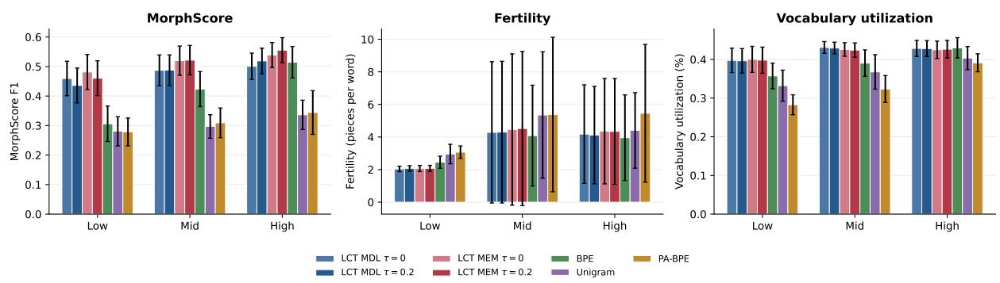
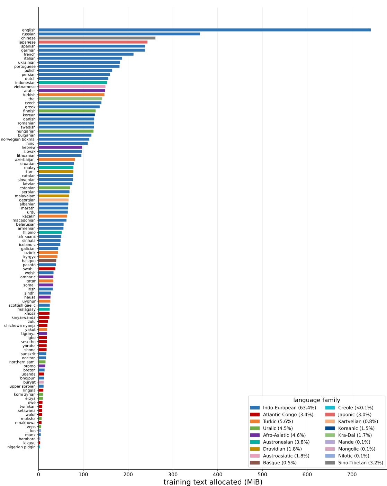
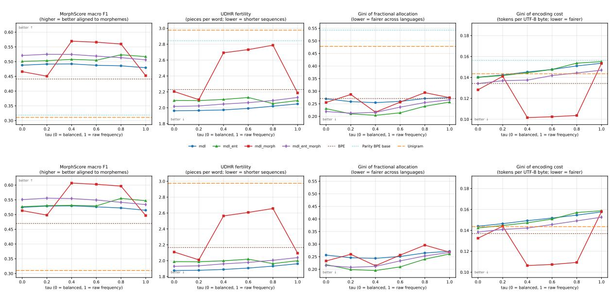
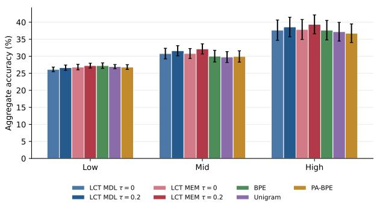

# Latent Core Tokenizer: Compress, but Meaningfully

Felermino D. M. A. Ali\*1, Millicent Ochieng\*1, Ogbemi Ekwejunor-Etchie2, Ade Famoti2, Jacki O’Neill1, Debjit Paul3

1Microsoft Research Africa, 2Microsoft Research Accelerator, 3Microsoft Research India

## Abstract

Tokenizers are commonly optimized for compression, but a compact vocabulary does not necessarily distribute its capacity evenly across languages. We introduce the Latent Core Tokenizer (LCT), a language-agnostic approach that separates structural discovery from vocabulary construction. LCT uses Minimum Description Length, entropy-based boundary signals, and morphotactic constraints to identify reusable linguistic units before constructing a shared vocabulary. Across 104 languages with a 200K-token vocabulary, LCT achieves lower fertility and higher MorphScore than BPE, Unigram, and parity-aware BPE, while maintaining comparable cross-lingual disparity in tokenization cost. Across four multilingual downstream benchmarks, LCT improves aggregate score by 1.48, 1.83, and 2.00 points over BPE, Unigram, and parity-aware BPE, respectively. Our findings show that compression alone does not predict representation quality and highlight the importance of morphology-driven structural discovery and how frequency is used to allocate the final vocabulary across languages.

## 1 Introduction

Tokenization determines the units through which language models represent text, with direct consequences for sequence length, vocabulary capacity, and the information available to the model. Subword methods such as Byte Pair Encoding (BPE) and Unigram tokenization make open vocabulary modeling practical by learning reusable units from corpus statistics (Sennrich et al., 2016; Kudo, 2018). In multilingual settings, however, a shared vocabulary must serve languages that differ substantially in corpus size, script, and morphological structure. Frequency driven vocabulary learning can therefore favor patterns from high resource languages and lead to uneven tokenization efficiency across languages (Rust et al., 2021;

Foroutan et al., 2026). At the same time, work on morphology aware tokenization shows that the units that best preserve linguistic structure need not be the same units that optimize compression (Vemula et al., 2025; Asgari et al., 2026). Conventional subword tokenizers typically use the same vocabulary learning process both to identify reusable units and to determine the final tokens exposed to the model.

We introduce the Latent Core Tokenizer (LCT), which separates latent structural discovery from surface vocabulary construction. LCT first learns reusable internal structure from multilingual text using minimum description length segmentation, branching entropy, and morphotactic refinement under language-balanced evidence. These latent pieces guide vocabulary learning but need not correspond to the final tokens consumed by the model. LCT then constructs a fixed surface vocabulary by selectively recombining latent pieces according to their utility for efficient representation. This allows structural information to guide vocabulary construction without constraining the final surface segmentation.

We evaluate LCT across 104 languages against BPE, Unigram, and Parity-Aware BPE under matched corpus, vocabulary budget, and encoder architecture. LCT achieves lower fertility and higher MorphScore than all three baselines while maintaining cross-lingual disparity in tokenization cost comparable to BPE. Under controlled encoder pretraining, LCT improves the aggregate downstream score by 1.48, 1.83, and 2.00 points over BPE, Unigram, and Parity-Aware BPE, respectively.

Our contributions are threefold: (i) we introduce LCT, a tokenizer design that decouples latent structural discovery from surface vocabulary construction; (ii) we show across 104 languages that this design jointly improves tokenization efficiency and morphological alignment while maintaining comparable cross-lingual tokenization-cost disparity;

and (iii) we show through controlled multilingual encoder pretraining that these improvements extend to downstream representations.

## 2 Latent Core Tokenizer

The central idea of LCT is that the units used to understand a word during tokenizer training need not be the units emitted to a neural model. Conventional frequency-based tokenizers usually discover reusable pieces and compress text in the same operation. LCT separates these goals: it first learns a latent structural analysis, then uses that analysis to construct a fixed surface vocabulary. The latent pieces guide vocabulary learning but are not labels or additional inputs presented to the encoder.

Given language-indexed corpora $\{ \mathcal { D } _ { \ell } \}$ and vocabulary budget K, training has four steps:

1. Balance the evidence. Word frequencies are rescaled so that each language contributes approximately equal total mass. This is not an equal vocabulary quota: a piece reused across languages can still receive more support.

2. Discover reusable structure. A minimumdescription-length segmenter trades the cost of storing pieces against the savings from reusing them. Branching entropy proposes likely internal boundaries, and a morphotactic model distinguishes prefix-, core-, and suffix-like behavior. These signals refine an internal analysis without requiring gold morphological annotations.

3. Construct surface tokens. Supported characters and latent pieces seed the vocabulary. A ranked packer repeatedly merges the adjacent pair that saves the most weighted token occurrences, allowing frequent combinations and complete words to become single tokens. Packing continues until the exact learned-vocabulary budget is filled.

4. Guarantee usable encoding. The learned surface vocabulary is assigned fixed token IDs. At runtime, minimum-token dynamic programming selects among known surface pieces, while UTF-8 byte tokens provide exact reversible coverage for any unseen string.

This separation is the underlying principle: structural discovery decides which building blocks are worth preserving, whereas surface packing decides which combinations are worth an embedding slot.

A productive stem can therefore influence vocabulary construction even when a frequent whole word containing it is ultimately emitted as one token.

The remainder follows these stages in the same order, introducing each mathematical expression where it is needed. Algorithm 1 then collects the complete procedure in one place.

We now follow the four stages in detail, beginning with the evidence used to learn the latent analysis.

Balanced evidence. For language ℓ, Algorithm 1 first constructs a word-frequency table $F _ { \ell }$ with total mass $\begin{array} { r } { N _ { \ell } = \sum _ { w } F _ { \ell } ( w ) } \end{array}$ . Its contribution is multiplied by $N _ { \mathrm { m a x } } / N _ { \ell } .$ , so its effective total is approximately $N _ { \mathrm { m a x } }$ regardless of corpus size. The rounding floor of one prevents an observed word type from disappearing. Summing the rescaled tables gives ${ \widetilde { F } } ,$ , which is used consistently by all subsequent training stages. Thus, “balanced” means equal aggregate frequency mass, not an equal quota of final vocabulary entries.

Minimum description length (MDL) segmentation. Let Σ be the observed character alphabet, let M be the current latent-piece lexicon, let $c ( m )$ be the frequency of piece m under the current segmentations, and let $\begin{array} { r } { C = \sum _ { m } c ( m ) } \end{array}$ . The implemented Morfessor-style objective can be written

$$
\mathcal { L } _ { \mathrm { M D L } } = \mathcal { L } _ { \mathrm { l e x } } + \mathcal { L } _ { \mathrm { c o r p } } ,\tag{1}
$$

$$
\mathcal { L } _ { \mathrm { l e x } } = C _ { \Sigma } \sum _ { m \in \mathcal { M } } ( | m | + 1 ) ,\tag{2}
$$

$$
\mathcal { L } _ { \mathrm { c o r p } } = C \log _ { 2 } C - \sum _ { m \in \mathcal { M } } c ( m ) \log _ { 2 } c ( m ) ,\tag{3}
$$

$$
C _ { \Sigma } = \lambda \operatorname* { m a x } \left( 1 , \log _ { 2 } ( | \Sigma | + 1 ) \right) ,\tag{4}
$$

where $\begin{array} { r l r } { \lambda } & { { } = } & { 1 . 5 } \end{array}$ is the lexicon weight. The corpus term is the unigram code length $\textstyle \sum _ { m } { - c ( m ) \log _ { 2 } [ c ( m ) / C ] }$ . A whole word costs one corpus symbol but must be stored as a long lexicon entry; character segmentation minimizes lexicon storage but creates many corpus symbols. A reusable stem or affix is favored when its repeated corpus savings exceed its one-time lexicon cost.

Training begins with whole words. For each weighted word, its current analysis is temporarily removed from the counts and a dynamic program finds the minimum incremental description-length segmentation with pieces of at most 20 characters.

Counts are then restored using the selected analysis. This coordinate-style resegmentation repeats for at most eight epochs or until no analysis changes.

Branching entropy. MDL alone can miss a productive boundary when several continuations occur after the same context. For a left context x, the forward branching entropy is

$$
H _ { \to } ( x ) = - \sum _ { a \in \Sigma \cup \{ \mathrm { E N D } \} } p ( a \mid x ) \log _ { 2 } p ( a \mid x ) .\tag{5}
$$

A backward model applies the same calculation to reversed text. At internal position i of word $w ,$ the normalized bidirectional score is

$$
b _ { i } ( w ) = \frac { 1 } { 2 } \left[ \frac { H _ { \right. } ( w _ { < i } ) } { \log _ { 2 } ( | \Sigma | + 1 ) } + \frac { H _ { \left. \right]} ( \mathrm { r e v } ( w _ { \geq i } ) ) } { \log _ { 2 } ( | \Sigma | + 1 ) }\tag{6}
$$

Positions with $b _ { i } ( w ) \geq q$ become hard boundaries: the segmentation dynamic program may end or begin a piece there but may not place a multicharacter piece across the boundary.

The threshold is not selected with morphological labels. We evaluate

$$
q \in \{ 0 , 0 . 2 8 , 0 . 3 4 , 0 . 4 0 , 0 . 4 6 , 0 . 5 2 , 0 . 5 8 \} .
$$

For each value, a segmenter is trained on four of every five sorted word types. The chosen value minimizes

$$
q ^ { \star } = \arg \operatorname* { m i n } _ { \boldsymbol { q } } \left[ \mathcal { L } _ { \mathrm { l e x } } ( \boldsymbol { q } ) + \sum _ { w \in \mathcal { H } } \widetilde { F } ( w ) \mathcal { C } _ { \boldsymbol { q } } ( w ) \right] ,\tag{7}
$$

where H is the held-out type set and $\mathcal { C } _ { q } ( w )$ is the unigram code length of the segmentation produced by the model trained with threshold q.

Morphotactic refinement. The resulting pieces are assigned latent categories

$$
\mathcal { Z } = \{ \mathrm { P R E , S T M , S U F , N O N } \} .
$$

Each piece emits a feature tuple containing its length bucket, left-context entropy bucket, rightcontext entropy bucket, and whether it occurs as a standalone word. A first-order hidden Markov

model selects

$$
\begin{array} { r l } { \displaystyle z ^ { \star } = \arg \operatorname* { m a x } _ { z _ { 1 } , \ldots , z _ { r } } \Bigg [ \sum _ { i = 1 } ^ { r } \log P ( f ( m _ { i } ) \mid z _ { i } ) } & { } \\ { \displaystyle + \sum _ { i = 1 } ^ { r + 1 } \log P ( z _ { i } \mid z _ { i - 1 } ) \Bigg ] . } \end{array}\tag{8}
$$

under a grammar approximating PRE∗ STM (STM | SUF)∗, with NON allowed as a noise state. Transition and emission tables use additive smoothing and are re-estimated for five hard-EM iterations using Viterbi assignments. NON fragments are merged into a neighbor, removing low-confidence boundaries without changing the surface string. Corpus-supported core and affix merges then reduce residual fragmentation while preserving the latent decomposition.

Surface packing. The latent analyzer produces a weighted multiset $C$ of piece sequences. For an adjacent pair $( a , b )$ , the packer maintains the support score

$$
g ( a , b ) = \sum _ { z } C ( z ) n _ { z } ( a , b ) ,\tag{9}
$$

where $n _ { z } ( a , b )$ counts current adjacent occurrences in sequence z. The highest-score pair is replaced in all affected sequences, its concatenation ab is added to the fixed vocabulary, and affected pair scores are updated. Because each replacement normally removes one emitted symbol, g estimates the frequency-weighted token saving. Deterministic lexical tie-breaking and recorded merge ranks make the fitted vocabulary reproducible.

## 3 Experimental Setup

We evaluate LCT under controlled conditions using the same multilingual corpus, vocabulary budget, and encoder architecture across all tokenizer variants.

## 3.1 Multilingual Corpus

All tokenizer and encoder variants are trained on the same multilingual corpus constructed from FineWeb and FineWeb2. English is sourced from FineWeb, while the remaining 103 languages come from filtered FineWeb2 subsets, covering high-, medium-, and low-resource settings. For a controlled comparison, document selection is deterministic, duplicates are removed, and the same training and validation documents are used across all configurations. We use a deterministic 1% validation split.

Sampling To reduce the dominance of highresource languages while preserving the natural distribution of the data available across languages, we apply temperature-based language sampling:

$$
p ( l ) = \frac { n ( l ) ^ { 0 . 3 } } { \sum _ { j } n ( j ) ^ { 0 . 3 } } ,
$$

where $n ( l )$ is the available corpus size for language l in UTF-8 bytes. We then allocate languagespecific quotas from a shared budget of 8 GiB for training and approximately 82 MiB for validation. Documents are sampled deterministically without truncation whenever possible, with oversampling recorded for languages with insufficient data. This procedure keeps the corpus and data distribution fixed across tokenizer arms, allowing downstream differences to be attributed to tokenization rather than corpus composition. Appendix B shows the resulting language distribution, statistics, and sampling allocations.

## 3.2 Evaluation

We compare LCT with BPE, Unigram, and Parity-Aware BPE using both intrinsic tokenizer metrics and downstream encoder evaluation.

Intrinsic evaluation. We evaluate reconstruction, efficiency, morphological alignment, and multilingual vocabulary allocation. We follow a similar protocol to Foroutan et al. (2026), measuring compression rate, type-token ratio (TTR), vocabulary utilization, fertility, MorphScore F1, and Gini. Fertility is the mean number of tokens per word. Vocabulary Utilization is the share of the 200k vocabulary the corpus activates. Fertility and vocabulary utilization are measured on UDHR translations1 over 93 languages. MorphScore (Arnett et al., 2025) is evaluated on languages available in the dataset with at least 100 eligible examples and reports the official frequency-weighted F1, for a total of 65 languages with sufficient gold items. Compression rate is UTF-8 bytes per token. TTR is the type-token ratio, defined as the number of distinct tokens emitted divided by the total number of tokens emitted across the corpus. Rényi efficiency at α=2.5 rewards a flatter token-frequency distribution. Gini is the Gini Token Inequality Coefficient over per-byte cost, using TokEval’s default normalisation.

Extrinsic evaluation. We evaluate the pretrained encoder representations on four benchmarks: XNLI (Conneau et al., 2018), Belebele (Bandarkar et al., 2024), XStoryCloze (Mihaylov and Frank, 2017), and PAWS-X (Yang et al., 2019). For each tokenizer, we train one DeBERTa-v3-style XSmall encoder (see configuration in Table 5) using pretraining seed 42, keeping the architecture and training budget identical across variants. We then finetune each pretrained encoder using five seeds (11, 29, 47, 53, and 71), with the learning rate selected separately for each tokenizer on the development set. This paired design allows differences across fine-tuning runs to be attributed to the tokenizer while holding pretraining fixed. For token-level tasks, we use the representation of the first subtoken. Additional extrinsic evaluation details are provided in Appendix C.

## 4 Results

We first report intrinsic tokenizer performance and component-level ablations, followed by downstream evaluation of the resulting multilingual encoder representations.

## 4.1 Intrinsic Evaluation

Table 1 compares LCT-MEM with BPE, Parity-Aware BPE, and Unigram. LCT-MEM has the highest compression rate (4.866 bytes per token), TTR (0.1781), and vocabulary utilization (25.26%), and the lowest fertility (1.999 tokens per word). It also obtains the highest MorphScore F1 (0.5209), compared with 0.4410 for BPE, 0.3186 for Parity-Aware BPE, and 0.3109 for Unigram. Its Cost Gini (0.1341) is effectively tied with BPE (0.1342) and lower than Parity-Aware BPE (0.1563) and Unigram (0.1435). Parity-Aware BPE is stronger only on Rényi efficiency.

These results show that LCT-MEM provides the strongest balance of compression, vocabulary use, morphological alignment, and cross-language tokenization-cost equality among the compared systems. They establish the intrinsic behavior of the final tokenizer, but do not identify which design choices drive the gains. The ablation study in Section 4.1.1 therefore separates the effects of language balancing, latent structural discovery, entropy, and morphotactic refinement.

<table><tr><td></td><td>Comp. Rate ↑</td><td>TTR↑</td><td>Vocab. Util. ↑</td><td>Fertility ↓</td><td>Rényi (α=2.5) ↑</td><td>MorphScore F1 ↑</td><td>Gini↓</td></tr><tr><td>LCT-MEM</td><td>4.866</td><td>0.1781</td><td>0.2526</td><td>1.999</td><td>0.4472</td><td>0.5209</td><td>0.1341</td></tr><tr><td>BPE</td><td>4.295</td><td>0.1349</td><td>0.2168</td><td>2.241</td><td>0.4613</td><td>0.4410</td><td>0.1342</td></tr><tr><td>Parity-Aware BPE</td><td>3.340</td><td>0.0630</td><td>0.1301</td><td>2.742</td><td>0.4879</td><td>0.3186</td><td>0.1563</td></tr><tr><td>Unigram</td><td>3.195</td><td>0.0878</td><td>0.1898</td><td>2.920</td><td>0.3142</td><td>0.3109</td><td>0.1435</td></tr></table>

Table 1: Intrinsic tokenizer quality at 200k vocabulary. LCT-MEM denotes the LCT configuration combining MDL, branching entropy, and morphotactic refinement. Per-language results are displayed in Table 8 and Table 9.  
Figure 1: Intrinsic tokenizer performance across low-, mid-, and high-resource language tertiles. Bars show macro-averages and error bars indicate 95% confidence intervals across languages. MorphScore uses 65 languages, while fertility and vocabulary utilization use the 93 languages covered by TokEval. All configurations use a 200k vocabulary.

## 4.1.1 Ablation Study

Keeping the training corpus and round-trip coverage fixed, we vary language-frequency estimation, vocabulary size, latent structural discovery, and morphotactic induction.

<table><tr><td colspan="2">Rank</td><td></td><td colspan="2">Fertility ↓</td><td colspan="2">MorphScore ↑</td><td colspan="2">Gini ↓</td></tr><tr><td>#200k</td><td>#256k</td><td>System</td><td>200k</td><td>256k</td><td>200k</td><td>256k</td><td>200k</td><td>256k</td></tr><tr><td>1</td><td>1</td><td>LCT-MEM τ=0.2</td><td>2.023</td><td>1.935</td><td>0.5249</td><td>0.5556</td><td>0.1369</td><td>0.1409</td></tr><tr><td>2</td><td>2</td><td>LCT-MEM τ=0</td><td>2.017</td><td>1.929</td><td>0.5209</td><td>0.5507</td><td>0.1341</td><td>0.1384</td></tr><tr><td>3</td><td>3</td><td>LCT-MEM τ=0.4</td><td>2.047</td><td>1.960</td><td>0.5244</td><td>0.5543</td><td>0.1374</td><td>0.1422</td></tr><tr><td>4</td><td>4</td><td>LCT-ME τ=0.8</td><td>2.053</td><td>1.963</td><td>0.5233</td><td>0.5549</td><td>0.1536</td><td>0.1570</td></tr><tr><td>5</td><td>8</td><td>LCT-MDL τ=0</td><td>1.962</td><td>1.876</td><td>0.4880</td><td>0.5245</td><td>0.1402</td><td>0.1439</td></tr><tr><td>6</td><td>6</td><td>LCT-MDL τ=0.2</td><td>1.966</td><td>1.879</td><td>0.4916</td><td>0.5287</td><td>0.1423</td><td>0.1463</td></tr><tr><td>7</td><td>5</td><td>LCT-MDL τ=0.4</td><td>1.973</td><td>1.890</td><td>0.4923</td><td>0.5295</td><td>0.1452</td><td>0.1492</td></tr><tr><td>8</td><td>7</td><td>LCT-MEM τ=0.6</td><td>2.065</td><td>1.978</td><td>0.5188</td><td>0.5492</td><td>0.1418</td><td>0.1455</td></tr><tr><td>9</td><td>10</td><td>LCT-ME τ=1</td><td>2.091</td><td>2.000</td><td>0.5169</td><td>0.5467</td><td>0.1551</td><td>0.1587</td></tr><tr><td>10</td><td>9</td><td>LCT-MDL τ=0.6</td><td>1.992</td><td>1.907</td><td>0.4876</td><td>0.5261</td><td>0.1476</td><td>0.1517</td></tr><tr><td>25</td><td>25</td><td>BPE</td><td>2.229</td><td>2.166</td><td>0.4410</td><td>0.4697</td><td>0.1342</td><td>0.1369</td></tr><tr><td>26</td><td>26</td><td>Parity-Aware BPE</td><td>2.844</td><td>2.864</td><td>0.3186</td><td>0.3286</td><td>0.1563</td><td>0.1363</td></tr><tr><td>27</td><td>27</td><td>Unigram</td><td>2.977</td><td>2.975</td><td>0.3109</td><td>0.3101</td><td>0.1435</td><td>0.1435</td></tr></table>

Table 2: Top 10 tokenizer configurations at 200k and 256k vocabulary sizes. Additional intrinsic evaluation results are provided in Figure 3.

Language-frequency estimation. We generalize Equation 10 with a temperature exponent τ :

$$
\widetilde { F } _ { \ell } ^ { ( \tau ) } ( w ) = F _ { \ell } ( w ) \left( \frac { N _ { \mathrm { m a x } } } { N _ { \ell } } \right) ^ { 1 - \tau } .\tag{10}
$$

Here $\tau = 0$ recovers equal-total language balancing, while $\tau = 1$ removes balancing and recovers raw relative language frequencies. Intermediate values partially balance languages by increasing the influence of smaller languages without forcing equal effective totals. Intermediate values partially balance languages by increasing the influence of languages with less available training data without forcing equal effective totals. We evaluate $\tau \in \{ 0 . 0 , 0 . 2 , 0 . 4 , 0 . 6 , 0 . 8 , 1 \}$ to test equal, partial, and raw-frequency weighting.

Latent discovery and Morphotactics We vary latent discovery and morphotactic induction in a 2×2 design to isolate their individual and combined effects. The four variants are LCT-MDL, which uses MDL alone; LCT-ME, which adds branching entropy; LCT-MM, which adds morphotactic induction; and LCT-MEM, which combines MDL, entropy, and morphotactics. Every variant is trained at each value of τ.

Vocabulary budget We repeat the full design at 200k and 256k learned entries to test whether the observed component effects persist across vocabulary sizes.

Ranking criterion We evaluate 48 LCT configurations, comprising 4 structural variants, 6 values of τ , and 2 vocabulary sizes, alongside BPE, Unigram, and Parity-Aware BPE. At each vocabulary size, configurations are ranked using fertility and MorphScore. Because the two metrics are not directly commensurable, we rank them separately and average the ranks. Fertility measures tokens per word, while MorphScore measures alignment with morpheme boundaries. Writing S for the systems evaluated at one vocabulary size, $F ( s )$ for fertility, and $M ( s )$ for MorphScore,

<table><tr><td></td><td colspan="4">Benchmark</td><td colspan="8">Aggregate accuracy (%)</td></tr><tr><td>Language</td><td>XNLI</td><td>Belebele</td><td>XStoryCloze</td><td>PAWS-X</td><td>LCT-MDL τ = 0</td><td>LCT-MDL τ = 0.2</td><td>LCT-MEM τ = 0</td><td>LCT-MEM τ = 0.2</td><td>BPE</td><td>Unigram</td><td></td><td>Parity-Aware BPE</td></tr><tr><td>Arabic</td><td>√</td><td>√</td><td>√</td><td></td><td>42.14</td><td>42.65</td><td>41.90</td><td></td><td>42.10</td><td>42.46</td><td>41.92</td><td>41.79</td></tr><tr><td>Basque</td><td></td><td>√</td><td>√</td><td></td><td></td><td>42.71</td><td>42.83</td><td>42.78</td><td>43.10</td><td>42.76</td><td>41.34</td><td>42.78</td></tr><tr><td>Bulgarian</td><td>√</td><td>√</td><td></td><td></td><td>39.27</td><td>40.25</td><td></td><td>39.68</td><td>40.18</td><td>38.98</td><td>37.84</td><td>38.99</td></tr><tr><td>Chinese</td><td>√</td><td>√</td><td>-√</td><td>√</td><td>49.89</td><td>50.04</td><td>50.11</td><td></td><td>51.40</td><td>47.30</td><td>47.77</td><td>45.99</td></tr><tr><td>English</td><td>√</td><td>√</td><td>√</td><td>√</td><td>62.20</td><td>62.33</td><td>61.63</td><td></td><td>62.39</td><td>61.70</td><td>61.45</td><td>61.38</td></tr><tr><td>French</td><td>√</td><td>√</td><td>一</td><td>√</td><td>53.30</td><td>53.65</td><td></td><td>53.44</td><td>53.54</td><td>53.74</td><td>51.60</td><td>50.82</td></tr><tr><td>German</td><td>√</td><td>√</td><td></td><td>√</td><td>51.95</td><td>53.35</td><td></td><td>53.34</td><td>53.51</td><td>52.89</td><td>50.92</td><td>49.33</td></tr><tr><td>Greek</td><td>√</td><td>√</td><td></td><td></td><td>38.05</td><td>39.03</td><td></td><td>36.90</td><td>38.06</td><td>37.84</td><td>36.10</td><td>37.57</td></tr><tr><td>Hindi</td><td>√</td><td>√</td><td>√</td><td></td><td>43.00</td><td>42.27</td><td></td><td>42.39</td><td>43.56</td><td>40.13</td><td>39.99</td><td>39.53</td></tr><tr><td>Indonesian</td><td></td><td>√</td><td>√</td><td></td><td>43.72</td><td>43.39</td><td></td><td>42.77</td><td>43.71</td><td>43.29</td><td>41.88</td><td>43.04</td></tr><tr><td>Japanese</td><td></td><td>√</td><td>一</td><td>√</td><td>47.64</td><td>47.81</td><td></td><td>47.02</td><td>48.28</td><td>43.36</td><td>46.00</td><td>43.10</td></tr><tr><td>Korean</td><td></td><td>√</td><td>一</td><td>√</td><td>47.60</td><td>49.01</td><td>47.66</td><td></td><td>49.97</td><td>46.62</td><td>46.71</td><td>46.50</td></tr><tr><td>Russian</td><td>L</td><td>√</td><td>√</td><td>一</td><td>43.87</td><td>44.95</td><td></td><td>44.07</td><td>44.44</td><td>45.33</td><td>43.66</td><td>43.68</td></tr><tr><td>Spanish</td><td>√</td><td>√</td><td>√</td><td>√</td><td>55.27</td><td>55.35</td><td>55.00</td><td></td><td>55.79</td><td>55.25</td><td>53.11</td><td>52.78</td></tr><tr><td>Swahili</td><td>√</td><td>√</td><td>√</td><td></td><td>43.36</td><td>42.73</td><td>41.70</td><td></td><td>43.15</td><td>43.34</td><td>42.95</td><td>42.74</td></tr><tr><td>Thai</td><td>V</td><td>√</td><td></td><td></td><td>37.74</td><td>37.94</td><td>38.55</td><td></td><td>38.40</td><td>31.66</td><td>34.57</td><td>31.82</td></tr><tr><td>Turkish</td><td>了</td><td>√</td><td></td><td></td><td>38.01</td><td>38.98</td><td>39.06</td><td></td><td>40.57</td><td>40.16</td><td>37.02</td><td>37.54</td></tr><tr><td>Urdu</td><td>V</td><td>√</td><td></td><td></td><td>37.26</td><td>37.77</td><td>36.44</td><td></td><td>37.29</td><td>36.50</td><td>34.91</td><td>36.40</td></tr><tr><td>Vietnamese</td><td>√</td><td>√</td><td></td><td></td><td>38.90</td><td>40.57</td><td>39.89</td><td></td><td>41.40</td><td>40.74</td><td>37.86</td><td>38.46</td></tr></table>

Table 3: Aggregate downstream accuracy (%) for languages covered by at least 2 of the four multilingual benchmarks. A checkmark identifies the benchmarks included for each language. For each tokenizer and language, accuracy is averaged equally across the checked tasks within each fine-tuning seed and then averaged over five seeds. All configurations use one pretrained encoder seed and a 200k vocabulary. The best result in each row is bold.

$$
r _ { F } ( s ) = 1 + { \big | } \{ s ^ { \prime } \in S : F ( s ^ { \prime } ) < F ( s ) \} { \big | } ,\tag{11}
$$

$$
r _ { M } ( s ) = 1 + { \big | } \{ s ^ { \prime } \in S : M ( s ^ { \prime } ) > M ( s ) \} { \big | } ,\tag{12}
$$

and systems are ordered by

$$
\begin{array} { r } { R ( s ) = \frac 1 2 \big ( r _ { F } ( s ) + r _ { M } ( s ) \big ) , } \end{array}\tag{13}
$$

with lower values preferred and fertility breaking ties. Fertility determines sequence length and therefore affects both computational cost and how much text fits within the context window, while MorphScore reflects whether token boundaries align with morpheme boundaries, which the encoder would otherwise need to recover. We weight the two criteria equally as a design choice rather than deriving the weighting from the data.

The ranking is stable at the top, with LCT-MEM at $\tau ~ = ~ 0 . 2$ ranking first and $\tau ~ = ~ 0$ second at both vocabulary sizes. LCT-MEM gives the strongest MorphScore, while LCT-MDL variants give the shortest sequences. Increasing the vocabulary from 200k to 256k lowers fertility and raises MorphScore for every displayed LCT configuration, but does not change this central trade-off. The best-ranked configurations also occur at $\tau \leq 0 . 4 .$ indicating that strong or moderate language balancing is more useful than raw-frequency weighting when jointly optimizing these two criteria. Gini changes much less than fertility or MorphScore, with LCT-MEM at $\tau = 0$ performing best at 200k and BPE performing best at 256k among the displayed configurations. Vocabulary growth therefore improves compression and morphological alignment without automatically making cross-language tokenization cost more even.

Next, we select four LCT configurations for component-level encoder pretraining: the topranked LCT-MEM configurations at $\tau \ : = \ : 0 . 2$ and $\tau = 0$ , and the lighter LCT-MDL configurations at $\tau = 0$ and $\tau = 0 . 2$ . Although LCT-MDL ranks lower overall, it achieves the best fertility and omits branching-entropy search and morphotactic induction. Comparing these pairs tests whether the additional structural components in LCT-MEM improve encoder representations beyond what can be explained by shorter sequences alone, while BPE, Parity-Aware BPE, and Unigram provide external baselines.

## 4.2 Extrinsic Evaluation

All seven encoders use the same architecture and pretraining seed, and each is evaluated with the same five fine-tuning seeds; only the tokenizer differs.

Table 4 separates the effects of language balancing and structural objective. Changing only τ improves LCT-MDL by +0.80 points and LCT-MEM by +1.21 points, showing that balancing strength is a meaningful model-selection parameter rather than a fixed preprocessing choice. At τ = 0.2, LCT-MEM improves by +0.65 points over LCT-MDL in the raw paired test. LCT-MDL nevertheless remains useful because it yields the shortest sequences, omits branching-entropy search and morphotactic induction, and still outperforms BPE. LCT-MEM, in contrast, provides the strongest downstream performance at the cost of a more complex tokenizerconstruction pipeline.

<table><tr><td>Tokenizer</td><td>Score</td><td>LCT-MDL  $\tau = 0$ </td><td> $L C T - M D L$   $\tau = 0 . 2$ </td><td>LCT-MEM  $\tau = 0$ </td><td>LCT-MEM  $\tau = 0 . 2$ </td><td>BPE</td><td>Unigram</td><td>Parity-Aware BPE</td></tr><tr><td>LCT-MDL τ = 0</td><td> $3 2 . 8 4 \pm 0 . 3 8$ </td><td></td><td> $- 0 . 8 0 ^ { * }$ </td><td>-0.24</td><td> ${ \mathbf - 1 . 4 5 ^ { * * , \ddagger } }$ </td><td> $+ 0 . 0 3$ </td><td>+0.38</td><td>+0.55</td></tr><tr><td>LCT-MDL  $\tau = 0 . 2$ </td><td> $3 3 . 6 4 \pm 0 . 3 2$ </td><td>0.54</td><td></td><td> $+ 0 . 5 6$ </td><td> $- 0 . 6 5 ^ { * }$ </td><td> $+ 0 . 8 3 ^ { * }$ </td><td> $+ 1 . 1 8 ^ { * * }$ </td><td> ${ \bf + 1 . 3 5 ^ { * * } }$ </td></tr><tr><td>LCT-MEM τ = 0</td><td> $3 3 . 0 8 \pm 0 . 6 4$ </td><td>0.65</td><td>0.78</td><td></td><td> $- 1 . 2 1 ^ { * }$ </td><td> $+ 0 . 2 7$ </td><td> $+ 0 . 6 2$ </td><td>+0.79</td></tr><tr><td>LCT-MEM</td><td></td><td></td><td></td><td></td><td></td><td></td><td></td><td></td></tr><tr><td> $\tau = 0 . 2$  BPE</td><td> $3 4 . 2 9 \pm 0 . 3 3$   $3 2 . 8 1 \pm 0 . 2 6$ </td><td>0.23 0.39</td><td>0.35 0.51</td><td>0.70 0.40</td><td>0.43</td><td> $^ { + 1 . 4 8 ^ { * * , \dagger } }$ </td><td> ${ \bf + 1 . 8 3 ^ { * * , \dagger } }$  +0.35</td><td> $\mathbf { + 2 . 0 0 ^ { * * } }$  +0.52</td></tr><tr><td>Unigram</td><td> $3 2 . 4 6 \pm 0 . 2 2$ </td><td>0.38</td><td>0.50</td><td>0.77</td><td>0.42</td><td>0.38</td><td></td><td>+0.17</td></tr><tr><td>Parity-Aware</td><td></td><td></td><td></td><td></td><td></td><td></td><td></td><td></td></tr><tr><td>BPE</td><td> $3 2 . 2 9 \pm 0 . 6 1$ </td><td>0.94</td><td>0.62</td><td>1.03</td><td>0.85</td><td>0.75</td><td>0.68</td><td></td></tr></table>

Table 4: Pairwise comparison of the aggregated downstream score (accuracy %). Score is each configuration’s mean and standard deviation over five fine-tuning seeds. Rows and columns contain the same seven configurations in the same order. All configurations use a 200k vocabulary and one pretrained encoder each. Values above the diagonal report the paired difference between the row and column configurations, with positive values favouring the row. Differences are paired by seed $\left( \mathrm { d f } = 4 \right)$ and Holm-corrected across the 21 unordered pairs. ∗ and ∗∗ indicate raw paired-test $p < 0 . 0 5$ and $p < 0 . 0 1$ , while † and ‡ indicate Holm-adjusted $p < 0 . 0 5$ and $p < 0 . 0 1$ , respectively. Values that remain significant after correction are bold.

The gains are not uniform across resource levels. On Belebele, LCT-MEM at $\tau = 0 . 2$ is effectively tied with BPE in the smallest pretraining-corpus quartile (−0.07 points), but improves by $+ 2 . 4 5 , + 2 . 5 8$ and +1.95 points in the remaining quartiles. Better vocabulary allocation therefore does not by itself guarantee better outcomes for languages with the least pretraining data, indicating that data availability remains a separate bottleneck.

## 5 Discussion

## 5.1 A controllable tokenizer design space

Standard BPE and Unigram couple corpus frequency, unit discovery, and surface vocabulary construction inside one objective. LCT exposes two of these choices as independent controls. The temperature τ determines how strongly corpus size influences multilingual evidence, while the discovery objective determines how much structural information is preserved before surface packing. This makes vocabulary allocation a tunable design decision rather than an incidental consequence of the corpus distribution.

The downstream ordering shows why this control matters. Complete equalization at $\tau = 0$ is not consistently better than BPE, whereas partial balancing at $\tau = 0 . 2$ improves both LCT-MDL and LCT-MEM. The useful operating point therefore lies between unrestricted raw frequency and equal language totals. With only two pretrained temperatures, we identify a direction rather than an optimum, but the results show that allocation strength can be selected empirically for the target setting.

## 5.2 Different objectives support different deployment priorities

The component choice provides a second operating axis. LCT-MEM gives the strongest morphological alignment and downstream performance, while LCT-MDL produces shorter sequences and omits branching-entropy search and morphotactic induction. Figure 1 shows that LCT-MEM maintains higher MorphScore than the baselines across low-, mid-, and high-resource groups, while vocabulary utilization is also consistently higher or comparable. Fertility is more resource dependent, with clearer LCT gains for low-resource languages and smaller differences relative to BPE in the mid- and highresource groups. The intrinsic advantage of LCT is therefore not explained by compression alone.

This should not be confused with a demonstrated tokenizer-runtime speedup. Shorter sequences reduce encoder computation, and LCT-MDL removes training-time components, but the current LCT Hugging Face adapter is implemented as a Python slow tokenizer. Compiling the lossless packing algorithm into an optimized runtime remains necessary before making serving-latency claims.

## 5.3 Allocation parity is not outcome parity

The downstream gains are also resource dependent. Figure 5 shows relatively small differences among tokenizers for low-resource languages, with clearer separation in the mid- and high-resource groups, where LCT-MEM at τ = 0.2 performs strongest. This suggests that better structural units and vocabulary allocation are most useful when the encoder has sufficient pretraining data to learn from them.

The result also exposes an important limitation. LCT can redistribute vocabulary capacity and reduce cross-language fragmentation, but better allocation does not by itself guarantee stronger outcomes for languages with the least pretraining data. Languages with very little training text may receive better pieces without providing enough evidence for the encoder to exploit them. Future work should therefore optimize low-resource outcomes directly rather than treating lower allocation or Cost Gini as sufficient, including resource-aware temperature schedules, language- or script-conditioned allocation floors, downstream-sensitive structural objectives, and evaluation with larger low-resource task suites and independent pretraining seeds.

## 6 Related Work

Multilingual tokenization must distribute finite vocabulary capacity across languages with highly unequal data availability. Prior work has studied language specific vocabulary allocation, cross language vocabulary overlap, and disparities in tokenization efficiency (Rust et al., 2021; Zheng et al., 2021; Limisiewicz et al., 2023; Lundin et al., 2026). Parity Aware BPE directly modifies BPE merge selection to reduce cross language compression disparities (Foroutan et al., 2026). LCT similarly reduces the influence of corpus size on multilingual vocabulary learning, but separates language balancing and latent structural discovery from subsequent surface vocabulary construction.

A complementary line of work incorporates morphological structure into tokenization. Unsupervised morphological segmentation has long used minimum description length to identify reusable subword structure (Creutz and Lagus, 2007), while recent approaches incorporate morphological information through boundary constraints, segmented training data, or transformations that expose internal structure (Asgari et al., 2026; García et al., 2025; Vemula et al., 2025; Gazit et al., 2025). MorphBPE is particularly close to LCT in using morphology during vocabulary learning, but its morphological boundaries constrain the final BPE segmentation. LCT instead uses structural analysis as an intermediate latent representation and allows latent pieces to be recombined when constructing the final surface vocabulary.

Recent work also shows that compression, morphological alignment, and downstream performance need not favor the same tokenizer (Vemula et al., 2025; Asgari et al., 2026). LCT builds on this distinction by separating structural discovery from surface vocabulary construction and evaluating both tokenizer quality and learned multilingual representations.

## 7 Conclusion

We introduce the Latent Core Tokenizer (LCT), which separates latent structural discovery from surface vocabulary construction. Across 104 languages, LCT improves intrinsic tokenizer quality over BPE, Unigram, and Parity-Aware BPE, while controlled encoder pretraining shows that LCT-MEM at τ = 0.2 improves aggregate downstream performance by 1.48, 1.83, and 2.00 points over the three baselines, respectively. Our ablations further show that the configuration producing the shortest sequences is not the one producing the strongest downstream representations, indicating that compression alone is not sufficient for tokenizer selection. The gains also vary by resource level, with smaller downstream improvements for languages with the least pretraining data, showing that better tokenization can improve multilingual representation and vocabulary allocation without removing the separate constraint imposed by limited data.

## Limitations

Our results provide evidence that separating structural discovery from surface vocabulary construction can improve multilingual tokenization and downstream representations, but several aspects of the current evaluation limit the scope of these conclusions.

Single pretraining seed: all seven encoders were pretrained once, so the reported variance reflects fine-tuning variation only. We therefore cannot exclude the possibility that part of the 1.48-point improvement over BPE reflects pretraining variance. Replicating encoder pretraining across multiple seeds would provide a stronger estimate of the tokenizer effect.

Scale: our experiments use DeBERTa-v3 XSmall encoders. The observed effects therefore establish the value of LCT at this model scale, but may not transfer unchanged to larger models, which may be better able to recover from suboptimal segmentation.

Task coverage: 62 of the 79 evaluated languages are represented only in Belebele, making the aggregate result heavily influenced by this benchmark. XNLI, XStoryCloze, and PAWS-X cover substantially fewer languages, and XStoryCloze has only 360 training examples. Broader multilingual evaluation is therefore needed to determine how consistently the observed gains extend across task types.

Search: although 48 LCT configurations are evaluated intrinsically, only two values of τ and two structural objectives are taken forward to encoder pretraining. The downstream experiments therefore identify useful directions rather than an optimal configuration, and conclusions about the relationship between intrinsic and downstream behavior are based on a much smaller subset of the full design space.

Single downstream architecture: all downstream experiments use the same DeBERTa-v3 XSmall architecture. This controls architecture as a source of variation, but does not establish that the observed tokenizer effects generalize to other encoder architectures or to decoder-only language models.

## Ethical Considerations

This work does not involve human participants or the collection of new personal data. The experiments use existing multilingual corpora and public evaluation benchmarks.

## References

Catherine Arnett, Marisa Hudspeth, and Brendan O’Connor. 2025. Evaluating Morphological Alignment of Tokenizers in 70 Languages. In Proceedings of the ICML 2025 Tokenization Workshop (TokShop).

Ehsaneddin Asgari, Yassine El Kheir, MohammadAli SadraeiJavaheri, and Ali Nazari. 2026. MorphBPE: Morphology-aware tokenization for efficient LLM

training. In Findings ofthe Associationfor Computational Linguistics: ACL 2026, pages 41610–41621, San Diego, California, United States. Association for Computational Linguistics.

Lucas Bandarkar, Davis Liang, Benjamin Muller, Mikel Artetxe, Satya Narayan Shukla, Donald Husa, Naman Goyal, Abhinandan Krishnan, Luke Zettlemoyer, and Madian Khabsa. 2024. The belebele benchmark: a parallel reading comprehension dataset in 122 language variants. In Proceedings ofthe 62nd Annual Meeting of the Association for Computational Linguistics (Volume 1: Long Papers), pages 749–775, Bangkok, Thailand and virtual meeting. Association for Computational Linguistics.

Alexis Conneau, Ruty Rinott, Guillaume Lample, Adina Williams, Samuel R. Bowman, Holger Schwenk, and Veselin Stoyanov. 2018. XNLI: Evaluating crosslingual sentence representations. In Proceedings of the 2018 Conference on Empirical Methods in Natural Language Processing, pages 2475–2485, Brussels, Belgium. Association for Computational Linguistics.

Mathias Creutz and Krista Lagus. 2007. Unsupervised models for morpheme segmentation and morphology learning. ACM Trans. Speech Lang. Process., 4(1).

Negar Foroutan, Clara Meister, Debjit Paul, Joel Niklaus, Sina Ahmadi, Antoine Bosselut, and Rico Sennrich. 2026. Parity-aware byte-pair encoding: Improving cross-lingual fairness in tokenization. In Proceedings of the 64th Annual Meeting of the Association for Computational Linguistics (Volume 1: Long Papers), pages 7514–7538, San Diego, California, United States. Association for Computational Linguistics.

Alba Táboas García, Piotr Przybyła, and Leo Wanner. 2025. Exploring morphology-aware tokenization: A case study on Spanish language modeling. In Proceedings of the 2025 Conference on Empirical Methods in Natural Language Processing, pages 30505–30518, Suzhou, China. Association for Computational Linguistics.

Bar Gazit, Shaltiel Shmidman, Avi Shmidman, and Yuval Pinter. 2025. Splintering nonconcatenative languages for better tokenization. In Findings of the Associationfor Computational Linguistics: ACL 2025, pages 22405–22417, Vienna, Austria. Association for Computational Linguistics.

Taku Kudo. 2018. Subword regularization: Improving neural network translation models with multiple subword candidates. In Proceedings ofthe 56th Annual Meeting of the Association for Computational Linguistics (Volume 1: Long Papers), pages 66–75, Melbourne, Australia. Association for Computational Linguistics.

Tomasz Limisiewicz, Jiˇrí Balhar, and David Marecek.ˇ 2023. Tokenization impacts multilingual language modeling: Assessing vocabulary allocation and overlap across languages. In Findings ofthe Association

for Computational Linguistics: ACL 2023, pages 5661–5681, Toronto, Canada. Association for Com putational Linguistics.

Jessica M. Lundin, Ada Zhang, Nihal Karim, Hamza Louzan, Guohao Wei, David Ifeoluwa Adelani, and Cody Carroll. 2026. The token tax: Systematic bias in multilingual tokenization. In Proceedings of the 7th Workshop on African Natural Language Processing (AfricaNLP 2026), pages 103–112, Rabat, Morocco. Association for Computational Linguistics.

Todor Mihaylov and Anette Frank. 2017. Story cloze ending selection baselines and data examination. In Proceedings ofthe 2nd Workshop on Linking Models of Lexical, Sentential and Discourse-level Semantics, pages 87–92, Valencia, Spain. Association for Computational Linguistics.

Phillip Rust, Jonas Pfeiffer, Ivan Vulic, Sebastian Ruder,´ and Iryna Gurevych. 2021. How good is your tokenizer? on the monolingual performance of multilingual language models. In Proceedings of the 59th Annual Meeting ofthe Associationfor Computational Linguistics and the 11th International Joint Conference on Natural Language Processing (Volume 1: Long Papers), pages 3118–3135, Online. Association for Computational Linguistics.

Rico Sennrich, Barry Haddow, and Alexandra Birch. 2016. Neural machine translation of rare words with subword units. In Proceedings of the 54th Annual Meeting of the Association for Computational Linguistics (Volume 1: Long Papers), pages 1715–1725, Berlin, Germany. Association for Computational Linguistics.

Saketh Reddy Vemula, Sandipan Dandapat, Dipti Sharma, and Parameswari Krishnamurthy. 2025. Rethinking tokenization for rich morphology: The dominance of unigram over BPE and morphological alignment. In The 14th International Joint Conference on Natural Language Processing and The 4th Conference of the Asia-Pacific Chapter of the Association for Computational Linguistics, pages 232–252, Mumbai, India. Association for Computational Linguistics.

Yinfei Yang, Yuan Zhang, Chris Tar, and Jason Baldridge. 2019. PAWS-X: A cross-lingual adversarial dataset for paraphrase identification. In Proceedings ofthe 2019 Conference on Empirical Methods in Natural Language Processing and the 9th International Joint Conference on Natural Language Processing (EMNLP-IJCNLP), pages 3687–3692, Hong Kong, China. Association for Computational Linguistics.

Bo Zheng, Li Dong, Shaohan Huang, Saksham Singhal, Wanxiang Che, Ting Liu, Xia Song, and Furu Wei. 2021. Allocating large vocabulary capacity for crosslingual language model pre-training. In Proceedings ofthe 2021 Conference on Empirical Methods in Natural Language Processing, pages 3203–3215, Online and Punta Cana, Dominican Republic. Association for Computational Linguistics.

## A Appendix

## A.1 LCT algorithm

Algorithm 1 summarizes how these operations are executed to produce the latent analyzer, fixed surface vocabulary, and ranked merges. The language-balanced table drives both latent discovery and ranked packing. C is a weighted multiset of latent piece sequences, while H[p] records the weighted support of piece p across word types. Pair gain is the current weighted adjacent-pair count: replacing one occurrence saves one emitted token. Recomputing affected counts after every non-overlapping merge makes the merge order deterministic and allows complete words to be reconstructed from latent pieces. If support threshold 10 cannot fill the exact budget, the implementation retries the packing stage with threshold 1.

Algorithm 1 LCT multilingual vocabulary training   
Require: {D } b d K b b d B b f i β m   
Ensure: Analyzer A, vocabulary V, ranked merges R   
1: for all languages ℓ do   
2: Fℓ ← COUNTWORDS(Dℓ); Nℓ ← P Fℓ(w)   
3: Nmax ← maxℓ Nℓ   
4: Fe(w) ← Pℓ:F (w)>0 max(1, ROUND(Fℓ(w)Nmax/Nℓ))   
5: ⋆ ← e   
6: S ← TRAINMDLSEGMENTER(F, qe ⋆)   
7: M ← FITMORPHOTACTICS(S, Fe)   
8: A ← ADDCOREANDAFFIXMERGES(S, M, Fe)   
9: C, H ← EMPTYWEIGHTEDCOUNTS   
10: for all (w, f) ∈ Fe do   
11: z ← LATENTTOKENIZE(A, w)   
12: C[z] += f; ADDDISTINCTPIECESUPPORT(H, z, f)   
13: Klearned ← K − B   
14: V ← CHARACTERALPHABET(Fe)   
15: Kbase ← max(|V |, ⌊βKlearned⌋)   
16: Add highest H[p] pieces with H[p] ≥ m until |V | = Kbase   
17: meff ← m   
18: while |V| < K do   
19: (a, b), g ← HIGHESTWEIGHTEDADJACENTGAIN(C)   
20: if g < meff then   
21: if meff > 1 then   
22: meff ← 1   
23:24: else   
fail   
25: else   
26: MERGENONOVERLAPPING(C, (a, b) 7→ ab)   
27: V ← V ∪ {ab}; APPEND(R, (a, b))   
28: V ← V ∪ {BYTE(0), . . . , BYTE(255)}   
29: return (A, V, R)

## A.1.1 Lossless runtime

Protected text segmentation. Whitespace and punctuation are preserved rather than discarded. A synthetic boundary marker distinguishes word-initial pieces while remaining reversible. Punctuationaware vocabulary allocation reduces repeated byte fallback for common layout symbols.

Known-piece backoff. The latent analyzer can produce a surface piece that was pruned from the fixed vocabulary. Instead of immediately replacing the entire piece with bytes, the runtime uses dynamic programming to find the fewest known vocabulary pieces whose concatenation exactly reconstructs it. Only irreducible spans fall back to one of 256 UTF-8 byte IDs.

Minimum-segment packing. The corrected runtime optimizes each complete protected segment rather than accepting the latent analyzer’s pieces independently. For character position i, it evaluates every known vocabulary piece beginning at i and the UTF-8 byte encoding of the current character. Paths are ordered by:

1. total number of emitted IDs;

2. number of byte IDs;

3. preference for learned pieces over byte fallback; and

Algorithm 2 Lossless minimum-segment encoding   
Require: Protected segment $s = s _ { 0 } \ldots s _ { n - 1 } ;$ known learned pieces V   
Ensure: Exact token sequence with minimum lexicographic path cost   
1: $T [ n ] \gets 0 ; B [ n ] \gets 0$ ▷ total-token and byte-token suffix costs   
2: for $i = n - 1$ downto 0 do   
3: $u \gets \mathrm { U T F } 8 \mathbf { B } \mathrm { Y T E S } ( s _ { i } )$   
4: $k ^ { \star } \gets ( | u | + T [ i + 1 ] , | u | + B [ i + 1 ] , 1 , 0 )$   
5: $c ^ { \star } \gets ( \mathrm { B Y T E T O K E N S } ( u ) , i + 1 )$   
6: for all lengths d of known pieces, from longest to shortest do   
7: $j  i + d$   
8: $\mathbf { i f } \ j \le n$ and $s _ { i : j } \in V$ then   
9: $k  ( 1 + \dot { T } [ j ] , B [ j ] , 0 , - d )$   
10: $\mathbf { i f } \ k < _ { \mathrm { l e x } } \ k ^ { \star }$ then   
11: $k ^ { \star } \gets k ; c ^ { \star } \gets ( ( s _ { i : j } ) , j )$   
12: $T [ i ]  k _ { 1 } ^ { \star } ; B [ i ]  k _ { 2 } ^ { \star } ; \mathrm { c h o i c e } [ i ]  c ^ { \star }$   
13: $i \gets 0 ; y \gets [ ]$   
14: while $i < n$ do   
15: (q, j) ← choice[i]; append q to $y ; i \gets j$   
16: return y

4. preference for longer learned pieces.

Backtracking returns the globally minimum-token exact encoding for that segment. Decoding concatenates learned surfaces and buffered UTF-8 bytes, then restores protected whitespace. Round-trip equality is enforced during corpus preparation.

Algorithm 2 uses a four-part lexicographic cost: total IDs, byte IDs, a learned-piece preference, and negative piece length. Thus it first minimizes sequence length, then byte fallback, then resolves ties in favor of learned and longer pieces. Every character always has a UTF-8 fallback edge, so a complete path exists for every Unicode string. With a hash set of known pieces and a precomputed set of distinct piece lengths, a segment of length n takes $O ( n | \mathcal { L } | )$ membership checks and $O ( n )$ dynamic-programming memory.

## A.1.2 Worked example with a dummy corpus

Consider two small corpora with the following word counts:

<table><tr><td>Language</td><td>Word</td><td>Raw count</td><td>Balanced count</td></tr><tr><td> $\ell _ { A }$ </td><td>walk</td><td>6</td><td>6</td></tr><tr><td rowspan="5"> $\ell _ { B }$ </td><td>walking</td><td>4</td><td>4</td></tr><tr><td>walked</td><td>2</td><td>2</td></tr><tr><td>play</td><td>2</td><td>6</td></tr><tr><td>playing</td><td>1</td><td>3</td></tr><tr><td>played</td><td>1</td><td>3</td></tr></table>

Here $N _ { A } = 1 2 , N _ { B } = 4 .$ , and $N _ { \mathrm { m a x } } = 1 2$ , so the second language receives multiplier three. Before balancing, the walk family supplies 75% of all observations; afterward, the walk and play families each supply 12 effective observations. The shared suffixes ing and ed can therefore receive evidence from both families without the smaller corpus being overwhelmed.

For illustration, compare storing all six words with analyzing

$$
\{ { \mathsf { w a l k } } , { \mathsf { p l a y } } , { \mathsf { i n g } } , { \mathsf { e d } } \} .
$$

The character alphabet has 11 symbols, giving $C _ { \Sigma } = 1 . 5 \log _ { 2 } ( 1 2 ) = 5 . 3 7 7$ bits per stored character-plusterminator unit. The whole-word lexicon has 40 such units and corpus counts (6, 4, 2, 6, 3, 3), yielding

approximately

$$
{ \mathcal { L } } _ { \mathrm { w h o l e } } = 4 0 ( 5 . 3 7 7 ) + 5 9 . 5 1 0 = 2 7 4 . 6 0 8 { \mathrm { b i t s } } .
$$

The segmented lexicon has only 17 units. Its piece counts are (12, 12, 7, 5) for (walk, play, ing, ed), giving

$$
{ \mathcal { L } } _ { \mathrm { s e g m e n t e d } } = 1 7 ( 5 . 3 7 7 ) + 6 8 . 8 1 7 = 1 6 0 . 2 3 4 { \mathrm { b i t s } } .
$$

Segmentation increases the corpus code by introducing more symbols, but the reusable four-piece lexicon more than compensates. The actual trainer evaluates incremental costs while repeatedly updating the counts; these numbers simplify that process only to expose the trade-off.

Branching entropy supports the same stem boundaries. After context walk, the observed next-symbol distribution is

$$
P ( { \mathrm { E N D } } , { \mathrm { i } } , { \mathrm { e } } ) = ( 6 , 4 , 2 ) / 1 2 ,
$$

whose forward entropy is 1.459 bits, or 0.407 after normalization by log (12). Inside the stem, after wa, the next character is always l, so the corresponding entropy is zero. The backward model provides complementary evidence from the suffix side, and the selected threshold determines whether the highscoring walk|ing and walk|ed positions are forced.

Morphotactics then labels walk and play as STM, and ing and ed as SUF, producing the legal patterns STM–SUF. If the base surface vocabulary keeps these four pieces, the initial weighted adjacent scores are

$$
g ( { \mathsf { w a l k } } , { \mathsf { i n g } } ) = 4 , \quad g ( { \mathsf { p l a y } } , { \mathsf { i n g } } ) = 3 , \quad g ( { \mathsf { p l a y } } , { \mathsf { e d } } ) = 3 , \quad g ( { \mathsf { w a l k } } , { \mathsf { e d } } ) = 2 .
$$

With one additional surface slot, the first ranked merge creates walking; further slots can create common whole forms such as played. The latent boundaries remain available during discovery, while the final encoder receives the shorter deterministic surface representation.

  
Figure 2: Per-language pretraining statistics

## C Detailed experimental settings

## C.1 Encoder

Each tokenizer is used to train a DeBERTa-v3-style XSmall encoder with 12 discriminator layers, hidden size 384, six attention heads, intermediate size 1,536, and a maximum sequence length of 512. A six-layer generator corrupts 15% of eligible tokens, and training uses replaced token detection:

$$
\begin{array} { r } { \mathcal { L } _ { \mathrm { R T D } } = \mathcal { L } _ { \mathrm { g e n e r a t o r } } + \lambda \mathcal { L } _ { \mathrm { d i s c r i m i n a t o r } } . } \end{array}\tag{14}
$$

<table><tr><td>Component</td><td>Setting</td></tr><tr><td>Corpus</td><td></td></tr><tr><td>Pretraining corpus</td><td>FineWeb-2, 104 languages; 41,347,986 lines; 8.55 GB</td></tr><tr><td>shared by all arms</td><td>identical SHA-256; 3,946,024 packed sequences</td></tr><tr><td>Tokenizer training corpus</td><td>the same 41,347,986 lines for every arm</td></tr><tr><td>Encoder</td><td></td></tr><tr><td>Objective</td><td>DeBERTa-v3 replaced-token detection</td></tr><tr><td>Encoder</td><td>12 layers; hidden 384; 6 heads; FFN 1,536</td></tr><tr><td>Generator</td><td>6 layers; 15% corruption</td></tr><tr><td>Sequence length λ</td><td>512 10</td></tr><tr><td></td><td></td></tr><tr><td>Optimization</td><td>15k updates;  $\mathrm { L R 3 } \times 1 0 ^ { - 4 } ;$  1k warmup; BF16</td></tr><tr><td>Schedule Batch</td><td>8 per device × 4 accumulation ×8 GPUs = 256</td></tr><tr><td>Tokens seen</td><td> $1 . { \overset { \cdot } { 9 } } 7 \times 1 0 ^ { 9 }$ </td></tr><tr><td>Compute</td><td>(≈ 1 epoch) 8 × A100 40 GB (NDv4) per arm</td></tr><tr><td></td><td></td></tr><tr><td>Protocol</td><td></td></tr><tr><td>Pretraining seeds</td><td>1 (42)</td></tr><tr><td>Fine-tuning seeds</td><td>5 (11, 29, 47, 83, 101)</td></tr><tr><td>Learning-rate selection</td><td>swept once on seed 11, replicated on the rest</td></tr></table>

Table 5: Encoder settings

## C.2 Tokenizers

<table><tr><td>System</td><td>Selection criterion</td><td>Distinguishing setting</td></tr><tr><td>LCT MDL τ=0</td><td>description length</td><td>uniform language weights</td></tr><tr><td>LCT MDL τ=0.2</td><td>description length</td><td>tempered weights</td></tr><tr><td>LCT MDL_ENT_MORPH τ=0</td><td>+ entropy, morphotactics</td><td>uniform language weights</td></tr><tr><td>LCT MDL_ENT_MORPH τ=0.2</td><td>+ entropy, morphotactics</td><td>tempered weights</td></tr><tr><td>BPE</td><td>global pair frequency</td><td>min. pair frequency 2</td></tr><tr><td>Unigram</td><td>likelihood pruning</td><td></td></tr><tr><td>Parity BPE BASE</td><td>cross-lingual parity</td><td>per-language streams</td></tr></table>

Table 6: The systems compared. All share the 200,024-identifier budget, the byte-level pre-tokenizer, the encoder corpus and the same 41,347,986 lines of tokenizer training text; they differ only in how the 199,763 learned pieces are chosen.

LCT. Latent discovery reads a language-balanced sample and estimates frequencies with a tempered estimator whose temperature interpolates between uniform language weights (τ=0) and raw corpus frequency (τ=1); we evaluate $\tau \in \{ 0 , 0 . 2 \}$ . The two objectives differ in exactly two switches on top of a shared MDL term: MDL\_ENT\_MORPH enables branching-entropy boundaries and five iterations of morphotactic refinement, MDL enables neither. Remaining settings are in

BPE and Unigram. Byte-level HuggingFace trainers on the full corpus, with the 256-character alphabet supplied explicitly so coverage does not depend on sampling. Both pre-tokenize with ByteLevel’s regex, with the regex disabled nothing splits the text, merges span whole 100k-character chunks, and training exhausted 303 GB without finishing.

<table><tr><td>Component</td><td>Setting</td></tr><tr><td>Tokenizer</td><td></td></tr><tr><td>Learned tokenizer entries</td><td>199,763 surface pieces</td></tr><tr><td>Coverage entries</td><td>256 UTF-8 byte tokens</td></tr><tr><td>Encoder vocabulary</td><td>200,024 entries including five specials</td></tr><tr><td>Frequency estimator</td><td>tempered, τ ∈ {0, 0.2}</td></tr><tr><td>Word segmentation</td><td>script-aware (Thai-aware); protected-prefix spaces</td></tr><tr><td>Latent segmentation</td><td>8 epochs; max piece length 20; max 200k types</td></tr><tr><td>MDL lexicon weight</td><td>1.5</td></tr><tr><td>Morphotactics Surface inventory</td><td>5 iterations</td></tr><tr><td></td><td>45% initial base fraction; support threshold 10</td></tr><tr><td>Reconstruction</td><td>exact; round-trip accuracy 1.000</td></tr></table>

Table 7: LCT’s latent discovery reads at most 100k lines per language.

Parity-aware BPE. Parity-aware BPE (Foroutan et al., 2026) consumes one stream per language and chooses merges to equalize compression across them. Every other setting matches our BPE baseline exactly. For the held-out compression estimates, we use the FineWeb-104 validation split.

## D Results

  
Figure 3: Intrinsic evaluation results for the 200k and 256k vocabulary configurations.

## E Intrinsic evaluation by language

<table><tr><td></td><td colspan="4">Fertility ↓</td><td colspan="4">MorphScore F1 ↑</td><td colspan="4">Gini↓</td></tr><tr><td></td><td>LCT-M τ=0</td><td>BPE</td><td>P-base</td><td>Uni.</td><td>LCT-M τ=0</td><td>BPE</td><td>P-base</td><td>Uni.</td><td>LCT-M τ=0</td><td>BPE</td><td>P-base</td><td>Uni.</td></tr><tr><td>Afrikaans</td><td>1.431</td><td>1.376</td><td>1.482</td><td>1.772</td><td>0.397</td><td>0.354</td><td>0.270</td><td>0.332</td><td>3.67</td><td>-0.23</td><td>-4.26</td><td>-2.99</td></tr><tr><td>Albanian, Tosk</td><td>1.785</td><td>1.775</td><td>1.804</td><td>2.254</td><td>0.331</td><td>0.236</td><td>0.250</td><td>0.196</td><td>5.06</td><td>0.48</td><td>-4.58</td><td>5.74</td></tr><tr><td>Amharic†</td><td>70.610</td><td>50.665</td><td>77.457</td><td>62.488</td><td></td><td></td><td></td><td></td><td>16.89</td><td>1.23</td><td>7.45</td><td>-0.93</td></tr><tr><td>Arabic, Standard</td><td>1.618</td><td>1.513</td><td>1.651</td><td>2.056</td><td></td><td></td><td></td><td></td><td>-4.49</td><td>-5.60</td><td>-5.05</td><td>-5.00</td></tr><tr><td>Armenian</td><td>2.002</td><td>2.113</td><td>3.035</td><td>3.041</td><td>0.412</td><td>0.372</td><td>0.319</td><td>0.194</td><td>-5.02</td><td>-5.63</td><td>-4.80</td><td>-5.01</td></tr><tr><td>Azerbaijani, North (Latin)</td><td>1.761</td><td>1.668</td><td>1.983</td><td>2.252</td><td>0.496</td><td>0.441</td><td>0.346</td><td>0.340</td><td>-4.16</td><td>-4.75</td><td>-4.95</td><td>-2.61</td></tr><tr><td>Bamanankan</td><td>1.834</td><td>1.918</td><td>2.470</td><td>2.350</td><td></td><td></td><td></td><td></td><td>10.58</td><td>13.09</td><td>14.45</td><td>9.79</td></tr><tr><td>Basque</td><td>2.074</td><td>2.173</td><td>2.585</td><td>2.407</td><td>0.431</td><td>0.298</td><td>0.221</td><td>0.223</td><td>2.07</td><td>2.79</td><td>2.00</td><td>0.23</td></tr><tr><td>Belarusan</td><td>2.267</td><td>2.410</td><td>2.824</td><td>2.606</td><td>0.349</td><td>0.285</td><td>0.180</td><td>0.170</td><td>-4.13</td><td>-5.74</td><td>-4.74</td><td>-5.18</td></tr><tr><td>Bhojpuri</td><td>1.662</td><td>3.658</td><td>3.600</td><td>5.389</td><td></td><td></td><td></td><td></td><td>-4.95</td><td>2.27</td><td>-4.88</td><td>7.82</td></tr><tr><td>Breton</td><td>2.054</td><td>2.231</td><td>2.540</td><td>2.480</td><td>0.489</td><td>0.443</td><td>0.444</td><td>0.418</td><td>11.74</td><td>12.67</td><td>6.56</td><td>8.11</td></tr><tr><td>Bulgarian</td><td>1.687</td><td>1.677</td><td>2.073</td><td>1.945</td><td>0.427</td><td>0.359</td><td>0.182</td><td>0.204</td><td>-4.69</td><td>-5.86</td><td>-5.16</td><td>-5.43</td></tr><tr><td>Catalan-Valencian-Balear</td><td>1.408</td><td>1.378</td><td>1.507</td><td>1.976</td><td>0.683</td><td>0.662</td><td>0.565</td><td>0.519</td><td>0.00</td><td>-0.69</td><td>-4.08</td><td>2.96</td></tr><tr><td>Chinese, Mandarin (Simplified)†</td><td>30.105</td><td>27.629</td><td>38.900</td><td>24.474</td><td></td><td></td><td></td><td></td><td>7.67</td><td>0.00</td><td>1.75</td><td>-5.08</td></tr></table>

<table><tr><td rowspan=2 colspan=15>Fertility ↓                    MorphScore F1 ↑                    Gini ↓LCT-M τ=0  BPEP-base  Uni.LCT-M τ=0</td><td rowspan=1 colspan=2></td></tr><tr><td rowspan=1 colspan=7>BPE P-base Uni. LCT-M τ=0 BPE</td><td rowspan=1 colspan=2>P-base Uni.</td></tr><tr><td rowspan=1 colspan=5>Croatian                         2.040 2.015</td><td rowspan=1 colspan=1>2.482</td><td rowspan=1 colspan=1>2.427</td><td rowspan=1 colspan=1>0.407</td><td rowspan=1 colspan=1>0.402</td><td rowspan=1 colspan=5>0.2180.253       6.81</td><td rowspan=1 colspan=1>1.48</td><td rowspan=1 colspan=2>3.43 3.81</td></tr><tr><td rowspan=1 colspan=5>Czech                           1.959 1.806</td><td rowspan=1 colspan=1>2.627</td><td rowspan=1 colspan=1>2.438</td><td rowspan=1 colspan=1>0.375</td><td rowspan=1 colspan=1>0.409</td><td rowspan=1 colspan=1>0.231</td><td rowspan=1 colspan=1>0.240</td><td rowspan=1 colspan=3>3.97</td><td rowspan=1 colspan=1>-2.41</td><td rowspan=1 colspan=1>3.17</td><td rowspan=1 colspan=1>3.54</td></tr><tr><td rowspan=1 colspan=5>Danish                          1.753 1.669</td><td rowspan=1 colspan=1>2.097</td><td rowspan=1 colspan=1>2.076</td><td rowspan=1 colspan=1>0.442</td><td rowspan=1 colspan=1>0.484</td><td rowspan=1 colspan=1>0.199</td><td rowspan=1 colspan=1>0.344</td><td rowspan=1 colspan=3>0.77</td><td rowspan=1 colspan=1>-2.61</td><td rowspan=1 colspan=1>0.71</td><td rowspan=1 colspan=1>-3.98</td></tr><tr><td rowspan=1 colspan=5>Dutch                           1.419 1.306</td><td rowspan=1 colspan=2>1.189 1.827</td><td rowspan=1 colspan=1>0.467</td><td rowspan=1 colspan=1>0.543</td><td rowspan=1 colspan=1>0.796</td><td rowspan=1 colspan=1>0.341</td><td rowspan=1 colspan=3>-0.50</td><td rowspan=1 colspan=1>-3.14</td><td rowspan=1 colspan=1>-4.95</td><td rowspan=1 colspan=1>-3.40</td></tr><tr><td rowspan=1 colspan=4>English                          1.254</td><td rowspan=1 colspan=1>1.139</td><td rowspan=1 colspan=1>1.126</td><td rowspan=1 colspan=1>1.731</td><td rowspan=1 colspan=1>0.690</td><td rowspan=1 colspan=1>0.845</td><td rowspan=1 colspan=1>0.855</td><td rowspan=1 colspan=1>0.458</td><td rowspan=1 colspan=3>-3.89</td><td rowspan=1 colspan=1>-4.82</td><td rowspan=1 colspan=1>-4.86</td><td rowspan=1 colspan=1>-3.19</td></tr><tr><td rowspan=1 colspan=4>Estonian                         2.005</td><td rowspan=1 colspan=1>2.044</td><td rowspan=1 colspan=1>2.418</td><td rowspan=1 colspan=1>2.209</td><td rowspan=1 colspan=1>0.334</td><td rowspan=1 colspan=1>0.297</td><td rowspan=1 colspan=1>0.211</td><td rowspan=1 colspan=1>0.274</td><td rowspan=1 colspan=3>0.25</td><td rowspan=1 colspan=1>0.97</td><td rowspan=1 colspan=1>-0.70</td><td rowspan=1 colspan=1>-4.34</td></tr><tr><td rowspan=1 colspan=4>Finnish                          2.360</td><td rowspan=1 colspan=1>2.307</td><td rowspan=1 colspan=1>3.078</td><td rowspan=1 colspan=1>2.638</td><td rowspan=1 colspan=1>0.425</td><td rowspan=1 colspan=1>0.341</td><td rowspan=1 colspan=1>0.145</td><td rowspan=1 colspan=1>0.343</td><td rowspan=1 colspan=3>-0.75</td><td rowspan=1 colspan=1>-1.35</td><td rowspan=1 colspan=1>2.60</td><td rowspan=1 colspan=1>-4.70</td></tr><tr><td rowspan=1 colspan=4>French                          1.364</td><td rowspan=1 colspan=1>1.300</td><td rowspan=1 colspan=1>1.650</td><td rowspan=1 colspan=1>1.938</td><td rowspan=1 colspan=1>0.537</td><td rowspan=1 colspan=1>0.609</td><td rowspan=1 colspan=1>0.283</td><td rowspan=1 colspan=1>0.303</td><td rowspan=1 colspan=3>-3.12</td><td rowspan=1 colspan=1>-3.33</td><td rowspan=1 colspan=1>-1.48</td><td rowspan=1 colspan=1>-1.83</td></tr><tr><td rowspan=1 colspan=4>Gaelic, Irish                      1.958</td><td rowspan=1 colspan=1>2.011</td><td rowspan=1 colspan=1>2.433</td><td rowspan=1 colspan=1>2.420</td><td rowspan=1 colspan=1>0.520</td><td rowspan=1 colspan=1>0.497</td><td rowspan=1 colspan=1>0.387</td><td rowspan=1 colspan=1>0.345</td><td rowspan=1 colspan=3>10.17</td><td rowspan=1 colspan=1>6.30</td><td rowspan=1 colspan=1>5.06</td><td rowspan=1 colspan=1>7.44</td></tr><tr><td rowspan=1 colspan=4>Gaelic, Scottish                    1.975</td><td rowspan=1 colspan=1>2.006</td><td rowspan=1 colspan=1>2.395</td><td rowspan=1 colspan=1>2.412</td><td rowspan=1 colspan=1>0.700</td><td rowspan=1 colspan=1>0.644</td><td rowspan=1 colspan=1>0.409</td><td rowspan=1 colspan=1>0.422</td><td rowspan=1 colspan=3>12.05</td><td rowspan=1 colspan=1>6.97</td><td rowspan=1 colspan=1>6.86</td><td rowspan=1 colspan=1>8.59</td></tr><tr><td rowspan=1 colspan=3>Galician</td><td rowspan=1 colspan=1>1.860</td><td rowspan=1 colspan=1>1.606</td><td rowspan=1 colspan=1>2.063</td><td rowspan=1 colspan=1>2.452</td><td rowspan=1 colspan=1>0.664</td><td rowspan=1 colspan=1>0.707</td><td rowspan=1 colspan=1>0.399</td><td rowspan=1 colspan=1>0.374</td><td rowspan=1 colspan=3>-2.44</td><td rowspan=1 colspan=1>-3.50</td><td rowspan=1 colspan=1>-2.07</td><td rowspan=1 colspan=1>0.96</td></tr><tr><td rowspan=1 colspan=3>Ganda</td><td rowspan=1 colspan=1>2.373</td><td rowspan=1 colspan=1>2.663</td><td rowspan=1 colspan=1>3.089</td><td rowspan=1 colspan=1>2.704</td><td rowspan=1 colspan=1></td><td rowspan=1 colspan=1></td><td rowspan=1 colspan=1></td><td rowspan=1 colspan=1></td><td rowspan=1 colspan=3>4.24</td><td rowspan=1 colspan=1>11.90</td><td rowspan=1 colspan=1>10.93</td><td rowspan=1 colspan=1>4.35</td></tr><tr><td rowspan=1 colspan=3>Georgian</td><td rowspan=1 colspan=1>2.320</td><td rowspan=1 colspan=1>2.576</td><td rowspan=1 colspan=1>4.022</td><td rowspan=1 colspan=1>2.736</td><td rowspan=1 colspan=1>0.303</td><td rowspan=1 colspan=1>0.141</td><td rowspan=1 colspan=1>0.057</td><td rowspan=1 colspan=1>0.091</td><td rowspan=1 colspan=2></td><td rowspan=1 colspan=1>-4.41</td><td rowspan=1 colspan=1>-4.87</td><td rowspan=1 colspan=1>-5.43</td><td rowspan=1 colspan=1>-4.40</td></tr><tr><td rowspan=1 colspan=3>German, Standard (1996)</td><td rowspan=1 colspan=1>1.604</td><td rowspan=1 colspan=1>1.418</td><td rowspan=1 colspan=1>1.875</td><td rowspan=1 colspan=1>1.883</td><td rowspan=1 colspan=1>0.487</td><td rowspan=1 colspan=1>0.586</td><td rowspan=1 colspan=1>0.302</td><td rowspan=1 colspan=1>0.382</td><td rowspan=1 colspan=2></td><td rowspan=1 colspan=1>-0.25</td><td rowspan=1 colspan=1>-3.80</td><td rowspan=1 colspan=1>-1.11</td><td rowspan=1 colspan=1>-4.51</td></tr><tr><td rowspan=1 colspan=3>Greek (monotonic)</td><td rowspan=1 colspan=1>2.261</td><td rowspan=1 colspan=1>1.946</td><td rowspan=1 colspan=1>1.939</td><td rowspan=1 colspan=1>2.566</td><td rowspan=1 colspan=1>0.757</td><td rowspan=1 colspan=1>0.729</td><td rowspan=1 colspan=1>0.729</td><td rowspan=1 colspan=1>0.690</td><td rowspan=1 colspan=2></td><td rowspan=1 colspan=1>-4.36</td><td rowspan=1 colspan=1>-5.65</td><td rowspan=1 colspan=1>-4.93</td><td rowspan=1 colspan=1>-5.00</td></tr><tr><td rowspan=1 colspan=3>Hausa</td><td rowspan=1 colspan=1>1.734</td><td rowspan=1 colspan=1>1.614</td><td rowspan=1 colspan=1>1.925</td><td rowspan=1 colspan=1>1.998</td><td rowspan=1 colspan=1></td><td rowspan=1 colspan=1></td><td rowspan=1 colspan=1></td><td rowspan=1 colspan=1></td><td rowspan=1 colspan=2></td><td rowspan=1 colspan=1>11.07</td><td rowspan=1 colspan=1>5.63</td><td rowspan=1 colspan=1>3.70</td><td rowspan=1 colspan=1>4.63</td></tr><tr><td rowspan=1 colspan=3>Hebrew</td><td rowspan=1 colspan=1>2.286</td><td rowspan=1 colspan=1>2.138</td><td rowspan=1 colspan=1>2.578</td><td rowspan=1 colspan=1>2.686</td><td rowspan=1 colspan=1>0.485</td><td rowspan=1 colspan=1>0.525</td><td rowspan=1 colspan=1>0.482</td><td rowspan=1 colspan=1>0.339</td><td rowspan=1 colspan=2></td><td rowspan=1 colspan=1>-4.33</td><td rowspan=1 colspan=1>-4.38</td><td rowspan=1 colspan=1>-5.22</td><td rowspan=1 colspan=1>-4.97</td></tr><tr><td rowspan=1 colspan=3>Hindi</td><td rowspan=1 colspan=1>1.734</td><td rowspan=1 colspan=1>4.060</td><td rowspan=1 colspan=1>3.954</td><td rowspan=1 colspan=1>6.238</td><td rowspan=1 colspan=1>0.736</td><td rowspan=1 colspan=1>0.280</td><td rowspan=1 colspan=1>0.285</td><td rowspan=1 colspan=1>0.273</td><td rowspan=1 colspan=2></td><td rowspan=1 colspan=1>-4.75</td><td rowspan=1 colspan=1>2.01</td><td rowspan=1 colspan=1>-4.72</td><td rowspan=1 colspan=1>10.44</td></tr><tr><td rowspan=1 colspan=3>Hungarian</td><td rowspan=1 colspan=1>1.897</td><td rowspan=1 colspan=1>1.803</td><td rowspan=1 colspan=1>1.729</td><td rowspan=1 colspan=1>2.310</td><td rowspan=1 colspan=1>0.399</td><td rowspan=1 colspan=1>0.444</td><td rowspan=1 colspan=1>0.493</td><td rowspan=1 colspan=1>0.379</td><td rowspan=1 colspan=3>-1.97</td><td rowspan=1 colspan=1>-2.95</td><td rowspan=1 colspan=1>-4.72</td><td rowspan=1 colspan=1>-3.61</td></tr><tr><td rowspan=1 colspan=3>Icelandic</td><td rowspan=1 colspan=1>1.950</td><td rowspan=1 colspan=1>1.975</td><td rowspan=1 colspan=1>1.938</td><td rowspan=1 colspan=1>2.343</td><td rowspan=1 colspan=1>0.385</td><td rowspan=1 colspan=1>0.322</td><td rowspan=1 colspan=1>0.294</td><td rowspan=1 colspan=1>0.283</td><td rowspan=1 colspan=3>8.30</td><td rowspan=1 colspan=1>3.92</td><td rowspan=1 colspan=1>-3.15</td><td rowspan=1 colspan=1>0.71</td></tr><tr><td rowspan=1 colspan=3>Igbo</td><td rowspan=1 colspan=1>1.599</td><td rowspan=1 colspan=1>1.683</td><td rowspan=1 colspan=1>2.527</td><td rowspan=1 colspan=1>2.482</td><td rowspan=1 colspan=1></td><td rowspan=1 colspan=1></td><td rowspan=1 colspan=1></td><td rowspan=1 colspan=1></td><td rowspan=1 colspan=3>2.59</td><td rowspan=1 colspan=1>4.46</td><td rowspan=1 colspan=1>12.11</td><td rowspan=1 colspan=1>10.14</td></tr><tr><td rowspan=1 colspan=3>Indonesian</td><td rowspan=1 colspan=1>1.662</td><td rowspan=1 colspan=1>1.493</td><td rowspan=1 colspan=1>1.922</td><td rowspan=1 colspan=1>2.086</td><td rowspan=1 colspan=1>0.551</td><td rowspan=1 colspan=1>0.714</td><td rowspan=1 colspan=1>0.354</td><td rowspan=1 colspan=1>0.281</td><td rowspan=1 colspan=3>-4.08</td><td rowspan=1 colspan=1>-4.90</td><td rowspan=1 colspan=1>-3.70</td><td rowspan=1 colspan=1>-2.82</td></tr><tr><td rowspan=1 colspan=3>Italian</td><td rowspan=1 colspan=1>1.641</td><td rowspan=1 colspan=1>1.491</td><td rowspan=1 colspan=1>2.146</td><td rowspan=1 colspan=1>1.978</td><td rowspan=1 colspan=1></td><td rowspan=1 colspan=1></td><td rowspan=1 colspan=1></td><td rowspan=1 colspan=1></td><td rowspan=1 colspan=3>-1.24</td><td rowspan=1 colspan=1>-3.60</td><td rowspan=1 colspan=1>-0.23</td><td rowspan=1 colspan=1>-1.38</td></tr><tr><td rowspan=1 colspan=3>Japanese†</td><td rowspan=1 colspan=1>44.867</td><td rowspan=1 colspan=1>37.0836</td><td rowspan=1 colspan=1>4.067</td><td rowspan=1 colspan=1>31.358</td><td rowspan=1 colspan=1></td><td rowspan=1 colspan=1></td><td rowspan=1 colspan=1></td><td rowspan=1 colspan=1></td><td rowspan=1 colspan=3>-3.50</td><td rowspan=1 colspan=1>-5.03</td><td rowspan=1 colspan=1>0.47</td><td rowspan=1 colspan=1>-5.24</td></tr><tr><td rowspan=1 colspan=3>Kazakh</td><td rowspan=1 colspan=1>2.015</td><td rowspan=1 colspan=1>2.082</td><td rowspan=1 colspan=1>2.379</td><td rowspan=1 colspan=1>2.375</td><td rowspan=1 colspan=1>0.544</td><td rowspan=1 colspan=1>0.494</td><td rowspan=1 colspan=1>0.446</td><td rowspan=1 colspan=1>0.382</td><td rowspan=1 colspan=3>-4.32</td><td rowspan=1 colspan=1>-5.64</td><td rowspan=1 colspan=1>-5.56</td><td rowspan=1 colspan=1>-5.07</td></tr><tr><td rowspan=1 colspan=3>Kirghiz</td><td rowspan=1 colspan=1>3.254</td><td rowspan=1 colspan=1>2.755</td><td rowspan=1 colspan=1>4.159</td><td rowspan=1 colspan=1>3.367</td><td rowspan=1 colspan=1>0.533</td><td rowspan=1 colspan=1>0.432</td><td rowspan=1 colspan=1>0.308</td><td rowspan=1 colspan=1>0.305</td><td rowspan=1 colspan=3>-4.86</td><td rowspan=1 colspan=1>-5.77</td><td rowspan=1 colspan=1>-4.39</td><td rowspan=1 colspan=1>-5.16</td></tr><tr><td rowspan=1 colspan=3>Korean</td><td rowspan=1 colspan=1>1.870</td><td rowspan=1 colspan=1>1.761</td><td rowspan=1 colspan=1>2.363</td><td rowspan=1 colspan=2>2.126      0.829</td><td rowspan=1 colspan=1>0.864</td><td rowspan=1 colspan=1>0.706</td><td rowspan=1 colspan=1>0.775</td><td rowspan=1 colspan=3>-3.68</td><td rowspan=1 colspan=1>-4.19</td><td rowspan=1 colspan=1>-1.69</td><td rowspan=1 colspan=1>-5.14</td></tr><tr><td rowspan=1 colspan=3>Latvian</td><td rowspan=1 colspan=1>2.090</td><td rowspan=1 colspan=1>1.848</td><td rowspan=1 colspan=1>2.134</td><td rowspan=1 colspan=1>2.462</td><td rowspan=1 colspan=1>0.336</td><td rowspan=1 colspan=1>0.321</td><td rowspan=1 colspan=1>0.191</td><td rowspan=1 colspan=1>0.156</td><td rowspan=1 colspan=3>-1.00</td><td rowspan=1 colspan=1>-1.98</td><td rowspan=1 colspan=1>-2.60</td><td rowspan=1 colspan=1>-1.15</td></tr><tr><td rowspan=1 colspan=3>Lingala</td><td rowspan=1 colspan=1>1.431</td><td rowspan=1 colspan=1>1.546</td><td rowspan=1 colspan=1>1.910</td><td rowspan=1 colspan=1>1.726</td><td rowspan=1 colspan=1></td><td rowspan=1 colspan=1></td><td rowspan=1 colspan=1></td><td rowspan=1 colspan=1></td><td rowspan=1 colspan=3>4.79</td><td rowspan=1 colspan=1>6.64</td><td rowspan=1 colspan=1>2.86</td><td rowspan=1 colspan=1>2.20</td></tr><tr><td rowspan=1 colspan=3>Lithuanian</td><td rowspan=1 colspan=1>1.880</td><td rowspan=1 colspan=1>1.801</td><td rowspan=1 colspan=1>2.523</td><td rowspan=1 colspan=1>2.317</td><td rowspan=1 colspan=1>0.407</td><td rowspan=1 colspan=1>0.422</td><td rowspan=1 colspan=1>0.108</td><td rowspan=1 colspan=1>0.134</td><td rowspan=1 colspan=3>1.80</td><td rowspan=1 colspan=1>-0.91</td><td rowspan=1 colspan=1>1.49</td><td rowspan=1 colspan=1>-2.26</td></tr><tr><td rowspan=1 colspan=3>Macedonian</td><td rowspan=1 colspan=1>1.636</td><td rowspan=1 colspan=1>1.660</td><td rowspan=1 colspan=1>2.123</td><td rowspan=1 colspan=1>1.901</td><td rowspan=1 colspan=1></td><td rowspan=1 colspan=1></td><td rowspan=1 colspan=1></td><td rowspan=1 colspan=1></td><td rowspan=1 colspan=2></td><td rowspan=1 colspan=1>-4.82</td><td rowspan=1 colspan=1>-5.76</td><td rowspan=1 colspan=1>-4.75</td><td rowspan=1 colspan=1>-5.36</td></tr><tr><td rowspan=1 colspan=3>Makhuwa</td><td rowspan=1 colspan=1>2.074</td><td rowspan=1 colspan=1>2.375</td><td rowspan=1 colspan=1>2.901</td><td rowspan=1 colspan=1>2.433</td><td rowspan=1 colspan=1></td><td rowspan=1 colspan=1></td><td rowspan=1 colspan=1></td><td rowspan=1 colspan=1></td><td rowspan=1 colspan=2></td><td rowspan=1 colspan=1>5.67</td><td rowspan=1 colspan=1>12.22</td><td rowspan=1 colspan=1>5.66</td><td rowspan=1 colspan=1>4.89</td></tr><tr><td rowspan=1 colspan=3>Malagasy, Plateau</td><td rowspan=1 colspan=1>2.519</td><td rowspan=1 colspan=1>2.658</td><td rowspan=1 colspan=1>3.272</td><td rowspan=1 colspan=1>2.944</td><td rowspan=1 colspan=1></td><td rowspan=1 colspan=1></td><td rowspan=1 colspan=1></td><td rowspan=1 colspan=1></td><td rowspan=1 colspan=2></td><td rowspan=1 colspan=1>6.52</td><td rowspan=1 colspan=1>7.58</td><td rowspan=1 colspan=1>5.38</td><td rowspan=1 colspan=1>5.21</td></tr><tr><td rowspan=1 colspan=3>Malayalam</td><td rowspan=1 colspan=1>4.115</td><td rowspan=1 colspan=1>8.889</td><td rowspan=1 colspan=1>8.361</td><td rowspan=1 colspan=1>14.745</td><td rowspan=1 colspan=1></td><td rowspan=1 colspan=1></td><td rowspan=1 colspan=1></td><td rowspan=1 colspan=1></td><td rowspan=1 colspan=2></td><td rowspan=1 colspan=1>-4.77</td><td rowspan=1 colspan=1>7.26</td><td rowspan=1 colspan=1>-2.78</td><td rowspan=1 colspan=1>16.53</td></tr><tr><td rowspan=1 colspan=3>Manx</td><td rowspan=1 colspan=1>1.565</td><td rowspan=1 colspan=1>1.758</td><td rowspan=1 colspan=1>2.389</td><td rowspan=1 colspan=1>2.196</td><td rowspan=1 colspan=1>0.347</td><td rowspan=1 colspan=1>0.305</td><td rowspan=1 colspan=1>0.261</td><td rowspan=1 colspan=1>0.163</td><td rowspan=1 colspan=2></td><td rowspan=1 colspan=1>7.95</td><td rowspan=1 colspan=1>11.53</td><td rowspan=1 colspan=1>8.68</td><td rowspan=1 colspan=1>10.76</td></tr><tr><td rowspan=1 colspan=3>Marathi</td><td rowspan=1 colspan=1>1.835</td><td rowspan=1 colspan=1>4.156</td><td rowspan=1 colspan=1>3.943</td><td rowspan=1 colspan=1>5.951</td><td rowspan=1 colspan=1></td><td rowspan=1 colspan=1></td><td rowspan=1 colspan=1></td><td rowspan=1 colspan=1></td><td rowspan=1 colspan=2></td><td rowspan=1 colspan=1>-4.41</td><td rowspan=1 colspan=1>3.65</td><td rowspan=1 colspan=1>-3.90</td><td rowspan=1 colspan=1>8.92</td></tr><tr><td rowspan=1 colspan=3>Norwegian, Bokmål</td><td rowspan=1 colspan=1>1.869</td><td rowspan=1 colspan=1>1.760</td><td rowspan=1 colspan=1>2.197</td><td rowspan=1 colspan=1>2.022</td><td rowspan=1 colspan=1>0.527</td><td rowspan=1 colspan=1>0.574</td><td rowspan=1 colspan=1>0.285</td><td rowspan=1 colspan=1>0.425</td><td rowspan=1 colspan=2></td><td rowspan=1 colspan=1>1.28</td><td rowspan=1 colspan=1>-1.76</td><td rowspan=1 colspan=1>0.00</td><td rowspan=1 colspan=1>-4.16</td></tr><tr><td rowspan=1 colspan=3>Nyanja (Chechewa)</td><td rowspan=1 colspan=1>1.689</td><td rowspan=1 colspan=1>1.851</td><td rowspan=1 colspan=1>2.572</td><td rowspan=1 colspan=1>2.207</td><td rowspan=1 colspan=1></td><td rowspan=1 colspan=1></td><td rowspan=1 colspan=1></td><td rowspan=1 colspan=1></td><td rowspan=1 colspan=2></td><td rowspan=1 colspan=1>-2.89</td><td rowspan=1 colspan=1>3.34</td><td rowspan=1 colspan=1>4.12</td><td rowspan=1 colspan=1>1.21</td></tr><tr><td rowspan=1 colspan=3>Occitan (Auvergnat)</td><td rowspan=1 colspan=1>2.636</td><td rowspan=1 colspan=1>2.622</td><td rowspan=1 colspan=1>2.787</td><td rowspan=1 colspan=1>2.915</td><td rowspan=1 colspan=1>0.544</td><td rowspan=1 colspan=1>0.452</td><td rowspan=1 colspan=1>0.381</td><td rowspan=1 colspan=1>0.436</td><td rowspan=1 colspan=2></td><td rowspan=1 colspan=1>16.14</td><td rowspan=1 colspan=1>16.03</td><td rowspan=1 colspan=1>9.60</td><td rowspan=1 colspan=1>11.07</td></tr><tr><td rowspan=1 colspan=3>Oromo, Borana-Arsi-Guji</td><td rowspan=1 colspan=1>1.922</td><td rowspan=1 colspan=1>2.294</td><td rowspan=1 colspan=1>2.647</td><td rowspan=1 colspan=1>2.433</td><td rowspan=1 colspan=1></td><td rowspan=1 colspan=1></td><td rowspan=1 colspan=1></td><td rowspan=1 colspan=1></td><td rowspan=1 colspan=2></td><td rowspan=1 colspan=1>1.02</td><td rowspan=1 colspan=1>8.76</td><td rowspan=1 colspan=1>7.16</td><td rowspan=1 colspan=1>3.28</td></tr><tr><td rowspan=1 colspan=3>Pidgin, Nigerian</td><td rowspan=1 colspan=1>1.141</td><td rowspan=1 colspan=1>1.159</td><td rowspan=1 colspan=1>1.200</td><td rowspan=1 colspan=1>1.591</td><td rowspan=1 colspan=1></td><td rowspan=1 colspan=1></td><td rowspan=1 colspan=1></td><td rowspan=1 colspan=1></td><td rowspan=1 colspan=2></td><td rowspan=1 colspan=1>2.33</td><td rowspan=1 colspan=1>1.73</td><td rowspan=1 colspan=1>-3.34</td><td rowspan=1 colspan=1>1.69</td></tr><tr><td rowspan=1 colspan=3>Polish</td><td rowspan=1 colspan=1>2.253</td><td rowspan=1 colspan=1>1.879</td><td rowspan=1 colspan=1>2.538</td><td rowspan=1 colspan=1>2.457</td><td rowspan=1 colspan=1>0.354</td><td rowspan=1 colspan=1>0.409</td><td rowspan=1 colspan=1>0.271</td><td rowspan=1 colspan=1>0.239</td><td rowspan=1 colspan=2></td><td rowspan=1 colspan=1>8.92</td><td rowspan=1 colspan=1>-2.19</td><td rowspan=1 colspan=1>0.24</td><td rowspan=1 colspan=1>1.94</td></tr><tr><td rowspan=1 colspan=3>Portuguese (Brazil)</td><td rowspan=1 colspan=1>1.760</td><td rowspan=1 colspan=1>1.450</td><td rowspan=1 colspan=1>2.062</td><td rowspan=1 colspan=1>2.225</td><td rowspan=1 colspan=1>0.488</td><td rowspan=1 colspan=1>0.576</td><td rowspan=1 colspan=1>0.190</td><td rowspan=1 colspan=1>0.211</td><td rowspan=1 colspan=2></td><td rowspan=1 colspan=1>-2.21</td><td rowspan=1 colspan=1>-4.52</td><td rowspan=1 colspan=1>-0.88</td><td rowspan=1 colspan=1>-1.61</td></tr><tr><td rowspan=1 colspan=3>Romanian (1953)</td><td rowspan=1 colspan=1>1.901</td><td rowspan=1 colspan=1>1.624</td><td rowspan=1 colspan=1>2.686</td><td rowspan=1 colspan=1>2.201</td><td rowspan=1 colspan=1>0.418</td><td rowspan=1 colspan=1>0.453</td><td rowspan=1 colspan=1>0.320</td><td rowspan=1 colspan=1>0.279</td><td rowspan=1 colspan=2></td><td rowspan=1 colspan=1>5.94</td><td rowspan=1 colspan=1>-1.13</td><td rowspan=1 colspan=1>10.58</td><td rowspan=1 colspan=1>-0.47</td></tr><tr><td rowspan=1 colspan=3>Russian</td><td rowspan=1 colspan=1>1.736</td><td rowspan=1 colspan=1>1.657</td><td rowspan=1 colspan=1>2.155</td><td rowspan=1 colspan=1>2.091</td><td rowspan=1 colspan=1>0.559</td><td rowspan=1 colspan=1>0.493</td><td rowspan=1 colspan=1>0.275</td><td rowspan=1 colspan=1>0.341</td><td rowspan=1 colspan=2></td><td rowspan=1 colspan=1>-5.02</td><td rowspan=1 colspan=1>-5.20</td><td rowspan=1 colspan=1>-4.90</td><td rowspan=1 colspan=1>-5.35</td></tr><tr><td rowspan=1 colspan=3>Rwanda</td><td rowspan=1 colspan=1>1.818</td><td rowspan=1 colspan=1>2.021</td><td rowspan=1 colspan=1>2.534</td><td rowspan=1 colspan=1>2.515</td><td rowspan=1 colspan=1></td><td rowspan=1 colspan=1></td><td rowspan=1 colspan=1></td><td rowspan=1 colspan=1></td><td rowspan=1 colspan=2></td><td rowspan=1 colspan=1>4.51</td><td rowspan=1 colspan=1>8.17</td><td rowspan=1 colspan=1>7.77</td><td rowspan=1 colspan=1>6.03</td></tr><tr><td rowspan=1 colspan=3>Saami, North</td><td rowspan=1 colspan=1>2.374</td><td rowspan=1 colspan=1>2.717</td><td rowspan=1 colspan=1>3.589</td><td rowspan=1 colspan=1>2.889</td><td rowspan=1 colspan=1>0.303</td><td rowspan=1 colspan=1>0.108</td><td rowspan=1 colspan=1>0.136</td><td rowspan=1 colspan=1>0.190</td><td rowspan=1 colspan=2></td><td rowspan=1 colspan=1>-1.49</td><td rowspan=1 colspan=1>7.87</td><td rowspan=1 colspan=1>12.44</td><td rowspan=1 colspan=1>-0.70</td></tr><tr><td rowspan=1 colspan=3>Sanskrit</td><td rowspan=1 colspan=1>3.026</td><td rowspan=1 colspan=1>7.010</td><td rowspan=1 colspan=1>6.809</td><td rowspan=1 colspan=1>10.617</td><td rowspan=1 colspan=1></td><td rowspan=1 colspan=1></td><td rowspan=1 colspan=1></td><td rowspan=1 colspan=1></td><td rowspan=1 colspan=2></td><td rowspan=1 colspan=1>-4.86</td><td rowspan=1 colspan=1>5.01</td><td rowspan=1 colspan=1>-2.95</td><td rowspan=1 colspan=1>11.45</td></tr><tr><td rowspan=1 colspan=3>Serbian (Cyrillic)</td><td rowspan=1 colspan=1>1.879</td><td rowspan=1 colspan=1>1.917</td><td rowspan=1 colspan=1>2.173</td><td rowspan=1 colspan=1>2.133</td><td rowspan=1 colspan=1></td><td rowspan=1 colspan=1></td><td rowspan=1 colspan=1></td><td rowspan=1 colspan=1></td><td rowspan=1 colspan=2></td><td rowspan=1 colspan=1>-4.24</td><td rowspan=1 colspan=1>-5.62</td><td rowspan=1 colspan=1>-5.29</td><td rowspan=1 colspan=1>-5.29</td></tr><tr><td rowspan=1 colspan=3>Shona</td><td rowspan=1 colspan=1>2.344</td><td rowspan=1 colspan=1>2.629</td><td rowspan=1 colspan=1>3.431</td><td rowspan=1 colspan=1>2.787</td><td rowspan=1 colspan=1></td><td rowspan=1 colspan=1></td><td rowspan=1 colspan=1></td><td rowspan=1 colspan=1></td><td rowspan=1 colspan=2></td><td rowspan=1 colspan=1>2.86</td><td rowspan=1 colspan=1>8.45</td><td rowspan=1 colspan=1>9.95</td><td rowspan=1 colspan=1>-0.23</td></tr><tr><td rowspan=1 colspan=3>Sinhala</td><td rowspan=1 colspan=1>2.240</td><td rowspan=1 colspan=1>4.212</td><td rowspan=1 colspan=1>3.910</td><td rowspan=1 colspan=1>7.293</td><td rowspan=1 colspan=1></td><td rowspan=1 colspan=1></td><td rowspan=1 colspan=1></td><td rowspan=1 colspan=1></td><td rowspan=1 colspan=2></td><td rowspan=1 colspan=1>-4.94</td><td rowspan=1 colspan=1>3.07</td><td rowspan=1 colspan=1>-5.11</td><td rowspan=1 colspan=1>14.54</td></tr><tr><td rowspan=1 colspan=3>Slovak</td><td rowspan=1 colspan=1>2.161</td><td rowspan=1 colspan=1>2.058</td><td rowspan=1 colspan=1>2.764</td><td rowspan=1 colspan=1>2.619</td><td rowspan=1 colspan=1>0.446</td><td rowspan=1 colspan=1>0.432</td><td rowspan=1 colspan=1>0.304</td><td rowspan=1 colspan=1>0.302</td><td rowspan=1 colspan=2></td><td rowspan=1 colspan=1>5.36</td><td rowspan=1 colspan=1>-0.46</td><td rowspan=1 colspan=1>4.75</td><td rowspan=1 colspan=1>4.09</td></tr><tr><td rowspan=1 colspan=3>Slovenian</td><td rowspan=1 colspan=1>1.749</td><td rowspan=1 colspan=1>1.688</td><td rowspan=1 colspan=1>2.294</td><td rowspan=1 colspan=1>2.152</td><td rowspan=1 colspan=1>0.400</td><td rowspan=1 colspan=1>0.411</td><td rowspan=1 colspan=1>0.232</td><td rowspan=1 colspan=1>0.265</td><td rowspan=1 colspan=2></td><td rowspan=1 colspan=1>7.08</td><td rowspan=1 colspan=1>0.73</td><td rowspan=1 colspan=1>2.26</td><td rowspan=1 colspan=1>0.00</td></tr><tr><td rowspan=1 colspan=3>Sorbian, Upper</td><td rowspan=1 colspan=1>2.061</td><td rowspan=1 colspan=1>2.256</td><td rowspan=1 colspan=1>2.559</td><td rowspan=1 colspan=1>2.562</td><td rowspan=1 colspan=1>0.389</td><td rowspan=1 colspan=1>0.273</td><td rowspan=1 colspan=1>0.221</td><td rowspan=1 colspan=1>0.229</td><td rowspan=1 colspan=2></td><td rowspan=1 colspan=1>8.63</td><td rowspan=1 colspan=1>10.42</td><td rowspan=1 colspan=1>8.38</td><td rowspan=1 colspan=1>6.39</td></tr><tr><td rowspan=1 colspan=3>Sotho, Southern</td><td rowspan=1 colspan=1>1.504</td><td rowspan=1 colspan=1>1.673</td><td rowspan=1 colspan=1>1.982</td><td rowspan=1 colspan=1>1.791</td><td rowspan=1 colspan=1></td><td rowspan=1 colspan=1></td><td rowspan=1 colspan=1></td><td></td><td></td><td></td><td></td><td></td><td></td><td></td></tr><tr><td rowspan=1 colspan=3>Spanish</td><td rowspan=1 colspan=1>1.675</td><td rowspan=1 colspan=1>1.209</td><td rowspan=1 colspan=1>1.901</td><td rowspan=1 colspan=1>2.031</td><td rowspan=1 colspan=1>0.472</td><td rowspan=1 colspan=1>0.588</td><td rowspan=1 colspan=1>0.173</td><td rowspan=1 colspan=1>0.194</td><td rowspan=1 colspan=2></td><td rowspan=1 colspan=1>-2.67</td><td rowspan=1 colspan=1>-4.59</td><td rowspan=1 colspan=1>-1.88</td><td rowspan=1 colspan=1>-2.04</td></tr><tr><td rowspan=1 colspan=3>Swahili</td><td rowspan=1 colspan=1>1.578</td><td rowspan=1 colspan=1>1.707</td><td rowspan=1 colspan=1>2.008</td><td rowspan=1 colspan=1>1.909</td><td rowspan=1 colspan=1>0.314</td><td rowspan=1 colspan=1>0.271</td><td rowspan=1 colspan=1>0.220</td><td rowspan=1 colspan=1>0.368</td><td rowspan=1 colspan=2></td><td rowspan=1 colspan=1>3.41</td><td rowspan=1 colspan=1>2.53</td><td rowspan=1 colspan=1>1.22</td><td rowspan=1 colspan=1>2.46</td></tr><tr><td rowspan=1 colspan=3>Swedish</td><td rowspan=1 colspan=1>1.815</td><td rowspan=1 colspan=1>1.718</td><td rowspan=1 colspan=1>2.124</td><td rowspan=1 colspan=1>2.110</td><td rowspan=1 colspan=1>0.455</td><td rowspan=1 colspan=1>0.443</td><td rowspan=1 colspan=1>0.265</td><td rowspan=1 colspan=1>0.354</td><td rowspan=1 colspan=2></td><td rowspan=1 colspan=1>3.12</td><td rowspan=1 colspan=1>-1.55</td><td rowspan=1 colspan=1>-0.47</td><td rowspan=1 colspan=1>-4.53</td></tr><tr><td rowspan=1 colspan=3>Tamil</td><td rowspan=1 colspan=1>2.717</td><td rowspan=1 colspan=1>7.503</td><td rowspan=1 colspan=1>7.2121</td><td rowspan=1 colspan=1>3.287</td><td rowspan=1 colspan=1>0.597</td><td rowspan=1 colspan=1>0.259</td><td rowspan=1 colspan=1>0.259</td><td rowspan=1 colspan=1>0.157</td><td rowspan=1 colspan=2></td><td rowspan=1 colspan=1>-4.26</td><td rowspan=1 colspan=1>4.19</td><td rowspan=1 colspan=1>-3.52</td><td rowspan=1 colspan=1>16.05</td></tr><tr><td rowspan=1 colspan=3>Tatar</td><td rowspan=1 colspan=1>1.832</td><td rowspan=1 colspan=1>2.061</td><td rowspan=1 colspan=1>3.285</td><td rowspan=1 colspan=1>2.424</td><td rowspan=1 colspan=1>0.575</td><td rowspan=1 colspan=1>0.450</td><td rowspan=1 colspan=1>0.276</td><td rowspan=1 colspan=1>0.328</td><td rowspan=1 colspan=2></td><td rowspan=1 colspan=1>-4.47</td><td rowspan=1 colspan=1>-5.29</td><td rowspan=1 colspan=1>-1.28</td><td rowspan=1 colspan=1>-5.14</td></tr><tr><td rowspan=1 colspan=3>Thai†</td><td rowspan=1 colspan=1>8.187</td><td rowspan=1 colspan=1>13.394</td><td rowspan=1 colspan=1>11.3181</td><td rowspan=1 colspan=1>8.758</td><td rowspan=1 colspan=1></td><td rowspan=1 colspan=1></td><td rowspan=1 colspan=1></td><td rowspan=1 colspan=1></td><td rowspan=1 colspan=2></td><td rowspan=1 colspan=1>-4.79</td><td rowspan=1 colspan=1>-5.15</td><td rowspan=1 colspan=1>-4.89</td><td rowspan=1 colspan=1>-5.17</td></tr><tr><td rowspan=1 colspan=3>Tigrigna</td><td rowspan=1 colspan=1>2.391</td><td rowspan=1 colspan=1>2.443</td><td rowspan=1 colspan=1>4.858</td><td rowspan=1 colspan=1>2.985</td><td rowspan=1 colspan=1></td><td rowspan=1 colspan=1></td><td rowspan=1 colspan=1></td><td rowspan=1 colspan=1></td><td rowspan=1 colspan=2></td><td rowspan=1 colspan=1>-4.58</td><td rowspan=1 colspan=1>-3.99</td><td rowspan=1 colspan=1>13.00</td><td rowspan=1 colspan=1>-4.89</td></tr><tr><td rowspan=1 colspan=3>Tswana</td><td rowspan=1 colspan=1>1.738</td><td rowspan=1 colspan=1>1.849</td><td rowspan=1 colspan=1>2.362</td><td rowspan=1 colspan=1>2.076</td><td rowspan=1 colspan=1></td><td rowspan=1 colspan=1></td><td rowspan=1 colspan=1></td><td rowspan=1 colspan=1></td><td rowspan=1 colspan=2></td><td rowspan=1 colspan=1>9.23</td><td rowspan=1 colspan=1>9.52</td><td rowspan=1 colspan=1>8.98</td><td rowspan=1 colspan=1>5.48</td></tr><tr><td rowspan=1 colspan=3>Turkish</td><td rowspan=1 colspan=1>1.852</td><td rowspan=1 colspan=1>1.598</td><td rowspan=1 colspan=1>2.341</td><td rowspan=1 colspan=1>2.123</td><td rowspan=1 colspan=1>0.432</td><td rowspan=1 colspan=1>0.459</td><td rowspan=1 colspan=1>0.310</td><td rowspan=1 colspan=1>0.346</td><td rowspan=1 colspan=2></td><td rowspan=1 colspan=1>-1.73</td><td rowspan=1 colspan=1>-2.75</td><td rowspan=1 colspan=1>0.96</td><td rowspan=1 colspan=1>-3.77</td></tr><tr><td rowspan=1 colspan=3>Twi (Asante)</td><td rowspan=1 colspan=1>1.851</td><td rowspan=1 colspan=1>2.028</td><td rowspan=1 colspan=1>2.915</td><td rowspan=1 colspan=1>2.702</td><td rowspan=1 colspan=1></td><td rowspan=1 colspan=1></td><td rowspan=1 colspan=1></td><td rowspan=1 colspan=1></td><td rowspan=1 colspan=2></td><td rowspan=1 colspan=1>11.43</td><td rowspan=1 colspan=1>13.97</td><td rowspan=1 colspan=1>16.35</td><td rowspan=1 colspan=1>12.90</td></tr><tr><td rowspan=1 colspan=3>Ukrainian</td><td rowspan=1 colspan=1>1.985</td><td rowspan=1 colspan=1>1.948</td><td rowspan=1 colspan=1>2.473</td><td rowspan=1 colspan=1>2.304</td><td rowspan=1 colspan=1>0.381</td><td rowspan=1 colspan=1>0.369</td><td rowspan=1 colspan=1>0.151</td><td rowspan=1 colspan=1>0.263</td><td rowspan=1 colspan=2></td><td rowspan=1 colspan=1>-4.59</td><td rowspan=1 colspan=1>-5.77</td><td rowspan=1 colspan=1>-5.56</td><td rowspan=1 colspan=1>-5.39</td></tr><tr><td rowspan=1 colspan=3>Urdu</td><td rowspan=1 colspan=1>1.912</td><td rowspan=1 colspan=1>1.769</td><td rowspan=1 colspan=1>2.067</td><td rowspan=1 colspan=1>2.216</td><td rowspan=1 colspan=1>0.538</td><td rowspan=1 colspan=1>0.576</td><td rowspan=1 colspan=1>0.512</td><td rowspan=1 colspan=1>0.345</td><td rowspan=1 colspan=2></td><td rowspan=1 colspan=1>-4.32</td><td rowspan=1 colspan=1>-5.47</td><td rowspan=1 colspan=1>-5.42</td><td rowspan=1 colspan=1>-5.12</td></tr><tr><td rowspan=1 colspan=3>Uyghur (Arabic)</td><td rowspan=1 colspan=1>2.115</td><td rowspan=1 colspan=1>2.358</td><td rowspan=1 colspan=1>5.396</td><td rowspan=1 colspan=1>2.558</td><td rowspan=1 colspan=1>0.626</td><td rowspan=1 colspan=1>0.493</td><td rowspan=1 colspan=1>0.217</td><td rowspan=1 colspan=1>0.344</td><td rowspan=1 colspan=2></td><td rowspan=1 colspan=1>-4.57</td><td rowspan=1 colspan=1>-5.25</td><td rowspan=1 colspan=1>15.07</td><td rowspan=1 colspan=1>-5.09</td></tr><tr><td rowspan=1 colspan=3>Uzbek, Northern (Latin)</td><td rowspan=1 colspan=1>2.967</td><td rowspan=1 colspan=1>2.656</td><td rowspan=1 colspan=1>2.841</td><td rowspan=1 colspan=1>3.376</td><td rowspan=1 colspan=1>0.450</td><td rowspan=1 colspan=1>0.458</td><td rowspan=1 colspan=1>0.367</td><td rowspan=1 colspan=1>0.313</td><td rowspan=1 colspan=2></td><td rowspan=1 colspan=1>1.54</td><td rowspan=1 colspan=1>0.24</td><td rowspan=1 colspan=1>-2.27</td><td rowspan=1 colspan=1>1.45</td></tr><tr><td rowspan=2 colspan=3>VepsVietnamese</td><td rowspan=1 colspan=1>2.147</td><td rowspan=1 colspan=1>2.426</td><td rowspan=1 colspan=1>2.926</td><td rowspan=1 colspan=1>2.688</td><td rowspan=1 colspan=1></td><td rowspan=1 colspan=1></td><td rowspan=1 colspan=1></td><td rowspan=1 colspan=1></td><td rowspan=1 colspan=2></td><td rowspan=1 colspan=1>7.36</td><td rowspan=1 colspan=1>11.16</td><td rowspan=1 colspan=1>4.40</td><td rowspan=1 colspan=1>2.70</td></tr><tr><td rowspan=1 colspan=1>1.654</td><td rowspan=1 colspan=1>1.243</td><td rowspan=1 colspan=1>1.497</td><td rowspan=1 colspan=1>3.075</td><td rowspan=1 colspan=1></td><td rowspan=1 colspan=1></td><td rowspan=1 colspan=1></td><td rowspan=1 colspan=1></td><td rowspan=1 colspan=2></td><td rowspan=1 colspan=1>-4.50</td><td rowspan=1 colspan=1>-5.15</td><td rowspan=1 colspan=1>-4.59</td><td rowspan=1 colspan=1>16.95</td></tr><tr><td rowspan=2 colspan=3>WelshWolof</td><td rowspan=1 colspan=1>1.854</td><td rowspan=1 colspan=1>1.889</td><td rowspan=1 colspan=1>2.386</td><td rowspan=1 colspan=1>2.400</td><td rowspan=1 colspan=1>0.672</td><td rowspan=1 colspan=1>0.668</td><td rowspan=1 colspan=1>0.612</td><td rowspan=1 colspan=1>0.471</td><td rowspan=1 colspan=2></td><td rowspan=1 colspan=1>12.84</td><td rowspan=1 colspan=1>9.19</td><td rowspan=1 colspan=1>11.69</td><td rowspan=1 colspan=1>11.81</td></tr><tr><td rowspan=1 colspan=1>1.682</td><td rowspan=1 colspan=1>1.913</td><td rowspan=1 colspan=1>2.254</td><td rowspan=1 colspan=1>2.196</td><td rowspan=1 colspan=1>0.569</td><td rowspan=1 colspan=1>0.326</td><td rowspan=1 colspan=1>0.331</td><td rowspan=1 colspan=4>0.210      13.40</td><td rowspan=1 colspan=1>14.69</td><td rowspan=1 colspan=1>9.31</td><td rowspan=1 colspan=1>9.39</td></tr><tr><td rowspan=2 colspan=3>XhosaYakut</td><td rowspan=1 colspan=1>2.821</td><td rowspan=1 colspan=1>2.686</td><td rowspan=1 colspan=1>3.653</td><td rowspan=1 colspan=1>3.286</td><td rowspan=1 colspan=1></td><td rowspan=1 colspan=1></td><td rowspan=2 colspan=1>0.279</td><td rowspan=2 colspan=3>0.310</td><td rowspan=1 colspan=1>0.51</td><td rowspan=1 colspan=1>5.30</td><td rowspan=1 colspan=1>8.07</td><td rowspan=2 colspan=1>0.47-5.51</td></tr><tr><td rowspan=1 colspan=1></td><td rowspan=1 colspan=1>1.674</td><td rowspan=1 colspan=1>2.418</td><td rowspan=1 colspan=1>3.755</td><td rowspan=1 colspan=1>2.718</td><td rowspan=1 colspan=1>0.506</td><td rowspan=1 colspan=1>0.342</td><td rowspan=1 colspan=1></td><td rowspan=1 colspan=1>-4.99</td><td rowspan=1 colspan=1>-5.37</td><td rowspan=1 colspan=1>-2.47</td></tr><tr><td rowspan=2 colspan=3>YorubaZulu</td><td rowspan=1 colspan=1></td><td rowspan=1 colspan=1>2.534</td><td rowspan=1 colspan=1>2.936</td><td rowspan=1 colspan=1>3.932</td><td rowspan=1 colspan=1>3.880</td><td rowspan=1 colspan=2></td><td rowspan=1 colspan=1></td><td rowspan=1 colspan=2></td><td rowspan=2 colspan=3>6.24-3.33</td><td rowspan=1 colspan=1></td></tr><tr><td rowspan=1 colspan=1>2.028</td><td rowspan=1 colspan=1>2.324</td><td rowspan=1 colspan=1>3.227</td><td rowspan=1 colspan=1>2.517</td><td rowspan=1 colspan=1></td><td rowspan=1 colspan=1></td><td rowspan=1 colspan=1></td><td></td><td></td><td></td><td rowspan=1 colspan=1>4.75</td><td rowspan=1 colspan=1>5.96</td><td></td></tr><tr><td rowspan=1 colspan=3>Éwé</td><td rowspan=1 colspan=1>2.690</td><td rowspan=1 colspan=1>3.329</td><td rowspan=1 colspan=1>4.295</td><td rowspan=1 colspan=2>3.656</td><td rowspan=1 colspan=1></td><td rowspan=1 colspan=1></td><td rowspan=1 colspan=5>9.8813.50</td><td rowspan=1 colspan=1>18.63</td><td rowspan=1 colspan=1>12.42</td></tr></table>

Table 8: Intrinsic evaluation (Fertility, MorphScore and Gini) by language

<table><tr><td rowspan=2 colspan=23></td></tr><tr><td rowspan=1 colspan=4>P-base Uni. LCT-M τ=0</td><td rowspan=1 colspan=5>BPE P-base Uni. LCT-M τ=0</td><td rowspan=1 colspan=1>BPE</td><td rowspan=1 colspan=1>P-base</td><td rowspan=1 colspan=1>Uni.</td></tr><tr><td rowspan=1 colspan=4></td><td rowspan=1 colspan=1>3.917</td><td rowspan=1 colspan=1>4.128</td><td rowspan=1 colspan=1>3,770</td><td rowspan=1 colspan=3>3.4350.270</td><td rowspan=1 colspan=1>0.286</td><td rowspan=1 colspan=1>0.252</td><td rowspan=1 colspan=3>0.2213.57</td><td rowspan=1 colspan=1>3.58</td><td rowspan=1 colspan=4>3.45 3.320.356</td><td rowspan=1 colspan=1>0.353</td><td rowspan=1 colspan=1>0.361</td><td rowspan=1 colspan=1>0.322</td></tr><tr><td rowspan=2 colspan=4>Albanian, Tosk</td><td></td><td></td><td></td><td></td><td></td><td></td><td></td><td></td><td></td><td></td><td></td><td></td><td></td><td></td><td></td><td></td><td></td><td></td><td></td></tr><tr><td rowspan=1 colspan=1>2.798</td><td rowspan=1 colspan=1>3.899</td><td rowspan=1 colspan=1>2.550</td><td rowspan=1 colspan=2>3.161</td><td rowspan=1 colspan=1>0.097</td><td rowspan=1 colspan=1>0.108</td><td rowspan=1 colspan=1>0.018</td><td rowspan=1 colspan=1>0.136</td><td rowspan=1 colspan=1></td><td rowspan=1 colspan=1>2.83</td><td rowspan=1 colspan=1>2.25</td><td rowspan=1 colspan=1>0.57</td><td rowspan=1 colspan=1>3.50</td><td rowspan=1 colspan=2>0.174</td><td rowspan=1 colspan=1>0.197</td><td rowspan=1 colspan=1>0.245</td><td rowspan=1 colspan=1>0.178</td></tr><tr><td rowspan=1 colspan=4>Arabic, Standard</td><td rowspan=1 colspan=1>5.487</td><td rowspan=1 colspan=1>5.987</td><td rowspan=1 colspan=1>5.354</td><td rowspan=1 colspan=1>4.548</td><td rowspan=1 colspan=1></td><td rowspan=1 colspan=1>0.370</td><td rowspan=1 colspan=1>0.410</td><td rowspan=1 colspan=1>0.327</td><td rowspan=1 colspan=1>0.283</td><td rowspan=1 colspan=1></td><td rowspan=1 colspan=1>4.63</td><td rowspan=1 colspan=1>4.69</td><td rowspan=1 colspan=1>4.19</td><td rowspan=1 colspan=1>4.27</td><td rowspan=1 colspan=2>0.407</td><td rowspan=1 colspan=1>0.414</td><td rowspan=1 colspan=1>0.418</td><td rowspan=1 colspan=1>0.323</td></tr><tr><td rowspan=1 colspan=4>Azerbaijani, North (Latin)</td><td rowspan=1 colspan=1>4.694</td><td rowspan=1 colspan=1>5.038</td><td rowspan=1 colspan=1>3.984</td><td rowspan=1 colspan=1>3.373</td><td rowspan=1 colspan=1></td><td rowspan=1 colspan=1>0.335</td><td rowspan=1 colspan=1>0.377</td><td rowspan=1 colspan=1>0.268</td><td rowspan=1 colspan=1>0.243</td><td rowspan=1 colspan=1></td><td rowspan=1 colspan=1>4.47</td><td rowspan=1 colspan=1>4.69</td><td rowspan=1 colspan=1>4.21</td><td rowspan=1 colspan=1>4.50</td><td rowspan=1 colspan=2>0.379</td><td rowspan=1 colspan=1>0.374</td><td rowspan=1 colspan=1>0.396</td><td rowspan=1 colspan=1>0.307</td></tr><tr><td rowspan=1 colspan=4>Bamanankan</td><td rowspan=1 colspan=1>3.593</td><td rowspan=1 colspan=1>3.074</td><td rowspan=1 colspan=1>2.174</td><td rowspan=1 colspan=1>2.474</td><td rowspan=1 colspan=1></td><td rowspan=1 colspan=1>0.211</td><td rowspan=1 colspan=1>0.177</td><td rowspan=1 colspan=1>0.104</td><td rowspan=1 colspan=1>0.124</td><td rowspan=1 colspan=1></td><td rowspan=1 colspan=1>2.73</td><td rowspan=1 colspan=1>2.68</td><td rowspan=1 colspan=1>2.23</td><td rowspan=1 colspan=1>2.33</td><td rowspan=1 colspan=2>0.351</td><td rowspan=1 colspan=1>0.360</td><td rowspan=1 colspan=1>0.275</td><td rowspan=1 colspan=1>0.270</td></tr><tr><td rowspan=1 colspan=4></td><td rowspan=1 colspan=1>3.978</td><td rowspan=1 colspan=1>3.780</td><td rowspan=1 colspan=1>2.921</td><td rowspan=1 colspan=1>3.127</td><td rowspan=1 colspan=1></td><td rowspan=1 colspan=1>0.307</td><td rowspan=1 colspan=1>0.329</td><td rowspan=1 colspan=1>0.210</td><td rowspan=1 colspan=1>0.241</td><td rowspan=1 colspan=1></td><td rowspan=1 colspan=1>4.21</td><td rowspan=1 colspan=1>4.75</td><td rowspan=1 colspan=1>3.91</td><td rowspan=1 colspan=1>4.19</td><td rowspan=1 colspan=2>0.367</td><td rowspan=1 colspan=1>0.380</td><td rowspan=1 colspan=1>0.391</td><td rowspan=1 colspan=1>0.321</td></tr><tr><td rowspan=1 colspan=4>Belarusan</td><td rowspan=1 colspan=1>6.473</td><td rowspan=1 colspan=1>6.014</td><td rowspan=1 colspan=1>5.239</td><td rowspan=1 colspan=2>5.245</td><td rowspan=1 colspan=1>0.303</td><td rowspan=1 colspan=1>0.277</td><td rowspan=1 colspan=1>0.204</td><td rowspan=1 colspan=1>0.246</td><td rowspan=1 colspan=1></td><td rowspan=1 colspan=1>5.08</td><td rowspan=1 colspan=1>4.99</td><td rowspan=1 colspan=1>4.23</td><td rowspan=1 colspan=1>5.08</td><td rowspan=1 colspan=2>0.378</td><td rowspan=1 colspan=1>0.387</td><td rowspan=1 colspan=1>0.396</td><td rowspan=1 colspan=1>0.319</td></tr><tr><td rowspan=1 colspan=4></td><td rowspan=1 colspan=1>8.090</td><td rowspan=1 colspan=1>3.806</td><td rowspan=1 colspan=1>3.893</td><td></td><td></td><td></td><td rowspan=1 colspan=1>0.058</td><td rowspan=1 colspan=1>0.067</td><td rowspan=1 colspan=1>0.018</td><td rowspan=1 colspan=1></td><td rowspan=1 colspan=1>3.47</td><td></td><td></td><td></td><td></td><td></td><td></td><td></td><td></td></tr><tr><td rowspan=1 colspan=4></td><td rowspan=1 colspan=1>3.498</td><td rowspan=1 colspan=1>3.100</td><td rowspan=1 colspan=1>2.561</td><td rowspan=1 colspan=2>2.626</td><td rowspan=1 colspan=1>0.266</td><td rowspan=1 colspan=1>0.231</td><td rowspan=1 colspan=1>0.167</td><td rowspan=1 colspan=1>0.175</td><td rowspan=1 colspan=1></td><td rowspan=1 colspan=1>4.18</td><td rowspan=1 colspan=1>4.11</td><td rowspan=1 colspan=1>3.60</td><td rowspan=1 colspan=1>3.67</td><td rowspan=1 colspan=2>0.381</td><td rowspan=1 colspan=1>0.382</td><td rowspan=1 colspan=1>0.380</td><td rowspan=1 colspan=1>0.285</td></tr><tr><td rowspan=1 colspan=4></td><td rowspan=1 colspan=1>4.046</td><td rowspan=1 colspan=1>4.177</td><td rowspan=1 colspan=1>3.759</td><td rowspan=1 colspan=1>2.979</td><td rowspan=1 colspan=1></td><td rowspan=1 colspan=1>0.293</td><td rowspan=1 colspan=1>0.296</td><td rowspan=1 colspan=1>0.265</td><td rowspan=1 colspan=1>0.203</td><td rowspan=1 colspan=1></td><td rowspan=1 colspan=1>4.11</td><td rowspan=1 colspan=1>4.03</td><td rowspan=1 colspan=1>4.01</td><td rowspan=1 colspan=1>3.87</td><td rowspan=1 colspan=1></td><td rowspan=1 colspan=1>0.355</td><td rowspan=1 colspan=1>0.352</td><td rowspan=1 colspan=1>0.364</td><td rowspan=1 colspan=1>0.246</td></tr><tr><td rowspan=1 colspan=4>Chinese, Mandarin (Simplified)</td><td rowspan=1 colspan=1>3.751</td><td rowspan=1 colspan=1>4.127</td><td rowspan=1 colspan=1>2.927</td><td rowspan=1 colspan=1>4.624</td><td rowspan=1 colspan=1></td><td rowspan=1 colspan=1>0.300</td><td rowspan=1 colspan=1>0.336</td><td rowspan=1 colspan=1>0.210</td><td rowspan=1 colspan=1>0.402</td><td rowspan=1 colspan=1></td><td rowspan=1 colspan=1>3.29</td><td rowspan=1 colspan=1>3.36</td><td rowspan=1 colspan=1>2.95</td><td rowspan=1 colspan=1>3.58</td><td rowspan=1 colspan=1></td><td rowspan=1 colspan=1>0.330</td><td rowspan=1 colspan=1>0.354</td><td rowspan=1 colspan=1>0.362</td><td rowspan=1 colspan=1>0.368</td></tr><tr><td rowspan=1 colspan=4></td><td rowspan=1 colspan=1>3.772</td><td rowspan=1 colspan=1>3.874</td><td rowspan=1 colspan=1>2.767</td><td rowspan=1 colspan=1>2.889</td><td rowspan=1 colspan=1></td><td rowspan=1 colspan=1>0.327</td><td rowspan=1 colspan=1>0.354</td><td rowspan=1 colspan=1>0.212</td><td rowspan=1 colspan=1>0.239</td><td rowspan=1 colspan=1></td><td rowspan=1 colspan=1>4.36</td><td rowspan=1 colspan=1>4.58</td><td rowspan=1 colspan=1>3.84</td><td rowspan=1 colspan=1>4.15</td><td rowspan=1 colspan=1></td><td rowspan=1 colspan=1>0.378</td><td rowspan=1 colspan=1>0.375</td><td rowspan=1 colspan=1>0.399</td><td rowspan=1 colspan=1>0.251</td></tr><tr><td rowspan=1 colspan=4></td><td rowspan=1 colspan=1>4.027</td><td rowspan=1 colspan=1>4.404</td><td rowspan=1 colspan=1>3.078</td><td rowspan=1 colspan=1>3.502</td><td rowspan=1 colspan=1></td><td rowspan=1 colspan=1>0.297</td><td rowspan=1 colspan=1>0.337</td><td rowspan=1 colspan=1>0.203</td><td rowspan=1 colspan=1>0.237</td><td rowspan=1 colspan=1></td><td rowspan=1 colspan=1>4.48</td><td rowspan=1 colspan=1>4.65</td><td rowspan=1 colspan=1>4.01</td><td rowspan=1 colspan=1>4.12</td><td rowspan=1 colspan=1></td><td rowspan=1 colspan=1>0.369</td><td rowspan=1 colspan=1>0.360</td><td rowspan=1 colspan=1>0.393</td><td rowspan=1 colspan=1>0.275</td></tr><tr><td rowspan=1 colspan=4></td><td rowspan=1 colspan=1>4.082</td><td rowspan=1 colspan=1>4.580</td><td rowspan=1 colspan=1>5.311</td><td rowspan=1 colspan=1>3.454</td><td rowspan=1 colspan=1></td><td rowspan=1 colspan=1>0.263</td><td rowspan=1 colspan=1>0.305</td><td></td><td></td><td></td><td></td><td></td><td></td><td></td><td></td><td></td><td></td><td></td><td></td></tr><tr><td rowspan=1 colspan=4></td><td rowspan=1 colspan=1>4.485</td><td rowspan=1 colspan=1>5.163</td><td rowspan=1 colspan=1>5.263</td><td rowspan=1 colspan=1>3.454</td><td rowspan=1 colspan=1></td><td rowspan=1 colspan=1>0.294</td><td rowspan=1 colspan=1>0.309</td><td rowspan=1 colspan=1>0.309</td><td rowspan=1 colspan=1>0.226</td><td rowspan=1 colspan=1></td><td rowspan=1 colspan=1>3.45</td><td rowspan=1 colspan=1>3.15</td><td rowspan=1 colspan=1>3.10</td><td rowspan=1 colspan=1>3.46</td><td rowspan=1 colspan=1></td><td rowspan=1 colspan=1>0.333</td><td rowspan=1 colspan=1>0.315</td><td rowspan=1 colspan=1>0.313</td><td rowspan=1 colspan=1>0.273</td></tr><tr><td rowspan=1 colspan=4></td><td rowspan=1 colspan=1>4.035</td><td rowspan=1 colspan=1>3.934</td><td rowspan=1 colspan=1>3.128</td><td rowspan=1 colspan=1>3.553</td><td rowspan=1 colspan=1></td><td rowspan=1 colspan=1>0.327</td><td rowspan=1 colspan=1>0.339</td><td rowspan=1 colspan=1>0.233</td><td rowspan=1 colspan=1>0.288</td><td rowspan=1 colspan=1></td><td rowspan=1 colspan=1>4.47</td><td rowspan=1 colspan=1>4.75</td><td rowspan=1 colspan=1>4.11</td><td rowspan=1 colspan=1>4.47</td><td rowspan=1 colspan=1></td><td rowspan=1 colspan=1>0.372</td><td rowspan=1 colspan=1>0.384</td><td rowspan=1 colspan=1>0.400</td><td rowspan=1 colspan=1>0.310</td></tr><tr><td rowspan=2 colspan=4></td><td></td><td></td><td></td><td></td><td></td><td></td><td></td><td></td><td></td><td></td><td></td><td></td><td></td><td></td><td></td><td></td><td></td><td></td><td></td></tr><tr><td rowspan=1 colspan=1>4.273</td><td rowspan=1 colspan=1>4.607</td><td rowspan=1 colspan=1>3.452</td><td rowspan=1 colspan=1>3.205</td><td rowspan=1 colspan=1></td><td rowspan=1 colspan=1>0.301</td><td rowspan=1 colspan=1>0.305</td><td rowspan=1 colspan=1>0.226</td><td rowspan=1 colspan=1>0.210</td><td rowspan=1 colspan=1></td><td rowspan=1 colspan=1>4.36</td><td rowspan=1 colspan=1>4.09</td><td rowspan=1 colspan=1>4.05</td><td rowspan=1 colspan=1>4.05</td><td rowspan=1 colspan=1></td><td rowspan=1 colspan=1>0.357</td><td rowspan=1 colspan=1>0.342</td><td rowspan=1 colspan=1>0.371</td><td rowspan=1 colspan=1>0.299</td></tr><tr><td rowspan=1 colspan=4></td><td rowspan=1 colspan=1>3.634</td><td rowspan=1 colspan=1>3.497</td><td rowspan=1 colspan=1>2.599</td><td rowspan=1 colspan=1>2.662</td><td rowspan=1 colspan=1></td><td rowspan=1 colspan=1>0.285</td><td rowspan=1 colspan=1>0.253</td><td rowspan=1 colspan=1>0.135</td><td rowspan=1 colspan=1>0.178</td><td rowspan=1 colspan=1></td><td rowspan=1 colspan=1>4.73</td><td rowspan=1 colspan=1>4.37</td><td rowspan=1 colspan=1>3.14</td><td rowspan=1 colspan=1>4.03</td><td rowspan=1 colspan=1></td><td rowspan=1 colspan=1>0.384</td><td rowspan=1 colspan=1>0.388</td><td rowspan=1 colspan=1>0.380</td><td rowspan=1 colspan=1>0.258</td></tr><tr><td rowspan=1 colspan=4></td><td rowspan=1 colspan=1>3.494</td><td rowspan=1 colspan=1>3.438</td><td rowspan=1 colspan=1>2.556</td><td rowspan=1 colspan=1>2.565</td><td rowspan=1 colspan=1></td><td rowspan=1 colspan=1>0.249</td><td rowspan=1 colspan=1>0.230</td><td rowspan=1 colspan=1>0.124</td><td rowspan=1 colspan=1>0.146</td><td rowspan=1 colspan=1></td><td rowspan=1 colspan=1>4.50</td><td rowspan=1 colspan=1>4.22</td><td rowspan=1 colspan=1>3.07</td><td rowspan=1 colspan=1>3.59</td><td rowspan=1 colspan=1></td><td rowspan=1 colspan=1>0.363</td><td rowspan=1 colspan=1>0.363</td><td rowspan=1 colspan=1>0.358</td><td rowspan=1 colspan=1>0.249</td></tr><tr><td rowspan=1 colspan=4></td><td rowspan=1 colspan=1>4.208</td><td rowspan=1 colspan=1>4.657</td><td rowspan=1 colspan=1>3.521</td><td rowspan=1 colspan=1>3.053</td><td rowspan=1 colspan=1></td><td rowspan=1 colspan=1>0.298</td><td rowspan=1 colspan=1>0.330</td><td rowspan=1 colspan=1>0.253</td><td rowspan=1 colspan=1>0.212</td><td rowspan=1 colspan=1></td><td rowspan=1 colspan=1>4.07</td><td rowspan=1 colspan=1>4.06</td><td rowspan=1 colspan=1>4.13</td><td rowspan=1 colspan=1>3.97</td><td rowspan=1 colspan=2>0.357</td><td rowspan=1 colspan=1>0.349</td><td rowspan=1 colspan=1>0.377</td><td rowspan=1 colspan=1>0.269</td></tr><tr><td rowspan=1 colspan=4></td><td rowspan=1 colspan=1>3.880</td><td rowspan=1 colspan=1>3.139</td><td rowspan=1 colspan=1>2.472</td><td rowspan=1 colspan=1>2.866</td><td rowspan=1 colspan=1></td><td rowspan=1 colspan=1>0.389</td><td rowspan=1 colspan=1>0.273</td><td></td><td></td><td></td><td></td><td></td><td></td><td></td><td></td><td></td><td></td><td></td><td></td></tr><tr><td rowspan=1 colspan=4>Georgian</td><td rowspan=1 colspan=1>10.484</td><td rowspan=1 colspan=1>9.048</td><td rowspan=1 colspan=1>5.510</td><td rowspan=1 colspan=1>7.677</td><td rowspan=1 colspan=1></td><td rowspan=1 colspan=1>0.297</td><td rowspan=1 colspan=1>0.234</td><td rowspan=1 colspan=1>0.061</td><td rowspan=1 colspan=1>0.240</td><td rowspan=1 colspan=1></td><td rowspan=1 colspan=1>4.47</td><td rowspan=1 colspan=1>4.09</td><td rowspan=1 colspan=1>1.75</td><td rowspan=1 colspan=1>4.93</td><td rowspan=1 colspan=2>0.378</td><td rowspan=1 colspan=1>0.393</td><td rowspan=1 colspan=1>0.377</td><td rowspan=1 colspan=1>0.281</td></tr><tr><td rowspan=1 colspan=4>German, Standard (1996)</td><td rowspan=1 colspan=1>4.061</td><td rowspan=1 colspan=1>4.795</td><td rowspan=1 colspan=1>3.302</td><td rowspan=1 colspan=1>3.740</td><td rowspan=1 colspan=1></td><td rowspan=1 colspan=1>0.311</td><td rowspan=1 colspan=1>0.376</td><td rowspan=1 colspan=1>0.237</td><td rowspan=1 colspan=1>0.264</td><td rowspan=1 colspan=1></td><td rowspan=1 colspan=1>4.61</td><td rowspan=1 colspan=1>4.71</td><td rowspan=1 colspan=1>4.30</td><td rowspan=1 colspan=1>4.23</td><td rowspan=1 colspan=2>0.379</td><td rowspan=1 colspan=1>0.364</td><td rowspan=1 colspan=1>0.395</td><td rowspan=1 colspan=1>0.316</td></tr><tr><td rowspan=1 colspan=4></td><td rowspan=1 colspan=1>3.525</td><td rowspan=1 colspan=1>3.573</td><td rowspan=1 colspan=1>2.761</td><td rowspan=1 colspan=1>2.857</td><td rowspan=1 colspan=1></td><td rowspan=1 colspan=1>0.226</td><td rowspan=1 colspan=1>0.244</td><td rowspan=1 colspan=1>0.161</td><td rowspan=1 colspan=1>0.188</td><td rowspan=1 colspan=1></td><td rowspan=1 colspan=1>3.56</td><td rowspan=1 colspan=1>3.79</td><td rowspan=1 colspan=1>3.24</td><td rowspan=1 colspan=1>3.64</td><td rowspan=1 colspan=2>0.330</td><td rowspan=1 colspan=1>0.331</td><td rowspan=1 colspan=1>0.351</td><td rowspan=1 colspan=1>0.285</td></tr><tr><td rowspan=2 colspan=4></td><td></td><td></td><td></td><td></td><td></td><td></td><td></td><td></td><td></td><td></td><td></td><td></td><td></td><td></td><td></td><td></td><td></td><td></td><td></td></tr><tr><td rowspan=1 colspan=1>9.077</td><td rowspan=1 colspan=1>3.820</td><td rowspan=1 colspan=1>3.869</td><td rowspan=1 colspan=1>2.460</td><td rowspan=1 colspan=1></td><td rowspan=1 colspan=1>0.255</td><td rowspan=1 colspan=1>0.049</td><td rowspan=1 colspan=1>0.054</td><td rowspan=1 colspan=1>0.011</td><td rowspan=1 colspan=1></td><td rowspan=1 colspan=1>4.19</td><td rowspan=1 colspan=1>1.90</td><td rowspan=1 colspan=1>2.08</td><td rowspan=1 colspan=1>0.67</td><td rowspan=1 colspan=2>0.374</td><td rowspan=1 colspan=1>0.256</td><td rowspan=1 colspan=1>0.255</td><td rowspan=1 colspan=1>0.242</td></tr><tr><td rowspan=1 colspan=4></td><td rowspan=1 colspan=1>4.179</td><td rowspan=1 colspan=1>4.548</td><td rowspan=1 colspan=1>4.800</td><td rowspan=1 colspan=1>3.460</td><td rowspan=1 colspan=1></td><td rowspan=1 colspan=1>0.310</td><td rowspan=1 colspan=1>0.345</td><td rowspan=1 colspan=1>0.354</td><td rowspan=1 colspan=1>0.244</td><td rowspan=1 colspan=1></td><td rowspan=1 colspan=1>4.86</td><td rowspan=1 colspan=1>4.96</td><td rowspan=1 colspan=1>4.82</td><td rowspan=1 colspan=1>4.62</td><td rowspan=1 colspan=2>0.375</td><td rowspan=1 colspan=1>0.367</td><td rowspan=1 colspan=1>0.360</td><td rowspan=1 colspan=1>0.264</td></tr><tr><td rowspan=2 colspan=4></td><td></td><td></td><td></td><td></td><td></td><td></td><td></td><td></td><td></td><td></td><td></td><td></td><td></td><td></td><td></td><td></td><td></td><td></td><td></td></tr><tr><td rowspan=1 colspan=1>3.960</td><td rowspan=1 colspan=1>3.651</td><td rowspan=1 colspan=1>2.353</td><td rowspan=1 colspan=1>2.461</td><td rowspan=1 colspan=1></td><td rowspan=1 colspan=1>0.202</td><td rowspan=1 colspan=1>0.196</td><td rowspan=1 colspan=1>0.090</td><td rowspan=1 colspan=1>0.105</td><td rowspan=1 colspan=1></td><td rowspan=1 colspan=1>3.13</td><td rowspan=1 colspan=1>3.30</td><td rowspan=1 colspan=1>2.35</td><td rowspan=1 colspan=1>2.62</td><td rowspan=1 colspan=2>0.357</td><td rowspan=1 colspan=1>0.352</td><td rowspan=1 colspan=1>0.299</td><td rowspan=1 colspan=1>0.231</td></tr><tr><td rowspan=1 colspan=4>Indonesian</td><td rowspan=1 colspan=1>4.525</td><td rowspan=1 colspan=1>5.280</td><td rowspan=1 colspan=1>3.746</td><td rowspan=1 colspan=1>3.382</td><td rowspan=1 colspan=1></td><td rowspan=1 colspan=1>0.284</td><td rowspan=1 colspan=1>0.316</td><td rowspan=1 colspan=1>0.228</td><td rowspan=1 colspan=1>0.207</td><td rowspan=1 colspan=1></td><td rowspan=1 colspan=1>3.89</td><td rowspan=1 colspan=1>3.71</td><td rowspan=1 colspan=1>3.78</td><td rowspan=1 colspan=1>3.80</td><td rowspan=1 colspan=1></td><td rowspan=1 colspan=1>0.368</td><td rowspan=1 colspan=1>0.354</td><td rowspan=1 colspan=1>0.388</td><td rowspan=1 colspan=1>0.291</td></tr><tr><td rowspan=1 colspan=4>Italian</td><td rowspan=1 colspan=1>4.129</td><td rowspan=1 colspan=1>4.791</td><td rowspan=1 colspan=1>3.120</td><td rowspan=1 colspan=1>3.191</td><td rowspan=1 colspan=1></td><td rowspan=1 colspan=1>0.303</td><td rowspan=1 colspan=1>0.332</td><td rowspan=1 colspan=1>0.216</td><td rowspan=1 colspan=1>0.223</td><td rowspan=1 colspan=1></td><td rowspan=1 colspan=1>4.64</td><td rowspan=1 colspan=1>4.38</td><td rowspan=1 colspan=1>4.38</td><td rowspan=1 colspan=1>4.41</td><td rowspan=1 colspan=1></td><td rowspan=1 colspan=1>0.377</td><td rowspan=1 colspan=1>0.367</td><td rowspan=1 colspan=1>0.397</td><td rowspan=1 colspan=1>0.266</td></tr><tr><td rowspan=1 colspan=4>Japanese</td><td rowspan=1 colspan=1>4.407</td><td rowspan=1 colspan=1>5.333</td><td rowspan=1 colspan=1>3.089</td><td rowspan=1 colspan=1>6.301</td><td rowspan=1 colspan=1></td><td rowspan=1 colspan=1>0.252</td><td rowspan=1 colspan=1>0.305</td><td rowspan=1 colspan=1>0.138</td><td rowspan=1 colspan=1>0.378</td><td rowspan=1 colspan=1></td><td rowspan=1 colspan=1>3.40</td><td rowspan=1 colspan=1>3.41</td><td rowspan=1 colspan=1>2.66</td><td rowspan=1 colspan=1>3.57</td><td rowspan=1 colspan=1></td><td rowspan=1 colspan=1>0.263</td><td rowspan=1 colspan=1>0.313</td><td rowspan=1 colspan=1>0.345</td><td rowspan=1 colspan=1>0.298</td></tr><tr><td rowspan=1 colspan=4>Kazakh</td><td rowspan=1 colspan=1>6.649</td><td rowspan=1 colspan=1>6.450</td><td rowspan=1 colspan=1>5.521</td><td rowspan=1 colspan=1>5.215</td><td rowspan=1 colspan=1></td><td rowspan=1 colspan=1>0.316</td><td rowspan=1 colspan=1>0.304</td><td rowspan=1 colspan=1>0.210</td><td rowspan=1 colspan=1>0.257</td><td rowspan=1 colspan=1></td><td rowspan=1 colspan=1>4.79</td><td rowspan=1 colspan=1>4.76</td><td rowspan=1 colspan=1>3.85</td><td rowspan=1 colspan=1>4.97</td><td rowspan=1 colspan=1></td><td rowspan=1 colspan=1>0.391</td><td rowspan=1 colspan=1>0.397</td><td rowspan=1 colspan=1>0.406</td><td rowspan=1 colspan=1>0.309</td></tr><tr><td rowspan=1 colspan=4>Kirghiz</td><td rowspan=1 colspan=1>7.189</td><td rowspan=1 colspan=1>6.646</td><td rowspan=1 colspan=1>3.825</td><td rowspan=1 colspan=1>5.407</td><td rowspan=1 colspan=1></td><td rowspan=1 colspan=1>0.311</td><td rowspan=1 colspan=1>0.286</td><td rowspan=1 colspan=1>0.096</td><td rowspan=1 colspan=1>0.248</td><td rowspan=1 colspan=1></td><td rowspan=1 colspan=1>4.66</td><td rowspan=1 colspan=1>4.63</td><td rowspan=1 colspan=1>2.71</td><td rowspan=1 colspan=1>4.94</td><td rowspan=1 colspan=1></td><td rowspan=1 colspan=1>0.394</td><td rowspan=1 colspan=1>0.411</td><td rowspan=1 colspan=1>0.346</td><td rowspan=1 colspan=1>0.278</td></tr><tr><td rowspan=1 colspan=4>Korean</td><td rowspan=1 colspan=1>4.466</td><td rowspan=1 colspan=1>4.806</td><td rowspan=1 colspan=1>3.459</td><td rowspan=1 colspan=1>3.855</td><td rowspan=1 colspan=1></td><td rowspan=1 colspan=1>0.259</td><td rowspan=1 colspan=1>0.295</td><td rowspan=1 colspan=1>0.167</td><td rowspan=1 colspan=1>0.233</td><td rowspan=1 colspan=1></td><td rowspan=1 colspan=1>3.27</td><td rowspan=1 colspan=1>3.47</td><td rowspan=1 colspan=1>2.72</td><td rowspan=1 colspan=1>3.41</td><td rowspan=1 colspan=1></td><td rowspan=1 colspan=1>0.383</td><td rowspan=1 colspan=1>0.384</td><td rowspan=1 colspan=1>0.388</td><td rowspan=1 colspan=1>0.312</td></tr><tr><td rowspan=1 colspan=4>Latvian</td><td rowspan=1 colspan=1>4.119</td><td rowspan=1 colspan=1>4.363</td><td rowspan=1 colspan=1>3.652</td><td rowspan=1 colspan=1>3.185</td><td rowspan=1 colspan=1></td><td rowspan=1 colspan=1>0.327</td><td rowspan=1 colspan=1>0.358</td><td rowspan=1 colspan=1>0.288</td><td rowspan=1 colspan=1>0.233</td><td rowspan=1 colspan=1></td><td rowspan=1 colspan=1>4.56</td><td rowspan=1 colspan=1>4.72</td><td rowspan=1 colspan=1>4.54</td><td rowspan=1 colspan=1>4.21</td><td rowspan=1 colspan=1></td><td rowspan=1 colspan=1>0.364</td><td rowspan=1 colspan=1>0.359</td><td rowspan=1 colspan=1>0.379</td><td rowspan=1 colspan=1>0.323</td></tr><tr><td rowspan=2 colspan=3>LithuanianMacedonianMakhuwa</td><td rowspan=1 colspan=2></td><td rowspan=1 colspan=1>3.993</td><td rowspan=1 colspan=1>4.226</td><td rowspan=1 colspan=1>2.946</td><td rowspan=1 colspan=1>3.245</td><td rowspan=1 colspan=1></td><td rowspan=1 colspan=1>0.342</td><td rowspan=1 colspan=1>0.365</td><td rowspan=1 colspan=1>0.214</td><td rowspan=1 colspan=1>0.254</td><td rowspan=1 colspan=1></td><td rowspan=1 colspan=1>4.93</td><td rowspan=1 colspan=1>4.98</td><td rowspan=1 colspan=1>4.19</td><td rowspan=1 colspan=1>4.51</td><td rowspan=1 colspan=1></td><td rowspan=1 colspan=1>0.367</td><td rowspan=1 colspan=1>0.365</td><td rowspan=1 colspan=1>0.386</td></tr><tr><td rowspan=1 colspan=2></td><td rowspan=1 colspan=1>3.807</td><td rowspan=1 colspan=1>3.137</td><td rowspan=1 colspan=1>2.579</td><td rowspan=1 colspan=1>2.851</td><td rowspan=1 colspan=1></td><td rowspan=1 colspan=1>0.327</td><td rowspan=1 colspan=1>0.235</td><td rowspan=1 colspan=1>0.163</td><td rowspan=1 colspan=1>0.205</td><td rowspan=1 colspan=1></td><td rowspan=1 colspan=1>3.96</td><td rowspan=1 colspan=1>3.45</td><td rowspan=1 colspan=1>2.92</td><td rowspan=1 colspan=1>3.31</td><td rowspan=1 colspan=1></td><td rowspan=1 colspan=1>0.380</td><td rowspan=1 colspan=1>0.379</td><td rowspan=1 colspan=1>0.385</td><td rowspan=1 colspan=1>0.311</td></tr><tr><td rowspan=1 colspan=1>Malagasy, Plateau</td><td rowspan=2 colspan=3></td><td rowspan=1 colspan=1>3.781</td><td rowspan=1 colspan=1>3.411</td><td rowspan=1 colspan=1>2.580</td><td rowspan=1 colspan=1>2.818</td><td rowspan=1 colspan=1></td><td rowspan=1 colspan=1>0.273</td><td rowspan=1 colspan=1>0.238</td><td></td><td></td><td></td><td></td><td></td><td></td><td></td><td></td><td></td><td></td><td></td><td></td></tr><tr><td rowspan=1 colspan=1>Malayalam</td><td rowspan=1 colspan=1>8.614</td><td rowspan=1 colspan=1>3.432</td><td rowspan=1 colspan=1>3.676</td><td rowspan=1 colspan=1>1.998</td><td rowspan=1 colspan=1></td><td rowspan=1 colspan=1>0.250</td><td rowspan=1 colspan=1>0.039</td><td rowspan=1 colspan=1>0.054</td><td rowspan=1 colspan=1>0.008</td><td rowspan=1 colspan=1></td><td rowspan=1 colspan=1>4.30</td><td rowspan=1 colspan=1>1.69</td><td rowspan=1 colspan=1>2.18</td><td rowspan=1 colspan=1>0.63</td><td rowspan=1 colspan=1></td><td rowspan=1 colspan=1>0.291</td><td rowspan=1 colspan=1>0.222</td><td rowspan=1 colspan=1>0.226</td><td rowspan=1 colspan=1>0.213</td></tr><tr><td rowspan=1 colspan=2>Manx</td><td rowspan=1 colspan=2></td><td rowspan=1 colspan=1>3.747</td><td rowspan=1 colspan=1>3.157</td><td rowspan=1 colspan=1>2.525</td><td rowspan=1 colspan=1>2.455</td><td rowspan=1 colspan=1></td><td rowspan=1 colspan=1>0.231</td><td rowspan=1 colspan=1>0.181</td><td rowspan=1 colspan=1>0.123</td><td rowspan=1 colspan=1>0.128</td><td rowspan=1 colspan=1></td><td rowspan=1 colspan=1>3.57</td><td rowspan=1 colspan=1>3.32</td><td rowspan=1 colspan=1>2.83</td><td rowspan=1 colspan=1>3.03</td><td rowspan=1 colspan=1></td><td rowspan=1 colspan=1>0.368</td><td rowspan=1 colspan=1>0.375</td><td rowspan=1 colspan=1>0.374</td><td rowspan=1 colspan=1>0.273</td></tr><tr><td rowspan=2 colspan=4>MarathiNorwegian, Bokmål</td><td rowspan=1 colspan=1></td><td rowspan=1 colspan=1>10.243</td><td rowspan=1 colspan=1>3.674</td><td rowspan=1 colspan=1>3.749</td><td rowspan=1 colspan=1>2.551</td><td rowspan=1 colspan=1></td><td rowspan=1 colspan=1>0.317</td><td rowspan=1 colspan=1>0.044</td><td rowspan=1 colspan=1>0.050</td><td rowspan=1 colspan=1>0.010</td><td></td><td></td><td></td><td></td><td></td><td></td><td></td><td></td><td></td></tr><tr><td rowspan=1 colspan=1>4.006</td><td rowspan=1 colspan=1>4.361</td><td rowspan=1 colspan=1>3.111</td><td rowspan=1 colspan=1>3.525</td><td rowspan=1 colspan=1></td><td rowspan=1 colspan=1>0.305</td><td rowspan=1 colspan=1>0.343</td><td rowspan=1 colspan=1>0.223</td><td rowspan=1 colspan=1>0.244</td><td rowspan=1 colspan=1></td><td rowspan=1 colspan=1>4.32</td><td rowspan=1 colspan=1>4.46</td><td rowspan=1 colspan=1>4.07</td><td rowspan=1 colspan=1>3.93</td><td rowspan=1 colspan=1></td><td rowspan=1 colspan=1>0.370</td><td rowspan=1 colspan=1>0.363</td><td rowspan=1 colspan=1>0.392</td><td rowspan=1 colspan=1>0.274</td></tr><tr><td rowspan=1 colspan=4>Nyanja (Chechewa)</td><td rowspan=1 colspan=1>4.265</td><td rowspan=1 colspan=1>3.733</td><td rowspan=1 colspan=1>2.659</td><td rowspan=1 colspan=1>3.044</td><td rowspan=1 colspan=1></td><td rowspan=1 colspan=1>0.316</td><td rowspan=1 colspan=1>0.262</td><td rowspan=1 colspan=1>0.152</td><td rowspan=1 colspan=1>0.198</td><td rowspan=1 colspan=1></td><td rowspan=1 colspan=1>3.97</td><td></td><td></td><td></td><td></td><td></td><td></td><td></td><td></td></tr><tr><td></td><td></td><td></td><td></td><td></td><td></td><td rowspan=1 colspan=1>2.510</td><td rowspan=1 colspan=1>2.454</td><td rowspan=1 colspan=1></td><td rowspan=1 colspan=1>0.194</td><td rowspan=1 colspan=1>0.176</td><td rowspan=1 colspan=1>0.139</td><td rowspan=1 colspan=1>0.152</td><td rowspan=1 colspan=1></td><td rowspan=1 colspan=1>3.77</td><td rowspan=1 colspan=1>3.57</td><td rowspan=1 colspan=1>3.09</td><td rowspan=1 colspan=1>3.45</td><td rowspan=1 colspan=1></td><td rowspan=1 colspan=1>0.368</td><td rowspan=1 colspan=1>0.353</td><td rowspan=1 colspan=1>0.342</td><td rowspan=1 colspan=1>0.310</td></tr><tr><td rowspan=1 colspan=4>Oromo, Borana-Arsi-Guji</td><td rowspan=1 colspan=1>4.021</td><td rowspan=1 colspan=1>3.392</td><td rowspan=1 colspan=1>2.551</td><td rowspan=1 colspan=1>2.909</td><td rowspan=1 colspan=1></td><td rowspan=1 colspan=1>0.281</td><td rowspan=1 colspan=1>0.249</td><td rowspan=1 colspan=1>0.148</td><td rowspan=1 colspan=1>0.196</td><td rowspan=1 colspan=1></td><td rowspan=1 colspan=1>3.69</td><td rowspan=1 colspan=1>3.88</td><td rowspan=1 colspan=1>3.06</td><td rowspan=1 colspan=1>3.56</td><td rowspan=1 colspan=1></td><td rowspan=1 colspan=1>0.382</td><td rowspan=1 colspan=1>0.388</td><td rowspan=1 colspan=1>0.367</td><td rowspan=1 colspan=1>0.310</td></tr><tr><td rowspan=1 colspan=4>Pidgin, Nigerian</td><td></td><td></td><td></td><td></td><td></td><td rowspan=1 colspan=1>0.121</td><td rowspan=1 colspan=1>0.116</td><td rowspan=1 colspan=1>0.113</td><td rowspan=1 colspan=1>0.093</td><td rowspan=1 colspan=1></td><td rowspan=1 colspan=1>2.36</td><td rowspan=1 colspan=1>2.33</td><td rowspan=1 colspan=1>2.35</td><td rowspan=1 colspan=1>2.38</td><td rowspan=1 colspan=1></td><td rowspan=1 colspan=1>0.327</td><td rowspan=1 colspan=1>0.330</td><td rowspan=1 colspan=1>0.332</td><td rowspan=1 colspan=1>0.262</td></tr><tr><td rowspan=1 colspan=2>Polish</td><td rowspan=1 colspan=1></td><td rowspan=1 colspan=1></td><td rowspan=1 colspan=1>3.684</td><td rowspan=1 colspan=1>4.370</td><td rowspan=1 colspan=1>3.095</td><td rowspan=1 colspan=1>3.021</td><td rowspan=1 colspan=1></td><td rowspan=1 colspan=1>0.304</td><td rowspan=1 colspan=1>0.370</td><td rowspan=1 colspan=1>0.234</td><td rowspan=1 colspan=1>0.236</td><td rowspan=1 colspan=1></td><td rowspan=1 colspan=1>5.02</td><td rowspan=1 colspan=1>5.15</td><td rowspan=1 colspan=1>4.60</td><td rowspan=1 colspan=1>4.75</td><td rowspan=1 colspan=1></td><td rowspan=1 colspan=1>0.398</td><td rowspan=1 colspan=1>0.387</td><td rowspan=1 colspan=1>0.411</td><td rowspan=1 colspan=1>0.298</td></tr><tr><td rowspan=1 colspan=1>Portuguese (Brazil)</td><td rowspan=1 colspan=2></td><td rowspan=2 colspan=1></td><td rowspan=1 colspan=1>4.184</td><td rowspan=1 colspan=1>4.870</td><td rowspan=1 colspan=1>3.302</td><td rowspan=1 colspan=1>3.196</td><td rowspan=1 colspan=1></td><td rowspan=1 colspan=1>0.290</td><td rowspan=1 colspan=1>0.316</td><td rowspan=1 colspan=1>0.220</td><td rowspan=1 colspan=1>0.208</td><td rowspan=1 colspan=1></td><td rowspan=1 colspan=1>4.01</td><td rowspan=1 colspan=1>3.75</td><td rowspan=1 colspan=1>3.85</td><td rowspan=1 colspan=1>3.76</td><td rowspan=1 colspan=1></td><td rowspan=1 colspan=1>0.356</td><td rowspan=1 colspan=1>0.340</td><td rowspan=1 colspan=1>0.368</td><td rowspan=1 colspan=1>0.284</td></tr><tr><td rowspan=1 colspan=1>Romanian (1953)</td><td></td><td></td><td></td><td></td><td></td><td></td><td></td><td></td><td></td><td></td><td></td><td rowspan=1 colspan=1></td><td rowspan=1 colspan=1>4.33</td><td rowspan=1 colspan=1>4.45</td><td rowspan=1 colspan=1>3.80</td><td rowspan=1 colspan=1>4.19</td><td rowspan=1 colspan=1></td><td rowspan=1 colspan=1>0.381</td><td rowspan=1 colspan=1>0.376</td><td rowspan=1 colspan=1>0.324</td><td rowspan=1 colspan=1>0.281</td></tr><tr><td rowspan=1 colspan=4>Russian</td><td rowspan=1 colspan=1>7.576</td><td rowspan=1 colspan=1>8.290</td><td rowspan=1 colspan=1>6.553</td><td rowspan=1 colspan=1>6.040</td><td rowspan=1 colspan=1></td><td rowspan=1 colspan=1>0.333</td><td rowspan=1 colspan=1>0.369</td><td rowspan=1 colspan=1>0.286</td><td rowspan=1 colspan=1>0.254</td><td rowspan=1 colspan=1></td><td rowspan=1 colspan=1>4.75</td><td rowspan=1 colspan=1>4.82</td><td rowspan=1 colspan=1>4.71</td><td rowspan=1 colspan=1>4.54</td><td rowspan=1 colspan=1></td><td rowspan=1 colspan=1>0.369</td><td rowspan=1 colspan=1>0.359</td><td rowspan=1 colspan=1>0.383</td><td rowspan=1 colspan=1>0.284</td></tr><tr><td rowspan=2 colspan=4>RwandaSaami, North</td><td rowspan=1 colspan=1>3.869</td><td rowspan=1 colspan=1>3.403</td><td rowspan=1 colspan=1>2.538</td><td rowspan=1 colspan=1>2.800</td><td rowspan=1 colspan=1></td><td rowspan=1 colspan=1>0.385</td><td rowspan=1 colspan=1>0.302</td><td rowspan=1 colspan=1>0.176</td><td rowspan=1 colspan=1>0.246</td><td rowspan=1 colspan=1></td><td rowspan=1 colspan=1>4.76</td><td rowspan=1 colspan=1>4.25</td><td rowspan=1 colspan=1>3.32</td><td rowspan=1 colspan=1>4.20</td><td rowspan=1 colspan=1></td><td rowspan=1 colspan=1>0.380</td><td rowspan=1 colspan=1>0.372</td><td rowspan=1 colspan=1>0.385</td><td rowspan=1 colspan=1>0.301</td></tr><tr><td rowspan=1 colspan=1>4.134</td><td rowspan=1 colspan=1>3.407</td><td rowspan=1 colspan=1>2.349</td><td rowspan=1 colspan=1>3.154</td><td rowspan=1 colspan=1></td><td rowspan=1 colspan=1>0.324</td><td rowspan=1 colspan=1>0.256</td><td rowspan=1 colspan=1>0.132</td><td rowspan=1 colspan=1>0.235</td><td rowspan=1 colspan=1></td><td rowspan=1 colspan=1>5.03</td><td rowspan=1 colspan=1>4.82</td><td rowspan=1 colspan=1>3.61</td><td rowspan=1 colspan=1>4.79</td><td rowspan=1 colspan=1></td><td rowspan=1 colspan=1>0.394</td><td rowspan=1 colspan=1>0.412</td><td rowspan=1 colspan=1>0.369</td><td rowspan=1 colspan=1>0.312</td></tr><tr><td></td><td></td><td></td><td></td><td></td><td></td><td></td><td></td><td></td><td></td><td rowspan=1 colspan=1>0.047</td><td rowspan=1 colspan=1>0.059</td><td rowspan=1 colspan=1>0.012</td><td rowspan=1 colspan=1></td><td rowspan=1 colspan=1>4.96</td><td rowspan=1 colspan=1>1.83</td><td rowspan=1 colspan=1>2.23</td><td rowspan=1 colspan=1>0.67</td><td rowspan=1 colspan=1></td><td rowspan=1 colspan=1>0.377</td><td rowspan=1 colspan=1>0.239</td><td rowspan=1 colspan=1>0.237</td><td rowspan=1 colspan=1>0.231</td></tr><tr><td rowspan=2 colspan=4>Serbian (Cyrillic)Shona</td><td rowspan=1 colspan=1>6.535</td><td rowspan=1 colspan=1>6.302</td><td rowspan=1 colspan=1>5.382</td><td rowspan=1 colspan=1>5.414</td><td rowspan=1 colspan=1></td><td rowspan=1 colspan=1>0.331</td><td rowspan=1 colspan=1>0.324</td><td rowspan=1 colspan=1>0.234</td><td rowspan=1 colspan=1>0.267</td><td rowspan=1 colspan=1></td><td rowspan=1 colspan=1>4.33</td><td rowspan=1 colspan=1>4.41</td><td rowspan=1 colspan=1>3.73</td><td rowspan=1 colspan=1>4.22</td><td rowspan=1 colspan=1></td><td rowspan=1 colspan=1>0.374</td><td rowspan=1 colspan=1>0.380</td><td rowspan=1 colspan=1>0.392</td><td rowspan=1 colspan=1>0.307</td></tr><tr><td rowspan=1 colspan=1>3.951</td><td rowspan=1 colspan=1>3.401</td><td rowspan=1 colspan=1>2.495</td><td rowspan=1 colspan=1>3.140</td><td rowspan=1 colspan=1></td><td rowspan=1 colspan=1>0.339</td><td rowspan=1 colspan=1>0.278</td><td rowspan=1 colspan=1>0.155</td><td rowspan=1 colspan=1>0.244</td><td rowspan=1 colspan=1></td><td rowspan=1 colspan=1>5.31</td><td rowspan=1 colspan=1>5.07</td><td rowspan=1 colspan=1>3.85</td><td rowspan=1 colspan=1>4.81</td><td rowspan=1 colspan=2>0.405</td><td rowspan=1 colspan=1>0.419</td><td rowspan=1 colspan=1>0.400</td><td rowspan=1 colspan=1>0.363</td></tr><tr><td rowspan=1 colspan=4>Sinhala</td><td rowspan=1 colspan=1>7.277</td><td rowspan=1 colspan=1>3.745</td><td rowspan=1 colspan=1>4.005</td><td rowspan=1 colspan=2>2.120</td><td rowspan=1 colspan=1>0.216</td><td rowspan=1 colspan=1>0.048</td><td rowspan=1 colspan=1>0.072</td><td rowspan=1 colspan=1>0.011</td><td rowspan=1 colspan=1></td><td rowspan=1 colspan=1>4.37</td><td rowspan=1 colspan=1>1.87</td><td rowspan=1 colspan=1>2.64</td><td rowspan=1 colspan=1>0.74</td><td rowspan=1 colspan=2>0.384</td><td rowspan=1 colspan=1>0.265</td><td rowspan=1 colspan=1>0.257</td><td rowspan=1 colspan=1>0.224</td></tr><tr><td rowspan=2 colspan=4>SlovakSlovenian</td><td></td><td></td><td></td><td></td><td></td><td></td><td rowspan=1 colspan=1>0.379</td><td rowspan=1 colspan=1>0.191</td><td rowspan=1 colspan=1>0.238</td><td rowspan=1 colspan=1></td><td rowspan=1 colspan=1>4.95</td><td rowspan=1 colspan=1>5.07</td><td rowspan=1 colspan=1>4.04</td><td rowspan=1 colspan=1>4.58</td><td rowspan=1 colspan=2>0.378</td><td rowspan=1 colspan=1>0.373</td><td rowspan=1 colspan=1>0.397</td><td rowspan=1 colspan=1>0.265</td></tr><tr><td rowspan=2 colspan=3></td><td rowspan=1 colspan=1>3.769</td><td rowspan=1 colspan=1>3.935</td><td rowspan=1 colspan=1>2.908</td><td rowspan=1 colspan=1>3.136</td><td rowspan=1 colspan=1></td><td rowspan=1 colspan=1>0.303</td><td rowspan=1 colspan=1>0.334</td><td rowspan=1 colspan=1>0.204</td><td rowspan=1 colspan=1>0.240</td><td rowspan=1 colspan=1></td><td rowspan=1 colspan=1>4.26</td><td rowspan=1 colspan=1>4.49</td><td rowspan=1 colspan=1>3.71</td><td rowspan=1 colspan=1>4.05</td><td rowspan=1 colspan=2>0.372</td><td rowspan=1 colspan=1>0.372</td><td rowspan=1 colspan=1>0.395</td><td rowspan=1 colspan=1>0.314</td></tr><tr><td rowspan=1 colspan=1>Somali</td><td rowspan=1 colspan=1>3.655</td><td rowspan=1 colspan=1>3.519</td><td rowspan=1 colspan=1>2.490</td><td rowspan=1 colspan=1>2.744</td><td rowspan=1 colspan=1></td><td rowspan=1 colspan=1>0.284</td><td rowspan=1 colspan=1>0.283</td><td rowspan=1 colspan=1>0.151</td><td rowspan=1 colspan=1>0.203</td><td rowspan=1 colspan=1></td><td rowspan=1 colspan=1>4.43</td><td rowspan=1 colspan=1>4.58</td><td rowspan=1 colspan=1>3.45</td><td rowspan=1 colspan=1>4.23</td><td rowspan=1 colspan=2>0.399</td><td rowspan=1 colspan=1>0.406</td><td rowspan=1 colspan=1>0.384</td><td rowspan=1 colspan=1>0.282</td></tr><tr><td rowspan=2 colspan=4>Sorbian, UpperSotho, Southern</td><td rowspan=1 colspan=2></td><td rowspan=1 colspan=1>3.688</td><td rowspan=1 colspan=1>3.219</td><td rowspan=1 colspan=1>2.527</td><td rowspan=1 colspan=1>2.756</td><td rowspan=1 colspan=1></td><td rowspan=1 colspan=1>0.315</td><td rowspan=1 colspan=1>0.266</td><td rowspan=1 colspan=1>0.169</td><td rowspan=1 colspan=1>0.205</td><td rowspan=1 colspan=1></td><td rowspan=1 colspan=1>4.74</td><td rowspan=1 colspan=1>4.58</td><td rowspan=1 colspan=1>3.71</td><td rowspan=1 colspan=1>4.12</td><td rowspan=1 colspan=1></td><td rowspan=1 colspan=1>0.388</td><td rowspan=1 colspan=1>0.400</td></tr><tr><td rowspan=1 colspan=1>3.490</td><td rowspan=1 colspan=1>3.261</td><td rowspan=1 colspan=1>2.573</td><td rowspan=1 colspan=1>2.746</td><td rowspan=1 colspan=1></td><td rowspan=1 colspan=1>0.217</td><td rowspan=1 colspan=1>0.195</td><td rowspan=1 colspan=1>0.128</td><td rowspan=1 colspan=1>0.154</td><td rowspan=1 colspan=1></td><td rowspan=1 colspan=1>3.51</td><td rowspan=1 colspan=1>3.37</td><td rowspan=1 colspan=1>2.81</td><td rowspan=1 colspan=1>3.15</td><td rowspan=1 colspan=1></td><td rowspan=1 colspan=1>0.323</td><td rowspan=1 colspan=1>0.330</td><td rowspan=1 colspan=1>0.337</td><td rowspan=1 colspan=1>0.272</td></tr><tr><td rowspan=2 colspan=4>SpanishSwahili</td><td></td><td></td><td></td><td></td><td></td><td></td><td></td><td></td><td></td><td></td><td></td><td></td><td></td><td></td><td></td><td></td><td></td><td></td><td rowspan=1 colspan=1>0.270</td></tr><tr><td rowspan=1 colspan=1>3.918</td><td rowspan=1 colspan=1>3.781</td><td rowspan=1 colspan=1>2.987</td><td rowspan=1 colspan=1>2.987</td><td rowspan=1 colspan=1></td><td rowspan=1 colspan=1>0.299</td><td rowspan=1 colspan=1>0.289</td><td rowspan=1 colspan=1>0.208</td><td rowspan=1 colspan=1>0.214</td><td rowspan=1 colspan=1></td><td rowspan=1 colspan=1>3.95</td><td rowspan=1 colspan=1>3.95</td><td rowspan=1 colspan=1>3.61</td><td rowspan=1 colspan=1>3.71</td><td rowspan=1 colspan=1></td><td rowspan=1 colspan=1>0.348</td><td rowspan=1 colspan=1>0.352</td><td rowspan=1 colspan=1>0.374</td><td rowspan=1 colspan=1>0.285</td></tr><tr><td rowspan=2 colspan=4>SwedishTamil</td><td rowspan=1 colspan=1>3.949</td><td rowspan=1 colspan=1>4.323</td><td rowspan=1 colspan=1>3.125</td><td rowspan=1 colspan=1>3.567</td><td rowspan=1 colspan=1></td><td rowspan=1 colspan=1>0.296</td><td rowspan=1 colspan=1>0.337</td><td rowspan=1 colspan=1>0.215</td><td rowspan=1 colspan=1>0.244</td><td rowspan=1 colspan=1></td><td rowspan=1 colspan=1>4.53</td><td rowspan=1 colspan=1>4.72</td><td rowspan=1 colspan=1>4.17</td><td rowspan=1 colspan=1>4.14</td><td rowspan=1 colspan=1></td><td rowspan=1 colspan=1>0.378</td><td rowspan=1 colspan=1>0.373</td><td rowspan=1 colspan=1>0.398</td><td rowspan=1 colspan=1>0.296</td></tr><tr><td rowspan=1 colspan=1>11.083</td><td rowspan=1 colspan=1>3.655</td><td rowspan=1 colspan=1>3.739</td><td rowspan=1 colspan=1>2.013</td><td rowspan=1 colspan=1></td><td rowspan=1 colspan=1>0.280</td><td rowspan=1 colspan=1>0.034</td><td rowspan=1 colspan=1>0.041</td><td rowspan=1 colspan=1>0.006</td><td rowspan=1 colspan=1></td><td rowspan=1 colspan=1>4.80</td><td rowspan=1 colspan=1>1.74</td><td rowspan=1 colspan=1>2.07</td><td rowspan=1 colspan=1>0.58</td><td rowspan=1 colspan=1></td><td rowspan=1 colspan=1>0.411</td><td rowspan=1 colspan=1>0.214</td><td rowspan=1 colspan=1>0.212</td><td rowspan=1 colspan=1>0.167</td></tr><tr><td rowspan=1 colspan=4>Tatar</td><td rowspan=1 colspan=1>6.668</td><td rowspan=1 colspan=1>5.799</td><td rowspan=1 colspan=1>3.431</td><td rowspan=1 colspan=1>5.001</td><td rowspan=1 colspan=1></td><td rowspan=1 colspan=1>0.308</td><td rowspan=1 colspan=1>0.259</td><td rowspan=1 colspan=1>0.090</td><td rowspan=1 colspan=1>0.234</td><td rowspan=1 colspan=1></td><td rowspan=1 colspan=1>4.36</td><td rowspan=1 colspan=1>4.22</td><td rowspan=1 colspan=1>2.47</td><td rowspan=1 colspan=1>4.41</td><td rowspan=1 colspan=1></td><td rowspan=1 colspan=1>0.380</td><td rowspan=1 colspan=1>0.390</td><td rowspan=1 colspan=1>0.294</td><td rowspan=1 colspan=1>0.327</td></tr><tr><td rowspan=3 colspan=4>ThaiTigrignaTswana</td><td></td><td></td><td></td><td></td><td></td><td></td><td></td><td></td><td></td><td></td><td></td><td></td><td></td><td></td><td></td><td></td><td></td><td></td><td></td></tr><tr><td rowspan=1 colspan=1>4.938</td><td rowspan=1 colspan=1>4.804</td><td rowspan=1 colspan=1>2.303</td><td rowspan=1 colspan=1>3.749</td><td rowspan=1 colspan=1></td><td rowspan=1 colspan=1>0.225</td><td rowspan=1 colspan=1>0.167</td><td rowspan=1 colspan=1>0.021</td><td rowspan=1 colspan=1>0.172</td><td rowspan=1 colspan=1></td><td rowspan=1 colspan=1>3.92</td><td rowspan=1 colspan=1>2.98</td><td rowspan=1 colspan=1>0.79</td><td rowspan=1 colspan=1>3.95</td><td rowspan=1 colspan=2>0.323</td><td rowspan=1 colspan=1>0.367</td><td rowspan=1 colspan=1>0.309</td><td rowspan=1 colspan=1>0.278</td></tr><tr><td rowspan=1 colspan=1>3.672</td><td rowspan=1 colspan=1>3.322</td><td rowspan=1 colspan=1>2.522</td><td rowspan=1 colspan=1>2.815</td><td rowspan=1 colspan=1></td><td rowspan=1 colspan=1>0.216</td><td rowspan=1 colspan=1>0.178</td><td rowspan=1 colspan=1>0.113</td><td rowspan=1 colspan=1>0.148</td><td rowspan=1 colspan=1></td><td rowspan=1 colspan=1>3.61</td><td rowspan=1 colspan=1>3.30</td><td rowspan=1 colspan=1>2.75</td><td rowspan=1 colspan=1>3.24</td><td rowspan=1 colspan=2>0.335</td><td rowspan=1 colspan=1>0.346</td><td rowspan=1 colspan=1>0.344</td><td rowspan=1 colspan=1>0.280</td></tr><tr><td rowspan=2 colspan=4>TurkishTwi (Asante)</td><td rowspan=1 colspan=1>4.157</td><td rowspan=1 colspan=1>4.525</td><td rowspan=1 colspan=1>3.039</td><td rowspan=1 colspan=1>3.502</td><td rowspan=1 colspan=1></td><td rowspan=1 colspan=1>0.349</td><td rowspan=1 colspan=1>0.404</td><td rowspan=1 colspan=1>0.224</td><td rowspan=1 colspan=1>0.312</td><td rowspan=1 colspan=1></td><td rowspan=1 colspan=1>4.62</td><td rowspan=1 colspan=1>4.91</td><td rowspan=1 colspan=1>4.06</td><td rowspan=1 colspan=1>4.90</td><td rowspan=1 colspan=2>0.387</td><td rowspan=1 colspan=1>0.381</td><td rowspan=1 colspan=1>0.410</td><td rowspan=1 colspan=1>0.325</td></tr><tr><td rowspan=1 colspan=1>3.503</td><td rowspan=1 colspan=1>3.018</td><td rowspan=1 colspan=1>2.010</td><td rowspan=1 colspan=1>2.333</td><td rowspan=1 colspan=1></td><td rowspan=1 colspan=1>0.198</td><td rowspan=1 colspan=1>0.162</td><td rowspan=1 colspan=1>0.084</td><td rowspan=1 colspan=1>0.105</td><td rowspan=1 colspan=1></td><td rowspan=1 colspan=1>3.14</td><td rowspan=1 colspan=1>2.98</td><td rowspan=1 colspan=1>2.31</td><td rowspan=1 colspan=1>2.51</td><td rowspan=1 colspan=2>0.352</td><td rowspan=1 colspan=1>0.357</td><td rowspan=1 colspan=1>0.271</td><td rowspan=1 colspan=1>0.245</td></tr><tr><td rowspan=2 colspan=4>UkrainianUrduUyghur (Arabic)</td><td rowspan=1 colspan=1>6.7075.462</td><td rowspan=1 colspan=1>7.1435.960</td><td rowspan=1 colspan=1>5.6495.393</td><td rowspan=1 colspan=1>5.4454.015</td><td rowspan=1 colspan=1></td><td rowspan=1 colspan=1>0.3350.239</td><td rowspan=1 colspan=1>0.3460.263</td><td rowspan=1 colspan=1>0.2460.224</td><td rowspan=1 colspan=1>0.2540.157</td><td rowspan=1 colspan=1></td><td rowspan=1 colspan=1>4.853.91</td><td rowspan=1 colspan=1>4.703.94</td><td rowspan=1 colspan=1>4.233.71</td><td rowspan=1 colspan=1>4.533.50</td><td rowspan=1 colspan=2>0.3770.365</td><td rowspan=1 colspan=1>0.3700.368</td><td rowspan=1 colspan=1>0.3900.380</td><td rowspan=1 colspan=1>0.2910.273</td></tr><tr><td rowspan=1 colspan=1>6.961</td><td rowspan=1 colspan=1>5.477</td><td rowspan=1 colspan=1>2.133</td><td rowspan=1 colspan=1>4.907</td><td rowspan=1 colspan=1></td><td rowspan=1 colspan=1>0.283</td><td rowspan=1 colspan=1>0.178</td><td rowspan=1 colspan=1>0.027</td><td rowspan=1 colspan=1>0.176</td><td rowspan=1 colspan=1></td><td rowspan=1 colspan=1>4.53</td><td rowspan=1 colspan=1>3.62</td><td rowspan=1 colspan=1>1.40</td><td rowspan=1 colspan=1>4.00</td><td rowspan=1 colspan=1></td><td rowspan=1 colspan=1>0.399</td><td rowspan=1 colspan=1>0.414</td><td rowspan=1 colspan=1>0.232</td><td rowspan=1 colspan=1>0.401</td></tr><tr><td rowspan=1 colspan=4>Uzbek, Northern (Latin)</td><td rowspan=1 colspan=1>4.005</td><td rowspan=1 colspan=1>3.991</td><td rowspan=1 colspan=1>3.539</td><td rowspan=1 colspan=1>3.040</td><td rowspan=1 colspan=1></td><td rowspan=1 colspan=1>0.292</td><td rowspan=1 colspan=1>0.290</td><td rowspan=1 colspan=1>0.243</td><td rowspan=1 colspan=1>0.217</td><td rowspan=1 colspan=1></td><td rowspan=1 colspan=1>4.53</td><td rowspan=1 colspan=1>4.51</td><td rowspan=1 colspan=1>4.28</td><td rowspan=1 colspan=1>4.44</td><td rowspan=1 colspan=1></td><td rowspan=1 colspan=1>0.388</td><td rowspan=1 colspan=1>0.395</td><td rowspan=1 colspan=1>0.403</td><td rowspan=1 colspan=1>0.330</td></tr><tr><td rowspan=5 colspan=4>VepsVietnameseWelshWolof</td><td rowspan=1 colspan=1>3.766</td><td rowspan=1 colspan=1>3.175</td><td rowspan=1 colspan=1>2.655</td><td rowspan=1 colspan=1>2.986</td><td rowspan=1 colspan=1></td><td rowspan=1 colspan=1>0.278</td><td rowspan=1 colspan=1>0.221</td><td rowspan=1 colspan=1>0.165</td><td rowspan=1 colspan=1>0.213</td><td rowspan=1 colspan=1></td><td rowspan=1 colspan=1>3.99</td><td rowspan=1 colspan=1>3.76</td><td rowspan=1 colspan=1>3.36</td><td rowspan=1 colspan=1>3.84</td><td rowspan=1 colspan=1></td><td rowspan=1 colspan=1>0.367</td><td rowspan=1 colspan=1>0.380</td><td rowspan=1 colspan=1>0.379</td><td rowspan=1 colspan=1>0.306</td></tr><tr><td rowspan=1 colspan=1>3.440</td><td rowspan=1 colspan=1>3.334</td><td rowspan=1 colspan=1>2.374</td><td rowspan=1 colspan=1>2.423</td><td rowspan=1 colspan=1></td><td rowspan=1 colspan=1>0.291</td><td rowspan=1 colspan=1>0.267</td><td rowspan=1 colspan=1>0.150</td><td rowspan=1 colspan=1>0.172</td><td rowspan=1 colspan=1></td><td rowspan=1 colspan=1>4.31</td><td rowspan=1 colspan=1>4.09</td><td rowspan=1 colspan=1>3.22</td><td rowspan=1 colspan=1>3.62</td><td rowspan=1 colspan=1></td><td rowspan=1 colspan=1>0.385</td><td rowspan=1 colspan=1>0.376</td><td rowspan=1 colspan=1>0.385</td><td rowspan=1 colspan=1>0.272</td></tr><tr><td rowspan=1 colspan=1>3.372</td><td rowspan=1 colspan=1>2.934</td><td rowspan=1 colspan=1>2.511</td><td rowspan=1 colspan=1>2.501</td><td rowspan=1 colspan=1></td><td rowspan=1 colspan=1>0.248</td><td rowspan=1 colspan=1>0.213</td><td rowspan=1 colspan=1>0.155</td><td rowspan=1 colspan=1>0.161</td><td rowspan=1 colspan=1></td><td rowspan=1 colspan=1>3.63</td><td rowspan=1 colspan=1>3.59</td><td rowspan=1 colspan=1>3.04</td><td rowspan=1 colspan=1>3.19</td><td rowspan=1 colspan=1></td><td rowspan=1 colspan=1>0.360</td><td rowspan=1 colspan=1>0.368</td><td rowspan=1 colspan=1>0.368</td><td rowspan=1 colspan=1>0.308</td></tr><tr><td rowspan=5 colspan=4>YorubaZuluÉwé</td><td rowspan=1 colspan=1>4.034</td><td rowspan=1 colspan=1>3.617</td><td rowspan=1 colspan=1>2.533</td><td rowspan=1 colspan=1>3.117</td><td rowspan=1 colspan=1></td><td rowspan=1 colspan=1>0.390</td><td rowspan=1 colspan=1>0.326</td><td rowspan=1 colspan=1>0.164</td><td rowspan=1 colspan=1>0.262</td><td rowspan=1 colspan=1></td><td rowspan=1 colspan=1>5.26</td><td rowspan=1 colspan=1>4.90</td><td rowspan=1 colspan=1>3.53</td><td rowspan=1 colspan=1>4.57</td><td rowspan=1 colspan=1></td><td rowspan=1 colspan=1>0.405</td><td rowspan=1 colspan=1>0.419</td><td rowspan=1 colspan=1>0.407</td><td rowspan=1 colspan=1>0.340</td></tr><tr><td rowspan=1 colspan=1>7.824</td><td rowspan=1 colspan=1>5.887</td><td rowspan=1 colspan=1>3.544</td><td rowspan=1 colspan=1>5.462</td><td rowspan=1 colspan=1></td><td rowspan=1 colspan=1>0.345</td><td rowspan=1 colspan=1>0.225</td><td rowspan=1 colspan=1>0.077</td><td rowspan=1 colspan=1>0.247</td><td rowspan=1 colspan=1></td><td rowspan=1 colspan=1>4.65</td><td rowspan=1 colspan=1>4.04</td><td rowspan=1 colspan=1>2.28</td><td rowspan=1 colspan=1>4.76</td><td rowspan=1 colspan=1></td><td rowspan=1 colspan=1>0.383</td><td rowspan=1 colspan=1>0.405</td><td rowspan=1 colspan=1>0.359</td><td rowspan=1 colspan=1>0.332</td></tr><tr><td rowspan=1 colspan=1>3.785</td><td rowspan=1 colspan=1>3.185</td><td rowspan=1 colspan=1>2.211</td><td rowspan=1 colspan=1>2.109</td><td rowspan=1 colspan=1></td><td rowspan=1 colspan=1>0.112</td><td rowspan=1 colspan=1>0.084</td><td rowspan=1 colspan=1>0.041</td><td rowspan=1 colspan=1>0.040</td><td rowspan=1 colspan=1></td><td rowspan=1 colspan=1>2.67</td><td rowspan=1 colspan=1>2.39</td><td rowspan=1 colspan=1>1.69</td><td rowspan=1 colspan=1>1.72</td><td rowspan=1 colspan=2>0.383</td><td rowspan=1 colspan=1>0.322</td><td rowspan=1 colspan=1>0.308</td><td rowspan=1 colspan=1>0.243</td></tr><tr><td rowspan=1 colspan=1>4.319</td><td rowspan=1 colspan=1>3.631</td><td rowspan=1 colspan=1>2.573</td><td rowspan=1 colspan=1>3.329</td><td rowspan=1 colspan=1></td><td rowspan=1 colspan=1>0.456</td><td rowspan=1 colspan=1>0.347</td><td rowspan=1 colspan=1>0.181</td><td rowspan=1 colspan=1>0.304</td><td rowspan=1 colspan=1></td><td rowspan=1 colspan=1>5.37</td><td rowspan=1 colspan=1>4.86</td><td rowspan=1 colspan=1>3.58</td><td rowspan=1 colspan=1>4.65</td><td rowspan=1 colspan=2>0.398</td><td rowspan=1 colspan=1>0.409</td><td rowspan=1 colspan=1>0.401</td><td rowspan=1 colspan=1>0.350</td></tr><tr><td rowspan=1 colspan=1>3.638</td><td rowspan=1 colspan=1>3.051</td><td rowspan=1 colspan=1>1.803</td><td rowspan=1 colspan=2>2.363</td><td rowspan=1 colspan=1>0.197</td><td rowspan=1 colspan=1>0.164</td><td rowspan=1 colspan=1>0.073</td><td rowspan=1 colspan=3>0.094      3.65</td><td rowspan=1 colspan=1>3.62</td><td rowspan=1 colspan=4>2.732.69     0.386</td><td rowspan=1 colspan=1>0.397</td><td rowspan=1 colspan=1>0.260</td><td rowspan=1 colspan=1>0.263</td></tr></table>

Table 9: Intrinsic evaluation (Comp. Rate, TTR, Vocab. Util. and Rényi) by language

## F Per-language transfer

<table><tr><td colspan="15" rowspan="1">Accuracy                                  ∆ vs BPELanguage            MDL 0 MDL 0.2 MEM 0MEM 0.2 BPE Uni.MDL 0MDL 0.2 MEM 0MEM 0.2</td></tr><tr><td colspan="15" rowspan="1">XNLI, all 15 languages, grouped by familyIndo-European (9)</td></tr><tr><td colspan="7" rowspan="1">bulgarian           48.97   50.48 49.56   47.9048.8947.28</td><td colspan="8" rowspan="1">+0.08  +1.59+0.67   -0.99</td></tr><tr><td colspan="7" rowspan="1">english             68.14   67.64 68.07   68.3468.5969.30</td><td colspan="8" rowspan="1">-0.45   -0.96 -0.53   -0.26</td></tr><tr><td colspan="7" rowspan="1">french              50.18   49.82 50.06   48.7553.6446.61</td><td colspan="3" rowspan="1">-3.47    -3.82  -3.58</td><td colspan="5" rowspan="1">-4.89</td></tr><tr><td colspan="7" rowspan="1">german             47.99   47.75 48.83   47.9350.3244.66</td><td colspan="3" rowspan="1">-2.33   -2.57  -1.50</td><td colspan="5" rowspan="1">-2.40</td></tr><tr><td colspan="7" rowspan="1">greek               45.96   46.08 44.63   45.5646.3643.56</td><td colspan="8" rowspan="1">-0.39    -0.27  -1.72    -0.79</td></tr><tr><td colspan="7" rowspan="1">hindi               44.23   43.18 44.48    44.8339.0938.06</td><td colspan="1" rowspan="1">+5.14</td><td colspan="7" rowspan="1">+4.09+5.39   +5.74</td></tr><tr><td colspan="7" rowspan="1">russian             46.32   48.26 48.57    46.8948.5545.49</td><td colspan="1" rowspan="1">-2.23</td><td colspan="7" rowspan="1">-0.29 +0.03    -1.65</td></tr><tr><td colspan="7" rowspan="1">spanish             55.93   56.69 56.40   56.6156.0552.68</td><td colspan="8" rowspan="1">-0.12  +0.64+0.35   +0.57</td></tr><tr><td colspan="7" rowspan="1">urdu               42.85   43.97 42.48    42.7242.9340.11</td><td colspan="8" rowspan="1">-0.08  +1.04 -0.45   -0.21</td></tr><tr><td colspan="15" rowspan="1">Atlantic-Congo (1)swahili             45.11   45.01 43.67    45.1044.9344.68+0.19  +0.08-1.25   +0.18</td></tr><tr><td colspan="5" rowspan="1">Turkic (1)turkish             47.69   47.40 47.39    47.47</td><td colspan="2" rowspan="1">48.3145.02</td><td colspan="8" rowspan="1">-0.62   -0.91 -0.93   -0.84</td></tr><tr><td colspan="3" rowspan="2">Afro-Asiatic (1)arabic              44.32   44.54</td><td colspan="2" rowspan="2">45.17    43.40</td><td colspan="1" rowspan="1"></td><td colspan="1" rowspan="1"></td><td colspan="8" rowspan="1"></td></tr><tr><td colspan="1" rowspan="1">45.60</td><td colspan="1" rowspan="1">42.89</td><td colspan="8" rowspan="1">-1.27   -1.05-0.43   -2.20</td></tr><tr><td colspan="3" rowspan="2">Austroasiatic (1)vietnamese         46.75   48.56</td><td colspan="2" rowspan="1"></td><td colspan="1" rowspan="1"></td><td colspan="1" rowspan="1"></td><td colspan="8" rowspan="1"></td></tr><tr><td colspan="2" rowspan="1">48.11    48.00</td><td colspan="1" rowspan="1">50.53</td><td colspan="1" rowspan="1">45.64</td><td colspan="1" rowspan="1">-3.78</td><td colspan="7" rowspan="1">-1.97-2.42   -2.53</td></tr><tr><td colspan="3" rowspan="2">Kra-Dai (1)thai                 45.37   45.02</td><td colspan="2" rowspan="1"></td><td colspan="1" rowspan="1"></td><td colspan="1" rowspan="1"></td><td colspan="1" rowspan="1"></td><td colspan="7" rowspan="1"></td></tr><tr><td colspan="2" rowspan="1">46.73    44.75</td><td colspan="1" rowspan="1">37.56</td><td colspan="1" rowspan="1">38.59</td><td colspan="1" rowspan="1">+7.81</td><td colspan="7" rowspan="1">+7.46+9.18   +7.19</td></tr><tr><td colspan="3" rowspan="1">Sino-Tibetan (1)</td><td colspan="2" rowspan="2">46.06    45.19</td><td colspan="2" rowspan="2">44.4740.04</td><td colspan="8" rowspan="2">+1.66  +0.95+1.59  +0.72</td></tr><tr><td colspan="7" rowspan="1">chinese             46.13   45.42</td></tr><tr><td colspan="3" rowspan="1">Belebele, all 79 languages, grouped by fam</td><td colspan="2" rowspan="1">ily</td><td colspan="1" rowspan="1"></td><td colspan="1" rowspan="1"></td><td colspan="8" rowspan="2"></td></tr><tr><td colspan="3" rowspan="1">Indo-European (36)</td><td colspan="2" rowspan="1"></td><td colspan="1" rowspan="1"></td><td colspan="5" rowspan="1"></td></tr><tr><td colspan="2" rowspan="1">afrikaans</td><td colspan="1" rowspan="1">31.42   31.93</td><td colspan="1" rowspan="1">29.84</td><td colspan="1" rowspan="1">32.20</td><td colspan="1" rowspan="1">29.93</td><td colspan="1" rowspan="1">30.04</td><td colspan="1" rowspan="1">+1.49</td><td colspan="1" rowspan="1">+2.00</td><td colspan="1" rowspan="1">-0.09</td><td colspan="5" rowspan="1">+2.27</td></tr><tr><td colspan="2" rowspan="1">albanian</td><td colspan="1" rowspan="1">30.64   31.58</td><td colspan="1" rowspan="1">30.69</td><td colspan="1" rowspan="1">31.44</td><td colspan="1" rowspan="1">30.33</td><td colspan="1" rowspan="1">28.87</td><td colspan="1" rowspan="1">+0.31</td><td colspan="1" rowspan="1">+1.24</td><td colspan="1" rowspan="1">+0.36</td><td colspan="5" rowspan="1">+1.11</td></tr><tr><td colspan="2" rowspan="1">armenian</td><td colspan="1" rowspan="1">27.76   29.31</td><td colspan="1" rowspan="1">28.02</td><td colspan="1" rowspan="1">29.27</td><td colspan="1" rowspan="1">26.93</td><td colspan="1" rowspan="1">27.36</td><td colspan="1" rowspan="1">+0.82</td><td colspan="1" rowspan="1">+2.38</td><td colspan="1" rowspan="1">+1.09</td><td colspan="5" rowspan="1">+2.33</td></tr><tr><td colspan="2" rowspan="1">bulgarian</td><td colspan="1" rowspan="1">29.58   30.02</td><td colspan="1" rowspan="1">29.80</td><td colspan="1" rowspan="1">32.47</td><td colspan="1" rowspan="1">29.07</td><td colspan="1" rowspan="1">28.40</td><td colspan="1" rowspan="1">+0.51</td><td colspan="1" rowspan="1">+0.96</td><td colspan="1" rowspan="1">+0.73</td><td colspan="5" rowspan="1">+3.40</td></tr><tr><td colspan="2" rowspan="1">catalan</td><td colspan="1" rowspan="1">30.82   34.58</td><td colspan="1" rowspan="1">32.11</td><td colspan="1" rowspan="1">35.60</td><td colspan="1" rowspan="1">32.89</td><td colspan="1" rowspan="1">33.67</td><td colspan="1" rowspan="1">-2.07</td><td colspan="1" rowspan="1">+1.69</td><td colspan="1" rowspan="1">-0.78</td><td colspan="5" rowspan="1">+2.71</td></tr><tr><td colspan="2" rowspan="1">croatian</td><td colspan="1" rowspan="1">30.40   31.96</td><td colspan="1" rowspan="1">31.09</td><td colspan="1" rowspan="1">32.84</td><td colspan="1" rowspan="1">31.71</td><td colspan="1" rowspan="1">32.44</td><td colspan="1" rowspan="1">-1.31</td><td colspan="1" rowspan="1">+0.24</td><td colspan="1" rowspan="1">-0.62</td><td colspan="5" rowspan="1">+1.13</td></tr><tr><td colspan="2" rowspan="1">czech</td><td colspan="1" rowspan="1">29.91   32.22</td><td colspan="1" rowspan="1">30.87</td><td colspan="1" rowspan="1">32.60</td><td colspan="1" rowspan="1">31.82</td><td colspan="1" rowspan="1">31.11</td><td colspan="1" rowspan="1">-1.91</td><td colspan="1" rowspan="1">+0.40</td><td colspan="1" rowspan="1">-0.96</td><td colspan="5" rowspan="1">+0.78</td></tr><tr><td colspan="2" rowspan="1">danish</td><td colspan="1" rowspan="1">30.80   33.04</td><td colspan="1" rowspan="1">31.36</td><td colspan="1" rowspan="1">33.71</td><td colspan="1" rowspan="1">31.16</td><td colspan="1" rowspan="1">32.36</td><td colspan="1" rowspan="1">-0.36</td><td colspan="1" rowspan="1">+1.89</td><td colspan="1" rowspan="1">+0.20</td><td colspan="5" rowspan="1">+2.56</td></tr><tr><td colspan="2" rowspan="1">dutch</td><td colspan="1" rowspan="1">31.69   32.33</td><td colspan="1" rowspan="1">32.04</td><td colspan="1" rowspan="1">33.91</td><td colspan="1" rowspan="1">33.56</td><td colspan="1" rowspan="1">33.20</td><td colspan="1" rowspan="1">-1.87</td><td colspan="1" rowspan="1">–1.22</td><td colspan="1" rowspan="1">-1.51</td><td colspan="5" rowspan="1">+0.36</td></tr><tr><td colspan="2" rowspan="1">english</td><td colspan="1" rowspan="1">31.38   34.02</td><td colspan="1" rowspan="1">31.33</td><td colspan="1" rowspan="1">34.18</td><td colspan="1" rowspan="1">31.62</td><td colspan="1" rowspan="1">31.09</td><td colspan="1" rowspan="1">-0.24</td><td colspan="1" rowspan="1">+2.40</td><td colspan="1" rowspan="1">-0.29</td><td colspan="5" rowspan="1">+2.56</td></tr><tr><td colspan="2" rowspan="1">french</td><td colspan="1" rowspan="1">31.07   32.56</td><td colspan="1" rowspan="1">30.56</td><td colspan="1" rowspan="1">32.84</td><td colspan="1" rowspan="1">33.04</td><td colspan="1" rowspan="1">32.87</td><td colspan="1" rowspan="1">-1.98</td><td colspan="1" rowspan="1">-0.49</td><td colspan="1" rowspan="1">-2.49</td><td colspan="5" rowspan="1">-0.20</td></tr><tr><td colspan="2" rowspan="1">german</td><td colspan="1" rowspan="1">30.87   34.42</td><td colspan="1" rowspan="1">32.29</td><td colspan="1" rowspan="1">34.76</td><td colspan="1" rowspan="1">33.47</td><td colspan="1" rowspan="1">32.69</td><td colspan="1" rowspan="1">-2.60</td><td colspan="1" rowspan="1">+0.96</td><td colspan="1" rowspan="1">-1.18</td><td colspan="5" rowspan="1">+1.29</td></tr><tr><td colspan="2" rowspan="1">greek</td><td colspan="1" rowspan="1">30.13   31.98</td><td colspan="1" rowspan="1">29.16</td><td colspan="1" rowspan="1">30.56</td><td colspan="1" rowspan="1">29.33</td><td colspan="1" rowspan="1">28.64</td><td colspan="1" rowspan="1">+0.80</td><td colspan="1" rowspan="1">+2.64</td><td colspan="1" rowspan="1">-0.18</td><td colspan="5" rowspan="1">+1.22</td></tr><tr><td colspan="2" rowspan="1">hindi</td><td colspan="1" rowspan="1">28.82   29.53</td><td colspan="1" rowspan="1">27.96</td><td colspan="1" rowspan="1">30.73</td><td colspan="1" rowspan="1">25.96</td><td colspan="1" rowspan="1">27.16</td><td colspan="1" rowspan="1">+2.87</td><td colspan="1" rowspan="1">+3.58</td><td colspan="1" rowspan="1">+2.00</td><td colspan="5" rowspan="1">+4.78</td></tr><tr><td colspan="2" rowspan="1">icelandic</td><td colspan="1" rowspan="1">31.33   31.04</td><td colspan="1" rowspan="1">31.69</td><td colspan="1" rowspan="1">32.40</td><td colspan="1" rowspan="1">31.76</td><td colspan="1" rowspan="1">30.89</td><td colspan="1" rowspan="1">-0.42</td><td colspan="1" rowspan="1">-0.71</td><td colspan="1" rowspan="1">-0.07</td><td colspan="5" rowspan="1">+0.64</td></tr><tr><td colspan="2" rowspan="1">italian</td><td colspan="1" rowspan="1">31.84   31.40</td><td colspan="1" rowspan="1">31.51</td><td colspan="1" rowspan="1">32.98</td><td colspan="1" rowspan="1">31.18</td><td colspan="1" rowspan="1">31.89</td><td colspan="1" rowspan="1">+0.67</td><td colspan="1" rowspan="1">+0.22</td><td colspan="1" rowspan="1">+0.33</td><td colspan="5" rowspan="1">+1.80</td></tr><tr><td colspan="2" rowspan="1">latvian</td><td colspan="1" rowspan="1">29.22   29.82</td><td colspan="1" rowspan="1">29.71</td><td colspan="1" rowspan="1">31.24</td><td colspan="1" rowspan="1">30.60</td><td colspan="1" rowspan="1">29.47</td><td colspan="1" rowspan="1">-1.38</td><td colspan="1" rowspan="1">-0.78</td><td colspan="1" rowspan="1">-0.89</td><td colspan="5" rowspan="1">+0.64</td></tr><tr><td colspan="2" rowspan="1">lithuanian</td><td colspan="1" rowspan="1">31.98   32.89</td><td colspan="1" rowspan="1">29.93</td><td colspan="1" rowspan="1">33.07</td><td colspan="1" rowspan="1">32.02</td><td colspan="1" rowspan="1">31.98</td><td colspan="1" rowspan="1">-0.04</td><td colspan="1" rowspan="1">+0.87</td><td colspan="1" rowspan="1">-2.09</td><td colspan="5" rowspan="1">+1.04</td></tr><tr><td colspan="1" rowspan="1"></td><td colspan="1" rowspan="1">macedonian</td><td colspan="1" rowspan="1">28.67   28.56</td><td colspan="1" rowspan="1">29.20</td><td colspan="1" rowspan="1">30.00</td><td colspan="1" rowspan="1">29.04</td><td colspan="1" rowspan="1">28.13</td><td colspan="1" rowspan="1">-0.38</td><td colspan="1" rowspan="1">-0.49</td><td colspan="1" rowspan="1">+0.16</td><td colspan="5" rowspan="1">+0.96</td></tr><tr><td colspan="1" rowspan="1"></td><td colspan="1" rowspan="1">marathi</td><td colspan="1" rowspan="1">30.27   32.31</td><td colspan="1" rowspan="1">31.93</td><td colspan="1" rowspan="1">33.36</td><td colspan="1" rowspan="1">24.73</td><td colspan="1" rowspan="1">26.47</td><td colspan="1" rowspan="1">+5.53</td><td colspan="1" rowspan="1">+7.58</td><td colspan="1" rowspan="1">+7.20</td><td colspan="5" rowspan="1">+8.62</td></tr><tr><td colspan="1" rowspan="1"></td><td colspan="1" rowspan="1">norwegian_bokmal</td><td colspan="1" rowspan="1">31.24   32.69</td><td colspan="1" rowspan="1">31.16</td><td colspan="1" rowspan="1">34.18</td><td colspan="1" rowspan="1">31.53</td><td colspan="1" rowspan="1">31.02</td><td colspan="1" rowspan="1">-0.29</td><td colspan="1" rowspan="1">+1.16</td><td colspan="1" rowspan="1">-0.38</td><td colspan="5" rowspan="1">+2.64</td></tr><tr><td colspan="1" rowspan="1"></td><td colspan="1" rowspan="1">pashto</td><td colspan="1" rowspan="1">27.82   28.02</td><td colspan="1" rowspan="1">27.22</td><td colspan="1" rowspan="1">29.31</td><td colspan="1" rowspan="1">28.38</td><td colspan="1" rowspan="1">25.56</td><td colspan="1" rowspan="1">-0.56</td><td colspan="1" rowspan="1">-0.36</td><td colspan="1" rowspan="1">-1.16</td><td colspan="5" rowspan="1">+0.93</td></tr><tr><td colspan="1" rowspan="1"></td><td colspan="1" rowspan="1">persian</td><td colspan="1" rowspan="1">31.04   34.02</td><td colspan="1" rowspan="1">31.24</td><td colspan="1" rowspan="1">32.78</td><td colspan="1" rowspan="1">32.40</td><td colspan="1" rowspan="1">32.64</td><td colspan="1" rowspan="1">-1.36</td><td colspan="1" rowspan="1">+1.62</td><td colspan="1" rowspan="1">-1.16</td><td colspan="5" rowspan="1">+0.38</td></tr><tr><td colspan="1" rowspan="1"></td><td colspan="1" rowspan="1">polish</td><td colspan="1" rowspan="1">32.18   31.69</td><td colspan="1" rowspan="1">30.82</td><td colspan="1" rowspan="1">32.87</td><td colspan="1" rowspan="1">31.29</td><td colspan="1" rowspan="1">31.16</td><td colspan="1" rowspan="1">+0.89</td><td colspan="1" rowspan="1">+0.40</td><td colspan="1" rowspan="1">-0.47</td><td colspan="5" rowspan="1">+1.58</td></tr><tr><td colspan="1" rowspan="1"></td><td colspan="1" rowspan="1">portuguese</td><td colspan="1" rowspan="1">30.89   31.27</td><td colspan="1" rowspan="1">30.76</td><td colspan="1" rowspan="1">34.02</td><td colspan="1" rowspan="1">32.42</td><td colspan="1" rowspan="1">31.69</td><td colspan="1" rowspan="1">-1.53</td><td colspan="1" rowspan="1">-1.16</td><td colspan="1" rowspan="1">-1.67</td><td colspan="5" rowspan="1">+1.60</td></tr><tr><td colspan="1" rowspan="1"></td><td colspan="1" rowspan="1">romanian</td><td colspan="1" rowspan="1">31.44   32.69</td><td colspan="1" rowspan="1">30.69</td><td colspan="1" rowspan="1">32.93</td><td colspan="1" rowspan="1">30.60</td><td colspan="1" rowspan="1">31.13</td><td colspan="1" rowspan="1">+0.84</td><td colspan="1" rowspan="1">+2.09</td><td colspan="1" rowspan="1">+0.09</td><td colspan="5" rowspan="1">+2.33</td></tr><tr><td colspan="1" rowspan="1"></td><td colspan="1" rowspan="1">russian</td><td colspan="1" rowspan="1">29.71   30.27</td><td colspan="1" rowspan="1">29.73</td><td colspan="1" rowspan="1">32.09</td><td colspan="1" rowspan="1">30.78</td><td colspan="1" rowspan="1">30.53</td><td colspan="1" rowspan="1">-1.07</td><td colspan="1" rowspan="1">-0.51</td><td colspan="1" rowspan="1">-1.04</td><td colspan="5" rowspan="1">+1.31</td></tr><tr><td colspan="1" rowspan="1"></td><td colspan="1" rowspan="1">serbian</td><td colspan="1" rowspan="1">32.29   32.11</td><td colspan="1" rowspan="1">29.67</td><td colspan="1" rowspan="1">32.67</td><td colspan="1" rowspan="1">30.91</td><td colspan="1" rowspan="1">31.29</td><td colspan="1" rowspan="1">+1.38</td><td colspan="1" rowspan="1">+1.20</td><td colspan="1" rowspan="1">-1.24</td><td colspan="5" rowspan="1">+1.76</td></tr><tr><td colspan="1" rowspan="1"></td><td colspan="1" rowspan="1">sindhi</td><td colspan="1" rowspan="1">28.24   28.51</td><td colspan="1" rowspan="1">28.44</td><td colspan="1" rowspan="1">28.16</td><td colspan="1" rowspan="1">30.40</td><td colspan="1" rowspan="1">28.42</td><td colspan="1" rowspan="1">-2.16</td><td colspan="1" rowspan="1">-1.89</td><td colspan="1" rowspan="1">-1.96</td><td colspan="5" rowspan="1">–2.24</td></tr><tr><td colspan="1" rowspan="1"></td><td colspan="1" rowspan="1">sinhala</td><td colspan="1" rowspan="1">30.93   32.20</td><td colspan="1" rowspan="1">30.84</td><td colspan="1" rowspan="1">33.62</td><td colspan="1" rowspan="1">25.24</td><td colspan="1" rowspan="1">26.73</td><td colspan="1" rowspan="1">+5.69</td><td colspan="1" rowspan="1">+6.96</td><td colspan="1" rowspan="1">+5.60</td><td colspan="5" rowspan="1">+8.38</td></tr><tr><td colspan="1" rowspan="1"></td><td colspan="1" rowspan="1">slovak</td><td colspan="1" rowspan="1">29.67   32.64</td><td colspan="1" rowspan="1">31.29</td><td colspan="1" rowspan="1">34.31</td><td colspan="1" rowspan="1">32.40</td><td colspan="1" rowspan="1">31.96</td><td colspan="1" rowspan="1">-2.73</td><td colspan="1" rowspan="1">+0.24</td><td colspan="1" rowspan="1">-1.11</td><td colspan="5" rowspan="1">+1.91</td></tr><tr><td colspan="1" rowspan="1"></td><td colspan="1" rowspan="1">slovenian</td><td colspan="1" rowspan="1">31.89   32.58</td><td colspan="2" rowspan="1">30.40   31.58</td><td colspan="1" rowspan="1">30.64</td><td colspan="1" rowspan="1">30.27</td><td colspan="1" rowspan="1">+1.24</td><td colspan="1" rowspan="1">+1.93</td><td colspan="1" rowspan="1">-0.24</td><td colspan="5" rowspan="1">+0.93</td></tr><tr><td colspan="1" rowspan="1"></td><td colspan="1" rowspan="1">spanish</td><td colspan="1" rowspan="1">30.80   31.71</td><td colspan="2" rowspan="1">30.84   33.31</td><td colspan="1" rowspan="1">32.89</td><td colspan="1" rowspan="1">30.27</td><td colspan="1" rowspan="1">-2.09</td><td colspan="1" rowspan="1">-1.18</td><td colspan="1" rowspan="1">-2.04</td><td colspan="5" rowspan="1">+0.42</td></tr><tr><td colspan="1" rowspan="1">swedish</td><td colspan="4" rowspan="1">31.69   34.09  33.73    34.78</td><td colspan="1" rowspan="1">32.29</td><td colspan="1" rowspan="1">32.40</td><td colspan="1" rowspan="1">-0.60</td><td colspan="1" rowspan="1">+1.80</td><td colspan="1" rowspan="1">+1.44</td><td colspan="1" rowspan="1">+2.49</td></tr><tr><td colspan="1" rowspan="1">ukrainian</td><td colspan="3" rowspan="1">30.51   30.71 30.20</td><td colspan="1" rowspan="1">32.40</td><td colspan="1" rowspan="1">31.02</td><td colspan="1" rowspan="1">29.11</td><td colspan="1" rowspan="1">-0.51</td><td colspan="1" rowspan="1">-0.31</td><td colspan="1" rowspan="1">-0.82</td><td colspan="1" rowspan="1">+1.38</td></tr><tr><td colspan="1" rowspan="1">urdu</td><td colspan="3" rowspan="1">31.67   31.58 30.40</td><td colspan="1" rowspan="1">31.87</td><td colspan="1" rowspan="1">30.07</td><td colspan="1" rowspan="1">29.71</td><td colspan="2" rowspan="1">+1.60  +1.51</td><td colspan="1" rowspan="1">+0.33</td><td colspan="1" rowspan="1">+1.80</td></tr><tr><td colspan="1" rowspan="1">Atlantic-Congo (13)</td><td colspan="3" rowspan="1"></td><td colspan="1" rowspan="1"></td><td colspan="1" rowspan="1"></td><td colspan="1" rowspan="1"></td><td colspan="1" rowspan="1"></td><td colspan="1" rowspan="1"></td><td colspan="1" rowspan="1"></td><td colspan="1" rowspan="1"></td></tr><tr><td colspan="1" rowspan="1">chichewa_nyanja</td><td colspan="3" rowspan="1">27.71   26.49 27.36</td><td colspan="1" rowspan="1">26.53</td><td colspan="1" rowspan="1">26.64</td><td colspan="1" rowspan="1">27.09</td><td colspan="1" rowspan="1">+1.07</td><td colspan="1" rowspan="1">-0.16</td><td colspan="1" rowspan="1">+0.71</td><td colspan="1" rowspan="1">-0.11</td></tr><tr><td colspan="1" rowspan="1">igbo</td><td colspan="3" rowspan="1">24.49   23.49 24.96</td><td colspan="1" rowspan="1">25.71</td><td colspan="1" rowspan="1">25.62</td><td colspan="1" rowspan="1">25.53</td><td colspan="1" rowspan="1">-1.13</td><td colspan="1" rowspan="1">-2.13</td><td colspan="1" rowspan="1">-0.67</td><td colspan="1" rowspan="1">+0.09</td></tr><tr><td colspan="1" rowspan="1">kinyarwanda</td><td colspan="4" rowspan="1">26.62   26.82 27.73    25.56</td><td colspan="1" rowspan="1">28.38</td><td colspan="1" rowspan="1">27.96</td><td colspan="1" rowspan="1">-1.76</td><td colspan="1" rowspan="1">-1.56</td><td colspan="1" rowspan="1">-0.64</td><td colspan="1" rowspan="1">-2.82</td></tr><tr><td colspan="1" rowspan="1">lingala</td><td colspan="3" rowspan="1">26.29   26.22 25.49</td><td colspan="1" rowspan="1">27.22</td><td colspan="1" rowspan="1">27.93</td><td colspan="1" rowspan="1">27.44</td><td colspan="1" rowspan="1">-1.64</td><td colspan="1" rowspan="1">-1.71</td><td colspan="1" rowspan="1">-2.44</td><td colspan="1" rowspan="1">-0.71</td></tr><tr><td colspan="1" rowspan="1">luganda</td><td colspan="3" rowspan="1">24.33   24.24 23.16</td><td colspan="1" rowspan="1">25.04</td><td colspan="1" rowspan="1">23.89</td><td colspan="1" rowspan="1">25.53</td><td colspan="1" rowspan="1">+0.44</td><td colspan="1" rowspan="1">+0.36</td><td colspan="1" rowspan="1">-0.73</td><td colspan="1" rowspan="1">+1.16</td></tr><tr><td colspan="1" rowspan="1">sesotho</td><td colspan="2" rowspan="1">25.40   27.51</td><td colspan="1" rowspan="1">26.93</td><td colspan="1" rowspan="1">27.07</td><td colspan="1" rowspan="1">26.78</td><td colspan="1" rowspan="1">27.24</td><td colspan="1" rowspan="1">-1.38</td><td colspan="1" rowspan="1">+0.73</td><td colspan="1" rowspan="1">+0.16</td><td colspan="1" rowspan="1">+0.29</td></tr><tr><td colspan="1" rowspan="1">setswana</td><td colspan="2" rowspan="1">24.24   26.07</td><td colspan="1" rowspan="1">26.58</td><td colspan="1" rowspan="1">25.67</td><td colspan="1" rowspan="1">27.78</td><td colspan="1" rowspan="1">27.16</td><td colspan="1" rowspan="1">-3.53</td><td colspan="1" rowspan="1">-1.71</td><td colspan="1" rowspan="1">-1.20</td><td colspan="1" rowspan="1">-2.11</td></tr><tr><td colspan="1" rowspan="1">shona</td><td colspan="2" rowspan="1">28.09   30.00</td><td colspan="1" rowspan="1">28.96</td><td colspan="1" rowspan="1">29.98</td><td colspan="1" rowspan="1">29.33</td><td colspan="1" rowspan="1">28.80</td><td colspan="1" rowspan="1">-1.24</td><td colspan="1" rowspan="1">+0.67</td><td colspan="1" rowspan="1">-0.38</td><td colspan="1" rowspan="1">+0.64</td></tr><tr><td colspan="1" rowspan="1">swahili</td><td colspan="2" rowspan="1">28.24   28.16</td><td colspan="1" rowspan="1">27.44</td><td colspan="1" rowspan="1">29.31</td><td colspan="1" rowspan="1">28.80</td><td colspan="1" rowspan="1">28.87</td><td colspan="1" rowspan="1">-0.56</td><td colspan="1" rowspan="1">-0.64</td><td colspan="1" rowspan="1">-1.36</td><td colspan="1" rowspan="1">+0.51</td></tr><tr><td colspan="1" rowspan="1">wolof</td><td colspan="2" rowspan="1">26.38   25.16</td><td colspan="1" rowspan="1">25.82</td><td colspan="1" rowspan="1">26.80</td><td colspan="1" rowspan="1">25.93</td><td colspan="1" rowspan="1">24.93</td><td colspan="1" rowspan="1">+0.44</td><td colspan="1" rowspan="1">-0.78</td><td colspan="1" rowspan="1">-0.11</td><td colspan="1" rowspan="1">+0.87</td></tr><tr><td colspan="1" rowspan="1">xhosa</td><td colspan="3" rowspan="1">27.04   25.40 26.84</td><td colspan="1" rowspan="1">28.16</td><td colspan="1" rowspan="1">27.82</td><td colspan="1" rowspan="1">26.93</td><td colspan="1" rowspan="1">-0.78</td><td colspan="1" rowspan="1">-2.42</td><td colspan="1" rowspan="1">-0.98</td><td colspan="1" rowspan="1">+0.33</td></tr><tr><td colspan="1" rowspan="1">yoruba</td><td colspan="3" rowspan="1">25.04   27.18 25.76</td><td colspan="1" rowspan="1">26.47</td><td colspan="1" rowspan="1">24.13</td><td colspan="1" rowspan="1">24.82</td><td colspan="1" rowspan="1">+0.91</td><td colspan="1" rowspan="1">+3.04</td><td colspan="1" rowspan="1">+1.62</td><td colspan="1" rowspan="1">+2.33</td></tr><tr><td colspan="1" rowspan="1">zulu</td><td colspan="2" rowspan="1">26.71   26.64</td><td colspan="1" rowspan="1">26.29</td><td colspan="1" rowspan="1">26.78</td><td colspan="1" rowspan="1">27.44</td><td colspan="1" rowspan="1">27.51</td><td colspan="1" rowspan="1">-0.73</td><td colspan="1" rowspan="1">-0.80</td><td colspan="1" rowspan="1">-1.16</td><td colspan="1" rowspan="1">-0.67</td></tr><tr><td colspan="1" rowspan="1">Turkic (5)</td><td colspan="2" rowspan="1"></td><td colspan="1" rowspan="1"></td><td colspan="1" rowspan="1"></td><td colspan="1" rowspan="1"></td><td colspan="1" rowspan="1"></td><td colspan="1" rowspan="1"></td><td colspan="1" rowspan="1"></td><td colspan="1" rowspan="1"></td><td colspan="1" rowspan="1"></td></tr><tr><td colspan="1" rowspan="1">azerbaijani</td><td colspan="2" rowspan="1">26.78   28.24</td><td colspan="1" rowspan="1">28.71</td><td colspan="1" rowspan="1">28.93</td><td colspan="1" rowspan="1">26.87</td><td colspan="1" rowspan="1">28.60</td><td colspan="1" rowspan="1">-0.09</td><td colspan="1" rowspan="1">+1.38</td><td colspan="1" rowspan="1">+1.84</td><td colspan="1" rowspan="1">+2.07</td></tr><tr><td colspan="1" rowspan="1">kazakh</td><td colspan="2" rowspan="1">28.87   29.62</td><td colspan="1" rowspan="1">29.56</td><td colspan="1" rowspan="1">29.36</td><td colspan="1" rowspan="1">28.22</td><td colspan="1" rowspan="1">28.27</td><td colspan="1" rowspan="1">+0.64</td><td colspan="1" rowspan="1">+1.40</td><td colspan="1" rowspan="1">+1.33</td><td colspan="1" rowspan="1">+1.13</td></tr><tr><td colspan="1" rowspan="1">kyrgyz</td><td colspan="2" rowspan="1">28.60   29.67</td><td colspan="1" rowspan="1">29.98</td><td colspan="1" rowspan="1">29.42</td><td colspan="1" rowspan="1">29.02</td><td colspan="1" rowspan="1">29.67</td><td colspan="1" rowspan="1">-0.42</td><td colspan="1" rowspan="1">+0.64</td><td colspan="1" rowspan="1">+0.96</td><td colspan="1" rowspan="1">+0.40</td></tr><tr><td colspan="1" rowspan="1">turkish</td><td colspan="1" rowspan="1">28.33</td><td colspan="1" rowspan="1">30.56</td><td colspan="1" rowspan="1">30.73</td><td colspan="1" rowspan="1">33.67</td><td colspan="1" rowspan="1">32.00</td><td colspan="1" rowspan="1">29.02</td><td colspan="1" rowspan="1">-3.67</td><td colspan="1" rowspan="1">-1.44</td><td colspan="1" rowspan="1">-1.27</td><td colspan="1" rowspan="1">+1.67</td></tr><tr><td colspan="1" rowspan="1">uzbek</td><td colspan="1" rowspan="1">29.04</td><td colspan="1" rowspan="1">30.67</td><td colspan="1" rowspan="1">29.73</td><td colspan="1" rowspan="1">31.98</td><td colspan="1" rowspan="1">29.42</td><td colspan="1" rowspan="1">28.38</td><td colspan="1" rowspan="1">-0.38</td><td colspan="1" rowspan="1">+1.24</td><td colspan="1" rowspan="1">+0.31</td><td colspan="1" rowspan="1">+2.56</td></tr><tr><td colspan="1" rowspan="1">Uralic (3)</td><td colspan="2" rowspan="1"></td><td colspan="2" rowspan="1"></td><td colspan="1" rowspan="1"></td><td colspan="1" rowspan="1"></td><td colspan="1" rowspan="1"></td><td colspan="1" rowspan="1"></td><td colspan="2" rowspan="1"></td></tr><tr><td colspan="1" rowspan="1">estonian</td><td colspan="2" rowspan="1">29.07   31.53</td><td colspan="1" rowspan="1">30.84</td><td colspan="1" rowspan="1">32.58</td><td colspan="1" rowspan="1">29.44</td><td colspan="1" rowspan="1">30.31</td><td colspan="1" rowspan="1">-0.38</td><td colspan="1" rowspan="1">+2.09</td><td colspan="1" rowspan="1">+1.40</td><td colspan="1" rowspan="1">+3.13</td></tr><tr><td colspan="1" rowspan="1">finnish</td><td colspan="1" rowspan="1">30.71</td><td colspan="1" rowspan="1">33.82</td><td colspan="1" rowspan="1">32.07</td><td colspan="1" rowspan="1">35.33</td><td colspan="1" rowspan="1">32.33</td><td colspan="1" rowspan="1">31.80</td><td colspan="1" rowspan="1">-1.62</td><td colspan="1" rowspan="1">+1.49</td><td colspan="1" rowspan="1">-0.27</td><td colspan="1" rowspan="1">+3.00</td></tr><tr><td colspan="1" rowspan="1">hungarian</td><td colspan="2" rowspan="1">31.67   31.20</td><td colspan="1" rowspan="1">31.11</td><td colspan="1" rowspan="1">31.51</td><td colspan="1" rowspan="1">28.87</td><td colspan="1" rowspan="1">31.07</td><td colspan="1" rowspan="1">+2.80</td><td colspan="1" rowspan="1">+2.33</td><td colspan="1" rowspan="1">+2.24</td><td colspan="1" rowspan="1">+2.64</td></tr><tr><td colspan="1" rowspan="1">Afro-Asiatic (7)</td><td colspan="2" rowspan="1"></td><td colspan="1" rowspan="1"></td><td colspan="1" rowspan="1"></td><td colspan="2" rowspan="1"></td><td colspan="1" rowspan="1"></td><td colspan="1" rowspan="1"></td><td colspan="1" rowspan="1"></td><td colspan="1" rowspan="1"></td></tr><tr><td colspan="1" rowspan="1">amharic</td><td colspan="2" rowspan="1">26.71   28.09</td><td colspan="1" rowspan="1">28.44</td><td colspan="1" rowspan="1">30.56</td><td colspan="1" rowspan="1">27.00</td><td colspan="1" rowspan="1">26.76</td><td colspan="1" rowspan="1">-0.29</td><td colspan="1" rowspan="1">+1.09</td><td colspan="1" rowspan="1">+1.44</td><td colspan="1" rowspan="1">+3.56</td></tr><tr><td colspan="1" rowspan="1">arabic</td><td colspan="2" rowspan="1">29.38   30.91</td><td colspan="1" rowspan="1">29.04</td><td colspan="1" rowspan="1">31.53</td><td colspan="1" rowspan="1">31.29</td><td colspan="1" rowspan="1">31.36</td><td colspan="1" rowspan="1">-1.91</td><td colspan="1" rowspan="1">-0.38</td><td colspan="1" rowspan="1">-2.24</td><td colspan="1" rowspan="1">+0.24</td></tr><tr><td colspan="1" rowspan="1">hausa</td><td colspan="2" rowspan="1">27.96   27.02</td><td colspan="1" rowspan="1">26.96</td><td colspan="1" rowspan="1">25.96</td><td colspan="1" rowspan="1">27.64</td><td colspan="1" rowspan="1">27.22</td><td colspan="1" rowspan="1">+0.31</td><td colspan="1" rowspan="1">-0.62</td><td colspan="1" rowspan="1">-0.69</td><td colspan="1" rowspan="1">-1.69</td></tr><tr><td colspan="1" rowspan="1">hebrew</td><td colspan="3" rowspan="1">30.58   31.16 32.53</td><td colspan="1" rowspan="1">33.36</td><td colspan="1" rowspan="1">32.49</td><td colspan="1" rowspan="1">27.93</td><td colspan="1" rowspan="1">-1.91</td><td colspan="1" rowspan="1">-1.33</td><td colspan="1" rowspan="1">+0.04</td><td colspan="1" rowspan="1">+0.87</td></tr><tr><td colspan="1" rowspan="1">oromo</td><td colspan="3" rowspan="1">26.76   28.18 27.11</td><td colspan="1" rowspan="1">28.82</td><td colspan="1" rowspan="1">27.69</td><td colspan="1" rowspan="1">25.84</td><td colspan="1" rowspan="1">-0.93</td><td colspan="1" rowspan="1">+0.49</td><td colspan="1" rowspan="1">-0.58</td><td colspan="1" rowspan="1">+1.13</td></tr><tr><td colspan="1" rowspan="1">somali</td><td colspan="3" rowspan="1">27.82   27.31 25.91</td><td colspan="1" rowspan="1">28.02</td><td colspan="1" rowspan="1">25.53</td><td colspan="1" rowspan="1">25.47</td><td colspan="1" rowspan="1">+2.29</td><td colspan="1" rowspan="1">+1.78</td><td colspan="1" rowspan="1">+0.38</td><td colspan="1" rowspan="1">+2.49</td></tr><tr><td colspan="4" rowspan="1">tigrinya             28.98   28.13 30.56</td><td colspan="1" rowspan="1">29.42</td><td colspan="1" rowspan="1">30.27</td><td colspan="1" rowspan="1">28.33</td><td colspan="1" rowspan="1">-1.29</td><td colspan="1" rowspan="1">-2.13</td><td colspan="2" rowspan="1">+0.29   -0.84</td></tr><tr><td colspan="7" rowspan="1">Austronesian (4)filipino             27.24   29.93 28.60   29.9330.0729.18</td><td colspan="1" rowspan="1">-2.82</td><td colspan="3" rowspan="1">-0.13-1.47   -0.13</td></tr><tr><td colspan="1" rowspan="1">indonesian</td><td colspan="2" rowspan="1">30.98   31.18</td><td colspan="2" rowspan="1">30.60   32.20</td><td colspan="2" rowspan="1">31.3129.78</td><td colspan="1" rowspan="1">-0.33</td><td colspan="3" rowspan="1">-0.13 -0.71   +0.89</td></tr><tr><td colspan="5" rowspan="1">malagasy           26.87   28.76 28.98    29.62</td><td colspan="2" rowspan="1">29.1328.62</td><td colspan="1" rowspan="1">-2.27</td><td colspan="1" rowspan="1">-0.38</td><td colspan="2" rowspan="1">-0.16  +0.49</td></tr><tr><td colspan="5" rowspan="1">malay              30.78   31.00 30.69   33.82</td><td colspan="2" rowspan="1">30.5830.27</td><td colspan="1" rowspan="1">+0.20</td><td colspan="1" rowspan="1">+0.42</td><td colspan="2" rowspan="1">+0.11  +3.24</td></tr><tr><td colspan="5" rowspan="1">Dravidian (2)</td><td colspan="2" rowspan="1"></td><td colspan="1" rowspan="1"></td><td colspan="3" rowspan="1"></td></tr><tr><td colspan="5" rowspan="1">malayalam         30.62   30.62 29.36   30.78</td><td colspan="2" rowspan="1">24.9126.89</td><td colspan="1" rowspan="1">+5.71</td><td colspan="3" rowspan="1">+5.71+4.44   +5.87</td></tr><tr><td colspan="5" rowspan="1">tamil               31.29   33.00 32.22   34.09</td><td colspan="2" rowspan="1">27.1826.96</td><td colspan="1" rowspan="1">+4.11</td><td colspan="3" rowspan="1">+5.82+5.04   +6.91</td></tr><tr><td colspan="7" rowspan="1">Austroasiatic (1)</td><td colspan="4" rowspan="1"></td></tr><tr><td colspan="7" rowspan="1">vietnamese         31.04   32.58 31.67   34.8030.9630.09</td><td colspan="4" rowspan="1">+0.09  +1.62+0.71   +3.84</td></tr><tr><td colspan="7" rowspan="1">Basque (1)basque             29.60   31.11 31.93   32.2031.9329.44</td><td colspan="4" rowspan="1">-2.33  -0.82+0.00   +0.27</td></tr><tr><td colspan="7" rowspan="2">Japonic (1)japanese            31.02   31.73 30.78   32.2227.2929.49</td><td colspan="4" rowspan="1"></td></tr><tr><td colspan="4" rowspan="1">+3.73  +4.44 +3.49  +4.93</td></tr><tr><td colspan="11" rowspan="2">Kartvelian (1)georgian            29.47   30.42 29.58   31.0028.1628.27+1.31   +2.27+1.42  +2.84</td></tr><tr><td colspan="4" rowspan="1">+1.31 +2.27+1.42+2.84</td></tr><tr><td colspan="11" rowspan="1">Koreanic (1)korean             31.80   33.42 31.78   35.1331.3630.38+0.44  +2.07+0.42  +3.78</td></tr><tr><td colspan="11" rowspan="1">Kra-Dai (1)thai                30.11   30.87 30.36   32.0425.7630.56+4.36  +5.11 +4.60   +6.29</td></tr><tr><td colspan="11" rowspan="1">Mande (1)bambara            25.16   26.71  27.44    26.9626.4728.33-1.31   +0.24 +0.98  +0.49</td></tr></table>

continued

<table><tr><td rowspan="2">Language</td><td colspan="5">Accuracy</td><td rowspan="2"></td><td colspan="4">∆ vs BPE</td></tr><tr><td>MDL 0 MDL 0.2 MEM 0 MEM 0.2</td><td></td><td></td><td></td><td>BPE</td><td></td><td>Uni. MDL 0 MDL 0.2 MEM 0 MEM 0.2</td><td></td><td></td></tr><tr><td>Nilotic (1)</td><td></td><td></td><td></td><td></td><td></td><td></td><td></td><td></td><td></td><td></td></tr><tr><td>luo</td><td>24.40</td><td>26.11</td><td>26.16</td><td>27.42 27.93 26.27</td><td></td><td></td><td>-3.53</td><td>-1.82 -1.78</td><td></td><td>-0.51</td></tr><tr><td>Sino-Tibetan (1)</td><td></td><td></td><td></td><td></td><td></td><td></td><td></td><td></td><td></td><td></td></tr><tr><td>chinese</td><td>31.33</td><td>33.96</td><td>32.56</td><td>35.69</td><td>28.96 29.96</td><td></td><td>+2.38</td><td>+5.00</td><td>+3.60</td><td>+6.73</td></tr><tr><td>XStoryCloze, all 9 languages, grouped by family</td><td></td><td></td><td></td><td></td><td></td><td></td><td></td><td></td><td></td><td></td></tr><tr><td>Indo-European (4)</td><td></td><td></td><td></td><td></td><td></td><td></td><td></td><td></td><td></td><td></td></tr><tr><td>english</td><td>58.76</td><td>57.33</td><td>56.24</td><td></td><td>56.84 57.13 56.29</td><td></td><td>+1.63</td><td>+0.20</td><td>-0.89</td><td>-0.29</td></tr><tr><td>hindi</td><td>55.94</td><td>54.11</td><td>54.75</td><td>55.10</td><td>55.34</td><td>54.75</td><td>+0.60</td><td>-1.23</td><td>-0.60</td><td>-0.24</td></tr><tr><td>russian</td><td>55.59</td><td>56.33</td><td>53.90</td><td>54.33</td><td>56.68</td><td>54.97</td><td>-1.09</td><td>-0.34</td><td>-2.78</td><td>-2.34</td></tr><tr><td>spanish</td><td>56.49</td><td>55.13</td><td>54.35</td><td></td><td>55.21 55.45</td><td>53.63</td><td>+1.05</td><td>-0.32</td><td>-1.10</td><td>-0.24</td></tr><tr><td>Atlantic-Congo (1)</td><td></td><td></td><td></td><td></td><td></td><td></td><td></td><td></td><td></td><td></td></tr><tr><td>swahili</td><td>56.73</td><td>55.01</td><td>53.98</td><td></td><td></td><td></td><td>55.02 56.31 55.31 +0.42</td><td>-1.30</td><td>-2.33</td><td>-1.28</td></tr><tr><td>Afro-Asiatic (1)</td><td></td><td></td><td></td><td></td><td></td><td></td><td></td><td></td><td></td><td></td></tr><tr><td>arabic</td><td>52.71</td><td>52.50</td><td>51.49</td><td></td><td>51.3650.5051.52</td><td></td><td>+2.21</td><td>+2.00</td><td>+0.99</td><td>+0.86</td></tr><tr><td>Austronesian (1)</td><td></td><td></td><td></td><td></td><td></td><td></td><td></td><td></td><td></td><td></td></tr><tr><td>indonesian</td><td>56.47</td><td>55.59</td><td>54.94</td><td></td><td>55.22 55.27 53.98</td><td></td><td>+1.19</td><td>+0.32</td><td>-0.33</td><td>-0.05</td></tr><tr><td>Basque (1)</td><td></td><td></td><td></td><td></td><td></td><td></td><td></td><td></td><td></td><td></td></tr><tr><td>basque</td><td>55.82</td><td>54.55</td><td>53.62</td><td></td><td>53.99 53.59 53.24</td><td></td><td>+2.22</td><td>+0.95</td><td>+0.03</td><td>+0.40</td></tr><tr><td>Sino-Tibetan (1)</td><td></td><td></td><td></td><td></td><td></td><td></td><td></td><td></td><td></td><td></td></tr><tr><td>chinese</td><td>54.72</td><td>54.30</td><td>53.47</td><td></td><td>56.72 54.16 54.04</td><td></td><td>+0.56</td><td>+0.13</td><td>-0.69</td><td>+2.55</td></tr><tr><td>PAWS-X, all 7 languages, grouped by family</td><td></td><td></td><td></td><td></td><td></td><td></td><td></td><td></td><td></td><td></td></tr><tr><td>Indo-European (4)</td><td></td><td></td><td></td><td></td><td></td><td></td><td></td><td></td><td></td><td></td></tr><tr><td>english</td><td>90.52</td><td>90.35</td><td>90.88</td><td>90.23</td><td></td><td>89.44 89.11</td><td>+1.08</td><td>+0.91</td><td>+1.44</td><td>+0.79</td></tr><tr><td>french</td><td>78.65</td><td>78.58</td><td>79.70</td><td>79.02</td><td>74.53</td><td>75.31</td><td>+4.12</td><td>+4.05</td><td>+5.17</td><td>+4.49</td></tr><tr><td>german</td><td>76.99</td><td>77.89</td><td>78.89</td><td>77.85</td><td>74.89</td><td>75.41</td><td>+2.10</td><td>+3.00</td><td>+4.00</td><td>+2.96</td></tr><tr><td>spanish</td><td>77.84</td><td>77.89</td><td>78.41</td><td>78.03</td><td>76.60</td><td>75.85</td><td>+1.24</td><td>+1.29</td><td>+1.81</td><td>+1.43</td></tr><tr><td>Japonic (1)</td><td></td><td></td><td></td><td></td><td></td><td></td><td></td><td></td><td></td><td></td></tr><tr><td>japanese</td><td>64.25</td><td>63.88</td><td>63.27</td><td></td><td>64.33 59.44 62.51</td><td></td><td>+4.81</td><td></td><td>+4.44 +3.83</td><td>+4.89</td></tr><tr><td>Koreanic (1)</td><td></td><td></td><td></td><td></td><td></td><td></td><td></td><td></td><td></td><td></td></tr><tr><td>korean</td><td>63.41</td><td>64.59</td><td>63.55</td><td></td><td>64.81 61.89</td><td>63.04</td><td>+1.52</td><td></td><td>+2.70 +1.66</td><td>+2.92</td></tr><tr><td>Sino-Tibetan (1)</td><td></td><td></td><td></td><td></td><td></td><td></td><td></td><td></td><td></td><td></td></tr><tr><td></td><td></td><td></td><td></td><td></td><td></td><td></td><td></td><td></td><td></td><td></td></tr><tr><td>chinese</td><td>67.37</td><td>66.50</td><td>68.34</td><td></td><td>68.01 61.61 67.05</td><td></td><td>+5.76</td><td></td><td>+4.89 +6.73</td><td>+6.40</td></tr></table>

Table 10: Per-language test accuracy (%) on every evaluated language, averaged over five fine-tuning seeds. MDL and MEM are the twoLCT objectives, MEM abbreviating MDL\_ENT\_MORPH, and the number beside each is τ; Uni. is Unigram. Chance is 33.3 on XNLI, 25.0 on Belebele, 50.0 on XStoryCloze and 50.0 on PAWS-X, so margins are not comparable across the sections and the Belebele ones are small in absolute terms. ∆ is the paired difference against BPE over the five shared seeds. Green marks a difference in LCT’s favour and red against it; only differences that clear a two-sided paired t test at p < 0.05 across the five seeds are shaded, and saturation scales with the size of the difference up to 5 points. Unshaded cells are within seed-to-seed noise. Languages are grouped by genealogical family, ordered by how many of the 104 pretraining languages each family contributes. Belebele covers the 79 test languages present in the pretraining corpus. All arms share one pretraining seed.

## UDHR Article 16(3): tokenization examples

Each language expresses the same UDHR provision. This medium-length aligned clause was selected to illustrate LCT compression across scripts; aggregate tokenizer results, rather than this selected example, support the general comparison. Each colored box is one learned token; \_\_ is ULCT's visible word-initial marker. A dashed gray box is byteلمجتمعمايةبحتعلتحقهاجتمعللسأليةيعلطحدلهسأل fallback: it displays the literal character reconstructed, and ×N gives the number of byte IDs used. All systems use a 200k vocabulary and round-trip exactly. MEM abbreviates MDL+entropy+morphotactics.

<table><tr><td colspan="8">, .        . TOKENIZER # Segmentation     fal</td></tr><tr><td>MDL TAU=0 MDL TAU=0.2</td><td rowspan="19">26</td><td colspan="7"></td></tr><tr><td>27 29</td><td></td><td>   fa</td><td></td><td></td><td></td><td></td></tr><tr><td>MEM TAU=0</td><td></td><td>                       fa</td><td></td><td></td><td></td><td></td></tr><tr><td>MEM TAU=0.2 27</td><td></td><td></td><td></td><td></td><td>    f</td><td></td></tr><tr><td>BPE</td><td>20 29</td><td>               </td><td></td><td></td><td></td><td></td></tr><tr><td>UNIGRAM</td><td colspan="7">           [BYTE:8  D8  D 85 D8]B falak        </td></tr><tr><td>PARITY BPE</td><td colspan="7">[BYTE: D8 AC D8 AA D9 85 D8]B9 fallbackI, .</td></tr><tr><td rowspan="2"></td><td colspan="8">           . Basque. Familia da gizartearen oinarri jatorra eta berezkoa, eta Estatuaren eta gizartearen babesa izateko eskubidea du.</td></tr><tr><td colspan="7"># Segmentation</td></tr><tr><td rowspan="2">MDL TAU=0</td><td colspan="7">26 Fa mili a da _gizartearen _oinarri jat orra. _eta bere zko a, fallback _eta _Estatu aren _eta _gizarte aren babesa</td></tr><tr><td colspan="7">izateko eskubidea dufallback</td></tr><tr><td rowspan="2">MDL TAU=0.2 MEM TAU=0</td><td colspan="7">26 Fa mili a _da _gizarte aren _oinarri _jat orra _eta. _berezkoa ,fallback _eta. _Estatu aren _eta. __gizarte aren __babes a</td></tr><tr><td colspan="7">izateko _eskubidea du fallback 24 Fa mili a _da _gizarte aren _oinarri __jatorra. __eta. _berezkoa,fallback _eta</td></tr><tr><td colspan="2">MEM TAU=0.2</td><td colspan="7">_Estatu aren __eta _gizarte aren__babesa</td></tr><tr><td colspan="2">25 Fa mili a _da. __gizarte aren _oinarri _jat orra.</td><td colspan="7">izateko _eskubidea du• fallback</td></tr><tr><td colspan="2">izateko _eskubidea _du fallback</td><td colspan="7">__eta. _berezko a ,fallback _eta. _Estatu aren __eta _gizarte aren__babesa</td></tr><tr><td colspan="2">BPE 25 _eskubidea _du .</td><td colspan="7">Famil ia _da _gizarte aren _oinar ri _jator ra _eta _berez koa, _eta _Estatu aren _eta _gizarte aren _bab esa _izateko</td></tr><tr><td colspan="2">UNIGRAM 33</td><td colspan="7"></td></tr><tr><td colspan="2">_esku bidea _du .</td><td colspan="7">Famili a _da. _gi zar tearen _o in arri _ja tor ra _eta _bere zkoa,_eta _Esta tuaren _eta _gi zar tearen _babe s a _iza teko</td></tr><tr><td colspan="2">PARITY BPE 38 F amil ia _da _esk ub ide a _du .</td><td colspan="7">_g izar te aren _o inar ri _j ator ra _eta _ber ezko a, _eta _Est atu aren _eta _g izar te aren _bab esa _iz ateko</td></tr><tr><td colspan="2">Chinese,Mandarin(Simplified).家庭是天然的和基本的社会单元,并应受社会和国家的保护。</td><td colspan="7"></td></tr><tr><td colspan="7">TOKENIZER # Segmentation MDL TAU=0</td></tr><tr><td colspan="2"></td><td colspan="6">20 家庭是天然的和基本的社会单元，fallback k并应受社会和国家的保护 fallback ×3</td></tr><tr><td colspan="2">MDL TAU=0.2</td><td colspan="6">19 家庭是天然的和基本的社会单元,fallback并应受社会和国家的保护。 fallback ×3</td></tr><tr><td colspan="2">MEM TAU=0</td><td colspan="6">22 家庭是天然的和基本的社会单元，fallback 并应受社会和国家的保护 fallback ×3</td></tr><tr><td colspan="2">MEM TAU=0.2</td><td colspan="6">22 家庭是天然的和基本的社会单元，fallback 并应受社会和国家的保护 fallback ×3</td></tr><tr><td colspan="2">BPE</td><td colspan="6">18 家庭是天然的和基本的社会单元，并应受社会和国家的保护。</td></tr><tr><td colspan="2">UNIGRAM 17</td><td colspan="6">家庭是天然的和基本的社会单元，并应受社会和国家的保护。</td></tr><tr><td colspan="2">PARITY BPE 24</td><td colspan="6">家庭是天然的和基本的社会单元，并应受社会和国家的保护。</td></tr><tr><td colspan="2">TOKENIZER # Segmentation</td><td colspan="6">English. The family is the natural and fundamental group unit of society and is entitled to protection by society and the State.</td></tr><tr><td colspan="2">MDL TAU=0 24 The _family is</td><td colspan="6">the _natural _and _fundamental __group__unit __of __society __and__is __enti tle d__to __protection</td></tr><tr><td colspan="2">MDL TAU=0.2 24</td><td colspan="6">_by _society _and the State fallback</td></tr><tr><td colspan="2"></td><td colspan="6">The family is _the _natural _and _fundamental __group __unit __of _society __and__is __enti tle d __to __protection</td></tr><tr><td colspan="2">MEM TAU=0 23</td><td colspan="6">_by society _and the _State fallback __and __is __entit led __to __protection</td></tr><tr><td colspan="2">The _by</td><td colspan="6">_family _is _the _natural _and _fundamental __group. _unit __of _society.</td></tr><tr><td colspan="2">_society _and MEM TAU=0.2 22 The _family _is</td><td colspan="6">_the _State fallback</td></tr><tr><td colspan="2">_by| _society _and</td><td colspan="6">_the _natural _and _fundamental __group __unit __of _society __and __is _entitled __to __protection</td></tr><tr><td colspan="2">BPE 22 The _family</td><td colspan="6">_the State fallback</td></tr><tr><td colspan="2">the _State</td><td colspan="6">y _is _the _natural _and _fundamental _group _unit _of _society _and _is _entitled _to _protection _by _society _and</td></tr><tr><td colspan="2">UNIGRAM 31</td><td colspan="6"></td></tr><tr><td colspan="2">The _and _the. State</td><td colspan="6">family _is _the _natural _and _fundamental _ group _ unit _of _soci ety _and _is _en titl ed _to _prote ction _by _soci ety</td></tr><tr><td colspan="2"></td><td colspan="6"></td></tr><tr><td colspan="2">PARITY BPE 22 The _the _State .</td><td colspan="6">_family _is _the _natural _and _fundamental _group _unit _of _society _and _is _entitled _to _protection _by _society _and</td></tr></table>

Figure 4: Tokenization examples

  
Figure 5: Aggregate downstream accuracy across low-, mid-, and high-resource language tertiles. Scores are averaged across the available XNLI, Belebele, XStoryCloze, and PAWS-X evaluations and five fine-tuning seeds. Error bars indicate 95% confidence intervals across languages.