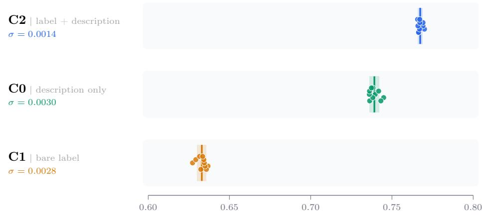
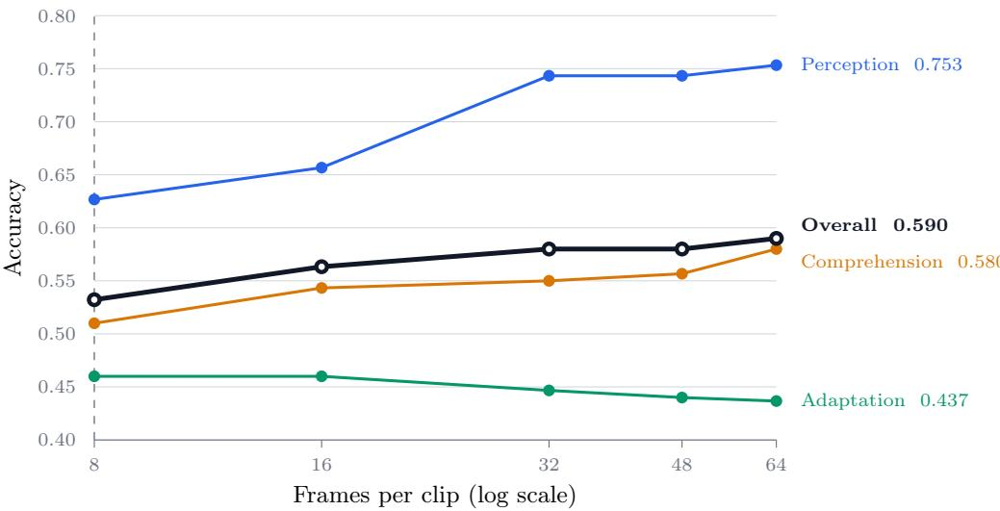
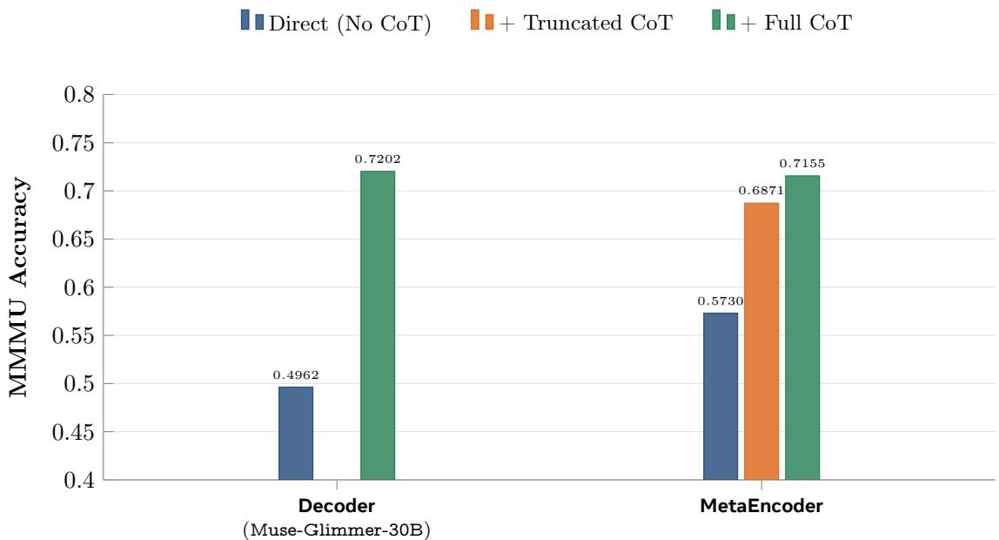

# MetaEncoder: Exploring the Limit of Bi-Encoders for Multimodal System One Decision Making with Natural Language Interface

Jianpeng Cheng, Guangyu Sun, Aashu Singh, Benyu Zhang, Haixing Dai, Hossein Mansour, Jiangfan Zhang, Shlok Kumar Mishra, Wei Sun, Xuanming Cui, Yanli Liu, Qi Guo, Max Xiangjun Fan, Jun Xiao

1Meta AI

System One models output constrained decisions and probability distributions rather than free-form text generation. While prevailing paradigms rely on structured schema objects to encode state, intent, and candidate choices, we revisit a fully natural language-based System One interface. In this framework, both the user request and each candidate option are expressed in natural language, supported by multimodal (image and video) auxiliary inputs. We introduce MetaEncoder, which fine-tunes a pre-trained Muse-Glimmer 30B decoder into an instruction-following decision-making encoder. To scale efectively across both small closed-set (< 256) and massive open-set (millions) candidate spaces, MetaEncoder employs a bi-encoder architecture trained via unidirectional contrastive learning for request-candidate alignment. We conduct extensive evaluations across 11 benchmark suites and 190 tasks spanning multimodal decision-making, understanding (closed-set) and retrieval (open-set), highlighting where MetaEncoder beats SOTA multimodal encoders, as well as its current limits on reasoning-intensive tasks.

Date: October 9, 2026 Hugging Face: https://huggingface.co/facebook/meta-encoder Github: https://github.com/facebook/meta-encoder-eval

∞Meta

## 1 Introduction

There is a recent trend of repurposing general-purpose encoders as System One models for decision making (TypeSafe AI, 2026). An encoder-only model answers fast and in a constrained form. It returns a choice among candidates, together with a probability distribution over them, instead of generating free-form text. Many production decisions fit this form: routing a request to an agent, selecting a tool, classifying content against a policy, ranking items, picking the next action in an environment, or retrieving a memory. For these, a calibrated score over candidates from a single forward pass is more useful than a generated answer.

Encoder models that score candidates are not a new topic. First, sentence-BERT (Reimers and Gurevych, 2019) and dense retrievers (Karpukhin et al., 2020) popularized bi-encoders. These embed a query and a candidate independently and compare them by vector similarity, and they were later scaled into universal text embedders (Wang et al., 2022; Xiao et al., 2024; Su et al., 2023; Wang et al., 2024). In vision, two-tower models such as CLIP (Radford et al., 2021) align images with texts through contrastive learning. More recently, multimodal embedders built on vision-language backbones cast classification, question answering, and grounding as retrieval over candidates (Jiang et al., 2024, 2025; Zhang et al., 2025a). Second, Crossencoders (Nogueira and Cho, 2019; Nogueira et al., 2020) instead encode the query and the candidate together, trading eficiency for accuracy, and remain the standard choice for reranking. Finally, constrained decoders can also score candidates directly. The options are listed in the prompt under identifiers (A, B, C, . . . ), and the model picks the identifier with the highest next-token probability (Hendrycks et al., 2021; Robinson et al., 2023; Gangi Reddy et al., 2024). This model compares all options jointly, but the candidate cardinality is bounded by the context window and results are sensitive to option order (Pezeshkpour and Hruschka, 2024; Zheng et al., 2024). We review all above work in Section 2.

When such a model is repurposed as a System One model, a common interface is a structured request object.

It contains separate fields for the context or state, the questions or instructions, the options and scoring criteria, and each task has its own schema. Schemas are precise, but they are rigid. In this work we revisit a fully natural-language interface. The prompt is free-form text, optionally with images or video, that describes the state, the instruction, and the criteria for the task. The output stays constrained to a set of candidate options, each of which is also described in natural language. Our goal is a general-purpose encoder that follows instructions and makes decisions, similar to prompting a decoder-only model.

A key consideration in choosing the encoder architecture is balancing eficiency against scalability. Scalability here means both the number of candidates that can be scored and whether candidate representations can be cached. Cross-encoders and constrained decoders are powerful because the request attends to candidates directly. However, they cannot cache eficiently, so they do not scale to large candidate sets. Bi-encoders encode candidates independently of the request. This makes the candidate cardinality scale from a closed set of <256 options to millions of items. However, the price is that all interaction between request and candidate passes through a single vector. Whether that bottleneck can still support instruction generalization is an open question. In this work we revisit bi-encoders and explore how far they can go as general-purpose, instruction-following encoders. Empirically, we demonstrate that bi-encoders can also achieve high accuracy in closed-set decision-making by incorporating candidate options directly into the request’s prompt, supplying the model with information equivalent to that of a constrained decoder.

We train MetaEncoder, a general-purpose multimodal encoder for instruction-following decision making, understanding and retrieval. MetaEncoder fine-tunes a pre-trained Muse-Glimmer (Meta Superintelligence Lab, 2026) 30B decoder into an encoder. For training, MetaEncoder adopts unidirectional contrastive learning to align each request with its target candidate, diferentiating closed- and open-set problems through the negative selection strategy (i.e., using a provided option list vs. gathering across all devices). For inference, the same model handles small closed sets of fewer than 256 options and open corpora of millions of candidates, which difer only in how the request prompt is constructed. MetaEncoder adopts the natural-language interface described above, so users interact with it similar to a decoder-only LLM. Both the request and the candidates can be multimodal.

We evaluate MetaEncoder across 11 benchmark suites comprising 190 tasks. These span closed-set multimodal decision-making and understanding (JevBench (Standhartinger and Contributors, 2026), ImaJevBench (Mohit and Contributors, 2026), MMLU (Hendrycks et al., 2021), MMMU (Yue et al., 2024), VideoMMMU (Hu et al., 2025), NaturalBench (Li et al., 2024), and TempCompass (Liu et al., 2024)) as well as open-corpus retrieval (NanoBEIR (AI, 2025), MMEB-v3 image, video, and visdoc (Huang et al., 2026)). MetaEncoder outperforms state-of-the-art (SOTA) multimodal embedding models (Zhou et al., 2026; Li et al., 2026) on all decision-making tasks while achieving near-SOTA results on multimodal retrieval benchmarks which is beyond the scope of Jev models (Wortega and Contributors, 2026). On the other hand, we also identify the inherent limitations of bi-encoder architectures on complex decision-making tasks relative to decoders, where the lack of explicit reasoning capabilities remains the primary bottleneck.

In summary, our contributions are:

• We revisit a fully natural-language System One interface. The request is free-form text with auxiliary images and video, and the output is constrained to candidate options that are themselves described in natural language.

• We train MetaEncoder, a bi-encoder fine-tuned from a 30B multimodal decoder with request-to-candidate contrastive learning. It scales from closed sets of fewer than 256 options to open corpora of millions of candidates.

• We conduct an extensive evaluation over 11 benchmark suites and 190 tasks. It identifies both where a bi-encoder can act as a general-purpose, instruction-following encoder and where it does not yet generalize.

## 2 Related Work

A general-purpose encoder maps an instruction, a context (text, image, video, etc.), and a set of candidates to a decision. Classification, retrieval routing, reranking, and judgment all fit this one interface. They difer only in where the candidate set comes from: a global corpus, a fixed label space, or a set defined by each example, as in Jev-style tasks where every row carries its own options and criteria. Early universal embedders focused on text retrieval and semantic similarity (Reimers and Gurevych, 2019; Karpukhin et al., 2020; Wang et al., 2022; Li et al., 2023; Xiao et al., 2024). Later work added instructions to the input (Su et al., 2023; Wang et al., 2024; Lee et al., 2025; Muennighof et al., 2025; BehnamGhader et al., 2024) and extended the recipe to multimodal inputs using vision-language backbones (Jiang et al., 2024, 2025; Zhang et al., 2025a; Lin et al., 2025; Gu et al., 2026; Chen et al., 2026; Zhang et al., 2025a), and augmenting encoder input with reasoning (Cui et al., 2026, 2025; Lan et al., 2026; Cheng et al., 2026; Jiang et al., 2026). Benchmarks such as MTEB (Muennighof et al., 2023) and MMEB (Jiang et al., 2025) already cast classification, VQA, and grounding as ranking over candidates. Broadly, a model built on a language-model backbone can score candidates in 3 ways. They difer in how much the prompt and the candidates interact, and therefore in cost, scalability, and expressiveness:

(1) Bi-encoders. A bi-encoder embeds the prompt (instruction, state, context, etc.) and each candidate separately and scores them by cosine similarity. It is trained with a CLIP-style contrastive objective that pulls the prompt toward its gold candidate and pushes it away from in-batch or hard negatives (Radford et al., 2021; Jia et al., 2021; Zhai et al., 2023; van den Oord et al., 2018). This is the dominant design for universal embedders (Wang et al., 2022; Su et al., 2023; Wang et al., 2024; Lee et al., 2025; Jiang et al., 2025; Zhang et al., 2025a). Its main advantage is eficiency: since candidate embeddings do not depend on the prompt, they can be precomputed and indexed. Scoring K candidates then costs a single prompt forward pass plus K dot products, and this scales to candidates of millions. However, the tradeof lies in expressiveness: since all interaction happens through a single dot product, the prompt embedding must anticipate every candidate it might be compared against. This is a known weakness on fine-grained or compositional distinctions (Yuksekgonul et al., 2023; Thrush et al., 2022). It is especially limiting when what a label means is defined by the prompt itself, for example by row-specific criteria, since the candidate embedding cannot see those criteria. Late-interaction models such as ColBERT (Khattab and Zaharia, 2020) relax the single-vector bottleneck but still encode the two sides independently.

(2) Cross-encoders. A cross-encoder concatenates the prompt with one candidate at a time. A shared transformer processes the pair jointly, and a scalar relevance score is read from a classification head or from the logit of a yes/true token (Nogueira and Cho, 2019; Nogueira et al., 2020; Ma et al., 2024; Zhang et al., 2025b). Full token-level attention between prompt and candidate makes cross-encoders consistently more accurate than bi-encoders. That is why they serve as the second-stage reranker in retrieve-then-rerank pipelines (Nogueira and Cho, 2019; Xiao et al., 2024; Cui et al., 2025). LLM-as-a-judge pointwise scoring follows the same pattern (Zheng et al., 2023). Two costs follow from the design: First, nothing can be cached: scoring K candidates takes K full forward passes over the shared prompt. Second, each candidate is scored in isolation, so the model never compares candidates directly. Scores must be calibrated across independent passes, and the model cannot use the structure of the option set (none of the above, mutually exclusive labels, near-duplicate options) to decide.

(3) One-step constrained decoding. The third approach puts the instruction, the context, and all candidates into a single prompt. Each candidate is labeled with an identifier $( \mathrm { A } , \mathrm { B } , \dots , \mathrm { Z } )$ , and a generative model is asked to emit one identifier token. The prediction is the argmax of the next-token distribution restricted to the valid identifiers. Since the vocabulary projection can be pruned to constrain outputs, the approach acts as a cheap encoder prefilling pass topped with a light linear decision layer. This is the standard multiple-choice format for evaluating LLMs (Hendrycks et al., 2021; Robinson et al., 2023). It underlies zero-shot classification through verbalizers (Schick and Schütze, 2021) and has been adopted for listwise reranking, where the first generated identifier’s logits act as the ranking score (Sun et al., 2023; Gangi Reddy et al., 2024). Because all candidates share one context, the model can compare them jointly. Inference takes a single forward pass regardless of K, and no new head or training objective is needed beyond the language-modeling loss. On the other hand, the limitations come from treating candidates as tokens in a sequence. Accuracy is sensitive to option order and identifier choice (Pezeshkpour and Hruschka, 2024; Zheng et al., 2024). The candidate set is bounded by the size of the identifier alphabet and by the context window, so the approach cannot support large candidates. Besides, the output is a distribution over positions, but not a reusable representation of the candidates. As a result, nothing can be indexed, cached across prompts, or reused for retrieval and clustering.

Summary. The three designs trade of along one axis: how much the prompt and the candidates interact. Biencoders allow none interactions, which buys indexing and scale. Cross-encoders let the prompt interact with each candidate individually, which buys accuracy at $O ( K )$ cost and no representation caching. Constrained generation lets all candidates interact with each other and with the prompt in one pass, but it gives up open-ended candidate sets and reusable embeddings completely. In this work, we adopt a cachable bi-encoder design to explore its limit in general-purpose decision making.

## 3 MetaEncoder

## 3.1 Natural-language interface

MetaEncoder scores a set of candidates $\mathcal { C } = \{ c _ { 1 } , \ldots , c _ { K } \}$ against a request q. The request is a free-form prompt, optionally interleaved with images or video. It describes everything the decision depends on, such as the context and state; the instruction and question; the criteria which define what each option means. Each candidate $c _ { k }$ is also expressed in natural language: a text description with optionally an image or video. Closed-set decision making and open-set retrieval therefore share one interface. They difer only in whether C is a small set which can be added into the request as additional context, or a large corpus which has to be indexed in advance. For large open-set candidates, it is not possible to add them as additional context into the request due to context window restrictions.

## 3.2 Architecture

MetaEncoder is a bi-encoder initialized from the pre-trained Muse-Glimmer 30B multimodal decoder. The same network $f _ { \theta }$ encodes requests and candidates. Images and video are processed by the backbone’s native vision tower and interleaved with the text tokens.

Last-token representation. We keep the backbone’s causal attention and take the final-layer hidden state of the last token as the representation, normalized to unit length:

$$
\mathbf { q } = \frac { h _ { \mathrm { l a s t } } ( q ) } { \| h _ { \mathrm { l a s t } } ( q ) \| _ { 2 } } , \qquad \mathbf { c } _ { k } = \frac { h _ { \mathrm { l a s t } } ( c _ { k } ) } { \| h _ { \mathrm { l a s t } } ( c _ { k } ) \| _ { 2 } } .\tag{1}
$$

Under causal attention, the last token attends to every token in the input. It therefore sees the full context for the request, including state, instruction, criteria and options (for closed-set only), as well as all visua tokens, and can therefore summarize the request.

Candidates in the prompt. For small closed sets, the candidate options can be listed in the request itself. Listing them in request gives the last token a global view, so that the model sees which alternatives exist and can contrast options. This recovers some of the joint-reasoning-over-candidate ability ofered by cross-encoders and decoder-only models. However, for open-set retrieval, the candidate pool is too large to list in request anyway. To support both cases, during training we dropout the option list from the prompt for a random fraction of closed-set examples. The model then cannot purely rely on matching option text in the prompt and must still embed the request meaningfully.

Scoring. Each request-candidate is scored by cosine similarity, $s ( q , c ) = \mathbf { q } ^ { \intercal } \mathbf { c }$ . So a softmax over $\{ s ( q , c _ { k } ) / \tau \} _ { k = 1 } ^ { K }$ gives a probability distribution over the candidate set. In this way, candidate embeddings do not depend on the request, so they can be computed once and cached. This scoring mechanism scales from a closed set of a few options to an index of millions of items.

## 3.3 Unidirectional Contrastive Training

We train MetaEncoder to align each request with its correct candidate. Each example is a pair $( q _ { i } , c _ { i } ^ { + } )$ For a batch of B requests, the loss is an InfoNCE objective (van den Oord et al., 2018) applied in the

request-to-candidate direction only:

$$
\mathcal { L } = - \frac { 1 } { B } \sum _ { i = 1 } ^ { B } \log \frac { \exp \left( s ( q _ { i } , c _ { i } ^ { + } ) / \tau \right) } { \sum _ { c \in \mathcal { N } ( q _ { i } ) \cup \{ c _ { i } ^ { + } \} } \exp \left( s ( q _ { i } , c ) / \tau \right) } ,\tag{2}
$$

The negative set $\textstyle { \mathcal { N } } ( q _ { i } )$ depends on the training task type:

• Open-set (retrieval). $\textstyle { \mathcal { N } } ( q _ { i } )$ contains the gathered candidates of the other requests in the global batch, plus hard negatives where available. Any in-batch candidate that is identical to $c _ { i } ^ { + }$ is removed from $\textstyle { \mathcal { N } } ( q _ { i } )$

• Closed-set (decision making). $\textstyle { \mathcal { N } } ( q _ { i } )$ is the request’s own option set, minus the gold option. The softmax therefore runs over exactly the candidates the task ofers, so training matches evaluation, where each example is scored against its own options.

## 4 Experiment

## 4.1 Benchmarks

We evaluate MetaEncoder on 11 benchmarks comprising 190 tasks (Table 1). We group them into three capabilities: decision making, multimodal understanding, and retrieval. They span both candidate regimes: in the closed-set regime, each request comes with its own small option set (fewer than 256 candidates). In the open-set regime, the request is scored against a shared larger candidate pool.

Decision making. These benchmarks are recently established to evaluate System One models. Each example in the benchmarks consists of a task state, an instruction, decision criteria that define the labels, and a set of label options.

• JEVBench (Standhartinger and Contributors, 2026) contains 231 text-only decision rows in three splits: original (72 rows), easy (48), and hard (111). Each row defines its own label set of 2 to 6 options, and the meaning of each label is given only by the row’s criteria. The splits contain 6, 13, and 80 distinct task instructions, respectively.

• ImaJEV-Bench (Mohit and Contributors, 2026) extends the Jev format to multimodal states. It has 173 dev entries in three subsets. In visual, the answer must be read from an image, e.g., the current price of an item on a menu board. In text, the state is given entirely in text, e.g., checking an invoice’s lines against its stated total under a rule. In joint, a rule stated in text must be applied to values that appear only in the image, e.g., approving an order whose total is computed from the prices on the board.

Multimodal understanding. We cast standard multiple-choice understanding benchmarks as candidate scoring.   
The question and any image or video form the request, and each answer option is embedded as a candidate.

• MMLU (Hendrycks et al., 2021): text-only knowledge-related multi-choice questions. There are 57 subjects in total.

• MMMU (Yue et al., 2024): college-level image-text multi-choice questions across 30 subjects.

• Video-MMMU (Hu et al., 2025): multi-choice questions about professional lecture videos, organized into 3 tracks (Perception, Comprehension, Adaptation).

• NaturalBench (Li et al., 2024): adversarially paired natural image-question examples that penalize answering from language priors alone. We evaluate 4,000 two-option rows.

• TempCompass (Liu et al., 2024): fine-grained temporal perception in video. We evaluate its multiplechoice format, using the full option sentence as the candidate rather than the option letter.

## Retrieval.

• NanoBEIR (AI, 2025): 13 multilingual text retrieval tasks of BEIR (Thakur et al., 2021). Each query is scored against the task’s full passage corpus.

<table><tr><td>Capability</td><td>Benchmark</td><td>Modality</td><td>Candidates</td><td>Tasks</td><td>Metric</td></tr><tr><td rowspan="2">Decision making</td><td>JEVBench</td><td>Text</td><td>Closed</td><td>3</td><td>Accuracy</td></tr><tr><td>ImaJEV-Bench</td><td>Multimodal</td><td>Closed</td><td>3</td><td>Accuracy</td></tr><tr><td rowspan="5">Multimodal understanding</td><td>MMLU</td><td>Text</td><td>Closed</td><td>57</td><td>Hit@1</td></tr><tr><td>MMMU</td><td>Multimodal</td><td>Closed</td><td>30</td><td>Hit@1</td></tr><tr><td>Video-MMMU</td><td>Multimodal</td><td>Closed</td><td>3</td><td>Hit@1</td></tr><tr><td>NaturalBench</td><td>Multimodal</td><td>Closed</td><td>1</td><td>Hit@1</td></tr><tr><td>TempCompass</td><td>Multimodal</td><td>Closed</td><td>1</td><td>Hit@1</td></tr><tr><td rowspan="4">Retrieval</td><td>NanoBEIR</td><td>Text</td><td>Open</td><td>13</td><td>nDCG@10</td></tr><tr><td>MMEB-V3 Image</td><td>Multimodal</td><td>Open</td><td>37</td><td>Hit@1</td></tr><tr><td>MMEB-V3 Video</td><td>Multimodal</td><td>Open</td><td>18</td><td>Hit@1</td></tr><tr><td>MMEB-V3 VisDoc</td><td>Multimodal</td><td>Open</td><td>24</td><td>nDCG@5</td></tr><tr><td>Total</td><td></td><td></td><td></td><td>190</td><td></td></tr></table>

Table 1 Evaluation benchmarks. Tasks counts the scored task units for each suite. Closed-set tasks score each request against its own option set (fewer than 256 candidates). Open-set tasks score against a shared and larger candidate pool.

• MMEB-V3 (Huang et al., 2026): the image (37 tasks), video (18 tasks), and visual-document (24 tasks) partitions of the MMEB-V3. They cover multimodal classification, question answering, grounding, and retrieval, all formulated as ranking candidates for a multimodal query.

## 4.2 Evaluation

All benchmarks are scored the same way. The request is rendered in natural language and encoded once with the last-token representation (Section 3.2), and each candidate is encoded independently. Candidates are then ranked by cosine similarity. The prompt used for each benchmark is provided in App. A.

Closed set. Each request is scored only against its own options, and the prediction is the highest-scoring option. This small set of options is added to the request so that the model has a global picture for decision making. We report accuracy, which is Hit@1 over the request’s option set.

Open set. Each request is scored against the full candidate pool of its task. The prompt contains only the state and task description, but not the options. For NanoBEIR we report nDCG@10 with linear gain. For MMEB-V3 we follow the benchmark’s protocol and report Hit@1 on the image and video partitions and nDCG@5 on visual documents.

Results Table 2 reports the results MetaEncoder across all evaluation suites. As baselines we include the SOTA decision making model OpenJev-27B (Wortega and Contributors, 2026), and two SOTA multimodal retrieval models leading the MMEB benchmark, including WeMM-Embedding-9B (Zhou et al., 2026) and Qwen3-VL-Embedding-8B (Zhang et al., 2025b).

The results of MetaEncoder demonstrates that a unified bi-encoder architecture can efectively master both multimodal decision-making and retrieval tasks. On decision-making and multimodal multiple-choice understanding benchmarks, MetaEncoder outperforms current SOTA retrieval models, including WeMM-Embedding-9B, which holds first place on the MMEB-V3 leaderboard (TIGER-Lab, 2026). However, MetaEncoder slightly lags behind OpenJev-27B in text-only decision-making. OpenJev-27B is a SOTA System One model that jointly encodes the request and all options using a single backbone paired with a decision scoring head. We attribute this performance gap to the structural diferences between bi-encoders and full-attention models, reflecting the classic tradeof between bi-encoder caching eficiency and cross-encoder ranking accuracy. However, OpenJev-27B does not have the ability for retrieval tasks nor multimodal tasks.

## 4.3 Analysis

## 4.3.1 Whether to Include Options in Prompt

Bi-encoders encode requests and candidates independently, computing scores via inner product instead of cross-attention. This architecture is efective when candidates are semantically distinct, but multiplechoice benchmarks frequently present options difering by a single attribute—such as "red, oxidative, slow contracting" versus "red, oxidative, fast contracting". To equip the encoder with a global picture of what candidates are available, one solution we adopt is to put the option list directly into the request if the cardinality is small. In this ablation study, we compare evaluation results with and without the options in the prompt. The ablation is conducted on MMLU and MMMU.

<table><tr><td>Category</td><td>Benchmark</td><td>MetaEncoder</td><td>OpenJev (27B)</td><td>WeMM-Embedding (9B)</td><td>Qwen3-VL-Embedding (8B)</td></tr><tr><td rowspan="4">Decision making</td><td>JevBench (orig)</td><td>0.9444</td><td>0.9861</td><td>0.6250</td><td>0.6389</td></tr><tr><td>JevBench (easy)</td><td>1.0</td><td>1.0</td><td>0.9792</td><td>0.9375</td></tr><tr><td>JevBench (hard)</td><td>0.7387</td><td>0.7658</td><td>0.4865</td><td>0.4324</td></tr><tr><td>Jev Intelligence</td><td>81.4</td><td>84.5</td><td>45.8</td><td>42.1</td></tr><tr><td>Multimodal decision making</td><td>ImaJev (dev)</td><td>0.8555</td><td></td><td>0.8117</td><td>0.7792</td></tr><tr><td>General knowledge understanding</td><td>MMLU</td><td>0.7767</td><td>0.8601</td><td>0.7325</td><td>0.6544</td></tr><tr><td rowspan="4">Multimodal understanding</td><td>MMMU</td><td>0.5788</td><td></td><td>0.5656</td><td>0.5062</td></tr><tr><td>VideoMMMU</td><td>0.59</td><td></td><td>0.4846</td><td>0.4187</td></tr><tr><td>NaturalBench</td><td>0.813</td><td></td><td>0.8017</td><td>0.7097</td></tr><tr><td>TempCompass</td><td>0.7346</td><td></td><td>0.7527</td><td>0.7172</td></tr><tr><td>Multilingual text retrieval</td><td>NanoBEIR</td><td>0.6634</td><td></td><td>0.6175</td><td>0.6061</td></tr><tr><td rowspan="3">Multimodal retrieval</td><td>MMEB V3 (image)</td><td>0.7897</td><td></td><td>0.8099</td><td>0.7796</td></tr><tr><td>MMEB V3 (video)</td><td>0.6486</td><td></td><td>0.7431</td><td>0.6715</td></tr><tr><td>MMEB V3 (visdoc)</td><td>0.8149</td><td></td><td>0.8334</td><td>0.8236</td></tr></table>

Table 2 Benchmark Evaluation Results for MetaEncoder compared to SOTA System One decision makers and SOTA retrieval models.
<table><tr><td>Benchmark</td><td>Without options</td><td>With options</td><td>∆</td></tr><tr><td>MMLU (57 subjects)</td><td>0.5645</td><td>0.7456</td><td>+0.1811</td></tr><tr><td>MMMU (30 subjects)</td><td>0.4875</td><td>0.5629</td><td>+0.0754</td></tr><tr><td>MMMU-Pro (4 options)</td><td>0.4699</td><td>0.5553</td><td>+0.0854</td></tr><tr><td>MMMU-Pro (10 options)</td><td>0.3503</td><td>0.4237</td><td>+0.0734</td></tr></table>

Table 3 Efect of appending candidate option lists to the request prompt. Scores reflect unweighted subject means (MMLU, MMMU) or Hit@1 (MMMU-Pro).

Table 3 summarizes the main results, with detailed subject breakdowns provided in Tables 9 and 10. We find that appending option lists to request yields substantial, uniform gains: performance improves across 56 of 57 MMLU subjects and 27 of 30 MMMU subjects. These gains are more significant on text-only benchmarks than on multimodal ones.

Recommendation: Always append option list to the request for smaller candidate pool.

## 4.3.2 Candidate Format in Target

In bi-encoders the candidate string is the entire signal on the candidate side and the only interaction between a request-candidate pair is an inner product between the two vectors. In this section, we measures the impact of the candidate-side format to the final result.

We compare 3 variants of candidate renderings on MMLU and MMMU. In all variants, the request is always the options-in-prompt form (option list and its letters are enumerated in the request); only the candidate strings change:

<table><tr><td></td><td>Rendering</td><td>Example</td></tr><tr><td>C0</td><td>description only</td><td>&quot;red, oxidative, slow contracting.&quot;</td></tr><tr><td>C1</td><td>bare label</td><td>&quot;C&quot;</td></tr><tr><td>C2</td><td>label and description</td><td>&quot;C. red, oxidative, slow contracting.&quot;</td></tr></table>

The results of the three variants are in Table 4. In summary, including both labels and descriptions (C2)

<table><tr><td>Benchmark</td><td>C0</td><td>C1</td><td>C2</td><td> $\Delta _ { \mathrm { C 1 } }$ </td><td> $\Delta _ { \mathrm { C 2 } }$ </td></tr><tr><td>MMLU (57 subjects)</td><td>0.7456</td><td>0.6512</td><td>0.7767</td><td>-0.0944</td><td>+0.0311</td></tr><tr><td>MMMU (30 subjects)</td><td>0.5629</td><td>0.4983</td><td>0.5788</td><td>-0.0646</td><td>+0.0159</td></tr><tr><td>MMMU-Pro</td><td>0.4916</td><td>0.3803</td><td>0.5042</td><td>-0.1113</td><td>+0.0126</td></tr></table>

Table 4 Candidate rendering, with the request held fixed at the options-in-prompt form. C0 description only. C1: bare label. C2: label and description. Hit@1 is the metric over all rows; ∆ is against C0.

  
Figure 1 10 random permutations of option order across three variants on MMLU. Standard deviation is measured.

works the best. Meanwhile, using only positional labels (C1) in the candidate side regresses all benchmarks. Despite so, it should be noted that using label only (C1) still reaches 0.6512 on MMLU against a chance floor of 0.2500. This is a clean demonstration that the model resolves a pointer: the letter "C" carries no information about the option semantics and yet it recovers most of the task. However, resolution also degrades as the option set grows: on MMMU the C1 deficit widens monotonically with the number of options, from +0.0281 at three options to −0.0792 at four, −0.1344 at five and −0.1725 at ten, against the C0 baseline. A pointer is harder to resolve more options.

Recommendation: Render each candidate as its identifier and its description.

## 4.3.3 Sensitivity to candidate order

The previous sections analyze the request and candidate representations which can include labels (A...Z). A natural question to ask is the robustness of option ordering in both the request and candidate sides.

On MMLU, we permute the option order for each candidate which is reflected inside the request and also at the candidate side for C1 and C2. For C0, it afects request only since the candidate is label free. We run 10 independent permutations for that the candidate orders are shufle randomly in each permutation. We then visualize the score distribution for C0, C1 and C2.

Figure 1 shows the results of all 10 runs. In summary, candidate order barely matters for all variants. Across the 10 permutations, none of the three standard deviation exceeds 0.003.

Conclusion The bi-encoder based model is robust to option orders in the prompt and at the target side.

## 4.3.4 Video understanding

All above analysis focuses on text and image benchmarks. In this section we deep analyze MetaEncoder video understanding on Video MMMU benchmark, focusing on the impact of the number of frames for encoding, as well as the rendering of the request and of the candidates.

Setup. We follow the oficial Video-MMMU protocol: each of the three tracks (Perception, Comprehension, Adaptation) is scored over its 300 questions and the overall score is their mean. Frames are sampled uniformly from 64 extracted per clip.

<table><tr><td rowspan="3">Request</td><td colspan="5">Candidate</td></tr><tr><td>(A) text</td><td>A. text</td><td>text</td><td>(A)</td><td>A</td></tr><tr><td>Default instruction, (A) list</td><td>0.5800</td><td>0.5656</td><td>0.4933</td><td>0.4789</td><td>0.4556</td></tr><tr><td>Select the correct option., (A) list</td><td>0.5711</td><td>0.5667</td><td>0.5011</td><td>0.5178</td><td>0.4789</td></tr><tr><td>Select the correct option., A. list</td><td>0.5544</td><td>0.5556</td><td>0.4989</td><td>0.4100</td><td>0.3744</td></tr></table>

Table 5 Video-MMMU overall accuracy (oficial protocol, 32 frames) by request and candidate rendering. Rows vary the request: the default instruction (Appendix A.3) or Select the correct option., with options listed as (A) . . . or A. . . . . Columns vary the candidate.

  
Figure 2 Video-MMMU accuracy as a function of the number of frames sampled per clip, with the request and candidate rendering fixed at the defaults of Appendix A.3. Accuracy follows the oficial protocol: each track is scored over its 300 questions (open-ended Adaptation questions count as wrong) and Overall is the mean of the three tracks. Doubling from 8 to 16 and from 16 to 32 frames adds 0.021 and 0.027 overall.

More frames help. As shown in Figure 2, accuracy rises monotonically with the frame budget, from 0.5322 at 8 frames to 0.5800 at 32 and 0.5900 at 64. Most of the gain arrives by 32 frames. Repeated runs of the same configuration agree within 0.0011 standard deviation, so the trend is well above run-to-run noise. Because video tokens grow linearly with the number of frames, the 64-frame setting costs roughly eight times for a 0.058 gain.

The gain is perceptual. The improvement is concentrated where the answer is on screen. Perception rises by 0.127 (from 0.6267 to 0.7533) and Comprehension by 0.070, while Adaptation falls slightly (0.4600 to 0.4367). By question type, OCR improves from 0.6173 to 0.7509; concept and problem-solving comprehension improve by 0.064 and 0.078. However, the two Adaptation types do not improve (problem-solving adaptation regressed from 0.4071 to 0.4000; case-study analysis regressed from 0.5827 to 0.5396). This indicates that for tasks requiring more complex reasoning, the performance bottleneck of encoder-only architectures becomes more pronounced.

Request and candidate representations also matter for video understanding. Table 5 varies the request and candidate rendering at 32 frames. The pattern matches the closed-set findings of Sections 4.3.1 and 4.3.2. Removing the option list from the request leads to a large regression. With the list present, the best candidate is the option’s letter together with its text. Dropping the letter costs 0.087, because the letter is what binds the candidate to its entry in the request, and dropping the text costs 0.101 to 0.124, because a bare letter carries no content to match.

Conclusion. Increasing frame count enhances video understanding, significantly boosting perception and modestly improving comprehension. However, it yields no benefit for more complex adaptation tasks. Prompt rendering findings transfer directly from text and image domains to video: options should be explicitly included in request, and each candidate should use both its label and full content.

<table><tr><td>Benchmark</td><td>Decoder</td><td>Encoder</td><td>Agreement</td></tr><tr><td>MMLU</td><td>0.7743</td><td>0.7740</td><td>0.8195</td></tr><tr><td>MMMU</td><td>0.4962</td><td>0.5730</td><td>0.7154</td></tr><tr><td>MMMU-Pro</td><td>0.4441</td><td>0.5039</td><td>0.7221</td></tr><tr><td>4 options</td><td>0.4976</td><td>0.5601</td><td>0.7200</td></tr><tr><td>10 options</td><td>0.3906</td><td>0.4477</td><td>0.7242</td></tr><tr><td>Video-MMMU</td><td>0.5267</td><td>0.5415</td><td>0.7531</td></tr><tr><td>Perception</td><td>0.6400</td><td>0.6333</td><td>一</td></tr><tr><td>Comprehension</td><td>0.4667</td><td>0.5000</td><td>一</td></tr><tr><td>Adaptation</td><td>0.4695</td><td>0.4875</td><td>一</td></tr></table>

Table 6 Encoder versus constrained decoder. Video uses 8 frames. Agreement denotes the fraction of instances where both models are simultaneously correct or incorrect.

## 4.3.5 Encoder versus Constrained Decoder

This section compares the MetaEncoder architecture against a constrained decoder baseline. For comparison, we use the pre-trained Muse-Glimmer backbone as a decoder, prompting it to generate an option label in a single constrained decoding step. Like the encoder setup, the decoder processes the request, including all candidate options, during prompt pre-filling. It then uses its output projection layer (restricted to valid option tokens A–Z) to emit logit scores for each option. Because the projection head is pruned to these candidate tokens, this approach is as computationally eficient as an encoder with a label projection head. Theoretically, this allows the decoder to evaluate all options jointly using its pre-trained next-token prediction capability while having full attention to request and options.

Table 6 presents the comparison. On MMLU, MetaEncoder and the constrained decoder perform comparably. On MMMU and MMMU-Pro and Video-MMMU, MetaEncoder all outperforms the decoder. We attribute the encoder’s better performance to three factors: 1) MetaEncoder is fine-tuned on contrastive data targeting this exact scoring task, whereas the decoder is trained for general next-token prediction; 2) MetaEncoder incorporates option candidates directly into the prompt, giving it full context parity with the decoder; and 3) constrained single-token decoding deprives the decoder of intermediate chain-of-thought (CoT) reasoning.

## 4.3.6 Missing Reasoning Ability

To test the third hypothesis above, we measured the total probability mass of Muse-Glimmer assigned to valid label tokens prior to the argmax step. Candidate letters account for 0.8679 of the probability mass on MMLU and 0.8434 on Video-MMMU, but only 0.7424 on MMMU, indicating that the decoder is reluctant to emit a direct option letter on complex reasoning tasks without prior step-by-step generation. To confirm this hypothesis, we disabled constrained decoding for the Muse-Glimmer decoder, allowing unconstrained generation. As shown in Figure 3, accuracy on MMMU jumped from 0.4962 to 0.7202. This improvement indicates that the primary performance bottleneck lies not in the scoring mechanism itself, but in whether intermediate reasoning is provided. Neither MetaEncoder nor the constrained decoder performs explicit reasoning, resulting in a ∼ 20% gap compared to an unconstrained decoder on MMMU.

As shown in Figure 3, we run further experiments on MMMU to show that providing pre-generated reasoning traces can improve MetaEncoder as well. Prepending CoT reasoning generated by Muse-Glimmer to the encoder prompt boosts MetaEncoder’s MMMU accuracy from 0.5730 to 0.7155. Because the generated CoT explicitly reveals the answer label in 93.7% of cases, we also evaluated a setting where final labels were truncated from the CoT to eliminate direct label leakage. Even without label leakage, MetaEncoder reaches 0.6871 accuracy on MMMU. This demonstrates that intermediate reasoning is the primary bottleneck for scoring models regardless of architecture, and incorporating reasoning traces efectively bridges this gap.

  
Figure 3 Impact of Chain-of-Thought (CoT) reasoning on MMMU accuracy. Disabling constrained single-token decoding for the Decoder or prepending CoT traces to MetaEncoder substantially bridges the performance gap (∼ 20%).

## 5 Conclusion

We present MetaEncoder, a multimodal bi-encoder that exposes a single natural language interface for closed-set decision-making, understanding, and open-set retrieval tasks. By utilizing a bi-encoder architecture, MetaEncoder enables eficient representation caching. Furthermore, we demonstrate that appending candidate options directly to the prompt allows bi-encoders to execute decision-making tasks efectively, narrowing the performance gap with cross-encoders and constrained decoders. Comprehensive evaluation across 11 benchmarks spanning multimodal decision-making, understanding, and retrieval demonstrates competitive performance.

Notably, candidate-pool size poses minimal dificulty for MetaEncoder: retrieving from a pool of 1,000 candidates is not harder for MetaEncoder than resolving a four-way multiple-choice question whose options difer by only a single attribute. Instead, task dificulty is dictated by whether an answer possesses clear semantic boundaries or requires pre-retrieval reasoning. Consequently, while MetaEncoder excels at reading, perception, classification, and single-step judgment, it shows weaker performance on complex comprehension and adaptation. To resolve this decision-accuracy bottleneck, reasoning capabilities have to be injected by either leveraging a decoder’s CoT as additional context, or making the encoder model be able to reason directly.

## References

Sionic AI. Nano-beir: A multilingual information retrieval benchmark with quality-enhanced queries, 2025. https: //huggingface.co/sionic-ai.

Parishad BehnamGhader, Vaibhav Adlakha, Marius Mosbach, Dzmitry Bahdanau, Nicolas Chapados, and Siva Reddy. LLM2Vec: Large language models are secretly powerful text encoders. In Conference on Language Modeling (COLM), 2024.

Haonan Chen, Chu Li, Zhicheng Wang, Yuanwei Liu, Yuanjiang Wang, Shaohua Jiang, and Zhicheng Dou. Douyin multimodal embedding model technical report. arXiv preprint arXiv:2608.02148, 2026.

Jianpeng Cheng, Xian Wu, Jiangfan Zhang, Wentao Bao, Chaitanya Ahuja, Shlok Kumar Mishra, Hanchao Yu, Yang Gao, Fan Xia, Qi Guo, et al. Tte-flash: Accelerating reasoning-based multimodal representations via think-then-embed tokens. arXiv preprint arXiv:2605.16638, 2026.

Xuanming Cui, Hong-You Chen, Hao Yu, Hao Yuan, Zihao Wang, Shlok Kumar Mishra, Hanchao Yu, Yonghuan Yang, Jun Xiao, Ser-Nam Lim, et al. Reason to contrast: A cascaded multimodal retrieval framework. arXiv preprint arXiv:2602.23369, 2025.

Xuanming Cui, Jianpeng Cheng, Hong-you Chen, Satya Narayan Shukla, Abhijeet Awasthi, Xichen Pan, Chaitanya Ahuja, Shlok Mishra, Taipeng Tian, Qi Guo, et al. Think then embed: Generative context improves multimodal embedding. In International Conference on Learning Representations, volume 2026, pages 2690–2709, 2026.

Revanth Gangi Reddy, JaeHyeok Doo, Yifei Xu, Md Arafat Sultan, Deevya Swain, Avirup Sil, and Heng Ji. FIRST: Faster improved listwise reranking with single token decoding. In Proceedings of the 2024 Conference on Empirical Methods in Natural Language Processing, pages 8642–8652, 2024.

Tiancheng Gu, Kaicheng Yang, Kaichen Zhang, Xiang An, Ziyong Feng, Yueyi Zhang, Weidong Cai, Jiankang Deng, and Lidong Bing. Unime-v2: Mllm-as-a-judge for universal multimodal embedding learning. In Proceedings of the AAAI Conference on Artificial Intelligence, volume 40, pages 21378–21386, 2026.

Dan Hendrycks, Collin Burns, Steven Basart, Andy Zou, Mantas Mazeika, Dawn Song, and Jacob Steinhardt. Measuring massive multitask language understanding. In International Conference on Learning Representations (ICLR), 2021.

Kairui Hu, Penghao Wu, Fanyi Pu, Wang Xiao, Yuanhan Zhang, Xiang Yue, Bo Li, and Ziwei Liu. Video-MMMU: Evaluating knowledge acquisition from multi-discipline professional videos. arXiv preprint arXiv:2501.13826, 2025.

Haohang Huang, Xuan Lu, Mingyi Su, Xuan Zhang, Ziyan Jiang, Ping Nie, Kai Zou, Tomas Pfister, Wenhu Chen, Wei Zhang, et al. Mmeb-v3: Measuring the performance gaps of omni-modality embedding models. arXiv preprint arXiv:2604.23321, 2026.

Chao Jia, Yinfei Yang, Ye Xia, Yi-Ting Chen, Zarana Parekh, Hieu Pham, Quoc V. Le, Yunhsuan Sung, Zhen Li, and Tom Duerig. Scaling up visual and vision-language representation learning with noisy text supervision. In Proceedings of the 38th International Conference on Machine Learning (ICML), 2021.

Haonan Jiang, Yuji Wang, Yongjie Zhu, Xin Lu, Wenyu Qin, Meng Wang, Pengfei Wan, and Yansong Tang. Embed-rl: Reinforcement learning for reasoning-driven multimodal embeddings. In European Conference on Computer Vision, pages 39–56. Springer, 2026.

Ting Jiang, Minghui Song, Zihan Zhang, Haizhen Huang, Weiwei Deng, Feng Sun, Qi Zhang, Deqing Wang, and Fuzhen Zhuang. E5-V: Universal embeddings with multimodal large language models. arXiv preprint arXiv:2407.12580, 2024.

Ziyan Jiang, Rui Meng, Xinyi Yang, Semih Yavuz, Yingbo Zhou, and Wenhu Chen. VLM2Vec: Training vision-language models for massive multimodal embedding tasks. In International Conference on Learning Representations (ICLR), 2025.

Vladimir Karpukhin, Barlas Oğuz, Sewon Min, Patrick Lewis, Ledell Wu, Sergey Edunov, Danqi Chen, and Wen-tau Yih. Dense passage retrieval for open-domain question answering. In Proceedings of the 2020 Conference on Empirical Methods in Natural Language Processing (EMNLP), pages 6769–6781, 2020.

Omar Khattab and Matei Zaharia. ColBERT: Eficient and efective passage search via contextualized late interaction over BERT. In Proceedings of the 43rd International ACM SIGIR Conference on Research and Development in Information Retrieval, pages 39–48, 2020.

Zhibin Lan, Liqiang Niu, Fandong Meng, Jie Zhou, and Jinsong Su. Ume-r1: Exploring reasoning-driven generative multimodal embeddings. In International Conference on Learning Representations, volume 2026, pages 115779– 115806, 2026.

Chankyu Lee, Rajarshi Roy, Mengyao Xu, Jonathan Raiman, Mohammad Shoeybi, Bryan Catanzaro, and Wei Ping. NV-Embed: Improved techniques for training LLMs as generalist embedding models. In International Conference on Learning Representations (ICLR), 2025.

Baiqi Li, Zhiqiu Lin, Wenxuan Peng, Jean de Dieu Nyandwi, Daniel Jiang, Zixian Ma, Simran Khanuja, Ranjay Krishna, Graham Neubig, and Deva Ramanan. NaturalBench: Evaluating vision-language models on natural adversarial samples. In Advances in Neural Information Processing Systems (NeurIPS), 2024.

Mingxin Li, Yanzhao Zhang, Dingkun Long, Keqin Chen, Sibo Song, Shuai Bai, Zhibo Yang, Pengjun Xie, An Yang, Dayiheng Liu, et al. Qwen3-vl-embedding and qwen3-vl-reranker: A unified framework for state-of-the-art multimodal retrieval and ranking. arXiv preprint arXiv:2601.04720, 2026.

Zehan Li, Xin Zhang, Yanzhao Zhang, Dingkun Long, Pengjun Xie, and Meishan Zhang. Towards general text embeddings with multi-stage contrastive learning. arXiv preprint arXiv:2308.03281, 2023.

Sheng-Chieh Lin, Chankyu Lee, Mohammad Shoeybi, Jimmy Lin, Bryan Catanzaro, and Wei Ping. Mm-embed: Universal multimodal retrieval with multimodal llms. In International Conference on Learning Representations, volume 2025, pages 44215–44234, 2025.

Yuanxin Liu, Shicheng Li, Yi Liu, Yuxiang Wang, Shuhuai Ren, Lei Li, Sishuo Chen, Xu Sun, and Lu Hou. TempCompass: Do video LLMs really understand videos? In Findings of the Association for Computational Linguistics: ACL 2024, pages 8731–8772, 2024.

Xueguang Ma, Liang Wang, Nan Yang, Furu Wei, and Jimmy Lin. Fine-tuning LLaMA for multi-stage text retrieval. In Proceedings of the 47th International ACM SIGIR Conference on Research and Development in Information Retrieval, pages 2421–2425, 2024.

Meta Superintelligence Lab. Muse glimmer-30b model card. https://huggingface.co/meta-models/Muse-Glimmer-30B, august 2026. Hugging Face Model Repository.

Mohit and Contributors. Imajevbench: Benchmark for typed decisions from visual evidence and rules. https: //huggingface.co/datasets/mohit67890/imajev-bench, september 2026. Dataset and Multimodal Evaluation Suite.

Niklas Muennighof, Nouamane Tazi, Loïc Magne, and Nils Reimers. MTEB: Massive text embedding benchmark. In Proceedings of the 17th Conference of the European Chapter of the Association for Computational Linguistics, pages 2014–2037, 2023.

Niklas Muennighof, Hongjin Su, Liang Wang, Nan Yang, Furu Wei, Tao Yu, Amanpreet Singh, and Douwe Kiela. Generative representational instruction tuning. In International Conference on Learning Representations (ICLR), 2025.

Rodrigo Nogueira and Kyunghyun Cho. Passage re-ranking with BERT. arXiv preprint arXiv:1901.04085, 2019.

Rodrigo Nogueira, Zhiying Jiang, and Jimmy Lin. Document ranking with a pretrained sequence-to-sequence model. In Findings of the Association for Computational Linguistics: EMNLP 2020, pages 708–718, 2020.

Pouya Pezeshkpour and Estevam Hruschka. Large language models sensitivity to the order of options in multiple-choice questions. In Findings of the Association for Computational Linguistics: NAACL 2024, pages 2006–2017, 2024.

Alec Radford, Jong Wook Kim, Chris Hallacy, Aditya Ramesh, Gabriel Goh, Sandhini Agarwal, Girish Sastry, Amanda Askell, Pamela Mishkin, Jack Clark, Gretchen Krueger, and Ilya Sutskever. Learning transferable visual models from natural language supervision. In Proceedings of the 38th International Conference on Machine Learning (ICML), 2021.

Nils Reimers and Iryna Gurevych. Sentence-BERT: Sentence embeddings using Siamese BERT-networks. In Proceedings of the 2019 Conference on Empirical Methods in Natural Language Processing and the 9th International Joint Conference on Natural Language Processing (EMNLP-IJCNLP), pages 3982–3992, 2019.

Joshua Robinson, Christopher Michael Rytting, and David Wingate. Leveraging large language models for multiple choice question answering. In International Conference on Learning Representations (ICLR), 2023.

Timo Schick and Hinrich Schütze. Exploiting cloze-questions for few-shot text classification and natural language inference. In Proceedings of the 16th Conference of the European Chapter of the Association for Computational Linguistics: Main Volume, pages 255–269, 2021.

Florian Standhartinger and Contributors. Jevbench: Metamorphic coherence testing for typed probabilistic decision models. https://github.com/fstandhartinger/jevbench, september 2026. Benchmark Repository and Evaluation Suite.

Hongjin Su, Weijia Shi, Jungo Kasai, Yizhong Wang, Yushi Hu, Mari Ostendorf, Wen-tau Yih, Noah A. Smith, Luke Zettlemoyer, and Tao Yu. One embedder, any task: Instruction-finetuned text embeddings. In Findings of the Association for Computational Linguistics: ACL 2023, pages 1102–1121, 2023.

Weiwei Sun, Lingyong Yan, Xinyu Ma, Shuaiqiang Wang, Pengjie Ren, Zhumin Chen, Dawei Yin, and Zhaochun Ren. Is ChatGPT good at search? investigating large language models as re-ranking agents. In Proceedings of the 2023 Conference on Empirical Methods in Natural Language Processing, pages 14918–14937, 2023.

Nandan Thakur, Nils Reimers, Andreas Rücklé, Abhishek Srivastava, and Iryna Gurevych. BEIR: A heterogenous benchmark for zero-shot evaluation of information retrieval models. In Proceedings of the Neural Information Processing Systems Track on Datasets and Benchmarks, 2021.

Tristan Thrush, Ryan Jiang, Max Bartolo, Amanpreet Singh, Adina Williams, Douwe Kiela, and Candace Ross. Winoground: Probing vision and language models for visio-linguistic compositionality. In Proceedings of the IEEE/CVF Conference on Computer Vision and Pattern Recognition (CVPR), pages 5228–5238, 2022.

TIGER-Lab. Massive multimodal embedding benchmark (mmeb) leaderboard. https://huggingface.co/spaces/ TIGER-Lab/MMEB-Leaderboard, 2026. Accessed: 2026-10-07.

TypeSafe AI. Introducing system one models & jev. https://typesafe.ai, september 2026. Technical Announcement and Early Access Release.

Aaron van den Oord, Yazhe Li, and Oriol Vinyals. Representation learning with contrastive predictive coding. arXiv preprint arXiv:1807.03748, 2018.

Liang Wang, Nan Yang, Xiaolong Huang, Binxing Jiao, Linjun Yang, Daxin Jiang, Rangan Majumder, and Furu Wei. Text embeddings by weakly-supervised contrastive pre-training. arXiv preprint arXiv:2212.03533, 2022.

Liang Wang, Nan Yang, Xiaolong Huang, Linjun Yang, Rangan Majumder, and Furu Wei. Improving text embeddings with large language models. In Proceedings of the 62nd Annual Meeting of the Association for Computational Linguistics (Volume 1: Long Papers), pages 11897–11916, 2024.

Alex Wortega and Contributors. Openjev: Qwen3.5-based system one cross-encoder decision model. https:// huggingface.co/openjev/openjev, 2026. Accessed: 2026-10-07.

Shitao Xiao, Zheng Liu, Peitian Zhang, Niklas Muennighof, Defu Lian, and Jian-Yun Nie. C-pack: Packed resources for general chinese embeddings. In Proceedings of the 47th International ACM SIGIR Conference on Research and Development in Information Retrieval, pages 641–649, 2024.

Xiang Yue, Yuansheng Ni, Kai Zhang, Tianyu Zheng, Ruoqi Liu, Ge Zhang, Samuel Stevens, Dongfu Jiang, Weiming Ren, Yuxuan Sun, Cong Wei, Botao Yu, Ruibin Yuan, Renliang Sun, Ming Yin, Boyuan Zheng, Zhenzhu Yang, Yibo Liu, Wenhao Huang, Huan Sun, Yu Su, and Wenhu Chen. MMMU: A massive multi-discipline multimodal understanding and reasoning benchmark for expert AGI. In Proceedings of the IEEE/CVF Conference on Computer Vision and Pattern Recognition (CVPR), pages 9556–9567, 2024.

Mert Yuksekgonul, Federico Bianchi, Pratyusha Kalluri, Dan Jurafsky, and James Zou. When and why vision-language models behave like bags-of-words, and what to do about it? In International Conference on Learning Representations (ICLR), 2023.

Xiaohua Zhai, Basil Mustafa, Alexander Kolesnikov, and Lucas Beyer. Sigmoid loss for language image pre-training. In Proceedings of the IEEE/CVF International Conference on Computer Vision (ICCV), pages 11941–11952, 2023.

Xin Zhang, Yanzhao Zhang, Wen Xie, Mingxin Li, Ziqi Dai, Dingkun Long, Pengjun Xie, Meishan Zhang, Wenjie Li, and Min Zhang. Bridging modalities: Improving universal multimodal retrieval by multimodal large language models. In Proceedings of the IEEE/CVF Conference on Computer Vision and Pattern Recognition (CVPR), pages 9274–9285, 2025a.

Yanzhao Zhang, Mingxin Li, Dingkun Long, Xin Zhang, Huan Lin, Baosong Yang, Pengjun Xie, An Yang, Dayiheng Liu, Junyang Lin, Fei Huang, and Jingren Zhou. Qwen3 embedding: Advancing text embedding and reranking through foundation models. arXiv preprint arXiv:2506.05176, 2025b.

Chujie Zheng, Hao Zhou, Fandong Meng, Jie Zhou, and Minlie Huang. Large language models are not robust multiple choice selectors. In International Conference on Learning Representations (ICLR), 2024.

Lianmin Zheng, Wei-Lin Chiang, Ying Sheng, Siyuan Zhuang, Zhanghao Wu, Yonghao Zhuang, Zi Lin, Zhuohan Li, Dacheng Li, Eric P. Xing, Hao Zhang, Joseph E. Gonzalez, and Ion Stoica. Judging LLM-as-a-judge with MT-Bench and chatbot arena. In Advances in Neural Information Processing Systems (NeurIPS), Datasets and Benchmarks Track, pages 46595–46623, 2023.

Junjie Zhou, Ke Mei, Lei Li, Tianyi Wang, Fengyun Rao, and Jing Lyu. Wemm-embedding: Wechat multi-modal embedding technical report. arXiv preprint arXiv:2608.24053, 2026.

## Appendix

## A Prompts

This appendix gives the exact prompt used for every evaluation suite, aligning with MetaEncoder’s natural language interface.

## A.1 Common template

All requests and candidates are assembled into a two-turn chat similar to a instruction-following decoder:

system: Represent the user’s input.

user: {request} (plus any image or video content parts)

The system turn is a constant, always applied to both prompt and candidate encodings. The request goes to the user turn, which includes user instructions, context descriptions, criteria etc. Media are attached in the MetaEncoder input interface. The chat template is applied with add\_generation\_prompt=False, so the sequence ends at the user turn’s <|eot|>, which is what last-token pooling reads. Candidates are encoded with the same template above, unless noted below, carry only their own text.

## A.2 Decision making

JEVBench and ImaJEV-Bench. Each row carries its own task definition and label ontology, rendered by a single shared function:

{state}

Task: {instruction}

Criteria:

\- {label}: {meaning of the label}

Options: a, b, c

The criteria block is what makes these rows transferable: the label vocabulary is defined in the prompt, so a row whose label set the model has never seen is still answerable. Boolean fields are rendered as yes: {description} and no: {description} rather than True and False, since a bare "True" is an opaque token that carries no information about what the row is asking.

S1MB (Additional Eval). The instruction is taken from each decision’s instructions\_json field and the case from state\_json, rendered as key: value lines. Candidates are the natural-language criteria[].description\_json strings. The source’s criterion identifiers ("B", "option\_3", "0") are used only to resolve which candidate is correct and never reach the model. One row is emitted per (case, decision) pair, because a single case may carry several decisions with diferent answer spaces.

An agentic control example:

Choose one permitted tactical maneuver using the measured scene. The simulator retains its collision reflex and flight controller.

adapter: drone

observation: {"control\_policy": {"braking\_deceleration\_mps2": 3, . . . }}

with candidates such as "climb: Climb over an obstacle within verified clearance" and "gap\_right: Use the observed safe gap on the right".

For ordinal (score) decisions each criterion additionally carries a numeric value, which is retained in a sidecar so that predictions can receive graded credit:

constraint: Do not infer additional numbers from associations

question: How much of the claim does the source support?

unit: Explicit numerical claims

claim: Revenue rose 20% and profit rose 20%

source: Revenue rose 20%. Profit figures were not disclosed.

with candidates "Source mentions neither revenue nor profit" (value 0), "Mentions revenue or profit but confirms neither claimed number" (1), "Confirms exactly one claimed number" (2) and "Confirms both claimed numbers" (3).

## A.3 Multimodal understanding

Video-MMMU and TempCompass. These three share one template, with the options rendered into the request:

Given a video and a question, select the most accurate answer from the provided candidates. Return only the exact text of your chosen answer. Question:{question}

Options:

(A) {option}

(B) {option} . . .

Candidates are the full option sentence together with its letter marker, for example "(A) To get her to trust him". A verbatim MVBench request:

Given a video and a question, select the most accurate answer from the provided candidates. Return only the exact text of your chosen answer. Question:Why did Castle dress like a fairy when he was speaking to Emily?

Options:

(A) To get her to trust him

(B) He secretly loved fairies . . .

TempCompass Options arrive letter-prefixed in the source ("B. A man is dunking a basketball."). The gold is resolved by matching that prefix, after which the prefix is stripped, so the candidate is the sentence alone. Video inputs use 8 uniformly sampled frames drawn from 64 extracted per clip.

Video-MMMU Adaptation track additionally references a still image. Frames are passed through a separate video channel and the still as its own image content part, so that both reach the model, and the <image 1> placeholder in the question text is reduced to the word image.

## MMLU and MMMU. The base request is:

Answer the multiple-choice question by selecting the correct option.

question: {question}

In the options-in-prompt variant, marked ∗ in the results tables, the alternatives are additionally rendered into the request:

Options:

A. {option}

B. {option} . . .

Candidates are the full option text in both variants, never the letter. MMMU’s <image N> placeholders are reduced to the word image, since the referenced images travel as content parts; rows whose candidates consist only of an image reference are excluded, because such a candidate carries no matchable text. A verbatim MMLU∗ request:

Answer the multiple-choice question by selecting the correct option.

question: Type I muscle fibres have the following characteristics:

Options:

A. white, glycolytic, slow contracting.

B. red, oxidative, fast contracting.

C. red, oxidative, slow contracting.

D. white, oxidative, slow contracting.

NaturalBench. The dataset’s own yes/no question forms the request, with the image attached as a content part; the candidates are Yes and No. Each group pairs two images with two questions whose answers flip between the images, so answering from the question alone cannot succeed on all four cells.

## A.4 Retrieval

NanoBEIR. Queries carry the task instruction for their subset; passages are encoded without an instruction. The instructions are, verbatim:
<table><tr><td>Subset</td><td>Query instruction</td></tr><tr><td>NanoMSMARCO</td><td>Given a web search query, retrieve relevant passages that answer the query</td></tr><tr><td>NanoNQ</td><td>Given a question, retrieve passages that answer the question</td></tr><tr><td>NanoHotpotQA</td><td>Given a multi-hop question, retrieve documents that can help answer the question</td></tr><tr><td>NanoFEVER</td><td>Given a claim, retrieve documents that support or refute the claim</td></tr><tr><td>NanoNFCorpus</td><td>Given a question, retrieve relevant documents that best answer the question</td></tr><tr><td>NanoFiQA2018</td><td>Given a financial question, retrieve user replies that best answer the question</td></tr><tr><td>NanoQuoraRetrieval</td><td>Given a question, retrieve questions that are semantically equivalent</td></tr><tr><td>NanoArguAna</td><td>Given a claim, find documents that refute the claim</td></tr><tr><td>NanoClimateFEVER</td><td>Given a claim about climate change, retrieve documents that support or refute the claim</td></tr><tr><td>NanoDBPedia</td><td>Given a query, retrieve relevant entity descriptions from DBPedia</td></tr><tr><td>NanoSCIDOCS</td><td>Given a scientific paper title, retrieve paper abstracts that are cited by the given paper</td></tr><tr><td>NanoSciFact</td><td>Given a scientific claim, retrieve documents that support or refute the claim</td></tr><tr><td>NanoTouche2020</td><td>Given a question, retrieve detailed and persuasive arguments that answer the question</td></tr></table>

MMEB-V3. For MMEB-V3 each task ships its own query instruction in the benchmark metadata, and we use it directly in prompt. The request is assembled as qry\_instuction followed by the row’s qry\_text, with the image attached as a content part; candidates are built from tgt\_text and tgt\_img\_path. Instructions are per task, and their form follows the task type: classification tasks ask for a representation of the image, retrieval tasks describe what should be retrieved, and grounding tasks describe the region to select.
<table><tr><td>Task</td><td>qry_inst</td></tr><tr><td>ImageNet-1K</td><td>Represent the given image for classification</td></tr><tr><td>Country211</td><td>Identify the country depicted in the image</td></tr><tr><td>DocVQA</td><td>Represent the given image with the following question:</td></tr><tr><td>RefCOCO</td><td>Select the portion of the image that follows the language expressions.</td></tr><tr><td>OVEN</td><td>Retrieve a Wikipedia image-description pair that provides evidence for the question of this image:</td></tr><tr><td>FashionIQ</td><td>Find an image to match the fashion image and style note:</td></tr><tr><td>MSCOCO t2i</td><td>Find me an everyday image that matches the given caption:</td></tr><tr><td>VisDial</td><td>Represent the given dialogue about an image, which is used for image retrieval:</td></tr></table>

<table><tr><td></td><td></td><td></td></tr><tr><td></td><td>nou</td><td></td></tr><tr><td></td><td>choi</td><td>0.96</td></tr><tr><td></td><td></td><td>0.96</td></tr><tr><td></td><td></td><td></td></tr><tr><td></td><td></td><td></td></tr><tr><td></td><td></td><td></td></tr><tr><td></td><td></td><td></td></tr><tr><td></td><td></td><td></td></tr><tr><td></td><td></td><td></td></tr><tr><td></td><td></td><td></td></tr><tr><td></td><td></td><td></td></tr><tr><td></td><td></td><td></td></tr><tr><td></td><td></td><td></td></tr><tr><td></td><td></td><td></td></tr><tr><td></td><td></td><td>0.89</td></tr><tr><td></td><td></td><td></td></tr><tr><td></td><td></td><td></td></tr><tr><td></td><td></td><td></td></tr><tr><td></td><td></td><td></td></tr><tr><td></td><td></td><td></td></tr><tr><td></td><td></td><td>0.86</td></tr><tr><td></td><td></td><td></td></tr><tr><td></td><td></td><td></td></tr><tr><td></td><td></td><td></td></tr><tr><td></td><td></td><td></td></tr><tr><td></td><td></td><td></td></tr><tr><td></td><td></td><td></td></tr><tr><td></td><td></td><td></td></tr><tr><td></td><td></td><td>8</td></tr><tr><td></td><td></td><td></td></tr><tr><td></td><td></td><td></td></tr><tr><td></td><td></td><td></td></tr><tr><td></td><td></td><td></td></tr><tr><td></td><td></td><td></td></tr><tr><td></td><td></td><td></td></tr><tr><td></td><td></td><td></td></tr><tr><td></td><td></td><td></td></tr><tr><td></td><td></td><td></td></tr><tr><td></td><td></td><td></td></tr><tr><td></td><td></td><td></td></tr><tr><td></td><td></td><td></td></tr><tr><td></td><td></td><td></td></tr><tr><td></td><td></td><td></td></tr><tr><td></td><td></td><td></td></tr><tr><td></td><td></td><td></td></tr><tr><td></td><td></td><td></td></tr><tr><td></td><td></td><td></td></tr><tr><td></td><td></td><td></td></tr><tr><td></td><td></td><td></td></tr><tr><td></td><td>nou</td><td></td></tr><tr><td></td><td></td><td></td></tr><tr><td></td><td></td><td></td></tr><tr><td></td><td></td><td></td></tr><tr><td></td><td></td><td></td></tr><tr><td></td><td></td><td></td></tr><tr><td></td><td></td><td></td></tr><tr><td></td><td></td><td></td></tr><tr><td></td><td></td><td>66</td></tr><tr><td></td><td></td><td>0.66</td></tr><tr><td></td><td></td><td></td></tr><tr><td></td><td></td><td></td></tr><tr><td></td><td></td><td></td></tr><tr><td></td><td></td><td>0.</td></tr><tr><td></td><td></td><td>0.6275</td></tr><tr><td></td><td></td><td>0.62</td></tr><tr><td></td><td></td><td></td></tr><tr><td></td><td></td><td></td></tr><tr><td></td><td></td><td></td></tr><tr><td></td><td></td><td></td></tr><tr><td></td><td></td><td></td></tr><tr><td></td><td></td><td></td></tr><tr><td></td><td></td><td></td></tr><tr><td></td><td></td><td></td></tr><tr><td></td><td></td><td></td></tr><tr><td></td><td></td><td></td></tr><tr><td></td><td></td><td></td></tr><tr><td></td><td></td><td></td></tr><tr><td></td><td></td><td></td></tr><tr><td></td><td></td><td></td></tr><tr><td></td><td></td><td></td></tr><tr><td></td><td></td><td>0.51</td></tr><tr><td></td><td></td><td></td></tr><tr><td></td><td></td><td>0.49</td></tr><tr><td></td><td></td><td>4809</td></tr><tr><td></td><td>choic</td><td></td></tr><tr><td></td><td>nou</td><td>0.44 0.43</td></tr><tr><td>Task</td><td>Type</td><td>Acc</td></tr><tr><td>wiqa</td><td>choice</td><td>0.42</td></tr><tr><td>corr2cause</td><td>choice</td><td>0.41</td></tr><tr><td>open jev tic tac toe v1</td><td>choice</td><td>0.38</td></tr><tr><td>spartqa</td><td>choice</td><td>0.37</td></tr><tr><td>patent similarity</td><td>score</td><td>0.36</td></tr><tr><td>esci</td><td>choice</td><td>0.33</td></tr><tr><td>poem sentiment</td><td>choice</td><td>0.33</td></tr><tr><td>stepgame</td><td>choice</td><td>0.28</td></tr><tr><td>argument quality</td><td>noul</td><td>0.27</td></tr></table>

Table 7 Full results on S1MB (110 tasks).

<table><tr><td>Task</td><td>Score</td></tr><tr><td>scene transition</td><td>0.925</td></tr><tr><td>unexpected action</td><td>0.775</td></tr><tr><td>moving attribute</td><td>0.755</td></tr><tr><td>object existence</td><td>0.695</td></tr><tr><td>character order</td><td>0.675</td></tr><tr><td>action prediction</td><td>0.645</td></tr><tr><td>object interaction</td><td>0.615</td></tr><tr><td>action sequence</td><td>0.585</td></tr><tr><td>state change</td><td>0.565</td></tr><tr><td>fine grained pose</td><td>0.56</td></tr><tr><td>action antonym</td><td>0.55</td></tr><tr><td>fine grained action</td><td>0.52</td></tr><tr><td>moving direction</td><td>0.48</td></tr><tr><td>episodic reasoning</td><td>0.465</td></tr><tr><td>action localization</td><td>0.425</td></tr><tr><td>counterfactual inference</td><td>0.395</td></tr><tr><td>object shuffle</td><td>0.375</td></tr><tr><td>action count</td><td>0.37</td></tr><tr><td>moving count</td><td>0.35</td></tr><tr><td>egocentric navigation</td><td>0.35</td></tr></table>

Table 8 Full results on MVBench (20 tasks).

<table><tr><td>Subject</td><td>Score (options not in prompt)</td><td>Score (options in prompt)</td></tr><tr><td>security studies</td><td>0.2939</td><td>0.702</td></tr><tr><td>international law</td><td>0.405</td><td>0.7769</td></tr><tr><td>human sexuality</td><td>0.4733</td><td>0.8168</td></tr><tr><td>nutrition</td><td>0.4379</td><td>0.7778</td></tr><tr><td>moral disputes</td><td>0.4335</td><td>0.7139</td></tr><tr><td>jurisprudence</td><td>0.4907</td><td>0.7685</td></tr><tr><td>high school microeconomics</td><td>0.5672</td><td>0.8361</td></tr><tr><td>sociology</td><td>0.597</td><td>0.8607</td></tr><tr><td>high_school_physics</td><td>0.4702</td><td>0.7285</td></tr><tr><td>college biology</td><td>0.6042</td><td>0.8542</td></tr><tr><td>econometrics</td><td>0.4035</td><td>0.6404</td></tr><tr><td>high school chemistry</td><td>0.4483</td><td>0.6798</td></tr><tr><td>high school government and politics</td><td>0.6788</td><td>0.9067</td></tr><tr><td>clinical knowledge</td><td>0.5434</td><td>0.766</td></tr><tr><td>high school statistics</td><td>0.5417</td><td>0.7639</td></tr><tr><td>computer security</td><td>0.56</td><td>0.78</td></tr><tr><td>professional accounting</td><td>0.4823</td><td>0.7021</td></tr><tr><td>high school geography</td><td>0.6717</td><td>0.8889</td></tr><tr><td>astronomy</td><td>0.5921</td><td>0.8092</td></tr><tr><td>high school macroeconomics</td><td>0.541</td><td>0.7564</td></tr><tr><td>electrical engineering</td><td>0.4621</td><td>0.6759</td></tr><tr><td>us foreign policy</td><td>0.58</td><td>0.79</td></tr><tr><td>high school computer science</td><td>0.63</td><td>0.84</td></tr><tr><td>high school world history</td><td>0.654</td><td>0.8565</td></tr><tr><td>abstract algebra</td><td>0.5</td><td>0.7</td></tr><tr><td>philosophy</td><td>0.4952</td><td>0.6945</td></tr><tr><td>high school biology</td><td>0.6677</td><td>0.8645</td></tr><tr><td>high school us history</td><td>0.7059</td><td>0.902</td></tr><tr><td>high school european history</td><td>0.6061</td><td>0.8</td></tr><tr><td>college mathematics</td><td>0.45</td><td>0.64</td></tr><tr><td>professional law</td><td>0.3937</td><td>0.5815</td></tr><tr><td>professional psychology</td><td>0.5474</td><td>0.732</td></tr><tr><td>management</td><td>0.6408</td><td>0.8252</td></tr><tr><td>public relations</td><td>0.5273</td><td>0.7091</td></tr><tr><td>medical genetics</td><td>0.7</td><td>0.88</td></tr><tr><td>college_medicine</td><td>0.5549</td><td>0.7283</td></tr><tr><td>prehistory</td><td>0.608</td><td>0.7685</td></tr><tr><td>college computer science</td><td>0.53</td><td>0.69</td></tr><tr><td>marketing</td><td>0.7479</td><td>0.906</td></tr><tr><td>high school psychology</td><td>0.7358</td><td>0.8936</td></tr><tr><td>conceptual physics</td><td>0.6298</td><td>0.766</td></tr><tr><td>human aging</td><td>0.5605</td><td>0.6951</td></tr><tr><td>professional medicine</td><td>0.7132</td><td>0.8456</td></tr><tr><td>college physics</td><td>0.6765</td><td>0.8039</td></tr><tr><td>machine learning</td><td>0.5536</td><td>0.6786</td></tr><tr><td>moral scenarios</td><td>0.3676</td><td>0.4883</td></tr><tr><td>college chemistry</td><td>0.53</td><td>0.65</td></tr><tr><td>formal logic</td><td>0.4206</td><td>0.5397</td></tr><tr><td>miscellaneous</td><td>0.7893</td><td>0.908</td></tr><tr><td>virology</td><td>0.4036</td><td>0.5181</td></tr><tr><td>high_school_mathematics</td><td>0.5444</td><td>0.6556</td></tr><tr><td>anatomy</td><td>0.5778</td><td>0.6889</td></tr><tr><td>logical fallacies</td><td>0.7362</td><td>0.8466</td></tr><tr><td>world religions</td><td>0.7544</td><td>0.848</td></tr><tr><td>business ethics</td><td>0.61</td><td>0.7</td></tr><tr><td>elementary mathematics</td><td>0.7672</td><td>0.8439</td></tr><tr><td>global facts</td><td>0.57</td><td>0.5</td></tr></table>

Table 9 Full results for MMLU (57 tasks).

<table><tr><td colspan="2">Subset</td><td>Score (options not in prompt)</td><td>Score (options in prompt)</td></tr><tr><td colspan="2">Electronics</td><td>0.302</td><td>0.5302</td></tr><tr><td colspan="2">History</td><td>0.5292</td><td>0.7468</td></tr><tr><td colspan="2">Psychology</td><td>0.497</td><td>0.7134</td></tr><tr><td colspan="2">Design</td><td>0.6683</td><td>0.8492</td></tr><tr><td colspan="2">Manage</td><td>0.3613</td><td>0.5393</td></tr><tr><td colspan="2">Sociology</td><td>0.4769</td><td>0.6299</td></tr><tr><td colspan="2">Math</td><td>0.3671</td><td>0.4968</td></tr><tr><td colspan="2">Chemistry</td><td>0.4326</td><td>0.5603</td></tr><tr><td colspan="2">Diagnostics and Laboratory Medicine</td><td>0.3229</td><td>0.4427</td></tr><tr><td colspan="2">Agriculture</td><td>0.4146</td><td>0.5316</td></tr><tr><td colspan="2">Art Theory</td><td>0.6419</td><td>0.7533</td></tr><tr><td colspan="2">Biology</td><td>0.474</td><td>0.5836</td></tr><tr><td colspan="2">Physics</td><td>0.4051</td><td>0.5118</td></tr><tr><td colspan="2">Materials Clinical Medicine</td><td>0.3627</td><td>0.4481</td></tr><tr><td colspan="2"></td><td>0.5847</td><td>0.6695</td></tr><tr><td colspan="2">Geography</td><td>0.3811</td><td>0.4656</td></tr><tr><td colspan="2">Marketing</td><td>0.625</td><td>0.7067</td></tr><tr><td colspan="2">Basic Medical Science</td><td>0.5347</td><td>0.6152</td></tr><tr><td colspan="2">Mechanical Engineering Pharmacy</td><td>0.3296</td><td>0.4081</td></tr><tr><td colspan="2">Energy and Power</td><td>0.5418</td><td>0.6058</td></tr><tr><td colspan="2">Economics</td><td>0.3764</td><td>0.4245</td></tr><tr><td colspan="2">Art</td><td>0.5274</td><td>0.5719</td></tr><tr><td colspan="2">Public Health</td><td>0.7395</td><td>0.7816</td></tr><tr><td colspan="2">Literature</td><td>0.592</td><td>0.6315</td></tr><tr><td colspan="2"></td><td>0.8239</td><td>0.8551</td></tr><tr><td colspan="2">Computer Science</td><td>0.4803</td><td>0.5046</td></tr><tr><td colspan="2">Music</td><td>0.3444</td><td>0.365</td></tr><tr><td colspan="2">Architecture and Engineering</td><td>0.3754</td><td>0.3483</td></tr><tr><td colspan="2">Finance</td><td>0.5655</td><td>0.5329</td></tr><tr><td colspan="2">Accounting</td><td>0.5486</td><td>0.495</td></tr><tr><td colspan="2">Finance</td><td>0.5655</td><td>0.5329</td></tr><tr><td colspan="2">Accounting</td><td>0.5486</td><td>0.495</td></tr></table>

Table 10 Full results for MMMU (30 tasks).

<table><tr><td>Suite</td><td colspan="3">Dataset</td><td>Score</td></tr><tr><td>image</td><td colspan="3">EDIS</td><td>0.98</td></tr><tr><td>image</td><td colspan="3">Visual7W-Pointing</td><td>0.972</td></tr><tr><td>image</td><td colspan="3">DocVQA</td><td>0.965</td></tr><tr><td>image</td><td colspan="3">RefCOCO</td><td>0.969</td></tr><tr><td>image</td><td colspan="3">RefCOCO-Matching</td><td>0.942</td></tr><tr><td>image</td><td colspan="3">ImageNet-R</td><td>0.943</td></tr><tr><td>image</td><td colspan="3">TextVQA</td><td>0.913</td></tr><tr><td>image</td><td colspan="3">WebQA</td><td>0.904</td></tr><tr><td>image</td><td colspan="3">InfographicsVQA</td><td>0.882</td></tr><tr><td>image</td><td colspan="3">VisDial</td><td>0.874</td></tr><tr><td>image</td><td colspan="3">ObjectNet</td><td>0.857</td></tr><tr><td>image image</td><td colspan="3">VOC2007</td><td>0.855</td></tr><tr><td></td><td colspan="3">ImageNet-1K</td><td>0.85</td></tr><tr><td>image image</td><td colspan="3">Wiki-SS-NQ</td><td>0.841</td></tr><tr><td></td><td colspan="3">VisualNews i2t</td><td>0.856</td></tr><tr><td>image image</td><td colspan="3">ChartQA</td><td>0.837</td></tr><tr><td>image</td><td colspan="3">OVEN</td><td>0.836</td></tr><tr><td>image</td><td colspan="3">SUN397</td><td>0.816</td></tr><tr><td></td><td colspan="3">VisualNews t2i</td><td>0.839</td></tr><tr><td>image</td><td colspan="3">N24News</td><td>0.816</td></tr><tr><td>image</td><td colspan="3">HatefulMemes</td><td>0.794</td></tr><tr><td>image image</td><td colspan="3">MSCOCO t2i</td><td>0.801</td></tr><tr><td></td><td colspan="3">MSCOCO i2t</td><td>0.78</td></tr><tr><td>image image</td><td colspan="3">ScienceQA</td><td>0.745</td></tr><tr><td>image</td><td colspan="3">OK-VQA</td><td>0.757</td></tr><tr><td>image</td><td colspan="3">GQA</td><td>0.756</td></tr><tr><td></td><td colspan="3">ImageNet-A</td><td>0.721</td></tr><tr><td>image image</td><td colspan="3">MSCOCO</td><td>0.732</td></tr><tr><td>image</td><td colspan="3">CIRR</td><td>0.685</td></tr><tr><td>image</td><td colspan="3">VizWiz A-OKVQA</td><td>0.674</td></tr><tr><td>image</td><td colspan="3"></td><td>0.665</td></tr><tr><td>image</td><td colspan="3">NIGHTS</td><td>0.672</td></tr><tr><td>image</td><td colspan="3">Visual7W</td><td>0.592</td></tr><tr><td>image</td><td colspan="3">MCMR</td><td>0.6685</td></tr><tr><td>image</td><td colspan="3">Place365</td><td>0.525</td></tr><tr><td>image</td><td colspan="3">Country211</td><td>0.477</td></tr><tr><td>video</td><td colspan="3">FashionIQ</td><td>0.427</td></tr><tr><td>video</td><td colspan="3">UCF101</td><td>0.941</td></tr><tr><td>video</td><td colspan="3">ActivityNetQA</td><td>0.799</td></tr><tr><td>video</td><td colspan="3">SmthSmthV2</td><td>0.8</td></tr><tr><td>video</td><td colspan="3">NExTQA</td><td>0.7477</td></tr><tr><td>video</td><td colspan="3">HMDB51</td><td>0.716</td></tr><tr><td>video</td><td colspan="3">K700</td><td>0.718</td></tr><tr><td>video</td><td colspan="3">MSVD</td><td>0.7239</td></tr><tr><td>video</td><td colspan="3">QVHighlight</td><td>0.7156</td></tr><tr><td></td><td colspan="3">DiDeMo</td><td>0.5916</td></tr><tr><td>video</td><td colspan="3">MVBench</td><td>0.5533</td></tr><tr><td>video</td><td colspan="3">Video-MME</td><td>0.5485</td></tr><tr><td>video</td><td colspan="3">MSR-VTT</td><td>0.526</td></tr><tr><td>video</td><td colspan="3">EgoSchema</td><td>0.522</td></tr><tr><td>video</td><td colspan="3">VATEX</td><td>0.5013</td></tr><tr><td>video</td><td colspan="3">MomentSeeker</td><td>0.4744</td></tr><tr><td>video</td><td colspan="3">Breakfast</td><td>0.4665</td></tr><tr><td>video</td><td colspan="3">YouCook2</td><td>0.2693</td></tr><tr><td>video</td><td colspan="3">Charades-STA</td><td>0.2682</td></tr><tr><td>visdoc</td><td colspan="3">ViDoSeek-doc</td><td>0.9974</td></tr><tr><td>visdoc</td><td>ViDoRe</td><td>syntheticDocQA artificial intelligence</td><td></td><td>0.94</td></tr><tr><td>visdoc</td><td colspan="3">VisRAG SlideVQA</td><td>0.9514</td></tr><tr><td>visdoc</td><td>ViDoRe tabfquad</td><td></td><td></td><td>0.8964</td></tr><tr><td>visdoc</td><td>ViDoRe</td><td>syntheticDocQA energy</td><td></td><td>0.88</td></tr><tr><td>visdoc</td><td>ViDoRe</td><td>syntheticDocQA</td><td>healthcare industry</td><td>0.9</td></tr><tr><td>visdoc</td><td>VisRAG</td><td colspan="3">InfoVQA</td></tr><tr><td>visdoc</td><td>ViDoRe infovqa</td><td colspan="3"></td></tr><tr><td>visdoc</td><td>ViDoRe</td><td colspan="3">syntheticDocQA government reports</td></tr><tr><td>visdoc</td><td>ViDoRe arxivqa</td><td colspan="3"></td></tr><tr><td>visdoc</td><td>VisRAG</td><td colspan="3">ArxivQA</td></tr><tr><td>visdoc</td><td>VisRAG</td><td colspan="3">MP-DocVQA</td></tr><tr><td>visdoc</td><td>VisRAG ChartQA</td><td colspan="3">0.8359</td></tr><tr><td>visdoc</td><td colspan="3">MMLongBench-doc</td><td>0.8571 0.7554</td></tr><tr><td>visdoc</td><td colspan="3">ViDoSeek-page</td><td>0.7145</td></tr><tr><td>visdoc</td><td colspan="3">ViDoRe shiftproject</td><td>0.65</td></tr><tr><td>visdoc</td><td>ViDoRe biomedical</td><td>lectures v2 multilingual</td><td></td><td>0.6234</td></tr><tr><td>visdoc</td><td>ViDoRe esg reports</td><td>v2 multilingual</td><td></td><td>0.6053</td></tr><tr><td>visdoc</td><td>VisRAG PlotQA</td><td></td><td></td><td>0.5817</td></tr><tr><td>visdoc</td><td>ViDoRe</td><td>esg_reports human_labeled_v2</td><td></td><td>0.6731</td></tr><tr><td>visdoc</td><td>ViDoRe tatdqa</td><td></td><td></td><td>0.5765</td></tr><tr><td>visdoc</td><td>ViDoRe economics</td><td>reports v2 multilingual</td><td></td><td>0.6422</td></tr><tr><td>visdoc</td><td>MMLongBench-page</td><td></td><td></td><td>0.5215</td></tr><tr><td>visdoc</td><td>ViDoRe docvqa</td><td></td><td></td><td>0.5366</td></tr><tr><td></td><td></td><td></td><td></td><td></td></tr></table>

Table 11 Full results on MMEB-V3 image, video and visdoc (79 tasks).

<table><tr><td>Task</td><td>NDCG@10</td></tr><tr><td>Touche2020 *</td><td>0.4609</td></tr><tr><td>NQ</td><td>0.8311</td></tr><tr><td>QuoraRetrieval</td><td>0.949</td></tr><tr><td>ClimateFEVER</td><td>0.2869</td></tr><tr><td>FiQA2018</td><td>0.7123</td></tr><tr><td>MSMARCO</td><td>0.5819</td></tr><tr><td>DBPedia *</td><td>0.6235</td></tr><tr><td>ArguAna</td><td>0.6537</td></tr><tr><td>FEVER</td><td>0.9534</td></tr><tr><td>NFCorpus</td><td>0.3789</td></tr><tr><td>HotpotQA 米</td><td>0.8943</td></tr><tr><td>SCIDOCS *</td><td>0.4885</td></tr><tr><td>SciFact</td><td>0.8075</td></tr></table>

Table 12 Full results on Nano-BEIR (13 tasks).