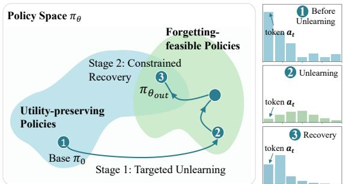
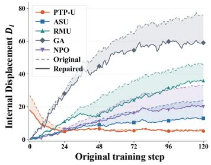
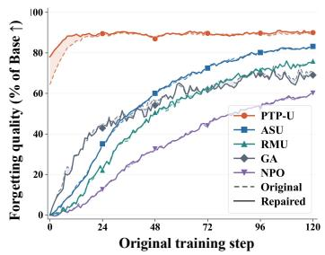
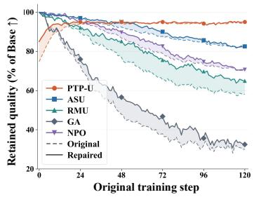
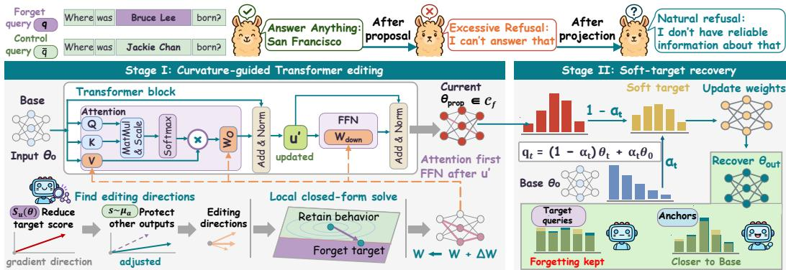
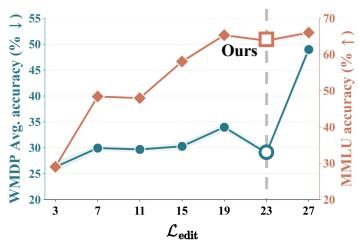
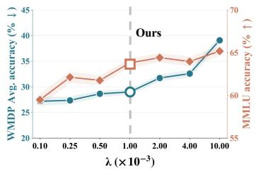
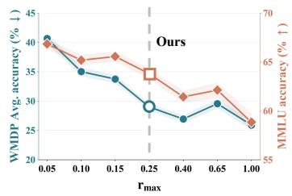
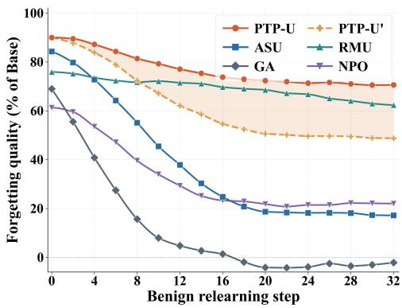

# NOT EVERY CHANGE IS NECESSARY: RECOVERABLE DRIFT IN LARGE LANGUAGE MODEL UNLEARNING

Xunlei Chen1, Qinghui Gong2, Jingkun Xue1, Qihe Liu1, Shijie Zhou1, Fei Ye1,\* 1University of Electronic Science and Technology of China, 2Southwest Jiaotong University \*Corresponding author: feiye@uestc.edu.cn

## ABSTRACT

Machine unlearning in large language models aims to remove unwanted knowledge while preserving the model’s remaining capabilities. Although existing methods use retention objectives or restrict where edits occur, achieving the desired forgetting level can still leave collateral changes that impair non-target behavior. Our recovery comparisons suggest that some of these changes can be reversed while preserving observed forgetting performance. In this work, we present Propose-Then-Project Unlearning (PTP-U), a framework that combines targeted forgetting with the recovery of non-target capabilities. PTP-U first applies local analytic edits to weaken target knowledge associations, then aligns non-target output distributions with those of the original model to recover capabilities while maintaining fixed forgetting constraints. Both stages serve a common goal: satisfying the forgetting requirements while preserving fluent generation and performance on non-target tasks. Across three benchmarks, PTP-U achieves the strongest forgetting–retention trade-off among evaluated methods, reaching 81.22%–91.03% forgetting while preserving 94.20% non-target utility on average. At matched forgetting, PTP-U consistently retains higher non-target utility.

## 1 INTRODUCTION

Large language models (LLMs) acquire extensive knowledge, skills, and linguistic patterns during pre-training (Pan et al., 2026; Guo et al., 2025a; Ranjan et al., 2026), becoming general-purpose models for long-term deployment (Zhao et al., 2025; Ye et al., 2026). However, training corpora may include private information (Ramakrishna et al., 2025), copyrighted content (Shi et al., 2025a), or unsafe knowledge (Li et al., 2024), requiring the removal of specific information after training (Yang et al., 2026). While retraining from scratch after excluding target data can achieve this goal, it is computationally infeasible for modern LLMs (Gong et al., 2026; Ye et al., 2025). Therefore, LLM unlearning aims to selectively remove target knowledge while preserving the model’s original capabilities and behaviors on non-target inputs.

Existing unlearning methods mainly apply forgetting signals at the output level by suppressing target content generation (Pu et al., 2026), adjusting output distributions (Ma et al., 2026), or optimizing preference objectives (Fan et al., 2025). They are often combined with retain objectives or regularization to preserve non-target behaviors. However, output-level objectives offer limited control over which parameters change and by how much, making it difficult to confine updates to parameters associated with target knowledge (Wang et al., 2025b). Another line of methods directly modifies internal representations or local parameters to weaken target knowledge associations. These methods control modification scopes through low-rank updates (Chen et al., 2026), local constraints (Shen et al., 2026), or analytical editing (Li et al., 2026b). Although internal intervention more directly affects computations related to target knowledge, local changes still propagate nonlinearly through deep Transformer architectures, making global behavioral changes difficult to fully control.

Therefore, achieving the desired forgetting level does not imply that all accompanying changes are necessary. Some changes may be redundant perturbations from optimization, disrupting the model’s semantic structure and causing semantic drift or capability degradation (Wang et al., 2025a; Lee et al., 2026). This motivates a key question: can such collateral changes be reversed while preserving forgetting? To explore this, we investigate recoverable changes in models that have achieved the target forgetting level. We adjust the unlearned model toward the Base model while retaining the forgetting effect. As shown in Figure 1, if certain changes can be restored without recovering the forgotten knowledge, they are unnecessary for unlearning and instead reflect optimizationinduced drift. We define such reversible changes as recoverable drift.

Prior post-training studies show that among models solving the same new task, solutions with output behaviors closer to the Base model retain more original capabilities (Shenfeld et al., 2026). Inspired by this foundation, we propose Propose-Then-Project Unlearning (PTP-U), which combines local analytical editing with constrained recovery fine-tuning. PTP-U first constructs candidate models through local analytic edits and then reduces behavioral drift by aligning non-target outputs with the Base model under fixed forgetting constraints.

  
Figure 1: PTP-U first achieves forgetting feasibility (Stage I), then restores utility while maintaining feasibility (Stage II). Right: target-answer suppression persists during recovery.

Specifically, PTP-U addresses the same constrained objective at two scales. In the local proposal stage, we use Fisher geometry to approximate Base-policy drift quadratically and

efficiently generate candidate updates under linearized forgetting constraints. When updates move beyond the local region, Transformer nonlinearities weaken this approximation. Thus, the nonlinear policy projection stage operates directly on output distributions to reduce deviation from the Base policy under fixed forgetting constraints. For sequential Transformer modules, PTP-U re-estimates the local geometry and constraints of downstream components after upstream updates, reducing linearization errors. This separates local proposal generation from subsequent nonlinear recovery while retaining a common objective and fixed forgetting requirements. Across three benchmarks, PTP-U achieves the strongest forgetting/retention trade-off, reaching 81.22%–91.03% forgetting (compared with 80.70%–87.93% for the strongest forgetting baseline) while preserving the highest average capability retention of 94.20%. At matched forgetting, it consistently retains higher utility (93.32%–95.86%) and remains closer to the Base model. These results support our central finding that a substantial portion of the changes induced by strong unlearning is not necessary fo maintaining forgetting. In summary, our contributions are:

(1) We propose Propose-Then-Project Unlearning (PTP-U), a Base-centered framework that couples targeted forgetting with explicit behavioral recovery. It separates forgetting-oriented proposal generation from recovery toward the Base policy under fixed forgetting constraints.

(2) We develop an analytic editing mechanism that constructs local proposals under linearized forgetting constraints. Sequential relinearization updates downstream geometry and constraints after upstream edits, accounting for dependencies within Transformer blocks.

(3) We validate PTP-U across multiple benchmarks and model families, demonstrating strong forgetting–retention trade-offs, robustness against prompt-based recovery and relearning attacks, and stable performance across diverse settings.

## 2 RECOVERABLE DRIFT: FROM OBSERVATION TO FORMULATION

## 2.1 FORGETTING CONSTRAINTS AND BEHAVIORAL DRIFT

Let $\pi _ { 0 } = \pi _ { \theta _ { 0 } }$ be the Base model, $\pi _ { \theta }$ the updated model, and $\mathcal { U } _ { f }$ the set of target knowledge units. For each $u \in \mathcal { U } _ { f }$ , we measure relation support using a target query $q ,$ a matched contrastive query q¯ without the target relation, and an answer $^ { a , }$ where $\bar { | } a |$ denotes the number of tokens in a:

$$
S _ { u } ( \theta ) = \mathbb { E } _ { ( q , { \bar { q } } , a ) \sim \mathcal { V } _ { u } } \left[ \ell _ { \theta } ( a \mid q ) - \ell _ { \theta } ( a \mid { \bar { q } } ) \right] , \qquad \ell _ { \theta } ( a \mid q ) = { \frac { 1 } { | a | } } \sum _ { t = 1 } ^ { | a | } \log \pi _ { \theta } ( a _ { t } \mid q , a _ { < t } ) ,\tag{1}
$$

where $\nu _ { u }$ contains query views and answer aliases. Lower scores $S _ { u } ( \theta )$ indicate weaker relation support. We fix thresholds $b _ { u }$ before updating and define the forgetting-feasible set $\mathcal { C } _ { f }$ , which contains models satisfying all target-unit thresholds:

$$
\mathcal { C } _ { f } = \{ \theta \mid c _ { u } ( \theta ) \leq 0 , \forall u \in \mathcal { U } _ { f } \} , \qquad c _ { u } ( \theta ) = S _ { u } ( \theta ) - b _ { u } .\tag{2}
$$

  
Figure 2: Checkpoint-wise recovery across unlearning methods. Dashed lines show original checkpoints and solid lines their independently repaired copies. Shading marks paired differences. The horizontal axis records fine-tuning steps. PTP-U step 0 follows the Stage I analytic edits. Repairs are performed separately and do not feed into subsequent original checkpoints.

Sample construction and threshold calibration are detailed in Appendices On a fixed non-target context distribution $\mu _ { a }$ , we define Base-policy drift as

$$
D _ { \mathrm { B } } ( \theta ) = \mathbb { E } _ { s \sim \mu _ { a } } D _ { \mathrm { K L } } \left( \pi _ { 0 } ( \cdot \mid s ) \parallel \pi _ { \theta } ( \cdot \mid s ) \right) .\tag{3}
$$

Here, $D _ { \mathrm { K L } }$ denotes the Kullback–Leibler (KL) divergence, and s includes the input and its generation prefix. Smaller $D _ { \mathrm { B } } ( \theta )$ indicates closer next-token distributions on these contexts.

## 2.2 RECOVERABLE DRIFT AND CONSTRAINED UNLEARNING FORMULATION

We examine whether changes introduced during unlearning remain necessary once forgetting has been achieved. Results from Figure 2 address this question through paired recovery comparisons. To track internal changes, let $h _ { \theta } ^ { \ell } ( \bar { s ) }$ denote the hidden representation at layer ℓ and $P _ { \mathrm { r e t } }$ the orthogonal projector onto a fixed retain-sensitive subspace. We focus on displacement within this subspace and normalize by the Base representation energy to express changes relative to the original representation scale. We measure internal displacement as

$$
D _ { \mathrm { I } } ( \theta ) = 1 0 0 \sqrt { \frac { \mathbb { E } _ { s \sim \mu _ { a } } \left. P _ { \mathrm { r e t } } \left( h _ { \theta } ^ { \ell } ( s ) - h _ { \theta _ { 0 } } ^ { \ell } ( s ) \right) \right. _ { 2 } ^ { 2 } } { \mathbb { E } _ { s \sim \mu _ { a } } \left. P _ { \mathrm { r e t } } h _ { \theta _ { 0 } } ^ { \ell } ( s ) \right. _ { 2 } ^ { 2 } + \varepsilon } } ,\tag{4}
$$

where $\| \cdot \| _ { 2 } ^ { 2 }$ denotes the squared L2 norm and $\varepsilon > 0$ is a fixed numerical stabilizer. The contexts, layer, and projector remain fixed across comparisons. Appendix specifies subspace construction, metric definitions, and repair settings.

Recovery generally reduces internal displacement while leaving forgetting quality largely unchanged, with retention gains varying across methods. These empirical results support our recoverable drift premise: some internal displacement introduced by unlearning can be reduced without undoing forgetting. Accordingly, model selection should consider both forgetting feasibility and behavioral deviation from the Base model. Inspired by this, we treat recovery as an explicit part of the unlearning pipeline, instead of treating all unlearning-induced modifications as indispensable.

While $D _ { \mathrm { I } } ( \theta )$ is a representation diagnostic, we use $D _ { \mathrm { B } }$ to measure behavioral deviation directly in output space and formulate our constrained unlearning objective as

$$
\operatorname* { m i n i m i z e } _ { \theta \in \Theta } D _ { \mathrm { B } } ( \theta ) \qquad \mathrm { s . t . } \quad S _ { u } ( \theta ) \leq b _ { u } , \qquad \forall u \in \mathcal { U } _ { f } ,\tag{5}
$$

where Θ denotes the model’s parameter space. This objective motivates an explicit recovery phase while keeping the forgetting thresholds fixed throughout optimization. Our method first applies local analytic edits to seek feasible solutions, then performs constrained recovery to reduce undesirable behavioral drift of the model. Global optimality is not assumed.

## 3 PROPOSE-THEN-PROJECT UNLEARNING (PTP-U)

PTP-U approximately solves Eq. 5 via two stages. It first generates a forgetting proposal from the local approximation of the current model and verifies a feasible initialization with the actual model. Then, nonlinear policy projection reduces Base-policy drift while maintaining forgetting constraints. Attention→FFN sequential re-linearization improves the accuracy of local updates in Transformers.

  
Figure 3: Overview of PTP-U. Stage I computes a curvature-guided closed-form proposal in an editable subspace. It updates Attention first, refreshes the operating point, then updates FFN to obtain a feasible unlearned model. Stage II constructs a soft target from current and Base policies for constrained recovery. It preserves forgetting while reducing behavioral drift and excessive refusal.

## 3.1 LOCAL ANALYTIC PROPOSAL WITH CURVATURE GUIDANCE

Starting from the Base parameters, we construct the update around the current model $\theta _ { k }$ . To reduce computational cost, we restrict the parameter change to $\delta = U _ { k } z$ , where $U _ { k }$ is a full column rank low-dimensional editable basis and z is the optimized coefficient vector. The editing directions are derived from target knowledge gradients and preconditioned by the K-FAC (Martens & Grosse, 2015) approximation of the current model Fisher information (Amari, 1998) on fixed anchors, capturing the local influence of different directions on non-target outputs. The same curvature approximation defines the local quadratic model below. Let $c _ { k } = c ( \theta _ { k } )$ denote the stacked constraint residuals and $J _ { k }$ the Jacobian with respect to z. We define the local model as

$$
m _ { k } ( z ) =  { \widetilde { g } } _ { k } ^ { \top } z + \frac { 1 } { 2 } z ^ { \top } H _ { k } z , \qquad c ( \theta _ { k } + U _ { k } z ) \approx c _ { k } + J _ { k } z ,\tag{6}
$$

where m approximates the change of $D _ { \mathrm { B } } , \widetilde { g } _ { k } = U _ { k } ^ { \top } \nabla _ { \theta } D _ { \mathrm { B } } ( \theta _ { k } )$ , and $H _ { k } = U _ { k } ^ { \top } ( \widehat { F } _ { a , k } + \lambda I ) U _ { k }$ with $\lambda > 0$ . Here, $F _ { a , k }$ is the Fisher information of the current model on fixed anchors, and $\widehat { F } _ { a , k }$ is its positive semidefinite K-FAC approximation. For the next-token softmax distribution, $F _ { a , k }$ corresponds to the generalized Gauss-Newton curvature with logits as output variables. The damping term improves stability and, together with the full column rank of $U _ { k }$ , ensures $H _ { k } \succ 0$

The Base gradient vanishes, but $\widetilde { g } _ { k }$ is generally nonzero at later iterates and is retained in $m _ { k }$ Appendix derives the gradient and separates Fisher curvature from the additional logit-curvature term. Appendix quantifies the error of the damped surrogate. To cap the required residual reduction in each iteration, we define the truncated constraint residual as

$$
r _ { u , k } = \operatorname* { m i n } \{ c _ { u } ( \theta _ { k } ) , r _ { \mathrm { m a x } } \} , \qquad r _ { \mathrm { m a x } } > 0 .\tag{7}
$$

Here, $r _ { \mathrm { m a x } }$ is a hyperparameter that caps the required reduction for unsatisfied constraints. For satisfied constraints, the negative residual is preserved as the boundary margin for linearized feasibility checking. We optimize the coefficients z by minimizing the local objective $m _ { k } ( z )$

$$
\mathrm { m i n i m i z e } \quad m _ { k } ( z ) \qquad \mathrm { s u b j e c t ~ t o } \quad J _ { k } z \leq - r _ { k } .\tag{8}
$$

Since large positive residuals are truncated, a single iteration may only achieve partial forgetting. For a fixed active set A, let $J _ { A }$ and $r _ { A }$ denote the corresponding constraint matrix and residual. When $J _ { A }$ has full row rank, the unconstrained recovery direction $v _ { k }$ and constraint multipliers $\nu _ { A }$ yield the analytical solution

$$
v _ { k } = - H _ { k } ^ { - 1 } \widetilde { g } _ { k } , \quad \nu _ { A } = \left( J _ { A } H _ { k } ^ { - 1 } J _ { A } ^ { \top } \right) ^ { - 1 } \left( J _ { A } v _ { k } + r _ { A } \right) , \quad z _ { k } ^ { \mathrm { p r o p } } = v _ { k } - H _ { k } ^ { - 1 } J _ { A } ^ { \top } \nu _ { A } .\tag{9}
$$

Here, $( \cdot ) ^ { - 1 }$ denotes the matrix inverse. If $\nu _ { A } \geq 0$ and all remaining inequalities hold, Eq. 9 is the unique solution to Eq. 8 by Appendix The first term minimizes the unconstrained local model, and the second gives the minimum $H _ { k }$ -metric correction enforcing the active constraints. Since Eq. 9 only solves the local problem, the local model must be reconstructed after the update. This local solution does not provide a global closed-form solution to the nonlinear unlearning problem.

## 3.2 SEQUENTIAL RELINEARIZATION IN TRANSFORMERS

The local proposal considers the computation order of Transformer blocks, formulated as

$$
u _ { l } = h _ { l } + A _ { l } ( h _ { l } ) , \qquad h _ { l + 1 } = u _ { l } + F _ { l } ( u _ { l } ) ,\tag{10}
$$

where $A _ { l } ( \cdot )$ and $F _ { l } ( \cdot )$ represent the Attention and FFN submodules, respectively. For a fixed block input, updating Attention parameters $\theta _ { A }$ affects the FFN input through the following relation, where $J _ { F _ { l } } ( u _ { l } )$ denotes the FFN input Jacobian. The first-order joint model captures the propagation of Attention changes through FFN.

$$
\frac { \partial h _ { l + 1 } } { \partial \theta _ { A } } = \left( I + J _ { F _ { l } } ( u _ { l } ) \right) \frac { \partial A _ { l } ( h _ { l } ) } { \partial \theta _ { A } } .\tag{11}
$$

Therefore, we first solve $\delta _ { A }$ in the current Attention editing subspace and update parameters as $\theta _ { k } ^ { A } = \theta _ { k } + \delta _ { A }$ . Then, we perform a forward pass to refresh the knowledge unit residuals and Base recovery gradients under $\theta _ { k } ^ { A }$ , recompute FFN K-FAC curvature statistics on fixed anchors, and update the FFN editing basis with its constraint Jacobian to solve for $\delta _ { F }$ . Relinearization at $\theta _ { k } ^ { A }$ removes the stale-Jacobian term from the FFN error decomposition, as shown in Appendix

Each candidate update is evaluated on the actual model to measure forgetting progress and constraint preservation. If the predicted change differs significantly from the actual change or violates previous constraints, the update is rejected, the target advancement magnitude is reduced, and optimization is repeated. This process continues until a feasible checkpoint $\bar { \theta _ { \mathrm { p r o p } } } \in \mathcal { C } _ { f }$ is obtained, which serves as the initialization for the next stage.

## 3.3 NONLINEAR POLICY PROJECTION

The finite-dimensional editing subspace and local curvature approximation constrain proposal accuracy, while larger updates may cause behavioral changes beyond the local model. Thus, the second stage starts from $\theta _ { \mathrm { p r o p } }$ and continues optimizing Eq. 5 on the true output distribution. At projection iteration t, let $\theta _ { t } \in \mathcal { C } _ { f }$ denote the current feasible model. We construct a progressive recovery target towards the Base model on fixed anchors:

$$
q _ { t } ( \cdot \mid s ) = ( 1 - \alpha _ { t } ) \pi _ { \theta _ { t } } ( \cdot \mid s ) + \alpha _ { t } \pi _ { 0 } ( \cdot \mid s ) , \qquad 0 < \alpha _ { t } \le 1 .\tag{12}
$$

Here, $q _ { t }$ is fixed and gradients are stopped during the inner-loop optimization, while $\alpha _ { t }$ determines the shift of the target distribution toward the Base model. At each round, we minimize $\mathcal { L } _ { t } ( \boldsymbol { \theta } )$ over the forgetting feasible region $\theta \in \mathcal { C } _ { f }$ , where $\mathcal { L } _ { t } ( \boldsymbol { \theta } )$ is defined as

$$
\begin{array} { r l } & { \mathcal { L } _ { t } ( \theta ) = \mathbb { E } _ { s \sim \mu _ { a } } D _ { \mathrm { K L } } ( q _ { t } ( \cdot \mid s ) \parallel \pi _ { \theta } ( \cdot \mid s ) ) } \\ & { \qquad = \alpha _ { t } D _ { \mathrm { B } } ( \theta ) + ( 1 - \alpha _ { t } ) \mathbb { E } _ { s \sim \mu _ { a } } D _ { \mathrm { K L } } ( \pi _ { \theta _ { t } } ( \cdot \mid s ) \parallel \pi _ { \theta } ( \cdot \mid s ) ) + C _ { t } , } \end{array}\tag{13}
$$

where $C _ { t }$ is independent of $\theta .$ Minimizing $\scriptstyle { \mathcal { L } } _ { t }$ over $\mathcal { C } _ { f }$ defines a proximal step for Eq. $^ { 5 , }$ combining Base recovery with a penalty on policy changes. Appendix establish the decomposition and sufficient descent conditions, respectively. The optimization is conducted by adaptively updating the Lagrangian multiplier to satisfy the unlearning constraint (Dhillon et al., 2025), and candidate solutions are verified on the real model. Only updates meeting the following conditions are accepted:

$$
\theta _ { t + 1 } \in \mathcal { C } _ { f } , \qquad D _ { \mathrm { B } } ( \theta _ { t + 1 } ) < D _ { \mathrm { B } } ( \theta _ { t } ) .\tag{14}
$$

If verification fails, the update is reverted and the recovery magnitude is reduced. Base only provides the recovery distribution over non-target anchors. Since all inputs share the same model parameters, recovery must preserve the fixed forgetting constraint to avoid restoring target knowledge. When the computational budget is exhausted or no candidate satisfying Eq. 14 is found within the tolerance, the accepted feasible model $\theta _ { \mathrm { o u t } }$ is returned. Here, projection denotes the constrained recovery process in Eq. 5, which does not ensure the globally nearest point. The complete update, rollback, and stopping rules are described in Appendix The editing basis, curvature statistics, and recovery objective are used only during training and introduce no additional inference modules.

## 4 EXPERIMENTS

## 4.1 EXPERIMENTAL SETTINGS

Datasets. We evaluate PTP-U on three benchmarks. RWKU evaluates the removal of real-world entity knowledge (Jin et al., 2024). WMDP measures hazardous knowledge in biosecurity (Bio) and cybersecurity (Cyber) (Li et al., 2024). MUSE-Books evaluates copyright unlearning on the Harry Potter corpus (Shi et al., 2025a). MMLU measures the preservation of general knowledge (Hendrycks et al., 2020). Dataset and split details are detailed in Appendix

Evaluation Metrics. For RWKU, we report ROUGE-L recall on fill-in-the-blank (FB), questionanswering (QA) probes, and adversarial attack (AA) scenarios. For WMDP, we report accuracy on Bio/Cyber. The 25% random-choice indicates best forgetting. For MUSE-Books, we report BLEU and ROUGE-L. MMLU accuracy (Gen.) and GPT-4o fluency (Xu et al., 2025b) assess retained utility. We report R-Ent. separately on RWKU and WMDP to measure confirmed restricted knowledge re-Entry after an initial risk closure. Metric details are in Appendix

Baselines. We compare PTP-U with NPO KL (Zhang et al., 2024), RMU (Li et al., 2024), WHP (Eldan & Russinovich, 2023), ALTER (Chen et al., 2026), Attention-Smoothing (ASU) (Zare Zade et al., 2026) and ICUL (Pawelczyk et al., 2024), adapted SCANS (Cao et al., 2025), MET (Yu et al., 2025). The details of Baselines are provided in Appendices

Implementation Details. Across all backbones, we set $r _ { \mathrm { m a x } } = 0 . 2 5 , \lambda = 1 . 0 \times 1 0 ^ { - 3 }$ , and $\alpha _ { t } = 0 . 5$ as the initial recovery mixing coefficient. We select the middle layers (23) of the model for editing. The forgetting boundaries $b _ { u } = S _ { u } ( \theta _ { 0 } ) - \Delta _ { \mathrm { f } }$ , with $\Delta _ { \mathrm { f } } = \log 2$ . We use four NVIDIA RTX 4090 GPUs. Model-specific settings are provided in Appendix

## 4.2 MAIN RESULTS

Forget-retain trade-off. Table 1 evaluates longform copyright continuation on Llama2-7B. PTP-U achieves the lowest BLEU and R-L while preserving the highest MMLU, indicating a strong balance between forgetting and retained capability. Table 2 further evaluates this trade-off in two restricted-knowledge settings. RWKU measures entity forgetting with FB and QA, and AA evaluates robustness to adversarial recovery. WMDP measures Bio/Cyber forgetting and retained general capability. On Llama3.1-8B-Instruct, PTP-U preserves 65.54 Gen. on RWKU and 63.80 on

Table 1: Copyright unlearning results.
<table><tr><td rowspan="2">Method</td><td colspan="2">Forget Perf.</td><td colspan="2">Retain Perf.</td></tr><tr><td>BLEU↓</td><td>R-L↓</td><td>MMLU↑</td><td>Flu.↑</td></tr><tr><td>Original</td><td>74.76</td><td>98.68</td><td>46.39</td><td>4.03</td></tr><tr><td>WHP</td><td>23.55</td><td>17.93</td><td>38.49</td><td>2.52</td></tr><tr><td>ICUL</td><td>38.47</td><td>32.49</td><td>39.86</td><td>3.60</td></tr><tr><td>SCANS</td><td>19.92</td><td>17.72</td><td>42.05</td><td>3.27</td></tr><tr><td>ALTER</td><td>12.96</td><td>10.40</td><td>41.84</td><td>3.08</td></tr><tr><td>ASU</td><td>10.72</td><td>9.68</td><td>37.56</td><td>3.28</td></tr><tr><td>PTP-U</td><td>8.61</td><td>6.33</td><td>43.34</td><td>3.34</td></tr></table>

WMDP. ALTER and ASU achieve stronger suppression on several direct forgetting metrics, but cause larger utility degradation and weaker AA robustness on RWKU. Representation intervention and parameter editing are generally more robust to adversarial recovery, but often reduce general capability substantially. ICUL preserves fluency through inference-time prompting but provides weaker forgetting. Overall, PTP-U maintains a favorable trade-off. Its local analytic proposal satisfies forgetting constraints, while nonlinear policy projection reduces drift from the Base model without relaxing them. This separation enables recovery from behavioral changes caused by the proposal across unlearning tasks. Case analyses are in Appendix

Hyperparameter sensitivity. In figure 4, we examine ${ \mathcal { L } } _ { \mathrm { e d i t } } , \lambda .$ and $r _ { \mathrm { m a x } }$ by varying one factor while fixing the others at the reference configuration. The layer axis denotes the final layer of a fixed three-layer editing window. The favorable trade-off near layer 23 suggests that this middle-tolate window provides a more selective intervention point for knowledge-dependent computations, rather than a general advantage of deeper editing. The other hyperparameters control Stage I. Specifically, λ regularizes the local curvature metric, while $r _ { \mathrm { m a x } }$ limits constraint-residual reduction per analytic iteration. Across the tested range, increasing λ generally improves retention at the expense of forgetting. Increasing $r _ { \mathrm { m a x } }$ from 0.05 to 1.00 reduces WMDP accuracy from 40.68% to 25.92%, closer to chance, while decreasing MMLU from 66.84% to 58.84%, indicating greater collateral damage under aggressive target advancement. As $r _ { \operatorname* { m a x } }  0$ , the required positive progress on violated constraints vanishes. $\bar { \bf A } { \bf s } \lambda  0 .$ , curvature damping disappears and numerical stability may degrade. Neither limit necessarily disables the full pipeline. We therefore use the window ending

Table 2: Main results on RWKU and WMDP. †, ‡, and ⋆ denote output-distribution optimization, representation intervention & parameter editing, and prompt-based unlearning methods, respectively.
<table><tr><td rowspan="2">Baseline</td><td colspan="5">RWKU</td><td colspan="3">WMDP</td></tr><tr><td>FB↓</td><td>QA↓</td><td>AA↓</td><td>Gen.↑</td><td>Flu.↑|</td><td>Bio.↓</td><td>Cyber↓</td><td>Gen.↑</td></tr><tr><td colspan="9">Llama3.1-8B-Instruct (Grattafiori et al., 2024)</td></tr><tr><td>Base</td><td>63.95</td><td>66.42</td><td>69.83</td><td>68.37</td><td>4.20</td><td>72.74</td><td>47.35</td><td>68.37</td></tr><tr><td>ICUL*</td><td>43.23</td><td>32.57</td><td>42.60</td><td>64.80</td><td>4.07</td><td>45.90</td><td>33.34</td><td>61.10</td></tr><tr><td> ${ \mathrm { R M U } } ^ { \ddag }$ </td><td>19.10</td><td>23.84</td><td>21.30</td><td>54.71</td><td>2.96</td><td>32.52</td><td>32.75</td><td>53.43</td></tr><tr><td> $\mathrm { M E T ^ { \ddagger } }$ </td><td>33.64</td><td>28.47</td><td>23.54</td><td>58.52</td><td>3.18</td><td>34.63</td><td>32.47</td><td>52.19</td></tr><tr><td> $\mathrm { S C A N S ^ { \ddagger } }$ </td><td>16.80</td><td>23.47</td><td>21.05</td><td>60.40</td><td>3.61</td><td>31.70</td><td>34.00</td><td>58.20</td></tr><tr><td> ${ \mathrm { N P O } } _ { K L } { \dag }$ </td><td>36.02</td><td>29.10</td><td>26.89</td><td>60.29</td><td>3.30</td><td>38.38</td><td>35.32</td><td>58.37</td></tr><tr><td> $\mathrm { \bf A L T E R ^ { \dagger } }$ </td><td>18.61</td><td>22.51</td><td>22.95</td><td>61.38</td><td>3.20</td><td>29.69</td><td>31.77</td><td>61.60</td></tr><tr><td> $\mathrm { A S U ^ { \dag } }$ </td><td>8.90</td><td>10.62</td><td>26.80</td><td>60.89</td><td>3.43</td><td>27.45</td><td>32.48</td><td>57.74</td></tr><tr><td> $\mathrm { P T P - U ^ { \dag \ddag } }$ </td><td>11.42</td><td>13.08</td><td>15.20</td><td>65.54</td><td>3.93</td><td>28.14</td><td>29.84</td><td>63.80</td></tr><tr><td colspan="9">Qwen3-14B (Yang et al., 2025)</td></tr><tr><td>Base  $\mathrm { I C U L } ^ { \star }$ </td><td>63.06 37.23</td><td>45.42 31.57</td><td>56.02 32.60</td><td>79.35 69.83</td><td>4.41 4.22</td><td>75.51 46.82</td><td>61.06 31.50</td><td>79.35</td></tr><tr><td> ${ \mathrm { R M U } } ^ { \ddag }$ </td><td>22.15</td><td>25.71</td><td>14.33</td><td>62.30</td><td></td><td>43.85</td><td></td><td>68.22</td></tr><tr><td></td><td></td><td></td><td></td><td></td><td>2.96</td><td></td><td>36.24</td><td>66.51</td></tr><tr><td> $\mathrm { S C A N S ^ { \ddagger } }$ </td><td>21.50</td><td>28.11</td><td>26.40</td><td>68.70</td><td>3.79</td><td>34.60</td><td>35.80</td><td>67.50</td></tr><tr><td> $\mathrm { \bf A L T E R ^ { \dagger } }$ </td><td>20.60</td><td>23.47</td><td>27.87</td><td>71.02</td><td>3.35</td><td>34.24</td><td>30.58</td><td>70.55</td></tr><tr><td> $\mathrm { A S U ^ { \dag } }$ </td><td>11.30</td><td>15.10</td><td>24.94</td><td>69.53</td><td>3.43</td><td>29.40</td><td>31.58</td><td>68.38</td></tr><tr><td> $\mathrm { P T P - U ^ { \dag \ddag } }$ </td><td>13.76</td><td>14.55</td><td>15.84</td><td>72.62</td><td>3.90</td><td>30.14</td><td>31.23</td><td>72.42</td></tr></table>

at layer 23, $\lambda = 1 0 ^ { - 3 }$ , and $r _ { \mathrm { m a x } } = 0 . 2 5$ , yielding 28.99% WMDP and 63.80% MMLU accuracy. Additional Stage II analyses and internal visualizations are provided in Appendix  

  
Figure 4: Hyperparameter sensitivity on WMDP. Editing window $\mathcal { L } _ { \mathrm { e d i t } }$ , indexed by its last layer; each window contains three consecutive layers. Closer to 25% indicates better forgetting, and orange diamonds show that higher MMLU accuracy is better.

Ablation of Control Components. In Table $^ { 3 , }$ omitting Stage II reduces MMLU by 5.88 points relative to full PTP-U, with little change in WMDP accuracy,, suggesting that the analytic edits leave recoverable capability loss. Removing $\mathcal { C } _ { f }$ from Stage II yields the highest MMLU but increases WMDP accuracy from 28.99 to 44.62. Thus, unconstrained recovery can improve retained performance while weakening forgetting. Omitting Stage I worsens both metrics, suggesting that analytic initialization facilitates subsequent recovery. Setting $\alpha _ { t } ~ = ~ 1$ removes the current-policy proximity term and reduces retention despite preserving the forgetting constraints, indicating an additional contribution from current-policy regularization. Under the same Stage II protocol, Table 4 shows that fixed Attention→FFN updates do not outperform joint editing, whereas refreshing the FFN local model improves both metrics. The difference between these sequential variants supports recomputing the FFN update after the Attention edit changes its inputs, linking the observed gains to relinearization within the chosen update order. The RWKU ablation shows in Appendix

## 5 DISCUSSIONS

Table 3: Ablation of the two-stage framework. Removing $\mathcal { C } _ { f }$ applies only to Stage II. $\alpha _ { t } = 1$ retains the forgetting constraints.
<table><tr><td>Method</td><td>WMDP Avg.↓ MMLU↑</td><td></td></tr><tr><td>PTP-U</td><td> $2 8 . 9 9 { \scriptstyle \pm 0 . 7 9 }$ </td><td> $6 3 . 8 0 { \pm } 0 . 6 8$ </td></tr><tr><td>w/o Stage I</td><td> $3 4 . 3 1 { \pm } 1 . 4 2 $ </td><td> $6 0 . 2 6 { \pm } 1 . 2 1 $ </td></tr><tr><td>w/o Stage II</td><td> $2 9 . 2 3 { \pm } 1 . 1 8$ </td><td> $5 7 . 9 2 { \pm } 1 . 3 1 $ </td></tr><tr><td> $\mathbf { w } / \mathbf { o } \mathscr { C } _ { f }$ </td><td> $4 4 . 6 2 { \pm } 1 . 5 6 $ </td><td> $6 4 . 8 4 { \pm } 0 . 5 7 $ </td></tr><tr><td> $\alpha _ { t } = \mathrm { \bar { 1 } }$ </td><td> $2 9 . 8 1 { \scriptstyle \pm 0 . 9 3 }$ </td><td> $6 0 . 7 2 { \scriptstyle \pm 0 . 8 6 }$ </td></tr></table>

Why Forgetting Constraints Matter for Recovery. Stage II moves toward the Base policy to restore non-target capability while preserving forgetting. Figure 2 shows that non-target capability can improve with limited degradation in forgetting quality, raising whether an explicit forgetting constraint is necessary. Benign relearning (Hu et al., 2025) shows that benign fine-tuning may revive suppressed knowledge. Figure 5 shows that after 32 steps, PTP-U retains 70.23% forgetting quality, compared with 48.42% for PTP-U’ without the forgetting constraint under the same KL regularization. Explicit forgetting control therefore limits knowledge revival. ASU drops to 17.17% without an additional forgetting guard, suggesting that attention-based smoothing remains vulnerable to parameter updates. RMU retains 62.33%, indicating more persistent representational changes, but with lower general capability.

Table 4: Ablation of Stage I update ordering. All variants use the same subsequent Stage II correction protocol.
<table><tr><td>Method</td><td>WMDP Avg.↓ MMLU↑</td><td></td></tr><tr><td>Attention-only</td><td> $3 6 . 7 0 { \scriptstyle \pm 1 . 5 3 }$ </td><td> $6 0 . 8 4 \pm 1 . 1 7$ </td></tr><tr><td>FFN-only</td><td> $3 3 . 3 6 { \pm } 1 . 3 6$ </td><td> $5 9 . 1 2 { \scriptstyle \pm 0 . 9 4 }$ </td></tr><tr><td>Joint</td><td> $3 1 . 0 4 { \pm } 1 . 0 8$ </td><td> $6 1 . 8 1 { \pm } 0 . 8 3 $ </td></tr><tr><td>A → F fixed</td><td> $3 2 . 1 3 { \pm } 1 . 2 4 $ </td><td> $6 1 . 7 6 { \pm } 1 . 0 2$ </td></tr><tr><td>A → F refreshed</td><td> $2 8 . 9 9 { \scriptstyle \pm 0 . 7 9 }$ </td><td> $6 3 . 8 0 { \pm } 0 . 6 8$ </td></tr></table>

  
Figure 5: Post-unlearning benign relearning attack. Shading highlights the gap between the PTP-U and PTP-U’ variant.

PTP-U instead balances capability restoration and forgetting protection. Table 2 further reports RWKU AA performance across different models together with general capability. Benign relearning and AA provide complementary views of PTP-U’s robustness against knowledge revival from parameter updates and adversarial prompting. Relearning settings are provided in Appendix

Preservation of Neighborhood Knowledge. We evaluate whether the modifications introduced by unlearning propagate to intact knowledge that ought to be preserved. We partition the TOFU evaluation (Maini et al., 2024) into target unlearning data (TUD), neighborhood knowledge from the same domain (NEK), and general external knowledge (GEK), corresponding to Forget10, Real Authors, and World Facts, respectively. This separation distinguishes target forgetting from local interference and broader capability degradation. As shown in Table 5, the prompting-based ICUL achieves the highest NEK score of 75.0%, reflecting the preservation benefit of avoiding parameter modification. However, its TUD R-L remains 0.27, indicating still reproduces the target facts to be forgotten. Compared with RMU, PTP-U reduces target-content reproduction while improving both NEK and GEK by 15.0 percentage points. These results support selective unlearning, where the two stages reduce target-knowledge recoverability while limiting interference with shared knowledge. Complete experimental settings and analyses are provided in Appendix

Cost analysis. Table 6 illustrates the offline and online overheads. Memory denotes peak aggregate allocation across active devices, whereas serving latency refers to an individual query on a single-GPU replica. PTP-U requires 31.8 minutes for model editing and 3.7 minutes for nonlinear finetuning. Its principal offline overhead comes from geometry construction, sequential relinearization, and actual-model verification, rather than the reduced linear solve itself. The 42.7 GB memory requirement reflects these additional statistics and intermediate tensors; methods such as RMU also incur substantial memory costs when maintaining both an updated model and a frozen reference. PTP-U does not minimize offline adaptation cost. Instead, its parameter updates can be merged into the backbone, eliminating auxiliary inference modules and yielding a serving latency comparable to other weight-updating methods. ICUL avoids offline adaptation but prepends additional examples to each query, increasing prefill computation and KV-cache usage, with further decoding overhead from the longer context. Its serving cost therefore depends on demonstration length and prefix-cache reuse. Instead, PTP-U trades additional offline computation for a standard deployment interface without recurring prompt expansion.

Table 5: TOFU (10%) with Llama-3.1- 8B-Instruct.
<table><tr><td>Method</td><td>TUD R-L↓</td><td>NEK Acc ↑</td><td>GEK Acc ↑</td></tr><tr><td>NPO_KL</td><td>0.31</td><td>0.63</td><td>0.68</td></tr><tr><td>ICUL</td><td>0.27</td><td>0.75</td><td>0.74</td></tr><tr><td>RMU</td><td>0.19</td><td>0.59</td><td>0.64</td></tr><tr><td>MET</td><td>0.18</td><td>0.63</td><td>0.66</td></tr><tr><td>ALTER</td><td>0.15</td><td>0.71</td><td>0.72</td></tr><tr><td>ASU</td><td>0.14</td><td>0.69</td><td>0.71</td></tr><tr><td>PTP-U</td><td>0.10</td><td>0.74</td><td>0.79</td></tr></table>

Table 6: Model-side adaptation and serving costs on Llama-3.1-8B-Instruct. Memory denotes peak GB. Latency measures free-form generation, not multiple-choice scoring. “-” indicates no offline adaptation.
<table><tr><td colspan="4">Method Time (min) Memory (GB) Latency (s/query)</td></tr><tr><td>NPO_KL</td><td>17.3</td><td>23.1</td><td>1.20</td></tr><tr><td>RMU</td><td>24.9</td><td>38.0</td><td>1.20</td></tr><tr><td>ASU</td><td>15.3</td><td>20.4</td><td>1.21</td></tr><tr><td>ALTER</td><td>9.2</td><td>18.3</td><td>1.23</td></tr><tr><td>ICUL</td><td></td><td></td><td>1.86</td></tr><tr><td>PTP-U</td><td>35.5</td><td>42.7</td><td>1.20</td></tr></table>

## 6 RELATED WORK

LLM unlearning. LLM unlearning methods broadly operate through output optimization, internal intervention, or inference-time prompting. Output-based methods modify target likelihoods or preferences (Fan et al., 2025; Xu et al., 2025a; Li et al., 2026a), while representation- and editingbased methods localize changes to internal features or parameter subsets (Shi et al., 2025b; Li et al., 2026c). Prompt-based approaches instead suppress target behavior through test-time context without permanently modifying model parameters (Pawelczyk et al., 2024; Takashiro et al., 2025; Wang et al., 2026). Recent work has further explored more controlled model modification through Fisheraware parameter selection (Cha et al., 2025), minimum-norm editing (Guo et al., 2025c), and explicit optimization constraints (Dhillon et al., 2025; Entesari et al., 2025). Across these approaches, a recurring challenge is achieving the desired target modification while preserving non-target behavior.

Post-training preservation and locality. Recent studies have examined how post-training alters pretrained capabilities beyond the optimized task. Smaller policy shifts from the Base model have been associated with better preservation of prior capabilities (Shenfeld et al., 2026), while broader analyses reveal heterogeneous forgetting across examples and tasks (Harmon et al., 2026). In knowledge removal, mechanistic localization can reduce unintended side effects (Guo et al., 2025b), although parameter locality alone does not necessarily imply effective or isolated unlearning (Lee et al., 2025). These findings motivate evaluating model modification not only by whether the target behavior changes, but also by how broadly the update affects the original model.

In general, existing work shows that successful unlearning does not uniquely determine how a model should change. Different optimization paths may achieve similar forgetting while inducing different degrees of non-target drift. This motivates examining not only whether forgetting is achieved, but also which induced changes are actually necessary.

## 7 CONCLUSION AND LIMITATION

We presented PTP-U, which combines curvature-guided analytic editing with nonlinear policy recovery under fixed forgetting constraints. Sequential Attention-to-FFN relinearization updates downstream approximations, while Base-referenced distillation reduces collateral behavioral drift. Experiments across four benchmarks support the recoverable-drift premise: some unlearninginduced changes can be reversed without substantially weakening observed forgetting. More broadly, PTP-U connects model editing and teacher-guided distillation through a common constrained objective, using local geometry to propose edits and policy-space proximity to guide recovery. This perspective highlights the value of geometric optimization for distinguishing necessary target modification from avoidable capability degradation. However, local curvature approximations and constraints defined over sampled knowledge units do not guarantee globally minimal behavioral drift or the elimination of unobserved knowledge-retrieval routes. Future research will investigate tighter nonlinear approximations and semantic constraints that generalize beyond observed queries. We will also study their applicability to multimodal semantic unlearning, where cross-modal knowledge sharing introduces additional challenges in separating target associations from representation essential to retained capabilities.

## REFERENCES

Shun-Ichi Amari. Natural gradient works efficiently in learning. Neural computation, 10(2):251– 276, 1998.

Zouying Cao, Yifei Yang, and Hai Zhao. Scans: Mitigating the exaggerated safety for llms via safety-conscious activation steering. In Proceedings of the AAAI Conference on Artificial Intelligence, volume 39, pp. 23523–23531, 2025.

Sungmin Cha, Sungjun Cho, Dasol Hwang, and Moontae Lee. Towards robust and parameterefficient knowledge unlearning for llms. In International Conference on Learning Representations, volume 2025, pp. 19276–19298, 2025.

Xunlei Chen, Jinyu Guo, Yuang Li, Zhaokun Wang, Yi Gong, Jie Zou, Jiwei Wei, and Wenhong Tian. Alter: Asymmetric lora for token-entropy-guided unlearning of llms. In Proceedings ofthe AAAI Conference on Artificial Intelligence, volume 40, pp. 35366–35374, 2026.

Guneet Singh Dhillon, Xingjian Shi, Yee Whye Teh, and Alex Smola. L3ms—lagrange large language models. In International Conference on Learning Representations, volume 2025, pp. 58300–58314, 2025.

Ronen Eldan and Mark Russinovich. Who’s harry potter? approximate unlearning in llms. arXiv preprint arXiv:2310.02238, 2023.

Taha Entesari, Arman Hatami, Rinat Khaziev, Anil Ramakrishna, and Mahyar Fazlyab. Constrained entropic unlearning: A primal-dual framework for large language models. In Advances in Neural Information Processing Systems, volume 38, 2025.

Chongyu Fan, Jiancheng Liu, Licong Lin, Jinghan Jia, Ruiqi Zhang, Song Mei, and Sijia Liu. Simplicity prevails: Rethinking negative preference optimization for LLM unlearning. In Advances in Neural Information Processing Systems, volume 38, 2025.

Qinghui Gong, Zhengchun Zhou, Hua Meng, Yihuai Liang, and Yuxuan Zhang. Dss: Dynamic semantic steering for robust concept erasure in diffusion models, 2026. URL https://arxiv. org/abs/2604.16483.

Aaron Grattafiori, Abhimanyu Dubey, Abhinav Jauhri, Abhinav Pandey, Abhishek Kadian, Ahmad Al-Dahle, Aiesha Letman, Akhil Mathur, Alan Schelten, Alex Vaughan, et al. The llama 3 herd of models. arXiv preprint arXiv:2407.21783, 2024.

Jinyu Guo, Xunlei Chen, et al. HASH-RAG: Bridging deep hashing with retriever for efficient, fine retrieval and augmented generation. In Wanxiang Che, Joyce Nabende, Ekaterina Shutova, and Mohammad Taher Pilehvar (eds.), Findings of the Association for Computational Linguistics: ACL 2025, pp. 26847–26858, Vienna, Austria, July 2025a. Association for Computational Linguistics. ISBN 979-8-89176-256-5. doi: 10.18653/v1/2025.findings-acl.1376. URL https://aclanthology.org/2025.findings-acl.1376/.

Phillip Huang Guo, Aaquib Syed, Abhay Sheshadri, Aidan Ewart, and Gintare Karolina Dziugaite. Mechanistic unlearning: Robust knowledge unlearning and editing via mechanistic localization. In Proceedings of the 42nd International Conference on Machine Learning, volume 267 of Proceedings ofMachine Learning Research, pp. 20964–20992. PMLR, 2025b.

Yaming Guo, Siyang Guo, Hengshu Zhu, and Ying Sun. Towards lifelong model editing via simulating ideal editor. In Proceedings of the 42nd International Conference on Machine Learning, volume 267 of Proceedings ofMachine Learning Research, pp. 20793–20824. PMLR, 2025c.

Jackson Harmon, Andreas Hochlehnert, Matthias Bethge, and Ameya Prabhu. Mapping posttraining forgetting in language models at scale. In The Fourteenth International Conference on Learning Representations, 2026.

Dan Hendrycks, Collin Burns, Steven Basart, Andy Zou, Mantas Mazeika, Dawn Song, and Jacob Steinhardt. Measuring massive multitask language understanding. arXiv preprint arXiv:2009.03300, 2020.

Shengyuan Hu, Yiwei Fu, Steven Wu, and Virginia Smith. Unlearning or obfuscating? jogging the memory of unlearned llms via benign relearning. In International Conference on Learning Representations, volume 2025, pp. 8857–8888, 2025.

Zhuoran Jin, Pengfei Cao, Chenhao Wang, Zhitao He, Hongbang Yuan, Jiachun Li, Yubo Chen, Kang Liu, and Jun Zhao. RWKU: benchmarking real-world knowledge unlearning for large language models. In Advances in Neural Information Processing Systems 37: Annual Conference on Neural Information Processing Systems 2024, NeurIPS 2024, Vancouver, BC, Canada, December 10 - 15, 2024, 2024.

Hwiyeong Lee, Uiji Hwang, Hyelim Lim, and Taeuk Kim. Does localization inform unlearning? a rigorous examination of local parameter attribution for knowledge unlearning in language models. In Proceedings of the 2025 Conference on Empirical Methods in Natural Language Processing, pp. 21857–21869, 2025.

Justin Lee, Zheda Mai, Jinsu Yoo, Chongyu Fan, Cheng Zhang, and Wei-Lun Chao. Continual unlearning for text-to-image diffusion models: A regularization perspective. In International Conference on Learning Representations, volume 2026, pp. 30660–30682, 2026.

Junyi Li, Yongqiang Chen, and Ningning Ding. CiPO: Counterfactual unlearning for large reasoning models through iterative preference optimization. In Proceedings of the 64th Annual Meeting of the Association for Computational Linguistics (Volume 1: Long Papers), pp. 3152–3170, 2026a.

Kunhao Li, Wenhao Li, Di Wu, Lei Yang, Jun Bai, Ju Jia, and Jason Xue. Cross-modal unlearning via influential neuron path editing in multimodal large language models. In Proceedings of the AAAI Conference on Artificial Intelligence, volume 40, pp. 35589–35597, 2026b.

Nathaniel Li, Alexander Pan, Anjali Gopal, Summer Yue, Daniel Berrios, Alice Gatti, Justin D Li, Ann-Kathrin Dombrowski, Shashwat Goel, Gabriel Mukobi, et al. The wmdp benchmark: measuring and reducing malicious use with unlearning. In Proceedings of the 41st International Conference on Machine Learning, pp. 28525–28550, 2024.

Zexi Li, Xiangzhu Wang, William F. Shen, Meghdad Kurmanji, Xinchi Qiu, Dongqi Cai, Chao Wu, and Nicholas D. Lane. Editing as unlearning: Are knowledge editing methods strong baselines for large language model unlearning? In Proceedings of the AAAI Conference on Artificial Intelligence, volume 40, pp. 37627–37635, 2026c.

Mengyao Ma, Shuofeng Liu, Minhui Xue, Surya Nepal, and Guangdong Bai. Retrace: Reinforcement learning-guided reconstruction attacks on machine unlearning. In International Conference on Learning Representations, volume 2026, pp. 33626–33650, 2026.

Pratyush Maini, Zhili Feng, Avi Schwarzschild, Zachary C Lipton, and J Zico Kolter. Tofu: A task of fictitious unlearning for llms. arXiv preprint arXiv:2401.06121, 2024.

James Martens and Roger Grosse. Optimizing neural networks with kronecker-factored approximate curvature. In International conference on machine learning, pp. 2408–2417. PMLR, 2015.

Zhixuan Pan, Shaowen Wang, Liao Pengfei, and Jian Li. Understanding llm behaviors via compression: Data generation, knowledge acquisition and scaling laws. Advances in Neural Information Processing Systems, 38:168404–168454, 2026.

Martin Pawelczyk, Seth Neel, and Himabindu Lakkaraju. In-context unlearning: Language models as few-shot unlearners. In International Conference on Machine Learning, pp. 40034–40050. PMLR, 2024.

Jingwen Pu, Mingjun Shi, Xinrui Ren, Yizhe Wang, Xinyu Zhang, Zhaokun Wang, and Kun She. Decoding-unlearning: Fact forgetting via entropy-guided inference. In Proceedings of the 64th Annual Meeting of the Association for Computational Linguistics (Volume 1: Long Papers), pp. 39834–39860, 2026.

Anil Ramakrishna, Yixin Wan, Xiaomeng Jin, Kai-Wei Chang, Zhiqi Bu, Bhanukiran Vinzamuri, Volkan Cevher, Mingyi Hong, and Rahul Gupta. LUME: LLM unlearning with multitask evaluations. In Findings of the Association for Computational Linguistics: EMNLP 2025, Suzhou, China, November 4-9, 2025, pp. 6524–6535. Association for Computational Linguistics, 2025.

Ravi Ranjan, Utkarsh Grover, Xiaomin Lin, and Agoritsa Polyzou. Razor: Ratio-aware layer editing for targeted unlearning in vision transformers and diffusion models. In Proceedings of the IEEE/CVF Conference on Computer Vision and Pattern Recognition (CVPR) Findings, pp. 7998– 8008, June 2026.

William Shen, Xinchi Qiu, Meghdad Kurmanji, Alexandru-Andrei Iacob, Lorenzo Sani, Yihong Chen, Nicola Cancedda, and Nicholas Lane. Llm unlearning via neural activation redirection. Advances in Neural Information Processing Systems, 38:44253–44290, 2026.

Idan Shenfeld, Jyothish Pari, and Pulkit Agrawal. Rl’s razor: Why online reinforcement learning forgets less. In International Conference on Learning Representations, volume 2026, pp. 59839– 59864, 2026.

Weijia Shi, Jaechan Lee, Yangsibo Huang, Sadhika Malladi, Jieyu Zhao, Ari Holtzman, Daogao Liu, Luke Zettlemoyer, Noah Smith, and Chiyuan Zhang. Muse: Machine unlearning six-way evaluation for language models. In International Conference on Learning Representations, volume 2025, pp. 27797–27818, 2025a.

Zesheng Shi, Yucheng Zhou, Jing Li, Yuxin Jin, Yu Li, Daojing He, Fangming Liu, Saleh Alharbi, Jun Yu, and Min Zhang. Safety alignment via constrained knowledge unlearning. In Proceedings of the 63rd Annual Meeting of the Association for Computational Linguistics (Volume 1: Long Papers), pp. 25515–25529, 2025b.

Shota Takashiro, Takeshi Kojima, Andrew Gambardella, Qi Cao, Yusuke Iwasawa, and Yutaka Mat suo. Answer when needed, forget when not: Language models pretend to forget via in-context knowledge unlearning. In Findings of the Association for Computational Linguistics: ACL 2025, 2025.

Changsheng Wang, Yihua Zhang, Jinghan Jia, Parikshit Ram, Dennis Wei, Yuguang Yao, Soumyadeep Pal, Nathalie Baracaldo, and Sijia Liu. Invariance makes LLM unlearning resilient even to unanticipated downstream fine-tuning. In Aarti Singh, Maryam Fazel, Daniel Hsu, Simon Lacoste-Julien, Felix Berkenkamp, Tegan Maharaj, Kiri Wagstaff, and Jerry Zhu (eds.), Proceedings of the 42nd International Conference on Machine Learning, volume 267 of Proceedings of Machine Learning Research, pp. 65464–65479, 13–19 Jul 2025a.

Xu Wang, Zihao Li, Benyou Wang, Yan Hu, and Difan Zou. Model unlearning via sparse autoencoder subspace guided projections. In Proceedings of the 2025 Conference on Empirical Methods in Natural Language Processing, pp. 26541–26557, 2025b.

Yaxuan Wang, Yuhao Liu, Quan Liu, Jinlong Pang, Wei Wei, Yujia Bao, and Yang Liu. DRAGON: Guard LLM unlearning in context via negative detection and reasoning. In The Fourteenth International Conference on Learning Representations, 2026.

Haoming Xu, Ningyuan Zhao, Liming Yang, Sendong Zhao, Shumin Deng, Mengru Wang, Bryan Hooi, Nay Oo, Huajun Chen, and Ningyu Zhang. ReLearn: Unlearning via learning for large language models. In Proceedings ofthe 63rd Annual Meeting ofthe Associationfor Computational Linguistics (Volume 1: Long Papers), pp. 5967–5987, 2025a.

Xiaoyu Xu, Minxin Du, Qingqing Ye, and Haibo Hu. Obliviate: Robust and practical machine unlearning for large language models. In Proceedings of the 2025 Conference on Empirical Methods in Natural Language Processing, pp. 3696–3715, 2025b.

An Yang, Anfeng Li, Baosong Yang, Beichen Zhang, Binyuan Hui, Bo Zheng, Bowen Yu, Chang Gao, Chengen Huang, Chenxu Lv, et al. Qwen3 technical report. arXiv preprint arXiv:2505.09388, 2025.

Nakyeong Yang, Dong-Kyum Kim, Jea Kwon, Minsung Kim, Kyomin Jung, and Meeyoung Cha. Erase or hide? suppressing spurious unlearning neurons for robust unlearning. In International Conference on Learning Representations, volume 2026, pp. 130808–130824, 2026.

Fei Ye, Yongcheng Zhong, Qihe Liu, Adrian G. Bors, Jingling Sun, Rongyao Hu, and Shijie Zhou. Learning multi-source and robust representations for continual learning. In Advances in Neural Information Processing Systems, volume 38, pp. 193920–193940, 2025.

Fei Ye, YongCheng Zhong, Qihe Liu, Adrian G Bors, JingLing Sun, JinYu Guo, and ShiJie Zhou. Learning adaptive and expandable mixture model for continual learning. In Proceedings of the AAAI Conference on Artificial Intelligence, volume 40, pp. 27773–27781, 2026.

Miao Yu et al. Unierase: Unlearning token as a universal erasure primitive for language models. arXiv preprint arXiv:2505.15674, 2025.

Saleh Zare Zade, Xiangyu Zhou, Sijia Liu, and Dongxiao Zhu. Attention smoothing is all you need for unlearning. In International Conference on Learning Representations, volume 2026, pp. 19583–19621, 2026.

Ruiqi Zhang, Licong Lin, Yu Bai, and Song Mei. Negative preference optimization: From catastrophic collapse to effective unlearning. In First Conference on Language Modeling, 2024. URL https://openreview.net/forum?id=MXLBXjQkmb.

Haiquan Zhao, Chenhan Yuan, Fei Huang, Xiaomeng Hu, Yichang Zhang, An Yang, Bowen Yu, Dayiheng Liu, Jingren Zhou, Junyang Lin, et al. Qwen3guard technical report. arXiv preprint arXiv:2510.14276, 2025.