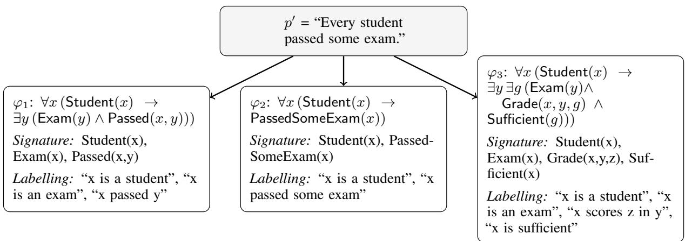

# Natural Language to First-Order Logic LLM-based Autoformalization

Andrea Brunello1 Cristian Curaba1 Luca Geatti1

Michele Mignani1∗ Angelo Montanari1 Nicola Saccomanno1

1University of Udine, Italy name.surname@uniud.it

∗Corresponding author.

## Abstract

Large Language Models (LLMs) have renewed interest in autoformalization. Yet, when First-Order Logic (FOL) is considered as the target formalism, the field still lacks a unified task formulation and a systematic survey. This paper addresses this gap: we first provide a principled definition for the FOL-autoformalization task by distinguishing Ontology Extraction from Logical Translation, showing how their conflation obscures (cross-study) evaluation; we review existing datasets, evaluation metrics, and LLM-based methods, including fine-tuning, prompting, and verification-based refinement; we identify open challenges in benchmarking, semantic evaluation, ontology-aware methods, and end-to-end applications.

## 1 Introduction

In the literature, autoformalization is broadly defined as the task of automatically generating statements in a target formalism that capture the semantics of a Natural Language (NL) sentence (Szegedy, 2020; Mensfelt et al., 2026; Wu et al., 2022). Although NL is well-suited for everyday human communication, its flexibility, expressiveness, and inherent ambiguity make it ill-suited for interaction with automated reasoning tools, which require inputs to be unambiguous and specified within a formal semantic framework. Early work relied on rulebased systems (Kamath and Das, 2018) and controlled natural languages (Kuhn, 2014), while more recent approaches have adopted neural networkbased methods (Jiang and Cai, 2024). Despite the considerable research effort devoted to autoformalization, the field still lacks a unified formulation and a systematic survey when First-Order Logic (FOL) is considered as the target formalism. Here, we address this gap.

Why this survey. The motivations are threefold. First, Large Language Models (LLMs) have reshaped the autoformalization research landscape:

their flexibility and general-purpose linguistic competence make autoformalization feasible across a wide range of domains (Mensfelt et al., 2026). Second, no systematic survey of LLM-based autoformalization for FOL currently exists, despite FOL offering a well-established balance between expressive power and algorithmic tractability. Surveys for other formalisms, such as Linear Temporal Logic (Germiniani et al., 2025) and SQL (Mohammadjafari et al., 2024), already play a pivotal role in their respective landscapes. Third, autoformalization underpins a wide range of relevant applications. In reasoning tasks, symbolic methods such as theorem provers and Satisfiability Modulo Theories (SMT) solvers are reliable and explainable, but require inputs in a precise logical format; autoformalization is thus crucial for converting NL task instances into appropriate representations. Recent work shows that inserting a formalization step and invoking symbolic tools can outperform directly prompting an LLM to solve multi-step logical reasoning problems (Ye et al., 2023; Olausson et al., 2023; Pan et al., 2023; Callewaert et al., 2025), with FOL yielding the best performance in certain settings (Beiser et al., 2025). Beyond reasoning, reliable formalization tools could make formal verification accessible to non-experts and enable scalable verification of large text corpora, an especially important prospect for AI safety approaches that regard formal guarantees as essential (Dalrymple et al., 2024). The significance of autoformalization in FOL has also been demonstrated in logical fallacy detection (Lalwani et al., 2024), argumentation mining (Sun et al., 2025), legal reasoning (Alam et al., 2023), and anomaly detection (Jin et al., 2025).

Our contribution. We provide a detailed description of the FOL-autoformalization task (Section 2) aimed at resolving existing ambiguities. Surveying the existing literature, we then focus on evaluation, covering datasets and metrics (Section 3), and methods proposed to achieve autoformalization via LLMs (Section 4). Finally, we highlight open problems and directions for future research (Section 5).

## 2 Autoformalization Definition

Despite a growing body of work on FOLautoformalization—both as an engineering component and as a task of independent interest—the field lacks a shared, precise formulation of what the task requires. Informal descriptions typically present autoformalization as the translation of a NL text into a FOL formula that preserves its semantic content. This formulation is ambiguous: it leaves open what formal machinery the formula is interpreted over, and it does not specify under what conditions a formula counts as correct or faithful.

In this section we give a more precise account. We argue that any formalization in FOL is relative to an ontology—a structure comprising a formal vocabulary, a labelling of that vocabulary with intended NL meanings, and a background theory. The raw translation $p \in \mathrm { N L } \mapsto \varphi \in \mathrm { F O L }$ , typically found in the literature, is therefore an abbreviation for a richer artifact. We then introduce Definition 1 for the FOL-autformalization task-

We provide FOL background in Appendix A.

## 2.1 Formulas and Ontological Commitments

Consider the sentence: $p \ : = \ ^ { 6 6 }$ The cube A is on the left of the tetrahedron $B . ^ { \prime \prime } \mathrm { ~ \bf ~ A ~ }$ natural FOL candidate is: $\varphi : = { \mathsf { C u b e } } ( A ) \wedge { \mathsf { T e t } } ( B ) \wedge$ $\mathsf { L e f t O f } ( A , B )$ ; φ contains the non-logical symbols {A, B, Cube/1, Tet/1, LeftOf/2}, which jointly constitute the signature $\sigma _ { \varphi }$ that $\varphi$ is written over. The signature is derivable from the formula alone.

What is not derivable from $\varphi$ alone is the $i n \cdot$ tended meaning of these symbols. Nothing in $\varphi$ determines that Cube(x) means “x is a cube” rather than, say, $^ { \bullet \bullet } x$ is a room” or any other arbitrary unary property. The suggestive symbol names give a strong pragmatic hint, but hints are not meanings: a formula with symbols renamed $\mathsf { P } _ { 1 } ( c _ { 1 } ) \wedge \mathsf { P } _ { 2 } ( c _ { 2 } ) \wedge \mathsf { R } ( c _ { 1 } , c _ { 2 } )$ is logically identical to $\varphi ,$ yet gives no hint at all.

This has a direct consequence for evaluation. Two formulas $\varphi$ and $\varphi ^ { \prime }$ may disagree not only in logical structure but also in what the symbols they use are intended to mean. Without fixing the intended meanings, the problem of comparing formalizations—or judging whether any single one is faithful—is not well-defined.

## 2.2 Ontology: Signature, Labelling, Theory

We use the term ontology for the structure relative to which a FOL formula represents NL content. We define it as a triple: $\Omega \ : = \ : \langle \sigma , L , T \rangle$ , whose components are as follows.

Signature σ. A FOL signature is a set of nonlogical symbols with their arities: constants, function symbols, and predicate symbols. Signature $\sigma$ specifies the vocabulary available for translation. In the running example: $\sigma =$ $\{ A , B , \mathsf { C u b e } / 1 , \mathsf { T e t } / 1 , \mathsf { L e f t O f } / 2 \}$

Labelling $L .$ The labelling is a possibly partial function that maps each symbol $s \in \sigma$ to an NL meaning-specification $L ( s )$ . For our ${ p , }$ for instance, $L ( { \mathsf { C u b e } } ) = { } ^ { \circ } { \mathbf { \tilde { x } } }$ is a cube”, When L is fully specified, we call $\langle \sigma , L \rangle$ a labelled signature. It is the labelled signature—not the signature alone—that permits assessment of whether $\varphi$ faithfully formalizes p. Raw translation output exposes $\sigma _ { \varphi }$ but typically leaves L implicit, conventional, or underspecified.

Theory T. The theory is a possibly empty set of FOL sentences over $\sigma$ that encode background axioms, taxonomic relations, and domainspecific assumptions. In our example, the formula $^ { \ast \ast } \forall x ( \mathsf { C u b e } ( x ) \to \neg \mathsf { T e t } ( x ) ) ^ { \flat }$ that expresses that no object is simultaneously a cube and a tetrahedron, can be an element of $T .$ In many sentence-level datasets, $T$ is empty or left implicit. When autoformalization feeds into reasoning or verification, however, the theory is often essential: a formula that is faithful relative to one theory may be inadequate relative to another. 1

## 2.3 (Not) Uniqueness of Ontological Choices

A single NL sentence does not necessary determine a unique formalization—due to ambiguity, synonymy, or granularity choices—even relative to a fixed ontology. It also does not determine a unique ontology. Consider $p ^ { \prime } : = { } ^ { \ast } \mathrm { E v e r y }$ student passed some exam.” Three candidate formalizations are: $\varphi _ { 1 } ~ = ~ \forall x ( { \mathsf { S t u d e n t } } ( x ) ~ \to ~ \exists y ( { \mathsf { E x a m } } ( y ) ~ \land$ Passed ${ \bf \Phi } ( x , y ) ) \big ) , \quad \varphi _ { 2 } { \bf \Psi } = \forall x \bigl ( \mathsf { S t u d e n t } ( x ) \quad \to$ $\mathsf { P a s s e d S o m e E x a m } ( x ) \bigr ) , \varphi _ { 3 } = \forall x \bigl ( \mathsf { S t u d e n t } ( x ) \to \mathsf { \Lambda }$ $\exists y \exists g ( \mathsf { E x a m } ( y ) \land \mathsf { G r a d e } ( x , y , g ) \land \mathsf { S u f f i c i e n t } ( g ) ) \big )$

From a formal perspective, these are not syntactic variants: each relies on a different signature, labeling, and potentially a different background theory (see Figure 1). Formula $\varphi _ { 1 }$ represents passing as a binary relation between individuals; $\varphi _ { 2 }$ absorbs both the exam and the passing event into a single unary predicate; $\varphi _ { 3 }$ introduces grades as a refined object. Crucially, the choice of signature is not merely a matter of style: it determines both what can be represented about the NL sentence $p ^ { \prime }$ and what can subsequently be inferred from its formalization. For instance, φ cannot adequately represent information about which exam a student passed, since the exam is not represented as an individual but is compiled away inside the unary predicate; similarly, neither $\varphi _ { 1 }$ nor $\varphi _ { 2 }$ can represent information about a student’s grade, since grades are absent from their signatures entirely. These are not failures of translation but direct consequences of the ontological commitments each formula adopts.

In the absence of further information, there is no principled reason to prefer one signature over another; however, these differing ontological commitments make some formalizations more suitable than others depending on the context in which they will be used. For instance, if $p ^ { \prime }$ is expected to be only one sentence within a larger corpus concerning different kinds of exams, the ontology underlying φ2 is likely inadequate, since it conflates the concept of an exam with the act of a student passing it; a signature in which the exam is reified as an independent object would be preferable. Likewise, if other sentences in the corpus explicitly discuss grades, the ontology underlying $\varphi _ { 3 }$ is the best-suited of the three considered here, since it is the only one capable of representing and reasoning about that information at all.

This observation implies that evaluating autoformalization systems by comparing formulas directly—without accounting for the ontologies they presuppose—conflates two distinct sources of disagreement: different translations of the same NL content, and different ontological choices about how to represent that content at all.

## 2.4 FOL-autoformalization Definition

We provide now a precise definition of the task.

Definition 1 (FOL-autoformalization task) Let p be a NL text, and let K be optional background knowledge given as input, which may include, $e . g .$ contextual information or a (partial) specification of an ontology $\tilde { \Omega } = \langle \tilde { \sigma } , \tilde { L } , \tilde { T } \rangle$

FOL-autoformalization is the task of automatically producing, from $\langle p , K \rangle$ , a pair $\langle \varphi , \Omega \rangle$ , with $\Omega = \langle \sigma , L , T \rangle$ , where L and T may possibly be empty, i.e., left implicit. Specifically, $\varphi$ is a FOL formula over σ that represents the content of p relative to Ω: under the meanings assigned by L and the constraints imposed by $T , \varphi$ holds if and only $i f p$ is true.

The components of Ω may be given as output or left implicit. The signature $\sigma$ is always recoverable from $\varphi$ itself. The labelling function $L ,$ when omitted, leaves the intended NL meaning of the symbols in σ implicit: the grounding of the formula to natural language must then be inferred from context. Similarly, the background theory $T ,$ when omitted, imposes no additional constraints on the interpretation of $\sigma ,$ potentially leaving the semantics of $\varphi$ underspecified. The richer the specification of $\Omega ,$ the more verifiable the output $\varphi$ becomes.

Definition 1 is deliberately general: different task variants arise by varying what K is and which components of Ω are required to be explicit. Two extremes are worth noting. At one end, raw translation—the most common variant in the literature— doesn’t consider $\tilde { \Omega }$ in $K$ and requires only $\varphi$ as output, leaving $L$ and $T$ implicit. At the other end,full autoformalization requires producing both $\varphi$ and the complete $\Omega ,$ and is the most theoretically complete instantiation of the definition. The strength of this definition lies precisely in its ability to capture both extremes—and everything in between—within a single unified framework.

Another variant present in the literature (see Brunello et al. (2026b)) is the Logical Translation (LT), where the input context $K$ contains an ontology $\Omega = \langle \sigma , L \rangle$ , and the output is the formula $\varphi$ (and the same Ω provided in input). LT is relevant when a domain ontology already exists and the goal is to produce formalizations compatible with it. This frequently occurs in formal verification pipelines or multi-sentence corpora requiring consistent predicate use across formulas.

Furthermore, LT is important since it provides a useful decomposition of the full autoformalization task, as noted in (Brunello et al., 2026b). Since LT assumes Ω, they propose to consider the complementary task of Ontology Extraction (OE): given contextual information and the NL text $p ,$ the goal is to construct the specific ontology Ω required to formalize p adequately. OE becomes the critical subtask whenever a reusable ontology must be established before LT can proceed. For instance, it is needed when bootstrapping a domain vocabulary from a set of NL documents (legal texts, engineering specifications) that will later serve as the basis for formalizing arbitrary sentences in that domain.

  
Figure 1: A single NL sentence $p ^ { \prime }$ admits multiple formalizations $\varphi _ { 1 } , \varphi _ { 2 } , \varphi _ { 3 }$ , each committing to a different signature. The three formulas can be considered all correct but they express information differently.

This decomposition is not the only possible one, but it gives dignity to the distinct nature of these subtasks, the separate sources of error they introduce, and the different communities whose methods are relevant to each (Ontology Learning and Autoformalization). As we discuss in Section 3.2, it also enables theoretically grounded evaluation.

## 3 Autoformalization Evaluation

Here we explore the datasets and metrics used in the literature for evaluation, deferring their use in performance-enhancement methods to Section 4.

Ontology Evaluation. In principle, evaluation should assess both the quality of the ontology and that of the resulting FOL formula. In practice, no existing work explicitly evaluates signature quality, even when the OE/LT decomposition is acknowledged—a gap shared with ontology learning, where evaluation is also conducted indirectly via downstream tasks (Du et al., 2024). In FOLautoformalization, signature quality is therefore assessed only implicitly: a correct formula is taken as evidence that the employed symbols constitute an adequate signature. Similarly for the theory, that is considered by only a small portion of the FOLautoformalization literature (Lalwani et al., 2024; Callewaert et al., 2025), and substantially overlaps with the field of ontology learning and commonsense knowledge acquisition (Armary et al., 2025; Du et al., 2024), which have their own methods and evaluation frameworks. Accordingly, we focus on the evaluation of FOL formulas: this can be done either directly or via proxy tasks.

Evaluation via Proxy Tasks. A fundamental challenge is the cost of obtaining ground-truth formulas: correct FOL annotations require significant expertise, making large-scale direct evaluation often prohibitive. Proxy tasks offer a practical alternative, measuring whether the formalization succeeds at a downstream application rather than against a ground truth. Any application can serve this role, provided formalization success is clearly reflected in the overall outcome; for example, Lalwani et al. (2024) use formalization for logical fallacy detection, while Karia et al. (2024) formalize a NL sentence back from a FOL formula and checks equivalence with the original.

In practice, though, most of the literature uses Natural Language Inference (NLI) task as a proxy. In NLI, given premises $p _ { 1 } , \ldots , p _ { n }$ and a conclusion c, the task is to determine whether c is logically entailed by the premises. This entailment relation should be preserved under formalization: if $p _ { 1 } , \ldots , p _ { n } ,$ c are formalized as $\varphi _ { 1 } , \ldots , \varphi _ { n } , \psi$ , then c is entailed by (resp., contradicts) the premises $p _ { 1 } , \ldots , p _ { n }$ if and only if ψ (resp., ¬ψ) is derivable from the premises $\varphi _ { 1 } , \ldots , \varphi _ { n }$ . This methodology has well-known limitations (Brunello et al., 2026b): entailment agreement between NL and FOL can occur even with incorrect formulas; a mismatch can arise from any subset of incorrectly formalized sentences; and NL entailment may rely on background knowledge not captured by the formalization.2

<table><tr><td rowspan="2">Dataset</td><td colspan="2">Generation Type</td><td rowspan="2">No. of Pairs</td></tr><tr><td>NL</td><td>FOL</td></tr><tr><td>FOLIO</td><td>Human</td><td>Human (*)</td><td>~3800</td></tr><tr><td>GGC</td><td>Human</td><td>Human (*)</td><td>~280</td></tr><tr><td>MALLS</td><td>LLM</td><td>LLM</td><td>~28K</td></tr><tr><td>ProverQA</td><td>LLM (*)</td><td>Rule-based</td><td>~17K</td></tr><tr><td>Willow</td><td>LLM</td><td>LLM</td><td>~16K</td></tr><tr><td>PROOFFOL</td><td>Human</td><td>LLM (*)</td><td>~10K</td></tr><tr><td>Text2log</td><td>Rule-based</td><td>Rule-based (*)</td><td>~100K</td></tr></table>

Table 1: Overview of NL–FOL datasets. ‘Generation Type’ indicates who generates NL and FOL. Asterisks denote that the output is obtained by a translation (from the NL or the FOL part); no asterisk indicates joint generation.

We focus on direct evaluation here, and refer the reader to Madaan et al. (2025) for a dedicated treatment of the NLI setting.

## 3.1 Datasets

We review how existing datasets pairing a NL sentence to a FOL formula (NL–FOL) are constructed and validated. We discuss FOLIO (Han et al., 2024), Willow (Deveci, 2024), MALLS (Yang et al., 2024), ProverQA (Qi et al., 2025), PROOF-FOL (Thatikonda et al., 2024), Text2log (Levkovskyi and Li, 2021), and the private (but available on request) Grade Grinder Corpus (GGC) (Barker-Plummer et al., 2011a). A high-level summary is provided in Table 1. Purely NLI datasets without a validated FOL layer are excluded from the main body of the paper, as they are not directly usable for autoformalization evaluation. Further information about these datasets, and what would need to be supplied to make them usable for the autoformalization task, is provided in Appendix B.

Generation and validation methods. Three main generation paradigms recur across the considered datasets, often in combination: human generation, LLM generation, and rule-based generation. Despite some of the procedures provide a degree of validation per se (e.g., human generation), they are sometimes complemented with additional checks.

Human generation is used for FOLIO and for the GGC corpus. FOLIO is a NLI dataset consisting of ∼ 500 different stories with a total of ∼ 2400 premises and ∼ 1400 conclusions, written in NL and then formalized to FOL by experts. A first-order theorem prover is used to check whether the entailments are preserved by the FOL formalization, filtering out the instances in which a mismatch occurs. GGC collects students’ FOL submissions in response to Tarski’s World exercises from the textbook Language, Proof and Logic (Barker-Plummer et al., 2011b), labelled using an automatic grading tool that enforces syntactic and semantic coherence.

LLM generation underlies Willow, MALLS, PROOFFOL, and the NL side of ProverQA. Willow extends ∼ 300 human-validated NL–FOL pairs to 16K using GPT-4, discarding outputs that fail a grammar check; NL–FOL alignment is only partially verified. MALLS collects 28K NL–FOL pairs by prompting GPT-4 to generate NL sentences and then to formalize them using a dynamic n-gram counter to encourage diversity. In addition, a human-checked subset of 1K examples is used to identify frequent errors, which are then targeted by rule-based filters to remove such mistakes from the remaining dataset. PROOFFOL uses GPT-4o to formalize the premises and conclusions of ProofWriter (Tafjord et al., 2021), retaining only instances where the theorem prover’s verdict matches the source dataset’s ground truth, thereby enforcing both syntactic well-formedness and label consistency. ProverQA inverts the direction: an LLM generates NL stories with human-interpretable meanings for predicate symbols, while the FOL side is produced by a symbolic generator, guaranteeing logical structure by construction.

Rule-based generation appears in Text2log and in the symbolic part of ProverQA and, in both cases, most validation is intrinsic to the generator. Text2log uses predefined grammar rules (through an ad hoc CCG-based semantic parser) to formalize in FOL template-based NL sentences, creating roughly 100K NL–FOL pairs. FOL is correct by construction, but the range of covered NL instances is limited and strongly template-driven.

Discussion. The generation and validation choices have direct implications on how each dataset should be used in autoformalization.

Datasets with expert-written NL and FOL pairs plus solver-based checks, such as FOLIO and the GGC corpus, provide the strongest available basis for evaluation. Despite the human-conducted generation and the solver-based label-consistency tests, several independent analyses (Pei et al., 2025; Yang et al., 2024; Brunello et al., 2026b) document the presence of annotation errors in FOLIO. In particular, Brunello et al. (2026a) found a high rate of ambiguous and incorrect formalizations in the validation split of FOLIO and in a subset of the MALLS test set; the authors show that these annotation errors can substantially skew reported model performance, and consequently released corrected versions of these datasets for use in evaluating models on this task.

Large-scale LLM-generated datasets typically guarantee syntactic well-formedness but do not explicitly validate NL–FOL semantic alignment. Systematic error patterns consequently persist, as acknowledged by the authors of MALLS and Willow and further documented in Brunello et al. (2026b). A similar consideration applies to rulebased datasets like Text2log, where templatedriven NL may not reflect the linguistic variation encountered in realistic settings.

## 3.2 Metrics

Direct evaluation of FOL formalization focuses on comparing a predicted formula $\hat { \varphi }$ with a ground truth formula $\varphi .$ . We categorize the metrics proposed in the literature into syntactic and semantic, based on which aspects of the formulas they assess.

## 3.2.1 Syntactic Metrics

By syntactic metrics, we refer to metrics that treat formulas as syntactic objects, ignoring semantic meaning. A preliminary syntactic validity check ensures that the generated formula conforms to the rules of the formalism; once correctness is verified, several approaches can be applied:

• Exact Match evaluates whether two formulas are identical under string comparison, typically after normalization preprocessing (Vossel et al., 2025).

• In Tree Edit Distance, instead, formulas are represented as syntax trees, and the minimumcost sequence of node edit operations to transform one into the other is computed (Brunello et al., 2024).

• BLEU Score (Papineni et al., 2002), the standard NLP metric, can be applied to FOL formulas after tokenization with an ad-hoc tokenizer tailored for FOL syntax (Yang et al., 2024).

• LogicSim is a metric proposed by Lopez-Ponce and Bel-Enguix (2025) as

$L o g i c S i m ( \varphi , \hat { \varphi } ) : = p d + t p + l d + I o U ,$ where pd and tp are the absolute differences in the number of distinct predicates and total predicate occurrences, respectively; ld is the difference in logical operators and quantifiers; and IoU measures the overlap between the predicate sets of $\varphi$ and $\hat { \varphi } .$

While easy to compute, syntactic metrics ignore the semantic content of FOL formulas, yielding inadequate results (Brunello et al., 2026b). Thus, they are often neglected, or used alongside more semantically informed measures, described next.

## 3.2.2 Semantic Metrics

Semantic metrics evaluate whether a candidate formula $\varphi$ and a reference $\hat { \varphi }$ convey the same meaning. Direct semantic comparison requires addressing two dimensions in sequence.

Symbol Matching. Before any semantic comparison can be made, the symbols of $\varphi$ must be linked to those of $\hat { \varphi } \cdot$ —an instance of the anchoring problem (Harnad, 1999). Two strategies appear in the literature. The first is syntactic matching: Vossel et al. (2025) use Levenshtein distance (Levenshtein, 1965) to align predicate symbols across signatures by surface-form similarity, a fragile approach that fails when synonymous concepts receive different names or distinct concepts share one. The second strategy is to provide the signature directly as part of the task input, as in the LT variants. This eliminates the matching problem by construction and is one of the strongest motivations for the OE/LT distinction of Section 2.

Formula Closeness. Once symbol matching is established, the question is how to measure the semantic distance between the two formulas. In the literature, we can find two metrics.

Logical equivalence assigns 1 if and only if $\varphi \equiv$ $\hat { \varphi } ,$ 0 otherwise: it is theoretically well-founded but binary, thus unsuitable as a possible training objective (see Section 4.1).

LE score (Yang et al., 2024) relaxes this by treating the formulas propositionally (Smullyan, 1968) and computing the ratio of truth assignments under which they agree, yielding a continuous value in [0, 1]. However, by treating formulas propositionally it discards quantifier structure entirely— precisely what is believed to be the aspect of FOL most challenging to produce correctly.3

Almost all works implicitly target the raw translation variant, treating autoformalization as a single monolithic step, an approach that has a direct impact on evaluation. Conflicting empirical results in the literature—some works reporting strong LLM performance on NL–FOL translation (Yang et al., 2024), others reporting poor performance (Han et al., 2024)—can be traced to heterogeneous evaluation setups arising from different implicit task formulations (Brunello et al., 2026b). The decomposition introduced in Section 2 addresses these inconsistencies and, together with the metric considerations above, motivates a clear recommendation: when direct semantic comparison is needed, since reliable methods for symbol matching across different signatures are currently lacking, the labelled signature should be provided as input—resolving symbol matching by construction—and logical equivalence used as the sole evaluation metric.

## 4 LLM-based Autoformalization Methods

Since current LLMs can be readily prompted to perform FOL-autoformalization, the research has largely focused on techniques for enhancing their performance. A major distinction can be made between methods that fine-tune the LLM (Section 4.1) and those that aim to improve performance without modifying the model’s internal weights, instead relying on prompting strategies (Section 4.2) or incorporating a verification stage (Section 4.3).

Virtually all methods in the FOLautoformalization literature implicitly target raw translation $( p \to \varphi )$ , and OE-specific methods are largely absent from the literature. As discussed in Section 3.2, no metrics are developed for direct evaluation of a labelled signature’s quality, making it difficult to optimize or compare OE methods in isolation. This represents a structural gap that we discuss further in Section 5.

## 4.1 Fine-tuning Strategies

Fine-tuning consists of taking a pre-trained model that already encodes broad linguistic and world knowledge and specializing it on a task-specific dataset. Various techniques can be applied, ranging from full-parameter updates to parameter-efficient approaches such as Low-Rank Adaptation, and from purely human-annotated corpora to largescale synthetic resources.

Supervised Fine-tuning (SFT). The most common strategy updates all model weights, or a subset of them via methods such as Low-Rank Adaptation, using supervised NL–FOL training pairs. Since effective fine-tuning requires a substantial amount of data, most works rely on existing benchmarks. For example, Vossel et al. (2025) combine MALLS and Willow to increase diversity and reduce overfitting, while Xu et al. (2024) augment data through systematic symbol renaming and NL instructions to promote semantic learning over surface memorization. When existing datasets are insufficient, ad hoc datasets can be constructed synthetically. For instance, Hahn et al. (2022) employ a rule-based pipeline combining established symbolic parsing techniques (Clark and Curran, 2004; Bos, 2015) to convert NL sentences into FOL formulas at scale.

Reinforcement Learning (RL). Some authors adopt RL in place of, or in addition to, supervised fine-tuning. Yang et al. (2024) train LogicLLAMA using a combination of the BLEU score and the LE score (Section 3.2) as a reward function measuring similarity between the candidate translation $\hat { \varphi }$ and the ground truth $\varphi ,$ motivated by the observation that a purely autoregressive fine-tuning objective did not yield optimal performance.

Preference Optimization. Motivated by strong results in other generative settings, preference optimization methods have also been explored. Lopez-Ponce and Bel-Enguix (2025) propose a Direct Preference Optimization (DPO) procedure starting from FOLIO, where accepted options correspond to ground-truth formalizations and rejected options to LLM-generated alternatives, augmented with quality scores encoding preference strength. Viswanadha et al. (2025) further study DPO and KTO (Kahneman–Tversky Optimization), finding that KTO after SFT outperforms both SFT alone and SFT with DPO.

## 4.2 Prompting Strategies

Multiple prompting strategies have been explored to enhance the capabilities of pre-trained LLMs in autoformalization without modifying their weights.

## 4.2.1 Agnostic Methods

In the autoformalization setting, general-purpose prompting techniques such as Few-Shot prompting, In-Context Learning (ICL), Chain-of-Thought (CoT), Tree-of-Thoughts, and Self-Consistency are commonly used and typically yield performance gains, as shown for instance by Han et al. (2024).

## 4.2.2 Task-specific Methods

Prompting can also be tailored with task-specific instructions (meta-prompting): rather than asking the model to produce a formula directly, the prompt decomposes the task into explicit stages. For example, Pei et al. (2025); Hu et al. (2025) first instruct the model to identify a suitable labelled signature (i.e., perform OE) and then carry out the LT step. This staged decomposition is precisely the operationalization of the OE/LT distinction, discussed above. Some works further interpose a theory recovery step: Lalwani et al. (2024); Nananukul et al. (2025); Wen et al. (2025) ask the LLM to select among candidate relational axioms before performing translation. Ryu et al. (2025) decompose the formalization into extracting the logical structure of the sentence, splitting it into simpler components, and performing a sequential translation from subcomponents to the full formula.

Beyond such decompositions, ICL-style methods are also adapted. Hu et al. (2025) use retrievalaugmented generation (RAG): a knowledge base of NL–FOL pairs is built from existing datasets and enriched with instances where the model previously failed. Given an input sentence p, the closest examples in the knowledge base (according to sentence embeddings) are retrieved and inserted into the prompt as contextual demonstrations.

## 4.3 Output Verification and Refinement Loops

Feedback-based methods iteratively refine an LLM’s output after an initial formalization attempt. The verification step may rely on formal tools or on the LLM itself, to target either syntactic or semantic correctness.

## 4.3.1 Syntactic Verification

The most widely adopted form of verification checks whether the generated formula conforms to the target formalization via a syntax checker or theorem prover. Error messages are fed back into the prompt to localize and correct mistakes (Deng et al., 2024; Quan et al., 2024); some works further augment the prompt with a curated list of common errors and fixes (Pan et al., 2023; Callewaert et al., 2025). The loop repeats until a valid formula is produced or an iteration limit is reached.

A complementary approach constrains decoding itself, restricting the output vocabulary at each step to tokens that yield a grammatically valid continuation (Raspanti et al., 2025).

## 4.3.2 Semantic Verification

Semantic verification is an open challenge. Assessing whether a FOL formula faithfully captures the meaning of a NL sentence requires bridging two fundamentally different representations, which lies beyond the reach of standard theorem provers. Still, formal tools can provide partial semantic feedback: when autoformalizing a corpus of NL sentences into a set of axioms (Callewaert et al., 2025), satisfiability checks can reveal theory-level inconsistencies, and unsatisfiable core extraction can pinpoint offending formulas to guide refinement.

For richer semantic feedback, several works turn to LLMs themselves. One line of work generates multiple candidate formalizations and aggregates them via self-consistency and majority voting. Olausson et al. (2023) find that aggregating multiple generations reduces syntactic errors, especially for weaker models, and Brunello et al. (2026b) observe complementary error patterns across model families, motivating ensembling strategies.

A second line of work prompts an LLM to directly refine a candidate formalization, like in Brunello et al. (2026a). To mitigate the fallibility of LLM judges, several strategies have been explored: augmenting the context with a knowledge base of NL–FOL pairs including human-corrected formalizations (Hu et al., 2025); prompting the model to compare two candidates and select the better one (Kirtania et al., 2024); and fine-tuning a dedicated verification model on triplets $( p , \varphi _ { \mathrm { p e r t } } , \varphi )$ where $p$ is the NL sentence, $\varphi _ { \mathrm { p e r t } }$ an incorrect (perturbed) formalization, and $\varphi$ is the ground truth (Thatikonda et al., 2024).

Finally, some approaches combine LLM judgment with formal verification. Ryu et al. (2025) iteratively compare pairs of candidate formalizations $( \varphi , \varphi ^ { \prime } )$ : if they are logically equivalent, one is selected arbitrarily; otherwise an SMT-generated counterexample is passed to the LLM to discriminate between them. Amrollahi et al. (2026) introduce a roundtrip framework where an SMT solver checks equivalence between a formalization and its back-translation, and an LLM judge diagnoses mismatches to guide targeted repair.

Discussions and takeaways. Drawing strong conclusions aimed at answering "Which is the current best approach to FOL-autoformalization?" is difficult for two compounding reasons: the absence of standardized evaluation protocols (and task definition) makes cross-paper comparisons difficult to achieve, and the annotation noise documented in commonly used benchmarks (Section 3.1) further limits the significance of performance differences witnessed when using different solutions.

What is reasonable to conclude is that frontier reasoning models with simple CoT achieve strong results on the LT task (Brunello et al., 2026b); finetuning smaller models on specific datasets is a viable approach to achieve SOTA performance in a specific context and with less computation (and time) at inference phase. On top of that, prompting techniques (like meta-prompting, decomposing complex sentences into simpler subcomponents, or RAG) can boost the performance of fine-tuned models or already capable ones. Finally, adding a verification layer on top of any pipeline seems beneficial as well. While syntactic verification represents a robust enhancement across model families, semantic verification addresses a genuinely different and harder problem, making it essential for reliable autoformalization in practice. SAT solvers offer rigorous but partial feedback (Callewaert et al., 2025; Amrollahi et al., 2026), while LLM-based verification can cover the full semantic dimension but lacks formal guarantees and depends heavily on model capability.

## 5 Open Problems and Future Directions

We conclude by highlighting open issues in current research and outlining directions for future work.

On evaluation protocols and benchmarks. Many evaluation pipelines conflate distinct stages of autoformalization—OE and LT—making it difficult to identify where models struggle. We advocate for standardized evaluation protocols alongside larger, higher-quality benchmarks that are more heterogeneous in domain, formula complexity, and linguistic variation. These benchmarks must also capture overlooked challenges like natural language ambiguity.

On autoformalization methods. A work on LTL autoformalization has begun to explore structured intermediate representations (Germiniani et al.,

2025); analogous strategies for FOL remain preliminary (Frydman, 2025). A closer exchange of ideas across formalisms—covering intermediates, posttraining strategies, and multi-step pipelines—could substantially advance the field. At the methodological level, almost no existing work explicitly targets OE as a standalone task; developing fine-tuning objectives and prompting strategies that adhere to the OE/LT decomposition, and engaging more directly with the ontology learning literature (Armary et al., 2025; Du et al., 2024), represents a largely open research agenda.

Towards end-to-end applications. The connection between autoformalization research and downstream applications—formal verification, legal reasoning, AI safety—remains largely implicit. Endto-end pipelines that reliably formalize corpora of NL specifications are almost entirely absent. Closing this gap is a crucial next step, allowing concrete application requirements to steer the future direction of the research field.

## Limitations

This survey does not provide a comparative empirical analysis across enhancement strategies or across LLMs. This is partly by design: as discussed throughout, the absence of standardized evaluation protocols makes cross-paper comparisons unreliable, and one contribution of this work is precisely to clarify the conceptual distinctions— most notably the OE/LT decomposition—that such a standardization would require. By focusing on LLM-based methods, we also set aside earlier symbolic and neural approaches, which are only briefly contextualized in the introduction. Although the surveyed literature evolves rapidly and specific results may become outdated, we believe that the contributions of this work are largely independent of the specific models and datasets available at any given time, and thus retain their value as the landscape continues to develop.

## References

Mohammad Nazmul Alam, Md. Shahin Kabir, and Arun Verma. 2023. Data and knowledge engineering for legal precedents using first-order predicate logic. GCAT 2023, pages 1–8.

Daneshvar Amrollahi, Jerry Lopez, and Clark Barrett. 2026. Faithful Autoformalization via Roundtrip Verification and Repair. CoRR.

Pauline Armary, Cheikh Brahim El-Vaigh, Ouassila Labbani Narsis, and Christophe Nicolle. 2025. Ontology learning towards expressiveness: A survey. Computer Science Review, 56:100693.

Dave Barker-Plummer, Richard Cox, and Robert Dale. 2011a. Student translations of natural language into logic: The Grade Grinder corpus release 1.0. In EDM, pages 51–60.

David Barker-Plummer, Jon Barwise, and John Etchemendy. 2011b. Language, Proof, and Logic, 2nd edition. Center for the Study of Language and Information/SRI.

Clark Barrett and Cesare Tinelli. 2018. Satisfiability Modulo Theories. In Edmund M. Clarke, Thomas A. Henzinger, Helmut Veith, and Roderick Bloem, editors, Handbook ofModel Checking, pages 305–343. Springer International Publishing, Cham.

Alexander Beiser, Nysret Musliu, and David Penz. 2025. Intermediate languages matter: Formal languages and LLMs affect neurosymbolic reasoning. In SE-MANTiCS 2025, volume 4064 of CEUR Workshop Proceedings. CEUR-WS.org.

Johan Bos. 2015. Open-domain semantic parsing with boxer. In NODALIDA 2015, May 11-13, 2015, volume 109 of Linköping Electronic Conference Proceedings, pages 301–304. Linköping University Electronic Press / Association for Computational Linguistics.

Andrea Brunello, Cristian Curaba, Luca Geatti, Michele Mignani, Angelo Montanari, and Nicola Saccomanno. 2026a. Fixing folio and malls: Verified annotations and an LLM-assisted framework to focus human relabeling. Preprint, arXiv:https://arxiv.org/abs/2606.02837. To appear at EMNLP 2026.

Andrea Brunello, Riccardo Ferrarese, Luca Geatti, Enrico Marzano, Angelo Montanari, and Nicola Saccomanno. 2024. Evaluating LLMs capabilities at natural language to logic translation: A preliminary investigation. In OVERLAY 2024, volume 3904 of CEUR Workshop Proceedings, pages 103–110. CEUR-WS.org.

Andrea Brunello, Luca Geatti, Michele Mignani, Angelo Montanari, and Nicola Saccomanno. 2026b. Do LLMs really struggle at NL-FOL translation? revealing their strengths via a novel benchmarking strategy. In AAAI 2026, pages 30094–30103. AAAI Press.

Benjamin Callewaert, Simon Vandevelde, and Joost Vennekens. 2025. VERUS-LM: a versatile framework for combining LLMs with symbolic reasoning. CoRR, abs/2501.14540.

Peter Clark, Oyvind Tafjord, and Kyle Richardson. 2020. Transformers as soft reasoners over language. In IJCAI 2020.

Stephen Clark and James R. Curran. 2004. Parsing the WSJ using CCG and log-linear models. In ACL 2004, pages 103–110. Association for Computational Linguistics.

David Dalrymple, Joar Skalse, Yoshua Bengio, Stuart Russell, and 1 others. 2024. Towards guaranteed safe AI: A framework for ensuring robust and reliable AI systems. CoRR, abs/2405.06624.

Shujie Deng, Honghua Dong, and Xujie Si. 2024. Enhancing and evaluating logical reasoning abilities of large language models. In ICLR 2024 Workshop on Secure and Trustworthy Large Language Models.

˙Ibrahim Ethem Deveci. 2024. Transformer models for translating natural language sentences into formal logical expressions. Master’s thesis, Middle East Technical University.

Rick Du, Huilong An, Keyu Wang, and Weidong Liu. 2024. A short review for ontology learning from text: Stride from shallow learning, deep learning to large language models trend. CoRR, abs/2404.14991.

Francis Frydman. 2025. EXa-LM: A controlled natural language bridge between large language models and first-order logic solvers. Preprints.

Samuele Germiniani, Daniele Nicoletti, and Graziano Pravadelli. 2025. A systematic literature review on mining LTL specifications. IEEE Access, 13:48950– 48998.

Christopher Hahn, Frederik Schmitt, Julia J. Tillman, Niklas Metzger, Julian Siber, and Bernd Finkbeiner. 2022. Formal specifications from natural language. CoRR, abs/2206.01962.

Simeng Han, Hailey Schoelkopf, Yilun Zhao, Zhenting Qi, Martin Riddell, Wenfei Zhou, James Coady, David Peng, Yujie Qiao, Luke Benson, Lucy Sun, Alexander Wardle-Solano, Hannah Szabó, Ekaterina Zubova, Matthew Burtell, Jonathan Fan, Yixin Liu, Brian Wong, Malcolm Sailor, and 16 others. 2024. FOLIO: natural language reasoning with first-order logic. In EMNLP 2024, pages 22017–22031. Association for Computational Linguistics.

Stevan Harnad. 1999. The symbol grounding problem. CoRR, cs.AI/9906002.

Ruikang Hu, Shaoyu Lin, Yeliang Xiu, and Yongmei Liu. 2025. LTRAG: enhancing autoformalization and self-refinement for logical reasoning with thoughtguided RAG. In ACL 2025, pages 2483–2493. Association for Computational Linguistics.

Peng Jiang and Xiaodong Cai. 2024. A survey of semantic parsing techniques. Symmetry, 16(9):1201.

Er Jin, Qihui Feng, Yongli Mou, Gerhard Lakemeyer, Stefan Decker, Oliver Simons, and Johannes Stegmaier. 2025. LogicAD: Explainable anomaly detection via VLM-based text feature extraction. In AAAI 2025, pages 4129–4137. AAAI Press.

Aishwarya Kamath and Rajarshi Das. 2018. A survey on semantic parsing. arXiv preprint arXiv:1812.00978.

Rushang Karia, Daniel Bramblett, Daksh Dobhal, Pulkit Verma, and Siddharth Srivastava. 2024. ∀uto∃val: Autonomous assessment of LLMs in formal synthesis and interpretation tasks. Preprint, arXiv:2403.18327.

Shashank Kirtania, Priyanshu Gupta, and Arjun Radhakirshna. 2024. LOGIC-LM++: multi-step refinement for symbolic formulations. CoRR, abs/2407.02514.

Tobias Kuhn. 2014. A survey and classification of controlled natural languages. Computational linguistics, 40(1):121–170.

Abhinav Lalwani, Tasha Kim, Lovish Chopra, Christopher Hahn, Zhijing Jin, and Mrinmaya Sachan. 2024. Autoformalizing natural language to first-order logic: A case study in logical fallacy detection. arXiv preprint arXiv:2405.02318.

Long Hei Matthew Lam, Ramya Keerthy Thatikonda, and Ehsan Shareghi. 2024. A closer look at toolbased logical reasoning with LLMs: The choice of tool matters. In ALTA 2024, pages 41–63. Association for Computational Linguistics.

Vladimir I. Levenshtein. 1965. Binary codes capable of correcting deletions, insertions, and reversals. Soviet physics. Doklady, 10:707–710.

Oleksii Levkovskyi and Wei Li. 2021. Generating predicate logic expressions from natural language. In SoutheastCon 2021, pages 1–8.

Jian Liu, Leyang Cui, Hanmeng Liu, Dandan Huang, Yile Wang, and Yue Zhang. 2020. Logiqa: A challenge dataset for machine reading comprehension with logical reasoning. arXiv preprint arXiv:2007.08124.

Junnan Liu. 2025. Few-shot natural language to firstorder logic translation via code generation. In NAACL 2025 - Volume 1, pages 10939–10960. Association for Computational Linguistics.

FernandoFrancisco Lopez-Ponce and Gemma Bel-Enguix. 2025. Into the limits of logic: Alignment methods for formal logical reasoning. In MathNLP 2025, pages 112–123. Association for Computational Linguistics.

Lovish Madaan, David Esiobu, Pontus Stenetorp, Barbara Plank, and Dieuwke Hupkes. 2025. Lost in inference: Rediscovering the role of natural language inference for large language models. In NAACL 2025 - Volume 1, pages 9229–9242. Association for Computational Linguistics.

Agnieszka Mensfelt, David Tena Cucala, Santiago Franco, Angeliki Koutsoukou-Argyraki, Vince Trencsenyi, and Kostas Stathis. 2026. Towards a common framework for autoformalization. In AAAI 2026, pages 40971–40980. AAAI Press.

Ali Mohammadjafari, Anthony S. Maida, and Raju Gottumukkala. 2024. From natural language to SQL: review of LLM-based text-to-SQL systems. CoRR, abs/2410.01066.

Terufumi Morishita, Gaku Morio, Atsuki Yamaguchi, and Yasuhiro Sogawa. 2024. Enhancing reasoning capabilities of LLMs via principled synthetic logic corpus. ArXiv, abs/2411.12498.

Navapat Nananukul, Yue Zhang, Ryan Lee, Eric Boxer, Jonathan May, Vibhav Giridhar Gogate, Jay Pujara, and Mayank Kejriwal. 2025. Logicalthought: Logic-based ontological grounding of LLMs for highassurance reasoning. CoRR, abs/2510.01530.

Theo Olausson, Alex Gu, Benjamin Lipkin, Cedegao E. Zhang, Armando Solar-Lezama, Joshua B. Tenenbaum, and Roger Levy. 2023. LINC: A neurosymbolic approach for logical reasoning by combining language models with first-order logic provers. In EMNLP 2023, pages 5153–5176. Association for Computational Linguistics.

Liangming Pan, Alon Albalak, Xinyi Wang, and William Yang Wang. 2023. Logic-LM: Empowering large language models with symbolic solvers for faithful logical reasoning. In Findings ofthe Associationfor Computational Linguistics: EMNLP 2023, pages 3806–3824. Association for Computational Linguistics.

Kishore Papineni, Salim Roukos, Todd Ward, and Wei-Jing Zhu. 2002. Bleu: a method for automatic evaluation of machine translation. In Proceedings ofthe 40th annual meeting of the Association for Computational Linguistics, pages 311–318.

Yu Pei, Yongping Du, and Xingnan Jin. 2025. Fover: First-order logic verification for natural language reasoning. Trans. Assoc. Comput. Linguistics, 13:1340– 1359.

Chengwen Qi, Ren Ma, Bowen Li, He Du, Binyuan Hui, Jinwang Wu, Yuanjun Laili, and Conghui He. 2025. Large language models meet symbolic provers for logical reasoning evaluation. In ICLR 2025.

Xin Quan, Marco Valentino, Louise A. Dennis, and André Freitas. 2024. Verification and refinement of natural language explanations through LLM-symbolic theorem proving. In EMNLP 2024, pages 2933–2958. Association for Computational Linguistics.

Federico Raspanti, Tanir Ozcelebi, and Mike Holenderski. 2025. Grammar-constrained decoding makes large language models better logical parsers. In ACL (Volume 6: Industry Track), pages 485–499. Association for Computational Linguistics.

Hyun Ryu, Gyeongman Kim, Hyemin S. Lee, and Eunho Yang. 2025. Divide and translate: Compositional first-order logic translation and verification for complex logical reasoning. In ICLR 2025.

Abulhair Saparov and He He. 2022. Language models are greedy reasoners: A systematic formal analysis of chain-of-thought. In ICLR 2022.

Raymond Merrill Smullyan. 1968. First-Order Logic. Springer Verlag.

Yang Sun, Guanrong Chen, Hamid Alinejad-Rokny, Jianzhu Bao, Yuqi Huang, Bin Liang, Kam-Fai Wong, Min Yang, and Ruifeng Xu. 2025. Learning firstorder logic rules for argumentation mining. In ACL (Volume 1: Long Papers), pages 14133–14148. Association for Computational Linguistics.

Christian Szegedy. 2020. A promising path towards autoformalization and general artificial intelligence. In CICM, volume 12236 of Lecture Notes in Computer Science, pages 3–20. Springer.

Oyvind Tafjord, Bhavana Dalvi, and Peter Clark. 2021. ProofWriter: Generating implications, proofs, and abductive statements over natural language. In Findings of ACL-IJCNLP 2021, pages 3621–3634, Online. Association for Computational Linguistics.

Ramya Keerthy Thatikonda, Jiuzhou Han, Wray L. Buntine, and Ehsan Shareghi. 2024. Strategies for improving nl-to-fol translation with LLMs: Data generation, incremental fine-tuning, and verification. CoRR, abs/2409.16461.

Jidong Tian, Yitian Li, Wenqing Chen, Liqiang Xiao, Hao He, and Yaohui Jin. 2021. Diagnosing the firstorder logical reasoning ability through LogicNLI. In EMNLP 2021, pages 3738–3747. Association for Computational Linguistics.

Koushik Viswanadha, Deepanway Ghosal, and Somak Aditya. 2025. LOGICPO: efficient translation of nl-based logical problems to FOL using LLMs and preference optimization. CoRR, abs/2506.18383.

Felix Vossel, Till Mossakowski, and Björn Gehrke. 2025. Advancing natural language formalization to first order logic with fine-tuned LLMs. CoRR, abs/2509.22338.

Chengyao Wen, Qiang Cheng, Shaofei Wang, Zhizhen Liu, Deng Zhao, and Lei Liang. 2025. Logic-thinker: Teaching large language models to think more logically. In Findings of EMNLP 2025, pages 12955– 12969. Association for Computational Linguistics.

Yuhuai Wu, Albert Qiaochu Jiang, Wenda Li, Markus N. Rabe, Charles Staats, Mateja Jamnik, and Christian Szegedy. 2022. Autoformalization with large language models. In NeurIPS 2022.

Fangzhi Xu, Zhiyong Wu, Qiushi Sun, Siyu Ren, Fei Yuan, Shuai Yuan, Qika Lin, Yu Qiao, and Jun Liu. 2024. Symbol-LLM: Towards foundational symbolcentric interface for large language models. In ACL 2024, pages 13091–13116. Association for Computational Linguistics.

Yuan Yang, Siheng Xiong, Ali Payani, Ehsan Shareghi, and Faramarz Fekri. 2024. Harnessing the power of large language models for natural language to firstorder logic translation. In ACL 2024, pages 6942– 6959. Association for Computational Linguistics.

Xi Ye, Qiaochu Chen, Isil Dillig, and Greg Durrett. 2023. SatLM: Satisfiability-aided language models using declarative prompting. In NeurIPS 2023.

Weihao Yu, Zihang Jiang, Yanfei Dong, and Jiashi Feng. 2020. ReClor: A reading comprehension dataset requiring logical reasoning. In ICLR 2020.

Wanjun Zhong, Siyuan Wang, Duyu Tang, Zenan Xu, Daya Guo, Jiahai Wang, Jian Yin, Ming Zhou, and Nan Duan. 2021. AR-LSAT: investigating analytical reasoning of text. CoRR, abs/2104.06598.

## A First-Order Logic

We provide here a brief introduction to First-Order Logic (FOL), covering the concepts needed to follow the main article. Readers seeking a more comprehensive treatment can consult standard textbooks such as (Smullyan, 1968).

## A.1 Syntax

Two key notions to understand FOL are those of signature and terms.

Definition 2 (Signature) A signature σ is a tuple (V, C, F, R) such that:

• V is a (countably infinite) set of variables;

• C is a set of constant symbols;

• F is a set of function symbols, each with its arity;

• R is a set of relation/predicate symbols, each with its arity;

and V ∩ C ∩ F∩ R = ∅.

The set of terms in FOL is defined inductively as follows:

1. every variable in V and every constant in C is a term;

2. if $t _ { 1 } , \ldots , t _ { n }$ are terms and $f \in { \mathcal { F } }$ is a function symbol with arity n, then $f ( t _ { 1 } , \ldots , t _ { n } )$ is a term.

Definition 3 (Syntax of FOL) An atomic formula over the signature $\sigma = \mathcal { V } \cup \mathcal { C } \cup \mathcal { F } \cup \mathcal { R }$ is a string of type $r ( t _ { 1 } , \ldots , t _ { n } )$ such that $r \in \mathcal { R }$ is a relation symbol with arity n and $t _ { i }$ is a term, for all $i \in$ $\{ 1 , \ldots , n \}$ . The set of FOL formulas $\varphi$ over the signature $\sigma$ is inductively defined asfollows:

$$
\begin{array} { c } { \varphi : = p ( t _ { 1 } , \dots , t _ { n } ) \mid \neg \varphi \mid \varphi \land \varphi \mid \varphi \lor \varphi \mid } \\ { \varphi \to \varphi \mid \varphi  \varphi \mid \exists x \varphi \mid \forall x \varphi , } \end{array}
$$

where the operators $\neg , \land , \lor , \right. , \left.$ stand respectively for the negation, the conjunction, the disjunction, the implication, and the equivalence, while $\exists , \forall$ denote the existential and universal quantifiers.

Among the logical symbols mentioned above, parentheses can also be used to clarify which subexpressions a logical connective applies to. For improved readability, parentheses are sometimes omitted; in such cases, the following operator precedence is assumed (from highest to lowest): $\{ \neg , \exists , \forall \} , \land , \lor , \right. , \left.$

A variable x is said to be quantified if it falls within the scope of a quantifier such as ∀x (universal) or ∃x (existential). Otherwise, it is considered a free variable. A formula may contain both free and quantified variables: when a formula contains no free variables, it is called a closed formula or a statement.

Although the syntax described above is the most common, alternative conventions can also be adopted. For instance, one may adhere to the syntactic rules of theorem provers to facilitate interaction with such tools, or encode FOL formulas in a functional style, thereby recasting autoformalization as a code-generation task and exploiting large code-oriented datasets, as in (Liu, 2025; Pei et al., 2025).

In this survey, we do not distinguish among these syntactic variants of FOL, as their differences are largely superficial. It is nonetheless worth noting that (Lam et al., 2024) reports that the standard symbolic representation of FOL formulas yields higher performance than alternative encodings.

## A.2 Semantic and SMT solvers

We now define the semantics of FOL. The core of this definition is the notion of σ-structure, for any signature $\sigma .$

Definition 4 Let $\sigma = \mathcal { V } \cup \mathcal { C } \cup \mathcal { F } \cup \mathcal { R }$ be a signature. A σ-structure A is given by:

• a domain $\mathcal { D } _ { \mathfrak { A } } \neq \emptyset$

• for all $c \in { \mathcal { C } } ,$ , an element $c _ { \mathfrak { A } } \in \mathcal { D } _ { \mathfrak { A } } ,$

• for all $f \in \mathcal F$ of arity n, a function $f _ { \mathfrak { A } }$ : $( { \mathcal { D } } _ { \mathfrak { V } } ) ^ { n } \to { \mathcal { D } } _ { \mathfrak { V } }$

• for all $p \in \mathcal R$ or arity n, a set $p _ { \mathfrak { A } } \subseteq ( \mathcal { D } _ { \mathfrak { A } } ) ^ { n }$

Given a σ-structure A and a variable evaluation $V : \mathcal { V } \to \mathcal { D } _ { \mathfrak { V } }$ , for each term t, we define ${ \mathfrak { A } } _ { V } ( t )$ inductively as follows:

1. i $: t \in \nu ,$ , then $\mathfrak { A } _ { V } ( t ) = V ( t )$

2. if $t \in { \mathcal { C } }$ , then $\mathfrak { A } _ { V } ( t ) = t _ { \mathfrak { A } }$

3. if $t ~ = ~ f ( t _ { 1 } , \ldots , t _ { n } )$ with $f \in \mathcal { F } ,$ , then $\mathfrak { A } _ { V } ( t ) = f _ { \mathfrak { A } } ( \mathfrak { A } _ { V } ( t _ { 1 } ) , \dots , \mathfrak { A } _ { V } ( t _ { n } ) )$

In the following, we define the semantics of FOL.

Definition 5 Let $\varphi$ be an FOL formula over the signature σ, let A be a σ-structure and let V be a variable evaluation. We define thefact that ${ \mathfrak { A } } _ { V }$ satisfies $\varphi ,$ denoted with ${ \mathfrak { A } } _ { V } \models \varphi ,$ , inductively as follows:

• AV |= p(t1, . . . , tn) iff (V (t1), . . . , V (tn)) ∈ $p { \mathfrak { A } } , f o r a l l p \in { \mathcal { R } } ;$

${ \mathfrak { A } } _ { V } \models \lnot \varphi i f f { \mathfrak { A } } _ { V } \models \varphi ;$

$\mathfrak { A } _ { V } \models \varphi \wedge \varphi ^ { \prime } i f f \mathfrak { A } _ { V } \models \varphi a n d \mathfrak { A } _ { V } \models \varphi ^ { \prime } ;$

$\mathfrak { A } _ { V } \models \varphi \to \varphi ^ { \prime } i f f \mathfrak { A } _ { V } \models \varphi o r \mathfrak { A } _ { V } \models \varphi ^ { \prime } ;$

$\mathfrak { A } _ { V } \vdash \varphi \left. \varphi ^ { \prime } i f f \mathfrak { A } _ { V } \vdash \varphi \right. \varphi ^ { \prime } a n d \mathfrak { A } _ { V } \vdash$ $\varphi ^ { \prime } \to \varphi ;$

$\mathfrak { A } _ { V } \models \exists x \varphi$ iffthere exists a $d \in \mathcal { D } _ { \mathfrak { A } }$ such that $\mathfrak { A } _ { V ^ { \prime } } \models \varphi ,$ where $V ^ { \prime } ( x ) = d$ and $V ^ { \prime } ( y ) =$ V (y) for all y ̸= x;

$\mathfrak { A } _ { V } \ \models \ \forall x \varphi$ iff for all $d \in \mathcal { D } _ { \mathfrak { A } }$ we have that $\mathfrak { A } _ { V ^ { \prime } } \models \varphi ,$ where $V ^ { \prime } ( x ) = d$ and $V ^ { \prime } ( y ) =$ $V ( y ) f o r a l l y \ne x .$

We say that A satisfies $\varphi ,$ denoted with ${ \mathfrak { A } } \models \varphi .$ iff $\mathfrak { A } _ { V } \models \varphi$ , for all variable evaluations V. Given two FOL formulas $\varphi$ and $\varphi ^ { \prime }$ over the signature $\sigma ,$ we say that $\varphi$ is equivalent to $\varphi ^ { \prime }$ when ${ \mathfrak { A } } _ { V } \models \varphi$ iff $\mathfrak { A } _ { V } \models \varphi ^ { \prime } ,$ for all σ-structures A and all variable assignments $V { : }$ this is the same to say that $\mathfrak { A } _ { V } \vDash$ $\varphi  \varphi ^ { \prime }$ for all σ-structures A and all variable assignments $V$

It is worth to notice that these notions, here presented in the general case, become clearer when $\varphi$ is a statement. In this case, since there are no free variables, the fact that ${ \mathfrak { A } } _ { V } \ \models \ \varphi$ doesn’t depend on the variable assignment $V$ . For any two statement $\varphi$ and $\varphi ^ { \prime }$ , they are equivalent when for any σ-structure A, we have that ${ \mathfrak { A } } \models \varphi$ iff ${ \mathfrak { A } } \models \varphi ^ { \prime }$ or equivalently, $\mathfrak { A } \models \varphi  \varphi ^ { \prime }$

For every FOL formula $\varphi ,$ it is possible to transform it into an equivalent formula, over the same signature, such that the negation (¬) appears only in front of atomic formulas. This normal form is called Negation Normal Form (NNF, for short). We define $( \cdot ) _ { \mathrm { n n f } }$ as the function such that, given in input any FOL formula $\varphi$ it returns its equivalent formula in NNF.

To verify the equivalence between two formulas $\varphi$ and $\varphi ^ { \prime }$ over the same signature $\sigma _ { \mathrm { { : } } }$ , we employ SMT (Satisfiability Modulo Theories) solvers (Barrett and Tinelli, 2018). These solvers are highly efficient tools for deciding the satisfiability of firstorder formulas; that is, they determine whether, given a first-order formula $\varphi$ over a signature $\sigma$ as input, there exists a σ-structure A and a variable assignment V such that ${ \mathfrak { A } } _ { V } \models \varphi$

An SMT solver typically consists of two main components: a Boolean solver that handles the propositional structure of $\varphi$ (often based on the DPLL or CDCL algorithms, as in classical SAT solvers) and a theory solver that resolves conjunctions of formulas belonging to a specific theory, such as LRA (Linear Real Arithmetic). Over the past decades, driven by the remarkable efficiency of SAT solvers, SMT solvers have evolved into powerful tools for automated reasoning, and they now play a crucial role in tasks such as formal verification and planning.

The problem of checking equivalence between two statements $\varphi$ and $\varphi ^ { \prime }$ over the signature $\sigma$ is transformed to a satisfiability problem. Specifically, the statements $\varphi$ and $\varphi ^ { \prime }$ are equivalent if and only if the statement $\lnot ( \varphi  \varphi ^ { \prime } )$ is not satisfiable. Formally, ${ \mathfrak { A } } \models \varphi  \varphi ^ { \prime }$ for all σ-structures A if and only if there does not exist a σ-structure A such that A $\models \neg ( \varphi  \varphi ^ { \prime } )$

## B Further NLI Datasets

As explained in Section 3, NLI datasets can be used to evaluate FOL-autoformalization (via proxy tasks), provided that the reasoning pattern instantiated in each example can be represented in FOL. However, some of these datasets were developed for other evaluation purposes and therefore need to be supplemented with additional components before they can be used to evaluate FOLautoformalization. In the following we will briefly discuss the most recent datasets used in the litera-

ture.

Table 2 lists some datasets originally developed to evaluate reasoning in NL, for which no FOL counterpart is available. To make them usable for FOL-autoformalization, an annotator would need to manually formalize the NL sentences that compose each dataset into FOL.

Table 3 lists datasets also developed for reasoning tasks, in which the FOL formulas are not shipped as an explicit text field but can be recovered with some effort using rule-based techniques applied to the NL sentences. In several of these datasets (like Tafjord et al. (2021) or Tian et al. (2021)), generation proceeds by first producing a reasoning skeleton in FOL and then translating the FOL formulas into NL via rule-based templates. Since the translation rules are known, this process can in principle be reversed to recover the original FOL formulas even when they are not distributed with the dataset. However, in these cases the mapping between NL sentence and FOL formula is expected to be straightforward, precisely because it is rule-based and template-driven; consequently, it is unlikely to offer a representative picture of the difficulty involved in formalizing a free-form NL sentence.

<table><tr><td>Dataset</td><td>NL</td><td>FOL</td><td>No. of Instances</td></tr><tr><td>ReClor (Yu et al., 2020)</td><td>Human</td><td>Not available</td><td> ${ \sim } 6 \mathrm { k }$ </td></tr><tr><td>LogiQA (Liu et al., 2020)</td><td>Human</td><td>Not available</td><td> ${ \sim } 8 . 7 \mathrm { k }$ </td></tr><tr><td>AR-LSAT (Zhong et al., 2021)</td><td>Human</td><td>Not available</td><td> ${ \sim } 2 \mathrm { k }$ </td></tr></table>

Table 2: Reasoning datasets that require external annotation to be usable for FOL-autoformalization evaluation.

<table><tr><td>Dataset</td><td>NL</td><td>FOL</td><td>No. of Instances</td></tr><tr><td>RuleTaker/ProofWriter (Clark et al., 2020; Tafjord et al., 2021)</td><td>Rule-based</td><td>Recoverable</td><td>~500k</td></tr><tr><td>PrOntoQA (Saparov and He, 2022)</td><td>Rule-based</td><td>Recoverable</td><td>Variable</td></tr><tr><td>LogicNLI (Tian et al., 2021)</td><td>Rule-based</td><td>Recoverable</td><td>~20k</td></tr><tr><td>FLD×2 (Morishita et al., 2024)</td><td>Rule-based</td><td>Recoverable</td><td>~100k</td></tr></table>

Table 3: Reasoning datasets whose FOL annotation is not shipped as a text field but it is recoverable, with some effort, by inspecting the dataset’s generation procedure, in order to be usable for FOL-autoformalization evaluation.