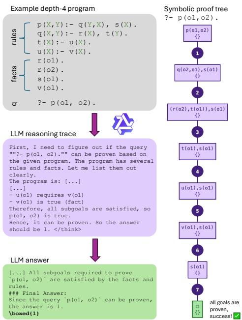
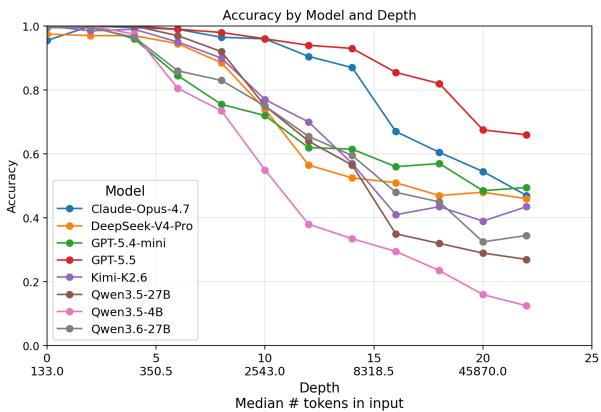
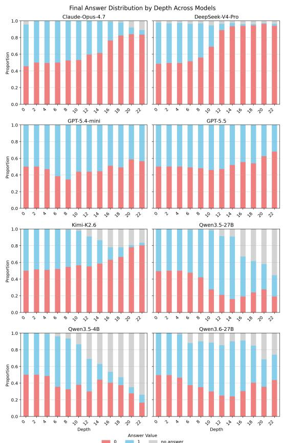
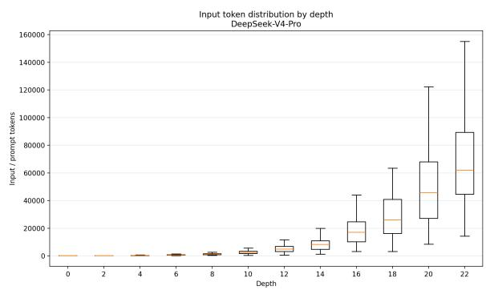
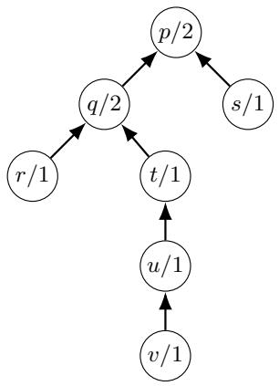
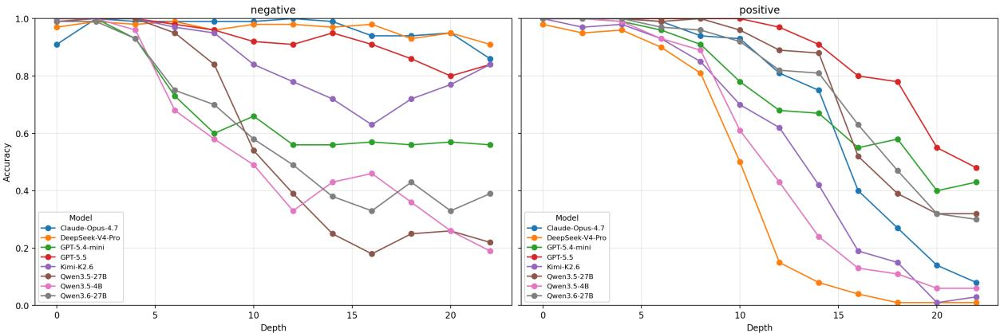
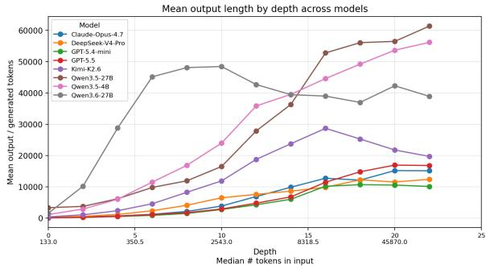

# Probing for Long-Horizon Deductive Reasoning Capabilities in Language Models with Prolog

Hadeel Al-Negheimish<sup>1,2</sup> Jasna Ilieva<sup>2</sup> Yoon Kim<sup>2</sup>

<sup>1</sup> King Saud University, <sup>2</sup> Massachusetts Institute of Technology {hadeelan,jasna23,yoonkim}@mit.edu

## Abstract

Current frontier LLMs can theoretically process long contexts with 1M tokens or more. But to what extent can they go beyond simple retrieval and perform deeper reasoning over such long contexts? We empirically investigate long-horizon reasoning capabilities of LLMs, focusing on deductive logic expressed in Prolog. We construct PROLONG, a synthetic testbed to probe Prolog Long Reasoning, which systematically varies the complexity (reasoning depth) of problems, where the hardest case has a reasoning depth of 22 and 62k context length. We study 8 reasoning models across 5 families of frontier LLMs, and find that performance degrades substantially as reasoning depth grows, with the majority of models approaching chance beyond depth 10.

## 1 Introduction

Logical reasoning is central to tasks where reasoning models are increasingly expected to excel, such as in mathematical reasoning and coding. Large language models (LLMs) equipped with reasoning capabilities have shown impressive performance on a range of mathematical, logical, and coding tasks (Jaech et al., 2024; Guo et al., 2025; Yang et al., 2025, inter alia). At what scale does the reasoning break down? We investigate this question through the lens of deductive logical reasoning, in which conclusions are derived necessarily from a set of premises by applying valid rules of inference.

We operationalize deductive reasoning as a query-answering problem over simple Prolog-style logic programs (Bratko, 2001), where the proof tree can be represented as a simple chain. As illustrated in Figure 1, each problem consists of a set of rules (implications) and facts (ground literals), together with a query: can the query be proven given the program, or not? Framing this as an LLM reasoning task allows us to investigate how well LLMs can reason given explicitly specified context; do they make sound and consistent inferences? In addition to domains such as mathematics, such logical inferences are important for real-world applications, for example in policy compliance problems.<sup>2</sup>

  
Figure 1: Example problem of depth-4, with an excerpt from the Qwen-3-30B-Thinking model<sup>1</sup>(left). The symbolic derivation involves backward chaining through four rules until all subgoals are satisfied (right). See Appendix B for an instantiation of this program as a policy compliance problem.

Answering correctly requires tracing a proof tree: starting from the query and recursively resolving each subgoal against the rules until all branches terminate in facts or fail. This process is algorithmic; a model that has learned a robust implementation of this algorithm should, in principle, generalize beyond the shallow depths seen in previous

benchmarks (Clark et al., 2020; Tafjord et al., 2021;   
Saparov and He, 2023).

In order to correctly answer the query, the model must correctly unify variables, follow argument orderings through rule heads and bodies (note the swapped arguments in $\mathfrak { s } ^ { } \mathfrak { p } ( \mathsf { X } , \mathsf { Y } ) \ : - \ \mathfrak { q } ( \mathsf { Y } , \mathsf { X } )$ $s ( \mathbb { X } ) . \vec { \mathbf { \sigma } } ^ { \mathbf { \prime } } )$ , and track which subgoals have and have not been established. At greater depths, this process must be sustained throughout many steps and longer contexts.

This paper systematically studies such deductive reasoning capabilities, with depth as a primary axis of complexity, by constructing $\mathrm { P R O L O N G } ^ { \mathrm { 3 } }$ a benchmark of 2,400 logic programs in Prolog with reasoning depths up to 22. Crucially, this is also a long-horizon and long-context reasoning benchmark: context length scales as the number of rules and facts in the program grows with depth, reaching a median of 62k tokens.

Evaluating these problems simultaneously stresses a model’s ability to reason over extended chains and to locate and use relevant information within long contexts. We perform a systematic evaluation and analysis of 8 frontier reasoning models, and find that even the best-performing frontier model, GPT-5.5, degrades to 67% accuracy at depth-20, with the majority of models failing to perform above chance beyond depth-10. This reveals that even when logical inference is simple, frontier reasoning models struggle to maintain the required chain of substitutions and fact lookups as proof depth and context size scale.

## 2 Related Work

Early work on deductive reasoning benchmarks such as RuleTaker (Clark et al., 2020) and ProofWriter (Tafjord et al., 2021) established the basic setup of query answering over sets of rules and facts, with ProofWriter reaching a maximum proof depth of five steps. ProntoQA (Saparov and He, 2023) introduces proof-structure controls and formal error attribution, also evaluated up to five hops. These benchmarks revealed that models at the time struggle as proof depth increases, but the depths studied remain shallow. ZebraLogic (Lin et al., 2025) identifies sharp accuracy decline in constraint-satisfaction once the search space exceeds $1 0 ^ { 7 }$ possibilities. We show failure occurs in an even simpler setting: a smaller search space with a linear proof chain beyond depth 10. Another notable difference from previous work is that we opt to use Prolog instead of natural language in our evaluations, in order to avoid ambiguity and content effects that can impact performance, as models may draw on prior knowledge rather than the stated context (Lampinen et al., 2024).

On the long-context processing side, LongBench-v2 (Bai et al., 2025), RULER (Hsieh et al., 2024), and HELMET (Yen et al., 2025) evaluate retrieval and QA over extended contexts, treating reasoning and retrieval as independent axes in most tasks. PROLONG differs from these benchmarks in that every rule and fact in the program is necessary in the proof derivation, so the model cannot succeed by locating a few relevant pieces and ignoring the rest.

## 3 PROLONG: Prolog Long Reasoning

## 3.1 Background: Prolog

Prolog (Bratko, 2001) is a declarative programming language rooted in first-order logic. A Prolog program consists of a set of facts and rules, and an interpreter evaluates the truth value of a query given the context. A rule, for example $\ " \mathfrak { p } ( \sf X , \sf Y ) : -$ ${ \sf q } ( { \sf Y } , { \sf X } ) , { \sf s } ( { \sf X } ) . ^ { \sf 3 }$ from Figure 1, can be read as

$$
\forall x \forall y ( ( q ( y , x ) \land s ( x ) )  p ( x , y ) )
$$

which means that we can show $p ( x , y )$ is true, if we can show that both $q ( y , x )$ and $s ( x )$ hold for any x, and $y .$ The facts state unconditional truths, represented as relations between objects or object properties (predicates), ending with a period, e.g. $^ { \circ } \mathsf { r } ( \circ \mathsf { l } ) . ^ { \prime \prime }$ . Variables are strings starting with an uppercase letter or underscore. An interpreter evaluates the truth value of a ground query, e.g. “is $\mathsf { p } ( \mathsf { o } 1 , \mathsf { o } 2 )$ true?” by goal-directed backward chaining through the context, and a query is determined to be true if all subgoals are satisfied, see example derivation in Figure 1 (right).

## 3.2 Data generation

The class of problems we consider in this framework is a smaller subset of definite Prolog logic programs, where the context can be represented as directed acyclic graphs (DAGs) (see Figure 5 of the appendix), with no loops or recursion in rule definitions. We also limit the arity of the predicates to be of maximum two. Furthermore, each predicate is defined with only one rule; this is intended to make the reasoning trace as simple as following a single chain, with no need for backtracking or navigating unsuccessful branches.

The main building block of the data generation process is the GENERATERULE function (shown in Algorithm 1), which is called recursively to construct the context of each problem. We start by passing the main positive query, e.g. p(o1,o2), which should be provable, along with the maximum depth and breadth, and the set of used predicate symbols.

The GENERATERULE function defines a rule with the target predicate as its head, and all the rules to define the body literals it includes up to the leaves. It also returns the minimum set of facts needed for the target query to succeed. An unprovable target is created by copying the set of facts, replacing them with the negative object tuple, and randomly mutating one of the facts by replacing one of the args with another constant such that the query is no longer provable. All rules and facts are then randomly shuffled. A single program (context) accompanies two samples in the data, one with a provable query and another unprovable, such that the dataset is balanced.

The algorithm by construction guarantees that at least one path in the DAG is as deep as length N, the other paths sampled uniformly up to that length. For each rule, we sample its breadth from a Poisson distribution with λ = 2.5, and a cutoff according to maxBreadth. This is intended to skew the rules to having 2 body literals in order to control the size of the context. This framework allows systematic construction of random logic programs with controllable levels of complexity.

## 3.3 PROLONG Benchmark

We generate a set of 100 programs per depth, each with a provable and unprovable query, resulting in 200 samples per depth. We sample up to depth 22, skipping odd numbered N, in order to maximize coverage while minimizing cost. This results in a dataset of 2400 samples at varying levels of complexity, ranging from 133 median input tokens<sup>4</sup> at depth 0 to 62k tokens at depth 22. We verify that labels are correct with the SWI-Prolog interpreter, which only takes half a second even for the largest programs. We create a canonical representation, shape, for the program to ensure context structural diversity, which is expectedly limited in depths 0 and 2. Dataset stats are shown in Table 3. We release the full dataset, generation code, and model predictions at https: //github.com/halnegheimish/ProloNg.

Algorithm 1: GENERATERULE(head, N,   
M, $\mathcal { P } _ { u } )$   
Input :ground literal head, depth $\overline { { N \in \mathbb { Z } _ { \geq 0 } } } ,$   
breadth $M \in \mathbb { Z } _ { \geq 0 } ,$ , used predicate set $\mathcal { P } _ { u }$   
Output :Rules R, facts $\bar { \mathcal F }$   
1 $\mathcal { R }  \langle \rangle ; \mathcal { F }  \langle \rangle ;$   
2 U ← head.args   
3 $\sigma  \{ U _ { i } \mapsto x _ { i } \mid i \in [ | U | ] \}$   
4 headd ← LiteralWithVars(head, σ)   
5 if N = 0 then   
6 F.append(head)   
7 return $\mathcal { R } , \mathcal { F }$   
// Generate body literals   
8 $B  \langle \rangle$   
9 for i ← 1 to M do   
10 ℓ, P<sup>′</sup> ← SampleLiteral $\left( U , \mathcal { P } _ { u } \right)$   
$N ^ { \prime }  \{ { N - 1 \atop { \mathcal { U } ( 0 , ~ N - 1 ) } } $ if i = 1   
11   
otherwise   
12 M<sup>′</sup> ← Poisson(λ, maxBreadth)   
13 $( \mathcal { R } ^ { \prime } , \mathcal { F } ^ { \prime } ) \gets$ GenerateRule(ℓ, N<sup>′</sup>, M<sup>′</sup>, P<sup>′</sup> )   
14 $\mathcal { R } \mathrel { + } = \dot { \mathcal { R } } ^ { \prime } ; \mathcal { F } \mathrel { + } = \mathcal { F } ^ { \prime }$   
15 $\hat { \ell } \gets \lfloor \mathrm { i }$ teralWithVars(ℓ, σ)   
16 B.append(<sup>ˆ</sup>ℓ)   
17 Shuffle B uniformly at random   
18 R.append $\left( R u l e ( { \widehat { h e a d } } , B ) \right)$   
19 return $\mathcal { R } , \dot { \mathcal { F } }$

## 4 Results

## 4.1 Experimental setup

Models We evaluated the benchmark on frontier reasoning models, both open-weight and proprietary: Claude-Opus-4.7, GPT-5.5, GPT-5.4-mini, DeepSeek-V4-Pro, Kimi-K2.6, Qwen3.6-27B, Qwen3.5-27B, and Qwen3.5-4B. Context sizes for these models range from 256k tokens to 1M, full details are shown in Table 2 in the appendix. The models were sampled with setting the maximum output tokens to 64k, except for Qwen-3.5 and 3.6 models, where 82k tokens were recommended in the docs. When available, reasoning effort was set to high. The system prompt asks the model to output the final answer [0|1] in \boxed{}, which we extract and compare against the ground-truth.

## 4.2 How does depth affect performance?

Figure 2 presents accuracy as a function of reasoning depth for all evaluated models, with the median input token count annotated along the xaxis to highlight the simultaneous growth in context length. All models begin near ceiling performance at shallow depths, indicating that they are aware of the Prolog syntax. However, accuracy degrades monotonically as depth increases, with the rate and onset of decline varying considerably across models. Beyond depth 10, several models approach the chance baseline of 0.5 for this binary task. GPT-5.5 is the clear outlier, maintaining high accuracy until depth 16, before declining at depths 20 − 22. Claude-Opus-4.7 is the second-best performer, remaining competitive with GPT-5.5 through depth 12 before deteriorating sharply between depths 14 and 16, ultimately settling near chance at depth 22. The remaining models follow broadly similar trajectories of steeper decline. We emphasize that the context lengths are still well within the advertised context lengths of these models.

  
Figure 2: Model accuracy deteriorates with longer depths, with most models sharply declining after depth 10. Random chance is 0.5, since the dataset is balanced.

## 4.3 Models become more conservative

We examine the frequency of final answer predictions in Figure 3. There appears to be a clear pattern in how models fail: while the benchmark is balanced by construction, with an equal number of provable/unprovable queries at every depth, many models exhibit a bias towards one answer, unprovable (red bars), that increases with the complexity of the program. We call this the conservative bias.

Claude-Opus-4.7, DeepSeek-V4-Pro, and Kimi-K2.6 all develop a pronounced conservative bias beyond depth 10, increasingly predicting that queries are unprovable regardless of whether they actually are. By depth 16 − 18, the proportion of negative predictions in these models dominates overwhelmingly. This suggests that models are effectively giving up, defaulting to “no” when the proof chain becomes too long to follow. GPT-5.5 exhibits a milder version of the same tendency. Qwen3.5 models’ main failure mode is different: they run out of tokens before reaching an answer, even at depth-10 where the median input size is only 2.5k tokens (grey bars). In appendix E, we report the length of the reasoning traces for each model, and the Qwen3.5 models are the only ones whose reasoning traces grow monotonically with increased depth; the rest plateau.

  
Figure 3: Proportion of extracted answers per model at each reasoning depth. Many models develop a pronounced conservative bias, predicting that a query is unprovable (red bars), even though the dataset is balanced.

## 4.4 What does the trace say?

We investigate the reasoning trace at depth 22 of the best-performing open-source model, DeepSeek-V4-Pro, and the reasoning summary provided by GPT-5.5 (best overall, but the entire trace is kept private). We analyze the reasoning traces of False Negatives and True Negatives. The former would tell us why it failed even when evidence to the contrary exists, and the latter would inform us whether the model correctly identified the missing fact or was right for the wrong reasons. Analyzing the reasoning summary produced by GPT-5.5, we find that in the False Negatives, the model starts the reasoning chain correctly, but then “loses its way”. It claims that a necessary fact is missing or has no rules to support it, even though it exists in the context. We used an LLM, GPT-5.5, to extract the failure reason and check whether it is valid, and verified these manually for 10% of the problems. For the True Negatives, LLM analysis indicates that of the 84 True Negatives, only 34 correctly cited the planted missing fact (40.5%), and the vast majority did not (59.5%). The other cases were: 14 only returned the final answer, without reasoning; 15 gave a vague and incomplete proof; and 21 mentioned other facts as blockers even though they are provable. This indicates that the reasoning is not faithful to the actual derivation of a query. These patterns are even more detrimental in DeepSeek-V4-Pro traces, where 97 of the 100 provable queries were falsely claimed to be unsupported by arbitrary conditions that exist in the context. As for the 91 true negatives, only 11% of their reasoning traces correctly mention the missing fact planted.

## 4.5 Is it just context length?

To better understand which factor drives models’ failures, we fit a generalized linear mixed model (GLMM) (Bates et al., 2015) with a binomial family and logit link, including model identity as a random intercept and context length and proof depth as fixed effects; full details in Appendix F. These initial results indicate that regression restricted to the four models evaluated in both settings attributes most of the effect to context length $( \beta = - 1 . 4 8 $ $p \ < \ 0 . 0 0 1 )$ , while proof depth appears negligible and not statistically significant $( \beta = - 0 . 1 5$ $p = 0 . 1 0 8 )$ . However, context length and proof depth are tightly correlated $( r = 0 . 9 7 )$ , since, by definition, we require the context to only contain elements that would be used in the proof; the longer the proof, the longer the context. Hence, the coefficient split is highly sensitive to estimation noise rather than reflecting the two factors’ true independent contributions.

To disentangle the two factors, we regenerate the dataset such that for the same context, we evaluate the proof chain at various depths, e.g. for the context in Example 1, the original depth-4 query would be augmented with depth-3 query q(o2, o1), depth-2 t(o1), and depth-1 u(o1). Concretely, we generated 50 contexts at maximum depth 10, with provable and unprovable queries at each depth, at depths 0, 2, 4, 6, 8, 10, for a total of 600 samples, and evaluated the open models DeepSeek-V4-Pro, Qwen3.5-4B, Qwen3.5-27B, and Qwen3.6-27B. Since the context length is fixed across depths for each problem, there is no correlation between depth and length $( r \ : = \ : 0 . 0 0 0 3 )$ . In this setting we find that both length and depth have statistically significant and comparable impact (context-length: $\beta = - 0 . 5 4 ;$ proof-depth: $\beta = - 0 . 3 6 ;$ both $p < 0 . 0 0 1 )$ . We further illustrate this effect in Table 1, showing avg. accuracy for these models at each depth for both settings and their median context lengths. Models’ performance on the same depth is poorer given longer context, and for the same context length, models’ performance declines with increased reasoning depth.

<table><tr><td rowspan="2">Depth</td><td colspan="2">Original</td><td colspan="2">Shared context</td></tr><tr><td>Acc</td><td># tokens</td><td>Acc</td><td># tokens</td></tr><tr><td>0</td><td>0.9913</td><td>133.0</td><td>0.8550</td><td>2604</td></tr><tr><td>2</td><td>0.9913</td><td>196.5</td><td>0.8325</td><td>2604</td></tr><tr><td>4</td><td>0.9775</td><td>350.5</td><td>0.7725</td><td>2604</td></tr><tr><td>6</td><td>0.8950</td><td>690.0</td><td>0.7650</td><td>2604</td></tr><tr><td>8</td><td>0.8425</td><td>1328.5</td><td>0.7474</td><td>2604</td></tr><tr><td>10</td><td>0.6975</td><td>2543.0</td><td>0.6825</td><td>2604</td></tr></table>

Table 1: Accuracy and median token usage across reasoning depths for the original and shared-context settings.

## 5 Conclusion

We present an empirical study of long-horizon deductive reasoning in frontier LLMs using Prolog. Across 8 models, accuracy collapses toward chance beyond depth 10, driven largely by a conservative bias: models increasingly default to predicting a query is unprovable as depth grows, despite the problems remaining well within advertised context limits. Reasoning traces are often unfaithful to the actual derivation, citing missing facts or blockers that are not really there. By disentangling depth from context length in a shared-context setting, we show both factors independently and comparably degrade performance, despite being near-perfectly correlated in the original benchmark. These results suggest frontier models have not learned a robust, generalizable implementation of backwardchaining inference even in simple, linear proofs.

## Limitations

This framework is intended to study deductive reasoning at its simplest, so the class of generated programs does not include recursion, reasoning loops, or negation. Closed-source models do not offer access to the actual reasoning tokens used to reach the final answer, only a summary, which limits analysis of their reasoning traces. Furthermore, running these models is computationally expensive, and API access also comes with substantial costs. Finally, the maximum number of output tokens used in this study is 64k for most models, and 82k for Qwen models, as recommended in their docs. It could be the case that increasing the budget could increase the accuracy, especially at longer depths.

## References

Yushi Bai, Shangqing Tu, Jiajie Zhang, Hao Peng, Xiaozhi Wang, Xin Lv, Shulin Cao, Jiazheng Xu, Lei Hou, Yuxiao Dong, Jie Tang, and Juanzi Li. 2025. LongBench v2: Towards deeper understanding and reasoning on realistic long-context multitasks. In Proceedings of the 63rd Annual Meeting of the Associationfor Computational Linguistics (Volume 1: Long Papers), pages 3639–3664, Vienna, Austria. Association for Computational Linguistics.

Douglas Bates, Martin Mächler, Ben Bolker, and Steve Walker. 2015. Fitting linear mixed-effects models using lme4. Journal ofStatistical Software, 67(1):1– 48.

Ivan Bratko. 2001. Prolog programmingfor artificial intelligence, 3rd ed. edition. International computer science series. Addison Wesley, Harlow, England.

Peter Clark, Oyvind Tafjord, and Kyle Richardson. 2020. Transformers as soft reasoners over language. In Proceedings ofthe Twenty-Ninth International Joint Conference on Artificial Intelligence, IJCAI-20, pages 3882–3890. International Joint Conferences on Artificial Intelligence Organization. Main track.

Daya Guo, Dejian Yang, Haowei Zhang, Junxiao Song, Peiyi Wang, Qihao Zhu, Runxin Xu, Ruoyu Zhang, Shirong Ma, Xiao Bi, Xiaokang Zhang, Xingkai Yu, Yu Wu, Z F Wu, Zhibin Gou, Zhihong Shao, Zhuoshu Li, Ziyi Gao, Aixin Liu, and 175 others. 2025. DeepSeek-R1 incentivizes reasoning in LLMs through reinforcement learning. Nature, 645(8081):633–638.

Cheng-Ping Hsieh, Simeng Sun, Samuel Kriman, Shantanu Acharya, Dima Rekesh, Fei Jia, and Boris Ginsburg. 2024. RULER: What’s the real context size of your long-context language models? In First Conference on Language Modeling.

Aaron Jaech, Adam Kalai, Adam Lerer, Adam Richardson, Ahmed El-Kishky, Aiden Low, Alec Helyar, Aleksander Madry, Alex Beutel, Alex Carney, Alex Iftimie, Alex Karpenko, Alex Tachard Passos, Alexander Neitz, Alexander Prokofiev, Alexander Wei, Allison Tam, Ally Bennett, Ananya Kumar, and 244 others. 2024. Openai o1 system card. Preprint, arXiv:2412.16720.

Andrew K Lampinen, Ishita Dasgupta, Stephanie C Y Chan, Hannah R Sheahan, Antonia Creswell, Dharshan Kumaran, James L McClelland, and Felix Hill. 2024. Language models, like humans, show content effects on reasoning tasks. PNAS Nexus, 3(7):page 233.

Bill Yuchen Lin, Ronan Le Bras, Kyle Richardson, Ashish Sabharwal, Radha Poovendran, Peter Clark, and Yejin Choi. 2025. Zebralogic: on the scaling limits of llms for logical reasoning. In Proceedings of the 42nd International Conference on Machine Learning, ICML’25.

Abulhair Saparov and He He. 2023. Language models are greedy reasoners: A systematic formal analysis of chain-of-thought. In International Conference on Learning Representations (ICLR).

Oyvind Tafjord, Bhavana Dalvi, and Peter Clark. 2021. ProofWriter: Generating implications, proofs, and abductive statements over natural language. In Findings of the Association for Computational Linguistics: ACL-IJCNLP 2021, pages 3621–3634, Online. Association for Computational Linguistics.

An Yang, Anfeng Li, Baosong Yang, Beichen Zhang, Binyuan Hui, Bo Zheng, Bowen Yu, Chang Gao, Chengen Huang, Chenxu Lv, Chujie Zheng, Dayiheng Liu, Fan Zhou, Fei Huang, Feng Hu, Hao Ge, Haoran Wei, Huan Lin, Jialong Tang, and 41 others. 2025. Qwen3 technical report. Preprint, arXiv:2505.09388.

Howard Yen, Tianyu Gao, Minmin Hou, Ke Ding, Daniel Fleischer, Peter Izsak, Moshe Wasserblat, and Danqi Chen. 2025. Helmet: How to evaluate longcontext language models effectively and thoroughly. In International Conference on Learning Representations (ICLR).

## A Models

We evaluated frontier reasoning models, both open-weight and proprietary: Claude-Opus-4.7, GPT-5.5, GPT-5.4-mini, DeepSeek-V4-Pro, Kimi-K2.6, Qwen3.6-27B, Qwen3.5-27B, and Qwen3.5-4B. Full details are in Table 2.

## B Practical Example

The same program as in Figure 1 can be instantiated as a practical example of policy compliance, as shown below:

<table><tr><td>Model name</td><td>Weights</td><td>Model size</td><td>Release date</td><td>Context size</td></tr><tr><td>Claude-Opus-4.7</td><td></td><td>Not disclosed</td><td>Apr. 16, 2026</td><td>1M tokens</td></tr><tr><td>GPT-5.5</td><td></td><td>Not disclosed</td><td>Apr. 23, 2026</td><td>1M tokens</td></tr><tr><td>GPT-5.4-mini</td><td></td><td>Not disclosed</td><td>Mar. 17, 2026</td><td>400k tokens</td></tr><tr><td>DeepSeek-V4-Pro</td><td></td><td>1.6T (49B acti- vated)</td><td>Apr. 24, 2026</td><td>1M tokens</td></tr><tr><td>Kimi-K2.6</td><td></td><td>1T (32B activated)</td><td>Apr. 20, 2026</td><td>256k tokens</td></tr><tr><td>Qwen3.6-27B</td><td></td><td>27B</td><td>Apr. 21, 2026</td><td>262k native; up to ～ 1M extended</td></tr><tr><td>Qwen3.5-27B</td><td></td><td>27B</td><td>Feb. 24, 2026</td><td>262k native; up to ～ 1M extended</td></tr><tr><td>Qwen3.5-4B</td><td></td><td>4B</td><td>Feb. 27, 2026</td><td>262k native; up to ～ 1M extended</td></tr></table>

Table 2: Comparison of frontier models used in this analysis based on publicly available data.

```prolog
Policy Compliance Example
% An employee may access a system if:
% 1. they are approved for the system,
and
% 2. they completed security training.
may_access(Employee, System) :-
approved(System, Employee),
trained(Employee).
% Approval requires the system to be
authorized
% and the employee to be verified.
approved(System, Employee) :-
authorized_system(System),
verified(Employee).
verified(Employee) :-
background_checked(Employee).
background_checked(Employee) :-
identity_confirmed(Employee).
authorized_system(payroll).
authorized_system(hr_portal).
trained(alice).
identity_confirmed(alice).
?- may_access(alice, hr_portal).
```

## C PROLONG Data

The benchmark statistics are shown in Table 3. The size of the context grows significantly with depth, Figure 4 shows boxplots of the input tokens as measured by DeepSeek-V4-Pro. Note that they are similar across the board, with a slight increase in Claude-Opus-4.7. Figure 5 shows the context DAG for the example in Figure 1.

We analyze the proofs derived by a symbolic solver, SWI-Prolog. Tables 4 and 5 show the median time and reasoning trace of SWI-Prolog for the provable and unprovable queries by depth.

  
Figure 4: Boxplots for input tokens per Depth for DeepSeek-V4-Pro

  
Figure 5: Dependency graph of the program example in Figure 1.

## D Accuracy by provability

We show in Figure 6 how the accuracy is affected by depth divided by whether or not a query is provable or not. We can see that the deterioration is less drastic in unprovable queries.

## E Growth of reasoning trace with complexity

The growth of the reasoning trace varies across models, as shown in Figure 7. GPT-5.5, Claude-Opus-4.7, DeepSeek-V4-Pro, and

  
Figure 6: Accuracy per target provability. The deterioration in performance is sharper for provable queries as complexity increases, which aligns with the models’ conservative bias.

<table><tr><td>depth</td><td>rules</td><td>facts</td><td>preds</td><td>unique shapes</td><td>tokens (deepseek)</td></tr><tr><td>0</td><td>0.0</td><td>2.0</td><td>1.0</td><td>2</td><td>133</td></tr><tr><td>2</td><td>3.0</td><td>9.0</td><td>7.0</td><td>77</td><td>197</td></tr><tr><td>4</td><td>9.0</td><td>26.0</td><td>21.0</td><td>100</td><td>351</td></tr><tr><td>6</td><td>23.0</td><td>66.0</td><td>56.5</td><td>100</td><td>690</td></tr><tr><td>8</td><td>51.0</td><td>138.0</td><td>118.5</td><td>100</td><td>1329</td></tr><tr><td>10</td><td>95.0</td><td>268.0</td><td>228.5</td><td>100</td><td>2543</td></tr><tr><td>12</td><td>202.5</td><td>544.0</td><td>474.5</td><td>100</td><td>4939</td></tr><tr><td>14</td><td>319.5</td><td>869.0</td><td>754.5</td><td>100</td><td>8319</td></tr><tr><td>16</td><td>666.0</td><td>1788.0</td><td>1556.5</td><td>100</td><td>17059</td></tr><tr><td>18</td><td>1052.5</td><td>2814.0</td><td>2457.5</td><td>100</td><td>26037</td></tr><tr><td>20</td><td>1820.0</td><td>4855.0</td><td>4255.0</td><td>100</td><td>45870</td></tr><tr><td>22</td><td>2424.5</td><td>6381.0</td><td>5604.0</td><td>100</td><td>62071</td></tr></table>

Table 3: Median PROLONG data statistics by depth.

GPT-5.4-mini follow broadly similar trends, generating fewer than 20k output tokens across all depths with only modest increases as depth grows, suggesting these models allocate reasoning budget efficiently regardless of problem complexity. Qwen3.6-27B displays a notably irregular pattern: output length peaks around depths 8 − 10 before declining to a plateau of approximately 40k tokens at greater depths (note that the maximum budget was 82k). Kimi-K2.6 similarly exhibits a non-monotonic profile, with output length peaking around depth 16 before declining. Qwen3.5 stands apart from all other models in its tendency to allocate monotonically increasing reasoning tokens with depth, with output length continuing to grow even at the deepest levels, a pattern consistent with the model expanding its thinking trace without necessarily improving its derivations.

## F Mixed-Effects Model Details

For all regression analyses in Section 4.5, we fit generalized linear mixed models (GLMMs) with a binomial family and logit link, using lme4::glmer in R (Bates et al., 2015), with the bobyqa optimizer. Model identity is included as a random intercept, (1 | model\_id), rather than a fixed effect, to account for baseline differences in model capability without assuming a specific reference model. Context length (log-transformed) and proof depth are included as fixed effects, standardized (z-scored) prior to fitting.

<table><tr><td>depth</td><td>n_examples</td><td>time (s)</td><td>trace_len</td></tr><tr><td>0</td><td>100</td><td>0.03</td><td>3.0</td></tr><tr><td>2</td><td>100</td><td>0.03</td><td>21.0</td></tr><tr><td>4</td><td>100</td><td>0.03</td><td>63.0</td></tr><tr><td>6</td><td>100</td><td>0.03</td><td>169.5</td></tr><tr><td>8</td><td>100</td><td>0.04</td><td>355.5</td></tr><tr><td>10</td><td>100</td><td>0.05</td><td>685.5</td></tr><tr><td>12</td><td>100</td><td>0.07</td><td>1423.5</td></tr><tr><td>14</td><td>100</td><td>0.08</td><td>2263.5</td></tr><tr><td>16</td><td>100</td><td>0.13</td><td>4669.5</td></tr><tr><td>18</td><td>100</td><td>0.19</td><td>7372.5</td></tr><tr><td>20</td><td>100</td><td>0.34</td><td>12765.0</td></tr><tr><td>22</td><td>100</td><td>0.42</td><td>16812.0</td></tr></table>

Table 4: Median time and trace length by depth for provable queries.

Original data, all models (k = 8). Fit on the full, non-disentangled evaluation set across all eight models $( n = 1 9 , 2 0 0 )$ , the random-intercept variance for model identity was $\hat { \sigma } ^ { 2 } = 0 . 6 0 7 \ ( \mathrm { S D } =$ 0.779). Context length showed a large, significant effect $( \beta = - 1 . 3 8 , p < 0 . 0 0 1 )$ , while proof depth’s effect was much smaller $( \beta ~ = ~ - 0 . 1 8 ,$ $p = 0 . 0 1 2 )$ , consistent with the confounding described in Section 4.5.

Original data, matched models (k = 4). Restricting to the same four models used in the disentangled experiment $( n \ = \ 9 , 6 0 0 )$ , to rule out model composition as a confound, yields a smaller random-intercept variance $( \hat { \sigma } ^ { 2 } = 0 . 1 5 6$ SD = 0.395) and a similar pattern: context length remains large and significant $( \beta = - 1 . 4 8 , p <$ 0.001), while proof depth is no longer statistically significant $( \beta = - 0 . 1 5 , p = 0 . 1 0 8 )$

<table><tr><td>depth</td><td>n_examples</td><td>time (s) trace_len</td></tr><tr><td>0</td><td>100 0.03</td><td>2.0</td></tr><tr><td>2</td><td>100 0.03</td><td>14.0</td></tr><tr><td>4</td><td>100</td><td>0.03 32.0</td></tr><tr><td>6</td><td>100</td><td>0.03 80.0</td></tr><tr><td>8</td><td>100</td><td>0.04 177.5</td></tr><tr><td>10</td><td>100</td><td>0.05 353.0</td></tr><tr><td>12</td><td>100 0.07</td><td>635.0</td></tr><tr><td>14</td><td>100 0.08</td><td>920.0</td></tr><tr><td>16</td><td>100 0.12</td><td>1952.0</td></tr><tr><td>18</td><td>100 0.18</td><td>3278.0</td></tr><tr><td>20</td><td>100 0.31</td><td>4412.0</td></tr><tr><td>22</td><td>100 0.41</td><td>6183.5</td></tr></table>

Table 5: Median time and trace length by depth for unprovable queries.

  
Figure 7: Mean number of output tokens per model. Only Qwen-3.5 continues to grow monotonically, with the rest remaining significantly below the token budget.

Disentangled data (k = 4). On the disentangled dataset (n = 2,400), the random-intercept variance is $\hat { \sigma } ^ { 2 } = 0 . 3 4 7 \ : ( \mathrm { S D } = 0 . 5 8 9 )$ , and both fixed effects are significant and comparable in magnitude (context length: $\beta = - 0 . 5 4 , p < 0 . 0 0 1$ ; proof depth: $\beta = - 0 . 3 6 , p < 0 . 0 0 1 )$

Per-model random intercepts. Table 6 reports the estimated random intercept for each of the four models in the original and disentangled settings, representing each model’s deviation in baseline log-odds of correctness from the average across models.

<table><tr><td>Model</td><td>Original</td><td>Disentangled</td></tr><tr><td>Qwen3.5-4B</td><td>-0.668</td><td>-0.861</td></tr><tr><td>Qwen3.5-27B</td><td>0.127</td><td>0.744</td></tr><tr><td>Qwen3.6-27B</td><td>0.226</td><td>0.189</td></tr><tr><td>DeepSeek-V4-Pro</td><td>0.315</td><td>-0.083</td></tr></table>

Table 6: Per-model random intercept estimates (BLUPs) from the GLMM, comparing the matched (k=4) original and disentangled settings.

## G Prompt Template

## System Prompt

You are a helpful and harmless assistant. Consider the following prolog-like declarative logic program, arguments starting with capital letters represent variables, lowercase letters represent constants. \+ is a symbol that represents negation by failure, a negated literal in a rule is satisfied when it fails to be proven. Decide if a query can be proven given the background program and return 1, otherwise return 0 if it cannot be proven. A query is the final line starting with ""?- "". You should think step-by-step. Put your final answer within \\boxed{{}}.

## H Full Example

## Qwen-3-Thinking Input

## <|im\_start|>system

You are a helpful and harmless assistant.   
Consider the following prolog-like   
declarative logic program, arguments   
starting with capital letters represent   
variables, lowercase letters represent   
constants. \+ is a symbol that represents   
negation by failure, a negated literal   
in a rule is satisfied when it fails to   
be proven. Decide if a query can be   
proven given the background program and   
return 1, otherwise return 0 if it cannot   
be proven. A query is the final line   
starting with ""?- "". You should think   
step-by-step. Put your final answer   
within \\boxed{{}}.<|im\_end|>   
<|im\_start|>user   
p(X,Y):- q(Y,X), s(X).   
q(X,Y):- r(X), t(Y).   
t(X):- u(X).   
u(X):- v(X).   
r(o1).   
r(o2).   
s(o1).   
v(o1).   
?- p(o1, o2).<|im\_end|>   
<|im\_start|>assistant   
<think>

r(o2) is given as a fact: r(o2). So r(o2)   
is true.

q(X,Y) is true if r(X) and t(Y) are both   
true.

For q(o2, o1), X is o2, Y is o1, so it   
requires r(o2) and t(o1).

## Qwen-3-30B Thinking Reasoning Content

t has u(X), positive. t(o1) requires u(o1), which requires v(o1   
), which is true.   
u has v(X), positive.   
So yes.   
Facts are given directly.   
The program also has r(o1), but we didn't   
So no negation to worry about. use it for this query, which is fine.   
Also, the variables: in the query, o1 and Similarly, s(o1) is used, but s(o2) isn't   
o2 are constants, not variables, so we' given, so we don't care.   
re directly substituting.   
v(o1) is used, but v(o2) isn't given, so   
In the rule, X and Y are variables, but not needed.   
in the query, we're using specific   
constants. So for this specific query, it should be   
provable.   
So it should be fine.   
Therefore, the answer should be 1.   
I should confirm if all the facts are   
present. The question says ""return 1 if it can be   
proven, otherwise 0"".   
r(o1) and r(o2) are both facts, so r is   
true for o1 and o2. So I think it can be proven.   
s(o1) is fact, so s is true for o1. But let me make sure about the negation   
by failure. The problem mentions that \+   
v(o1) is fact, so v is true for o1. represents negation by failure, but in   
this program, there is no \+ used. So no   
Now, for t(o1), we need u(o1), which issue.   
needs v(o1), which is true.   
For example, if there was a rule like p(X   
Similarly, for q(o2,o1), we need r(o2) ) :- \+ q(X), but here there isn't.   
which is true, and t(o1) which we just   
established. So all good.   
r(o2) is true, yes. Perhaps I should write it out as a proof   
tree.   
Is there any other path? I think this is   
the only way. Query: p(o1, o2)   
The query is p(o1,o2), and we've derived - p(o1, o2) requires q(o2, o1) and s(o1)   
it.   
- s(o1) is true (fact)   
But let me see the rule for p: p(X,Y) :-   
q(Y,X), s(X). - q(o2, o1) requires r(o2) and t(o1)   
So for p(o1,o2), it requires q(Y,X) with - r(o2) is true (fact)   
Y=o2, X=o1, so q(o2,o1).   
- t(o1) requires u(o1)   
Yes.   
- u(o1) requires v(o1)   
In q(X,Y), it's r(X) and t(Y), so for q(   
o2,o1), X=o2, Y=o1, so r(o2) and t(o1). - v(o1) is true (fact)   
All good. Therefore, all subgoals are satisfied, so   
p(o1, o2) is true.   
I could think in terms of the body.   
Hence, it can be proven.   
The body of p(o1,o2) is q(o2,o1) and s(o1   
). So the answer should be 1.   
s(o1) is true. The problem says ""arguments starting   
with capital letters represent variables,   
q(o2,o1) requires r(o2) and t(o1). lowercase letters represent constants.""   
Here, o1 and o2 are lowercase, so   
r(o2) is true. constants, which is fine.

In the rule, X and Y are variables, but   
we're instantiating them.   
No issue.   
I think I'm confident.   
</think>

## Qwen-3-30B Thinking Answer

To determine if the query \`?- p(o1, o2).   
can be proven based on the given program,   
we need to check if the rules and facts   
allow us to derive \`p(o1, o2)\` through   
logical inference. The program is   
declarative, and negation by failure   
(\`\+\`) is not present in any rules or the   
query, so we only deal with positive   
literals.   
### Step-by-Step Derivation:   
1. \*\*Query: \`p(o1, o2)\`\*\*   
- From the rule \`p(X, Y) :- q(Y, X), s   
(X)\`, we substitute \`X = o1\` and \`Y = o2   
- This requires \`q(o2, o1)\` and \`s(   
o1)\` to be true.   
2. \*\*Check \`s(o1)\`\*\*:   
- \`s(o1)\` is given as a fact in the   
program: \`s(o1).   
- Therefore, \`s(o1)\` is true.   
3. \*\*Check \`q(o2, o1)\`\*\*:   
- From the rule \`q(X, Y) :- r(X), t(Y)   
, we substitute \`X = o2\` and \`Y = o1\`:   
- This requires \`r(o2)\` and \`t(o1)   
to be true.   
4. \*\*Check \`r(o2)\`\*\*:   
- \`r(o2)\` is given as a fact in the   
program: \`r(o2).   
- Therefore, \`r(o2)\` is true.   
5. \*\*Check \`t(o1)\`\*\*:   
- From the rule \`t(X) :- u(X)\`, we   
substitute \`X = o1\`:   
- This requires \`u(o1)\` to be true.   
- From the rule \`u(X) :- v(X)\`, we   
substitute \`X = o1\`:   
- This requires \`v(o1)\` to be true.   
- \`v(o1)\` is given as a fact in the   
program: \`v(o1).\`   
- Therefore, \`v(o1)\` is true.   
- Since \`v(o1)\` is true, \`u(o1)\` is   
true (from \`u(X) :- v(X)\`).   
- Since \`u(o1)\` is true, \`t(o1)\` is   
true (from \`t(X) :- u(X)\`).   
6. \*\*Conclusion for \`q(o2, o1)\`\*\*:   
- \`r(o2)\` is true and \`t(o1)\` is true,   
so \`q(o2, o1)\` is true.   
7. \*\*Conclusion for \`p(o1, o2)\`\*\*:   
- \`q(o2, o1)\` is true and \`s(o1)\` is   
true, so \`p(o1, o2)\` is true.

All subgoals required to prove \`p(o1, o2)   
are satisfied by the facts and rules.   
There are no negated literals or failures   
that prevent the proof.   
### Final Answer:   
Since the query \`p(o1, o2)\` can be proven,   
the answer is 1.   
\boxed{1}