# SAIL: Scientific Agentic Intelligence via a Science-Aware Loop

SAIL Model Team

IQuest Research

SAIL

SAIL Model: https://huggingface.co/IQuestLab/SAIL

SAIL Training Data: https://huggingface.co/IQuestLab/SAIL-Training-Data

## Abstract

We introduce SAIL, an open model with 35B total and 3B active parameters for literature research, scientific coding, and multi-step research workflows. SAIL is developed through a science-aware improvement loop: agents built on frontier AI models analyze its task failures and construct training tasks that address the underlying capability gaps. The diagnosis examines search and evidence selection in literature tasks, scientific assumptions and reasoning in coding, and planning and revision in longer investigations. The agents draw on paper collections and scientific code repositories to build problems, interaction trajectories, and executable tasks with the required environments and tools. We repeat this loop over multiple development cycles and train SAIL through supervised fine-tuning, specialist training, multi-teacher on-policy distillation, and agentic reinforcement learning. SAIL achieves competitive performance across scientific research tasks with substantially fewer parameters than leading open-weight models.

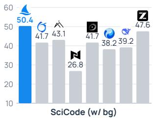

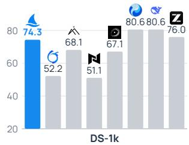

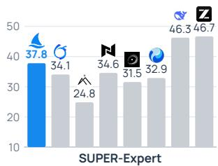

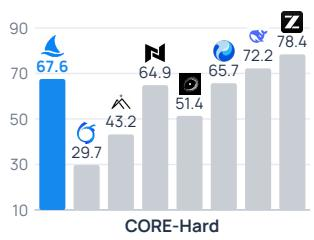

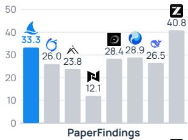

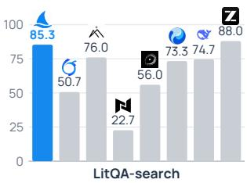

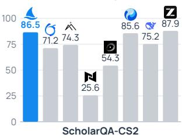

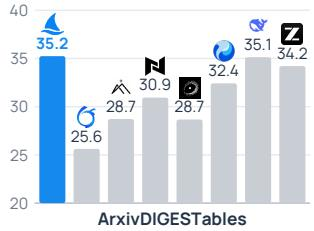

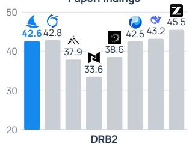

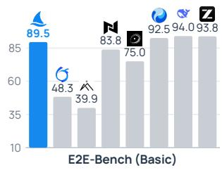

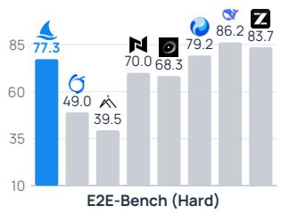  
Figure 1 Performance across scientific benchmarks.

## Contents

Introduction 3   
2 Science-Aware Improvement Loop 3   
2.1 Diagnosing Capability Gaps 4   
2.2 Constructing Tasks from Scientific Resources 5   
2.3 Environments, Tools, and Feedback 5   
2.4 Training and Re-Evaluation 5   
3 Training Recipe   
3.1 Supervised Fine-Tuning   
3.2 Specialist Training 7   
3.3 Multi-Teacher On-Policy Distillation 7   
3.4 Agentic Reinforcement Learning 7   
4 Infrastructure for Scalable On-Policy Training 8   
4.1 System Overview 9   
4.2 Scientific Execution and Trajectory Collection 9   
4.3 Synchronous On-Policy Training 10   
4.4 Shared Training Interface for RL and MOPD 10   
5 Evaluation and Analysis 11   
5.1 Evaluation Setup 11   
5.2 Main Results 11   
5.3 Literature Retrieval and Analysis 13   
5.4 Scientific Coding and Execution 13   
5.5 Data Analysis and Research Workflows 13   
6 Discussion and Conclusion 14   
6.1 Scientific Resources and Adaptive Training 14   
6.2 Remaining Challenges 14   
6.3 Conclusion 14   
7 Contributions and Acknowledgments 15   
References 15

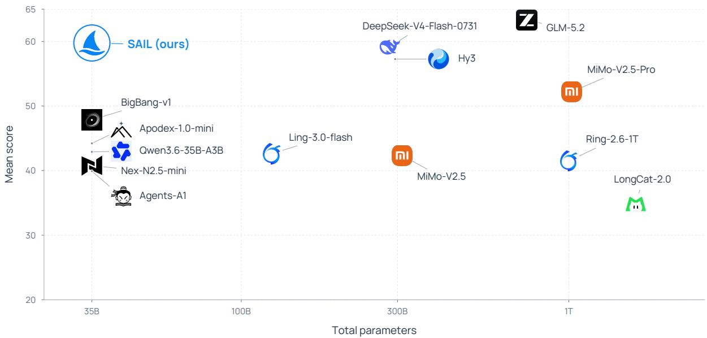  
Figure 2 Performance versus total parameters. Each logo represents a model, with total parameter count on a logarithmic horizontal axis and the unweighted mean score across twelve evaluations on the vertical axis. The aggregate excludes LitQA2-FullText and counts E2E-Bench Basic and Hard separately; all included scores are expressed on a 0–100 scale. Small dots and leader lines indicate the true coordinates of displaced logos.

## 1 Introduction

Language models are being used to plan laboratory experiments (Boiko et al., 2023; Bran et al., 2024), generate and test hypotheses (Swanson et al., 2025; Lu et al., 2026; Mitchener et al., 2025; Gottweis et al., 2026; Ghareeb et al., 2026), and search for algorithms and mathematical constructions (Romera-Paredes et al., 2024; Novikov et al., 2025). Building an open model for this work requires training it to make scientific judgments throughout execution. Scientific papers and code repositories contain the evidence, methods, and implementations from which such training tasks can be built. The central question is how to select and organize these resources around the capabilities the model still lacks.

We approach this question through the model’s behavior on training and development-validation tasks. Two unsuccessful searches can call for diferent interventions: one may need broader exploration, while another needs better selection among papers already retrieved. In scientific coding, a program may run successfully even though the chosen method rests on an invalid assumption (Figure 3). In a longer investigation, the model may execute each step correctly yet fail to use an intermediate finding to revise its plan. These failures identify what subsequent tasks should teach. They also determine what the task must expose: relevant evidence, the scientific reasoning behind an implementation, or observations that require a change of course.

We introduce SAIL, an open model for literature retrieval and synthesis, scientific coding, and research workflows involving tool use. Its science-aware improvement loop uses frontier AI models to develop the training tasks. Agents built on these models diagnose capability gaps from SAIL’s responses and trajectories, select scientific resources around prioritized topics, and construct problems, demonstrations, and executable tasks. The agents also assemble the tools and environments needed to practice the targeted skills. Scientific requirements guide both diagnosis and construction: the question is what reasoning or decision was missing and how a new task can exercise it. Across multiple development cycles, we use the updated model’s behavior to revise the training priorities.

We train SAIL through supervised fine-tuning, specialist training, Multi-Teacher On-Policy Distillation (MOPD) (Ma et al., 2026), and agentic reinforcement learning. Specialists concentrate on selected capabilities, and MOPD transfers their supervision to states encountered by the student, including those reached after imperfect actions. Agentic RL then trains the student using task feedback. Shared infrastructure supports both forms of on-policy training across scientific tools and stateful environments. This recipe turns the tasks built by frontier-model agents into capabilities of a single open model. With 35B total and 3B active parameters, SAIL achieves the highest SciCode and ArxivDIGESTables scores in our comparison and competes with substantially larger open-weight models across scientific workflows.

## Technical Contributions.

• SAIL. An open model with 35B total and 3B active parameters for scientific literature, coding, and multi-step research tasks. We release the model and most of its training data to support research on scientific agents and the development of more capable AI scientists.

• A Science-Aware Improvement Loop. Agents built on frontier AI models use scientific task failures to guide the construction of training problems, trajectories, and environments from literature and code.

• Training Recipe and Infrastructure. Specialist training, MOPD, and agentic RL consolidate scientific capabilities in a single model, using shared infrastructure for stateful execution and on-policy trajectory collection.

## 2 Science-Aware Improvement Loop

The science-aware improvement loop turns observed capability gaps into training tasks built from scientific resources (Figure 4). Agents built on frontier AI models perform diagnosis and task construction; SAIL executes the tasks and learns from the resulting supervision and feedback. We repeat this process over multiple development cycles, using the updated model’s behavior to set the next training priorities.

a Execution success is not scientific validity  
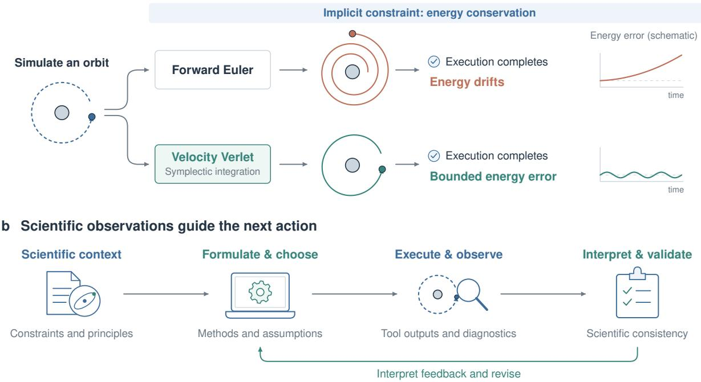  
Figure 3 Scientific validity beyond successful execution. a, Schematic orbital simulation: forward Euler integration completes without runtime errors while accumulating energy drift. The comparison with a symplectic method illustrates the role of domain knowledge in selecting numerical methods and checking long-term behavior. b, Scientific knowledge guides method selection and the interpretation of computational results, which in turn guide subsequent actions.

## 2.1 Diagnosing Capability Gaps

Diagnosis uses training tasks and a development validation set assembled from manually collected and generated tasks, separate from the benchmark evaluation sets. The development agents examine the reasoning, tool calls, and observations leading to a failed outcome. They identify the scientific judgment that went wrong and the skill that subsequent tasks should train.

Literature retrieval and analysis. Search involves a tradeof between exploration and selection. The model may miss relevant lines of work, discard useful papers too early, or collect many papers without identifying the evidence needed to answer the question. The agents examine the sequence of searches and filtering decisions to distinguish these failures. The resulting training objective emphasizes broader exploration, better evidence selection, or the transition between them.

Scientific reasoning and coding. The agents trace errors to the scientific concepts, assumptions, derivations, and methods used in the solution. They also examine whether the model recognizes and responds to problems revealed by computational outputs (Figure 3). A method used outside its assumptions calls for tasks that exercise method selection and the reasoning behind it. An implementation error calls for practice translating that reasoning into code.

End-to-end research. The agents examine how the model carries an investigation from information gathering through implementation, experimentation, and analysis. They look for points where the model loses track of the objective, repeats an unproductive approach, or fails to use an intermediate finding. These failures motivate tasks that train planning and revision across several stages of research.

## 2.2 Constructing Tasks from Scientific Resources

The diagnosed capability gap determines the learning objective. We combine it with a prioritized task topic, and development agents select the source material and construct the training task. Literature tasks draw on paper collections; coding tasks draw on methods and implementations in scientific GitHub repositories; end-to-end research tasks combine the methodological context in papers with executable research code.

The learning objective determines how these resources are used. To train search and selection, the task requires finding evidence among sources and deciding which papers answer the question. To train scientific reasoning, a problem requires applying the concepts and assumptions underlying a method. For a longer investigation, the task links successive actions so that later decisions depend on earlier findings.

The agents also choose the form of supervision. Focused problems exercise individual reasoning skills, demonstrations show how observations change subsequent actions, and executable tasks let the student practice through its own interaction. The same resource collections can therefore support diferent training objectives as the model’s weaknesses change.

## 2.3 Environments, Tools, and Feedback

For interactive tasks, development agents assemble the tools and execution state alongside the questions. The environment must expose the observations needed to practice the target skill. Search tasks provide intermediate retrieval results so the model can revise its queries and selection. Coding tasks provide execution tools and scientific libraries so the model can inspect computational outputs. Longer investigations use persistent workspaces, allowing later actions to build on earlier artifacts and findings.

These environments support demonstration collection and student rollouts. We validate generated material against its sources and task-specific checks, including execution where applicable. Validation covers the scientific content, the availability of required tools, and the supervision or feedback used for training.

## 2.4 Training and Re-Evaluation

We incorporate the constructed tasks through the recipe in Section 3. The stages used in an update depend on the capability being trained. After an update, we evaluate targeted and broader capabilities on the development validation set to assess improvement, transfer, and retention. The model’s new responses and trajectories guide the next round of diagnosis and task construction.

a An adaptive science-aware improvement loop

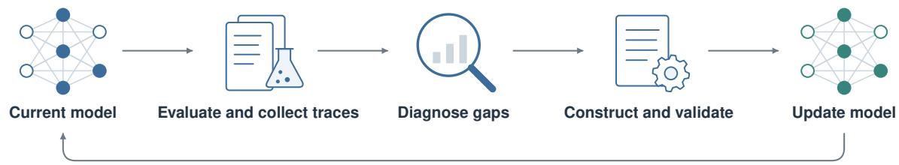  
Re-evaluate targeted gaps, transfer, and retention

b From failure diagnosis to targeted learning

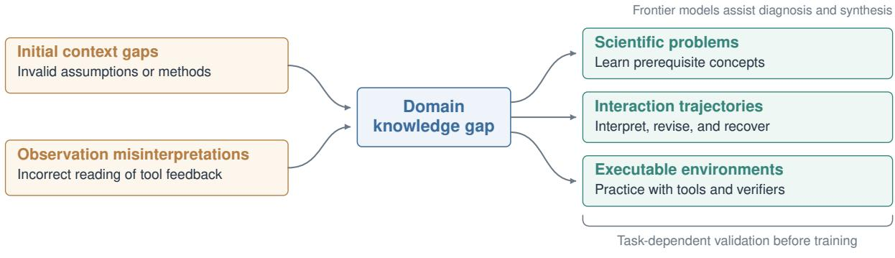

c Illustrative diagnostic chain Energy drift is ignored Conservation knowledge gap Targeted problems + verified rollouts

Figure 4 The science-aware improvement loop. a, Evaluation, diagnosis, task construction, and training repeat as the model improves. Agents built on frontier AI models drive diagnosis and construction. b, Examples of scientific reasoning failures and the problems, trajectories, and environments used to address them. c, An illustrative diagnosis: ignored energy drift motivates training on the relevant conservation principles and their use during execution.

## 3 Training Recipe

We train SAIL on the tasks constructed by the improvement loop through supervised fine-tuning (SFT), specialist training, multi-teacher on-policy distillation (MOPD), and agentic reinforcement learning. The SFT checkpoint initializes both the specialist models and the student policy. Specialists are optimized on capability-focused distributions, and MOPD consolidates their complementary capabilities into the student. Finally, agentic reinforcement learning trains multi-step execution using feedback from scientific environments. Figure 5 summarizes this process.

## 3.1 Supervised Fine-Tuning

We first fine-tune the base model on a mixture of general capability data and the scientific training data constructed through the improvement loop (Section 2.2). The mixture covers scientific reasoning, literaturerelated tasks, coding, and tool-based interaction, with general data supporting broad instruction following.

For interaction-oriented tasks, demonstrations include tool calls, environment observations, and subsequent model actions. This stage establishes the capabilities and interaction formats needed for later training. The resulting checkpoint serves as the shared initialization for specialist training and the student used in MOPD.

## 3.2 Specialist Training

Starting from the shared SFT checkpoint, we train specialist models for selected capability areas. Each specialist is optimized on a focused distribution using additional SFT, reinforcement learning, or both, depending on the available data and feedback signals.

Specialists are trained independently so that data mixtures and optimization settings can be adapted to each capability. Each specialist concentrates on selected weaknesses and subsequently serves as a teacher for the common student during MOPD.

## 3.3 Multi-Teacher On-Policy Distillation

MOPD (Ma et al., 2026) transfers specialist supervision to the generalist student using the student’s own trajectories. The student generates its own responses and interaction trajectories; the relevant specialist then provides token-level supervision under the contexts encountered along those trajectories. For interactive tasks, these contexts include observations produced by the student’s own tool calls. This places expert guidance at the states where the student must make decisions, including those reached after imperfect actions.

For a task $x$ with routed specialist $k ( x )$ , the student samples a response or interactive trajectory $\tau \sim \pi _ { \theta } ( \cdot \mid x )$ and the teacher $\pi _ { k \left( x \right) }$ scores every student-generated token under the same context the student observed, including tool observations and any compacted history. We express the distillation objective as a masked token-level divergence,

$$
{ \mathcal { L } } _ { \mathrm { M O P D } } = \mathbb { E } _ { \boldsymbol { x } , \tau \sim \pi _ { \theta } } \left[ \sum _ { t } m _ { t } D \big ( \pi _ { k ( \boldsymbol { x } ) } ( \cdot \mid s _ { t } ) \big | \big | \pi _ { \theta } ( \cdot \mid s _ { t } ) \big ) \right] ,
$$

where $D$ denotes the distillation divergence, $s _ { t }$ is the state at step t of the student’s own rollout and $m _ { t }$ masks out task inputs and environment observations so that only model-generated tokens contribute. Teacher and student share a compatible token space, so the divergence is computed directly over vocabulary distributions.

The task mixture controls the balance of supervision across specialists, and teacher routing is independent of the harness used to execute an interactive task. Rollout collection, teacher scoring, and student optimization run on the shared on-policy infrastructure of Section 4, which also supplies the behavior-policy log-probabilities needed when the divergence is estimated from samples.

## 3.4 Agentic Reinforcement Learning

After MOPD, we apply agentic reinforcement learning on the executable task families. Where MOPD supplies guidance from specialist models, this stage uses task outcomes to supervise the student’s decisions across an

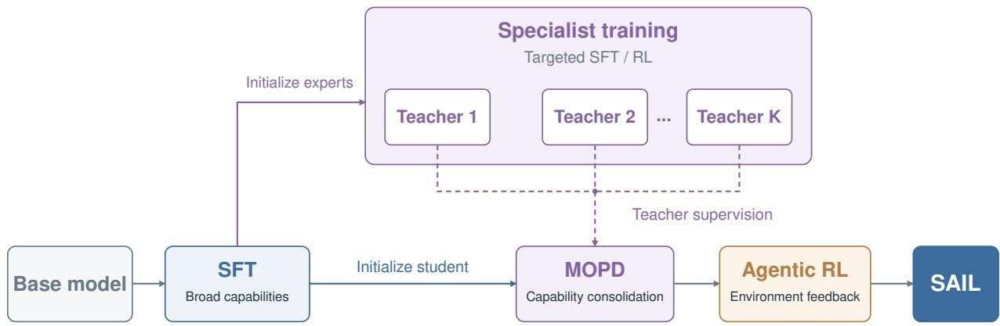  
Figure 5 SAIL Training Recipe. The SFT checkpoint initializes both the specialist models and the student policy. Specialists undergo targeted SFT, RL, or both, and provide supervision for multi-teacher on-policy distillation (MOPD). The student then undergoes agentic reinforcement learning to obtain the final SAIL model. Solid arrows indicate model initialization or training progression; dashed arrows indicate teacher supervision.

episode. The current student policy interacts with task environments through the rollout infrastructure in Section 4. Rewards are derived from task-specific verifiers, completion criteria, or other available feedback signals.

Training spans multiple task families and exposes the model to states resulting from its own actions, including tool failures and unsuccessful intermediate attempts. The objective is to improve task completion through multi-step interaction with the environment.

The final SAIL checkpoint is obtained after this stage.

## 4 Infrastructure for Scalable On-Policy Training

We use shared infrastructure for agentic reinforcement learning (RL) and multi-teacher on-policy distillation (MOPD). The system separates model optimization, rollout serving, and environment execution, with policy weights synchronized between training rounds. Task-specific harnesses control execution in scientific environments. The training system records the student’s actions and the context of each model call, then attaches task feedback or specialist supervision for optimization. Figure 6 presents the overall architecture.

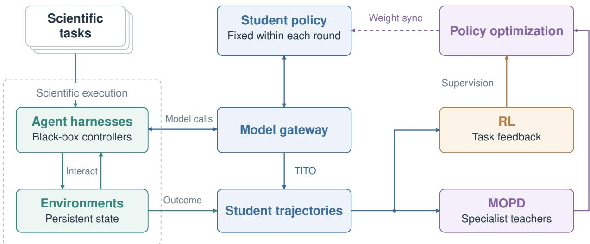  
Figure 6 Infrastructure for Scalable On-Policy Training. The system decouples model rollout, task execution, and optimization. Agentic RL and MOPD share the same student trajectory collection pipeline, with policy weights synchronized between training rounds.

## 4.1 System Overview

Our training framework is built on verl. A distributed training engine performs parameter optimization, while a separate rollout engine serves the current student policy. Scientific tasks are executed through Uni-Agent abstractions and task-specific adapters that connect external agent harnesses to sandboxes, tools, and other environments. A model gateway routes all harness model requests to the rollout engine and records the token-level information required for training.

We treat each agent harness as a black-box interaction controller. A harness may define its own system prompts, tool schemas, context management, action logic, and stopping conditions, while the training system only observes a common model-request interface and the resulting interaction trajectory. Task configurations specify which harness and environment should be used, and harnesses can be selected or sampled independently across rollout tasks. This design allows new scientific agents and execution frameworks to participate in training without embedding their internal control logic into the optimization system.

The basic unit of execution is a task episode. An episode associates a task instance with its harness, environment state, model interactions, and final outcome. It may contain many action–observation cycles and, for long-running tasks, multiple context segments. All records retain their episode identity throughout collection and optimization.

## 4.2 Scientific Execution and Trajectory Collection

Scientific workloads require heterogeneous forms of execution, including numerical computation, repository inspection, persistent interpreter sessions, file manipulation, and external information retrieval. Executable tasks run in isolated sandboxes with episode-specific workspaces. Persistent runtimes retain their state across tool calls, allowing generated code, intermediate files, numerical results, and other artifacts to remain available throughout an episode. The environment state is independent of the model context and therefore persists even when the harness summarizes or compacts its conversation history.

We bound tool calls and episode duration, isolate exceptions at the task boundary, and clean up resources after completion. Recoverable tool failures are returned to the agent as observations so that the policy can attempt recovery. Infrastructure failures are tracked separately from task failures and may be retried under bounded policies before the trajectory is admitted to training.

Token-in/token-out collection. The model gateway follows a token-in/token-out (TITO) interface. For each model call, it records the actual input token IDs, sampled output token IDs, rollout log probabilities, and training masks. Generated outputs are passed directly into training without decoding and re-tokenizing them. Tool observations and harness-provided context are represented as conditioning tokens, while only selected model-generated tokens contribute to the optimization objective. This preserves alignment among the context seen during generation, the sampled actions, the behavior-policy probabilities, and the corresponding loss masks.

Long trajectories and context compaction. Long scientific episodes may exceed the context length of a single model request. When the harness compacts its history, the collector starts a new trajectory segment conditioned on the compacted context. Each segment stores the context and model actions exactly as they appeared during generation, while all segments remain associated with the same environment episode.

Compaction changes the context visible to the model while preserving the environment episode. Training must therefore use the context recorded for each segment, including any summary introduced by the harness. For RL with a terminal outcome, all trainable actions in the episode are supervised by the same episode-level result, including actions generated before compaction. Segmenting an episode does not introduce additional task outcomes or increase its optimization weight. Episode identifiers and segment boundaries are preserved so that rewards, advantages, and losses can be aggregated consistently across the original trajectory.

## 4.3 Synchronous On-Policy Training

We use synchronous training rounds to maintain explicit policy-version boundaries. At the beginning of round k, the training engine synchronizes parameters $\theta _ { k }$ to the rollout engine. The rollout policy is then held fixed while a batch of task episodes is collected. After trajectory collection and supervision construction are complete, the training engine performs optimization and publishes the updated parameters for the next round.

This separation allows rollout and optimization to use diferent parallelism and memory configurations. Many task episodes execute concurrently during collection, while the rollout engine batches model requests across active sessions. Optimization is distributed independently across accelerators, and sandbox capacity can be scaled separately from model-serving capacity. The same execution layer can therefore support workloads with substantially diferent demands on GPU inference, CPU computation, storage, and external tools.

## 4.4 Shared Training Interface for RL and MOPD

Agentic RL and MOPD share the same rollout and collection pipeline. In both cases, fresh trajectories are generated by the current student policy through the common rollout interface. Tasks may use diferent black-box harnesses and environments, or no external environment when interaction is unnecessary. At this interface, RL and MOPD difer in the supervision attached to the student-generated actions after collection.

For RL, task-specific verifiers or reward functions evaluate the episode outcome and provide the signal used for policy optimization. For MOPD, task metadata routes each trajectory to a specialist teacher. The teacher evaluates the student-generated token sequence under the corresponding trajectory context, including tool observations and compacted context visible to the student. When token-level distillation is used, teachers share a compatible token space with the student so that teacher probabilities can be aligned directly with the sampled student tokens. Supervision may consist of teacher log probabilities on sampled tokens or sparse top-k distributions, depending on the distillation objective.

Harness routing and teacher routing are deliberately decoupled. The harness determines how a task is executed and how the student interacts with its environment, while the teacher determines which specialist provides supervision for the resulting student trajectory. A task can therefore use diferent execution harnesses with the same supervision rule, and specialist teachers can be reconfigured without modifying the interaction stack.

## 5 Evaluation and Analysis

We evaluate SAIL, post-trained from Qwen3.6-35B-A3B (Qwen Team, 2026), on scientific literature, coding, data analysis, and research workflows. We compare it with the base model and with open-weight models of similar and larger size.

## 5.1 Evaluation Setup

Benchmarks. AstaBench (Bragg et al., 2026) covers literature understanding, code execution, data analysis, and end-to-end research. We additionally report SciCode (Tian et al., 2024) for scientific programming and DeepResearch Bench II (DRB2) (Li et al., 2026) for research-report generation. Together, Tables 1 and 2 contain 13 evaluation settings, counting E2E-Bench Basic and Hard separately.

Models and inference. SAIL has 35B total and 3B active parameters. The comparison includes its base model, five other 35B models, and eight larger models ranging from 124B to 1.6T total parameters. Both total and active parameter counts are reported. We test all models in the same benchmark environments. Each model uses its recommended inference settings, including model-specific decoding and reasoning configurations.

## 5.2 Main Results

With 35B total parameters, SAIL leads the comparison on SciCode and ArxivDIGESTables and ranks second on PaperFindings, LitQA-search, ScholarQA-CS2, and DiscoveryBench. On SciCode, its score of 50.35 exceeds the 744B GLM-5.2 score of 47.57. On ScholarQA-CS2, it reaches 86.51, compared with GLM-5.2’s 87.87.

Figure 2 summarizes performance against total parameter count. The plotted aggregate is the unweighted mean of twelve task scores on a 0–100 scale, excluding LitQA2-FullText and counting E2E-Bench Basic and Hard separately. SAIL ranks second on this aggregate at 59.76, compared with 59.15 for the 284B DeepSeek-V4-Flash-0731 and 63.30 for the 744B GLM-5.2.

The improvements cover all 13 evaluations relative to the base model. The largest gains occur on LitQA-search (+37.33 points), E2E-Bench Basic (+30.71), CORE-Hard (+24.37), and E2E-Bench Hard (+21.21). Against the compared 35B models, SAIL leads on 12 settings; LitQA2-FullText is the exception.

Table 1 AstaBench results across literature understanding, code execution, data analysis, and end-to-end discovery. Higher scores are better.  
(a) Literature understanding
<table><tr><td>Model</td><td>Params. (B) Total / active</td><td>Paper Findings</td><td>LitQA search</td><td>ScholarQA CS2</td><td>LitQA2 FullText</td><td>Arxiv DIGESTables</td></tr><tr><td>Larger-scale models</td><td></td><td></td><td></td><td></td><td></td><td></td></tr><tr><td>Ling-3.0-flash inclusionAI (2026a)</td><td>124 / 5.1</td><td>18.03</td><td>26.67</td><td>67.88</td><td>91.23</td><td>25.45</td></tr><tr><td>DeepSeek-V4-Flash-0731 (DeepSeek-AI, 2026)</td><td>284 / 13</td><td>26.46</td><td>74.67</td><td>75.19</td><td>95.08</td><td>35.13</td></tr><tr><td>Hy3 (Tencent Hy Team, 2026)</td><td>295 / 21</td><td>28.90</td><td>73.33</td><td>85.63</td><td>94.12</td><td>32.42</td></tr><tr><td>MiMo-V2.5 (Xiaomi MiMo Team, 2026a)</td><td>310 / 15</td><td>16.21</td><td>34.67</td><td>60.85</td><td>94.23</td><td>27.30</td></tr><tr><td>GLM-5.2 (Z.ai, 2026)</td><td>744 /  40</td><td>40.80</td><td>88.00</td><td>87.87</td><td>90.41</td><td>34.21</td></tr><tr><td>Ring-2.6-1T (inclusionAI, 2026b)</td><td>1000 / 63</td><td>26.00</td><td>50.67</td><td>71.17</td><td>82.05</td><td>25.62</td></tr><tr><td>MiMo-V2.5-Pro (Xiaomi MiMo Team, 2026b)</td><td>1020  /  42</td><td>28.05</td><td>57.33</td><td>75.15</td><td>89.06</td><td>31.21</td></tr><tr><td>LongCat-2.0 (Meituan LongCat Team, 2026)</td><td>1600 / 48</td><td>9.69</td><td>8.00</td><td>41.36</td><td>93.75</td><td>25.15</td></tr><tr><td>Comparable-scale models</td><td></td><td></td><td></td><td></td><td></td><td></td></tr><tr><td>BigBang-v1 (Endless Frontier, 2026)</td><td>35  /  3</td><td>28.36</td><td>56.00</td><td>54.32</td><td>94.67</td><td>28.67</td></tr><tr><td>Apodex-1.0-mini (Apodex Team, 2026)</td><td>35 / 3</td><td>23.77</td><td>76.00</td><td>74.32</td><td>92.00</td><td>28.72</td></tr><tr><td>Nex-N2-mini (Nex-AGI, 2026b)</td><td>35 / 3</td><td>21.78</td><td>33.33</td><td>46.77</td><td>94.67</td><td>26.14</td></tr><tr><td>Nex-N2.5-mini (Nex-AGI, 2026a)</td><td>35 / 3</td><td>12.05</td><td>22.67</td><td>25.61</td><td>91.94</td><td>30.94</td></tr><tr><td>Agents-A1 (Bai et al., 2026)</td><td>35 / 3</td><td>22.73</td><td>52.00</td><td>64.90</td><td>95.24</td><td>23.28</td></tr><tr><td>Qwen3.6-35B-A3B (Qwen Team, 2026)</td><td>35 / 3</td><td>22.19</td><td>48.00</td><td>68.62</td><td>85.33</td><td>25.63</td></tr><tr><td>SAIL (ours)</td><td>35 /3</td><td>33.25</td><td>85.33</td><td>86.51</td><td>91.67</td><td>35.24</td></tr></table>

(b) Execution and discovery
<table><tr><td rowspan="2">Model</td><td rowspan="2"></td><td colspan="3">Code &amp; execution</td><td>Analysis</td><td colspan="2">E2E-Bench</td></tr><tr><td>Params. (B) DS-1k Total / active</td><td>SUPER Expert</td><td>CORE Hard</td><td>Discovery Bench</td><td>Basic</td><td>Hard</td></tr><tr><td>Larger-scale models</td><td></td><td></td><td></td><td></td><td></td><td></td><td></td></tr><tr><td>Ling-3.0-flash (inclusionAI, 2026a)</td><td>124 / 5.1</td><td>67.33</td><td>31.50</td><td>51.35</td><td>27.79</td><td>63.51</td><td>51.99</td></tr><tr><td>DeepSeek-V4-Flash-0731 (DeepSeek-AI, 2026)</td><td>284 / 13</td><td>80.56</td><td>46.26</td><td>72.22</td><td>36.75</td><td>93.96</td><td>86.18</td></tr><tr><td>Hy3 (Tencent Hy Team, 2026)</td><td>295/  21</td><td>80.56</td><td>32.87</td><td>65.71</td><td>35.35</td><td>92.51</td><td>79.21</td></tr><tr><td>MiMo-V2.5 (Xiaomi MiMo Team, 2026a)</td><td>310 / 15</td><td>71.89</td><td>35.67</td><td>54.05</td><td>36.50</td><td>65.23</td><td>50.49</td></tr><tr><td>GLM-5.2 (Z.ai, 2026)</td><td>744 / 40</td><td>76.00</td><td>46.66</td><td>78.38</td><td>37.20</td><td>93.77</td><td>83.67</td></tr><tr><td>Ring-2.6-1T (inclusionAI, 2026b)</td><td>1000 / 63</td><td>52.22</td><td>34.06</td><td>29.73</td><td>26.73</td><td>48.31</td><td>48.97</td></tr><tr><td>MiMo-V2.5-Pro (Xiaomi MiMo Team, 2026b)</td><td>1020 / 42</td><td>68.22</td><td>36.66</td><td>64.86</td><td>44.49</td><td>74.83</td><td>63.87</td></tr><tr><td>LongCat-2.0 (Meituan LongCat Team, 2026)</td><td>1600 / 48</td><td>66.67</td><td>30.27</td><td>51.35</td><td>27.88</td><td>52.45</td><td>42.85</td></tr><tr><td>Comparable-scale models</td><td></td><td></td><td></td><td></td><td></td><td></td><td></td></tr><tr><td>BigBang-v1 (Endless Frontier, 2026)</td><td>35 / 3</td><td>67.11</td><td>31.54</td><td>51.35</td><td>33.55</td><td>75.00</td><td>68.26</td></tr><tr><td>Apodex-1.0-mini (Apodex Team, 2026)</td><td>35 / 3</td><td>68.11</td><td>24.83</td><td>43.20</td><td>31.20</td><td>39.94</td><td>39.47</td></tr><tr><td>Nex-N2-mini (Nex-AGI, 2026b)</td><td>35 / 3</td><td>62.70</td><td>30.98</td><td>62.20</td><td>32.07</td><td>62.74</td><td>53.90</td></tr><tr><td>Nex-N2.5-mini (Nex-AGI, 2026a)</td><td>35 / 3</td><td>51.10</td><td>34.57</td><td>64.86</td><td>33.21</td><td>83.83</td><td>70.02</td></tr><tr><td>Agents-A1 (Bai et al., 2026)</td><td>35 / 3</td><td>72.22</td><td>30.98</td><td>56.80</td><td>33.91</td><td>32.39</td><td>18.28</td></tr><tr><td>Qwen3.6-35B-A3B (Qwen Team, 2026)</td><td>35 / 3</td><td>57.20</td><td>28.24</td><td>43.20</td><td>34.69</td><td>58.75</td><td>56.06</td></tr><tr><td>SAIL (ours)</td><td>35 / 3</td><td>74.30</td><td>37.78</td><td>67.57</td><td>37.48</td><td>89.46</td><td>77.27</td></tr></table>

Table 2 Additional benchmark results on scientific coding and research. Higher scores are better.
<table><tr><td>Model</td><td>Params. (B) Total / active</td><td>SciCode</td><td>DeepResearch Bench II</td></tr><tr><td>Larger-scale models</td><td></td><td></td><td></td></tr><tr><td>Ling-3.0-flash (inclusionAI, 2026a)</td><td>124 / 5.1</td><td>38.19</td><td>41.73</td></tr><tr><td>DeepSeek-V4-Flash-0731 (DeepSeek-AI, 2026)</td><td>284 / 13</td><td>39.17</td><td>43.22</td></tr><tr><td>Hy3 (Tencent Hy Team, 2026)</td><td>295 /  21</td><td>38.19</td><td>42.54</td></tr><tr><td>MiMo-V2.5 (Xiaomi MiMo Team, 2026a)</td><td>310  / 15</td><td>27.64</td><td>27.46</td></tr><tr><td>GLM-5.2 (Z.ai, 2026)</td><td>744 /  40</td><td>47.57</td><td>45.51</td></tr><tr><td>Ring-2.6-1T (inclusionAI, 2026b)</td><td>1000  / 63</td><td>41.67</td><td>42.84</td></tr><tr><td>MiMo-V2.5-Pro (Xiaomi MiMo Team, 2026b)</td><td>1020  /  42</td><td>40.28</td><td>41.70</td></tr><tr><td>LongCat-2.0 (Meituan LongCat Team, 2026)</td><td>1600 / 48</td><td>26.74</td><td>35.39</td></tr><tr><td>Comparable-scale models</td><td></td><td></td><td></td></tr><tr><td>BigBang-v1 (Endless Frontier, 2026)</td><td>35  / 3</td><td>41.70</td><td>38.55</td></tr><tr><td>Apodex-1.0-mini (Apodex Team, 2026)</td><td>35  / 3</td><td>43.10</td><td>37.91</td></tr><tr><td>Nex-N2-mini (Nex-AGI, 2026b)</td><td>35 / 3</td><td>35.10</td><td>41.00</td></tr><tr><td>Nex-N2.5-mini (Nex-AGI, 2026a)</td><td>35 / 3</td><td>26.83</td><td>33.55</td></tr><tr><td>Agents-A1 (Bai et al., 2026)</td><td>35  / 3</td><td>38.19</td><td>33.33</td></tr><tr><td>Qwen3.6-35B-A3B (Qwen Team, 2026)</td><td>35 / 3</td><td>39.90</td><td>32.27</td></tr><tr><td>SAIL (ours)</td><td>35 / 3</td><td>50.35</td><td>42.61</td></tr></table>

## 5.3 Literature Retrieval and Analysis

SAIL improves both evidence retrieval and synthesis across papers. PaperFindingBench and LitQA-search assess locating relevant papers, while LitQA2-FullText evaluates answers grounded in full-text evidence. ScholarQA-CS2 and ArxivDIGESTables evaluate long-form synthesis and structured comparisons across papers, respectively (Bragg et al., 2026).

LitQA-search rises from 48.00 to 85.33, and PaperFindings from 22.19 to 33.25, placing SAIL second on both retrieval tasks. Full-text question answering improves from 85.33 to 91.67. Synthesis improves alongside retrieval: ScholarQA-CS2 rises from 68.62 to 86.51, and ArxivDIGESTables from 25.63 to 35.24. The latter is the highest score in the comparison, with DeepSeek-V4-Flash-0731 close behind at 35.13.

## 5.4 Scientific Coding and Execution

The coding gains extend from solving scientific programming problems to executing existing research repositories. SciCode and DS-1000 assess scientific and data-science programming; SUPER-Expert and CORE-Hard require repository execution and reproduction of computational results (Tian et al., 2024; Bragg et al., 2026).

SAIL reaches 50.35 on SciCode, improving by 10.45 points over its base model and exceeding the next-highest score by 2.78 points. On DS-1k, it gains 17.10 points to reach 74.30. It also ranks third overall and first among the compared 35B models on both repository tasks. SUPER-Expert rises from 28.24 to 37.78, and CORE-Hard from 43.20 to 67.57.

## 5.5 Data Analysis and Research Workflows

The improvements also extend to tasks that combine experimentation, analysis, and reporting. DiscoveryBench tests data analysis, DRB2 assesses research reports against expert-derived rubrics, and E2E-Bench evaluates complete research workflows (Bragg et al., 2026; Li et al., 2026).

SAIL ranks second on DiscoveryBench at 37.48 and fourth on DRB2 at 42.61, improving by 2.79 and 10.34 points over its base model. On E2E-Bench, it ranks fourth overall on both Basic and Hard, scoring 89.46 and 77.27. The gains of 30.71 and 21.21 points show that the improvements observed on individual literature and coding tasks also occur in longer research workflows. Both scores lead the compared 35B models, whose strongest alternative is Nex-N2.5-mini at 83.83 and 70.02.

## 6 Discussion and Conclusion

## 6.1 Scientific Resources and Adaptive Training

The improvement loop uses model failures to decide how scientific resources should be used for training. The same paper collection can support broader literature search or more selective evidence synthesis. A research repository can support a focused coding problem or an investigation involving several experiments. Agents built on frontier models make these choices from SAIL’s responses and execution traces, then construct the corresponding tasks and environments.

Specialist training concentrates on the selected capabilities. MOPD brings specialist supervision to the student’s own trajectories, and agentic RL trains the student using task feedback. The shared infrastructure collects these trajectories across diferent tools and environments while retaining the context of each model action.

## 6.2 Remaining Challenges

SAIL’s strongest relative results are on SciCode and ArxivDIGESTables. Full-text question answering has a weaker relative ranking, despite a score of 91.67 and a 3.57-point gap to the leader. On repository execution and long research workflows, the strongest larger models retain a lead, while DiscoveryBench shows a smaller improvement over the base model. These results identify evidence interpretation, repository execution, and longer investigations as priorities for further development.

The next development cycles also depend on the coverage of the resource collections and the quality of diagnosis and feedback. Scientific assumptions and experimental interpretations remain dificult to check through execution alone.

## 6.3 Conclusion

We introduce SAIL, an open scientific model with 35B total and 3B active parameters. We train it through a science-aware improvement loop in which agents built on frontier models diagnose capability gaps and construct tasks from scientific literature and code. SFT, specialist training, MOPD, and agentic RL turn these tasks into a single model for literature research, scientific coding, and multi-step tool use. SAIL achieves the highest SciCode and ArxivDIGESTables scores in our comparison and competes with substantially larger open-weight models across scientific workflows.

# 7 Contributions and Acknowledgments

Names within each group are listed alphabetically by first name.

## Core Contributors

Boyuan Sun, Bryan Dai\*, Che Liu, Chi Liu†, Derek Li, Hongming Piao, Mengzhuo Chen, Xidong Wang, Yan Shu, Yinda Chen, Ziyang Zeng

\* Corresponding Author † Technical Lead

## Acknowledgments

We thank the following individuals for their helpful discussions and support throughout this work.

Bohan Yang, Chuan Hao, Jinxing Zhang, Peihao Wu, Qiang Shen, Ran Tao, Shi Qing, Teng Fang, Yujie Zhang

## References

Apodex Team. Apodex-1.0-mini: Oficial model card, 2026. URL https://huggingface.co/apodex/Apodex-1.0-mini.

L. Bai, Z. Cao, Y. Chen, et al. Scaling the Horizon, Not the Parameters: Reaching Trillion-Parameter Performance with a 35B Agent, 2026. URL https://arxiv.org/abs/2606.30616.

D. A. Boiko, R. MacKnight, B. Kline, and G. Gomes. Autonomous chemical research with large language models. Nature, 624(7992):570–578, 2023. doi: 10.1038/s41586-023-06792-0.

J. Bragg, M. D’Arcy, N. Balepur, et al. AstaBench: Rigorous benchmarking of AI agents with a scientific research suite. In International Conference on Learning Representations, 2026. URL https://allenai.org/papers/astabench.

A. M. Bran, S. Cox, O. Schilter, C. Baldassari, A. D. White, and P. Schwaller. Augmenting large language models with chemistry tools. Nature Machine Intelligence, 6:525–535, 2024. doi: 10.1038/s42256-024-00832-8.

DeepSeek-AI. DeepSeek-V4-Flash-0731: Oficial model card, 2026. URL https://huggingface.co/deepseek-ai/ DeepSeek-V4-Flash-0731.

Endless Frontier. BigBang-v1: Oficial model card, 2026. URL https://huggingface.co/endless-frontier/ BigBang-v1.

A. E. Ghareeb, B. Chang, L. Mitchener, A. Yiu, C. J. Szostkiewicz, J. M. Laurent, M. T. Razzak, A. D. White, M. M. Hinks, and S. G. Rodriques. A multi-agent system for automating scientific discovery. Nature, 2026. doi: 10.1038/s41586-026-10652-y.

J. Gottweis, W.-H. Weng, A. Daryin, T. Tu, A. Palepu, P. Sirkovic, A. Myaskovsky, F. Weissenberger, K. Rong, R. Tanno, et al. Accelerating scientific discovery with Co-Scientist. Nature, 2026. doi: 10.1038/s41586-026-10644-y.

inclusionAI. Ling-3.0-flash: Oficial model card, 2026a. URL https://huggingface.co/inclusionAI/Ling-3.0-flash.

inclusionAI. Ring-2.6-1T: Oficial model card, 2026b. URL https://huggingface.co/inclusionAI/Ring-2.6-1T.

R. Li, M. Du, B. Xu, C. Zhu, X. Wang, and Z. Mao. DeepResearch Bench II: Diagnosing deep research agents via rubrics from expert report, 2026. URL https://arxiv.org/abs/2601.08536.

C. Lu, C. Lu, R. T. Lange, J. Foerster, J. Clune, and D. Ha. Towards end-to-end automation of AI research. Nature, 2026. doi: 10.1038/s41586-026-10265-5.

W. Ma, J. Wei, L. Zhao, et al. MOPD: Multi-teacher on-policy distillation for capability integration in LLM post-training, 2026. URL https://arxiv.org/abs/2606.30406.

Meituan LongCat Team. LongCat-2.0: Oficial model card, 2026. URL https://huggingface.co/meituan-longcat/ LongCat-2.0-FP8.

L. Mitchener, A. Yiu, B. Chang, M. Bourdenx, T. Nadolski, A. Sulovari, et al. Kosmos: An AI scientist for autonomous discovery, 2025. URL https://arxiv.org/abs/2511.02824.

Nex-AGI. Nex-N2.5-mini: Oficial model card, 2026a. URL https://huggingface.co/nex-agi/Nex-N2.5-mini.

Nex-AGI. Nex-N2-mini: Oficial model card, 2026b. URL https://huggingface.co/nex-agi/Nex-N2-mini.

A. Novikov, N. V˜u, M. Eisenberger, E. Dupont, P.-S. Huang, A. Z. Wagner, S. Shirobokov, B. Kozlovskii, F. J. R. Ruiz, A. Mehrabian, et al. AlphaEvolve: A coding agent for scientific and algorithmic discovery, 2025. URL https://arxiv.org/abs/2506.13131.

Qwen Team. Qwen3.6-35B-A3B: Oficial model card, 2026. URL https://huggingface.co/Qwen/Qwen3.6-35B-A3B.

B. Romera-Paredes, M. Barekatain, A. Novikov, M. Balog, M. P. Kumar, E. Dupont, F. J. R. Ruiz, J. S. Ellenberg, P. Wang, O. Fawzi, P. Kohli, and A. Fawzi. Mathematical discoveries from program search with large language models. Nature, 625(7995):468–475, 2024. doi: 10.1038/s41586-023-06924-6.

K. Swanson, W. Wu, N. L. Bulaong, J. E. Pak, and J. Zou. The Virtual Lab of AI agents designs new SARS-CoV-2 nanobodies. Nature, 2025. doi: 10.1038/s41586-025-09442-9.

Tencent Hy Team. Hy3: Oficial model card, 2026. URL https://huggingface.co/tencent/Hy3.

M. Tian, L. Gao, S. D. Zhang, et al. SciCode: A research coding benchmark curated by scientists, 2024. URL https://arxiv.org/abs/2407.13168.

Xiaomi MiMo Team. MiMo-V2.5: Oficial model card, 2026a. URL https://huggingface.co/XiaomiMiMo/MiMo-V2.5.

Xiaomi MiMo Team. MiMo-V2.5-Pro: Oficial model card, 2026b. URL https://huggingface.co/XiaomiMiMo/ MiMo-V2.5-Pro.

Z.ai. GLM-5.2: Oficial model card, 2026. URL https://huggingface.co/zai-org/GLM-5.2.