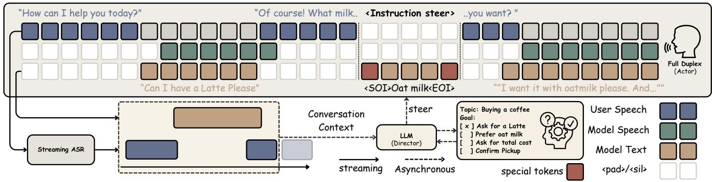
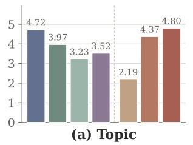
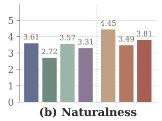
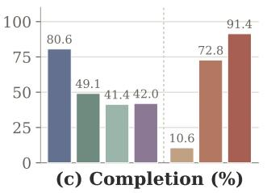
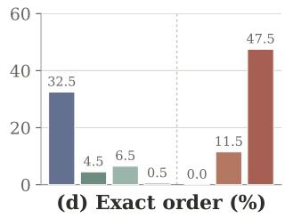

# STEERABLEPLEX: CAN WE STEER FULL-DUPLEX MODELS?

Haolong Zheng1,\*, Maike Züfle2, Dominik Macháˇcek3, Peter Polák3, Xulin Fan1, Xavier Sumba4, Siyin Wang5, Ondˇrej Klejch6, Mark Hasegawa-Johnson1,\*

1University of Illinois Urbana-Champaign, 2Karlsruhe Institute of Technology, 3Charles University, 4Imperial College London, 5Tsinghua University, 6University of Edinburgh Corresponding authors: {haolong2,jhasegaw}@illinois.edu

## ABSTRACT

Full-duplex speech models can listen and speak simultaneously, enabling natural interaction, but become increasingly difficult to control as the conversation history grows. When used as user simulators, this lack of control can cause them to deviate from prescribed scenarios and produce unreliable evaluation outcomes. We introduce SimIF-Bench (Simulator Instruction-Following Benchmark), which evaluates whether a conversational model stays within a prescribed scenario and completes multiple goals in the required order. The benchmark reveals that current open-source full-duplex models struggle to follow such constraints. We then introduce a Group Reward-Decoupled Normalization Policy Optimization (GDPO)-based training recipe that enables a full-duplex model to follow textual instructions during an ongoing conversation while maintaining its turn-taking ability. By connecting the resulting SteerablePlex to an asynchronous backend language model that monitors the conversation and provides instructions when needed, we build a more controllable full-duplex user simulator that follows multi-stage constraints more reliably than existing open-source models and GPT-Realtime.

Index Terms— full-duplex speech, spoken dialogue, instruction following, reinforcement learning, turn taking

## 1. INTRODUCTION

Full-duplex spoken-dialogue models listen and speak simultaneously, generating speech or silence while continuously encoding the partner’s audio [1–11]. This capacity for humanlike conversation makes them especially promising as user simulators because they can reflect how people actually interact, including overlap, interruptions, and backchannels. Naturalness alone, however, is not sufficient. A valid simulator must adopt a prescribed persona, pursue a goal, and create the situations that an evaluation is intended to probe [12–14]. It may need to initiate a request, withhold information, or correct itself. Failure to follow the scenario silently changes the test: the target agent is evaluated on a different interaction, mixing simulator errors with the agent’s ability.

For example, Full-Duplex-Bench v2 [15] evaluates the task-specific capabilities of full-duplex models by simulating a conversation between an examiner and an examinee. In its original setup, GPT-Realtime [16] serves as the examiner, receiving a multi-stage script and steering the conversation to assess the examinee’s task performance. However, failure by the examiner to follow its script weakens the resulting assessment. We therefore introduce SimIF-Bench (Simulator Instruction-Following Benchmark) to quantify this failure mode by measuring the examiner’s topic adherence, naturalness, stage completion, and stage order during interaction. We find that GPT-Realtime follows most individual instructions but remains unreliable at completing the full sequence in order; current open-source full-duplex models exhibit a larger gap. These results highlight the need for stronger control of full-duplex models.

Unlike a turn-based system, a full-duplex model continuously generates speech while listening and has no clear boundary at which to adjust its behavior. Existing systems rely mainly on a system prompt [10, 11], but this control can weaken as dialogue progresses: prior work finds that system-prompt adherence drifts as conversation history grows [17, 18]. Tight latency budgets also limit model size and its capacity to execute long-horizon plans [19]. Together, these limitations lead us to ask:

## Can we steer full-duplex models at runtime?

We introduce SteerablePlex, a full-duplex model that accepts instructions during a conversation, an ability we call online instruction following. To enable this, we introduce a special-token-delimited injection interface that inserts a control instruction into the running model-text stream, and use GDPO [20] to jointly optimize instruction following, response naturalness, and turn taking. Inspired by KAME [21] and MoshiRAG [19], we propose an actor–director system that connects an asynchronous text-LLM director to SteerablePlex. The director consumes streaming ASR and modeltext context, tracks the predefined task, and issues an instruction only when needed. Together, these components yield a more controllable user simulator that follows multi-stage task constraints more reliably than the evaluated baselines.

  
Fig. 1. Illustration of the proposed Actor-Director system. SteerablePlex continuously listens and speaks while the director monitors the conversation. When steering is needed, the director injects an instruction into the model-text stream.

## 2. SimIF-Bench

A reliable user simulator must do more than mention the requested content: it should complete predefined stages in the prescribed order, remain focused on the target scenario despite unexpected partner behavior, and steer the interaction without sacrificing conversational naturalness. SimIF-Bench evaluates these complementary requirements. It reuses the 200 staged scenarios and interactive simulation setup of Full-Duplex-Bench v2 [15], but evaluates the examiner while fixing PersonaPlex as the examinee. Calls end after 120 s. Conversations are transcribed and passed to an LLM judge [22, 23]. Three judging passes report topic adherence and naturalness on 1–5 scales, conversation goal completion, and exact four-goal order. Categorical decisions use majority vote, naturalness uses the median, and every decision must cite transcript evidence.

## 3. METHODOLOGY

To build a more controllable full-duplex user simulator, we propose the Actor–Director architecture illustrated in Figure 1. The actor is a full-duplex model that runs continuously as the front end, handling speech generation, listening, and turn taking. An asynchronous text-LLM director tracks the task, conversation, and goals using context constructed from external streaming ASR and the internal model-text stream. Every 2 s, the director updates the goal state and generates a candidate instruction together with an action1. Below, we describe how we train the actor to follow director’s instruction.

## 3.1. Instruction Fusion

SteerablePlex builds on PersonaPlex [10], which consists of three synchronized streams: user audio, model audio, and model text. The model-text stream internally predicts timealigned tokens for the model’s own speech as a semantic prefix to the corresponding audio tokens [2]. To encode a runtime instruction, we use the existing tokenizer and splice its tokens into the model-text stream between special start- and end-ofinstruction tokens. During these inserted steps, both audio streams receive silence tokens and conversation time does not advance. This design leverages the pretrained model’s semantic understanding of the text stream, making it easier to learn that a delimited text span is an instruction than to learn a new control modality.2

## 3.2. Data Preparation

To prepare dialogue data with turn-level instructions, we begin with the Fisher dataset [24] and use Qwen3-32B [25] to review each conversation turn and write a short, actionable instruction when possible. For example, the instruction for “Can I have a latte, please?” is “Ask for a latte.” From these instructions, we curate 9,417 RL examples, totaling 130.8 hours of rollout time.

To construct data closer to downstream simulator-style conversations, we follow the conversation-generation pipeline of Behavior-SD [26] to synthesize 2,000 overlapping-speech dialogues using instructions derived from the 200 Full-Duplex-Bench v2 scenarios [15]. The resulting corpus comprises 84.1 hours of stereo audio across 2,000 dialogues, of which 200 are held out.

## 3.3. Instruction Following Training

GDPO-based Training: GDPO extends Group Relative Policy Optimization (GRPO) [27] to settings with multiple rewards [20]. GRPO samples a group of G continuations for the same context and learns from their relative scalar rewards.

  
Fig. 2. SimIF-Bench results over 200 tasks. Panels report topic and naturalness (1–5), either-speaker goal completion, and examiner-only exact ordered completion. Both SteerablePlex variants use the same actor–director harness.

Directly combining heterogeneous rewards before this group normalization can allow a high-variance component to dominate. GDPO instead normalizes each reward dimension d independently within the group as $z _ { i , d } = ( r _ { i , d } - \mu _ { d } ) / \sigma _ { d }$ , sets undefined or flat dimensions to zero, and then combines them as $\begin{array} { r } { \widetilde { A } _ { i } = \sum _ { d } w _ { d } z _ { i , d } } \end{array}$ . Normalizing ${ \widetilde { A } } _ { i }$ once more across the group gives the final advantage $A _ { i }$ . For a shared conversational context h, we optimize

$$
\mathcal { L } _ { \mathrm { R L } } ( \theta ) = \frac { 1 } { G } \sum _ { i = 1 } ^ { G } \left[ - A _ { i } \overline { { \log \pi _ { \theta } ( y _ { i } \mid h ) } } + \beta \widehat { D } _ { \mathrm { K L } } ^ { ( i ) } ( \pi _ { \theta } \| \pi _ { \mathrm { r e f } } ) \right] ,
$$

where both terms average generated text and audio tokens and $\pi _ { \mathrm { r e f } }$ is the adapter-off PersonaPlex policy. The KL term limits drift from the base conversational policy [28].

Rollout construction: For Fisher, each rollout uses 30 s of recorded two-party context, inserts the instruction during the turn before its target response, and samples a 20 s model window while replaying the partner stream unchanged. Each synthetic dialogue contains four ordered goals and yields one rollout per goal. Its prefix preserves the preceding conversation and instructions, inserts the current instruction at its annotated turn, and uses the same sampling setup.

Reward design: Goal completion is the natural starting reward for instruction following, but optimizing it alone admits two shortcuts: the model can blurt out the requested content without integrating it into the conversation, or keep speaking over the partner to create more opportunities for completion. We therefore complement goal completion with naturalness and turn-taking rewards.

Goal completion measures whether the current goal is actually fulfilled. Using only sampled model speech produced after the corresponding instruction arrives, an LLM judge assigns rollout i a completion score $s _ { i }$ of none, partial, or full.

Conversation naturalness [30] is scored once over the same sampled continuation, encouraging the model to realize the requested behavior as a contextually appropriate contribution rather than inserting it bluntly. The same judge assigns the window-level verdict $q _ { i } \colon$ a score of one requires coherent speech from the model’s own side of the conversation, whereas self-answering, voicing the partner, or acting as an external assistant receives zero.

$$
r _ { i } ^ { \mathrm { g o a l } } = s _ { i } , \ s _ { i } \in \{ 0 , \frac { 1 } { 2 } , 1 \} , \qquad r _ { i } ^ { \mathrm { n a t } } = q _ { i } , \ q _ { i } \in \{ 0 , 1 \} .
$$

Turn taking preserves the base model’s interactive behavior and prevents reward hacking in which the model holds the floor or talks over the partner. Inspired by prior work [31, 32], we compute four VAD rewards from the sampled model, partner replay, and reference continuation. We merge segments separated $\mathrm { { b y } < 0 . 3 }$ s and drop those shorter than 0.1 s. Backchannels last at most 1 s and overlap partner speech by at least 50%; $M _ { i }$ denotes the remaining model speech and U partner speech. The reference labels a partner-silence gap as a yield, $y \in \mathcal { D }$ , if the reference takes the floor, or a pause, $p \in \mathcal P$ , if the partner resumes. We compute

$$
\begin{array} { l l } { { r _ { i } ^ { \mathrm { o v l } } = - \displaystyle \left[ \frac { | M _ { i } \cap U | } { | M _ { i } | } - 0 . 1 0 \right] _ { + } , } } & { { r _ { i } ^ { \mathrm { t a k e } } = - \displaystyle \frac { 1 } { | \mathcal { P } | } \sum _ { p \in \mathcal { P } } \chi _ { i } ( p ) , } } \\ { { r _ { i } ^ { \mathrm { l a t } } = - \displaystyle \frac { 1 } { | \mathcal { V } | } \sum _ { y \in \mathcal { V } } \Delta _ { i } ( y ) , } } & { { r _ { i } ^ { \mathrm { b c } } = \mathrm { F } 1 ( B _ { i } , B ^ { \mathrm { r e f } } ) , } } \end{array}
$$

Here $| \cdot |$ denotes duration and $[ x ] _ { + } = \operatorname* { m a x } ( 0 , x ) . \ \chi _ { i } ( p ) = 1$ when a model utterance longer than 1 s begins in pause $p ,$ with a 0.3 s anticipation allowance; $\Delta _ { i } ( y )$ is the delay to the first model utterance of at least 1 s, capped at 5 s, with 5 s for no response. Backchannels $B _ { i }$ and $B ^ { \mathrm { r e f } }$ are greedily onsetmatched within ±1 s. All six rewards are higher-is-better. A turn-taking component is omitted when its required event is absent; the reference continuation identifies timing opportunities rather than prescribing what the model should say.

Table 1. Results on Full-Duplex-Bench [29]. ∗ marks values reported in the original paper; unmarked rows are our runs.
<table><tr><td></td><td colspan="2">Pause handling</td><td colspan="3">Backchannel</td><td colspan="2">Smooth turn</td><td colspan="3">Interruption</td></tr><tr><td>Model</td><td>Syn. ↓</td><td>Cand. ↓</td><td>TOR↓</td><td>Freq. ↑</td><td>JSD↓</td><td>TOR ↑</td><td>Lat. ↓</td><td>TOR ↑</td><td>Rating ↑</td><td>Lat. ↓</td></tr><tr><td>dGSLM*</td><td>0.934</td><td>0.935</td><td>0.691</td><td>0.015</td><td>0.934</td><td>0.975</td><td>0.352</td><td>0.917</td><td>0.201</td><td>2.531</td></tr><tr><td>Moshi*</td><td>0.985</td><td>0.980</td><td>1.000</td><td>0.001</td><td>0.957</td><td>0.941</td><td>0.265</td><td>1.000</td><td>0.765</td><td>0.257</td></tr><tr><td>Freeze-Omni*</td><td>0.642</td><td>0.481</td><td>0.636</td><td>0.001</td><td>0.997</td><td>0.336</td><td>0.953</td><td>0.867</td><td>3.615</td><td>1.409</td></tr><tr><td>Gemini Live*</td><td>0.255</td><td>0.310</td><td>0.091</td><td>0.012</td><td>0.896</td><td>0.655</td><td>1.301</td><td>0.891</td><td>3.376</td><td>1.183</td></tr><tr><td>KAME (gpt-4.1-nano)</td><td>0.613</td><td>0.685</td><td>0.709</td><td>0.028</td><td>0.893</td><td>0.966</td><td>0.205</td><td>0.845</td><td>3.083</td><td>0.441</td></tr><tr><td>KAME (gemma-4)</td><td>0.620</td><td>0.718</td><td>0.727</td><td>0.025</td><td>0.897</td><td>0.975</td><td>0.151</td><td>0.820</td><td>3.521</td><td>0.356</td></tr><tr><td>Raon-SpeechChat-9B</td><td>0.650</td><td>0.880</td><td>0.473</td><td>0.171</td><td>0.694</td><td>1.000</td><td>0.017</td><td>1.000</td><td>3.791</td><td>0.236</td></tr><tr><td>PersonaPlex</td><td>0.642</td><td>0.718</td><td>0.418</td><td>0.176</td><td>0.700</td><td>0.983</td><td>0.020</td><td>0.935</td><td>4.684</td><td>0.214</td></tr><tr><td>SteerablePlex</td><td>0.394</td><td>0.500</td><td>0.218</td><td>0.113</td><td>0.750</td><td>1.000</td><td>0.156</td><td>1.000</td><td>4.790</td><td>0.264</td></tr><tr><td>SteerablePlex (in-domain)</td><td>0.365</td><td>0.417</td><td>0.327</td><td>0.118</td><td>0.724</td><td>1.000</td><td>0.203</td><td>1.000</td><td>4.725</td><td>0.268</td></tr></table>

## 4. EXPERIMENT

## 4.1. Experimental Setup

Both variants initialize from PersonaPlex and train LoRA adapters [33] (temporal/depth ranks 128/32; scaling 2.0) against the adapter-off KL reference. GDPO uses G = 8; audio/text sampling uses temperatures 0.8/0.7 and top-k 250/25. Both use learning rate $1 0 ^ { - 5 }$ : task-independent training adapts β from 0.05 toward KL target 0.3, while in-domain training fixes $\beta = 0 . 0 1$ . Parakeet-TDT-0.6B-v2 [22, 34] transcribes speech, and Silero VAD [35] (threshold 0.5) extracts activity. Qwen3.8-27B [36] judges rewards and directs the actor.

## 4.2. Baseline

We compare GPT-Realtime [16], two KAME configurations [21, 37], and Raon-SpeechChat-9B [38] with PersonaPlex and our two RL variants. Figure 2 reports all 200 scenarios. GPT-Realtime is the strongest baseline. Compared with PersonaPlex, it trades some conversational naturalness for stronger task fulfillment, yet still frequently fails to complete the goals in the prescribed order. The evaluated opensource models lag further in completion and exact order. KAME is the most closely related baseline: its full-duplex front end is trained to realize and continue responses from a back-end LLM, demonstrating that a separate model can steer a full-duplex front end. This improves completion over unsteered PersonaPlex but sacrifices naturalness. Raon, a recent open-source model at the time of evaluation, likewise highlights the difficulty of completing all goals in order under dynamic interaction.

PersonaPlex, our starting point, achieves the highest naturalness but the lowest completion and exact-order scores. This pattern suggests that a model trained to react naturally to its partner can still drift far from a prescribed scenario. Task-independent SteerablePlex closes much of this gap and outperforms the other open-source systems while maintaining a better completion–naturalness balance. This result shows that the full-duplex front end can follow runtime instructions supplied by a back-end model. However, its low exact-order success shows that it does not yet reliably coordinate multiple instructions over a conversation. Because training uses single-instruction examples, this result is consistent with limited transfer to multi-instruction streams. In contrast, structurally aligned training exposes SteerablePlex (in-domain) to multiple ordered instructions within each dialogue. It surpasses GPT-Realtime in both completion and exact order, showing that matching the multi-instruction structure improves long-horizon control. This advantage also holds on the 20 scenarios excluded from training.

## 4.3. Turn-Taking Ability

We follow the Full-Duplex-Bench [29] evaluation setup. Table 1 includes its original baselines and compares the released KAME and Raon checkpoints with the PersonaPlex. KAME continuously steers its full-duplex front end with responses from a back-end model. This intervention substantially degrades all three backchannel measures and reduces interruption success and quality, making the model harder to interrupt. These results suggest that constant steering can weaken the front end’s native turn-taking policy.

In contrast, both SteerablePlex variants are trained with explicit turn-taking rewards which helps preserve, and in several dimensions improving, the base model’s interaction ability. Relative to PersonaPlex, they improve pause handling, backchannel TOR, smooth-turn TOR, interruption TOR, and interruption rating, yielding gains on six of the ten reported metrics; their backchannel distribution also remains close to the base model’s. The remaining regressions are concentrated in response latency and backchannel frequency.

## 5. CONCLUSION

We introduce SimIF-Bench to evaluate instruction following in dynamic full-duplex conversations and SteerablePlex, a full-duplex front end trained with GDPO to follow runtime text instructions while preserving turn taking. Coupled with an asynchronous director, SteerablePlex provides a path toward controllable, scenario-specific full-duplex user simulation.

## 6. ACKNOWLEDGMENT

This work was done in part at the 2026 Jelinek Memorial Summer Workshop on Speech and Language Technology and was supported by NSF CCRI Grant No. 2120435, Google DeepMind, the JHU Amazon Initiative for Interactive Artificial Intelligence, the JHU Human Language Technology Center of Excellence, and the Association for Computational Linguistics. This work used the Delta system at the National Center for Supercomputing Applications through allocation bhxf-delta-gpu from the Advanced Cyberinfrastructure Coordination Ecosystem: Services & Support (ACCESS) program, which is supported by National Science Foundation grants #2138259, #2138286, #2138307, #2137603, and #2138296.

## 7. REFERENCES

[1] T. A. Nguyen et al., “Generative spoken dialogue language modeling,” Transactions of the Association for Computational Linguistics, vol. 11, pp. 250–266, 2023.

[2] A. Défossez et al., “Moshi: A speech-text foundation model for realtime dialogue,” arXiv preprint arXiv:2410.00037, 2024.

[3] B. Veluri et al., “Beyond turn-based interfaces: Synchronous LLMs as full-duplex dialogue agents,” in Proc. EMNLP, 2024.

[4] Z. Ma et al., “Language model can listen while speaking,” in Proc. AAAI, 2025.

[5] X. Zhang et al., “Beyond the turn-based game: Enabling real-time conversations with duplex models,” in Proc. EMNLP, 2024.

[6] Q. Zhang et al., “OmniFlatten: An end-to-end GPT model for seamless voice conversation,” in Proc. ACL, 2025.

[7] X. Wang et al., “Freeze-Omni: A smart and low latency speech-tospeech dialogue model with frozen LLM,” in Proc. ICML, 2025.

[8] W. Yu et al., “SALMONN-omni: A standalone speech LLM without codec injection for full-duplex conversation,” in Proc. NeurIPS, 2025.

[9] K. Hu et al., “Efficient and direct duplex modeling for speech-tospeech language model,” in Proc. Interspeech, 2025.

[10] R. Roy et al., “PersonaPlex: Voice and role control for full duplex conversational speech models,” in Proc. ICASSP, 2026.

[11] M. Züfle et al., “F-Actor: Controllable conversational behavior in full-duplex models,” in Findings ofACL, 2026.

[12] B. Ni et al., “A survey on LLM-based conversational user simulation,” in Proc. EACL, 2026.

[13] S. Yao et al., “τ-bench: A benchmark for tool-agent-user interaction in real-world domains,” in Proc. ICLR, 2025.

[14] S. Mehri et al., “Goal alignment in LLM-based user simulators for conversational AI,” Transactions of the Association for Computational Linguistics, 2026.

[15] G.-T. Lin et al., “Full-Duplex-Bench-v2: A multi-turn evaluation framework for duplex dialogue systems with an automated examiner,” in Proc. ACL, 2026.

[16] OpenAI, “Openai API models,” OpenAI API documentation, 2026.

[17] K. Li et al., “Measuring and controlling instruction (in)stability in language model dialogs,” in Proc. CoLM, 2024.

[18] P. Laban et al., “LLMs get lost in multi-turn conversation,” in Proc. ICLR, 2026.

[19] C.-M. Chien et al., “MoshiRAG: Asynchronous knowledge retrieval for full-duplex speech language models,” in Proc. ICML, 2026.

[20] S.-Y. Liu et al., “GDPO: Group reward-decoupled normalization policy optimization for multi-reward RL optimization,” in Proc. ICML, 2026.

[21] S. Kuroki et al., “KAME: Tandem architecture for enhancing knowledge in real-time speech-to-speech conversational AI,” in Proc. ICASSP, 2026.

[22] NVIDIA, “Parakeet TDT 0.6B V2 model card,” Hugging Face model repository, 2025.

[23] L. Zheng et al., “Judging LLM-as-a-judge with MT-Bench and chatbot arena,” in Proc. NeurIPS, 2023.

[24] C. Cieri et al., “The Fisher corpus: a resource for the next generations of speech-to-text,” in Proc. LREC, 2004.

[25] Qwen Team, “Qwen3 Technical Report,” arXiv preprint arXiv:2505.09388, 2025.

[26] S. Lee et al., “Behavior-SD: Behaviorally aware spoken dialogue generation with large language models,” in Proc. NAACL, 2025.

[27] Z. Shao et al., “DeepSeekMath: Pushing the limits of mathematical reasoning in open language models,” arXiv preprint arXiv:2402.03300, 2024.

[28] L. Ouyang et al., “Training language models to follow instructions with human feedback,” in Proc. NeurIPS, 2022.

[29] G.-T. Lin et al., “Full-duplex-bench: A benchmark to evaluate fullduplex spoken dialogue models on turn-taking capabilities,” in Proc. ASRU, 2025.

[30] S. Arora et al., “Optimizing conversational quality in spoken dialogue systems with reinforcement learning from AI feedback,” arXiv preprint arXiv:2601.19063, 2026.

[31] A. Ohashi et al., “Multi-faceted interactivity alignment in full-duplex speech models,” in Proc. EMNLP, 2026.

[32] Y. Li et al., “Decoupling conversational dynamics in full-duplex spoken models through reinforcement learning,” arXiv preprint arXiv:2607.07148, 2026.

[33] E. J. Hu et al., “LoRA: Low-rank adaptation of large language models,” in Proc. ICLR, 2022.

[34] H. Xu et al., “Efficient sequence transduction by jointly predicting tokens and durations,” in Proc. ICML, 2023.

[35] Silero Team, “Silero VAD: Pre-trained enterprise-grade voice activity detector,” GitHub repository, https://github.com/snakers4/silero-vad, 2024.

[36] Qwen Team, “Qwen3.8-27B model card,” Hugging Face model repository, 2026.

[37] Google DeepMind, “Gemma 4 model overview,” Google AI for Developers, 2026.

[38] B. Kim et al., “Raon-Speech technical report,” arXiv preprint arXiv:2605.23912, 2026.