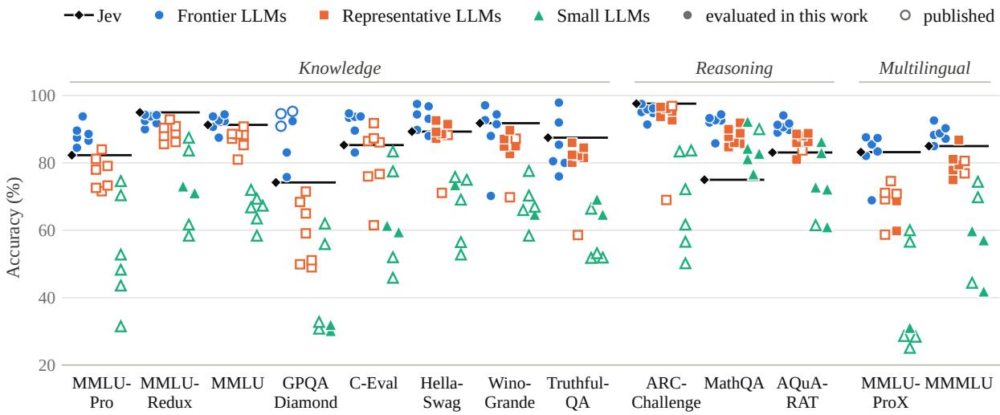
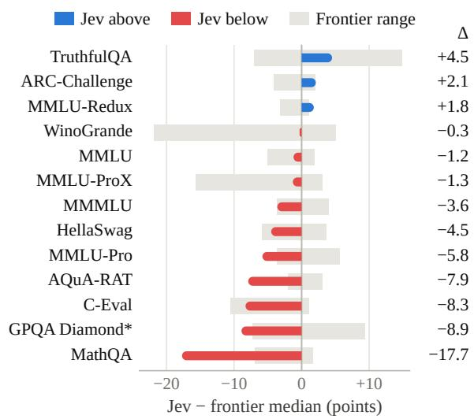

# Specialized Decision Models vs. General-Purpose LLMs: Benchmarking Jev Across Knowledge, Reasoning, and Multilingual Tasks

Xing Li1\*, Qingcheng Chang1\*, Jinzhong Ning1†, Changfeng Xu1 Shenlong Zhang1, Yijia Zhang1, Ling Luo2, Hongfei Lin2

1Dalian Maritime University

2Dalian University of Technology

lllxxx@dlmu.edu.cn, cqc@dlmu.edu.cn, ningjinzhong@dlmu.edu.cn xuchangfeng@dlmu.edu.cn, zhangshenlong@dlmu.edu.cn lingluo\_nlp@outlook.com, hflin@dlut.edu.cn

## Abstract

Jev is a “System One” model that returns a choice among given options instead of generating text. We study how such a specialized decision model compares with general purpose large language models (LLMs). We evaluate Jev on 13 multiple-choice benchmarks covering knowledge, reasoning, and multilingual understanding, and compare it with 19 LLMs in three tiers: frontier, representative, and small. Jev is competitive with frontier LLMs on knowledge and commonsense benchmarks and obtains the best score on MMLU-Redux and ARC-Challenge. Outside mathematics, it also outperforms most representative LLMs and all small LLMs. However, it falls behind on mathematical word problems: on MathQA, it is 17.7 points below the frontier median and scores lower than all 19 LLMs. These results indicate that a specialized decision model can match general-purpose LLMs on decisions that rely mainly on knowledge, but not on decisions that require multi-step calculation.

## 1 Introduction

Large language models (LLMs) have achieved strong performance across a wide range of language understanding and reasoning tasks (OpenAI, 2026a; DeepSeek-AI, 2024; Yang et al., 2025). Beyond generating text, they are increasingly used to make decisions in applications such as question answering, text classification, information verification, and AI agents. Many of these decisions involve choosing an answer or action from a predefined set of options. Although general-purpose LLMs can handle such tasks effectively, their broad capabilities are not always required by the application. This motivates an important question: to what extent can specialized decision models match general-purpose LLMs on tasks with finite answer spaces, and where do their capabilities begin to diverge?

<table><tr><td>Category</td><td>Benchmark</td><td>Lang.</td><td>Options</td></tr><tr><td>Knowledge</td><td>MMLU-Pro</td><td>En</td><td>10</td></tr><tr><td></td><td>MMLU-Redux</td><td>En</td><td>4</td></tr><tr><td></td><td>MMLU</td><td>En</td><td>4</td></tr><tr><td></td><td>GPQA Diamond</td><td>En</td><td>4</td></tr><tr><td></td><td>C-Eval</td><td>Zh</td><td>4</td></tr><tr><td></td><td>HellaSwag</td><td>En</td><td>4</td></tr><tr><td></td><td>WinoGrande</td><td>En</td><td>2</td></tr><tr><td></td><td>TruthfulQA</td><td>En</td><td>varies</td></tr><tr><td>Reasoning</td><td>ARC-Challenge</td><td>En</td><td>4</td></tr><tr><td></td><td>MathQA</td><td>En</td><td>5</td></tr><tr><td></td><td>AQuA-RAT</td><td>En</td><td>5</td></tr><tr><td>Multilingual</td><td>MMLU-ProX</td><td>29</td><td>10</td></tr><tr><td></td><td>MMMLU</td><td>14</td><td>4</td></tr></table>

Table 1: Benchmarks used in this study, with their language (or number of languages) and number of answer options.

Jev, developed by TypeSafe AI, provides an opportunity to investigate this question. It is a specialized “System One” model designed to make structured decisions rather than generate open-ended text (TypeSafe AI, 2026a). Given an input and a set of candidate options, Jev directly selects an answer and returns a probability distribution over the options. Since its release, several studies have explored its performance in text classification, routing, medical and legal applications, model evaluation, and scientific decision making (Deußer et al., 2026; Madrid-García and Merino-Barbancho, 2026; Zhang et al., 2026; Li et al., 2026; Wang and Gao, 2026; Deng et al., 2026). These studies provide initial evidence of Jev’s effectiveness in specific settings. However, its broader capability profile remains insufficiently understood. In particular, previous evaluations either focus on individual applications or include a limited range of comparison models. Even the most comprehensive existing study, which evaluates 37 datasets, compares Jev with only two open-weight LLMs (Deußer et al., 2026). As a result, it remains unclear how Jev compares with LLMs at different capability levels, and whether its relative performance changes across tasks requiring different types of knowledge and reasoning.

  
Figure 1: Jev and three tiers of LLMs on 13 benchmarks. Each marker is the score of one model, and the black line marks Jev. Filled markers are scores evaluated in this work; hollow markers are published scores (Appendix C).

In this work, we conduct a systematic empirical evaluation of Jev against general-purpose LLMs on standard multiple-choice benchmarks. We evaluate 13 benchmarks covering general knowledge, commonsense reasoning, scientific question answering, mathematical reasoning, and multilingual understanding (Table 1). To provide a broad comparison, we include 19 LLMs organized into three tiers: current frontier models, representative models from earlier generations, and small models with fewer than 10B parameters (Figure 1). All models are evaluated within a finite-answer setting, allowing us to examine their ability to select correct answers under the same candidate constraints. Rather than focusing only on overall accuracy, we investigate how Jev’s relative performance varies across benchmarks with different task demands.

Our results show that Jev exhibits a distinctive capability profile. It performs competitively with general-purpose LLMs on several knowledgeintensive and commonsense benchmarks, achieving the highest accuracy among the evaluated models on MMLU-Redux and ARC-Challenge. It also approaches frontier-level performance on MMLU, WinoGrande, and TruthfulQA. However, this competitiveness does not extend uniformly to all tasks. Jev performs substantially worse on mathematical reasoning benchmarks, falling 17.7 percentage points below the frontier-model median on MathQA and ranking behind all 19 comparison models. These findings suggest that specialized decision models can be effective alternatives to general-purpose LLMs for some constrained decision tasks, but their effectiveness depends strongly on the capabilities required by the task. In particular, selecting from a fixed set of answers does not necessarily make a task easy: some decisions still require substantial calculation and multi-step reasoning.

Our contributions are summarized as follows:

• We investigate the capability boundary between specialized decision models and general-purpose LLMs in finite-answer tasks, using Jev as a representative case study.

• We systematically compare Jev with 19 LLMs across three capability tiers on 13 standard benchmarks, revealing its strengths and limitations across knowledge, commonsense, mathematical reasoning, and multilingual understanding.

• We identify task-dependent performance differences that provide empirical evidence for selecting between specialized decision models and general-purpose LLMs in future decisionmaking systems.

## 2 Related Work

LLM benchmarks. Multiple-choice benchmarks are the standard tools for measuring the knowledge and commonsense of LLMs. They include MMLU, ARC, and HellaSwag (Hendrycks et al., 2021; Clark et al., 2018; Zellers et al., 2019) and harder or cleaner successors such as MMLU-Pro, MMLU-Redux, and GPQA (Wang et al., 2024; Gema et al., 2025; Rein et al., 2023). C-Eval and the multilingual extensions of MMLU cover other languages (Huang et al., 2023; Xuan et al., 2025; OpenAI, 2024). We use these benchmarks unchanged and apply them to a new type of model, a specialized decision model.

Jev and its evaluations. Jev answers typed questions about a given input. Choice selects one of up to 255 options, Score places the input on an ordered rubric, and Noul returns the probability of a yes/no statement (TypeSafe AI, 2026a; Deußer et al., 2026). Its documentation lists arithmetic, counting, and multi-hop instructions as known weaknesses (TypeSafe AI, 2026b). Jev has been evaluated on classification and routing (Deußer et al., 2026), medicine (Madrid-García and Merino-Barbancho, 2026), legal documents (Zhang et al., 2026), judging (Li et al., 2026; Wang and Gao, 2026), scientific decisions (Deng et al., 2026), and social-science annotation (Ibrahim and Zaki, 2026). Other work studies its sensitivity to option names (Sun and Xu, 2026) and its application ecosystem (Ling et al., 2026). These studies address specific applications or compare Jev with only a few models, whereas we compare it with three tiers of general-purpose LLMs on standard benchmarks.

General-purpose and specialized models. General-purpose LLMs are increasingly used for text classification and annotation (Gilardi et al., 2023). However, on text classification, smaller models fine-tuned for the task often still outperform zero-shot LLMs (Bucher and Martini, 2024). Model routing and cascades exploit such differences by sending each query to the cheapest model likely to answer it well (Chen et al., 2023; Ding et al., 2024; Ong et al., 2024). These methods choose among general-purpose LLMs of different sizes. We study a different kind of component, a specialized decision model, and examine which constrained decisions it can take over.

## 3 Experiments

## 3.1 Experimental Setup

Benchmarks. We use 13 multiple-choice benchmarks in three categories (Table 1). The knowledge category contains eight benchmarks. MMLU (Hendrycks et al., 2021) tests academic knowledge in 57 subjects. MMLU-Redux (Gema et al., 2025) is a re-annotated subset of MMLU with corrected labels. MMLU-Pro (Wang et al., 2024) makes MMLU harder with ten options and more reasoning-focused questions. GPQA Diamond (Rein et al., 2023) contains graduate-level science questions written by domain experts. C-Eval (Huang et al., 2023) covers 52 disciplines in Chinese. HellaSwag (Zellers et al., 2019) asks for the most plausible continuation of a context. WinoGrande (Sakaguchi et al., 2020) requires commonsense to resolve an ambiguous reference. TruthfulQA (Lin et al., 2022) contains questions that people often answer wrongly because of common misconceptions. The reasoning category contains three benchmarks. ARC-Challenge (Clark et al., 2018) consists of grade-school science questions that retrieval-based methods fail to answer. MathQA (Amini et al., 2019) and AQuA-RAT (Ling et al., 2017) consist of math word problems that require multi-step calculation. The multilingual category contains MMLU-ProX (Xuan et al., 2025) and MMMLU (OpenAI, 2024), which translate MMLU-Pro and MMLU into 29 and 14 languages, respectively.

Models. We compare Jev with 19 LLMs in three tiers. Frontier LLMs are recently released models: GPT-5.6 Sol, Claude Opus 5.5, Gemini 3.8 Flash, Qwen3.8-Flash, Qwen3.8-Max, and DeepSeek-V4.1-Flash. Representative LLMs are widely used earlier models: GPT-4o, Claude 3.5 Sonnet, DeepSeek-R1, DeepSeek-V3, Qwen3- 32B, Qwen2.5-72B-Instruct, and Llama-3.1-405B-Instruct. Small LLMs have fewer than 10B parameters: Qwen3-8B, Qwen3-4B, Llama-3.1-8B-Instruct, Phi-4-mini-instruct, Gemma-3-4B-IT, and Mistral-7B-v0.3.

Evaluation protocol. We follow the standard evaluation split of each benchmark and report accuracy (%). For each item, Jev receives the question and the candidate answers as a single Choice request, and its selected option is taken as the prediction. We evaluate Jev and the frontier LLMs ourselves, each with a single run. On GPQA Diamond, the scores of three frontier LLMs are taken from vendor reports and marked as such. The 13 representative and small LLMs and the 13 benchmarks form 169 model–benchmark pairs. For 104 of them, we use scores published by model developers or independent evaluators, and we evaluate the other 65 ourselves. Published scores differ in prompts, few-shot examples, and reasoning settings, so we use them only for rough comparison. Appendix C gives the source of each one. To compare Jev with the frontier tier on a single benchmark, we use the median score of the six frontier LLMs. Appendix A gives further details.

<table><tr><td></td><td colspan="8">Knowledge</td><td colspan="3">Reasoning</td><td colspan="2">Multilingual</td></tr><tr><td>Model</td><td>Pro</td><td>Redux</td><td>MMLU</td><td>GPQA</td><td>C-Eval</td><td>HSwag</td><td>Wino</td><td>TQA</td><td>ARC-C MathQA</td><td></td><td>AQuA</td><td></td><td>ProX MMMLU</td></tr><tr><td>Jev</td><td>82.3</td><td>95.0</td><td>91.3</td><td>74.2</td><td>85.3</td><td>89.3</td><td>91.8</td><td>87.5</td><td>97.6</td><td>75.0</td><td>83.1</td><td>83.2</td><td>85.0</td></tr><tr><td>Frontier LLMs</td><td></td><td></td><td></td><td></td><td></td><td></td><td></td><td></td><td></td><td></td><td></td><td></td><td></td></tr><tr><td>GPT-5.6 Sol†</td><td>84.5</td><td>90.0</td><td>90.7</td><td>94.6</td><td>89.6</td><td>89.8</td><td>70.2</td><td>76.0</td><td>95.1</td><td>92.0</td><td>89.0</td><td>68.9</td><td>85.0</td></tr><tr><td>Claude Opus 5.5†</td><td>86.6</td><td>94.2</td><td>92.6</td><td>75.8</td><td>83.1</td><td>96.8</td><td>92.7</td><td>92.0</td><td>94.8</td><td>85.8</td><td>89.8</td><td>82.1</td><td>87.2</td></tr><tr><td>Gemini 3.8 Flash†</td><td>93.8</td><td>93.8</td><td>94.4</td><td>95.3</td><td>94.7</td><td>97.5</td><td>97.1</td><td>97.9</td><td>97.5</td><td>92.7</td><td>91.3</td><td>87.6</td><td>92.6</td></tr><tr><td>Qwen3.8-Flash</td><td>88.6</td><td>92.5</td><td>92.4</td><td>83.1</td><td>93.7</td><td>94.4</td><td>94.4</td><td>85.4</td><td>96.2</td><td>93.3</td><td>91.7</td><td>83.4</td><td>88.3</td></tr><tr><td>Qwen3.8-Max</td><td>89.6</td><td>94.3</td><td>93.8</td><td>92.4</td><td>93.4</td><td>88.0</td><td>88.0</td><td>80.5</td><td>91.4</td><td>94.4</td><td>94.1</td><td>87.4</td><td>90.3</td></tr><tr><td>DeepSeek-V4.1-Flash</td><td>87.5</td><td>91.8</td><td>87.5</td><td>90.9</td><td>93.8</td><td>93.1</td><td>91.5</td><td>80.0</td><td>95.9</td><td>92.6</td><td>90.6</td><td>85.5</td><td>88.8</td></tr><tr><td>Representative LLMs</td><td></td><td></td><td></td><td></td><td></td><td></td><td></td><td></td><td></td><td></td><td></td><td></td><td></td></tr><tr><td>GPT-40†</td><td>72.6</td><td>88.0</td><td>87.2</td><td>49.9</td><td>76.0</td><td>92.6</td><td>87.1</td><td>86.0</td><td>96.1</td><td>86.0</td><td>88.0</td><td>71.1</td><td>77.9</td></tr><tr><td>Claude 3.5 Sonnet†</td><td>78.0</td><td>88.9</td><td>88.3</td><td>65.0</td><td>76.7</td><td>88.6</td><td>85.0</td><td>81.5</td><td>93.7</td><td>90.0</td><td>86.0</td><td>68.7</td><td>81.1</td></tr><tr><td>DeepSeek-R1</td><td>84.0</td><td>92.9</td><td>90.8</td><td>71.5</td><td>91.8</td><td>91.5</td><td>89.7</td><td>84.5</td><td>96.6</td><td>88.8</td><td>88.8</td><td>74.6</td><td>86.8</td></tr><tr><td>DeepSeek-V3</td><td>81.2</td><td>90.4</td><td>88.5</td><td>59.1</td><td>86.5</td><td>89.2</td><td>84.9</td><td>82.1</td><td>95.3</td><td>87.8</td><td>86.3</td><td>70.8</td><td>79.4</td></tr><tr><td>Qwen3-32B</td><td>79.1</td><td>90.9</td><td>81.0</td><td>68.4</td><td>87.3</td><td>71.1</td><td>69.8</td><td>58.6*</td><td>69.0</td><td>91.9</td><td>88.6</td><td>69.2</td><td>80.6</td></tr><tr><td>Qwen2.5-72B-Inst.</td><td>71.6</td><td>85.6</td><td>85.3</td><td>49.0</td><td>86.1</td><td>87.2</td><td>82.7</td><td>80.1</td><td>92.7</td><td>85.7</td><td>83.7</td><td>58.7</td><td>76.9</td></tr><tr><td>Llama-3.1-405B-Inst.</td><td>73.3</td><td>86.2</td><td>88.6</td><td>51.1</td><td>61.5</td><td>88.3</td><td>87.2</td><td>82.4</td><td>96.9</td><td>84.7</td><td>81.0</td><td>59.8</td><td>75.0</td></tr><tr><td>Small LLMs</td><td></td><td></td><td></td><td></td><td></td><td></td><td></td><td></td><td></td><td></td><td></td><td></td><td></td></tr><tr><td>Qwen3-8B</td><td>74.6</td><td>87.5</td><td>72.0</td><td>62.0</td><td>83.4</td><td>56.5</td><td>66.0</td><td>53.2*</td><td>61.7</td><td>92.3</td><td>86.3</td><td>60.0</td><td>74.4</td></tr><tr><td>Qwen3-4B</td><td>70.4</td><td>83.7</td><td>66.8</td><td>55.9</td><td>77.5</td><td>52.8</td><td>58.4</td><td>51.8*</td><td>50.2</td><td>90.0</td><td>83.0</td><td>56.6</td><td>69.8</td></tr><tr><td>Llama-3.1-8B-Inst.</td><td>48.3</td><td>61.7</td><td>69.4</td><td>32.8</td><td>52.0</td><td>73.5</td><td>64.7</td><td>69.2</td><td>83.4</td><td>81.2</td><td>61.5</td><td>28.6</td><td>44.4</td></tr><tr><td>Phi-4-mini-inst.</td><td>52.8</td><td>73.1</td><td>67.3</td><td>32.0</td><td>61.4</td><td>69.1</td><td>67.0</td><td>66.4*</td><td>83.7</td><td>82.8</td><td>72.8</td><td>28.4</td><td>59.8</td></tr><tr><td>Gemma-3-4B-IT</td><td>43.6</td><td>71.1</td><td>58.4</td><td>30.8</td><td>59.5</td><td>75.0</td><td>70.3</td><td>51.9*</td><td>56.6</td><td>84.3</td><td>72.2</td><td>25.1</td><td>57.1</td></tr><tr><td>Mistral-7B-v0.3</td><td>31.5</td><td>58.4</td><td>63.5</td><td>30.2</td><td>45.9</td><td>75.8</td><td>77.6</td><td>64.7</td><td>72.2</td><td>76.7</td><td>61.0</td><td>31.1</td><td>41.9</td></tr></table>

Table 2: Accuracy (%) of Jev and 19 LLMs across 13 benchmarks, grouped into three model tiers. Scores in italics are published scores; all others are evaluated in this work. Bold marks the best score in each column. ∗Reported with the MC2 metric. †Closed-source. Pro = MMLU-Pro; Redux = MMLU-Redux; GPQA = GPQA Diamond; HSwag = HellaSwag; Wino = WinoGrande; TQA = TruthfulQA; ARC-C = ARC-Challenge; AQuA = AQuA-RAT; ProX = MMLU-ProX.

## 3.2 Results

Table 2 reports the accuracy of Jev and the 19 LLMs, and Figure 2 shows the difference between Jev and the frontier median on each benchmark. We discuss five contrasts that stand out in these results.

Knowledge versus math. Jev is competitive with frontier LLMs on knowledge and commonsense benchmarks but falls behind them on math word problems. It obtains the best score among all models on MMLU-Redux and ARC-Challenge. On

TruthfulQA, WinoGrande, and MMLU, it is above the frontier median or within about one point of it. However, it scores below all six frontier LLMs on both MathQA and AQuA-RAT, and it trails their median by 17.7 points on MathQA. This contrast reflects the different demands of the two kinds of tasks. A knowledge or commonsense question can be answered by identifying the correct option among the candidates. A math word problem requires several calculation steps before an option can be chosen. A plausible explanation is that general-purpose LLMs can work through these steps in generated text, whereas Jev selects an option directly. Consistent with this, the developer of Jev lists arithmetic among its known weaknesses (TypeSafe AI, 2026b).

Knowledge coverage. Outside math, Jev is ahead of the representative and small LLMs in almost every comparison, yet all 13 of them outperform it on MathQA. It is ahead of the representative LLMs in 68 of 76 such comparisons, with the largest margins on GPQA Diamond and MMLU-ProX. Against the small LLMs, it is ahead in all 62 such comparisons, mostly by a wide margin. On AQuA-RAT, six representative LLMs and Qwen3-

  
Figure 2: Difference between Jev and the frontier median on each benchmark. Gray bands show the range of the six frontier LLMs. ∗On GPQA Diamond, the median and range cover only the three frontier LLMs evaluated in this work.

8B also outperform Jev. Even Mistral-7B-v0.3, which is at least 13 points behind Jev on every other benchmark, is slightly ahead on MathQA. Most of our benchmarks test knowledge, so the lead outside math suggests that Jev covers more knowledge than the earlier generation of LLMs. Small models have limited capacity to store knowledge, which explains their large gap to Jev. The lead of both groups on math may come from working through the calculation before answering. This again suggests that the weakness of Jev lies in multi-step calculation rather than in knowledge. Even a small general-purpose model can solve math word problems that Jev cannot.

Reasoning demands. The gap between Jev and the frontier median grows as a benchmark demands more calculation and multi-step reasoning. It is small on MMLU, moderate on MMLU-Pro, and large on GPQA Diamond, AQuA-RAT, and MathQA. On the graduate-level questions of GPQA Diamond, Jev scores about the same as Claude Opus 5.5 but well below the other frontier LLMs. The MMLU family shows this trend most clearly, because MMLU-Pro covers subjects similar to those of MMLU but contains more reasoningfocused questions. Wang et al. (2024) report that chain-of-thought prompting (Wei et al., 2022) improves GPT-4o by 1.5 points on MMLU but by 19.1 points on MMLU-Pro, so intermediate reasoning matters far more on MMLU-Pro. Consistent with this difference, Jev is 1.2 points below the frontier median on MMLU but 5.8 points below it on MMLU-Pro. The same pattern appears when Jev is used as a judge (Li et al., 2026) and in medicine (Madrid-García and Merino-Barbancho, 2026). Among the representative LLMs, the strongest is DeepSeek-R1, which is slightly ahead of Jev on average (Table 5). Besides the two math benchmarks, it leads Jev on MMLU-Pro, C-Eval, HellaSwag, and MMMLU. As a reasoning model, it works through every question before answering, which may explain its lead on the reasoningfocused MMLU-Pro. The gaps on C-Eval and HellaSwag have other causes, which we discuss below.

<table><tr><td>Benchmark</td><td>Ours</td><td>Deußer et al.</td><td>Items</td></tr><tr><td>MMLU</td><td>91.3</td><td>91.8</td><td>14,042</td></tr><tr><td>C-Eval</td><td>85.3</td><td>83.9</td><td>12,342</td></tr><tr><td>HellaSwag</td><td>89.3</td><td>95.5</td><td>10,042</td></tr><tr><td>WinoGrande</td><td>91.8</td><td>91.4</td><td>1,267</td></tr><tr><td>ARC</td><td>97.6</td><td>98.8</td><td>3,548</td></tr></table>

Table 3: Accuracy (%) of Jev in this work and in Deußer et al. (2026), with the number of items in their evaluation. Our ARC score is on ARC-Challenge; theirs is on ARC-Easy and ARC-Challenge.

Translated versus native questions. Jev transfers well to translated questions but falls behind on questions from Chinese exams. From MMLU to its multilingual version MMMLU, the accuracy of Jev drops by about six points, a decrease similar to those of GPT-5.6 Sol and Claude Opus 5.5. On MMLU-ProX, it is about one point below the frontier median and above all representative and small LLMs. Both benchmarks consist of translated questions, so they test whether the same knowledge can be used in other languages. For Jev, it largely can. C-Eval shows a different result: Jev is about eight points below the frontier median and behind all representative LLMs from Chinese developers. C-Eval is built from Chinese exams rather than translated questions, so it requires knowledge specific to the Chinese curriculum. Models from Chinese developers likely cover this knowledge better.

Agreement with an independent evaluation. Our scores for Jev agree closely with those of an independent evaluation, except on HellaSwag. Five of our benchmarks are also used by Deußer et al. (2026), which lets us compare the two sets of scores (Table 3). The two evaluations agree within 0.5 points on MMLU and WinoGrande and within 1.4 points on C-Eval. Their ARC score, which also covers the easier ARC-Easy set, is slightly higher than our score on ARC-Challenge. On HellaSwag, our score is 6.2 points lower. The most likely cause is that the two evaluations use different request templates: Jev is known to be sensitive to how the options are presented (TypeSafe AI, 2026b; Sun and Xu, 2026). The gap on HellaSwag in Figure 2 may therefore partly reflect our template.

## 4 Conclusion

We evaluated Jev, a specialized decision model, against 19 general-purpose LLMs in three tiers on 13 multiple-choice benchmarks. Jev is competitive with frontier LLMs on knowledge and commonsense benchmarks and outperforms most representative LLMs and all small LLMs there. However, it falls behind on mathematical word problems and scores below all 19 LLMs on MathQA. These results suggest that a specialized decision model can handle many constrained decisions on its own, while decisions that require multi-step calculation still call for a general-purpose LLM. In future work, we will evaluate all tiers under one protocol. We will also study whether the option probabilities of Jev can indicate when a question should be passed to a reasoning model.

## References

Kenan Alkiek, David Jurgens, and Vinod Vydiswaran. 2025. Big reasoning with small models: Instruction retrieval at inference time. arXiv preprint arXiv:2510.13935.

Aida Amini, Saadia Gabriel, Shanchuan Lin, Rik Koncel-Kedziorski, Yejin Choi, and Hannaneh Hajishirzi. 2019. MathQA: Towards interpretable math word problem solving with operation-based formalisms. In Proceedings of NAACL.

Martin Juan José Bucher and Marco Martini. 2024. Fine-tuned ‘small’ LLMs (still) significantly outperform zero-shot generative AI models in text classification. arXiv preprint arXiv:2406.08660.

Lingjiao Chen, Matei Zaharia, and James Zou. 2023. FrugalGPT: How to use large language models while reducing cost and improving performance. arXiv preprint arXiv:2305.05176.

Peter Clark, Isaac Cowhey, Oren Etzioni, et al. 2018. Think you have solved question answering? Try ARC, the AI2 reasoning challenge. arXiv preprint arXiv:1803.05457.

DeepSeek. 2026. API update notes.

DeepSeek-AI. 2024. DeepSeek-V3 technical report. arXiv preprint arXiv:2412.19437.

DeepSeek-AI. 2025. DeepSeek-R1: Incentivizing reasoning capability in LLMs via reinforcement learning. arXiv preprint arXiv:2501.12948.

Boyuan Deng, Shuyi Fan, Hongyang Zhang, and Xinhong Xie. 2026. Jev for scientific decisions: Evaluating semantic choices and their consequences. arXiv preprint arXiv:2609.24965.

Tobias Deußer, Lorenz Sparrenberg, and Rafet Sifa. 2026. Evaluating and benchmarking the system one model Jev. arXiv preprint arXiv:2609.37647.

Dujian Ding, Ankur Mallick, Chi Wang, Robert Sim, Subhabrata Mukherjee, Victor Rühle, Laks V. S. Lakshmanan, and Ahmed Hassan Awadallah. 2024. Hybrid LLM: Cost-efficient and quality-aware query routing. In International Conference on Learning Representations.

Aryo Pradipta Gema, Joshua Ong Jun Leang, Giwon Hong, et al. 2025. Are we done with MMLU? In Proceedings ofNAACL.

Fabrizio Gilardi, Meysam Alizadeh, and Maël Kubli. 2023. ChatGPT outperforms crowd workers for text-annotation tasks. Proceedings of the National Academy ofSciences, 120(30):e2305016120.

Google. 2026. Gemma 3 model card.

Dan Hendrycks, Collin Burns, Steven Basart, Andy Zou, Mantas Mazeika, Dawn Song, and Jacob Steinhardt. 2021. Measuring massive multitask language understanding. In International Conference on Learning Representations.

Yuzhen Huang, Yuzhuo Bai, Zhihao Zhu, et al. 2023. C-Eval: A multi-level multi-discipline Chinese evaluation suite for foundation models. In Advances in Neural Information Processing Systems.

Ibrahim and Zaki. 2026. Evaluating decision models for text annotation in computational social science. arXiv preprint arXiv:2609.24574.

Yubo Li, Yidi Miao, Ramayya Krishnan, and Rema Padman. 2026. JEV-as-a-judge: Accept when confident, escalate when unsure. arXiv preprint arXiv:2609.26550.

Stephanie Lin, Jacob Hilton, and Owain Evans. 2022. TruthfulQA: Measuring how models mimic human falsehoods. In Proceedings ofACL.

Guoming Ling, Muen Xue, and Zijian Ye. 2026. Jev in the wild: A data-driven analysis of the Jev model’s functionality, applications and ecosystem. arXiv preprint arXiv:2609.30216.

Wang Ling, Dani Yogatama, Chris Dyer, and Phil Blunsom. 2017. Program induction by rationale generation: Learning to solve and explain algebraic word problems. In Proceedings of ACL.

Ling Team. 2025. LING technical report. arXiv preprint arXiv:2503.05139.

Alfredo Madrid-García and Beatriz Merino-Barbancho. 2026. Jev in medicine: A benchmark evaluation. preliminary results. arXiv preprint arXiv:2609.34024.

Meta. 2026. Llama 3.1 model card.

Microsoft. 2026. Phi-4-mini-instruct model card.

Isaac Ong, Amjad Almahairi, Vincent Wu, Wei-Lin Chiang, Tianhao Wu, Joseph E. Gonzalez, M. Waleed Kadous, and Ion Stoica. 2024. RouteLLM: Learning to route LLMs with preference data. arXiv preprint arXiv:2406.18665.

OpenAI. 2024. MMMLU: Multilingual massive multitask language understanding. Dataset.

OpenAI. 2026a. GPT-5.6 release report.

OpenAI. 2026b. GPT-6 Astra release report.

Qwen Team. 2025. Qwen3-VL technical report. arXiv preprint arXiv:2511.21631.

Red Hat AI. 2026. Model cards with baseline evaluations of the unquantized models: Qwen3-32B, Qwen3-8B, Qwen3-4B, gemma-3-4b-it, and Meta-Llama-3.1-405B-Instruct. Hugging Face.

David Rein, Betty Li Hou, Asa Cooper Stickland, et al. 2023. GPQA: A graduate-level google-proof Q&A benchmark. arXiv preprint arXiv:2311.12022.

Keisuke Sakaguchi, Ronan Le Bras, Chandra Bhagavatula, and Yejin Choi. 2020. WinoGrande: An adversarial winograd schema challenge at scale. In Proceedings ofAAAI.

Andreas Stephan, Dawei Zhu, Matthias Aßenmacher, Xiaoyu Shen, and Benjamin Roth. 2025. From calculation to adjudication: Examining LLM judges on mathematical reasoning tasks. In Proceedings ofthe GEM Workshop.

Sun and Xu. 2026. Type-safe is not error-free: A constrained decision head follows the option name, not the rubric bound to it. arXiv preprint arXiv:2609.26758.

TypeSafe AI. 2026a. Introducing system one models & Jev. Blog post, September 15.

TypeSafe AI. 2026b. Jev 1.13 jaggedness. Documentation, last reviewed October 2.

Yubo Wang, Xueguang Ma, Ge Zhang, et al. 2024. MMLU-Pro: A more robust and challenging multitask language understanding benchmark. In Advances in Neural Information Processing Systems (Datasets and Benchmarks Track).

Zhiqiang Wang and Yichao Gao. 2026. JEV as a judge for agent trace security: An empirical comparison with generative LLM judges. arXiv preprint arXiv:2609.34862.

Jason Wei, Xuezhi Wang, Dale Schuurmans, Maarten Bosma, Brian Ichter, Fei Xia, Ed H. Chi, Quoc V. Le, and Denny Zhou. 2022. Chain-of-thought prompting elicits reasoning in large language models. In Advances in Neural Information Processing Systems.

Weihao Xuan, Rui Yang, Heli Qi, et al. 2025. MMLU-ProX: A multilingual benchmark for advanced large language model evaluation. In Proceedings of EMNLP.

An Yang, Anfeng Li, Baosong Yang, et al. 2025. Qwen3 technical report. arXiv preprint arXiv:2505.09388.

Rowan Zellers, Ari Holtzman, Yonatan Bisk, Ali Farhadi, and Yejin Choi. 2019. HellaSwag: Can a machine really finish your sentence? In Proceedings of ACL.

Fan Zhang, Yankai Chen, Zhuohan Xie, et al. 2026. Same scores, different decisions: Evaluating JEV and language models for legal document understanding. arXiv preprint arXiv:2609.27678.

## A Evaluation Details

Benchmarks. The evaluation sets contain 14,042 items for MMLU, 817 for TruthfulQA, 198 for GPQA Diamond, 1,172 for ARC-Challenge, and 254 for AQuA-RAT.

Aggregation. The frontier median on each benchmark is taken over the frontier scores evaluated in this work: three on GPQA Diamond and six on each of the other 12 benchmarks. All derived numbers are computed from the scores shown in Table 2, and medians are rounded to one decimal place before differences are taken.

TruthfulQA. Our TruthfulQA scores are the accuracy of the selected option. The published scores from sources h and j (Table 7) use the MC2 metric, which measures the probability assigned to true answers. They are marked with ∗ and excluded from the counts and mean differences in Tables 5 and 6.

Uncertainty. The 95% Wilson intervals for Jev are [67.7, 79.8] on GPQA Diamond, [78.0, 87.2] on AQuA-RAT, and [96.6, 98.3] on ARC-Challenge. The interval for Claude Opus 5.5 on GPQA Diamond is [69.3, 81.2].

## B Additional Results

Gap to the frontier. Table 4 gives the numbers behind Figure 2.

<table><tr><td>Benchmark</td><td>Jev</td><td>Median</td><td>Range</td><td>Δ</td><td>Rank</td></tr><tr><td>TruthfulQA</td><td>87.5</td><td>83.0</td><td>76.0-97.9</td><td>+4.5</td><td>3/7</td></tr><tr><td>ARC-Challenge</td><td>97.6</td><td>95.5</td><td>91.4–97.5</td><td>+2.1</td><td>1/7</td></tr><tr><td>MMLU-Redux</td><td>95.0</td><td>93.2</td><td>90.0–94.3</td><td>+1.8</td><td>1/7</td></tr><tr><td>WinoGrande</td><td>91.8</td><td>92.1</td><td>70.2–97.1</td><td>-0.3</td><td>4/7</td></tr><tr><td>MMLU</td><td>91.3</td><td>92.5</td><td>87.5-94.4</td><td>-1.2</td><td>5/7</td></tr><tr><td>MMLU-ProX</td><td>83.2</td><td>84.5</td><td>68.9–87.6</td><td>-1.3</td><td>5/7</td></tr><tr><td>MMMLU</td><td>85.0</td><td>88.6</td><td>85.0–92.6</td><td>-3.6</td><td>6/7</td></tr><tr><td>HellaSwag</td><td>89.3</td><td>93.8</td><td>88.0–97.5</td><td>-4.5</td><td>6/7</td></tr><tr><td>MMLU-Pro</td><td>82.3</td><td>88.1</td><td>84.5-93.8</td><td>-5.8</td><td>7/7</td></tr><tr><td>AQuA-RAT</td><td>83.1</td><td>91.0</td><td>89.0–94.1</td><td>-7.9</td><td>7/7</td></tr><tr><td>C-Eval</td><td>85.3</td><td>93.6</td><td>83.1–94.7</td><td>-8.3</td><td>6/7</td></tr><tr><td>GPQA Diamond</td><td>174.2</td><td>83.1</td><td>75.8–92.4</td><td>-8.9</td><td>4/4</td></tr><tr><td>MathQA</td><td>75.0</td><td>92.7</td><td>85.8–94.4</td><td>-17.7</td><td>7/7</td></tr></table>

Table 4: Jev against the six frontier LLMs: the median and range of their scores, the difference ∆ between Jev and the median, and the rank of Jev among the evaluated models. On GPQA Diamond, only the three frontier LLMs evaluated in this work are counted.

## C Sources of Published Scores

Tables 5 and 6 give the source of every published score of the representative and small LLMs, and Table 7 lists the sources and their protocols. Scores without a source are evaluated in this work. All sources were accessed on September 30, 2026. The published DeepSeek-V3 scores on MMLU-Pro and MMLU-Redux are those of the V3-0324 checkpoint, and its other published scores are those of the original V3.

<table><tr><td>Benchmark</td><td>Jev</td><td>GPT-40</td><td>Claude 3.5 Sonnet</td><td>DeepSeek-R1</td><td>DeepSeek-V3</td><td>Qwen3-32B</td><td>Qwen2.5-72B</td><td>Llama-405B</td></tr><tr><td>MMLU-Pro</td><td>82.3</td><td>72.6ª</td><td> $7 8 . 0 ^ { a }$ </td><td>84.0c</td><td> $\delta I . 2 ^ { b }$ </td><td> $7 9 . I ^ { e }$ </td><td> $7 l . 6 ^ { a }$ </td><td>73.3ª</td></tr><tr><td>MMLU-Redux</td><td>95.0</td><td> $8 8 . 0 ^ { a }$ </td><td> $8 8 . 9 ^ { a }$ </td><td> $9 2 . 9 ^ { c }$ </td><td> $9 0 . 4 ^ { e }$ </td><td> $9 0 . 9 ^ { d }$ </td><td> $8 5 . 6 ^ { a }$ </td><td> $8 6 . 2 ^ { a }$ </td></tr><tr><td>MMLU</td><td>91.3</td><td> $8 7 . 2 ^ { a }$ </td><td> $8 8 . 3 ^ { a }$ </td><td> $9 0 . 8 ^ { c }$ </td><td> $8 8 . 5 ^ { a }$ </td><td> $8 I . O ^ { h }$ </td><td> $8 5 . 3 ^ { a }$ </td><td> $8 8 . 6 ^ { a }$ </td></tr><tr><td>GPQA Diamond</td><td>74.2</td><td> $4 9 . 9 ^ { a }$ </td><td> $6 5 . 0 ^ { a }$ </td><td> $7 1 . 5 ^ { c }$ </td><td> $5 9 . I ^ { a }$ </td><td> $6 8 . 4 ^ { d }$ </td><td> $4 9 . 0 ^ { a }$ </td><td> $5 l . I ^ { a }$ </td></tr><tr><td>C-Eval</td><td>85.3</td><td>76.0ª</td><td> $7 6 . 7 ^ { a }$ </td><td> $\pmb { 9 } \pmb { I . 8 } ^ { c }$ </td><td> $8 6 . 5 ^ { a }$ </td><td> $\delta 7 . 3 ^ { d }$ </td><td>86.1ª</td><td> $6 I . 5 ^ { a }$ </td></tr><tr><td>HellaSwag</td><td>89.3</td><td>92.6</td><td>88.6</td><td>91.5</td><td>89.2</td><td> $7 { l . } I ^ { h }$ </td><td>87.2</td><td> $8 8 . 3 ^ { h }$ </td></tr><tr><td>WinoGrande</td><td>91.8</td><td>87.1</td><td>85.0</td><td>89.7</td><td>84.9</td><td> $6 9 . 8 ^ { h }$ </td><td>82.7</td><td> $8 7 . 2 ^ { h }$ </td></tr><tr><td>TruthfulQA</td><td>87.5</td><td>86.0</td><td>81.5</td><td>84.5</td><td>82.1</td><td> $5 8 . 6 ^ { h * }$ </td><td>80.1</td><td>82.4</td></tr><tr><td>ARC-Challenge</td><td>97.6</td><td>96.1</td><td>93.7</td><td>96.6</td><td>95.3</td><td> $6 9 . 0 ^ { h }$ </td><td>92.7</td><td>96.9i</td></tr><tr><td>MathQA</td><td>75.0</td><td>86.0</td><td>90.0</td><td>88.8</td><td>87.8</td><td>91.9</td><td>85.7</td><td>84.7</td></tr><tr><td>AQuA-RAT</td><td>83.1</td><td>88.0</td><td>86.0</td><td>88.8</td><td>86.3</td><td>88.6</td><td> $8 3 . 7 ^ { g }$ </td><td>81.0</td></tr><tr><td>MMLU-ProX</td><td>83.2</td><td> $7 1 . 1 ^ { f }$ </td><td>68.7</td><td> $7 4 . 6 ^ { f }$ </td><td> $7 0 . 8 ^ { f }$ </td><td> $6 9 . 2 ^ { f }$ </td><td> $5 8 . 7 ^ { f }$ </td><td>59.8</td></tr><tr><td>MMMLU</td><td>85.0</td><td>77.9</td><td>81.1</td><td>86.8</td><td>79.4</td><td> $8 0 . 6 ^ { d }$ </td><td> $7 6 . 9 ^ { d }$ </td><td>75.0</td></tr><tr><td>Jev ahead / compared</td><td></td><td>10/13</td><td>11/13</td><td>7/13</td><td>10/13</td><td>9/12</td><td>10/13</td><td>12/13</td></tr><tr><td>Mean difference</td><td></td><td>+4.8</td><td>+3.8</td><td>-0.9</td><td>+3.0</td><td> $+ 7 . 2$ </td><td> $+ 7 . 3$ </td><td>+8.0</td></tr></table>

Table 5: Jev and the representative LLMs. Bold marks the best score on each benchmark. Scores in italics are published, and their superscripts refer to the sources in Table $7 ;$ the other scores are evaluated in this work. ∗MC2 metric, excluded from the last two rows. Qwen2.5-72B and Llama-405B are the Instruct models.

<table><tr><td>Benchmark</td><td>Jev</td><td>Qwen3-8B</td><td>Qwen3-4B</td><td>Llama-3.1-8B</td><td>Phi-4-mini</td><td>Gemma-3-4B</td><td>Mistral-7B</td></tr><tr><td>MMLU-Pro</td><td>82.3</td><td> $7 4 . 6 ^ { e }$ </td><td> $7 0 . 4 ^ { e }$ </td><td> $4 8 . 3 ^ { i }$ </td><td> $5 2 . 8 ^ { j }$ </td><td> $4 3 . 6 ^ { k }$ </td><td> $3 l . 5 ^ { l }$ </td></tr><tr><td>MMLU-Redux</td><td>95.0</td><td> $\delta 7 . 5 ^ { d }$ </td><td> $\delta 3 . 7 ^ { d }$ </td><td> $6 l . 7 ^ { d }$ </td><td> $7 3 . 1$ </td><td> $7 1 . 1$ </td><td> $5 8 . 4 ^ { l }$ </td></tr><tr><td>MMLU</td><td>91.3</td><td> $7 2 . 0 ^ { h }$ </td><td> $6 6 . 8 ^ { h }$ </td><td> $6 9 . 4 ^ { i }$ </td><td>67.33</td><td> $5 8 . 4 ^ { h }$ </td><td> $6 3 . 5 ^ { l }$ </td></tr><tr><td>GPQA Diamond</td><td>74.2</td><td> $6 2 . 0 ^ { d }$ </td><td> $5 5 . 9 ^ { d }$ </td><td> $3 2 . 8 ^ { d }$ </td><td>32.0</td><td> $3 0 . 8 ^ { k }$ </td><td>30.2</td></tr><tr><td>C-Eval</td><td>85.3</td><td> $\delta 3 . 4 ^ { d }$ </td><td> $7 7 . 5 ^ { d }$ </td><td> $5 2 . 0 ^ { d }$ </td><td>61.4</td><td> $5 9 . 5$ </td><td> $4 5 . 9 ^ { l }$ </td></tr><tr><td>HellaSwag</td><td>89.3</td><td> $5 6 . 5 ^ { h }$ </td><td> $5 2 . 8 ^ { h }$ </td><td>73.5</td><td> $6 9 . I ^ { j }$ </td><td> $7 5 . 0 ^ { h }$ </td><td>75.8¹</td></tr><tr><td>WinoGrande</td><td>91.8</td><td> $6 6 . 0 ^ { h }$ </td><td> $5 8 . 4 ^ { h }$ </td><td>64.7</td><td> $6 7 . 0 ^ { j }$ </td><td> $7 0 . 3 ^ { h }$ </td><td> $7 7 . 6 ^ { l }$ </td></tr><tr><td>TruthfulQA</td><td>87.5</td><td> $5 3 . 2 ^ { h * }$ </td><td> $5 1 . 8 ^ { h * }$ </td><td>69.2</td><td> $6 6 . 4 ^ { j * }$ </td><td> $5 l . 9 ^ { h * }$ </td><td>64.7</td></tr><tr><td>ARC-Challenge</td><td>97.6</td><td> $6 l . 7 ^ { h }$ </td><td> $5 0 . 2 ^ { h }$ </td><td>83.4i</td><td> $\delta 3 . 7 ^ { j }$ </td><td> $5 6 . 6 ^ { h }$ </td><td>72.2¹</td></tr><tr><td>MathQA</td><td>75.0</td><td> $\mathbf { 9 2 . 3 }$ </td><td> $9 0 . 0 ^ { m }$ </td><td>81.2</td><td>82.8</td><td> $8 4 . 3$ </td><td>76.7</td></tr><tr><td>AQuA-RAT</td><td>83.1</td><td>86.3</td><td> $8 3 . 0$ </td><td> $6 I . 5 ^ { g }$ </td><td>72.8</td><td>72.2</td><td>61.0</td></tr><tr><td>MMLU-ProX</td><td>83.2</td><td> $6 0 . 0 ^ { f }$ </td><td> $5 6 . 6 ^ { f }$ </td><td> $2 8 . 6 ^ { f }$ </td><td> $2 8 . 4 ^ { f }$ </td><td> $2 5 . I ^ { f }$ </td><td>31.1</td></tr><tr><td>MMMLU</td><td>85.0</td><td> $7 4 . 4 ^ { d }$ </td><td> $6 9 . 8 ^ { d }$ </td><td> $4 4 . 4 ^ { d }$ </td><td>59.8</td><td>57.1</td><td>41.9</td></tr><tr><td>Jev ahead / compared</td><td></td><td>10/12</td><td>11/12</td><td>12/13</td><td>11/12</td><td>11/12</td><td>12/13</td></tr><tr><td>Mean difference</td><td></td><td>+13.0</td><td>+18.2</td><td>+26.9</td><td>+23.6</td><td>+27.4</td><td>+30.0</td></tr></table>

Table 6: Jev and the small LLMs. Bold marks the best score on each benchmark. Scores in italics are published, and their superscripts refer to the sources in Table 7; the other scores are evaluated in this work. ∗MC2 metric, excluded from the last two rows. Llama-3.1-8B and Phi-4-mini are the Instruct models, Gemma-3-4B is the IT model, and Mistral-7B is the v0.3 base model.

<table><tr><td>Key</td><td>Source</td><td>Models and protocol</td></tr><tr><td>a</td><td>DeepSeek-V3 report (DeepSeek-AI, 2024)</td><td>Chat models: GPT-4o (0513), Claude 3.5 Sonnet (1022), Qwen2.5- 72B-Instruct, Llama-3.1-405B-Instruct, and the original DeepSeek- V3.</td></tr><tr><td>b</td><td>DeepSeek update notes (DeepSeek, 2026)</td><td>DeepSeek-V3-0324 on MMLU-Pro; DeepSeek-V4.1-Flash on GPQA Diamond.</td></tr><tr><td>c</td><td>DeepSeek-R1 report (DeepSeek-AI, 2025)</td><td>Original DeepSeek-R1.</td></tr><tr><td>d</td><td>Qwen3 report (Yang et al., 2025)</td><td>Qwen3 in thinking mode; Llama-3.1-8B-Instruct as a baseline; MMMLU over 14 languages.</td></tr><tr><td>e</td><td>Qwen3-VL report (Qwen Team, 2025)</td><td>Text-only Qwen3 baselines in thinking mode; DeepSeek-V3-0324 on MMLU-Redux.</td></tr><tr><td>f</td><td>MMLU-ProX (Xuan et al., 2025)</td><td>29 languages, full set, 5-shot with chain-of-thought.</td></tr><tr><td>gh</td><td>Stephan et al. (2025)</td><td>AQuA-RAT test set, 4-shot with chain-of-thought.</td></tr><tr><td></td><td>Red Hat AI model cards (Red Hat AI, 2026)</td><td>Unquantized baselines scored by log-likelihood: MMLU 5-shot, ARC-Challenge 25-shot, HellaSwag 10-shot, WinoGrande 5-shot,</td></tr><tr><td>i</td><td>Llama 3.1 model card (Meta, 2026)</td><td>TruthfulQA MC2 zero-shot. MMLU 5-shot, MMLU-Pro 5-shot with chain-of-thought, ARC- Challenge zero-shot.</td></tr><tr><td>j</td><td>Phi-4-mini model card (Microsoft, 2026)</td><td>MMLU 5-shot, MMLU-Pro zero-shot with chain-of-thought, ARC- Challenge 10-shot, HellaSwag and WinoGrande 5-shot, TruthfulQA</td></tr><tr><td>k</td><td>Gemma 3 model card (Google, 2026)</td><td>MC2 10-shot.</td></tr><tr><td>1</td><td>LING report (Ling Team, 2025)</td><td>Instruction-tuned model, zero-shot. Mistral-7B-v0.3 base model, 5-shot.</td></tr><tr><td>m</td><td>Alkiek et al. (2025)</td><td>Qwen3-4B-Instruct on MathQA, zero-shot.</td></tr><tr><td>n</td><td>GPT-5.6 report (OpenAI, 2026a)</td><td>GPT-5.6 Sol on GPQA Diamond.</td></tr><tr><td>0</td><td>GPT-6 Astra report (OpenAI, 2026b)</td><td>Gemini 3.8 Flash on GPQA Diamond.</td></tr></table>

Table 7: Sources and protocols of the published scores. Keys n, o, and b also cover the vendor-reported GPQA Diamond scores of GPT-5.6 Sol, Gemini 3.8 Flash, and DeepSeek-V4.1-Flash in Table 2.