# Thinking Inertia: LLMs Keep Thinking When Told Not To

Dianqiao Lei1 Kevin Qinghong Lin†B2 Pan Lu3 Philip TorrB2 James ZouB3

1TSINGHUA UNIVERSITY 2UNIVERSITY OF OXFORD 3STANFORD UNIVERSITY

€ WEBSITE § GITHUB DATA

†: Project Lead B: Correspondence

## Abstract

Large Language Models (LLMs) increasingly ship with explicit “thinking modes”, yet their counterpart, “no-thinking”, has received far less attention. In this work, we study LLMs’ “nothinking” behavior along two axes. a. How to measure no-thinking? Prior work typically defines no-thinking through proxies such as a disabled thinking mode or the absence of long traces. These proxies are unreliable: disabled thinking modes still emit extended reasoning, or long traces often contain uninformative filler rather than genuine inference. We instead normalize any LLM response into pre-answer trace and a final answer, and evaluate it at three levels: (i) an Empty-Thinking Rate for strict answer-only compliance; (ii) an instruction-aware Question–Pre-answer Relevance to calculate similarity between question and pre-answer trace; and (iii) an additional LLM-as-judge Explicit Inference Rate for visible explicit inference. Together, these levels separate answer-only output, relevant but non-inferential text, and explicit inference. Human studies demonstrate the effectiveness of these metrics. b. How does nothinking vary across tasks and models? We evaluate six prompting intervention settings on six widely used LLMs (both open-source and commercial models) across three question types: Boolean, multiple-choice, and open-ended. We find that explicit no-think controls cannot reliably eliminate visible explicit inference; models instead exhibit “Thinking Inertia”: visible explicit inference persists even under strict no-thinking controls, and becomes progressively more prevalent as the answer space opens; On the another hand, accuracy remains relatively stable on Boolean and multiple-choice tasks, whereas open-ended tasks expose a trade-off between answer-only compliance and task accuracy. Finally, rewriting the same questions across answer spaces shows that supplying candidate answers makes answer-only responses substantially easier to produce. Taken together, these findings establish no-thinking as a non-trivial capability of LLMs: stop-left bars: Empty-thinking Ratio (%) right bars: Visible T Length ping explicit reasoning cannot be assumed from model settings or instructions alone, and de-Empty-thinking Ratio (%) Visible Token Length serves systematic evaluation alongside reasoning ability itself.

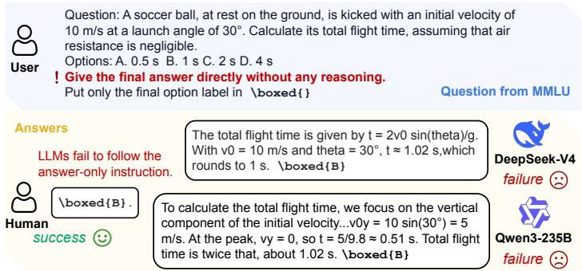

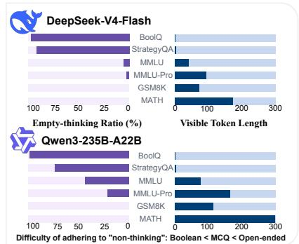  
Figure 1: No-thinking controls do not guarantee response-level no-thinking. (Left) On a representative MMLU 0question, DeepSeek-V4-Flash and Qwen3-235B-A22B are asked for only the final option, yet expose question-relevant 43pre-answer text. Appendix Figure E.1 confirms the instruction’s clear answer-only reading. (Right) Under native no-21thinking, green ETR and orange visible-length bars across the six benchmarks show Boolean tasks closer to answer-only than multiple-choice and open-ended tasks.

## 1 Introduction

LLMs have benefited substantially from extended reasoning. From early chain-of-thought prompting [42, 19] to more recent test-time scaling [31, 3], allocating additional tokens to intermediate computation before returning an answer has significantly improved performance across a wide range of tasks. The same mechanism, however, raises inference cost in both latency and token consumption, motivating a line of work on shortening, budgeting, or compressing reasoning traces [1, 18, 11, 45]. Beyond efficiency, knowing when to answer directly without extended reasoning is also important for human-like adaptive reasoning: humans often respond from intuition and deliberate only when needed. Together, these efficiency and adaptivity considerations motivate explicit control over reasoning behavior. As illustrated in Figure 2 (a), current frontier systems expose native thinking switches and reasoning-effort settings, while users can request direct answers through prompting [25, 46, 8].

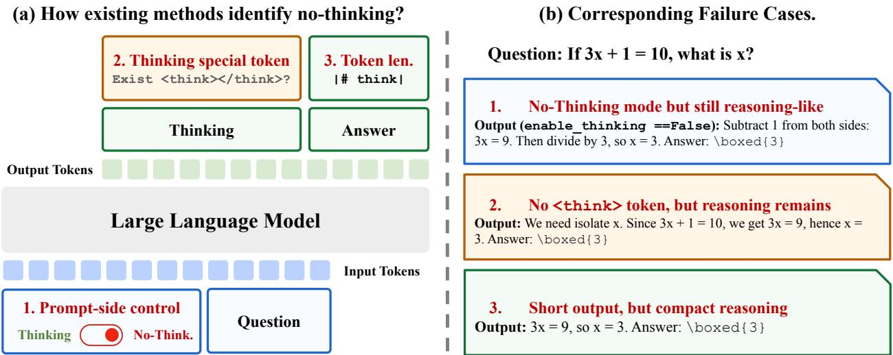  
Figure 2: Surface proxies fail to identify response-level no-thinking. (a) Three common proxies: 1. prompt-side control, 2. special reasoning tokens (e.g., <think>), and 3. generation token length. (b) On the same algebra question, disabling the thinking mode, omitting special thinking tokens, or producing a short output can each leave a visible inferential step before the final answer. These cases motivate separately evaluating strict answer-only compliance, pre-answer relevance, and visible explicit inference.

Despite these explicit controls, as Figure 2 (b) illustrates, a frontier model with its reasoning channel disabled can still emit question-conditioned content in the ordinary answer channel or produce a short response that nonetheless contains a compact, task-specific reasoning step. Moreover, the community still lacks a clear definition of what a “no-thinking” response should look like. In practice, no-thinking is typically inferred from surface proxies: the prompt is placed in a no-think regime [22]; the response does not return a separate reasoning trace, or the <think> block is absent [46, 8]; or the output is simply short [1, 18, 11, 24, 45]. These proxies conflate instruction control with the suppression of visible reasoning. For example, a generic lead-in such as “Let me think about this. The answer should be <ans>” carries no task-specific content, yet would be counted as reasoning by surface proxies. Conversely, a single compact equation may expose an explicit inferential step even when the response is short or contains no special reasoning tokens.

Motivated by this conflation, we study no-thinking as an observable response behavior and inspect the pre-answer text exposed before the final answer.1 In general question answering, pre-answer text may reflect reasoning, paraphrasing, fact restatement, or simple assertion. We therefore define three progressively more specific criteria for characterizing such text. (a) a discrete view of whether the complete visible output reaches the strict answer-only boundary, measured by the Empty-Thinking Rate (ETR); (b) a continuous view of whether any remaining pre-answer text T is relevant to the question Q, measured by instruction-aware Qwen3-Embedding-4B via Question–Pre-answer Relevance (QRel.); and (c) a reasoning view of whether T contains an explicit inferential step that addresses Q, measured by a blinded GPT-5.5 judge through the Explicit Inference Rate (EIR). The judge separates explicit inference from paraphrases and relevant non-inferential text, while task accuracy independently evaluates the final answer A. Thus, QRel. provides a relevance signal rather than final evidence of reasoning; conclusions about visible reasoning and thinking inertia rely on EIR together with ETR. This view defines a testable behavioral framework for comparing interventions, benchmarks, model families, and model scales.

Based on these metrics, our experiments further examine whether no-thinking can be controlled, regularized, and generalized. We first ask Q1. whether enabling or disabling the thinking mode actually suppresses visi ble pre-answer content. We then Q2. compare several interventions2 to test whether stronger answer-only constraints can make responses more answer-only without damaging task accuracy. Finally, we evaluate Q3. how this behavior changes across answer spaces, benchmark domains, and LLMs of different families and scales. The detailed intervention spectrum is introduced in Section 2.4; at a high level, it separates native no-think behavior, reasoning re-elicitation, semantic suppression, and structural prefix forcing. Our human validation supports all three metrics: a manual boundary audit corroborates ETR, the five annotators’ relevance judgments align closely with QRel., and their explicit-inference labels achieve 98.8% mean binary agreement with the primary GPT-5.5 judge used to compute EIR. The human annotations also reproduce the main answer-space and intervention trends, further supporting our central conclusions. The EIR results also remain robust when evaluated by an independent judge from a different model family.

Our results highlight four findings. (i) Explicit no-think controls are not reliable no-thinking controls: even a frontier LLM such as DeepSeek-V4-Flash (284B) retains visible explicit inference in 99.9% of openended responses under its disabled-thinking setting. (ii) LLMs exhibit “thinking inertia”: visible inference is organized more by the task’s answer space than by the switch itself. Under both native and strict nothinking settings, it remains lowest on Boolean tasks, intermediate on multiple-choice tasks, and highest on open-ended tasks. (iii) On open-ended tasks, stronger answer-only instructions reveal what we call a no-thinking–performance trade-off: stronger suppression improves answer-only compliance and reduces visible inference, but can also reduce task accuracy. Specifically, across the five LLMs with fully disabled thinking, strict answer-only prompting raises mean ETR from near zero to roughly 40% while reducing mean accuracy by about 15 percentage points. (iv) Answer space matters: for the same question, factlike and candidate-visible formats make answer-only responses easier to produce than open-generation formats, showing that the pattern is not explained by benchmark difficulty or answer length alone.

In summary, our work makes two contributions. First, we define no-thinking as a measurable responselevel behavior and provide a framework for evaluating it. Second, through comprehensive experiments across task families and diverse LLMs, we identify systematic behaviors including thinking inertia, the nothinking–performance trade-off, and answer-space dependence. Together, these contributions support the broader goal of developing LLMs that, like humans, can adaptively determine when to reason and when to answer directly.

## 2 Measuring No-Thinking

## 2.1 Observations

No-thinking in LLMs does not have a concrete definition. In practice, existing work often identifies it through three surface proxies, as summarized on the left side of Figure 2: (i) prompt-side control, where the model is run in a no-think setting or is not prompted to think step by step [22]; (ii) visible-format control, where no-thinking is inferred from the absence of an explicit <think> block or a separate reasoning trace [46, 8]; and (iii) length-based control, where shorter generations produced by length control or chain-of-thought compression are treated as reduced reasoning [1, 18]. These proxies are convenient and easy to monitor, but they characterize the response by its surface prompting condition, visible format, or length, rather than by the actual content of the LLM response (such as the question-conditioned information it actually exposes).

Each of these formulations, however, has a simple failure case, illustrated on the right side of Figure 2. (i) A no-think instruction can still yield explanatory, question-dependent text before the final answer; disabling a thinking mode therefore does not by itself remove visible reasoning. (ii) Removing explicit <think> tags only removes a particular format; reasoning may still appear as ordinary language in the answer channel. (iii) Making an output short does not make it no-thinking, since a compact response can still encode the essential intermediate step needed to answer the question. Thus, the problem is not that these proxies are useless, but that none of them defines the behavioral object we want to study. We therefore operationalize no-thinking at the response level and progressively distinguish strict answer-only compliance, question relevance, and visible explicit inference. This observable definition does not make claims about latent computation inside the model, because extending the analysis to latent reasoning would substantially broaden the scope and make the boundary of no-thinking difficult to define clearly.

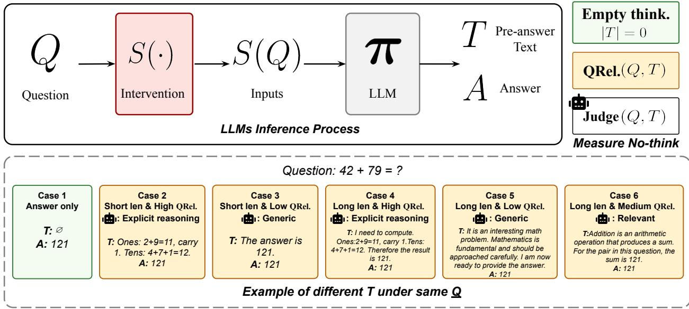  
: Explicit reasoningFigure 3: Response-centric metrics for measuring no-thinking. Top: the LLM inference process. A question Q is wrapped by an intervention S(·) to form the model input S(Q), which the model π maps to a response decomposed into pre-answer text T and final answer A. We evaluate the visible response through three levels: strict answer-only compliance (ETR), question–pre-answer relevance (QRel.), and LLM judge explicit inference (EIR); accuracy independently evaluates A. Bottom: six representative response cases to the same question $^ { \prime \prime } 4 2 + 7 9 = ? ^ { \prime \prime }$ vary in length, relevance, and inferential content while sharing the same final answer. Case 1 is answer-only (empty T), whereas Cases 2–6 use the non-empty-T labels from the mutually exclusive rubric in Table 1: Cases 2 and 4 are explicit reasoning, Cases 3 and 5 are generic/off-topic, and Case 6 is relevant non-inferential. Table 1 additionally defines paraphrase-only and unclear; represen tative real outputs are provided in Appendix F.1.

## 2.2 Problem Formulations

The observations above suggest that prompt-side heuristics alone are insufficient for studying no-thinking in a controlled way. We therefore ground our analysis in the response-centric framework shown in Figure 3.

Formally, let π denote a language model and Q a task sample. The query is wrapped by an intervention S(·) (e.g., a system prompt such as “please answer <Question> directly”) before being passed to the model, which produces an observable response

$$
\pi ( S ( Q ) ) = ( T , A )\tag{1}
$$

where A is the last parseable final answer and T comprises all readable visible text preceding it. We use (T, A) only as a decomposition of the observable response, without making claims about task-relevant computation in unobserved model states. The strict compliance check additionally scans the complete output, so substantive text after A is not treated as answer-only. Appendix E audits question restatement and answer-first edge cases.

Visible pre-answer text T. T contains all readable visible content before the final answer $A ,$ whether it appears in a special reasoning block, the ordinary answer channel, or a short lead-in. It may include an explicit derivation, a compact reasoning step, a paraphrase, a relevant assertion, or a generic template such as “The answer is”. These cases motivate evaluating the content of T rather than equating every non-empty T with reasoning.

Question type and answer space $( Q , A )$ . We write each task sample as $Q = ( q , c , { \mathcal { A } } )$ , where q is the question, c is optional context, and $\mathcal { A }$ is the admissible answer space, with $A \in { \mathcal { A } }$ . For example, $\mathcal { A } = \{ \mathtt { y e s } , \mathtt { n o } \}$ for Boolean verification, $\boldsymbol { \mathcal { A } } = \left\{ \mathtt { A } , \mathtt { B } , \mathtt { C } , \mathtt { D } \right\}$ for multiple-choice, and A permits free-form generation for openended tasks. This lets us test whether no-thinking behavior changes under different answer interfaces.

Intervention S(·). S(·) denotes an external intervention applied to Q before generation, producing the model input $S ( Q )$ . We consider two broad classes: (i) question-irrelevant interventions, which change the instruction, output constraint, or explicit thinking configuration while keeping $Q$ fixed $( e . g .$ , prepending “Answer directly without thinking”); and (ii) question-relevant interventions, which modify the task instance itself, such as its surface form or answer space $\mathcal { A } \left( e . g . \right.$ , converting an open-ended question into a multiple choice one).

Together, this unified framework allows us to study no-thinking through strict compliance, relevance, and explicit inference rather than through surface proxies alone.

## 2.3 Three-Level Response Evaluation

Under our formulation, T serves as the primary observable target, while task accuracy separately evaluates the final answer A. We therefore organize the T measurement into three progressively more specific levels (as depicted in Figure 3): strict answer-only compliance, pre-answer relevance, and visible explicit inference. At the response level, Levels 1 and 3 yield binary scores, whereas Level 2 yields a continuous score; their benchmark-level aggregates are defined below.

Level 1: Empty-Thinking Rate. We first ask whether each output is strictly answer-only. For output i, let $e _ { i }$ denote the response-level empty-thinking indicator. For a benchmark with N outputs under a fixed model and intervention, we define the response-level score and the Empty-Thinking Rate (ETR) as

$$
e _ { i } = { \bf 1 } \{ | T _ { i } | = 0 \} , \quad \quad \mathrm { E T R } = { \bf 1 } 0 0 \% \times { \frac { 1 } { N } } \sum _ { i = 1 } ^ { N } e _ { i } .\tag{2}
$$

Here, $e _ { i }$ is the response-level score, whereas ETR is its benchmark-level rate. Operationally, $e _ { i } = 1$ only when $A _ { i }$ is parseable and the complete visible output contains no substantive text outside its permitted answer wrapper; otherwise, $e _ { i } = 0 .$ . Thus, empty ${ \bar { T } } _ { i }$ does not override a malformed final-answer format, and substantive text following $A _ { i }$ also violates strict compliance. ETR gives the cleanest operational limit, but cannot distinguish a generic template, a paraphrase, and a question-specific inference once $T _ { i }$ is nonempty.

Level 2: Question–Pre-answer Relevance. We next ask how strongly the visible pre-answer text T is semantically related to Q. Let $\phi$ denote an embedding encoder. We instantiate $\phi$ with the instruction-aware Qwen3-Embedding-4B [50], because its query instruction lets us specify the intended relation between Q and T: Q is encoded as the query under the instruction “Given a question, retrieve pre-answer text that contains reasoning relevant to answering the question,” while T is encoded as the candidate passage. Here, $\phi ( Q )$ denotes the resulting instruction-conditioned query embedding and $\phi ( T )$ the candidate-passage embedding produced by the same encoder. After ℓ2-normalizing each embedding, i.e., dividing each vector by its Euclidean norm, we define the response-level Question–Pre-answer Relevance (QRel.) score as

$$
\operatorname { Q R e l . } ( Q _ { i } , T _ { i } ) = { \left\{ 0 , \atop \cos ( \phi ( Q _ { i } ) , \phi ( T _ { i } ) ) , \right.}   \ | T _ { i } | > 0 .\tag{3}
$$

The first branch assigns empty $T _ { i }$ a score of zero, while the second directly uses the cosine similarity for non-empty $T _ { i }$ . For each model–benchmark–intervention setting, the reported QRel. is the arithmetic mean of these response-level scores over all N outputs, including the zeros assigned to empty $T _ { i }$ . The instructionaware objective makes relevance to answering $Q _ { i } ,$ rather than surface overlap alone, the target relation.

However, QRel. measures relevance rather than inference: a paraphrase or a relevant answer assertion can receive a high score without containing an inferential step. Appendix E audits whether near-verbatim or semantic restatement drives the aggregate results, while Level 3 keeps such text outside the explicitinference category.

Level 3: Explicit Inference Rate. Level 1 checks a structural rule and Level 2 measures functional relevance; neither directly separates reasoning from relevant non-inferential text. We therefore use a blinded LLM judge to classify each non-empty $\bar { T _ { i } }$ . The judge receives only $( Q _ { i } , T _ { i } ) ;$ model identity, intervention mode, final answer $A _ { i } ,$ correctness, and QRel. are hidden. It returns one of the five mutually exclusive labels in Table 1, together with an exact supporting span from $T _ { i } .$ The span records the evidence for the selected label and makes the decision auditable, but does not enter the metric. Table 1 presents the judge instruction and rubric together.

Table 1: Blinded LLM-judge instruction and rubric for non-empty pre-answer text T. Empty T is handled separately and counts as no visible explicit inference.
<table><tr><td>Prompt for the LLM Judge</td><td></td></tr><tr><td colspan="2">Judge whether the PRE-ANSwER TEXT contains reasoning that addresses the QUESTION, select the corresponding rubric label, and record an exact supporting span.</td></tr><tr><td colspan="2">Criterion</td></tr><tr><td>Index Label</td><td>Generic lead-in, formatting text, or off-topic content with no question-specific in-</td></tr><tr><td>1</td><td>Generic/off-topic ference.</td></tr><tr><td>2 Paraphrase-only 3</td><td>Restates Q or supplied facts without connecting them through an inference step. Relevant non-inferential Gives a relevant fact, definition, description, or answer assertion without an infer-</td></tr><tr><td>4</td><td>ence step. Explicit reasoning Contains deduction, computation, comparison, elimination, rule application,</td></tr><tr><td>5 Unclear</td><td>evidence-to-conclusion, or causality addressing Q. Cannot be classified reliably from the visible text.</td></tr></table>

A relevant restatement or answer assertion alone is therefore not reasoning, whereas one concrete inferential step can qualify even when it is short, shallow, or ultimately incorrect. For the metric, let $\mathrm { J u d g e } ( Q _ { i } , T _ { i } )$ denote the binary score induced by the five-way label returned when the blinded judge receives $( Q _ { i } , T _ { i } ) ;$ : it is 1 only when the judge selects Explicit reasoning, and 0 for the other four labels. Empty $T _ { i }$ is not sent to the judge and is assigned Judge $\left( Q _ { i } , T _ { i } \right) = 0$ by defacult. For a benchmark with N outputs under a fixed model and intervention, we define the Explicit Inference Rate (EIR) as

$$
{ \mathrm { E I R } } = 1 0 0 \% \times { \frac { 1 } { N } } \sum _ { i = 1 } ^ { N } { \mathrm { J u d g e } } ( Q _ { i } , T _ { i } ) .\tag{4}
$$

Thus, $\mathrm { J u d g e } ( Q _ { i } , T _ { i } )$ is the response-level binary score, whereas EIR is its benchmark-level statistics.

Human study. We complement the automated evaluation with a blinded human study that considers two aspects: first, whether the three metrics align with human judgments; and second, whether the main conclusions drawn from them persist under direct human annotation. (i) Metric validation. A manual boundary audit checks the strict visible boundary underlying ETR, while five annotators independently provide graded relevance judgments for comparison with QRel. and explicit-inference labels for comparison with the Level 3 judge. Additionally, we use a second LLM judge from a different model family to check that the Level 3 results are not specific to the primary judge. Additionally, we use a second LLM judge from a different model family to check that the Level 3 results are not specific to the primary judge. (ii) Conclusion validation. Building on this agreement, we test whether the main answer-space and intervention trends persist under direct human annotation. The detailed protocol and results are reported in Section 3.6 and Appendix D.3.

Table 2: Six-mode question-irrelevant prompt intervention spectrum. Modes shown in gray (THINK-ON, COT) still elicit thinking behavior and serve as thinking-side references; the remaining modes (THINK-OFF, SOFT, STRICT, PREFIX) form the no-think intervention space, ranging from the native nothinking baseline to increasingly strong semantic suppression.
<table><tr><td># Mode</td><td>Purpose (no-think intensity)</td><td colspan="2">enable_thinking Question-Irrelevant Intervention S(·)</td></tr><tr><td></td><td>M1 THINK-ON Native thinking-on mode (−)</td><td>√</td><td>None.</td></tr><tr><td></td><td>M2 THINK-OFF Native no-thinking mode (0)</td><td>x</td><td>None.</td></tr><tr><td>M3 CoT</td><td>Explicit reasoning (−)</td><td>x</td><td>&quot;Think step by step.&quot;</td></tr><tr><td>M4 SOFT</td><td>Soft regularization (+)</td><td>x</td><td>&quot;A very short lead-in is allowed, but do not ex- plain.&quot;</td></tr><tr><td>M5 STRICT</td><td>Strict regularization (++)</td><td>x</td><td>&quot;Give the final answer directly without any rea- soning.&quot;</td></tr><tr><td>M6 PREFIX</td><td>Prefix forcing (+ + +)</td><td>x</td><td>&quot;The answer is \boxed{&quot;</td></tr></table>

## 2.4 Thinking Behavior Control

To systematically cover the possible setups, we design a six-mode spectrum (Table 2) that organizes modes along a single axis of no-think intensity, ranging from (−) for thinking-encouraging modes and (0) for the native no-thinking mode to (+++) for the strongest suppression. All modes share the same task stem and final-answer request; only the thinking switch and the question-irrelevant intervention change.

Thinking variants (THINK-ON, COT). THINK-ON (M1) keeps the official thinking interface enabled, while COT (M3) disables it but adds the instruction “Think step by step” to re-elicit reasoning in the ordinary answer channel. Both elicit thinking rather than suppress it, and serve as opposite-direction references for the no-think space (gray rows in Table 2).

No-thinking variants (THINK-OFF, SOFT, STRICT, PREFIX). THINK-OFF (M2) disables enable\_thinking without any additional output-side control, serving as the natural baseline against which all suppression interventions are measured. SOFT (M4) and STRICT (M5) keep enable\_thinking=False and add increasingly strong natural-language constraints: SOFT allows a short lead-in but forbids explanation, while STRICT asks for the answer directly without any reasoning. PREFIX (M6) is qualitatively different. Instead of adding an instruction, it pre-fills the answer template “The answer is \boxed{” at the start of generation, bypassing the instruction-following channel entirely. We treat it as a separate branch rather than a stronger version of STRICT.

## 3 Experiments

We organize our experiments around three questions. Starting from the model’s native thinking controls, we ask Q1. whether enabling or disabling the thinking mode actually suppresses visible pre-answer content. We then focus on the native no-thinking mode and ask Q2. how prompt interventions of varying strength affect no-thinking behavior and its relationship with task performance. Building on these analyses, we conduct finer-grained controlled comparisons and ask Q3. how no-thinking behavior varies across benchmark domains and question types, and how much of this variation can be attributed to answer space.

## 3.1 Settings

LLM baselines. We select LLMs that expose explicit thinking-mode controls, so that no-thinking behavior can be tested by intervention rather than inferred from output length or format. Table 3 spans the Qwen3 family (4B, 32B, and 235B), DeepSeek-V4-Flash, and proprietary frontier models from OpenAI and Google, covering both model families and scales. The three Qwen3 sizes support a within-family scaling analysis, while the local 4B and 32B checkpoints provide transparent paired native on/off controls for detailed abla-

Table 3: LLM baselines for evaluation.
<table><tr><td>Model</td><td>Size</td><td>Thinking mode</td></tr><tr><td>Qwen3-4B</td><td>4B</td><td>On | Off</td></tr><tr><td>Qwen3-32B</td><td>32B</td><td>On  Off</td></tr><tr><td>Qwen3-235B-A22B</td><td>235B</td><td>On | Off</td></tr><tr><td>DeepSeek-V4-Flash 284B</td><td></td><td>High  Off</td></tr><tr><td>GPT-5.4</td><td>N/A</td><td>High | Off</td></tr><tr><td>Gemini-3-Flash</td><td></td><td>N/A High↑ Minimal</td></tr></table>

tions. All models are evaluated under the six-mode intervention spectrum from Section 2.4.

Benchmarks. To evaluate no-thinking across answer spaces, we use three answer-space families, each with an easier and a harder benchmark. (i) Boolean verification. Each sample requires a yes/no judgment. We use BoolQ [6] and StrategyQA [10]. (ii) Multiple-choice answering. Each sample provides a fixed set of candidate options, and the model returns one option label. We use MMLU [14] and MMLU-Pro [40]. (iii) Open-ended answering. Each sample requires the model to generate the answer without a provided candidate set. We use GSM8K [7] and MATH [15]. These benchmarks cover answer spaces ranging from binary judgments through fixed-choice selection to open-ended generation, while using the same responselevel evaluation metrics.

Metrics. For each model–benchmark–intervention setting, we report Task Accuracy (Acc.) and the three no-thinking metrics defined in Section 2.3: the Empty-Thinking Rate (ETR), the Question–Pre-answer Relevance (QRel.), and the Explicit Inference Rate (EIR). All four metrics are aggregated over the same full set of outputs in each setting rather than conditioned on non-empty T: empty T contributes zero to QRel., and EIR uses all outputs as its denominator.

For QRel., we use the instruction-aware Qwen3-Embedding-4B [50] with last-token pooling and a maximum sequence length of 32,768, following the query–passage setup in Section 2.3. For EIR, we use GPT-5.5 at temperature 0 as the primary blinded judge, following the input and blinding protocol in Section 2.3. Appendix D tests Level 2 with alternative widely used encoders and replicates Level 3 with Claude Opus 4.8 across all six models, six benchmarks, and six intervention modes.

Human study. Our unified blinded human study samples 600 outputs, 100 from each benchmark, while preserving each benchmark’s full-corpus empty/non-empty-T proportion; the empty-T boundary is manually audited for all outputs. Five annotators independently review all 402 non-empty pre-answer texts and assign both a five-point question-relevance score and one Level 3 reasoning label; the 198 empty cases receive relevance score 1 and no visible inference by definition. The annotation view exposes only (Q, T); model identity, intervention mode, final answer, correctness, and automated evaluator scores are hidden. Section 3.6 reports the results, while Appendix D.3 provides the full protocol, rubrics, calculations, and per-annotator statistics.

## 3.2 Native Think-on vs. Think-off

Figure 4 compares M1 (THINK-ON), M2 (THINK-OFF), and M3 (STEP-BY-STEP) across six models and three answer-space families (Bool, MCQ, and Open-ended). The left panels pair ETR with EIR, while the right panels pair QRel. with visible pre-answer length |T|.

Native Think-off becomes less effective as the answer space opens. We first test whether the native thinking-mode control reliably suppresses visible pre-answer content. M1 (THINK-ON) serves as the native thinking-on reference: for most model–task pairs, ETR is near zero, while QRel. and EIR are high. Under M2 (THINK-OFF), most models reach roughly 80–100% ETR on Bool, with sharply reduced QRel. and EIR. MCQ forms an intermediate but heterogeneous regime: ETR ranges from near zero to 95% across models, while the six-model mean QRel. and EIR values fall between Bool and Open-ended. On Open-ended tasks, ETR collapses to nearly zero everywhere, while QRel. remains close to its M1 level and EIR remains high. Across the three metrics, responses become less likely to remain answer-only and more likely to retain question-related, explicitly inferential pre-answer text as the answer space opens. This observable progression is consistent with greater computational demands: constructing an answer in an open space may require more task-relevant intermediate computation than selecting from narrow or candidate-visible alternatives.

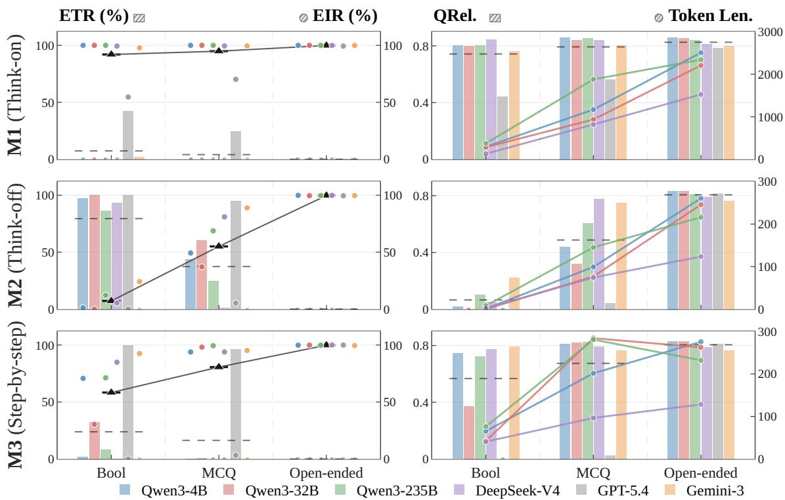  
Figure 4: Think-on (M1), Think-off (M2), and Step-by-step (M3) across six models and three answerspace families. Rows show modes; the columns pair ETR bars with EIR points (left) and QRel. bars with visible pre-answer length for the four models with complete length traces (right). Gray dashed segments mark six-model means for ETR and QRel.; black triangles connected by dark lines mark the mean EIR; colored marks follow the model legend.

We use “thinking inertia” to describe how visible explicit inference persists under no-thinking controls and becomes more common as the answer space opens. The native no-thinking setting therefore does not guarantee answer-only responses: ETR is high mainly on Bool, while the six-model mean EIR is lowest on Bool, intermediate on MCQ, and highest on Open-ended tasks.

Step-by-step prompts can recover visible reasoning. M3 (STEP-BY-STEP) provides the reverse intervention: it asks whether an ordinary step-by-step prompt can re-elicit visible reasoning while the native thinking switch remains off. Under M3, QRel. and EIR often move back toward their M1 levels, including on Bool for many models; the four available length traces show the same recovery. This indicates that an ordinary step-by-step instruction can re-elicit visible explicit inference even while the native thinking switch remains off. Nevertheless, the six-model mean EIR preserves the same Bool < MCQ < Open-ended stair case under M3, showing that the answer-space dependence characteristic of thinking inertia persists under explicit step-by-step prompting. GPT-5.4 is the main exception to this recovery pattern, maintaining high answer-only compliance and correspondingly low EIR on both Bool and MCQ. Thus, the reverse intervention changes the overall level of visible inference but not its answer-space ordering.

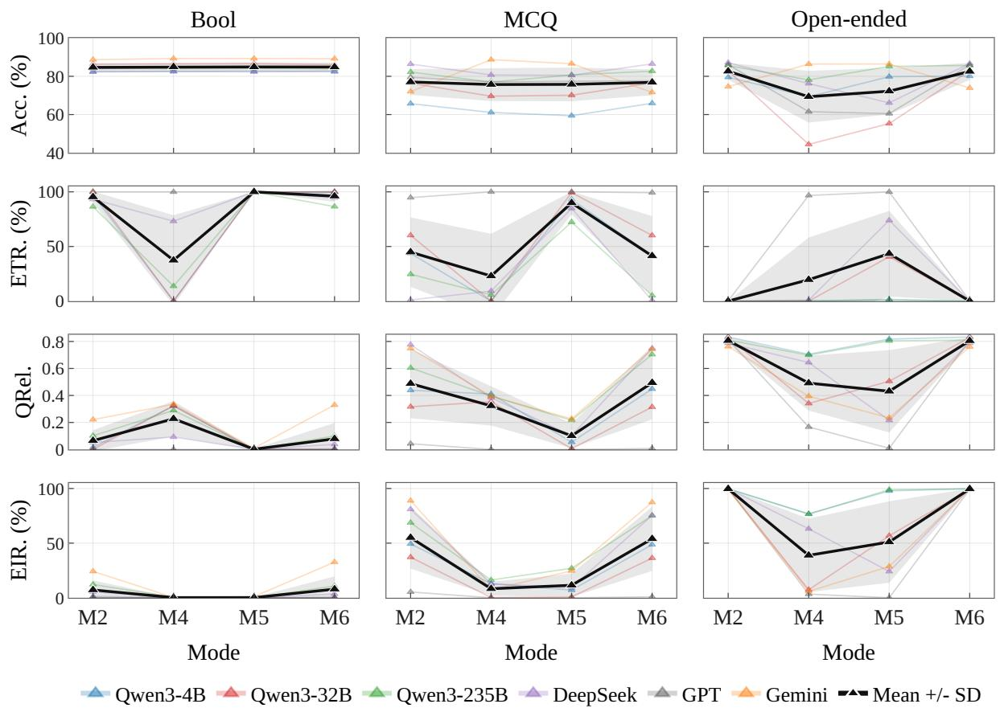  
Figure 5: On Open-ended tasks, strict answer-only prompting exposes a trade-off between answer-only compliance and task accuracy. Columns show Bool, MCQ, and Open-ended answer spaces; rows show Acc., ETR, QRel., and EIR. M2 is the native no-thinking baseline; M4 and M5 add increasingly strong natural-language constraints, while M6 forms a separate structural prefix-forcing branch. Colored lines show individual models; the black line and gray band show the mean and one standard deviation. For ETR, these summaries include only models with a disabled-thinking condition.

QRel. separates relevance from verbosity. In the right panels, pre-answer length under M1 (THINK-ON) grows sharply from Bool to Open-ended tasks for all four models with complete length traces. Yet QRel. changes much less across these answer spaces, indicating that it is not merely a proxy for length. QRel. and EIR remain complementary: question-related T may be a paraphrase or relevant assertion, whereas EIR identifies whether it contains an explicit inferential step. To check whether high QRel. is driven by superficial restatement, our full-corpus audit flags only 301 of 572,688 outputs (0.053%) as near-verbatim repetitions; setting all of their QRel. values to zero changes the global mean by at most 0.00053. A complementary Level 3 audit labels only 355 outputs (0.06%) as paraphrase-only and excludes them from EIR. Appendix E, with Tables E.1 and D.4, provides the definitions and breakdowns.

## 3.3 Performance across No-Think Variants

We next ask how no-think interventions affect response behavior and task performance.

Accuracy varies more across interventions as the answer space opens. Figure 5 compares the four no think variants (M2, M4, M5, and M6) across the three answer-space families. Across these variants, Bool accuracy remains nearly flat at around 85%, MCQ accuracy varies modestly, and Open-ended accuracy varies most across modes. Consistent with the answer-space pattern in Section 3.2, these interventions mainly affect the no-thinking metrics on Bool, whereas Open-ended tasks also show larger changes in final-answer accuracy.

Prefix forcing does not reliably produce answer-only responses. If the prefilled answer template in M6 acted as a stronger answer-only constraint than M5, ETR would increase, while QRel. and EIR would decrease. Contrary to this expectation, mean ETR drops from M5 to M6 on MCQ and Open-ended tasks, while the mean QRel. and EIR values rebound in every answer-space family. Thus, M6 is not a stronger version of STRICT: despite the prefilled template, it neither reliably produces answer-only responses nor consistently suppresses question-relevant text or visible explicit inference.

Open-ended tasks expose a trade-off between answer-only compliance and accuracy. Across models with a disabled-thinking condition, moving from M2 to M5 raises mean ETR from near zero to roughly 40% and reduces mean accuracy by about 15 percentage points on Open-ended tasks. Across the complete evaluation corpus, the corresponding EIR likewise decreases from 99.69% to 62.00% (Appendix Table D.3). At M6, mean ETR returns to near zero, while the mean QRel., EIR, and accuracy values rebound toward their M2 levels. Bool and MCQ show little corresponding accuracy trade-off: from M2 to M5, EIR decreases from 5.15% to 0.12% on Bool and from 45.57% to 25.39% on MCQ, while mean accuracy remains largely flat. Thus, relative to M2, M5 reduces visible explicit inference in every answer space, but the rate remains substantial on Open-ended tasks, which exhibit the clearest associated accuracy cost.

On open-ended tasks, no-thinking comes at a cost. This pattern is consistent with greater computational demands in Open-ended tasks: relative to the native THINK-OFF setting, the strict answer-only instruction reduces EIR but still leaves substantial visible explicit inference, while the resulting increase in answer-only compliance is accompanied by lower accuracy.

## 3.4 Performance across disciplines

We next address the domain component of Q3 by holding the answer interface fixed and comparing nothinking behavior across subject areas.

Higher accuracy does not imply easier no-thinking. Table 4 fixes the answer interface to four-choice MCQ and varies the MMLU subject area. Across all four models, STEM combines the highest accuracy with the lowest ETR (0.3–36.4%), arguing against a simple positive relationship between task success and answer-only compliance. STEM also has the highest QRel. (0.509–0.784) and EIR (59.7–85.5%) in every model block, showing that the domain pattern is not confined to ETR. Thus, under this fixed interface, answer-only compliance is not simply a proxy for task success, and answer space does not account for all variation in no-thinking behavior.

## 3.5 Performance under answer-space rewrites

The preceding experiments vary thinking controls across task families. We now keep the underlying math questions fixed and change only the answer interface, allowing a more controlled comparison.

Changing only the answer interface reshapes no-thinking behavior. Figure 6 rewrites the matched numeric-answer subset of MMLU/MMLU-Pro for Qwen3-32B under M2 from its original MCQ form into Boolean verification or open-ended generation. The Boolean rewrite leaves accuracy nearly unchanged, from 77.8% to 78.9%, but raises ETR from 10.5% to 62.5%, lowers QRel. from 0.709 to 0.314, and lowers EIR from 86.95% to 36.90%. By contrast, the open-ended rewrite reduces accuracy to 52.6%, drives ETR to 0%, and raises QRel. to 0.810 and EIR to 90.14%. Thus, changing only how the answer is requested substantially changes response-level no-thinking behavior, even for the same underlying questions. A full-page qualitative example tracing all six modes on one rewritten item is provided on the following page.

Table 4: No-thinking behavior varies by domain even under the same four-choice answer interface. Following the official MMLU subject-area split [14], we report Humanities, Social Sciences, and STEM and omit the heterogeneous Other category. The % column gives each area’s share of the full MMLU test split; for each model, the remaining columns report Acc., ETR, QRel., and EIR under M2.
<table><tr><td></td><td></td><td colspan="4">Qwen3-4B</td><td colspan="4">Qwen3-32B</td><td colspan="4">Qwen3-235B</td><td colspan="4">DeepSeek-V4-Flash</td></tr><tr><td>MMLU area</td><td>%</td><td>Acc.</td><td>ETR</td><td>QRel.</td><td>EIR</td><td>Acc.</td><td>ETR</td><td>QRel.</td><td>EIR</td><td>Acc.</td><td>ETR</td><td>QRel.</td><td>EIR</td><td>Acc.</td><td>ETR</td><td>QRel.</td><td>EIR</td></tr><tr><td>Humanities</td><td>33.5%</td><td>62.5</td><td>36.8</td><td>0.488</td><td>56.6</td><td>71.6</td><td>95.5</td><td>0.036</td><td>4.1</td><td>77.1</td><td>40.6</td><td>0.435</td><td>49.8</td><td>83.5</td><td>1.7</td><td>0.772</td><td>82.7</td></tr><tr><td>Social Sciences</td><td>21.9%</td><td>78.7</td><td>78.2</td><td>0.167</td><td>16.2</td><td>88.3</td><td>87.7</td><td>0.098</td><td>10.7</td><td>88.3</td><td>41.4</td><td>0.452</td><td>49.6</td><td>92.3</td><td>2.2</td><td>0.777</td><td>69.2</td></tr><tr><td>STEM</td><td>22.5%</td><td>83.0</td><td>34.3</td><td>0.527</td><td>60.2</td><td>91.3</td><td>36.4</td><td>0.509</td><td>59.7</td><td>90.6</td><td>6.2</td><td>0.752</td><td>85.5</td><td>94.4</td><td>0.3</td><td>0.784</td><td>83.5</td></tr></table>

Note. For API models, Acc./ETR use the complete MMLU aggregate, whereas QRel./EIR use the retained 1,000-output domain subset; detailed provenance is provided in Appendix Table I.1.

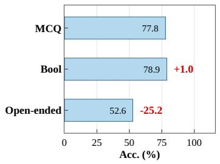

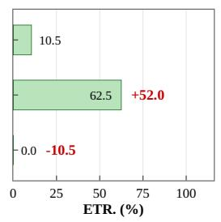

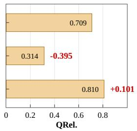

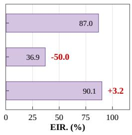  
Figure 6: Changing only the answer space reshapes no-thinking behavior on the same questions. We rewrite matched numeric-answer items from MMLU and MMLU-Pro for Qwen3-32B under M2 from MCQ into Boolean or open-ended forms. The four panels report Acc., ETR, QRel., and EIR on the same answerspace variants; red values give the change from the MCQ form, computed before rounding.

Answer presentation shapes direct answering. This controlled comparison clarifies what the earlier answerspace trend reflects. Boolean verification gives the model a proposed answer to check, while open-ended generation requires the model to produce the value without such support. The original MCQ form lies between these cases: it provides options, but the model may still need visible intermediate steps to compare or compute them. The same ordering appears in the three-level view: Boolean verification has the highest ETR and the lowest QRel. and EIR, whereas open-ended generation has no answer-only responses and retains both relevant pre-answer text and explicit inference. Thus, the answer-space pattern in Sections 3.2 and 3.3 appears both across benchmark families and within the same questions when the answer interface changes.

Even for the same question, the answer space shapes whether an LLM answers directly. Candidate-visible formats make answer-only responses easier to produce than open-ended generation, so the broader pattern cannot be reduced to differences between benchmark families.

## 3.6 Human Validation

We report the metric- and conclusion-level human-study results using the validation design in Section 2.3 and the experimental protocol in Section 3.1.

Metric validation. At Level 1, the strict-compliance decision underlying ETR agrees with the manually inspected empty-T indicator on 565 of 600 outputs (94.2%); the remaining 35 discrepancies reflect the ad-

Boolean verification Multiple choice Open-ended   
The length of a rectangle is The length of a rectangle is The length of a rectangle is   
twice its width. Given the length twice its width. Given the length twice its width. Given the length   
of the diagonal is ${ 5 } \sqrt { 5 } ,$ , find the of the diagonal is $5 { \sqrt { 5 } } ,$ , find the of the diagonal is ${ } 5 { \sqrt { 5 } } ,$ find the   
area. Proposed answer: 50. Is it area. Options: A 2500, B 2, C 50, area of the rectangle.   
correct? Answer yes or no. D 25.   
M1 Think-On Prompt: Put the final answer in \boxed{}.   
<think> Okay, let’s see. The length <think> Okay, so I need to find <think> Okay, so I need to find   
is twice the width, and the diag- the area where length is twice the the area of a rectangle where the   
onal is $5 { \sqrt { 5 } } .$ . We need to check width and the diagonal is $5 { \sqrt { 5 } } .$ length is twice the width and the   
whether the proposed answer 50 $[ \dots ]$ Let width be �; then length diagonal is 5 5. [. . . ] Denote the   
is correct. [. . . ] Let width be $w ,$ is $2 w ,$ and area is $2 w ^ { 2 }$ . Since width by $w ,$ so length is 2�. By   
length 2�. Then $w ^ { 2 } + ( 2 w ) ^ { 2 } =$ $( 5 \sqrt { 5 } ) ^ { 2 } \ = \ 1 2 5 , ( 2 w ) ^ { 2 } + w ^ { 2 } \ =$ the Pythagorean theorem, $w ^ { 2 } +$   
$( 5 { \sqrt { 5 } } ) ^ { 2 } { \mathrm { ; } }$ , so $5 \psi ^ { 2 } ~ = ~ 1 2 5$ $w = 5 ,$ 125. $[ \dots ]$ Thus $w \ = \ 5 ,$ , area $( 2 w ) ^ { \bar { 2 } } \ = \ \bar { 1 } 2 5 . \ [ . . . ]$ Therefore   
length = 10, area = 50. Final An $= 5 0 .$ . Therefore, the answer is C. $5 \psi ^ { 2 } ~ = ~ 1 2 5$ , � = 5, length =   
swer: boxed ��� . </think> [. . . ] boxed � . </think> [. . . ] Final 10, and area = 50. The area is   
The proposed answer is correct. answer: boxed � . boxed 50 . </think> [. . . ] The   
boxed ��� . area is boxed 50 .   
M2 Think-Off Prompt: Put the final answer in \boxed{}.   
Let the width of the rectangle be We are given � = 2� and diag- We are given � = 2� and diagonal   
�. Then the length is 2�. The onal 5 5. Using $L ^ { 2 } + W ^ { 2 } = d ^ { \bar { 2 } } ,$ 5√5. Then $( 2 W ) ^ { 2 } + W ^ { 2 } = ( 5 \sqrt { 5 } ) ^ { 2 } =$   
diagonal gives $\bar { w ^ { 2 } } + ( 2 w ) ^ { 2 } = 1 2 5 .$ $( 2 W ) ^ { 2 } + W ^ { 2 } = 1 2 5 ,$ so � = 5, 125, so $5 W ^ { 2 } = 1 2 5 ,$ , � = 5, � = 10,   
so $5 w ^ { 2 } = 1 2 5$ and $w = 5 ,$ . The area $L = 1 0 _ { : }$ , and area = 50. Final an- and the area is 50. boxed 50 .   
is $1 0 \times 5 = 5 0$ . boxed ��� . swer: boxed � .   
M3 CoT Prompt: Think step by step. Put the final answer in \boxed{}.   
Step 1: let width be � and length Step 1: let width be �, length 2�. Step 1: let width be �, length 2�.   
2�. Step 2: $( 2 W ) ^ { 2 } + W ^ { 2 } = 1 2 5$ , so Step 2: $( 5 { \sqrt { 5 } } ) ^ { 2 } = ( 2 x ) ^ { 2 } + x ^ { 2 } $ , so Step 2: use the Pythagorean theo   
� = 5. Step 3: area = 50. Final � = 5. Step $3 \colon \mathrm { a r e a } = 2 x ^ { 2 } = 5 0 .$ rem. Step $3 \colon x ^ { 2 } = 2 5 , x = 5 .$ Step   
answer: boxed ��� . boxed � . 4: area $= 2 x ^ { 2 } = 5 0 .$ . boxed 50 .   
M4 Soft Prompt: A very short lead-in is allowed, but do not explain. Put the final answer in \boxed{}.   
boxed ��� . Let the width be �. Then Let the width be �. Then   
the length is 2�. Using the the length is 2�. Using the   
Pythagorean theorem, $\overline { { x } } ^ { 2 } + ( 2 x ) ^ { 2 } =$ Pythagorean theorem, $\overline { { x } } ^ { 2 } + ( 2 x ) ^ { 2 } =$   
$( { \bar { 5 } } { \sqrt { 5 } } ) ^ { 2 } , \operatorname { s o } x \ = \ 5 . { \mathrm { ~ A r e a } } = \ 5 0 .$ 125, so $x \ = \ 5 .$ . The area is   
boxed � . $5 \times 1 0 = 5 0 .$ boxed 50 .   
M5 Strict Prompt: Give the final answer directly without any reasoning. Put the final answer in \boxed{}.   
\boxed{���}. boxed � . Let the width of the rectangle be   
�. Then the length is 2�. Using   
the Pythagorean theorem for the   
diagonal, $\overset { \smile } { x } ^ { 2 } + ( 2 x ) ^ { 2 } = ( 5 \sqrt { 5 } ) ^ { 2 }$ , so   
$5 x ^ { 2 } = 1 2 5$ and $x = 5 .$ . So, width   
✓ is 5 and length is $2 \times 5 = 1 0$ . The   
area is $1 0 \times 5 = 1$ boxed 50 .   
M6 Prefix Prompt: Put only the final option label in \boxed{}. The answer is \boxed{”.   
Let the width be �. Then length is Let width be �, length 2�. The Let width be �, length 2�. By   
2�. The diagonal gives $5 w ^ { 2 } = 1 2 5$ diagonal equation gives $5 x ^ { 2 } = 1 2 5$ Pythagorean theorem, $5 x ^ { 2 } = 1 2 5$   
so � = 5, length = 10, and the so $x = 5 . { \mathrm { A r e a } } = 2 x ^ { 2 } = 5 0$ . Final and � = 5. Width = 5, length = 10,   
area is 50. The proposed answer is answer: boxed � . so area = 10 5 = 50. boxed 50 .   
correct. boxed ��� .

Figure. Same MMLU Question Under Three Answer Spaces. Qwen3-32B is evaluated with the six paper-numbered modes on a single MMLU geometry item rewritten as Boolean verification, multiple-choice answering, and open-ended answering. Blue text shows output excerpts, blue boxed text marks the parsed final answer, green checks mark strict answer-only following, and gray . . . marks omitted spans. In M1, <think> and </think> expose the boundary between the visible thinking trace and the ordinary answer text.

ditional requirement that the final answer be parseable in the permitted format. At Level 2, the primary instruction-aware Qwen3-Embedding-4B QRel. scores reach a mean item-level Spearman correlation of ρ = 0.829 with the five annotators’ relevance judgments, compared with 0.809 for all-MiniLM-L6-v2 (Table 6).

At Level 3, the human explicit-inference labels achieve 98.8% mean binary agreement with the primary GPT-5.5 judge and 96.7% with the independent Claude Opus 4.8 judge across all 600 outputs. Table 5 further shows that the corresponding alloutput rates closely track the human mean across the six sampled M2/M5 answer-space cells; Appendix D.3 provides the per-annotator agreement and reliability statistics.

Table 5: Human and LLM-judge explicit-inference rates across the six sampled M2/M5 answer-space cells. All entries use the all-output denominator within each cell; the Human mean row averages the five annotator-specific rates.
<table><tr><td></td><td colspan="3">M2: Think-Off</td><td colspan="3">M5: Strict</td></tr><tr><td>Evaluator</td><td>Bool</td><td>MCQ</td><td>Open</td><td>Bool</td><td>MCQ</td><td>Open</td></tr><tr><td>GPT-5.5</td><td>4.0%</td><td>29.6%</td><td>100.0%</td><td>0.0%</td><td>11.8%</td><td>57.1%</td></tr><tr><td>Claude Opus 4.8</td><td>0.0%</td><td>29.6%</td><td>100.0%</td><td>0.0%</td><td>11.8%</td><td>53.6%</td></tr><tr><td>Human mean</td><td>4.0%</td><td>30.4%</td><td>100.0%</td><td>0.0%</td><td>11.8%</td><td>57.1%</td></tr></table>

Conclusion validation. The mean human rates in Table 5 preserve both experimental trends. Under M2 and M5, explicit inference rises from Bool to MCQ to Open-ended; relative to M2, M5 lowers the rate in every answer space, including from 100.0% to 57.1% on Open-ended tasks.

Table 6: Human relevance calibration on the unified 600-output sample. Each entry is an item-level Spearman correlation over all 600 outputs; empty T receives relevance score 1 and QRel. 0, and the final column reports the mean across annotators.
<table><tr><td></td><td>A1</td><td>A2</td><td>A3</td><td>A4</td><td>A5</td><td>Mean</td></tr><tr><td>Qwen3-Embedding-4B QRel.</td><td>0.828</td><td>0.831</td><td>0.830</td><td>0.833</td><td>0.823</td><td>0.829</td></tr><tr><td>all-MiniLM-L6-v2</td><td>0.794</td><td>0.811</td><td>0.814</td><td>0.827</td><td>0.798</td><td>0.809</td></tr></table>

These direct annotations therefore reproduce the two conclusions drawn in Sections 3.2 and 3.3: visible explicit inference becomes harder to suppress as the answer space opens and remains common on Openended tasks even under the strictest natural-language instruction.

Human judgments support the three-level evaluation and its central conclusions. The boundary audit corroborates ETR, relevance judgments correlate with QRel., and explicit-inference labels agree strongly with the primary and independent LLM judges. The same annotations reproduce the answer-space staircase and persistent visible inference on Open-ended tasks under M5.

## 4 Related Work

Efficient and Adaptive Reasoning. Test-time computation can substantially improve language-model reasoning [31, 3], motivating methods that allocate this computation more selectively. One line of work controls the length or budget of visible reasoning through length-conditioned reinforcement learning [1], token-budget prompting [11], budget forcing [23], and self-training for concise traces [24]. Another compresses intermediate reasoning by distilling shorter chains [18] or using terse drafts [45]; a recent survey provides a broader taxonomy [32]. Empirical studies further show that more reasoning is not uniformly beneficial: unnecessarily long traces can impair efficiency and even accuracy on simple problems, while the useful reasoning length depends on both task difficulty and model capability [4, 43, 49]. Recent methods therefore train models to decide whether extended reasoning is needed [9, 47, 16, 34]. Selective reasoning has also been studied in vision-language models [36, 21].

Our scope differs from optimizing the amount of test-time computation. We ask whether a requested nothinking state is realized in the observable response, following the common think/no-think focus on exposed CoT or reasoning channels rather than unverifiable latent cognition. We disable provider thinking interfaces or impose answer-only formats, then separately measure strict answer-only compliance, pre-answer relevance, and visible explicit inference. This distinction matters because intermediate computation need not be expressed in natural language, as demonstrated by latent-reasoning methods such as Coconut [12], and because a visible CoT need not faithfully reflect the computation that produced an answer [35, 20]. Recent work also studies whether concealed reasoning can be reconstructed or exposed. Trace Inversion synthesizes distillation-useful reasoning traces from black-box inputs, answers, and optional summaries without access to hidden CoT [48]. Encrypted reasoning blocks exposed by proprietary APIs can also be transferred to weaker models within the same provider and decoded into plaintext [27]. Prompt repetition offers a complementary input-side technique for improving non-reasoning models and evaluates final-answer accuracy, length, and latency [22]. It does not ask whether visible question-conditioned text remains, nor does it distinguish paraphrases and relevant assertions from inference. Our contribution instead decomposes the response into pre-answer text and the final answer and evaluates input- and output-side interventions through ETR, QRel., EIR, task accuracy, and same-question answer-space controls.

Instruction Following. Instruction following also underpins our intervention spectrum: the “no-think,” “answer-only,” and prefix-forcing modes are all instructions whose effectiveness depends on how reliably models obey natural-language constraints. Instruction tuning [41, 30, 5] and human-feedback alignment [26, 2] train models to follow open-ended directives, while self-generated and synthetic instruction data [39, 33] broaden the instruction distribution. Verifiable-instruction benchmarks such as IFEval [51] and FollowBench [17] evaluate compliance with output-format and content constraints, and related benchmarks study model behavior under complex or multi-constraint instructions [13, 28]. Our work uses this perspective in a targeted way: we treat “produce no visible reasoning” as one such verifiable output constraint, and study whether surface compliance actually removes visible question-conditioned payload rather than only matching the requested format.

## 5 Discussion and Conclusion

We argue that “no-thinking” in LLMs should be evaluated as a response-level property rather than inferred from surface proxies such as missing reasoning tags, no-think settings, or short generations. By decomposing each output into pre-answer text T and final answer A, we progressively measure strict answer-only compliance, pre-answer relevance, and visible explicit inference, while task accuracy evaluates A independently. Across local Qwen3 models, scaled variants, and frontier APIs, we find that explicit no-think controls do not reliably remove visible explicit inference; models exhibit “thinking inertia” organized by answer space; stronger answer-only constraints reveal a no-thinking–performance trade-off between compliance and accuracy; and compressibility is governed by the structural support of the question itself, not by question difficulty or model capability alone. These findings suggest that building LLMs that can stop thinking on demand requires more than hiding reasoning traces or enforcing shorter outputs: it requires evaluating when direct answering is actually supported by the task.

## 5.1 Scope and Limitations

Our analysis deliberately takes the observable response as its unit of study. This choice provides a common behavioral basis across local models and proprietary APIs whose internal computation is neither equally exposed nor directly comparable. Our claims therefore concern visible output, not the absence of taskrelevant computation from hidden states; provider signals are incorporated when available without treating them as equivalent descriptions of internal reasoning.

Our six-model, six-benchmark suite is designed to isolate answer-space structure under deterministic decoding whenever supported. Generalization to multilingual, code, tool-use, multi-turn, and stochastic settings, as well as robustness to evolving proprietary endpoints, remains open. QRel. is an operational relevance complement to the exact ETR boundary rather than a standalone reasoning detector. EIR directly separates explicit inference from paraphrases and relevant non-inferential text, but remains dependent on the visible-text rubric and judge calibration; Appendix D tests this dependence with an independent judge family, and Appendix E audits near-verbatim copying, semantic paraphrases, and response order. These boundaries delimit the claims while preserving a reproducible, provider-agnostic basis for studying nothinking.

## 5.2 Implications and Future Work

No-thinking is a distinct controllable capability rather than the default complement of a reasoning mode. Direct answering depends on answer-space support and computational necessity rather than on a switch or model scale alone. This suggests task-aware routing: answer directly when the interface provides sufficient support, and preserve explicit computation when suppression would sacrifice accuracy. Visible compliance should not, however, be equated with lower inference cost when hidden reasoning may remain active.

One direction is to train models for calibrated stopping rather than uniform suppression, jointly optimizing accuracy, answer-only compliance, visible relevance and inference, latency, and actual reasoning-token cost. Extensions across languages and interactive tasks can test generality, while internal-state analyses can examine whether computation disappears, moves to a hidden channel, or is only omitted from view. In high-stakes settings, concise outputs may reduce cost and disclosure, but explanations remain important for verification and error detection. The aim is to make models’ decisions about when and how to expose intermediate computation controllable and auditable, rather than to suppress such computation universally.

## References

[1] Pranjal Aggarwal and Sean Welleck. “L1: Controlling How Long a Reasoning Model Thinks with Reinforcement Learning”. In: arXiv preprint arXiv:2503.04697 (2025).

[2] Yuntao Bai, Saurav Kadavath, Sandipan Kundu, Amanda Askell, Jackson Kernion, Andy Jones, Anna Chen, Anna Goldie, Azalia Mirhoseini, Cameron McKinnon, et al. “Constitutional AI: Harmlessness from AI Feedback”. In: arXiv preprint arXiv:2212.08073 (2022).

[3] Bradley Brown, Jordan Juravsky, Ryan Ehrlich, Ronald Clark, Quoc V. Le, Christopher Ré, and Azalia Mirhoseini. “Large Language Monkeys: Scaling Inference Compute with Repeated Sampling”. In: arXiv preprint arXiv:2407.21787 (2024).

[4] Xingyu Chen, Jiahao Xu, Tian Liang, Zhiwei He, Jianhui Pang, Dian Yu, Linfeng Song, Qiuzhi Liu, Mengfei Zhou, Zhuosheng Zhang, Rui Wang, Zhaopeng Tu, Haitao Mi, and Dong Yu. “Do NOT Think That Much for 2+3=? On the Overthinking of o1-Like LLMs”. In: arXiv preprint arXiv:2412.21187 (2024).

[5] Hyung Won Chung, Le Hou, Shayne Longpre, Barret Zoph, Yi Tay, William Fedus, Yunxuan Li, Xuezhi Wang, Mostafa Dehghani, Siddhartha Brahma, et al. “Scaling Instruction-Finetuned Language Models”. In: Journal ofMachine Learning Research 25 (2024), pp. 1–53.

[6] Christopher Clark, Kenton Lee, Ming-Wei Chang, Tom Kwiatkowski, Michael Collins, and Kristina Toutanova. “BoolQ: Exploring the Surprising Difficulty of Natural Yes/No Questions”. In: Proceedings of the 2019 Conference of the North American Chapter of the Association for Computational Linguistics: Human Language Technologies (2019).

[7] Karl Cobbe, Vineet Kosaraju, Mohammad Bavarian, Mark Chen, Heewoo Jun, Lukasz Kaiser, Matthias Plappert, Jerry Tworek, Jacob Hilton, Reiichiro Nakano, Christopher Hesse, and John Schulman. “Training Verifiers to Solve Math Word Problems”. In: arXiv preprint arXiv:2110.14168 (2021).

[8] DeepSeek-AI et al. “DeepSeek-V3 Technical Report”. In: arXiv preprint arXiv:2412.19437 (2024).

[9] Gongfan Fang, Xinyin Ma, and Xinchao Wang. “Thinkless: LLM Learns When to Think”. In: arXiv preprint arXiv:2505.13379 (2025).

[10] Mor Geva, Daniel Khashabi, Elad Segal, Tushar Khot, Dan Roth, and Jonathan Berant. “Did Aristotle Use a Laptop? A Question Answering Benchmark with Implicit Reasoning Strategies”. In: Transac tions of the Associationfor Computational Linguistics (2021).

[11] Tingxu Han, Zhenting Wang, Chunrong Fang, Shiyu Zhao, Shiqing Ma, and Zhenyu Chen. “Token-Budget-Aware LLM Reasoning”. In: arXiv preprint arXiv:2412.18547 (2024).

[12] Shibo Hao, Sainbayar Sukhbaatar, DiJia Su, Xian Li, Zhiting Hu, Jason Weston, and Yuandong Tian. “Training Large Language Models to Reason in a Continuous Latent Space”. In: Conference on Language Modeling. 2025.

[13] Qianyu He, Jie Zeng, Wenhao Huang, Lina Chen, Jin Xiao, Qianxi He, Xunzhe Zhou, Jiaqing Liang, and Yanghua Xiao. “Can Large Language Models Understand Real-World Complex Instructions?” In: Proceedings of the AAAI Conference on Artificial Intelligence (2024).

[14] Dan Hendrycks, Collin Burns, Steven Basart, Andy Zou, Mantas Mazeika, Dawn Song, and Jacob Steinhardt. “Measuring Massive Multitask Language Understanding”. In: International Conference on Learning Representations (2021).

[15] Dan Hendrycks, Collin Burns, Saurav Kadavath, Akul Arora, Steven Basart, Eric Tang, Dawn Song, and Jacob Steinhardt. “Measuring Mathematical Problem Solving With the MATH Dataset”. In: arXiv preprint arXiv:2103.03874 (2021).

[16] Lingjie Jiang, Xun Wu, Shaohan Huang, Qingxiu Dong, Zewen Chi, Li Dong, Xingxing Zhang, Tengchao Lv, Lei Cui, and Furu Wei. “Think Only When You Need with Large Hybrid-Reasoning Models”. In: arXiv preprint arXiv:2505.14631 (2025).

[17] Yuxin Jiang, Yufei Wang, Xingshan Zeng, Wanjun Zhong, Liangyou Li, Fei Mi, Lifeng Shang, Xin Jiang, Qun Liu, and Wei Wang. “FollowBench: A Multi-level Fine-grained Constraints Following Benchmark for Large Language Models”. In: Annual Meeting of the Association for Computational Linguistics (ACL). 2024.

[18] Yu Kang, Xianghui Sun, Liangyu Chen, and Wei Zou. “C3oT: Generating Shorter Chain-of-Thought without Compromising Effectiveness”. In: arXiv preprint arXiv:2412.11664 (2024).

[19] Takeshi Kojima, Shixiang Shane Gu, Machel Reid, Yutaka Matsuo, and Yusuke Iwasawa. “Large Language Models are Zero-Shot Reasoners”. In: arXiv preprint arXiv:2205.11916 (2022).

[20] Tamera Lanham et al. “Measuring Faithfulness in Chain-of-Thought Reasoning”. In: arXiv preprint arXiv:2307.13702 (2023).

[21] Dianqiao Lei and Lianlei Shan. “Think Less, Act Early: Reinforced Latent Reasoning with Early Exit in Vision-Language-Action Models”. In: Proceedings ofthe 43rd International Conference on Machine Learning. Vol. 306. Proceedings of Machine Learning Research. PMLR, 2026, pp. 65421–65436.

[22] Yaniv Leviathan, Matan Kalman, and Yossi Matias. “Prompt Repetition Improves Non-Reasoning LLMs”. In: arXiv preprint arXiv:2512.14982 (2025).

[23] Niklas Muennighoff, Zitong Yang, Weijia Shi, Xiang Lisa Li, Li Fei-Fei, Hannaneh Hajishirzi, Luke Zettlemoyer, Percy Liang, Emmanuel Candès, and Tatsunori Hashimoto. “s1: Simple Test-Time Scal ing”. In: arXiv preprint arXiv:2501.19393 (2025).

[24] Tergel Munkhbat, Namgyu Ho, Seo Hyun Kim, Yongjin Yang, Yujin Kim, and Se-Young Yun. “Self-Training Elicits Concise Reasoning in Large Language Models”. In: arXiv preprint arXiv:2502.20122 (2025).

[25] OpenAI. Reasoning models. https://platform.openai.com/docs/guides/reasoning. OpenAI API documentation. 2025.

[26] Long Ouyang, Jeffrey Wu, Xu Jiang, Diogo Almeida, Carroll L. Wainwright, Pamela Mishkin, Chong Zhang, Sandhini Agarwal, Katarina Slama, Alex Ray, et al. “Training Language Models to Follow Instructions with Human Feedback”. In: Advances in Neural Information Processing Systems (NeurIPS). 2022.

[27] Alexander Panfilov, David Schmotz, Ilia Shumailov, Luca Beurer-Kellner, Joachim Schaeffer, Ameya Prabhu, Jonas Geiping, and Maksym Andriushchenko. “Stealing Reasoning Traces from Proprietary LLM APIs”. In: arXiv preprint arXiv:2608.09867 (2026).

[28] Yiwei Qin, Kaiqiang Song, Yebowen Hu, Wenlin Yao, Sangwoo Cho, Xiaoyang Wang, Xuansheng Wu, Fei Liu, Pengfei Liu, and Dong Yu. “InfoBench: Evaluating Instruction Following Ability in Large Language Models”. In: Findings ofthe Associationfor Computational Linguistics: ACL 2024 (2024).

[29] Nils Reimers and Iryna Gurevych. “Sentence-BERT: Sentence Embeddings using Siamese BERT-Networks”. In: Proceedings of the 2019 Conference on Empirical Methods in Natural Language Processing (2019).

[30] Victor Sanh, Albert Webson, Colin Raffel, Stephen H. Bach, et al. “Multitask Prompted Training Enables Zero-Shot Task Generalization”. In: International Conference on Learning Representations (ICLR). 2022.

[31] Charlie Snell, Jaehoon Lee, Kelvin Xu, and Aviral Kumar. “Scaling LLM Test-Time Compute Optimally Can Be More Effective Than Scaling Model Parameters”. In: International Conference on Learning Representations. 2025.

[32] Yang Sui, Yu-Neng Chuang, Guanchu Wang, Jiamu Zhang, Tianyi Zhang, Jiayi Yuan, Hongyi Liu, Andrew Wen, Shaochen Zhong, Hanjie Chen, and Xia Hu. “Stop Overthinking: A Survey on Efficient Reasoning for Large Language Models”. In: arXiv preprint arXiv:2503.16419 (2025).

[33] Rohan Taori, Ishaan Gulrajani, Tianyi Zhang, Yann Dubois, Xuechen Li, Carlos Guestrin, Percy Liang, and Tatsunori B. Hashimoto. Stanford Alpaca: An Instruction-Following LLaMA Model. https://github. com/tatsu-lab/stanford\_alpaca. 2023.

[34] Songjun Tu, Jiahao Lin, Qichao Zhang, Xiangyu Tian, Linjing Li, Xiangyuan Lan, and Dongbin Zhao. “Learning When to Think: Shaping Adaptive Reasoning in R1-Style Models via Multi-Stage RL”. In: arXiv preprint arXiv:2505.10832 (2025).

[35] Miles Turpin, Julian Michael, Ethan Perez, and Samuel R. Bowman. “Language Models Don’t Always Say What They Think: Unfaithful Explanations in Chain-of-Thought Prompting”. In: Advances in Neural Information Processing Systems. 2023.

[36] Jiaqi Wang, Kevin Qinghong Lin, James Cheng, and Mike Zheng Shou. “Think or Not? Selective Reasoning via Reinforcement Learning for Vision-Language Models”. In: Advances in Neural Information Processing Systems. Vol. 38. 2025, pp. 123247–123285.

[37] Liang Wang, Nan Yang, Xiaolong Huang, Binxing Jiao, Linjun Yang, Daxin Jiang, Rangan Majumder, and Furu Wei. “Text Embeddings by Weakly-Supervised Contrastive Pre-training”. In: arXiv preprint arXiv:2212.03533 (2022).

[38] Wenhui Wang, Furu Wei, Li Dong, Hangbo Bao, Nan Yang, and Ming Zhou. “MiniLM: Deep Self-Attention Distillation for Task-Agnostic Compression of Pre-Trained Transformers”. In: arXiv preprint arXiv:2002.10957 (2020).

[39] Yizhong Wang, Yeganeh Kordi, Swaroop Mishra, Alisa Liu, Noah A. Smith, Daniel Khashabi, and Hannaneh Hajishirzi. “Self-Instruct: Aligning Language Models with Self-Generated Instructions”. In: Annual Meeting of the Associationfor Computational Linguistics (ACL). 2023.

[40] Yubo Wang, Xueguang Ma, Ge Zhang, Yuansheng Ni, Abhranil Chandra, Shiguang Guo, Weiming Ren, Aaran Arulraj, Xuan He, Ziyan Jiang, Tianle Li, Max Ku, Kai Wang, Alex Zhuang, Rongqi Fan, Xiang Yue, and Wenhu Chen. “MMLU-Pro: A More Robust and Challenging Multi-Task Language Understanding Benchmark”. In: arXiv preprint arXiv:2406.01574 (2024).

[41] Jason Wei, Maarten Bosma, Vincent Y. Zhao, Kelvin Guu, Adams Wei Yu, Brian Lester, Nan Du, Andrew M. Dai, and Quoc V. Le. “Finetuned Language Models Are Zero-Shot Learners”. In: International Conference on Learning Representations (ICLR). 2022.

[42] Jason Wei, Xuezhi Wang, Dale Schuurmans, Maarten Bosma, Brian Ichter, Fei Xia, Ed Chi, Quoc V. Le, and Denny Zhou. “Chain-of-Thought Prompting Elicits Reasoning in Large Language Models”. In: arXiv preprint arXiv:2201.11903 (2022).

[43] Yuyang Wu, Yifei Wang, Ziyu Ye, Tianqi Du, Stefanie Jegelka, and Yisen Wang. “When More Is Less: Understanding Chain-of-Thought Length in LLMs”. In: arXiv preprint arXiv:2502.07266 (2025).

[44] Shitao Xiao, Zheng Liu, Peitian Zhang, Niklas Muennighoff, Defu Lian, and Jian-Yun Nie. “C-Pack: Packed Resources for General Chinese Embeddings”. In: arXiv preprint arXiv:2309.07597 (2023).

[45] Silei Xu, Wenhao Xie, Lingxiao Zhao, and Pengcheng He. “Chain of Draft: Thinking Faster by Writing Less”. In: arXiv preprint arXiv:2502.18600 (2025).

[46] An Yang, Anfeng Li, Baosong Yang, Beichen Zhang, Binyuan Hui, Bo Zheng, Bowen Yu, Chang Gao, Chengen Huang, Chenxu Lv, Chujie Zheng, Dayiheng Liu, Fan Zhou, Fei Huang, Feng Hu, Hao Ge, Haoran Wei, Huan Lin, Jialong Tang, Jian Yang, Jianhong Tu, Jianwei Zhang, Jianxin Yang, Jiaxi Yang, Jing Zhou, Jingren Zhou, Junyang Lin, Kai Dang, Keqin Bao, Kexin Yang, Le Yu, Lianghao Deng, Mei Li, Mingfeng Xue, Mingze Li, Pei Zhang, Peng Wang, Qin Zhu, Rui Men, Ruize Gao, Shixuan Liu, Shuang Luo, Tianhao Li, Tianyi Tang, Wenbiao Yin, Xingzhang Ren, Xinyu Wang, Xinyu Zhang, Xuancheng Ren, Yang Fan, Yang Su, Yichang Zhang, Yinger Zhang, Yu Wan, Yuqiong Liu, Zekun Wang, Zeyu Cui, Zhenru Zhang, Zhipeng Zhou, and Zihan Qiu. “Qwen3 Technical Report”. In: arXiv preprint arXiv:2505.09388 (2025).

[47] Jiajie Zhang, Nianyi Lin, Lei Hou, Ling Feng, and Juanzi Li. “AdaptThink: Reasoning Models Can Learn When to Think”. In: arXiv preprint arXiv:2505.13417 (2025).

[48] Tingwei Zhang, John X. Morris, and Vitaly Shmatikov. “How to Steal Reasoning Without Reasoning Traces”. In: arXiv preprint arXiv:2603.07267 (2026).

[49] Wenyuan Zhang, Shuaiyi Nie, Xinghua Zhang, Zefeng Zhang, and Tingwen Liu. “Exploring the System 1 Thinking Capability of Large Reasoning Models”. In: arXiv preprint arXiv:2504.10368 (2025).

[50] Yanzhao Zhang, Mingxin Li, Dingkun Long, Xin Zhang, Huan Lin, Baosong Yang, Pengjun Xie, An Yang, Dayiheng Liu, Junyang Lin, Fei Huang, and Jingren Zhou. “Qwen3 Embedding: Advancing Text Embedding and Reranking Through Foundation Models”. In: arXiv preprint arXiv:2506.05176 (2025).

[51] Jeffrey Zhou, Tianjian Lu, Swaroop Mishra, Siddhartha Brahma, Sujoy Basu, Yi Luan, Denny Zhou, and Le Hou. “Instruction-Following Evaluation for Large Language Models”. In: arXiv preprint arXiv:2311.07911 (2023).

## A Appendix Overview

We report the protocols, robustness checks, aggregate results, question-structure controls, and representative outputs underlying the main-text results.

## B Experimental Details

## B.1 Dataset Sizes

We report the dataset splits and sample counts used in the appendix analyses.

Supplementary Table B.1: Dataset sizes used in the appendix.
<table><tr><td>Dataset</td><td>Split</td><td>Size used</td></tr><tr><td>BoolQ</td><td>Validation</td><td>3,270</td></tr><tr><td>StrategyQA</td><td>Test</td><td>687</td></tr><tr><td>MMLU</td><td>Test</td><td>14,042</td></tr><tr><td>MMLU-Pro</td><td>Test</td><td>12,032</td></tr><tr><td>GSM8K</td><td>Test</td><td>1,319</td></tr><tr><td>MATH</td><td>Test</td><td>5,000</td></tr></table>

For the four API models, each mode uses 1,000 sampled items from BoolQ, MMLU, MMLU-Pro, GSM8K, and MATH, together with all 687 StrategyQA items; the local Qwen3-4B/32B runs use the full benchmark splits. Thus, each API model contributes 5,687 outputs per mode and 34,122 outputs across the six modes.

## B.2 Models and Inference Settings

The evaluated models expose public thinking-control interfaces. This section records their response-generation settings and evaluation scope; it does not infer hidden computation policies.

Supplementary Table B.2: Model interfaces and decoding settings.
<table><tr><td>Model group</td><td>Thinking control</td><td>Decoding and evaluation scope</td></tr><tr><td>Qwen3-4B / Qwen3-32B</td><td>enable_thinking=true for Mode 1 and false for Modes 2–6.</td><td>Local Qwen chat-template switch: Temperature 0.0. Max tokens: 8,192 for all modes.</td></tr><tr><td>Qwen3-235B-A22B</td><td>Mode 1 and no-reasoning setting for Modes 2–6.</td><td>API reasoning control: high effort for Temperature 0.0. Max tokens: 8,192 for all modes.</td></tr><tr><td>DeepSeek-V4-Flash</td><td>fort for Mode 1 and disabled for Modes 2–6.</td><td>Provider thinking interface: high ef- Temperature 0.0. Max tokens: 8,192 for all modes.</td></tr><tr><td>GPT-5.4</td><td>none for Modes 2–6.</td><td>Reasoning effort: high for Mode 1 and Temperature 0.0. Max tokens: 8,192 for all modes.</td></tr><tr><td>Gemini-3-Flash-Preview</td><td>minimal for Modes 2–6.</td><td>Reasoning effort: high for Mode 1 and Temperature 0.0. Max tokens: 8,192 for all modes. The minimal setting is treated as near-off rather than strict off.</td></tr></table>

Whenever an endpoint exposes temperature, we use deterministic decoding. All modes receive the same 8,192-token response budget in the API rerun, so a shorter no-think cap does not explain differences in visible output. At most 0.35% of outputs in the central equal-budget comparisons reach this cap. Providerside reasoning signals are used only for the strict |T| = 0 decision.

## C Evaluation Protocol

Protocol summary. We use the response-level setup from Section 2.3: outputs are split into pre-answer text T and final answer A. The appendix reports the same Acc., ETR, QRel., and EIR metrics as the main text, and exposed provider reasoning signals are used only to check the answer-only boundary when available.

Supplementary Table C.1: Evaluation scope for appendix result blocks.
<table><tr><td>Result block</td><td>Models and task scope</td><td>Appendix evidence supported</td></tr><tr><td>Local Qwen spectrum</td><td>benchmark suite: MMLU, MMLU-Pro, GSM8K, and MATH, ble H.1. under Modes 1-6.</td><td>Qwen3-4B and Qwen3-32B on the six- Global local-model summary and Qwen BoolQ, StrategyQA, scaling evidence in Figure G.1 and Ta-</td></tr><tr><td>Frontier model results</td><td>Qwen3-235B-A22B, the same six-benchmark suite, using each the Qwen table in Table H.1. provider&#x27;s public thinking-control interface.</td><td>DeepSeek-V4-Flash, Frontier native no-think and suppression/- GPT-5.4, and Gemini-3-Flash-Preview on forcing results in Figures H.1 and G.2, plus</td></tr><tr><td>Full MMLU domain runs</td><td>and Qwen3-235B-A22B on MMLU, grouped ure H.2, Table I.1, and Table I.2. by the original MMLU supercategories and, where applicable, by individual subject.</td><td>Qwen3-4B, Qwen3-32B, DeepSeek-V4-Flash, Domain and subject-level analyses in Fig-</td></tr><tr><td>visibility interventions</td><td>ants with choice shuffling, numeric labels, and I.4. and boolean verification with a proposed an- swer shown.</td><td>Surface and candidate- Qwen3-4B and Qwen3-32B on MMLU vari- Question-interface controls in Tables I.3</td></tr><tr><td>generation intervention</td><td>numeric-source items, comparing MCQ, boolean verification, and open numeric gen- eration.</td><td>Numeric-source open- Qwen3-4B and Qwen3-32B on matched Candidate-removal stress test in Table I.5.</td></tr></table>

Run aggregation. Dataset-level aggregates use the mode numbering in Section 2.4. The grouped Bool, MCQ, and Open-ended rows are item-weighted averages over the two datasets in each answer family. Frontier aggregates use the 8,192-token rerun with seed 20260502. QRel. is computed against the complete visible pre-answer text, including returned readable reasoning fields and ordinary pre-answer content, rather than only the provider’s ordinary content field. We apply GPT-5.5 to the complete evaluation corpus and the full MMLU domain runs; the resulting EIR appears in the global, frontier, scaling, and domain analyses, whereas the question-structure controls examine relevance and consistency.

## D Validation of the Three-Level Evaluation

## D.1 Level 2: Encoder Robustness

Qwen3-Embedding-4B is our primary Level 2 encoder because its instruction-aware retrieval interface lets the query specify the intended relation between Q and T. We test whether the relevance pattern depends on this representation by rescoring the complete corpus with Qwen3-Embedding-4B and all-MiniLM-L6-v2; Table D.1 reports the central M2/M5 comparison.

Supplementary Table D.1: Full-corpus Level 2 comparison. Mean relevance scores use all outputs, with empty T assigned zero. Both encoders were applied to outputs from all six models, six benchmarks, and six modes; the table reports the central M2/M5 contrast.
<table><tr><td></td><td colspan="3">M2: Think-Off</td><td colspan="3">M5: Strict</td></tr><tr><td>Encoder</td><td>Bool</td><td>MCQ</td><td>Open</td><td>Bool</td><td>MCQ</td><td>Open</td></tr><tr><td>all-MiniLM-L6-v2</td><td>0.046</td><td>0.366</td><td>0.701</td><td>0.001</td><td>0.041</td><td>0.455</td></tr><tr><td>Qwen3-Embedding-4B</td><td>0.047</td><td>0.406</td><td>0.854</td><td>0.001</td><td>0.045</td><td>0.546</td></tr></table>

Second, on a fixed, balanced 3,600-output sample, we compare MiniLM with two other commonly used retrieval encoders: BGE-base-en-v1.5 and E5-base-v2 [38, 29, 44, 37]. The sample contains 50 outputs from each of 72 cells: six models, three answer spaces, and M1/M2/M3/M5. We use each encoder’s recommended pooling and query/passage prefixes and assign a score of zero to empty T. Unlike Qwen3- Embedding-4B, these alternatives do not expose the same reasoning-focused instruction interface; we therefore use them as sensitivity checks, not as replacements for the primary metric.

Supplementary Table D.2: Level 2 sensitivity to commonly used encoders on the balanced 3,600-output sample. Absolute cosine scales are encoder-specific; the relevant comparisons are the directions within each row.
<table><tr><td></td><td colspan="3">M2: Think-Off</td><td colspan="3">M5: Strict</td></tr><tr><td>Encoder</td><td>Bool</td><td>MCQ</td><td>Open</td><td>Bool</td><td>MCQ</td><td>Open</td></tr><tr><td>all-MiniLM-L6-v2</td><td>0.119</td><td>0.460</td><td>0.677</td><td>0.052</td><td>0.132</td><td>0.439</td></tr><tr><td>BGE-base-en-v1.5</td><td>0.284</td><td>0.424</td><td>0.759</td><td>0.154</td><td>0.262</td><td>0.518</td></tr><tr><td>E5-base-v2</td><td>0.263</td><td>0.431</td><td>0.890</td><td>0.251</td><td>0.365</td><td>0.638</td></tr></table>

Despite different absolute scales, every encoder preserves Bool < MCQ < Open under M2 and M5 < M2 in every answer space. Both encoders preserve the same directions; we use Qwen3-Embedding-4B as the primary Level 2 encoder because its instruction is task-conditioned.

## D.2 Level 3: Cross-Family Judge Robustness

GPT-5.5 is the primary Level 3 judge. We apply Claude Opus 4.8 to the complete corpus with the same blinded input, prompt, five-way rubric, and supporting-span requirement, covering all six models, benchmarks, and intervention modes. For each non-empty T, both judges receive only (Q, T); empty T is assigned no visible inference.

Supplementary Table D.3: Cross-family replication of the main EIR result. Values are all-output explicitinference rates; GPT-5.5 is the primary judge and Claude Opus 4.8 is the independent cross-family judge.
<table><tr><td></td><td colspan="3">M2: Think-Off</td><td colspan="3">M5: Strict</td></tr><tr><td>Judge</td><td>Bool</td><td>MCQ</td><td>Open</td><td>Bool</td><td>MCQ</td><td>Open</td></tr><tr><td>GPT-5.5</td><td>5.15%</td><td>45.57%</td><td>99.69%</td><td>0.12%</td><td>25.39%</td><td>62.00%</td></tr><tr><td>Claude Opus 4.8</td><td>4.24%</td><td>40.73%</td><td>98.55%</td><td>0.10%</td><td>24.21%</td><td>61.02%</td></tr></table>

Paraphrase-only outputs do not inflate EIR. The five-way GPT-5.5 rubric separates semantic paraphrases from explicit inference even when a paraphrase has little lexical overlap with the question. Table D.4 reports the central M2/M5 settings using the same all-output denominator for both categories. Across the complete evaluation, only 355 of 572,688 outputs (0.06%) are labeled paraphrase-only. Because only the explicit-reasoning label contributes to EIR, these paraphrases, together with relevant non-inferential text, are excluded from the visible-reasoning result.

Supplementary Table D.4: Explicit inference and paraphrase-only rates under the primary GPT-5.5 judge. Both rates use all outputs in the corresponding setting as the denominator; empty T contributes to neither numerator.
<table><tr><td>Mode</td><td>Answer space</td><td>Explicit reasoning</td><td>Paraphrase-only</td></tr><tr><td>M2</td><td>Bool</td><td>5.15%</td><td>0.03%</td></tr><tr><td></td><td>MCQ</td><td>45.57%</td><td>0.11%</td></tr><tr><td></td><td>Open</td><td>99.69%</td><td>0.02%</td></tr><tr><td>M5</td><td>Bool</td><td>0.12%</td><td>0.01%</td></tr><tr><td></td><td>MCQ</td><td>25.39%</td><td>0.03%</td></tr><tr><td></td><td>Open</td><td>62.00%</td><td>0.10%</td></tr></table>

Both judges preserve the two relations used in the main analysis: Bool < MCQ < Open under M2 and M5, and M5 < M2 in every answer space. In particular, Opus still identifies explicit visible inference in 61.02% of Open M5 outputs, closely matching GPT-5.5’s 62.00%. Thus, the answer-space ordering is unchanged under the independent judge.

Opus returns usable labels for 572,645 of the 572,688 outputs; 43 provider blanks (0.0075%) are excluded only from the direct agreement calculation. Table D.5 reports raw agreement for the shared outputs, separately for each model, benchmark, and mode. Five-way agreement requires the same rubric label, whereas binary agreement asks only whether both judges classify the output as explicit reasoning or as any other category.

Supplementary Table D.5: GPT-5.5–Opus 4.8 agreement across the complete evaluation. Each group pools the other experimental dimensions. Percentages are calculated over outputs for which both judges have a usable label.
<table><tr><td>Dimension</td><td>Group</td><td>N</td><td>Five-way</td><td>Explicit vs. other</td></tr><tr><td>Overall</td><td>All outputs</td><td>572,645</td><td>96.92%</td><td>97.30%</td></tr><tr><td></td><td>Non-empty T</td><td>391,010</td><td>95.48%</td><td>96.05%</td></tr><tr><td>Model</td><td>Qwen3-4B</td><td>218,078</td><td>95.78%</td><td>96.23%</td></tr><tr><td></td><td>Qwen3-32B</td><td>218,079</td><td>98.47%</td><td>98.77%</td></tr><tr><td></td><td>Qwen3-235B-A22B</td><td>34,122</td><td>96.27%</td><td>96.43%</td></tr><tr><td></td><td>DeepSeek-V4-Flash</td><td>34,122</td><td>94.21%</td><td>94.78%</td></tr><tr><td></td><td>GPT-5.4</td><td>34,122</td><td>99.54%</td><td>99.88%</td></tr><tr><td></td><td>Gemini-3-Flash-Preview</td><td>34,122</td><td>94.96%</td><td>95.56%</td></tr><tr><td>Benchmark</td><td>BoolQ</td><td>63,240</td><td>96.60%</td><td>98.02%</td></tr><tr><td></td><td>StrategyQA</td><td>24,732</td><td>96.30%</td><td>97.13%</td></tr><tr><td></td><td>MMLU</td><td>192,486</td><td>96.80%</td><td>96.88%</td></tr><tr><td></td><td>MMLU-Pro</td><td>168,359</td><td>96.05%</td><td>96.29%</td></tr><tr><td></td><td>GSM8K</td><td>39,828</td><td>99.62%</td><td>99.95%</td></tr><tr><td></td><td>MATH</td><td>84,000</td><td>98.04%</td><td>98.53%</td></tr><tr><td>Mode</td><td>M1</td><td>95,433</td><td>98.91%</td><td>98.96%</td></tr><tr><td></td><td>M2</td><td>95,448</td><td>96.24%</td><td>96.40%</td></tr><tr><td></td><td>M3</td><td>95,434</td><td>92.93%</td><td>93.57%</td></tr><tr><td></td><td>M4</td><td>95,434</td><td>98.69%</td><td>99.62%</td></tr><tr><td></td><td>M5</td><td>95,448</td><td>99.30%</td><td>99.56%</td></tr><tr><td></td><td>M6</td><td>95,448</td><td>95.43%</td><td>95.69%</td></tr></table>

Agreement remains high after removing empty-T cases and within each model, benchmark, and mode; the matched EIR rates in Table D.3 reproduce the Level 3 ordering under the independent judge.

## D.3 Human Validation Protocol

Sampling and blinding. The unified human study contains 600 outputs, with 100 from each benchmark; within every benchmark, the sample preserves the full-corpus empty/non-empty-T proportion after rounding. Five annotators independently review the same sample. The annotation view exposes only (Q, T) and hides dataset, model, mode, final answer, correctness, QRel., and judge labels. Empty T is handled deterministically: it receives relevance score 1 and no visible inference. Each annotator reviews all remaining 402 non-empty texts.

Level 2 relevance annotation. For every non-empty $T ,$ annotators assign one ordinal score: 1, no relevant content (generic, off-topic, or unrelated text); 2, weak relevance (mostly boilerplate or only loosely related text); 3, on-topic but non-evidential content (a relevant restatement, definition, or assertion without question-specific support); 4, question-specific support (at least one relevant piece of evidence, comparison, computation, or inference); or 5, substantive multi-step support (multiple connected question-specific steps or a developed derivation). This score evaluates graded pre-answer relevance and is kept separate from the Level 3 reasoning decision.

For annotator a, let $h _ { a i }$ be the human score and $q _ { i }$ the QRel. score for output i. We compute item-level Spearman correlation

$$
\rho _ { a } = \mathrm { C o r r } ( \mathrm { r a n k } ( h _ { a i } ) , \mathrm { r a n k } ( q _ { i } ) ) ,\tag{5}
$$

where ties receive their average rank. Table 6 reports every $\rho _ { a }$ and their arithmetic mean $\begin{array} { r } { \bar { \rho } = \frac { 1 } { 5 } \sum _ { a = 1 } ^ { 5 } \rho _ { a } . } \end{array}$

Level 3 reasoning annotation. Independently of the relevance score, annotators choose exactly one of the same five mutually exclusive labels used by GPT-5.5 and Opus 4.8: generic/off-topic, paraphrase-only, relevant non-inferential, explicit reasoning, or unclear. The criteria are identical to Table 1; in particular, only deduction, computation, comparison, elimination, rule application, evidence-to-conclusion, or causality enters the explicit-reasoning category. A restatement or relevant assertion without an inferential step therefore does not enter the EIR numerator. Annotators also record a supporting span from T.

Aggregation and agreement. All rates in Table 5 use the full number of sampled outputs in each M2/M5 answer-space cell, including empty $T ,$ and the human row is the arithmetic mean of the five annotatorspecific rates. We compute per-example five-way agreement using exact rubric-label matches and binary agreement by collapsing the rubric into explicit reasoning versus all other labels. Krippendorff’s α is computed across the five annotators on the 402 independently reviewed non-empty texts: nominal distance for the five-way and binary reasoning labels, and ordinal distance for the five-point relevance scores.

Supplementary Table D.6: Per-annotator relevance–QRel. calibration on the unified 600-output sample. Values are item-level Spearman correlations.
<table><tr><td>Encoder</td><td>A1</td><td>A2</td><td>A3</td><td>A4</td><td>A5</td><td>Mean</td></tr><tr><td>Qwen3-Embedding-4B</td><td>0.828</td><td>0.831</td><td>0.830</td><td>0.833</td><td>0.823</td><td>0.829</td></tr><tr><td>all-MiniLM-L6-v2</td><td>0.794</td><td>0.811</td><td>0.814</td><td>0.827</td><td>0.798</td><td>0.809</td></tr></table>

Supplementary Table D.7: Per-annotator agreement with the blinded Level 3 judges on all 600 outputs. Five-way agreement requires the same rubric label; binary agreement asks only whether the judge and annotator agree on whether the output is explicit reasoning.
<table><tr><td>Judge / agreement</td><td>A1</td><td>A2</td><td>A3</td><td>A4</td><td>A5</td><td>Mean</td></tr><tr><td>GPT-5.5 / Five-way</td><td>98.50%</td><td>97.83%</td><td>98.17%</td><td>97.33%</td><td>97.50%</td><td>97.87%</td></tr><tr><td>GPT-5.5 / Binary</td><td>98.67%</td><td>98.83%</td><td>99.00%</td><td>98.83%</td><td>98.67%</td><td>98.80%</td></tr><tr><td>Opus 4.8 / Five-way</td><td>96.00%</td><td>95.67%</td><td>95.83%</td><td>95.00%</td><td>95.17%</td><td>95.53%</td></tr><tr><td>Opus 4.8 / Binary</td><td>96.50%</td><td>97.00%</td><td>96.83%</td><td>96.67%</td><td>96.50%</td><td>96.70%</td></tr></table>

Supplementary Table D.8: Inter-annotator reliability on the 402 non-empty pre-answer texts.
<table><tr><td>Annotation variable</td><td>Krippendorff&#x27;s α</td></tr><tr><td>Five-way reasoning label (nominal)</td><td>0.873</td></tr><tr><td>Explicit reasoning vs. other (nominal)</td><td>0.948</td></tr><tr><td>Five-point relevance score (ordinal)</td><td>0.919</td></tr></table>

Supplementary Table D.9: Per-annotator all-output explicit-inference rates for the six sampled M2/M5 cells. The main-text human row is the column-wise mean.
<table><tr><td>Mode</td><td>Answer space</td><td>A1</td><td>A2</td><td>A3</td><td>A4</td><td>A5</td><td>Mean</td></tr><tr><td>M2</td><td>Bool</td><td>4.0%</td><td>4.0%</td><td>4.0%</td><td>4.0%</td><td>4.0%</td><td>4.0%</td></tr><tr><td>M2</td><td>MCQ</td><td>29.6%</td><td>29.6%</td><td>33.3%</td><td>29.6%</td><td>29.6%</td><td>30.4%</td></tr><tr><td>M2</td><td>Open</td><td>100.0%</td><td>100.0%</td><td>100.0%</td><td>100.0%</td><td>100.0%</td><td>100.0%</td></tr><tr><td>M5</td><td>Bool</td><td>0.0%</td><td>0.0%</td><td>0.0%</td><td>0.0%</td><td>0.0%</td><td>0.0%</td></tr><tr><td>M5</td><td>MCQ</td><td>11.8%</td><td>11.8%</td><td>11.8%</td><td>11.8%</td><td>11.8%</td><td>11.8%</td></tr><tr><td>M5</td><td>Open</td><td>57.1%</td><td>57.1%</td><td>57.1%</td><td>57.1%</td><td>57.1%</td><td>57.1%</td></tr></table>

The per-example annotations and fixed sample IDs are included with the evaluation artifacts. Across the six cells, the ranking by mean human rate exactly matches the rankings by mean instruction-aware QRel. $( \rho = 1 . 0 0 0 )$ and GPT-5.5 EIR $( \rho = 1 . 0 0 0 )$ , and nearly matches the ranking by Opus 4.8 EIR $( \rho = 0 . 9 8 6 )$ Agreement is computed over all sampled outputs, not only the aggregate cell rates.

## E Measurement Robustness Audits

We audit 572,688 successful records from the six models and six datasets used in the paper. For the historical local Qwen runs, we remap mode labels to the paper numbering and replace the earlier MATH records with the completed reruns rather than counting both. The checks below target three possible failure modes of the response-level measurement: a high QRel. value caused by simply copying the question, a semantic paraphrase mistaken for inference, and a response that presents an answer before later explanatory text.

Near-verbatim repetition is too rare to drive QRel. We extract the question stem after Question: and before the option list, and compare it against every unique visible component used to construct the QRel. input: extracted T, returned readable reasoning fields, and ordinary response content. After removing boxed answer spans, we lowercase and tokenize both texts and conservatively flag a record when any component (i) differs from the stem in length by no more than a factor of 1.5 and (ii) shares at least 80% of the four-grams in both directions. This detector intentionally includes answer-bearing completions such as “The normal human chromosome diploid number is 46,” even though they do more than merely repeat the question. It therefore gives an upper bound on problematic copying.

As Table E.1 shows, only 301 of 572,688 responses (0.053%) are flagged. Under the pessimistic assumption that every flagged record receives QRel. = 1 entirely because of copying and should instead receive zero, removing all flagged records can change the global mean QRel. by at most $3 0 1 / 5 7 2 , 6 8 8 = 0 . 0 0 0 5 3$ The observed differences in the main figures are substantially larger than this worst-case bound.

Semantic paraphrases are separated from inference. The four-gram audit above targets near-verbatim copying, but cannot detect every paraphrase. Level 3 provides the complementary semantic check: under the blinded rubric, GPT-5.5 uses a separate, mutually exclusive paraphrase-only label, whether or not the wording overlaps with Q. Only 355 of 572,688 outputs (0.06%) receive this label, with all-output rates of 0.01–0.11% in the central M2/M5 cells (Table D.4). These outputs do not enter the EIR numerator, so question restatement cannot be mistaken for the explicit inference used to support the thinking-inertia conclusion.

The literal answer-first pattern is uncommon but not absent. Because the prompts request a boxed final answer, we can audit response order directly in 535,208 outputs containing a parseable \boxed{} or \fbox{} span. After removing display-math closers, Markdown fences, and punctuation, we identify an answer-first response only when the first box occurs after at most three lexical tokens and is followed by at least three lexical tokens. This strict check finds 149 outputs (0.028%). Thus, T → A is overwhelmingly the dominant presentation order, but our analysis does not assume that the reverse order is impossible.

These departures do not create false answer-only positives: ETR validates the complete returned content, so any substantive text before or after the answer fails the strict boundary. These answer-first responses are also retained when constructing the complete visible T used for QRel., which includes readable reasoning fields and ordinary pre-answer content regardless of whether an explanation appears before or after the boxed span. The (T, A) notation is therefore a canonical description of the dominant response form; it does not assume that every token occurs in that order.

Supplementary Table E.1: Audits of near-verbatim question repetition and response order. Copy is the conservative component-wise four-gram detector defined in this section. Answer-first requires the first box to occur after at most three lexical tokens and to be followed by at least three lexical tokens. Percentages for Copy use all successful responses; Answer-first percentages use boxed responses.
<table><tr><td>Model</td><td>Responses</td><td>Copy</td><td>Answer-first</td></tr><tr><td>Qwen3-4B</td><td>218,100</td><td>233 (0.107%)</td><td>23/199,186 (0.012%)</td></tr><tr><td>Qwen3-32B</td><td>218,100</td><td>31 (0.014%)</td><td>27/205,146 (0.013%)</td></tr><tr><td>Qwen3-235B-A22B</td><td>34,122</td><td>2 (0.006%)</td><td>97/33,930 (0.286%)</td></tr><tr><td>DeepSeek-V4-Flash</td><td>34,122</td><td>16 (0.047%)</td><td>1/33,935 (0.003%)</td></tr><tr><td>GPT-5.4</td><td>34,122</td><td>0 (0.000%)</td><td>0/34,104 (0.000%)</td></tr><tr><td>Gemini-3-Flash-Preview</td><td>34,122</td><td>19 (0.056%)</td><td>1/28,907 (0.003%)</td></tr><tr><td>All</td><td>572,688</td><td>301 (0.053%)</td><td>149/535,208 (0.028%)</td></tr></table>

The answer-only instruction has a clear literal reading. As an independent semantic sanity check, we ask GPT to explain the instruction used in Figure 1: “Give the final answer directly without any reasoning.” It defines this as returning only the result without explanation and gives answer-only examples (Figure E.1). This reading matches M5 and the high ETR observed where models comply; prompt ambiguity is therefore an unlikely explanation for Figure 1.

## What “Give the final answer directly without any reasoning." means ?

"Give the final answer directly without any reasoning." means:

Provide only the final result or conclusion, and do not show the step-by-step thinking, explanation, derivation, or analysis that led to it.

For example:

Question: What is 27 × 14?

• With reasoning:

• With “Give the final answer directly without any reasoning":

378

Another example:

Question: Which is larger, 0.5 or 3/7?

• With reasoning:

0.5 = 1/2 = 0.5, while 3/7 ≈ 0.4286, so 0.5 is larger.

• Direct answer only:

0.5

Supplementary Figure E.1: Independent prompt-comprehension sanity check. The figure shows the complete visible exchange in which we ask GPT to interpret the answer-only instruction used in Figure 1. The response explicitly distinguishes a worked solution from the requested direct-answer format.

## F Representative Case Studies

## F.1 Observed counterparts of the five regimes in Figure 3

The five responses in Figure 3 are schematic illustrations of how length and question relevance can vary independently. Table F.1 gives real outputs for the five regimes in Figure 3; all final answers are correct. Cases 1–4 use the same sampled MMLU item, so their differences arise from the model and intervention rather than the question. Case 5 uses a StrategyQA item because the shared MMLU item did not produce a genuinely long, low-QRel. response under any evaluated model–mode pair. The regime names are descriptive counterparts of Figure 3, not additional threshold-based labels.

Case 3: short length, low QRel. Qwen3-235B-A22B, M2 (Think-Off).   
Visible pre-answer T: The correct answer is:   
Final answer A: B

Supplementary Table F.1: Real experimental counterparts of the five response regimes in Figure 3. |T|w is the visible pre-answer word count. QRel. is computed by Qwen3-Embedding-4B between the question and complete visible T under the instruction in Section 3.1; empty T is assigned zero. All five final answers are correct.
<table><tr><td>Case</td><td>Regime</td><td>Model and mode</td><td>Record</td><td>|T|w</td><td>QRel.</td></tr><tr><td>1</td><td>Answer only</td><td>Qwen3-235B-A22B, M5</td><td>MMLU, mmlu-2663</td><td>0</td><td>0.000</td></tr><tr><td>2</td><td>Short length, high QRel.</td><td>DeepSeek-V4-Flash, M2</td><td>MMLU, mmlu-2663</td><td>23</td><td>0.896</td></tr><tr><td>3</td><td>Short length, low QRel.</td><td>Qwen3-235B-A22B, M2</td><td>MMLU, mmlu-2663</td><td>4</td><td>0.310</td></tr><tr><td>45</td><td>Long length, high QRel.</td><td>Gemini-3-Flash-Preview, M3</td><td>MMLU, mmlu-2663</td><td>144</td><td>0.831</td></tr><tr><td></td><td>Long length, low QRel.</td><td>Gemini-3-Flash-Preview, M1</td><td>StrategyQA, strategyqa-227</td><td>137</td><td>0.276</td></tr></table>

Shared input for Cases 1–4. As of 2017, the share of GDP spent on the military by the United States is about: A. 1%, B. 3%, C. 6%, or D. 10%. The gold option is B.

Case 1: answer only. Qwen3-235B-A22B, M5 (Strict).   
Visible pre-answer T: ∅   
Final answer A: B

Case 2: short length, high QRel. DeepSeek-V4-Flash, M2 (Think-Off).   
Visible pre-answer T: The United States military spending as a share of GDP was around 3% to 3.5% in 2017. Thus, the correct option is B.   
Final answer A: B

Case 4: long length, high QRel. Gemini-3-Flash-Preview, M3 (CoT).

Visible pre-answer T: To find the share of GDP spent on the military by the United States in 2017, we can look at data from several reliable sources:

1. World Bank and SIPRI (Stockholm International Peace Research Institute): According to these organizations, the United States’ military expenditure as a percentage of its Gross Domestic Product (GDP) in 2017 was approximately 3.31%.

2. U.S. Government Data: In 2017, the U.S. GDP was approximately \$19.48 trillion, and the total national defense spending was approximately \$646 billion. Calculating the percentage, (\$646 billion/\$19.48 trillion) × 100 ≈ 3.31%.

Comparing this value to the given options: A. 1% is too low; B. 3% is closest to 3.31%; C. 6% is too high and was last seen in the 1980s; and D. 10% is too high and was last seen during the Korean War. The most accurate option is 3%.

Final answer A: B

Input for Case 5. Was Eve involved in an incestuous relationship? The gold answer is yes.

Case 5: long length, low QRel. Gemini-3-Flash-Preview, M1 (Think-On).

Visible pre-answer T: When considering the origins of a population from a perspective that prioritizes the long-term survival and flourishing of humanity, the moral value of an action is determined by its contribution to the aggregate well-being of all sentient beings. In a scenario where the continuation of the species depends on reproduction between the only existing individuals, the preservation of the human race—and the billions of lives and potential happiness that follow—represents the highest possible utility.

If the foundational narrative requires that the initial propagation of humanity occur through unions

between closely related individuals, the immense benefit of human existence would outweigh the biological or social concerns typically associated with such relationships in larger populations. Within the internal logic of this account, these unions were a necessary means to achieve the greatest good: the existence of the human species.   
Final answer A: yes

The displayed text reproduces the complete visible T and final A from each record; only Markdown list and emphasis markers are converted to LaTeX typography.

## F.2 Cases behind the aggregate findings

Table F.2 gives four representative outputs for the aggregate patterns: residual visible information, reelicitation, compression cost, and candidate visibility. These examples illustrate the aggregate patterns; they are not additional aggregate evidence.

Supplementary Table F.2: Representative output cases behind the appendix claims.
<table><tr><td>Case</td><td>Record setting</td><td>Observed pattern</td><td>Interpretation</td></tr><tr><td>Native residual infor- mation</td><td>Qwen3-4B, MATH, item math-4, Mode 2</td><td>Correct prediction 4, ETR fails, |T| = 84 words. Disabling native thinking does not force an open- The visible response rewrites 4 = 22, sets 28 = ended math item into answer-only behavior; the 22x, and solves x = 4.</td><td>ordinary answer channel still carries computa- tion.</td></tr><tr><td>Re-elicitation</td><td>Qwen3-235B-A22B, BoolQ, item boolq-0, Modes 2–3</td><td>Mode 2 returns only \boxed{no} and passes A step-by-step instruction can recover visible ETR. Mode 3 remains correct but expands to question-conditioned content even when the |T| = 124 words and fails ETR.</td><td>provider no-think interface remains active.</td></tr><tr><td>Compression cost</td><td>math-811, Modes 2 and 5</td><td>Qwen3-4B, MATH, item Mode 2 is correct: prediction -9, |T| = 61. Stronger direct-answer pressure can remove the Mode 5 gives a short direct response but pre- computation needed to check a subtle constraint, dicts 9 while the gold answer is —9.</td><td>here the word &quot;smallest.&quot;</td></tr><tr><td>Candidate visibility</td><td>Qwen3-32B, abstract algebra, mmlu-39, Mode 2</td><td>MMLU MCQ form is correct but has |T| = 209 and fails Changing the answer interface can make the item ETR. Boolean verification of the same content same underlying content much more compress- and a false proposal, and both pass ETR.</td><td>returns direct yes/no answers for both a true ible because the candidate answer is already vis- ible.</td></tr></table>

## G Additional Global Results

Figure G.1 summarizes the local Qwen runs using the Acc., ETR, QRel., and EIR definitions from the main text.

Compact model labels. In the heatmaps below, Q4 denotes Qwen3-4B, Q32 denotes Qwen3-32B, Q235 denotes Qwen3-235B-A22B, DS denotes DeepSeek-V4-Flash, GPT denotes GPT-5.4, and Gem denotes Gemini-3-Flash-Preview. The same abbreviations are reused in the later MMLU domain figure.

<table><tr><td rowspan="2"></td><td colspan="6"></td></tr><tr><td></td><td></td><td></td><td></td><td></td><td></td></tr><tr><td></td><td></td><td></td><td></td><td></td><td></td><td></td></tr><tr><td></td><td></td><td>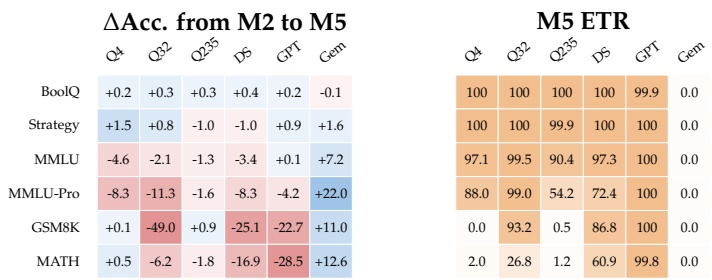</td><td></td><td></td><td></td><td></td></tr><tr><td></td><td></td><td></td><td></td><td></td><td></td><td></td></tr><tr><td></td><td></td><td></td><td></td><td></td><td></td><td></td></tr><tr><td></td><td></td><td></td><td></td><td></td><td></td><td></td></tr><tr><td></td><td></td><td></td><td></td><td></td><td></td><td></td></tr></table>

Supplementary Figure G.2: Dataset-level view of the no-thinking–performance trade-off. The left panel shows the accuracy change from native no-think (M2) to strict answer-only suppression (M5); the right panel shows the resulting M5 ETR. The plotted values are the corresponding dataset-level aggregates.

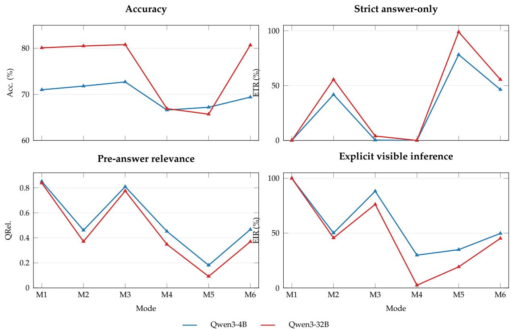  
Supplementary Figure G.1: Global six-mode profiles for local Qwen models. The plotted values are the corresponding dataset-level aggregates; EIR is averaged over the three answer-space families for each model– mode cell.

The local profile reproduces the main-text pattern: M2 raises strict answer-only compliance but leaves visible text that is question-relevant and often inferential; M3 can re-elicit this text; and M6 is non-monotonic.

Figure G.2 shows the trade-off by dataset. Read each row horizontally: the left panel is ∆Acc. from M2 to M5, and the right panel is M5 ETR.

## H Detailed Experiment Tables

The figures and tables in this section expand the compact results in Section 3. We include only reading cues that are not already covered in the main text.

Frontier native no-think behavior. Figure H.1 expands the main thinking-inertia result to Bool, MCQ, and Open across providers.

Interpretation of Figure H.1. The heatmap shows the same staircase across the three levels: native nothink compresses Bool more readily than MCQ or Open, while MCQ and Open retain both relevance and explicit inference even when the thinking interface remains off or minimal.

<table><tr><td rowspan="2"></td><td colspan="3">M2 ETR</td><td colspan="3">M2 QRel.</td><td colspan="3">M2 EIR</td></tr><tr><td>Bool</td><td>MCQ</td><td>Open</td><td>Bool</td><td>MCQ</td><td>Open</td><td>Bool</td><td>MCQ</td><td>Open</td></tr><tr><td>Qwen3-235B</td><td>86.4</td><td>24.6</td><td>0.0</td><td>.101</td><td>.604</td><td>.810</td><td>12.2</td><td>68.7</td><td>99.7</td></tr><tr><td>DeepSeek</td><td>93.2</td><td>1.1</td><td>0.0</td><td>.052</td><td>.776</td><td>.788</td><td>5.5</td><td>81.0</td><td>99.9</td></tr><tr><td>GPT</td><td>99.9</td><td>94.7</td><td>0.2</td><td>.000</td><td>.042</td><td>.814</td><td>0.0</td><td>5.3</td><td>99.5</td></tr><tr><td>Gemini</td><td>0.0</td><td>0.0</td><td>0.0</td><td>.221</td><td>.748</td><td>.762</td><td>24.2</td><td>88.9</td><td>99.7</td></tr></table>

Supplementary Figure H.1: Frontier native no-think heatmaps by answer family. The three panels report the same native M2 outputs at successive levels: strict answer-only compliance (ETR), instruction-aware pre-answer relevance (QRel.), and explicit visible inference (EIR). The staircase is visible in all three panels: Bool is easiest to compress, MCQ is intermediate, and Open retains question-relevant and inferential content across providers.

Qwen scaling across all modes. The table compares model size, mode, and dataset within a fixed model family.

Interpretation of Table H.1. Scaling improves accuracy but does not remove the answer-space structure of no-think behavior. BoolQ and StrategyQA are easiest to compress, GSM8K and MATH remain hardest, and M6 often moves back toward M2 rather than extending M5. The compact EIR comparison in Table H.2 shows the same pattern at Level 3: under both M2 and M5, Bool < MCQ < Open for all three model sizes, while M5 lowers EIR relative to M2 in every answer space.

Supplementary Table H.1: Qwen scaling comparison across modes and datasets. Blue, orange, and green shading encode Acc., ETR, and QRel., respectively; the corresponding Level 3 EIR summary is reported in Table H.2.
<table><tr><td rowspan=1 colspan=10>Mode            Dataset           Qwen3-4B           Qwen3-32B         Qwen3-235BAcc. ETR QRel. Acc. ETR QRel. Acc. ETR QRel.</td></tr><tr><td rowspan=1 colspan=1>M1 THINK-ON  BoolQ</td><td rowspan=1 colspan=1>87.4</td><td rowspan=1 colspan=1>0.0</td><td rowspan=1 colspan=1>0.800</td><td rowspan=1 colspan=1>89.2</td><td rowspan=1 colspan=1>0.0</td><td rowspan=1 colspan=1>0.795</td><td rowspan=1 colspan=1>89.2</td><td rowspan=1 colspan=1>0.0</td><td rowspan=1 colspan=1>0.794</td></tr><tr><td rowspan=1 colspan=1>StrategyQA</td><td rowspan=1 colspan=1>72.2</td><td rowspan=1 colspan=1>0.0</td><td rowspan=1 colspan=1>0.821</td><td rowspan=1 colspan=1>81.5</td><td rowspan=1 colspan=1>0.0</td><td rowspan=1 colspan=1>0.815</td><td rowspan=1 colspan=1>83.3</td><td rowspan=1 colspan=1>0.0</td><td rowspan=1 colspan=1>0.816</td></tr><tr><td rowspan=1 colspan=1>MMLU</td><td rowspan=1 colspan=1>75.2</td><td rowspan=1 colspan=1>0.0</td><td rowspan=1 colspan=1>0.853</td><td rowspan=1 colspan=1>85.3</td><td rowspan=1 colspan=1>0.0</td><td rowspan=1 colspan=1>0.835</td><td rowspan=1 colspan=1>88.3</td><td rowspan=1 colspan=1>0.0</td><td rowspan=1 colspan=1>0.853</td></tr><tr><td rowspan=1 colspan=1>MMLU-Pro</td><td rowspan=1 colspan=1>53.4</td><td rowspan=1 colspan=1>0.0</td><td rowspan=1 colspan=1>0.861</td><td rowspan=1 colspan=1>65.9</td><td rowspan=1 colspan=1>0.0</td><td rowspan=1 colspan=1>0.845</td><td rowspan=1 colspan=1>82.0</td><td rowspan=1 colspan=1>0.0</td><td rowspan=1 colspan=1>0.857</td></tr><tr><td rowspan=1 colspan=1>GSM8K</td><td rowspan=1 colspan=1>87.0</td><td rowspan=1 colspan=1>0.0</td><td rowspan=1 colspan=1>0.808</td><td rowspan=1 colspan=1>93.1</td><td rowspan=1 colspan=1>0.0</td><td rowspan=1 colspan=1>0.801</td><td rowspan=1 colspan=1>94.2</td><td rowspan=1 colspan=1>0.0</td><td rowspan=1 colspan=1>0.823</td></tr><tr><td rowspan=1 colspan=1>MATH</td><td rowspan=1 colspan=1>55.3</td><td rowspan=1 colspan=1>0.0</td><td rowspan=1 colspan=1>0.873</td><td rowspan=1 colspan=1>59.1</td><td rowspan=1 colspan=1>0.0</td><td rowspan=1 colspan=1>0.869</td><td rowspan=1 colspan=1>73.3</td><td rowspan=1 colspan=1>0.0</td><td rowspan=1 colspan=1>0.859</td></tr><tr><td rowspan=1 colspan=1>M2 THINK-OFF BoolQ</td><td rowspan=1 colspan=1>85.9</td><td rowspan=1 colspan=1>98.1</td><td rowspan=1 colspan=1>0.007</td><td rowspan=1 colspan=1>89.4</td><td rowspan=1 colspan=1>100.0</td><td rowspan=1 colspan=1>0.000</td><td rowspan=1 colspan=1>90.4</td><td rowspan=1 colspan=1>98.4</td><td rowspan=1 colspan=1>0.012</td></tr><tr><td rowspan=1 colspan=1>StrategyQA</td><td rowspan=1 colspan=1>64.9</td><td rowspan=1 colspan=1>92.3</td><td rowspan=1 colspan=1>0.058</td><td rowspan=1 colspan=1>71.3</td><td rowspan=1 colspan=1>100.0</td><td rowspan=1 colspan=1>0.000</td><td rowspan=1 colspan=1>75.4</td><td rowspan=1 colspan=1>68.9</td><td rowspan=1 colspan=1>0.231</td></tr><tr><td rowspan=1 colspan=1>MMLU</td><td rowspan=1 colspan=1>73.4</td><td rowspan=1 colspan=1>52.2</td><td rowspan=1 colspan=1>0.371</td><td rowspan=1 colspan=1>82.7</td><td rowspan=1 colspan=1>79.2</td><td rowspan=1 colspan=1>0.166</td><td rowspan=1 colspan=1>86.4</td><td rowspan=1 colspan=1>32.3</td><td rowspan=1 colspan=1>0.543</td></tr><tr><td rowspan=1 colspan=1>MMLU-Pro</td><td rowspan=1 colspan=1>56.7</td><td rowspan=1 colspan=1>33.6</td><td rowspan=1 colspan=1>0.517</td><td rowspan=1 colspan=1>69.1</td><td rowspan=1 colspan=1>38.0</td><td rowspan=1 colspan=1>0.491</td><td rowspan=1 colspan=1>77.9</td><td rowspan=1 colspan=1>16.8</td><td rowspan=1 colspan=1>0.666</td></tr><tr><td rowspan=1 colspan=1>GSM8K</td><td rowspan=1 colspan=1>89.9</td><td rowspan=1 colspan=1>0.0</td><td rowspan=1 colspan=1>0.774</td><td rowspan=1 colspan=1>93.4</td><td rowspan=1 colspan=1>0.0</td><td rowspan=1 colspan=1>0.774</td><td rowspan=1 colspan=1>95.3</td><td rowspan=1 colspan=1>0.0</td><td rowspan=1 colspan=1>0.775</td></tr><tr><td rowspan=1 colspan=1>MATH</td><td rowspan=1 colspan=1>69.1</td><td rowspan=1 colspan=1>0.0</td><td rowspan=1 colspan=1>0.849</td><td rowspan=1 colspan=1>72.3</td><td rowspan=1 colspan=1>0.0</td><td rowspan=1 colspan=1>0.846</td><td rowspan=1 colspan=1>75.9</td><td rowspan=1 colspan=1>0.0</td><td rowspan=1 colspan=1>0.844</td></tr><tr><td rowspan=1 colspan=1>M3 CoT         BoolQ</td><td rowspan=1 colspan=1>85.6</td><td rowspan=1 colspan=1>2.3</td><td rowspan=1 colspan=1>0.733</td><td rowspan=1 colspan=1>89.1</td><td rowspan=1 colspan=1>38.3</td><td rowspan=1 colspan=1>0.314</td><td rowspan=1 colspan=1>87.3</td><td rowspan=1 colspan=1>13.6</td><td rowspan=1 colspan=1>0.696</td></tr><tr><td rowspan=1 colspan=1>StrategyQA</td><td rowspan=1 colspan=1>70.3</td><td rowspan=1 colspan=1>0.4</td><td rowspan=1 colspan=1>0.800</td><td rowspan=1 colspan=1>75.7</td><td rowspan=1 colspan=1>6.0</td><td rowspan=1 colspan=1>0.640</td><td rowspan=1 colspan=1>78.9</td><td rowspan=1 colspan=1>0.6</td><td rowspan=1 colspan=1>0.763</td></tr></table>

Continued on next page

<table><tr><td rowspan=1 colspan=11>Mode            Dataset           Qwen3-4B           Qwen3-32B         Qwen3-235BAcc. ETR QRel. Acc. ETR QRel. Acc. ETR QRel.</td></tr><tr><td rowspan=1 colspan=2>MMLU</td><td rowspan=1 colspan=1>74.8</td><td rowspan=1 colspan=1>0.0</td><td rowspan=1 colspan=1>0.820</td><td rowspan=1 colspan=1>84.1</td><td rowspan=1 colspan=1>1.2</td><td rowspan=1 colspan=1>0.825</td><td rowspan=1 colspan=1>87.7</td><td rowspan=1 colspan=1>0.0</td><td rowspan=1 colspan=1>0.832</td></tr><tr><td rowspan=1 colspan=2>MMLU-Pro</td><td rowspan=1 colspan=1>57.5</td><td rowspan=1 colspan=1>0.2</td><td rowspan=1 colspan=1>0.807</td><td rowspan=1 colspan=1>68.6</td><td rowspan=1 colspan=1>0.5</td><td rowspan=1 colspan=1>0.820</td><td rowspan=1 colspan=1>78.6</td><td rowspan=1 colspan=1>0.0</td><td rowspan=1 colspan=1>0.818</td></tr><tr><td rowspan=1 colspan=2>GSM8K</td><td rowspan=1 colspan=1>90.1</td><td rowspan=1 colspan=1>0.0</td><td rowspan=1 colspan=1>0.766</td><td rowspan=1 colspan=1>94.2</td><td rowspan=1 colspan=1>0.0</td><td rowspan=1 colspan=1>0.759</td><td rowspan=1 colspan=1>95.6</td><td rowspan=1 colspan=1>0.0</td><td rowspan=1 colspan=1>0.770</td></tr><tr><td rowspan=1 colspan=2>MATH</td><td rowspan=1 colspan=1>68.6</td><td rowspan=1 colspan=1>0.0</td><td rowspan=1 colspan=1>0.850</td><td rowspan=1 colspan=1>72.5</td><td rowspan=1 colspan=1>0.0</td><td rowspan=1 colspan=1>0.848</td><td rowspan=1 colspan=1>74.9</td><td rowspan=1 colspan=1>0.0</td><td rowspan=1 colspan=1>0.844</td></tr><tr><td rowspan=1 colspan=1>M4 SOFT</td><td rowspan=1 colspan=1>BoolQ</td><td rowspan=1 colspan=1>85.9</td><td rowspan=1 colspan=1>0.2</td><td rowspan=1 colspan=1>0.318</td><td rowspan=1 colspan=1>89.5</td><td rowspan=1 colspan=1>0.0</td><td rowspan=1 colspan=1>0.319</td><td rowspan=1 colspan=1>90.1</td><td rowspan=1 colspan=1>15.3</td><td rowspan=1 colspan=1>0.275</td></tr><tr><td rowspan=1 colspan=1></td><td rowspan=1 colspan=1>StrategyQA</td><td rowspan=1 colspan=1>66.2</td><td rowspan=1 colspan=1>0.0</td><td rowspan=1 colspan=1>0.347</td><td rowspan=1 colspan=1>71.3</td><td rowspan=1 colspan=1>0.0</td><td rowspan=1 colspan=1>0.342</td><td rowspan=1 colspan=1>75.1</td><td rowspan=1 colspan=1>11.4</td><td rowspan=1 colspan=1>0.311</td></tr><tr><td rowspan=1 colspan=1></td><td rowspan=1 colspan=1>MMLU</td><td rowspan=1 colspan=1>69.6</td><td rowspan=1 colspan=1>0.0</td><td rowspan=1 colspan=1>0.372</td><td rowspan=1 colspan=1>80.4</td><td rowspan=1 colspan=1>0.0</td><td rowspan=1 colspan=1>0.346</td><td rowspan=1 colspan=1>84.4</td><td rowspan=1 colspan=1>4.9</td><td rowspan=1 colspan=1>0.358</td></tr><tr><td rowspan=1 colspan=1></td><td rowspan=1 colspan=1>MMLU-Pro</td><td rowspan=1 colspan=1>51.2</td><td rowspan=1 colspan=1>0.0</td><td rowspan=1 colspan=1>0.455</td><td rowspan=1 colspan=1>56.9</td><td rowspan=1 colspan=1>0.0</td><td rowspan=1 colspan=1>0.363</td><td rowspan=1 colspan=1>69.5</td><td rowspan=1 colspan=1>6.5</td><td rowspan=1 colspan=1>0.433</td></tr><tr><td rowspan=1 colspan=1></td><td rowspan=1 colspan=1>GSM8K</td><td rowspan=1 colspan=1>80.7</td><td rowspan=1 colspan=1>0.0</td><td rowspan=1 colspan=1>0.712</td><td rowspan=1 colspan=1>51.8</td><td rowspan=1 colspan=1>0.0</td><td rowspan=1 colspan=1>0.470</td><td rowspan=1 colspan=1>86.4</td><td rowspan=1 colspan=1>0.1</td><td rowspan=1 colspan=1>0.680</td></tr><tr><td rowspan=1 colspan=1></td><td rowspan=1 colspan=1>MATH</td><td rowspan=1 colspan=1>57.9</td><td rowspan=1 colspan=1>0.1</td><td rowspan=1 colspan=1>0.703</td><td rowspan=1 colspan=1>36.9</td><td rowspan=1 colspan=1>0.0</td><td rowspan=1 colspan=1>0.306</td><td rowspan=1 colspan=1>69.7</td><td rowspan=1 colspan=1>0.5</td><td rowspan=1 colspan=1>0.718</td></tr><tr><td rowspan=1 colspan=1>M5 STRICT</td><td rowspan=1 colspan=1>BoolQ</td><td rowspan=1 colspan=1>86.1</td><td rowspan=1 colspan=1>100.0</td><td rowspan=1 colspan=1>0.000</td><td rowspan=1 colspan=1>89.7</td><td rowspan=1 colspan=1>100.0</td><td rowspan=1 colspan=1>0.000</td><td rowspan=1 colspan=1>90.7</td><td rowspan=1 colspan=1>100.0</td><td rowspan=1 colspan=1>0.000</td></tr><tr><td rowspan=1 colspan=1></td><td rowspan=1 colspan=1>StrategyQA</td><td rowspan=1 colspan=1>66.4</td><td rowspan=1 colspan=1>100.0</td><td rowspan=1 colspan=1>0.000</td><td rowspan=1 colspan=1>72.1</td><td rowspan=1 colspan=1>100.0</td><td rowspan=1 colspan=1>0.000</td><td rowspan=1 colspan=1>74.4</td><td rowspan=1 colspan=1>99.9</td><td rowspan=1 colspan=1>0.001</td></tr><tr><td rowspan=1 colspan=1></td><td rowspan=1 colspan=1>MMLU</td><td rowspan=1 colspan=1>68.8</td><td rowspan=1 colspan=1>97.1</td><td rowspan=1 colspan=1>0.022</td><td rowspan=1 colspan=1>80.6</td><td rowspan=1 colspan=1>99.5</td><td rowspan=1 colspan=1>0.004</td><td rowspan=1 colspan=1>85.1</td><td rowspan=1 colspan=1>90.4</td><td rowspan=1 colspan=1>0.074</td></tr><tr><td rowspan=1 colspan=1></td><td rowspan=1 colspan=1>MMLU-Pro</td><td rowspan=1 colspan=1>48.4</td><td rowspan=1 colspan=1>88.0</td><td rowspan=1 colspan=1>0.092</td><td rowspan=1 colspan=1>57.8</td><td rowspan=1 colspan=1>99.0</td><td rowspan=1 colspan=1>0.008</td><td rowspan=1 colspan=1>76.3</td><td rowspan=1 colspan=1>54.2</td><td rowspan=1 colspan=1>0.358</td></tr><tr><td rowspan=1 colspan=1></td><td rowspan=1 colspan=1>GSM8K</td><td rowspan=1 colspan=1>90.0</td><td rowspan=1 colspan=1>0.0</td><td rowspan=1 colspan=1>0.765</td><td rowspan=1 colspan=1>44.4</td><td rowspan=1 colspan=1>93.2</td><td rowspan=1 colspan=1>0.052</td><td rowspan=1 colspan=1>96.2</td><td rowspan=1 colspan=1>0.5</td><td rowspan=1 colspan=1>0.776</td></tr><tr><td rowspan=1 colspan=1></td><td rowspan=1 colspan=1>MATH</td><td rowspan=1 colspan=1>69.6</td><td rowspan=1 colspan=1>2.0</td><td rowspan=1 colspan=1>0.831</td><td rowspan=1 colspan=1>66.1</td><td rowspan=1 colspan=1>26.8</td><td rowspan=1 colspan=1>0.625</td><td rowspan=1 colspan=1>74.1</td><td rowspan=1 colspan=1>1.2</td><td rowspan=1 colspan=1>0.833</td></tr><tr><td rowspan=1 colspan=1>M6 PREFIX</td><td rowspan=1 colspan=1>BoolQ</td><td rowspan=1 colspan=1>86.1</td><td rowspan=1 colspan=1>99.9</td><td rowspan=1 colspan=1>0.000</td><td rowspan=1 colspan=1>89.2</td><td rowspan=1 colspan=1>100.0</td><td rowspan=1 colspan=1>0.000</td><td rowspan=1 colspan=1>90.7</td><td rowspan=1 colspan=1>93.7</td><td rowspan=1 colspan=1>0.041</td></tr><tr><td rowspan=1 colspan=1></td><td rowspan=1 colspan=1>StrategyQA</td><td rowspan=1 colspan=1>64.9</td><td rowspan=1 colspan=1>96.8</td><td rowspan=1 colspan=1>0.026</td><td rowspan=1 colspan=1>71.5</td><td rowspan=1 colspan=1>100.0</td><td rowspan=1 colspan=1>0.000</td><td rowspan=1 colspan=1>74.1</td><td rowspan=1 colspan=1>76.1</td><td rowspan=1 colspan=1>0.184</td></tr><tr><td rowspan=1 colspan=1></td><td rowspan=1 colspan=1>MMLU</td><td rowspan=1 colspan=1>73.4</td><td rowspan=1 colspan=1>49.4</td><td rowspan=1 colspan=1>0.386</td><td rowspan=1 colspan=1>82.7</td><td rowspan=1 colspan=1>79.5</td><td rowspan=1 colspan=1>0.162</td><td rowspan=1 colspan=1>87.5</td><td rowspan=1 colspan=1>7.3</td><td rowspan=1 colspan=1>0.662</td></tr><tr><td rowspan=1 colspan=1></td><td rowspan=1 colspan=1>MMLU-Pro</td><td rowspan=1 colspan=1>57.2</td><td rowspan=1 colspan=1>32.7</td><td rowspan=1 colspan=1>0.520</td><td rowspan=1 colspan=1>69.5</td><td rowspan=1 colspan=1>37.4</td><td rowspan=1 colspan=1>0.492</td><td rowspan=1 colspan=1>77.8</td><td rowspan=1 colspan=1>2.9</td><td rowspan=1 colspan=1>0.746</td></tr><tr><td rowspan=1 colspan=1></td><td rowspan=1 colspan=1>GSM8K</td><td rowspan=1 colspan=1>91.0</td><td rowspan=1 colspan=1>0.0</td><td rowspan=1 colspan=1>0.773</td><td rowspan=1 colspan=1>93.6</td><td rowspan=1 colspan=1>0.0</td><td rowspan=1 colspan=1>0.774</td><td rowspan=1 colspan=1>96.2</td><td rowspan=1 colspan=1>0.0</td><td rowspan=1 colspan=1>0.776</td></tr><tr><td rowspan=1 colspan=2>MATH</td><td rowspan=1 colspan=1>69.2</td><td rowspan=1 colspan=1>0.0</td><td rowspan=1 colspan=1>0.849</td><td rowspan=1 colspan=1>72.4</td><td rowspan=1 colspan=1>0.0</td><td rowspan=1 colspan=1>0.844</td><td rowspan=1 colspan=1>75.2</td><td rowspan=1 colspan=1>0.0</td><td rowspan=1 colspan=1>0.845</td></tr></table>

Note. Qwen3-4B and Qwen3-32B are local native enable\_thinking runs; Qwen3-235B abbreviates Qwen3-235B-A22B and is evaluated through the provider-mediated API reasoning control. All six datasets are available for the local Qwen3-4B/32B runs, and all aggregates use the mode numbering defined in Section 2.4.

Supplementary Table H.2: Qwen scaling of the Level 3 signal. EIR is the all-output explicit-inference rate from the GPT-5.5 judge; empty T contributes zero. The compact table reports the two central no-thinking settings while the preceding longtable gives the corresponding Acc., ETR, and QRel. values by dataset.
<table><tr><td>Model</td><td>Mode</td><td>Bool</td><td>MCQ</td><td>Open</td></tr><tr><td rowspan="2">Qwen3-4B</td><td>M2 THINK-OFF</td><td>1.26%</td><td>49.30%</td><td>99.86%</td></tr><tr><td>M5 STRICT</td><td>0.00%</td><td>7.05%</td><td>97.78%</td></tr><tr><td rowspan="2">Qwen3-32B</td><td>M2 THINK-OFF</td><td>0.00%</td><td>37.11%</td><td>99.56%</td></tr><tr><td>M5 STRICT</td><td>0.00%</td><td>0.72%</td><td>56.73%</td></tr><tr><td rowspan="2">Qwen3-235B</td><td>M2 THINK-OFF</td><td>12.15%</td><td>68.70%</td><td>99.70%</td></tr><tr><td>M5 STRICT</td><td>0.00%</td><td>27.00%</td><td>98.90%</td></tr></table>

Full domain dependence view. Figure H.2 fixes the answer interface to test whether MMLU domain still affects compressibility.

Interpretation of Figure H.2. The pattern appears across multiple domains: Humanities and Social Sciences are generally easier to compress than STEM, and M6 often behaves more like M2 than M5.

<table><tr><td colspan="5">M2 ETR</td><td colspan="5">M5–M2 Acc.</td></tr><tr><td></td><td>Q4</td><td>Q32</td><td>DS</td><td>Q235</td><td></td><td>Q4</td><td>Q32</td><td>DS</td><td>Q235</td></tr><tr><td>Human.</td><td>36.8</td><td>95.5</td><td>1.7</td><td>40.6</td><td>Human.</td><td>-4.5</td><td>-0.3</td><td>-4.6</td><td>-0.6</td></tr><tr><td>Social</td><td>78.2</td><td>87.7</td><td>2.2</td><td>41.4</td><td>Social</td><td>-1.8</td><td>-0.4</td><td>-0.7</td><td>+0.6</td></tr><tr><td>STEM</td><td>34.3</td><td>36.4</td><td>0.3</td><td>6.2</td><td>STEM</td><td>-9.8</td><td>-7.3</td><td>-5.5</td><td>-0.4</td></tr><tr><td>Other</td><td>68.1</td><td>89.5</td><td>3.1</td><td>29.3</td><td>Other</td><td>-2.0</td><td>-1.3</td><td>-1.7</td><td>-1.6</td></tr></table>

Supplementary Figure H.2: MMLU domain heatmaps under the same multiple-choice answer interface. The left panel shows answer-only success under native no-think; the right panel shows the accuracy change caused by strict answer-only suppression. The full area-level control table is given in Table I.1.

## I Question-Structure Details

The analyses in this section vary the task instance while holding model family and mode fixed. These controls separate answer-support structure from surface order, candidate visibility, and numeric-source generation.

Supplementary Table I.1: Full MMLU area-level controls for the domain analysis. Each mode cell reports Acc./ETR/EIR.
<table><tr><td>Model</td><td>MMLU area</td><td>n</td><td></td><td>M1</td><td></td><td></td><td>M2</td><td></td><td></td><td>M5</td><td></td><td></td><td></td><td>M6</td><td></td></tr><tr><td>Qwen3-4B</td><td>Humanities</td><td>4705</td><td>63.7</td><td>0.1</td><td></td><td>99.9</td><td>62.5</td><td>36.8</td><td>56.6</td><td>58.0</td><td>100.0</td><td>0.0</td><td>62.8</td><td>34.6</td><td>55.7</td></tr><tr><td></td><td>Social Sciences</td><td>3077</td><td>82.8</td><td>0.5</td><td></td><td>100.0</td><td>78.7</td><td>78.2</td><td>16.2</td><td>76.9</td><td>99.8</td><td>0.2</td><td>78.1</td><td>73.6</td><td>17.3</td></tr><tr><td></td><td>STEM</td><td>3153</td><td>81.9</td><td>0.0</td><td>100.0</td><td></td><td>83.0 34.3</td><td></td><td>60.2 73.2</td><td></td><td>88.8</td><td>11.2</td><td>83.1</td><td>33.3</td><td>59.9</td></tr><tr><td></td><td>Other</td><td>3107</td><td>78.4</td><td>0.3</td><td>100.0</td><td></td><td>74.9 68.1</td><td>17.8</td><td></td><td>72.9</td><td>98.5</td><td>1.5</td><td>75.0</td><td>63.9</td><td>17.2</td></tr><tr><td>Qwen3-32B</td><td>Humanities</td><td>4705</td><td>77.3</td><td>4.5</td><td></td><td>100.0</td><td>71.6</td><td>95.5 7</td><td>4.1</td><td>71.3</td><td>100.0</td><td>0.0</td><td>71.6</td><td>94.9</td><td>4.5</td></tr><tr><td></td><td>Social Sciences</td><td>3077</td><td>90.2</td><td>1.5</td><td>100.0</td><td></td><td>88.3 87.7</td><td></td><td>10.7</td><td>87.9</td><td>100.0</td><td>0.0</td><td>88.4</td><td>88.2</td><td>10.0</td></tr><tr><td></td><td>STEM</td><td>3153</td><td>89.9</td><td>1.5</td><td>100.0</td><td></td><td>91.3 36.4</td><td></td><td>59.7</td><td>84.0</td><td>97.7</td><td>2.3</td><td>91.6</td><td>38.1</td><td>57.4</td></tr><tr><td></td><td>Other</td><td>3107</td><td>87.7</td><td>2.3</td><td>100.0</td><td></td><td>85.2</td><td>89.5 9.6</td><td>83.9</td><td></td><td>100.0</td><td>0.0</td><td>85.0</td><td>89.7</td><td>9.1</td></tr><tr><td>DeepSeek-V4-Flash</td><td>Humanities</td><td>4705</td><td>88.1</td><td>0.0</td><td></td><td>100.0</td><td>83.5</td><td>1.7</td><td>82.7</td><td>78.9</td><td>98.8</td><td>1.2</td><td>83.6</td><td>2.0 /</td><td>76.2</td></tr><tr><td></td><td>Social Sciences</td><td>3077</td><td>93.1</td><td>0.0</td><td>97.8</td><td></td><td>92.3 2.2</td><td>69.2</td><td></td><td>91.6</td><td>99.9</td><td>0.0</td><td>92.6</td><td>1.8 /</td><td>56.7</td></tr><tr><td></td><td>STEM</td><td>3153</td><td>94.8</td><td>0.0</td><td>99.2</td><td>94.4</td><td>0.3</td><td>83.5</td><td>88.9</td><td></td><td>94.7</td><td>5.2</td><td>94.4</td><td>0.4 /</td><td>79.0</td></tr><tr><td></td><td>Other</td><td>3107</td><td>91.9</td><td>0.0</td><td>99.0</td><td>90.4</td><td>3.1</td><td>55.1</td><td>88.7</td><td></td><td>99.8</td><td>0.0</td><td>90.2</td><td>2.1 /</td><td>45.4</td></tr><tr><td>Qwen3-235B</td><td>Humanities</td><td>4705</td><td>82.2</td><td>0.0</td><td></td><td>100.0</td><td>77.1 40.6</td><td></td><td>49.8</td><td>76.5</td><td>97.6</td><td>1.2</td><td>76.8</td><td>11.4</td><td>64.7</td></tr><tr><td></td><td>Social Sciences</td><td>3077</td><td>90.9</td><td>0.0</td><td></td><td>100.0</td><td>88.3 41.4</td><td></td><td>49.6</td><td>88.9</td><td>96.8 7</td><td>0.4</td><td>89.8</td><td>12.9 一</td><td>55.8</td></tr><tr><td></td><td>STEM</td><td>3153</td><td>94.0</td><td>0.0</td><td>100.0</td><td></td><td>90.6 6.2</td><td>85.5</td><td>90.2</td><td></td><td>63.3</td><td>33.1</td><td>92.5</td><td>1.2</td><td>85.1</td></tr><tr><td></td><td>Other</td><td>3107</td><td>89.1</td><td>0.0</td><td>100.0</td><td>87.6</td><td>29.3</td><td>49.8</td><td>86.0</td><td></td><td>93.2</td><td>2.9</td><td>88.1</td><td>8.9</td><td>50.7</td></tr></table>

Note. M1 is the thinking-on reference, M2 is native no-think, M5 is strict answer-only, and M6 is structural prefix forcing. Acc. measures final-answer accuracy, ETR measures strict answer-only compliance, and EIR measures visible explicit inference over all outputs. Blue, orange, and purple shading encode Acc., ETR, and EIR, respectively.

MMLU subject view. Table I.2 expands the area-level control in Table I.1 to the original MMLU subjects.

Supplementary Table I.2: Subject-level MMLU breakdown using the original MMLU supercategories. Each mode cell reports Acc./ETR; darker orange means higher ETR. Mode 1 reports Acc. only.
<table><tr><td rowspan=2 colspan=12>Qwen3-4B                                     Qwen3-32BM1       M2       M5       M6MMLU area / subject            nAcc.     Acc./ETR  Acc./ETR  Acc./ETR</td></tr><tr><td rowspan=1 colspan=5>A ACC/ETR AC/ETR AC/ETR</td></tr><tr><td></td><td rowspan=1 colspan=4>Humanities                  4705  63.7     62.5/36.8</td><td rowspan=1 colspan=1>58.0/100.0</td><td rowspan=1 colspan=1>62.8/34.6</td><td rowspan=1 colspan=5>77.3    71.6/95.5   71.3/100.0  71.6/94.9</td></tr><tr><td></td><td rowspan=1 colspan=4>formal logic                126  81.7     73.0/0.8</td><td rowspan=1 colspan=1>58.7/100.0</td><td rowspan=1 colspan=1>78.6/0.8</td><td rowspan=1 colspan=2>94.4     85.7/7.9</td><td rowspan=1 colspan=3>65.9/100.0  85.7/7.9</td></tr><tr><td></td><td rowspan=1 colspan=4>high school european history  165  77.0     78.8/55.2</td><td rowspan=1 colspan=1>75.2/100.0</td><td rowspan=1 colspan=1>80.6/53.3</td><td rowspan=1 colspan=1>87.9</td><td rowspan=1 colspan=1>84.2/91.5</td><td rowspan=1 colspan=3>84.2/100.0  83.6/90.9</td></tr><tr><td></td><td rowspan=1 colspan=4>high school us history        204  86.8     82.8/72.1</td><td rowspan=1 colspan=1>82.4/100.0</td><td rowspan=1 colspan=1>83.8/64.2</td><td rowspan=1 colspan=1>93.1</td><td rowspan=1 colspan=1>94.6/96.6</td><td rowspan=1 colspan=1>94.1/100.0</td><td></td><td rowspan=1 colspan=1>94.1/93.1</td></tr><tr><td></td><td rowspan=1 colspan=4>high school world history     237  85.7     82.7/64.6</td><td rowspan=1 colspan=1>84.0/100.0</td><td rowspan=1 colspan=1>83.1/58.2</td><td rowspan=1 colspan=1>91.6</td><td rowspan=1 colspan=1>90.7/93.7</td><td rowspan=1 colspan=1>90.3/100.0</td><td></td><td rowspan=1 colspan=1>90.3/92.0</td></tr><tr><td></td><td rowspan=1 colspan=4>international law            121  76.9     75.2/90.9</td><td rowspan=1 colspan=1>75.2/100.0</td><td rowspan=1 colspan=1>76.9/89.3</td><td rowspan=1 colspan=1>88.4</td><td rowspan=1 colspan=1>85.1/99.2</td><td rowspan=1 colspan=1>84.3/100.0</td><td></td><td rowspan=1 colspan=1>85.1/99.2</td></tr><tr><td></td><td rowspan=1 colspan=3>jurisprudence               108  79.6</td><td rowspan=1 colspan=1>75.9/80.6</td><td rowspan=1 colspan=1>77.8/100.0</td><td rowspan=1 colspan=1>77.8/72.2</td><td rowspan=1 colspan=1>86.1</td><td rowspan=1 colspan=1>84.3/97.2</td><td rowspan=1 colspan=1>86.1/100.0</td><td></td><td rowspan=1 colspan=1>86.1/98.1</td></tr><tr><td></td><td rowspan=1 colspan=1>logical fallacies</td><td rowspan=1 colspan=2>163  84.0</td><td rowspan=1 colspan=1>80.4/29.4</td><td rowspan=1 colspan=1>82.2/100.0</td><td rowspan=1 colspan=1>81.6/20.9</td><td rowspan=1 colspan=1>87.7</td><td rowspan=1 colspan=1>86.5/87.7</td><td rowspan=1 colspan=3>86.5/100.0  88.3/82.8</td></tr><tr><td></td><td rowspan=1 colspan=1>moral disputes</td><td rowspan=1 colspan=2>346  69.7</td><td rowspan=1 colspan=1>70.2/87.3</td><td rowspan=1 colspan=1>67.3/100.0</td><td rowspan=1 colspan=1>70.8/80.1</td><td rowspan=1 colspan=1>80.9</td><td rowspan=1 colspan=1>80.3/98.8</td><td rowspan=1 colspan=1>80.9/100.0</td><td rowspan=1 colspan=2>80.9/98.6</td></tr><tr><td></td><td rowspan=1 colspan=1>moral scenarios</td><td rowspan=1 colspan=2>895  61.2</td><td rowspan=1 colspan=1>55.6/0.0</td><td rowspan=1 colspan=1>36.5/100.0</td><td rowspan=1 colspan=1>53.9/0.0</td><td rowspan=1 colspan=1>73.0</td><td rowspan=1 colspan=1>58.8/100.0</td><td rowspan=1 colspan=1>58.2/100.0</td><td rowspan=1 colspan=2>58.7/100.0</td></tr><tr><td></td><td rowspan=1 colspan=1>philosophy</td><td rowspan=1 colspan=1>311</td><td rowspan=1 colspan=1>67.8</td><td rowspan=1 colspan=1>71.1/92.0</td><td rowspan=1 colspan=1>70.7/100.0</td><td rowspan=1 colspan=1>70.7/81.4</td><td rowspan=1 colspan=1>79.7</td><td rowspan=1 colspan=1>78.5/99.7</td><td rowspan=1 colspan=1>78.5/100.0</td><td rowspan=1 colspan=2>78.8/99.4</td></tr><tr><td></td><td rowspan=1 colspan=1>prehistory</td><td rowspan=1 colspan=1>324</td><td rowspan=1 colspan=1>75.6</td><td rowspan=1 colspan=1>71.3/77.8</td><td rowspan=1 colspan=1>70.7/100.0</td><td rowspan=1 colspan=1>70.7/65.4</td><td rowspan=1 colspan=1>92.0</td><td rowspan=1 colspan=1>87.0/99.7</td><td rowspan=1 colspan=1>88.3/100.0</td><td rowspan=1 colspan=2>86.7/99.1</td></tr><tr><td></td><td rowspan=1 colspan=1>professional law</td><td rowspan=1 colspan=1>1534</td><td rowspan=1 colspan=1>44.5</td><td rowspan=1 colspan=1>46.9/11.5</td><td rowspan=1 colspan=1>46.2/100.0</td><td rowspan=1 colspan=1>47.9/16.8</td><td rowspan=1 colspan=1>64.7</td><td rowspan=1 colspan=1>58.6/98.6</td><td rowspan=1 colspan=1>59.5/100.0</td><td rowspan=1 colspan=2>58.5/98.2</td></tr><tr><td></td><td rowspan=1 colspan=1>world religions</td><td rowspan=1 colspan=2>171  83.6</td><td rowspan=1 colspan=1>80.7/45.0</td><td rowspan=1 colspan=1>79.5/100.0</td><td rowspan=1 colspan=1>79.5/30.4</td><td rowspan=1 colspan=1>89.5</td><td rowspan=1 colspan=1>86.5/95.9</td><td rowspan=1 colspan=1>86.5/100.0</td><td rowspan=1 colspan=2>86.5/94.7</td></tr><tr><td></td><td rowspan=1 colspan=1>Social Sciences</td><td rowspan=1 colspan=1>3077</td><td rowspan=1 colspan=1>82.8</td><td rowspan=1 colspan=1>78.7|78.2</td><td rowspan=1 colspan=1>76.9/99.8</td><td rowspan=1 colspan=1>78.1/73.6</td><td rowspan=1 colspan=1>90.2</td><td rowspan=1 colspan=1>88.3/87.7</td><td rowspan=1 colspan=1>87.9/100.0</td><td rowspan=1 colspan=2>88.4/88.2</td></tr><tr><td></td><td rowspan=1 colspan=1>econometrics</td><td rowspan=1 colspan=1>114</td><td rowspan=1 colspan=1>59.6</td><td rowspan=1 colspan=1>65.8/39.5</td><td rowspan=1 colspan=1>61.4/100.0</td><td rowspan=1 colspan=1>59.6/36.8</td><td rowspan=1 colspan=1>76.3</td><td rowspan=1 colspan=1>78.1/33.3</td><td rowspan=1 colspan=1>73.7/100.0</td><td rowspan=1 colspan=2>77.2/40.4</td></tr><tr><td></td><td rowspan=1 colspan=1>high school geography</td><td rowspan=1 colspan=1>198</td><td rowspan=1 colspan=1>86.9</td><td rowspan=1 colspan=1>84.8/82.3</td><td rowspan=1 colspan=1>83.3/100.0</td><td rowspan=1 colspan=1>82.8/73.7</td><td rowspan=1 colspan=1>93.4</td><td rowspan=1 colspan=1>89.9/97.5</td><td rowspan=1 colspan=1>89.9/100.0</td><td rowspan=1 colspan=2>90.4/98.0</td></tr><tr><td></td><td rowspan=1 colspan=1>high school government andpolitics</td><td rowspan=1 colspan=1>193</td><td rowspan=1 colspan=1>91.7</td><td rowspan=1 colspan=1>83.4/72.5</td><td rowspan=1 colspan=1>83.4/100.0</td><td rowspan=1 colspan=1>84.5/65.3</td><td rowspan=1 colspan=1>98.4</td><td rowspan=1 colspan=1>96.9/95.9</td><td rowspan=1 colspan=1>96.4/100.0</td><td rowspan=1 colspan=2>97.4/96.9</td></tr><tr><td></td><td rowspan=1 colspan=1>high school macroeconomics</td><td rowspan=1 colspan=1>390</td><td rowspan=1 colspan=1>85.9</td><td rowspan=1 colspan=1>79.5/73.1</td><td rowspan=1 colspan=1>74.4/99.2</td><td rowspan=1 colspan=1>78.7/72.8</td><td rowspan=1 colspan=1>93.6</td><td rowspan=1 colspan=1>91.3/60.0</td><td rowspan=1 colspan=1>89.5/100.0</td><td rowspan=1 colspan=2>91.5/61.3</td></tr><tr><td></td><td rowspan=1 colspan=1>high school microeconomics</td><td rowspan=1 colspan=1>238</td><td rowspan=1 colspan=1>94.1</td><td rowspan=1 colspan=1>85.7/74.8</td><td rowspan=1 colspan=1>80.7/100.0</td><td rowspan=1 colspan=1>83.2/75.2</td><td rowspan=1 colspan=1>96.2</td><td rowspan=1 colspan=1>94.5/63.0</td><td rowspan=1 colspan=1>94.5/100.0</td><td rowspan=1 colspan=2>95.0/62.6</td></tr><tr><td></td><td rowspan=1 colspan=1>high school psychology</td><td rowspan=1 colspan=1>545</td><td rowspan=1 colspan=1>91.9</td><td rowspan=1 colspan=1>87.5/71.0</td><td rowspan=1 colspan=1>86.4/99.8</td><td rowspan=1 colspan=1>88.3/64.6</td><td rowspan=1 colspan=1>95.6</td><td rowspan=1 colspan=1>94.7/96.3</td><td rowspan=1 colspan=1>94.7/100.0</td><td></td><td rowspan=1 colspan=1>94.7/96.3</td></tr><tr><td></td><td rowspan=1 colspan=1>human sexuality</td><td rowspan=1 colspan=1>131</td><td rowspan=1 colspan=1>81.7</td><td rowspan=1 colspan=1>76.3/78.6</td><td rowspan=1 colspan=1>74.0/100.0</td><td rowspan=1 colspan=1>76.3/68.7</td><td rowspan=1 colspan=1>89.3</td><td rowspan=1 colspan=1>89.3/95.4</td><td rowspan=1 colspan=1>88.5/100.0</td><td></td><td rowspan=1 colspan=1>89.3/96.2</td></tr><tr><td></td><td rowspan=1 colspan=1>professional psychology</td><td rowspan=1 colspan=1>612</td><td rowspan=1 colspan=1>75.3</td><td rowspan=1 colspan=1>71.6/82.2</td><td rowspan=1 colspan=1>71.2/99.8</td><td rowspan=1 colspan=1>71.6/78.1</td><td rowspan=1 colspan=1>87.1</td><td rowspan=1 colspan=1>83.3/97.4</td><td rowspan=1 colspan=1>83.0/100.0</td><td></td><td rowspan=1 colspan=1>83.3/97.4</td></tr><tr><td></td><td rowspan=1 colspan=1>public relations</td><td rowspan=1 colspan=1>110</td><td rowspan=1 colspan=1>71.8</td><td rowspan=1 colspan=1>67.3/81.8</td><td rowspan=1 colspan=1>64.5/100.0</td><td rowspan=1 colspan=1>66.4/70.0</td><td rowspan=1 colspan=1>71.8</td><td rowspan=1 colspan=1>75.5/100.0</td><td rowspan=1 colspan=1>75.5/100.0</td><td></td><td rowspan=1 colspan=1>74.5/100.0</td></tr><tr><td></td><td rowspan=1 colspan=1>security studies</td><td rowspan=1 colspan=1>245</td><td rowspan=1 colspan=1>71.8</td><td rowspan=1 colspan=1>66.5/95.5</td><td rowspan=1 colspan=1>69.4/100.0</td><td rowspan=1 colspan=1>66.9/94.3</td><td rowspan=1 colspan=1>79.6</td><td rowspan=1 colspan=1>77.6/99.6</td><td rowspan=1 colspan=1>78.8/100.0</td><td></td><td rowspan=1 colspan=1>78.0/99.6</td></tr><tr><td></td><td rowspan=1 colspan=1>sociology</td><td rowspan=1 colspan=1>201</td><td rowspan=1 colspan=1>83.1</td><td rowspan=1 colspan=1>84.1/94.5</td><td rowspan=1 colspan=1>81.6/100.0</td><td rowspan=1 colspan=1>81.6/89.6</td><td rowspan=1 colspan=1>90.5</td><td rowspan=1 colspan=1>88.6/100.0</td><td rowspan=1 colspan=1>87.6/100.0</td><td></td><td rowspan=1 colspan=1>88.6/99.5</td></tr><tr><td></td><td rowspan=1 colspan=1>us foreign policy</td><td rowspan=1 colspan=1>100</td><td rowspan=1 colspan=1>81.0</td><td rowspan=1 colspan=1>82.0/89.0</td><td rowspan=1 colspan=1>78.0/100.0</td><td rowspan=1 colspan=1>84.0/80.0</td><td rowspan=1 colspan=1>92.0</td><td rowspan=1 colspan=1>89.0/99.0</td><td rowspan=1 colspan=1>90.0/100.0</td><td></td><td rowspan=1 colspan=1>89.0/98.0</td></tr><tr><td></td><td rowspan=1 colspan=1>STEM</td><td rowspan=1 colspan=1>3153</td><td rowspan=1 colspan=1>81.9</td><td rowspan=1 colspan=1>83.0/34.3</td><td rowspan=1 colspan=1>73.2/88.8</td><td rowspan=1 colspan=1>83.1/33.3</td><td rowspan=1 colspan=1>89.9</td><td rowspan=1 colspan=1>91.3/36.4</td><td rowspan=1 colspan=1>84.0/97.7</td><td></td><td rowspan=1 colspan=1>91.6/38.1</td></tr><tr><td rowspan=1 colspan=1></td><td rowspan=1 colspan=1>abstract algebra</td><td rowspan=1 colspan=1>100</td><td rowspan=1 colspan=1>72.0</td><td rowspan=1 colspan=1>73.0/0.0</td><td rowspan=1 colspan=1>57.0/97.0</td><td rowspan=1 colspan=1>77.0/0.0</td><td rowspan=1 colspan=1>90.0</td><td rowspan=1 colspan=1>92.0/0.0</td><td rowspan=1 colspan=1>72.0/100.0</td><td></td><td rowspan=1 colspan=1>92.0/0.0</td></tr><tr><td rowspan=1 colspan=1></td><td rowspan=1 colspan=1>anatomy</td><td rowspan=1 colspan=1>135</td><td rowspan=1 colspan=1>72.6</td><td rowspan=1 colspan=1>63.0/60.7</td><td rowspan=1 colspan=1>54.8/100.0</td><td rowspan=1 colspan=1>59.3/71.1</td><td rowspan=1 colspan=1>87.4</td><td rowspan=1 colspan=1>80.7/83.0</td><td rowspan=1 colspan=1>80.7/100.0</td><td></td><td rowspan=1 colspan=1>80.7/88.9</td></tr><tr><td rowspan=1 colspan=1></td><td rowspan=1 colspan=1>astronomy</td><td rowspan=1 colspan=1>152</td><td rowspan=1 colspan=1>84.9</td><td rowspan=1 colspan=1>84.9/71.1</td><td rowspan=1 colspan=1>77.6/100.0</td><td rowspan=1 colspan=1>86.2/65.1</td><td rowspan=1 colspan=1>94.1</td><td rowspan=1 colspan=1>94.7/78.9</td><td rowspan=1 colspan=1>92.8/100.0</td><td></td><td rowspan=1 colspan=1>94.1/80.9</td></tr><tr><td rowspan=1 colspan=1></td><td rowspan=1 colspan=1>college biology</td><td rowspan=1 colspan=1>144</td><td rowspan=1 colspan=1>91.7</td><td rowspan=1 colspan=1>84.7/82.6</td><td rowspan=1 colspan=1>81.9/100.0</td><td rowspan=1 colspan=1>84.0/84.7</td><td rowspan=1 colspan=1>98.6</td><td rowspan=1 colspan=1>97.2/83.3</td><td rowspan=1 colspan=1>93.8/100.0</td><td rowspan=1 colspan=2>97.9/84.7</td></tr><tr><td rowspan=1 colspan=1></td><td rowspan=1 colspan=1>college chemistry</td><td rowspan=1 colspan=1>100</td><td rowspan=1 colspan=1>51.0</td><td rowspan=1 colspan=1>63.0/27.0</td><td rowspan=1 colspan=1>52.0/100.0</td><td rowspan=1 colspan=1>60.0/25.0</td><td rowspan=1 colspan=1>67.0</td><td rowspan=1 colspan=1>71.0/14.0</td><td rowspan=1 colspan=1>66.0/100.0</td><td rowspan=1 colspan=2>73.0/21.0</td></tr><tr><td rowspan=1 colspan=1></td><td rowspan=1 colspan=1>college computer science</td><td rowspan=1 colspan=1>100</td><td rowspan=1 colspan=1>69.0</td><td rowspan=1 colspan=1>77.0/25.0</td><td rowspan=1 colspan=1>68.0/98.0</td><td rowspan=1 colspan=1>77.0/26.0</td><td rowspan=1 colspan=1>85.0</td><td rowspan=1 colspan=1>91.0/25.0</td><td rowspan=1 colspan=1>81.0/100.0</td><td rowspan=1 colspan=2>94.0/29.0</td></tr><tr><td rowspan=1 colspan=1></td><td rowspan=1 colspan=1>college mathematics</td><td rowspan=1 colspan=1>100</td><td rowspan=1 colspan=1>64.0</td><td rowspan=1 colspan=1>71.0/0.0</td><td rowspan=1 colspan=1>61.0/90.0</td><td rowspan=1 colspan=1>78.0/0.0</td><td rowspan=1 colspan=1>76.0</td><td rowspan=1 colspan=1>86.0/0.0</td><td rowspan=1 colspan=1>66.0/97.0</td><td rowspan=1 colspan=2>85.0/0.0</td></tr><tr><td rowspan=1 colspan=1></td><td rowspan=1 colspan=1>college physics</td><td rowspan=1 colspan=1>102</td><td rowspan=1 colspan=1>81.4</td><td rowspan=1 colspan=1>87.3/15.7</td><td rowspan=1 colspan=1>62.7/98.0</td><td rowspan=1 colspan=1>91.2/16.7</td><td rowspan=1 colspan=1>91.2</td><td rowspan=1 colspan=1>93.1/10.8</td><td rowspan=1 colspan=1>73.5/100.0</td><td rowspan=1 colspan=2>94.1/8.8</td></tr><tr><td rowspan=1 colspan=1></td><td rowspan=1 colspan=1>computer security</td><td rowspan=1 colspan=1>100</td><td rowspan=1 colspan=1>81.0</td><td rowspan=1 colspan=1>81.0/70.0</td><td rowspan=1 colspan=1>82.0/100.0</td><td rowspan=1 colspan=1>80.0/62.0</td><td rowspan=1 colspan=1>84.0</td><td rowspan=1 colspan=1>89.0/84.0</td><td rowspan=1 colspan=1>85.0/100.0</td><td rowspan=1 colspan=2>89.0/83.0</td></tr><tr><td rowspan=1 colspan=1></td><td rowspan=1 colspan=1>conceptual physics</td><td rowspan=1 colspan=1>235</td><td rowspan=1 colspan=1>88.1</td><td rowspan=1 colspan=1>81.3/46.4</td><td rowspan=1 colspan=1>77.0/99.6</td><td rowspan=1 colspan=1>81.3/36.2</td><td rowspan=1 colspan=1>94.9</td><td rowspan=1 colspan=1>94.5/38.7</td><td rowspan=1 colspan=1>93.2/100.0</td><td rowspan=1 colspan=2>94.0/37.9</td></tr><tr><td rowspan=1 colspan=1></td><td rowspan=1 colspan=1>electrical engineering</td><td rowspan=1 colspan=1>145</td><td rowspan=1 colspan=1>75.2</td><td rowspan=1 colspan=1>73.1/49.0</td><td rowspan=1 colspan=1>68.3/98.6</td><td rowspan=1 colspan=1>69.7/53.1</td><td rowspan=1 colspan=1>84.8</td><td rowspan=1 colspan=1>84.8/43.4</td><td rowspan=1 colspan=1>82.1/100.0</td><td rowspan=1 colspan=2>84.8/44.8</td></tr><tr><td rowspan=1 colspan=1></td><td rowspan=1 colspan=1>elementary mathematics</td><td rowspan=1 colspan=1>378</td><td rowspan=1 colspan=1>96.8</td><td rowspan=1 colspan=1>96.0/0.0</td><td rowspan=1 colspan=1>81.0/68.3</td><td rowspan=1 colspan=1>95.5/0.0</td><td rowspan=1 colspan=1>97.1</td><td rowspan=1 colspan=1>97.6/3.7</td><td rowspan=1 colspan=1>89.4/99.7</td><td rowspan=1 colspan=2>97.4/5.3</td></tr><tr><td></td><td rowspan=1 colspan=1>high school biology</td><td rowspan=1 colspan=1>310</td><td rowspan=1 colspan=1>92.6</td><td rowspan=1 colspan=1>87.4/84.5</td><td rowspan=1 colspan=1>86.8/100.0</td><td rowspan=1 colspan=1>87.7/82.9</td><td rowspan=1 colspan=1>95.8</td><td rowspan=1 colspan=1>95.2/85.8</td><td rowspan=1 colspan=1>94.8/100.0</td><td rowspan=1 colspan=2>95.5/89.4</td></tr><tr><td></td><td rowspan=1 colspan=1>high school chemistry</td><td rowspan=1 colspan=1>203</td><td rowspan=1 colspan=1>75.4</td><td rowspan=1 colspan=1>84.7/31.0</td><td rowspan=1 colspan=1>70.4/98.5</td><td rowspan=1 colspan=1>87.2/28.1</td><td rowspan=1 colspan=1>89.7</td><td rowspan=1 colspan=1>91.1/20.2</td><td rowspan=1 colspan=1>81.3/99.5</td><td rowspan=1 colspan=2>91.1/21.2</td></tr><tr><td rowspan=1 colspan=1></td><td rowspan=1 colspan=1>high school computer science</td><td rowspan=1 colspan=1>100</td><td rowspan=1 colspan=1>92.0</td><td rowspan=1 colspan=1>91.0/33.0</td><td rowspan=1 colspan=1>83.0/97.0</td><td rowspan=1 colspan=1>91.0/27.0</td><td rowspan=1 colspan=1>96.0</td><td rowspan=1 colspan=1>96.0/42.0</td><td rowspan=1 colspan=1>92.0/100.0</td><td rowspan=1 colspan=2>96.0/43.0</td></tr><tr><td rowspan=1 colspan=1></td><td rowspan=1 colspan=1>high school mathematics</td><td rowspan=1 colspan=1>270</td><td rowspan=1 colspan=1>77.4</td><td rowspan=1 colspan=1>89.6/0.0</td><td rowspan=1 colspan=1>76.3/37.4</td><td rowspan=1 colspan=1>91.1/0.0</td><td rowspan=1 colspan=1>84.4</td><td rowspan=1 colspan=1>92.2/0.0</td><td rowspan=1 colspan=1>74.8/75.6</td><td rowspan=1 colspan=2>93.0/0.0</td></tr><tr><td rowspan=1 colspan=1></td><td rowspan=1 colspan=1>high school physics</td><td rowspan=1 colspan=1>151</td><td rowspan=1 colspan=1>79.5</td><td rowspan=1 colspan=1>82.1/18.5</td><td rowspan=1 colspan=1>66.2/96.7</td><td rowspan=1 colspan=1>81.5/19.9</td><td rowspan=1 colspan=1>87.4</td><td rowspan=1 colspan=1>89.4/7.3</td><td rowspan=1 colspan=1>79.5/98.7</td><td rowspan=1 colspan=2>91.4/11.3</td></tr><tr><td rowspan=1 colspan=1></td><td rowspan=1 colspan=1>high school statistics</td><td rowspan=1 colspan=1>216</td><td rowspan=1 colspan=1>81.5</td><td rowspan=1 colspan=1>85.2/15.7</td><td rowspan=1 colspan=1>75.5/85.2</td><td rowspan=1 colspan=1>83.8/16.2</td><td rowspan=1 colspan=1>88.0</td><td rowspan=1 colspan=1>93.1/31.5</td><td rowspan=1 colspan=1>86.6/100.0</td><td rowspan=1 colspan=2>91.7/34.3</td></tr><tr><td rowspan=1 colspan=1></td><td rowspan=1 colspan=1>machine learning</td><td rowspan=1 colspan=1>112</td><td rowspan=1 colspan=1>75.9</td><td rowspan=1 colspan=1>75.0/30.4</td><td rowspan=1 colspan=1>58.0/98.2</td><td rowspan=1 colspan=1>70.5/32.1</td><td rowspan=1 colspan=1>88.4</td><td rowspan=1 colspan=1>78.6/58.9</td><td rowspan=1 colspan=1>74.1/100.0</td><td rowspan=1 colspan=2>79.5/59.8</td></tr><tr><td rowspan=1 colspan=1></td><td rowspan=1 colspan=1>Other</td><td rowspan=1 colspan=1>3107</td><td rowspan=1 colspan=1>78.4</td><td rowspan=1 colspan=1>74.9/68.1</td><td rowspan=1 colspan=1>72.9/98.5</td><td rowspan=1 colspan=1>75.0/63.9</td><td rowspan=1 colspan=1>87.7</td><td rowspan=1 colspan=1>85.2/89.5</td><td rowspan=1 colspan=1>83.9/100.0</td><td rowspan=1 colspan=2>85.0/89.7</td></tr><tr><td rowspan=1 colspan=1></td><td rowspan=1 colspan=1>business ethics</td><td rowspan=1 colspan=1>100</td><td rowspan=1 colspan=1>79.0</td><td rowspan=1 colspan=1>69.0/43.0</td><td rowspan=1 colspan=1>72.0/100.0</td><td rowspan=1 colspan=1>71.0/45.0</td><td rowspan=1 colspan=1>81.0</td><td rowspan=1 colspan=1>82.0/99.0</td><td rowspan=1 colspan=1>81.0/100.0</td><td rowspan=1 colspan=2>81.0/99.0</td></tr><tr><td rowspan=1 colspan=1></td><td rowspan=1 colspan=1>clinical knowledge</td><td rowspan=1 colspan=1>265</td><td rowspan=1 colspan=1>81.9</td><td rowspan=1 colspan=1>74.3/79.2</td><td rowspan=1 colspan=1>73.2/99.2</td><td rowspan=1 colspan=1>76.2/79.2</td><td rowspan=1 colspan=1>89.4</td><td rowspan=1 colspan=1>87.2/88.7</td><td rowspan=1 colspan=1>86.0/100.0</td><td rowspan=1 colspan=2>86.8/89.8</td></tr><tr><td rowspan=1 colspan=1></td><td rowspan=1 colspan=1>college medicine</td><td rowspan=1 colspan=1>173</td><td rowspan=1 colspan=1>79.2</td><td rowspan=1 colspan=1>78.0/62.4</td><td rowspan=1 colspan=1>75.7/99.4</td><td rowspan=1 colspan=1>80.3/63.0</td><td rowspan=1 colspan=1>83.8</td><td rowspan=1 colspan=1>85.0/67.1</td><td rowspan=1 colspan=1>81.5/100.0</td><td rowspan=1 colspan=2>82.7/68.8</td></tr><tr><td rowspan=2 colspan=1></td><td rowspan=1 colspan=1>global facts</td><td rowspan=1 colspan=1>100</td><td rowspan=1 colspan=1>47.0</td><td rowspan=1 colspan=1>44.0/73.0</td><td rowspan=1 colspan=1>41.0/100.0</td><td rowspan=1 colspan=1>43.0/27.0</td><td rowspan=1 colspan=1>58.0</td><td rowspan=1 colspan=1>59.0/99.0</td><td rowspan=1 colspan=1>57.0/100.0</td><td rowspan=1 colspan=2>58.0/99.0</td></tr><tr><td rowspan=1 colspan=1>human aging</td><td rowspan=1 colspan=1>223</td><td rowspan=1 colspan=1>71.3</td><td rowspan=1 colspan=1>68.6/82.5</td><td rowspan=1 colspan=1>68.6/100.0</td><td rowspan=1 colspan=1>69.1/66.4</td><td rowspan=1 colspan=1>84.3</td><td rowspan=1 colspan=1>82.1/100.0</td><td rowspan=1 colspan=1>83.0/100.0</td><td rowspan=1 colspan=2>81.2/100.0</td></tr><tr><td rowspan=1 colspan=1></td><td rowspan=1 colspan=1>management</td><td rowspan=1 colspan=1>103</td><td rowspan=1 colspan=1>88.3</td><td rowspan=1 colspan=1>79.6/88.3</td><td rowspan=1 colspan=1>79.6/100.0</td><td rowspan=1 colspan=1>79.6/77.7</td><td rowspan=1 colspan=1>90.3</td><td rowspan=1 colspan=1>88.3/100.0</td><td rowspan=1 colspan=1>87.4/100.0</td><td rowspan=1 colspan=2>88.3/99.0</td></tr><tr><td rowspan=1 colspan=1></td><td rowspan=1 colspan=1>marketing</td><td rowspan=1 colspan=1>234</td><td rowspan=1 colspan=1>88.9</td><td rowspan=1 colspan=1>87.2/85.9</td><td rowspan=1 colspan=1>86.8/100.0</td><td rowspan=1 colspan=1>86.8/82.9</td><td rowspan=1 colspan=1>93.6</td><td rowspan=1 colspan=1>93.6/98.7</td><td rowspan=1 colspan=1>93.6/100.0</td><td rowspan=1 colspan=2>93.6/98.3</td></tr><tr><td rowspan=1 colspan=1></td><td rowspan=1 colspan=2>medical genetics             100</td><td rowspan=1 colspan=1>85.0</td><td rowspan=1 colspan=1>82.0/67.0</td><td rowspan=1 colspan=1>76.0/100.0</td><td rowspan=1 colspan=1>79.0/69.0</td><td rowspan=1 colspan=1>97.0</td><td rowspan=1 colspan=1>96.0/89.0</td><td rowspan=1 colspan=1>95.0/100.0</td><td rowspan=1 colspan=2>96.0/87.0</td></tr><tr><td rowspan=1 colspan=1></td><td rowspan=1 colspan=1>miscellaneous</td><td rowspan=1 colspan=1>783</td><td rowspan=1 colspan=1>86.5</td><td rowspan=1 colspan=1>83.1/50.2</td><td rowspan=1 colspan=1>81.1/99.9</td><td rowspan=1 colspan=1>83.9/43.2</td><td rowspan=1 colspan=1>94.4</td><td rowspan=1 colspan=1>91.3/91.7</td><td rowspan=1 colspan=1>90.5/100.0</td><td rowspan=1 colspan=2>91.1/92.7</td></tr><tr><td rowspan=1 colspan=1></td><td rowspan=1 colspan=1>nutrition</td><td rowspan=1 colspan=1>306</td><td rowspan=1 colspan=1>77.1</td><td rowspan=1 colspan=1>73.5/83.7</td><td rowspan=1 colspan=1>70.9/99.7</td><td rowspan=1 colspan=1>72.2/80.1</td><td rowspan=1 colspan=1>91.8</td><td rowspan=1 colspan=1>85.3/94.1</td><td rowspan=1 colspan=1>85.3/100.0</td><td rowspan=1 colspan=2>85.0/95.1</td></tr><tr><td rowspan=1 colspan=1></td><td rowspan=1 colspan=1>professional accounting</td><td rowspan=1 colspan=1>282</td><td rowspan=1 colspan=1>71.6</td><td rowspan=1 colspan=1>69.5/41.1</td><td rowspan=1 colspan=1>62.4/85.1</td><td rowspan=1 colspan=1>66.3/45.0</td><td rowspan=1 colspan=1>85.5</td><td rowspan=1 colspan=1>80.9/56.4</td><td rowspan=1 colspan=1>72.3/100.0</td><td rowspan=1 colspan=2>81.9/54.3</td></tr><tr><td rowspan=1 colspan=1></td><td rowspan=1 colspan=1>professional medicine</td><td rowspan=1 colspan=1>272</td><td rowspan=1 colspan=1>80.9</td><td rowspan=1 colspan=1>76.8/83.8</td><td rowspan=1 colspan=1>74.6/100.0</td><td rowspan=1 colspan=1>76.8/95.2</td><td rowspan=1 colspan=1>93.0</td><td rowspan=1 colspan=1>91.2/94.9</td><td rowspan=1 colspan=1>89.3/100.0</td><td rowspan=1 colspan=2>91.2/95.2</td></tr><tr><td rowspan=1 colspan=1></td><td rowspan=1 colspan=3>virology                    166  47.0</td><td rowspan=1 colspan=1>48.8/88.0</td><td rowspan=1 colspan=1>48.8/100.0</td><td rowspan=1 colspan=1>49.4/80.1</td><td rowspan=1 colspan=1>55.4</td><td rowspan=1 colspan=1>51.8/98.2</td><td rowspan=1 colspan=1>56.0/100.0</td><td rowspan=1 colspan=2>53.6/97.0</td></tr></table>

Note. Area labels follow the MMLU paper’s four supercategories: Humanities, Social Sciences, STEM, and Other. The rows below each area list the original MMLU subjects in that area. Color encodes ETR only; accuracy is printed numerically.

Interpretation of Table I.2. The subject-level rows show the same split: quantitative subjects are harder to compress, while many fact-like subjects reach high ETR without the same accuracy cost.

Surface perturbations. Table I.3 checks whether the MMLU pattern can be explained by label names or option order.

Supplementary Table I.3: MMLU surface perturbations with the answer set fixed. Deltas are relative to the base version; darker colored cells indicate larger absolute changes.
<table><tr><td>Model</td><td>Mode</td><td>Variant</td><td>Acc.</td><td>ETR</td><td>QRel.</td><td>∆Acc.</td><td>ΔETR</td><td>∆QRel.</td><td>Cons.</td></tr><tr><td>Qwen3-4B</td><td>Mode 2</td><td>base</td><td>74.2</td><td>53.0</td><td>0.369</td><td></td><td></td><td></td><td></td></tr><tr><td></td><td></td><td>choice shuffle</td><td>72.3</td><td>52.7</td><td>0.372</td><td>-1.9</td><td>-0.3</td><td>+0.003</td><td>82.5</td></tr><tr><td></td><td></td><td>numeric labels</td><td>73.4</td><td>45.0</td><td>0.426</td><td>-0.8</td><td>-8.0</td><td>+0.057</td><td>89.9</td></tr><tr><td></td><td>Mode 5</td><td>base</td><td>68.9</td><td>97.0</td><td>0.023</td><td></td><td></td><td></td><td></td></tr><tr><td></td><td></td><td>choice shuffle</td><td>67.0</td><td>96.8</td><td>0.024</td><td>-1.9</td><td>-0.1</td><td>+0.001</td><td>80.7</td></tr><tr><td></td><td></td><td>numeric labels</td><td>68.5</td><td>96.8</td><td>0.024</td><td>-0.4</td><td>-0.1</td><td>+0.001</td><td>93.0</td></tr><tr><td></td><td>Mode 6 base</td><td></td><td>74.5</td><td>49.9</td><td>0.385</td><td></td><td></td><td></td><td></td></tr><tr><td></td><td></td><td>choice shuffle</td><td>72.5</td><td>50.4</td><td>0.383</td><td>-2.0</td><td>+0.5</td><td>-0.002</td><td>81.8</td></tr><tr><td></td><td></td><td>numeric labels</td><td>73.2</td><td>45.6</td><td>0.414</td><td>-1.2</td><td>-4.3</td><td>+0.029</td><td>88.7</td></tr><tr><td>Qwen3-32B</td><td>Mode 2</td><td>base</td><td>82.4</td><td>79.6</td><td>0.164</td><td></td><td></td><td></td><td></td></tr><tr><td></td><td></td><td>choice shuffle</td><td>82.1</td><td>79.0</td><td>0.168</td><td>-0.3</td><td>-0.6</td><td>+0.004</td><td>90.2</td></tr><tr><td></td><td></td><td>numeric labels</td><td>82.0</td><td>84.2</td><td>0.126</td><td>-0.4</td><td>+4.6</td><td>-0.038</td><td>95.8</td></tr><tr><td></td><td>Mode 5</td><td>base</td><td>79.8</td><td>99.4</td><td>0.005</td><td></td><td></td><td></td><td></td></tr><tr><td></td><td></td><td>choice shuffle</td><td>79.0</td><td>99.4</td><td>0.005</td><td>-0.8</td><td>+0.0</td><td>+0.000</td><td>88.3</td></tr><tr><td></td><td></td><td>numeric labels</td><td>78.5</td><td>99.5</td><td>0.004</td><td>-1.3</td><td>+0.1</td><td>-0.001</td><td>94.7</td></tr><tr><td></td><td>Mode 6</td><td>base</td><td>82.4</td><td>79.6</td><td>0.162</td><td></td><td></td><td></td><td></td></tr><tr><td></td><td></td><td>choice shuffle</td><td>82.0</td><td>79.1</td><td>0.165</td><td>-0.4</td><td>-0.5</td><td>+0.003</td><td>90.1</td></tr><tr><td></td><td></td><td>numeric labels</td><td>81.8</td><td>84.3</td><td>0.125</td><td>-0.6</td><td>+4.7</td><td>-0.037</td><td>95.1</td></tr></table>

Interpretation of Table I.3. The modest shifts in Acc./ETR/QRel. and the high consistency argue against a label-name or option-order explanation.

Candidate visibility. Table I.4 rewrites MMLU items as yes/no verification with one candidate answer shown.

Supplementary Table I.4: MMLU boolean verification with a proposed answer shown. Darker cells indicate larger metric values or larger changes from MCQ.
<table><tr><td></td><td></td><td colspan="3">MCQ base</td><td colspan="4">Boolean verification</td><td colspan="2">Change</td></tr><tr><td>Model</td><td>Mode</td><td>Acc.</td><td>ETR</td><td>QRel.</td><td>Acc.</td><td>ETR QRel.</td><td>Pos.</td><td>Neg.</td><td>∆Acc.</td><td>∆QRel.</td></tr><tr><td>Qwen3-4B</td><td>Mode 1</td><td>77.6</td><td>0.1</td><td>0.852</td><td>80.0</td><td>65.6 0.833</td><td>82.4</td><td>77.6</td><td>+2.4</td><td>-0.019</td></tr><tr><td></td><td>Mode 2</td><td>75.0</td><td>52.8</td><td>0.370 73.5</td><td>67.2</td><td>0.235</td><td>65.5</td><td>81.6</td><td>-1.5</td><td>-0.135</td></tr><tr><td></td><td>Mode 5</td><td>69.4</td><td>97.0 0.023</td><td>69.1</td><td>100.0</td><td>0.000</td><td>52.9</td><td>85.2</td><td>-0.3</td><td>-0.023</td></tr><tr><td></td><td>Mode 6</td><td>74.6</td><td>50.4 0.382</td><td>72.9</td><td>76.8</td><td>0.179</td><td>63.9</td><td>81.8</td><td>-1.7</td><td>-0.203</td></tr><tr><td>Qwen3-32B</td><td>Mode 1</td><td>86.2</td><td>3.1</td><td>0.835</td><td>84.6</td><td>94.8 0.822</td><td>88.4</td><td>80.9</td><td>-1.6</td><td>-0.013</td></tr><tr><td></td><td>Mode 2</td><td>82.6</td><td>79.9 0.162</td><td>81.2</td><td>96.9</td><td>0.026</td><td>81.1</td><td>81.2</td><td>-1.4</td><td>-0.136</td></tr><tr><td></td><td>Mode 5</td><td>80.0 99.6</td><td>0.004</td><td>80.6</td><td>100.0</td><td>0.000</td><td>80.3</td><td>80.8</td><td>+0.5</td><td>-0.004</td></tr><tr><td></td><td>Mode 6</td><td>82.5 80.4</td><td>0.155</td><td>81.2</td><td>96.8</td><td>0.026</td><td>81.2</td><td>81.0</td><td>-1.3</td><td>-0.129</td></tr></table>

Interpretation of Table I.4. Under no-think conditions, ETR rises and QRel. falls, but the Pos./Neg. split shows that the model is not simply agreeing with every proposal.

Removing options from numeric-source items. Table I.5 tests the effect of removing the visible candidate set while keeping the answer source numeric.

Supplementary Table I.5: Matched numeric-source items under MCQ, boolean verification, and open generation. Darker cells indicate larger open-generation values or larger Open–MCQ accuracy drops.
<table><tr><td></td><td></td><td colspan="3">MCQ</td><td colspan="3">Bool verification</td><td colspan="5">Open numeric</td><td>Drop</td></tr><tr><td>Model</td><td>Mode</td><td>Acc.</td><td>ETR</td><td>QRel.</td><td>Acc.</td><td>ETR</td><td>QRel.</td><td>Acc.</td><td>ETR</td><td>QRel.</td><td>Parse</td><td>Exact</td><td>Open-MCQ</td></tr><tr><td>Qwen3-4B</td><td>Mode 1</td><td>66.8</td><td>0.0</td><td>0.832</td><td>82.0</td><td>13.5</td><td>0.847</td><td>40.6</td><td>0.0</td><td>0.841</td><td>99.6</td><td>38.3</td><td>-26.2</td></tr><tr><td></td><td>Mode 2</td><td>72.1</td><td>3.7</td><td>0.760</td><td>81.2</td><td>12.1</td><td>0.722</td><td>50.3</td><td>0.0</td><td>0.811</td><td>97.0</td><td>47.2</td><td>-21.8</td></tr><tr><td></td><td>Mode 5</td><td>53.8</td><td>63.4</td><td>0.281</td><td>60.4</td><td>99.4</td><td>0.005</td><td>48.6</td><td>13.4</td><td>0.678</td><td>98.0</td><td>45.8</td><td>-5.2</td></tr><tr><td></td><td>Mode 6</td><td>72.0</td><td>1.4</td><td>0.771</td><td>81.6</td><td>12.9</td><td>0.717</td><td>50.6</td><td>0.0</td><td>0.811</td><td>97.9</td><td>47.5</td><td>-21.4</td></tr><tr><td>Qwen3-32B</td><td>Mode 1</td><td>72.7</td><td>0.2</td><td>0.821</td><td>81.2</td><td>44.8</td><td>0.841</td><td>43.9</td><td>0.0</td><td>0.832</td><td>99.8</td><td>41.6</td><td>-28.9</td></tr><tr><td></td><td>Mode 2</td><td>77.8</td><td>10.5</td><td>0.709</td><td>78.9</td><td>62.5</td><td>0.314</td><td>52.6</td><td>0.0</td><td>0.810</td><td>98.0</td><td>49.0</td><td>-25.2</td></tr><tr><td></td><td>Mode 5</td><td>52.9</td><td>94.1</td><td>0.046</td><td>69.6</td><td>100.0</td><td>0.000</td><td>40.4</td><td>82.7</td><td>0.119</td><td>98.0</td><td>38.0</td><td>-12.4</td></tr><tr><td></td><td>Mode 6</td><td>78.2</td><td>10.8</td><td>0.707</td><td>78.9</td><td>62.5</td><td>0.315</td><td>52.3</td><td>0.0</td><td>0.811</td><td>98.1</td><td>48.9</td><td>-25.9</td></tr></table>

Interpretation of Table I.5. Once options disappear, the model has to generate the value rather than choose it. Under strict answer-only pressure, this either brings back question-relevant pre-answer content, reflected in higher QRel., or costs accuracy. Parse and Exact separate generation from parsing effects.