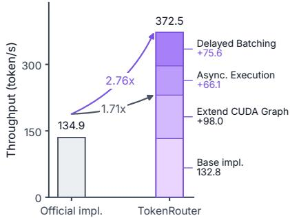
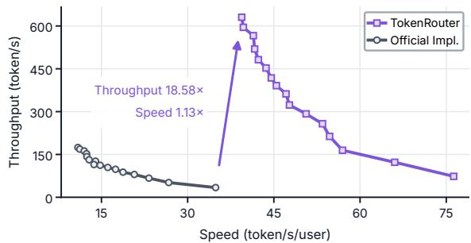
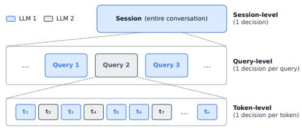
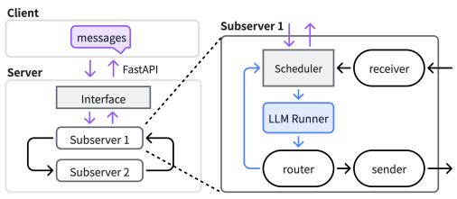
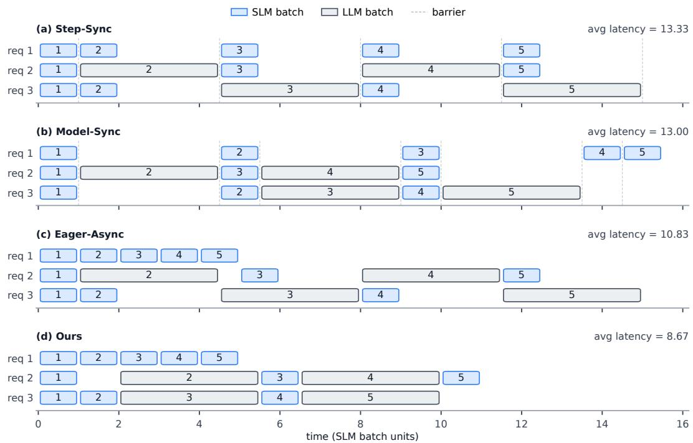
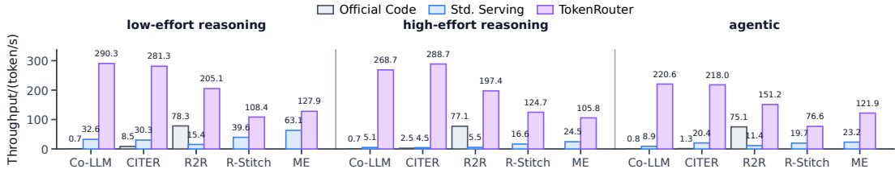
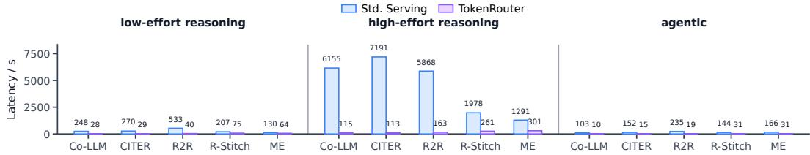
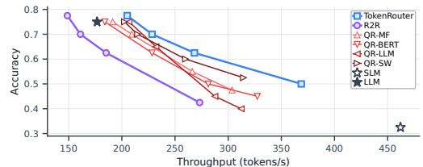
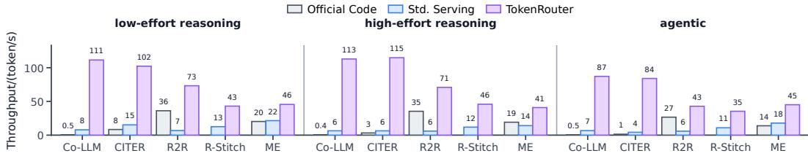
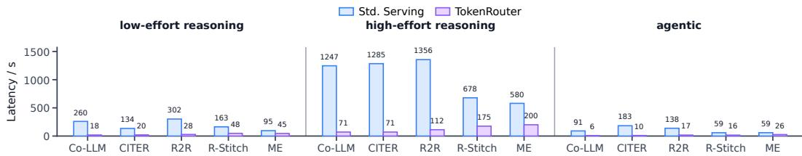

# TokenRouter: Efficient Serving System for Token-Level LLM Routing

Tianyu Fu<sup>∗1</sup>, Tengxuan Liu<sup>∗1</sup>, Ruoxi Wang<sup>1</sup>, Yixin Dong<sup>2</sup>, Yi Ge<sup>1</sup>, Yichen You<sup>1</sup>, Yu Wang<sup>†</sup> <sup>1</sup>

<sup>1</sup>Tsinghua University <sup>2</sup>Carnegie Mellon University

## Abstract

Large language model (LLM) routing distributes inference work across different models, advancing the cost-quality Pareto frontier of LLM serving. While coarse-grained routing at the session or query level has been widely adopted in production systems, recent algorithmic work shows that fine-grained token-level routing can yield substantial efficiency and quality gains. However, efficiently serving token-level routed inference poses significant challenges to existing systems. Built on single-LLM assumptions, current systems suffer from severe step desynchronization and frequent batch admission delays under token-level routing, and they also impose high implementation complexity on developers. To address these challenges, we design TokenRouter, an efficient and developer-friendly serving system for token-level routed LLM inference. TokenRouter follows the principle of request-centric programming, model-centric execution: developers describe routing logic from the perspective of a single request, while the runtime launches a subserver for each LLM and dispatches requests asynchronously. Each subserver employs a delayed-batching scheduler, whose optimal hyperparameters are derived from a mathematical throughput model of the system. Across diverse routing algorithms, workloads, and model pairs, TokenRouter achieves 2.01–64.15× higher decoding throughput than existing systems, substantially advancing the serving efficiency of token-level LLM routing. Our code is available at https://github.com/thu-nics/TokenRouter.

  
(a) Throughput gain breakdown.

  
(b) Throughput–speed trade-off.  
Figure 1: TokenRouter improves serving efficiency for token-level routing. (a) At concurrency 8, engineering optimizations yield a 1.71× throughput gain, and TokenRouter achieves 2.76× overall, relative to the official R2R implementation. (b) Throughput–speed trade-off. TokenRouter achieves 18.58× higher throughput than R2R under a stricter SLO.

## 1 Introduction

Large language models (LLMs) have demonstrated strong capabilities across a wide range of applications. To meet diverse demands, modern LLMs vary in size and domain expertise, showing different latencies and capabilities. To exploit this diversity and improve the cost-quality Pareto frontier of LLM inference, model routing has emerged as a common serving paradigm.

Coarse-grained routing at session or query level is already widely used in production LLM serving systems. For example, commercial systems, such as ChatGPT [1] and Cursor [2], direct each user query to different backend models based on predicted difficulty or topic. Academic systems such as RouteLLM [3] also show that query-level routing can achieve strong intelligence at a lower cost with preference data. However, in these systems, once a request is routed, the response is generated entirely by a single model until the next round.

Recent algorithmic work shows that routing at the finer token level can unlock benefits that query-level routing cannot reach [4–12]. On the efficiency side, token-level routing exploits the sharp variation in generation difficulty within a single query. For example, R2R [5] can match a 32B model’s quality while routing only 5% of tokens to the 32B model and decoding the rest with a 1.5B model, versus routing around 40% of queries to the 32B model. On the quality side, token-level routing allows models with complementary expertise to collaborate in a single response, surpassing the generation quality of any single LLM [9, 11, 13]. It also provides smooth control over the entire cost-quality trade-off, rather than the few discrete operating points imposed by coarser routing granularities.

However, existing LLM serving systems lack efficient support for token-level routing. Current systems such as SGLang [14] and vLLM [15] are designed for single-LLM serving, where all active requests are synchronous at each decoding step. Token-level routing breaks this assumption by allowing the target LLM to change at every decoding step, creating three main challenges. First, step desynchronization. Different LLMs differ widely in per-step latency. Keeping requests in a single batch synchronized forces every step to wait for the slowest model, leaving the faster models idle. Second, batch admission delay. Because token-level routing causes frequent model switches, a routed request often arrives while its target model is still processing a previous batch. It must then wait to be admitted into the next batch, creating bubbles and fragmenting batches. Third, implementation complexity. Current serving systems expose no programming interface for per-step routing decisions. Implementing token-level routing inside these systems therefore requires extensive modifications to a large codebase. The routing logic must also be carefully coordinated with tightly coupled features such as continuous batching and prefix caching.

To address these challenges, we propose TokenRouter, an efficient and developer-friendly serving system for token-level LLM routing. The key design principle is request-centric programming, model-centric execution: developers describe a routing algorithm by tracing how a single request flows across cooperating LLMs, while TokenRouter handles efficient serving through asynchronous model-centric subservers. This separation hides the system complexity of routing serving from developers and gives the runtime full control to optimize cross-model execution and batch scheduling. For the user client, TokenRouter exposes a single external interface, allowing it to serve as a drop-in replacement for standard single-LLM servers. Our main contributions are summarized as follows.

• Request-centric programming interface. We provide a route-send-receive interface that lets developers express diverse token-level routing algorithms by simply tracing how a single request moves across cooperating LLMs.

• Asynchronous execution for serving optimization. We propose decoupled tri-loop execution that addresses step desynchronization across cooperating LLMs, with a handoff-resume mechanism to simplify inter-model switches.

• Delayed batching for scheduling optimization. We propose a delayed-batching scheduler that reduces average batch admission latency, with optimal hyperparameters derived from a throughput-based mathematical model.

TokenRouter brings a high-efficiency LLM serving framework to the token-routing community, turning theoretical benefits into real-world speedups over mature single-LLM serving systems. Experiments across different algorithms, workloads, and model pairs show a 2.01–64.15× throughput boost over existing implementations.

  
(a) Routing levels in LLM serving.

  
(b) TokenRouter system architecture.  
Figure 2: (a) Routing granularities in LLM serving. Token-level routing allows decisions at each token, whereas session- or query-level routing binds an entire request to one model. (b) TokenRouter’ model-centric runtime. Each cooperating LLM is hosted by an autonomous subserver that implements three user-defined routing functions (route, send, receive) and runs three decoupled scheduler loops, shown in purple (client-server), blue (decoding), and black (inter-model). The Server Interface exposes a single external endpoint to the client.

## 2 Related Work

Model routing. Model routing distributes requests across candidate LLMs to improve efficiency or quality. Most methods operate at the session or query level, choosing models for entire requests or conversation turns. Efficiency-oriented routers typically send easier requests to cheaper models under a quality constraint [3, 16–21], while quality-oriented routers select the expert best suited to each request and may combine model outputs to surpass any single LLM [22–25]. This coarse granularity lets production serving stacks [1] reuse standard single-LLM batching and scheduling. TokenRouter instead targets token-level routing, which requires coordinating model switches within a response.

Token-level routing. Token-level routing selects a model for each token or short span, enabling collaboration in a single response. Efficiency-oriented methods invoke larger models for difficult tokens or segments, using trained lightweight routers [5, 6, 8, 12, 26] or heuristic signals such as confidence and entropy [27, 28]. Quality-oriented methods combine model expertise by accepting expert tokens [7, 10] or fusing output distributions [9, 11]. Despite different policies, these methods share an execution lifecycle: select next model, transfer the request state, and receive its tokens or distributions to continue generation. This lifecycle motivates TokenRouter’s route-send-receive programming interface.

LLM serving systems. Modern LLM serving systems accelerate inference through continuous batching [29], paged KV-cache management [15], and efficient structured generation runtimes [14]. These techniques work well for single-model decoding, where each request stays with one model and advances at that model’s pace. Speculative decoding also uses multiple models, but couples draft generation and target verification in a predictable pattern [30–32]. Token-level routing instead allows data-dependent model switches at each token, leading to irregular model-local arrivals and fragmented batches. TokenRouter addresses these dynamics with a model-centric runtime that hosts each model as an autonomous subserver, preserving continuous batching and prefix caching locally.

## 3 Programming Interface

To provide a simple and general programming interface, TokenRouter abstracts diverse token-level routing algorithms with three main components: route, send, and receive. These components allow developers to describe when a request should switch models, what state should be transferred, and how returned tokens should be accepted. Section 3.1 explains the design principle behind this interface, and Section 3.2 presents the concrete API, followed by an example in Section 3.3.

## 3.1 Principle: Sequential Request-centric Programming

TokenRouter is designed to support diverse token-level routing algorithms while keeping their implementation simple and intuitive. Although TokenRouter executes requests through an asynchronous, model-centric runtime, developers should not need to reason about low-level batching, scheduling, or asynchronous execution. Instead, they should only describe a routing algorithm by tracing how a single request moves among cooperating LLMs.

Therefore, we revisit the common lifecycle of a request in token-level routing algorithms. A request first enters an entry model and performs a decoding step. After the forward pass, an algorithm-specific router decides whether the request should continue locally or be delegated to another model. If the request is delegated, the current model gathers the necessary context, such as the latest generated tokens, and sends it to the target model. The target model receives the request, continues decoding, and repeats the same route-send-receive process. This lifecycle can be written as:

receive → decode → route → send → peer receive → peer decode → peer route → · · · .

Based on this observation, TokenRouter lets developers implement token-level routing algorithms by filling in only three components: route, send, and receive. Developers program the algorithm from a simple request-centric view, while the TokenRouter runtime executes it with model-centric subservers. This request-centric programming, model-centric execution abstraction is the key principle behind TokenRouter’s programming interface.

## 3.2 Core Interface

We now detail the three components that developers implement in TokenRouter.

route (result) is called after each decoding step of an LLM. It determines a destination index for each request in the batch based on the forward-pass result such as hidden states, next-token logits, and sampled tokens. A destination of 0 means that the request continues decoding locally, while a nonzero destination points to the corresponding peer model.

send (req) is called when route delegates a request. It returns a customized PeerReq message that carries the request ID, the suffix of tokens that the peer model has not yet seen, a status field indicating whether the request is still active or has terminated, and any algorithm-specific fields needed by the receiver. A position anchor req.loc is also attached to indicate the decoding position before the PeerReq is sent. The receiver can use this anchor to determine the minimal suffix that should be sent back. The exact token suffix is algorithm-dependent. For example, a scheduler may exclude or include the just-sampled token depending on whether the peer should regenerate it.

receive (peer\_req) is called when a PeerReq arrives from a peer model. It converts the PeerReq to the local request format so that the receiver model can continue decoding. By default, receive commits all transferred tokens from the PeerReq, which is sufficient for most token-level routing algorithms. Developers only need to override receive when the handoff semantics are algorithm-specific. For example, an algorithm may attach additional state before resuming decoding.

## 3.3 Running Examples

Figure 3 shows an example of the interface for the small-model side of R-Stitch [27]. The SLM delegates high-entropy tokens to the LLM, while the LLM sends low-entropy tokens back.

Table 1 summarizes the routing behavior of the five token-level routing algorithms evaluated in this work. Despite using different routing signals, each is expressible with route function. For CITER, R2R, and Co-LLM, Model i invokes Model j upon detecting an uncertain token, while Model j returns control after generating one token. R-Stitch instead adopts a symmetric design, where the two models switch control based on token entropy. ME further generalizes token-level routing to more than two models, selecting the next model after every token according to the ensemble weights.

## 4 System Design

This section presents TokenRouter’s model-centric runtime, which aims to efficiently serve tokenrouted inference. Section 4.1 first gives an overview of the system architecture. Section 4.2 addresses step desynchronization through asynchronous tri-loop execution and a handoff-resume mechanism. Section 4.3 addresses batch admission delay with delayed batching, which trades a small waiting time for larger same-model batches. Our implementation builds on SGLang [14]; Appendix B and Appendix C describe more routing-specific engineering optimizations.

```prolog
class RStitchSLM(BaseRouter):
# self.tau (threshold) and self.peer_idx (LLM subserver index) come from the config.
def route(self, result):
# Delegate high-entropy tokens to the LLM peer; keep the rest local.
probs = result.logits_output.next_token_logits.softmax(dim=-1)
entropy = -(probs * probs.log()).sum(-1) / math.log(probs.shape[-1])
destination = torch.zeros_like(entropy, dtype=torch.long)
destination[entropy > self.tau] = self.peer_idx
return destination.cpu()
def send(self, req) -> PeerReq:
# Drop the just-decoded uncertain token; ask the LLM to regenerate.
token_ids = req.origin_input_ids + req.output_ids[:-1]
peer_anchor = req.peer_locs[self.peer_idx] or 0
return PeerReq(rid=req.rid, token_ids=token_ids[peer_anchor:],
loc=len(token_ids), finished=req.finished(), ...)
# receive falls back to the default and accepts all returned tokens.
```  
Figure 3: Small-model side of the R-Stitch [27] in TokenRouter. route sends high-entropy tokens to the large model and keeps low-entropy tokens local. send excludes the uncertain token and transfers only the peer-unseen suffix, letting the large model regenerate from that position. receive uses the default accept-all conversion for returned large-model tokens. The large-model side is identical, except that > is replaced by <= in route to dispatch low-entropy tokens to the SLM.

Table 1: Routing behavior of the evaluated token-level routing algorithms. Each entry under Model i or Model j specifies the condition under which that model routes generation to another model.
<table><tr><td>Algorithm</td><td>#Models</td><td>Model i</td><td>Model j</td><td></td></tr><tr><td>CITER [12]</td><td>2</td><td>low-confidence token</td><td>after one token</td><td rowspan="4"></td></tr><tr><td>R2R [5]</td><td>2</td><td>predicted-divergent token</td><td>after one token</td></tr><tr><td>R-Stitch [27]</td><td>2</td><td>high-entropy token</td><td>low-entropy token</td></tr><tr><td>Co-LLM [10]</td><td>2</td><td>high-deferral token</td><td>after one token</td></tr><tr><td>ME [33]</td><td>≥2</td><td>after every token, according to ensemble weights</td><td></td></tr></table>

## 4.1 System Overview

TokenRouter’s runtime is organized as multiple subservers behind a single external interface, as shown in Figure 2. Internally, each subserver hosts one candidate LLM. It owns a scheduler, an LLM runner with a private KV-cache pool, and three user-defined functions to construct the router, sender, and receiver. Subservers progress independently and communicate through peer requests. Their identical internal layout makes it easy to scale to more LLMs by launching additional subservers.

Externally, TokenRouter exposes a single server interface, which receives client requests and forwards them to a designated entry subserver. The client-side protocol is therefore identical to that of standard single-LLM servers such as vLLM [15] and SGLang [14], regardless of how many LLMs participate in routing behind the interface. This design allows TokenRouter to serve as a drop-in replacement for existing single-LLM servers.

## 4.2 Efficient Serving with Asynchronous Execution

TokenRouter addresses the step desynchronization challenge by adding a decoupled inter-model loop and a handoff-resume mechanism on top of the model-centric architecture. Figure 4(a) illustrates the desynchronization problem that arises when token-level routing directly follows the synchronous design of single-LLM serving systems. If requests at the same logical decoding step are synchronized, the whole batch must wait for the slowest model.

Modern serving systems also support speculative decoding, but its two models run in a tightly coupled, periodic pattern, whereas token-level routing invokes random model access. Forcing routing algorithms to mimic speculative decoding serving would also incur severe idle time (Figure 4(b)). To avoid global synchronization, TokenRouter adopts an asynchronous design (Figure 4(c, d)).

  
Figure 4: Scheduling strategies of token-level routing. (a) Step-Sync sets step barriers; the next step starts only after all models finish the current one. (b) Model-Sync runs one model at a time; the inactive model’s requests stall. (c) Eager-Async processes peer requests immediately, causing large batch admission delay. (d) TokenRouter preserves asynchronous scheduling but delays LLM requests until enough same-model requests accumulate, amortizing the cost across a wider batch.

Decoupled tri-loop execution. To support inter-model handoff, TokenRouter extends the standard execution structure of single-LLM serving with an additional decoupled loop. As shown in Figure 2, a standard server has two asynchronous loops: a client-server loop (purple) for request admission and response streaming, and a decoding loop (blue) for request scheduling and model execution. TokenRouter adds a third decoupled loop, the inter-model loop (black), to send and receive peer requests between subservers. This third loop allows a routed request to leave the local batch and resume when the peer request returns. While the routed request is being processed by the peer model, the remaining local requests continue executing at the pace of the local decoding loop. When the peer request returns, the scheduler admits the resumed request back into the local batch. Thus, each subserver progresses at its own pace, while routed requests move asynchronously across models.

Handoff and resume across models. TokenRouter designs a handoff and resume mechanism for the decoupled inter-model loop. The naive handoff treats a returning request as a fresh call, which redoes prefix matching and KV-cache allocation, incurring unnecessary costs. To deal with this, TokenRouter introduces a pending state, an intermediate status between the two standard states running and finished. A pending request is skipped by the scheduler, but its serving state is preserved. At handoff, the routed request is marked as pending. Upon resumption, pending is toggled to running orfinished according to the peer’s output. If not finished, TokenRouter appends new tokens to the request and admits it into the local batch as if it had never left. By skipping prefix matching and KV reallocation, handoff-resume reduces inter-model transitions to little more than a token append.

## 4.3 Efficient Scheduling with Delayed Batching

While asynchronous execution removes synchronization across subservers, each subserver still needs a scheduling policy that handles sparse and irregular routed-token arrivals. We define batch admission delay as the waiting time between a request’s arrival at a subserver and the start of its execution.

Figure 4(c) illustrates the issue under eager asynchronous scheduling. If a subserver starts a new decoding step as soon as any peer request arrives, requests that arrive while the model is already processing a batch cannot be admitted until that step finishes. For example, request 3’s token 3 cannot start until the LLM finishes decoding request $2 \mathrm { { } s }$ token 2, incurring the admission delay from time 2 to time 4.5. Because token-level routing causes frequent model switches and high per-step latency variance, such admission stalls occur repeatedly and lead to fragmented batching.

Delayed-batching scheduler. To reduce admission delay, we propose a delayed-batching scheduler. The key idea is to wait for a short, controlled interval so that more requests targeting the same model can be executed together. Specifically, the scheduler buffers received requests and launches a batch only when the buffer size reaches a threshold B. Figure 4(d) shows an example where the LLM subserver uses $B = 2 .$ , while the SLM subserver uses $B = 1$ . Although an early-arriving request waits longer than under eager-async in Figure $4 ( \mathrm { c } ) ,$ , later-arriving requests can be admitted with much less waiting, so the workload’s average batch admission delay drops.

Throughput-optimal threshold. TokenRouter analytically determines the throughput-optimal delayed-batching threshold $B ^ { * }$ . This requires balancing a strict trade-off: too small B causes large batch admission delay, while too large B traps requests in the queue and starves the SLM of active work. We model the routing process as a Discrete-Time Markov Chain (DTMC). Given a token-level routing algorithm, concurrency N, routing probability P, and per-step decoding latency $L _ { i }$ of each LLM, our model derives the throughput as a function of B and searches the threshold $B ^ { * }$ that maximizes the throughput. Full details are provided in Appendix D.

## 5 Experiment

## 5.1 Setup

Token-level routing algorithms. We evaluate five token-level routing algorithms in TokenRouter, namely CITER [12], R2R [5], R-Stitch [27], Co-LLM [10], and ME [33]. CITER, R2R, R-Stitch, and Co-LLM route between Qwen3-0.6B and Qwen3-32B [34], while ME routes among Qwen3-0.6B, Qwen3-8B, and Qwen3-32B. For CITER, we train the router and set $\tau = 0 . 9 8$ . For R2R, we use the official router and threshold. For R-Stitch, we set $\tau = 0 . 0 3$ . For Co-LLM, we fine-tune Qwen3-0.6B and set $\eta = 0 . 1 5$ . For ME, we set the ensemble weight to 0.5, 0.3, and 0.2. We also evaluate each algorithm using the model pair and the dataset from its original paper, as summarized in Table 4.

Hardware. All experiments run on an 8×A100-80G GPU server. For two-model algorithms, the small model is deployed on one GPU and the large model on two GPUs with tensor parallelism, with two models sharing two GPUs via CUDA MPS. For ME, each model is deployed on one GPU.

Baselines. We compare TokenRouter against two baselines. Official Code refers to the algorithm’s released implementation, available for all but R-Stitch (whose code is not released). Among these, Co-LLM uses a per-model vLLM [15] server with continuous batching, while CITER and R2R are inference engines without continuous batching. Std. Serving is a standard SGLang-based baseline that we build for a fair comparison. It uses one SGLang server per LLM; each server returns one token at a time, and an external dispatcher routes each token between servers.

Workloads. We evaluate three workloads spanning different input/output lengths. (1) For Low-effort reasoning (short input, short output), we use AIME2024 [35] prompts (∼100 tokens) with a maximum output length of 2,048. (2) For High-effort reasoning (short input, long output), we use AIME2024 prompts with a maximum output length to 8,192, keeping only problems whose Qwen3-32B solutions exceed 8,192 tokens. (3) For Agentic tasks (multi-turn), we use SWE-Smith [36] trajectories of around 8,192 input tokens with a maximum output length of 1,024.

Metrics. We report the throughput and the end-to-end request completion latency. For inference engines, we form a batch of N requests and process the batch. For serving systems, we launch N workers, each of which issues a new request as soon as the previous one completes. We measure throughput as the total number of generated output tokens divided by elapsed time.

## 5.2 Serving Efficiency

As shown in Figure 5 and 6, across all 15 algorithm–workload combinations, TokenRouter consistently outperforms the baselines, improving throughput by 2.01–64.15× compared with the stronger baseline. TokenRouter also reduces the end-to-end latency of Std. Serving by 2.03–63.64×. Although Std. Serving substantially improves upon the official Co-LLM and CITER implementations through asynchronous execution, it lacks TokenRouter’s handoff-and-resume mechanism. Consequently, the serving state of a routed request cannot be preserved across model switches, and each returning token must be treated as a new request. This incurs substantial overhead for operations such as prefix matching and KV-cache updates. We further break down the per-step latency of Std. Serving to quantify this overhead in Table 10.

  
Figure 5: Throughput (token/s) comparison across serving systems at concurrency 4.

  
Figure 6: Latency (s) comparison across serving systems at concurrency 4.

TokenRouter also scales gracefully with output length. When we compare low-effort and high-effort reasoning workloads (max output 2,048 vs. 8,192 tokens), TokenRouter’s throughput holds steady while Std. Serving loses 58.1–85.2% of its throughput.

When evaluated on the original settings of the token-level routing algorithms, as shown in Table 2, TokenRouter reduces latency by 2.78–21.61× over the official implementations while substantially improving throughput by 2.73–21.97×. These results show that TokenRouter efficiently supports diverse token-level routing algorithms under their original algorithmic settings.

Throughput–Speed Trade-off. Figure 1b evaluates the trade-off between throughput and per-user speed as the concurrency increases from 1 to 16. When the concurrency increases from 1 to 16, TokenRouter’s throughput increases by 8.61×, while retaining 51.7% of its single-user speed. In contrast, official R2R reaches only 5.14× and retains 31.3% of its single-user speed. Notably, at concurrency 16, TokenRouter achieves 18.58× higher throughput than official R2R at concurrency 1, while still providing 1.13× higher per-user speed. This means that, TokenRouter delivers substantially higher throughput even under a stricter per-user speed Service Level Objective (SLO).

## 5.3 Ablation Study

We briefly summarize the conclusions of the ablation study here, with details in Appendix A.2.

Gain breakdown. Figure 1a breaks down TokenRouter’s throughput at concurrency 8. Engineering optimizations with extended CUDA graphs raise throughput from the base implementation’s 132.78 to 230.79 token/s, or 1.71× the official R2R implementation (134.9 token/s). Asynchronous execution and delayed batching further increase throughput to 296.86 and 372.48 token/s, respectively, reaching 2.76× overall. Table 6 provides additional ablations at concurrency 1 and 4.

Effect of model pairs. Table 3 evaluates TokenRouter against the most competitive R2R system baseline across diverse model pairs. Compared with the official implementation of R2R, TokenRouter achieves 1.99–3.21× throughput improvement across different model pairs. These results suggest that TokenRouter’s optimizations are effective across different SLM and LLM scales.

Table 2: TTFT, throughput, and end-to-end latency at concurrency 4, comparing across serving systems under original settings.
<table><tr><td>Algorithm</td><td>Implementation</td><td>Throughput/(token/s)</td><td>TTFT/s</td><td>Latency/s</td></tr><tr><td rowspan="3">R2R</td><td>LLM-only</td><td>145.30</td><td>0.13</td><td>411.98</td></tr><tr><td>Official Code</td><td>89.62</td><td>0.11</td><td>751.15</td></tr><tr><td>TokenRouter</td><td>244.56</td><td>0.11</td><td>270.19</td></tr><tr><td rowspan="3">CITER</td><td>LLM-only</td><td>123.72</td><td>0.083</td><td>2.68</td></tr><tr><td>Official Code</td><td>17.16</td><td>0.036</td><td>7.64</td></tr><tr><td>TokenRouter</td><td>149.31</td><td>0.036</td><td>0.48</td></tr><tr><td rowspan="3">Co-LLM</td><td>LLM-only</td><td>134.79</td><td>0.069</td><td>13.39</td></tr><tr><td>Official Code</td><td>3.46</td><td>1.14</td><td>247.61</td></tr><tr><td>TokenRouter</td><td>76.02</td><td>0.067</td><td>11.46</td></tr><tr><td rowspan="3">R-Stitch</td><td>LLM-only</td><td>150.41</td><td>0.15</td><td>360.76</td></tr><tr><td>Official Code</td><td>N/A</td><td>N/A</td><td>N/A</td></tr><tr><td>TokenRouter</td><td>140.58</td><td>0.067</td><td>151.30</td></tr></table>

<table><tr><td>SLM</td><td>LLM</td><td>R2R</td><td>TokenRouter</td><td>Gain</td></tr><tr><td>0.6B</td><td>8B</td><td>105.1</td><td>336.98</td><td>3.21×</td></tr><tr><td>0.6B</td><td>32B</td><td>77.08</td><td>197.40</td><td>2.56×</td></tr><tr><td>1.7B</td><td>8B</td><td>103.37</td><td>285.41</td><td>2.76×</td></tr><tr><td>4B</td><td>8B</td><td>106.67</td><td>211.81</td><td>1.99×</td></tr></table>

Table 3: R2R vs. TokenRouter across SLM-LLM pairs. Throughput is reported in token/s.  
  
Figure 7: Throughput–accuracy trade-off. QR denotes query-level routing from RouteLLM.

Parallel strategy. Table 7 shows that increasing LLM tensor parallelism size is vital for throughput, while the SLM tensor parallelism size has little effect. Thus, unless otherwise specified, we set LLM tensor parallelism size to 2 and SLM tensor parallelism size to 1.

## 5.4 Advancing the Pareto Frontier

We evaluate the throughput-accuracy trade-off of TokenRouter, the official R2R implementation, and query-level routing baselines on AMC23, using the Qwen3-0.6B and Qwen3-32B pair with greedy decoding and a maximum output length of 8,192 tokens. All requests are sent concurrently; throughput is computed per request as output tokens divided by elapsed time; and SLM/LLM memory fractions are held equal across systems for a fair comparison. Figure 7 shows that TokenRouter shifts token-level routing to a new Pareto frontier, making fine-grained routing more competitive than coarse-grained routing on state-of-the-art frameworks such as SGLang.

## 6 Conclusion

We presented TokenRouter, an efficient serving system for token-level LLM routing that decouples routing algorithms from serving-system optimization. TokenRouter lets developers express routing semantics through a request-centric route-send-receive interface, while the runtime handles asynchronous model-centric execution. We overcome the step desynchronization and batch admission delay challenges for efficient serving with asynchronous execution and the delayed-batching scheduler. Across routing algorithms, workloads, and model pairs, TokenRouter consistently achieves 2.01– 64.15× higher decoding throughput than existing implementations, providing a strong foundation for future token-routing research.

Limitation and future work. Our mathematical model assumes that the number of tokens between two consecutive sends follows an geometric distribution, which holds for most token-level routing algorithms. Handling corner cases that violate this assumption is left for future work.

## Acknowledgments and Disclosure of Funding

This work was supported by National Natural Science Foundation of China (No. 62325405, 62104128, U19B2019, U21B2031, 61832007, 62204164, 92364201), Tsinghua EE Xilinx AI Research Fund, and Beijing National Research Center for Information Science and Technology (BNRist). We thank for all the support from Infinigence-AI.

## References

[1] Aaditya Singh, Adam Fry, Adam Perelman, Adam Tart, Adi Ganesh, Ahmed El-Kishky, Aidan McLaughlin, Aiden Low, AJ Ostrow, Akhila Ananthram, et al. Openai gpt-5 system card. arXiv preprint arXiv:2601.03267, 2025.

[2] Cursor Team. Introducing cursor router. https://cursor.com/blog/router, July 2026. Accessed: 2026-07-25.

[3] Isaac Ong, Amjad Almahairi, Vincent Wu, Wei-Lin Chiang, Tianhao Wu, Joseph E Gonzalez, M Waleed Kadous, and Ion Stoica. Routellm: Learning to route llms with preference data. arXiv preprint arXiv:2406.18665, 2024.

[4] Tianyu Fu, Yichen You, Zekai Chen, Guohao Dai, Huazhong Yang, and Yu Wang. Think-at-hard: Selective latent iterations to improve reasoning language models. arXiv preprint arXiv:2511.08577, 2025.

[5] Tianyu Fu, Yi Ge, Yichen You, Enshu Liu, Zhihang Yuan, Guohao Dai, Shengen Yan, Huazhong Yang, and Yu Wang. R2r: Efficiently navigating divergent reasoning paths with small-large model token routing. arXiv preprint arXiv:2505.21600, 2025.

[6] Chengsong Huang, Tong Zheng, Langlin Huang, Jinyuan Li, Haolin Liu, and Jiaxin Huang. Relayllm: Efficient reasoning via collaborative decoding. arXiv preprint arXiv:2601.05167, 2026.

[7] Lifeng Jin, Baolin Peng, Linfeng Song, Haitao Mi, Ye Tian, and Dong Yu. Collaborative decoding of critical tokens for boosting factuality of large language models. arXiv preprint arXiv:2402.17982, 2024.

[8] Siteng Liao, Yuzhu Liang, Hengzhong Rao, Xizhao Luo, and Tian Wang. Alpharouter: Token-level routing between slm and llm with reinforcement learning and tree search. In Forty-third International Conference on Machine Learning, 2026.

[9] Arushi Rai, Qiang Zhang, Hanqing Zeng, Yunkai Zhang, Dipesh Tamboli, Xiangjun Fan, and Zhuokai Zhao. Taro: Token-level adaptive routing for llm test-time alignment. arXiv preprint arXiv:2603.18411, 2026.

[10] Zejiang Shen, Hunter Lang, Bailin Wang, Yoon Kim, and David Sontag. Learning to decode collaboratively with multiple language models. In Proceedings of the 62nd Annual Meeting of the Association for Computational Linguistics (Volume 1: Long Papers), pages 12974–12990, 2024.

[11] Nuoya Xiong, Yuhang Zhou, Hanqing Zeng, Zhaorun Chen, Furong Huang, Shuchao Bi, Lizhu Zhang, and Zhuokai Zhao. Token-level llm collaboration via fusionroute. arXiv preprint arXiv:2601.05106, 2026.

[12] Wenhao Zheng, Yixiao Chen, Weitong Zhang, Souvik Kundu, Yun Li, Zhengzhong Liu, Eric P Xing, Hongyi Wang, and Huaxiu Yao. Citer: Collaborative inference for efficient large language model decoding with token-level routing. arXiv preprint arXiv:2502.01976, 2025.

[13] Tianyu Fu, Zihan Min, Hanling Zhang, Jichao Yan, Guohao Dai, Wanli Ouyang, and Yu Wang. Cache-tocache: Direct semantic communication between large language models. arXiv preprint arXiv:2510.03215, 2025.

[14] Lianmin Zheng, Liangsheng Yin, Zhiqiang Xie, Chuyue Sun, Jeff Huang, Cody H Yu, Shiyi Cao, Christos Kozyrakis, Ion Stoica, Joseph E Gonzalez, et al. Sglang: Efficient execution of structured language model programs. Advances in neural information processing systems, 37:62557–62583, 2024.

[15] Woosuk Kwon, Zhuohan Li, Siyuan Zhuang, Ying Sheng, Lianmin Zheng, Cody Hao Yu, Joseph Gonzalez, Hao Zhang, and Ion Stoica. Efficient memory management for large language model serving with pagedattention. In Proceedings of the 29th symposium on operating systems principles, pages 611–626, 2023.

[16] Lingjiao Chen, Matei Zaharia, and James Zou. Frugalgpt: How to use large language models while reducing cost and improving performance, 2023. URL https://arxiv.org/abs/2305.05176.

[17] Dujian Ding, Ankur Mallick, Chi Wang, Robert Sim, Subhabrata Mukherjee, Victor Ruhle, Laks V. S. Lakshmanan, and Ahmed Hassan Awadallah. Hybrid llm: Cost-efficient and quality-aware query routing, 2024. URL https://arxiv.org/abs/2404.14618.

[18] Pranjal Aggarwal, Aman Madaan, Ankit Anand, Srividya Pranavi Potharaju, Swaroop Mishra, Pei Zhou, Aditya Gupta, Dheeraj Rajagopal, Karthik Kappaganthu, Yiming Yang, Shyam Upadhyay, Manaal Faruqui, and Mausam Mausam. Automix: Automatically mixing language models. In A. Globerson, L. Mackey, D. Belgrave, A. Fan, U. Paquet, J. Tomczak, and C. Zhang, editors, Advances in Neural Information Processing Systems, volume 37, pages 131000–131034. Curran Associates, Inc., 2024. doi: 10.52202/079017-4164. URL https://proceedings.neurips.cc/paper\_files/paper/2024/ file/ecda225cb187b40ea8edc1f46b03ffda-Paper-Conference.pdf.

[19] Zesen Zhao, Shuowei Jin, and Z. Morley Mao. Eagle: Efficient training-free router for multi-llm inference, 2024. URL https://arxiv.org/abs/2409.15518.

[20] Qitian Jason Hu, Jacob Bieker, Xiuyu Li, Nan Jiang, Benjamin Keigwin, Gaurav Ranganath, Kurt Keutzer, and Shriyash Kaustubh Upadhyay. Routerbench: A benchmark for multi-llm routing system, 2024. URL https://arxiv.org/abs/2403.12031.

[21] Zhongzhan Huang, Guoming Ling, Yupei Lin, Yandong Chen, Shanshan Zhong, Hefeng Wu, and Liang Lin. Routereval: A comprehensive benchmark for routing llms to explore model-level scaling up in llms, 2025. URL https://arxiv.org/abs/2503.10657.

[22] Keming Lu, Hongyi Yuan, Runji Lin, Junyang Lin, Zheng Yuan, Chang Zhou, and Jingren Zhou. Routing to the expert: Efficient reward-guided ensemble of large language models, 2023. URL https://arxiv. org/abs/2311.08692.

[23] Tao Feng, Yanzhen Shen, and Jiaxuan You. Graphrouter: A graph-based router for llm selections, 2025. URL https://arxiv.org/abs/2410.03834.

[24] Junlin Wang, Jue Wang, Ben Athiwaratkun, Ce Zhang, and James Zou. Mixture-of-agents enhances large language model capabilities, 2024. URL https://arxiv.org/abs/2406.04692.

[25] Hongjin Su, Shizhe Diao, Ximing Lu, Mingjie Liu, Jiacheng Xu, Xin Dong, Yonggan Fu, Peter Belcak, Hanrong Ye, Hongxu Yin, Yi Dong, Evelina Bakhturina, Tao Yu, Yejin Choi, Jan Kautz, and Pavlo Molchanov. Toolorchestra: Elevating intelligence via efficient model and tool orchestration, 2025. URL https://arxiv.org/abs/2511.21689.

[26] Yash Akhauri, Anthony Fei, Chi-Chih Chang, Ahmed F AbouElhamayed, Yueying Li, and Mohamed S Abdelfattah. Splitreason: Learning to offload reasoning. arXiv preprint arXiv:2504.16379, 2025.

[27] Zhuokun Chen, Zeren Chen, Jiahao He, Lu Sheng, Mingkui Tan, Jianfei Cai, and Bohan Zhuang. R-stitch: Dynamic trajectory stitching for efficient reasoning. arXiv preprint arXiv:2507.17307, 2025.

[28] Wenhao Zeng, Xuteng Zhang, Yuling Shi, Chao Hu, Yuting Chen, Beijun Shen, and Xiaodong Gu. Glimprouter: Efficient collaborative inference by glimpsing one token of thoughts. arXiv preprint arXiv:2601.05110, 2026.

[29] Gyeong-In Yu, Joo Seong Jeong, Geon-Woo Kim, Soojeong Kim, and Byung-Gon Chun. Orca: A distributed serving system for Transformer-Based generative models. In 16th USENIX Symposium on Operating Systems Design and Implementation (OSDI 22), pages 521–538, Carlsbad, CA, July 2022. USENIX Association. ISBN 978-1-939133-28-1. URL https://www.usenix.org/conference/ osdi22/presentation/yu.

[30] Yaniv Leviathan, Matan Kalman, and Yossi Matias. Fast inference from transformers via speculative decoding, 2023. URL https://arxiv.org/abs/2211.17192.

[31] Tianle Cai, Yuhong Li, Zhengyang Geng, Hongwu Peng, Jason D. Lee, Deming Chen, and Tri Dao. Medusa: Simple llm inference acceleration framework with multiple decoding heads, 2024. URL https: //arxiv.org/abs/2401.10774.

[32] Yuhui Li, Fangyun Wei, Chao Zhang, and Hongyang Zhang. Eagle: Speculative sampling requires rethinking feature uncertainty, 2025. URL https://arxiv.org/abs/2401.15077.

[33] Jiale Fu, Yuchu Jiang, Peijun Wu, Chonghan Liu, Joey Tianyi Zhou, and Xu Yang. Rethinking llm ensembling from the perspective of mixture models. arXiv preprint arXiv:2605.00419, 2026.

[34] An Yang, Anfeng Li, Baosong Yang, Beichen Zhang, Binyuan Hui, Bo Zheng, Bowen Yu, Chang Gao, Chengen Huang, Chenxu Lv, et al. Qwen3 technical report. arXiv preprint arXiv:2505.09388, 2025.

[35] AIME. American invitational mathematics examination, 2025. URL https://artofproblemsolving. com/.

[36] John Yang, Kilian Lieret, Carlos E Jimenez, Alexander Wettig, Kabir Khandpur, Yanzhe Zhang, Binyuan Hui, Ofir Press, Ludwig Schmidt, and Diyi Yang. Swe-smith: Scaling data for software engineering agents. arXiv preprint arXiv:2504.21798, 2025.

[37] Alon Talmor, Jonathan Herzig, Nicholas Lourie, and Jonathan Berant. Commonsenseqa: A question answering challenge targeting commonsense knowledge. In Proceedings ofthe 2019 Conference ofthe North American Chapter ofthe Associationfor Computational Linguistics: Human Language Technologies, Volume 1 (Long and Short Papers), pages 4149–4158, 2019.

[38] Karl Cobbe, Vineet Kosaraju, Mohammad Bavarian, Mark Chen, Heewoo Jun, Lukasz Kaiser, Matthias Plappert, Jerry Tworek, Jacob Hilton, Reiichiro Nakano, et al. Training verifiers to solve math word problems. arXiv preprint arXiv:2110.14168, 2021.

Table 4: Model pairs and benchmarks used by different token-level routing algorithms.
<table><tr><td>System</td><td>Model Pair</td><td>Benchmark</td></tr><tr><td>R2R</td><td>DeepSeek-R1-Distill-Qwen-1.5B / 32B</td><td>AIME [35]</td></tr><tr><td>CITER</td><td>Qwen2-1.5B / 72B</td><td>CommonsenseQA [37]</td></tr><tr><td>Co-LLM</td><td>LLaMA2-7B (tuned) / 70B</td><td>GSM8K [38]</td></tr><tr><td>R-Stitch</td><td>L1-1.5B-Short / QwQ-32B</td><td>AIME [35]</td></tr></table>

  
Figure 8: Throughput (token/s) comparison across serving systems at concurrency 1.

  
Figure 9: Latency (s) comparison across serving systems at concurrency 1.

## A Additional Experiment Results

## A.1 Additional Concurrency

Figure 8 and 9 compare different implementations of five token-level routing algorithms across three workloads at concurrency 1. TokenRouter consistently outperforms standard serving in all settings, achieving 2.12–19.74× higher throughput and a 2.12–18.83× latency speedup; it also provides 1.60–19.74× higher throughput than the stronger available baseline between the official code and standard serving.

As shown in Table 5, under the original settings of each token-level routing algorithm at concurrency 1, TokenRouter consistently improves serving efficiency over the official implementations. It achieves 1.93–10.20× higher throughput and reduces end-to-end latency by 2.30–10.09× for R2R, CITER, and Co-LLM, while maintaining comparable TTFT.

## A.2 Additional Ablation Study

Gain breakdown. We break down the throughput gains of TokenRouter to quantify the contribution of each optimization. As shown in Table 6, enabling CUDA graphs improves the throughput by 1.88–2.12×. On top of these gains, asynchronous execution and delayed batching further improve throughput by 1.12× and 1.31×, respectively, at concurrency 4. These results demonstrate that TokenRouter’s overall performance gain stems from the combined benefits of these optimizations.

Parallel strategy. Table 7 studies how tensor-parallelism (TP) configurations for the SLM and LLM affect throughput. Taking the two-GPU setting as an example, increasing the LLM TP size from 1 to 2 improves throughput by 40.6% at N = 1 and 22.8% at N = 4. In contrast, once the LLM uses TP size 2, further increasing the SLM TP size from 1 to 2 brings only 0.8% and 0.4% throughput improvements, respectively. This indicates that additional TP resources are substantially more beneficial to the LLM than to the SLM. Therefore, we prioritize tensor parallelism for the LLM and serve the SLM with TP size 1 by default throughout the paper.

Table 5: TTFT, throughput, and end-to-end latency at concurrency 1, comparing across serving systems under original settings.
<table><tr><td>Algorithm</td><td>Implementation</td><td>Throughput/(token/s)</td><td>TTFT/s</td><td>Latency/s</td></tr><tr><td rowspan="3">R2R</td><td>LLM-only</td><td>40.17</td><td>0.074</td><td>388.12</td></tr><tr><td>Official Code</td><td>54.77</td><td>0.12</td><td>330.69</td></tr><tr><td>TokenRouter</td><td>105.81</td><td>0.11</td><td>144.10</td></tr><tr><td rowspan="3">CITER</td><td>LLM-only</td><td>34.40</td><td>0.055</td><td>2.42</td></tr><tr><td>Official Code</td><td>14.26</td><td>0.031</td><td>2.41</td></tr><tr><td>TokenRouter</td><td>50.63</td><td>0.031</td><td>0.36</td></tr><tr><td rowspan="3">Co-LLM</td><td>LLM-only</td><td>36.06</td><td>0.049</td><td>12.66</td></tr><tr><td>Official Code</td><td>2.80</td><td>0.34</td><td>76.68</td></tr><tr><td>TokenRouter</td><td>28.57</td><td>0.068</td><td>7.60</td></tr><tr><td rowspan="3">R-Stitch</td><td>LLM-only</td><td>40.82</td><td>0.072</td><td>341.84</td></tr><tr><td>Official Code</td><td>N/A</td><td>N/A</td><td>N/A</td></tr><tr><td>TokenRouter</td><td>55.78</td><td>0.102</td><td>119.29</td></tr></table>

Table 6: Ablation study of different optimization components. Throughput is reported in token/s.
<table><tr><td>Method</td><td> $N = 8$   $N = 4$   $N = 1$ </td></tr><tr><td>TokenRouter</td><td>372.48 210.61 73.02</td></tr><tr><td>- Delayed batching - Async execution - Router CUDA graph</td><td>296.86 161.26 73.02 230.79 143.88 73.02 228.10 142.33 72.62</td></tr><tr><td>- LLM CUDA graph</td><td>164.08 95.55 51.22</td></tr><tr><td>- SLM CUDA graph (≈ R2R) R2R official code</td><td>132.78 75.54 34.20 134.89 73.27 36.17</td></tr></table>

## A.3 Additional Deployment Configurations

## A.3.1 Non-overlapping GPU Deployment

We deploy Qwen3-0.6B (1 GPU) and Qwen3-32B (TP=2, 2 GPUs) on separate GPUs, so that the LLM in token-routing uses the same resources as the LLM-only baseline. This configuration improves the throughput of TokenRouter by 6.43% on average compared with the original overlapping setting.

## A.3.2 Cross-node Deployment

We evaluate TokenRouter under cross-node deployment setups. Specifically, we deploy Qwen3-0.6B (1 GPU) and Qwen3-32B (2 GPUs, TP=2) on one or two nodes and test the throughput under the low-effort reasoning setup. The two nodes are connected via RoCE at 3.7 GB/s. As shown in Table 9, cross-node throughput is comparable to single-node throughput with the same computational resources, translating to 1.93–32.81× improvements over the respective official implementations.

## A.4 Latency Breakdown of the Std. Serving Baseline

To understand the gap over the CUDA-graph-enabled Std. Serving baseline, we profile the average SLM-side runtime per decoding step over the final 128 steps of a 2,048-token generation. As shown in Table 10, the majority of latency is attributed to prefix matching and RadixCache maintenance. This overhead stems from the single-model assumption in Std. Serving, where each returning request is treated as a new extend operation from the user side, incurring repeated prefix matching and KV-cache bookkeeping. In contrast, TokenRouter preserves the request-level KV-cache state across model handoffs and directly resumes execution when peer results return, thereby substantially reducing such overhead.

Table 7: Throughput across parallel strategies. Throughput is reported in token/s.
<table><tr><td colspan="4">Total #SLM #LLM</td></tr><tr><td rowspan="3">2</td><td>1</td><td>1</td><td>Overlap X</td><td>N=1 N=4 50.37 160.74</td></tr><tr><td>1</td><td></td><td>√</td><td>70.83 197.40</td></tr><tr><td>2</td><td>2 2</td><td>√</td><td>71.41 198.13</td></tr><tr><td rowspan="5">8</td><td>4</td><td>4</td><td>X</td><td>93.23 284.62</td></tr><tr><td>1</td><td>8</td><td>√</td><td>109.67 296.34</td></tr><tr><td>2</td><td>8</td><td>√</td><td>106.02 289.08</td></tr><tr><td>4</td><td>8</td><td>√</td><td>110.02 297.63</td></tr><tr><td>8</td><td>8</td><td>√</td><td>105.59 288.35</td></tr></table>

Table 8: Throughput (token/s) comparison across routing strategies under different concurrency and overlap settings.
<table><tr><td colspan="2">Setup</td><td colspan="4">Routing Algorithm</td></tr><tr><td>N</td><td>Deployment</td><td>R2R</td><td>R-Stitch</td><td>Co-LLM</td><td>CITER</td></tr><tr><td>1</td><td>Overlapping Non-overlapping</td><td>73.27 74.90</td><td>43.06 47.53</td><td>47.46 48.25</td><td>102.29 108.65</td></tr><tr><td>4</td><td>Overlapping Non-overlapping</td><td>205.05 228.94</td><td>108.42 116.14</td><td>165.96 170.20</td><td>281.27 308.36</td></tr></table>

## B Token-Routing-Specific Optimizations

Beyond the core mechanisms in Section 4, TokenRouter adapts several single-LLM serving assumptions that token-level routing breaks. Each subsection first identifies the broken assumption and then describes TokenRouter’s fix.

Automatic KV-cache memory allocation. Single-LLM servers [14, 15] assume one model owns the entire KV-cache budget on the GPU. Token-level routing co-locates cooperating LLMs on the same GPU and forces them to contend for this budget. Over-reserving per model then causes outof-memory at full concurrency, while under-reserving idles capacity. TokenRouter resolves this by treating per-model KV reservations as a joint allocation. Given each model’s weight footprint and per-token KV-cell size, the runtime computes the largest common KV-token capacity that fits within a configurable shared GPU budget and assigns each subserver its share before launch. This eliminates manual reservation tuning.

CUDA-graph capture for extend mode. Single-LLM servers capture CUDA graphs only for decode batches, where the per-step shape is stable. Under token-level routing, however, every peer return arrives as an extend batch, so extend mode (rather than decode) dominates the routing-handoff path. TokenRouter therefore captures CUDA graphs over a configurable range of extend batch sizes and token lengths and falls back to the standard non-graph extend path when a batch exceeds this range. Since the common case stays within the captured range, per-handoff kernel-launch overhead is eliminated on the dominant path while long extends remain correctly served.

In-process router. In single-LLM and query-level serving, the router (when present) runs once per request, so a cross-process invocation is acceptable. Token-level routing inverts this scaling, since the route function runs after every forward pass on every active request, orders of magnitude more frequently. A cross-process router would add an IPC round-trip per token and serialize routing against the next decoding step. TokenRouter therefore co-locates the router with the scheduler on the same GPU as the LLM runner, so each route decision becomes an in-process tensor op.

Global state tracking. The delayed-batching threshold (Section 4.3) depends on the system-wide active request count, so all subservers must agree on this count. Otherwise B<sup>∗</sup> would be selected against stale concurrency and drift from optimal. Rather than adding a central coordinator, Token-Router piggybacks status updates on the peer-message channel. Every newly admitted or finished request is announced as a control message alongside data tokens, keeping each subserver’s view consistent without separate coordination infrastructure.

Table 9: Throughput comparison across single-node and multi-node settings.
<table><tr><td colspan="2">Setup</td><td colspan="3">Routing Algorithm</td></tr><tr><td>N</td><td>Deployment</td><td>R-Stitch</td><td>R2R</td><td>CITER</td></tr><tr><td>1</td><td>Single-node Multi-node</td><td>47.53 46.19</td><td>74.90 69.92</td><td>108.65 93.99</td></tr><tr><td>4</td><td>Single-node Multi-node</td><td>116.14 104.20</td><td>228.94 202.43</td><td>308.36 277.56</td></tr></table>

Table 10: Latency breakdown of the SLM-side execution per decoding step in Std. Serving.
<table><tr><td>Operation</td><td>Latency (ms)</td><td>Ratio</td></tr><tr><td>Prefix matching</td><td>7.78</td><td>20.94%</td></tr><tr><td>Locking cache nodes</td><td>6.49</td><td>17.47%</td></tr><tr><td>SLM inference</td><td>1.56</td><td>4.20%</td></tr><tr><td>Releasing locks</td><td>5.13</td><td>13.81%</td></tr><tr><td>Update radix cache</td><td>12.12</td><td>32.62%</td></tr><tr><td>Others</td><td>4.08</td><td>10.98%</td></tr></table>

## C Implementation Details

TokenRouter is implemented on top of SGLang [14] 0.5.1. The Server Interface is adapted from SGLang’s FastAPI front-end to support multi-model port arguments, and inter-subserver messages travel over local ZeroMQ IPC. Each subserver runs its three-stage iteration as a single event loop in a dedicated subprocess, and the only inter-subserver coordination is the peer-message channel of Section 4.2. All evaluated routing algorithms (Section 5) share this runtime, each implemented as a scheduler subclass over the three functions of Section 3.

## D Mathematical Modeling for Delayed-Batching Optimization

Table 11: Key notations used throughout the analysis.
<table><tr><td>Notation</td><td>Definition</td></tr><tr><td>M</td><td>Number of cooperating models.</td></tr><tr><td> $N$ </td><td>Number of concurrent requests in the system.</td></tr><tr><td> $L _ { i }$ </td><td>Latency of one decoding step on model i.</td></tr><tr><td> $p _ { i j }$ </td><td>Probability that a request is routed from model i to model j after a decoding step.  $j .$ </td></tr><tr><td> $c _ { i j }$ </td><td>Number of output tokens committed when a request is routed from model i to model</td></tr><tr><td> $B _ { i }$ </td><td>Delayed-batching threshold of model i.</td></tr><tr><td> $k _ { i }$ </td><td>Number of requests waiting at model ¿.</td></tr><tr><td> $b _ { i }$ </td><td>Size of the currently executing batch on model i.</td></tr><tr><td> $r _ { i }$ </td><td>Residual execution time of the currently executing batch on model i.</td></tr><tr><td> $\mathcal { R } _ { \mathbf { B } }$ </td><td>Set of states reachable under delayed-batching threshold B.</td></tr><tr><td> $\tau ( \mathbf { s } )$ </td><td>Holding time of state s.</td></tr><tr><td> $\mathcal { A } ( \mathbf { s } )$ </td><td>whose current batches complete at the next state transition.</td></tr><tr><td> $\mathbf { m _ { i } }$ </td><td>Destination-count vector for the batch completed on model i.</td></tr><tr><td> $\mathbf { T } _ { \mathbf { B } } , \pi _ { \mathbf { B } }$ </td><td>Transition matrix and stationary distribution of the DTMC model under B.</td></tr><tr><td> $g ( \mathbf { s } , \mathbf { M } )$ </td><td>Number of tokens committed during a state transition from s with routing outcome M.</td></tr><tr><td> $T ( \mathbf { B } )$ </td><td>Steady-state aggregate committed-token throughput under delayed-batching threshold B.</td></tr></table>

We develop a mathematical model to optimize the delayed-batching threshold introduced in Section 4.3. We first formulate the problem in Section D.1, then derive the steady-state system throughput in Section D.2 and optimize the batching threshold in Section D.3. Finally, we use R2R [5] as a representative case study to validate the model in Section D.4. The key notation used throughout the analysis is summarized in Table 11.

## D.1 Problem Formulation

Consider a token-level routing system consisting of M models, indexed by $i \in \{ 0 , \ldots , M - 1 \}$ serving N concurrent requests. Let $L _ { i }$ denote the latency of one decoding step on model i.

After completing a decoding step on model i, a request is routed to model $j$ with probability $p _ { i j }$ and commits $c _ { i j }$ output tokens. We define the routing transition matrix and the token-commit matrix as

$$
{ \bf P } = [ p _ { i j } ] _ { M \times M } , \qquad { \bf C } = [ c _ { i j } ] _ { M \times M } ,\tag{1}
$$

where

$$
p _ { i j } \geq 0 , \qquad \sum _ { j = 0 } ^ { M - 1 } p _ { i j } = 1 .\tag{2}
$$

In particular, $p _ { i i }$ denotes the probability that a request remains on model i for the next decoding step. We assume that the routing probabilities are stationary across decoding steps. If the routing probabilities vary over time, the same analysis applies over a short time interval during which they can be approximated as constant. Under this assumption, for $p _ { i i } < 1$ , the number of consecutive decoding steps a request executes on model i before transitioning to another model follows a geometric distribution with parameter $1 - p _ { i i }$ . We further assume that routing decisions are independent across requests.

To improve efficiency, each model i employs delayed batching with threshold $B _ { i } \colon$ a new batch is launched only when at least $B _ { i }$ requests are available in its waiting queue. We denote the threshold vector by

$$
\mathbf { B } = ( B _ { 0 } , \ldots , B _ { M - 1 } ) .\tag{3}
$$

Our objective is to characterize the steady-state throughput of TokenRouter as a function of B and determine the throughput-optimal threshold vector.

## D.2 Derivation of System Throughput

## D.2.1 Problem Modeling: Discrete-Time Markov Chain

We represent the system state as

$$
\mathbf { s } : = \bigl ( k _ { 0 } , b _ { 0 } , r _ { 0 } , \ldots , k _ { M - 1 } , b _ { M - 1 } , r _ { M - 1 } \bigr ) ,\tag{4}
$$

where $k _ { i }$ is the number of requests waiting at model $i , b _ { i }$ is the size of model $i \ ' _ { \mathbf { S } }$ currently running batch, and $r _ { i }$ the residual execution time of that batch, measured immediately after the most recent batch-completion event in the system. If model i has no running batch, we set $b _ { i } = r _ { i } = 0$ . Under a delayed-batching threshold vector B, the state space is

$$
\begin{array} { r } { \mathcal { S } _ { \mathrm { B } } : = \Bigg \{ \mathbf { s } \in \mathbb { R } ^ { 3 M } : \sum _ { i = 0 } ^ { M - 1 } ( k _ { i } + b _ { i } ) = N , \ k _ { i } \in \mathbb { N } , \ b _ { i } \in \mathbb { N } , } \\ { b _ { i } = 0 \Rightarrow k _ { i } < B _ { i } , \ r _ { i } = 0 , } \\ { b _ { i } > 0 \Rightarrow b _ { i } \geq B _ { i } , \ 0 < r _ { i } \leq L _ { i } \Bigg \} . } \end{array}\tag{5}
$$

Since the residual execution times are continuous, $\scriptstyle { S _ { \mathbf { B } } }$ is generally infinite. To obtain a finite-state model, we introduce a common time quantum $\delta$ and assume that the decoding-step latency of each model is an integer multiple of δ:

$$
L _ { i } = d _ { i } \delta , \qquad d _ { i } \in \mathbb { N } , i = 0 , 1 , \dots , M - 1 .\tag{6}
$$

We further assume that all initial residual times are integer multiples of $\delta .$ Then all subsequent residual times remain on the same discrete grid, yielding the finite candidate state space

$$
\begin{array} { c } { \tilde { S } _ { \mathbf { B } } : = \left\{ \mathbf { s } \in \mathbb { R } ^ { 3 M } : \displaystyle \sum _ { i = 0 } ^ { M - 1 } \left( k _ { i } + b _ { i } \right) = N , \ k _ { i } \in \mathbb { N } , \ b _ { i } \in \mathbb { N } , \right. } \\ { \left. b _ { i } = 0 \Rightarrow k _ { i } < B _ { i } , \ r _ { i } = 0 , \right. } \\ { \left. b _ { i } > 0 \Rightarrow b _ { i } \geq B _ { i } , \ r _ { i } \in \left\{ \delta , 2 \delta , \ldots , d _ { i } \delta \right\} \right\} . } \end{array}\tag{7}
$$

We define a state transition at each batch-completion event, i.e., whenever one or more models complete their current batches. Because the state records the queue length, running batch size, and residual execution time of every model, the distribution of the next state depends only on the current state. Therefore, the system observed at batch-completion epochs forms a finite-state discrete-time Markov chain (DTMC).

For a fixed B and an initial state $\mathbf { s } _ { 0 } \in \tilde { S } _ { \mathbf { B } }$ , let $\mathcal { R } _ { \mathbf { B } }$ denote the set of states reachable from s0 with positive probability under the routing and scheduling dynamics. In practice, $\mathcal { R } _ { \mathbf { B } }$ can be enumerated using breadth-first search (BFS). By construction, $\mathcal { R } _ { \mathbf { B } } \subseteq \tilde { \mathcal { S } } _ { \mathbf { B } }$ and is therefore finite.

## D.2.2 Transition Matrix and Stationary Distribution

We next characterize the state-transition dynamics of the DTMC and derive its stationary distribution, which will be used to compute the steady-state system throughput.

For a state ${ \mathbf { s } } ,$ define its holding time as

$$
\tau ( \mathbf { s } ) : = \operatorname* { m i n } _ { i : b _ { i } > 0 } r _ { i } .\tag{8}
$$

The set of models whose current batches complete at the next transition is therefore

$$
\begin{array} { r } { \mathcal { A } ( \mathbf { s } ) : = \{ i : b _ { i } > 0 , r _ { i } = \tau ( \mathbf { s } ) \} . } \end{array}\tag{9}
$$

For each model $i \in \mathcal { A } ( \mathbf { s } )$ , its batch of $b _ { i }$ requests completes one decoding step and is subsequently routed to the next models. Let $\mathbf { m } _ { i } = ( m _ { i 0 } , \dots , m _ { i , M - 1 } )$ be the corresponding destination-count vector, where $m _ { i j }$ is the number of requests routed from model i to model j. By definition,

$$
\sum _ { j = 0 } ^ { M - 1 } m _ { i j } = b _ { i } .\tag{10}
$$

Conditioned on $\mathbf { s } , \mathbf { m } _ { i }$ follows a multinomial distribution:

$$
P _ { i } ( \mathbf { m } _ { i } \mid \mathbf { s } ) = { \frac { b _ { i } ! } { \prod _ { j = 0 } ^ { M - 1 } m _ { i j } ! } } \prod _ { j = 0 } ^ { M - 1 } p _ { i j } ^ { m _ { i j } } ,\tag{11}
$$

with

$$
\mathbb { E } [ m _ { i j } \mid { \bf s } ] = p _ { i j } b _ { i } .\tag{12}
$$

We collect the routing outcomes of all completing models sas $\mathbf { M } ( \mathbf { s } ) = ( \mathbf { m } _ { i } ) _ { i \in \mathcal { A } ( \mathbf { s } ) }$ . Under the independence assumption across requests, their joint probability is

$$
P ( \mathbf { M } \mid \mathbf { s } ) = \prod _ { i \in \mathcal { A } ( \mathbf { s } ) } P _ { i } ( \mathbf { m } _ { i } \mid \mathbf { s } ) .\tag{13}
$$

After the completed requests are routed and all batches that satisfy their delayed-batching thresholds are launched, the system transitions to

$$
\mathbf { s } ^ { \prime } = \Phi ( \mathbf { s } , \mathbf { M } , \mathbf { B } ) ,\tag{14}
$$

where $\Phi$ denotes the deterministic state-update function induced by the routing outcome and the delayed-batching policy.

We define the transition matrix $\mathbf { T _ { B } }$ over the reachable state space $\mathcal { R } _ { \mathbf { B } }$ . For any s, $\mathbf { s } ^ { \prime } \in \mathcal { R } _ { \mathrm { E } }$ ,

$$
\mathbf { T _ { B } } ( \mathbf { s } , \mathbf { s } ^ { \prime } ) = P ( \mathbf { s } _ { t + 1 } = \mathbf { s } ^ { \prime } \mid \mathbf { s } _ { t } = \mathbf { s } ) = \sum _ { \mathbf { M } : \Phi ( \mathbf { s } , \mathbf { M } , \mathbf { B } ) = \mathbf { s } ^ { \prime } } P ( \mathbf { M } \mid \mathbf { s } ) .\tag{15}
$$

If the finite-state chain on $\mathcal { R } _ { \mathbf { B } }$ is irreducible, it has a unique stationary distribution $\pi _ { \mathbf { B } }$ satisfying

$$
( \mathbf { T _ { B } ^ { \top } } - \mathbf { I } ) \pi _ { \mathbf { B } } = \mathbf { 0 } , \qquad \sum _ { \mathbf { s \in \mathcal { R } _ { B } } } \pi _ { \mathbf { B } } ( \mathbf { s } ) = 1 .\tag{16}
$$

Empirically, we observe that the reachable-state chain is irreducible for all configurations encountered during optimization.

## D.2.3 Throughput Derivation

We now derive the steady-state aggregate committed-token throughput from the stationary distribution of the DTMC.

For a transition from state s with routing outcome M, the number of committed tokens is

$$
g ( \mathbf { s } , \mathbf { M } ) : = \sum _ { i \in \mathcal { A } ( \mathbf { s } ) } \sum _ { j = 0 } ^ { M - 1 } c _ { i j } m _ { i j } .\tag{17}
$$

The long-run aggregate committed-token throughput is therefore

$$
\begin{array} { r } { \displaystyle { { \cal T } ( { \bf B } ) = \sum _ { \scriptstyle { H = \pm \infty } } ^ { { \cal H } - 1 } g ( s _ { n } , { \bf M } _ { n } ) } } \\ { \displaystyle { { \cal T } ( { \bf B } ) = \sum _ { \scriptstyle H = \pm \infty } ^ { { \scriptstyle { \mathrm { H i m } } } } \frac { n ^ { - 0 } } { \sqrt { { \bf 2 } - 1 } } \tau ( s _ { n } ) } } \\ { \displaystyle { \sum _ { \scriptstyle n = 0 } ^ { { \scriptstyle { \mathrm { H i m } } } } \frac { 1 } { H _ { n } - 1 } \sum _ { \scriptstyle \sigma = 0 } ^ { { \scriptstyle { \mathrm { H i m } } } , { \scriptstyle { \mathrm { M } } _ { n } } ) } } } \\ { = \frac { \displaystyle { \operatorname* { l i m } _ { \scriptstyle H = \pm \infty } \frac { 1 } { H _ { n - \infty } } \sum _ { \scriptstyle \sigma = 0 } ^ { { \scriptstyle { \mathrm { H i m } } } } g ( s _ { n } , { \scriptstyle { \mathrm { M } } _ { n } } ) } } { \displaystyle { \operatorname* { l i m } _ { \scriptstyle n = 0 } ^ { 1 } \frac { 1 } { H _ { n - \infty } } \tau ( s _ { n } ) } } } \\ { = \frac { \displaystyle { { \mathbb E } [ g ( s , { \bf M } ) ] } } { \displaystyle { { \mathbb E } [ \tau ( s ) ] } } . } \end{array}\tag{18}
$$

We first derive the expected number of committed tokens per state transition. Taking the expectation of Equation 17 and applying Equation 12, we obtain

$$
\begin{array} { r l } & { \mathbb { E } [ g ( \mathbf { s } , \mathbf { M } ) ] = \mathbb { E } _ { \mathbf { s } } \Big [ \mathbb { E } _ { \mathbf { M } } [ g ( \mathbf { s } , \mathbf { M } ) \mid \mathbf { s } ] \Big ] } \\ & { \qquad = \mathbb { E } _ { \mathbf { s } } \left[ \displaystyle \sum _ { i \in A ( \mathbf { s } ) } \sum _ { j = 0 } ^ { M - 1 } c _ { i j } \mathbb { E } _ { \mathbf { M } } [ m _ { i j } \mid \mathbf { s } ] \right] } \\ & { \qquad = \mathbb { E } _ { \mathbf { s } } \left[ \displaystyle \sum _ { i \in A ( \mathbf { s } ) } \sum _ { j = 0 } ^ { M - 1 } b _ { i } c _ { i j } p _ { i j } \right] } \\ & { \qquad = \displaystyle \sum _ { \mathbf { s } \in \mathbb { R } _ { \mathbf { B } } } \sum _ { i \in A ( \mathbf { s } ) } \sum _ { j = 0 } ^ { M - 1 } \pi _ { \mathbf { B } } ( \mathbf { s } ) b _ { i } c _ { i j } p _ { i j } . } \end{array}\tag{19}
$$

Similarly, the expected time between consecutive state transitions is

$$
\mathbb { E } [ \tau ( \mathbf { s } ) ] = \sum _ { \mathbf { s } \in \mathcal { R } _ { \mathbf { B } } } \pi _ { \mathbf { B } } ( \mathbf { s } ) \tau ( \mathbf { s } ) .\tag{20}
$$

<table><tr><td rowspan=1 colspan=5>Theoretical</td></tr><tr><td rowspan=1 colspan=1>N = 2</td><td rowspan=1 colspan=1>99.0</td><td rowspan=1 colspan=1>110.3*</td><td rowspan=1 colspan=1>n/a</td><td rowspan=1 colspan=1>n/a</td></tr><tr><td rowspan=1 colspan=1>N = 3</td><td rowspan=1 colspan=1>142.3</td><td rowspan=1 colspan=1>158.1*</td><td rowspan=1 colspan=1>151.9</td><td rowspan=1 colspan=1>n/a</td></tr><tr><td rowspan=1 colspan=1>N = 4</td><td rowspan=1 colspan=1>187.2</td><td rowspan=1 colspan=1>195.4</td><td rowspan=1 colspan=1>207.9*</td><td rowspan=1 colspan=1>190.7</td></tr><tr><td rowspan=1 colspan=1></td><td rowspan=1 colspan=1> $B _ { 2 } = 1$ </td><td rowspan=1 colspan=1> $B _ { 2 } = 2$ </td><td rowspan=1 colspan=1> $B _ { 2 } = 3$ </td><td rowspan=1 colspan=1> $B _ { 2 } = 4$ </td></tr></table>

<table><tr><td colspan="6">Practical</td></tr><tr><td>94.4</td><td>122.3*</td><td>n/a</td><td>n/a</td><td>200 175</td><td>Tht tunus)</td></tr><tr><td>125.9</td><td>169.0*</td><td>158.3</td><td>n/a</td><td>150 125</td><td></td></tr><tr><td>161.2</td><td>179.1</td><td>197.4*</td><td>193.7</td><td>100</td><td></td></tr><tr><td> $B _ { 2 } = 1$ </td><td> $B _ { 2 } = 2$ </td><td> $B _ { 2 } = 3$ </td><td> $B _ { 2 } = 4$ </td><td></td><td></td></tr></table>

Figure 10: Predicted and measured R2R throughput under different concurrency levels and delayedbatching thresholds. We fix the SLM threshold at $B _ { 0 } = 1$ and vary the LLM threshold $B _ { 1 }$ . An asterisk (\*) marks the highest throughput for each concurrency level in each panel.

Substituting Equation 19 and 20 into Equation 18 gives

$$
\begin{array} { r } { T ( \mathbf { B } ) = \frac { { \displaystyle \sum _ { \mathbf { s \in \mathcal { R } _ { \mathbf { B } } } } } \displaystyle \sum _ { i \in \mathcal { A } ( \mathbf { s } ) } \sum _ { j = 0 } ^ { M - 1 } \pi _ { \mathbf { B } } ( \mathbf { s } ) b _ { i } c _ { i j } p _ { i j } } { { \displaystyle \sum _ { \mathbf { s \in \mathcal { R } _ { \mathbf { B } } } } } \pi _ { \mathbf { B } } ( \mathbf { s } ) \tau ( \mathbf { s } ) } . } \end{array}\tag{21}
$$

## D.3 Delayed-Batching Threshold Optimization

We now optimize the delayed-batching threshold vector B using the throughput model derived above. To avoid deadlock states in which no model has enough queued requests to launch a batch, we impose the feasibility condition

$$
\sum _ { i = 0 } ^ { M - 1 } ( B _ { i } - 1 ) < N .\tag{22}
$$

This condition defines the finite feasible set

$$
\mathcal { B } _ { M } : = \left\{ \mathbf { B } \in \{ 1 , \dots , N \} ^ { M } : \ \sum _ { i = 0 } ^ { M - 1 } ( B _ { i } - 1 ) < N \right\} .\tag{23}
$$

The throughput-optimal delayed-batching threshold vector is then given by

$$
\mathbf { B } ^ { \star } = \underset { \mathbf { B } \in \mathcal { B } _ { M } } { \arg \operatorname* { m a x } } \frac { \displaystyle \sum _ { \mathbf { s } \in \mathcal { R } _ { \mathbf { B } } } \sum _ { i \in A ( \mathbf { s } ) } \sum _ { j = 0 } ^ { M - 1 } \pi _ { \mathbf { B } } ( \mathbf { s } ) b _ { i } c _ { i j } p _ { i j } } { \displaystyle \sum _ { \mathbf { s } \in \mathcal { R } _ { \mathbf { B } } } \pi _ { \mathbf { B } } ( \mathbf { s } ) \operatorname* { m i n } _ { i : b _ { i } > 0 } r _ { i } } ,\tag{24}
$$

where $\pi _ { \mathrm { B } } \mathrm { i s }$ the stationary distribution obtained by solving Equation 16.

## D.4 Empirical Validation of the Throughput Model

We empirically validate the throughput model using R2R [5], a representative token-level routing algorithm with $M = 2$ models. Following the indexing convention used throughout our formulation, model 0 denotes the SLM and model 1 the LLM. For R2R, the routing-probability matrix P and token-commit matrix C are given by

$$
\mathbf { P } = \left[ { \begin{array} { c c } { 1 - p } & { p } \\ { 1 } & { 0 } \end{array} } \right] , \qquad \mathbf { C } = \left[ { \begin{array} { c c } { 1 } & { 0 } \\ { 1 } & { 0 } \end{array} } \right] .\tag{25}
$$

Under the experimental setup described in Section 5.1, $p = 0 . 3 5$ . The measured decoding-step latencies of two models are $L _ { 0 } = 6 . 0$ ms for the SLM and $L _ { 1 } = 2 7 . 9$ ms for the LLM. We set $\delta = 0 . 1$ 1 ms and use Equation 21 to predict the throughput under different concurrency levels N and delayed-batching threshold vectors B.

Figure 10 fixes $B _ { 0 } = 1$ and compares the predicted throughput against measurements obtained on hardware while varying $B _ { 1 }$ . The model closely captures the throughput trends across both concurrency levels and batching thresholds. More importantly, at every evaluated concurrency level, the threshold predicted to maximize throughput coincides with the empirically optimal threshold. These results show that the proposed model accurately captures the effect of delayed batching on system throughput and can guide the selection of throughput-optimal batching thresholds.