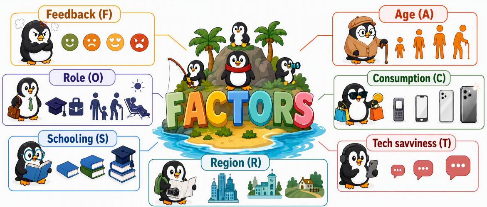
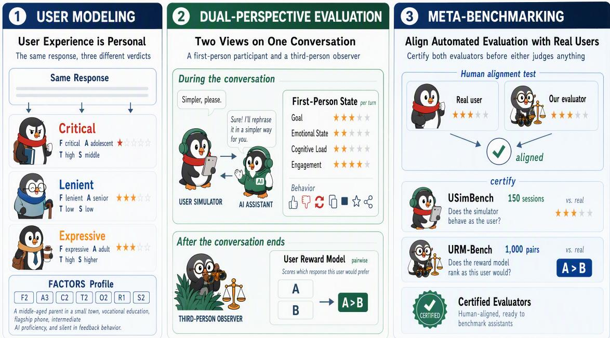
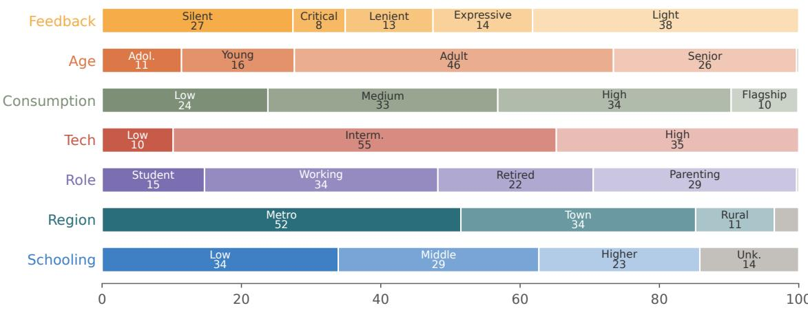
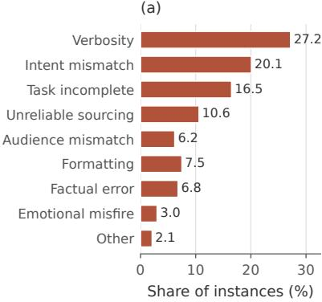
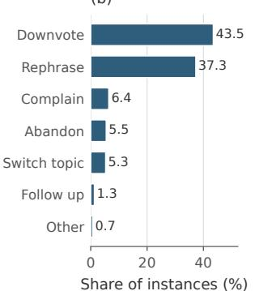
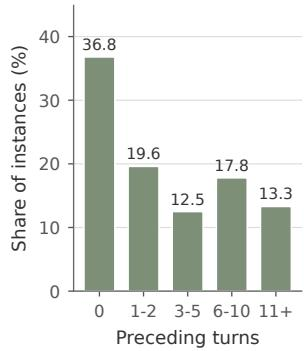

# UXBench Pro: Benchmarking Personalized User Experience in Multi-Turn Dialogue Interactions

Mengze Hong Zeyang Lei Wenbo Shang Xia Zeng Xiying Zhao Qi Zhu Chen Jason Zhang Di Jiang Taiming Fu Qiongyi Zhou Qinghe Chang Fubao Zhang Chenxuan Ma Minlong Peng Jinfeng Huang Zineng Zhou Jindou Wu Muge Qi Sijun He Xin Cui Di Liang Yuan Hua Davey Chen∗

Hong Kong Polytechnic University Yuanbao Team, Tencent

## Abstract

Evaluating user experience (UX) with automated computational methods has gained increasing attention, supported by empirical evidence from UXBench. However, binary preference prediction provides limited insight, while relying on a single user-agnostic reward model overlooks the inherent heterogeneity of users, whose expectations can differ substantially. In this paper, we present UXBench Pro, comprising 1,000 test instances derived from real user interactions across 12 task scenarios and 82 domains. Each instance is paired with a FACTORS user profile that characterizes the user through seven interpretable behavioral facets, differentiating user groups. To provide richer evaluation insights, we introduce a dual-perspective paradigm that combines a personalized User Reward Model (URM) for third-person judgment with Sim4Eval, a user simulator that enables multi-turn interactions and provides first-person evaluation across four cognitive state dimensions. To assess the reliability of these based evaluators, we further introduce two meta-benchmarks, URMBench and USimBench, that evaluate how faithfully they reproduce real human preferences and behaviors. Extensive experiments reveal seven key findings that highlight the importance of user modeling and multi-perspective evaluation, offering a fresh perspective on user-centric benchmarking and motivating personalized model optimization.

  
Figure 1: Illustration of the seven-dimensional FACTORS profile schema for characterizing heterogeneous users in human-AI interactions.

## 1 Introduction

As AI assistants engage with billions of users, defining what makes a model “good” becomes increasingly context-dependent. Existing benchmarks often prioritize challenging problems that test model capabilities and expertise (Yang et al., 2026; Phan et al., 2025; Hong et al., 2025). While such evaluations provide meaningful signals for model development, they offer limited insight into end-user experience, as performance on difficult edge cases may not reflect how users perceive and engage with AI assistants in everyday interactions. User experience is a complex interplay of model capability, linguistic style, and the user’s expectations and cognitive state, making the current evaluation landscape a limited proxy. UXBench (Hong et al., 2026) represents an initial step toward the vision of user-centric benchmarking, demonstrating that user experience can be quantified via computational rewards calibrated to real human feedback signals, elevating UX from an abstract, human-centered concept to a measurable evaluation objective. However, several limitations in existing work motivate further exploration in user-centric benchmarking:

1. Binary user feedback (like/dislike), while being straightforward to calibrate to real user behavior, provides coarse-grained signals with limited interpretability and offers little insight into the underlying factors that drive satisfaction in human-AI interactions.

2. One user’s satisfaction does not necessarily imply another’s. A single user-agnostic judge model trained on aggregated user feedback implicitly assumes a universal notion of user experience, overlooking the heterogeneity in individual preferences, behavioral tendencies, and interaction contexts.

3. Existing evaluations primarily focus on isolated single-turn interactions, overlooking the dynamic evolution of user experience across multi-turn conversations, where satisfaction may accumulate over time.

Users are inherently heterogeneous in age, educational background, professional expertise, and expectations of what constitutes a “good” response, and this heterogeneity inevitably extends to their expectations. A retired senior seeking medication advice, a software engineer debugging a compiler error, and a teenager requesting creative writing support may all interact with the same AI system, yet their criteria for satisfaction can differ substantially. Similarly, a verbose, informationdense response that one user perceives as unnecessary may be exactly what another values for its completeness. Intuitively, general-purpose AI needs to serve heterogeneous users along two dimensions: users ask different queries, and different users perceive the same response differently. Building personalized AI assistants is important for supporting diverse user populations (Yuan et al., 2025) and should therefore be reflected in evaluation frameworks. When user experience is modeled as user-invariant, individually valid preferences are collapsed into a single aggregate signal, obscuring meaningful differences in what users value.

In this paper, we take a step toward automated computational methods that enable personalized benchmarking for human-AI interactions, modeling user experience as jointly conditioned on who the user is and what they ask (Hassenzahl and Tractinsky, 2006). We propose UXBench Pro, a benchmark comprising 1,000 high-quality user queries, each paired with a user profile. Guided by the hypothesis that offline benchmarking should approximate online user distributions (Nie et al., 2026), we design the FACTORS user profile schema to characterize users across seven behavioral facets (see Figure 1). To enable fine-grained and informative assessment, we introduce a dual-perspective paradigm that combines a User Reward Model (URM) with a user simulator, supporting both third-person inspection and first-person assessment of model responses in multiturn interactions. Finally, we propose the meta-benchmarking principle with URM-Bench and USimBench to sufficiently validate model-based evaluators against human values to ensure that benchmark outcomes reflect calibrated signals of human preference and behaviors.

The contributions of this work span both methodological innovations and empirical insights:

1. Personalized UX Evaluation. We release UXBench Pro, a user-centric benchmark incorporating a seven-facet FACTORS user profile schema and covering 12 task scenarios across work and life use cases. Our experiments reveal systematic effects of user heterogeneity on personalization and UX evaluation, yielding seven key findings that support user-centric benchmarking and AI assistant optimization.

2. Dual-Perspective Evaluation. We introduce a user reward model that serves as a personalized third-person inspector, accompanied by Sim4Eval, a user simulator that supports multi-turn dialogue and offers first-person evaluation by outputting user states across four cognitive state dimensions, providing interpretable evaluation insights.

3. Meta-benchmarking Principle. We propose the meta-benchmark principle and introduce two useful benchmark resources: URM-Bench and USimBench, which use real user preferences and interaction behavior as ground truth signals to evaluate judge models before their deployment in benchmarking AI assistants.

This work is intended to contribute primarily at the conceptual and methodological level, rather than by emphasizing the relative performance of particular models. As LLMs continue to evolve rapidly, model-specific comparisons can quickly become outdated with successive generations. We therefore focus on developing generalizable principles for understanding and evaluating user experience, moving beyond static and user-agnostic notions of model quality toward evaluation that accounts for the heterogeneous and evolving nature of human-AI interaction. We hope these principles and findings remain useful for evaluating future generations of AI assistants.

## 2 Related Work

## 2.1 User Experience Evaluation

User experience (UX) has long been a central concern in HCI and is traditionally evaluated through direct user involvement, including usability studies, surveys, interviews, focus groups, and field studies (Dumas and Salzman, 2006). Standardized instruments such as AttrakDiff, UEQ, and meCUE quantify subjective experience and form the basis for rubric-based judgments (D´ıaz-Oreiro et al., 2021). These methods provide rich and interpretable feedback, but they are costly to scale: a systematic review of 548 UX studies reports a median of only 20 participants per study (D´ıaz-Oreiro et al., 2021), introducing bias against underrepresented user groups. This has motivated computational approaches that augment or automate parts of UX evaluation (Ivory and Hearst, 2001), from analyzing interaction traces and behavioral signals to recent LLM-based methods that simulate users and generate usability feedback (Xiang et al., 2024).

The scalability challenge is particularly pronounced for conversational AI assistants. Most existing LLM benchmarks focus on capabilities such as reasoning, knowledge, and instruction-following, offering limited insight into the quality of the experience users perceive. Prior work has modeled user satisfaction from graded dialogue annotations (Sun et al., 2021) or implicit behavioral signals such as interruptions and rephrasing (Park et al., 2021), but these approaches are largely confined to task-oriented corpora and predefined rating schemes. UXBench (Hong et al., 2026) takes an important step toward grounding UX evaluation in real user feedback, showing that frontier LLMs systematically overestimate interaction quality, whereas a feedback-trained reward model predicts user satisfaction more reliably. However, UXBench remains a static, single-turn benchmark that models users from a generic perspective, leaving open how UX signals evolve and accumulate across multi-turn interactions and heterogeneous individual users.

## 2.2 Reward Modeling

Reward models (RMs) are central to aligning LLMs with human preferences, serving both as reward signals in RLHF and as scorers for inference-time selection (Ouyang et al., 2022). Recent approaches emphasize direct preference optimization and leverage generative reward models (GRMs) to evaluate responses through natural-language reasoning. As RMs become more widely used, directly evaluating their quality has become increasingly important. RMB evaluates reward models across 49 real-world scenarios using a Best-of-N protocol and shows that standard pairwise accuracy correlates only weakly with downstream alignment quality, while generative RMs appear particularly promising (Zhou et al., 2025). RewardBench 2 further addresses contamination and ceiling effects by constructing a harder benchmark from fresh human prompts (Malik et al., 2026). However, these benchmarks are still built from curated preference data and mainly measure correctness or alignment utility, rather than whether an RM captures the experience and preferences of different users, motivating a user-centric RM and benchmark.

  
Figure 2: Overview of UXBench Pro with three core proposed methodologies.

## 2.3 User Simulation for Multi-turn Dialogues

Early user simulators learn user policies from corpora, e.g., sequence-to-sequence generators for RL-based dialog systems (Shi et al., 2019) and data-driven metaphorical testers (Sun et al., 2023). With large language models, the paradigm has largely shifted to LLM-based simulation along three lines. One line uses the LLM as a generic user proxy via in-context learning or prompting (Terragni et al., 2023; Luo et al., 2024). Another augments it with goal-state tracking or verification for goal consistency across turns (Mehri et al., 2026). A third adopts a persona- or digital-twin view that models user differences through personas, behavior chains, or implicit profiles (Wang et al., 2025; Xie et al., 2025; Li et al., 2025; Du et al., 2026). Despite gains in fluency and controllability, two limitations remain central to our study. First, these methods are largely domain-specific, tightly coupled to particular tasks, ontologies, or benchmarks such as MultiWOZ (Eric et al., 2020), and thus transfer poorly to open-domain, assistant-style interaction. Second, their user-profile modeling is weak: profiles are typically hand-authored, or coarse-grained prompt prefixes rather than stable, fine-grained signals inferred from real interactions.

## 3 UXBench Pro

## 3.1 Overview

UXBench Pro is a benchmark for evaluating personalized user experience, comprising 1,000 highquality test instances derived from interaction logs of a mainstream AI assistant in China that serves a demographically diverse user population. It is designed to answer three core research questions: (1) whether modeling user characteristics can improve the calibration of automated UX judgment; (2) whether injected user knowledge can improve the response quality that better satisfies heterogeneous users; and (3) whether user-aware evaluation provides more humanaligned insights for model improvement. We hypothesize that user experience is conditioned by both the user profile and the task context, recognizing that the same response may be perceived differently by different users.

To support reliable personalized evaluation, UXBench Pro treats the evaluator itself as an object of evaluation. We therefore introduce two complementary meta-benchmarks, URM-Bench (Section 5.1) and USimBench (Section 5.2), which use real user feedback and interaction behavior to assess whether the URM and user simulator reproduce human-aligned outcomes. By comparing model performance with and without user profiles, these benchmarks further isolate the contribution of personalization, enabling a more reliable analysis of how user profiles shape experience.

Table 1: FACTORS user profile schema, with each dimension discretized into interpretable categories plus an unknown state for completeness.
<table><tr><td>Dimension</td><td>Signal</td><td>Categories</td></tr><tr><td>Feedback (F)</td><td>Likes/dislikes, 30d</td><td>Silent, critical, lenient, expressive, light</td></tr><tr><td>Age (A)</td><td>Age interval</td><td>Adolescent, young adult, adult, senior, unknown</td></tr><tr><td>Consumption (C)</td><td>Device tier</td><td>Low, medium, high, flagship, unknown</td></tr><tr><td>Technical Usage (T)</td><td>Prompt volume + usage</td><td>Light, regular, heavy</td></tr><tr><td>Role (O)</td><td>Dialogue-mined life stage</td><td>Student, working-age, retired, parenting, unknown</td></tr><tr><td>Region (R)</td><td>Geographic location</td><td>Metro, town, rural, unknown</td></tr><tr><td>Schooling (S)</td><td>Mined education signals</td><td>Low, middle, higher, unknown</td></tr></table>

  
Figure 3: Distribution of the 1,000 test cases across each FACTORS facet.

## 3.2 User Profile Schema with FACTORS

Modeling user heterogeneity is challenging. UXBench Pro introduces an explicit, interpretable user profile schema with seven dimensions derived from behavioral and contextual signals, organized as the FACTORS schema (Table 1). Each dimension is discretized into meaningful categories with an additional “unknown” state (Appendix A). Profiles are derived from sanitized dialogue logs or device-level information and are intended as contextual signals for personalization rather than definitive user characterizations, minimizing privacy risks and minimizing exposure of identifying information. Each user is represented by a seven-component profile code, which is rendered into a human-readable persona card for conditioning the personalized reward model and user simulator. The example below illustrates the profile code, facet-level decoding, and persona card.

Profile code F2 · A3 · C2 · T2 · O2 · R1 · S2

Decoded critical feedback (F2), adult (A3), high-tier device (C2), heavy AI usage (T2), working-age (O2), metropolitan (R1), higher schooling (S2)

Persona card A working-age adult in a major city, well educated and a frequent user of AI tools, using a high-end device, who tends to be critical and dislike-prone when judging responses.

To characterize the user population, Figure 3 shows the empirical distributions of all seven FAC-TORS dimensions across the 1,000 instances. The benchmark spans diverse age, consumption, region, and education groups, while feedback disposition is dominated by silent and light users, reflecting the sparsity of explicit feedback. Critical, lenient, and expressive users are retained at informative proportions through the sampling procedure in Section 3.3. Specifically, we derive the feedback disposition from the user’s 30-day feedback history using the like count L, dislike count U, total feedback volume T = L + U, and positive feedback ratio L/T.

Table 2: Task taxonomy and per-scenario instance counts in the released set.
<table><tr><td>Category</td><td>Code</td><td>Scenario</td><td>N</td></tr><tr><td rowspan="5">Work</td><td>W1</td><td>Office writing (documents, emails, reports)</td><td>107</td></tr><tr><td>W2</td><td>Coding (programming, debugging)</td><td>17</td></tr><tr><td>W3</td><td>Data analysis (analytics, decision support)</td><td>110</td></tr><tr><td>W4</td><td>Professional lookup (legal, financial, medical)</td><td>39</td></tr><tr><td>W5</td><td>Translation (business translation)</td><td>18</td></tr><tr><td rowspan="7">Life</td><td>L1</td><td>Study assistance (learning, homework)</td><td>104</td></tr><tr><td>L2</td><td>Everyday services (planning, recommendations)</td><td>98</td></tr><tr><td>L3</td><td>Health and wellness</td><td>85</td></tr><tr><td>L4</td><td>Emotional interaction (companionship, chit-chat)</td><td>125</td></tr><tr><td>L5</td><td>Entertainment (creative generation, leisure)</td><td>98</td></tr><tr><td>L6</td><td>Personal finance (budgeting, planning)</td><td>95</td></tr><tr><td>L7</td><td>General information (open-domain queries)</td><td>104</td></tr></table>

## 3.3 User x Task Grid

In the released dataset, each evaluation instance is represented as $( x , u , t )$ , where x denotes the interaction context, u the FACTORS user profile, and t the task scenario. Accordingly, we define the evaluation space as $\mathcal { G } = \mathcal { U } \times \mathcal { T }$ , enabling systematic analysis of how model performance varies across scenarios, and how user profiles and task scenarios jointly shape user experience. The task axis follows a hierarchical taxonomy with two high-level categories, work and life (Chatterji et al., 2025), which are further divided into 12 fine-grained scenarios (see Table 2). Scenario labels are assigned at the session level via majority voting on dialogue signals mined using intent and domain classifiers.

To balance task coverage without distorting natural profile–task correlations, we balance only across task categories while preserving within-task profile distributions. For each task t, we sample

$$
\vert { \mathcal { D } } _ { t } \vert = \operatorname* { m i n } ( n _ { t } , K ) ,
$$

retaining rare scenarios in full and capping dense ones at K. This yields comparable per-scenario counts (normalized task entropy: 0.953), while FACTORS distributions emerge naturally within each task. We further limit repeated users, exclude sessions with fully unknown profiles, and impose a 10% minimum representation floor for adolescent and rural users, as well as for lenient and expressive feedback dispositions.

## 3.4 Data Construction Pipeline

Stage 1, data cleaning. Starting from 71,221 raw sessions with explicit negative feedback to ensure sufficient difficulty, we deduplicate at three granularities and remove degenerate interactions, including empty or overly short prompts and responses, punctuation- or emoji-only turns, speechrecognition failures, no-op requests, and garbled text.

Stage 2, safety review and de-identification. Each session undergoes two-level lexicon screening across seven risk categories: sexually explicit content, violence, political sensitivity, illegal activities, extremism, drug-related content, and self-harm. De-identification is applied at three layers. At the schema layer, released records contain no user identifiers, and all profile attributes are represented only as coarse buckets. At the text layer, a twelve-class rule-based scanner detects residual PII, including phone numbers, email and network addresses, physical addresses, and personal names. Finally, queries are fully rewritten by a small, locally hosted model (hunyuan-3) to remove any remaining identifying details while preserving the original intent.

Stage 3, multi-agent quality assurance. We use multi-agent debate to filter instances in which negative user feedback may stem from ambiguous or unanswerable queries rather than genuine model deficiencies. A proposer first argues why an instance should be retained, and three independent critics evaluate whether the query is meaningfully challenging, whether the assistant response is genuinely deficient, and whether the instance can discriminate between stronger and weaker systems. Retention follows a deterministic voting rule: a session is rejected if any critic issues a high-confidence refutation, if at least two critics refute the proposal, or if multiple critics challenge it without any supporting vote. This procedure retains 58.5% of sessions, flags 7.6% as low-value, rejects 32.7%, and loses 1.1% to technical failures. Balanced sampling is performed only after this stage to preserve the intended user–task distribution.

Table 3: Summary statistics of UXBench Pro.
<table><tr><td>Statistic</td><td>Value</td></tr><tr><td>Test instances</td><td>1,000</td></tr><tr><td>Task scenarios</td><td>12</td></tr><tr><td>Domains (coarse / fine)</td><td>15 / 82</td></tr><tr><td>Work / life split Normalized task entropy</td><td>29.1% / 70.9% 0.953</td></tr><tr><td>Instances with a preceding dialogue context</td><td>63.2%</td></tr><tr><td>Preceding turns (mean / median)</td><td>4.7 / 2</td></tr><tr><td>Response length in characters (median / p90) Proiles with all seven facets resolved</td><td>738 / 1,786 85.0%</td></tr></table>

(a)  

(b)  

(c)  
  
Figure 4: Composition of the experience signals: (a) failure dimension, (b) user actions, (c) preceding dialogue turns.

Stage 4, human review. Finally, ten annotators conduct a systematic review under a ring-based double-coverage scheme, so that every session receives two independent reviews while each annotator covers two adjacent strata. Annotators see only the dialogue and candidate responses, without internal labels or user-profile information. They assess content safety, identify privacy issues, and, for the URM-Bench subset (Section 5.1), indicate their preferred response. The protocol favors recall by requiring uncertain cases to be flagged for adjudication. Content-safety judgments achieve 0.971 raw agreement, and any instance flagged by at least one annotator for safety or privacy concerns is excluded from the released dataset.

## 3.5 Data Statistics

Table 3 summarizes the benchmark statistics, and Figure 4 shows the composition of its experience signals. The benchmark spans 12 task scenarios and 82 fine-grained domains, with 63.2% of instances containing preceding dialogue context and 85.0% having all seven FACTORS facets resolved. Verbosity, intent mismatch, and task incompleteness are the most common failure dimensions, jointly accounting for 63.8% of instances, whereas factual errors account for only 6.8%. The benchmark also captures diverse dissatisfaction signals: 11.5% of instances contain explicit verbal complaints, while 39.7% involve user recovery attempts. Interactions contain an average of 4.7 preceding turns, with broad coverage across tasks, user profiles, and interactions, while preserving realistic multi-turn settings.

## 4 Methodology

We propose a dual-perspective framework in which two complementary evaluators assess an assistant’s response. The third-person perspective is provided by a User Reward Model (URM), which estimates response satisfaction conditioned on the user’s profile. The first-person perspective is provided by a user simulator via Sim4Eval, which continues the interaction and exposes interpretable cognitive state dimensions associated with the evolving UX.

## 4.1 User Reward Model

The URM evaluates a candidate assistant’s response given an authentic dialogue context and the user’s FACTORS profile, and an effective URM is key to reliable UX judgment. We consider reward models sharing a common base model (Hunyuan-3) but differ along two axes: modeling formulation and preference signal. For formulation, we compare three variants: a pointwise GRM that scores a response from the normalized probabilities of positive and negative judgment tokens, a Bradley-Terry reward model (BTRM) with a classification head trained on preference pairs, and a pairwise GRM that retains the generative formulation while directly modeling paired comparisons between two responses. For preference signal, we consider three sources: regeneration preference, where two responses to the same context are compared with the assumption that the regenerated (later) response better satisfies the user; dual-answer preference, where users select between two candidate responses; and pointwise feedback, where individual responses are labeled as liked or disliked, following a similar design in UXBench.

## 4.2 Sim4Eval Framework

The URM evaluation cannot capture how user experience accumulates and varies across multiple turns. Thus, we introduce a Sim4Eval approach that adopts the first-person perspective of a user simulator: at each turn $t ,$ it produces the next user query $v _ { t . }$ , a four-dimensional cognitive state $z _ { t } \in \{ 1 , . . . , 5 \} ^ { 4 }$ , and a continuation decision $c _ { t } \ \in \ \left\{ \mathrm { C O N T I N U E } , \mathrm { L E A V E } \right\}$ , all conditioned on the latest assistant response $a _ { t }$ and the injected user profile. The four state dimensions are goal progress, emotional $\mathrm { f i t } ,$ cognitive fit, and engagement preference (see detailed breakdown in Appendix D). These dimensions reflect complementary factors associated with user experience: progress toward task goals and interaction costs (Walker et al., 1997), affective and empathic alignment (Liu and Sundar, 2018), cognitive effort during human–agent interaction (Daronnat et al., 2021), and users’ heterogeneous preferences for conversational style and engagement (Bhattacharjee et al., 2024).

To select a simulator that best matches real user queries and interaction behavior, we consider naive prompting, supervised finetuning on 21,313 authentic sessions, and a proposed RAG-based simulator. $\hat { \mathsf A }$ user profile specifies who a user is, but not how that user tends to interact with AI. We therefore introduce the Retrieval-Augmented User Simulator, built on $N = 1 3 5 , 9 1 5$ authentic follow-up turns from roughly 36,000 sessions, $\mathcal { D } = \{ ( \tilde { a } _ { i } , \tilde { v } _ { i } ) \} _ { i = 1 } ^ { N }$ . Using separate TF-IDF encoders $\Phi _ { a }$ and $\Phi _ { u }$ for assistant responses and user utterances, we score each candidate as

$$
\begin{array} { r } { s _ { i } = \alpha \cos \left( \Phi _ { a } ( a _ { t } ) , \Phi _ { a } ( \tilde { a } _ { i } ) \right) + \beta \cos \left( \Phi _ { u } ( q _ { t } ) , \Phi _ { u } ( \tilde { v } _ { i } ) \right) , \qquad q _ { t } = v _ { 1 } \oplus v _ { t - 1 } , } \end{array}\tag{1}
$$

with $\alpha = 0 . 7$ and $\beta = 0 . 3$ . The first term matches similar assistant responses, while the second captures conversational context from the opening and most recent user utterances. We retrieve the top 12 candidates, remove near-duplicates using character-level Jaccard similarity with threshold $\tau = 0 . 5 ,$ and retain $k = 3$ diverse utterances. These raw utterances provide the simulator with examples of realistic user tone, length, and reaction style.

## 4.3 Decomposing User Satisfaction

We conceptually distinguish three sources of variation in conversational experience: response capability, interaction-state alignment, and profile-dependent preference. Response capability captures user-independent qualities such as factual correctness, task completion, and instruction compliance. Interaction-state alignment reflects how well a response fits the user’s evolving goals, emotions, cognitive needs, and engagement preferences, while profile-dependent preference captures stable differences in how users value or tolerate response characteristics. The URM jointly assesses these factors from a third-person perspective, whereas Sim4Eval makes interaction-state alignment and profile-dependent reactions observable over multiple turns through simulated user states and behavior. This decomposition provides a conceptual lens for interpreting the complementary signals produced by the two evaluators, rather than assuming that user satisfaction can be reduced to a single universal notion of response quality.

## 5 Meta-Benchmarking

Meta-benchmarking is defined as the practice of evaluating an automated evaluator against real human behavior before deployment in a benchmarking system, treating the evaluator itself as the object of study rather than assuming alignment with human behavior. Without such validation, systematic divergence from human preferences can propagate into downstream biases in evaluation results. Aligned with the evaluation framework, we construct two meta-benchmarks from the interaction logs, using the same data-cleaning and verification pipeline described in Section 3.4.

## 5.1 URM-Bench

URM-Bench evaluates whether a reward model ranks responses according to real user preferences and whether conditioning on a FACTORS profile improves over a population-level baseline. Behaviorally observed pairwise preferences are extracted from regeneration and dual-answer dialogue logs, where the user-selected option is treated as the reference preference. We categorize each pair into four causes of a superior response, aligned with the user simulator’s state dimensions, where the response either successfully recognized the user’s present state (S1), inferred their underlying need (S2), adapted to their preferred style (S3), and respected their long-term preference (S4). The released benchmark contains 800 human-verified pairwise instances, 200 per mode. We report pairwise accuracy (PairAcc), in which exact ties count as errors. To test the value of profile conditioning, we compare paired outcomes with an exact two-sided McNemar test (McNemar, 1947). Presentation order is fixed with the preferred response placed on either side near evenly, and the human reference is the mean PairAcc of ten contracted annotators on the same task.

## 5.2 USimBench

USimBench evaluates whether a user simulator produces multi-turn continuations faithful to real user behavior in feedback signals, semantic content, and interaction style. Each of the 150 instances is drawn from a real interaction session and includes a conversation prefix, the user’s FACTORS profile, and a designated takeover point; the ground truth is the user’s authentic continuation. Single-turn sessions are excluded, while feedback signal, conversation length, and takeover position (early, middle, or late) are balanced. The simulator generates per-turn utterances $v _ { t } ,$ meta-behavioral signals $\scriptstyle { e _ { t } , }$ self-reported core states $z _ { t . }$ , and a termination decision $c _ { t }$ . We compare simulated and real continuations along three complementary dimensions: feedbacksignal fidelity, semantic similarity of the generated continuation, and behavioral similarity in interaction style. These metrics are reported separately rather than collapsed into a single score, since linguistic resemblance does not necessarily imply faithful user behavior.

## 6 Results and Discussion

## 6.1 UXBench Pro Results

We use the best-performing URM and user simulator identified on the corresponding metabenchmarks. Every model is evaluated on the same 1,000 instances under two controlled profile settings. First, we vary whether the user’s FACTORS profile is provided to the assistant at generation time; the two prompts are otherwise identical, so any performance difference can be attributed to profile conditioning. Second, we independently vary whether the evaluator sees the same profile, yielding the four settings analyzed in Section 6.1.2. In a pilot study, we observe a small average position bias (+0.028), although reversing candidate order changes the verdict in 9.3% of comparisons. We therefore evaluate each comparison in both candidate orders and average the two results as $( p _ { a b } + 1 - p _ { b a } ) / 2$

Table 4: UXBench Pro results for seven assistants. Turn BT and Traj. BT are Bradley–Terry strengths derived from pairwise URM judgments. Res. and Aban. denote resolution and abandonment rates. Separability is the fraction of assistant pairs with non-overlapping 95% bootstrap confidence intervals; ρ denotes Spearman correlation.
<table><tr><td rowspan="2">Assistant</td><td colspan="2">URM (Pairwise GRM)</td><td colspan="4">User state</td><td colspan="2">Trajectory outcome</td></tr><tr><td>Turn BT↑</td><td>Traj. BT↑</td><td>S1↑</td><td>S2↑</td><td>S3↑</td><td>S4↑</td><td>Res.↑</td><td>Aban.↓</td></tr><tr><td>Qwen3.7-Max</td><td>+0.170</td><td>+0.096</td><td>3.18</td><td>3.18</td><td>3.75</td><td>3.39</td><td>37.5</td><td>1.6</td></tr><tr><td>DeepSeek-v4-pro</td><td>+0.047</td><td>+0.053</td><td>3.24</td><td>3.22</td><td>3.84</td><td>3.44</td><td>41.4</td><td>1.9</td></tr><tr><td>Hunyuan-3</td><td>+0.028</td><td>-0.027</td><td>3.19</td><td>3.25</td><td>3.87</td><td>3.49</td><td>38.7</td><td>2.2</td></tr><tr><td>GLM-5.2</td><td>+0.010</td><td>-0.012</td><td>3.15</td><td>3.20</td><td>3.79</td><td>3.39</td><td>34.5</td><td>2.1</td></tr><tr><td>Claude-Opus-4.8</td><td>-0.014</td><td>-0.006</td><td>3.09</td><td>3.13</td><td>3.80</td><td>3.39</td><td>37.4</td><td>4.7</td></tr><tr><td>GPT-5.5</td><td>-0.110</td><td>-0.063</td><td>3.14</td><td>3.13</td><td>3.79</td><td>3.37</td><td>34.0</td><td>2.2</td></tr><tr><td>Gemini-3.1-Pro</td><td>-0.132</td><td>-0.041</td><td>2.94</td><td>3.01</td><td>3.71</td><td>3.23</td><td>30.7</td><td>1.9</td></tr><tr><td>Separability↑</td><td>100%</td><td>95.2%</td><td></td><td>Turn BT vs. Res.:</td><td></td><td> $\rho = 0 . 8 5 7 ;$ </td><td>Turn BT vs. Traj. BT:</td><td> $\rho = 0 . 8 2 1$ </td></tr></table>

## 6.1.1 Overall Evaluation

Finding 1: Third-person and first-person evaluation provide aligned but complementary views of assistant quality. Table 4 compares response quality from the third-person URM perspective with interaction outcomes produced by Sim4Eval. The two views yield closely aligned rankings: Turn BT correlates strongly with resolution rate $( \rho = 0 . 8 5 7 )$ and Traj. BT $( \rho \overset { \cdot } { = } 0 . \overset { \cdot } { 8 } 2 1 )$ , while all assistant pairs are separable at the turn level and 95.2% remain separable at the trajectory level. Qwen3.7-Max ranks highest in both Turn and Traj. BT, whereas Gemini-3.1-Pro has the lowest Turn BT and the lowest resolution rate (30.7%). At the same time, the simulator exposes differences not captured by response ranking alone. Resolution and abandonment are nearly uncorrelated across assistants $( r ^ { - } = 0 . 1 0 6 )$ : Claude-Opus-4.8, for example, has a mid-range resolution rate of 37.4% but the highest abandonment rate at 4.7%. Abandoned trajectories win only 16.7% of pairwise comparisons, compared with 47.6% when neither trajectory is abandoned. Together, these results show that response quality, task resolution, and continuation behavior are related but non-equivalent aspects of conversational experience.

The simulator further helps characterize why interactions terminate. Across assistants, abandoned conversations consistently end with low goal progress: final goal-progress scores range from 1.32 to 1.69, whereas cognitive fit never falls below 3.06. For Claude-Opus-4.8, goal progress falls from 4.24 in satisfied exits to 1.55 in abandoned conversations, while cognitive fit remains relatively high at 3.53 versus 4.38. We also observe a strong association between routine offers to continue and early termination $( r = 0 . 8 3 )$ . Claude-Opus-4.8 ends 66.7% of its first-turn responses with such an offer, compared with 35.2% for the next-highest assistant and 21.4% for the lowest, and records both the largest number of satisfied exits (152) and abandonments (47). Because this relationship may partly reflect the simulator’s stopping policy, we treat it as a behavioral pattern rather than a causal effect; nevertheless, it illustrates how multi-turn evaluation can surface interaction dynamics invisible to response-level ranking.

## 6.1.2 The Effect of User Profile

Finding 2: The apparent value of personalization depends strongly on who is evaluated and whether the evaluator knows the user. Holding the response fixed, a profile-blind evaluator prefers the profile-free response in 62.5% of comparisons, but this falls to 54.8% when the evaluator sees the true user profile. Replacing the true profile with a scrambled one removes 57% of this shift, indicating that the difference arises from user–profile matching rather than the mere presence of profile text. The effect is also highly heterogeneous across users: conditioned responses are preferred by expressive (62.8%) and critical users (61.3%), but not by lenient (43.9%), silent (39.5%), or light responders (38.1%). Because silent and light responders constitute 65.6% of the population, the pooled preference falls to 45.2%; equal weighting across groups raises it to 49.9% (p = 0.89). Variation across user characteristics is substantially larger than across task categories: feedback disposition has a spread of 0.248, compared with only 0.040 for the work-life split. The weakest gains appear among light AI users (0.373), rural users (0.402), and light responders (0.381). Genuine profile matching explains 66% of the effect for expressive users but only 34% for silent users. These results show that aggregate evaluation can hide important differences in personalization across users and evaluators.

Table 5: PairAcc of five trained reward models on the 800-instance URM-Bench under the population condition. Chance is 0.5, exact ties count as errors, and ✓ marks the model selected as the URM for UXBench Pro.
<table><tr><td>Formulation</td><td>Training signal</td><td>S1↑</td><td>S2↑</td><td>S3↑</td><td>S4↑</td><td>Pooled↑</td></tr><tr><td>Pointwise GRM</td><td>Pointwise feedback labels</td><td>0.5500</td><td>0.5300</td><td>0.4650</td><td>0.5650</td><td>0.5275</td></tr><tr><td>General RM</td><td>Mixed, general purpose</td><td>0.6700</td><td>0.5300</td><td>0.4850</td><td>0.6100</td><td>0.5737</td></tr><tr><td>BTRM</td><td>Regeneration preference</td><td>0.6900</td><td>0.6100</td><td>0.4900</td><td>0.5900</td><td>0.5950</td></tr><tr><td>BTRM</td><td>Online dual-answer choice</td><td>0.6850</td><td>0.6050</td><td>0.5400</td><td>0.6250</td><td>0.6138</td></tr><tr><td>Pairwise GRM</td><td>Regeneration preference</td><td>0.8650</td><td>0.8050</td><td>0.6200</td><td>0.7850</td><td>0.7688</td></tr></table>

Finding 3: Personalization is a selective capability whose value decreases as interaction context becomes informative. Profile conditioning does not simply track overall model quality. GPT-5.5 is the only assistant that benefits from conditioning across all five feedback dispositions, with preference rates ranging from 0.571 for light responders to 0.720 for critical users, despite ranking only sixth in overall turn-level strength. Every other assistant loses in at least three groups, with differences of up to 37.8 percentage points across feedback dispositions. Response length provides one possible explanation: GPT-5.5 is also the only model that does not systematically shorten its responses under profile conditioning, while across assistants, greater shortening is strongly associated with lower preference (r = 0.96). This suggests that useful personalization requires adapting content rather than applying a generic stylistic transformation.

The value of conditioning also depends on whether the task and dialogue leave room for userspecific adaptation. Across sixteen coarse domains, conditioned responses perform best in current affairs (0.509), travel (0.491), and everyday services (0.485), but worst in law (0.378), shopping (0.379), and computing (0.391). Across task scenarios, creative entertainment is highest (0.502), while professional retrieval is lowest (0.388). Profiles are also substantially more useful at cold start: conditioned responses are preferred at 0.502 without prior dialogue, compared with 0.412 when history is available, declining from 0.427 after one prior turn to 0.415 after two or three and 0.396 after four or more. The same pattern holds across user groups. Together, these results suggest that profiles and conversational history provide partly overlapping information, and that personalization is most useful when the desired response depends on the user, but the interaction itself has not yet revealed sufficient evidence about that user.

## 6.1.3 Repairing Real Failures

Finding 4: Assistants repair factual errors more reliably than common interaction failures. Across all benchmark instances, the overall repair rate, defined as the fraction of new responses judged satisfactory by the URM, is 0.429, but performance varies substantially across failure types. Factual errors are repaired most often (0.548), followed by intent mismatch (0.531), whereas verbosity (0.328) and formatting (0.324) are repaired least often. This imbalance is particularly important because verbosity and formatting together account for 34.7% of the benchmark, compared with only 6.8% for factual errors. Repair rates increase consistently with overall model strength (r = 0.76–0.99 across failure dimensions), indicating that stronger systems improve broadly rather than specializing in particular failure types. Nevertheless, the most common interaction-level failures remain the hardest to repair, suggesting that progress on factual correctness alone leaves substantial room for improving the experience users encounter in practice.

Table 6: Per-mode effect of FACTORS profile conditioning on URM-Bench. Each group reports PairAcc without the profile, with the profile, and their paired difference ∆. The human baseline is shown as a reference for each mode. ∗ indicates exact McNemar p < 0.05, and ∗∗ indicates significance after Bonferroni correction.
<table><tr><td rowspan="2"></td><td rowspan="2">Evaluator</td><td colspan="3">S1 State</td><td colspan="3">S2 Need</td><td colspan="3">S3 Style</td><td colspan="3">S4 Long-term</td></tr><tr><td>w/o</td><td>wl</td><td>Δ</td><td>w/o</td><td>w/</td><td>∆</td><td>w/o</td><td>wl</td><td>Δ</td><td>w/o</td><td>wl</td><td>Δ</td></tr><tr><td>1</td><td>Pairwise GRM</td><td>0.865</td><td>0.865</td><td>+0.000</td><td>0.805</td><td>0.805</td><td>+0.000</td><td>0.620</td><td>0.760</td><td>+0.140**</td><td>0.785</td><td>0.845</td><td>+0.060*</td></tr><tr><td>2</td><td>GLM-5.1</td><td>0.750</td><td>0.720</td><td>-0.030</td><td>0.645</td><td>0.620</td><td>-0.025</td><td>0.580</td><td>0.710</td><td>+0.130*</td><td>0.635</td><td>0.625</td><td>-0.010</td></tr><tr><td>3</td><td>Hunyuan-3</td><td>0.740</td><td>0.710</td><td>-0.030</td><td>0.695</td><td>0.615</td><td>-0.080*</td><td>0.570</td><td>0.680</td><td>+0.110*</td><td>0.585</td><td>0.645</td><td>+0.060</td></tr><tr><td>4</td><td>Claude-Opus-4.8</td><td>0.710</td><td>0.710</td><td>+0.000</td><td>0.620</td><td>0.620</td><td>+0.000</td><td>0.590</td><td>0.680</td><td>+0.090*</td><td>0.650</td><td>0.625</td><td>-0.025</td></tr><tr><td>5</td><td>GPT-5.5</td><td>0.675</td><td>0.665</td><td>-0.010</td><td>0.580</td><td>0.610</td><td>+0.030</td><td>0.675</td><td>0.705</td><td>+0.030</td><td>0.620</td><td>0.605</td><td>-0.015</td></tr><tr><td>6</td><td>Claude-Opus-4.7</td><td>0.725</td><td>0.675</td><td>-0.050</td><td>0.655</td><td>0.605</td><td>-0.050</td><td>0.550</td><td>0.690</td><td>+0.140**</td><td>0.600</td><td>0.580</td><td>-0.020</td></tr><tr><td>7</td><td>GLM-5.2</td><td>0.765</td><td>0.725</td><td>-0.040</td><td>0.615</td><td>0.565</td><td>-0.050</td><td>0.495</td><td>0.655</td><td>+0.160**</td><td>0.635</td><td>0.615</td><td>-0.020</td></tr><tr><td>8</td><td>Qwen3.7-Max</td><td>0.680</td><td>0.720</td><td>+0.040</td><td>0.655</td><td>0.640</td><td>-0.015</td><td>0.560</td><td>0.610</td><td>+0.050</td><td>0.595</td><td>0.640</td><td>+0.045</td></tr><tr><td>9</td><td>Kimi-K3</td><td>0.690</td><td>0.710</td><td>+0.020</td><td>0.665</td><td>0.625</td><td>-0.040</td><td>0.525</td><td>0.685</td><td>+0.160**</td><td>0.590</td><td>0.665</td><td>+0.075*</td></tr><tr><td>10</td><td>GPT-5.4</td><td>0.690</td><td>0.680</td><td>-0.010</td><td>0.560</td><td>0.565</td><td>+0.005</td><td>0.595</td><td>0.685</td><td>+0.090*</td><td>0.610</td><td>0.595</td><td>-0.015</td></tr><tr><td>11</td><td>Claude-Sonnet-4.6</td><td>0.715</td><td>0.680</td><td>-0.035</td><td>0.625</td><td>0.510</td><td>-0.115*</td><td>0.525</td><td>0.675</td><td>+0.150**</td><td>0.585</td><td>0.580</td><td>-0.005</td></tr><tr><td>12</td><td>Doubao-Seed-2.0-Pro</td><td>0.720</td><td>0.680</td><td>-0.040</td><td>0.645</td><td>0.610</td><td>-0.035</td><td>0.500</td><td>0.625</td><td>+0.125*</td><td>0.565</td><td>0.550</td><td>-0.015</td></tr><tr><td>13</td><td>Gemini-3.1-pro</td><td>0.680</td><td>0.710</td><td>+0.030</td><td>0.645</td><td>0.595</td><td>-0.050</td><td>0.500</td><td>0.585</td><td>+0.085*</td><td>0.585</td><td>0.600</td><td>+0.015</td></tr><tr><td>14</td><td>Gemini-3-flash</td><td>0.660</td><td>0.675</td><td>+0.015</td><td>0.630</td><td>0.610</td><td>-0.020</td><td>0.490</td><td>0.580</td><td>+0.090*</td><td>0.610</td><td>0.615</td><td>+0.005</td></tr><tr><td>15</td><td>GLM-5</td><td>0.705</td><td>0.720</td><td>+0.015</td><td>0.625</td><td>0.620</td><td>-0.005</td><td>0.500</td><td>0.640</td><td>+0.140**</td><td>0.540</td><td>0.575</td><td>+0.035</td></tr><tr><td>16</td><td>DeepSeek-v4-pro</td><td>0.655</td><td>0.615</td><td>-0.040</td><td>0.670</td><td>0.685</td><td>+0.015</td><td>0.475</td><td>0.525</td><td>+0.050</td><td>0.550</td><td>0.550</td><td>+0.000</td></tr><tr><td>17</td><td>DeepSeek-v4-flash</td><td>0.675</td><td>0.670</td><td>-0.005</td><td>0.635</td><td>0.650</td><td>+0.015</td><td>0.460</td><td>0.610</td><td>+0.150**</td><td>0.560</td><td>0.630</td><td>+0.070</td></tr><tr><td>18</td><td>Gemini-2.5-flash</td><td>0.640</td><td>0.635</td><td>-0.005</td><td>0.630</td><td>0.655</td><td>+0.025</td><td>0.460</td><td>0.545</td><td>+0.085*</td><td>0.580</td><td>0.605</td><td>+0.025</td></tr><tr><td>19</td><td>GPT-5.2</td><td>0.620</td><td>0.670</td><td>+0.050</td><td>0.475</td><td>0.500</td><td>+0.025</td><td>0.590</td><td>0.655</td><td>+0.065*</td><td>0.520</td><td>0.580</td><td>+0.060</td></tr><tr><td colspan="2">Mean ∆, systems improving</td><td colspan="2">-0.007, 6/19</td><td colspan="2"></td><td colspan="2">−0.019, 6/19</td><td colspan="2">+0.107, 19/19</td><td colspan="2">+0.017, 10/19</td><td colspan="2"></td></tr><tr><td colspan="8">Human baseline 0.870 0.802</td><td colspan="4" rowspan="2">0.807 0.829</td></tr><tr><td colspan="8"></td></tr></table>

## 6.2 URM-Bench Results

## 6.2.1 Training Strategies

Finding 5: Reliable UX evaluation requires both an appropriate evaluator and relevant user context. We first examine which evaluator is most reliable for UX judgment. Table 5 compares reward-model formulations and training signals on URM-Bench. Under the same Bradley–Terry formulation, dual-answer choice reaches 0.6138 PairAcc and regeneration preference 0.5950, compared with 0.5738 for the general-purpose model and 0.5275 for pointwise feedback. The larger gain comes from the formulation itself: using the same regeneration signal, the pairwise GRM reaches 0.7688, improving over BTRM by 17 points. We therefore use the pairwise GRM trained on regeneration preference as the URM for UXBench Pro.

Having established the evaluator, we next ask whether general-purpose frontier models can provide comparably reliable UX judgments. Table 6 shows that they cannot. Without profile conditioning, prompted judges range from 0.5513 to 0.6525 PairAcc, whereas the certified URM reaches 0.7688, outperforming the best prompted judge, GLM-5.1, by 11.6 points and approaching the human reference of 0.8271. The largest gap appears in style adaptation: prompted judges average only 0.536, with eight of eighteen at or below chance, compared with 0.807 for human annotators. Thus, strong general model capability does not directly translate into reliable UX evaluation.

We then examine whether explicit user context can close this gap. Providing the FACTORS profile improves pooled accuracy for 17 of 18 prompted judges and raises the certified URM from 0.7688 to 0.8187, close to the human baseline of 0.8271. The gain is concentrated in style adaptation, where all 19 systems improve by 10.7 points on average and by as much as 16.0 points. In contrast, state recognition and need inference do not improve overall, and long-term preference changes only slightly. This pattern suggests that profile information is most useful when the dialogue alone does not reveal which otherwise plausible response better fits the user.

Two additional analyses test whether this improvement genuinely comes from user information rather than incidental prompting effects. First, perturbing only the profile content shows that the URM responds to profile semantics rather than to the mere presence of profile text. A semantically empty placebo changes pooled accuracy by only 0.1 points $( p = 1 . 0 0 0 )$ , whereas reversing all seven facets changes accuracy by 7.26 points. The largest effect again appears in style adaptation, where joint reversal shifts accuracy by 17.36 points $( \bar { p } < 1 0 ^ { - 4 } )$ , and changing expertise alone shifts it by 10.96 points, while geography has essentially no effect. A stricter congruence test on technical proficiency is not significant (258 pairs, −2.3 points, $p = 0 . 3 4 )$ , indicating that the URM is sensitive to profile content but does not necessarily interpret every facet in a fully calibrated way.

Table 7: Thinking-effort ablation on four judges. Values are pooled PairAcc under low and high thinking effort, with and without profile conditioning. The best result for each model is bolded.
<table><tr><td rowspan="2">System</td><td colspan="2">Low effort</td><td colspan="2">High effort</td></tr><tr><td>Base</td><td>+Profile</td><td>Base</td><td>+Profile</td></tr><tr><td>DeepSeek-v4-pro</td><td>0.5875</td><td>0.5938</td><td>0.6175</td><td>0.6400</td></tr><tr><td>Hunyuan-3</td><td>0.6475</td><td>0.6625</td><td>0.6150</td><td>0.6212</td></tr><tr><td>GPT-5.5</td><td>0.6375</td><td>0.6462</td><td>0.5863</td><td>0.6175</td></tr><tr><td>Gemini-3.1-pro</td><td>0.6025</td><td>0.6225</td><td>0.5913</td><td>0.5887</td></tr></table>

Table 8: Effect of retrieval augmentation across twelve base models on USimBench.
<table><tr><td></td><td>Base model</td><td colspan="3">Dialogue cosine↑</td><td colspan="3">Turn-aligned area↑</td><td colspan="3">Aggregate divergence↓</td></tr><tr><td></td><td></td><td>Profile-only</td><td>RAG</td><td>Δ</td><td>Profile-only</td><td>RAG</td><td>Δ</td><td>Profile-only</td><td>RAG</td><td>Δ</td></tr><tr><td>1</td><td>Kimi-K3</td><td>0.5904</td><td>0.6285</td><td>+0.0381</td><td>0.4831</td><td>0.5383</td><td>+0.0552</td><td>0.1993</td><td>0.1697</td><td>-0.0296</td></tr><tr><td>2</td><td>Hunyuan-3</td><td>0.5875</td><td>0.6331</td><td>+0.0456</td><td>0.4671</td><td>0.5068</td><td>+0.0397</td><td>0.1964</td><td>0.1712</td><td>-0.0252</td></tr><tr><td>3</td><td>Claude-Opus-4.8</td><td>0.5769</td><td>0.6137</td><td>+0.0368</td><td>0.4601</td><td>0.4919</td><td>+0.0318</td><td>0.1958</td><td>0.1760</td><td>-0.0198</td></tr><tr><td>4</td><td>Gemini-3-Flash</td><td>0.6013</td><td>0.6087</td><td>+0.0074</td><td>0.4977</td><td>0.5246</td><td>+0.0269</td><td>0.2086</td><td>0.1777</td><td>-0.0309</td></tr><tr><td>5</td><td>GLM-5.2</td><td>0.5767</td><td>0.5885</td><td>+0.0118</td><td>0.4748</td><td>0.5034</td><td>+0.0286</td><td>0.1930</td><td>0.1808</td><td>-0.0122</td></tr><tr><td>6</td><td>GPT-5.5</td><td>0.6109</td><td>0.6216</td><td>+0.0107</td><td>0.5031</td><td>0.5075</td><td>+0.0044</td><td>0.2044</td><td>0.1833</td><td>-0.0211</td></tr><tr><td>7</td><td>Doubao-Seed-2.0-Pro</td><td>0.5698</td><td>0.5731</td><td>+0.0033</td><td>0.4588</td><td>0.4686</td><td>+0.0098</td><td>0.2001</td><td>0.1843</td><td>-0.0158</td></tr><tr><td>8</td><td>Deepseek-v4-Pro</td><td>0.5731</td><td>0.6084</td><td>+0.0353</td><td>0.4880</td><td>0.5187</td><td>+0.0307</td><td>0.1963</td><td>0.1876</td><td>-0.0087</td></tr><tr><td>9</td><td>Deepseek-v4-Flash</td><td>0.6068</td><td>0.6140</td><td>+0.0072</td><td>0.4920</td><td>0.5002</td><td>+0.0082</td><td>0.1950</td><td>0.1979</td><td>+0.0029</td></tr><tr><td>10</td><td>Qwen3.7-Max</td><td>0.5741</td><td>0.5870</td><td>+0.0129</td><td>0.4852</td><td>0.4841</td><td>-0.0011</td><td>0.1995</td><td>0.2009</td><td>+0.0014</td></tr><tr><td>11</td><td>Gemini-3.1-Pro</td><td>0.5696</td><td>0.4553</td><td>-0.1143</td><td>0.5027</td><td>0.5375</td><td>+0.0348</td><td>0.1880</td><td>0.2121</td><td>+0.0241</td></tr><tr><td>12</td><td>GPT-5.2</td><td>0.6127</td><td>0.6314</td><td>+0.0187</td><td>0.5118</td><td>0.5210</td><td>+0.0092</td><td>0.2317</td><td>0.2216</td><td>-0.0101</td></tr></table>

Second, we test whether additional inference-time computation can substitute for this missing user context. It cannot. In the 2 × 2 ablation in Table 7, higher thinking effort helps only DeepSeek-v4- pro, while Hunyuan-3, GPT-5.5, and Gemini-3.1-pro perform worse. The only significant changes are declines: GPT-5.5 drops by 5.1 points without a profile $( p = 0 . 0 0 2 )$ , and Hunyuan-3 drops by 4.1 points with one $( p = 0 . 0 \bar { 3 } 6 )$ . We therefore use the non-deliberative setting in the main evaluation. Overall, these results show that reliable UX judgment depends on choosing an evaluator suited to preference comparison and providing user context where preference is genuinely user-dependent; stronger generic models or additional deliberation do not reliably recover either requirement.

## 6.3 User Simulator

## 6.3.1 Linguistic and Behavioral Fidelity

Finding 6: Retrieval improves linguistic fidelity, but realistic user behavior remains strongly dependent on the base model. Across the twelve base models in Table 8, retrieval improves dialogue-level semantic similarity and turn-aligned similarity for 11 of 12 models and reduces aggregate divergence for 9 of 12. This consistent gain shows that a profile alone does not specify how a user actually communicates: retrieved utterances provide concrete examples of realistic phrasing, length, and conversational reactions. The improvement, however, does not extend consistently to feedback behavior. Among ten models with complete signal results, retrieval improves explicit-signal Macro F1, implicit-signal Macro MCC, and turn-level MCC for only three models each, with average changes of −0.0250, −0.0297, and −0.0095, respectively. Linguistic resemblance is therefore insufficient evidence of behavioral fidelity.

Substantial variation also remains across base models under the same simulation method. Hunyuan-3 achieves the highest style similarity both with and without retrieval (0.8572 and 0.8569), whereas

Table 9: State persistence in multi-turn RAG user simulation. Each value is the fraction of sessions in which a state coordinate, or all four jointly, remains unchanged after the first turn. n denotes the number of sessions with at least two scored turns.
<table><tr><td>Base model</td><td>n</td><td>S1.↓</td><td>S2↓</td><td>S3↓</td><td>S4↓</td><td>All four↓</td></tr><tr><td>Generic scale</td><td></td><td></td><td></td><td></td><td></td><td></td></tr><tr><td>Deepseek-v4-Pro</td><td>117</td><td>0.248</td><td>0.504</td><td>0.368</td><td>0.376</td><td>0.120</td></tr><tr><td>Deepseek-v4-Flash</td><td>147</td><td>0.197</td><td>0.327</td><td>0.367</td><td>0.286</td><td>0.082</td></tr><tr><td>GPT-5.2</td><td>150</td><td>0.307</td><td>0.573</td><td>0.553</td><td>0.540</td><td>0.260</td></tr><tr><td>Hunyuan-3</td><td>150</td><td>0.833</td><td>0.947</td><td>0.987</td><td>0.953</td><td>0.820</td></tr><tr><td>Anchored variant</td><td></td><td></td><td></td><td></td><td></td><td></td></tr><tr><td>GPT-5.5</td><td>142</td><td>0.007</td><td>0.268</td><td>0.070</td><td>0.127</td><td>0.000</td></tr><tr><td>Claude-Opus-4.8</td><td>141</td><td>0.113</td><td>0.277</td><td>0.085</td><td>0.149</td><td>0.000</td></tr><tr><td>GLM-5.2</td><td>106</td><td>0.208</td><td>0.226</td><td>0.170</td><td>0.245</td><td>0.009</td></tr><tr><td>Qwen3.7-Max</td><td>112</td><td>0.179</td><td>0.143</td><td>0.134</td><td>0.152</td><td>0.027</td></tr><tr><td>Kimi-K3</td><td>121</td><td>0.215</td><td>0.339</td><td>0.165</td><td>0.364</td><td>0.050</td></tr><tr><td>Doubao-Seed-2.0-Pro</td><td>123</td><td>0.171</td><td>0.537</td><td>0.390</td><td>0.293</td><td>0.057</td></tr></table>

GPT-5.2 is the lowest in both settings (0.5712 and 0.5604). Repetition produces a different ranking: GPT-5.2 exceeds real-user repetition rates by +0.1862 and +0.1837, while Claude-Opus-4.8 is closest to authentic repetition behavior (+0.0092 and −0.0014) despite only moderate style similarity. Thus, neither semantic similarity nor style matching alone is sufficient for selecting a user simulator; behavioral characteristics of the underlying model remain consequential even after retrieval augmentation.

## 6.3.2 Dynamic State and Profile Effects

Finding 7: Faithful first-person simulation requires dynamic state representations and produces observable profile-dependent behavior. We first examine whether the simulator’s reported states actually evolve with the interaction. Table 9 shows that generic five-point scales often produce persistent states: across base models, all four state coordinates remain unchanged after their first value in 8.2% to 82.0% of multi-turn sessions, with Hunyuan-3 showing the strongest collapse. Using behaviorally anchored descriptions and requiring evidence before each rating substantially reduces this persistence, with joint collapse remaining at most 5.7% among the reported anchored models and reaching zero for GPT-5.5 and Claude-Opus-4.8. Because the two prompting schemes are evaluated on different base models, this comparison is diagnostic rather than a controlled ablation, but it highlights state persistence as an important failure mode when LLM-generated ratings are used to represent evolving experience.

Beyond being dynamic, the reported states also move coherently with the simulator’s observable reactions. Across 7,333 scored turns, all four dimensions decrease when the simulator emits a negative signal, such as dislike, regenerate, or stop. Goal progress shows the largest drop, from 4.048 to 2.319, followed by emotional fit and engagement preference, while cognitive fit changes less, by 0.856 points. This pattern is consistent with the intended distinction between task progress and presentation: an interaction can remain easy to process while still failing to advance the user’s goal or meet their expectations.

We finally ask whether the injected profile changes the simulator’s behavior rather than only its self-reported states. It does. Silent users emit an explicit signal in only 7.8% of sessions, compared with 37.7% for light-feedback users, 68.1% for critical users, and more than 97% for lenient and expressive users. The same ordering appears at the turn level, ranging from 2.5% for silent users to nearly 90% for the most expressive groups. Together, these results show that faithful firstperson simulation requires both responsive state representations and profile-dependent behavioral variation. At the same time, consistency between simulated states and simulated behavior should not be interpreted as external validation of the latent states themselves; USimBench primarily evaluates fidelity with respect to observable user continuations and behavior.

## 6.4 Discussion: Implications for User-Centric Evaluation

Taken together, the results suggest that personalized conversational evaluation cannot be reduced to either a stronger response judge or a more detailed user profile. Profile conditioning changes evaluation most when the preferred response genuinely depends on the user and when conversational evidence is sparse, but its effect can disappear under population averaging or a profile-blind evaluator. Personalization capability is also distinct from general model quality: stronger assistants do not uniformly exploit profile information better, and generic adaptation, such as shortening responses, can reduce rather than improve preference. Evaluation should therefore report subgroup-level effects and distinguish situations in which the user context is actionable from those in which the task is largely user-independent.

Multi-turn evaluation reveals a complementary limitation of response-level benchmarking. Resolution, abandonment, and pairwise preference are related but capture different properties of the interaction, while goal progress appears more closely associated with abandonment than cognitive fit. Similarly, user simulators that reproduce surface language more faithfully do not necessarily reproduce feedback behavior, and static rating scales can fail to reflect changes across turns. These results motivate treating conversational UX as a collection of behaviorally grounded signals rather than collapsing it into a single universal score. More broadly, they reinforce the role of meta-benchmarking: before computational evaluators are used to compare assistants, their sensitivity to user context and their fidelity to observed human preferences and behavior should themselves be established.

## 7 Conclusion and Future Work

This paper introduces UXBench Pro, a personalized benchmark for user experience evaluation that treats satisfaction as jointly shaped by the user and the task rather than as a single population-level judgment. Our results show that this distinction matters in practice: the apparent value of personalization depends on both whose experience is being evaluated and whether the evaluator has access to the corresponding user profile. Profile conditioning is most useful when conversational context is sparse, and the preferred response genuinely depends on the user, while generic evaluators can obscure these effects through population averaging or profile mismatch. We further show that first-person simulation complements response-level ranking by exposing interaction dynamics such as goal progress, abandonment, and evolving cognitive state dimensions. Taken together, UXBench Pro, Sim4Eval, URM-Bench, and USimBench support a broader HCI view of conversational AI evaluation, in which system quality is assessed not only by whether a response is correct, but also by how well it fits a particular user and how that experience evolves over the course of interaction.

Several directions follow from these findings. Future work should evaluate frontier assistants across user subgroups to identify who benefits from model progress and who remains underserved, and should develop profile representations that capture actionable goals, knowledge, and preferences rather than only static attributes. Reward models could be trained with objectives that jointly capture relative preference, absolute satisfaction, and interpretable UX dimensions such as trust, progress, and interaction risk. More adaptive evaluators could generate task-specific rubrics, verify factual claims with tools, and track satisfaction turn by turn before distilling these judgments into efficient models. Finally, FACTORS should be extended beyond a single platform through longer-term preference memory, richer behavioral signals, and cross-lingual and cross-cultural validation. From an HCI perspective, the central challenge is not simply to make assistants more personalized, but to design evaluation methods that can identify when personalization is useful, for whom it works, and how it changes the course of an interaction.

## Ethical Considerations

All data originates from an opt-in experience program of the AI assistant, in which users voluntarily enroll and explicitly authorize the use of their interaction logs for research and service improvement, so that no session enters the pipeline without consent obtained before collection. A locally deployed LLM fully rewrites the data to further reduce the risk of retaining identifying information, and is further protected by strict data cleaning and de-identification filtering, as mentioned in the construction pipeline. FACTORS dimensions are coarse contextual proxies rather than definitive user attributes and may encode demographic or socioeconomic biases; subgroup differences should therefore not be interpreted causally or used for consequential individual-level decisions. The released data should be used under privacy-preserving protocols and only for model evaluation, not for model training.

## References

Ananya Bhattacharjee, Jina Suh, Mahsa Ershadi, Shamsi T. Iqbal, Andrew D. Wilson, and Javier Hernandez. 2024. Understanding Communication Preferences of Information Workers in Engagement with Text-Based Conversational Agents. arXiv:2410.20468 [cs.HC] https: //arxiv.org/abs/2410.20468

Aaron Chatterji, Thomas Cunningham, David J Deming, Zoe Hitzig, Christopher Ong, Carl Yan Shan, and Kevin Wadman. 2025. How people use chatgpt. Technical Report. National Bureau of Economic Research.

Sylvain Daronnat, Leif Azzopardi, Martin Halvey, and Mateusz Dubiel. 2021. Inferring trust from users’ behaviours; agents’ predictability positively affects trust, task performance and cognitive load in human-agent real-time collaboration. Frontiers in Robotics and AI 8 (2021), 642201.

Bangde Du, Minghao Guo, Songming He, Ziyi Ye, Xi Zhu, Weihang Su, Shuqi Zhu, Yujia Zhou, Yongfeng Zhang, Qingyao Ai, and Yiqun Liu. 2026. TwinVoice: A Multi-dimensional Benchmark Towards Digital Twins via LLM Persona Simulation. In Findings of the Association for Computational Linguistics: ACL 2026, Maria Liakata, Viviane P. Moreira, Jiajun Zhang, and David Jurgens (Eds.). Association for Computational Linguistics, San Diego, California, United States, 19604–19628. doi:10.18653/v1/2026.findings-acl.981

Joseph S Dumas and Marilyn C Salzman. 2006. Usability assessment methods. Reviews of human factors and ergonomics 2, 1 (2006), 109–140.

Ignacio D´ıaz-Oreiro, Gustavo Lopez, Luis Quesada, and Luis A. Guerrero. 2021. UX Evaluation ´ with Standardized Questionnaires in Ubiquitous Computing and Ambient Intelligence: A Systematic Literature Review. Advances in Human-Computer Interaction 2021, 1 (2021), 5518722. arXiv:https://onlinelibrary.wiley.com/doi/pdf/10.1155/2021/5518722 doi:10.1155/2021/551 8722

Mihail Eric, Rahul Goel, Shachi Paul, Abhishek Sethi, Sanchit Agarwal, Shuyang Gao, Adarsh Kumar, Anuj Goyal, Peter Ku, and Dilek Hakkani-Tur. 2020. MultiWOZ 2.1: A Consolidated Multi-Domain Dialogue Dataset with State Corrections and State Tracking Baselines. In Proceedings of the Twelfth Language Resources and Evaluation Conference, Nicoletta Calzolari, Fred´ eric´ Bechet, Philippe Blache, Khalid Choukri, Christopher Cieri, Thierry Declerck, Sara Goggi, Hi-´ toshi Isahara, Bente Maegaard, Joseph Mariani, Hel´ ene Mazo, Asuncion Moreno, Jan Odijk, and\` Stelios Piperidis (Eds.). European Language Resources Association, Marseille, France, 422–428. https://aclanthology.org/2020.lrec-1.53/

Marc Hassenzahl and Noam Tractinsky. 2006. User experience - a research agenda. Behaviour & Information Technology 25, 2 (2006), 91–97. arXiv:https://doi.org/10.1080/01449290500330331 doi:10.1080/01449290500330331

Mengze Hong, Wailing Ng, Chen Jason Zhang, and Di Jiang. 2025. QualBench: Benchmarking Chinese LLMs with Localized Professional Qualifications for Vertical Domain Evaluation. In Proceedings ofthe 2025 Conference on Empirical Methods in Natural Language Processing, Christos Christodoulopoulos, Tanmoy Chakraborty, Carolyn Rose, and Violet Peng (Eds.). Association for Computational Linguistics, Suzhou, China, 5938–5953. doi:10.18653/v1/2025.emnlp-main.303

Mengze Hong, Xia Zeng, Zeyang Lei, Sheng Wang, Chen Jason Zhang, Di Jiang, Taiming Fu, Jinfeng Huang, Mengqiao Liu, Qinghe Chang, Haosheng Zou, Qiongyi Zhou, Sijun He, Xiaoshuai Chen, Minlong Peng, and Di Liang. 2026. UXBench: Benchmarking User Experience in AI Assistants. arXiv:2606.09570 [cs.CL] https://arxiv.org/abs/2606.09570

Melody Y. Ivory and Marti A Hearst. 2001. The state of the art in automating usability evaluation of user interfaces. ACM Comput. Surv. 33, 4 (Dec. 2001), 470–516. doi:10.1145/503112.503114

Rui Li, Heming Xia, Xinfeng Yuan, Qingxiu Dong, Lei Sha, Wenjie Li, and Zhifang Sui. 2025. How Far are LLMs from Being Our Digital Twins? A Benchmark for Persona-Based Behavior Chain Simulation. In Findings of the Association for Computational Linguistics: ACL 2025, Wanxiang Che, Joyce Nabende, Ekaterina Shutova, and Mohammad Taher Pilehvar (Eds.). Association for Computational Linguistics, Vienna, Austria, 15738–15763. doi:10.18653/v1/2025.findings-acl .813

Bingjie Liu and S Shyam Sundar. 2018. Should machines express sympathy and empathy? Experiments with a health advice chatbot. Cyberpsychology, Behavior, and Social Networking 21, 10 (2018), 625–636.

Xiang Luo, Zhiwen Tang, Jin Wang, and Xuejie Zhang. 2024. DuetSim: Building User Simulator with Dual Large Language Models for Task-Oriented Dialogues. In Proceedings of the 2024 Joint International Conference on Computational Linguistics, Language Resources and Evaluation (LREC-COLING 2024), Nicoletta Calzolari, Min-Yen Kan, Veronique Hoste, Alessandro Lenci, Sakriani Sakti, and Nianwen Xue (Eds.). ELRA and ICCL, Torino, Italia, 5414–5424. https: //aclanthology.org/2024.lrec-main.481/

Saumya Malik, Valentina Pyatkin, Sander Land, Jacob Morrison, Noah Smith, Hanna Hajishirzi, and Nathan Lambert. 2026. RewardBench 2: Advancing Reward Model Evaluation. In International Conference on Learning Representations, C. Vondrick, B. Hariharan, C. Raffel, L. Pinto, D. Yang, and A. Faust (Eds.), Vol. 2026. 144839–144866. https://proceedings.iclr.cc/paper f iles/paper/2026/file/ea4fe0a56d02c93401902b5b4c6b12da-Paper-Conference.pdf

Quinn McNemar. 1947. Note on the Sampling Error of the Difference Between Correlated Proportions or Percentages. Psychometrika 12, 2 (1947), 153–157. doi:10.1007/BF02295996

Shuhaib Mehri, Xiaocheng Yang, Takyoung Kim, Gokhan Tur, Shikib Mehri, and Dilek Hakkani-Tur. 2026.¨ Goal Alignment in LLM-Based User Simulators for Conversational AI. Transactions of the Association for Computational Linguistics 14 (06 2026), 852–876. arXiv:https://direct.mit.edu/tacl/articlepdf/doi/10.1162/TACL.a.687/2606890/tacl.a.687.pdf doi:10.1162/TACL.a.687

Yixin Nie, Lin Guan, Zhongyao Ma, Anchit Gupta, Yipin Zhou, Xiao Li, Zhengping Zhou, Raymond Zeng, Gelin Zhou, Shigan Chu, Ajay Thampi, Wancen Mu, Nathan Shuster, Ketong Wang, Lin Chen, Jason Brewer, Derek Hao Hu, Alexander McCauley, Jason Weston, Sem Park, Na Zhang, and Kevin Tang. 2026. CharacterFlywheel: Scaling Iterative Improvement of Engaging and Steerable LLMs in Production. arXiv:2603.01973 [cs.CL] https://arxiv.org/abs/2603.01973

Long Ouyang, Jeffrey Wu, Xu Jiang, Diogo Almeida, Carroll Wainwright, Pamela Mishkin, Chong Zhang, Sandhini Agarwal, Katarina Slama, Alex Ray, John Schulman, Jacob Hilton, Fraser Kelton, Luke Miller, Maddie Simens, Amanda Askell, Peter Welinder, Paul F Christiano, Jan Leike, and Ryan Lowe. 2022. Training language models to follow instructions with human feedback. In Advances in Neural Information Processing Systems, S. Koyejo, S. Mohamed, A. Agarwal, D. Belgrave, K. Cho, and A. Oh (Eds.), Vol. 35. Curran Associates, Inc., 27730–27744. doi:10.52202/068431-2011

Sunghyun Park, Han Li, Ameen Patel, Sidharth Mudgal, Sungjin Lee, Young-Bum Kim, Spyros Matsoukas, and Ruhi Sarikaya. 2021. A Scalable Framework for Learning From Implicit User Feedback to Improve Natural Language Understanding in Large-Scale Conversational AI Systems. In Proceedings of the 2021 Conference on Empirical Methods in Natural Language Processing, Marie-Francine Moens, Xuanjing Huang, Lucia Specia, and Scott Wen-tau Yih (Eds.). Association for Computational Linguistics, Online and Punta Cana, Dominican Republic, 6054–6063. doi:10.18653/v1/2021.emnlp-main.489

Long Phan, Alice Gatti, Ziwen Han, Nathaniel Li, Josephina Hu, Hugh Zhang, Chen Bo Calvin Zhang, Mohamed Shaaban, John Ling, Sean Shi, et al. 2025. Humanity’s last exam. arXiv preprint arXiv:2501.14249 (2025).

Weiyan Shi, Kun Qian, Xuewei Wang, and Zhou Yu. 2019. How to Build User Simulators to Train RL-based Dialog Systems. In Proceedings of the 2019 Conference on Empirical Methods in Natural Language Processing and the 9th International Joint Conference on Natural Language Processing (EMNLP-IJCNLP), Kentaro Inui, Jing Jiang, Vincent Ng, and Xiaojun Wan (Eds.). Association for Computational Linguistics, Hong Kong, China, 1990–2000. doi:10.18653/v1/D19-1206

Weiwei Sun, Shuyu Guo, Shuo Zhang, Pengjie Ren, Zhumin Chen, Maarten de Rijke, and Zhaochun Ren. 2023. Metaphorical User Simulators for Evaluating Task-oriented Dialogue Systems. ACM Trans. Inf. Syst. 42, 1, Article 17 (Aug. 2023), 29 pages. doi:10.1145/3596510

Weiwei Sun, Shuo Zhang, Krisztian Balog, Zhaochun Ren, Pengjie Ren, Zhumin Chen, and Maarten de Rijke. 2021. Simulating User Satisfaction for the Evaluation of Task-oriented Dialogue Systems. In Proceedings of the 44th International ACM SIGIR Conference on Research and Development in Information Retrieval (Virtual Event, Canada) (SIGIR ’21). Association for Computing Machinery, New York, NY, USA, 2499–2506. doi:10.1145/3404835.3463241

Silvia Terragni, Modestas Filipavicius, Nghia Khau, Bruna Guedes, Andre Manso, and Roland´ Mathis. 2023. In-Context Learning User Simulators for Task-Oriented Dialog Systems. arXiv:2306.00774 [cs.CL] https://arxiv.org/abs/2306.00774

Marilyn A. Walker, Diane J. Litman, Candace A. Kamm, and Alicia Abella. 1997. PARADISE: a framework for evaluating spoken dialogue agents. In Proceedings of the 35th Annual Meeting of the Association for Computational Linguistics and Eighth Conference of the European Chapter of the Association for Computational Linguistics (Madrid, Spain) (ACL ’98/EACL ’98). Association for Computational Linguistics, USA, 271–280. doi:10.3115/976909.979652

Kuang Wang, Xianfei Li, Shenghao Yang, Li Zhou, Feng Jiang, and Haizhou Li. 2025. Know You First and Be You Better: Modeling Human-Like User Simulators via Implicit Profiles. In Proceedings of the 63rd Annual Meeting of the Associationfor Computational Linguistics (Volume 1: Long Papers), Wanxiang Che, Joyce Nabende, Ekaterina Shutova, and Mohammad Taher Pilehvar (Eds.). Association for Computational Linguistics, Vienna, Austria, 21082–21107. doi:10.18653 /v1/2025.acl-long.1025

Wei Xiang, Hanfei Zhu, Suqi Lou, Xinli Chen, Zhenghua Pan, Yuping Jin, Shi Chen, and Lingyun Sun. 2024. SimUser: Generating Usability Feedback by Simulating Various Users Interacting with Mobile Applications. In Proceedings of the 2024 CHI Conference on Human Factors in Computing Systems (Honolulu, HI, USA) (CHI ’24). Association for Computing Machinery, New York, NY, USA, Article 9, 17 pages. doi:10.1145/3613904.3642481

Qiujie Xie, Qiming Feng, Tianqi Zhang, Qingqiu Li, Linyi Yang, Yuejie Zhang, Rui Feng, Liang He, Shang Gao, and Yue Zhang. 2025. Human Simulacra: Benchmarking the Personification of Large Language Models. In International Conference on Learning Representations, Y. Yue, A. Garg, N. Peng, F. Sha, and R. Yu (Eds.), Vol. 2025. 11169–11211. https://proceedings.iclr.cc/pape r files/paper/2025/file/1de176cfe0d9a288bc97faa574d7197c-Paper-Conference.pdf

Qianyu Yang, Yang Liu, Jiaqi Li, Jun Bai, Hao Chen, Kaiyuan Chen, Tiliang Duan, Jiayun Dong, Xiaobo Hu, Zixia Jia, Yang Liu, Tao Peng, Yixin Ren, Ran Tian, Zaiyuan Wang, Yanglihong Xiao, Gang Yao, Lingyue Yin, Ge Zhang, Chun Zhang, Jianpeng Jiao, Zilong Zheng, and Yuan Gong. 2026. \$OneMillion-Bench: How Far are Language Agents from Human Experts? arXiv:2603.07980 [cs.LG] https://arxiv.org/abs/2603.07980

Ruifeng Yuan, Shichao Sun, Yongqi Li, Zili Wang, Ziqiang Cao, and Wenjie Li. 2025. Personalized Large Language Model Assistant with Evolving Conditional Memory. In Proceedings ofthe 31st International Conference on Computational Linguistics, Owen Rambow, Leo Wanner, Marianna Apidianaki, Hend Al-Khalifa, Barbara Di Eugenio, and Steven Schockaert (Eds.). Association for Computational Linguistics, Abu Dhabi, UAE, 3764–3777. https://aclanthology.org/2025.co ling-main.254/

Enyu Zhou, Guodong Zheng, Binghai Wang, Zhiheng Xi, Shihan Dou, Rong Bao, Wei Shen, Limao Xiong, Jessica Fan, Yurong Mou, Rui Zheng, Tao Gui, Qi Zhang, and Xuanjing Huang. 2025. RMB: Comprehensively benchmarking reward models in LLM alignment. In International Conference on

Learning Representations, Y. Yue, A. Garg, N. Peng, F. Sha, and R. Yu (Eds.), Vol. 2025. 26543–26589. https://proceedings.iclr.cc/paper files/paper/2025/file/427f20d90386fd27804f1831d6a 3d48f-Paper-Conference.pdf

## A FACTORS Profile Encoding

The FACTORS schema encodes each user along seven behavioral facets derived from logged interaction signals rather than from self-reported survey data. Each facet is assigned from a fixed closed vocabulary; the special suffix X marks any facet whose source signals are absent or contradictory.

F – Feedback disposition (core axis). Derived from the ratio of positive (like, copy, share) to negative (unlike, regenerate) interactions over the preceding 30 days, normalized by total prompt count.

• F1 Silent: total interaction count is zero, or the interaction-to-prompt ratio is below 1%.

• F2 Critical: at least two negative signals and fewer than 20% of interactions are positive.

• F3 Lenient: at least two positive signals and more than 70% of interactions are positive.

• F4 Expressive: at least five total signals with a positive fraction between 20% and 70% (balanced but vocal).

• F5 Light: residual category; occasional signals that do not meet any threshold above.

A – Age. Derived from the platform-recorded age interval associated with the user account.

• A1: 18 years or younger.

• A2: 19–30 years.

• A3: 31–50 years.

• A4: 51 years or older.

C – Consumption capacity. Inferred from the device’s market price tier (phone market price cate), which is the primary signal because the platform wealth label disagrees with the actual device price for roughly 20% of users. Strong asset signals (house ownership, luxury-housing group membership, employment at a prominent company) override the device tier upward to the highest level.

• C0 Low: entry-level handset (budget tier).

• C1 Mid: mid-range handset.

• C2 High: high-end handset; also assigned when the platform consumption label is “high” and the device price is missing.

• C3 Flagship: flagship handset, or any strong asset signal present.

T – Technology usage intensity. Derived from recent AI usage signals, including the 30-day sentprompt count (sent prompt cnt 30d) and whether a competing AI product (DeepSeek or Doubao) is installed. Thresholds are calibrated on the full user base (Q1 = 19, Q3 = 218).

• T0 Light: fewer than 19 prompts and no competing product installed.

• T1 Regular: 19 or more prompts, or any competing product installed.

• T2 Heavy: 218 or more prompts, or a competing product installed and at least 75 prompts.

O – Occupation role. Inferred from dialogue-mined and platform life-stage signals, including age, college-student status, and parenting status. Signals are applied in priority order to avoid contradictory assignments.

• O1 Student: college-student flag set, or age is A1 and the parenting flag is absent.

• O2 Working adult: age is A2 or A3 and neither the parenting flag nor the college-student flag is set.

• O3 Retired/senior: age is A4.

• O4 Parent with young children: parenting stage field is populated.

R – Region. Derived from the 30-day residential city name (residence city name), with the ruralgroup flag (is rural group) as an override. Tier boundaries follow the State Council 2014 city-size classification and the Ministry of Housing and Urban-Rural Development 2023 Statistical Yearbook.

• R1 Metropolis: direct-controlled municipalities, provincial capitals and autonomousregion capitals, sub-provincial cities, special administrative regions, and cities with an urban resident population of at least five million.

• R2 Town: any other city with a municipal designation (name ends in 市).

• R3 Rural: rural-group flag set, or the city name ends in a county-level administrative suffix(县、旗、盟、地区、自治州).

Table 10: Deterministic trace-level scenario assignment in UXBench Pro.
<table><tr><td>Code</td><td>Scenario</td><td>Assignment signal</td></tr><tr><td>WK-a</td><td>Office writing</td><td>Workplace, business, or professional writing intent</td></tr><tr><td>WK-b</td><td>Programming</td><td>Code intent or programming meta-intent</td></tr><tr><td>WK-c</td><td>Analysis and decision</td><td>Analysis or decision intent; finance for working-role users</td></tr><tr><td>WK-d</td><td>Professional retrieval</td><td>Legal industry</td></tr><tr><td>WK-e</td><td>Business translation</td><td>Translation intent</td></tr><tr><td>LF-a</td><td>Learning assistance</td><td>Mathematics intent, education, or scholastic knowledge</td></tr><tr><td>LF-b</td><td>Everyday services</td><td>Shopping, public services, travel, or current affairs</td></tr><tr><td>LF-c</td><td>Health and wellness</td><td>Medical or health industry</td></tr><tr><td>LF-d</td><td>Emotional support and chat</td><td>Chat intent or entertainment industry</td></tr><tr><td>LF-e</td><td>Creative entertainment</td><td>Creative writing, image generation, or image understanding intent</td></tr><tr><td>LF-f</td><td>Personal finance</td><td>Finance industry for users not assigned the working role</td></tr><tr><td>LF-g</td><td>General information</td><td>No preceding rule applies</td></tr></table>

S – Schooling. Derived from platform education signals and mapped into three coarse schooling levels.

• S0 Primary/lower secondary: primary school or middle school.

• S1 Upper secondary: high school or vocational college (大专).

• S2 Tertiary and above: bachelor’s degree or higher, including master’s and doctoral degrees.

## B Human Annotators and Ethical Considerations

Ten recruited employees annotated as part of their regular duties during normal working hours, with no expectation of overtime or uncompensated participation. Training included task-specific guidelines, worked examples, and initial calibration; briefings covered the task purpose, potential content risks, and escalation procedures. Data were rewritten, safety-screened, and de-identified by rule-based systems before review. Annotators saw only task-relevant content, with metadata and user profiles withheld when unnecessary for judgment, and were instructed not to infer or record information beyond the annotation schema. They were encouraged to escalate uncertainty and could skip or escalate sensitive cases without penalty. Quality control combined independent double annotation, adjudication, agreement monitoring, and periodic calibration.

## C Task Taxonomy and Scenario Assignment

Each trace is assigned to one of the 12 scenarios in Table 10 with Hunyuan-3 as the annotator. Rules are evaluated from top to bottom, with high-confidence intent fields taking precedence over industry labels, and unmatched cases are assigned to LF-g. Each session receives the modal trace-level scenario.

## D User-State Scoring Rubric

Each dimension is rated independently from the simulated user’s first-person perspective on an integer scale from 1 to 5. The prompt requests brief evidence before each score; unparsable values are recorded as missing.

S1 Goal progress. 1: off topic; 2: relevant but unusable; 3: partial progress with a key step missing; 4: essentially complete with minor gaps; 5: complete without a necessary follow-up.

S2 Emotional fit. 1: distinctly uncomfortable or mismatched; 2: polite but misses the user’s emotional state; 3: neutral; 4: tone fits the expressed state; 5: also recognizes an unstated concern, urgency, or hesitation.

S3 Cognitive fit. 1: unreadable due to length, jargon, or disorder; 2: requires substantial rereading or skipping; 3: understandable but over- or under-detailed; 4: mostly appropriate length

and depth; 5: immediately usable and appropriately complete. This dimension assesses presentation, not factual correctness.

S4 Engagement preference. 1: strongly violates the desired interaction mode; 2: somewhat overor under-interactive; 3: acceptable default interaction; 4: asks or acts at an appropriate level; 5: anticipates exactly the next interaction the user would want.

## E Experiment Configuration and Statistical Analysis

Generation and judging. Default assistant generation uses a common conversation template, temperature zero, reasoning disabled, an 8,192-token output limit, and no external tools. Profile conditions differ only in whether the deterministic persona card is inserted. Prompted URM-Bench judges use temperature zero, reasoning disabled, and a 16-token output limit. The certified pairwise GRM compares both responses in a single forward pass and normalizes the positive and negative judgment-token probabilities to obtain a preference probability.

URM-Bench. Pairwise accuracy is

$$
\mathrm { P a i r A c c } = \frac { 1 } { N } \sum _ { i = 1 } ^ { N } \mathbb { 1 } [ s _ { i } ^ { + } > s _ { i } ^ { - } ] ,\tag{2}
$$

where $s _ { i } ^ { + }$ and $s _ { i } ^ { - }$ score the behaviorally preferred and alternative responses. Exact ties, missing outputs, and unparsable verdicts receive zero credit and remain in the denominator. Profile effects are tested using an exact two-sided McNemar test. The human reference is the mean PairAcc across ten contracted annotators, reported separately from that of automated judges.

Simulation outcomes and fidelity. For Sim4Eval, resolution is the fraction of trajectories reaching ${ \mathrm { S 1 } } = 5 ,$ and time to resolution is the first such turn. Abandonment requires an early simulator stop with final ${ \mathrm { S 1 } } \leq 2$ . State means and proportions of scores ≥ 4 use only valid parsed states. USimBench reports feedback-signal fidelity, semantic similarity, and behavioral similarity separately rather than averaging them into a single score, since they assess distinct aspects of simulator fidelity.