# UniData: Universal Multimodal Instruction Generation Pipeline

Jiaqi Tang1\*, Yi-Feng Wu2\*, Yuting Zhang3\*, Hao Lu3, Bowen Fu4, Qing-Guo Chen2, Xiaogang Xu5, Yuwei Hu2, Shiyin Lu2, Wei Wei4, Lei Zhang4, Zhao Xu2, Weihua Luo2, Qifeng Chen1†, Ying-Cong Chen3†

1The Hong Kong University of Science and Technology 2ATH, Alibaba Group 3The Hong Kong University of Science and Technology (Guangzhou) 4Northwestern Polytechnical University 5Zhejiang University {jtang092, cqf}@ust.hk, yingcongchen@hkust-gz.edu.cn

## Abstract

Multimodal Large Language Models (MLLMs) are increasingly being applied in a wider range of real-world scenarios. However, due to the substantial labor cost, creating high-quality multimodal instruction datasets for MLLMs remains a significant challenge. Although some methods propose to generate instruction data, they often face limitations in modality support and struggle with generating multi-round instructions. To address these problems, we introduce UniData, a universal instruction generation pipeline, to transform simple user requirements into multi-round, multimodal instructions. Specifically, UniData first expands user requirements into multiple diverse events. Using these events, UniData then integrates an any-to-any large model for multimodal instruction generation. Finally, UniData enhances data quality by correcting irrelevant and redundant flows during inference, leveraging correlations between instruction rounds. To train this pipeline, we also build UniDataset, a dataset comprising 20, 000 entries across nine modalities for improved multimodal generation. Our experiments demonstrate that UniData achieves SOTA performance in data quality and can also enhance the understanding and generation capabilities of other multimodal models.

## 1 Introduction

“In God we trust; all others must bring data.”

— W. Edwards Deming

Recently, Multimodal Large Language Models (MLLMs) have been extensively developed across various fields (Cui et al., 2024; Li et al., 2024a).

However, to propel MLLMs toward fulfilling realworld requirements, data scarcity has gradually become a significant issue (Liu et al., 2023; Müller and Unay, 2017; Yin et al., 2023; Wang et al., 2024a, 2023).

To acquire high-quality data, most previous methods have relied on manual collection and annotation (Li et al., 2017), which consequently demands substantial human resources (Tang et al., 2024; Liu et al., 2024b; Fang et al., 2024). While some approaches (Li et al., 2023b; Liu et al., 2023) have started utilizing GPT (OpenAI, 2024) for automated or semi-automated data generation to alleviate labor costs, most of them are designed for one specific scenario and cannot generalize to broader applications.

In this paper, we propose UniData, a universal multimodal instruction generation pipeline. As shown in Figure 1, by simply inputting basic requirements, users can finally obtain large-scale multimodal instruction datasets.

While some solutions have attempted to generate instructions in a universal setting, such as Self-Instruct (Wang et al., 2023) and VIGC (Wang et al., 2024a), these methods are primarily restricted to language modality (as shown in Figure 2 (A)(B)). Multimodal Self-Instruct (Zhang et al., 2024) attempts to generate instructions with corresponding abstract images, but its capabilities are limited to this (as shown in Figure 2 (C)). Furthermore, all of these methods provide limited support for multiround instruction generation.

To address the aforementioned problems, we first focus on enhancing data diversity by expanding user keyword requirements into a series of potential instructional events, as described in Section 4.1. Next, to improve multimodal support, we propose an any-to-any large model that assists users in generating multi-round, multimodal instructions iteratively, as described in Section 4.2. Finally, to ensure data quality in a multi-round context, we correct the instruction flow by assessing the correlation between instructions from previous and current rounds. This process effectively minimizes redundancy and irrelevance during inference (Section 4.3).

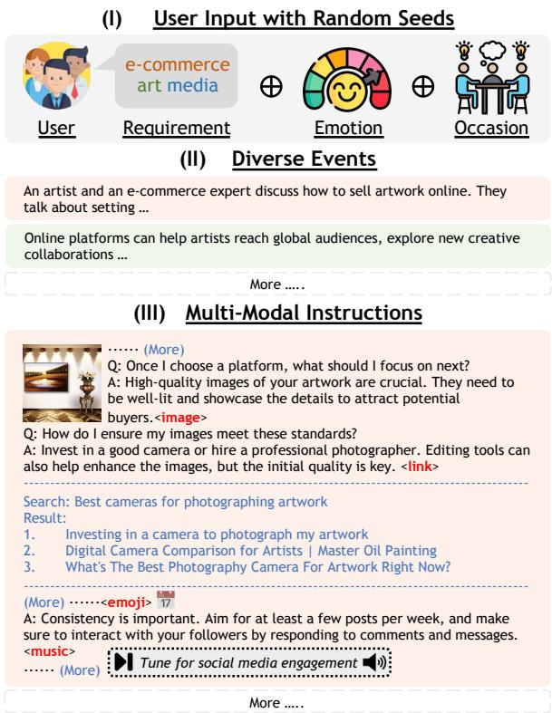  
Figure 1: Usage of UniData. (I) Users only input one simple requirement, combined with random emotions and occasions to create diverse events. (II) Each diverse event will generate one multimodal instruction. (III) The generated multimodal instructions include various modalities.

To address the limitations in quantity, quality, and copyright issues of existing data (in Section 3), we also construct UniDataset to support the training of UniData. This dataset comprises 20,000 entries and incorporates nine distinct modalities on both the input and output sides. These modalities include <language>, <image>, <music>, <emoji>, <code>, <map>, <link>, <math>, and <QR code> (see Section 3.1). The inclusion of these diverse modalities is intended to enhance our data generation pipeline, enabling the creation of more comprehensive multimodal instructions and thereby improving overall versatility.

Experimental results demonstrate that the quality of our generated data surpasses that of other generation pipelines on all four dimensions we evaluate:

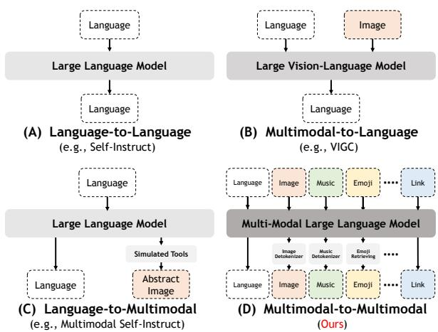  
Figure 2: Comparison of different instruction generation frameworks. (A) Self-Instruct (Wang et al., 2023) can only support language modality. (B) VIGC (Wang et al., 2024a) integrates visual modality into its generation. (C) Multimodal Self-Instruct (Zhang et al., 2024) can output abstract images. (D) Ours (UniData) can freely understand and generate different modalities in instructions.

reasonableness, clarity, detail, and relevance. Furthermore, our generated data can also enhance the understanding and generation capabilities of other multimodal large language models. Our contribution is shown as follows:

• We propose UniData, a universal multimodal instruction generation pipeline that can create multi-round multimodal instructions from one simple requirement.

• We propose UniDataset, a multimodal instruction dataset comprising 20, 000 instructions with nine distinct modalities in both input and output. UniDataset addresses existing limitations in data quantity, quality, and copyright status, and provides a robust data foundation for training UniData or other any-to-any models.

• Through comprehensive experiments, we demonstrate that UniData surpasses existing pipelines in data quality, achieving SOTA performance in reasonableness, clarity, detail, and relevance. Additionally, the generated data can improve the understanding and generation capabilities of other multimodal models.

## 2 Related Work

Multimodal Large Language Models Multimodal Large Language Models can understand multimodal information (Liang et al., 2024) by integrating various modalities, including but not limited to text, images, audio, and video. Due to their versatility, they have been widely applied in diverse fields, such as embodied intelligence (Li et al., 2024a), video understanding (Tang et al., 2024), and autonomous driving (Cui et al., 2024).

Most previous multimodal models (Liu et al., 2023; Li et al., 2023b; Lu et al., 2024b) were designed to understand multimodal information, yet their output is limited to language only. Recently, SEED-X (Ge et al., 2024) and Show-o (Xie et al., 2025) have begun to explore the integrated capabilities of image understanding and generation. Additionally, NExT-GPT (Wu et al., 2024) has advanced by integrating more modalities, including images, audio, and video, for unified understanding and generation.

Nonetheless, training these models encounters substantial challenges, particularly regarding data availability. For example, NExT-GPT (Wu et al., 2024) is unable to provide training data due to copyright constraints. Furthermore, Show-o (Xie et al., 2025) is limited to training in an end-to-end way due to the lack of an appropriate dataset. Motivated by these challenges, we propose UniData, which is designed to generate multimodal instructions to facilitate the model training process and potentially support further applications.

Instruction Generation The scarcity of training data impacts the performance of Multimodal Large Language Models, leading to increased interest in how to generate high-quality instruction data. Self-Instruct (Wang et al., 2023) pioneered the generation of diverse instructions using a small set of seed tasks, but it focuses only on the language modality (Figure 2 (A)). To overcome these limitations, VIGC (Wang et al., 2024a) integrates visual understanding into the instruction generation process (Figure 2 (B)). Besides, Multimodal Self-Instruct (Zhang et al., 2024) addresses the problem of abstract image synthesis in instruction generation, utilizing synthetic tools to create both diagrams and corresponding text (Figure 2 (C)). However, these methods still support limited multimodal capabilities.

To address these constraints, we propose UniData, a universal multimodal instruction generation pipeline designed to both understand and generate nine types of multimodal information (Figure 2 (D)). This approach broadens the applicability of multimodal instruction generation compared to previous research.

## 3 Dataset Construction

To train UniData, a dataset containing both multimodal inputs and outputs is essential. However, datasets meeting these criteria are scarce. As summarised in Table 10 (Appendix A.3), the majority of existing datasets are confined to a single modality, especially for the output. While NExT-GPT (MosIT) (Wu et al., 2024) and GenHowTo (Soucek ˇ et al., 2024) have developed some initial datasets encompassing multimodal inputs and outputs, they are hindered by a restricted range of modalities, limited instruction rounds, and a small data size. Furthermore, copyright concerns limit their availability.

To enrich our data resources, we have also developed a multimodal dataset named UniDataset (the Ours row in Table 10). This dataset supports inputs and outputs across nine modalities, thereby facilitating the training process of UniData.

## 3.1 Procedure of Data Construction

Stage (I): Preparing Diverse Events To accommodate data diversity, it is crucial to generate varied <events> (tasks) for each multi-round instruction. Drawing inspiration from Self-Instruct (Wang et al., 2023), we first create a Topic Pool with 90 <topics> spanning multiple domains, such as ecommerce, lifestyle, and sports. Then, we randomly pair two topics and input them into GPT-4o (OpenAI, 2024) to generate diverse <events>, as shown in Figure 3 (I). Compared to a single <topic>, this approach introduces greater randomness $( \binom { 9 0 } { 2 } = 4 , \bar { 0 0 5 }$ unique combinations), thereby facilitating data diversity.

Stage (II): Generating Multi-Round Instructions After obtaining <events> (tasks), we utilize them to generate multi-round instructions. Considering other attributes of instructions, we also randomly choose different <rounds> (ranging from 5 to 30), <emotion> (random proportions of seven distinct emotions), and <occasion> (formal or informal) to collectively guide GPT-4o (OpenAI, 2024) in generating diverse instructions, as shown in Figure 3 (II). Ultimately, we generate 20, 000 multi-round instructions.

Stage (III): Forecasting Multimodal Integration Our current multi-round instructions are restricted to a single modality (<language>). To generate multimodal content, we utilize GPT-4o (OpenAI, 2024) to predict potential multimodal content and incorporate the relevant indicators.

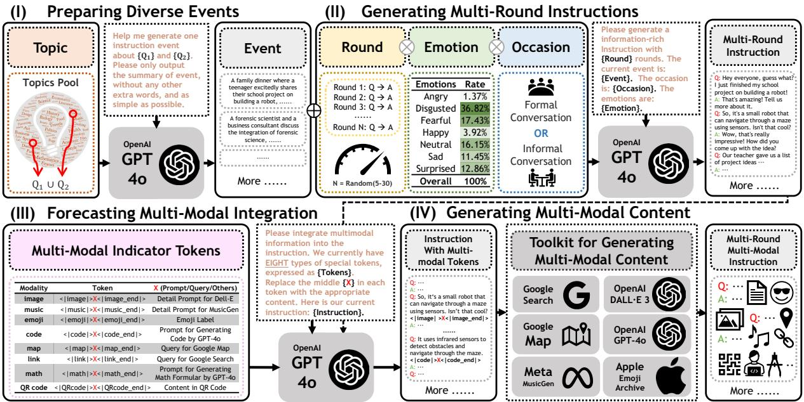  
Figure 3: Procedure of data construction. Stage (I) prepares diverse events by random topic pairs. Stage (II) leverages these events to produce multi-round instructions. Stage (III) forecasts eight types of multimodal indicator tokens and integrates these into instructions. Stage (IV) uses a toolkit to generate multimodal content.

Beyond the base <language> modality, we forecast indicators for eight modalities: <image>, <music>, <emoji>, <code>, <map>, <link>, <math>, and <QR code>. Additionally, we generate prompts that describe the corresponding multimodal content, as shown in Figure 3 (III). For instance, we generate prompts for GPT-4o (OpenAI, 2024) for modalities such as <image>, <code>, and <math>. For <map> and <link>, we develop search queries intended for use with Google Search and Google Maps.

Stage (IV): Generating Multimodal Content In the final stage, we develop an advanced Toolkit for Generating Multimodal Content. This toolkit includes GPT-4o (OpenAI, 2024), Google Search, Google Maps, DALL·E 3, MusicGen (Copet et al., 2023), and the Apple Emoji Archive to assist in producing multimodal content. We leverage the generated prompts/content/queries to drive this toolkit, enabling the creation of multimodal content.

## 3.2 Data Format and Statistics

Each UniDataset sample is generated by mapping a contextual triple to a multimodal instruction that contains nine typed slots, one per modality (Eq. (1)). Slots are filled by dedicated generators (Appendix A.2) conditioned on a modalityspecific cue (a <prompt>, <label>, <query>, or <content> string), while the <language> slot carries the dialogue text itself.

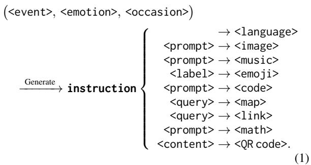

## 4 Methodology

Previous works, such as Multimodal Self-Instruct (Zhang et al., 2024) and VIGC (Wang et al., 2024a), typically support only limited multimodal generation or understanding capabilities, which do not satisfy users’ practical needs. In real-world applications, users often prefer to provide only one or a few simple requirements to generate large volumes of high-quality data.

Overview To address the aforementioned issues, we propose UniData, a pipeline for generating multimodal instructions. Initially, based on userprovided requirements, we develop an event generator that expands on the limited inputs to create diverse events in Section 4.1. Next, to generate multimodal instructions, we construct a large model for multimodal understanding and generation in Section 4.2. Finally, to mitigate potential biases during long-term multi-round instruction generation, we correct the instruction flow to filter out unreasonable data in Section 4.3.

## 4.1 Expanding Diverse Events

Typically, users seek to generate one high-quality instruction dataset by providing only a few keyword requirements (K), such that $\begin{array} { r } { ( \mathbf { K } \stackrel { \cdot } {  } \sum _ { n = 1 } ^ { N } \bar { \mathbf { I } _ { n } } ) } \end{array}$ However, if we treat one K as a single <event> (T), it becomes challenging to produce a diverse set of instructions.

Therefore, we first need to expand the variety of T, so we build the Diverse Event Generator (DEG) to expand diverse events, as shown in Figure 4 and Eq. (2), as

$$
\sum _ { n = 1 } ^ { N } \operatorname { I } _ { n } \gets \left\{ \operatorname { T } _ { 1 } , \operatorname { T } _ { 2 } , \dots , \operatorname { T } _ { N } \right\} = \mathbf { D } \mathbf { E } \mathbf { G } ( \mathbf { K } \oplus \mathbf { S } ) ,\tag{2}
$$

where $\bigoplus$ is the concatenation operator. The set $\{ \mathrm { T } _ { 1 } , \mathrm { T } _ { 2 } , \dots , \mathrm { T } _ { N } \}$ denotes the collection of <events>, each corresponding to a distinct instruction $\left( \mathrm { I } _ { n } \right)$ . The term S represents stochastic factors, such as random emotion proportions, random occasions, and other random seeds, which collectively enhance the capability of DEG(·) to generate a broader spectrum of diverse events.

## 4.2 Generating Multimodal Instructions

After obtaining diverse <events>, the next step is to generate multimodal instructions. Inspired by previous any-to-any models (Wu et al., 2024; Xie et al., 2025), we develop the Multimodal Instruction Generator (MIG), a text-centred generator coupled with modality-specific realisation tools that can both understand and generate multimodal content, as shown in Figure 5 and Eq. (3),

$$
\mathbf { I } _ { n } ^ { M } = \mathbf { M } \mathbf { I } \mathbf { G } ( \mathbf { T } _ { n } \oplus \sum _ { m = 1 } ^ { M - 1 } \mathbf { I } _ { n } ^ { m } ) ,\tag{3}
$$

where MIG(·) takes as input one event $\mathrm { T } _ { n }$ and previously generated multimodal instructions $( \sum _ { m = 1 } ^ { \pmb { M } - 1 } \mathbf { I } _ { n } ^ { m } )$ , and predicts the next-round multimodal instruction $( \boldsymbol { \mathrm { I } } _ { n } ^ { M } )$ .

Multimodal Tokenization To generate the nextround instructions $( \boldsymbol { \mathrm { I } } _ { n } ^ { M } )$ , MIG must understand the multimodal instruction from previous rounds $( \sum _ { m = 1 } ^ { M - 1 } \mathbf { I } _ { n } ^ { m } )$ . Thus, it is necessary to convert the previous multimodal instructions into token embeddings within a unified feature space.

Given that our training dataset, UniDataset, comprises nine distinct modalities, our tokenizing strategy $( \mathbf { F } ( \cdot ) )$ is shown as Eq. (4),

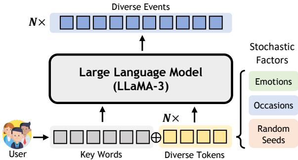  
Figure 4: Pipeline of Diverse Event Generator (DEG). Users can generate diverse events by inputting their needs.

$$
\mathbf { F } ( \mathrm { I } ) = \left[ \begin{array} { c } { \mathbf { f } _ { \mathrm { t e x t } } [ \mathrm { I } _ { \mathrm { L } } , \mathbf { C } ( \mathrm { I } _ { \mathrm { E } } \oplus \mathrm { I } _ { \mathrm { C } } \oplus \mathrm { I } _ { \mathrm { M P } } \oplus \mathrm { I } _ { \mathrm { L K } } \oplus \mathrm { I } _ { \mathrm { M T } } \oplus \mathrm { I } _ { \mathrm { Q } } ) ] } \\ { \mathbf { f } _ { \mathrm { i m g } } ( \mathrm { I } _ { \mathrm { I } } ) } \\ { \mathbf { f } _ { \mathrm { m u s } } ( \mathrm { I } _ { \mathrm { M } } ) } \end{array} \right] ,\tag{4}
$$

where $\begin{array} { r l r } { \mathbf { f } _ { x } ( \cdot ) , x } & { { } \in } & { \{ \mathrm { t e x t , i m g , m u s } \} } \end{array}$ represent the tokenizer and embedding layer/projection for different modalities $( \mathrm { I } _ { x } , x \in \{ \mathrm { L } , \mathrm { I } , \mathrm { M } , \mathrm { E } , \mathrm { C } , \mathrm { M P } , \mathrm { L K } , \mathrm { M T } , \mathrm { Q } \} )$

For modalities that are not inherently linguistic but can be represented as text $( \mathrm { I } _ { x } , x \in \mathbb { Z }$ {E, C, MP, LK, MT, Q}), we can easily convert these into textual representations (prompt/label/- query/content) by the formatter (C(·)). Then, these modalities can be combined with the language modality (IL) and tokenized directly by using the default LLaMA Tokenizer (Grattafiori et al., 2024) $( { \bf f } _ { \mathrm { t e x t } } ( \cdot ) )$ ). The tokenized outputs are subsequently passed through a pre-trained embedding layer to generate token embeddings.

For <image> (II), we utilize the visual tokenizer and projection $( \mathbf { f } _ { \mathrm { i m g } } ( \cdot ) )$ from Ovis-1.5 (Lu et al., 2024b) to convert images into visual embeddings. For <music> (IM), drawing on previous research (Gong et al., 2023; Chu et al., 2023; Du et al., 2023; Verma, 2024), we integrate a pretrained Whisper (Radford et al., 2023) as the music tokenizer, followed by a Multi-Layer Perceptron (MLP) that projects into the desired embedding space.

Multimodal Indicator To distinguish different modalities, we introduce new special tokens to indicate the beginning and end of each modality. As shown in Figure 5, the start of a modality is indicated by <|modality|>, where

$$
\begin{array} { r } { \mathfrak { m o d a l i t y } \in \{ \mathrm { i m a g e } , \mathfrak { m u s i c } , \mathfrak { e m o j i } , \mathrm { c o d e } , } \\ { \mathfrak { m a p } , \mathrm { l i n k } , \mathfrak { m a t h } , \mathfrak { q r c o d e } \} , } \end{array}\tag{5}
$$

and the end of the modality is indicated by <|modality\_end|>. This strategy allows the model to identify the position of multimodal insertion.

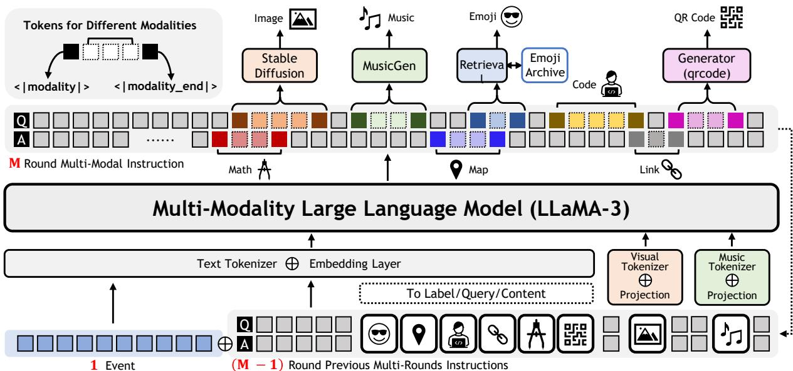  
Figure 5: Pipeline of Multimodal Instruction Generator (MIG). With just one event provided by the user, MIG can iteratively generate multi-round multimodal instructions based on the context.

Architecture of Large Language Model After aligning the multimodal signals into a unified embedding space, we select LLaMA-3 (Grattafiori et al., 2024) as the main backbone of our pipeline. We also use the causal attention mechanism to sequentially predict the next token.

Multimodal Generation To generate multimodal instructions, we first need to establish multimodal token labels during training. Although most modalities can be represented as text during tokenization, the image and music modalities lack corresponding text representations. However, we find that during data construction (as described in Eq. (1)), we obtain <prompts> $( \mathrm { P _ { I } }$ and $\mathrm { P _ { M } } )$ for generating images and music. Therefore, we can use these prompts as tokens to represent these two modalities discretely. Eq. (6) shows the ground truth label (V),

$$
\begin{array} { r l } & { \mathbf { V } = \{ \mathrm { V _ { L } } , ( \mathrm { V _ { E } , V _ { C } , V _ { M P } , V _ { L K } , V _ { M T } , V _ { Q } } ) , \mathrm { V _ { I } , V _ { M } } \} , } \\ & { \quad \quad \mathrm { w h e r e } \quad \mathrm { V _ { I } } = \mathbf { f _ { t e x t } } ( \mathrm { P _ { I } } ) , \quad \mathrm { V _ { M } } = \mathbf { f _ { t e x t } } ( \mathrm { P _ { M } } ) , } \end{array}\tag{6}
$$

and $\mathbf { f } _ { \mathrm { t e x t } } ( \cdot )$ is the tokenizer of LLaMA-3 (Grattafiori et al., 2024) and $\begin{array} { r l } { \mathrm { V } _ { x } , x } & { { } \in } \end{array}$ {L, I, M, E, C, MP, LK, MT, Q} are the labels of different modalities. Our goal is to predict the next token $( \mathbf { V } ^ { k } )$ given the previous tokens $( \{ \mathbf { V } ^ { i } \} _ { i = 1 } ^ { k - 1 } )$ and the model parameters (Θ), as Eq. (7),

$$
\mathcal { L } = - \sum _ { k } \log p ( \mathbf { V } ^ { k } | \{ \mathbf { V } ^ { i } \} _ { i = 1 } ^ { k - 1 } ; \Theta ) .\tag{7}
$$

Multimodal Detokenization We use the default LLaMA-3 text detokenizer (Grattafiori et al., 2024) to convert all modalities into their text representations. For <code>, <map>, <link>, and <math>, they can be directly detokenized into their original information. For <image>, we use Stable Diffusion 3 (Esser et al., 2024) to transform the text into the corresponding image. For <music>, we employ MusicGen (Copet et al., 2023) to convert the text into the corresponding music. For <emoji>, we perform a similarity search of the output text to retrieve the corresponding emoji from the emoji archive. For <QR code>, we can directly convert its content into a QR code by qrcode1.

## 4.3 Correcting Instruction Flow

Although now we can generate multimodal instructions by MIG, during inference, it may also encounter common issues like repetitive generation or hallucinations (Xu et al., 2022; Huang et al., 2024). Therefore, cleaning and filtering data during long-term inference is crucial for maintaining data quality. We design an inference chain in Figure 6. We compare the newly generated one-round instruction $( \boldsymbol { \mathrm { I } } _ { n } ^ { M } )$ against the previous k-round instructions $( { \sum } _ { m = M - k } ^ { \tilde { M } - 1 } { \mathbf { I } } _ { n } ^ { m } )$ and apply the following three rules:

1. Repetitive Generation: If the new instruction is close to the previous ones, increase the REPE-TITION PENALTY (↑) to reduce repetition.

2. Irrelevant Generation: If the new instruction is unrelated to the previous ones, raise the TEM-PERATURE (↑) to introduce randomness, thereby sampling more alternatives.

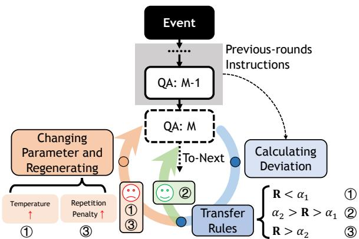  
Figure 6: Inference chain for correcting instruction flow.

3. High-Quality Generation: If the instruction is neither repetitive nor irrelevant, we regard it as high-quality and proceed to the generation of the next round.

To assess deviation, we use cosine similarity, as Eq. (8),

$$
\mathbf { R } = { \frac { 1 } { k } } \sum _ { m = M - k } ^ { M - 1 } \mathsf { c o s } _ { - } s ( \mathrm { I } _ { n } ^ { M } , \mathrm { I } _ { n } ^ { m } ) = { \frac { 1 } { k } } \sum _ { m = M - k } ^ { M - 1 } { \frac { \mathrm { I } _ { n } ^ { M } \cdot \mathrm { I } _ { n } ^ { m } } { | \mathrm { I } _ { n } ^ { M } | \left| \mathrm { I } _ { n } ^ { m } \right| } } .\tag{8}
$$

I $\mathbf { \dot { R } } < \alpha _ { 1 }$ , it indicates “Irrelevant Generation”. If ${ \bf R } > \alpha _ { 2 }$ , it indicates “Repetitive Generation”. If $\alpha _ { 2 } > { \bf R } > \alpha _ { 1 }$ , it indicates “High-Quality Generation”. Empirically, we currently set $\alpha _ { 1 } = 0 . 0 5$ and $\alpha _ { 2 } = 0 . 4$ to minimize errors. Users can also adjust these values dynamically to maintain instruction quality and relevance based on their needs.

## 5 Experiments

In this section, we compare our instruction generation pipeline with others to evaluate instruction quality (see Section 5.1). Besides, we assess whether the generated instructions can improve multimodal generation and understanding performance after fine-tuning (see Section 5.2). Finally, we demonstrate the effectiveness of expanding events and correcting instruction flow (see Section 5.3).

Furthermore, we conduct a user study to assess the quality of the generated instructions, demonstrate the adaptability and balance of multimodal content to support different needs, validate performance on out-of-domain data, and provide additional qualitative results in the Appendix.

Training & Testing During the pre-training phase, we adhere to the training strategy and dataset outlined in Ovis-1.5 (Lu et al., 2024b), enabling the model to acquire initial multimodal understanding ability. In the fine-tuning phase, we keep the parameters of the visual and music tokenizers fixed and randomly select 90% of UniDataset for model fine-tuning, reserving the remaining 10% for testing.

## 5.1 Instruction Quality Evaluation

Baselines We select two representative instruction generation frameworks, Self-Instruct (Wang et al., 2023) and VIGC (Wang et al., 2024a), for comparison on our test data. In Self-Instruct (Wang et al., 2023), due to the unavailability of GPT-3, we replace it with the latest GPT-4 (OpenAI, 2024). A discussion of more recent instruction-data generation methods and how they compare in scope is provided in Appendix C.7.

Evaluation Metrics Following previous work (Li et al., 2023b; Tang et al., 2024), we use GPT-Guided metrics to evaluate the quality differences between generated results and references. Our goal is not to precisely match the ground truth but to produce high-quality instructions. We focus on four key metrics: 1 Reasonableness - assesses if the instruction is logical and appropriate; 2 Clarity - ensures the instructions are clear and unambiguous; 3 Detail - evaluates whether the instructions include more detailed information; 4 Relevance - checks that the content is related to the desired outcome.

Performance Analysis Table 1 presents the quantitative results of our data quality. UniData surpasses both baselines on all four dimensions, with the largest margin on Clarity and Relevance. Furthermore, UniData supports more rounds of instruction generation and can produce rich multimodal content within instructions. Figure 7 shows the qualitative performance in data quality. Compared to other baselines that are limited to generating textual content, UniData can generate high-quality multimodal instructions.

## 5.2 Post Fine-Tuning Assessment

Referring to previous research (Wang et al., 2024a, 2023), we also evaluate the effectiveness of the generated multimodal instructions (+ IUniData) by fine-tuning other multimodal models.

Table 1: Quantitative performance in data quality. Red indicates the best performance. (#Others includes all other modalities (#Emoji, #Code, #Math, #Map, #Link, #QR Code)).
<table><tr><td rowspan="2">Method</td><td rowspan="2">Backbones</td><td colspan="4">GPT-Guided Metrics (↑) )(OpenAI, 2024)</td><td colspan="2">Avg. #Multimodalities(↑)</td><td rowspan="2">Avg. #Rounds</td></tr><tr><td>Reasonableness</td><td>Clarity</td><td>Detail</td><td>Relevance</td><td>#Image</td><td>#Music #Others</td></tr><tr><td>Self-Instruct (Wang et al., 2023)</td><td>GPT-4 (OpenAI, 2024)</td><td>0.624</td><td>0.444</td><td>0.594</td><td>0.520</td><td></td><td></td><td>≈3</td></tr><tr><td>VIGC (Wang et al., 2024a)</td><td>Vicuna 7B (Chiang et al., 2023)</td><td>0.460</td><td>0.359</td><td>0.534 0.569</td><td></td><td></td><td></td><td>≈1</td></tr><tr><td>Ours (UniData)</td><td>LLaMA-3 7B (Grattafiori et al., 2024)</td><td>0.661</td><td>0.527</td><td>0.667 0.682</td><td>1.92</td><td>0.74</td><td>7.37</td><td>≈17.5</td></tr></table>

Table 2: Improvement of music understanding.  
Table 3: Music generation.
<table><tr><td></td><td>BLEU (↑)</td><td>BLEU-4 (↑)</td><td>METEOR (↑)</td><td>ROUGE (↑)</td><td>BERT (↑)</td><td></td><td>| FAD (↓)</td><td>CLAP (↑)</td><td>KL (↓)</td></tr><tr><td>Baseline</td><td>0.2675</td><td>0.2019</td><td>0.3232</td><td>0.3376</td><td>0.8932</td><td>Baseline</td><td>16.69</td><td>0.3138</td><td>2.1358</td></tr><tr><td>Baseline  $+ \arctan { \tt i } \tt { \sf { D a t a } }$ </td><td>0.2681</td><td>0.2076</td><td>0.3330</td><td>0.3496</td><td>0.8936</td><td>Baseline  $- \mathcal { T } _ { \mathsf { U n i D a t a } }$ </td><td>16.51</td><td>0.3192</td><td>2.1038</td></tr></table>

Table 4: Improvement on different modalities.
<table><tr><td>Modality</td><td>| Code (↑)</td><td>Math (↑)</td><td>Text-based (↑)</td><td>Reasoning (↑)</td></tr><tr><td>Benchmark</td><td>MBPP</td><td>MathVista</td><td>MMLU-Pro</td><td>MathVision</td></tr><tr><td>Baseline</td><td>20.8</td><td>59.4</td><td>20.3</td><td>12.8</td></tr><tr><td>Baseline +  $\scriptstyle { \mathcal { T } } _ { { \mathsf { U n i D a t a } } }$ </td><td>21.3</td><td>60.1</td><td>21.9</td><td>13.0</td></tr></table>

Table 6: Improvement on visual understanding.
<table><tr><td>Benchmark</td><td>MMMU (↑) ChartQA (↑) TextVQA (↑)</td><td></td><td></td></tr><tr><td>Baseline</td><td>35.8</td><td>17.4</td><td>58.9</td></tr><tr><td> $\mathbf { B a s e l i n e } + \mathcal { T } _ { \mathbf { U n i D a t a } }$ </td><td>36.4</td><td>17.9</td><td>60.1</td></tr></table>

Visual Understanding We utilize a suite of benchmarks (MMMU (Yue et al., 2024), ChartQA (Masry et al., 2022), and TextVQA (Singh et al., 2019)) to evaluate the effectiveness of our generated data in visual reasoning tasks. As detailed in Table 6, the integration of our data improves the performance of Ovis2-1B (Lu et al., 2024b) in these benchmarks.

Image Understanding and Generation We evaluate image understanding and generation capabilities using the SEED-X model (Ge et al., 2024) and the SEED-Bench-2 benchmark (Li et al., 2023a). Our data improves both Image-to-Text and Textto-Image tasks. As shown in Table 5, the gain is largest on the interleaved setting (19.42% → 35.25%), with smaller gains on the single- and multi-image settings. Additionally, in the domain of image generation, our dataset helps the model produce relevant images based on textual inputs.

Music Understanding and Generation We utilize the MuMu-LLaMA model (Liu et al., 2024a) to assess advancements in music understanding and generation. As illustrated in Tables 2 and 3, our generated instructions improve both domains, although the margins are small. In the realm of music understanding (Table 2), all five metrics move in the expected direction, with the clearest gains on METEOR and ROUGE. In music generation (Table 3), the fine-tuned model exhibits decreased FAD and KL scores alongside an elevated CLAP score, reflecting more coherent and high-quality music synthesis from textual prompts.

Table 5: Image understanding/generation.
<table><tr><td rowspan="2"></td><td colspan="3">Image Understanding</td><td rowspan="2">Image (↑) Generation</td></tr><tr><td>Single (↑)</td><td>Multi (↑)</td><td>Interleaved (↑)</td></tr><tr><td>Baseline</td><td>26.19%</td><td>37.73%</td><td>19.42%</td><td>24.43%</td></tr><tr><td>Baseline  $\mathtt { \Pi } \mathtt { \Pi } \mathtt { T } _ { \mathtt { U n i D a t a } }$ </td><td>27.15%</td><td>39.09%</td><td>35.25%</td><td>25.90%</td></tr></table>

Table 7: Quantitative performance in ablation study.
<table><tr><td></td><td>Reasonableness (↑)</td><td> $\overline { { \mathbf { C l a r i t y } \left( \uparrow \right) } }$ </td><td>Detail (↑)</td><td>Relevance (↑)</td><td>#Ins.</td></tr><tr><td>w/o Expansion</td><td>0.557</td><td>0.518</td><td>0.607</td><td>0.550</td><td>k</td></tr><tr><td>w/o Correction</td><td>0.648</td><td>0.489</td><td>0.610</td><td>0.654</td><td> $N \times k$ </td></tr><tr><td>Ours</td><td>0.661</td><td>0.527</td><td>0.667</td><td>0.682</td><td>N × k</td></tr></table>

Code Generation We evaluate the impact of our generated data on code modality by enhancing the code generation capabilities of a large language model, LLaMA 2 (Touvron et al., 2023), using the Mostly Basic Python Programming (MBPP) Benchmark (Austin et al., 2021). As presented in Table 4, our instructions improve performance.

Mathematical Problem To evaluate the efficacy of our generated instructions in enhancing complex reasoning and mathematical problem-solving capabilities, we benchmark the Ovis2-1B (Lu et al., 2024b) on the MathVista (Lu et al., 2024a) and MathVision (Wang et al., 2024b) datasets. In Table 4, our instructions improve performance on both mathematical benchmarks. The gains are consistent in direction across the two, though modest in magnitude.

Other Text-based Modalities To confirm the versatility of our data across various text-based modalities, including language, QR code, link, and map, we assessed their performance using a general language-based benchmark, MMLU-Pro (Wang et al., 2024c). As shown in Table 4, adding our data raises MMLU-Pro accuracy from 20.3 to 21.9, indicating that the text-based modalities also transfer to a general language benchmark.

  
Figure 7: Qualitative comparison in data quality.

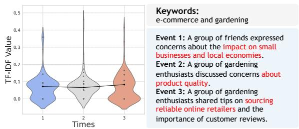  
Figure 8: (left) Difference distribution of the events in three random generations. (right) Example of diverse events based on the same keywords.

## 5.3 Ablation Study

Effectiveness of Expanding Diverse Events To demonstrate the effectiveness of expanding events, we randomly expand three events for each keyword on the test data to observe whether these events differ from one another (diversity). As shown in Figure 8 (left), the TF-IDF (Ramos et al., 2003) feature distributions across three generation runs (on a random subset) show considerable diversity. In Figure 8 (right), we also provide an example showing that different events exhibit distinct content (in highlighted text). In the w/o Expansion setting of Table 7, the generation of instructions relies solely on the few keywords provided by the user. Thus, the generation pipeline lacks the necessary enriched prompt information, which leads to a decline in the quality of generated instructions.

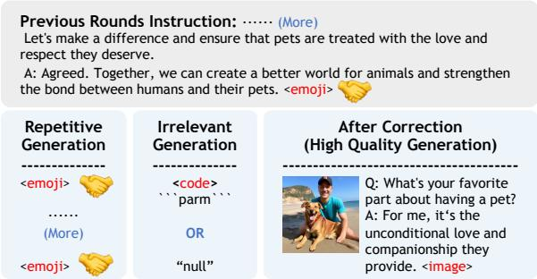  
Figure 9: Example of flow error correction.

Additionally, the number of instructions that can be generated is substantially reduced.

Effectiveness of Correcting Instruction Flow To demonstrate the effectiveness of correcting instruction flow, we run inference twice, with and without the correction, as shown in Table 7 and Figure 9. Table 7 shows that after correction, our data quality improves on all four dimensions. Figure 9 provides an example of the repetitive generation problem (same <emojis>) and irrelevant generation problem (<code> or “null”) in multimodal content. After correction, instruction generation can effectively avoid these errors.

## 6 Conclusion

This paper presents UniData, a universal pipeline for multimodal instruction generation. As a fundamental contribution, UniData establishes a framework for scalable data acquisition critical to MLLMs. By delivering high-quality, diverse, and cost-effective instruction sets, UniData accelerates progress in multimodal learning paradigms and their downstream applications.

## Limitations

UniData is a text-centered orchestration pipeline rather than a native any-to-any model, so permodality quality is bounded by the external tools that realize each modality. Long-horizon structured reasoning is handled only by simple correction rules, and the nine-modality coverage still omits video, 3D, motion, tables, biological data, and spoken input. Finally, UniData inherits biases from its LLM backbones, search APIs, and modality generators; these may enter UniDataset and be amplified downstream, and systematic bias audits remain future work.

## References

Jacob Austin, Augustus Odena, Maxwell Nye, Maarten Bosma, Henryk Michalewski, David Dohan, Ellen Jiang, Carrie Cai, Michael Terry, Quoc Le, and 1 others. 2021. Program synthesis with large language models. arXiv preprint arXiv:2108.07732.

Wei-Lin Chiang, Zhuohan Li, Zi Lin, Ying Sheng, Zhanghao Wu, Hao Zhang, Lianmin Zheng, Siyuan Zhuang, Yonghao Zhuang, Joseph E. Gonzalez, Ion Stoica, and Eric P. Xing. 2023. Vicuna: An open-source chatbot impressing GPT-4 with 90%\* ChatGPT quality. https://lmsys.org/ blog/2023-03-30-vicuna/.

Yunfei Chu, Jin Xu, Xiaohuan Zhou, Qian Yang, Shiliang Zhang, Zhijie Yan, Chang Zhou, and Jingren Zhou. 2023. Qwen-audio: Advancing universal audio understanding via unified large-scale audiolanguage models. Preprint, arXiv:2311.07919.

Jade Copet, Felix Kreuk, Itai Gat, Tal Remez, David Kant, Gabriel Synnaeve, Yossi Adi, and Alexandre Défossez. 2023. Simple and controllable music generation. In Thirty-seventh Conference on Neural Information Processing Systems.

Can Cui, Yunsheng Ma, Xu Cao, Wenqian Ye, Yang Zhou, Kaizhao Liang, Jintai Chen, Juanwu Lu, Zichong Yang, Kuei-Da Liao, and 1 others. 2024. A survey on multimodal large language models for autonomous driving. In Proceedings of the IEEE/CVF Winter Conference on Applications ofComputer Vision, pages 958–979.

Shengyuan Ding, Shenxi Wu, Xiangyu Zhao, Yuhang Zang, Haodong Duan, Xiaoyi Dong, Pan Zhang, Yuhang Cao, Dahua Lin, and Jiaqi Wang. 2025. MM-IFEngine: Towards multimodal instruction following. In Proceedings of the IEEE/CVF International Conference on Computer Vision (ICCV), pages 1099– 1109.

Zhihao Du, Jiaming Wang, Qian Chen, Yunfei Chu, Zhifu Gao, Zerui Li, Kai Hu, Xiaohuan Zhou, Jin Xu, Ziyang Ma, Wen Wang, Siqi Zheng, Chang Zhou, Zhijie Yan, and Shiliang Zhang. 2023. Lauragpt: Listen, attend, understand, and regenerate audio with gpt. Preprint, arXiv:2310.04673.

Patrick Esser, Sumith Kulal, Andreas Blattmann, Rahim Entezari, Jonas Müller, Harry Saini, Yam Levi, Dominik Lorenz, Axel Sauer, Frederic Boesel, Dustin Podell, Tim Dockhorn, Zion English, and Robin Rombach. 2024. Scaling rectified flow transformers for high-resolution image synthesis. In Proceedings of the 41st International Conference on Machine Learning, volume 235 of Proceedings of Machine Learning Research, pages 12606–12633. PMLR.

Xinyu Fang, Kangrui Mao, Haodong Duan, Xiangyu Zhao, Yining Li, Dahua Lin, and Kai Chen. 2024. MMBench-Video: A long-form multi-shot benchmark for holistic video understanding. In Advances in Neural Information Processing Systems (NeurIPS) Datasets and Benchmarks Track.

Yukang Feng, Jianwen Sun, Chuanhao Li, Zizhen Li, Jiaxin Ai, Fanrui Zhang, Yifan Chang, Sizhuo Zhou, Shenglin Zhang, Yu Dai, and Kaipeng Zhang. 2026. A high quality dataset and reliable evaluation for interleaved image-text generation. In International Conference on Learning Representations (ICLR).

Yuying Ge, Sijie Zhao, Jinguo Zhu, Yixiao Ge, Kun Yi, Lin Song, Chen Li, Xiaohan Ding, and Ying Shan. 2024. Seed-x: Multimodal models with unified multigranularity comprehension and generation. arXiv preprint arXiv:2404.14396.

Yuan Gong, Alexander H. Liu, Hongyin Luo, Leonid Karlinsky, and James Glass. 2023. Joint audio and speech understanding. In 2023 IEEE Automatic Speech Recognition and Understanding Workshop (ASRU). IEEE.

Aaron Grattafiori, Abhimanyu Dubey, Abhinav Jauhri, Abhinav Pandey, Abhishek Kadian, Ahmad Al-Dahle, Aiesha Letman, Akhil Mathur, Alan Schelten, Alex Vaughan, and 1 others. 2024. The llama 3 herd of models. Preprint, arXiv:2407.21783.

Jacob Hansen, Wei Lin, Junmo Kang, Muhammad Jehanzeb Mirza, Hongyin Luo, Rogerio Feris, Alan Ritter, James Glass, and Leonid Karlinsky. 2025. Instructify: Demystifying metadata to visual instruction tuning data conversion. arXiv preprint arXiv:2505.18115.

Lei Huang, Weijiang Yu, Weitao Ma, Weihong Zhong, Zhangyin Feng, Haotian Wang, Qianglong Chen, Weihua Peng, Xiaocheng Feng, Bing Qin, and Ting Liu. 2024. A survey on hallucination in large language models: Principles, taxonomy, challenges, and open questions. ACM Transactions on Information Systems.

Bohao Li, Yuying Ge, Yixiao Ge, Guangzhi Wang, Rui Wang, Ruimao Zhang, and Ying Shan. 2023a. Seedbench-2: Benchmarking multimodal large language models. arXiv preprint arXiv:2311.17092.

Guoliang Li, Yudian Zheng, Ju Fan, Jiannan Wang, and Reynold Cheng. 2017. Crowdsourced data management: Overview and challenges. In Proceedings of the 2017 ACM international conference on Management of Data, pages 1711–1716.

KunChang Li, Yinan He, Yi Wang, Yizhuo Li, Wenhai Wang, Ping Luo, Yali Wang, Limin Wang, and Yu Qiao. 2023b. Videochat: Chat-centric video understanding. arXiv preprint arXiv:2305.06355.

Luxi Li, Yuchen Li, Xiaotong Zhang, Yuhang He, Jianjian Yang, Bin Tian, Yunfeng Ai, Lingxi Li, Andreas Nüchter, and Zhe Xuanyuan. 2024a. Embodied intelligence in mining: Leveraging multi-modal large language model for autonomous driving in mines. IEEE Transactions on Intelligent Vehicles.

Pengxiang Li, Zhi Gao, Bofei Zhang, Tao Yuan, Yuwei Wu, Mehrtash Harandi, Yunde Jia, Song-Chun Zhu, and Qing Li. 2024b. FIRE: A dataset for feedback

integration and refinement evaluation of multimodal models. In The Thirty-eight Conference on Neural Information Processing Systems Datasets and Benchmarks Track.

Zijing Liang, Yanjie Xu, Yifan Hong, Penghui Shang, Qi Wang, Qiang Fu, and Ke Liu. 2024. A survey of multimodel large language models. In Proceedings ofthe 3rd International Conference on Computer, Artificial Intelligence and Control Engineering, CAICE ’24, page 405–409, New York, NY, USA. Association for Computing Machinery.

Haotian Liu, Chunyuan Li, Qingyang Wu, and Yong Jae Lee. 2023. Visual instruction tuning. In Advances in Neural Information Processing Systems (NeurIPS), volume 36.

Shansong Liu, Atin Sakkeer Hussain, Qilong Wu, Chenshuo Sun, and Ying Shan. 2024a. Mumullama: Multi-modal music understanding and generation via large language models. arXiv preprint arXiv:2412.06660.

Yuan Liu, Haodong Duan, Yuanhan Zhang, Bo Li, Songyang Zhang, Wangbo Zhao, Yike Yuan, Jiaqi Wang, Conghui He, Ziwei Liu, Kai Chen, and Dahua Lin. 2024b. MMBench: Is your multi-modal model an all-around player? In Computer Vision – ECCV 2024, pages 216–233. Springer.

Pan Lu, Hritik Bansal, Tony Xia, Jiacheng Liu, Chunyuan Li, Hannaneh Hajishirzi, Hao Cheng, Kai-Wei Chang, Michel Galley, and Jianfeng Gao. 2024a. MathVista: Evaluating mathematical reasoning of foundation models in visual contexts. In International Conference on Learning Representations (ICLR).

Shiyin Lu, Yang Li, Qing-Guo Chen, Zhao Xu, Weihua Luo, Kaifu Zhang, and Han-Jia Ye. 2024b. Ovis: Structural embedding alignment for multimodal large language model. arXiv:2405.20797.

Ahmed Masry, Do Xuan Long, Jia Qing Tan, Shafiq Joty, and Enamul Hoque. 2022. ChartQA: A benchmark for question answering about charts with visual and logical reasoning. In Findings of the Association for Computational Linguistics: ACL 2022, pages 2263– 2279. Association for Computational Linguistics.

Henning Müller and Devrim Unay. 2017. Retrieval from and understanding of large-scale multi-modal medical datasets: a review. IEEE transactions on multimedia, 19(9):2093–2104.

OpenAI. 2024. Gpt-4o system card. Preprint, arXiv:2410.21276.

Alec Radford, Jong Wook Kim, Tao Xu, Greg Brockman, Christine McLeavey, and Ilya Sutskever. 2023. Robust speech recognition via large-scale weak supervision. In Proceedings of the 40th International Conference on Machine Learning, volume 202 of Proceedings of Machine Learning Research, pages 28492–28518. PMLR.

Juan Ramos and 1 others. 2003. Using tf-idf to determine word relevance in document queries. In Proceedings of the first instructional conference on machine learning, volume 242, pages 29–48. Citeseer.

Amanpreet Singh, Vivek Natarajan, Meet Shah, Yu Jiang, Xinlei Chen, Dhruv Batra, Devi Parikh, and Marcus Rohrbach. 2019. Towards VQA models that can read. In Proceedings of the IEEE/CVF Conference on Computer Vision and Pattern Recognition, pages 8317–8326.

Tomáš Soucek, Dima Damen, Michael Wray, Ivanˇ Laptev, and Josef Sivic. 2024. Genhowto: Learning to generate actions and state transformations from instructional videos. In Proceedings ofthe IEEE Conference on Computer Vision and Pattern Recognition (CVPR).

Jiaqi Tang, Hao Lu, Ruizheng Wu, Xiaogang Xu, Ke Ma, Cheng Fang, Bin Guo, Jiangbo Lu, Qifeng Chen, and Ying-Cong Chen. 2024. HAWK: Learning to understand open-world video anomalies. In Advances in Neural Information Processing Systems (NeurIPS), volume 37, pages 139751–139785.

Hugo Touvron, Louis Martin, Kevin Stone, Peter Albert, Amjad Almahairi, Yasmine Babaei, Nikolay Bashlykov, Soumya Batra, Prajjwal Bhargava, Shruti Bhosale, Dan Bikel, Lukas Blecher, Cristian Canton Ferrer, Moya Chen, Guillem Cucurull, David Esiobu, Jude Fernandes, Jeremy Fu, Wenyin Fu, and 49 others. 2023. Llama 2: Open foundation and fine-tuned chat models. Preprint, arXiv:2307.09288.

Prateek Verma. 2024. Whisper-gpt: A hybrid representation audio large language model. Preprint, arXiv:2412.11449.

Bin Wang, Fan Wu, Xiao Han, Jiahui Peng, Huaping Zhong, Pan Zhang, Xiaoyi Dong, Weijia Li, Wei Li, Jiaqi Wang, and Conghui He. 2024a. VIGC: Visual instruction generation and correction. In Proceedings of the AAAI Conference on Artificial Intelligence, volume 38, pages 5309–5317.

Ke Wang, Junting Pan, Weikang Shi, Zimu Lu, Mingjie Zhan, and Hongsheng Li. 2024b. Measuring multimodal mathematical reasoning with MATH-Vision dataset. In Advances in Neural Information Processing Systems (NeurIPS) Datasets and Benchmarks Track.

Yizhong Wang, Yeganeh Kordi, Swaroop Mishra, Alisa Liu, Noah A. Smith, Daniel Khashabi, and Hannaneh Hajishirzi. 2023. Self-instruct: Aligning language models with self-generated instructions. In Proceedings ofthe 61st Annual Meeting ofthe Associationfor Computational Linguistics (Volume 1: Long Papers), pages 13484–13508. Association for Computational Linguistics.

Yubo Wang, Xueguang Ma, Ge Zhang, Yuansheng Ni, Abhranil Chandra, Shiguang Guo, Weiming Ren, Aaran Arulraj, Xuan He, Ziyan Jiang, and 1 others. 2024c. Mmlu-pro: A more robust and challenging

multi-task language understanding benchmark. In The Thirty-eight Conference on Neural Information Processing Systems Datasets and Benchmarks Track.

Shengqiong Wu, Hao Fei, Leigang Qu, Wei Ji, and Tat-Seng Chua. 2024. Next-gpt: Any-to-any multimodal llm. In Proceedings ofthe International Conference on Machine Learning, pages 53366–53397.

Jinheng Xie, Weijia Mao, Zechen Bai, David Junhao Zhang, Weihao Wang, Kevin Qinghong Lin, Yuchao Gu, Zhijie Chen, Zhenheng Yang, and Mike Zheng Shou. 2025. Show-o: One single transformer to unify multimodal understanding and generation. In Inter national Conference on Learning Representations (ICLR).

Jin Xu, Xiaojiang Liu, Jianhao Yan, Deng Cai, Huayang Li, and Jian Li. 2022. Learning to break the loop: Analyzing and mitigating repetitions for neural text generation. In Advances in Neural Information Processing Systems.

Jiabo Ye, Anwen Hu, Haiyang Xu, Qinghao Ye, Ming Yan, Yuhao Dan, Chenlin Zhao, Guohai Xu, Chenliang Li, Junfeng Tian, Qian Qi, Ji Zhang, and Fei Huang. 2023. mplug-docowl: Modularized multimodal large language model for document understanding. Preprint, arXiv:2307.02499.

Zhenfei Yin, Jiong Wang, Jianjian Cao, Zhelun Shi, Dingning Liu, Mukai Li, Xiaoshui Huang, Zhiyong Wang, Lu Sheng, Lei Bai, Jing Shao, and Wanli Ouyang. 2023. LAMM: Language-assisted multimodal instruction-tuning dataset, framework, and benchmark. In Advances in Neural Information Processing Systems (NeurIPS) Datasets and Benchmarks Track.

Xiang Yue, Yuansheng Ni, Kai Zhang, Tianyu Zheng, Ruoqi Liu, Ge Zhang, Samuel Stevens, Dongfu Jiang, Weiming Ren, Yuxuan Sun, and 1 others. 2024. Mmmu: A massive multi-discipline multimodal understanding and reasoning benchmark for expert agi. In Proceedings ofthe IEEE/CVF Conference on Computer Vision and Pattern Recognition, pages 9556– 9567.

Letian Zhang, Quan Cui, Bingchen Zhao, and Cheng Yang. 2025. Oasis: One image is all you need for multimodal instruction data synthesis. In Proceedings ofthe IEEE/CVF International Conference on Computer Vision (ICCV), pages 3542–3551.

Wenqi Zhang, Zhenglin Cheng, Yuanyu He, Mengna Wang, Yongliang Shen, Zeqi Tan, Guiyang Hou, Mingqian He, Yanna Ma, Weiming Lu, and Yueting Zhuang. 2024. Multimodal self-instruct: Synthetic abstract image and visual reasoning instruction using language model. In Proceedings of the 2024 Conference on Empirical Methods in Natural Language Processing, pages 19228–19252. Association for Computational Linguistics.

## Overview of the Appendix

This appendix is organized as follows:

• Dataset construction (Appendix A): the topic pool that seeds generation, the external multimodal toolkit, dataset diversity, bias-mitigation procedures, and modality extensibility.

• Methodology (Appendix B): a worked example of the instruction-flow correction step and an analysis of why UniData improves over a vanilla GPT-4o pipeline.

• Experiments (Appendix C): training and inference recipes, evaluation prompts, a user study, out-of-distribution results, and ablations on multimodal balance and user-conditioned generation.

• Additional analyses: a scope comparison with recent instruction-data pipelines (Appendix C.7).

• Future work (Appendix D) and additional qualitative examples (Figures 10–13).

## A Dataset Construction

## A.1 Topic Pool

We curate a topic pool of 90 domains spanning everyday life, science and engineering, business, the arts, and the humanities (Table 8). The breadth of this pool is the primary driver of UniDataset’s content diversity, as it determines the universe of scenarios from which subsequent events are drawn.

For each instruction sample we draw two topics $Q _ { 1 } , Q _ { 2 }$ uniformly at random and merge them into a composite theme,

$$
\langle t o p i c \rangle = Q _ { 1 } \cap Q _ { 2 } .\tag{9}
$$

Intersecting unrelated domains (for instance, cooking ∩ chemistry or music ∩ marketing) introduces controlled stochasticity into the pipeline and yields interdisciplinary prompts that are difficult to obtain from any single-domain source.

## A.2 Multimodal Toolkit

To realize the any-to-any generation interface described in the main paper, UniData orchestrates a suite of off-the-shelf tools, each responsible for a single modality. Table 9 summarizes every component, its target modality, its source, and the specific role it plays in the pipeline. We deliberately favor publicly available APIs and open-source models so that the pipeline can be reproduced and extended by the community.

## A.3 Data Diversity

Table 10 compares UniDataset with widely-used multimodal instruction datasets along three orthogonal axes: (i) the number of dialogue rounds per sample, (ii) the count of distinct input/output modalities, and (iii) the overall corpus size. UniDataset supports nine modalities on both the input and the output side, the largest modality set in this comparison, and provides on average 17.5 rounds per dialogue (vs. at most 4.8 for prior work).

## A.4 Human Oversight for Bias Mitigation

To reduce the bias inherited from any single LLM, we insert lightweight human oversight at two carefully chosen points in the pipeline.

Topic curation. The 90 seed topics are handselected to balance category coverage and cultural breadth, preventing the corpus from skewing toward a narrow set of domains.

Event filtering. After event expansion, annotators discard implausible events and remove nearduplicates. Cleaner events produce better downstream prompts and, importantly, mitigate the propagation of LLM-specific stylistic biases into the final instructions.

## A.5 Modality Extensibility

The pipeline is designed to absorb new modalities without architectural changes.

Stage 3 (raw-instruction generation). The planner emits modality-agnostic slots that are filled at realization time, so adding a modality beyond the current nine does not require changing the planner.

Stage 4 (multimodal realization). New APIs (such as Text-to-Video or Text-to-3D models) can be plugged in via a thin adapter that maps modality slots to API calls, with no change to upstream components.

## B Methodology Details

## B.1 Instruction-Flow Correction in Practice

Correction is performed before multimodal realization. At this stage every multimodal slot is still represented by its textual prompt rather than the rendered media, so the corrector can reason about content, dependencies, and redundancy purely at the language level. A representative snippet is shown below.

Table 8: The 90-domain topic pool used to seed UniDataset generation. At sampling time two domains are intersected (Eq. 9) to form a composite theme.
<table><tr><td>e-commerce</td><td>academic discussions</td><td>lifestyle</td><td>sports</td><td>mathematics</td><td>business</td></tr><tr><td>technology</td><td>travels</td><td>health</td><td>entertainment</td><td>art</td><td>history</td></tr><tr><td>cooking</td><td>parenting</td><td>fashion</td><td>finance</td><td>politics</td><td>literature</td></tr><tr><td>gardening</td><td>astronomy</td><td>music</td><td>education</td><td>computer science</td><td>programming</td></tr><tr><td>design</td><td>research</td><td>internship</td><td>food</td><td>beauty</td><td>entrepreneurship</td></tr><tr><td>startups</td><td>algorithm</td><td>bugs</td><td>scholar</td><td>IT</td><td>vision</td></tr><tr><td>supervision</td><td>classroom</td><td>assignment</td><td>game</td><td>psychology</td><td>social media</td></tr><tr><td>film</td><td>theater</td><td>architecture</td><td>photography</td><td>environment</td><td>agriculture</td></tr><tr><td>real estate</td><td>marketing</td><td>economics</td><td>philosophy</td><td>law</td><td>medicine</td></tr><tr><td>engineering</td><td>physics</td><td>biology</td><td>robotics</td><td>cybersecurity</td><td>artificial intelligence</td></tr><tr><td>family</td><td>space exploration</td><td>climate change</td><td>urban planning</td><td>transportation</td><td>hospitality</td></tr><tr><td>tourism</td><td>fitness</td><td>relationships</td><td>holidays</td><td>charity</td><td>DIY projects</td></tr><tr><td>survival skills</td><td>life</td><td>cartoon</td><td>pets</td><td>wildlife</td><td>marine biology</td></tr><tr><td>genetics</td><td>neuroscience</td><td>anthropology</td><td>sociology</td><td>linguistics</td><td>culture</td></tr><tr><td>mythology</td><td>archaeology</td><td>forensic science</td><td>criminology</td><td>military</td><td>diplomacy</td></tr></table>

Table 9: External tools used by UniData during multimodal realization. Each tool is responsible for one modality, allowing the pipeline to be extended modularly.
<table><tr><td>Tool</td><td>Modality</td><td>Source</td><td>Role in the pipeline</td></tr><tr><td>GPT-40 (OpenAI, 2024)</td><td>&lt;language&gt;</td><td>OpenAI API</td><td>Orchestrator and language backbone; expands events, drafts dialogue, and vali- dates outputs.</td></tr><tr><td>Google Search</td><td>&lt;link&gt;</td><td>https://www.google.com</td><td>Provides up-to-date fac- tual snippets and reference URLs.</td></tr><tr><td>Google Maps</td><td>&lt;map&gt;</td><td>https://www.google.com/maps</td><td>Supplies geographical ref- erences and routing infor- mation.</td></tr><tr><td>DALL·E3</td><td>&lt;image&gt;</td><td>https://openai.com/index/dall-e-3/</td><td>Synthesizes photo-realistic and stylized images from text prompts.</td></tr><tr><td>MusicGen (Copet et al., 2023)</td><td>&lt;music&gt;</td><td>Open-source model</td><td>Generatesinstrumental clips from textual descrip- tions.</td></tr><tr><td>Apple Emoji Archive</td><td>&lt;emoji&gt;</td><td>https://www.apple.com/</td><td>Provides culturally famil- iar emoji symbols for affec- tive cues.</td></tr></table>

Table 10: Comparison with current multimodal instruction datasets. Num is the number of distinct modality types; Class lists the modalities themselves. Legend: L:<language>; I:<image>; V:<video>; 3D:<point cloud>; LK:<link>; A:<audio>; M:<music>; E:<emoji>; C:<code>; MP:<map>; MT:<math>; Q:<QR code>.
<table><tr><td rowspan="2">Dataset</td><td colspan="2">Input Modality</td><td colspan="2">Output Modality</td><td rowspan="2">Avg. #Rounds #Instruction</td><td rowspan="2"></td></tr><tr><td>Num</td><td>Class</td><td>Num</td><td>Class</td></tr><tr><td>LLaVA (Liu et al., 2023)</td><td>2</td><td>L/I</td><td>1</td><td>L</td><td>≈1.0</td><td>5K</td></tr><tr><td>VideoChat (Li et al., 2023b)</td><td>2</td><td>L/V</td><td>1</td><td>L</td><td>≈1.8</td><td>11K</td></tr><tr><td>FIRE (Li et al., 2024b)</td><td>2</td><td>L/I</td><td>1</td><td>L</td><td>≈1.0</td><td>100K</td></tr><tr><td>LAMM (Yin et al., 2023)</td><td>3</td><td>L/I/3D</td><td>1</td><td>L</td><td>≈3.3</td><td>196K</td></tr><tr><td>mPLUG-DocOwl (Ye et al., 2023)</td><td>4</td><td>L/I/T/L</td><td>1</td><td>L</td><td></td><td></td></tr><tr><td>GenHowTo (Souček et al., 2024)</td><td>2</td><td>L/I</td><td>2</td><td>L/I</td><td></td><td></td></tr><tr><td>MosIT (Wu et al., 2024)</td><td>4</td><td>L/I/A/V</td><td>4</td><td>L/I/A/V</td><td>≈4.8</td><td>5K</td></tr><tr><td>Ours (UniDataset)</td><td>9</td><td>L/I/M/E/C/MP/LK/MT/Q</td><td>9</td><td>L/I/M/E/C/MP/LK/MT/Q</td><td>≈17.5</td><td>20K</td></tr></table>

Example: textualized multimodal slot during correction   
Q: . . .   
A: This further stimulates economic growth by expanding   
markets and reducing food scarcity issues.   
<|image|> Prompt: farmland used for marketing cam  
paigns. <|image\_end|>

Because the textual prompt is already available at this stage, the corrector can detect redundancy or topical drift without inspecting the final media, which keeps correction fast and cheap. A tighter feedback loop that conditions the corrector on the rendered media itself is left to future work.

## B.2 Why UniData Outperforms a Vanilla Pipeline

Richer multimodal toolkit. UniData couples GPT-4o with an external toolkit (DALL·E for images, MusicGen for audio, search APIs for facts), extending the effective modality range far beyond what a single language model can produce natively.

Pipeline design. In Table 12, Self-Instruct runs on a GPT-4 backbone while UniData runs on LLaMA-3 7B, yet UniData scores higher on all four GPT-guided metrics. Under this comparison the gain is attributable to event expansion and instruction-flow correction rather than to backbone capacity.

## C Experimental Details

## C.1 Training and Inference

Training of DEG. The Diverse Event Generator (DEG) is fine-tuned on top of LLaMA-3 using ⟨topic⟩ → ⟨event⟩ pairs harvested from UniDataset. Fine-tuning takes roughly 40 hours on a single NVIDIA A100 (80 GB).

Training of MIG. The Multimodal Instruction Generator (MIG) is fine-tuned on four NVIDIA A100 (80 GB) GPUs for roughly 40 hours.

## C.2 Evaluation Prompt and Metrics

We define four GPT-4o-judged metrics (Reasonableness, Clarity, Detail, and Relevance) and query the judge with the unified prompt shown below.

Evaluate the {metric} of the multimodal instruction {gen  
erated}, compared to the ground truth {reference}. Return   
a single score in [0, 1].   
Example output: {"score": 0.675}.   
Definition of {metric}: {explanation}.

The four metrics are operationalized as follows:

• Reasonableness: logical consistency and factual accuracy with respect to the reference.

• Clarity: readability, well-formedness, and unambiguity of the generated text.

• Detail: richness of information conveyed in each turn.

• Relevance: topical adherence to the input context across the full dialogue.

The evaluator is asked to score each metric independently so that absolute and relative comparisons can be made across the four dimensions.

## C.3 User Study

To complement the automatic GPT-4o scores, we run a forced-choice user study. We recruit 15 evaluators from a mix of academic and industrial backgrounds, all with prior experience with large language models. Each evaluator inspects 50 samples and, for every one of the four evaluation dimensions, selects which method among Self-Instruct (Wang et al., 2023), VIGC (Wang et al., 2024a), and UniData produced the best output. The results, reported in Table 11, show that UniData is preferred by a substantial margin on every dimension.

Table 11: User study: percentage of samples (%) on which each method is selected as the best by 15 human evaluators across 50 samples (per-dimension forced choice). Red indicates the best performance.
<table><tr><td>Method</td><td>Reason. (↑)</td><td>Clarity (↑)</td><td>Detail (↑)</td><td>Relev. (↑)</td></tr><tr><td>Self-Instruct (Wang et al., 2023)</td><td>18.5</td><td>9.7</td><td>9.8</td><td>8.5</td></tr><tr><td>VIGC (Wang et al., 2024a)</td><td>10.3</td><td>5.3</td><td>14.4</td><td>10.9</td></tr><tr><td>Ours (UniData)</td><td>71.2</td><td>85.0</td><td>75.8</td><td>80.6</td></tr></table>

## C.4 Out-of-Distribution Performance

To probe generalization, we construct an out-ofdistribution (OOD) test set of 100 events drawn from domains outside the seed topic pool (collected via web scraping followed by manual screening). Table 12 shows that UniData remains the strongest method on every metric while simultaneously producing visibly richer multimodal content (more images, music, and other modalities per dialogue) and longer interactions.

## C.5 Multimodal Distribution across Dialog Position

A common failure mode of existing pipelines is concentrating multimodal content in the opening turns of a dialogue. Table 13 shows that UniDataset instead distributes multimodal content nearly uniformly across the entire dialogue (the five normalized buckets each carry roughly 20 % of the multimodal mass). The qualitative examples in Figures 11–13 corroborate this: modalities appear consistently in early, middle, and late rounds.

Table 12: Quality of generated instructions on the out-of-distribution (OOD) set. Bold marks the best score in each column. #Others aggregates the emoji, code, math, map, link, and QR-code modalities.
<table><tr><td rowspan="2">Method</td><td rowspan="2">Backbones</td><td colspan="4">GPT-Guided Metrics (↑)</td><td colspan="3"> $\operatorname { A v g } .$  #Multimodalities(↑)</td><td rowspan="2">Avg. #Rounds</td></tr><tr><td>Reasonableness</td><td>Clarity</td><td>Detail</td><td></td><td>Relevance | #Image</td><td>#Music #Others</td><td></td></tr><tr><td>Self-Instruct (Wang et al., 2023)</td><td>GPT-4 (OpenAI, 2024)</td><td>0.735</td><td>0.475</td><td>0.608</td><td>0.580</td><td></td><td></td><td></td><td>≈3</td></tr><tr><td>VIGC (Wang et al., 2024a)</td><td>Vicuna 7B (Chiang et al., 2023)</td><td>0.714</td><td>0.507</td><td>0.732</td><td>0.737</td><td></td><td></td><td></td><td>≈1</td></tr><tr><td>Ours (UniData)</td><td>LLaMA-3 7B (Grattafiori et al., 2024)</td><td>0.752</td><td>0.701</td><td>0.808</td><td>0.845</td><td>1.04</td><td>0.27</td><td>3.82</td><td>≈10</td></tr></table>

Table 13: Fraction of multimodal content (%) as a function of the normalized position within a dialogue. Position is binned into five equal-width buckets.
<table><tr><td>Position in dialogue</td><td>Multimodal frequency (%)</td></tr><tr><td>0-20 %</td><td>20.5</td></tr><tr><td>20-40 %</td><td>19.4</td></tr><tr><td>40-60 %</td><td>19.5</td></tr><tr><td>60-80 %</td><td>21.3</td></tr><tr><td>80-100 %</td><td>19.3</td></tr></table>

## C.6 Adaptation to User-Specified Modalities

When the user steers the pipeline toward a particular modality, the generated content shifts accordingly (Table 14). For example, an image-focused input yields roughly 15× more image content than the general setting, while a music-focused input boosts the music count by a similar factor. The orchestration layer therefore responds to the requested modality rather than defaulting to a fixed mix.

Table 14: Average count of each modality per dialogue when the user specifies a desired modality at input time. Red indicates the targeted modality in each row.
<table><tr><td>Input type</td><td>#Image</td><td>#Music</td><td>#Others</td></tr><tr><td>General</td><td>1.92</td><td>0.74</td><td>7.37</td></tr><tr><td>Music-related</td><td>1.10</td><td>12.30</td><td>2.10</td></tr><tr><td>Image-related</td><td>14.90</td><td>0.10</td><td>5.20</td></tr></table>

## C.7 Comparison with Recent Instruction-Data Pipelines

The two baselines in Table 1 (Self-Instruct and VIGC) are chosen because they represent the two dominant styles of universal instruction-data generation: single-modality seed-based expansion and vision-conditioned instruction generation. For completeness, we position UniData against several recent instruction-data pipelines that appeared alongside or after this work.

• Oasis (Zhang et al., 2025) generates languageside instruction–response pairs from a single conditioning image; assistant-side output is textonly.

• Instructify (Hansen et al., 2025) iteratively generates multi-turn visual instruction conversations by aggregating over 40 source datasets; assistantside output is again text-only.

• MM-IFEngine (Ding et al., 2025) produces constraint-rich image–instruction–answer triples for SFT and DPO; assistant-side output is textonly.

• InterSyn (Feng et al., 2026) synthesizes singleand multi-turn interleaved image–text dialogues, with assistant-side output covering language and image.

These pipelines target different source data, tasks, and evaluation protocols, so their paperreported scores cannot be placed in a common “quality” column with those in Table 1 without rerunning every method under an identical protocol. We therefore treat them as scope comparisons rather than head-to-head numeric competitors. The distinguishing feature of UniData relative to these pipelines is the combination of symmetric nine-modality input/output coverage (rather than a language-only or language+image assistant side) and long multi-round interactions (17.5 rounds on average). Among the recent works listed, Inter-Syn (Feng et al., 2026) is closest in spirit but still limits assistant-side output to language and image.

## C.8 Additional Qualitative Results

Figure 10 visualizes the output diversity of DEG: three independently sampled events for the same keyword pair differ substantially in content, tone, and target modality.

Figures 11–13 present three end-to-end examples produced by MIG. Each example interleaves several modalities (image, music, code, emoji) across a multi-round dialogue, illustrating both the modality breadth and the long-horizon coherence achieved by UniData.

## D Future Work

We view UniData as a foundation for the automated production of multimodal training data, and identify three concrete directions for follow-up work.

Scaling backbones. Replace the LLaMA-3 backbone of MIG with more recent and larger opensource models to characterize how multimodal instruction quality scales with backbone capacity.

Expanding modalities. Plug in tools for video, 3D, motion, and tabular generation so that UniDataset can extend beyond the current nine modalities, increasing applicability to embodied and scientific domains.

User-conditioned generation. Tighten the control loop so that UniData behaves as an interactive data factory: an end user provides their downstream specification, and UniData produces purpose-built data aligned with that deployment scenario.

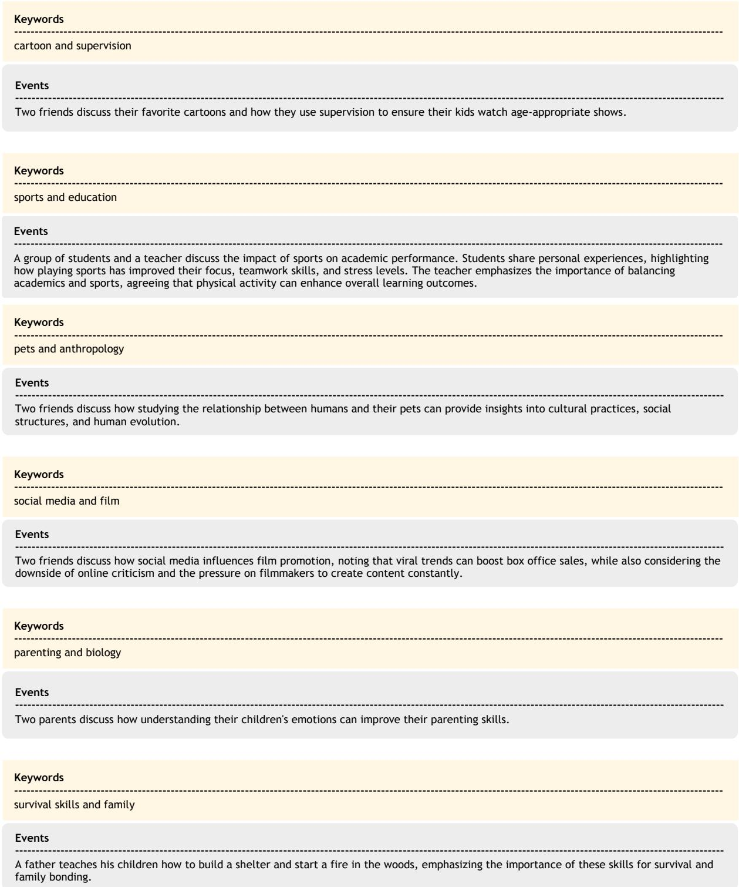  
Figure 10: Diverse event generation by DEG. For the same keyword pair, three independently sampled events differ substantially in content, scenario, and intended modality, illustrating the diversity that drives downstream instruction variety.

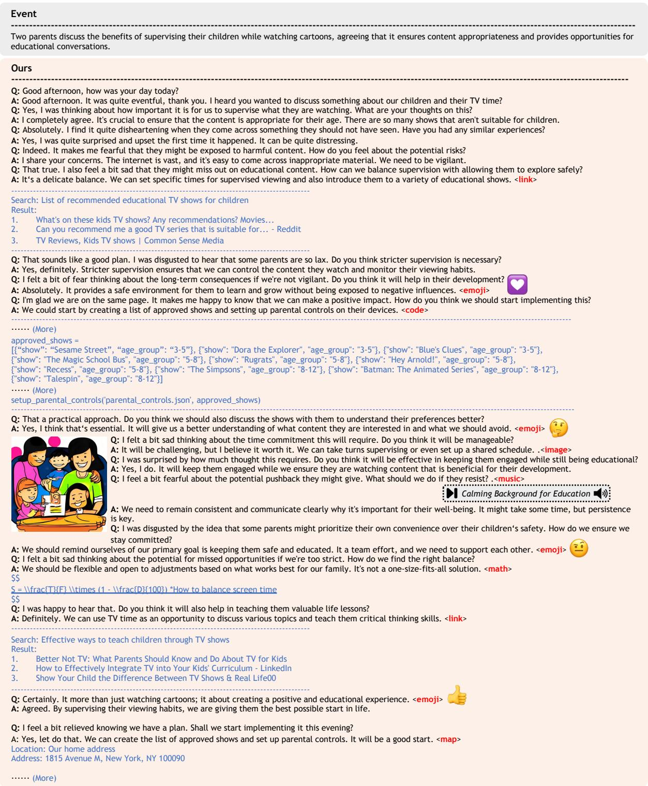  
Figure 11: End-to-end qualitative example (I): a multi-round, multimodal instruction produced by UniData. Image, music, and text are interleaved into a coherent narrative.

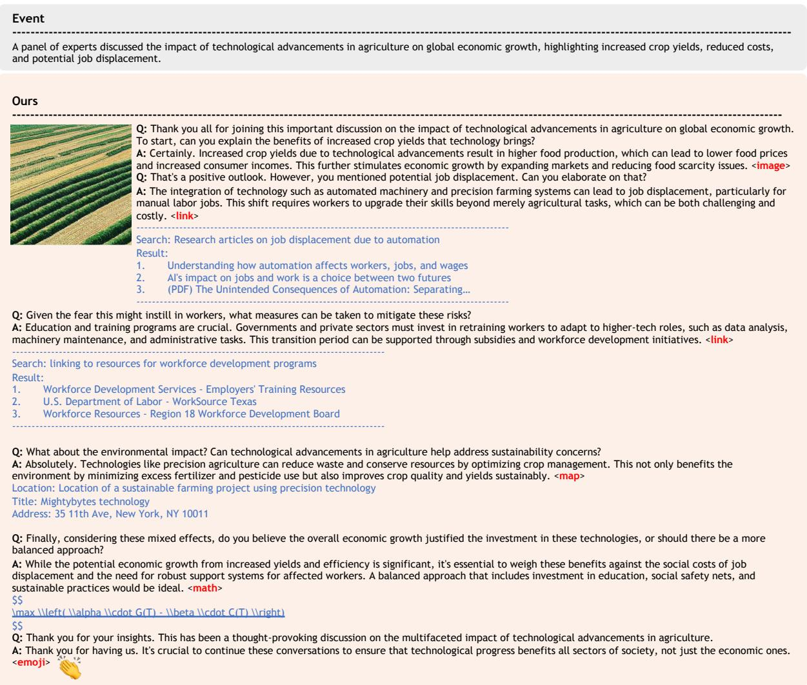  
Figure 12: End-to-end qualitative example (II): a different topic pair, showing variation in dialogue length and modality mix while preserving topical coherence.

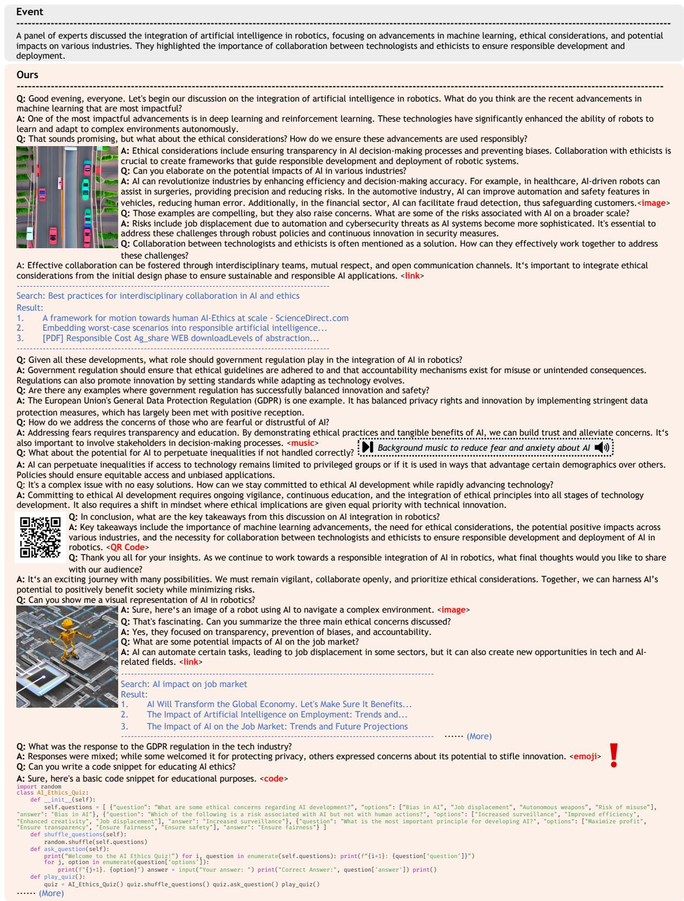  
Figure 13: End-to-end qualitative example (III): a long-horizon dialogue that interleaves text, image, code, and emoji content, illustrating UniData’s behavior on extended interactions.