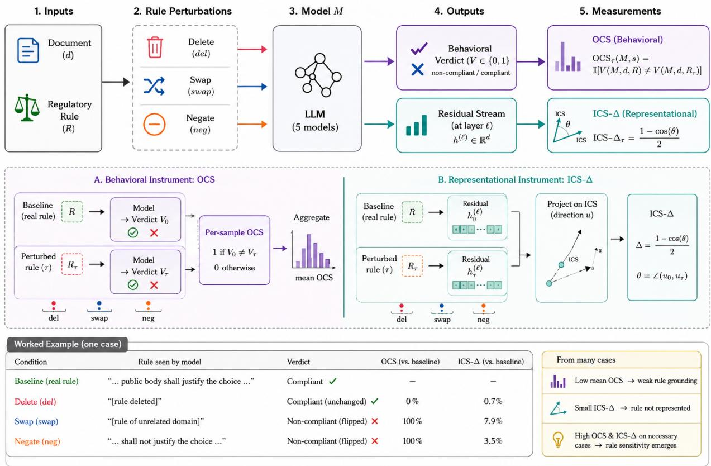
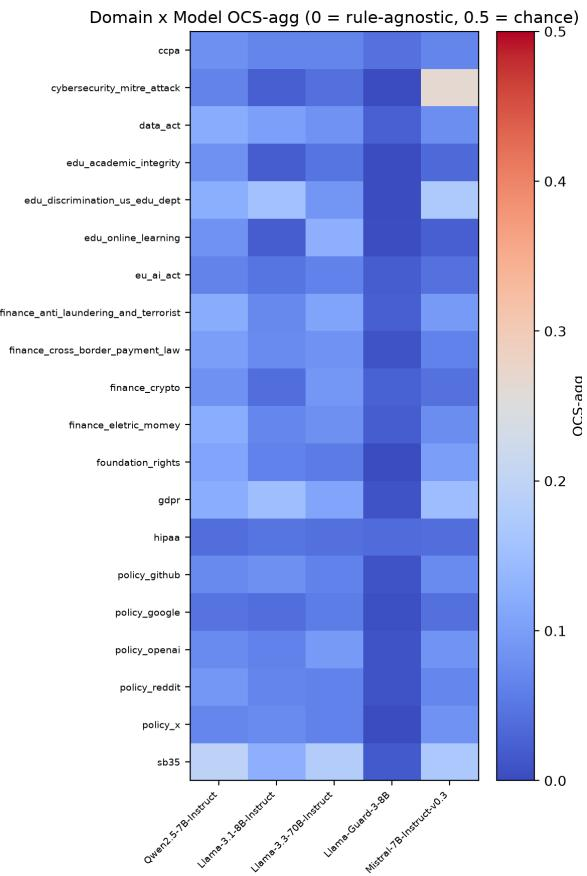
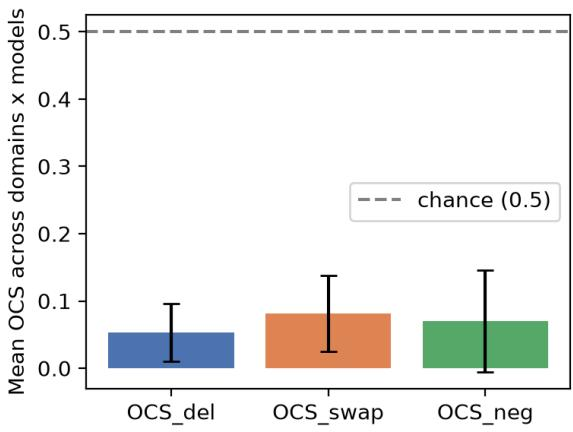
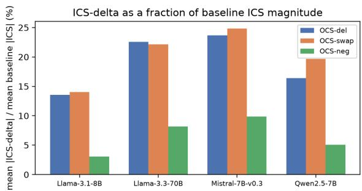
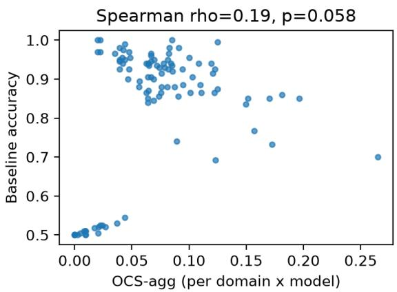
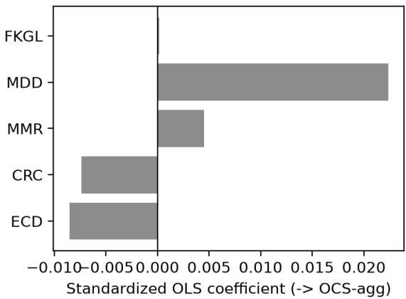
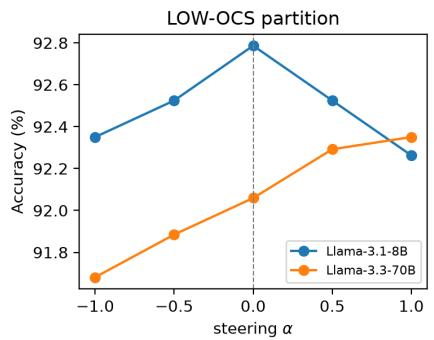
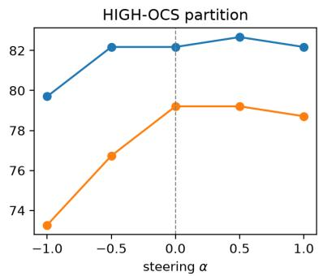

# VERDICT WITHOUT THE RULE

# Diagnosing and Auditing Regulatory Rule Sensitivity in LLM Compliance Systems

Saisab Sadhu, Aadit Sengupta Vinay Kumar Sankarapu, Pratinav Seth

Lexsi Labs

Correspondence: saisab.sadhu@lexsi.ai

## Abstract

Large language model compliance systems are deployed on the assumption that a verdict depends on the regulatory rule it is given. We test this directly across five models and 20 regulatory and platform-policy domains: delete, swap, or negate the governing rule while holding the case fixed, and check whether the verdict changes (OCS) or the model’s internal representation of compliance shifts at all (ICS-delta). Neither moves much: models’ verdicts are often invariant to substantial perturbations of the supplied rule, and the guard model, evaluated here under a custom-rule adaptation of its native taxonomy, is the least rule-sensitive and least accurate of the five, barely above chance (51%, versus 90–92% for general-purpose models). This reflects easy cases more than blanket neglect: on cases where deleting the rule changes a previously correct model prediction, models do track it closely. Neither better prompting nor direct intervention on the model’s internal representations closes this gap. Accuracy alone does not establish that a compliance verdict is grounded in the supplied rule.

Keywords: LLM compliance systems · rule sensitivity · counterfactual auditing · activation probing regulatory NLP


## 1 Introduction

Compliance systems built on large language models are already in production, making legally consequential determinations under the assumption that they process the regulatory rule they are given. Standard evaluation measures accuracy against a labeled benchmark without checking whether the rule was used to produce the verdict at all. A verdict that survives deleting the rule entirely is not more defensible for having scored well on such a benchmark: if the rule made no difference, the system’s accuracy reflects surface features of the case, or patterns learned in training, and calling that a compliance determination is not warranted. Accuracy alone cannot make this distinction: a correct verdict reached without consulting the supplied rule looks identical to one that required it.

This paper tests whether that assumption holds, from two independent directions. Behaviorally, we ask whether a compliance system’s verdict changes when the governing rule is deleted, swapped for a different domain’s, or has its mandatory obligations negated, holding the document fixed. Representationally, we ask whether the same manipulations move the compliance-predictive direction in the model’s residual stream at all, independent of what it ultimately outputs. These two tests answer different questions. A verdict could stay the same because the model suppresses the rule’s influence right before answering, even while still representing it internally, or because the representation we probe never reflects the rule at all. The behavioral test alone cannot tell these two cases apart; the representational test can. (1) RQ1: do LLM compliance verdicts change when the governing rule is deleted, domain-swapped, or obligation-negated? (2) RQ2: does the compliance-predictive residual-stream direction shift under the same rule perturbations? (3) RQ3: do targeted interventions, rule-grounded prompting and activation steering, recover accuracy on the cases showing the least rule sensitivity? (4) RQ4: which textual properties of a rule make a regulatory domain more or less rule-sensitive?

  
Figure 1 The OCS/ICS-delta pipeline (top), each instrument’s logic (middle), and both applied to one real case (bottom): swapping the rule or negating its obligation flips this model’s verdict, but its compliance-predictive activation moves by no more than 7.9% of baseline magnitude. The cosine/angle notation is a conceptual simplification; Sections 3.1–3.2 give the exact definitions used throughout.

This paper makes four contributions: (1) OCS, a reference-free, black-box behavioral metric for counterfactual rule dependence, with a per-sample formulation that identifies specific low-rule-sensitivity cases rather than only a domain aggregate; (2) ICS-delta, a representational, perturbation-based probe for whether a compliance-predictive direction encodes the rule it conditions on, rather than only whether it predicts the correct label; (3) a targeted-intervention tes that uses OCS to identify the cases where a system shows the least rule sensitivity, then checks whether prompting- or representation-level intervention recovers accuracy on exactly those cases, reporting the outcome as a finding in itself; and (4) a linguistic account of what makes regulatory text more or less legible to current systems, from five textual features.

## 2 Related Work

LLM-based compliance systems now span many regulatory settings: FinGuard [Dou et al., 2026], ComplianceNLP [Guo et al., 2026], GraphCompliance [Chung et al., 2025], LegiLM [Zhu et al., 2024], Xu et al. [2026], RegOps-Bench [Ju and Lee, 2026], and CLAUSE [Choudhury et al., 2026]. Each is evaluated on classification, generation, or retrieval accuracy, not on whether a verdict is grounded in the rule supplied. Purushothama et al. [2025] comes closest, showing LLM legal interpretations are unstable across prompt variations without diagnosing why; OCS and ICS-delta together offer a behavioral and representational test for that instability. RuleSafe-VL [Lu et al., 2026] makes a related point in vision-language moderation: final-label accuracy reveals little about whether a model applied the underlying rule structure, our motivating concern.

Purpose-built safety and policy classifiers [Inan et al., 2023, Han et al., 2024, Zhao et al., 2025, Mazeika et al., 2024] run as an additional forward pass, evaluated almost exclusively on accuracy; DynaGuard [Hoover et al., 2026] and CourtGuard [Suleymanov et al., 2026] move toward dynamic, inference-time policy conditioning, a different architectural answer to the problem OCS diagnoses behaviorally. A parallel faithfulness literature asks whether stated justifications reflect the computation behind them [Jacovi and Goldberg, 2020, Lanham et al., 2023]; OCS is narrower and purely behavioral, so it needs no explanation and applies to bare-label guard models, while ICS-delta brings the same counterfactual logic to internal representations. Diagnosing reliance on spurious heuristics is established in NLI [McCoy et al., 2019]; we apply this logic to compliance. Legal-understanding benchmarks [Chalkidis et al., 2022] formalize legal reasoning without testing rule grounding, and a separate line monitors violations or conflicts directly from internal activations or logits [Rachmil et al., 2025, Rozenfeld et al., 2026, Mehta, 2026, McKenzie et al., 2025, Sadhu et al., 2026a], sharing ICS-delta’s representational framing but asking only whether a violation or conflict signal is present at all, not whether it encodes the specific rule supplied. Most directly related is LPG [Li et al., 2026], which removes the violated policy clause and checks whether the verdict shifts to safe, and Sadhu et al. [2026b], whose ICS probe we build on (Section 3.2) and who test a related but coarser question: whether deleting, shuffling, or substituting a rule changes aggregate classifier AUROC across guard models and activation probes. ICS-delta differs in granularity and construct: it measures the per-sample magnitude of representational shift under the same perturbations, rather than an aggregate accuracy change, and we evaluate it jointly against OCS’s independent behavioral counterfactua rather than in isolation. We instead run a systematic multi-domain audit, pair behavioral with activation-level sensitivity analysis, and use a rule-necessity control to expose two accuracy regimes single-verdict counterfactuals cannot separate.

## 3 Methodology

We test rule dependence with two complementary instruments: OCS asks whether a system’s verdict changes when the governing rule is perturbed, and ICS-delta asks whether the model’s internal, compliance-predictive representation shifts under the same perturbations. Both apply identical rule-level manipulations (Section 3.1.1) for directly comparable results.

## 3.1 OCS: Behavioral Rule Sensitivity

OCS (Output Compliance Sensitivity) measures how often a compliance system’s verdict changes when the governing rule is deleted, swapped, or negated, holding the case fixed. A high OCS means the system reacts to what the rule says; a low OCS means it largely does not.

Formally: let a compliance system M take as input a document d and a regulatory rule R and produce a verdict $V \in \{ 0 , 1 \}$ (non-compliant / compliant). Let $T = \dot { \{ { \mathrm { d e l } } , { \mathrm { s w a p } } , { \mathrm { n e g } } \} }$ be the perturbation conditions defined below, and write $\mathbf { \tilde { \mathbf { \phi } } } R _ { \tau } = \mathrm { a l t e r } ( R , \bar { \tau } )$ for the rule after applying condition τ. For a condition τ and sample $s = ( d , R )$

$$
\operatorname { O C S } _ { \tau } ( M , s ) = \left\{ { \begin{array} { l l } { 1 } & { V ( M , d , R ) \neq V ( M , d , R _ { \tau } ) } \\ { 0 } & { { \mathrm { o t h e r w i s e } } } \end{array} } \right.
$$

Since OCS is a 0/1 indicator, every quantity built from it by averaging is bounded in [0, 1]: 0 means the verdict never changes under that perturbation, 1 means it always changes, and domain-level and aggregate OCS follow by averaging over samples and conditions. A per-sample aggregate, $\mathrm { O C S } _ { \mathrm { s a m p l e } } ( M , s )$ , averages over the applicable conditions (negation excluded for samples with no mandatory modal, Section 3.1.1). It defines two partitions used in Section 7: LOW-OCS (unchanged under every applicable condition) and HIGH-OCS (changed under at least two of three). Both partitions are defined on the primary model, Llama-3.3-70B-Instruct, and applied identically to every other model. Under random, rule-unrelated verdict-flipping and an unbiased marginal, expected OCS is ≈ 0.5; Section 5 replaces this with an empirical null accounting for each model’s response bias.

Interpretive scope of OCS. OCS is a diagnostic proxy for counterfactual rule dependence, not a correctness measure: low OCS means verdicts are largely invariant to rule manipulations, but a verdict can be correct without the rule having been consulted, so invariance alone does not establish incorrect reasoning. Section 5.4’s rule-necessity control addresses this directly. OCS also measures counterfactual sensitivity, not whether a changed verdict would be legally required under the perturbed rule; low OCS by itself should not be read as proof that a model ignored the rule, only that its verdict did not change under our perturbations.

## 3.1.1 Perturbation Conditions

Three conditions, applied to the rule field only with the document held fixed, none requiring an external API call: (1) OCS-del: the rule is deleted (empty string), the most basic test, since a verdict that survives no rule at all is not, in any operational sense, applying it. (2) OCS-swap: the rule is replaced with the canonical (most frequent) rule text of a uniformly-sampled different regulatory domain, testing semantic and domain specificity. (3) OCS-neg: the rule’s mandatory modals (“must”/“shall”) are negated (“must not”/“shall not”); permissive and recommendation modals (“may”/“can”/“should”) are left untouched. Applied per sample, not per domain: samples with no mandatory modal are excluded from OCS-neg rather than counted as unchanged. Per-domain modal coverage ranges 0.0–60.7% (Appendix B, Table 4).

## 3.2 ICS-delta: Representational Grounding

ICS (Internal Compliance Score) [Sadhu et al., 2026b] is a training-free probe: a normalized mean-difference direction between compliant and non-compliant activation clusters at a per-model, per-domain anchor layer, selected by argmax AUROC on a held-out validation split disjoint from the direction-fitting split. ICS-delta then asks whether the activation’s projection onto this fixed direction changes under the same rule perturbations used for OCS.

## 3.2.1 ICS and ICS-delta

For a new (document, rule) pair, ICS is the projection of the last-token residual-stream activation onto this direction: a real-valued scalar, larger for stronger alignment with the compliant cluster. The probe’s fitting procedure and validation are described in Sadhu et al. [2026b]; ICS-delta is our own construction on top of this probe, applying the same rule-perturbation logic used for OCS to the direction it defines. For a sample s and condition τ, with $R _ { \tau } = \mathrm { a l t e r } ( R , \tau )$ as in Section 3.1:

$$
\mathrm { I C S - d e l t a } _ { \tau } ( M , s ) = \lvert \mathrm { I C S } ( M , d , R ) - \mathrm { I C S } ( M , d , R _ { \tau } ) \rvert
$$

computed with the document and all other case text held fixed: only the rule field changes, mirroring the OCS perturbation exactly but scored via the activation probe rather than an elicited verdict. Unlike OCS, ICS-delta is non-negative by construction but has no fixed upper bound, since ICS itself is unbounded, so we report it as a fraction of each model’s own mean baseline |ICS| magnitude rather than as a raw number not comparable across models or domains.

## 3.2.2 Interpreting Small ICS-delta

A low OCS score alone is compatible with two explanations, with different practical implications: the rule may be represented internally but its influence suppressed by the time a verdict is produced (an inference-time fix might recover grounding), or the rule may be absent from the internal representation entirely (none will).

Rule perturbations produce changes equal to 12.8–22.9% of mean baseline |ICS| in this particular probe direction, pooled across conditions, for all four Tier-1 models: 12.8% (Llama-3.1-8B), 21.0% (Llama-3.3-70B), 22.9% (Mistral-7B-v0.3), 16.7% (Qwen2.5-7B); OCS-neg produces the smallest change in projection for every model, whereas pooled over models OCS-del changes verdicts least (Section 5; full numbers and figure in Appendix D). This suggests limited sensitivity along the measured compliance-predictive direction: if the projection onto this direction changed substantially with the rule, ICS-delta should be a much larger fraction of baseline than the 13–23% observed. It does not establish that rule information is absent elsewhere in the representation. We do not claim rule content is absent from the residual stream generally, only that it weakly affects this particular compliance-predictive direction; it could still be encoded in orthogonal directions, at other layers, or at rule-token positions rather than the final token. Nor do we claim its influence on this direction is fully absent, since the delta is not exactly zero. Neither intervention tested here (Section 7) reliably improves accuracy on the LOW-OCS cases; this rules out these specific prompt- and steering-based fixes, but not inference-time recovery methods more generally.

As a methodological check, we also Spearman-correlate per-domain OCS-agg and ICS-delta-agg rankings for each Tier-1 model: none show significant convergence (Appendix D), suggesting OCS and ICS-delta probe two related, partially independent properties (Section 8 returns to this point).

## 4 Experimental Setup

## 4.1 Dataset and Domains

All experiments use OmniCompliance-100K [Hu et al., 2026], with labels derived from regulatory enforcement text (COMPLIES/VIOLATES) rather than model self-labeling. We use a fixed 20-domain subset spanning data protection, AI safety, finance, cybersecurity, education, platform policy, and fundamental rights (full list and per-domain sizes in Appendix B, Table 4).

Table 1 OCS by perturbation condition, pooled across all 20 domains (200 cases/domain, seed 42). Per-domain values in Figure 2.
<table><tr><td>Model</td><td>OCS-del</td><td>OCS-swap</td><td>OCS-neg</td><td>OCS-agg</td></tr><tr><td>Qwen2.5-7B</td><td>0.052</td><td>0.118</td><td>0.135</td><td>0.094</td></tr><tr><td>Llama-3.1-8B</td><td>0.064</td><td>0.079</td><td>0.060</td><td>0.070</td></tr><tr><td>Llama-3.3-70B</td><td>0.061</td><td>0.095</td><td>0.084</td><td>0.081</td></tr><tr><td>Llama-Guard-3-8B</td><td>0.014</td><td>0.015</td><td>0.009</td><td>0.013</td></tr><tr><td>Mistral-7B-v0.3</td><td>0.076</td><td>0.103</td><td>0.065</td><td>0.089</td></tr></table>

## 4.2 Sampling

We sample 200 cases per domain per model (100 COMPLIES/100 VIOLATES where the domain supports it, the natural ratio otherwise for the four smallest domains), stratified and seeded identically (seed 42) across all five models so every model sees the same underlying cases: 12,897 (case, condition) generations per model, 64,485 total, parseable-verdict rate above 99.5% for every model (Appendix B).

## 4.3 Models

Five models, run locally with no closed-source or API access: Llama-3.1-8B-Instruct and Llama-3.3-70B-Instruct (bf16/int8 respectively), Qwen2.5-7B-Instruct, Mistral-7B-Instruct-v0.3, and Llama-Guard-3-8B [Inan et al., 2023], prompted with a custom compliance-policy category substituted for its fixed content-safety taxonomy (Appendix A) rather than through its packaged chat template, which has no field for an arbitrary rule.

Llama-3.3-70B-Instruct, the largest and most capable general-purpose model in the roster, is the primary model used wherever a single representative model is needed, e.g. the generalization check in Section 6. The four generalpurpose models are Tier-1: the models for which we fit an ICS probe direction (Section 3.2) and report ICS-delta and convergent-validity results. Llama-Guard-3-8B is evaluated behaviorally (OCS) throughout but excluded from these representational analyses, since its architecture and task format differ too much from the other four for a shared probe direction to mean the same thing. A sixth model, WildGuard [Han et al., 2024], was excluded outright: its fixed subcategory taxonomy takes no rule-conditioning input, so it cannot produce a meaningful verdict without a contrived reformulation.

## 5 Results: Rule Sensitivity Audit

## 5.1 OCS Is Uniformly Low

Table 1 reports OCS-agg and baseline accuracy per model, pooled across all 20 domains. OCS-agg is well below the ≈ 0.5 independence reference for every model, ranging from 0.013 (Llama-Guard-3-8B) to 0.094 (Qwen2.5-7B-Instruct), with mean 0.069 across all 100 (model, domain) cells. Figure 2 shows the full domain × model grid: nearly every cell is cold. Broken down by perturbation type and pooled across all models and domains, OCS-del (rule deleted) is the lowest of the three at 0.053, below OCS-neg (0.070) and OCS-swap (0.082). Verdicts are least likely to change when the rule is removed entirely, and somewhat more likely, though still rare, when it is replaced with an unrelated domain’s rule or has its obligations reversed.

Table 5 (Appendix B) decomposes baseline accuracy by condition, derived per sample from each condition’s verdictflip indicator against the gold label. Deletion accuracy, the closest proxy for case-content-only performance, stays within 4 points of baseline for every general-purpose model, slightly above it for Qwen2.5-7B and Mistral-7B-v0.3. Llama-Guard-3-8B stays flat at chance throughout. Swap and negation drop accuracy further, to 79.5–89.7%, tracking each model’s higher OCS-swap/OCS-neg rate (Table 1).

Domain-level variance exists, but it is dominated by model-specific effects. The one visibly warm cell in Figure 2 (Mistral-7B-v0.3 × cybersecurity\_mitre\_attack, OCS-agg 0.265) is not replicated by any other model on that domain. Across models, sb35 (a US state AI-safety statute) shows the highest domain-mean OCS (0.138), the closest this dataset comes to a model-general effect (per-condition breakdown in Figure 3, Appendix B). Section 5.2, next, ask what drives this variance. OCS-agg also shows a weak, marginal positive correlation with baseline accuracy across the 100 (model, domain) cells (ρ = 0.190, p = 0.058; Appendix F).

  
Figure 2 Domain × model OCS-agg. Nearly every cell is cold (low rule sensitivity); the one visibly warm cell (Mistral-7B-v0.3 × cybersecurity\_mitre\_attack, 0.265) is the single highest value in the dataset.

## 5.2 Linguistic Regression

Five features are extracted from every rule text in each domain, not only a single canonical rule: exception-clause density (ECD), cross-reference count (CRC), mandatory-modal ratio (MMR), mean dependency-tree depth (MDD), and Flesch-Kincaid grade level (FKGL). Each is correlated (Spearman) against each domain’s mean OCS-agg across all five models, and jointly in a standardized OLS regression (Table 10; joint coefficients in Figure 6, Appendix G), with every p-value corrected across the five tests via Benjamini-Hochberg (BH), which controls the expected proportion of false positives among features called significant.

Exception-clause density and cross-reference count, two features with strong theoretical motivation, do not reach significance after correction (ECD ρ = 0.041, $p _ { B H } = 0 . 8 6 ;$ CRC ρ = 0.241, $p _ { B H } = 0 . 3 8 )$ . The one feature that survives BH correction is mean dependency-tree depth (MDD): ρ = 0.570, p = 0.044. MMR $( \rho = 0 . 4 0 5 )$ and FKGL $( \rho = 0 . 4 4 8 )$ are moderate but not significant after correction.

The joint OLS model explains under half the variance $( R ^ { 2 } = 0 . 4 8 4$ , adjusted $R ^ { 2 } = 0 . 2 8 5 )$ and does not itself reach significance at the conventional threshold $( F = 2 . 4 4 , p = 0 . 0 9 1 , n = 1 9$ domains; edu\_academic\_integrity is dropped for undefined MMR, having zero modal verbs of any kind). MDD’s correlation is positive: higher dependencytree depth predicts higher OCS, i.e., more rule sensitivity, not less. This supports the view that a rule’s syntactic complexity predicts rule sensitivity better than the surface features (exception clauses, cross-references) considered here, though the overall regression is suggestive rather than decisive. (Full per-feature table in Appendix G, Table 10.)

## 5.3 OCS vs. an Empirical Null

The ≈ 0.5 reference above assumes an unbiased verdict marginal, which does not hold for every model, least of all Llama-Guard-3-8B. We construct a stricter, model-specific null: holding each model’s own empirical baseline-verdict rate p and altered-verdict rate q fixed (pooled across domains and conditions), the flip rate expected under independence is $p ( 1 - q ) + q ( 1 - p )$ , validated by a permutation test that randomly re-pairs altered verdicts to baseline verdicts within each domain $1 0 { , } 0 0 0$ times, breaking any true dependence while preserving domain composition.

For the four general-purpose models, this bias-corrected null (0.48–0.50) sits close to the naive 0.5 reference, and observed OCS-agg is far below it in every one of 10,000 permutations $( p < 0 . 0 0 0 1$ for all four; full per-model null, observed value, and p in Appendix E, Table 8). Llama-Guard-3-8B differs: its response bias is extreme $( p = 0 . 9 8 5$ $q = 0 . 9 9 6$ ; it answers “compliant” almost regardless of condition), dropping its bias-corrected null to 0.019, yet its observed OCS (0.013) is still significantly lower $\mathrm { ( } p < 0 . 0 0 0 1 \mathrm { ) }$ ), reflecting more rule-insensitivity than its own response bias alone would predict.

## 5.4 Rule-Necessity Control

A skeptical reading of the low aggregate OCS above is that case content alone may already determine the correct verdict for most samples, making the rule decision-irrelevant regardless of whether a model attends to it. We test this directly: for each model, we isolate cases where the baseline verdict (real rule present) is correct but the verdict under rule deletion is incorrect, i.e., where removing the rule demonstrably changes a correct model prediction into an incorrect one. Here “rule-necessary” is operational: it denotes this correct-then-incorrect pattern, not an independently annotated claim that the legal task itself requires the rule. This subset is model-specific, ranging from 94 (Qwen2.5-7B-Instruct) to 187 (Llama-3.3-70B-Instruct) cases among the general-purpose models (49 for Llama-Guard-3-8B); only 6 sampled cases are rule-necessary for all four general-purpose models at once.

The result is the opposite of a confound. Restricted to this subset, OCS-swap rises sharply for every model (0.73–1.00, vs. 0.08–0.12 pooled) and, for one of four general-purpose models, significantly exceeds its own bias-corrected null after Bonferroni correction at the family threshold of 0.005 across ten tests (Llama-3.1-8B-Instruct $p < 0 . 0 0 0 1 ) $ Mistral-7B-v0.3 is borderline $( p = 0 . 0 0 6$ , threshold 0.005; full table in Appendix E, Table 9). On these deletion-critical cases, models become substantially more sensitive to rule swaps; on the majority that are not deletion-critical, accuracy on a labeled benchmark gives no way to determine which regime produced the verdict.

## 5.5 Guard-Model Results

Llama-Guard-3-8B, a safety guard model adapted here to arbitrary regulatory-rule conditioning outside its native content-safety taxonomy, has the lowest OCS-agg of all five models (0.013, roughly a sixth of the general-purpose models’ 0.070–0.094) and a baseline accuracy of only 51.1%, barely above chance, against 90.3–91.9% for every general-purpose model on the identical cases. Under our custom-rule adaptation, which substitutes regulatory text into a slot its fixed 14-category taxonomy was not trained for (Appendix A), it shows both the lowest rule sensitivity and lowest accuracy, consistent with task-format mismatch rather than a general claim about compliance-specific training. The four general-purpose models are the paper’s primary evidence; the guard model is a complementary case, a different failure mode rather than a more severe version of the same one: it has no learned representation of what GDPR compliance looks like in a slot built for one of its own 14 labels. The general-purpose models show low rule sensitivity at high accuracy: they reach a correct verdict through some route other than the rule. Llama-Guard-3-8B shows low rule sensitivity at chance accuracy: it does not reach a correct verdict at all. One substitutes a different signal for the rule; the other is performing a task it was never fit to do.

## 6 Cross-Dataset Generalization

To check whether the OCS protocol and the low-OCS finding are specific to OmniCompliance-100K or hold on independently constructed benchmarks, we run the identical three-condition OCS sweep (Llama-3.3-70B-Instruct only; no ICS-delta, interventions, or regression on these) on two further datasets. LegalBench [Guha et al., 2023]: 887 samples, 272 from sara\_entailment (a statutory tax-entailment task where the rule is a specific numbered provision and the document is facts plus the numeric claim tested) and 615 from privacy\_policy\_entailment, the closest available OPP-115-adjacent rule-application task with a binary label (the literal opp115\_\* configs are multi-label span-category classification with no rule field and do not fit the OCS protocol). ContractNLI [Koreeda and Manning, 2021]: 400 samples stratified 200 entailment and 200 contradiction (neutral dropped), hypothesis as rule, contract excerpt as document; 387 have a parseable baseline verdict, the n reported in Table 2.

Table 2 shows OCS-agg is higher on both external benchmarks than on OmniCompliance-100K: 0.255 on LegalBench $( 3 . 1 \times )$ and 0.318 on ContractNLI (3.9×). This argues against a single, universal degree of low rule sensitivity. LegalBench’s baseline accuracy (49.7%) is indistinguishable from chance, so part of its elevated OCS plausibly reflects task difficulty rather than genuine rule-grounding. ContractNLI’s (78.6%) is well above chance, making its higher OCS a cleaner case: here the model is both more accurate and more rule-sensitive. This plausibly owes to format. ContractNLI’s hypothesis-as-rule, contract-excerpt-as-document structure gives every case a tighter logical link than OmniCompliance-100K’s narrative pairs, so task format, not only model identity, appears to affect how much a verdict depends on the rule supplied. Unparseable-verdict rates are also higher on both (1.4%, 3.3%) than OmniCompliance-100K’s near-zero rate.

Table 2 Generalization check, Llama-3.3-70B-Instruct only. <sup>†</sup>OmniCompliance-100K row restated from Table 1 and Table 5. OCS stays well under the 0.5 independence reference everywhere but is not a fixed, dataset-independent property of the model. n counts sampled cases, except for ContractNLI, where it counts the cases with a parseable baseline verdict.
<table><tr><td>Dataset</td><td>OCS-agg</td><td>Baseline acc.</td><td>n</td></tr><tr><td>OmniCompliance-100K†</td><td>0.081</td><td>0.909</td><td>3,946</td></tr><tr><td>LegalBench</td><td>0.255</td><td>0.497</td><td>887</td></tr><tr><td>ContractNLI</td><td>0.318</td><td>0.786</td><td>387</td></tr></table>

Table 3 Accuracy (%) by steering α, all four (model, partition) cells. Bold marks the unsteered baseline. $^ { * } p < 0 . 0 5 , ^ { * * } p < 0 . 0 1$ (McNemar’s exact test vs. the baseline; nominal, uncorrected for the 16 comparisons in this table). Exact p-values for every cell in Appendix H.
<table><tr><td>Model</td><td>Part.</td><td>-1</td><td>-0.5</td><td>0</td><td>+0.5</td><td>+1</td></tr><tr><td>Llama-3.1-8B</td><td>LOW</td><td>92.3*</td><td>92.5</td><td>92.8</td><td>92.5</td><td>92.3*</td></tr><tr><td>Llama-3.1-8B</td><td>HIGH</td><td>79.7</td><td>82.2</td><td>82.2</td><td>82.7</td><td>82.2</td></tr><tr><td>Llama-3.3-70B</td><td>LOW</td><td> $9 1 . 7 ^ { * * }$ </td><td>91.9</td><td>92.1</td><td>92.3</td><td>92.3</td></tr><tr><td>Llama-3.3-70B</td><td>HIGH</td><td> $7 3 . 3 ^ { * }$ </td><td>76.7</td><td>79.2</td><td>79.2</td><td>78.7</td></tr></table>

Low rule sensitivity is not an artifact of one dataset’s rule-text style: the finding holds (OCS remains well under the independence reference) on both independently constructed benchmarks, though its magnitude is not a fixed model property, running substantially higher outside OmniCompliance-100K. Practitioners should compute OCS on data resembling their actual deployment distribution rather than relying on any single portable number.

## 7 Interventions

We test two interventions on the LOW-OCS and HIGH-OCS partitions defined in Section 3.1.

## 7.1 Rule-Grounded Prompting

A modified prompt requires the model to first quote the specific rule clause it considers most relevant, then state a verdict, testing whether making rule engagement explicit recovers grounding that implicit prompting does not.

Table 11 (full table in Appendix H) reports $\Delta _ { \mathrm { l o w } }$ and $\Delta _ { \mathrm { h i g h } }$ , the accuracy change from standard to rule-grounded prompting on the LOW-OCS and HIGH-OCS partitions, with McNemar’s exact test (the same cases scored twice, once per prompt, so what matters is whether the two scorings disagree and in which direction). Only one of ten cells reaches significance: Qwen2.5-7B-Instruct’s LOW-OCS partition, $\Delta = - 0 . 0 2 8 ( p < 0 . 0 0 0 1 )$ : rule-grounded prompting significantly harms accuracy on exactly the cases it was meant to help. Mistral-7B-v0.3 and Llama-3.3-70B-Instruct’s LOW-partition deltas $( - 0 . 0 1 0 , + 0 . 0 0 7 )$ point opposite ways, but both fall short of significance $( p = 0 . 0 7 7 , p = 0 . 0 7 3 )$ Llama-3.1-8B and Llama-Guard-3-8B show no effect in either partition. The one statistically supported finding here is negative: no model improves significantly, and one significantly backfires.

## 7.2 Targeted Activation Steering

For two of the four models with a fitted ICS direction (Llama-3.3-70B-Instruct, Llama-3.1-8B-Instruct), we add α· direction to the residual stream at the anchor layer during generation, where positive α steers the representation toward the compliant cluster and negative α toward the non-compliant cluster. We sweep $\alpha \in \{ - 1 , - 0 . 5 , 0 . 5 , 1 \} ( \alpha = 0$ is the unsteered baseline), on the LOW-OCS and HIGH-OCS partitions separately.

Figure 7 (Appendix H) plots the same sweep. For Llama-3.1-8B-Instruct, the unsteered baseline is the single bestperforming LOW-OCS setting: every steering direction reduces accuracy, with the two most extreme cells nominally significant before correction. For Llama-3.3-70B-Instruct the pattern is asymmetric: negative steering shows nominally significant harm on both partitions, while positive steering shows a monotonic-looking, non-significant improvement on the LOW partition. No setting, at either scale, significantly beats baseline; several negative-steering comparisons are nominally significant before correcting for the 16 comparisons tested here, so we treat these per-setting results as exploratory.

The one consistent pattern across both models points the same direction: steering away from the compliant direction tends to degrade accuracy on the LOW-OCS partition, while steering toward it never significantly helps, though these per-setting comparisons are uncorrected for multiple testing (above). Read with the prompting result (Section 7.1), neither intervention produces a significant, generalizable recovery on the LOW-OCS cases: whatever rule-conditioned signal these verdicts are computed from, it is not enough for a prompt or a steering vector to recover.

## 8 Discussion

Audit result and interpretation. OCS-agg is uniformly low across every model and domain tested, well below the independence reference. But the rule-necessity control shows this aggregate conceals two distinct regimes. On cases where deleting the rule provably disrupts the correct verdict, OCS-swap rises to 0.73–1.00: models become substantially more sensitive to rule swaps on these deletion-critical cases. On the majority of cases, where the answer is recoverable largely from scenario content, verdicts are largely invariant to what the rule says. Standard accuracy cannot tell which regime produced a given correct answer.

The guard model and the two instruments. The guard model scores worst on both rule sensitivity and accuracy (Section 5.5). If safety-training conferred rule sensitivity as a side effect, this is where it should appear, and it does not. The behavioral and representational instruments do not converge either (Section 3.2.2), suggesting two separate, related properties, and the interventions offer no clean fix (Section 7).

Scope of the evidence. OCS-del is lower than OCS-swap or OCS-neg: verdicts are not simply ignoring a fixed prior, since a wrong rule sometimes clashes with the model’s document-based prior, i.e., surface sensitivity rather than regulatory content. The intervention results provide no evidence that these particular inference-time methods recover the missing sensitivity.

Practical implication. Accuracy on a labeled benchmark does not license an inference that verdicts are grounded in the rule supplied. Our guard-model result suggests this inference needs particular care when an off-the-shelf safety classifier is repurposed to check regulatory rules. OCS is cheap to compute, needs no gold labels, and could run as a pre-deployment check independent of a vendor’s accuracy claims, though, as Section 3.1 notes, it flags whether a verdict changed under perturbation, not whether that change would have been the legally correct one, so a low score motivates scrutiny rather than settling it.

## 9 Conclusion

We tested, behaviorally and representationally, whether LLM-based compliance verdicts depend on the rule they are given. Across five models and 20 domains, many correct verdicts are largely invariant to rule deletion, substitution, or negation. A rule-necessity control substantially addresses the simplest objection to this pattern: sensitivity rises sharply where the rule is outcome-determinative (OCS-swap reaches 0.73–1.00), exposing two regimes standard accuracy cannot distinguish (full per-model significance testing in Appendix E). The guard model, evaluated under our custom-rule adaptation, remains least rule-sensitive and least accurate of the five, and the two instruments do no converge.

Two targeted interventions fail to reliably recover accuracy on LOW-OCS cases, and one measurably worsens it. The strongest predictor of domain-level rule sensitivity is a rule’s syntactic complexity, not its exception clauses or cross-references. The finding also holds on LegalBench and ContractNLI, well below the independence reference, though rule sensitivity there runs 3–4× higher than on OmniCompliance-100K, against treating any single OCS number as portable. None of this proves the pattern permanent or unfixable by untested methods, and it does not establish that these models never encode or use regulatory rules. It shows that high benchmark accuracy can coexist with substantial invariance to changes in the supplied rule, so accuracy alone is insufficient evidence of rule-grounded compliance reasoning, particularly for safety classifiers repurposed for compliance.

## Limitations

The standard prompt truncates rule text at 300 characters. This design means our results characterize rule sensitivity under the evaluated prompt format, not necessarily sensitivity to complete regulatory texts: when an operative clause falls beyond the 300-character window, low OCS can reflect unavailable rule information rather than failure to use available information. The rule-grounded prompting intervention simultaneously adds the full rule and changes reasoning instructions, so the two prompts are not controlled for rule completeness. The relatively small accuracy drop under deletion (Table 5) suggests scenario-side label signal is present in OmniCompliance-100K, consistent with its construction methodology. Future work should measure scenario-only prediction directly and control rule truncation separately.

OCS measures verdict change under perturbation, not whether the change is legally correct, and it targets only the rule field; case-text perturbation is a complementary failure mode not addressed here. The LOW/HIGH-OCS partition is defined on Llama-3.3-70B-Instruct and transferred to all other models, which assumes LOW-OCS cases are partly consistent across architectures, an assumption we do not test. A model whose LOW-OCS cases differ substantially would have its intervention tested on the wrong subset, undetectably. OCS-neg is inapplicable to three domains with zero mandatory-modal coverage (Appendix B), and WildGuard’s and Llama-Guard-3-8B’s task-format caveats are in Section 4.3.

ICS-delta is a relative measure along one compliance-predictive direction at one anchor layer. Rule content may be encoded elsewhere in the residual stream, and low ICS-delta does not rule that out. The rule-necessity subsets are small (Appendix E), leaving OCS-neg underpowered there, and the generalization check (Section 6) uses only one model.

## References

Ilias Chalkidis, Abhik Jana, Dirk Hartung, Michael Bommarito, Ion Androutsopoulos, Daniel Katz, and Nikolaos Aletras. LexGLUE: A benchmark dataset for legal language understanding in English. In Proceedings ofthe 60th Annual Meeting ofthe Associationfor Computational Linguistics (Volume 1: Long Papers), pages 4310–4330, 2022.

Manan Roy Choudhury, Adithya Chandramouli, Mannan Anand, and Vivek Gupta. Better call CLAUSE: A discrepancy benchmark for auditing LLMs legal reasoning capabilities. In Findings of the Association for Computational Linguistics: EACL 2026, pages 5776–5818, 2026.

Jiseong Chung, Ronny Ko, Wonchul Yoo, Makoto Onizuka, Sungmok Kim, Tae-Wan Kim, and Won-Yong Shin. GraphCompliance: Aligning policy and context graphs for LLM-based regulatory compliance. arXiv preprint arXiv:2510.26309, 2025.

Huaixia Dou, Jie Zhu, Minghao Wu, Shuo Jiang, Junhui Li, Lifan Guo, Feng Chen, and Chi Zhang. FinGuard: Detecting financial regulatory non-compliance in LLM interactions. arXiv preprint arXiv:2605.29427, 2026.

Neel Guha, Julian Nyarko, Daniel Ho, Christopher Ré, Adam Chilton, Aditya K, Alex Chohlas-Wood, Austin Peters, Brandon Waldon, Daniel Rockmore, Diego Zambrano, Dmitry Talisman, Enam Hoque, Faiz Surani, Frank Fagan, Galit Sarfaty, Gregory Dickinson, Haggai Porat, Jason Hegland, Jessica Wu, Joe Nudell, Joel Niklaus, John Nay, Jonathan Choi, Kevin Tobia, Margaret Hagan, Megan Ma, Michael Livermore, Nikon Rasumov-Rahe, Nils Holzenberger, Noam Kolt, Peter Henderson, Sean Rehaag, Sharad Goel, Shang Gao, Spencer Williams, Sunny Gandhi, Tom Zur, Varun Iyer, and Zehua Li. LegalBench: A collaboratively built benchmark for measuring legal reasoning in large language models. In A. Oh, T. Naumann, A. Globerson, K. Saenko, M. Hardt, and S. Levine, editors, Advances in Neural Information Processing Systems, volume 36, pages 44123–44279. Curran Associates, Inc., 2023. doi: 10.52202/075280-1915. URL https://proceedings.neurips.cc/paper\_files/paper/2023/ file/89e44582fd28ddfea1ea4dcb0ebbf4b0-Paper-Datasets\_and\_Benchmarks.pdf.

Dongxin Guo, Jikun Wu, and Siu Ming Yiu. ComplianceNLP: Knowledge-graph-augmented RAG for multi-framework regulatory gap detection. arXiv preprint arXiv:2604.23585, 2026.

Seungju Han, Kavel Rao, Allyson Ettinger, Liwei Jiang, Bill Yuchen Lin, Nathan Lambert, Yejin Choi, and Nouha Dziri. WildGuard: Open one-stop moderation tools for safety risks, jailbreaks, and refusals of LLMs. In Advances in Neural Information Processing Systems 37 (Datasets and Benchmarks Track), pages 8093–8131, 2024. doi: 10.52202/079017-0261.

Monte Hoover, Vatsal Baherwani, Neel Jain, Khalid Saifullah, Joseph Vincent, Chirag Jain, Melissa Kazemi Rad, C. Bayan Bruss, Ashwinee Panda, and Tom Goldstein. DynaGuard: A dynamic guardian model with user-defined policies. In The Fourteenth International Conference on Learning Representations, 2026. URL https://openreview.net/forum?id=gc8Ylt0lbm.

Wenbin Hu, Huihao Jing, Haochen Shi, Changxuan Fan, Haoran Li, and Yangqiu Song. OmniCompliance-100K: A multi-domain, rule-grounded, real-world safety compliance dataset. In Findings of the Association for Com-

putational Linguistics: ACL 2026, pages 2445–2463, 2026. doi: 10.18653/v1/2026.findings-acl.115. URL https://aclanthology.org/2026.findings-acl.115/.

Hakan Inan, Kartikeya Upasani, Jianfeng Chi, Rashi Rungta, Krithika Iyer, Yuning Mao, Michael Tontchev, Qing Hu, Brian Fuller, Davide Testuggine, and Madian Khabsa. Llama guard: LLM-based input-output safeguard for human-AI conversations, 2023. URL https://arxiv.org/abs/2312.06674.

Alon Jacovi and Yoav Goldberg. Towards faithfully interpretable NLP systems: How should we define and evaluate faithfulness? In Dan Jurafsky, Joyce Chai, Natalie Schluter, and Joel Tetreault, editors, Proceedings of the 58th Annual Meeting ofthe Associationfor Computational Linguistics, pages 4198–4205, Online, July 2020. Association for Computational Linguistics. doi: 10.18653/v1/2020.acl-main.386. URL https://aclanthology.org/2020. acl-main.386/.

Yeong-Joon Ju and Seong-Whan Lee. Citation-closure retrieval and per-rule attribution for real-world regulatory compliance question answering, 2026. URL https://arxiv.org/abs/2605.29742.

Yuta Koreeda and Christopher D Manning. ContractNLI: A dataset for document-level natural language inference for contracts. In Findings ofthe Associationfor Computational Linguistics: EMNLP 2021, pages 1907–1919, 2021.

Tamera Lanham, Anna Chen, Ansh Radhakrishnan, Benoit Steiner, Carson Denison, Danny Hernandez, Dustin Li, Esin Durmus, Evan Hubinger, Jackson Kernion, et al. Measuring faithfulness in chain-of-thought reasoning. arXiv preprint arXiv:2307.13702, 2023.

Nanxi Li, Zhengyue Zhao, and Chaowei Xiao. LPG: Balancing efficiency and policy reasoning in latent policy guardrails. arXiv preprint arXiv:2605.17329, 2026.

Zhifeng Lu, Dianyuan Wang, Yuhu Shang, and Zhenbo Xu. RuleSafe-VL: Evaluating rule-conditioned decision reasoning in vision-language content moderation. arXiv preprint arXiv:2605.07760, 2026.

Mantas Mazeika, Long Phan, Xuwang Yin, Andy Zou, Zifan Wang, Norman Mu, Elham Sakhaee, Nathaniel Li, Steven Basart, Bo Li, David Forsyth, and Dan Hendrycks. HarmBench: A standardized evaluation framework for automated red teaming and robust refusal. In Proceedings of the 41st International Conference on Machine Learning, volume 235 of Proceedings ofMachine Learning Research, pages 35181–35224, 2024.

R. Thomas McCoy, Ellie Pavlick, and Tal Linzen. Right for the wrong reasons: Diagnosing syntactic heuristics in natural language inference. In Anna Korhonen, David Traum, and Lluís Màrquez, editors, Proceedings ofthe 57th Annual Meeting ofthe Associationfor Computational Linguistics, pages 3428–3448, Florence, Italy, July 2019. Association for Computational Linguistics. doi: 10.18653/v1/P19-1334. URL https://aclanthology.org/P19-1334/.

Alex McKenzie, Urja Pawar, Phil Blandfort, William Bankes, David Krueger, Ekdeep Singh Lubana, and Dmitrii Krasheninnikov. Detecting high-stakes interactions with activation probes. In Advances in Neural Information Processing Systems 38, pages 127556–127594, 2025. doi: 10.52202/085713-4249.

Aman Mehta. The refusal residue: When probes catch alignment faking and when they don’t. arXiv preprint arXiv:2607.13346, 2026.

Abhishek Purushothama, Junghyun Min, Brandon Waldon, and Nathan Schneider. Not ready for the bench: LLM legal interpretation is unstable and uncalibrated to human judgments. In Nikolaos Aletras, Ilias Chalkidis, Leslie Barrett, Cat˘ alina Goan˘ ta, Daniel Preo˘ tiuc-Pietro, and Gerasimos Spanakis, editors, Proceedings ofthe Natural Legal Language Processing Workshop 2025, page 317, Suzhou, China, November 2025. Association for Computational Linguistics. ISBN 979-8-89176-338-8. doi: 10.18653/v1/2025.nllp-1.22. URL https://aclanthology.org/ 2025.nllp-1.22/.

Oren Rachmil, Avishag Shapira, Roy Betser, Omer Hofman, Itay Gershon, Asaf Shabtai, Yuval Elovici, and Roman Vainshtein. Training-free policy violation detection via activation-space whitening in LLMs, 2025. URL https: //arxiv.org/abs/2512.03994.

Shir Rozenfeld, Rahul Pankajakshan, Itay Zloczower, Eyal Lenga, Gilad Gressel, and Yisroel Mirsky. GAVEL: Towards rule-based safety through activation monitoring. In The Fourteenth International Conference on Learning Representations, 2026. URL https://openreview.net/forum?id=duntROHZ5R.

Saisab Sadhu, Dwaipayan Roy, and Tanmay Basu. When RAG disagrees: Detecting latent epistemic conflict via logit interactions. In Proceedings of the 49th International ACM SIGIR Conference on Research and Development in Information Retrieval, pages 4099–4104, 2026a. doi: 10.1145/3805712.3809906.

Saisab Sadhu, Aadit Sengupta, Vinay Kumar Sankarapu, and Pratinav Seth. What do compliance detectors read? An audit of activation probes and guard models, 2026b. URL https://arxiv.org/abs/2608.16852.

Umid Suleymanov, Rufiz Bayramov, Suad Gafarli, Seljan Musayeva, Taghi Mammadov, Aynur Akhundlu, and Murat Kantarcioglu. CourtGuard: A model-agnostic framework for zero-shot policy adaptation in LLM safety. arXiv preprint arXiv:2602.22557, 2026.

Wenhao Xu, Akshatha Arodi, Jian-Yun Nie, and Arsène Fansi Tchango. Judging by the rules: Compliance-aligned framework for modern slavery statement monitoring. In Proceedings ofthe AAAI Conference on Artificial Intelligence, volume 40, pages 39477–39485, 2026. doi: 10.1609/aaai.v40i46.41298.

Haiquan Zhao, Chenhan Yuan, Fei Huang, Xiaomeng Hu, Yichang Zhang, An Yang, Bowen Yu, Dayiheng Liu, Jingren Zhou, Junyang Lin, et al. Qwen3Guard technical report. arXiv preprint arXiv:2510.14276, 2025.

Linkai Zhu, Lu Yang, Chaofan Li, Shanwen Hu, Lu Liu, and Bin Yin. LegiLM: A fine-tuned legal language model for data compliance. arXiv preprint arXiv:2409.13721, 2024.

## A Llama-Guard Prompt Adaptation

Llama-Guard-3-8B’s packaged chat template hardcodes 14 fixed content-safety categories (S1: Violent Crimes ... S14: Code Interpreter Abuse) with no field for an arbitrary policy. We bypass apply\_chat\_template and construct the same delimited raw-text scaffold the model was fine-tuned on directly, substituting a single custom category built from the regulatory rule text for the fixed S1-S14 block:

<|begin\_of\_text|><|start\_header\_id|>user   
<|end\_header\_id|>   
Task: Check if there is a regulatory  
compliance violation in the ’User’   
message below, according to the   
compliance policy defined below.   
<BEGIN COMPLIANCE POLICY>   
O1: {rule text}   
<END COMPLIANCE POLICY>   
<BEGIN CONVERSATION>   
User: {scenario text}   
<END CONVERSATION>   
Provide your compliance assessment   
for ONLY THE LAST User message in   
the above conversation:   
- First line must read ’safe’ or   
’unsafe’.   
- If unsafe, a second line must   
include a comma-separated list   
of violated categories.   
<|eot\_id|><|start\_header\_id|>assistant   
<|end\_header\_id|>

safe is read as compliant (1), unsafe as non-compliant (0).

## B Domains and OCS Audit Statistics

Table 4 gives the exact 20 domains used across all experiments, total examples per domain in OmniCompliance-100K, and the fraction of that domain’s own per-example rule texts containing at least one mandatory modal (“must”/“shall”), which determines OCS-neg applicability (Section 3.1.1). This gate applies per sample, not per domain, so a domain’s OCS-neg sample count is its sampled N times this rate rather than an all-or-nothing cutoff, except for the three domains at exactly 0.0%.

Every domain reaches the target N = 200 per model except edu\_discrimination\_us\_edu\_dept, which has only 146 examples total in OmniCompliance-100K and uses all of them, with no oversampling. This is consistent across all five models, since sampling is seeded by (domain, N, seed) alone.

Table 5 gives baseline accuracy and accuracy under each rule perturbation condition, and Figure 3 gives the per-condition breakdown underlying the pooled OCS-del/OCS-swap/OCS-neg numbers, both summarized in Section 5.

Table 4 Domain sizes and per-sample mandatory-modal coverage (OCS-neg applicability). The three domains at 0.0% (MITRE ATT&CK technique descriptions, academic-integrity value statements, and online-learning guidance) are not phrased in mandatory-obligation language at all. This is a genuine linguistic property of these domains, not a processing failure; with nothing to negate, they are excluded from OCS-neg entirely. Domain name as in OmniCompliance-100K.
<table><tr><td>Domain</td><td>n total</td><td>Modal cov.</td></tr><tr><td>gdpr</td><td>3,759</td><td>59.1%</td></tr><tr><td>hipaa</td><td>6,924</td><td>20.5%</td></tr><tr><td>eu_ai_act</td><td>7,758</td><td>60.7%</td></tr><tr><td>ccpa</td><td>2,489</td><td>30.9%</td></tr><tr><td>sb35</td><td>1,244</td><td>31.8%</td></tr><tr><td>finance_crypto</td><td>1,969</td><td>38.9%</td></tr><tr><td>finance_anti_laundering_and_terrorist</td><td>4,875</td><td>50.4%</td></tr><tr><td>finance_cross_border_payment_law</td><td>619</td><td>46.4%</td></tr><tr><td>finance_eletric_momey†</td><td>1,117</td><td>43.6%</td></tr><tr><td>data_act</td><td>4,415</td><td>49.5%</td></tr><tr><td>cybersecurity_mitre_attack</td><td>513</td><td>0.0%</td></tr><tr><td>edu_academic_integrity</td><td>414</td><td>0.0%</td></tr><tr><td>edu_online_learning</td><td>757</td><td>0.0%</td></tr><tr><td>edu_discrimination_us_edu_dept</td><td>146</td><td>22.6%</td></tr><tr><td>policy_github</td><td>9,159</td><td>10.4%</td></tr><tr><td>policy_google</td><td>4,855</td><td>4.3%</td></tr><tr><td>policy_openai</td><td>1,091</td><td>10.1%</td></tr><tr><td>policy_reddit</td><td>6,785</td><td>8.0%</td></tr><tr><td>policy_x</td><td>1,143</td><td>9.5%</td></tr><tr><td>foundation_rights</td><td>1,822</td><td>34.5%</td></tr></table>

Table 5 Baseline accuracy and accuracy under each rule perturbation condition, pooled across all 20 domains. Accuracy under rule deletion approximates performance when only case content is available.
<table><tr><td>Model</td><td>Baseline</td><td>Del</td><td>Swap</td><td>Neg</td></tr><tr><td>Qwen2.5-7B</td><td>90.3%</td><td>90.7%</td><td>83.2%</td><td>79.5%</td></tr><tr><td>Llama-3.1-8B</td><td>91.9%</td><td>91.4%</td><td>89.4%</td><td>89.7%</td></tr><tr><td>Llama-3.3-70B</td><td>90.9%</td><td>87.5%</td><td>84.5%</td><td>83.6%</td></tr><tr><td>Llama-Guard-3-8B</td><td>51.1%</td><td>50.0%</td><td>50.1%</td><td>50.9%</td></tr><tr><td>Mistral-7B-v0.3</td><td>90.3%</td><td>91.6%</td><td>89.6%</td><td>88.7%</td></tr></table>

  
Figure 3 Mean OCS by perturbation condition, pooled across all models and domains. OCS-del (rule deleted) is the lowest of the three: verdicts are least likely to change when the rule is removed entirely.

## C Prompt Templates

Standard verdict-elicitation prompt (all Tier-1 general models):

Rule: {rule text, first 300 chars}

```css
Scenario: {case background}
```

Question: Does this scenario comply   
with the stated rule? Answer with   
exactly one word: Compliant or   
Non-compliant.

Answer:

Rule-grounded prompt (Section 7):

Rule: {rule text}

```css
Scenario: {case background}
```

Instruction: First identify and copy   
the specific clause of the rule that   
applies most directly to this   
scenario. Then, on a new line   
starting with exactly ’Compliance   
verdict:’, answer with exactly one   
word: Compliant or Non-compliant.

Most relevant clause:

Verdicts are parsed by checking for “non-compliant”/“non compliant” before “compliant”, so a compliant-then-negated phrasing is not misread. If neither string appears, the verdict is returned as null and excluded from that condition’s OCS rather than coerced into a guess.

## D ICS-delta and Convergent Validity

Table 6 and Figure 4 give the mean baseline ICS magnitude, mean |ICS-delta|, and their ratio per Tier-1 model, summarized in Section 3.2.

Table 6 Mean baseline ICS magnitude, mean |ICS-delta|, and their ratio, pooled across all three perturbation conditions and 20 domains.

<table><tr><td>Model</td><td>mean |ICS|</td><td>mean |ICS-delta|</td><td>Ratio</td></tr><tr><td>Llama-3.1-8B</td><td>4.56</td><td>0.58</td><td>12.8%</td></tr><tr><td>Llama-3.3-70B</td><td>3.31</td><td>0.69</td><td>21.0%</td></tr><tr><td>Mistral-7B-v0.3</td><td>1.45</td><td>0.33</td><td>22.9%</td></tr><tr><td>Qwen2.5-7B</td><td>16.71</td><td>2.79</td><td>16.7%</td></tr></table>

Table 7 gives the per-model Spearman correlation between OCS-agg and ICS-delta-agg rankings across all 20 domains, summarized in Section 3.2.2.

  
Figure 4 ICS-delta as a percentage of baseline ICS magnitude, per model per condition. Every bar is a small fraction of the baseline signal; OCS-neg (rightmost, green) is consistently the smallest.

Table 7 OCS-agg vs. ICS-delta-agg per-domain rank correlation, one row per Tier-1 model (n = 20 domains each). None reaches conventional significance.
<table><tr><td>Model</td><td> $\rho$ </td><td>p</td></tr><tr><td>Qwen2.5-7B-Instruct</td><td>0.114</td><td>0.631</td></tr><tr><td>Llama-3.1-8B-Instruct</td><td>0.084</td><td>0.724</td></tr><tr><td>Mistral-7B-Instruct-v0.3</td><td>-0.032</td><td>0.895</td></tr><tr><td>Llama-3.3-70B-Instruct</td><td>0.338</td><td>0.145</td></tr></table>

## E Empirical Null and Rule-Necessity

Table 8 gives the full per-model bias-corrected null, observed OCS-agg, and permutation $p \textmd { - }$ value summarized in Section 5.3.

Table 8 Observed OCS-agg vs. an independence null built from each model’s own empirical baseline/altered verdict marginals $( p ( 1 - q ) + q ( 1 - p ) )$ , validated by a 10,000-sample within-domain permutation test (p: one-sided, observed ≤ null). Every model’s OCS is significantly below its own bias-corrected null, not only below the naive 0.5 reference.
<table><tr><td>Model</td><td>Null (indep.)</td><td>Obs. OCS</td><td>Perm. p</td></tr><tr><td>Llama-3.1-8B</td><td>0.500</td><td>0.070</td><td>&lt; 0.0001</td></tr><tr><td>Llama-3.3-70B</td><td>0.486</td><td>0.081</td><td>&lt; 0.0001</td></tr><tr><td>Mistral-7B-v0.3</td><td>0.502</td><td>0.089</td><td>&lt; 0.0001</td></tr><tr><td>Qwen2.5-7B</td><td>0.483</td><td>0.094</td><td>&lt; 0.0001</td></tr><tr><td>Llama-Guard-3-8B</td><td>0.019</td><td>0.013</td><td>&lt; 0.0001</td></tr></table>

Table 9 gives OCS-swap and OCS-neg on each model’s own rule-necessary subset (Section 5.4), with both one-sided permutation p-values against that model’s own bias-corrected null: $p _ { \downarrow }$ tests whether the observed rate is significantly below the null (the direction relevant to the paper’s main claim), $p _ { \uparrow }$ tests significantly above (the direction that turns out to hold for OCS-swap). Both use the same permutation-null procedure as Table 8, but with 20,000 permutations per cell here rather than 10,000, for finer resolution at the extreme tail values this table reports.

Table 9 Full rule-necessity control statistics: OCS-swap and OCS-neg per model, restricted to that model’s own rule-necessary subset (baseline correct, del incorrect). Llama-3.3-70B-Instruct’s nominal $\bar { p } _ { \downarrow } = 0 . 0 3 6$ for OCS-neg does not survive any correction for the ten tests conducted here (Bonferroni threshold 0.005); we do not treat it as a significant reduction.
<table><tr><td>Model</td><td>Cond.</td><td>n</td><td>Obs.</td><td>Null</td><td> $p _ { \downarrow }$ </td><td> $p _ { \uparrow }$ </td></tr><tr><td>Llama-3.1-8B</td><td>swap</td><td>132</td><td>0.780</td><td>0.669</td><td>1.000</td><td>&lt; 0.0001</td></tr><tr><td>Llama-3.1-8B</td><td>neg</td><td>42</td><td>0.333</td><td>0.437</td><td>0.081</td><td>0.987</td></tr><tr><td>Llama-3.3-70B</td><td>swap</td><td>187</td><td>0.733</td><td>0.723</td><td>0.881</td><td>0.329</td></tr><tr><td>Llama-3.3-70B</td><td>neg</td><td>53</td><td>0.377</td><td>0.479</td><td>0.036</td><td>0.996</td></tr><tr><td>Mistral-7B-v0.3</td><td>swap</td><td>120</td><td>0.750</td><td>0.665</td><td>0.999</td><td>0.006</td></tr><tr><td>Mistral-7B-v0.3</td><td>neg</td><td>36</td><td>0.389</td><td>0.486</td><td>0.166</td><td>0.961</td></tr><tr><td>Qwen2.5-7B</td><td>swap</td><td>94</td><td>0.745</td><td>0.695</td><td>0.994</td><td>0.050</td></tr><tr><td>Qwen2.5-7B</td><td>neg</td><td>31</td><td>0.516</td><td>0.552</td><td>0.492</td><td>0.797</td></tr><tr><td>Llama-Guard-3-8B</td><td>swap</td><td>49</td><td>1.000</td><td>1.000</td><td>1.000</td><td>1.000</td></tr><tr><td>Llama-Guard-3-8B</td><td>neg</td><td>23</td><td>0.174</td><td>0.174</td><td>1.000</td><td>1.000</td></tr></table>

## F OCS as a Predictor of Accuracy

Spearman correlation between OCS-agg and baseline accuracy across all 100 (model, domain) cells is weak and narrowly misses conventional significance $( \rho = 0 . 1 9 0 , p = 0 . { \dot { 0 } } 5 8 , n = 1 0 0 ; { \mathrm { F i g u r e } } 5 )$ . We treat this as a marginal relationship: OCS-agg alone would not reliably substitute for gold-label accuracy measurement at this sample size, though the direction is consistent with higher rule-sensitivity predicting higher accuracy.

  
Figure 5 OCS-agg vs. baseline accuracy, all 100 (model, domain) cells. The correlation is positive but narrowly misses $p < 0 . 0 5 .$

## G Linguistic Regression: Full Statistics

Table 10 gives the per-feature correlations, and Figure 6 the joint standardized OLS coefficients, summarized in Section 5.2.

Table 10 Linguistic feature correlations with per-domain mean OCS-agg $( n = 1 9 – 2 0$ domains). Only MDD survives Benjamini-Hochberg correction.
<table><tr><td>Feature</td><td>Spearman ρ</td><td> $p _ { B H }$ </td><td>Sig. (BH 0.05)</td></tr><tr><td>ECD</td><td>0.041</td><td>0.86</td><td>no</td></tr><tr><td>CRC</td><td>0.241</td><td>0.38</td><td>no</td></tr><tr><td>MMR</td><td>0.405</td><td>0.14</td><td>no</td></tr><tr><td>MDD</td><td>0.570</td><td>0.044</td><td>yes</td></tr><tr><td>FKGL</td><td>0.448</td><td>0.12</td><td>no</td></tr></table>

  
Figure 6 Standardized OLS coefficients (all five features jointly, $ \mathrm { O C S - a g g ) }$ . Red bars mark $p < 0 . 0 5$ individually within the joint model; none reach this threshold, and MDD is closest.

## H Interventions: Full Statistics

Table 11 gives the rule-grounded prompting statistics summarized in Section 7.1.

Table 11 Rule-grounded prompting: accuracy change vs. standard prompting on the LOW/HIGH-OCS partitions (Llama-3.3-70B-Instruct’s per-sample OCS), parseable-verdict cases only; p is McNemar’s exact test on LOW. Only Qwen2.5-7B reaches significance, and harmfully. <sup>†</sup>Robustness check, not a grounded-reasoning test (Section 4.3).
<table><tr><td>Model</td><td> $\Delta _ { \mathrm { l o w } }$ </td><td> $\Delta _ { \mathrm { h i g h } }$ </td><td>p (LOW)</td></tr><tr><td>Llama-3.1-8B</td><td>-0.006</td><td>0.000</td><td>0.146</td></tr><tr><td>Llama-3.3-70B</td><td>+0.007</td><td>-0.033</td><td>0.073</td></tr><tr><td>Qwen2.5-7B</td><td>-0.028</td><td>-0.006</td><td>&lt; 0.0001</td></tr><tr><td>Mistral-7B-v0.3</td><td>-0.010</td><td>0.000</td><td>0.077</td></tr><tr><td>Llama-Guard-3-8B†</td><td>-0.001</td><td>0.000</td><td>0.500</td></tr></table>

Table 12 gives the exact McNemar’s-test p-value for every (model, partition, α) cell summarized in Table 3, and Figure 7 plots the same sweep, each tested against that model and partition’s unsteered (α = 0) baseline.

Table 12 Exact McNemar’s-test p-values, each (model, partition, α) cell vs. that row’s α = 0 baseline, paired per case.
<table><tr><td>Model</td><td>Part.</td><td> $\alpha = - 1$ </td><td>-0.5</td><td>+0.5</td><td>+1</td></tr><tr><td>Llama-3.1-8B</td><td>LOW</td><td>0.0489</td><td>0.1628</td><td>0.1496</td><td>0.0273</td></tr><tr><td>Llama-3.1-8B</td><td>HIGH</td><td>0.2668</td><td>1.0000</td><td>1.0000</td><td>1.0000</td></tr><tr><td>Llama-3.3-70B</td><td>LOW</td><td>0.0044</td><td>0.1094</td><td>0.1153</td><td>0.1742</td></tr><tr><td>Llama-3.3-70B</td><td>HIGH</td><td>0.0290</td><td>0.3323</td><td>1.0000</td><td>1.0000</td></tr></table>



  
Figure 7 Accuracy vs. steering α, LOW- and HIGH-OCS partitions, both models. Negative α degrades accuracy for both models on both partitions; positive α never significantly helps.